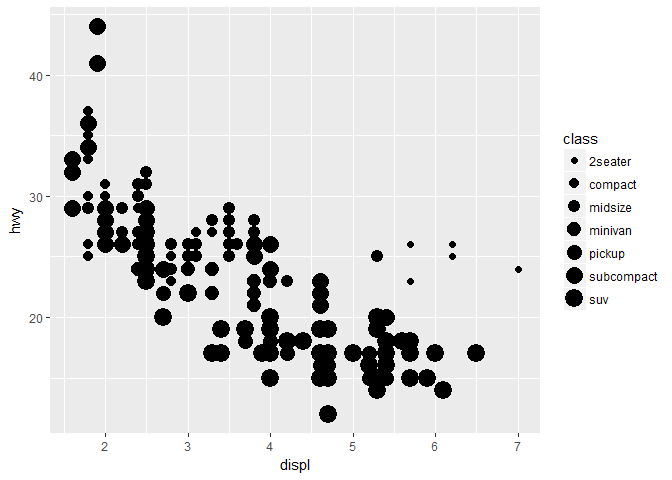
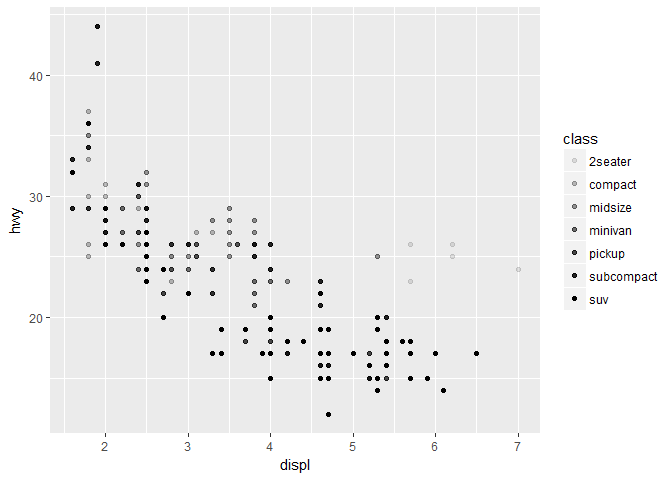
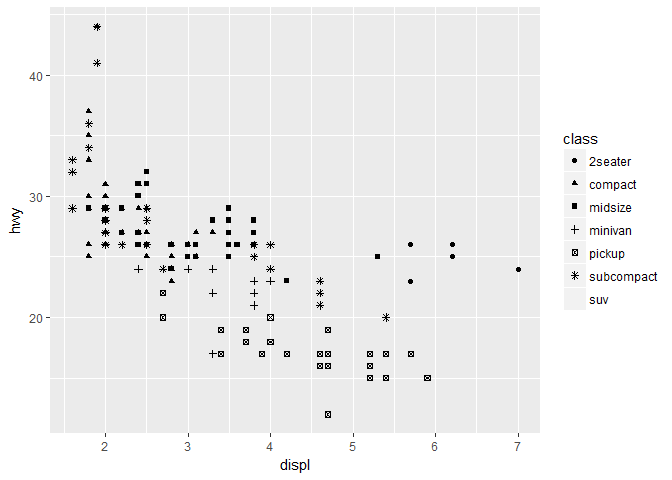
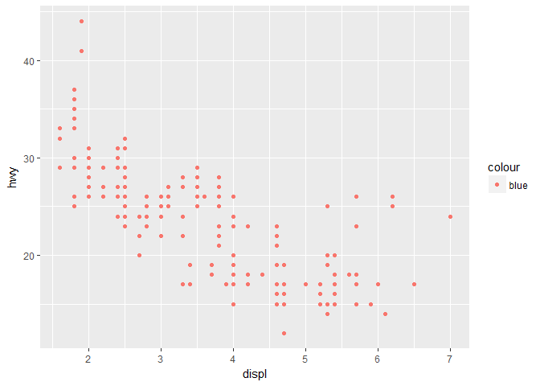
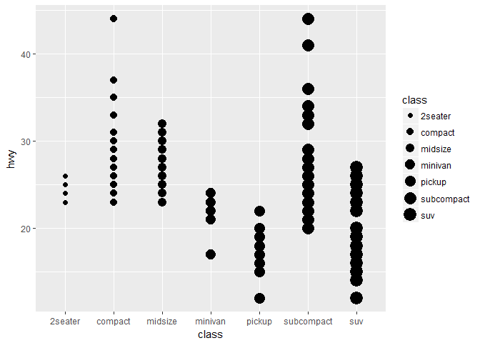
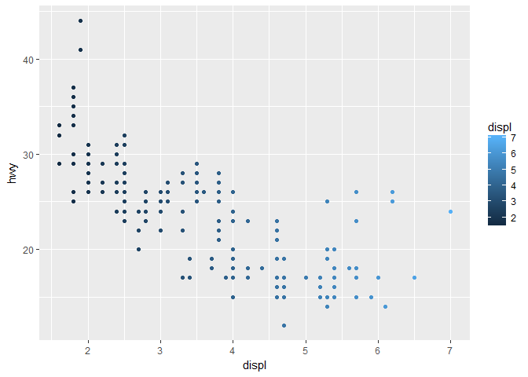
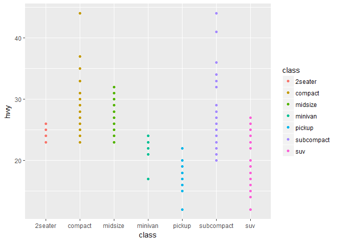
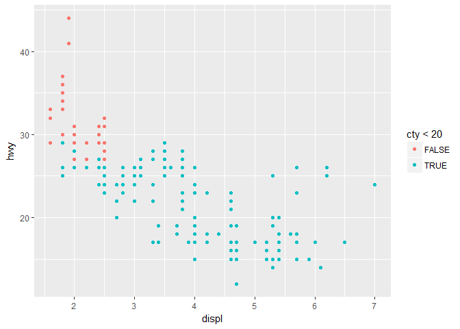
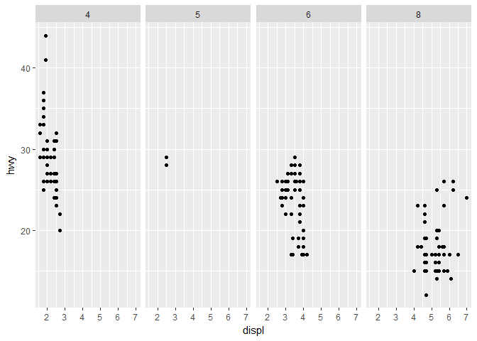
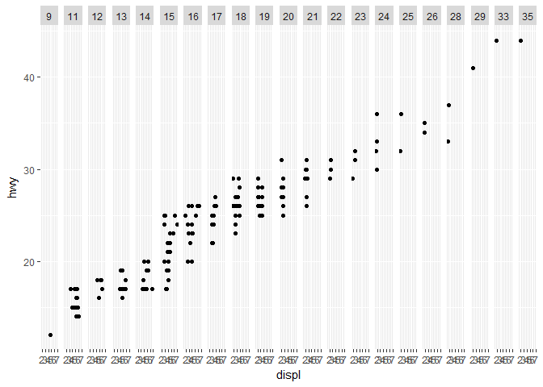

# R-club-Apr-26
Chunmei Li  
042417  
install.packages

```r
#learning ggplot2
#install.packages("tidyverse")
library(tidyverse)
```

```
## Warning: package 'tidyverse' was built under R version 3.3.3
```

```
## Loading tidyverse: ggplot2
## Loading tidyverse: tibble
## Loading tidyverse: tidyr
## Loading tidyverse: readr
## Loading tidyverse: purrr
## Loading tidyverse: dplyr
```

```
## Warning: package 'ggplot2' was built under R version 3.3.3
```

```
## Warning: package 'tibble' was built under R version 3.3.2
```

```
## Warning: package 'tidyr' was built under R version 3.3.3
```

```
## Warning: package 'readr' was built under R version 3.3.3
```

```
## Warning: package 'purrr' was built under R version 3.3.3
```

```
## Warning: package 'dplyr' was built under R version 3.3.3
```

```
## Conflicts with tidy packages ----------------------------------------------
```

```
## filter(): dplyr, stats
## lag():    dplyr, stats
```

```r
#use data frame mpg
mpg
```

```
## # A tibble: 234 × 11
##    manufacturer      model displ  year   cyl      trans   drv   cty   hwy
##           <chr>      <chr> <dbl> <int> <int>      <chr> <chr> <int> <int>
## 1          audi         a4   1.8  1999     4   auto(l5)     f    18    29
## 2          audi         a4   1.8  1999     4 manual(m5)     f    21    29
## 3          audi         a4   2.0  2008     4 manual(m6)     f    20    31
## 4          audi         a4   2.0  2008     4   auto(av)     f    21    30
## 5          audi         a4   2.8  1999     6   auto(l5)     f    16    26
## 6          audi         a4   2.8  1999     6 manual(m5)     f    18    26
## 7          audi         a4   3.1  2008     6   auto(av)     f    18    27
## 8          audi a4 quattro   1.8  1999     4 manual(m5)     4    18    26
## 9          audi a4 quattro   1.8  1999     4   auto(l5)     4    16    25
## 10         audi a4 quattro   2.0  2008     4 manual(m6)     4    20    28
## # ... with 224 more rows, and 2 more variables: fl <chr>, class <chr>
```

```r
?mpg
```

```
## starting httpd help server ...
```

```
##  done
```

```r
ggplot(data = mpg) +geom_point(mapping = aes(x = displ, y = hwy))
```

<!-- -->
graphing template
ggplot(data = <DATA>) + <GEOM_FUNCTION>(mapping = aes(<MAPPINGS>))

exercise

```r
ggplot(data = mpg)#empty plots
```

<!-- -->

```r
mtcars
```

```
##                      mpg cyl  disp  hp drat    wt  qsec vs am gear carb
## Mazda RX4           21.0   6 160.0 110 3.90 2.620 16.46  0  1    4    4
## Mazda RX4 Wag       21.0   6 160.0 110 3.90 2.875 17.02  0  1    4    4
## Datsun 710          22.8   4 108.0  93 3.85 2.320 18.61  1  1    4    1
## Hornet 4 Drive      21.4   6 258.0 110 3.08 3.215 19.44  1  0    3    1
## Hornet Sportabout   18.7   8 360.0 175 3.15 3.440 17.02  0  0    3    2
## Valiant             18.1   6 225.0 105 2.76 3.460 20.22  1  0    3    1
## Duster 360          14.3   8 360.0 245 3.21 3.570 15.84  0  0    3    4
## Merc 240D           24.4   4 146.7  62 3.69 3.190 20.00  1  0    4    2
## Merc 230            22.8   4 140.8  95 3.92 3.150 22.90  1  0    4    2
## Merc 280            19.2   6 167.6 123 3.92 3.440 18.30  1  0    4    4
## Merc 280C           17.8   6 167.6 123 3.92 3.440 18.90  1  0    4    4
## Merc 450SE          16.4   8 275.8 180 3.07 4.070 17.40  0  0    3    3
## Merc 450SL          17.3   8 275.8 180 3.07 3.730 17.60  0  0    3    3
## Merc 450SLC         15.2   8 275.8 180 3.07 3.780 18.00  0  0    3    3
## Cadillac Fleetwood  10.4   8 472.0 205 2.93 5.250 17.98  0  0    3    4
## Lincoln Continental 10.4   8 460.0 215 3.00 5.424 17.82  0  0    3    4
## Chrysler Imperial   14.7   8 440.0 230 3.23 5.345 17.42  0  0    3    4
## Fiat 128            32.4   4  78.7  66 4.08 2.200 19.47  1  1    4    1
## Honda Civic         30.4   4  75.7  52 4.93 1.615 18.52  1  1    4    2
## Toyota Corolla      33.9   4  71.1  65 4.22 1.835 19.90  1  1    4    1
## Toyota Corona       21.5   4 120.1  97 3.70 2.465 20.01  1  0    3    1
## Dodge Challenger    15.5   8 318.0 150 2.76 3.520 16.87  0  0    3    2
## AMC Javelin         15.2   8 304.0 150 3.15 3.435 17.30  0  0    3    2
## Camaro Z28          13.3   8 350.0 245 3.73 3.840 15.41  0  0    3    4
## Pontiac Firebird    19.2   8 400.0 175 3.08 3.845 17.05  0  0    3    2
## Fiat X1-9           27.3   4  79.0  66 4.08 1.935 18.90  1  1    4    1
## Porsche 914-2       26.0   4 120.3  91 4.43 2.140 16.70  0  1    5    2
## Lotus Europa        30.4   4  95.1 113 3.77 1.513 16.90  1  1    5    2
## Ford Pantera L      15.8   8 351.0 264 4.22 3.170 14.50  0  1    5    4
## Ferrari Dino        19.7   6 145.0 175 3.62 2.770 15.50  0  1    5    6
## Maserati Bora       15.0   8 301.0 335 3.54 3.570 14.60  0  1    5    8
## Volvo 142E          21.4   4 121.0 109 4.11 2.780 18.60  1  1    4    2
```

```r
nrow(mtcars)#32 rows
```

```
## [1] 32
```

```r
ncol(mtcars)#11 colums
```

```
## [1] 11
```

```r
?mpg#`drv` describe "f = front-wheel drive, r = rear wheel drive, 4 = 4wd"
#scatterplot of `cty` vs `hwy`
ggplot(data = mpg) +geom_point(mapping = aes(x = cty, y = hwy))
```

<!-- -->

```r
#scatterplot of `class` vs `drv`
ggplot(data = mpg) +geom_point(mapping = aes(x = class, y = drv))# because `class` and `drv` are not continuous variables.
```

<!-- -->
the differences by using color, size, alpha, shape

```r
ggplot(data = mpg) + geom_point(mapping = aes(x = displ, y = hwy, color = class))
```

<!-- -->

```r
ggplot(data = mpg) + geom_point(mapping = aes(x = displ, y = hwy, size = class))
```

```
## Warning: Using size for a discrete variable is not advised.
```

<!-- -->

```r
#transparency
ggplot(data = mpg) + geom_point(mapping = aes(x = displ, y = hwy, alpha = class))
```

<!-- -->

```r
#shape
ggplot(data = mpg) + geom_point(mapping = aes(x = displ, y = hwy, shape = class))
```

```
## Warning: The shape palette can deal with a maximum of 6 discrete values
## because more than 6 becomes difficult to discriminate; you have 7.
## Consider specifying shapes manually if you must have them.
```

```
## Warning: Removed 62 rows containing missing values (geom_point).
```

<!-- -->

```r
ggplot(data = mpg) + geom_point(mapping = aes(x = displ, y = hwy), color = "blue")
```

<!-- -->
Exercise 1

```r
ggplot(data = mpg) + geom_point(mapping = aes(x = displ, y = hwy, color = "blue"))
```

<!-- -->

```r
#because to set an aesthetic manually, we should set the aesthetic by name as an argument of geom function, not inside of `aes()`
```
2 manufacturer, model, trans, drv, fl, year and class are categorical, cyl, cty, and hwy are continuous. when the classify of variables is `chr`, the variables are categorical, and when the classify of variable is `int`, `dbl`, or `dbl`, the variables are continous.
3 

```r
ggplot(data = mpg) + geom_point(mapping = aes(x = displ, y = hwy, color = cty))
```

<!-- -->

```r
ggplot(data = mpg) + geom_point(mapping = aes(x = displ, y = hwy, size = cty))
```

<!-- -->

```r
#ggplot(data = mpg) + geom_point(mapping = aes(x = displ, y = hwy, shape = cty))
#`color` and `size` can be used for mapping continous variable with graduated color or size, but `shape` can not be used for mapping continous variable.
```
4 

```r
ggplot(data = mpg) + geom_point(mapping = aes(x = class, y = hwy, size = class))
```

```
## Warning: Using size for a discrete variable is not advised.
```

<!-- -->

```r
ggplot(data = mpg) + geom_point(mapping = aes(x = displ, y = hwy, color = displ))
```

<!-- -->

```r
ggplot(data = mpg) + geom_point(mapping = aes(x = class, y = hwy, color = class))
```

<!-- -->

```r
# it seems that it doesn't matter??? no new information can be revealed
```
5

```r
?geom_point#`stroke` is used to modify the width of the border and works with the shapes with border.
```
6

```r
ggplot(data = mpg) + geom_point(mapping = aes(x = displ, y = hwy, color = cty < 20))
```

<!-- -->

```r
# the plots will be divided into 2 logical groups by 2 different colors.
```

3.5

```r
ggplot(data = mpg) + 
  geom_point(mapping = aes(x = displ, y = hwy)) + 
  facet_wrap(~ class, nrow = 2)
```

<!-- -->

```r
ggplot(data = mpg) + 
  geom_point(mapping = aes(x = displ, y = hwy)) + 
  facet_grid(drv ~ cyl)
```

<!-- -->

```r
ggplot(data = mpg) + 
  geom_point(mapping = aes(x = displ, y = hwy)) + 
  facet_grid(. ~ cyl)
```

<!-- -->
3.5.1 Exercise
1

```r
ggplot(data = mpg) + 
  geom_point(mapping = aes(x = displ, y = hwy)) + 
  facet_grid(. ~ cty)
```

<!-- -->

```r
#plots would be faceted into many grids or wraps.
```
2

```r
ggplot(data = mpg) + 
  geom_point(mapping = aes(x = displ, y = hwy)) + 
  facet_grid(drv ~ cyl)#the empty cells mean no data was recorded under this combination of `drv` and `cyl`.
```

<!-- -->

```r
ggplot(data = mpg) + 
  geom_point(mapping = aes(x = drv, y = cyl))# the empty cells above are corresponding to the empty plots in this plot.
```

<!-- -->
3

```r
ggplot(data = mpg) + 
  geom_point(mapping = aes(x = displ, y = hwy)) +
  facet_grid(drv ~ .)#plot the relationship between `displ` and `hwy` in each `drv` displayed by rows.
```

<!-- -->

```r
ggplot(data = mpg) + 
  geom_point(mapping = aes(x = displ, y = hwy)) +
  facet_grid(. ~ cyl)#plot the relationship between `displ` and `hwy` in each `cyl` displayed by columns.
```

<!-- -->

```r
#`.` means columns or rows are not defined.
```
4 

```r
ggplot(data = mpg) + 
  geom_point(mapping = aes(x = displ, y = hwy)) + 
  facet_wrap(~ class, nrow = 2)
```

<!-- -->

```r
ggplot(data = mpg) + 
  geom_point(mapping = aes(x = displ, y = hwy, color=class))
```

<!-- -->

```r
# the relationship between `displ` and `hwy` in each `class` would be more clear, but the whole relationship between `displ` and `hwy` is not clear.
```
5

```r
?facet_wrap#Number of rows and columns.`as.table` also control the layout of the individual lanes
?facet_grid#number of rows and columns depend on the variables in dataset.
```
6
while using `facet_grid()`, if put the variables with less unique levels, the plots would be faceted into many grids, it would not be useful for analyzing.

