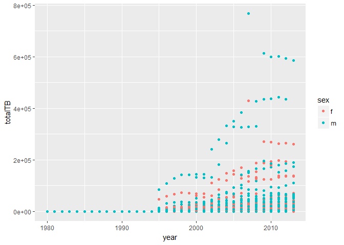

# tidy_data_continue_and_ralational_data_part1
Chunmei Li  
2017年6月19日  


```r
library(tidyverse)
```

```
## Warning: package 'tidyverse' was built under R version 3.3.3
```

```
## Loading tidyverse: ggplot2
## Loading tidyverse: tibble
## Loading tidyverse: tidyr
## Loading tidyverse: readr
## Loading tidyverse: purrr
## Loading tidyverse: dplyr
```

```
## Warning: package 'ggplot2' was built under R version 3.3.3
```

```
## Warning: package 'tidyr' was built under R version 3.3.3
```

```
## Warning: package 'readr' was built under R version 3.3.3
```

```
## Warning: package 'purrr' was built under R version 3.3.3
```

```
## Warning: package 'dplyr' was built under R version 3.3.3
```

```
## Conflicts with tidy packages ----------------------------------------------
```

```
## filter(): dplyr, stats
## lag():    dplyr, stats
```


```r
stocks <- tibble(
  year   = c(2015, 2015, 2015, 2015, 2016, 2016, 2016),
  qtr    = c(   1,    2,    3,    4,    2,    3,    4),
  return = c(1.88, 0.59, 0.35,   NA, 0.92, 0.17, 2.66)
)
stocks
```

```
## # A tibble: 7 × 3
##    year   qtr return
##   <dbl> <dbl>  <dbl>
## 1  2015     1   1.88
## 2  2015     2   0.59
## 3  2015     3   0.35
## 4  2015     4     NA
## 5  2016     2   0.92
## 6  2016     3   0.17
## 7  2016     4   2.66
```


```r
stocks %>% 
  spread(year, return)
```

```
## # A tibble: 4 × 3
##     qtr `2015` `2016`
## * <dbl>  <dbl>  <dbl>
## 1     1   1.88     NA
## 2     2   0.59   0.92
## 3     3   0.35   0.17
## 4     4     NA   2.66
```


```r
stocks %>% 
  spread(year, return) %>% 
  gather(year, return, `2015`:`2016`, na.rm = TRUE)
```

```
## # A tibble: 6 × 3
##     qtr  year return
## * <dbl> <chr>  <dbl>
## 1     1  2015   1.88
## 2     2  2015   0.59
## 3     3  2015   0.35
## 4     2  2016   0.92
## 5     3  2016   0.17
## 6     4  2016   2.66
```


```r
stocks %>% 
  complete(year, qtr)
```

```
## # A tibble: 8 × 3
##    year   qtr return
##   <dbl> <dbl>  <dbl>
## 1  2015     1   1.88
## 2  2015     2   0.59
## 3  2015     3   0.35
## 4  2015     4     NA
## 5  2016     1     NA
## 6  2016     2   0.92
## 7  2016     3   0.17
## 8  2016     4   2.66
```


```r
treatment <- tribble(
  ~ person,           ~ treatment, ~response,
  "Derrick Whitmore", 1,           7,
  NA,                 2,           10,
  NA,                 3,           9,
  "Katherine Burke",  1,           4
)

treatment
```

```
## # A tibble: 4 × 3
##             person treatment response
##              <chr>     <dbl>    <dbl>
## 1 Derrick Whitmore         1        7
## 2             <NA>         2       10
## 3             <NA>         3        9
## 4  Katherine Burke         1        4
```

```r
treatment %>% 
  fill(person)
```

```
## # A tibble: 4 × 3
##             person treatment response
##              <chr>     <dbl>    <dbl>
## 1 Derrick Whitmore         1        7
## 2 Derrick Whitmore         2       10
## 3 Derrick Whitmore         3        9
## 4  Katherine Burke         1        4
```

12.5.1 Exercise

1.

```r
?spread
```

```
## starting httpd help server ...
```

```
##  done
```

```r
#If set, missing values will be replaced with this value. Note that there are two types of missingness in the input: explicit missing values (i.e. NA), and implicit missings, rows that simply aren't present. Both types of missing value will be replaced by fill.
stocks %>% 
  spread(year, return, fill=1)
```

```
## # A tibble: 4 × 3
##     qtr `2015` `2016`
## * <dbl>  <dbl>  <dbl>
## 1     1   1.88   1.00
## 2     2   0.59   0.92
## 3     3   0.35   0.17
## 4     4   1.00   2.66
```


```r
?complete

#A named list that for each variable supplies a single value to use instead of NA for missing combinations.
#list??
stocks %>% 
  complete(year, qtr, fill=list(2))
```

```
## # A tibble: 8 × 3
##    year   qtr return
##   <dbl> <dbl>  <dbl>
## 1  2015     1   1.88
## 2  2015     2   0.59
## 3  2015     3   0.35
## 4  2015     4     NA
## 5  2016     1     NA
## 6  2016     2   0.92
## 7  2016     3   0.17
## 8  2016     4   2.66
```


```r
who
```

```
## # A tibble: 7,240 × 60
##        country  iso2  iso3  year new_sp_m014 new_sp_m1524 new_sp_m2534
##          <chr> <chr> <chr> <int>       <int>        <int>        <int>
## 1  Afghanistan    AF   AFG  1980          NA           NA           NA
## 2  Afghanistan    AF   AFG  1981          NA           NA           NA
## 3  Afghanistan    AF   AFG  1982          NA           NA           NA
## 4  Afghanistan    AF   AFG  1983          NA           NA           NA
## 5  Afghanistan    AF   AFG  1984          NA           NA           NA
## 6  Afghanistan    AF   AFG  1985          NA           NA           NA
## 7  Afghanistan    AF   AFG  1986          NA           NA           NA
## 8  Afghanistan    AF   AFG  1987          NA           NA           NA
## 9  Afghanistan    AF   AFG  1988          NA           NA           NA
## 10 Afghanistan    AF   AFG  1989          NA           NA           NA
## # ... with 7,230 more rows, and 53 more variables: new_sp_m3544 <int>,
## #   new_sp_m4554 <int>, new_sp_m5564 <int>, new_sp_m65 <int>,
## #   new_sp_f014 <int>, new_sp_f1524 <int>, new_sp_f2534 <int>,
## #   new_sp_f3544 <int>, new_sp_f4554 <int>, new_sp_f5564 <int>,
## #   new_sp_f65 <int>, new_sn_m014 <int>, new_sn_m1524 <int>,
## #   new_sn_m2534 <int>, new_sn_m3544 <int>, new_sn_m4554 <int>,
## #   new_sn_m5564 <int>, new_sn_m65 <int>, new_sn_f014 <int>,
## #   new_sn_f1524 <int>, new_sn_f2534 <int>, new_sn_f3544 <int>,
## #   new_sn_f4554 <int>, new_sn_f5564 <int>, new_sn_f65 <int>,
## #   new_ep_m014 <int>, new_ep_m1524 <int>, new_ep_m2534 <int>,
## #   new_ep_m3544 <int>, new_ep_m4554 <int>, new_ep_m5564 <int>,
## #   new_ep_m65 <int>, new_ep_f014 <int>, new_ep_f1524 <int>,
## #   new_ep_f2534 <int>, new_ep_f3544 <int>, new_ep_f4554 <int>,
## #   new_ep_f5564 <int>, new_ep_f65 <int>, newrel_m014 <int>,
## #   newrel_m1524 <int>, newrel_m2534 <int>, newrel_m3544 <int>,
## #   newrel_m4554 <int>, newrel_m5564 <int>, newrel_m65 <int>,
## #   newrel_f014 <int>, newrel_f1524 <int>, newrel_f2534 <int>,
## #   newrel_f3544 <int>, newrel_f4554 <int>, newrel_f5564 <int>,
## #   newrel_f65 <int>
```


```r
who1 <- who %>% 
  gather(new_sp_m014:newrel_f65, key = "key", value = "cases", na.rm = TRUE)
who1
```

```
## # A tibble: 76,046 × 6
##        country  iso2  iso3  year         key cases
## *        <chr> <chr> <chr> <int>       <chr> <int>
## 1  Afghanistan    AF   AFG  1997 new_sp_m014     0
## 2  Afghanistan    AF   AFG  1998 new_sp_m014    30
## 3  Afghanistan    AF   AFG  1999 new_sp_m014     8
## 4  Afghanistan    AF   AFG  2000 new_sp_m014    52
## 5  Afghanistan    AF   AFG  2001 new_sp_m014   129
## 6  Afghanistan    AF   AFG  2002 new_sp_m014    90
## 7  Afghanistan    AF   AFG  2003 new_sp_m014   127
## 8  Afghanistan    AF   AFG  2004 new_sp_m014   139
## 9  Afghanistan    AF   AFG  2005 new_sp_m014   151
## 10 Afghanistan    AF   AFG  2006 new_sp_m014   193
## # ... with 76,036 more rows
```


```r
who1 %>% 
  count(key)
```

```
## # A tibble: 56 × 2
##             key     n
##           <chr> <int>
## 1   new_ep_f014  1032
## 2  new_ep_f1524  1021
## 3  new_ep_f2534  1021
## 4  new_ep_f3544  1021
## 5  new_ep_f4554  1017
## 6  new_ep_f5564  1017
## 7    new_ep_f65  1014
## 8   new_ep_m014  1038
## 9  new_ep_m1524  1026
## 10 new_ep_m2534  1020
## # ... with 46 more rows
```


```r
who2 <- who1 %>% 
  mutate(key = stringr::str_replace(key, "newrel", "new_rel"))
who2
```

```
## # A tibble: 76,046 × 6
##        country  iso2  iso3  year         key cases
##          <chr> <chr> <chr> <int>       <chr> <int>
## 1  Afghanistan    AF   AFG  1997 new_sp_m014     0
## 2  Afghanistan    AF   AFG  1998 new_sp_m014    30
## 3  Afghanistan    AF   AFG  1999 new_sp_m014     8
## 4  Afghanistan    AF   AFG  2000 new_sp_m014    52
## 5  Afghanistan    AF   AFG  2001 new_sp_m014   129
## 6  Afghanistan    AF   AFG  2002 new_sp_m014    90
## 7  Afghanistan    AF   AFG  2003 new_sp_m014   127
## 8  Afghanistan    AF   AFG  2004 new_sp_m014   139
## 9  Afghanistan    AF   AFG  2005 new_sp_m014   151
## 10 Afghanistan    AF   AFG  2006 new_sp_m014   193
## # ... with 76,036 more rows
```


```r
who3 <- who2 %>% 
  separate(key, c("new", "type", "sexage"), sep = "_")
who3
```

```
## # A tibble: 76,046 × 8
##        country  iso2  iso3  year   new  type sexage cases
## *        <chr> <chr> <chr> <int> <chr> <chr>  <chr> <int>
## 1  Afghanistan    AF   AFG  1997   new    sp   m014     0
## 2  Afghanistan    AF   AFG  1998   new    sp   m014    30
## 3  Afghanistan    AF   AFG  1999   new    sp   m014     8
## 4  Afghanistan    AF   AFG  2000   new    sp   m014    52
## 5  Afghanistan    AF   AFG  2001   new    sp   m014   129
## 6  Afghanistan    AF   AFG  2002   new    sp   m014    90
## 7  Afghanistan    AF   AFG  2003   new    sp   m014   127
## 8  Afghanistan    AF   AFG  2004   new    sp   m014   139
## 9  Afghanistan    AF   AFG  2005   new    sp   m014   151
## 10 Afghanistan    AF   AFG  2006   new    sp   m014   193
## # ... with 76,036 more rows
```


```r
who3 %>% 
  count(new)
```

```
## # A tibble: 1 × 2
##     new     n
##   <chr> <int>
## 1   new 76046
```

```r
#all are new.
```


```r
who4 <- who3 %>% 
  select(-new, -iso2, -iso3)
who4
```

```
## # A tibble: 76,046 × 5
##        country  year  type sexage cases
## *        <chr> <int> <chr>  <chr> <int>
## 1  Afghanistan  1997    sp   m014     0
## 2  Afghanistan  1998    sp   m014    30
## 3  Afghanistan  1999    sp   m014     8
## 4  Afghanistan  2000    sp   m014    52
## 5  Afghanistan  2001    sp   m014   129
## 6  Afghanistan  2002    sp   m014    90
## 7  Afghanistan  2003    sp   m014   127
## 8  Afghanistan  2004    sp   m014   139
## 9  Afghanistan  2005    sp   m014   151
## 10 Afghanistan  2006    sp   m014   193
## # ... with 76,036 more rows
```


```r
who5 <- who4 %>% 
  separate(sexage, c("sex", "age"), sep = 1)
who5
```

```
## # A tibble: 76,046 × 6
##        country  year  type   sex   age cases
## *        <chr> <int> <chr> <chr> <chr> <int>
## 1  Afghanistan  1997    sp     m   014     0
## 2  Afghanistan  1998    sp     m   014    30
## 3  Afghanistan  1999    sp     m   014     8
## 4  Afghanistan  2000    sp     m   014    52
## 5  Afghanistan  2001    sp     m   014   129
## 6  Afghanistan  2002    sp     m   014    90
## 7  Afghanistan  2003    sp     m   014   127
## 8  Afghanistan  2004    sp     m   014   139
## 9  Afghanistan  2005    sp     m   014   151
## 10 Afghanistan  2006    sp     m   014   193
## # ... with 76,036 more rows
```


```r
who %>%
  gather(code, value, new_sp_m014:newrel_f65, na.rm = TRUE) %>% 
  mutate(code = stringr::str_replace(code, "newrel", "new_rel")) %>%
  separate(code, c("new", "var", "sexage")) %>% 
  select(-new, -iso2, -iso3) %>% 
  separate(sexage, c("sex", "age"), sep = 1)
```

```
## # A tibble: 76,046 × 6
##        country  year   var   sex   age value
## *        <chr> <int> <chr> <chr> <chr> <int>
## 1  Afghanistan  1997    sp     m   014     0
## 2  Afghanistan  1998    sp     m   014    30
## 3  Afghanistan  1999    sp     m   014     8
## 4  Afghanistan  2000    sp     m   014    52
## 5  Afghanistan  2001    sp     m   014   129
## 6  Afghanistan  2002    sp     m   014    90
## 7  Afghanistan  2003    sp     m   014   127
## 8  Afghanistan  2004    sp     m   014   139
## 9  Afghanistan  2005    sp     m   014   151
## 10 Afghanistan  2006    sp     m   014   193
## # ... with 76,036 more rows
```

12.6.1 Exercise

1. don't know.


2. 

```r
who %>%
  gather(code, value, new_sp_m014:newrel_f65, na.rm = TRUE) %>% 
  #mutate(code = stringr::str_replace(code, "newrel", "new_rel")) %>%
  separate(code, c("new", "var", "sexage")) %>% 
  select(-new, -iso2, -iso3) %>% 
  separate(sexage, c("sex", "age"), sep = 1)
```

```
## Warning: Too few values at 2580 locations: 73467, 73468, 73469, 73470,
## 73471, 73472, 73473, 73474, 73475, 73476, 73477, 73478, 73479, 73480,
## 73481, 73482, 73483, 73484, 73485, 73486, ...
```

```
## # A tibble: 76,046 × 6
##        country  year   var   sex   age value
## *        <chr> <int> <chr> <chr> <chr> <int>
## 1  Afghanistan  1997    sp     m   014     0
## 2  Afghanistan  1998    sp     m   014    30
## 3  Afghanistan  1999    sp     m   014     8
## 4  Afghanistan  2000    sp     m   014    52
## 5  Afghanistan  2001    sp     m   014   129
## 6  Afghanistan  2002    sp     m   014    90
## 7  Afghanistan  2003    sp     m   014   127
## 8  Afghanistan  2004    sp     m   014   139
## 9  Afghanistan  2005    sp     m   014   151
## 10 Afghanistan  2006    sp     m   014   193
## # ... with 76,036 more rows
```

```r
#warning message
who %>%
  gather(code, value, new_sp_m014:newrel_f65, na.rm = TRUE) %>% 
  #mutate(code = stringr::str_replace(code, "newrel", "new_rel")) %>%
  separate(code, c("new", "var", "sexage")) %>% 
  filter(new=="newrel")
```

```
## Warning: Too few values at 2580 locations: 73467, 73468, 73469, 73470,
## 73471, 73472, 73473, 73474, 73475, 73476, 73477, 73478, 73479, 73480,
## 73481, 73482, 73483, 73484, 73485, 73486, ...
```

```
## # A tibble: 2,580 × 8
##                country  iso2  iso3  year    new   var sexage value
##                  <chr> <chr> <chr> <int>  <chr> <chr>  <chr> <int>
## 1          Afghanistan    AF   AFG  2013 newrel  m014   <NA>  1705
## 2              Albania    AL   ALB  2013 newrel  m014   <NA>    14
## 3              Algeria    DZ   DZA  2013 newrel  m014   <NA>    25
## 4              Andorra    AD   AND  2013 newrel  m014   <NA>     0
## 5               Angola    AO   AGO  2013 newrel  m014   <NA>   486
## 6             Anguilla    AI   AIA  2013 newrel  m014   <NA>     0
## 7  Antigua and Barbuda    AG   ATG  2013 newrel  m014   <NA>     1
## 8            Argentina    AR   ARG  2013 newrel  m014   <NA>   462
## 9              Armenia    AM   ARM  2013 newrel  m014   <NA>    25
## 10           Australia    AU   AUS  2013 newrel  m014   <NA>    28
## # ... with 2,570 more rows
```


3.


```r
select(who3, country, iso2, iso3)
```

```
## # A tibble: 76,046 × 3
##        country  iso2  iso3
## *        <chr> <chr> <chr>
## 1  Afghanistan    AF   AFG
## 2  Afghanistan    AF   AFG
## 3  Afghanistan    AF   AFG
## 4  Afghanistan    AF   AFG
## 5  Afghanistan    AF   AFG
## 6  Afghanistan    AF   AFG
## 7  Afghanistan    AF   AFG
## 8  Afghanistan    AF   AFG
## 9  Afghanistan    AF   AFG
## 10 Afghanistan    AF   AFG
## # ... with 76,036 more rows
```

```r
#??
```

4.


```r
who5 %>%
  group_by(country, year, sex) %>%
  summarise(totalTB=sum(cases)) %>%
  ggplot(
    
  )+geom_point(aes(x=year, y=totalTB, color=sex))
```

<!-- -->


```r
library(tidyverse)
library(nycflights13)
```

```
## Warning: package 'nycflights13' was built under R version 3.3.3
```

13.2 Exercise

1.

name of each plane, tailnum;
origin and dest

combine flights with planes and airports.

2. 

origin in weather is connected with faa in airpors.

3.

the year month day of origin and dest in flights are included in year month day of locations weather.

4.

the special dates are connected with year month day in flights.
