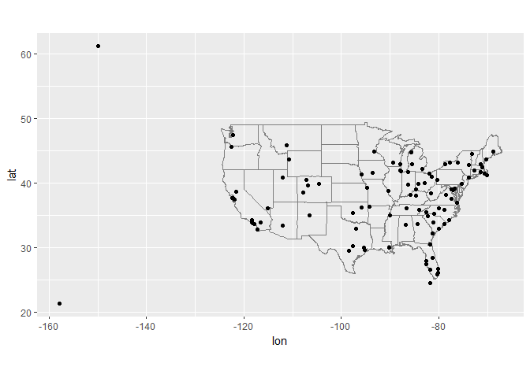
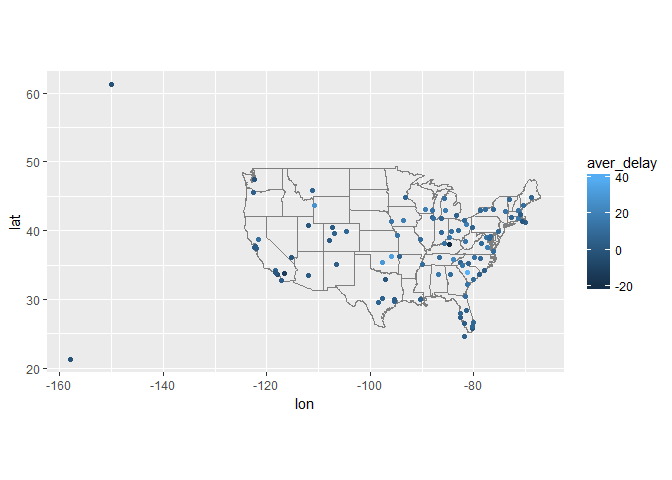
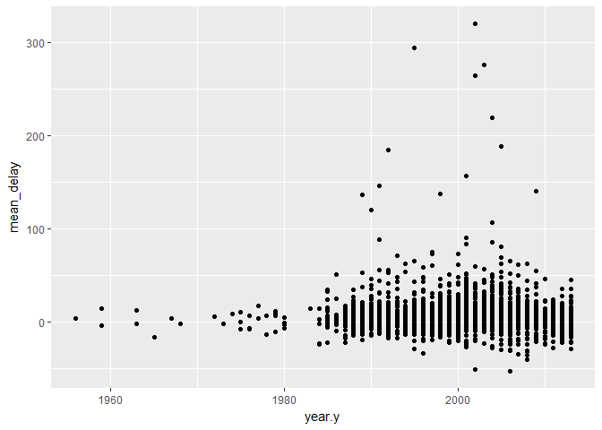
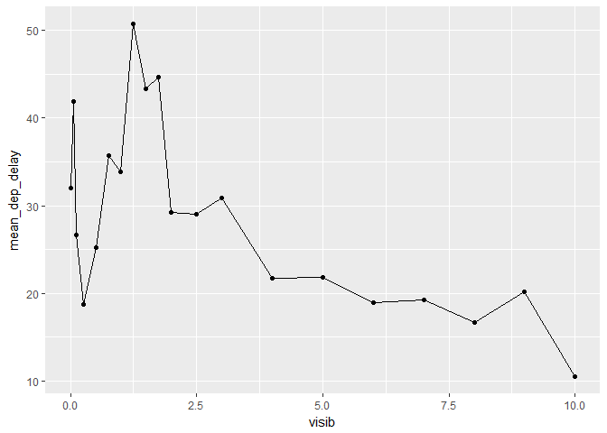
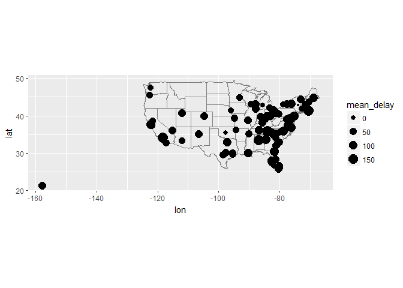

# R-club-Jun-28
Chunmei Li  
2017年6月27日  

```r
memory.limit(size=30000)
```

```
## [1] 30000
```


```r
library(tidyverse)
```

```
## Warning: package 'tidyverse' was built under R version 3.3.3
```

```
## Loading tidyverse: ggplot2
## Loading tidyverse: tibble
## Loading tidyverse: tidyr
## Loading tidyverse: readr
## Loading tidyverse: purrr
## Loading tidyverse: dplyr
```

```
## Warning: package 'ggplot2' was built under R version 3.3.3
```

```
## Warning: package 'tidyr' was built under R version 3.3.3
```

```
## Warning: package 'readr' was built under R version 3.3.3
```

```
## Warning: package 'purrr' was built under R version 3.3.3
```

```
## Warning: package 'dplyr' was built under R version 3.3.3
```

```
## Conflicts with tidy packages ----------------------------------------------
```

```
## filter(): dplyr, stats
## lag():    dplyr, stats
```

```r
library(nycflights13)
```

```
## Warning: package 'nycflights13' was built under R version 3.3.3
```


```r
planes
```

```
## # A tibble: 3,322 × 9
##    tailnum  year                    type     manufacturer     model
##      <chr> <int>                   <chr>            <chr>     <chr>
## 1   N10156  2004 Fixed wing multi engine          EMBRAER EMB-145XR
## 2   N102UW  1998 Fixed wing multi engine AIRBUS INDUSTRIE  A320-214
## 3   N103US  1999 Fixed wing multi engine AIRBUS INDUSTRIE  A320-214
## 4   N104UW  1999 Fixed wing multi engine AIRBUS INDUSTRIE  A320-214
## 5   N10575  2002 Fixed wing multi engine          EMBRAER EMB-145LR
## 6   N105UW  1999 Fixed wing multi engine AIRBUS INDUSTRIE  A320-214
## 7   N107US  1999 Fixed wing multi engine AIRBUS INDUSTRIE  A320-214
## 8   N108UW  1999 Fixed wing multi engine AIRBUS INDUSTRIE  A320-214
## 9   N109UW  1999 Fixed wing multi engine AIRBUS INDUSTRIE  A320-214
## 10  N110UW  1999 Fixed wing multi engine AIRBUS INDUSTRIE  A320-214
## # ... with 3,312 more rows, and 4 more variables: engines <int>,
## #   seats <int>, speed <int>, engine <chr>
```


```r
flights
```

```
## # A tibble: 336,776 × 19
##     year month   day dep_time sched_dep_time dep_delay arr_time
##    <int> <int> <int>    <int>          <int>     <dbl>    <int>
## 1   2013     1     1      517            515         2      830
## 2   2013     1     1      533            529         4      850
## 3   2013     1     1      542            540         2      923
## 4   2013     1     1      544            545        -1     1004
## 5   2013     1     1      554            600        -6      812
## 6   2013     1     1      554            558        -4      740
## 7   2013     1     1      555            600        -5      913
## 8   2013     1     1      557            600        -3      709
## 9   2013     1     1      557            600        -3      838
## 10  2013     1     1      558            600        -2      753
## # ... with 336,766 more rows, and 12 more variables: sched_arr_time <int>,
## #   arr_delay <dbl>, carrier <chr>, flight <int>, tailnum <chr>,
## #   origin <chr>, dest <chr>, air_time <dbl>, distance <dbl>, hour <dbl>,
## #   minute <dbl>, time_hour <dttm>
```


```r
planes %>% 
  count(tailnum) %>% 
  filter(n > 1)
```

```
## # A tibble: 0 × 2
## # ... with 2 variables: tailnum <chr>, n <int>
```


```r
weather %>% 
  count(year, month, day, hour, origin) %>% 
  filter(n > 1)
```

```
## Source: local data frame [0 x 6]
## Groups: year, month, day, hour [0]
## 
## # ... with 6 variables: year <dbl>, month <dbl>, day <int>, hour <int>,
## #   origin <chr>, n <int>
```


```r
flights %>% 
  count(year, month, day, flight) %>% 
  filter(n > 1)
```

```
## Source: local data frame [29,768 x 5]
## Groups: year, month, day [365]
## 
##     year month   day flight     n
##    <int> <int> <int>  <int> <int>
## 1   2013     1     1      1     2
## 2   2013     1     1      3     2
## 3   2013     1     1      4     2
## 4   2013     1     1     11     3
## 5   2013     1     1     15     2
## 6   2013     1     1     21     2
## 7   2013     1     1     27     4
## 8   2013     1     1     31     2
## 9   2013     1     1     32     2
## 10  2013     1     1     35     2
## # ... with 29,758 more rows
```


```r
flights %>% 
  count(year, month, day, tailnum) %>% 
  filter(n > 1)
```

```
## Source: local data frame [64,928 x 5]
## Groups: year, month, day [365]
## 
##     year month   day tailnum     n
##    <int> <int> <int>   <chr> <int>
## 1   2013     1     1  N0EGMQ     2
## 2   2013     1     1  N11189     2
## 3   2013     1     1  N11536     2
## 4   2013     1     1  N11544     3
## 5   2013     1     1  N11551     2
## 6   2013     1     1  N12540     2
## 7   2013     1     1  N12567     2
## 8   2013     1     1  N13123     2
## 9   2013     1     1  N13538     3
## 10  2013     1     1  N13566     3
## # ... with 64,918 more rows
```

13.3.1 Exercise

1.

```r
flights %>%
  mutate(flights_No = row_number())
```

```
## # A tibble: 336,776 × 20
##     year month   day dep_time sched_dep_time dep_delay arr_time
##    <int> <int> <int>    <int>          <int>     <dbl>    <int>
## 1   2013     1     1      517            515         2      830
## 2   2013     1     1      533            529         4      850
## 3   2013     1     1      542            540         2      923
## 4   2013     1     1      544            545        -1     1004
## 5   2013     1     1      554            600        -6      812
## 6   2013     1     1      554            558        -4      740
## 7   2013     1     1      555            600        -5      913
## 8   2013     1     1      557            600        -3      709
## 9   2013     1     1      557            600        -3      838
## 10  2013     1     1      558            600        -2      753
## # ... with 336,766 more rows, and 13 more variables: sched_arr_time <int>,
## #   arr_delay <dbl>, carrier <chr>, flight <int>, tailnum <chr>,
## #   origin <chr>, dest <chr>, air_time <dbl>, distance <dbl>, hour <dbl>,
## #   minute <dbl>, time_hour <dttm>, flights_No <int>
```
2.

```r
Lahman::Batting
```

```
##         playerID yearID stint teamID lgID   G  AB   R   H X2B X3B HR RBI
## 1      abercda01   1871     1    TRO   NA   1   4   0   0   0   0  0   0
## 2       addybo01   1871     1    RC1   NA  25 118  30  32   6   0  0  13
## 3      allisar01   1871     1    CL1   NA  29 137  28  40   4   5  0  19
## 4      allisdo01   1871     1    WS3   NA  27 133  28  44  10   2  2  27
## 5      ansonca01   1871     1    RC1   NA  25 120  29  39  11   3  0  16
## 6      armstbo01   1871     1    FW1   NA  12  49   9  11   2   1  0   5
## 7      barkeal01   1871     1    RC1   NA   1   4   0   1   0   0  0   2
## 8      barnero01   1871     1    BS1   NA  31 157  66  63  10   9  0  34
## 9      barrebi01   1871     1    FW1   NA   1   5   1   1   1   0  0   1
## 10     barrofr01   1871     1    BS1   NA  18  86  13  13   2   1  0  11
## 11      bassjo01   1871     1    CL1   NA  22  89  18  27   1  10  3  18
## 12     battijo01   1871     1    CL1   NA   1   3   0   0   0   0  0   0
## 13     bealsto01   1871     1    WS3   NA  10  36   6   7   0   0  0   1
## 14     beaveed01   1871     1    TRO   NA   3  15   7   6   0   0  0   5
## 15     bechtge01   1871     1    PH1   NA  20  94  24  33   9   1  1  21
## 16     bellast01   1871     1    TRO   NA  29 128  26  32   3   3  0  23
## 17     berkena01   1871     1    PH1   NA   1   4   0   0   0   0  0   0
## 18     berryto01   1871     1    PH1   NA   1   4   0   1   0   0  0   0
## 19     berthha01   1871     1    WS3   NA  17  73  17  17   1   1  0   8
## 20     biermch01   1871     1    FW1   NA   1   2   0   0   0   0  0   0
## 21      birdge01   1871     1    RC1   NA  25 106  19  28   2   5  0  13
## 22     birdsda01   1871     1    BS1   NA  29 152  51  46   3   3  0  24
## 23     brainas01   1871     1    WS3   NA  30 134  24  30   4   0  0  21
## 24     brannmi01   1871     1    CH1   NA   3  14   2   1   0   0  0   0
## 25     burrohe01   1871     1    WS3   NA  12  63  11  15   2   3  1  14
## 26     careyto01   1871     1    FW1   NA  19  87  16  20   2   0  0  10
## 27     carleji01   1871     1    CL1   NA  29 127  31  32   8   1  0  18
## 28      conefr01   1871     1    BS1   NA  19  77  17  20   3   1  0  16
## 29     connone01   1871     1    TRO   NA   7  33   6   7   0   0  0   2
## 30     cravebi01   1871     1    TRO   NA  27 118  26  38   8   1  0  26
## 31     cuthbne01   1871     1    PH1   NA  28 150  47  37   7   5  3  30
## 32     deaneha01   1871     1    FW1   NA   6  22   3   4   0   1  0   2
## 33     donnepe01   1871     1    FW1   NA   9  34   7   7   1   1  0   3
## 34     duffyed01   1871     1    CH1   NA  26 121  30  28   5   0  0  15
## 35     eggleda01   1871     1    NY2   NA  33 147  37  47   7   3  0  18
## 36     ewellge01   1871     1    CL1   NA   1   3   0   0   0   0  0   0
## 37     fergubo01   1871     1    NY2   NA  33 158  30  38   6   1  0  25
## 38     fishech01   1871     1    RC1   NA  25 123  24  28   3   3  1  22
## 39     fislewe01   1871     1    PH1   NA  28 147  43  41   8   2  0  16
## 40     fleetfr01   1871     1    NY2   NA   1   6   1   2   0   0  0   1
## 41     flowedi01   1871     1    TRO   NA  21 105  39  33   5   4  0  18
## 42     flynncl01   1871     1    TRO   NA  29 142  43  48   6   1  0  27
## 43     foleyto01   1871     1    CH1   NA  18  84  18  22   3   1  0  13
## 44     foranji01   1871     1    FW1   NA  19  89  21  31   1   3  1  18
## 45     forceda01   1871     1    WS3   NA  32 162  45  45   9   4  0  29
## 46     fulmech01   1871     1    RC1   NA  16  63  11  17   1   3  0   3
## 47     glennjo01   1871     1    WS3   NA  26 120  25  37   3   2  0  21
## 48     goldswa01   1871     1    FW1   NA  19  88   8  18   1   0  0  12
## 49     gouldch01   1871     1    BS1   NA  31 151  38  43   9   2  2  32
## 50      hallge01   1871     1    WS3   NA  32 136  31  40   3   3  2  17
## 51     halliji01   1871     1    FW1   NA   5  25   7   5   0   0  0   2
## 52       hamra01   1871     1    RC1   NA  25 113  25  28   4   0  0  12
## 53     hastisc01   1871     1    RC1   NA  25 118  27  30   6   4  0  20
## 54     hatfijo01   1871     1    NY2   NA  33 168  41  43   3   2  0  22
## 55     heubege01   1871     1    PH1   NA  17  75  18  23   4   2  0  13
## 56     highadi01   1871     1    NY2   NA  21  94  21  34   3   1  0   9
## 57     hodesch01   1871     1    CH1   NA  28 130  32  36   4   1  2  25
## 58     jackssa01   1871     1    BS1   NA  16  76  17  17   5   3  0  11
## 59     johnsca01   1871     1    CL1   NA  16  67  10  15   1   0  0   7
## 60     kellybi01   1871     1    FW1   NA  18  67  16  15   1   1  0   7
## 61     kimbage01   1871     1    CL1   NA  29 131  18  25   1   0  0   9
## 62      kingma01   1871     1    CH1   NA  20 101  23  21   1   0  2  16
## 63      kingst01   1871     1    TRO   NA  29 144  45  57  10   6  0  34
## 64     kohlehe01   1871     1    FW1   NA   3  12   0   2   1   0  0   1
## 65     lennobi01   1871     1    FW1   NA  12  48   5  11   3   0  0   5
## 66     leonaan01   1871     1    WS3   NA  31 148  33  43   8   3  0  30
## 67      mackde01   1871     1    RC1   NA  25 122  34  30   7   1  0  17
## 68     malonfe01   1871     1    PH1   NA  27 134  33  46   7   1  1  33
## 69     mathebo01   1871     1    FW1   NA  19  89  15  24   3   1  0  10
## 70     mcatebu01   1871     1    CH1   NA  26 135  34  37   8   2  0  10
## 71     mcbridi01   1871     1    PH1   NA  25 132  36  31   3   0  0  17
## 72     mcderjo01   1871     1    FW1   NA   2   8   3   2   0   0  0   1
## 73     mcgeami01   1871     1    TRO   NA  29 148  42  39   4   0  0  12
## 74     mcmuljo01   1871     1    TRO   NA  29 136  38  38   0   5  0  32
## 75     mcveyca01   1871     1    BS1   NA  29 153  43  66   9   5  0  43
## 76     meyerle01   1871     1    PH1   NA  26 130  45  64   9   3  4  40
## 77     millsch01   1871     1    NY2   NA  32 146  27  36   4   3  0  22
## 78     millsev01   1871     1    WS3   NA  32 157  38  43   6   4  1  24
## 79     minched01   1871     1    FW1   NA   9  36   4   8   0   0  0   5
## 80     nortofr01   1871     1    WS3   NA   1   1   0   0   0   0  0   0
## 81     paborch01   1871     1    CL1   NA  29 142  24  42   2   4  0  18
## 82     patteda01   1871     1    NY2   NA  32 151  31  31   2   0  0  13
## 83     pearcdi01   1871     1    NY2   NA  33 163  31  44   5   0  0  20
## 84     phelpne01   1871     1    FW1   NA   1   3   0   0   0   0  0   0
## 85      pikeli01   1871     1    TRO   NA  28 130  43  49  10   7  4  39
## 86     pinkhed01   1871     1    CH1   NA  24  95  27  25   5   5  1  17
## 87     prattal01   1871     1    CL1   NA  29 130  31  34   6   8  0  20
## 88     prattto01   1871     1    PH1   NA   1   6   2   2   0   0  0   1
## 89     questjo01   1871     1    CL1   NA   3  13   1   3   1   0  0   2
## 90     quinnpa02   1871     1    FW1   NA   5  17   8   4   0   0  0   2
## 91     radcljo01   1871     1    PH1   NA  28 145  47  44   7   5  0  22
## 92     reachal01   1871     1    PH1   NA  26 133  43  47   7   6  0  34
## 93     sagerpo01   1871     1    RC1   NA   8  39   9  11   0   0  0   5
## 94     schafha01   1871     1    BS1   NA  31 149  38  42   7   5  0  28
## 95     selmafr01   1871     1    FW1   NA  14  65  14  15   3   0  1  10
## 96     senseco01   1871     1    PH1   NA  25 127  38  41   5   2  0  23
## 97     simmojo01   1871     1    CH1   NA  27 129  29  28   6   1  0  17
## 98     smithch01   1871     1    NY2   NA  14  72  15  19   2   1  0   5
## 99     spaldal01   1871     1    BS1   NA  31 144  43  39  10   1  1  31
## 100    startjo01   1871     1    NY2   NA  33 161  35  58   5   1  1  34
## 101    stearbi01   1871     1    WS3   NA   2   9   1   0   0   0  0   1
## 102    stirega01   1871     1    RC1   NA  25 110  23  30   4   6  2  24
## 103    suttoez01   1871     1    CL1   NA  29 128  35  45   3   7  3  23
## 104    sweasch01   1871     1    WS3   NA   5  19   5   4   1   0  0   4
## 105    treacfr01   1871     1    CH1   NA  25 124  39  42   7   5  4  33
## 106    waterfr01   1871     1    WS3   NA  32 158  46  50   7   4  0  17
## 107    whitede01   1871     1    CL1   NA  29 146  40  47   6   5  1  21
## 108    whiteel01   1871     1    CL1   NA  15  70  13  18   2   0  0   9
## 109    whitewa01   1871     1    WS3   NA   1   4   0   0   0   0  0   0
## 110    woltery01   1871     1    NY2   NA  32 138  33  51   6   9  0  44
## 111     woodji01   1871     1    CH1   NA  28 135  45  51  10   6  1  29
## 112    wrighge01   1871     1    BS1   NA  16  80  33  33   7   5  0  11
## 113    wrighha01   1871     1    BS1   NA  31 147  42  44   5   2  0  26
## 114     yorkto01   1871     1    TRO   NA  29 145  36  37   5   7  2  23
## 115    zettlge01   1871     1    CH1   NA  28 128  23  32   3   0  0  18
## 116    allenha01   1872     1    MID   NA  16  66   8  18   1   0  0   7
## 117    allisan01   1872     1    BR1   NA  24  93  11  15   3   0  0   9
## 118    allisar01   1872     1    CL1   NA  19  87  13  23   4   0  0   8
## 119    allisbi01   1872     1    BR1   NA   5  19   5   3   0   0  0   1
## 120    allisdo01   1872     1    TRO   NA  23 115  23  35   4   2  0  20
## 121    allisdo01   1872     2    BR1   NA  18  79  18  27   2   1  0   5
## 122    ansonca01   1872     1    PH1   NA  46 217  60  90  10   7  0  50
## 123    arnolbi01   1872     1    MID   NA   2   7   2   1   0   0  0   0
## 124    barloto01   1872     1    BR2   NA  37 171  34  53   1   0  0  10
## 125    barnero01   1872     1    BS1   NA  45 229  81  99  28   2  1  44
## 126      barre01   1872     1    BR2   NA   8  34   7   7   1   0  0   2
## 127    barrebi01   1872     1    WS3   NA   1   4   0   0   0   0  0   0
## 128     bassjo01   1872     1    BR2   NA   2   7   0   1   1   0  0   1
## 129    bealsto01   1872     1    WS3   NA   9  36   6  11   1   1  0   5
## 130    beaveed01   1872     1    BR2   NA  10  43   6   9   2   0  0   2
## 131    bechtge01   1872     1    NY2   NA  51 248  60  74  11   2  0  41
## 132    bellast01   1872     1    TRO   NA  23 114  22  30   4   0  0  16
## 133    bentlcy01   1872     1    MID   NA  23 115  25  27   1   2  0  10
## 134      besti01   1872     1    BR1   NA   4  14   0   4   0   0  0   1
## 135    bielaos01   1872     1    WS4   NA  10  46  13   9   0   0  0   3
## 136    birdsda01   1872     1    BS1   NA  16  76  11  16   3   0  0  15
## 137    boothed01   1872     1    MID   NA  24 117  25  38   4   2  0  12
## 138    boothed01   1872     2    BR2   NA  15  62  11  19   4   0  0   8
## 139     boydbi01   1872     1    NY2   NA  35 165  26  44   6   1  1  32
## 140    brainas01   1872     1    WS3   NA   9  43   8  16   3   0  0   6
## 141    brainas01   1872     2    MID   NA   6  25   2   5   0   0  0   0
## 142    brittji01   1872     1    BR2   NA  37 156  26  40   7   0  0  10
## 143    brownol01   1872     1    BR2   NA   4  15   0   2   0   0  0   0
## 144    burdoja01   1872     1    BR2   NA  37 174  26  46   3   0  0  15
## 145    burrohe01   1872     1    WS3   NA   2   7   1   1   0   0  0   0
## 146    buttefr01   1872     1    MID   NA  18  93  19  24   0   0  0   8
## 147    careyto01   1872     1    BL1   NA  42 198  42  57   7   0  2  27
## 148    carleji01   1872     1    CL1   NA   7  38   8  12   1   0  0   4
## 149    clappjo01   1872     1    MID   NA  19  97  28  28   6   1  1  10
## 150    clarede01   1872     1    BR2   NA   2   7   1   1   0   0  0   0
## 151    clintji01   1872     1    BR1   NA  25  97  12  25   3   1  0   6
## 152    coughde01   1872     1    WS4   NA   8  37   5  12   1   0  0   7
## 153    cravebi01   1872     1    BL1   NA  35 179  55  50   3   2  0  23
## 154    cummica01   1872     1    NY2   NA  55 250  36  52   9   3  0  27
## 155    cuthbne01   1872     1    PH1   NA  47 260  83  88  10   0  1  47
## 156    dehlmhe01   1872     1    BR2   NA  37 165  30  36   3   1  0  14
## 157    doschhe01   1872     1    BR2   NA   6  25   4   9   0   0  0   5
## 158    doylejo01   1872     1    WS4   NA   9  41   6  12   1   0  0   9
## 159    eggleda01   1872     1    NY2   NA  56 290  94  98  20   0  0  20
## 160    fergubo01   1872     1    BR2   NA  37 165  33  46   5   0  0  19
## 161    fieldge01   1872     1    MID   NA  18  87  16  21   3   1  0   9
## 162    fishech01   1872     1    BL1   NA  46 225  39  52  10   3  1  36
## 163    fislewe01   1872     1    PH1   NA  47 243  49  85  13   3  0  48
## 164    fleetfr01   1872     1    BR1   NA  13  53  10  13   1   0  0   5
## 165    fletcge01   1872     1    BR1   NA   2   8   1   3   0   0  0   0
## 166    flowedi01   1872     1    PH1   NA   3  15   1   4   0   0  0   4
## 167    flynncl01   1872     1    WS3   NA   9  40   4   9   1   0  0   2
## 168    forceda01   1872     1    TRO   NA  25 130  40  53  11   0  0  16
## 169    forceda01   1872     2    BL1   NA  19  95  29  41   2   2  0  13
## 170    fulmech01   1872     1    NY2   NA  36 166  28  51   1   1  1  14
## 171    galvijo01   1872     1    BR2   NA   1   4   0   0   0   0  0   0
## 172    gedneco01   1872     1    TRO   NA   9  47  14  20   3   0  3  18
## 173    gedneco01   1872     2    BR1   NA  18  71   4  13   1   0  0   7
## 174    glennjo01   1872     1    WS3   NA   9  39   6   6   0   0  0   3
## 175    glennjo01   1872     2    WS4   NA   1   4   0   2   0   0  0   0
## 176    goldswa01   1872     1    WS3   NA   9  41   4  10   2   0  0   5
## 177    gouldch01   1872     1    BS1   NA  45 211  40  54   9   8  0  33
## 178     hallge01   1872     1    BL1   NA  53 250  69  84  17   6  1  37
## 179     hallji01   1872     1    BR2   NA  13  57   9  18   0   1  0   6
## 180    hastisc01   1872     1    CL1   NA  22 115  34  45   4   0  0  16
## 181    hastisc01   1872     2    BL1   NA  13  62  16  19   3   1  0   4
## 182    hatfijo01   1872     1    NY2   NA  56 288  76  92  15   1  1  45
## 183    heubege01   1872     1    WS3   NA   5  23   2   3   0   0  0   1
## 184    hicksna01   1872     1    NY2   NA  56 268  55  82  12   2  0  33
## 185      higby01   1872     1    BR2   NA   1   4   0   0   0   0  0   0
## 186    highadi01   1872     1    BL1   NA  50 245  72  84  10   1  2  38
## 187    hinespa01   1872     1    WS4   NA  11  49   9  12   1   0  0   5
## 188    hodesch01   1872     1    TRO   NA  13  61  17  15   3   0  0  12
## 189    holdsji01   1872     1    CL1   NA  22 110  19  33   5   0  0  11
## 190    holdsji01   1872     2    BR1   NA   2   7   1   2   0   0  0   0
## 191    holliho01   1872     1    WS4   NA   9  44  12  15   1   1  0   6
## 192     huntdi01   1872     1    BR1   NA  11  48  11  15   1   1  0   5
## 193    hurledi01   1872     1    WS3   NA   2   7   0   0   0   0  0   0
## 194    jackssa01   1872     1    BR2   NA   4  12   0   2   0   0  0   0
## 195    jewetna01   1872     1    BR1   NA   2   8   1   1   0   0  0   0
## 196      kavan01   1872     1    BR1   NA   5  23   3   6   1   0  0   2
## 197    kennejo01   1872     1    BR2   NA   5  19   0   0   0   0  0   1
## 198     kingma01   1872     1    TRO   NA   3  11   0   0   0   0  0   1
## 199     kingst01   1872     1    TRO   NA  25 128  33  39   8   0  0  21
## 200    lennobi01   1872     1    WS4   NA  11  54  11  12   1   0  0   6
## 201    leonaan01   1872     1    BS1   NA  46 240  57  84   7   1  2  43
## 202      leutz01   1872     1    BR1   NA   4  12   2   1   0   0  0   0
## 203     lowech01   1872     1    BR2   NA   7  31   1   5   0   0  0   3
## 204     mackde01   1872     1    PH1   NA  47 205  68  59   9   1  0  34
## 205    malonfe01   1872     1    PH1   NA  41 213  46  60   5   3  0  39
## 206    malonma01   1872     1    BR1   NA   5  16   2   5   0   0  0   1
## 207    martial01   1872     1    BR1   NA   4  18   2   5   0   0  0   2
## 208    martiph01   1872     1    TRO   NA  25 117  27  36   2   1  0  14
## 209    martiph01   1872     2    BR1   NA  18  78  13  12   0   0  0   9
## 210    mathebo01   1872     1    BL1   NA  50 223  36  50   1   0  0  21
## 211    mcatebu01   1872     1    TRO   NA  25 129  30  28   3   1  0  15
## 212    mcbridi01   1872     1    PH1   NA  47 258  57  74   6   1  0  37
## 213    mccarfr01   1872     1    MID   NA  19  85  17  28   4   1  0  10
## 214    mcderjo01   1872     1    BR1   NA   7  32   3   9   3   0  0   3
## 215    mcdonja01   1872     1    BR2   NA  15  62   9  16   3   1  0   4
## 216    mcdonja01   1872     2    BR1   NA   1   4   0   0   0   0  0   0
## 217    mcgeami01   1872     1    PH1   NA  47 225  68  81   9   2  0  35
## 218    mcmuljo01   1872     1    NY2   NA  54 237  48  61   6   1  0  25
## 219    mcveyca01   1872     1    BS1   NA  46 237  56  76  10   2  0  41
## 220    meyerle01   1872     1    PH1   NA  27 146  31  48  10   5  1  31
## 221    millejo01   1872     1    WS4   NA   1   4   0   1   0   0  0   0
## 222    millsch01   1872     1    NY2   NA   6  31   6   4   0   0  0   2
## 223    millsev01   1872     1    BL1   NA  55 266  55  79  14   2  0  34
## 224    minched01   1872     1    WS4   NA  11  53   5   6   0   0  0   4
## 225      mulle01   1872     1    CL1   NA   1   4   1   0   0   0  0   0
## 226    murnati01   1872     1    MID   NA  24 117  30  42   1   0  0  13
## 227    nelsoca01   1872     1    TRO   NA   4  20   2   7   0   0  0   4
## 228    nelsoca01   1872     2    BR1   NA  18  76  12  19   2   0  0   8
## 229      orour01   1872     1    BR1   NA   1   4   0   0   0   0  0   0
## 230    orourji01   1872     1    MID   NA  23 101  25  31   4   1  0  12
## 231    paborch01   1872     1    CL1   NA  21  92  12  19   0   0  0   7
## 232    patteda01   1872     1    BR1   NA  12  47   5   9   2   0  0   4
## 233    pearcdi01   1872     1    NY2   NA  44 206  32  40   1   1  1  23
## 234     pikeli01   1872     1    BL1   NA  56 288  67  84  15   5  6  60
## 235    prattal01   1872     1    CL1   NA  16  65  10  18   0   1  0  12
## 236    radcljo01   1872     1    BL1   NA  56 297  71  86  13   4  1  44
## 237    reachal01   1872     1    PH1   NA  24 118  21  23   0   0  0  11
## 238    reachbo01   1872     1    WS3   NA   2   8   1   2   0   0  0   0
## 239    remseja01   1872     1    BR2   NA  37 164  25  40   4   5  0  13
## 240    robinva01   1872     1    WS3   NA   7  30   6   6   0   0  0   4
## 241    rogerfr01   1872     1    BS1   NA  45 204  39  56   7   1  1  28
## 242    schafha01   1872     1    BS1   NA  48 225  51  65  10   4  1  37
## 243    selmafr01   1872     1    WS3   NA   9  42   3  10   2   0  0   1
## 244    senseco01   1872     1    PH1   NA   1   5   2   2   0   0  0   1
## 245    simmojo01   1872     1    CL1   NA  18  90  11  23   5   1  0   9
## 246    snydeji01   1872     1    BR1   NA  26 107  16  28   2   2  0  11
## 247    snydejo01   1872     1    BR1   NA   9  37   2   6   2   0  0   1
## 248    spaldal01   1872     1    BS1   NA  48 237  60  84  11   5  0  47
## 249      spenc01   1872     1    WS4   NA   1   4   1   0   0   0  0   0
## 250    startjo01   1872     1    NY2   NA  55 282  62  76   4   0  0  50
## 251    stearbi01   1872     1    WS4   NA  11  45   8  12   1   0  0   4
## 252    studlse01   1872     1    WS4   NA   5  21   3   2   0   0  0   2
## 253    suttoez01   1872     1    CL1   NA  22 107  30  30   6   1  0  10
## 254    swandma01   1872     1    BR1   NA  14  55   7  11   0   0  0   4
## 255    sweasch01   1872     1    CL1   NA  12  57   8  16   0   0  0   6
## 256    thakeal01   1872     1    BR2   NA  18  78  14  23   2   2  0  15
## 257    tippeji01   1872     1    MID   NA  24 112  23  31   5   1  0  15
## 258    treacfr01   1872     1    PH1   NA  47 236  53  65   7   3  2  29
## 259    waterfr01   1872     1    WS3   NA   9  45  13  17   1   2  0   6
## 260    whitede01   1872     1    CL1   NA  22 109  21  37   2   2  0  22
## 261    whitewa01   1872     1    WS4   NA  10  45   7  13   0   0  0   4
## 262    woltery01   1872     1    CL1   NA  16  69   7  16   1   0  0  11
## 263     woodji01   1872     1    TRO   NA  25 113  40  38  11   4  2  27
## 264     woodji01   1872     2    BR1   NA   7  30  10   6   1   1  0   0
## 265    worthhe01   1872     1    BR2   NA   1   5   1   1   1   0  0   1
## 266    wrighge01   1872     1    BS1   NA  48 255  87  86  16   6  2  32
## 267    wrighha01   1872     1    BS1   NA  48 208  39  52   5   1  0  23
## 268    yeatmbi01   1872     1    WS4   NA   1   4   0   0   0   0  0   0
## 269     yorkto01   1872     1    BL1   NA  51 248  66  66  10   4  1  41
## 270    zettlge01   1872     1    TRO   NA  25 113  25  29   9   0  0  21
## 271    zettlge01   1872     2    BR1   NA   9  34   1   3   0   0  0   1
## 272     addybo01   1873     1    PH2   NA  10  51  12  16   1   0  0  10
## 273     addybo01   1873     2    BS1   NA  31 152  37  54   5   2  1  36
## 274    allisar01   1873     1    ELI   NA  23  99  12  32   2   0  0  11
## 275    allisdo01   1873     1    ELI   NA  19  83  11  24   5   0  0   8
## 276    allisdo01   1873     2    NY2   NA  11  48   6  10   0   0  0   3
## 277    ansonca01   1873     1    PH1   NA  52 254  53 101   9   2  0  36
## 278    atkined01   1873     1    WS5   NA   2   8   2   0   0   0  0   0
## 279    austihe01   1873     1    ELI   NA  23 101  10  25   3   3  0  11
## 280    barloto01   1873     1    BR2   NA  55 271  48  74   0   2  1  14
## 281    barnero01   1873     1    BS1   NA  60 322 125 137  29   8  2  62
## 282    barrebi01   1873     1    BL1   NA   1   4   0   1   0   0  0   0
## 283    battijo01   1873     1    PH1   NA   1   5   4   3   0   0  0   2
## 284    bealsto01   1873     1    WS5   NA  37 169  35  46   9   5  0  24
## 285    bechtge01   1873     1    PH2   NA  53 258  53  63  12   1  1  40
## 286    bellast01   1873     1    NY2   NA   8  32   4   7   2   0  0   3
## 287    bielaos01   1873     1    WS5   NA  38 173  35  49   3   2  0  23
## 288    birdsda01   1873     1    BS1   NA   3  12   4   1   0   0  0   1
## 289    boothed01   1873     1    ELI   NA  18  72  11  21   3   2  0   4
## 290    boothed01   1873     2    BR2   NA  16  69   8  14   3   1  0   8
## 291     boydbi01   1873     1    BR2   NA  50 228  31  63   5   4  1  31
## 292    brainas01   1873     1    BL1   NA  16  69  18  18   1   0  0   8
## 293    brittji01   1873     1    BR2   NA  54 240  29  47   3   0  0  14
## 294    burdoja01   1873     1    BR2   NA  55 245  56  62   7   1  2  36
## 295    campbhu01   1873     1    ELI   NA  20  87   9  13   0   1  0   6
## 296    campbmi02   1873     1    ELI   NA  21  83   9  12   0   0  0   3
## 297    careyto01   1873     1    BL1   NA  56 290  76  97  19   3  1  55
## 298    clappjo01   1873     1    PH1   NA  45 204  36  62  10   2  1  28
## 299    clintji01   1873     1    ELI   NA   9  38   5   9   1   0  0   4
## 300    cranefr01   1873     1    ELI   NA   1   4   0   1   0   0  0   1
## 301    cravebi01   1873     1    BL1   NA  41 196  45  57   9   2  0  28
## 302    cummica01   1873     1    BL1   NA  42 192  30  48   5   0  0  35
## 303    cuthbne01   1873     1    PH2   NA  51 278  78  77   5   3  2  33
## 304    dehlmhe01   1873     1    BR2   NA  54 221  50  52   4   1  0  17
## 305    devliji01   1873     1    PH2   NA  23  99  18  24   4   4  0  10
## 306    donnepe01   1873     1    WS5   NA  30 137  15  35   1   0  0  20
## 307    doschhe01   1873     1    BR2   NA   1   6   1   1   0   0  0   1
## 308    eggleda01   1873     1    NY2   NA  53 268  82  90  13   4  0  34
## 309      eland01   1873     1    BL4   NA   1   3   0   0   0   0  0   0
## 310    farrojo01   1873     1    ELI   NA  12  48   2   8   1   0  0   3
## 311    fergubo01   1873     1    BR2   NA  51 228  36  59   3   5  0  25
## 312    fishech01   1873     1    PH1   NA  51 253  50  66   4   3  1  35
## 313    fislewe01   1873     1    PH1   NA  44 218  44  75  11   4  1  42
## 314    fleetfr01   1873     1    ELI   NA  22  90  11  23   2   0  0  10
## 315    forceda01   1873     1    BL1   NA  49 234  77  86   8   1  0  31
## 316    frencbi01   1873     1    BL4   NA   5  18   3   4   0   0  0   1
## 317    fulmech01   1873     1    PH2   NA  49 236  42  66  11   3  1  38
## 318    gedneco01   1873     1    NY2   NA  53 224  41  60   5   5  1  25
## 319    gerhajo01   1873     1    WS5   NA  13  56   6  12   3   0  0   7
## 320    glennjo01   1873     1    WS5   NA  39 185  39  49   8   2  1  21
## 321    goldswa01   1873     1    BL4   NA   1   4   0   0   0   0  0   0
## 322    greasjo01   1873     1    WS5   NA   7  28   4   4   0   0  0   1
## 323     hallge01   1873     1    BL1   NA  35 168  44  58   6   3  0  30
## 324    hastisc01   1873     1    BL1   NA  30 146  41  41   4   0  0  15
## 325    hatfijo01   1873     1    NY2   NA  52 255  54  78   5   6  2  45
## 326    hicksna01   1873     1    NY2   NA  28 121  12  29   1   2  1  14
## 327    highadi01   1873     1    NY2   NA  49 245  57  77   5   4  0  34
## 328    hinespa01   1873     1    WS5   NA  39 181  33  60   6   3  1  29
## 329    holdsji01   1873     1    NY2   NA  53 233  46  75   4   8  0  28
## 330    holliho01   1873     1    WS5   NA  30 136  25  35   2   2  0  22
## 331    hoopemi01   1873     1    BL4   NA   3  14   3   3   1   0  0   2
## 332    johnsto01   1873     1    BL4   NA   1   4   0   0   0   0  0   0
## 333      jones01   1873     1    BL4   NA   1   4   0   3   0   0  0   1
## 334    kernajo01   1873     1    BL4   NA   2   8   1   3   0   0  0   1
## 335    kesslhe01   1873     1    BR2   NA   1   5   0   1   0   0  0   1
## 336    kohlehe01   1873     1    BL4   NA   6  25   2   3   0   0  0   1
## 337    laughbe01   1873     1    ELI   NA  12  50   3  12   0   0  0   6
## 338    lennobi01   1873     1    BL4   NA   5  19   2   4   0   0  0   2
## 339    leonaan01   1873     1    BS1   NA  58 302  81  95  12   7  0  61
## 340    lovetle01   1873     1    ELI   NA   1   5   1   2   0   0  0   1
## 341     mackde01   1873     1    PH2   NA  48 205  55  60   5   0  0  20
## 342    malonfe01   1873     1    PH2   NA  53 259  59  75  11   2  0  43
## 343    mannija01   1873     1    BS1   NA  32 159  29  43   6   1  0  22
## 344    martiph01   1873     1    NY2   NA  31 140  12  31   1   0  0  14
## 345    mathebo01   1873     1    NY2   NA  52 223  40  43   3   3  0  13
## 346    mcbridi01   1873     1    PH1   NA  49 253  41  71   6   0  0  41
## 347      mcdoo01   1873     1    BL4   NA   1   4   1   0   0   0  0   0
## 348    mcgeami01   1873     1    PH1   NA  52 275  63  83   8   1  0  31
## 349    mcmuljo01   1873     1    PH1   NA  52 227  54  62   7   1  0  29
## 350    mcveyca01   1873     1    BL1   NA  38 192  49  73   4   5  2  34
## 351    meyerle01   1873     1    PH2   NA  48 238  53  83  14   4  3  58
## 352    millsev01   1873     1    BL1   NA  54 263  64  87  19   9  0  57
## 353    murnati01   1873     1    PH1   NA  41 176  53  39   3   0  1  10
## 354    nelsoca01   1873     1    NY2   NA  36 168  28  55   4   1  0  22
## 355    nevinal01   1873     1    ELI   NA  13  53   7  11   1   2  0   2
## 356    orourji01   1873     1    BS1   NA  57 280  79  98  19   3  1  48
## 357    paborch01   1873     1    BR2   NA  55 228  36  82   8   3  0  42
## 358    pearcdi01   1873     1    BR2   NA  55 262  42  72   5   0  1  26
## 359    phelpne01   1873     1    NY2   NA   1   6   0   0   0   0  0   0
## 360     pikeli01   1873     1    BL1   NA  56 286  71  90  14   8  4  50
## 361    popplge01   1873     1    BL4   NA   1   4   0   0   0   0  0   0
## 362    radcljo01   1873     1    BL1   NA  45 245  59  70   7   0  0  33
## 363    reachal01   1873     1    PH1   NA  13  73  13  16   5   1  0   9
## 364    reachbo01   1873     1    WS5   NA   1   5   1   1   0   0  0   0
## 365    remseja01   1873     1    BR2   NA  50 207  29  61   4   6  1  29
## 366    rogerfr01   1873     1    BS1   NA   1   6   1   2   1   0  0   2
## 367     ryanjo01   1873     1    PH2   NA   2   8   1   2   0   0  0   1
## 368      saylo01   1873     1    BL4   NA   3  12   1   2   0   0  0   2
## 369    schafha01   1873     1    BS1   NA  60 295  65  79  12   3  2  46
## 370    selmafr01   1873     1    BL4   NA   1   3   1   1   0   0  0   0
## 371    senseco01   1873     1    PH1   NA  20  86  12  24   1   0  0   8
## 372    sheppjo01   1873     1    BL4   NA   3  11   1   0   0   0  0   0
## 373    simpsma01   1873     1    BL4   NA   4  15   4   2   0   0  0   2
## 374    smithbi01   1873     1    BL4   NA   6  23   2   4   0   0  0   1
## 375    smithjo01   1873     1    BL4   NA   5  19   2   2   0   0  0   1
## 376    snydepo01   1873     1    WS5   NA  28 108  16  21   2   0  0   4
## 377    spaldal01   1873     1    BS1   NA  60 322  83 106  18   2  1  60
## 378    startjo01   1873     1    NY2   NA  53 251  42  67   8   3  1  28
## 379    stearbi01   1873     1    WS5   NA  32 133  22  24   0   0  0   8
## 380    strated01   1873     1    BL4   NA   4  16   2   2   0   0  0   0
## 381    suttoez01   1873     1    PH1   NA  51 242  51  81   7   6  0  33
## 382    swandma01   1873     1    ELI   NA   2   9   1   1   0   0  0   1
## 383    sweasch01   1873     1    BS1   NA   1   4   0   1   0   0  0   0
## 384    treacfr01   1873     1    PH2   NA  51 243  49  62   7   2  1  32
## 385     wallho01   1873     1    WS5   NA   1   4   1   1   0   0  0   0
## 386    waterfr01   1873     1    WS5   NA  15  80  20  28   1   1  0  12
## 387    whitede01   1873     1    BS1   NA  60 310  79 121  15   6  0  66
## 388    whitewa01   1873     1    WS5   NA  39 160  29  43   3   4  0  21
## 389    woltery01   1873     1    ELI   NA   1   4   1   0   0   0  0   0
## 390    woodhre01   1873     1    BL4   NA   1   5   1   0   0   0  0   0
## 391     woodji01   1873     1    PH2   NA  42 209  67  67  11   1  0  27
## 392    wordsfa01   1873     1    ELI   NA  12  42   5  10   0   0  0   3
## 393    wrighge01   1873     1    BS1   NA  59 325  99 126  19   8  3  50
## 394    wrighha01   1873     1    BS1   NA  58 266  57  67  10   4  2  35
## 395     yorkto01   1873     1    BL1   NA  57 277  70  84  10   7  2  49
## 396    zettlge01   1873     1    PH2   NA  51 241  39  50   2   0  0  22
## 397     addybo01   1874     1    HR1   NA  50 213  25  51   9   2  0  23
## 398    allisdo01   1874     1    NY2   NA  65 318  68  90   7   5  0  28
## 399    ansonca01   1874     1    PH1   NA  55 259  51  87   8   3  0  37
## 400    barloto01   1874     1    HR1   NA  32 156  37  46   4   1  0  10
## 401    barnero01   1874     1    BS1   NA  51 259  72  88  12   4  0  41
## 402    barnibi01   1874     1    HR1   NA  45 190  21  35   4   2  0  19
## 403    battijo01   1874     1    PH1   NA  51 226  40  52  11   1  0  27
## 404    bealsto01   1874     1    BS1   NA  19  97  20  19   3   4  0  17
## 405    bechtge01   1874     1    PH2   NA  32 151  29  42   4   5  1  34
## 406    bielaos01   1874     1    BL1   NA  43 187  24  45   0   0  0   8
## 407    boardfr01   1874     1    BL1   NA   1   4   0   1   0   0  0   0
## 408     bondto01   1874     1    BR2   NA  55 245  25  54  10   1  0  20
## 409    boothed01   1874     1    BR2   NA  44 185  24  47   4   3  1  16
## 410     boydbi01   1874     1    HR1   NA  26 117  22  41   8   4  0  20
## 411    bradyst01   1874     1    HR1   NA  27 118  19  37   5   1  0  14
## 412    brainas01   1874     1    BL1   NA  47 196  19  47   3   0  0   8
## 413      brown01   1874     1    BL1   NA   2   9   0   0   0   0  0   0
## 414    burdoja01   1874     1    NY2   NA  61 273  45  75  11   4  1  27
## 415    careyto01   1874     1    NY2   NA  64 286  56  82  10   3  1  39
## 416     carlle01   1874     1    BL1   NA   1   3   0   0   0   0  0   0
## 417    chapmja01   1874     1    BR2   NA  53 242  32  64  10   2  0  25
## 418    clackbo01   1874     1    BR2   NA  33 135  22  23   1   0  0  13
## 419    clappjo01   1874     1    PH1   NA  39 165  46  48   7   4  3  20
## 420    clintji01   1874     1    BR2   NA   2  11   3   2   1   0  0   2
## 421    collida01   1874     1    CH2   NA   3  12   1   1   1   0  0   0
## 422    connete01   1874     1    CH2   NA   1   4   0   0   0   0  0   0
## 423    cravebi01   1874     1    PH2   NA  55 265  68  91  19  11  0  56
## 424    cummica01   1874     1    PH2   NA  54 231  32  52   4   2  0  19
## 425    cuthbne01   1874     1    CH2   NA  58 295  65  79   6   1  2  22
## 426    deaneha01   1874     1    BL1   NA  47 203  29  50   8   1  0  13
## 427    dehlmhe01   1874     1    BR2   NA  53 218  40  49   3   1  0  18
## 428    devliji01   1874     1    CH2   NA  45 203  26  58   5   0  0  27
## 429    donnepe01   1874     1    PH2   NA   6  22   2   5   0   0  0   2
## 430    eggleda01   1874     1    PH2   NA  58 299  70  95  13   8  0  31
## 431    farreja01   1874     1    HR1   NA   3  13   3   5   0   0  0   0
## 432    farrojo01   1874     1    BR2   NA  27 122  16  26   3   0  0  10
## 433    fergubo01   1874     1    BR2   NA  56 245  34  64   4   0  0  18
## 434    fishech01   1874     1    HR1   NA  52 241  28  54   7   0  0  28
## 435    fislewe01   1874     1    PH1   NA  37 180  26  59  12   1  0  22
## 436    fleetfr01   1874     1    BR2   NA  22  97  18  22   0   0  0  10
## 437    forceda01   1874     1    CH2   NA  59 294  61  92   9   0  0  26
## 438    fulmech01   1874     1    PH2   NA  57 258  49  72   3   2  0  37
## 439      gaver01   1874     1    BR2   NA   1   4   1   0   0   0  0   0
## 440    gedneco01   1874     1    PH1   NA  54 222  49  61   4   1  1  34
## 441     geerbi01   1874     1    NY2   NA   2   8   0   2   0   0  0   1
## 442    gerhajo01   1874     1    BL1   NA  14  61  10  19   0   1  0   6
## 443      gilro01   1874     1    CH2   NA   8  38   4   8   1   0  0   7
## 444    glennjo01   1874     1    CH2   NA  55 237  33  67   9   0  0  33
## 445    gouldch01   1874     1    BL1   NA  33 143  20  32   6   0  0  14
## 446     hallge01   1874     1    BS1   NA  47 222  58  64  10   8  1  32
## 447     hallji01   1874     1    BR2   NA   2   9   0   1   0   0  0   0
## 448    hastisc01   1874     1    HR1   NA  52 246  60  80  11   2  0  29
## 449    hatfijo01   1874     1    NY2   NA  63 292  47  66  12   1  0  30
## 450    hicksna01   1874     1    PH2   NA  58 266  51  73   8   1  0  30
## 451    highadi01   1874     1    NY2   NA  65 333  58  87  14   3  1  37
## 452    hinespa01   1874     1    CH2   NA  59 271  47  80  10   2  0  34
## 453    hodesch01   1874     1    BR2   NA  21  81   8  12   3   0  0   7
## 454    holdsji01   1874     1    PH2   NA  57 285  60  97   8   9  0  37
## 455      jones01   1874     1    BL1   NA   2   7   0   1   0   0  0   1
## 456    kesslhe01   1874     1    BR2   NA  14  56   8  17   1   0  0   4
## 457    knowdja01   1874     1    BR2   NA  24  86   8  12   1   1  0   3
## 458    kohlehe01   1874     1    BL1   NA   2   4   0   0   0   0  0   0
## 459    ledwimi01   1874     1    BR2   NA   1   4   1   1   0   0  0   1
## 460    leonaan01   1874     1    BS1   NA  71 339  68 108  18   4  0  51
## 461     mackde01   1874     1    PH2   NA  56 246  48  51   8   4  0  22
## 462    malonfe01   1874     1    CH2   NA  47 223  33  56   5   0  0  29
## 463    mannija01   1874     1    BL1   NA  42 174  32  61   8   2  0  18
## 464    mannija01   1874     2    HR1   NA   1   5   1   1   0   0  0   0
## 465    martial01   1874     1    BR2   NA   7  29   1   4   0   0  0   1
## 466    mathebo01   1874     1    NY2   NA  65 298  46  72   6   1  0  30
## 467    mcbridi01   1874     1    PH1   NA  55 263  30  57   7   1  0  34
## 468    mcgeami01   1874     1    PH1   NA  54 271  61  87  10   2  0  22
## 469    mcgeepa01   1874     1    BR2   NA  16  65   4  11   1   0  0   6
## 470    mckenfr01   1874     1    PH2   NA   1   4   0   0   0   0  0   0
## 471    mcmuljo01   1874     1    PH1   NA  55 260  61  90  10   2  2  32
## 472    mcveyca01   1874     1    BS1   NA  70 343  91 123  21   6  3  71
## 473    meyerle01   1874     1    CH2   NA  53 254  65 100  19   1  1  47
## 474    milleto01   1874     1    PH1   NA   4  16   1   8   0   0  0   5
## 475    millsev01   1874     1    HR1   NA  53 243  39  69   6   1  0  17
## 476    murnati01   1874     1    PH1   NA  21  82  11  17   2   0  0  11
## 477    nelsoca01   1874     1    NY2   NA  65 297  55  73   7   5  0  32
## 478      oneal01   1874     1    HR1   NA   1   3   0   0   0   0  0   0
## 479    orourji01   1874     1    BS1   NA  70 331  82 104  15   8  5  61
## 480    paborch01   1874     1    PH2   NA  17  77  11  17   0   1  0   1
## 481    patteda01   1874     1    NY2   NA   1   5   1   2   0   0  0   2
## 482    pearcdi01   1874     1    BR2   NA  56 255  48  75   1   0  0  25
## 483    peterjo01   1874     1    CH2   NA  55 239  39  69  10   0  1  25
## 484    phelpne01   1874     1    NY2   NA   6  24   5   3   0   0  0   2
## 485     pikeli01   1874     1    HR1   NA  52 234  58  83  22   5  1  51
## 486      quinl01   1874     1    PH2   NA   1   4   0   1   0   0  0   1
## 487    radcljo01   1874     1    PH2   NA  23 103  20  25   7   0  1  14
## 488    reachal01   1874     1    PH1   NA  14  55   8   7   2   0  0   2
## 489     reedhu01   1874     1    BL1   NA   1   4   0   0   0   0  0   0
## 490    remseja01   1874     1    NY2   NA  64 284  52  65   9   3  2  37
## 491    revilhe01   1874     1    BL1   NA   1   4   0   0   0   0  0   0
## 492     ryanjo01   1874     1    BL1   NA  47 182  29  35   8   1  0  19
## 493      saylo01   1874     1    BL1   NA  18  66   4  14   3   0  0   5
## 494    schafha01   1874     1    BS1   NA  71 327  69  87  10   2  1  45
## 495    selmafr01   1874     1    BL1   NA  12  54   9  16   3   2  0   5
## 496    senseco01   1874     1    PH1   NA   5  16   3   3   0   0  0   2
## 497    shaffor01   1874     1    HR1   NA   9  35   6   8   0   0  1   3
## 498    shaffor01   1874     2    NY2   NA   1   5   1   1   0   0  0   0
## 499    smilebi01   1874     1    BL1   NA   2   7   0   0   0   0  0   0
## 500    smithjo01   1874     1    BL1   NA   6  21   1   4   1   0  0   1
## 501     snowch01   1874     1    BR2   NA   1   1   0   1   0   0  0   0
## 502    snydepo01   1874     1    BL1   NA  39 151  24  33   4   0  1  17
## 503    spaldal01   1874     1    BS1   NA  71 362  80 119  13   1  0  54
## 504    startjo01   1874     1    NY2   NA  63 306  67  96  13   3  2  45
## 505    stearbi01   1874     1    HR1   NA  33 132  16  21   1   0  0   9
## 506    suttoez01   1874     1    PH1   NA  55 243  54  71  10   3  0  28
## 507    sweasch01   1874     1    BL1   NA   8  33   2   8   0   0  0   4
## 508    sweasch01   1874     2    BR2   NA  10  44   4   5   1   0  0   3
## 509    tayloza01   1874     1    BL1   NA  13  48   3  12   0   0  0   3
## 510    tippeji01   1874     1    HR1   NA  45 197  36  60   8   0  0  20
## 511    treacfr01   1874     1    CH2   NA  35 148  18  28   5   0  0  12
## 512     westbi01   1874     1    BR2   NA   9  35   4   8   1   0  0   2
## 513    whitede01   1874     1    BS1   NA  70 353  75 106   5   7  3  52
## 514    whitewa01   1874     1    BL1   NA  45 212  21  57   1   0  0  18
## 515       wood01   1874     1    BL1   NA   1   5   0   0   0   0  0   0
## 516    wrighge01   1874     1    BS1   NA  60 313  76 103  10  15  2  44
## 517    wrighha01   1874     1    BS1   NA  40 184  44  58   4   2  2  27
## 518     yorkto01   1874     1    PH2   NA  50 224  36  56   4   7  0  37
## 519    zettlge01   1874     1    CH2   NA  57 244  26  47   7   0  0  18
## 520    abadijo01   1875     1    PH3   NA  11  45   3  10   0   0  0   4
## 521    abadijo01   1875     2    BR2   NA   1   4   1   1   0   0  0   1
## 522     addybo01   1875     1    PH2   NA  69 310  60  80   8   4  0  43
## 523    allisar01   1875     1    WS6   NA  26 112  18  24   3   1  0   3
## 524    allisar01   1875     2    HR1   NA  40 175  26  42   4   1  1  19
## 525    allisdo01   1875     1    HR1   NA  61 269  38  67   7   0  0  21
## 526    ansonca01   1875     1    PH1   NA  69 326  84 106  15   3  0  58
## 527    arundha01   1875     1    BR2   NA   1   4   0   0   0   0  0   0
## 528    banckst01   1875     1    NH1   NA  19  72   3  11   0   0  0   2
## 529    barloto01   1875     1    NH1   NA   1   5   1   1   0   0  0   0
## 530    barloto01   1875     2    BR2   NA   1   4   0   0   0   0  0   0
## 531    barnero01   1875     1    BS1   NA  78 393 115 143  20   4  1  58
## 532    barnibi01   1875     1    KEO   NA  10  36   3   4   1   0  0   2
## 533    barnibi01   1875     2    NY2   NA   9  34   1   5   0   0  0   1
## 534    battijo01   1875     1    SL2   NA  67 284  31  71   6   3  0  33
## 535    bealsto01   1875     1    BS1   NA  35 155  38  41   2   6  0  16
## 536    bechtge01   1875     1    PH3   NA  14  61  12  17   5   0  0   7
## 537    bechtge01   1875     2    PH1   NA  35 164  33  46   6   2  0  20
## 538    bielaos01   1875     1    CH2   NA  51 201  21  48   1   0  0  11
## 539    blongjo01   1875     1    SL1   NA  16  68   3  10   2   0  0   5
## 540      bolan01   1875     1    BR2   NA   1   4   0   0   0   0  0   0
## 541     bondto01   1875     1    HR1   NA  72 289  32  77  11   3  0  33
## 542      booth01   1875     1    NH1   NA   1   2   0   0   0   0  0   0
## 543    boothed01   1875     1    NY2   NA  68 281  33  56   3   4  0  18
## 544    bordejo01   1875     1    PH2   NA   7  28   3   3   0   0  0   1
## 545     boydbi01   1875     1    BR2   NA  36 151  14  44  11   0  1  10
## 546    bradlge01   1875     1    SL2   NA  60 254  28  62   7   3  0  24
## 547      brady01   1875     1    CH2   NA   1   4   1   1   0   1  0   0
## 548    bradyst01   1875     1    WS6   NA  21  91   7  13   0   0  0   3
## 549    bradyst01   1875     2    HR1   NA   1   4   0   0   0   0  0   0
## 550    brannmi01   1875     1    CH2   NA   2   9   2   1   0   0  0   0
## 551    brownol01   1875     1    BR2   NA   3  10   0   0   0   0  0   0
## 552    burdoja01   1875     1    HR1   NA  74 350  72 103  12   5  0  35
## 553    bushodo01   1875     1    BR2   NA   1   5   0   3   0   1  0   0
## 554    carbijo01   1875     1    KEO   NA  10  36   0   3   0   0  0   2
## 555    careyto01   1875     1    HR1   NA  86 382  63 101   6   2  0  38
## 556    cassijo01   1875     1    BR2   NA  41 166  14  29   3   2  1   6
## 557    cassijo01   1875     2    NH1   NA   6  22   3   3   1   0  0   1
## 558    chapmja01   1875     1    SL2   NA  43 195  28  44   5   3  0  30
## 559    clackbo01   1875     1    BR2   NA  17  59   1   6   0   0  0   1
## 560    clappjo01   1875     1    PH1   NA  60 292  65  77   8   7  0  39
## 561    clintji01   1875     1    BR2   NA  22  81   3  10   0   0  0   0
## 562     coonwi01   1875     1    PH1   NA   4  12   1   2   0   0  0   1
## 563    cranefr01   1875     1    BR2   NA  21  81   7  17   1   0  0   4
## 564    cravebi01   1875     1    PH3   NA  14  65   8  18   4   2  0   5
## 565    cravebi01   1875     2    PH1   NA  54 260  71  83  11  11  2  40
## 566    croftar01   1875     1    SL1   NA  19  75   5  15   3   0  0   2
## 567    crowlbi01   1875     1    PH2   NA   9  37   4   3   0   0  0   3
## 568    cummica01   1875     1    HR1   NA  53 221  30  44   7   2  0  15
## 569    cuthbne01   1875     1    SL2   NA  68 319  68  78   9   2  0  17
## 570    dailejo01   1875     1    WS6   NA  27 110  16  20   5   4  0  13
## 571    dailejo01   1875     2    BR2   NA   2   8   3   1   0   0  0   0
## 572    dehlmhe01   1875     1    SL2   NA  67 254  42  57  12   2  0  14
## 573    devliji01   1875     1    CH2   NA  69 318  60  92  17   6  0  40
## 574    dillojo01   1875     1    SL1   NA   1   1   0   0   0   0  0   0
## 575    dillopa01   1875     1    SL1   NA   3  13   1   3   1   0  0   1
## 576     dolele01   1875     1    NH1   NA   1   4   1   2   0   0  0   0
## 577    doschhe01   1875     1    WS6   NA  22  81   5  15   4   0  0   5
## 578      edwar01   1875     1    BR2   NA   1   5   1   1   0   0  0   0
## 579    eggleda01   1875     1    PH1   NA  66 295  66  89  13   7  0  33
## 580    ellicjo01   1875     1    SL1   NA   7  27   1   6   1   0  0   1
## 581      evans01   1875     1    NH1   NA   1   4   1   2   0   0  0   1
## 582    fergubo01   1875     1    HR1   NA  85 366  65  88  10   4  0  43
## 583    fieldsa01   1875     1    PH3   NA   3  11   2   1   0   0  0   0
## 584    fieldsa01   1875     2    WS6   NA   5  16   0   5   0   0  0   1
## 585    fishech01   1875     1    PH2   NA  41 177  26  41   3   1  0  11
## 586    fislewe01   1875     1    PH1   NA  58 268  54  74  13   3  0  31
## 587    fleetfr01   1875     1    SL2   NA   4  16   1   1   0   0  0   1
## 588    fleetfr01   1875     2    BR2   NA  26 111  13  25   2   0  0   9
## 589    flintsi01   1875     1    SL1   NA  17  61   4   5   0   0  0   1
## 590    foleywi01   1875     1    CH2   NA   3  12   0   3   1   0  0   1
## 591    forceda01   1875     1    PH1   NA  77 386  78 120  22   5  0  49
## 592    fulmech01   1875     1    PH2   NA  69 295  50  65   6   1  0  24
## 593    fulmewa01   1875     1    BR2   NA   1   4   1   2   0   0  0   1
## 594    galvipu01   1875     1    SL2   NA  13  46   8   6   2   1  0   2
## 595    gedneco01   1875     1    NY2   NA  68 267  30  55  12   2  0  17
## 596     geerbi01   1875     1    NH1   NA  37 164  20  40   4   1  0   9
## 597    gerhajo01   1875     1    NY2   NA  58 252  29  54   7   3  0  20
## 598    gilgahu01   1875     1    BR2   NA   2   8   2   2   0   0  0   0
## 599    gilmoji01   1875     1    WS6   NA   3  12   2   3   0   0  0   0
## 600      gilro01   1875     1    PH1   NA   2   6   0   1   0   0  0   0
## 601    glennjo01   1875     1    CH2   NA  69 308  46  75   8   0  0  27
## 602    goldemi01   1875     1    KEO   NA  13  46   6   6   0   0  0   1
## 603    goldemi01   1875     2    CH2   NA  39 155  16  40   3   0  0  14
## 604    goldsfr01   1875     1    NH1   NA   1   4   0   2   0   0  0   1
## 605    goldswa01   1875     1    KEO   NA  13  51   3   6   0   0  0   1
## 606    gouldch01   1875     1    NH1   NA  27 109   9  29   4   1  0   8
## 607    haguebi01   1875     1    SL2   NA  62 260  24  57   2   0  0  22
## 608     hallge01   1875     1    PH1   NA  77 358  71 107  10  12  4  62
## 609    halliji01   1875     1    KEO   NA  13  51  12  14   2   1  0   3
## 610    halliji01   1875     2    NY2   NA  44 203  29  58   6   3  3  21
## 611     hallji01   1875     1    KEO   NA   1   3   0   1   0   1  0   1
## 612    harbibi01   1875     1    HR1   NA  53 208  32  50   3   3  0  26
## 613    harriri01   1875     1    NH1   NA   1   4   0   2   1   0  0   1
## 614    hastisc01   1875     1    CH2   NA  65 287  43  73   9   0  0  30
## 615    hatfijo01   1875     1    NY2   NA   1   4   1   2   1   0  0   1
## 616    hautzch01   1875     1    SL1   NA  19  83   5  25   3   0  0   4
## 617    heifefr01   1875     1    BS1   NA  11  50  11  14   0   3  0   5
## 618      helli01   1875     1    BR2   NA   1   4   0   1   0   0  0   0
## 619    hicksna01   1875     1    NY2   NA  62 269  32  67  10   0  0  22
## 620    highadi01   1875     1    CH2   NA  42 208  44  49   5   3  0  12
## 621    highadi01   1875     2    NY2   NA  15  64  12  25   5   0  0  10
## 622    hinespa01   1875     1    CH2   NA  69 308  45 101  14   4  0  36
## 623    holdsji01   1875     1    NY2   NA  71 324  45  92  12   1  0  23
## 624    holliho01   1875     1    WS6   NA  19  81   8  20   1   1  0   5
## 625    jonesch01   1875     1    KEO   NA  12  47   4  13   2   4  0  10
## 626    jonesch01   1875     2    HR1   NA   1   4   1   0   0   0  0   0
## 627    keenaji01   1875     1    NH1   NA   5  13   1   1   0   0  0   0
## 628    keerlge01   1875     1    CH2   NA   6  23   2   3   0   0  0   3
## 629    kesslhe01   1875     1    BR2   NA  25 105  17  26   2   0  0   7
## 630    knighge01   1875     1    NH1   NA   1   4   0   0   0   0  0   0
## 631    knighlo01   1875     1    PH1   NA  13  47   5   6   2   0  0   2
## 632    knowdja01   1875     1    BR2   NA  43 163  17  32   2   0  0   9
## 633    lathaju01   1875     1    BS1   NA  16  78  23  21   4   0  0  13
## 634    lathaju01   1875     2    NH1   NA  20  76   6  15   1   0  0   5
## 635    leonaan01   1875     1    BS1   NA  80 396  87 127  14   6  1  74
## 636    lovetle01   1875     1    PH3   NA   6  21   2   5   1   0  0   2
## 637    lowryjo01   1875     1    WS6   NA   6  22   2   3   0   0  0   0
## 638     luffhe01   1875     1    NH1   NA  38 166  15  45  10   3  2  18
## 639    malonfe01   1875     1    PH2   NA  29 123  15  28   2   1  0  10
## 640    mannija01   1875     1    BS1   NA  77 348  71  94  11   3  1  46
## 641    martial01   1875     1    BR2   NA   6  26   1   3   0   0  0   1
## 642    masonch01   1875     1    PH3   NA  12  47   5  11   0   0  0   3
## 643    masonch01   1875     2    WS6   NA   8  33   2   3   0   0  0   1
## 644    mathebo01   1875     1    NY2   NA  70 264  23  48   6   2  0  15
## 645    mcbridi01   1875     1    PH1   NA  60 270  42  73   9   0  0  45
## 646      mcclo01   1875     1    WS6   NA  11  40   1   7   0   0  0   4
## 647    mcgeami01   1875     1    PH2   NA  68 310  71  90   6   2  0  37
## 648    mcgeepa01   1875     1    NY2   NA  25  95   4  17   2   0  0   9
## 649    mcgeepa01   1875     2    BR2   NA  18  65   3  10   3   1  0   5
## 650    mcginti01   1875     1    PH3   NA  13  52   5  12   0   1  0   5
## 651    mcginti01   1875     2    NH1   NA  32 131  13  36   3   1  0  10
## 652    mckeljo01   1875     1    NH1   NA  43 188  26  43   3   1  0  10
## 653    mcmuljo01   1875     1    PH2   NA  54 222  33  57   9   4  2  19
## 654    mcsortr01   1875     1    SL1   NA  15  52   4  11   0   0  0   2
## 655    mcveyca01   1875     1    BS1   NA  82 389  89 138  36   9  3  87
## 656    metcaal01   1875     1    NY2   NA   8  32   2   7   0   0  0   1
## 657    meyerle01   1875     1    PH2   NA  68 301  55  95  14   8  1  54
## 658    millejo01   1875     1    KEO   NA  13  50   4   6   1   0  0   0
## 659    millejo01   1875     2    CH2   NA  15  54   1   8   0   0  0   1
## 660    milleto01   1875     1    SL2   NA  56 214  18  35   2   0  0  12
## 661    millsev01   1875     1    HR1   NA  80 342  59  89   8   4  1  48
## 662    mooremo01   1875     1    BR2   NA  21  86   5  19   4   0  0   5
## 663    morgapi01   1875     1    SL1   NA  19  69  11  18   4   0  0   1
## 664     munnho01   1875     1    BR2   NA   1   4   0   0   0   0  0   0
## 665    murnati01   1875     1    PH2   NA  69 313  71  85   5   0  1  30
## 666    nelsoca01   1875     1    NY2   NA  70 276  28  55   7   1  0  23
## 667    nichoal01   1875     1    BR2   NA  32 131   4  20   2   0  0   9
## 668    nichotr01   1875     1    NH1   NA  34 119  12  23   0   2  0   5
## 669     oneilj01   1875     1    BR2   NA   7  26   3   2   0   0  0   1
## 670     oranto01   1875     1    SL1   NA  19  81   7  15   3   1  0  10
## 671    orourji01   1875     1    BS1   NA  75 358  97 106  13   7  6  72
## 672    paborch01   1875     1    BR2   NA  42 153  14  36   2   2  0  11
## 673    paborch01   1875     2    NH1   NA   6  23   4   8   0   2  0   2
## 674    parksbi01   1875     1    WS6   NA  27 111  13  20   0   0  0   6
## 675    parksbi01   1875     2    PH2   NA   2   6   0   1   0   0  0   0
## 676    patteda01   1875     1    BR2   NA  12  45   4   9   0   0  0   4
## 677    pearcdi01   1875     1    SL2   NA  70 311  51  77   6   3  0  29
## 678    peterjo01   1875     1    CH2   NA  69 297  40  85  16   2  0  34
## 679    phelpne01   1875     1    NY2   NA   2   6   1   2   1   0  0   0
## 680     pikeli01   1875     1    SL2   NA  70 312  61 108  22  12  0  44
## 681    quinnpa01   1875     1    BR2   NA   2   8   2   1   0   0  0   0
## 682    quinnpa02   1875     1    KEO   NA  11  43   4  14   1   0  0   5
## 683    quinnpa02   1875     2    HR1   NA   5  13   1   3   0   0  0   1
## 684    quinnpa02   1875     3    CH2   NA  17  61  12  14   0   0  0   1
## 685    radcljo01   1875     1    PH3   NA   5  23   2   4   0   0  0   0
## 686    reachal01   1875     1    PH1   NA   3  14   4   4   1   0  0   1
## 687    redmobi01   1875     1    SL1   NA  19  82  12  16   2   0  0   1
## 688    remseja01   1875     1    HR1   NA  86 358  70  96  10   4  0  34
## 689    resslla01   1875     1    WS6   NA  27 108  17  21   1   0  0   5
## 690    rextewi01   1875     1    BR2   NA   1   4   0   0   0   0  0   0
## 691    richmjo01   1875     1    PH1   NA  29 125  29  25   2   0  0  12
## 692    rileybi01   1875     1    KEO   NA   8  33   4   5   1   0  0   1
## 693    rocapad01   1875     1    PH1   NA  16  69  13  12   1   0  0   4
## 694     ryanjo01   1875     1    NH1   NA  37 146  17  23   2   2  0   8
## 695      saylo01   1875     1    WS6   NA  11  38   4  10   0   0  0   2
## 696    schafha01   1875     1    BS1   NA  52 222  49  64   9   0  0  17
## 697    selmafr01   1875     1    WS6   NA   1   3   0   1   0   0  0   0
## 698    sewarge01   1875     1    SL2   NA  25  96  12  24   2   0  0   8
## 699      shaff01   1875     1    BR2   NA   1   4   0   0   0   0  0   0
## 700    shaffor01   1875     1    PH2   NA  19  70  10  17   2   1  0   6
## 701      sheri01   1875     1    BR2   NA   1   4   0   0   0   0  0   0
## 702    simmojo01   1875     1    KEO   NA  13  53   5   9   1   0  0   4
## 703    smithjo01   1875     1    NH1   NA   1   3   0   0   0   0  0   0
## 704    smithto01   1875     1    BR2   NA   3  13   0   1   0   0  0   1
## 705    snydepo01   1875     1    PH2   NA  66 263  38  64   8   2  1  25
## 706    somered01   1875     1    PH3   NA  14  57   6  13   3   0  0   6
## 707    somered01   1875     2    NH1   NA  33 136  14  29   5   0  0   7
## 708    spaldal01   1875     1    BS1   NA  74 343  68 107  15   3  0  56
## 709    startjo01   1875     1    NY2   NA  69 314  58  90  10   5  4  30
## 710    stearbi01   1875     1    WS6   NA  21  78   9  20   0   0  0   7
## 711    stevero01   1875     1    WS6   NA   1   4   0   1   0   0  0   0
## 712      stodd01   1875     1    BR2   NA   2   9   1   1   1   0  0   0
## 713      sulli01   1875     1    NH1   NA   2   8   3   3   0   0  0   2
## 714    suttoez01   1875     1    PH1   NA  75 358  83 116  11   7  1  59
## 715    sweasch01   1875     1    SL1   NA  19  76   7  13   1   0  0   4
## 716      terry01   1875     1    WS6   NA   6  22   0   4   0   1  0   2
## 717    thompan01   1875     1    WS6   NA  11  41   3   4   0   1  0   3
## 718    thompfr01   1875     1    BR2   NA   1   5   1   2   0   0  0   1
## 719    tippeji01   1875     1    NH1   NA  41 159  10  25   1   0  0   4
## 720    treacfr01   1875     1    PH3   NA  11  46   9  12   3   0  0   2
## 721    treacfr01   1875     2    PH2   NA  43 179  23  38   3   3  0  15
## 722    trenwge01   1875     1    PH3   NA  10  45   5   8   2   0  0   4
## 723    trenwge01   1875     2    NH1   NA   6  25   1   6   2   0  0   3
## 724    waittch01   1875     1    SL2   NA  30 113  14  23  10   0  0  12
## 725    walkeos01   1875     1    BR2   NA   1   2   0   0   0   0  0   0
## 726    warnefr01   1875     1    PH3   NA  14  57  11  14   4   0  0   2
## 727    waterfr01   1875     1    CH2   NA   5  20   2   6   0   0  0   3
## 728    weavesa01   1875     1    PH2   NA   1   4   1   1   1   0  0   1
## 729    whitede01   1875     1    BS1   NA  80 371  76 136  23   3  1  60
## 730    whitewa01   1875     1    CH2   NA  69 287  37  71   9   0  0  23
## 731    withech01   1875     1    WS6   NA   1   1   0   0   0   0  0   0
## 732    wrighge01   1875     1    BS1   NA  79 408 106 136  20   7  2  61
## 733    wrighha01   1875     1    BS1   NA   1   4   1   1   0   0  0   0
## 734    wrighsa01   1875     1    NH1   NA  33 127  10  24   4   0  0   5
## 735     yorkto01   1875     1    HR1   NA  86 375  68 111  14   7  0  37
## 736    zettlge01   1875     1    CH2   NA  32 133   7  29   0   0  0   9
## 737    zettlge01   1875     2    PH2   NA  21  83  10  15   0   0  0   6
## 738     addybo01   1876     1    CHN   NL  32 142  36  40   4   1  0  16
## 739    allisar01   1876     1    LS1   NL  31 130   9  27   2   1  0  10
## 740    allisdo01   1876     1    HAR   NL  44 163  19  43   4   0  0  15
## 741    andrufr01   1876     1    CHN   NL   8  36   6  11   3   0  0   2
## 742    ansonca01   1876     1    CHN   NL  66 309  63 110   9   7  2  59
## 743    barnero01   1876     1    CHN   NL  66 322 126 138  21  14  1  59
## 744    battijo01   1876     1    SL3   NL  64 283  34  85  11   4  0  46
## 745    bechtge01   1876     1    LS1   NL  14  55   2  10   1   0  0   2
## 746    bechtge01   1876     2    NY3   NL   2  10   2   3   0   0  0   0
## 747    berghjo01   1876     1    PHN   NL   1   4   0   0   0   0  0   0
## 748    bielaos01   1876     1    CHN   NL  32 139  24  29   3   0  0  10
## 749    blongjo01   1876     1    SL3   NL  62 264  30  62   7   4  0  30
## 750     bondto01   1876     1    HAR   NL  45 182  18  50   8   0  0  21
## 751    bootham01   1876     1    CN1   NL  63 272  31  71   3   0  0  14
## 752    boothed01   1876     1    NY3   NL  57 228  17  49   2   1  0   7
## 753    bordejo01   1876     1    BSN   NL  32 121  19  25   3   0  0   7
## 754    bradlfo01   1876     1    BSN   NL  22  82  12  19   2   1  0   8
## 755    bradlge01   1876     1    SL3   NL  64 265  29  66   7   6  0  28
## 756    brownle01   1876     1    BSN   NL  45 195  23  41   6   6  2  21
## 757    burdoja01   1876     1    HAR   NL  69 309  66  80   9   1  0  23
## 758    bushodo01   1876     1    PHN   NL   5  21   4   1   0   0  0   1
## 759    carbijo01   1876     1    LS1   NL   7  25   3   4   0   0  0   1
## 760    careyto01   1876     1    HAR   NL  68 289  51  78   7   0  0  26
## 761    cassijo01   1876     1    HAR   NL  12  47   6  13   2   0  0   8
## 762    chapmja01   1876     1    LS1   NL  17  67   4  16   1   0  0   5
## 763    clackbo01   1876     1    CN1   NL  32 118  10  19   0   1  0   5
## 764    clappjo01   1876     1    SL3   NL  64 298  60  91   4   2  0  29
## 765    clintji01   1876     1    LS1   NL  16  65   8  22   2   0  0   0
## 766    collida01   1876     1    LS1   NL   7  28   3   4   1   0  0   9
## 767     coonwi01   1876     1    PHN   NL  54 220  30  50   5   1  0  22
## 768    cravebi01   1876     1    NY3   NL  56 246  24  55   4   0  0  22
## 769    cummica01   1876     1    HAR   NL  24 105  14  17   3   0  0   7
## 770    currepe01   1876     1    PHN   NL   3  12   5   4   1   0  0   2
## 771    cuthbne01   1876     1    SL3   NL  63 283  46  70  10   1  0  25
## 772     deando01   1876     1    CN1   NL  34 138   9  36   3   1  0   4
## 773    dehlmhe01   1876     1    SL3   NL  64 245  40  45   6   0  0   9
## 774    devliji01   1876     1    LS1   NL  68 298  38  94  14   1  0  28
## 775    eggleda01   1876     1    PHN   NL  39 174  28  52   4   0  0  19
## 776     fairge01   1876     1    NY3   NL   1   4   0   0   0   0  0   0
## 777    fergubo01   1876     1    HAR   NL  69 310  48  82   8   5  0  32
## 778    fieldsa01   1876     1    CN1   NL   4  14   2   0   0   0  0   0
## 779    fishech01   1876     1    CN1   NL  35 129  12  32   1   0  0   4
## 780    fislewe01   1876     1    PHN   NL  59 278  42  80  15   1  1  30
## 781    foleywi01   1876     1    CN1   NL  58 221  19  50   3   2  0   9
## 782    forceda01   1876     1    PHN   NL  60 284  48  66   6   0  0  17
## 783    forceda01   1876     2    NY3   NL   1   3   0   0   0   0  0   0
## 784    fousebi01   1876     1    PHN   NL  21  89  11  12   0   1  0   2
## 785    fulmech01   1876     1    LS1   NL  66 267  28  73   9   5  1  29
## 786    gerhajo01   1876     1    LS1   NL  65 292  33  76  10   3  2  18
## 787    glennjo01   1876     1    CHN   NL  66 276  55  84   9   2  0  32
## 788    gouldch01   1876     1    CN1   NL  61 258  27  65   7   0  0  11
## 789    haguebi01   1876     1    LS1   NL  67 294  31  78   8   0  1  22
## 790     hallge01   1876     1    PHN   NL  60 268  51  98   7  13  5  45
## 791    halliji01   1876     1    NY3   NL  54 240  45  67   7   6  2  36
## 792    harbibi01   1876     1    HAR   NL  30 106  11  23   2   1  0   6
## 793    hastisc01   1876     1    LS1   NL  67 283  36  73   6   1  0  21
## 794    hatfijo01   1876     1    NY3   NL   1   4   0   1   0   0  0   1
## 795    hayesmi01   1876     1    NY3   NL   5  21   1   3   0   2  0   2
## 796    heubege01   1876     1    NY3   NL   1   4   0   0   0   0  0   0
## 797    hicksna01   1876     1    NY3   NL  45 188  20  44   4   1  0  15
## 798    highadi01   1876     1    HAR   NL  67 312  59 102  21   2  0  35
## 799    hinespa01   1876     1    CHN   NL  64 305  62 101  21   3  2  59
## 800    holbebi01   1876     1    LS1   NL  12  43   3  11   0   0  0   5
## 801    holdsji01   1876     1    NY3   NL  52 241  23  64   3   2  0  19
## 802    jonesch01   1876     1    CN1   NL  64 276  40  79  17   4  4  38
## 803    kesslhe01   1876     1    CN1   NL  59 248  26  64   5   0  0  11
## 804    knighlo01   1876     1    PHN   NL  55 240  32  60   9   3  0  24
## 805    laffefl01   1876     1    PHN   NL   1   3   0   0   0   0  0   0
## 806    larkite01   1876     1    NY3   NL   1   4   0   0   0   0  0   0
## 807    leonaan01   1876     1    BSN   NL  64 303  53  85  10   2  0  27
## 808     mackde01   1876     1    SL3   NL  48 180  32  39   5   0  1   7
## 809    malonfe01   1876     1    PHN   NL  22  96  14  22   2   0  0   6
## 810    malonjo01   1876     1    NY3   NL   2   7   1   2   0   1  0   2
## 811    mannija01   1876     1    BSN   NL  70 288  52  76  13   0  2  25
## 812    mathebo01   1876     1    NY3   NL  56 218  19  40   4   1  0   9
## 813    mcbridi01   1876     1    BSN   NL   4  16   2   3   0   0  0   4
## 814    mcgeami01   1876     1    SL3   NL  61 276  48  72   3   0  0  30
## 815    mcginti01   1876     1    BSN   NL   9  40   5   6   0   0  0   2
## 816    mcguijo01   1876     1    NY3   NL   1   4   0   0   0   0  0   0
## 817    mcveyca01   1876     1    CHN   NL  63 308  62 107  15   0  1  53
## 818    meyerle01   1876     1    PHN   NL  55 256  46  87  12   8  0  34
## 819    millsev01   1876     1    HAR   NL  63 254  28  66   8   1  0  23
## 820    morrijo01   1876     1    BSN   NL  66 278  38  73   5   2  0  26
## 821    mullejo01   1876     1    PHN   NL   1   3   0   0   0   0  0   0
## 822    murnati01   1876     1    BSN   NL  69 308  60  87   4   3  2  34
## 823    nichoal01   1876     1    NY3   NL  57 212  20  38   4   0  0   9
## 824    nichotr01   1876     1    BSN   NL   1   4   0   0   0   0  0   0
## 825    orourji01   1876     1    BSN   NL  70 312  61 102  17   3  2  43
## 826    parksbi01   1876     1    BSN   NL   1   4   0   0   0   0  0   0
## 827     paullo01   1876     1    PHN   NL   3  12   2   2   1   0  0   0
## 828    pearcdi01   1876     1    SL3   NL  25 102  12  21   1   0  0  10
## 829    pearcfr01   1876     1    LS1   NL   1   2   0   0   0   0  0   0
## 830    peterjo01   1876     1    CHN   NL  66 316  70 111  14   2  1  47
## 831    phelpne01   1876     1    NY3   NL   1   3   0   0   0   0  0   0
## 832    phelpne01   1876     2    PHN   NL   1   4   0   0   0   0  0   0
## 833    piersda01   1876     1    CN1   NL  57 233  33  55   4   1  0  13
## 834     pikeli01   1876     1    SL3   NL  63 282  55  91  19  10  1  50
## 835    remseja01   1876     1    HAR   NL  69 324  62  89  12   5  1  30
## 836    rittewh01   1876     1    PHN   NL  16  52   8  13   3   0  0   4
## 837     ryanjo01   1876     1    LS1   NL  64 241  32  61   5   1  1  18
## 838    schafha01   1876     1    BSN   NL  70 286  47  72  11   0  0  35
## 839    sewarge01   1876     1    NY3   NL   1   3   0   0   0   0  0   0
## 840    shandji01   1876     1    NY3   NL   2   8   0   1   0   0  0   0
## 841    snydepo01   1876     1    LS1   NL  56 224  21  44   4   1  1   9
## 842    snydere01   1876     1    CN1   NL  55 205  10  31   3   1  0  12
## 843    somered01   1876     1    LS1   NL  64 256  29  48   5   1  0  14
## 844    spaldal01   1876     1    CHN   NL  66 292  54  91  14   2  0  44
## 845    startjo01   1876     1    NY3   NL  56 264  40  73   6   0  0  21
## 846    suttoez01   1876     1    PHN   NL  54 236  45  70  12   7  1  31
## 847    sweasch01   1876     1    CN1   NL  56 225  18  46   5   2  0  10
## 848    treacfr01   1876     1    NY3   NL  57 256  47  54   5   1  0  18
## 849    treacpe01   1876     1    NY3   NL   2   5   1   0   0   0  0   0
## 850    valenbo01   1876     1    NY3   NL   1   3   0   0   0   0  0   0
## 851     wardji01   1876     1    PHN   NL   1   4   1   2   0   0  0   1
## 852    warnefr01   1876     1    PHN   NL   1   3   0   0   0   0  0   0
## 853     westbi01   1876     1    NY3   NL   1   4   0   0   0   0  0   0
## 854    whitede01   1876     1    CHN   NL  66 303  66 104  18   1  1  60
## 855    whitnfr01   1876     1    BSN   NL  34 139  27  33   7   1  0  15
## 856    willida01   1876     1    CN1   NL   9  35   1   7   0   0  0   1
## 857    wrighge01   1876     1    BSN   NL  70 335  72 100  18   6  1  34
## 858    wrighha01   1876     1    BSN   NL   1   3   0   0   0   0  0   0
## 859    wrighsa01   1876     1    BSN   NL   2   8   0   1   0   0  0   0
## 860     yorkto01   1876     1    HAR   NL  67 263  47  68  12   7  1  39
## 861    zettlge01   1876     1    PHN   NL  32 128  11  27   2   1  0  11
## 862     addybo01   1877     1    CN1   NL  57 245  27  68   2   3  0  31
## 863    allisdo01   1877     1    HAR   NL  29 115  14  17   2   0  0   6
## 864    ansonca01   1877     1    CHN   NL  59 255  52  86  19   1  0  32
## 865    barnero01   1877     1    CHN   NL  22  92  16  25   1   0  0   5
## 866     bassjo01   1877     1    HAR   NL   1   4   1   1   0   0  0   0
## 867    battijo01   1877     1    SL3   NL  57 226  28  45   3   7  1  22
## 868    blongjo01   1877     1    SL3   NL  58 218  17  47   8   3  0  13
## 869     bondto01   1877     1    BSN   NL  61 259  32  59   4   3  0  30
## 870    bootham01   1877     1    CN1   NL  44 157  16  27   2   1  0  13
## 871    bradlge01   1877     1    CHN   NL  55 214  31  52   7   3  0  12
## 872    brownle01   1877     1    BSN   NL  58 221  27  56  12   8  1  31
## 873    buncejo01   1877     1    HAR   NL   1   4   0   0   0   0  0   0
## 874    burdoja01   1877     1    HAR   NL  58 277  35  72   6   0  0   9
## 875    careyto01   1877     1    HAR   NL  60 274  38  70   3   2  1  20
## 876    cassijo01   1877     1    HAR   NL  60 251  43  95  10   5  0  27
## 877    clappjo01   1877     1    SL3   NL  60 255  47  81   6   6  0  34
## 878    cravebi01   1877     1    LS1   NL  57 238  33  63   5   2  0  29
## 879    croftar01   1877     1    SL3   NL  54 220  23  51   5   2  0  27
## 880    crowlbi01   1877     1    LS1   NL  61 238  30  67   9   3  1  23
## 881    cummica01   1877     1    CN1   NL  19  70   6  14   1   2  0   4
## 882    cuthbne01   1877     1    CN1   NL  12  56   6  10   5   0  0   2
## 883    dehlmhe01   1877     1    SL3   NL  32 119  24  22   4   0  0  11
## 884    devliji01   1877     1    LS1   NL  61 268  38  72   6   3  1  27
## 885    dorgami01   1877     1    SL3   NL  60 266  45  82   9   7  0  23
## 886     edench01   1877     1    CHN   NL  15  55   9  12   0   1  0   5
## 887    eggleda01   1877     1    CHN   NL  33 136  20  36   3   0  0  20
## 888    fergubo01   1877     1    HAR   NL  58 254  40  65   7   2  0  35
## 889    fishech01   1877     1    CHN   NL   1   4   0   0   0   0  0   0
## 890    foleywi01   1877     1    CN1   NL  56 216  23  41   5   1  0  18
## 891    forceda01   1877     1    SL3   NL  58 225  24  59   5   3  0  22
## 892    gerhajo01   1877     1    LS1   NL  59 250  41  76   6   5  1  35
## 893    gleasja01   1877     1    SL3   NL   1   4   0   1   0   0  0   0
## 894    glennjo01   1877     1    CHN   NL  50 202  31  46   6   1  0  20
## 895    gouldch01   1877     1    CN1   NL  24  91   5  25   2   1  0  13
## 896    haguebi01   1877     1    LS1   NL  59 263  38  70   7   1  1  24
## 897    haldejo01   1877     1    LS1   NL   1   4   0   0   0   0  0   0
## 898     hallge01   1877     1    LS1   NL  61 269  53  87  15   8  0  26
## 899    halliji01   1877     1    CN1   NL  16  73  18  27   1   1  0   7
## 900    halliji01   1877     2    CHN   NL  19  89  17  25   4   1  0  11
## 901    harbibi01   1877     1    HAR   NL  41 167  18  37   5   2  0   8
## 902    hastisc01   1877     1    CN1   NL  20  71   7  10   1   0  0   3
## 903    hicksna01   1877     1    CN1   NL   8  32   3   6   0   0  0   3
## 904    hinespa01   1877     1    CHN   NL  60 261  44  73  11   7  0  23
## 905    holdsji01   1877     1    HAR   NL  55 260  26  66   5   2  0  20
## 906    jonesch01   1877     1    CN1   NL  17  69  16  21   3   3  1  10
## 907    jonesch01   1877     2    CHN   NL   2   8   1   3   1   0  0   2
## 908    jonesch01   1877     3    CN1   NL  38 163  36  51   8   7  1  26
## 909    kesslhe01   1877     1    CN1   NL   6  20   0   2   0   0  0   0
## 910    laffefl01   1877     1    LS1   NL   4  17   2   1   1   0  0   0
## 911    larkite01   1877     1    HAR   NL  58 228  28  52   6   5  1  18
## 912    lathaju01   1877     1    LS1   NL  59 278  42  81  10   6  0  22
## 913      leele01   1877     1    SL3   NL   4  18   0   5   1   0  0   0
## 914    leonaan01   1877     1    BSN   NL  58 272  46  78   5   0  0  27
## 915    littlha01   1877     1    SL3   NL   3  12   2   2   0   0  0   0
## 916    littlha01   1877     2    LS1   NL   1   3   0   0   0   0  0   0
## 917    loftuto01   1877     1    SL3   NL   3  11   2   2   0   0  0   0
## 918    malonjo01   1877     1    HAR   NL   1   4   0   1   0   0  0   0
## 919    mannija01   1877     1    CN1   NL  57 252  47  80  16   7  0  36
## 920    mathebo01   1877     1    CN1   NL  15  59   5  10   0   0  0   0
## 921    mcgeami01   1877     1    SL3   NL  57 258  35  65   3   2  0  20
## 922    mckenpa01   1877     1    SL3   NL   1   5   0   1   0   0  0   0
## 923    mcveyca01   1877     1    CHN   NL  60 266  58  98   9   7  0  36
## 924    meyerle01   1877     1    CN1   NL  27 107  11  35   7   2  0  15
## 925    millege01   1877     1    CN1   NL  11  37   4   6   1   0  0   3
## 926    mitchbo01   1877     1    CN1   NL  13  49   5  10   3   0  0   5
## 927    morrijo01   1877     1    BSN   NL  61 242  47  73   5   1  0  28
## 928    murnati01   1877     1    BSN   NL  35 140  23  39   7   1  1  15
## 929    newelte01   1877     1    SL3   NL   1   3   0   0   0   0  0   0
## 930    nichoal01   1877     1    LS1   NL   6  19   1   4   0   1  0   0
## 931    nichotr01   1877     1    SL3   NL  51 186  22  31   4   2  0   9
## 932    orourji01   1877     1    BSN   NL  61 265  68  96  14   4  0  23
## 933    pearcdi01   1877     1    SL3   NL   8  29   1   5   0   0  0   4
## 934    peterjo01   1877     1    CHN   NL  60 265  45  84  10   3  0  41
## 935     pikeja01   1877     1    HAR   NL   1   4   0   1   0   0  0   0
## 936     pikeli01   1877     1    CN1   NL  58 262  45  78  12   4  4  23
## 937    quinnpa02   1877     1    CHN   NL   4  14   1   1   0   0  0   0
## 938    redmobi01   1877     1    CN1   NL   3  12   1   3   1   0  0   3
## 939     reisla01   1877     1    CHN   NL   4  16   3   2   0   0  0   1
## 940    remseja01   1877     1    SL3   NL  33 123  14  32   3   4  0  13
## 941     roweda01   1877     1    CHN   NL   2   7   0   2   0   0  0   0
## 942     ryanjo01   1877     1    CN1   NL   6  26   2   4   0   1  0   2
## 943    schafha01   1877     1    BSN   NL  33 141  20  39   5   2  0  13
## 944    shaffor01   1877     1    LS1   NL  61 260  38  74   9   5  3  34
## 945    smithha01   1877     1    CHN   NL  24  94   7  19   1   0  0   3
## 946    smithha01   1877     2    CN1   NL  10  36   4   9   2   1  0   3
## 947    snydepo01   1877     1    LS1   NL  61 248  23  64   7   2  2  28
## 948    spaldal01   1877     1    CHN   NL  60 254  29  65   7   6  0  35
## 949    startjo01   1877     1    HAR   NL  60 271  55  90   3   6  1  21
## 950    sullich01   1877     1    CN1   NL   8  32   4   8   0   0  0   4
## 951    suttoez01   1877     1    BSN   NL  58 253  43  74  10   6  0  39
## 952    tayloli01   1877     1    HAR   NL   2   8   0   3   0   0  0   0
## 953    waittch01   1877     1    CHN   NL  10  41   2   4   0   0  0   2
## 954    whitede01   1877     1    BSN   NL  59 266  51 103  14  11  2  49
## 955    whitewi01   1877     1    BSN   NL   3  15   4   3   0   0  0   1
## 956    wrighge01   1877     1    BSN   NL  61 290  58  80  15   1  0  35
## 957    wrighha01   1877     1    BSN   NL   1   4   0   0   0   0  0   0
## 958     yorkto01   1877     1    HAR   NL  56 237  43  67  16   7  1  37
## 959    allisdo01   1878     1    PRO   NL  19  76   9  22   2   0  0   7
## 960    ansonca01   1878     1    CHN   NL  60 261  55  89  12   2  0  40
## 961    bennech01   1878     1    ML2   NL  49 184  16  45   9   0  1  12
## 962    blissfr01   1878     1    ML2   NL   2   8   1   1   0   0  0   0
## 963     bondto01   1878     1    BSN   NL  59 236  22  50   4   1  0  23
## 964    brownle01   1878     1    PRO   NL  58 243  44  74  21   6  1  43
## 965    burdoja01   1878     1    BSN   NL  60 246  37  64  12   6  0  25
## 966    careyto01   1878     1    PRO   NL  61 253  33  60  10   3  0  24
## 967    cassijo01   1878     1    CHN   NL  60 256  33  68   7   1  0  29
## 968    clappjo01   1878     1    IN1   NL  63 263  42  80  10   2  0  29
## 969    coreyfr01   1878     1    PRO   NL   7  21   3   3   0   0  0   1
## 970    creamge01   1878     1    ML2   NL  50 193  30  41   7   3  0  15
## 971    croftar01   1878     1    IN1   NL  60 222  22  35   6   0  0  16
## 972    dalryab01   1878     1    ML2   NL  61 271  52  96  10   4  0  15
## 973    dickebu01   1878     1    CN1   NL  29 123  17  38   5   1  0   9
## 974    ellicjo01   1878     1    ML2   NL   3  13   2   2   0   0  0   1
## 975    fergubo01   1878     1    CHN   NL  61 259  44  91  10   2  0  39
## 976    fishech01   1878     1    PRO   NL   1   3   0   0   0   0  0   0
## 977    flintsi01   1878     1    IN1   NL  63 254  23  57   7   0  0  18
## 978    foleywi01   1878     1    ML2   NL  56 229  33  62   8   5  0  22
## 979     geerbi01   1878     1    CN1   NL  61 237  31  52  13   2  0  20
## 980    gerhajo01   1878     1    CN1   NL  60 259  46  77   7   2  0  28
## 981    goldemi01   1878     1    ML2   NL  55 214  16  44   6   3  0  20
## 982    goodmja01   1878     1    ML2   NL  60 252  28  62   4   3  1  27
## 983    haguebi01   1878     1    PRO   NL  62 250  21  51   3   0  0  25
## 984    halliji01   1878     1    CHN   NL  16  67  14  19   3   0  0   2
## 985    halliji01   1878     2    IN1   NL   3  12   0   3   2   0  0   1
## 986    hankifr01   1878     1    CHN   NL  58 240  38  64   8   3  1  27
## 987    harbibi01   1878     1    CHN   NL  54 240  32  71  12   0  0  37
## 988    healeto01   1878     1    PRO   NL   3   9   0   2   1   0  0   2
## 989    healeto01   1878     2    IN1   NL  12  45   2   8   1   0  0   4
## 990    highadi01   1878     1    PRO   NL  62 281  60  90  22   1  1  29
## 991    hinespa01   1878     1    PRO   NL  62 257  42  92  13   4  4  50
## 992    holbebi01   1878     1    ML2   NL  45 173  10  32   2   0  0  12
## 993    jennial01   1878     1    ML2   NL   1   2   0   0   0   0  0   0
## 994    jonesch01   1878     1    CN1   NL  61 261  50  81  11   7  3  39
## 995    kellyki01   1878     1    CN1   NL  60 237  29  67   7   1  0  27
## 996    knowdja01   1878     1    ML2   NL   4  14   2   3   1   0  0   2
## 997    larkite01   1878     1    CHN   NL  58 226  33  65   9   4  0  32
## 998    leonaan01   1878     1    BSN   NL  60 262  41  68   8   5  0  16
## 999    mannija01   1878     1    BSN   NL  60 248  41  63  10   1  0  23
## 1000   mcclebi01   1878     1    CHN   NL  48 205  26  46   6   1  0  29
## 1001   mccorji01   1878     1    IN1   NL  15  56   5   8   1   0  0   0
## 1002   mckelru01   1878     1    IN1   NL  63 253  33  57   4   3  2  36
## 1003   mcveyca01   1878     1    CN1   NL  61 271  43  83  10   4  2  28
## 1004   mitchbo01   1878     1    CN1   NL  13  49   4  12   0   0  0   8
## 1005   morgapi01   1878     1    ML2   NL  14  56   2  11   0   0  0   5
## 1006   morrijo01   1878     1    BSN   NL  60 233  26  56   5   1  0  23
## 1007   murnati01   1878     1    PRO   NL  49 188  35  45   6   1  0  14
## 1008   nelsoca01   1878     1    IN1   NL  19  84  12  11   1   0  0   5
## 1009   nichotr01   1878     1    PRO   NL  11  49   2   9   2   0  0   2
## 1010   nolanth01   1878     1    IN1   NL  38 152  11  37   8   0  0  16
## 1011   orourji01   1878     1    BSN   NL  60 255  44  71  17   7  1  29
## 1012   peterjo01   1878     1    ML2   NL  55 246  33  76   6   1  0  22
## 1013    pikeli01   1878     1    CN1   NL  31 145  28  47   5   1  0  11
## 1014    pikeli01   1878     2    PRO   NL   5  22   4   5   0   1  0   4
## 1015   powerph01   1878     1    CHN   NL   8  31   2   5   1   1  0   2
## 1016   questjo01   1878     1    IN1   NL  62 278  45  57   3   2  0  13
## 1017   redmobi01   1878     1    ML2   NL  48 187  16  43   8   0  0  21
## 1018    reisla01   1878     1    CHN   NL   5  20   2   3   0   0  0   0
## 1019   remseja01   1878     1    CHN   NL  56 224  32  52  11   1  1  19
## 1020   schafha01   1878     1    BSN   NL   2   8   0   1   0   0  0   0
## 1021   shaffor01   1878     1    IN1   NL  63 266  48  90  19   6  0  30
## 1022   snydepo01   1878     1    BSN   NL  60 226  21  48   5   0  0  14
## 1023   spaldal01   1878     1    CHN   NL   1   4   0   2   0   0  0   0
## 1024   startjo01   1878     1    CHN   NL  61 285  58 100  12   5  1  27
## 1025   sullibi01   1878     1    CHN   NL   2   6   1   1   0   0  0   0
## 1026   sullich01   1878     1    CN1   NL  61 244  29  63   4   2  0  20
## 1027   suttoez01   1878     1    BSN   NL  60 239  31  54   9   3  1  29
## 1028   sweasch01   1878     1    PRO   NL  55 212  23  37   3   0  0   8
## 1029   traffbi01   1878     1    CHN   NL   2   9   1   1   0   0  0   1
## 1030    wardjo01   1878     1    PRO   NL  37 138  14  27   5   4  1  15
## 1031   warnefr01   1878     1    IN1   NL  43 165  19  41   4   0  0  10
## 1032   weavesa01   1878     1    ML2   NL  48 170  15  34   4   1  0   3
## 1033   wheelha01   1878     1    PRO   NL   7  27   7   4   0   0  0   1
## 1034   whitede01   1878     1    CN1   NL  61 258  41  81   4   1  0  29
## 1035   whitewi01   1878     1    CN1   NL  52 197  15  28   1   1  0   9
## 1036   willine01   1878     1    IN1   NL  63 250  31  58  10   2  1  19
## 1037   wrighge01   1878     1    BSN   NL  59 267  35  60   5   1  0  12
## 1038    yorkto01   1878     1    PRO   NL  62 269  56  83  19  10  1  26
## 1039   adamsge01   1879     1    SR1   NL   4  13   0   3   0   0  0   0
## 1040   allenja01   1879     1    SR1   NL  11  48   7   9   2   1  0   3
## 1041   allenja01   1879     2    CL2   NL  16  60   7   7   1   1  0   4
## 1042   allisdo01   1879     1    PRO   NL   1   5   0   0   0   0  0   0
## 1043   ansonca01   1879     1    CHN   NL  51 227  40  72  20   1  0  34
## 1044   barnero01   1879     1    CN1   NL  77 323  55  86   9   2  1  30
## 1045    bondto01   1879     1    BSN   NL  65 257  35  62   3   1  0  21
## 1046   bradlge01   1879     1    TRN   NL  63 251  36  62   9   5  0  23
## 1047   broutda01   1879     1    TRN   NL  39 168  17  46  12   1  4  17
## 1048   brownle01   1879     1    PRO   NL  53 229  23  59  13   4  2  38
## 1049   brownle01   1879     2    CHN   NL   6  21   2   6   1   0  0   3
## 1050   burdoja01   1879     1    BSN   NL  84 359  64  86  10   3  0  36
## 1051   burkemi01   1879     1    CN1   NL  28 117  13  26   3   0  0   8
## 1052   careyto01   1879     1    CL2   NL  80 335  30  80  14   1  0  32
## 1053   carpehi01   1879     1    SR1   NL  65 261  30  53   6   0  0  20
## 1054   caskied01   1879     1    TRN   NL  70 304  32  78  13   2  0  21
## 1055   cassijo01   1879     1    TRN   NL   9  37   4   7   1   0  0   1
## 1056   clappaa01   1879     1    TRN   NL  36 146  24  39   9   3  0  18
## 1057   clappjo01   1879     1    BFN   NL  70 292  47  77  12   5  1  36
## 1058   cogswed01   1879     1    BSN   NL  49 236  51  76   8   1  1  18
## 1059   creamge01   1879     1    SR1   NL  15  60   3  13   2   0  0   3
## 1060   crowlbi01   1879     1    BFN   NL  60 261  41  75   9   5  0  30
## 1061   dalryab01   1879     1    CHN   NL  71 333  47  97  25   1  0  23
## 1062   deckefr01   1879     1    SR1   NL   3  10   0   1   0   0  0   0
## 1063   dickebu01   1879     1    CN1   NL  81 350  73 102  18  14  2  57
## 1064   dolanto01   1879     1    CHN   NL   1   4   0   0   0   0  0   0
## 1065   dorgami01   1879     1    SR1   NL  59 270  38  72  11   5  1  17
## 1066   doschhe01   1879     1    TRN   NL  47 191  16  42   8   0  0  18
## 1067   doschhe01   1879     2    CHN   NL   3  11   1   2   0   0  0   1
## 1068    edench01   1879     1    CL2   NL  81 353  40  96  31   7  3  34
## 1069   eggleda01   1879     1    BFN   NL  78 317  41  66   5   7  0  27
## 1070   evansja01   1879     1    TRN   NL  72 280  30  65   9   5  0  17
## 1071   farreja02   1879     1    SR1   NL  54 241  40  73   6   2  1  21
## 1072   farreja02   1879     2    PRO   NL  12  51   5  13   2   0  0   5
## 1073   fergubo01   1879     1    TRN   NL  30 123  18  31   5   2  0   4
## 1074   flintsi01   1879     1    CHN   NL  79 324  46  92  22   6  1  41
## 1075   foleycu01   1879     1    BSN   NL  35 146  16  46   3   1  0  17
## 1076   foleywi01   1879     1    CN1   NL  56 218  22  46   5   1  0  25
## 1077   forceda01   1879     1    BFN   NL  79 316  36  66   5   2  0   8
## 1078   fulmech01   1879     1    BFN   NL  76 306  30  82  11   5  0  28
## 1079   galvipu01   1879     1    BFN   NL  67 265  34  66  11   6  0  27
## 1080   gardngi01   1879     1    TRN   NL   2   6   1   1   0   0  0   0
## 1081   gerhajo01   1879     1    CN1   NL  79 313  22  62  12   3  1  39
## 1082   gilliba01   1879     1    CL2   NL  52 205  20  35   6   2  0  11
## 1083   glassja01   1879     1    CL2   NL  80 325  31  68   9   3  0  29
## 1084   goldsfr01   1879     1    TRN   NL   9  38   6   9   1   0  0   2
## 1085    gorege01   1879     1    CHN   NL  63 266  43  70  17   4  0  32
## 1086   grossem01   1879     1    PRO   NL  30 132  31  46   9   5  0  24
## 1087   gunklfr01   1879     1    CL2   NL   1   3   1   0   0   0  0   0
## 1088   haguebi01   1879     1    PRO   NL  51 209  20  47   3   1  0  21
## 1089    hallal01   1879     1    TRN   NL  67 306  30  79   7   3  0  14
## 1090   hankifr01   1879     1    CHN   NL  44 171  14  31   4   0  0   8
## 1091   harbibi01   1879     1    CHN   NL   4  18   2   2   0   0  0   1
## 1092   hawesbi01   1879     1    BSN   NL  38 155  19  31   3   3  0   9
## 1093   hawketh01   1879     1    TRN   NL  64 250  24  52   6   1  0  20
## 1094   hinespa01   1879     1    PRO   NL  85 409  81 146  25  10  2  52
## 1095   hoffmhi01   1879     1    CL2   NL   2   6   0   0   0   0  0   0
## 1096   holbebi01   1879     1    SR1   NL  59 229  11  46   0   0  0  21
## 1097   holbebi01   1879     2    TRN   NL   4  15   1   4   0   0  0   2
## 1098   hornujo01   1879     1    BFN   NL  78 319  46  85  18   7  0  38
## 1099   hotalpe01   1879     1    CN1   NL  81 369  64 103  20   9  1  27
## 1100   houcksa01   1879     1    BSN   NL  80 356  69  95  24   9  2  49
## 1101   jonesch01   1879     1    BSN   NL  83 355  85 112  22  10  9  62
## 1102   kellyjo01   1879     1    CL2   NL   1   4   0   1   0   0  0   0
## 1103   kellyki01   1879     1    CN1   NL  77 345  78 120  20  12  2  47
## 1104   kellyki02   1879     1    SR1   NL  10  36   4   4   1   0  0   2
## 1105   kellyki02   1879     2    TRN   NL   6  22   1   5   0   0  0   0
## 1106   kemmlru01   1879     1    PRO   NL   2   7   0   1   0   0  0   0
## 1107   kennedo01   1879     1    CL2   NL  49 193  19  56   8   2  1  18
## 1108   larkite01   1879     1    CHN   NL  60 228  26  50  12   2  0  18
## 1109   libbyst01   1879     1    BFN   NL   1   2   0   0   0   0  0   0
## 1110   maculji01   1879     1    SR1   NL  64 246  24  52   9   0  0  13
## 1111   magnejo01   1879     1    CN1   NL   1   4   0   0   0   0  0   1
## 1112   mansemi01   1879     1    SR1   NL  67 242  24  52   4   2  1  13
## 1113   manseto01   1879     1    TRN   NL  40 177  29  43   6   0  0  11
## 1114   manseto01   1879     2    SR1   NL   1   4   0   1   0   0  0   0
## 1115   mathebo01   1879     1    PRO   NL  43 173  25  35   2   0  1  10
## 1116   mccorha01   1879     1    SR1   NL  57 230  21  51   4   1  1  21
## 1117   mccorji01   1879     1    CL2   NL  75 282  35  62  10   2  0  20
## 1118   mcgeami01   1879     1    PRO   NL  85 374  62 103   7   2  0  35
## 1119   mcguijo01   1879     1    SR1   NL  12  51   7  15   1   1  0   4
## 1120   mcgunbi01   1879     1    BFN   NL  47 171  22  30   0   1  0   5
## 1121   mcmanpa01   1879     1    TRN   NL   2   8   0   1   0   0  0   0
## 1122   mcveyca01   1879     1    CN1   NL  81 354  64 105  18   6  0  55
## 1123   mitchbo01   1879     1    CL2   NL  30 109  11  16   2   2  0   6
## 1124   morrijo01   1879     1    BSN   NL  84 348  56  98  18   5  0  49
## 1125   neaglja01   1879     1    CN1   NL   3  12   1   2   0   0  0   2
## 1126   nelsoca01   1879     1    TRN   NL  28 106  17  28   7   1  0  10
## 1127   olearda01   1879     1    PRO   NL   2   7   1   3   0   0  0   2
## 1128   orourji01   1879     1    PRO   NL  81 362  69 126  19   9  1  46
## 1129   orourjo01   1879     1    BSN   NL  72 317  69 108  17  11  6  62
## 1130   osterch01   1879     1    SR1   NL   2   8   0   0   0   0  0   0
## 1131   peterjo01   1879     1    CHN   NL  83 379  45  93  13   2  1  31
## 1132   phillbi01   1879     1    CL2   NL  81 365  58  99  15   4  0  29
## 1133   purcebl01   1879     1    SR1   NL  63 277  32  72   6   3  0  25
## 1134   purcebl01   1879     2    CN1   NL  12  50  10  11   0   0  0   4
## 1135   questjo01   1879     1    CHN   NL  83 334  38  69  16   1  0  22
## 1136   reillch01   1879     1    TRN   NL  62 236  17  54   5   1  0  19
## 1137   remseja01   1879     1    CHN   NL  42 152  14  33   4   2  0   8
## 1138   richaha01   1879     1    BFN   NL  79 336  54  95  18  10  0  37
## 1139   richmjo01   1879     1    SR1   NL  62 254  31  54   8   4  1  23
## 1140   richmle01   1879     1    BSN   NL   1   6   0   2   0   0  0   1
## 1141   rileybi01   1879     1    CL2   NL  43 161  14  23   2   0  0   9
## 1142    roweja01   1879     1    BFN   NL   8  34   8  12   1   0  0   8
## 1143   salisha01   1879     1    TRN   NL  10  36   3   2   0   0  0   0
## 1144   shaffor01   1879     1    CHN   NL  73 316  53  96  13   0  0  35
## 1145   shoupjo01   1879     1    TRN   NL  11  44   5   4   0   0  0   1
## 1146   snydepo01   1879     1    BSN   NL  81 329  42  78  16   3  2  35
## 1147   startjo01   1879     1    PRO   NL  66 317  70 101  11   5  2  37
## 1148   stedrjo01   1879     1    CHN   NL   4  12   0   1   0   0  0   0
## 1149   stockle01   1879     1    CL2   NL   2   6   0   0   0   0  0   0
## 1150   striege01   1879     1    CL2   NL  71 264  24  46   7   1  0  15
## 1151   sullide01   1879     1    PRO   NL   5  19   5   5   2   0  0   2
## 1152   suttoez01   1879     1    BSN   NL  84 339  54  84  13   4  0  34
## 1153   tayloli01   1879     1    TRN   NL  24  97  10  21   4   0  0   8
## 1154    tyngji01   1879     1    BSN   NL   3  14   2   5   1   0  0   0
## 1155   walkeos01   1879     1    BFN   NL  72 287  35  79  15   6  1  35
## 1156    wardjo01   1879     1    PRO   NL  83 364  71 104   9   4  2  41
## 1157   warnefr01   1879     1    CL2   NL  76 316  32  77  11   4  0  22
## 1158   wheelha01   1879     1    CN1   NL   1   3   0   0   0   0  0   0
## 1159   whitebi01   1879     1    PRO   NL   1   4   1   1   0   0  0   0
## 1160   whitede01   1879     1    CN1   NL  78 333  55 110  16   6  1  52
## 1161   whitewi01   1879     1    CN1   NL  76 294  28  40   6   0  0  17
## 1162   willine01   1879     1    CHN   NL  80 320  66  94  20  13  1  36
## 1163   woodhre01   1879     1    SR1   NL  34 131   4  21   1   0  0   2
## 1164   wrighge01   1879     1    PRO   NL  85 388  79 107  15  10  1  42
## 1165    yorkto01   1879     1    PRO   NL  81 342  69 106  25   5  1  50
## 1166   ahearch01   1880     1    TRN   NL   1   4   1   1   0   0  0   0
## 1167   ansonca01   1880     1    CHN   NL  86 356  54 120  24   1  1  74
## 1168   bealsto01   1880     1    CHN   NL  13  46   4   7   0   0  0   3
## 1169   bennech01   1880     1    WOR   NL  51 193  20  44   9   3  0  18
## 1170   berghjo01   1880     1    BSN   NL  11  40   2   8   3   0  0   0
## 1171    bondto01   1880     1    BSN   NL  76 282  27  62   4   1  0  24
## 1172   bootham01   1880     1    CN1   NL   1   2   0   0   0   0  0   0
## 1173   bradlge01   1880     1    PRO   NL  82 309  32  70   7   6  0  23
## 1174   briodfa01   1880     1    TRN   NL   1   4   0   0   0   0  0   0
## 1175   broutda01   1880     1    TRN   NL   3  12   0   2   0   0  0   1
## 1176   burdoja01   1880     1    BSN   NL  86 356  58  90  17   4  2  35
## 1177   burnsto01   1880     1    CHN   NL  85 333  47 103  17   3  0  43
## 1178   bushodo01   1880     1    WOR   NL  41 146  13  25   3   0  0  19
## 1179   carpehi01   1880     1    CN1   NL  77 300  32  72   6   4  0  23
## 1180   caskied01   1880     1    TRN   NL  82 333  36  75   5   4  0  28
## 1181   cassijo01   1880     1    TRN   NL  83 352  40  89  14   8  0  29
## 1182   clappjo01   1880     1    CN1   NL  80 323  33  91  16   4  1  20
## 1183   cogswed01   1880     1    TRN   NL  47 209  41  63   7   3  0  13
## 1184   connoro01   1880     1    TRN   NL  83 340  53 113  18   8  3  47
## 1185   corcola01   1880     1    CHN   NL  72 286  41  66  11   1  0  25
## 1186   coreyfr01   1880     1    WOR   NL  41 138  11  24   8   1  0   6
## 1187   cranesa01   1880     1    BFN   NL  10  31   4   4   0   0  0   2
## 1188   creamge01   1880     1    WOR   NL  85 306  40  61   6   3  0  27
## 1189   crowlbi01   1880     1    BFN   NL  85 354  57  95  16   4  0  20
## 1190   dalryab01   1880     1    CHN   NL  86 382  91 126  25  12  0  36
## 1191   dickebu01   1880     1    TRN   NL  30 119  15  23   2   2  0  10
## 1192   dickebu01   1880     2    WOR   NL  31 133  22  39   8   6  0  20
## 1193   dignast01   1880     1    BSN   NL   8  34   4  11   1   0  0   4
## 1194   dignast01   1880     2    WOR   NL   3  10   1   3   0   1  0   2
## 1195   dorgaje01   1880     1    WOR   NL  10  35   2   7   1   0  0   1
## 1196   dorgami01   1880     1    PRO   NL  79 321  45  79  10   1  0  31
## 1197   driscde01   1880     1    BFN   NL  18  65   1  10   1   0  0   4
## 1198   dunlafr01   1880     1    CL2   NL  85 373  61 103  27   9  4  30
## 1199   ellicjo01   1880     1    WOR   NL   5  18   1   1   0   0  0   0
## 1200   esterdu01   1880     1    BFN   NL  64 253  20  61  12   1  0  35
## 1201   evansja01   1880     1    TRN   NL  47 180  31  46   8   1  0  22
## 1202   ewingbu01   1880     1    TRN   NL  13  45   1   8   1   0  0   5
## 1203   farreja02   1880     1    PRO   NL  80 339  46  92  12   5  3  36
## 1204   fergubo01   1880     1    TRN   NL  82 332  55  87   9   0  0  22
## 1205   flintsi01   1880     1    CHN   NL  74 284  30  46  10   4  0  17
## 1206   foleycu01   1880     1    BSN   NL  80 332  44  97  13   2  2  31
## 1207   forceda01   1880     1    BFN   NL  81 290  22  49  10   0  0  17
## 1208   fulmech01   1880     1    BFN   NL  11  44   3   7   0   0  0   1
## 1209   galvipu01   1880     1    BFN   NL  66 241  25  51   9   2  0  12
## 1210   gardngi01   1880     1    CL2   NL  10  32   0   6   1   1  0   4
## 1211    geerbi01   1880     1    WOR   NL   2   6   0   0   0   0  0   0
## 1212   gillepe01   1880     1    TRN   NL  82 346  50  84  20   5  2  24
## 1213   gilliba01   1880     1    CL2   NL  30  99   9  17   4   3  1  13
## 1214   glassja01   1880     1    CL2   NL  77 296  37  72  13   3  0  27
## 1215   goldsfr01   1880     1    CHN   NL  35 142  24  37   4   2  0  15
## 1216    gorege01   1880     1    CHN   NL  77 322  70 116  23   2  2  47
## 1217   grossem01   1880     1    PRO   NL  87 347  43  90  18   3  1  34
## 1218    guthch01   1880     1    CHN   NL   1   4   0   1   0   0  0   0
## 1219   haleyfr01   1880     1    TRN   NL   2   7   0   0   0   0  0   0
## 1220    hallal01   1880     1    CL2   NL   3   8   1   1   0   0  0   0
## 1221   hankifr01   1880     1    CL2   NL  69 263  32  55   7   4  1  19
## 1222   hanlone01   1880     1    CL2   NL  73 280  30  69  10   3  0  32
## 1223   harbibi01   1880     1    TRN   NL   9  27   3  10   0   1  0   2
## 1224   highadi01   1880     1    TRN   NL   1   5   1   1   0   0  0   0
## 1225   hinespa01   1880     1    PRO   NL  85 374  64 115  20   2  3  35
## 1226   holbebi01   1880     1    TRN   NL  60 212  18  40   5   1  0   8
## 1227   hornujo01   1880     1    BFN   NL  85 342  47  91   8  11  1  42
## 1228   hotalpe01   1880     1    CL2   NL  78 325  40  78  17   8  0  41
## 1229   houcksa01   1880     1    BSN   NL  12  47   2   7   0   0  0   2
## 1230   houcksa01   1880     2    PRO   NL  49 184  27  37   7   7  1  22
## 1231   irwinar01   1880     1    WOR   NL  85 352  53  91  19   4  1  35
## 1232   jonesch01   1880     1    BSN   NL  66 280  44  84  15   3  5  37
## 1233   kearnto01   1880     1    BFN   NL   2   7   0   0   0   0  0   0
## 1234   keefeti01   1880     1    TRN   NL  12  43   4  10   3   0  0   3
## 1235   keenaji01   1880     1    BFN   NL   2   7   1   1   0   0  0   0
## 1236   kellyki01   1880     1    CHN   NL  84 344  72 100  17   9  1  60
## 1237   kennedo01   1880     1    CL2   NL  66 250  26  50  10   1  0  18
## 1238   knighlo01   1880     1    WOR   NL  49 201  31  48  11   3  0  21
## 1239   larkite01   1880     1    TRN   NL   6  20   1   3   1   0  0   1
## 1240   lathaar01   1880     1    BFN   NL  22  79   9  10   3   1  0   3
## 1241   lawlomi01   1880     1    TRN   NL   4   9   1   1   0   0  0   0
## 1242   learyja01   1880     1    BSN   NL   1   3   1   0   0   0  0   0
## 1243   leonaan01   1880     1    CN1   NL  33 133  15  28   3   0  1  17
## 1244    mackde01   1880     1    BFN   NL  17  59   5  12   0   0  0   3
## 1245   mannija01   1880     1    CN1   NL  48 190  20  41   6   3  2  17
## 1246   mansemi01   1880     1    CN1   NL  53 187  22  36   6   2  2  12
## 1247   mccorji01   1880     1    CL2   NL  78 289  34  71  11   0  0  26
## 1248   mcgeami01   1880     1    PRO   NL  18  59   5   8   0   0  0   1
## 1249   mcgeami01   1880     2    CL2   NL  31 111  14  28   2   1  0   6
## 1250   mcgunbi01   1880     1    BFN   NL   7  22   0   4   0   0  0   1
## 1251   mcgunbi01   1880     2    WOR   NL   1   4   0   0   0   0  0   0
## 1252   morrijo01   1880     1    BSN   NL  86 342  51  81  16   8  2  44
## 1253   mountfr01   1880     1    TRN   NL   2   9   1   2   0   0  0   0
## 1254   moynami01   1880     1    BFN   NL  27 100  12  33   5   1  0  14
## 1255   nichotr01   1880     1    WOR   NL   2   7   0   0   0   0  0   0
## 1256   olearda01   1880     1    BSN   NL   3  12   1   3   2   0  0   1
## 1257   orourji01   1880     1    BSN   NL  86 363  71 100  20  11  6  45
## 1258   orourjo01   1880     1    BSN   NL  81 313  30  86  22   8  3  36
## 1259   peterjo01   1880     1    PRO   NL  86 359  30  82   5   0  0  24
## 1260   phillbi01   1880     1    CL2   NL  85 334  41  85  14  10  1  36
## 1261   poormto01   1880     1    BFN   NL  19  70   5  11   1   0  0   1
## 1262   poormto01   1880     2    CHN   NL   7  25   3   5   1   2  0   0
## 1263   powerph01   1880     1    BSN   NL  37 126  11  18   5   0  0  10
## 1264   purcebl01   1880     1    CN1   NL  77 325  48  95  13   6  1  24
## 1265   questjo01   1880     1    CHN   NL  82 300  37  71  12   1  0  27
## 1266   radboch01   1880     1    BFN   NL   6  21   1   3   0   0  0   1
## 1267   reillch01   1880     1    CN1   NL  30 103   8  21   1   0  0   9
## 1268   reilljo01   1880     1    CN1   NL  73 272  21  56   8   4  0  16
## 1269   richaha01   1880     1    BFN   NL  83 343  48  89  18   8  0  17
## 1270   richmjo01   1880     1    BSN   NL  32 129  12  32   3   1  0   9
## 1271   richmle01   1880     1    WOR   NL  77 309  44  70   8   4  0  34
## 1272    roweja01   1880     1    BFN   NL  79 326  43  82  10   6  1  36
## 1273     saylo01   1880     1    CN1   NL  48 191  14  38   8   1  0  15
## 1274   shaffor01   1880     1    CL2   NL  83 338  62  90  14   9  0  21
## 1275   smithpo01   1880     1    CN1   NL  83 334  35  69  10   9  0  27
## 1276   sommejo01   1880     1    CN1   NL  24  88  10  16   1   0  0   6
## 1277   startjo01   1880     1    PRO   NL  82 345  53  96  14   6  0  27
## 1278   stearec01   1880     1    BFN   NL  28 104   8  19   6   1  0  13
## 1279   stoveha01   1880     1    WOR   NL  83 355  76  94  21  14  6  28
## 1280   straujo01   1880     1    TRN   NL   3  12   1   3   0   0  0   3
## 1281   sullich01   1880     1    WOR   NL  43 166  22  43   6   3  0   0
## 1282   sullide01   1880     1    BSN   NL   1   4   1   1   0   0  0   1
## 1283   suttoez01   1880     1    BSN   NL  76 288  41  72   9   2  0  25
## 1284   tobinbi01   1880     1    WOR   NL   5  16   1   2   0   0  0   3
## 1285   tobinbi01   1880     2    TRN   NL  33 136  14  22   1   1  0   8
## 1286   trottsa01   1880     1    BSN   NL  39 125  14  26   4   1  0   9
## 1287   walkeos01   1880     1    BFN   NL  34 126  12  29   4   2  1  15
## 1288    wardjo01   1880     1    PRO   NL  86 356  53  81  12   2  0  27
## 1289   welchmi01   1880     1    TRN   NL  66 251  25  72  20   3  0  27
## 1290   wheelha01   1880     1    CL2   NL   1   4   0   1   0   0  0   0
## 1291   wheelha01   1880     2    CN1   NL  17  65   1   6   2   0  0   2
## 1292   whitede01   1880     1    CN1   NL  35 141  21  42   4   2  0   7
## 1293   whitewi01   1880     1    CN1   NL  62 207  16  35   7   1  0  14
## 1294   whitnar01   1880     1    WOR   NL  76 302  38  67  13   5  1  36
## 1295   wiedmst01   1880     1    BFN   NL  23  78   8   8   1   0  0   3
## 1296   willine01   1880     1    CHN   NL  75 311  65  78  20   2  0  31
## 1297    woodge01   1880     1    WOR   NL  81 327  37  80  16   5  0  28
## 1298   wrighge01   1880     1    BSN   NL   1   4   2   1   0   0  0   0
## 1299   wrighsa01   1880     1    CN1   NL   9  34   0   3   0   0  0   0
## 1300    yorkto01   1880     1    PRO   NL  53 203  21  43   9   2  0  18
## 1301   ansonca01   1881     1    CHN   NL  84 343  67 137  21   7  1  82
## 1302   barnero01   1881     1    BSN   NL  69 295  42  80  14   1  0  17
## 1303   bennech01   1881     1    DTN   NL  76 299  44  90  18   7  7  64
## 1304    bondto01   1881     1    BSN   NL   3  10   0   2   0   0  0   0
## 1305   bradlge01   1881     1    DTN   NL   1   4   0   0   0   0  0   0
## 1306   bradlge01   1881     2    CL2   NL  60 241  21  60  10   1  2  18
## 1307   broutda01   1881     1    BFN   NL  65 270  60  86  18   9  8  45
## 1308   brownle01   1881     1    DTN   NL  27 108  16  26   3   1  3  14
## 1309   brownle01   1881     2    PRO   NL  18  75   9  18   3   1  0  10
## 1310   burdoja01   1881     1    BSN   NL  73 282  36  67  12   4  1  24
## 1311   burnsto01   1881     1    CHN   NL  84 342  41  95  20   3  4  42
## 1312   bushodo01   1881     1    WOR   NL  76 275  35  64   7   4  0  21
## 1313   carpehi01   1881     1    WOR   NL  83 347  40  75  12   2  2  31
## 1314   caskied01   1881     1    TRN   NL  63 234  33  53   7   1  0  21
## 1315   cassijo01   1881     1    TRN   NL  85 370  57  82  13   3  1  11
## 1316   clappjo01   1881     1    CL2   NL  68 261  47  66  12   2  0  25
## 1317   connoro01   1881     1    TRN   NL  85 367  55 107  17   6  2  31
## 1318   corcola01   1881     1    CHN   NL  47 189  25  42   8   0  0   9
## 1319   coreyfr01   1881     1    WOR   NL  51 203  22  45   8   4  0  10
## 1320   creamge01   1881     1    WOR   NL  80 309  42  64   9   2  0  25
## 1321   crowlbi01   1881     1    BSN   NL  72 279  33  71  12   0  0  31
## 1322   dalryab01   1881     1    CHN   NL  82 362  72 117  22   4  1  37
## 1323   deaslpa01   1881     1    BSN   NL  43 147  13  35   5   2  0   8
## 1324   dennyje01   1881     1    PRO   NL  85 320  38  77  16   2  1  24
## 1325   derbyge01   1881     1    DTN   NL  59 236  17  44   3   1  0  12
## 1326   dickebu01   1881     1    WOR   NL  80 367  48 116  18   6  1  31
## 1327   dorgami01   1881     1    WOR   NL  51 220  36  61   5   0  0  18
## 1328   dorgami01   1881     2    DTN   NL   8  34   5   8   1   0  0   5
## 1329   doschhe01   1881     1    CL2   NL   5  19   2   4   0   0  0   0
## 1330   dunlafr01   1881     1    CL2   NL  80 351  60 114  25   4  3  24
## 1331   evansja01   1881     1    TRN   NL  83 315  35  76  11   5  0  28
## 1332   ewingbu01   1881     1    TRN   NL  67 272  40  68  14   7  0  25
## 1333   farreja02   1881     1    PRO   NL  84 345  69  82  16   5  5  36
## 1334   fergubo01   1881     1    TRN   NL  85 339  56  96  13   5  1  35
## 1335   flahema01   1881     1    WOR   NL   1   2   0   0   0   0  0   0
## 1336   flintsi01   1881     1    CHN   NL  80 306  46  95  18   0  1  34
## 1337   foleycu01   1881     1    BFN   NL  83 375  58  96  20   2  1  25
## 1338   foleywi01   1881     1    DTN   NL   5  15   0   2   0   0  0   1
## 1339   forceda01   1881     1    BFN   NL  75 278  21  50   9   1  0  15
## 1340     foxjo01   1881     1    BSN   NL  30 118   8  21   0   0  0   4
## 1341   galvipu01   1881     1    BFN   NL  62 236  19  50  12   4  0  21
## 1342   gerhajo01   1881     1    DTN   NL  80 297  35  72  13   6  0  36
## 1343   gillepe01   1881     1    TRN   NL  84 348  43  96  14   3  0  41
## 1344   gilliba01   1881     1    PRO   NL  46 183  19  40   7   2  0  20
## 1345   glassja01   1881     1    CL2   NL  85 335  49  86   9   5  0  33
## 1346   goldsfr01   1881     1    CHN   NL  42 158  24  38   3   4  0  16
## 1347    gorege01   1881     1    CHN   NL  73 309  86  92  18   9  1  44
## 1348   grossem01   1881     1    PRO   NL  51 182  15  50   9   4  1  24
## 1349   hankifr01   1881     1    TRN   NL  85 321  34  62  15   0  1  19
## 1350   hanlone01   1881     1    DTN   NL  76 305  63  85  14   8  2  28
## 1351   hinespa01   1881     1    PRO   NL  80 361  65 103  27   5  2  31
## 1352   holbebi01   1881     1    TRN   NL  46 180  16  49   3   0  0  14
## 1353   hornujo01   1881     1    BSN   NL  83 324  40  78  12   8  2  25
## 1354   hotalpe01   1881     1    WOR   NL  77 317  51  98  15   3  1  35
## 1355   houcksa01   1881     1    DTN   NL  75 308  43  86  16   6  1  36
## 1356   irwinar01   1881     1    WOR   NL  50 206  27  55   8   2  0  24
## 1357   keefeti01   1881     1    TRN   NL  46 152  18  35   7   1  0  19
## 1358   kellyki01   1881     1    CHN   NL  82 353  84 114  27   3  2  55
## 1359   kemmlru01   1881     1    CL2   NL   1   3   0   0   0   0  0   0
## 1360   kennedo01   1881     1    CL2   NL  39 150  19  47   7   1  0  15
## 1361   knighlo01   1881     1    DTN   NL  83 340  67  92  16   3  1  52
## 1362   learyja01   1881     1    DTN   NL   3  11   2   3   1   1  0   4
## 1363   lewisfr01   1881     1    BSN   NL  27 114  17  25   6   0  0   9
## 1364   lynchja01   1881     1    BFN   NL  23  78   6  13   3   0  0   3
## 1365   mannija01   1881     1    BFN   NL   1   1   0   0   0   0  0   0
## 1366   mathebo01   1881     1    PRO   NL  16  57   6  11   1   0  0   4
## 1367   mathebo01   1881     2    BSN   NL  19  71   2  12   2   0  0   4
## 1368   mcclebi01   1881     1    PRO   NL  68 259  30  43   3   1  0  16
## 1369   mccorha01   1881     1    WOR   NL  12  45   1   6   0   0  0   3
## 1370   mccorji01   1881     1    CL2   NL  70 309  45  79   9   4  0  26
## 1371   mcgeami01   1881     1    CL2   NL  11  41   1   9   0   0  0   5
## 1372   morrijo01   1881     1    BSN   NL  81 311  47  90  19   3  1  39
## 1373   morrijo02   1881     1    BFN   NL  12  47   3  10   2   0  0   3
## 1374   mountfr01   1881     1    DTN   NL   7  25   0   4   1   1  0   4
## 1375   moynami01   1881     1    CL2   NL  33 135  12  31   5   1  0   8
## 1376   moynami01   1881     2    DTN   NL   1   4   1   1   0   0  0   0
## 1377   mullato01   1881     1    DTN   NL   5  19   0   5   0   0  0   1
## 1378   myershe01   1881     1    PRO   NL   1   4   0   0   0   0  0   0
## 1379   nelsoca01   1881     1    WOR   NL  24 103  13  29   1   0  1  15
## 1380   nicolhu01   1881     1    CHN   NL  26 108  13  22   2   0  0   7
## 1381   nolanth01   1881     1    CL2   NL  41 168  12  41   5   1  0  18
## 1382   olearda01   1881     1    DTN   NL   2   8   0   0   0   0  0   0
## 1383   orourji01   1881     1    BFN   NL  83 348  71 105  21   7  0  30
## 1384   peterjo01   1881     1    BFN   NL  54 229  21  49   8   1  0  25
## 1385   phillbi01   1881     1    CL2   NL  85 357  51  97  18  10  1  44
## 1386   piercan01   1881     1    CHN   NL   2   8   1   2   0   0  0   0
## 1387    pikeli01   1881     1    WOR   NL   5  18   1   2   0   0  0   0
## 1388   powelma01   1881     1    DTN   NL  55 219  47  74   9   4  1  38
## 1389   powerph01   1881     1    CL2   NL   5  15   1   1   0   0  0   0
## 1390   purcebl01   1881     1    CL2   NL  20  80   3  14   2   1  0   4
## 1391   purcebl01   1881     2    BFN   NL  30 113  15  33   7   2  0  17
## 1392   questjo01   1881     1    CHN   NL  78 293  35  72   6   0  1  26
## 1393   quinnjo01   1881     1    BSN   NL   1   4   0   0   0   0  0   0
## 1394   quinnjo01   1881     2    WOR   NL   2   7   0   1   0   0  0   1
## 1395   radboch01   1881     1    PRO   NL  72 270  27  59   9   0  0  28
## 1396   reillch01   1881     1    DTN   NL  19  70   8  12   2   0  0   3
## 1397   reillch01   1881     2    WOR   NL   2   8   2   3   0   0  0   1
## 1398   remseja01   1881     1    CL2   NL  48 172  14  30   4   3  0  13
## 1399   richaha01   1881     1    BFN   NL  83 344  62 100  18   9  2  53
## 1400   richmjo01   1881     1    BSN   NL  27  98  13  27   2   2  1  12
## 1401   richmle01   1881     1    WOR   NL  61 252  31  63   5   1  0  28
## 1402    roweja01   1881     1    BFN   NL  64 246  30  82  11  11  1  43
## 1403   shaffor01   1881     1    CL2   NL  85 343  48  88  13   6  1  34
## 1404   smithpo01   1881     1    CL2   NL  10  34   1   4   0   0  0   3
## 1405   smithpo01   1881     2    BFN   NL   3  11   3   0   0   0  0   1
## 1406   smithpo01   1881     3    WOR   NL  11  41   1   3   0   0  0   2
## 1407   snydepo01   1881     1    BSN   NL  62 219  14  50   8   0  0  16
## 1408   startjo01   1881     1    PRO   NL  79 348  56 114  12   6  0  29
## 1409   stearec01   1881     1    DTN   NL   3  11   1   1   1   0  0   0
## 1410   stoveha01   1881     1    WOR   NL  75 341  57  92  25   7  2  30
## 1411   stratas01   1881     1    WOR   NL   1   4   0   1   0   0  0   0
## 1412   sullisl01   1881     1    BFN   NL  35 121  13  23   4   0  0  15
## 1413   suttoez01   1881     1    BSN   NL  83 333  43  97  12   4  0  31
## 1414   swarted01   1881     1    BFN   NL   1   3   0   1   0   0  0   0
## 1415   taylobi01   1881     1    WOR   NL   6  28   3   3   1   0  0   2
## 1416   taylobi01   1881     2    DTN   NL   1   4   0   2   2   0  0   1
## 1417   taylobi01   1881     3    CL2   NL  24 103   6  25   1   0  0  12
## 1418   trottsa01   1881     1    DTN   NL   6  25   3   5   2   1  0   2
## 1419    troyda01   1881     1    DTN   NL  11  44   2  15   3   0  0   4
## 1420    wardjo01   1881     1    PRO   NL  85 357  56  87  18   6  0  53
## 1421   welchmi01   1881     1    TRN   NL  40 148  12  30  10   0  0  11
## 1422   whitede01   1881     1    BFN   NL  78 319  58  99  24   4  0  53
## 1423   whitewi01   1881     1    DTN   NL   2   7   0   0   0   0  0   0
## 1424   whitnar01   1881     1    DTN   NL  58 214  23  39   7   5  0   9
## 1425   whitnji01   1881     1    BSN   NL  75 282  37  72  17   3  0  32
## 1426   wiedmst01   1881     1    DTN   NL  13  47   8  12   1   0  0   5
## 1427   willine01   1881     1    CHN   NL  82 343  56  92  12   6  1  48
## 1428    wisesa01   1881     1    DTN   NL   1   4   0   2   0   0  0   0
## 1429    woodge01   1881     1    DTN   NL  80 337  54 100  18   9  2  32
## 1430   wrighge01   1881     1    BSN   NL   7  25   4   5   0   0  0   0
## 1431   wrighsa01   1881     1    BSN   NL   1   4   0   1   0   0  0   0
## 1432    yorkto01   1881     1    PRO   NL  85 316  57  96  23   5  2  47
## 1433   ansonca01   1882     1    CHN   NL  82 348  69 126  29   8  1  83
## 1434   arundha01   1882     1    PT1   AA  14  53   8  10   0   0  0  NA
## 1435   arundtu01   1882     1    PH4   AA   1   5   0   0   0   0  0  NA
## 1436   battijo01   1882     1    PT1   AA  34 133  13  28   5   1  1  NA
## 1437   bennech01   1882     1    DTN   NL  84 342  43 103  16  10  5  51
## 1438   birchju01   1882     1    PH4   AA  75 338  65  89  12   1  0  27
## 1439   blakibo01   1882     1    PH4   AA  72 281  40  64   4   1  0  20
## 1440    bohnch01   1882     1    LS2   AA   4  13   0   2   0   0  0  NA
## 1441    bondto01   1882     1    WOR   NL   8  30   1   4   0   0  0   2
## 1442   bootham01   1882     1    BL2   AA   1   3   0   0   0   0  0  NA
## 1443   bootham01   1882     2    LS2   AA   1   4   0   0   0   0  0  NA
## 1444   bradlge01   1882     1    CL2   NL  30 115  16  21   5   0  0   6
## 1445   briodfa01   1882     1    CL2   NL  53 194  30  50  13   0  0  13
## 1446   broutda01   1882     1    BFN   NL  84 351  71 129  23  11  6  63
## 1447   browned01   1882     1    SL4   AA  17  60   4  11   0   0  0  NA
## 1448   brownpe01   1882     1    LS2   AA  69 288  67 109  17   3  5  NA
## 1449   brownto01   1882     1    BL2   AA  45 181  30  55   5   2  1  23
## 1450   buffich01   1882     1    BSN   NL  15  50   5  13   1   0  0   4
## 1451   burdoja01   1882     1    BSN   NL  83 319  36  76   6   7  0  27
## 1452   burkeja01   1882     1    BFN   NL   1   4   0   0   0   0  0   0
## 1453   burnsto01   1882     1    CHN   NL  84 355  55  88  23   6  0  48
## 1454    burtfr01   1882     1    BL2   AA  10  36   2   4   2   1  0  NA
## 1455   bushodo01   1882     1    WOR   NL  69 253  20  40   4   1  1  15
## 1456   carpehi01   1882     1    CN2   AA  80 351  78 120  15   5  1  67
## 1457   carrocl01   1882     1    PRO   NL  10  41   4   5   0   0  0   2
## 1458   caseybo01   1882     1    DTN   NL   9  39   5   9   2   1  1   7
## 1459   cassijo01   1882     1    TRN   NL  29 121  14  21   3   1  0   9
## 1460   clarkjo01   1882     1    WOR   NL   3  11   0   4   2   0  0   2
## 1461   clinemo01   1882     1    BL2   AA  44 172  18  38   6   2  0  NA
## 1462   clintji01   1882     1    WOR   NL  26  98   9  16   2   0  0   3
## 1463   cogswed01   1882     1    WOR   NL  13  51  10   7   1   0  0   1
## 1464   comisch01   1882     1    SL4   AA  78 329  58  80   9   5  1  45
## 1465   connoro01   1882     1    TRN   NL  81 349  65 115  22  18  4  42
## 1466   corcola01   1882     1    CHN   NL  40 169  23  35  10   2  1  24
## 1467   coreyfr01   1882     1    WOR   NL  64 255  33  63   7  12  0  29
## 1468   creamge01   1882     1    WOR   NL  81 286  27  65  16   6  1  29
## 1469   critcmo01   1882     1    PT1   AA   1   5   0   0   0   0  0  NA
## 1470   critcmo01   1882     2    SL4   AA   4  14   0   3   0   0  0  NA
## 1471   crottjo01   1882     1    LS2   AA   5  20   1   2   0   0  0  NA
## 1472   crottjo01   1882     2    SL4   AA   8  28   2   4   1   0  0  NA
## 1473   cuthbne01   1882     1    SL4   AA  60 233  28  52  16   5  0  NA
## 1474   dailyhu01   1882     1    BFN   NL  29 110  10  18   6   1  0   9
## 1475   dalryab01   1882     1    CHN   NL  84 397  96 117  25  11  1  36
## 1476   deaslpa01   1882     1    BSN   NL  67 264  36  70   8   0  0  29
## 1477   deckefr01   1882     1    SL4   AA   2   8   0   2   0   0  0   1
## 1478   dennyje01   1882     1    PRO   NL  84 329  54  81  10   9  2  42
## 1479   derbyge01   1882     1    DTN   NL  40 149  13  29   2   1  0   8
## 1480   dolanto01   1882     1    BFN   NL  22  89  12  14   0   1  0   8
## 1481   dorgaje01   1882     1    PH4   AA  44 181  25  51   9   1  0  24
## 1482    dorrbe01   1882     1    SL4   AA   8  26   2   4   0   0  0  NA
## 1483   doschhe01   1882     1    CL2   NL  25 104   7  25   2   0  0  10
## 1484   doylejo02   1882     1    SL4   AA   3  11   0   2   0   0  0  NA
## 1485   driscde01   1882     1    PT1   AA  23  80  12  11   2   0  1  NA
## 1486   dunlafr01   1882     1    CL2   NL  84 364  68 102  19   4  0  28
## 1487   dwyerjo01   1882     1    CL2   NL   1   3   0   0   0   0  0   1
## 1488   dylerjo01   1882     1    LS2   AA   1   4   0   0   0   0  0  NA
## 1489    eastha01   1882     1    BL2   AA   1   4   0   0   0   0  0  NA
## 1490    eganji01   1882     1    TRN   NL  30 115  15  23   3   2  0  10
## 1491   esterdu01   1882     1    CL2   NL  45 179  13  44   4   3  0  19
## 1492   evansja01   1882     1    WOR   NL  80 334  33  71  10   4  0  25
## 1493   eversto01   1882     1    BL2   AA   1   4   0   0   0   0  0  NA
## 1494   ewingbu01   1882     1    TRN   NL  74 328  67  89  16  11  2  29
## 1495   farrebi01   1882     1    PH4   AA   2   7   2   2   1   0  0   1
## 1496   farreja02   1882     1    PRO   NL  84 366  67  93  21   6  2  31
## 1497   farrejo01   1882     1    DTN   NL  69 283  34  70  12   2  1  24
## 1498   fergubo01   1882     1    TRN   NL  81 319  44  82  15   2  0  32
## 1499   flintsi01   1882     1    CHN   NL  81 331  48  83  18   8  4  44
## 1500   foleycu01   1882     1    BFN   NL  84 341  51 104  16   4  3  49
## 1501   forceda01   1882     1    BFN   NL  73 278  39  67  10   1  1  28
## 1502   forstto01   1882     1    DTN   NL  21  76   5   7   0   0  0   2
## 1503   fulmech01   1882     1    CN2   AA  79 324  54  91  13   4  0  27
## 1504   fusseed01   1882     1    SL4   AA  35 136  13  31   2   0  0  NA
## 1505   galvipu01   1882     1    BFN   NL  54 206  21  44   7   4  0  17
## 1506    geisbi01   1882     1    BL2   AA  13  41   2   6   0   1  0   2
## 1507   gillepe01   1882     1    TRN   NL  74 298  46  82   5   4  2  33
## 1508   gilliba01   1882     1    PRO   NL  56 201  32  45   7   6  0  26
## 1509   glassja01   1882     1    CL2   NL  84 358  66 104  27   9  4  46
## 1510   gleasbi01   1882     1    SL4   AA  79 347  63 100  11   6  1  NA
## 1511   gleasja01   1882     1    SL4   AA  78 331  53  84  10   1  2  NA
## 1512   goldsfr01   1882     1    CHN   NL  45 183  23  42  11   1  0  19
## 1513   goodmja01   1882     1    PT1   AA  10  41   5  13   2   2  0  NA
## 1514    gorege01   1882     1    CHN   NL  84 367  99 117  15   7  3  51
## 1515   greenbi01   1882     1    PH4   AA   7  30   8   9   1   0  0   1
## 1516   halbred01   1882     1    PH4   AA   1   4   0   0   0   0  0  NA
## 1517   halpiji01   1882     1    WOR   NL   2   8   0   0   0   0  0   0
## 1518   hanlone01   1882     1    DTN   NL  82 347  68  80  18   6  5  38
## 1519   harbibi01   1882     1    TRN   NL  32 123  11  23   1   1  0  13
## 1520   hayesja01   1882     1    WOR   NL  78 326  27  88  22   4  4  54
## 1521   heckegu01   1882     1    LS2   AA  78 340  62  94  14   4  3  NA
## 1522   hinespa01   1882     1    PRO   NL  84 379  73 117  28  10  4  34
## 1523   hoganed01   1882     1    SL4   AA   1   3   1   1   0   0  0  NA
## 1524   holbebi01   1882     1    TRN   NL  71 251  24  46   5   0  0  23
## 1525   holdsji01   1882     1    TRN   NL   1   3   0   0   0   0  0   0
## 1526   hornujo01   1882     1    BSN   NL  85 388  67 117  14  11  1  50
## 1527   hotalpe01   1882     1    BSN   NL  84 378  64  98  16   5  0  28
## 1528   housech02   1882     1    BL2   AA  74 307  42  78  10   7  1  NA
## 1529   irwinar01   1882     1    WOR   NL  84 333  30  73  12   4  0  30
## 1530   irwinjo01   1882     1    WOR   NL   1   4   0   0   0   0  0   0
## 1531   jacobha01   1882     1    BL2   AA  31 121  17  21   1   1  1  NA
## 1532   jonesbi01   1882     1    BL2   AA   4  15   1   1   0   0  0  NA
## 1533   kearnto01   1882     1    DTN   NL   4  13   2   4   2   0  0   1
## 1534   keefeti01   1882     1    TRN   NL  53 189  24  43   8   7  1  19
## 1535   keenaji01   1882     1    PT1   AA  25  96  10  21   7   0  1  NA
## 1536   kellyjo01   1882     1    CL2   NL  30 104   6  14   2   0  0   5
## 1537   kellyki01   1882     1    CHN   NL  84 377  81 115  37   4  1  55
## 1538   kemmlru01   1882     1    CN2   AA   3  11   0   1   1   0  0  NA
## 1539   kemmlru01   1882     2    PT1   AA  24  99   7  25   4   0  0  NA
## 1540   kennedo01   1882     1    CL2   NL   1   3   0   1   0   0  0   0
## 1541   kienzbi01   1882     1    PH4   AA   9  33   8  11   3   2  0   9
## 1542   kinziwa01   1882     1    DTN   NL  13  53   5   5   0   1  0   2
## 1543   knighlo01   1882     1    DTN   NL  86 347  39  72  12   6  0  24
## 1544   landido01   1882     1    PH4   AA   3  12   1   2   0   0  0  NA
## 1545   landido01   1882     2    BL2   AA  50 175   9  29   1   0  0  NA
## 1546    lanech01   1882     1    PT1   AA  57 214  26  38   8   2  3  NA
## 1547   lathaju01   1882     1    PH4   AA  74 323  47  92  10   2  0  38
## 1548   learyja01   1882     1    PT1   AA  60 257  32  75   7   3  1  NA
## 1549   learyja01   1882     2    BL2   AA   4  18   3   4   1   0  0  NA
## 1550    luffhe01   1882     1    DTN   NL   3  11   1   3   2   0  0   1
## 1551    luffhe01   1882     2    CN2   AA  28 120  16  28   2   2  0   6
## 1552    mackde01   1882     1    LS2   AA  72 264  41  48   3   1  0  NA
## 1553   maculji01   1882     1    CN2   AA  79 299  44  70   6   6  0  22
## 1554    mannfr01   1882     1    WOR   NL  19  77  12  18   5   0  0   7
## 1555    mannfr01   1882     2    PH4   AA  29 121  13  28   7   4  0  NA
## 1556   manniti01   1882     1    PRO   NL  21  76   7   8   0   0  0   8
## 1557   mansejo01   1882     1    PH4   AA  31 126  17  30   3   1  0  17
## 1558   mansemi01   1882     1    PT1   AA  79 347  59  96  18  16  2  NA
## 1559   maskrha01   1882     1    LS2   AA   1   4   0   0   0   0  0  NA
## 1560   maskrle01   1882     1    LS2   AA  76 288  30  65  14   2  0  NA
## 1561   mathebo01   1882     1    BSN   NL  45 169  17  38   6   0  0  13
## 1562   mccafha01   1882     1    SL4   AA  38 153  23  42   8   6  0  NA
## 1563   mccafha01   1882     2    LS2   AA   1   4   1   1   0   0  0  NA
## 1564   mccluha01   1882     1    BSN   NL   2   6   1   2   0   0  0   0
## 1565   mccorha01   1882     1    CN2   AA  26  93   3  12   0   1  0   3
## 1566   mccorji01   1882     1    CL2   NL  70 262  35  57   7   3  2  15
## 1567   mcgeami01   1882     1    DTN   NL  34 133  14  19   4   1  0   2
## 1568   mcginju01   1882     1    SL4   AA  51 203  17  44   6   4  0  NA
## 1569   mcgunbi01   1882     1    CL2   NL   1   5   2   1   0   0  0   0
## 1570   mckelru01   1882     1    PT1   AA   1   4   0   0   0   0  0  NA
## 1571   mclaufr01   1882     1    WOR   NL  15  55   7  12   0   2  1   4
## 1572   mcphebi01   1882     1    CN2   AA  78 311  43  71   8   7  1  31
## 1573   merried01   1882     1    LS2   AA   1   0   0   0   0   0  0  NA
## 1574   merried01   1882     2    WOR   NL   2   8   0   1   0   0  0   4
## 1575   mitchbo01   1882     1    SL4   AA   1   4   0   0   0   0  0  NA
## 1576   morgabi02   1882     1    PT1   AA  17  66  10  17   2   1  0  NA
## 1577   morrijo01   1882     1    BSN   NL  83 349  73 101  19  11  2  54
## 1578   morrito01   1882     1    DTN   NL   2   7   1   2   0   0  0   0
## 1579   mortoch01   1882     1    PT1   AA  25 103  12  29   0   3  0  NA
## 1580   mortoch01   1882     2    SL4   AA   9  32   2   2   0   1  0  NA
## 1581   mountfr01   1882     1    WOR   NL   5  16   1   1   0   0  0   1
## 1582   mountfr01   1882     2    PH4   AA   9  36   5  12   3   0  0  NA
## 1583   mountfr01   1882     3    WOR   NL  20  70   8  19   2   2  2   5
## 1584   muldomi01   1882     1    CL2   NL  84 341  50  84  17   5  6  45
## 1585   mullato01   1882     1    LS2   AA  77 303  46  78  13   1  0  NA
## 1586   myershe01   1882     1    BL2   AA  69 294  43  53   3   0  0  NA
## 1587    navasa01   1882     1    PRO   NL  28  97  15  20   2   0  0   7
## 1588   nichotr01   1882     1    BL2   AA  26  95   4  15   1   0  0  NA
## 1589   nicolhu01   1882     1    CHN   NL  47 186  19  37   9   1  1  16
## 1590   obrieja01   1882     1    PH4   AA  62 241  44  73  13   3  3  37
## 1591   obrieto01   1882     1    WOR   NL  22  89   9  18   1   1  0   7
## 1592   olearda01   1882     1    WOR   NL   6  22   2   4   1   0  0   2
## 1593   orourji01   1882     1    BFN   NL  84 370  62 104  15   6  2  37
## 1594   peterjo01   1882     1    PT1   AA  78 333  46  96  10   1  0  NA
## 1595   pfefffr01   1882     1    TRN   NL  85 330  26  72   7   4  1  43
## 1596   phillbi01   1882     1    CL2   NL  78 335  40  87  17   7  4  47
## 1597   piercgr01   1882     1    LS2   AA   9  33   3  10   1   0  0  NA
## 1598   piercgr01   1882     2    BL2   AA  41 151   8  30   2   1  0  NA
## 1599   powelma01   1882     1    DTN   NL  80 338  44  81  13   0  0  29
## 1600   powerph01   1882     1    CN2   AA  16  60   4  13   1   1  0   5
## 1601   purcebl01   1882     1    BFN   NL  84 380  79 105  18   6  2  40
## 1602   questjo01   1882     1    CHN   NL  42 159  24  32   5   2  0  15
## 1603   radboch01   1882     1    PRO   NL  83 326  30  78  11   0  1  32
## 1604   reccijo01   1882     1    LS2   AA  74 266  46  63  12   3  1  NA
## 1605   recciph01   1882     1    LS2   AA   4  15   0   2   0   0  0  NA
## 1606   reillch01   1882     1    PRO   NL   3  11   0   2   0   0  0   2
## 1607   reynoch01   1882     1    PH4   AA   2   8   1   1   0   0  0  NA
## 1608   richaha01   1882     1    BFN   NL  83 354  61  96  20   8  2  57
## 1609   richmjo01   1882     1    CL2   NL  41 140  12  24   6   2  0  11
## 1610   richmjo01   1882     2    PH4   AA  18  65   8  12   2   2  0   4
## 1611   richmle01   1882     1    WOR   NL  55 228  50  64   8   9  2  28
## 1612   robinya01   1882     1    DTN   NL  11  39   1   7   1   0  0   2
## 1613   rosemch01   1882     1    TRN   NL  82 331  41  78  21   6  1  29
## 1614    roweda01   1882     1    CL2   NL  24  97  13  25   4   3  1  17
## 1615    roweja01   1882     1    BFN   NL  75 308  43  82  14   5  1  42
## 1616   rowened01   1882     1    BSN   NL  83 327  36  81   7   4  1  43
## 1617    russjo01   1882     1    BL2   AA   1   3   0   1   0   0  0  NA
## 1618   salisha01   1882     1    PT1   AA  39 145  17  22   2   0  0  NA
## 1619     sayji01   1882     1    PH4   AA  22  82  12  17   2   0  1  NA
## 1620     sayji01   1882     2    LS2   AA   1   4   1   1   0   0  0  NA
## 1621     saylo01   1882     1    PH4   AA  49 199  35  45   4   3  1  28
## 1622   schapjo01   1882     1    SL4   AA  15  50   7   9   1   0  0  NA
## 1623   scharni01   1882     1    BL2   AA  10  39   4   8   1   1  1  NA
## 1624   schenbi01   1882     1    LS2   AA  60 231  37  60  11   3  0  NA
## 1625   scottmi01   1882     1    CHN   NL   1   5   1   2   0   0  0   0
## 1626   sewarge01   1882     1    SL4   AA  38 144  23  31   1   1  0  NA
## 1627   seymoja01   1882     1    PT1   AA   1   4   0   0   0   0  0  NA
## 1628   shaffor01   1882     1    CL2   NL  84 313  37  67  14   2  3  28
## 1629   shetzjo01   1882     1    BL2   AA  73 282  23  62   8   3  0  NA
## 1630   shoupjo01   1882     1    SL4   AA   2   7   1   0   0   0  0  NA
## 1631   smilebi01   1882     1    SL4   AA  59 240  30  51   4   2  0  NA
## 1632   smilebi01   1882     2    BL2   AA  16  61   3   9   0   0  0  NA
## 1633   smithjo02   1882     1    TRN   NL  35 149  27  36   4   3  0  14
## 1634   smithjo02   1882     2    WOR   NL  19  70  10  17   3   2  0   5
## 1635    smithl01   1882     1    BL2   AA   1   3   0   0   0   0  0  NA
## 1636   smithpo01   1882     1    PH4   AA  20  65  10   6   0   0  0   2
## 1637   smithpo01   1882     2    LS2   AA   3  11   1   2   0   0  0  NA
## 1638   snydege01   1882     1    PH4   AA   1   3   2   1   0   0  0  NA
## 1639   snydepo01   1882     1    CN2   AA  72 309  49  90  12   2  1  50
## 1640   sommejo01   1882     1    CN2   AA  80 354  82 102  12   6  1  29
## 1641   startjo01   1882     1    PRO   NL  82 356  58 117   8  10  0  48
## 1642   stearec01   1882     1    CN2   AA  49 214  28  55  10   2  0  35
## 1643   stoveha01   1882     1    WOR   NL  84 360  90 104  13  10  5  26
## 1644   straujo01   1882     1    PH4   AA   8  32   2   6   2   0  0   1
## 1645   striccu01   1882     1    PH4   AA  72 272  34  59   6   1  0  18
## 1646   stricjo01   1882     1    LS2   AA  32 110  17  18   6   1  0  NA
## 1647   striege01   1882     1    PT1   AA  79 297  45  58   9   6  2  NA
## 1648   sullida01   1882     1    LS2   AA  67 286  44  78   8   2  0  NA
## 1649   sullisl01   1882     1    SL4   AA  51 188  24  34   3   3  0  NA
## 1650   suttoez01   1882     1    BSN   NL  81 319  44  80   8   1  2  38
## 1651   swarted01   1882     1    PT1   AA  76 325  86 107  18  11  4  NA
## 1652   sweenbi01   1882     1    PH4   AA  23  88   8  14   4   0  0   6
## 1653   sweench01   1882     1    PRO   NL   1   4   0   0   0   0  0   0
## 1654   taylobi01   1882     1    PT1   AA  70 299  40  84  16  13  3  NA
## 1655   thomptu01   1882     1    CN2   AA   1   5   0   1   0   0  0  NA
## 1656   tiernbi01   1882     1    CN2   AA   1   5   1   0   0   0  0  NA
## 1657   tillejo01   1882     1    CL2   NL  15  56   2   5   1   1  0   4
## 1658   trottsa01   1882     1    DTN   NL  32 129  11  31   7   1  0  12
## 1659    troyda01   1882     1    DTN   NL  40 152  22  37   7   2  0  14
## 1660    troyda01   1882     2    PRO   NL   4  17   1   4   0   0  0   1
## 1661   waittch01   1882     1    BL2   AA  72 250  19  39   4   0  0  NA
## 1662   walkeos01   1882     1    SL4   AA  76 318  48  76  15   7  7  NA
## 1663    wardjo01   1882     1    PRO   NL  83 355  58  87  10   3  1  39
## 1664   weavesa01   1882     1    PH4   AA  43 155  19  36   3   0  0   8
## 1665   welchmi01   1882     1    TRN   NL  38 151  26  37   6   0  1  17
## 1666   wheelha01   1882     1    CN2   AA  76 344  59  86  11  11  1  29
## 1667   whitede01   1882     1    BFN   NL  83 337  51  95  17   0  1  33
## 1668   whitewi01   1882     1    CN2   AA  54 207  28  55   4   0  0  25
## 1669   whitied01   1882     1    BL2   AA  74 308  43  80  14   5  0  NA
## 1670   whitnar01   1882     1    PRO   NL  11  40   2   3   0   0  0   1
## 1671   whitnar01   1882     2    DTN   NL  31 115  10  21   0   0  0   4
## 1672   whitnji01   1882     1    BSN   NL  61 251  49  81  18   7  5  48
## 1673   wiedmst01   1882     1    DTN   NL  50 193  20  42   7   1  0  20
## 1674   williju01   1882     1    DTN   NL   1   3   0   1   0   0  0   1
## 1675   williju01   1882     2    CL2   NL   9  36   5   5   1   1  0   2
## 1676   willine01   1882     1    CHN   NL  83 348  66  98  27   4  3  60
## 1677    wisebi01   1882     1    BL2   AA   5  20   2   2   1   0  0   1
## 1678    wisesa01   1882     1    BSN   NL  78 298  44  66  11   4  4  34
## 1679    wolfji01   1882     1    LS2   AA  78 318  46  95  11   8  0  NA
## 1680    woodge01   1882     1    DTN   NL  84 375  69 101  12  12  7  29
## 1681   wrighge01   1882     1    PRO   NL  46 185  14  30   1   2  0   9
## 1682   wyliere01   1882     1    PT1   AA   1   3   0   0   0   0  0  NA
## 1683    yorkto01   1882     1    PRO   NL  81 321  48  86  23   7  1  40
## 1684   allenmy01   1883     1    NY1   NL   1   4   0   0   0   0  0   1
## 1685   allisdo01   1883     1    BL2   AA   1   3   2   2   0   0  0   0
## 1686   ansonca01   1883     1    CHN   NL  98 413  70 127  36   5  0  68
## 1687   bakelje01   1883     1    PH4   AA   8  26   4   5   1   0  0   2
## 1688   bakerge01   1883     1    BL2   AA   7  22   0   5   0   0  0   0
## 1689   bakerno01   1883     1    PT1   AA   4  12   1   0   0   0  0   1
## 1690   bakerph01   1883     1    BL2   AA  28 121  22  33   2   1  1   0
## 1691   barnibi01   1883     1    BL2   AA  17  55   7  11   0   0  0   0
## 1692    barrbo01   1883     1    PT1   AA  37 142  12  35   4   3  0   0
## 1693   battijo01   1883     1    PT1   AA  98 388  42  83   9   6  1   0
## 1694   benedar01   1883     1    PHI   NL   3  15   3   4   1   0  0   4
## 1695   bennech01   1883     1    DTN   NL  92 371  56 113  34   7  5  55
## 1696   birchju01   1883     1    PH4   AA  96 448  95 108  10   1  1  24
## 1697   blakibo01   1883     1    PH4   AA  44 167  26  41   3   3  0  26
## 1698   bloggwe01   1883     1    PT1   AA   9  34   0   5   0   0  0   0
## 1699   bradlge01   1883     1    CL2   NL   4  16   0   5   0   1  0   1
## 1700   bradlge01   1883     2    PH4   AA  76 312  47  73   8   5  1  36
## 1701   bradyst01   1883     1    NY4   AA  97 432  69 117  12   6  0   0
## 1702   breital01   1883     1    PHI   NL   1   2   0   0   0   0  0   0
## 1703   briodfa01   1883     1    CL2   NL  40 145  23  34   5   1  0  10
## 1704   brougca01   1883     1    CL2   NL   4  10   2   2   0   0  0   1
## 1705   brougca01   1883     2    BL2   AA   9  32   1   6   0   0  0   0
## 1706   broutda01   1883     1    BFN   NL  98 425  85 159  41  17  3  97
## 1707   brownle01   1883     1    BSN   NL  14  54   5  13   4   1  0   9
## 1708   brownle01   1883     2    LS2   AA  14  60   6  11   2   1  0   0
## 1709   brownpe01   1883     1    LS2   AA  84 358  95 121  15   9  4   0
## 1710   brownto01   1883     1    CL5   AA  97 420  69 115  12   7  5  32
## 1711   buffich01   1883     1    BSN   NL  86 341  28  81   8   3  1  26
## 1712   burdoja01   1883     1    BSN   NL  96 400  80 132  27   8  5  88
## 1713   burkeja01   1883     1    BFN   NL   1   5   0   1   0   0  0   1
## 1714   burnsdi01   1883     1    DTN   NL  37 140  11  26   7   1  0   5
## 1715   burnsto01   1883     1    CHN   NL  97 405  69 119  37   7  2  67
## 1716   bushodo01   1883     1    CL2   NL  63 215  15  37   5   0  0   9
## 1717    cadych01   1883     1    CL2   NL   3  11   0   0   0   0  0   0
## 1718   carpehi01   1883     1    CN2   AA  95 435  99 130  18   4  3  40
## 1719   carrocl01   1883     1    PRO   NL  58 238  37  63  12   3  1  20
## 1720   caskied01   1883     1    NY1   NL  95 383  47  91  11   2  1  40
## 1721   cassijo01   1883     1    PRO   NL  89 366  46  87  16   5  0  42
## 1722   childsa01   1883     1    CL5   AA   1   3   0   0   0   0  0   0
## 1723   clappjo01   1883     1    NY1   NL  20  73   6  13   0   0  0   5
## 1724   clintji01   1883     1    BL2   AA  94 399  69 125  16   8  0   0
## 1725   colemjo01   1883     1    PHI   NL  90 354  33  83  12   8  0  32
## 1726   comisch01   1883     1    SL4   AA  96 401  87 118  17   9  2  64
## 1727   connoro01   1883     1    NY1   NL  98 409  80 146  28  15  1  50
## 1728   corcola01   1883     1    CHN   NL  68 263  40  55  12   7  0  25
## 1729   coreyfr01   1883     1    PH4   AA  71 298  45  77  16   2  1  40
## 1730   corkhpo01   1883     1    CN2   AA  88 375  53  81  10   8  2  46
## 1731   cramedi01   1883     1    NY1   NL   2   6   0   0   0   0  0   0
## 1732   cranesa01   1883     1    NY4   AA  96 349  57  82   8   5  0   0
## 1733   creamge01   1883     1    PT1   AA  91 369  54  94   7   9  0   0
## 1734   crowlbi01   1883     1    PH4   AA  23  96  16  24   4   3  0  16
## 1735   crowlbi01   1883     2    CL2   NL  11  41   3  12   5   0  0   5
## 1736   cushmed01   1883     1    BFN   NL   7  23   3   5   0   0  0   1
## 1737   cuthbne01   1883     1    SL4   AA  21  71   3  12   1   0  0   3
## 1738   dailyhu01   1883     1    CL2   NL  45 142  18  18   1   0  0   5
## 1739   dalryab01   1883     1    CHN   NL  80 363  78 108  24   4  2  37
## 1740   darlide01   1883     1    BFN   NL   6  18   1   3   0   0  0   1
## 1741   deaglre01   1883     1    CN2   AA  19  70   9   9   2   0  0   5
## 1742   deaslpa01   1883     1    SL4   AA  58 206  27  53   2   1  0  15
## 1743   dennyje01   1883     1    PRO   NL  98 393  73 108  26   8  8  55
## 1744   derbyge01   1883     1    BFN   NL  16  59  10  14   1   0  0   3
## 1745   devinji01   1883     1    BL2   AA   2   9   4   2   0   0  0   0
## 1746   dickebu01   1883     1    PT1   AA  85 354  62  88  15   1  0   0
## 1747   dolanto01   1883     1    SL4   AA  81 295  32  63   9   2  1  18
## 1748   dorgami01   1883     1    NY1   NL  64 261  32  61  11   3  0  27
## 1749   doyleco01   1883     1    PHI   NL  16  68   3  15   3   2  0   3
## 1750   driscde01   1883     1    PT1   AA  41 148  19  27   2   1  0   0
## 1751   dundoed01   1883     1    CL5   AA  26  93   8  15   1   0  0   0
## 1752   dunlafr01   1883     1    CL2   NL  93 396  81 129  34   2  4  37
## 1753   eggleda01   1883     1    BL2   AA  53 202  15  38   2   0  0   7
## 1754   eggleda01   1883     2    BFN   NL  38 153  13  38   2   1  0  13
## 1755   emslibo01   1883     1    BL2   AA  27  97  14  16   1   2  0   0
## 1756   esterdu01   1883     1    NY4   AA  97 407  55 103   9   7  0   0
## 1757   evansja01   1883     1    CL2   NL  90 332  36  79  13   2  0  31
## 1758   ewingbu01   1883     1    NY1   NL  88 376  90 114  11  13 10  41
## 1759   ewingjo01   1883     1    SL4   AA   1   5   0   0   0   0  0   0
## 1760   farrasi01   1883     1    PHI   NL  99 377  41  88  19   8  0  29
## 1761   farrebi01   1883     1    BL2   AA   2   7   0   0   0   0  0   0
## 1762   farreja02   1883     1    PRO   NL  95 420  92 128  24  11  3  61
## 1763   farrejo01   1883     1    DTN   NL 101 444  58 108  13   5  0  36
## 1764   fergubo01   1883     1    PHI   NL  86 329  39  85   9   2  0  27
## 1765   fieldji01   1883     1    CL5   AA  76 292  31  75  10   6  1   0
## 1766   flintsi01   1883     1    CHN   NL  85 332  57  88  23   4  0  32
## 1767   foleycu01   1883     1    BFN   NL  23 111  23  30   5   3  0   6
## 1768   forceda01   1883     1    BFN   NL  96 378  40  82  11   3  0  35
## 1769     foxjo01   1883     1    BL2   AA  23  92  12  14   3   0  0   0
## 1770   friespe01   1883     1    CL5   AA   3  10   1   3   1   0  0   0
## 1771   fulmech01   1883     1    CN2   AA  92 362  52  92  13   5  5  52
## 1772   gallabi01   1883     1    BL2   AA  16  61   9  10   3   1  0   0
## 1773   gallabi01   1883     2    PHI   NL   2   8   1   0   0   0  0   0
## 1774   galvipu01   1883     1    BFN   NL  80 322  41  71  11   2  1  19
## 1775   gardngi01   1883     1    BL2   AA  42 161  28  44  10   3  1   0
## 1776   gerhajo01   1883     1    LS2   AA  78 319  56  84  11   9  0   0
## 1777   gillepe01   1883     1    NY1   NL  98 411  64 129  23  12  1  62
## 1778   gilliba01   1883     1    PRO   NL  74 263  34  52  13   3  0  24
## 1779   gladmbu01   1883     1    PHI   NL   1   4   1   0   0   0  0   0
## 1780   glassja01   1883     1    CL2   NL  96 383  67 110  19   6  0  46
## 1781   gleasbi01   1883     1    SL4   AA  98 425  81 122  21   9  2  42
## 1782   gleasja01   1883     1    SL4   AA   9  34   2   8   0   0  0   0
## 1783   gleasja01   1883     2    LS2   AA  84 355  69 106  11   4  2   0
## 1784   goldsfr01   1883     1    CHN   NL  60 235  38  52  12   3  1  16
## 1785    gorege01   1883     1    CHN   NL  92 392 105 131  30   9  2  52
## 1786   gormaja01   1883     1    SL4   AA   1   4   0   0   0   0  0   0
## 1787   grossem01   1883     1    PHI   NL  57 231  39  71  25   7  1  25
## 1788   guinebe01   1883     1    DTN   NL   1   5   1   1   0   0  0   0
## 1789   hackeme01   1883     1    BSN   NL  46 179  20  42   8   6  2  24
## 1790   haganar01   1883     1    PHI   NL  17  59   3   6   1   1  0   3
## 1791   haganar01   1883     2    BFN   NL   2   7   0   0   0   0  0   0
## 1792   hankifr01   1883     1    NY1   NL  94 337  40  74  13   6  2  30
## 1793   hanlone01   1883     1    DTN   NL 100 413  65 100  13   2  1  40
## 1794   harbibi01   1883     1    PHI   NL  73 280  32  62  12   3  0  21
## 1795   hayesja01   1883     1    PT1   AA  85 351  41  92  23   5  3   0
## 1796   heckegu01   1883     1    LS2   AA  81 332  59  90   6   6  1   0
## 1797   hendeha01   1883     1    PHI   NL   2   8   1   2   1   0  0   1
## 1798   hendeha01   1883     2    BL2   AA  51 191  13  31   5   1  1   0
## 1799   hilsech01   1883     1    PHI   NL   3  10   0   1   0   0  0   1
## 1800   hinesmi01   1883     1    BSN   NL  63 231  38  52  13   1  0  16
## 1801   hinespa01   1883     1    PRO   NL  97 442  94 132  32   4  4  45
## 1802   hodnech01   1883     1    SL4   AA   4  11   3   2   0   0  0   0
## 1803   holbebi01   1883     1    NY4   AA  73 299  26  71   9   1  0   0
## 1804   hornujo01   1883     1    BSN   NL  98 446 107 124  25  13  8  66
## 1805   hotalpe01   1883     1    CL2   NL 100 417  54 108  20   8  0  30
## 1806   houcksa01   1883     1    DTN   NL 101 416  52 105  18  12  0  40
## 1807   hubbaal01   1883     1    PH4   AA   2   6   2   2   0   0  0   2
## 1808   humphjo01   1883     1    NY1   NL  29 107   5  12   1   0  0   4
## 1809   huntele01   1883     1    CL2   NL   1   4   1   1   0   0  0   0
## 1810   ingrach01   1883     1    BL2   AA   1   4   0   1   0   0  0   0
## 1811   irwinar01   1883     1    PRO   NL  98 406  67 116  22   7  0  44
## 1812   jonesch01   1883     1    CN2   AA  90 391  84 115  15  12 10  80
## 1813   jonesja01   1883     1    LS2   AA   2   7   1   0   0   0  0   0
## 1814   jonesja02   1883     1    DTN   NL  12  42   3   8   1   0  0   3
## 1815   jonesja02   1883     2    PH4   AA   7  25   3   6   1   0  0   1
## 1816   keefeti01   1883     1    NY4   AA  70 259  39  57   6   9  0   0
## 1817   kellych01   1883     1    PHI   NL   2   7   1   1   0   1  0   0
## 1818   kellyjo01   1883     1    BL2   AA  48 202  18  46   9   2  0   0
## 1819   kellyjo01   1883     2    PHI   NL   1   3   0   0   0   0  0   0
## 1820   kellyki01   1883     1    CHN   NL  98 428  92 109  28  10  3  61
## 1821   kemmlru01   1883     1    CL5   AA  84 318  27  66   6   2  0   0
## 1822   kennedo01   1883     1    BFN   NL   5  19   3   6   0   0  0   2
## 1823   kenneed01   1883     1    NY4   AA  94 356  57  78   6   7  2   0
## 1824   knighlo01   1883     1    PH4   AA  97 429  98 108  23   9  1  53
## 1825   kuehnbi01   1883     1    CL5   AA  95 374  38  85   8  14  1   0
## 1826   lathaar01   1883     1    SL4   AA  98 406  86  96  12   7  0   0
## 1827   lathaju01   1883     1    LS2   AA  88 368  60  92   7   6  0   0
## 1828   learyja01   1883     1    LS2   AA  40 165  16  31   1   3  3   0
## 1829   learyja01   1883     2    BL2   AA   3  11   1   2   0   2  0   0
## 1830   lewisfr01   1883     1    PHI   NL  38 160  21  40   7   0  0  18
## 1831   lewisfr01   1883     2    SL4   AA  49 209  37  63   8   4  1  33
## 1832   lilliji01   1883     1    BFN   NL  50 201  25  47   7   3  1  29
## 1833   loftuto01   1883     1    SL4   AA   6  22   1   4   0   0  0   0
## 1834     lough01   1883     1    BL2   AA   1   5   0   2   0   0  0   0
## 1835    luffhe01   1883     1    LS2   AA   6  23   1   4   0   0  0   2
## 1836   lynchja01   1883     1    NY4   AA  29 107   9  20   2   1  0   0
## 1837    mackde01   1883     1    PT1   AA  60 224  26  44   5   3  0   0
## 1838   maculji01   1883     1    CN2   AA  14  48   4   8   2   0  0   4
## 1839    mannfr01   1883     1    CL5   AA  96 394  61  98  18  13  1   0
## 1840   mannija01   1883     1    PHI   NL  98 420  60 112  31   5  0  37
## 1841   manniti01   1883     1    BL2   AA  35 121  23  26   5   0  0   0
## 1842   mansemi01   1883     1    PT1   AA  96 412  90 106  12  13  3   0
## 1843   manseto01   1883     1    DTN   NL  34 131  22  29   4   1  0  10
## 1844   manseto01   1883     2    SL4   AA  28 112  23  45   8   1  0  24
## 1845   maskrle01   1883     1    LS2   AA  96 361  50  73  13   8  1   0
## 1846   masonch01   1883     1    PH4   AA   1   2   0   1   0   0  0   1
## 1847   mathebo01   1883     1    PH4   AA  45 167  15  31   2   0  0  11
## 1848   mccafha01   1883     1    SL4   AA   5  18   0   1   0   0  0   1
## 1849   mcclebi01   1883     1    PHI   NL  80 326  42  75  21   4  1  33
## 1850   mccorha01   1883     1    CN2   AA  15  55   8  17   2   1  0  11
## 1851   mccorje01   1883     1    BL2   AA  93 389  40 102  16   6  0   0
## 1852   mccorji01   1883     1    CL2   NL  43 157  21  37   2   2  0  13
## 1853   mcginju01   1883     1    SL4   AA  45 180  20  36   4   2  0  14
## 1854   mcintfr01   1883     1    DTN   NL   1   4   1   0   0   0  0   0
## 1855   mcintfr01   1883     2    CL5   AA   2   7   0   0   0   0  0   0
## 1856   mclaufr01   1883     1    PT1   AA  29 114  15  25   2   0  1   0
## 1857   mclauto01   1883     1    LS2   AA  42 146  16  28   1   2  0   0
## 1858   mcphebi01   1883     1    CN2   AA  96 367  61  90  10  10  2  42
## 1859   morgabi02   1883     1    PT1   AA  32 114  12  18   2   1  0   0
## 1860   morrijo01   1883     1    BSN   NL  97 404  83 129  33  16  6  68
## 1861   mountbi01   1883     1    CN2   AA   1   3   0   0   0   0  0   0
## 1862   mountfr01   1883     1    CL5   AA  70 276  36  60  14   5  3   0
## 1863   moynami01   1883     1    PH4   AA  95 400  90 124  18  10  1  67
## 1864   muldomi01   1883     1    CL2   NL  98 378  54  86  22   3  0  29
## 1865   mullato01   1883     1    SL4   AA  83 307  38  69  11   6  0  33
## 1866   mulvejo01   1883     1    PRO   NL   4  16   1   2   1   0  0   2
## 1867   mulvejo01   1883     2    PHI   NL   3  12   2   6   1   0  0   3
## 1868    navasa01   1883     1    PRO   NL  29 100  18  24   4   2  0  16
## 1869   neaglja01   1883     1    PHI   NL  18  73   6  12   1   0  0   4
## 1870   neaglja01   1883     2    BL2   AA   9  35   3  10   4   0  0   0
## 1871   neaglja01   1883     3    PT1   AA  27 101  14  19   0   1  0   0
## 1872   nelsoca01   1883     1    NY4   AA  97 417  75 127  19   6  0   0
## 1873   nicolhu01   1883     1    SL4   AA  94 368  73 105  13   3  0  39
## 1874   nolanth01   1883     1    PT1   AA   7  26   4   8   1   0  0   0
## 1875   oberbhe01   1883     1    PT1   AA   2   9   1   2   1   0  0   0
## 1876   oberbhe01   1883     2    SL4   AA   4  14   0   0   0   0  0   0
## 1877   obrieja01   1883     1    PH4   AA  94 390  74 113  14  10  0  70
## 1878   obrieto01   1883     1    BL2   AA  33 138  16  37   6   4  0   0
## 1879   oldfida01   1883     1    BL2   AA   1   4   0   0   0   0  0   0
## 1880   oneilti01   1883     1    NY1   NL  23  76   8  15   3   0  0   5
## 1881   orourji01   1883     1    BFN   NL  94 436 102 143  29   8  1  38
## 1882   orourjo01   1883     1    NY4   AA  77 315  49  85  19   5  2   0
## 1883     orrda01   1883     1    NY4   AA   1   4   1   1   1   0  0   0
## 1884     orrda01   1883     2    NY1   NL   1   3   0   0   0   0  0   0
## 1885     orrda01   1883     3    NY4   AA  12  46   5  15   3   3  2  11
## 1886   peterjo01   1883     1    PT1   AA   8  28   3   3   0   0  0   0
## 1887   pfefffr01   1883     1    CHN   NL  96 371  41  87  22   7  1  45
## 1888   phillbi01   1883     1    CL2   NL  97 382  42  94  29   8  2  40
## 1889   piercgr01   1883     1    CL5   AA  11  41   5   7   0   0  0   0
## 1890   piercgr01   1883     2    NY1   NL  18  62   3   5   0   1  0   2
## 1891   pirieji01   1883     1    PHI   NL   5  19   1   3   0   0  0   0
## 1892   powelma01   1883     1    DTN   NL 101 421  76 115  17   5  1  48
## 1893   powerph01   1883     1    CN2   AA  30 114  16  28   1   4  0   8
## 1894   princwa01   1883     1    LS2   AA   4  11   1   2   0   0  0   0
## 1895   purcebl01   1883     1    PHI   NL  97 425  70 114  20   5  1  32
## 1896   questjo01   1883     1    DTN   NL  37 137  22  32   8   2  0  15
## 1897   questjo01   1883     2    SL4   AA  19  78  12  20   3   1  0  10
## 1898   radboch01   1883     1    PRO   NL  89 381  59 108  11   3  3  48
## 1899   radboge01   1883     1    DTN   NL   3  12   2   2   0   0  0   0
## 1900   radfopa01   1883     1    BSN   NL  72 258  46  53   6   3  0  14
## 1901   reccijo01   1883     1    LS2   AA  18  63  10   9   2   0  0   3
## 1902   recciph01   1883     1    LS2   AA   1   3   1   1   1   0  0   0
## 1903    reidbi01   1883     1    BL2   AA  24  97  14  27   3   0  0   0
## 1904   reilljo01   1883     1    CN2   AA  98 437 103 136  21  14  9  79
## 1905   reipsch01   1883     1    NY4   AA  37 145   8  27   4   2  0   0
## 1906   richaha01   1883     1    BFN   NL  92 399  73 124  34   7  1  56
## 1907   richmjo01   1883     1    CL5   AA  92 385  63 109   7   8  0   0
## 1908   richmle01   1883     1    PRO   NL  49 194  41  55   8   6  1  19
## 1909   ringofr01   1883     1    PHI   NL  60 221  24  42  10   1  0  12
## 1910   rosemch01   1883     1    NY4   AA  93 398  48 100  13   6  0   0
## 1911    roweda01   1883     1    BL2   AA  59 256  40  80  11   6  0   0
## 1912    roweja01   1883     1    BFN   NL  87 374  65 104  18   7  1  38
## 1913   rowened01   1883     1    PH4   AA  49 196  28  43  10   1  0  21
## 1914   sawyewi01   1883     1    CL2   NL  17  47   3   1   0   0  0   0
## 1915     saylo01   1883     1    BL2   AA  74 324  52  83  13   2  1   0
## 1916   scharni01   1883     1    BL2   AA   3  13   1   2   1   0  0   0
## 1917   schwabi01   1883     1    CL5   AA   2   4   0   1   0   0  0   0
## 1918   shaffor01   1883     1    BFN   NL  95 401  67 117  11   3  0  41
## 1919    shawdu01   1883     1    DTN   NL  38 141  13  29   3   0  0   5
## 1920   smithed01   1883     1    PRO   NL   2   9   2   2   1   0  0   1
## 1921   smithed01   1883     2    PHI   NL   1   4   1   3   0   0  0   1
## 1922   smithed02   1883     1    BSN   NL  30 115  10  25   5   3  0  16
## 1923   smithpo01   1883     1    CL5   AA  97 405  82 106  14  17  4   0
## 1924   snydepo01   1883     1    CN2   AA  58 250  38  64  14   6  0  34
## 1925   sommejo01   1883     1    CN2   AA  97 413  79 115   5   7  3  52
## 1926   startjo01   1883     1    PRO   NL  87 370  63 105  16   7  1  57
## 1927   stearec01   1883     1    BL2   AA  93 382  54  94  10   9  1   0
## 1928   stoveha01   1883     1    PH4   AA  94 421 110 128  31   6 14  66
## 1929   straujo01   1883     1    CL5   AA  27 100   4  13   0   0  0   0
## 1930   striccu01   1883     1    PH4   AA  89 330  67  90   8   0  1  40
## 1931   striege01   1883     1    SL4   AA  82 302  22  68   9   0  1  22
## 1932    suckto01   1883     1    BFN   NL   2   7   1   0   0   0  0   0
## 1933   sullida01   1883     1    LS2   AA  37 147   8  31   5   2  0   0
## 1934   sullisl01   1883     1    SL4   AA   8  27   2   6   0   1  0   0
## 1935   sullisl01   1883     2    LS2   AA   1   2   0   0   0   0  0   0
## 1936   sundabi01   1883     1    CHN   NL  14  54   6  13   4   0  0   5
## 1937   suttoez01   1883     1    BSN   NL  94 414 101 134  28  15  3  73
## 1938   swarted01   1883     1    PT1   AA  94 412  86 147  24   8  3   0
## 1939   sweench01   1883     1    PRO   NL  22  87   9  19   3   0  0  15
## 1940   sweenro01   1883     1    BL2   AA  25 101  13  21   5   2  0   0
## 1941   taylobi01   1883     1    PT1   AA  83 369  43  96  13   7  2   0
## 1942   traffbi01   1883     1    CN2   AA  30 105  17  21   5   0  0   8
## 1943   trottsa01   1883     1    DTN   NL  75 295  27  72  14   1  0  29
## 1944    troyda01   1883     1    NY1   NL  85 316  37  68   7   5  0  20
## 1945   valenjo01   1883     1    CL5   AA  16  60   9  17   4   0  0   0
## 1946   waittch01   1883     1    PHI   NL   1   3   0   1   0   0  0   0
## 1947    wardjo01   1883     1    NY1   NL  88 380  76  97  18   7  7  54
## 1948    wardpi01   1883     1    PHI   NL   1   5   0   0   0   0  0   0
## 1949   warnefr01   1883     1    PHI   NL  39 141  13  32   6   1  0  13
## 1950   weavesa01   1883     1    LS2   AA  53 193  19  37   6   1  0   0
## 1951   weihepo01   1883     1    CN2   AA   1   4   1   1   0   0  0   0
## 1952   welchmi01   1883     1    NY1   NL  84 320  42  75  13   5  2  30
## 1953   wheelha01   1883     1    CL5   AA  82 371  42  84   6   7  0   0
## 1954   whitebi02   1883     1    PHI   NL   1   1   0   0   0   0  0   0
## 1955   whitede01   1883     1    BFN   NL  94 391  62 114  14   5  0  47
## 1956   whitewi01   1883     1    CN2   AA  65 240  38  54   4   3  0  23
## 1957   whitied01   1883     1    LS2   AA  58 240  35  70  16   4  2   0
## 1958   whitnji01   1883     1    BSN   NL  96 409  78 115  27  10  5  57
## 1959   wiedmst01   1883     1    DTN   NL  79 313  34  58   6   1  1  24
## 1960   willine01   1883     1    CHN   NL  98 402  83 111  49   5  2  59
## 1961   winklge01   1883     1    LS2   AA   4  13   2   0   0   0  0   0
## 1962    wisesa01   1883     1    BSN   NL  96 406  73 110  25   7  4  58
## 1963    wolfji01   1883     1    LS2   AA  98 389  59 102  17   9  1   0
## 1964   wolstab01   1883     1    PHI   NL   3  11   0   1   1   0  0   0
## 1965    woodge01   1883     1    DTN   NL  99 441  81 133  26  11  5  47
## 1966    yorkto01   1883     1    CL2   NL 100 381  56  99  29   5  2  46
## 1967     akejo01   1884     1    BL2   AA  13  52   1  10   0   1  0   2
## 1968   albergu01   1884     1    PT1   AA   2   5   1   1   0   0  0   0
## 1969   albergu01   1884     2    WSU   UA   4  16   4   4   0   0  0  NA
## 1970   alexani01   1884     1    KCU   UA  19  65   2   9   0   0  0  NA
## 1971   alexani01   1884     2    SL4   AA   1   4   0   0   0   0  0   0
## 1972   allenhe01   1884     1    PHI   NL   1   3   0   2   0   0  0   0
## 1973   andreed01   1884     1    PHI   NL 109 420  74  93  21   2  0  23
## 1974   andrewa01   1884     1    LS2   AA  14  49  10  10   5   1  0   8
## 1975   andrufr01   1884     1    CHN   NL   1   5   3   1   0   0  0   0
## 1976   annisbi01   1884     1    BSN   NL  27  96  17  17   2   0  0   3
## 1977   ansonca01   1884     1    CHN   NL 112 475 108 159  30   3 21 102
## 1978   ardnejo01   1884     1    CL2   NL  26  92   6  16   1   1  0   4
## 1979   arundha01   1884     1    PRO   NL   1   3   2   1   0   0  0   1
## 1980   arundtu01   1884     1    TL1   AA  15  47   6   4   0   0  0   0
## 1981   atkinal01   1884     1    PH4   AA  22  83  13  16   3   1  0   0
## 1982   atkinal01   1884     2    CHU   UA  19  68   4  14   0   0  0  NA
## 1983   atkinal01   1884     3    BLU   UA   8  29   3   4   1   0  0  NA
## 1984   aydelja01   1884     1    IN2   AA  12  44   1   5   1   0  0   0
## 1985   bahrefr01   1884     1    BLU   UA   2   8   0   0   0   0  0  NA
## 1986   bakelje01   1884     1    PHU   UA  45 167  21  22   4   2  0  NA
## 1987   bakelje01   1884     2    WIL   UA   2   5   0   0   0   0  0  NA
## 1988   bakelje01   1884     3    KCU   UA   6  20   3   3   1   0  0  NA
## 1989   bakerch01   1884     1    CHU   UA  15  57   5   8   2   0  1  NA
## 1990   bakerge01   1884     1    SLU   UA  80 317  39  52   6   0  0  NA
## 1991   bakerph01   1884     1    WSU   UA  86 371  75 107  12   5  1  NA
## 1992   baldwki01   1884     1    KCU   UA  50 191  19  37   6   3  0  NA
## 1993   baldwki01   1884     2    CHU   UA   1   1   0   1   0   0  0  NA
## 1994   baldwla01   1884     1    MLU   UA   7  27   6   6   3   0  0  NA
## 1995   barbech01   1884     1    CNU   UA  55 204  38  41   1   4  0  NA
## 1996   barklsa01   1884     1    TL1   AA 104 435  71 133  39   9  1   0
## 1997   barnebi01   1884     1    SPU   UA   8  30   2   6   1   0  0  NA
## 1998    barrbo01   1884     1    WS7   AA  39 135  15  20   3   1  2   0
## 1999    barrbo01   1884     2    IN2   AA  18  65   6  12   3   2  0   0
## 2000   barrema01   1884     1    BSN   NL   3   6   0   0   0   0  0   0
## 2001   barrema01   1884     2    IN2   AA   5  13   1   1   1   0  0   0
## 2002   bassech01   1884     1    PRO   NL  27  79  10  11   2   1  0   6
## 2003   bastich01   1884     1    WIL   UA  17  60   6  12   1   3  2  NA
## 2004   bastich01   1884     2    KCU   UA  11  46   6   9   3   0  1  NA
## 2005   battijo01   1884     1    PT1   AA  43 158  10  28   1   2  0   0
## 2006   battijo01   1884     2    CHU   UA  18  69   8  13   2   0  0  NA
## 2007   battijo01   1884     3    BLU   UA  17  59   3   6   1   0  0  NA
## 2008   baueral01   1884     1    CL5   AA   3  11   2   3   0   0  0   0
## 2009   beachja01   1884     1    WS7   AA   8  31   3   3   2   0  0   0
## 2010   beatlda01   1884     1    DTN   NL   1   3   0   0   0   0  0   0
## 2011   becanbu01   1884     1    NY4   AA   1   3   0   0   0   0  0   0
## 2012    beckfr01   1884     1    PT1   AA   3  12   1   4   1   0  0   0
## 2013    beckfr01   1884     2    BLU   UA   5  20   1   2   1   0  0  NA
## 2014   begleed01   1884     1    NY1   NL  33 121  12  22   4   0  0   8
## 2015   behelst01   1884     1    MLU   UA   9  33   5   8   1   0  0  NA
## 2016   bennech01   1884     1    DTN   NL  90 341  37  90  18   6  3  40
## 2017   benneik01   1884     1    BR3   AA  49 189  25  38  11   5  1   0
## 2018   benneik01   1884     2    WIL   UA   6  22   0   1   0   0  0  NA
## 2019   berkefr01   1884     1    CN2   AA   6  25   3   6   0   1  0   3
## 2020   berrych01   1884     1    ALT   UA   7  25   2   6   0   0  0  NA
## 2021   berrych01   1884     2    KCU   UA  29 118  15  29   6   1  1  NA
## 2022   berrych01   1884     3    CHU   UA   7  27   4   3   2   0  0  NA
## 2023   bignege01   1884     1    MLU   UA   4   9   4   2   0   0  0  NA
## 2024   birchju01   1884     1    PH4   AA  54 221  36  57   2   2  0   0
## 2025   bishofr01   1884     1    CHU   UA   4  16   1   3   1   0  0  NA
## 2026   blackbo01   1884     1    KCU   UA  38 146  25  36  14   2  1  NA
## 2027   blaisdi01   1884     1    KCU   UA   4  16   1   5   1   0  0  NA
## 2028   blakibo01   1884     1    PH4   AA  32 128  21  33   6   0  0   0
## 2029   blakibo01   1884     2    IN2   AA   6  18   0   4   1   0  0   0
## 2030    bondto01   1884     1    BSU   UA  37 162  21  48   8   0  0  NA
## 2031    bondto01   1884     2    IN2   AA   7  23   0   3   1   1  0   0
## 2032   boylehe01   1884     1    SLU   UA  65 262  41  68  10   3  4  NA
## 2033   bradlal01   1884     1    WSU   UA   1   3   0   0   0   0  0  NA
## 2034   bradlge01   1884     1    CNU   UA  58 226  31  43   4   7  0  NA
## 2035   bradyst01   1884     1    NY4   AA 112 485 102 122  11   3  1   0
## 2036   brennji01   1884     1    SLU   UA  56 231  38  50   6   1  0  NA
## 2037   briggch01   1884     1    CHU   UA  49 182  29  31   8   2  1  NA
## 2038   brillfr01   1884     1    DTN   NL  13  44   5   6   0   0  0   2
## 2039   briodfa01   1884     1    CL2   NL  43 148  17  25   6   0  1  12
## 2040   briodfa01   1884     2    CNU   UA  22  89  11  30   2   2  0  NA
## 2041   brougca01   1884     1    MLU   UA  11  39   5  12   5   0  0  NA
## 2042   broutda01   1884     1    BFN   NL  94 398  82 130  22  15 14  79
## 2043   browned01   1884     1    TL1   AA  42 153  13  27   3   0  0   0
## 2044   brownji01   1884     1    ALT   UA  21  88  12  22   2   2  1  NA
## 2045   brownji01   1884     2    NY1   NL   1   3   0   0   0   0  0   0
## 2046   brownji01   1884     3    SPU   UA   6  16   5   5   4   0  0  NA
## 2047   brownjo01   1884     1    CHN   NL  15  61   6  13   1   0  0   3
## 2048   brownle01   1884     1    BSU   UA  85 325  50  75  18   3  1  NA
## 2049   brownpe01   1884     1    LS2   AA 103 447 101 150  33   8  4  47
## 2050   brownto01   1884     1    CL5   AA 107 451  93 123   9  11  5  32
## 2051   buffich01   1884     1    BSN   NL  87 352  48  94  18   3  1  39
## 2052   bukerha01   1884     1    DTN   NL  30 111   5  15   1   0  0   3
## 2053   bullasi01   1884     1    TL1   AA  13  45   4   4   0   1  0   0
## 2054   burcher01   1884     1    CL2   NL  32 124   9  26   4   0  0   7
## 2055   burdoja01   1884     1    BSN   NL  87 361  65  97  14   4  6  49
## 2056   burkeja01   1884     1    BSU   UA  47 184  21  41   8   3  0  NA
## 2057   burnsdi01   1884     1    CNU   UA  79 350  84 107  17  12  4  NA
## 2058   burnsoy01   1884     1    WIL   UA   2   7   0   1   0   1  0  NA
## 2059   burnsoy01   1884     2    BL2   AA  35 131  34  39   2   6  6  23
## 2060   burnspa01   1884     1    BL2   AA   6  25   3   5   2   1  0   0
## 2061   burnspa01   1884     2    BLU   UA   1   4   0   2   0   0  0  NA
## 2062   burnsto01   1884     1    CHN   NL  83 343  54  84  14   2  7  44
## 2063   bushodo01   1884     1    CL2   NL  62 203  24  48   6   1  0  10
## 2064   butlebi01   1884     1    IN2   AA   9  31   7   7   3   2  0   0
## 2065   butleki01   1884     1    BSU   UA  71 255  36  43  15   0  0  NA
## 2066    cadych01   1884     1    CHU   UA   6  20   4   2   1   1  0  NA
## 2067    cadych01   1884     2    KCU   UA   2   3   0   0   0   0  0  NA
## 2068   cahiljo01   1884     1    CL5   AA  59 210  28  46   3   3  0   0
## 2069   callaed01   1884     1    SLU   UA   1   3   0   0   0   0  0  NA
## 2070   callaed01   1884     2    KCU   UA   3  11   0   4   0   0  0  NA
## 2071   callaed01   1884     3    BSU   UA   4  13   2   5   0   0  0  NA
## 2072   callapa01   1884     1    IN2   AA  61 258  38  67   8   5  2   0
## 2073   carpehi01   1884     1    CN2   AA 108 474  80 121  16   2  4  60
## 2074   carroch01   1884     1    WSU   UA   4  16   1   4   0   0  0  NA
## 2075   carrocl01   1884     1    PRO   NL 113 452  90 118  16   4  3  54
## 2076   carrofr01   1884     1    CL5   AA  69 252  46  70  13   5  6   0
## 2077   carropa01   1884     1    ALT   UA  11  49   4  13   1   0  0  NA
## 2078   carropa01   1884     2    PHU   UA   5  19   1   3   1   0  0  NA
## 2079   carrosc01   1884     1    SPU   UA   9  31   3   3   1   0  0  NA
## 2080   carutbo01   1884     1    SL4   AA  23  82  15  22   2   0  2   0
## 2081   caseyda01   1884     1    WIL   UA   2   6   0   1   0   0  0  NA
## 2082   caseyde01   1884     1    WIL   UA   2   8   1   2   1   0  0  NA
## 2083   caseyde01   1884     2    BL2   AA  37 149  20  37   7   4  3   0
## 2084   caskied01   1884     1    NY1   NL 100 351  49  81  11   1  1  40
## 2085   cassijo01   1884     1    BR3   AA 106 433  57 109  11   6  2   0
## 2086   cattajo01   1884     1    PRO   NL   1   4   0   0   0   0  0   0
## 2087   cattajo01   1884     2    SLU   UA   2   7   0   0   0   0  0  NA
## 2088   chattji01   1884     1    KCU   UA   4  15   4   2   1   0  0  NA
## 2089   clarkjo01   1884     1    CHN   NL  21  84  16  22   6   2  3  17
## 2090   clemeja01   1884     1    PHU   UA  41 177  37  50  13   2  3  NA
## 2091   clemeja01   1884     2    PHI   NL   9  30   3   7   0   0  0   0
## 2092   cleveel01   1884     1    CNU   UA  29 115  24  37   9   2  0  NA
## 2093   clinemo01   1884     1    LS2   AA  94 396  91 115  16   7  2  39
## 2094   clintji01   1884     1    BL2   AA 104 437  82 118  12   6  4   0
## 2095   colemjo01   1884     1    PHI   NL  43 171  16  42   7   2  0  22
## 2096   colemjo01   1884     2    PH4   AA  28 107  16  22   2   3  2   0
## 2097   colgaed01   1884     1    PT1   AA  48 161  10  25   4   1  0   0
## 2098   collich01   1884     1    BFN   NL  45 169  24  30   6   0  0  20
## 2099   collich01   1884     2    IN2   AA  38 138  18  31   3   1  0   0
## 2100   comisch01   1884     1    SL4   AA 108 460  76 109  17   6  2  84
## 2101   conleed01   1884     1    PRO   NL   8  28   0   4   0   0  0   0
## 2102   connojo01   1884     1    ALT   UA   3  11   0   1   0   0  0  NA
## 2103   connojo01   1884     2    KCU   UA   3  11   2   1   0   0  0  NA
## 2104   connojo02   1884     1    BSN   NL   7  25   1   2   0   0  0   1
## 2105   connoro01   1884     1    NY1   NL 116 477  98 151  28   4  4  82
## 2106   conwabi01   1884     1    PHI   NL   1   4   0   0   0   0  0   0
## 2107   conwaji01   1884     1    BR3   AA  14  47   1   6   0   0  0   0
## 2108    cookpa01   1884     1    PHI   NL   3  12   0   1   0   0  0   0
## 2109   corcoja01   1884     1    BR3   AA  52 185  17  39   4   3  0   0
## 2110   corcola01   1884     1    CHN   NL  64 251  43  61   3   4  1  19
## 2111   corcomi01   1884     1    CHN   NL   1   3   0   0   0   0  0   0
## 2112   coreyfr01   1884     1    PH4   AA 104 439  64 121  17  16  5   0
## 2113   corkhpo01   1884     1    CN2   AA 110 452  85 124  13  11  4  70
## 2114   corriph01   1884     1    CHU   UA   2   7   1   1   0   0  0  NA
## 2115   coughed01   1884     1    BFN   NL   1   4   0   1   0   0  0   1
## 2116     coxfr01   1884     1    DTN   NL  27 102   6  13   3   1  0   4
## 2117   craneed01   1884     1    BSU   UA 101 428  83 122  23   6 12  NA
## 2118   cranesa01   1884     1    CNU   UA  80 309  56  72   9   3  1  NA
## 2119   creamge01   1884     1    PT1   AA  98 339  38  62   8   5  0   0
## 2120   creegma01   1884     1    WSU   UA   9  33   4   5   0   0  0  NA
## 2121   cronida01   1884     1    CHU   UA   1   4   1   1   0   0  0  NA
## 2122   cronida01   1884     2    SLU   UA   1   5   0   0   0   0  0  NA
## 2123   crosbge01   1884     1    CHN   NL   3  13   1   4   0   0  1   1
## 2124   crosscl01   1884     1    ALT   UA   2   7   1   4   1   0  0  NA
## 2125   crosscl01   1884     2    PHU   UA   2   9   0   2   0   0  0  NA
## 2126   crosscl01   1884     3    KCU   UA  25  93  13  20   1   0  0  NA
## 2127   crothdo01   1884     1    KCU   UA   4  15   2   2   0   0  0  NA
## 2128   crottjo01   1884     1    CNU   UA  21  84  11  22   4   2  1  NA
## 2129   crowlbi01   1884     1    BSN   NL 108 407  50 110  14   6  6  61
## 2130   crowljo01   1884     1    PHI   NL  48 168  26  41   7   3  0  19
## 2131   cudwoji01   1884     1    KCU   UA  32 116   7  17   3   1  0  NA
## 2132    cuffjo01   1884     1    BLU   UA   3  11   1   1   1   0  0  NA
## 2133   cullejo01   1884     1    WIL   UA   9  31   2   6   0   0  0  NA
## 2134   currywe01   1884     1    RIC   AA   2   8   1   2   0   0  0   0
## 2135   cushmed01   1884     1    MLU   UA   4  11   1   1   0   0  0  NA
## 2136   cusicto01   1884     1    WIL   UA  11  34   0   5   0   0  0  NA
## 2137   cusicto01   1884     2    PHI   NL   9  29   2   4   0   0  0   1
## 2138   cuthbne01   1884     1    BLU   UA  44 168  29  34   5   0  0  NA
## 2139   dailyhu01   1884     1    CHU   UA  58 196  21  43   6   1  0  NA
## 2140   dailyhu01   1884     2    WSU   UA   2   5   0   0   0   0  0  NA
## 2141   daisege01   1884     1    ALT   UA   1   4   0   0   0   0  0  NA
## 2142   dalryab01   1884     1    CHN   NL 111 521 111 161  18   9 22  69
## 2143    dalyto01   1884     1    PHU   UA   2   8   0   0   0   0  0  NA
## 2144   daniech01   1884     1    BSU   UA   3  11   1   3   0   0  0  NA
## 2145   davisda01   1884     1    SL4   AA  25  87   5  15   0   1  0   0
## 2146   davisda01   1884     2    BSN   NL   4  16   0   0   0   0  0   0
## 2147   davisju01   1884     1    KCU   UA   7  29   3   6   0   0  0  NA
## 2148   deaglre01   1884     1    CN2   AA   4  13   1   0   0   0  0   0
## 2149   deaglre01   1884     2    LS2   AA  12  45   2   6   1   0  0   3
## 2150   dealypa01   1884     1    SPU   UA   5  15   2   2   0   0  0  NA
## 2151   deasljo01   1884     1    WSU   UA  31 134  20  29   1   1  0  NA
## 2152   deasljo01   1884     2    KCU   UA  13  40   3   7   2   0  0  NA
## 2153   deaslpa01   1884     1    SL4   AA  75 254  27  52   5   4  0   0
## 2154   deckeha01   1884     1    IN2   AA   4  15   1   4   1   0  0   0
## 2155   deckeha01   1884     2    KCU   UA  23  75   8  10   2   0  0  NA
## 2156     deeji01   1884     1    PT1   AA  12  40   0   5   0   0  0   0
## 2157   dennyje01   1884     1    PRO   NL 110 439  57 109  22   9  6  59
## 2158   depanmi01   1884     1    PHI   NL   4  10   0   2   0   0  0   0
## 2159   dickebu01   1884     1    SLU   UA  46 211  49  77  15   1  0  NA
## 2160   dickebu01   1884     2    BL2   AA  13  56   9  12   2   1  0   0
## 2161   dickebu01   1884     3    LS2   AA   8  28   6   4   0   2  1   0
## 2162   dolanto01   1884     1    SL4   AA  35 137  19  36   6   2  0   0
## 2163   dolanto01   1884     2    SLU   UA  19  69   9  13   3   0  0  NA
## 2164   donneji01   1884     1    IN2   AA  40 134  22  34   2   2  0   0
## 2165   donneji02   1884     1    KCU   UA   6  23   2   3   1   0  0  NA
## 2166   dorgaje01   1884     1    IN2   AA  34 141  22  42   6   1  0   0
## 2167   dorgaje01   1884     2    BR3   AA   4  13   2   4   0   0  0   0
## 2168   dorgami01   1884     1    NY1   NL  83 341  61  94  11   6  1  48
## 2169   dorseje01   1884     1    BLU   UA   1   3   0   0   0   0  0  NA
## 2170   doughch01   1884     1    ALT   UA  23  85   6  22   5   0  0  NA
## 2171     dowcl01   1884     1    BSU   UA   1   6   1   2   0   0  0  NA
## 2172   doyleco01   1884     1    PT1   AA  15  58   8  17   3   2  0   0
## 2173   drakely01   1884     1    WS7   AA   2   7   0   2   1   0  0   2
## 2174    drewda01   1884     1    PHU   UA   2   9   1   4   0   0  0  NA
## 2175    drewda01   1884     2    WSU   UA  13  53   8  16   1   2  0  NA
## 2176   driscde01   1884     1    LS2   AA  13  48   5   9   1   0  0   1
## 2177   duganbi01   1884     1    RIC   AA   9  28   4   3   1   0  0   0
## 2178   duganbi01   1884     2    KCU   UA   3   6   0   0   0   0  0  NA
## 2179   duganed01   1884     1    RIC   AA  22  70   4   8   0   0  0   0
## 2180   dundoed01   1884     1    CL5   AA  26  86   6  12   2   2  0   0
## 2181   dunlafr01   1884     1    SLU   UA 101 449 160 185  39   8 13  NA
## 2182    dunnst01   1884     1    SPU   UA   9  32   2   8   2   0  0  NA
## 2183   dwighal01   1884     1    KCU   UA  12  43   8  10   2   0  0  NA
## 2184   eastehe01   1884     1    PHU   UA  28 115  12  28   5   0  0  NA
## 2185    edench01   1884     1    PT1   AA  32 122  12  33   7   4  1   0
## 2186   eggleda01   1884     1    BFN   NL  63 241  25  47   3   1  0  20
## 2187   ellicjo01   1884     1    CHU   UA  92 394  71  93  11   0  0  NA
## 2188   ellicjo01   1884     2    KCU   UA   2   8   0   0   0   0  0  NA
## 2189   ellicjo01   1884     3    BLU   UA   7  27   2   4   0   0  0  NA
## 2190     elybo01   1884     1    BFN   NL   1   4   0   0   0   0  0   0
## 2191   emslibo01   1884     1    BL2   AA  51 195  21  37   6   3  0   0
## 2192   esterdu01   1884     1    NY4   AA 112 477 110 150  29  11  1   0
## 2193   evansja01   1884     1    CL2   NL  80 313  32  81  18   3  1  38
## 2194   eversto01   1884     1    WSU   UA 109 427  54  99   6   1  0  NA
## 2195   ewingbu01   1884     1    NY1   NL  94 382  90 106  15  20  3  41
## 2196   ewingjo01   1884     1    CNU   UA   1   4   0   0   0   0  0  NA
## 2197   ewingjo01   1884     2    WSU   UA   1   5   1   1   0   1  0  NA
## 2198   faatzja01   1884     1    PT1   AA  29 112  18  27   2   3  0   0
## 2199   falchan01   1884     1    MLU   UA   5  18   0   2   0   0  0  NA
## 2200   farleto01   1884     1    WS7   AA  14  52   5  11   4   0  0   0
## 2201   farrasi01   1884     1    PHI   NL 111 428  62 105  16   6  1  45
## 2202   farreja02   1884     1    PRO   NL 111 469  70 102  13   6  1  37
## 2203   farrejo01   1884     1    DTN   NL 110 461  59 104  10   5  3  41
## 2204   farrojo01   1884     1    BR3   AA  16  58   7  11   2   0  0   0
## 2205   fennefr01   1884     1    WS7   AA  62 257  52  75  17   7  2   0
## 2206   fennefr01   1884     2    CN2   AA  28 122  42  43   5   8  2   0
## 2207   fergubo01   1884     1    PT1   AA  10  41   2   6   0   0  0   0
## 2208   ferguch01   1884     1    PHI   NL  52 203  26  50   6   3  0  20
## 2209   fieldji01   1884     1    CL5   AA 105 417  74  97   9   7  4   0
## 2210   firthte01   1884     1    RIC   AA   1   3   0   1   0   0  0   0
## 2211     fishe01   1884     1    PHU   UA  10  36   7   8   2   0  0  NA
## 2212   fishech02   1884     1    KCU   UA  10  40   3   8   2   0  0  NA
## 2213   fishech02   1884     2    CHU   UA   1   3   1   2   0   0  0  NA
## 2214   fishege01   1884     1    CL2   NL   6  24   2   3   0   0  0   0
## 2215   fishege01   1884     2    WIL   UA   8  29   0   2   0   0  0  NA
## 2216   flintsi01   1884     1    CHN   NL  73 279  35  57   5   2  9  45
## 2217   flynnjo01   1884     1    PHU   UA  52 209  38  52   9   4  4  NA
## 2218   flynnjo01   1884     2    BSU   UA   9  31   4   7   2   0  0  NA
## 2219   fogarji01   1884     1    PHI   NL  97 378  42  80  12   6  1  37
## 2220   foleywi01   1884     1    CHU   UA  19  71  15  20   1   1  0  NA
## 2221   forceda01   1884     1    BFN   NL 106 403  47  83  13   3  0  36
## 2222    forded01   1884     1    RIC   AA   2   5   0   0   0   0  0   0
## 2223   foremfr01   1884     1    CHU   UA   3  11   0   1   0   0  0  NA
## 2224   foremfr01   1884     2    KCU   UA   1   3   0   0   0   0  0  NA
## 2225   forstto01   1884     1    PT1   AA  35 126  10  28   5   0  0   0
## 2226   fostero02   1884     1    PHU   UA   1   3   0   1   0   1  0  NA
## 2227   fostero02   1884     2    PH4   AA   4  11   4   2   0   0  0   0
## 2228   foutzda01   1884     1    SL4   AA  33 119  17  27   4   0  0   0
## 2229     foxjo01   1884     1    PT1   AA   8  25   4   6   2   0  0   0
## 2230     frank01   1884     1    WSU   UA   1   3   0   0   0   0  0  NA
## 2231   friespe01   1884     1    IN2   AA   1   3   0   1   1   0  0   0
## 2232   fulmech01   1884     1    CN2   AA  31 114  13  20   2   1  0   8
## 2233   fulmech01   1884     2    SL4   AA   1   5   0   0   0   0  0   0
## 2234   fulmech02   1884     1    WSU   UA  48 181  39  50   9   0  0  NA
## 2235   fusseed01   1884     1    BLU   UA  68 303  60  86  16   3  1  NA
## 2236   gagusch01   1884     1    WSU   UA  44 154  14  38   7   1  0  NA
## 2237   gallabi01   1884     1    PHU   UA   3  11   1   1   0   0  0  NA
## 2238   galvilo01   1884     1    SPU   UA   3   9   0   2   0   0  0  NA
## 2239   galvipu01   1884     1    BFN   NL  72 274  34  49   6   1  0  24
## 2240   ganzech01   1884     1    SPU   UA   7  23   2   5   0   0  0  NA
## 2241   gardnal01   1884     1    WS7   AA   1   3   0   0   0   0  0   0
## 2242   gardngi01   1884     1    BL2   AA  41 173  32  37   6   8  2   0
## 2243   gardngi01   1884     2    CHU   UA  38 149  22  38  10   2  0  NA
## 2244   gardngi01   1884     3    BLU   UA   1   4   0   1   0   0  0  NA
## 2245   gastfed01   1884     1    DTN   NL  23  82   6   6   1   0  0   2
## 2246    geerbi01   1884     1    PHU   UA   9  36   7   9   2   1  0  NA
## 2247    geerbi01   1884     2    BR3   AA 107 391  68  82  15   7  0   0
## 2248    geisbi01   1884     1    DTN   NL  75 283  22  50  11   4  2  16
## 2249   gerhajo01   1884     1    LS2   AA 106 404  39  89   7   8  0  40
## 2250   getzich01   1884     1    DTN   NL  17  55   4   6   0   0  0   1
## 2251   gillepe01   1884     1    NY1   NL 101 413  75 109   7   4  2  44
## 2252   gilleto01   1884     1    PHU   UA  29 116   5  18   2   0  0  NA
## 2253   gilliba01   1884     1    PRO   NL  82 294  47  72  13   2  1  38
## 2254   gilmapi01   1884     1    CL2   NL   2  10   0   1   0   0  0   0
## 2255   gladmbu01   1884     1    WS7   AA  56 224  17  35   5   3  1   0
## 2256   glassja01   1884     1    CL2   NL  72 281  45  70   4   4  1  22
## 2257   glassja01   1884     2    CNU   UA  38 172  48  72   9   5  2  NA
## 2258   gleasbi01   1884     1    SL4   AA 110 472  97 127  21   7  1   0
## 2259   gleasja01   1884     1    SLU   UA  92 395  90 128  30   2  4  NA
## 2260   glenned01   1884     1    RIC   AA  43 175  26  43   2   4  1   0
## 2261   goldsfr01   1884     1    CHN   NL  22  81  11  11   2   0  2   6
## 2262   goldsfr01   1884     2    BL2   AA   4  14   2   2   0   0  0   0
## 2263   goldswa02   1884     1    SL4   AA   5  20   2   4   0   0  0   1
## 2264   goldswa02   1884     2    WS7   AA   6  24   4   9   0   0  0   3
## 2265   goldswa02   1884     3    RIC   AA  11  40   4   9   1   0  0   4
## 2266    gorege01   1884     1    CHN   NL 103 422 104 134  18   4  5  34
## 2267   gormaja01   1884     1    KCU   UA   8  31   3   4   0   1  0  NA
## 2268   gormaja01   1884     2    PT1   AA   8  27   3   4   0   1  0   0
## 2269   gormato04   1884     1    KCU   UA  25 106  22  34   5   1  0  NA
## 2270   gradyjo01   1884     1    ALT   UA   9  36   5  11   3   0  0  NA
## 2271   grahabe01   1884     1    CHU   UA   1   5   2   1   0   0  0  NA
## 2272   grahabe01   1884     2    BLU   UA  41 167  21  45  11   0  0  NA
## 2273    grayji01   1884     1    PT1   AA   1   2   0   1   0   0  0   0
## 2274   greenbi01   1884     1    BR3   AA  92 385  52  83   8   3  3   0
## 2275   greenji01   1884     1    WSU   UA  10  36   4   5   1   0  0  NA
## 2276   griffsa01   1884     1    NY1   NL  16  62   7  11   2   0  0   6
## 2277   griffth01   1884     1    MLU   UA  11  41   5   9   2   0  0  NA
## 2278   grossem01   1884     1    CHU   UA  23  95  13  34   6   2  4  NA
## 2279   guinebe01   1884     1    DTN   NL   2   7   0   0   0   0  0   0
## 2280   gunnito01   1884     1    BSN   NL  12  45   4   5   1   1  0   2
## 2281   gunsojo01   1884     1    WSU   UA  45 166  15  23   2   0  0  NA
## 2282   hackeme01   1884     1    BSN   NL  72 268  28  55  13   2  1  20
## 2283   hackewa01   1884     1    BSU   UA 103 415  71 101  19   0  1  NA
## 2284   haganar01   1884     1    BFN   NL   3  13   3   4   0   0  0   1
## 2285   halpiji01   1884     1    WSU   UA  46 168  24  31   3   0  0  NA
## 2286   hamiljo01   1884     1    WS7   AA  21  71   5   7   0   2  0   0
## 2287   hankifr01   1884     1    NY1   NL 105 389  44  90  16   7  2  43
## 2288   hanlone01   1884     1    DTN   NL 114 450  86 119  18   6  5  39
## 2289   hannajo01   1884     1    WS7   AA  23  76   8   5   0   0  0   0
## 2290   hannajo01   1884     2    RIC   AA  22  67   6  13   2   1  0   0
## 2291   harbibi01   1884     1    CNU   UA  82 341  59  95  12   5  2  NA
## 2292   hardilo01   1884     1    PHI   NL   3   8   0   3   2   0  0   0
## 2293   harkijo01   1884     1    CL2   NL  61 229  24  47   4   2  0  20
## 2294   harrifr01   1884     1    ALT   UA  24  95  10  25   2   1  0  NA
## 2295   hautzch01   1884     1    PT1   AA   7  24   0   5   0   0  0   0
## 2296   hawesbi01   1884     1    CNU   UA  79 349  80  97   7   4  4  NA
## 2297   hawketh01   1884     1    WS7   AA  38 151  16  42   4   2  0   0
## 2298   hayesja01   1884     1    PT1   AA  33 124  11  28   6   1  0   0
## 2299   hayesja01   1884     2    BR3   AA  16  51   4  12   3   0  0   0
## 2300   heckegu01   1884     1    LS2   AA  78 316  53  94  14   8  4  42
## 2301   hendeha01   1884     1    BL2   AA  53 203  24  46   7   7  0   0
## 2302   henglmo01   1884     1    CHU   UA  19  74   9  15   2   1  0  NA
## 2303   henglmo01   1884     2    SPU   UA   9  33   2   5   1   1  0  NA
## 2304   henryjo01   1884     1    CL2   NL   9  26   2   4   0   0  0   0
## 2305   hibbajo01   1884     1    CHN   NL   2   7   0   0   0   0  0   0
## 2306   hickmer01   1884     1    KCU   UA  19  72   4  12   1   0  0  NA
## 2307   hilsech01   1884     1    PH4   AA   6  24   5   5   1   1  0   0
## 2308   hinesmi01   1884     1    BSN   NL  35 132  16  23   3   0  0   3
## 2309   hinespa01   1884     1    PRO   NL 114 490  94 148  36  10  3  41
## 2310   hodnech01   1884     1    SLU   UA  18  58   9  12   1   0  0  NA
## 2311   hoganed02   1884     1    MLU   UA  11  37   6   3   1   0  0  NA
## 2312   holbebi01   1884     1    NY4   AA  65 255  28  53   5   0  0   0
## 2313   holdsji01   1884     1    IN2   AA   5  18   1   2   0   0  0   0
## 2314   hoovebu01   1884     1    PHU   UA  63 275  76 100  20   8  0  NA
## 2315   hoovebu01   1884     2    PHI   NL  10  42   6   8   1   0  1   4
## 2316   horanjo01   1884     1    CHU   UA  20  68   3   6   0   0  0  NA
## 2317   hornujo01   1884     1    BSN   NL 115 518 119 139  27  10  7  51
## 2318   hotalpe01   1884     1    CL2   NL 102 408  69  99  16   6  3  27
## 2319   houcksa01   1884     1    PH4   AA 108 472  93 140  19  14  0   0
## 2320   housech01   1884     1    CHU   UA  83 310  32  74  12   5  1  NA
## 2321   housech02   1884     1    BR3   AA  76 273  28  66  15   3  3   0
## 2322   hughebi01   1884     1    WSU   UA  14  49   5   6   0   0  0  NA
## 2323   humphjo01   1884     1    WS7   AA  49 193  23  34   2   0  0   0
## 2324   humphjo01   1884     2    NY1   NL  20  64   6   6   0   0  0   2
## 2325   huntebi01   1884     1    LS2   AA   2   7   1   1   0   0  0   0
## 2326   hutchbi01   1884     1    KCU   UA   2   8   1   2   0   0  0  NA
## 2327   irwinar01   1884     1    PRO   NL 102 404  73  97  14   3  2  44
## 2328   irwinjo01   1884     1    BSU   UA 105 432  81 101  22   6  1  NA
## 2329   johnsbi01   1884     1    PHU   UA   1   4   0   0   0   0  0  NA
## 2330   johnsdi01   1884     1    RIC   AA  39 146  23  41   5   5  2   0
## 2331     jones02   1884     1    WS7   AA   4  17   2   5   0   0  0   0
## 2332   jonesbi01   1884     1    PHU   UA   4  14   2   2   0   0  0  NA
## 2333   jonesch01   1884     1    CN2   AA 112 472 117 148  19  17  7  71
## 2334   jonesch02   1884     1    BR3   AA  25  90  10  16   1   0  0   0
## 2335   jonesfr01   1884     1    DTN   NL   2   8   0   1   0   0  0   0
## 2336   joneshe01   1884     1    DTN   NL  34 127  24  28   3   1  0   3
## 2337   jonesja01   1884     1    CNU   UA  69 272  36  71   5   1  2  NA
## 2338     joypo01   1884     1    WSU   UA  36 130  12  28   0   0  0  NA
## 2339   kalbfch01   1884     1    WSU   UA   1   5   1   1   0   0  0  NA
## 2340   kappejo01   1884     1    PHI   NL   4  15   1   1   0   0  0   0
## 2341   kearnto01   1884     1    DTN   NL  21  79   9  16   0   1  0   7
## 2342   keefeti01   1884     1    NY4   AA  62 210  27  50   3   6  3   0
## 2343   keenaji01   1884     1    IN2   AA  68 249  36  73  14   4  3   0
## 2344   kellyjo01   1884     1    CNU   UA  38 142  23  40   5   1  1  NA
## 2345   kellyjo01   1884     2    WSU   UA   4  14   1   5   1   0  0  NA
## 2346   kellyki01   1884     1    CHN   NL 108 452 120 160  28   5 13  95
## 2347   kemmlru01   1884     1    CL5   AA  61 211  28  42   3   3  0   0
## 2348   kenneed01   1884     1    NY4   AA 103 378  49  72   6   2  1   0
## 2349   kenneed02   1884     1    CNU   UA  13  48   6  10   1   1  0  NA
## 2350    kented01   1884     1    TL1   AA   1   4   0   0   0   0  0   0
## 2351   kerinjo01   1884     1    IN2   AA  94 364  58  78  10   3  6   0
## 2352   kienzbi01   1884     1    PHU   UA  67 299  76  76  13   8  0  NA
## 2353   kileyjo01   1884     1    WS7   AA  14  56   9  12   2   2  0   0
## 2354   kimbesa01   1884     1    BR3   AA  41 142  14  21   1   2  0   0
## 2355    kingsa01   1884     1    WS7   AA  12  45   3   8   2   0  0   0
## 2356   kinziwa01   1884     1    CHN   NL  19  82   4  13   3   0  2   8
## 2357   kinziwa01   1884     2    SL4   AA   2   9   0   1   0   0  0   0
## 2358   kirbyjo01   1884     1    KCU   UA   2   7   1   1   0   0  0  NA
## 2359   knighjo01   1884     1    PHI   NL   6  24   2   6   3   0  0   2
## 2360   knighlo01   1884     1    PH4   AA 108 484  94 131  18  12  1   0
## 2361   knowlji01   1884     1    PT1   AA  46 182  19  42   5   7  0   0
## 2362   knowlji01   1884     2    BR3   AA  41 153  19  36   5   1  1   0
## 2363   koonsha01   1884     1    ALT   UA  21  78   8  18   2   1  0  NA
## 2364   koonsha01   1884     2    CHU   UA   1   3   0   0   0   0  0  NA
## 2365   kreegfr01   1884     1    KCU   UA   1   3   0   0   0   0  0  NA
## 2366   krehmch01   1884     1    SL4   AA  21  70   3  16   0   1  0   5
## 2367   kriegbi01   1884     1    CHU   UA  71 279  35  69  15   4  0  NA
## 2368   kuehnbi01   1884     1    CL5   AA 110 415  48  98  13  16  5   0
## 2369    lanech01   1884     1    TL1   AA  57 215  26  49   9   5  1   0
## 2370     larki01   1884     1    WSU   UA  17  70  11  17   0   0  0  NA
## 2371   larkihe01   1884     1    PH4   AA  85 326  59  90  21   9  3  37
## 2372   larkite01   1884     1    RIC   AA  40 139  17  28   1   4  0   0
## 2373   lathaar01   1884     1    SL4   AA 110 474 115 130  17  12  1   0
## 2374   lathaju01   1884     1    LS2   AA  77 308  31  52   3   3  0  23
## 2375   lauerch01   1884     1    PT1   AA  13  44   5   5   0   0  0   0
## 2376   lavinjo01   1884     1    SL4   AA  16  52   9  11   2   0  0   0
## 2377   lawlomi01   1884     1    WSU   UA   2   7   0   0   0   0  0  NA
## 2378   learyja01   1884     1    ALT   UA   8  33   1   3   0   0  0  NA
## 2379   learyja01   1884     2    CHU   UA  10  40   0   7   1   0  0  NA
## 2380     leeto01   1884     1    CHN   NL   6  24   0   3   1   0  0   1
## 2381     leeto01   1884     2    BLU   UA  21  82  11  23   1   0  0  NA
## 2382   lehanja01   1884     1    WSU   UA   3  12   1   4   2   0  0  NA
## 2383   levisch01   1884     1    BLU   UA  87 373  59  85  11   4  6  NA
## 2384   levisch01   1884     2    WSU   UA   1   3   0   0   0   0  0  NA
## 2385   levisch01   1884     3    IN2   AA   3  10   0   2   0   0  0   0
## 2386   lewisfr01   1884     1    SL4   AA  73 300  59  97  25   3  0   0
## 2387   lewisfr01   1884     2    SLU   UA   8  30   6   9   1   0  0  NA
## 2388   lilliji01   1884     1    BFN   NL 114 471  68 105  12   5  3  53
## 2389   lockema01   1884     1    IN2   AA   7  29   5   7   0   1  0   5
## 2390   lockwmi01   1884     1    WSU   UA  20  67   9  14   1   0  0  NA
## 2391   loughbi01   1884     1    NY1   NL   9  29   4   3   1   1  0   3
## 2392    lowedi01   1884     1    DTN   NL   1   3   0   1   0   0  0   0
## 2393    luffhe01   1884     1    PHU   UA  26 111   9  30   4   2  0  NA
## 2394    luffhe01   1884     2    KCU   UA   5  19   0   1   0   0  0  NA
## 2395   lynchja01   1884     1    NY4   AA  55 198  21  30   2   3  0   0
## 2396   lynchto01   1884     1    WIL   UA  16  58   6  16   3   1  0  NA
## 2397   lynchto01   1884     2    PHI   NL  13  48   7  15   4   2  0   3
## 2398   lynchto02   1884     1    CHN   NL   1   4   0   0   0   0  0   0
## 2399   macarma01   1884     1    IN2   AA   6  21   1   2   0   0  0   0
## 2400   maculji01   1884     1    BL2   AA 107 360  73  73  16   6  4   0
## 2401   malonfe01   1884     1    PHU   UA   1   4   0   1   0   0  0  NA
## 2402   manloch01   1884     1    ALT   UA   2   7   1   3   0   0  0  NA
## 2403   manloch01   1884     2    NY1   NL   3  10   0   0   0   0  0   0
## 2404    mannfr01   1884     1    CL5   AA  99 366  70 101  12  18  7   0
## 2405   mannija01   1884     1    PHI   NL 104 424  71 115  29   4  5  52
## 2406   manniji01   1884     1    BSN   NL  89 345  52  83   8   6  2  35
## 2407   manniti01   1884     1    BL2   AA  91 341  49  70  14   5  2   0
## 2408   mansemi01   1884     1    PT1   AA  27 100  15  14   0   3  1   0
## 2409   mansemi01   1884     2    PH4   AA  20  70   6  14   1   1  0   0
## 2410   mansemi01   1884     3    RIC   AA  29 113  21  34   2   5  0   0
## 2411   manseto01   1884     1    CN2   AA  65 266  49  66   4   6  0  23
## 2412   manseto01   1884     2    CL5   AA  23  77   9  15   1   3  0   6
## 2413   maskrle01   1884     1    LS2   AA 105 412  48 103  13   4  0  36
## 2414   mathebo01   1884     1    PH4   AA  49 184  26  34   5   1  0   0
## 2415   mattecv01   1884     1    SLU   UA   1   4   0   0   0   0  0  NA
## 2416   matthst01   1884     1    CHU   UA  37 142  24  39   7   1  0  NA
## 2417    maulal01   1884     1    PHU   UA   1   4   0   0   0   0  0  NA
## 2418   mccarto01   1884     1    BSU   UA  53 209  37  45   2   2  0  NA
## 2419   mccaual01   1884     1    IN2   AA  17  53   7  10   0   1  0   5
## 2420   mccauji01   1884     1    SL4   AA   1   2   0   0   0   0  0   0
## 2421   mcclebi01   1884     1    PHI   NL 111 450  71 116  13   2  3  33
## 2422   mcclobi01   1884     1    WIL   UA   9  30   0   3   0   0  0  NA
## 2423   mccorje01   1884     1    PHU   UA  67 295  41  84  12   2  0  NA
## 2424   mccorje01   1884     2    WSU   UA  42 157  23  34   8   2  0  NA
## 2425   mccorji01   1884     1    CL2   NL  49 190  15  50   5   4  0  23
## 2426   mccorji01   1884     2    CNU   UA  27 110  12  27   3   1  0  NA
## 2427   mcdonji01   1884     1    WSU   UA   2   6   0   1   0   0  0  NA
## 2428   mcdonji01   1884     2    PT1   AA  38 145  11  23   3   0  0   0
## 2429   mcelrji01   1884     1    PHI   NL  14  48   3   7   0   0  0   3
## 2430   mcelrji01   1884     2    WIL   UA   1   2   0   0   0   0  0  NA
## 2431   mcfarch01   1884     1    BLU   UA   3  14   2   3   1   0  0  NA
## 2432   mcgarch01   1884     1    CHU   UA  19  70  10  11   2   0  0  NA
## 2433   mcginju01   1884     1    SL4   AA  40 146  16  34   9   1  0   0
## 2434   mcguide01   1884     1    TL1   AA  45 151  12  28   7   0  1   0
## 2435   mcguijo01   1884     1    PHU   UA  53 220  25  52   8   1  0  NA
## 2436   mckeefr01   1884     1    WSU   UA   4  17   2   3   0   0  0  NA
## 2437   mckeeji01   1884     1    BSU   UA  16  66  13   9   0   0  0  NA
## 2438   mckened01   1884     1    WSU   UA  32 117  19  22   1   0  0  NA
## 2439   mckeola01   1884     1    IN2   AA  70 250  29  53   8   1  0   0
## 2440   mckinal01   1884     1    NY1   NL 116 470  66 128  21  12  4  73
## 2441   mclauba01   1884     1    KCU   UA  42 162  15  37   7   3  0  NA
## 2442   mclaufr01   1884     1    CNU   UA  16  67  10  16   4   1  2  NA
## 2443   mclaufr01   1884     2    CHU   UA  15  67  11  16   4   1  0  NA
## 2444   mclaufr01   1884     3    KCU   UA  32 123  17  28  11   0  1  NA
## 2445   mclauja01   1884     1    WSU   UA  10  37   3   7   3   0  0  NA
## 2446   mclauji01   1884     1    BL2   AA   5  22   3   5   1   1  0   0
## 2447   mclauto01   1884     1    LS2   AA  98 335  41  67  11   6  0  21
## 2448   mcphebi01   1884     1    CN2   AA 112 450 107 125   8   7  5  64
## 2449   mcquemo01   1884     1    CNU   UA  35 132  31  37   5   0  2  NA
## 2450     mcrem01   1884     1    WSU   UA   1   3   0   0   0   0  0  NA
## 2451   mcsortr01   1884     1    TL1   AA  21  68  12  17   1   0  0   0
## 2452   meegape01   1884     1    RIC   AA  23  75   6  12   1   2  0   2
## 2453   meinkfr01   1884     1    DTN   NL  92 341  28  56   5   7  6  24
## 2454   meistge01   1884     1    TL1   AA  34 119   9  23   6   0  0   0
## 2455   merried01   1884     1    IN2   AA  55 196  14  35   3   1  0   0
## 2456   meyerle01   1884     1    PHU   UA   3  11   0   1   1   0  0  NA
## 2457   meyerlo01   1884     1    CNU   UA   2   3   1   0   0   0  0  NA
## 2458   millecy01   1884     1    CHU   UA   1   4   1   1   0   0  0  NA
## 2459   millecy01   1884     2    PRO   NL   6  23   3   1   0   0  0   0
## 2460   millecy01   1884     3    PHI   NL   1   4   0   0   0   0  0   0
## 2461   milledo01   1884     1    PT1   AA  89 347  46  78  10   2  0   0
## 2462   milleed01   1884     1    TL1   AA   8  24   2   6   0   0  0   1
## 2463   millege01   1884     1    CN2   AA   6  20   6   5   1   1  0   3
## 2464   millejo02   1884     1    TL1   AA 105 423  46 101  12   8  1   0
## 2465   millijo01   1884     1    PH4   AA  66 268  39  77  20   3  3   0
## 2466   moffejo01   1884     1    TL1   AA  56 204  17  41   5   3  0   0
## 2467   moffesa01   1884     1    CL2   NL  67 256  26  47  12   2  0  15
## 2468   monrofr01   1884     1    IN2   AA   2   8   1   0   0   0  0   0
## 2469   mooreha01   1884     1    WSU   UA 111 461  77 155  23   5  1  NA
## 2470   mooreje01   1884     1    ALT   UA  20  80  10  25   3   1  1  NA
## 2471   mooreje01   1884     2    CL2   NL   9  30   1   6   0   0  0  10
## 2472   morgabi01   1884     1    RIC   AA   6  20   0   2   0   0  0   0
## 2473   morgabi01   1884     2    BLU   UA   2   9   1   2   0   0  0  NA
## 2474   morgabi02   1884     1    WS7   AA  45 162   8  28   1   1  0   0
## 2475   moriage01   1884     1    BSN   NL   4  16   1   1   0   0  0   0
## 2476   moriage01   1884     2    IN2   AA  10  37   4   8   0   2  0   4
## 2477    morrie01   1884     1    BLU   UA   1   3   0   0   0   0  0  NA
## 2478   morried01   1884     1    CL5   AA  57 199  19  37   4   8  0   0
## 2479   morrijo01   1884     1    BSN   NL 111 438  80 114  19   7  3  61
## 2480   morrijo03   1884     1    IN2   AA  44 182  26  48   6   8  1   0
## 2481    morrip01   1884     1    WSU   UA   1   3   0   0   0   0  0  NA
## 2482   morrito01   1884     1    MLU   UA  12  47   3   8   2   0  0  NA
## 2483   mortoch01   1884     1    TL1   AA  32 111  11  18   6   2  0   0
## 2484   mortosp01   1884     1    PHI   NL   2   8   0   3   1   0  0   0
## 2485   mountbi01   1884     1    CN2   AA  34 119  13  18   2   1  0   8
## 2486   mountfr01   1884     1    CL5   AA  58 210  26  50   7   3  4   0
## 2487   moynami01   1884     1    PH4   AA   1   4   0   0   0   0  0   0
## 2488   moynami01   1884     2    CL2   NL  12  45   9  13   2   1  0   6
## 2489   muldomi01   1884     1    CL2   NL 110 422  46 101  16   6  2  38
## 2490   mullato01   1884     1    TL1   AA  95 352  49  97  19   3  3   0
## 2491   mullihe01   1884     1    WS7   AA  34 120  13  17   3   1  0   0
## 2492   mullihe01   1884     2    BSU   UA   2   8   1   0   0   0  0  NA
## 2493   mullijo01   1884     1    WSU   UA   1   4   2   1   0   0  0  NA
## 2494   mulvejo01   1884     1    PHI   NL 100 401  47  92  11   2  2  32
## 2495   muncejo01   1884     1    WIL   UA   7  21   1   4   0   0  0  NA
## 2496   mundige01   1884     1    IN2   AA   3   8   1   2   0   0  0   3
## 2497   murnati01   1884     1    BSU   UA  76 311  55  73   5   2  0  NA
## 2498     murph01   1884     1    BSU   UA   1   3   0   0   0   0  0  NA
## 2499   murphco01   1884     1    PHI   NL   3  10   0   0   0   0  0   0
## 2500   murphjo01   1884     1    ALT   UA  23  94  10  14   1   0  0  NA
## 2501   murphjo01   1884     2    WIL   UA  10  31   4   2   0   0  0  NA
## 2502   murphto01   1884     1    NY4   AA   1   3   1   1   0   0  0   0
## 2503   murphwi01   1884     1    CL2   NL  42 168  18  38   3   3  1   9
## 2504   murphwi01   1884     2    WS7   AA   5  21   3  10   0   0  0   0
## 2505   murrami01   1884     1    PRO   NL   8  27   1   5   0   0  0   1
## 2506   myersal01   1884     1    MLU   UA  12  46   6  15   6   0  0  NA
## 2507   myersge01   1884     1    BFN   NL  78 325  34  59   9   2  2  32
## 2508   myershe01   1884     1    WIL   UA   6  24   3   3   0   0  0  NA
## 2509    nashbi01   1884     1    RIC   AA  45 166  31  33   8   8  1   0
## 2510    navasa01   1884     1    PRO   NL  34 116  10  11   0   0  0   6
## 2511   neaglja01   1884     1    PT1   AA  43 148  13  22   6   0  0   0
## 2512   nelsobi01   1884     1    PT1   AA   3  12   1   2   0   0  0   0
## 2513   nelsoca01   1884     1    NY4   AA 111 432 114 110  15   3  1   0
## 2514   nicolhu01   1884     1    SL4   AA 110 442  79 116  14   5  0   0
## 2515   noftsge01   1884     1    ALT   UA   7  25   0   1   0   0  0  NA
## 2516   nolanth01   1884     1    WIL   UA   9  33   5   9   2   1  0  NA
## 2517    nuszem01   1884     1    WSU   UA   1   4   1   0   0   0  0  NA
## 2518   oberbhe01   1884     1    BLU   UA  33 125  19  23   4   0  0  NA
## 2519   oberbhe01   1884     2    KCU   UA  27  90   7  17   3   0  0  NA
## 2520   obriebi01   1884     1    SPU   UA   8  30   1   7   3   0  0  NA
## 2521   obriebi01   1884     2    KCU   UA   4  17   2   4   0   0  0  NA
## 2522   obrieja01   1884     1    PH4   AA  36 138  25  39   6   1  1   0
## 2523   obriejo01   1884     1    BLU   UA  18  77   7  19   1   1  0  NA
## 2524   obrieto01   1884     1    BSU   UA 103 449  80 118  31   8  4  NA
## 2525    odayha01   1884     1    TL1   AA  64 242  23  51   9   1  0   0
## 2526   odonnjo01   1884     1    PHU   UA   1   4   0   1   0   0  0  NA
## 2527   olearda01   1884     1    CNU   UA  32 132  14  34   0   2  1  NA
## 2528    olinfr01   1884     1    WS7   AA  21  83  12  32   4   1  0   0
## 2529    olinfr01   1884     2    WSU   UA   1   4   0   0   0   0  0  NA
## 2530    olinfr01   1884     3    TL1   AA  26  86  16  22   0   1  1   0
## 2531   oneilti01   1884     1    SL4   AA  78 297  49  82  13  11  3  54
## 2532   orourji01   1884     1    BFN   NL 108 467 119 162  33   7  5  63
## 2533     orrda01   1884     1    NY4   AA 110 458  82 162  32  13  9 112
## 2534   oxleyhe01   1884     1    NY1   NL   2   4   0   0   0   0  0   0
## 2535   oxleyhe01   1884     2    NY4   AA   1   3   0   0   0   0  0   0
## 2536   pattige01   1884     1    PHU   UA   2   7   0   1   0   0  0  NA
## 2537    peakel01   1884     1    BSU   UA   1   3   2   2   0   0  0  NA
## 2538    peakel01   1884     2    PHU   UA  54 215  35  42   6   4  0  NA
## 2539   peltzjo01   1884     1    IN2   AA 106 393  40  86  13  17  3   0
## 2540   peoplji01   1884     1    CN2   AA  69 267  28  45   2   2  1  16
## 2541   peterjo01   1884     1    PT1   AA   1   4   0   0   0   0  0   0
## 2542   pfefffr01   1884     1    CHN   NL 112 467 105 135  10  10 25 101
## 2543   pheladi01   1884     1    BLU   UA 101 402  63  99  13   3  3  NA
## 2544   phillbi01   1884     1    CL2   NL 111 464  58 128  25  12  3  46
## 2545   phillma01   1884     1    IN2   AA  97 413  41 111  18   8  0   0
## 2546   piercgr01   1884     1    NY4   AA   5  20   2   5   1   0  0   0
## 2547   piercma01   1884     1    WSU   UA   2   7   0   1   0   0  0  NA
## 2548   pinknge01   1884     1    CL2   NL  36 144  18  45   9   0  0  16
## 2549   poormto01   1884     1    TL1   AA  94 382  56  89   8   7  0   0
## 2550   portehe01   1884     1    MLU   UA  11  40   3  11   3   0  0  NA
## 2551   portema01   1884     1    KCU   UA   3  12   1   1   1   0  0  NA
## 2552   powelab01   1884     1    WSU   UA  48 191  36  54  10   5  0  NA
## 2553   powelji01   1884     1    RIC   AA  41 151  23  37   8   4  0   0
## 2554   powelma01   1884     1    CNU   UA  43 185  46  59   4   2  1  NA
## 2555   powerph01   1884     1    CN2   AA  35 133  10  18   1   0  0   8
## 2556   princwa01   1884     1    DTN   NL   7  21   0   3   0   0  0   1
## 2557   princwa01   1884     2    WS7   AA  43 166  22  36   3   2  1   0
## 2558   princwa01   1884     3    WSU   UA   1   4   0   1   0   0  0  NA
## 2559   purcebl01   1884     1    PHI   NL 103 428  67 108  11   7  1  31
## 2560    pylesh01   1884     1    PHI   NL   1   4   0   0   0   0  0   0
## 2561   questjo01   1884     1    SL4   AA  81 310  46  64   9   5  0   0
## 2562   questjo01   1884     2    PT1   AA  12  43   2   9   3   0  0   0
## 2563   quinnjo02   1884     1    SLU   UA 103 429  74 116  21   1  0  NA
## 2564   quintma01   1884     1    RIC   AA  26  94  12  22   5   0  0   0
## 2565   radboch01   1884     1    PRO   NL  87 361  48  83   7   1  1  37
## 2566   radfopa01   1884     1    PRO   NL  97 355  56  70  11   2  1  29
## 2567   recciph01   1884     1    LS2   AA  73 263  23  63   9   2  3  21
## 2568   reedeic01   1884     1    CN2   AA   3  14   0   2   0   0  0   0
## 2569   reedeic01   1884     2    WSU   UA   3  12   0   2   0   0  0  NA
## 2570    reidbi01   1884     1    PT1   AA  19  70  11  17   2   0  0   0
## 2571   reillch01   1884     1    BSU   UA   3  11   1   0   0   0  0  NA
## 2572   reilljo01   1884     1    CN2   AA 105 448 114 152  24  19 11  91
## 2573   reipsch01   1884     1    NY4   AA  59 233  21  56  13   2  0   0
## 2574   reisich01   1884     1    IN2   AA   2   8   0   0   0   0  0   0
## 2575   remseja01   1884     1    PHI   NL  12  43   9   9   2   0  0   3
## 2576   remseja01   1884     2    BR3   AA  81 301  45  67   6   6  3   0
## 2577     richa01   1884     1    CHU   UA   1   4   0   0   0   0  0  NA
## 2578   richada01   1884     1    NY1   NL  74 277  36  70   8   1  1  27
## 2579   richaha01   1884     1    BFN   NL 102 439  85 132  27   9  6  60
## 2580   richmjo01   1884     1    CL5   AA 105 398  57 100  13   7  3   0
## 2581   ricklch01   1884     1    PHU   UA   6  25   5   5   2   0  0  NA
## 2582   ringofr01   1884     1    PHI   NL  26  91   4  12   2   0  0   6
## 2583   ringofr01   1884     2    PH4   AA   2   6   0   0   0   0  0   0
## 2584   robinch01   1884     1    IN2   AA  20  80  11  23   2   0  0   0
## 2585   robinfr01   1884     1    CNU   UA   3  13   1   3   0   0  0  NA
## 2586   robinya01   1884     1    BLU   UA 102 415 101 111  24   4  2  NA
## 2587   rollibi01   1884     1    WSU   UA   1   3   0   0   0   0  0  NA
## 2588   rosemch01   1884     1    NY4   AA 107 436  97 130  16  11  4   0
## 2589    roweda01   1884     1    SLU   UA 109 485  95 142  32  11  4  NA
## 2590    roweja01   1884     1    BFN   NL  93 400  85 126  14  14  4  61
## 2591   rowened01   1884     1    PH4   AA   4  15   4   6   1   0  0   1
## 2592   roxbuji01   1884     1    BL2   AA   2   4   1   2   0   0  0   0
## 2593   ruddejo01   1884     1    BSU   UA   1   4   0   1   0   0  0  NA
## 2594    ryanjo02   1884     1    BLU   UA   7  25   2   2   0   0  0  NA
## 2595    ryanjo03   1884     1    WSU   UA   7  28   2   4   0   1  0  NA
## 2596    ryanjo03   1884     2    WIL   UA   2   6   0   1   0   0  0  NA
## 2597   ryderto01   1884     1    SLU   UA   8  28   4   7   1   0  0  NA
## 2598   santred01   1884     1    DTN   NL   6  22   1   4   0   0  0   0
## 2599     sayji01   1884     1    WIL   UA  16  59   3  13   1   2  0  NA
## 2600     sayji01   1884     2    KCU   UA   2   8   0   2   0   0  0  NA
## 2601     saylo01   1884     1    BLU   UA  78 339  65  81  14   2  2  NA
## 2602     saylo01   1884     2    KCU   UA  17  70   6  14   2   0  1  NA
## 2603   scanlpa01   1884     1    BSU   UA   6  24   2   7   1   0  0  NA
## 2604   schenbi01   1884     1    RIC   AA  42 151  14  31   4   0  3   0
## 2605   schoeju01   1884     1    CHU   UA  90 366  56 116  22   2  2  NA
## 2606   schoeju01   1884     2    BLU   UA  16  60   5  15   2   0  0  NA
## 2607   schwabi01   1884     1    CNU   UA  29 106  14  25   4   0  1  NA
## 2608     scott01   1884     1    BLU   UA  13  53  10  12   1   1  1  NA
## 2609   scottmi01   1884     1    DTN   NL 110 438  29 108  17   5  3  50
## 2610   seeryem01   1884     1    BLU   UA 105 463 113 144  25   7  2  NA
## 2611   seeryem01   1884     2    KCU   UA   1   4   2   2   1   0  0  NA
## 2612   seradbi01   1884     1    BFN   NL  37 137  12  24   2   1  0   9
## 2613   sextoto01   1884     1    MLU   UA  12  47   9  11   2   0  0  NA
## 2614   shaffor01   1884     1    SLU   UA 106 467 130 168  40  10  2  NA
## 2615   shaffta01   1884     1    ALT   UA  19  74  11  21   2   0  0  NA
## 2616   shaffta01   1884     2    KCU   UA  44 164  18  28   3   2  0  NA
## 2617   shaffta01   1884     3    BLU   UA   3  13   1   1   0   0  0  NA
## 2618   shallgu01   1884     1    CN2   AA  23  84   3   3   0   0  0   3
## 2619    shawdu01   1884     1    DTN   NL  36 136  16  26   4   1  1   8
## 2620    shawdu01   1884     2    BSU   UA  44 153  13  37   8   0  0  NA
## 2621   shoupjo01   1884     1    WSU   UA   1   4   1   3   0   0  0  NA
## 2622   siegejo01   1884     1    PHU   UA   8  31   4   7   2   0  0  NA
## 2623   siffefr01   1884     1    PH4   AA   7  17   3   3   1   0  0   3
## 2624   sixsmed01   1884     1    PHI   NL   1   2   0   0   0   0  0   0
## 2625   skinnal01   1884     1    BLU   UA   1   3   0   1   0   0  0  NA
## 2626   skinnal01   1884     2    CHU   UA   1   3   1   1   0   0  0  NA
## 2627   sladear01   1884     1    BSU   UA   2   7   0   0   0   0  0  NA
## 2628   slattmi01   1884     1    BSU   UA 106 413  60  86   6   2  0  NA
## 2629     smith01   1884     1    BLU   UA   1   5   1   1   0   0  0  NA
## 2630   smithbi02   1884     1    CL2   NL   1   3   0   0   0   0  0   0
## 2631   smithed01   1884     1    WS7   AA  14  57   5   5   0   1  0   0
## 2632   smithed05   1884     1    BLU   UA   9  34   2   5   0   0  0  NA
## 2633   smithfr01   1884     1    PT1   AA  10  36   3   9   0   1  0   0
## 2634   smithge01   1884     1    ALT   UA  25 108   9  34   8   1  0  NA
## 2635   smithge01   1884     2    CL2   NL  72 291  31  74  14   4  4  26
## 2636   smithph01   1884     1    PH4   AA   1   4   1   1   0   0  0   0
## 2637   smithph01   1884     2    PT1   AA   1   4   0   0   0   0  0   0
## 2638   smithpo01   1884     1    CL5   AA 108 445  78 106  18  10  6   0
## 2639   sneedjo01   1884     1    IN2   AA  27 102  14  22   4   0  1   0
## 2640   snydepo01   1884     1    CN2   AA  67 268  32  69   9   9  0  39
## 2641   snydere01   1884     1    WIL   UA  17  52   4  10   0   0  0  NA
## 2642   sommejo01   1884     1    BL2   AA 107 479  96 129  11  10  4   0
## 2643   stanljo01   1884     1    BLU   UA   6  21   3   5   1   0  0  NA
## 2644   startjo01   1884     1    PRO   NL  93 381  80 105  10   5  2  32
## 2645   stearec01   1884     1    BL2   AA 100 396  61  94  12   3  3   0
## 2646   stockle01   1884     1    LS2   AA   2   9   0   1   0   0  0   0
## 2647   stoveha01   1884     1    PH4   AA 104 448 124 146  22  23 10  83
## 2648   straujo02   1884     1    KCU   UA  16  60   4  12   3   0  0  NA
## 2649   striccu01   1884     1    PH4   AA 107 399  59  92  16  11  1   0
## 2650   striege01   1884     1    SL4   AA  48 184  22  37   5   2  2   0
## 2651   striege01   1884     2    KCU   UA  15  56   5   6   5   0  0  NA
## 2652   striege01   1884     3    CHU   UA  15  53   6  11   5   0  0  NA
## 2653   striege01   1884     4    CL2   NL   8  29   2   7   2   0  0   0
## 2654   struval01   1884     1    SL4   AA   2   7   2   2   0   0  0   0
## 2655    suckto01   1884     1    CHU   UA  53 188  18  28   2   0  0  NA
## 2656    suckto01   1884     2    BLU   UA   3  10   2   3   0   0  0  NA
## 2657   sullida01   1884     1    LS2   AA  63 247  27  59   8   6  0  26
## 2658   sullifl01   1884     1    PT1   AA  54 189  14  29   2   1  0   0
## 2659   sullipa01   1884     1    KCU   UA  31 114  15  22   3   1  0  NA
## 2660   sullisl01   1884     1    SLU   UA   2   9   0   1   0   0  0  NA
## 2661   sullite01   1884     1    KCU   UA   3   9   0   3   0   0  0  NA
## 2662   sullito01   1884     1    CL5   AA   4  11   1   1   0   0  0   0
## 2663   sundabi01   1884     1    CHN   NL  43 176  25  39   4   1  4  28
## 2664   sutclsy01   1884     1    CHN   NL   4  15   4   3   1   0  0   2
## 2665   suttoez01   1884     1    BSN   NL 110 468 102 162  28   7  3  61
## 2666    swanan01   1884     1    WS7   AA   5  21   3   3   1   0  0   0
## 2667    swanan01   1884     2    RIC   AA   3  10   2   5   0   0  0   0
## 2668   swarted01   1884     1    PT1   AA 102 399  74 115  19   6  0   0
## 2669   sweenbi01   1884     1    BLU   UA  74 296  35  71   7   0  0  NA
## 2670   sweench01   1884     1    PRO   NL  41 168  24  50   9   0  1  19
## 2671   sweench01   1884     2    SLU   UA  45 171  31  54  14   2  1  NA
## 2672   sweenje01   1884     1    KCU   UA  31 129  16  34   3   0  0  NA
## 2673   sweenro01   1884     1    BLU   UA  48 186  37  42   7   1  0  NA
## 2674   sylvelo01   1884     1    CNU   UA  82 333  67  89  13   8  2  NA
## 2675   taylobi01   1884     1    SLU   UA  43 186  44  68  23   1  3  NA
## 2676   taylobi01   1884     2    PH4   AA  30 111   8  28   6   2  0   0
## 2677   tayloli01   1884     1    PT1   AA  41 152  22  32   4   1  0   0
## 2678   tennefr01   1884     1    WSU   UA  32 119  17  28   3   1  0  NA
## 2679   tennefr01   1884     2    BSU   UA   4  17   1   2   0   0  0  NA
## 2680   tennefr01   1884     3    WIL   UA   1   3   0   0   0   0  0  NA
## 2681   terryad01   1884     1    BR3   AA  67 236  15  55  10   3  0   0
## 2682   thompar01   1884     1    WSU   UA   1   3   0   0   0   0  0  NA
## 2683   thomptu01   1884     1    IN2   AA  24  97  10  20   3   0  0   0
## 2684   tiernbi01   1884     1    BLU   UA   1   3   0   1   0   0  0  NA
## 2685   tillejo01   1884     1    TL1   AA  17  56   5  10   2   0  0   0
## 2686   tillejo01   1884     2    SPU   UA   9  26   2   4   1   0  0  NA
## 2687   traffbi01   1884     1    BL2   AA  53 210  25  37   4   6  0   0
## 2688    trayji01   1884     1    IN2   AA   6  21   2   6   0   0  0   0
## 2689   trottsa01   1884     1    BL2   AA  71 284  36  73  17   9  3   0
## 2690    troyda01   1884     1    NY4   AA 107 421  80 111  22  10  2   0
## 2691   trumbed01   1884     1    WS7   AA  25  86   5  10   2   0  0   0
## 2692   turbije01   1884     1    KCU   UA  13  49   5  11   4   0  0  NA
## 2693   vadebge01   1884     1    PHI   NL   4  14   1   3   0   0  0   3
## 2694   veachpe01   1884     1    KCU   UA  27  82   9  11   1   0  1  NA
## 2695   vintobi01   1884     1    PHI   NL  21  78   9   9   1   0  0   4
## 2696    vossal01   1884     1    WSU   UA  63 245  33  47   9   0  0  NA
## 2697    vossal01   1884     2    KCU   UA  14  45   1   4   0   0  0  NA
## 2698   walkefl01   1884     1    TL1   AA  42 152  23  40   2   3  0   0
## 2699   walkeos01   1884     1    BR3   AA  95 382  59 103  12   8  2   0
## 2700   walkewa01   1884     1    DTN   NL   1   4   1   1   0   0  0   0
## 2701   walkewe01   1884     1    TL1   AA   5  18   1   4   1   0  0   2
## 2702    wardjo01   1884     1    NY1   NL 113 482  98 122  11   8  2  51
## 2703    wardjo02   1884     1    WSU   UA   1   4   0   1   0   0  0  NA
## 2704   warnefr01   1884     1    BR3   AA  84 352  40  78   4   0  1   0
## 2705   watkibi01   1884     1    IN2   AA  34 127  16  26   4   0  0   0
## 2706   weavesa01   1884     1    PHU   UA  20  84  11  18   2   0  0  NA
## 2707   weberha01   1884     1    IN2   AA   3   8   0   0   0   0  0   0
## 2708   weberjo01   1884     1    DTN   NL   2   8   0   0   0   0  0   0
## 2709   weihepo01   1884     1    IN2   AA  63 256  29  65  13   2  4   0
## 2710   welchcu01   1884     1    TL1   AA 109 425  61  95  24   5  0   0
## 2711   welchmi01   1884     1    NY1   NL  71 249  47  60  14   3  3  29
## 2712   werdepe01   1884     1    SLU   UA  18  76   7  18   2   0  0  NA
## 2713   werrijo01   1884     1    SPU   UA   9  27   3   2   0   0  0  NA
## 2714    westbu01   1884     1    CN2   AA  33 131  20  32   2   8  1  15
## 2715   wheelha01   1884     1    SL4   AA   5  19   0   5   2   0  0   0
## 2716   wheelha01   1884     2    KCU   UA  14  62  11  16   1   0  0  NA
## 2717   wheelha01   1884     3    CHU   UA  37 158  29  36   5   3  1  NA
## 2718   wheelha01   1884     4    BLU   UA  17  69   3  18   2   0  0  NA
## 2719   whitebi02   1884     1    PT1   AA  74 291  25  66   7  10  0   0
## 2720   whitede01   1884     1    BFN   NL 110 452  82 147  16  11  5  74
## 2721   whitegu01   1884     1    CL2   NL   8  34   4   5   0   0  0   0
## 2722   whitemi01   1884     1    SLU   UA  99 393  61  83  15   1  1  NA
## 2723   whitemi01   1884     2    KCU   UA   5  22   2   3   0   0  0  NA
## 2724   whitewa01   1884     1    WSU   UA   4  18   2   1   0   0  0  NA
## 2725   whitewi01   1884     1    CN2   AA  52 184  28  35   1   2  1  11
## 2726   whitied01   1884     1    LS2   AA  42 157  16  35   7   3  0  18
## 2727   whitnar01   1884     1    PT1   AA  23  94  10  28   4   0  0   0
## 2728   whitnji01   1884     1    BSN   NL  66 270  41  70  17   5  3  40
## 2729   wiedmst01   1884     1    DTN   NL  81 300  24  49   6   0  0  26
## 2730     wiley01   1884     1    WSU   UA   1   4   0   0   0   0  0  NA
## 2731   willine01   1884     1    CHN   NL 107 417  84 116  18   8 27  84
## 2732   williwa01   1884     1    RIC   AA   2   8   0   2   0   0  0   0
## 2733     wills01   1884     1    WS7   AA   4  15   1   2   2   0  0   0
## 2734     wills01   1884     2    KCU   UA   5  21   2   3   1   0  0  NA
## 2735   wilsotu01   1884     1    BR3   AA  24  82  13  19   4   0  0   0
## 2736    wisebi01   1884     1    WSU   UA  85 339  51  79  17   1  2  NA
## 2737    wisesa01   1884     1    BSN   NL 114 426  60  91  15   9  4  41
## 2738    wolfji01   1884     1    LS2   AA 110 486  79 146  24  11  3  73
## 2739    woodfr01   1884     1    DTN   NL  12  42   4   2   0   0  0   1
## 2740    woodge01   1884     1    DTN   NL 114 473  79 119  16  10  8  29
## 2741   woulfji01   1884     1    CN2   AA   8  34   3   5   0   1  0   2
## 2742   woulfji01   1884     2    PT1   AA  15  53   7   6   1   0  0   1
## 2743   wymanfr01   1884     1    KCU   UA  30 124  16  27   4   0  0  NA
## 2744   wymanfr01   1884     2    CHU   UA   2   8   1   3   0   0  0  NA
## 2745   yeweled01   1884     1    WS7   AA  27  93  14  23   3   1  0   0
## 2746   yeweled01   1884     2    WSU   UA   1   4   0   0   0   0  0  NA
## 2747    yorkto01   1884     1    BL2   AA  83 314  64  70  14   7  1   0
## 2748   zimmech01   1884     1    DTN   NL   8  29   0   2   1   0  0   0
## 2749   alvorbi01   1885     1    SL5   NL   2   5   0   0   0   0  0   0
## 2750   andreed01   1885     1    PHI   NL 103 421  77 112  15   3  0  23
## 2751   andruwi01   1885     1    PRO   NL   1   4   0   0   0   0  0   0
## 2752   ansonca01   1885     1    CHN   NL 112 464 100 144  35   7  7 108
## 2753   bakerge01   1885     1    SL5   NL  38 131   5  16   0   0  0   5
## 2754   bakerno01   1885     1    LS2   AA  25  87  15  18   2   0  0   5
## 2755   baldwki01   1885     1    CN2   AA  34 126   9  17   1   0  1   8
## 2756   baldwla01   1885     1    DTN   NL  31 124  12  30   6   3  0  18
## 2757   barklsa01   1885     1    SL4   AA 106 418  67 112  18  10  3  53
## 2758   bassech01   1885     1    PRO   NL  82 285  21  41   8   2  0  16
## 2759   bastich01   1885     1    PHI   NL 103 389  63  65  11   5  4  29
## 2760   becanbu01   1885     1    NY4   AA  10  33   3  10   0   0  0   2
## 2761   begleed01   1885     1    NY4   AA  15  52   5   9   1   0  1   3
## 2762    bellfr01   1885     1    BR3   AA  10  29   5   5   0   1  0   2
## 2763   bennech01   1885     1    DTN   NL  91 349  49  94  24  13  5  60
## 2764   boylehe01   1885     1    SL5   NL  72 258  24  52   9   1  1  21
## 2765   bradyst01   1885     1    NY4   AA 108 434  60 128  14   5  3  58
## 2766   brennji01   1885     1    SL5   NL   3  10   0   1   0   0  0   1
## 2767   briodfa01   1885     1    SL5   NL  62 215  14  42   9   0  1  17
## 2768   brougca01   1885     1    SL4   AA   4  17   1   1   0   0  0   1
## 2769   brougca01   1885     2    NY4   AA  11  41   1   6   1   0  0   1
## 2770   broutda01   1885     1    BFN   NL  98 407  87 146  32  11  7  59
## 2771   brownjo01   1885     1    BL2   AA   5  19   2   3   0   0  0   0
## 2772   brownpe01   1885     1    LS2   AA 112 481  98 174  34  10  9  73
## 2773   brownto01   1885     1    PT1   AA 108 437  81 134  16  12  4  68
## 2774   bryange01   1885     1    DTN   NL   1   4   0   0   0   0  0   1
## 2775   buffich01   1885     1    BSN   NL  82 338  26  81  12   3  1  33
## 2776   burdoja01   1885     1    BSN   NL  45 169  18  24   5   0  0   7
## 2777   burnsdi01   1885     1    SL5   NL  14  54   2  12   2   1  0   4
## 2778   burnsoy01   1885     1    BL2   AA  78 321  47  74  11   6  5  37
## 2779   burnsto01   1885     1    CHN   NL 111 445  82 121  23   9  7  71
## 2780   bushodo01   1885     1    SL4   AA  85 300  42  80  13   5  0  21
## 2781   carpehi01   1885     1    CN2   AA 112 473  89 131  12   8  2  61
## 2782   carrocl01   1885     1    PRO   NL 104 426  62  99  12   3  1  40
## 2783   carrofr01   1885     1    PT1   AA  71 280  45  75  13   8  0  30
## 2784   carrosc01   1885     1    BFN   NL  13  40   1   3   0   0  0   1
## 2785   carutbo01   1885     1    SL4   AA  60 222  37  50  10   2  1  12
## 2786   caseyda01   1885     1    DTN   NL  12  43   3   5   0   1  0   1
## 2787   caseyde01   1885     1    BL2   AA  63 264  50  76  10   5  3  29
## 2788   caskied01   1885     1    SL5   NL  71 262  31  47   3   0  0  12
## 2789   cassijo01   1885     1    BR3   AA  54 221  36  47   6   2  1  28
## 2790   clarkjo01   1885     1    CHN   NL  72 283  34  61  11   5  4  32
## 2791   clemeja01   1885     1    PHI   NL  52 188  14  36  11   3  1  14
## 2792   clinemo01   1885     1    LS2   AA   2   9   0   2   1   0  0   2
## 2793   clintji01   1885     1    CN2   AA 105 408  48  97   5   5  0  34
## 2794   colemjo01   1885     1    PH4   AA  96 398  71 119  15  11  3  70
## 2795   collich01   1885     1    DTN   NL  14  55   8  10   0   2  0   6
## 2796   collvbi01   1885     1    BSN   NL   1   4   0   0   0   0  0   0
## 2797   comisch01   1885     1    SL4   AA  83 340  68  87  15   7  2  44
## 2798   connojo02   1885     1    BFN   NL   1   3   0   0   0   0  0   0
## 2799   connojo02   1885     2    LS2   AA   4  14   0   2   0   0  0   1
## 2800   connoro01   1885     1    NY1   NL 110 455 102 169  23  15  1  65
## 2801   conwaji01   1885     1    PH4   AA   2   6   2   0   0   0  0   0
## 2802   conwape01   1885     1    BFN   NL  29  90   7  10   5   0  1   7
## 2803   corcola01   1885     1    CHN   NL   7  22   6   6   1   0  0   4
## 2804   corcola01   1885     2    NY1   NL   3  14   3   5   0   0  0   2
## 2805   coreyfr01   1885     1    PH4   AA  94 384  61  94  14   8  1  38
## 2806   corkhpo01   1885     1    CN2   AA 112 440  64 111  10   8  1  53
## 2807   craneed01   1885     1    PRO   NL   1   2   0   0   0   0  0   0
## 2808   craneed01   1885     2    BFN   NL  13  51   5  14   0   1  2   9
## 2809   cranesa01   1885     1    DTN   NL  68 245  23  47   4   6  1  20
## 2810   crossam01   1885     1    LS2   AA  35 130  11  37   2   1  0  14
## 2811   crothdo01   1885     1    NY4   AA  18  51  11   8   0   0  0   0
## 2812   crottjo01   1885     1    LS2   AA  39 129  14  20   2   0  0   7
## 2813   crowlbi01   1885     1    BFN   NL  92 344  29  83  14   1  1  36
## 2814   cushmed01   1885     1    PH4   AA  10  37   5   7   1   0  0   2
## 2815   cushmed01   1885     2    NY4   AA  22  69   5  10   1   0  0   3
## 2816   cusicto01   1885     1    PHI   NL  39 141  12  25   1   0  0   5
## 2817   dailyco01   1885     1    PRO   NL  60 223  20  58   6   1  0  19
## 2818   dailyed01   1885     1    PHI   NL  50 184  22  38   8   2  1  13
## 2819   dailyhu01   1885     1    SL5   NL  11  35   1   3   0   0  0   1
## 2820   dalryab01   1885     1    CHN   NL 113 492 109 135  27  12 11  61
## 2821   davisda01   1885     1    BSN   NL  11  37   4   7   2   0  0   3
## 2822   dealypa01   1885     1    BSN   NL  35 130  18  29   4   1  1   9
## 2823   deaslpa01   1885     1    NY1   NL  54 207  22  53   5   1  0  24
## 2824   dennyje01   1885     1    PRO   NL  83 318  40  71  14   4  3  24
## 2825   derbyge02   1885     1    BL2   AA  10  31   4   4   0   0  0   2
## 2826   dickebu01   1885     1    BFN   NL   5  21   1   1   1   0  0   0
## 2827   dolanto01   1885     1    SL5   NL   3   9   1   2   0   0  0   0
## 2828   donneji01   1885     1    DTN   NL  56 211  24  49   4   3  1  22
## 2829   dorgaje01   1885     1    DTN   NL  39 161  23  46   6   2  0  24
## 2830   dorgami01   1885     1    NY1   NL  89 347  60 113  17   8  0  46
## 2831   driscde02   1885     1    BFN   NL   7  19   2   3   0   0  0   0
## 2832   drissmi01   1885     1    SL4   AA   6  20   0   1   0   0  0   0
## 2833   dunlafr01   1885     1    SL5   NL 106 423  70 114  11   5  2  25
## 2834    edench01   1885     1    PT1   AA  98 405  57 103  18   6  0  38
## 2835   eggleda01   1885     1    BFN   NL   6  24   0   2   0   0  0   0
## 2836   emslibo01   1885     1    BL2   AA  13  51   6  12   1   1  0   4
## 2837   emslibo01   1885     2    PH4   AA   4  12   1   1   0   0  0   0
## 2838   esterdu01   1885     1    NY1   NL  88 359  48  92  14   5  2  44
## 2839   evansja01   1885     1    BL2   AA  20  77  18  17   1   1  0   7
## 2840   ewingbu01   1885     1    NY1   NL  81 342  81 104  15  12  6  63
## 2841   farrasi01   1885     1    PHI   NL 111 420  49 103  20   3  3  36
## 2842   farreja02   1885     1    PRO   NL  68 257  27  53   7   1  1  19
## 2843   fennefr01   1885     1    CN2   AA 112 454  82 124  14  17 10  89
## 2844   ferguch01   1885     1    PHI   NL  61 235  42  72   8   3  1  27
## 2845   fieldji01   1885     1    PT1   AA  56 209  28  50   9   1  1  15
## 2846   fieldji01   1885     2    BL2   AA  38 144  16  30   3   2  0  10
## 2847     fishe01   1885     1    BFN   NL   1   4   0   0   0   0  0   0
## 2848   flintsi01   1885     1    CHN   NL  68 249  27  52   8   2  1  17
## 2849   fogarji01   1885     1    PHI   NL 111 427  49  99  13   3  0  39
## 2850   fogarjo01   1885     1    SL5   NL   2   8   1   1   0   0  0   0
## 2851   foleyjo01   1885     1    PRO   NL   1   2   0   0   0   0  0   0
## 2852   forceda01   1885     1    BFN   NL  71 253  20  57   6   1  0  15
## 2853   foremfr01   1885     1    BL2   AA   3  14   4   4   0   1  0   2
## 2854   forstto01   1885     1    NY4   AA  57 213  28  47   7   2  0  18
## 2855   foutzda01   1885     1    SL4   AA  65 238  42  59   6   4  0  34
## 2856   fusseed01   1885     1    PH4   AA   5  19   2   6   1   0  0   2
## 2857   galvipu01   1885     1    BFN   NL  33 122  14  23   4   2  1  10
## 2858   galvipu01   1885     2    PT1   AA  11  38   2   4   0   0  0   2
## 2859   ganzech01   1885     1    PHI   NL  34 125  15  21   3   1  0   6
## 2860   gardngi01   1885     1    BL2   AA  44 170  22  37   5   4  0  17
## 2861   gastfed01   1885     1    DTN   NL   1   3   0   0   0   0  0   0
## 2862   gastfed01   1885     2    CHN   NL   1   3   0   0   0   0  0   0
## 2863    geerbi01   1885     1    LS2   AA  14  51   2   6   2   0  0   3
## 2864   gerhajo01   1885     1    NY1   NL 112 399  43  62  12   2  0  33
## 2865   getzich01   1885     1    DTN   NL  40 137   9  29   3   0  0  16
## 2866   gillepe01   1885     1    NY1   NL 102 420  67 123  17   6  0  52
## 2867   gilliba01   1885     1    PRO   NL  71 252  23  54   7   3  0  12
## 2868   glassja01   1885     1    SL5   NL 111 446  66 125  18   3  1  40
## 2869   gleasbi01   1885     1    SL4   AA 112 472  79 119   9   5  3  53
## 2870   gleasja01   1885     1    SL5   NL   2   7   0   1   0   0  0   0
## 2871    gorege01   1885     1    CHN   NL 109 441 115 138  21  13  5  57
## 2872   greered01   1885     1    BL2   AA  56 211  32  42   7   0  0  21
## 2873   gunnito01   1885     1    BSN   NL  48 174  17  32   3   0  0  15
## 2874   hackeme01   1885     1    BSN   NL  34 115   9  21   7   1  0   4
## 2875   hackewa01   1885     1    BSN   NL  35 125   8  23   3   0  0   9
## 2876   hallsch01   1885     1    PRO   NL   1   4   1   0   0   0  0   0
## 2877   halpiji01   1885     1    DTN   NL  15  54   3   7   2   0  0   1
## 2878   hankifr01   1885     1    NY4   AA  94 362  43  81  12   2  2  44
## 2879   hanlone01   1885     1    DTN   NL 105 424  93 128  18   8  1  29
## 2880   harkijo01   1885     1    BR3   AA  43 159  20  42   4   2  1  15
## 2881   hatfigi01   1885     1    BFN   NL  11  30   1   4   0   1  0   0
## 2882   hayesja01   1885     1    BR3   AA  42 137  10  18   3   0  0  10
## 2883   healyjo01   1885     1    SL5   NL   8  24   0   1   0   0  0   0
## 2884   heckegu01   1885     1    LS2   AA  70 297  48  81   9   2  2  35
## 2885   hendeha01   1885     1    BL2   AA  61 229  23  51   5   2  1  21
## 2886   henglmo01   1885     1    BFN   NL   7  26   2   4   0   0  0   0
## 2887   henryjo01   1885     1    BL2   AA  10  34   4   9   3   0  0   3
## 2888   hilanjo01   1885     1    PHI   NL   3   9   0   0   0   0  0   0
## 2889   hinesmi01   1885     1    BSN   NL  14  56  11  13   4   0  0   4
## 2890   hinesmi01   1885     2    BR3   AA   3  13   1   1   0   1  0   1
## 2891   hinesmi01   1885     3    PRO   NL   1   3   0   0   0   0  0   0
## 2892   hinespa01   1885     1    PRO   NL  98 411  63 111  20   4  1  35
## 2893   hoffojo01   1885     1    PT1   AA   3   8   1   1   0   0  0   0
## 2894   holbebi01   1885     1    NY4   AA  56 202  13  35   3   0  0  13
## 2895   hornujo01   1885     1    BSN   NL  25 109  14  22   4   1  1   7
## 2896   hotalpe01   1885     1    BR3   AA  94 370  73  95   9   5  1  34
## 2897   houcksa01   1885     1    PH4   AA  93 388  74  99  10   9  0  54
## 2898   hughebi01   1885     1    PH4   AA   4  16   3   3   1   1  0   1
## 2899   irwinar01   1885     1    PRO   NL  59 218  16  39   2   1  0  14
## 2900   jacobha01   1885     1    BL2   AA  11  43   4   6   2   0  0   1
## 2901   johnsdi01   1885     1    BSN   NL  26 111  17  26   6   3  1  23
## 2902     jones03   1885     1    NY4   AA   1   4   0   1   0   0  0   0
## 2903   jonesch01   1885     1    CN2   AA 112 487 108 157  19  17  5  35
## 2904   keefeti01   1885     1    NY1   NL  47 166  20  27   1   5  0  12
## 2905   keenaji01   1885     1    CN2   AA  36 132  16  35   2   2  1  15
## 2906   kellona01   1885     1    DTN   NL   5  17   4   2   1   0  0   0
## 2907   kellyki01   1885     1    CHN   NL 107 438 124 126  24   7  9  75
## 2908   kemmlru01   1885     1    PT1   AA  18  64   2  13   2   1  0   5
## 2909   kenneed01   1885     1    NY4   AA  96 349  35  71   8   4  2  21
## 2910   kennete01   1885     1    CHN   NL   9  36   3   3   0   0  0   1
## 2911   kerinjo01   1885     1    LS2   AA 112 456  65 111   9  16  3  51
## 2912   kimbesa01   1885     1    PRO   NL   1   3   0   0   0   0  0   0
## 2913   kirbyjo01   1885     1    SL5   NL  14  50   2   3   0   0  0   0
## 2914   knighlo01   1885     1    PH4   AA  29 119  17  25   1   1  0  14
## 2915   knighlo01   1885     2    PRO   NL  25  81   8  13   1   0  0   8
## 2916   knoufed01   1885     1    PH4   AA  14  48   5   9   0   0  0   2
## 2917   krehmch01   1885     1    LS2   AA   7  31   4   7   1   1  0   5
## 2918   krehmch01   1885     2    SL5   NL   1   3   0   0   0   0  0   0
## 2919   kriegbi01   1885     1    BR3   AA  17  60   7   9   4   0  1   5
## 2920   kriegbi01   1885     2    CHN   NL   1   3   0   0   0   0  0   0
## 2921   kuehnbi01   1885     1    PT1   AA 104 411  54  93   9  19  0  43
## 2922   larkihe01   1885     1    PH4   AA 108 453 114 149  37  14  8  88
## 2923   lathaar01   1885     1    SL4   AA 110 485  84 100  15   3  1  35
## 2924   levisch01   1885     1    BL2   AA   1   4   2   1   0   0  0   0
## 2925   lewisfr01   1885     1    SL5   NL  45 181  12  53   9   0  1  27
## 2926   lilliji01   1885     1    BFN   NL 112 430  49 107  13   3  2  30
## 2927   lovetto01   1885     1    PH4   AA  16  58   9  13   0   1  0   3
## 2928   lynchja01   1885     1    NY4   AA  44 153  16  30   5   1  0  10
## 2929   lynchto01   1885     1    PHI   NL  13  53   7  10   3   0  0   1
## 2930   lyonsde01   1885     1    PRO   NL   4  16   3   2   1   0  0   1
## 2931    mackre01   1885     1    LS2   AA  11  41   7  10   1   0  0   5
## 2932   maculji01   1885     1    BL2   AA 100 320  52  61   7   6  3  26
## 2933    mannfr01   1885     1    PT1   AA  99 391  60  99  17   6  0  41
## 2934   mannija01   1885     1    PHI   NL 107 445  61 114  24   4  3  40
## 2935   manniji01   1885     1    BSN   NL  84 306  34  63   8   9  2  27
## 2936   manniji01   1885     2    DTN   NL  20  78  15  21   4   0  1   9
## 2937   manniti01   1885     1    BL2   AA  43 157  17  32   8   1  0  16
## 2938   manniti01   1885     2    PRO   NL  10  35   3   2   1   0  0   0
## 2939   mappege01   1885     1    BL2   AA   6  19   2   4   0   1  0   0
## 2940   maskrle01   1885     1    LS2   AA 109 423  54  97   8  11  1  46
## 2941   mathebo01   1885     1    PH4   AA  48 179  22  30   3   0  0  12
## 2942    maysal01   1885     1    LS2   AA  17  61   8  13   1   1  0   4
## 2943     mccaf01   1885     1    CN2   AA   1   5   0   0   0   0  0   0
## 2944   mccarto01   1885     1    BSN   NL  40 148  16  27   2   0  0  11
## 2945   mccauji01   1885     1    BFN   NL  24  84   4  15   2   1  0   7
## 2946   mccauji01   1885     2    CHN   NL   3   6   1   1   0   0  0   0
## 2947   mcclebi01   1885     1    BR3   AA 112 464  85 124  22   7  0  46
## 2948   mccorji01   1885     1    PRO   NL   4  14   2   3   1   0  0   0
## 2949   mccorji01   1885     2    CHN   NL  25 103  13  23   1   4  0  16
## 2950   mcdersa01   1885     1    BL2   AA   1   0   0   0   0   0  0   0
## 2951   mcdonji01   1885     1    BFN   NL   5  14   0   0   0   0  0   0
## 2952   mcginju01   1885     1    SL4   AA  13  50   3  11   0   0  1   7
## 2953   mcguide01   1885     1    DTN   NL  34 121  11  23   4   2  0   9
## 2954   mckeola01   1885     1    CN2   AA  33 121  14  20   3   1  0   8
## 2955   mckinal01   1885     1    SL5   NL 100 411  42 121  21   6  1  44
## 2956   mclauto01   1885     1    LS2   AA 112 411  49  87  13   9  2  41
## 2957   mcphebi01   1885     1    CN2   AA 110 431  78 114  12   4  0  46
## 2958   mcquemo01   1885     1    DTN   NL  70 278  34  76  15   4  3  30
## 2959   mcsortr01   1885     1    SL5   NL   2   6   2   3   1   0  0   1
## 2960   mctamji01   1885     1    BR3   AA  35 131  21  36   7   2  1  13
## 2961   mcveyge01   1885     1    BR3   AA   6  21   2   3   0   0  0   1
## 2962   meegape01   1885     1    PT1   AA  19  67   3  13   1   0  0   3
## 2963   meinkfr01   1885     1    DTN   NL   1   3   0   0   0   0  0   0
## 2964   milledo01   1885     1    PT1   AA  42 166  19  27   3   1  0  13
## 2965   millejo02   1885     1    LS2   AA  98 339  44  62   9   5  0  24
## 2966   millijo01   1885     1    PH4   AA  67 265  35  71  15   4  2  39
## 2967   mooreje01   1885     1    DTN   NL   6  23   2   4   1   0  0   0
## 2968   moriage01   1885     1    DTN   NL  11  39   1   1   1   0  0   0
## 2969   morried01   1885     1    PT1   AA  64 237  19  44   3   3  0  14
## 2970   morrijo01   1885     1    BSN   NL 111 394  74  89  20   7  4  44
## 2971   mortoch01   1885     1    DTN   NL  22  79   9  14   1   2  0   3
## 2972   mountbi01   1885     1    CN2   AA  17  60   7  10   0   0  0   2
## 2973   mountbi01   1885     2    BL2   AA   7  18   5   1   0   0  0   0
## 2974   mountfr01   1885     1    PT1   AA   5  20   1   2   0   1  0   1
## 2975   muldomi01   1885     1    BL2   AA 102 410  47 103  20   6  2  52
## 2976   mulvejo01   1885     1    PHI   NL 107 443  74 119  25   6  6  64
## 2977   murrami01   1885     1    LS2   AA  12  43   4   8   0   0  0   3
## 2978   myersal01   1885     1    PHI   NL  93 357  25  73  13   2  1  28
## 2979   myersge01   1885     1    BFN   NL  89 326  40  67   7   2  0  19
## 2980    nashbi01   1885     1    BSN   NL  26  94   9  24   4   0  0  11
## 2981    navasa01   1885     1    BL2   AA   8  27   2   5   1   0  0   4
## 2982   nelsoca01   1885     1    NY4   AA 107 420  98 107  12   4  1  30
## 2983   nicolhu01   1885     1    SL4   AA 112 425  59  88  11   1  0  45
## 2984   nolanth01   1885     1    PHI   NL   7  26   1   2   1   0  0   1
## 2985   obrieja01   1885     1    PH4   AA  62 225  35  60   9   1  2  30
## 2986   obrieto01   1885     1    BL2   AA   8  33   4   7   3   0  0   5
## 2987    odayha01   1885     1    PT1   AA  13  49   7  12   2   1  0   3
## 2988   oldfida01   1885     1    BR3   AA  10  25   2   8   1   0  0   2
## 2989    olinfr01   1885     1    DTN   NL   1   4   1   2   0   0  0   0
## 2990   oneilti01   1885     1    SL4   AA  52 206  44  72   7   4  3  38
## 2991   orourji01   1885     1    NY1   NL 112 477 119 143  21  16  5  42
## 2992     orrda01   1885     1    NY4   AA 107 444  76 152  29  21  6  77
## 2993     palme01   1885     1    SL5   NL   4  11   1   1   0   0  0   1
## 2994   pechige01   1885     1    CN2   AA  11  40   3   6   1   1  0   1
## 2995   peoplji01   1885     1    CN2   AA   7  22   1   4   0   0  0   1
## 2996   peoplji01   1885     2    BR3   AA  41 151  21  30   4   1  1  15
## 2997   pfefffr01   1885     1    CHN   NL 112 469  90 113  12   7  5  73
## 2998   pheladi01   1885     1    BFN   NL   4  16   2   2   0   0  1   3
## 2999   pheladi01   1885     2    SL5   NL   2   4   1   1   1   0  0   1
## 3000   phillbi01   1885     1    BR3   AA  99 391  65 118  16  11  3  63
## 3001   phillma01   1885     1    DTN   NL  33 139  13  29   5   0  0  17
## 3002   phillma01   1885     2    PT1   AA   4  15   1   4   0   0  0   2
## 3003   piersdi01   1885     1    NY4   AA   3   9   1   1   0   0  0   0
## 3004   pinknge01   1885     1    BR3   AA 110 447  77 124  16   5  0  42
## 3005   poormto01   1885     1    BSN   NL  56 227  44  54   5   3  3  25
## 3006   portehe01   1885     1    BR3   AA  54 195  28  40   1   4  0  16
## 3007   powelji01   1885     1    PH4   AA  19  75   5  12   0   3  0   5
## 3008   powerph01   1885     1    CN2   AA  15  60   6  16   2   0  0   7
## 3009   powerph01   1885     2    BL2   AA   9  34   6   4   1   0  0   2
## 3010   purcebl01   1885     1    PH4   AA  66 304  71  90  15   5  0  22
## 3011   purcebl01   1885     2    BSN   NL  21  87   9  19   1   1  0   3
## 3012   questjo01   1885     1    DTN   NL  55 200  24  39   8   2  0  21
## 3013   quinnjo02   1885     1    SL5   NL  97 343  27  73   8   2  0  15
## 3014   quintma01   1885     1    PH4   AA   7  29   6   6   1   0  0   4
## 3015   radboch01   1885     1    PRO   NL  66 249  34  58   9   2  0  22
## 3016   radfopa01   1885     1    PRO   NL 105 371  55  90  12   5  0  32
## 3017   ramseto01   1885     1    LS2   AA   9  31   2   4   0   0  0   3
## 3018   recciph01   1885     1    LS2   AA 102 402  57  97   8  10  1  38
## 3019   reilljo01   1885     1    CN2   AA 111 482  92 143  18  11  5  60
## 3020   reilljo02   1885     1    NY4   AA  10  40   6   7   3   0  0   3
## 3021   reipsch01   1885     1    NY4   AA  72 268  29  65  11   1  0  21
## 3022   richada01   1885     1    NY1   NL  49 198  26  52   9   3  0  25
## 3023   richaha01   1885     1    BFN   NL  96 426  90 136  19  11  6  44
## 3024   richmjo01   1885     1    PT1   AA  34 131  14  27   2   2  0  12
## 3025   ringofr01   1885     1    DTN   NL  17  65  12  16   3   0  0   2
## 3026   ringofr01   1885     2    PT1   AA   3  11   0   2   0   0  0   0
## 3027   rittech01   1885     1    BFN   NL   2   6   0   1   0   0  0   0
## 3028   robinch01   1885     1    BR3   AA  11  40   5   6   2   1  0   4
## 3029   robinya01   1885     1    SL4   AA  78 287  63  75   8   8  0  35
## 3030   rosemch01   1885     1    NY4   AA 101 410  72 114  13  14  4  46
## 3031    roweda01   1885     1    SL5   NL  16  62   8  10   3   0  0   3
## 3032    roweja01   1885     1    BFN   NL  98 421  62 122  28   8  2  51
## 3033    ryanji01   1885     1    CHN   NL   3  13   2   6   1   0  0   2
## 3034   schenbi01   1885     1    BR3   AA   1   4   0   0   0   0  0   0
## 3035   scottmi01   1885     1    DTN   NL  38 148  14  39   7   0  0  12
## 3036   scottmi01   1885     2    PT1   AA  55 210  15  52   7   1  0  18
## 3037   seeryem01   1885     1    SL5   NL  59 216  20  35   7   0  1  14
## 3038   seradbi01   1885     1    BFN   NL  30 104   8  16   3   0  0   3
## 3039   sewared01   1885     1    PRO   NL   1   3   0   0   0   0  0   0
## 3040   shaffor01   1885     1    SL5   NL  69 257  30  50  11   2  0  18
## 3041   shaffor01   1885     2    PH4   AA   2   9   1   2   0   1  0   1
## 3042   shallgu01   1885     1    CN2   AA  13  39   3   5   0   0  0   2
## 3043    shawdu01   1885     1    PRO   NL  49 165  17  22   2   0  0   9
## 3044   siffefr01   1885     1    PH4   AA   3  10   0   1   0   0  0   0
## 3045   smithed01   1885     1    PRO   NL   1   4   0   1   0   0  0   0
## 3046   smithge01   1885     1    BR3   AA 108 419  63 108  17  11  4  62
## 3047   smithph01   1885     1    BR3   AA   1   3   0   1   0   0  0   0
## 3048   smithph01   1885     2    PH4   AA   1   2   0   0   0   0  0   0
## 3049   smithpo01   1885     1    PT1   AA 106 453  85 113  11  13  0  35
## 3050   snydepo01   1885     1    CN2   AA  39 152  13  36   4   3  1  19
## 3051   sommejo01   1885     1    BL2   AA 110 471  84 118  23   6  1  44
## 3052   stapljo01   1885     1    BFN   NL   7  22   0   1   0   0  0   0
## 3053   startjo01   1885     1    PRO   NL 101 374  47 103  11   4  0  41
## 3054   stearec01   1885     1    BL2   AA  67 253  40  47   3   8  1  29
## 3055   stearec01   1885     2    BFN   NL  30 105   7  21   6   1  0   9
## 3056   stellbi01   1885     1    PRO   NL   1   4   0   0   0   0  0   0
## 3057   stemmbi01   1885     1    BSN   NL   2   7   1   3   1   0  0   2
## 3058   stoveha01   1885     1    PH4   AA 112 486 130 153  27   9 13  75
## 3059   straujo02   1885     1    LS2   AA   2   6   0   1   0   0  0   0
## 3060   striccu01   1885     1    PH4   AA 106 398  71  93   9   3  1  41
## 3061   striege01   1885     1    PH4   AA  44 175  19  48   8   5  0  27
## 3062   sullida01   1885     1    LS2   AA  13  44   3   8   1   0  0   4
## 3063   sullida01   1885     2    SL4   AA  17  60   4   7   2   0  0   3
## 3064   sundabi01   1885     1    CHN   NL  46 172  36  44   3   3  2  20
## 3065   sutclsy01   1885     1    CHN   NL  11  43   5   8   1   1  0   4
## 3066   sutclsy01   1885     2    SL5   NL  16  49   2   6   1   0  0   4
## 3067   suttoez01   1885     1    BSN   NL 110 457  78 143  23   8  4  47
## 3068   swarted01   1885     1    BR3   AA  99 399  80 106   8   9  0  49
## 3069   sweench01   1885     1    SL5   NL  71 267  27  55   7   1  0  24
## 3070   sweenro01   1885     1    SL5   NL   3  11   1   1   0   0  0   0
## 3071    tatepo01   1885     1    BSN   NL   4  13   1   2   0   0  0   2
## 3072   taylobi01   1885     1    PH4   AA   6  21   0   4   0   0  0   2
## 3073   tenerjo01   1885     1    BL2   AA   1   4   0   0   0   0  0   0
## 3074   terryad01   1885     1    BR3   AA  71 264  23  45   1   3  1  20
## 3075   thompsa01   1885     1    DTN   NL  63 254  58  77  11   9  7  44
## 3076   traffbi01   1885     1    BL2   AA  69 254  27  39   4   5  1  20
## 3077   trottsa01   1885     1    BL2   AA  21  88  12  24   2   2  0  12
## 3078    troyda01   1885     1    NY4   AA  45 177  24  39   3   3  2  12
## 3079   vintobi01   1885     1    PHI   NL   9  30   2   2   0   0  0   1
## 3080   vintobi01   1885     2    PH4   AA   7  26   5   4   2   0  0   4
## 3081   visnejo01   1885     1    BL2   AA   4  13   2   3   0   0  0   2
## 3082   walkeos01   1885     1    BL2   AA   4  13   1   0   0   0  0   1
## 3083    wardjo01   1885     1    NY1   NL 111 446  72 101   8   9  0  37
## 3084    wardjo03   1885     1    PRO   NL   1   3   0   0   0   0  0   0
## 3085   welchcu01   1885     1    SL4   AA 112 432  84 117  18   8  3  69
## 3086   welchmi01   1885     1    NY1   NL  56 199  28  41   8   0  2  19
## 3087   wetzesh01   1885     1    BL2   AA   2   7   0   0   0   0  0   1
## 3088   whitede01   1885     1    BFN   NL  98 404  54 118   6   6  0  57
## 3089   whitegu01   1885     1    BSN   NL  33 135  14  25   2   2  1   7
## 3090   whitewi01   1885     1    CN2   AA  34 118   9  20   5   0  0  10
## 3091   whitnar01   1885     1    PT1   AA  90 373  53  87  10   4  0  28
## 3092   whitnji01   1885     1    BSN   NL  72 290  35  68   8   4  0  36
## 3093   wiedmst01   1885     1    DTN   NL  44 153   7  24   2   1  1  14
## 3094   willine01   1885     1    CHN   NL 113 407  87  97  16   5  3  65
## 3095   williwa01   1885     1    CHN   NL   1   4   0   1   0   0  0   0
## 3096    wisesa01   1885     1    BSN   NL 107 424  71 120  20  10  4  46
## 3097    wolfji01   1885     1    LS2   AA 112 483  79 141  23  17  1  52
## 3098    woodfr01   1885     1    BFN   NL   1   4   0   1   0   0  0   0
## 3099    woodge01   1885     1    DTN   NL  82 362  62 105  19   8  5  28
## 3100    woodpe01   1885     1    BFN   NL  28 104  10  23   3   1  0   5
## 3101    yorkto01   1885     1    BL2   AA  22  87   6  23   4   2  0  12
## 3102   allenmy01   1886     1    BSN   NL   1   3   0   0   0   0  0   0
## 3103   andreed01   1886     1    PHI   NL 107 437  93 109  15   4  2  28
## 3104   ansonca01   1886     1    CHN   NL 125 504 117 187  35  11 10 147
## 3105   atkinal01   1886     1    PH4   AA  45 148  27  18   1   1  0   9
## 3106   aydelja01   1886     1    PH4   AA   2   6   0   0   0   0  0   0
## 3107   bakerge01   1886     1    KCN   NL   1   4   1   1   0   0  0   0
## 3108   bakerph01   1886     1    WS8   NL  81 325  37  72   6   5  1  34
## 3109   baldwki01   1886     1    CN2   AA  87 315  41  72   8   7  3  32
## 3110   baldwla01   1886     1    DTN   NL  57 204  25  41   6   3  0  25
## 3111   barklsa01   1886     1    PT1   AA 122 478  77 127  31   8  1  69
## 3112   barnibi01   1886     1    BL2   AA   2   6   0   0   0   0  0   0
## 3113    barrbo01   1886     1    WS8   NL  23  79   6  13   2   0  0   2
## 3114   bassech01   1886     1    KCN   NL  90 342  41  89  19   8  2  32
## 3115   bastich01   1886     1    PHI   NL 105 373  46  81   9  11  2  38
## 3116   baueral01   1886     1    SL5   NL   4  12   1   2   0   0  0   0
## 3117   beglege01   1886     1    NY1   NL   5  16   1   2   0   0  0   1
## 3118   behelst01   1886     1    NY4   AA  59 224  32  46   5   2  0  17
## 3119   bennech01   1886     1    DTN   NL  72 235  37  57  13   5  4  34
## 3120   bickhda01   1886     1    CN2   AA   1   3   2   1   0   0  0   0
## 3121   bierblo01   1886     1    PH4   AA 137 522  56 118  17   5  2  47
## 3122   bishobi01   1886     1    PT1   AA   2   7   0   1   0   0  0   0
## 3123   blighne01   1886     1    BL2   AA   3   9   0   0   0   0  0   0
## 3124   boylehe01   1886     1    SL5   NL  30 108   8  27   2   2  1  13
## 3125   boyleja01   1886     1    CN2   AA   1   5   0   1   0   0  0   0
## 3126   bradlge01   1886     1    PH4   AA  13  48   1   4   0   1  0   1
## 3127   bradyst01   1886     1    NY4   AA 124 466  56 112   8   5  0  39
## 3128   briodfa01   1886     1    KCN   NL  56 215  14  51  10   3  0  29
## 3129   brookha01   1886     1    NY4   AA   1   1   0   0   0   0  0   0
## 3130   broutda01   1886     1    DTN   NL 121 489 139 181  40  15 11  72
## 3131   brownji01   1886     1    PH4   AA   1   3   0   0   0   0  0   0
## 3132   brownpe01   1886     1    LS2   AA 112 467  86 159  29   6  2  68
## 3133   brownto01   1886     1    PT1   AA 115 460 106 131  11  11  1  51
## 3134   buffich01   1886     1    BSN   NL  44 176  27  51   4   1  1  30
## 3135   burcher01   1886     1    BR3   AA 113 456  78 119  22   6  2  72
## 3136   burdoja01   1886     1    BSN   NL  59 221  26  48   6   1  0  25
## 3137   burnsto01   1886     1    CHN   NL 112 445  64 123  18  10  3  65
## 3138   bushodo01   1886     1    SL4   AA 107 386  56  86   8   0  1  31
## 3139   cahiljo01   1886     1    SL5   NL 125 463  43  92  17   6  1  32
## 3140   carpehi01   1886     1    CN2   AA 111 458  67 101   8   5  2  61
## 3141   carrocl01   1886     1    WS8   NL 111 433  73  99  11   6  2  22
## 3142   carrofr01   1886     1    PT1   AA 122 486  92 140  28  11  5  64
## 3143   carutbo01   1886     1    SL4   AA  87 317  91 106  21  14  4  61
## 3144   caseyda01   1886     1    PHI   NL  44 151  11  23   4   1  0   9
## 3145   caskied01   1886     1    NY1   NL   1   4   1   2   0   0  0   1
## 3146   chambel01   1886     1    LS2   AA   6  19   2   3   0   0  0   1
## 3147   clarkbo01   1886     1    BR3   AA  71 269  37  58   8   2  0  26
## 3148   clarked01   1886     1    PH4   AA   1   2   0   0   0   0  0   0
## 3149   clarkjo01   1886     1    CHN   NL  55 210  21  49   9   1  3  23
## 3150   clemeja01   1886     1    PHI   NL  54 185  15  38   5   1  0  11
## 3151   clintji01   1886     1    BL2   AA  23  83   8  15   1   0  0   6
## 3152   colemjo01   1886     1    PH4   AA 121 492  67 121  18  16  0  65
## 3153   colemjo01   1886     2    PT1   AA  11  43   3  15   2   1  0   9
## 3154   collihu01   1886     1    LS2   AA  27 101  12  29   3   2  0  10
## 3155   comisch01   1886     1    SL4   AA 131 578  95 147  15   9  3  76
## 3156   connepe01   1886     1    NY4   AA   1   5   0   0   0   0  0   0
## 3157   connore01   1886     1    SL5   NL   2   7   0   0   0   0  0   0
## 3158   connoro01   1886     1    NY1   NL 118 485 105 172  29  20  7  71
## 3159   conwabi01   1886     1    BL2   AA   7  14   4   2   0   0  0   3
## 3160   conwadi01   1886     1    BL2   AA   9  34   5   7   2   0  0   3
## 3161   conwape01   1886     1    KCN   NL  51 194  22  47   8   2  1  18
## 3162   conwape01   1886     2    DTN   NL  12  43  10   8   1   0  2   3
## 3163    cookpa01   1886     1    LS2   AA  66 262  28  54   5   2  0  14
## 3164   corcola01   1886     1    NY1   NL   1   4   0   0   0   0  0   0
## 3165   corcola01   1886     2    WS8   NL  21  81   9  15   2   1  0   3
## 3166   corkhpo01   1886     1    CN2   AA 129 540  81 143   9   7  5  97
## 3167   craneed01   1886     1    WS8   NL  80 292  20  50  11   3  0  20
## 3168   cranesa01   1886     1    DTN   NL  47 185  24  26   2   2  1  12
## 3169   cranesa01   1886     2    SL5   NL  39 116  10  20   3   1  0   7
## 3170   crossam01   1886     1    LS2   AA  74 283  51  78  14   6  1  42
## 3171   crottjo01   1886     1    NY4   AA  14  47   6   8   0   1  0   2
## 3172   cushmed01   1886     1    NY4   AA  38 126  10  19   1   0  0   5
## 3173   cusicto01   1886     1    PHI   NL  29 104  10  23   5   1  0   4
## 3174   dailyco01   1886     1    BSN   NL  50 180  25  43   4   2  0  21
## 3175   dailyed01   1886     1    PHI   NL  79 309  40  70  17   1  4  50
## 3176   dailyhu01   1886     1    WS8   NL   6  16   2   2   0   0  0   1
## 3177   dalryab01   1886     1    CHN   NL  82 331  62  77   7  12  3  26
## 3178   davisju01   1886     1    BL2   AA  60 216  23  42   5   2  1  20
## 3179   dealypa01   1886     1    BSN   NL  15  46   9  15   1   1  0   3
## 3180   deaslpa01   1886     1    NY1   NL  41 143  18  38   6   1  0  17
## 3181   deckeha01   1886     1    DTN   NL  14  54   2  12   1   0  0   5
## 3182   deckeha01   1886     2    WS8   NL   7  23   0   5   1   1  0   2
## 3183   dennyje01   1886     1    SL5   NL 119 475  58 122  24   6  9  62
## 3184   devinji01   1886     1    NY1   NL   1   3   0   0   0   0  0   0
## 3185   devliji02   1886     1    NY1   NL   1   1   0   0   0   0  0   1
## 3186   dolanto01   1886     1    SL5   NL  15  44   8  11   3   0  0   1
## 3187   dolanto01   1886     2    BL2   AA  38 125  13  19   3   2  0  12
## 3188   donahji01   1886     1    NY4   AA  49 186  14  37   0   0  0   9
## 3189   donneji01   1886     1    KCN   NL 113 438  51  88  11   3  0  38
## 3190   dorgami01   1886     1    NY1   NL 118 442  61 129  19   4  2  79
## 3191   dugdada01   1886     1    KCN   NL  12  40   4   7   0   0  0   2
## 3192   dunlafr01   1886     1    SL5   NL  71 285  53  76  15   2  3  32
## 3193   dunlafr01   1886     2    DTN   NL  51 196  32  56   8   3  4  37
## 3194     elybo01   1886     1    LS2   AA  10  32   5   5   0   0  0   6
## 3195   esterdu01   1886     1    NY1   NL 123 473  62 125  20   6  3  43
## 3196   ewingbu01   1886     1    NY1   NL  73 275  59  85  11   7  4  31
## 3197   farrasi01   1886     1    PHI   NL 118 439  55 109  19   7  5  50
## 3198   farreja02   1886     1    PHI   NL  17  60   7  11   0   1  0   3
## 3199   farreja02   1886     2    WS8   NL  47 171  24  41  11   4  2  18
## 3200   farrejo01   1886     1    BL2   AA  73 301  36  63   8   3  1  31
## 3201   fennefr01   1886     1    CN2   AA 132 497 113 124  13  17  6  72
## 3202   ferguch01   1886     1    PHI   NL  72 261  56  66   9   1  2  25
## 3203   finlebi01   1886     1    NY1   NL  13  44   2   8   0   0  0   5
## 3204   flintsi01   1886     1    CHN   NL  54 173  30  35   6   2  1  13
## 3205   flynnjo02   1886     1    CHN   NL  57 205  40  41   6   2  4  19
## 3206   fogarji01   1886     1    PHI   NL  77 280  54  82  13   5  3  47
## 3207   forceda01   1886     1    WS8   NL  68 242  26  44   5   1  0  16
## 3208   forstto01   1886     1    NY4   AA  67 251  33  49   3   2  1  20
## 3209   fosteel01   1886     1    NY4   AA  35 125  16  23   0   1  0   7
## 3210   foutzda01   1886     1    SL4   AA 102 414  66 116  18   9  3  59
## 3211     foxjo01   1886     1    WS8   NL   1   3   0   1   0   0  0   0
## 3212   fulleed01   1886     1    WS8   NL   2   7   0   1   0   0  0   0
## 3213   fulmech02   1886     1    BL2   AA  80 270  54  66   9   3  1  30
## 3214   gallaji01   1886     1    WS8   NL   1   5   1   1   0   0  0   0
## 3215   galvipu01   1886     1    PT1   AA  50 194  24  49   7   2  0  21
## 3216   ganzech01   1886     1    PHI   NL   1   3   0   0   0   0  0   0
## 3217   ganzech01   1886     2    DTN   NL  57 213  28  58   7   2  1  31
## 3218   gerhajo01   1886     1    NY1   NL 123 426  44  81  11   7  0  40
## 3219   gessnch01   1886     1    PH4   AA   1   4   1   1   0   0  0   0
## 3220   getzich01   1886     1    DTN   NL  43 165  14  29   3   3  0  19
## 3221   gillepe01   1886     1    NY1   NL  97 396  65 108  13   8  0  58
## 3222   gilleto01   1886     1    DTN   NL   2  10   2   4   0   0  0   4
## 3223   gilliba01   1886     1    WS8   NL  81 273  23  52   9   2  0  17
## 3224   gilmofr01   1886     1    WS8   NL   9  29   2   0   0   0  0   0
## 3225   gladmbu01   1886     1    WS8   NL  44 152  17  21   5   3  1  15
## 3226   glassja01   1886     1    SL5   NL 121 486  96 158  29   7  3  40
## 3227   gleasbi01   1886     1    SL4   AA 125 524  97 141  18   5  0  61
## 3228   gleasja01   1886     1    PH4   AA  77 299  39  56   8   7  1  31
## 3229   glenned01   1886     1    PT1   AA  71 277  32  53   6   5  0  26
## 3230   goldswa02   1886     1    WS8   NL   6  18   0   4   1   0  0   1
## 3231    gorege01   1886     1    CHN   NL 118 444 150 135  20  12  6  63
## 3232   gravefr01   1886     1    SL5   NL  43 138   7  21   2   0  0   9
## 3233   greered01   1886     1    BL2   AA  11  38   2   5   1   0  0   4
## 3234   greered01   1886     2    PH4   AA  71 264  33  51   5   3  1  20
## 3235   gunnito01   1886     1    BSN   NL  27  98  15  22   2   1  0   7
## 3236   hackeme01   1886     1    KCN   NL  62 230  18  50   8   3  3  25
## 3237   handiji01   1886     1    PT1   AA  14  44  10   5   1   0  0   2
## 3238   hankifr01   1886     1    NY4   AA 136 522  66 126  14   5  2  63
## 3239   hanlone01   1886     1    DTN   NL 126 494 105 116   6   6  4  60
## 3240   hardilo01   1886     1    CHN   NL  16  51   4   9   0   0  0   3
## 3241   hardilo02   1886     1    SL4   AA   1   3   0   1   1   0  0   1
## 3242   harkijo01   1886     1    BR3   AA  41 142  18  32   4   2  1  15
## 3243    hartbi01   1886     1    PH4   AA  22  73   3  10   1   1  0   1
## 3244   hayesja01   1886     1    WS8   NL  26  89   8  17   3   0  3   9
## 3245   healyjo01   1886     1    SL5   NL  43 145  10  14   5   0  0   5
## 3246   heckegu01   1886     1    LS2   AA  84 343  76 117  14   5  4  48
## 3247   heinzja01   1886     1    LS2   AA   1   5   1   0   0   0  0   0
## 3248   hellmto01   1886     1    BL2   AA   1   3   0   0   0   0  0   0
## 3249   hendeha01   1886     1    BL2   AA  19  68   5  16   2   2  0  14
## 3250   hendeha01   1886     2    BR3   AA  14  50   9   9   2   0  0   6
## 3251   henryjo01   1886     1    WS8   NL   4  14   3   5   0   0  0   0
## 3252   hinespa01   1886     1    WS8   NL 121 487  80 152  30   8  9  56
## 3253   hoffojo01   1886     1    PT1   AA   9  34   4  10   3   1  0   5
## 3254   holbebi01   1886     1    NY4   AA  48 171   8  35   4   2  0  13
## 3255   hoovebu01   1886     1    BL2   AA  40 157  25  34   2   6  0  10
## 3256   hornujo01   1886     1    BSN   NL  94 424  67 109  12   2  2  40
## 3257   houcksa01   1886     1    BL2   AA  61 260  29  50   8   1  0  17
## 3258   houcksa01   1886     2    WS8   NL  52 195  14  42   3   0  0  14
## 3259   housefr01   1886     1    BL2   AA   1   4   0   1   0   0  0   0
## 3260   hudsona01   1886     1    SL4   AA  43 150  16  35   4   1  0  17
## 3261   hyndmji01   1886     1    PH4   AA   1   4   0   0   0   0  0   0
## 3262   irwinar01   1886     1    PHI   NL 101 373  51  87   6   6  0  34
## 3263   irwinbi01   1886     1    CN2   AA   2   6   0   0   0   0  0   0
## 3264   irwinjo01   1886     1    PH4   AA   3  13   4   3   1   0  0   1
## 3265   johnsdi01   1886     1    BSN   NL 109 413  48  99  18   9  1  57
## 3266   jonesch01   1886     1    CN2   AA 127 500  87 135  22  10  6  68
## 3267     joyce01   1886     1    WS8   NL   1   0   0   0   0   0  0   0
## 3268   keefege01   1886     1    WS8   NL   4  14   1   0   0   0  0   0
## 3269   keefeti01   1886     1    NY1   NL  64 205  26  35  10   1  1  20
## 3270   keenaji01   1886     1    CN2   AA  44 148  31  40   4   3  3  24
## 3271   kellych01   1886     1    PH4   AA   1   3   0   0   0   0  0   0
## 3272   kellyki01   1886     1    CHN   NL 118 451 155 175  32  11  4  79
## 3273   kemmlru01   1886     1    SL4   AA  35 123  13  17   2   0  0   6
## 3274   kenneed01   1886     1    BR3   AA   6  22   1   4   0   0  0   2
## 3275   kennete01   1886     1    PH4   AA  20  68   3   3   0   0  0   0
## 3276   kennete01   1886     2    LS2   AA   4  13   1   1   1   0  0   0
## 3277   kerinjo01   1886     1    LS2   AA 120 487 113 131  19   9  4  50
## 3278   kilroma01   1886     1    BL2   AA  68 218  33  38   3   1  0  11
## 3279    kingsi01   1886     1    KCN   NL   7  22   0   1   0   0  0   1
## 3280   kinslto01   1886     1    WS8   NL   3   8   1   2   0   0  0   1
## 3281   kirbyjo01   1886     1    SL5   NL  42 136  10  15   4   0  0   5
## 3282   knoufed01   1886     1    BL2   AA   1   3   0   0   0   0  0   0
## 3283   knowlji01   1886     1    WS8   NL 115 443  43  94  16  11  3  35
## 3284   kriegbi01   1886     1    WS8   NL  27  98  11  25   6   3  1  15
## 3285   kuehnbi01   1886     1    PT1   AA 117 481  73  98  16  17  1  48
## 3286   larkihe01   1886     1    PH4   AA 139 565 133 180  36  16  2  74
## 3287   lathaar01   1886     1    SL4   AA 134 578 152 174  23   8  1  47
## 3288   lewisfr01   1886     1    CN2   AA  77 324  72 103  14   6  2  32
## 3289   lilliji01   1886     1    KCN   NL 114 416  37  73   9   0  0  22
## 3290   lynchja01   1886     1    NY4   AA  51 169  17  27   5   0  0   9
## 3291   lyonsde01   1886     1    PH4   AA  32 123  22  26   3   1  0  11
## 3292    mackco01   1886     1    WS8   NL  10  36   4  13   2   1  0   5
## 3293    mackre01   1886     1    LS2   AA 137 483  82 118  23  11  1  56
## 3294   maculji01   1886     1    BL2   AA  85 268  49  55   7   1  0  26
## 3295   madigto01   1886     1    WS8   NL  14  48   2   4   1   0  0   2
## 3296    mannfr01   1886     1    PT1   AA 116 440  85 110  16  14  2  60
## 3297   mannija01   1886     1    BL2   AA 137 556  78 124  18   7  1  45
## 3298   manniji01   1886     1    DTN   NL  26  97  14  18   2   3  0   7
## 3299   mappege01   1886     1    SL5   NL   6  14   1   2   0   0  0   0
## 3300    marrle01   1886     1    CN2   AA   8  29   2   8   1   1  0   2
## 3301   maskrle01   1886     1    LS2   AA   5  19   1   3   1   0  0   2
## 3302   maskrle01   1886     2    CN2   AA  27  98   7  19   3   1  0  10
## 3303   mathebo01   1886     1    PH4   AA  24  88  16  21   3   0  0  10
## 3304    maysal01   1886     1    NY4   AA  41 135  11  16   3   1  1  10
## 3305   mccarto01   1886     1    PHI   NL   8  27   6   5   2   1  0   3
## 3306   mccauji01   1886     1    BR3   AA  11  30   5   7   1   0  0   3
## 3307   mcclebi01   1886     1    BR3   AA 141 595 131 152  33   9  1  68
## 3308   mccorji01   1886     1    CHN   NL  42 174  17  41   9   2  2  21
## 3309   mcgarch01   1886     1    PH4   AA  71 267  41  71   9   3  2  31
## 3310   mcgeaja01   1886     1    DTN   NL   6  27   3   9   0   1  0   4
## 3311   mcgeaja01   1886     2    SL5   NL  59 226  31  46  12   3  2  24
## 3312   mcginju01   1886     1    SL4   AA  10  37   4   7   2   0  0   4
## 3313   mcginju01   1886     2    BL2   AA  26  85   7  16   5   0  1   6
## 3314   mcglojo01   1886     1    WS8   NL   4  15   2   1   0   0  0   1
## 3315   mcguide01   1886     1    PHI   NL  50 167  25  33   7   1  2  18
## 3316   mckeola01   1886     1    CN2   AA  19  75   9  19   2   3  0   9
## 3317   mckeola01   1886     2    KCN   NL   3   9   0   0   0   0  0   0
## 3318   mckinal01   1886     1    SL5   NL 122 491  75 148  24   7  8  72
## 3319   mclauto01   1886     1    NY4   AA  74 250  27  34   3   1  0  16
## 3320   mcphebi01   1886     1    CN2   AA 140 560 139 150  23  12  8  70
## 3321   mcquemo01   1886     1    KCN   NL 122 449  62 111  27   4  4  38
## 3322   mcsortr01   1886     1    SL4   AA   5  20   1   3   3   0  0   0
## 3323   mctamji01   1886     1    BR3   AA 111 418  86 106  23  10  2  56
## 3324   meistjo01   1886     1    NY4   AA  45 186  35  44   7   3  2  21
## 3325   millecy01   1886     1    PH4   AA  21  66   8   9   2   0  0   1
## 3326   milledo01   1886     1    PT1   AA  83 317  70  80  15   1  2  36
## 3327   millijo01   1886     1    PH4   AA  75 301  52  76  17   3  5  45
## 3328   moolige01   1886     1    CHN   NL  16  56   9   8   3   0  0   2
## 3329   morried01   1886     1    PT1   AA  64 227  26  38   8   3  1  24
## 3330   morrijo01   1886     1    BSN   NL 117 430  86 106  25   6  7  69
## 3331   mountfr01   1886     1    PT1   AA  18  55   6   8   1   1  0   2
## 3332   muldomi01   1886     1    BL2   AA 101 381  57  76  13   8  0  23
## 3333   mullato01   1886     1    CN2   AA  91 324  59  73  12   5  0  39
## 3334   mulvejo01   1886     1    PHI   NL 107 430  71 115  16  10  2  53
## 3335   murphcl01   1886     1    LS2   AA   1   3   0   0   0   0  0   0
## 3336   murphjo02   1886     1    CN2   AA   5  18   0   0   0   0  0   0
## 3337   murphjo02   1886     2    SL5   NL   4  14   0   3   1   0  0   1
## 3338   murphjo02   1886     3    SL4   AA   1   3   0   0   0   0  0   0
## 3339   myersal01   1886     1    KCN   NL 118 473  69 131  22   9  4  51
## 3340   myersge01   1886     1    SL5   NL  79 295  26  56   7   3  0  27
## 3341    nashbi01   1886     1    BSN   NL 109 417  61 117  11   8  1  45
## 3342    navasa01   1886     1    BL2   AA   2   5   0   1   0   0  0   0
## 3343   nealejo01   1886     1    LS2   AA   2   5   0   0   0   0  0   0
## 3344   nelsoca01   1886     1    NY4   AA 109 413  89  93   7   2  0  23
## 3345   nicolhu01   1886     1    SL4   AA  67 253  44  52   6   3  0  19
## 3346   obrieja01   1886     1    PH4   AA 105 423  65 107  25   7  0  56
## 3347   oconnpa01   1886     1    BL2   AA  42 166  20  30   3   2  0   8
## 3348    odayha01   1886     1    WS8   NL   6  19   0   1   0   0  0   0
## 3349   oldfida01   1886     1    BR3   AA  14  55   7  13   1   0  0   5
## 3350   oldfida01   1886     2    WS8   NL  21  71   2  10   2   0  0   2
## 3351   oneilti01   1886     1    SL4   AA 138 579 106 190  28  14  3 107
## 3352   orourji01   1886     1    NY1   NL 105 440 106 136  26   6  1  34
## 3353     orrda01   1886     1    NY4   AA 136 571  93 193  25  31  7  91
## 3354   parsoch01   1886     1    BSN   NL   2   8   0   3   1   0  0   0
## 3355   pechige01   1886     1    CN2   AA  41 144  14  30   4   2  1  21
## 3356   peloulo01   1886     1    SL5   NL   1   3   0   0   0   0  0   0
## 3357   peoplji01   1886     1    BR3   AA  93 340  43  74   7   3  3  38
## 3358   pfefffr01   1886     1    CHN   NL 118 474  88 125  17   8  7  95
## 3359   phillbi01   1886     1    BR3   AA 141 585  68 160  26  15  0  72
## 3360   pinknge01   1886     1    BR3   AA 141 597 119 156  22   7  0  37
## 3361   poormto01   1886     1    BSN   NL  88 371  72  97  16   6  3  41
## 3362   portehe01   1886     1    BR3   AA  48 184  20  33   4   0  0  13
## 3363   powelab01   1886     1    BL2   AA  11  39   4   7   2   1  0   7
## 3364   powelab01   1886     2    CN2   AA  19  74  13  17   1   1  0   8
## 3365   purcebl01   1886     1    BL2   AA  26  85  17  19   0   1  0   8
## 3366   questjo01   1886     1    PH4   AA  42 150  14  31   4   1  0  10
## 3367   quinnjo02   1886     1    SL5   NL  75 271  33  63  11   3  1  21
## 3368   quinnto01   1886     1    PT1   AA   3  11   1   0   0   0  0   0
## 3369   radboch01   1886     1    BSN   NL  66 253  30  60   5   1  2  22
## 3370   radfopa01   1886     1    KCN   NL 122 493  78 113  17   5  0  20
## 3371   ramseto01   1886     1    LS2   AA  67 241  29  58   8   1  0  28
## 3372   reardje02   1886     1    SL5   NL   1   4   0   1   0   0  0   0
## 3373   reardje02   1886     2    CN2   AA   1   3   0   0   0   0  0   0
## 3374   recciph01   1886     1    LS2   AA   5  13   4   4   1   1  0   2
## 3375   reilljo01   1886     1    CN2   AA 115 441  92 117  12  11  6  79
## 3376   reipsch01   1886     1    NY4   AA  65 232  21  49   4   6  0  25
## 3377   richada01   1886     1    NY1   NL  68 237  43  55   9   1  1  27
## 3378   richaha01   1886     1    DTN   NL 125 538 125 189  27  11 11  61
## 3379   richmle01   1886     1    CN2   AA   8  29   3   8   0   0  0   3
## 3380   ringofr01   1886     1    PT1   AA  15  56   3  12   2   2  0   5
## 3381   ringofr01   1886     2    KCN   NL  16  56   6  13   7   0  0   7
## 3382   robinwi01   1886     1    PH4   AA  87 342  57  69  11   3  1  30
## 3383   robinya01   1886     1    SL4   AA 133 481  89 132  26   9  3  71
## 3384   rosemch01   1886     1    NY4   AA 134 559  90 127  19  10  5  53
## 3385    roweda01   1886     1    KCN   NL 105 429  53 103  24   8  3  57
## 3386    roweja01   1886     1    DTN   NL 111 468  97 142  21   9  6  87
## 3387    ryanji01   1886     1    CHN   NL  84 327  58 100  17   6  4  53
## 3388   schomot01   1886     1    PT1   AA  72 246  53  67   6   6  1  29
## 3389   schripo01   1886     1    BR3   AA   8  21   2   1   0   0  0   0
## 3390   scottmi01   1886     1    BL2   AA 137 484  48  92  11   4  2  52
## 3391   seeryem01   1886     1    SL5   NL 126 453  73 108  22   6  2  48
## 3392   shaffjo01   1886     1    NY4   AA   8  25   3   6   0   0  0   1
## 3393   shaffor01   1886     1    PH4   AA  21  82  15  22   3   3  0   8
## 3394    shawdu01   1886     1    WS8   NL  45 148  13  13   2   0  0   6
## 3395   shindbi01   1886     1    DTN   NL   7  26   4   7   0   0  0   4
## 3396   shochge01   1886     1    WS8   NL  26  95  11  28   2   1  1  18
## 3397   smithbi03   1886     1    DTN   NL  10  38   2   7   2   0  0   4
## 3398   smithel01   1886     1    CN2   AA   9  28   6   8   1   1  0   2
## 3399   smithge01   1886     1    BR3   AA 105 426  66 105  17   6  2  45
## 3400   smithph01   1886     1    DTN   NL   3   9   0   1   0   0  0   1
## 3401   smithpo01   1886     1    PT1   AA 126 483  75 105  20   9  2  57
## 3402   smithre01   1886     1    CN2   AA   1   4   1   1   0   0  0   0
## 3403   smithre01   1886     2    PH4   AA   1   4   0   0   0   0  0   0
## 3404   snydepo01   1886     1    CN2   AA  60 220  33  41   8   3  0  28
## 3405   sommejo01   1886     1    BL2   AA 139 560  79 117  18   4  1  52
## 3406   sowdele01   1886     1    BL2   AA  23  76  10  20   3   1  0  14
## 3407   startjo01   1886     1    WS8   NL  31 122  10  27   4   1  0  17
## 3408   stemmbi01   1886     1    BSN   NL  41 148  24  41   3   2  0  20
## 3409   stephcl01   1886     1    CN2   AA   1   5   0   3   0   0  0   0
## 3410   stoveha01   1886     1    PH4   AA 123 489 115 144  28  11  7  59
## 3411   straujo02   1886     1    LS2   AA  74 297  36  64   5   6  1  31
## 3412   straujo02   1886     2    BR3   AA   9  36   6   9   1   1  0   5
## 3413   strikjo01   1886     1    PHI   NL   2   7   0   0   0   0  0   0
## 3414   sullida01   1886     1    PT1   AA   1   4   0   0   0   0  0   0
## 3415   sullito01   1886     1    LS2   AA   9  27   1   3   0   0  0   0
## 3416   sundabi01   1886     1    CHN   NL  28 103  16  25   2   2  0   6
## 3417   suttoez01   1886     1    BSN   NL 116 499  83 138  21   6  3  48
## 3418   swarted01   1886     1    BR3   AA 122 471  95 132  13  10  3  58
## 3419   sweench01   1886     1    SL5   NL  17  64   4  16   2   0  0   7
## 3420   sylvelo01   1886     1    LS2   AA  45 154  41  35   5   3  0  17
## 3421   sylvelo01   1886     2    CN2   AA  17  55  10  10   0   0  3   8
## 3422    tatepo01   1886     1    BSN   NL  31 106  13  24   3   1  0   3
## 3423   taylobi01   1886     1    BL2   AA  10  39   4  12   0   1  0   8
## 3424   terreto01   1886     1    LS2   AA   1   4   0   1   0   0  0   0
## 3425   terryad01   1886     1    BR3   AA  75 299  34  71   8   9  2  39
## 3426   thompsa01   1886     1    DTN   NL 122 503 101 156  18  13  8  89
## 3427   titcoca01   1886     1    PHI   NL   5  16   0   1   0   0  0   1
## 3428   toolest01   1886     1    BR3   AA  14  57   7  20   4   0  0   9
## 3429   traffbi01   1886     1    BL2   AA  25  85  15  18   0   1  0   7
## 3430   twitcla01   1886     1    DTN   NL   4  16   0   1   0   0  0   0
## 3431   vaughfa01   1886     1    CN2   AA   1   3   0   0   0   0  0   0
## 3432    wardjo01   1886     1    NY1   NL 122 491  82 134  17   5  2  81
## 3433   weavesa01   1886     1    PH4   AA   2   7   0   1   0   0  0   0
## 3434   welchcu01   1886     1    SL4   AA 138 563 114 158  31  13  2  95
## 3435   welchmi01   1886     1    NY1   NL  59 213  17  46   4   2  0  18
## 3436   werrijo01   1886     1    LS2   AA 136 561  75 140  20  14  3  62
## 3437   whitebi02   1886     1    LS2   AA 135 557  96 143  17  10  1  66
## 3438   whitede01   1886     1    DTN   NL 124 491  65 142  19   5  1  76
## 3439   whitewi01   1886     1    CN2   AA   3   9   1   1   0   0  0   1
## 3440   whitied01   1886     1    WS8   NL   6  21   0   0   0   0  0   0
## 3441   whitnar01   1886     1    PT1   AA 136 511  70 122  13   4  0  55
## 3442   whitnji01   1886     1    KCN   NL  67 247  25  59  13   3  2  23
## 3443   wiedmst01   1886     1    KCN   NL  51 179  13  30   2   0  0   7
## 3444   willine01   1886     1    CHN   NL 121 430  69  93  17   8  6  58
## 3445   winkege01   1886     1    WS8   NL   1   5   0   1   0   0  0   0
## 3446    wisebi01   1886     1    WS8   NL   1   3   0   0   0   0  0   0
## 3447    wisesa01   1886     1    BSN   NL  96 387  71 112  19  12  4  72
## 3448    wolfji01   1886     1    LS2   AA 130 545  93 148  17  12  3  61
## 3449    woodge01   1886     1    PHI   NL 106 450  81 123  18  15  4  50
## 3450   yingljo01   1886     1    WS8   NL   1   2   0   0   0   0  0   0
## 3451       zay01   1886     1    BL2   AA   1   1   0   0   0   0  0   0
## 3452   zimmech01   1886     1    NY4   AA   6  19   1   3   0   0  0   1
## 3453   allenmy01   1887     1    CL3   AA 117 463  66 128  22  10  4  77
## 3454   andreed01   1887     1    PHI   NL 104 464 110 151  19   7  4  67
## 3455   ansonca01   1887     1    CHN   NL 122 472 107 164  33  13  7 102
## 3456   arundtu01   1887     1    IN3   NL  43 157  13  31   4   0  0  13
## 3457   atkinal01   1887     1    PH4   AA  16  59   8  12   2   0  1   5
## 3458   baldwki01   1887     1    CN2   AA  96 388  46  98  15  10  1  57
## 3459   baldwla01   1887     1    DTN   NL  24  85  15  23   0   1  0   7
## 3460   baldwma01   1887     1    CHN   NL  41 139  18  26   1   1  4  17
## 3461   barklsa01   1887     1    PIT   NL  89 340  44  76  10   4  1  35
## 3462   bassech01   1887     1    IN3   NL 119 452  41 104  14   6  1  47
## 3463   bastich01   1887     1    PHI   NL  60 221  33  47  11   1  1  21
## 3464   beatied01   1887     1    DTN   NL   2   7   0   0   0   0  0   0
## 3465   becanbu01   1887     1    NY1   NL   1   5   0   0   0   0  0   0
## 3466   beeched01   1887     1    PIT   NL  41 169  15  41   8   0  2  22
## 3467   bennech01   1887     1    DTN   NL  46 160  26  39   6   5  3  20
## 3468   bierblo01   1887     1    PH4   AA 126 530  74 144  19   7  1  82
## 3469   bishobi01   1887     1    PIT   NL   3   9   0   0   0   0  0   0
## 3470   boylehe01   1887     1    IN3   NL  41 141  17  27   9   1  2  13
## 3471   boyleja01   1887     1    SL4   AA  88 350  48  66   3   1  2  41
## 3472   briodfa01   1887     1    DTN   NL  33 128  24  29   6   1  1  26
## 3473   broutda01   1887     1    DTN   NL 123 500 153 169  36  20 12 101
## 3474   brownpe01   1887     1    LS2   AA 134 547 137 220  35  16  4 118
## 3475   brownto01   1887     1    PIT   NL  47 192  30  47   3   4  0   6
## 3476   brownto01   1887     2    IN3   NL  36 140  20  25   3   0  2   9
## 3477   brownwi01   1887     1    NY1   NL  49 170  17  37   3   2  0  25
## 3478   buffich01   1887     1    PHI   NL  66 269  34  72  12   1  1  46
## 3479   burcher01   1887     1    BR3   AA  49 188  47  55   4   4  2  26
## 3480   burdoja01   1887     1    BSN   NL  65 237  36  61   6   0  0  29
## 3481   burkebi01   1887     1    DTN   NL   2   8   1   2   0   0  0   1
## 3482   burnsoy01   1887     1    BL2   AA 140 551 122 188  33  19  9  99
## 3483   burnsto01   1887     1    CHN   NL 115 424  57 112  20  10  3  60
## 3484   bushodo01   1887     1    SL4   AA  53 201  35  51   4   0  0  26
## 3485   cahiljo01   1887     1    IN3   NL  68 263  22  54   4   3  0  26
## 3486   careyro01   1887     1    NY1   NL   1   4   0   0   0   0  0   2
## 3487   carpehi01   1887     1    CN2   AA 127 498  70 124  12   6  1  50
## 3488   carrocl01   1887     1    WS8   NL 103 420  79 104  17   4  4  37
## 3489   carrofr01   1887     1    PIT   NL 102 421  71 138  24  15  6  54
## 3490   carrosc01   1887     1    CL3   AA  57 216  30  43   5   1  0  19
## 3491   carutbo01   1887     1    SL4   AA  98 364 102 130  23  11  8  73
## 3492   caseybi01   1887     1    PH4   AA   1   0   0   0   0   0  0   0
## 3493   caseyda01   1887     1    PHI   NL  45 164  22  27   3   0  1  17
## 3494   chambel01   1887     1    LS2   AA  37 131  14  26   1   1  1  16
## 3495   chapmfr01   1887     1    PH4   AA   1   2   0   0   0   0  0   0
## 3496   clarkbo01   1887     1    BR3   AA  48 177  24  47   3   1  0  18
## 3497   clarkjo01   1887     1    CHN   NL  63 215  40  52   5   5  6  25
## 3498   clemeja01   1887     1    PHI   NL  66 246  48  69  13   7  1  47
## 3499   colemjo01   1887     1    PIT   NL 115 475  75 139  21  11  2  54
## 3500   collibi01   1887     1    NY4   AA   1   4   0   1   0   0  0   0
## 3501   collihu01   1887     1    LS2   AA 130 559 122 162  22   8  1  66
## 3502   comisch01   1887     1    SL4   AA 125 538 139 180  22   5  4 103
## 3503   connoro01   1887     1    NY1   NL 127 471 113 134  26  22 17 104
## 3504   conwadi01   1887     1    BSN   NL  42 145  20  36   4   1  0  10
## 3505   conwape01   1887     1    DTN   NL  24  95  16  22   5   1  1   7
## 3506    cookpa01   1887     1    LS2   AA  61 223  34  55   4   2  0  17
## 3507   corcola01   1887     1    IN3   NL   3  10   2   2   0   0  0   0
## 3508   corkhpo01   1887     1    CN2   AA 128 541  79 168  19  11  5  97
## 3509   cranesa01   1887     1    WS8   NL   7  30   6   9   1   1  0   1
## 3510   crossam01   1887     1    LS2   AA   8  28   0   3   0   0  0   0
## 3511   crosscl01   1887     1    NY4   AA  16  55   9  11   2   1  0   5
## 3512   crossla01   1887     1    LS2   AA  54 203  32  54   8   3  0  26
## 3513   crowebi01   1887     1    CL3   AA  45 156  15  22   1   0  0   6
## 3514   cunnibe01   1887     1    BR3   AA   3   8   3   0   0   0  0   0
## 3515   cushmed01   1887     1    NY4   AA  26  93  14  23   4   2  0   9
## 3516   cusicto01   1887     1    PHI   NL   7  24   3   7   1   0  0   5
## 3517   dailyco01   1887     1    BSN   NL  36 120  12  19   5   0  0  13
## 3518   dailyed01   1887     1    PHI   NL  26 106  18  30  11   1  1  17
## 3519   dailyed01   1887     2    WS8   NL  78 311  39  78   6  10  2  36
## 3520   dailyhu01   1887     1    CL3   AA  16  58   1   4   0   0  0   1
## 3521   dalryab01   1887     1    PIT   NL  92 358  45  76  18   5  2  31
## 3522    dalyto01   1887     1    CHN   NL  74 256  45  53  10   4  2  17
## 3523   daniela01   1887     1    BL2   AA  48 165  23  41   5   1  0  32
## 3524   darlide01   1887     1    CHN   NL  38 141  28  45   7   4  3  20
## 3525   davisju01   1887     1    BL2   AA 130 485  81 150  23  19  8 109
## 3526   dealypa01   1887     1    WS8   NL  58 212  33  55   8   2  1  18
## 3527   deaslpa01   1887     1    NY1   NL  30 118  12  37   5   0  0  23
## 3528   dennyje01   1887     1    IN3   NL 122 510  86 165  34  12 11  97
## 3529   devliji02   1887     1    PHI   NL   2   6   2   2   0   0  0   0
## 3530   donahji01   1887     1    NY4   AA  60 220  33  62   4   1  1  29
## 3531   donneji01   1887     1    WS8   NL 117 425  51  85   9   6  1  46
## 3532   dorgami01   1887     1    NY1   NL  71 283  41  73  10   0  0  34
## 3533   dunlafr01   1887     1    DTN   NL  65 272  60  72  13  10  5  45
## 3534   esterdu01   1887     1    NY4   AA  26 101  11  17   1   0  0   7
## 3535   ewingbu01   1887     1    NY1   NL  77 318  83  97  17  13  6  44
## 3536   faganbi01   1887     1    NY4   AA   6  21   0   3   0   0  0   0
## 3537   farrasi01   1887     1    PHI   NL 116 443  83 125  20   9  4  72
## 3538   farreja02   1887     1    WS8   NL  87 339  40  75  14   9  0  41
## 3539      fast01   1887     1    IN3   NL   4  11   1   2   0   0  0   0
## 3540   fennefr01   1887     1    CN2   AA 134 526 133 140  15  16  8  97
## 3541   ferguch01   1887     1    PHI   NL  72 264  67  89  14   6  3  85
## 3542   fieldjo01   1887     1    PIT   NL  43 164  26  44   9   2  0  17
## 3543   flanaed01   1887     1    PH4   AA  19  80  12  20   5   0  1  10
## 3544   flintsi01   1887     1    CHN   NL  49 187  22  50   8   6  3  21
## 3545   flynned01   1887     1    CL3   AA   7  27   0   5   1   0  0   4
## 3546   flynnjo02   1887     1    CHN   NL   1   0   0   0   0   0  0   0
## 3547   fogarji01   1887     1    PHI   NL 126 495 113 129  26  12  8  50
## 3548   foutzda01   1887     1    SL4   AA 102 423  79 151  26  13  4 108
## 3549   fulmech02   1887     1    BL2   AA  56 201  52  54  11   4  0  32
## 3550   galvipu01   1887     1    PIT   NL  49 193  10  41   7   3  2  22
## 3551   ganzech01   1887     1    DTN   NL  57 227  40  59   6   5  0  20
## 3552   gardnbi01   1887     1    BL2   AA   4  11   2   3   0   0  0   1
## 3553   gardngi01   1887     1    IN3   NL  18  63   8  11   1   0  1   8
## 3554   geissem01   1887     1    CHN   NL   3  12   0   1   0   0  0   0
## 3555   georgbi01   1887     1    NY1   NL  13  53   6   9   0   0  0   5
## 3556   gerhajo01   1887     1    NY1   NL   1   4   0   0   0   0  0   0
## 3557   gerhajo01   1887     2    NY4   AA  85 307  40  68  13   2  0  27
## 3558   getzich01   1887     1    DTN   NL  43 156  19  29   4   5  1  14
## 3559   gilksbo01   1887     1    CL3   AA  22  83  12  26   2   0  0  13
## 3560   gillepe01   1887     1    NY1   NL  76 295  40  78   9   3  3  37
## 3561   gilliba01   1887     1    WS8   NL  28  90   7  18   2   0  1   6
## 3562   gilmofr01   1887     1    WS8   NL  28  93   4   6   0   0  0   1
## 3563   glassja01   1887     1    IN3   NL 122 483  91 142  18   7  0  40
## 3564   gleasbi01   1887     1    SL4   AA 135 598 135 172  19   1  0  76
## 3565   goodfmi01   1887     1    SL4   AA   1   4   0   0   0   0  0   0
## 3566    gorege01   1887     1    NY1   NL 111 459  95 133  16   5  1  49
## 3567   greenbi01   1887     1    BL2   AA 118 495 114 130  16   6  0  65
## 3568   greered01   1887     1    PH4   AA   3  11   1   2   0   0  0   0
## 3569   greered01   1887     2    BR3   AA  91 327  49  83  13   2  2  48
## 3570   griffmi01   1887     1    BL2   AA 136 532 142 160  32  13  3  94
## 3571   grubehe01   1887     1    DTN   NL   7  24   3   4   0   1  0   0
## 3572   gunnito01   1887     1    PHI   NL  28 104  22  27   6   1  1  16
## 3573   hackeme01   1887     1    IN3   NL  42 147  12  35   6   3  2  10
## 3574    hallch01   1887     1    NY4   AA   3  12   1   1   0   0  0   0
## 3575   hankifr01   1887     1    NY4   AA 127 512  79 137  29  11  1  71
## 3576   hanlone01   1887     1    DTN   NL 118 471  79 129  13   7  4  69
## 3577   harkijo01   1887     1    BR3   AA  27  98  10  23   5   0  0  16
## 3578    hartbi01   1887     1    PH4   AA   3  13   0   1   0   0  0   0
## 3579   hatfigi01   1887     1    NY1   NL   2   7   2   3   1   0  0   3
## 3580   hayesja01   1887     1    BL2   AA   8  28   2   4   3   0  0   3
## 3581   healyjo01   1887     1    IN3   NL  41 138  14  24   4   2  3  14
## 3582   heckegu01   1887     1    LS2   AA  91 370  89 118  21   6  4  50
## 3583    hempdu01   1887     1    LS2   AA   1   3   1   1   1   0  0   0
## 3584   hendeha01   1887     1    BR3   AA  13  41  10   5   0   0  0   3
## 3585    herred01   1887     1    CL3   AA  11  44   6  12   2   0  0   6
## 3586   hinespa01   1887     1    WS8   NL 123 478  83 147  32   5 10  72
## 3587   hoganed02   1887     1    NY4   AA  32 120  22  24   6   1  0   5
## 3588   holbebi01   1887     1    NY4   AA  69 255  20  58   4   3  0  32
## 3589   hornujo01   1887     1    BSN   NL  98 437  85 118  10   6  5  49
## 3590   hotalpe01   1887     1    CL3   AA 126 505 108 151  28  13  3  94
## 3591   houcksa01   1887     1    NY4   AA  10  33   3   5   1   0  0   0
## 3592   hudsona01   1887     1    SL4   AA  13  48   7  12   2   1  0   3
## 3593   irwinar01   1887     1    PHI   NL 100 374  65  95  14   8  2  56
## 3594   irwinjo01   1887     1    WS8   NL   8  31   6  11   2   0  2   3
## 3595   jackshe01   1887     1    IN3   NL  10  38   1  10   1   0  0   3
## 3596   johnsbi01   1887     1    IN3   NL  11  42   3   8   0   0  0   3
## 3597   johnsdi01   1887     1    BSN   NL 127 507  87 131  13  20  5  77
## 3598   jonesch01   1887     1    CN2   AA  41 153  28  48   7   4  2  40
## 3599   jonesch01   1887     2    NY4   AA  62 247  30  63  11   3  3  29
## 3600   kappehe01   1887     1    CN2   AA  23  78  11  22   3   2  0  15
## 3601   keatibo01   1887     1    BL2   AA   1   4   0   1   0   0  0   0
## 3602   keefege01   1887     1    WS8   NL   1   3   0   0   0   0  0   0
## 3603   keefeti01   1887     1    NY1   NL  56 191  27  42   7   6  2  23
## 3604   keenaji01   1887     1    CN2   AA  47 174  19  44   4   1  0  17
## 3605   kellyki01   1887     1    BSN   NL 116 484 120 156  34  11  8  63
## 3606   kerinjo01   1887     1    LS2   AA 112 476 101 140  18  19  5  57
## 3607   kilroma01   1887     1    BL2   AA  72 239  46  59   5   6  0  25
## 3608    kingsi01   1887     1    SL4   AA  62 222  28  46   6   1  0  19
## 3609   kinslto01   1887     1    NY4   AA   2   6   0   0   0   0  0   0
## 3610   kirbyjo01   1887     1    IN3   NL   8  29   3   4   0   1  0   2
## 3611   kirbyjo01   1887     2    CL3   AA   5  18   0   3   0   1  0   0
## 3612   knoufed01   1887     1    BL2   AA   9  31   4   9   0   0  0   3
## 3613   knoufed01   1887     2    SL4   AA  15  56   4  10   1   2  0   6
## 3614   knowlji01   1887     1    NY4   AA  16  60  12  15   1   1  0   6
## 3615   kriegbi01   1887     1    WS8   NL  25  95   9  24   4   1  2  17
## 3616   kuehnbi01   1887     1    PIT   NL 102 402  68 120  18  15  1  41
## 3617   larkihe01   1887     1    PH4   AA 126 497 105 154  22  12  3  88
## 3618   lathaar01   1887     1    SL4   AA 136 627 163 198  35  10  2  83
## 3619   leitndo01   1887     1    IN3   NL   8  27   3   4   0   0  0   0
## 3620   lynchja01   1887     1    NY4   AA  23  83   4  14   1   0  0   6
## 3621   lyonsde01   1887     1    PH4   AA 137 570 128 209  43  14  6 102
## 3622   lyonsha01   1887     1    PHI   NL   1   4   0   0   0   0  0   0
## 3623   lyonsha01   1887     2    SL4   AA   2   8   2   1   0   0  0   1
## 3624    mackco01   1887     1    WS8   NL  82 314  35  63   6   1  0  20
## 3625    mackre01   1887     1    LS2   AA 128 478 117 147  23   8  1  69
## 3626   maddeki01   1887     1    BSN   NL  37 132  23  32   2   3  1  10
## 3627    mannfr01   1887     1    CL3   AA  64 259  45  80  15   7  2  41
## 3628    mannfr01   1887     2    PH4   AA  55 229  42  63  14   6  0  32
## 3629   manniji01   1887     1    DTN   NL  13  52   5  10   1   0  0   3
## 3630   mathebo01   1887     1    PH4   AA   7  25   5   5   0   0  0   0
## 3631   mattimi01   1887     1    NY1   NL   8  32   5   8   1   0  0   4
## 3632    maulal01   1887     1    PHI   NL  16  56  15  17   2   2  1   4
## 3633    maysal01   1887     1    NY4   AA  62 221  23  45  15   4  2  23
## 3634   mccarto01   1887     1    PHI   NL  18  70   7  13   4   0  0   6
## 3635   mcclebi01   1887     1    BR3   AA 136 548 109 144  24   6  1  53
## 3636   mccorji01   1887     1    PIT   NL  36 136  12  33   7   0  0  18
## 3637   mcgarch01   1887     1    PH4   AA 137 536  93 158  23   6  1  63
## 3638   mcgeaja01   1887     1    IN3   NL  99 405  49 109  17   3  1  56
## 3639   mcginju01   1887     1    CN2   AA   8  31   8   6   2   1  0   2
## 3640   mcglojo01   1887     1    CL3   AA  21  79  14  20   2   1  0  10
## 3641   mcguide01   1887     1    PHI   NL  41 150  22  46   6   6  2  23
## 3642   mckeaed01   1887     1    CL3   AA 132 539  97 154  16  13  2  54
## 3643   mckinal01   1887     1    PIT   NL  48 200  26  68  16   4  1  30
## 3644   mclauba01   1887     1    PHI   NL  50 205  26  45   8   3  1  26
## 3645   mcmulge01   1887     1    NY4   AA   3  12   2   1   0   0  0   1
## 3646   mcphebi01   1887     1    CN2   AA 129 540 137 156  20  19  2  87
## 3647   mctamji01   1887     1    BR3   AA 134 520 123 134  22  10  1  68
## 3648   meistjo01   1887     1    NY4   AA  39 157  24  35   6   2  1  21
## 3649   milledo01   1887     1    PIT   NL  87 342  58  83  17   4  1  34
## 3650   millijo01   1887     1    PH4   AA  95 377  54 114  27   4  2  50
## 3651   moffesa01   1887     1    IN3   NL  11  41   6   5   1   0  0   1
## 3652   morried01   1887     1    PIT   NL  38 126  15  25   2   0  0  10
## 3653   morriha01   1887     1    IN3   NL   7  26   4   3   0   0  0   3
## 3654   morrijo01   1887     1    BSN   NL 127 504  79 141  32   6 12  81
## 3655   morrijo03   1887     1    NY4   AA   9  34   7   4   0   0  0   3
## 3656   morrimi01   1887     1    CL3   AA  41 141  23  27   3   2  0  12
## 3657   mullato01   1887     1    CN2   AA  56 199  35  44   6   3  3  23
## 3658   mulvejo01   1887     1    PHI   NL 111 474  93 136  21   6  2  78
## 3659   munyajo01   1887     1    CL3   AA  16  58   9  14   1   1  0   6
## 3660   murphjo02   1887     1    SL4   AA   1   6   2   1   0   0  0   0
## 3661   murphpa01   1887     1    NY1   NL  17  56   4  12   2   0  0   4
## 3662   myersal01   1887     1    WS8   NL 105 362  45  84   9   5  2  36
## 3663   myersge01   1887     1    IN3   NL  69 235  25  51   8   1  1  20
## 3664    nashbi01   1887     1    BSN   NL 121 475 100 140  24  12  6  94
## 3665   nealejo01   1887     1    LS2   AA   5  19   3   1   0   0  0   1
## 3666   nelsoca01   1887     1    NY4   AA  68 257  61  63   5   1  0  24
## 3667   nelsoca01   1887     2    NY1   NL   1   2   0   0   0   0  0   0
## 3668   nicolhu01   1887     1    CN2   AA 125 475 122 102  18   2  1  34
## 3669   obriebi01   1887     1    WS8   NL 113 453  71 126  16  12 19  73
## 3670   obrieda01   1887     1    NY4   AA 127 522  97 157  30  13  5  73
## 3671   obrieja01   1887     1    BR3   AA  30 123  18  28   4   1  1  17
## 3672   obriepe01   1887     1    WS8   NL   1   4   0   0   0   0  0   0
## 3673   obrieto01   1887     1    NY4   AA  31 129  13  25   3   2  0  18
## 3674   oconnja01   1887     1    CN2   AA  12  40   4   4   0   0  0   1
## 3675    odayha01   1887     1    WS8   NL  36 116  10  23   3   0  0   7
## 3676   oneilfr01   1887     1    NY4   AA   6  26   4   8   1   1  0   3
## 3677   oneilti01   1887     1    SL4   AA 124 517 167 225  52  19 14 123
## 3678   orourji01   1887     1    NY1   NL 103 397  73 113  15  13  3  88
## 3679   orourto01   1887     1    BSN   NL  22  78  12  12   3   0  0  10
## 3680     orrda01   1887     1    NY4   AA  84 345  63 127  25  10  2  66
## 3681   otterbi01   1887     1    BR3   AA  30 100  16  20   4   1  2  15
## 3682   parsoch01   1887     1    NY4   AA   4  15   3   3   0   0  0   0
## 3683   pechige01   1887     1    CL3   AA  10  36   6   9   1   0  0   2
## 3684   peoplji01   1887     1    BR3   AA  73 268  36  68  14   2  1  38
## 3685   pettibo01   1887     1    CHN   NL  32 138  29  36   3   3  2  12
## 3686   pfefffr01   1887     1    CHN   NL 123 479  95 133  21   6 16  89
## 3687   phillbi01   1887     1    BR3   AA 132 533  82 142  34  11  2 101
## 3688    pikeli01   1887     1    NY4   AA   1   4   0   0   0   0  0   0
## 3689   pinknge01   1887     1    BR3   AA 138 580 133 155  26   6  3  69
## 3690   polhema01   1887     1    IN3   NL  20  75   6  18   1   0  0   8
## 3691   poormto01   1887     1    PH4   AA 135 585 140 155  18  19  4  61
## 3692   portehe01   1887     1    BR3   AA  40 146  16  29   2   4  1  12
## 3693   purcebl01   1887     1    BL2   AA 140 567 101 142  25   8  4  96
## 3694    pylesh01   1887     1    CHN   NL   4  16   1   3   1   0  1   4
## 3695   radboch01   1887     1    BSN   NL  51 175  25  40   2   2  1  24
## 3696   radfopa01   1887     1    NY4   AA 128 486 127 129  15   5  4  45
## 3697   rainejo01   1887     1    NY1   NL  17  58   6  17   3   0  0  12
## 3698   ramseto01   1887     1    LS2   AA  65 225  19  43   4   0  0  24
## 3699   recciph01   1887     1    LS2   AA  11  37   9   9   2   0  0   4
## 3700   recciph01   1887     2    CL3   AA  62 229  23  47   6   3  0  29
## 3701   reilljo01   1887     1    CN2   AA 134 551 106 170  35  14 10  96
## 3702   reipsch01   1887     1    CL3   AA  63 231  20  49   8   3  0  17
## 3703   richada01   1887     1    NY1   NL 122 450  79 125  19  10  3  62
## 3704   richaha01   1887     1    DTN   NL 120 543 131 178  25  18  8  94
## 3705   roachjo01   1887     1    NY1   NL   1   4   0   1   0   0  0   1
## 3706   robinwi01   1887     1    PH4   AA  68 264  28  60   6   2  1  24
## 3707   robinya01   1887     1    SL4   AA 125 430 102 131  32   4  1  74
## 3708   rosemch01   1887     1    PH4   AA  21  73  16  16   2   1  0   8
## 3709   rosemch01   1887     2    NY4   AA  60 241  30  55  10   1  1  27
## 3710   rosemch01   1887     3    BR3   AA   1   3   2   1   0   0  0   1
## 3711    roweja01   1887     1    DTN   NL 124 537 135 171  30  10  6  96
## 3712   roxbuji01   1887     1    PH4   AA   2   8   0   1   0   0  0   0
## 3713    ryancy01   1887     1    NY4   AA   8  32   4   7   1   0  0   3
## 3714    ryanji01   1887     1    CHN   NL 126 508 117 145  23  10 11  74
## 3715     sayji01   1887     1    CL3   AA  16  64   9  24   5   3  0  12
## 3716   scheifr01   1887     1    CL3   AA   3   9   2   2   0   0  0   0
## 3717   schomot01   1887     1    IN3   NL 112 419  91 129  18  16  5  83
## 3718   seeryem01   1887     1    IN3   NL 122 465 104 104  18  15  4  28
## 3719   seradbi01   1887     1    CN2   AA  22  79   9  14   1   2  0   5
## 3720   sewared01   1887     1    PH4   AA  74 266  31  50  10   0  5  28
## 3721   shaffjo01   1887     1    NY4   AA  13  48   4   8   1   1  0   3
## 3722    shawdu01   1887     1    WS8   NL  21  70   7  13   2   0  0   3
## 3723    sheami01   1887     1    CN2   AA   2   8   1   2   0   0  0   0
## 3724   shindbi01   1887     1    DTN   NL  22  84  17  24   3   2  0  12
## 3725   shochge01   1887     1    WS8   NL  70 264  47  63   9   1  1  18
## 3726   shrevle01   1887     1    BL2   AA   6  24   3   4   0   1  0   2
## 3727   shrevle01   1887     2    IN3   NL  14  49   6  13   1   0  0   4
## 3728   simonha01   1887     1    CL3   AA   3  10   1   1   0   0  0   0
## 3729   smithel01   1887     1    CN2   AA  52 186  26  47  10   6  0  23
## 3730   smithge01   1887     1    BR3   AA 103 435  79 128  19  16  4  72
## 3731   smithph01   1887     1    BL2   AA  64 205  37  48   7   6  1  18
## 3732   smithpo01   1887     1    PIT   NL 122 456  69  98  12   7  2  54
## 3733   snydepo01   1887     1    CL3   AA  74 282  33  72  12   6  0  27
## 3734   sommejo01   1887     1    BL2   AA 131 463  88 123  11   5  0  65
## 3735   sommepe01   1887     1    NY4   AA  33 116   9  21   3   0  1  12
## 3736   sowdejo01   1887     1    IN3   NL   1   2   0   0   0   0  0   0
## 3737   spragch01   1887     1    CHN   NL   3  13   0   2   0   0  0   0
## 3738   stemmbi01   1887     1    BSN   NL  15  47   5  12   0   2  1   9
## 3739   stoveha01   1887     1    PH4   AA 124 497 125 142  31  12  4  77
## 3740   striccu01   1887     1    CL3   AA 131 534 122 141  19   4  2  53
## 3741   sullima01   1887     1    CHN   NL 115 472  98 134  13  16  7  77
## 3742   sundabi01   1887     1    CHN   NL  50 199  41  58   6   6  3  32
## 3743   suttoez01   1887     1    BSN   NL  77 326  58  99  14   9  3  46
## 3744   swababi01   1887     1    NY1   NL   2   7   0   0   0   0  0   0
## 3745   swarted01   1887     1    BR3   AA  91 363  72  92  14   8  1  54
## 3746   sweench01   1887     1    CL3   AA  36 133  22  30   4   4  0  19
## 3747   sylvelo01   1887     1    SL4   AA  29 112  20  25   4   3  1  18
## 3748    tatepo01   1887     1    BSN   NL  60 231  34  60   5   3  0  27
## 3749   taylobi01   1887     1    PH4   AA   1   4   0   1   0   0  0   1
## 3750   tebeage01   1887     1    CN2   AA  85 318  57  94  12   5  4  33
## 3751   tebeapa01   1887     1    CHN   NL  20  68   8  11   3   0  0  10
## 3752   terryad01   1887     1    BR3   AA  86 352  56 103   6  10  3  65
## 3753   thompsa01   1887     1    DTN   NL 127 545 118 203  29  23 11 166
## 3754   tiernmi01   1887     1    NY1   NL 103 407  82 117  13  12 10  62
## 3755   titcoca01   1887     1    PH4   AA   3  10   0   0   0   0  0   0
## 3756   titcoca01   1887     2    NY1   NL   9  29   1   2   0   0  0   1
## 3757   toolest01   1887     1    BR3   AA  26 103  19  24   6   0  1  13
## 3758   townsge01   1887     1    PH4   AA  31 109  12  21   3   0  0  14
## 3759     toyji01   1887     1    CL3   AA 109 423  56  94  20   5  1  56
## 3760   trottsa01   1887     1    BL2   AA  85 300  44  77  16   3  0  37
## 3761   tucketo01   1887     1    BL2   AA 136 524 114 144  15   9  6  84
## 3762   twitcla01   1887     1    DTN   NL  65 264  44  88  14   6  0  51
## 3763   vanhage01   1887     1    CHN   NL  45 172  30  35   4   0  3  17
## 3764   veachpe01   1887     1    LS2   AA   1   3   0   0   0   0  0   0
## 3765    wardjo01   1887     1    NY1   NL 129 545 114 184  16   5  1  53
## 3766   watsomo01   1887     1    CN2   AA   2   8   1   1   0   0  0   0
## 3767   welchcu01   1887     1    SL4   AA 131 544  98 151  32   7  3 108
## 3768   welchmi01   1887     1    NY1   NL  40 148  16  36   4   2  2  15
## 3769   werrijo01   1887     1    LS2   AA 136 533  90 152  21  13  7  99
## 3770   weyhigu01   1887     1    PH4   AA  57 209  19  42   6   1  0  16
## 3771   wheelbo01   1887     1    BSN   NL  48 166  32  42   4   2  2  15
## 3772   whitebi02   1887     1    LS2   AA 132 512  85 129   7   9  2  79
## 3773   whitede01   1887     1    DTN   NL 111 449  71 136  20  11  3  75
## 3774   whitnar01   1887     1    PIT   NL 119 431  57 112  11   4  0  51
## 3775   whitnji01   1887     1    WS8   NL  54 201  29  53   9   6  2  22
## 3776   widnewi01   1887     1    CN2   AA   1   4   0   1   0   0  0   1
## 3777   wiedmst01   1887     1    DTN   NL  21  82  12  17   2   0  0  11
## 3778   wiedmst01   1887     2    NY4   AA  14  46   5   7   1   1  0   1
## 3779   wiedmst01   1887     3    NY1   NL   1   3   0   1   0   0  0   0
## 3780   willine01   1887     1    CHN   NL 127 439  77 117  20  14  9  78
## 3781    wisesa01   1887     1    BSN   NL 113 467 103 156  27  17  9  92
## 3782    wolfji01   1887     1    LS2   AA 137 569 103 160  27  13  2 102
## 3783    woodge01   1887     1    PHI   NL 113 491 118 142  22  19 14  66
## 3784   wrighbi01   1887     1    WS8   NL   1   3   0   2   0   0  0   0
## 3785   zimmech01   1887     1    CL3   AA  14  52   9  12   5   0  0   4
## 3786   albergu01   1888     1    CL3   AA 102 364  51  75  10   6  1  48
## 3787   allenmy01   1888     1    KC2   AA  37 136  23  29   6   4  0  10
## 3788   andreed01   1888     1    PHI   NL 124 528  75 126  14   4  3  44
## 3789   andrewa01   1888     1    LS2   AA  26  93  12  18   6   3  0   6
## 3790   ansonca01   1888     1    CHN   NL 134 515 101 177  20  12 12  84
## 3791   arundtu01   1888     1    WS8   NL  17  51   2  10   0   1  0   3
## 3792   bakelje01   1888     1    CL3   AA  61 194  19  26   0   1  1   9
## 3793   baldwki01   1888     1    CN2   AA  67 271  27  59  11   3  1  25
## 3794   baldwla01   1888     1    DTN   NL   6  23   5   6   0   0  0   3
## 3795   baldwma01   1888     1    CHN   NL  30 106  11  16   1   2  1   5
## 3796   banniji01   1888     1    WS8   NL   1   0   0   0   0   0  0   0
## 3797   barklsa01   1888     1    KC2   AA 116 482  67 104  21   6  4  51
## 3798   bassech01   1888     1    IN3   NL 128 481  58 116  20   3  2  60
## 3799   bastich01   1888     1    PHI   NL  80 275  30  53   4   1  1  17
## 3800   beatied01   1888     1    DTN   NL  16  56   8  14   1   2  2   9
## 3801   becklja01   1888     1    PIT   NL  71 283  35  97  15   3  0  27
## 3802   bennech01   1888     1    DTN   NL  74 258  32  68  12   4  5  29
## 3803   bierblo01   1888     1    PH4   AA 134 535  83 143  20   9  0  80
## 3804   blairbi01   1888     1    PH4   AA   4  13   1   4   1   0  0   1
## 3805   blighne01   1888     1    CN2   AA   3   5   0   0   0   0  0   0
## 3806   borchge01   1888     1    CHN   NL  10  33   3   2   2   0  0   2
## 3807   boylehe01   1888     1    IN3   NL  37 125  13  18   2   0  1   6
## 3808   boyleja01   1888     1    SL4   AA  71 257  33  62   8   1  1  23
## 3809   bradlge01   1888     1    BL2   AA   1   3   0   0   0   0  0   0
## 3810   brennji01   1888     1    KC2   AA  34 118   5  20   2   0  0   6
## 3811   briodfa01   1888     1    KC2   AA  13  48   1  10   1   0  0   8
## 3812   brougca01   1888     1    DTN   NL   1   4   0   0   0   0  0   0
## 3813   broutda01   1888     1    DTN   NL 129 522 118 160  33  11  9  66
## 3814   brownpe01   1888     1    LS2   AA  99 383  58 120  22   8  3  72
## 3815   brownto01   1888     1    BSN   NL 107 420  62 104  10   7  9  49
## 3816   brownwi01   1888     1    NY1   NL  20  59   4  16   1   0  0   6
## 3817   brynato01   1888     1    CHN   NL   3  11   1   2   0   1  0   1
## 3818   buckldi01   1888     1    IN3   NL  71 260  28  71   9   3  5  22
## 3819   buffich01   1888     1    PHI   NL  46 160  14  29   4   1  0  12
## 3820   burdibi01   1888     1    IN3   NL  21  68   6  10   0   0  0   1
## 3821   burdoja01   1888     1    BSN   NL  22  79   5  16   0   0  0   4
## 3822   burdoja01   1888     2    BR3   AA  70 246  15  30   1   2  1   8
## 3823   burnehe01   1888     1    LS2   AA   1   4   1   0   0   0  0   0
## 3824   burnsji01   1888     1    KC2   AA  15  66  13  20   0   0  0   4
## 3825   burnsoy01   1888     1    BL2   AA  79 325  54  97  18   9  4  42
## 3826   burnsoy01   1888     2    BR3   AA  52 204  40  58   9   6  2  25
## 3827   burnsto01   1888     1    CHN   NL 134 483  60 115  12   6  3  70
## 3828   bushodo01   1888     1    BR3   AA  69 253  23  53   5   1  0  16
## 3829   campaco01   1888     1    DTN   NL  70 251  28  51   5   3  1  18
## 3830   cantzba01   1888     1    BL2   AA  37 126   7  21   2   1  0   9
## 3831   carpehi01   1888     1    CN2   AA 136 551  68 147  14   5  3  67
## 3832   carrocl01   1888     1    PIT   NL   5  20   1   0   0   0  0   0
## 3833   carrofr01   1888     1    PIT   NL  97 366  62  91  14   5  2  48
## 3834   carutbo01   1888     1    BR3   AA  94 335  58  77  10   5  5  53
## 3835   caseyda01   1888     1    PHI   NL  33 118  11  18   2   1  0   5
## 3836   chambel01   1888     1    LS2   AA  26  94  11  18   4   2  0   3
## 3837   chambel01   1888     2    SL4   AA  14  50   6   5   0   0  1   2
## 3838   childcu01   1888     1    PHI   NL   2   4   0   0   0   0  0   0
## 3839   clarkbo01   1888     1    BR3   AA  45 150  23  36   5   3  1  20
## 3840   clarkda01   1888     1    CHN   NL   2   7   4   2   0   1  1   2
## 3841   clarkjo01   1888     1    BSN   NL  55 205  20  40   9   1  1  17
## 3842   clemeja01   1888     1    PHI   NL  86 326  26  80   8   4  1  32
## 3843   cleveel01   1888     1    NY1   NL   9  34   6   8   0   2  2   5
## 3844   cleveel01   1888     2    PIT   NL  30 108  10  24   2   1  2  11
## 3845   clinemo01   1888     1    KC2   AA  73 293  45  69  13   2  0  19
## 3846   colemjo01   1888     1    PIT   NL 116 438  49 101  11   4  0  26
## 3847   collihu01   1888     1    LS2   AA 116 485 117 149  26  11  2  50
## 3848   collihu01   1888     2    BR3   AA  12  42  16  13   5   1  0   3
## 3849   comisch01   1888     1    SL4   AA 137 576 102 157  22   5  6  83
## 3850   connoro01   1888     1    NY1   NL 134 481  98 140  15  17 14  71
## 3851   conwadi01   1888     1    BSN   NL   7  25   2   4   0   0  0   1
## 3852   conwape01   1888     1    DTN   NL  45 167  28  46   4   2  3  23
## 3853    cookpa01   1888     1    LS2   AA  57 185  20  34   2   0  0  13
## 3854   corkhpo01   1888     1    CN2   AA 118 490  68 133  11   9  1  74
## 3855   corkhpo01   1888     2    BR3   AA  19  71  17  27   4   3  1  19
## 3856   craneed01   1888     1    NY1   NL  12  37   3   6   2   0  1   2
## 3857   crossla01   1888     1    LS2   AA  47 181  20  41   3   0  0  15
## 3858   crowebi01   1888     1    CL3   AA  18  58   5   5   2   0  0   3
## 3859   crowebi01   1888     2    LS2   AA   1   3   0   0   0   0  0   0
## 3860   cunnibe01   1888     1    BL2   AA  51 177  17  33   3   2  1   9
## 3861   dailyco01   1888     1    IN3   NL  57 202  14  44   6   1  0  14
## 3862   dailyed01   1888     1    WS8   NL 110 453  56 102   8   4  7  39
## 3863   dalryab01   1888     1    PIT   NL  57 227  19  50   9   2  0  14
## 3864    dalyto01   1888     1    CHN   NL  65 219  34  42   2   6  0  29
## 3865   daniela01   1888     1    KC2   AA  61 218  32  45   2   0  2  28
## 3866   darlide01   1888     1    CHN   NL  20  75  12  16   3   1  2   7
## 3867   davisju01   1888     1    KC2   AA 121 491  70 131  22   8  3  61
## 3868   deaslpa01   1888     1    WS8   NL  34 127   6  20   1   0  0   4
## 3869   delahed01   1888     1    PHI   NL  74 290  40  66  12   2  1  31
## 3870   dennyje01   1888     1    IN3   NL 126 524  92 137  27   7 12  63
## 3871   devliji02   1888     1    SL4   AA  11  37   7  11   1   0  0   3
## 3872   dolanto01   1888     1    SL4   AA  11  36   1   7   1   0  0   1
## 3873   donahji01   1888     1    KC2   AA  88 337  29  79  11   3  1  28
## 3874   donneji01   1888     1    WS8   NL 122 428  43  86   9   4  0  23
## 3875   duffyhu01   1888     1    CHN   NL  71 298  60  84  10   4  7  41
## 3876   dunlafr01   1888     1    PIT   NL  82 321  41  84  12   4  1  36
## 3877   dwyerfr01   1888     1    CHN   NL   5  21   2   4   1   0  0   2
## 3878   eastehe01   1888     1    KC2   AA 115 401  42  76   7   6  3  37
## 3879   ehretre01   1888     1    KC2   AA  17  63   4  12   4   0  0   4
## 3880   esterdu01   1888     1    IN3   NL  64 246  21  54   8   0  0  17
## 3881   esterdu01   1888     2    LS2   AA  23  93   9  21   6   0  0   7
## 3882   ewingbu01   1888     1    NY1   NL 103 415  83 127  18  15  6  58
## 3883   ewingjo01   1888     1    LS2   AA  21  79   6  16   1   1  0   5
## 3884   faatzja01   1888     1    CL3   AA 120 470  73 124  10   2  0  51
## 3885   faganbi01   1888     1    KC2   AA  18  65   5  14   3   0  0   4
## 3886   farmebi01   1888     1    PIT   NL   2   4   0   0   0   0  0   0
## 3887   farmebi01   1888     2    PH4   AA   3  12   0   2   0   0  0   1
## 3888   farrasi01   1888     1    PHI   NL 131 508  53 124  24   7  1  53
## 3889   farredu01   1888     1    CHN   NL  64 241  34  56   6   3  3  19
## 3890   farreja02   1888     1    BL2   AA 103 398  72  81  19   5  4  36
## 3891   fennefr01   1888     1    CN2   AA 120 448  64  88   8   7  2  56
## 3892   fennefr01   1888     2    PH4   AA  15  47  13  11   2   2  1  12
## 3893   fieldjo01   1888     1    PIT   NL  45 169  22  33   7   2  1  15
## 3894   flintsi01   1888     1    CHN   NL  22  77   6  14   3   0  0   3
## 3895   fogarji01   1888     1    PHI   NL 121 454  72 107  14   6  1  35
## 3896   fosteel01   1888     1    NY1   NL  37 136  15  20   3   2  0  10
## 3897   foutzda01   1888     1    BR3   AA 140 563  91 156  20  13  3  99
## 3898   freemju01   1888     1    SL4   AA   1   3   0   1   0   0  0   0
## 3899   fullesh01   1888     1    WS8   NL  49 170  11  31   5   2  0  12
## 3900   fulmech02   1888     1    BL2   AA  52 166  20  31   5   1  0  10
## 3901   fusseed01   1888     1    LS2   AA   1   4   0   1   0   0  0   1
## 3902   galvipu01   1888     1    PIT   NL  50 175   6  25   1   1  1   3
## 3903   gamblbo01   1888     1    PH4   AA   1   3   0   1   0   0  0   0
## 3904   ganzech01   1888     1    DTN   NL  95 386  45  96  13   5  1  46
## 3905   gardngi01   1888     1    WS8   NL   1   3   0   1   0   0  0   0
## 3906   gardngi01   1888     2    PHI   NL   1   3   0   2   0   0  0   1
## 3907   gardngi01   1888     3    WS8   NL   1   1   0   0   0   0  0   0
## 3908   georgbi01   1888     1    NY1   NL   9  39   7   9   1   0  1   6
## 3909   getzich01   1888     1    DTN   NL  46 167  14  41   2   2  1  10
## 3910   gibsowh01   1888     1    PH4   AA   1   3   0   0   0   0  0   0
## 3911   gilksbo01   1888     1    CL3   AA 119 484  59 111  14   4  1  63
## 3912   gilliba01   1888     1    DTN   NL   1   5   1   1   0   0  0   0
## 3913   gilmofr01   1888     1    WS8   NL  13  41   0   1   0   0  0   2
## 3914   glassja01   1888     1    IN3   NL 113 442  63 119  17   3  1  45
## 3915   gleasbi01   1888     1    PH4   AA 123 499  55 112  10   2  0  61
## 3916   gleaski01   1888     1    PHI   NL  24  83   4  17   2   0  0   5
## 3917   glenned01   1888     1    KC2   AA   3   8   0   0   0   0  0   0
## 3918   glenned01   1888     2    BSN   NL  20  65   8  10   0   2  0   3
## 3919   goldswa02   1888     1    BL2   AA  45 165  13  39   1   1  0  14
## 3920   goodfmi01   1888     1    CL3   AA  68 269  24  66   7   0  0  29
## 3921    gorege01   1888     1    NY1   NL  64 254  37  56   4   4  2  17
## 3922   greenbi01   1888     1    BL2   AA 115 409  69  78  13   1  0  29
## 3923   greenjo01   1888     1    WS8   NL   1   3   0   0   0   0  0   0
## 3924   griffmi01   1888     1    BL2   AA 137 542 103 139  21  11  0  46
## 3925    grimjo01   1888     1    PHI   NL   2   7   0   1   0   0  0   0
## 3926   grubehe01   1888     1    DTN   NL  27  92   8  13   2   1  0   4
## 3927   gumbead01   1888     1    CHN   NL   7  24   3   8   0   1  0   2
## 3928   gunnito01   1888     1    PH4   AA  23  92  18  18   0   0  0   5
## 3929   haddoge01   1888     1    WS8   NL   2   5   0   1   0   0  0   0
## 3930   hafnefr01   1888     1    KC2   AA   2   6   0   0   0   0  0   0
## 3931   hallmbi01   1888     1    PHI   NL  18  63   5  13   4   1  0   6
## 3932   hamilbi01   1888     1    KC2   AA  35 129  21  34   4   4  0  11
## 3933   hankifr01   1888     1    KC2   AA  37 155  20  27   4   1  1  20
## 3934   hanlone01   1888     1    DTN   NL 109 459  64 122   6   8  5  39
## 3935   harkijo01   1888     1    BL2   AA   1   3   1   0   0   0  0   0
## 3936   hatfigi01   1888     1    NY1   NL  28 105   7  19   1   0  0   9
## 3937   healyjo01   1888     1    IN3   NL  37 131  14  30   9   0  1  13
## 3938   heckegu01   1888     1    LS2   AA  56 211  32  48   9   2  0  29
## 3939   hendeha01   1888     1    PIT   NL   5  18   2   5   0   0  0   3
## 3940    herred01   1888     1    SL4   AA  43 172  21  46   7   1  3  43
## 3941   higgibi01   1888     1    BSN   NL  14  54   5  10   1   0  0   4
## 3942   hinesmi01   1888     1    BSN   NL   4  16   3   2   0   1  0   2
## 3943   hinespa01   1888     1    IN3   NL 133 513  84 144  26   3  4  58
## 3944   hoffmfr01   1888     1    KC2   AA  12  39   6   6   1   0  0   2
## 3945   hoganed02   1888     1    CL3   AA  78 269  60  61  16   6  0  24
## 3946   holbebi01   1888     1    BR3   AA  15  50   4   6   1   0  0   1
## 3947   hoovech01   1888     1    KC2   AA   3  10   0   3   0   0  0   1
## 3948   hornujo01   1888     1    BSN   NL 107 431  61 103  11   7  3  53
## 3949   hotalpe01   1888     1    CL3   AA  98 403  67 101   7   6  0  55
## 3950     hoydu01   1888     1    WS8   NL 136 503  77 138  10   8  2  29
## 3951   hudsona01   1888     1    SL4   AA  56 196  27  50   7   0  2  28
## 3952   hughemi01   1888     1    BR3   AA  40 139  10  19   5   0  0  10
## 3953   irwinar01   1888     1    PHI   NL 125 448  51  98  12   4  0  28
## 3954   irwinjo01   1888     1    WS8   NL  37 126  14  28   5   2  0   8
## 3955   johnsdi01   1888     1    BSN   NL 135 585 102 173  31  18 12  68
## 3956   jonesch01   1888     1    KC2   AA   6  25   2   4   0   1  0   5
## 3957   kappehe01   1888     1    CN2   AA  36 143  18  37   4   4  1  15
## 3958    keased01   1888     1    CL3   AA   6  23   1   2   0   0  0   0
## 3959   keefege01   1888     1    WS8   NL  13  42   2   9   3   0  0   6
## 3960   keefeti01   1888     1    NY1   NL  51 181  10  23   3   0  2   8
## 3961   keenaji01   1888     1    CN2   AA  85 313  38  73   9   8  1  40
## 3962   kellyki01   1888     1    BSN   NL 107 440  85 140  22  11  9  71
## 3963   kerinjo01   1888     1    LS2   AA  83 319  38  75  11   4  2  41
## 3964   kilroma01   1888     1    BL2   AA  43 145  13  26   5   2  0  19
## 3965   kilromi01   1888     1    BL2   AA   1   4   0   0   0   0  0   0
## 3966    kingsi01   1888     1    SL4   AA  66 207  25  43   4   6  1  14
## 3967   kirbyjo01   1888     1    KC2   AA   5  16   1   1   0   0  0   0
## 3968   klusmbi01   1888     1    BSN   NL  28 107   9  18   4   0  2  11
## 3969   knellph01   1888     1    PIT   NL   3  11   0   1   0   0  0   0
## 3970   knoufed01   1888     1    SL4   AA   9  31   1   3   0   0  0   1
## 3971   knoufed01   1888     2    CL3   AA   2   6   0   1   1   0  0   0
## 3972   krockgu01   1888     1    CHN   NL  39 134   9  22   0   0  1  11
## 3973   kuehnbi01   1888     1    PIT   NL 138 524  60 123  22  11  3  62
## 3974   larkihe01   1888     1    PH4   AA 135 546  92 147  28  12  7 101
## 3975   laroqsa01   1888     1    DTN   NL   2   9   1   4   0   0  0   2
## 3976   lathaar01   1888     1    SL4   AA 133 570 119 151  19   5  2  31
## 3977      long01   1888     1    LS2   AA   1   2   0   0   0   0  0   0
## 3978   lyonsde01   1888     1    PH4   AA 111 456  93 135  22   5  6  83
## 3979   lyonsha01   1888     1    SL4   AA 123 499  66  97  10   5  4  63
## 3980    mackco01   1888     1    WS8   NL  85 300  49  56   5   6  3  29
## 3981    mackre01   1888     1    LS2   AA 112 446  77  97  13   5  3  34
## 3982   maddeki01   1888     1    BSN   NL  20  67   7  11   0   0  0   5
## 3983   mainswi01   1888     1    CHN   NL   2   7   1   1   0   0  0   0
## 3984   mattimi01   1888     1    PH4   AA  41 142  22  38   6   5  0  12
## 3985    maulal01   1888     1    PIT   NL  74 259  21  54   9   4  0  31
## 3986    maysal01   1888     1    BR3   AA  18  63   4   5   1   1  0   5
## 3987   mccarto01   1888     1    SL4   AA 131 511 107 140  20   3  1  68
## 3988   mcclebi01   1888     1    BR3   AA  74 278  33  57   7   3  0  21
## 3989   mcclebi01   1888     2    CL3   AA  22  72   6  16   0   0  0   5
## 3990   mcgarch01   1888     1    SL4   AA  34 132  17  31   1   0  0  13
## 3991   mcgeaja01   1888     1    IN3   NL 118 452  45  99  15   2  0  30
## 3992   mcglojo01   1888     1    CL3   AA  55 203  22  37   1   3  1  22
## 3993   mcguide01   1888     1    PHI   NL  12  51   7  17   4   2  0  11
## 3994   mcguide01   1888     2    DTN   NL   3  13   0   0   0   0  0   0
## 3995   mcguide01   1888     3    CL3   AA  26  94  15  24   1   3  1  13
## 3996   mckeaed01   1888     1    CL3   AA 131 548  94 164  21  15  6  68
## 3997   mcphebi01   1888     1    CN2   AA 111 458  88 110  12  10  4  51
## 3998   mcshape01   1888     1    PIT   NL  26  98   5  19   1   0  0   5
## 3999   mctamji01   1888     1    KC2   AA 130 516  94 127  12  10  4  41
## 4000   milledo01   1888     1    PIT   NL 103 404  50 112  17   5  0  36
## 4001   millijo01   1888     1    SL4   AA  63 219  19  55   6   2  5  37
## 4002   moffesa01   1888     1    IN3   NL  10  35   6   4   0   0  0   0
## 4003   morried01   1888     1    PIT   NL  55 189  12  19   0   2  0   6
## 4004   morrijo01   1888     1    BSN   NL 135 486  60  96  18   7  4  39
## 4005   morrimi01   1888     1    CL3   AA   4  17   2   4   0   0  0   0
## 4006   mullato01   1888     1    CN2   AA  51 175  27  44   4   4  1  16
## 4007   mulvejo01   1888     1    PHI   NL 100 398  37  86  12   3  0  39
## 4008   murphpa01   1888     1    NY1   NL  28 106  11  18   1   0  0   4
## 4009   murrami01   1888     1    WS8   NL  12  42   1   4   1   0  0   3
## 4010   myersal01   1888     1    WS8   NL 132 502  46 104  12   7  2  46
## 4011   myersge01   1888     1    IN3   NL  66 248  36  59   9   0  2  16
## 4012    nashbi01   1888     1    BSN   NL 135 526  71 149  18  15  4  75
## 4013   nichopa01   1888     1    DTN   NL  24  85  11  22   2   3  1   9
## 4014   nichosa01   1888     1    PIT   NL   8  22   3   1   0   0  0   0
## 4015   nicolhu01   1888     1    CN2   AA 135 548 112 131  10   2  1  35
## 4016   oberldo01   1888     1    CL3   AA   3  14   3   3   2   0  0   4
## 4017   obriebi01   1888     1    WS8   NL 133 528  42 119  15   2  9  66
## 4018   obrieda01   1888     1    BR3   AA 136 532 105 149  27   6  2  65
## 4019   obrieda02   1888     1    CL3   AA  32 109  13  20   1   0  0   9
## 4020   obrieja01   1888     1    BL2   AA  57 196  25  44  11   5  0  18
## 4021   oconnja01   1888     1    CN2   AA  36 137  14  28   3   1  1  17
## 4022    odayha01   1888     1    WS8   NL  47 166   6  23   2   0  0   6
## 4023   oneilti01   1888     1    SL4   AA 130 529  96 177  24  10  5  98
## 4024   orourji01   1888     1    NY1   NL 107 409  50 112  16   6  4  50
## 4025   orourto01   1888     1    BSN   NL  20  74   3  13   0   0  0   4
## 4026     orrda01   1888     1    BR3   AA  99 394  57 120  20   5  1  59
## 4027   peltzjo01   1888     1    BL2   AA   1   4   1   1   0   0  0   0
## 4028   peoplji01   1888     1    BR3   AA  32 103  15  20   5   3  0  17
## 4029   pettibo01   1888     1    CHN   NL  43 169  23  43   1   4  4  23
## 4030   pfefffr01   1888     1    CHN   NL 135 517  90 129  22  10  8  57
## 4031   phillbi01   1888     1    KC2   AA 129 509  57 120  20  10  1  56
## 4032   pinknge01   1888     1    BR3   AA 143 575 134 156  18   8  4  52
## 4033   poormto01   1888     1    PH4   AA  97 383  76  87  16   6  2  44
## 4034   portehe01   1888     1    KC2   AA  55 195  12  28   3   0  0  10
## 4035   proesge01   1888     1    CL3   AA   7  23   5   7   2   0  0   1
## 4036   purcebl01   1888     1    BL2   AA 101 406  53  96   9   4  2  39
## 4037   purcebl01   1888     2    PH4   AA  18  66  10  11   3   1  0   6
## 4038   quinnjo02   1888     1    BSN   NL  38 156  19  47   8   3  4  29
## 4039   radboch01   1888     1    BSN   NL  24  79   6  17   1   0  0   6
## 4040   radfopa01   1888     1    BR3   AA  90 308  48  67   9   3  2  29
## 4041   ramseto01   1888     1    LS2   AA  42 142  12  17   6   0  0   9
## 4042     rayir01   1888     1    BSN   NL  50 206  26  51   2   3  2  26
## 4043   raymoha01   1888     1    LS2   AA  32 123   8  26   2   0  0  13
## 4044   recciph01   1888     1    LS2   AA   2   9   0   2   1   0  0   4
## 4045   reilljo01   1888     1    CN2   AA 127 527 112 169  28  14 13 103
## 4046   richada01   1888     1    NY1   NL 135 561  82 127  16   7  8  61
## 4047   richaha01   1888     1    DTN   NL  58 266  60  77  18   2  6  32
## 4048   robinwi01   1888     1    PH4   AA  66 254  32  62   7   2  1  31
## 4049   robinya01   1888     1    SL4   AA 134 455 111 105  17   6  3  53
## 4050    roweda01   1888     1    KC2   AA  32 122  14  21   3   4  0  13
## 4051    roweja01   1888     1    DTN   NL 105 451  62 125  19   8  2  74
## 4052    ryanji01   1888     1    CHN   NL 129 549 115 182  33  10 16  64
## 4053   sandebe01   1888     1    PHI   NL  57 236  26  58  11   2  1  25
## 4054   schefte01   1888     1    DTN   NL  27  94  17  19   3   1  0   4
## 4055   scheifr01   1888     1    DTN   NL   1   4   0   0   0   0  0   0
## 4056   schoeju01   1888     1    IN3   NL  48 169  15  40   4   0  0  20
## 4057   schomot01   1888     1    IN3   NL  30 112  11  24   5   1  1  10
## 4058   schripo01   1888     1    PHI   NL  40 134  15  26   5   2  1  23
## 4059   seeryem01   1888     1    IN3   NL 133 500  87 110  20  10  5  50
## 4060   seradbi01   1888     1    CN2   AA   6  23   4   3   1   0  0   4
## 4061   sewared01   1888     1    PH4   AA  64 225  27  32   3   3  2  14
## 4062    shawdu01   1888     1    WS8   NL   3  10   0   0   0   0  0   0
## 4063    shawsa01   1888     1    BL2   AA   6  20   3   3   0   0  0   0
## 4064   shindbi01   1888     1    BL2   AA 135 514  61 107  14   8  1  53
## 4065   shochge01   1888     1    WS8   NL  90 317  46  58   6   3  2  24
## 4066   shrevle01   1888     1    IN3   NL  36 115  10  21   3   0  0   2
## 4067   silched01   1888     1    BR3   AA  14  48   5  13   4   0  0   3
## 4068   slattmi01   1888     1    NY1   NL 103 391  50  96  12   6  1  35
## 4069   smithel01   1888     1    CN2   AA  40 129  15  29   4   1  0   9
## 4070   smithge01   1888     1    BR3   AA 103 402  47  86  10   7  3  61
## 4071   smithph01   1888     1    BL2   AA  35 109  16  27   3   4  1  12
## 4072   smithph01   1888     2    PH4   AA   3   9   1   3   1   0  0   2
## 4073   smithpo01   1888     1    PIT   NL 131 481  61  99  15   2  4  52
## 4074   smithsk01   1888     1    LS2   AA  58 206  27  49   9   4  1  31
## 4075   snydepo01   1888     1    CL3   AA  64 237  22  51   7   3  0  14
## 4076   sommejo01   1888     1    BL2   AA  79 297  31  65  10   0  0  35
## 4077   sommepe01   1888     1    BSN   NL   4  13   1   3   1   0  0   0
## 4078   sowdebi01   1888     1    BSN   NL  36 122  14  18   2   0  0   6
## 4079   staleha01   1888     1    PIT   NL  25  85   6  11   1   0  0   1
## 4080   stemmbi01   1888     1    CL3   AA   3  10   2   4   1   0  0   1
## 4081   stoveha01   1888     1    PH4   AA 130 530 127 152  25  20  9  65
## 4082   stratsc01   1888     1    LS2   AA  67 249  35  64   8   1  1  29
## 4083   striccu01   1888     1    CL3   AA 127 493  80 115  13   6  1  33
## 4084   sullima01   1888     1    CHN   NL  75 314  40  74  12   6  7  39
## 4085   sullimi01   1888     1    PH4   AA  28 112  20  31   5   6  1  19
## 4086   sullito01   1888     1    KC2   AA  28  92  10  10   1   0  0   5
## 4087   sundabi01   1888     1    PIT   NL 120 505  69 119  14   3  0  15
## 4088   sutclsy01   1888     1    DTN   NL  49 191  17  49   5   3  0  23
## 4089   suttoez01   1888     1    BSN   NL  28 110  16  24   3   1  1  16
## 4090   sweenpe01   1888     1    WS8   NL  11  44   3   8   0   1  0   5
## 4091    tatepo01   1888     1    BSN   NL  41 148  18  34   7   1  1   6
## 4092   tebeage01   1888     1    CN2   AA 121 411  72  94  12  12  3  51
## 4093   tenerjo01   1888     1    CHN   NL  12  46   4   9   1   0  0   1
## 4094   terryad01   1888     1    BR3   AA  30 115  13  29   6   0  0   8
## 4095   thompsa01   1888     1    DTN   NL  56 238  51  67  10   8  6  40
## 4096   tiernmi01   1888     1    NY1   NL 113 443  75 130  16   8  9  52
## 4097   titcoca01   1888     1    NY1   NL  23  82   6  10   1   0  0   5
## 4098   tomneph01   1888     1    LS2   AA  34 120  15  18   3   0  0   4
## 4099   toolest01   1888     1    KC2   AA  13  48   6  10   2   2  0   7
## 4100   townsge01   1888     1    PH4   AA  42 161  13  25   6   0  0  12
## 4101   trottsa01   1888     1    BL2   AA  31 108  19  30  11   4  0  22
## 4102   tucketo01   1888     1    BL2   AA 136 520  74 149  17  12  6  61
## 4103   twitcla01   1888     1    DTN   NL 131 524  71 128  19   4  5  67
## 4104    tyngji01   1888     1    PHI   NL   1   1   0   0   0   0  0   0
## 4105   vanhage01   1888     1    CHN   NL  81 318  46  90   9  14  4  34
## 4106   vanzadi01   1888     1    CL3   AA  10  31   1   8   1   0  0   1
## 4107   vaughfa01   1888     1    LS2   AA  51 189  15  37   4   2  1  21
## 4108    viaule01   1888     1    CN2   AA  43 149  16  13   1   2  0   8
## 4109   wagenwo01   1888     1    PHI   NL   2   8   2   1   0   0  0   0
## 4110   walkege01   1888     1    BL2   AA   4  13   1   1   0   0  0   1
## 4111    wardjo01   1888     1    NY1   NL 122 510  70 128  14   5  2  49
## 4112   weavefa01   1888     1    LS2   AA  26 112  12  28   1   1  0   8
## 4113   welchcu01   1888     1    PH4   AA 136 549 125 155  22   8  1  61
## 4114   welchmi01   1888     1    NY1   NL  47 169  16  32   5   0  2  10
## 4115   wellsja01   1888     1    DTN   NL  16  57   5   9   1   0  0   2
## 4116   werdepe01   1888     1    WS8   NL   3  10   0   3   0   0  0   2
## 4117   werrijo01   1888     1    LS2   AA 111 413  49  89  12   7  0  51
## 4118   weyhigu01   1888     1    PH4   AA  48 184  19  40   6   8  1  14
## 4119   weyhijo01   1888     1    CN2   AA   8  23   2   3   0   0  0   0
## 4120   whitapa01   1888     1    BL2   AA   2   6   0   0   0   0  0   0
## 4121   whitebi02   1888     1    LS2   AA  49 198  35  55   6   5  1  30
## 4122   whitebi02   1888     2    SL4   AA  76 275  31  48   2   3  2  30
## 4123   whitede01   1888     1    DTN   NL 125 527  75 157  22   5  4  71
## 4124   whitnar01   1888     1    NY1   NL  90 328  28  72   1   4  1  28
## 4125   whitnji01   1888     1    WS8   NL  42 141  13  24   0   0  1  17
## 4126   widnewi01   1888     1    WS8   NL  15  60   4  12   0   0  0   6
## 4127   wiedmst01   1888     1    NY1   NL   2   7   1   0   0   0  0   1
## 4128   willine01   1888     1    CHN   NL 132 452  75 113   9  14  8  73
## 4129   wilmowa01   1888     1    WS8   NL 119 473  61 106  16   9  4  43
## 4130    wiseni01   1888     1    BSN   NL   1   3   0   0   0   0  0   0
## 4131    wisesa01   1888     1    BSN   NL 105 417  66 100  19  12  4  40
## 4132    wolfji01   1888     1    LS2   AA 128 538  80 154  28  11  0  67
## 4133    woodge01   1888     1    PHI   NL 106 433  67  99  19   6  6  51
## 4134    yaikhe01   1888     1    PIT   NL   2   6   0   2   0   0  0   1
## 4135   zimmech01   1888     1    CL3   AA  65 212  27  51  11   4  0  22
## 4136    zinnfr01   1888     1    PH4   AA   2   7   0   0   0   0  0   0
## 4137   alvorbi01   1889     1    KC2   AA  50 186  23  43   8   9  0  18
## 4138   anderda01   1889     1    PHI   NL   5  11   1   2   1   0  0   0
## 4139   anderva01   1889     1    IN3   NL   2   5   0   0   0   0  0   0
## 4140   andreed01   1889     1    PHI   NL  10  39  10  11   1   0  0   7
## 4141   andreed01   1889     2    IN3   NL  40 173  32  53  11   0  0  22
## 4142   ansonca01   1889     1    CHN   NL 134 518 100 161  32   7  7 117
## 4143   bakelje01   1889     1    CL4   NL  36 111   9  15   1   1  1   8
## 4144   baldwki01   1889     1    CN2   AA  60 223  34  55  14   2  1  34
## 4145   baldwma01   1889     1    CL6   AA  64 208  19  39   6   5  2  25
## 4146   banniji01   1889     1    WS8   NL   2   1   0   0   0   0  0   0
## 4147   barklsa01   1889     1    KC2   AA  45 176  36  50   6   2  0  23
## 4148   bassech01   1889     1    IN3   NL 127 477  64 117  12   5  4  68
## 4149   bastich01   1889     1    CHN   NL  46 155  19  21   0   0  0  10
## 4150   batesjo01   1889     1    KC2   AA   1   4   0   0   0   0  0   0
## 4151   bausege01   1889     1    PH4   AA   7  21   1   1   0   0  0   0
## 4152    beamal01   1889     1    PIT   NL   2   6   0   1   1   0  0   0
## 4153   beardol01   1889     1    CN2   AA 141 558  96 159  13  14  1  77
## 4154   beatied01   1889     1    CL4   NL  37 121  13  14   0   0  1   8
## 4155   becklja01   1889     1    PIT   NL 123 522  91 157  24  10  9  97
## 4156   beeched01   1889     1    WS8   NL  42 179  20  53   9   0  0  30
## 4157    bellch01   1889     1    KC2   AA   2   6   1   1   1   0  0   3
## 4158   bellmja01   1889     1    SL4   AA   1   2   1   1   0   0  0   0
## 4159   bennech01   1889     1    BSN   NL  82 247  42  57   8   2  4  28
## 4160   bierblo01   1889     1    PH4   AA 130 549  80 167  27   7  7 105
## 4161   bishobi01   1889     1    CHN   NL   2   1   0   0   0   0  0   0
## 4162   bittmre01   1889     1    KC2   AA   4  14   2   4   0   0  0   2
## 4163   blighne01   1889     1    CL6   AA  28  93   6  13   1   1  0   5
## 4164   boylehe01   1889     1    IN3   NL  46 155  17  38  10   0  1  17
## 4165   boyleja01   1889     1    SL4   AA  99 347  54  85  11   5  3  42
## 4166   brennji01   1889     1    PH4   AA  31 113  12  25   4   0  0  15
## 4167   broutda01   1889     1    BSN   NL 126 485 105 181  26   9  7 118
## 4168   brownpe01   1889     1    LS2   AA  83 324  39  83  19   5  2  32
## 4169   brownto01   1889     1    BSN   NL  90 362  93  84  10   5  2  24
## 4170   brownwi01   1889     1    NY1   NL  40 139  16  36  10   0  1  29
## 4171   buckldi01   1889     1    IN3   NL  68 260  35  67  11   0  8  41
## 4172   buffich01   1889     1    PHI   NL  47 154  16  32   2   0  0  21
## 4173   burdibi01   1889     1    IN3   NL  10  17   1   2   0   0  0   1
## 4174   burnsji01   1889     1    KC2   AA 134 579 103 176  23  11  5  97
## 4175   burnsoy01   1889     1    BR3   AA 131 504 105 153  19  13  5 100
## 4176   burnsto01   1889     1    CHN   NL 136 525  64 127  27   6  4  66
## 4177   bushodo01   1889     1    BR3   AA  25  84  15  13   1   0  0   8
## 4178   cantzba01   1889     1    BL2   AA  20  69   6  12   2   0  0   8
## 4179    carlfr01   1889     1    LS2   AA  25  99  13  20   2   2  0  13
## 4180   carnejo01   1889     1    WS8   NL  69 273  25  63   7   0  1  29
## 4181   carpehi01   1889     1    CN2   AA 123 486  67 127  23   6  0  63
## 4182   carrofr01   1889     1    PIT   NL  91 318  80 105  21  11  2  51
## 4183   carutbo01   1889     1    BR3   AA  59 172  45  43   8   3  2  31
## 4184   caseyda01   1889     1    PHI   NL  20  68   5  15   2   0  0   8
## 4185   chambel01   1889     1    SL4   AA  53 171  18  34   8   3  2  31
## 4186   clarkbo01   1889     1    BR3   AA  53 182  32  50   5   2  0  22
## 4187   clarkha01   1889     1    WS8   NL   1   3   0   0   0   0  0   0
## 4188   clarkjo01   1889     1    BSN   NL  73 262  36  54   9   3  2  23
## 4189   clarksp01   1889     1    WS8   NL  38 145  19  37   7   2  3  22
## 4190   clemeja01   1889     1    PHI   NL  78 310  51  88  17   1  4  35
## 4191   colemjo01   1889     1    PH4   AA   6  19   1   1   0   0  0   1
## 4192   collibi01   1889     1    PH4   AA   1   4   0   1   0   0  0   1
## 4193   collihu01   1889     1    BR3   AA 138 560 139 149  18   3  2  73
## 4194   comisch01   1889     1    SL4   AA 137 587 105 168  28  10  3 102
## 4195   connoro01   1889     1    NY1   NL 131 496 117 157  32  17 13 130
## 4196   conovte01   1889     1    CN2   AA   1   0   0   0   0   0  0   0
## 4197   conwaji01   1889     1    KC2   AA  41 149  14  31   2   2  0  12
## 4198   conwape01   1889     1    PIT   NL   3  10   2   1   0   0  1   2
## 4199    cookpa01   1889     1    LS2   AA  81 286  34  65  10   1  0  15
## 4200   corkhpo01   1889     1    BR3   AA 138 537  91 134  21   9  8  78
## 4201   craneed01   1889     1    NY1   NL  29 103  16  21   1   0  2  11
## 4202   crookja01   1889     1    CL6   AA  12  43  13  14   2   3  0   7
## 4203   crossla01   1889     1    PH4   AA  55 199  22  44   8   2  0  23
## 4204   cunnibe01   1889     1    BL2   AA  41 131  10  27   4   2  0  18
## 4205   dailyco01   1889     1    IN3   NL  62 219  35  55   6   2  0  26
## 4206   dailyed01   1889     1    CL6   AA 136 578 105 148  22   8  3  70
## 4207   daleybi01   1889     1    BSN   NL   9  20   2   3   1   0  0   0
## 4208    dalyto01   1889     1    WS8   NL  71 250  39  75  13   5  1  40
## 4209   darlide01   1889     1    CHN   NL  36 120  14  23   1   1  0   7
## 4210   davisju01   1889     1    KC2   AA  62 241  40  64   4   3  0  30
## 4211   davisju01   1889     2    SL4   AA   2   4   1   0   0   0  0   0
## 4212     daybi01   1889     1    PHI   NL   4  10   0   0   0   0  0   0
## 4213   deckeha01   1889     1    PHI   NL  11  30   4   3   0   0  0   2
## 4214   delahed01   1889     1    PHI   NL  56 246  37  72  13   3  0  27
## 4215   dennyje01   1889     1    IN3   NL 133 578  96 163  24   0 18 112
## 4216   devliji02   1889     1    SL4   AA   9  26   4   5   0   0  0   0
## 4217   donahji01   1889     1    KC2   AA  67 252  30  59   5   4  0  32
## 4218   donneji01   1889     1    WS8   NL   4  13   3   2   0   0  0   0
## 4219   dowiejo01   1889     1    BL2   AA  20  75  12  17   5   0  0   8
## 4220   doyleja01   1889     1    CL6   AA  11  36   6  10   1   1  0   3
## 4221   duffech01   1889     1    SL4   AA 137 509  93 124  15  11 16  86
## 4222   duffyhu01   1889     1    CHN   NL 136 584 144 172  21   7 12  89
## 4223   dunlafr01   1889     1    PIT   NL 121 451  59 106  19   0  2  65
## 4224   dunnian01   1889     1    PIT   NL   2   7   0   0   0   0  0   0
## 4225   duryeje01   1889     1    CN2   AA  54 162  37  44   6   3  0  17
## 4226   dwyerfr01   1889     1    CHN   NL  36 135  14  27   1   1  1   6
## 4227   earlebi01   1889     1    CN2   AA  53 169  37  45   4   7  4  31
## 4228   eastehe01   1889     1    CL6   AA  95 324  43  56   5   8  4  34
## 4229   eastoja01   1889     1    CL6   AA   4   7   0   0   0   0  0   0
## 4230   ebrighi01   1889     1    WS8   NL  16  59   7  15   2   2  1   6
## 4231   ehretre01   1889     1    LS2   AA  67 258  27  65   6   6  1  31
## 4232   esterdu01   1889     1    LS2   AA  11  44   8  14   3   0  0   9
## 4233   ewingbu01   1889     1    NY1   NL  99 407  91 133  23  13  4  87
## 4234   ewingjo01   1889     1    LS2   AA  41 134  12  23   2   0  0   6
## 4235   faatzja01   1889     1    CL4   NL 117 442  50 102  12   5  2  38
## 4236   fannija01   1889     1    IN3   NL   1   1   0   0   0   0  0   0
## 4237   farrasi01   1889     1    PHI   NL 130 477  70 128  22   2  3  58
## 4238   farredu01   1889     1    CHN   NL 101 407  66 101  19   7 11  75
## 4239   farreja02   1889     1    BL2   AA  42 157  25  33   3   0  1  26
## 4240     feeja01   1889     1    IN3   NL   7  21   2   3   0   0  0   0
## 4241   fennefr01   1889     1    PH4   AA 138 513  70 132  20   5  1  64
## 4242   fersoal01   1889     1    WS8   NL  36 114   6  13   3   1  0   3
## 4243   fieldjo01   1889     1    PIT   NL  75 289  41  90  22   5  2  43
## 4244   fishech03   1889     1    LS2   AA   1   2   0   1   0   0  0   0
## 4245   flanaed01   1889     1    LS2   AA  23  88  11  22   7   3  0   8
## 4246   flintsi01   1889     1    CHN   NL  15  56   6  13   1   0  1   9
## 4247   fogarji01   1889     1    PHI   NL 128 499 107 129  15  17  3  54
## 4248   foremfr01   1889     1    BL2   AA  54 181  18  26   2   1  1  11
## 4249   fosteel01   1889     1    NY1   NL   2   4   2   0   0   0  0   0
## 4250   foutzda01   1889     1    BR3   AA 138 553 118 152  19   8  6 113
## 4251   fullesh01   1889     1    SL4   AA 140 517  91 117  18   6  0  51
## 4252   fulmech02   1889     1    BL2   AA  16  58  11  15   3   1  0  13
## 4253   galliji01   1889     1    LS2   AA  31 120   6  20   0   2  0   7
## 4254   galvipu01   1889     1    PIT   NL  41 150  15  28   7   2  0  16
## 4255   ganzech01   1889     1    BSN   NL  73 275  30  73   3   5  1  43
## 4256   garfibi01   1889     1    PIT   NL   4  13   0   0   0   0  0   0
## 4257   gastrha01   1889     1    CL6   AA  32  94   5  17   0   1  0  11
## 4258   gaulemi01   1889     1    LS2   AA   1   2   0   0   0   0  0   0
## 4259   georgbi01   1889     1    NY1   NL   3  15   1   4   0   0  0   0
## 4260   georgbi01   1889     2    CL6   AA   5  17   1   4   0   0  0   3
## 4261   gettito01   1889     1    SL4   AA   4  16   2   7   0   0  1   2
## 4262   getzich01   1889     1    IN3   NL  45 139  20  25   4   2  2  14
## 4263   gilksbo01   1889     1    CL4   NL  53 210  17  50   5   2  0  18
## 4264    gillji01   1889     1    SL4   AA   2   8   2   2   1   0  0   1
## 4265   glassja01   1889     1    IN3   NL 134 582 128 205  40   3  7  85
## 4266   gleasbi01   1889     1    LS2   AA  16  58   6  14   2   0  0   5
## 4267   gleaski01   1889     1    PHI   NL  30  99  11  25   5   0  0   8
## 4268   goetzge01   1889     1    BL2   AA   1   4   0   0   0   0  0   0
## 4269    gorege01   1889     1    NY1   NL 120 488 132 149  21   7  7  54
## 4270   grahaba01   1889     1    PH4   AA   4  18   0   3   0   0  0   0
## 4271   greenbi01   1889     1    CL6   AA 118 414  62  93   7  10  3  49
## 4272   griffmi01   1889     1    BL2   AA 137 531 152 148  21  14  4  48
## 4273   grubehe01   1889     1    CL4   NL  25  69   7   7   2   0  0   4
## 4274   gumbead01   1889     1    CHN   NL  41 153  30  44   3   2  7  29
## 4275   gunnito01   1889     1    PH4   AA   8  24   3   6   0   1  1   1
## 4276   gunsojo01   1889     1    KC2   AA  34 122  15  24   3   1  0  12
## 4277   haddoge01   1889     1    WS8   NL  34 112  13  25   3   0  2  14
## 4278   hallmbi01   1889     1    PHI   NL 119 462  67 117  21   8  2  60
## 4279   hamilbi01   1889     1    KC2   AA 137 534 144 161  17  12  3  77
## 4280   hanlone01   1889     1    PIT   NL 116 461  81 110  14  10  2  37
## 4281   hatfigi01   1889     1    NY1   NL  32 125  21  23   2   0  1  12
## 4282   healyjo01   1889     1    WS8   NL  13  45   7  10   2   0  1   4
## 4283   healyjo01   1889     2    CHN   NL   5  20   2   2   0   0  0   1
## 4284   heckegu01   1889     1    LS2   AA  81 327  42  93  17   5  1  36
## 4285   hinespa01   1889     1    IN3   NL 121 486  77 148  27   1  6  72
## 4286   hollawi01   1889     1    BL2   AA  40 143  13  27   1   2  0  16
## 4287   hollibu01   1889     1    CN2   AA 135 563 107 181  28   7 19 104
## 4288   hoovech01   1889     1    KC2   AA  71 258  44  64   2   5  1  25
## 4289   hornujo01   1889     1    BL2   AA 135 533  73 122  13   9  1  78
## 4290     hoydu01   1889     1    WS8   NL 127 507  98 139  11   6  0  39
## 4291   hudsona01   1889     1    SL4   AA  13  52   6  13   1   1  1  10
## 4292   hughemi01   1889     1    BR3   AA  20  68   4  12   0   0  0   5
## 4293   hurleje01   1889     1    BSN   NL   1   4   0   0   0   0  0   0
## 4294   hutchbi01   1889     1    CHN   NL  37 133  14  21   1   1  1   7
## 4295   irwinar01   1889     1    PHI   NL  18  73   9  16   5   0  0  10
## 4296   irwinar01   1889     2    WS8   NL  85 313  49  73  10   5  0  32
## 4297   irwinjo01   1889     1    WS8   NL  58 228  42  66  11   4  0  25
## 4298   johnsdi01   1889     1    BSN   NL 132 539  80 123  16   4  5  67
## 4299   johnssp01   1889     1    CL6   AA 116 459  91 130  14  10  2  79
## 4300   jonesal01   1889     1    PIT   NL   1   5   1   1   1   0  0   1
## 4301   kappehe01   1889     1    CL6   AA  46 173  25  47   7   5  3  21
## 4302   keefege01   1889     1    WS8   NL  30  98   7  16   2   1  0   1
## 4303   keefeti01   1889     1    NY1   NL  47 149  17  23   5   2  0   8
## 4304   keenaji01   1889     1    CN2   AA  87 300  52  86  10  11  6  60
## 4305   kellyki01   1889     1    BSN   NL 125 507 120 149  41   5  9  78
## 4306   kemmlru01   1889     1    CL6   AA   8  26   2   3   0   0  0   0
## 4307   kerinjo01   1889     1    LS2   AA   2   9   2   3   1   0  0   3
## 4308   kerinjo01   1889     2    BL2   AA  16  53   7  15   2   0  0  12
## 4309   kilroma01   1889     1    BL2   AA  65 208  32  57   3   6  1  26
## 4310    kingsi01   1889     1    SL4   AA  56 189  37  43   7   3  0  30
## 4311   knoufed01   1889     1    PH4   AA   3  12   2   3   1   0  0   2
## 4312   krockgu01   1889     1    CHN   NL   7  24   4   4   0   0  0   2
## 4313   krockgu01   1889     2    IN3   NL   4  14   2   5   0   0  0   4
## 4314   krockgu01   1889     3    WS8   NL   6  23   3   2   0   0  0   3
## 4315   krummal01   1889     1    PIT   NL   1   4   0   0   0   0  0   0
## 4316   kuehnbi01   1889     1    PIT   NL  97 390  43  96  20   5  5  57
## 4317   ladewst01   1889     1    KC2   AA   2   4   0   0   0   0  0   0
## 4318   larkihe01   1889     1    PH4   AA 133 516 105 164  23  12  3  74
## 4319   lathaar01   1889     1    SL4   AA 118 512 110 126  13   3  4  49
## 4320   lauerch01   1889     1    PIT   NL   4  16   2   3   0   0  0   1
## 4321    longhe01   1889     1    KC2   AA 136 574 137 158  32   6  3  60
## 4322   lovetto01   1889     1    BR3   AA  29 100  18  19   1   3  2  19
## 4323   lyonsde01   1889     1    PH4   AA 131 510 135 168  36   4  9  82
## 4324   lyonsha01   1889     1    NY1   NL   5  20   1   2   0   1  0   2
## 4325    mackco01   1889     1    WS8   NL  98 386  51 113  16   1  0  42
## 4326    mackre01   1889     1    BL2   AA 136 519  84 125  24   7  1  87
## 4327   maddeki01   1889     1    BSN   NL  24  86   7  25   1   0  0  14
## 4328   manniji01   1889     1    KC2   AA 132 506  68 103  16   7  3  68
## 4329    marrle01   1889     1    CL6   AA 139 546 110 167  26  15  1  75
## 4330   mattimi01   1889     1    PH4   AA  23  73  10  17   1   2  1   8
## 4331   mattimi01   1889     2    KC2   AA  19  75   6  12   1   1  0   5
## 4332    maulal01   1889     1    PIT   NL  68 257  37  71   6   6  4  44
## 4333    maysal01   1889     1    CL6   AA  21  54   4   7   1   0  0   4
## 4334   mcaleji01   1889     1    CL4   NL 110 447  66 105   6   6  1  35
## 4335   mccafsp01   1889     1    CL6   AA   2   1   1   1   0   0  0   0
## 4336   mccarjo01   1889     1    KC2   AA  20  79  12  18   0   1  0  12
## 4337   mccarto01   1889     1    SL4   AA 140 604 136 176  24   7  2  63
## 4338   mccoyar01   1889     1    WS8   NL   2   6   0   0   0   0  0   0
## 4339   mcdermi01   1889     1    LS2   AA   9  33   7   6   2   0  0   3
## 4340   mcgarch01   1889     1    KC2   AA  25 108  22  31   3   0  0  16
## 4341   mcgarch01   1889     2    BL2   AA   3   7   1   1   0   0  0   0
## 4342   mcgeaja01   1889     1    IN3   NL 131 532  83 142  32   1  2  63
## 4343   mckeaed01   1889     1    CL4   NL 123 500  88 159  22   8  4  75
## 4344   mcmahsa01   1889     1    PH4   AA  30 104   9  16   2   1  0   4
## 4345   mcphebi01   1889     1    CN2   AA 135 540 109 145  25   7  5  57
## 4346   mctamji01   1889     1    CL6   AA 139 529 113 146  21   7  4  52
## 4347    meekda01   1889     1    SL4   AA   2   2   2   1   0   0  0   1
## 4348   milledo01   1889     1    PIT   NL 104 422  77 113  25   3  6  56
## 4349   milledu01   1889     1    BL2   AA  11  40   4   6   1   1  0   6
## 4350   millijo01   1889     1    SL4   AA  72 273  53 100  30   2 12  76
## 4351   morried01   1889     1    PIT   NL  21  72   2   7   1   0  0   4
## 4352   morrijo01   1889     1    WS8   NL  44 146  20  27   5   0  2  16
## 4353   mullato01   1889     1    CN2   AA  63 196  53  58  16   4  0  29
## 4354   mulvejo01   1889     1    PHI   NL 129 544  77 157  21   9  6  77
## 4355   murphpa01   1889     1    NY1   NL   9  28   5  10   1   1  1   4
## 4356   myersal01   1889     1    WS8   NL  46 176  24  46   3   0  0  20
## 4357   myersal01   1889     2    PHI   NL  75 305  52  82  14   2  0  28
## 4358   myersge01   1889     1    IN3   NL  43 149  22  29   3   0  0  12
## 4359    nashbi01   1889     1    BSN   NL 128 481  84 132  20   2  3  76
## 4360   nicolhu01   1889     1    CN2   AA 122 474  82 121   7   8  2  58
## 4361   obriebi01   1889     1    WS8   NL   2   8   1   0   0   0  0   0
## 4362   obrieda01   1889     1    BR3   AA 136 567 146 170  30  11  5  80
## 4363   obrieda02   1889     1    CL4   NL  41 140  13  35   1   0  0  18
## 4364   oconnja01   1889     1    CL6   AA 107 398  69 107  17   7  4  60
## 4365    odayha01   1889     1    WS8   NL  13  44   1   8   1   0  0   5
## 4366    odayha01   1889     2    NY1   NL  10  31   5   3   0   0  0   2
## 4367   oneilti01   1889     1    SL4   AA 134 534 123 179  33   8  9 110
## 4368   orourji01   1889     1    NY1   NL 128 502  89 161  36   7  3  81
## 4369     orrda01   1889     1    CL6   AA 134 560  70 183  31  12  4  87
## 4370   pearsfr01   1889     1    KC2   AA   3  11   0   1   0   0  0   1
## 4371   peoplji01   1889     1    CL6   AA  29 100  13  23   6   2  1  16
## 4372   pettych01   1889     1    CN2   AA   5  20   3   6   1   1  0   4
## 4373   pfefffr01   1889     1    CHN   NL 134 531  85 121  15   7  7  77
## 4374   pickejo01   1889     1    KC2   AA  53 201  20  45   7   0  0  12
## 4375   pinknge01   1889     1    BR3   AA 138 545 103 134  25   7  4  82
## 4376   portehe01   1889     1    KC2   AA   4  10   0   1   0   0  0   1
## 4377   purcebl01   1889     1    PH4   AA 129 507  72 160  19   7  0  85
## 4378   quinnjo02   1889     1    BSN   NL 112 444  57 116  13   5  2  69
## 4379   quinnto01   1889     1    BL2   AA  55 194  18  34   2   1  1  15
## 4380   radboch01   1889     1    BSN   NL  35 122  17  23   1   0  1  13
## 4381   radfopa01   1889     1    CL4   NL 136 487  94 116  21   5  1  46
## 4382   ramseto01   1889     1    LS2   AA  18  57   3  15   1   0  0   3
## 4383   ramseto01   1889     2    SL4   AA   5  17   2   5   1   0  0   4
## 4384     rayir01   1889     1    BSN   NL   9  33   8  10   1   0  0   2
## 4385     rayir01   1889     2    BL2   AA  26 106  20  36   4   1  0  17
## 4386   raymoha01   1889     1    LS2   AA 130 515  58 123  12   9  0  47
## 4387   reillch02   1889     1    CL6   AA   6  23   5  11   1   0  3   6
## 4388   reilljo01   1889     1    CN2   AA 111 427  84 111  24  13  5  66
## 4389   reynoch02   1889     1    KC2   AA   1   4   1   1   0   0  0   1
## 4390   reynoch02   1889     2    BR3   AA  12  42   5   9   1   1  0   3
## 4391   richada01   1889     1    NY1   NL 125 497  88 139  22   8  7 100
## 4392   richaha01   1889     1    BSN   NL 132 536 122 163  33  10  6  79
## 4393   riddljo01   1889     1    WS8   NL  11  37   3   8   3   0  0   3
## 4394   robinbi01   1889     1    LS2   AA   1   3   2   1   0   0  0   0
## 4395   robinwi01   1889     1    PH4   AA  69 264  31  61  13   2  0  28
## 4396   robinya01   1889     1    SL4   AA 132 452  97  94  17   3  5  70
## 4397    roweja01   1889     1    PIT   NL  75 317  57  82  14   3  2  32
## 4398   rusieam01   1889     1    IN3   NL  33 103  15  18   3   1  0   4
## 4399    ryanja01   1889     1    LS2   AA  21  79   8  14   1   0  0   2
## 4400    ryanji01   1889     1    CHN   NL 135 576 140 177  31  14 17  72
## 4401   sandebe01   1889     1    PHI   NL  44 169  21  47   8   2  0  21
## 4402   scherha01   1889     1    LS2   AA   1   3   0   1   0   0  0   0
## 4403   schoeju01   1889     1    IN3   NL  16  62   3  15   2   2  0   8
## 4404   schripo01   1889     1    PHI   NL  55 211  24  56  10   0  1  19
## 4405   seeryem01   1889     1    IN3   NL 127 526 123 165  26  12  8  59
## 4406   sewared01   1889     1    PH4   AA  46 143  22  31   5   3  2  17
## 4407   shannda01   1889     1    LS2   AA 121 498  90 128  22  12  4  48
## 4408   shindbi01   1889     1    BL2   AA 138 567 122 178  24   7  3  64
## 4409   shochge01   1889     1    WS8   NL  30 109  12  26   2   0  0  11
## 4410   shrevle01   1889     1    IN3   NL   3   7   1   0   0   0  0   0
## 4411   slattmi01   1889     1    NY1   NL  12  48   7  14   2   0  1  12
## 4412   smithel01   1889     1    CN2   AA  29  83  12  23   3   1  2  17
## 4413   smithge01   1889     1    BR3   AA 121 446  89 103  22   3  3  53
## 4414   smithha01   1889     1    LS2   AA   1   2   0   1   0   0  0   1
## 4415   smithph01   1889     1    PH4   AA   5  16   3   3   1   0  0   0
## 4416   smithpo01   1889     1    PIT   NL  72 258  26  54  10   2  5  27
## 4417   smithpo01   1889     2    BSN   NL  59 208  21  54  13   4  0  32
## 4418   snydepo01   1889     1    CL4   NL  22  83   5  16   3   0  0  12
## 4419   sommejo01   1889     1    BL2   AA 106 386  51  85  13   2  1  36
## 4420   sommepe01   1889     1    CHN   NL  12  45   5  10   5   0  0   8
## 4421   sommepe01   1889     2    IN3   NL  23  84  12  21   2   2  2  14
## 4422   sowdebi01   1889     1    BSN   NL   7  17   2   4   0   0  0   1
## 4423   sowdebi01   1889     2    PIT   NL  15  48   4  13   1   0  0   4
## 4424   sowdejo01   1889     1    KC2   AA  28  87  11  19   3   0  0   6
## 4425   spragch01   1889     1    CL4   NL   2   7   2   1   0   0  0   1
## 4426   sprined01   1889     1    LS2   AA   1   2   0   0   0   0  0   0
## 4427   staleha01   1889     1    PIT   NL  51 186  11  30   3   1  0   8
## 4428   stearec01   1889     1    KC2   AA 139 560  96 160  24  12  3  87
## 4429   stiveja01   1889     1    SL4   AA  27  79  12  18   2   2  0   7
## 4430   stoveha01   1889     1    PH4   AA 137 556 152 171  38  13 19 119
## 4431   stratsc01   1889     1    LS2   AA  62 229  30  66   7   5  4  34
## 4432   striccu01   1889     1    CL4   NL 136 566  83 142  10   4  1  47
## 4433   sullima01   1889     1    IN3   NL  69 256  45  73  11   3  4  35
## 4434   sullimi02   1889     1    WS8   NL   9  19   2   1   0   0  0   0
## 4435   sullito01   1889     1    KC2   AA  10  33   8   5   1   0  0   1
## 4436   sundabi01   1889     1    PIT   NL  81 321  62  77  10   6  2  25
## 4437   sutclsy01   1889     1    CL4   NL  46 161  17  40   3   2  1  21
## 4438   swartpa01   1889     1    KC2   AA  51 174  19  25   4   0  0  20
## 4439   sweenpe01   1889     1    WS8   NL  49 193  13  44   7   3  1  23
## 4440   sweenpe01   1889     2    SL4   AA   9  38   8  14   2   0  0   8
## 4441    tatepo01   1889     1    BL2   AA  72 253  28  46   6   3  1  27
## 4442   tebeage01   1889     1    CN2   AA 135 496 110 125  21  11  7  70
## 4443   tebeapa01   1889     1    CL4   NL 136 521  72 147  20   6  8  76
## 4444   tenerjo01   1889     1    CHN   NL  42 150  18  41   4   2  1  19
## 4445   terryad01   1889     1    BR3   AA  49 160  29  48   6   6  2  26
## 4446   thompsa01   1889     1    PHI   NL 128 533 103 158  36   4 20 111
## 4447   thornjo01   1889     1    WS8   NL   1   4   0   0   0   0  0   1
## 4448   tiernmi01   1889     1    NY1   NL 122 499 147 167  23  14 10  73
## 4449   titcoca01   1889     1    NY1   NL   3  12   2   1   0   0  0   0
## 4450   tomneph01   1889     1    LS2   AA 112 376  61  80   8   5  4  38
## 4451   traffjo01   1889     1    LS2   AA   1   2   0   1   0   0  0   0
## 4452   tucketo01   1889     1    BL2   AA 134 527 103 196  22  11  5  99
## 4453   twitcla01   1889     1    CL4   NL 134 549  73 151  16  11  4  95
## 4454   vanhage01   1889     1    CHN   NL 134 543 126 168  20  10  9  81
## 4455   vaughfa01   1889     1    LS2   AA  90 360  39  86  11   5  3  45
## 4456    viaule01   1889     1    CN2   AA  47 147  14  21   2   1  0   9
## 4457   visnejo01   1889     1    BR3   AA  80 295  56  76  12  10  8  68
## 4458    wardjo01   1889     1    NY1   NL 114 479  87 143  13   4  1  67
## 4459    wardpi01   1889     1    PHI   NL   7  25   0   4   1   0  0   4
## 4460   weavefa01   1889     1    LS2   AA 124 499  62 145  17   6  0  60
## 4461   weckbpe01   1889     1    IN3   NL   1   1   0   0   0   0  0   2
## 4462   welchcu01   1889     1    PH4   AA 125 516 134 140  39   6  0  39
## 4463   welchmi01   1889     1    NY1   NL  45 156  20  30   5   1  0  12
## 4464   weyhigu01   1889     1    PH4   AA  54 191  16  25   2   0  0  12
## 4465   weyhijo01   1889     1    CL6   AA   1   0   0   0   0   0  0   0
## 4466   whitapa01   1889     1    BL2   AA   1   4   0   1   0   0  0   2
## 4467   whitede01   1889     1    PIT   NL  55 225  35  57  10   1  0  26
## 4468   whitnar01   1889     1    NY1   NL 129 473  71 103  12   2  1  59
## 4469   whitnji01   1889     1    IN3   NL  10  32   6  12   4   1  0   4
## 4470   widnewi01   1889     1    CL6   AA  41 133  16  28   3   0  2  10
## 4471   willine01   1889     1    CHN   NL  47 173  16  41   3   1  1  30
## 4472   wilmowa01   1889     1    WS8   NL 108 432  88 125  19  19  9  57
## 4473    wisesa01   1889     1    WS8   NL 121 472  79 118  15   8  4  62
## 4474    wolfji01   1889     1    LS2   AA 130 546  72 159  20   9  3  57
## 4475    woodge01   1889     1    PHI   NL  97 422  77 106  21   4  5  53
## 4476    woodge01   1889     2    BL2   AA   3  10   1   2   0   0  0   1
## 4477    woodpe01   1889     1    PHI   NL   3   8   0   0   0   0  0   2
## 4478   zimmech01   1889     1    CL4   NL  84 259  47  67   9   9  1  21
## 4479   abbotda01   1890     1    TL2   AA   3   7   0   1   0   1  0   1
## 4480   adamsji01   1890     1    SL4   AA   1   4   0   1   0   0  0   0
## 4481   allenbo01   1890     1    PHI   NL 133 456  69 103  15  11  2  57
## 4482   alvorbi01   1890     1    TL2   AA 116 495  69 135  13  16  2  52
## 4483   anderda01   1890     1    PHI   NL   3   9   1   1   0   0  0   0
## 4484   anderda01   1890     2    PIT   NL  13  42   4   3   0   0  0   0
## 4485   andreed01   1890     1    BRP   PL  94 395  84 100  14   2  3  38
## 4486   andreji01   1890     1    CHN   NL  53 202  32  38   4   2  3  17
## 4487   ansonca01   1890     1    CHN   NL 139 504  95 157  14   5  7 107
## 4488   ardnejo01   1890     1    CL4   NL  84 323  28  72  13   1  0  35
## 4489   bakelje01   1890     1    CLP   PL  43 138  10  28   3   0  0   9
## 4490   bakerki01   1890     1    PIT   NL  26  68   6  10   0   0  0   0
## 4491   bakerno01   1890     1    BL3   AA   2   7   0   0   0   0  0   0
## 4492   baldwki01   1890     1    CIN   NL  22  72   5  11   0   0  0  10
## 4493   baldwki01   1890     2    PH4   AA  24  90   5  21   1   2  0  12
## 4494   baldwla01   1890     1    BRO   NL   2   3   1   0   0   0  0   0
## 4495   baldwla01   1890     2    BFP   PL   7  28   4   8   1   0  0   2
## 4496   baldwma01   1890     1    CHP   PL  58 212  27  45   4   6  1  25
## 4497    barrbo01   1890     1    RC2   AA  57 201  22  36   2   0  2  15
## 4498   bartsch01   1890     1    CHP   PL  26  78   7  13   1   0  0   6
## 4499   bassech01   1890     1    NY1   NL 100 410  52  98  13   8  0  54
## 4500   bastich01   1890     1    CHP   PL  80 283  38  54  10   5  0  29
## 4501   battijo01   1890     1    SR2   AA  29 119  15  25   2   1  0  13
## 4502   beardol01   1890     1    CIN   NL 122 492  64 132  17  15  3  72
## 4503   beatied01   1890     1    CL4   NL  54 191  25  27   4   3  1  21
## 4504   becklja01   1890     1    PTP   PL 121 516 109 167  38  22  9 120
## 4505   beeched01   1890     1    BFP   PL 126 536  69 159  22  10  3  90
## 4506   bennech01   1890     1    BSN   NL  85 281  59  60  17   2  3  40
## 4507   bergetu01   1890     1    PIT   NL 104 391  64 104  18   4  0  40
## 4508   bierblo01   1890     1    BRP   PL 133 589 128 180  31  11  7  99
## 4509   blauvhe01   1890     1    RC2   AA   2   6   3   3   0   0  0   1
## 4510   blighne01   1890     1    CL6   AA   8  29   2   6   2   0  0   5
## 4511   blighne01   1890     2    LS2   AA  24  73   9  15   0   0  1   9
## 4512   bowesfr01   1890     1    BR4   AA  61 232  28  51   5   2  0  24
## 4513   bowmasu01   1890     1    PHI   NL   1   4   0   2   0   0  0   1
## 4514   bowmasu01   1890     2    PIT   NL  10  36   7  10   1   0  0   3
## 4515   boyleja01   1890     1    CHP   PL 100 369  56  96   9   5  1  49
## 4516   brennji01   1890     1    CLP   PL  59 233  32  59   3   7  0  26
## 4517   brigggr01   1890     1    SR2   AA  86 316  44  57   6   5  0  21
## 4518   brodist01   1890     1    BSN   NL 132 514  77 152  19   9  0  67
## 4519   broutda01   1890     1    BSP   PL 123 460 117 152  36   9  1  97
## 4520   brownpe01   1890     1    CLP   PL 118 493 112 184  40   8  5  93
## 4521   brownto01   1890     1    BSP   PL 128 543 146 149  23  14  4  61
## 4522   brownwi01   1890     1    NYP   PL  60 230  47  64   8   4  4  43
## 4523   buckldi01   1890     1    NY1   NL  70 266  39  68  11   0  2  26
## 4524   buckljo01   1890     1    BFP   PL   4  15   1   0   0   0  0   0
## 4525      budd01   1890     1    CLP   PL   1   4   0   0   0   0  0   0
## 4526   buffich01   1890     1    PHP   PL  42 150  24  41   3   2  1  24
## 4527   burkeda01   1890     1    RC2   AA  32 102  14  22   1   0  0   9
## 4528   burkeda01   1890     2    SR2   AA   9  20   1   0   0   0  0   0
## 4529   burkeed01   1890     1    PHI   NL 100 430  85 113  16  11  4  50
## 4530   burkeed01   1890     2    PIT   NL  31 124  17  26   5   2  1   7
## 4531   burkeje01   1890     1    NY1   NL 101 401  67 124  23  13  4  60
## 4532   burkejo01   1890     1    SL4   AA   2   6   3   4   0   0  0   2
## 4533   burnsoy01   1890     1    BRO   NL 119 472 102 134  22  12 13 128
## 4534   burnsto01   1890     1    CHN   NL 139 538  86 149  17   6  5  86
## 4535   bushodo01   1890     1    BRO   NL  16  55   5  13   2   0  0   7
## 4536   calihwi01   1890     1    RC2   AA  48 159  16  23   4   2  1  14
## 4537   campaco01   1890     1    SL4   AA  75 314  68 101   9  12  9  75
## 4538   campbsa01   1890     1    PH4   AA   2   5   0   0   0   0  0   0
## 4539   cantzba01   1890     1    PH4   AA   5  22   1   1   0   0  0   1
## 4540   carfred01   1890     1    PH4   AA   1   4   0   1   0   0  0   0
## 4541   carmage01   1890     1    PH4   AA  28  93   9  16   2   0  0   7
## 4542   carnejo01   1890     1    BFP   PL  28 107  11  29   3   0  0  13
## 4543   carnejo01   1890     2    CLP   PL  25  89  15  31   5   3  0  21
## 4544   carrocl01   1890     1    CHN   NL 136 582 134 166  16   6  7  65
## 4545   carrofr01   1890     1    PTP   PL 111 416  95 124  20   7  2  71
##         SB CS  BB  SO IBB HBP SH SF GIDP
## 1        0  0   0   0  NA  NA NA NA   NA
## 2        8  1   4   0  NA  NA NA NA   NA
## 3        3  1   2   5  NA  NA NA NA   NA
## 4        1  1   0   2  NA  NA NA NA   NA
## 5        6  2   2   1  NA  NA NA NA   NA
## 6        0  1   0   1  NA  NA NA NA   NA
## 7        0  0   1   0  NA  NA NA NA   NA
## 8       11  6  13   1  NA  NA NA NA   NA
## 9        0  0   0   0  NA  NA NA NA   NA
## 10       1  0   0   0  NA  NA NA NA   NA
## 11       0  1   3   4  NA  NA NA NA   NA
## 12       0  0   1   0  NA  NA NA NA   NA
## 13       2  0   2   0  NA  NA NA NA   NA
## 14       2  0   0   0  NA  NA NA NA   NA
## 15       4  0   2   2  NA  NA NA NA   NA
## 16       4  4   9   2  NA  NA NA NA   NA
## 17       0  0   0   3  NA  NA NA NA   NA
## 18       0  0   0   0  NA  NA NA NA   NA
## 19       3  1   4   2  NA  NA NA NA   NA
## 20       0  0   1   0  NA  NA NA NA   NA
## 21       1  0   3   2  NA  NA NA NA   NA
## 22       6  0   4   4  NA  NA NA NA   NA
## 23       4  0   7   2  NA  NA NA NA   NA
## 24       0  0   0   0  NA  NA NA NA   NA
## 25       0  0   1   1  NA  NA NA NA   NA
## 26       5  0   2   1  NA  NA NA NA   NA
## 27       2  1   8   3  NA  NA NA NA   NA
## 28      12  1   8   2  NA  NA NA NA   NA
## 29       0  0   0   0  NA  NA NA NA   NA
## 30       6  3   3   0  NA  NA NA NA   NA
## 31      16  2  10   2  NA  NA NA NA   NA
## 32       0  0   2   0  NA  NA NA NA   NA
## 33       0  0   1   2  NA  NA NA NA   NA
## 34      11  4   3   2  NA  NA NA NA   NA
## 35      14  3   4   3  NA  NA NA NA   NA
## 36       0  0   0   0  NA  NA NA NA   NA
## 37       4  4   3   2  NA  NA NA NA   NA
## 38       1  2   3   1  NA  NA NA NA   NA
## 39       6  3   3   2  NA  NA NA NA   NA
## 40       0  0   0   0  NA  NA NA NA   NA
## 41       8  2   4   0  NA  NA NA NA   NA
## 42       3  3   4   2  NA  NA NA NA   NA
## 43       1  4   3   2  NA  NA NA NA   NA
## 44       1  0   2   1  NA  NA NA NA   NA
## 45       8  0   4   0  NA  NA NA NA   NA
## 46       0  0   5   1  NA  NA NA NA   NA
## 47       1  1   3   1  NA  NA NA NA   NA
## 48       0  0   4   2  NA  NA NA NA   NA
## 49       6  2   3   1  NA  NA NA NA   NA
## 50       2  1   8   0  NA  NA NA NA   NA
## 51       1  1   2   0  NA  NA NA NA   NA
## 52       6  2   1   7  NA  NA NA NA   NA
## 53      11  2   2   4  NA  NA NA NA   NA
## 54      10  3   4   0  NA  NA NA NA   NA
## 55       1  0   2   0  NA  NA NA NA   NA
## 56       3  2   2   0  NA  NA NA NA   NA
## 57       3  0   7   0  NA  NA NA NA   NA
## 58       0  1   1   4  NA  NA NA NA   NA
## 59       1  0   0   1  NA  NA NA NA   NA
## 60       0  0   6   1  NA  NA NA NA   NA
## 61       5  1   3   2  NA  NA NA NA   NA
## 62       5  0   8   1  NA  NA NA NA   NA
## 63       3  3   1   1  NA  NA NA NA   NA
## 64       0  0   0   0  NA  NA NA NA   NA
## 65       1  0   1   0  NA  NA NA NA   NA
## 66      14  3   3   1  NA  NA NA NA   NA
## 67      12  0   8   7  NA  NA NA NA   NA
## 68       9  3   9   4  NA  NA NA NA   NA
## 69       2  1   2   0  NA  NA NA NA   NA
## 70       5  3   5   2  NA  NA NA NA   NA
## 71       4  0   7   1  NA  NA NA NA   NA
## 72       1  0   1   1  NA  NA NA NA   NA
## 73      20  4   6   0  NA  NA NA NA   NA
## 74      11  1   8   6  NA  NA NA NA   NA
## 75       6  0   1   2  NA  NA NA NA   NA
## 76       4  0   2   1  NA  NA NA NA   NA
## 77       2  0   1   0  NA  NA NA NA   NA
## 78       2  3   3   1  NA  NA NA NA   NA
## 79       1  0   0   0  NA  NA NA NA   NA
## 80       0  0   0   1  NA  NA NA NA   NA
## 81       1  0   1   3  NA  NA NA NA   NA
## 82       2  1   1   0  NA  NA NA NA   NA
## 83       0  0   4   1  NA  NA NA NA   NA
## 84       0  0   1   0  NA  NA NA NA   NA
## 85       3  2   5   7  NA  NA NA NA   NA
## 86       5  2  18   3  NA  NA NA NA   NA
## 87       1  0   1   0  NA  NA NA NA   NA
## 88       0  0   0   0  NA  NA NA NA   NA
## 89       0  0   1   0  NA  NA NA NA   NA
## 90       3  1   4   0  NA  NA NA NA   NA
## 91       5  1   6   1  NA  NA NA NA   NA
## 92       2  0   5   6  NA  NA NA NA   NA
## 93       5  1   2   2  NA  NA NA NA   NA
## 94      13  4   3   1  NA  NA NA NA   NA
## 95       1  0   4   0  NA  NA NA NA   NA
## 96       5  3   0   1  NA  NA NA NA   NA
## 97       4  1   1   0  NA  NA NA NA   NA
## 98       6  0   1   1  NA  NA NA NA   NA
## 99       2  0   8   1  NA  NA NA NA   NA
## 100      4  2   3   0  NA  NA NA NA   NA
## 101      0  0   2   2  NA  NA NA NA   NA
## 102      3  0   7   5  NA  NA NA NA   NA
## 103      3  1   1   0  NA  NA NA NA   NA
## 104      0  0   1   0  NA  NA NA NA   NA
## 105     13  5   2   5  NA  NA NA NA   NA
## 106     11  3  10   0  NA  NA NA NA   NA
## 107      2  2   4   1  NA  NA NA NA   NA
## 108      0  1   1   6  NA  NA NA NA   NA
## 109      0  0   0   0  NA  NA NA NA   NA
## 110      1  0  10   8  NA  NA NA NA   NA
## 111     18  2  11   3  NA  NA NA NA   NA
## 112      9  1   6   1  NA  NA NA NA   NA
## 113      7  1  13   2  NA  NA NA NA   NA
## 114      2  2   9   1  NA  NA NA NA   NA
## 115      4  0   2   4  NA  NA NA NA   NA
## 116      0  0   0   1  NA  NA NA NA   NA
## 117      0  0   0   3  NA  NA NA NA   NA
## 118      0  0   0   2  NA  NA NA NA   NA
## 119      0  0   0   1  NA  NA NA NA   NA
## 120      1  1   1   3  NA  NA NA NA   NA
## 121      0  0   1   2  NA  NA NA NA   NA
## 122      6  6  16   3  NA  NA NA NA   NA
## 123      0  0   0   0  NA  NA NA NA   NA
## 124      7  5   3   2  NA  NA NA NA   NA
## 125     12  2   9   4  NA  NA NA NA   NA
## 126      1  0   0   1  NA  NA NA NA   NA
## 127      0  0   0   0  NA  NA NA NA   NA
## 128      0  0   0   0  NA  NA NA NA   NA
## 129      0  0   1   1  NA  NA NA NA   NA
## 130      0  0   1   0  NA  NA NA NA   NA
## 131      9  1   6   3  NA  NA NA NA   NA
## 132      1  0   0   0  NA  NA NA NA   NA
## 133      1  2   0   2  NA  NA NA NA   NA
## 134      0  0   0   0  NA  NA NA NA   NA
## 135      0  0   0   0  NA  NA NA NA   NA
## 136      0  2   1   0  NA  NA NA NA   NA
## 137      0  0   0   1  NA  NA NA NA   NA
## 138      0  2   0   0  NA  NA NA NA   NA
## 139      4  2   6   7  NA  NA NA NA   NA
## 140      0  0   0   0  NA  NA NA NA   NA
## 141      0  0   1   0  NA  NA NA NA   NA
## 142      0  0   5   5  NA  NA NA NA   NA
## 143      0  0   0   1  NA  NA NA NA   NA
## 144      0  1   1   1  NA  NA NA NA   NA
## 145      0  0   1   0  NA  NA NA NA   NA
## 146      0  0   0   2  NA  NA NA NA   NA
## 147      4  1   0   2  NA  NA NA NA   NA
## 148      1  0   1   0  NA  NA NA NA   NA
## 149      2  1   1   0  NA  NA NA NA   NA
## 150      0  0   0   0  NA  NA NA NA   NA
## 151      0  1   0   2  NA  NA NA NA   NA
## 152      0  0   0   0  NA  NA NA NA   NA
## 153      7  1   5   2  NA  NA NA NA   NA
## 154      0  1   4  14  NA  NA NA NA   NA
## 155     14  4   6  10  NA  NA NA NA   NA
## 156      4  2   3   1  NA  NA NA NA   NA
## 157      0  0   0   1  NA  NA NA NA   NA
## 158      0  0   0   0  NA  NA NA NA   NA
## 159     18  5   8   9  NA  NA NA NA   NA
## 160      4  2   3   0  NA  NA NA NA   NA
## 161      0  0   0   2  NA  NA NA NA   NA
## 162      0  1   2   5  NA  NA NA NA   NA
## 163      3  0   4   4  NA  NA NA NA   NA
## 164      1  0   0   1  NA  NA NA NA   NA
## 165      0  0   0   0  NA  NA NA NA   NA
## 166      0  0   2   2  NA  NA NA NA   NA
## 167      0  0   0   0  NA  NA NA NA   NA
## 168      2  2   1   0  NA  NA NA NA   NA
## 169      3  0   1   0  NA  NA NA NA   NA
## 170      1  1   2   3  NA  NA NA NA   NA
## 171      0  0   0   0  NA  NA NA NA   NA
## 172      1  0   0   0  NA  NA NA NA   NA
## 173      2  1   0   1  NA  NA NA NA   NA
## 174      0  1   1   0  NA  NA NA NA   NA
## 175      0  0   0   0  NA  NA NA NA   NA
## 176      0  0   0   0  NA  NA NA NA   NA
## 177      0  0   2   3  NA  NA NA NA   NA
## 178      6  1   3   1  NA  NA NA NA   NA
## 179      0  0   1   0  NA  NA NA NA   NA
## 180      5  1   3   2  NA  NA NA NA   NA
## 181      0  1   1   2  NA  NA NA NA   NA
## 182     12  5   9   6  NA  NA NA NA   NA
## 183      0  0   0   0  NA  NA NA NA   NA
## 184      3  0   5   3  NA  NA NA NA   NA
## 185      0  0   0   0  NA  NA NA NA   NA
## 186      3  5   2   3  NA  NA NA NA   NA
## 187      0  0   0   0  NA  NA NA NA   NA
## 188      0  0   1   0  NA  NA NA NA   NA
## 189      3  2   1   2  NA  NA NA NA   NA
## 190      0  0   0   0  NA  NA NA NA   NA
## 191      0  0   1   0  NA  NA NA NA   NA
## 192      0  1   1   0  NA  NA NA NA   NA
## 193      0  0   0   1  NA  NA NA NA   NA
## 194      0  0   0   0  NA  NA NA NA   NA
## 195      0  0   0   0  NA  NA NA NA   NA
## 196      0  0   0   1  NA  NA NA NA   NA
## 197      0  0   0   1  NA  NA NA NA   NA
## 198      0  0   0   1  NA  NA NA NA   NA
## 199      1  1   1   2  NA  NA NA NA   NA
## 200      0  0   0   0  NA  NA NA NA   NA
## 201      8  5   0   2  NA  NA NA NA   NA
## 202      0  0   0   0  NA  NA NA NA   NA
## 203      0  0   0   2  NA  NA NA NA   NA
## 204      9  5  23   9  NA  NA NA NA   NA
## 205      3  0   4   5  NA  NA NA NA   NA
## 206      0  0   1   4  NA  NA NA NA   NA
## 207      0  0   0   0  NA  NA NA NA   NA
## 208      0  0   0   1  NA  NA NA NA   NA
## 209      3  1   1   2  NA  NA NA NA   NA
## 210      1  1   3   2  NA  NA NA NA   NA
## 211      0  2   1   2  NA  NA NA NA   NA
## 212      2  1   3   2  NA  NA NA NA   NA
## 213      0  0   1   3  NA  NA NA NA   NA
## 214      0  0   1   2  NA  NA NA NA   NA
## 215      0  0   0   1  NA  NA NA NA   NA
## 216      0  0   0   0  NA  NA NA NA   NA
## 217     13  8   2   1  NA  NA NA NA   NA
## 218      8  2  11   6  NA  NA NA NA   NA
## 219      6  1   1   1  NA  NA NA NA   NA
## 220      0  0   0   1  NA  NA NA NA   NA
## 221      0  0   0   0  NA  NA NA NA   NA
## 222      0  0   0   0  NA  NA NA NA   NA
## 223      0  2   3   2  NA  NA NA NA   NA
## 224      0  0   0   1  NA  NA NA NA   NA
## 225      0  0   0   0  NA  NA NA NA   NA
## 226      1  0   0   1  NA  NA NA NA   NA
## 227      0  0   0   2  NA  NA NA NA   NA
## 228      1  0   2   2  NA  NA NA NA   NA
## 229      0  0   0   0  NA  NA NA NA   NA
## 230      1  0   2   0  NA  NA NA NA   NA
## 231      0  0   0   0  NA  NA NA NA   NA
## 232      0  0   0   1  NA  NA NA NA   NA
## 233      1  1   4   1  NA  NA NA NA   NA
## 234      8  1   3   6  NA  NA NA NA   NA
## 235      0  0   0   1  NA  NA NA NA   NA
## 236      3  3   0   2  NA  NA NA NA   NA
## 237      1  1   4   0  NA  NA NA NA   NA
## 238      0  0   0   0  NA  NA NA NA   NA
## 239      1  2   2   6  NA  NA NA NA   NA
## 240      0  0   1   1  NA  NA NA NA   NA
## 241      2  0   1   4  NA  NA NA NA   NA
## 242      2  0   0   8  NA  NA NA NA   NA
## 243      0  2   0   1  NA  NA NA NA   NA
## 244      0  1   0   0  NA  NA NA NA   NA
## 245      1  0   1   2  NA  NA NA NA   NA
## 246      0  0   0   1  NA  NA NA NA   NA
## 247      0  0   1   1  NA  NA NA NA   NA
## 248      3  0   3   1  NA  NA NA NA   NA
## 249      0  0   0   0  NA  NA NA NA   NA
## 250      3  3   0   0  NA  NA NA NA   NA
## 251      0  0   0   0  NA  NA NA NA   NA
## 252      0  0   0   1  NA  NA NA NA   NA
## 253      1  0   1   1  NA  NA NA NA   NA
## 254      0  0   2   1  NA  NA NA NA   NA
## 255      1  0   2   1  NA  NA NA NA   NA
## 256      2  0   0   2  NA  NA NA NA   NA
## 257      0  0   0   0  NA  NA NA NA   NA
## 258      7  5   5  10  NA  NA NA NA   NA
## 259      0  0   0   0  NA  NA NA NA   NA
## 260      0  0   4   1  NA  NA NA NA   NA
## 261      0  0   0   0  NA  NA NA NA   NA
## 262      0  0   4   1  NA  NA NA NA   NA
## 263      3  0   2   1  NA  NA NA NA   NA
## 264      1  0   4   1  NA  NA NA NA   NA
## 265      0  0   0   0  NA  NA NA NA   NA
## 266     14  4   3   1  NA  NA NA NA   NA
## 267      0  0   9   2  NA  NA NA NA   NA
## 268      0  0   0   1  NA  NA NA NA   NA
## 269      2  1   4   1  NA  NA NA NA   NA
## 270      0  1   0   2  NA  NA NA NA   NA
## 271      0  0   0   3  NA  NA NA NA   NA
## 272      0  1   2   0  NA  NA NA NA   NA
## 273      2  3   1   0  NA  NA NA NA   NA
## 274      0  0   0   0  NA  NA NA NA   NA
## 275      0  0   0   0  NA  NA NA NA   NA
## 276      0  0   1   0  NA  NA NA NA   NA
## 277      0  2   5   1  NA  NA NA NA   NA
## 278      0  0   0   0  NA  NA NA NA   NA
## 279      0  0   0   4  NA  NA NA NA   NA
## 280      3  3   4   0  NA  NA NA NA   NA
## 281     13  4  18   2  NA  NA NA NA   NA
## 282      0  1   0   0  NA  NA NA NA   NA
## 283      0  0   1   0  NA  NA NA NA   NA
## 284      1  0   1   1  NA  NA NA NA   NA
## 285      2  1   9   1  NA  NA NA NA   NA
## 286      0  0   2   0  NA  NA NA NA   NA
## 287      0  1   4   5  NA  NA NA NA   NA
## 288      0  0   0   0  NA  NA NA NA   NA
## 289      0  0   0   2  NA  NA NA NA   NA
## 290      0  1   3   0  NA  NA NA NA   NA
## 291      1  1   2   2  NA  NA NA NA   NA
## 292      0  0   0   2  NA  NA NA NA   NA
## 293      1  1   8  14  NA  NA NA NA   NA
## 294      3  1   7   4  NA  NA NA NA   NA
## 295      1  0   2   1  NA  NA NA NA   NA
## 296      1  0   3   6  NA  NA NA NA   NA
## 297      1  3   1   2  NA  NA NA NA   NA
## 298      4  5   2   2  NA  NA NA NA   NA
## 299      0  0   0   0  NA  NA NA NA   NA
## 300      0  0   0   0  NA  NA NA NA   NA
## 301      2  3   2   3  NA  NA NA NA   NA
## 302      1  0   5   5  NA  NA NA NA   NA
## 303     13  2   2   4  NA  NA NA NA   NA
## 304      5  0   9   7  NA  NA NA NA   NA
## 305      0  0   2   4  NA  NA NA NA   NA
## 306      0  0   1   0  NA  NA NA NA   NA
## 307      0  0   0   0  NA  NA NA NA   NA
## 308      4  1   5   2  NA  NA NA NA   NA
## 309      0  0   0   0  NA  NA NA NA   NA
## 310      0  0   0   3  NA  NA NA NA   NA
## 311      1  2   4   9  NA  NA NA NA   NA
## 312      1  2   4   5  NA  NA NA NA   NA
## 313      2  1   2   2  NA  NA NA NA   NA
## 314      0  1   1   2  NA  NA NA NA   NA
## 315      1  0   9   0  NA  NA NA NA   NA
## 316      0  0   0   0  NA  NA NA NA   NA
## 317      3  1   2   3  NA  NA NA NA   NA
## 318      1  0   7   5  NA  NA NA NA   NA
## 319      0  0   0   5  NA  NA NA NA   NA
## 320      2  1   3   0  NA  NA NA NA   NA
## 321      0  0   0   0  NA  NA NA NA   NA
## 322      1  0   1   1  NA  NA NA NA   NA
## 323      0  0   2   0  NA  NA NA NA   NA
## 324      4  2   4   1  NA  NA NA NA   NA
## 325      2  0   3   2  NA  NA NA NA   NA
## 326      2  0   7   0  NA  NA NA NA   NA
## 327      1  3   2   1  NA  NA NA NA   NA
## 328      0  1   1   1  NA  NA NA NA   NA
## 329      1  0   0   3  NA  NA NA NA   NA
## 330      0  0   0   6  NA  NA NA NA   NA
## 331      0  0   0   0  NA  NA NA NA   NA
## 332      0  0   0   0  NA  NA NA NA   NA
## 333      0  0   0   0  NA  NA NA NA   NA
## 334      0  0   0   0  NA  NA NA NA   NA
## 335      0  0   0   0  NA  NA NA NA   NA
## 336      0  0   0   1  NA  NA NA NA   NA
## 337      0  0   0   0  NA  NA NA NA   NA
## 338      0  0   0   0  NA  NA NA NA   NA
## 339      5  6   4   0  NA  NA NA NA   NA
## 340      0  0   0   0  NA  NA NA NA   NA
## 341      6  2  15   9  NA  NA NA NA   NA
## 342      2  1  14   7  NA  NA NA NA   NA
## 343      1  0   1  11  NA  NA NA NA   NA
## 344      0  1   0   4  NA  NA NA NA   NA
## 345      1  1  10   3  NA  NA NA NA   NA
## 346      0  0   2   0  NA  NA NA NA   NA
## 347      0  0   0   0  NA  NA NA NA   NA
## 348      3  6   1   1  NA  NA NA NA   NA
## 349      9  1   8   4  NA  NA NA NA   NA
## 350      1  0   3   2  NA  NA NA NA   NA
## 351      5  0   2   0  NA  NA NA NA   NA
## 352      1  0   2   1  NA  NA NA NA   NA
## 353      7  2   8  13  NA  NA NA NA   NA
## 354      2  0   1   2  NA  NA NA NA   NA
## 355      0  0   0   3  NA  NA NA NA   NA
## 356      4  2  14   1  NA  NA NA NA   NA
## 357      2  0   6   3  NA  NA NA NA   NA
## 358      2  0   8   2  NA  NA NA NA   NA
## 359      0  0   0   0  NA  NA NA NA   NA
## 360      8  1   7   4  NA  NA NA NA   NA
## 361      0  0   0   0  NA  NA NA NA   NA
## 362      0  0   3   2  NA  NA NA NA   NA
## 363      2  0   0   0  NA  NA NA NA   NA
## 364      0  0   0   0  NA  NA NA NA   NA
## 365      1  2   2   2  NA  NA NA NA   NA
## 366      0  0   0   1  NA  NA NA NA   NA
## 367      0  0   0   0  NA  NA NA NA   NA
## 368      0  0   0   0  NA  NA NA NA   NA
## 369      3  4   3   1  NA  NA NA NA   NA
## 370      0  0   0   0  NA  NA NA NA   NA
## 371      0  2   0   2  NA  NA NA NA   NA
## 372      0  0   0   1  NA  NA NA NA   NA
## 373      0  0   0   0  NA  NA NA NA   NA
## 374      0  0   0   0  NA  NA NA NA   NA
## 375      0  0   0   1  NA  NA NA NA   NA
## 376      0  1   3   3  NA  NA NA NA   NA
## 377      1  0   3   1  NA  NA NA NA   NA
## 378      1  0   4   0  NA  NA NA NA   NA
## 379      0  0   4   9  NA  NA NA NA   NA
## 380      0  0   0   0  NA  NA NA NA   NA
## 381      1  3   2   2  NA  NA NA NA   NA
## 382      0  0   0   0  NA  NA NA NA   NA
## 383      0  0   0   0  NA  NA NA NA   NA
## 384      2  3   5   6  NA  NA NA NA   NA
## 385      0  0   0   0  NA  NA NA NA   NA
## 386      0  0   1   1  NA  NA NA NA   NA
## 387      6  2   0   2  NA  NA NA NA   NA
## 388      1  1   0   1  NA  NA NA NA   NA
## 389      0  0   0   0  NA  NA NA NA   NA
## 390      0  0   0   0  NA  NA NA NA   NA
## 391      8  3   8   1  NA  NA NA NA   NA
## 392      0  0   2   1  NA  NA NA NA   NA
## 393      3  5   8   2  NA  NA NA NA   NA
## 394      1  1  10   3  NA  NA NA NA   NA
## 395      3  1   3   3  NA  NA NA NA   NA
## 396      3  0   1   4  NA  NA NA NA   NA
## 397      4  2   1   0  NA  NA NA NA   NA
## 398      1  0   6   5  NA  NA NA NA   NA
## 399      6  0   4   1  NA  NA NA NA   NA
## 400      9  2   0   2  NA  NA NA NA   NA
## 401      8  7   8   2  NA  NA NA NA   NA
## 402      2  2   1  13  NA  NA NA NA   NA
## 403      3  2   1   7  NA  NA NA NA   NA
## 404      0  1   0   2  NA  NA NA NA   NA
## 405      0  0   2   1  NA  NA NA NA   NA
## 406      3  1   2   4  NA  NA NA NA   NA
## 407      0  0   0   0  NA  NA NA NA   NA
## 408      0  0   1   5  NA  NA NA NA   NA
## 409      0  0   3   3  NA  NA NA NA   NA
## 410      1  0   1   2  NA  NA NA NA   NA
## 411      1  2   2  10  NA  NA NA NA   NA
## 412      0  3   2   3  NA  NA NA NA   NA
## 413      0  0   0   0  NA  NA NA NA   NA
## 414      4  0   1   5  NA  NA NA NA   NA
## 415      3  0   2   4  NA  NA NA NA   NA
## 416      0  0   0   0  NA  NA NA NA   NA
## 417      2  1   4  11  NA  NA NA NA   NA
## 418      0  0   4   2  NA  NA NA NA   NA
## 419      2  0   1   1  NA  NA NA NA   NA
## 420      0  0   0   2  NA  NA NA NA   NA
## 421      1  0   0   2  NA  NA NA NA   NA
## 422      0  0   0   0  NA  NA NA NA   NA
## 423     11  3   4   2  NA  NA NA NA   NA
## 424      1  1   0  12  NA  NA NA NA   NA
## 425      8  0   5   5  NA  NA NA NA   NA
## 426      2  1   5   3  NA  NA NA NA   NA
## 427      2  0   7   5  NA  NA NA NA   NA
## 428      2  1   2   9  NA  NA NA NA   NA
## 429      0  0   0   0  NA  NA NA NA   NA
## 430      5  6   5   1  NA  NA NA NA   NA
## 431      0  0   1   0  NA  NA NA NA   NA
## 432      0  0   1   1  NA  NA NA NA   NA
## 433      4  3   2   7  NA  NA NA NA   NA
## 434      0  2   2   6  NA  NA NA NA   NA
## 435      2  0   0   1  NA  NA NA NA   NA
## 436      1  0   1   1  NA  NA NA NA   NA
## 437      4  0   3   1  NA  NA NA NA   NA
## 438      0  2   2   5  NA  NA NA NA   NA
## 439      0  0   0   0  NA  NA NA NA   NA
## 440      2  2   7  11  NA  NA NA NA   NA
## 441      0  0   0   0  NA  NA NA NA   NA
## 442      0  0   0   0  NA  NA NA NA   NA
## 443      0  0   1   3  NA  NA NA NA   NA
## 444      2  2   5   4  NA  NA NA NA   NA
## 445      1  0   2   1  NA  NA NA NA   NA
## 446      2  0   1   0  NA  NA NA NA   NA
## 447      0  0   0   0  NA  NA NA NA   NA
## 448      7  4   5   3  NA  NA NA NA   NA
## 449      4  0   7  12  NA  NA NA NA   NA
## 450      3  2   5   4  NA  NA NA NA   NA
## 451      5  3   4   0  NA  NA NA NA   NA
## 452      4  1   4   4  NA  NA NA NA   NA
## 453      0  0   0   2  NA  NA NA NA   NA
## 454      1  2   1   0  NA  NA NA NA   NA
## 455      0  0   0   0  NA  NA NA NA   NA
## 456      0  0   0   2  NA  NA NA NA   NA
## 457      1  0   1   3  NA  NA NA NA   NA
## 458      0  0   0   0  NA  NA NA NA   NA
## 459      0  0   0   0  NA  NA NA NA   NA
## 460     11  3   2   2  NA  NA NA NA   NA
## 461      4  0   2   3  NA  NA NA NA   NA
## 462      2  1   4   0  NA  NA NA NA   NA
## 463      0  0   2   2  NA  NA NA NA   NA
## 464      0  0   0   0  NA  NA NA NA   NA
## 465      0  0   0   1  NA  NA NA NA   NA
## 466      2  0   3   3  NA  NA NA NA   NA
## 467      1  0   1   5  NA  NA NA NA   NA
## 468     10  2   1   2  NA  NA NA NA   NA
## 469      0  0   0   3  NA  NA NA NA   NA
## 470      0  0   0   1  NA  NA NA NA   NA
## 471      4  3   8  12  NA  NA NA NA   NA
## 472      5  0   1   3  NA  NA NA NA   NA
## 473      3  1   3   4  NA  NA NA NA   NA
## 474      0  0   0   0  NA  NA NA NA   NA
## 475      0  1   4   2  NA  NA NA NA   NA
## 476      0  1   1   3  NA  NA NA NA   NA
## 477      6  0   9   5  NA  NA NA NA   NA
## 478      0  0   0   1  NA  NA NA NA   NA
## 479     11  1   4   5  NA  NA NA NA   NA
## 480      0  1   0   0  NA  NA NA NA   NA
## 481      0  0   0   0  NA  NA NA NA   NA
## 482      1  0   6   1  NA  NA NA NA   NA
## 483      2  2   2  11  NA  NA NA NA   NA
## 484      0  0   0   0  NA  NA NA NA   NA
## 485      3  1   5   0  NA  NA NA NA   NA
## 486      0  0   0   0  NA  NA NA NA   NA
## 487      1  1   2   0  NA  NA NA NA   NA
## 488      0  0   0   4  NA  NA NA NA   NA
## 489      0  0   0   0  NA  NA NA NA   NA
## 490      6  0   0   5  NA  NA NA NA   NA
## 491      0  0   0   0  NA  NA NA NA   NA
## 492      3  0   5  13  NA  NA NA NA   NA
## 493      0  0   0   1  NA  NA NA NA   NA
## 494      2  4   1   5  NA  NA NA NA   NA
## 495      2  0   0   2  NA  NA NA NA   NA
## 496      0  0   0   0  NA  NA NA NA   NA
## 497      0  0   0   3  NA  NA NA NA   NA
## 498      0  0   0   0  NA  NA NA NA   NA
## 499      0  0   0   0  NA  NA NA NA   NA
## 500      0  0   0   1  NA  NA NA NA   NA
## 501      0  0   0   0  NA  NA NA NA   NA
## 502      0  0   1   2  NA  NA NA NA   NA
## 503      2  1   3   0  NA  NA NA NA   NA
## 504      5  0   4   0  NA  NA NA NA   NA
## 505      0  0   7   7  NA  NA NA NA   NA
## 506      6  4   0   2  NA  NA NA NA   NA
## 507      0  0   2   0  NA  NA NA NA   NA
## 508      0  0   0   0  NA  NA NA NA   NA
## 509      0  0   0   1  NA  NA NA NA   NA
## 510      0  1   1   7  NA  NA NA NA   NA
## 511      4  4   2   6  NA  NA NA NA   NA
## 512      0  0   1   2  NA  NA NA NA   NA
## 513      1  1   4   0  NA  NA NA NA   NA
## 514      1  0   1   2  NA  NA NA NA   NA
## 515      0  0   0   1  NA  NA NA NA   NA
## 516      2  0   5   6  NA  NA NA NA   NA
## 517      1  0   4   2  NA  NA NA NA   NA
## 518      1  0   5   4  NA  NA NA NA   NA
## 519      0  0   1   5  NA  NA NA NA   NA
## 520      1  0   0   3  NA  NA NA NA   NA
## 521      0  0   0   0  NA  NA NA NA   NA
## 522     16  8   0   2  NA  NA NA NA   NA
## 523      6  0   1   2  NA  NA NA NA   NA
## 524      1  2   0   3  NA  NA NA NA   NA
## 525      2  0   6   3  NA  NA NA NA   NA
## 526     11  6   4   2  NA  NA NA NA   NA
## 527      0  0   0   0  NA  NA NA NA   NA
## 528      1  0   0   3  NA  NA NA NA   NA
## 529      0  0   0   0  NA  NA NA NA   NA
## 530      0  0   0   0  NA  NA NA NA   NA
## 531     29  6   7   3  NA  NA NA NA   NA
## 532      0  0   0   3  NA  NA NA NA   NA
## 533      0  0   1   0  NA  NA NA NA   NA
## 534     15  3   0   6  NA  NA NA NA   NA
## 535      1  0   3   1  NA  NA NA NA   NA
## 536      0  0   1   1  NA  NA NA NA   NA
## 537      2  0   1   3  NA  NA NA NA   NA
## 538      5  5   2   5  NA  NA NA NA   NA
## 539      1  0   0   7  NA  NA NA NA   NA
## 540      0  0   0   0  NA  NA NA NA   NA
## 541      5  1   0   5  NA  NA NA NA   NA
## 542      0  0   0   1  NA  NA NA NA   NA
## 543      4  3   0   2  NA  NA NA NA   NA
## 544      0  0   0   1  NA  NA NA NA   NA
## 545      0  0   1   0  NA  NA NA NA   NA
## 546      3  3   1  19  NA  NA NA NA   NA
## 547      0  0   0   0  NA  NA NA NA   NA
## 548      5  0   0   4  NA  NA NA NA   NA
## 549      0  0   0   1  NA  NA NA NA   NA
## 550      2  0   0   0  NA  NA NA NA   NA
## 551      0  0   0   0  NA  NA NA NA   NA
## 552     20 11   3  13  NA  NA NA NA   NA
## 553      0  0   0   0  NA  NA NA NA   NA
## 554      0  0   0   1  NA  NA NA NA   NA
## 555     13  3   1   3  NA  NA NA NA   NA
## 556      0  0   0   4  NA  NA NA NA   NA
## 557      0  1   0   1  NA  NA NA NA   NA
## 558      4  1   1   7  NA  NA NA NA   NA
## 559      0  0   0   3  NA  NA NA NA   NA
## 560      9  5   7   1  NA  NA NA NA   NA
## 561      0  0   0   0  NA  NA NA NA   NA
## 562      1  0   0   0  NA  NA NA NA   NA
## 563      0  0   0   4  NA  NA NA NA   NA
## 564      1  0   2   4  NA  NA NA NA   NA
## 565      8  4   4   5  NA  NA NA NA   NA
## 566      5  1   0   2  NA  NA NA NA   NA
## 567      0  0   1   0  NA  NA NA NA   NA
## 568      1  0   3  11  NA  NA NA NA   NA
## 569     18  1   3   8  NA  NA NA NA   NA
## 570      3  2   0   1  NA  NA NA NA   NA
## 571      0  0   0   1  NA  NA NA NA   NA
## 572     23  9  11  21  NA  NA NA NA   NA
## 573      6  1   4   4  NA  NA NA NA   NA
## 574      0  0   0   0  NA  NA NA NA   NA
## 575      0  0   0   0  NA  NA NA NA   NA
## 576      0  0   0   0  NA  NA NA NA   NA
## 577      1  0   0   6  NA  NA NA NA   NA
## 578      0  0   0   0  NA  NA NA NA   NA
## 579      6  5   1  10  NA  NA NA NA   NA
## 580      1  0   0   1  NA  NA NA NA   NA
## 581      0  0   0   0  NA  NA NA NA   NA
## 582      2  1   3   5  NA  NA NA NA   NA
## 583      0  0   0   0  NA  NA NA NA   NA
## 584      1  0   0   1  NA  NA NA NA   NA
## 585      4  3   1   6  NA  NA NA NA   NA
## 586      1  4   4   4  NA  NA NA NA   NA
## 587      0  0   0   0  NA  NA NA NA   NA
## 588      0  0   1   1  NA  NA NA NA   NA
## 589      2  0   1  10  NA  NA NA NA   NA
## 590      0  0   0   2  NA  NA NA NA   NA
## 591      6  3   7   5  NA  NA NA NA   NA
## 592     10  4   0   6  NA  NA NA NA   NA
## 593      0  0   0   0  NA  NA NA NA   NA
## 594      3  0   0   1  NA  NA NA NA   NA
## 595      2  3   0   8  NA  NA NA NA   NA
## 596      2  2   1   4  NA  NA NA NA   NA
## 597      0  5   0   2  NA  NA NA NA   NA
## 598      0  0   0   0  NA  NA NA NA   NA
## 599      0  0   0   3  NA  NA NA NA   NA
## 600      0  0   0   0  NA  NA NA NA   NA
## 601     10  2   3   6  NA  NA NA NA   NA
## 602      0  0   0   3  NA  NA NA NA   NA
## 603      3  2   2  10  NA  NA NA NA   NA
## 604      0  0   0   0  NA  NA NA NA   NA
## 605      0  0   0   2  NA  NA NA NA   NA
## 606      0  1   1   2  NA  NA NA NA   NA
## 607      3  4   2   9  NA  NA NA NA   NA
## 608      8  5   3   4  NA  NA NA NA   NA
## 609      2  2   0   1  NA  NA NA NA   NA
## 610      2  2   1   2  NA  NA NA NA   NA
## 611      0  0   0   0  NA  NA NA NA   NA
## 612      2  4   9   3  NA  NA NA NA   NA
## 613      0  1   0   0  NA  NA NA NA   NA
## 614     13 11   9  14  NA  NA NA NA   NA
## 615      0  0   0   0  NA  NA NA NA   NA
## 616      5  1   0   9  NA  NA NA NA   NA
## 617      0  0   0   0  NA  NA NA NA   NA
## 618      0  0   0   0  NA  NA NA NA   NA
## 619      1  0   2  10  NA  NA NA NA   NA
## 620      6  2   0   0  NA  NA NA NA   NA
## 621      0  0   0   1  NA  NA NA NA   NA
## 622      6  9   1   0  NA  NA NA NA   NA
## 623      3  3   1   3  NA  NA NA NA   NA
## 624      2  1   1   2  NA  NA NA NA   NA
## 625      1  1   0   5  NA  NA NA NA   NA
## 626      0  0   0   1  NA  NA NA NA   NA
## 627      0  0   0   0  NA  NA NA NA   NA
## 628      0  0   0   2  NA  NA NA NA   NA
## 629      0  2   1   2  NA  NA NA NA   NA
## 630      0  0   0   0  NA  NA NA NA   NA
## 631      2  0   0   2  NA  NA NA NA   NA
## 632      0  1   1   3  NA  NA NA NA   NA
## 633      0  0   0   2  NA  NA NA NA   NA
## 634      6  0   0   4  NA  NA NA NA   NA
## 635     14  8   2   6  NA  NA NA NA   NA
## 636      0  0   1   5  NA  NA NA NA   NA
## 637      0  1   1   0  NA  NA NA NA   NA
## 638      3  3   0   5  NA  NA NA NA   NA
## 639      1  0   1   2  NA  NA NA NA   NA
## 640      5  5   2   9  NA  NA NA NA   NA
## 641      0  0   0   0  NA  NA NA NA   NA
## 642      0  0   0   1  NA  NA NA NA   NA
## 643      0  0   0   3  NA  NA NA NA   NA
## 644      1  2   2   5  NA  NA NA NA   NA
## 645      2  1   4   5  NA  NA NA NA   NA
## 646      0  1   1   2  NA  NA NA NA   NA
## 647     19  4   1   1  NA  NA NA NA   NA
## 648      0  0   0  10  NA  NA NA NA   NA
## 649      0  0   1   4  NA  NA NA NA   NA
## 650      0  0   0   4  NA  NA NA NA   NA
## 651      1  1   0   7  NA  NA NA NA   NA
## 652      3  1   5   8  NA  NA NA NA   NA
## 653      6 10   5  12  NA  NA NA NA   NA
## 654      3  0   0   3  NA  NA NA NA   NA
## 655      7  0   1   5  NA  NA NA NA   NA
## 656      2  0   0   3  NA  NA NA NA   NA
## 657      7  2   0   2  NA  NA NA NA   NA
## 658      0  0   0   3  NA  NA NA NA   NA
## 659      0  0   0   7  NA  NA NA NA   NA
## 660      2  0   1   8  NA  NA NA NA   NA
## 661      6  4   0   3  NA  NA NA NA   NA
## 662      0  1   0   4  NA  NA NA NA   NA
## 663      2  1   5   4  NA  NA NA NA   NA
## 664      0  0   0   0  NA  NA NA NA   NA
## 665     30  9   7   7  NA  NA NA NA   NA
## 666      4  2   9   0  NA  NA NA NA   NA
## 667      0  0   0   6  NA  NA NA NA   NA
## 668      5  0   0   2  NA  NA NA NA   NA
## 669      0  1   1   1  NA  NA NA NA   NA
## 670      3  2   1   1  NA  NA NA NA   NA
## 671     17  5   9   6  NA  NA NA NA   NA
## 672      0  0   1   1  NA  NA NA NA   NA
## 673      0  0   0   1  NA  NA NA NA   NA
## 674      1  1   1   1  NA  NA NA NA   NA
## 675      0  0   0   1  NA  NA NA NA   NA
## 676      1  0   0   0  NA  NA NA NA   NA
## 677      8  3   7   7  NA  NA NA NA   NA
## 678     12  6   0   3  NA  NA NA NA   NA
## 679      0  0   0   1  NA  NA NA NA   NA
## 680     25 10   3   8  NA  NA NA NA   NA
## 681      0  0   0   0  NA  NA NA NA   NA
## 682      0  1   0   1  NA  NA NA NA   NA
## 683      0  1   1   3  NA  NA NA NA   NA
## 684      1  1   0   2  NA  NA NA NA   NA
## 685      0  0   1   0  NA  NA NA NA   NA
## 686      2  1   0   0  NA  NA NA NA   NA
## 687      3  0   2   7  NA  NA NA NA   NA
## 688      6  3   5   4  NA  NA NA NA   NA
## 689      4  0   0   4  NA  NA NA NA   NA
## 690      0  0   0   0  NA  NA NA NA   NA
## 691      1  0   1   4  NA  NA NA NA   NA
## 692      0  0   1   1  NA  NA NA NA   NA
## 693      3  2   1   7  NA  NA NA NA   NA
## 694     10  4   3  12  NA  NA NA NA   NA
## 695      0  0   0   7  NA  NA NA NA   NA
## 696      3  2   1   8  NA  NA NA NA   NA
## 697      0  0   0   0  NA  NA NA NA   NA
## 698      1  0   1   1  NA  NA NA NA   NA
## 699      0  0   0   0  NA  NA NA NA   NA
## 700      2  0   0   4  NA  NA NA NA   NA
## 701      0  0   0   1  NA  NA NA NA   NA
## 702      1  2   0   2  NA  NA NA NA   NA
## 703      0  0   1   0  NA  NA NA NA   NA
## 704      0  0   0   0  NA  NA NA NA   NA
## 705      3  8   4   4  NA  NA NA NA   NA
## 706      1  0   1   3  NA  NA NA NA   NA
## 707      1  2   1   3  NA  NA NA NA   NA
## 708      2  2   3   3  NA  NA NA NA   NA
## 709      1  4   3   0  NA  NA NA NA   NA
## 710      0  1   1   4  NA  NA NA NA   NA
## 711      0  0   0   0  NA  NA NA NA   NA
## 712      0  0   0   1  NA  NA NA NA   NA
## 713      1  0   0   1  NA  NA NA NA   NA
## 714     13 10   1   3  NA  NA NA NA   NA
## 715      2  4   3   1  NA  NA NA NA   NA
## 716      0  0   0   1  NA  NA NA NA   NA
## 717      0  0   0   1  NA  NA NA NA   NA
## 718      0  0   0   0  NA  NA NA NA   NA
## 719      1  0   1   6  NA  NA NA NA   NA
## 720      1  0   2   0  NA  NA NA NA   NA
## 721      6  3   1   3  NA  NA NA NA   NA
## 722      0  0   1   2  NA  NA NA NA   NA
## 723      0  0   0   1  NA  NA NA NA   NA
## 724      3  2   2   7  NA  NA NA NA   NA
## 725      0  0   1   0  NA  NA NA NA   NA
## 726      0  0   1   2  NA  NA NA NA   NA
## 727      0  1   0   2  NA  NA NA NA   NA
## 728      0  0   0   0  NA  NA NA NA   NA
## 729      2  3   3   2  NA  NA NA NA   NA
## 730      5 10   0   3  NA  NA NA NA   NA
## 731      0  0   0   0  NA  NA NA NA   NA
## 732     13  6   2   6  NA  NA NA NA   NA
## 733      0  0   0   1  NA  NA NA NA   NA
## 734      1  0   1   1  NA  NA NA NA   NA
## 735      7  3   3   6  NA  NA NA NA   NA
## 736      0  0   0   5  NA  NA NA NA   NA
## 737      1  0   0   7  NA  NA NA NA   NA
## 738     NA NA   5   0  NA  NA NA NA   NA
## 739     NA NA   2   6  NA  NA NA NA   NA
## 740     NA NA   3   9  NA  NA NA NA   NA
## 741     NA NA   0   5  NA  NA NA NA   NA
## 742     NA NA  12   8  NA  NA NA NA   NA
## 743     NA NA  20   8  NA  NA NA NA   NA
## 744     NA NA   6   6  NA  NA NA NA   NA
## 745     NA NA   0   1  NA  NA NA NA   NA
## 746     NA NA   0   0  NA  NA NA NA   NA
## 747     NA NA   0   2  NA  NA NA NA   NA
## 748     NA NA   2   3  NA  NA NA NA   NA
## 749     NA NA   2   9  NA  NA NA NA   NA
## 750     NA NA   0   4  NA  NA NA NA   NA
## 751     NA NA   9  11  NA  NA NA NA   NA
## 752     NA NA   2   4  NA  NA NA NA   NA
## 753     NA NA   3   3  NA  NA NA NA   NA
## 754     NA NA   2   3  NA  NA NA NA   NA
## 755     NA NA   3  12  NA  NA NA NA   NA
## 756     NA NA   3  22  NA  NA NA NA   NA
## 757     NA NA  13  16  NA  NA NA NA   NA
## 758     NA NA   0   0  NA  NA NA NA   NA
## 759     NA NA   0   0  NA  NA NA NA   NA
## 760     NA NA   3   4  NA  NA NA NA   NA
## 761     NA NA   1   0  NA  NA NA NA   NA
## 762     NA NA   1   3  NA  NA NA NA   NA
## 763     NA NA   5  12  NA  NA NA NA   NA
## 764     NA NA   8   2  NA  NA NA NA   NA
## 765     NA NA   0   0  NA  NA NA NA   NA
## 766     NA NA   0   2  NA  NA NA NA   NA
## 767     NA NA   2   4  NA  NA NA NA   NA
## 768     NA NA   2   7  NA  NA NA NA   NA
## 769     NA NA   0   3  NA  NA NA NA   NA
## 770     NA NA   0   0  NA  NA NA NA   NA
## 771     NA NA   7   4  NA  NA NA NA   NA
## 772     NA NA   2  13  NA  NA NA NA   NA
## 773     NA NA   9  10  NA  NA NA NA   NA
## 774     NA NA   1  11  NA  NA NA NA   NA
## 775     NA NA   2   4  NA  NA NA NA   NA
## 776     NA NA   0   0  NA  NA NA NA   NA
## 777     NA NA   2  11  NA  NA NA NA   NA
## 778     NA NA   1   3  NA  NA NA NA   NA
## 779     NA NA   0   8  NA  NA NA NA   NA
## 780     NA NA   2   4  NA  NA NA NA   NA
## 781     NA NA   0  14  NA  NA NA NA   NA
## 782     NA NA   5   3  NA  NA NA NA   NA
## 783     NA NA   0   0  NA  NA NA NA   NA
## 784     NA NA   0   0  NA  NA NA NA   NA
## 785     NA NA   1  10  NA  NA NA NA   NA
## 786     NA NA   3   5  NA  NA NA NA   NA
## 787     NA NA  12   6  NA  NA NA NA   NA
## 788     NA NA   6  11  NA  NA NA NA   NA
## 789     NA NA   2  10  NA  NA NA NA   NA
## 790     NA NA   8   4  NA  NA NA NA   NA
## 791     NA NA   2   4  NA  NA NA NA   NA
## 792     NA NA   3   2  NA  NA NA NA   NA
## 793     NA NA   5  11  NA  NA NA NA   NA
## 794     NA NA   0   0  NA  NA NA NA   NA
## 795     NA NA   0   0  NA  NA NA NA   NA
## 796     NA NA   0   0  NA  NA NA NA   NA
## 797     NA NA   3   4  NA  NA NA NA   NA
## 798     NA NA   2   7  NA  NA NA NA   NA
## 799     NA NA   1   3  NA  NA NA NA   NA
## 800     NA NA   0   3  NA  NA NA NA   NA
## 801     NA NA   1   2  NA  NA NA NA   NA
## 802     NA NA   7  17  NA  NA NA NA   NA
## 803     NA NA   7  10  NA  NA NA NA   NA
## 804     NA NA   2   2  NA  NA NA NA   NA
## 805     NA NA   0   0  NA  NA NA NA   NA
## 806     NA NA   0   0  NA  NA NA NA   NA
## 807     NA NA   4   6  NA  NA NA NA   NA
## 808     NA NA  11   5  NA  NA NA NA   NA
## 809     NA NA   0   1  NA  NA NA NA   NA
## 810     NA NA   0   1  NA  NA NA NA   NA
## 811     NA NA   7   5  NA  NA NA NA   NA
## 812     NA NA   3   2  NA  NA NA NA   NA
## 813     NA NA   0   0  NA  NA NA NA   NA
## 814     NA NA   2   1  NA  NA NA NA   NA
## 815     NA NA   0   1  NA  NA NA NA   NA
## 816     NA NA   0   0  NA  NA NA NA   NA
## 817     NA NA   2   4  NA  NA NA NA   NA
## 818     NA NA   3   2  NA  NA NA NA   NA
## 819     NA NA   1   3  NA  NA NA NA   NA
## 820     NA NA   3   5  NA  NA NA NA   NA
## 821     NA NA   0   0  NA  NA NA NA   NA
## 822     NA NA   8  12  NA  NA NA NA   NA
## 823     NA NA   2   3  NA  NA NA NA   NA
## 824     NA NA   0   0  NA  NA NA NA   NA
## 825     NA NA  15  17  NA  NA NA NA   NA
## 826     NA NA   0   0  NA  NA NA NA   NA
## 827     NA NA   0   0  NA  NA NA NA   NA
## 828     NA NA   3   5  NA  NA NA NA   NA
## 829     NA NA   0   0  NA  NA NA NA   NA
## 830     NA NA   3   2  NA  NA NA NA   NA
## 831     NA NA   0   1  NA  NA NA NA   NA
## 832     NA NA   0   0  NA  NA NA NA   NA
## 833     NA NA   1   9  NA  NA NA NA   NA
## 834     NA NA   8   9  NA  NA NA NA   NA
## 835     NA NA   1  15  NA  NA NA NA   NA
## 836     NA NA   0   2  NA  NA NA NA   NA
## 837     NA NA   6  23  NA  NA NA NA   NA
## 838     NA NA   4  11  NA  NA NA NA   NA
## 839     NA NA   0   0  NA  NA NA NA   NA
## 840     NA NA   0   0  NA  NA NA NA   NA
## 841     NA NA   2   7  NA  NA NA NA   NA
## 842     NA NA   1  19  NA  NA NA NA   NA
## 843     NA NA   1   6  NA  NA NA NA   NA
## 844     NA NA   6   3  NA  NA NA NA   NA
## 845     NA NA   1   2  NA  NA NA NA   NA
## 846     NA NA   3   2  NA  NA NA NA   NA
## 847     NA NA   2   5  NA  NA NA NA   NA
## 848     NA NA   1   5  NA  NA NA NA   NA
## 849     NA NA   1   0  NA  NA NA NA   NA
## 850     NA NA   0   0  NA  NA NA NA   NA
## 851     NA NA   0   1  NA  NA NA NA   NA
## 852     NA NA   0   0  NA  NA NA NA   NA
## 853     NA NA   0   0  NA  NA NA NA   NA
## 854     NA NA   7   3  NA  NA NA NA   NA
## 855     NA NA   1   3  NA  NA NA NA   NA
## 856     NA NA   0   4  NA  NA NA NA   NA
## 857     NA NA   8   9  NA  NA NA NA   NA
## 858     NA NA   0   1  NA  NA NA NA   NA
## 859     NA NA   0   0  NA  NA NA NA   NA
## 860     NA NA  10   4  NA  NA NA NA   NA
## 861     NA NA   0   5  NA  NA NA NA   NA
## 862     NA NA   6   5  NA  NA NA NA   NA
## 863     NA NA   3   7  NA  NA NA NA   NA
## 864     NA NA   9   3  NA  NA NA NA   NA
## 865     NA NA   7   4  NA  NA NA NA   NA
## 866     NA NA   0   0  NA  NA NA NA   NA
## 867     NA NA   6  17  NA  NA NA NA   NA
## 868     NA NA   4  22  NA  NA NA NA   NA
## 869     NA NA   1  15  NA  NA NA NA   NA
## 870     NA NA  12  10  NA  NA NA NA   NA
## 871     NA NA   6  19  NA  NA NA NA   NA
## 872     NA NA   6  33  NA  NA NA NA   NA
## 873     NA NA   0   0  NA  NA NA NA   NA
## 874     NA NA   2  16  NA  NA NA NA   NA
## 875     NA NA   0   9  NA  NA NA NA   NA
## 876     NA NA   3   3  NA  NA NA NA   NA
## 877     NA NA   8   6  NA  NA NA NA   NA
## 878     NA NA   5  11  NA  NA NA NA   NA
## 879     NA NA   1  15  NA  NA NA NA   NA
## 880     NA NA   4  13  NA  NA NA NA   NA
## 881     NA NA   4   6  NA  NA NA NA   NA
## 882     NA NA   1   2  NA  NA NA NA   NA
## 883     NA NA   7  21  NA  NA NA NA   NA
## 884     NA NA   7  27  NA  NA NA NA   NA
## 885     NA NA   9  13  NA  NA NA NA   NA
## 886     NA NA   3   6  NA  NA NA NA   NA
## 887     NA NA   1   5  NA  NA NA NA   NA
## 888     NA NA   3  10  NA  NA NA NA   NA
## 889     NA NA   0   2  NA  NA NA NA   NA
## 890     NA NA   4  13  NA  NA NA NA   NA
## 891     NA NA  11  15  NA  NA NA NA   NA
## 892     NA NA   5   8  NA  NA NA NA   NA
## 893     NA NA   0   1  NA  NA NA NA   NA
## 894     NA NA   8  16  NA  NA NA NA   NA
## 895     NA NA   5   5  NA  NA NA NA   NA
## 896     NA NA   7  18  NA  NA NA NA   NA
## 897     NA NA   0   0  NA  NA NA NA   NA
## 898     NA NA  12  19  NA  NA NA NA   NA
## 899     NA NA   1   1  NA  NA NA NA   NA
## 900     NA NA   4   2  NA  NA NA NA   NA
## 901     NA NA   3   6  NA  NA NA NA   NA
## 902     NA NA   3   6  NA  NA NA NA   NA
## 903     NA NA   1   2  NA  NA NA NA   NA
## 904     NA NA   1   8  NA  NA NA NA   NA
## 905     NA NA   2   8  NA  NA NA NA   NA
## 906      0  0   4   8   0   0  0 NA   NA
## 907     NA NA   1   0  NA  NA NA NA   NA
## 908     NA NA  10  17  NA  NA NA NA   NA
## 909     NA NA   2   1  NA  NA NA NA   NA
## 910     NA NA   0   4  NA  NA NA NA   NA
## 911     NA NA   5  23  NA  NA NA NA   NA
## 912     NA NA   5   6  NA  NA NA NA   NA
## 913     NA NA   0   1  NA  NA NA NA   NA
## 914     NA NA   5   5  NA  NA NA NA   NA
## 915     NA NA   1   6  NA  NA NA NA   NA
## 916     NA NA   1   1  NA  NA NA NA   NA
## 917     NA NA   0   1  NA  NA NA NA   NA
## 918     NA NA   0   0  NA  NA NA NA   NA
## 919     NA NA   5   6  NA  NA NA NA   NA
## 920     NA NA   1   2  NA  NA NA NA   NA
## 921     NA NA   2   6  NA  NA NA NA   NA
## 922     NA NA   0   1  NA  NA NA NA   NA
## 923     NA NA   8  11  NA  NA NA NA   NA
## 924     NA NA   0   4  NA  NA NA NA   NA
## 925     NA NA   5   2  NA  NA NA NA   NA
## 926     NA NA   1   2  NA  NA NA NA   NA
## 927     NA NA   6  15  NA  NA NA NA   NA
## 928     NA NA   6   7  NA  NA NA NA   NA
## 929     NA NA   0   0  NA  NA NA NA   NA
## 930     NA NA   0   2  NA  NA NA NA   NA
## 931     NA NA   3  15  NA  NA NA NA   NA
## 932     NA NA  20   9  NA  NA NA NA   NA
## 933     NA NA   1   4  NA  NA NA NA   NA
## 934     NA NA   1   7  NA  NA NA NA   NA
## 935     NA NA   0   0  NA  NA NA NA   NA
## 936     NA NA   9   7  NA  NA NA NA   NA
## 937     NA NA   1   0  NA  NA NA NA   NA
## 938     NA NA   1   1  NA  NA NA NA   NA
## 939     NA NA   0   0  NA  NA NA NA   NA
## 940     NA NA   4   3  NA  NA NA NA   NA
## 941     NA NA   0   3  NA  NA NA NA   NA
## 942     NA NA   1   5  NA  NA NA NA   NA
## 943     NA NA   0   7  NA  NA NA NA   NA
## 944     NA NA   9  17  NA  NA NA NA   NA
## 945     NA NA   4   6  NA  NA NA NA   NA
## 946     NA NA   1   5  NA  NA NA NA   NA
## 947     NA NA   3  14  NA  NA NA NA   NA
## 948     NA NA   3  16  NA  NA NA NA   NA
## 949     NA NA   6   2  NA  NA NA NA   NA
## 950     NA NA   1   0  NA  NA NA NA   NA
## 951     NA NA   4  10  NA  NA NA NA   NA
## 952     NA NA   0   2  NA  NA NA NA   NA
## 953     NA NA   0   3  NA  NA NA NA   NA
## 954     NA NA   8   3  NA  NA NA NA   NA
## 955     NA NA   0   1  NA  NA NA NA   NA
## 956     NA NA   9  15  NA  NA NA NA   NA
## 957     NA NA   0   1  NA  NA NA NA   NA
## 958     NA NA   3  11  NA  NA NA NA   NA
## 959     NA NA   1   8  NA  NA NA NA   NA
## 960     NA NA  13   1  NA  NA NA NA   NA
## 961     NA NA  10  26  NA  NA NA NA   NA
## 962     NA NA   0   0  NA  NA NA NA   NA
## 963     NA NA   0   9  NA  NA NA NA   NA
## 964     NA NA   7  37  NA  NA NA NA   NA
## 965     NA NA   3  17  NA  NA NA NA   NA
## 966     NA NA   0  14  NA  NA NA NA   NA
## 967     NA NA   9  11  NA  NA NA NA   NA
## 968     NA NA  13   8  NA  NA NA NA   NA
## 969     NA NA   0   2  NA  NA NA NA   NA
## 970     NA NA   5  15  NA  NA NA NA   NA
## 971     NA NA   5  23  NA  NA NA NA   NA
## 972     NA NA   6  29  NA  NA NA NA   NA
## 973     NA NA   0   7  NA  NA NA NA   NA
## 974     NA NA   0   1  NA  NA NA NA   NA
## 975     NA NA  10  12  NA  NA NA NA   NA
## 976     NA NA   0   0  NA  NA NA NA   NA
## 977     NA NA   2  15  NA  NA NA NA   NA
## 978     NA NA   7  14  NA  NA NA NA   NA
## 979     NA NA  10  18  NA  NA NA NA   NA
## 980     NA NA   7  14  NA  NA NA NA   NA
## 981     NA NA   3  35  NA  NA NA NA   NA
## 982     NA NA   7  33  NA  NA NA NA   NA
## 983     NA NA   5  34  NA  NA NA NA   NA
## 984     NA NA   5   6  NA  NA NA NA   NA
## 985     NA NA   0   2  NA  NA NA NA   NA
## 986     NA NA   5  36  NA  NA NA NA   NA
## 987     NA NA   6  13  NA  NA NA NA   NA
## 988     NA NA   0   4  NA  NA NA NA   NA
## 989     NA NA   0  14  NA  NA NA NA   NA
## 990     NA NA   5  16  NA  NA NA NA   NA
## 991     NA NA   2  10  NA  NA NA NA   NA
## 992     NA NA   3  14  NA  NA NA NA   NA
## 993     NA NA   1   0  NA  NA NA NA   NA
## 994     NA NA   4  17  NA  NA NA NA   NA
## 995     NA NA   7   7  NA  NA NA NA   NA
## 996     NA NA   0   3  NA  NA NA NA   NA
## 997     NA NA  17  17  NA  NA NA NA   NA
## 998     NA NA   3  19  NA  NA NA NA   NA
## 999     NA NA  10  16  NA  NA NA NA   NA
## 1000    NA NA   2  13  NA  NA NA NA   NA
## 1001    NA NA   0   2  NA  NA NA NA   NA
## 1002    NA NA   5  38  NA  NA NA NA   NA
## 1003    NA NA   5  10  NA  NA NA NA   NA
## 1004    NA NA   1   4  NA  NA NA NA   NA
## 1005    NA NA   3   9  NA  NA NA NA   NA
## 1006    NA NA   5  16  NA  NA NA NA   NA
## 1007    NA NA   8  12  NA  NA NA NA   NA
## 1008    NA NA   5  11  NA  NA NA NA   NA
## 1009    NA NA   2  10  NA  NA NA NA   NA
## 1010    NA NA   2  10  NA  NA NA NA   NA
## 1011    NA NA   5  21  NA  NA NA NA   NA
## 1012    NA NA   5   8  NA  NA NA NA   NA
## 1013    NA NA   4   9  NA  NA NA NA   NA
## 1014    NA NA   1   1  NA  NA NA NA   NA
## 1015    NA NA   1   5  NA  NA NA NA   NA
## 1016    NA NA  12  24  NA  NA NA NA   NA
## 1017    NA NA   8  13  NA  NA NA NA   NA
## 1018    NA NA   1   6  NA  NA NA NA   NA
## 1019    NA NA  17  33  NA  NA NA NA   NA
## 1020    NA NA   0   1  NA  NA NA NA   NA
## 1021    NA NA  13  20  NA  NA NA NA   NA
## 1022    NA NA   1  19  NA  NA NA NA   NA
## 1023    NA NA   0   0  NA  NA NA NA   NA
## 1024    NA NA   2   3  NA  NA NA NA   NA
## 1025    NA NA   0   0  NA  NA NA NA   NA
## 1026    NA NA   2   9  NA  NA NA NA   NA
## 1027    NA NA   2  14  NA  NA NA NA   NA
## 1028    NA NA   7  23  NA  NA NA NA   NA
## 1029    NA NA   0   1  NA  NA NA NA   NA
## 1030    NA NA   2  13  NA  NA NA NA   NA
## 1031    NA NA   2  15  NA  NA NA NA   NA
## 1032    NA NA  11  14  NA  NA NA NA   NA
## 1033    NA NA   2  15  NA  NA NA NA   NA
## 1034    NA NA  10   5  NA  NA NA NA   NA
## 1035    NA NA   8  41  NA  NA NA NA   NA
## 1036    NA NA   5  15  NA  NA NA NA   NA
## 1037    NA NA   6  22  NA  NA NA NA   NA
## 1038    NA NA   8  19  NA  NA NA NA   NA
## 1039    NA NA   1   1  NA  NA NA NA   NA
## 1040    NA NA   1   5  NA  NA NA NA   NA
## 1041    NA NA   1   9  NA  NA NA NA   NA
## 1042    NA NA   0   1  NA  NA NA NA   NA
## 1043    NA NA   2   2  NA  NA NA NA   NA
## 1044    NA NA  16  25  NA  NA NA NA   NA
## 1045    NA NA   6   8  NA  NA NA NA   NA
## 1046    NA NA   1  20  NA  NA NA NA   NA
## 1047    NA NA   1  18  NA  NA NA NA   NA
## 1048    NA NA   4  24  NA  NA NA NA   NA
## 1049    NA NA   1   4  NA  NA NA NA   NA
## 1050    NA NA   9  28  NA  NA NA NA   NA
## 1051    NA NA   2   5  NA  NA NA NA   NA
## 1052    NA NA   5  20  NA  NA NA NA   NA
## 1053    NA NA   2  15  NA  NA NA NA   NA
## 1054    NA NA   2  14  NA  NA NA NA   NA
## 1055    NA NA   2   4  NA  NA NA NA   NA
## 1056    NA NA   6  10  NA  NA NA NA   NA
## 1057    NA NA  11  11  NA  NA NA NA   NA
## 1058    NA NA   8   5  NA  NA NA NA   NA
## 1059    NA NA   1   2  NA  NA NA NA   NA
## 1060    NA NA   6  14  NA  NA NA NA   NA
## 1061    NA NA   4  29  NA  NA NA NA   NA
## 1062    NA NA   0   3  NA  NA NA NA   NA
## 1063    NA NA   3  27  NA  NA NA NA   NA
## 1064    NA NA   0   2  NA  NA NA NA   NA
## 1065    NA NA   4  13  NA  NA NA NA   NA
## 1066    NA NA   2  10  NA  NA NA NA   NA
## 1067    NA NA   0   3  NA  NA NA NA   NA
## 1068    NA NA   6  20  NA  NA NA NA   NA
## 1069    NA NA  11  41  NA  NA NA NA   NA
## 1070    NA NA   5  18  NA  NA NA NA   NA
## 1071    NA NA   3  13  NA  NA NA NA   NA
## 1072    NA NA   0   0  NA  NA NA NA   NA
## 1073    NA NA   4   3  NA  NA NA NA   NA
## 1074    NA NA   6  44  NA  NA NA NA   NA
## 1075    NA NA   3   4  NA  NA NA NA   NA
## 1076    NA NA   2  16  NA  NA NA NA   NA
## 1077    NA NA  13  37  NA  NA NA NA   NA
## 1078    NA NA   5  34  NA  NA NA NA   NA
## 1079    NA NA   1  56  NA  NA NA NA   NA
## 1080    NA NA   0   0  NA  NA NA NA   NA
## 1081    NA NA   3  19  NA  NA NA NA   NA
## 1082    NA NA   0  13  NA  NA NA NA   NA
## 1083    NA NA   6  24  NA  NA NA NA   NA
## 1084    NA NA   1   3  NA  NA NA NA   NA
## 1085    NA NA   8  30  NA  NA NA NA   NA
## 1086    NA NA   4   8  NA  NA NA NA   NA
## 1087    NA NA   0   1  NA  NA NA NA   NA
## 1088    NA NA   3  19  NA  NA NA NA   NA
## 1089    NA NA   3  13  NA  NA NA NA   NA
## 1090    NA NA   2  14  NA  NA NA NA   NA
## 1091    NA NA   0   5  NA  NA NA NA   NA
## 1092    NA NA   2  13  NA  NA NA NA   NA
## 1093    NA NA   4  14  NA  NA NA NA   NA
## 1094    NA NA   8  16  NA  NA NA NA   NA
## 1095    NA NA   0   3  NA  NA NA NA   NA
## 1096    NA NA   1  20  NA  NA NA NA   NA
## 1097    NA NA   0   1  NA  NA NA NA   NA
## 1098    NA NA   2  27  NA  NA NA NA   NA
## 1099    NA NA  12  17  NA  NA NA NA   NA
## 1100    NA NA   4  11  NA  NA NA NA   NA
## 1101    NA NA  29  38  NA  NA NA NA   NA
## 1102    NA NA   0   0  NA  NA NA NA   NA
## 1103    NA NA   8  14  NA  NA NA NA   NA
## 1104    NA NA   0   6  NA  NA NA NA   NA
## 1105    NA NA   0   1  NA  NA NA NA   NA
## 1106    NA NA   0   1  NA  NA NA NA   NA
## 1107    NA NA   2  10  NA  NA NA NA   NA
## 1108    NA NA   8  24  NA  NA NA NA   NA
## 1109    NA NA   0   1  NA  NA NA NA   NA
## 1110    NA NA   3  27  NA  NA NA NA   NA
## 1111    NA NA   0   1  NA  NA NA NA   NA
## 1112    NA NA   5  45  NA  NA NA NA   NA
## 1113    NA NA   3   9  NA  NA NA NA   NA
## 1114    NA NA   0   0  NA  NA NA NA   NA
## 1115    NA NA   7  12  NA  NA NA NA   NA
## 1116    NA NA   0  22  NA  NA NA NA   NA
## 1117    NA NA   1   9  NA  NA NA NA   NA
## 1118    NA NA   5  13  NA  NA NA NA   NA
## 1119    NA NA   0   6  NA  NA NA NA   NA
## 1120    NA NA   5  24  NA  NA NA NA   NA
## 1121    NA NA   0   2  NA  NA NA NA   NA
## 1122    NA NA   8  13  NA  NA NA NA   NA
## 1123    NA NA   0  14  NA  NA NA NA   NA
## 1124    NA NA  14  32  NA  NA NA NA   NA
## 1125    NA NA   0   0  NA  NA NA NA   NA
## 1126    NA NA   8   4  NA  NA NA NA   NA
## 1127    NA NA   0   0  NA  NA NA NA   NA
## 1128    NA NA  13  10  NA  NA NA NA   NA
## 1129    NA NA   8  32  NA  NA NA NA   NA
## 1130    NA NA   0   0  NA  NA NA NA   NA
## 1131    NA NA   1  19  NA  NA NA NA   NA
## 1132    NA NA   2  20  NA  NA NA NA   NA
## 1133    NA NA   3  13  NA  NA NA NA   NA
## 1134    NA NA   0   3  NA  NA NA NA   NA
## 1135    NA NA   9  33  NA  NA NA NA   NA
## 1136    NA NA   1  20  NA  NA NA NA   NA
## 1137    NA NA   2  23  NA  NA NA NA   NA
## 1138    NA NA  16  30  NA  NA NA NA   NA
## 1139    NA NA   4  24  NA  NA NA NA   NA
## 1140    NA NA   0   1  NA  NA NA NA   NA
## 1141    NA NA   2  26  NA  NA NA NA   NA
## 1142    NA NA   0   1  NA  NA NA NA   NA
## 1143    NA NA   1   7  NA  NA NA NA   NA
## 1144    NA NA   6  28  NA  NA NA NA   NA
## 1145    NA NA   0   3  NA  NA NA NA   NA
## 1146    NA NA   5  31  NA  NA NA NA   NA
## 1147    NA NA   7   4  NA  NA NA NA   NA
## 1148    NA NA   0   3  NA  NA NA NA   NA
## 1149    NA NA   0   2  NA  NA NA NA   NA
## 1150    NA NA  10  23  NA  NA NA NA   NA
## 1151    NA NA   1   1  NA  NA NA NA   NA
## 1152    NA NA   2  18  NA  NA NA NA   NA
## 1153    NA NA   1   8  NA  NA NA NA   NA
## 1154    NA NA   0   1  NA  NA NA NA   NA
## 1155    NA NA   8  38  NA  NA NA NA   NA
## 1156    NA NA   7  14  NA  NA NA NA   NA
## 1157    NA NA   2  20  NA  NA NA NA   NA
## 1158    NA NA   0   2  NA  NA NA NA   NA
## 1159    NA NA   0   1  NA  NA NA NA   NA
## 1160    NA NA   6   9  NA  NA NA NA   NA
## 1161    NA NA   6  56  NA  NA NA NA   NA
## 1162    NA NA  24  31  NA  NA NA NA   NA
## 1163    NA NA   0  23  NA  NA NA NA   NA
## 1164    NA NA  13  20  NA  NA NA NA   NA
## 1165    NA NA  19  28  NA  NA NA NA   NA
## 1166    NA NA   0   0  NA  NA NA NA   NA
## 1167    NA NA  14  12  NA  NA NA NA   NA
## 1168    NA NA   1   6  NA  NA NA NA   NA
## 1169    NA NA  10  30  NA  NA NA NA   NA
## 1170    NA NA   2   5  NA  NA NA NA   NA
## 1171    NA NA   8  14  NA  NA NA NA   NA
## 1172    NA NA   0   0  NA  NA NA NA   NA
## 1173    NA NA   5  38  NA  NA NA NA   NA
## 1174    NA NA   0   0  NA  NA NA NA   NA
## 1175    NA NA   1   0  NA  NA NA NA   NA
## 1176    NA NA   8  26  NA  NA NA NA   NA
## 1177    NA NA  12  23  NA  NA NA NA   NA
## 1178    NA NA   1  16  NA  NA NA NA   NA
## 1179    NA NA   2  15  NA  NA NA NA   NA
## 1180    NA NA   7  24  NA  NA NA NA   NA
## 1181    NA NA  12  34  NA  NA NA NA   NA
## 1182    NA NA  21  10  NA  NA NA NA   NA
## 1183    NA NA  11  10  NA  NA NA NA   NA
## 1184    NA NA  13  21  NA  NA NA NA   NA
## 1185    NA NA  10  33  NA  NA NA NA   NA
## 1186    NA NA   4  27  NA  NA NA NA   NA
## 1187    NA NA   1   8  NA  NA NA NA   NA
## 1188    NA NA   4  21  NA  NA NA NA   NA
## 1189    NA NA  19  23  NA  NA NA NA   NA
## 1190    NA NA   3  18  NA  NA NA NA   NA
## 1191    NA NA   2   3  NA  NA NA NA   NA
## 1192    NA NA   1   2  NA  NA NA NA   NA
## 1193    NA NA   0   3  NA  NA NA NA   NA
## 1194    NA NA   0   1  NA  NA NA NA   NA
## 1195    NA NA   0   1  NA  NA NA NA   NA
## 1196    NA NA  10  18  NA  NA NA NA   NA
## 1197    NA NA   1   7  NA  NA NA NA   NA
## 1198    NA NA   7  32  NA  NA NA NA   NA
## 1199    NA NA   1   2  NA  NA NA NA   NA
## 1200    NA NA   0  15  NA  NA NA NA   NA
## 1201    NA NA   7  15  NA  NA NA NA   NA
## 1202    NA NA   1   3  NA  NA NA NA   NA
## 1203    NA NA  10   6  NA  NA NA NA   NA
## 1204    NA NA  24  24  NA  NA NA NA   NA
## 1205    NA NA   5  32  NA  NA NA NA   NA
## 1206    NA NA   8  14  NA  NA NA NA   NA
## 1207    NA NA  10  35  NA  NA NA NA   NA
## 1208    NA NA   2   4  NA  NA NA NA   NA
## 1209    NA NA   5  57  NA  NA NA NA   NA
## 1210    NA NA   2   4  NA  NA NA NA   NA
## 1211    NA NA   0   0  NA  NA NA NA   NA
## 1212    NA NA  17  35  NA  NA NA NA   NA
## 1213    NA NA   6  12  NA  NA NA NA   NA
## 1214    NA NA   2  21  NA  NA NA NA   NA
## 1215    NA NA   2  15  NA  NA NA NA   NA
## 1216    NA NA  21  10  NA  NA NA NA   NA
## 1217    NA NA  16  15  NA  NA NA NA   NA
## 1218    NA NA   1   2  NA  NA NA NA   NA
## 1219    NA NA   1   2  NA  NA NA NA   NA
## 1220    NA NA   0   0  NA  NA NA NA   NA
## 1221    NA NA   1  23  NA  NA NA NA   NA
## 1222    NA NA  11  30  NA  NA NA NA   NA
## 1223    NA NA   0   3  NA  NA NA NA   NA
## 1224    NA NA   0   0  NA  NA NA NA   NA
## 1225    NA NA  13  17  NA  NA NA NA   NA
## 1226    NA NA   9  18  NA  NA NA NA   NA
## 1227    NA NA   8  29  NA  NA NA NA   NA
## 1228    NA NA  10  30  NA  NA NA NA   NA
## 1229    NA NA   0   6  NA  NA NA NA   NA
## 1230    NA NA   3   6  NA  NA NA NA   NA
## 1231    NA NA  11  27  NA  NA NA NA   NA
## 1232    NA NA  11  27  NA  NA NA NA   NA
## 1233    NA NA   0   0  NA  NA NA NA   NA
## 1234    NA NA   1  12  NA  NA NA NA   NA
## 1235    NA NA   1   1  NA  NA NA NA   NA
## 1236    NA NA  12  22  NA  NA NA NA   NA
## 1237    NA NA   5  12  NA  NA NA NA   NA
## 1238    NA NA   5   8  NA  NA NA NA   NA
## 1239    NA NA   3   4  NA  NA NA NA   NA
## 1240    NA NA   1   8  NA  NA NA NA   NA
## 1241    NA NA   1   1  NA  NA NA NA   NA
## 1242    NA NA   1   0  NA  NA NA NA   NA
## 1243    NA NA   8  11  NA  NA NA NA   NA
## 1244    NA NA   5   7  NA  NA NA NA   NA
## 1245    NA NA   7  15  NA  NA NA NA   NA
## 1246    NA NA   4  37  NA  NA NA NA   NA
## 1247    NA NA   5   5  NA  NA NA NA   NA
## 1248    NA NA   0   6  NA  NA NA NA   NA
## 1249    NA NA   4   3  NA  NA NA NA   NA
## 1250    NA NA   0   4  NA  NA NA NA   NA
## 1251    NA NA   0   2  NA  NA NA NA   NA
## 1252    NA NA  11  37  NA  NA NA NA   NA
## 1253    NA NA   0   4  NA  NA NA NA   NA
## 1254    NA NA   6   9  NA  NA NA NA   NA
## 1255    NA NA   0   0  NA  NA NA NA   NA
## 1256    NA NA   0   3  NA  NA NA NA   NA
## 1257    NA NA  21   8  NA  NA NA NA   NA
## 1258    NA NA  18  32  NA  NA NA NA   NA
## 1259    NA NA   5  15  NA  NA NA NA   NA
## 1260    NA NA   6  29  NA  NA NA NA   NA
## 1261    NA NA   0  13  NA  NA NA NA   NA
## 1262    NA NA   0   2  NA  NA NA NA   NA
## 1263    NA NA   5  15  NA  NA NA NA   NA
## 1264    NA NA   5  13  NA  NA NA NA   NA
## 1265    NA NA   8  16  NA  NA NA NA   NA
## 1266    NA NA   0   1  NA  NA NA NA   NA
## 1267    NA NA   0   5  NA  NA NA NA   NA
## 1268    NA NA   3  36  NA  NA NA NA   NA
## 1269    NA NA  14  37  NA  NA NA NA   NA
## 1270    NA NA   2  18  NA  NA NA NA   NA
## 1271    NA NA   9  32  NA  NA NA NA   NA
## 1272    NA NA   6  17  NA  NA NA NA   NA
## 1273    NA NA   4  31  NA  NA NA NA   NA
## 1274    NA NA  17  36  NA  NA NA NA   NA
## 1275    NA NA   6  36  NA  NA NA NA   NA
## 1276    NA NA   0   2  NA  NA NA NA   NA
## 1277    NA NA  13  20  NA  NA NA NA   NA
## 1278    NA NA   3  23  NA  NA NA NA   NA
## 1279    NA NA  12  46  NA  NA NA NA   NA
## 1280    NA NA   1   3  NA  NA NA NA   NA
## 1281    NA NA   4   6  NA  NA NA NA   NA
## 1282    NA NA   0   1  NA  NA NA NA   NA
## 1283    NA NA   7   7  NA  NA NA NA   NA
## 1284    NA NA   0   5  NA  NA NA NA   NA
## 1285    NA NA   4  20  NA  NA NA NA   NA
## 1286    NA NA   3   5  NA  NA NA NA   NA
## 1287    NA NA   6  18  NA  NA NA NA   NA
## 1288    NA NA   6  16  NA  NA NA NA   NA
## 1289    NA NA   5  24  NA  NA NA NA   NA
## 1290    NA NA   0   0  NA  NA NA NA   NA
## 1291    NA NA   0  15  NA  NA NA NA   NA
## 1292    NA NA   9   7  NA  NA NA NA   NA
## 1293    NA NA   6  29  NA  NA NA NA   NA
## 1294    NA NA   9  15  NA  NA NA NA   NA
## 1295    NA NA   2  11  NA  NA NA NA   NA
## 1296    NA NA  15  26  NA  NA NA NA   NA
## 1297    NA NA  10  37  NA  NA NA NA   NA
## 1298    NA NA   0   0  NA  NA NA NA   NA
## 1299    NA NA   0   5  NA  NA NA NA   NA
## 1300    NA NA   8  29  NA  NA NA NA   NA
## 1301    NA NA  26   4  NA  NA NA NA   NA
## 1302    NA NA  16  16  NA  NA NA NA   NA
## 1303    NA NA  18  37  NA  NA NA NA   NA
## 1304    NA NA   0   0  NA  NA NA NA   NA
## 1305    NA NA   0   0  NA  NA NA NA   NA
## 1306    NA NA   4  25  NA  NA NA NA   NA
## 1307    NA NA  18  22  NA  NA NA NA   NA
## 1308    NA NA   3  16  NA  NA NA NA   NA
## 1309    NA NA   4  13  NA  NA NA NA   NA
## 1310    NA NA   7  18  NA  NA NA NA   NA
## 1311    NA NA  14  22  NA  NA NA NA   NA
## 1312    NA NA  21  23  NA  NA NA NA   NA
## 1313    NA NA   3  19  NA  NA NA NA   NA
## 1314    NA NA  13  29  NA  NA NA NA   NA
## 1315    NA NA  18  21  NA  NA NA NA   NA
## 1316    NA NA  35   6  NA  NA NA NA   NA
## 1317    NA NA  15  20  NA  NA NA NA   NA
## 1318    NA NA   5  22  NA  NA NA NA   NA
## 1319    NA NA   5  10  NA  NA NA NA   NA
## 1320    NA NA  11  27  NA  NA NA NA   NA
## 1321    NA NA  14  15  NA  NA NA NA   NA
## 1322    NA NA  15  22  NA  NA NA NA   NA
## 1323    NA NA   5  10  NA  NA NA NA   NA
## 1324    NA NA   5  44  NA  NA NA NA   NA
## 1325    NA NA   4  29  NA  NA NA NA   NA
## 1326    NA NA   8   8  NA  NA NA NA   NA
## 1327    NA NA   8   4  NA  NA NA NA   NA
## 1328    NA NA   1   0  NA  NA NA NA   NA
## 1329    NA NA   0   2  NA  NA NA NA   NA
## 1330    NA NA  18  24  NA  NA NA NA   NA
## 1331    NA NA  14  30  NA  NA NA NA   NA
## 1332    NA NA   7   8  NA  NA NA NA   NA
## 1333    NA NA  29  23  NA  NA NA NA   NA
## 1334    NA NA  29  12  NA  NA NA NA   NA
## 1335    NA NA   0   2  NA  NA NA NA   NA
## 1336    NA NA   6  39  NA  NA NA NA   NA
## 1337    NA NA   7  27  NA  NA NA NA   NA
## 1338    NA NA   2   3  NA  NA NA NA   NA
## 1339    NA NA  11  29  NA  NA NA NA   NA
## 1340    NA NA   0  11  NA  NA NA NA   NA
## 1341    NA NA   3  70  NA  NA NA NA   NA
## 1342    NA NA   7  31  NA  NA NA NA   NA
## 1343    NA NA   9  24  NA  NA NA NA   NA
## 1344    NA NA   9  24  NA  NA NA NA   NA
## 1345    NA NA  15   8  NA  NA NA NA   NA
## 1346    NA NA   6  17  NA  NA NA NA   NA
## 1347    NA NA  27  23  NA  NA NA NA   NA
## 1348    NA NA  13  11  NA  NA NA NA   NA
## 1349    NA NA  10  41  NA  NA NA NA   NA
## 1350    NA NA  22  11  NA  NA NA NA   NA
## 1351    NA NA  13  12  NA  NA NA NA   NA
## 1352    NA NA   3  13  NA  NA NA NA   NA
## 1353    NA NA   5  25  NA  NA NA NA   NA
## 1354    NA NA  18  12  NA  NA NA NA   NA
## 1355    NA NA   6   6  NA  NA NA NA   NA
## 1356    NA NA   7   4  NA  NA NA NA   NA
## 1357    NA NA  21  26  NA  NA NA NA   NA
## 1358    NA NA  16  14  NA  NA NA NA   NA
## 1359    NA NA   0   1  NA  NA NA NA   NA
## 1360    NA NA   5  13  NA  NA NA NA   NA
## 1361    NA NA  23  21  NA  NA NA NA   NA
## 1362    NA NA   1   1  NA  NA NA NA   NA
## 1363    NA NA   7   5  NA  NA NA NA   NA
## 1364    NA NA   4   8  NA  NA NA NA   NA
## 1365    NA NA   0   0  NA  NA NA NA   NA
## 1366    NA NA   5   6  NA  NA NA NA   NA
## 1367    NA NA   0   5  NA  NA NA NA   NA
## 1368    NA NA  15  21  NA  NA NA NA   NA
## 1369    NA NA   5   6  NA  NA NA NA   NA
## 1370    NA NA   5  16  NA  NA NA NA   NA
## 1371    NA NA   0   6  NA  NA NA NA   NA
## 1372    NA NA  12  30  NA  NA NA NA   NA
## 1373    NA NA   0   3  NA  NA NA NA   NA
## 1374    NA NA   2   8  NA  NA NA NA   NA
## 1375    NA NA   3  14  NA  NA NA NA   NA
## 1376    NA NA   0   1  NA  NA NA NA   NA
## 1377    NA NA   0   0  NA  NA NA NA   NA
## 1378    NA NA   0   2  NA  NA NA NA   NA
## 1379    NA NA   5   6  NA  NA NA NA   NA
## 1380    NA NA   4  12  NA  NA NA NA   NA
## 1381    NA NA   4  13  NA  NA NA NA   NA
## 1382    NA NA   0   2  NA  NA NA NA   NA
## 1383    NA NA  27  18  NA  NA NA NA   NA
## 1384    NA NA   3  12  NA  NA NA NA   NA
## 1385    NA NA   5  19  NA  NA NA NA   NA
## 1386    NA NA   0   1  NA  NA NA NA   NA
## 1387    NA NA   4   3  NA  NA NA NA   NA
## 1388    NA NA  15   9  NA  NA NA NA   NA
## 1389    NA NA   1   2  NA  NA NA NA   NA
## 1390    NA NA   5   8  NA  NA NA NA   NA
## 1391    NA NA   8   8  NA  NA NA NA   NA
## 1392    NA NA   2  29  NA  NA NA NA   NA
## 1393    NA NA   0   0  NA  NA NA NA   NA
## 1394    NA NA   1   2  NA  NA NA NA   NA
## 1395    NA NA  10  15  NA  NA NA NA   NA
## 1396    NA NA   0  10  NA  NA NA NA   NA
## 1397    NA NA   0   1  NA  NA NA NA   NA
## 1398    NA NA   9  31  NA  NA NA NA   NA
## 1399    NA NA  12  27  NA  NA NA NA   NA
## 1400    NA NA   6   7  NA  NA NA NA   NA
## 1401    NA NA  10  10  NA  NA NA NA   NA
## 1402    NA NA   1  12  NA  NA NA NA   NA
## 1403    NA NA  23  20  NA  NA NA NA   NA
## 1404    NA NA   0   8  NA  NA NA NA   NA
## 1405    NA NA   3   5  NA  NA NA NA   NA
## 1406    NA NA   3   5  NA  NA NA NA   NA
## 1407    NA NA   3  23  NA  NA NA NA   NA
## 1408    NA NA   9   7  NA  NA NA NA   NA
## 1409    NA NA   0   2  NA  NA NA NA   NA
## 1410    NA NA  12  23  NA  NA NA NA   NA
## 1411    NA NA   0   2  NA  NA NA NA   NA
## 1412    NA NA   1  21  NA  NA NA NA   NA
## 1413    NA NA  13   9  NA  NA NA NA   NA
## 1414    NA NA   1   0  NA  NA NA NA   NA
## 1415    NA NA   0   2  NA  NA NA NA   NA
## 1416    NA NA   0   0  NA  NA NA NA   NA
## 1417    NA NA   0   8  NA  NA NA NA   NA
## 1418    NA NA   1   3  NA  NA NA NA   NA
## 1419    NA NA   3   8  NA  NA NA NA   NA
## 1420    NA NA   5  10  NA  NA NA NA   NA
## 1421    NA NA   1  16  NA  NA NA NA   NA
## 1422    NA NA   9   8  NA  NA NA NA   NA
## 1423    NA NA   0   1  NA  NA NA NA   NA
## 1424    NA NA   7  15  NA  NA NA NA   NA
## 1425    NA NA  19  18  NA  NA NA NA   NA
## 1426    NA NA   2   2  NA  NA NA NA   NA
## 1427    NA NA  19  19  NA  NA NA NA   NA
## 1428    NA NA   0   2  NA  NA NA NA   NA
## 1429    NA NA  19  32  NA  NA NA NA   NA
## 1430    NA NA   3   1  NA  NA NA NA   NA
## 1431    NA NA   0   0  NA  NA NA NA   NA
## 1432    NA NA  29  26  NA  NA NA NA   NA
## 1433    NA NA  20   7  NA  NA NA NA   NA
## 1434     0 NA   5  NA  NA  NA NA NA   NA
## 1435     0 NA   0  NA  NA  NA NA NA   NA
## 1436     0 NA   3  NA  NA  NA NA NA   NA
## 1437    NA NA  20  33  NA  NA NA NA   NA
## 1438     0 NA   8  NA  NA  NA NA NA   NA
## 1439     0 NA   9  NA  NA  NA NA NA   NA
## 1440     0 NA   0  NA  NA  NA NA NA   NA
## 1441    NA NA   2   3  NA  NA NA NA   NA
## 1442     0 NA   0  NA  NA  NA NA NA   NA
## 1443     0 NA   0  NA  NA  NA NA NA   NA
## 1444    NA NA   4  16  NA  NA NA NA   NA
## 1445    NA NA   9  13  NA  NA NA NA   NA
## 1446    NA NA  21   7  NA  NA NA NA   NA
## 1447     0 NA   4  NA  NA  NA NA NA   NA
## 1448     0 NA  26  NA  NA  NA NA NA   NA
## 1449     0 NA   6  NA  NA  NA NA NA   NA
## 1450    NA NA   2   3  NA  NA NA NA   NA
## 1451    NA NA   9  24  NA  NA NA NA   NA
## 1452    NA NA   0   1  NA  NA NA NA   NA
## 1453    NA NA  15  28  NA  NA NA NA   NA
## 1454     0 NA   1  NA  NA  NA NA NA   NA
## 1455    NA NA   5  17  NA  NA NA NA   NA
## 1456     0 NA  10  NA  NA  NA NA NA   NA
## 1457    NA NA   0   4  NA  NA NA NA   NA
## 1458    NA NA   0  15  NA  NA NA NA   NA
## 1459    NA NA   3  16  NA  NA NA NA   NA
## 1460    NA NA   0   3  NA  NA NA NA   NA
## 1461     0 NA   3  NA  NA  NA NA NA   NA
## 1462    NA NA   7  13  NA  NA NA NA   NA
## 1463    NA NA   6   6  NA  NA NA NA   NA
## 1464     0 NA   4  NA  NA  NA NA NA   NA
## 1465    NA NA  13  20  NA  NA NA NA   NA
## 1466    NA NA   6  18  NA  NA NA NA   NA
## 1467    NA NA   5  31  NA  NA NA NA   NA
## 1468    NA NA  14  24  NA  NA NA NA   NA
## 1469     0 NA   0  NA  NA  NA NA NA   NA
## 1470     0 NA   0  NA  NA  NA NA NA   NA
## 1471     0 NA   0  NA  NA  NA NA NA   NA
## 1472     0 NA   3  NA  NA  NA NA NA   NA
## 1473     0 NA  17  NA  NA  NA NA NA   NA
## 1474    NA NA   2  28  NA  NA NA NA   NA
## 1475    NA NA  14  18  NA  NA NA NA   NA
## 1476    NA NA   7  22  NA  NA NA NA   NA
## 1477     0 NA   0  NA  NA  NA NA NA   NA
## 1478    NA NA   4  46  NA  NA NA NA   NA
## 1479    NA NA   7  23  NA  NA NA NA   NA
## 1480    NA NA   2  11  NA  NA NA NA   NA
## 1481     0 NA   4  NA  NA  NA NA NA   NA
## 1482     0 NA   0  NA  NA  NA NA NA   NA
## 1483    NA NA   0  11  NA  NA NA NA   NA
## 1484     0 NA   0  NA  NA  NA NA NA   NA
## 1485     0 NA   3  NA  NA  NA NA NA   NA
## 1486    NA NA  23  26  NA  NA NA NA   NA
## 1487    NA NA   0   0  NA  NA NA NA   NA
## 1488     0 NA   0  NA  NA  NA NA NA   NA
## 1489     0 NA   0  NA  NA  NA NA NA   NA
## 1490    NA NA   1  21  NA  NA NA NA   NA
## 1491    NA NA   5  12  NA  NA NA NA   NA
## 1492    NA NA   7  22  NA  NA NA NA   NA
## 1493     0 NA   0  NA  NA  NA NA NA   NA
## 1494    NA NA  10  15  NA  NA NA NA   NA
## 1495     0 NA   1  NA  NA  NA NA NA   NA
## 1496    NA NA  16  23  NA  NA NA NA   NA
## 1497    NA NA   4  20  NA  NA NA NA   NA
## 1498    NA NA  23  21  NA  NA NA NA   NA
## 1499    NA NA   2  50  NA  NA NA NA   NA
## 1500    NA NA  12  26  NA  NA NA NA   NA
## 1501    NA NA  12  17  NA  NA NA NA   NA
## 1502    NA NA   5  12  NA  NA NA NA   NA
## 1503     0 NA  10  NA  NA  NA NA NA   NA
## 1504     0 NA   5  NA  NA  NA NA NA   NA
## 1505    NA NA   2  49  NA  NA NA NA   NA
## 1506     0 NA   1  NA  NA  NA NA NA   NA
## 1507    NA NA   9  14  NA  NA NA NA   NA
## 1508    NA NA   4  26  NA  NA NA NA   NA
## 1509    NA NA  13   9  NA  NA NA NA   NA
## 1510     0 NA   6  NA  NA  NA NA NA   NA
## 1511     0 NA  27  NA  NA  NA NA NA   NA
## 1512    NA NA   4  29  NA  NA NA NA   NA
## 1513     0 NA   2  NA  NA  NA NA NA   NA
## 1514    NA NA  29  19  NA  NA NA NA   NA
## 1515     0 NA   1  NA  NA  NA NA NA   NA
## 1516     0 NA   0  NA  NA  NA NA NA   NA
## 1517    NA NA   0   2  NA  NA NA NA   NA
## 1518    NA NA  26  25  NA  NA NA NA   NA
## 1519    NA NA  10  17  NA  NA NA NA   NA
## 1520    NA NA   6  26  NA  NA NA NA   NA
## 1521     0 NA   5  NA  NA  NA NA NA   NA
## 1522    NA NA  10  14  NA  NA NA NA   NA
## 1523     0 NA   0  NA  NA  NA NA NA   NA
## 1524    NA NA  11  22  NA  NA NA NA   NA
## 1525    NA NA   0   1  NA  NA NA NA   NA
## 1526    NA NA   2  25  NA  NA NA NA   NA
## 1527    NA NA  16  21  NA  NA NA NA   NA
## 1528     0 NA   4  NA  NA  NA NA NA   NA
## 1529    NA NA  14  34  NA  NA NA NA   NA
## 1530    NA NA   0   2  NA  NA NA NA   NA
## 1531     0 NA   7  NA  NA  NA NA NA   NA
## 1532     0 NA   0  NA  NA  NA NA NA   NA
## 1533    NA NA   0   4  NA  NA NA NA   NA
## 1534    NA NA  17  46  NA  NA NA NA   NA
## 1535     0 NA   1  NA  NA  NA NA NA   NA
## 1536    NA NA   1  24  NA  NA NA NA   NA
## 1537    NA NA  10  27  NA  NA NA NA   NA
## 1538     0 NA   0  NA  NA  NA NA NA   NA
## 1539     0 NA   1  NA  NA  NA NA NA   NA
## 1540    NA NA   1   0  NA  NA NA NA   NA
## 1541     0 NA   5  NA  NA  NA NA NA   NA
## 1542    NA NA   0   8  NA  NA NA NA   NA
## 1543    NA NA  16  21  NA  NA NA NA   NA
## 1544     0 NA   0  NA  NA  NA NA NA   NA
## 1545     0 NA   3  NA  NA  NA NA NA   NA
## 1546     0 NA   5  NA  NA  NA NA NA   NA
## 1547     0 NA  10  NA  NA  NA NA NA   NA
## 1548     0 NA   5  NA  NA  NA NA NA   NA
## 1549     0 NA   0  NA  NA  NA NA NA   NA
## 1550    NA NA   0   0  NA  NA NA NA   NA
## 1551     0 NA   2  NA  NA  NA NA NA   NA
## 1552     0 NA  16  NA  NA  NA NA NA   NA
## 1553     0 NA  14  NA  NA  NA NA NA   NA
## 1554    NA NA   2  15  NA  NA NA NA   NA
## 1555     0 NA   4  NA  NA  NA NA NA   NA
## 1556    NA NA   5  13  NA  NA NA NA   NA
## 1557     0 NA   4  NA  NA  NA NA NA   NA
## 1558     0 NA   7  NA  NA  NA NA NA   NA
## 1559     0 NA   0  NA  NA  NA NA NA   NA
## 1560     0 NA   9  NA  NA  NA NA NA   NA
## 1561    NA NA   8  18  NA  NA NA NA   NA
## 1562     0 NA   3  NA  NA  NA NA NA   NA
## 1563     0 NA   0  NA  NA  NA NA NA   NA
## 1564    NA NA   0   1  NA  NA NA NA   NA
## 1565     0 NA   1  NA  NA  NA NA NA   NA
## 1566    NA NA   2  22  NA  NA NA NA   NA
## 1567    NA NA   2  20  NA  NA NA NA   NA
## 1568     0 NA   3  NA  NA  NA NA NA   NA
## 1569    NA NA   0   1  NA  NA NA NA   NA
## 1570     0 NA   0  NA  NA  NA NA NA   NA
## 1571    NA NA   0  11  NA  NA NA NA   NA
## 1572     0 NA  11  NA  NA  NA NA NA   NA
## 1573     0 NA   0  NA  NA  NA NA NA   NA
## 1574    NA NA   0   1  NA  NA NA NA   NA
## 1575     0 NA   0  NA  NA  NA NA NA   NA
## 1576     0 NA   4  NA  NA  NA NA NA   NA
## 1577    NA NA  18  29  NA  NA NA NA   NA
## 1578    NA NA   0   2  NA  NA NA NA   NA
## 1579     0 NA   5  NA  NA  NA NA NA   NA
## 1580     0 NA   2  NA  NA  NA NA NA   NA
## 1581     0  0   0   5   0   0  0 NA   NA
## 1582     0 NA   2  NA  NA  NA NA NA   NA
## 1583    NA NA   3  18  NA  NA NA NA   NA
## 1584    NA NA  10  28  NA  NA NA NA   NA
## 1585     0 NA  13  NA  NA  NA NA NA   NA
## 1586     0 NA  12  NA  NA  NA NA NA   NA
## 1587    NA NA   1  13  NA  NA NA NA   NA
## 1588     0 NA   7  NA  NA  NA NA NA   NA
## 1589    NA NA   7  29  NA  NA NA NA   NA
## 1590     0 NA  13  NA  NA  NA NA NA   NA
## 1591    NA NA   1  10  NA  NA NA NA   NA
## 1592    NA NA   5   5  NA  NA NA NA   NA
## 1593    NA NA  13  13  NA  NA NA NA   NA
## 1594     0 NA   4  NA  NA  NA NA NA   NA
## 1595    NA NA   1  24  NA  NA NA NA   NA
## 1596    NA NA   7  18  NA  NA NA NA   NA
## 1597     0 NA   1  NA  NA  NA NA NA   NA
## 1598     0 NA   3  NA  NA  NA NA NA   NA
## 1599    NA NA  19  27  NA  NA NA NA   NA
## 1600     0 NA   3  NA  NA  NA NA NA   NA
## 1601    NA NA  14  27  NA  NA NA NA   NA
## 1602    NA NA   8  16  NA  NA NA NA   NA
## 1603    NA NA  12  22  NA  NA NA NA   NA
## 1604     0 NA  23  NA  NA  NA NA NA   NA
## 1605     0 NA   0  NA  NA  NA NA NA   NA
## 1606    NA NA   1   2  NA  NA NA NA   NA
## 1607     0 NA   0  NA  NA  NA NA NA   NA
## 1608    NA NA  11  33  NA  NA NA NA   NA
## 1609    NA NA  11  27  NA  NA NA NA   NA
## 1610     0 NA  11  NA  NA  NA NA NA   NA
## 1611    NA NA   9  11  NA  NA NA NA   NA
## 1612    NA NA   1  13  NA  NA NA NA   NA
## 1613    NA NA   3  41  NA  NA NA NA   NA
## 1614    NA NA   4   9  NA  NA NA NA   NA
## 1615    NA NA  12   0  NA  NA NA NA   NA
## 1616    NA NA  19  18  NA  NA NA NA   NA
## 1617     0 NA   0  NA  NA  NA NA NA   NA
## 1618     0 NA   4  NA  NA  NA NA NA   NA
## 1619     0 NA   1  NA  NA  NA NA NA   NA
## 1620     0 NA   0  NA  NA  NA NA NA   NA
## 1621     0 NA   8  NA  NA  NA NA NA   NA
## 1622     0 NA   7  NA  NA  NA NA NA   NA
## 1623     0 NA   0  NA  NA  NA NA NA   NA
## 1624     0 NA   8  NA  NA  NA NA NA   NA
## 1625    NA NA   0   0  NA  NA NA NA   NA
## 1626     0 NA  12  NA  NA  NA NA NA   NA
## 1627     0 NA   0  NA  NA  NA NA NA   NA
## 1628    NA NA  27  27  NA  NA NA NA   NA
## 1629     0 NA   5  NA  NA  NA NA NA   NA
## 1630     0 NA   0  NA  NA  NA NA NA   NA
## 1631     0 NA   6  NA  NA  NA NA NA   NA
## 1632     0 NA   0  NA  NA  NA NA NA   NA
## 1633    NA NA   3  24  NA  NA NA NA   NA
## 1634    NA NA   5  10  NA  NA NA NA   NA
## 1635     0 NA   0  NA  NA  NA NA NA   NA
## 1636     0 NA  12  NA  NA  NA NA NA   NA
## 1637     0 NA   0  NA  NA  NA NA NA   NA
## 1638     0 NA   0  NA  NA  NA NA NA   NA
## 1639     0 NA   9  NA  NA  NA NA NA   NA
## 1640     0 NA  24  NA  NA  NA NA NA   NA
## 1641    NA NA  11   7  NA  NA NA NA   NA
## 1642     0 NA   6  NA  NA  NA NA NA   NA
## 1643    NA NA  22  34  NA  NA NA NA   NA
## 1644     0 NA   1  NA  NA  NA NA NA   NA
## 1645     0 NA  15  NA  NA  NA NA NA   NA
## 1646     0 NA   9  NA  NA  NA NA NA   NA
## 1647     0 NA  13  NA  NA  NA NA NA   NA
## 1648     0 NA   9  NA  NA  NA NA NA   NA
## 1649     0 NA   3  NA  NA  NA NA NA   NA
## 1650    NA NA  24  25  NA  NA NA NA   NA
## 1651     0 NA  21  NA  NA  NA NA NA   NA
## 1652     0 NA   4  NA  NA  NA NA NA   NA
## 1653    NA NA   0   1  NA  NA NA NA   NA
## 1654     0 NA   7  NA  NA  NA NA NA   NA
## 1655     0 NA   0  NA  NA  NA NA NA   NA
## 1656     0 NA   0  NA  NA  NA NA NA   NA
## 1657    NA NA   2  11  NA  NA NA NA   NA
## 1658    NA NA   0  13  NA  NA NA NA   NA
## 1659    NA NA   5  10  NA  NA NA NA   NA
## 1660    NA NA   0   1  NA  NA NA NA   NA
## 1661     0 NA  13  NA  NA  NA NA NA   NA
## 1662     0 NA  10  NA  NA  NA NA NA   NA
## 1663    NA NA  13  22  NA  NA NA NA   NA
## 1664     0 NA  12  NA  NA  NA NA NA   NA
## 1665    NA NA   5  16  NA  NA NA NA   NA
## 1666     0 NA   7  NA  NA  NA NA NA   NA
## 1667    NA NA  15  16  NA  NA NA NA   NA
## 1668     0 NA   5  NA  NA  NA NA NA   NA
## 1669     0 NA   7  NA  NA  NA NA NA   NA
## 1670    NA NA   2  11  NA  NA NA NA   NA
## 1671    NA NA   1  12  NA  NA NA NA   NA
## 1672    NA NA  24  13  NA  NA NA NA   NA
## 1673    NA NA   2  19  NA  NA NA NA   NA
## 1674    NA NA   0   1  NA  NA NA NA   NA
## 1675    NA NA   3   7  NA  NA NA NA   NA
## 1676    NA NA  27  21  NA  NA NA NA   NA
## 1677     0 NA   0  NA  NA  NA NA NA   NA
## 1678    NA NA   5  45  NA  NA NA NA   NA
## 1679     0 NA   9  NA  NA  NA NA NA   NA
## 1680    NA NA  14  30  NA  NA NA NA   NA
## 1681    NA NA   4  36  NA  NA NA NA   NA
## 1682     0 NA   0  NA  NA  NA NA NA   NA
## 1683    NA NA  19  14  NA  NA NA NA   NA
## 1684    NA NA   0   2  NA  NA NA NA   NA
## 1685     0 NA   0  NA  NA  NA NA NA   NA
## 1686    NA NA  18   9  NA  NA NA NA   NA
## 1687     0 NA   6  NA  NA  NA NA NA   NA
## 1688     0 NA   0  NA  NA  NA NA NA   NA
## 1689     0 NA   0  NA  NA  NA NA NA   NA
## 1690     0 NA   8  NA  NA  NA NA NA   NA
## 1691     0 NA   2  NA  NA  NA NA NA   NA
## 1692     0 NA   5  NA  NA  NA NA NA   NA
## 1693     0 NA  11  NA  NA  NA NA NA   NA
## 1694    NA NA   0   4  NA  NA NA NA   NA
## 1695    NA NA  26  59  NA  NA NA NA   NA
## 1696     0 NA  20  NA  NA  NA NA NA   NA
## 1697     0 NA   9  NA  NA  NA NA NA   NA
## 1698     0 NA   0  NA  NA  NA NA NA   NA
## 1699    NA NA   0   1  NA  NA NA NA   NA
## 1700     0 NA   8  NA  NA  NA NA NA   NA
## 1701     0 NA  11  NA  NA  NA NA NA   NA
## 1702    NA NA   0   1  NA  NA NA NA   NA
## 1703    NA NA   3  13  NA  NA NA NA   NA
## 1704    NA NA   2   2  NA  NA NA NA   NA
## 1705     0 NA   1  NA  NA  NA NA NA   NA
## 1706    NA NA  16  17  NA  NA NA NA   NA
## 1707    NA NA   3   6  NA  NA NA NA   NA
## 1708     0 NA   1  NA  NA  NA NA NA   NA
## 1709     0 NA  23  NA  NA  NA NA NA   NA
## 1710     0 NA  20  NA  NA  NA NA NA   NA
## 1711    NA NA   6  24  NA  NA NA NA   NA
## 1712    NA NA  14  35  NA  NA NA NA   NA
## 1713    NA NA   0   3  NA  NA NA NA   NA
## 1714    NA NA   2  22  NA  NA NA NA   NA
## 1715    NA NA  13  31  NA  NA NA NA   NA
## 1716    NA NA   7  19  NA  NA NA NA   NA
## 1717    NA NA   1   5  NA  NA NA NA   NA
## 1718     0 NA  19  NA  NA  NA NA NA   NA
## 1719    NA NA   4  28  NA  NA NA NA   NA
## 1720    NA NA  14  25  NA  NA NA NA   NA
## 1721    NA NA   9  38  NA  NA NA NA   NA
## 1722     0 NA   0  NA  NA  NA NA NA   NA
## 1723    NA NA   5   4  NA  NA NA NA   NA
## 1724     0 NA  27  NA  NA  NA NA NA   NA
## 1725    NA NA  15  39  NA  NA NA NA   NA
## 1726     0 NA  11  NA  NA  NA NA NA   NA
## 1727    NA NA  25  16  NA  NA NA NA   NA
## 1728    NA NA   6  62  NA  NA NA NA   NA
## 1729     0 NA  12  NA  NA  NA NA NA   NA
## 1730     0 NA   3  NA  NA  NA NA NA   NA
## 1731    NA NA   1   5  NA  NA NA NA   NA
## 1732     0 NA  13  NA  NA  NA NA NA   NA
## 1733     0 NA  20  NA  NA  NA NA NA   NA
## 1734     0 NA   3  NA  NA  NA NA NA   NA
## 1735    NA NA   1   7  NA  NA NA NA   NA
## 1736    NA NA   2   7  NA  NA NA NA   NA
## 1737     0 NA   4  NA  NA  NA NA NA   NA
## 1738    NA NA  10  36  NA  NA NA NA   NA
## 1739    NA NA  11  29  NA  NA NA NA   NA
## 1740    NA NA   2   5  NA  NA NA NA   NA
## 1741     0 NA   1  NA  NA  NA NA NA   NA
## 1742     0 NA   6  NA  NA  NA NA NA   NA
## 1743    NA NA   9  48  NA  NA NA NA   NA
## 1744    NA NA   0   7  NA  NA NA NA   NA
## 1745     0 NA   0  NA  NA  NA NA NA   NA
## 1746     0 NA  18  NA  NA  NA NA NA   NA
## 1747     0 NA   9  NA  NA  NA NA NA   NA
## 1748    NA NA   2  23  NA  NA NA NA   NA
## 1749    NA NA   0  15  NA  NA NA NA   NA
## 1750     0 NA   4  NA  NA  NA NA NA   NA
## 1751     0 NA   3  NA  NA  NA NA NA   NA
## 1752    NA NA  22  21  NA  NA NA NA   NA
## 1753     0 NA   1  NA  NA  NA NA NA   NA
## 1754    NA NA   2  29  NA  NA NA NA   NA
## 1755     0 NA   6  NA  NA  NA NA NA   NA
## 1756     0 NA  15  NA  NA  NA NA NA   NA
## 1757    NA NA   8  38  NA  NA NA NA   NA
## 1758    NA NA  20  14  NA  NA NA NA   NA
## 1759     0 NA   0  NA  NA  NA NA NA   NA
## 1760    NA NA   4  37  NA  NA NA NA   NA
## 1761     0 NA   1  NA  NA  NA NA NA   NA
## 1762    NA NA  15  21  NA  NA NA NA   NA
## 1763    NA NA   5  29  NA  NA NA NA   NA
## 1764    NA NA  18  21  NA  NA NA NA   NA
## 1765     0 NA   7  NA  NA  NA NA NA   NA
## 1766    NA NA   3  69  NA  NA NA NA   NA
## 1767    NA NA   4  12  NA  NA NA NA   NA
## 1768    NA NA  12  39  NA  NA NA NA   NA
## 1769     0 NA   4  NA  NA  NA NA NA   NA
## 1770     0 NA   1  NA  NA  NA NA NA   NA
## 1771     0 NA  12  NA  NA  NA NA NA   NA
## 1772     0 NA   3  NA  NA  NA NA NA   NA
## 1773    NA NA   0   4  NA  NA NA NA   NA
## 1774    NA NA   3  79  NA  NA NA NA   NA
## 1775     0 NA  18  NA  NA  NA NA NA   NA
## 1776     0 NA  14  NA  NA  NA NA NA   NA
## 1777    NA NA   9  27  NA  NA NA NA   NA
## 1778    NA NA  26  32  NA  NA NA NA   NA
## 1779    NA NA   0   2  NA  NA NA NA   NA
## 1780    NA NA  13  23  NA  NA NA NA   NA
## 1781     0 NA  15  NA  NA  NA NA NA   NA
## 1782     0 NA   4  NA  NA  NA NA NA   NA
## 1783     0 NA  25  NA  NA  NA NA NA   NA
## 1784    NA NA   4  35  NA  NA NA NA   NA
## 1785    NA NA  27  13  NA  NA NA NA   NA
## 1786     0 NA   0  NA  NA  NA NA NA   NA
## 1787    NA NA  12  18  NA  NA NA NA   NA
## 1788    NA NA   0   1  NA  NA NA NA   NA
## 1789    NA NA   1  48  NA  NA NA NA   NA
## 1790    NA NA   0  20  NA  NA NA NA   NA
## 1791    NA NA   0   3  NA  NA NA NA   NA
## 1792    NA NA  19  38  NA  NA NA NA   NA
## 1793    NA NA  34  44  NA  NA NA NA   NA
## 1794    NA NA  24  20  NA  NA NA NA   NA
## 1795     0 NA  15  NA  NA  NA NA NA   NA
## 1796     0 NA  12  NA  NA  NA NA NA   NA
## 1797    NA NA   0   1  NA  NA NA NA   NA
## 1798     0 NA  10  NA  NA  NA NA NA   NA
## 1799    NA NA   0   4  NA  NA NA NA   NA
## 1800    NA NA   7  36  NA  NA NA NA   NA
## 1801    NA NA  18  23  NA  NA NA NA   NA
## 1802     0 NA   2  NA  NA  NA NA NA   NA
## 1803     0 NA   1  NA  NA  NA NA NA   NA
## 1804    NA NA   8  54  NA  NA NA NA   NA
## 1805    NA NA  12  31  NA  NA NA NA   NA
## 1806    NA NA   9  18  NA  NA NA NA   NA
## 1807     0 NA   1  NA  NA  NA NA NA   NA
## 1808    NA NA   1  22  NA  NA NA NA   NA
## 1809    NA NA   0   2  NA  NA NA NA   NA
## 1810     0 NA   0  NA  NA  NA NA NA   NA
## 1811    NA NA  12  38  NA  NA NA NA   NA
## 1812     0 NA  20  NA  NA  NA NA NA   NA
## 1813     0 NA   0  NA  NA  NA NA NA   NA
## 1814    NA NA   1  11  NA  NA NA NA   NA
## 1815     0 NA   1  NA  NA  NA NA NA   NA
## 1816     0 NA  14  NA  NA  NA NA NA   NA
## 1817    NA NA   0   3  NA  NA NA NA   NA
## 1818     0 NA   3  NA  NA  NA NA NA   NA
## 1819    NA NA   0   2  NA  NA NA NA   NA
## 1820    NA NA  16  35  NA  NA NA NA   NA
## 1821     0 NA  13  NA  NA  NA NA NA   NA
## 1822    NA NA   2   2  NA  NA NA NA   NA
## 1823     0 NA  17  NA  NA  NA NA NA   NA
## 1824     0 NA  21  NA  NA  NA NA NA   NA
## 1825     0 NA   2  NA  NA  NA NA NA   NA
## 1826     0 NA  18  NA  NA  NA NA NA   NA
## 1827     0 NA  12  NA  NA  NA NA NA   NA
## 1828     0 NA   2  NA  NA  NA NA NA   NA
## 1829     0 NA   0  NA  NA  NA NA NA   NA
## 1830    NA NA   4  13  NA  NA NA NA   NA
## 1831     0 NA   1  NA  NA  NA NA NA   NA
## 1832    NA NA   1  31  NA  NA NA NA   NA
## 1833     0 NA   2  NA  NA  NA NA NA   NA
## 1834     0 NA   0  NA  NA  NA NA NA   NA
## 1835     0 NA   0  NA  NA  NA NA NA   NA
## 1836     0 NA   4  NA  NA  NA NA NA   NA
## 1837     0 NA  13  NA  NA  NA NA NA   NA
## 1838     0 NA   4  NA  NA  NA NA NA   NA
## 1839     0 NA  18  NA  NA  NA NA NA   NA
## 1840    NA NA  20  37  NA  NA NA NA   NA
## 1841     0 NA  14  NA  NA  NA NA NA   NA
## 1842     0 NA  25  NA  NA  NA NA NA   NA
## 1843    NA NA   8  13  NA  NA NA NA   NA
## 1844     0 NA   7  NA  NA  NA NA NA   NA
## 1845     0 NA  10  NA  NA  NA NA NA   NA
## 1846     0 NA   0  NA  NA  NA NA NA   NA
## 1847     0 NA   5  NA  NA  NA NA NA   NA
## 1848     0 NA   1  NA  NA  NA NA NA   NA
## 1849    NA NA  19  18  NA  NA NA NA   NA
## 1850     0 NA   2  NA  NA  NA NA NA   NA
## 1851     0 NA   2  NA  NA  NA NA NA   NA
## 1852    NA NA   2  14  NA  NA NA NA   NA
## 1853     0 NA   0  NA  NA  NA NA NA   NA
## 1854    NA NA   1   1  NA  NA NA NA   NA
## 1855     0 NA   2  NA  NA  NA NA NA   NA
## 1856     0 NA   6  NA  NA  NA NA NA   NA
## 1857     0 NA   5  NA  NA  NA NA NA   NA
## 1858     0 NA  18  NA  NA  NA NA NA   NA
## 1859     0 NA   7  NA  NA  NA NA NA   NA
## 1860    NA NA  15  68  NA  NA NA NA   NA
## 1861     0 NA   0  NA  NA  NA NA NA   NA
## 1862     0 NA   9  NA  NA  NA NA NA   NA
## 1863     0 NA  31  NA  NA  NA NA NA   NA
## 1864    NA NA  10  39  NA  NA NA NA   NA
## 1865     0 NA  13  NA  NA  NA NA NA   NA
## 1866    NA NA   0   1  NA  NA NA NA   NA
## 1867    NA NA   0   1  NA  NA NA NA   NA
## 1868    NA NA   3  17  NA  NA NA NA   NA
## 1869    NA NA   1   9  NA  NA NA NA   NA
## 1870     0 NA   2  NA  NA  NA NA NA   NA
## 1871     0 NA   5  NA  NA  NA NA NA   NA
## 1872     0 NA  31  NA  NA  NA NA NA   NA
## 1873     0 NA  18  NA  NA  NA NA NA   NA
## 1874     0 NA   1  NA  NA  NA NA NA   NA
## 1875     0 NA   0  NA  NA  NA NA NA   NA
## 1876     0 NA   0  NA  NA  NA NA NA   NA
## 1877     0 NA  25  NA  NA  NA NA NA   NA
## 1878     0 NA   5  NA  NA  NA NA NA   NA
## 1879     0 NA   0  NA  NA  NA NA NA   NA
## 1880    NA NA   3  15  NA  NA NA NA   NA
## 1881    NA NA  15  13  NA  NA NA NA   NA
## 1882     0 NA  21  NA  NA  NA NA NA   NA
## 1883     0 NA   0  NA  NA  NA NA NA   NA
## 1884    NA NA   0   1  NA  NA NA NA   NA
## 1885     0 NA   0  NA  NA  NA NA NA   NA
## 1886     0 NA   0  NA  NA  NA NA NA   NA
## 1887    NA NA   8  50  NA  NA NA NA   NA
## 1888    NA NA   8  49  NA  NA NA NA   NA
## 1889     0 NA   0  NA  NA  NA NA NA   NA
## 1890    NA NA   1   9  NA  NA NA NA   NA
## 1891    NA NA   0   2  NA  NA NA NA   NA
## 1892    NA NA  28  23  NA  NA NA NA   NA
## 1893     0 NA   3  NA  NA  NA NA NA   NA
## 1894     0 NA   0  NA  NA  NA NA NA   NA
## 1895    NA NA  13  26  NA  NA NA NA   NA
## 1896    NA NA  10  18  NA  NA NA NA   NA
## 1897     0 NA   1  NA  NA  NA NA NA   NA
## 1898    NA NA  14  16  NA  NA NA NA   NA
## 1899    NA NA   0   5  NA  NA NA NA   NA
## 1900    NA NA   9  26  NA  NA NA NA   NA
## 1901     0 NA   7  NA  NA  NA NA NA   NA
## 1902     0 NA   0  NA  NA  NA NA NA   NA
## 1903     0 NA   4  NA  NA  NA NA NA   NA
## 1904     0 NA   9  NA  NA  NA NA NA   NA
## 1905     0 NA   4  NA  NA  NA NA NA   NA
## 1906    NA NA  22  20  NA  NA NA NA   NA
## 1907     0 NA  25  NA  NA  NA NA NA   NA
## 1908    NA NA  15  19  NA  NA NA NA   NA
## 1909    NA NA   6  34  NA  NA NA NA   NA
## 1910     0 NA  11  NA  NA  NA NA NA   NA
## 1911     0 NA   2  NA  NA  NA NA NA   NA
## 1912    NA NA  15  14  NA  NA NA NA   NA
## 1913     0 NA  11  NA  NA  NA NA NA   NA
## 1914    NA NA   3  19  NA  NA NA NA   NA
## 1915     0 NA  10  NA  NA  NA NA NA   NA
## 1916     0 NA   1  NA  NA  NA NA NA   NA
## 1917     0 NA   0  NA  NA  NA NA NA   NA
## 1918    NA NA  27  39  NA  NA NA NA   NA
## 1919    NA NA   3  36  NA  NA NA NA   NA
## 1920    NA NA   0   2  NA  NA NA NA   NA
## 1921    NA NA   0   0  NA  NA NA NA   NA
## 1922    NA NA   5  11  NA  NA NA NA   NA
## 1923     0 NA  22  NA  NA  NA NA NA   NA
## 1924     0 NA   8  NA  NA  NA NA NA   NA
## 1925     0 NA  20  NA  NA  NA NA NA   NA
## 1926    NA NA  22  16  NA  NA NA NA   NA
## 1927     0 NA  34  NA  NA  NA NA NA   NA
## 1928     0 NA  27  NA  NA  NA NA NA   NA
## 1929     0 NA   4  NA  NA  NA NA NA   NA
## 1930     0 NA  19  NA  NA  NA NA NA   NA
## 1931     0 NA  12  NA  NA  NA NA NA   NA
## 1932    NA NA   1   4  NA  NA NA NA   NA
## 1933     0 NA   3  NA  NA  NA NA NA   NA
## 1934     0 NA   0  NA  NA  NA NA NA   NA
## 1935     0 NA   0  NA  NA  NA NA NA   NA
## 1936    NA NA   1  18  NA  NA NA NA   NA
## 1937    NA NA  17  12  NA  NA NA NA   NA
## 1938     0 NA  25  NA  NA  NA NA NA   NA
## 1939    NA NA   2  10  NA  NA NA NA   NA
## 1940     0 NA   4  NA  NA  NA NA NA   NA
## 1941     0 NA   9  NA  NA  NA NA NA   NA
## 1942     0 NA   4  NA  NA  NA NA NA   NA
## 1943    NA NA  10  23  NA  NA NA NA   NA
## 1944    NA NA   9  33  NA  NA NA NA   NA
## 1945     0 NA   2  NA  NA  NA NA NA   NA
## 1946    NA NA   0   1  NA  NA NA NA   NA
## 1947    NA NA   8  25  NA  NA NA NA   NA
## 1948    NA NA   0   2  NA  NA NA NA   NA
## 1949    NA NA   5  21  NA  NA NA NA   NA
## 1950     0 NA  12  NA  NA  NA NA NA   NA
## 1951     0 NA   0  NA  NA  NA NA NA   NA
## 1952    NA NA  10  38  NA  NA NA NA   NA
## 1953     0 NA   6  NA  NA  NA NA NA   NA
## 1954    NA NA   0   0  NA  NA NA NA   NA
## 1955    NA NA  23  18  NA  NA NA NA   NA
## 1956     0 NA  16  NA  NA  NA NA NA   NA
## 1957     0 NA   9  NA  NA  NA NA NA   NA
## 1958    NA NA  25  29  NA  NA NA NA   NA
## 1959    NA NA   4  38  NA  NA NA NA   NA
## 1960    NA NA  22  48  NA  NA NA NA   NA
## 1961     0 NA   1  NA  NA  NA NA NA   NA
## 1962    NA NA  13  74  NA  NA NA NA   NA
## 1963     0 NA   5  NA  NA  NA NA NA   NA
## 1964    NA NA   0   0  NA  NA NA NA   NA
## 1965    NA NA  25  37  NA  NA NA NA   NA
## 1966    NA NA  37  55  NA  NA NA NA   NA
## 1967     0 NA   0  NA  NA   1 NA NA   NA
## 1968     0 NA   0  NA  NA   0 NA NA   NA
## 1969     0 NA   4  NA  NA  NA NA NA   NA
## 1970     0 NA   1  NA  NA  NA NA NA   NA
## 1971     0 NA   0  NA  NA   0 NA NA   NA
## 1972    NA NA   0   0  NA  NA NA NA   NA
## 1973    NA NA   9  42  NA  NA NA NA   NA
## 1974     0 NA   4  NA  NA   0 NA NA   NA
## 1975    NA NA   1   0  NA  NA NA NA   NA
## 1976    NA NA   0   8  NA  NA NA NA   NA
## 1977    NA NA  29  13  NA  NA NA NA   NA
## 1978    NA NA   1  24  NA  NA NA NA   NA
## 1979    NA NA   1   1  NA  NA NA NA   NA
## 1980     0 NA   3  NA  NA   0 NA NA   NA
## 1981     0 NA   4  NA  NA   1 NA NA   NA
## 1982     0 NA   0  NA  NA  NA NA NA   NA
## 1983     0 NA   1  NA  NA  NA NA NA   NA
## 1984     0 NA   2  NA  NA   0 NA NA   NA
## 1985     0 NA   0  NA  NA  NA NA NA   NA
## 1986     0 NA  11  NA  NA  NA NA NA   NA
## 1987     0 NA   1  NA  NA  NA NA NA   NA
## 1988     0 NA   1  NA  NA  NA NA NA   NA
## 1989     0 NA   0  NA  NA  NA NA NA   NA
## 1990     0 NA   5  NA  NA  NA NA NA   NA
## 1991     0 NA  11  NA  NA  NA NA NA   NA
## 1992     0 NA   4  NA  NA  NA NA NA   NA
## 1993     0 NA   0  NA  NA  NA NA NA   NA
## 1994     0 NA   0  NA  NA  NA NA NA   NA
## 1995     0 NA  11  NA  NA  NA NA NA   NA
## 1996     0 NA  22  NA  NA   2 NA NA   NA
## 1997     0 NA   0  NA  NA  NA NA NA   NA
## 1998     0 NA   4  NA  NA   2 NA NA   NA
## 1999     0 NA   3  NA  NA   0 NA NA   NA
## 2000    NA NA   0   4  NA  NA NA NA   NA
## 2001     0 NA   1  NA  NA   0 NA NA   NA
## 2002    NA NA   4  15  NA  NA NA NA   NA
## 2003     0 NA   3  NA  NA  NA NA NA   NA
## 2004     0 NA   4  NA  NA  NA NA NA   NA
## 2005     0 NA   3  NA  NA   1 NA NA   NA
## 2006     0 NA   0  NA  NA  NA NA NA   NA
## 2007     0 NA   0  NA  NA  NA NA NA   NA
## 2008     0 NA   0  NA  NA   0 NA NA   NA
## 2009     0 NA   0  NA  NA   0 NA NA   NA
## 2010    NA NA   0   2  NA  NA NA NA   NA
## 2011     0 NA   0  NA  NA   0 NA NA   NA
## 2012     0 NA   0  NA  NA   0 NA NA   NA
## 2013     0 NA   0  NA  NA  NA NA NA   NA
## 2014    NA NA   8  31  NA  NA NA NA   NA
## 2015     0 NA   3  NA  NA  NA NA NA   NA
## 2016    NA NA  36  40  NA  NA NA NA   NA
## 2017     0 NA   7  NA  NA   2 NA NA   NA
## 2018     0 NA   1  NA  NA  NA NA NA   NA
## 2019     0 NA   0  NA  NA   2 NA NA   NA
## 2020     0 NA   0  NA  NA  NA NA NA   NA
## 2021     0 NA   1  NA  NA  NA NA NA   NA
## 2022     0 NA   0  NA  NA  NA NA NA   NA
## 2023     0 NA   1  NA  NA  NA NA NA   NA
## 2024     0 NA   4  NA  NA   5 NA NA   NA
## 2025     0 NA   0  NA  NA  NA NA NA   NA
## 2026     0 NA  10  NA  NA  NA NA NA   NA
## 2027     0 NA   0  NA  NA  NA NA NA   NA
## 2028     0 NA  11  NA  NA   4 NA NA   NA
## 2029     0 NA   1  NA  NA   0 NA NA   NA
## 2030     0 NA   4  NA  NA  NA NA NA   NA
## 2031     0 NA   0  NA  NA   0 NA NA   NA
## 2032     0 NA   9  NA  NA  NA NA NA   NA
## 2033     0 NA   2  NA  NA  NA NA NA   NA
## 2034     0 NA   7  NA  NA  NA NA NA   NA
## 2035     0 NA  21  NA  NA   0 NA NA   NA
## 2036     0 NA  12  NA  NA  NA NA NA   NA
## 2037     0 NA  11  NA  NA  NA NA NA   NA
## 2038    NA NA   1  13  NA  NA NA NA   NA
## 2039    NA NA   6  19  NA  NA NA NA   NA
## 2040     0 NA   1  NA  NA  NA NA NA   NA
## 2041     0 NA   0  NA  NA  NA NA NA   NA
## 2042    NA NA  33  20  NA  NA NA NA   NA
## 2043     0 NA   2  NA  NA   0 NA NA   NA
## 2044     0 NA   1  NA  NA  NA NA NA   NA
## 2045    NA NA   0   1  NA  NA NA NA   NA
## 2046     0 NA   1  NA  NA  NA NA NA   NA
## 2047    NA NA   0  15  NA  NA NA NA   NA
## 2048     0 NA  13  NA  NA  NA NA NA   NA
## 2049     0 NA  13  NA  NA   2 NA NA   NA
## 2050     0 NA  24  NA  NA   4 NA NA   NA
## 2051    NA NA  16  12  NA  NA NA NA   NA
## 2052    NA NA   4  15  NA  NA NA NA   NA
## 2053     0 NA   1  NA  NA   0 NA NA   NA
## 2054    NA NA   5  24  NA  NA NA NA   NA
## 2055    NA NA  15  52  NA  NA NA NA   NA
## 2056     0 NA   6  NA  NA  NA NA NA   NA
## 2057     0 NA   5  NA  NA  NA NA NA   NA
## 2058     0 NA   1  NA  NA  NA NA NA   NA
## 2059     0 NA   7  NA  NA   3 NA NA   NA
## 2060     0 NA   3  NA  NA   0 NA NA   NA
## 2061     0 NA   0  NA  NA  NA NA NA   NA
## 2062    NA NA  13  50  NA  NA NA NA   NA
## 2063    NA NA  17  11  NA  NA NA NA   NA
## 2064     0 NA   1  NA  NA   0 NA NA   NA
## 2065     0 NA  12  NA  NA  NA NA NA   NA
## 2066     0 NA   1  NA  NA  NA NA NA   NA
## 2067     0 NA   0  NA  NA  NA NA NA   NA
## 2068     0 NA   6  NA  NA   2 NA NA   NA
## 2069     0 NA   0  NA  NA  NA NA NA   NA
## 2070     0 NA   0  NA  NA  NA NA NA   NA
## 2071     0 NA   1  NA  NA  NA NA NA   NA
## 2072     0 NA   8  NA  NA   0 NA NA   NA
## 2073     0 NA   6  NA  NA   4 NA NA   NA
## 2074     0 NA   0  NA  NA  NA NA NA   NA
## 2075    NA NA  29  39  NA  NA NA NA   NA
## 2076     0 NA  13  NA  NA   5 NA NA   NA
## 2077     0 NA   1  NA  NA  NA NA NA   NA
## 2078     0 NA   0  NA  NA  NA NA NA   NA
## 2079     0 NA   2  NA  NA  NA NA NA   NA
## 2080     0 NA   4  NA  NA   0 NA NA   NA
## 2081     0 NA   0  NA  NA  NA NA NA   NA
## 2082     0 NA   0  NA  NA  NA NA NA   NA
## 2083     0 NA   5  NA  NA   0 NA NA   NA
## 2084    NA NA  34  55  NA  NA NA NA   NA
## 2085     0 NA  19  NA  NA   2 NA NA   NA
## 2086    NA NA   0   2  NA  NA NA NA   NA
## 2087     0 NA   0  NA  NA  NA NA NA   NA
## 2088     0 NA   2  NA  NA  NA NA NA   NA
## 2089    NA NA   2  16  NA  NA NA NA   NA
## 2090     0 NA   9  NA  NA  NA NA NA   NA
## 2091    NA NA   4   8  NA  NA NA NA   NA
## 2092     0 NA   4  NA  NA  NA NA NA   NA
## 2093     0 NA  27  NA  NA   4 NA NA   NA
## 2094     0 NA  29  NA  NA  13 NA NA   NA
## 2095    NA NA   8  20  NA  NA NA NA   NA
## 2096     0 NA   5  NA  NA   0 NA NA   NA
## 2097     0 NA   3  NA  NA   0 NA NA   NA
## 2098    NA NA  14  36  NA  NA NA NA   NA
## 2099     0 NA   9  NA  NA   0 NA NA   NA
## 2100     0 NA   5  NA  NA   5 NA NA   NA
## 2101    NA NA   0   9  NA  NA NA NA   NA
## 2102     0 NA   0  NA  NA  NA NA NA   NA
## 2103     0 NA   1  NA  NA  NA NA NA   NA
## 2104    NA NA   1  13  NA  NA NA NA   NA
## 2105    NA NA  38  32  NA  NA NA NA   NA
## 2106    NA NA   0   1  NA  NA NA NA   NA
## 2107     0 NA   0  NA  NA   0 NA NA   NA
## 2108    NA NA   0   2  NA  NA NA NA   NA
## 2109     0 NA   8  NA  NA   2 NA NA   NA
## 2110    NA NA  10  33  NA  NA NA NA   NA
## 2111    NA NA   1   1  NA  NA NA NA   NA
## 2112     0 NA  17  NA  NA   2 NA NA   NA
## 2113     0 NA   6  NA  NA   4 NA NA   NA
## 2114     0 NA   0  NA  NA  NA NA NA   NA
## 2115    NA NA   0   2  NA  NA NA NA   NA
## 2116    NA NA   2  36  NA  NA NA NA   NA
## 2117     0 NA  14  NA  NA  NA NA NA   NA
## 2118     0 NA  11  NA  NA  NA NA NA   NA
## 2119     0 NA  16  NA  NA   2 NA NA   NA
## 2120     0 NA   1  NA  NA  NA NA NA   NA
## 2121     0 NA   0  NA  NA  NA NA NA   NA
## 2122     0 NA   0  NA  NA  NA NA NA   NA
## 2123    NA NA   0   1  NA  NA NA NA   NA
## 2124     0 NA   2  NA  NA  NA NA NA   NA
## 2125     0 NA   0  NA  NA  NA NA NA   NA
## 2126     0 NA   6  NA  NA  NA NA NA   NA
## 2127     0 NA   0  NA  NA  NA NA NA   NA
## 2128     0 NA   1  NA  NA  NA NA NA   NA
## 2129    NA NA  33  74  NA  NA NA NA   NA
## 2130    NA NA  15  21  NA  NA NA NA   NA
## 2131     0 NA   2  NA  NA  NA NA NA   NA
## 2132     0 NA   1  NA  NA  NA NA NA   NA
## 2133     0 NA   1  NA  NA  NA NA NA   NA
## 2134     0 NA   0  NA  NA   0 NA NA   NA
## 2135     0 NA   2  NA  NA  NA NA NA   NA
## 2136     0 NA   1  NA  NA  NA NA NA   NA
## 2137    NA NA   0   3  NA  NA NA NA   NA
## 2138     0 NA  10  NA  NA  NA NA NA   NA
## 2139     0 NA   8  NA  NA  NA NA NA   NA
## 2140     0 NA   1  NA  NA  NA NA NA   NA
## 2141     0 NA   0  NA  NA  NA NA NA   NA
## 2142    NA NA  14  39  NA  NA NA NA   NA
## 2143     0 NA   0  NA  NA  NA NA NA   NA
## 2144     0 NA   2  NA  NA  NA NA NA   NA
## 2145     0 NA   5  NA  NA   0 NA NA   NA
## 2146    NA NA   0   9  NA  NA NA NA   NA
## 2147     0 NA   0  NA  NA  NA NA NA   NA
## 2148     0 NA   1  NA  NA   0 NA NA   NA
## 2149     0 NA   0  NA  NA   0 NA NA   NA
## 2150     0 NA   0  NA  NA  NA NA NA   NA
## 2151     0 NA   3  NA  NA  NA NA NA   NA
## 2152     0 NA   2  NA  NA  NA NA NA   NA
## 2153     0 NA   7  NA  NA   3 NA NA   NA
## 2154     0 NA   1  NA  NA   0 NA NA   NA
## 2155     0 NA   5  NA  NA  NA NA NA   NA
## 2156     0 NA   1  NA  NA   0 NA NA   NA
## 2157    NA NA  14  58  NA  NA NA NA   NA
## 2158    NA NA   1   3  NA  NA NA NA   NA
## 2159     0 NA   8  NA  NA  NA NA NA   NA
## 2160     0 NA   4  NA  NA   2 NA NA   NA
## 2161     0 NA   3  NA  NA   0 NA NA   NA
## 2162     0 NA   6  NA  NA   1 NA NA   NA
## 2163     0 NA   4  NA  NA  NA NA NA   NA
## 2164     0 NA   5  NA  NA   4 NA NA   NA
## 2165     0 NA   1  NA  NA  NA NA NA   NA
## 2166     0 NA   2  NA  NA   2 NA NA   NA
## 2167     0 NA   0  NA  NA   0 NA NA   NA
## 2168    NA NA  13  27  NA  NA NA NA   NA
## 2169     0 NA   0  NA  NA  NA NA NA   NA
## 2170     0 NA   2  NA  NA  NA NA NA   NA
## 2171     0 NA   0  NA  NA  NA NA NA   NA
## 2172     0 NA   2  NA  NA   0 NA NA   NA
## 2173     0 NA   0  NA  NA   0 NA NA   NA
## 2174     0 NA   0  NA  NA  NA NA NA   NA
## 2175     0 NA   1  NA  NA  NA NA NA   NA
## 2176     0 NA   2  NA  NA   0 NA NA   NA
## 2177     0 NA   0  NA  NA   1 NA NA   NA
## 2178     0 NA   0  NA  NA  NA NA NA   NA
## 2179     0 NA   5  NA  NA   1 NA NA   NA
## 2180     0 NA   5  NA  NA   1 NA NA   NA
## 2181     0 NA  29  NA  NA  NA NA NA   NA
## 2182     0 NA   0  NA  NA  NA NA NA   NA
## 2183     0 NA   2  NA  NA  NA NA NA   NA
## 2184     0 NA   5  NA  NA  NA NA NA   NA
## 2185     0 NA   7  NA  NA   6 NA NA   NA
## 2186    NA NA   6  54  NA  NA NA NA   NA
## 2187     0 NA  16  NA  NA  NA NA NA   NA
## 2188     0 NA   0  NA  NA  NA NA NA   NA
## 2189     0 NA   2  NA  NA  NA NA NA   NA
## 2190    NA NA   0   2  NA  NA NA NA   NA
## 2191     0 NA   2  NA  NA   0 NA NA   NA
## 2192     0 NA  12  NA  NA  10 NA NA   NA
## 2193    NA NA  15  49  NA  NA NA NA   NA
## 2194     0 NA   7  NA  NA  NA NA NA   NA
## 2195    NA NA  28  22  NA  NA NA NA   NA
## 2196     0 NA   0  NA  NA  NA NA NA   NA
## 2197     0 NA   0  NA  NA  NA NA NA   NA
## 2198     0 NA   1  NA  NA   4 NA NA   NA
## 2199     0 NA   0  NA  NA  NA NA NA   NA
## 2200     0 NA   1  NA  NA   1 NA NA   NA
## 2201    NA NA   9  25  NA  NA NA NA   NA
## 2202    NA NA  35  44  NA  NA NA NA   NA
## 2203    NA NA  14  66  NA  NA NA NA   NA
## 2204     0 NA   3  NA  NA   0 NA NA   NA
## 2205     0 NA  20  NA  NA   0 NA NA   NA
## 2206     0 NA  11  NA  NA   2 NA NA   NA
## 2207     0 NA   0  NA  NA   0 NA NA   NA
## 2208    NA NA  19  54  NA  NA NA NA   NA
## 2209     0 NA  23  NA  NA  12 NA NA   NA
## 2210     0 NA   0  NA  NA   0 NA NA   NA
## 2211     0 NA   3  NA  NA  NA NA NA   NA
## 2212     0 NA   0  NA  NA  NA NA NA   NA
## 2213     0 NA   1  NA  NA  NA NA NA   NA
## 2214    NA NA   0   3  NA  NA NA NA   NA
## 2215     0 NA   0  NA  NA  NA NA NA   NA
## 2216    NA NA   7  57  NA  NA NA NA   NA
## 2217     0 NA  11  NA  NA  NA NA NA   NA
## 2218     0 NA   2  NA  NA  NA NA NA   NA
## 2219    NA NA  20  54  NA  NA NA NA   NA
## 2220     0 NA   5  NA  NA  NA NA NA   NA
## 2221    NA NA  27  41  NA  NA NA NA   NA
## 2222     0 NA   0  NA  NA   0 NA NA   NA
## 2223     0 NA   0  NA  NA  NA NA NA   NA
## 2224     0 NA   0  NA  NA  NA NA NA   NA
## 2225     0 NA   7  NA  NA   0 NA NA   NA
## 2226     0 NA   0  NA  NA  NA NA NA   NA
## 2227     0 NA   3  NA  NA   0 NA NA   NA
## 2228     0 NA   8  NA  NA   0 NA NA   NA
## 2229     0 NA   0  NA  NA   0 NA NA   NA
## 2230     0 NA   0  NA  NA  NA NA NA   NA
## 2231     0 NA   1  NA  NA   0 NA NA   NA
## 2232     0 NA   1  NA  NA   0 NA NA   NA
## 2233     0 NA   0  NA  NA   0 NA NA   NA
## 2234     0 NA  11  NA  NA  NA NA NA   NA
## 2235     0 NA   3  NA  NA  NA NA NA   NA
## 2236     0 NA   4  NA  NA  NA NA NA   NA
## 2237     0 NA   0  NA  NA  NA NA NA   NA
## 2238     0 NA   0  NA  NA  NA NA NA   NA
## 2239    NA NA   2  80  NA  NA NA NA   NA
## 2240     0 NA   0  NA  NA  NA NA NA   NA
## 2241     0 NA   0  NA  NA   0 NA NA   NA
## 2242     0 NA  14  NA  NA   2 NA NA   NA
## 2243     0 NA  10  NA  NA  NA NA NA   NA
## 2244     0 NA   0  NA  NA  NA NA NA   NA
## 2245    NA NA   2  34  NA  NA NA NA   NA
## 2246     0 NA   4  NA  NA  NA NA NA   NA
## 2247     0 NA  38  NA  NA   1 NA NA   NA
## 2248    NA NA   6  60  NA  NA NA NA   NA
## 2249     0 NA  13  NA  NA   5 NA NA   NA
## 2250    NA NA   5  20  NA  NA NA NA   NA
## 2251    NA NA  19  35  NA  NA NA NA   NA
## 2252     0 NA   1  NA  NA  NA NA NA   NA
## 2253    NA NA  35  41  NA  NA NA NA   NA
## 2254    NA NA   0   3  NA  NA NA NA   NA
## 2255     0 NA   3  NA  NA   3 NA NA   NA
## 2256    NA NA  25  16  NA  NA NA NA   NA
## 2257     0 NA   8  NA  NA  NA NA NA   NA
## 2258     0 NA  27  NA  NA  12 NA NA   NA
## 2259     0 NA  23  NA  NA  NA NA NA   NA
## 2260     0 NA   5  NA  NA   1 NA NA   NA
## 2261    NA NA   7  26  NA  NA NA NA   NA
## 2262     0 NA   2  NA  NA   0 NA NA   NA
## 2263     0 NA   0  NA  NA   0 NA NA   NA
## 2264     0 NA   1  NA  NA   0 NA NA   NA
## 2265     0 NA   1  NA  NA   1 NA NA   NA
## 2266    NA NA  61  26  NA  NA NA NA   NA
## 2267     0 NA   0  NA  NA  NA NA NA   NA
## 2268     0 NA   1  NA  NA   0 NA NA   NA
## 2269     0 NA   4  NA  NA  NA NA NA   NA
## 2270     0 NA   2  NA  NA  NA NA NA   NA
## 2271     0 NA   0  NA  NA  NA NA NA   NA
## 2272     0 NA   2  NA  NA  NA NA NA   NA
## 2273     0 NA   0  NA  NA   0 NA NA   NA
## 2274     0 NA  10  NA  NA   1 NA NA   NA
## 2275     0 NA   0  NA  NA  NA NA NA   NA
## 2276    NA NA   1  19  NA  NA NA NA   NA
## 2277     0 NA   3  NA  NA  NA NA NA   NA
## 2278     0 NA   6  NA  NA  NA NA NA   NA
## 2279    NA NA   0   3  NA  NA NA NA   NA
## 2280    NA NA   1  12  NA  NA NA NA   NA
## 2281     0 NA   3  NA  NA  NA NA NA   NA
## 2282    NA NA   2  66  NA  NA NA NA   NA
## 2283     0 NA   7  NA  NA  NA NA NA   NA
## 2284    NA NA   0   1  NA  NA NA NA   NA
## 2285     0 NA   2  NA  NA  NA NA NA   NA
## 2286     0 NA   6  NA  NA   0 NA NA   NA
## 2287    NA NA  23  59  NA  NA NA NA   NA
## 2288    NA NA  40  52  NA  NA NA NA   NA
## 2289     0 NA   6  NA  NA   0 NA NA   NA
## 2290     0 NA   0  NA  NA   1 NA NA   NA
## 2291     0 NA  25  NA  NA  NA NA NA   NA
## 2292    NA NA   0   2  NA  NA NA NA   NA
## 2293    NA NA   7  45  NA  NA NA NA   NA
## 2294     0 NA   3  NA  NA  NA NA NA   NA
## 2295     0 NA   3  NA  NA   0 NA NA   NA
## 2296     0 NA   5  NA  NA  NA NA NA   NA
## 2297     0 NA   4  NA  NA   0 NA NA   NA
## 2298     0 NA   4  NA  NA   1 NA NA   NA
## 2299     0 NA   3  NA  NA   0 NA NA   NA
## 2300     0 NA  10  NA  NA   2 NA NA   NA
## 2301     0 NA   5  NA  NA   0 NA NA   NA
## 2302     0 NA   3  NA  NA  NA NA NA   NA
## 2303     0 NA   0  NA  NA  NA NA NA   NA
## 2304    NA NA   0  12  NA  NA NA NA   NA
## 2305    NA NA   0   4  NA  NA NA NA   NA
## 2306     0 NA   1  NA  NA  NA NA NA   NA
## 2307     0 NA   0  NA  NA   0 NA NA   NA
## 2308    NA NA   3  24  NA  NA NA NA   NA
## 2309    NA NA  44  28  NA  NA NA NA   NA
## 2310     0 NA  10  NA  NA  NA NA NA   NA
## 2311     0 NA   7  NA  NA  NA NA NA   NA
## 2312     0 NA   7  NA  NA   2 NA NA   NA
## 2313     0 NA   2  NA  NA   0 NA NA   NA
## 2314     0 NA  12  NA  NA  NA NA NA   NA
## 2315    NA NA   4   9  NA  NA NA NA   NA
## 2316     0 NA   1  NA  NA  NA NA NA   NA
## 2317    NA NA  17  80  NA  NA NA NA   NA
## 2318    NA NA  28  50  NA  NA NA NA   NA
## 2319     0 NA   7  NA  NA   8 NA NA   NA
## 2320     0 NA  12  NA  NA  NA NA NA   NA
## 2321     0 NA  12  NA  NA   2 NA NA   NA
## 2322     0 NA   2  NA  NA  NA NA NA   NA
## 2323     0 NA   9  NA  NA   1 NA NA   NA
## 2324    NA NA   9  19  NA  NA NA NA   NA
## 2325     0 NA   0  NA  NA   0 NA NA   NA
## 2326     0 NA   0  NA  NA  NA NA NA   NA
## 2327    NA NA  28  52  NA  NA NA NA   NA
## 2328     0 NA  15  NA  NA  NA NA NA   NA
## 2329     0 NA   0  NA  NA  NA NA NA   NA
## 2330     0 NA   2  NA  NA   0 NA NA   NA
## 2331     0 NA   1  NA  NA   0 NA NA   NA
## 2332     0 NA   1  NA  NA  NA NA NA   NA
## 2333     0 NA  37  NA  NA  10 NA NA   NA
## 2334     0 NA   5  NA  NA   0 NA NA   NA
## 2335    NA NA   0   1  NA  NA NA NA   NA
## 2336    NA NA  16  18  NA  NA NA NA   NA
## 2337     0 NA  12  NA  NA  NA NA NA   NA
## 2338     0 NA   2  NA  NA  NA NA NA   NA
## 2339     0 NA   0  NA  NA  NA NA NA   NA
## 2340    NA NA   0   2  NA  NA NA NA   NA
## 2341    NA NA   2  10  NA  NA NA NA   NA
## 2342     0 NA  18  NA  NA   1 NA NA   NA
## 2343     0 NA  16  NA  NA   3 NA NA   NA
## 2344     0 NA   6  NA  NA  NA NA NA   NA
## 2345     0 NA   0  NA  NA  NA NA NA   NA
## 2346    NA NA  46  24  NA  NA NA NA   NA
## 2347     0 NA  15  NA  NA   0 NA NA   NA
## 2348     0 NA  16  NA  NA   1 NA NA   NA
## 2349     0 NA   1  NA  NA  NA NA NA   NA
## 2350     0 NA   0  NA  NA   0 NA NA   NA
## 2351     0 NA   6  NA  NA   1 NA NA   NA
## 2352     0 NA  21  NA  NA  NA NA NA   NA
## 2353     0 NA   3  NA  NA   1 NA NA   NA
## 2354     0 NA   9  NA  NA   1 NA NA   NA
## 2355     0 NA   1  NA  NA   1 NA NA   NA
## 2356    NA NA   0  13  NA  NA NA NA   NA
## 2357     0 NA   0  NA  NA   0 NA NA   NA
## 2358     0 NA   0  NA  NA  NA NA NA   NA
## 2359    NA NA   0   2  NA  NA NA NA   NA
## 2360     0 NA  10  NA  NA   1 NA NA   NA
## 2361     0 NA   5  NA  NA   2 NA NA   NA
## 2362     0 NA   3  NA  NA   1 NA NA   NA
## 2363     0 NA   2  NA  NA  NA NA NA   NA
## 2364     0 NA   0  NA  NA  NA NA NA   NA
## 2365     0 NA   0  NA  NA  NA NA NA   NA
## 2366     0 NA   2  NA  NA   0 NA NA   NA
## 2367     0 NA  11  NA  NA  NA NA NA   NA
## 2368     0 NA   9  NA  NA   1 NA NA   NA
## 2369     0 NA   2  NA  NA   2 NA NA   NA
## 2370     0 NA   4  NA  NA  NA NA NA   NA
## 2371     0 NA  15  NA  NA   8 NA NA   NA
## 2372     0 NA   9  NA  NA   3 NA NA   NA
## 2373     0 NA  18  NA  NA   6 NA NA   NA
## 2374     0 NA   8  NA  NA   3 NA NA   NA
## 2375     0 NA   0  NA  NA   0 NA NA   NA
## 2376     0 NA   3  NA  NA   1 NA NA   NA
## 2377     0 NA   0  NA  NA  NA NA NA   NA
## 2378     0 NA   1  NA  NA  NA NA NA   NA
## 2379     0 NA   0  NA  NA  NA NA NA   NA
## 2380    NA NA   0   6  NA  NA NA NA   NA
## 2381     0 NA   5  NA  NA  NA NA NA   NA
## 2382     0 NA   0  NA  NA  NA NA NA   NA
## 2383     0 NA   3  NA  NA  NA NA NA   NA
## 2384     0 NA   0  NA  NA  NA NA NA   NA
## 2385     0 NA   0  NA  NA   0 NA NA   NA
## 2386     0 NA  16  NA  NA   4 NA NA   NA
## 2387     0 NA   3  NA  NA  NA NA NA   NA
## 2388    NA NA   5  71  NA  NA NA NA   NA
## 2389     0 NA   0  NA  NA   0 NA NA   NA
## 2390     0 NA   8  NA  NA  NA NA NA   NA
## 2391    NA NA   7  11  NA  NA NA NA   NA
## 2392    NA NA   0   1  NA  NA NA NA   NA
## 2393     0 NA   4  NA  NA  NA NA NA   NA
## 2394     0 NA   1  NA  NA  NA NA NA   NA
## 2395     0 NA   9  NA  NA   0 NA NA   NA
## 2396     0 NA   5  NA  NA  NA NA NA   NA
## 2397    NA NA   4   5  NA  NA NA NA   NA
## 2398    NA NA   0   2  NA  NA NA NA   NA
## 2399     0 NA   1  NA  NA   0 NA NA   NA
## 2400     0 NA  36  NA  NA   8 NA NA   NA
## 2401     0 NA   0  NA  NA  NA NA NA   NA
## 2402     0 NA   0  NA  NA  NA NA NA   NA
## 2403    NA NA   0   4  NA  NA NA NA   NA
## 2404     0 NA  25  NA  NA  11 NA NA   NA
## 2405    NA NA  40  67  NA  NA NA NA   NA
## 2406    NA NA  19  47  NA  NA NA NA   NA
## 2407     0 NA  26  NA  NA   7 NA NA   NA
## 2408     0 NA   7  NA  NA   1 NA NA   NA
## 2409     0 NA   5  NA  NA   0 NA NA   NA
## 2410     0 NA   8  NA  NA   3 NA NA   NA
## 2411     0 NA  15  NA  NA   5 NA NA   NA
## 2412     0 NA   6  NA  NA   1 NA NA   NA
## 2413     0 NA  17  NA  NA   1 NA NA   NA
## 2414     0 NA   7  NA  NA   0 NA NA   NA
## 2415     0 NA   0  NA  NA  NA NA NA   NA
## 2416     0 NA   5  NA  NA  NA NA NA   NA
## 2417     0 NA   0  NA  NA  NA NA NA   NA
## 2418     0 NA   6  NA  NA  NA NA NA   NA
## 2419     0 NA  12  NA  NA   2 NA NA   NA
## 2420     0 NA   0  NA  NA   0 NA NA   NA
## 2421    NA NA  28  43  NA  NA NA NA   NA
## 2422     0 NA   0  NA  NA  NA NA NA   NA
## 2423     0 NA   4  NA  NA  NA NA NA   NA
## 2424     0 NA   1  NA  NA  NA NA NA   NA
## 2425    NA NA   1  11  NA  NA NA NA   NA
## 2426     0 NA   0  NA  NA  NA NA NA   NA
## 2427     0 NA   0  NA  NA  NA NA NA   NA
## 2428     0 NA   2  NA  NA   0 NA NA   NA
## 2429    NA NA   1  12  NA  NA NA NA   NA
## 2430     0 NA   0  NA  NA  NA NA NA   NA
## 2431     0 NA   0  NA  NA  NA NA NA   NA
## 2432     0 NA   0  NA  NA  NA NA NA   NA
## 2433     0 NA   4  NA  NA   0 NA NA   NA
## 2434     0 NA   5  NA  NA   1 NA NA   NA
## 2435     0 NA   5  NA  NA  NA NA NA   NA
## 2436     0 NA   1  NA  NA  NA NA NA   NA
## 2437     0 NA   0  NA  NA  NA NA NA   NA
## 2438     0 NA   4  NA  NA  NA NA NA   NA
## 2439     0 NA   1  NA  NA   0 NA NA   NA
## 2440    NA NA   8  62  NA  NA NA NA   NA
## 2441     0 NA   9  NA  NA  NA NA NA   NA
## 2442     0 NA   2  NA  NA  NA NA NA   NA
## 2443     0 NA   1  NA  NA  NA NA NA   NA
## 2444     0 NA   9  NA  NA  NA NA NA   NA
## 2445     0 NA   0  NA  NA  NA NA NA   NA
## 2446     0 NA   0  NA  NA   0 NA NA   NA
## 2447     0 NA  22  NA  NA   6 NA NA   NA
## 2448     0 NA  27  NA  NA   6 NA NA   NA
## 2449     0 NA   8  NA  NA  NA NA NA   NA
## 2450     0 NA   0  NA  NA  NA NA NA   NA
## 2451     0 NA   3  NA  NA   0 NA NA   NA
## 2452     0 NA   2  NA  NA   0 NA NA   NA
## 2453    NA NA   6  89  NA  NA NA NA   NA
## 2454     0 NA   3  NA  NA   5 NA NA   NA
## 2455     0 NA   6  NA  NA   1 NA NA   NA
## 2456     0 NA   0  NA  NA  NA NA NA   NA
## 2457     0 NA   1  NA  NA  NA NA NA   NA
## 2458     0 NA   0  NA  NA  NA NA NA   NA
## 2459    NA NA   1  10  NA  NA NA NA   NA
## 2460    NA NA   0   3  NA  NA NA NA   NA
## 2461     0 NA  13  NA  NA   2 NA NA   NA
## 2462     0 NA   1  NA  NA   0 NA NA   NA
## 2463     0 NA   1  NA  NA   1 NA NA   NA
## 2464     0 NA  26  NA  NA   1 NA NA   NA
## 2465     0 NA   8  NA  NA   0 NA NA   NA
## 2466     0 NA   2  NA  NA   0 NA NA   NA
## 2467    NA NA   8  56  NA  NA NA NA   NA
## 2468     0 NA   0  NA  NA   0 NA NA   NA
## 2469     0 NA  19  NA  NA  NA NA NA   NA
## 2470     0 NA   0  NA  NA  NA NA NA   NA
## 2471    NA NA   0   5  NA  NA NA NA   NA
## 2472     0 NA   1  NA  NA   0 NA NA   NA
## 2473     0 NA   1  NA  NA  NA NA NA   NA
## 2474     0 NA   8  NA  NA   1 NA NA   NA
## 2475    NA NA   0   8  NA  NA NA NA   NA
## 2476     0 NA   0  NA  NA   0 NA NA   NA
## 2477     0 NA   0  NA  NA  NA NA NA   NA
## 2478     0 NA   5  NA  NA   3 NA NA   NA
## 2479    NA NA  30  87  NA  NA NA NA   NA
## 2480     0 NA   7  NA  NA   4 NA NA   NA
## 2481     0 NA   0  NA  NA  NA NA NA   NA
## 2482     0 NA   0  NA  NA  NA NA NA   NA
## 2483     0 NA   7  NA  NA   0 NA NA   NA
## 2484    NA NA   0   3  NA  NA NA NA   NA
## 2485     0 NA   9  NA  NA   3 NA NA   NA
## 2486     0 NA   9  NA  NA   4 NA NA   NA
## 2487     0 NA   0  NA  NA   0 NA NA   NA
## 2488    NA NA   7  11  NA  NA NA NA   NA
## 2489    NA NA  18  67  NA  NA NA NA   NA
## 2490     0 NA  33  NA  NA   1 NA NA   NA
## 2491     0 NA   8  NA  NA   0 NA NA   NA
## 2492     0 NA   0  NA  NA  NA NA NA   NA
## 2493     0 NA   0  NA  NA  NA NA NA   NA
## 2494    NA NA   4  49  NA  NA NA NA   NA
## 2495     0 NA   1  NA  NA  NA NA NA   NA
## 2496     0 NA   0  NA  NA   0 NA NA   NA
## 2497     0 NA  22  NA  NA  NA NA NA   NA
## 2498     0 NA   1  NA  NA  NA NA NA   NA
## 2499    NA NA   1   1  NA  NA NA NA   NA
## 2500     0 NA   4  NA  NA  NA NA NA   NA
## 2501     0 NA   3  NA  NA  NA NA NA   NA
## 2502     0 NA   0  NA  NA   0 NA NA   NA
## 2503    NA NA   1  23  NA  NA NA NA   NA
## 2504     0 NA   1  NA  NA   2 NA NA   NA
## 2505    NA NA   1   8  NA  NA NA NA   NA
## 2506     0 NA   0  NA  NA  NA NA NA   NA
## 2507    NA NA  13  33  NA  NA NA NA   NA
## 2508     0 NA   0  NA  NA  NA NA NA   NA
## 2509     0 NA  12  NA  NA   7 NA NA   NA
## 2510    NA NA  11  35  NA  NA NA NA   NA
## 2511     0 NA   6  NA  NA   1 NA NA   NA
## 2512     0 NA   0  NA  NA   0 NA NA   NA
## 2513     0 NA  74  NA  NA   9 NA NA   NA
## 2514     0 NA  22  NA  NA   3 NA NA   NA
## 2515     0 NA   0  NA  NA  NA NA NA   NA
## 2516     0 NA   2  NA  NA  NA NA NA   NA
## 2517     0 NA   0  NA  NA  NA NA NA   NA
## 2518     0 NA   3  NA  NA  NA NA NA   NA
## 2519     0 NA   7  NA  NA  NA NA NA   NA
## 2520     0 NA   0  NA  NA  NA NA NA   NA
## 2521     0 NA   0  NA  NA  NA NA NA   NA
## 2522     0 NA   9  NA  NA   3 NA NA   NA
## 2523     0 NA   2  NA  NA  NA NA NA   NA
## 2524     0 NA  12  NA  NA  NA NA NA   NA
## 2525     0 NA  10  NA  NA   1 NA NA   NA
## 2526     0 NA   0  NA  NA  NA NA NA   NA
## 2527     0 NA   5  NA  NA  NA NA NA   NA
## 2528     0 NA   7  NA  NA   0 NA NA   NA
## 2529     0 NA   0  NA  NA  NA NA NA   NA
## 2530     0 NA   5  NA  NA   1 NA NA   NA
## 2531     0 NA  12  NA  NA   2 NA NA   NA
## 2532    NA NA  35  17  NA  NA NA NA   NA
## 2533     0 NA   5  NA  NA   1 NA NA   NA
## 2534    NA NA   1   2  NA  NA NA NA   NA
## 2535     0 NA   0  NA  NA   0 NA NA   NA
## 2536     0 NA   0  NA  NA  NA NA NA   NA
## 2537     0 NA   1  NA  NA  NA NA NA   NA
## 2538     0 NA   7  NA  NA  NA NA NA   NA
## 2539     0 NA   7  NA  NA   2 NA NA   NA
## 2540     0 NA   6  NA  NA   0 NA NA   NA
## 2541     0 NA   0  NA  NA   0 NA NA   NA
## 2542    NA NA  25  47  NA  NA NA NA   NA
## 2543     0 NA  12  NA  NA  NA NA NA   NA
## 2544    NA NA  18  80  NA  NA NA NA   NA
## 2545     0 NA   5  NA  NA   1 NA NA   NA
## 2546     0 NA   0  NA  NA   0 NA NA   NA
## 2547     0 NA   0  NA  NA  NA NA NA   NA
## 2548    NA NA  10   7  NA  NA NA NA   NA
## 2549     0 NA  10  NA  NA   1 NA NA   NA
## 2550     0 NA   0  NA  NA  NA NA NA   NA
## 2551     0 NA   0  NA  NA  NA NA NA   NA
## 2552     0 NA   3  NA  NA  NA NA NA   NA
## 2553     0 NA   7  NA  NA   4 NA NA   NA
## 2554     0 NA  13  NA  NA  NA NA NA   NA
## 2555     0 NA   5  NA  NA   0 NA NA   NA
## 2556    NA NA   3   4  NA  NA NA NA   NA
## 2557     0 NA  13  NA  NA   3 NA NA   NA
## 2558     0 NA   0  NA  NA  NA NA NA   NA
## 2559    NA NA  29  30  NA  NA NA NA   NA
## 2560    NA NA   0   0  NA  NA NA NA   NA
## 2561     0 NA  19  NA  NA   2 NA NA   NA
## 2562     0 NA   0  NA  NA   1 NA NA   NA
## 2563     0 NA   9  NA  NA  NA NA NA   NA
## 2564     0 NA   0  NA  NA   1 NA NA   NA
## 2565    NA NA  26  42  NA  NA NA NA   NA
## 2566    NA NA  25  43  NA  NA NA NA   NA
## 2567     0 NA   5  NA  NA   5 NA NA   NA
## 2568     0 NA   0  NA  NA   0 NA NA   NA
## 2569     0 NA   0  NA  NA  NA NA NA   NA
## 2570     0 NA   4  NA  NA   1 NA NA   NA
## 2571     0 NA   1  NA  NA  NA NA NA   NA
## 2572     0 NA   5  NA  NA  14 NA NA   NA
## 2573     0 NA   1  NA  NA   2 NA NA   NA
## 2574     0 NA   1  NA  NA   0 NA NA   NA
## 2575    NA NA   6   9  NA  NA NA NA   NA
## 2576     0 NA  23  NA  NA   0 NA NA   NA
## 2577     0 NA   0  NA  NA  NA NA NA   NA
## 2578    NA NA  16  17  NA  NA NA NA   NA
## 2579    NA NA  22  41  NA  NA NA NA   NA
## 2580     0 NA  35  NA  NA   3 NA NA   NA
## 2581     0 NA   2  NA  NA  NA NA NA   NA
## 2582    NA NA   3  19  NA  NA NA NA   NA
## 2583     0 NA   0  NA  NA   0 NA NA   NA
## 2584     0 NA   3  NA  NA   0 NA NA   NA
## 2585     0 NA   0  NA  NA  NA NA NA   NA
## 2586     0 NA  37  NA  NA  NA NA NA   NA
## 2587     0 NA   0  NA  NA  NA NA NA   NA
## 2588     0 NA  21  NA  NA   6 NA NA   NA
## 2589     0 NA  10  NA  NA  NA NA NA   NA
## 2590    NA NA  23  14  NA  NA NA NA   NA
## 2591     0 NA   1  NA  NA   1 NA NA   NA
## 2592     0 NA   1  NA  NA   1 NA NA   NA
## 2593     0 NA   0  NA  NA  NA NA NA   NA
## 2594     0 NA   2  NA  NA  NA NA NA   NA
## 2595     0 NA   1  NA  NA  NA NA NA   NA
## 2596     0 NA   1  NA  NA  NA NA NA   NA
## 2597     0 NA   2  NA  NA  NA NA NA   NA
## 2598    NA NA   1   2  NA  NA NA NA   NA
## 2599     0 NA   1  NA  NA  NA NA NA   NA
## 2600     0 NA   0  NA  NA  NA NA NA   NA
## 2601     0 NA  11  NA  NA  NA NA NA   NA
## 2602     0 NA   2  NA  NA  NA NA NA   NA
## 2603     0 NA   0  NA  NA  NA NA NA   NA
## 2604     0 NA   1  NA  NA   1 NA NA   NA
## 2605     0 NA   8  NA  NA  NA NA NA   NA
## 2606     0 NA   0  NA  NA  NA NA NA   NA
## 2607     0 NA   3  NA  NA  NA NA NA   NA
## 2608     0 NA   2  NA  NA  NA NA NA   NA
## 2609    NA NA   9  62  NA  NA NA NA   NA
## 2610     0 NA  20  NA  NA  NA NA NA   NA
## 2611     0 NA   1  NA  NA  NA NA NA   NA
## 2612    NA NA   3  33  NA  NA NA NA   NA
## 2613     0 NA   4  NA  NA  NA NA NA   NA
## 2614     0 NA  30  NA  NA  NA NA NA   NA
## 2615     0 NA   3  NA  NA  NA NA NA   NA
## 2616     0 NA  15  NA  NA  NA NA NA   NA
## 2617     0 NA   0  NA  NA  NA NA NA   NA
## 2618     0 NA   4  NA  NA   0 NA NA   NA
## 2619    NA NA   4  21  NA  NA NA NA   NA
## 2620     0 NA   5  NA  NA  NA NA NA   NA
## 2621     0 NA   0  NA  NA  NA NA NA   NA
## 2622     0 NA   1  NA  NA  NA NA NA   NA
## 2623     0 NA   0  NA  NA   1 NA NA   NA
## 2624    NA NA   0   0  NA  NA NA NA   NA
## 2625     0 NA   0  NA  NA  NA NA NA   NA
## 2626     0 NA   0  NA  NA  NA NA NA   NA
## 2627     0 NA   0  NA  NA  NA NA NA   NA
## 2628     0 NA   4  NA  NA  NA NA NA   NA
## 2629     0 NA   0  NA  NA  NA NA NA   NA
## 2630    NA NA   0   2  NA  NA NA NA   NA
## 2631     0 NA   1  NA  NA   0 NA NA   NA
## 2632     0 NA   2  NA  NA  NA NA NA   NA
## 2633     0 NA   0  NA  NA   0 NA NA   NA
## 2634     0 NA   1  NA  NA  NA NA NA   NA
## 2635    NA NA   2  45  NA  NA NA NA   NA
## 2636     0 NA   0  NA  NA   0 NA NA   NA
## 2637     0 NA   0  NA  NA   0 NA NA   NA
## 2638     0 NA  20  NA  NA  12 NA NA   NA
## 2639     0 NA   6  NA  NA   0 NA NA   NA
## 2640     0 NA   7  NA  NA   0 NA NA   NA
## 2641     0 NA   1  NA  NA  NA NA NA   NA
## 2642     0 NA   8  NA  NA   8 NA NA   NA
## 2643     0 NA   0  NA  NA  NA NA NA   NA
## 2644    NA NA  35  25  NA  NA NA NA   NA
## 2645     0 NA  28  NA  NA   6 NA NA   NA
## 2646     0 NA   0  NA  NA   0 NA NA   NA
## 2647     0 NA  26  NA  NA   4 NA NA   NA
## 2648     0 NA   1  NA  NA  NA NA NA   NA
## 2649     0 NA  19  NA  NA   1 NA NA   NA
## 2650     0 NA  13  NA  NA   0 NA NA   NA
## 2651     0 NA   4  NA  NA  NA NA NA   NA
## 2652     0 NA   3  NA  NA  NA NA NA   NA
## 2653    NA NA   0   5  NA  NA NA NA   NA
## 2654     0 NA   0  NA  NA   0 NA NA   NA
## 2655     0 NA  13  NA  NA  NA NA NA   NA
## 2656     0 NA   0  NA  NA  NA NA NA   NA
## 2657     0 NA   9  NA  NA   1 NA NA   NA
## 2658     0 NA   5  NA  NA   0 NA NA   NA
## 2659     0 NA   4  NA  NA  NA NA NA   NA
## 2660     0 NA   0  NA  NA  NA NA NA   NA
## 2661     0 NA   1  NA  NA  NA NA NA   NA
## 2662     0 NA   1  NA  NA   0 NA NA   NA
## 2663    NA NA   4  36  NA  NA NA NA   NA
## 2664    NA NA   2   4  NA  NA NA NA   NA
## 2665    NA NA  29  22  NA  NA NA NA   NA
## 2666     0 NA   0  NA  NA   0 NA NA   NA
## 2667     0 NA   0  NA  NA   0 NA NA   NA
## 2668     0 NA  33  NA  NA  15 NA NA   NA
## 2669     0 NA   9  NA  NA  NA NA NA   NA
## 2670    NA NA  11  17  NA  NA NA NA   NA
## 2671     0 NA  10  NA  NA  NA NA NA   NA
## 2672     0 NA   4  NA  NA  NA NA NA   NA
## 2673     0 NA  15  NA  NA  NA NA NA   NA
## 2674     0 NA  18  NA  NA  NA NA NA   NA
## 2675     0 NA   7  NA  NA  NA NA NA   NA
## 2676     0 NA   2  NA  NA   1 NA NA   NA
## 2677     0 NA   6  NA  NA   3 NA NA   NA
## 2678     0 NA   6  NA  NA  NA NA NA   NA
## 2679     0 NA   0  NA  NA  NA NA NA   NA
## 2680     0 NA   0  NA  NA  NA NA NA   NA
## 2681     0 NA   8  NA  NA   0 NA NA   NA
## 2682     0 NA   0  NA  NA  NA NA NA   NA
## 2683     0 NA   2  NA  NA   0 NA NA   NA
## 2684     0 NA   1  NA  NA  NA NA NA   NA
## 2685     0 NA   4  NA  NA   1 NA NA   NA
## 2686     0 NA   3  NA  NA  NA NA NA   NA
## 2687     0 NA   3  NA  NA   1 NA NA   NA
## 2688     0 NA   2  NA  NA   0 NA NA   NA
## 2689     0 NA   4  NA  NA   2 NA NA   NA
## 2690     0 NA  19  NA  NA   3 NA NA   NA
## 2691     0 NA   2  NA  NA   0 NA NA   NA
## 2692     0 NA   3  NA  NA  NA NA NA   NA
## 2693    NA NA   1   2  NA  NA NA NA   NA
## 2694     0 NA   9  NA  NA  NA NA NA   NA
## 2695    NA NA   3  21  NA  NA NA NA   NA
## 2696     0 NA   5  NA  NA  NA NA NA   NA
## 2697     0 NA   0  NA  NA  NA NA NA   NA
## 2698     0 NA   8  NA  NA   6 NA NA   NA
## 2699     0 NA   9  NA  NA   3 NA NA   NA
## 2700    NA NA   0   0  NA  NA NA NA   NA
## 2701     0 NA   0  NA  NA   0 NA NA   NA
## 2702    NA NA  28  47  NA  NA NA NA   NA
## 2703     0 NA   0  NA  NA  NA NA NA   NA
## 2704     0 NA  17  NA  NA   1 NA NA   NA
## 2705     0 NA   5  NA  NA   1 NA NA   NA
## 2706     0 NA   2  NA  NA  NA NA NA   NA
## 2707     0 NA   0  NA  NA   1 NA NA   NA
## 2708    NA NA   0   2  NA  NA NA NA   NA
## 2709     0 NA   9  NA  NA   0 NA NA   NA
## 2710     0 NA  10  NA  NA   4 NA NA   NA
## 2711    NA NA  16  49  NA  NA NA NA   NA
## 2712     0 NA   2  NA  NA  NA NA NA   NA
## 2713     0 NA   1  NA  NA  NA NA NA   NA
## 2714     0 NA   2  NA  NA   0 NA NA   NA
## 2715     0 NA   1  NA  NA   0 NA NA   NA
## 2716     0 NA   3  NA  NA  NA NA NA   NA
## 2717     0 NA   4  NA  NA  NA NA NA   NA
## 2718     0 NA   0  NA  NA  NA NA NA   NA
## 2719     0 NA  13  NA  NA   1 NA NA   NA
## 2720    NA NA  32  13  NA  NA NA NA   NA
## 2721    NA NA   1   8  NA  NA NA NA   NA
## 2722     0 NA   8  NA  NA  NA NA NA   NA
## 2723     0 NA   0  NA  NA  NA NA NA   NA
## 2724     0 NA   0  NA  NA  NA NA NA   NA
## 2725     0 NA  10  NA  NA   1 NA NA   NA
## 2726     0 NA   9  NA  NA   2 NA NA   NA
## 2727     0 NA   1  NA  NA   0 NA NA   NA
## 2728    NA NA  16  38  NA  NA NA NA   NA
## 2729    NA NA  13  41  NA  NA NA NA   NA
## 2730     0 NA   0  NA  NA  NA NA NA   NA
## 2731    NA NA  42  56  NA  NA NA NA   NA
## 2732     0 NA   0  NA  NA   0 NA NA   NA
## 2733     0 NA   0  NA  NA   0 NA NA   NA
## 2734     0 NA   0  NA  NA  NA NA NA   NA
## 2735     0 NA   5  NA  NA   0 NA NA   NA
## 2736     0 NA  12  NA  NA  NA NA NA   NA
## 2737    NA NA  25 104  NA  NA NA NA   NA
## 2738     0 NA   4  NA  NA   3 NA NA   NA
## 2739    NA NA   3  18  NA  NA NA NA   NA
## 2740    NA NA  39  75  NA  NA NA NA   NA
## 2741     0 NA   1  NA  NA   0 NA NA   NA
## 2742     0 NA   0  NA  NA   0 NA NA   NA
## 2743     0 NA   3  NA  NA  NA NA NA   NA
## 2744     0 NA   0  NA  NA  NA NA NA   NA
## 2745     0 NA   1  NA  NA   1 NA NA   NA
## 2746     0 NA   0  NA  NA  NA NA NA   NA
## 2747     0 NA  34  NA  NA  10 NA NA   NA
## 2748    NA NA   1  14  NA  NA NA NA   NA
## 2749    NA NA   1   2  NA  NA NA NA   NA
## 2750    NA NA  32  25  NA  NA NA NA   NA
## 2751    NA NA   0   1  NA  NA NA NA   NA
## 2752    NA NA  34  13  NA  NA NA NA   NA
## 2753    NA NA   9  28  NA  NA NA NA   NA
## 2754     0 NA   2  NA  NA   1 NA NA   NA
## 2755     0 NA   3  NA  NA   0 NA NA   NA
## 2756    NA NA   6  22  NA  NA NA NA   NA
## 2757     0 NA  25  NA  NA   2 NA NA   NA
## 2758    NA NA  19  60  NA  NA NA NA   NA
## 2759    NA NA  35  82  NA  NA NA NA   NA
## 2760     0 NA   1  NA  NA   1 NA NA   NA
## 2761     0 NA   1  NA  NA   0 NA NA   NA
## 2762     0 NA   0  NA  NA   1 NA NA   NA
## 2763    NA NA  47  37  NA  NA NA NA   NA
## 2764    NA NA  13  38  NA  NA NA NA   NA
## 2765     0 NA  25  NA  NA   6 NA NA   NA
## 2766    NA NA   1   1  NA  NA NA NA   NA
## 2767    NA NA  12  23  NA  NA NA NA   NA
## 2768     0 NA   0  NA  NA   0 NA NA   NA
## 2769     0 NA   1  NA  NA   0 NA NA   NA
## 2770    NA NA  34  10  NA  NA NA NA   NA
## 2771     0 NA   0  NA  NA   0 NA NA   NA
## 2772     0 NA  25  NA  NA   0 NA NA   NA
## 2773     0 NA  34  NA  NA   7 NA NA   NA
## 2774    NA NA   0   2  NA  NA NA NA   NA
## 2775    NA NA   3  26  NA  NA NA NA   NA
## 2776    NA NA   8  18  NA  NA NA NA   NA
## 2777    NA NA   3   8  NA  NA NA NA   NA
## 2778     0 NA  16  NA  NA   6 NA NA   NA
## 2779    NA NA  16  48  NA  NA NA NA   NA
## 2780     0 NA  11  NA  NA   2 NA NA   NA
## 2781     0 NA   9  NA  NA   3 NA NA   NA
## 2782    NA NA  29  29  NA  NA NA NA   NA
## 2783     0 NA   7  NA  NA   5 NA NA   NA
## 2784    NA NA   2   8  NA  NA NA NA   NA
## 2785     0 NA  20  NA  NA   0 NA NA   NA
## 2786    NA NA   1  11  NA  NA NA NA   NA
## 2787     0 NA  21  NA  NA   3 NA NA   NA
## 2788    NA NA  12  22  NA  NA NA NA   NA
## 2789     0 NA   8  NA  NA   3 NA NA   NA
## 2790    NA NA   3  44  NA  NA NA NA   NA
## 2791    NA NA   2  30  NA  NA NA NA   NA
## 2792     0 NA   0  NA  NA   0 NA NA   NA
## 2793     0 NA  15  NA  NA   7 NA NA   NA
## 2794     0 NA  25  NA  NA   3 NA NA   NA
## 2795    NA NA   0  11  NA  NA NA NA   NA
## 2796    NA NA   0   1  NA  NA NA NA   NA
## 2797     0 NA  14  NA  NA   4 NA NA   NA
## 2798    NA NA   0   1  NA  NA NA NA   NA
## 2799     0 NA   0  NA  NA   0 NA NA   NA
## 2800    NA NA  51   8  NA  NA NA NA   NA
## 2801     0 NA   1  NA  NA   1 NA NA   NA
## 2802    NA NA   5  28  NA  NA NA NA   NA
## 2803    NA NA   6   1  NA  NA NA NA   NA
## 2804    NA NA   0   1  NA  NA NA NA   NA
## 2805     0 NA  17  NA  NA   3 NA NA   NA
## 2806     0 NA   7  NA  NA   7 NA NA   NA
## 2807    NA NA   1   1  NA  NA NA NA   NA
## 2808    NA NA   3   8  NA  NA NA NA   NA
## 2809    NA NA  13  45  NA  NA NA NA   NA
## 2810     0 NA   0  NA  NA   1 NA NA   NA
## 2811     0 NA   8  NA  NA   1 NA NA   NA
## 2812     0 NA   3  NA  NA   3 NA NA   NA
## 2813    NA NA  21  32  NA  NA NA NA   NA
## 2814     0 NA   1  NA  NA   0 NA NA   NA
## 2815     0 NA   9  NA  NA   0 NA NA   NA
## 2816    NA NA   1  24  NA  NA NA NA   NA
## 2817    NA NA  12  20  NA  NA NA NA   NA
## 2818    NA NA   0  25  NA  NA NA NA   NA
## 2819    NA NA   2  10  NA  NA NA NA   NA
## 2820    NA NA  46  42  NA  NA NA NA   NA
## 2821    NA NA   1  11  NA  NA NA NA   NA
## 2822    NA NA   2  14  NA  NA NA NA   NA
## 2823    NA NA   9  20  NA  NA NA NA   NA
## 2824    NA NA  12  53  NA  NA NA NA   NA
## 2825     0 NA   1  NA  NA   1 NA NA   NA
## 2826    NA NA   1   4  NA  NA NA NA   NA
## 2827    NA NA   2   1  NA  NA NA NA   NA
## 2828    NA NA  10  29  NA  NA NA NA   NA
## 2829    NA NA   8  10  NA  NA NA NA   NA
## 2830    NA NA  11  24  NA  NA NA NA   NA
## 2831    NA NA   2   5  NA  NA NA NA   NA
## 2832     0 NA   0  NA  NA   0 NA NA   NA
## 2833    NA NA  41  24  NA  NA NA NA   NA
## 2834     0 NA  17  NA  NA   8 NA NA   NA
## 2835    NA NA   2   4  NA  NA NA NA   NA
## 2836     0 NA   0  NA  NA   0 NA NA   NA
## 2837     0 NA   0  NA  NA   0 NA NA   NA
## 2838    NA NA   4  28  NA  NA NA NA   NA
## 2839     0 NA   7  NA  NA   4 NA NA   NA
## 2840    NA NA  13  17  NA  NA NA NA   NA
## 2841    NA NA  28  34  NA  NA NA NA   NA
## 2842    NA NA  10  25  NA  NA NA NA   NA
## 2843     0 NA  38  NA  NA   3 NA NA   NA
## 2844    NA NA  23  18  NA  NA NA NA   NA
## 2845     0 NA  13  NA  NA   7 NA NA   NA
## 2846     0 NA  13  NA  NA   1 NA NA   NA
## 2847    NA NA   0   0  NA  NA NA NA   NA
## 2848    NA NA   2  52  NA  NA NA NA   NA
## 2849    NA NA  30  37  NA  NA NA NA   NA
## 2850    NA NA   0   1  NA  NA NA NA   NA
## 2851    NA NA   1   0  NA  NA NA NA   NA
## 2852    NA NA  13  19  NA  NA NA NA   NA
## 2853     0 NA   0  NA  NA   0 NA NA   NA
## 2854     0 NA  17  NA  NA   1 NA NA   NA
## 2855     0 NA  11  NA  NA   0 NA NA   NA
## 2856     0 NA   0  NA  NA   0 NA NA   NA
## 2857    NA NA   1  27  NA  NA NA NA   NA
## 2858     0 NA   0  NA  NA   0 NA NA   NA
## 2859    NA NA   4  13  NA  NA NA NA   NA
## 2860     0 NA  12  NA  NA   0 NA NA   NA
## 2861    NA NA   0   2  NA  NA NA NA   NA
## 2862    NA NA   0   1  NA  NA NA NA   NA
## 2863     0 NA   2  NA  NA   1 NA NA   NA
## 2864    NA NA  24  47  NA  NA NA NA   NA
## 2865    NA NA   4  27  NA  NA NA NA   NA
## 2866    NA NA  15  32  NA  NA NA NA   NA
## 2867    NA NA  23  33  NA  NA NA NA   NA
## 2868    NA NA  29  10  NA  NA NA NA   NA
## 2869     0 NA  29  NA  NA  15 NA NA   NA
## 2870    NA NA   0   1  NA  NA NA NA   NA
## 2871    NA NA  68  25  NA  NA NA NA   NA
## 2872     0 NA   8  NA  NA   2 NA NA   NA
## 2873    NA NA   5  29  NA  NA NA NA   NA
## 2874    NA NA   2  28  NA  NA NA NA   NA
## 2875    NA NA   3  22  NA  NA NA NA   NA
## 2876    NA NA   0   2  NA  NA NA NA   NA
## 2877    NA NA   1  12  NA  NA NA NA   NA
## 2878     0 NA  12  NA  NA   1 NA NA   NA
## 2879    NA NA  47  18  NA  NA NA NA   NA
## 2880     0 NA   9  NA  NA   0 NA NA   NA
## 2881    NA NA   0  11  NA  NA NA NA   NA
## 2882     0 NA   5  NA  NA   3 NA NA   NA
## 2883    NA NA   0  12  NA  NA NA NA   NA
## 2884     0 NA   5  NA  NA   1 NA NA   NA
## 2885     0 NA  12  NA  NA   1 NA NA   NA
## 2886    NA NA   1   2  NA  NA NA NA   NA
## 2887     0 NA   1  NA  NA   0 NA NA   NA
## 2888    NA NA   0   4  NA  NA NA NA   NA
## 2889    NA NA   4   5  NA  NA NA NA   NA
## 2890     0 NA   0  NA  NA   0 NA NA   NA
## 2891    NA NA   0   2  NA  NA NA NA   NA
## 2892    NA NA  19  18  NA  NA NA NA   NA
## 2893     0 NA   0  NA  NA   0 NA NA   NA
## 2894     0 NA   8  NA  NA   0 NA NA   NA
## 2895    NA NA   1  20  NA  NA NA NA   NA
## 2896     0 NA  49  NA  NA   4 NA NA   NA
## 2897     0 NA  10  NA  NA   7 NA NA   NA
## 2898     0 NA   1  NA  NA   1 NA NA   NA
## 2899    NA NA  14  29  NA  NA NA NA   NA
## 2900     0 NA   2  NA  NA   0 NA NA   NA
## 2901    NA NA   0  15  NA  NA NA NA   NA
## 2902     0 NA   0  NA  NA   0 NA NA   NA
## 2903     0 NA  21  NA  NA   9 NA NA   NA
## 2904    NA NA  13  22  NA  NA NA NA   NA
## 2905     0 NA   8  NA  NA   0 NA NA   NA
## 2906    NA NA   1   5  NA  NA NA NA   NA
## 2907    NA NA  46  24  NA  NA NA NA   NA
## 2908     0 NA   2  NA  NA   1 NA NA   NA
## 2909     0 NA  12  NA  NA   4 NA NA   NA
## 2910    NA NA   0  10  NA  NA NA NA   NA
## 2911     0 NA  20  NA  NA   4 NA NA   NA
## 2912    NA NA   0   2  NA  NA NA NA   NA
## 2913    NA NA   1  17  NA  NA NA NA   NA
## 2914     0 NA   9  NA  NA   1 NA NA   NA
## 2915    NA NA  11  17  NA  NA NA NA   NA
## 2916     0 NA   2  NA  NA   0 NA NA   NA
## 2917     0 NA   1  NA  NA   0 NA NA   NA
## 2918    NA NA   0   2  NA  NA NA NA   NA
## 2919     0 NA   2  NA  NA   0 NA NA   NA
## 2920    NA NA   0   2  NA  NA NA NA   NA
## 2921     0 NA  15  NA  NA   2 NA NA   NA
## 2922     0 NA  26  NA  NA   5 NA NA   NA
## 2923     0 NA  18  NA  NA   5 NA NA   NA
## 2924     0 NA   0  NA  NA   1 NA NA   NA
## 2925    NA NA   9  10  NA  NA NA NA   NA
## 2926    NA NA   6  39  NA  NA NA NA   NA
## 2927     0 NA   3  NA  NA   0 NA NA   NA
## 2928     0 NA  11  NA  NA   0 NA NA   NA
## 2929    NA NA  10   3  NA  NA NA NA   NA
## 2930    NA NA   0   3  NA  NA NA NA   NA
## 2931     0 NA   2  NA  NA   1 NA NA   NA
## 2932     0 NA  49  NA  NA   4 NA NA   NA
## 2933     0 NA  31  NA  NA   6 NA NA   NA
## 2934    NA NA  37  27  NA  NA NA NA   NA
## 2935    NA NA  19  36  NA  NA NA NA   NA
## 2936    NA NA   4  10  NA  NA NA NA   NA
## 2937     0 NA  10  NA  NA   3 NA NA   NA
## 2938    NA NA   1  11  NA  NA NA NA   NA
## 2939     0 NA   1  NA  NA   0 NA NA   NA
## 2940     0 NA  19  NA  NA   4 NA NA   NA
## 2941     0 NA  10  NA  NA   0 NA NA   NA
## 2942     0 NA   2  NA  NA   0 NA NA   NA
## 2943     0 NA   0  NA  NA   0 NA NA   NA
## 2944    NA NA   5  25  NA  NA NA NA   NA
## 2945    NA NA  11  12  NA  NA NA NA   NA
## 2946    NA NA   2   3  NA  NA NA NA   NA
## 2947     0 NA  28  NA  NA   6 NA NA   NA
## 2948    NA NA   1   0  NA  NA NA NA   NA
## 2949    NA NA   1  18  NA  NA NA NA   NA
## 2950     0 NA   0  NA  NA   0 NA NA   NA
## 2951    NA NA   0   4  NA  NA NA NA   NA
## 2952     0 NA   1  NA  NA   0 NA NA   NA
## 2953    NA NA   5  23  NA  NA NA NA   NA
## 2954     0 NA   0  NA  NA   0 NA NA   NA
## 2955    NA NA   8  31  NA  NA NA NA   NA
## 2956     0 NA  15  NA  NA   3 NA NA   NA
## 2957     0 NA  19  NA  NA   7 NA NA   NA
## 2958    NA NA   8  29  NA  NA NA NA   NA
## 2959    NA NA   2   1  NA  NA NA NA   NA
## 2960     0 NA   9  NA  NA   0 NA NA   NA
## 2961     0 NA   2  NA  NA   0 NA NA   NA
## 2962     0 NA   3  NA  NA   0 NA NA   NA
## 2963    NA NA   0   1  NA  NA NA NA   NA
## 2964     0 NA   4  NA  NA   0 NA NA   NA
## 2965     0 NA  28  NA  NA   2 NA NA   NA
## 2966     0 NA   7  NA  NA   1 NA NA   NA
## 2967    NA NA   1   3  NA  NA NA NA   NA
## 2968    NA NA   0  10  NA  NA NA NA   NA
## 2969     0 NA   5  NA  NA   0 NA NA   NA
## 2970    NA NA  64  78  NA  NA NA NA   NA
## 2971    NA NA   5  10  NA  NA NA NA   NA
## 2972     0 NA   8  NA  NA   3 NA NA   NA
## 2973     0 NA   7  NA  NA   0 NA NA   NA
## 2974     0 NA   1  NA  NA   0 NA NA   NA
## 2975     0 NA  20  NA  NA   4 NA NA   NA
## 2976    NA NA   3  18  NA  NA NA NA   NA
## 2977     0 NA   2  NA  NA   1 NA NA   NA
## 2978    NA NA  11  41  NA  NA NA NA   NA
## 2979    NA NA  23  40  NA  NA NA NA   NA
## 2980    NA NA   2   9  NA  NA NA NA   NA
## 2981     0 NA   1  NA  NA   0 NA NA   NA
## 2982     0 NA  61  NA  NA   3 NA NA   NA
## 2983     0 NA  34  NA  NA   3 NA NA   NA
## 2984    NA NA   3   8  NA  NA NA NA   NA
## 2985     0 NA  20  NA  NA   5 NA NA   NA
## 2986     0 NA   2  NA  NA   0 NA NA   NA
## 2987     0 NA   1  NA  NA   0 NA NA   NA
## 2988     0 NA   3  NA  NA   1 NA NA   NA
## 2989    NA NA   0   0  NA  NA NA NA   NA
## 2990     0 NA  13  NA  NA   4 NA NA   NA
## 2991    NA NA  40  21  NA  NA NA NA   NA
## 2992     0 NA   8  NA  NA   3 NA NA   NA
## 2993    NA NA   3   7  NA  NA NA NA   NA
## 2994     0 NA   0  NA  NA   0 NA NA   NA
## 2995     0 NA   1  NA  NA   0 NA NA   NA
## 2996     0 NA   5  NA  NA   1 NA NA   NA
## 2997    NA NA  26  47  NA  NA NA NA   NA
## 2998    NA NA   0   3  NA  NA NA NA   NA
## 2999    NA NA   0   2  NA  NA NA NA   NA
## 3000     0 NA  27  NA  NA  11 NA NA   NA
## 3001    NA NA   0  13  NA  NA NA NA   NA
## 3002     0 NA   2  NA  NA   0 NA NA   NA
## 3003     0 NA   2  NA  NA   0 NA NA   NA
## 3004     0 NA  27  NA  NA   7 NA NA   NA
## 3005    NA NA   7  32  NA  NA NA NA   NA
## 3006     0 NA   5  NA  NA   0 NA NA   NA
## 3007     0 NA   1  NA  NA   2 NA NA   NA
## 3008     0 NA   0  NA  NA   0 NA NA   NA
## 3009     0 NA   1  NA  NA   0 NA NA   NA
## 3010     0 NA  16  NA  NA   3 NA NA   NA
## 3011    NA NA   3  15  NA  NA NA NA   NA
## 3012    NA NA  14  25  NA  NA NA NA   NA
## 3013    NA NA   9  38  NA  NA NA NA   NA
## 3014     0 NA   1  NA  NA   1 NA NA   NA
## 3015    NA NA  36  27  NA  NA NA NA   NA
## 3016    NA NA  33  43  NA  NA NA NA   NA
## 3017     0 NA   0  NA  NA   0 NA NA   NA
## 3018     0 NA  13  NA  NA   1 NA NA   NA
## 3019     0 NA  11  NA  NA   7 NA NA   NA
## 3020     0 NA   2  NA  NA   0 NA NA   NA
## 3021     0 NA   9  NA  NA   1 NA NA   NA
## 3022    NA NA  10  14  NA  NA NA NA   NA
## 3023    NA NA  20  22  NA  NA NA NA   NA
## 3024     0 NA   8  NA  NA   2 NA NA   NA
## 3025    NA NA   0   7  NA  NA NA NA   NA
## 3026     0 NA   0  NA  NA   0 NA NA   NA
## 3027    NA NA   0   2  NA  NA NA NA   NA
## 3028     0 NA   3  NA  NA   0 NA NA   NA
## 3029     0 NA  29  NA  NA   7 NA NA   NA
## 3030     0 NA  25  NA  NA  10 NA NA   NA
## 3031    NA NA   5   8  NA  NA NA NA   NA
## 3032    NA NA  13  19  NA  NA NA NA   NA
## 3033    NA NA   1   1  NA  NA NA NA   NA
## 3034     0 NA   0  NA  NA   0 NA NA   NA
## 3035    NA NA   4  16  NA  NA NA NA   NA
## 3036     0 NA   5  NA  NA   2 NA NA   NA
## 3037    NA NA  16  37  NA  NA NA NA   NA
## 3038    NA NA   1  19  NA  NA NA NA   NA
## 3039    NA NA   0   2  NA  NA NA NA   NA
## 3040    NA NA  19  31  NA  NA NA NA   NA
## 3041     0 NA   1  NA  NA   0 NA NA   NA
## 3042     0 NA   3  NA  NA   2 NA NA   NA
## 3043    NA NA   4  38  NA  NA NA NA   NA
## 3044     0 NA   0  NA  NA   0 NA NA   NA
## 3045    NA NA   0   0  NA  NA NA NA   NA
## 3046     0 NA  10  NA  NA   0 NA NA   NA
## 3047     0 NA   0  NA  NA   0 NA NA   NA
## 3048     0 NA   0  NA  NA   0 NA NA   NA
## 3049     0 NA  25  NA  NA   3 NA NA   NA
## 3050     0 NA   6  NA  NA   1 NA NA   NA
## 3051     0 NA  24  NA  NA   3 NA NA   NA
## 3052    NA NA   0   9  NA  NA NA NA   NA
## 3053    NA NA  39  10  NA  NA NA NA   NA
## 3054     0 NA  38  NA  NA   6 NA NA   NA
## 3055    NA NA   8  23  NA  NA NA NA   NA
## 3056    NA NA   0   2  NA  NA NA NA   NA
## 3057    NA NA   0   0  NA  NA NA NA   NA
## 3058     0 NA  39  NA  NA   4 NA NA   NA
## 3059     0 NA   0  NA  NA   0 NA NA   NA
## 3060     0 NA  21  NA  NA   7 NA NA   NA
## 3061     0 NA   9  NA  NA   0 NA NA   NA
## 3062     0 NA   2  NA  NA   1 NA NA   NA
## 3063     0 NA   6  NA  NA   0 NA NA   NA
## 3064    NA NA  12  33  NA  NA NA NA   NA
## 3065    NA NA   2   5  NA  NA NA NA   NA
## 3066    NA NA   5  10  NA  NA NA NA   NA
## 3067    NA NA  17  25  NA  NA NA NA   NA
## 3068     0 NA  36  NA  NA   5 NA NA   NA
## 3069    NA NA  12  33  NA  NA NA NA   NA
## 3070    NA NA   0   4  NA  NA NA NA   NA
## 3071    NA NA   1   3  NA  NA NA NA   NA
## 3072     0 NA   0  NA  NA   0 NA NA   NA
## 3073     0 NA   0  NA  NA   0 NA NA   NA
## 3074     0 NA  10  NA  NA   0 NA NA   NA
## 3075    NA NA  16  22  NA  NA NA NA   NA
## 3076     0 NA  17  NA  NA   3 NA NA   NA
## 3077     0 NA   5  NA  NA   0 NA NA   NA
## 3078     0 NA   5  NA  NA   4 NA NA   NA
## 3079    NA NA   1  12  NA  NA NA NA   NA
## 3080     0 NA   3  NA  NA   0 NA NA   NA
## 3081     0 NA   2  NA  NA   0 NA NA   NA
## 3082     0 NA   0  NA  NA   0 NA NA   NA
## 3083    NA NA  17  39  NA  NA NA NA   NA
## 3084    NA NA   0   2  NA  NA NA NA   NA
## 3085     0 NA  23  NA  NA   7 NA NA   NA
## 3086    NA NA  14  39  NA  NA NA NA   NA
## 3087     0 NA   1  NA  NA   0 NA NA   NA
## 3088    NA NA  12  11  NA  NA NA NA   NA
## 3089    NA NA   1  25  NA  NA NA NA   NA
## 3090     0 NA   4  NA  NA   0 NA NA   NA
## 3091     0 NA  16  NA  NA   1 NA NA   NA
## 3092    NA NA  17  24  NA  NA NA NA   NA
## 3093    NA NA   8  32  NA  NA NA NA   NA
## 3094    NA NA  75  60  NA  NA NA NA   NA
## 3095    NA NA   0   0  NA  NA NA NA   NA
## 3096    NA NA  25  61  NA  NA NA NA   NA
## 3097     0 NA  11  NA  NA   1 NA NA   NA
## 3098    NA NA   0   0  NA  NA NA NA   NA
## 3099    NA NA  13  19  NA  NA NA NA   NA
## 3100    NA NA   0  18  NA  NA NA NA   NA
## 3101     0 NA   8  NA  NA   0 NA NA   NA
## 3102     0 NA   0   1  NA  NA NA NA   NA
## 3103    56 NA  31  35  NA  NA NA NA   NA
## 3104    29 NA  55  19  NA  NA NA NA   NA
## 3105     4 NA  26  NA  NA   0 NA NA   NA
## 3106     0 NA   1  NA  NA   0 NA NA   NA
## 3107     0 NA   0   1  NA  NA NA NA   NA
## 3108    16 NA  20  32  NA  NA NA NA   NA
## 3109    12 NA   8  NA  NA   2 NA NA   NA
## 3110     3 NA  18  44  NA  NA NA NA   NA
## 3111    22 NA  58  NA  NA   0 NA NA   NA
## 3112     0 NA   1  NA  NA   0 NA NA   NA
## 3113     0 NA   4  23  NA  NA NA NA   NA
## 3114     6 NA  36  43  NA  NA NA NA   NA
## 3115    29 NA  33  73  NA  NA NA NA   NA
## 3116     0 NA   0   4  NA  NA NA NA   NA
## 3117     1 NA   1   3  NA  NA NA NA   NA
## 3118    16 NA  22  NA  NA   1 NA NA   NA
## 3119     4 NA  48  29  NA  NA NA NA   NA
## 3120     0 NA   1  NA  NA   0 NA NA   NA
## 3121    19 NA  21  NA  NA   0 NA NA   NA
## 3122     0 NA   0  NA  NA   0 NA NA   NA
## 3123     0 NA   1  NA  NA   0 NA NA   NA
## 3124     0 NA   5  19  NA  NA NA NA   NA
## 3125     0 NA   0  NA  NA   0 NA NA   NA
## 3126     2 NA   1  NA  NA   0 NA NA   NA
## 3127    16 NA  35  NA  NA   3 NA NA   NA
## 3128     0 NA   3  35  NA  NA NA NA   NA
## 3129     0 NA   0  NA  NA   0 NA NA   NA
## 3130    21 NA  66  16  NA  NA NA NA   NA
## 3131     0 NA   0  NA  NA   0 NA NA   NA
## 3132    26 NA  30  NA  NA   7 NA NA   NA
## 3133    30 NA  56  NA  NA   2 NA NA   NA
## 3134     3 NA   6  12  NA  NA NA NA   NA
## 3135    16 NA  39  NA  NA   1 NA NA   NA
## 3136     3 NA  11  27  NA  NA NA NA   NA
## 3137    15 NA  14  40  NA  NA NA NA   NA
## 3138    12 NA  31  NA  NA   0 NA NA   NA
## 3139    16 NA   9  79  NA  NA NA NA   NA
## 3140     8 NA  18  NA  NA   8 NA NA   NA
## 3141    31 NA  44  26  NA  NA NA NA   NA
## 3142    20 NA  52  NA  NA   4 NA NA   NA
## 3143    26 NA  64  NA  NA   1 NA NA   NA
## 3144     0 NA   9  41  NA  NA NA NA   NA
## 3145     0 NA   0   1  NA  NA NA NA   NA
## 3146     0 NA   4  NA  NA   0 NA NA   NA
## 3147    14 NA  17  NA  NA   0 NA NA   NA
## 3148     0 NA   1  NA  NA   0 NA NA   NA
## 3149     2 NA   0  38  NA  NA NA NA   NA
## 3150     4 NA   7  34  NA  NA NA NA   NA
## 3151     3 NA   4  NA  NA   1 NA NA   NA
## 3152    28 NA  33  NA  NA   2 NA NA   NA
## 3153     1 NA   2  NA  NA   0 NA NA   NA
## 3154     7 NA   5  NA  NA   0 NA NA   NA
## 3155    41 NA  10  NA  NA   0 NA NA   NA
## 3156     0 NA   0  NA  NA   0 NA NA   NA
## 3157     0 NA   0   3  NA  NA NA NA   NA
## 3158    17 NA  41  15  NA  NA NA NA   NA
## 3159     0 NA   7  NA  NA   0 NA NA   NA
## 3160     1 NA   3  NA  NA   0 NA NA   NA
## 3161     3 NA   5  34  NA  NA NA NA   NA
## 3162     0 NA   1   8  NA  NA NA NA   NA
## 3163     6 NA  10  NA  NA   0 NA NA   NA
## 3164     0 NA   0   2  NA  NA NA NA   NA
## 3165     3 NA   7  14  NA  NA NA NA   NA
## 3166    24 NA  23  NA  NA   6 NA NA   NA
## 3167     8 NA  13  54  NA  NA NA NA   NA
## 3168     8 NA   8  34  NA  NA NA NA   NA
## 3169     6 NA  13  27  NA  NA NA NA   NA
## 3170    13 NA  44  NA  NA   1 NA NA   NA
## 3171     3 NA   4  NA  NA   1 NA NA   NA
## 3172     0 NA   9  NA  NA   0 NA NA   NA
## 3173     1 NA   3  14  NA  NA NA NA   NA
## 3174     2 NA  19  29  NA  NA NA NA   NA
## 3175    23 NA   7  34  NA  NA NA NA   NA
## 3176     0 NA   2   5  NA  NA NA NA   NA
## 3177    16 NA  33  44  NA  NA NA NA   NA
## 3178    12 NA  11  NA  NA   2 NA NA   NA
## 3179     5 NA   4   4  NA  NA NA NA   NA
## 3180     2 NA   4  12  NA  NA NA NA   NA
## 3181     0 NA   2   9  NA  NA NA NA   NA
## 3182     0 NA   1   5  NA  NA NA NA   NA
## 3183    16 NA  14  68  NA  NA NA NA   NA
## 3184     0 NA   0   1  NA  NA NA NA   NA
## 3185     0 NA   0   1  NA  NA NA NA   NA
## 3186     2 NA   7   9  NA  NA NA NA   NA
## 3187     8 NA   8  NA  NA   0 NA NA   NA
## 3188     1 NA  10  NA  NA   3 NA NA   NA
## 3189    16 NA  36  57  NA  NA NA NA   NA
## 3190     9 NA  29  37  NA  NA NA NA   NA
## 3191     1 NA   2  13  NA  NA NA NA   NA
## 3192     7 NA  28  30  NA  NA NA NA   NA
## 3193    13 NA  16  21  NA  NA NA NA   NA
## 3194     1 NA   2  NA  NA   0 NA NA   NA
## 3195    13 NA   8  43  NA  NA NA NA   NA
## 3196    18 NA  16  17  NA  NA NA NA   NA
## 3197    10 NA  16  47  NA  NA NA NA   NA
## 3198     1 NA   3  11  NA  NA NA NA   NA
## 3199    12 NA  15  12  NA  NA NA NA   NA
## 3200     5 NA  12  NA  NA   0 NA NA   NA
## 3201    32 NA  60  NA  NA  18 NA NA   NA
## 3202     9 NA  37  28  NA  NA NA NA   NA
## 3203     2 NA   1   8  NA  NA NA NA   NA
## 3204     1 NA  12  36  NA  NA NA NA   NA
## 3205     9 NA  18  45  NA  NA NA NA   NA
## 3206    30 NA  42  16  NA  NA NA NA   NA
## 3207     9 NA  17  26  NA  NA NA NA   NA
## 3208     9 NA  20  NA  NA   3 NA NA   NA
## 3209     3 NA   7  NA  NA   2 NA NA   NA
## 3210    17 NA   9  NA  NA   1 NA NA   NA
## 3211     0 NA   0   0  NA  NA NA NA   NA
## 3212     0 NA   0   3  NA  NA NA NA   NA
## 3213    29 NA  48  NA  NA   2 NA NA   NA
## 3214     0 NA   0   2  NA  NA NA NA   NA
## 3215     8 NA   3  NA  NA   0 NA NA   NA
## 3216     0 NA   0   1  NA  NA NA NA   NA
## 3217     5 NA   7  22  NA  NA NA NA   NA
## 3218     8 NA  22  63  NA  NA NA NA   NA
## 3219     0 NA   0  NA  NA   0 NA NA   NA
## 3220     3 NA   6  46  NA  NA NA NA   NA
## 3221    17 NA  16  30  NA  NA NA NA   NA
## 3222     0 NA   0   1  NA  NA NA NA   NA
## 3223     6 NA  39  35  NA  NA NA NA   NA
## 3224     0 NA   2  12  NA  NA NA NA   NA
## 3225     5 NA  12  30  NA  NA NA NA   NA
## 3226    38 NA  38  13  NA  NA NA NA   NA
## 3227    19 NA  43  NA  NA   7 NA NA   NA
## 3228     8 NA  16  NA  NA  11 NA NA   NA
## 3229    19 NA  17  NA  NA   1 NA NA   NA
## 3230     0 NA   2   3  NA  NA NA NA   NA
## 3231    23 NA 102  30  NA  NA NA NA   NA
## 3232    11 NA   7  48  NA  NA NA NA   NA
## 3233     4 NA   2  NA  NA   0 NA NA   NA
## 3234    12 NA   8  NA  NA   2 NA NA   NA
## 3235     3 NA   3  19  NA  NA NA NA   NA
## 3236     1 NA   4  59  NA  NA NA NA   NA
## 3237     1 NA   6  NA  NA   0 NA NA   NA
## 3238    10 NA  49  NA  NA   0 NA NA   NA
## 3239    50 NA  57  39  NA  NA NA NA   NA
## 3240     1 NA   4  10  NA  NA NA NA   NA
## 3241     0 NA   0  NA  NA   0 NA NA   NA
## 3242     2 NA  17  NA  NA   0 NA NA   NA
## 3243     1 NA   3  NA  NA   0 NA NA   NA
## 3244     0 NA   4  23  NA  NA NA NA   NA
## 3245     0 NA   2  67  NA  NA NA NA   NA
## 3246    25 NA  32  NA  NA   3 NA NA   NA
## 3247     0 NA   0  NA  NA   0 NA NA   NA
## 3248     0 NA   0  NA  NA   0 NA NA   NA
## 3249     0 NA   6  NA  NA   0 NA NA   NA
## 3250     0 NA   5  NA  NA   0 NA NA   NA
## 3251     0 NA   0   3  NA  NA NA NA   NA
## 3252    21 NA  35  21  NA  NA NA NA   NA
## 3253     2 NA   3  NA  NA   0 NA NA   NA
## 3254     4 NA   6  NA  NA   0 NA NA   NA
## 3255    15 NA  16  NA  NA   2 NA NA   NA
## 3256    16 NA  10  62  NA  NA NA NA   NA
## 3257    25 NA   4  NA  NA   4 NA NA   NA
## 3258     4 NA   2  28  NA  NA NA NA   NA
## 3259     0 NA   0  NA  NA   0 NA NA   NA
## 3260     2 NA  11  NA  NA   0 NA NA   NA
## 3261     0 NA   0  NA  NA   0 NA NA   NA
## 3262    24 NA  35  39  NA  NA NA NA   NA
## 3263     0 NA   1  NA  NA   1 NA NA   NA
## 3264     0 NA   0  NA  NA   0 NA NA   NA
## 3265    11 NA   3  70  NA  NA NA NA   NA
## 3266     3 NA  61  NA  NA   6 NA NA   NA
## 3267     0 NA   0   0  NA  NA NA NA   NA
## 3268     0 NA   0   5  NA  NA NA NA   NA
## 3269     3 NA  17  42  NA  NA NA NA   NA
## 3270     0 NA  18  NA  NA   2 NA NA   NA
## 3271     0 NA   0  NA  NA   0 NA NA   NA
## 3272    53 NA  83  33  NA  NA NA NA   NA
## 3273     0 NA   8  NA  NA   1 NA NA   NA
## 3274     1 NA   2  NA  NA   0 NA NA   NA
## 3275     0 NA   3  NA  NA   1 NA NA   NA
## 3276     0 NA   1  NA  NA   0 NA NA   NA
## 3277    26 NA  66  NA  NA   3 NA NA   NA
## 3278    20 NA  21  NA  NA   2 NA NA   NA
## 3279     0 NA   2  12  NA  NA NA NA   NA
## 3280     0 NA   0   1  NA  NA NA NA   NA
## 3281     0 NA   3  47  NA  NA NA NA   NA
## 3282     0 NA   0  NA  NA   1 NA NA   NA
## 3283    20 NA  15  73  NA  NA NA NA   NA
## 3284     2 NA   3  12  NA  NA NA NA   NA
## 3285    26 NA  19  NA  NA   2 NA NA   NA
## 3286    32 NA  59  NA  NA   7 NA NA   NA
## 3287    60 NA  55  NA  NA   6 NA NA   NA
## 3288     8 NA  20  NA  NA   4 NA NA   NA
## 3289    13 NA  11  80  NA  NA NA NA   NA
## 3290     4 NA  15  NA  NA   0 NA NA   NA
## 3291     7 NA   8  NA  NA   4 NA NA   NA
## 3292     0 NA   0   2  NA  NA NA NA   NA
## 3293    13 NA  68  NA  NA   4 NA NA   NA
## 3294    23 NA  49  NA  NA   2 NA NA   NA
## 3295     0 NA   1  20  NA  NA NA NA   NA
## 3296    26 NA  45  NA  NA  11 NA NA   NA
## 3297    24 NA  50  NA  NA   3 NA NA   NA
## 3298     7 NA   6  10  NA  NA NA NA   NA
## 3299     0 NA   1   5  NA  NA NA NA   NA
## 3300     1 NA   1  NA  NA   1 NA NA   NA
## 3301     0 NA   1  NA  NA   0 NA NA   NA
## 3302     4 NA   5  NA  NA   1 NA NA   NA
## 3303     1 NA   3  NA  NA   0 NA NA   NA
## 3304     2 NA   4  NA  NA   2 NA NA   NA
## 3305     1 NA   2   3  NA  NA NA NA   NA
## 3306     2 NA  11  NA  NA   0 NA NA   NA
## 3307    43 NA  56  NA  NA   2 NA NA   NA
## 3308     1 NA   2  30  NA  NA NA NA   NA
## 3309    17 NA   9  NA  NA   2 NA NA   NA
## 3310     2 NA   0   3  NA  NA NA NA   NA
## 3311     8 NA   1  37  NA  NA NA NA   NA
## 3312     1 NA   3  NA  NA   0 NA NA   NA
## 3313     3 NA   4  NA  NA   0 NA NA   NA
## 3314     0 NA   0   3  NA  NA NA NA   NA
## 3315     2 NA  19  25  NA  NA NA NA   NA
## 3316     0 NA   0  NA  NA   0 NA NA   NA
## 3317     0 NA   0   2  NA  NA NA NA   NA
## 3318    10 NA  21  23  NA  NA NA NA   NA
## 3319    13 NA  26  NA  NA   1 NA NA   NA
## 3320    40 NA  59  NA  NA   5 NA NA   NA
## 3321     4 NA  36  44  NA  NA NA NA   NA
## 3322     0 NA   0  NA  NA   0 NA NA   NA
## 3323    18 NA  54  NA  NA  10 NA NA   NA
## 3324     1 NA   4  NA  NA   0 NA NA   NA
## 3325     3 NA  14  NA  NA   1 NA NA   NA
## 3326    35 NA  43  NA  NA   1 NA NA   NA
## 3327    18 NA  21  NA  NA   0 NA NA   NA
## 3328     0 NA   2  17  NA  NA NA NA   NA
## 3329     6 NA  10  NA  NA   0 NA NA   NA
## 3330     9 NA  56  81  NA  NA NA NA   NA
## 3331     3 NA  13  NA  NA   1 NA NA   NA
## 3332    12 NA  34  NA  NA   2 NA NA   NA
## 3333    20 NA  25  NA  NA   1 NA NA   NA
## 3334    27 NA  15  31  NA  NA NA NA   NA
## 3335     0 NA   0  NA  NA   0 NA NA   NA
## 3336     0 NA   0  NA  NA   0 NA NA   NA
## 3337     0 NA   0   8  NA  NA NA NA   NA
## 3338     1 NA   0  NA  NA   0 NA NA   NA
## 3339     3 NA  22  42  NA  NA NA NA   NA
## 3340     6 NA  18  42  NA  NA NA NA   NA
## 3341    16 NA  24  28  NA  NA NA NA   NA
## 3342     1 NA   0  NA  NA   0 NA NA   NA
## 3343     0 NA   0  NA  NA   0 NA NA   NA
## 3344    14 NA  64  NA  NA   2 NA NA   NA
## 3345    38 NA  26  NA  NA   0 NA NA   NA
## 3346    23 NA  38  NA  NA   7 NA NA   NA
## 3347    10 NA  11  NA  NA   1 NA NA   NA
## 3348     0 NA   0   9  NA  NA NA NA   NA
## 3349     1 NA   2  NA  NA   0 NA NA   NA
## 3350     0 NA   5  15  NA  NA NA NA   NA
## 3351     9 NA  47  NA  NA   7 NA NA   NA
## 3352    14 NA  39  21  NA  NA NA NA   NA
## 3353    16 NA  17  NA  NA   5 NA NA   NA
## 3354     0 NA   0   0  NA  NA NA NA   NA
## 3355     1 NA   6  NA  NA   0 NA NA   NA
## 3356     0 NA   0   2  NA  NA NA NA   NA
## 3357    20 NA  20  NA  NA   0 NA NA   NA
## 3358    30 NA  36  46  NA  NA NA NA   NA
## 3359    13 NA  33  NA  NA   1 NA NA   NA
## 3360    32 NA  70  NA  NA   0 NA NA   NA
## 3361    31 NA  19  52  NA  NA NA NA   NA
## 3362     3 NA   4  NA  NA   0 NA NA   NA
## 3363     4 NA   1  NA  NA   0 NA NA   NA
## 3364     0 NA   4  NA  NA   0 NA NA   NA
## 3365    13 NA  17  NA  NA   2 NA NA   NA
## 3366     5 NA  20  NA  NA   0 NA NA   NA
## 3367    12 NA   8  31  NA  NA NA NA   NA
## 3368     1 NA   0  NA  NA   0 NA NA   NA
## 3369     5 NA  17  36  NA  NA NA NA   NA
## 3370    39 NA  58  48  NA  NA NA NA   NA
## 3371     1 NA   6  NA  NA   0 NA NA   NA
## 3372     0 NA   0   2  NA  NA NA NA   NA
## 3373     0 NA   0  NA  NA   0 NA NA   NA
## 3374     0 NA   3  NA  NA   1 NA NA   NA
## 3375    19 NA  31  NA  NA   5 NA NA   NA
## 3376     2 NA   9  NA  NA   1 NA NA   NA
## 3377    12 NA  17  21  NA  NA NA NA   NA
## 3378    42 NA  46  27  NA  NA NA NA   NA
## 3379     0 NA   3  NA  NA   0 NA NA   NA
## 3380     0 NA   1  NA  NA   0 NA NA   NA
## 3381     0 NA   5  10  NA  NA NA NA   NA
## 3382    33 NA  21  NA  NA   3 NA NA   NA
## 3383    51 NA  64  NA  NA  15 NA NA   NA
## 3384     6 NA  24  NA  NA   8 NA NA   NA
## 3385     2 NA  15  43  NA  NA NA NA   NA
## 3386    12 NA  26  27  NA  NA NA NA   NA
## 3387    10 NA  12  28  NA  NA NA NA   NA
## 3388     7 NA  57  NA  NA   4 NA NA   NA
## 3389     0 NA   2  NA  NA   0 NA NA   NA
## 3390    11 NA  22  NA  NA   9 NA NA   NA
## 3391    24 NA  57  82  NA  NA NA NA   NA
## 3392     0 NA   4  NA  NA   0 NA NA   NA
## 3393     3 NA   8  NA  NA   0 NA NA   NA
## 3394     0 NA  14  44  NA  NA NA NA   NA
## 3395     2 NA   0   5  NA  NA NA NA   NA
## 3396     2 NA   2  13  NA  NA NA NA   NA
## 3397     0 NA   1  14  NA  NA NA NA   NA
## 3398     0 NA   9  NA  NA   0 NA NA   NA
## 3399    22 NA  19  NA  NA   0 NA NA   NA
## 3400     0 NA   0   3  NA  NA NA NA   NA
## 3401    38 NA  42  NA  NA   6 NA NA   NA
## 3402     0 NA   0  NA  NA   0 NA NA   NA
## 3403     0 NA   0  NA  NA   0 NA NA   NA
## 3404    11 NA  13  NA  NA   3 NA NA   NA
## 3405    31 NA  24  NA  NA   3 NA NA   NA
## 3406     6 NA  12  NA  NA   0 NA NA   NA
## 3407     4 NA   5  13  NA  NA NA NA   NA
## 3408     3 NA  12  17  NA  NA NA NA   NA
## 3409     0 NA   0  NA  NA   0 NA NA   NA
## 3410    68 NA  64  NA  NA   1 NA NA   NA
## 3411    25 NA   8  NA  NA   1 NA NA   NA
## 3412     4 NA   1  NA  NA   0 NA NA   NA
## 3413     0 NA   0   4  NA  NA NA NA   NA
## 3414     0 NA   0  NA  NA   0 NA NA   NA
## 3415     0 NA   4  NA  NA   0 NA NA   NA
## 3416    10 NA   7  26  NA  NA NA NA   NA
## 3417    18 NA  26  21  NA  NA NA NA   NA
## 3418    37 NA  70  NA  NA   3 NA NA   NA
## 3419     0 NA   3  10  NA  NA NA NA   NA
## 3420     3 NA  29  NA  NA   0 NA NA   NA
## 3421     2 NA   7  NA  NA   1 NA NA   NA
## 3422     0 NA   7  17  NA  NA NA NA   NA
## 3423     1 NA   1  NA  NA   0 NA NA   NA
## 3424     0 NA   0  NA  NA   0 NA NA   NA
## 3425    17 NA  10  NA  NA   1 NA NA   NA
## 3426    13 NA  35  31  NA  NA NA NA   NA
## 3427     0 NA   0   5  NA  NA NA NA   NA
## 3428     3 NA   1  NA  NA   0 NA NA   NA
## 3429     8 NA  10  NA  NA   0 NA NA   NA
## 3430     0 NA   0   2  NA  NA NA NA   NA
## 3431     0 NA   0  NA  NA   1 NA NA   NA
## 3432    36 NA  19  46  NA  NA NA NA   NA
## 3433     0 NA   0  NA  NA   0 NA NA   NA
## 3434    59 NA  29  NA  NA  14 NA NA   NA
## 3435     3 NA   7  47  NA  NA NA NA   NA
## 3436    19 NA  33  NA  NA   2 NA NA   NA
## 3437    14 NA  37  NA  NA   1 NA NA   NA
## 3438     9 NA  31  35  NA  NA NA NA   NA
## 3439     0 NA   1  NA  NA   0 NA NA   NA
## 3440     0 NA   1  12  NA  NA NA NA   NA
## 3441    15 NA  51  NA  NA   6 NA NA   NA
## 3442     5 NA  29  39  NA  NA NA NA   NA
## 3443     3 NA   5  46  NA  NA NA NA   NA
## 3444    13 NA  80  71  NA  NA NA NA   NA
## 3445     0 NA   0   1  NA  NA NA NA   NA
## 3446     0 NA   0   1  NA  NA NA NA   NA
## 3447    31 NA  33  61  NA  NA NA NA   NA
## 3448    23 NA  27  NA  NA   3 NA NA   NA
## 3449     9 NA  23  75  NA  NA NA NA   NA
## 3450     0 NA   0   1  NA  NA NA NA   NA
## 3451     0 NA   0  NA  NA   0 NA NA   NA
## 3452     0 NA   1  NA  NA   1 NA NA   NA
## 3453    26 NA  36  NA  NA   5 NA NA   NA
## 3454    57 NA  21  21  NA   3 NA NA   NA
## 3455    27 NA  60  18  NA   1 NA NA   NA
## 3456     8 NA   8  12  NA   1 NA NA   NA
## 3457     3 NA   5  NA  NA   0 NA NA   NA
## 3458    13 NA   6  NA  NA   4 NA NA   NA
## 3459     4 NA  10   6  NA   1 NA NA   NA
## 3460     4 NA  10  42  NA   0 NA NA   NA
## 3461     6 NA  30  24  NA   4 NA NA   NA
## 3462    25 NA  25  31  NA   5 NA NA   NA
## 3463    11 NA  19  29  NA   3 NA NA   NA
## 3464     0 NA   0   4  NA   0 NA NA   NA
## 3465     0 NA   0   2  NA   0 NA NA   NA
## 3466     8 NA   7   8  NA   2 NA NA   NA
## 3467     7 NA  30  22  NA   0 NA NA   NA
## 3468    40 NA  13  NA  NA   0 NA NA   NA
## 3469     0 NA   1   2  NA   0 NA NA   NA
## 3470     2 NA   9  18  NA   2 NA NA   NA
## 3471     7 NA  20  NA  NA   2 NA NA   NA
## 3472     6 NA   9  10  NA   1 NA NA   NA
## 3473    34 NA  71   9  NA   6 NA NA   NA
## 3474   103 NA  55  NA  NA   8 NA NA   NA
## 3475    12 NA  11  40  NA   1 NA NA   NA
## 3476    13 NA   8  25  NA   1 NA NA   NA
## 3477    10 NA  10  15  NA   3 NA NA   NA
## 3478     8 NA  11   3  NA   1 NA NA   NA
## 3479    15 NA  29  NA  NA   3 NA NA   NA
## 3480    19 NA  18  22  NA   4 NA NA   NA
## 3481     0 NA   0   1  NA   0 NA NA   NA
## 3482    58 NA  63  NA  NA   5 NA NA   NA
## 3483    32 NA  34  32  NA   1 NA NA   NA
## 3484    14 NA  11  NA  NA   2 NA NA   NA
## 3485    34 NA   9   5  NA   1 NA NA   NA
## 3486     0 NA   0   1  NA   0 NA NA   NA
## 3487    44 NA  19  NA  NA   4 NA NA   NA
## 3488    40 NA  17  30  NA   9 NA NA   NA
## 3489    23 NA  36  21  NA   2 NA NA   NA
## 3490    19 NA  15  NA  NA   4 NA NA   NA
## 3491    49 NA  66  NA  NA   6 NA NA   NA
## 3492     0 NA   0  NA  NA   0 NA NA   NA
## 3493     1 NA   6  20  NA   0 NA NA   NA
## 3494     2 NA  12  NA  NA   0 NA NA   NA
## 3495     0 NA   0  NA  NA   0 NA NA   NA
## 3496    15 NA   7  NA  NA   1 NA NA   NA
## 3497     6 NA  11  25  NA   0 NA NA   NA
## 3498     7 NA   9  24  NA   4 NA NA   NA
## 3499    25 NA  31  40  NA   1 NA NA   NA
## 3500     0 NA   0  NA  NA   0 NA NA   NA
## 3501    71 NA  39  NA  NA   2 NA NA   NA
## 3502   117 NA  27  NA  NA   7 NA NA   NA
## 3503    43 NA  75  50  NA   8 NA NA   NA
## 3504     5 NA  16  16  NA   1 NA NA   NA
## 3505     0 NA   2   9  NA   0 NA NA   NA
## 3506    15 NA  11  NA  NA   4 NA NA   NA
## 3507     2 NA   2   1  NA   0 NA NA   NA
## 3508    30 NA  14  NA  NA   4 NA NA   NA
## 3509     5 NA   1   6  NA   0 NA NA   NA
## 3510     0 NA   1  NA  NA   0 NA NA   NA
## 3511     0 NA   2  NA  NA   3 NA NA   NA
## 3512    15 NA  15  NA  NA   1 NA NA   NA
## 3513     5 NA  10  NA  NA   1 NA NA   NA
## 3514     0 NA   2  NA  NA   0 NA NA   NA
## 3515     2 NA  10  NA  NA   2 NA NA   NA
## 3516     0 NA   3   1  NA   1 NA NA   NA
## 3517     7 NA   9   8  NA   2 NA NA   NA
## 3518     8 NA   3   9  NA   0 NA NA   NA
## 3519    26 NA  14  27  NA   1 NA NA   NA
## 3520     0 NA   3  NA  NA   0 NA NA   NA
## 3521    29 NA  45  43  NA   6 NA NA   NA
## 3522    29 NA  22  25  NA   0 NA NA   NA
## 3523     7 NA   8  NA  NA   1 NA NA   NA
## 3524    19 NA  22  18  NA   0 NA NA   NA
## 3525    49 NA  28  NA  NA   5 NA NA   NA
## 3526    36 NA   8   8  NA   2 NA NA   NA
## 3527     3 NA   9   7  NA   1 NA NA   NA
## 3528    29 NA  13  22  NA   3 NA NA   NA
## 3529     0 NA   1   0  NA   0 NA NA   NA
## 3530     6 NA  21  NA  NA   2 NA NA   NA
## 3531    42 NA  16  26  NA   3 NA NA   NA
## 3532    22 NA  15  20  NA   3 NA NA   NA
## 3533    15 NA  25  12  NA   0 NA NA   NA
## 3534     8 NA   6  NA  NA   1 NA NA   NA
## 3535    26 NA  30  33  NA   3 NA NA   NA
## 3536     0 NA   0  NA  NA   0 NA NA   NA
## 3537    24 NA  42  29  NA  10 NA NA   NA
## 3538    31 NA  20  12  NA   1 NA NA   NA
## 3539     1 NA   0   3  NA   0 NA NA   NA
## 3540    74 NA  82  NA  NA   4 NA NA   NA
## 3541    13 NA  34  19  NA   2 NA NA   NA
## 3542     7 NA   7  13  NA   2 NA NA   NA
## 3543     3 NA   3  NA  NA   1 NA NA   NA
## 3544     7 NA   4  28  NA   0 NA NA   NA
## 3545     3 NA   1  NA  NA   0 NA NA   NA
## 3546     0 NA   0   0  NA   0 NA NA   NA
## 3547   102 NA  82  44  NA  10 NA NA   NA
## 3548    22 NA  23  NA  NA   2 NA NA   NA
## 3549    35 NA  36  NA  NA   1 NA NA   NA
## 3550     5 NA   2  47  NA   0 NA NA   NA
## 3551     3 NA   8   2  NA   1 NA NA   NA
## 3552     0 NA   1  NA  NA   0 NA NA   NA
## 3553     7 NA  12  11  NA   0 NA NA   NA
## 3554     0 NA   0   7  NA   0 NA NA   NA
## 3555     2 NA   1   6  NA   0 NA NA   NA
## 3556     0 NA   0   0  NA   0 NA NA   NA
## 3557    15 NA  24  NA  NA   1 NA NA   NA
## 3558     2 NA  10  32  NA   1 NA NA   NA
## 3559     5 NA   3  NA  NA   2 NA NA   NA
## 3560    37 NA  12  21  NA   5 NA NA   NA
## 3561     2 NA   5  18  NA   0 NA NA   NA
## 3562     2 NA   7  46  NA   1 NA NA   NA
## 3563    62 NA  41   8  NA  10 NA NA   NA
## 3564    23 NA  41  NA  NA   8 NA NA   NA
## 3565     0 NA   0  NA  NA   0 NA NA   NA
## 3566    39 NA  42  18  NA   7 NA NA   NA
## 3567    71 NA  54  NA  NA   1 NA NA   NA
## 3568     2 NA   0  NA  NA   0 NA NA   NA
## 3569    33 NA  25  NA  NA   6 NA NA   NA
## 3570    94 NA  55  NA  NA   8 NA NA   NA
## 3571     0 NA   6   6  NA   0 NA NA   NA
## 3572    18 NA   5   6  NA   2 NA NA   NA
## 3573     4 NA   7  24  NA   2 NA NA   NA
## 3574     1 NA   2  NA  NA   0 NA NA   NA
## 3575    19 NA  38  NA  NA   0 NA NA   NA
## 3576    69 NA  30  24  NA   2 NA NA   NA
## 3577     4 NA   7  NA  NA   1 NA NA   NA
## 3578     0 NA   0  NA  NA   0 NA NA   NA
## 3579     0 NA   0   1  NA   0 NA NA   NA
## 3580     0 NA   0  NA  NA   0 NA NA   NA
## 3581     7 NA   4  42  NA   2 NA NA   NA
## 3582    48 NA  31  NA  NA   6 NA NA   NA
## 3583     0 NA   1  NA  NA   0 NA NA   NA
## 3584     1 NA   6  NA  NA   1 NA NA   NA
## 3585     2 NA   6  NA  NA   0 NA NA   NA
## 3586    46 NA  48  24  NA   8 NA NA   NA
## 3587    12 NA  30  NA  NA   3 NA NA   NA
## 3588    12 NA   7  NA  NA   0 NA NA   NA
## 3589    41 NA  17  28  NA   3 NA NA   NA
## 3590    43 NA  53  NA  NA   7 NA NA   NA
## 3591     2 NA   3  NA  NA   1 NA NA   NA
## 3592     0 NA   4  NA  NA   0 NA NA   NA
## 3593    19 NA  48  26  NA   3 NA NA   NA
## 3594     6 NA   3   6  NA   1 NA NA   NA
## 3595     2 NA   0  12  NA   0 NA NA   NA
## 3596     5 NA   0   6  NA   1 NA NA   NA
## 3597    52 NA  16  35  NA   0 NA NA   NA
## 3598     7 NA  19  NA  NA   3 NA NA   NA
## 3599     8 NA  12  NA  NA   6 NA NA   NA
## 3600     3 NA   2  NA  NA   1 NA NA   NA
## 3601     0 NA   0  NA  NA   0 NA NA   NA
## 3602     0 NA   0   0  NA   0 NA NA   NA
## 3603     2 NA  20  41  NA   0 NA NA   NA
## 3604     7 NA  11  NA  NA   1 NA NA   NA
## 3605    84 NA  55  40  NA   1 NA NA   NA
## 3606    49 NA  38  NA  NA   2 NA NA   NA
## 3607    12 NA  31  NA  NA   1 NA NA   NA
## 3608    10 NA  24  NA  NA   0 NA NA   NA
## 3609     0 NA   0  NA  NA   0 NA NA   NA
## 3610     0 NA   0   7  NA   0 NA NA   NA
## 3611     0 NA   0  NA  NA   0 NA NA   NA
## 3612     1 NA   1  NA  NA   0 NA NA   NA
## 3613     1 NA   1  NA  NA   1 NA NA   NA
## 3614     6 NA   1  NA  NA   0 NA NA   NA
## 3615     2 NA   7   5  NA   1 NA NA   NA
## 3616    17 NA  14  39  NA   1 NA NA   NA
## 3617    37 NA  48  NA  NA   8 NA NA   NA
## 3618   129 NA  45  NA  NA   5 NA NA   NA
## 3619     1 NA   0   5  NA   0 NA NA   NA
## 3620     3 NA   7  NA  NA   2 NA NA   NA
## 3621    73 NA  47  NA  NA   6 NA NA   NA
## 3622     0 NA   1   0  NA   0 NA NA   NA
## 3623     2 NA   0  NA  NA   0 NA NA   NA
## 3624    26 NA   8  17  NA   3 NA NA   NA
## 3625    22 NA  83  NA  NA   5 NA NA   NA
## 3626     6 NA  12  17  NA   2 NA NA   NA
## 3627    25 NA  23  NA  NA   9 NA NA   NA
## 3628    16 NA  15  NA  NA   6 NA NA   NA
## 3629     3 NA   5   4  NA   1 NA NA   NA
## 3630     0 NA   4  NA  NA   0 NA NA   NA
## 3631     1 NA   0   6  NA   0 NA NA   NA
## 3632     5 NA  15  10  NA   0 NA NA   NA
## 3633     7 NA  10  NA  NA   1 NA NA   NA
## 3634    15 NA   2   5  NA   1 NA NA   NA
## 3635    70 NA  80  NA  NA   6 NA NA   NA
## 3636     9 NA   2   0  NA   0 NA NA   NA
## 3637    84 NA  23  NA  NA   2 NA NA   NA
## 3638    27 NA   5  16  NA   1 NA NA   NA
## 3639     1 NA   1  NA  NA   1 NA NA   NA
## 3640    15 NA   7  NA  NA   3 NA NA   NA
## 3641     3 NA  11   8  NA   2 NA NA   NA
## 3642    76 NA  60  NA  NA   1 NA NA   NA
## 3643     6 NA   8   9  NA   0 NA NA   NA
## 3644     2 NA  11  27  NA   1 NA NA   NA
## 3645     0 NA   0  NA  NA   0 NA NA   NA
## 3646    95 NA  55  NA  NA   5 NA NA   NA
## 3647    66 NA  76  NA  NA  12 NA NA   NA
## 3648     9 NA  16  NA  NA   2 NA NA   NA
## 3649    33 NA  35  13  NA   2 NA NA   NA
## 3650     8 NA  21  NA  NA   3 NA NA   NA
## 3651     2 NA   1   6  NA   0 NA NA   NA
## 3652     1 NA   5  16  NA   2 NA NA   NA
## 3653     2 NA   2   4  NA   0 NA NA   NA
## 3654    19 NA  37  86  NA   1 NA NA   NA
## 3655     0 NA   6  NA  NA   1 NA NA   NA
## 3656     5 NA  11  NA  NA   1 NA NA   NA
## 3657    20 NA  16  NA  NA   4 NA NA   NA
## 3658    43 NA  21  14  NA   3 NA NA   NA
## 3659     4 NA   3  NA  NA   0 NA NA   NA
## 3660     0 NA   0  NA  NA   0 NA NA   NA
## 3661     1 NA   2   4  NA   0 NA NA   NA
## 3662    18 NA  40  26  NA   2 NA NA   NA
## 3663    26 NA  22   7  NA   5 NA NA   NA
## 3664    43 NA  60  30  NA   2 NA NA   NA
## 3665     1 NA   3  NA  NA   0 NA NA   NA
## 3666    29 NA  48  NA  NA   8 NA NA   NA
## 3667     0 NA   0   1  NA   0 NA NA   NA
## 3668   138 NA  86  NA  NA   5 NA NA   NA
## 3669    11 NA  21  17  NA   5 NA NA   NA
## 3670    49 NA  40  NA  NA   4 NA NA   NA
## 3671     8 NA   6  NA  NA   0 NA NA   NA
## 3672     0 NA   0   2  NA   0 NA NA   NA
## 3673    10 NA   2  NA  NA   1 NA NA   NA
## 3674     3 NA   2  NA  NA   0 NA NA   NA
## 3675     1 NA   7  15  NA   0 NA NA   NA
## 3676     3 NA   1  NA  NA   1 NA NA   NA
## 3677    30 NA  50  NA  NA   5 NA NA   NA
## 3678    46 NA  36  11  NA   5 NA NA   NA
## 3679     4 NA   7   6  NA   1 NA NA   NA
## 3680    17 NA  22  NA  NA   1 NA NA   NA
## 3681     8 NA   8  NA  NA   0 NA NA   NA
## 3682     1 NA   1  NA  NA   0 NA NA   NA
## 3683     0 NA   2  NA  NA   0 NA NA   NA
## 3684    22 NA  16  NA  NA   4 NA NA   NA
## 3685    16 NA   8  15  NA   0 NA NA   NA
## 3686    57 NA  34  20  NA   1 NA NA   NA
## 3687    16 NA  45  NA  NA   6 NA NA   NA
## 3688     0 NA   0  NA  NA   0 NA NA   NA
## 3689    59 NA  61  NA  NA   6 NA NA   NA
## 3690     4 NA   2   9  NA   0 NA NA   NA
## 3691    88 NA  35  NA  NA  10 NA NA   NA
## 3692     6 NA  10  NA  NA   0 NA NA   NA
## 3693    88 NA  46  NA  NA  10 NA NA   NA
## 3694     1 NA   0   0  NA   0 NA NA   NA
## 3695     6 NA  18  21  NA   2 NA NA   NA
## 3696    73 NA 106  NA  NA   6 NA NA   NA
## 3697     0 NA   5   6  NA   0 NA NA   NA
## 3698     2 NA  19  NA  NA   0 NA NA   NA
## 3699     3 NA   8  NA  NA   1 NA NA   NA
## 3700     9 NA  24  NA  NA   5 NA NA   NA
## 3701    50 NA  22  NA  NA  15 NA NA   NA
## 3702     7 NA  11  NA  NA   1 NA NA   NA
## 3703    41 NA  36  25  NA   4 NA NA   NA
## 3704    29 NA  31  40  NA   2 NA NA   NA
## 3705     0 NA   0   1  NA   0 NA NA   NA
## 3706    15 NA  14  NA  NA   1 NA NA   NA
## 3707    75 NA  92  NA  NA  17 NA NA   NA
## 3708     3 NA  10  NA  NA   5 NA NA   NA
## 3709     3 NA   9  NA  NA   3 NA NA   NA
## 3710     0 NA   0  NA  NA   1 NA NA   NA
## 3711    22 NA  39  11  NA   3 NA NA   NA
## 3712     0 NA   0  NA  NA   0 NA NA   NA
## 3713     1 NA   3  NA  NA   0 NA NA   NA
## 3714    50 NA  53  19  NA   6 NA NA   NA
## 3715     0 NA   1  NA  NA   0 NA NA   NA
## 3716     0 NA   2  NA  NA   0 NA NA   NA
## 3717    21 NA  56  32  NA   6 NA NA   NA
## 3718    48 NA  71  68  NA   4 NA NA   NA
## 3719     0 NA   3  NA  NA   0 NA NA   NA
## 3720    14 NA  16  NA  NA   2 NA NA   NA
## 3721     1 NA   1  NA  NA   0 NA NA   NA
## 3722     1 NA   8  14  NA   0 NA NA   NA
## 3723     0 NA   1  NA  NA   0 NA NA   NA
## 3724    13 NA   7  10  NA   0 NA NA   NA
## 3725    29 NA  21  16  NA   4 NA NA   NA
## 3726     1 NA   1  NA  NA   0 NA NA   NA
## 3727     2 NA   3   4  NA   0 NA NA   NA
## 3728     0 NA   0  NA  NA   0 NA NA   NA
## 3729     5 NA  11  NA  NA   1 NA NA   NA
## 3730    26 NA  13  NA  NA   1 NA NA   NA
## 3731     7 NA  26  NA  NA   1 NA NA   NA
## 3732    30 NA  30  48  NA  13 NA NA   NA
## 3733     5 NA   9  NA  NA   1 NA NA   NA
## 3734    29 NA  63  NA  NA   4 NA NA   NA
## 3735     6 NA   7  NA  NA   1 NA NA   NA
## 3736     0 NA   0   1  NA   0 NA NA   NA
## 3737     0 NA   0   2  NA   0 NA NA   NA
## 3738     0 NA   3   9  NA   1 NA NA   NA
## 3739    74 NA  56  NA  NA   7 NA NA   NA
## 3740    86 NA  53  NA  NA   3 NA NA   NA
## 3741    35 NA  36  53  NA   4 NA NA   NA
## 3742    34 NA  21  20  NA   1 NA NA   NA
## 3743    17 NA  13   6  NA   6 NA NA   NA
## 3744     0 NA   0   4  NA   0 NA NA   NA
## 3745    29 NA  46  NA  NA   3 NA NA   NA
## 3746    11 NA  21  NA  NA   0 NA NA   NA
## 3747    13 NA  13  NA  NA   1 NA NA   NA
## 3748     7 NA   8   9  NA   4 NA NA   NA
## 3749     0 NA   0  NA  NA   0 NA NA   NA
## 3750    37 NA  31  NA  NA   3 NA NA   NA
## 3751     8 NA   4   4  NA   0 NA NA   NA
## 3752    27 NA  16  NA  NA   0 NA NA   NA
## 3753    22 NA  32  19  NA   9 NA NA   NA
## 3754    28 NA  32  31  NA   3 NA NA   NA
## 3755     0 NA   2  NA  NA   0 NA NA   NA
## 3756     1 NA   1   9  NA   0 NA NA   NA
## 3757     4 NA   3  NA  NA   0 NA NA   NA
## 3758     8 NA   3  NA  NA   0 NA NA   NA
## 3759     8 NA  17  NA  NA   2 NA NA   NA
## 3760     8 NA  27  NA  NA   2 NA NA   NA
## 3761    85 NA  29  NA  NA  29 NA NA   NA
## 3762    12 NA   8  19  NA   2 NA NA   NA
## 3763    12 NA  15  15  NA   1 NA NA   NA
## 3764     0 NA   1  NA  NA   0 NA NA   NA
## 3765   111 NA  29  12  NA   4 NA NA   NA
## 3766     0 NA   1  NA  NA   1 NA NA   NA
## 3767    89 NA  25  NA  NA  11 NA NA   NA
## 3768     2 NA   6   1  NA   1 NA NA   NA
## 3769    49 NA  38  NA  NA   3 NA NA   NA
## 3770     8 NA   6  NA  NA   0 NA NA   NA
## 3771    20 NA  15  15  NA   0 NA NA   NA
## 3772    41 NA  47  NA  NA   0 NA NA   NA
## 3773    20 NA  26  15  NA   9 NA NA   NA
## 3774    10 NA  55  18  NA   2 NA NA   NA
## 3775    10 NA  18  24  NA   0 NA NA   NA
## 3776     0 NA   0  NA  NA   0 NA NA   NA
## 3777     6 NA   3   3  NA   0 NA NA   NA
## 3778     2 NA   4  NA  NA   0 NA NA   NA
## 3779     0 NA   0   0  NA   0 NA NA   NA
## 3780    45 NA  73  57  NA   5 NA NA   NA
## 3781    43 NA  36  44  NA   7 NA NA   NA
## 3782    45 NA  34  NA  NA   8 NA NA   NA
## 3783    19 NA  40  51  NA   6 NA NA   NA
## 3784     0 NA   0   0  NA   0 NA NA   NA
## 3785     1 NA   4  NA  NA   1 NA NA   NA
## 3786    26 NA  41  NA  NA   7 NA NA   NA
## 3787     4 NA   9  NA  NA   1 NA NA   NA
## 3788    35 NA  21  41  NA   3 NA NA   NA
## 3789     5 NA  13  NA  NA   0 NA NA   NA
## 3790    28 NA  47  24  NA   1 NA NA   NA
## 3791     1 NA   5  10  NA   0 NA NA   NA
## 3792     1 NA  26  NA  NA   1 NA NA   NA
## 3793     4 NA   3  NA  NA   3 NA NA   NA
## 3794     0 NA   3   3  NA   0 NA NA   NA
## 3795     4 NA   5  47  NA   1 NA NA   NA
## 3796     0 NA   0   0  NA   0 NA NA   NA
## 3797    15 NA  26  NA  NA   4 NA NA   NA
## 3798    24 NA  32  41  NA   6 NA NA   NA
## 3799    12 NA  27  41  NA   7 NA NA   NA
## 3800     1 NA   6   8  NA   0 NA NA   NA
## 3801    20 NA   7  22  NA   2 NA NA   NA
## 3802     4 NA  31  40  NA   2 NA NA   NA
## 3803    34 NA  25  NA  NA   1 NA NA   NA
## 3804     0 NA   1  NA  NA   0 NA NA   NA
## 3805     0 NA   0  NA  NA   0 NA NA   NA
## 3806     1 NA   1  13  NA   0 NA NA   NA
## 3807     1 NA   6  31  NA   1 NA NA   NA
## 3808    11 NA  13  NA  NA   3 NA NA   NA
## 3809     0 NA   0  NA  NA   0 NA NA   NA
## 3810     3 NA   3  NA  NA   2 NA NA   NA
## 3811     0 NA   1  NA  NA   0 NA NA   NA
## 3812     0 NA   0   0  NA   0 NA NA   NA
## 3813    34 NA  68  13  NA  12 NA NA   NA
## 3814    36 NA  37  NA  NA   4 NA NA   NA
## 3815    46 NA  30  68  NA   1 NA NA   NA
## 3816     1 NA   1   8  NA   0 NA NA   NA
## 3817     0 NA   0   3  NA   0 NA NA   NA
## 3818     4 NA   6  24  NA   0 NA NA   NA
## 3819     1 NA   7   5  NA   0 NA NA   NA
## 3820     0 NA   2  11  NA   2 NA NA   NA
## 3821     1 NA   2   5  NA   1 NA NA   NA
## 3822     9 NA   8  NA  NA   5 NA NA   NA
## 3823     1 NA   1  NA  NA   0 NA NA   NA
## 3824     6 NA   1  NA  NA   3 NA NA   NA
## 3825    23 NA  24  NA  NA   1 NA NA   NA
## 3826    21 NA  14  NA  NA   3 NA NA   NA
## 3827    34 NA  26  49  NA   3 NA NA   NA
## 3828     9 NA   5  NA  NA   2 NA NA   NA
## 3829    27 NA  19  36  NA   0 NA NA   NA
## 3830     0 NA   2  NA  NA   0 NA NA   NA
## 3831    59 NA   5  NA  NA   5 NA NA   NA
## 3832     2 NA   0   8  NA   0 NA NA   NA
## 3833    18 NA  32  31  NA  10 NA NA   NA
## 3834    23 NA  45  NA  NA   4 NA NA   NA
## 3835     2 NA   3  28  NA   0 NA NA   NA
## 3836     8 NA   6  NA  NA   0 NA NA   NA
## 3837     3 NA   3  NA  NA   2 NA NA   NA
## 3838     0 NA   0   0  NA   0 NA NA   NA
## 3839    11 NA   9  NA  NA   2 NA NA   NA
## 3840     0 NA   1   2  NA   0 NA NA   NA
## 3841     5 NA   7  48  NA   0 NA NA   NA
## 3842     3 NA  10  36  NA   4 NA NA   NA
## 3843     1 NA   3   1  NA   0 NA NA   NA
## 3844     3 NA   5  23  NA   2 NA NA   NA
## 3845    29 NA  20  NA  NA   2 NA NA   NA
## 3846    15 NA  29  52  NA   4 NA NA   NA
## 3847    62 NA  41  NA  NA   4 NA NA   NA
## 3848     9 NA   9  NA  NA   1 NA NA   NA
## 3849    72 NA  12  NA  NA   4 NA NA   NA
## 3850    27 NA  73  44  NA   4 NA NA   NA
## 3851     0 NA   1   6  NA   0 NA NA   NA
## 3852     1 NA   8  25  NA   3 NA NA   NA
## 3853     9 NA   5  NA  NA   4 NA NA   NA
## 3854    27 NA  15  NA  NA   4 NA NA   NA
## 3855     3 NA   4  NA  NA   2 NA NA   NA
## 3856     1 NA   3  11  NA   0 NA NA   NA
## 3857    10 NA   2  NA  NA   1 NA NA   NA
## 3858     1 NA   3  NA  NA   0 NA NA   NA
## 3859     1 NA   1  NA  NA   0 NA NA   NA
## 3860     2 NA   5  NA  NA   2 NA NA   NA
## 3861    15 NA  10  28  NA   0 NA NA   NA
## 3862    44 NA   7  42  NA   1 NA NA   NA
## 3863     7 NA   6  28  NA   2 NA NA   NA
## 3864    10 NA  10  26  NA   1 NA NA   NA
## 3865    20 NA  14  NA  NA   3 NA NA   NA
## 3866     0 NA   3  12  NA   1 NA NA   NA
## 3867    42 NA  20  NA  NA   6 NA NA   NA
## 3868     2 NA   2  18  NA   0 NA NA   NA
## 3869    38 NA  12  26  NA   1 NA NA   NA
## 3870    32 NA   9  79  NA   2 NA NA   NA
## 3871     2 NA   4  NA  NA   0 NA NA   NA
## 3872     1 NA   1  NA  NA   0 NA NA   NA
## 3873    12 NA  21  NA  NA   1 NA NA   NA
## 3874    44 NA  20  16  NA   3 NA NA   NA
## 3875    13 NA   9  32  NA   1 NA NA   NA
## 3876    24 NA  16  30  NA   3 NA NA   NA
## 3877     0 NA   0   5  NA   0 NA NA   NA
## 3878    23 NA  31  NA  NA   5 NA NA   NA
## 3879     1 NA   1  NA  NA   0 NA NA   NA
## 3880    11 NA   2  20  NA   2 NA NA   NA
## 3881     5 NA   3  NA  NA   2 NA NA   NA
## 3882    53 NA  24  28  NA   3 NA NA   NA
## 3883     7 NA   1  NA  NA   0 NA NA   NA
## 3884    64 NA  12  NA  NA  21 NA NA   NA
## 3885     0 NA   2  NA  NA   2 NA NA   NA
## 3886     0 NA   0   1  NA   0 NA NA   NA
## 3887     0 NA   0  NA  NA   0 NA NA   NA
## 3888    21 NA  31  38  NA  13 NA NA   NA
## 3889     8 NA   4  41  NA   0 NA NA   NA
## 3890    29 NA  26  NA  NA   2 NA NA   NA
## 3891    43 NA  63  NA  NA   1 NA NA   NA
## 3892     5 NA   9  NA  NA   0 NA NA   NA
## 3893     9 NA   8  19  NA   0 NA NA   NA
## 3894     1 NA   1  21  NA   1 NA NA   NA
## 3895    58 NA  53  66  NA   7 NA NA   NA
## 3896    13 NA   9  20  NA   3 NA NA   NA
## 3897    35 NA  28  NA  NA   2 NA NA   NA
## 3898     0 NA   0  NA  NA   0 NA NA   NA
## 3899     6 NA  10  14  NA   1 NA NA   NA
## 3900    10 NA  21  NA  NA   2 NA NA   NA
## 3901     0 NA   0  NA  NA   0 NA NA   NA
## 3902     4 NA   1  51  NA   0 NA NA   NA
## 3903     0 NA   0  NA  NA   0 NA NA   NA
## 3904    12 NA  14  15  NA   1 NA NA   NA
## 3905     0 NA   1   1  NA   0 NA NA   NA
## 3906     0 NA   0   0  NA   0 NA NA   NA
## 3907     0 NA   0   0  NA   0 NA NA   NA
## 3908     1 NA   0   2  NA   0 NA NA   NA
## 3909     6 NA  12  30  NA   1 NA NA   NA
## 3910     0 NA   0  NA  NA   0 NA NA   NA
## 3911    16 NA   7  NA  NA   3 NA NA   NA
## 3912     0 NA   0   1  NA   0 NA NA   NA
## 3913     0 NA   0  20  NA   0 NA NA   NA
## 3914    48 NA  14  17  NA   7 NA NA   NA
## 3915    27 NA  12  NA  NA   9 NA NA   NA
## 3916     3 NA   3  16  NA   0 NA NA   NA
## 3917     1 NA   0  NA  NA   2 NA NA   NA
## 3918     0 NA   2   8  NA   2 NA NA   NA
## 3919    17 NA   8  NA  NA   4 NA NA   NA
## 3920     7 NA  11  NA  NA   3 NA NA   NA
## 3921    11 NA  30  31  NA   2 NA NA   NA
## 3922    46 NA  30  NA  NA   6 NA NA   NA
## 3923     0 NA   0   2  NA   0 NA NA   NA
## 3924    46 NA  55  NA  NA   5 NA NA   NA
## 3925     0 NA   0   0  NA   0 NA NA   NA
## 3926     0 NA   6  23  NA   1 NA NA   NA
## 3927     0 NA   0   2  NA   1 NA NA   NA
## 3928    14 NA   2  NA  NA   3 NA NA   NA
## 3929     0 NA   1   2  NA   0 NA NA   NA
## 3930     0 NA   1  NA  NA   0 NA NA   NA
## 3931     1 NA   1  12  NA   0 NA NA   NA
## 3932    19 NA   4  NA  NA   4 NA NA   NA
## 3933     2 NA  11  NA  NA   0 NA NA   NA
## 3934    38 NA  15  32  NA   4 NA NA   NA
## 3935     0 NA   1  NA  NA   0 NA NA   NA
## 3936     8 NA   2  18  NA   2 NA NA   NA
## 3937     5 NA   1  39  NA   0 NA NA   NA
## 3938    20 NA  11  NA  NA   6 NA NA   NA
## 3939     0 NA   0   2  NA   0 NA NA   NA
## 3940     9 NA  11  NA  NA   3 NA NA   NA
## 3941     1 NA   1   3  NA   0 NA NA   NA
## 3942     0 NA   2   0  NA   0 NA NA   NA
## 3943    31 NA  41  45  NA   8 NA NA   NA
## 3944     2 NA   4  NA  NA   2 NA NA   NA
## 3945    30 NA  50  NA  NA  10 NA NA   NA
## 3946     0 NA   2  NA  NA   1 NA NA   NA
## 3947     0 NA   0  NA  NA   0 NA NA   NA
## 3948    29 NA  16  39  NA   2 NA NA   NA
## 3949    35 NA  26  NA  NA   7 NA NA   NA
## 3950    82 NA  69  48  NA  11 NA NA   NA
## 3951     9 NA  18  NA  NA   2 NA NA   NA
## 3952     1 NA   7  NA  NA   0 NA NA   NA
## 3953    19 NA  33  56  NA   3 NA NA   NA
## 3954    15 NA   5  18  NA   2 NA NA   NA
## 3955    35 NA  15  33  NA   1 NA NA   NA
## 3956     1 NA   1  NA  NA   0 NA NA   NA
## 3957    20 NA   2  NA  NA   1 NA NA   NA
## 3958     0 NA   0  NA  NA   1 NA NA   NA
## 3959     0 NA   2  10  NA   0 NA NA   NA
## 3960     3 NA   4  56  NA   0 NA NA   NA
## 3961     9 NA  22  NA  NA   5 NA NA   NA
## 3962    56 NA  31  39  NA   4 NA NA   NA
## 3963    16 NA  25  NA  NA   3 NA NA   NA
## 3964    10 NA  11  NA  NA   1 NA NA   NA
## 3965     0 NA   0  NA  NA   0 NA NA   NA
## 3966     6 NA  40  NA  NA   1 NA NA   NA
## 3967     0 NA   0  NA  NA   1 NA NA   NA
## 3968     3 NA   5  13  NA   0 NA NA   NA
## 3969     0 NA   0   0  NA   0 NA NA   NA
## 3970     1 NA   3  NA  NA   1 NA NA   NA
## 3971     0 NA   1  NA  NA   0 NA NA   NA
## 3972     1 NA   5  34  NA   1 NA NA   NA
## 3973    34 NA   9  68  NA   2 NA NA   NA
## 3974    20 NA  33  NA  NA  13 NA NA   NA
## 3975     0 NA   1   1  NA   0 NA NA   NA
## 3976   109 NA  43  NA  NA   8 NA NA   NA
## 3977     0 NA   1  NA  NA   0 NA NA   NA
## 3978    39 NA  41  NA  NA   7 NA NA   NA
## 3979    36 NA  20  NA  NA   3 NA NA   NA
## 3980    31 NA  17  18  NA   8 NA NA   NA
## 3981    18 NA  52  NA  NA  15 NA NA   NA
## 3982     4 NA   1   6  NA   2 NA NA   NA
## 3983     0 NA   1   3  NA   0 NA NA   NA
## 3984    16 NA  12  NA  NA   2 NA NA   NA
## 3985     9 NA  21  45  NA   3 NA NA   NA
## 3986     2 NA   5  NA  NA   1 NA NA   NA
## 3987    93 NA  38  NA  NA   3 NA NA   NA
## 3988    13 NA  40  NA  NA   1 NA NA   NA
## 3989     6 NA   6  NA  NA   0 NA NA   NA
## 3990    25 NA   6  NA  NA   0 NA NA   NA
## 3991    49 NA   5  21  NA   2 NA NA   NA
## 3992    26 NA  16  NA  NA   2 NA NA   NA
## 3993     0 NA   4   9  NA   0 NA NA   NA
## 3994     0 NA   0   4  NA   0 NA NA   NA
## 3995     2 NA   7  NA  NA   4 NA NA   NA
## 3996    52 NA  28  NA  NA   6 NA NA   NA
## 3997    54 NA  43  NA  NA   5 NA NA   NA
## 3998     3 NA   1   9  NA   2 NA NA   NA
## 3999    55 NA  67  NA  NA  11 NA NA   NA
## 4000    27 NA  18  16  NA   7 NA NA   NA
## 4001     3 NA  17  NA  NA   2 NA NA   NA
## 4002     0 NA   5   4  NA   0 NA NA   NA
## 4003     2 NA   3  44  NA   1 NA NA   NA
## 4004    21 NA  55  68  NA   2 NA NA   NA
## 4005     0 NA   0  NA  NA   0 NA NA   NA
## 4006    12 NA   8  NA  NA   3 NA NA   NA
## 4007    18 NA   9  33  NA   1 NA NA   NA
## 4008     3 NA   6  11  NA   0 NA NA   NA
## 4009     0 NA   1   7  NA   0 NA NA   NA
## 4010    20 NA  37  46  NA   6 NA NA   NA
## 4011    28 NA  16  14  NA   3 NA NA   NA
## 4012    20 NA  50  46  NA   4 NA NA   NA
## 4013     6 NA   2   7  NA   1 NA NA   NA
## 4014     0 NA   2   2  NA   0 NA NA   NA
## 4015   103 NA  67  NA  NA   7 NA NA   NA
## 4016     0 NA   0  NA  NA   0 NA NA   NA
## 4017    10 NA   9  70  NA   0 NA NA   NA
## 4018    55 NA  30  NA  NA   7 NA NA   NA
## 4019     2 NA   4  NA  NA   1 NA NA   NA
## 4020    14 NA  17  NA  NA   4 NA NA   NA
## 4021    12 NA   6  NA  NA   1 NA NA   NA
## 4022     3 NA   4  41  NA   0 NA NA   NA
## 4023    26 NA  44  NA  NA   4 NA NA   NA
## 4024    25 NA  24  30  NA   3 NA NA   NA
## 4025     2 NA   1   9  NA   0 NA NA   NA
## 4026    11 NA   7  NA  NA   8 NA NA   NA
## 4027     1 NA   0  NA  NA   0 NA NA   NA
## 4028    10 NA   8  NA  NA   1 NA NA   NA
## 4029     7 NA   7   9  NA   1 NA NA   NA
## 4030    64 NA  32  38  NA   3 NA NA   NA
## 4031    10 NA  27  NA  NA   7 NA NA   NA
## 4032    51 NA  66  NA  NA  12 NA NA   NA
## 4033    46 NA  31  NA  NA   5 NA NA   NA
## 4034     1 NA   8  NA  NA   0 NA NA   NA
## 4035     0 NA   1  NA  NA   0 NA NA   NA
## 4036    16 NA  27  NA  NA   3 NA NA   NA
## 4037    10 NA   5  NA  NA   1 NA NA   NA
## 4038    12 NA   2   5  NA   0 NA NA   NA
## 4039     4 NA   3  14  NA   2 NA NA   NA
## 4040    33 NA  35  NA  NA   4 NA NA   NA
## 4041     0 NA   9  NA  NA   2 NA NA   NA
## 4042     7 NA   6  11  NA   1 NA NA   NA
## 4043     7 NA   1  NA  NA   0 NA NA   NA
## 4044     0 NA   1  NA  NA   0 NA NA   NA
## 4045    82 NA  17  NA  NA  18 NA NA   NA
## 4046    35 NA  15  35  NA   1 NA NA   NA
## 4047    13 NA  17  23  NA   1 NA NA   NA
## 4048    11 NA   9  NA  NA   0 NA NA   NA
## 4049    56 NA 116  NA  NA  12 NA NA   NA
## 4050     2 NA   6  NA  NA   1 NA NA   NA
## 4051    10 NA  19  28  NA   3 NA NA   NA
## 4052    60 NA  35  50  NA   5 NA NA   NA
## 4053    13 NA   8  12  NA   2 NA NA   NA
## 4054     4 NA   9   9  NA   2 NA NA   NA
## 4055     0 NA   0   0  NA   0 NA NA   NA
## 4056    11 NA   9  24  NA   2 NA NA   NA
## 4057     6 NA  10  12  NA   2 NA NA   NA
## 4058     2 NA   7  21  NA   3 NA NA   NA
## 4059    80 NA  64  73  NA   6 NA NA   NA
## 4060     0 NA   1  NA  NA   0 NA NA   NA
## 4061    12 NA  18  NA  NA   3 NA NA   NA
## 4062     0 NA   0   3  NA   0 NA NA   NA
## 4063     1 NA   2  NA  NA   0 NA NA   NA
## 4064    52 NA  20  NA  NA   8 NA NA   NA
## 4065    23 NA  25  22  NA   9 NA NA   NA
## 4066     5 NA   4   9  NA   0 NA NA   NA
## 4067     4 NA   4  NA  NA   0 NA NA   NA
## 4068    26 NA  13  28  NA   1 NA NA   NA
## 4069     2 NA  20  NA  NA   0 NA NA   NA
## 4070    27 NA  22  NA  NA   0 NA NA   NA
## 4071     2 NA  11  NA  NA   1 NA NA   NA
## 4072     1 NA   1  NA  NA   0 NA NA   NA
## 4073    37 NA  22  78  NA   5 NA NA   NA
## 4074     5 NA  24  NA  NA  11 NA NA   NA
## 4075     9 NA   6  NA  NA   1 NA NA   NA
## 4076    13 NA  18  NA  NA   1 NA NA   NA
## 4077     0 NA   0   3  NA   0 NA NA   NA
## 4078     1 NA   3  24  NA   0 NA NA   NA
## 4079     2 NA   1  18  NA   1 NA NA   NA
## 4080     0 NA   1  NA  NA   1 NA NA   NA
## 4081    87 NA  62  NA  NA   3 NA NA   NA
## 4082    10 NA  12  NA  NA   7 NA NA   NA
## 4083    60 NA  50  NA  NA   6 NA NA   NA
## 4084     9 NA  15  32  NA   1 NA NA   NA
## 4085    10 NA   3  NA  NA   0 NA NA   NA
## 4086     7 NA   9  NA  NA   0 NA NA   NA
## 4087    71 NA  12  36  NA   2 NA NA   NA
## 4088     6 NA   5  14  NA   0 NA NA   NA
## 4089    10 NA   7   3  NA   2 NA NA   NA
## 4090     0 NA   0   4  NA   0 NA NA   NA
## 4091     3 NA   8   7  NA   2 NA NA   NA
## 4092    37 NA  61  NA  NA   7 NA NA   NA
## 4093     1 NA   1  15  NA   1 NA NA   NA
## 4094     7 NA   5  NA  NA   0 NA NA   NA
## 4095     5 NA  23  10  NA   3 NA NA   NA
## 4096    52 NA  42  42  NA   7 NA NA   NA
## 4097     5 NA   1  22  NA   0 NA NA   NA
## 4098    11 NA   7  NA  NA   0 NA NA   NA
## 4099     2 NA   1  NA  NA   0 NA NA   NA
## 4100     2 NA   4  NA  NA   1 NA NA   NA
## 4101     1 NA   4  NA  NA   0 NA NA   NA
## 4102    43 NA  16  NA  NA  18 NA NA   NA
## 4103    14 NA  28  45  NA   3 NA NA   NA
## 4104     0 NA   0   0  NA   0 NA NA   NA
## 4105    21 NA  22  34  NA   0 NA NA   NA
## 4106     1 NA   1  NA  NA   1 NA NA   NA
## 4107     4 NA   4  NA  NA   1 NA NA   NA
## 4108     5 NA  11  NA  NA   0 NA NA   NA
## 4109     0 NA   0   1  NA   0 NA NA   NA
## 4110     0 NA   0  NA  NA   0 NA NA   NA
## 4111    38 NA   9  13  NA   1 NA NA   NA
## 4112    12 NA   3  NA  NA   1 NA NA   NA
## 4113    95 NA  33  NA  NA  29 NA NA   NA
## 4114     4 NA   1  33  NA   1 NA NA   NA
## 4115     0 NA   0   5  NA   0 NA NA   NA
## 4116     0 NA   1   4  NA   0 NA NA   NA
## 4117    15 NA  30  NA  NA   3 NA NA   NA
## 4118     5 NA   1  NA  NA   0 NA NA   NA
## 4119     0 NA   1  NA  NA   0 NA NA   NA
## 4120     0 NA   0  NA  NA   0 NA NA   NA
## 4121    15 NA   7  NA  NA   3 NA NA   NA
## 4122     6 NA  21  NA  NA   2 NA NA   NA
## 4123    12 NA  21  24  NA   9 NA NA   NA
## 4124     7 NA   8  22  NA   1 NA NA   NA
## 4125     3 NA   7  20  NA   0 NA NA   NA
## 4126     1 NA   0   8  NA   0 NA NA   NA
## 4127     0 NA   2   1  NA   0 NA NA   NA
## 4128    25 NA  65  71  NA   6 NA NA   NA
## 4129    46 NA  23  55  NA   2 NA NA   NA
## 4130     0 NA   0   0  NA   0 NA NA   NA
## 4131    33 NA  34  66  NA   6 NA NA   NA
## 4132    41 NA  25  NA  NA   2 NA NA   NA
## 4133    20 NA  39  44  NA   7 NA NA   NA
## 4134     0 NA   1   0  NA   0 NA NA   NA
## 4135    15 NA  18  NA  NA   4 NA NA   NA
## 4136     0 NA   1  NA  NA   0 NA NA   NA
## 4137     3 NA  10  35  NA   0 NA NA   NA
## 4138     0 NA   0   2  NA   0 NA NA   NA
## 4139     0 NA   0   0  NA   0 NA NA   NA
## 4140     7 NA   2   4  NA   0 NA NA   NA
## 4141     7 NA   5  10  NA   1 NA NA   NA
## 4142    27 NA  86  19  NA   5 NA NA   NA
## 4143     1 NA  17  40  NA   0 NA NA   NA
## 4144     7 NA   5  32  NA   3 NA NA   NA
## 4145     2 NA  16  63  NA   0 NA NA   NA
## 4146     0 NA   0   0  NA   0 NA NA   NA
## 4147     8 NA  15  20  NA   0 NA NA   NA
## 4148    15 NA  37  38  NA   3 NA NA   NA
## 4149     1 NA  25  46  NA   0 NA NA   NA
## 4150     0 NA   0   2  NA   0 NA NA   NA
## 4151     2 NA   4   8  NA   0 NA NA   NA
## 4152     0 NA   0   2  NA   0 NA NA   NA
## 4153    36 NA  35  39  NA   1 NA NA   NA
## 4154     0 NA  14  33  NA   0 NA NA   NA
## 4155    11 NA  29  29  NA   6 NA NA   NA
## 4156     3 NA   5   4  NA   1 NA NA   NA
## 4157     0 NA   2   2  NA   0 NA NA   NA
## 4158     0 NA   1   0  NA   0 NA NA   NA
## 4159     7 NA  21  43  NA   2 NA NA   NA
## 4160    17 NA  29  30  NA   4 NA NA   NA
## 4161     0 NA   1   1  NA   0 NA NA   NA
## 4162     1 NA   1   1  NA   0 NA NA   NA
## 4163     2 NA   4  14  NA   3 NA NA   NA
## 4164     4 NA   9  23  NA   1 NA NA   NA
## 4165     5 NA  21  42  NA   7 NA NA   NA
## 4166     1 NA  10  15  NA   0 NA NA   NA
## 4167    22 NA  66   6  NA  14 NA NA   NA
## 4168    21 NA  34  30  NA   0 NA NA   NA
## 4169    63 NA  59  56  NA   1 NA NA   NA
## 4170     6 NA   9   9  NA   3 NA NA   NA
## 4171     5 NA  15  32  NA   1 NA NA   NA
## 4172     0 NA   9   5  NA   1 NA NA   NA
## 4173     0 NA   4   1  NA   0 NA NA   NA
## 4174    56 NA  20  68  NA   7 NA NA   NA
## 4175    32 NA  68  26  NA   4 NA NA   NA
## 4176    18 NA  32  57  NA   2 NA NA   NA
## 4177     2 NA   9   7  NA   0 NA NA   NA
## 4178     2 NA   4  14  NA   0 NA NA   NA
## 4179     0 NA  16  22  NA   0 NA NA   NA
## 4180    12 NA  14  14  NA   1 NA NA   NA
## 4181    47 NA  18  41  NA   4 NA NA   NA
## 4182    19 NA  85  26  NA  11 NA NA   NA
## 4183     9 NA  44  17  NA   2 NA NA   NA
## 4184     0 NA   0  12  NA   0 NA NA   NA
## 4185     3 NA  12  32  NA   2 NA NA   NA
## 4186    18 NA  26   7  NA   1 NA NA   NA
## 4187     0 NA   0   1  NA   0 NA NA   NA
## 4188     8 NA  11  59  NA   0 NA NA   NA
## 4189     8 NA   6  18  NA   0 NA NA   NA
## 4190     3 NA  29  21  NA   1 NA NA   NA
## 4191     1 NA   1   3  NA   0 NA NA   NA
## 4192     1 NA   1   0  NA   0 NA NA   NA
## 4193    65 NA  80  41  NA   7 NA NA   NA
## 4194    65 NA  19  19  NA   3 NA NA   NA
## 4195    21 NA  93  46  NA   2 NA NA   NA
## 4196     0 NA   0   0  NA   0 NA NA   NA
## 4197     1 NA   2  26  NA   2 NA NA   NA
## 4198     1 NA   1   3  NA   0 NA NA   NA
## 4199    11 NA  15  48  NA   9 NA NA   NA
## 4200    22 NA  42  24  NA   3 NA NA   NA
## 4201     6 NA  13  21  NA   0 NA NA   NA
## 4202    10 NA  10   4  NA   1 NA NA   NA
## 4203    11 NA  14   9  NA   0 NA NA   NA
## 4204     3 NA   4  25  NA   2 NA NA   NA
## 4205    14 NA  28  21  NA   4 NA NA   NA
## 4206    60 NA  38  65  NA   1 NA NA   NA
## 4207     0 NA   1   8  NA   0 NA NA   NA
## 4208    18 NA  38  28  NA   1 NA NA   NA
## 4209     5 NA  25  22  NA   0 NA NA   NA
## 4210    25 NA  17  35  NA   2 NA NA   NA
## 4211     0 NA   1   1  NA   0 NA NA   NA
## 4212     0 NA   0   3  NA   0 NA NA   NA
## 4213     1 NA   2   5  NA   0 NA NA   NA
## 4214    19 NA  14  17  NA   1 NA NA   NA
## 4215    22 NA  27  63  NA   0 NA NA   NA
## 4216     1 NA   1   4  NA   0 NA NA   NA
## 4217    12 NA  21  20  NA   0 NA NA   NA
## 4218     1 NA   2   0  NA   0 NA NA   NA
## 4219     5 NA   2  10  NA   2 NA NA   NA
## 4220     9 NA   6   6  NA   0 NA NA   NA
## 4221    21 NA  60  81  NA   3 NA NA   NA
## 4222    52 NA  46  30  NA   2 NA NA   NA
## 4223    21 NA  46  33  NA   2 NA NA   NA
## 4224     0 NA   0   2  NA   0 NA NA   NA
## 4225     5 NA  11  30  NA   3 NA NA   NA
## 4226     0 NA   4   8  NA   0 NA NA   NA
## 4227    26 NA  30  24  NA   3 NA NA   NA
## 4228    10 NA  41  57  NA   2 NA NA   NA
## 4229     2 NA   0   2  NA   1 NA NA   NA
## 4230     1 NA   3   8  NA   1 NA NA   NA
## 4231     4 NA   4  23  NA   0 NA NA   NA
## 4232     6 NA   5   2  NA   1 NA NA   NA
## 4233    34 NA  37  32  NA   0 NA NA   NA
## 4234     5 NA   9  30  NA   2 NA NA   NA
## 4235    27 NA  17  28  NA  10 NA NA   NA
## 4236     0 NA   0   0  NA   0 NA NA   NA
## 4237    28 NA  52  36  NA   6 NA NA   NA
## 4238    13 NA  41  21  NA   1 NA NA   NA
## 4239    14 NA  15  15  NA   2 NA NA   NA
## 4240     0 NA   0   1  NA   0 NA NA   NA
## 4241    15 NA  65  78  NA   3 NA NA   NA
## 4242     1 NA  10  47  NA   0 NA NA   NA
## 4243     7 NA  29  30  NA   1 NA NA   NA
## 4244     0 NA   0   0  NA   0 NA NA   NA
## 4245     1 NA   7  11  NA   0 NA NA   NA
## 4246     1 NA   3  18  NA   0 NA NA   NA
## 4247    99 NA  65  60  NA   7 NA NA   NA
## 4248     7 NA  12  35  NA   1 NA NA   NA
## 4249     2 NA   3   1  NA   0 NA NA   NA
## 4250    43 NA  64  23  NA   3 NA NA   NA
## 4251    38 NA  52  56  NA   5 NA NA   NA
## 4252     2 NA   6  12  NA   1 NA NA   NA
## 4253     1 NA   6  17  NA   1 NA NA   NA
## 4254     2 NA   3  46  NA   0 NA NA   NA
## 4255    13 NA  15  11  NA   2 NA NA   NA
## 4256     0 NA   0   4  NA   0 NA NA   NA
## 4257     2 NA   3  24  NA   1 NA NA   NA
## 4258     0 NA   0   1  NA   0 NA NA   NA
## 4259     1 NA   0   3  NA   0 NA NA   NA
## 4260     1 NA   1   1  NA   0 NA NA   NA
## 4261     0 NA   2   1  NA   0 NA NA   NA
## 4262     2 NA  15  38  NA   2 NA NA   NA
## 4263     6 NA   7  20  NA   3 NA NA   NA
## 4264     1 NA   1   2  NA   0 NA NA   NA
## 4265    57 NA  31  10  NA   5 NA NA   NA
## 4266     1 NA   4   1  NA   1 NA NA   NA
## 4267     4 NA   8  12  NA   0 NA NA   NA
## 4268     0 NA   0   4  NA   0 NA NA   NA
## 4269    28 NA  84  28  NA   8 NA NA   NA
## 4270     0 NA   0   0  NA   0 NA NA   NA
## 4271    37 NA  58  71  NA   5 NA NA   NA
## 4272    39 NA  91  29  NA   3 NA NA   NA
## 4273     0 NA  14  18  NA   1 NA NA   NA
## 4274     2 NA  11  36  NA   1 NA NA   NA
## 4275     3 NA   0   4  NA   0 NA NA   NA
## 4276     2 NA   3  17  NA   2 NA NA   NA
## 4277     3 NA  19  27  NA   0 NA NA   NA
## 4278    20 NA  36  54  NA   4 NA NA   NA
## 4279   111 NA  87  41  NA  14 NA NA   NA
## 4280    53 NA  58  25  NA   2 NA NA   NA
## 4281     9 NA   9  15  NA   2 NA NA   NA
## 4282     0 NA   0  10  NA   1 NA NA   NA
## 4283     0 NA   0   6  NA   0 NA NA   NA
## 4284    17 NA  18  27  NA   6 NA NA   NA
## 4285    34 NA  49  22  NA   5 NA NA   NA
## 4286     4 NA   9  28  NA   2 NA NA   NA
## 4287    46 NA  43  59  NA   2 NA NA   NA
## 4288     9 NA  29  38  NA   2 NA NA   NA
## 4289    34 NA  22  72  NA   7 NA NA   NA
## 4290    35 NA  75  30  NA   6 NA NA   NA
## 4291     1 NA   2  11  NA   0 NA NA   NA
## 4292     0 NA   4  15  NA   0 NA NA   NA
## 4293     0 NA   0   0  NA   0 NA NA   NA
## 4294     2 NA   7  40  NA   0 NA NA   NA
## 4295     6 NA   6   6  NA   0 NA NA   NA
## 4296     9 NA  42  37  NA   1 NA NA   NA
## 4297    10 NA  25  14  NA   4 NA NA   NA
## 4298    34 NA  41  60  NA   2 NA NA   NA
## 4299    34 NA  39  47  NA  12 NA NA   NA
## 4300     0 NA   0   0  NA   0 NA NA   NA
## 4301    10 NA  21  28  NA   1 NA NA   NA
## 4302     2 NA   8  29  NA   0 NA NA   NA
## 4303     2 NA   8  40  NA   0 NA NA   NA
## 4304    18 NA  48  35  NA   6 NA NA   NA
## 4305    68 NA  65  40  NA   2 NA NA   NA
## 4306     0 NA   3   3  NA   0 NA NA   NA
## 4307     0 NA   0   1  NA   0 NA NA   NA
## 4308     2 NA   2   4  NA   1 NA NA   NA
## 4309    13 NA  23  26  NA   2 NA NA   NA
## 4310     3 NA  22  40  NA   1 NA NA   NA
## 4311     1 NA   1   1  NA   0 NA NA   NA
## 4312     0 NA   0   6  NA   0 NA NA   NA
## 4313     1 NA   2   1  NA   0 NA NA   NA
## 4314     0 NA   0   2  NA   0 NA NA   NA
## 4315     0 NA   0   2  NA   0 NA NA   NA
## 4316    15 NA   9  36  NA   0 NA NA   NA
## 4317     0 NA   0   3  NA   0 NA NA   NA
## 4318    11 NA  83  41  NA  16 NA NA   NA
## 4319    69 NA  42  30  NA  11 NA NA   NA
## 4320     0 NA   0   5  NA   0 NA NA   NA
## 4321    89 NA  64  63  NA  10 NA NA   NA
## 4322     2 NA   2  24  NA   1 NA NA   NA
## 4323    10 NA  79  44  NA   7 NA NA   NA
## 4324     0 NA   2   0  NA   0 NA NA   NA
## 4325    26 NA  15  12  NA   8 NA NA   NA
## 4326    23 NA  60  69  NA   8 NA NA   NA
## 4327     4 NA   3   7  NA   0 NA NA   NA
## 4328    58 NA  54  61  NA  13 NA NA   NA
## 4329    29 NA  87  32  NA   6 NA NA   NA
## 4330     6 NA   9   7  NA   2 NA NA   NA
## 4331     0 NA   3  16  NA   0 NA NA   NA
## 4332    18 NA  29  41  NA   3 NA NA   NA
## 4333     1 NA  11  10  NA   0 NA NA   NA
## 4334    37 NA  30  49  NA   4 NA NA   NA
## 4335     0 NA   1   0  NA   0 NA NA   NA
## 4336     3 NA   1   9  NA   1 NA NA   NA
## 4337    57 NA  46  26  NA   6 NA NA   NA
## 4338     0 NA   2   1  NA   0 NA NA   NA
## 4339     0 NA   2   3  NA   0 NA NA   NA
## 4340    12 NA   6  11  NA   1 NA NA   NA
## 4341     0 NA   1   1  NA   0 NA NA   NA
## 4342    37 NA   9  39  NA   2 NA NA   NA
## 4343    35 NA  42  25  NA   4 NA NA   NA
## 4344     3 NA   4  16  NA   0 NA NA   NA
## 4345    63 NA  60  29  NA   4 NA NA   NA
## 4346    40 NA 116  66  NA   1 NA NA   NA
## 4347     1 NA   0   0  NA   0 NA NA   NA
## 4348    16 NA  31  11  NA   2 NA NA   NA
## 4349     3 NA   2  11  NA   1 NA NA   NA
## 4350     2 NA  16  19  NA   3 NA NA   NA
## 4351     1 NA   4  17  NA   0 NA NA   NA
## 4352    12 NA  30  23  NA   1 NA NA   NA
## 4353    24 NA  27  21  NA   2 NA NA   NA
## 4354    23 NA  23  25  NA   1 NA NA   NA
## 4355     0 NA   2   0  NA   0 NA NA   NA
## 4356    10 NA  22   7  NA   1 NA NA   NA
## 4357     8 NA  36   9  NA   4 NA NA   NA
## 4358    12 NA  17  13  NA   4 NA NA   NA
## 4359    26 NA  79  44  NA   2 NA NA   NA
## 4360    80 NA  54  35  NA   5 NA NA   NA
## 4361     0 NA   1   1  NA   0 NA NA   NA
## 4362    91 NA  61  76  NA  16 NA NA   NA
## 4363     2 NA  12  18  NA   1 NA NA   NA
## 4364    26 NA  33  37  NA   4 NA NA   NA
## 4365     0 NA   3   7  NA   0 NA NA   NA
## 4366     2 NA   4  10  NA   1 NA NA   NA
## 4367    28 NA  72  37  NA   5 NA NA   NA
## 4368    33 NA  40  34  NA   1 NA NA   NA
## 4369    12 NA   9  38  NA   2 NA NA   NA
## 4370     0 NA   0   3  NA   0 NA NA   NA
## 4371     3 NA   6   8  NA   0 NA NA   NA
## 4372     1 NA   0   2  NA   0 NA NA   NA
## 4373    45 NA  53  51  NA   3 NA NA   NA
## 4374     7 NA  11  21  NA   2 NA NA   NA
## 4375    47 NA  59  43  NA   7 NA NA   NA
## 4376     0 NA   1   3  NA   0 NA NA   NA
## 4377    22 NA  50  27  NA   5 NA NA   NA
## 4378    24 NA  25  21  NA   5 NA NA   NA
## 4379     6 NA  19  22  NA   1 NA NA   NA
## 4380     3 NA   9  19  NA   2 NA NA   NA
## 4381    30 NA  91  37  NA   6 NA NA   NA
## 4382     1 NA   1   8  NA   1 NA NA   NA
## 4383     0 NA   1   3  NA   0 NA NA   NA
## 4384     1 NA   4   0  NA   0 NA NA   NA
## 4385    12 NA   7   6  NA   3 NA NA   NA
## 4386    19 NA  19  45  NA   3 NA NA   NA
## 4387     9 NA   2   2  NA   1 NA NA   NA
## 4388    43 NA  34  37  NA  18 NA NA   NA
## 4389     0 NA   0   1  NA   0 NA NA   NA
## 4390     2 NA   1   6  NA   0 NA NA   NA
## 4391    32 NA  46  37  NA   1 NA NA   NA
## 4392    47 NA  48  44  NA   5 NA NA   NA
## 4393     0 NA   2   8  NA   0 NA NA   NA
## 4394     0 NA   0   1  NA   0 NA NA   NA
## 4395     9 NA   6  34  NA   1 NA NA   NA
## 4396    39 NA 118  55  NA   6 NA NA   NA
## 4397     5 NA  22  16  NA   3 NA NA   NA
## 4398     3 NA   2  19  NA   1 NA NA   NA
## 4399     2 NA   3  17  NA   0 NA NA   NA
## 4400    45 NA  70  62  NA   6 NA NA   NA
## 4401     4 NA   6  11  NA   1 NA NA   NA
## 4402     0 NA   0   0  NA   0 NA NA   NA
## 4403     1 NA   3   3  NA   2 NA NA   NA
## 4404     5 NA  16   8  NA   2 NA NA   NA
## 4405    19 NA  67  59  NA  10 NA NA   NA
## 4406     6 NA  22  19  NA   3 NA NA   NA
## 4407    26 NA  42  52  NA   0 NA NA   NA
## 4408    56 NA  42  37  NA   7 NA NA   NA
## 4409     9 NA  20   5  NA   6 NA NA   NA
## 4410     0 NA   1   1  NA   0 NA NA   NA
## 4411     2 NA   4   3  NA   0 NA NA   NA
## 4412     1 NA   7  18  NA   2 NA NA   NA
## 4413    35 NA  40  42  NA   1 NA NA   NA
## 4414     0 NA   0   1  NA   0 NA NA   NA
## 4415     0 NA   3   3  NA   0 NA NA   NA
## 4416    12 NA  24  38  NA   6 NA NA   NA
## 4417    11 NA  23  30  NA   4 NA NA   NA
## 4418     4 NA   2  12  NA   1 NA NA   NA
## 4419    18 NA  42  49  NA   1 NA NA   NA
## 4420     0 NA   2   8  NA   1 NA NA   NA
## 4421     2 NA   1  16  NA   1 NA NA   NA
## 4422     0 NA   1   2  NA   0 NA NA   NA
## 4423     0 NA   3  10  NA   0 NA NA   NA
## 4424     1 NA   4  20  NA   2 NA NA   NA
## 4425     1 NA   1   0  NA   0 NA NA   NA
## 4426     0 NA   0   1  NA   0 NA NA   NA
## 4427     1 NA   4  40  NA   0 NA NA   NA
## 4428    67 NA  56  69  NA   0 NA NA   NA
## 4429     0 NA   3  13  NA   1 NA NA   NA
## 4430    63 NA  77  68  NA   1 NA NA   NA
## 4431    10 NA  13  36  NA   2 NA NA   NA
## 4432    32 NA  58  18  NA   2 NA NA   NA
## 4433    15 NA  50  31  NA   1 NA NA   NA
## 4434     0 NA   1   2  NA   1 NA NA   NA
## 4435     0 NA   5   8  NA   2 NA NA   NA
## 4436    47 NA  27  33  NA   4 NA NA   NA
## 4437     5 NA  14   6  NA   0 NA NA   NA
## 4438     7 NA  18  33  NA   6 NA NA   NA
## 4439     8 NA  11  26  NA   4 NA NA   NA
## 4440     2 NA   1   5  NA   2 NA NA   NA
## 4441     4 NA  13  37  NA   5 NA NA   NA
## 4442    61 NA  69  62  NA   6 NA NA   NA
## 4443    26 NA  37  41  NA   2 NA NA   NA
## 4444     2 NA   7  22  NA   0 NA NA   NA
## 4445     8 NA  14  14  NA   0 NA NA   NA
## 4446    24 NA  36  22  NA   6 NA NA   NA
## 4447     0 NA   0   1  NA   0 NA NA   NA
## 4448    33 NA  96  32  NA   5 NA NA   NA
## 4449     0 NA   0   2  NA   0 NA NA   NA
## 4450    26 NA  46  47  NA   3 NA NA   NA
## 4451     0 NA   0   0  NA   0 NA NA   NA
## 4452    63 NA  42  26  NA  33 NA NA   NA
## 4453    17 NA  29  37  NA   3 NA NA   NA
## 4454    28 NA  82  41  NA   5 NA NA   NA
## 4455    13 NA   7  41  NA   0 NA NA   NA
## 4456     4 NA  11  47  NA   1 NA NA   NA
## 4457    13 NA  36  36  NA   4 NA NA   NA
## 4458    62 NA  27   7  NA   2 NA NA   NA
## 4459     1 NA   0   7  NA   0 NA NA   NA
## 4460    21 NA  40  22  NA   7 NA NA   NA
## 4461     0 NA   0   0  NA   0 NA NA   NA
## 4462    66 NA  67  30  NA  19 NA NA   NA
## 4463     0 NA   5  27  NA   0 NA NA   NA
## 4464     4 NA   9  59  NA   1 NA NA   NA
## 4465     0 NA   0   0  NA   0 NA NA   NA
## 4466     0 NA   0   2  NA   0 NA NA   NA
## 4467     2 NA  16  18  NA   4 NA NA   NA
## 4468    19 NA  56  39  NA   2 NA NA   NA
## 4469     2 NA   5   6  NA   1 NA NA   NA
## 4470     5 NA   2  31  NA   1 NA NA   NA
## 4471     2 NA  23  22  NA   4 NA NA   NA
## 4472    40 NA  51  32  NA   2 NA NA   NA
## 4473    24 NA  61  62  NA   4 NA NA   NA
## 4474    18 NA  29  34  NA   5 NA NA   NA
## 4475    17 NA  53  33  NA   1 NA NA   NA
## 4476     1 NA   0   2  NA   0 NA NA   NA
## 4477     0 NA   0   1  NA   0 NA NA   NA
## 4478    14 NA  44  35  NA   1 NA NA   NA
## 4479     1 NA   0  NA  NA   0 NA NA   NA
## 4480     0 NA   0  NA  NA   0 NA NA   NA
## 4481    13 NA  87  54  NA   5 NA NA   NA
## 4482    21 NA  22  NA  NA   0 NA NA   NA
## 4483     0 NA   0   3  NA   0 NA NA   NA
## 4484     0 NA   1  10  NA   2 NA NA   NA
## 4485    21 NA  40  32  NA   1 NA NA   NA
## 4486    11 NA  23  41  NA   2 NA NA   NA
## 4487    29 NA 113  23  NA   6 NA NA   NA
## 4488     9 NA  17  40  NA   2 NA NA   NA
## 4489     0 NA  11  28  NA   1 NA NA   NA
## 4490     1 NA  10   6  NA   2 NA NA   NA
## 4491     0 NA   0  NA  NA   1 NA NA   NA
## 4492     2 NA   3   6  NA   0 NA NA   NA
## 4493     2 NA   4  NA  NA   1 NA NA   NA
## 4494     0 NA   1   1  NA   0 NA NA   NA
## 4495     0 NA   2   1  NA   0 NA NA   NA
## 4496     4 NA  15  50  NA   0 NA NA   NA
## 4497     1 NA  13  NA  NA   4 NA NA   NA
## 4498     2 NA  11  12  NA   1 NA NA   NA
## 4499    14 NA  29  25  NA   7 NA NA   NA
## 4500     4 NA  33  37  NA   5 NA NA   NA
## 4501     8 NA   8  NA  NA   0 NA NA   NA
## 4502    30 NA  44  13  NA   2 NA NA   NA
## 4503     2 NA  12  43  NA   0 NA NA   NA
## 4504    18 NA  42  32  NA   6 NA NA   NA
## 4505    14 NA  29  23  NA   7 NA NA   NA
## 4506     6 NA  72  56  NA   2 NA NA   NA
## 4507    11 NA  35  23  NA   7 NA NA   NA
## 4508    16 NA  40  15  NA   0 NA NA   NA
## 4509     3 NA   0  NA  NA   0 NA NA   NA
## 4510     0 NA   2  NA  NA   0 NA NA   NA
## 4511     1 NA   9  NA  NA   0 NA NA   NA
## 4512    11 NA   7  NA  NA   1 NA NA   NA
## 4513     0 NA   0   0  NA   0 NA NA   NA
## 4514     0 NA   4   5  NA   0 NA NA   NA
## 4515    11 NA  44  29  NA   5 NA NA   NA
## 4516     8 NA  13  29  NA   4 NA NA   NA
## 4517     7 NA  16  NA  NA   1 NA NA   NA
## 4518    29 NA  66  20  NA  11 NA NA   NA
## 4519    28 NA  99  17  NA  18 NA NA   NA
## 4520    35 NA  75  36  NA   3 NA NA   NA
## 4521    79 NA  86  84  NA   3 NA NA   NA
## 4522     5 NA  13  13  NA   1 NA NA   NA
## 4523     3 NA  23  35  NA   4 NA NA   NA
## 4524     0 NA   2  10  NA   0 NA NA   NA
## 4525     0 NA   0   3  NA   0 NA NA   NA
## 4526     1 NA   9   3  NA   1 NA NA   NA
## 4527     2 NA  17  NA  NA   1 NA NA   NA
## 4528     0 NA   5  NA  NA   1 NA NA   NA
## 4529    38 NA  49  40  NA   8 NA NA   NA
## 4530     6 NA  14   9  NA   1 NA NA   NA
## 4531    14 NA  33  52  NA   3 NA NA   NA
## 4532     0 NA   1  NA  NA   1 NA NA   NA
## 4533    21 NA  51  42  NA   4 NA NA   NA
## 4534    44 NA  57  45  NA   2 NA NA   NA
## 4535     2 NA   6   4  NA   0 NA NA   NA
## 4536     2 NA   8  NA  NA   1 NA NA   NA
## 4537    36 NA  26  NA  NA   0 NA NA   NA
## 4538     0 NA   1  NA  NA   0 NA NA   NA
## 4539     0 NA   0  NA  NA   0 NA NA   NA
## 4540     0 NA   0  NA  NA   0 NA NA   NA
## 4541     5 NA   8  NA  NA   1 NA NA   NA
## 4542     2 NA   7  14  NA   3 NA NA   NA
## 4543     6 NA  14   5  NA   1 NA NA   NA
## 4544    34 NA  53  34  NA   7 NA NA   NA
## 4545    35 NA  75  22  NA  11 NA NA   NA
## [到达getOption("max.print") -- 略过96787行]]
```


```r
Lahman::Batting %>%
  count(playerID)
```

```
## # A tibble: 18,659 × 2
##     playerID     n
##        <chr> <int>
## 1  aardsda01     9
## 2  aaronha01    23
## 3  aaronto01     7
## 4   aasedo01    13
## 5   abadan01     3
## 6   abadfe01     6
## 7  abadijo01     2
## 8  abbated01    10
## 9  abbeybe01     6
## 10 abbeych01     5
## # ... with 18,649 more rows
```

```r
Lahman::Batting %>%
  count(playerID, yearID) %>%
  filter(n>1)
```

```
## Source: local data frame [7,033 x 3]
## Groups: playerID [4,950]
## 
##     playerID yearID     n
##        <chr>  <int> <int>
## 1  abadijo01   1875     2
## 2  abbated01   1910     2
## 3  abbeybe01   1895     2
## 4  abbotgl01   1983     2
## 5  abbotji01   1995     2
## 6  abbotku01   1998     2
## 7  abbotpa01   2004     2
## 8   aberal01   1953     2
## 9   aberal01   1957     2
## 10 abernbr01   2003     2
## # ... with 7,023 more rows
```


```r
Lahman::Batting %>%
  count(playerID, yearID, stint) %>%
  filter(n>1)
```

```
## Source: local data frame [0 x 4]
## Groups: playerID, yearID [0]
## 
## # ... with 4 variables: playerID <chr>, yearID <int>, stint <int>, n <int>
```
2.

```r
#install.packages("babynames")
library(babynames)
```

```
## Warning: package 'babynames' was built under R version 3.3.3
```

```r
babynames::babynames
```

```
## # A tibble: 1,858,689 × 5
##     year   sex      name     n       prop
##    <dbl> <chr>     <chr> <int>      <dbl>
## 1   1880     F      Mary  7065 0.07238433
## 2   1880     F      Anna  2604 0.02667923
## 3   1880     F      Emma  2003 0.02052170
## 4   1880     F Elizabeth  1939 0.01986599
## 5   1880     F    Minnie  1746 0.01788861
## 6   1880     F  Margaret  1578 0.01616737
## 7   1880     F       Ida  1472 0.01508135
## 8   1880     F     Alice  1414 0.01448711
## 9   1880     F    Bertha  1320 0.01352404
## 10  1880     F     Sarah  1288 0.01319618
## # ... with 1,858,679 more rows
```

```r
babynames::babynames %>%
  group_by(year, sex, name) %>%
  filter(n()>1)
```

```
## Source: local data frame [0 x 5]
## Groups: year, sex, name [0]
## 
## # ... with 5 variables: year <dbl>, sex <chr>, name <chr>, n <int>,
## #   prop <dbl>
```
3.

```r
#install.packages("nasaweather")
library(nasaweather)
?nasaweather::atmos
```

```
## starting httpd help server ...
```

```
##  done
```

```r
nasaweather::atmos %>%
  count(lat, long, year, month) %>%
  filter(n>1)
```

```
## Source: local data frame [0 x 5]
## Groups: lat, long, year [0]
## 
## # ... with 5 variables: lat <dbl>, long <dbl>, year <int>, month <int>,
## #   n <int>
```
4.

```r
#install.packages("fueleconomy")
library(fueleconomy)
```

```
## Warning: package 'fueleconomy' was built under R version 3.3.3
```

```r
fueleconomy::vehicles
```

```
## # A tibble: 33,442 × 12
##       id             make               model  year
##    <int>            <chr>               <chr> <int>
## 1  27550       AM General   DJ Po Vehicle 2WD  1984
## 2  28426       AM General   DJ Po Vehicle 2WD  1984
## 3  27549       AM General    FJ8c Post Office  1984
## 4  28425       AM General    FJ8c Post Office  1984
## 5   1032       AM General Post Office DJ5 2WD  1985
## 6   1033       AM General Post Office DJ8 2WD  1985
## 7   3347 ASC Incorporated                 GNX  1987
## 8  13309            Acura         2.2CL/3.0CL  1997
## 9  13310            Acura         2.2CL/3.0CL  1997
## 10 13311            Acura         2.2CL/3.0CL  1997
## # ... with 33,432 more rows, and 8 more variables: class <chr>,
## #   trans <chr>, drive <chr>, cyl <int>, displ <dbl>, fuel <chr>,
## #   hwy <int>, cty <int>
```

```r
?fueleconomy::vehicles
```


```r
fueleconomy::vehicles%>%
  count(id)%>%
  filter(n>1)
```

```
## # A tibble: 0 × 2
## # ... with 2 variables: id <int>, n <int>
```

5.

```r
library(ggplot2)
?diamonds
diamonds%>%
  count(price,carat,cut,color,clarity,x,y,z,depth)%>%
  filter(n>1)
```

```
## Source: local data frame [283 x 10]
## Groups: price, carat, cut, color, clarity, x, y, z [283]
## 
##    price carat       cut color clarity     x     y     z depth     n
##    <int> <dbl>     <ord> <ord>   <ord> <dbl> <dbl> <dbl> <dbl> <int>
## 1    393  0.32   Premium     J     VS2  4.35  4.38  2.70  61.9     2
## 2    394  0.26     Ideal     G     SI1  4.08  4.11  2.54  62.0     2
## 3    394  0.30      Good     J     VS1  4.23  4.26  2.69  63.4     2
## 4    421  0.30 Very Good     H     SI1  4.28  4.31  2.70  62.9     2
## 5    432  0.30 Very Good     H     SI1  4.24  4.28  2.68  62.9     2
## 6    449  0.24 Very Good     G    VVS2  4.00  4.03  2.49  62.0     2
## 7    450  0.30     Ideal     H     SI1  4.26  4.29  2.66  62.2     2
## 8    450  0.30     Ideal     H     SI1  4.27  4.28  2.66  62.2     2
## 9    462  0.31 Very Good     G     SI1  4.30  4.34  2.72  63.0     2
## 10   473  0.30     Ideal     I     VS1  4.29  4.32  2.69  62.5     2
## # ... with 273 more rows
```

```r
 #??? 
```

3.

```r
Lahman::Batting #playerID, yearID, stint is primary key; playerID is the foreign key in Master
```

```
##         playerID yearID stint teamID lgID   G  AB   R   H X2B X3B HR RBI
## 1      abercda01   1871     1    TRO   NA   1   4   0   0   0   0  0   0
## 2       addybo01   1871     1    RC1   NA  25 118  30  32   6   0  0  13
## 3      allisar01   1871     1    CL1   NA  29 137  28  40   4   5  0  19
## 4      allisdo01   1871     1    WS3   NA  27 133  28  44  10   2  2  27
## 5      ansonca01   1871     1    RC1   NA  25 120  29  39  11   3  0  16
## 6      armstbo01   1871     1    FW1   NA  12  49   9  11   2   1  0   5
## 7      barkeal01   1871     1    RC1   NA   1   4   0   1   0   0  0   2
## 8      barnero01   1871     1    BS1   NA  31 157  66  63  10   9  0  34
## 9      barrebi01   1871     1    FW1   NA   1   5   1   1   1   0  0   1
## 10     barrofr01   1871     1    BS1   NA  18  86  13  13   2   1  0  11
## 11      bassjo01   1871     1    CL1   NA  22  89  18  27   1  10  3  18
## 12     battijo01   1871     1    CL1   NA   1   3   0   0   0   0  0   0
## 13     bealsto01   1871     1    WS3   NA  10  36   6   7   0   0  0   1
## 14     beaveed01   1871     1    TRO   NA   3  15   7   6   0   0  0   5
## 15     bechtge01   1871     1    PH1   NA  20  94  24  33   9   1  1  21
## 16     bellast01   1871     1    TRO   NA  29 128  26  32   3   3  0  23
## 17     berkena01   1871     1    PH1   NA   1   4   0   0   0   0  0   0
## 18     berryto01   1871     1    PH1   NA   1   4   0   1   0   0  0   0
## 19     berthha01   1871     1    WS3   NA  17  73  17  17   1   1  0   8
## 20     biermch01   1871     1    FW1   NA   1   2   0   0   0   0  0   0
## 21      birdge01   1871     1    RC1   NA  25 106  19  28   2   5  0  13
## 22     birdsda01   1871     1    BS1   NA  29 152  51  46   3   3  0  24
## 23     brainas01   1871     1    WS3   NA  30 134  24  30   4   0  0  21
## 24     brannmi01   1871     1    CH1   NA   3  14   2   1   0   0  0   0
## 25     burrohe01   1871     1    WS3   NA  12  63  11  15   2   3  1  14
## 26     careyto01   1871     1    FW1   NA  19  87  16  20   2   0  0  10
## 27     carleji01   1871     1    CL1   NA  29 127  31  32   8   1  0  18
## 28      conefr01   1871     1    BS1   NA  19  77  17  20   3   1  0  16
## 29     connone01   1871     1    TRO   NA   7  33   6   7   0   0  0   2
## 30     cravebi01   1871     1    TRO   NA  27 118  26  38   8   1  0  26
## 31     cuthbne01   1871     1    PH1   NA  28 150  47  37   7   5  3  30
## 32     deaneha01   1871     1    FW1   NA   6  22   3   4   0   1  0   2
## 33     donnepe01   1871     1    FW1   NA   9  34   7   7   1   1  0   3
## 34     duffyed01   1871     1    CH1   NA  26 121  30  28   5   0  0  15
## 35     eggleda01   1871     1    NY2   NA  33 147  37  47   7   3  0  18
## 36     ewellge01   1871     1    CL1   NA   1   3   0   0   0   0  0   0
## 37     fergubo01   1871     1    NY2   NA  33 158  30  38   6   1  0  25
## 38     fishech01   1871     1    RC1   NA  25 123  24  28   3   3  1  22
## 39     fislewe01   1871     1    PH1   NA  28 147  43  41   8   2  0  16
## 40     fleetfr01   1871     1    NY2   NA   1   6   1   2   0   0  0   1
## 41     flowedi01   1871     1    TRO   NA  21 105  39  33   5   4  0  18
## 42     flynncl01   1871     1    TRO   NA  29 142  43  48   6   1  0  27
## 43     foleyto01   1871     1    CH1   NA  18  84  18  22   3   1  0  13
## 44     foranji01   1871     1    FW1   NA  19  89  21  31   1   3  1  18
## 45     forceda01   1871     1    WS3   NA  32 162  45  45   9   4  0  29
## 46     fulmech01   1871     1    RC1   NA  16  63  11  17   1   3  0   3
## 47     glennjo01   1871     1    WS3   NA  26 120  25  37   3   2  0  21
## 48     goldswa01   1871     1    FW1   NA  19  88   8  18   1   0  0  12
## 49     gouldch01   1871     1    BS1   NA  31 151  38  43   9   2  2  32
## 50      hallge01   1871     1    WS3   NA  32 136  31  40   3   3  2  17
## 51     halliji01   1871     1    FW1   NA   5  25   7   5   0   0  0   2
## 52       hamra01   1871     1    RC1   NA  25 113  25  28   4   0  0  12
## 53     hastisc01   1871     1    RC1   NA  25 118  27  30   6   4  0  20
## 54     hatfijo01   1871     1    NY2   NA  33 168  41  43   3   2  0  22
## 55     heubege01   1871     1    PH1   NA  17  75  18  23   4   2  0  13
## 56     highadi01   1871     1    NY2   NA  21  94  21  34   3   1  0   9
## 57     hodesch01   1871     1    CH1   NA  28 130  32  36   4   1  2  25
## 58     jackssa01   1871     1    BS1   NA  16  76  17  17   5   3  0  11
## 59     johnsca01   1871     1    CL1   NA  16  67  10  15   1   0  0   7
## 60     kellybi01   1871     1    FW1   NA  18  67  16  15   1   1  0   7
## 61     kimbage01   1871     1    CL1   NA  29 131  18  25   1   0  0   9
## 62      kingma01   1871     1    CH1   NA  20 101  23  21   1   0  2  16
## 63      kingst01   1871     1    TRO   NA  29 144  45  57  10   6  0  34
## 64     kohlehe01   1871     1    FW1   NA   3  12   0   2   1   0  0   1
## 65     lennobi01   1871     1    FW1   NA  12  48   5  11   3   0  0   5
## 66     leonaan01   1871     1    WS3   NA  31 148  33  43   8   3  0  30
## 67      mackde01   1871     1    RC1   NA  25 122  34  30   7   1  0  17
## 68     malonfe01   1871     1    PH1   NA  27 134  33  46   7   1  1  33
## 69     mathebo01   1871     1    FW1   NA  19  89  15  24   3   1  0  10
## 70     mcatebu01   1871     1    CH1   NA  26 135  34  37   8   2  0  10
## 71     mcbridi01   1871     1    PH1   NA  25 132  36  31   3   0  0  17
## 72     mcderjo01   1871     1    FW1   NA   2   8   3   2   0   0  0   1
## 73     mcgeami01   1871     1    TRO   NA  29 148  42  39   4   0  0  12
## 74     mcmuljo01   1871     1    TRO   NA  29 136  38  38   0   5  0  32
## 75     mcveyca01   1871     1    BS1   NA  29 153  43  66   9   5  0  43
## 76     meyerle01   1871     1    PH1   NA  26 130  45  64   9   3  4  40
## 77     millsch01   1871     1    NY2   NA  32 146  27  36   4   3  0  22
## 78     millsev01   1871     1    WS3   NA  32 157  38  43   6   4  1  24
## 79     minched01   1871     1    FW1   NA   9  36   4   8   0   0  0   5
## 80     nortofr01   1871     1    WS3   NA   1   1   0   0   0   0  0   0
## 81     paborch01   1871     1    CL1   NA  29 142  24  42   2   4  0  18
## 82     patteda01   1871     1    NY2   NA  32 151  31  31   2   0  0  13
## 83     pearcdi01   1871     1    NY2   NA  33 163  31  44   5   0  0  20
## 84     phelpne01   1871     1    FW1   NA   1   3   0   0   0   0  0   0
## 85      pikeli01   1871     1    TRO   NA  28 130  43  49  10   7  4  39
## 86     pinkhed01   1871     1    CH1   NA  24  95  27  25   5   5  1  17
## 87     prattal01   1871     1    CL1   NA  29 130  31  34   6   8  0  20
## 88     prattto01   1871     1    PH1   NA   1   6   2   2   0   0  0   1
## 89     questjo01   1871     1    CL1   NA   3  13   1   3   1   0  0   2
## 90     quinnpa02   1871     1    FW1   NA   5  17   8   4   0   0  0   2
## 91     radcljo01   1871     1    PH1   NA  28 145  47  44   7   5  0  22
## 92     reachal01   1871     1    PH1   NA  26 133  43  47   7   6  0  34
## 93     sagerpo01   1871     1    RC1   NA   8  39   9  11   0   0  0   5
## 94     schafha01   1871     1    BS1   NA  31 149  38  42   7   5  0  28
## 95     selmafr01   1871     1    FW1   NA  14  65  14  15   3   0  1  10
## 96     senseco01   1871     1    PH1   NA  25 127  38  41   5   2  0  23
## 97     simmojo01   1871     1    CH1   NA  27 129  29  28   6   1  0  17
## 98     smithch01   1871     1    NY2   NA  14  72  15  19   2   1  0   5
## 99     spaldal01   1871     1    BS1   NA  31 144  43  39  10   1  1  31
## 100    startjo01   1871     1    NY2   NA  33 161  35  58   5   1  1  34
## 101    stearbi01   1871     1    WS3   NA   2   9   1   0   0   0  0   1
## 102    stirega01   1871     1    RC1   NA  25 110  23  30   4   6  2  24
## 103    suttoez01   1871     1    CL1   NA  29 128  35  45   3   7  3  23
## 104    sweasch01   1871     1    WS3   NA   5  19   5   4   1   0  0   4
## 105    treacfr01   1871     1    CH1   NA  25 124  39  42   7   5  4  33
## 106    waterfr01   1871     1    WS3   NA  32 158  46  50   7   4  0  17
## 107    whitede01   1871     1    CL1   NA  29 146  40  47   6   5  1  21
## 108    whiteel01   1871     1    CL1   NA  15  70  13  18   2   0  0   9
## 109    whitewa01   1871     1    WS3   NA   1   4   0   0   0   0  0   0
## 110    woltery01   1871     1    NY2   NA  32 138  33  51   6   9  0  44
## 111     woodji01   1871     1    CH1   NA  28 135  45  51  10   6  1  29
## 112    wrighge01   1871     1    BS1   NA  16  80  33  33   7   5  0  11
## 113    wrighha01   1871     1    BS1   NA  31 147  42  44   5   2  0  26
## 114     yorkto01   1871     1    TRO   NA  29 145  36  37   5   7  2  23
## 115    zettlge01   1871     1    CH1   NA  28 128  23  32   3   0  0  18
## 116    allenha01   1872     1    MID   NA  16  66   8  18   1   0  0   7
## 117    allisan01   1872     1    BR1   NA  24  93  11  15   3   0  0   9
## 118    allisar01   1872     1    CL1   NA  19  87  13  23   4   0  0   8
## 119    allisbi01   1872     1    BR1   NA   5  19   5   3   0   0  0   1
## 120    allisdo01   1872     1    TRO   NA  23 115  23  35   4   2  0  20
## 121    allisdo01   1872     2    BR1   NA  18  79  18  27   2   1  0   5
## 122    ansonca01   1872     1    PH1   NA  46 217  60  90  10   7  0  50
## 123    arnolbi01   1872     1    MID   NA   2   7   2   1   0   0  0   0
## 124    barloto01   1872     1    BR2   NA  37 171  34  53   1   0  0  10
## 125    barnero01   1872     1    BS1   NA  45 229  81  99  28   2  1  44
## 126      barre01   1872     1    BR2   NA   8  34   7   7   1   0  0   2
## 127    barrebi01   1872     1    WS3   NA   1   4   0   0   0   0  0   0
## 128     bassjo01   1872     1    BR2   NA   2   7   0   1   1   0  0   1
## 129    bealsto01   1872     1    WS3   NA   9  36   6  11   1   1  0   5
## 130    beaveed01   1872     1    BR2   NA  10  43   6   9   2   0  0   2
## 131    bechtge01   1872     1    NY2   NA  51 248  60  74  11   2  0  41
## 132    bellast01   1872     1    TRO   NA  23 114  22  30   4   0  0  16
## 133    bentlcy01   1872     1    MID   NA  23 115  25  27   1   2  0  10
## 134      besti01   1872     1    BR1   NA   4  14   0   4   0   0  0   1
## 135    bielaos01   1872     1    WS4   NA  10  46  13   9   0   0  0   3
## 136    birdsda01   1872     1    BS1   NA  16  76  11  16   3   0  0  15
## 137    boothed01   1872     1    MID   NA  24 117  25  38   4   2  0  12
## 138    boothed01   1872     2    BR2   NA  15  62  11  19   4   0  0   8
## 139     boydbi01   1872     1    NY2   NA  35 165  26  44   6   1  1  32
## 140    brainas01   1872     1    WS3   NA   9  43   8  16   3   0  0   6
## 141    brainas01   1872     2    MID   NA   6  25   2   5   0   0  0   0
## 142    brittji01   1872     1    BR2   NA  37 156  26  40   7   0  0  10
## 143    brownol01   1872     1    BR2   NA   4  15   0   2   0   0  0   0
## 144    burdoja01   1872     1    BR2   NA  37 174  26  46   3   0  0  15
## 145    burrohe01   1872     1    WS3   NA   2   7   1   1   0   0  0   0
## 146    buttefr01   1872     1    MID   NA  18  93  19  24   0   0  0   8
## 147    careyto01   1872     1    BL1   NA  42 198  42  57   7   0  2  27
## 148    carleji01   1872     1    CL1   NA   7  38   8  12   1   0  0   4
## 149    clappjo01   1872     1    MID   NA  19  97  28  28   6   1  1  10
## 150    clarede01   1872     1    BR2   NA   2   7   1   1   0   0  0   0
## 151    clintji01   1872     1    BR1   NA  25  97  12  25   3   1  0   6
## 152    coughde01   1872     1    WS4   NA   8  37   5  12   1   0  0   7
## 153    cravebi01   1872     1    BL1   NA  35 179  55  50   3   2  0  23
## 154    cummica01   1872     1    NY2   NA  55 250  36  52   9   3  0  27
## 155    cuthbne01   1872     1    PH1   NA  47 260  83  88  10   0  1  47
## 156    dehlmhe01   1872     1    BR2   NA  37 165  30  36   3   1  0  14
## 157    doschhe01   1872     1    BR2   NA   6  25   4   9   0   0  0   5
## 158    doylejo01   1872     1    WS4   NA   9  41   6  12   1   0  0   9
## 159    eggleda01   1872     1    NY2   NA  56 290  94  98  20   0  0  20
## 160    fergubo01   1872     1    BR2   NA  37 165  33  46   5   0  0  19
## 161    fieldge01   1872     1    MID   NA  18  87  16  21   3   1  0   9
## 162    fishech01   1872     1    BL1   NA  46 225  39  52  10   3  1  36
## 163    fislewe01   1872     1    PH1   NA  47 243  49  85  13   3  0  48
## 164    fleetfr01   1872     1    BR1   NA  13  53  10  13   1   0  0   5
## 165    fletcge01   1872     1    BR1   NA   2   8   1   3   0   0  0   0
## 166    flowedi01   1872     1    PH1   NA   3  15   1   4   0   0  0   4
## 167    flynncl01   1872     1    WS3   NA   9  40   4   9   1   0  0   2
## 168    forceda01   1872     1    TRO   NA  25 130  40  53  11   0  0  16
## 169    forceda01   1872     2    BL1   NA  19  95  29  41   2   2  0  13
## 170    fulmech01   1872     1    NY2   NA  36 166  28  51   1   1  1  14
## 171    galvijo01   1872     1    BR2   NA   1   4   0   0   0   0  0   0
## 172    gedneco01   1872     1    TRO   NA   9  47  14  20   3   0  3  18
## 173    gedneco01   1872     2    BR1   NA  18  71   4  13   1   0  0   7
## 174    glennjo01   1872     1    WS3   NA   9  39   6   6   0   0  0   3
## 175    glennjo01   1872     2    WS4   NA   1   4   0   2   0   0  0   0
## 176    goldswa01   1872     1    WS3   NA   9  41   4  10   2   0  0   5
## 177    gouldch01   1872     1    BS1   NA  45 211  40  54   9   8  0  33
## 178     hallge01   1872     1    BL1   NA  53 250  69  84  17   6  1  37
## 179     hallji01   1872     1    BR2   NA  13  57   9  18   0   1  0   6
## 180    hastisc01   1872     1    CL1   NA  22 115  34  45   4   0  0  16
## 181    hastisc01   1872     2    BL1   NA  13  62  16  19   3   1  0   4
## 182    hatfijo01   1872     1    NY2   NA  56 288  76  92  15   1  1  45
## 183    heubege01   1872     1    WS3   NA   5  23   2   3   0   0  0   1
## 184    hicksna01   1872     1    NY2   NA  56 268  55  82  12   2  0  33
## 185      higby01   1872     1    BR2   NA   1   4   0   0   0   0  0   0
## 186    highadi01   1872     1    BL1   NA  50 245  72  84  10   1  2  38
## 187    hinespa01   1872     1    WS4   NA  11  49   9  12   1   0  0   5
## 188    hodesch01   1872     1    TRO   NA  13  61  17  15   3   0  0  12
## 189    holdsji01   1872     1    CL1   NA  22 110  19  33   5   0  0  11
## 190    holdsji01   1872     2    BR1   NA   2   7   1   2   0   0  0   0
## 191    holliho01   1872     1    WS4   NA   9  44  12  15   1   1  0   6
## 192     huntdi01   1872     1    BR1   NA  11  48  11  15   1   1  0   5
## 193    hurledi01   1872     1    WS3   NA   2   7   0   0   0   0  0   0
## 194    jackssa01   1872     1    BR2   NA   4  12   0   2   0   0  0   0
## 195    jewetna01   1872     1    BR1   NA   2   8   1   1   0   0  0   0
## 196      kavan01   1872     1    BR1   NA   5  23   3   6   1   0  0   2
## 197    kennejo01   1872     1    BR2   NA   5  19   0   0   0   0  0   1
## 198     kingma01   1872     1    TRO   NA   3  11   0   0   0   0  0   1
## 199     kingst01   1872     1    TRO   NA  25 128  33  39   8   0  0  21
## 200    lennobi01   1872     1    WS4   NA  11  54  11  12   1   0  0   6
## 201    leonaan01   1872     1    BS1   NA  46 240  57  84   7   1  2  43
## 202      leutz01   1872     1    BR1   NA   4  12   2   1   0   0  0   0
## 203     lowech01   1872     1    BR2   NA   7  31   1   5   0   0  0   3
## 204     mackde01   1872     1    PH1   NA  47 205  68  59   9   1  0  34
## 205    malonfe01   1872     1    PH1   NA  41 213  46  60   5   3  0  39
## 206    malonma01   1872     1    BR1   NA   5  16   2   5   0   0  0   1
## 207    martial01   1872     1    BR1   NA   4  18   2   5   0   0  0   2
## 208    martiph01   1872     1    TRO   NA  25 117  27  36   2   1  0  14
## 209    martiph01   1872     2    BR1   NA  18  78  13  12   0   0  0   9
## 210    mathebo01   1872     1    BL1   NA  50 223  36  50   1   0  0  21
## 211    mcatebu01   1872     1    TRO   NA  25 129  30  28   3   1  0  15
## 212    mcbridi01   1872     1    PH1   NA  47 258  57  74   6   1  0  37
## 213    mccarfr01   1872     1    MID   NA  19  85  17  28   4   1  0  10
## 214    mcderjo01   1872     1    BR1   NA   7  32   3   9   3   0  0   3
## 215    mcdonja01   1872     1    BR2   NA  15  62   9  16   3   1  0   4
## 216    mcdonja01   1872     2    BR1   NA   1   4   0   0   0   0  0   0
## 217    mcgeami01   1872     1    PH1   NA  47 225  68  81   9   2  0  35
## 218    mcmuljo01   1872     1    NY2   NA  54 237  48  61   6   1  0  25
## 219    mcveyca01   1872     1    BS1   NA  46 237  56  76  10   2  0  41
## 220    meyerle01   1872     1    PH1   NA  27 146  31  48  10   5  1  31
## 221    millejo01   1872     1    WS4   NA   1   4   0   1   0   0  0   0
## 222    millsch01   1872     1    NY2   NA   6  31   6   4   0   0  0   2
## 223    millsev01   1872     1    BL1   NA  55 266  55  79  14   2  0  34
## 224    minched01   1872     1    WS4   NA  11  53   5   6   0   0  0   4
## 225      mulle01   1872     1    CL1   NA   1   4   1   0   0   0  0   0
## 226    murnati01   1872     1    MID   NA  24 117  30  42   1   0  0  13
## 227    nelsoca01   1872     1    TRO   NA   4  20   2   7   0   0  0   4
## 228    nelsoca01   1872     2    BR1   NA  18  76  12  19   2   0  0   8
## 229      orour01   1872     1    BR1   NA   1   4   0   0   0   0  0   0
## 230    orourji01   1872     1    MID   NA  23 101  25  31   4   1  0  12
## 231    paborch01   1872     1    CL1   NA  21  92  12  19   0   0  0   7
## 232    patteda01   1872     1    BR1   NA  12  47   5   9   2   0  0   4
## 233    pearcdi01   1872     1    NY2   NA  44 206  32  40   1   1  1  23
## 234     pikeli01   1872     1    BL1   NA  56 288  67  84  15   5  6  60
## 235    prattal01   1872     1    CL1   NA  16  65  10  18   0   1  0  12
## 236    radcljo01   1872     1    BL1   NA  56 297  71  86  13   4  1  44
## 237    reachal01   1872     1    PH1   NA  24 118  21  23   0   0  0  11
## 238    reachbo01   1872     1    WS3   NA   2   8   1   2   0   0  0   0
## 239    remseja01   1872     1    BR2   NA  37 164  25  40   4   5  0  13
## 240    robinva01   1872     1    WS3   NA   7  30   6   6   0   0  0   4
## 241    rogerfr01   1872     1    BS1   NA  45 204  39  56   7   1  1  28
## 242    schafha01   1872     1    BS1   NA  48 225  51  65  10   4  1  37
## 243    selmafr01   1872     1    WS3   NA   9  42   3  10   2   0  0   1
## 244    senseco01   1872     1    PH1   NA   1   5   2   2   0   0  0   1
## 245    simmojo01   1872     1    CL1   NA  18  90  11  23   5   1  0   9
## 246    snydeji01   1872     1    BR1   NA  26 107  16  28   2   2  0  11
## 247    snydejo01   1872     1    BR1   NA   9  37   2   6   2   0  0   1
## 248    spaldal01   1872     1    BS1   NA  48 237  60  84  11   5  0  47
## 249      spenc01   1872     1    WS4   NA   1   4   1   0   0   0  0   0
## 250    startjo01   1872     1    NY2   NA  55 282  62  76   4   0  0  50
## 251    stearbi01   1872     1    WS4   NA  11  45   8  12   1   0  0   4
## 252    studlse01   1872     1    WS4   NA   5  21   3   2   0   0  0   2
## 253    suttoez01   1872     1    CL1   NA  22 107  30  30   6   1  0  10
## 254    swandma01   1872     1    BR1   NA  14  55   7  11   0   0  0   4
## 255    sweasch01   1872     1    CL1   NA  12  57   8  16   0   0  0   6
## 256    thakeal01   1872     1    BR2   NA  18  78  14  23   2   2  0  15
## 257    tippeji01   1872     1    MID   NA  24 112  23  31   5   1  0  15
## 258    treacfr01   1872     1    PH1   NA  47 236  53  65   7   3  2  29
## 259    waterfr01   1872     1    WS3   NA   9  45  13  17   1   2  0   6
## 260    whitede01   1872     1    CL1   NA  22 109  21  37   2   2  0  22
## 261    whitewa01   1872     1    WS4   NA  10  45   7  13   0   0  0   4
## 262    woltery01   1872     1    CL1   NA  16  69   7  16   1   0  0  11
## 263     woodji01   1872     1    TRO   NA  25 113  40  38  11   4  2  27
## 264     woodji01   1872     2    BR1   NA   7  30  10   6   1   1  0   0
## 265    worthhe01   1872     1    BR2   NA   1   5   1   1   1   0  0   1
## 266    wrighge01   1872     1    BS1   NA  48 255  87  86  16   6  2  32
## 267    wrighha01   1872     1    BS1   NA  48 208  39  52   5   1  0  23
## 268    yeatmbi01   1872     1    WS4   NA   1   4   0   0   0   0  0   0
## 269     yorkto01   1872     1    BL1   NA  51 248  66  66  10   4  1  41
## 270    zettlge01   1872     1    TRO   NA  25 113  25  29   9   0  0  21
## 271    zettlge01   1872     2    BR1   NA   9  34   1   3   0   0  0   1
## 272     addybo01   1873     1    PH2   NA  10  51  12  16   1   0  0  10
## 273     addybo01   1873     2    BS1   NA  31 152  37  54   5   2  1  36
## 274    allisar01   1873     1    ELI   NA  23  99  12  32   2   0  0  11
## 275    allisdo01   1873     1    ELI   NA  19  83  11  24   5   0  0   8
## 276    allisdo01   1873     2    NY2   NA  11  48   6  10   0   0  0   3
## 277    ansonca01   1873     1    PH1   NA  52 254  53 101   9   2  0  36
## 278    atkined01   1873     1    WS5   NA   2   8   2   0   0   0  0   0
## 279    austihe01   1873     1    ELI   NA  23 101  10  25   3   3  0  11
## 280    barloto01   1873     1    BR2   NA  55 271  48  74   0   2  1  14
## 281    barnero01   1873     1    BS1   NA  60 322 125 137  29   8  2  62
## 282    barrebi01   1873     1    BL1   NA   1   4   0   1   0   0  0   0
## 283    battijo01   1873     1    PH1   NA   1   5   4   3   0   0  0   2
## 284    bealsto01   1873     1    WS5   NA  37 169  35  46   9   5  0  24
## 285    bechtge01   1873     1    PH2   NA  53 258  53  63  12   1  1  40
## 286    bellast01   1873     1    NY2   NA   8  32   4   7   2   0  0   3
## 287    bielaos01   1873     1    WS5   NA  38 173  35  49   3   2  0  23
## 288    birdsda01   1873     1    BS1   NA   3  12   4   1   0   0  0   1
## 289    boothed01   1873     1    ELI   NA  18  72  11  21   3   2  0   4
## 290    boothed01   1873     2    BR2   NA  16  69   8  14   3   1  0   8
## 291     boydbi01   1873     1    BR2   NA  50 228  31  63   5   4  1  31
## 292    brainas01   1873     1    BL1   NA  16  69  18  18   1   0  0   8
## 293    brittji01   1873     1    BR2   NA  54 240  29  47   3   0  0  14
## 294    burdoja01   1873     1    BR2   NA  55 245  56  62   7   1  2  36
## 295    campbhu01   1873     1    ELI   NA  20  87   9  13   0   1  0   6
## 296    campbmi02   1873     1    ELI   NA  21  83   9  12   0   0  0   3
## 297    careyto01   1873     1    BL1   NA  56 290  76  97  19   3  1  55
## 298    clappjo01   1873     1    PH1   NA  45 204  36  62  10   2  1  28
## 299    clintji01   1873     1    ELI   NA   9  38   5   9   1   0  0   4
## 300    cranefr01   1873     1    ELI   NA   1   4   0   1   0   0  0   1
## 301    cravebi01   1873     1    BL1   NA  41 196  45  57   9   2  0  28
## 302    cummica01   1873     1    BL1   NA  42 192  30  48   5   0  0  35
## 303    cuthbne01   1873     1    PH2   NA  51 278  78  77   5   3  2  33
## 304    dehlmhe01   1873     1    BR2   NA  54 221  50  52   4   1  0  17
## 305    devliji01   1873     1    PH2   NA  23  99  18  24   4   4  0  10
## 306    donnepe01   1873     1    WS5   NA  30 137  15  35   1   0  0  20
## 307    doschhe01   1873     1    BR2   NA   1   6   1   1   0   0  0   1
## 308    eggleda01   1873     1    NY2   NA  53 268  82  90  13   4  0  34
## 309      eland01   1873     1    BL4   NA   1   3   0   0   0   0  0   0
## 310    farrojo01   1873     1    ELI   NA  12  48   2   8   1   0  0   3
## 311    fergubo01   1873     1    BR2   NA  51 228  36  59   3   5  0  25
## 312    fishech01   1873     1    PH1   NA  51 253  50  66   4   3  1  35
## 313    fislewe01   1873     1    PH1   NA  44 218  44  75  11   4  1  42
## 314    fleetfr01   1873     1    ELI   NA  22  90  11  23   2   0  0  10
## 315    forceda01   1873     1    BL1   NA  49 234  77  86   8   1  0  31
## 316    frencbi01   1873     1    BL4   NA   5  18   3   4   0   0  0   1
## 317    fulmech01   1873     1    PH2   NA  49 236  42  66  11   3  1  38
## 318    gedneco01   1873     1    NY2   NA  53 224  41  60   5   5  1  25
## 319    gerhajo01   1873     1    WS5   NA  13  56   6  12   3   0  0   7
## 320    glennjo01   1873     1    WS5   NA  39 185  39  49   8   2  1  21
## 321    goldswa01   1873     1    BL4   NA   1   4   0   0   0   0  0   0
## 322    greasjo01   1873     1    WS5   NA   7  28   4   4   0   0  0   1
## 323     hallge01   1873     1    BL1   NA  35 168  44  58   6   3  0  30
## 324    hastisc01   1873     1    BL1   NA  30 146  41  41   4   0  0  15
## 325    hatfijo01   1873     1    NY2   NA  52 255  54  78   5   6  2  45
## 326    hicksna01   1873     1    NY2   NA  28 121  12  29   1   2  1  14
## 327    highadi01   1873     1    NY2   NA  49 245  57  77   5   4  0  34
## 328    hinespa01   1873     1    WS5   NA  39 181  33  60   6   3  1  29
## 329    holdsji01   1873     1    NY2   NA  53 233  46  75   4   8  0  28
## 330    holliho01   1873     1    WS5   NA  30 136  25  35   2   2  0  22
## 331    hoopemi01   1873     1    BL4   NA   3  14   3   3   1   0  0   2
## 332    johnsto01   1873     1    BL4   NA   1   4   0   0   0   0  0   0
## 333      jones01   1873     1    BL4   NA   1   4   0   3   0   0  0   1
## 334    kernajo01   1873     1    BL4   NA   2   8   1   3   0   0  0   1
## 335    kesslhe01   1873     1    BR2   NA   1   5   0   1   0   0  0   1
## 336    kohlehe01   1873     1    BL4   NA   6  25   2   3   0   0  0   1
## 337    laughbe01   1873     1    ELI   NA  12  50   3  12   0   0  0   6
## 338    lennobi01   1873     1    BL4   NA   5  19   2   4   0   0  0   2
## 339    leonaan01   1873     1    BS1   NA  58 302  81  95  12   7  0  61
## 340    lovetle01   1873     1    ELI   NA   1   5   1   2   0   0  0   1
## 341     mackde01   1873     1    PH2   NA  48 205  55  60   5   0  0  20
## 342    malonfe01   1873     1    PH2   NA  53 259  59  75  11   2  0  43
## 343    mannija01   1873     1    BS1   NA  32 159  29  43   6   1  0  22
## 344    martiph01   1873     1    NY2   NA  31 140  12  31   1   0  0  14
## 345    mathebo01   1873     1    NY2   NA  52 223  40  43   3   3  0  13
## 346    mcbridi01   1873     1    PH1   NA  49 253  41  71   6   0  0  41
## 347      mcdoo01   1873     1    BL4   NA   1   4   1   0   0   0  0   0
## 348    mcgeami01   1873     1    PH1   NA  52 275  63  83   8   1  0  31
## 349    mcmuljo01   1873     1    PH1   NA  52 227  54  62   7   1  0  29
## 350    mcveyca01   1873     1    BL1   NA  38 192  49  73   4   5  2  34
## 351    meyerle01   1873     1    PH2   NA  48 238  53  83  14   4  3  58
## 352    millsev01   1873     1    BL1   NA  54 263  64  87  19   9  0  57
## 353    murnati01   1873     1    PH1   NA  41 176  53  39   3   0  1  10
## 354    nelsoca01   1873     1    NY2   NA  36 168  28  55   4   1  0  22
## 355    nevinal01   1873     1    ELI   NA  13  53   7  11   1   2  0   2
## 356    orourji01   1873     1    BS1   NA  57 280  79  98  19   3  1  48
## 357    paborch01   1873     1    BR2   NA  55 228  36  82   8   3  0  42
## 358    pearcdi01   1873     1    BR2   NA  55 262  42  72   5   0  1  26
## 359    phelpne01   1873     1    NY2   NA   1   6   0   0   0   0  0   0
## 360     pikeli01   1873     1    BL1   NA  56 286  71  90  14   8  4  50
## 361    popplge01   1873     1    BL4   NA   1   4   0   0   0   0  0   0
## 362    radcljo01   1873     1    BL1   NA  45 245  59  70   7   0  0  33
## 363    reachal01   1873     1    PH1   NA  13  73  13  16   5   1  0   9
## 364    reachbo01   1873     1    WS5   NA   1   5   1   1   0   0  0   0
## 365    remseja01   1873     1    BR2   NA  50 207  29  61   4   6  1  29
## 366    rogerfr01   1873     1    BS1   NA   1   6   1   2   1   0  0   2
## 367     ryanjo01   1873     1    PH2   NA   2   8   1   2   0   0  0   1
## 368      saylo01   1873     1    BL4   NA   3  12   1   2   0   0  0   2
## 369    schafha01   1873     1    BS1   NA  60 295  65  79  12   3  2  46
## 370    selmafr01   1873     1    BL4   NA   1   3   1   1   0   0  0   0
## 371    senseco01   1873     1    PH1   NA  20  86  12  24   1   0  0   8
## 372    sheppjo01   1873     1    BL4   NA   3  11   1   0   0   0  0   0
## 373    simpsma01   1873     1    BL4   NA   4  15   4   2   0   0  0   2
## 374    smithbi01   1873     1    BL4   NA   6  23   2   4   0   0  0   1
## 375    smithjo01   1873     1    BL4   NA   5  19   2   2   0   0  0   1
## 376    snydepo01   1873     1    WS5   NA  28 108  16  21   2   0  0   4
## 377    spaldal01   1873     1    BS1   NA  60 322  83 106  18   2  1  60
## 378    startjo01   1873     1    NY2   NA  53 251  42  67   8   3  1  28
## 379    stearbi01   1873     1    WS5   NA  32 133  22  24   0   0  0   8
## 380    strated01   1873     1    BL4   NA   4  16   2   2   0   0  0   0
## 381    suttoez01   1873     1    PH1   NA  51 242  51  81   7   6  0  33
## 382    swandma01   1873     1    ELI   NA   2   9   1   1   0   0  0   1
## 383    sweasch01   1873     1    BS1   NA   1   4   0   1   0   0  0   0
## 384    treacfr01   1873     1    PH2   NA  51 243  49  62   7   2  1  32
## 385     wallho01   1873     1    WS5   NA   1   4   1   1   0   0  0   0
## 386    waterfr01   1873     1    WS5   NA  15  80  20  28   1   1  0  12
## 387    whitede01   1873     1    BS1   NA  60 310  79 121  15   6  0  66
## 388    whitewa01   1873     1    WS5   NA  39 160  29  43   3   4  0  21
## 389    woltery01   1873     1    ELI   NA   1   4   1   0   0   0  0   0
## 390    woodhre01   1873     1    BL4   NA   1   5   1   0   0   0  0   0
## 391     woodji01   1873     1    PH2   NA  42 209  67  67  11   1  0  27
## 392    wordsfa01   1873     1    ELI   NA  12  42   5  10   0   0  0   3
## 393    wrighge01   1873     1    BS1   NA  59 325  99 126  19   8  3  50
## 394    wrighha01   1873     1    BS1   NA  58 266  57  67  10   4  2  35
## 395     yorkto01   1873     1    BL1   NA  57 277  70  84  10   7  2  49
## 396    zettlge01   1873     1    PH2   NA  51 241  39  50   2   0  0  22
## 397     addybo01   1874     1    HR1   NA  50 213  25  51   9   2  0  23
## 398    allisdo01   1874     1    NY2   NA  65 318  68  90   7   5  0  28
## 399    ansonca01   1874     1    PH1   NA  55 259  51  87   8   3  0  37
## 400    barloto01   1874     1    HR1   NA  32 156  37  46   4   1  0  10
## 401    barnero01   1874     1    BS1   NA  51 259  72  88  12   4  0  41
## 402    barnibi01   1874     1    HR1   NA  45 190  21  35   4   2  0  19
## 403    battijo01   1874     1    PH1   NA  51 226  40  52  11   1  0  27
## 404    bealsto01   1874     1    BS1   NA  19  97  20  19   3   4  0  17
## 405    bechtge01   1874     1    PH2   NA  32 151  29  42   4   5  1  34
## 406    bielaos01   1874     1    BL1   NA  43 187  24  45   0   0  0   8
## 407    boardfr01   1874     1    BL1   NA   1   4   0   1   0   0  0   0
## 408     bondto01   1874     1    BR2   NA  55 245  25  54  10   1  0  20
## 409    boothed01   1874     1    BR2   NA  44 185  24  47   4   3  1  16
## 410     boydbi01   1874     1    HR1   NA  26 117  22  41   8   4  0  20
## 411    bradyst01   1874     1    HR1   NA  27 118  19  37   5   1  0  14
## 412    brainas01   1874     1    BL1   NA  47 196  19  47   3   0  0   8
## 413      brown01   1874     1    BL1   NA   2   9   0   0   0   0  0   0
## 414    burdoja01   1874     1    NY2   NA  61 273  45  75  11   4  1  27
## 415    careyto01   1874     1    NY2   NA  64 286  56  82  10   3  1  39
## 416     carlle01   1874     1    BL1   NA   1   3   0   0   0   0  0   0
## 417    chapmja01   1874     1    BR2   NA  53 242  32  64  10   2  0  25
## 418    clackbo01   1874     1    BR2   NA  33 135  22  23   1   0  0  13
## 419    clappjo01   1874     1    PH1   NA  39 165  46  48   7   4  3  20
## 420    clintji01   1874     1    BR2   NA   2  11   3   2   1   0  0   2
## 421    collida01   1874     1    CH2   NA   3  12   1   1   1   0  0   0
## 422    connete01   1874     1    CH2   NA   1   4   0   0   0   0  0   0
## 423    cravebi01   1874     1    PH2   NA  55 265  68  91  19  11  0  56
## 424    cummica01   1874     1    PH2   NA  54 231  32  52   4   2  0  19
## 425    cuthbne01   1874     1    CH2   NA  58 295  65  79   6   1  2  22
## 426    deaneha01   1874     1    BL1   NA  47 203  29  50   8   1  0  13
## 427    dehlmhe01   1874     1    BR2   NA  53 218  40  49   3   1  0  18
## 428    devliji01   1874     1    CH2   NA  45 203  26  58   5   0  0  27
## 429    donnepe01   1874     1    PH2   NA   6  22   2   5   0   0  0   2
## 430    eggleda01   1874     1    PH2   NA  58 299  70  95  13   8  0  31
## 431    farreja01   1874     1    HR1   NA   3  13   3   5   0   0  0   0
## 432    farrojo01   1874     1    BR2   NA  27 122  16  26   3   0  0  10
## 433    fergubo01   1874     1    BR2   NA  56 245  34  64   4   0  0  18
## 434    fishech01   1874     1    HR1   NA  52 241  28  54   7   0  0  28
## 435    fislewe01   1874     1    PH1   NA  37 180  26  59  12   1  0  22
## 436    fleetfr01   1874     1    BR2   NA  22  97  18  22   0   0  0  10
## 437    forceda01   1874     1    CH2   NA  59 294  61  92   9   0  0  26
## 438    fulmech01   1874     1    PH2   NA  57 258  49  72   3   2  0  37
## 439      gaver01   1874     1    BR2   NA   1   4   1   0   0   0  0   0
## 440    gedneco01   1874     1    PH1   NA  54 222  49  61   4   1  1  34
## 441     geerbi01   1874     1    NY2   NA   2   8   0   2   0   0  0   1
## 442    gerhajo01   1874     1    BL1   NA  14  61  10  19   0   1  0   6
## 443      gilro01   1874     1    CH2   NA   8  38   4   8   1   0  0   7
## 444    glennjo01   1874     1    CH2   NA  55 237  33  67   9   0  0  33
## 445    gouldch01   1874     1    BL1   NA  33 143  20  32   6   0  0  14
## 446     hallge01   1874     1    BS1   NA  47 222  58  64  10   8  1  32
## 447     hallji01   1874     1    BR2   NA   2   9   0   1   0   0  0   0
## 448    hastisc01   1874     1    HR1   NA  52 246  60  80  11   2  0  29
## 449    hatfijo01   1874     1    NY2   NA  63 292  47  66  12   1  0  30
## 450    hicksna01   1874     1    PH2   NA  58 266  51  73   8   1  0  30
## 451    highadi01   1874     1    NY2   NA  65 333  58  87  14   3  1  37
## 452    hinespa01   1874     1    CH2   NA  59 271  47  80  10   2  0  34
## 453    hodesch01   1874     1    BR2   NA  21  81   8  12   3   0  0   7
## 454    holdsji01   1874     1    PH2   NA  57 285  60  97   8   9  0  37
## 455      jones01   1874     1    BL1   NA   2   7   0   1   0   0  0   1
## 456    kesslhe01   1874     1    BR2   NA  14  56   8  17   1   0  0   4
## 457    knowdja01   1874     1    BR2   NA  24  86   8  12   1   1  0   3
## 458    kohlehe01   1874     1    BL1   NA   2   4   0   0   0   0  0   0
## 459    ledwimi01   1874     1    BR2   NA   1   4   1   1   0   0  0   1
## 460    leonaan01   1874     1    BS1   NA  71 339  68 108  18   4  0  51
## 461     mackde01   1874     1    PH2   NA  56 246  48  51   8   4  0  22
## 462    malonfe01   1874     1    CH2   NA  47 223  33  56   5   0  0  29
## 463    mannija01   1874     1    BL1   NA  42 174  32  61   8   2  0  18
## 464    mannija01   1874     2    HR1   NA   1   5   1   1   0   0  0   0
## 465    martial01   1874     1    BR2   NA   7  29   1   4   0   0  0   1
## 466    mathebo01   1874     1    NY2   NA  65 298  46  72   6   1  0  30
## 467    mcbridi01   1874     1    PH1   NA  55 263  30  57   7   1  0  34
## 468    mcgeami01   1874     1    PH1   NA  54 271  61  87  10   2  0  22
## 469    mcgeepa01   1874     1    BR2   NA  16  65   4  11   1   0  0   6
## 470    mckenfr01   1874     1    PH2   NA   1   4   0   0   0   0  0   0
## 471    mcmuljo01   1874     1    PH1   NA  55 260  61  90  10   2  2  32
## 472    mcveyca01   1874     1    BS1   NA  70 343  91 123  21   6  3  71
## 473    meyerle01   1874     1    CH2   NA  53 254  65 100  19   1  1  47
## 474    milleto01   1874     1    PH1   NA   4  16   1   8   0   0  0   5
## 475    millsev01   1874     1    HR1   NA  53 243  39  69   6   1  0  17
## 476    murnati01   1874     1    PH1   NA  21  82  11  17   2   0  0  11
## 477    nelsoca01   1874     1    NY2   NA  65 297  55  73   7   5  0  32
## 478      oneal01   1874     1    HR1   NA   1   3   0   0   0   0  0   0
## 479    orourji01   1874     1    BS1   NA  70 331  82 104  15   8  5  61
## 480    paborch01   1874     1    PH2   NA  17  77  11  17   0   1  0   1
## 481    patteda01   1874     1    NY2   NA   1   5   1   2   0   0  0   2
## 482    pearcdi01   1874     1    BR2   NA  56 255  48  75   1   0  0  25
## 483    peterjo01   1874     1    CH2   NA  55 239  39  69  10   0  1  25
## 484    phelpne01   1874     1    NY2   NA   6  24   5   3   0   0  0   2
## 485     pikeli01   1874     1    HR1   NA  52 234  58  83  22   5  1  51
## 486      quinl01   1874     1    PH2   NA   1   4   0   1   0   0  0   1
## 487    radcljo01   1874     1    PH2   NA  23 103  20  25   7   0  1  14
## 488    reachal01   1874     1    PH1   NA  14  55   8   7   2   0  0   2
## 489     reedhu01   1874     1    BL1   NA   1   4   0   0   0   0  0   0
## 490    remseja01   1874     1    NY2   NA  64 284  52  65   9   3  2  37
## 491    revilhe01   1874     1    BL1   NA   1   4   0   0   0   0  0   0
## 492     ryanjo01   1874     1    BL1   NA  47 182  29  35   8   1  0  19
## 493      saylo01   1874     1    BL1   NA  18  66   4  14   3   0  0   5
## 494    schafha01   1874     1    BS1   NA  71 327  69  87  10   2  1  45
## 495    selmafr01   1874     1    BL1   NA  12  54   9  16   3   2  0   5
## 496    senseco01   1874     1    PH1   NA   5  16   3   3   0   0  0   2
## 497    shaffor01   1874     1    HR1   NA   9  35   6   8   0   0  1   3
## 498    shaffor01   1874     2    NY2   NA   1   5   1   1   0   0  0   0
## 499    smilebi01   1874     1    BL1   NA   2   7   0   0   0   0  0   0
## 500    smithjo01   1874     1    BL1   NA   6  21   1   4   1   0  0   1
## 501     snowch01   1874     1    BR2   NA   1   1   0   1   0   0  0   0
## 502    snydepo01   1874     1    BL1   NA  39 151  24  33   4   0  1  17
## 503    spaldal01   1874     1    BS1   NA  71 362  80 119  13   1  0  54
## 504    startjo01   1874     1    NY2   NA  63 306  67  96  13   3  2  45
## 505    stearbi01   1874     1    HR1   NA  33 132  16  21   1   0  0   9
## 506    suttoez01   1874     1    PH1   NA  55 243  54  71  10   3  0  28
## 507    sweasch01   1874     1    BL1   NA   8  33   2   8   0   0  0   4
## 508    sweasch01   1874     2    BR2   NA  10  44   4   5   1   0  0   3
## 509    tayloza01   1874     1    BL1   NA  13  48   3  12   0   0  0   3
## 510    tippeji01   1874     1    HR1   NA  45 197  36  60   8   0  0  20
## 511    treacfr01   1874     1    CH2   NA  35 148  18  28   5   0  0  12
## 512     westbi01   1874     1    BR2   NA   9  35   4   8   1   0  0   2
## 513    whitede01   1874     1    BS1   NA  70 353  75 106   5   7  3  52
## 514    whitewa01   1874     1    BL1   NA  45 212  21  57   1   0  0  18
## 515       wood01   1874     1    BL1   NA   1   5   0   0   0   0  0   0
## 516    wrighge01   1874     1    BS1   NA  60 313  76 103  10  15  2  44
## 517    wrighha01   1874     1    BS1   NA  40 184  44  58   4   2  2  27
## 518     yorkto01   1874     1    PH2   NA  50 224  36  56   4   7  0  37
## 519    zettlge01   1874     1    CH2   NA  57 244  26  47   7   0  0  18
## 520    abadijo01   1875     1    PH3   NA  11  45   3  10   0   0  0   4
## 521    abadijo01   1875     2    BR2   NA   1   4   1   1   0   0  0   1
## 522     addybo01   1875     1    PH2   NA  69 310  60  80   8   4  0  43
## 523    allisar01   1875     1    WS6   NA  26 112  18  24   3   1  0   3
## 524    allisar01   1875     2    HR1   NA  40 175  26  42   4   1  1  19
## 525    allisdo01   1875     1    HR1   NA  61 269  38  67   7   0  0  21
## 526    ansonca01   1875     1    PH1   NA  69 326  84 106  15   3  0  58
## 527    arundha01   1875     1    BR2   NA   1   4   0   0   0   0  0   0
## 528    banckst01   1875     1    NH1   NA  19  72   3  11   0   0  0   2
## 529    barloto01   1875     1    NH1   NA   1   5   1   1   0   0  0   0
## 530    barloto01   1875     2    BR2   NA   1   4   0   0   0   0  0   0
## 531    barnero01   1875     1    BS1   NA  78 393 115 143  20   4  1  58
## 532    barnibi01   1875     1    KEO   NA  10  36   3   4   1   0  0   2
## 533    barnibi01   1875     2    NY2   NA   9  34   1   5   0   0  0   1
## 534    battijo01   1875     1    SL2   NA  67 284  31  71   6   3  0  33
## 535    bealsto01   1875     1    BS1   NA  35 155  38  41   2   6  0  16
## 536    bechtge01   1875     1    PH3   NA  14  61  12  17   5   0  0   7
## 537    bechtge01   1875     2    PH1   NA  35 164  33  46   6   2  0  20
## 538    bielaos01   1875     1    CH2   NA  51 201  21  48   1   0  0  11
## 539    blongjo01   1875     1    SL1   NA  16  68   3  10   2   0  0   5
## 540      bolan01   1875     1    BR2   NA   1   4   0   0   0   0  0   0
## 541     bondto01   1875     1    HR1   NA  72 289  32  77  11   3  0  33
## 542      booth01   1875     1    NH1   NA   1   2   0   0   0   0  0   0
## 543    boothed01   1875     1    NY2   NA  68 281  33  56   3   4  0  18
## 544    bordejo01   1875     1    PH2   NA   7  28   3   3   0   0  0   1
## 545     boydbi01   1875     1    BR2   NA  36 151  14  44  11   0  1  10
## 546    bradlge01   1875     1    SL2   NA  60 254  28  62   7   3  0  24
## 547      brady01   1875     1    CH2   NA   1   4   1   1   0   1  0   0
## 548    bradyst01   1875     1    WS6   NA  21  91   7  13   0   0  0   3
## 549    bradyst01   1875     2    HR1   NA   1   4   0   0   0   0  0   0
## 550    brannmi01   1875     1    CH2   NA   2   9   2   1   0   0  0   0
## 551    brownol01   1875     1    BR2   NA   3  10   0   0   0   0  0   0
## 552    burdoja01   1875     1    HR1   NA  74 350  72 103  12   5  0  35
## 553    bushodo01   1875     1    BR2   NA   1   5   0   3   0   1  0   0
## 554    carbijo01   1875     1    KEO   NA  10  36   0   3   0   0  0   2
## 555    careyto01   1875     1    HR1   NA  86 382  63 101   6   2  0  38
## 556    cassijo01   1875     1    BR2   NA  41 166  14  29   3   2  1   6
## 557    cassijo01   1875     2    NH1   NA   6  22   3   3   1   0  0   1
## 558    chapmja01   1875     1    SL2   NA  43 195  28  44   5   3  0  30
## 559    clackbo01   1875     1    BR2   NA  17  59   1   6   0   0  0   1
## 560    clappjo01   1875     1    PH1   NA  60 292  65  77   8   7  0  39
## 561    clintji01   1875     1    BR2   NA  22  81   3  10   0   0  0   0
## 562     coonwi01   1875     1    PH1   NA   4  12   1   2   0   0  0   1
## 563    cranefr01   1875     1    BR2   NA  21  81   7  17   1   0  0   4
## 564    cravebi01   1875     1    PH3   NA  14  65   8  18   4   2  0   5
## 565    cravebi01   1875     2    PH1   NA  54 260  71  83  11  11  2  40
## 566    croftar01   1875     1    SL1   NA  19  75   5  15   3   0  0   2
## 567    crowlbi01   1875     1    PH2   NA   9  37   4   3   0   0  0   3
## 568    cummica01   1875     1    HR1   NA  53 221  30  44   7   2  0  15
## 569    cuthbne01   1875     1    SL2   NA  68 319  68  78   9   2  0  17
## 570    dailejo01   1875     1    WS6   NA  27 110  16  20   5   4  0  13
## 571    dailejo01   1875     2    BR2   NA   2   8   3   1   0   0  0   0
## 572    dehlmhe01   1875     1    SL2   NA  67 254  42  57  12   2  0  14
## 573    devliji01   1875     1    CH2   NA  69 318  60  92  17   6  0  40
## 574    dillojo01   1875     1    SL1   NA   1   1   0   0   0   0  0   0
## 575    dillopa01   1875     1    SL1   NA   3  13   1   3   1   0  0   1
## 576     dolele01   1875     1    NH1   NA   1   4   1   2   0   0  0   0
## 577    doschhe01   1875     1    WS6   NA  22  81   5  15   4   0  0   5
## 578      edwar01   1875     1    BR2   NA   1   5   1   1   0   0  0   0
## 579    eggleda01   1875     1    PH1   NA  66 295  66  89  13   7  0  33
## 580    ellicjo01   1875     1    SL1   NA   7  27   1   6   1   0  0   1
## 581      evans01   1875     1    NH1   NA   1   4   1   2   0   0  0   1
## 582    fergubo01   1875     1    HR1   NA  85 366  65  88  10   4  0  43
## 583    fieldsa01   1875     1    PH3   NA   3  11   2   1   0   0  0   0
## 584    fieldsa01   1875     2    WS6   NA   5  16   0   5   0   0  0   1
## 585    fishech01   1875     1    PH2   NA  41 177  26  41   3   1  0  11
## 586    fislewe01   1875     1    PH1   NA  58 268  54  74  13   3  0  31
## 587    fleetfr01   1875     1    SL2   NA   4  16   1   1   0   0  0   1
## 588    fleetfr01   1875     2    BR2   NA  26 111  13  25   2   0  0   9
## 589    flintsi01   1875     1    SL1   NA  17  61   4   5   0   0  0   1
## 590    foleywi01   1875     1    CH2   NA   3  12   0   3   1   0  0   1
## 591    forceda01   1875     1    PH1   NA  77 386  78 120  22   5  0  49
## 592    fulmech01   1875     1    PH2   NA  69 295  50  65   6   1  0  24
## 593    fulmewa01   1875     1    BR2   NA   1   4   1   2   0   0  0   1
## 594    galvipu01   1875     1    SL2   NA  13  46   8   6   2   1  0   2
## 595    gedneco01   1875     1    NY2   NA  68 267  30  55  12   2  0  17
## 596     geerbi01   1875     1    NH1   NA  37 164  20  40   4   1  0   9
## 597    gerhajo01   1875     1    NY2   NA  58 252  29  54   7   3  0  20
## 598    gilgahu01   1875     1    BR2   NA   2   8   2   2   0   0  0   0
## 599    gilmoji01   1875     1    WS6   NA   3  12   2   3   0   0  0   0
## 600      gilro01   1875     1    PH1   NA   2   6   0   1   0   0  0   0
## 601    glennjo01   1875     1    CH2   NA  69 308  46  75   8   0  0  27
## 602    goldemi01   1875     1    KEO   NA  13  46   6   6   0   0  0   1
## 603    goldemi01   1875     2    CH2   NA  39 155  16  40   3   0  0  14
## 604    goldsfr01   1875     1    NH1   NA   1   4   0   2   0   0  0   1
## 605    goldswa01   1875     1    KEO   NA  13  51   3   6   0   0  0   1
## 606    gouldch01   1875     1    NH1   NA  27 109   9  29   4   1  0   8
## 607    haguebi01   1875     1    SL2   NA  62 260  24  57   2   0  0  22
## 608     hallge01   1875     1    PH1   NA  77 358  71 107  10  12  4  62
## 609    halliji01   1875     1    KEO   NA  13  51  12  14   2   1  0   3
## 610    halliji01   1875     2    NY2   NA  44 203  29  58   6   3  3  21
## 611     hallji01   1875     1    KEO   NA   1   3   0   1   0   1  0   1
## 612    harbibi01   1875     1    HR1   NA  53 208  32  50   3   3  0  26
## 613    harriri01   1875     1    NH1   NA   1   4   0   2   1   0  0   1
## 614    hastisc01   1875     1    CH2   NA  65 287  43  73   9   0  0  30
## 615    hatfijo01   1875     1    NY2   NA   1   4   1   2   1   0  0   1
## 616    hautzch01   1875     1    SL1   NA  19  83   5  25   3   0  0   4
## 617    heifefr01   1875     1    BS1   NA  11  50  11  14   0   3  0   5
## 618      helli01   1875     1    BR2   NA   1   4   0   1   0   0  0   0
## 619    hicksna01   1875     1    NY2   NA  62 269  32  67  10   0  0  22
## 620    highadi01   1875     1    CH2   NA  42 208  44  49   5   3  0  12
## 621    highadi01   1875     2    NY2   NA  15  64  12  25   5   0  0  10
## 622    hinespa01   1875     1    CH2   NA  69 308  45 101  14   4  0  36
## 623    holdsji01   1875     1    NY2   NA  71 324  45  92  12   1  0  23
## 624    holliho01   1875     1    WS6   NA  19  81   8  20   1   1  0   5
## 625    jonesch01   1875     1    KEO   NA  12  47   4  13   2   4  0  10
## 626    jonesch01   1875     2    HR1   NA   1   4   1   0   0   0  0   0
## 627    keenaji01   1875     1    NH1   NA   5  13   1   1   0   0  0   0
## 628    keerlge01   1875     1    CH2   NA   6  23   2   3   0   0  0   3
## 629    kesslhe01   1875     1    BR2   NA  25 105  17  26   2   0  0   7
## 630    knighge01   1875     1    NH1   NA   1   4   0   0   0   0  0   0
## 631    knighlo01   1875     1    PH1   NA  13  47   5   6   2   0  0   2
## 632    knowdja01   1875     1    BR2   NA  43 163  17  32   2   0  0   9
## 633    lathaju01   1875     1    BS1   NA  16  78  23  21   4   0  0  13
## 634    lathaju01   1875     2    NH1   NA  20  76   6  15   1   0  0   5
## 635    leonaan01   1875     1    BS1   NA  80 396  87 127  14   6  1  74
## 636    lovetle01   1875     1    PH3   NA   6  21   2   5   1   0  0   2
## 637    lowryjo01   1875     1    WS6   NA   6  22   2   3   0   0  0   0
## 638     luffhe01   1875     1    NH1   NA  38 166  15  45  10   3  2  18
## 639    malonfe01   1875     1    PH2   NA  29 123  15  28   2   1  0  10
## 640    mannija01   1875     1    BS1   NA  77 348  71  94  11   3  1  46
## 641    martial01   1875     1    BR2   NA   6  26   1   3   0   0  0   1
## 642    masonch01   1875     1    PH3   NA  12  47   5  11   0   0  0   3
## 643    masonch01   1875     2    WS6   NA   8  33   2   3   0   0  0   1
## 644    mathebo01   1875     1    NY2   NA  70 264  23  48   6   2  0  15
## 645    mcbridi01   1875     1    PH1   NA  60 270  42  73   9   0  0  45
## 646      mcclo01   1875     1    WS6   NA  11  40   1   7   0   0  0   4
## 647    mcgeami01   1875     1    PH2   NA  68 310  71  90   6   2  0  37
## 648    mcgeepa01   1875     1    NY2   NA  25  95   4  17   2   0  0   9
## 649    mcgeepa01   1875     2    BR2   NA  18  65   3  10   3   1  0   5
## 650    mcginti01   1875     1    PH3   NA  13  52   5  12   0   1  0   5
## 651    mcginti01   1875     2    NH1   NA  32 131  13  36   3   1  0  10
## 652    mckeljo01   1875     1    NH1   NA  43 188  26  43   3   1  0  10
## 653    mcmuljo01   1875     1    PH2   NA  54 222  33  57   9   4  2  19
## 654    mcsortr01   1875     1    SL1   NA  15  52   4  11   0   0  0   2
## 655    mcveyca01   1875     1    BS1   NA  82 389  89 138  36   9  3  87
## 656    metcaal01   1875     1    NY2   NA   8  32   2   7   0   0  0   1
## 657    meyerle01   1875     1    PH2   NA  68 301  55  95  14   8  1  54
## 658    millejo01   1875     1    KEO   NA  13  50   4   6   1   0  0   0
## 659    millejo01   1875     2    CH2   NA  15  54   1   8   0   0  0   1
## 660    milleto01   1875     1    SL2   NA  56 214  18  35   2   0  0  12
## 661    millsev01   1875     1    HR1   NA  80 342  59  89   8   4  1  48
## 662    mooremo01   1875     1    BR2   NA  21  86   5  19   4   0  0   5
## 663    morgapi01   1875     1    SL1   NA  19  69  11  18   4   0  0   1
## 664     munnho01   1875     1    BR2   NA   1   4   0   0   0   0  0   0
## 665    murnati01   1875     1    PH2   NA  69 313  71  85   5   0  1  30
## 666    nelsoca01   1875     1    NY2   NA  70 276  28  55   7   1  0  23
## 667    nichoal01   1875     1    BR2   NA  32 131   4  20   2   0  0   9
## 668    nichotr01   1875     1    NH1   NA  34 119  12  23   0   2  0   5
## 669     oneilj01   1875     1    BR2   NA   7  26   3   2   0   0  0   1
## 670     oranto01   1875     1    SL1   NA  19  81   7  15   3   1  0  10
## 671    orourji01   1875     1    BS1   NA  75 358  97 106  13   7  6  72
## 672    paborch01   1875     1    BR2   NA  42 153  14  36   2   2  0  11
## 673    paborch01   1875     2    NH1   NA   6  23   4   8   0   2  0   2
## 674    parksbi01   1875     1    WS6   NA  27 111  13  20   0   0  0   6
## 675    parksbi01   1875     2    PH2   NA   2   6   0   1   0   0  0   0
## 676    patteda01   1875     1    BR2   NA  12  45   4   9   0   0  0   4
## 677    pearcdi01   1875     1    SL2   NA  70 311  51  77   6   3  0  29
## 678    peterjo01   1875     1    CH2   NA  69 297  40  85  16   2  0  34
## 679    phelpne01   1875     1    NY2   NA   2   6   1   2   1   0  0   0
## 680     pikeli01   1875     1    SL2   NA  70 312  61 108  22  12  0  44
## 681    quinnpa01   1875     1    BR2   NA   2   8   2   1   0   0  0   0
## 682    quinnpa02   1875     1    KEO   NA  11  43   4  14   1   0  0   5
## 683    quinnpa02   1875     2    HR1   NA   5  13   1   3   0   0  0   1
## 684    quinnpa02   1875     3    CH2   NA  17  61  12  14   0   0  0   1
## 685    radcljo01   1875     1    PH3   NA   5  23   2   4   0   0  0   0
## 686    reachal01   1875     1    PH1   NA   3  14   4   4   1   0  0   1
## 687    redmobi01   1875     1    SL1   NA  19  82  12  16   2   0  0   1
## 688    remseja01   1875     1    HR1   NA  86 358  70  96  10   4  0  34
## 689    resslla01   1875     1    WS6   NA  27 108  17  21   1   0  0   5
## 690    rextewi01   1875     1    BR2   NA   1   4   0   0   0   0  0   0
## 691    richmjo01   1875     1    PH1   NA  29 125  29  25   2   0  0  12
## 692    rileybi01   1875     1    KEO   NA   8  33   4   5   1   0  0   1
## 693    rocapad01   1875     1    PH1   NA  16  69  13  12   1   0  0   4
## 694     ryanjo01   1875     1    NH1   NA  37 146  17  23   2   2  0   8
## 695      saylo01   1875     1    WS6   NA  11  38   4  10   0   0  0   2
## 696    schafha01   1875     1    BS1   NA  52 222  49  64   9   0  0  17
## 697    selmafr01   1875     1    WS6   NA   1   3   0   1   0   0  0   0
## 698    sewarge01   1875     1    SL2   NA  25  96  12  24   2   0  0   8
## 699      shaff01   1875     1    BR2   NA   1   4   0   0   0   0  0   0
## 700    shaffor01   1875     1    PH2   NA  19  70  10  17   2   1  0   6
## 701      sheri01   1875     1    BR2   NA   1   4   0   0   0   0  0   0
## 702    simmojo01   1875     1    KEO   NA  13  53   5   9   1   0  0   4
## 703    smithjo01   1875     1    NH1   NA   1   3   0   0   0   0  0   0
## 704    smithto01   1875     1    BR2   NA   3  13   0   1   0   0  0   1
## 705    snydepo01   1875     1    PH2   NA  66 263  38  64   8   2  1  25
## 706    somered01   1875     1    PH3   NA  14  57   6  13   3   0  0   6
## 707    somered01   1875     2    NH1   NA  33 136  14  29   5   0  0   7
## 708    spaldal01   1875     1    BS1   NA  74 343  68 107  15   3  0  56
## 709    startjo01   1875     1    NY2   NA  69 314  58  90  10   5  4  30
## 710    stearbi01   1875     1    WS6   NA  21  78   9  20   0   0  0   7
## 711    stevero01   1875     1    WS6   NA   1   4   0   1   0   0  0   0
## 712      stodd01   1875     1    BR2   NA   2   9   1   1   1   0  0   0
## 713      sulli01   1875     1    NH1   NA   2   8   3   3   0   0  0   2
## 714    suttoez01   1875     1    PH1   NA  75 358  83 116  11   7  1  59
## 715    sweasch01   1875     1    SL1   NA  19  76   7  13   1   0  0   4
## 716      terry01   1875     1    WS6   NA   6  22   0   4   0   1  0   2
## 717    thompan01   1875     1    WS6   NA  11  41   3   4   0   1  0   3
## 718    thompfr01   1875     1    BR2   NA   1   5   1   2   0   0  0   1
## 719    tippeji01   1875     1    NH1   NA  41 159  10  25   1   0  0   4
## 720    treacfr01   1875     1    PH3   NA  11  46   9  12   3   0  0   2
## 721    treacfr01   1875     2    PH2   NA  43 179  23  38   3   3  0  15
## 722    trenwge01   1875     1    PH3   NA  10  45   5   8   2   0  0   4
## 723    trenwge01   1875     2    NH1   NA   6  25   1   6   2   0  0   3
## 724    waittch01   1875     1    SL2   NA  30 113  14  23  10   0  0  12
## 725    walkeos01   1875     1    BR2   NA   1   2   0   0   0   0  0   0
## 726    warnefr01   1875     1    PH3   NA  14  57  11  14   4   0  0   2
## 727    waterfr01   1875     1    CH2   NA   5  20   2   6   0   0  0   3
## 728    weavesa01   1875     1    PH2   NA   1   4   1   1   1   0  0   1
## 729    whitede01   1875     1    BS1   NA  80 371  76 136  23   3  1  60
## 730    whitewa01   1875     1    CH2   NA  69 287  37  71   9   0  0  23
## 731    withech01   1875     1    WS6   NA   1   1   0   0   0   0  0   0
## 732    wrighge01   1875     1    BS1   NA  79 408 106 136  20   7  2  61
## 733    wrighha01   1875     1    BS1   NA   1   4   1   1   0   0  0   0
## 734    wrighsa01   1875     1    NH1   NA  33 127  10  24   4   0  0   5
## 735     yorkto01   1875     1    HR1   NA  86 375  68 111  14   7  0  37
## 736    zettlge01   1875     1    CH2   NA  32 133   7  29   0   0  0   9
## 737    zettlge01   1875     2    PH2   NA  21  83  10  15   0   0  0   6
## 738     addybo01   1876     1    CHN   NL  32 142  36  40   4   1  0  16
## 739    allisar01   1876     1    LS1   NL  31 130   9  27   2   1  0  10
## 740    allisdo01   1876     1    HAR   NL  44 163  19  43   4   0  0  15
## 741    andrufr01   1876     1    CHN   NL   8  36   6  11   3   0  0   2
## 742    ansonca01   1876     1    CHN   NL  66 309  63 110   9   7  2  59
## 743    barnero01   1876     1    CHN   NL  66 322 126 138  21  14  1  59
## 744    battijo01   1876     1    SL3   NL  64 283  34  85  11   4  0  46
## 745    bechtge01   1876     1    LS1   NL  14  55   2  10   1   0  0   2
## 746    bechtge01   1876     2    NY3   NL   2  10   2   3   0   0  0   0
## 747    berghjo01   1876     1    PHN   NL   1   4   0   0   0   0  0   0
## 748    bielaos01   1876     1    CHN   NL  32 139  24  29   3   0  0  10
## 749    blongjo01   1876     1    SL3   NL  62 264  30  62   7   4  0  30
## 750     bondto01   1876     1    HAR   NL  45 182  18  50   8   0  0  21
## 751    bootham01   1876     1    CN1   NL  63 272  31  71   3   0  0  14
## 752    boothed01   1876     1    NY3   NL  57 228  17  49   2   1  0   7
## 753    bordejo01   1876     1    BSN   NL  32 121  19  25   3   0  0   7
## 754    bradlfo01   1876     1    BSN   NL  22  82  12  19   2   1  0   8
## 755    bradlge01   1876     1    SL3   NL  64 265  29  66   7   6  0  28
## 756    brownle01   1876     1    BSN   NL  45 195  23  41   6   6  2  21
## 757    burdoja01   1876     1    HAR   NL  69 309  66  80   9   1  0  23
## 758    bushodo01   1876     1    PHN   NL   5  21   4   1   0   0  0   1
## 759    carbijo01   1876     1    LS1   NL   7  25   3   4   0   0  0   1
## 760    careyto01   1876     1    HAR   NL  68 289  51  78   7   0  0  26
## 761    cassijo01   1876     1    HAR   NL  12  47   6  13   2   0  0   8
## 762    chapmja01   1876     1    LS1   NL  17  67   4  16   1   0  0   5
## 763    clackbo01   1876     1    CN1   NL  32 118  10  19   0   1  0   5
## 764    clappjo01   1876     1    SL3   NL  64 298  60  91   4   2  0  29
## 765    clintji01   1876     1    LS1   NL  16  65   8  22   2   0  0   0
## 766    collida01   1876     1    LS1   NL   7  28   3   4   1   0  0   9
## 767     coonwi01   1876     1    PHN   NL  54 220  30  50   5   1  0  22
## 768    cravebi01   1876     1    NY3   NL  56 246  24  55   4   0  0  22
## 769    cummica01   1876     1    HAR   NL  24 105  14  17   3   0  0   7
## 770    currepe01   1876     1    PHN   NL   3  12   5   4   1   0  0   2
## 771    cuthbne01   1876     1    SL3   NL  63 283  46  70  10   1  0  25
## 772     deando01   1876     1    CN1   NL  34 138   9  36   3   1  0   4
## 773    dehlmhe01   1876     1    SL3   NL  64 245  40  45   6   0  0   9
## 774    devliji01   1876     1    LS1   NL  68 298  38  94  14   1  0  28
## 775    eggleda01   1876     1    PHN   NL  39 174  28  52   4   0  0  19
## 776     fairge01   1876     1    NY3   NL   1   4   0   0   0   0  0   0
## 777    fergubo01   1876     1    HAR   NL  69 310  48  82   8   5  0  32
## 778    fieldsa01   1876     1    CN1   NL   4  14   2   0   0   0  0   0
## 779    fishech01   1876     1    CN1   NL  35 129  12  32   1   0  0   4
## 780    fislewe01   1876     1    PHN   NL  59 278  42  80  15   1  1  30
## 781    foleywi01   1876     1    CN1   NL  58 221  19  50   3   2  0   9
## 782    forceda01   1876     1    PHN   NL  60 284  48  66   6   0  0  17
## 783    forceda01   1876     2    NY3   NL   1   3   0   0   0   0  0   0
## 784    fousebi01   1876     1    PHN   NL  21  89  11  12   0   1  0   2
## 785    fulmech01   1876     1    LS1   NL  66 267  28  73   9   5  1  29
## 786    gerhajo01   1876     1    LS1   NL  65 292  33  76  10   3  2  18
## 787    glennjo01   1876     1    CHN   NL  66 276  55  84   9   2  0  32
## 788    gouldch01   1876     1    CN1   NL  61 258  27  65   7   0  0  11
## 789    haguebi01   1876     1    LS1   NL  67 294  31  78   8   0  1  22
## 790     hallge01   1876     1    PHN   NL  60 268  51  98   7  13  5  45
## 791    halliji01   1876     1    NY3   NL  54 240  45  67   7   6  2  36
## 792    harbibi01   1876     1    HAR   NL  30 106  11  23   2   1  0   6
## 793    hastisc01   1876     1    LS1   NL  67 283  36  73   6   1  0  21
## 794    hatfijo01   1876     1    NY3   NL   1   4   0   1   0   0  0   1
## 795    hayesmi01   1876     1    NY3   NL   5  21   1   3   0   2  0   2
## 796    heubege01   1876     1    NY3   NL   1   4   0   0   0   0  0   0
## 797    hicksna01   1876     1    NY3   NL  45 188  20  44   4   1  0  15
## 798    highadi01   1876     1    HAR   NL  67 312  59 102  21   2  0  35
## 799    hinespa01   1876     1    CHN   NL  64 305  62 101  21   3  2  59
## 800    holbebi01   1876     1    LS1   NL  12  43   3  11   0   0  0   5
## 801    holdsji01   1876     1    NY3   NL  52 241  23  64   3   2  0  19
## 802    jonesch01   1876     1    CN1   NL  64 276  40  79  17   4  4  38
## 803    kesslhe01   1876     1    CN1   NL  59 248  26  64   5   0  0  11
## 804    knighlo01   1876     1    PHN   NL  55 240  32  60   9   3  0  24
## 805    laffefl01   1876     1    PHN   NL   1   3   0   0   0   0  0   0
## 806    larkite01   1876     1    NY3   NL   1   4   0   0   0   0  0   0
## 807    leonaan01   1876     1    BSN   NL  64 303  53  85  10   2  0  27
## 808     mackde01   1876     1    SL3   NL  48 180  32  39   5   0  1   7
## 809    malonfe01   1876     1    PHN   NL  22  96  14  22   2   0  0   6
## 810    malonjo01   1876     1    NY3   NL   2   7   1   2   0   1  0   2
## 811    mannija01   1876     1    BSN   NL  70 288  52  76  13   0  2  25
## 812    mathebo01   1876     1    NY3   NL  56 218  19  40   4   1  0   9
## 813    mcbridi01   1876     1    BSN   NL   4  16   2   3   0   0  0   4
## 814    mcgeami01   1876     1    SL3   NL  61 276  48  72   3   0  0  30
## 815    mcginti01   1876     1    BSN   NL   9  40   5   6   0   0  0   2
## 816    mcguijo01   1876     1    NY3   NL   1   4   0   0   0   0  0   0
## 817    mcveyca01   1876     1    CHN   NL  63 308  62 107  15   0  1  53
## 818    meyerle01   1876     1    PHN   NL  55 256  46  87  12   8  0  34
## 819    millsev01   1876     1    HAR   NL  63 254  28  66   8   1  0  23
## 820    morrijo01   1876     1    BSN   NL  66 278  38  73   5   2  0  26
## 821    mullejo01   1876     1    PHN   NL   1   3   0   0   0   0  0   0
## 822    murnati01   1876     1    BSN   NL  69 308  60  87   4   3  2  34
## 823    nichoal01   1876     1    NY3   NL  57 212  20  38   4   0  0   9
## 824    nichotr01   1876     1    BSN   NL   1   4   0   0   0   0  0   0
## 825    orourji01   1876     1    BSN   NL  70 312  61 102  17   3  2  43
## 826    parksbi01   1876     1    BSN   NL   1   4   0   0   0   0  0   0
## 827     paullo01   1876     1    PHN   NL   3  12   2   2   1   0  0   0
## 828    pearcdi01   1876     1    SL3   NL  25 102  12  21   1   0  0  10
## 829    pearcfr01   1876     1    LS1   NL   1   2   0   0   0   0  0   0
## 830    peterjo01   1876     1    CHN   NL  66 316  70 111  14   2  1  47
## 831    phelpne01   1876     1    NY3   NL   1   3   0   0   0   0  0   0
## 832    phelpne01   1876     2    PHN   NL   1   4   0   0   0   0  0   0
## 833    piersda01   1876     1    CN1   NL  57 233  33  55   4   1  0  13
## 834     pikeli01   1876     1    SL3   NL  63 282  55  91  19  10  1  50
## 835    remseja01   1876     1    HAR   NL  69 324  62  89  12   5  1  30
## 836    rittewh01   1876     1    PHN   NL  16  52   8  13   3   0  0   4
## 837     ryanjo01   1876     1    LS1   NL  64 241  32  61   5   1  1  18
## 838    schafha01   1876     1    BSN   NL  70 286  47  72  11   0  0  35
## 839    sewarge01   1876     1    NY3   NL   1   3   0   0   0   0  0   0
## 840    shandji01   1876     1    NY3   NL   2   8   0   1   0   0  0   0
## 841    snydepo01   1876     1    LS1   NL  56 224  21  44   4   1  1   9
## 842    snydere01   1876     1    CN1   NL  55 205  10  31   3   1  0  12
## 843    somered01   1876     1    LS1   NL  64 256  29  48   5   1  0  14
## 844    spaldal01   1876     1    CHN   NL  66 292  54  91  14   2  0  44
## 845    startjo01   1876     1    NY3   NL  56 264  40  73   6   0  0  21
## 846    suttoez01   1876     1    PHN   NL  54 236  45  70  12   7  1  31
## 847    sweasch01   1876     1    CN1   NL  56 225  18  46   5   2  0  10
## 848    treacfr01   1876     1    NY3   NL  57 256  47  54   5   1  0  18
## 849    treacpe01   1876     1    NY3   NL   2   5   1   0   0   0  0   0
## 850    valenbo01   1876     1    NY3   NL   1   3   0   0   0   0  0   0
## 851     wardji01   1876     1    PHN   NL   1   4   1   2   0   0  0   1
## 852    warnefr01   1876     1    PHN   NL   1   3   0   0   0   0  0   0
## 853     westbi01   1876     1    NY3   NL   1   4   0   0   0   0  0   0
## 854    whitede01   1876     1    CHN   NL  66 303  66 104  18   1  1  60
## 855    whitnfr01   1876     1    BSN   NL  34 139  27  33   7   1  0  15
## 856    willida01   1876     1    CN1   NL   9  35   1   7   0   0  0   1
## 857    wrighge01   1876     1    BSN   NL  70 335  72 100  18   6  1  34
## 858    wrighha01   1876     1    BSN   NL   1   3   0   0   0   0  0   0
## 859    wrighsa01   1876     1    BSN   NL   2   8   0   1   0   0  0   0
## 860     yorkto01   1876     1    HAR   NL  67 263  47  68  12   7  1  39
## 861    zettlge01   1876     1    PHN   NL  32 128  11  27   2   1  0  11
## 862     addybo01   1877     1    CN1   NL  57 245  27  68   2   3  0  31
## 863    allisdo01   1877     1    HAR   NL  29 115  14  17   2   0  0   6
## 864    ansonca01   1877     1    CHN   NL  59 255  52  86  19   1  0  32
## 865    barnero01   1877     1    CHN   NL  22  92  16  25   1   0  0   5
## 866     bassjo01   1877     1    HAR   NL   1   4   1   1   0   0  0   0
## 867    battijo01   1877     1    SL3   NL  57 226  28  45   3   7  1  22
## 868    blongjo01   1877     1    SL3   NL  58 218  17  47   8   3  0  13
## 869     bondto01   1877     1    BSN   NL  61 259  32  59   4   3  0  30
## 870    bootham01   1877     1    CN1   NL  44 157  16  27   2   1  0  13
## 871    bradlge01   1877     1    CHN   NL  55 214  31  52   7   3  0  12
## 872    brownle01   1877     1    BSN   NL  58 221  27  56  12   8  1  31
## 873    buncejo01   1877     1    HAR   NL   1   4   0   0   0   0  0   0
## 874    burdoja01   1877     1    HAR   NL  58 277  35  72   6   0  0   9
## 875    careyto01   1877     1    HAR   NL  60 274  38  70   3   2  1  20
## 876    cassijo01   1877     1    HAR   NL  60 251  43  95  10   5  0  27
## 877    clappjo01   1877     1    SL3   NL  60 255  47  81   6   6  0  34
## 878    cravebi01   1877     1    LS1   NL  57 238  33  63   5   2  0  29
## 879    croftar01   1877     1    SL3   NL  54 220  23  51   5   2  0  27
## 880    crowlbi01   1877     1    LS1   NL  61 238  30  67   9   3  1  23
## 881    cummica01   1877     1    CN1   NL  19  70   6  14   1   2  0   4
## 882    cuthbne01   1877     1    CN1   NL  12  56   6  10   5   0  0   2
## 883    dehlmhe01   1877     1    SL3   NL  32 119  24  22   4   0  0  11
## 884    devliji01   1877     1    LS1   NL  61 268  38  72   6   3  1  27
## 885    dorgami01   1877     1    SL3   NL  60 266  45  82   9   7  0  23
## 886     edench01   1877     1    CHN   NL  15  55   9  12   0   1  0   5
## 887    eggleda01   1877     1    CHN   NL  33 136  20  36   3   0  0  20
## 888    fergubo01   1877     1    HAR   NL  58 254  40  65   7   2  0  35
## 889    fishech01   1877     1    CHN   NL   1   4   0   0   0   0  0   0
## 890    foleywi01   1877     1    CN1   NL  56 216  23  41   5   1  0  18
## 891    forceda01   1877     1    SL3   NL  58 225  24  59   5   3  0  22
## 892    gerhajo01   1877     1    LS1   NL  59 250  41  76   6   5  1  35
## 893    gleasja01   1877     1    SL3   NL   1   4   0   1   0   0  0   0
## 894    glennjo01   1877     1    CHN   NL  50 202  31  46   6   1  0  20
## 895    gouldch01   1877     1    CN1   NL  24  91   5  25   2   1  0  13
## 896    haguebi01   1877     1    LS1   NL  59 263  38  70   7   1  1  24
## 897    haldejo01   1877     1    LS1   NL   1   4   0   0   0   0  0   0
## 898     hallge01   1877     1    LS1   NL  61 269  53  87  15   8  0  26
## 899    halliji01   1877     1    CN1   NL  16  73  18  27   1   1  0   7
## 900    halliji01   1877     2    CHN   NL  19  89  17  25   4   1  0  11
## 901    harbibi01   1877     1    HAR   NL  41 167  18  37   5   2  0   8
## 902    hastisc01   1877     1    CN1   NL  20  71   7  10   1   0  0   3
## 903    hicksna01   1877     1    CN1   NL   8  32   3   6   0   0  0   3
## 904    hinespa01   1877     1    CHN   NL  60 261  44  73  11   7  0  23
## 905    holdsji01   1877     1    HAR   NL  55 260  26  66   5   2  0  20
## 906    jonesch01   1877     1    CN1   NL  17  69  16  21   3   3  1  10
## 907    jonesch01   1877     2    CHN   NL   2   8   1   3   1   0  0   2
## 908    jonesch01   1877     3    CN1   NL  38 163  36  51   8   7  1  26
## 909    kesslhe01   1877     1    CN1   NL   6  20   0   2   0   0  0   0
## 910    laffefl01   1877     1    LS1   NL   4  17   2   1   1   0  0   0
## 911    larkite01   1877     1    HAR   NL  58 228  28  52   6   5  1  18
## 912    lathaju01   1877     1    LS1   NL  59 278  42  81  10   6  0  22
## 913      leele01   1877     1    SL3   NL   4  18   0   5   1   0  0   0
## 914    leonaan01   1877     1    BSN   NL  58 272  46  78   5   0  0  27
## 915    littlha01   1877     1    SL3   NL   3  12   2   2   0   0  0   0
## 916    littlha01   1877     2    LS1   NL   1   3   0   0   0   0  0   0
## 917    loftuto01   1877     1    SL3   NL   3  11   2   2   0   0  0   0
## 918    malonjo01   1877     1    HAR   NL   1   4   0   1   0   0  0   0
## 919    mannija01   1877     1    CN1   NL  57 252  47  80  16   7  0  36
## 920    mathebo01   1877     1    CN1   NL  15  59   5  10   0   0  0   0
## 921    mcgeami01   1877     1    SL3   NL  57 258  35  65   3   2  0  20
## 922    mckenpa01   1877     1    SL3   NL   1   5   0   1   0   0  0   0
## 923    mcveyca01   1877     1    CHN   NL  60 266  58  98   9   7  0  36
## 924    meyerle01   1877     1    CN1   NL  27 107  11  35   7   2  0  15
## 925    millege01   1877     1    CN1   NL  11  37   4   6   1   0  0   3
## 926    mitchbo01   1877     1    CN1   NL  13  49   5  10   3   0  0   5
## 927    morrijo01   1877     1    BSN   NL  61 242  47  73   5   1  0  28
## 928    murnati01   1877     1    BSN   NL  35 140  23  39   7   1  1  15
## 929    newelte01   1877     1    SL3   NL   1   3   0   0   0   0  0   0
## 930    nichoal01   1877     1    LS1   NL   6  19   1   4   0   1  0   0
## 931    nichotr01   1877     1    SL3   NL  51 186  22  31   4   2  0   9
## 932    orourji01   1877     1    BSN   NL  61 265  68  96  14   4  0  23
## 933    pearcdi01   1877     1    SL3   NL   8  29   1   5   0   0  0   4
## 934    peterjo01   1877     1    CHN   NL  60 265  45  84  10   3  0  41
## 935     pikeja01   1877     1    HAR   NL   1   4   0   1   0   0  0   0
## 936     pikeli01   1877     1    CN1   NL  58 262  45  78  12   4  4  23
## 937    quinnpa02   1877     1    CHN   NL   4  14   1   1   0   0  0   0
## 938    redmobi01   1877     1    CN1   NL   3  12   1   3   1   0  0   3
## 939     reisla01   1877     1    CHN   NL   4  16   3   2   0   0  0   1
## 940    remseja01   1877     1    SL3   NL  33 123  14  32   3   4  0  13
## 941     roweda01   1877     1    CHN   NL   2   7   0   2   0   0  0   0
## 942     ryanjo01   1877     1    CN1   NL   6  26   2   4   0   1  0   2
## 943    schafha01   1877     1    BSN   NL  33 141  20  39   5   2  0  13
## 944    shaffor01   1877     1    LS1   NL  61 260  38  74   9   5  3  34
## 945    smithha01   1877     1    CHN   NL  24  94   7  19   1   0  0   3
## 946    smithha01   1877     2    CN1   NL  10  36   4   9   2   1  0   3
## 947    snydepo01   1877     1    LS1   NL  61 248  23  64   7   2  2  28
## 948    spaldal01   1877     1    CHN   NL  60 254  29  65   7   6  0  35
## 949    startjo01   1877     1    HAR   NL  60 271  55  90   3   6  1  21
## 950    sullich01   1877     1    CN1   NL   8  32   4   8   0   0  0   4
## 951    suttoez01   1877     1    BSN   NL  58 253  43  74  10   6  0  39
## 952    tayloli01   1877     1    HAR   NL   2   8   0   3   0   0  0   0
## 953    waittch01   1877     1    CHN   NL  10  41   2   4   0   0  0   2
## 954    whitede01   1877     1    BSN   NL  59 266  51 103  14  11  2  49
## 955    whitewi01   1877     1    BSN   NL   3  15   4   3   0   0  0   1
## 956    wrighge01   1877     1    BSN   NL  61 290  58  80  15   1  0  35
## 957    wrighha01   1877     1    BSN   NL   1   4   0   0   0   0  0   0
## 958     yorkto01   1877     1    HAR   NL  56 237  43  67  16   7  1  37
## 959    allisdo01   1878     1    PRO   NL  19  76   9  22   2   0  0   7
## 960    ansonca01   1878     1    CHN   NL  60 261  55  89  12   2  0  40
## 961    bennech01   1878     1    ML2   NL  49 184  16  45   9   0  1  12
## 962    blissfr01   1878     1    ML2   NL   2   8   1   1   0   0  0   0
## 963     bondto01   1878     1    BSN   NL  59 236  22  50   4   1  0  23
## 964    brownle01   1878     1    PRO   NL  58 243  44  74  21   6  1  43
## 965    burdoja01   1878     1    BSN   NL  60 246  37  64  12   6  0  25
## 966    careyto01   1878     1    PRO   NL  61 253  33  60  10   3  0  24
## 967    cassijo01   1878     1    CHN   NL  60 256  33  68   7   1  0  29
## 968    clappjo01   1878     1    IN1   NL  63 263  42  80  10   2  0  29
## 969    coreyfr01   1878     1    PRO   NL   7  21   3   3   0   0  0   1
## 970    creamge01   1878     1    ML2   NL  50 193  30  41   7   3  0  15
## 971    croftar01   1878     1    IN1   NL  60 222  22  35   6   0  0  16
## 972    dalryab01   1878     1    ML2   NL  61 271  52  96  10   4  0  15
## 973    dickebu01   1878     1    CN1   NL  29 123  17  38   5   1  0   9
## 974    ellicjo01   1878     1    ML2   NL   3  13   2   2   0   0  0   1
## 975    fergubo01   1878     1    CHN   NL  61 259  44  91  10   2  0  39
## 976    fishech01   1878     1    PRO   NL   1   3   0   0   0   0  0   0
## 977    flintsi01   1878     1    IN1   NL  63 254  23  57   7   0  0  18
## 978    foleywi01   1878     1    ML2   NL  56 229  33  62   8   5  0  22
## 979     geerbi01   1878     1    CN1   NL  61 237  31  52  13   2  0  20
## 980    gerhajo01   1878     1    CN1   NL  60 259  46  77   7   2  0  28
## 981    goldemi01   1878     1    ML2   NL  55 214  16  44   6   3  0  20
## 982    goodmja01   1878     1    ML2   NL  60 252  28  62   4   3  1  27
## 983    haguebi01   1878     1    PRO   NL  62 250  21  51   3   0  0  25
## 984    halliji01   1878     1    CHN   NL  16  67  14  19   3   0  0   2
## 985    halliji01   1878     2    IN1   NL   3  12   0   3   2   0  0   1
## 986    hankifr01   1878     1    CHN   NL  58 240  38  64   8   3  1  27
## 987    harbibi01   1878     1    CHN   NL  54 240  32  71  12   0  0  37
## 988    healeto01   1878     1    PRO   NL   3   9   0   2   1   0  0   2
## 989    healeto01   1878     2    IN1   NL  12  45   2   8   1   0  0   4
## 990    highadi01   1878     1    PRO   NL  62 281  60  90  22   1  1  29
## 991    hinespa01   1878     1    PRO   NL  62 257  42  92  13   4  4  50
## 992    holbebi01   1878     1    ML2   NL  45 173  10  32   2   0  0  12
## 993    jennial01   1878     1    ML2   NL   1   2   0   0   0   0  0   0
## 994    jonesch01   1878     1    CN1   NL  61 261  50  81  11   7  3  39
## 995    kellyki01   1878     1    CN1   NL  60 237  29  67   7   1  0  27
## 996    knowdja01   1878     1    ML2   NL   4  14   2   3   1   0  0   2
## 997    larkite01   1878     1    CHN   NL  58 226  33  65   9   4  0  32
## 998    leonaan01   1878     1    BSN   NL  60 262  41  68   8   5  0  16
## 999    mannija01   1878     1    BSN   NL  60 248  41  63  10   1  0  23
## 1000   mcclebi01   1878     1    CHN   NL  48 205  26  46   6   1  0  29
## 1001   mccorji01   1878     1    IN1   NL  15  56   5   8   1   0  0   0
## 1002   mckelru01   1878     1    IN1   NL  63 253  33  57   4   3  2  36
## 1003   mcveyca01   1878     1    CN1   NL  61 271  43  83  10   4  2  28
## 1004   mitchbo01   1878     1    CN1   NL  13  49   4  12   0   0  0   8
## 1005   morgapi01   1878     1    ML2   NL  14  56   2  11   0   0  0   5
## 1006   morrijo01   1878     1    BSN   NL  60 233  26  56   5   1  0  23
## 1007   murnati01   1878     1    PRO   NL  49 188  35  45   6   1  0  14
## 1008   nelsoca01   1878     1    IN1   NL  19  84  12  11   1   0  0   5
## 1009   nichotr01   1878     1    PRO   NL  11  49   2   9   2   0  0   2
## 1010   nolanth01   1878     1    IN1   NL  38 152  11  37   8   0  0  16
## 1011   orourji01   1878     1    BSN   NL  60 255  44  71  17   7  1  29
## 1012   peterjo01   1878     1    ML2   NL  55 246  33  76   6   1  0  22
## 1013    pikeli01   1878     1    CN1   NL  31 145  28  47   5   1  0  11
## 1014    pikeli01   1878     2    PRO   NL   5  22   4   5   0   1  0   4
## 1015   powerph01   1878     1    CHN   NL   8  31   2   5   1   1  0   2
## 1016   questjo01   1878     1    IN1   NL  62 278  45  57   3   2  0  13
## 1017   redmobi01   1878     1    ML2   NL  48 187  16  43   8   0  0  21
## 1018    reisla01   1878     1    CHN   NL   5  20   2   3   0   0  0   0
## 1019   remseja01   1878     1    CHN   NL  56 224  32  52  11   1  1  19
## 1020   schafha01   1878     1    BSN   NL   2   8   0   1   0   0  0   0
## 1021   shaffor01   1878     1    IN1   NL  63 266  48  90  19   6  0  30
## 1022   snydepo01   1878     1    BSN   NL  60 226  21  48   5   0  0  14
## 1023   spaldal01   1878     1    CHN   NL   1   4   0   2   0   0  0   0
## 1024   startjo01   1878     1    CHN   NL  61 285  58 100  12   5  1  27
## 1025   sullibi01   1878     1    CHN   NL   2   6   1   1   0   0  0   0
## 1026   sullich01   1878     1    CN1   NL  61 244  29  63   4   2  0  20
## 1027   suttoez01   1878     1    BSN   NL  60 239  31  54   9   3  1  29
## 1028   sweasch01   1878     1    PRO   NL  55 212  23  37   3   0  0   8
## 1029   traffbi01   1878     1    CHN   NL   2   9   1   1   0   0  0   1
## 1030    wardjo01   1878     1    PRO   NL  37 138  14  27   5   4  1  15
## 1031   warnefr01   1878     1    IN1   NL  43 165  19  41   4   0  0  10
## 1032   weavesa01   1878     1    ML2   NL  48 170  15  34   4   1  0   3
## 1033   wheelha01   1878     1    PRO   NL   7  27   7   4   0   0  0   1
## 1034   whitede01   1878     1    CN1   NL  61 258  41  81   4   1  0  29
## 1035   whitewi01   1878     1    CN1   NL  52 197  15  28   1   1  0   9
## 1036   willine01   1878     1    IN1   NL  63 250  31  58  10   2  1  19
## 1037   wrighge01   1878     1    BSN   NL  59 267  35  60   5   1  0  12
## 1038    yorkto01   1878     1    PRO   NL  62 269  56  83  19  10  1  26
## 1039   adamsge01   1879     1    SR1   NL   4  13   0   3   0   0  0   0
## 1040   allenja01   1879     1    SR1   NL  11  48   7   9   2   1  0   3
## 1041   allenja01   1879     2    CL2   NL  16  60   7   7   1   1  0   4
## 1042   allisdo01   1879     1    PRO   NL   1   5   0   0   0   0  0   0
## 1043   ansonca01   1879     1    CHN   NL  51 227  40  72  20   1  0  34
## 1044   barnero01   1879     1    CN1   NL  77 323  55  86   9   2  1  30
## 1045    bondto01   1879     1    BSN   NL  65 257  35  62   3   1  0  21
## 1046   bradlge01   1879     1    TRN   NL  63 251  36  62   9   5  0  23
## 1047   broutda01   1879     1    TRN   NL  39 168  17  46  12   1  4  17
## 1048   brownle01   1879     1    PRO   NL  53 229  23  59  13   4  2  38
## 1049   brownle01   1879     2    CHN   NL   6  21   2   6   1   0  0   3
## 1050   burdoja01   1879     1    BSN   NL  84 359  64  86  10   3  0  36
## 1051   burkemi01   1879     1    CN1   NL  28 117  13  26   3   0  0   8
## 1052   careyto01   1879     1    CL2   NL  80 335  30  80  14   1  0  32
## 1053   carpehi01   1879     1    SR1   NL  65 261  30  53   6   0  0  20
## 1054   caskied01   1879     1    TRN   NL  70 304  32  78  13   2  0  21
## 1055   cassijo01   1879     1    TRN   NL   9  37   4   7   1   0  0   1
## 1056   clappaa01   1879     1    TRN   NL  36 146  24  39   9   3  0  18
## 1057   clappjo01   1879     1    BFN   NL  70 292  47  77  12   5  1  36
## 1058   cogswed01   1879     1    BSN   NL  49 236  51  76   8   1  1  18
## 1059   creamge01   1879     1    SR1   NL  15  60   3  13   2   0  0   3
## 1060   crowlbi01   1879     1    BFN   NL  60 261  41  75   9   5  0  30
## 1061   dalryab01   1879     1    CHN   NL  71 333  47  97  25   1  0  23
## 1062   deckefr01   1879     1    SR1   NL   3  10   0   1   0   0  0   0
## 1063   dickebu01   1879     1    CN1   NL  81 350  73 102  18  14  2  57
## 1064   dolanto01   1879     1    CHN   NL   1   4   0   0   0   0  0   0
## 1065   dorgami01   1879     1    SR1   NL  59 270  38  72  11   5  1  17
## 1066   doschhe01   1879     1    TRN   NL  47 191  16  42   8   0  0  18
## 1067   doschhe01   1879     2    CHN   NL   3  11   1   2   0   0  0   1
## 1068    edench01   1879     1    CL2   NL  81 353  40  96  31   7  3  34
## 1069   eggleda01   1879     1    BFN   NL  78 317  41  66   5   7  0  27
## 1070   evansja01   1879     1    TRN   NL  72 280  30  65   9   5  0  17
## 1071   farreja02   1879     1    SR1   NL  54 241  40  73   6   2  1  21
## 1072   farreja02   1879     2    PRO   NL  12  51   5  13   2   0  0   5
## 1073   fergubo01   1879     1    TRN   NL  30 123  18  31   5   2  0   4
## 1074   flintsi01   1879     1    CHN   NL  79 324  46  92  22   6  1  41
## 1075   foleycu01   1879     1    BSN   NL  35 146  16  46   3   1  0  17
## 1076   foleywi01   1879     1    CN1   NL  56 218  22  46   5   1  0  25
## 1077   forceda01   1879     1    BFN   NL  79 316  36  66   5   2  0   8
## 1078   fulmech01   1879     1    BFN   NL  76 306  30  82  11   5  0  28
## 1079   galvipu01   1879     1    BFN   NL  67 265  34  66  11   6  0  27
## 1080   gardngi01   1879     1    TRN   NL   2   6   1   1   0   0  0   0
## 1081   gerhajo01   1879     1    CN1   NL  79 313  22  62  12   3  1  39
## 1082   gilliba01   1879     1    CL2   NL  52 205  20  35   6   2  0  11
## 1083   glassja01   1879     1    CL2   NL  80 325  31  68   9   3  0  29
## 1084   goldsfr01   1879     1    TRN   NL   9  38   6   9   1   0  0   2
## 1085    gorege01   1879     1    CHN   NL  63 266  43  70  17   4  0  32
## 1086   grossem01   1879     1    PRO   NL  30 132  31  46   9   5  0  24
## 1087   gunklfr01   1879     1    CL2   NL   1   3   1   0   0   0  0   0
## 1088   haguebi01   1879     1    PRO   NL  51 209  20  47   3   1  0  21
## 1089    hallal01   1879     1    TRN   NL  67 306  30  79   7   3  0  14
## 1090   hankifr01   1879     1    CHN   NL  44 171  14  31   4   0  0   8
## 1091   harbibi01   1879     1    CHN   NL   4  18   2   2   0   0  0   1
## 1092   hawesbi01   1879     1    BSN   NL  38 155  19  31   3   3  0   9
## 1093   hawketh01   1879     1    TRN   NL  64 250  24  52   6   1  0  20
## 1094   hinespa01   1879     1    PRO   NL  85 409  81 146  25  10  2  52
## 1095   hoffmhi01   1879     1    CL2   NL   2   6   0   0   0   0  0   0
## 1096   holbebi01   1879     1    SR1   NL  59 229  11  46   0   0  0  21
## 1097   holbebi01   1879     2    TRN   NL   4  15   1   4   0   0  0   2
## 1098   hornujo01   1879     1    BFN   NL  78 319  46  85  18   7  0  38
## 1099   hotalpe01   1879     1    CN1   NL  81 369  64 103  20   9  1  27
## 1100   houcksa01   1879     1    BSN   NL  80 356  69  95  24   9  2  49
## 1101   jonesch01   1879     1    BSN   NL  83 355  85 112  22  10  9  62
## 1102   kellyjo01   1879     1    CL2   NL   1   4   0   1   0   0  0   0
## 1103   kellyki01   1879     1    CN1   NL  77 345  78 120  20  12  2  47
## 1104   kellyki02   1879     1    SR1   NL  10  36   4   4   1   0  0   2
## 1105   kellyki02   1879     2    TRN   NL   6  22   1   5   0   0  0   0
## 1106   kemmlru01   1879     1    PRO   NL   2   7   0   1   0   0  0   0
## 1107   kennedo01   1879     1    CL2   NL  49 193  19  56   8   2  1  18
## 1108   larkite01   1879     1    CHN   NL  60 228  26  50  12   2  0  18
## 1109   libbyst01   1879     1    BFN   NL   1   2   0   0   0   0  0   0
## 1110   maculji01   1879     1    SR1   NL  64 246  24  52   9   0  0  13
## 1111   magnejo01   1879     1    CN1   NL   1   4   0   0   0   0  0   1
## 1112   mansemi01   1879     1    SR1   NL  67 242  24  52   4   2  1  13
## 1113   manseto01   1879     1    TRN   NL  40 177  29  43   6   0  0  11
## 1114   manseto01   1879     2    SR1   NL   1   4   0   1   0   0  0   0
## 1115   mathebo01   1879     1    PRO   NL  43 173  25  35   2   0  1  10
## 1116   mccorha01   1879     1    SR1   NL  57 230  21  51   4   1  1  21
## 1117   mccorji01   1879     1    CL2   NL  75 282  35  62  10   2  0  20
## 1118   mcgeami01   1879     1    PRO   NL  85 374  62 103   7   2  0  35
## 1119   mcguijo01   1879     1    SR1   NL  12  51   7  15   1   1  0   4
## 1120   mcgunbi01   1879     1    BFN   NL  47 171  22  30   0   1  0   5
## 1121   mcmanpa01   1879     1    TRN   NL   2   8   0   1   0   0  0   0
## 1122   mcveyca01   1879     1    CN1   NL  81 354  64 105  18   6  0  55
## 1123   mitchbo01   1879     1    CL2   NL  30 109  11  16   2   2  0   6
## 1124   morrijo01   1879     1    BSN   NL  84 348  56  98  18   5  0  49
## 1125   neaglja01   1879     1    CN1   NL   3  12   1   2   0   0  0   2
## 1126   nelsoca01   1879     1    TRN   NL  28 106  17  28   7   1  0  10
## 1127   olearda01   1879     1    PRO   NL   2   7   1   3   0   0  0   2
## 1128   orourji01   1879     1    PRO   NL  81 362  69 126  19   9  1  46
## 1129   orourjo01   1879     1    BSN   NL  72 317  69 108  17  11  6  62
## 1130   osterch01   1879     1    SR1   NL   2   8   0   0   0   0  0   0
## 1131   peterjo01   1879     1    CHN   NL  83 379  45  93  13   2  1  31
## 1132   phillbi01   1879     1    CL2   NL  81 365  58  99  15   4  0  29
## 1133   purcebl01   1879     1    SR1   NL  63 277  32  72   6   3  0  25
## 1134   purcebl01   1879     2    CN1   NL  12  50  10  11   0   0  0   4
## 1135   questjo01   1879     1    CHN   NL  83 334  38  69  16   1  0  22
## 1136   reillch01   1879     1    TRN   NL  62 236  17  54   5   1  0  19
## 1137   remseja01   1879     1    CHN   NL  42 152  14  33   4   2  0   8
## 1138   richaha01   1879     1    BFN   NL  79 336  54  95  18  10  0  37
## 1139   richmjo01   1879     1    SR1   NL  62 254  31  54   8   4  1  23
## 1140   richmle01   1879     1    BSN   NL   1   6   0   2   0   0  0   1
## 1141   rileybi01   1879     1    CL2   NL  43 161  14  23   2   0  0   9
## 1142    roweja01   1879     1    BFN   NL   8  34   8  12   1   0  0   8
## 1143   salisha01   1879     1    TRN   NL  10  36   3   2   0   0  0   0
## 1144   shaffor01   1879     1    CHN   NL  73 316  53  96  13   0  0  35
## 1145   shoupjo01   1879     1    TRN   NL  11  44   5   4   0   0  0   1
## 1146   snydepo01   1879     1    BSN   NL  81 329  42  78  16   3  2  35
## 1147   startjo01   1879     1    PRO   NL  66 317  70 101  11   5  2  37
## 1148   stedrjo01   1879     1    CHN   NL   4  12   0   1   0   0  0   0
## 1149   stockle01   1879     1    CL2   NL   2   6   0   0   0   0  0   0
## 1150   striege01   1879     1    CL2   NL  71 264  24  46   7   1  0  15
## 1151   sullide01   1879     1    PRO   NL   5  19   5   5   2   0  0   2
## 1152   suttoez01   1879     1    BSN   NL  84 339  54  84  13   4  0  34
## 1153   tayloli01   1879     1    TRN   NL  24  97  10  21   4   0  0   8
## 1154    tyngji01   1879     1    BSN   NL   3  14   2   5   1   0  0   0
## 1155   walkeos01   1879     1    BFN   NL  72 287  35  79  15   6  1  35
## 1156    wardjo01   1879     1    PRO   NL  83 364  71 104   9   4  2  41
## 1157   warnefr01   1879     1    CL2   NL  76 316  32  77  11   4  0  22
## 1158   wheelha01   1879     1    CN1   NL   1   3   0   0   0   0  0   0
## 1159   whitebi01   1879     1    PRO   NL   1   4   1   1   0   0  0   0
## 1160   whitede01   1879     1    CN1   NL  78 333  55 110  16   6  1  52
## 1161   whitewi01   1879     1    CN1   NL  76 294  28  40   6   0  0  17
## 1162   willine01   1879     1    CHN   NL  80 320  66  94  20  13  1  36
## 1163   woodhre01   1879     1    SR1   NL  34 131   4  21   1   0  0   2
## 1164   wrighge01   1879     1    PRO   NL  85 388  79 107  15  10  1  42
## 1165    yorkto01   1879     1    PRO   NL  81 342  69 106  25   5  1  50
## 1166   ahearch01   1880     1    TRN   NL   1   4   1   1   0   0  0   0
## 1167   ansonca01   1880     1    CHN   NL  86 356  54 120  24   1  1  74
## 1168   bealsto01   1880     1    CHN   NL  13  46   4   7   0   0  0   3
## 1169   bennech01   1880     1    WOR   NL  51 193  20  44   9   3  0  18
## 1170   berghjo01   1880     1    BSN   NL  11  40   2   8   3   0  0   0
## 1171    bondto01   1880     1    BSN   NL  76 282  27  62   4   1  0  24
## 1172   bootham01   1880     1    CN1   NL   1   2   0   0   0   0  0   0
## 1173   bradlge01   1880     1    PRO   NL  82 309  32  70   7   6  0  23
## 1174   briodfa01   1880     1    TRN   NL   1   4   0   0   0   0  0   0
## 1175   broutda01   1880     1    TRN   NL   3  12   0   2   0   0  0   1
## 1176   burdoja01   1880     1    BSN   NL  86 356  58  90  17   4  2  35
## 1177   burnsto01   1880     1    CHN   NL  85 333  47 103  17   3  0  43
## 1178   bushodo01   1880     1    WOR   NL  41 146  13  25   3   0  0  19
## 1179   carpehi01   1880     1    CN1   NL  77 300  32  72   6   4  0  23
## 1180   caskied01   1880     1    TRN   NL  82 333  36  75   5   4  0  28
## 1181   cassijo01   1880     1    TRN   NL  83 352  40  89  14   8  0  29
## 1182   clappjo01   1880     1    CN1   NL  80 323  33  91  16   4  1  20
## 1183   cogswed01   1880     1    TRN   NL  47 209  41  63   7   3  0  13
## 1184   connoro01   1880     1    TRN   NL  83 340  53 113  18   8  3  47
## 1185   corcola01   1880     1    CHN   NL  72 286  41  66  11   1  0  25
## 1186   coreyfr01   1880     1    WOR   NL  41 138  11  24   8   1  0   6
## 1187   cranesa01   1880     1    BFN   NL  10  31   4   4   0   0  0   2
## 1188   creamge01   1880     1    WOR   NL  85 306  40  61   6   3  0  27
## 1189   crowlbi01   1880     1    BFN   NL  85 354  57  95  16   4  0  20
## 1190   dalryab01   1880     1    CHN   NL  86 382  91 126  25  12  0  36
## 1191   dickebu01   1880     1    TRN   NL  30 119  15  23   2   2  0  10
## 1192   dickebu01   1880     2    WOR   NL  31 133  22  39   8   6  0  20
## 1193   dignast01   1880     1    BSN   NL   8  34   4  11   1   0  0   4
## 1194   dignast01   1880     2    WOR   NL   3  10   1   3   0   1  0   2
## 1195   dorgaje01   1880     1    WOR   NL  10  35   2   7   1   0  0   1
## 1196   dorgami01   1880     1    PRO   NL  79 321  45  79  10   1  0  31
## 1197   driscde01   1880     1    BFN   NL  18  65   1  10   1   0  0   4
## 1198   dunlafr01   1880     1    CL2   NL  85 373  61 103  27   9  4  30
## 1199   ellicjo01   1880     1    WOR   NL   5  18   1   1   0   0  0   0
## 1200   esterdu01   1880     1    BFN   NL  64 253  20  61  12   1  0  35
## 1201   evansja01   1880     1    TRN   NL  47 180  31  46   8   1  0  22
## 1202   ewingbu01   1880     1    TRN   NL  13  45   1   8   1   0  0   5
## 1203   farreja02   1880     1    PRO   NL  80 339  46  92  12   5  3  36
## 1204   fergubo01   1880     1    TRN   NL  82 332  55  87   9   0  0  22
## 1205   flintsi01   1880     1    CHN   NL  74 284  30  46  10   4  0  17
## 1206   foleycu01   1880     1    BSN   NL  80 332  44  97  13   2  2  31
## 1207   forceda01   1880     1    BFN   NL  81 290  22  49  10   0  0  17
## 1208   fulmech01   1880     1    BFN   NL  11  44   3   7   0   0  0   1
## 1209   galvipu01   1880     1    BFN   NL  66 241  25  51   9   2  0  12
## 1210   gardngi01   1880     1    CL2   NL  10  32   0   6   1   1  0   4
## 1211    geerbi01   1880     1    WOR   NL   2   6   0   0   0   0  0   0
## 1212   gillepe01   1880     1    TRN   NL  82 346  50  84  20   5  2  24
## 1213   gilliba01   1880     1    CL2   NL  30  99   9  17   4   3  1  13
## 1214   glassja01   1880     1    CL2   NL  77 296  37  72  13   3  0  27
## 1215   goldsfr01   1880     1    CHN   NL  35 142  24  37   4   2  0  15
## 1216    gorege01   1880     1    CHN   NL  77 322  70 116  23   2  2  47
## 1217   grossem01   1880     1    PRO   NL  87 347  43  90  18   3  1  34
## 1218    guthch01   1880     1    CHN   NL   1   4   0   1   0   0  0   0
## 1219   haleyfr01   1880     1    TRN   NL   2   7   0   0   0   0  0   0
## 1220    hallal01   1880     1    CL2   NL   3   8   1   1   0   0  0   0
## 1221   hankifr01   1880     1    CL2   NL  69 263  32  55   7   4  1  19
## 1222   hanlone01   1880     1    CL2   NL  73 280  30  69  10   3  0  32
## 1223   harbibi01   1880     1    TRN   NL   9  27   3  10   0   1  0   2
## 1224   highadi01   1880     1    TRN   NL   1   5   1   1   0   0  0   0
## 1225   hinespa01   1880     1    PRO   NL  85 374  64 115  20   2  3  35
## 1226   holbebi01   1880     1    TRN   NL  60 212  18  40   5   1  0   8
## 1227   hornujo01   1880     1    BFN   NL  85 342  47  91   8  11  1  42
## 1228   hotalpe01   1880     1    CL2   NL  78 325  40  78  17   8  0  41
## 1229   houcksa01   1880     1    BSN   NL  12  47   2   7   0   0  0   2
## 1230   houcksa01   1880     2    PRO   NL  49 184  27  37   7   7  1  22
## 1231   irwinar01   1880     1    WOR   NL  85 352  53  91  19   4  1  35
## 1232   jonesch01   1880     1    BSN   NL  66 280  44  84  15   3  5  37
## 1233   kearnto01   1880     1    BFN   NL   2   7   0   0   0   0  0   0
## 1234   keefeti01   1880     1    TRN   NL  12  43   4  10   3   0  0   3
## 1235   keenaji01   1880     1    BFN   NL   2   7   1   1   0   0  0   0
## 1236   kellyki01   1880     1    CHN   NL  84 344  72 100  17   9  1  60
## 1237   kennedo01   1880     1    CL2   NL  66 250  26  50  10   1  0  18
## 1238   knighlo01   1880     1    WOR   NL  49 201  31  48  11   3  0  21
## 1239   larkite01   1880     1    TRN   NL   6  20   1   3   1   0  0   1
## 1240   lathaar01   1880     1    BFN   NL  22  79   9  10   3   1  0   3
## 1241   lawlomi01   1880     1    TRN   NL   4   9   1   1   0   0  0   0
## 1242   learyja01   1880     1    BSN   NL   1   3   1   0   0   0  0   0
## 1243   leonaan01   1880     1    CN1   NL  33 133  15  28   3   0  1  17
## 1244    mackde01   1880     1    BFN   NL  17  59   5  12   0   0  0   3
## 1245   mannija01   1880     1    CN1   NL  48 190  20  41   6   3  2  17
## 1246   mansemi01   1880     1    CN1   NL  53 187  22  36   6   2  2  12
## 1247   mccorji01   1880     1    CL2   NL  78 289  34  71  11   0  0  26
## 1248   mcgeami01   1880     1    PRO   NL  18  59   5   8   0   0  0   1
## 1249   mcgeami01   1880     2    CL2   NL  31 111  14  28   2   1  0   6
## 1250   mcgunbi01   1880     1    BFN   NL   7  22   0   4   0   0  0   1
## 1251   mcgunbi01   1880     2    WOR   NL   1   4   0   0   0   0  0   0
## 1252   morrijo01   1880     1    BSN   NL  86 342  51  81  16   8  2  44
## 1253   mountfr01   1880     1    TRN   NL   2   9   1   2   0   0  0   0
## 1254   moynami01   1880     1    BFN   NL  27 100  12  33   5   1  0  14
## 1255   nichotr01   1880     1    WOR   NL   2   7   0   0   0   0  0   0
## 1256   olearda01   1880     1    BSN   NL   3  12   1   3   2   0  0   1
## 1257   orourji01   1880     1    BSN   NL  86 363  71 100  20  11  6  45
## 1258   orourjo01   1880     1    BSN   NL  81 313  30  86  22   8  3  36
## 1259   peterjo01   1880     1    PRO   NL  86 359  30  82   5   0  0  24
## 1260   phillbi01   1880     1    CL2   NL  85 334  41  85  14  10  1  36
## 1261   poormto01   1880     1    BFN   NL  19  70   5  11   1   0  0   1
## 1262   poormto01   1880     2    CHN   NL   7  25   3   5   1   2  0   0
## 1263   powerph01   1880     1    BSN   NL  37 126  11  18   5   0  0  10
## 1264   purcebl01   1880     1    CN1   NL  77 325  48  95  13   6  1  24
## 1265   questjo01   1880     1    CHN   NL  82 300  37  71  12   1  0  27
## 1266   radboch01   1880     1    BFN   NL   6  21   1   3   0   0  0   1
## 1267   reillch01   1880     1    CN1   NL  30 103   8  21   1   0  0   9
## 1268   reilljo01   1880     1    CN1   NL  73 272  21  56   8   4  0  16
## 1269   richaha01   1880     1    BFN   NL  83 343  48  89  18   8  0  17
## 1270   richmjo01   1880     1    BSN   NL  32 129  12  32   3   1  0   9
## 1271   richmle01   1880     1    WOR   NL  77 309  44  70   8   4  0  34
## 1272    roweja01   1880     1    BFN   NL  79 326  43  82  10   6  1  36
## 1273     saylo01   1880     1    CN1   NL  48 191  14  38   8   1  0  15
## 1274   shaffor01   1880     1    CL2   NL  83 338  62  90  14   9  0  21
## 1275   smithpo01   1880     1    CN1   NL  83 334  35  69  10   9  0  27
## 1276   sommejo01   1880     1    CN1   NL  24  88  10  16   1   0  0   6
## 1277   startjo01   1880     1    PRO   NL  82 345  53  96  14   6  0  27
## 1278   stearec01   1880     1    BFN   NL  28 104   8  19   6   1  0  13
## 1279   stoveha01   1880     1    WOR   NL  83 355  76  94  21  14  6  28
## 1280   straujo01   1880     1    TRN   NL   3  12   1   3   0   0  0   3
## 1281   sullich01   1880     1    WOR   NL  43 166  22  43   6   3  0   0
## 1282   sullide01   1880     1    BSN   NL   1   4   1   1   0   0  0   1
## 1283   suttoez01   1880     1    BSN   NL  76 288  41  72   9   2  0  25
## 1284   tobinbi01   1880     1    WOR   NL   5  16   1   2   0   0  0   3
## 1285   tobinbi01   1880     2    TRN   NL  33 136  14  22   1   1  0   8
## 1286   trottsa01   1880     1    BSN   NL  39 125  14  26   4   1  0   9
## 1287   walkeos01   1880     1    BFN   NL  34 126  12  29   4   2  1  15
## 1288    wardjo01   1880     1    PRO   NL  86 356  53  81  12   2  0  27
## 1289   welchmi01   1880     1    TRN   NL  66 251  25  72  20   3  0  27
## 1290   wheelha01   1880     1    CL2   NL   1   4   0   1   0   0  0   0
## 1291   wheelha01   1880     2    CN1   NL  17  65   1   6   2   0  0   2
## 1292   whitede01   1880     1    CN1   NL  35 141  21  42   4   2  0   7
## 1293   whitewi01   1880     1    CN1   NL  62 207  16  35   7   1  0  14
## 1294   whitnar01   1880     1    WOR   NL  76 302  38  67  13   5  1  36
## 1295   wiedmst01   1880     1    BFN   NL  23  78   8   8   1   0  0   3
## 1296   willine01   1880     1    CHN   NL  75 311  65  78  20   2  0  31
## 1297    woodge01   1880     1    WOR   NL  81 327  37  80  16   5  0  28
## 1298   wrighge01   1880     1    BSN   NL   1   4   2   1   0   0  0   0
## 1299   wrighsa01   1880     1    CN1   NL   9  34   0   3   0   0  0   0
## 1300    yorkto01   1880     1    PRO   NL  53 203  21  43   9   2  0  18
## 1301   ansonca01   1881     1    CHN   NL  84 343  67 137  21   7  1  82
## 1302   barnero01   1881     1    BSN   NL  69 295  42  80  14   1  0  17
## 1303   bennech01   1881     1    DTN   NL  76 299  44  90  18   7  7  64
## 1304    bondto01   1881     1    BSN   NL   3  10   0   2   0   0  0   0
## 1305   bradlge01   1881     1    DTN   NL   1   4   0   0   0   0  0   0
## 1306   bradlge01   1881     2    CL2   NL  60 241  21  60  10   1  2  18
## 1307   broutda01   1881     1    BFN   NL  65 270  60  86  18   9  8  45
## 1308   brownle01   1881     1    DTN   NL  27 108  16  26   3   1  3  14
## 1309   brownle01   1881     2    PRO   NL  18  75   9  18   3   1  0  10
## 1310   burdoja01   1881     1    BSN   NL  73 282  36  67  12   4  1  24
## 1311   burnsto01   1881     1    CHN   NL  84 342  41  95  20   3  4  42
## 1312   bushodo01   1881     1    WOR   NL  76 275  35  64   7   4  0  21
## 1313   carpehi01   1881     1    WOR   NL  83 347  40  75  12   2  2  31
## 1314   caskied01   1881     1    TRN   NL  63 234  33  53   7   1  0  21
## 1315   cassijo01   1881     1    TRN   NL  85 370  57  82  13   3  1  11
## 1316   clappjo01   1881     1    CL2   NL  68 261  47  66  12   2  0  25
## 1317   connoro01   1881     1    TRN   NL  85 367  55 107  17   6  2  31
## 1318   corcola01   1881     1    CHN   NL  47 189  25  42   8   0  0   9
## 1319   coreyfr01   1881     1    WOR   NL  51 203  22  45   8   4  0  10
## 1320   creamge01   1881     1    WOR   NL  80 309  42  64   9   2  0  25
## 1321   crowlbi01   1881     1    BSN   NL  72 279  33  71  12   0  0  31
## 1322   dalryab01   1881     1    CHN   NL  82 362  72 117  22   4  1  37
## 1323   deaslpa01   1881     1    BSN   NL  43 147  13  35   5   2  0   8
## 1324   dennyje01   1881     1    PRO   NL  85 320  38  77  16   2  1  24
## 1325   derbyge01   1881     1    DTN   NL  59 236  17  44   3   1  0  12
## 1326   dickebu01   1881     1    WOR   NL  80 367  48 116  18   6  1  31
## 1327   dorgami01   1881     1    WOR   NL  51 220  36  61   5   0  0  18
## 1328   dorgami01   1881     2    DTN   NL   8  34   5   8   1   0  0   5
## 1329   doschhe01   1881     1    CL2   NL   5  19   2   4   0   0  0   0
## 1330   dunlafr01   1881     1    CL2   NL  80 351  60 114  25   4  3  24
## 1331   evansja01   1881     1    TRN   NL  83 315  35  76  11   5  0  28
## 1332   ewingbu01   1881     1    TRN   NL  67 272  40  68  14   7  0  25
## 1333   farreja02   1881     1    PRO   NL  84 345  69  82  16   5  5  36
## 1334   fergubo01   1881     1    TRN   NL  85 339  56  96  13   5  1  35
## 1335   flahema01   1881     1    WOR   NL   1   2   0   0   0   0  0   0
## 1336   flintsi01   1881     1    CHN   NL  80 306  46  95  18   0  1  34
## 1337   foleycu01   1881     1    BFN   NL  83 375  58  96  20   2  1  25
## 1338   foleywi01   1881     1    DTN   NL   5  15   0   2   0   0  0   1
## 1339   forceda01   1881     1    BFN   NL  75 278  21  50   9   1  0  15
## 1340     foxjo01   1881     1    BSN   NL  30 118   8  21   0   0  0   4
## 1341   galvipu01   1881     1    BFN   NL  62 236  19  50  12   4  0  21
## 1342   gerhajo01   1881     1    DTN   NL  80 297  35  72  13   6  0  36
## 1343   gillepe01   1881     1    TRN   NL  84 348  43  96  14   3  0  41
## 1344   gilliba01   1881     1    PRO   NL  46 183  19  40   7   2  0  20
## 1345   glassja01   1881     1    CL2   NL  85 335  49  86   9   5  0  33
## 1346   goldsfr01   1881     1    CHN   NL  42 158  24  38   3   4  0  16
## 1347    gorege01   1881     1    CHN   NL  73 309  86  92  18   9  1  44
## 1348   grossem01   1881     1    PRO   NL  51 182  15  50   9   4  1  24
## 1349   hankifr01   1881     1    TRN   NL  85 321  34  62  15   0  1  19
## 1350   hanlone01   1881     1    DTN   NL  76 305  63  85  14   8  2  28
## 1351   hinespa01   1881     1    PRO   NL  80 361  65 103  27   5  2  31
## 1352   holbebi01   1881     1    TRN   NL  46 180  16  49   3   0  0  14
## 1353   hornujo01   1881     1    BSN   NL  83 324  40  78  12   8  2  25
## 1354   hotalpe01   1881     1    WOR   NL  77 317  51  98  15   3  1  35
## 1355   houcksa01   1881     1    DTN   NL  75 308  43  86  16   6  1  36
## 1356   irwinar01   1881     1    WOR   NL  50 206  27  55   8   2  0  24
## 1357   keefeti01   1881     1    TRN   NL  46 152  18  35   7   1  0  19
## 1358   kellyki01   1881     1    CHN   NL  82 353  84 114  27   3  2  55
## 1359   kemmlru01   1881     1    CL2   NL   1   3   0   0   0   0  0   0
## 1360   kennedo01   1881     1    CL2   NL  39 150  19  47   7   1  0  15
## 1361   knighlo01   1881     1    DTN   NL  83 340  67  92  16   3  1  52
## 1362   learyja01   1881     1    DTN   NL   3  11   2   3   1   1  0   4
## 1363   lewisfr01   1881     1    BSN   NL  27 114  17  25   6   0  0   9
## 1364   lynchja01   1881     1    BFN   NL  23  78   6  13   3   0  0   3
## 1365   mannija01   1881     1    BFN   NL   1   1   0   0   0   0  0   0
## 1366   mathebo01   1881     1    PRO   NL  16  57   6  11   1   0  0   4
## 1367   mathebo01   1881     2    BSN   NL  19  71   2  12   2   0  0   4
## 1368   mcclebi01   1881     1    PRO   NL  68 259  30  43   3   1  0  16
## 1369   mccorha01   1881     1    WOR   NL  12  45   1   6   0   0  0   3
## 1370   mccorji01   1881     1    CL2   NL  70 309  45  79   9   4  0  26
## 1371   mcgeami01   1881     1    CL2   NL  11  41   1   9   0   0  0   5
## 1372   morrijo01   1881     1    BSN   NL  81 311  47  90  19   3  1  39
## 1373   morrijo02   1881     1    BFN   NL  12  47   3  10   2   0  0   3
## 1374   mountfr01   1881     1    DTN   NL   7  25   0   4   1   1  0   4
## 1375   moynami01   1881     1    CL2   NL  33 135  12  31   5   1  0   8
## 1376   moynami01   1881     2    DTN   NL   1   4   1   1   0   0  0   0
## 1377   mullato01   1881     1    DTN   NL   5  19   0   5   0   0  0   1
## 1378   myershe01   1881     1    PRO   NL   1   4   0   0   0   0  0   0
## 1379   nelsoca01   1881     1    WOR   NL  24 103  13  29   1   0  1  15
## 1380   nicolhu01   1881     1    CHN   NL  26 108  13  22   2   0  0   7
## 1381   nolanth01   1881     1    CL2   NL  41 168  12  41   5   1  0  18
## 1382   olearda01   1881     1    DTN   NL   2   8   0   0   0   0  0   0
## 1383   orourji01   1881     1    BFN   NL  83 348  71 105  21   7  0  30
## 1384   peterjo01   1881     1    BFN   NL  54 229  21  49   8   1  0  25
## 1385   phillbi01   1881     1    CL2   NL  85 357  51  97  18  10  1  44
## 1386   piercan01   1881     1    CHN   NL   2   8   1   2   0   0  0   0
## 1387    pikeli01   1881     1    WOR   NL   5  18   1   2   0   0  0   0
## 1388   powelma01   1881     1    DTN   NL  55 219  47  74   9   4  1  38
## 1389   powerph01   1881     1    CL2   NL   5  15   1   1   0   0  0   0
## 1390   purcebl01   1881     1    CL2   NL  20  80   3  14   2   1  0   4
## 1391   purcebl01   1881     2    BFN   NL  30 113  15  33   7   2  0  17
## 1392   questjo01   1881     1    CHN   NL  78 293  35  72   6   0  1  26
## 1393   quinnjo01   1881     1    BSN   NL   1   4   0   0   0   0  0   0
## 1394   quinnjo01   1881     2    WOR   NL   2   7   0   1   0   0  0   1
## 1395   radboch01   1881     1    PRO   NL  72 270  27  59   9   0  0  28
## 1396   reillch01   1881     1    DTN   NL  19  70   8  12   2   0  0   3
## 1397   reillch01   1881     2    WOR   NL   2   8   2   3   0   0  0   1
## 1398   remseja01   1881     1    CL2   NL  48 172  14  30   4   3  0  13
## 1399   richaha01   1881     1    BFN   NL  83 344  62 100  18   9  2  53
## 1400   richmjo01   1881     1    BSN   NL  27  98  13  27   2   2  1  12
## 1401   richmle01   1881     1    WOR   NL  61 252  31  63   5   1  0  28
## 1402    roweja01   1881     1    BFN   NL  64 246  30  82  11  11  1  43
## 1403   shaffor01   1881     1    CL2   NL  85 343  48  88  13   6  1  34
## 1404   smithpo01   1881     1    CL2   NL  10  34   1   4   0   0  0   3
## 1405   smithpo01   1881     2    BFN   NL   3  11   3   0   0   0  0   1
## 1406   smithpo01   1881     3    WOR   NL  11  41   1   3   0   0  0   2
## 1407   snydepo01   1881     1    BSN   NL  62 219  14  50   8   0  0  16
## 1408   startjo01   1881     1    PRO   NL  79 348  56 114  12   6  0  29
## 1409   stearec01   1881     1    DTN   NL   3  11   1   1   1   0  0   0
## 1410   stoveha01   1881     1    WOR   NL  75 341  57  92  25   7  2  30
## 1411   stratas01   1881     1    WOR   NL   1   4   0   1   0   0  0   0
## 1412   sullisl01   1881     1    BFN   NL  35 121  13  23   4   0  0  15
## 1413   suttoez01   1881     1    BSN   NL  83 333  43  97  12   4  0  31
## 1414   swarted01   1881     1    BFN   NL   1   3   0   1   0   0  0   0
## 1415   taylobi01   1881     1    WOR   NL   6  28   3   3   1   0  0   2
## 1416   taylobi01   1881     2    DTN   NL   1   4   0   2   2   0  0   1
## 1417   taylobi01   1881     3    CL2   NL  24 103   6  25   1   0  0  12
## 1418   trottsa01   1881     1    DTN   NL   6  25   3   5   2   1  0   2
## 1419    troyda01   1881     1    DTN   NL  11  44   2  15   3   0  0   4
## 1420    wardjo01   1881     1    PRO   NL  85 357  56  87  18   6  0  53
## 1421   welchmi01   1881     1    TRN   NL  40 148  12  30  10   0  0  11
## 1422   whitede01   1881     1    BFN   NL  78 319  58  99  24   4  0  53
## 1423   whitewi01   1881     1    DTN   NL   2   7   0   0   0   0  0   0
## 1424   whitnar01   1881     1    DTN   NL  58 214  23  39   7   5  0   9
## 1425   whitnji01   1881     1    BSN   NL  75 282  37  72  17   3  0  32
## 1426   wiedmst01   1881     1    DTN   NL  13  47   8  12   1   0  0   5
## 1427   willine01   1881     1    CHN   NL  82 343  56  92  12   6  1  48
## 1428    wisesa01   1881     1    DTN   NL   1   4   0   2   0   0  0   0
## 1429    woodge01   1881     1    DTN   NL  80 337  54 100  18   9  2  32
## 1430   wrighge01   1881     1    BSN   NL   7  25   4   5   0   0  0   0
## 1431   wrighsa01   1881     1    BSN   NL   1   4   0   1   0   0  0   0
## 1432    yorkto01   1881     1    PRO   NL  85 316  57  96  23   5  2  47
## 1433   ansonca01   1882     1    CHN   NL  82 348  69 126  29   8  1  83
## 1434   arundha01   1882     1    PT1   AA  14  53   8  10   0   0  0  NA
## 1435   arundtu01   1882     1    PH4   AA   1   5   0   0   0   0  0  NA
## 1436   battijo01   1882     1    PT1   AA  34 133  13  28   5   1  1  NA
## 1437   bennech01   1882     1    DTN   NL  84 342  43 103  16  10  5  51
## 1438   birchju01   1882     1    PH4   AA  75 338  65  89  12   1  0  27
## 1439   blakibo01   1882     1    PH4   AA  72 281  40  64   4   1  0  20
## 1440    bohnch01   1882     1    LS2   AA   4  13   0   2   0   0  0  NA
## 1441    bondto01   1882     1    WOR   NL   8  30   1   4   0   0  0   2
## 1442   bootham01   1882     1    BL2   AA   1   3   0   0   0   0  0  NA
## 1443   bootham01   1882     2    LS2   AA   1   4   0   0   0   0  0  NA
## 1444   bradlge01   1882     1    CL2   NL  30 115  16  21   5   0  0   6
## 1445   briodfa01   1882     1    CL2   NL  53 194  30  50  13   0  0  13
## 1446   broutda01   1882     1    BFN   NL  84 351  71 129  23  11  6  63
## 1447   browned01   1882     1    SL4   AA  17  60   4  11   0   0  0  NA
## 1448   brownpe01   1882     1    LS2   AA  69 288  67 109  17   3  5  NA
## 1449   brownto01   1882     1    BL2   AA  45 181  30  55   5   2  1  23
## 1450   buffich01   1882     1    BSN   NL  15  50   5  13   1   0  0   4
## 1451   burdoja01   1882     1    BSN   NL  83 319  36  76   6   7  0  27
## 1452   burkeja01   1882     1    BFN   NL   1   4   0   0   0   0  0   0
## 1453   burnsto01   1882     1    CHN   NL  84 355  55  88  23   6  0  48
## 1454    burtfr01   1882     1    BL2   AA  10  36   2   4   2   1  0  NA
## 1455   bushodo01   1882     1    WOR   NL  69 253  20  40   4   1  1  15
## 1456   carpehi01   1882     1    CN2   AA  80 351  78 120  15   5  1  67
## 1457   carrocl01   1882     1    PRO   NL  10  41   4   5   0   0  0   2
## 1458   caseybo01   1882     1    DTN   NL   9  39   5   9   2   1  1   7
## 1459   cassijo01   1882     1    TRN   NL  29 121  14  21   3   1  0   9
## 1460   clarkjo01   1882     1    WOR   NL   3  11   0   4   2   0  0   2
## 1461   clinemo01   1882     1    BL2   AA  44 172  18  38   6   2  0  NA
## 1462   clintji01   1882     1    WOR   NL  26  98   9  16   2   0  0   3
## 1463   cogswed01   1882     1    WOR   NL  13  51  10   7   1   0  0   1
## 1464   comisch01   1882     1    SL4   AA  78 329  58  80   9   5  1  45
## 1465   connoro01   1882     1    TRN   NL  81 349  65 115  22  18  4  42
## 1466   corcola01   1882     1    CHN   NL  40 169  23  35  10   2  1  24
## 1467   coreyfr01   1882     1    WOR   NL  64 255  33  63   7  12  0  29
## 1468   creamge01   1882     1    WOR   NL  81 286  27  65  16   6  1  29
## 1469   critcmo01   1882     1    PT1   AA   1   5   0   0   0   0  0  NA
## 1470   critcmo01   1882     2    SL4   AA   4  14   0   3   0   0  0  NA
## 1471   crottjo01   1882     1    LS2   AA   5  20   1   2   0   0  0  NA
## 1472   crottjo01   1882     2    SL4   AA   8  28   2   4   1   0  0  NA
## 1473   cuthbne01   1882     1    SL4   AA  60 233  28  52  16   5  0  NA
## 1474   dailyhu01   1882     1    BFN   NL  29 110  10  18   6   1  0   9
## 1475   dalryab01   1882     1    CHN   NL  84 397  96 117  25  11  1  36
## 1476   deaslpa01   1882     1    BSN   NL  67 264  36  70   8   0  0  29
## 1477   deckefr01   1882     1    SL4   AA   2   8   0   2   0   0  0   1
## 1478   dennyje01   1882     1    PRO   NL  84 329  54  81  10   9  2  42
## 1479   derbyge01   1882     1    DTN   NL  40 149  13  29   2   1  0   8
## 1480   dolanto01   1882     1    BFN   NL  22  89  12  14   0   1  0   8
## 1481   dorgaje01   1882     1    PH4   AA  44 181  25  51   9   1  0  24
## 1482    dorrbe01   1882     1    SL4   AA   8  26   2   4   0   0  0  NA
## 1483   doschhe01   1882     1    CL2   NL  25 104   7  25   2   0  0  10
## 1484   doylejo02   1882     1    SL4   AA   3  11   0   2   0   0  0  NA
## 1485   driscde01   1882     1    PT1   AA  23  80  12  11   2   0  1  NA
## 1486   dunlafr01   1882     1    CL2   NL  84 364  68 102  19   4  0  28
## 1487   dwyerjo01   1882     1    CL2   NL   1   3   0   0   0   0  0   1
## 1488   dylerjo01   1882     1    LS2   AA   1   4   0   0   0   0  0  NA
## 1489    eastha01   1882     1    BL2   AA   1   4   0   0   0   0  0  NA
## 1490    eganji01   1882     1    TRN   NL  30 115  15  23   3   2  0  10
## 1491   esterdu01   1882     1    CL2   NL  45 179  13  44   4   3  0  19
## 1492   evansja01   1882     1    WOR   NL  80 334  33  71  10   4  0  25
## 1493   eversto01   1882     1    BL2   AA   1   4   0   0   0   0  0  NA
## 1494   ewingbu01   1882     1    TRN   NL  74 328  67  89  16  11  2  29
## 1495   farrebi01   1882     1    PH4   AA   2   7   2   2   1   0  0   1
## 1496   farreja02   1882     1    PRO   NL  84 366  67  93  21   6  2  31
## 1497   farrejo01   1882     1    DTN   NL  69 283  34  70  12   2  1  24
## 1498   fergubo01   1882     1    TRN   NL  81 319  44  82  15   2  0  32
## 1499   flintsi01   1882     1    CHN   NL  81 331  48  83  18   8  4  44
## 1500   foleycu01   1882     1    BFN   NL  84 341  51 104  16   4  3  49
## 1501   forceda01   1882     1    BFN   NL  73 278  39  67  10   1  1  28
## 1502   forstto01   1882     1    DTN   NL  21  76   5   7   0   0  0   2
## 1503   fulmech01   1882     1    CN2   AA  79 324  54  91  13   4  0  27
## 1504   fusseed01   1882     1    SL4   AA  35 136  13  31   2   0  0  NA
## 1505   galvipu01   1882     1    BFN   NL  54 206  21  44   7   4  0  17
## 1506    geisbi01   1882     1    BL2   AA  13  41   2   6   0   1  0   2
## 1507   gillepe01   1882     1    TRN   NL  74 298  46  82   5   4  2  33
## 1508   gilliba01   1882     1    PRO   NL  56 201  32  45   7   6  0  26
## 1509   glassja01   1882     1    CL2   NL  84 358  66 104  27   9  4  46
## 1510   gleasbi01   1882     1    SL4   AA  79 347  63 100  11   6  1  NA
## 1511   gleasja01   1882     1    SL4   AA  78 331  53  84  10   1  2  NA
## 1512   goldsfr01   1882     1    CHN   NL  45 183  23  42  11   1  0  19
## 1513   goodmja01   1882     1    PT1   AA  10  41   5  13   2   2  0  NA
## 1514    gorege01   1882     1    CHN   NL  84 367  99 117  15   7  3  51
## 1515   greenbi01   1882     1    PH4   AA   7  30   8   9   1   0  0   1
## 1516   halbred01   1882     1    PH4   AA   1   4   0   0   0   0  0  NA
## 1517   halpiji01   1882     1    WOR   NL   2   8   0   0   0   0  0   0
## 1518   hanlone01   1882     1    DTN   NL  82 347  68  80  18   6  5  38
## 1519   harbibi01   1882     1    TRN   NL  32 123  11  23   1   1  0  13
## 1520   hayesja01   1882     1    WOR   NL  78 326  27  88  22   4  4  54
## 1521   heckegu01   1882     1    LS2   AA  78 340  62  94  14   4  3  NA
## 1522   hinespa01   1882     1    PRO   NL  84 379  73 117  28  10  4  34
## 1523   hoganed01   1882     1    SL4   AA   1   3   1   1   0   0  0  NA
## 1524   holbebi01   1882     1    TRN   NL  71 251  24  46   5   0  0  23
## 1525   holdsji01   1882     1    TRN   NL   1   3   0   0   0   0  0   0
## 1526   hornujo01   1882     1    BSN   NL  85 388  67 117  14  11  1  50
## 1527   hotalpe01   1882     1    BSN   NL  84 378  64  98  16   5  0  28
## 1528   housech02   1882     1    BL2   AA  74 307  42  78  10   7  1  NA
## 1529   irwinar01   1882     1    WOR   NL  84 333  30  73  12   4  0  30
## 1530   irwinjo01   1882     1    WOR   NL   1   4   0   0   0   0  0   0
## 1531   jacobha01   1882     1    BL2   AA  31 121  17  21   1   1  1  NA
## 1532   jonesbi01   1882     1    BL2   AA   4  15   1   1   0   0  0  NA
## 1533   kearnto01   1882     1    DTN   NL   4  13   2   4   2   0  0   1
## 1534   keefeti01   1882     1    TRN   NL  53 189  24  43   8   7  1  19
## 1535   keenaji01   1882     1    PT1   AA  25  96  10  21   7   0  1  NA
## 1536   kellyjo01   1882     1    CL2   NL  30 104   6  14   2   0  0   5
## 1537   kellyki01   1882     1    CHN   NL  84 377  81 115  37   4  1  55
## 1538   kemmlru01   1882     1    CN2   AA   3  11   0   1   1   0  0  NA
## 1539   kemmlru01   1882     2    PT1   AA  24  99   7  25   4   0  0  NA
## 1540   kennedo01   1882     1    CL2   NL   1   3   0   1   0   0  0   0
## 1541   kienzbi01   1882     1    PH4   AA   9  33   8  11   3   2  0   9
## 1542   kinziwa01   1882     1    DTN   NL  13  53   5   5   0   1  0   2
## 1543   knighlo01   1882     1    DTN   NL  86 347  39  72  12   6  0  24
## 1544   landido01   1882     1    PH4   AA   3  12   1   2   0   0  0  NA
## 1545   landido01   1882     2    BL2   AA  50 175   9  29   1   0  0  NA
## 1546    lanech01   1882     1    PT1   AA  57 214  26  38   8   2  3  NA
## 1547   lathaju01   1882     1    PH4   AA  74 323  47  92  10   2  0  38
## 1548   learyja01   1882     1    PT1   AA  60 257  32  75   7   3  1  NA
## 1549   learyja01   1882     2    BL2   AA   4  18   3   4   1   0  0  NA
## 1550    luffhe01   1882     1    DTN   NL   3  11   1   3   2   0  0   1
## 1551    luffhe01   1882     2    CN2   AA  28 120  16  28   2   2  0   6
## 1552    mackde01   1882     1    LS2   AA  72 264  41  48   3   1  0  NA
## 1553   maculji01   1882     1    CN2   AA  79 299  44  70   6   6  0  22
## 1554    mannfr01   1882     1    WOR   NL  19  77  12  18   5   0  0   7
## 1555    mannfr01   1882     2    PH4   AA  29 121  13  28   7   4  0  NA
## 1556   manniti01   1882     1    PRO   NL  21  76   7   8   0   0  0   8
## 1557   mansejo01   1882     1    PH4   AA  31 126  17  30   3   1  0  17
## 1558   mansemi01   1882     1    PT1   AA  79 347  59  96  18  16  2  NA
## 1559   maskrha01   1882     1    LS2   AA   1   4   0   0   0   0  0  NA
## 1560   maskrle01   1882     1    LS2   AA  76 288  30  65  14   2  0  NA
## 1561   mathebo01   1882     1    BSN   NL  45 169  17  38   6   0  0  13
## 1562   mccafha01   1882     1    SL4   AA  38 153  23  42   8   6  0  NA
## 1563   mccafha01   1882     2    LS2   AA   1   4   1   1   0   0  0  NA
## 1564   mccluha01   1882     1    BSN   NL   2   6   1   2   0   0  0   0
## 1565   mccorha01   1882     1    CN2   AA  26  93   3  12   0   1  0   3
## 1566   mccorji01   1882     1    CL2   NL  70 262  35  57   7   3  2  15
## 1567   mcgeami01   1882     1    DTN   NL  34 133  14  19   4   1  0   2
## 1568   mcginju01   1882     1    SL4   AA  51 203  17  44   6   4  0  NA
## 1569   mcgunbi01   1882     1    CL2   NL   1   5   2   1   0   0  0   0
## 1570   mckelru01   1882     1    PT1   AA   1   4   0   0   0   0  0  NA
## 1571   mclaufr01   1882     1    WOR   NL  15  55   7  12   0   2  1   4
## 1572   mcphebi01   1882     1    CN2   AA  78 311  43  71   8   7  1  31
## 1573   merried01   1882     1    LS2   AA   1   0   0   0   0   0  0  NA
## 1574   merried01   1882     2    WOR   NL   2   8   0   1   0   0  0   4
## 1575   mitchbo01   1882     1    SL4   AA   1   4   0   0   0   0  0  NA
## 1576   morgabi02   1882     1    PT1   AA  17  66  10  17   2   1  0  NA
## 1577   morrijo01   1882     1    BSN   NL  83 349  73 101  19  11  2  54
## 1578   morrito01   1882     1    DTN   NL   2   7   1   2   0   0  0   0
## 1579   mortoch01   1882     1    PT1   AA  25 103  12  29   0   3  0  NA
## 1580   mortoch01   1882     2    SL4   AA   9  32   2   2   0   1  0  NA
## 1581   mountfr01   1882     1    WOR   NL   5  16   1   1   0   0  0   1
## 1582   mountfr01   1882     2    PH4   AA   9  36   5  12   3   0  0  NA
## 1583   mountfr01   1882     3    WOR   NL  20  70   8  19   2   2  2   5
## 1584   muldomi01   1882     1    CL2   NL  84 341  50  84  17   5  6  45
## 1585   mullato01   1882     1    LS2   AA  77 303  46  78  13   1  0  NA
## 1586   myershe01   1882     1    BL2   AA  69 294  43  53   3   0  0  NA
## 1587    navasa01   1882     1    PRO   NL  28  97  15  20   2   0  0   7
## 1588   nichotr01   1882     1    BL2   AA  26  95   4  15   1   0  0  NA
## 1589   nicolhu01   1882     1    CHN   NL  47 186  19  37   9   1  1  16
## 1590   obrieja01   1882     1    PH4   AA  62 241  44  73  13   3  3  37
## 1591   obrieto01   1882     1    WOR   NL  22  89   9  18   1   1  0   7
## 1592   olearda01   1882     1    WOR   NL   6  22   2   4   1   0  0   2
## 1593   orourji01   1882     1    BFN   NL  84 370  62 104  15   6  2  37
## 1594   peterjo01   1882     1    PT1   AA  78 333  46  96  10   1  0  NA
## 1595   pfefffr01   1882     1    TRN   NL  85 330  26  72   7   4  1  43
## 1596   phillbi01   1882     1    CL2   NL  78 335  40  87  17   7  4  47
## 1597   piercgr01   1882     1    LS2   AA   9  33   3  10   1   0  0  NA
## 1598   piercgr01   1882     2    BL2   AA  41 151   8  30   2   1  0  NA
## 1599   powelma01   1882     1    DTN   NL  80 338  44  81  13   0  0  29
## 1600   powerph01   1882     1    CN2   AA  16  60   4  13   1   1  0   5
## 1601   purcebl01   1882     1    BFN   NL  84 380  79 105  18   6  2  40
## 1602   questjo01   1882     1    CHN   NL  42 159  24  32   5   2  0  15
## 1603   radboch01   1882     1    PRO   NL  83 326  30  78  11   0  1  32
## 1604   reccijo01   1882     1    LS2   AA  74 266  46  63  12   3  1  NA
## 1605   recciph01   1882     1    LS2   AA   4  15   0   2   0   0  0  NA
## 1606   reillch01   1882     1    PRO   NL   3  11   0   2   0   0  0   2
## 1607   reynoch01   1882     1    PH4   AA   2   8   1   1   0   0  0  NA
## 1608   richaha01   1882     1    BFN   NL  83 354  61  96  20   8  2  57
## 1609   richmjo01   1882     1    CL2   NL  41 140  12  24   6   2  0  11
## 1610   richmjo01   1882     2    PH4   AA  18  65   8  12   2   2  0   4
## 1611   richmle01   1882     1    WOR   NL  55 228  50  64   8   9  2  28
## 1612   robinya01   1882     1    DTN   NL  11  39   1   7   1   0  0   2
## 1613   rosemch01   1882     1    TRN   NL  82 331  41  78  21   6  1  29
## 1614    roweda01   1882     1    CL2   NL  24  97  13  25   4   3  1  17
## 1615    roweja01   1882     1    BFN   NL  75 308  43  82  14   5  1  42
## 1616   rowened01   1882     1    BSN   NL  83 327  36  81   7   4  1  43
## 1617    russjo01   1882     1    BL2   AA   1   3   0   1   0   0  0  NA
## 1618   salisha01   1882     1    PT1   AA  39 145  17  22   2   0  0  NA
## 1619     sayji01   1882     1    PH4   AA  22  82  12  17   2   0  1  NA
## 1620     sayji01   1882     2    LS2   AA   1   4   1   1   0   0  0  NA
## 1621     saylo01   1882     1    PH4   AA  49 199  35  45   4   3  1  28
## 1622   schapjo01   1882     1    SL4   AA  15  50   7   9   1   0  0  NA
## 1623   scharni01   1882     1    BL2   AA  10  39   4   8   1   1  1  NA
## 1624   schenbi01   1882     1    LS2   AA  60 231  37  60  11   3  0  NA
## 1625   scottmi01   1882     1    CHN   NL   1   5   1   2   0   0  0   0
## 1626   sewarge01   1882     1    SL4   AA  38 144  23  31   1   1  0  NA
## 1627   seymoja01   1882     1    PT1   AA   1   4   0   0   0   0  0  NA
## 1628   shaffor01   1882     1    CL2   NL  84 313  37  67  14   2  3  28
## 1629   shetzjo01   1882     1    BL2   AA  73 282  23  62   8   3  0  NA
## 1630   shoupjo01   1882     1    SL4   AA   2   7   1   0   0   0  0  NA
## 1631   smilebi01   1882     1    SL4   AA  59 240  30  51   4   2  0  NA
## 1632   smilebi01   1882     2    BL2   AA  16  61   3   9   0   0  0  NA
## 1633   smithjo02   1882     1    TRN   NL  35 149  27  36   4   3  0  14
## 1634   smithjo02   1882     2    WOR   NL  19  70  10  17   3   2  0   5
## 1635    smithl01   1882     1    BL2   AA   1   3   0   0   0   0  0  NA
## 1636   smithpo01   1882     1    PH4   AA  20  65  10   6   0   0  0   2
## 1637   smithpo01   1882     2    LS2   AA   3  11   1   2   0   0  0  NA
## 1638   snydege01   1882     1    PH4   AA   1   3   2   1   0   0  0  NA
## 1639   snydepo01   1882     1    CN2   AA  72 309  49  90  12   2  1  50
## 1640   sommejo01   1882     1    CN2   AA  80 354  82 102  12   6  1  29
## 1641   startjo01   1882     1    PRO   NL  82 356  58 117   8  10  0  48
## 1642   stearec01   1882     1    CN2   AA  49 214  28  55  10   2  0  35
## 1643   stoveha01   1882     1    WOR   NL  84 360  90 104  13  10  5  26
## 1644   straujo01   1882     1    PH4   AA   8  32   2   6   2   0  0   1
## 1645   striccu01   1882     1    PH4   AA  72 272  34  59   6   1  0  18
## 1646   stricjo01   1882     1    LS2   AA  32 110  17  18   6   1  0  NA
## 1647   striege01   1882     1    PT1   AA  79 297  45  58   9   6  2  NA
## 1648   sullida01   1882     1    LS2   AA  67 286  44  78   8   2  0  NA
## 1649   sullisl01   1882     1    SL4   AA  51 188  24  34   3   3  0  NA
## 1650   suttoez01   1882     1    BSN   NL  81 319  44  80   8   1  2  38
## 1651   swarted01   1882     1    PT1   AA  76 325  86 107  18  11  4  NA
## 1652   sweenbi01   1882     1    PH4   AA  23  88   8  14   4   0  0   6
## 1653   sweench01   1882     1    PRO   NL   1   4   0   0   0   0  0   0
## 1654   taylobi01   1882     1    PT1   AA  70 299  40  84  16  13  3  NA
## 1655   thomptu01   1882     1    CN2   AA   1   5   0   1   0   0  0  NA
## 1656   tiernbi01   1882     1    CN2   AA   1   5   1   0   0   0  0  NA
## 1657   tillejo01   1882     1    CL2   NL  15  56   2   5   1   1  0   4
## 1658   trottsa01   1882     1    DTN   NL  32 129  11  31   7   1  0  12
## 1659    troyda01   1882     1    DTN   NL  40 152  22  37   7   2  0  14
## 1660    troyda01   1882     2    PRO   NL   4  17   1   4   0   0  0   1
## 1661   waittch01   1882     1    BL2   AA  72 250  19  39   4   0  0  NA
## 1662   walkeos01   1882     1    SL4   AA  76 318  48  76  15   7  7  NA
## 1663    wardjo01   1882     1    PRO   NL  83 355  58  87  10   3  1  39
## 1664   weavesa01   1882     1    PH4   AA  43 155  19  36   3   0  0   8
## 1665   welchmi01   1882     1    TRN   NL  38 151  26  37   6   0  1  17
## 1666   wheelha01   1882     1    CN2   AA  76 344  59  86  11  11  1  29
## 1667   whitede01   1882     1    BFN   NL  83 337  51  95  17   0  1  33
## 1668   whitewi01   1882     1    CN2   AA  54 207  28  55   4   0  0  25
## 1669   whitied01   1882     1    BL2   AA  74 308  43  80  14   5  0  NA
## 1670   whitnar01   1882     1    PRO   NL  11  40   2   3   0   0  0   1
## 1671   whitnar01   1882     2    DTN   NL  31 115  10  21   0   0  0   4
## 1672   whitnji01   1882     1    BSN   NL  61 251  49  81  18   7  5  48
## 1673   wiedmst01   1882     1    DTN   NL  50 193  20  42   7   1  0  20
## 1674   williju01   1882     1    DTN   NL   1   3   0   1   0   0  0   1
## 1675   williju01   1882     2    CL2   NL   9  36   5   5   1   1  0   2
## 1676   willine01   1882     1    CHN   NL  83 348  66  98  27   4  3  60
## 1677    wisebi01   1882     1    BL2   AA   5  20   2   2   1   0  0   1
## 1678    wisesa01   1882     1    BSN   NL  78 298  44  66  11   4  4  34
## 1679    wolfji01   1882     1    LS2   AA  78 318  46  95  11   8  0  NA
## 1680    woodge01   1882     1    DTN   NL  84 375  69 101  12  12  7  29
## 1681   wrighge01   1882     1    PRO   NL  46 185  14  30   1   2  0   9
## 1682   wyliere01   1882     1    PT1   AA   1   3   0   0   0   0  0  NA
## 1683    yorkto01   1882     1    PRO   NL  81 321  48  86  23   7  1  40
## 1684   allenmy01   1883     1    NY1   NL   1   4   0   0   0   0  0   1
## 1685   allisdo01   1883     1    BL2   AA   1   3   2   2   0   0  0   0
## 1686   ansonca01   1883     1    CHN   NL  98 413  70 127  36   5  0  68
## 1687   bakelje01   1883     1    PH4   AA   8  26   4   5   1   0  0   2
## 1688   bakerge01   1883     1    BL2   AA   7  22   0   5   0   0  0   0
## 1689   bakerno01   1883     1    PT1   AA   4  12   1   0   0   0  0   1
## 1690   bakerph01   1883     1    BL2   AA  28 121  22  33   2   1  1   0
## 1691   barnibi01   1883     1    BL2   AA  17  55   7  11   0   0  0   0
## 1692    barrbo01   1883     1    PT1   AA  37 142  12  35   4   3  0   0
## 1693   battijo01   1883     1    PT1   AA  98 388  42  83   9   6  1   0
## 1694   benedar01   1883     1    PHI   NL   3  15   3   4   1   0  0   4
## 1695   bennech01   1883     1    DTN   NL  92 371  56 113  34   7  5  55
## 1696   birchju01   1883     1    PH4   AA  96 448  95 108  10   1  1  24
## 1697   blakibo01   1883     1    PH4   AA  44 167  26  41   3   3  0  26
## 1698   bloggwe01   1883     1    PT1   AA   9  34   0   5   0   0  0   0
## 1699   bradlge01   1883     1    CL2   NL   4  16   0   5   0   1  0   1
## 1700   bradlge01   1883     2    PH4   AA  76 312  47  73   8   5  1  36
## 1701   bradyst01   1883     1    NY4   AA  97 432  69 117  12   6  0   0
## 1702   breital01   1883     1    PHI   NL   1   2   0   0   0   0  0   0
## 1703   briodfa01   1883     1    CL2   NL  40 145  23  34   5   1  0  10
## 1704   brougca01   1883     1    CL2   NL   4  10   2   2   0   0  0   1
## 1705   brougca01   1883     2    BL2   AA   9  32   1   6   0   0  0   0
## 1706   broutda01   1883     1    BFN   NL  98 425  85 159  41  17  3  97
## 1707   brownle01   1883     1    BSN   NL  14  54   5  13   4   1  0   9
## 1708   brownle01   1883     2    LS2   AA  14  60   6  11   2   1  0   0
## 1709   brownpe01   1883     1    LS2   AA  84 358  95 121  15   9  4   0
## 1710   brownto01   1883     1    CL5   AA  97 420  69 115  12   7  5  32
## 1711   buffich01   1883     1    BSN   NL  86 341  28  81   8   3  1  26
## 1712   burdoja01   1883     1    BSN   NL  96 400  80 132  27   8  5  88
## 1713   burkeja01   1883     1    BFN   NL   1   5   0   1   0   0  0   1
## 1714   burnsdi01   1883     1    DTN   NL  37 140  11  26   7   1  0   5
## 1715   burnsto01   1883     1    CHN   NL  97 405  69 119  37   7  2  67
## 1716   bushodo01   1883     1    CL2   NL  63 215  15  37   5   0  0   9
## 1717    cadych01   1883     1    CL2   NL   3  11   0   0   0   0  0   0
## 1718   carpehi01   1883     1    CN2   AA  95 435  99 130  18   4  3  40
## 1719   carrocl01   1883     1    PRO   NL  58 238  37  63  12   3  1  20
## 1720   caskied01   1883     1    NY1   NL  95 383  47  91  11   2  1  40
## 1721   cassijo01   1883     1    PRO   NL  89 366  46  87  16   5  0  42
## 1722   childsa01   1883     1    CL5   AA   1   3   0   0   0   0  0   0
## 1723   clappjo01   1883     1    NY1   NL  20  73   6  13   0   0  0   5
## 1724   clintji01   1883     1    BL2   AA  94 399  69 125  16   8  0   0
## 1725   colemjo01   1883     1    PHI   NL  90 354  33  83  12   8  0  32
## 1726   comisch01   1883     1    SL4   AA  96 401  87 118  17   9  2  64
## 1727   connoro01   1883     1    NY1   NL  98 409  80 146  28  15  1  50
## 1728   corcola01   1883     1    CHN   NL  68 263  40  55  12   7  0  25
## 1729   coreyfr01   1883     1    PH4   AA  71 298  45  77  16   2  1  40
## 1730   corkhpo01   1883     1    CN2   AA  88 375  53  81  10   8  2  46
## 1731   cramedi01   1883     1    NY1   NL   2   6   0   0   0   0  0   0
## 1732   cranesa01   1883     1    NY4   AA  96 349  57  82   8   5  0   0
## 1733   creamge01   1883     1    PT1   AA  91 369  54  94   7   9  0   0
## 1734   crowlbi01   1883     1    PH4   AA  23  96  16  24   4   3  0  16
## 1735   crowlbi01   1883     2    CL2   NL  11  41   3  12   5   0  0   5
## 1736   cushmed01   1883     1    BFN   NL   7  23   3   5   0   0  0   1
## 1737   cuthbne01   1883     1    SL4   AA  21  71   3  12   1   0  0   3
## 1738   dailyhu01   1883     1    CL2   NL  45 142  18  18   1   0  0   5
## 1739   dalryab01   1883     1    CHN   NL  80 363  78 108  24   4  2  37
## 1740   darlide01   1883     1    BFN   NL   6  18   1   3   0   0  0   1
## 1741   deaglre01   1883     1    CN2   AA  19  70   9   9   2   0  0   5
## 1742   deaslpa01   1883     1    SL4   AA  58 206  27  53   2   1  0  15
## 1743   dennyje01   1883     1    PRO   NL  98 393  73 108  26   8  8  55
## 1744   derbyge01   1883     1    BFN   NL  16  59  10  14   1   0  0   3
## 1745   devinji01   1883     1    BL2   AA   2   9   4   2   0   0  0   0
## 1746   dickebu01   1883     1    PT1   AA  85 354  62  88  15   1  0   0
## 1747   dolanto01   1883     1    SL4   AA  81 295  32  63   9   2  1  18
## 1748   dorgami01   1883     1    NY1   NL  64 261  32  61  11   3  0  27
## 1749   doyleco01   1883     1    PHI   NL  16  68   3  15   3   2  0   3
## 1750   driscde01   1883     1    PT1   AA  41 148  19  27   2   1  0   0
## 1751   dundoed01   1883     1    CL5   AA  26  93   8  15   1   0  0   0
## 1752   dunlafr01   1883     1    CL2   NL  93 396  81 129  34   2  4  37
## 1753   eggleda01   1883     1    BL2   AA  53 202  15  38   2   0  0   7
## 1754   eggleda01   1883     2    BFN   NL  38 153  13  38   2   1  0  13
## 1755   emslibo01   1883     1    BL2   AA  27  97  14  16   1   2  0   0
## 1756   esterdu01   1883     1    NY4   AA  97 407  55 103   9   7  0   0
## 1757   evansja01   1883     1    CL2   NL  90 332  36  79  13   2  0  31
## 1758   ewingbu01   1883     1    NY1   NL  88 376  90 114  11  13 10  41
## 1759   ewingjo01   1883     1    SL4   AA   1   5   0   0   0   0  0   0
## 1760   farrasi01   1883     1    PHI   NL  99 377  41  88  19   8  0  29
## 1761   farrebi01   1883     1    BL2   AA   2   7   0   0   0   0  0   0
## 1762   farreja02   1883     1    PRO   NL  95 420  92 128  24  11  3  61
## 1763   farrejo01   1883     1    DTN   NL 101 444  58 108  13   5  0  36
## 1764   fergubo01   1883     1    PHI   NL  86 329  39  85   9   2  0  27
## 1765   fieldji01   1883     1    CL5   AA  76 292  31  75  10   6  1   0
## 1766   flintsi01   1883     1    CHN   NL  85 332  57  88  23   4  0  32
## 1767   foleycu01   1883     1    BFN   NL  23 111  23  30   5   3  0   6
## 1768   forceda01   1883     1    BFN   NL  96 378  40  82  11   3  0  35
## 1769     foxjo01   1883     1    BL2   AA  23  92  12  14   3   0  0   0
## 1770   friespe01   1883     1    CL5   AA   3  10   1   3   1   0  0   0
## 1771   fulmech01   1883     1    CN2   AA  92 362  52  92  13   5  5  52
## 1772   gallabi01   1883     1    BL2   AA  16  61   9  10   3   1  0   0
## 1773   gallabi01   1883     2    PHI   NL   2   8   1   0   0   0  0   0
## 1774   galvipu01   1883     1    BFN   NL  80 322  41  71  11   2  1  19
## 1775   gardngi01   1883     1    BL2   AA  42 161  28  44  10   3  1   0
## 1776   gerhajo01   1883     1    LS2   AA  78 319  56  84  11   9  0   0
## 1777   gillepe01   1883     1    NY1   NL  98 411  64 129  23  12  1  62
## 1778   gilliba01   1883     1    PRO   NL  74 263  34  52  13   3  0  24
## 1779   gladmbu01   1883     1    PHI   NL   1   4   1   0   0   0  0   0
## 1780   glassja01   1883     1    CL2   NL  96 383  67 110  19   6  0  46
## 1781   gleasbi01   1883     1    SL4   AA  98 425  81 122  21   9  2  42
## 1782   gleasja01   1883     1    SL4   AA   9  34   2   8   0   0  0   0
## 1783   gleasja01   1883     2    LS2   AA  84 355  69 106  11   4  2   0
## 1784   goldsfr01   1883     1    CHN   NL  60 235  38  52  12   3  1  16
## 1785    gorege01   1883     1    CHN   NL  92 392 105 131  30   9  2  52
## 1786   gormaja01   1883     1    SL4   AA   1   4   0   0   0   0  0   0
## 1787   grossem01   1883     1    PHI   NL  57 231  39  71  25   7  1  25
## 1788   guinebe01   1883     1    DTN   NL   1   5   1   1   0   0  0   0
## 1789   hackeme01   1883     1    BSN   NL  46 179  20  42   8   6  2  24
## 1790   haganar01   1883     1    PHI   NL  17  59   3   6   1   1  0   3
## 1791   haganar01   1883     2    BFN   NL   2   7   0   0   0   0  0   0
## 1792   hankifr01   1883     1    NY1   NL  94 337  40  74  13   6  2  30
## 1793   hanlone01   1883     1    DTN   NL 100 413  65 100  13   2  1  40
## 1794   harbibi01   1883     1    PHI   NL  73 280  32  62  12   3  0  21
## 1795   hayesja01   1883     1    PT1   AA  85 351  41  92  23   5  3   0
## 1796   heckegu01   1883     1    LS2   AA  81 332  59  90   6   6  1   0
## 1797   hendeha01   1883     1    PHI   NL   2   8   1   2   1   0  0   1
## 1798   hendeha01   1883     2    BL2   AA  51 191  13  31   5   1  1   0
## 1799   hilsech01   1883     1    PHI   NL   3  10   0   1   0   0  0   1
## 1800   hinesmi01   1883     1    BSN   NL  63 231  38  52  13   1  0  16
## 1801   hinespa01   1883     1    PRO   NL  97 442  94 132  32   4  4  45
## 1802   hodnech01   1883     1    SL4   AA   4  11   3   2   0   0  0   0
## 1803   holbebi01   1883     1    NY4   AA  73 299  26  71   9   1  0   0
## 1804   hornujo01   1883     1    BSN   NL  98 446 107 124  25  13  8  66
## 1805   hotalpe01   1883     1    CL2   NL 100 417  54 108  20   8  0  30
## 1806   houcksa01   1883     1    DTN   NL 101 416  52 105  18  12  0  40
## 1807   hubbaal01   1883     1    PH4   AA   2   6   2   2   0   0  0   2
## 1808   humphjo01   1883     1    NY1   NL  29 107   5  12   1   0  0   4
## 1809   huntele01   1883     1    CL2   NL   1   4   1   1   0   0  0   0
## 1810   ingrach01   1883     1    BL2   AA   1   4   0   1   0   0  0   0
## 1811   irwinar01   1883     1    PRO   NL  98 406  67 116  22   7  0  44
## 1812   jonesch01   1883     1    CN2   AA  90 391  84 115  15  12 10  80
## 1813   jonesja01   1883     1    LS2   AA   2   7   1   0   0   0  0   0
## 1814   jonesja02   1883     1    DTN   NL  12  42   3   8   1   0  0   3
## 1815   jonesja02   1883     2    PH4   AA   7  25   3   6   1   0  0   1
## 1816   keefeti01   1883     1    NY4   AA  70 259  39  57   6   9  0   0
## 1817   kellych01   1883     1    PHI   NL   2   7   1   1   0   1  0   0
## 1818   kellyjo01   1883     1    BL2   AA  48 202  18  46   9   2  0   0
## 1819   kellyjo01   1883     2    PHI   NL   1   3   0   0   0   0  0   0
## 1820   kellyki01   1883     1    CHN   NL  98 428  92 109  28  10  3  61
## 1821   kemmlru01   1883     1    CL5   AA  84 318  27  66   6   2  0   0
## 1822   kennedo01   1883     1    BFN   NL   5  19   3   6   0   0  0   2
## 1823   kenneed01   1883     1    NY4   AA  94 356  57  78   6   7  2   0
## 1824   knighlo01   1883     1    PH4   AA  97 429  98 108  23   9  1  53
## 1825   kuehnbi01   1883     1    CL5   AA  95 374  38  85   8  14  1   0
## 1826   lathaar01   1883     1    SL4   AA  98 406  86  96  12   7  0   0
## 1827   lathaju01   1883     1    LS2   AA  88 368  60  92   7   6  0   0
## 1828   learyja01   1883     1    LS2   AA  40 165  16  31   1   3  3   0
## 1829   learyja01   1883     2    BL2   AA   3  11   1   2   0   2  0   0
## 1830   lewisfr01   1883     1    PHI   NL  38 160  21  40   7   0  0  18
## 1831   lewisfr01   1883     2    SL4   AA  49 209  37  63   8   4  1  33
## 1832   lilliji01   1883     1    BFN   NL  50 201  25  47   7   3  1  29
## 1833   loftuto01   1883     1    SL4   AA   6  22   1   4   0   0  0   0
## 1834     lough01   1883     1    BL2   AA   1   5   0   2   0   0  0   0
## 1835    luffhe01   1883     1    LS2   AA   6  23   1   4   0   0  0   2
## 1836   lynchja01   1883     1    NY4   AA  29 107   9  20   2   1  0   0
## 1837    mackde01   1883     1    PT1   AA  60 224  26  44   5   3  0   0
## 1838   maculji01   1883     1    CN2   AA  14  48   4   8   2   0  0   4
## 1839    mannfr01   1883     1    CL5   AA  96 394  61  98  18  13  1   0
## 1840   mannija01   1883     1    PHI   NL  98 420  60 112  31   5  0  37
## 1841   manniti01   1883     1    BL2   AA  35 121  23  26   5   0  0   0
## 1842   mansemi01   1883     1    PT1   AA  96 412  90 106  12  13  3   0
## 1843   manseto01   1883     1    DTN   NL  34 131  22  29   4   1  0  10
## 1844   manseto01   1883     2    SL4   AA  28 112  23  45   8   1  0  24
## 1845   maskrle01   1883     1    LS2   AA  96 361  50  73  13   8  1   0
## 1846   masonch01   1883     1    PH4   AA   1   2   0   1   0   0  0   1
## 1847   mathebo01   1883     1    PH4   AA  45 167  15  31   2   0  0  11
## 1848   mccafha01   1883     1    SL4   AA   5  18   0   1   0   0  0   1
## 1849   mcclebi01   1883     1    PHI   NL  80 326  42  75  21   4  1  33
## 1850   mccorha01   1883     1    CN2   AA  15  55   8  17   2   1  0  11
## 1851   mccorje01   1883     1    BL2   AA  93 389  40 102  16   6  0   0
## 1852   mccorji01   1883     1    CL2   NL  43 157  21  37   2   2  0  13
## 1853   mcginju01   1883     1    SL4   AA  45 180  20  36   4   2  0  14
## 1854   mcintfr01   1883     1    DTN   NL   1   4   1   0   0   0  0   0
## 1855   mcintfr01   1883     2    CL5   AA   2   7   0   0   0   0  0   0
## 1856   mclaufr01   1883     1    PT1   AA  29 114  15  25   2   0  1   0
## 1857   mclauto01   1883     1    LS2   AA  42 146  16  28   1   2  0   0
## 1858   mcphebi01   1883     1    CN2   AA  96 367  61  90  10  10  2  42
## 1859   morgabi02   1883     1    PT1   AA  32 114  12  18   2   1  0   0
## 1860   morrijo01   1883     1    BSN   NL  97 404  83 129  33  16  6  68
## 1861   mountbi01   1883     1    CN2   AA   1   3   0   0   0   0  0   0
## 1862   mountfr01   1883     1    CL5   AA  70 276  36  60  14   5  3   0
## 1863   moynami01   1883     1    PH4   AA  95 400  90 124  18  10  1  67
## 1864   muldomi01   1883     1    CL2   NL  98 378  54  86  22   3  0  29
## 1865   mullato01   1883     1    SL4   AA  83 307  38  69  11   6  0  33
## 1866   mulvejo01   1883     1    PRO   NL   4  16   1   2   1   0  0   2
## 1867   mulvejo01   1883     2    PHI   NL   3  12   2   6   1   0  0   3
## 1868    navasa01   1883     1    PRO   NL  29 100  18  24   4   2  0  16
## 1869   neaglja01   1883     1    PHI   NL  18  73   6  12   1   0  0   4
## 1870   neaglja01   1883     2    BL2   AA   9  35   3  10   4   0  0   0
## 1871   neaglja01   1883     3    PT1   AA  27 101  14  19   0   1  0   0
## 1872   nelsoca01   1883     1    NY4   AA  97 417  75 127  19   6  0   0
## 1873   nicolhu01   1883     1    SL4   AA  94 368  73 105  13   3  0  39
## 1874   nolanth01   1883     1    PT1   AA   7  26   4   8   1   0  0   0
## 1875   oberbhe01   1883     1    PT1   AA   2   9   1   2   1   0  0   0
## 1876   oberbhe01   1883     2    SL4   AA   4  14   0   0   0   0  0   0
## 1877   obrieja01   1883     1    PH4   AA  94 390  74 113  14  10  0  70
## 1878   obrieto01   1883     1    BL2   AA  33 138  16  37   6   4  0   0
## 1879   oldfida01   1883     1    BL2   AA   1   4   0   0   0   0  0   0
## 1880   oneilti01   1883     1    NY1   NL  23  76   8  15   3   0  0   5
## 1881   orourji01   1883     1    BFN   NL  94 436 102 143  29   8  1  38
## 1882   orourjo01   1883     1    NY4   AA  77 315  49  85  19   5  2   0
## 1883     orrda01   1883     1    NY4   AA   1   4   1   1   1   0  0   0
## 1884     orrda01   1883     2    NY1   NL   1   3   0   0   0   0  0   0
## 1885     orrda01   1883     3    NY4   AA  12  46   5  15   3   3  2  11
## 1886   peterjo01   1883     1    PT1   AA   8  28   3   3   0   0  0   0
## 1887   pfefffr01   1883     1    CHN   NL  96 371  41  87  22   7  1  45
## 1888   phillbi01   1883     1    CL2   NL  97 382  42  94  29   8  2  40
## 1889   piercgr01   1883     1    CL5   AA  11  41   5   7   0   0  0   0
## 1890   piercgr01   1883     2    NY1   NL  18  62   3   5   0   1  0   2
## 1891   pirieji01   1883     1    PHI   NL   5  19   1   3   0   0  0   0
## 1892   powelma01   1883     1    DTN   NL 101 421  76 115  17   5  1  48
## 1893   powerph01   1883     1    CN2   AA  30 114  16  28   1   4  0   8
## 1894   princwa01   1883     1    LS2   AA   4  11   1   2   0   0  0   0
## 1895   purcebl01   1883     1    PHI   NL  97 425  70 114  20   5  1  32
## 1896   questjo01   1883     1    DTN   NL  37 137  22  32   8   2  0  15
## 1897   questjo01   1883     2    SL4   AA  19  78  12  20   3   1  0  10
## 1898   radboch01   1883     1    PRO   NL  89 381  59 108  11   3  3  48
## 1899   radboge01   1883     1    DTN   NL   3  12   2   2   0   0  0   0
## 1900   radfopa01   1883     1    BSN   NL  72 258  46  53   6   3  0  14
## 1901   reccijo01   1883     1    LS2   AA  18  63  10   9   2   0  0   3
## 1902   recciph01   1883     1    LS2   AA   1   3   1   1   1   0  0   0
## 1903    reidbi01   1883     1    BL2   AA  24  97  14  27   3   0  0   0
## 1904   reilljo01   1883     1    CN2   AA  98 437 103 136  21  14  9  79
## 1905   reipsch01   1883     1    NY4   AA  37 145   8  27   4   2  0   0
## 1906   richaha01   1883     1    BFN   NL  92 399  73 124  34   7  1  56
## 1907   richmjo01   1883     1    CL5   AA  92 385  63 109   7   8  0   0
## 1908   richmle01   1883     1    PRO   NL  49 194  41  55   8   6  1  19
## 1909   ringofr01   1883     1    PHI   NL  60 221  24  42  10   1  0  12
## 1910   rosemch01   1883     1    NY4   AA  93 398  48 100  13   6  0   0
## 1911    roweda01   1883     1    BL2   AA  59 256  40  80  11   6  0   0
## 1912    roweja01   1883     1    BFN   NL  87 374  65 104  18   7  1  38
## 1913   rowened01   1883     1    PH4   AA  49 196  28  43  10   1  0  21
## 1914   sawyewi01   1883     1    CL2   NL  17  47   3   1   0   0  0   0
## 1915     saylo01   1883     1    BL2   AA  74 324  52  83  13   2  1   0
## 1916   scharni01   1883     1    BL2   AA   3  13   1   2   1   0  0   0
## 1917   schwabi01   1883     1    CL5   AA   2   4   0   1   0   0  0   0
## 1918   shaffor01   1883     1    BFN   NL  95 401  67 117  11   3  0  41
## 1919    shawdu01   1883     1    DTN   NL  38 141  13  29   3   0  0   5
## 1920   smithed01   1883     1    PRO   NL   2   9   2   2   1   0  0   1
## 1921   smithed01   1883     2    PHI   NL   1   4   1   3   0   0  0   1
## 1922   smithed02   1883     1    BSN   NL  30 115  10  25   5   3  0  16
## 1923   smithpo01   1883     1    CL5   AA  97 405  82 106  14  17  4   0
## 1924   snydepo01   1883     1    CN2   AA  58 250  38  64  14   6  0  34
## 1925   sommejo01   1883     1    CN2   AA  97 413  79 115   5   7  3  52
## 1926   startjo01   1883     1    PRO   NL  87 370  63 105  16   7  1  57
## 1927   stearec01   1883     1    BL2   AA  93 382  54  94  10   9  1   0
## 1928   stoveha01   1883     1    PH4   AA  94 421 110 128  31   6 14  66
## 1929   straujo01   1883     1    CL5   AA  27 100   4  13   0   0  0   0
## 1930   striccu01   1883     1    PH4   AA  89 330  67  90   8   0  1  40
## 1931   striege01   1883     1    SL4   AA  82 302  22  68   9   0  1  22
## 1932    suckto01   1883     1    BFN   NL   2   7   1   0   0   0  0   0
## 1933   sullida01   1883     1    LS2   AA  37 147   8  31   5   2  0   0
## 1934   sullisl01   1883     1    SL4   AA   8  27   2   6   0   1  0   0
## 1935   sullisl01   1883     2    LS2   AA   1   2   0   0   0   0  0   0
## 1936   sundabi01   1883     1    CHN   NL  14  54   6  13   4   0  0   5
## 1937   suttoez01   1883     1    BSN   NL  94 414 101 134  28  15  3  73
## 1938   swarted01   1883     1    PT1   AA  94 412  86 147  24   8  3   0
## 1939   sweench01   1883     1    PRO   NL  22  87   9  19   3   0  0  15
## 1940   sweenro01   1883     1    BL2   AA  25 101  13  21   5   2  0   0
## 1941   taylobi01   1883     1    PT1   AA  83 369  43  96  13   7  2   0
## 1942   traffbi01   1883     1    CN2   AA  30 105  17  21   5   0  0   8
## 1943   trottsa01   1883     1    DTN   NL  75 295  27  72  14   1  0  29
## 1944    troyda01   1883     1    NY1   NL  85 316  37  68   7   5  0  20
## 1945   valenjo01   1883     1    CL5   AA  16  60   9  17   4   0  0   0
## 1946   waittch01   1883     1    PHI   NL   1   3   0   1   0   0  0   0
## 1947    wardjo01   1883     1    NY1   NL  88 380  76  97  18   7  7  54
## 1948    wardpi01   1883     1    PHI   NL   1   5   0   0   0   0  0   0
## 1949   warnefr01   1883     1    PHI   NL  39 141  13  32   6   1  0  13
## 1950   weavesa01   1883     1    LS2   AA  53 193  19  37   6   1  0   0
## 1951   weihepo01   1883     1    CN2   AA   1   4   1   1   0   0  0   0
## 1952   welchmi01   1883     1    NY1   NL  84 320  42  75  13   5  2  30
## 1953   wheelha01   1883     1    CL5   AA  82 371  42  84   6   7  0   0
## 1954   whitebi02   1883     1    PHI   NL   1   1   0   0   0   0  0   0
## 1955   whitede01   1883     1    BFN   NL  94 391  62 114  14   5  0  47
## 1956   whitewi01   1883     1    CN2   AA  65 240  38  54   4   3  0  23
## 1957   whitied01   1883     1    LS2   AA  58 240  35  70  16   4  2   0
## 1958   whitnji01   1883     1    BSN   NL  96 409  78 115  27  10  5  57
## 1959   wiedmst01   1883     1    DTN   NL  79 313  34  58   6   1  1  24
## 1960   willine01   1883     1    CHN   NL  98 402  83 111  49   5  2  59
## 1961   winklge01   1883     1    LS2   AA   4  13   2   0   0   0  0   0
## 1962    wisesa01   1883     1    BSN   NL  96 406  73 110  25   7  4  58
## 1963    wolfji01   1883     1    LS2   AA  98 389  59 102  17   9  1   0
## 1964   wolstab01   1883     1    PHI   NL   3  11   0   1   1   0  0   0
## 1965    woodge01   1883     1    DTN   NL  99 441  81 133  26  11  5  47
## 1966    yorkto01   1883     1    CL2   NL 100 381  56  99  29   5  2  46
## 1967     akejo01   1884     1    BL2   AA  13  52   1  10   0   1  0   2
## 1968   albergu01   1884     1    PT1   AA   2   5   1   1   0   0  0   0
## 1969   albergu01   1884     2    WSU   UA   4  16   4   4   0   0  0  NA
## 1970   alexani01   1884     1    KCU   UA  19  65   2   9   0   0  0  NA
## 1971   alexani01   1884     2    SL4   AA   1   4   0   0   0   0  0   0
## 1972   allenhe01   1884     1    PHI   NL   1   3   0   2   0   0  0   0
## 1973   andreed01   1884     1    PHI   NL 109 420  74  93  21   2  0  23
## 1974   andrewa01   1884     1    LS2   AA  14  49  10  10   5   1  0   8
## 1975   andrufr01   1884     1    CHN   NL   1   5   3   1   0   0  0   0
## 1976   annisbi01   1884     1    BSN   NL  27  96  17  17   2   0  0   3
## 1977   ansonca01   1884     1    CHN   NL 112 475 108 159  30   3 21 102
## 1978   ardnejo01   1884     1    CL2   NL  26  92   6  16   1   1  0   4
## 1979   arundha01   1884     1    PRO   NL   1   3   2   1   0   0  0   1
## 1980   arundtu01   1884     1    TL1   AA  15  47   6   4   0   0  0   0
## 1981   atkinal01   1884     1    PH4   AA  22  83  13  16   3   1  0   0
## 1982   atkinal01   1884     2    CHU   UA  19  68   4  14   0   0  0  NA
## 1983   atkinal01   1884     3    BLU   UA   8  29   3   4   1   0  0  NA
## 1984   aydelja01   1884     1    IN2   AA  12  44   1   5   1   0  0   0
## 1985   bahrefr01   1884     1    BLU   UA   2   8   0   0   0   0  0  NA
## 1986   bakelje01   1884     1    PHU   UA  45 167  21  22   4   2  0  NA
## 1987   bakelje01   1884     2    WIL   UA   2   5   0   0   0   0  0  NA
## 1988   bakelje01   1884     3    KCU   UA   6  20   3   3   1   0  0  NA
## 1989   bakerch01   1884     1    CHU   UA  15  57   5   8   2   0  1  NA
## 1990   bakerge01   1884     1    SLU   UA  80 317  39  52   6   0  0  NA
## 1991   bakerph01   1884     1    WSU   UA  86 371  75 107  12   5  1  NA
## 1992   baldwki01   1884     1    KCU   UA  50 191  19  37   6   3  0  NA
## 1993   baldwki01   1884     2    CHU   UA   1   1   0   1   0   0  0  NA
## 1994   baldwla01   1884     1    MLU   UA   7  27   6   6   3   0  0  NA
## 1995   barbech01   1884     1    CNU   UA  55 204  38  41   1   4  0  NA
## 1996   barklsa01   1884     1    TL1   AA 104 435  71 133  39   9  1   0
## 1997   barnebi01   1884     1    SPU   UA   8  30   2   6   1   0  0  NA
## 1998    barrbo01   1884     1    WS7   AA  39 135  15  20   3   1  2   0
## 1999    barrbo01   1884     2    IN2   AA  18  65   6  12   3   2  0   0
## 2000   barrema01   1884     1    BSN   NL   3   6   0   0   0   0  0   0
## 2001   barrema01   1884     2    IN2   AA   5  13   1   1   1   0  0   0
## 2002   bassech01   1884     1    PRO   NL  27  79  10  11   2   1  0   6
## 2003   bastich01   1884     1    WIL   UA  17  60   6  12   1   3  2  NA
## 2004   bastich01   1884     2    KCU   UA  11  46   6   9   3   0  1  NA
## 2005   battijo01   1884     1    PT1   AA  43 158  10  28   1   2  0   0
## 2006   battijo01   1884     2    CHU   UA  18  69   8  13   2   0  0  NA
## 2007   battijo01   1884     3    BLU   UA  17  59   3   6   1   0  0  NA
## 2008   baueral01   1884     1    CL5   AA   3  11   2   3   0   0  0   0
## 2009   beachja01   1884     1    WS7   AA   8  31   3   3   2   0  0   0
## 2010   beatlda01   1884     1    DTN   NL   1   3   0   0   0   0  0   0
## 2011   becanbu01   1884     1    NY4   AA   1   3   0   0   0   0  0   0
## 2012    beckfr01   1884     1    PT1   AA   3  12   1   4   1   0  0   0
## 2013    beckfr01   1884     2    BLU   UA   5  20   1   2   1   0  0  NA
## 2014   begleed01   1884     1    NY1   NL  33 121  12  22   4   0  0   8
## 2015   behelst01   1884     1    MLU   UA   9  33   5   8   1   0  0  NA
## 2016   bennech01   1884     1    DTN   NL  90 341  37  90  18   6  3  40
## 2017   benneik01   1884     1    BR3   AA  49 189  25  38  11   5  1   0
## 2018   benneik01   1884     2    WIL   UA   6  22   0   1   0   0  0  NA
## 2019   berkefr01   1884     1    CN2   AA   6  25   3   6   0   1  0   3
## 2020   berrych01   1884     1    ALT   UA   7  25   2   6   0   0  0  NA
## 2021   berrych01   1884     2    KCU   UA  29 118  15  29   6   1  1  NA
## 2022   berrych01   1884     3    CHU   UA   7  27   4   3   2   0  0  NA
## 2023   bignege01   1884     1    MLU   UA   4   9   4   2   0   0  0  NA
## 2024   birchju01   1884     1    PH4   AA  54 221  36  57   2   2  0   0
## 2025   bishofr01   1884     1    CHU   UA   4  16   1   3   1   0  0  NA
## 2026   blackbo01   1884     1    KCU   UA  38 146  25  36  14   2  1  NA
## 2027   blaisdi01   1884     1    KCU   UA   4  16   1   5   1   0  0  NA
## 2028   blakibo01   1884     1    PH4   AA  32 128  21  33   6   0  0   0
## 2029   blakibo01   1884     2    IN2   AA   6  18   0   4   1   0  0   0
## 2030    bondto01   1884     1    BSU   UA  37 162  21  48   8   0  0  NA
## 2031    bondto01   1884     2    IN2   AA   7  23   0   3   1   1  0   0
## 2032   boylehe01   1884     1    SLU   UA  65 262  41  68  10   3  4  NA
## 2033   bradlal01   1884     1    WSU   UA   1   3   0   0   0   0  0  NA
## 2034   bradlge01   1884     1    CNU   UA  58 226  31  43   4   7  0  NA
## 2035   bradyst01   1884     1    NY4   AA 112 485 102 122  11   3  1   0
## 2036   brennji01   1884     1    SLU   UA  56 231  38  50   6   1  0  NA
## 2037   briggch01   1884     1    CHU   UA  49 182  29  31   8   2  1  NA
## 2038   brillfr01   1884     1    DTN   NL  13  44   5   6   0   0  0   2
## 2039   briodfa01   1884     1    CL2   NL  43 148  17  25   6   0  1  12
## 2040   briodfa01   1884     2    CNU   UA  22  89  11  30   2   2  0  NA
## 2041   brougca01   1884     1    MLU   UA  11  39   5  12   5   0  0  NA
## 2042   broutda01   1884     1    BFN   NL  94 398  82 130  22  15 14  79
## 2043   browned01   1884     1    TL1   AA  42 153  13  27   3   0  0   0
## 2044   brownji01   1884     1    ALT   UA  21  88  12  22   2   2  1  NA
## 2045   brownji01   1884     2    NY1   NL   1   3   0   0   0   0  0   0
## 2046   brownji01   1884     3    SPU   UA   6  16   5   5   4   0  0  NA
## 2047   brownjo01   1884     1    CHN   NL  15  61   6  13   1   0  0   3
## 2048   brownle01   1884     1    BSU   UA  85 325  50  75  18   3  1  NA
## 2049   brownpe01   1884     1    LS2   AA 103 447 101 150  33   8  4  47
## 2050   brownto01   1884     1    CL5   AA 107 451  93 123   9  11  5  32
## 2051   buffich01   1884     1    BSN   NL  87 352  48  94  18   3  1  39
## 2052   bukerha01   1884     1    DTN   NL  30 111   5  15   1   0  0   3
## 2053   bullasi01   1884     1    TL1   AA  13  45   4   4   0   1  0   0
## 2054   burcher01   1884     1    CL2   NL  32 124   9  26   4   0  0   7
## 2055   burdoja01   1884     1    BSN   NL  87 361  65  97  14   4  6  49
## 2056   burkeja01   1884     1    BSU   UA  47 184  21  41   8   3  0  NA
## 2057   burnsdi01   1884     1    CNU   UA  79 350  84 107  17  12  4  NA
## 2058   burnsoy01   1884     1    WIL   UA   2   7   0   1   0   1  0  NA
## 2059   burnsoy01   1884     2    BL2   AA  35 131  34  39   2   6  6  23
## 2060   burnspa01   1884     1    BL2   AA   6  25   3   5   2   1  0   0
## 2061   burnspa01   1884     2    BLU   UA   1   4   0   2   0   0  0  NA
## 2062   burnsto01   1884     1    CHN   NL  83 343  54  84  14   2  7  44
## 2063   bushodo01   1884     1    CL2   NL  62 203  24  48   6   1  0  10
## 2064   butlebi01   1884     1    IN2   AA   9  31   7   7   3   2  0   0
## 2065   butleki01   1884     1    BSU   UA  71 255  36  43  15   0  0  NA
## 2066    cadych01   1884     1    CHU   UA   6  20   4   2   1   1  0  NA
## 2067    cadych01   1884     2    KCU   UA   2   3   0   0   0   0  0  NA
## 2068   cahiljo01   1884     1    CL5   AA  59 210  28  46   3   3  0   0
## 2069   callaed01   1884     1    SLU   UA   1   3   0   0   0   0  0  NA
## 2070   callaed01   1884     2    KCU   UA   3  11   0   4   0   0  0  NA
## 2071   callaed01   1884     3    BSU   UA   4  13   2   5   0   0  0  NA
## 2072   callapa01   1884     1    IN2   AA  61 258  38  67   8   5  2   0
## 2073   carpehi01   1884     1    CN2   AA 108 474  80 121  16   2  4  60
## 2074   carroch01   1884     1    WSU   UA   4  16   1   4   0   0  0  NA
## 2075   carrocl01   1884     1    PRO   NL 113 452  90 118  16   4  3  54
## 2076   carrofr01   1884     1    CL5   AA  69 252  46  70  13   5  6   0
## 2077   carropa01   1884     1    ALT   UA  11  49   4  13   1   0  0  NA
## 2078   carropa01   1884     2    PHU   UA   5  19   1   3   1   0  0  NA
## 2079   carrosc01   1884     1    SPU   UA   9  31   3   3   1   0  0  NA
## 2080   carutbo01   1884     1    SL4   AA  23  82  15  22   2   0  2   0
## 2081   caseyda01   1884     1    WIL   UA   2   6   0   1   0   0  0  NA
## 2082   caseyde01   1884     1    WIL   UA   2   8   1   2   1   0  0  NA
## 2083   caseyde01   1884     2    BL2   AA  37 149  20  37   7   4  3   0
## 2084   caskied01   1884     1    NY1   NL 100 351  49  81  11   1  1  40
## 2085   cassijo01   1884     1    BR3   AA 106 433  57 109  11   6  2   0
## 2086   cattajo01   1884     1    PRO   NL   1   4   0   0   0   0  0   0
## 2087   cattajo01   1884     2    SLU   UA   2   7   0   0   0   0  0  NA
## 2088   chattji01   1884     1    KCU   UA   4  15   4   2   1   0  0  NA
## 2089   clarkjo01   1884     1    CHN   NL  21  84  16  22   6   2  3  17
## 2090   clemeja01   1884     1    PHU   UA  41 177  37  50  13   2  3  NA
## 2091   clemeja01   1884     2    PHI   NL   9  30   3   7   0   0  0   0
## 2092   cleveel01   1884     1    CNU   UA  29 115  24  37   9   2  0  NA
## 2093   clinemo01   1884     1    LS2   AA  94 396  91 115  16   7  2  39
## 2094   clintji01   1884     1    BL2   AA 104 437  82 118  12   6  4   0
## 2095   colemjo01   1884     1    PHI   NL  43 171  16  42   7   2  0  22
## 2096   colemjo01   1884     2    PH4   AA  28 107  16  22   2   3  2   0
## 2097   colgaed01   1884     1    PT1   AA  48 161  10  25   4   1  0   0
## 2098   collich01   1884     1    BFN   NL  45 169  24  30   6   0  0  20
## 2099   collich01   1884     2    IN2   AA  38 138  18  31   3   1  0   0
## 2100   comisch01   1884     1    SL4   AA 108 460  76 109  17   6  2  84
## 2101   conleed01   1884     1    PRO   NL   8  28   0   4   0   0  0   0
## 2102   connojo01   1884     1    ALT   UA   3  11   0   1   0   0  0  NA
## 2103   connojo01   1884     2    KCU   UA   3  11   2   1   0   0  0  NA
## 2104   connojo02   1884     1    BSN   NL   7  25   1   2   0   0  0   1
## 2105   connoro01   1884     1    NY1   NL 116 477  98 151  28   4  4  82
## 2106   conwabi01   1884     1    PHI   NL   1   4   0   0   0   0  0   0
## 2107   conwaji01   1884     1    BR3   AA  14  47   1   6   0   0  0   0
## 2108    cookpa01   1884     1    PHI   NL   3  12   0   1   0   0  0   0
## 2109   corcoja01   1884     1    BR3   AA  52 185  17  39   4   3  0   0
## 2110   corcola01   1884     1    CHN   NL  64 251  43  61   3   4  1  19
## 2111   corcomi01   1884     1    CHN   NL   1   3   0   0   0   0  0   0
## 2112   coreyfr01   1884     1    PH4   AA 104 439  64 121  17  16  5   0
## 2113   corkhpo01   1884     1    CN2   AA 110 452  85 124  13  11  4  70
## 2114   corriph01   1884     1    CHU   UA   2   7   1   1   0   0  0  NA
## 2115   coughed01   1884     1    BFN   NL   1   4   0   1   0   0  0   1
## 2116     coxfr01   1884     1    DTN   NL  27 102   6  13   3   1  0   4
## 2117   craneed01   1884     1    BSU   UA 101 428  83 122  23   6 12  NA
## 2118   cranesa01   1884     1    CNU   UA  80 309  56  72   9   3  1  NA
## 2119   creamge01   1884     1    PT1   AA  98 339  38  62   8   5  0   0
## 2120   creegma01   1884     1    WSU   UA   9  33   4   5   0   0  0  NA
## 2121   cronida01   1884     1    CHU   UA   1   4   1   1   0   0  0  NA
## 2122   cronida01   1884     2    SLU   UA   1   5   0   0   0   0  0  NA
## 2123   crosbge01   1884     1    CHN   NL   3  13   1   4   0   0  1   1
## 2124   crosscl01   1884     1    ALT   UA   2   7   1   4   1   0  0  NA
## 2125   crosscl01   1884     2    PHU   UA   2   9   0   2   0   0  0  NA
## 2126   crosscl01   1884     3    KCU   UA  25  93  13  20   1   0  0  NA
## 2127   crothdo01   1884     1    KCU   UA   4  15   2   2   0   0  0  NA
## 2128   crottjo01   1884     1    CNU   UA  21  84  11  22   4   2  1  NA
## 2129   crowlbi01   1884     1    BSN   NL 108 407  50 110  14   6  6  61
## 2130   crowljo01   1884     1    PHI   NL  48 168  26  41   7   3  0  19
## 2131   cudwoji01   1884     1    KCU   UA  32 116   7  17   3   1  0  NA
## 2132    cuffjo01   1884     1    BLU   UA   3  11   1   1   1   0  0  NA
## 2133   cullejo01   1884     1    WIL   UA   9  31   2   6   0   0  0  NA
## 2134   currywe01   1884     1    RIC   AA   2   8   1   2   0   0  0   0
## 2135   cushmed01   1884     1    MLU   UA   4  11   1   1   0   0  0  NA
## 2136   cusicto01   1884     1    WIL   UA  11  34   0   5   0   0  0  NA
## 2137   cusicto01   1884     2    PHI   NL   9  29   2   4   0   0  0   1
## 2138   cuthbne01   1884     1    BLU   UA  44 168  29  34   5   0  0  NA
## 2139   dailyhu01   1884     1    CHU   UA  58 196  21  43   6   1  0  NA
## 2140   dailyhu01   1884     2    WSU   UA   2   5   0   0   0   0  0  NA
## 2141   daisege01   1884     1    ALT   UA   1   4   0   0   0   0  0  NA
## 2142   dalryab01   1884     1    CHN   NL 111 521 111 161  18   9 22  69
## 2143    dalyto01   1884     1    PHU   UA   2   8   0   0   0   0  0  NA
## 2144   daniech01   1884     1    BSU   UA   3  11   1   3   0   0  0  NA
## 2145   davisda01   1884     1    SL4   AA  25  87   5  15   0   1  0   0
## 2146   davisda01   1884     2    BSN   NL   4  16   0   0   0   0  0   0
## 2147   davisju01   1884     1    KCU   UA   7  29   3   6   0   0  0  NA
## 2148   deaglre01   1884     1    CN2   AA   4  13   1   0   0   0  0   0
## 2149   deaglre01   1884     2    LS2   AA  12  45   2   6   1   0  0   3
## 2150   dealypa01   1884     1    SPU   UA   5  15   2   2   0   0  0  NA
## 2151   deasljo01   1884     1    WSU   UA  31 134  20  29   1   1  0  NA
## 2152   deasljo01   1884     2    KCU   UA  13  40   3   7   2   0  0  NA
## 2153   deaslpa01   1884     1    SL4   AA  75 254  27  52   5   4  0   0
## 2154   deckeha01   1884     1    IN2   AA   4  15   1   4   1   0  0   0
## 2155   deckeha01   1884     2    KCU   UA  23  75   8  10   2   0  0  NA
## 2156     deeji01   1884     1    PT1   AA  12  40   0   5   0   0  0   0
## 2157   dennyje01   1884     1    PRO   NL 110 439  57 109  22   9  6  59
## 2158   depanmi01   1884     1    PHI   NL   4  10   0   2   0   0  0   0
## 2159   dickebu01   1884     1    SLU   UA  46 211  49  77  15   1  0  NA
## 2160   dickebu01   1884     2    BL2   AA  13  56   9  12   2   1  0   0
## 2161   dickebu01   1884     3    LS2   AA   8  28   6   4   0   2  1   0
## 2162   dolanto01   1884     1    SL4   AA  35 137  19  36   6   2  0   0
## 2163   dolanto01   1884     2    SLU   UA  19  69   9  13   3   0  0  NA
## 2164   donneji01   1884     1    IN2   AA  40 134  22  34   2   2  0   0
## 2165   donneji02   1884     1    KCU   UA   6  23   2   3   1   0  0  NA
## 2166   dorgaje01   1884     1    IN2   AA  34 141  22  42   6   1  0   0
## 2167   dorgaje01   1884     2    BR3   AA   4  13   2   4   0   0  0   0
## 2168   dorgami01   1884     1    NY1   NL  83 341  61  94  11   6  1  48
## 2169   dorseje01   1884     1    BLU   UA   1   3   0   0   0   0  0  NA
## 2170   doughch01   1884     1    ALT   UA  23  85   6  22   5   0  0  NA
## 2171     dowcl01   1884     1    BSU   UA   1   6   1   2   0   0  0  NA
## 2172   doyleco01   1884     1    PT1   AA  15  58   8  17   3   2  0   0
## 2173   drakely01   1884     1    WS7   AA   2   7   0   2   1   0  0   2
## 2174    drewda01   1884     1    PHU   UA   2   9   1   4   0   0  0  NA
## 2175    drewda01   1884     2    WSU   UA  13  53   8  16   1   2  0  NA
## 2176   driscde01   1884     1    LS2   AA  13  48   5   9   1   0  0   1
## 2177   duganbi01   1884     1    RIC   AA   9  28   4   3   1   0  0   0
## 2178   duganbi01   1884     2    KCU   UA   3   6   0   0   0   0  0  NA
## 2179   duganed01   1884     1    RIC   AA  22  70   4   8   0   0  0   0
## 2180   dundoed01   1884     1    CL5   AA  26  86   6  12   2   2  0   0
## 2181   dunlafr01   1884     1    SLU   UA 101 449 160 185  39   8 13  NA
## 2182    dunnst01   1884     1    SPU   UA   9  32   2   8   2   0  0  NA
## 2183   dwighal01   1884     1    KCU   UA  12  43   8  10   2   0  0  NA
## 2184   eastehe01   1884     1    PHU   UA  28 115  12  28   5   0  0  NA
## 2185    edench01   1884     1    PT1   AA  32 122  12  33   7   4  1   0
## 2186   eggleda01   1884     1    BFN   NL  63 241  25  47   3   1  0  20
## 2187   ellicjo01   1884     1    CHU   UA  92 394  71  93  11   0  0  NA
## 2188   ellicjo01   1884     2    KCU   UA   2   8   0   0   0   0  0  NA
## 2189   ellicjo01   1884     3    BLU   UA   7  27   2   4   0   0  0  NA
## 2190     elybo01   1884     1    BFN   NL   1   4   0   0   0   0  0   0
## 2191   emslibo01   1884     1    BL2   AA  51 195  21  37   6   3  0   0
## 2192   esterdu01   1884     1    NY4   AA 112 477 110 150  29  11  1   0
## 2193   evansja01   1884     1    CL2   NL  80 313  32  81  18   3  1  38
## 2194   eversto01   1884     1    WSU   UA 109 427  54  99   6   1  0  NA
## 2195   ewingbu01   1884     1    NY1   NL  94 382  90 106  15  20  3  41
## 2196   ewingjo01   1884     1    CNU   UA   1   4   0   0   0   0  0  NA
## 2197   ewingjo01   1884     2    WSU   UA   1   5   1   1   0   1  0  NA
## 2198   faatzja01   1884     1    PT1   AA  29 112  18  27   2   3  0   0
## 2199   falchan01   1884     1    MLU   UA   5  18   0   2   0   0  0  NA
## 2200   farleto01   1884     1    WS7   AA  14  52   5  11   4   0  0   0
## 2201   farrasi01   1884     1    PHI   NL 111 428  62 105  16   6  1  45
## 2202   farreja02   1884     1    PRO   NL 111 469  70 102  13   6  1  37
## 2203   farrejo01   1884     1    DTN   NL 110 461  59 104  10   5  3  41
## 2204   farrojo01   1884     1    BR3   AA  16  58   7  11   2   0  0   0
## 2205   fennefr01   1884     1    WS7   AA  62 257  52  75  17   7  2   0
## 2206   fennefr01   1884     2    CN2   AA  28 122  42  43   5   8  2   0
## 2207   fergubo01   1884     1    PT1   AA  10  41   2   6   0   0  0   0
## 2208   ferguch01   1884     1    PHI   NL  52 203  26  50   6   3  0  20
## 2209   fieldji01   1884     1    CL5   AA 105 417  74  97   9   7  4   0
## 2210   firthte01   1884     1    RIC   AA   1   3   0   1   0   0  0   0
## 2211     fishe01   1884     1    PHU   UA  10  36   7   8   2   0  0  NA
## 2212   fishech02   1884     1    KCU   UA  10  40   3   8   2   0  0  NA
## 2213   fishech02   1884     2    CHU   UA   1   3   1   2   0   0  0  NA
## 2214   fishege01   1884     1    CL2   NL   6  24   2   3   0   0  0   0
## 2215   fishege01   1884     2    WIL   UA   8  29   0   2   0   0  0  NA
## 2216   flintsi01   1884     1    CHN   NL  73 279  35  57   5   2  9  45
## 2217   flynnjo01   1884     1    PHU   UA  52 209  38  52   9   4  4  NA
## 2218   flynnjo01   1884     2    BSU   UA   9  31   4   7   2   0  0  NA
## 2219   fogarji01   1884     1    PHI   NL  97 378  42  80  12   6  1  37
## 2220   foleywi01   1884     1    CHU   UA  19  71  15  20   1   1  0  NA
## 2221   forceda01   1884     1    BFN   NL 106 403  47  83  13   3  0  36
## 2222    forded01   1884     1    RIC   AA   2   5   0   0   0   0  0   0
## 2223   foremfr01   1884     1    CHU   UA   3  11   0   1   0   0  0  NA
## 2224   foremfr01   1884     2    KCU   UA   1   3   0   0   0   0  0  NA
## 2225   forstto01   1884     1    PT1   AA  35 126  10  28   5   0  0   0
## 2226   fostero02   1884     1    PHU   UA   1   3   0   1   0   1  0  NA
## 2227   fostero02   1884     2    PH4   AA   4  11   4   2   0   0  0   0
## 2228   foutzda01   1884     1    SL4   AA  33 119  17  27   4   0  0   0
## 2229     foxjo01   1884     1    PT1   AA   8  25   4   6   2   0  0   0
## 2230     frank01   1884     1    WSU   UA   1   3   0   0   0   0  0  NA
## 2231   friespe01   1884     1    IN2   AA   1   3   0   1   1   0  0   0
## 2232   fulmech01   1884     1    CN2   AA  31 114  13  20   2   1  0   8
## 2233   fulmech01   1884     2    SL4   AA   1   5   0   0   0   0  0   0
## 2234   fulmech02   1884     1    WSU   UA  48 181  39  50   9   0  0  NA
## 2235   fusseed01   1884     1    BLU   UA  68 303  60  86  16   3  1  NA
## 2236   gagusch01   1884     1    WSU   UA  44 154  14  38   7   1  0  NA
## 2237   gallabi01   1884     1    PHU   UA   3  11   1   1   0   0  0  NA
## 2238   galvilo01   1884     1    SPU   UA   3   9   0   2   0   0  0  NA
## 2239   galvipu01   1884     1    BFN   NL  72 274  34  49   6   1  0  24
## 2240   ganzech01   1884     1    SPU   UA   7  23   2   5   0   0  0  NA
## 2241   gardnal01   1884     1    WS7   AA   1   3   0   0   0   0  0   0
## 2242   gardngi01   1884     1    BL2   AA  41 173  32  37   6   8  2   0
## 2243   gardngi01   1884     2    CHU   UA  38 149  22  38  10   2  0  NA
## 2244   gardngi01   1884     3    BLU   UA   1   4   0   1   0   0  0  NA
## 2245   gastfed01   1884     1    DTN   NL  23  82   6   6   1   0  0   2
## 2246    geerbi01   1884     1    PHU   UA   9  36   7   9   2   1  0  NA
## 2247    geerbi01   1884     2    BR3   AA 107 391  68  82  15   7  0   0
## 2248    geisbi01   1884     1    DTN   NL  75 283  22  50  11   4  2  16
## 2249   gerhajo01   1884     1    LS2   AA 106 404  39  89   7   8  0  40
## 2250   getzich01   1884     1    DTN   NL  17  55   4   6   0   0  0   1
## 2251   gillepe01   1884     1    NY1   NL 101 413  75 109   7   4  2  44
## 2252   gilleto01   1884     1    PHU   UA  29 116   5  18   2   0  0  NA
## 2253   gilliba01   1884     1    PRO   NL  82 294  47  72  13   2  1  38
## 2254   gilmapi01   1884     1    CL2   NL   2  10   0   1   0   0  0   0
## 2255   gladmbu01   1884     1    WS7   AA  56 224  17  35   5   3  1   0
## 2256   glassja01   1884     1    CL2   NL  72 281  45  70   4   4  1  22
## 2257   glassja01   1884     2    CNU   UA  38 172  48  72   9   5  2  NA
## 2258   gleasbi01   1884     1    SL4   AA 110 472  97 127  21   7  1   0
## 2259   gleasja01   1884     1    SLU   UA  92 395  90 128  30   2  4  NA
## 2260   glenned01   1884     1    RIC   AA  43 175  26  43   2   4  1   0
## 2261   goldsfr01   1884     1    CHN   NL  22  81  11  11   2   0  2   6
## 2262   goldsfr01   1884     2    BL2   AA   4  14   2   2   0   0  0   0
## 2263   goldswa02   1884     1    SL4   AA   5  20   2   4   0   0  0   1
## 2264   goldswa02   1884     2    WS7   AA   6  24   4   9   0   0  0   3
## 2265   goldswa02   1884     3    RIC   AA  11  40   4   9   1   0  0   4
## 2266    gorege01   1884     1    CHN   NL 103 422 104 134  18   4  5  34
## 2267   gormaja01   1884     1    KCU   UA   8  31   3   4   0   1  0  NA
## 2268   gormaja01   1884     2    PT1   AA   8  27   3   4   0   1  0   0
## 2269   gormato04   1884     1    KCU   UA  25 106  22  34   5   1  0  NA
## 2270   gradyjo01   1884     1    ALT   UA   9  36   5  11   3   0  0  NA
## 2271   grahabe01   1884     1    CHU   UA   1   5   2   1   0   0  0  NA
## 2272   grahabe01   1884     2    BLU   UA  41 167  21  45  11   0  0  NA
## 2273    grayji01   1884     1    PT1   AA   1   2   0   1   0   0  0   0
## 2274   greenbi01   1884     1    BR3   AA  92 385  52  83   8   3  3   0
## 2275   greenji01   1884     1    WSU   UA  10  36   4   5   1   0  0  NA
## 2276   griffsa01   1884     1    NY1   NL  16  62   7  11   2   0  0   6
## 2277   griffth01   1884     1    MLU   UA  11  41   5   9   2   0  0  NA
## 2278   grossem01   1884     1    CHU   UA  23  95  13  34   6   2  4  NA
## 2279   guinebe01   1884     1    DTN   NL   2   7   0   0   0   0  0   0
## 2280   gunnito01   1884     1    BSN   NL  12  45   4   5   1   1  0   2
## 2281   gunsojo01   1884     1    WSU   UA  45 166  15  23   2   0  0  NA
## 2282   hackeme01   1884     1    BSN   NL  72 268  28  55  13   2  1  20
## 2283   hackewa01   1884     1    BSU   UA 103 415  71 101  19   0  1  NA
## 2284   haganar01   1884     1    BFN   NL   3  13   3   4   0   0  0   1
## 2285   halpiji01   1884     1    WSU   UA  46 168  24  31   3   0  0  NA
## 2286   hamiljo01   1884     1    WS7   AA  21  71   5   7   0   2  0   0
## 2287   hankifr01   1884     1    NY1   NL 105 389  44  90  16   7  2  43
## 2288   hanlone01   1884     1    DTN   NL 114 450  86 119  18   6  5  39
## 2289   hannajo01   1884     1    WS7   AA  23  76   8   5   0   0  0   0
## 2290   hannajo01   1884     2    RIC   AA  22  67   6  13   2   1  0   0
## 2291   harbibi01   1884     1    CNU   UA  82 341  59  95  12   5  2  NA
## 2292   hardilo01   1884     1    PHI   NL   3   8   0   3   2   0  0   0
## 2293   harkijo01   1884     1    CL2   NL  61 229  24  47   4   2  0  20
## 2294   harrifr01   1884     1    ALT   UA  24  95  10  25   2   1  0  NA
## 2295   hautzch01   1884     1    PT1   AA   7  24   0   5   0   0  0   0
## 2296   hawesbi01   1884     1    CNU   UA  79 349  80  97   7   4  4  NA
## 2297   hawketh01   1884     1    WS7   AA  38 151  16  42   4   2  0   0
## 2298   hayesja01   1884     1    PT1   AA  33 124  11  28   6   1  0   0
## 2299   hayesja01   1884     2    BR3   AA  16  51   4  12   3   0  0   0
## 2300   heckegu01   1884     1    LS2   AA  78 316  53  94  14   8  4  42
## 2301   hendeha01   1884     1    BL2   AA  53 203  24  46   7   7  0   0
## 2302   henglmo01   1884     1    CHU   UA  19  74   9  15   2   1  0  NA
## 2303   henglmo01   1884     2    SPU   UA   9  33   2   5   1   1  0  NA
## 2304   henryjo01   1884     1    CL2   NL   9  26   2   4   0   0  0   0
## 2305   hibbajo01   1884     1    CHN   NL   2   7   0   0   0   0  0   0
## 2306   hickmer01   1884     1    KCU   UA  19  72   4  12   1   0  0  NA
## 2307   hilsech01   1884     1    PH4   AA   6  24   5   5   1   1  0   0
## 2308   hinesmi01   1884     1    BSN   NL  35 132  16  23   3   0  0   3
## 2309   hinespa01   1884     1    PRO   NL 114 490  94 148  36  10  3  41
## 2310   hodnech01   1884     1    SLU   UA  18  58   9  12   1   0  0  NA
## 2311   hoganed02   1884     1    MLU   UA  11  37   6   3   1   0  0  NA
## 2312   holbebi01   1884     1    NY4   AA  65 255  28  53   5   0  0   0
## 2313   holdsji01   1884     1    IN2   AA   5  18   1   2   0   0  0   0
## 2314   hoovebu01   1884     1    PHU   UA  63 275  76 100  20   8  0  NA
## 2315   hoovebu01   1884     2    PHI   NL  10  42   6   8   1   0  1   4
## 2316   horanjo01   1884     1    CHU   UA  20  68   3   6   0   0  0  NA
## 2317   hornujo01   1884     1    BSN   NL 115 518 119 139  27  10  7  51
## 2318   hotalpe01   1884     1    CL2   NL 102 408  69  99  16   6  3  27
## 2319   houcksa01   1884     1    PH4   AA 108 472  93 140  19  14  0   0
## 2320   housech01   1884     1    CHU   UA  83 310  32  74  12   5  1  NA
## 2321   housech02   1884     1    BR3   AA  76 273  28  66  15   3  3   0
## 2322   hughebi01   1884     1    WSU   UA  14  49   5   6   0   0  0  NA
## 2323   humphjo01   1884     1    WS7   AA  49 193  23  34   2   0  0   0
## 2324   humphjo01   1884     2    NY1   NL  20  64   6   6   0   0  0   2
## 2325   huntebi01   1884     1    LS2   AA   2   7   1   1   0   0  0   0
## 2326   hutchbi01   1884     1    KCU   UA   2   8   1   2   0   0  0  NA
## 2327   irwinar01   1884     1    PRO   NL 102 404  73  97  14   3  2  44
## 2328   irwinjo01   1884     1    BSU   UA 105 432  81 101  22   6  1  NA
## 2329   johnsbi01   1884     1    PHU   UA   1   4   0   0   0   0  0  NA
## 2330   johnsdi01   1884     1    RIC   AA  39 146  23  41   5   5  2   0
## 2331     jones02   1884     1    WS7   AA   4  17   2   5   0   0  0   0
## 2332   jonesbi01   1884     1    PHU   UA   4  14   2   2   0   0  0  NA
## 2333   jonesch01   1884     1    CN2   AA 112 472 117 148  19  17  7  71
## 2334   jonesch02   1884     1    BR3   AA  25  90  10  16   1   0  0   0
## 2335   jonesfr01   1884     1    DTN   NL   2   8   0   1   0   0  0   0
## 2336   joneshe01   1884     1    DTN   NL  34 127  24  28   3   1  0   3
## 2337   jonesja01   1884     1    CNU   UA  69 272  36  71   5   1  2  NA
## 2338     joypo01   1884     1    WSU   UA  36 130  12  28   0   0  0  NA
## 2339   kalbfch01   1884     1    WSU   UA   1   5   1   1   0   0  0  NA
## 2340   kappejo01   1884     1    PHI   NL   4  15   1   1   0   0  0   0
## 2341   kearnto01   1884     1    DTN   NL  21  79   9  16   0   1  0   7
## 2342   keefeti01   1884     1    NY4   AA  62 210  27  50   3   6  3   0
## 2343   keenaji01   1884     1    IN2   AA  68 249  36  73  14   4  3   0
## 2344   kellyjo01   1884     1    CNU   UA  38 142  23  40   5   1  1  NA
## 2345   kellyjo01   1884     2    WSU   UA   4  14   1   5   1   0  0  NA
## 2346   kellyki01   1884     1    CHN   NL 108 452 120 160  28   5 13  95
## 2347   kemmlru01   1884     1    CL5   AA  61 211  28  42   3   3  0   0
## 2348   kenneed01   1884     1    NY4   AA 103 378  49  72   6   2  1   0
## 2349   kenneed02   1884     1    CNU   UA  13  48   6  10   1   1  0  NA
## 2350    kented01   1884     1    TL1   AA   1   4   0   0   0   0  0   0
## 2351   kerinjo01   1884     1    IN2   AA  94 364  58  78  10   3  6   0
## 2352   kienzbi01   1884     1    PHU   UA  67 299  76  76  13   8  0  NA
## 2353   kileyjo01   1884     1    WS7   AA  14  56   9  12   2   2  0   0
## 2354   kimbesa01   1884     1    BR3   AA  41 142  14  21   1   2  0   0
## 2355    kingsa01   1884     1    WS7   AA  12  45   3   8   2   0  0   0
## 2356   kinziwa01   1884     1    CHN   NL  19  82   4  13   3   0  2   8
## 2357   kinziwa01   1884     2    SL4   AA   2   9   0   1   0   0  0   0
## 2358   kirbyjo01   1884     1    KCU   UA   2   7   1   1   0   0  0  NA
## 2359   knighjo01   1884     1    PHI   NL   6  24   2   6   3   0  0   2
## 2360   knighlo01   1884     1    PH4   AA 108 484  94 131  18  12  1   0
## 2361   knowlji01   1884     1    PT1   AA  46 182  19  42   5   7  0   0
## 2362   knowlji01   1884     2    BR3   AA  41 153  19  36   5   1  1   0
## 2363   koonsha01   1884     1    ALT   UA  21  78   8  18   2   1  0  NA
## 2364   koonsha01   1884     2    CHU   UA   1   3   0   0   0   0  0  NA
## 2365   kreegfr01   1884     1    KCU   UA   1   3   0   0   0   0  0  NA
## 2366   krehmch01   1884     1    SL4   AA  21  70   3  16   0   1  0   5
## 2367   kriegbi01   1884     1    CHU   UA  71 279  35  69  15   4  0  NA
## 2368   kuehnbi01   1884     1    CL5   AA 110 415  48  98  13  16  5   0
## 2369    lanech01   1884     1    TL1   AA  57 215  26  49   9   5  1   0
## 2370     larki01   1884     1    WSU   UA  17  70  11  17   0   0  0  NA
## 2371   larkihe01   1884     1    PH4   AA  85 326  59  90  21   9  3  37
## 2372   larkite01   1884     1    RIC   AA  40 139  17  28   1   4  0   0
## 2373   lathaar01   1884     1    SL4   AA 110 474 115 130  17  12  1   0
## 2374   lathaju01   1884     1    LS2   AA  77 308  31  52   3   3  0  23
## 2375   lauerch01   1884     1    PT1   AA  13  44   5   5   0   0  0   0
## 2376   lavinjo01   1884     1    SL4   AA  16  52   9  11   2   0  0   0
## 2377   lawlomi01   1884     1    WSU   UA   2   7   0   0   0   0  0  NA
## 2378   learyja01   1884     1    ALT   UA   8  33   1   3   0   0  0  NA
## 2379   learyja01   1884     2    CHU   UA  10  40   0   7   1   0  0  NA
## 2380     leeto01   1884     1    CHN   NL   6  24   0   3   1   0  0   1
## 2381     leeto01   1884     2    BLU   UA  21  82  11  23   1   0  0  NA
## 2382   lehanja01   1884     1    WSU   UA   3  12   1   4   2   0  0  NA
## 2383   levisch01   1884     1    BLU   UA  87 373  59  85  11   4  6  NA
## 2384   levisch01   1884     2    WSU   UA   1   3   0   0   0   0  0  NA
## 2385   levisch01   1884     3    IN2   AA   3  10   0   2   0   0  0   0
## 2386   lewisfr01   1884     1    SL4   AA  73 300  59  97  25   3  0   0
## 2387   lewisfr01   1884     2    SLU   UA   8  30   6   9   1   0  0  NA
## 2388   lilliji01   1884     1    BFN   NL 114 471  68 105  12   5  3  53
## 2389   lockema01   1884     1    IN2   AA   7  29   5   7   0   1  0   5
## 2390   lockwmi01   1884     1    WSU   UA  20  67   9  14   1   0  0  NA
## 2391   loughbi01   1884     1    NY1   NL   9  29   4   3   1   1  0   3
## 2392    lowedi01   1884     1    DTN   NL   1   3   0   1   0   0  0   0
## 2393    luffhe01   1884     1    PHU   UA  26 111   9  30   4   2  0  NA
## 2394    luffhe01   1884     2    KCU   UA   5  19   0   1   0   0  0  NA
## 2395   lynchja01   1884     1    NY4   AA  55 198  21  30   2   3  0   0
## 2396   lynchto01   1884     1    WIL   UA  16  58   6  16   3   1  0  NA
## 2397   lynchto01   1884     2    PHI   NL  13  48   7  15   4   2  0   3
## 2398   lynchto02   1884     1    CHN   NL   1   4   0   0   0   0  0   0
## 2399   macarma01   1884     1    IN2   AA   6  21   1   2   0   0  0   0
## 2400   maculji01   1884     1    BL2   AA 107 360  73  73  16   6  4   0
## 2401   malonfe01   1884     1    PHU   UA   1   4   0   1   0   0  0  NA
## 2402   manloch01   1884     1    ALT   UA   2   7   1   3   0   0  0  NA
## 2403   manloch01   1884     2    NY1   NL   3  10   0   0   0   0  0   0
## 2404    mannfr01   1884     1    CL5   AA  99 366  70 101  12  18  7   0
## 2405   mannija01   1884     1    PHI   NL 104 424  71 115  29   4  5  52
## 2406   manniji01   1884     1    BSN   NL  89 345  52  83   8   6  2  35
## 2407   manniti01   1884     1    BL2   AA  91 341  49  70  14   5  2   0
## 2408   mansemi01   1884     1    PT1   AA  27 100  15  14   0   3  1   0
## 2409   mansemi01   1884     2    PH4   AA  20  70   6  14   1   1  0   0
## 2410   mansemi01   1884     3    RIC   AA  29 113  21  34   2   5  0   0
## 2411   manseto01   1884     1    CN2   AA  65 266  49  66   4   6  0  23
## 2412   manseto01   1884     2    CL5   AA  23  77   9  15   1   3  0   6
## 2413   maskrle01   1884     1    LS2   AA 105 412  48 103  13   4  0  36
## 2414   mathebo01   1884     1    PH4   AA  49 184  26  34   5   1  0   0
## 2415   mattecv01   1884     1    SLU   UA   1   4   0   0   0   0  0  NA
## 2416   matthst01   1884     1    CHU   UA  37 142  24  39   7   1  0  NA
## 2417    maulal01   1884     1    PHU   UA   1   4   0   0   0   0  0  NA
## 2418   mccarto01   1884     1    BSU   UA  53 209  37  45   2   2  0  NA
## 2419   mccaual01   1884     1    IN2   AA  17  53   7  10   0   1  0   5
## 2420   mccauji01   1884     1    SL4   AA   1   2   0   0   0   0  0   0
## 2421   mcclebi01   1884     1    PHI   NL 111 450  71 116  13   2  3  33
## 2422   mcclobi01   1884     1    WIL   UA   9  30   0   3   0   0  0  NA
## 2423   mccorje01   1884     1    PHU   UA  67 295  41  84  12   2  0  NA
## 2424   mccorje01   1884     2    WSU   UA  42 157  23  34   8   2  0  NA
## 2425   mccorji01   1884     1    CL2   NL  49 190  15  50   5   4  0  23
## 2426   mccorji01   1884     2    CNU   UA  27 110  12  27   3   1  0  NA
## 2427   mcdonji01   1884     1    WSU   UA   2   6   0   1   0   0  0  NA
## 2428   mcdonji01   1884     2    PT1   AA  38 145  11  23   3   0  0   0
## 2429   mcelrji01   1884     1    PHI   NL  14  48   3   7   0   0  0   3
## 2430   mcelrji01   1884     2    WIL   UA   1   2   0   0   0   0  0  NA
## 2431   mcfarch01   1884     1    BLU   UA   3  14   2   3   1   0  0  NA
## 2432   mcgarch01   1884     1    CHU   UA  19  70  10  11   2   0  0  NA
## 2433   mcginju01   1884     1    SL4   AA  40 146  16  34   9   1  0   0
## 2434   mcguide01   1884     1    TL1   AA  45 151  12  28   7   0  1   0
## 2435   mcguijo01   1884     1    PHU   UA  53 220  25  52   8   1  0  NA
## 2436   mckeefr01   1884     1    WSU   UA   4  17   2   3   0   0  0  NA
## 2437   mckeeji01   1884     1    BSU   UA  16  66  13   9   0   0  0  NA
## 2438   mckened01   1884     1    WSU   UA  32 117  19  22   1   0  0  NA
## 2439   mckeola01   1884     1    IN2   AA  70 250  29  53   8   1  0   0
## 2440   mckinal01   1884     1    NY1   NL 116 470  66 128  21  12  4  73
## 2441   mclauba01   1884     1    KCU   UA  42 162  15  37   7   3  0  NA
## 2442   mclaufr01   1884     1    CNU   UA  16  67  10  16   4   1  2  NA
## 2443   mclaufr01   1884     2    CHU   UA  15  67  11  16   4   1  0  NA
## 2444   mclaufr01   1884     3    KCU   UA  32 123  17  28  11   0  1  NA
## 2445   mclauja01   1884     1    WSU   UA  10  37   3   7   3   0  0  NA
## 2446   mclauji01   1884     1    BL2   AA   5  22   3   5   1   1  0   0
## 2447   mclauto01   1884     1    LS2   AA  98 335  41  67  11   6  0  21
## 2448   mcphebi01   1884     1    CN2   AA 112 450 107 125   8   7  5  64
## 2449   mcquemo01   1884     1    CNU   UA  35 132  31  37   5   0  2  NA
## 2450     mcrem01   1884     1    WSU   UA   1   3   0   0   0   0  0  NA
## 2451   mcsortr01   1884     1    TL1   AA  21  68  12  17   1   0  0   0
## 2452   meegape01   1884     1    RIC   AA  23  75   6  12   1   2  0   2
## 2453   meinkfr01   1884     1    DTN   NL  92 341  28  56   5   7  6  24
## 2454   meistge01   1884     1    TL1   AA  34 119   9  23   6   0  0   0
## 2455   merried01   1884     1    IN2   AA  55 196  14  35   3   1  0   0
## 2456   meyerle01   1884     1    PHU   UA   3  11   0   1   1   0  0  NA
## 2457   meyerlo01   1884     1    CNU   UA   2   3   1   0   0   0  0  NA
## 2458   millecy01   1884     1    CHU   UA   1   4   1   1   0   0  0  NA
## 2459   millecy01   1884     2    PRO   NL   6  23   3   1   0   0  0   0
## 2460   millecy01   1884     3    PHI   NL   1   4   0   0   0   0  0   0
## 2461   milledo01   1884     1    PT1   AA  89 347  46  78  10   2  0   0
## 2462   milleed01   1884     1    TL1   AA   8  24   2   6   0   0  0   1
## 2463   millege01   1884     1    CN2   AA   6  20   6   5   1   1  0   3
## 2464   millejo02   1884     1    TL1   AA 105 423  46 101  12   8  1   0
## 2465   millijo01   1884     1    PH4   AA  66 268  39  77  20   3  3   0
## 2466   moffejo01   1884     1    TL1   AA  56 204  17  41   5   3  0   0
## 2467   moffesa01   1884     1    CL2   NL  67 256  26  47  12   2  0  15
## 2468   monrofr01   1884     1    IN2   AA   2   8   1   0   0   0  0   0
## 2469   mooreha01   1884     1    WSU   UA 111 461  77 155  23   5  1  NA
## 2470   mooreje01   1884     1    ALT   UA  20  80  10  25   3   1  1  NA
## 2471   mooreje01   1884     2    CL2   NL   9  30   1   6   0   0  0  10
## 2472   morgabi01   1884     1    RIC   AA   6  20   0   2   0   0  0   0
## 2473   morgabi01   1884     2    BLU   UA   2   9   1   2   0   0  0  NA
## 2474   morgabi02   1884     1    WS7   AA  45 162   8  28   1   1  0   0
## 2475   moriage01   1884     1    BSN   NL   4  16   1   1   0   0  0   0
## 2476   moriage01   1884     2    IN2   AA  10  37   4   8   0   2  0   4
## 2477    morrie01   1884     1    BLU   UA   1   3   0   0   0   0  0  NA
## 2478   morried01   1884     1    CL5   AA  57 199  19  37   4   8  0   0
## 2479   morrijo01   1884     1    BSN   NL 111 438  80 114  19   7  3  61
## 2480   morrijo03   1884     1    IN2   AA  44 182  26  48   6   8  1   0
## 2481    morrip01   1884     1    WSU   UA   1   3   0   0   0   0  0  NA
## 2482   morrito01   1884     1    MLU   UA  12  47   3   8   2   0  0  NA
## 2483   mortoch01   1884     1    TL1   AA  32 111  11  18   6   2  0   0
## 2484   mortosp01   1884     1    PHI   NL   2   8   0   3   1   0  0   0
## 2485   mountbi01   1884     1    CN2   AA  34 119  13  18   2   1  0   8
## 2486   mountfr01   1884     1    CL5   AA  58 210  26  50   7   3  4   0
## 2487   moynami01   1884     1    PH4   AA   1   4   0   0   0   0  0   0
## 2488   moynami01   1884     2    CL2   NL  12  45   9  13   2   1  0   6
## 2489   muldomi01   1884     1    CL2   NL 110 422  46 101  16   6  2  38
## 2490   mullato01   1884     1    TL1   AA  95 352  49  97  19   3  3   0
## 2491   mullihe01   1884     1    WS7   AA  34 120  13  17   3   1  0   0
## 2492   mullihe01   1884     2    BSU   UA   2   8   1   0   0   0  0  NA
## 2493   mullijo01   1884     1    WSU   UA   1   4   2   1   0   0  0  NA
## 2494   mulvejo01   1884     1    PHI   NL 100 401  47  92  11   2  2  32
## 2495   muncejo01   1884     1    WIL   UA   7  21   1   4   0   0  0  NA
## 2496   mundige01   1884     1    IN2   AA   3   8   1   2   0   0  0   3
## 2497   murnati01   1884     1    BSU   UA  76 311  55  73   5   2  0  NA
## 2498     murph01   1884     1    BSU   UA   1   3   0   0   0   0  0  NA
## 2499   murphco01   1884     1    PHI   NL   3  10   0   0   0   0  0   0
## 2500   murphjo01   1884     1    ALT   UA  23  94  10  14   1   0  0  NA
## 2501   murphjo01   1884     2    WIL   UA  10  31   4   2   0   0  0  NA
## 2502   murphto01   1884     1    NY4   AA   1   3   1   1   0   0  0   0
## 2503   murphwi01   1884     1    CL2   NL  42 168  18  38   3   3  1   9
## 2504   murphwi01   1884     2    WS7   AA   5  21   3  10   0   0  0   0
## 2505   murrami01   1884     1    PRO   NL   8  27   1   5   0   0  0   1
## 2506   myersal01   1884     1    MLU   UA  12  46   6  15   6   0  0  NA
## 2507   myersge01   1884     1    BFN   NL  78 325  34  59   9   2  2  32
## 2508   myershe01   1884     1    WIL   UA   6  24   3   3   0   0  0  NA
## 2509    nashbi01   1884     1    RIC   AA  45 166  31  33   8   8  1   0
## 2510    navasa01   1884     1    PRO   NL  34 116  10  11   0   0  0   6
## 2511   neaglja01   1884     1    PT1   AA  43 148  13  22   6   0  0   0
## 2512   nelsobi01   1884     1    PT1   AA   3  12   1   2   0   0  0   0
## 2513   nelsoca01   1884     1    NY4   AA 111 432 114 110  15   3  1   0
## 2514   nicolhu01   1884     1    SL4   AA 110 442  79 116  14   5  0   0
## 2515   noftsge01   1884     1    ALT   UA   7  25   0   1   0   0  0  NA
## 2516   nolanth01   1884     1    WIL   UA   9  33   5   9   2   1  0  NA
## 2517    nuszem01   1884     1    WSU   UA   1   4   1   0   0   0  0  NA
## 2518   oberbhe01   1884     1    BLU   UA  33 125  19  23   4   0  0  NA
## 2519   oberbhe01   1884     2    KCU   UA  27  90   7  17   3   0  0  NA
## 2520   obriebi01   1884     1    SPU   UA   8  30   1   7   3   0  0  NA
## 2521   obriebi01   1884     2    KCU   UA   4  17   2   4   0   0  0  NA
## 2522   obrieja01   1884     1    PH4   AA  36 138  25  39   6   1  1   0
## 2523   obriejo01   1884     1    BLU   UA  18  77   7  19   1   1  0  NA
## 2524   obrieto01   1884     1    BSU   UA 103 449  80 118  31   8  4  NA
## 2525    odayha01   1884     1    TL1   AA  64 242  23  51   9   1  0   0
## 2526   odonnjo01   1884     1    PHU   UA   1   4   0   1   0   0  0  NA
## 2527   olearda01   1884     1    CNU   UA  32 132  14  34   0   2  1  NA
## 2528    olinfr01   1884     1    WS7   AA  21  83  12  32   4   1  0   0
## 2529    olinfr01   1884     2    WSU   UA   1   4   0   0   0   0  0  NA
## 2530    olinfr01   1884     3    TL1   AA  26  86  16  22   0   1  1   0
## 2531   oneilti01   1884     1    SL4   AA  78 297  49  82  13  11  3  54
## 2532   orourji01   1884     1    BFN   NL 108 467 119 162  33   7  5  63
## 2533     orrda01   1884     1    NY4   AA 110 458  82 162  32  13  9 112
## 2534   oxleyhe01   1884     1    NY1   NL   2   4   0   0   0   0  0   0
## 2535   oxleyhe01   1884     2    NY4   AA   1   3   0   0   0   0  0   0
## 2536   pattige01   1884     1    PHU   UA   2   7   0   1   0   0  0  NA
## 2537    peakel01   1884     1    BSU   UA   1   3   2   2   0   0  0  NA
## 2538    peakel01   1884     2    PHU   UA  54 215  35  42   6   4  0  NA
## 2539   peltzjo01   1884     1    IN2   AA 106 393  40  86  13  17  3   0
## 2540   peoplji01   1884     1    CN2   AA  69 267  28  45   2   2  1  16
## 2541   peterjo01   1884     1    PT1   AA   1   4   0   0   0   0  0   0
## 2542   pfefffr01   1884     1    CHN   NL 112 467 105 135  10  10 25 101
## 2543   pheladi01   1884     1    BLU   UA 101 402  63  99  13   3  3  NA
## 2544   phillbi01   1884     1    CL2   NL 111 464  58 128  25  12  3  46
## 2545   phillma01   1884     1    IN2   AA  97 413  41 111  18   8  0   0
## 2546   piercgr01   1884     1    NY4   AA   5  20   2   5   1   0  0   0
## 2547   piercma01   1884     1    WSU   UA   2   7   0   1   0   0  0  NA
## 2548   pinknge01   1884     1    CL2   NL  36 144  18  45   9   0  0  16
## 2549   poormto01   1884     1    TL1   AA  94 382  56  89   8   7  0   0
## 2550   portehe01   1884     1    MLU   UA  11  40   3  11   3   0  0  NA
## 2551   portema01   1884     1    KCU   UA   3  12   1   1   1   0  0  NA
## 2552   powelab01   1884     1    WSU   UA  48 191  36  54  10   5  0  NA
## 2553   powelji01   1884     1    RIC   AA  41 151  23  37   8   4  0   0
## 2554   powelma01   1884     1    CNU   UA  43 185  46  59   4   2  1  NA
## 2555   powerph01   1884     1    CN2   AA  35 133  10  18   1   0  0   8
## 2556   princwa01   1884     1    DTN   NL   7  21   0   3   0   0  0   1
## 2557   princwa01   1884     2    WS7   AA  43 166  22  36   3   2  1   0
## 2558   princwa01   1884     3    WSU   UA   1   4   0   1   0   0  0  NA
## 2559   purcebl01   1884     1    PHI   NL 103 428  67 108  11   7  1  31
## 2560    pylesh01   1884     1    PHI   NL   1   4   0   0   0   0  0   0
## 2561   questjo01   1884     1    SL4   AA  81 310  46  64   9   5  0   0
## 2562   questjo01   1884     2    PT1   AA  12  43   2   9   3   0  0   0
## 2563   quinnjo02   1884     1    SLU   UA 103 429  74 116  21   1  0  NA
## 2564   quintma01   1884     1    RIC   AA  26  94  12  22   5   0  0   0
## 2565   radboch01   1884     1    PRO   NL  87 361  48  83   7   1  1  37
## 2566   radfopa01   1884     1    PRO   NL  97 355  56  70  11   2  1  29
## 2567   recciph01   1884     1    LS2   AA  73 263  23  63   9   2  3  21
## 2568   reedeic01   1884     1    CN2   AA   3  14   0   2   0   0  0   0
## 2569   reedeic01   1884     2    WSU   UA   3  12   0   2   0   0  0  NA
## 2570    reidbi01   1884     1    PT1   AA  19  70  11  17   2   0  0   0
## 2571   reillch01   1884     1    BSU   UA   3  11   1   0   0   0  0  NA
## 2572   reilljo01   1884     1    CN2   AA 105 448 114 152  24  19 11  91
## 2573   reipsch01   1884     1    NY4   AA  59 233  21  56  13   2  0   0
## 2574   reisich01   1884     1    IN2   AA   2   8   0   0   0   0  0   0
## 2575   remseja01   1884     1    PHI   NL  12  43   9   9   2   0  0   3
## 2576   remseja01   1884     2    BR3   AA  81 301  45  67   6   6  3   0
## 2577     richa01   1884     1    CHU   UA   1   4   0   0   0   0  0  NA
## 2578   richada01   1884     1    NY1   NL  74 277  36  70   8   1  1  27
## 2579   richaha01   1884     1    BFN   NL 102 439  85 132  27   9  6  60
## 2580   richmjo01   1884     1    CL5   AA 105 398  57 100  13   7  3   0
## 2581   ricklch01   1884     1    PHU   UA   6  25   5   5   2   0  0  NA
## 2582   ringofr01   1884     1    PHI   NL  26  91   4  12   2   0  0   6
## 2583   ringofr01   1884     2    PH4   AA   2   6   0   0   0   0  0   0
## 2584   robinch01   1884     1    IN2   AA  20  80  11  23   2   0  0   0
## 2585   robinfr01   1884     1    CNU   UA   3  13   1   3   0   0  0  NA
## 2586   robinya01   1884     1    BLU   UA 102 415 101 111  24   4  2  NA
## 2587   rollibi01   1884     1    WSU   UA   1   3   0   0   0   0  0  NA
## 2588   rosemch01   1884     1    NY4   AA 107 436  97 130  16  11  4   0
## 2589    roweda01   1884     1    SLU   UA 109 485  95 142  32  11  4  NA
## 2590    roweja01   1884     1    BFN   NL  93 400  85 126  14  14  4  61
## 2591   rowened01   1884     1    PH4   AA   4  15   4   6   1   0  0   1
## 2592   roxbuji01   1884     1    BL2   AA   2   4   1   2   0   0  0   0
## 2593   ruddejo01   1884     1    BSU   UA   1   4   0   1   0   0  0  NA
## 2594    ryanjo02   1884     1    BLU   UA   7  25   2   2   0   0  0  NA
## 2595    ryanjo03   1884     1    WSU   UA   7  28   2   4   0   1  0  NA
## 2596    ryanjo03   1884     2    WIL   UA   2   6   0   1   0   0  0  NA
## 2597   ryderto01   1884     1    SLU   UA   8  28   4   7   1   0  0  NA
## 2598   santred01   1884     1    DTN   NL   6  22   1   4   0   0  0   0
## 2599     sayji01   1884     1    WIL   UA  16  59   3  13   1   2  0  NA
## 2600     sayji01   1884     2    KCU   UA   2   8   0   2   0   0  0  NA
## 2601     saylo01   1884     1    BLU   UA  78 339  65  81  14   2  2  NA
## 2602     saylo01   1884     2    KCU   UA  17  70   6  14   2   0  1  NA
## 2603   scanlpa01   1884     1    BSU   UA   6  24   2   7   1   0  0  NA
## 2604   schenbi01   1884     1    RIC   AA  42 151  14  31   4   0  3   0
## 2605   schoeju01   1884     1    CHU   UA  90 366  56 116  22   2  2  NA
## 2606   schoeju01   1884     2    BLU   UA  16  60   5  15   2   0  0  NA
## 2607   schwabi01   1884     1    CNU   UA  29 106  14  25   4   0  1  NA
## 2608     scott01   1884     1    BLU   UA  13  53  10  12   1   1  1  NA
## 2609   scottmi01   1884     1    DTN   NL 110 438  29 108  17   5  3  50
## 2610   seeryem01   1884     1    BLU   UA 105 463 113 144  25   7  2  NA
## 2611   seeryem01   1884     2    KCU   UA   1   4   2   2   1   0  0  NA
## 2612   seradbi01   1884     1    BFN   NL  37 137  12  24   2   1  0   9
## 2613   sextoto01   1884     1    MLU   UA  12  47   9  11   2   0  0  NA
## 2614   shaffor01   1884     1    SLU   UA 106 467 130 168  40  10  2  NA
## 2615   shaffta01   1884     1    ALT   UA  19  74  11  21   2   0  0  NA
## 2616   shaffta01   1884     2    KCU   UA  44 164  18  28   3   2  0  NA
## 2617   shaffta01   1884     3    BLU   UA   3  13   1   1   0   0  0  NA
## 2618   shallgu01   1884     1    CN2   AA  23  84   3   3   0   0  0   3
## 2619    shawdu01   1884     1    DTN   NL  36 136  16  26   4   1  1   8
## 2620    shawdu01   1884     2    BSU   UA  44 153  13  37   8   0  0  NA
## 2621   shoupjo01   1884     1    WSU   UA   1   4   1   3   0   0  0  NA
## 2622   siegejo01   1884     1    PHU   UA   8  31   4   7   2   0  0  NA
## 2623   siffefr01   1884     1    PH4   AA   7  17   3   3   1   0  0   3
## 2624   sixsmed01   1884     1    PHI   NL   1   2   0   0   0   0  0   0
## 2625   skinnal01   1884     1    BLU   UA   1   3   0   1   0   0  0  NA
## 2626   skinnal01   1884     2    CHU   UA   1   3   1   1   0   0  0  NA
## 2627   sladear01   1884     1    BSU   UA   2   7   0   0   0   0  0  NA
## 2628   slattmi01   1884     1    BSU   UA 106 413  60  86   6   2  0  NA
## 2629     smith01   1884     1    BLU   UA   1   5   1   1   0   0  0  NA
## 2630   smithbi02   1884     1    CL2   NL   1   3   0   0   0   0  0   0
## 2631   smithed01   1884     1    WS7   AA  14  57   5   5   0   1  0   0
## 2632   smithed05   1884     1    BLU   UA   9  34   2   5   0   0  0  NA
## 2633   smithfr01   1884     1    PT1   AA  10  36   3   9   0   1  0   0
## 2634   smithge01   1884     1    ALT   UA  25 108   9  34   8   1  0  NA
## 2635   smithge01   1884     2    CL2   NL  72 291  31  74  14   4  4  26
## 2636   smithph01   1884     1    PH4   AA   1   4   1   1   0   0  0   0
## 2637   smithph01   1884     2    PT1   AA   1   4   0   0   0   0  0   0
## 2638   smithpo01   1884     1    CL5   AA 108 445  78 106  18  10  6   0
## 2639   sneedjo01   1884     1    IN2   AA  27 102  14  22   4   0  1   0
## 2640   snydepo01   1884     1    CN2   AA  67 268  32  69   9   9  0  39
## 2641   snydere01   1884     1    WIL   UA  17  52   4  10   0   0  0  NA
## 2642   sommejo01   1884     1    BL2   AA 107 479  96 129  11  10  4   0
## 2643   stanljo01   1884     1    BLU   UA   6  21   3   5   1   0  0  NA
## 2644   startjo01   1884     1    PRO   NL  93 381  80 105  10   5  2  32
## 2645   stearec01   1884     1    BL2   AA 100 396  61  94  12   3  3   0
## 2646   stockle01   1884     1    LS2   AA   2   9   0   1   0   0  0   0
## 2647   stoveha01   1884     1    PH4   AA 104 448 124 146  22  23 10  83
## 2648   straujo02   1884     1    KCU   UA  16  60   4  12   3   0  0  NA
## 2649   striccu01   1884     1    PH4   AA 107 399  59  92  16  11  1   0
## 2650   striege01   1884     1    SL4   AA  48 184  22  37   5   2  2   0
## 2651   striege01   1884     2    KCU   UA  15  56   5   6   5   0  0  NA
## 2652   striege01   1884     3    CHU   UA  15  53   6  11   5   0  0  NA
## 2653   striege01   1884     4    CL2   NL   8  29   2   7   2   0  0   0
## 2654   struval01   1884     1    SL4   AA   2   7   2   2   0   0  0   0
## 2655    suckto01   1884     1    CHU   UA  53 188  18  28   2   0  0  NA
## 2656    suckto01   1884     2    BLU   UA   3  10   2   3   0   0  0  NA
## 2657   sullida01   1884     1    LS2   AA  63 247  27  59   8   6  0  26
## 2658   sullifl01   1884     1    PT1   AA  54 189  14  29   2   1  0   0
## 2659   sullipa01   1884     1    KCU   UA  31 114  15  22   3   1  0  NA
## 2660   sullisl01   1884     1    SLU   UA   2   9   0   1   0   0  0  NA
## 2661   sullite01   1884     1    KCU   UA   3   9   0   3   0   0  0  NA
## 2662   sullito01   1884     1    CL5   AA   4  11   1   1   0   0  0   0
## 2663   sundabi01   1884     1    CHN   NL  43 176  25  39   4   1  4  28
## 2664   sutclsy01   1884     1    CHN   NL   4  15   4   3   1   0  0   2
## 2665   suttoez01   1884     1    BSN   NL 110 468 102 162  28   7  3  61
## 2666    swanan01   1884     1    WS7   AA   5  21   3   3   1   0  0   0
## 2667    swanan01   1884     2    RIC   AA   3  10   2   5   0   0  0   0
## 2668   swarted01   1884     1    PT1   AA 102 399  74 115  19   6  0   0
## 2669   sweenbi01   1884     1    BLU   UA  74 296  35  71   7   0  0  NA
## 2670   sweench01   1884     1    PRO   NL  41 168  24  50   9   0  1  19
## 2671   sweench01   1884     2    SLU   UA  45 171  31  54  14   2  1  NA
## 2672   sweenje01   1884     1    KCU   UA  31 129  16  34   3   0  0  NA
## 2673   sweenro01   1884     1    BLU   UA  48 186  37  42   7   1  0  NA
## 2674   sylvelo01   1884     1    CNU   UA  82 333  67  89  13   8  2  NA
## 2675   taylobi01   1884     1    SLU   UA  43 186  44  68  23   1  3  NA
## 2676   taylobi01   1884     2    PH4   AA  30 111   8  28   6   2  0   0
## 2677   tayloli01   1884     1    PT1   AA  41 152  22  32   4   1  0   0
## 2678   tennefr01   1884     1    WSU   UA  32 119  17  28   3   1  0  NA
## 2679   tennefr01   1884     2    BSU   UA   4  17   1   2   0   0  0  NA
## 2680   tennefr01   1884     3    WIL   UA   1   3   0   0   0   0  0  NA
## 2681   terryad01   1884     1    BR3   AA  67 236  15  55  10   3  0   0
## 2682   thompar01   1884     1    WSU   UA   1   3   0   0   0   0  0  NA
## 2683   thomptu01   1884     1    IN2   AA  24  97  10  20   3   0  0   0
## 2684   tiernbi01   1884     1    BLU   UA   1   3   0   1   0   0  0  NA
## 2685   tillejo01   1884     1    TL1   AA  17  56   5  10   2   0  0   0
## 2686   tillejo01   1884     2    SPU   UA   9  26   2   4   1   0  0  NA
## 2687   traffbi01   1884     1    BL2   AA  53 210  25  37   4   6  0   0
## 2688    trayji01   1884     1    IN2   AA   6  21   2   6   0   0  0   0
## 2689   trottsa01   1884     1    BL2   AA  71 284  36  73  17   9  3   0
## 2690    troyda01   1884     1    NY4   AA 107 421  80 111  22  10  2   0
## 2691   trumbed01   1884     1    WS7   AA  25  86   5  10   2   0  0   0
## 2692   turbije01   1884     1    KCU   UA  13  49   5  11   4   0  0  NA
## 2693   vadebge01   1884     1    PHI   NL   4  14   1   3   0   0  0   3
## 2694   veachpe01   1884     1    KCU   UA  27  82   9  11   1   0  1  NA
## 2695   vintobi01   1884     1    PHI   NL  21  78   9   9   1   0  0   4
## 2696    vossal01   1884     1    WSU   UA  63 245  33  47   9   0  0  NA
## 2697    vossal01   1884     2    KCU   UA  14  45   1   4   0   0  0  NA
## 2698   walkefl01   1884     1    TL1   AA  42 152  23  40   2   3  0   0
## 2699   walkeos01   1884     1    BR3   AA  95 382  59 103  12   8  2   0
## 2700   walkewa01   1884     1    DTN   NL   1   4   1   1   0   0  0   0
## 2701   walkewe01   1884     1    TL1   AA   5  18   1   4   1   0  0   2
## 2702    wardjo01   1884     1    NY1   NL 113 482  98 122  11   8  2  51
## 2703    wardjo02   1884     1    WSU   UA   1   4   0   1   0   0  0  NA
## 2704   warnefr01   1884     1    BR3   AA  84 352  40  78   4   0  1   0
## 2705   watkibi01   1884     1    IN2   AA  34 127  16  26   4   0  0   0
## 2706   weavesa01   1884     1    PHU   UA  20  84  11  18   2   0  0  NA
## 2707   weberha01   1884     1    IN2   AA   3   8   0   0   0   0  0   0
## 2708   weberjo01   1884     1    DTN   NL   2   8   0   0   0   0  0   0
## 2709   weihepo01   1884     1    IN2   AA  63 256  29  65  13   2  4   0
## 2710   welchcu01   1884     1    TL1   AA 109 425  61  95  24   5  0   0
## 2711   welchmi01   1884     1    NY1   NL  71 249  47  60  14   3  3  29
## 2712   werdepe01   1884     1    SLU   UA  18  76   7  18   2   0  0  NA
## 2713   werrijo01   1884     1    SPU   UA   9  27   3   2   0   0  0  NA
## 2714    westbu01   1884     1    CN2   AA  33 131  20  32   2   8  1  15
## 2715   wheelha01   1884     1    SL4   AA   5  19   0   5   2   0  0   0
## 2716   wheelha01   1884     2    KCU   UA  14  62  11  16   1   0  0  NA
## 2717   wheelha01   1884     3    CHU   UA  37 158  29  36   5   3  1  NA
## 2718   wheelha01   1884     4    BLU   UA  17  69   3  18   2   0  0  NA
## 2719   whitebi02   1884     1    PT1   AA  74 291  25  66   7  10  0   0
## 2720   whitede01   1884     1    BFN   NL 110 452  82 147  16  11  5  74
## 2721   whitegu01   1884     1    CL2   NL   8  34   4   5   0   0  0   0
## 2722   whitemi01   1884     1    SLU   UA  99 393  61  83  15   1  1  NA
## 2723   whitemi01   1884     2    KCU   UA   5  22   2   3   0   0  0  NA
## 2724   whitewa01   1884     1    WSU   UA   4  18   2   1   0   0  0  NA
## 2725   whitewi01   1884     1    CN2   AA  52 184  28  35   1   2  1  11
## 2726   whitied01   1884     1    LS2   AA  42 157  16  35   7   3  0  18
## 2727   whitnar01   1884     1    PT1   AA  23  94  10  28   4   0  0   0
## 2728   whitnji01   1884     1    BSN   NL  66 270  41  70  17   5  3  40
## 2729   wiedmst01   1884     1    DTN   NL  81 300  24  49   6   0  0  26
## 2730     wiley01   1884     1    WSU   UA   1   4   0   0   0   0  0  NA
## 2731   willine01   1884     1    CHN   NL 107 417  84 116  18   8 27  84
## 2732   williwa01   1884     1    RIC   AA   2   8   0   2   0   0  0   0
## 2733     wills01   1884     1    WS7   AA   4  15   1   2   2   0  0   0
## 2734     wills01   1884     2    KCU   UA   5  21   2   3   1   0  0  NA
## 2735   wilsotu01   1884     1    BR3   AA  24  82  13  19   4   0  0   0
## 2736    wisebi01   1884     1    WSU   UA  85 339  51  79  17   1  2  NA
## 2737    wisesa01   1884     1    BSN   NL 114 426  60  91  15   9  4  41
## 2738    wolfji01   1884     1    LS2   AA 110 486  79 146  24  11  3  73
## 2739    woodfr01   1884     1    DTN   NL  12  42   4   2   0   0  0   1
## 2740    woodge01   1884     1    DTN   NL 114 473  79 119  16  10  8  29
## 2741   woulfji01   1884     1    CN2   AA   8  34   3   5   0   1  0   2
## 2742   woulfji01   1884     2    PT1   AA  15  53   7   6   1   0  0   1
## 2743   wymanfr01   1884     1    KCU   UA  30 124  16  27   4   0  0  NA
## 2744   wymanfr01   1884     2    CHU   UA   2   8   1   3   0   0  0  NA
## 2745   yeweled01   1884     1    WS7   AA  27  93  14  23   3   1  0   0
## 2746   yeweled01   1884     2    WSU   UA   1   4   0   0   0   0  0  NA
## 2747    yorkto01   1884     1    BL2   AA  83 314  64  70  14   7  1   0
## 2748   zimmech01   1884     1    DTN   NL   8  29   0   2   1   0  0   0
## 2749   alvorbi01   1885     1    SL5   NL   2   5   0   0   0   0  0   0
## 2750   andreed01   1885     1    PHI   NL 103 421  77 112  15   3  0  23
## 2751   andruwi01   1885     1    PRO   NL   1   4   0   0   0   0  0   0
## 2752   ansonca01   1885     1    CHN   NL 112 464 100 144  35   7  7 108
## 2753   bakerge01   1885     1    SL5   NL  38 131   5  16   0   0  0   5
## 2754   bakerno01   1885     1    LS2   AA  25  87  15  18   2   0  0   5
## 2755   baldwki01   1885     1    CN2   AA  34 126   9  17   1   0  1   8
## 2756   baldwla01   1885     1    DTN   NL  31 124  12  30   6   3  0  18
## 2757   barklsa01   1885     1    SL4   AA 106 418  67 112  18  10  3  53
## 2758   bassech01   1885     1    PRO   NL  82 285  21  41   8   2  0  16
## 2759   bastich01   1885     1    PHI   NL 103 389  63  65  11   5  4  29
## 2760   becanbu01   1885     1    NY4   AA  10  33   3  10   0   0  0   2
## 2761   begleed01   1885     1    NY4   AA  15  52   5   9   1   0  1   3
## 2762    bellfr01   1885     1    BR3   AA  10  29   5   5   0   1  0   2
## 2763   bennech01   1885     1    DTN   NL  91 349  49  94  24  13  5  60
## 2764   boylehe01   1885     1    SL5   NL  72 258  24  52   9   1  1  21
## 2765   bradyst01   1885     1    NY4   AA 108 434  60 128  14   5  3  58
## 2766   brennji01   1885     1    SL5   NL   3  10   0   1   0   0  0   1
## 2767   briodfa01   1885     1    SL5   NL  62 215  14  42   9   0  1  17
## 2768   brougca01   1885     1    SL4   AA   4  17   1   1   0   0  0   1
## 2769   brougca01   1885     2    NY4   AA  11  41   1   6   1   0  0   1
## 2770   broutda01   1885     1    BFN   NL  98 407  87 146  32  11  7  59
## 2771   brownjo01   1885     1    BL2   AA   5  19   2   3   0   0  0   0
## 2772   brownpe01   1885     1    LS2   AA 112 481  98 174  34  10  9  73
## 2773   brownto01   1885     1    PT1   AA 108 437  81 134  16  12  4  68
## 2774   bryange01   1885     1    DTN   NL   1   4   0   0   0   0  0   1
## 2775   buffich01   1885     1    BSN   NL  82 338  26  81  12   3  1  33
## 2776   burdoja01   1885     1    BSN   NL  45 169  18  24   5   0  0   7
## 2777   burnsdi01   1885     1    SL5   NL  14  54   2  12   2   1  0   4
## 2778   burnsoy01   1885     1    BL2   AA  78 321  47  74  11   6  5  37
## 2779   burnsto01   1885     1    CHN   NL 111 445  82 121  23   9  7  71
## 2780   bushodo01   1885     1    SL4   AA  85 300  42  80  13   5  0  21
## 2781   carpehi01   1885     1    CN2   AA 112 473  89 131  12   8  2  61
## 2782   carrocl01   1885     1    PRO   NL 104 426  62  99  12   3  1  40
## 2783   carrofr01   1885     1    PT1   AA  71 280  45  75  13   8  0  30
## 2784   carrosc01   1885     1    BFN   NL  13  40   1   3   0   0  0   1
## 2785   carutbo01   1885     1    SL4   AA  60 222  37  50  10   2  1  12
## 2786   caseyda01   1885     1    DTN   NL  12  43   3   5   0   1  0   1
## 2787   caseyde01   1885     1    BL2   AA  63 264  50  76  10   5  3  29
## 2788   caskied01   1885     1    SL5   NL  71 262  31  47   3   0  0  12
## 2789   cassijo01   1885     1    BR3   AA  54 221  36  47   6   2  1  28
## 2790   clarkjo01   1885     1    CHN   NL  72 283  34  61  11   5  4  32
## 2791   clemeja01   1885     1    PHI   NL  52 188  14  36  11   3  1  14
## 2792   clinemo01   1885     1    LS2   AA   2   9   0   2   1   0  0   2
## 2793   clintji01   1885     1    CN2   AA 105 408  48  97   5   5  0  34
## 2794   colemjo01   1885     1    PH4   AA  96 398  71 119  15  11  3  70
## 2795   collich01   1885     1    DTN   NL  14  55   8  10   0   2  0   6
## 2796   collvbi01   1885     1    BSN   NL   1   4   0   0   0   0  0   0
## 2797   comisch01   1885     1    SL4   AA  83 340  68  87  15   7  2  44
## 2798   connojo02   1885     1    BFN   NL   1   3   0   0   0   0  0   0
## 2799   connojo02   1885     2    LS2   AA   4  14   0   2   0   0  0   1
## 2800   connoro01   1885     1    NY1   NL 110 455 102 169  23  15  1  65
## 2801   conwaji01   1885     1    PH4   AA   2   6   2   0   0   0  0   0
## 2802   conwape01   1885     1    BFN   NL  29  90   7  10   5   0  1   7
## 2803   corcola01   1885     1    CHN   NL   7  22   6   6   1   0  0   4
## 2804   corcola01   1885     2    NY1   NL   3  14   3   5   0   0  0   2
## 2805   coreyfr01   1885     1    PH4   AA  94 384  61  94  14   8  1  38
## 2806   corkhpo01   1885     1    CN2   AA 112 440  64 111  10   8  1  53
## 2807   craneed01   1885     1    PRO   NL   1   2   0   0   0   0  0   0
## 2808   craneed01   1885     2    BFN   NL  13  51   5  14   0   1  2   9
## 2809   cranesa01   1885     1    DTN   NL  68 245  23  47   4   6  1  20
## 2810   crossam01   1885     1    LS2   AA  35 130  11  37   2   1  0  14
## 2811   crothdo01   1885     1    NY4   AA  18  51  11   8   0   0  0   0
## 2812   crottjo01   1885     1    LS2   AA  39 129  14  20   2   0  0   7
## 2813   crowlbi01   1885     1    BFN   NL  92 344  29  83  14   1  1  36
## 2814   cushmed01   1885     1    PH4   AA  10  37   5   7   1   0  0   2
## 2815   cushmed01   1885     2    NY4   AA  22  69   5  10   1   0  0   3
## 2816   cusicto01   1885     1    PHI   NL  39 141  12  25   1   0  0   5
## 2817   dailyco01   1885     1    PRO   NL  60 223  20  58   6   1  0  19
## 2818   dailyed01   1885     1    PHI   NL  50 184  22  38   8   2  1  13
## 2819   dailyhu01   1885     1    SL5   NL  11  35   1   3   0   0  0   1
## 2820   dalryab01   1885     1    CHN   NL 113 492 109 135  27  12 11  61
## 2821   davisda01   1885     1    BSN   NL  11  37   4   7   2   0  0   3
## 2822   dealypa01   1885     1    BSN   NL  35 130  18  29   4   1  1   9
## 2823   deaslpa01   1885     1    NY1   NL  54 207  22  53   5   1  0  24
## 2824   dennyje01   1885     1    PRO   NL  83 318  40  71  14   4  3  24
## 2825   derbyge02   1885     1    BL2   AA  10  31   4   4   0   0  0   2
## 2826   dickebu01   1885     1    BFN   NL   5  21   1   1   1   0  0   0
## 2827   dolanto01   1885     1    SL5   NL   3   9   1   2   0   0  0   0
## 2828   donneji01   1885     1    DTN   NL  56 211  24  49   4   3  1  22
## 2829   dorgaje01   1885     1    DTN   NL  39 161  23  46   6   2  0  24
## 2830   dorgami01   1885     1    NY1   NL  89 347  60 113  17   8  0  46
## 2831   driscde02   1885     1    BFN   NL   7  19   2   3   0   0  0   0
## 2832   drissmi01   1885     1    SL4   AA   6  20   0   1   0   0  0   0
## 2833   dunlafr01   1885     1    SL5   NL 106 423  70 114  11   5  2  25
## 2834    edench01   1885     1    PT1   AA  98 405  57 103  18   6  0  38
## 2835   eggleda01   1885     1    BFN   NL   6  24   0   2   0   0  0   0
## 2836   emslibo01   1885     1    BL2   AA  13  51   6  12   1   1  0   4
## 2837   emslibo01   1885     2    PH4   AA   4  12   1   1   0   0  0   0
## 2838   esterdu01   1885     1    NY1   NL  88 359  48  92  14   5  2  44
## 2839   evansja01   1885     1    BL2   AA  20  77  18  17   1   1  0   7
## 2840   ewingbu01   1885     1    NY1   NL  81 342  81 104  15  12  6  63
## 2841   farrasi01   1885     1    PHI   NL 111 420  49 103  20   3  3  36
## 2842   farreja02   1885     1    PRO   NL  68 257  27  53   7   1  1  19
## 2843   fennefr01   1885     1    CN2   AA 112 454  82 124  14  17 10  89
## 2844   ferguch01   1885     1    PHI   NL  61 235  42  72   8   3  1  27
## 2845   fieldji01   1885     1    PT1   AA  56 209  28  50   9   1  1  15
## 2846   fieldji01   1885     2    BL2   AA  38 144  16  30   3   2  0  10
## 2847     fishe01   1885     1    BFN   NL   1   4   0   0   0   0  0   0
## 2848   flintsi01   1885     1    CHN   NL  68 249  27  52   8   2  1  17
## 2849   fogarji01   1885     1    PHI   NL 111 427  49  99  13   3  0  39
## 2850   fogarjo01   1885     1    SL5   NL   2   8   1   1   0   0  0   0
## 2851   foleyjo01   1885     1    PRO   NL   1   2   0   0   0   0  0   0
## 2852   forceda01   1885     1    BFN   NL  71 253  20  57   6   1  0  15
## 2853   foremfr01   1885     1    BL2   AA   3  14   4   4   0   1  0   2
## 2854   forstto01   1885     1    NY4   AA  57 213  28  47   7   2  0  18
## 2855   foutzda01   1885     1    SL4   AA  65 238  42  59   6   4  0  34
## 2856   fusseed01   1885     1    PH4   AA   5  19   2   6   1   0  0   2
## 2857   galvipu01   1885     1    BFN   NL  33 122  14  23   4   2  1  10
## 2858   galvipu01   1885     2    PT1   AA  11  38   2   4   0   0  0   2
## 2859   ganzech01   1885     1    PHI   NL  34 125  15  21   3   1  0   6
## 2860   gardngi01   1885     1    BL2   AA  44 170  22  37   5   4  0  17
## 2861   gastfed01   1885     1    DTN   NL   1   3   0   0   0   0  0   0
## 2862   gastfed01   1885     2    CHN   NL   1   3   0   0   0   0  0   0
## 2863    geerbi01   1885     1    LS2   AA  14  51   2   6   2   0  0   3
## 2864   gerhajo01   1885     1    NY1   NL 112 399  43  62  12   2  0  33
## 2865   getzich01   1885     1    DTN   NL  40 137   9  29   3   0  0  16
## 2866   gillepe01   1885     1    NY1   NL 102 420  67 123  17   6  0  52
## 2867   gilliba01   1885     1    PRO   NL  71 252  23  54   7   3  0  12
## 2868   glassja01   1885     1    SL5   NL 111 446  66 125  18   3  1  40
## 2869   gleasbi01   1885     1    SL4   AA 112 472  79 119   9   5  3  53
## 2870   gleasja01   1885     1    SL5   NL   2   7   0   1   0   0  0   0
## 2871    gorege01   1885     1    CHN   NL 109 441 115 138  21  13  5  57
## 2872   greered01   1885     1    BL2   AA  56 211  32  42   7   0  0  21
## 2873   gunnito01   1885     1    BSN   NL  48 174  17  32   3   0  0  15
## 2874   hackeme01   1885     1    BSN   NL  34 115   9  21   7   1  0   4
## 2875   hackewa01   1885     1    BSN   NL  35 125   8  23   3   0  0   9
## 2876   hallsch01   1885     1    PRO   NL   1   4   1   0   0   0  0   0
## 2877   halpiji01   1885     1    DTN   NL  15  54   3   7   2   0  0   1
## 2878   hankifr01   1885     1    NY4   AA  94 362  43  81  12   2  2  44
## 2879   hanlone01   1885     1    DTN   NL 105 424  93 128  18   8  1  29
## 2880   harkijo01   1885     1    BR3   AA  43 159  20  42   4   2  1  15
## 2881   hatfigi01   1885     1    BFN   NL  11  30   1   4   0   1  0   0
## 2882   hayesja01   1885     1    BR3   AA  42 137  10  18   3   0  0  10
## 2883   healyjo01   1885     1    SL5   NL   8  24   0   1   0   0  0   0
## 2884   heckegu01   1885     1    LS2   AA  70 297  48  81   9   2  2  35
## 2885   hendeha01   1885     1    BL2   AA  61 229  23  51   5   2  1  21
## 2886   henglmo01   1885     1    BFN   NL   7  26   2   4   0   0  0   0
## 2887   henryjo01   1885     1    BL2   AA  10  34   4   9   3   0  0   3
## 2888   hilanjo01   1885     1    PHI   NL   3   9   0   0   0   0  0   0
## 2889   hinesmi01   1885     1    BSN   NL  14  56  11  13   4   0  0   4
## 2890   hinesmi01   1885     2    BR3   AA   3  13   1   1   0   1  0   1
## 2891   hinesmi01   1885     3    PRO   NL   1   3   0   0   0   0  0   0
## 2892   hinespa01   1885     1    PRO   NL  98 411  63 111  20   4  1  35
## 2893   hoffojo01   1885     1    PT1   AA   3   8   1   1   0   0  0   0
## 2894   holbebi01   1885     1    NY4   AA  56 202  13  35   3   0  0  13
## 2895   hornujo01   1885     1    BSN   NL  25 109  14  22   4   1  1   7
## 2896   hotalpe01   1885     1    BR3   AA  94 370  73  95   9   5  1  34
## 2897   houcksa01   1885     1    PH4   AA  93 388  74  99  10   9  0  54
## 2898   hughebi01   1885     1    PH4   AA   4  16   3   3   1   1  0   1
## 2899   irwinar01   1885     1    PRO   NL  59 218  16  39   2   1  0  14
## 2900   jacobha01   1885     1    BL2   AA  11  43   4   6   2   0  0   1
## 2901   johnsdi01   1885     1    BSN   NL  26 111  17  26   6   3  1  23
## 2902     jones03   1885     1    NY4   AA   1   4   0   1   0   0  0   0
## 2903   jonesch01   1885     1    CN2   AA 112 487 108 157  19  17  5  35
## 2904   keefeti01   1885     1    NY1   NL  47 166  20  27   1   5  0  12
## 2905   keenaji01   1885     1    CN2   AA  36 132  16  35   2   2  1  15
## 2906   kellona01   1885     1    DTN   NL   5  17   4   2   1   0  0   0
## 2907   kellyki01   1885     1    CHN   NL 107 438 124 126  24   7  9  75
## 2908   kemmlru01   1885     1    PT1   AA  18  64   2  13   2   1  0   5
## 2909   kenneed01   1885     1    NY4   AA  96 349  35  71   8   4  2  21
## 2910   kennete01   1885     1    CHN   NL   9  36   3   3   0   0  0   1
## 2911   kerinjo01   1885     1    LS2   AA 112 456  65 111   9  16  3  51
## 2912   kimbesa01   1885     1    PRO   NL   1   3   0   0   0   0  0   0
## 2913   kirbyjo01   1885     1    SL5   NL  14  50   2   3   0   0  0   0
## 2914   knighlo01   1885     1    PH4   AA  29 119  17  25   1   1  0  14
## 2915   knighlo01   1885     2    PRO   NL  25  81   8  13   1   0  0   8
## 2916   knoufed01   1885     1    PH4   AA  14  48   5   9   0   0  0   2
## 2917   krehmch01   1885     1    LS2   AA   7  31   4   7   1   1  0   5
## 2918   krehmch01   1885     2    SL5   NL   1   3   0   0   0   0  0   0
## 2919   kriegbi01   1885     1    BR3   AA  17  60   7   9   4   0  1   5
## 2920   kriegbi01   1885     2    CHN   NL   1   3   0   0   0   0  0   0
## 2921   kuehnbi01   1885     1    PT1   AA 104 411  54  93   9  19  0  43
## 2922   larkihe01   1885     1    PH4   AA 108 453 114 149  37  14  8  88
## 2923   lathaar01   1885     1    SL4   AA 110 485  84 100  15   3  1  35
## 2924   levisch01   1885     1    BL2   AA   1   4   2   1   0   0  0   0
## 2925   lewisfr01   1885     1    SL5   NL  45 181  12  53   9   0  1  27
## 2926   lilliji01   1885     1    BFN   NL 112 430  49 107  13   3  2  30
## 2927   lovetto01   1885     1    PH4   AA  16  58   9  13   0   1  0   3
## 2928   lynchja01   1885     1    NY4   AA  44 153  16  30   5   1  0  10
## 2929   lynchto01   1885     1    PHI   NL  13  53   7  10   3   0  0   1
## 2930   lyonsde01   1885     1    PRO   NL   4  16   3   2   1   0  0   1
## 2931    mackre01   1885     1    LS2   AA  11  41   7  10   1   0  0   5
## 2932   maculji01   1885     1    BL2   AA 100 320  52  61   7   6  3  26
## 2933    mannfr01   1885     1    PT1   AA  99 391  60  99  17   6  0  41
## 2934   mannija01   1885     1    PHI   NL 107 445  61 114  24   4  3  40
## 2935   manniji01   1885     1    BSN   NL  84 306  34  63   8   9  2  27
## 2936   manniji01   1885     2    DTN   NL  20  78  15  21   4   0  1   9
## 2937   manniti01   1885     1    BL2   AA  43 157  17  32   8   1  0  16
## 2938   manniti01   1885     2    PRO   NL  10  35   3   2   1   0  0   0
## 2939   mappege01   1885     1    BL2   AA   6  19   2   4   0   1  0   0
## 2940   maskrle01   1885     1    LS2   AA 109 423  54  97   8  11  1  46
## 2941   mathebo01   1885     1    PH4   AA  48 179  22  30   3   0  0  12
## 2942    maysal01   1885     1    LS2   AA  17  61   8  13   1   1  0   4
## 2943     mccaf01   1885     1    CN2   AA   1   5   0   0   0   0  0   0
## 2944   mccarto01   1885     1    BSN   NL  40 148  16  27   2   0  0  11
## 2945   mccauji01   1885     1    BFN   NL  24  84   4  15   2   1  0   7
## 2946   mccauji01   1885     2    CHN   NL   3   6   1   1   0   0  0   0
## 2947   mcclebi01   1885     1    BR3   AA 112 464  85 124  22   7  0  46
## 2948   mccorji01   1885     1    PRO   NL   4  14   2   3   1   0  0   0
## 2949   mccorji01   1885     2    CHN   NL  25 103  13  23   1   4  0  16
## 2950   mcdersa01   1885     1    BL2   AA   1   0   0   0   0   0  0   0
## 2951   mcdonji01   1885     1    BFN   NL   5  14   0   0   0   0  0   0
## 2952   mcginju01   1885     1    SL4   AA  13  50   3  11   0   0  1   7
## 2953   mcguide01   1885     1    DTN   NL  34 121  11  23   4   2  0   9
## 2954   mckeola01   1885     1    CN2   AA  33 121  14  20   3   1  0   8
## 2955   mckinal01   1885     1    SL5   NL 100 411  42 121  21   6  1  44
## 2956   mclauto01   1885     1    LS2   AA 112 411  49  87  13   9  2  41
## 2957   mcphebi01   1885     1    CN2   AA 110 431  78 114  12   4  0  46
## 2958   mcquemo01   1885     1    DTN   NL  70 278  34  76  15   4  3  30
## 2959   mcsortr01   1885     1    SL5   NL   2   6   2   3   1   0  0   1
## 2960   mctamji01   1885     1    BR3   AA  35 131  21  36   7   2  1  13
## 2961   mcveyge01   1885     1    BR3   AA   6  21   2   3   0   0  0   1
## 2962   meegape01   1885     1    PT1   AA  19  67   3  13   1   0  0   3
## 2963   meinkfr01   1885     1    DTN   NL   1   3   0   0   0   0  0   0
## 2964   milledo01   1885     1    PT1   AA  42 166  19  27   3   1  0  13
## 2965   millejo02   1885     1    LS2   AA  98 339  44  62   9   5  0  24
## 2966   millijo01   1885     1    PH4   AA  67 265  35  71  15   4  2  39
## 2967   mooreje01   1885     1    DTN   NL   6  23   2   4   1   0  0   0
## 2968   moriage01   1885     1    DTN   NL  11  39   1   1   1   0  0   0
## 2969   morried01   1885     1    PT1   AA  64 237  19  44   3   3  0  14
## 2970   morrijo01   1885     1    BSN   NL 111 394  74  89  20   7  4  44
## 2971   mortoch01   1885     1    DTN   NL  22  79   9  14   1   2  0   3
## 2972   mountbi01   1885     1    CN2   AA  17  60   7  10   0   0  0   2
## 2973   mountbi01   1885     2    BL2   AA   7  18   5   1   0   0  0   0
## 2974   mountfr01   1885     1    PT1   AA   5  20   1   2   0   1  0   1
## 2975   muldomi01   1885     1    BL2   AA 102 410  47 103  20   6  2  52
## 2976   mulvejo01   1885     1    PHI   NL 107 443  74 119  25   6  6  64
## 2977   murrami01   1885     1    LS2   AA  12  43   4   8   0   0  0   3
## 2978   myersal01   1885     1    PHI   NL  93 357  25  73  13   2  1  28
## 2979   myersge01   1885     1    BFN   NL  89 326  40  67   7   2  0  19
## 2980    nashbi01   1885     1    BSN   NL  26  94   9  24   4   0  0  11
## 2981    navasa01   1885     1    BL2   AA   8  27   2   5   1   0  0   4
## 2982   nelsoca01   1885     1    NY4   AA 107 420  98 107  12   4  1  30
## 2983   nicolhu01   1885     1    SL4   AA 112 425  59  88  11   1  0  45
## 2984   nolanth01   1885     1    PHI   NL   7  26   1   2   1   0  0   1
## 2985   obrieja01   1885     1    PH4   AA  62 225  35  60   9   1  2  30
## 2986   obrieto01   1885     1    BL2   AA   8  33   4   7   3   0  0   5
## 2987    odayha01   1885     1    PT1   AA  13  49   7  12   2   1  0   3
## 2988   oldfida01   1885     1    BR3   AA  10  25   2   8   1   0  0   2
## 2989    olinfr01   1885     1    DTN   NL   1   4   1   2   0   0  0   0
## 2990   oneilti01   1885     1    SL4   AA  52 206  44  72   7   4  3  38
## 2991   orourji01   1885     1    NY1   NL 112 477 119 143  21  16  5  42
## 2992     orrda01   1885     1    NY4   AA 107 444  76 152  29  21  6  77
## 2993     palme01   1885     1    SL5   NL   4  11   1   1   0   0  0   1
## 2994   pechige01   1885     1    CN2   AA  11  40   3   6   1   1  0   1
## 2995   peoplji01   1885     1    CN2   AA   7  22   1   4   0   0  0   1
## 2996   peoplji01   1885     2    BR3   AA  41 151  21  30   4   1  1  15
## 2997   pfefffr01   1885     1    CHN   NL 112 469  90 113  12   7  5  73
## 2998   pheladi01   1885     1    BFN   NL   4  16   2   2   0   0  1   3
## 2999   pheladi01   1885     2    SL5   NL   2   4   1   1   1   0  0   1
## 3000   phillbi01   1885     1    BR3   AA  99 391  65 118  16  11  3  63
## 3001   phillma01   1885     1    DTN   NL  33 139  13  29   5   0  0  17
## 3002   phillma01   1885     2    PT1   AA   4  15   1   4   0   0  0   2
## 3003   piersdi01   1885     1    NY4   AA   3   9   1   1   0   0  0   0
## 3004   pinknge01   1885     1    BR3   AA 110 447  77 124  16   5  0  42
## 3005   poormto01   1885     1    BSN   NL  56 227  44  54   5   3  3  25
## 3006   portehe01   1885     1    BR3   AA  54 195  28  40   1   4  0  16
## 3007   powelji01   1885     1    PH4   AA  19  75   5  12   0   3  0   5
## 3008   powerph01   1885     1    CN2   AA  15  60   6  16   2   0  0   7
## 3009   powerph01   1885     2    BL2   AA   9  34   6   4   1   0  0   2
## 3010   purcebl01   1885     1    PH4   AA  66 304  71  90  15   5  0  22
## 3011   purcebl01   1885     2    BSN   NL  21  87   9  19   1   1  0   3
## 3012   questjo01   1885     1    DTN   NL  55 200  24  39   8   2  0  21
## 3013   quinnjo02   1885     1    SL5   NL  97 343  27  73   8   2  0  15
## 3014   quintma01   1885     1    PH4   AA   7  29   6   6   1   0  0   4
## 3015   radboch01   1885     1    PRO   NL  66 249  34  58   9   2  0  22
## 3016   radfopa01   1885     1    PRO   NL 105 371  55  90  12   5  0  32
## 3017   ramseto01   1885     1    LS2   AA   9  31   2   4   0   0  0   3
## 3018   recciph01   1885     1    LS2   AA 102 402  57  97   8  10  1  38
## 3019   reilljo01   1885     1    CN2   AA 111 482  92 143  18  11  5  60
## 3020   reilljo02   1885     1    NY4   AA  10  40   6   7   3   0  0   3
## 3021   reipsch01   1885     1    NY4   AA  72 268  29  65  11   1  0  21
## 3022   richada01   1885     1    NY1   NL  49 198  26  52   9   3  0  25
## 3023   richaha01   1885     1    BFN   NL  96 426  90 136  19  11  6  44
## 3024   richmjo01   1885     1    PT1   AA  34 131  14  27   2   2  0  12
## 3025   ringofr01   1885     1    DTN   NL  17  65  12  16   3   0  0   2
## 3026   ringofr01   1885     2    PT1   AA   3  11   0   2   0   0  0   0
## 3027   rittech01   1885     1    BFN   NL   2   6   0   1   0   0  0   0
## 3028   robinch01   1885     1    BR3   AA  11  40   5   6   2   1  0   4
## 3029   robinya01   1885     1    SL4   AA  78 287  63  75   8   8  0  35
## 3030   rosemch01   1885     1    NY4   AA 101 410  72 114  13  14  4  46
## 3031    roweda01   1885     1    SL5   NL  16  62   8  10   3   0  0   3
## 3032    roweja01   1885     1    BFN   NL  98 421  62 122  28   8  2  51
## 3033    ryanji01   1885     1    CHN   NL   3  13   2   6   1   0  0   2
## 3034   schenbi01   1885     1    BR3   AA   1   4   0   0   0   0  0   0
## 3035   scottmi01   1885     1    DTN   NL  38 148  14  39   7   0  0  12
## 3036   scottmi01   1885     2    PT1   AA  55 210  15  52   7   1  0  18
## 3037   seeryem01   1885     1    SL5   NL  59 216  20  35   7   0  1  14
## 3038   seradbi01   1885     1    BFN   NL  30 104   8  16   3   0  0   3
## 3039   sewared01   1885     1    PRO   NL   1   3   0   0   0   0  0   0
## 3040   shaffor01   1885     1    SL5   NL  69 257  30  50  11   2  0  18
## 3041   shaffor01   1885     2    PH4   AA   2   9   1   2   0   1  0   1
## 3042   shallgu01   1885     1    CN2   AA  13  39   3   5   0   0  0   2
## 3043    shawdu01   1885     1    PRO   NL  49 165  17  22   2   0  0   9
## 3044   siffefr01   1885     1    PH4   AA   3  10   0   1   0   0  0   0
## 3045   smithed01   1885     1    PRO   NL   1   4   0   1   0   0  0   0
## 3046   smithge01   1885     1    BR3   AA 108 419  63 108  17  11  4  62
## 3047   smithph01   1885     1    BR3   AA   1   3   0   1   0   0  0   0
## 3048   smithph01   1885     2    PH4   AA   1   2   0   0   0   0  0   0
## 3049   smithpo01   1885     1    PT1   AA 106 453  85 113  11  13  0  35
## 3050   snydepo01   1885     1    CN2   AA  39 152  13  36   4   3  1  19
## 3051   sommejo01   1885     1    BL2   AA 110 471  84 118  23   6  1  44
## 3052   stapljo01   1885     1    BFN   NL   7  22   0   1   0   0  0   0
## 3053   startjo01   1885     1    PRO   NL 101 374  47 103  11   4  0  41
## 3054   stearec01   1885     1    BL2   AA  67 253  40  47   3   8  1  29
## 3055   stearec01   1885     2    BFN   NL  30 105   7  21   6   1  0   9
## 3056   stellbi01   1885     1    PRO   NL   1   4   0   0   0   0  0   0
## 3057   stemmbi01   1885     1    BSN   NL   2   7   1   3   1   0  0   2
## 3058   stoveha01   1885     1    PH4   AA 112 486 130 153  27   9 13  75
## 3059   straujo02   1885     1    LS2   AA   2   6   0   1   0   0  0   0
## 3060   striccu01   1885     1    PH4   AA 106 398  71  93   9   3  1  41
## 3061   striege01   1885     1    PH4   AA  44 175  19  48   8   5  0  27
## 3062   sullida01   1885     1    LS2   AA  13  44   3   8   1   0  0   4
## 3063   sullida01   1885     2    SL4   AA  17  60   4   7   2   0  0   3
## 3064   sundabi01   1885     1    CHN   NL  46 172  36  44   3   3  2  20
## 3065   sutclsy01   1885     1    CHN   NL  11  43   5   8   1   1  0   4
## 3066   sutclsy01   1885     2    SL5   NL  16  49   2   6   1   0  0   4
## 3067   suttoez01   1885     1    BSN   NL 110 457  78 143  23   8  4  47
## 3068   swarted01   1885     1    BR3   AA  99 399  80 106   8   9  0  49
## 3069   sweench01   1885     1    SL5   NL  71 267  27  55   7   1  0  24
## 3070   sweenro01   1885     1    SL5   NL   3  11   1   1   0   0  0   0
## 3071    tatepo01   1885     1    BSN   NL   4  13   1   2   0   0  0   2
## 3072   taylobi01   1885     1    PH4   AA   6  21   0   4   0   0  0   2
## 3073   tenerjo01   1885     1    BL2   AA   1   4   0   0   0   0  0   0
## 3074   terryad01   1885     1    BR3   AA  71 264  23  45   1   3  1  20
## 3075   thompsa01   1885     1    DTN   NL  63 254  58  77  11   9  7  44
## 3076   traffbi01   1885     1    BL2   AA  69 254  27  39   4   5  1  20
## 3077   trottsa01   1885     1    BL2   AA  21  88  12  24   2   2  0  12
## 3078    troyda01   1885     1    NY4   AA  45 177  24  39   3   3  2  12
## 3079   vintobi01   1885     1    PHI   NL   9  30   2   2   0   0  0   1
## 3080   vintobi01   1885     2    PH4   AA   7  26   5   4   2   0  0   4
## 3081   visnejo01   1885     1    BL2   AA   4  13   2   3   0   0  0   2
## 3082   walkeos01   1885     1    BL2   AA   4  13   1   0   0   0  0   1
## 3083    wardjo01   1885     1    NY1   NL 111 446  72 101   8   9  0  37
## 3084    wardjo03   1885     1    PRO   NL   1   3   0   0   0   0  0   0
## 3085   welchcu01   1885     1    SL4   AA 112 432  84 117  18   8  3  69
## 3086   welchmi01   1885     1    NY1   NL  56 199  28  41   8   0  2  19
## 3087   wetzesh01   1885     1    BL2   AA   2   7   0   0   0   0  0   1
## 3088   whitede01   1885     1    BFN   NL  98 404  54 118   6   6  0  57
## 3089   whitegu01   1885     1    BSN   NL  33 135  14  25   2   2  1   7
## 3090   whitewi01   1885     1    CN2   AA  34 118   9  20   5   0  0  10
## 3091   whitnar01   1885     1    PT1   AA  90 373  53  87  10   4  0  28
## 3092   whitnji01   1885     1    BSN   NL  72 290  35  68   8   4  0  36
## 3093   wiedmst01   1885     1    DTN   NL  44 153   7  24   2   1  1  14
## 3094   willine01   1885     1    CHN   NL 113 407  87  97  16   5  3  65
## 3095   williwa01   1885     1    CHN   NL   1   4   0   1   0   0  0   0
## 3096    wisesa01   1885     1    BSN   NL 107 424  71 120  20  10  4  46
## 3097    wolfji01   1885     1    LS2   AA 112 483  79 141  23  17  1  52
## 3098    woodfr01   1885     1    BFN   NL   1   4   0   1   0   0  0   0
## 3099    woodge01   1885     1    DTN   NL  82 362  62 105  19   8  5  28
## 3100    woodpe01   1885     1    BFN   NL  28 104  10  23   3   1  0   5
## 3101    yorkto01   1885     1    BL2   AA  22  87   6  23   4   2  0  12
## 3102   allenmy01   1886     1    BSN   NL   1   3   0   0   0   0  0   0
## 3103   andreed01   1886     1    PHI   NL 107 437  93 109  15   4  2  28
## 3104   ansonca01   1886     1    CHN   NL 125 504 117 187  35  11 10 147
## 3105   atkinal01   1886     1    PH4   AA  45 148  27  18   1   1  0   9
## 3106   aydelja01   1886     1    PH4   AA   2   6   0   0   0   0  0   0
## 3107   bakerge01   1886     1    KCN   NL   1   4   1   1   0   0  0   0
## 3108   bakerph01   1886     1    WS8   NL  81 325  37  72   6   5  1  34
## 3109   baldwki01   1886     1    CN2   AA  87 315  41  72   8   7  3  32
## 3110   baldwla01   1886     1    DTN   NL  57 204  25  41   6   3  0  25
## 3111   barklsa01   1886     1    PT1   AA 122 478  77 127  31   8  1  69
## 3112   barnibi01   1886     1    BL2   AA   2   6   0   0   0   0  0   0
## 3113    barrbo01   1886     1    WS8   NL  23  79   6  13   2   0  0   2
## 3114   bassech01   1886     1    KCN   NL  90 342  41  89  19   8  2  32
## 3115   bastich01   1886     1    PHI   NL 105 373  46  81   9  11  2  38
## 3116   baueral01   1886     1    SL5   NL   4  12   1   2   0   0  0   0
## 3117   beglege01   1886     1    NY1   NL   5  16   1   2   0   0  0   1
## 3118   behelst01   1886     1    NY4   AA  59 224  32  46   5   2  0  17
## 3119   bennech01   1886     1    DTN   NL  72 235  37  57  13   5  4  34
## 3120   bickhda01   1886     1    CN2   AA   1   3   2   1   0   0  0   0
## 3121   bierblo01   1886     1    PH4   AA 137 522  56 118  17   5  2  47
## 3122   bishobi01   1886     1    PT1   AA   2   7   0   1   0   0  0   0
## 3123   blighne01   1886     1    BL2   AA   3   9   0   0   0   0  0   0
## 3124   boylehe01   1886     1    SL5   NL  30 108   8  27   2   2  1  13
## 3125   boyleja01   1886     1    CN2   AA   1   5   0   1   0   0  0   0
## 3126   bradlge01   1886     1    PH4   AA  13  48   1   4   0   1  0   1
## 3127   bradyst01   1886     1    NY4   AA 124 466  56 112   8   5  0  39
## 3128   briodfa01   1886     1    KCN   NL  56 215  14  51  10   3  0  29
## 3129   brookha01   1886     1    NY4   AA   1   1   0   0   0   0  0   0
## 3130   broutda01   1886     1    DTN   NL 121 489 139 181  40  15 11  72
## 3131   brownji01   1886     1    PH4   AA   1   3   0   0   0   0  0   0
## 3132   brownpe01   1886     1    LS2   AA 112 467  86 159  29   6  2  68
## 3133   brownto01   1886     1    PT1   AA 115 460 106 131  11  11  1  51
## 3134   buffich01   1886     1    BSN   NL  44 176  27  51   4   1  1  30
## 3135   burcher01   1886     1    BR3   AA 113 456  78 119  22   6  2  72
## 3136   burdoja01   1886     1    BSN   NL  59 221  26  48   6   1  0  25
## 3137   burnsto01   1886     1    CHN   NL 112 445  64 123  18  10  3  65
## 3138   bushodo01   1886     1    SL4   AA 107 386  56  86   8   0  1  31
## 3139   cahiljo01   1886     1    SL5   NL 125 463  43  92  17   6  1  32
## 3140   carpehi01   1886     1    CN2   AA 111 458  67 101   8   5  2  61
## 3141   carrocl01   1886     1    WS8   NL 111 433  73  99  11   6  2  22
## 3142   carrofr01   1886     1    PT1   AA 122 486  92 140  28  11  5  64
## 3143   carutbo01   1886     1    SL4   AA  87 317  91 106  21  14  4  61
## 3144   caseyda01   1886     1    PHI   NL  44 151  11  23   4   1  0   9
## 3145   caskied01   1886     1    NY1   NL   1   4   1   2   0   0  0   1
## 3146   chambel01   1886     1    LS2   AA   6  19   2   3   0   0  0   1
## 3147   clarkbo01   1886     1    BR3   AA  71 269  37  58   8   2  0  26
## 3148   clarked01   1886     1    PH4   AA   1   2   0   0   0   0  0   0
## 3149   clarkjo01   1886     1    CHN   NL  55 210  21  49   9   1  3  23
## 3150   clemeja01   1886     1    PHI   NL  54 185  15  38   5   1  0  11
## 3151   clintji01   1886     1    BL2   AA  23  83   8  15   1   0  0   6
## 3152   colemjo01   1886     1    PH4   AA 121 492  67 121  18  16  0  65
## 3153   colemjo01   1886     2    PT1   AA  11  43   3  15   2   1  0   9
## 3154   collihu01   1886     1    LS2   AA  27 101  12  29   3   2  0  10
## 3155   comisch01   1886     1    SL4   AA 131 578  95 147  15   9  3  76
## 3156   connepe01   1886     1    NY4   AA   1   5   0   0   0   0  0   0
## 3157   connore01   1886     1    SL5   NL   2   7   0   0   0   0  0   0
## 3158   connoro01   1886     1    NY1   NL 118 485 105 172  29  20  7  71
## 3159   conwabi01   1886     1    BL2   AA   7  14   4   2   0   0  0   3
## 3160   conwadi01   1886     1    BL2   AA   9  34   5   7   2   0  0   3
## 3161   conwape01   1886     1    KCN   NL  51 194  22  47   8   2  1  18
## 3162   conwape01   1886     2    DTN   NL  12  43  10   8   1   0  2   3
## 3163    cookpa01   1886     1    LS2   AA  66 262  28  54   5   2  0  14
## 3164   corcola01   1886     1    NY1   NL   1   4   0   0   0   0  0   0
## 3165   corcola01   1886     2    WS8   NL  21  81   9  15   2   1  0   3
## 3166   corkhpo01   1886     1    CN2   AA 129 540  81 143   9   7  5  97
## 3167   craneed01   1886     1    WS8   NL  80 292  20  50  11   3  0  20
## 3168   cranesa01   1886     1    DTN   NL  47 185  24  26   2   2  1  12
## 3169   cranesa01   1886     2    SL5   NL  39 116  10  20   3   1  0   7
## 3170   crossam01   1886     1    LS2   AA  74 283  51  78  14   6  1  42
## 3171   crottjo01   1886     1    NY4   AA  14  47   6   8   0   1  0   2
## 3172   cushmed01   1886     1    NY4   AA  38 126  10  19   1   0  0   5
## 3173   cusicto01   1886     1    PHI   NL  29 104  10  23   5   1  0   4
## 3174   dailyco01   1886     1    BSN   NL  50 180  25  43   4   2  0  21
## 3175   dailyed01   1886     1    PHI   NL  79 309  40  70  17   1  4  50
## 3176   dailyhu01   1886     1    WS8   NL   6  16   2   2   0   0  0   1
## 3177   dalryab01   1886     1    CHN   NL  82 331  62  77   7  12  3  26
## 3178   davisju01   1886     1    BL2   AA  60 216  23  42   5   2  1  20
## 3179   dealypa01   1886     1    BSN   NL  15  46   9  15   1   1  0   3
## 3180   deaslpa01   1886     1    NY1   NL  41 143  18  38   6   1  0  17
## 3181   deckeha01   1886     1    DTN   NL  14  54   2  12   1   0  0   5
## 3182   deckeha01   1886     2    WS8   NL   7  23   0   5   1   1  0   2
## 3183   dennyje01   1886     1    SL5   NL 119 475  58 122  24   6  9  62
## 3184   devinji01   1886     1    NY1   NL   1   3   0   0   0   0  0   0
## 3185   devliji02   1886     1    NY1   NL   1   1   0   0   0   0  0   1
## 3186   dolanto01   1886     1    SL5   NL  15  44   8  11   3   0  0   1
## 3187   dolanto01   1886     2    BL2   AA  38 125  13  19   3   2  0  12
## 3188   donahji01   1886     1    NY4   AA  49 186  14  37   0   0  0   9
## 3189   donneji01   1886     1    KCN   NL 113 438  51  88  11   3  0  38
## 3190   dorgami01   1886     1    NY1   NL 118 442  61 129  19   4  2  79
## 3191   dugdada01   1886     1    KCN   NL  12  40   4   7   0   0  0   2
## 3192   dunlafr01   1886     1    SL5   NL  71 285  53  76  15   2  3  32
## 3193   dunlafr01   1886     2    DTN   NL  51 196  32  56   8   3  4  37
## 3194     elybo01   1886     1    LS2   AA  10  32   5   5   0   0  0   6
## 3195   esterdu01   1886     1    NY1   NL 123 473  62 125  20   6  3  43
## 3196   ewingbu01   1886     1    NY1   NL  73 275  59  85  11   7  4  31
## 3197   farrasi01   1886     1    PHI   NL 118 439  55 109  19   7  5  50
## 3198   farreja02   1886     1    PHI   NL  17  60   7  11   0   1  0   3
## 3199   farreja02   1886     2    WS8   NL  47 171  24  41  11   4  2  18
## 3200   farrejo01   1886     1    BL2   AA  73 301  36  63   8   3  1  31
## 3201   fennefr01   1886     1    CN2   AA 132 497 113 124  13  17  6  72
## 3202   ferguch01   1886     1    PHI   NL  72 261  56  66   9   1  2  25
## 3203   finlebi01   1886     1    NY1   NL  13  44   2   8   0   0  0   5
## 3204   flintsi01   1886     1    CHN   NL  54 173  30  35   6   2  1  13
## 3205   flynnjo02   1886     1    CHN   NL  57 205  40  41   6   2  4  19
## 3206   fogarji01   1886     1    PHI   NL  77 280  54  82  13   5  3  47
## 3207   forceda01   1886     1    WS8   NL  68 242  26  44   5   1  0  16
## 3208   forstto01   1886     1    NY4   AA  67 251  33  49   3   2  1  20
## 3209   fosteel01   1886     1    NY4   AA  35 125  16  23   0   1  0   7
## 3210   foutzda01   1886     1    SL4   AA 102 414  66 116  18   9  3  59
## 3211     foxjo01   1886     1    WS8   NL   1   3   0   1   0   0  0   0
## 3212   fulleed01   1886     1    WS8   NL   2   7   0   1   0   0  0   0
## 3213   fulmech02   1886     1    BL2   AA  80 270  54  66   9   3  1  30
## 3214   gallaji01   1886     1    WS8   NL   1   5   1   1   0   0  0   0
## 3215   galvipu01   1886     1    PT1   AA  50 194  24  49   7   2  0  21
## 3216   ganzech01   1886     1    PHI   NL   1   3   0   0   0   0  0   0
## 3217   ganzech01   1886     2    DTN   NL  57 213  28  58   7   2  1  31
## 3218   gerhajo01   1886     1    NY1   NL 123 426  44  81  11   7  0  40
## 3219   gessnch01   1886     1    PH4   AA   1   4   1   1   0   0  0   0
## 3220   getzich01   1886     1    DTN   NL  43 165  14  29   3   3  0  19
## 3221   gillepe01   1886     1    NY1   NL  97 396  65 108  13   8  0  58
## 3222   gilleto01   1886     1    DTN   NL   2  10   2   4   0   0  0   4
## 3223   gilliba01   1886     1    WS8   NL  81 273  23  52   9   2  0  17
## 3224   gilmofr01   1886     1    WS8   NL   9  29   2   0   0   0  0   0
## 3225   gladmbu01   1886     1    WS8   NL  44 152  17  21   5   3  1  15
## 3226   glassja01   1886     1    SL5   NL 121 486  96 158  29   7  3  40
## 3227   gleasbi01   1886     1    SL4   AA 125 524  97 141  18   5  0  61
## 3228   gleasja01   1886     1    PH4   AA  77 299  39  56   8   7  1  31
## 3229   glenned01   1886     1    PT1   AA  71 277  32  53   6   5  0  26
## 3230   goldswa02   1886     1    WS8   NL   6  18   0   4   1   0  0   1
## 3231    gorege01   1886     1    CHN   NL 118 444 150 135  20  12  6  63
## 3232   gravefr01   1886     1    SL5   NL  43 138   7  21   2   0  0   9
## 3233   greered01   1886     1    BL2   AA  11  38   2   5   1   0  0   4
## 3234   greered01   1886     2    PH4   AA  71 264  33  51   5   3  1  20
## 3235   gunnito01   1886     1    BSN   NL  27  98  15  22   2   1  0   7
## 3236   hackeme01   1886     1    KCN   NL  62 230  18  50   8   3  3  25
## 3237   handiji01   1886     1    PT1   AA  14  44  10   5   1   0  0   2
## 3238   hankifr01   1886     1    NY4   AA 136 522  66 126  14   5  2  63
## 3239   hanlone01   1886     1    DTN   NL 126 494 105 116   6   6  4  60
## 3240   hardilo01   1886     1    CHN   NL  16  51   4   9   0   0  0   3
## 3241   hardilo02   1886     1    SL4   AA   1   3   0   1   1   0  0   1
## 3242   harkijo01   1886     1    BR3   AA  41 142  18  32   4   2  1  15
## 3243    hartbi01   1886     1    PH4   AA  22  73   3  10   1   1  0   1
## 3244   hayesja01   1886     1    WS8   NL  26  89   8  17   3   0  3   9
## 3245   healyjo01   1886     1    SL5   NL  43 145  10  14   5   0  0   5
## 3246   heckegu01   1886     1    LS2   AA  84 343  76 117  14   5  4  48
## 3247   heinzja01   1886     1    LS2   AA   1   5   1   0   0   0  0   0
## 3248   hellmto01   1886     1    BL2   AA   1   3   0   0   0   0  0   0
## 3249   hendeha01   1886     1    BL2   AA  19  68   5  16   2   2  0  14
## 3250   hendeha01   1886     2    BR3   AA  14  50   9   9   2   0  0   6
## 3251   henryjo01   1886     1    WS8   NL   4  14   3   5   0   0  0   0
## 3252   hinespa01   1886     1    WS8   NL 121 487  80 152  30   8  9  56
## 3253   hoffojo01   1886     1    PT1   AA   9  34   4  10   3   1  0   5
## 3254   holbebi01   1886     1    NY4   AA  48 171   8  35   4   2  0  13
## 3255   hoovebu01   1886     1    BL2   AA  40 157  25  34   2   6  0  10
## 3256   hornujo01   1886     1    BSN   NL  94 424  67 109  12   2  2  40
## 3257   houcksa01   1886     1    BL2   AA  61 260  29  50   8   1  0  17
## 3258   houcksa01   1886     2    WS8   NL  52 195  14  42   3   0  0  14
## 3259   housefr01   1886     1    BL2   AA   1   4   0   1   0   0  0   0
## 3260   hudsona01   1886     1    SL4   AA  43 150  16  35   4   1  0  17
## 3261   hyndmji01   1886     1    PH4   AA   1   4   0   0   0   0  0   0
## 3262   irwinar01   1886     1    PHI   NL 101 373  51  87   6   6  0  34
## 3263   irwinbi01   1886     1    CN2   AA   2   6   0   0   0   0  0   0
## 3264   irwinjo01   1886     1    PH4   AA   3  13   4   3   1   0  0   1
## 3265   johnsdi01   1886     1    BSN   NL 109 413  48  99  18   9  1  57
## 3266   jonesch01   1886     1    CN2   AA 127 500  87 135  22  10  6  68
## 3267     joyce01   1886     1    WS8   NL   1   0   0   0   0   0  0   0
## 3268   keefege01   1886     1    WS8   NL   4  14   1   0   0   0  0   0
## 3269   keefeti01   1886     1    NY1   NL  64 205  26  35  10   1  1  20
## 3270   keenaji01   1886     1    CN2   AA  44 148  31  40   4   3  3  24
## 3271   kellych01   1886     1    PH4   AA   1   3   0   0   0   0  0   0
## 3272   kellyki01   1886     1    CHN   NL 118 451 155 175  32  11  4  79
## 3273   kemmlru01   1886     1    SL4   AA  35 123  13  17   2   0  0   6
## 3274   kenneed01   1886     1    BR3   AA   6  22   1   4   0   0  0   2
## 3275   kennete01   1886     1    PH4   AA  20  68   3   3   0   0  0   0
## 3276   kennete01   1886     2    LS2   AA   4  13   1   1   1   0  0   0
## 3277   kerinjo01   1886     1    LS2   AA 120 487 113 131  19   9  4  50
## 3278   kilroma01   1886     1    BL2   AA  68 218  33  38   3   1  0  11
## 3279    kingsi01   1886     1    KCN   NL   7  22   0   1   0   0  0   1
## 3280   kinslto01   1886     1    WS8   NL   3   8   1   2   0   0  0   1
## 3281   kirbyjo01   1886     1    SL5   NL  42 136  10  15   4   0  0   5
## 3282   knoufed01   1886     1    BL2   AA   1   3   0   0   0   0  0   0
## 3283   knowlji01   1886     1    WS8   NL 115 443  43  94  16  11  3  35
## 3284   kriegbi01   1886     1    WS8   NL  27  98  11  25   6   3  1  15
## 3285   kuehnbi01   1886     1    PT1   AA 117 481  73  98  16  17  1  48
## 3286   larkihe01   1886     1    PH4   AA 139 565 133 180  36  16  2  74
## 3287   lathaar01   1886     1    SL4   AA 134 578 152 174  23   8  1  47
## 3288   lewisfr01   1886     1    CN2   AA  77 324  72 103  14   6  2  32
## 3289   lilliji01   1886     1    KCN   NL 114 416  37  73   9   0  0  22
## 3290   lynchja01   1886     1    NY4   AA  51 169  17  27   5   0  0   9
## 3291   lyonsde01   1886     1    PH4   AA  32 123  22  26   3   1  0  11
## 3292    mackco01   1886     1    WS8   NL  10  36   4  13   2   1  0   5
## 3293    mackre01   1886     1    LS2   AA 137 483  82 118  23  11  1  56
## 3294   maculji01   1886     1    BL2   AA  85 268  49  55   7   1  0  26
## 3295   madigto01   1886     1    WS8   NL  14  48   2   4   1   0  0   2
## 3296    mannfr01   1886     1    PT1   AA 116 440  85 110  16  14  2  60
## 3297   mannija01   1886     1    BL2   AA 137 556  78 124  18   7  1  45
## 3298   manniji01   1886     1    DTN   NL  26  97  14  18   2   3  0   7
## 3299   mappege01   1886     1    SL5   NL   6  14   1   2   0   0  0   0
## 3300    marrle01   1886     1    CN2   AA   8  29   2   8   1   1  0   2
## 3301   maskrle01   1886     1    LS2   AA   5  19   1   3   1   0  0   2
## 3302   maskrle01   1886     2    CN2   AA  27  98   7  19   3   1  0  10
## 3303   mathebo01   1886     1    PH4   AA  24  88  16  21   3   0  0  10
## 3304    maysal01   1886     1    NY4   AA  41 135  11  16   3   1  1  10
## 3305   mccarto01   1886     1    PHI   NL   8  27   6   5   2   1  0   3
## 3306   mccauji01   1886     1    BR3   AA  11  30   5   7   1   0  0   3
## 3307   mcclebi01   1886     1    BR3   AA 141 595 131 152  33   9  1  68
## 3308   mccorji01   1886     1    CHN   NL  42 174  17  41   9   2  2  21
## 3309   mcgarch01   1886     1    PH4   AA  71 267  41  71   9   3  2  31
## 3310   mcgeaja01   1886     1    DTN   NL   6  27   3   9   0   1  0   4
## 3311   mcgeaja01   1886     2    SL5   NL  59 226  31  46  12   3  2  24
## 3312   mcginju01   1886     1    SL4   AA  10  37   4   7   2   0  0   4
## 3313   mcginju01   1886     2    BL2   AA  26  85   7  16   5   0  1   6
## 3314   mcglojo01   1886     1    WS8   NL   4  15   2   1   0   0  0   1
## 3315   mcguide01   1886     1    PHI   NL  50 167  25  33   7   1  2  18
## 3316   mckeola01   1886     1    CN2   AA  19  75   9  19   2   3  0   9
## 3317   mckeola01   1886     2    KCN   NL   3   9   0   0   0   0  0   0
## 3318   mckinal01   1886     1    SL5   NL 122 491  75 148  24   7  8  72
## 3319   mclauto01   1886     1    NY4   AA  74 250  27  34   3   1  0  16
## 3320   mcphebi01   1886     1    CN2   AA 140 560 139 150  23  12  8  70
## 3321   mcquemo01   1886     1    KCN   NL 122 449  62 111  27   4  4  38
## 3322   mcsortr01   1886     1    SL4   AA   5  20   1   3   3   0  0   0
## 3323   mctamji01   1886     1    BR3   AA 111 418  86 106  23  10  2  56
## 3324   meistjo01   1886     1    NY4   AA  45 186  35  44   7   3  2  21
## 3325   millecy01   1886     1    PH4   AA  21  66   8   9   2   0  0   1
## 3326   milledo01   1886     1    PT1   AA  83 317  70  80  15   1  2  36
## 3327   millijo01   1886     1    PH4   AA  75 301  52  76  17   3  5  45
## 3328   moolige01   1886     1    CHN   NL  16  56   9   8   3   0  0   2
## 3329   morried01   1886     1    PT1   AA  64 227  26  38   8   3  1  24
## 3330   morrijo01   1886     1    BSN   NL 117 430  86 106  25   6  7  69
## 3331   mountfr01   1886     1    PT1   AA  18  55   6   8   1   1  0   2
## 3332   muldomi01   1886     1    BL2   AA 101 381  57  76  13   8  0  23
## 3333   mullato01   1886     1    CN2   AA  91 324  59  73  12   5  0  39
## 3334   mulvejo01   1886     1    PHI   NL 107 430  71 115  16  10  2  53
## 3335   murphcl01   1886     1    LS2   AA   1   3   0   0   0   0  0   0
## 3336   murphjo02   1886     1    CN2   AA   5  18   0   0   0   0  0   0
## 3337   murphjo02   1886     2    SL5   NL   4  14   0   3   1   0  0   1
## 3338   murphjo02   1886     3    SL4   AA   1   3   0   0   0   0  0   0
## 3339   myersal01   1886     1    KCN   NL 118 473  69 131  22   9  4  51
## 3340   myersge01   1886     1    SL5   NL  79 295  26  56   7   3  0  27
## 3341    nashbi01   1886     1    BSN   NL 109 417  61 117  11   8  1  45
## 3342    navasa01   1886     1    BL2   AA   2   5   0   1   0   0  0   0
## 3343   nealejo01   1886     1    LS2   AA   2   5   0   0   0   0  0   0
## 3344   nelsoca01   1886     1    NY4   AA 109 413  89  93   7   2  0  23
## 3345   nicolhu01   1886     1    SL4   AA  67 253  44  52   6   3  0  19
## 3346   obrieja01   1886     1    PH4   AA 105 423  65 107  25   7  0  56
## 3347   oconnpa01   1886     1    BL2   AA  42 166  20  30   3   2  0   8
## 3348    odayha01   1886     1    WS8   NL   6  19   0   1   0   0  0   0
## 3349   oldfida01   1886     1    BR3   AA  14  55   7  13   1   0  0   5
## 3350   oldfida01   1886     2    WS8   NL  21  71   2  10   2   0  0   2
## 3351   oneilti01   1886     1    SL4   AA 138 579 106 190  28  14  3 107
## 3352   orourji01   1886     1    NY1   NL 105 440 106 136  26   6  1  34
## 3353     orrda01   1886     1    NY4   AA 136 571  93 193  25  31  7  91
## 3354   parsoch01   1886     1    BSN   NL   2   8   0   3   1   0  0   0
## 3355   pechige01   1886     1    CN2   AA  41 144  14  30   4   2  1  21
## 3356   peloulo01   1886     1    SL5   NL   1   3   0   0   0   0  0   0
## 3357   peoplji01   1886     1    BR3   AA  93 340  43  74   7   3  3  38
## 3358   pfefffr01   1886     1    CHN   NL 118 474  88 125  17   8  7  95
## 3359   phillbi01   1886     1    BR3   AA 141 585  68 160  26  15  0  72
## 3360   pinknge01   1886     1    BR3   AA 141 597 119 156  22   7  0  37
## 3361   poormto01   1886     1    BSN   NL  88 371  72  97  16   6  3  41
## 3362   portehe01   1886     1    BR3   AA  48 184  20  33   4   0  0  13
## 3363   powelab01   1886     1    BL2   AA  11  39   4   7   2   1  0   7
## 3364   powelab01   1886     2    CN2   AA  19  74  13  17   1   1  0   8
## 3365   purcebl01   1886     1    BL2   AA  26  85  17  19   0   1  0   8
## 3366   questjo01   1886     1    PH4   AA  42 150  14  31   4   1  0  10
## 3367   quinnjo02   1886     1    SL5   NL  75 271  33  63  11   3  1  21
## 3368   quinnto01   1886     1    PT1   AA   3  11   1   0   0   0  0   0
## 3369   radboch01   1886     1    BSN   NL  66 253  30  60   5   1  2  22
## 3370   radfopa01   1886     1    KCN   NL 122 493  78 113  17   5  0  20
## 3371   ramseto01   1886     1    LS2   AA  67 241  29  58   8   1  0  28
## 3372   reardje02   1886     1    SL5   NL   1   4   0   1   0   0  0   0
## 3373   reardje02   1886     2    CN2   AA   1   3   0   0   0   0  0   0
## 3374   recciph01   1886     1    LS2   AA   5  13   4   4   1   1  0   2
## 3375   reilljo01   1886     1    CN2   AA 115 441  92 117  12  11  6  79
## 3376   reipsch01   1886     1    NY4   AA  65 232  21  49   4   6  0  25
## 3377   richada01   1886     1    NY1   NL  68 237  43  55   9   1  1  27
## 3378   richaha01   1886     1    DTN   NL 125 538 125 189  27  11 11  61
## 3379   richmle01   1886     1    CN2   AA   8  29   3   8   0   0  0   3
## 3380   ringofr01   1886     1    PT1   AA  15  56   3  12   2   2  0   5
## 3381   ringofr01   1886     2    KCN   NL  16  56   6  13   7   0  0   7
## 3382   robinwi01   1886     1    PH4   AA  87 342  57  69  11   3  1  30
## 3383   robinya01   1886     1    SL4   AA 133 481  89 132  26   9  3  71
## 3384   rosemch01   1886     1    NY4   AA 134 559  90 127  19  10  5  53
## 3385    roweda01   1886     1    KCN   NL 105 429  53 103  24   8  3  57
## 3386    roweja01   1886     1    DTN   NL 111 468  97 142  21   9  6  87
## 3387    ryanji01   1886     1    CHN   NL  84 327  58 100  17   6  4  53
## 3388   schomot01   1886     1    PT1   AA  72 246  53  67   6   6  1  29
## 3389   schripo01   1886     1    BR3   AA   8  21   2   1   0   0  0   0
## 3390   scottmi01   1886     1    BL2   AA 137 484  48  92  11   4  2  52
## 3391   seeryem01   1886     1    SL5   NL 126 453  73 108  22   6  2  48
## 3392   shaffjo01   1886     1    NY4   AA   8  25   3   6   0   0  0   1
## 3393   shaffor01   1886     1    PH4   AA  21  82  15  22   3   3  0   8
## 3394    shawdu01   1886     1    WS8   NL  45 148  13  13   2   0  0   6
## 3395   shindbi01   1886     1    DTN   NL   7  26   4   7   0   0  0   4
## 3396   shochge01   1886     1    WS8   NL  26  95  11  28   2   1  1  18
## 3397   smithbi03   1886     1    DTN   NL  10  38   2   7   2   0  0   4
## 3398   smithel01   1886     1    CN2   AA   9  28   6   8   1   1  0   2
## 3399   smithge01   1886     1    BR3   AA 105 426  66 105  17   6  2  45
## 3400   smithph01   1886     1    DTN   NL   3   9   0   1   0   0  0   1
## 3401   smithpo01   1886     1    PT1   AA 126 483  75 105  20   9  2  57
## 3402   smithre01   1886     1    CN2   AA   1   4   1   1   0   0  0   0
## 3403   smithre01   1886     2    PH4   AA   1   4   0   0   0   0  0   0
## 3404   snydepo01   1886     1    CN2   AA  60 220  33  41   8   3  0  28
## 3405   sommejo01   1886     1    BL2   AA 139 560  79 117  18   4  1  52
## 3406   sowdele01   1886     1    BL2   AA  23  76  10  20   3   1  0  14
## 3407   startjo01   1886     1    WS8   NL  31 122  10  27   4   1  0  17
## 3408   stemmbi01   1886     1    BSN   NL  41 148  24  41   3   2  0  20
## 3409   stephcl01   1886     1    CN2   AA   1   5   0   3   0   0  0   0
## 3410   stoveha01   1886     1    PH4   AA 123 489 115 144  28  11  7  59
## 3411   straujo02   1886     1    LS2   AA  74 297  36  64   5   6  1  31
## 3412   straujo02   1886     2    BR3   AA   9  36   6   9   1   1  0   5
## 3413   strikjo01   1886     1    PHI   NL   2   7   0   0   0   0  0   0
## 3414   sullida01   1886     1    PT1   AA   1   4   0   0   0   0  0   0
## 3415   sullito01   1886     1    LS2   AA   9  27   1   3   0   0  0   0
## 3416   sundabi01   1886     1    CHN   NL  28 103  16  25   2   2  0   6
## 3417   suttoez01   1886     1    BSN   NL 116 499  83 138  21   6  3  48
## 3418   swarted01   1886     1    BR3   AA 122 471  95 132  13  10  3  58
## 3419   sweench01   1886     1    SL5   NL  17  64   4  16   2   0  0   7
## 3420   sylvelo01   1886     1    LS2   AA  45 154  41  35   5   3  0  17
## 3421   sylvelo01   1886     2    CN2   AA  17  55  10  10   0   0  3   8
## 3422    tatepo01   1886     1    BSN   NL  31 106  13  24   3   1  0   3
## 3423   taylobi01   1886     1    BL2   AA  10  39   4  12   0   1  0   8
## 3424   terreto01   1886     1    LS2   AA   1   4   0   1   0   0  0   0
## 3425   terryad01   1886     1    BR3   AA  75 299  34  71   8   9  2  39
## 3426   thompsa01   1886     1    DTN   NL 122 503 101 156  18  13  8  89
## 3427   titcoca01   1886     1    PHI   NL   5  16   0   1   0   0  0   1
## 3428   toolest01   1886     1    BR3   AA  14  57   7  20   4   0  0   9
## 3429   traffbi01   1886     1    BL2   AA  25  85  15  18   0   1  0   7
## 3430   twitcla01   1886     1    DTN   NL   4  16   0   1   0   0  0   0
## 3431   vaughfa01   1886     1    CN2   AA   1   3   0   0   0   0  0   0
## 3432    wardjo01   1886     1    NY1   NL 122 491  82 134  17   5  2  81
## 3433   weavesa01   1886     1    PH4   AA   2   7   0   1   0   0  0   0
## 3434   welchcu01   1886     1    SL4   AA 138 563 114 158  31  13  2  95
## 3435   welchmi01   1886     1    NY1   NL  59 213  17  46   4   2  0  18
## 3436   werrijo01   1886     1    LS2   AA 136 561  75 140  20  14  3  62
## 3437   whitebi02   1886     1    LS2   AA 135 557  96 143  17  10  1  66
## 3438   whitede01   1886     1    DTN   NL 124 491  65 142  19   5  1  76
## 3439   whitewi01   1886     1    CN2   AA   3   9   1   1   0   0  0   1
## 3440   whitied01   1886     1    WS8   NL   6  21   0   0   0   0  0   0
## 3441   whitnar01   1886     1    PT1   AA 136 511  70 122  13   4  0  55
## 3442   whitnji01   1886     1    KCN   NL  67 247  25  59  13   3  2  23
## 3443   wiedmst01   1886     1    KCN   NL  51 179  13  30   2   0  0   7
## 3444   willine01   1886     1    CHN   NL 121 430  69  93  17   8  6  58
## 3445   winkege01   1886     1    WS8   NL   1   5   0   1   0   0  0   0
## 3446    wisebi01   1886     1    WS8   NL   1   3   0   0   0   0  0   0
## 3447    wisesa01   1886     1    BSN   NL  96 387  71 112  19  12  4  72
## 3448    wolfji01   1886     1    LS2   AA 130 545  93 148  17  12  3  61
## 3449    woodge01   1886     1    PHI   NL 106 450  81 123  18  15  4  50
## 3450   yingljo01   1886     1    WS8   NL   1   2   0   0   0   0  0   0
## 3451       zay01   1886     1    BL2   AA   1   1   0   0   0   0  0   0
## 3452   zimmech01   1886     1    NY4   AA   6  19   1   3   0   0  0   1
## 3453   allenmy01   1887     1    CL3   AA 117 463  66 128  22  10  4  77
## 3454   andreed01   1887     1    PHI   NL 104 464 110 151  19   7  4  67
## 3455   ansonca01   1887     1    CHN   NL 122 472 107 164  33  13  7 102
## 3456   arundtu01   1887     1    IN3   NL  43 157  13  31   4   0  0  13
## 3457   atkinal01   1887     1    PH4   AA  16  59   8  12   2   0  1   5
## 3458   baldwki01   1887     1    CN2   AA  96 388  46  98  15  10  1  57
## 3459   baldwla01   1887     1    DTN   NL  24  85  15  23   0   1  0   7
## 3460   baldwma01   1887     1    CHN   NL  41 139  18  26   1   1  4  17
## 3461   barklsa01   1887     1    PIT   NL  89 340  44  76  10   4  1  35
## 3462   bassech01   1887     1    IN3   NL 119 452  41 104  14   6  1  47
## 3463   bastich01   1887     1    PHI   NL  60 221  33  47  11   1  1  21
## 3464   beatied01   1887     1    DTN   NL   2   7   0   0   0   0  0   0
## 3465   becanbu01   1887     1    NY1   NL   1   5   0   0   0   0  0   0
## 3466   beeched01   1887     1    PIT   NL  41 169  15  41   8   0  2  22
## 3467   bennech01   1887     1    DTN   NL  46 160  26  39   6   5  3  20
## 3468   bierblo01   1887     1    PH4   AA 126 530  74 144  19   7  1  82
## 3469   bishobi01   1887     1    PIT   NL   3   9   0   0   0   0  0   0
## 3470   boylehe01   1887     1    IN3   NL  41 141  17  27   9   1  2  13
## 3471   boyleja01   1887     1    SL4   AA  88 350  48  66   3   1  2  41
## 3472   briodfa01   1887     1    DTN   NL  33 128  24  29   6   1  1  26
## 3473   broutda01   1887     1    DTN   NL 123 500 153 169  36  20 12 101
## 3474   brownpe01   1887     1    LS2   AA 134 547 137 220  35  16  4 118
## 3475   brownto01   1887     1    PIT   NL  47 192  30  47   3   4  0   6
## 3476   brownto01   1887     2    IN3   NL  36 140  20  25   3   0  2   9
## 3477   brownwi01   1887     1    NY1   NL  49 170  17  37   3   2  0  25
## 3478   buffich01   1887     1    PHI   NL  66 269  34  72  12   1  1  46
## 3479   burcher01   1887     1    BR3   AA  49 188  47  55   4   4  2  26
## 3480   burdoja01   1887     1    BSN   NL  65 237  36  61   6   0  0  29
## 3481   burkebi01   1887     1    DTN   NL   2   8   1   2   0   0  0   1
## 3482   burnsoy01   1887     1    BL2   AA 140 551 122 188  33  19  9  99
## 3483   burnsto01   1887     1    CHN   NL 115 424  57 112  20  10  3  60
## 3484   bushodo01   1887     1    SL4   AA  53 201  35  51   4   0  0  26
## 3485   cahiljo01   1887     1    IN3   NL  68 263  22  54   4   3  0  26
## 3486   careyro01   1887     1    NY1   NL   1   4   0   0   0   0  0   2
## 3487   carpehi01   1887     1    CN2   AA 127 498  70 124  12   6  1  50
## 3488   carrocl01   1887     1    WS8   NL 103 420  79 104  17   4  4  37
## 3489   carrofr01   1887     1    PIT   NL 102 421  71 138  24  15  6  54
## 3490   carrosc01   1887     1    CL3   AA  57 216  30  43   5   1  0  19
## 3491   carutbo01   1887     1    SL4   AA  98 364 102 130  23  11  8  73
## 3492   caseybi01   1887     1    PH4   AA   1   0   0   0   0   0  0   0
## 3493   caseyda01   1887     1    PHI   NL  45 164  22  27   3   0  1  17
## 3494   chambel01   1887     1    LS2   AA  37 131  14  26   1   1  1  16
## 3495   chapmfr01   1887     1    PH4   AA   1   2   0   0   0   0  0   0
## 3496   clarkbo01   1887     1    BR3   AA  48 177  24  47   3   1  0  18
## 3497   clarkjo01   1887     1    CHN   NL  63 215  40  52   5   5  6  25
## 3498   clemeja01   1887     1    PHI   NL  66 246  48  69  13   7  1  47
## 3499   colemjo01   1887     1    PIT   NL 115 475  75 139  21  11  2  54
## 3500   collibi01   1887     1    NY4   AA   1   4   0   1   0   0  0   0
## 3501   collihu01   1887     1    LS2   AA 130 559 122 162  22   8  1  66
## 3502   comisch01   1887     1    SL4   AA 125 538 139 180  22   5  4 103
## 3503   connoro01   1887     1    NY1   NL 127 471 113 134  26  22 17 104
## 3504   conwadi01   1887     1    BSN   NL  42 145  20  36   4   1  0  10
## 3505   conwape01   1887     1    DTN   NL  24  95  16  22   5   1  1   7
## 3506    cookpa01   1887     1    LS2   AA  61 223  34  55   4   2  0  17
## 3507   corcola01   1887     1    IN3   NL   3  10   2   2   0   0  0   0
## 3508   corkhpo01   1887     1    CN2   AA 128 541  79 168  19  11  5  97
## 3509   cranesa01   1887     1    WS8   NL   7  30   6   9   1   1  0   1
## 3510   crossam01   1887     1    LS2   AA   8  28   0   3   0   0  0   0
## 3511   crosscl01   1887     1    NY4   AA  16  55   9  11   2   1  0   5
## 3512   crossla01   1887     1    LS2   AA  54 203  32  54   8   3  0  26
## 3513   crowebi01   1887     1    CL3   AA  45 156  15  22   1   0  0   6
## 3514   cunnibe01   1887     1    BR3   AA   3   8   3   0   0   0  0   0
## 3515   cushmed01   1887     1    NY4   AA  26  93  14  23   4   2  0   9
## 3516   cusicto01   1887     1    PHI   NL   7  24   3   7   1   0  0   5
## 3517   dailyco01   1887     1    BSN   NL  36 120  12  19   5   0  0  13
## 3518   dailyed01   1887     1    PHI   NL  26 106  18  30  11   1  1  17
## 3519   dailyed01   1887     2    WS8   NL  78 311  39  78   6  10  2  36
## 3520   dailyhu01   1887     1    CL3   AA  16  58   1   4   0   0  0   1
## 3521   dalryab01   1887     1    PIT   NL  92 358  45  76  18   5  2  31
## 3522    dalyto01   1887     1    CHN   NL  74 256  45  53  10   4  2  17
## 3523   daniela01   1887     1    BL2   AA  48 165  23  41   5   1  0  32
## 3524   darlide01   1887     1    CHN   NL  38 141  28  45   7   4  3  20
## 3525   davisju01   1887     1    BL2   AA 130 485  81 150  23  19  8 109
## 3526   dealypa01   1887     1    WS8   NL  58 212  33  55   8   2  1  18
## 3527   deaslpa01   1887     1    NY1   NL  30 118  12  37   5   0  0  23
## 3528   dennyje01   1887     1    IN3   NL 122 510  86 165  34  12 11  97
## 3529   devliji02   1887     1    PHI   NL   2   6   2   2   0   0  0   0
## 3530   donahji01   1887     1    NY4   AA  60 220  33  62   4   1  1  29
## 3531   donneji01   1887     1    WS8   NL 117 425  51  85   9   6  1  46
## 3532   dorgami01   1887     1    NY1   NL  71 283  41  73  10   0  0  34
## 3533   dunlafr01   1887     1    DTN   NL  65 272  60  72  13  10  5  45
## 3534   esterdu01   1887     1    NY4   AA  26 101  11  17   1   0  0   7
## 3535   ewingbu01   1887     1    NY1   NL  77 318  83  97  17  13  6  44
## 3536   faganbi01   1887     1    NY4   AA   6  21   0   3   0   0  0   0
## 3537   farrasi01   1887     1    PHI   NL 116 443  83 125  20   9  4  72
## 3538   farreja02   1887     1    WS8   NL  87 339  40  75  14   9  0  41
## 3539      fast01   1887     1    IN3   NL   4  11   1   2   0   0  0   0
## 3540   fennefr01   1887     1    CN2   AA 134 526 133 140  15  16  8  97
## 3541   ferguch01   1887     1    PHI   NL  72 264  67  89  14   6  3  85
## 3542   fieldjo01   1887     1    PIT   NL  43 164  26  44   9   2  0  17
## 3543   flanaed01   1887     1    PH4   AA  19  80  12  20   5   0  1  10
## 3544   flintsi01   1887     1    CHN   NL  49 187  22  50   8   6  3  21
## 3545   flynned01   1887     1    CL3   AA   7  27   0   5   1   0  0   4
## 3546   flynnjo02   1887     1    CHN   NL   1   0   0   0   0   0  0   0
## 3547   fogarji01   1887     1    PHI   NL 126 495 113 129  26  12  8  50
## 3548   foutzda01   1887     1    SL4   AA 102 423  79 151  26  13  4 108
## 3549   fulmech02   1887     1    BL2   AA  56 201  52  54  11   4  0  32
## 3550   galvipu01   1887     1    PIT   NL  49 193  10  41   7   3  2  22
## 3551   ganzech01   1887     1    DTN   NL  57 227  40  59   6   5  0  20
## 3552   gardnbi01   1887     1    BL2   AA   4  11   2   3   0   0  0   1
## 3553   gardngi01   1887     1    IN3   NL  18  63   8  11   1   0  1   8
## 3554   geissem01   1887     1    CHN   NL   3  12   0   1   0   0  0   0
## 3555   georgbi01   1887     1    NY1   NL  13  53   6   9   0   0  0   5
## 3556   gerhajo01   1887     1    NY1   NL   1   4   0   0   0   0  0   0
## 3557   gerhajo01   1887     2    NY4   AA  85 307  40  68  13   2  0  27
## 3558   getzich01   1887     1    DTN   NL  43 156  19  29   4   5  1  14
## 3559   gilksbo01   1887     1    CL3   AA  22  83  12  26   2   0  0  13
## 3560   gillepe01   1887     1    NY1   NL  76 295  40  78   9   3  3  37
## 3561   gilliba01   1887     1    WS8   NL  28  90   7  18   2   0  1   6
## 3562   gilmofr01   1887     1    WS8   NL  28  93   4   6   0   0  0   1
## 3563   glassja01   1887     1    IN3   NL 122 483  91 142  18   7  0  40
## 3564   gleasbi01   1887     1    SL4   AA 135 598 135 172  19   1  0  76
## 3565   goodfmi01   1887     1    SL4   AA   1   4   0   0   0   0  0   0
## 3566    gorege01   1887     1    NY1   NL 111 459  95 133  16   5  1  49
## 3567   greenbi01   1887     1    BL2   AA 118 495 114 130  16   6  0  65
## 3568   greered01   1887     1    PH4   AA   3  11   1   2   0   0  0   0
## 3569   greered01   1887     2    BR3   AA  91 327  49  83  13   2  2  48
## 3570   griffmi01   1887     1    BL2   AA 136 532 142 160  32  13  3  94
## 3571   grubehe01   1887     1    DTN   NL   7  24   3   4   0   1  0   0
## 3572   gunnito01   1887     1    PHI   NL  28 104  22  27   6   1  1  16
## 3573   hackeme01   1887     1    IN3   NL  42 147  12  35   6   3  2  10
## 3574    hallch01   1887     1    NY4   AA   3  12   1   1   0   0  0   0
## 3575   hankifr01   1887     1    NY4   AA 127 512  79 137  29  11  1  71
## 3576   hanlone01   1887     1    DTN   NL 118 471  79 129  13   7  4  69
## 3577   harkijo01   1887     1    BR3   AA  27  98  10  23   5   0  0  16
## 3578    hartbi01   1887     1    PH4   AA   3  13   0   1   0   0  0   0
## 3579   hatfigi01   1887     1    NY1   NL   2   7   2   3   1   0  0   3
## 3580   hayesja01   1887     1    BL2   AA   8  28   2   4   3   0  0   3
## 3581   healyjo01   1887     1    IN3   NL  41 138  14  24   4   2  3  14
## 3582   heckegu01   1887     1    LS2   AA  91 370  89 118  21   6  4  50
## 3583    hempdu01   1887     1    LS2   AA   1   3   1   1   1   0  0   0
## 3584   hendeha01   1887     1    BR3   AA  13  41  10   5   0   0  0   3
## 3585    herred01   1887     1    CL3   AA  11  44   6  12   2   0  0   6
## 3586   hinespa01   1887     1    WS8   NL 123 478  83 147  32   5 10  72
## 3587   hoganed02   1887     1    NY4   AA  32 120  22  24   6   1  0   5
## 3588   holbebi01   1887     1    NY4   AA  69 255  20  58   4   3  0  32
## 3589   hornujo01   1887     1    BSN   NL  98 437  85 118  10   6  5  49
## 3590   hotalpe01   1887     1    CL3   AA 126 505 108 151  28  13  3  94
## 3591   houcksa01   1887     1    NY4   AA  10  33   3   5   1   0  0   0
## 3592   hudsona01   1887     1    SL4   AA  13  48   7  12   2   1  0   3
## 3593   irwinar01   1887     1    PHI   NL 100 374  65  95  14   8  2  56
## 3594   irwinjo01   1887     1    WS8   NL   8  31   6  11   2   0  2   3
## 3595   jackshe01   1887     1    IN3   NL  10  38   1  10   1   0  0   3
## 3596   johnsbi01   1887     1    IN3   NL  11  42   3   8   0   0  0   3
## 3597   johnsdi01   1887     1    BSN   NL 127 507  87 131  13  20  5  77
## 3598   jonesch01   1887     1    CN2   AA  41 153  28  48   7   4  2  40
## 3599   jonesch01   1887     2    NY4   AA  62 247  30  63  11   3  3  29
## 3600   kappehe01   1887     1    CN2   AA  23  78  11  22   3   2  0  15
## 3601   keatibo01   1887     1    BL2   AA   1   4   0   1   0   0  0   0
## 3602   keefege01   1887     1    WS8   NL   1   3   0   0   0   0  0   0
## 3603   keefeti01   1887     1    NY1   NL  56 191  27  42   7   6  2  23
## 3604   keenaji01   1887     1    CN2   AA  47 174  19  44   4   1  0  17
## 3605   kellyki01   1887     1    BSN   NL 116 484 120 156  34  11  8  63
## 3606   kerinjo01   1887     1    LS2   AA 112 476 101 140  18  19  5  57
## 3607   kilroma01   1887     1    BL2   AA  72 239  46  59   5   6  0  25
## 3608    kingsi01   1887     1    SL4   AA  62 222  28  46   6   1  0  19
## 3609   kinslto01   1887     1    NY4   AA   2   6   0   0   0   0  0   0
## 3610   kirbyjo01   1887     1    IN3   NL   8  29   3   4   0   1  0   2
## 3611   kirbyjo01   1887     2    CL3   AA   5  18   0   3   0   1  0   0
## 3612   knoufed01   1887     1    BL2   AA   9  31   4   9   0   0  0   3
## 3613   knoufed01   1887     2    SL4   AA  15  56   4  10   1   2  0   6
## 3614   knowlji01   1887     1    NY4   AA  16  60  12  15   1   1  0   6
## 3615   kriegbi01   1887     1    WS8   NL  25  95   9  24   4   1  2  17
## 3616   kuehnbi01   1887     1    PIT   NL 102 402  68 120  18  15  1  41
## 3617   larkihe01   1887     1    PH4   AA 126 497 105 154  22  12  3  88
## 3618   lathaar01   1887     1    SL4   AA 136 627 163 198  35  10  2  83
## 3619   leitndo01   1887     1    IN3   NL   8  27   3   4   0   0  0   0
## 3620   lynchja01   1887     1    NY4   AA  23  83   4  14   1   0  0   6
## 3621   lyonsde01   1887     1    PH4   AA 137 570 128 209  43  14  6 102
## 3622   lyonsha01   1887     1    PHI   NL   1   4   0   0   0   0  0   0
## 3623   lyonsha01   1887     2    SL4   AA   2   8   2   1   0   0  0   1
## 3624    mackco01   1887     1    WS8   NL  82 314  35  63   6   1  0  20
## 3625    mackre01   1887     1    LS2   AA 128 478 117 147  23   8  1  69
## 3626   maddeki01   1887     1    BSN   NL  37 132  23  32   2   3  1  10
## 3627    mannfr01   1887     1    CL3   AA  64 259  45  80  15   7  2  41
## 3628    mannfr01   1887     2    PH4   AA  55 229  42  63  14   6  0  32
## 3629   manniji01   1887     1    DTN   NL  13  52   5  10   1   0  0   3
## 3630   mathebo01   1887     1    PH4   AA   7  25   5   5   0   0  0   0
## 3631   mattimi01   1887     1    NY1   NL   8  32   5   8   1   0  0   4
## 3632    maulal01   1887     1    PHI   NL  16  56  15  17   2   2  1   4
## 3633    maysal01   1887     1    NY4   AA  62 221  23  45  15   4  2  23
## 3634   mccarto01   1887     1    PHI   NL  18  70   7  13   4   0  0   6
## 3635   mcclebi01   1887     1    BR3   AA 136 548 109 144  24   6  1  53
## 3636   mccorji01   1887     1    PIT   NL  36 136  12  33   7   0  0  18
## 3637   mcgarch01   1887     1    PH4   AA 137 536  93 158  23   6  1  63
## 3638   mcgeaja01   1887     1    IN3   NL  99 405  49 109  17   3  1  56
## 3639   mcginju01   1887     1    CN2   AA   8  31   8   6   2   1  0   2
## 3640   mcglojo01   1887     1    CL3   AA  21  79  14  20   2   1  0  10
## 3641   mcguide01   1887     1    PHI   NL  41 150  22  46   6   6  2  23
## 3642   mckeaed01   1887     1    CL3   AA 132 539  97 154  16  13  2  54
## 3643   mckinal01   1887     1    PIT   NL  48 200  26  68  16   4  1  30
## 3644   mclauba01   1887     1    PHI   NL  50 205  26  45   8   3  1  26
## 3645   mcmulge01   1887     1    NY4   AA   3  12   2   1   0   0  0   1
## 3646   mcphebi01   1887     1    CN2   AA 129 540 137 156  20  19  2  87
## 3647   mctamji01   1887     1    BR3   AA 134 520 123 134  22  10  1  68
## 3648   meistjo01   1887     1    NY4   AA  39 157  24  35   6   2  1  21
## 3649   milledo01   1887     1    PIT   NL  87 342  58  83  17   4  1  34
## 3650   millijo01   1887     1    PH4   AA  95 377  54 114  27   4  2  50
## 3651   moffesa01   1887     1    IN3   NL  11  41   6   5   1   0  0   1
## 3652   morried01   1887     1    PIT   NL  38 126  15  25   2   0  0  10
## 3653   morriha01   1887     1    IN3   NL   7  26   4   3   0   0  0   3
## 3654   morrijo01   1887     1    BSN   NL 127 504  79 141  32   6 12  81
## 3655   morrijo03   1887     1    NY4   AA   9  34   7   4   0   0  0   3
## 3656   morrimi01   1887     1    CL3   AA  41 141  23  27   3   2  0  12
## 3657   mullato01   1887     1    CN2   AA  56 199  35  44   6   3  3  23
## 3658   mulvejo01   1887     1    PHI   NL 111 474  93 136  21   6  2  78
## 3659   munyajo01   1887     1    CL3   AA  16  58   9  14   1   1  0   6
## 3660   murphjo02   1887     1    SL4   AA   1   6   2   1   0   0  0   0
## 3661   murphpa01   1887     1    NY1   NL  17  56   4  12   2   0  0   4
## 3662   myersal01   1887     1    WS8   NL 105 362  45  84   9   5  2  36
## 3663   myersge01   1887     1    IN3   NL  69 235  25  51   8   1  1  20
## 3664    nashbi01   1887     1    BSN   NL 121 475 100 140  24  12  6  94
## 3665   nealejo01   1887     1    LS2   AA   5  19   3   1   0   0  0   1
## 3666   nelsoca01   1887     1    NY4   AA  68 257  61  63   5   1  0  24
## 3667   nelsoca01   1887     2    NY1   NL   1   2   0   0   0   0  0   0
## 3668   nicolhu01   1887     1    CN2   AA 125 475 122 102  18   2  1  34
## 3669   obriebi01   1887     1    WS8   NL 113 453  71 126  16  12 19  73
## 3670   obrieda01   1887     1    NY4   AA 127 522  97 157  30  13  5  73
## 3671   obrieja01   1887     1    BR3   AA  30 123  18  28   4   1  1  17
## 3672   obriepe01   1887     1    WS8   NL   1   4   0   0   0   0  0   0
## 3673   obrieto01   1887     1    NY4   AA  31 129  13  25   3   2  0  18
## 3674   oconnja01   1887     1    CN2   AA  12  40   4   4   0   0  0   1
## 3675    odayha01   1887     1    WS8   NL  36 116  10  23   3   0  0   7
## 3676   oneilfr01   1887     1    NY4   AA   6  26   4   8   1   1  0   3
## 3677   oneilti01   1887     1    SL4   AA 124 517 167 225  52  19 14 123
## 3678   orourji01   1887     1    NY1   NL 103 397  73 113  15  13  3  88
## 3679   orourto01   1887     1    BSN   NL  22  78  12  12   3   0  0  10
## 3680     orrda01   1887     1    NY4   AA  84 345  63 127  25  10  2  66
## 3681   otterbi01   1887     1    BR3   AA  30 100  16  20   4   1  2  15
## 3682   parsoch01   1887     1    NY4   AA   4  15   3   3   0   0  0   0
## 3683   pechige01   1887     1    CL3   AA  10  36   6   9   1   0  0   2
## 3684   peoplji01   1887     1    BR3   AA  73 268  36  68  14   2  1  38
## 3685   pettibo01   1887     1    CHN   NL  32 138  29  36   3   3  2  12
## 3686   pfefffr01   1887     1    CHN   NL 123 479  95 133  21   6 16  89
## 3687   phillbi01   1887     1    BR3   AA 132 533  82 142  34  11  2 101
## 3688    pikeli01   1887     1    NY4   AA   1   4   0   0   0   0  0   0
## 3689   pinknge01   1887     1    BR3   AA 138 580 133 155  26   6  3  69
## 3690   polhema01   1887     1    IN3   NL  20  75   6  18   1   0  0   8
## 3691   poormto01   1887     1    PH4   AA 135 585 140 155  18  19  4  61
## 3692   portehe01   1887     1    BR3   AA  40 146  16  29   2   4  1  12
## 3693   purcebl01   1887     1    BL2   AA 140 567 101 142  25   8  4  96
## 3694    pylesh01   1887     1    CHN   NL   4  16   1   3   1   0  1   4
## 3695   radboch01   1887     1    BSN   NL  51 175  25  40   2   2  1  24
## 3696   radfopa01   1887     1    NY4   AA 128 486 127 129  15   5  4  45
## 3697   rainejo01   1887     1    NY1   NL  17  58   6  17   3   0  0  12
## 3698   ramseto01   1887     1    LS2   AA  65 225  19  43   4   0  0  24
## 3699   recciph01   1887     1    LS2   AA  11  37   9   9   2   0  0   4
## 3700   recciph01   1887     2    CL3   AA  62 229  23  47   6   3  0  29
## 3701   reilljo01   1887     1    CN2   AA 134 551 106 170  35  14 10  96
## 3702   reipsch01   1887     1    CL3   AA  63 231  20  49   8   3  0  17
## 3703   richada01   1887     1    NY1   NL 122 450  79 125  19  10  3  62
## 3704   richaha01   1887     1    DTN   NL 120 543 131 178  25  18  8  94
## 3705   roachjo01   1887     1    NY1   NL   1   4   0   1   0   0  0   1
## 3706   robinwi01   1887     1    PH4   AA  68 264  28  60   6   2  1  24
## 3707   robinya01   1887     1    SL4   AA 125 430 102 131  32   4  1  74
## 3708   rosemch01   1887     1    PH4   AA  21  73  16  16   2   1  0   8
## 3709   rosemch01   1887     2    NY4   AA  60 241  30  55  10   1  1  27
## 3710   rosemch01   1887     3    BR3   AA   1   3   2   1   0   0  0   1
## 3711    roweja01   1887     1    DTN   NL 124 537 135 171  30  10  6  96
## 3712   roxbuji01   1887     1    PH4   AA   2   8   0   1   0   0  0   0
## 3713    ryancy01   1887     1    NY4   AA   8  32   4   7   1   0  0   3
## 3714    ryanji01   1887     1    CHN   NL 126 508 117 145  23  10 11  74
## 3715     sayji01   1887     1    CL3   AA  16  64   9  24   5   3  0  12
## 3716   scheifr01   1887     1    CL3   AA   3   9   2   2   0   0  0   0
## 3717   schomot01   1887     1    IN3   NL 112 419  91 129  18  16  5  83
## 3718   seeryem01   1887     1    IN3   NL 122 465 104 104  18  15  4  28
## 3719   seradbi01   1887     1    CN2   AA  22  79   9  14   1   2  0   5
## 3720   sewared01   1887     1    PH4   AA  74 266  31  50  10   0  5  28
## 3721   shaffjo01   1887     1    NY4   AA  13  48   4   8   1   1  0   3
## 3722    shawdu01   1887     1    WS8   NL  21  70   7  13   2   0  0   3
## 3723    sheami01   1887     1    CN2   AA   2   8   1   2   0   0  0   0
## 3724   shindbi01   1887     1    DTN   NL  22  84  17  24   3   2  0  12
## 3725   shochge01   1887     1    WS8   NL  70 264  47  63   9   1  1  18
## 3726   shrevle01   1887     1    BL2   AA   6  24   3   4   0   1  0   2
## 3727   shrevle01   1887     2    IN3   NL  14  49   6  13   1   0  0   4
## 3728   simonha01   1887     1    CL3   AA   3  10   1   1   0   0  0   0
## 3729   smithel01   1887     1    CN2   AA  52 186  26  47  10   6  0  23
## 3730   smithge01   1887     1    BR3   AA 103 435  79 128  19  16  4  72
## 3731   smithph01   1887     1    BL2   AA  64 205  37  48   7   6  1  18
## 3732   smithpo01   1887     1    PIT   NL 122 456  69  98  12   7  2  54
## 3733   snydepo01   1887     1    CL3   AA  74 282  33  72  12   6  0  27
## 3734   sommejo01   1887     1    BL2   AA 131 463  88 123  11   5  0  65
## 3735   sommepe01   1887     1    NY4   AA  33 116   9  21   3   0  1  12
## 3736   sowdejo01   1887     1    IN3   NL   1   2   0   0   0   0  0   0
## 3737   spragch01   1887     1    CHN   NL   3  13   0   2   0   0  0   0
## 3738   stemmbi01   1887     1    BSN   NL  15  47   5  12   0   2  1   9
## 3739   stoveha01   1887     1    PH4   AA 124 497 125 142  31  12  4  77
## 3740   striccu01   1887     1    CL3   AA 131 534 122 141  19   4  2  53
## 3741   sullima01   1887     1    CHN   NL 115 472  98 134  13  16  7  77
## 3742   sundabi01   1887     1    CHN   NL  50 199  41  58   6   6  3  32
## 3743   suttoez01   1887     1    BSN   NL  77 326  58  99  14   9  3  46
## 3744   swababi01   1887     1    NY1   NL   2   7   0   0   0   0  0   0
## 3745   swarted01   1887     1    BR3   AA  91 363  72  92  14   8  1  54
## 3746   sweench01   1887     1    CL3   AA  36 133  22  30   4   4  0  19
## 3747   sylvelo01   1887     1    SL4   AA  29 112  20  25   4   3  1  18
## 3748    tatepo01   1887     1    BSN   NL  60 231  34  60   5   3  0  27
## 3749   taylobi01   1887     1    PH4   AA   1   4   0   1   0   0  0   1
## 3750   tebeage01   1887     1    CN2   AA  85 318  57  94  12   5  4  33
## 3751   tebeapa01   1887     1    CHN   NL  20  68   8  11   3   0  0  10
## 3752   terryad01   1887     1    BR3   AA  86 352  56 103   6  10  3  65
## 3753   thompsa01   1887     1    DTN   NL 127 545 118 203  29  23 11 166
## 3754   tiernmi01   1887     1    NY1   NL 103 407  82 117  13  12 10  62
## 3755   titcoca01   1887     1    PH4   AA   3  10   0   0   0   0  0   0
## 3756   titcoca01   1887     2    NY1   NL   9  29   1   2   0   0  0   1
## 3757   toolest01   1887     1    BR3   AA  26 103  19  24   6   0  1  13
## 3758   townsge01   1887     1    PH4   AA  31 109  12  21   3   0  0  14
## 3759     toyji01   1887     1    CL3   AA 109 423  56  94  20   5  1  56
## 3760   trottsa01   1887     1    BL2   AA  85 300  44  77  16   3  0  37
## 3761   tucketo01   1887     1    BL2   AA 136 524 114 144  15   9  6  84
## 3762   twitcla01   1887     1    DTN   NL  65 264  44  88  14   6  0  51
## 3763   vanhage01   1887     1    CHN   NL  45 172  30  35   4   0  3  17
## 3764   veachpe01   1887     1    LS2   AA   1   3   0   0   0   0  0   0
## 3765    wardjo01   1887     1    NY1   NL 129 545 114 184  16   5  1  53
## 3766   watsomo01   1887     1    CN2   AA   2   8   1   1   0   0  0   0
## 3767   welchcu01   1887     1    SL4   AA 131 544  98 151  32   7  3 108
## 3768   welchmi01   1887     1    NY1   NL  40 148  16  36   4   2  2  15
## 3769   werrijo01   1887     1    LS2   AA 136 533  90 152  21  13  7  99
## 3770   weyhigu01   1887     1    PH4   AA  57 209  19  42   6   1  0  16
## 3771   wheelbo01   1887     1    BSN   NL  48 166  32  42   4   2  2  15
## 3772   whitebi02   1887     1    LS2   AA 132 512  85 129   7   9  2  79
## 3773   whitede01   1887     1    DTN   NL 111 449  71 136  20  11  3  75
## 3774   whitnar01   1887     1    PIT   NL 119 431  57 112  11   4  0  51
## 3775   whitnji01   1887     1    WS8   NL  54 201  29  53   9   6  2  22
## 3776   widnewi01   1887     1    CN2   AA   1   4   0   1   0   0  0   1
## 3777   wiedmst01   1887     1    DTN   NL  21  82  12  17   2   0  0  11
## 3778   wiedmst01   1887     2    NY4   AA  14  46   5   7   1   1  0   1
## 3779   wiedmst01   1887     3    NY1   NL   1   3   0   1   0   0  0   0
## 3780   willine01   1887     1    CHN   NL 127 439  77 117  20  14  9  78
## 3781    wisesa01   1887     1    BSN   NL 113 467 103 156  27  17  9  92
## 3782    wolfji01   1887     1    LS2   AA 137 569 103 160  27  13  2 102
## 3783    woodge01   1887     1    PHI   NL 113 491 118 142  22  19 14  66
## 3784   wrighbi01   1887     1    WS8   NL   1   3   0   2   0   0  0   0
## 3785   zimmech01   1887     1    CL3   AA  14  52   9  12   5   0  0   4
## 3786   albergu01   1888     1    CL3   AA 102 364  51  75  10   6  1  48
## 3787   allenmy01   1888     1    KC2   AA  37 136  23  29   6   4  0  10
## 3788   andreed01   1888     1    PHI   NL 124 528  75 126  14   4  3  44
## 3789   andrewa01   1888     1    LS2   AA  26  93  12  18   6   3  0   6
## 3790   ansonca01   1888     1    CHN   NL 134 515 101 177  20  12 12  84
## 3791   arundtu01   1888     1    WS8   NL  17  51   2  10   0   1  0   3
## 3792   bakelje01   1888     1    CL3   AA  61 194  19  26   0   1  1   9
## 3793   baldwki01   1888     1    CN2   AA  67 271  27  59  11   3  1  25
## 3794   baldwla01   1888     1    DTN   NL   6  23   5   6   0   0  0   3
## 3795   baldwma01   1888     1    CHN   NL  30 106  11  16   1   2  1   5
## 3796   banniji01   1888     1    WS8   NL   1   0   0   0   0   0  0   0
## 3797   barklsa01   1888     1    KC2   AA 116 482  67 104  21   6  4  51
## 3798   bassech01   1888     1    IN3   NL 128 481  58 116  20   3  2  60
## 3799   bastich01   1888     1    PHI   NL  80 275  30  53   4   1  1  17
## 3800   beatied01   1888     1    DTN   NL  16  56   8  14   1   2  2   9
## 3801   becklja01   1888     1    PIT   NL  71 283  35  97  15   3  0  27
## 3802   bennech01   1888     1    DTN   NL  74 258  32  68  12   4  5  29
## 3803   bierblo01   1888     1    PH4   AA 134 535  83 143  20   9  0  80
## 3804   blairbi01   1888     1    PH4   AA   4  13   1   4   1   0  0   1
## 3805   blighne01   1888     1    CN2   AA   3   5   0   0   0   0  0   0
## 3806   borchge01   1888     1    CHN   NL  10  33   3   2   2   0  0   2
## 3807   boylehe01   1888     1    IN3   NL  37 125  13  18   2   0  1   6
## 3808   boyleja01   1888     1    SL4   AA  71 257  33  62   8   1  1  23
## 3809   bradlge01   1888     1    BL2   AA   1   3   0   0   0   0  0   0
## 3810   brennji01   1888     1    KC2   AA  34 118   5  20   2   0  0   6
## 3811   briodfa01   1888     1    KC2   AA  13  48   1  10   1   0  0   8
## 3812   brougca01   1888     1    DTN   NL   1   4   0   0   0   0  0   0
## 3813   broutda01   1888     1    DTN   NL 129 522 118 160  33  11  9  66
## 3814   brownpe01   1888     1    LS2   AA  99 383  58 120  22   8  3  72
## 3815   brownto01   1888     1    BSN   NL 107 420  62 104  10   7  9  49
## 3816   brownwi01   1888     1    NY1   NL  20  59   4  16   1   0  0   6
## 3817   brynato01   1888     1    CHN   NL   3  11   1   2   0   1  0   1
## 3818   buckldi01   1888     1    IN3   NL  71 260  28  71   9   3  5  22
## 3819   buffich01   1888     1    PHI   NL  46 160  14  29   4   1  0  12
## 3820   burdibi01   1888     1    IN3   NL  21  68   6  10   0   0  0   1
## 3821   burdoja01   1888     1    BSN   NL  22  79   5  16   0   0  0   4
## 3822   burdoja01   1888     2    BR3   AA  70 246  15  30   1   2  1   8
## 3823   burnehe01   1888     1    LS2   AA   1   4   1   0   0   0  0   0
## 3824   burnsji01   1888     1    KC2   AA  15  66  13  20   0   0  0   4
## 3825   burnsoy01   1888     1    BL2   AA  79 325  54  97  18   9  4  42
## 3826   burnsoy01   1888     2    BR3   AA  52 204  40  58   9   6  2  25
## 3827   burnsto01   1888     1    CHN   NL 134 483  60 115  12   6  3  70
## 3828   bushodo01   1888     1    BR3   AA  69 253  23  53   5   1  0  16
## 3829   campaco01   1888     1    DTN   NL  70 251  28  51   5   3  1  18
## 3830   cantzba01   1888     1    BL2   AA  37 126   7  21   2   1  0   9
## 3831   carpehi01   1888     1    CN2   AA 136 551  68 147  14   5  3  67
## 3832   carrocl01   1888     1    PIT   NL   5  20   1   0   0   0  0   0
## 3833   carrofr01   1888     1    PIT   NL  97 366  62  91  14   5  2  48
## 3834   carutbo01   1888     1    BR3   AA  94 335  58  77  10   5  5  53
## 3835   caseyda01   1888     1    PHI   NL  33 118  11  18   2   1  0   5
## 3836   chambel01   1888     1    LS2   AA  26  94  11  18   4   2  0   3
## 3837   chambel01   1888     2    SL4   AA  14  50   6   5   0   0  1   2
## 3838   childcu01   1888     1    PHI   NL   2   4   0   0   0   0  0   0
## 3839   clarkbo01   1888     1    BR3   AA  45 150  23  36   5   3  1  20
## 3840   clarkda01   1888     1    CHN   NL   2   7   4   2   0   1  1   2
## 3841   clarkjo01   1888     1    BSN   NL  55 205  20  40   9   1  1  17
## 3842   clemeja01   1888     1    PHI   NL  86 326  26  80   8   4  1  32
## 3843   cleveel01   1888     1    NY1   NL   9  34   6   8   0   2  2   5
## 3844   cleveel01   1888     2    PIT   NL  30 108  10  24   2   1  2  11
## 3845   clinemo01   1888     1    KC2   AA  73 293  45  69  13   2  0  19
## 3846   colemjo01   1888     1    PIT   NL 116 438  49 101  11   4  0  26
## 3847   collihu01   1888     1    LS2   AA 116 485 117 149  26  11  2  50
## 3848   collihu01   1888     2    BR3   AA  12  42  16  13   5   1  0   3
## 3849   comisch01   1888     1    SL4   AA 137 576 102 157  22   5  6  83
## 3850   connoro01   1888     1    NY1   NL 134 481  98 140  15  17 14  71
## 3851   conwadi01   1888     1    BSN   NL   7  25   2   4   0   0  0   1
## 3852   conwape01   1888     1    DTN   NL  45 167  28  46   4   2  3  23
## 3853    cookpa01   1888     1    LS2   AA  57 185  20  34   2   0  0  13
## 3854   corkhpo01   1888     1    CN2   AA 118 490  68 133  11   9  1  74
## 3855   corkhpo01   1888     2    BR3   AA  19  71  17  27   4   3  1  19
## 3856   craneed01   1888     1    NY1   NL  12  37   3   6   2   0  1   2
## 3857   crossla01   1888     1    LS2   AA  47 181  20  41   3   0  0  15
## 3858   crowebi01   1888     1    CL3   AA  18  58   5   5   2   0  0   3
## 3859   crowebi01   1888     2    LS2   AA   1   3   0   0   0   0  0   0
## 3860   cunnibe01   1888     1    BL2   AA  51 177  17  33   3   2  1   9
## 3861   dailyco01   1888     1    IN3   NL  57 202  14  44   6   1  0  14
## 3862   dailyed01   1888     1    WS8   NL 110 453  56 102   8   4  7  39
## 3863   dalryab01   1888     1    PIT   NL  57 227  19  50   9   2  0  14
## 3864    dalyto01   1888     1    CHN   NL  65 219  34  42   2   6  0  29
## 3865   daniela01   1888     1    KC2   AA  61 218  32  45   2   0  2  28
## 3866   darlide01   1888     1    CHN   NL  20  75  12  16   3   1  2   7
## 3867   davisju01   1888     1    KC2   AA 121 491  70 131  22   8  3  61
## 3868   deaslpa01   1888     1    WS8   NL  34 127   6  20   1   0  0   4
## 3869   delahed01   1888     1    PHI   NL  74 290  40  66  12   2  1  31
## 3870   dennyje01   1888     1    IN3   NL 126 524  92 137  27   7 12  63
## 3871   devliji02   1888     1    SL4   AA  11  37   7  11   1   0  0   3
## 3872   dolanto01   1888     1    SL4   AA  11  36   1   7   1   0  0   1
## 3873   donahji01   1888     1    KC2   AA  88 337  29  79  11   3  1  28
## 3874   donneji01   1888     1    WS8   NL 122 428  43  86   9   4  0  23
## 3875   duffyhu01   1888     1    CHN   NL  71 298  60  84  10   4  7  41
## 3876   dunlafr01   1888     1    PIT   NL  82 321  41  84  12   4  1  36
## 3877   dwyerfr01   1888     1    CHN   NL   5  21   2   4   1   0  0   2
## 3878   eastehe01   1888     1    KC2   AA 115 401  42  76   7   6  3  37
## 3879   ehretre01   1888     1    KC2   AA  17  63   4  12   4   0  0   4
## 3880   esterdu01   1888     1    IN3   NL  64 246  21  54   8   0  0  17
## 3881   esterdu01   1888     2    LS2   AA  23  93   9  21   6   0  0   7
## 3882   ewingbu01   1888     1    NY1   NL 103 415  83 127  18  15  6  58
## 3883   ewingjo01   1888     1    LS2   AA  21  79   6  16   1   1  0   5
## 3884   faatzja01   1888     1    CL3   AA 120 470  73 124  10   2  0  51
## 3885   faganbi01   1888     1    KC2   AA  18  65   5  14   3   0  0   4
## 3886   farmebi01   1888     1    PIT   NL   2   4   0   0   0   0  0   0
## 3887   farmebi01   1888     2    PH4   AA   3  12   0   2   0   0  0   1
## 3888   farrasi01   1888     1    PHI   NL 131 508  53 124  24   7  1  53
## 3889   farredu01   1888     1    CHN   NL  64 241  34  56   6   3  3  19
## 3890   farreja02   1888     1    BL2   AA 103 398  72  81  19   5  4  36
## 3891   fennefr01   1888     1    CN2   AA 120 448  64  88   8   7  2  56
## 3892   fennefr01   1888     2    PH4   AA  15  47  13  11   2   2  1  12
## 3893   fieldjo01   1888     1    PIT   NL  45 169  22  33   7   2  1  15
## 3894   flintsi01   1888     1    CHN   NL  22  77   6  14   3   0  0   3
## 3895   fogarji01   1888     1    PHI   NL 121 454  72 107  14   6  1  35
## 3896   fosteel01   1888     1    NY1   NL  37 136  15  20   3   2  0  10
## 3897   foutzda01   1888     1    BR3   AA 140 563  91 156  20  13  3  99
## 3898   freemju01   1888     1    SL4   AA   1   3   0   1   0   0  0   0
## 3899   fullesh01   1888     1    WS8   NL  49 170  11  31   5   2  0  12
## 3900   fulmech02   1888     1    BL2   AA  52 166  20  31   5   1  0  10
## 3901   fusseed01   1888     1    LS2   AA   1   4   0   1   0   0  0   1
## 3902   galvipu01   1888     1    PIT   NL  50 175   6  25   1   1  1   3
## 3903   gamblbo01   1888     1    PH4   AA   1   3   0   1   0   0  0   0
## 3904   ganzech01   1888     1    DTN   NL  95 386  45  96  13   5  1  46
## 3905   gardngi01   1888     1    WS8   NL   1   3   0   1   0   0  0   0
## 3906   gardngi01   1888     2    PHI   NL   1   3   0   2   0   0  0   1
## 3907   gardngi01   1888     3    WS8   NL   1   1   0   0   0   0  0   0
## 3908   georgbi01   1888     1    NY1   NL   9  39   7   9   1   0  1   6
## 3909   getzich01   1888     1    DTN   NL  46 167  14  41   2   2  1  10
## 3910   gibsowh01   1888     1    PH4   AA   1   3   0   0   0   0  0   0
## 3911   gilksbo01   1888     1    CL3   AA 119 484  59 111  14   4  1  63
## 3912   gilliba01   1888     1    DTN   NL   1   5   1   1   0   0  0   0
## 3913   gilmofr01   1888     1    WS8   NL  13  41   0   1   0   0  0   2
## 3914   glassja01   1888     1    IN3   NL 113 442  63 119  17   3  1  45
## 3915   gleasbi01   1888     1    PH4   AA 123 499  55 112  10   2  0  61
## 3916   gleaski01   1888     1    PHI   NL  24  83   4  17   2   0  0   5
## 3917   glenned01   1888     1    KC2   AA   3   8   0   0   0   0  0   0
## 3918   glenned01   1888     2    BSN   NL  20  65   8  10   0   2  0   3
## 3919   goldswa02   1888     1    BL2   AA  45 165  13  39   1   1  0  14
## 3920   goodfmi01   1888     1    CL3   AA  68 269  24  66   7   0  0  29
## 3921    gorege01   1888     1    NY1   NL  64 254  37  56   4   4  2  17
## 3922   greenbi01   1888     1    BL2   AA 115 409  69  78  13   1  0  29
## 3923   greenjo01   1888     1    WS8   NL   1   3   0   0   0   0  0   0
## 3924   griffmi01   1888     1    BL2   AA 137 542 103 139  21  11  0  46
## 3925    grimjo01   1888     1    PHI   NL   2   7   0   1   0   0  0   0
## 3926   grubehe01   1888     1    DTN   NL  27  92   8  13   2   1  0   4
## 3927   gumbead01   1888     1    CHN   NL   7  24   3   8   0   1  0   2
## 3928   gunnito01   1888     1    PH4   AA  23  92  18  18   0   0  0   5
## 3929   haddoge01   1888     1    WS8   NL   2   5   0   1   0   0  0   0
## 3930   hafnefr01   1888     1    KC2   AA   2   6   0   0   0   0  0   0
## 3931   hallmbi01   1888     1    PHI   NL  18  63   5  13   4   1  0   6
## 3932   hamilbi01   1888     1    KC2   AA  35 129  21  34   4   4  0  11
## 3933   hankifr01   1888     1    KC2   AA  37 155  20  27   4   1  1  20
## 3934   hanlone01   1888     1    DTN   NL 109 459  64 122   6   8  5  39
## 3935   harkijo01   1888     1    BL2   AA   1   3   1   0   0   0  0   0
## 3936   hatfigi01   1888     1    NY1   NL  28 105   7  19   1   0  0   9
## 3937   healyjo01   1888     1    IN3   NL  37 131  14  30   9   0  1  13
## 3938   heckegu01   1888     1    LS2   AA  56 211  32  48   9   2  0  29
## 3939   hendeha01   1888     1    PIT   NL   5  18   2   5   0   0  0   3
## 3940    herred01   1888     1    SL4   AA  43 172  21  46   7   1  3  43
## 3941   higgibi01   1888     1    BSN   NL  14  54   5  10   1   0  0   4
## 3942   hinesmi01   1888     1    BSN   NL   4  16   3   2   0   1  0   2
## 3943   hinespa01   1888     1    IN3   NL 133 513  84 144  26   3  4  58
## 3944   hoffmfr01   1888     1    KC2   AA  12  39   6   6   1   0  0   2
## 3945   hoganed02   1888     1    CL3   AA  78 269  60  61  16   6  0  24
## 3946   holbebi01   1888     1    BR3   AA  15  50   4   6   1   0  0   1
## 3947   hoovech01   1888     1    KC2   AA   3  10   0   3   0   0  0   1
## 3948   hornujo01   1888     1    BSN   NL 107 431  61 103  11   7  3  53
## 3949   hotalpe01   1888     1    CL3   AA  98 403  67 101   7   6  0  55
## 3950     hoydu01   1888     1    WS8   NL 136 503  77 138  10   8  2  29
## 3951   hudsona01   1888     1    SL4   AA  56 196  27  50   7   0  2  28
## 3952   hughemi01   1888     1    BR3   AA  40 139  10  19   5   0  0  10
## 3953   irwinar01   1888     1    PHI   NL 125 448  51  98  12   4  0  28
## 3954   irwinjo01   1888     1    WS8   NL  37 126  14  28   5   2  0   8
## 3955   johnsdi01   1888     1    BSN   NL 135 585 102 173  31  18 12  68
## 3956   jonesch01   1888     1    KC2   AA   6  25   2   4   0   1  0   5
## 3957   kappehe01   1888     1    CN2   AA  36 143  18  37   4   4  1  15
## 3958    keased01   1888     1    CL3   AA   6  23   1   2   0   0  0   0
## 3959   keefege01   1888     1    WS8   NL  13  42   2   9   3   0  0   6
## 3960   keefeti01   1888     1    NY1   NL  51 181  10  23   3   0  2   8
## 3961   keenaji01   1888     1    CN2   AA  85 313  38  73   9   8  1  40
## 3962   kellyki01   1888     1    BSN   NL 107 440  85 140  22  11  9  71
## 3963   kerinjo01   1888     1    LS2   AA  83 319  38  75  11   4  2  41
## 3964   kilroma01   1888     1    BL2   AA  43 145  13  26   5   2  0  19
## 3965   kilromi01   1888     1    BL2   AA   1   4   0   0   0   0  0   0
## 3966    kingsi01   1888     1    SL4   AA  66 207  25  43   4   6  1  14
## 3967   kirbyjo01   1888     1    KC2   AA   5  16   1   1   0   0  0   0
## 3968   klusmbi01   1888     1    BSN   NL  28 107   9  18   4   0  2  11
## 3969   knellph01   1888     1    PIT   NL   3  11   0   1   0   0  0   0
## 3970   knoufed01   1888     1    SL4   AA   9  31   1   3   0   0  0   1
## 3971   knoufed01   1888     2    CL3   AA   2   6   0   1   1   0  0   0
## 3972   krockgu01   1888     1    CHN   NL  39 134   9  22   0   0  1  11
## 3973   kuehnbi01   1888     1    PIT   NL 138 524  60 123  22  11  3  62
## 3974   larkihe01   1888     1    PH4   AA 135 546  92 147  28  12  7 101
## 3975   laroqsa01   1888     1    DTN   NL   2   9   1   4   0   0  0   2
## 3976   lathaar01   1888     1    SL4   AA 133 570 119 151  19   5  2  31
## 3977      long01   1888     1    LS2   AA   1   2   0   0   0   0  0   0
## 3978   lyonsde01   1888     1    PH4   AA 111 456  93 135  22   5  6  83
## 3979   lyonsha01   1888     1    SL4   AA 123 499  66  97  10   5  4  63
## 3980    mackco01   1888     1    WS8   NL  85 300  49  56   5   6  3  29
## 3981    mackre01   1888     1    LS2   AA 112 446  77  97  13   5  3  34
## 3982   maddeki01   1888     1    BSN   NL  20  67   7  11   0   0  0   5
## 3983   mainswi01   1888     1    CHN   NL   2   7   1   1   0   0  0   0
## 3984   mattimi01   1888     1    PH4   AA  41 142  22  38   6   5  0  12
## 3985    maulal01   1888     1    PIT   NL  74 259  21  54   9   4  0  31
## 3986    maysal01   1888     1    BR3   AA  18  63   4   5   1   1  0   5
## 3987   mccarto01   1888     1    SL4   AA 131 511 107 140  20   3  1  68
## 3988   mcclebi01   1888     1    BR3   AA  74 278  33  57   7   3  0  21
## 3989   mcclebi01   1888     2    CL3   AA  22  72   6  16   0   0  0   5
## 3990   mcgarch01   1888     1    SL4   AA  34 132  17  31   1   0  0  13
## 3991   mcgeaja01   1888     1    IN3   NL 118 452  45  99  15   2  0  30
## 3992   mcglojo01   1888     1    CL3   AA  55 203  22  37   1   3  1  22
## 3993   mcguide01   1888     1    PHI   NL  12  51   7  17   4   2  0  11
## 3994   mcguide01   1888     2    DTN   NL   3  13   0   0   0   0  0   0
## 3995   mcguide01   1888     3    CL3   AA  26  94  15  24   1   3  1  13
## 3996   mckeaed01   1888     1    CL3   AA 131 548  94 164  21  15  6  68
## 3997   mcphebi01   1888     1    CN2   AA 111 458  88 110  12  10  4  51
## 3998   mcshape01   1888     1    PIT   NL  26  98   5  19   1   0  0   5
## 3999   mctamji01   1888     1    KC2   AA 130 516  94 127  12  10  4  41
## 4000   milledo01   1888     1    PIT   NL 103 404  50 112  17   5  0  36
## 4001   millijo01   1888     1    SL4   AA  63 219  19  55   6   2  5  37
## 4002   moffesa01   1888     1    IN3   NL  10  35   6   4   0   0  0   0
## 4003   morried01   1888     1    PIT   NL  55 189  12  19   0   2  0   6
## 4004   morrijo01   1888     1    BSN   NL 135 486  60  96  18   7  4  39
## 4005   morrimi01   1888     1    CL3   AA   4  17   2   4   0   0  0   0
## 4006   mullato01   1888     1    CN2   AA  51 175  27  44   4   4  1  16
## 4007   mulvejo01   1888     1    PHI   NL 100 398  37  86  12   3  0  39
## 4008   murphpa01   1888     1    NY1   NL  28 106  11  18   1   0  0   4
## 4009   murrami01   1888     1    WS8   NL  12  42   1   4   1   0  0   3
## 4010   myersal01   1888     1    WS8   NL 132 502  46 104  12   7  2  46
## 4011   myersge01   1888     1    IN3   NL  66 248  36  59   9   0  2  16
## 4012    nashbi01   1888     1    BSN   NL 135 526  71 149  18  15  4  75
## 4013   nichopa01   1888     1    DTN   NL  24  85  11  22   2   3  1   9
## 4014   nichosa01   1888     1    PIT   NL   8  22   3   1   0   0  0   0
## 4015   nicolhu01   1888     1    CN2   AA 135 548 112 131  10   2  1  35
## 4016   oberldo01   1888     1    CL3   AA   3  14   3   3   2   0  0   4
## 4017   obriebi01   1888     1    WS8   NL 133 528  42 119  15   2  9  66
## 4018   obrieda01   1888     1    BR3   AA 136 532 105 149  27   6  2  65
## 4019   obrieda02   1888     1    CL3   AA  32 109  13  20   1   0  0   9
## 4020   obrieja01   1888     1    BL2   AA  57 196  25  44  11   5  0  18
## 4021   oconnja01   1888     1    CN2   AA  36 137  14  28   3   1  1  17
## 4022    odayha01   1888     1    WS8   NL  47 166   6  23   2   0  0   6
## 4023   oneilti01   1888     1    SL4   AA 130 529  96 177  24  10  5  98
## 4024   orourji01   1888     1    NY1   NL 107 409  50 112  16   6  4  50
## 4025   orourto01   1888     1    BSN   NL  20  74   3  13   0   0  0   4
## 4026     orrda01   1888     1    BR3   AA  99 394  57 120  20   5  1  59
## 4027   peltzjo01   1888     1    BL2   AA   1   4   1   1   0   0  0   0
## 4028   peoplji01   1888     1    BR3   AA  32 103  15  20   5   3  0  17
## 4029   pettibo01   1888     1    CHN   NL  43 169  23  43   1   4  4  23
## 4030   pfefffr01   1888     1    CHN   NL 135 517  90 129  22  10  8  57
## 4031   phillbi01   1888     1    KC2   AA 129 509  57 120  20  10  1  56
## 4032   pinknge01   1888     1    BR3   AA 143 575 134 156  18   8  4  52
## 4033   poormto01   1888     1    PH4   AA  97 383  76  87  16   6  2  44
## 4034   portehe01   1888     1    KC2   AA  55 195  12  28   3   0  0  10
## 4035   proesge01   1888     1    CL3   AA   7  23   5   7   2   0  0   1
## 4036   purcebl01   1888     1    BL2   AA 101 406  53  96   9   4  2  39
## 4037   purcebl01   1888     2    PH4   AA  18  66  10  11   3   1  0   6
## 4038   quinnjo02   1888     1    BSN   NL  38 156  19  47   8   3  4  29
## 4039   radboch01   1888     1    BSN   NL  24  79   6  17   1   0  0   6
## 4040   radfopa01   1888     1    BR3   AA  90 308  48  67   9   3  2  29
## 4041   ramseto01   1888     1    LS2   AA  42 142  12  17   6   0  0   9
## 4042     rayir01   1888     1    BSN   NL  50 206  26  51   2   3  2  26
## 4043   raymoha01   1888     1    LS2   AA  32 123   8  26   2   0  0  13
## 4044   recciph01   1888     1    LS2   AA   2   9   0   2   1   0  0   4
## 4045   reilljo01   1888     1    CN2   AA 127 527 112 169  28  14 13 103
## 4046   richada01   1888     1    NY1   NL 135 561  82 127  16   7  8  61
## 4047   richaha01   1888     1    DTN   NL  58 266  60  77  18   2  6  32
## 4048   robinwi01   1888     1    PH4   AA  66 254  32  62   7   2  1  31
## 4049   robinya01   1888     1    SL4   AA 134 455 111 105  17   6  3  53
## 4050    roweda01   1888     1    KC2   AA  32 122  14  21   3   4  0  13
## 4051    roweja01   1888     1    DTN   NL 105 451  62 125  19   8  2  74
## 4052    ryanji01   1888     1    CHN   NL 129 549 115 182  33  10 16  64
## 4053   sandebe01   1888     1    PHI   NL  57 236  26  58  11   2  1  25
## 4054   schefte01   1888     1    DTN   NL  27  94  17  19   3   1  0   4
## 4055   scheifr01   1888     1    DTN   NL   1   4   0   0   0   0  0   0
## 4056   schoeju01   1888     1    IN3   NL  48 169  15  40   4   0  0  20
## 4057   schomot01   1888     1    IN3   NL  30 112  11  24   5   1  1  10
## 4058   schripo01   1888     1    PHI   NL  40 134  15  26   5   2  1  23
## 4059   seeryem01   1888     1    IN3   NL 133 500  87 110  20  10  5  50
## 4060   seradbi01   1888     1    CN2   AA   6  23   4   3   1   0  0   4
## 4061   sewared01   1888     1    PH4   AA  64 225  27  32   3   3  2  14
## 4062    shawdu01   1888     1    WS8   NL   3  10   0   0   0   0  0   0
## 4063    shawsa01   1888     1    BL2   AA   6  20   3   3   0   0  0   0
## 4064   shindbi01   1888     1    BL2   AA 135 514  61 107  14   8  1  53
## 4065   shochge01   1888     1    WS8   NL  90 317  46  58   6   3  2  24
## 4066   shrevle01   1888     1    IN3   NL  36 115  10  21   3   0  0   2
## 4067   silched01   1888     1    BR3   AA  14  48   5  13   4   0  0   3
## 4068   slattmi01   1888     1    NY1   NL 103 391  50  96  12   6  1  35
## 4069   smithel01   1888     1    CN2   AA  40 129  15  29   4   1  0   9
## 4070   smithge01   1888     1    BR3   AA 103 402  47  86  10   7  3  61
## 4071   smithph01   1888     1    BL2   AA  35 109  16  27   3   4  1  12
## 4072   smithph01   1888     2    PH4   AA   3   9   1   3   1   0  0   2
## 4073   smithpo01   1888     1    PIT   NL 131 481  61  99  15   2  4  52
## 4074   smithsk01   1888     1    LS2   AA  58 206  27  49   9   4  1  31
## 4075   snydepo01   1888     1    CL3   AA  64 237  22  51   7   3  0  14
## 4076   sommejo01   1888     1    BL2   AA  79 297  31  65  10   0  0  35
## 4077   sommepe01   1888     1    BSN   NL   4  13   1   3   1   0  0   0
## 4078   sowdebi01   1888     1    BSN   NL  36 122  14  18   2   0  0   6
## 4079   staleha01   1888     1    PIT   NL  25  85   6  11   1   0  0   1
## 4080   stemmbi01   1888     1    CL3   AA   3  10   2   4   1   0  0   1
## 4081   stoveha01   1888     1    PH4   AA 130 530 127 152  25  20  9  65
## 4082   stratsc01   1888     1    LS2   AA  67 249  35  64   8   1  1  29
## 4083   striccu01   1888     1    CL3   AA 127 493  80 115  13   6  1  33
## 4084   sullima01   1888     1    CHN   NL  75 314  40  74  12   6  7  39
## 4085   sullimi01   1888     1    PH4   AA  28 112  20  31   5   6  1  19
## 4086   sullito01   1888     1    KC2   AA  28  92  10  10   1   0  0   5
## 4087   sundabi01   1888     1    PIT   NL 120 505  69 119  14   3  0  15
## 4088   sutclsy01   1888     1    DTN   NL  49 191  17  49   5   3  0  23
## 4089   suttoez01   1888     1    BSN   NL  28 110  16  24   3   1  1  16
## 4090   sweenpe01   1888     1    WS8   NL  11  44   3   8   0   1  0   5
## 4091    tatepo01   1888     1    BSN   NL  41 148  18  34   7   1  1   6
## 4092   tebeage01   1888     1    CN2   AA 121 411  72  94  12  12  3  51
## 4093   tenerjo01   1888     1    CHN   NL  12  46   4   9   1   0  0   1
## 4094   terryad01   1888     1    BR3   AA  30 115  13  29   6   0  0   8
## 4095   thompsa01   1888     1    DTN   NL  56 238  51  67  10   8  6  40
## 4096   tiernmi01   1888     1    NY1   NL 113 443  75 130  16   8  9  52
## 4097   titcoca01   1888     1    NY1   NL  23  82   6  10   1   0  0   5
## 4098   tomneph01   1888     1    LS2   AA  34 120  15  18   3   0  0   4
## 4099   toolest01   1888     1    KC2   AA  13  48   6  10   2   2  0   7
## 4100   townsge01   1888     1    PH4   AA  42 161  13  25   6   0  0  12
## 4101   trottsa01   1888     1    BL2   AA  31 108  19  30  11   4  0  22
## 4102   tucketo01   1888     1    BL2   AA 136 520  74 149  17  12  6  61
## 4103   twitcla01   1888     1    DTN   NL 131 524  71 128  19   4  5  67
## 4104    tyngji01   1888     1    PHI   NL   1   1   0   0   0   0  0   0
## 4105   vanhage01   1888     1    CHN   NL  81 318  46  90   9  14  4  34
## 4106   vanzadi01   1888     1    CL3   AA  10  31   1   8   1   0  0   1
## 4107   vaughfa01   1888     1    LS2   AA  51 189  15  37   4   2  1  21
## 4108    viaule01   1888     1    CN2   AA  43 149  16  13   1   2  0   8
## 4109   wagenwo01   1888     1    PHI   NL   2   8   2   1   0   0  0   0
## 4110   walkege01   1888     1    BL2   AA   4  13   1   1   0   0  0   1
## 4111    wardjo01   1888     1    NY1   NL 122 510  70 128  14   5  2  49
## 4112   weavefa01   1888     1    LS2   AA  26 112  12  28   1   1  0   8
## 4113   welchcu01   1888     1    PH4   AA 136 549 125 155  22   8  1  61
## 4114   welchmi01   1888     1    NY1   NL  47 169  16  32   5   0  2  10
## 4115   wellsja01   1888     1    DTN   NL  16  57   5   9   1   0  0   2
## 4116   werdepe01   1888     1    WS8   NL   3  10   0   3   0   0  0   2
## 4117   werrijo01   1888     1    LS2   AA 111 413  49  89  12   7  0  51
## 4118   weyhigu01   1888     1    PH4   AA  48 184  19  40   6   8  1  14
## 4119   weyhijo01   1888     1    CN2   AA   8  23   2   3   0   0  0   0
## 4120   whitapa01   1888     1    BL2   AA   2   6   0   0   0   0  0   0
## 4121   whitebi02   1888     1    LS2   AA  49 198  35  55   6   5  1  30
## 4122   whitebi02   1888     2    SL4   AA  76 275  31  48   2   3  2  30
## 4123   whitede01   1888     1    DTN   NL 125 527  75 157  22   5  4  71
## 4124   whitnar01   1888     1    NY1   NL  90 328  28  72   1   4  1  28
## 4125   whitnji01   1888     1    WS8   NL  42 141  13  24   0   0  1  17
## 4126   widnewi01   1888     1    WS8   NL  15  60   4  12   0   0  0   6
## 4127   wiedmst01   1888     1    NY1   NL   2   7   1   0   0   0  0   1
## 4128   willine01   1888     1    CHN   NL 132 452  75 113   9  14  8  73
## 4129   wilmowa01   1888     1    WS8   NL 119 473  61 106  16   9  4  43
## 4130    wiseni01   1888     1    BSN   NL   1   3   0   0   0   0  0   0
## 4131    wisesa01   1888     1    BSN   NL 105 417  66 100  19  12  4  40
## 4132    wolfji01   1888     1    LS2   AA 128 538  80 154  28  11  0  67
## 4133    woodge01   1888     1    PHI   NL 106 433  67  99  19   6  6  51
## 4134    yaikhe01   1888     1    PIT   NL   2   6   0   2   0   0  0   1
## 4135   zimmech01   1888     1    CL3   AA  65 212  27  51  11   4  0  22
## 4136    zinnfr01   1888     1    PH4   AA   2   7   0   0   0   0  0   0
## 4137   alvorbi01   1889     1    KC2   AA  50 186  23  43   8   9  0  18
## 4138   anderda01   1889     1    PHI   NL   5  11   1   2   1   0  0   0
## 4139   anderva01   1889     1    IN3   NL   2   5   0   0   0   0  0   0
## 4140   andreed01   1889     1    PHI   NL  10  39  10  11   1   0  0   7
## 4141   andreed01   1889     2    IN3   NL  40 173  32  53  11   0  0  22
## 4142   ansonca01   1889     1    CHN   NL 134 518 100 161  32   7  7 117
## 4143   bakelje01   1889     1    CL4   NL  36 111   9  15   1   1  1   8
## 4144   baldwki01   1889     1    CN2   AA  60 223  34  55  14   2  1  34
## 4145   baldwma01   1889     1    CL6   AA  64 208  19  39   6   5  2  25
## 4146   banniji01   1889     1    WS8   NL   2   1   0   0   0   0  0   0
## 4147   barklsa01   1889     1    KC2   AA  45 176  36  50   6   2  0  23
## 4148   bassech01   1889     1    IN3   NL 127 477  64 117  12   5  4  68
## 4149   bastich01   1889     1    CHN   NL  46 155  19  21   0   0  0  10
## 4150   batesjo01   1889     1    KC2   AA   1   4   0   0   0   0  0   0
## 4151   bausege01   1889     1    PH4   AA   7  21   1   1   0   0  0   0
## 4152    beamal01   1889     1    PIT   NL   2   6   0   1   1   0  0   0
## 4153   beardol01   1889     1    CN2   AA 141 558  96 159  13  14  1  77
## 4154   beatied01   1889     1    CL4   NL  37 121  13  14   0   0  1   8
## 4155   becklja01   1889     1    PIT   NL 123 522  91 157  24  10  9  97
## 4156   beeched01   1889     1    WS8   NL  42 179  20  53   9   0  0  30
## 4157    bellch01   1889     1    KC2   AA   2   6   1   1   1   0  0   3
## 4158   bellmja01   1889     1    SL4   AA   1   2   1   1   0   0  0   0
## 4159   bennech01   1889     1    BSN   NL  82 247  42  57   8   2  4  28
## 4160   bierblo01   1889     1    PH4   AA 130 549  80 167  27   7  7 105
## 4161   bishobi01   1889     1    CHN   NL   2   1   0   0   0   0  0   0
## 4162   bittmre01   1889     1    KC2   AA   4  14   2   4   0   0  0   2
## 4163   blighne01   1889     1    CL6   AA  28  93   6  13   1   1  0   5
## 4164   boylehe01   1889     1    IN3   NL  46 155  17  38  10   0  1  17
## 4165   boyleja01   1889     1    SL4   AA  99 347  54  85  11   5  3  42
## 4166   brennji01   1889     1    PH4   AA  31 113  12  25   4   0  0  15
## 4167   broutda01   1889     1    BSN   NL 126 485 105 181  26   9  7 118
## 4168   brownpe01   1889     1    LS2   AA  83 324  39  83  19   5  2  32
## 4169   brownto01   1889     1    BSN   NL  90 362  93  84  10   5  2  24
## 4170   brownwi01   1889     1    NY1   NL  40 139  16  36  10   0  1  29
## 4171   buckldi01   1889     1    IN3   NL  68 260  35  67  11   0  8  41
## 4172   buffich01   1889     1    PHI   NL  47 154  16  32   2   0  0  21
## 4173   burdibi01   1889     1    IN3   NL  10  17   1   2   0   0  0   1
## 4174   burnsji01   1889     1    KC2   AA 134 579 103 176  23  11  5  97
## 4175   burnsoy01   1889     1    BR3   AA 131 504 105 153  19  13  5 100
## 4176   burnsto01   1889     1    CHN   NL 136 525  64 127  27   6  4  66
## 4177   bushodo01   1889     1    BR3   AA  25  84  15  13   1   0  0   8
## 4178   cantzba01   1889     1    BL2   AA  20  69   6  12   2   0  0   8
## 4179    carlfr01   1889     1    LS2   AA  25  99  13  20   2   2  0  13
## 4180   carnejo01   1889     1    WS8   NL  69 273  25  63   7   0  1  29
## 4181   carpehi01   1889     1    CN2   AA 123 486  67 127  23   6  0  63
## 4182   carrofr01   1889     1    PIT   NL  91 318  80 105  21  11  2  51
## 4183   carutbo01   1889     1    BR3   AA  59 172  45  43   8   3  2  31
## 4184   caseyda01   1889     1    PHI   NL  20  68   5  15   2   0  0   8
## 4185   chambel01   1889     1    SL4   AA  53 171  18  34   8   3  2  31
## 4186   clarkbo01   1889     1    BR3   AA  53 182  32  50   5   2  0  22
## 4187   clarkha01   1889     1    WS8   NL   1   3   0   0   0   0  0   0
## 4188   clarkjo01   1889     1    BSN   NL  73 262  36  54   9   3  2  23
## 4189   clarksp01   1889     1    WS8   NL  38 145  19  37   7   2  3  22
## 4190   clemeja01   1889     1    PHI   NL  78 310  51  88  17   1  4  35
## 4191   colemjo01   1889     1    PH4   AA   6  19   1   1   0   0  0   1
## 4192   collibi01   1889     1    PH4   AA   1   4   0   1   0   0  0   1
## 4193   collihu01   1889     1    BR3   AA 138 560 139 149  18   3  2  73
## 4194   comisch01   1889     1    SL4   AA 137 587 105 168  28  10  3 102
## 4195   connoro01   1889     1    NY1   NL 131 496 117 157  32  17 13 130
## 4196   conovte01   1889     1    CN2   AA   1   0   0   0   0   0  0   0
## 4197   conwaji01   1889     1    KC2   AA  41 149  14  31   2   2  0  12
## 4198   conwape01   1889     1    PIT   NL   3  10   2   1   0   0  1   2
## 4199    cookpa01   1889     1    LS2   AA  81 286  34  65  10   1  0  15
## 4200   corkhpo01   1889     1    BR3   AA 138 537  91 134  21   9  8  78
## 4201   craneed01   1889     1    NY1   NL  29 103  16  21   1   0  2  11
## 4202   crookja01   1889     1    CL6   AA  12  43  13  14   2   3  0   7
## 4203   crossla01   1889     1    PH4   AA  55 199  22  44   8   2  0  23
## 4204   cunnibe01   1889     1    BL2   AA  41 131  10  27   4   2  0  18
## 4205   dailyco01   1889     1    IN3   NL  62 219  35  55   6   2  0  26
## 4206   dailyed01   1889     1    CL6   AA 136 578 105 148  22   8  3  70
## 4207   daleybi01   1889     1    BSN   NL   9  20   2   3   1   0  0   0
## 4208    dalyto01   1889     1    WS8   NL  71 250  39  75  13   5  1  40
## 4209   darlide01   1889     1    CHN   NL  36 120  14  23   1   1  0   7
## 4210   davisju01   1889     1    KC2   AA  62 241  40  64   4   3  0  30
## 4211   davisju01   1889     2    SL4   AA   2   4   1   0   0   0  0   0
## 4212     daybi01   1889     1    PHI   NL   4  10   0   0   0   0  0   0
## 4213   deckeha01   1889     1    PHI   NL  11  30   4   3   0   0  0   2
## 4214   delahed01   1889     1    PHI   NL  56 246  37  72  13   3  0  27
## 4215   dennyje01   1889     1    IN3   NL 133 578  96 163  24   0 18 112
## 4216   devliji02   1889     1    SL4   AA   9  26   4   5   0   0  0   0
## 4217   donahji01   1889     1    KC2   AA  67 252  30  59   5   4  0  32
## 4218   donneji01   1889     1    WS8   NL   4  13   3   2   0   0  0   0
## 4219   dowiejo01   1889     1    BL2   AA  20  75  12  17   5   0  0   8
## 4220   doyleja01   1889     1    CL6   AA  11  36   6  10   1   1  0   3
## 4221   duffech01   1889     1    SL4   AA 137 509  93 124  15  11 16  86
## 4222   duffyhu01   1889     1    CHN   NL 136 584 144 172  21   7 12  89
## 4223   dunlafr01   1889     1    PIT   NL 121 451  59 106  19   0  2  65
## 4224   dunnian01   1889     1    PIT   NL   2   7   0   0   0   0  0   0
## 4225   duryeje01   1889     1    CN2   AA  54 162  37  44   6   3  0  17
## 4226   dwyerfr01   1889     1    CHN   NL  36 135  14  27   1   1  1   6
## 4227   earlebi01   1889     1    CN2   AA  53 169  37  45   4   7  4  31
## 4228   eastehe01   1889     1    CL6   AA  95 324  43  56   5   8  4  34
## 4229   eastoja01   1889     1    CL6   AA   4   7   0   0   0   0  0   0
## 4230   ebrighi01   1889     1    WS8   NL  16  59   7  15   2   2  1   6
## 4231   ehretre01   1889     1    LS2   AA  67 258  27  65   6   6  1  31
## 4232   esterdu01   1889     1    LS2   AA  11  44   8  14   3   0  0   9
## 4233   ewingbu01   1889     1    NY1   NL  99 407  91 133  23  13  4  87
## 4234   ewingjo01   1889     1    LS2   AA  41 134  12  23   2   0  0   6
## 4235   faatzja01   1889     1    CL4   NL 117 442  50 102  12   5  2  38
## 4236   fannija01   1889     1    IN3   NL   1   1   0   0   0   0  0   0
## 4237   farrasi01   1889     1    PHI   NL 130 477  70 128  22   2  3  58
## 4238   farredu01   1889     1    CHN   NL 101 407  66 101  19   7 11  75
## 4239   farreja02   1889     1    BL2   AA  42 157  25  33   3   0  1  26
## 4240     feeja01   1889     1    IN3   NL   7  21   2   3   0   0  0   0
## 4241   fennefr01   1889     1    PH4   AA 138 513  70 132  20   5  1  64
## 4242   fersoal01   1889     1    WS8   NL  36 114   6  13   3   1  0   3
## 4243   fieldjo01   1889     1    PIT   NL  75 289  41  90  22   5  2  43
## 4244   fishech03   1889     1    LS2   AA   1   2   0   1   0   0  0   0
## 4245   flanaed01   1889     1    LS2   AA  23  88  11  22   7   3  0   8
## 4246   flintsi01   1889     1    CHN   NL  15  56   6  13   1   0  1   9
## 4247   fogarji01   1889     1    PHI   NL 128 499 107 129  15  17  3  54
## 4248   foremfr01   1889     1    BL2   AA  54 181  18  26   2   1  1  11
## 4249   fosteel01   1889     1    NY1   NL   2   4   2   0   0   0  0   0
## 4250   foutzda01   1889     1    BR3   AA 138 553 118 152  19   8  6 113
## 4251   fullesh01   1889     1    SL4   AA 140 517  91 117  18   6  0  51
## 4252   fulmech02   1889     1    BL2   AA  16  58  11  15   3   1  0  13
## 4253   galliji01   1889     1    LS2   AA  31 120   6  20   0   2  0   7
## 4254   galvipu01   1889     1    PIT   NL  41 150  15  28   7   2  0  16
## 4255   ganzech01   1889     1    BSN   NL  73 275  30  73   3   5  1  43
## 4256   garfibi01   1889     1    PIT   NL   4  13   0   0   0   0  0   0
## 4257   gastrha01   1889     1    CL6   AA  32  94   5  17   0   1  0  11
## 4258   gaulemi01   1889     1    LS2   AA   1   2   0   0   0   0  0   0
## 4259   georgbi01   1889     1    NY1   NL   3  15   1   4   0   0  0   0
## 4260   georgbi01   1889     2    CL6   AA   5  17   1   4   0   0  0   3
## 4261   gettito01   1889     1    SL4   AA   4  16   2   7   0   0  1   2
## 4262   getzich01   1889     1    IN3   NL  45 139  20  25   4   2  2  14
## 4263   gilksbo01   1889     1    CL4   NL  53 210  17  50   5   2  0  18
## 4264    gillji01   1889     1    SL4   AA   2   8   2   2   1   0  0   1
## 4265   glassja01   1889     1    IN3   NL 134 582 128 205  40   3  7  85
## 4266   gleasbi01   1889     1    LS2   AA  16  58   6  14   2   0  0   5
## 4267   gleaski01   1889     1    PHI   NL  30  99  11  25   5   0  0   8
## 4268   goetzge01   1889     1    BL2   AA   1   4   0   0   0   0  0   0
## 4269    gorege01   1889     1    NY1   NL 120 488 132 149  21   7  7  54
## 4270   grahaba01   1889     1    PH4   AA   4  18   0   3   0   0  0   0
## 4271   greenbi01   1889     1    CL6   AA 118 414  62  93   7  10  3  49
## 4272   griffmi01   1889     1    BL2   AA 137 531 152 148  21  14  4  48
## 4273   grubehe01   1889     1    CL4   NL  25  69   7   7   2   0  0   4
## 4274   gumbead01   1889     1    CHN   NL  41 153  30  44   3   2  7  29
## 4275   gunnito01   1889     1    PH4   AA   8  24   3   6   0   1  1   1
## 4276   gunsojo01   1889     1    KC2   AA  34 122  15  24   3   1  0  12
## 4277   haddoge01   1889     1    WS8   NL  34 112  13  25   3   0  2  14
## 4278   hallmbi01   1889     1    PHI   NL 119 462  67 117  21   8  2  60
## 4279   hamilbi01   1889     1    KC2   AA 137 534 144 161  17  12  3  77
## 4280   hanlone01   1889     1    PIT   NL 116 461  81 110  14  10  2  37
## 4281   hatfigi01   1889     1    NY1   NL  32 125  21  23   2   0  1  12
## 4282   healyjo01   1889     1    WS8   NL  13  45   7  10   2   0  1   4
## 4283   healyjo01   1889     2    CHN   NL   5  20   2   2   0   0  0   1
## 4284   heckegu01   1889     1    LS2   AA  81 327  42  93  17   5  1  36
## 4285   hinespa01   1889     1    IN3   NL 121 486  77 148  27   1  6  72
## 4286   hollawi01   1889     1    BL2   AA  40 143  13  27   1   2  0  16
## 4287   hollibu01   1889     1    CN2   AA 135 563 107 181  28   7 19 104
## 4288   hoovech01   1889     1    KC2   AA  71 258  44  64   2   5  1  25
## 4289   hornujo01   1889     1    BL2   AA 135 533  73 122  13   9  1  78
## 4290     hoydu01   1889     1    WS8   NL 127 507  98 139  11   6  0  39
## 4291   hudsona01   1889     1    SL4   AA  13  52   6  13   1   1  1  10
## 4292   hughemi01   1889     1    BR3   AA  20  68   4  12   0   0  0   5
## 4293   hurleje01   1889     1    BSN   NL   1   4   0   0   0   0  0   0
## 4294   hutchbi01   1889     1    CHN   NL  37 133  14  21   1   1  1   7
## 4295   irwinar01   1889     1    PHI   NL  18  73   9  16   5   0  0  10
## 4296   irwinar01   1889     2    WS8   NL  85 313  49  73  10   5  0  32
## 4297   irwinjo01   1889     1    WS8   NL  58 228  42  66  11   4  0  25
## 4298   johnsdi01   1889     1    BSN   NL 132 539  80 123  16   4  5  67
## 4299   johnssp01   1889     1    CL6   AA 116 459  91 130  14  10  2  79
## 4300   jonesal01   1889     1    PIT   NL   1   5   1   1   1   0  0   1
## 4301   kappehe01   1889     1    CL6   AA  46 173  25  47   7   5  3  21
## 4302   keefege01   1889     1    WS8   NL  30  98   7  16   2   1  0   1
## 4303   keefeti01   1889     1    NY1   NL  47 149  17  23   5   2  0   8
## 4304   keenaji01   1889     1    CN2   AA  87 300  52  86  10  11  6  60
## 4305   kellyki01   1889     1    BSN   NL 125 507 120 149  41   5  9  78
## 4306   kemmlru01   1889     1    CL6   AA   8  26   2   3   0   0  0   0
## 4307   kerinjo01   1889     1    LS2   AA   2   9   2   3   1   0  0   3
## 4308   kerinjo01   1889     2    BL2   AA  16  53   7  15   2   0  0  12
## 4309   kilroma01   1889     1    BL2   AA  65 208  32  57   3   6  1  26
## 4310    kingsi01   1889     1    SL4   AA  56 189  37  43   7   3  0  30
## 4311   knoufed01   1889     1    PH4   AA   3  12   2   3   1   0  0   2
## 4312   krockgu01   1889     1    CHN   NL   7  24   4   4   0   0  0   2
## 4313   krockgu01   1889     2    IN3   NL   4  14   2   5   0   0  0   4
## 4314   krockgu01   1889     3    WS8   NL   6  23   3   2   0   0  0   3
## 4315   krummal01   1889     1    PIT   NL   1   4   0   0   0   0  0   0
## 4316   kuehnbi01   1889     1    PIT   NL  97 390  43  96  20   5  5  57
## 4317   ladewst01   1889     1    KC2   AA   2   4   0   0   0   0  0   0
## 4318   larkihe01   1889     1    PH4   AA 133 516 105 164  23  12  3  74
## 4319   lathaar01   1889     1    SL4   AA 118 512 110 126  13   3  4  49
## 4320   lauerch01   1889     1    PIT   NL   4  16   2   3   0   0  0   1
## 4321    longhe01   1889     1    KC2   AA 136 574 137 158  32   6  3  60
## 4322   lovetto01   1889     1    BR3   AA  29 100  18  19   1   3  2  19
## 4323   lyonsde01   1889     1    PH4   AA 131 510 135 168  36   4  9  82
## 4324   lyonsha01   1889     1    NY1   NL   5  20   1   2   0   1  0   2
## 4325    mackco01   1889     1    WS8   NL  98 386  51 113  16   1  0  42
## 4326    mackre01   1889     1    BL2   AA 136 519  84 125  24   7  1  87
## 4327   maddeki01   1889     1    BSN   NL  24  86   7  25   1   0  0  14
## 4328   manniji01   1889     1    KC2   AA 132 506  68 103  16   7  3  68
## 4329    marrle01   1889     1    CL6   AA 139 546 110 167  26  15  1  75
## 4330   mattimi01   1889     1    PH4   AA  23  73  10  17   1   2  1   8
## 4331   mattimi01   1889     2    KC2   AA  19  75   6  12   1   1  0   5
## 4332    maulal01   1889     1    PIT   NL  68 257  37  71   6   6  4  44
## 4333    maysal01   1889     1    CL6   AA  21  54   4   7   1   0  0   4
## 4334   mcaleji01   1889     1    CL4   NL 110 447  66 105   6   6  1  35
## 4335   mccafsp01   1889     1    CL6   AA   2   1   1   1   0   0  0   0
## 4336   mccarjo01   1889     1    KC2   AA  20  79  12  18   0   1  0  12
## 4337   mccarto01   1889     1    SL4   AA 140 604 136 176  24   7  2  63
## 4338   mccoyar01   1889     1    WS8   NL   2   6   0   0   0   0  0   0
## 4339   mcdermi01   1889     1    LS2   AA   9  33   7   6   2   0  0   3
## 4340   mcgarch01   1889     1    KC2   AA  25 108  22  31   3   0  0  16
## 4341   mcgarch01   1889     2    BL2   AA   3   7   1   1   0   0  0   0
## 4342   mcgeaja01   1889     1    IN3   NL 131 532  83 142  32   1  2  63
## 4343   mckeaed01   1889     1    CL4   NL 123 500  88 159  22   8  4  75
## 4344   mcmahsa01   1889     1    PH4   AA  30 104   9  16   2   1  0   4
## 4345   mcphebi01   1889     1    CN2   AA 135 540 109 145  25   7  5  57
## 4346   mctamji01   1889     1    CL6   AA 139 529 113 146  21   7  4  52
## 4347    meekda01   1889     1    SL4   AA   2   2   2   1   0   0  0   1
## 4348   milledo01   1889     1    PIT   NL 104 422  77 113  25   3  6  56
## 4349   milledu01   1889     1    BL2   AA  11  40   4   6   1   1  0   6
## 4350   millijo01   1889     1    SL4   AA  72 273  53 100  30   2 12  76
## 4351   morried01   1889     1    PIT   NL  21  72   2   7   1   0  0   4
## 4352   morrijo01   1889     1    WS8   NL  44 146  20  27   5   0  2  16
## 4353   mullato01   1889     1    CN2   AA  63 196  53  58  16   4  0  29
## 4354   mulvejo01   1889     1    PHI   NL 129 544  77 157  21   9  6  77
## 4355   murphpa01   1889     1    NY1   NL   9  28   5  10   1   1  1   4
## 4356   myersal01   1889     1    WS8   NL  46 176  24  46   3   0  0  20
## 4357   myersal01   1889     2    PHI   NL  75 305  52  82  14   2  0  28
## 4358   myersge01   1889     1    IN3   NL  43 149  22  29   3   0  0  12
## 4359    nashbi01   1889     1    BSN   NL 128 481  84 132  20   2  3  76
## 4360   nicolhu01   1889     1    CN2   AA 122 474  82 121   7   8  2  58
## 4361   obriebi01   1889     1    WS8   NL   2   8   1   0   0   0  0   0
## 4362   obrieda01   1889     1    BR3   AA 136 567 146 170  30  11  5  80
## 4363   obrieda02   1889     1    CL4   NL  41 140  13  35   1   0  0  18
## 4364   oconnja01   1889     1    CL6   AA 107 398  69 107  17   7  4  60
## 4365    odayha01   1889     1    WS8   NL  13  44   1   8   1   0  0   5
## 4366    odayha01   1889     2    NY1   NL  10  31   5   3   0   0  0   2
## 4367   oneilti01   1889     1    SL4   AA 134 534 123 179  33   8  9 110
## 4368   orourji01   1889     1    NY1   NL 128 502  89 161  36   7  3  81
## 4369     orrda01   1889     1    CL6   AA 134 560  70 183  31  12  4  87
## 4370   pearsfr01   1889     1    KC2   AA   3  11   0   1   0   0  0   1
## 4371   peoplji01   1889     1    CL6   AA  29 100  13  23   6   2  1  16
## 4372   pettych01   1889     1    CN2   AA   5  20   3   6   1   1  0   4
## 4373   pfefffr01   1889     1    CHN   NL 134 531  85 121  15   7  7  77
## 4374   pickejo01   1889     1    KC2   AA  53 201  20  45   7   0  0  12
## 4375   pinknge01   1889     1    BR3   AA 138 545 103 134  25   7  4  82
## 4376   portehe01   1889     1    KC2   AA   4  10   0   1   0   0  0   1
## 4377   purcebl01   1889     1    PH4   AA 129 507  72 160  19   7  0  85
## 4378   quinnjo02   1889     1    BSN   NL 112 444  57 116  13   5  2  69
## 4379   quinnto01   1889     1    BL2   AA  55 194  18  34   2   1  1  15
## 4380   radboch01   1889     1    BSN   NL  35 122  17  23   1   0  1  13
## 4381   radfopa01   1889     1    CL4   NL 136 487  94 116  21   5  1  46
## 4382   ramseto01   1889     1    LS2   AA  18  57   3  15   1   0  0   3
## 4383   ramseto01   1889     2    SL4   AA   5  17   2   5   1   0  0   4
## 4384     rayir01   1889     1    BSN   NL   9  33   8  10   1   0  0   2
## 4385     rayir01   1889     2    BL2   AA  26 106  20  36   4   1  0  17
## 4386   raymoha01   1889     1    LS2   AA 130 515  58 123  12   9  0  47
## 4387   reillch02   1889     1    CL6   AA   6  23   5  11   1   0  3   6
## 4388   reilljo01   1889     1    CN2   AA 111 427  84 111  24  13  5  66
## 4389   reynoch02   1889     1    KC2   AA   1   4   1   1   0   0  0   1
## 4390   reynoch02   1889     2    BR3   AA  12  42   5   9   1   1  0   3
## 4391   richada01   1889     1    NY1   NL 125 497  88 139  22   8  7 100
## 4392   richaha01   1889     1    BSN   NL 132 536 122 163  33  10  6  79
## 4393   riddljo01   1889     1    WS8   NL  11  37   3   8   3   0  0   3
## 4394   robinbi01   1889     1    LS2   AA   1   3   2   1   0   0  0   0
## 4395   robinwi01   1889     1    PH4   AA  69 264  31  61  13   2  0  28
## 4396   robinya01   1889     1    SL4   AA 132 452  97  94  17   3  5  70
## 4397    roweja01   1889     1    PIT   NL  75 317  57  82  14   3  2  32
## 4398   rusieam01   1889     1    IN3   NL  33 103  15  18   3   1  0   4
## 4399    ryanja01   1889     1    LS2   AA  21  79   8  14   1   0  0   2
## 4400    ryanji01   1889     1    CHN   NL 135 576 140 177  31  14 17  72
## 4401   sandebe01   1889     1    PHI   NL  44 169  21  47   8   2  0  21
## 4402   scherha01   1889     1    LS2   AA   1   3   0   1   0   0  0   0
## 4403   schoeju01   1889     1    IN3   NL  16  62   3  15   2   2  0   8
## 4404   schripo01   1889     1    PHI   NL  55 211  24  56  10   0  1  19
## 4405   seeryem01   1889     1    IN3   NL 127 526 123 165  26  12  8  59
## 4406   sewared01   1889     1    PH4   AA  46 143  22  31   5   3  2  17
## 4407   shannda01   1889     1    LS2   AA 121 498  90 128  22  12  4  48
## 4408   shindbi01   1889     1    BL2   AA 138 567 122 178  24   7  3  64
## 4409   shochge01   1889     1    WS8   NL  30 109  12  26   2   0  0  11
## 4410   shrevle01   1889     1    IN3   NL   3   7   1   0   0   0  0   0
## 4411   slattmi01   1889     1    NY1   NL  12  48   7  14   2   0  1  12
## 4412   smithel01   1889     1    CN2   AA  29  83  12  23   3   1  2  17
## 4413   smithge01   1889     1    BR3   AA 121 446  89 103  22   3  3  53
## 4414   smithha01   1889     1    LS2   AA   1   2   0   1   0   0  0   1
## 4415   smithph01   1889     1    PH4   AA   5  16   3   3   1   0  0   0
## 4416   smithpo01   1889     1    PIT   NL  72 258  26  54  10   2  5  27
## 4417   smithpo01   1889     2    BSN   NL  59 208  21  54  13   4  0  32
## 4418   snydepo01   1889     1    CL4   NL  22  83   5  16   3   0  0  12
## 4419   sommejo01   1889     1    BL2   AA 106 386  51  85  13   2  1  36
## 4420   sommepe01   1889     1    CHN   NL  12  45   5  10   5   0  0   8
## 4421   sommepe01   1889     2    IN3   NL  23  84  12  21   2   2  2  14
## 4422   sowdebi01   1889     1    BSN   NL   7  17   2   4   0   0  0   1
## 4423   sowdebi01   1889     2    PIT   NL  15  48   4  13   1   0  0   4
## 4424   sowdejo01   1889     1    KC2   AA  28  87  11  19   3   0  0   6
## 4425   spragch01   1889     1    CL4   NL   2   7   2   1   0   0  0   1
## 4426   sprined01   1889     1    LS2   AA   1   2   0   0   0   0  0   0
## 4427   staleha01   1889     1    PIT   NL  51 186  11  30   3   1  0   8
## 4428   stearec01   1889     1    KC2   AA 139 560  96 160  24  12  3  87
## 4429   stiveja01   1889     1    SL4   AA  27  79  12  18   2   2  0   7
## 4430   stoveha01   1889     1    PH4   AA 137 556 152 171  38  13 19 119
## 4431   stratsc01   1889     1    LS2   AA  62 229  30  66   7   5  4  34
## 4432   striccu01   1889     1    CL4   NL 136 566  83 142  10   4  1  47
## 4433   sullima01   1889     1    IN3   NL  69 256  45  73  11   3  4  35
## 4434   sullimi02   1889     1    WS8   NL   9  19   2   1   0   0  0   0
## 4435   sullito01   1889     1    KC2   AA  10  33   8   5   1   0  0   1
## 4436   sundabi01   1889     1    PIT   NL  81 321  62  77  10   6  2  25
## 4437   sutclsy01   1889     1    CL4   NL  46 161  17  40   3   2  1  21
## 4438   swartpa01   1889     1    KC2   AA  51 174  19  25   4   0  0  20
## 4439   sweenpe01   1889     1    WS8   NL  49 193  13  44   7   3  1  23
## 4440   sweenpe01   1889     2    SL4   AA   9  38   8  14   2   0  0   8
## 4441    tatepo01   1889     1    BL2   AA  72 253  28  46   6   3  1  27
## 4442   tebeage01   1889     1    CN2   AA 135 496 110 125  21  11  7  70
## 4443   tebeapa01   1889     1    CL4   NL 136 521  72 147  20   6  8  76
## 4444   tenerjo01   1889     1    CHN   NL  42 150  18  41   4   2  1  19
## 4445   terryad01   1889     1    BR3   AA  49 160  29  48   6   6  2  26
## 4446   thompsa01   1889     1    PHI   NL 128 533 103 158  36   4 20 111
## 4447   thornjo01   1889     1    WS8   NL   1   4   0   0   0   0  0   1
## 4448   tiernmi01   1889     1    NY1   NL 122 499 147 167  23  14 10  73
## 4449   titcoca01   1889     1    NY1   NL   3  12   2   1   0   0  0   0
## 4450   tomneph01   1889     1    LS2   AA 112 376  61  80   8   5  4  38
## 4451   traffjo01   1889     1    LS2   AA   1   2   0   1   0   0  0   0
## 4452   tucketo01   1889     1    BL2   AA 134 527 103 196  22  11  5  99
## 4453   twitcla01   1889     1    CL4   NL 134 549  73 151  16  11  4  95
## 4454   vanhage01   1889     1    CHN   NL 134 543 126 168  20  10  9  81
## 4455   vaughfa01   1889     1    LS2   AA  90 360  39  86  11   5  3  45
## 4456    viaule01   1889     1    CN2   AA  47 147  14  21   2   1  0   9
## 4457   visnejo01   1889     1    BR3   AA  80 295  56  76  12  10  8  68
## 4458    wardjo01   1889     1    NY1   NL 114 479  87 143  13   4  1  67
## 4459    wardpi01   1889     1    PHI   NL   7  25   0   4   1   0  0   4
## 4460   weavefa01   1889     1    LS2   AA 124 499  62 145  17   6  0  60
## 4461   weckbpe01   1889     1    IN3   NL   1   1   0   0   0   0  0   2
## 4462   welchcu01   1889     1    PH4   AA 125 516 134 140  39   6  0  39
## 4463   welchmi01   1889     1    NY1   NL  45 156  20  30   5   1  0  12
## 4464   weyhigu01   1889     1    PH4   AA  54 191  16  25   2   0  0  12
## 4465   weyhijo01   1889     1    CL6   AA   1   0   0   0   0   0  0   0
## 4466   whitapa01   1889     1    BL2   AA   1   4   0   1   0   0  0   2
## 4467   whitede01   1889     1    PIT   NL  55 225  35  57  10   1  0  26
## 4468   whitnar01   1889     1    NY1   NL 129 473  71 103  12   2  1  59
## 4469   whitnji01   1889     1    IN3   NL  10  32   6  12   4   1  0   4
## 4470   widnewi01   1889     1    CL6   AA  41 133  16  28   3   0  2  10
## 4471   willine01   1889     1    CHN   NL  47 173  16  41   3   1  1  30
## 4472   wilmowa01   1889     1    WS8   NL 108 432  88 125  19  19  9  57
## 4473    wisesa01   1889     1    WS8   NL 121 472  79 118  15   8  4  62
## 4474    wolfji01   1889     1    LS2   AA 130 546  72 159  20   9  3  57
## 4475    woodge01   1889     1    PHI   NL  97 422  77 106  21   4  5  53
## 4476    woodge01   1889     2    BL2   AA   3  10   1   2   0   0  0   1
## 4477    woodpe01   1889     1    PHI   NL   3   8   0   0   0   0  0   2
## 4478   zimmech01   1889     1    CL4   NL  84 259  47  67   9   9  1  21
## 4479   abbotda01   1890     1    TL2   AA   3   7   0   1   0   1  0   1
## 4480   adamsji01   1890     1    SL4   AA   1   4   0   1   0   0  0   0
## 4481   allenbo01   1890     1    PHI   NL 133 456  69 103  15  11  2  57
## 4482   alvorbi01   1890     1    TL2   AA 116 495  69 135  13  16  2  52
## 4483   anderda01   1890     1    PHI   NL   3   9   1   1   0   0  0   0
## 4484   anderda01   1890     2    PIT   NL  13  42   4   3   0   0  0   0
## 4485   andreed01   1890     1    BRP   PL  94 395  84 100  14   2  3  38
## 4486   andreji01   1890     1    CHN   NL  53 202  32  38   4   2  3  17
## 4487   ansonca01   1890     1    CHN   NL 139 504  95 157  14   5  7 107
## 4488   ardnejo01   1890     1    CL4   NL  84 323  28  72  13   1  0  35
## 4489   bakelje01   1890     1    CLP   PL  43 138  10  28   3   0  0   9
## 4490   bakerki01   1890     1    PIT   NL  26  68   6  10   0   0  0   0
## 4491   bakerno01   1890     1    BL3   AA   2   7   0   0   0   0  0   0
## 4492   baldwki01   1890     1    CIN   NL  22  72   5  11   0   0  0  10
## 4493   baldwki01   1890     2    PH4   AA  24  90   5  21   1   2  0  12
## 4494   baldwla01   1890     1    BRO   NL   2   3   1   0   0   0  0   0
## 4495   baldwla01   1890     2    BFP   PL   7  28   4   8   1   0  0   2
## 4496   baldwma01   1890     1    CHP   PL  58 212  27  45   4   6  1  25
## 4497    barrbo01   1890     1    RC2   AA  57 201  22  36   2   0  2  15
## 4498   bartsch01   1890     1    CHP   PL  26  78   7  13   1   0  0   6
## 4499   bassech01   1890     1    NY1   NL 100 410  52  98  13   8  0  54
## 4500   bastich01   1890     1    CHP   PL  80 283  38  54  10   5  0  29
## 4501   battijo01   1890     1    SR2   AA  29 119  15  25   2   1  0  13
## 4502   beardol01   1890     1    CIN   NL 122 492  64 132  17  15  3  72
## 4503   beatied01   1890     1    CL4   NL  54 191  25  27   4   3  1  21
## 4504   becklja01   1890     1    PTP   PL 121 516 109 167  38  22  9 120
## 4505   beeched01   1890     1    BFP   PL 126 536  69 159  22  10  3  90
## 4506   bennech01   1890     1    BSN   NL  85 281  59  60  17   2  3  40
## 4507   bergetu01   1890     1    PIT   NL 104 391  64 104  18   4  0  40
## 4508   bierblo01   1890     1    BRP   PL 133 589 128 180  31  11  7  99
## 4509   blauvhe01   1890     1    RC2   AA   2   6   3   3   0   0  0   1
## 4510   blighne01   1890     1    CL6   AA   8  29   2   6   2   0  0   5
## 4511   blighne01   1890     2    LS2   AA  24  73   9  15   0   0  1   9
## 4512   bowesfr01   1890     1    BR4   AA  61 232  28  51   5   2  0  24
## 4513   bowmasu01   1890     1    PHI   NL   1   4   0   2   0   0  0   1
## 4514   bowmasu01   1890     2    PIT   NL  10  36   7  10   1   0  0   3
## 4515   boyleja01   1890     1    CHP   PL 100 369  56  96   9   5  1  49
## 4516   brennji01   1890     1    CLP   PL  59 233  32  59   3   7  0  26
## 4517   brigggr01   1890     1    SR2   AA  86 316  44  57   6   5  0  21
## 4518   brodist01   1890     1    BSN   NL 132 514  77 152  19   9  0  67
## 4519   broutda01   1890     1    BSP   PL 123 460 117 152  36   9  1  97
## 4520   brownpe01   1890     1    CLP   PL 118 493 112 184  40   8  5  93
## 4521   brownto01   1890     1    BSP   PL 128 543 146 149  23  14  4  61
## 4522   brownwi01   1890     1    NYP   PL  60 230  47  64   8   4  4  43
## 4523   buckldi01   1890     1    NY1   NL  70 266  39  68  11   0  2  26
## 4524   buckljo01   1890     1    BFP   PL   4  15   1   0   0   0  0   0
## 4525      budd01   1890     1    CLP   PL   1   4   0   0   0   0  0   0
## 4526   buffich01   1890     1    PHP   PL  42 150  24  41   3   2  1  24
## 4527   burkeda01   1890     1    RC2   AA  32 102  14  22   1   0  0   9
## 4528   burkeda01   1890     2    SR2   AA   9  20   1   0   0   0  0   0
## 4529   burkeed01   1890     1    PHI   NL 100 430  85 113  16  11  4  50
## 4530   burkeed01   1890     2    PIT   NL  31 124  17  26   5   2  1   7
## 4531   burkeje01   1890     1    NY1   NL 101 401  67 124  23  13  4  60
## 4532   burkejo01   1890     1    SL4   AA   2   6   3   4   0   0  0   2
## 4533   burnsoy01   1890     1    BRO   NL 119 472 102 134  22  12 13 128
## 4534   burnsto01   1890     1    CHN   NL 139 538  86 149  17   6  5  86
## 4535   bushodo01   1890     1    BRO   NL  16  55   5  13   2   0  0   7
## 4536   calihwi01   1890     1    RC2   AA  48 159  16  23   4   2  1  14
## 4537   campaco01   1890     1    SL4   AA  75 314  68 101   9  12  9  75
## 4538   campbsa01   1890     1    PH4   AA   2   5   0   0   0   0  0   0
## 4539   cantzba01   1890     1    PH4   AA   5  22   1   1   0   0  0   1
## 4540   carfred01   1890     1    PH4   AA   1   4   0   1   0   0  0   0
## 4541   carmage01   1890     1    PH4   AA  28  93   9  16   2   0  0   7
## 4542   carnejo01   1890     1    BFP   PL  28 107  11  29   3   0  0  13
## 4543   carnejo01   1890     2    CLP   PL  25  89  15  31   5   3  0  21
## 4544   carrocl01   1890     1    CHN   NL 136 582 134 166  16   6  7  65
## 4545   carrofr01   1890     1    PTP   PL 111 416  95 124  20   7  2  71
##         SB CS  BB  SO IBB HBP SH SF GIDP
## 1        0  0   0   0  NA  NA NA NA   NA
## 2        8  1   4   0  NA  NA NA NA   NA
## 3        3  1   2   5  NA  NA NA NA   NA
## 4        1  1   0   2  NA  NA NA NA   NA
## 5        6  2   2   1  NA  NA NA NA   NA
## 6        0  1   0   1  NA  NA NA NA   NA
## 7        0  0   1   0  NA  NA NA NA   NA
## 8       11  6  13   1  NA  NA NA NA   NA
## 9        0  0   0   0  NA  NA NA NA   NA
## 10       1  0   0   0  NA  NA NA NA   NA
## 11       0  1   3   4  NA  NA NA NA   NA
## 12       0  0   1   0  NA  NA NA NA   NA
## 13       2  0   2   0  NA  NA NA NA   NA
## 14       2  0   0   0  NA  NA NA NA   NA
## 15       4  0   2   2  NA  NA NA NA   NA
## 16       4  4   9   2  NA  NA NA NA   NA
## 17       0  0   0   3  NA  NA NA NA   NA
## 18       0  0   0   0  NA  NA NA NA   NA
## 19       3  1   4   2  NA  NA NA NA   NA
## 20       0  0   1   0  NA  NA NA NA   NA
## 21       1  0   3   2  NA  NA NA NA   NA
## 22       6  0   4   4  NA  NA NA NA   NA
## 23       4  0   7   2  NA  NA NA NA   NA
## 24       0  0   0   0  NA  NA NA NA   NA
## 25       0  0   1   1  NA  NA NA NA   NA
## 26       5  0   2   1  NA  NA NA NA   NA
## 27       2  1   8   3  NA  NA NA NA   NA
## 28      12  1   8   2  NA  NA NA NA   NA
## 29       0  0   0   0  NA  NA NA NA   NA
## 30       6  3   3   0  NA  NA NA NA   NA
## 31      16  2  10   2  NA  NA NA NA   NA
## 32       0  0   2   0  NA  NA NA NA   NA
## 33       0  0   1   2  NA  NA NA NA   NA
## 34      11  4   3   2  NA  NA NA NA   NA
## 35      14  3   4   3  NA  NA NA NA   NA
## 36       0  0   0   0  NA  NA NA NA   NA
## 37       4  4   3   2  NA  NA NA NA   NA
## 38       1  2   3   1  NA  NA NA NA   NA
## 39       6  3   3   2  NA  NA NA NA   NA
## 40       0  0   0   0  NA  NA NA NA   NA
## 41       8  2   4   0  NA  NA NA NA   NA
## 42       3  3   4   2  NA  NA NA NA   NA
## 43       1  4   3   2  NA  NA NA NA   NA
## 44       1  0   2   1  NA  NA NA NA   NA
## 45       8  0   4   0  NA  NA NA NA   NA
## 46       0  0   5   1  NA  NA NA NA   NA
## 47       1  1   3   1  NA  NA NA NA   NA
## 48       0  0   4   2  NA  NA NA NA   NA
## 49       6  2   3   1  NA  NA NA NA   NA
## 50       2  1   8   0  NA  NA NA NA   NA
## 51       1  1   2   0  NA  NA NA NA   NA
## 52       6  2   1   7  NA  NA NA NA   NA
## 53      11  2   2   4  NA  NA NA NA   NA
## 54      10  3   4   0  NA  NA NA NA   NA
## 55       1  0   2   0  NA  NA NA NA   NA
## 56       3  2   2   0  NA  NA NA NA   NA
## 57       3  0   7   0  NA  NA NA NA   NA
## 58       0  1   1   4  NA  NA NA NA   NA
## 59       1  0   0   1  NA  NA NA NA   NA
## 60       0  0   6   1  NA  NA NA NA   NA
## 61       5  1   3   2  NA  NA NA NA   NA
## 62       5  0   8   1  NA  NA NA NA   NA
## 63       3  3   1   1  NA  NA NA NA   NA
## 64       0  0   0   0  NA  NA NA NA   NA
## 65       1  0   1   0  NA  NA NA NA   NA
## 66      14  3   3   1  NA  NA NA NA   NA
## 67      12  0   8   7  NA  NA NA NA   NA
## 68       9  3   9   4  NA  NA NA NA   NA
## 69       2  1   2   0  NA  NA NA NA   NA
## 70       5  3   5   2  NA  NA NA NA   NA
## 71       4  0   7   1  NA  NA NA NA   NA
## 72       1  0   1   1  NA  NA NA NA   NA
## 73      20  4   6   0  NA  NA NA NA   NA
## 74      11  1   8   6  NA  NA NA NA   NA
## 75       6  0   1   2  NA  NA NA NA   NA
## 76       4  0   2   1  NA  NA NA NA   NA
## 77       2  0   1   0  NA  NA NA NA   NA
## 78       2  3   3   1  NA  NA NA NA   NA
## 79       1  0   0   0  NA  NA NA NA   NA
## 80       0  0   0   1  NA  NA NA NA   NA
## 81       1  0   1   3  NA  NA NA NA   NA
## 82       2  1   1   0  NA  NA NA NA   NA
## 83       0  0   4   1  NA  NA NA NA   NA
## 84       0  0   1   0  NA  NA NA NA   NA
## 85       3  2   5   7  NA  NA NA NA   NA
## 86       5  2  18   3  NA  NA NA NA   NA
## 87       1  0   1   0  NA  NA NA NA   NA
## 88       0  0   0   0  NA  NA NA NA   NA
## 89       0  0   1   0  NA  NA NA NA   NA
## 90       3  1   4   0  NA  NA NA NA   NA
## 91       5  1   6   1  NA  NA NA NA   NA
## 92       2  0   5   6  NA  NA NA NA   NA
## 93       5  1   2   2  NA  NA NA NA   NA
## 94      13  4   3   1  NA  NA NA NA   NA
## 95       1  0   4   0  NA  NA NA NA   NA
## 96       5  3   0   1  NA  NA NA NA   NA
## 97       4  1   1   0  NA  NA NA NA   NA
## 98       6  0   1   1  NA  NA NA NA   NA
## 99       2  0   8   1  NA  NA NA NA   NA
## 100      4  2   3   0  NA  NA NA NA   NA
## 101      0  0   2   2  NA  NA NA NA   NA
## 102      3  0   7   5  NA  NA NA NA   NA
## 103      3  1   1   0  NA  NA NA NA   NA
## 104      0  0   1   0  NA  NA NA NA   NA
## 105     13  5   2   5  NA  NA NA NA   NA
## 106     11  3  10   0  NA  NA NA NA   NA
## 107      2  2   4   1  NA  NA NA NA   NA
## 108      0  1   1   6  NA  NA NA NA   NA
## 109      0  0   0   0  NA  NA NA NA   NA
## 110      1  0  10   8  NA  NA NA NA   NA
## 111     18  2  11   3  NA  NA NA NA   NA
## 112      9  1   6   1  NA  NA NA NA   NA
## 113      7  1  13   2  NA  NA NA NA   NA
## 114      2  2   9   1  NA  NA NA NA   NA
## 115      4  0   2   4  NA  NA NA NA   NA
## 116      0  0   0   1  NA  NA NA NA   NA
## 117      0  0   0   3  NA  NA NA NA   NA
## 118      0  0   0   2  NA  NA NA NA   NA
## 119      0  0   0   1  NA  NA NA NA   NA
## 120      1  1   1   3  NA  NA NA NA   NA
## 121      0  0   1   2  NA  NA NA NA   NA
## 122      6  6  16   3  NA  NA NA NA   NA
## 123      0  0   0   0  NA  NA NA NA   NA
## 124      7  5   3   2  NA  NA NA NA   NA
## 125     12  2   9   4  NA  NA NA NA   NA
## 126      1  0   0   1  NA  NA NA NA   NA
## 127      0  0   0   0  NA  NA NA NA   NA
## 128      0  0   0   0  NA  NA NA NA   NA
## 129      0  0   1   1  NA  NA NA NA   NA
## 130      0  0   1   0  NA  NA NA NA   NA
## 131      9  1   6   3  NA  NA NA NA   NA
## 132      1  0   0   0  NA  NA NA NA   NA
## 133      1  2   0   2  NA  NA NA NA   NA
## 134      0  0   0   0  NA  NA NA NA   NA
## 135      0  0   0   0  NA  NA NA NA   NA
## 136      0  2   1   0  NA  NA NA NA   NA
## 137      0  0   0   1  NA  NA NA NA   NA
## 138      0  2   0   0  NA  NA NA NA   NA
## 139      4  2   6   7  NA  NA NA NA   NA
## 140      0  0   0   0  NA  NA NA NA   NA
## 141      0  0   1   0  NA  NA NA NA   NA
## 142      0  0   5   5  NA  NA NA NA   NA
## 143      0  0   0   1  NA  NA NA NA   NA
## 144      0  1   1   1  NA  NA NA NA   NA
## 145      0  0   1   0  NA  NA NA NA   NA
## 146      0  0   0   2  NA  NA NA NA   NA
## 147      4  1   0   2  NA  NA NA NA   NA
## 148      1  0   1   0  NA  NA NA NA   NA
## 149      2  1   1   0  NA  NA NA NA   NA
## 150      0  0   0   0  NA  NA NA NA   NA
## 151      0  1   0   2  NA  NA NA NA   NA
## 152      0  0   0   0  NA  NA NA NA   NA
## 153      7  1   5   2  NA  NA NA NA   NA
## 154      0  1   4  14  NA  NA NA NA   NA
## 155     14  4   6  10  NA  NA NA NA   NA
## 156      4  2   3   1  NA  NA NA NA   NA
## 157      0  0   0   1  NA  NA NA NA   NA
## 158      0  0   0   0  NA  NA NA NA   NA
## 159     18  5   8   9  NA  NA NA NA   NA
## 160      4  2   3   0  NA  NA NA NA   NA
## 161      0  0   0   2  NA  NA NA NA   NA
## 162      0  1   2   5  NA  NA NA NA   NA
## 163      3  0   4   4  NA  NA NA NA   NA
## 164      1  0   0   1  NA  NA NA NA   NA
## 165      0  0   0   0  NA  NA NA NA   NA
## 166      0  0   2   2  NA  NA NA NA   NA
## 167      0  0   0   0  NA  NA NA NA   NA
## 168      2  2   1   0  NA  NA NA NA   NA
## 169      3  0   1   0  NA  NA NA NA   NA
## 170      1  1   2   3  NA  NA NA NA   NA
## 171      0  0   0   0  NA  NA NA NA   NA
## 172      1  0   0   0  NA  NA NA NA   NA
## 173      2  1   0   1  NA  NA NA NA   NA
## 174      0  1   1   0  NA  NA NA NA   NA
## 175      0  0   0   0  NA  NA NA NA   NA
## 176      0  0   0   0  NA  NA NA NA   NA
## 177      0  0   2   3  NA  NA NA NA   NA
## 178      6  1   3   1  NA  NA NA NA   NA
## 179      0  0   1   0  NA  NA NA NA   NA
## 180      5  1   3   2  NA  NA NA NA   NA
## 181      0  1   1   2  NA  NA NA NA   NA
## 182     12  5   9   6  NA  NA NA NA   NA
## 183      0  0   0   0  NA  NA NA NA   NA
## 184      3  0   5   3  NA  NA NA NA   NA
## 185      0  0   0   0  NA  NA NA NA   NA
## 186      3  5   2   3  NA  NA NA NA   NA
## 187      0  0   0   0  NA  NA NA NA   NA
## 188      0  0   1   0  NA  NA NA NA   NA
## 189      3  2   1   2  NA  NA NA NA   NA
## 190      0  0   0   0  NA  NA NA NA   NA
## 191      0  0   1   0  NA  NA NA NA   NA
## 192      0  1   1   0  NA  NA NA NA   NA
## 193      0  0   0   1  NA  NA NA NA   NA
## 194      0  0   0   0  NA  NA NA NA   NA
## 195      0  0   0   0  NA  NA NA NA   NA
## 196      0  0   0   1  NA  NA NA NA   NA
## 197      0  0   0   1  NA  NA NA NA   NA
## 198      0  0   0   1  NA  NA NA NA   NA
## 199      1  1   1   2  NA  NA NA NA   NA
## 200      0  0   0   0  NA  NA NA NA   NA
## 201      8  5   0   2  NA  NA NA NA   NA
## 202      0  0   0   0  NA  NA NA NA   NA
## 203      0  0   0   2  NA  NA NA NA   NA
## 204      9  5  23   9  NA  NA NA NA   NA
## 205      3  0   4   5  NA  NA NA NA   NA
## 206      0  0   1   4  NA  NA NA NA   NA
## 207      0  0   0   0  NA  NA NA NA   NA
## 208      0  0   0   1  NA  NA NA NA   NA
## 209      3  1   1   2  NA  NA NA NA   NA
## 210      1  1   3   2  NA  NA NA NA   NA
## 211      0  2   1   2  NA  NA NA NA   NA
## 212      2  1   3   2  NA  NA NA NA   NA
## 213      0  0   1   3  NA  NA NA NA   NA
## 214      0  0   1   2  NA  NA NA NA   NA
## 215      0  0   0   1  NA  NA NA NA   NA
## 216      0  0   0   0  NA  NA NA NA   NA
## 217     13  8   2   1  NA  NA NA NA   NA
## 218      8  2  11   6  NA  NA NA NA   NA
## 219      6  1   1   1  NA  NA NA NA   NA
## 220      0  0   0   1  NA  NA NA NA   NA
## 221      0  0   0   0  NA  NA NA NA   NA
## 222      0  0   0   0  NA  NA NA NA   NA
## 223      0  2   3   2  NA  NA NA NA   NA
## 224      0  0   0   1  NA  NA NA NA   NA
## 225      0  0   0   0  NA  NA NA NA   NA
## 226      1  0   0   1  NA  NA NA NA   NA
## 227      0  0   0   2  NA  NA NA NA   NA
## 228      1  0   2   2  NA  NA NA NA   NA
## 229      0  0   0   0  NA  NA NA NA   NA
## 230      1  0   2   0  NA  NA NA NA   NA
## 231      0  0   0   0  NA  NA NA NA   NA
## 232      0  0   0   1  NA  NA NA NA   NA
## 233      1  1   4   1  NA  NA NA NA   NA
## 234      8  1   3   6  NA  NA NA NA   NA
## 235      0  0   0   1  NA  NA NA NA   NA
## 236      3  3   0   2  NA  NA NA NA   NA
## 237      1  1   4   0  NA  NA NA NA   NA
## 238      0  0   0   0  NA  NA NA NA   NA
## 239      1  2   2   6  NA  NA NA NA   NA
## 240      0  0   1   1  NA  NA NA NA   NA
## 241      2  0   1   4  NA  NA NA NA   NA
## 242      2  0   0   8  NA  NA NA NA   NA
## 243      0  2   0   1  NA  NA NA NA   NA
## 244      0  1   0   0  NA  NA NA NA   NA
## 245      1  0   1   2  NA  NA NA NA   NA
## 246      0  0   0   1  NA  NA NA NA   NA
## 247      0  0   1   1  NA  NA NA NA   NA
## 248      3  0   3   1  NA  NA NA NA   NA
## 249      0  0   0   0  NA  NA NA NA   NA
## 250      3  3   0   0  NA  NA NA NA   NA
## 251      0  0   0   0  NA  NA NA NA   NA
## 252      0  0   0   1  NA  NA NA NA   NA
## 253      1  0   1   1  NA  NA NA NA   NA
## 254      0  0   2   1  NA  NA NA NA   NA
## 255      1  0   2   1  NA  NA NA NA   NA
## 256      2  0   0   2  NA  NA NA NA   NA
## 257      0  0   0   0  NA  NA NA NA   NA
## 258      7  5   5  10  NA  NA NA NA   NA
## 259      0  0   0   0  NA  NA NA NA   NA
## 260      0  0   4   1  NA  NA NA NA   NA
## 261      0  0   0   0  NA  NA NA NA   NA
## 262      0  0   4   1  NA  NA NA NA   NA
## 263      3  0   2   1  NA  NA NA NA   NA
## 264      1  0   4   1  NA  NA NA NA   NA
## 265      0  0   0   0  NA  NA NA NA   NA
## 266     14  4   3   1  NA  NA NA NA   NA
## 267      0  0   9   2  NA  NA NA NA   NA
## 268      0  0   0   1  NA  NA NA NA   NA
## 269      2  1   4   1  NA  NA NA NA   NA
## 270      0  1   0   2  NA  NA NA NA   NA
## 271      0  0   0   3  NA  NA NA NA   NA
## 272      0  1   2   0  NA  NA NA NA   NA
## 273      2  3   1   0  NA  NA NA NA   NA
## 274      0  0   0   0  NA  NA NA NA   NA
## 275      0  0   0   0  NA  NA NA NA   NA
## 276      0  0   1   0  NA  NA NA NA   NA
## 277      0  2   5   1  NA  NA NA NA   NA
## 278      0  0   0   0  NA  NA NA NA   NA
## 279      0  0   0   4  NA  NA NA NA   NA
## 280      3  3   4   0  NA  NA NA NA   NA
## 281     13  4  18   2  NA  NA NA NA   NA
## 282      0  1   0   0  NA  NA NA NA   NA
## 283      0  0   1   0  NA  NA NA NA   NA
## 284      1  0   1   1  NA  NA NA NA   NA
## 285      2  1   9   1  NA  NA NA NA   NA
## 286      0  0   2   0  NA  NA NA NA   NA
## 287      0  1   4   5  NA  NA NA NA   NA
## 288      0  0   0   0  NA  NA NA NA   NA
## 289      0  0   0   2  NA  NA NA NA   NA
## 290      0  1   3   0  NA  NA NA NA   NA
## 291      1  1   2   2  NA  NA NA NA   NA
## 292      0  0   0   2  NA  NA NA NA   NA
## 293      1  1   8  14  NA  NA NA NA   NA
## 294      3  1   7   4  NA  NA NA NA   NA
## 295      1  0   2   1  NA  NA NA NA   NA
## 296      1  0   3   6  NA  NA NA NA   NA
## 297      1  3   1   2  NA  NA NA NA   NA
## 298      4  5   2   2  NA  NA NA NA   NA
## 299      0  0   0   0  NA  NA NA NA   NA
## 300      0  0   0   0  NA  NA NA NA   NA
## 301      2  3   2   3  NA  NA NA NA   NA
## 302      1  0   5   5  NA  NA NA NA   NA
## 303     13  2   2   4  NA  NA NA NA   NA
## 304      5  0   9   7  NA  NA NA NA   NA
## 305      0  0   2   4  NA  NA NA NA   NA
## 306      0  0   1   0  NA  NA NA NA   NA
## 307      0  0   0   0  NA  NA NA NA   NA
## 308      4  1   5   2  NA  NA NA NA   NA
## 309      0  0   0   0  NA  NA NA NA   NA
## 310      0  0   0   3  NA  NA NA NA   NA
## 311      1  2   4   9  NA  NA NA NA   NA
## 312      1  2   4   5  NA  NA NA NA   NA
## 313      2  1   2   2  NA  NA NA NA   NA
## 314      0  1   1   2  NA  NA NA NA   NA
## 315      1  0   9   0  NA  NA NA NA   NA
## 316      0  0   0   0  NA  NA NA NA   NA
## 317      3  1   2   3  NA  NA NA NA   NA
## 318      1  0   7   5  NA  NA NA NA   NA
## 319      0  0   0   5  NA  NA NA NA   NA
## 320      2  1   3   0  NA  NA NA NA   NA
## 321      0  0   0   0  NA  NA NA NA   NA
## 322      1  0   1   1  NA  NA NA NA   NA
## 323      0  0   2   0  NA  NA NA NA   NA
## 324      4  2   4   1  NA  NA NA NA   NA
## 325      2  0   3   2  NA  NA NA NA   NA
## 326      2  0   7   0  NA  NA NA NA   NA
## 327      1  3   2   1  NA  NA NA NA   NA
## 328      0  1   1   1  NA  NA NA NA   NA
## 329      1  0   0   3  NA  NA NA NA   NA
## 330      0  0   0   6  NA  NA NA NA   NA
## 331      0  0   0   0  NA  NA NA NA   NA
## 332      0  0   0   0  NA  NA NA NA   NA
## 333      0  0   0   0  NA  NA NA NA   NA
## 334      0  0   0   0  NA  NA NA NA   NA
## 335      0  0   0   0  NA  NA NA NA   NA
## 336      0  0   0   1  NA  NA NA NA   NA
## 337      0  0   0   0  NA  NA NA NA   NA
## 338      0  0   0   0  NA  NA NA NA   NA
## 339      5  6   4   0  NA  NA NA NA   NA
## 340      0  0   0   0  NA  NA NA NA   NA
## 341      6  2  15   9  NA  NA NA NA   NA
## 342      2  1  14   7  NA  NA NA NA   NA
## 343      1  0   1  11  NA  NA NA NA   NA
## 344      0  1   0   4  NA  NA NA NA   NA
## 345      1  1  10   3  NA  NA NA NA   NA
## 346      0  0   2   0  NA  NA NA NA   NA
## 347      0  0   0   0  NA  NA NA NA   NA
## 348      3  6   1   1  NA  NA NA NA   NA
## 349      9  1   8   4  NA  NA NA NA   NA
## 350      1  0   3   2  NA  NA NA NA   NA
## 351      5  0   2   0  NA  NA NA NA   NA
## 352      1  0   2   1  NA  NA NA NA   NA
## 353      7  2   8  13  NA  NA NA NA   NA
## 354      2  0   1   2  NA  NA NA NA   NA
## 355      0  0   0   3  NA  NA NA NA   NA
## 356      4  2  14   1  NA  NA NA NA   NA
## 357      2  0   6   3  NA  NA NA NA   NA
## 358      2  0   8   2  NA  NA NA NA   NA
## 359      0  0   0   0  NA  NA NA NA   NA
## 360      8  1   7   4  NA  NA NA NA   NA
## 361      0  0   0   0  NA  NA NA NA   NA
## 362      0  0   3   2  NA  NA NA NA   NA
## 363      2  0   0   0  NA  NA NA NA   NA
## 364      0  0   0   0  NA  NA NA NA   NA
## 365      1  2   2   2  NA  NA NA NA   NA
## 366      0  0   0   1  NA  NA NA NA   NA
## 367      0  0   0   0  NA  NA NA NA   NA
## 368      0  0   0   0  NA  NA NA NA   NA
## 369      3  4   3   1  NA  NA NA NA   NA
## 370      0  0   0   0  NA  NA NA NA   NA
## 371      0  2   0   2  NA  NA NA NA   NA
## 372      0  0   0   1  NA  NA NA NA   NA
## 373      0  0   0   0  NA  NA NA NA   NA
## 374      0  0   0   0  NA  NA NA NA   NA
## 375      0  0   0   1  NA  NA NA NA   NA
## 376      0  1   3   3  NA  NA NA NA   NA
## 377      1  0   3   1  NA  NA NA NA   NA
## 378      1  0   4   0  NA  NA NA NA   NA
## 379      0  0   4   9  NA  NA NA NA   NA
## 380      0  0   0   0  NA  NA NA NA   NA
## 381      1  3   2   2  NA  NA NA NA   NA
## 382      0  0   0   0  NA  NA NA NA   NA
## 383      0  0   0   0  NA  NA NA NA   NA
## 384      2  3   5   6  NA  NA NA NA   NA
## 385      0  0   0   0  NA  NA NA NA   NA
## 386      0  0   1   1  NA  NA NA NA   NA
## 387      6  2   0   2  NA  NA NA NA   NA
## 388      1  1   0   1  NA  NA NA NA   NA
## 389      0  0   0   0  NA  NA NA NA   NA
## 390      0  0   0   0  NA  NA NA NA   NA
## 391      8  3   8   1  NA  NA NA NA   NA
## 392      0  0   2   1  NA  NA NA NA   NA
## 393      3  5   8   2  NA  NA NA NA   NA
## 394      1  1  10   3  NA  NA NA NA   NA
## 395      3  1   3   3  NA  NA NA NA   NA
## 396      3  0   1   4  NA  NA NA NA   NA
## 397      4  2   1   0  NA  NA NA NA   NA
## 398      1  0   6   5  NA  NA NA NA   NA
## 399      6  0   4   1  NA  NA NA NA   NA
## 400      9  2   0   2  NA  NA NA NA   NA
## 401      8  7   8   2  NA  NA NA NA   NA
## 402      2  2   1  13  NA  NA NA NA   NA
## 403      3  2   1   7  NA  NA NA NA   NA
## 404      0  1   0   2  NA  NA NA NA   NA
## 405      0  0   2   1  NA  NA NA NA   NA
## 406      3  1   2   4  NA  NA NA NA   NA
## 407      0  0   0   0  NA  NA NA NA   NA
## 408      0  0   1   5  NA  NA NA NA   NA
## 409      0  0   3   3  NA  NA NA NA   NA
## 410      1  0   1   2  NA  NA NA NA   NA
## 411      1  2   2  10  NA  NA NA NA   NA
## 412      0  3   2   3  NA  NA NA NA   NA
## 413      0  0   0   0  NA  NA NA NA   NA
## 414      4  0   1   5  NA  NA NA NA   NA
## 415      3  0   2   4  NA  NA NA NA   NA
## 416      0  0   0   0  NA  NA NA NA   NA
## 417      2  1   4  11  NA  NA NA NA   NA
## 418      0  0   4   2  NA  NA NA NA   NA
## 419      2  0   1   1  NA  NA NA NA   NA
## 420      0  0   0   2  NA  NA NA NA   NA
## 421      1  0   0   2  NA  NA NA NA   NA
## 422      0  0   0   0  NA  NA NA NA   NA
## 423     11  3   4   2  NA  NA NA NA   NA
## 424      1  1   0  12  NA  NA NA NA   NA
## 425      8  0   5   5  NA  NA NA NA   NA
## 426      2  1   5   3  NA  NA NA NA   NA
## 427      2  0   7   5  NA  NA NA NA   NA
## 428      2  1   2   9  NA  NA NA NA   NA
## 429      0  0   0   0  NA  NA NA NA   NA
## 430      5  6   5   1  NA  NA NA NA   NA
## 431      0  0   1   0  NA  NA NA NA   NA
## 432      0  0   1   1  NA  NA NA NA   NA
## 433      4  3   2   7  NA  NA NA NA   NA
## 434      0  2   2   6  NA  NA NA NA   NA
## 435      2  0   0   1  NA  NA NA NA   NA
## 436      1  0   1   1  NA  NA NA NA   NA
## 437      4  0   3   1  NA  NA NA NA   NA
## 438      0  2   2   5  NA  NA NA NA   NA
## 439      0  0   0   0  NA  NA NA NA   NA
## 440      2  2   7  11  NA  NA NA NA   NA
## 441      0  0   0   0  NA  NA NA NA   NA
## 442      0  0   0   0  NA  NA NA NA   NA
## 443      0  0   1   3  NA  NA NA NA   NA
## 444      2  2   5   4  NA  NA NA NA   NA
## 445      1  0   2   1  NA  NA NA NA   NA
## 446      2  0   1   0  NA  NA NA NA   NA
## 447      0  0   0   0  NA  NA NA NA   NA
## 448      7  4   5   3  NA  NA NA NA   NA
## 449      4  0   7  12  NA  NA NA NA   NA
## 450      3  2   5   4  NA  NA NA NA   NA
## 451      5  3   4   0  NA  NA NA NA   NA
## 452      4  1   4   4  NA  NA NA NA   NA
## 453      0  0   0   2  NA  NA NA NA   NA
## 454      1  2   1   0  NA  NA NA NA   NA
## 455      0  0   0   0  NA  NA NA NA   NA
## 456      0  0   0   2  NA  NA NA NA   NA
## 457      1  0   1   3  NA  NA NA NA   NA
## 458      0  0   0   0  NA  NA NA NA   NA
## 459      0  0   0   0  NA  NA NA NA   NA
## 460     11  3   2   2  NA  NA NA NA   NA
## 461      4  0   2   3  NA  NA NA NA   NA
## 462      2  1   4   0  NA  NA NA NA   NA
## 463      0  0   2   2  NA  NA NA NA   NA
## 464      0  0   0   0  NA  NA NA NA   NA
## 465      0  0   0   1  NA  NA NA NA   NA
## 466      2  0   3   3  NA  NA NA NA   NA
## 467      1  0   1   5  NA  NA NA NA   NA
## 468     10  2   1   2  NA  NA NA NA   NA
## 469      0  0   0   3  NA  NA NA NA   NA
## 470      0  0   0   1  NA  NA NA NA   NA
## 471      4  3   8  12  NA  NA NA NA   NA
## 472      5  0   1   3  NA  NA NA NA   NA
## 473      3  1   3   4  NA  NA NA NA   NA
## 474      0  0   0   0  NA  NA NA NA   NA
## 475      0  1   4   2  NA  NA NA NA   NA
## 476      0  1   1   3  NA  NA NA NA   NA
## 477      6  0   9   5  NA  NA NA NA   NA
## 478      0  0   0   1  NA  NA NA NA   NA
## 479     11  1   4   5  NA  NA NA NA   NA
## 480      0  1   0   0  NA  NA NA NA   NA
## 481      0  0   0   0  NA  NA NA NA   NA
## 482      1  0   6   1  NA  NA NA NA   NA
## 483      2  2   2  11  NA  NA NA NA   NA
## 484      0  0   0   0  NA  NA NA NA   NA
## 485      3  1   5   0  NA  NA NA NA   NA
## 486      0  0   0   0  NA  NA NA NA   NA
## 487      1  1   2   0  NA  NA NA NA   NA
## 488      0  0   0   4  NA  NA NA NA   NA
## 489      0  0   0   0  NA  NA NA NA   NA
## 490      6  0   0   5  NA  NA NA NA   NA
## 491      0  0   0   0  NA  NA NA NA   NA
## 492      3  0   5  13  NA  NA NA NA   NA
## 493      0  0   0   1  NA  NA NA NA   NA
## 494      2  4   1   5  NA  NA NA NA   NA
## 495      2  0   0   2  NA  NA NA NA   NA
## 496      0  0   0   0  NA  NA NA NA   NA
## 497      0  0   0   3  NA  NA NA NA   NA
## 498      0  0   0   0  NA  NA NA NA   NA
## 499      0  0   0   0  NA  NA NA NA   NA
## 500      0  0   0   1  NA  NA NA NA   NA
## 501      0  0   0   0  NA  NA NA NA   NA
## 502      0  0   1   2  NA  NA NA NA   NA
## 503      2  1   3   0  NA  NA NA NA   NA
## 504      5  0   4   0  NA  NA NA NA   NA
## 505      0  0   7   7  NA  NA NA NA   NA
## 506      6  4   0   2  NA  NA NA NA   NA
## 507      0  0   2   0  NA  NA NA NA   NA
## 508      0  0   0   0  NA  NA NA NA   NA
## 509      0  0   0   1  NA  NA NA NA   NA
## 510      0  1   1   7  NA  NA NA NA   NA
## 511      4  4   2   6  NA  NA NA NA   NA
## 512      0  0   1   2  NA  NA NA NA   NA
## 513      1  1   4   0  NA  NA NA NA   NA
## 514      1  0   1   2  NA  NA NA NA   NA
## 515      0  0   0   1  NA  NA NA NA   NA
## 516      2  0   5   6  NA  NA NA NA   NA
## 517      1  0   4   2  NA  NA NA NA   NA
## 518      1  0   5   4  NA  NA NA NA   NA
## 519      0  0   1   5  NA  NA NA NA   NA
## 520      1  0   0   3  NA  NA NA NA   NA
## 521      0  0   0   0  NA  NA NA NA   NA
## 522     16  8   0   2  NA  NA NA NA   NA
## 523      6  0   1   2  NA  NA NA NA   NA
## 524      1  2   0   3  NA  NA NA NA   NA
## 525      2  0   6   3  NA  NA NA NA   NA
## 526     11  6   4   2  NA  NA NA NA   NA
## 527      0  0   0   0  NA  NA NA NA   NA
## 528      1  0   0   3  NA  NA NA NA   NA
## 529      0  0   0   0  NA  NA NA NA   NA
## 530      0  0   0   0  NA  NA NA NA   NA
## 531     29  6   7   3  NA  NA NA NA   NA
## 532      0  0   0   3  NA  NA NA NA   NA
## 533      0  0   1   0  NA  NA NA NA   NA
## 534     15  3   0   6  NA  NA NA NA   NA
## 535      1  0   3   1  NA  NA NA NA   NA
## 536      0  0   1   1  NA  NA NA NA   NA
## 537      2  0   1   3  NA  NA NA NA   NA
## 538      5  5   2   5  NA  NA NA NA   NA
## 539      1  0   0   7  NA  NA NA NA   NA
## 540      0  0   0   0  NA  NA NA NA   NA
## 541      5  1   0   5  NA  NA NA NA   NA
## 542      0  0   0   1  NA  NA NA NA   NA
## 543      4  3   0   2  NA  NA NA NA   NA
## 544      0  0   0   1  NA  NA NA NA   NA
## 545      0  0   1   0  NA  NA NA NA   NA
## 546      3  3   1  19  NA  NA NA NA   NA
## 547      0  0   0   0  NA  NA NA NA   NA
## 548      5  0   0   4  NA  NA NA NA   NA
## 549      0  0   0   1  NA  NA NA NA   NA
## 550      2  0   0   0  NA  NA NA NA   NA
## 551      0  0   0   0  NA  NA NA NA   NA
## 552     20 11   3  13  NA  NA NA NA   NA
## 553      0  0   0   0  NA  NA NA NA   NA
## 554      0  0   0   1  NA  NA NA NA   NA
## 555     13  3   1   3  NA  NA NA NA   NA
## 556      0  0   0   4  NA  NA NA NA   NA
## 557      0  1   0   1  NA  NA NA NA   NA
## 558      4  1   1   7  NA  NA NA NA   NA
## 559      0  0   0   3  NA  NA NA NA   NA
## 560      9  5   7   1  NA  NA NA NA   NA
## 561      0  0   0   0  NA  NA NA NA   NA
## 562      1  0   0   0  NA  NA NA NA   NA
## 563      0  0   0   4  NA  NA NA NA   NA
## 564      1  0   2   4  NA  NA NA NA   NA
## 565      8  4   4   5  NA  NA NA NA   NA
## 566      5  1   0   2  NA  NA NA NA   NA
## 567      0  0   1   0  NA  NA NA NA   NA
## 568      1  0   3  11  NA  NA NA NA   NA
## 569     18  1   3   8  NA  NA NA NA   NA
## 570      3  2   0   1  NA  NA NA NA   NA
## 571      0  0   0   1  NA  NA NA NA   NA
## 572     23  9  11  21  NA  NA NA NA   NA
## 573      6  1   4   4  NA  NA NA NA   NA
## 574      0  0   0   0  NA  NA NA NA   NA
## 575      0  0   0   0  NA  NA NA NA   NA
## 576      0  0   0   0  NA  NA NA NA   NA
## 577      1  0   0   6  NA  NA NA NA   NA
## 578      0  0   0   0  NA  NA NA NA   NA
## 579      6  5   1  10  NA  NA NA NA   NA
## 580      1  0   0   1  NA  NA NA NA   NA
## 581      0  0   0   0  NA  NA NA NA   NA
## 582      2  1   3   5  NA  NA NA NA   NA
## 583      0  0   0   0  NA  NA NA NA   NA
## 584      1  0   0   1  NA  NA NA NA   NA
## 585      4  3   1   6  NA  NA NA NA   NA
## 586      1  4   4   4  NA  NA NA NA   NA
## 587      0  0   0   0  NA  NA NA NA   NA
## 588      0  0   1   1  NA  NA NA NA   NA
## 589      2  0   1  10  NA  NA NA NA   NA
## 590      0  0   0   2  NA  NA NA NA   NA
## 591      6  3   7   5  NA  NA NA NA   NA
## 592     10  4   0   6  NA  NA NA NA   NA
## 593      0  0   0   0  NA  NA NA NA   NA
## 594      3  0   0   1  NA  NA NA NA   NA
## 595      2  3   0   8  NA  NA NA NA   NA
## 596      2  2   1   4  NA  NA NA NA   NA
## 597      0  5   0   2  NA  NA NA NA   NA
## 598      0  0   0   0  NA  NA NA NA   NA
## 599      0  0   0   3  NA  NA NA NA   NA
## 600      0  0   0   0  NA  NA NA NA   NA
## 601     10  2   3   6  NA  NA NA NA   NA
## 602      0  0   0   3  NA  NA NA NA   NA
## 603      3  2   2  10  NA  NA NA NA   NA
## 604      0  0   0   0  NA  NA NA NA   NA
## 605      0  0   0   2  NA  NA NA NA   NA
## 606      0  1   1   2  NA  NA NA NA   NA
## 607      3  4   2   9  NA  NA NA NA   NA
## 608      8  5   3   4  NA  NA NA NA   NA
## 609      2  2   0   1  NA  NA NA NA   NA
## 610      2  2   1   2  NA  NA NA NA   NA
## 611      0  0   0   0  NA  NA NA NA   NA
## 612      2  4   9   3  NA  NA NA NA   NA
## 613      0  1   0   0  NA  NA NA NA   NA
## 614     13 11   9  14  NA  NA NA NA   NA
## 615      0  0   0   0  NA  NA NA NA   NA
## 616      5  1   0   9  NA  NA NA NA   NA
## 617      0  0   0   0  NA  NA NA NA   NA
## 618      0  0   0   0  NA  NA NA NA   NA
## 619      1  0   2  10  NA  NA NA NA   NA
## 620      6  2   0   0  NA  NA NA NA   NA
## 621      0  0   0   1  NA  NA NA NA   NA
## 622      6  9   1   0  NA  NA NA NA   NA
## 623      3  3   1   3  NA  NA NA NA   NA
## 624      2  1   1   2  NA  NA NA NA   NA
## 625      1  1   0   5  NA  NA NA NA   NA
## 626      0  0   0   1  NA  NA NA NA   NA
## 627      0  0   0   0  NA  NA NA NA   NA
## 628      0  0   0   2  NA  NA NA NA   NA
## 629      0  2   1   2  NA  NA NA NA   NA
## 630      0  0   0   0  NA  NA NA NA   NA
## 631      2  0   0   2  NA  NA NA NA   NA
## 632      0  1   1   3  NA  NA NA NA   NA
## 633      0  0   0   2  NA  NA NA NA   NA
## 634      6  0   0   4  NA  NA NA NA   NA
## 635     14  8   2   6  NA  NA NA NA   NA
## 636      0  0   1   5  NA  NA NA NA   NA
## 637      0  1   1   0  NA  NA NA NA   NA
## 638      3  3   0   5  NA  NA NA NA   NA
## 639      1  0   1   2  NA  NA NA NA   NA
## 640      5  5   2   9  NA  NA NA NA   NA
## 641      0  0   0   0  NA  NA NA NA   NA
## 642      0  0   0   1  NA  NA NA NA   NA
## 643      0  0   0   3  NA  NA NA NA   NA
## 644      1  2   2   5  NA  NA NA NA   NA
## 645      2  1   4   5  NA  NA NA NA   NA
## 646      0  1   1   2  NA  NA NA NA   NA
## 647     19  4   1   1  NA  NA NA NA   NA
## 648      0  0   0  10  NA  NA NA NA   NA
## 649      0  0   1   4  NA  NA NA NA   NA
## 650      0  0   0   4  NA  NA NA NA   NA
## 651      1  1   0   7  NA  NA NA NA   NA
## 652      3  1   5   8  NA  NA NA NA   NA
## 653      6 10   5  12  NA  NA NA NA   NA
## 654      3  0   0   3  NA  NA NA NA   NA
## 655      7  0   1   5  NA  NA NA NA   NA
## 656      2  0   0   3  NA  NA NA NA   NA
## 657      7  2   0   2  NA  NA NA NA   NA
## 658      0  0   0   3  NA  NA NA NA   NA
## 659      0  0   0   7  NA  NA NA NA   NA
## 660      2  0   1   8  NA  NA NA NA   NA
## 661      6  4   0   3  NA  NA NA NA   NA
## 662      0  1   0   4  NA  NA NA NA   NA
## 663      2  1   5   4  NA  NA NA NA   NA
## 664      0  0   0   0  NA  NA NA NA   NA
## 665     30  9   7   7  NA  NA NA NA   NA
## 666      4  2   9   0  NA  NA NA NA   NA
## 667      0  0   0   6  NA  NA NA NA   NA
## 668      5  0   0   2  NA  NA NA NA   NA
## 669      0  1   1   1  NA  NA NA NA   NA
## 670      3  2   1   1  NA  NA NA NA   NA
## 671     17  5   9   6  NA  NA NA NA   NA
## 672      0  0   1   1  NA  NA NA NA   NA
## 673      0  0   0   1  NA  NA NA NA   NA
## 674      1  1   1   1  NA  NA NA NA   NA
## 675      0  0   0   1  NA  NA NA NA   NA
## 676      1  0   0   0  NA  NA NA NA   NA
## 677      8  3   7   7  NA  NA NA NA   NA
## 678     12  6   0   3  NA  NA NA NA   NA
## 679      0  0   0   1  NA  NA NA NA   NA
## 680     25 10   3   8  NA  NA NA NA   NA
## 681      0  0   0   0  NA  NA NA NA   NA
## 682      0  1   0   1  NA  NA NA NA   NA
## 683      0  1   1   3  NA  NA NA NA   NA
## 684      1  1   0   2  NA  NA NA NA   NA
## 685      0  0   1   0  NA  NA NA NA   NA
## 686      2  1   0   0  NA  NA NA NA   NA
## 687      3  0   2   7  NA  NA NA NA   NA
## 688      6  3   5   4  NA  NA NA NA   NA
## 689      4  0   0   4  NA  NA NA NA   NA
## 690      0  0   0   0  NA  NA NA NA   NA
## 691      1  0   1   4  NA  NA NA NA   NA
## 692      0  0   1   1  NA  NA NA NA   NA
## 693      3  2   1   7  NA  NA NA NA   NA
## 694     10  4   3  12  NA  NA NA NA   NA
## 695      0  0   0   7  NA  NA NA NA   NA
## 696      3  2   1   8  NA  NA NA NA   NA
## 697      0  0   0   0  NA  NA NA NA   NA
## 698      1  0   1   1  NA  NA NA NA   NA
## 699      0  0   0   0  NA  NA NA NA   NA
## 700      2  0   0   4  NA  NA NA NA   NA
## 701      0  0   0   1  NA  NA NA NA   NA
## 702      1  2   0   2  NA  NA NA NA   NA
## 703      0  0   1   0  NA  NA NA NA   NA
## 704      0  0   0   0  NA  NA NA NA   NA
## 705      3  8   4   4  NA  NA NA NA   NA
## 706      1  0   1   3  NA  NA NA NA   NA
## 707      1  2   1   3  NA  NA NA NA   NA
## 708      2  2   3   3  NA  NA NA NA   NA
## 709      1  4   3   0  NA  NA NA NA   NA
## 710      0  1   1   4  NA  NA NA NA   NA
## 711      0  0   0   0  NA  NA NA NA   NA
## 712      0  0   0   1  NA  NA NA NA   NA
## 713      1  0   0   1  NA  NA NA NA   NA
## 714     13 10   1   3  NA  NA NA NA   NA
## 715      2  4   3   1  NA  NA NA NA   NA
## 716      0  0   0   1  NA  NA NA NA   NA
## 717      0  0   0   1  NA  NA NA NA   NA
## 718      0  0   0   0  NA  NA NA NA   NA
## 719      1  0   1   6  NA  NA NA NA   NA
## 720      1  0   2   0  NA  NA NA NA   NA
## 721      6  3   1   3  NA  NA NA NA   NA
## 722      0  0   1   2  NA  NA NA NA   NA
## 723      0  0   0   1  NA  NA NA NA   NA
## 724      3  2   2   7  NA  NA NA NA   NA
## 725      0  0   1   0  NA  NA NA NA   NA
## 726      0  0   1   2  NA  NA NA NA   NA
## 727      0  1   0   2  NA  NA NA NA   NA
## 728      0  0   0   0  NA  NA NA NA   NA
## 729      2  3   3   2  NA  NA NA NA   NA
## 730      5 10   0   3  NA  NA NA NA   NA
## 731      0  0   0   0  NA  NA NA NA   NA
## 732     13  6   2   6  NA  NA NA NA   NA
## 733      0  0   0   1  NA  NA NA NA   NA
## 734      1  0   1   1  NA  NA NA NA   NA
## 735      7  3   3   6  NA  NA NA NA   NA
## 736      0  0   0   5  NA  NA NA NA   NA
## 737      1  0   0   7  NA  NA NA NA   NA
## 738     NA NA   5   0  NA  NA NA NA   NA
## 739     NA NA   2   6  NA  NA NA NA   NA
## 740     NA NA   3   9  NA  NA NA NA   NA
## 741     NA NA   0   5  NA  NA NA NA   NA
## 742     NA NA  12   8  NA  NA NA NA   NA
## 743     NA NA  20   8  NA  NA NA NA   NA
## 744     NA NA   6   6  NA  NA NA NA   NA
## 745     NA NA   0   1  NA  NA NA NA   NA
## 746     NA NA   0   0  NA  NA NA NA   NA
## 747     NA NA   0   2  NA  NA NA NA   NA
## 748     NA NA   2   3  NA  NA NA NA   NA
## 749     NA NA   2   9  NA  NA NA NA   NA
## 750     NA NA   0   4  NA  NA NA NA   NA
## 751     NA NA   9  11  NA  NA NA NA   NA
## 752     NA NA   2   4  NA  NA NA NA   NA
## 753     NA NA   3   3  NA  NA NA NA   NA
## 754     NA NA   2   3  NA  NA NA NA   NA
## 755     NA NA   3  12  NA  NA NA NA   NA
## 756     NA NA   3  22  NA  NA NA NA   NA
## 757     NA NA  13  16  NA  NA NA NA   NA
## 758     NA NA   0   0  NA  NA NA NA   NA
## 759     NA NA   0   0  NA  NA NA NA   NA
## 760     NA NA   3   4  NA  NA NA NA   NA
## 761     NA NA   1   0  NA  NA NA NA   NA
## 762     NA NA   1   3  NA  NA NA NA   NA
## 763     NA NA   5  12  NA  NA NA NA   NA
## 764     NA NA   8   2  NA  NA NA NA   NA
## 765     NA NA   0   0  NA  NA NA NA   NA
## 766     NA NA   0   2  NA  NA NA NA   NA
## 767     NA NA   2   4  NA  NA NA NA   NA
## 768     NA NA   2   7  NA  NA NA NA   NA
## 769     NA NA   0   3  NA  NA NA NA   NA
## 770     NA NA   0   0  NA  NA NA NA   NA
## 771     NA NA   7   4  NA  NA NA NA   NA
## 772     NA NA   2  13  NA  NA NA NA   NA
## 773     NA NA   9  10  NA  NA NA NA   NA
## 774     NA NA   1  11  NA  NA NA NA   NA
## 775     NA NA   2   4  NA  NA NA NA   NA
## 776     NA NA   0   0  NA  NA NA NA   NA
## 777     NA NA   2  11  NA  NA NA NA   NA
## 778     NA NA   1   3  NA  NA NA NA   NA
## 779     NA NA   0   8  NA  NA NA NA   NA
## 780     NA NA   2   4  NA  NA NA NA   NA
## 781     NA NA   0  14  NA  NA NA NA   NA
## 782     NA NA   5   3  NA  NA NA NA   NA
## 783     NA NA   0   0  NA  NA NA NA   NA
## 784     NA NA   0   0  NA  NA NA NA   NA
## 785     NA NA   1  10  NA  NA NA NA   NA
## 786     NA NA   3   5  NA  NA NA NA   NA
## 787     NA NA  12   6  NA  NA NA NA   NA
## 788     NA NA   6  11  NA  NA NA NA   NA
## 789     NA NA   2  10  NA  NA NA NA   NA
## 790     NA NA   8   4  NA  NA NA NA   NA
## 791     NA NA   2   4  NA  NA NA NA   NA
## 792     NA NA   3   2  NA  NA NA NA   NA
## 793     NA NA   5  11  NA  NA NA NA   NA
## 794     NA NA   0   0  NA  NA NA NA   NA
## 795     NA NA   0   0  NA  NA NA NA   NA
## 796     NA NA   0   0  NA  NA NA NA   NA
## 797     NA NA   3   4  NA  NA NA NA   NA
## 798     NA NA   2   7  NA  NA NA NA   NA
## 799     NA NA   1   3  NA  NA NA NA   NA
## 800     NA NA   0   3  NA  NA NA NA   NA
## 801     NA NA   1   2  NA  NA NA NA   NA
## 802     NA NA   7  17  NA  NA NA NA   NA
## 803     NA NA   7  10  NA  NA NA NA   NA
## 804     NA NA   2   2  NA  NA NA NA   NA
## 805     NA NA   0   0  NA  NA NA NA   NA
## 806     NA NA   0   0  NA  NA NA NA   NA
## 807     NA NA   4   6  NA  NA NA NA   NA
## 808     NA NA  11   5  NA  NA NA NA   NA
## 809     NA NA   0   1  NA  NA NA NA   NA
## 810     NA NA   0   1  NA  NA NA NA   NA
## 811     NA NA   7   5  NA  NA NA NA   NA
## 812     NA NA   3   2  NA  NA NA NA   NA
## 813     NA NA   0   0  NA  NA NA NA   NA
## 814     NA NA   2   1  NA  NA NA NA   NA
## 815     NA NA   0   1  NA  NA NA NA   NA
## 816     NA NA   0   0  NA  NA NA NA   NA
## 817     NA NA   2   4  NA  NA NA NA   NA
## 818     NA NA   3   2  NA  NA NA NA   NA
## 819     NA NA   1   3  NA  NA NA NA   NA
## 820     NA NA   3   5  NA  NA NA NA   NA
## 821     NA NA   0   0  NA  NA NA NA   NA
## 822     NA NA   8  12  NA  NA NA NA   NA
## 823     NA NA   2   3  NA  NA NA NA   NA
## 824     NA NA   0   0  NA  NA NA NA   NA
## 825     NA NA  15  17  NA  NA NA NA   NA
## 826     NA NA   0   0  NA  NA NA NA   NA
## 827     NA NA   0   0  NA  NA NA NA   NA
## 828     NA NA   3   5  NA  NA NA NA   NA
## 829     NA NA   0   0  NA  NA NA NA   NA
## 830     NA NA   3   2  NA  NA NA NA   NA
## 831     NA NA   0   1  NA  NA NA NA   NA
## 832     NA NA   0   0  NA  NA NA NA   NA
## 833     NA NA   1   9  NA  NA NA NA   NA
## 834     NA NA   8   9  NA  NA NA NA   NA
## 835     NA NA   1  15  NA  NA NA NA   NA
## 836     NA NA   0   2  NA  NA NA NA   NA
## 837     NA NA   6  23  NA  NA NA NA   NA
## 838     NA NA   4  11  NA  NA NA NA   NA
## 839     NA NA   0   0  NA  NA NA NA   NA
## 840     NA NA   0   0  NA  NA NA NA   NA
## 841     NA NA   2   7  NA  NA NA NA   NA
## 842     NA NA   1  19  NA  NA NA NA   NA
## 843     NA NA   1   6  NA  NA NA NA   NA
## 844     NA NA   6   3  NA  NA NA NA   NA
## 845     NA NA   1   2  NA  NA NA NA   NA
## 846     NA NA   3   2  NA  NA NA NA   NA
## 847     NA NA   2   5  NA  NA NA NA   NA
## 848     NA NA   1   5  NA  NA NA NA   NA
## 849     NA NA   1   0  NA  NA NA NA   NA
## 850     NA NA   0   0  NA  NA NA NA   NA
## 851     NA NA   0   1  NA  NA NA NA   NA
## 852     NA NA   0   0  NA  NA NA NA   NA
## 853     NA NA   0   0  NA  NA NA NA   NA
## 854     NA NA   7   3  NA  NA NA NA   NA
## 855     NA NA   1   3  NA  NA NA NA   NA
## 856     NA NA   0   4  NA  NA NA NA   NA
## 857     NA NA   8   9  NA  NA NA NA   NA
## 858     NA NA   0   1  NA  NA NA NA   NA
## 859     NA NA   0   0  NA  NA NA NA   NA
## 860     NA NA  10   4  NA  NA NA NA   NA
## 861     NA NA   0   5  NA  NA NA NA   NA
## 862     NA NA   6   5  NA  NA NA NA   NA
## 863     NA NA   3   7  NA  NA NA NA   NA
## 864     NA NA   9   3  NA  NA NA NA   NA
## 865     NA NA   7   4  NA  NA NA NA   NA
## 866     NA NA   0   0  NA  NA NA NA   NA
## 867     NA NA   6  17  NA  NA NA NA   NA
## 868     NA NA   4  22  NA  NA NA NA   NA
## 869     NA NA   1  15  NA  NA NA NA   NA
## 870     NA NA  12  10  NA  NA NA NA   NA
## 871     NA NA   6  19  NA  NA NA NA   NA
## 872     NA NA   6  33  NA  NA NA NA   NA
## 873     NA NA   0   0  NA  NA NA NA   NA
## 874     NA NA   2  16  NA  NA NA NA   NA
## 875     NA NA   0   9  NA  NA NA NA   NA
## 876     NA NA   3   3  NA  NA NA NA   NA
## 877     NA NA   8   6  NA  NA NA NA   NA
## 878     NA NA   5  11  NA  NA NA NA   NA
## 879     NA NA   1  15  NA  NA NA NA   NA
## 880     NA NA   4  13  NA  NA NA NA   NA
## 881     NA NA   4   6  NA  NA NA NA   NA
## 882     NA NA   1   2  NA  NA NA NA   NA
## 883     NA NA   7  21  NA  NA NA NA   NA
## 884     NA NA   7  27  NA  NA NA NA   NA
## 885     NA NA   9  13  NA  NA NA NA   NA
## 886     NA NA   3   6  NA  NA NA NA   NA
## 887     NA NA   1   5  NA  NA NA NA   NA
## 888     NA NA   3  10  NA  NA NA NA   NA
## 889     NA NA   0   2  NA  NA NA NA   NA
## 890     NA NA   4  13  NA  NA NA NA   NA
## 891     NA NA  11  15  NA  NA NA NA   NA
## 892     NA NA   5   8  NA  NA NA NA   NA
## 893     NA NA   0   1  NA  NA NA NA   NA
## 894     NA NA   8  16  NA  NA NA NA   NA
## 895     NA NA   5   5  NA  NA NA NA   NA
## 896     NA NA   7  18  NA  NA NA NA   NA
## 897     NA NA   0   0  NA  NA NA NA   NA
## 898     NA NA  12  19  NA  NA NA NA   NA
## 899     NA NA   1   1  NA  NA NA NA   NA
## 900     NA NA   4   2  NA  NA NA NA   NA
## 901     NA NA   3   6  NA  NA NA NA   NA
## 902     NA NA   3   6  NA  NA NA NA   NA
## 903     NA NA   1   2  NA  NA NA NA   NA
## 904     NA NA   1   8  NA  NA NA NA   NA
## 905     NA NA   2   8  NA  NA NA NA   NA
## 906      0  0   4   8   0   0  0 NA   NA
## 907     NA NA   1   0  NA  NA NA NA   NA
## 908     NA NA  10  17  NA  NA NA NA   NA
## 909     NA NA   2   1  NA  NA NA NA   NA
## 910     NA NA   0   4  NA  NA NA NA   NA
## 911     NA NA   5  23  NA  NA NA NA   NA
## 912     NA NA   5   6  NA  NA NA NA   NA
## 913     NA NA   0   1  NA  NA NA NA   NA
## 914     NA NA   5   5  NA  NA NA NA   NA
## 915     NA NA   1   6  NA  NA NA NA   NA
## 916     NA NA   1   1  NA  NA NA NA   NA
## 917     NA NA   0   1  NA  NA NA NA   NA
## 918     NA NA   0   0  NA  NA NA NA   NA
## 919     NA NA   5   6  NA  NA NA NA   NA
## 920     NA NA   1   2  NA  NA NA NA   NA
## 921     NA NA   2   6  NA  NA NA NA   NA
## 922     NA NA   0   1  NA  NA NA NA   NA
## 923     NA NA   8  11  NA  NA NA NA   NA
## 924     NA NA   0   4  NA  NA NA NA   NA
## 925     NA NA   5   2  NA  NA NA NA   NA
## 926     NA NA   1   2  NA  NA NA NA   NA
## 927     NA NA   6  15  NA  NA NA NA   NA
## 928     NA NA   6   7  NA  NA NA NA   NA
## 929     NA NA   0   0  NA  NA NA NA   NA
## 930     NA NA   0   2  NA  NA NA NA   NA
## 931     NA NA   3  15  NA  NA NA NA   NA
## 932     NA NA  20   9  NA  NA NA NA   NA
## 933     NA NA   1   4  NA  NA NA NA   NA
## 934     NA NA   1   7  NA  NA NA NA   NA
## 935     NA NA   0   0  NA  NA NA NA   NA
## 936     NA NA   9   7  NA  NA NA NA   NA
## 937     NA NA   1   0  NA  NA NA NA   NA
## 938     NA NA   1   1  NA  NA NA NA   NA
## 939     NA NA   0   0  NA  NA NA NA   NA
## 940     NA NA   4   3  NA  NA NA NA   NA
## 941     NA NA   0   3  NA  NA NA NA   NA
## 942     NA NA   1   5  NA  NA NA NA   NA
## 943     NA NA   0   7  NA  NA NA NA   NA
## 944     NA NA   9  17  NA  NA NA NA   NA
## 945     NA NA   4   6  NA  NA NA NA   NA
## 946     NA NA   1   5  NA  NA NA NA   NA
## 947     NA NA   3  14  NA  NA NA NA   NA
## 948     NA NA   3  16  NA  NA NA NA   NA
## 949     NA NA   6   2  NA  NA NA NA   NA
## 950     NA NA   1   0  NA  NA NA NA   NA
## 951     NA NA   4  10  NA  NA NA NA   NA
## 952     NA NA   0   2  NA  NA NA NA   NA
## 953     NA NA   0   3  NA  NA NA NA   NA
## 954     NA NA   8   3  NA  NA NA NA   NA
## 955     NA NA   0   1  NA  NA NA NA   NA
## 956     NA NA   9  15  NA  NA NA NA   NA
## 957     NA NA   0   1  NA  NA NA NA   NA
## 958     NA NA   3  11  NA  NA NA NA   NA
## 959     NA NA   1   8  NA  NA NA NA   NA
## 960     NA NA  13   1  NA  NA NA NA   NA
## 961     NA NA  10  26  NA  NA NA NA   NA
## 962     NA NA   0   0  NA  NA NA NA   NA
## 963     NA NA   0   9  NA  NA NA NA   NA
## 964     NA NA   7  37  NA  NA NA NA   NA
## 965     NA NA   3  17  NA  NA NA NA   NA
## 966     NA NA   0  14  NA  NA NA NA   NA
## 967     NA NA   9  11  NA  NA NA NA   NA
## 968     NA NA  13   8  NA  NA NA NA   NA
## 969     NA NA   0   2  NA  NA NA NA   NA
## 970     NA NA   5  15  NA  NA NA NA   NA
## 971     NA NA   5  23  NA  NA NA NA   NA
## 972     NA NA   6  29  NA  NA NA NA   NA
## 973     NA NA   0   7  NA  NA NA NA   NA
## 974     NA NA   0   1  NA  NA NA NA   NA
## 975     NA NA  10  12  NA  NA NA NA   NA
## 976     NA NA   0   0  NA  NA NA NA   NA
## 977     NA NA   2  15  NA  NA NA NA   NA
## 978     NA NA   7  14  NA  NA NA NA   NA
## 979     NA NA  10  18  NA  NA NA NA   NA
## 980     NA NA   7  14  NA  NA NA NA   NA
## 981     NA NA   3  35  NA  NA NA NA   NA
## 982     NA NA   7  33  NA  NA NA NA   NA
## 983     NA NA   5  34  NA  NA NA NA   NA
## 984     NA NA   5   6  NA  NA NA NA   NA
## 985     NA NA   0   2  NA  NA NA NA   NA
## 986     NA NA   5  36  NA  NA NA NA   NA
## 987     NA NA   6  13  NA  NA NA NA   NA
## 988     NA NA   0   4  NA  NA NA NA   NA
## 989     NA NA   0  14  NA  NA NA NA   NA
## 990     NA NA   5  16  NA  NA NA NA   NA
## 991     NA NA   2  10  NA  NA NA NA   NA
## 992     NA NA   3  14  NA  NA NA NA   NA
## 993     NA NA   1   0  NA  NA NA NA   NA
## 994     NA NA   4  17  NA  NA NA NA   NA
## 995     NA NA   7   7  NA  NA NA NA   NA
## 996     NA NA   0   3  NA  NA NA NA   NA
## 997     NA NA  17  17  NA  NA NA NA   NA
## 998     NA NA   3  19  NA  NA NA NA   NA
## 999     NA NA  10  16  NA  NA NA NA   NA
## 1000    NA NA   2  13  NA  NA NA NA   NA
## 1001    NA NA   0   2  NA  NA NA NA   NA
## 1002    NA NA   5  38  NA  NA NA NA   NA
## 1003    NA NA   5  10  NA  NA NA NA   NA
## 1004    NA NA   1   4  NA  NA NA NA   NA
## 1005    NA NA   3   9  NA  NA NA NA   NA
## 1006    NA NA   5  16  NA  NA NA NA   NA
## 1007    NA NA   8  12  NA  NA NA NA   NA
## 1008    NA NA   5  11  NA  NA NA NA   NA
## 1009    NA NA   2  10  NA  NA NA NA   NA
## 1010    NA NA   2  10  NA  NA NA NA   NA
## 1011    NA NA   5  21  NA  NA NA NA   NA
## 1012    NA NA   5   8  NA  NA NA NA   NA
## 1013    NA NA   4   9  NA  NA NA NA   NA
## 1014    NA NA   1   1  NA  NA NA NA   NA
## 1015    NA NA   1   5  NA  NA NA NA   NA
## 1016    NA NA  12  24  NA  NA NA NA   NA
## 1017    NA NA   8  13  NA  NA NA NA   NA
## 1018    NA NA   1   6  NA  NA NA NA   NA
## 1019    NA NA  17  33  NA  NA NA NA   NA
## 1020    NA NA   0   1  NA  NA NA NA   NA
## 1021    NA NA  13  20  NA  NA NA NA   NA
## 1022    NA NA   1  19  NA  NA NA NA   NA
## 1023    NA NA   0   0  NA  NA NA NA   NA
## 1024    NA NA   2   3  NA  NA NA NA   NA
## 1025    NA NA   0   0  NA  NA NA NA   NA
## 1026    NA NA   2   9  NA  NA NA NA   NA
## 1027    NA NA   2  14  NA  NA NA NA   NA
## 1028    NA NA   7  23  NA  NA NA NA   NA
## 1029    NA NA   0   1  NA  NA NA NA   NA
## 1030    NA NA   2  13  NA  NA NA NA   NA
## 1031    NA NA   2  15  NA  NA NA NA   NA
## 1032    NA NA  11  14  NA  NA NA NA   NA
## 1033    NA NA   2  15  NA  NA NA NA   NA
## 1034    NA NA  10   5  NA  NA NA NA   NA
## 1035    NA NA   8  41  NA  NA NA NA   NA
## 1036    NA NA   5  15  NA  NA NA NA   NA
## 1037    NA NA   6  22  NA  NA NA NA   NA
## 1038    NA NA   8  19  NA  NA NA NA   NA
## 1039    NA NA   1   1  NA  NA NA NA   NA
## 1040    NA NA   1   5  NA  NA NA NA   NA
## 1041    NA NA   1   9  NA  NA NA NA   NA
## 1042    NA NA   0   1  NA  NA NA NA   NA
## 1043    NA NA   2   2  NA  NA NA NA   NA
## 1044    NA NA  16  25  NA  NA NA NA   NA
## 1045    NA NA   6   8  NA  NA NA NA   NA
## 1046    NA NA   1  20  NA  NA NA NA   NA
## 1047    NA NA   1  18  NA  NA NA NA   NA
## 1048    NA NA   4  24  NA  NA NA NA   NA
## 1049    NA NA   1   4  NA  NA NA NA   NA
## 1050    NA NA   9  28  NA  NA NA NA   NA
## 1051    NA NA   2   5  NA  NA NA NA   NA
## 1052    NA NA   5  20  NA  NA NA NA   NA
## 1053    NA NA   2  15  NA  NA NA NA   NA
## 1054    NA NA   2  14  NA  NA NA NA   NA
## 1055    NA NA   2   4  NA  NA NA NA   NA
## 1056    NA NA   6  10  NA  NA NA NA   NA
## 1057    NA NA  11  11  NA  NA NA NA   NA
## 1058    NA NA   8   5  NA  NA NA NA   NA
## 1059    NA NA   1   2  NA  NA NA NA   NA
## 1060    NA NA   6  14  NA  NA NA NA   NA
## 1061    NA NA   4  29  NA  NA NA NA   NA
## 1062    NA NA   0   3  NA  NA NA NA   NA
## 1063    NA NA   3  27  NA  NA NA NA   NA
## 1064    NA NA   0   2  NA  NA NA NA   NA
## 1065    NA NA   4  13  NA  NA NA NA   NA
## 1066    NA NA   2  10  NA  NA NA NA   NA
## 1067    NA NA   0   3  NA  NA NA NA   NA
## 1068    NA NA   6  20  NA  NA NA NA   NA
## 1069    NA NA  11  41  NA  NA NA NA   NA
## 1070    NA NA   5  18  NA  NA NA NA   NA
## 1071    NA NA   3  13  NA  NA NA NA   NA
## 1072    NA NA   0   0  NA  NA NA NA   NA
## 1073    NA NA   4   3  NA  NA NA NA   NA
## 1074    NA NA   6  44  NA  NA NA NA   NA
## 1075    NA NA   3   4  NA  NA NA NA   NA
## 1076    NA NA   2  16  NA  NA NA NA   NA
## 1077    NA NA  13  37  NA  NA NA NA   NA
## 1078    NA NA   5  34  NA  NA NA NA   NA
## 1079    NA NA   1  56  NA  NA NA NA   NA
## 1080    NA NA   0   0  NA  NA NA NA   NA
## 1081    NA NA   3  19  NA  NA NA NA   NA
## 1082    NA NA   0  13  NA  NA NA NA   NA
## 1083    NA NA   6  24  NA  NA NA NA   NA
## 1084    NA NA   1   3  NA  NA NA NA   NA
## 1085    NA NA   8  30  NA  NA NA NA   NA
## 1086    NA NA   4   8  NA  NA NA NA   NA
## 1087    NA NA   0   1  NA  NA NA NA   NA
## 1088    NA NA   3  19  NA  NA NA NA   NA
## 1089    NA NA   3  13  NA  NA NA NA   NA
## 1090    NA NA   2  14  NA  NA NA NA   NA
## 1091    NA NA   0   5  NA  NA NA NA   NA
## 1092    NA NA   2  13  NA  NA NA NA   NA
## 1093    NA NA   4  14  NA  NA NA NA   NA
## 1094    NA NA   8  16  NA  NA NA NA   NA
## 1095    NA NA   0   3  NA  NA NA NA   NA
## 1096    NA NA   1  20  NA  NA NA NA   NA
## 1097    NA NA   0   1  NA  NA NA NA   NA
## 1098    NA NA   2  27  NA  NA NA NA   NA
## 1099    NA NA  12  17  NA  NA NA NA   NA
## 1100    NA NA   4  11  NA  NA NA NA   NA
## 1101    NA NA  29  38  NA  NA NA NA   NA
## 1102    NA NA   0   0  NA  NA NA NA   NA
## 1103    NA NA   8  14  NA  NA NA NA   NA
## 1104    NA NA   0   6  NA  NA NA NA   NA
## 1105    NA NA   0   1  NA  NA NA NA   NA
## 1106    NA NA   0   1  NA  NA NA NA   NA
## 1107    NA NA   2  10  NA  NA NA NA   NA
## 1108    NA NA   8  24  NA  NA NA NA   NA
## 1109    NA NA   0   1  NA  NA NA NA   NA
## 1110    NA NA   3  27  NA  NA NA NA   NA
## 1111    NA NA   0   1  NA  NA NA NA   NA
## 1112    NA NA   5  45  NA  NA NA NA   NA
## 1113    NA NA   3   9  NA  NA NA NA   NA
## 1114    NA NA   0   0  NA  NA NA NA   NA
## 1115    NA NA   7  12  NA  NA NA NA   NA
## 1116    NA NA   0  22  NA  NA NA NA   NA
## 1117    NA NA   1   9  NA  NA NA NA   NA
## 1118    NA NA   5  13  NA  NA NA NA   NA
## 1119    NA NA   0   6  NA  NA NA NA   NA
## 1120    NA NA   5  24  NA  NA NA NA   NA
## 1121    NA NA   0   2  NA  NA NA NA   NA
## 1122    NA NA   8  13  NA  NA NA NA   NA
## 1123    NA NA   0  14  NA  NA NA NA   NA
## 1124    NA NA  14  32  NA  NA NA NA   NA
## 1125    NA NA   0   0  NA  NA NA NA   NA
## 1126    NA NA   8   4  NA  NA NA NA   NA
## 1127    NA NA   0   0  NA  NA NA NA   NA
## 1128    NA NA  13  10  NA  NA NA NA   NA
## 1129    NA NA   8  32  NA  NA NA NA   NA
## 1130    NA NA   0   0  NA  NA NA NA   NA
## 1131    NA NA   1  19  NA  NA NA NA   NA
## 1132    NA NA   2  20  NA  NA NA NA   NA
## 1133    NA NA   3  13  NA  NA NA NA   NA
## 1134    NA NA   0   3  NA  NA NA NA   NA
## 1135    NA NA   9  33  NA  NA NA NA   NA
## 1136    NA NA   1  20  NA  NA NA NA   NA
## 1137    NA NA   2  23  NA  NA NA NA   NA
## 1138    NA NA  16  30  NA  NA NA NA   NA
## 1139    NA NA   4  24  NA  NA NA NA   NA
## 1140    NA NA   0   1  NA  NA NA NA   NA
## 1141    NA NA   2  26  NA  NA NA NA   NA
## 1142    NA NA   0   1  NA  NA NA NA   NA
## 1143    NA NA   1   7  NA  NA NA NA   NA
## 1144    NA NA   6  28  NA  NA NA NA   NA
## 1145    NA NA   0   3  NA  NA NA NA   NA
## 1146    NA NA   5  31  NA  NA NA NA   NA
## 1147    NA NA   7   4  NA  NA NA NA   NA
## 1148    NA NA   0   3  NA  NA NA NA   NA
## 1149    NA NA   0   2  NA  NA NA NA   NA
## 1150    NA NA  10  23  NA  NA NA NA   NA
## 1151    NA NA   1   1  NA  NA NA NA   NA
## 1152    NA NA   2  18  NA  NA NA NA   NA
## 1153    NA NA   1   8  NA  NA NA NA   NA
## 1154    NA NA   0   1  NA  NA NA NA   NA
## 1155    NA NA   8  38  NA  NA NA NA   NA
## 1156    NA NA   7  14  NA  NA NA NA   NA
## 1157    NA NA   2  20  NA  NA NA NA   NA
## 1158    NA NA   0   2  NA  NA NA NA   NA
## 1159    NA NA   0   1  NA  NA NA NA   NA
## 1160    NA NA   6   9  NA  NA NA NA   NA
## 1161    NA NA   6  56  NA  NA NA NA   NA
## 1162    NA NA  24  31  NA  NA NA NA   NA
## 1163    NA NA   0  23  NA  NA NA NA   NA
## 1164    NA NA  13  20  NA  NA NA NA   NA
## 1165    NA NA  19  28  NA  NA NA NA   NA
## 1166    NA NA   0   0  NA  NA NA NA   NA
## 1167    NA NA  14  12  NA  NA NA NA   NA
## 1168    NA NA   1   6  NA  NA NA NA   NA
## 1169    NA NA  10  30  NA  NA NA NA   NA
## 1170    NA NA   2   5  NA  NA NA NA   NA
## 1171    NA NA   8  14  NA  NA NA NA   NA
## 1172    NA NA   0   0  NA  NA NA NA   NA
## 1173    NA NA   5  38  NA  NA NA NA   NA
## 1174    NA NA   0   0  NA  NA NA NA   NA
## 1175    NA NA   1   0  NA  NA NA NA   NA
## 1176    NA NA   8  26  NA  NA NA NA   NA
## 1177    NA NA  12  23  NA  NA NA NA   NA
## 1178    NA NA   1  16  NA  NA NA NA   NA
## 1179    NA NA   2  15  NA  NA NA NA   NA
## 1180    NA NA   7  24  NA  NA NA NA   NA
## 1181    NA NA  12  34  NA  NA NA NA   NA
## 1182    NA NA  21  10  NA  NA NA NA   NA
## 1183    NA NA  11  10  NA  NA NA NA   NA
## 1184    NA NA  13  21  NA  NA NA NA   NA
## 1185    NA NA  10  33  NA  NA NA NA   NA
## 1186    NA NA   4  27  NA  NA NA NA   NA
## 1187    NA NA   1   8  NA  NA NA NA   NA
## 1188    NA NA   4  21  NA  NA NA NA   NA
## 1189    NA NA  19  23  NA  NA NA NA   NA
## 1190    NA NA   3  18  NA  NA NA NA   NA
## 1191    NA NA   2   3  NA  NA NA NA   NA
## 1192    NA NA   1   2  NA  NA NA NA   NA
## 1193    NA NA   0   3  NA  NA NA NA   NA
## 1194    NA NA   0   1  NA  NA NA NA   NA
## 1195    NA NA   0   1  NA  NA NA NA   NA
## 1196    NA NA  10  18  NA  NA NA NA   NA
## 1197    NA NA   1   7  NA  NA NA NA   NA
## 1198    NA NA   7  32  NA  NA NA NA   NA
## 1199    NA NA   1   2  NA  NA NA NA   NA
## 1200    NA NA   0  15  NA  NA NA NA   NA
## 1201    NA NA   7  15  NA  NA NA NA   NA
## 1202    NA NA   1   3  NA  NA NA NA   NA
## 1203    NA NA  10   6  NA  NA NA NA   NA
## 1204    NA NA  24  24  NA  NA NA NA   NA
## 1205    NA NA   5  32  NA  NA NA NA   NA
## 1206    NA NA   8  14  NA  NA NA NA   NA
## 1207    NA NA  10  35  NA  NA NA NA   NA
## 1208    NA NA   2   4  NA  NA NA NA   NA
## 1209    NA NA   5  57  NA  NA NA NA   NA
## 1210    NA NA   2   4  NA  NA NA NA   NA
## 1211    NA NA   0   0  NA  NA NA NA   NA
## 1212    NA NA  17  35  NA  NA NA NA   NA
## 1213    NA NA   6  12  NA  NA NA NA   NA
## 1214    NA NA   2  21  NA  NA NA NA   NA
## 1215    NA NA   2  15  NA  NA NA NA   NA
## 1216    NA NA  21  10  NA  NA NA NA   NA
## 1217    NA NA  16  15  NA  NA NA NA   NA
## 1218    NA NA   1   2  NA  NA NA NA   NA
## 1219    NA NA   1   2  NA  NA NA NA   NA
## 1220    NA NA   0   0  NA  NA NA NA   NA
## 1221    NA NA   1  23  NA  NA NA NA   NA
## 1222    NA NA  11  30  NA  NA NA NA   NA
## 1223    NA NA   0   3  NA  NA NA NA   NA
## 1224    NA NA   0   0  NA  NA NA NA   NA
## 1225    NA NA  13  17  NA  NA NA NA   NA
## 1226    NA NA   9  18  NA  NA NA NA   NA
## 1227    NA NA   8  29  NA  NA NA NA   NA
## 1228    NA NA  10  30  NA  NA NA NA   NA
## 1229    NA NA   0   6  NA  NA NA NA   NA
## 1230    NA NA   3   6  NA  NA NA NA   NA
## 1231    NA NA  11  27  NA  NA NA NA   NA
## 1232    NA NA  11  27  NA  NA NA NA   NA
## 1233    NA NA   0   0  NA  NA NA NA   NA
## 1234    NA NA   1  12  NA  NA NA NA   NA
## 1235    NA NA   1   1  NA  NA NA NA   NA
## 1236    NA NA  12  22  NA  NA NA NA   NA
## 1237    NA NA   5  12  NA  NA NA NA   NA
## 1238    NA NA   5   8  NA  NA NA NA   NA
## 1239    NA NA   3   4  NA  NA NA NA   NA
## 1240    NA NA   1   8  NA  NA NA NA   NA
## 1241    NA NA   1   1  NA  NA NA NA   NA
## 1242    NA NA   1   0  NA  NA NA NA   NA
## 1243    NA NA   8  11  NA  NA NA NA   NA
## 1244    NA NA   5   7  NA  NA NA NA   NA
## 1245    NA NA   7  15  NA  NA NA NA   NA
## 1246    NA NA   4  37  NA  NA NA NA   NA
## 1247    NA NA   5   5  NA  NA NA NA   NA
## 1248    NA NA   0   6  NA  NA NA NA   NA
## 1249    NA NA   4   3  NA  NA NA NA   NA
## 1250    NA NA   0   4  NA  NA NA NA   NA
## 1251    NA NA   0   2  NA  NA NA NA   NA
## 1252    NA NA  11  37  NA  NA NA NA   NA
## 1253    NA NA   0   4  NA  NA NA NA   NA
## 1254    NA NA   6   9  NA  NA NA NA   NA
## 1255    NA NA   0   0  NA  NA NA NA   NA
## 1256    NA NA   0   3  NA  NA NA NA   NA
## 1257    NA NA  21   8  NA  NA NA NA   NA
## 1258    NA NA  18  32  NA  NA NA NA   NA
## 1259    NA NA   5  15  NA  NA NA NA   NA
## 1260    NA NA   6  29  NA  NA NA NA   NA
## 1261    NA NA   0  13  NA  NA NA NA   NA
## 1262    NA NA   0   2  NA  NA NA NA   NA
## 1263    NA NA   5  15  NA  NA NA NA   NA
## 1264    NA NA   5  13  NA  NA NA NA   NA
## 1265    NA NA   8  16  NA  NA NA NA   NA
## 1266    NA NA   0   1  NA  NA NA NA   NA
## 1267    NA NA   0   5  NA  NA NA NA   NA
## 1268    NA NA   3  36  NA  NA NA NA   NA
## 1269    NA NA  14  37  NA  NA NA NA   NA
## 1270    NA NA   2  18  NA  NA NA NA   NA
## 1271    NA NA   9  32  NA  NA NA NA   NA
## 1272    NA NA   6  17  NA  NA NA NA   NA
## 1273    NA NA   4  31  NA  NA NA NA   NA
## 1274    NA NA  17  36  NA  NA NA NA   NA
## 1275    NA NA   6  36  NA  NA NA NA   NA
## 1276    NA NA   0   2  NA  NA NA NA   NA
## 1277    NA NA  13  20  NA  NA NA NA   NA
## 1278    NA NA   3  23  NA  NA NA NA   NA
## 1279    NA NA  12  46  NA  NA NA NA   NA
## 1280    NA NA   1   3  NA  NA NA NA   NA
## 1281    NA NA   4   6  NA  NA NA NA   NA
## 1282    NA NA   0   1  NA  NA NA NA   NA
## 1283    NA NA   7   7  NA  NA NA NA   NA
## 1284    NA NA   0   5  NA  NA NA NA   NA
## 1285    NA NA   4  20  NA  NA NA NA   NA
## 1286    NA NA   3   5  NA  NA NA NA   NA
## 1287    NA NA   6  18  NA  NA NA NA   NA
## 1288    NA NA   6  16  NA  NA NA NA   NA
## 1289    NA NA   5  24  NA  NA NA NA   NA
## 1290    NA NA   0   0  NA  NA NA NA   NA
## 1291    NA NA   0  15  NA  NA NA NA   NA
## 1292    NA NA   9   7  NA  NA NA NA   NA
## 1293    NA NA   6  29  NA  NA NA NA   NA
## 1294    NA NA   9  15  NA  NA NA NA   NA
## 1295    NA NA   2  11  NA  NA NA NA   NA
## 1296    NA NA  15  26  NA  NA NA NA   NA
## 1297    NA NA  10  37  NA  NA NA NA   NA
## 1298    NA NA   0   0  NA  NA NA NA   NA
## 1299    NA NA   0   5  NA  NA NA NA   NA
## 1300    NA NA   8  29  NA  NA NA NA   NA
## 1301    NA NA  26   4  NA  NA NA NA   NA
## 1302    NA NA  16  16  NA  NA NA NA   NA
## 1303    NA NA  18  37  NA  NA NA NA   NA
## 1304    NA NA   0   0  NA  NA NA NA   NA
## 1305    NA NA   0   0  NA  NA NA NA   NA
## 1306    NA NA   4  25  NA  NA NA NA   NA
## 1307    NA NA  18  22  NA  NA NA NA   NA
## 1308    NA NA   3  16  NA  NA NA NA   NA
## 1309    NA NA   4  13  NA  NA NA NA   NA
## 1310    NA NA   7  18  NA  NA NA NA   NA
## 1311    NA NA  14  22  NA  NA NA NA   NA
## 1312    NA NA  21  23  NA  NA NA NA   NA
## 1313    NA NA   3  19  NA  NA NA NA   NA
## 1314    NA NA  13  29  NA  NA NA NA   NA
## 1315    NA NA  18  21  NA  NA NA NA   NA
## 1316    NA NA  35   6  NA  NA NA NA   NA
## 1317    NA NA  15  20  NA  NA NA NA   NA
## 1318    NA NA   5  22  NA  NA NA NA   NA
## 1319    NA NA   5  10  NA  NA NA NA   NA
## 1320    NA NA  11  27  NA  NA NA NA   NA
## 1321    NA NA  14  15  NA  NA NA NA   NA
## 1322    NA NA  15  22  NA  NA NA NA   NA
## 1323    NA NA   5  10  NA  NA NA NA   NA
## 1324    NA NA   5  44  NA  NA NA NA   NA
## 1325    NA NA   4  29  NA  NA NA NA   NA
## 1326    NA NA   8   8  NA  NA NA NA   NA
## 1327    NA NA   8   4  NA  NA NA NA   NA
## 1328    NA NA   1   0  NA  NA NA NA   NA
## 1329    NA NA   0   2  NA  NA NA NA   NA
## 1330    NA NA  18  24  NA  NA NA NA   NA
## 1331    NA NA  14  30  NA  NA NA NA   NA
## 1332    NA NA   7   8  NA  NA NA NA   NA
## 1333    NA NA  29  23  NA  NA NA NA   NA
## 1334    NA NA  29  12  NA  NA NA NA   NA
## 1335    NA NA   0   2  NA  NA NA NA   NA
## 1336    NA NA   6  39  NA  NA NA NA   NA
## 1337    NA NA   7  27  NA  NA NA NA   NA
## 1338    NA NA   2   3  NA  NA NA NA   NA
## 1339    NA NA  11  29  NA  NA NA NA   NA
## 1340    NA NA   0  11  NA  NA NA NA   NA
## 1341    NA NA   3  70  NA  NA NA NA   NA
## 1342    NA NA   7  31  NA  NA NA NA   NA
## 1343    NA NA   9  24  NA  NA NA NA   NA
## 1344    NA NA   9  24  NA  NA NA NA   NA
## 1345    NA NA  15   8  NA  NA NA NA   NA
## 1346    NA NA   6  17  NA  NA NA NA   NA
## 1347    NA NA  27  23  NA  NA NA NA   NA
## 1348    NA NA  13  11  NA  NA NA NA   NA
## 1349    NA NA  10  41  NA  NA NA NA   NA
## 1350    NA NA  22  11  NA  NA NA NA   NA
## 1351    NA NA  13  12  NA  NA NA NA   NA
## 1352    NA NA   3  13  NA  NA NA NA   NA
## 1353    NA NA   5  25  NA  NA NA NA   NA
## 1354    NA NA  18  12  NA  NA NA NA   NA
## 1355    NA NA   6   6  NA  NA NA NA   NA
## 1356    NA NA   7   4  NA  NA NA NA   NA
## 1357    NA NA  21  26  NA  NA NA NA   NA
## 1358    NA NA  16  14  NA  NA NA NA   NA
## 1359    NA NA   0   1  NA  NA NA NA   NA
## 1360    NA NA   5  13  NA  NA NA NA   NA
## 1361    NA NA  23  21  NA  NA NA NA   NA
## 1362    NA NA   1   1  NA  NA NA NA   NA
## 1363    NA NA   7   5  NA  NA NA NA   NA
## 1364    NA NA   4   8  NA  NA NA NA   NA
## 1365    NA NA   0   0  NA  NA NA NA   NA
## 1366    NA NA   5   6  NA  NA NA NA   NA
## 1367    NA NA   0   5  NA  NA NA NA   NA
## 1368    NA NA  15  21  NA  NA NA NA   NA
## 1369    NA NA   5   6  NA  NA NA NA   NA
## 1370    NA NA   5  16  NA  NA NA NA   NA
## 1371    NA NA   0   6  NA  NA NA NA   NA
## 1372    NA NA  12  30  NA  NA NA NA   NA
## 1373    NA NA   0   3  NA  NA NA NA   NA
## 1374    NA NA   2   8  NA  NA NA NA   NA
## 1375    NA NA   3  14  NA  NA NA NA   NA
## 1376    NA NA   0   1  NA  NA NA NA   NA
## 1377    NA NA   0   0  NA  NA NA NA   NA
## 1378    NA NA   0   2  NA  NA NA NA   NA
## 1379    NA NA   5   6  NA  NA NA NA   NA
## 1380    NA NA   4  12  NA  NA NA NA   NA
## 1381    NA NA   4  13  NA  NA NA NA   NA
## 1382    NA NA   0   2  NA  NA NA NA   NA
## 1383    NA NA  27  18  NA  NA NA NA   NA
## 1384    NA NA   3  12  NA  NA NA NA   NA
## 1385    NA NA   5  19  NA  NA NA NA   NA
## 1386    NA NA   0   1  NA  NA NA NA   NA
## 1387    NA NA   4   3  NA  NA NA NA   NA
## 1388    NA NA  15   9  NA  NA NA NA   NA
## 1389    NA NA   1   2  NA  NA NA NA   NA
## 1390    NA NA   5   8  NA  NA NA NA   NA
## 1391    NA NA   8   8  NA  NA NA NA   NA
## 1392    NA NA   2  29  NA  NA NA NA   NA
## 1393    NA NA   0   0  NA  NA NA NA   NA
## 1394    NA NA   1   2  NA  NA NA NA   NA
## 1395    NA NA  10  15  NA  NA NA NA   NA
## 1396    NA NA   0  10  NA  NA NA NA   NA
## 1397    NA NA   0   1  NA  NA NA NA   NA
## 1398    NA NA   9  31  NA  NA NA NA   NA
## 1399    NA NA  12  27  NA  NA NA NA   NA
## 1400    NA NA   6   7  NA  NA NA NA   NA
## 1401    NA NA  10  10  NA  NA NA NA   NA
## 1402    NA NA   1  12  NA  NA NA NA   NA
## 1403    NA NA  23  20  NA  NA NA NA   NA
## 1404    NA NA   0   8  NA  NA NA NA   NA
## 1405    NA NA   3   5  NA  NA NA NA   NA
## 1406    NA NA   3   5  NA  NA NA NA   NA
## 1407    NA NA   3  23  NA  NA NA NA   NA
## 1408    NA NA   9   7  NA  NA NA NA   NA
## 1409    NA NA   0   2  NA  NA NA NA   NA
## 1410    NA NA  12  23  NA  NA NA NA   NA
## 1411    NA NA   0   2  NA  NA NA NA   NA
## 1412    NA NA   1  21  NA  NA NA NA   NA
## 1413    NA NA  13   9  NA  NA NA NA   NA
## 1414    NA NA   1   0  NA  NA NA NA   NA
## 1415    NA NA   0   2  NA  NA NA NA   NA
## 1416    NA NA   0   0  NA  NA NA NA   NA
## 1417    NA NA   0   8  NA  NA NA NA   NA
## 1418    NA NA   1   3  NA  NA NA NA   NA
## 1419    NA NA   3   8  NA  NA NA NA   NA
## 1420    NA NA   5  10  NA  NA NA NA   NA
## 1421    NA NA   1  16  NA  NA NA NA   NA
## 1422    NA NA   9   8  NA  NA NA NA   NA
## 1423    NA NA   0   1  NA  NA NA NA   NA
## 1424    NA NA   7  15  NA  NA NA NA   NA
## 1425    NA NA  19  18  NA  NA NA NA   NA
## 1426    NA NA   2   2  NA  NA NA NA   NA
## 1427    NA NA  19  19  NA  NA NA NA   NA
## 1428    NA NA   0   2  NA  NA NA NA   NA
## 1429    NA NA  19  32  NA  NA NA NA   NA
## 1430    NA NA   3   1  NA  NA NA NA   NA
## 1431    NA NA   0   0  NA  NA NA NA   NA
## 1432    NA NA  29  26  NA  NA NA NA   NA
## 1433    NA NA  20   7  NA  NA NA NA   NA
## 1434     0 NA   5  NA  NA  NA NA NA   NA
## 1435     0 NA   0  NA  NA  NA NA NA   NA
## 1436     0 NA   3  NA  NA  NA NA NA   NA
## 1437    NA NA  20  33  NA  NA NA NA   NA
## 1438     0 NA   8  NA  NA  NA NA NA   NA
## 1439     0 NA   9  NA  NA  NA NA NA   NA
## 1440     0 NA   0  NA  NA  NA NA NA   NA
## 1441    NA NA   2   3  NA  NA NA NA   NA
## 1442     0 NA   0  NA  NA  NA NA NA   NA
## 1443     0 NA   0  NA  NA  NA NA NA   NA
## 1444    NA NA   4  16  NA  NA NA NA   NA
## 1445    NA NA   9  13  NA  NA NA NA   NA
## 1446    NA NA  21   7  NA  NA NA NA   NA
## 1447     0 NA   4  NA  NA  NA NA NA   NA
## 1448     0 NA  26  NA  NA  NA NA NA   NA
## 1449     0 NA   6  NA  NA  NA NA NA   NA
## 1450    NA NA   2   3  NA  NA NA NA   NA
## 1451    NA NA   9  24  NA  NA NA NA   NA
## 1452    NA NA   0   1  NA  NA NA NA   NA
## 1453    NA NA  15  28  NA  NA NA NA   NA
## 1454     0 NA   1  NA  NA  NA NA NA   NA
## 1455    NA NA   5  17  NA  NA NA NA   NA
## 1456     0 NA  10  NA  NA  NA NA NA   NA
## 1457    NA NA   0   4  NA  NA NA NA   NA
## 1458    NA NA   0  15  NA  NA NA NA   NA
## 1459    NA NA   3  16  NA  NA NA NA   NA
## 1460    NA NA   0   3  NA  NA NA NA   NA
## 1461     0 NA   3  NA  NA  NA NA NA   NA
## 1462    NA NA   7  13  NA  NA NA NA   NA
## 1463    NA NA   6   6  NA  NA NA NA   NA
## 1464     0 NA   4  NA  NA  NA NA NA   NA
## 1465    NA NA  13  20  NA  NA NA NA   NA
## 1466    NA NA   6  18  NA  NA NA NA   NA
## 1467    NA NA   5  31  NA  NA NA NA   NA
## 1468    NA NA  14  24  NA  NA NA NA   NA
## 1469     0 NA   0  NA  NA  NA NA NA   NA
## 1470     0 NA   0  NA  NA  NA NA NA   NA
## 1471     0 NA   0  NA  NA  NA NA NA   NA
## 1472     0 NA   3  NA  NA  NA NA NA   NA
## 1473     0 NA  17  NA  NA  NA NA NA   NA
## 1474    NA NA   2  28  NA  NA NA NA   NA
## 1475    NA NA  14  18  NA  NA NA NA   NA
## 1476    NA NA   7  22  NA  NA NA NA   NA
## 1477     0 NA   0  NA  NA  NA NA NA   NA
## 1478    NA NA   4  46  NA  NA NA NA   NA
## 1479    NA NA   7  23  NA  NA NA NA   NA
## 1480    NA NA   2  11  NA  NA NA NA   NA
## 1481     0 NA   4  NA  NA  NA NA NA   NA
## 1482     0 NA   0  NA  NA  NA NA NA   NA
## 1483    NA NA   0  11  NA  NA NA NA   NA
## 1484     0 NA   0  NA  NA  NA NA NA   NA
## 1485     0 NA   3  NA  NA  NA NA NA   NA
## 1486    NA NA  23  26  NA  NA NA NA   NA
## 1487    NA NA   0   0  NA  NA NA NA   NA
## 1488     0 NA   0  NA  NA  NA NA NA   NA
## 1489     0 NA   0  NA  NA  NA NA NA   NA
## 1490    NA NA   1  21  NA  NA NA NA   NA
## 1491    NA NA   5  12  NA  NA NA NA   NA
## 1492    NA NA   7  22  NA  NA NA NA   NA
## 1493     0 NA   0  NA  NA  NA NA NA   NA
## 1494    NA NA  10  15  NA  NA NA NA   NA
## 1495     0 NA   1  NA  NA  NA NA NA   NA
## 1496    NA NA  16  23  NA  NA NA NA   NA
## 1497    NA NA   4  20  NA  NA NA NA   NA
## 1498    NA NA  23  21  NA  NA NA NA   NA
## 1499    NA NA   2  50  NA  NA NA NA   NA
## 1500    NA NA  12  26  NA  NA NA NA   NA
## 1501    NA NA  12  17  NA  NA NA NA   NA
## 1502    NA NA   5  12  NA  NA NA NA   NA
## 1503     0 NA  10  NA  NA  NA NA NA   NA
## 1504     0 NA   5  NA  NA  NA NA NA   NA
## 1505    NA NA   2  49  NA  NA NA NA   NA
## 1506     0 NA   1  NA  NA  NA NA NA   NA
## 1507    NA NA   9  14  NA  NA NA NA   NA
## 1508    NA NA   4  26  NA  NA NA NA   NA
## 1509    NA NA  13   9  NA  NA NA NA   NA
## 1510     0 NA   6  NA  NA  NA NA NA   NA
## 1511     0 NA  27  NA  NA  NA NA NA   NA
## 1512    NA NA   4  29  NA  NA NA NA   NA
## 1513     0 NA   2  NA  NA  NA NA NA   NA
## 1514    NA NA  29  19  NA  NA NA NA   NA
## 1515     0 NA   1  NA  NA  NA NA NA   NA
## 1516     0 NA   0  NA  NA  NA NA NA   NA
## 1517    NA NA   0   2  NA  NA NA NA   NA
## 1518    NA NA  26  25  NA  NA NA NA   NA
## 1519    NA NA  10  17  NA  NA NA NA   NA
## 1520    NA NA   6  26  NA  NA NA NA   NA
## 1521     0 NA   5  NA  NA  NA NA NA   NA
## 1522    NA NA  10  14  NA  NA NA NA   NA
## 1523     0 NA   0  NA  NA  NA NA NA   NA
## 1524    NA NA  11  22  NA  NA NA NA   NA
## 1525    NA NA   0   1  NA  NA NA NA   NA
## 1526    NA NA   2  25  NA  NA NA NA   NA
## 1527    NA NA  16  21  NA  NA NA NA   NA
## 1528     0 NA   4  NA  NA  NA NA NA   NA
## 1529    NA NA  14  34  NA  NA NA NA   NA
## 1530    NA NA   0   2  NA  NA NA NA   NA
## 1531     0 NA   7  NA  NA  NA NA NA   NA
## 1532     0 NA   0  NA  NA  NA NA NA   NA
## 1533    NA NA   0   4  NA  NA NA NA   NA
## 1534    NA NA  17  46  NA  NA NA NA   NA
## 1535     0 NA   1  NA  NA  NA NA NA   NA
## 1536    NA NA   1  24  NA  NA NA NA   NA
## 1537    NA NA  10  27  NA  NA NA NA   NA
## 1538     0 NA   0  NA  NA  NA NA NA   NA
## 1539     0 NA   1  NA  NA  NA NA NA   NA
## 1540    NA NA   1   0  NA  NA NA NA   NA
## 1541     0 NA   5  NA  NA  NA NA NA   NA
## 1542    NA NA   0   8  NA  NA NA NA   NA
## 1543    NA NA  16  21  NA  NA NA NA   NA
## 1544     0 NA   0  NA  NA  NA NA NA   NA
## 1545     0 NA   3  NA  NA  NA NA NA   NA
## 1546     0 NA   5  NA  NA  NA NA NA   NA
## 1547     0 NA  10  NA  NA  NA NA NA   NA
## 1548     0 NA   5  NA  NA  NA NA NA   NA
## 1549     0 NA   0  NA  NA  NA NA NA   NA
## 1550    NA NA   0   0  NA  NA NA NA   NA
## 1551     0 NA   2  NA  NA  NA NA NA   NA
## 1552     0 NA  16  NA  NA  NA NA NA   NA
## 1553     0 NA  14  NA  NA  NA NA NA   NA
## 1554    NA NA   2  15  NA  NA NA NA   NA
## 1555     0 NA   4  NA  NA  NA NA NA   NA
## 1556    NA NA   5  13  NA  NA NA NA   NA
## 1557     0 NA   4  NA  NA  NA NA NA   NA
## 1558     0 NA   7  NA  NA  NA NA NA   NA
## 1559     0 NA   0  NA  NA  NA NA NA   NA
## 1560     0 NA   9  NA  NA  NA NA NA   NA
## 1561    NA NA   8  18  NA  NA NA NA   NA
## 1562     0 NA   3  NA  NA  NA NA NA   NA
## 1563     0 NA   0  NA  NA  NA NA NA   NA
## 1564    NA NA   0   1  NA  NA NA NA   NA
## 1565     0 NA   1  NA  NA  NA NA NA   NA
## 1566    NA NA   2  22  NA  NA NA NA   NA
## 1567    NA NA   2  20  NA  NA NA NA   NA
## 1568     0 NA   3  NA  NA  NA NA NA   NA
## 1569    NA NA   0   1  NA  NA NA NA   NA
## 1570     0 NA   0  NA  NA  NA NA NA   NA
## 1571    NA NA   0  11  NA  NA NA NA   NA
## 1572     0 NA  11  NA  NA  NA NA NA   NA
## 1573     0 NA   0  NA  NA  NA NA NA   NA
## 1574    NA NA   0   1  NA  NA NA NA   NA
## 1575     0 NA   0  NA  NA  NA NA NA   NA
## 1576     0 NA   4  NA  NA  NA NA NA   NA
## 1577    NA NA  18  29  NA  NA NA NA   NA
## 1578    NA NA   0   2  NA  NA NA NA   NA
## 1579     0 NA   5  NA  NA  NA NA NA   NA
## 1580     0 NA   2  NA  NA  NA NA NA   NA
## 1581     0  0   0   5   0   0  0 NA   NA
## 1582     0 NA   2  NA  NA  NA NA NA   NA
## 1583    NA NA   3  18  NA  NA NA NA   NA
## 1584    NA NA  10  28  NA  NA NA NA   NA
## 1585     0 NA  13  NA  NA  NA NA NA   NA
## 1586     0 NA  12  NA  NA  NA NA NA   NA
## 1587    NA NA   1  13  NA  NA NA NA   NA
## 1588     0 NA   7  NA  NA  NA NA NA   NA
## 1589    NA NA   7  29  NA  NA NA NA   NA
## 1590     0 NA  13  NA  NA  NA NA NA   NA
## 1591    NA NA   1  10  NA  NA NA NA   NA
## 1592    NA NA   5   5  NA  NA NA NA   NA
## 1593    NA NA  13  13  NA  NA NA NA   NA
## 1594     0 NA   4  NA  NA  NA NA NA   NA
## 1595    NA NA   1  24  NA  NA NA NA   NA
## 1596    NA NA   7  18  NA  NA NA NA   NA
## 1597     0 NA   1  NA  NA  NA NA NA   NA
## 1598     0 NA   3  NA  NA  NA NA NA   NA
## 1599    NA NA  19  27  NA  NA NA NA   NA
## 1600     0 NA   3  NA  NA  NA NA NA   NA
## 1601    NA NA  14  27  NA  NA NA NA   NA
## 1602    NA NA   8  16  NA  NA NA NA   NA
## 1603    NA NA  12  22  NA  NA NA NA   NA
## 1604     0 NA  23  NA  NA  NA NA NA   NA
## 1605     0 NA   0  NA  NA  NA NA NA   NA
## 1606    NA NA   1   2  NA  NA NA NA   NA
## 1607     0 NA   0  NA  NA  NA NA NA   NA
## 1608    NA NA  11  33  NA  NA NA NA   NA
## 1609    NA NA  11  27  NA  NA NA NA   NA
## 1610     0 NA  11  NA  NA  NA NA NA   NA
## 1611    NA NA   9  11  NA  NA NA NA   NA
## 1612    NA NA   1  13  NA  NA NA NA   NA
## 1613    NA NA   3  41  NA  NA NA NA   NA
## 1614    NA NA   4   9  NA  NA NA NA   NA
## 1615    NA NA  12   0  NA  NA NA NA   NA
## 1616    NA NA  19  18  NA  NA NA NA   NA
## 1617     0 NA   0  NA  NA  NA NA NA   NA
## 1618     0 NA   4  NA  NA  NA NA NA   NA
## 1619     0 NA   1  NA  NA  NA NA NA   NA
## 1620     0 NA   0  NA  NA  NA NA NA   NA
## 1621     0 NA   8  NA  NA  NA NA NA   NA
## 1622     0 NA   7  NA  NA  NA NA NA   NA
## 1623     0 NA   0  NA  NA  NA NA NA   NA
## 1624     0 NA   8  NA  NA  NA NA NA   NA
## 1625    NA NA   0   0  NA  NA NA NA   NA
## 1626     0 NA  12  NA  NA  NA NA NA   NA
## 1627     0 NA   0  NA  NA  NA NA NA   NA
## 1628    NA NA  27  27  NA  NA NA NA   NA
## 1629     0 NA   5  NA  NA  NA NA NA   NA
## 1630     0 NA   0  NA  NA  NA NA NA   NA
## 1631     0 NA   6  NA  NA  NA NA NA   NA
## 1632     0 NA   0  NA  NA  NA NA NA   NA
## 1633    NA NA   3  24  NA  NA NA NA   NA
## 1634    NA NA   5  10  NA  NA NA NA   NA
## 1635     0 NA   0  NA  NA  NA NA NA   NA
## 1636     0 NA  12  NA  NA  NA NA NA   NA
## 1637     0 NA   0  NA  NA  NA NA NA   NA
## 1638     0 NA   0  NA  NA  NA NA NA   NA
## 1639     0 NA   9  NA  NA  NA NA NA   NA
## 1640     0 NA  24  NA  NA  NA NA NA   NA
## 1641    NA NA  11   7  NA  NA NA NA   NA
## 1642     0 NA   6  NA  NA  NA NA NA   NA
## 1643    NA NA  22  34  NA  NA NA NA   NA
## 1644     0 NA   1  NA  NA  NA NA NA   NA
## 1645     0 NA  15  NA  NA  NA NA NA   NA
## 1646     0 NA   9  NA  NA  NA NA NA   NA
## 1647     0 NA  13  NA  NA  NA NA NA   NA
## 1648     0 NA   9  NA  NA  NA NA NA   NA
## 1649     0 NA   3  NA  NA  NA NA NA   NA
## 1650    NA NA  24  25  NA  NA NA NA   NA
## 1651     0 NA  21  NA  NA  NA NA NA   NA
## 1652     0 NA   4  NA  NA  NA NA NA   NA
## 1653    NA NA   0   1  NA  NA NA NA   NA
## 1654     0 NA   7  NA  NA  NA NA NA   NA
## 1655     0 NA   0  NA  NA  NA NA NA   NA
## 1656     0 NA   0  NA  NA  NA NA NA   NA
## 1657    NA NA   2  11  NA  NA NA NA   NA
## 1658    NA NA   0  13  NA  NA NA NA   NA
## 1659    NA NA   5  10  NA  NA NA NA   NA
## 1660    NA NA   0   1  NA  NA NA NA   NA
## 1661     0 NA  13  NA  NA  NA NA NA   NA
## 1662     0 NA  10  NA  NA  NA NA NA   NA
## 1663    NA NA  13  22  NA  NA NA NA   NA
## 1664     0 NA  12  NA  NA  NA NA NA   NA
## 1665    NA NA   5  16  NA  NA NA NA   NA
## 1666     0 NA   7  NA  NA  NA NA NA   NA
## 1667    NA NA  15  16  NA  NA NA NA   NA
## 1668     0 NA   5  NA  NA  NA NA NA   NA
## 1669     0 NA   7  NA  NA  NA NA NA   NA
## 1670    NA NA   2  11  NA  NA NA NA   NA
## 1671    NA NA   1  12  NA  NA NA NA   NA
## 1672    NA NA  24  13  NA  NA NA NA   NA
## 1673    NA NA   2  19  NA  NA NA NA   NA
## 1674    NA NA   0   1  NA  NA NA NA   NA
## 1675    NA NA   3   7  NA  NA NA NA   NA
## 1676    NA NA  27  21  NA  NA NA NA   NA
## 1677     0 NA   0  NA  NA  NA NA NA   NA
## 1678    NA NA   5  45  NA  NA NA NA   NA
## 1679     0 NA   9  NA  NA  NA NA NA   NA
## 1680    NA NA  14  30  NA  NA NA NA   NA
## 1681    NA NA   4  36  NA  NA NA NA   NA
## 1682     0 NA   0  NA  NA  NA NA NA   NA
## 1683    NA NA  19  14  NA  NA NA NA   NA
## 1684    NA NA   0   2  NA  NA NA NA   NA
## 1685     0 NA   0  NA  NA  NA NA NA   NA
## 1686    NA NA  18   9  NA  NA NA NA   NA
## 1687     0 NA   6  NA  NA  NA NA NA   NA
## 1688     0 NA   0  NA  NA  NA NA NA   NA
## 1689     0 NA   0  NA  NA  NA NA NA   NA
## 1690     0 NA   8  NA  NA  NA NA NA   NA
## 1691     0 NA   2  NA  NA  NA NA NA   NA
## 1692     0 NA   5  NA  NA  NA NA NA   NA
## 1693     0 NA  11  NA  NA  NA NA NA   NA
## 1694    NA NA   0   4  NA  NA NA NA   NA
## 1695    NA NA  26  59  NA  NA NA NA   NA
## 1696     0 NA  20  NA  NA  NA NA NA   NA
## 1697     0 NA   9  NA  NA  NA NA NA   NA
## 1698     0 NA   0  NA  NA  NA NA NA   NA
## 1699    NA NA   0   1  NA  NA NA NA   NA
## 1700     0 NA   8  NA  NA  NA NA NA   NA
## 1701     0 NA  11  NA  NA  NA NA NA   NA
## 1702    NA NA   0   1  NA  NA NA NA   NA
## 1703    NA NA   3  13  NA  NA NA NA   NA
## 1704    NA NA   2   2  NA  NA NA NA   NA
## 1705     0 NA   1  NA  NA  NA NA NA   NA
## 1706    NA NA  16  17  NA  NA NA NA   NA
## 1707    NA NA   3   6  NA  NA NA NA   NA
## 1708     0 NA   1  NA  NA  NA NA NA   NA
## 1709     0 NA  23  NA  NA  NA NA NA   NA
## 1710     0 NA  20  NA  NA  NA NA NA   NA
## 1711    NA NA   6  24  NA  NA NA NA   NA
## 1712    NA NA  14  35  NA  NA NA NA   NA
## 1713    NA NA   0   3  NA  NA NA NA   NA
## 1714    NA NA   2  22  NA  NA NA NA   NA
## 1715    NA NA  13  31  NA  NA NA NA   NA
## 1716    NA NA   7  19  NA  NA NA NA   NA
## 1717    NA NA   1   5  NA  NA NA NA   NA
## 1718     0 NA  19  NA  NA  NA NA NA   NA
## 1719    NA NA   4  28  NA  NA NA NA   NA
## 1720    NA NA  14  25  NA  NA NA NA   NA
## 1721    NA NA   9  38  NA  NA NA NA   NA
## 1722     0 NA   0  NA  NA  NA NA NA   NA
## 1723    NA NA   5   4  NA  NA NA NA   NA
## 1724     0 NA  27  NA  NA  NA NA NA   NA
## 1725    NA NA  15  39  NA  NA NA NA   NA
## 1726     0 NA  11  NA  NA  NA NA NA   NA
## 1727    NA NA  25  16  NA  NA NA NA   NA
## 1728    NA NA   6  62  NA  NA NA NA   NA
## 1729     0 NA  12  NA  NA  NA NA NA   NA
## 1730     0 NA   3  NA  NA  NA NA NA   NA
## 1731    NA NA   1   5  NA  NA NA NA   NA
## 1732     0 NA  13  NA  NA  NA NA NA   NA
## 1733     0 NA  20  NA  NA  NA NA NA   NA
## 1734     0 NA   3  NA  NA  NA NA NA   NA
## 1735    NA NA   1   7  NA  NA NA NA   NA
## 1736    NA NA   2   7  NA  NA NA NA   NA
## 1737     0 NA   4  NA  NA  NA NA NA   NA
## 1738    NA NA  10  36  NA  NA NA NA   NA
## 1739    NA NA  11  29  NA  NA NA NA   NA
## 1740    NA NA   2   5  NA  NA NA NA   NA
## 1741     0 NA   1  NA  NA  NA NA NA   NA
## 1742     0 NA   6  NA  NA  NA NA NA   NA
## 1743    NA NA   9  48  NA  NA NA NA   NA
## 1744    NA NA   0   7  NA  NA NA NA   NA
## 1745     0 NA   0  NA  NA  NA NA NA   NA
## 1746     0 NA  18  NA  NA  NA NA NA   NA
## 1747     0 NA   9  NA  NA  NA NA NA   NA
## 1748    NA NA   2  23  NA  NA NA NA   NA
## 1749    NA NA   0  15  NA  NA NA NA   NA
## 1750     0 NA   4  NA  NA  NA NA NA   NA
## 1751     0 NA   3  NA  NA  NA NA NA   NA
## 1752    NA NA  22  21  NA  NA NA NA   NA
## 1753     0 NA   1  NA  NA  NA NA NA   NA
## 1754    NA NA   2  29  NA  NA NA NA   NA
## 1755     0 NA   6  NA  NA  NA NA NA   NA
## 1756     0 NA  15  NA  NA  NA NA NA   NA
## 1757    NA NA   8  38  NA  NA NA NA   NA
## 1758    NA NA  20  14  NA  NA NA NA   NA
## 1759     0 NA   0  NA  NA  NA NA NA   NA
## 1760    NA NA   4  37  NA  NA NA NA   NA
## 1761     0 NA   1  NA  NA  NA NA NA   NA
## 1762    NA NA  15  21  NA  NA NA NA   NA
## 1763    NA NA   5  29  NA  NA NA NA   NA
## 1764    NA NA  18  21  NA  NA NA NA   NA
## 1765     0 NA   7  NA  NA  NA NA NA   NA
## 1766    NA NA   3  69  NA  NA NA NA   NA
## 1767    NA NA   4  12  NA  NA NA NA   NA
## 1768    NA NA  12  39  NA  NA NA NA   NA
## 1769     0 NA   4  NA  NA  NA NA NA   NA
## 1770     0 NA   1  NA  NA  NA NA NA   NA
## 1771     0 NA  12  NA  NA  NA NA NA   NA
## 1772     0 NA   3  NA  NA  NA NA NA   NA
## 1773    NA NA   0   4  NA  NA NA NA   NA
## 1774    NA NA   3  79  NA  NA NA NA   NA
## 1775     0 NA  18  NA  NA  NA NA NA   NA
## 1776     0 NA  14  NA  NA  NA NA NA   NA
## 1777    NA NA   9  27  NA  NA NA NA   NA
## 1778    NA NA  26  32  NA  NA NA NA   NA
## 1779    NA NA   0   2  NA  NA NA NA   NA
## 1780    NA NA  13  23  NA  NA NA NA   NA
## 1781     0 NA  15  NA  NA  NA NA NA   NA
## 1782     0 NA   4  NA  NA  NA NA NA   NA
## 1783     0 NA  25  NA  NA  NA NA NA   NA
## 1784    NA NA   4  35  NA  NA NA NA   NA
## 1785    NA NA  27  13  NA  NA NA NA   NA
## 1786     0 NA   0  NA  NA  NA NA NA   NA
## 1787    NA NA  12  18  NA  NA NA NA   NA
## 1788    NA NA   0   1  NA  NA NA NA   NA
## 1789    NA NA   1  48  NA  NA NA NA   NA
## 1790    NA NA   0  20  NA  NA NA NA   NA
## 1791    NA NA   0   3  NA  NA NA NA   NA
## 1792    NA NA  19  38  NA  NA NA NA   NA
## 1793    NA NA  34  44  NA  NA NA NA   NA
## 1794    NA NA  24  20  NA  NA NA NA   NA
## 1795     0 NA  15  NA  NA  NA NA NA   NA
## 1796     0 NA  12  NA  NA  NA NA NA   NA
## 1797    NA NA   0   1  NA  NA NA NA   NA
## 1798     0 NA  10  NA  NA  NA NA NA   NA
## 1799    NA NA   0   4  NA  NA NA NA   NA
## 1800    NA NA   7  36  NA  NA NA NA   NA
## 1801    NA NA  18  23  NA  NA NA NA   NA
## 1802     0 NA   2  NA  NA  NA NA NA   NA
## 1803     0 NA   1  NA  NA  NA NA NA   NA
## 1804    NA NA   8  54  NA  NA NA NA   NA
## 1805    NA NA  12  31  NA  NA NA NA   NA
## 1806    NA NA   9  18  NA  NA NA NA   NA
## 1807     0 NA   1  NA  NA  NA NA NA   NA
## 1808    NA NA   1  22  NA  NA NA NA   NA
## 1809    NA NA   0   2  NA  NA NA NA   NA
## 1810     0 NA   0  NA  NA  NA NA NA   NA
## 1811    NA NA  12  38  NA  NA NA NA   NA
## 1812     0 NA  20  NA  NA  NA NA NA   NA
## 1813     0 NA   0  NA  NA  NA NA NA   NA
## 1814    NA NA   1  11  NA  NA NA NA   NA
## 1815     0 NA   1  NA  NA  NA NA NA   NA
## 1816     0 NA  14  NA  NA  NA NA NA   NA
## 1817    NA NA   0   3  NA  NA NA NA   NA
## 1818     0 NA   3  NA  NA  NA NA NA   NA
## 1819    NA NA   0   2  NA  NA NA NA   NA
## 1820    NA NA  16  35  NA  NA NA NA   NA
## 1821     0 NA  13  NA  NA  NA NA NA   NA
## 1822    NA NA   2   2  NA  NA NA NA   NA
## 1823     0 NA  17  NA  NA  NA NA NA   NA
## 1824     0 NA  21  NA  NA  NA NA NA   NA
## 1825     0 NA   2  NA  NA  NA NA NA   NA
## 1826     0 NA  18  NA  NA  NA NA NA   NA
## 1827     0 NA  12  NA  NA  NA NA NA   NA
## 1828     0 NA   2  NA  NA  NA NA NA   NA
## 1829     0 NA   0  NA  NA  NA NA NA   NA
## 1830    NA NA   4  13  NA  NA NA NA   NA
## 1831     0 NA   1  NA  NA  NA NA NA   NA
## 1832    NA NA   1  31  NA  NA NA NA   NA
## 1833     0 NA   2  NA  NA  NA NA NA   NA
## 1834     0 NA   0  NA  NA  NA NA NA   NA
## 1835     0 NA   0  NA  NA  NA NA NA   NA
## 1836     0 NA   4  NA  NA  NA NA NA   NA
## 1837     0 NA  13  NA  NA  NA NA NA   NA
## 1838     0 NA   4  NA  NA  NA NA NA   NA
## 1839     0 NA  18  NA  NA  NA NA NA   NA
## 1840    NA NA  20  37  NA  NA NA NA   NA
## 1841     0 NA  14  NA  NA  NA NA NA   NA
## 1842     0 NA  25  NA  NA  NA NA NA   NA
## 1843    NA NA   8  13  NA  NA NA NA   NA
## 1844     0 NA   7  NA  NA  NA NA NA   NA
## 1845     0 NA  10  NA  NA  NA NA NA   NA
## 1846     0 NA   0  NA  NA  NA NA NA   NA
## 1847     0 NA   5  NA  NA  NA NA NA   NA
## 1848     0 NA   1  NA  NA  NA NA NA   NA
## 1849    NA NA  19  18  NA  NA NA NA   NA
## 1850     0 NA   2  NA  NA  NA NA NA   NA
## 1851     0 NA   2  NA  NA  NA NA NA   NA
## 1852    NA NA   2  14  NA  NA NA NA   NA
## 1853     0 NA   0  NA  NA  NA NA NA   NA
## 1854    NA NA   1   1  NA  NA NA NA   NA
## 1855     0 NA   2  NA  NA  NA NA NA   NA
## 1856     0 NA   6  NA  NA  NA NA NA   NA
## 1857     0 NA   5  NA  NA  NA NA NA   NA
## 1858     0 NA  18  NA  NA  NA NA NA   NA
## 1859     0 NA   7  NA  NA  NA NA NA   NA
## 1860    NA NA  15  68  NA  NA NA NA   NA
## 1861     0 NA   0  NA  NA  NA NA NA   NA
## 1862     0 NA   9  NA  NA  NA NA NA   NA
## 1863     0 NA  31  NA  NA  NA NA NA   NA
## 1864    NA NA  10  39  NA  NA NA NA   NA
## 1865     0 NA  13  NA  NA  NA NA NA   NA
## 1866    NA NA   0   1  NA  NA NA NA   NA
## 1867    NA NA   0   1  NA  NA NA NA   NA
## 1868    NA NA   3  17  NA  NA NA NA   NA
## 1869    NA NA   1   9  NA  NA NA NA   NA
## 1870     0 NA   2  NA  NA  NA NA NA   NA
## 1871     0 NA   5  NA  NA  NA NA NA   NA
## 1872     0 NA  31  NA  NA  NA NA NA   NA
## 1873     0 NA  18  NA  NA  NA NA NA   NA
## 1874     0 NA   1  NA  NA  NA NA NA   NA
## 1875     0 NA   0  NA  NA  NA NA NA   NA
## 1876     0 NA   0  NA  NA  NA NA NA   NA
## 1877     0 NA  25  NA  NA  NA NA NA   NA
## 1878     0 NA   5  NA  NA  NA NA NA   NA
## 1879     0 NA   0  NA  NA  NA NA NA   NA
## 1880    NA NA   3  15  NA  NA NA NA   NA
## 1881    NA NA  15  13  NA  NA NA NA   NA
## 1882     0 NA  21  NA  NA  NA NA NA   NA
## 1883     0 NA   0  NA  NA  NA NA NA   NA
## 1884    NA NA   0   1  NA  NA NA NA   NA
## 1885     0 NA   0  NA  NA  NA NA NA   NA
## 1886     0 NA   0  NA  NA  NA NA NA   NA
## 1887    NA NA   8  50  NA  NA NA NA   NA
## 1888    NA NA   8  49  NA  NA NA NA   NA
## 1889     0 NA   0  NA  NA  NA NA NA   NA
## 1890    NA NA   1   9  NA  NA NA NA   NA
## 1891    NA NA   0   2  NA  NA NA NA   NA
## 1892    NA NA  28  23  NA  NA NA NA   NA
## 1893     0 NA   3  NA  NA  NA NA NA   NA
## 1894     0 NA   0  NA  NA  NA NA NA   NA
## 1895    NA NA  13  26  NA  NA NA NA   NA
## 1896    NA NA  10  18  NA  NA NA NA   NA
## 1897     0 NA   1  NA  NA  NA NA NA   NA
## 1898    NA NA  14  16  NA  NA NA NA   NA
## 1899    NA NA   0   5  NA  NA NA NA   NA
## 1900    NA NA   9  26  NA  NA NA NA   NA
## 1901     0 NA   7  NA  NA  NA NA NA   NA
## 1902     0 NA   0  NA  NA  NA NA NA   NA
## 1903     0 NA   4  NA  NA  NA NA NA   NA
## 1904     0 NA   9  NA  NA  NA NA NA   NA
## 1905     0 NA   4  NA  NA  NA NA NA   NA
## 1906    NA NA  22  20  NA  NA NA NA   NA
## 1907     0 NA  25  NA  NA  NA NA NA   NA
## 1908    NA NA  15  19  NA  NA NA NA   NA
## 1909    NA NA   6  34  NA  NA NA NA   NA
## 1910     0 NA  11  NA  NA  NA NA NA   NA
## 1911     0 NA   2  NA  NA  NA NA NA   NA
## 1912    NA NA  15  14  NA  NA NA NA   NA
## 1913     0 NA  11  NA  NA  NA NA NA   NA
## 1914    NA NA   3  19  NA  NA NA NA   NA
## 1915     0 NA  10  NA  NA  NA NA NA   NA
## 1916     0 NA   1  NA  NA  NA NA NA   NA
## 1917     0 NA   0  NA  NA  NA NA NA   NA
## 1918    NA NA  27  39  NA  NA NA NA   NA
## 1919    NA NA   3  36  NA  NA NA NA   NA
## 1920    NA NA   0   2  NA  NA NA NA   NA
## 1921    NA NA   0   0  NA  NA NA NA   NA
## 1922    NA NA   5  11  NA  NA NA NA   NA
## 1923     0 NA  22  NA  NA  NA NA NA   NA
## 1924     0 NA   8  NA  NA  NA NA NA   NA
## 1925     0 NA  20  NA  NA  NA NA NA   NA
## 1926    NA NA  22  16  NA  NA NA NA   NA
## 1927     0 NA  34  NA  NA  NA NA NA   NA
## 1928     0 NA  27  NA  NA  NA NA NA   NA
## 1929     0 NA   4  NA  NA  NA NA NA   NA
## 1930     0 NA  19  NA  NA  NA NA NA   NA
## 1931     0 NA  12  NA  NA  NA NA NA   NA
## 1932    NA NA   1   4  NA  NA NA NA   NA
## 1933     0 NA   3  NA  NA  NA NA NA   NA
## 1934     0 NA   0  NA  NA  NA NA NA   NA
## 1935     0 NA   0  NA  NA  NA NA NA   NA
## 1936    NA NA   1  18  NA  NA NA NA   NA
## 1937    NA NA  17  12  NA  NA NA NA   NA
## 1938     0 NA  25  NA  NA  NA NA NA   NA
## 1939    NA NA   2  10  NA  NA NA NA   NA
## 1940     0 NA   4  NA  NA  NA NA NA   NA
## 1941     0 NA   9  NA  NA  NA NA NA   NA
## 1942     0 NA   4  NA  NA  NA NA NA   NA
## 1943    NA NA  10  23  NA  NA NA NA   NA
## 1944    NA NA   9  33  NA  NA NA NA   NA
## 1945     0 NA   2  NA  NA  NA NA NA   NA
## 1946    NA NA   0   1  NA  NA NA NA   NA
## 1947    NA NA   8  25  NA  NA NA NA   NA
## 1948    NA NA   0   2  NA  NA NA NA   NA
## 1949    NA NA   5  21  NA  NA NA NA   NA
## 1950     0 NA  12  NA  NA  NA NA NA   NA
## 1951     0 NA   0  NA  NA  NA NA NA   NA
## 1952    NA NA  10  38  NA  NA NA NA   NA
## 1953     0 NA   6  NA  NA  NA NA NA   NA
## 1954    NA NA   0   0  NA  NA NA NA   NA
## 1955    NA NA  23  18  NA  NA NA NA   NA
## 1956     0 NA  16  NA  NA  NA NA NA   NA
## 1957     0 NA   9  NA  NA  NA NA NA   NA
## 1958    NA NA  25  29  NA  NA NA NA   NA
## 1959    NA NA   4  38  NA  NA NA NA   NA
## 1960    NA NA  22  48  NA  NA NA NA   NA
## 1961     0 NA   1  NA  NA  NA NA NA   NA
## 1962    NA NA  13  74  NA  NA NA NA   NA
## 1963     0 NA   5  NA  NA  NA NA NA   NA
## 1964    NA NA   0   0  NA  NA NA NA   NA
## 1965    NA NA  25  37  NA  NA NA NA   NA
## 1966    NA NA  37  55  NA  NA NA NA   NA
## 1967     0 NA   0  NA  NA   1 NA NA   NA
## 1968     0 NA   0  NA  NA   0 NA NA   NA
## 1969     0 NA   4  NA  NA  NA NA NA   NA
## 1970     0 NA   1  NA  NA  NA NA NA   NA
## 1971     0 NA   0  NA  NA   0 NA NA   NA
## 1972    NA NA   0   0  NA  NA NA NA   NA
## 1973    NA NA   9  42  NA  NA NA NA   NA
## 1974     0 NA   4  NA  NA   0 NA NA   NA
## 1975    NA NA   1   0  NA  NA NA NA   NA
## 1976    NA NA   0   8  NA  NA NA NA   NA
## 1977    NA NA  29  13  NA  NA NA NA   NA
## 1978    NA NA   1  24  NA  NA NA NA   NA
## 1979    NA NA   1   1  NA  NA NA NA   NA
## 1980     0 NA   3  NA  NA   0 NA NA   NA
## 1981     0 NA   4  NA  NA   1 NA NA   NA
## 1982     0 NA   0  NA  NA  NA NA NA   NA
## 1983     0 NA   1  NA  NA  NA NA NA   NA
## 1984     0 NA   2  NA  NA   0 NA NA   NA
## 1985     0 NA   0  NA  NA  NA NA NA   NA
## 1986     0 NA  11  NA  NA  NA NA NA   NA
## 1987     0 NA   1  NA  NA  NA NA NA   NA
## 1988     0 NA   1  NA  NA  NA NA NA   NA
## 1989     0 NA   0  NA  NA  NA NA NA   NA
## 1990     0 NA   5  NA  NA  NA NA NA   NA
## 1991     0 NA  11  NA  NA  NA NA NA   NA
## 1992     0 NA   4  NA  NA  NA NA NA   NA
## 1993     0 NA   0  NA  NA  NA NA NA   NA
## 1994     0 NA   0  NA  NA  NA NA NA   NA
## 1995     0 NA  11  NA  NA  NA NA NA   NA
## 1996     0 NA  22  NA  NA   2 NA NA   NA
## 1997     0 NA   0  NA  NA  NA NA NA   NA
## 1998     0 NA   4  NA  NA   2 NA NA   NA
## 1999     0 NA   3  NA  NA   0 NA NA   NA
## 2000    NA NA   0   4  NA  NA NA NA   NA
## 2001     0 NA   1  NA  NA   0 NA NA   NA
## 2002    NA NA   4  15  NA  NA NA NA   NA
## 2003     0 NA   3  NA  NA  NA NA NA   NA
## 2004     0 NA   4  NA  NA  NA NA NA   NA
## 2005     0 NA   3  NA  NA   1 NA NA   NA
## 2006     0 NA   0  NA  NA  NA NA NA   NA
## 2007     0 NA   0  NA  NA  NA NA NA   NA
## 2008     0 NA   0  NA  NA   0 NA NA   NA
## 2009     0 NA   0  NA  NA   0 NA NA   NA
## 2010    NA NA   0   2  NA  NA NA NA   NA
## 2011     0 NA   0  NA  NA   0 NA NA   NA
## 2012     0 NA   0  NA  NA   0 NA NA   NA
## 2013     0 NA   0  NA  NA  NA NA NA   NA
## 2014    NA NA   8  31  NA  NA NA NA   NA
## 2015     0 NA   3  NA  NA  NA NA NA   NA
## 2016    NA NA  36  40  NA  NA NA NA   NA
## 2017     0 NA   7  NA  NA   2 NA NA   NA
## 2018     0 NA   1  NA  NA  NA NA NA   NA
## 2019     0 NA   0  NA  NA   2 NA NA   NA
## 2020     0 NA   0  NA  NA  NA NA NA   NA
## 2021     0 NA   1  NA  NA  NA NA NA   NA
## 2022     0 NA   0  NA  NA  NA NA NA   NA
## 2023     0 NA   1  NA  NA  NA NA NA   NA
## 2024     0 NA   4  NA  NA   5 NA NA   NA
## 2025     0 NA   0  NA  NA  NA NA NA   NA
## 2026     0 NA  10  NA  NA  NA NA NA   NA
## 2027     0 NA   0  NA  NA  NA NA NA   NA
## 2028     0 NA  11  NA  NA   4 NA NA   NA
## 2029     0 NA   1  NA  NA   0 NA NA   NA
## 2030     0 NA   4  NA  NA  NA NA NA   NA
## 2031     0 NA   0  NA  NA   0 NA NA   NA
## 2032     0 NA   9  NA  NA  NA NA NA   NA
## 2033     0 NA   2  NA  NA  NA NA NA   NA
## 2034     0 NA   7  NA  NA  NA NA NA   NA
## 2035     0 NA  21  NA  NA   0 NA NA   NA
## 2036     0 NA  12  NA  NA  NA NA NA   NA
## 2037     0 NA  11  NA  NA  NA NA NA   NA
## 2038    NA NA   1  13  NA  NA NA NA   NA
## 2039    NA NA   6  19  NA  NA NA NA   NA
## 2040     0 NA   1  NA  NA  NA NA NA   NA
## 2041     0 NA   0  NA  NA  NA NA NA   NA
## 2042    NA NA  33  20  NA  NA NA NA   NA
## 2043     0 NA   2  NA  NA   0 NA NA   NA
## 2044     0 NA   1  NA  NA  NA NA NA   NA
## 2045    NA NA   0   1  NA  NA NA NA   NA
## 2046     0 NA   1  NA  NA  NA NA NA   NA
## 2047    NA NA   0  15  NA  NA NA NA   NA
## 2048     0 NA  13  NA  NA  NA NA NA   NA
## 2049     0 NA  13  NA  NA   2 NA NA   NA
## 2050     0 NA  24  NA  NA   4 NA NA   NA
## 2051    NA NA  16  12  NA  NA NA NA   NA
## 2052    NA NA   4  15  NA  NA NA NA   NA
## 2053     0 NA   1  NA  NA   0 NA NA   NA
## 2054    NA NA   5  24  NA  NA NA NA   NA
## 2055    NA NA  15  52  NA  NA NA NA   NA
## 2056     0 NA   6  NA  NA  NA NA NA   NA
## 2057     0 NA   5  NA  NA  NA NA NA   NA
## 2058     0 NA   1  NA  NA  NA NA NA   NA
## 2059     0 NA   7  NA  NA   3 NA NA   NA
## 2060     0 NA   3  NA  NA   0 NA NA   NA
## 2061     0 NA   0  NA  NA  NA NA NA   NA
## 2062    NA NA  13  50  NA  NA NA NA   NA
## 2063    NA NA  17  11  NA  NA NA NA   NA
## 2064     0 NA   1  NA  NA   0 NA NA   NA
## 2065     0 NA  12  NA  NA  NA NA NA   NA
## 2066     0 NA   1  NA  NA  NA NA NA   NA
## 2067     0 NA   0  NA  NA  NA NA NA   NA
## 2068     0 NA   6  NA  NA   2 NA NA   NA
## 2069     0 NA   0  NA  NA  NA NA NA   NA
## 2070     0 NA   0  NA  NA  NA NA NA   NA
## 2071     0 NA   1  NA  NA  NA NA NA   NA
## 2072     0 NA   8  NA  NA   0 NA NA   NA
## 2073     0 NA   6  NA  NA   4 NA NA   NA
## 2074     0 NA   0  NA  NA  NA NA NA   NA
## 2075    NA NA  29  39  NA  NA NA NA   NA
## 2076     0 NA  13  NA  NA   5 NA NA   NA
## 2077     0 NA   1  NA  NA  NA NA NA   NA
## 2078     0 NA   0  NA  NA  NA NA NA   NA
## 2079     0 NA   2  NA  NA  NA NA NA   NA
## 2080     0 NA   4  NA  NA   0 NA NA   NA
## 2081     0 NA   0  NA  NA  NA NA NA   NA
## 2082     0 NA   0  NA  NA  NA NA NA   NA
## 2083     0 NA   5  NA  NA   0 NA NA   NA
## 2084    NA NA  34  55  NA  NA NA NA   NA
## 2085     0 NA  19  NA  NA   2 NA NA   NA
## 2086    NA NA   0   2  NA  NA NA NA   NA
## 2087     0 NA   0  NA  NA  NA NA NA   NA
## 2088     0 NA   2  NA  NA  NA NA NA   NA
## 2089    NA NA   2  16  NA  NA NA NA   NA
## 2090     0 NA   9  NA  NA  NA NA NA   NA
## 2091    NA NA   4   8  NA  NA NA NA   NA
## 2092     0 NA   4  NA  NA  NA NA NA   NA
## 2093     0 NA  27  NA  NA   4 NA NA   NA
## 2094     0 NA  29  NA  NA  13 NA NA   NA
## 2095    NA NA   8  20  NA  NA NA NA   NA
## 2096     0 NA   5  NA  NA   0 NA NA   NA
## 2097     0 NA   3  NA  NA   0 NA NA   NA
## 2098    NA NA  14  36  NA  NA NA NA   NA
## 2099     0 NA   9  NA  NA   0 NA NA   NA
## 2100     0 NA   5  NA  NA   5 NA NA   NA
## 2101    NA NA   0   9  NA  NA NA NA   NA
## 2102     0 NA   0  NA  NA  NA NA NA   NA
## 2103     0 NA   1  NA  NA  NA NA NA   NA
## 2104    NA NA   1  13  NA  NA NA NA   NA
## 2105    NA NA  38  32  NA  NA NA NA   NA
## 2106    NA NA   0   1  NA  NA NA NA   NA
## 2107     0 NA   0  NA  NA   0 NA NA   NA
## 2108    NA NA   0   2  NA  NA NA NA   NA
## 2109     0 NA   8  NA  NA   2 NA NA   NA
## 2110    NA NA  10  33  NA  NA NA NA   NA
## 2111    NA NA   1   1  NA  NA NA NA   NA
## 2112     0 NA  17  NA  NA   2 NA NA   NA
## 2113     0 NA   6  NA  NA   4 NA NA   NA
## 2114     0 NA   0  NA  NA  NA NA NA   NA
## 2115    NA NA   0   2  NA  NA NA NA   NA
## 2116    NA NA   2  36  NA  NA NA NA   NA
## 2117     0 NA  14  NA  NA  NA NA NA   NA
## 2118     0 NA  11  NA  NA  NA NA NA   NA
## 2119     0 NA  16  NA  NA   2 NA NA   NA
## 2120     0 NA   1  NA  NA  NA NA NA   NA
## 2121     0 NA   0  NA  NA  NA NA NA   NA
## 2122     0 NA   0  NA  NA  NA NA NA   NA
## 2123    NA NA   0   1  NA  NA NA NA   NA
## 2124     0 NA   2  NA  NA  NA NA NA   NA
## 2125     0 NA   0  NA  NA  NA NA NA   NA
## 2126     0 NA   6  NA  NA  NA NA NA   NA
## 2127     0 NA   0  NA  NA  NA NA NA   NA
## 2128     0 NA   1  NA  NA  NA NA NA   NA
## 2129    NA NA  33  74  NA  NA NA NA   NA
## 2130    NA NA  15  21  NA  NA NA NA   NA
## 2131     0 NA   2  NA  NA  NA NA NA   NA
## 2132     0 NA   1  NA  NA  NA NA NA   NA
## 2133     0 NA   1  NA  NA  NA NA NA   NA
## 2134     0 NA   0  NA  NA   0 NA NA   NA
## 2135     0 NA   2  NA  NA  NA NA NA   NA
## 2136     0 NA   1  NA  NA  NA NA NA   NA
## 2137    NA NA   0   3  NA  NA NA NA   NA
## 2138     0 NA  10  NA  NA  NA NA NA   NA
## 2139     0 NA   8  NA  NA  NA NA NA   NA
## 2140     0 NA   1  NA  NA  NA NA NA   NA
## 2141     0 NA   0  NA  NA  NA NA NA   NA
## 2142    NA NA  14  39  NA  NA NA NA   NA
## 2143     0 NA   0  NA  NA  NA NA NA   NA
## 2144     0 NA   2  NA  NA  NA NA NA   NA
## 2145     0 NA   5  NA  NA   0 NA NA   NA
## 2146    NA NA   0   9  NA  NA NA NA   NA
## 2147     0 NA   0  NA  NA  NA NA NA   NA
## 2148     0 NA   1  NA  NA   0 NA NA   NA
## 2149     0 NA   0  NA  NA   0 NA NA   NA
## 2150     0 NA   0  NA  NA  NA NA NA   NA
## 2151     0 NA   3  NA  NA  NA NA NA   NA
## 2152     0 NA   2  NA  NA  NA NA NA   NA
## 2153     0 NA   7  NA  NA   3 NA NA   NA
## 2154     0 NA   1  NA  NA   0 NA NA   NA
## 2155     0 NA   5  NA  NA  NA NA NA   NA
## 2156     0 NA   1  NA  NA   0 NA NA   NA
## 2157    NA NA  14  58  NA  NA NA NA   NA
## 2158    NA NA   1   3  NA  NA NA NA   NA
## 2159     0 NA   8  NA  NA  NA NA NA   NA
## 2160     0 NA   4  NA  NA   2 NA NA   NA
## 2161     0 NA   3  NA  NA   0 NA NA   NA
## 2162     0 NA   6  NA  NA   1 NA NA   NA
## 2163     0 NA   4  NA  NA  NA NA NA   NA
## 2164     0 NA   5  NA  NA   4 NA NA   NA
## 2165     0 NA   1  NA  NA  NA NA NA   NA
## 2166     0 NA   2  NA  NA   2 NA NA   NA
## 2167     0 NA   0  NA  NA   0 NA NA   NA
## 2168    NA NA  13  27  NA  NA NA NA   NA
## 2169     0 NA   0  NA  NA  NA NA NA   NA
## 2170     0 NA   2  NA  NA  NA NA NA   NA
## 2171     0 NA   0  NA  NA  NA NA NA   NA
## 2172     0 NA   2  NA  NA   0 NA NA   NA
## 2173     0 NA   0  NA  NA   0 NA NA   NA
## 2174     0 NA   0  NA  NA  NA NA NA   NA
## 2175     0 NA   1  NA  NA  NA NA NA   NA
## 2176     0 NA   2  NA  NA   0 NA NA   NA
## 2177     0 NA   0  NA  NA   1 NA NA   NA
## 2178     0 NA   0  NA  NA  NA NA NA   NA
## 2179     0 NA   5  NA  NA   1 NA NA   NA
## 2180     0 NA   5  NA  NA   1 NA NA   NA
## 2181     0 NA  29  NA  NA  NA NA NA   NA
## 2182     0 NA   0  NA  NA  NA NA NA   NA
## 2183     0 NA   2  NA  NA  NA NA NA   NA
## 2184     0 NA   5  NA  NA  NA NA NA   NA
## 2185     0 NA   7  NA  NA   6 NA NA   NA
## 2186    NA NA   6  54  NA  NA NA NA   NA
## 2187     0 NA  16  NA  NA  NA NA NA   NA
## 2188     0 NA   0  NA  NA  NA NA NA   NA
## 2189     0 NA   2  NA  NA  NA NA NA   NA
## 2190    NA NA   0   2  NA  NA NA NA   NA
## 2191     0 NA   2  NA  NA   0 NA NA   NA
## 2192     0 NA  12  NA  NA  10 NA NA   NA
## 2193    NA NA  15  49  NA  NA NA NA   NA
## 2194     0 NA   7  NA  NA  NA NA NA   NA
## 2195    NA NA  28  22  NA  NA NA NA   NA
## 2196     0 NA   0  NA  NA  NA NA NA   NA
## 2197     0 NA   0  NA  NA  NA NA NA   NA
## 2198     0 NA   1  NA  NA   4 NA NA   NA
## 2199     0 NA   0  NA  NA  NA NA NA   NA
## 2200     0 NA   1  NA  NA   1 NA NA   NA
## 2201    NA NA   9  25  NA  NA NA NA   NA
## 2202    NA NA  35  44  NA  NA NA NA   NA
## 2203    NA NA  14  66  NA  NA NA NA   NA
## 2204     0 NA   3  NA  NA   0 NA NA   NA
## 2205     0 NA  20  NA  NA   0 NA NA   NA
## 2206     0 NA  11  NA  NA   2 NA NA   NA
## 2207     0 NA   0  NA  NA   0 NA NA   NA
## 2208    NA NA  19  54  NA  NA NA NA   NA
## 2209     0 NA  23  NA  NA  12 NA NA   NA
## 2210     0 NA   0  NA  NA   0 NA NA   NA
## 2211     0 NA   3  NA  NA  NA NA NA   NA
## 2212     0 NA   0  NA  NA  NA NA NA   NA
## 2213     0 NA   1  NA  NA  NA NA NA   NA
## 2214    NA NA   0   3  NA  NA NA NA   NA
## 2215     0 NA   0  NA  NA  NA NA NA   NA
## 2216    NA NA   7  57  NA  NA NA NA   NA
## 2217     0 NA  11  NA  NA  NA NA NA   NA
## 2218     0 NA   2  NA  NA  NA NA NA   NA
## 2219    NA NA  20  54  NA  NA NA NA   NA
## 2220     0 NA   5  NA  NA  NA NA NA   NA
## 2221    NA NA  27  41  NA  NA NA NA   NA
## 2222     0 NA   0  NA  NA   0 NA NA   NA
## 2223     0 NA   0  NA  NA  NA NA NA   NA
## 2224     0 NA   0  NA  NA  NA NA NA   NA
## 2225     0 NA   7  NA  NA   0 NA NA   NA
## 2226     0 NA   0  NA  NA  NA NA NA   NA
## 2227     0 NA   3  NA  NA   0 NA NA   NA
## 2228     0 NA   8  NA  NA   0 NA NA   NA
## 2229     0 NA   0  NA  NA   0 NA NA   NA
## 2230     0 NA   0  NA  NA  NA NA NA   NA
## 2231     0 NA   1  NA  NA   0 NA NA   NA
## 2232     0 NA   1  NA  NA   0 NA NA   NA
## 2233     0 NA   0  NA  NA   0 NA NA   NA
## 2234     0 NA  11  NA  NA  NA NA NA   NA
## 2235     0 NA   3  NA  NA  NA NA NA   NA
## 2236     0 NA   4  NA  NA  NA NA NA   NA
## 2237     0 NA   0  NA  NA  NA NA NA   NA
## 2238     0 NA   0  NA  NA  NA NA NA   NA
## 2239    NA NA   2  80  NA  NA NA NA   NA
## 2240     0 NA   0  NA  NA  NA NA NA   NA
## 2241     0 NA   0  NA  NA   0 NA NA   NA
## 2242     0 NA  14  NA  NA   2 NA NA   NA
## 2243     0 NA  10  NA  NA  NA NA NA   NA
## 2244     0 NA   0  NA  NA  NA NA NA   NA
## 2245    NA NA   2  34  NA  NA NA NA   NA
## 2246     0 NA   4  NA  NA  NA NA NA   NA
## 2247     0 NA  38  NA  NA   1 NA NA   NA
## 2248    NA NA   6  60  NA  NA NA NA   NA
## 2249     0 NA  13  NA  NA   5 NA NA   NA
## 2250    NA NA   5  20  NA  NA NA NA   NA
## 2251    NA NA  19  35  NA  NA NA NA   NA
## 2252     0 NA   1  NA  NA  NA NA NA   NA
## 2253    NA NA  35  41  NA  NA NA NA   NA
## 2254    NA NA   0   3  NA  NA NA NA   NA
## 2255     0 NA   3  NA  NA   3 NA NA   NA
## 2256    NA NA  25  16  NA  NA NA NA   NA
## 2257     0 NA   8  NA  NA  NA NA NA   NA
## 2258     0 NA  27  NA  NA  12 NA NA   NA
## 2259     0 NA  23  NA  NA  NA NA NA   NA
## 2260     0 NA   5  NA  NA   1 NA NA   NA
## 2261    NA NA   7  26  NA  NA NA NA   NA
## 2262     0 NA   2  NA  NA   0 NA NA   NA
## 2263     0 NA   0  NA  NA   0 NA NA   NA
## 2264     0 NA   1  NA  NA   0 NA NA   NA
## 2265     0 NA   1  NA  NA   1 NA NA   NA
## 2266    NA NA  61  26  NA  NA NA NA   NA
## 2267     0 NA   0  NA  NA  NA NA NA   NA
## 2268     0 NA   1  NA  NA   0 NA NA   NA
## 2269     0 NA   4  NA  NA  NA NA NA   NA
## 2270     0 NA   2  NA  NA  NA NA NA   NA
## 2271     0 NA   0  NA  NA  NA NA NA   NA
## 2272     0 NA   2  NA  NA  NA NA NA   NA
## 2273     0 NA   0  NA  NA   0 NA NA   NA
## 2274     0 NA  10  NA  NA   1 NA NA   NA
## 2275     0 NA   0  NA  NA  NA NA NA   NA
## 2276    NA NA   1  19  NA  NA NA NA   NA
## 2277     0 NA   3  NA  NA  NA NA NA   NA
## 2278     0 NA   6  NA  NA  NA NA NA   NA
## 2279    NA NA   0   3  NA  NA NA NA   NA
## 2280    NA NA   1  12  NA  NA NA NA   NA
## 2281     0 NA   3  NA  NA  NA NA NA   NA
## 2282    NA NA   2  66  NA  NA NA NA   NA
## 2283     0 NA   7  NA  NA  NA NA NA   NA
## 2284    NA NA   0   1  NA  NA NA NA   NA
## 2285     0 NA   2  NA  NA  NA NA NA   NA
## 2286     0 NA   6  NA  NA   0 NA NA   NA
## 2287    NA NA  23  59  NA  NA NA NA   NA
## 2288    NA NA  40  52  NA  NA NA NA   NA
## 2289     0 NA   6  NA  NA   0 NA NA   NA
## 2290     0 NA   0  NA  NA   1 NA NA   NA
## 2291     0 NA  25  NA  NA  NA NA NA   NA
## 2292    NA NA   0   2  NA  NA NA NA   NA
## 2293    NA NA   7  45  NA  NA NA NA   NA
## 2294     0 NA   3  NA  NA  NA NA NA   NA
## 2295     0 NA   3  NA  NA   0 NA NA   NA
## 2296     0 NA   5  NA  NA  NA NA NA   NA
## 2297     0 NA   4  NA  NA   0 NA NA   NA
## 2298     0 NA   4  NA  NA   1 NA NA   NA
## 2299     0 NA   3  NA  NA   0 NA NA   NA
## 2300     0 NA  10  NA  NA   2 NA NA   NA
## 2301     0 NA   5  NA  NA   0 NA NA   NA
## 2302     0 NA   3  NA  NA  NA NA NA   NA
## 2303     0 NA   0  NA  NA  NA NA NA   NA
## 2304    NA NA   0  12  NA  NA NA NA   NA
## 2305    NA NA   0   4  NA  NA NA NA   NA
## 2306     0 NA   1  NA  NA  NA NA NA   NA
## 2307     0 NA   0  NA  NA   0 NA NA   NA
## 2308    NA NA   3  24  NA  NA NA NA   NA
## 2309    NA NA  44  28  NA  NA NA NA   NA
## 2310     0 NA  10  NA  NA  NA NA NA   NA
## 2311     0 NA   7  NA  NA  NA NA NA   NA
## 2312     0 NA   7  NA  NA   2 NA NA   NA
## 2313     0 NA   2  NA  NA   0 NA NA   NA
## 2314     0 NA  12  NA  NA  NA NA NA   NA
## 2315    NA NA   4   9  NA  NA NA NA   NA
## 2316     0 NA   1  NA  NA  NA NA NA   NA
## 2317    NA NA  17  80  NA  NA NA NA   NA
## 2318    NA NA  28  50  NA  NA NA NA   NA
## 2319     0 NA   7  NA  NA   8 NA NA   NA
## 2320     0 NA  12  NA  NA  NA NA NA   NA
## 2321     0 NA  12  NA  NA   2 NA NA   NA
## 2322     0 NA   2  NA  NA  NA NA NA   NA
## 2323     0 NA   9  NA  NA   1 NA NA   NA
## 2324    NA NA   9  19  NA  NA NA NA   NA
## 2325     0 NA   0  NA  NA   0 NA NA   NA
## 2326     0 NA   0  NA  NA  NA NA NA   NA
## 2327    NA NA  28  52  NA  NA NA NA   NA
## 2328     0 NA  15  NA  NA  NA NA NA   NA
## 2329     0 NA   0  NA  NA  NA NA NA   NA
## 2330     0 NA   2  NA  NA   0 NA NA   NA
## 2331     0 NA   1  NA  NA   0 NA NA   NA
## 2332     0 NA   1  NA  NA  NA NA NA   NA
## 2333     0 NA  37  NA  NA  10 NA NA   NA
## 2334     0 NA   5  NA  NA   0 NA NA   NA
## 2335    NA NA   0   1  NA  NA NA NA   NA
## 2336    NA NA  16  18  NA  NA NA NA   NA
## 2337     0 NA  12  NA  NA  NA NA NA   NA
## 2338     0 NA   2  NA  NA  NA NA NA   NA
## 2339     0 NA   0  NA  NA  NA NA NA   NA
## 2340    NA NA   0   2  NA  NA NA NA   NA
## 2341    NA NA   2  10  NA  NA NA NA   NA
## 2342     0 NA  18  NA  NA   1 NA NA   NA
## 2343     0 NA  16  NA  NA   3 NA NA   NA
## 2344     0 NA   6  NA  NA  NA NA NA   NA
## 2345     0 NA   0  NA  NA  NA NA NA   NA
## 2346    NA NA  46  24  NA  NA NA NA   NA
## 2347     0 NA  15  NA  NA   0 NA NA   NA
## 2348     0 NA  16  NA  NA   1 NA NA   NA
## 2349     0 NA   1  NA  NA  NA NA NA   NA
## 2350     0 NA   0  NA  NA   0 NA NA   NA
## 2351     0 NA   6  NA  NA   1 NA NA   NA
## 2352     0 NA  21  NA  NA  NA NA NA   NA
## 2353     0 NA   3  NA  NA   1 NA NA   NA
## 2354     0 NA   9  NA  NA   1 NA NA   NA
## 2355     0 NA   1  NA  NA   1 NA NA   NA
## 2356    NA NA   0  13  NA  NA NA NA   NA
## 2357     0 NA   0  NA  NA   0 NA NA   NA
## 2358     0 NA   0  NA  NA  NA NA NA   NA
## 2359    NA NA   0   2  NA  NA NA NA   NA
## 2360     0 NA  10  NA  NA   1 NA NA   NA
## 2361     0 NA   5  NA  NA   2 NA NA   NA
## 2362     0 NA   3  NA  NA   1 NA NA   NA
## 2363     0 NA   2  NA  NA  NA NA NA   NA
## 2364     0 NA   0  NA  NA  NA NA NA   NA
## 2365     0 NA   0  NA  NA  NA NA NA   NA
## 2366     0 NA   2  NA  NA   0 NA NA   NA
## 2367     0 NA  11  NA  NA  NA NA NA   NA
## 2368     0 NA   9  NA  NA   1 NA NA   NA
## 2369     0 NA   2  NA  NA   2 NA NA   NA
## 2370     0 NA   4  NA  NA  NA NA NA   NA
## 2371     0 NA  15  NA  NA   8 NA NA   NA
## 2372     0 NA   9  NA  NA   3 NA NA   NA
## 2373     0 NA  18  NA  NA   6 NA NA   NA
## 2374     0 NA   8  NA  NA   3 NA NA   NA
## 2375     0 NA   0  NA  NA   0 NA NA   NA
## 2376     0 NA   3  NA  NA   1 NA NA   NA
## 2377     0 NA   0  NA  NA  NA NA NA   NA
## 2378     0 NA   1  NA  NA  NA NA NA   NA
## 2379     0 NA   0  NA  NA  NA NA NA   NA
## 2380    NA NA   0   6  NA  NA NA NA   NA
## 2381     0 NA   5  NA  NA  NA NA NA   NA
## 2382     0 NA   0  NA  NA  NA NA NA   NA
## 2383     0 NA   3  NA  NA  NA NA NA   NA
## 2384     0 NA   0  NA  NA  NA NA NA   NA
## 2385     0 NA   0  NA  NA   0 NA NA   NA
## 2386     0 NA  16  NA  NA   4 NA NA   NA
## 2387     0 NA   3  NA  NA  NA NA NA   NA
## 2388    NA NA   5  71  NA  NA NA NA   NA
## 2389     0 NA   0  NA  NA   0 NA NA   NA
## 2390     0 NA   8  NA  NA  NA NA NA   NA
## 2391    NA NA   7  11  NA  NA NA NA   NA
## 2392    NA NA   0   1  NA  NA NA NA   NA
## 2393     0 NA   4  NA  NA  NA NA NA   NA
## 2394     0 NA   1  NA  NA  NA NA NA   NA
## 2395     0 NA   9  NA  NA   0 NA NA   NA
## 2396     0 NA   5  NA  NA  NA NA NA   NA
## 2397    NA NA   4   5  NA  NA NA NA   NA
## 2398    NA NA   0   2  NA  NA NA NA   NA
## 2399     0 NA   1  NA  NA   0 NA NA   NA
## 2400     0 NA  36  NA  NA   8 NA NA   NA
## 2401     0 NA   0  NA  NA  NA NA NA   NA
## 2402     0 NA   0  NA  NA  NA NA NA   NA
## 2403    NA NA   0   4  NA  NA NA NA   NA
## 2404     0 NA  25  NA  NA  11 NA NA   NA
## 2405    NA NA  40  67  NA  NA NA NA   NA
## 2406    NA NA  19  47  NA  NA NA NA   NA
## 2407     0 NA  26  NA  NA   7 NA NA   NA
## 2408     0 NA   7  NA  NA   1 NA NA   NA
## 2409     0 NA   5  NA  NA   0 NA NA   NA
## 2410     0 NA   8  NA  NA   3 NA NA   NA
## 2411     0 NA  15  NA  NA   5 NA NA   NA
## 2412     0 NA   6  NA  NA   1 NA NA   NA
## 2413     0 NA  17  NA  NA   1 NA NA   NA
## 2414     0 NA   7  NA  NA   0 NA NA   NA
## 2415     0 NA   0  NA  NA  NA NA NA   NA
## 2416     0 NA   5  NA  NA  NA NA NA   NA
## 2417     0 NA   0  NA  NA  NA NA NA   NA
## 2418     0 NA   6  NA  NA  NA NA NA   NA
## 2419     0 NA  12  NA  NA   2 NA NA   NA
## 2420     0 NA   0  NA  NA   0 NA NA   NA
## 2421    NA NA  28  43  NA  NA NA NA   NA
## 2422     0 NA   0  NA  NA  NA NA NA   NA
## 2423     0 NA   4  NA  NA  NA NA NA   NA
## 2424     0 NA   1  NA  NA  NA NA NA   NA
## 2425    NA NA   1  11  NA  NA NA NA   NA
## 2426     0 NA   0  NA  NA  NA NA NA   NA
## 2427     0 NA   0  NA  NA  NA NA NA   NA
## 2428     0 NA   2  NA  NA   0 NA NA   NA
## 2429    NA NA   1  12  NA  NA NA NA   NA
## 2430     0 NA   0  NA  NA  NA NA NA   NA
## 2431     0 NA   0  NA  NA  NA NA NA   NA
## 2432     0 NA   0  NA  NA  NA NA NA   NA
## 2433     0 NA   4  NA  NA   0 NA NA   NA
## 2434     0 NA   5  NA  NA   1 NA NA   NA
## 2435     0 NA   5  NA  NA  NA NA NA   NA
## 2436     0 NA   1  NA  NA  NA NA NA   NA
## 2437     0 NA   0  NA  NA  NA NA NA   NA
## 2438     0 NA   4  NA  NA  NA NA NA   NA
## 2439     0 NA   1  NA  NA   0 NA NA   NA
## 2440    NA NA   8  62  NA  NA NA NA   NA
## 2441     0 NA   9  NA  NA  NA NA NA   NA
## 2442     0 NA   2  NA  NA  NA NA NA   NA
## 2443     0 NA   1  NA  NA  NA NA NA   NA
## 2444     0 NA   9  NA  NA  NA NA NA   NA
## 2445     0 NA   0  NA  NA  NA NA NA   NA
## 2446     0 NA   0  NA  NA   0 NA NA   NA
## 2447     0 NA  22  NA  NA   6 NA NA   NA
## 2448     0 NA  27  NA  NA   6 NA NA   NA
## 2449     0 NA   8  NA  NA  NA NA NA   NA
## 2450     0 NA   0  NA  NA  NA NA NA   NA
## 2451     0 NA   3  NA  NA   0 NA NA   NA
## 2452     0 NA   2  NA  NA   0 NA NA   NA
## 2453    NA NA   6  89  NA  NA NA NA   NA
## 2454     0 NA   3  NA  NA   5 NA NA   NA
## 2455     0 NA   6  NA  NA   1 NA NA   NA
## 2456     0 NA   0  NA  NA  NA NA NA   NA
## 2457     0 NA   1  NA  NA  NA NA NA   NA
## 2458     0 NA   0  NA  NA  NA NA NA   NA
## 2459    NA NA   1  10  NA  NA NA NA   NA
## 2460    NA NA   0   3  NA  NA NA NA   NA
## 2461     0 NA  13  NA  NA   2 NA NA   NA
## 2462     0 NA   1  NA  NA   0 NA NA   NA
## 2463     0 NA   1  NA  NA   1 NA NA   NA
## 2464     0 NA  26  NA  NA   1 NA NA   NA
## 2465     0 NA   8  NA  NA   0 NA NA   NA
## 2466     0 NA   2  NA  NA   0 NA NA   NA
## 2467    NA NA   8  56  NA  NA NA NA   NA
## 2468     0 NA   0  NA  NA   0 NA NA   NA
## 2469     0 NA  19  NA  NA  NA NA NA   NA
## 2470     0 NA   0  NA  NA  NA NA NA   NA
## 2471    NA NA   0   5  NA  NA NA NA   NA
## 2472     0 NA   1  NA  NA   0 NA NA   NA
## 2473     0 NA   1  NA  NA  NA NA NA   NA
## 2474     0 NA   8  NA  NA   1 NA NA   NA
## 2475    NA NA   0   8  NA  NA NA NA   NA
## 2476     0 NA   0  NA  NA   0 NA NA   NA
## 2477     0 NA   0  NA  NA  NA NA NA   NA
## 2478     0 NA   5  NA  NA   3 NA NA   NA
## 2479    NA NA  30  87  NA  NA NA NA   NA
## 2480     0 NA   7  NA  NA   4 NA NA   NA
## 2481     0 NA   0  NA  NA  NA NA NA   NA
## 2482     0 NA   0  NA  NA  NA NA NA   NA
## 2483     0 NA   7  NA  NA   0 NA NA   NA
## 2484    NA NA   0   3  NA  NA NA NA   NA
## 2485     0 NA   9  NA  NA   3 NA NA   NA
## 2486     0 NA   9  NA  NA   4 NA NA   NA
## 2487     0 NA   0  NA  NA   0 NA NA   NA
## 2488    NA NA   7  11  NA  NA NA NA   NA
## 2489    NA NA  18  67  NA  NA NA NA   NA
## 2490     0 NA  33  NA  NA   1 NA NA   NA
## 2491     0 NA   8  NA  NA   0 NA NA   NA
## 2492     0 NA   0  NA  NA  NA NA NA   NA
## 2493     0 NA   0  NA  NA  NA NA NA   NA
## 2494    NA NA   4  49  NA  NA NA NA   NA
## 2495     0 NA   1  NA  NA  NA NA NA   NA
## 2496     0 NA   0  NA  NA   0 NA NA   NA
## 2497     0 NA  22  NA  NA  NA NA NA   NA
## 2498     0 NA   1  NA  NA  NA NA NA   NA
## 2499    NA NA   1   1  NA  NA NA NA   NA
## 2500     0 NA   4  NA  NA  NA NA NA   NA
## 2501     0 NA   3  NA  NA  NA NA NA   NA
## 2502     0 NA   0  NA  NA   0 NA NA   NA
## 2503    NA NA   1  23  NA  NA NA NA   NA
## 2504     0 NA   1  NA  NA   2 NA NA   NA
## 2505    NA NA   1   8  NA  NA NA NA   NA
## 2506     0 NA   0  NA  NA  NA NA NA   NA
## 2507    NA NA  13  33  NA  NA NA NA   NA
## 2508     0 NA   0  NA  NA  NA NA NA   NA
## 2509     0 NA  12  NA  NA   7 NA NA   NA
## 2510    NA NA  11  35  NA  NA NA NA   NA
## 2511     0 NA   6  NA  NA   1 NA NA   NA
## 2512     0 NA   0  NA  NA   0 NA NA   NA
## 2513     0 NA  74  NA  NA   9 NA NA   NA
## 2514     0 NA  22  NA  NA   3 NA NA   NA
## 2515     0 NA   0  NA  NA  NA NA NA   NA
## 2516     0 NA   2  NA  NA  NA NA NA   NA
## 2517     0 NA   0  NA  NA  NA NA NA   NA
## 2518     0 NA   3  NA  NA  NA NA NA   NA
## 2519     0 NA   7  NA  NA  NA NA NA   NA
## 2520     0 NA   0  NA  NA  NA NA NA   NA
## 2521     0 NA   0  NA  NA  NA NA NA   NA
## 2522     0 NA   9  NA  NA   3 NA NA   NA
## 2523     0 NA   2  NA  NA  NA NA NA   NA
## 2524     0 NA  12  NA  NA  NA NA NA   NA
## 2525     0 NA  10  NA  NA   1 NA NA   NA
## 2526     0 NA   0  NA  NA  NA NA NA   NA
## 2527     0 NA   5  NA  NA  NA NA NA   NA
## 2528     0 NA   7  NA  NA   0 NA NA   NA
## 2529     0 NA   0  NA  NA  NA NA NA   NA
## 2530     0 NA   5  NA  NA   1 NA NA   NA
## 2531     0 NA  12  NA  NA   2 NA NA   NA
## 2532    NA NA  35  17  NA  NA NA NA   NA
## 2533     0 NA   5  NA  NA   1 NA NA   NA
## 2534    NA NA   1   2  NA  NA NA NA   NA
## 2535     0 NA   0  NA  NA   0 NA NA   NA
## 2536     0 NA   0  NA  NA  NA NA NA   NA
## 2537     0 NA   1  NA  NA  NA NA NA   NA
## 2538     0 NA   7  NA  NA  NA NA NA   NA
## 2539     0 NA   7  NA  NA   2 NA NA   NA
## 2540     0 NA   6  NA  NA   0 NA NA   NA
## 2541     0 NA   0  NA  NA   0 NA NA   NA
## 2542    NA NA  25  47  NA  NA NA NA   NA
## 2543     0 NA  12  NA  NA  NA NA NA   NA
## 2544    NA NA  18  80  NA  NA NA NA   NA
## 2545     0 NA   5  NA  NA   1 NA NA   NA
## 2546     0 NA   0  NA  NA   0 NA NA   NA
## 2547     0 NA   0  NA  NA  NA NA NA   NA
## 2548    NA NA  10   7  NA  NA NA NA   NA
## 2549     0 NA  10  NA  NA   1 NA NA   NA
## 2550     0 NA   0  NA  NA  NA NA NA   NA
## 2551     0 NA   0  NA  NA  NA NA NA   NA
## 2552     0 NA   3  NA  NA  NA NA NA   NA
## 2553     0 NA   7  NA  NA   4 NA NA   NA
## 2554     0 NA  13  NA  NA  NA NA NA   NA
## 2555     0 NA   5  NA  NA   0 NA NA   NA
## 2556    NA NA   3   4  NA  NA NA NA   NA
## 2557     0 NA  13  NA  NA   3 NA NA   NA
## 2558     0 NA   0  NA  NA  NA NA NA   NA
## 2559    NA NA  29  30  NA  NA NA NA   NA
## 2560    NA NA   0   0  NA  NA NA NA   NA
## 2561     0 NA  19  NA  NA   2 NA NA   NA
## 2562     0 NA   0  NA  NA   1 NA NA   NA
## 2563     0 NA   9  NA  NA  NA NA NA   NA
## 2564     0 NA   0  NA  NA   1 NA NA   NA
## 2565    NA NA  26  42  NA  NA NA NA   NA
## 2566    NA NA  25  43  NA  NA NA NA   NA
## 2567     0 NA   5  NA  NA   5 NA NA   NA
## 2568     0 NA   0  NA  NA   0 NA NA   NA
## 2569     0 NA   0  NA  NA  NA NA NA   NA
## 2570     0 NA   4  NA  NA   1 NA NA   NA
## 2571     0 NA   1  NA  NA  NA NA NA   NA
## 2572     0 NA   5  NA  NA  14 NA NA   NA
## 2573     0 NA   1  NA  NA   2 NA NA   NA
## 2574     0 NA   1  NA  NA   0 NA NA   NA
## 2575    NA NA   6   9  NA  NA NA NA   NA
## 2576     0 NA  23  NA  NA   0 NA NA   NA
## 2577     0 NA   0  NA  NA  NA NA NA   NA
## 2578    NA NA  16  17  NA  NA NA NA   NA
## 2579    NA NA  22  41  NA  NA NA NA   NA
## 2580     0 NA  35  NA  NA   3 NA NA   NA
## 2581     0 NA   2  NA  NA  NA NA NA   NA
## 2582    NA NA   3  19  NA  NA NA NA   NA
## 2583     0 NA   0  NA  NA   0 NA NA   NA
## 2584     0 NA   3  NA  NA   0 NA NA   NA
## 2585     0 NA   0  NA  NA  NA NA NA   NA
## 2586     0 NA  37  NA  NA  NA NA NA   NA
## 2587     0 NA   0  NA  NA  NA NA NA   NA
## 2588     0 NA  21  NA  NA   6 NA NA   NA
## 2589     0 NA  10  NA  NA  NA NA NA   NA
## 2590    NA NA  23  14  NA  NA NA NA   NA
## 2591     0 NA   1  NA  NA   1 NA NA   NA
## 2592     0 NA   1  NA  NA   1 NA NA   NA
## 2593     0 NA   0  NA  NA  NA NA NA   NA
## 2594     0 NA   2  NA  NA  NA NA NA   NA
## 2595     0 NA   1  NA  NA  NA NA NA   NA
## 2596     0 NA   1  NA  NA  NA NA NA   NA
## 2597     0 NA   2  NA  NA  NA NA NA   NA
## 2598    NA NA   1   2  NA  NA NA NA   NA
## 2599     0 NA   1  NA  NA  NA NA NA   NA
## 2600     0 NA   0  NA  NA  NA NA NA   NA
## 2601     0 NA  11  NA  NA  NA NA NA   NA
## 2602     0 NA   2  NA  NA  NA NA NA   NA
## 2603     0 NA   0  NA  NA  NA NA NA   NA
## 2604     0 NA   1  NA  NA   1 NA NA   NA
## 2605     0 NA   8  NA  NA  NA NA NA   NA
## 2606     0 NA   0  NA  NA  NA NA NA   NA
## 2607     0 NA   3  NA  NA  NA NA NA   NA
## 2608     0 NA   2  NA  NA  NA NA NA   NA
## 2609    NA NA   9  62  NA  NA NA NA   NA
## 2610     0 NA  20  NA  NA  NA NA NA   NA
## 2611     0 NA   1  NA  NA  NA NA NA   NA
## 2612    NA NA   3  33  NA  NA NA NA   NA
## 2613     0 NA   4  NA  NA  NA NA NA   NA
## 2614     0 NA  30  NA  NA  NA NA NA   NA
## 2615     0 NA   3  NA  NA  NA NA NA   NA
## 2616     0 NA  15  NA  NA  NA NA NA   NA
## 2617     0 NA   0  NA  NA  NA NA NA   NA
## 2618     0 NA   4  NA  NA   0 NA NA   NA
## 2619    NA NA   4  21  NA  NA NA NA   NA
## 2620     0 NA   5  NA  NA  NA NA NA   NA
## 2621     0 NA   0  NA  NA  NA NA NA   NA
## 2622     0 NA   1  NA  NA  NA NA NA   NA
## 2623     0 NA   0  NA  NA   1 NA NA   NA
## 2624    NA NA   0   0  NA  NA NA NA   NA
## 2625     0 NA   0  NA  NA  NA NA NA   NA
## 2626     0 NA   0  NA  NA  NA NA NA   NA
## 2627     0 NA   0  NA  NA  NA NA NA   NA
## 2628     0 NA   4  NA  NA  NA NA NA   NA
## 2629     0 NA   0  NA  NA  NA NA NA   NA
## 2630    NA NA   0   2  NA  NA NA NA   NA
## 2631     0 NA   1  NA  NA   0 NA NA   NA
## 2632     0 NA   2  NA  NA  NA NA NA   NA
## 2633     0 NA   0  NA  NA   0 NA NA   NA
## 2634     0 NA   1  NA  NA  NA NA NA   NA
## 2635    NA NA   2  45  NA  NA NA NA   NA
## 2636     0 NA   0  NA  NA   0 NA NA   NA
## 2637     0 NA   0  NA  NA   0 NA NA   NA
## 2638     0 NA  20  NA  NA  12 NA NA   NA
## 2639     0 NA   6  NA  NA   0 NA NA   NA
## 2640     0 NA   7  NA  NA   0 NA NA   NA
## 2641     0 NA   1  NA  NA  NA NA NA   NA
## 2642     0 NA   8  NA  NA   8 NA NA   NA
## 2643     0 NA   0  NA  NA  NA NA NA   NA
## 2644    NA NA  35  25  NA  NA NA NA   NA
## 2645     0 NA  28  NA  NA   6 NA NA   NA
## 2646     0 NA   0  NA  NA   0 NA NA   NA
## 2647     0 NA  26  NA  NA   4 NA NA   NA
## 2648     0 NA   1  NA  NA  NA NA NA   NA
## 2649     0 NA  19  NA  NA   1 NA NA   NA
## 2650     0 NA  13  NA  NA   0 NA NA   NA
## 2651     0 NA   4  NA  NA  NA NA NA   NA
## 2652     0 NA   3  NA  NA  NA NA NA   NA
## 2653    NA NA   0   5  NA  NA NA NA   NA
## 2654     0 NA   0  NA  NA   0 NA NA   NA
## 2655     0 NA  13  NA  NA  NA NA NA   NA
## 2656     0 NA   0  NA  NA  NA NA NA   NA
## 2657     0 NA   9  NA  NA   1 NA NA   NA
## 2658     0 NA   5  NA  NA   0 NA NA   NA
## 2659     0 NA   4  NA  NA  NA NA NA   NA
## 2660     0 NA   0  NA  NA  NA NA NA   NA
## 2661     0 NA   1  NA  NA  NA NA NA   NA
## 2662     0 NA   1  NA  NA   0 NA NA   NA
## 2663    NA NA   4  36  NA  NA NA NA   NA
## 2664    NA NA   2   4  NA  NA NA NA   NA
## 2665    NA NA  29  22  NA  NA NA NA   NA
## 2666     0 NA   0  NA  NA   0 NA NA   NA
## 2667     0 NA   0  NA  NA   0 NA NA   NA
## 2668     0 NA  33  NA  NA  15 NA NA   NA
## 2669     0 NA   9  NA  NA  NA NA NA   NA
## 2670    NA NA  11  17  NA  NA NA NA   NA
## 2671     0 NA  10  NA  NA  NA NA NA   NA
## 2672     0 NA   4  NA  NA  NA NA NA   NA
## 2673     0 NA  15  NA  NA  NA NA NA   NA
## 2674     0 NA  18  NA  NA  NA NA NA   NA
## 2675     0 NA   7  NA  NA  NA NA NA   NA
## 2676     0 NA   2  NA  NA   1 NA NA   NA
## 2677     0 NA   6  NA  NA   3 NA NA   NA
## 2678     0 NA   6  NA  NA  NA NA NA   NA
## 2679     0 NA   0  NA  NA  NA NA NA   NA
## 2680     0 NA   0  NA  NA  NA NA NA   NA
## 2681     0 NA   8  NA  NA   0 NA NA   NA
## 2682     0 NA   0  NA  NA  NA NA NA   NA
## 2683     0 NA   2  NA  NA   0 NA NA   NA
## 2684     0 NA   1  NA  NA  NA NA NA   NA
## 2685     0 NA   4  NA  NA   1 NA NA   NA
## 2686     0 NA   3  NA  NA  NA NA NA   NA
## 2687     0 NA   3  NA  NA   1 NA NA   NA
## 2688     0 NA   2  NA  NA   0 NA NA   NA
## 2689     0 NA   4  NA  NA   2 NA NA   NA
## 2690     0 NA  19  NA  NA   3 NA NA   NA
## 2691     0 NA   2  NA  NA   0 NA NA   NA
## 2692     0 NA   3  NA  NA  NA NA NA   NA
## 2693    NA NA   1   2  NA  NA NA NA   NA
## 2694     0 NA   9  NA  NA  NA NA NA   NA
## 2695    NA NA   3  21  NA  NA NA NA   NA
## 2696     0 NA   5  NA  NA  NA NA NA   NA
## 2697     0 NA   0  NA  NA  NA NA NA   NA
## 2698     0 NA   8  NA  NA   6 NA NA   NA
## 2699     0 NA   9  NA  NA   3 NA NA   NA
## 2700    NA NA   0   0  NA  NA NA NA   NA
## 2701     0 NA   0  NA  NA   0 NA NA   NA
## 2702    NA NA  28  47  NA  NA NA NA   NA
## 2703     0 NA   0  NA  NA  NA NA NA   NA
## 2704     0 NA  17  NA  NA   1 NA NA   NA
## 2705     0 NA   5  NA  NA   1 NA NA   NA
## 2706     0 NA   2  NA  NA  NA NA NA   NA
## 2707     0 NA   0  NA  NA   1 NA NA   NA
## 2708    NA NA   0   2  NA  NA NA NA   NA
## 2709     0 NA   9  NA  NA   0 NA NA   NA
## 2710     0 NA  10  NA  NA   4 NA NA   NA
## 2711    NA NA  16  49  NA  NA NA NA   NA
## 2712     0 NA   2  NA  NA  NA NA NA   NA
## 2713     0 NA   1  NA  NA  NA NA NA   NA
## 2714     0 NA   2  NA  NA   0 NA NA   NA
## 2715     0 NA   1  NA  NA   0 NA NA   NA
## 2716     0 NA   3  NA  NA  NA NA NA   NA
## 2717     0 NA   4  NA  NA  NA NA NA   NA
## 2718     0 NA   0  NA  NA  NA NA NA   NA
## 2719     0 NA  13  NA  NA   1 NA NA   NA
## 2720    NA NA  32  13  NA  NA NA NA   NA
## 2721    NA NA   1   8  NA  NA NA NA   NA
## 2722     0 NA   8  NA  NA  NA NA NA   NA
## 2723     0 NA   0  NA  NA  NA NA NA   NA
## 2724     0 NA   0  NA  NA  NA NA NA   NA
## 2725     0 NA  10  NA  NA   1 NA NA   NA
## 2726     0 NA   9  NA  NA   2 NA NA   NA
## 2727     0 NA   1  NA  NA   0 NA NA   NA
## 2728    NA NA  16  38  NA  NA NA NA   NA
## 2729    NA NA  13  41  NA  NA NA NA   NA
## 2730     0 NA   0  NA  NA  NA NA NA   NA
## 2731    NA NA  42  56  NA  NA NA NA   NA
## 2732     0 NA   0  NA  NA   0 NA NA   NA
## 2733     0 NA   0  NA  NA   0 NA NA   NA
## 2734     0 NA   0  NA  NA  NA NA NA   NA
## 2735     0 NA   5  NA  NA   0 NA NA   NA
## 2736     0 NA  12  NA  NA  NA NA NA   NA
## 2737    NA NA  25 104  NA  NA NA NA   NA
## 2738     0 NA   4  NA  NA   3 NA NA   NA
## 2739    NA NA   3  18  NA  NA NA NA   NA
## 2740    NA NA  39  75  NA  NA NA NA   NA
## 2741     0 NA   1  NA  NA   0 NA NA   NA
## 2742     0 NA   0  NA  NA   0 NA NA   NA
## 2743     0 NA   3  NA  NA  NA NA NA   NA
## 2744     0 NA   0  NA  NA  NA NA NA   NA
## 2745     0 NA   1  NA  NA   1 NA NA   NA
## 2746     0 NA   0  NA  NA  NA NA NA   NA
## 2747     0 NA  34  NA  NA  10 NA NA   NA
## 2748    NA NA   1  14  NA  NA NA NA   NA
## 2749    NA NA   1   2  NA  NA NA NA   NA
## 2750    NA NA  32  25  NA  NA NA NA   NA
## 2751    NA NA   0   1  NA  NA NA NA   NA
## 2752    NA NA  34  13  NA  NA NA NA   NA
## 2753    NA NA   9  28  NA  NA NA NA   NA
## 2754     0 NA   2  NA  NA   1 NA NA   NA
## 2755     0 NA   3  NA  NA   0 NA NA   NA
## 2756    NA NA   6  22  NA  NA NA NA   NA
## 2757     0 NA  25  NA  NA   2 NA NA   NA
## 2758    NA NA  19  60  NA  NA NA NA   NA
## 2759    NA NA  35  82  NA  NA NA NA   NA
## 2760     0 NA   1  NA  NA   1 NA NA   NA
## 2761     0 NA   1  NA  NA   0 NA NA   NA
## 2762     0 NA   0  NA  NA   1 NA NA   NA
## 2763    NA NA  47  37  NA  NA NA NA   NA
## 2764    NA NA  13  38  NA  NA NA NA   NA
## 2765     0 NA  25  NA  NA   6 NA NA   NA
## 2766    NA NA   1   1  NA  NA NA NA   NA
## 2767    NA NA  12  23  NA  NA NA NA   NA
## 2768     0 NA   0  NA  NA   0 NA NA   NA
## 2769     0 NA   1  NA  NA   0 NA NA   NA
## 2770    NA NA  34  10  NA  NA NA NA   NA
## 2771     0 NA   0  NA  NA   0 NA NA   NA
## 2772     0 NA  25  NA  NA   0 NA NA   NA
## 2773     0 NA  34  NA  NA   7 NA NA   NA
## 2774    NA NA   0   2  NA  NA NA NA   NA
## 2775    NA NA   3  26  NA  NA NA NA   NA
## 2776    NA NA   8  18  NA  NA NA NA   NA
## 2777    NA NA   3   8  NA  NA NA NA   NA
## 2778     0 NA  16  NA  NA   6 NA NA   NA
## 2779    NA NA  16  48  NA  NA NA NA   NA
## 2780     0 NA  11  NA  NA   2 NA NA   NA
## 2781     0 NA   9  NA  NA   3 NA NA   NA
## 2782    NA NA  29  29  NA  NA NA NA   NA
## 2783     0 NA   7  NA  NA   5 NA NA   NA
## 2784    NA NA   2   8  NA  NA NA NA   NA
## 2785     0 NA  20  NA  NA   0 NA NA   NA
## 2786    NA NA   1  11  NA  NA NA NA   NA
## 2787     0 NA  21  NA  NA   3 NA NA   NA
## 2788    NA NA  12  22  NA  NA NA NA   NA
## 2789     0 NA   8  NA  NA   3 NA NA   NA
## 2790    NA NA   3  44  NA  NA NA NA   NA
## 2791    NA NA   2  30  NA  NA NA NA   NA
## 2792     0 NA   0  NA  NA   0 NA NA   NA
## 2793     0 NA  15  NA  NA   7 NA NA   NA
## 2794     0 NA  25  NA  NA   3 NA NA   NA
## 2795    NA NA   0  11  NA  NA NA NA   NA
## 2796    NA NA   0   1  NA  NA NA NA   NA
## 2797     0 NA  14  NA  NA   4 NA NA   NA
## 2798    NA NA   0   1  NA  NA NA NA   NA
## 2799     0 NA   0  NA  NA   0 NA NA   NA
## 2800    NA NA  51   8  NA  NA NA NA   NA
## 2801     0 NA   1  NA  NA   1 NA NA   NA
## 2802    NA NA   5  28  NA  NA NA NA   NA
## 2803    NA NA   6   1  NA  NA NA NA   NA
## 2804    NA NA   0   1  NA  NA NA NA   NA
## 2805     0 NA  17  NA  NA   3 NA NA   NA
## 2806     0 NA   7  NA  NA   7 NA NA   NA
## 2807    NA NA   1   1  NA  NA NA NA   NA
## 2808    NA NA   3   8  NA  NA NA NA   NA
## 2809    NA NA  13  45  NA  NA NA NA   NA
## 2810     0 NA   0  NA  NA   1 NA NA   NA
## 2811     0 NA   8  NA  NA   1 NA NA   NA
## 2812     0 NA   3  NA  NA   3 NA NA   NA
## 2813    NA NA  21  32  NA  NA NA NA   NA
## 2814     0 NA   1  NA  NA   0 NA NA   NA
## 2815     0 NA   9  NA  NA   0 NA NA   NA
## 2816    NA NA   1  24  NA  NA NA NA   NA
## 2817    NA NA  12  20  NA  NA NA NA   NA
## 2818    NA NA   0  25  NA  NA NA NA   NA
## 2819    NA NA   2  10  NA  NA NA NA   NA
## 2820    NA NA  46  42  NA  NA NA NA   NA
## 2821    NA NA   1  11  NA  NA NA NA   NA
## 2822    NA NA   2  14  NA  NA NA NA   NA
## 2823    NA NA   9  20  NA  NA NA NA   NA
## 2824    NA NA  12  53  NA  NA NA NA   NA
## 2825     0 NA   1  NA  NA   1 NA NA   NA
## 2826    NA NA   1   4  NA  NA NA NA   NA
## 2827    NA NA   2   1  NA  NA NA NA   NA
## 2828    NA NA  10  29  NA  NA NA NA   NA
## 2829    NA NA   8  10  NA  NA NA NA   NA
## 2830    NA NA  11  24  NA  NA NA NA   NA
## 2831    NA NA   2   5  NA  NA NA NA   NA
## 2832     0 NA   0  NA  NA   0 NA NA   NA
## 2833    NA NA  41  24  NA  NA NA NA   NA
## 2834     0 NA  17  NA  NA   8 NA NA   NA
## 2835    NA NA   2   4  NA  NA NA NA   NA
## 2836     0 NA   0  NA  NA   0 NA NA   NA
## 2837     0 NA   0  NA  NA   0 NA NA   NA
## 2838    NA NA   4  28  NA  NA NA NA   NA
## 2839     0 NA   7  NA  NA   4 NA NA   NA
## 2840    NA NA  13  17  NA  NA NA NA   NA
## 2841    NA NA  28  34  NA  NA NA NA   NA
## 2842    NA NA  10  25  NA  NA NA NA   NA
## 2843     0 NA  38  NA  NA   3 NA NA   NA
## 2844    NA NA  23  18  NA  NA NA NA   NA
## 2845     0 NA  13  NA  NA   7 NA NA   NA
## 2846     0 NA  13  NA  NA   1 NA NA   NA
## 2847    NA NA   0   0  NA  NA NA NA   NA
## 2848    NA NA   2  52  NA  NA NA NA   NA
## 2849    NA NA  30  37  NA  NA NA NA   NA
## 2850    NA NA   0   1  NA  NA NA NA   NA
## 2851    NA NA   1   0  NA  NA NA NA   NA
## 2852    NA NA  13  19  NA  NA NA NA   NA
## 2853     0 NA   0  NA  NA   0 NA NA   NA
## 2854     0 NA  17  NA  NA   1 NA NA   NA
## 2855     0 NA  11  NA  NA   0 NA NA   NA
## 2856     0 NA   0  NA  NA   0 NA NA   NA
## 2857    NA NA   1  27  NA  NA NA NA   NA
## 2858     0 NA   0  NA  NA   0 NA NA   NA
## 2859    NA NA   4  13  NA  NA NA NA   NA
## 2860     0 NA  12  NA  NA   0 NA NA   NA
## 2861    NA NA   0   2  NA  NA NA NA   NA
## 2862    NA NA   0   1  NA  NA NA NA   NA
## 2863     0 NA   2  NA  NA   1 NA NA   NA
## 2864    NA NA  24  47  NA  NA NA NA   NA
## 2865    NA NA   4  27  NA  NA NA NA   NA
## 2866    NA NA  15  32  NA  NA NA NA   NA
## 2867    NA NA  23  33  NA  NA NA NA   NA
## 2868    NA NA  29  10  NA  NA NA NA   NA
## 2869     0 NA  29  NA  NA  15 NA NA   NA
## 2870    NA NA   0   1  NA  NA NA NA   NA
## 2871    NA NA  68  25  NA  NA NA NA   NA
## 2872     0 NA   8  NA  NA   2 NA NA   NA
## 2873    NA NA   5  29  NA  NA NA NA   NA
## 2874    NA NA   2  28  NA  NA NA NA   NA
## 2875    NA NA   3  22  NA  NA NA NA   NA
## 2876    NA NA   0   2  NA  NA NA NA   NA
## 2877    NA NA   1  12  NA  NA NA NA   NA
## 2878     0 NA  12  NA  NA   1 NA NA   NA
## 2879    NA NA  47  18  NA  NA NA NA   NA
## 2880     0 NA   9  NA  NA   0 NA NA   NA
## 2881    NA NA   0  11  NA  NA NA NA   NA
## 2882     0 NA   5  NA  NA   3 NA NA   NA
## 2883    NA NA   0  12  NA  NA NA NA   NA
## 2884     0 NA   5  NA  NA   1 NA NA   NA
## 2885     0 NA  12  NA  NA   1 NA NA   NA
## 2886    NA NA   1   2  NA  NA NA NA   NA
## 2887     0 NA   1  NA  NA   0 NA NA   NA
## 2888    NA NA   0   4  NA  NA NA NA   NA
## 2889    NA NA   4   5  NA  NA NA NA   NA
## 2890     0 NA   0  NA  NA   0 NA NA   NA
## 2891    NA NA   0   2  NA  NA NA NA   NA
## 2892    NA NA  19  18  NA  NA NA NA   NA
## 2893     0 NA   0  NA  NA   0 NA NA   NA
## 2894     0 NA   8  NA  NA   0 NA NA   NA
## 2895    NA NA   1  20  NA  NA NA NA   NA
## 2896     0 NA  49  NA  NA   4 NA NA   NA
## 2897     0 NA  10  NA  NA   7 NA NA   NA
## 2898     0 NA   1  NA  NA   1 NA NA   NA
## 2899    NA NA  14  29  NA  NA NA NA   NA
## 2900     0 NA   2  NA  NA   0 NA NA   NA
## 2901    NA NA   0  15  NA  NA NA NA   NA
## 2902     0 NA   0  NA  NA   0 NA NA   NA
## 2903     0 NA  21  NA  NA   9 NA NA   NA
## 2904    NA NA  13  22  NA  NA NA NA   NA
## 2905     0 NA   8  NA  NA   0 NA NA   NA
## 2906    NA NA   1   5  NA  NA NA NA   NA
## 2907    NA NA  46  24  NA  NA NA NA   NA
## 2908     0 NA   2  NA  NA   1 NA NA   NA
## 2909     0 NA  12  NA  NA   4 NA NA   NA
## 2910    NA NA   0  10  NA  NA NA NA   NA
## 2911     0 NA  20  NA  NA   4 NA NA   NA
## 2912    NA NA   0   2  NA  NA NA NA   NA
## 2913    NA NA   1  17  NA  NA NA NA   NA
## 2914     0 NA   9  NA  NA   1 NA NA   NA
## 2915    NA NA  11  17  NA  NA NA NA   NA
## 2916     0 NA   2  NA  NA   0 NA NA   NA
## 2917     0 NA   1  NA  NA   0 NA NA   NA
## 2918    NA NA   0   2  NA  NA NA NA   NA
## 2919     0 NA   2  NA  NA   0 NA NA   NA
## 2920    NA NA   0   2  NA  NA NA NA   NA
## 2921     0 NA  15  NA  NA   2 NA NA   NA
## 2922     0 NA  26  NA  NA   5 NA NA   NA
## 2923     0 NA  18  NA  NA   5 NA NA   NA
## 2924     0 NA   0  NA  NA   1 NA NA   NA
## 2925    NA NA   9  10  NA  NA NA NA   NA
## 2926    NA NA   6  39  NA  NA NA NA   NA
## 2927     0 NA   3  NA  NA   0 NA NA   NA
## 2928     0 NA  11  NA  NA   0 NA NA   NA
## 2929    NA NA  10   3  NA  NA NA NA   NA
## 2930    NA NA   0   3  NA  NA NA NA   NA
## 2931     0 NA   2  NA  NA   1 NA NA   NA
## 2932     0 NA  49  NA  NA   4 NA NA   NA
## 2933     0 NA  31  NA  NA   6 NA NA   NA
## 2934    NA NA  37  27  NA  NA NA NA   NA
## 2935    NA NA  19  36  NA  NA NA NA   NA
## 2936    NA NA   4  10  NA  NA NA NA   NA
## 2937     0 NA  10  NA  NA   3 NA NA   NA
## 2938    NA NA   1  11  NA  NA NA NA   NA
## 2939     0 NA   1  NA  NA   0 NA NA   NA
## 2940     0 NA  19  NA  NA   4 NA NA   NA
## 2941     0 NA  10  NA  NA   0 NA NA   NA
## 2942     0 NA   2  NA  NA   0 NA NA   NA
## 2943     0 NA   0  NA  NA   0 NA NA   NA
## 2944    NA NA   5  25  NA  NA NA NA   NA
## 2945    NA NA  11  12  NA  NA NA NA   NA
## 2946    NA NA   2   3  NA  NA NA NA   NA
## 2947     0 NA  28  NA  NA   6 NA NA   NA
## 2948    NA NA   1   0  NA  NA NA NA   NA
## 2949    NA NA   1  18  NA  NA NA NA   NA
## 2950     0 NA   0  NA  NA   0 NA NA   NA
## 2951    NA NA   0   4  NA  NA NA NA   NA
## 2952     0 NA   1  NA  NA   0 NA NA   NA
## 2953    NA NA   5  23  NA  NA NA NA   NA
## 2954     0 NA   0  NA  NA   0 NA NA   NA
## 2955    NA NA   8  31  NA  NA NA NA   NA
## 2956     0 NA  15  NA  NA   3 NA NA   NA
## 2957     0 NA  19  NA  NA   7 NA NA   NA
## 2958    NA NA   8  29  NA  NA NA NA   NA
## 2959    NA NA   2   1  NA  NA NA NA   NA
## 2960     0 NA   9  NA  NA   0 NA NA   NA
## 2961     0 NA   2  NA  NA   0 NA NA   NA
## 2962     0 NA   3  NA  NA   0 NA NA   NA
## 2963    NA NA   0   1  NA  NA NA NA   NA
## 2964     0 NA   4  NA  NA   0 NA NA   NA
## 2965     0 NA  28  NA  NA   2 NA NA   NA
## 2966     0 NA   7  NA  NA   1 NA NA   NA
## 2967    NA NA   1   3  NA  NA NA NA   NA
## 2968    NA NA   0  10  NA  NA NA NA   NA
## 2969     0 NA   5  NA  NA   0 NA NA   NA
## 2970    NA NA  64  78  NA  NA NA NA   NA
## 2971    NA NA   5  10  NA  NA NA NA   NA
## 2972     0 NA   8  NA  NA   3 NA NA   NA
## 2973     0 NA   7  NA  NA   0 NA NA   NA
## 2974     0 NA   1  NA  NA   0 NA NA   NA
## 2975     0 NA  20  NA  NA   4 NA NA   NA
## 2976    NA NA   3  18  NA  NA NA NA   NA
## 2977     0 NA   2  NA  NA   1 NA NA   NA
## 2978    NA NA  11  41  NA  NA NA NA   NA
## 2979    NA NA  23  40  NA  NA NA NA   NA
## 2980    NA NA   2   9  NA  NA NA NA   NA
## 2981     0 NA   1  NA  NA   0 NA NA   NA
## 2982     0 NA  61  NA  NA   3 NA NA   NA
## 2983     0 NA  34  NA  NA   3 NA NA   NA
## 2984    NA NA   3   8  NA  NA NA NA   NA
## 2985     0 NA  20  NA  NA   5 NA NA   NA
## 2986     0 NA   2  NA  NA   0 NA NA   NA
## 2987     0 NA   1  NA  NA   0 NA NA   NA
## 2988     0 NA   3  NA  NA   1 NA NA   NA
## 2989    NA NA   0   0  NA  NA NA NA   NA
## 2990     0 NA  13  NA  NA   4 NA NA   NA
## 2991    NA NA  40  21  NA  NA NA NA   NA
## 2992     0 NA   8  NA  NA   3 NA NA   NA
## 2993    NA NA   3   7  NA  NA NA NA   NA
## 2994     0 NA   0  NA  NA   0 NA NA   NA
## 2995     0 NA   1  NA  NA   0 NA NA   NA
## 2996     0 NA   5  NA  NA   1 NA NA   NA
## 2997    NA NA  26  47  NA  NA NA NA   NA
## 2998    NA NA   0   3  NA  NA NA NA   NA
## 2999    NA NA   0   2  NA  NA NA NA   NA
## 3000     0 NA  27  NA  NA  11 NA NA   NA
## 3001    NA NA   0  13  NA  NA NA NA   NA
## 3002     0 NA   2  NA  NA   0 NA NA   NA
## 3003     0 NA   2  NA  NA   0 NA NA   NA
## 3004     0 NA  27  NA  NA   7 NA NA   NA
## 3005    NA NA   7  32  NA  NA NA NA   NA
## 3006     0 NA   5  NA  NA   0 NA NA   NA
## 3007     0 NA   1  NA  NA   2 NA NA   NA
## 3008     0 NA   0  NA  NA   0 NA NA   NA
## 3009     0 NA   1  NA  NA   0 NA NA   NA
## 3010     0 NA  16  NA  NA   3 NA NA   NA
## 3011    NA NA   3  15  NA  NA NA NA   NA
## 3012    NA NA  14  25  NA  NA NA NA   NA
## 3013    NA NA   9  38  NA  NA NA NA   NA
## 3014     0 NA   1  NA  NA   1 NA NA   NA
## 3015    NA NA  36  27  NA  NA NA NA   NA
## 3016    NA NA  33  43  NA  NA NA NA   NA
## 3017     0 NA   0  NA  NA   0 NA NA   NA
## 3018     0 NA  13  NA  NA   1 NA NA   NA
## 3019     0 NA  11  NA  NA   7 NA NA   NA
## 3020     0 NA   2  NA  NA   0 NA NA   NA
## 3021     0 NA   9  NA  NA   1 NA NA   NA
## 3022    NA NA  10  14  NA  NA NA NA   NA
## 3023    NA NA  20  22  NA  NA NA NA   NA
## 3024     0 NA   8  NA  NA   2 NA NA   NA
## 3025    NA NA   0   7  NA  NA NA NA   NA
## 3026     0 NA   0  NA  NA   0 NA NA   NA
## 3027    NA NA   0   2  NA  NA NA NA   NA
## 3028     0 NA   3  NA  NA   0 NA NA   NA
## 3029     0 NA  29  NA  NA   7 NA NA   NA
## 3030     0 NA  25  NA  NA  10 NA NA   NA
## 3031    NA NA   5   8  NA  NA NA NA   NA
## 3032    NA NA  13  19  NA  NA NA NA   NA
## 3033    NA NA   1   1  NA  NA NA NA   NA
## 3034     0 NA   0  NA  NA   0 NA NA   NA
## 3035    NA NA   4  16  NA  NA NA NA   NA
## 3036     0 NA   5  NA  NA   2 NA NA   NA
## 3037    NA NA  16  37  NA  NA NA NA   NA
## 3038    NA NA   1  19  NA  NA NA NA   NA
## 3039    NA NA   0   2  NA  NA NA NA   NA
## 3040    NA NA  19  31  NA  NA NA NA   NA
## 3041     0 NA   1  NA  NA   0 NA NA   NA
## 3042     0 NA   3  NA  NA   2 NA NA   NA
## 3043    NA NA   4  38  NA  NA NA NA   NA
## 3044     0 NA   0  NA  NA   0 NA NA   NA
## 3045    NA NA   0   0  NA  NA NA NA   NA
## 3046     0 NA  10  NA  NA   0 NA NA   NA
## 3047     0 NA   0  NA  NA   0 NA NA   NA
## 3048     0 NA   0  NA  NA   0 NA NA   NA
## 3049     0 NA  25  NA  NA   3 NA NA   NA
## 3050     0 NA   6  NA  NA   1 NA NA   NA
## 3051     0 NA  24  NA  NA   3 NA NA   NA
## 3052    NA NA   0   9  NA  NA NA NA   NA
## 3053    NA NA  39  10  NA  NA NA NA   NA
## 3054     0 NA  38  NA  NA   6 NA NA   NA
## 3055    NA NA   8  23  NA  NA NA NA   NA
## 3056    NA NA   0   2  NA  NA NA NA   NA
## 3057    NA NA   0   0  NA  NA NA NA   NA
## 3058     0 NA  39  NA  NA   4 NA NA   NA
## 3059     0 NA   0  NA  NA   0 NA NA   NA
## 3060     0 NA  21  NA  NA   7 NA NA   NA
## 3061     0 NA   9  NA  NA   0 NA NA   NA
## 3062     0 NA   2  NA  NA   1 NA NA   NA
## 3063     0 NA   6  NA  NA   0 NA NA   NA
## 3064    NA NA  12  33  NA  NA NA NA   NA
## 3065    NA NA   2   5  NA  NA NA NA   NA
## 3066    NA NA   5  10  NA  NA NA NA   NA
## 3067    NA NA  17  25  NA  NA NA NA   NA
## 3068     0 NA  36  NA  NA   5 NA NA   NA
## 3069    NA NA  12  33  NA  NA NA NA   NA
## 3070    NA NA   0   4  NA  NA NA NA   NA
## 3071    NA NA   1   3  NA  NA NA NA   NA
## 3072     0 NA   0  NA  NA   0 NA NA   NA
## 3073     0 NA   0  NA  NA   0 NA NA   NA
## 3074     0 NA  10  NA  NA   0 NA NA   NA
## 3075    NA NA  16  22  NA  NA NA NA   NA
## 3076     0 NA  17  NA  NA   3 NA NA   NA
## 3077     0 NA   5  NA  NA   0 NA NA   NA
## 3078     0 NA   5  NA  NA   4 NA NA   NA
## 3079    NA NA   1  12  NA  NA NA NA   NA
## 3080     0 NA   3  NA  NA   0 NA NA   NA
## 3081     0 NA   2  NA  NA   0 NA NA   NA
## 3082     0 NA   0  NA  NA   0 NA NA   NA
## 3083    NA NA  17  39  NA  NA NA NA   NA
## 3084    NA NA   0   2  NA  NA NA NA   NA
## 3085     0 NA  23  NA  NA   7 NA NA   NA
## 3086    NA NA  14  39  NA  NA NA NA   NA
## 3087     0 NA   1  NA  NA   0 NA NA   NA
## 3088    NA NA  12  11  NA  NA NA NA   NA
## 3089    NA NA   1  25  NA  NA NA NA   NA
## 3090     0 NA   4  NA  NA   0 NA NA   NA
## 3091     0 NA  16  NA  NA   1 NA NA   NA
## 3092    NA NA  17  24  NA  NA NA NA   NA
## 3093    NA NA   8  32  NA  NA NA NA   NA
## 3094    NA NA  75  60  NA  NA NA NA   NA
## 3095    NA NA   0   0  NA  NA NA NA   NA
## 3096    NA NA  25  61  NA  NA NA NA   NA
## 3097     0 NA  11  NA  NA   1 NA NA   NA
## 3098    NA NA   0   0  NA  NA NA NA   NA
## 3099    NA NA  13  19  NA  NA NA NA   NA
## 3100    NA NA   0  18  NA  NA NA NA   NA
## 3101     0 NA   8  NA  NA   0 NA NA   NA
## 3102     0 NA   0   1  NA  NA NA NA   NA
## 3103    56 NA  31  35  NA  NA NA NA   NA
## 3104    29 NA  55  19  NA  NA NA NA   NA
## 3105     4 NA  26  NA  NA   0 NA NA   NA
## 3106     0 NA   1  NA  NA   0 NA NA   NA
## 3107     0 NA   0   1  NA  NA NA NA   NA
## 3108    16 NA  20  32  NA  NA NA NA   NA
## 3109    12 NA   8  NA  NA   2 NA NA   NA
## 3110     3 NA  18  44  NA  NA NA NA   NA
## 3111    22 NA  58  NA  NA   0 NA NA   NA
## 3112     0 NA   1  NA  NA   0 NA NA   NA
## 3113     0 NA   4  23  NA  NA NA NA   NA
## 3114     6 NA  36  43  NA  NA NA NA   NA
## 3115    29 NA  33  73  NA  NA NA NA   NA
## 3116     0 NA   0   4  NA  NA NA NA   NA
## 3117     1 NA   1   3  NA  NA NA NA   NA
## 3118    16 NA  22  NA  NA   1 NA NA   NA
## 3119     4 NA  48  29  NA  NA NA NA   NA
## 3120     0 NA   1  NA  NA   0 NA NA   NA
## 3121    19 NA  21  NA  NA   0 NA NA   NA
## 3122     0 NA   0  NA  NA   0 NA NA   NA
## 3123     0 NA   1  NA  NA   0 NA NA   NA
## 3124     0 NA   5  19  NA  NA NA NA   NA
## 3125     0 NA   0  NA  NA   0 NA NA   NA
## 3126     2 NA   1  NA  NA   0 NA NA   NA
## 3127    16 NA  35  NA  NA   3 NA NA   NA
## 3128     0 NA   3  35  NA  NA NA NA   NA
## 3129     0 NA   0  NA  NA   0 NA NA   NA
## 3130    21 NA  66  16  NA  NA NA NA   NA
## 3131     0 NA   0  NA  NA   0 NA NA   NA
## 3132    26 NA  30  NA  NA   7 NA NA   NA
## 3133    30 NA  56  NA  NA   2 NA NA   NA
## 3134     3 NA   6  12  NA  NA NA NA   NA
## 3135    16 NA  39  NA  NA   1 NA NA   NA
## 3136     3 NA  11  27  NA  NA NA NA   NA
## 3137    15 NA  14  40  NA  NA NA NA   NA
## 3138    12 NA  31  NA  NA   0 NA NA   NA
## 3139    16 NA   9  79  NA  NA NA NA   NA
## 3140     8 NA  18  NA  NA   8 NA NA   NA
## 3141    31 NA  44  26  NA  NA NA NA   NA
## 3142    20 NA  52  NA  NA   4 NA NA   NA
## 3143    26 NA  64  NA  NA   1 NA NA   NA
## 3144     0 NA   9  41  NA  NA NA NA   NA
## 3145     0 NA   0   1  NA  NA NA NA   NA
## 3146     0 NA   4  NA  NA   0 NA NA   NA
## 3147    14 NA  17  NA  NA   0 NA NA   NA
## 3148     0 NA   1  NA  NA   0 NA NA   NA
## 3149     2 NA   0  38  NA  NA NA NA   NA
## 3150     4 NA   7  34  NA  NA NA NA   NA
## 3151     3 NA   4  NA  NA   1 NA NA   NA
## 3152    28 NA  33  NA  NA   2 NA NA   NA
## 3153     1 NA   2  NA  NA   0 NA NA   NA
## 3154     7 NA   5  NA  NA   0 NA NA   NA
## 3155    41 NA  10  NA  NA   0 NA NA   NA
## 3156     0 NA   0  NA  NA   0 NA NA   NA
## 3157     0 NA   0   3  NA  NA NA NA   NA
## 3158    17 NA  41  15  NA  NA NA NA   NA
## 3159     0 NA   7  NA  NA   0 NA NA   NA
## 3160     1 NA   3  NA  NA   0 NA NA   NA
## 3161     3 NA   5  34  NA  NA NA NA   NA
## 3162     0 NA   1   8  NA  NA NA NA   NA
## 3163     6 NA  10  NA  NA   0 NA NA   NA
## 3164     0 NA   0   2  NA  NA NA NA   NA
## 3165     3 NA   7  14  NA  NA NA NA   NA
## 3166    24 NA  23  NA  NA   6 NA NA   NA
## 3167     8 NA  13  54  NA  NA NA NA   NA
## 3168     8 NA   8  34  NA  NA NA NA   NA
## 3169     6 NA  13  27  NA  NA NA NA   NA
## 3170    13 NA  44  NA  NA   1 NA NA   NA
## 3171     3 NA   4  NA  NA   1 NA NA   NA
## 3172     0 NA   9  NA  NA   0 NA NA   NA
## 3173     1 NA   3  14  NA  NA NA NA   NA
## 3174     2 NA  19  29  NA  NA NA NA   NA
## 3175    23 NA   7  34  NA  NA NA NA   NA
## 3176     0 NA   2   5  NA  NA NA NA   NA
## 3177    16 NA  33  44  NA  NA NA NA   NA
## 3178    12 NA  11  NA  NA   2 NA NA   NA
## 3179     5 NA   4   4  NA  NA NA NA   NA
## 3180     2 NA   4  12  NA  NA NA NA   NA
## 3181     0 NA   2   9  NA  NA NA NA   NA
## 3182     0 NA   1   5  NA  NA NA NA   NA
## 3183    16 NA  14  68  NA  NA NA NA   NA
## 3184     0 NA   0   1  NA  NA NA NA   NA
## 3185     0 NA   0   1  NA  NA NA NA   NA
## 3186     2 NA   7   9  NA  NA NA NA   NA
## 3187     8 NA   8  NA  NA   0 NA NA   NA
## 3188     1 NA  10  NA  NA   3 NA NA   NA
## 3189    16 NA  36  57  NA  NA NA NA   NA
## 3190     9 NA  29  37  NA  NA NA NA   NA
## 3191     1 NA   2  13  NA  NA NA NA   NA
## 3192     7 NA  28  30  NA  NA NA NA   NA
## 3193    13 NA  16  21  NA  NA NA NA   NA
## 3194     1 NA   2  NA  NA   0 NA NA   NA
## 3195    13 NA   8  43  NA  NA NA NA   NA
## 3196    18 NA  16  17  NA  NA NA NA   NA
## 3197    10 NA  16  47  NA  NA NA NA   NA
## 3198     1 NA   3  11  NA  NA NA NA   NA
## 3199    12 NA  15  12  NA  NA NA NA   NA
## 3200     5 NA  12  NA  NA   0 NA NA   NA
## 3201    32 NA  60  NA  NA  18 NA NA   NA
## 3202     9 NA  37  28  NA  NA NA NA   NA
## 3203     2 NA   1   8  NA  NA NA NA   NA
## 3204     1 NA  12  36  NA  NA NA NA   NA
## 3205     9 NA  18  45  NA  NA NA NA   NA
## 3206    30 NA  42  16  NA  NA NA NA   NA
## 3207     9 NA  17  26  NA  NA NA NA   NA
## 3208     9 NA  20  NA  NA   3 NA NA   NA
## 3209     3 NA   7  NA  NA   2 NA NA   NA
## 3210    17 NA   9  NA  NA   1 NA NA   NA
## 3211     0 NA   0   0  NA  NA NA NA   NA
## 3212     0 NA   0   3  NA  NA NA NA   NA
## 3213    29 NA  48  NA  NA   2 NA NA   NA
## 3214     0 NA   0   2  NA  NA NA NA   NA
## 3215     8 NA   3  NA  NA   0 NA NA   NA
## 3216     0 NA   0   1  NA  NA NA NA   NA
## 3217     5 NA   7  22  NA  NA NA NA   NA
## 3218     8 NA  22  63  NA  NA NA NA   NA
## 3219     0 NA   0  NA  NA   0 NA NA   NA
## 3220     3 NA   6  46  NA  NA NA NA   NA
## 3221    17 NA  16  30  NA  NA NA NA   NA
## 3222     0 NA   0   1  NA  NA NA NA   NA
## 3223     6 NA  39  35  NA  NA NA NA   NA
## 3224     0 NA   2  12  NA  NA NA NA   NA
## 3225     5 NA  12  30  NA  NA NA NA   NA
## 3226    38 NA  38  13  NA  NA NA NA   NA
## 3227    19 NA  43  NA  NA   7 NA NA   NA
## 3228     8 NA  16  NA  NA  11 NA NA   NA
## 3229    19 NA  17  NA  NA   1 NA NA   NA
## 3230     0 NA   2   3  NA  NA NA NA   NA
## 3231    23 NA 102  30  NA  NA NA NA   NA
## 3232    11 NA   7  48  NA  NA NA NA   NA
## 3233     4 NA   2  NA  NA   0 NA NA   NA
## 3234    12 NA   8  NA  NA   2 NA NA   NA
## 3235     3 NA   3  19  NA  NA NA NA   NA
## 3236     1 NA   4  59  NA  NA NA NA   NA
## 3237     1 NA   6  NA  NA   0 NA NA   NA
## 3238    10 NA  49  NA  NA   0 NA NA   NA
## 3239    50 NA  57  39  NA  NA NA NA   NA
## 3240     1 NA   4  10  NA  NA NA NA   NA
## 3241     0 NA   0  NA  NA   0 NA NA   NA
## 3242     2 NA  17  NA  NA   0 NA NA   NA
## 3243     1 NA   3  NA  NA   0 NA NA   NA
## 3244     0 NA   4  23  NA  NA NA NA   NA
## 3245     0 NA   2  67  NA  NA NA NA   NA
## 3246    25 NA  32  NA  NA   3 NA NA   NA
## 3247     0 NA   0  NA  NA   0 NA NA   NA
## 3248     0 NA   0  NA  NA   0 NA NA   NA
## 3249     0 NA   6  NA  NA   0 NA NA   NA
## 3250     0 NA   5  NA  NA   0 NA NA   NA
## 3251     0 NA   0   3  NA  NA NA NA   NA
## 3252    21 NA  35  21  NA  NA NA NA   NA
## 3253     2 NA   3  NA  NA   0 NA NA   NA
## 3254     4 NA   6  NA  NA   0 NA NA   NA
## 3255    15 NA  16  NA  NA   2 NA NA   NA
## 3256    16 NA  10  62  NA  NA NA NA   NA
## 3257    25 NA   4  NA  NA   4 NA NA   NA
## 3258     4 NA   2  28  NA  NA NA NA   NA
## 3259     0 NA   0  NA  NA   0 NA NA   NA
## 3260     2 NA  11  NA  NA   0 NA NA   NA
## 3261     0 NA   0  NA  NA   0 NA NA   NA
## 3262    24 NA  35  39  NA  NA NA NA   NA
## 3263     0 NA   1  NA  NA   1 NA NA   NA
## 3264     0 NA   0  NA  NA   0 NA NA   NA
## 3265    11 NA   3  70  NA  NA NA NA   NA
## 3266     3 NA  61  NA  NA   6 NA NA   NA
## 3267     0 NA   0   0  NA  NA NA NA   NA
## 3268     0 NA   0   5  NA  NA NA NA   NA
## 3269     3 NA  17  42  NA  NA NA NA   NA
## 3270     0 NA  18  NA  NA   2 NA NA   NA
## 3271     0 NA   0  NA  NA   0 NA NA   NA
## 3272    53 NA  83  33  NA  NA NA NA   NA
## 3273     0 NA   8  NA  NA   1 NA NA   NA
## 3274     1 NA   2  NA  NA   0 NA NA   NA
## 3275     0 NA   3  NA  NA   1 NA NA   NA
## 3276     0 NA   1  NA  NA   0 NA NA   NA
## 3277    26 NA  66  NA  NA   3 NA NA   NA
## 3278    20 NA  21  NA  NA   2 NA NA   NA
## 3279     0 NA   2  12  NA  NA NA NA   NA
## 3280     0 NA   0   1  NA  NA NA NA   NA
## 3281     0 NA   3  47  NA  NA NA NA   NA
## 3282     0 NA   0  NA  NA   1 NA NA   NA
## 3283    20 NA  15  73  NA  NA NA NA   NA
## 3284     2 NA   3  12  NA  NA NA NA   NA
## 3285    26 NA  19  NA  NA   2 NA NA   NA
## 3286    32 NA  59  NA  NA   7 NA NA   NA
## 3287    60 NA  55  NA  NA   6 NA NA   NA
## 3288     8 NA  20  NA  NA   4 NA NA   NA
## 3289    13 NA  11  80  NA  NA NA NA   NA
## 3290     4 NA  15  NA  NA   0 NA NA   NA
## 3291     7 NA   8  NA  NA   4 NA NA   NA
## 3292     0 NA   0   2  NA  NA NA NA   NA
## 3293    13 NA  68  NA  NA   4 NA NA   NA
## 3294    23 NA  49  NA  NA   2 NA NA   NA
## 3295     0 NA   1  20  NA  NA NA NA   NA
## 3296    26 NA  45  NA  NA  11 NA NA   NA
## 3297    24 NA  50  NA  NA   3 NA NA   NA
## 3298     7 NA   6  10  NA  NA NA NA   NA
## 3299     0 NA   1   5  NA  NA NA NA   NA
## 3300     1 NA   1  NA  NA   1 NA NA   NA
## 3301     0 NA   1  NA  NA   0 NA NA   NA
## 3302     4 NA   5  NA  NA   1 NA NA   NA
## 3303     1 NA   3  NA  NA   0 NA NA   NA
## 3304     2 NA   4  NA  NA   2 NA NA   NA
## 3305     1 NA   2   3  NA  NA NA NA   NA
## 3306     2 NA  11  NA  NA   0 NA NA   NA
## 3307    43 NA  56  NA  NA   2 NA NA   NA
## 3308     1 NA   2  30  NA  NA NA NA   NA
## 3309    17 NA   9  NA  NA   2 NA NA   NA
## 3310     2 NA   0   3  NA  NA NA NA   NA
## 3311     8 NA   1  37  NA  NA NA NA   NA
## 3312     1 NA   3  NA  NA   0 NA NA   NA
## 3313     3 NA   4  NA  NA   0 NA NA   NA
## 3314     0 NA   0   3  NA  NA NA NA   NA
## 3315     2 NA  19  25  NA  NA NA NA   NA
## 3316     0 NA   0  NA  NA   0 NA NA   NA
## 3317     0 NA   0   2  NA  NA NA NA   NA
## 3318    10 NA  21  23  NA  NA NA NA   NA
## 3319    13 NA  26  NA  NA   1 NA NA   NA
## 3320    40 NA  59  NA  NA   5 NA NA   NA
## 3321     4 NA  36  44  NA  NA NA NA   NA
## 3322     0 NA   0  NA  NA   0 NA NA   NA
## 3323    18 NA  54  NA  NA  10 NA NA   NA
## 3324     1 NA   4  NA  NA   0 NA NA   NA
## 3325     3 NA  14  NA  NA   1 NA NA   NA
## 3326    35 NA  43  NA  NA   1 NA NA   NA
## 3327    18 NA  21  NA  NA   0 NA NA   NA
## 3328     0 NA   2  17  NA  NA NA NA   NA
## 3329     6 NA  10  NA  NA   0 NA NA   NA
## 3330     9 NA  56  81  NA  NA NA NA   NA
## 3331     3 NA  13  NA  NA   1 NA NA   NA
## 3332    12 NA  34  NA  NA   2 NA NA   NA
## 3333    20 NA  25  NA  NA   1 NA NA   NA
## 3334    27 NA  15  31  NA  NA NA NA   NA
## 3335     0 NA   0  NA  NA   0 NA NA   NA
## 3336     0 NA   0  NA  NA   0 NA NA   NA
## 3337     0 NA   0   8  NA  NA NA NA   NA
## 3338     1 NA   0  NA  NA   0 NA NA   NA
## 3339     3 NA  22  42  NA  NA NA NA   NA
## 3340     6 NA  18  42  NA  NA NA NA   NA
## 3341    16 NA  24  28  NA  NA NA NA   NA
## 3342     1 NA   0  NA  NA   0 NA NA   NA
## 3343     0 NA   0  NA  NA   0 NA NA   NA
## 3344    14 NA  64  NA  NA   2 NA NA   NA
## 3345    38 NA  26  NA  NA   0 NA NA   NA
## 3346    23 NA  38  NA  NA   7 NA NA   NA
## 3347    10 NA  11  NA  NA   1 NA NA   NA
## 3348     0 NA   0   9  NA  NA NA NA   NA
## 3349     1 NA   2  NA  NA   0 NA NA   NA
## 3350     0 NA   5  15  NA  NA NA NA   NA
## 3351     9 NA  47  NA  NA   7 NA NA   NA
## 3352    14 NA  39  21  NA  NA NA NA   NA
## 3353    16 NA  17  NA  NA   5 NA NA   NA
## 3354     0 NA   0   0  NA  NA NA NA   NA
## 3355     1 NA   6  NA  NA   0 NA NA   NA
## 3356     0 NA   0   2  NA  NA NA NA   NA
## 3357    20 NA  20  NA  NA   0 NA NA   NA
## 3358    30 NA  36  46  NA  NA NA NA   NA
## 3359    13 NA  33  NA  NA   1 NA NA   NA
## 3360    32 NA  70  NA  NA   0 NA NA   NA
## 3361    31 NA  19  52  NA  NA NA NA   NA
## 3362     3 NA   4  NA  NA   0 NA NA   NA
## 3363     4 NA   1  NA  NA   0 NA NA   NA
## 3364     0 NA   4  NA  NA   0 NA NA   NA
## 3365    13 NA  17  NA  NA   2 NA NA   NA
## 3366     5 NA  20  NA  NA   0 NA NA   NA
## 3367    12 NA   8  31  NA  NA NA NA   NA
## 3368     1 NA   0  NA  NA   0 NA NA   NA
## 3369     5 NA  17  36  NA  NA NA NA   NA
## 3370    39 NA  58  48  NA  NA NA NA   NA
## 3371     1 NA   6  NA  NA   0 NA NA   NA
## 3372     0 NA   0   2  NA  NA NA NA   NA
## 3373     0 NA   0  NA  NA   0 NA NA   NA
## 3374     0 NA   3  NA  NA   1 NA NA   NA
## 3375    19 NA  31  NA  NA   5 NA NA   NA
## 3376     2 NA   9  NA  NA   1 NA NA   NA
## 3377    12 NA  17  21  NA  NA NA NA   NA
## 3378    42 NA  46  27  NA  NA NA NA   NA
## 3379     0 NA   3  NA  NA   0 NA NA   NA
## 3380     0 NA   1  NA  NA   0 NA NA   NA
## 3381     0 NA   5  10  NA  NA NA NA   NA
## 3382    33 NA  21  NA  NA   3 NA NA   NA
## 3383    51 NA  64  NA  NA  15 NA NA   NA
## 3384     6 NA  24  NA  NA   8 NA NA   NA
## 3385     2 NA  15  43  NA  NA NA NA   NA
## 3386    12 NA  26  27  NA  NA NA NA   NA
## 3387    10 NA  12  28  NA  NA NA NA   NA
## 3388     7 NA  57  NA  NA   4 NA NA   NA
## 3389     0 NA   2  NA  NA   0 NA NA   NA
## 3390    11 NA  22  NA  NA   9 NA NA   NA
## 3391    24 NA  57  82  NA  NA NA NA   NA
## 3392     0 NA   4  NA  NA   0 NA NA   NA
## 3393     3 NA   8  NA  NA   0 NA NA   NA
## 3394     0 NA  14  44  NA  NA NA NA   NA
## 3395     2 NA   0   5  NA  NA NA NA   NA
## 3396     2 NA   2  13  NA  NA NA NA   NA
## 3397     0 NA   1  14  NA  NA NA NA   NA
## 3398     0 NA   9  NA  NA   0 NA NA   NA
## 3399    22 NA  19  NA  NA   0 NA NA   NA
## 3400     0 NA   0   3  NA  NA NA NA   NA
## 3401    38 NA  42  NA  NA   6 NA NA   NA
## 3402     0 NA   0  NA  NA   0 NA NA   NA
## 3403     0 NA   0  NA  NA   0 NA NA   NA
## 3404    11 NA  13  NA  NA   3 NA NA   NA
## 3405    31 NA  24  NA  NA   3 NA NA   NA
## 3406     6 NA  12  NA  NA   0 NA NA   NA
## 3407     4 NA   5  13  NA  NA NA NA   NA
## 3408     3 NA  12  17  NA  NA NA NA   NA
## 3409     0 NA   0  NA  NA   0 NA NA   NA
## 3410    68 NA  64  NA  NA   1 NA NA   NA
## 3411    25 NA   8  NA  NA   1 NA NA   NA
## 3412     4 NA   1  NA  NA   0 NA NA   NA
## 3413     0 NA   0   4  NA  NA NA NA   NA
## 3414     0 NA   0  NA  NA   0 NA NA   NA
## 3415     0 NA   4  NA  NA   0 NA NA   NA
## 3416    10 NA   7  26  NA  NA NA NA   NA
## 3417    18 NA  26  21  NA  NA NA NA   NA
## 3418    37 NA  70  NA  NA   3 NA NA   NA
## 3419     0 NA   3  10  NA  NA NA NA   NA
## 3420     3 NA  29  NA  NA   0 NA NA   NA
## 3421     2 NA   7  NA  NA   1 NA NA   NA
## 3422     0 NA   7  17  NA  NA NA NA   NA
## 3423     1 NA   1  NA  NA   0 NA NA   NA
## 3424     0 NA   0  NA  NA   0 NA NA   NA
## 3425    17 NA  10  NA  NA   1 NA NA   NA
## 3426    13 NA  35  31  NA  NA NA NA   NA
## 3427     0 NA   0   5  NA  NA NA NA   NA
## 3428     3 NA   1  NA  NA   0 NA NA   NA
## 3429     8 NA  10  NA  NA   0 NA NA   NA
## 3430     0 NA   0   2  NA  NA NA NA   NA
## 3431     0 NA   0  NA  NA   1 NA NA   NA
## 3432    36 NA  19  46  NA  NA NA NA   NA
## 3433     0 NA   0  NA  NA   0 NA NA   NA
## 3434    59 NA  29  NA  NA  14 NA NA   NA
## 3435     3 NA   7  47  NA  NA NA NA   NA
## 3436    19 NA  33  NA  NA   2 NA NA   NA
## 3437    14 NA  37  NA  NA   1 NA NA   NA
## 3438     9 NA  31  35  NA  NA NA NA   NA
## 3439     0 NA   1  NA  NA   0 NA NA   NA
## 3440     0 NA   1  12  NA  NA NA NA   NA
## 3441    15 NA  51  NA  NA   6 NA NA   NA
## 3442     5 NA  29  39  NA  NA NA NA   NA
## 3443     3 NA   5  46  NA  NA NA NA   NA
## 3444    13 NA  80  71  NA  NA NA NA   NA
## 3445     0 NA   0   1  NA  NA NA NA   NA
## 3446     0 NA   0   1  NA  NA NA NA   NA
## 3447    31 NA  33  61  NA  NA NA NA   NA
## 3448    23 NA  27  NA  NA   3 NA NA   NA
## 3449     9 NA  23  75  NA  NA NA NA   NA
## 3450     0 NA   0   1  NA  NA NA NA   NA
## 3451     0 NA   0  NA  NA   0 NA NA   NA
## 3452     0 NA   1  NA  NA   1 NA NA   NA
## 3453    26 NA  36  NA  NA   5 NA NA   NA
## 3454    57 NA  21  21  NA   3 NA NA   NA
## 3455    27 NA  60  18  NA   1 NA NA   NA
## 3456     8 NA   8  12  NA   1 NA NA   NA
## 3457     3 NA   5  NA  NA   0 NA NA   NA
## 3458    13 NA   6  NA  NA   4 NA NA   NA
## 3459     4 NA  10   6  NA   1 NA NA   NA
## 3460     4 NA  10  42  NA   0 NA NA   NA
## 3461     6 NA  30  24  NA   4 NA NA   NA
## 3462    25 NA  25  31  NA   5 NA NA   NA
## 3463    11 NA  19  29  NA   3 NA NA   NA
## 3464     0 NA   0   4  NA   0 NA NA   NA
## 3465     0 NA   0   2  NA   0 NA NA   NA
## 3466     8 NA   7   8  NA   2 NA NA   NA
## 3467     7 NA  30  22  NA   0 NA NA   NA
## 3468    40 NA  13  NA  NA   0 NA NA   NA
## 3469     0 NA   1   2  NA   0 NA NA   NA
## 3470     2 NA   9  18  NA   2 NA NA   NA
## 3471     7 NA  20  NA  NA   2 NA NA   NA
## 3472     6 NA   9  10  NA   1 NA NA   NA
## 3473    34 NA  71   9  NA   6 NA NA   NA
## 3474   103 NA  55  NA  NA   8 NA NA   NA
## 3475    12 NA  11  40  NA   1 NA NA   NA
## 3476    13 NA   8  25  NA   1 NA NA   NA
## 3477    10 NA  10  15  NA   3 NA NA   NA
## 3478     8 NA  11   3  NA   1 NA NA   NA
## 3479    15 NA  29  NA  NA   3 NA NA   NA
## 3480    19 NA  18  22  NA   4 NA NA   NA
## 3481     0 NA   0   1  NA   0 NA NA   NA
## 3482    58 NA  63  NA  NA   5 NA NA   NA
## 3483    32 NA  34  32  NA   1 NA NA   NA
## 3484    14 NA  11  NA  NA   2 NA NA   NA
## 3485    34 NA   9   5  NA   1 NA NA   NA
## 3486     0 NA   0   1  NA   0 NA NA   NA
## 3487    44 NA  19  NA  NA   4 NA NA   NA
## 3488    40 NA  17  30  NA   9 NA NA   NA
## 3489    23 NA  36  21  NA   2 NA NA   NA
## 3490    19 NA  15  NA  NA   4 NA NA   NA
## 3491    49 NA  66  NA  NA   6 NA NA   NA
## 3492     0 NA   0  NA  NA   0 NA NA   NA
## 3493     1 NA   6  20  NA   0 NA NA   NA
## 3494     2 NA  12  NA  NA   0 NA NA   NA
## 3495     0 NA   0  NA  NA   0 NA NA   NA
## 3496    15 NA   7  NA  NA   1 NA NA   NA
## 3497     6 NA  11  25  NA   0 NA NA   NA
## 3498     7 NA   9  24  NA   4 NA NA   NA
## 3499    25 NA  31  40  NA   1 NA NA   NA
## 3500     0 NA   0  NA  NA   0 NA NA   NA
## 3501    71 NA  39  NA  NA   2 NA NA   NA
## 3502   117 NA  27  NA  NA   7 NA NA   NA
## 3503    43 NA  75  50  NA   8 NA NA   NA
## 3504     5 NA  16  16  NA   1 NA NA   NA
## 3505     0 NA   2   9  NA   0 NA NA   NA
## 3506    15 NA  11  NA  NA   4 NA NA   NA
## 3507     2 NA   2   1  NA   0 NA NA   NA
## 3508    30 NA  14  NA  NA   4 NA NA   NA
## 3509     5 NA   1   6  NA   0 NA NA   NA
## 3510     0 NA   1  NA  NA   0 NA NA   NA
## 3511     0 NA   2  NA  NA   3 NA NA   NA
## 3512    15 NA  15  NA  NA   1 NA NA   NA
## 3513     5 NA  10  NA  NA   1 NA NA   NA
## 3514     0 NA   2  NA  NA   0 NA NA   NA
## 3515     2 NA  10  NA  NA   2 NA NA   NA
## 3516     0 NA   3   1  NA   1 NA NA   NA
## 3517     7 NA   9   8  NA   2 NA NA   NA
## 3518     8 NA   3   9  NA   0 NA NA   NA
## 3519    26 NA  14  27  NA   1 NA NA   NA
## 3520     0 NA   3  NA  NA   0 NA NA   NA
## 3521    29 NA  45  43  NA   6 NA NA   NA
## 3522    29 NA  22  25  NA   0 NA NA   NA
## 3523     7 NA   8  NA  NA   1 NA NA   NA
## 3524    19 NA  22  18  NA   0 NA NA   NA
## 3525    49 NA  28  NA  NA   5 NA NA   NA
## 3526    36 NA   8   8  NA   2 NA NA   NA
## 3527     3 NA   9   7  NA   1 NA NA   NA
## 3528    29 NA  13  22  NA   3 NA NA   NA
## 3529     0 NA   1   0  NA   0 NA NA   NA
## 3530     6 NA  21  NA  NA   2 NA NA   NA
## 3531    42 NA  16  26  NA   3 NA NA   NA
## 3532    22 NA  15  20  NA   3 NA NA   NA
## 3533    15 NA  25  12  NA   0 NA NA   NA
## 3534     8 NA   6  NA  NA   1 NA NA   NA
## 3535    26 NA  30  33  NA   3 NA NA   NA
## 3536     0 NA   0  NA  NA   0 NA NA   NA
## 3537    24 NA  42  29  NA  10 NA NA   NA
## 3538    31 NA  20  12  NA   1 NA NA   NA
## 3539     1 NA   0   3  NA   0 NA NA   NA
## 3540    74 NA  82  NA  NA   4 NA NA   NA
## 3541    13 NA  34  19  NA   2 NA NA   NA
## 3542     7 NA   7  13  NA   2 NA NA   NA
## 3543     3 NA   3  NA  NA   1 NA NA   NA
## 3544     7 NA   4  28  NA   0 NA NA   NA
## 3545     3 NA   1  NA  NA   0 NA NA   NA
## 3546     0 NA   0   0  NA   0 NA NA   NA
## 3547   102 NA  82  44  NA  10 NA NA   NA
## 3548    22 NA  23  NA  NA   2 NA NA   NA
## 3549    35 NA  36  NA  NA   1 NA NA   NA
## 3550     5 NA   2  47  NA   0 NA NA   NA
## 3551     3 NA   8   2  NA   1 NA NA   NA
## 3552     0 NA   1  NA  NA   0 NA NA   NA
## 3553     7 NA  12  11  NA   0 NA NA   NA
## 3554     0 NA   0   7  NA   0 NA NA   NA
## 3555     2 NA   1   6  NA   0 NA NA   NA
## 3556     0 NA   0   0  NA   0 NA NA   NA
## 3557    15 NA  24  NA  NA   1 NA NA   NA
## 3558     2 NA  10  32  NA   1 NA NA   NA
## 3559     5 NA   3  NA  NA   2 NA NA   NA
## 3560    37 NA  12  21  NA   5 NA NA   NA
## 3561     2 NA   5  18  NA   0 NA NA   NA
## 3562     2 NA   7  46  NA   1 NA NA   NA
## 3563    62 NA  41   8  NA  10 NA NA   NA
## 3564    23 NA  41  NA  NA   8 NA NA   NA
## 3565     0 NA   0  NA  NA   0 NA NA   NA
## 3566    39 NA  42  18  NA   7 NA NA   NA
## 3567    71 NA  54  NA  NA   1 NA NA   NA
## 3568     2 NA   0  NA  NA   0 NA NA   NA
## 3569    33 NA  25  NA  NA   6 NA NA   NA
## 3570    94 NA  55  NA  NA   8 NA NA   NA
## 3571     0 NA   6   6  NA   0 NA NA   NA
## 3572    18 NA   5   6  NA   2 NA NA   NA
## 3573     4 NA   7  24  NA   2 NA NA   NA
## 3574     1 NA   2  NA  NA   0 NA NA   NA
## 3575    19 NA  38  NA  NA   0 NA NA   NA
## 3576    69 NA  30  24  NA   2 NA NA   NA
## 3577     4 NA   7  NA  NA   1 NA NA   NA
## 3578     0 NA   0  NA  NA   0 NA NA   NA
## 3579     0 NA   0   1  NA   0 NA NA   NA
## 3580     0 NA   0  NA  NA   0 NA NA   NA
## 3581     7 NA   4  42  NA   2 NA NA   NA
## 3582    48 NA  31  NA  NA   6 NA NA   NA
## 3583     0 NA   1  NA  NA   0 NA NA   NA
## 3584     1 NA   6  NA  NA   1 NA NA   NA
## 3585     2 NA   6  NA  NA   0 NA NA   NA
## 3586    46 NA  48  24  NA   8 NA NA   NA
## 3587    12 NA  30  NA  NA   3 NA NA   NA
## 3588    12 NA   7  NA  NA   0 NA NA   NA
## 3589    41 NA  17  28  NA   3 NA NA   NA
## 3590    43 NA  53  NA  NA   7 NA NA   NA
## 3591     2 NA   3  NA  NA   1 NA NA   NA
## 3592     0 NA   4  NA  NA   0 NA NA   NA
## 3593    19 NA  48  26  NA   3 NA NA   NA
## 3594     6 NA   3   6  NA   1 NA NA   NA
## 3595     2 NA   0  12  NA   0 NA NA   NA
## 3596     5 NA   0   6  NA   1 NA NA   NA
## 3597    52 NA  16  35  NA   0 NA NA   NA
## 3598     7 NA  19  NA  NA   3 NA NA   NA
## 3599     8 NA  12  NA  NA   6 NA NA   NA
## 3600     3 NA   2  NA  NA   1 NA NA   NA
## 3601     0 NA   0  NA  NA   0 NA NA   NA
## 3602     0 NA   0   0  NA   0 NA NA   NA
## 3603     2 NA  20  41  NA   0 NA NA   NA
## 3604     7 NA  11  NA  NA   1 NA NA   NA
## 3605    84 NA  55  40  NA   1 NA NA   NA
## 3606    49 NA  38  NA  NA   2 NA NA   NA
## 3607    12 NA  31  NA  NA   1 NA NA   NA
## 3608    10 NA  24  NA  NA   0 NA NA   NA
## 3609     0 NA   0  NA  NA   0 NA NA   NA
## 3610     0 NA   0   7  NA   0 NA NA   NA
## 3611     0 NA   0  NA  NA   0 NA NA   NA
## 3612     1 NA   1  NA  NA   0 NA NA   NA
## 3613     1 NA   1  NA  NA   1 NA NA   NA
## 3614     6 NA   1  NA  NA   0 NA NA   NA
## 3615     2 NA   7   5  NA   1 NA NA   NA
## 3616    17 NA  14  39  NA   1 NA NA   NA
## 3617    37 NA  48  NA  NA   8 NA NA   NA
## 3618   129 NA  45  NA  NA   5 NA NA   NA
## 3619     1 NA   0   5  NA   0 NA NA   NA
## 3620     3 NA   7  NA  NA   2 NA NA   NA
## 3621    73 NA  47  NA  NA   6 NA NA   NA
## 3622     0 NA   1   0  NA   0 NA NA   NA
## 3623     2 NA   0  NA  NA   0 NA NA   NA
## 3624    26 NA   8  17  NA   3 NA NA   NA
## 3625    22 NA  83  NA  NA   5 NA NA   NA
## 3626     6 NA  12  17  NA   2 NA NA   NA
## 3627    25 NA  23  NA  NA   9 NA NA   NA
## 3628    16 NA  15  NA  NA   6 NA NA   NA
## 3629     3 NA   5   4  NA   1 NA NA   NA
## 3630     0 NA   4  NA  NA   0 NA NA   NA
## 3631     1 NA   0   6  NA   0 NA NA   NA
## 3632     5 NA  15  10  NA   0 NA NA   NA
## 3633     7 NA  10  NA  NA   1 NA NA   NA
## 3634    15 NA   2   5  NA   1 NA NA   NA
## 3635    70 NA  80  NA  NA   6 NA NA   NA
## 3636     9 NA   2   0  NA   0 NA NA   NA
## 3637    84 NA  23  NA  NA   2 NA NA   NA
## 3638    27 NA   5  16  NA   1 NA NA   NA
## 3639     1 NA   1  NA  NA   1 NA NA   NA
## 3640    15 NA   7  NA  NA   3 NA NA   NA
## 3641     3 NA  11   8  NA   2 NA NA   NA
## 3642    76 NA  60  NA  NA   1 NA NA   NA
## 3643     6 NA   8   9  NA   0 NA NA   NA
## 3644     2 NA  11  27  NA   1 NA NA   NA
## 3645     0 NA   0  NA  NA   0 NA NA   NA
## 3646    95 NA  55  NA  NA   5 NA NA   NA
## 3647    66 NA  76  NA  NA  12 NA NA   NA
## 3648     9 NA  16  NA  NA   2 NA NA   NA
## 3649    33 NA  35  13  NA   2 NA NA   NA
## 3650     8 NA  21  NA  NA   3 NA NA   NA
## 3651     2 NA   1   6  NA   0 NA NA   NA
## 3652     1 NA   5  16  NA   2 NA NA   NA
## 3653     2 NA   2   4  NA   0 NA NA   NA
## 3654    19 NA  37  86  NA   1 NA NA   NA
## 3655     0 NA   6  NA  NA   1 NA NA   NA
## 3656     5 NA  11  NA  NA   1 NA NA   NA
## 3657    20 NA  16  NA  NA   4 NA NA   NA
## 3658    43 NA  21  14  NA   3 NA NA   NA
## 3659     4 NA   3  NA  NA   0 NA NA   NA
## 3660     0 NA   0  NA  NA   0 NA NA   NA
## 3661     1 NA   2   4  NA   0 NA NA   NA
## 3662    18 NA  40  26  NA   2 NA NA   NA
## 3663    26 NA  22   7  NA   5 NA NA   NA
## 3664    43 NA  60  30  NA   2 NA NA   NA
## 3665     1 NA   3  NA  NA   0 NA NA   NA
## 3666    29 NA  48  NA  NA   8 NA NA   NA
## 3667     0 NA   0   1  NA   0 NA NA   NA
## 3668   138 NA  86  NA  NA   5 NA NA   NA
## 3669    11 NA  21  17  NA   5 NA NA   NA
## 3670    49 NA  40  NA  NA   4 NA NA   NA
## 3671     8 NA   6  NA  NA   0 NA NA   NA
## 3672     0 NA   0   2  NA   0 NA NA   NA
## 3673    10 NA   2  NA  NA   1 NA NA   NA
## 3674     3 NA   2  NA  NA   0 NA NA   NA
## 3675     1 NA   7  15  NA   0 NA NA   NA
## 3676     3 NA   1  NA  NA   1 NA NA   NA
## 3677    30 NA  50  NA  NA   5 NA NA   NA
## 3678    46 NA  36  11  NA   5 NA NA   NA
## 3679     4 NA   7   6  NA   1 NA NA   NA
## 3680    17 NA  22  NA  NA   1 NA NA   NA
## 3681     8 NA   8  NA  NA   0 NA NA   NA
## 3682     1 NA   1  NA  NA   0 NA NA   NA
## 3683     0 NA   2  NA  NA   0 NA NA   NA
## 3684    22 NA  16  NA  NA   4 NA NA   NA
## 3685    16 NA   8  15  NA   0 NA NA   NA
## 3686    57 NA  34  20  NA   1 NA NA   NA
## 3687    16 NA  45  NA  NA   6 NA NA   NA
## 3688     0 NA   0  NA  NA   0 NA NA   NA
## 3689    59 NA  61  NA  NA   6 NA NA   NA
## 3690     4 NA   2   9  NA   0 NA NA   NA
## 3691    88 NA  35  NA  NA  10 NA NA   NA
## 3692     6 NA  10  NA  NA   0 NA NA   NA
## 3693    88 NA  46  NA  NA  10 NA NA   NA
## 3694     1 NA   0   0  NA   0 NA NA   NA
## 3695     6 NA  18  21  NA   2 NA NA   NA
## 3696    73 NA 106  NA  NA   6 NA NA   NA
## 3697     0 NA   5   6  NA   0 NA NA   NA
## 3698     2 NA  19  NA  NA   0 NA NA   NA
## 3699     3 NA   8  NA  NA   1 NA NA   NA
## 3700     9 NA  24  NA  NA   5 NA NA   NA
## 3701    50 NA  22  NA  NA  15 NA NA   NA
## 3702     7 NA  11  NA  NA   1 NA NA   NA
## 3703    41 NA  36  25  NA   4 NA NA   NA
## 3704    29 NA  31  40  NA   2 NA NA   NA
## 3705     0 NA   0   1  NA   0 NA NA   NA
## 3706    15 NA  14  NA  NA   1 NA NA   NA
## 3707    75 NA  92  NA  NA  17 NA NA   NA
## 3708     3 NA  10  NA  NA   5 NA NA   NA
## 3709     3 NA   9  NA  NA   3 NA NA   NA
## 3710     0 NA   0  NA  NA   1 NA NA   NA
## 3711    22 NA  39  11  NA   3 NA NA   NA
## 3712     0 NA   0  NA  NA   0 NA NA   NA
## 3713     1 NA   3  NA  NA   0 NA NA   NA
## 3714    50 NA  53  19  NA   6 NA NA   NA
## 3715     0 NA   1  NA  NA   0 NA NA   NA
## 3716     0 NA   2  NA  NA   0 NA NA   NA
## 3717    21 NA  56  32  NA   6 NA NA   NA
## 3718    48 NA  71  68  NA   4 NA NA   NA
## 3719     0 NA   3  NA  NA   0 NA NA   NA
## 3720    14 NA  16  NA  NA   2 NA NA   NA
## 3721     1 NA   1  NA  NA   0 NA NA   NA
## 3722     1 NA   8  14  NA   0 NA NA   NA
## 3723     0 NA   1  NA  NA   0 NA NA   NA
## 3724    13 NA   7  10  NA   0 NA NA   NA
## 3725    29 NA  21  16  NA   4 NA NA   NA
## 3726     1 NA   1  NA  NA   0 NA NA   NA
## 3727     2 NA   3   4  NA   0 NA NA   NA
## 3728     0 NA   0  NA  NA   0 NA NA   NA
## 3729     5 NA  11  NA  NA   1 NA NA   NA
## 3730    26 NA  13  NA  NA   1 NA NA   NA
## 3731     7 NA  26  NA  NA   1 NA NA   NA
## 3732    30 NA  30  48  NA  13 NA NA   NA
## 3733     5 NA   9  NA  NA   1 NA NA   NA
## 3734    29 NA  63  NA  NA   4 NA NA   NA
## 3735     6 NA   7  NA  NA   1 NA NA   NA
## 3736     0 NA   0   1  NA   0 NA NA   NA
## 3737     0 NA   0   2  NA   0 NA NA   NA
## 3738     0 NA   3   9  NA   1 NA NA   NA
## 3739    74 NA  56  NA  NA   7 NA NA   NA
## 3740    86 NA  53  NA  NA   3 NA NA   NA
## 3741    35 NA  36  53  NA   4 NA NA   NA
## 3742    34 NA  21  20  NA   1 NA NA   NA
## 3743    17 NA  13   6  NA   6 NA NA   NA
## 3744     0 NA   0   4  NA   0 NA NA   NA
## 3745    29 NA  46  NA  NA   3 NA NA   NA
## 3746    11 NA  21  NA  NA   0 NA NA   NA
## 3747    13 NA  13  NA  NA   1 NA NA   NA
## 3748     7 NA   8   9  NA   4 NA NA   NA
## 3749     0 NA   0  NA  NA   0 NA NA   NA
## 3750    37 NA  31  NA  NA   3 NA NA   NA
## 3751     8 NA   4   4  NA   0 NA NA   NA
## 3752    27 NA  16  NA  NA   0 NA NA   NA
## 3753    22 NA  32  19  NA   9 NA NA   NA
## 3754    28 NA  32  31  NA   3 NA NA   NA
## 3755     0 NA   2  NA  NA   0 NA NA   NA
## 3756     1 NA   1   9  NA   0 NA NA   NA
## 3757     4 NA   3  NA  NA   0 NA NA   NA
## 3758     8 NA   3  NA  NA   0 NA NA   NA
## 3759     8 NA  17  NA  NA   2 NA NA   NA
## 3760     8 NA  27  NA  NA   2 NA NA   NA
## 3761    85 NA  29  NA  NA  29 NA NA   NA
## 3762    12 NA   8  19  NA   2 NA NA   NA
## 3763    12 NA  15  15  NA   1 NA NA   NA
## 3764     0 NA   1  NA  NA   0 NA NA   NA
## 3765   111 NA  29  12  NA   4 NA NA   NA
## 3766     0 NA   1  NA  NA   1 NA NA   NA
## 3767    89 NA  25  NA  NA  11 NA NA   NA
## 3768     2 NA   6   1  NA   1 NA NA   NA
## 3769    49 NA  38  NA  NA   3 NA NA   NA
## 3770     8 NA   6  NA  NA   0 NA NA   NA
## 3771    20 NA  15  15  NA   0 NA NA   NA
## 3772    41 NA  47  NA  NA   0 NA NA   NA
## 3773    20 NA  26  15  NA   9 NA NA   NA
## 3774    10 NA  55  18  NA   2 NA NA   NA
## 3775    10 NA  18  24  NA   0 NA NA   NA
## 3776     0 NA   0  NA  NA   0 NA NA   NA
## 3777     6 NA   3   3  NA   0 NA NA   NA
## 3778     2 NA   4  NA  NA   0 NA NA   NA
## 3779     0 NA   0   0  NA   0 NA NA   NA
## 3780    45 NA  73  57  NA   5 NA NA   NA
## 3781    43 NA  36  44  NA   7 NA NA   NA
## 3782    45 NA  34  NA  NA   8 NA NA   NA
## 3783    19 NA  40  51  NA   6 NA NA   NA
## 3784     0 NA   0   0  NA   0 NA NA   NA
## 3785     1 NA   4  NA  NA   1 NA NA   NA
## 3786    26 NA  41  NA  NA   7 NA NA   NA
## 3787     4 NA   9  NA  NA   1 NA NA   NA
## 3788    35 NA  21  41  NA   3 NA NA   NA
## 3789     5 NA  13  NA  NA   0 NA NA   NA
## 3790    28 NA  47  24  NA   1 NA NA   NA
## 3791     1 NA   5  10  NA   0 NA NA   NA
## 3792     1 NA  26  NA  NA   1 NA NA   NA
## 3793     4 NA   3  NA  NA   3 NA NA   NA
## 3794     0 NA   3   3  NA   0 NA NA   NA
## 3795     4 NA   5  47  NA   1 NA NA   NA
## 3796     0 NA   0   0  NA   0 NA NA   NA
## 3797    15 NA  26  NA  NA   4 NA NA   NA
## 3798    24 NA  32  41  NA   6 NA NA   NA
## 3799    12 NA  27  41  NA   7 NA NA   NA
## 3800     1 NA   6   8  NA   0 NA NA   NA
## 3801    20 NA   7  22  NA   2 NA NA   NA
## 3802     4 NA  31  40  NA   2 NA NA   NA
## 3803    34 NA  25  NA  NA   1 NA NA   NA
## 3804     0 NA   1  NA  NA   0 NA NA   NA
## 3805     0 NA   0  NA  NA   0 NA NA   NA
## 3806     1 NA   1  13  NA   0 NA NA   NA
## 3807     1 NA   6  31  NA   1 NA NA   NA
## 3808    11 NA  13  NA  NA   3 NA NA   NA
## 3809     0 NA   0  NA  NA   0 NA NA   NA
## 3810     3 NA   3  NA  NA   2 NA NA   NA
## 3811     0 NA   1  NA  NA   0 NA NA   NA
## 3812     0 NA   0   0  NA   0 NA NA   NA
## 3813    34 NA  68  13  NA  12 NA NA   NA
## 3814    36 NA  37  NA  NA   4 NA NA   NA
## 3815    46 NA  30  68  NA   1 NA NA   NA
## 3816     1 NA   1   8  NA   0 NA NA   NA
## 3817     0 NA   0   3  NA   0 NA NA   NA
## 3818     4 NA   6  24  NA   0 NA NA   NA
## 3819     1 NA   7   5  NA   0 NA NA   NA
## 3820     0 NA   2  11  NA   2 NA NA   NA
## 3821     1 NA   2   5  NA   1 NA NA   NA
## 3822     9 NA   8  NA  NA   5 NA NA   NA
## 3823     1 NA   1  NA  NA   0 NA NA   NA
## 3824     6 NA   1  NA  NA   3 NA NA   NA
## 3825    23 NA  24  NA  NA   1 NA NA   NA
## 3826    21 NA  14  NA  NA   3 NA NA   NA
## 3827    34 NA  26  49  NA   3 NA NA   NA
## 3828     9 NA   5  NA  NA   2 NA NA   NA
## 3829    27 NA  19  36  NA   0 NA NA   NA
## 3830     0 NA   2  NA  NA   0 NA NA   NA
## 3831    59 NA   5  NA  NA   5 NA NA   NA
## 3832     2 NA   0   8  NA   0 NA NA   NA
## 3833    18 NA  32  31  NA  10 NA NA   NA
## 3834    23 NA  45  NA  NA   4 NA NA   NA
## 3835     2 NA   3  28  NA   0 NA NA   NA
## 3836     8 NA   6  NA  NA   0 NA NA   NA
## 3837     3 NA   3  NA  NA   2 NA NA   NA
## 3838     0 NA   0   0  NA   0 NA NA   NA
## 3839    11 NA   9  NA  NA   2 NA NA   NA
## 3840     0 NA   1   2  NA   0 NA NA   NA
## 3841     5 NA   7  48  NA   0 NA NA   NA
## 3842     3 NA  10  36  NA   4 NA NA   NA
## 3843     1 NA   3   1  NA   0 NA NA   NA
## 3844     3 NA   5  23  NA   2 NA NA   NA
## 3845    29 NA  20  NA  NA   2 NA NA   NA
## 3846    15 NA  29  52  NA   4 NA NA   NA
## 3847    62 NA  41  NA  NA   4 NA NA   NA
## 3848     9 NA   9  NA  NA   1 NA NA   NA
## 3849    72 NA  12  NA  NA   4 NA NA   NA
## 3850    27 NA  73  44  NA   4 NA NA   NA
## 3851     0 NA   1   6  NA   0 NA NA   NA
## 3852     1 NA   8  25  NA   3 NA NA   NA
## 3853     9 NA   5  NA  NA   4 NA NA   NA
## 3854    27 NA  15  NA  NA   4 NA NA   NA
## 3855     3 NA   4  NA  NA   2 NA NA   NA
## 3856     1 NA   3  11  NA   0 NA NA   NA
## 3857    10 NA   2  NA  NA   1 NA NA   NA
## 3858     1 NA   3  NA  NA   0 NA NA   NA
## 3859     1 NA   1  NA  NA   0 NA NA   NA
## 3860     2 NA   5  NA  NA   2 NA NA   NA
## 3861    15 NA  10  28  NA   0 NA NA   NA
## 3862    44 NA   7  42  NA   1 NA NA   NA
## 3863     7 NA   6  28  NA   2 NA NA   NA
## 3864    10 NA  10  26  NA   1 NA NA   NA
## 3865    20 NA  14  NA  NA   3 NA NA   NA
## 3866     0 NA   3  12  NA   1 NA NA   NA
## 3867    42 NA  20  NA  NA   6 NA NA   NA
## 3868     2 NA   2  18  NA   0 NA NA   NA
## 3869    38 NA  12  26  NA   1 NA NA   NA
## 3870    32 NA   9  79  NA   2 NA NA   NA
## 3871     2 NA   4  NA  NA   0 NA NA   NA
## 3872     1 NA   1  NA  NA   0 NA NA   NA
## 3873    12 NA  21  NA  NA   1 NA NA   NA
## 3874    44 NA  20  16  NA   3 NA NA   NA
## 3875    13 NA   9  32  NA   1 NA NA   NA
## 3876    24 NA  16  30  NA   3 NA NA   NA
## 3877     0 NA   0   5  NA   0 NA NA   NA
## 3878    23 NA  31  NA  NA   5 NA NA   NA
## 3879     1 NA   1  NA  NA   0 NA NA   NA
## 3880    11 NA   2  20  NA   2 NA NA   NA
## 3881     5 NA   3  NA  NA   2 NA NA   NA
## 3882    53 NA  24  28  NA   3 NA NA   NA
## 3883     7 NA   1  NA  NA   0 NA NA   NA
## 3884    64 NA  12  NA  NA  21 NA NA   NA
## 3885     0 NA   2  NA  NA   2 NA NA   NA
## 3886     0 NA   0   1  NA   0 NA NA   NA
## 3887     0 NA   0  NA  NA   0 NA NA   NA
## 3888    21 NA  31  38  NA  13 NA NA   NA
## 3889     8 NA   4  41  NA   0 NA NA   NA
## 3890    29 NA  26  NA  NA   2 NA NA   NA
## 3891    43 NA  63  NA  NA   1 NA NA   NA
## 3892     5 NA   9  NA  NA   0 NA NA   NA
## 3893     9 NA   8  19  NA   0 NA NA   NA
## 3894     1 NA   1  21  NA   1 NA NA   NA
## 3895    58 NA  53  66  NA   7 NA NA   NA
## 3896    13 NA   9  20  NA   3 NA NA   NA
## 3897    35 NA  28  NA  NA   2 NA NA   NA
## 3898     0 NA   0  NA  NA   0 NA NA   NA
## 3899     6 NA  10  14  NA   1 NA NA   NA
## 3900    10 NA  21  NA  NA   2 NA NA   NA
## 3901     0 NA   0  NA  NA   0 NA NA   NA
## 3902     4 NA   1  51  NA   0 NA NA   NA
## 3903     0 NA   0  NA  NA   0 NA NA   NA
## 3904    12 NA  14  15  NA   1 NA NA   NA
## 3905     0 NA   1   1  NA   0 NA NA   NA
## 3906     0 NA   0   0  NA   0 NA NA   NA
## 3907     0 NA   0   0  NA   0 NA NA   NA
## 3908     1 NA   0   2  NA   0 NA NA   NA
## 3909     6 NA  12  30  NA   1 NA NA   NA
## 3910     0 NA   0  NA  NA   0 NA NA   NA
## 3911    16 NA   7  NA  NA   3 NA NA   NA
## 3912     0 NA   0   1  NA   0 NA NA   NA
## 3913     0 NA   0  20  NA   0 NA NA   NA
## 3914    48 NA  14  17  NA   7 NA NA   NA
## 3915    27 NA  12  NA  NA   9 NA NA   NA
## 3916     3 NA   3  16  NA   0 NA NA   NA
## 3917     1 NA   0  NA  NA   2 NA NA   NA
## 3918     0 NA   2   8  NA   2 NA NA   NA
## 3919    17 NA   8  NA  NA   4 NA NA   NA
## 3920     7 NA  11  NA  NA   3 NA NA   NA
## 3921    11 NA  30  31  NA   2 NA NA   NA
## 3922    46 NA  30  NA  NA   6 NA NA   NA
## 3923     0 NA   0   2  NA   0 NA NA   NA
## 3924    46 NA  55  NA  NA   5 NA NA   NA
## 3925     0 NA   0   0  NA   0 NA NA   NA
## 3926     0 NA   6  23  NA   1 NA NA   NA
## 3927     0 NA   0   2  NA   1 NA NA   NA
## 3928    14 NA   2  NA  NA   3 NA NA   NA
## 3929     0 NA   1   2  NA   0 NA NA   NA
## 3930     0 NA   1  NA  NA   0 NA NA   NA
## 3931     1 NA   1  12  NA   0 NA NA   NA
## 3932    19 NA   4  NA  NA   4 NA NA   NA
## 3933     2 NA  11  NA  NA   0 NA NA   NA
## 3934    38 NA  15  32  NA   4 NA NA   NA
## 3935     0 NA   1  NA  NA   0 NA NA   NA
## 3936     8 NA   2  18  NA   2 NA NA   NA
## 3937     5 NA   1  39  NA   0 NA NA   NA
## 3938    20 NA  11  NA  NA   6 NA NA   NA
## 3939     0 NA   0   2  NA   0 NA NA   NA
## 3940     9 NA  11  NA  NA   3 NA NA   NA
## 3941     1 NA   1   3  NA   0 NA NA   NA
## 3942     0 NA   2   0  NA   0 NA NA   NA
## 3943    31 NA  41  45  NA   8 NA NA   NA
## 3944     2 NA   4  NA  NA   2 NA NA   NA
## 3945    30 NA  50  NA  NA  10 NA NA   NA
## 3946     0 NA   2  NA  NA   1 NA NA   NA
## 3947     0 NA   0  NA  NA   0 NA NA   NA
## 3948    29 NA  16  39  NA   2 NA NA   NA
## 3949    35 NA  26  NA  NA   7 NA NA   NA
## 3950    82 NA  69  48  NA  11 NA NA   NA
## 3951     9 NA  18  NA  NA   2 NA NA   NA
## 3952     1 NA   7  NA  NA   0 NA NA   NA
## 3953    19 NA  33  56  NA   3 NA NA   NA
## 3954    15 NA   5  18  NA   2 NA NA   NA
## 3955    35 NA  15  33  NA   1 NA NA   NA
## 3956     1 NA   1  NA  NA   0 NA NA   NA
## 3957    20 NA   2  NA  NA   1 NA NA   NA
## 3958     0 NA   0  NA  NA   1 NA NA   NA
## 3959     0 NA   2  10  NA   0 NA NA   NA
## 3960     3 NA   4  56  NA   0 NA NA   NA
## 3961     9 NA  22  NA  NA   5 NA NA   NA
## 3962    56 NA  31  39  NA   4 NA NA   NA
## 3963    16 NA  25  NA  NA   3 NA NA   NA
## 3964    10 NA  11  NA  NA   1 NA NA   NA
## 3965     0 NA   0  NA  NA   0 NA NA   NA
## 3966     6 NA  40  NA  NA   1 NA NA   NA
## 3967     0 NA   0  NA  NA   1 NA NA   NA
## 3968     3 NA   5  13  NA   0 NA NA   NA
## 3969     0 NA   0   0  NA   0 NA NA   NA
## 3970     1 NA   3  NA  NA   1 NA NA   NA
## 3971     0 NA   1  NA  NA   0 NA NA   NA
## 3972     1 NA   5  34  NA   1 NA NA   NA
## 3973    34 NA   9  68  NA   2 NA NA   NA
## 3974    20 NA  33  NA  NA  13 NA NA   NA
## 3975     0 NA   1   1  NA   0 NA NA   NA
## 3976   109 NA  43  NA  NA   8 NA NA   NA
## 3977     0 NA   1  NA  NA   0 NA NA   NA
## 3978    39 NA  41  NA  NA   7 NA NA   NA
## 3979    36 NA  20  NA  NA   3 NA NA   NA
## 3980    31 NA  17  18  NA   8 NA NA   NA
## 3981    18 NA  52  NA  NA  15 NA NA   NA
## 3982     4 NA   1   6  NA   2 NA NA   NA
## 3983     0 NA   1   3  NA   0 NA NA   NA
## 3984    16 NA  12  NA  NA   2 NA NA   NA
## 3985     9 NA  21  45  NA   3 NA NA   NA
## 3986     2 NA   5  NA  NA   1 NA NA   NA
## 3987    93 NA  38  NA  NA   3 NA NA   NA
## 3988    13 NA  40  NA  NA   1 NA NA   NA
## 3989     6 NA   6  NA  NA   0 NA NA   NA
## 3990    25 NA   6  NA  NA   0 NA NA   NA
## 3991    49 NA   5  21  NA   2 NA NA   NA
## 3992    26 NA  16  NA  NA   2 NA NA   NA
## 3993     0 NA   4   9  NA   0 NA NA   NA
## 3994     0 NA   0   4  NA   0 NA NA   NA
## 3995     2 NA   7  NA  NA   4 NA NA   NA
## 3996    52 NA  28  NA  NA   6 NA NA   NA
## 3997    54 NA  43  NA  NA   5 NA NA   NA
## 3998     3 NA   1   9  NA   2 NA NA   NA
## 3999    55 NA  67  NA  NA  11 NA NA   NA
## 4000    27 NA  18  16  NA   7 NA NA   NA
## 4001     3 NA  17  NA  NA   2 NA NA   NA
## 4002     0 NA   5   4  NA   0 NA NA   NA
## 4003     2 NA   3  44  NA   1 NA NA   NA
## 4004    21 NA  55  68  NA   2 NA NA   NA
## 4005     0 NA   0  NA  NA   0 NA NA   NA
## 4006    12 NA   8  NA  NA   3 NA NA   NA
## 4007    18 NA   9  33  NA   1 NA NA   NA
## 4008     3 NA   6  11  NA   0 NA NA   NA
## 4009     0 NA   1   7  NA   0 NA NA   NA
## 4010    20 NA  37  46  NA   6 NA NA   NA
## 4011    28 NA  16  14  NA   3 NA NA   NA
## 4012    20 NA  50  46  NA   4 NA NA   NA
## 4013     6 NA   2   7  NA   1 NA NA   NA
## 4014     0 NA   2   2  NA   0 NA NA   NA
## 4015   103 NA  67  NA  NA   7 NA NA   NA
## 4016     0 NA   0  NA  NA   0 NA NA   NA
## 4017    10 NA   9  70  NA   0 NA NA   NA
## 4018    55 NA  30  NA  NA   7 NA NA   NA
## 4019     2 NA   4  NA  NA   1 NA NA   NA
## 4020    14 NA  17  NA  NA   4 NA NA   NA
## 4021    12 NA   6  NA  NA   1 NA NA   NA
## 4022     3 NA   4  41  NA   0 NA NA   NA
## 4023    26 NA  44  NA  NA   4 NA NA   NA
## 4024    25 NA  24  30  NA   3 NA NA   NA
## 4025     2 NA   1   9  NA   0 NA NA   NA
## 4026    11 NA   7  NA  NA   8 NA NA   NA
## 4027     1 NA   0  NA  NA   0 NA NA   NA
## 4028    10 NA   8  NA  NA   1 NA NA   NA
## 4029     7 NA   7   9  NA   1 NA NA   NA
## 4030    64 NA  32  38  NA   3 NA NA   NA
## 4031    10 NA  27  NA  NA   7 NA NA   NA
## 4032    51 NA  66  NA  NA  12 NA NA   NA
## 4033    46 NA  31  NA  NA   5 NA NA   NA
## 4034     1 NA   8  NA  NA   0 NA NA   NA
## 4035     0 NA   1  NA  NA   0 NA NA   NA
## 4036    16 NA  27  NA  NA   3 NA NA   NA
## 4037    10 NA   5  NA  NA   1 NA NA   NA
## 4038    12 NA   2   5  NA   0 NA NA   NA
## 4039     4 NA   3  14  NA   2 NA NA   NA
## 4040    33 NA  35  NA  NA   4 NA NA   NA
## 4041     0 NA   9  NA  NA   2 NA NA   NA
## 4042     7 NA   6  11  NA   1 NA NA   NA
## 4043     7 NA   1  NA  NA   0 NA NA   NA
## 4044     0 NA   1  NA  NA   0 NA NA   NA
## 4045    82 NA  17  NA  NA  18 NA NA   NA
## 4046    35 NA  15  35  NA   1 NA NA   NA
## 4047    13 NA  17  23  NA   1 NA NA   NA
## 4048    11 NA   9  NA  NA   0 NA NA   NA
## 4049    56 NA 116  NA  NA  12 NA NA   NA
## 4050     2 NA   6  NA  NA   1 NA NA   NA
## 4051    10 NA  19  28  NA   3 NA NA   NA
## 4052    60 NA  35  50  NA   5 NA NA   NA
## 4053    13 NA   8  12  NA   2 NA NA   NA
## 4054     4 NA   9   9  NA   2 NA NA   NA
## 4055     0 NA   0   0  NA   0 NA NA   NA
## 4056    11 NA   9  24  NA   2 NA NA   NA
## 4057     6 NA  10  12  NA   2 NA NA   NA
## 4058     2 NA   7  21  NA   3 NA NA   NA
## 4059    80 NA  64  73  NA   6 NA NA   NA
## 4060     0 NA   1  NA  NA   0 NA NA   NA
## 4061    12 NA  18  NA  NA   3 NA NA   NA
## 4062     0 NA   0   3  NA   0 NA NA   NA
## 4063     1 NA   2  NA  NA   0 NA NA   NA
## 4064    52 NA  20  NA  NA   8 NA NA   NA
## 4065    23 NA  25  22  NA   9 NA NA   NA
## 4066     5 NA   4   9  NA   0 NA NA   NA
## 4067     4 NA   4  NA  NA   0 NA NA   NA
## 4068    26 NA  13  28  NA   1 NA NA   NA
## 4069     2 NA  20  NA  NA   0 NA NA   NA
## 4070    27 NA  22  NA  NA   0 NA NA   NA
## 4071     2 NA  11  NA  NA   1 NA NA   NA
## 4072     1 NA   1  NA  NA   0 NA NA   NA
## 4073    37 NA  22  78  NA   5 NA NA   NA
## 4074     5 NA  24  NA  NA  11 NA NA   NA
## 4075     9 NA   6  NA  NA   1 NA NA   NA
## 4076    13 NA  18  NA  NA   1 NA NA   NA
## 4077     0 NA   0   3  NA   0 NA NA   NA
## 4078     1 NA   3  24  NA   0 NA NA   NA
## 4079     2 NA   1  18  NA   1 NA NA   NA
## 4080     0 NA   1  NA  NA   1 NA NA   NA
## 4081    87 NA  62  NA  NA   3 NA NA   NA
## 4082    10 NA  12  NA  NA   7 NA NA   NA
## 4083    60 NA  50  NA  NA   6 NA NA   NA
## 4084     9 NA  15  32  NA   1 NA NA   NA
## 4085    10 NA   3  NA  NA   0 NA NA   NA
## 4086     7 NA   9  NA  NA   0 NA NA   NA
## 4087    71 NA  12  36  NA   2 NA NA   NA
## 4088     6 NA   5  14  NA   0 NA NA   NA
## 4089    10 NA   7   3  NA   2 NA NA   NA
## 4090     0 NA   0   4  NA   0 NA NA   NA
## 4091     3 NA   8   7  NA   2 NA NA   NA
## 4092    37 NA  61  NA  NA   7 NA NA   NA
## 4093     1 NA   1  15  NA   1 NA NA   NA
## 4094     7 NA   5  NA  NA   0 NA NA   NA
## 4095     5 NA  23  10  NA   3 NA NA   NA
## 4096    52 NA  42  42  NA   7 NA NA   NA
## 4097     5 NA   1  22  NA   0 NA NA   NA
## 4098    11 NA   7  NA  NA   0 NA NA   NA
## 4099     2 NA   1  NA  NA   0 NA NA   NA
## 4100     2 NA   4  NA  NA   1 NA NA   NA
## 4101     1 NA   4  NA  NA   0 NA NA   NA
## 4102    43 NA  16  NA  NA  18 NA NA   NA
## 4103    14 NA  28  45  NA   3 NA NA   NA
## 4104     0 NA   0   0  NA   0 NA NA   NA
## 4105    21 NA  22  34  NA   0 NA NA   NA
## 4106     1 NA   1  NA  NA   1 NA NA   NA
## 4107     4 NA   4  NA  NA   1 NA NA   NA
## 4108     5 NA  11  NA  NA   0 NA NA   NA
## 4109     0 NA   0   1  NA   0 NA NA   NA
## 4110     0 NA   0  NA  NA   0 NA NA   NA
## 4111    38 NA   9  13  NA   1 NA NA   NA
## 4112    12 NA   3  NA  NA   1 NA NA   NA
## 4113    95 NA  33  NA  NA  29 NA NA   NA
## 4114     4 NA   1  33  NA   1 NA NA   NA
## 4115     0 NA   0   5  NA   0 NA NA   NA
## 4116     0 NA   1   4  NA   0 NA NA   NA
## 4117    15 NA  30  NA  NA   3 NA NA   NA
## 4118     5 NA   1  NA  NA   0 NA NA   NA
## 4119     0 NA   1  NA  NA   0 NA NA   NA
## 4120     0 NA   0  NA  NA   0 NA NA   NA
## 4121    15 NA   7  NA  NA   3 NA NA   NA
## 4122     6 NA  21  NA  NA   2 NA NA   NA
## 4123    12 NA  21  24  NA   9 NA NA   NA
## 4124     7 NA   8  22  NA   1 NA NA   NA
## 4125     3 NA   7  20  NA   0 NA NA   NA
## 4126     1 NA   0   8  NA   0 NA NA   NA
## 4127     0 NA   2   1  NA   0 NA NA   NA
## 4128    25 NA  65  71  NA   6 NA NA   NA
## 4129    46 NA  23  55  NA   2 NA NA   NA
## 4130     0 NA   0   0  NA   0 NA NA   NA
## 4131    33 NA  34  66  NA   6 NA NA   NA
## 4132    41 NA  25  NA  NA   2 NA NA   NA
## 4133    20 NA  39  44  NA   7 NA NA   NA
## 4134     0 NA   1   0  NA   0 NA NA   NA
## 4135    15 NA  18  NA  NA   4 NA NA   NA
## 4136     0 NA   1  NA  NA   0 NA NA   NA
## 4137     3 NA  10  35  NA   0 NA NA   NA
## 4138     0 NA   0   2  NA   0 NA NA   NA
## 4139     0 NA   0   0  NA   0 NA NA   NA
## 4140     7 NA   2   4  NA   0 NA NA   NA
## 4141     7 NA   5  10  NA   1 NA NA   NA
## 4142    27 NA  86  19  NA   5 NA NA   NA
## 4143     1 NA  17  40  NA   0 NA NA   NA
## 4144     7 NA   5  32  NA   3 NA NA   NA
## 4145     2 NA  16  63  NA   0 NA NA   NA
## 4146     0 NA   0   0  NA   0 NA NA   NA
## 4147     8 NA  15  20  NA   0 NA NA   NA
## 4148    15 NA  37  38  NA   3 NA NA   NA
## 4149     1 NA  25  46  NA   0 NA NA   NA
## 4150     0 NA   0   2  NA   0 NA NA   NA
## 4151     2 NA   4   8  NA   0 NA NA   NA
## 4152     0 NA   0   2  NA   0 NA NA   NA
## 4153    36 NA  35  39  NA   1 NA NA   NA
## 4154     0 NA  14  33  NA   0 NA NA   NA
## 4155    11 NA  29  29  NA   6 NA NA   NA
## 4156     3 NA   5   4  NA   1 NA NA   NA
## 4157     0 NA   2   2  NA   0 NA NA   NA
## 4158     0 NA   1   0  NA   0 NA NA   NA
## 4159     7 NA  21  43  NA   2 NA NA   NA
## 4160    17 NA  29  30  NA   4 NA NA   NA
## 4161     0 NA   1   1  NA   0 NA NA   NA
## 4162     1 NA   1   1  NA   0 NA NA   NA
## 4163     2 NA   4  14  NA   3 NA NA   NA
## 4164     4 NA   9  23  NA   1 NA NA   NA
## 4165     5 NA  21  42  NA   7 NA NA   NA
## 4166     1 NA  10  15  NA   0 NA NA   NA
## 4167    22 NA  66   6  NA  14 NA NA   NA
## 4168    21 NA  34  30  NA   0 NA NA   NA
## 4169    63 NA  59  56  NA   1 NA NA   NA
## 4170     6 NA   9   9  NA   3 NA NA   NA
## 4171     5 NA  15  32  NA   1 NA NA   NA
## 4172     0 NA   9   5  NA   1 NA NA   NA
## 4173     0 NA   4   1  NA   0 NA NA   NA
## 4174    56 NA  20  68  NA   7 NA NA   NA
## 4175    32 NA  68  26  NA   4 NA NA   NA
## 4176    18 NA  32  57  NA   2 NA NA   NA
## 4177     2 NA   9   7  NA   0 NA NA   NA
## 4178     2 NA   4  14  NA   0 NA NA   NA
## 4179     0 NA  16  22  NA   0 NA NA   NA
## 4180    12 NA  14  14  NA   1 NA NA   NA
## 4181    47 NA  18  41  NA   4 NA NA   NA
## 4182    19 NA  85  26  NA  11 NA NA   NA
## 4183     9 NA  44  17  NA   2 NA NA   NA
## 4184     0 NA   0  12  NA   0 NA NA   NA
## 4185     3 NA  12  32  NA   2 NA NA   NA
## 4186    18 NA  26   7  NA   1 NA NA   NA
## 4187     0 NA   0   1  NA   0 NA NA   NA
## 4188     8 NA  11  59  NA   0 NA NA   NA
## 4189     8 NA   6  18  NA   0 NA NA   NA
## 4190     3 NA  29  21  NA   1 NA NA   NA
## 4191     1 NA   1   3  NA   0 NA NA   NA
## 4192     1 NA   1   0  NA   0 NA NA   NA
## 4193    65 NA  80  41  NA   7 NA NA   NA
## 4194    65 NA  19  19  NA   3 NA NA   NA
## 4195    21 NA  93  46  NA   2 NA NA   NA
## 4196     0 NA   0   0  NA   0 NA NA   NA
## 4197     1 NA   2  26  NA   2 NA NA   NA
## 4198     1 NA   1   3  NA   0 NA NA   NA
## 4199    11 NA  15  48  NA   9 NA NA   NA
## 4200    22 NA  42  24  NA   3 NA NA   NA
## 4201     6 NA  13  21  NA   0 NA NA   NA
## 4202    10 NA  10   4  NA   1 NA NA   NA
## 4203    11 NA  14   9  NA   0 NA NA   NA
## 4204     3 NA   4  25  NA   2 NA NA   NA
## 4205    14 NA  28  21  NA   4 NA NA   NA
## 4206    60 NA  38  65  NA   1 NA NA   NA
## 4207     0 NA   1   8  NA   0 NA NA   NA
## 4208    18 NA  38  28  NA   1 NA NA   NA
## 4209     5 NA  25  22  NA   0 NA NA   NA
## 4210    25 NA  17  35  NA   2 NA NA   NA
## 4211     0 NA   1   1  NA   0 NA NA   NA
## 4212     0 NA   0   3  NA   0 NA NA   NA
## 4213     1 NA   2   5  NA   0 NA NA   NA
## 4214    19 NA  14  17  NA   1 NA NA   NA
## 4215    22 NA  27  63  NA   0 NA NA   NA
## 4216     1 NA   1   4  NA   0 NA NA   NA
## 4217    12 NA  21  20  NA   0 NA NA   NA
## 4218     1 NA   2   0  NA   0 NA NA   NA
## 4219     5 NA   2  10  NA   2 NA NA   NA
## 4220     9 NA   6   6  NA   0 NA NA   NA
## 4221    21 NA  60  81  NA   3 NA NA   NA
## 4222    52 NA  46  30  NA   2 NA NA   NA
## 4223    21 NA  46  33  NA   2 NA NA   NA
## 4224     0 NA   0   2  NA   0 NA NA   NA
## 4225     5 NA  11  30  NA   3 NA NA   NA
## 4226     0 NA   4   8  NA   0 NA NA   NA
## 4227    26 NA  30  24  NA   3 NA NA   NA
## 4228    10 NA  41  57  NA   2 NA NA   NA
## 4229     2 NA   0   2  NA   1 NA NA   NA
## 4230     1 NA   3   8  NA   1 NA NA   NA
## 4231     4 NA   4  23  NA   0 NA NA   NA
## 4232     6 NA   5   2  NA   1 NA NA   NA
## 4233    34 NA  37  32  NA   0 NA NA   NA
## 4234     5 NA   9  30  NA   2 NA NA   NA
## 4235    27 NA  17  28  NA  10 NA NA   NA
## 4236     0 NA   0   0  NA   0 NA NA   NA
## 4237    28 NA  52  36  NA   6 NA NA   NA
## 4238    13 NA  41  21  NA   1 NA NA   NA
## 4239    14 NA  15  15  NA   2 NA NA   NA
## 4240     0 NA   0   1  NA   0 NA NA   NA
## 4241    15 NA  65  78  NA   3 NA NA   NA
## 4242     1 NA  10  47  NA   0 NA NA   NA
## 4243     7 NA  29  30  NA   1 NA NA   NA
## 4244     0 NA   0   0  NA   0 NA NA   NA
## 4245     1 NA   7  11  NA   0 NA NA   NA
## 4246     1 NA   3  18  NA   0 NA NA   NA
## 4247    99 NA  65  60  NA   7 NA NA   NA
## 4248     7 NA  12  35  NA   1 NA NA   NA
## 4249     2 NA   3   1  NA   0 NA NA   NA
## 4250    43 NA  64  23  NA   3 NA NA   NA
## 4251    38 NA  52  56  NA   5 NA NA   NA
## 4252     2 NA   6  12  NA   1 NA NA   NA
## 4253     1 NA   6  17  NA   1 NA NA   NA
## 4254     2 NA   3  46  NA   0 NA NA   NA
## 4255    13 NA  15  11  NA   2 NA NA   NA
## 4256     0 NA   0   4  NA   0 NA NA   NA
## 4257     2 NA   3  24  NA   1 NA NA   NA
## 4258     0 NA   0   1  NA   0 NA NA   NA
## 4259     1 NA   0   3  NA   0 NA NA   NA
## 4260     1 NA   1   1  NA   0 NA NA   NA
## 4261     0 NA   2   1  NA   0 NA NA   NA
## 4262     2 NA  15  38  NA   2 NA NA   NA
## 4263     6 NA   7  20  NA   3 NA NA   NA
## 4264     1 NA   1   2  NA   0 NA NA   NA
## 4265    57 NA  31  10  NA   5 NA NA   NA
## 4266     1 NA   4   1  NA   1 NA NA   NA
## 4267     4 NA   8  12  NA   0 NA NA   NA
## 4268     0 NA   0   4  NA   0 NA NA   NA
## 4269    28 NA  84  28  NA   8 NA NA   NA
## 4270     0 NA   0   0  NA   0 NA NA   NA
## 4271    37 NA  58  71  NA   5 NA NA   NA
## 4272    39 NA  91  29  NA   3 NA NA   NA
## 4273     0 NA  14  18  NA   1 NA NA   NA
## 4274     2 NA  11  36  NA   1 NA NA   NA
## 4275     3 NA   0   4  NA   0 NA NA   NA
## 4276     2 NA   3  17  NA   2 NA NA   NA
## 4277     3 NA  19  27  NA   0 NA NA   NA
## 4278    20 NA  36  54  NA   4 NA NA   NA
## 4279   111 NA  87  41  NA  14 NA NA   NA
## 4280    53 NA  58  25  NA   2 NA NA   NA
## 4281     9 NA   9  15  NA   2 NA NA   NA
## 4282     0 NA   0  10  NA   1 NA NA   NA
## 4283     0 NA   0   6  NA   0 NA NA   NA
## 4284    17 NA  18  27  NA   6 NA NA   NA
## 4285    34 NA  49  22  NA   5 NA NA   NA
## 4286     4 NA   9  28  NA   2 NA NA   NA
## 4287    46 NA  43  59  NA   2 NA NA   NA
## 4288     9 NA  29  38  NA   2 NA NA   NA
## 4289    34 NA  22  72  NA   7 NA NA   NA
## 4290    35 NA  75  30  NA   6 NA NA   NA
## 4291     1 NA   2  11  NA   0 NA NA   NA
## 4292     0 NA   4  15  NA   0 NA NA   NA
## 4293     0 NA   0   0  NA   0 NA NA   NA
## 4294     2 NA   7  40  NA   0 NA NA   NA
## 4295     6 NA   6   6  NA   0 NA NA   NA
## 4296     9 NA  42  37  NA   1 NA NA   NA
## 4297    10 NA  25  14  NA   4 NA NA   NA
## 4298    34 NA  41  60  NA   2 NA NA   NA
## 4299    34 NA  39  47  NA  12 NA NA   NA
## 4300     0 NA   0   0  NA   0 NA NA   NA
## 4301    10 NA  21  28  NA   1 NA NA   NA
## 4302     2 NA   8  29  NA   0 NA NA   NA
## 4303     2 NA   8  40  NA   0 NA NA   NA
## 4304    18 NA  48  35  NA   6 NA NA   NA
## 4305    68 NA  65  40  NA   2 NA NA   NA
## 4306     0 NA   3   3  NA   0 NA NA   NA
## 4307     0 NA   0   1  NA   0 NA NA   NA
## 4308     2 NA   2   4  NA   1 NA NA   NA
## 4309    13 NA  23  26  NA   2 NA NA   NA
## 4310     3 NA  22  40  NA   1 NA NA   NA
## 4311     1 NA   1   1  NA   0 NA NA   NA
## 4312     0 NA   0   6  NA   0 NA NA   NA
## 4313     1 NA   2   1  NA   0 NA NA   NA
## 4314     0 NA   0   2  NA   0 NA NA   NA
## 4315     0 NA   0   2  NA   0 NA NA   NA
## 4316    15 NA   9  36  NA   0 NA NA   NA
## 4317     0 NA   0   3  NA   0 NA NA   NA
## 4318    11 NA  83  41  NA  16 NA NA   NA
## 4319    69 NA  42  30  NA  11 NA NA   NA
## 4320     0 NA   0   5  NA   0 NA NA   NA
## 4321    89 NA  64  63  NA  10 NA NA   NA
## 4322     2 NA   2  24  NA   1 NA NA   NA
## 4323    10 NA  79  44  NA   7 NA NA   NA
## 4324     0 NA   2   0  NA   0 NA NA   NA
## 4325    26 NA  15  12  NA   8 NA NA   NA
## 4326    23 NA  60  69  NA   8 NA NA   NA
## 4327     4 NA   3   7  NA   0 NA NA   NA
## 4328    58 NA  54  61  NA  13 NA NA   NA
## 4329    29 NA  87  32  NA   6 NA NA   NA
## 4330     6 NA   9   7  NA   2 NA NA   NA
## 4331     0 NA   3  16  NA   0 NA NA   NA
## 4332    18 NA  29  41  NA   3 NA NA   NA
## 4333     1 NA  11  10  NA   0 NA NA   NA
## 4334    37 NA  30  49  NA   4 NA NA   NA
## 4335     0 NA   1   0  NA   0 NA NA   NA
## 4336     3 NA   1   9  NA   1 NA NA   NA
## 4337    57 NA  46  26  NA   6 NA NA   NA
## 4338     0 NA   2   1  NA   0 NA NA   NA
## 4339     0 NA   2   3  NA   0 NA NA   NA
## 4340    12 NA   6  11  NA   1 NA NA   NA
## 4341     0 NA   1   1  NA   0 NA NA   NA
## 4342    37 NA   9  39  NA   2 NA NA   NA
## 4343    35 NA  42  25  NA   4 NA NA   NA
## 4344     3 NA   4  16  NA   0 NA NA   NA
## 4345    63 NA  60  29  NA   4 NA NA   NA
## 4346    40 NA 116  66  NA   1 NA NA   NA
## 4347     1 NA   0   0  NA   0 NA NA   NA
## 4348    16 NA  31  11  NA   2 NA NA   NA
## 4349     3 NA   2  11  NA   1 NA NA   NA
## 4350     2 NA  16  19  NA   3 NA NA   NA
## 4351     1 NA   4  17  NA   0 NA NA   NA
## 4352    12 NA  30  23  NA   1 NA NA   NA
## 4353    24 NA  27  21  NA   2 NA NA   NA
## 4354    23 NA  23  25  NA   1 NA NA   NA
## 4355     0 NA   2   0  NA   0 NA NA   NA
## 4356    10 NA  22   7  NA   1 NA NA   NA
## 4357     8 NA  36   9  NA   4 NA NA   NA
## 4358    12 NA  17  13  NA   4 NA NA   NA
## 4359    26 NA  79  44  NA   2 NA NA   NA
## 4360    80 NA  54  35  NA   5 NA NA   NA
## 4361     0 NA   1   1  NA   0 NA NA   NA
## 4362    91 NA  61  76  NA  16 NA NA   NA
## 4363     2 NA  12  18  NA   1 NA NA   NA
## 4364    26 NA  33  37  NA   4 NA NA   NA
## 4365     0 NA   3   7  NA   0 NA NA   NA
## 4366     2 NA   4  10  NA   1 NA NA   NA
## 4367    28 NA  72  37  NA   5 NA NA   NA
## 4368    33 NA  40  34  NA   1 NA NA   NA
## 4369    12 NA   9  38  NA   2 NA NA   NA
## 4370     0 NA   0   3  NA   0 NA NA   NA
## 4371     3 NA   6   8  NA   0 NA NA   NA
## 4372     1 NA   0   2  NA   0 NA NA   NA
## 4373    45 NA  53  51  NA   3 NA NA   NA
## 4374     7 NA  11  21  NA   2 NA NA   NA
## 4375    47 NA  59  43  NA   7 NA NA   NA
## 4376     0 NA   1   3  NA   0 NA NA   NA
## 4377    22 NA  50  27  NA   5 NA NA   NA
## 4378    24 NA  25  21  NA   5 NA NA   NA
## 4379     6 NA  19  22  NA   1 NA NA   NA
## 4380     3 NA   9  19  NA   2 NA NA   NA
## 4381    30 NA  91  37  NA   6 NA NA   NA
## 4382     1 NA   1   8  NA   1 NA NA   NA
## 4383     0 NA   1   3  NA   0 NA NA   NA
## 4384     1 NA   4   0  NA   0 NA NA   NA
## 4385    12 NA   7   6  NA   3 NA NA   NA
## 4386    19 NA  19  45  NA   3 NA NA   NA
## 4387     9 NA   2   2  NA   1 NA NA   NA
## 4388    43 NA  34  37  NA  18 NA NA   NA
## 4389     0 NA   0   1  NA   0 NA NA   NA
## 4390     2 NA   1   6  NA   0 NA NA   NA
## 4391    32 NA  46  37  NA   1 NA NA   NA
## 4392    47 NA  48  44  NA   5 NA NA   NA
## 4393     0 NA   2   8  NA   0 NA NA   NA
## 4394     0 NA   0   1  NA   0 NA NA   NA
## 4395     9 NA   6  34  NA   1 NA NA   NA
## 4396    39 NA 118  55  NA   6 NA NA   NA
## 4397     5 NA  22  16  NA   3 NA NA   NA
## 4398     3 NA   2  19  NA   1 NA NA   NA
## 4399     2 NA   3  17  NA   0 NA NA   NA
## 4400    45 NA  70  62  NA   6 NA NA   NA
## 4401     4 NA   6  11  NA   1 NA NA   NA
## 4402     0 NA   0   0  NA   0 NA NA   NA
## 4403     1 NA   3   3  NA   2 NA NA   NA
## 4404     5 NA  16   8  NA   2 NA NA   NA
## 4405    19 NA  67  59  NA  10 NA NA   NA
## 4406     6 NA  22  19  NA   3 NA NA   NA
## 4407    26 NA  42  52  NA   0 NA NA   NA
## 4408    56 NA  42  37  NA   7 NA NA   NA
## 4409     9 NA  20   5  NA   6 NA NA   NA
## 4410     0 NA   1   1  NA   0 NA NA   NA
## 4411     2 NA   4   3  NA   0 NA NA   NA
## 4412     1 NA   7  18  NA   2 NA NA   NA
## 4413    35 NA  40  42  NA   1 NA NA   NA
## 4414     0 NA   0   1  NA   0 NA NA   NA
## 4415     0 NA   3   3  NA   0 NA NA   NA
## 4416    12 NA  24  38  NA   6 NA NA   NA
## 4417    11 NA  23  30  NA   4 NA NA   NA
## 4418     4 NA   2  12  NA   1 NA NA   NA
## 4419    18 NA  42  49  NA   1 NA NA   NA
## 4420     0 NA   2   8  NA   1 NA NA   NA
## 4421     2 NA   1  16  NA   1 NA NA   NA
## 4422     0 NA   1   2  NA   0 NA NA   NA
## 4423     0 NA   3  10  NA   0 NA NA   NA
## 4424     1 NA   4  20  NA   2 NA NA   NA
## 4425     1 NA   1   0  NA   0 NA NA   NA
## 4426     0 NA   0   1  NA   0 NA NA   NA
## 4427     1 NA   4  40  NA   0 NA NA   NA
## 4428    67 NA  56  69  NA   0 NA NA   NA
## 4429     0 NA   3  13  NA   1 NA NA   NA
## 4430    63 NA  77  68  NA   1 NA NA   NA
## 4431    10 NA  13  36  NA   2 NA NA   NA
## 4432    32 NA  58  18  NA   2 NA NA   NA
## 4433    15 NA  50  31  NA   1 NA NA   NA
## 4434     0 NA   1   2  NA   1 NA NA   NA
## 4435     0 NA   5   8  NA   2 NA NA   NA
## 4436    47 NA  27  33  NA   4 NA NA   NA
## 4437     5 NA  14   6  NA   0 NA NA   NA
## 4438     7 NA  18  33  NA   6 NA NA   NA
## 4439     8 NA  11  26  NA   4 NA NA   NA
## 4440     2 NA   1   5  NA   2 NA NA   NA
## 4441     4 NA  13  37  NA   5 NA NA   NA
## 4442    61 NA  69  62  NA   6 NA NA   NA
## 4443    26 NA  37  41  NA   2 NA NA   NA
## 4444     2 NA   7  22  NA   0 NA NA   NA
## 4445     8 NA  14  14  NA   0 NA NA   NA
## 4446    24 NA  36  22  NA   6 NA NA   NA
## 4447     0 NA   0   1  NA   0 NA NA   NA
## 4448    33 NA  96  32  NA   5 NA NA   NA
## 4449     0 NA   0   2  NA   0 NA NA   NA
## 4450    26 NA  46  47  NA   3 NA NA   NA
## 4451     0 NA   0   0  NA   0 NA NA   NA
## 4452    63 NA  42  26  NA  33 NA NA   NA
## 4453    17 NA  29  37  NA   3 NA NA   NA
## 4454    28 NA  82  41  NA   5 NA NA   NA
## 4455    13 NA   7  41  NA   0 NA NA   NA
## 4456     4 NA  11  47  NA   1 NA NA   NA
## 4457    13 NA  36  36  NA   4 NA NA   NA
## 4458    62 NA  27   7  NA   2 NA NA   NA
## 4459     1 NA   0   7  NA   0 NA NA   NA
## 4460    21 NA  40  22  NA   7 NA NA   NA
## 4461     0 NA   0   0  NA   0 NA NA   NA
## 4462    66 NA  67  30  NA  19 NA NA   NA
## 4463     0 NA   5  27  NA   0 NA NA   NA
## 4464     4 NA   9  59  NA   1 NA NA   NA
## 4465     0 NA   0   0  NA   0 NA NA   NA
## 4466     0 NA   0   2  NA   0 NA NA   NA
## 4467     2 NA  16  18  NA   4 NA NA   NA
## 4468    19 NA  56  39  NA   2 NA NA   NA
## 4469     2 NA   5   6  NA   1 NA NA   NA
## 4470     5 NA   2  31  NA   1 NA NA   NA
## 4471     2 NA  23  22  NA   4 NA NA   NA
## 4472    40 NA  51  32  NA   2 NA NA   NA
## 4473    24 NA  61  62  NA   4 NA NA   NA
## 4474    18 NA  29  34  NA   5 NA NA   NA
## 4475    17 NA  53  33  NA   1 NA NA   NA
## 4476     1 NA   0   2  NA   0 NA NA   NA
## 4477     0 NA   0   1  NA   0 NA NA   NA
## 4478    14 NA  44  35  NA   1 NA NA   NA
## 4479     1 NA   0  NA  NA   0 NA NA   NA
## 4480     0 NA   0  NA  NA   0 NA NA   NA
## 4481    13 NA  87  54  NA   5 NA NA   NA
## 4482    21 NA  22  NA  NA   0 NA NA   NA
## 4483     0 NA   0   3  NA   0 NA NA   NA
## 4484     0 NA   1  10  NA   2 NA NA   NA
## 4485    21 NA  40  32  NA   1 NA NA   NA
## 4486    11 NA  23  41  NA   2 NA NA   NA
## 4487    29 NA 113  23  NA   6 NA NA   NA
## 4488     9 NA  17  40  NA   2 NA NA   NA
## 4489     0 NA  11  28  NA   1 NA NA   NA
## 4490     1 NA  10   6  NA   2 NA NA   NA
## 4491     0 NA   0  NA  NA   1 NA NA   NA
## 4492     2 NA   3   6  NA   0 NA NA   NA
## 4493     2 NA   4  NA  NA   1 NA NA   NA
## 4494     0 NA   1   1  NA   0 NA NA   NA
## 4495     0 NA   2   1  NA   0 NA NA   NA
## 4496     4 NA  15  50  NA   0 NA NA   NA
## 4497     1 NA  13  NA  NA   4 NA NA   NA
## 4498     2 NA  11  12  NA   1 NA NA   NA
## 4499    14 NA  29  25  NA   7 NA NA   NA
## 4500     4 NA  33  37  NA   5 NA NA   NA
## 4501     8 NA   8  NA  NA   0 NA NA   NA
## 4502    30 NA  44  13  NA   2 NA NA   NA
## 4503     2 NA  12  43  NA   0 NA NA   NA
## 4504    18 NA  42  32  NA   6 NA NA   NA
## 4505    14 NA  29  23  NA   7 NA NA   NA
## 4506     6 NA  72  56  NA   2 NA NA   NA
## 4507    11 NA  35  23  NA   7 NA NA   NA
## 4508    16 NA  40  15  NA   0 NA NA   NA
## 4509     3 NA   0  NA  NA   0 NA NA   NA
## 4510     0 NA   2  NA  NA   0 NA NA   NA
## 4511     1 NA   9  NA  NA   0 NA NA   NA
## 4512    11 NA   7  NA  NA   1 NA NA   NA
## 4513     0 NA   0   0  NA   0 NA NA   NA
## 4514     0 NA   4   5  NA   0 NA NA   NA
## 4515    11 NA  44  29  NA   5 NA NA   NA
## 4516     8 NA  13  29  NA   4 NA NA   NA
## 4517     7 NA  16  NA  NA   1 NA NA   NA
## 4518    29 NA  66  20  NA  11 NA NA   NA
## 4519    28 NA  99  17  NA  18 NA NA   NA
## 4520    35 NA  75  36  NA   3 NA NA   NA
## 4521    79 NA  86  84  NA   3 NA NA   NA
## 4522     5 NA  13  13  NA   1 NA NA   NA
## 4523     3 NA  23  35  NA   4 NA NA   NA
## 4524     0 NA   2  10  NA   0 NA NA   NA
## 4525     0 NA   0   3  NA   0 NA NA   NA
## 4526     1 NA   9   3  NA   1 NA NA   NA
## 4527     2 NA  17  NA  NA   1 NA NA   NA
## 4528     0 NA   5  NA  NA   1 NA NA   NA
## 4529    38 NA  49  40  NA   8 NA NA   NA
## 4530     6 NA  14   9  NA   1 NA NA   NA
## 4531    14 NA  33  52  NA   3 NA NA   NA
## 4532     0 NA   1  NA  NA   1 NA NA   NA
## 4533    21 NA  51  42  NA   4 NA NA   NA
## 4534    44 NA  57  45  NA   2 NA NA   NA
## 4535     2 NA   6   4  NA   0 NA NA   NA
## 4536     2 NA   8  NA  NA   1 NA NA   NA
## 4537    36 NA  26  NA  NA   0 NA NA   NA
## 4538     0 NA   1  NA  NA   0 NA NA   NA
## 4539     0 NA   0  NA  NA   0 NA NA   NA
## 4540     0 NA   0  NA  NA   0 NA NA   NA
## 4541     5 NA   8  NA  NA   1 NA NA   NA
## 4542     2 NA   7  14  NA   3 NA NA   NA
## 4543     6 NA  14   5  NA   1 NA NA   NA
## 4544    34 NA  53  34  NA   7 NA NA   NA
## 4545    35 NA  75  22  NA  11 NA NA   NA
## [到达getOption("max.print") -- 略过96787行]]
```

```r
Lahman::Master%>%
  count(playerID)%>%
  filter(n>1)
```

```
## # A tibble: 0 × 2
## # ... with 2 variables: playerID <chr>, n <int>
```

```r
Lahman::Salaries %>%
  count(yearID,teamID,lgID, playerID)%>%
  filter(n>1)# primary key: yearID, teamID, lgID, playerID; playerID is foreign key in Master
```

```
## Source: local data frame [0 x 5]
## Groups: yearID, teamID, lgID [0]
## 
## # ... with 5 variables: yearID <int>, teamID <fctr>, lgID <fctr>,
## #   playerID <chr>, n <int>
```

```r
Lahman::Managers
```

```
##       playerID yearID teamID lgID inseason   G   W   L rank plyrMgr
## 1    wrighha01   1871    BS1   NA        1  31  20  10    3       Y
## 2     woodji01   1871    CH1   NA        1  28  19   9    2       Y
## 3    paborch01   1871    CL1   NA        1  29  10  19    8       Y
## 4    lennobi01   1871    FW1   NA        1  14   5   9    8       Y
## 5    deaneha01   1871    FW1   NA        2   5   2   3    8       Y
## 6    fergubo01   1871    NY2   NA        1  33  16  17    5       Y
## 7    mcbridi01   1871    PH1   NA        1  28  21   7    1       Y
## 8    hastisc01   1871    RC1   NA        1  25   4  21    9       Y
## 9     pikeli01   1871    TRO   NA        1   4   1   3    6       Y
## 10   cravebi01   1871    TRO   NA        2  25  12  12    6       Y
## 11   youngni99   1871    WS3   NA        1  32  15  15    4       N
## 12   cravebi01   1872    BL1   NA        1  41  27  13    2       Y
## 13   millsev01   1872    BL1   NA        2  17   8   6    2       Y
## 14   clintji01   1872    BR1   NA        1  11   0  11    9       Y
## 15    woodji01   1872    BR1   NA        2  18   3  15    9       Y
## 16   fergubo01   1872    BR2   NA        1  37   9  28    7       Y
## 17   wrighha01   1872    BS1   NA        1  48  39   8    1       Y
## 18   hastisc01   1872    CL1   NA        1  20   6  14    7       Y
## 19   whitede01   1872    CL1   NA        2   2   0   2    7       Y
## 20   clappjo01   1872    MID   NA        1  24   5  19    9       Y
## 21   pearcdi01   1872    NY2   NA        1  16  10   6    3       Y
## 22   hatfijo01   1872    NY2   NA        2  40  24  14    3       Y
## 23   mcbridi01   1872    PH1   NA        1  47  30  14    2       Y
## 24    woodji01   1872    TRO   NA        1  25  15  10    5       Y
## 25   youngni99   1872    WS3   NA        1   9   2   7    8       N
## 26   millejo01   1872    WS4   NA        1  11   0  11   11       Y
## 27   mcveyca01   1873    BL1   NA        1  33  20  13    3       Y
## 28   careyto01   1873    BL1   NA        2  24  14   9    3       Y
## 29   smithbi01   1873    BL4   NA        1   5   0   5    9       Y
## 30   fergubo01   1873    BR2   NA        1  55  17  37    6       Y
## 31   wrighha01   1873    BS1   NA        1  60  43  16    1       Y
## 32   allisdo01   1873    ELI   NA        1  23   2  21    8       N
## 33   hatfijo01   1873    NY2   NA        1  28  11  17    4       Y
## 34   startjo01   1873    NY2   NA        2  25  18   7    4       Y
## 35   mcbridi01   1873    PH1   NA        1  52  28  23    4       Y
## 36   malonfe01   1873    PH2   NA        1  10   8   2    2       Y
## 37    woodji01   1873    PH2   NA        2  43  28  15    2       Y
## 38   youngni99   1873    WS5   NA        1  39   8  31    7       N
## 39   whitewa01   1874    BL1   NA        1  47   9  38    8       Y
## 40   fergubo01   1874    BR2   NA        1  56  22  33    6       Y
## 41   wrighha01   1874    BS1   NA        1  71  52  18    1       Y
## 42   malonfe01   1874    CH2   NA        1  36  18  18    5       Y
## 43    woodji01   1874    CH2   NA        2  23  10  13    5       N
## 44    pikeli01   1874    HR1   NA        1  53  16  37    7       Y
## 45   careyto01   1874    NY2   NA        1  25  13  12    2       Y
## 46   highadi01   1874    NY2   NA        2  40  29  11    2       Y
## 47   mcbridi01   1874    PH1   NA        1  56  33  23    3       Y
## 48   cravebi01   1874    PH2   NA        1  58  29  29    4       Y
## 49   paborch01   1875    BR2   NA        1  42   2  40   12       Y
## 50    boydbi01   1875    BR2   NA        2   2   0   2   12       Y
## 51   wrighha01   1875    BS1   NA        1  82  71   8    1       Y
## 52    woodji01   1875    CH2   NA        1  69  30  37    6       N
## 53   fergubo01   1875    HR1   NA        1  86  54  28    3       Y
## 54   simmojo01   1875    KEO   NA        1  13   1  12   12       Y
## 55   gouldch01   1875    NH1   NA        1  23   2  21    8       Y
## 56   lathaju01   1875    NH1   NA        2  18   4  14    8       Y
## 57   paborch01   1875    NH1   NA        3   6   1   5    8       Y
## 58   hicksna01   1875    NY2   NA        1  71  30  38    7       Y
## 59   mcbridi01   1875    PH1   NA        1  69  49  18    2       Y
## 60   ansonca01   1875    PH1   NA        2   8   4   2    2       Y
## 61   mcgeami01   1875    PH2   NA        1  63  34  27    5       Y
## 62    addybo01   1875    PH2   NA        2   7   3   4    5       Y
## 63   cravebi01   1875    PH3   NA        1  14   2  12   11       Y
## 64   sweasch01   1875    SL1   NA        1  19   4  15    8       Y
## 65   pearcdi01   1875    SL2   NA        1  72  39  29    4       Y
## 66   holliho01   1875    WS6   NA        1  20   4  16   10       Y
## 67   parksbi01   1875    WS6   NA        2   8   1   7   10       Y
## 68   wrighha01   1876    BSN   NL        1  70  39  31    4       Y
## 69   spaldal01   1876    CHN   NL        1  66  52  14    1       Y
## 70   gouldch01   1876    CN1   NL        1  65   9  56    8       Y
## 71   fergubo01   1876    HAR   NL        1  69  47  21    3       Y
## 72   chapmja01   1876    LS1   NL        1  69  30  36    5       Y
## 73   cammebi99   1876    NY3   NL        1  57  21  35    6       N
## 74   wrighal99   1876    PHN   NL        1  60  14  45    7       N
## 75   graffma99   1876    SL3   NL        1  56  39  17    2       N
## 76   mcmange99   1876    SL3   NL        2   8   6   2    2       N
## 77   wrighha01   1877    BSN   NL        1  61  42  18    1       Y
## 78   spaldal01   1877    CHN   NL        1  60  26  33    5       Y
## 79    pikeli01   1877    CN1   NL        1  14   3  11    6       Y
## 80    addybo01   1877    CN1   NL        2  24   5  19    6       Y
## 81   mannija01   1877    CN1   NL        3  20   7  12    6       Y
## 82   fergubo01   1877    HAR   NL        1  60  31  27    3       Y
## 83   chapmja01   1877    LS1   NL        1  61  35  25    2       N
## 84   mcmange99   1877    SL3   NL        1  60  28  32    4       N
## 85   wrighha01   1878    BSN   NL        1  60  41  19    1       N
## 86   fergubo01   1878    CHN   NL        1  61  30  30    4       Y
## 87   mcveyca01   1878    CN1   NL        1  61  37  23    2       Y
## 88   clappjo01   1878    IN1   NL        1  63  24  36    5       Y
## 89   chapmja01   1878    ML2   NL        1  61  15  45    6       N
## 90    yorkto01   1878    PRO   NL        1  62  33  27    3       Y
## 91   clappjo01   1879    BFN   NL        1  79  46  32    3       Y
## 92   wrighha01   1879    BSN   NL        1  84  54  30    2       N
## 93   ansonca01   1879    CHN   NL        1  64  41  21    4       Y
## 94   flintsi01   1879    CHN   NL        2  19   5  12    4       Y
## 95   mccorji01   1879    CL2   NL        1  82  27  55    6       Y
## 96   whitede01   1879    CN1   NL        1  18   9   9    5       Y
## 97   mcveyca01   1879    CN1   NL        2  63  34  28    5       Y
## 98   wrighge01   1879    PRO   NL        1  85  59  25    1       Y
## 99   dorgami01   1879    SR1   NL        1  43  17  26    7       Y
## 100  holbebi01   1879    SR1   NL        2   1   0   1    7       Y
## 101  maculji01   1879    SR1   NL        3  27   5  21    7       Y
## 102  phillho99   1879    TRN   NL        1  47  12  34    8       N
## 103  fergubo01   1879    TRN   NL        2  30   7  22    8       Y
## 104  cranesa01   1880    BFN   NL        1  84  24  58    7       Y
## 105  wrighha01   1880    BSN   NL        1  86  40  44    6       N
## 106  ansonca01   1880    CHN   NL        1  86  67  17    1       Y
## 107  mccorji01   1880    CL2   NL        1  85  47  37    3       Y
## 108  clappjo01   1880    CN1   NL        1  82  21  59    8       Y
## 109  mcgeami01   1880    PRO   NL        1  16   8   7    2       Y
## 110   wardjo01   1880    PRO   NL        2  32  18  13    2       Y
## 111  dorgami01   1880    PRO   NL        3  39  26  12    2       Y
## 112  fergubo01   1880    TRN   NL        1  83  41  42    4       Y
## 113  bancrfr99   1880    WOR   NL        1  85  40  43    5       N
## 114  orourji01   1881    BFN   NL        1  83  45  38    3       Y
## 115  wrighha01   1881    BSN   NL        1  83  38  45    6       N
## 116  ansonca01   1881    CHN   NL        1  84  56  28    1       Y
## 117  mcgeami01   1881    CL2   NL        1  11   4   7    7       Y
## 118  clappjo01   1881    CL2   NL        2  74  32  41    7       Y
## 119  bancrfr99   1881    DTN   NL        1  84  41  43    4       N
## 120  farreja02   1881    PRO   NL        1  51  24  27    2       Y
## 121   yorkto01   1881    PRO   NL        2  34  23  10    2       Y
## 122  fergubo01   1881    TRN   NL        1  85  39  45    5       Y
## 123  dorgami01   1881    WOR   NL        1  56  24  32    8       Y
## 124  stoveha01   1881    WOR   NL        2  27   8  18    8       Y
## 125  myershe01   1882    BL2   AA        1  74  19  54    6       Y
## 126  snydepo01   1882    CN2   AA        1  80  55  25    1       Y
## 127   mackde01   1882    LS2   AA        1  80  42  38    3       Y
## 128  lathaju01   1882    PH4   AA        1  75  41  34    2       Y
## 129  prattal01   1882    PT1   AA        1  79  39  39    4       N
## 130  cuthbne01   1882    SL4   AA        1  80  37  43    5       Y
## 131  orourji01   1882    BFN   NL        1  84  45  39    3       Y
## 132  morrijo01   1882    BSN   NL        1  85  45  39    4       Y
## 133  ansonca01   1882    CHN   NL        1  84  55  29    1       Y
## 134  mccorji01   1882    CL2   NL        1   4   0   4    5       Y
## 135  dunlafr01   1882    CL2   NL        2  80  42  36    5       Y
## 136  bancrfr99   1882    DTN   NL        1  86  42  41    6       N
## 137  wrighha01   1882    PRO   NL        1  84  52  32    2       N
## 138  fergubo01   1882    TRN   NL        1  85  35  48    7       Y
## 139  brownfr99   1882    WOR   NL        1  41   9  32    8       N
## 140   bondto01   1882    WOR   NL        2   6   2   4    8       Y
## 141  chapmja01   1882    WOR   NL        3  37   7  30    8       N
## 142  barnibi01   1883    BL2   AA        1  96  28  68    8       Y
## 143  phillho99   1883    CL5   AA        1  97  32  65    6       N
## 144  snydepo01   1883    CN2   AA        1  98  61  37    3       Y
## 145  gerhajo01   1883    LS2   AA        1  98  52  45    5       Y
## 146  mutriji99   1883    NY4   AA        1  97  54  42    4       N
## 147  knighlo01   1883    PH4   AA        1  98  66  32    1       Y
## 148  prattal01   1883    PT1   AA        1  32  12  20    7       N
## 149  butleor99   1883    PT1   AA        2  53  17  36    7       N
## 150  battijo01   1883    PT1   AA        3  13   2  11    7       Y
## 151  sullite01   1883    SL4   AA        1  79  53  26    2       N
## 152  comisch01   1883    SL4   AA        2  19  12   7    2       Y
## 153  orourji01   1883    BFN   NL        1  98  52  45    5       Y
## 154  burdoja01   1883    BSN   NL        1  54  30  24    1       Y
## 155  morrijo01   1883    BSN   NL        2  44  33  11    1       Y
## 156  ansonca01   1883    CHN   NL        1  98  59  39    2       Y
## 157  bancrfr99   1883    CL2   NL        1 100  55  42    4       N
## 158  chapmja01   1883    DTN   NL        1 101  40  58    7       N
## 159  clappjo01   1883    NY1   NL        1  98  46  50    6       Y
## 160  fergubo01   1883    PHI   NL        1  17   4  13    8       Y
## 161  purcebl01   1883    PHI   NL        2  82  13  68    8       Y
## 162  wrighha01   1883    PRO   NL        1  98  58  40    3       N
## 163  barnibi01   1884    BL2   AA        1 109  63  43    6       N
## 164  tayloge99   1884    BR3   AA        1 109  40  64    9       N
## 165  schmegu99   1884    CL5   AA        1 110  69  39    2       N
## 166  whitewi01   1884    CN2   AA        1  72  44  27    5       Y
## 167  snydepo01   1884    CN2   AA        2  40  24  14    5       Y
## 168  giffoji99   1884    IN2   AA        1  87  25  60   11       N
## 169  watkibi01   1884    IN2   AA        2  23   4  18   11       Y
## 170  walshmi99   1884    LS2   AA        1 110  68  40    3       N
## 171  mutriji99   1884    NY4   AA        1 112  75  32    1       N
## 172  knighlo01   1884    PH4   AA        1 109  61  46    7       Y
## 173  mcknide99   1884    PT1   AA        1  12   4   8   10       N
## 174  fergubo01   1884    PT1   AA        2  42  11  31   10       Y
## 175  battijo01   1884    PT1   AA        3  13   6   7   10       Y
## 176  creamge01   1884    PT1   AA        4   8   0   8   10       Y
## 177  phillho99   1884    PT1   AA        5  35   9  24   10       N
## 178  mosesfe99   1884    RIC   AA        1  46  12  30   10       N
## 179  williji99   1884    SL4   AA        1  85  51  33    4       N
## 180  comisch01   1884    SL4   AA        2  25  16   7    4       Y
## 181  mortoch01   1884    TL1   AA        1 110  46  58    8       Y
## 182  holliho01   1884    WS7   AA        1  62  12  50   12       N
## 183    bicke99   1884    WS7   AA        2   1   0   1   12       N
## 184  orourji01   1884    BFN   NL        1 115  64  47    3       Y
## 185  morrijo01   1884    BSN   NL        1 116  73  38    2       Y
## 186  ansonca01   1884    CHN   NL        1 113  62  50    5       Y
## 187  hackech99   1884    CL2   NL        1 113  35  77    7       N
## 188  chapmja01   1884    DTN   NL        1 114  28  84    8       N
## 189  priceji99   1884    NY1   NL        1 100  56  42    4       N
## 190   wardjo01   1884    NY1   NL        2  16   6   8    4       Y
## 191  wrighha01   1884    PHI   NL        1 113  39  73    6       N
## 192  bancrfr99   1884    PRO   NL        1 114  84  28    1       N
## 193  curtied99   1884    ALT   UA        1  25   6  19   10       N
## 194  hendebi99   1884    BLU   UA        1 106  58  47    4       N
## 195  murnati01   1884    BSU   UA        1 111  58  51    5       Y
## 196  hengled99   1884    CHU   UA        1  74  34  39    5       N
## 197  battijo01   1884    CHU   UA        2   6   1   5    5       Y
## 198  ellicjo01   1884    CHU   UA        3  13   6   6    5       Y
## 199  olearda01   1884    CNU   UA        1  35  20  15    3       Y
## 200  cranesa01   1884    CNU   UA        2  70  49  21    3       Y
## 201  wheelha01   1884    KCU   UA        1   4   0   4    8       Y
## 202  portema01   1884    KCU   UA        2  16   3  13    8       Y
## 203  sullite01   1884    KCU   UA        3  62  13  46    8       Y
## 204  loftuto01   1884    MLU   UA        1  12   8   4    2       N
## 205  malonfe01   1884    PHU   UA        1  67  21  46    8       Y
## 206  sullite01   1884    SLU   UA        1  31  28   3    1       N
## 207  dunlafr01   1884    SLU   UA        2  83  66  16    1       Y
## 208  thompam99   1884    SPU   UA        1   9   2   6    9       N
## 209  simmojo01   1884    WIL   UA        1  18   2  16   12       N
## 210  scanlmi99   1884    WSU   UA        1 114  47  65    7       N
## 211  barnibi01   1885    BL2   AA        1 110  41  68    8       N
## 212  hackech99   1885    BR3   AA        1  37  15  22    5       N
## 213  byrnech99   1885    BR3   AA        2  75  38  37    5       N
## 214  cayloop99   1885    CN2   AA        1 112  63  49    2       N
## 215   hartji99   1885    LS2   AA        1 112  53  59    6       N
## 216  giffoji99   1885    NY4   AA        1 108  44  64    7       N
## 217  stoveha01   1885    PH4   AA        1 113  55  57    4       Y
## 218  phillho99   1885    PT1   AA        1 111  56  55    3       N
## 219  comisch01   1885    SL4   AA        1 112  79  33    1       Y
## 220  galvipu01   1885    BFN   NL        1  24   7  17    7       Y
## 221  chapmja01   1885    BFN   NL        2  88  31  57    7       N
## 222  morrijo01   1885    BSN   NL        1 113  46  66    5       Y
## 223  ansonca01   1885    CHN   NL        1 113  87  25    1       Y
## 224  mortoch01   1885    DTN   NL        1  38   7  31    6       Y
## 225  watkibi01   1885    DTN   NL        2  70  34  36    6       N
## 226  mutriji99   1885    NY1   NL        1 112  85  27    2       N
## 227  wrighha01   1885    PHI   NL        1 111  56  54    3       N
## 228  bancrfr99   1885    PRO   NL        1 110  53  57    4       N
## 229  dunlafr01   1885    SL5   NL        1  50  21  29    8       Y
## 230  mckinal01   1885    SL5   NL        2  39   6  32    8       Y
## 231  dunlafr01   1885    SL5   NL        3  22   9  11    8       Y
## 232  barnibi01   1886    BL2   AA        1 139  48  83    8       Y
## 233  byrnech99   1886    BR3   AA        1 141  76  61    3       N
## 234  cayloop99   1886    CN2   AA        1 141  65  73    5       N
## 235   hartji99   1886    LS2   AA        1 138  66  70    4       N
## 236  giffoji99   1886    NY4   AA        1  17   5  12    7       N
## 237  fergubo01   1886    NY4   AA        2 120  48  70    7       N
## 238  simmole99   1886    PH4   AA        1  98  41  55    6       N
## 239  sharsbi99   1886    PH4   AA        2  41  22  17    6       N
## 240  phillho99   1886    PT1   AA        1 140  80  57    2       N
## 241  comisch01   1886    SL4   AA        1 139  93  46    1       Y
## 242  morrijo01   1886    BSN   NL        1 118  56  61    5       Y
## 243  ansonca01   1886    CHN   NL        1 126  90  34    1       Y
## 244  watkibi01   1886    DTN   NL        1 126  87  36    2       N
## 245   roweda01   1886    KCN   NL        1 126  30  91    7       Y
## 246  mutriji99   1886    NY1   NL        1 124  75  44    3       N
## 247  wrighha01   1886    PHI   NL        1 119  71  43    4       N
## 248  schmegu99   1886    SL5   NL        1 126  43  79    6       N
## 249  scanlmi99   1886    WS8   NL        1  82  13  67    8       N
## 250  gaffnjo99   1886    WS8   NL        2  43  15  25    8       N
## 251  barnibi01   1887    BL2   AA        1 141  77  58    3       N
## 252  byrnech99   1887    BR3   AA        1 138  60  74    6       N
## 253  williji99   1887    CL3   AA        1 133  39  92    8       N
## 254  schmegu99   1887    CN2   AA        1 136  81  54    2       N
## 255  kellyjo01   1887    LS2   AA        1 139  76  60    4       N
## 256  fergubo01   1887    NY4   AA        1  30   6  24    7       N
## 257    orrda01   1887    NY4   AA        2   8   3   5    7       Y
## 258  cayloop99   1887    NY4   AA        3 100  35  60    7       N
## 259  bancrfr99   1887    PH4   AA        1  55  26  29    5       N
## 260  masonch01   1887    PH4   AA        2  82  38  40    5       N
## 261  comisch01   1887    SL4   AA        1 138  95  40    1       Y
## 262  kellyki01   1887    BSN   NL        1  95  49  43    5       Y
## 263  morrijo01   1887    BSN   NL        2  32  12  17    5       Y
## 264  ansonca01   1887    CHN   NL        1 127  71  50    3       Y
## 265  watkibi01   1887    DTN   NL        1 127  79  45    1       N
## 266  burnhwa99   1887    IN3   NL        1  28   6  22    8       N
## 267  thomafr99   1887    IN3   NL        2  29  11  18    8       N
## 268  fogelho99   1887    IN3   NL        3  70  20  49    8       N
## 269  mutriji99   1887    NY1   NL        1 129  68  55    4       N
## 270  wrighha01   1887    PHI   NL        1 128  75  48    2       N
## 271  phillho99   1887    PIT   NL        1 125  55  69    6       N
## 272  gaffnjo99   1887    WS8   NL        1 126  46  76    7       N
## 273  barnibi01   1888    BL2   AA        1 139  57  80    5       N
## 274  mcgunbi01   1888    BR3   AA        1 143  88  52    2       N
## 275  williji99   1888    CL3   AA        1  64  20  44    6       N
## 276  loftuto01   1888    CL3   AA        2  71  30  38    6       N
## 277  schmegu99   1888    CN2   AA        1 137  80  54    4       N
## 278   roweda01   1888    KC2   AA        1  50  14  36    8       Y
## 279  barklsa01   1888    KC2   AA        2  58  21  36    8       Y
## 280  watkibi01   1888    KC2   AA        3  25   8  17    8       N
## 281  kellyjo01   1888    LS2   AA        1  39  10  29    7       N
## 282  davidmo99   1888    LS2   AA        2   3   1   2    7       N
## 283  kerinjo01   1888    LS2   AA        3   7   3   4    7       Y
## 284  davidmo99   1888    LS2   AA        4  90  34  52    7       N
## 285  sharsbi99   1888    PH4   AA        1 137  81  52    3       N
## 286  comisch01   1888    SL4   AA        1 137  92  43    1       Y
## 287  morrijo01   1888    BSN   NL        1 137  70  64    4       Y
## 288  ansonca01   1888    CHN   NL        1 136  77  58    2       Y
## 289  watkibi01   1888    DTN   NL        1  94  49  44    5       N
## 290  leadlbo99   1888    DTN   NL        2  40  19  19    5       N
## 291  spencha99   1888    IN3   NL        1 136  50  85    7       N
## 292  mutriji99   1888    NY1   NL        1 138  84  47    1       N
## 293  wrighha01   1888    PHI   NL        1 132  69  61    3       N
## 294  phillho99   1888    PIT   NL        1 139  66  68    6       N
## 295  hewetwa99   1888    WS8   NL        1  40  10  29    8       N
## 296  sullite01   1888    WS8   NL        2  96  38  57    8       N
## 297  barnibi01   1889    BL2   AA        1 139  70  65    5       N
## 298  mcgunbi01   1889    BR3   AA        1 140  93  44    1       N
## 299  buckeal99   1889    CL6   AA        1 140  60  78    6       N
## 300  schmegu99   1889    CN2   AA        1 141  76  63    4       N
## 301  watkibi01   1889    KC2   AA        1 139  55  82    7       N
## 302  esterdu01   1889    LS2   AA        1  10   2   8    8       Y
## 303   wolfji01   1889    LS2   AA        2  65  14  51    8       Y
## 304  shannda01   1889    LS2   AA        3  58  10  46    8       Y
## 305  chapmja01   1889    LS2   AA        4   7   1   6    8       N
## 306  sharsbi99   1889    PH4   AA        1 138  75  58    3       N
## 307  comisch01   1889    SL4   AA        1 141  90  45    2       Y
## 308   hartji99   1889    BSN   NL        1 133  83  45    2       N
## 309  ansonca01   1889    CHN   NL        1 136  67  65    3       Y
## 310  loftuto01   1889    CL4   NL        1 136  61  72    6       N
## 311  bancrfr99   1889    IN3   NL        1  68  25  43    7       N
## 312  glassja01   1889    IN3   NL        2  67  34  32    7       Y
## 313  mutriji99   1889    NY1   NL        1 131  83  43    1       N
## 314  wrighha01   1889    PHI   NL        1 130  63  64    4       N
## 315  phillho99   1889    PIT   NL        1  71  28  43    5       N
## 316  dunlafr01   1889    PIT   NL        2  17   7  10    5       Y
## 317  hanlone01   1889    PIT   NL        3  46  26  18    5       Y
## 318  morrijo01   1889    WS8   NL        1  51  13  38    8       Y
## 319  irwinar01   1889    WS8   NL        2  76  28  45    8       Y
## 320  barnibi01   1890    BL3   AA        1  38  15  19    6       N
## 321  kenneji99   1890    BR4   AA        1 100  26  73    9       N
## 322  buckeal99   1890    CL6   AA        1  80  39  41    2       N
## 323  schmegu99   1890    CL6   AA        2  57  38  13    2       N
## 324  sullipa99   1890    CL6   AA        3   3   2   1    2       N
## 325  chapmja01   1890    LS2   AA        1 136  88  44    1       N
## 326  sharsbi99   1890    PH4   AA        1 132  54  78    8       N
## 327  powerpa99   1890    RC2   AA        1 133  63  63    5       N
## 328  mccarto01   1890    SL4   AA        1  22  11  11    3       Y
## 329  kerinjo01   1890    SL4   AA        2  17   9   8    3       Y
## 330  rosemch01   1890    SL4   AA        3  15   7   8    3       Y
## 331  campaco01   1890    SL4   AA        4  42  27  14    3       Y
## 332  mccarto01   1890    SL4   AA        5   5   4   1    3       Y
## 333  gerhajo01   1890    SL4   AA        6  38  20  16    3       Y
## 334  frazege99   1890    SR2   AA        1  71  31  40    6       N
## 335  fessewa99   1890    SR2   AA        2  11   4   7    6       N
## 336  frazege99   1890    SR2   AA        3  46  20  25    6       N
## 337  mortoch01   1890    TL2   AA        1 134  68  64    4       N
## 338  mcgunbi01   1890    BRO   NL        1 129  86  43    1       N
## 339  seleefr99   1890    BSN   NL        1 134  76  57    5       N
## 340  ansonca01   1890    CHN   NL        1 139  84  53    2       Y
## 341  loftuto01   1890    CIN   NL        1 134  77  55    4       N
## 342  schmegu99   1890    CL4   NL        1  78  21  55    7       N
## 343  leadlbo99   1890    CL4   NL        2  58  23  33    7       N
## 344  mutriji99   1890    NY1   NL        1 135  63  68    6       N
## 345  wrighha01   1890    PHI   NL        1  22  14   8    3       N
## 346  clemeja01   1890    PHI   NL        2  19  13   6    3       Y
## 347  reachal01   1890    PHI   NL        3  11   4   7    3       N
## 348  allenbo01   1890    PHI   NL        4  35  25  10    3       Y
## 349  wrighha01   1890    PHI   NL        5  46  22  23    3       N
## 350  heckegu01   1890    PIT   NL        1 138  23 113    8       Y
## 351   roweja01   1890    BFP   PL        1  81  22  58    8       Y
## 352  faatzja01   1890    BFP   PL        2  34   9  24    8       Y
## 353   roweja01   1890    BFP   PL        3  19   5  14    8       Y
## 354   wardjo01   1890    BRP   PL        1 133  76  56    2       Y
## 355  kellyki01   1890    BSP   PL        1 133  81  48    1       Y
## 356  comisch01   1890    CHP   PL        1 138  75  62    4       Y
## 357  larkihe01   1890    CLP   PL        1  79  34  45    7       Y
## 358  tebeapa01   1890    CLP   PL        2  52  21  30    7       Y
## 359  ewingbu01   1890    NYP   PL        1 132  74  57    3       Y
## 360  fogarji01   1890    PHP   PL        1  16   7   9    5       Y
## 361  buffich01   1890    PHP   PL        2 116  61  54    5       Y
## 362  hanlone01   1890    PTP   PL        1 131  60  68    6       Y
## 363  barnibi01   1891    BL3   AA        1 139  71  64    4       N
## 364  irwinar01   1891    BS2   AA        1 139  93  42    1       Y
## 365  schmegu99   1891    CL6   AA        1 138  61  76    6       N
## 366  kellyki01   1891    CN3   AA        1 102  43  57    7       Y
## 367  chapmja01   1891    LS2   AA        1 141  55  84    8       N
## 368  cushmch99   1891    ML3   AA        1  36  21  15    3       N
## 369  sharsbi99   1891    PH4   AA        1  18   6  11    4       N
## 370   woodge01   1891    PH4   AA        2 125  67  55    4       Y
## 371  comisch01   1891    SL4   AA        1 141  86  52    2       Y
## 372  trottsa01   1891    WS9   AA        1  12   4   7    9       N
## 373  snydepo01   1891    WS9   AA        2  70  23  46    8       Y
## 374  shannda01   1891    WS9   AA        3  51  15  34    8       Y
## 375  griffsa01   1891    WS9   AA        4   6   2   4    8       Y
## 376   wardjo01   1891    BRO   NL        1 137  61  76    6       Y
## 377  seleefr99   1891    BSN   NL        1 140  87  51    1       N
## 378  ansonca01   1891    CHN   NL        1 137  82  53    2       Y
## 379  loftuto01   1891    CIN   NL        1 138  56  81    7       N
## 380  leadlbo99   1891    CL4   NL        1  68  34  34    5       N
## 381  tebeapa01   1891    CL4   NL        2  73  31  40    5       Y
## 382  mutriji99   1891    NY1   NL        1 136  71  61    3       N
## 383  wrighha01   1891    PHI   NL        1 138  68  69    4       N
## 384  hanlone01   1891    PIT   NL        1  78  31  47    8       Y
## 385  mcgunbi01   1891    PIT   NL        2  59  24  33    8       N
## 386  vanhage01   1892    BLN   NL        1  11   1  10   12       Y
## 387  waltzjo99   1892    BLN   NL        2   8   2   6   12       N
## 388  hanlone01   1892    BLN   NL        3 133  43  85   10       Y
## 389   wardjo01   1892    BRO   NL        1 158  95  59    2       Y
## 390  seleefr99   1892    BSN   NL        1 152 102  48    1       N
## 391  ansonca01   1892    CHN   NL        1 147  70  76    7       Y
## 392  comisch01   1892    CIN   NL        1 155  82  68    4       Y
## 393  tebeapa01   1892    CL4   NL        1 153  93  56    1       Y
## 394  chapmja01   1892    LS3   NL        1  54  21  33   11       N
## 395  pfefffr01   1892    LS3   NL        2 100  42  56    9       Y
## 396  powerpa99   1892    NY1   NL        1 153  71  80    6       N
## 397  wrighha01   1892    PHI   NL        1 155  87  66    3       N
## 398  buckeal99   1892    PIT   NL        1  29  15  14    6       N
## 399  burnsto01   1892    PIT   NL        2  60  27  32    4       Y
## 400  buckeal99   1892    PIT   NL        3  66  38  27    4       N
## 401  glassja01   1892    SLN   NL        1   4   1   3    9       Y
## 402  striccu01   1892    SLN   NL        2  23   6  17    9       Y
## 403  crookja01   1892    SLN   NL        3  62  27  33    9       Y
## 404   gorege01   1892    SLN   NL        4  16   6   9   11       Y
## 405  carutbo01   1892    SLN   NL        5  50  16  32   11       Y
## 406  barnibi01   1892    WAS   NL        1   2   0   2    7       N
## 407  irwinar01   1892    WAS   NL        2 108  46  60    7       N
## 408  richada01   1892    WAS   NL        3  43  12  31   12       Y
## 409  hanlone01   1893    BLN   NL        1 130  60  70    8       N
## 410  foutzda01   1893    BRO   NL        1 130  65  63    7       Y
## 411  seleefr99   1893    BSN   NL        1 131  86  43    1       N
## 412  ansonca01   1893    CHN   NL        1 128  56  71    9       Y
## 413  comisch01   1893    CIN   NL        1 131  65  63    6       Y
## 414  tebeapa01   1893    CL4   NL        1 129  73  55    3       Y
## 415  barnibi01   1893    LS3   NL        1 126  50  75   11       N
## 416   wardjo01   1893    NY1   NL        1 136  68  64    5       Y
## 417  wrighha01   1893    PHI   NL        1 133  72  57    4       N
## 418  buckeal99   1893    PIT   NL        1 131  81  48    2       N
## 419  watkibi01   1893    SLN   NL        1 135  57  75   10       N
## 420  orourji01   1893    WAS   NL        1 130  40  89   12       Y
## 421  hanlone01   1894    BLN   NL        1 129  89  39    1       N
## 422  foutzda01   1894    BRO   NL        1 135  70  61    5       Y
## 423  seleefr99   1894    BSN   NL        1 133  83  49    3       N
## 424  ansonca01   1894    CHN   NL        1 137  57  75    8       Y
## 425  comisch01   1894    CIN   NL        1 134  55  75   10       Y
## 426  tebeapa01   1894    CL4   NL        1 130  68  61    6       Y
## 427  barnibi01   1894    LS3   NL        1 131  36  94   12       N
## 428   wardjo01   1894    NY1   NL        1 139  88  44    2       Y
## 429  irwinar01   1894    PHI   NL        1 132  71  57    4       Y
## 430  buckeal99   1894    PIT   NL        1 110  53  55    7       N
## 431   mackco01   1894    PIT   NL        2  23  12  10    7       Y
## 432  milledo01   1894    SLN   NL        1 133  56  76    9       N
## 433  schmegu99   1894    WAS   NL        1 132  45  87   11       N
## 434  hanlone01   1895    BLN   NL        1 132  87  43    1       N
## 435  foutzda01   1895    BRO   NL        1 134  71  60    5       Y
## 436  seleefr99   1895    BSN   NL        1 133  71  60    6       N
## 437  ansonca01   1895    CHN   NL        1 133  72  58    4       Y
## 438  ewingbu01   1895    CIN   NL        1 132  66  64    8       Y
## 439  tebeapa01   1895    CL4   NL        1 132  84  46    2       Y
## 440  mcclojo99   1895    LS3   NL        1 133  35  96   12       N
## 441  davisge01   1895    NY1   NL        1  33  16  17    9       Y
## 442  doyleja01   1895    NY1   NL        2  64  32  31    9       Y
## 443  watkiha99   1895    NY1   NL        3  35  18  17    9       N
## 444  irwinar01   1895    PHI   NL        1 133  78  53    3       N
## 445   mackco01   1895    PIT   NL        1 135  71  61    7       Y
## 446  buckeal99   1895    SLN   NL        1  50  16  34   11       N
## 447  vondech99   1895    SLN   NL        2   1   1   0   11       N
## 448  quinnjo02   1895    SLN   NL        3  40  11  28   11       Y
## 449  phelale99   1895    SLN   NL        4  45  11  30   11       N
## 450  schmegu99   1895    WAS   NL        1 133  43  85   10       N
## 451  hanlone01   1896    BLN   NL        1 132  90  39    1       N
## 452  foutzda01   1896    BRO   NL        1 133  58  73   10       Y
## 453  seleefr99   1896    BSN   NL        1 132  74  57    4       N
## 454  ansonca01   1896    CHN   NL        1 132  71  57    5       Y
## 455  ewingbu01   1896    CIN   NL        1 128  77  50    3       Y
## 456  tebeapa01   1896    CL4   NL        1 135  80  48    2       Y
## 457  mcclojo99   1896    LS3   NL        1  19   2  17   12       N
## 458  mcgunbi01   1896    LS3   NL        2 115  36  76   12       N
## 459  irwinar01   1896    NY1   NL        1  90  36  53    7       N
## 460  joycebi01   1896    NY1   NL        2  43  28  14    7       Y
## 461   nashbi01   1896    PHI   NL        1 130  62  68    8       Y
## 462   mackco01   1896    PIT   NL        1 131  66  63    6       Y
## 463  diddlha99   1896    SLN   NL        1  17   7  10   11       N
## 464  lathaar01   1896    SLN   NL        2   3   0   3   11       Y
## 465  vondech99   1896    SLN   NL        3   2   0   2   11       N
## 466  connoro01   1896    SLN   NL        4  46   8  37   11       Y
## 467   dowdto01   1896    SLN   NL        5  63  25  38   11       Y
## 468  schmegu99   1896    WAS   NL        1 133  58  73    9       N
## 469  hanlone01   1897    BLN   NL        1 136  90  40    2       N
## 470  barnibi01   1897    BRO   NL        1 136  61  71    7       N
## 471  seleefr99   1897    BSN   NL        1 135  93  39    1       N
## 472  ansonca01   1897    CHN   NL        1 138  59  73    9       Y
## 473  ewingbu01   1897    CIN   NL        1 134  76  56    4       Y
## 474  tebeapa01   1897    CL4   NL        1 132  69  62    5       Y
## 475  rogerji01   1897    LS3   NL        1  44  17  24   11       Y
## 476  clarkfr01   1897    LS3   NL        2  92  35  54   11       Y
## 477  joycebi01   1897    NY1   NL        1 138  83  48    3       Y
## 478  stallge01   1897    PHI   NL        1 134  55  77   10       Y
## 479  donovpa01   1897    PIT   NL        1 135  60  71    8       Y
## 480   dowdto01   1897    SLN   NL        1  29   6  22   12       Y
## 481  nicolhu01   1897    SLN   NL        2  40   8  32   12       N
## 482  hallmbi01   1897    SLN   NL        3  50  13  36   12       Y
## 483  vondech99   1897    SLN   NL        4  14   2  12   12       N
## 484  schmegu99   1897    WAS   NL        1  36   9  25    6       N
## 485  brownto01   1897    WAS   NL        2  99  52  46    6       Y
## 486  hanlone01   1898    BLN   NL        1 154  96  53    2       N
## 487  barnibi01   1898    BRO   NL        1  35  15  20   10       N
## 488  griffmi01   1898    BRO   NL        2   4   1   3   10       Y
## 489  ebbetch99   1898    BRO   NL        3 110  38  68   10       N
## 490  seleefr99   1898    BSN   NL        1 152 102  47    1       N
## 491  burnsto01   1898    CHN   NL        1 152  85  65    4       N
## 492  ewingbu01   1898    CIN   NL        1 157  92  60    3       N
## 493  tebeapa01   1898    CL4   NL        1 156  81  68    5       Y
## 494  clarkfr01   1898    LS3   NL        1 154  70  81    9       Y
## 495  joycebi01   1898    NY1   NL        1  43  22  21    7       Y
## 496  ansonca01   1898    NY1   NL        2  22   9  13    7       N
## 497  joycebi01   1898    NY1   NL        3  92  46  39    7       Y
## 498  stallge01   1898    PHI   NL        1  46  19  27    6       Y
## 499  shettbi99   1898    PHI   NL        2 104  59  44    6       N
## 500  watkibi01   1898    PIT   NL        1 151  72  76    8       N
## 501  hurstti99   1898    SLN   NL        1 154  39 111   12       N
## 502  brownto01   1898    WAS   NL        1  38  12  26   11       Y
## 503  doyleja01   1898    WAS   NL        2  17   8   9   11       Y
## 504  mcguide01   1898    WAS   NL        3  70  21  47   11       Y
## 505  irwinar01   1898    WAS   NL        4  30  10  19   11       N
## 506  mcgrajo01   1899    BLN   NL        1 152  86  62    4       Y
## 507  hanlone01   1899    BRO   NL        1 150 101  47    1       N
## 508  seleefr99   1899    BSN   NL        1 153  95  57    2       N
## 509  burnsto01   1899    CHN   NL        1 152  75  73    8       N
## 510  ewingbu01   1899    CIN   NL        1 157  83  67    6       N
## 511  crossla01   1899    CL4   NL        1  38   8  30   12       Y
## 512  quinnjo02   1899    CL4   NL        2 116  12 104   12       Y
## 513  clarkfr01   1899    LS3   NL        1 156  75  77    9       Y
## 514    dayjo99   1899    NY1   NL        1  66  29  35   10       N
## 515   hoeyfr99   1899    NY1   NL        2  87  31  55   10       N
## 516  shettbi99   1899    PHI   NL        1 154  94  58    3       N
## 517  watkibi01   1899    PIT   NL        1  24   7  15    7       N
## 518  donovpa01   1899    PIT   NL        2 131  69  58    7       Y
## 519  tebeapa01   1899    SLN   NL        1 155  84  67    5       Y
## 520  irwinar01   1899    WAS   NL        1 155  54  98   11       N
## 521  hanlone01   1900    BRO   NL        1 142  82  54    1       N
## 522  seleefr99   1900    BSN   NL        1 142  66  72    4       N
## 523  loftuto01   1900    CHN   NL        1 146  65  75    6       N
## 524  allenbo01   1900    CIN   NL        1 144  62  77    7       Y
## 525  ewingbu01   1900    NY1   NL        1  63  21  41    8       N
## 526  davisge01   1900    NY1   NL        2  78  39  37    8       Y
## 527  shettbi99   1900    PHI   NL        1 141  75  63    3       N
## 528  clarkfr01   1900    PIT   NL        1 140  79  60    2       Y
## 529  tebeapa01   1900    SLN   NL        1  92  42  50    5       Y
## 530  heilblo99   1900    SLN   NL        2  50  23  25    5       N
## 531  mcgrajo01   1901    BLA   AL        1 135  68  65    5       Y
## 532  colliji01   1901    BOS   AL        1 138  79  57    2       Y
## 533  griffcl01   1901    CHA   AL        1 137  83  53    1       Y
## 534  mcaleji01   1901    CLE   AL        1 138  54  82    7       Y
## 535  stallge01   1901    DET   AL        1 136  74  61    3       N
## 536  duffyhu01   1901    MLA   AL        1 139  48  89    8       Y
## 537   mackco01   1901    PHA   AL        1 137  74  62    4       N
## 538  manniji01   1901    WS1   AL        1 138  61  73    6       N
## 539  hanlone01   1901    BRO   NL        1 137  79  57    3       N
## 540  seleefr99   1901    BSN   NL        1 140  69  69    5       N
## 541  loftuto01   1901    CHN   NL        1 140  53  86    6       N
## 542  mcphebi01   1901    CIN   NL        1 142  52  87    8       N
## 543  davisge01   1901    NY1   NL        1 141  52  85    7       Y
## 544  shettbi99   1901    PHI   NL        1 140  83  57    2       N
## 545  clarkfr01   1901    PIT   NL        1 140  90  49    1       Y
## 546  donovpa01   1901    SLN   NL        1 142  76  64    4       Y
## 547  mcgrajo01   1902    BLA   AL        1  58  26  31    8       Y
## 548  robinwi01   1902    BLA   AL        2  83  24  57    8       Y
## 549  colliji01   1902    BOS   AL        1 138  77  60    3       Y
## 550  griffcl01   1902    CHA   AL        1 138  74  60    4       Y
## 551  armoubi99   1902    CLE   AL        1 137  69  67    5       N
## 552  dwyerfr01   1902    DET   AL        1 137  52  83    7       N
## 553   mackco01   1902    PHA   AL        1 137  83  53    1       N
## 554  mcaleji01   1902    SLA   AL        1 140  78  58    2       Y
## 555  loftuto01   1902    WS1   AL        1 138  61  75    6       N
## 556  hanlone01   1902    BRO   NL        1 141  75  63    2       N
## 557  buckeal99   1902    BSN   NL        1 142  73  64    3       N
## 558  seleefr99   1902    CHN   NL        1 143  68  69    5       N
## 559  mcphebi01   1902    CIN   NL        1  65  27  37    4       N
## 560  bancrfr99   1902    CIN   NL        2  16   9   7    4       N
## 561  kellejo01   1902    CIN   NL        3  60  34  26    4       Y
## 562  fogelho99   1902    NY1   NL        1  44  18  23    8       N
## 563  smithhe01   1902    NY1   NL        2  32   5  27    8       Y
## 564  mcgrajo01   1902    NY1   NL        3  65  25  38    8       Y
## 565  shettbi99   1902    PHI   NL        1 138  56  81    7       N
## 566  clarkfr01   1902    PIT   NL        1 142 103  36    1       Y
## 567  donovpa01   1902    SLN   NL        1 140  56  78    6       Y
## 568  colliji01   1903    BOS   AL        1 141  91  47    1       Y
## 569  callani01   1903    CHA   AL        1 138  60  77    7       Y
## 570  armoubi99   1903    CLE   AL        1 140  77  63    3       N
## 571  barroed99   1903    DET   AL        1 137  65  71    5       N
## 572  griffcl01   1903    NYA   AL        1 136  72  62    4       Y
## 573   mackco01   1903    PHA   AL        1 137  75  60    2       N
## 574  mcaleji01   1903    SLA   AL        1 139  65  74    6       N
## 575  loftuto01   1903    WS1   AL        1 140  43  94    8       N
## 576  hanlone01   1903    BRO   NL        1 139  70  66    5       N
## 577  buckeal99   1903    BSN   NL        1 140  58  80    6       N
## 578  seleefr99   1903    CHN   NL        1 139  82  56    3       N
## 579  kellejo01   1903    CIN   NL        1 141  74  65    4       Y
## 580  mcgrajo01   1903    NY1   NL        1 142  84  55    2       Y
## 581  zimmech01   1903    PHI   NL        1 139  49  86    7       Y
## 582  clarkfr01   1903    PIT   NL        1 141  91  49    1       Y
## 583  donovpa01   1903    SLN   NL        1 139  43  94    8       Y
## 584  colliji01   1904    BOS   AL        1 157  95  59    1       Y
## 585  callani01   1904    CHA   AL        1  42  23  18    3       Y
## 586  jonesfi01   1904    CHA   AL        2 114  66  47    3       Y
## 587  armoubi99   1904    CLE   AL        1 154  86  65    4       N
## 588  barroed99   1904    DET   AL        1  84  32  46    7       N
## 589   lowebo01   1904    DET   AL        2  78  30  44    7       Y
## 590  griffcl01   1904    NYA   AL        1 155  92  59    2       Y
## 591   mackco01   1904    PHA   AL        1 155  81  70    5       N
## 592  mcaleji01   1904    SLA   AL        1 156  65  87    6       N
## 593  kittrma01   1904    WS1   AL        1  18   1  16    8       Y
## 594  donovpa01   1904    WS1   AL        2 139  37  97    8       Y
## 595  hanlone01   1904    BRO   NL        1 154  56  97    6       N
## 596  buckeal99   1904    BSN   NL        1 155  55  98    7       N
## 597  seleefr99   1904    CHN   NL        1 156  93  60    2       N
## 598  kellejo01   1904    CIN   NL        1 157  88  65    3       Y
## 599  mcgrajo01   1904    NY1   NL        1 158 106  47    1       Y
## 600  duffyhu01   1904    PHI   NL        1 155  52 100    8       Y
## 601  clarkfr01   1904    PIT   NL        1 156  87  66    4       Y
## 602  nichoki01   1904    SLN   NL        1 155  75  79    5       Y
## 603  colliji01   1905    BOS   AL        1 153  78  74    4       Y
## 604  jonesfi01   1905    CHA   AL        1 158  92  60    2       Y
## 605  lajoina01   1905    CLE   AL        1  58  37  21    5       Y
## 606  bradlbi01   1905    CLE   AL        2  41  20  21    5       Y
## 607  lajoina01   1905    CLE   AL        3  56  19  36    5       Y
## 608  armoubi99   1905    DET   AL        1 154  79  74    3       N
## 609  griffcl01   1905    NYA   AL        1 152  71  78    6       Y
## 610   mackco01   1905    PHA   AL        1 152  92  56    1       N
## 611  mcaleji01   1905    SLA   AL        1 156  54  99    8       N
## 612  stahlja01   1905    WS1   AL        1 154  64  87    7       Y
## 613  hanlone01   1905    BRO   NL        1 155  48 104    8       N
## 614  tennefr02   1905    BSN   NL        1 156  51 103    7       Y
## 615  seleefr99   1905    CHN   NL        1  65  37  28    3       N
## 616  chancfr01   1905    CHN   NL        2  90  55  33    3       Y
## 617  kellejo01   1905    CIN   NL        1 155  79  74    5       Y
## 618  mcgrajo01   1905    NY1   NL        1 155 105  48    1       Y
## 619  duffyhu01   1905    PHI   NL        1 155  83  69    4       Y
## 620  clarkfr01   1905    PIT   NL        1 155  96  57    2       Y
## 621  nichoki01   1905    SLN   NL        1  14   5   9    6       Y
## 622  burkeji01   1905    SLN   NL        2  90  34  56    6       Y
## 623  robisst99   1905    SLN   NL        3  50  19  31    6       N
## 624  colliji01   1906    BOS   AL        1 115  35  79    8       Y
## 625  stahlch01   1906    BOS   AL        2  40  14  26    8       Y
## 626  jonesfi01   1906    CHA   AL        1 154  93  58    1       Y
## 627  lajoina01   1906    CLE   AL        1 157  89  64    3       Y
## 628  armoubi99   1906    DET   AL        1 151  71  78    6       N
## 629  griffcl01   1906    NYA   AL        1 155  90  61    2       Y
## 630   mackco01   1906    PHA   AL        1 149  78  67    4       N
## 631  mcaleji01   1906    SLA   AL        1 154  76  73    5       N
## 632  stahlja01   1906    WS1   AL        1 151  55  95    7       Y
## 633  donovpa01   1906    BRO   NL        1 153  66  86    5       Y
## 634  tennefr02   1906    BSN   NL        1 152  49 102    8       Y
## 635  chancfr01   1906    CHN   NL        1 155 116  36    1       Y
## 636  hanlone01   1906    CIN   NL        1 155  64  87    6       N
## 637  mcgrajo01   1906    NY1   NL        1 153  96  56    2       Y
## 638  duffyhu01   1906    PHI   NL        1 154  71  82    4       Y
## 639  clarkfr01   1906    PIT   NL        1 154  93  60    3       Y
## 640  mcclojo99   1906    SLN   NL        1 154  52  98    7       N
## 641  youngcy01   1907    BOS   AL        1   6   3   3    7       Y
## 642   huffge99   1907    BOS   AL        2   8   2   6    7       N
## 643  unglabo01   1907    BOS   AL        3  29   9  20    7       Y
## 644  mcguide01   1907    BOS   AL        4 112  45  61    7       Y
## 645  jonesfi01   1907    CHA   AL        1 157  87  64    3       Y
## 646  lajoina01   1907    CLE   AL        1 158  85  67    4       Y
## 647  jennihu01   1907    DET   AL        1 153  92  58    1       Y
## 648  griffcl01   1907    NYA   AL        1 152  70  78    5       Y
## 649   mackco01   1907    PHA   AL        1 150  88  57    2       N
## 650  mcaleji01   1907    SLA   AL        1 155  69  83    6       Y
## 651  cantijo99   1907    WS1   AL        1 154  49 102    8       N
## 652  donovpa01   1907    BRO   NL        1 153  65  83    5       Y
## 653  tennefr02   1907    BSN   NL        1 152  58  90    7       Y
## 654  chancfr01   1907    CHN   NL        1 155 107  45    1       Y
## 655  hanlone01   1907    CIN   NL        1 156  66  87    6       N
## 656  mcgrajo01   1907    NY1   NL        1 155  82  71    4       N
## 657  murrabi99   1907    PHI   NL        1 149  83  64    3       N
## 658  clarkfr01   1907    PIT   NL        1 157  91  63    2       Y
## 659  mcclojo99   1907    SLN   NL        1 155  52 101    8       N
## 660  mcguide01   1908    BOS   AL        1 115  53  62    5       Y
## 661   lakefr01   1908    BOS   AL        2  40  22  17    5       N
## 662  jonesfi01   1908    CHA   AL        1 156  88  64    3       Y
## 663  lajoina01   1908    CLE   AL        1 157  90  64    2       Y
## 664  jennihu01   1908    DET   AL        1 154  90  63    1       N
## 665  griffcl01   1908    NYA   AL        1  57  24  32    8       N
## 666  elberki01   1908    NYA   AL        2  98  27  71    8       Y
## 667   mackco01   1908    PHA   AL        1 157  68  85    6       N
## 668  mcaleji01   1908    SLA   AL        1 155  83  69    4       N
## 669  cantijo99   1908    WS1   AL        1 155  67  85    7       N
## 670  donovpa01   1908    BRO   NL        1 154  53 101    7       N
## 671  kellejo01   1908    BSN   NL        1 156  63  91    6       Y
## 672  chancfr01   1908    CHN   NL        1 158  99  55    1       Y
## 673  ganzejo01   1908    CIN   NL        1 155  73  81    5       Y
## 674  mcgrajo01   1908    NY1   NL        1 157  98  56    3       N
## 675  murrabi99   1908    PHI   NL        1 155  83  71    4       N
## 676  clarkfr01   1908    PIT   NL        1 155  98  56    2       Y
## 677  mcclojo99   1908    SLN   NL        1 154  49 105    8       N
## 678   lakefr01   1909    BOS   AL        1 152  88  63    3       N
## 679  sullibi03   1909    CHA   AL        1 159  78  74    4       Y
## 680  lajoina01   1909    CLE   AL        1 114  57  57    6       Y
## 681  mcguide01   1909    CLE   AL        2  41  14  25    6       N
## 682  jennihu01   1909    DET   AL        1 158  98  54    1       Y
## 683  stallge01   1909    NYA   AL        1 153  74  77    5       N
## 684   mackco01   1909    PHA   AL        1 153  95  58    2       N
## 685  mcaleji01   1909    SLA   AL        1 154  61  89    7       N
## 686  cantijo99   1909    WS1   AL        1 156  42 110    8       N
## 687  lumleha01   1909    BRO   NL        1 155  55  98    6       Y
## 688  bowerfr01   1909    BSN   NL        1  76  22  54    8       Y
## 689  smithha03   1909    BSN   NL        2  79  23  54    8       Y
## 690  chancfr01   1909    CHN   NL        1 155 104  49    2       Y
## 691  griffcl01   1909    CIN   NL        1 157  77  76    4       Y
## 692  mcgrajo01   1909    NY1   NL        1 158  92  61    3       N
## 693  murrabi99   1909    PHI   NL        1 154  74  79    5       N
## 694  clarkfr01   1909    PIT   NL        1 154 110  42    1       Y
## 695  bresnro01   1909    SLN   NL        1 154  54  98    7       Y
## 696  donovpa01   1910    BOS   AL        1 158  81  72    4       N
## 697  duffyhu01   1910    CHA   AL        1 156  68  85    6       N
## 698  mcguide01   1910    CLE   AL        1 161  71  81    5       Y
## 699  jennihu01   1910    DET   AL        1 155  86  68    3       N
## 700  stallge01   1910    NYA   AL        1 142  78  59    2       N
## 701  chaseha01   1910    NYA   AL        2  14  10   4    2       Y
## 702   mackco01   1910    PHA   AL        1 155 102  48    1       N
## 703  oconnja01   1910    SLA   AL        1 158  47 107    8       Y
## 704  mcaleji01   1910    WS1   AL        1 157  66  85    7       N
## 705  dahlebi01   1910    BRO   NL        1 156  64  90    6       Y
## 706   lakefr01   1910    BSN   NL        1 157  53 100    8       Y
## 707  chancfr01   1910    CHN   NL        1 154 104  50    1       Y
## 708  griffcl01   1910    CIN   NL        1 156  75  79    5       Y
## 709  mcgrajo01   1910    NY1   NL        1 155  91  63    2       N
## 710  dooinre01   1910    PHI   NL        1 157  78  75    4       Y
## 711  clarkfr01   1910    PIT   NL        1 154  86  67    3       Y
## 712  bresnro01   1910    SLN   NL        1 153  63  90    7       Y
## 713  donovpa01   1911    BOS   AL        1 153  78  75    5       N
## 714  duffyhu01   1911    CHA   AL        1 154  77  74    4       N
## 715  mcguide01   1911    CLE   AL        1  17   6  11    3       N
## 716  stovage01   1911    CLE   AL        2 139  74  62    3       Y
## 717  jennihu01   1911    DET   AL        1 154  89  65    2       N
## 718  chaseha01   1911    NYA   AL        1 153  76  76    6       Y
## 719   mackco01   1911    PHA   AL        1 152 101  50    1       N
## 720  wallabo01   1911    SLA   AL        1 152  45 107    8       Y
## 721  mcaleji01   1911    WS1   AL        1 154  64  90    7       N
## 722  dahlebi01   1911    BRO   NL        1 154  64  86    7       Y
## 723  tennefr02   1911    BSN   NL        1 156  44 107    8       Y
## 724  chancfr01   1911    CHN   NL        1 158  92  62    2       Y
## 725  griffcl01   1911    CIN   NL        1 159  70  83    6       N
## 726  mcgrajo01   1911    NY1   NL        1 154  99  54    1       N
## 727  dooinre01   1911    PHI   NL        1 153  79  73    4       Y
## 728  clarkfr01   1911    PIT   NL        1 156  85  69    3       Y
## 729  bresnro01   1911    SLN   NL        1 158  75  74    5       Y
## 730  stahlja01   1912    BOS   AL        1 154 105  47    1       Y
## 731  callani01   1912    CHA   AL        1 158  78  76    4       Y
## 732  davisha01   1912    CLE   AL        1 127  54  71    5       Y
## 733  birmijo01   1912    CLE   AL        2  28  21   7    5       Y
## 734  jennihu01   1912    DET   AL        1 154  69  84    6       Y
## 735  wolveha01   1912    NYA   AL        1 153  50 102    8       Y
## 736   mackco01   1912    PHA   AL        1 153  90  62    3       N
## 737  wallabo01   1912    SLA   AL        1  40  12  27    7       Y
## 738  stovage01   1912    SLA   AL        2 117  41  74    7       Y
## 739  griffcl01   1912    WS1   AL        1 154  91  61    2       Y
## 740  dahlebi01   1912    BRO   NL        1 153  58  95    7       N
## 741  klingjo01   1912    BSN   NL        1 155  52 101    8       Y
## 742  chancfr01   1912    CHN   NL        1 153  91  59    3       Y
## 743   odayha01   1912    CIN   NL        1 155  75  78    4       N
## 744  mcgrajo01   1912    NY1   NL        1 154 103  48    1       N
## 745  dooinre01   1912    PHI   NL        1 152  73  79    5       Y
## 746  clarkfr01   1912    PIT   NL        1 153  93  58    2       N
## 747  bresnro01   1912    SLN   NL        1 153  63  90    6       Y
## 748  stahlja01   1913    BOS   AL        1  81  39  41    4       Y
## 749  carribi02   1913    BOS   AL        2  70  40  30    4       Y
## 750  callani01   1913    CHA   AL        1 153  78  74    5       Y
## 751  birmijo01   1913    CLE   AL        1 155  86  66    3       Y
## 752  jennihu01   1913    DET   AL        1 153  66  87    6       N
## 753  chancfr01   1913    NYA   AL        1 153  57  94    7       Y
## 754   mackco01   1913    PHA   AL        1 153  96  57    1       N
## 755  stovage01   1913    SLA   AL        1 135  50  84    8       Y
## 756  austiji01   1913    SLA   AL        2   8   2   6    8       Y
## 757  rickebr01   1913    SLA   AL        3  12   5   6    8       N
## 758  griffcl01   1913    WS1   AL        1 155  90  64    2       Y
## 759  dahlebi01   1913    BRO   NL        1 152  65  84    6       N
## 760  stallge01   1913    BSN   NL        1 154  69  82    5       N
## 761  eversjo01   1913    CHN   NL        1 155  88  65    3       Y
## 762  tinkejo01   1913    CIN   NL        1 156  64  89    7       Y
## 763  mcgrajo01   1913    NY1   NL        1 156 101  51    1       N
## 764  dooinre01   1913    PHI   NL        1 159  88  63    2       Y
## 765  clarkfr01   1913    PIT   NL        1 155  78  71    4       Y
## 766  huggimi01   1913    SLN   NL        1 153  51  99    8       Y
## 767  carribi02   1914    BOS   AL        1 159  91  62    2       Y
## 768  callani01   1914    CHA   AL        1 157  70  84    7       N
## 769  birmijo01   1914    CLE   AL        1 157  51 102    8       Y
## 770  jennihu01   1914    DET   AL        1 157  80  73    4       N
## 771  chancfr01   1914    NYA   AL        1 137  60  74    6       Y
## 772  peckiro01   1914    NYA   AL        2  20  10  10    6       Y
## 773   mackco01   1914    PHA   AL        1 158  99  53    1       N
## 774  rickebr01   1914    SLA   AL        1 159  71  82    5       Y
## 775  griffcl01   1914    WS1   AL        1 158  81  73    3       Y
## 776  knabeot01   1914    BLF   FL        1 160  84  70    3       Y
## 777  bradlbi01   1914    BRF   FL        1 157  77  77    5       Y
## 778  schlala01   1914    BUF   FL        1 156  80  71    4       Y
## 779  tinkejo01   1914    CHF   FL        1 158  87  67    2       Y
## 780  phillbi02   1914    IND   FL        1 157  88  65    1       N
## 781  stovage01   1914    KCF   FL        1 154  67  84    6       Y
## 782  gessldo01   1914    PTF   FL        1  11   3   8    7       N
## 783  oakesre01   1914    PTF   FL        2 143  61  78    7       Y
## 784  brownmo01   1914    SLF   FL        1 114  50  63    8       Y
## 785  jonesfi01   1914    SLF   FL        2  40  12  26    8       Y
## 786  robinwi01   1914    BRO   NL        1 154  75  79    5       N
## 787  stallge01   1914    BSN   NL        1 158  94  59    1       N
## 788   odayha01   1914    CHN   NL        1 156  78  76    4       N
## 789  herzobu01   1914    CIN   NL        1 157  60  94    8       Y
## 790  mcgrajo01   1914    NY1   NL        1 156  84  70    2       N
## 791  dooinre01   1914    PHI   NL        1 154  74  80    6       Y
## 792  clarkfr01   1914    PIT   NL        1 158  69  85    7       Y
## 793  huggimi01   1914    SLN   NL        1 157  81  72    3       Y
## 794  carribi02   1915    BOS   AL        1 155 101  50    1       Y
## 795  rowlapa99   1915    CHA   AL        1 156  93  61    3       N
## 796  birmijo01   1915    CLE   AL        1  28  12  16    7       N
## 797   fohlle01   1915    CLE   AL        2 127  45  79    7       N
## 798  jennihu01   1915    DET   AL        1 156 100  54    2       N
## 799  donovbi01   1915    NYA   AL        1 154  69  83    5       Y
## 800   mackco01   1915    PHA   AL        1 154  43 109    8       N
## 801  rickebr01   1915    SLA   AL        1 159  63  91    6       N
## 802  griffcl01   1915    WS1   AL        1 155  85  68    4       N
## 803  knabeot01   1915    BLF   FL        1 155  47 107    8       Y
## 804  mageele01   1915    BRF   FL        1 118  53  64    7       Y
## 805  ganzejo01   1915    BRF   FL        2  35  17  18    7       N
## 806  schlala01   1915    BUF   FL        1  41  13  28    6       N
## 807  blairwa01   1915    BUF   FL        2   2   1   1    6       Y
## 808   lordha01   1915    BUF   FL        3 110  60  49    6       Y
## 809  tinkejo01   1915    CHF   FL        1 156  86  66    1       Y
## 810  stovage01   1915    KCF   FL        1 153  81  72    4       Y
## 811  phillbi02   1915    NEW   FL        1  53  26  27    5       N
## 812  mckecbi01   1915    NEW   FL        2 102  54  45    5       Y
## 813  oakesre01   1915    PTF   FL        1 156  86  67    3       Y
## 814  jonesfi01   1915    SLF   FL        1 159  87  67    2       Y
## 815  robinwi01   1915    BRO   NL        1 154  80  72    3       N
## 816  stallge01   1915    BSN   NL        1 157  83  69    2       N
## 817  bresnro01   1915    CHN   NL        1 157  73  80    4       Y
## 818  herzobu01   1915    CIN   NL        1 160  71  83    7       Y
## 819  mcgrajo01   1915    NY1   NL        1 155  69  83    8       N
## 820  moranpa01   1915    PHI   NL        1 153  90  62    1       N
## 821  clarkfr01   1915    PIT   NL        1 157  73  81    5       Y
## 822  huggimi01   1915    SLN   NL        1 157  72  81    6       Y
## 823  carribi02   1916    BOS   AL        1 156  91  63    1       Y
## 824  rowlapa99   1916    CHA   AL        1 155  89  65    2       N
## 825   fohlle01   1916    CLE   AL        1 157  77  77    6       N
## 826  jennihu01   1916    DET   AL        1 155  87  67    3       N
## 827  donovbi01   1916    NYA   AL        1 156  80  74    4       Y
## 828   mackco01   1916    PHA   AL        1 154  36 117    8       N
## 829  jonesfi01   1916    SLA   AL        1 158  79  75    5       N
## 830  griffcl01   1916    WS1   AL        1 159  76  77    7       N
## 831  robinwi01   1916    BRO   NL        1 156  94  60    1       N
## 832  stallge01   1916    BSN   NL        1 158  89  63    3       N
## 833  tinkejo01   1916    CHN   NL        1 156  67  86    5       Y
## 834  herzobu01   1916    CIN   NL        1  84  34  49    7       Y
## 835  wingoiv01   1916    CIN   NL        2   2   1   1    7       Y
## 836  mathech01   1916    CIN   NL        3  69  25  43    7       Y
## 837  mcgrajo01   1916    NY1   NL        1 155  86  66    4       N
## 838  moranpa01   1916    PHI   NL        1 154  91  62    2       N
## 839  callani01   1916    PIT   NL        1 157  65  89    6       N
## 840  huggimi01   1916    SLN   NL        1 153  60  93    7       Y
## 841  barryja01   1917    BOS   AL        1 157  90  62    2       Y
## 842  rowlapa99   1917    CHA   AL        1 156 100  54    1       N
## 843   fohlle01   1917    CLE   AL        1 156  88  66    3       N
## 844  jennihu01   1917    DET   AL        1 155  78  75    4       N
## 845  donovbi01   1917    NYA   AL        1 155  71  82    6       N
## 846   mackco01   1917    PHA   AL        1 154  55  98    8       N
## 847  jonesfi01   1917    SLA   AL        1 155  57  97    7       N
## 848  griffcl01   1917    WS1   AL        1 158  74  79    5       N
## 849  robinwi01   1917    BRO   NL        1 156  70  81    7       N
## 850  stallge01   1917    BSN   NL        1 158  72  81    6       N
## 851  mitchfr01   1917    CHN   NL        1 157  74  80    5       N
## 852  mathech01   1917    CIN   NL        1 157  78  76    4       N
## 853  mcgrajo01   1917    NY1   NL        1 158  98  56    1       N
## 854  moranpa01   1917    PHI   NL        1 155  87  65    2       N
## 855  callani01   1917    PIT   NL        1  61  20  40    8       N
## 856  wagneho01   1917    PIT   NL        2   5   1   4    8       Y
## 857  bezdehu99   1917    PIT   NL        3  91  30  59    8       N
## 858  huggimi01   1917    SLN   NL        1 154  82  70    3       N
## 859  barroed99   1918    BOS   AL        1 126  75  51    1       N
## 860  rowlapa99   1918    CHA   AL        1 124  57  67    6       N
## 861   fohlle01   1918    CLE   AL        1 129  73  54    2       N
## 862  jennihu01   1918    DET   AL        1 128  55  71    7       Y
## 863  huggimi01   1918    NYA   AL        1 126  60  63    4       N
## 864   mackco01   1918    PHA   AL        1 130  52  76    8       N
## 865  jonesfi01   1918    SLA   AL        1  46  22  24    5       N
## 866  austiji01   1918    SLA   AL        2  16   7   9    5       Y
## 867  burkeji01   1918    SLA   AL        3  61  29  31    5       N
## 868  griffcl01   1918    WS1   AL        1 130  72  56    3       N
## 869  robinwi01   1918    BRO   NL        1 127  57  69    5       N
## 870  stallge01   1918    BSN   NL        1 124  53  71    7       N
## 871  mitchfr01   1918    CHN   NL        1 131  84  45    1       N
## 872  mathech01   1918    CIN   NL        1 120  61  57    3       N
## 873   grohhe01   1918    CIN   NL        2  10   7   3    3       Y
## 874  mcgrajo01   1918    NY1   NL        1 124  71  53    2       N
## 875  moranpa01   1918    PHI   NL        1 125  55  68    6       N
## 876  bezdehu99   1918    PIT   NL        1 126  65  60    4       N
## 877  hendrja01   1918    SLN   NL        1 133  51  78    8       N
## 878  barroed99   1919    BOS   AL        1 138  66  71    6       N
## 879  gleaski01   1919    CHA   AL        1 140  88  52    1       N
## 880   fohlle01   1919    CLE   AL        1  78  44  34    2       N
## 881  speaktr01   1919    CLE   AL        2  61  40  21    2       Y
## 882  jennihu01   1919    DET   AL        1 140  80  60    4       N
## 883  huggimi01   1919    NYA   AL        1 141  80  59    3       N
## 884   mackco01   1919    PHA   AL        1 140  36 104    8       N
## 885  burkeji01   1919    SLA   AL        1 140  67  72    5       N
## 886  griffcl01   1919    WS1   AL        1 142  56  84    7       N
## 887  robinwi01   1919    BRO   NL        1 141  69  71    5       N
## 888  stallge01   1919    BSN   NL        1 140  57  82    6       N
## 889  mitchfr01   1919    CHN   NL        1 140  75  65    3       N
## 890  moranpa01   1919    CIN   NL        1 140  96  44    1       N
## 891  mcgrajo01   1919    NY1   NL        1 140  87  53    2       N
## 892  coombja01   1919    PHI   NL        1  63  18  44    8       N
## 893  cravaga01   1919    PHI   NL        2  75  29  46    8       Y
## 894  bezdehu99   1919    PIT   NL        1 139  71  68    4       N
## 895  rickebr01   1919    SLN   NL        1 138  54  83    7       N
## 896  barroed99   1920    BOS   AL        1 154  72  81    5       N
## 897  gleaski01   1920    CHA   AL        1 154  96  58    2       N
## 898  speaktr01   1920    CLE   AL        1 154  98  56    1       Y
## 899  jennihu01   1920    DET   AL        1 155  61  93    7       N
## 900  huggimi01   1920    NYA   AL        1 154  95  59    3       N
## 901   mackco01   1920    PHA   AL        1 156  48 106    8       N
## 902  burkeji01   1920    SLA   AL        1 154  76  77    4       N
## 903  griffcl01   1920    WS1   AL        1 153  68  84    6       N
## 904  robinwi01   1920    BRO   NL        1 155  93  61    1       N
## 905  stallge01   1920    BSN   NL        1 153  62  90    7       N
## 906  mitchfr01   1920    CHN   NL        1 154  75  79    6       N
## 907  moranpa01   1920    CIN   NL        1 154  82  71    3       N
## 908  mcgrajo01   1920    NY1   NL        1 155  86  68    2       N
## 909  cravaga01   1920    PHI   NL        1 153  62  91    8       Y
## 910  gibsoge01   1920    PIT   NL        1 155  79  75    4       N
## 911  rickebr01   1920    SLN   NL        1 155  75  79    5       N
## 912  duffyhu01   1921    BOS   AL        1 154  75  79    5       N
## 913  gleaski01   1921    CHA   AL        1 154  62  92    7       N
## 914  speaktr01   1921    CLE   AL        1 154  94  60    2       Y
## 915   cobbty01   1921    DET   AL        1 154  71  82    6       Y
## 916  huggimi01   1921    NYA   AL        1 153  98  55    1       N
## 917   mackco01   1921    PHA   AL        1 155  53 100    8       N
## 918   fohlle01   1921    SLA   AL        1 154  81  73    3       N
## 919  mcbrige01   1921    WS1   AL        1 154  80  73    4       N
## 920  robinwi01   1921    BRO   NL        1 152  77  75    5       N
## 921  mitchfr01   1921    BSN   NL        1 153  79  74    4       N
## 922  eversjo01   1921    CHN   NL        1  96  41  55    7       N
## 923  killebi01   1921    CHN   NL        2  57  23  34    7       Y
## 924  moranpa01   1921    CIN   NL        1 153  70  83    6       N
## 925  mcgrajo01   1921    NY1   NL        1 153  94  59    1       N
## 926  donovbi01   1921    PHI   NL        1  87  25  62    8       N
## 927  wilheka01   1921    PHI   NL        2  67  26  41    8       Y
## 928  gibsoge01   1921    PIT   NL        1 154  90  63    2       N
## 929  rickebr01   1921    SLN   NL        1 154  87  66    3       N
## 930  duffyhu01   1922    BOS   AL        1 154  61  93    8       N
## 931  gleaski01   1922    CHA   AL        1 155  77  77    5       N
## 932  speaktr01   1922    CLE   AL        1 155  78  76    4       Y
## 933   cobbty01   1922    DET   AL        1 155  79  75    3       Y
## 934  huggimi01   1922    NYA   AL        1 154  94  60    1       N
## 935   mackco01   1922    PHA   AL        1 155  65  89    7       N
## 936   fohlle01   1922    SLA   AL        1 154  93  61    2       N
## 937  milancl01   1922    WS1   AL        1 154  69  85    6       Y
## 938  robinwi01   1922    BRO   NL        1 155  76  78    6       N
## 939  mitchfr01   1922    BSN   NL        1 154  53 100    8       N
## 940  killebi01   1922    CHN   NL        1 156  80  74    5       N
## 941  moranpa01   1922    CIN   NL        1 156  86  68    2       N
## 942  mcgrajo01   1922    NY1   NL        1 156  93  61    1       N
## 943  wilheka01   1922    PHI   NL        1 154  57  96    7       N
## 944  gibsoge01   1922    PIT   NL        1  65  32  33    3       N
## 945  mckecbi01   1922    PIT   NL        2  90  53  36    3       N
## 946  rickebr01   1922    SLN   NL        1 154  85  69    3       N
## 947  chancfr01   1923    BOS   AL        1 154  61  91    8       N
## 948  gleaski01   1923    CHA   AL        1 156  69  85    7       N
## 949  speaktr01   1923    CLE   AL        1 153  82  71    3       Y
## 950   cobbty01   1923    DET   AL        1 155  83  71    2       Y
## 951  huggimi01   1923    NYA   AL        1 152  98  54    1       N
## 952   mackco01   1923    PHA   AL        1 153  69  83    6       N
## 953   fohlle01   1923    SLA   AL        1 103  52  49    5       N
## 954  austiji01   1923    SLA   AL        2  51  22  29    5       Y
## 955   bushdo01   1923    WS1   AL        1 155  75  78    4       Y
## 956  robinwi01   1923    BRO   NL        1 155  76  78    6       N
## 957  mitchfr01   1923    BSN   NL        1 155  54 100    7       N
## 958  killebi01   1923    CHN   NL        1 154  83  71    4       N
## 959  moranpa01   1923    CIN   NL        1 154  91  63    2       N
## 960  mcgrajo01   1923    NY1   NL        1 153  95  58    1       N
## 961  fletcar01   1923    PHI   NL        1 155  50 104    8       N
## 962  mckecbi01   1923    PIT   NL        1 154  87  67    3       N
## 963  rickebr01   1923    SLN   NL        1 154  79  74    5       N
## 964   fohlle01   1924    BOS   AL        1 157  67  87    7       N
## 965  eversjo01   1924    CHA   AL        1  21  10  11    6       N
## 966  walshed01   1924    CHA   AL        2   3   1   2    6       N
## 967  collied01   1924    CHA   AL        3  27  14  13    6       Y
## 968  eversjo01   1924    CHA   AL        4 103  41  61    8       N
## 969  speaktr01   1924    CLE   AL        1 153  67  86    6       Y
## 970   cobbty01   1924    DET   AL        1 156  86  68    3       Y
## 971  huggimi01   1924    NYA   AL        1 153  89  63    2       N
## 972   mackco01   1924    PHA   AL        1 152  71  81    5       N
## 973  sislege01   1924    SLA   AL        1 153  74  78    4       Y
## 974  harribu01   1924    WS1   AL        1 156  92  62    1       Y
## 975  robinwi01   1924    BRO   NL        1 154  92  62    2       N
## 976  bancrda01   1924    BSN   NL        1 154  53 100    8       Y
## 977  killebi01   1924    CHN   NL        1 154  81  72    5       N
## 978  hendrja01   1924    CIN   NL        1 153  83  70    4       N
## 979  mcgrajo01   1924    NY1   NL        1  29  16  13    1       N
## 980  jennihu01   1924    NY1   NL        2  44  32  12    1       N
## 981  mcgrajo01   1924    NY1   NL        3  81  45  35    1       N
## 982  fletcar01   1924    PHI   NL        1 152  55  96    7       N
## 983  mckecbi01   1924    PIT   NL        1 153  90  63    3       N
## 984  rickebr01   1924    SLN   NL        1 154  65  89    6       N
## 985   fohlle01   1925    BOS   AL        1 152  47 105    8       N
## 986  collied01   1925    CHA   AL        1 154  79  75    5       Y
## 987  speaktr01   1925    CLE   AL        1 155  70  84    6       Y
## 988   cobbty01   1925    DET   AL        1 156  81  73    4       Y
## 989  huggimi01   1925    NYA   AL        1 156  69  85    7       N
## 990   mackco01   1925    PHA   AL        1 153  88  64    2       N
## 991  sislege01   1925    SLA   AL        1 154  82  71    3       Y
## 992  harribu01   1925    WS1   AL        1 152  96  55    1       Y
## 993  robinwi01   1925    BRO   NL        1 153  68  85    7       N
## 994  bancrda01   1925    BSN   NL        1 153  70  83    5       Y
## 995  killebi01   1925    CHN   NL        1  75  33  42    8       N
## 996  maranra01   1925    CHN   NL        2  53  23  30    8       Y
## 997  gibsoge01   1925    CHN   NL        3  26  12  14    8       N
## 998  hendrja01   1925    CIN   NL        1 153  80  73    3       N
## 999  mcgrajo01   1925    NY1   NL        1  14  10   4    2       N
## 1000 jennihu01   1925    NY1   NL        2  32  21  11    2       N
## 1001 mcgrajo01   1925    NY1   NL        3 106  55  51    2       N
## 1002 fletcar01   1925    PHI   NL        1 153  68  85    6       N
## 1003 mckecbi01   1925    PIT   NL        1 153  95  58    1       N
## 1004 rickebr01   1925    SLN   NL        1  38  13  25    4       N
## 1005 hornsro01   1925    SLN   NL        2 115  64  51    4       Y
## 1006  fohlle01   1926    BOS   AL        1 154  46 107    8       N
## 1007 collied01   1926    CHA   AL        1 155  81  72    5       Y
## 1008 speaktr01   1926    CLE   AL        1 154  88  66    2       Y
## 1009  cobbty01   1926    DET   AL        1 157  79  75    6       Y
## 1010 huggimi01   1926    NYA   AL        1 155  91  63    1       N
## 1011  mackco01   1926    PHA   AL        1 150  83  67    3       N
## 1012 sislege01   1926    SLA   AL        1 155  62  92    7       Y
## 1013 harribu01   1926    WS1   AL        1 152  81  69    4       Y
## 1014 robinwi01   1926    BRO   NL        1 155  71  82    6       N
## 1015 bancrda01   1926    BSN   NL        1 153  66  86    7       Y
## 1016 mccarjo99   1926    CHN   NL        1 155  82  72    4       N
## 1017 hendrja01   1926    CIN   NL        1 157  87  67    2       N
## 1018 mcgrajo01   1926    NY1   NL        1 151  74  77    5       N
## 1019 fletcar01   1926    PHI   NL        1 152  58  93    8       N
## 1020 mckecbi01   1926    PIT   NL        1 157  84  69    3       N
## 1021 hornsro01   1926    SLN   NL        1 156  89  65    1       Y
## 1022 carribi02   1927    BOS   AL        1 154  51 103    8       N
## 1023 schalra01   1927    CHA   AL        1 153  70  83    5       Y
## 1024 mccalja99   1927    CLE   AL        1 153  66  87    6       N
## 1025 moriage02   1927    DET   AL        1 156  82  71    4       N
## 1026 huggimi01   1927    NYA   AL        1 155 110  44    1       N
## 1027  mackco01   1927    PHA   AL        1 155  91  63    2       N
## 1028 howleda01   1927    SLA   AL        1 155  59  94    7       N
## 1029 harribu01   1927    WS1   AL        1 157  85  69    3       Y
## 1030 robinwi01   1927    BRO   NL        1 154  65  88    6       N
## 1031 bancrda01   1927    BSN   NL        1 155  60  94    7       Y
## 1032 mccarjo99   1927    CHN   NL        1 153  85  68    4       N
## 1033 hendrja01   1927    CIN   NL        1 153  75  78    5       N
## 1034 mcgrajo01   1927    NY1   NL        1 122  70  52    3       N
## 1035 hornsro01   1927    NY1   NL        2  33  22  10    3       Y
## 1036 mcinnst01   1927    PHI   NL        1 155  51 103    8       Y
## 1037  bushdo01   1927    PIT   NL        1 156  94  60    1       N
## 1038 ofarrbo01   1927    SLN   NL        1 153  92  61    2       Y
## 1039 carribi02   1928    BOS   AL        1 154  57  96    8       N
## 1040 schalra01   1928    CHA   AL        1  75  32  42    5       Y
## 1041 blackle01   1928    CHA   AL        2  80  40  40    5       N
## 1042 peckiro01   1928    CLE   AL        1 155  62  92    7       N
## 1043 moriage02   1928    DET   AL        1 154  68  86    6       N
## 1044 huggimi01   1928    NYA   AL        1 154 101  53    1       N
## 1045  mackco01   1928    PHA   AL        1 153  98  55    2       N
## 1046 howleda01   1928    SLA   AL        1 154  82  72    3       N
## 1047 harribu01   1928    WS1   AL        1 155  75  79    4       Y
## 1048 robinwi01   1928    BRO   NL        1 155  77  76    6       N
## 1049 slattja01   1928    BSN   NL        1  31  11  20    7       N
## 1050 hornsro01   1928    BSN   NL        2 122  39  83    7       Y
## 1051 mccarjo99   1928    CHN   NL        1 154  91  63    3       N
## 1052 hendrja01   1928    CIN   NL        1 153  78  74    5       N
## 1053 mcgrajo01   1928    NY1   NL        1 155  93  61    2       N
## 1054 shottbu01   1928    PHI   NL        1 152  43 109    8       N
## 1055  bushdo01   1928    PIT   NL        1 152  85  67    4       N
## 1056 mckecbi01   1928    SLN   NL        1 154  95  59    1       N
## 1057 carribi02   1929    BOS   AL        1 155  58  96    8       N
## 1058 blackle01   1929    CHA   AL        1 152  59  93    7       Y
## 1059 peckiro01   1929    CLE   AL        1 152  81  71    3       N
## 1060 harribu01   1929    DET   AL        1 155  70  84    6       Y
## 1061 huggimi01   1929    NYA   AL        1 143  82  61    2       N
## 1062 fletcar01   1929    NYA   AL        2  11   6   5    2       N
## 1063  mackco01   1929    PHA   AL        1 151 104  46    1       N
## 1064 howleda01   1929    SLA   AL        1 154  79  73    4       N
## 1065 johnswa01   1929    WS1   AL        1 153  71  81    5       N
## 1066 robinwi01   1929    BRO   NL        1 153  70  83    6       N
## 1067 fuchsju99   1929    BSN   NL        1 154  56  98    8       N
## 1068 mccarjo99   1929    CHN   NL        1 156  98  54    1       N
## 1069 hendrja01   1929    CIN   NL        1 155  66  88    7       N
## 1070 mcgrajo01   1929    NY1   NL        1 152  84  67    3       N
## 1071 shottbu01   1929    PHI   NL        1 154  71  82    5       N
## 1072  bushdo01   1929    PIT   NL        1 119  67  51    2       N
## 1073   ensje01   1929    PIT   NL        2  35  21  14    2       N
## 1074 southbi01   1929    SLN   NL        1  90  43  45    4       Y
## 1075 streega01   1929    SLN   NL        2   1   1   0    4       N
## 1076 mckecbi01   1929    SLN   NL        3  63  34  29    4       N
## 1077 wagnehe01   1930    BOS   AL        1 154  52 102    8       N
## 1078  bushdo01   1930    CHA   AL        1 154  62  92    7       N
## 1079 peckiro01   1930    CLE   AL        1 154  81  73    4       N
## 1080 harribu01   1930    DET   AL        1 154  75  79    5       N
## 1081 shawkbo01   1930    NYA   AL        1 154  86  68    3       N
## 1082  mackco01   1930    PHA   AL        1 154 102  52    1       N
## 1083 killebi01   1930    SLA   AL        1 154  64  90    6       N
## 1084 johnswa01   1930    WS1   AL        1 154  94  60    2       N
## 1085 robinwi01   1930    BRO   NL        1 154  86  68    4       N
## 1086 mckecbi01   1930    BSN   NL        1 154  70  84    6       N
## 1087 mccarjo99   1930    CHN   NL        1 152  86  64    2       N
## 1088 hornsro01   1930    CHN   NL        2   4   4   0    2       Y
## 1089 howleda01   1930    CIN   NL        1 154  59  95    7       N
## 1090 mcgrajo01   1930    NY1   NL        1 154  87  67    3       N
## 1091 shottbu01   1930    PHI   NL        1 156  52 102    8       N
## 1092   ensje01   1930    PIT   NL        1 154  80  74    5       N
## 1093 streega01   1930    SLN   NL        1 154  92  62    1       N
## 1094 collish01   1931    BOS   AL        1 153  62  90    6       N
## 1095  bushdo01   1931    CHA   AL        1 156  56  97    8       N
## 1096 peckiro01   1931    CLE   AL        1 155  78  76    4       N
## 1097 harribu01   1931    DET   AL        1 154  61  93    7       Y
## 1098 mccarjo99   1931    NYA   AL        1 155  94  59    2       N
## 1099  mackco01   1931    PHA   AL        1 153 107  45    1       N
## 1100 killebi01   1931    SLA   AL        1 154  63  91    5       N
## 1101 johnswa01   1931    WS1   AL        1 156  92  62    3       N
## 1102 robinwi01   1931    BRO   NL        1 153  79  73    4       N
## 1103 mckecbi01   1931    BSN   NL        1 156  64  90    7       N
## 1104 hornsro01   1931    CHN   NL        1 156  84  70    3       Y
## 1105 howleda01   1931    CIN   NL        1 154  58  96    8       N
## 1106 mcgrajo01   1931    NY1   NL        1 153  87  65    2       N
## 1107 shottbu01   1931    PHI   NL        1 155  66  88    6       N
## 1108   ensje01   1931    PIT   NL        1 155  75  79    5       N
## 1109 streega01   1931    SLN   NL        1 154 101  53    1       Y
## 1110 collish01   1932    BOS   AL        1  55  11  44    8       N
## 1111 mcmanma01   1932    BOS   AL        2  99  32  67    8       Y
## 1112 fonsele01   1932    CHA   AL        1 152  49 102    7       Y
## 1113 peckiro01   1932    CLE   AL        1 153  87  65    4       N
## 1114 harribu01   1932    DET   AL        1 153  76  75    5       N
## 1115 mccarjo99   1932    NYA   AL        1 156 107  47    1       N
## 1116  mackco01   1932    PHA   AL        1 154  94  60    2       N
## 1117 killebi01   1932    SLA   AL        1 154  63  91    6       N
## 1118 johnswa01   1932    WS1   AL        1 154  93  61    3       N
## 1119 careyma01   1932    BRO   NL        1 154  81  73    3       N
## 1120 mckecbi01   1932    BSN   NL        1 155  77  77    5       N
## 1121 hornsro01   1932    CHN   NL        1  99  53  46    1       Y
## 1122 grimmch01   1932    CHN   NL        2  55  37  18    1       Y
## 1123 howleda01   1932    CIN   NL        1 155  60  94    8       N
## 1124 mcgrajo01   1932    NY1   NL        1  40  17  23    6       N
## 1125 terrybi01   1932    NY1   NL        2 114  55  59    6       Y
## 1126 shottbu01   1932    PHI   NL        1 154  78  76    4       N
## 1127 gibsoge01   1932    PIT   NL        1 154  86  68    2       N
## 1128 streega01   1932    SLN   NL        1 156  72  82    6       N
## 1129 mcmanma01   1933    BOS   AL        1 149  63  86    7       Y
## 1130 fonsele01   1933    CHA   AL        1 151  67  83    6       Y
## 1131 peckiro01   1933    CLE   AL        1  51  26  25    4       N
## 1132  falkbi01   1933    CLE   AL        2   1   1   0    4       N
## 1133 johnswa01   1933    CLE   AL        3  99  48  51    4       N
## 1134 harribu01   1933    DET   AL        1 153  73  79    5       N
## 1135 bakerde01   1933    DET   AL        2   2   2   0    5       N
## 1136 mccarjo99   1933    NYA   AL        1 152  91  59    2       N
## 1137  mackco01   1933    PHA   AL        1 152  79  72    3       N
## 1138 killebi01   1933    SLA   AL        1  91  34  57    8       N
## 1139 sothoal01   1933    SLA   AL        2   8   2   6    8       N
## 1140 hornsro01   1933    SLA   AL        3  54  19  33    8       Y
## 1141 cronijo01   1933    WS1   AL        1 153  99  53    1       Y
## 1142 careyma01   1933    BRO   NL        1 157  65  88    6       N
## 1143 mckecbi01   1933    BSN   NL        1 156  83  71    4       N
## 1144 grimmch01   1933    CHN   NL        1 154  86  68    3       Y
## 1145  bushdo01   1933    CIN   NL        1 153  58  94    8       N
## 1146 terrybi01   1933    NY1   NL        1 156  91  61    1       Y
## 1147 shottbu01   1933    PHI   NL        1 152  60  92    7       N
## 1148 gibsoge01   1933    PIT   NL        1 154  87  67    2       N
## 1149 streega01   1933    SLN   NL        1  91  46  45    5       N
## 1150 friscfr01   1933    SLN   NL        2  63  36  26    5       Y
## 1151 harribu01   1934    BOS   AL        1 153  76  76    4       N
## 1152 fonsele01   1934    CHA   AL        1  15   4  11    8       N
## 1153 dykesji01   1934    CHA   AL        2 138  49  88    8       Y
## 1154 johnswa01   1934    CLE   AL        1 154  85  69    3       N
## 1155 cochrmi01   1934    DET   AL        1 154 101  53    1       Y
## 1156 mccarjo99   1934    NYA   AL        1 154  94  60    2       N
## 1157  mackco01   1934    PHA   AL        1 153  68  82    5       N
## 1158 hornsro01   1934    SLA   AL        1 154  67  85    6       Y
## 1159 cronijo01   1934    WS1   AL        1 155  66  86    7       Y
## 1160 stengca01   1934    BRO   NL        1 153  71  81    6       N
## 1161 mckecbi01   1934    BSN   NL        1 152  78  73    4       N
## 1162 grimmch01   1934    CHN   NL        1 152  86  65    3       Y
## 1163 ofarrbo01   1934    CIN   NL        1  91  30  60    8       Y
## 1164 shottbu01   1934    CIN   NL        2   1   1   0    8       N
## 1165 dressch01   1934    CIN   NL        3  60  21  39    8       N
## 1166 terrybi01   1934    NY1   NL        1 153  93  60    2       Y
## 1167 wilsoji01   1934    PHI   NL        1 149  56  93    7       Y
## 1168 gibsoge01   1934    PIT   NL        1  51  27  24    5       N
## 1169 traynpi01   1934    PIT   NL        2 100  47  52    5       Y
## 1170 friscfr01   1934    SLN   NL        1 154  95  58    1       Y
## 1171 cronijo01   1935    BOS   AL        1 154  78  75    4       Y
## 1172 dykesji01   1935    CHA   AL        1 153  74  78    5       Y
## 1173 johnswa01   1935    CLE   AL        1  96  46  48    3       N
## 1174 oneilst01   1935    CLE   AL        2  60  36  23    3       N
## 1175 cochrmi01   1935    DET   AL        1 152  93  58    1       Y
## 1176 mccarjo99   1935    NYA   AL        1 149  89  60    2       N
## 1177  mackco01   1935    PHA   AL        1 149  58  91    8       N
## 1178 hornsro01   1935    SLA   AL        1 155  65  87    7       Y
## 1179 harribu01   1935    WS1   AL        1 154  67  86    6       N
## 1180 stengca01   1935    BRO   NL        1 154  70  83    5       N
## 1181 mckecbi01   1935    BSN   NL        1 153  38 115    8       N
## 1182 grimmch01   1935    CHN   NL        1 154 100  54    1       Y
## 1183 dressch01   1935    CIN   NL        1 154  68  85    6       N
## 1184 terrybi01   1935    NY1   NL        1 156  91  62    3       Y
## 1185 wilsoji01   1935    PHI   NL        1 156  64  89    7       Y
## 1186 traynpi01   1935    PIT   NL        1 153  86  67    4       Y
## 1187 friscfr01   1935    SLN   NL        1 154  96  58    2       Y
## 1188 cronijo01   1936    BOS   AL        1 155  74  80    6       Y
## 1189 dykesji01   1936    CHA   AL        1 153  81  70    3       Y
## 1190 oneilst01   1936    CLE   AL        1 157  80  74    5       N
## 1191 cochrmi01   1936    DET   AL        1  53  29  24    2       Y
## 1192 bakerde01   1936    DET   AL        2  34  18  16    2       N
## 1193 cochrmi01   1936    DET   AL        3  67  36  31    2       Y
## 1194 mccarjo99   1936    NYA   AL        1 155 102  51    1       N
## 1195  mackco01   1936    PHA   AL        1 154  53 100    8       N
## 1196 hornsro01   1936    SLA   AL        1 155  57  95    7       Y
## 1197 harribu01   1936    WS1   AL        1 153  82  71    4       N
## 1198 stengca01   1936    BRO   NL        1 156  67  87    7       N
## 1199 mckecbi01   1936    BSN   NL        1 157  71  83    6       N
## 1200 grimmch01   1936    CHN   NL        1 154  87  67    3       Y
## 1201 dressch01   1936    CIN   NL        1 154  74  80    5       N
## 1202 terrybi01   1936    NY1   NL        1 154  92  62    1       Y
## 1203 wilsoji01   1936    PHI   NL        1 154  54 100    8       Y
## 1204 traynpi01   1936    PIT   NL        1 156  84  70    4       N
## 1205 friscfr01   1936    SLN   NL        1 155  87  67    2       Y
## 1206 cronijo01   1937    BOS   AL        1 154  80  72    5       Y
## 1207 dykesji01   1937    CHA   AL        1 154  86  68    3       Y
## 1208 oneilst01   1937    CLE   AL        1 156  83  71    4       N
## 1209 cochrmi01   1937    DET   AL        1  29  16  13    2       Y
## 1210 bakerde01   1937    DET   AL        2  54  34  20    2       N
## 1211 cochrmi01   1937    DET   AL        3  47  26  20    2       Y
## 1212 bakerde01   1937    DET   AL        4  10   7   3    2       N
## 1213 perkicy01   1937    DET   AL        5  15   6   9    2       N
## 1214 mccarjo99   1937    NYA   AL        1 157 102  52    1       N
## 1215  mackco01   1937    PHA   AL        1 120  39  80    7       N
## 1216  mackea01   1937    PHA   AL        2  34  15  17    7       N
## 1217 hornsro01   1937    SLA   AL        1  78  25  52    8       Y
## 1218 bottoji01   1937    SLA   AL        2  78  21  56    8       Y
## 1219 harribu01   1937    WS1   AL        1 158  73  80    6       N
## 1220 grimebu01   1937    BRO   NL        1 155  62  91    6       N
## 1221 mckecbi01   1937    BSN   NL        1 152  79  73    5       N
## 1222 grimmch01   1937    CHN   NL        1 154  93  61    2       N
## 1223 dressch01   1937    CIN   NL        1 130  51  78    8       N
## 1224 wallabo01   1937    CIN   NL        2  25   5  20    8       N
## 1225 terrybi01   1937    NY1   NL        1 152  95  57    1       N
## 1226 wilsoji01   1937    PHI   NL        1 155  61  92    7       Y
## 1227 traynpi01   1937    PIT   NL        1 154  86  68    3       Y
## 1228 friscfr01   1937    SLN   NL        1 157  81  73    4       Y
## 1229 cronijo01   1938    BOS   AL        1 150  88  61    2       Y
## 1230 dykesji01   1938    CHA   AL        1 149  65  83    6       Y
## 1231  vittos01   1938    CLE   AL        1 153  86  66    3       N
## 1232 cochrmi01   1938    DET   AL        1  98  47  51    4       N
## 1233 bakerde01   1938    DET   AL        2  57  37  19    4       N
## 1234 mccarjo99   1938    NYA   AL        1 157  99  53    1       N
## 1235  mackco01   1938    PHA   AL        1 154  53  99    8       N
## 1236 streega01   1938    SLA   AL        1 146  53  90    7       N
## 1237 melilsk01   1938    SLA   AL        2  10   2   7    7       N
## 1238 harribu01   1938    WS1   AL        1 152  75  76    5       N
## 1239 grimebu01   1938    BRO   NL        1 151  69  80    7       N
## 1240 stengca01   1938    BSN   NL        1 153  77  75    5       N
## 1241 grimmch01   1938    CHN   NL        1  81  45  36    1       N
## 1242 hartnga01   1938    CHN   NL        2  73  44  27    1       Y
## 1243 mckecbi01   1938    CIN   NL        1 151  82  68    4       N
## 1244 terrybi01   1938    NY1   NL        1 152  83  67    3       N
## 1245 wilsoji01   1938    PHI   NL        1 149  45 103    8       Y
## 1246 loberha01   1938    PHI   NL        2   2   0   2    8       N
## 1247 traynpi01   1938    PIT   NL        1 152  86  64    2       N
## 1248 friscfr01   1938    SLN   NL        1 139  63  72    6       N
## 1249 gonzami01   1938    SLN   NL        2  17   8   8    6       N
## 1250 cronijo01   1939    BOS   AL        1 152  89  62    2       Y
## 1251 dykesji01   1939    CHA   AL        1 155  85  69    4       Y
## 1252  vittos01   1939    CLE   AL        1 154  87  67    3       N
## 1253 bakerde01   1939    DET   AL        1 155  81  73    5       N
## 1254 mccarjo99   1939    NYA   AL        1 152 106  45    1       N
## 1255  mackco01   1939    PHA   AL        1  62  25  37    7       N
## 1256  mackea01   1939    PHA   AL        2  91  30  60    7       N
## 1257 haneyfr01   1939    SLA   AL        1 156  43 111    8       N
## 1258 harribu01   1939    WS1   AL        1 153  65  87    6       N
## 1259 durocle01   1939    BRO   NL        1 157  84  69    3       Y
## 1260 stengca01   1939    BSN   NL        1 152  63  88    7       N
## 1261 hartnga01   1939    CHN   NL        1 156  84  70    4       Y
## 1262 mckecbi01   1939    CIN   NL        1 156  97  57    1       N
## 1263 terrybi01   1939    NY1   NL        1 151  77  74    5       N
## 1264 prothdo01   1939    PHI   NL        1 152  45 106    8       N
## 1265 traynpi01   1939    PIT   NL        1 153  68  85    6       N
## 1266 bladera01   1939    SLN   NL        1 155  92  61    2       N
## 1267 cronijo01   1940    BOS   AL        1 154  82  72    5       Y
## 1268 dykesji01   1940    CHA   AL        1 155  82  72    4       N
## 1269  vittos01   1940    CLE   AL        1 155  89  65    2       N
## 1270 bakerde01   1940    DET   AL        1 155  90  64    1       N
## 1271 mccarjo99   1940    NYA   AL        1 155  88  66    3       N
## 1272  mackco01   1940    PHA   AL        1 154  54 100    8       N
## 1273 haneyfr01   1940    SLA   AL        1 156  67  87    6       N
## 1274 harribu01   1940    WS1   AL        1 154  64  90    7       N
## 1275 durocle01   1940    BRO   NL        1 156  88  65    2       Y
## 1276 stengca01   1940    BSN   NL        1 152  65  87    7       N
## 1277 hartnga01   1940    CHN   NL        1 154  75  79    5       Y
## 1278 mckecbi01   1940    CIN   NL        1 155 100  53    1       N
## 1279 terrybi01   1940    NY1   NL        1 152  72  80    6       N
## 1280 prothdo01   1940    PHI   NL        1 153  50 103    8       N
## 1281 friscfr01   1940    PIT   NL        1 156  78  76    4       N
## 1282 bladera01   1940    SLN   NL        1  39  14  24    3       N
## 1283 gonzami01   1940    SLN   NL        2   6   1   5    3       N
## 1284 southbi01   1940    SLN   NL        3 111  69  40    3       N
## 1285 cronijo01   1941    BOS   AL        1 155  84  70    2       Y
## 1286 dykesji01   1941    CHA   AL        1 156  77  77    3       N
## 1287 peckiro01   1941    CLE   AL        1 155  75  79    5       N
## 1288 bakerde01   1941    DET   AL        1 155  75  79    4       N
## 1289 mccarjo99   1941    NYA   AL        1 156 101  53    1       N
## 1290  mackco01   1941    PHA   AL        1 154  64  90    8       N
## 1291 haneyfr01   1941    SLA   AL        1  44  15  29    6       N
## 1292 sewellu01   1941    SLA   AL        2 113  55  55    6       N
## 1293 harribu01   1941    WS1   AL        1 156  70  84    6       N
## 1294 durocle01   1941    BRO   NL        1 157 100  54    1       Y
## 1295 stengca01   1941    BSN   NL        1 156  62  92    7       N
## 1296 wilsoji01   1941    CHN   NL        1 155  70  84    6       N
## 1297 mckecbi01   1941    CIN   NL        1 154  88  66    3       N
## 1298 terrybi01   1941    NY1   NL        1 156  74  79    5       N
## 1299 prothdo01   1941    PHI   NL        1 155  43 111    8       N
## 1300 friscfr01   1941    PIT   NL        1 156  81  73    4       N
## 1301 southbi01   1941    SLN   NL        1 155  97  56    2       N
## 1302 cronijo01   1942    BOS   AL        1 152  93  59    2       Y
## 1303 dykesji01   1942    CHA   AL        1 148  66  82    6       N
## 1304 boudrlo01   1942    CLE   AL        1 156  75  79    4       Y
## 1305 bakerde01   1942    DET   AL        1 156  73  81    5       N
## 1306 mccarjo99   1942    NYA   AL        1 154 103  51    1       N
## 1307  mackco01   1942    PHA   AL        1 154  55  99    8       N
## 1308 sewellu01   1942    SLA   AL        1 151  82  69    3       Y
## 1309 harribu01   1942    WS1   AL        1 151  62  89    7       N
## 1310 durocle01   1942    BRO   NL        1 155 104  50    2       N
## 1311 stengca01   1942    BSN   NL        1 150  59  89    7       N
## 1312 wilsoji01   1942    CHN   NL        1 155  68  86    6       N
## 1313 mckecbi01   1942    CIN   NL        1 154  76  76    4       N
## 1314   ottme01   1942    NY1   NL        1 154  85  67    3       Y
## 1315 loberha01   1942    PHI   NL        1 151  42 109    8       N
## 1316 friscfr01   1942    PIT   NL        1 151  66  81    5       N
## 1317 southbi01   1942    SLN   NL        1 156 106  48    1       N
## 1318 cronijo01   1943    BOS   AL        1 155  68  84    7       Y
## 1319 dykesji01   1943    CHA   AL        1 155  82  72    4       N
## 1320 boudrlo01   1943    CLE   AL        1 153  82  71    3       Y
## 1321 oneilst01   1943    DET   AL        1 155  78  76    5       N
## 1322 mccarjo99   1943    NYA   AL        1 155  98  56    1       N
## 1323  mackco01   1943    PHA   AL        1 155  49 105    8       N
## 1324 sewellu01   1943    SLA   AL        1 153  72  80    6       N
## 1325 bluegos01   1943    WS1   AL        1 153  84  69    2       N
## 1326 durocle01   1943    BRO   NL        1 153  81  72    3       Y
## 1327 colembo01   1943    BSN   NL        1  46  21  25    6       N
## 1328 stengca01   1943    BSN   NL        2 107  47  60    6       N
## 1329 wilsoji01   1943    CHN   NL        1 154  74  79    5       N
## 1330 mckecbi01   1943    CIN   NL        1 155  87  67    2       N
## 1331   ottme01   1943    NY1   NL        1 156  55  98    8       Y
## 1332 harribu01   1943    PHI   NL        1  94  39  53    7       N
## 1333 fitzsfr01   1943    PHI   NL        2  63  25  37    7       N
## 1334 friscfr01   1943    PIT   NL        1 157  80  74    4       N
## 1335 southbi01   1943    SLN   NL        1 157 105  49    1       N
## 1336 cronijo01   1944    BOS   AL        1 156  77  77    4       Y
## 1337 dykesji01   1944    CHA   AL        1 154  71  83    7       N
## 1338 boudrlo01   1944    CLE   AL        1 155  72  82    6       Y
## 1339 oneilst01   1944    DET   AL        1 156  88  66    2       N
## 1340 mccarjo99   1944    NYA   AL        1 154  83  71    3       N
## 1341  mackco01   1944    PHA   AL        1 155  72  82    5       N
## 1342 sewellu01   1944    SLA   AL        1 154  89  65    1       N
## 1343 bluegos01   1944    WS1   AL        1 154  64  90    8       N
## 1344 durocle01   1944    BRO   NL        1 155  63  91    7       N
## 1345 colembo01   1944    BSN   NL        1 155  65  89    6       N
## 1346 wilsoji01   1944    CHN   NL        1  10   1   9    4       N
## 1347 johnsro01   1944    CHN   NL        2   1   0   1    4       N
## 1348 grimmch01   1944    CHN   NL        3 146  74  69    4       N
## 1349 mckecbi01   1944    CIN   NL        1 155  89  65    3       N
## 1350   ottme01   1944    NY1   NL        1 155  67  87    5       Y
## 1351 fitzsfr01   1944    PHI   NL        1 154  61  92    8       N
## 1352 friscfr01   1944    PIT   NL        1 158  90  63    2       N
## 1353 southbi01   1944    SLN   NL        1 157 105  49    1       N
## 1354 cronijo01   1945    BOS   AL        1 157  71  83    7       Y
## 1355 dykesji01   1945    CHA   AL        1 150  71  78    6       N
## 1356 boudrlo01   1945    CLE   AL        1 147  73  72    5       Y
## 1357 oneilst01   1945    DET   AL        1 155  88  65    1       N
## 1358 mccarjo99   1945    NYA   AL        1 152  81  71    4       N
## 1359  mackco01   1945    PHA   AL        1 153  52  98    8       N
## 1360 sewellu01   1945    SLA   AL        1 154  81  70    3       N
## 1361 bluegos01   1945    WS1   AL        1 156  87  67    2       N
## 1362 durocle01   1945    BRO   NL        1 155  87  67    3       Y
## 1363 colembo01   1945    BSN   NL        1  94  42  51    6       N
## 1364 bissode01   1945    BSN   NL        2  60  25  34    6       N
## 1365 grimmch01   1945    CHN   NL        1 155  98  56    1       N
## 1366 mckecbi01   1945    CIN   NL        1 154  61  93    7       N
## 1367   ottme01   1945    NY1   NL        1 154  78  74    5       Y
## 1368 fitzsfr01   1945    PHI   NL        1  69  18  51    8       N
## 1369 chapmbe01   1945    PHI   NL        2  85  28  57    8       Y
## 1370 friscfr01   1945    PIT   NL        1 155  82  72    4       N
## 1371 southbi01   1945    SLN   NL        1 155  95  59    2       N
## 1372 cronijo01   1946    BOS   AL        1 156 104  50    1       N
## 1373 dykesji01   1946    CHA   AL        1  30  10  20    5       N
## 1374 lyonste01   1946    CHA   AL        2 125  64  60    5       Y
## 1375 boudrlo01   1946    CLE   AL        1 156  68  86    6       Y
## 1376 oneilst01   1946    DET   AL        1 155  92  62    2       N
## 1377 mccarjo99   1946    NYA   AL        1  35  22  13    3       N
## 1378 dickebi01   1946    NYA   AL        2 105  57  48    3       Y
## 1379  neunjo01   1946    NYA   AL        3  14   8   6    3       N
## 1380  mackco01   1946    PHA   AL        1 155  49 105    8       N
## 1381 sewellu01   1946    SLA   AL        1 125  53  71    7       N
## 1382 tayloza02   1946    SLA   AL        2  31  13  17    7       N
## 1383 bluegos01   1946    WS1   AL        1 155  76  78    4       N
## 1384 durocle01   1946    BRO   NL        1 157  96  60    2       N
## 1385 southbi01   1946    BSN   NL        1 154  81  72    4       N
## 1386 grimmch01   1946    CHN   NL        1 155  82  71    3       N
## 1387 mckecbi01   1946    CIN   NL        1 152  64  86    6       N
## 1388 gowdyha01   1946    CIN   NL        2   4   3   1    6       N
## 1389   ottme01   1946    NY1   NL        1 154  61  93    8       Y
## 1390 chapmbe01   1946    PHI   NL        1 155  69  85    5       Y
## 1391 friscfr01   1946    PIT   NL        1 152  62  89    7       N
## 1392 davissp01   1946    PIT   NL        2   3   1   2    7       N
## 1393  dyered01   1946    SLN   NL        1 156  98  58    1       N
## 1394 cronijo01   1947    BOS   AL        1 157  83  71    3       N
## 1395 lyonste01   1947    CHA   AL        1 155  70  84    6       N
## 1396 boudrlo01   1947    CLE   AL        1 157  80  74    4       Y
## 1397 oneilst01   1947    DET   AL        1 158  85  69    2       N
## 1398 harribu01   1947    NYA   AL        1 155  97  57    1       N
## 1399  mackco01   1947    PHA   AL        1 156  78  76    5       N
## 1400  ruelmu01   1947    SLA   AL        1 154  59  95    8       N
## 1401 bluegos01   1947    WS1   AL        1 154  64  90    7       N
## 1402 sukefcl01   1947    BRO   NL        1   2   2   0    1       N
## 1403 shottbu01   1947    BRO   NL        2 153  92  60    1       N
## 1404 southbi01   1947    BSN   NL        1 154  86  68    3       N
## 1405 grimmch01   1947    CHN   NL        1 155  69  85    6       N
## 1406  neunjo01   1947    CIN   NL        1 154  73  81    5       N
## 1407   ottme01   1947    NY1   NL        1 155  81  73    4       Y
## 1408 chapmbe01   1947    PHI   NL        1 155  62  92    8       N
## 1409 hermabi01   1947    PIT   NL        1 155  61  92    7       Y
## 1410 burwebi01   1947    PIT   NL        2   1   1   0    7       N
## 1411  dyered01   1947    SLN   NL        1 156  89  65    2       N
## 1412 mccarjo99   1948    BOS   AL        1 155  96  59    2       N
## 1413 lyonste01   1948    CHA   AL        1 154  51 101    8       N
## 1414 boudrlo01   1948    CLE   AL        1 156  97  58    1       Y
## 1415 oneilst01   1948    DET   AL        1 154  78  76    5       N
## 1416 harribu01   1948    NYA   AL        1 154  94  60    3       N
## 1417  mackco01   1948    PHA   AL        1 154  84  70    4       N
## 1418 tayloza02   1948    SLA   AL        1 155  59  94    6       N
## 1419 kuheljo01   1948    WS1   AL        1 154  56  97    7       N
## 1420 durocle01   1948    BRO   NL        1  73  35  37    3       N
## 1421 bladera01   1948    BRO   NL        2   1   1   0    3       N
## 1422 shottbu01   1948    BRO   NL        3  81  48  33    3       N
## 1423 southbi01   1948    BSN   NL        1 154  91  62    1       N
## 1424 grimmch01   1948    CHN   NL        1 155  64  90    8       N
## 1425  neunjo01   1948    CIN   NL        1 100  44  56    7       N
## 1426 waltebu01   1948    CIN   NL        2  53  20  33    7       Y
## 1427   ottme01   1948    NY1   NL        1  76  37  38    5       N
## 1428 durocle01   1948    NY1   NL        2  79  41  38    5       N
## 1429 chapmbe01   1948    PHI   NL        1  79  37  42    6       N
## 1430 cookedu01   1948    PHI   NL        2  13   6   6    6       N
## 1431 sawyeed99   1948    PHI   NL        3  63  23  40    6       N
## 1432 meyerbi01   1948    PIT   NL        1 156  83  71    4       N
## 1433  dyered01   1948    SLN   NL        1 155  85  69    2       N
## 1434 mccarjo99   1949    BOS   AL        1 155  96  58    2       N
## 1435 onsloja01   1949    CHA   AL        1 154  63  91    6       N
## 1436 boudrlo01   1949    CLE   AL        1 154  89  65    3       Y
## 1437 rolfere01   1949    DET   AL        1 155  87  67    4       N
## 1438 stengca01   1949    NYA   AL        1 155  97  57    1       N
## 1439  mackco01   1949    PHA   AL        1 154  81  73    5       N
## 1440 tayloza02   1949    SLA   AL        1 155  53 101    7       N
## 1441 kuheljo01   1949    WS1   AL        1 154  50 104    8       N
## 1442 shottbu01   1949    BRO   NL        1 156  97  57    1       N
## 1443 southbi01   1949    BSN   NL        1 111  55  54    4       N
## 1444 coonejo01   1949    BSN   NL        2  46  20  25    4       N
## 1445 grimmch01   1949    CHN   NL        1  50  19  31    8       N
## 1446 friscfr01   1949    CHN   NL        2 104  42  62    8       N
## 1447 waltebu01   1949    CIN   NL        1 153  61  90    7       N
## 1448 sewellu01   1949    CIN   NL        2   3   1   2    7       N
## 1449 durocle01   1949    NY1   NL        1 156  73  81    5       N
## 1450 sawyeed99   1949    PHI   NL        1 154  81  73    3       N
## 1451 meyerbi01   1949    PIT   NL        1 154  71  83    6       N
## 1452  dyered01   1949    SLN   NL        1 157  96  58    2       N
## 1453 mccarjo99   1950    BOS   AL        1  59  31  28    3       N
## 1454 oneilst01   1950    BOS   AL        2  95  63  32    3       N
## 1455 onsloja01   1950    CHA   AL        1  31   8  22    6       N
## 1456 corrire01   1950    CHA   AL        2 125  52  72    6       N
## 1457 boudrlo01   1950    CLE   AL        1 155  92  62    4       Y
## 1458 rolfere01   1950    DET   AL        1 157  95  59    2       N
## 1459 stengca01   1950    NYA   AL        1 155  98  56    1       N
## 1460  mackco01   1950    PHA   AL        1 154  52 102    8       N
## 1461 tayloza02   1950    SLA   AL        1 154  58  96    7       N
## 1462 harribu01   1950    WS1   AL        1 155  67  87    5       N
## 1463 shottbu01   1950    BRO   NL        1 155  89  65    2       N
## 1464 southbi01   1950    BSN   NL        1 156  83  71    4       N
## 1465 friscfr01   1950    CHN   NL        1 154  64  89    7       N
## 1466 sewellu01   1950    CIN   NL        1 153  66  87    6       N
## 1467 durocle01   1950    NY1   NL        1 154  86  68    3       N
## 1468 sawyeed99   1950    PHI   NL        1 157  91  63    1       N
## 1469 meyerbi01   1950    PIT   NL        1 154  57  96    8       N
## 1470  dyered01   1950    SLN   NL        1 153  78  75    5       N
## 1471 oneilst01   1951    BOS   AL        1 154  87  67    3       N
## 1472 richapa01   1951    CHA   AL        1 155  81  73    4       N
## 1473 lopezal01   1951    CLE   AL        1 155  93  61    2       N
## 1474 rolfere01   1951    DET   AL        1 154  73  81    5       N
## 1475 stengca01   1951    NYA   AL        1 154  98  56    1       N
## 1476 dykesji01   1951    PHA   AL        1 154  70  84    6       N
## 1477 tayloza02   1951    SLA   AL        1 154  52 102    8       N
## 1478 harribu01   1951    WS1   AL        1 154  62  92    7       N
## 1479 dressch01   1951    BRO   NL        1 158  97  60    2       N
## 1480 southbi01   1951    BSN   NL        1  60  28  31    4       N
## 1481 holmeto01   1951    BSN   NL        2  95  48  47    4       Y
## 1482 friscfr01   1951    CHN   NL        1  81  35  45    8       N
## 1483 cavarph01   1951    CHN   NL        2  74  27  47    8       Y
## 1484 sewellu01   1951    CIN   NL        1 155  68  86    6       N
## 1485 durocle01   1951    NY1   NL        1 157  98  59    1       N
## 1486 sawyeed99   1951    PHI   NL        1 154  73  81    5       N
## 1487 meyerbi01   1951    PIT   NL        1 155  64  90    7       N
## 1488 marioma01   1951    SLN   NL        1 155  81  73    3       N
## 1489 boudrlo01   1952    BOS   AL        1 154  76  78    6       Y
## 1490 richapa01   1952    CHA   AL        1 156  81  73    3       N
## 1491 lopezal01   1952    CLE   AL        1 155  93  61    2       N
## 1492 rolfere01   1952    DET   AL        1  73  23  49    8       N
## 1493 hutchfr01   1952    DET   AL        2  83  27  55    8       Y
## 1494 stengca01   1952    NYA   AL        1 154  95  59    1       N
## 1495 dykesji01   1952    PHA   AL        1 155  79  75    4       N
## 1496 hornsro01   1952    SLA   AL        1  51  22  29    7       N
## 1497 marioma01   1952    SLA   AL        2 104  42  61    7       Y
## 1498 harribu01   1952    WS1   AL        1 157  78  76    5       N
## 1499 dressch01   1952    BRO   NL        1 155  96  57    1       N
## 1500 holmeto01   1952    BSN   NL        1  35  13  22    7       N
## 1501 grimmch01   1952    BSN   NL        2 120  51  67    7       N
## 1502 cavarph01   1952    CHN   NL        1 155  77  77    5       Y
## 1503 sewellu01   1952    CIN   NL        1  98  39  59    6       N
## 1504 bruckea01   1952    CIN   NL        2   5   3   2    6       N
## 1505 hornsro01   1952    CIN   NL        3  51  27  24    6       N
## 1506 durocle01   1952    NY1   NL        1 154  92  62    2       N
## 1507 sawyeed99   1952    PHI   NL        1  63  28  35    4       N
## 1508 oneilst01   1952    PHI   NL        2  91  59  32    4       N
## 1509 meyerbi01   1952    PIT   NL        1 155  42 112    8       N
## 1510 stanked01   1952    SLN   NL        1 154  88  66    3       Y
## 1511 boudrlo01   1953    BOS   AL        1 153  84  69    4       N
## 1512 richapa01   1953    CHA   AL        1 156  89  65    3       N
## 1513 lopezal01   1953    CLE   AL        1 155  92  62    2       N
## 1514 hutchfr01   1953    DET   AL        1 158  60  94    6       Y
## 1515 stengca01   1953    NYA   AL        1 151  99  52    1       N
## 1516 dykesji01   1953    PHA   AL        1 157  59  95    7       N
## 1517 marioma01   1953    SLA   AL        1 154  54 100    8       Y
## 1518 harribu01   1953    WS1   AL        1 152  76  76    5       N
## 1519 dressch01   1953    BRO   NL        1 155 105  49    1       N
## 1520 cavarph01   1953    CHN   NL        1 155  65  89    7       Y
## 1521 hornsro01   1953    CIN   NL        1 147  64  82    6       N
## 1522 millsbu01   1953    CIN   NL        2   8   4   4    6       N
## 1523 grimmch01   1953    ML1   NL        1 157  92  62    2       N
## 1524 durocle01   1953    NY1   NL        1 155  70  84    5       N
## 1525 oneilst01   1953    PHI   NL        1 156  83  71    4       N
## 1526 haneyfr01   1953    PIT   NL        1 154  50 104    8       N
## 1527 stanked01   1953    SLN   NL        1 157  83  71    3       Y
## 1528 dykesji01   1954    BAL   AL        1 154  54 100    7       N
## 1529 boudrlo01   1954    BOS   AL        1 156  69  85    4       N
## 1530 richapa01   1954    CHA   AL        1 146  91  54    3       N
## 1531 marioma01   1954    CHA   AL        2   9   3   6    3       N
## 1532 lopezal01   1954    CLE   AL        1 156 111  43    1       N
## 1533 hutchfr01   1954    DET   AL        1 155  68  86    5       N
## 1534 stengca01   1954    NYA   AL        1 155 103  51    2       N
## 1535 joosted01   1954    PHA   AL        1 156  51 103    8       Y
## 1536 harribu01   1954    WS1   AL        1 155  66  88    6       N
## 1537 alstowa01   1954    BRO   NL        1 154  92  62    2       N
## 1538  hackst01   1954    CHN   NL        1 154  64  90    7       N
## 1539 tebbebi01   1954    CIN   NL        1 154  74  80    5       N
## 1540 grimmch01   1954    ML1   NL        1 154  89  65    3       N
## 1541 durocle01   1954    NY1   NL        1 154  97  57    1       N
## 1542 oneilst01   1954    PHI   NL        1  77  40  37    4       N
## 1543 moorete01   1954    PHI   NL        2  77  35  42    4       N
## 1544 haneyfr01   1954    PIT   NL        1 154  53 101    8       N
## 1545 stanked01   1954    SLN   NL        1 154  72  82    6       N
## 1546 richapa01   1955    BAL   AL        1 156  57  97    7       N
## 1547 higgipi01   1955    BOS   AL        1 154  84  70    4       N
## 1548 marioma01   1955    CHA   AL        1 155  91  63    3       N
## 1549 lopezal01   1955    CLE   AL        1 154  93  61    2       N
## 1550 harribu01   1955    DET   AL        1 154  79  75    5       N
## 1551 boudrlo01   1955    KC1   AL        1 155  63  91    6       N
## 1552 stengca01   1955    NYA   AL        1 154  96  58    1       N
## 1553 dressch01   1955    WS1   AL        1 154  53 101    8       N
## 1554 alstowa01   1955    BRO   NL        1 154  98  55    1       N
## 1555  hackst01   1955    CHN   NL        1 154  72  81    6       N
## 1556 tebbebi01   1955    CIN   NL        1 154  75  79    5       N
## 1557 grimmch01   1955    ML1   NL        1 154  85  69    2       N
## 1558 durocle01   1955    NY1   NL        1 154  80  74    3       N
## 1559 smithma01   1955    PHI   NL        1 154  77  77    4       N
## 1560 haneyfr01   1955    PIT   NL        1 154  60  94    8       N
## 1561 stanked01   1955    SLN   NL        1  36  17  19    7       N
## 1562 walkeha01   1955    SLN   NL        2 118  51  67    7       Y
## 1563 richapa01   1956    BAL   AL        1 154  69  85    6       N
## 1564 higgipi01   1956    BOS   AL        1 155  84  70    4       N
## 1565 marioma01   1956    CHA   AL        1 154  85  69    3       N
## 1566 lopezal01   1956    CLE   AL        1 155  88  66    2       N
## 1567 harribu01   1956    DET   AL        1 155  82  72    5       N
## 1568 boudrlo01   1956    KC1   AL        1 154  52 102    8       N
## 1569 stengca01   1956    NYA   AL        1 154  97  57    1       N
## 1570 dressch01   1956    WS1   AL        1 155  59  95    7       N
## 1571 alstowa01   1956    BRO   NL        1 154  93  61    1       N
## 1572  hackst01   1956    CHN   NL        1 157  60  94    8       N
## 1573 tebbebi01   1956    CIN   NL        1 155  91  63    3       N
## 1574 grimmch01   1956    ML1   NL        1  46  24  22    2       N
## 1575 haneyfr01   1956    ML1   NL        2 109  68  40    2       N
## 1576 rignebi01   1956    NY1   NL        1 154  67  87    6       N
## 1577 smithma01   1956    PHI   NL        1 154  71  83    5       N
## 1578 bragabo01   1956    PIT   NL        1 157  66  88    7       N
## 1579 hutchfr01   1956    SLN   NL        1 156  76  78    4       N
## 1580 richapa01   1957    BAL   AL        1 154  76  76    5       N
## 1581 higgipi01   1957    BOS   AL        1 154  82  72    3       N
## 1582 lopezal01   1957    CHA   AL        1 155  90  64    2       N
## 1583 farreke01   1957    CLE   AL        1 153  76  77    6       N
## 1584 tigheja99   1957    DET   AL        1 154  78  76    4       N
## 1585 boudrlo01   1957    KC1   AL        1 104  36  67    7       N
## 1586 craftha01   1957    KC1   AL        2  50  23  27    7       N
## 1587 stengca01   1957    NYA   AL        1 154  98  56    1       N
## 1588 dressch01   1957    WS1   AL        1  20   4  16    8       N
## 1589 lavagco01   1957    WS1   AL        2 134  51  83    8       N
## 1590 alstowa01   1957    BRO   NL        1 154  84  70    3       N
## 1591 schefbo01   1957    CHN   NL        1 156  62  92    8       N
## 1592 tebbebi01   1957    CIN   NL        1 154  80  74    4       N
## 1593 haneyfr01   1957    ML1   NL        1 155  95  59    1       N
## 1594 rignebi01   1957    NY1   NL        1 154  69  85    6       N
## 1595 smithma01   1957    PHI   NL        1 156  77  77    5       N
## 1596 bragabo01   1957    PIT   NL        1 104  36  67    7       N
## 1597 murtada01   1957    PIT   NL        2  51  26  25    7       N
## 1598 hutchfr01   1957    SLN   NL        1 154  87  67    2       N
## 1599 richapa01   1958    BAL   AL        1 154  74  79    6       N
## 1600 higgipi01   1958    BOS   AL        1 155  79  75    3       N
## 1601 lopezal01   1958    CHA   AL        1 155  82  72    2       N
## 1602 bragabo01   1958    CLE   AL        1  67  31  36    4       N
## 1603 gordojo01   1958    CLE   AL        2  86  46  40    4       N
## 1604 tigheja99   1958    DET   AL        1  49  21  28    5       N
## 1605 normabi01   1958    DET   AL        2 105  56  49    5       N
## 1606 craftha01   1958    KC1   AL        1 156  73  81    7       N
## 1607 stengca01   1958    NYA   AL        1 155  92  62    1       N
## 1608 lavagco01   1958    WS1   AL        1 156  61  93    8       N
## 1609 schefbo01   1958    CHN   NL        1 154  72  82    6       N
## 1610 tebbebi01   1958    CIN   NL        1 113  52  61    4       N
## 1611 dykesji01   1958    CIN   NL        2  41  24  17    4       N
## 1612 alstowa01   1958    LAN   NL        1 154  71  83    7       N
## 1613 haneyfr01   1958    ML1   NL        1 154  92  62    1       N
## 1614 smithma01   1958    PHI   NL        1  84  39  45    8       N
## 1615 sawyeed99   1958    PHI   NL        2  70  30  40    8       N
## 1616 murtada01   1958    PIT   NL        1 154  84  70    2       N
## 1617 rignebi01   1958    SFN   NL        1 154  80  74    3       N
## 1618 hutchfr01   1958    SLN   NL        1 144  69  75    5       N
## 1619  hackst01   1958    SLN   NL        2  10   3   7    5       N
## 1620 richapa01   1959    BAL   AL        1 155  74  80    6       N
## 1621 higgipi01   1959    BOS   AL        1  73  31  42    8       N
## 1622  yorkru01   1959    BOS   AL        2   1   0   1    5       N
## 1623 jurgebi01   1959    BOS   AL        3  80  44  36    5       N
## 1624 lopezal01   1959    CHA   AL        1 156  94  60    1       N
## 1625 gordojo01   1959    CLE   AL        1 154  89  65    2       N
## 1626 normabi01   1959    DET   AL        1  17   2  15    4       N
## 1627 dykesji01   1959    DET   AL        2 137  74  63    4       N
## 1628 craftha01   1959    KC1   AL        1 154  66  88    7       N
## 1629 stengca01   1959    NYA   AL        1 155  79  75    3       N
## 1630 lavagco01   1959    WS1   AL        1 154  63  91    8       N
## 1631 schefbo01   1959    CHN   NL        1 155  74  80    6       N
## 1632 smithma01   1959    CIN   NL        1  80  35  45    5       N
## 1633 hutchfr01   1959    CIN   NL        2  74  39  35    5       N
## 1634 alstowa01   1959    LAN   NL        1 156  88  68    1       N
## 1635 haneyfr01   1959    ML1   NL        1 157  86  70    2       N
## 1636 sawyeed99   1959    PHI   NL        1 155  64  90    8       N
## 1637 murtada01   1959    PIT   NL        1 155  78  76    4       N
## 1638 rignebi01   1959    SFN   NL        1 154  83  71    3       N
## 1639 hemusso01   1959    SLN   NL        1 154  71  83    7       Y
## 1640 richapa01   1960    BAL   AL        1 154  89  65    2       N
## 1641 jurgebi01   1960    BOS   AL        1  42  15  27    7       N
## 1642 bakerde01   1960    BOS   AL        2   7   2   5    7       N
## 1643 higgipi01   1960    BOS   AL        3 105  48  57    7       N
## 1644 lopezal01   1960    CHA   AL        1 154  87  67    3       N
## 1645 gordojo01   1960    CLE   AL        1  95  49  46    4       N
## 1646 whitejo01   1960    CLE   AL        2   1   1   0    4       N
## 1647 dykesji01   1960    CLE   AL        3  58  26  32    4       N
## 1648 dykesji01   1960    DET   AL        1  96  44  52    6       N
## 1649 hitchbi01   1960    DET   AL        2   1   1   0    6       N
## 1650 gordojo01   1960    DET   AL        3  57  26  31    6       N
## 1651 elliobo01   1960    KC1   AL        1 155  58  96    8       N
## 1652 stengca01   1960    NYA   AL        1 155  97  57    1       N
## 1653 lavagco01   1960    WS1   AL        1 154  73  81    5       N
## 1654 grimmch01   1960    CHN   NL        1  17   6  11    7       N
## 1655 boudrlo01   1960    CHN   NL        2 139  54  83    7       N
## 1656 hutchfr01   1960    CIN   NL        1 154  67  87    6       N
## 1657 alstowa01   1960    LAN   NL        1 154  82  72    4       N
## 1658 dressch01   1960    ML1   NL        1 154  88  66    2       N
## 1659 sawyeed99   1960    PHI   NL        1   1   0   1    8       N
## 1660 cohenan01   1960    PHI   NL        2   1   1   0    8       N
## 1661 mauchge01   1960    PHI   NL        3 152  58  94    8       N
## 1662 murtada01   1960    PIT   NL        1 155  95  59    1       N
## 1663 rignebi01   1960    SFN   NL        1  58  33  25    5       N
## 1664 sheehto02   1960    SFN   NL        2  98  46  50    5       N
## 1665 hemusso01   1960    SLN   NL        1 155  86  68    3       N
## 1666 richapa01   1961    BAL   AL        1 136  78  57    3       N
## 1667 harrilu01   1961    BAL   AL        2  27  17  10    3       N
## 1668 higgipi01   1961    BOS   AL        1 163  76  86    6       N
## 1669 lopezal01   1961    CHA   AL        1 163  86  76    4       N
## 1670 dykesji01   1961    CLE   AL        1 160  77  83    5       N
## 1671 hardeme01   1961    CLE   AL        2   1   1   0    5       N
## 1672 schefbo01   1961    DET   AL        1 163 101  61    2       N
## 1673 gordojo01   1961    KC1   AL        1  60  26  33    9       N
## 1674 bauerha01   1961    KC1   AL        2 102  35  67    9       Y
## 1675 rignebi01   1961    LAA   AL        1 162  70  91    8       N
## 1676 lavagco01   1961    MIN   AL        1  49  19  30    7       N
## 1677  melesa01   1961    MIN   AL        2   7   2   5    7       N
## 1678 lavagco01   1961    MIN   AL        3  10   4   6    7       N
## 1679  melesa01   1961    MIN   AL        4  95  45  49    7       N
## 1680  houkra01   1961    NYA   AL        1 163 109  53    1       N
## 1681 vernomi01   1961    WS2   AL        1 161  61 100    9       N
## 1682 himslve99   1961    CHN   NL        1  11   5   6    6       N
## 1683 craftha01   1961    CHN   NL        2  12   4   8    7       N
## 1684 himslve99   1961    CHN   NL        3  17   5  12    7       N
## 1685 tappeel01   1961    CHN   NL        4   2   2   0    7       N
## 1686 craftha01   1961    CHN   NL        5   4   3   1    7       N
## 1687 himslve99   1961    CHN   NL        6   4   0   3    7       N
## 1688 tappeel01   1961    CHN   NL        7  79  35  43    7       N
## 1689 kleinlo01   1961    CHN   NL        8  11   5   6    7       N
## 1690 tappeel01   1961    CHN   NL        9  16   5  11    7       N
## 1691 hutchfr01   1961    CIN   NL        1 154  93  61    1       N
## 1692 alstowa01   1961    LAN   NL        1 154  89  65    2       N
## 1693 dressch01   1961    ML1   NL        1 130  71  58    4       N
## 1694 tebbebi01   1961    ML1   NL        2  25  12  13    4       N
## 1695 mauchge01   1961    PHI   NL        1 155  47 107    8       N
## 1696 murtada01   1961    PIT   NL        1 154  75  79    6       N
## 1697  darkal01   1961    SFN   NL        1 155  85  69    3       N
## 1698 hemusso01   1961    SLN   NL        1  75  33  41    5       N
## 1699 keanejo99   1961    SLN   NL        2  80  47  33    5       N
## 1700 hitchbi01   1962    BAL   AL        1 162  77  85    7       N
## 1701 higgipi01   1962    BOS   AL        1 160  76  84    8       N
## 1702 lopezal01   1962    CHA   AL        1 162  85  77    5       N
## 1703 mcgahme99   1962    CLE   AL        1 160  78  82    6       N
## 1704 hardeme01   1962    CLE   AL        2   2   2   0    6       N
## 1705 schefbo01   1962    DET   AL        1 161  85  76    4       N
## 1706 bauerha01   1962    KC1   AL        1 162  72  90    9       N
## 1707 rignebi01   1962    LAA   AL        1 162  86  76    3       N
## 1708  melesa01   1962    MIN   AL        1 163  91  71    2       N
## 1709  houkra01   1962    NYA   AL        1 162  96  66    1       N
## 1710 vernomi01   1962    WS2   AL        1 162  60 101   10       N
## 1711 tappeel01   1962    CHN   NL        1  20   4  16    9       Y
## 1712 kleinlo01   1962    CHN   NL        2  30  12  18    9       N
## 1713 metroch01   1962    CHN   NL        3 112  43  69    9       N
## 1714 hutchfr01   1962    CIN   NL        1 162  98  64    3       N
## 1715 craftha01   1962    HOU   NL        1 162  64  96    8       N
## 1716 alstowa01   1962    LAN   NL        1 165 102  63    2       N
## 1717 tebbebi01   1962    ML1   NL        1 162  86  76    5       N
## 1718 stengca01   1962    NYN   NL        1 161  40 120   10       N
## 1719 mauchge01   1962    PHI   NL        1 161  81  80    7       N
## 1720 murtada01   1962    PIT   NL        1 161  93  68    4       N
## 1721  darkal01   1962    SFN   NL        1 165 103  62    1       N
## 1722 keanejo99   1962    SLN   NL        1 163  84  78    6       N
## 1723 hitchbi01   1963    BAL   AL        1 162  86  76    4       N
## 1724 peskyjo01   1963    BOS   AL        1 161  76  85    7       N
## 1725 lopezal01   1963    CHA   AL        1 162  94  68    2       N
## 1726 tebbebi01   1963    CLE   AL        1 162  79  83    6       N
## 1727 schefbo01   1963    DET   AL        1  60  24  36    5       N
## 1728 dressch01   1963    DET   AL        2 102  55  47    5       N
## 1729 lopated01   1963    KC1   AL        1 162  73  89    8       N
## 1730 rignebi01   1963    LAA   AL        1 161  70  91    9       N
## 1731  melesa01   1963    MIN   AL        1 161  91  70    3       N
## 1732  houkra01   1963    NYA   AL        1 161 104  57    1       N
## 1733 vernomi01   1963    WS2   AL        1  40  14  26   10       N
## 1734  yosted01   1963    WS2   AL        2   1   0   1   10       N
## 1735 hodgegi01   1963    WS2   AL        3 121  42  79   10       N
## 1736 kennebo01   1963    CHN   NL        1 162  82  80    7       N
## 1737 hutchfr01   1963    CIN   NL        1 162  86  76    5       N
## 1738 craftha01   1963    HOU   NL        1 162  66  96    9       N
## 1739 alstowa01   1963    LAN   NL        1 163  99  63    1       N
## 1740 bragabo01   1963    ML1   NL        1 163  84  78    6       N
## 1741 stengca01   1963    NYN   NL        1 162  51 111   10       N
## 1742 mauchge01   1963    PHI   NL        1 162  87  75    4       N
## 1743 murtada01   1963    PIT   NL        1 162  74  88    8       N
## 1744  darkal01   1963    SFN   NL        1 162  88  74    3       N
## 1745 keanejo99   1963    SLN   NL        1 162  93  69    2       N
## 1746 bauerha01   1964    BAL   AL        1 163  97  65    3       N
## 1747 peskyjo01   1964    BOS   AL        1 160  70  90    8       N
## 1748 hermabi01   1964    BOS   AL        2   2   2   0    8       N
## 1749 lopezal01   1964    CHA   AL        1 162  98  64    2       N
## 1750 stricge01   1964    CLE   AL        1  73  33  39    6       N
## 1751 tebbebi01   1964    CLE   AL        2  91  46  44    6       N
## 1752 dressch01   1964    DET   AL        1 163  85  77    4       N
## 1753 lopated01   1964    KC1   AL        1  52  17  35   10       N
## 1754 mcgahme99   1964    KC1   AL        2 111  40  70   10       N
## 1755 rignebi01   1964    LAA   AL        1 162  82  80    5       N
## 1756  melesa01   1964    MIN   AL        1 163  79  83    6       N
## 1757 berrayo01   1964    NYA   AL        1 164  99  63    1       N
## 1758 hodgegi01   1964    WS2   AL        1 162  62 100    9       N
## 1759 kennebo01   1964    CHN   NL        1 162  76  86    8       N
## 1760 hutchfr01   1964    CIN   NL        1 100  54  45    2       N
## 1761 sisledi01   1964    CIN   NL        2   6   3   3    2       N
## 1762 hutchfr01   1964    CIN   NL        3  10   6   4    2       N
## 1763 sisledi01   1964    CIN   NL        4  47  29  18    2       N
## 1764 craftha01   1964    HOU   NL        1 149  61  88    9       N
## 1765 harrilu01   1964    HOU   NL        2  13   5   8    9       N
## 1766 alstowa01   1964    LAN   NL        1 164  80  82    7       N
## 1767 bragabo01   1964    ML1   NL        1 162  88  74    5       N
## 1768 stengca01   1964    NYN   NL        1 163  53 109   10       N
## 1769 mauchge01   1964    PHI   NL        1 162  92  70    2       N
## 1770 murtada01   1964    PIT   NL        1 162  80  82    6       N
## 1771  darkal01   1964    SFN   NL        1 162  90  72    4       N
## 1772 keanejo99   1964    SLN   NL        1 162  93  69    1       N
## 1773 bauerha01   1965    BAL   AL        1 162  94  68    3       N
## 1774 hermabi01   1965    BOS   AL        1 162  62 100    9       N
## 1775 rignebi01   1965    CAL   AL        1 162  75  87    7       N
## 1776 lopezal01   1965    CHA   AL        1 162  95  67    2       N
## 1777 tebbebi01   1965    CLE   AL        1 162  87  75    5       N
## 1778 swiftbo01   1965    DET   AL        1  42  24  18    4       N
## 1779 dressch01   1965    DET   AL        2 120  65  55    4       N
## 1780 mcgahme99   1965    KC1   AL        1  26   5  21   10       N
## 1781 sulliha02   1965    KC1   AL        2 136  54  82   10       N
## 1782  melesa01   1965    MIN   AL        1 162 102  60    1       N
## 1783 keanejo99   1965    NYA   AL        1 162  77  85    6       N
## 1784 hodgegi01   1965    WS2   AL        1 162  70  92    8       N
## 1785 kennebo01   1965    CHN   NL        1  58  24  32    8       N
## 1786 kleinlo01   1965    CHN   NL        2 106  48  58    8       N
## 1787 sisledi01   1965    CIN   NL        1 162  89  73    4       N
## 1788 harrilu01   1965    HOU   NL        1 162  65  97    9       N
## 1789 alstowa01   1965    LAN   NL        1 162  97  65    1       N
## 1790 bragabo01   1965    ML1   NL        1 162  86  76    5       N
## 1791 stengca01   1965    NYN   NL        1  96  31  64   10       N
## 1792 westrwe01   1965    NYN   NL        2  68  19  48   10       N
## 1793 mauchge01   1965    PHI   NL        1 162  85  76    6       N
## 1794 walkeha01   1965    PIT   NL        1 163  90  72    3       N
## 1795 frankhe01   1965    SFN   NL        1 163  95  67    2       N
## 1796 schoere01   1965    SLN   NL        1 162  80  81    7       N
## 1797 bauerha01   1966    BAL   AL        1 160  97  63    1       N
## 1798 hermabi01   1966    BOS   AL        1 146  64  82    9       N
## 1799 runnepe01   1966    BOS   AL        2  16   8   8    9       N
## 1800 rignebi01   1966    CAL   AL        1 162  80  82    6       N
## 1801 stanked01   1966    CHA   AL        1 163  83  79    4       N
## 1802 tebbebi01   1966    CLE   AL        1 123  66  57    5       N
## 1803 stricge01   1966    CLE   AL        2  39  15  24    5       N
## 1804 dressch01   1966    DET   AL        1  26  16  10    3       N
## 1805 swiftbo01   1966    DET   AL        2  57  32  25    3       N
## 1806 skafffr01   1966    DET   AL        3  79  40  39    3       N
## 1807  darkal01   1966    KC1   AL        1 160  74  86    7       N
## 1808  melesa01   1966    MIN   AL        1 162  89  73    2       N
## 1809 keanejo99   1966    NYA   AL        1  20   4  16   10       N
## 1810  houkra01   1966    NYA   AL        2 140  66  73   10       N
## 1811 hodgegi01   1966    WS2   AL        1 159  71  88    8       N
## 1812 bragabo01   1966    ATL   NL        1 112  52  59    5       N
## 1813 hitchbi01   1966    ATL   NL        2  51  33  18    5       N
## 1814 durocle01   1966    CHN   NL        1 162  59 103   10       N
## 1815 heffndo01   1966    CIN   NL        1  83  37  46    7       N
## 1816 bristda99   1966    CIN   NL        2  77  39  38    7       N
## 1817 hattogr01   1966    HOU   NL        1 163  72  90    8       N
## 1818 alstowa01   1966    LAN   NL        1 162  95  67    1       N
## 1819 westrwe01   1966    NYN   NL        1 161  66  95    9       N
## 1820 mauchge01   1966    PHI   NL        1 162  87  75    4       N
## 1821 walkeha01   1966    PIT   NL        1 162  92  70    3       N
## 1822 frankhe01   1966    SFN   NL        1 161  93  68    2       N
## 1823 schoere01   1966    SLN   NL        1 162  83  79    6       N
## 1824 bauerha01   1967    BAL   AL        1 161  76  85    7       N
## 1825 willidi02   1967    BOS   AL        1 162  92  70    1       N
## 1826 rignebi01   1967    CAL   AL        1 161  84  77    5       N
## 1827 stanked01   1967    CHA   AL        1 162  89  73    4       N
## 1828 adcocjo01   1967    CLE   AL        1 162  75  87    8       N
## 1829 smithma01   1967    DET   AL        1 163  91  71    2       N
## 1830  darkal01   1967    KC1   AL        1 121  52  69   10       N
## 1831 applilu01   1967    KC1   AL        2  40  10  30   10       N
## 1832  melesa01   1967    MIN   AL        1  50  25  25    2       N
## 1833 ermerca01   1967    MIN   AL        2 114  66  46    2       N
## 1834  houkra01   1967    NYA   AL        1 163  72  90    9       N
## 1835 hodgegi01   1967    WS2   AL        1 161  76  85    6       N
## 1836 hitchbi01   1967    ATL   NL        1 159  77  82    7       N
## 1837 silveke01   1967    ATL   NL        2   3   0   3    7       N
## 1838 durocle01   1967    CHN   NL        1 162  87  74    3       N
## 1839 bristda99   1967    CIN   NL        1 162  87  75    4       N
## 1840 hattogr01   1967    HOU   NL        1 162  69  93    9       N
## 1841 alstowa01   1967    LAN   NL        1 162  73  89    8       N
## 1842 westrwe01   1967    NYN   NL        1 151  57  94   10       N
## 1843 parkesa01   1967    NYN   NL        2  11   4   7   10       N
## 1844 mauchge01   1967    PHI   NL        1 162  82  80    5       N
## 1845 walkeha01   1967    PIT   NL        1  84  42  42    6       N
## 1846 murtada01   1967    PIT   NL        2  79  39  39    6       N
## 1847 frankhe01   1967    SFN   NL        1 162  91  71    2       N
## 1848 schoere01   1967    SLN   NL        1 161 101  60    1       N
## 1849 bauerha01   1968    BAL   AL        1  80  43  37    2       N
## 1850 weaveea99   1968    BAL   AL        2  82  48  34    2       N
## 1851 willidi02   1968    BOS   AL        1 162  86  76    4       N
## 1852 rignebi01   1968    CAL   AL        1 162  67  95    8       N
## 1853 stanked01   1968    CHA   AL        1  79  34  45    8       N
## 1854  mossle01   1968    CHA   AL        2   2   0   2    8       N
## 1855 lopezal01   1968    CHA   AL        3  11   6   5    8       N
## 1856  mossle01   1968    CHA   AL        4  34  12  22    8       N
## 1857 lopezal01   1968    CHA   AL        5  36  15  21    8       N
## 1858  darkal01   1968    CLE   AL        1 162  86  75    3       N
## 1859 smithma01   1968    DET   AL        1 164 103  59    1       N
## 1860 ermerca01   1968    MIN   AL        1 162  79  83    7       N
## 1861  houkra01   1968    NYA   AL        1 164  83  79    5       N
## 1862 kennebo01   1968    OAK   AL        1 163  82  80    6       N
## 1863 lemonji01   1968    WS2   AL        1 161  65  96   10       N
## 1864 harrilu01   1968    ATL   NL        1 163  81  81    5       N
## 1865 durocle01   1968    CHN   NL        1 163  84  78    3       N
## 1866 bristda99   1968    CIN   NL        1 163  83  79    4       N
## 1867 hattogr01   1968    HOU   NL        1  61  23  38   10       N
## 1868 walkeha01   1968    HOU   NL        2 101  49  52   10       N
## 1869 alstowa01   1968    LAN   NL        1 162  76  86    8       N
## 1870 hodgegi01   1968    NYN   NL        1 163  73  89    9       N
## 1871 mauchge01   1968    PHI   NL        1  54  27  27    7       N
## 1872 myattge01   1968    PHI   NL        2   1   1   0    7       N
## 1873 skinnbo01   1968    PHI   NL        3 107  48  59    7       N
## 1874 shepala99   1968    PIT   NL        1 163  80  82    6       N
## 1875 frankhe01   1968    SFN   NL        1 163  88  74    2       N
## 1876 schoere01   1968    SLN   NL        1 162  97  65    1       N
## 1877 weaveea99   1969    BAL   AL        1 162 109  53    1       N
## 1878 willidi02   1969    BOS   AL        1 153  82  71    3       N
## 1879 popowed99   1969    BOS   AL        2   9   5   4    3       N
## 1880 rignebi01   1969    CAL   AL        1  39  11  28    3       N
## 1881 phillle99   1969    CAL   AL        2 124  60  63    3       N
## 1882 lopezal01   1969    CHA   AL        1  17   8   9    5       N
## 1883 guttedo01   1969    CHA   AL        2 145  60  85    5       N
## 1884  darkal01   1969    CLE   AL        1 161  62  99    6       N
## 1885 smithma01   1969    DET   AL        1 162  90  72    2       N
## 1886 gordojo01   1969    KCA   AL        1 163  69  93    4       N
## 1887 martibi02   1969    MIN   AL        1 162  97  65    1       N
## 1888  houkra01   1969    NYA   AL        1 162  80  81    5       N
## 1889 bauerha01   1969    OAK   AL        1 149  80  69    2       N
## 1890 mcnamjo99   1969    OAK   AL        2  13   8   5    2       N
## 1891 schuljo05   1969    SE1   AL        1 163  64  98    6       N
## 1892 willite01   1969    WS2   AL        1 162  86  76    4       N
## 1893 harrilu01   1969    ATL   NL        1 162  93  69    1       N
## 1894 durocle01   1969    CHN   NL        1 163  92  70    2       N
## 1895 bristda99   1969    CIN   NL        1 163  89  73    3       N
## 1896 walkeha01   1969    HOU   NL        1 162  81  81    5       N
## 1897 alstowa01   1969    LAN   NL        1 162  85  77    4       N
## 1898 mauchge01   1969    MON   NL        1 162  52 110    6       N
## 1899 hodgegi01   1969    NYN   NL        1 162 100  62    1       N
## 1900 skinnbo01   1969    PHI   NL        1 108  44  64    5       N
## 1901 myattge01   1969    PHI   NL        2  54  19  35    5       N
## 1902 shepala99   1969    PIT   NL        1 157  84  73    3       N
## 1903 grammal01   1969    PIT   NL        2   5   4   1    3       N
## 1904 gomezpr01   1969    SDN   NL        1 162  52 110    6       N
## 1905  kingcl01   1969    SFN   NL        1 162  90  72    2       N
## 1906 schoere01   1969    SLN   NL        1 162  87  75    4       N
## 1907 weaveea99   1970    BAL   AL        1 162 108  54    1       N
## 1908 kaskoed01   1970    BOS   AL        1 162  87  75    3       N
## 1909 phillle99   1970    CAL   AL        1 162  86  76    3       N
## 1910 guttedo01   1970    CHA   AL        1 136  49  87    6       N
## 1911 adairbi99   1970    CHA   AL        2  10   4   6    6       N
## 1912 tannech01   1970    CHA   AL        3  16   3  13    6       N
## 1913  darkal01   1970    CLE   AL        1 162  76  86    5       N
## 1914 smithma01   1970    DET   AL        1 162  79  83    4       N
## 1915 metroch01   1970    KCA   AL        1  52  19  33    4       N
## 1916 lemonbo01   1970    KCA   AL        2 110  46  64    4       N
## 1917 rignebi01   1970    MIN   AL        1 162  98  64    1       N
## 1918 bristda99   1970    ML4   AL        1 163  65  97    4       N
## 1919  houkra01   1970    NYA   AL        1 163  93  69    2       N
## 1920 mcnamjo99   1970    OAK   AL        1 162  89  73    2       N
## 1921 willite01   1970    WS2   AL        1 162  70  92    6       N
## 1922 harrilu01   1970    ATL   NL        1 162  76  86    5       N
## 1923 durocle01   1970    CHN   NL        1 162  84  78    2       N
## 1924 andersp01   1970    CIN   NL        1 162 102  60    1       N
## 1925 walkeha01   1970    HOU   NL        1 162  79  83    4       N
## 1926 alstowa01   1970    LAN   NL        1 161  87  74    2       N
## 1927 mauchge01   1970    MON   NL        1 162  73  89    6       N
## 1928 hodgegi01   1970    NYN   NL        1 162  83  79    3       N
## 1929 lucchfr99   1970    PHI   NL        1 161  73  88    5       N
## 1930 murtada01   1970    PIT   NL        1 162  89  73    1       N
## 1931 gomezpr01   1970    SDN   NL        1 162  63  99    6       N
## 1932  kingcl01   1970    SFN   NL        1  42  19  23    3       N
## 1933   foxch01   1970    SFN   NL        2 120  67  53    3       N
## 1934 schoere01   1970    SLN   NL        1 162  76  86    4       N
## 1935 weaveea99   1971    BAL   AL        1 158 101  57    1       N
## 1936 kaskoed01   1971    BOS   AL        1 162  85  77    3       N
## 1937 phillle99   1971    CAL   AL        1 162  76  86    4       N
## 1938 tannech01   1971    CHA   AL        1 162  79  83    3       N
## 1939  darkal01   1971    CLE   AL        1 103  42  61    6       N
## 1940 liponjo01   1971    CLE   AL        2  59  18  41    6       N
## 1941 martibi02   1971    DET   AL        1 162  91  71    2       N
## 1942 lemonbo01   1971    KCA   AL        1 161  85  76    2       N
## 1943 rignebi01   1971    MIN   AL        1 160  74  86    5       N
## 1944 bristda99   1971    ML4   AL        1 161  69  92    6       N
## 1945  houkra01   1971    NYA   AL        1 162  82  80    4       N
## 1946 willidi02   1971    OAK   AL        1 161 101  60    1       N
## 1947 willite01   1971    WS2   AL        1 159  63  96    5       N
## 1948 harrilu01   1971    ATL   NL        1 162  82  80    3       N
## 1949 durocle01   1971    CHN   NL        1 162  83  79    4       N
## 1950 andersp01   1971    CIN   NL        1 162  79  83    5       N
## 1951 walkeha01   1971    HOU   NL        1 162  79  83    4       N
## 1952 alstowa01   1971    LAN   NL        1 162  89  73    2       N
## 1953 mauchge01   1971    MON   NL        1 162  71  90    5       N
## 1954 hodgegi01   1971    NYN   NL        1 162  83  79    3       N
## 1955 lucchfr99   1971    PHI   NL        1 162  67  95    6       N
## 1956 murtada01   1971    PIT   NL        1 162  97  65    1       N
## 1957 gomezpr01   1971    SDN   NL        1 161  61 100    6       N
## 1958   foxch01   1971    SFN   NL        1 162  90  72    1       N
## 1959 schoere01   1971    SLN   NL        1 163  90  72    2       N
## 1960 weaveea99   1972    BAL   AL        1 154  80  74    3       N
## 1961 kaskoed01   1972    BOS   AL        1 155  85  70    2       N
## 1962  ricede01   1972    CAL   AL        1 155  75  80    5       N
## 1963 tannech01   1972    CHA   AL        1 154  87  67    2       N
## 1964 asproke01   1972    CLE   AL        1 156  72  84    5       N
## 1965 martibi02   1972    DET   AL        1 156  86  70    1       N
## 1966 lemonbo01   1972    KCA   AL        1 154  76  78    4       N
## 1967 rignebi01   1972    MIN   AL        1  70  36  34    3       N
## 1968 quilifr01   1972    MIN   AL        2  84  41  43    3       N
## 1969 bristda99   1972    ML4   AL        1  30  10  20    6       N
## 1970 mcmilro01   1972    ML4   AL        2   2   1   1    6       N
## 1971 crandde01   1972    ML4   AL        3 124  54  70    6       N
## 1972  houkra01   1972    NYA   AL        1 155  79  76    4       N
## 1973 willidi02   1972    OAK   AL        1 155  93  62    1       N
## 1974 willite01   1972    TEX   AL        1 154  54 100    6       N
## 1975 harrilu01   1972    ATL   NL        1 105  47  57    4       N
## 1976 matheed01   1972    ATL   NL        2  50  23  27    4       N
## 1977 durocle01   1972    CHN   NL        1  91  46  44    2       N
## 1978 lockmwh01   1972    CHN   NL        2  65  39  26    2       N
## 1979 andersp01   1972    CIN   NL        1 154  95  59    1       N
## 1980 walkeha01   1972    HOU   NL        1 121  67  54    2       N
## 1981 parkesa01   1972    HOU   NL        2   1   1   0    2       N
## 1982 durocle01   1972    HOU   NL        3  31  16  15    2       N
## 1983 alstowa01   1972    LAN   NL        1 155  85  70    3       N
## 1984 mauchge01   1972    MON   NL        1 156  70  86    5       N
## 1985 berrayo01   1972    NYN   NL        1 156  83  73    3       N
## 1986 lucchfr99   1972    PHI   NL        1  76  26  50    6       N
## 1987 owenspa99   1972    PHI   NL        2  80  33  47    6       N
## 1988 virdobi01   1972    PIT   NL        1 155  96  59    1       N
## 1989 gomezpr01   1972    SDN   NL        1  11   4   7    6       N
## 1990 zimmedo01   1972    SDN   NL        2 142  54  88    6       N
## 1991   foxch01   1972    SFN   NL        1 155  69  86    5       N
## 1992 schoere01   1972    SLN   NL        1 156  75  81    4       N
## 1993 weaveea99   1973    BAL   AL        1 162  97  65    1       N
## 1994 kaskoed01   1973    BOS   AL        1 161  88  73    2       N
## 1995 popowed99   1973    BOS   AL        2   1   1   0    2       N
## 1996 winklbo99   1973    CAL   AL        1 162  79  83    4       N
## 1997 tannech01   1973    CHA   AL        1 162  77  85    5       N
## 1998 asproke01   1973    CLE   AL        1 162  71  91    6       N
## 1999 martibi02   1973    DET   AL        1 134  71  63    3       N
## 2000 schuljo05   1973    DET   AL        2  28  14  14    3       N
## 2001 mckeoja99   1973    KCA   AL        1 162  88  74    2       N
## 2002 quilifr01   1973    MIN   AL        1 162  81  81    3       N
## 2003 crandde01   1973    ML4   AL        1 162  74  88    5       N
## 2004  houkra01   1973    NYA   AL        1 162  80  82    4       N
## 2005 willidi02   1973    OAK   AL        1 162  94  68    1       N
## 2006 herzowh01   1973    TEX   AL        1 138  47  91    6       N
## 2007 wilbede01   1973    TEX   AL        2   1   1   0    6       N
## 2008 martibi02   1973    TEX   AL        3  23   9  14    6       N
## 2009 matheed01   1973    ATL   NL        1 162  76  85    5       N
## 2010 lockmwh01   1973    CHN   NL        1 161  77  84    5       N
## 2011 andersp01   1973    CIN   NL        1 162  99  63    1       N
## 2012 durocle01   1973    HOU   NL        1 162  82  80    4       N
## 2013 alstowa01   1973    LAN   NL        1 162  95  66    2       N
## 2014 mauchge01   1973    MON   NL        1 162  79  83    4       N
## 2015 berrayo01   1973    NYN   NL        1 161  82  79    1       N
## 2016 ozarkda99   1973    PHI   NL        1 162  71  91    6       N
## 2017 virdobi01   1973    PIT   NL        1 136  67  69    3       N
## 2018 murtada01   1973    PIT   NL        2  26  13  13    3       N
## 2019 zimmedo01   1973    SDN   NL        1 162  60 102    6       N
## 2020   foxch01   1973    SFN   NL        1 162  88  74    3       N
## 2021 schoere01   1973    SLN   NL        1 162  81  81    2       N
## 2022 weaveea99   1974    BAL   AL        1 162  91  71    1       N
## 2023 johnsda01   1974    BOS   AL        1 162  84  78    3       N
## 2024 winklbo99   1974    CAL   AL        1  75  30  44    6       N
## 2025 herzowh01   1974    CAL   AL        2   4   2   2    6       N
## 2026 willidi02   1974    CAL   AL        3  84  36  48    6       N
## 2027 tannech01   1974    CHA   AL        1 163  80  80    4       N
## 2028 asproke01   1974    CLE   AL        1 162  77  85    4       N
## 2029  houkra01   1974    DET   AL        1 162  72  90    6       N
## 2030 mckeoja99   1974    KCA   AL        1 162  77  85    5       N
## 2031 quilifr01   1974    MIN   AL        1 163  82  80    3       N
## 2032 crandde01   1974    ML4   AL        1 162  76  86    5       N
## 2033 virdobi01   1974    NYA   AL        1 162  89  73    2       N
## 2034  darkal01   1974    OAK   AL        1 162  90  72    1       N
## 2035 martibi02   1974    TEX   AL        1 161  84  76    2       N
## 2036 matheed01   1974    ATL   NL        1  99  50  49    3       N
## 2037  kingcl01   1974    ATL   NL        2  64  38  25    3       N
## 2038 lockmwh01   1974    CHN   NL        1  93  41  52    6       N
## 2039 marshji01   1974    CHN   NL        2  69  25  44    6       N
## 2040 andersp01   1974    CIN   NL        1 163  98  64    2       N
## 2041 gomezpr01   1974    HOU   NL        1 162  81  81    4       N
## 2042 alstowa01   1974    LAN   NL        1 162 102  60    1       N
## 2043 mauchge01   1974    MON   NL        1 161  79  82    4       N
## 2044 berrayo01   1974    NYN   NL        1 162  71  91    5       N
## 2045 ozarkda99   1974    PHI   NL        1 162  80  82    3       N
## 2046 murtada01   1974    PIT   NL        1 162  88  74    1       N
## 2047 mcnamjo99   1974    SDN   NL        1 162  60 102    6       N
## 2048   foxch01   1974    SFN   NL        1  76  34  42    5       N
## 2049 westrwe01   1974    SFN   NL        2  86  38  48    5       N
## 2050 schoere01   1974    SLN   NL        1 161  86  75    2       N
## 2051 weaveea99   1975    BAL   AL        1 159  90  69    2       N
## 2052 johnsda01   1975    BOS   AL        1 160  95  65    1       N
## 2053 willidi02   1975    CAL   AL        1 161  72  89    6       N
## 2054 tannech01   1975    CHA   AL        1 161  75  86    5       N
## 2055 robinfr02   1975    CLE   AL        1 159  79  80    4       Y
## 2056  houkra01   1975    DET   AL        1 159  57 102    6       N
## 2057 mckeoja99   1975    KCA   AL        1  96  50  46    2       N
## 2058 herzowh01   1975    KCA   AL        2  66  41  25    2       N
## 2059 quilifr01   1975    MIN   AL        1 159  76  83    4       N
## 2060 crandde01   1975    ML4   AL        1 161  67  94    5       N
## 2061 kuennha01   1975    ML4   AL        2   1   1   0    5       N
## 2062 virdobi01   1975    NYA   AL        1 104  53  51    3       N
## 2063 martibi02   1975    NYA   AL        2  56  30  26    3       N
## 2064  darkal01   1975    OAK   AL        1 162  98  64    1       N
## 2065 martibi02   1975    TEX   AL        1  95  44  51    3       N
## 2066 lucchfr99   1975    TEX   AL        2  67  35  32    3       N
## 2067  kingcl01   1975    ATL   NL        1 134  58  76    5       N
## 2068  ryanco01   1975    ATL   NL        2  27   9  18    5       N
## 2069 marshji01   1975    CHN   NL        1 162  75  87    6       N
## 2070 andersp01   1975    CIN   NL        1 162 108  54    1       N
## 2071 gomezpr01   1975    HOU   NL        1 127  47  80    6       N
## 2072 virdobi01   1975    HOU   NL        2  35  17  17    6       N
## 2073 alstowa01   1975    LAN   NL        1 162  88  74    2       N
## 2074 mauchge01   1975    MON   NL        1 162  75  87    5       N
## 2075 berrayo01   1975    NYN   NL        1 109  56  53    3       N
## 2076 mcmilro01   1975    NYN   NL        2  53  26  27    3       N
## 2077 ozarkda99   1975    PHI   NL        1 162  86  76    2       N
## 2078 murtada01   1975    PIT   NL        1 161  92  69    1       N
## 2079 mcnamjo99   1975    SDN   NL        1 162  71  91    4       N
## 2080 westrwe01   1975    SFN   NL        1 161  80  81    3       N
## 2081 schoere01   1975    SLN   NL        1 163  82  80    4       N
## 2082 weaveea99   1976    BAL   AL        1 162  88  74    2       N
## 2083 johnsda01   1976    BOS   AL        1  86  41  45    3       N
## 2084 zimmedo01   1976    BOS   AL        2  76  42  34    3       N
## 2085 willidi02   1976    CAL   AL        1  96  39  57    4       N
## 2086 sherrno01   1976    CAL   AL        2  66  37  29    4       N
## 2087 richapa01   1976    CHA   AL        1 161  64  97    6       N
## 2088 robinfr02   1976    CLE   AL        1 159  81  78    4       Y
## 2089  houkra01   1976    DET   AL        1 161  74  87    5       N
## 2090 herzowh01   1976    KCA   AL        1 162  90  72    1       N
## 2091 mauchge01   1976    MIN   AL        1 162  85  77    3       N
## 2092 grammal01   1976    ML4   AL        1 161  66  95    6       N
## 2093 martibi02   1976    NYA   AL        1 159  97  62    1       N
## 2094 tannech01   1976    OAK   AL        1 161  87  74    2       N
## 2095 lucchfr99   1976    TEX   AL        1 162  76  86    4       N
## 2096 bristda99   1976    ATL   NL        1 162  70  92    6       N
## 2097 marshji01   1976    CHN   NL        1 162  75  87    4       N
## 2098 andersp01   1976    CIN   NL        1 162 102  60    1       N
## 2099 virdobi01   1976    HOU   NL        1 162  80  82    3       N
## 2100 alstowa01   1976    LAN   NL        1 158  90  68    2       N
## 2101 lasorto01   1976    LAN   NL        2   4   2   2    2       N
## 2102 kuehlka99   1976    MON   NL        1 128  43  85    6       N
## 2103   foxch01   1976    MON   NL        2  34  12  22    6       N
## 2104 frazijo01   1976    NYN   NL        1 162  86  76    3       N
## 2105 ozarkda99   1976    PHI   NL        1 162 101  61    1       N
## 2106 murtada01   1976    PIT   NL        1 162  92  70    2       N
## 2107 mcnamjo99   1976    SDN   NL        1 162  73  89    5       N
## 2108 rignebi01   1976    SFN   NL        1 162  74  88    4       N
## 2109 schoere01   1976    SLN   NL        1 162  72  90    5       N
## 2110 weaveea99   1977    BAL   AL        1 161  97  64    2       N
## 2111 zimmedo01   1977    BOS   AL        1 161  97  64    3       N
## 2112 sherrno01   1977    CAL   AL        1  81  39  42    5       N
## 2113 garcida99   1977    CAL   AL        2  81  35  46    5       N
## 2114 lemonbo01   1977    CHA   AL        1 162  90  72    3       N
## 2115 robinfr02   1977    CLE   AL        1  57  26  31    5       N
## 2116 torboje01   1977    CLE   AL        2 104  45  59    5       N
## 2117  houkra01   1977    DET   AL        1 162  74  88    4       N
## 2118 herzowh01   1977    KCA   AL        1 162 102  60    1       N
## 2119 mauchge01   1977    MIN   AL        1 161  84  77    4       N
## 2120 grammal01   1977    ML4   AL        1 162  67  95    6       N
## 2121 martibi02   1977    NYA   AL        1 162 100  62    1       N
## 2122 mckeoja99   1977    OAK   AL        1  53  26  27    7       N
## 2123 winklbo99   1977    OAK   AL        2 108  37  71    7       N
## 2124 johnsda01   1977    SEA   AL        1 162  64  98    6       N
## 2125 lucchfr99   1977    TEX   AL        1  62  31  31    2       N
## 2126 stanked01   1977    TEX   AL        2   1   1   0    2       N
## 2127  ryanco01   1977    TEX   AL        3   6   2   4    2       N
## 2128 huntebi03   1977    TEX   AL        4  93  60  33    2       N
## 2129 hartsro01   1977    TOR   AL        1 161  54 107    7       N
## 2130 bristda99   1977    ATL   NL        1  29   8  21    6       N
## 2131 turnete99   1977    ATL   NL        2   1   0   1    6       N
## 2132 bensove01   1977    ATL   NL        3   1   1   0    6       N
## 2133 bristda99   1977    ATL   NL        4 131  52  79    6       N
## 2134 frankhe01   1977    CHN   NL        1 162  81  81    4       N
## 2135 andersp01   1977    CIN   NL        1 162  88  74    2       N
## 2136 virdobi01   1977    HOU   NL        1 162  81  81    3       N
## 2137 lasorto01   1977    LAN   NL        1 162  98  64    1       N
## 2138 willidi02   1977    MON   NL        1 162  75  87    5       N
## 2139 frazijo01   1977    NYN   NL        1  45  15  30    6       N
## 2140 torrejo01   1977    NYN   NL        2 117  49  68    6       Y
## 2141 ozarkda99   1977    PHI   NL        1 162 101  61    1       N
## 2142 tannech01   1977    PIT   NL        1 162  96  66    2       N
## 2143 mcnamjo99   1977    SDN   NL        1  48  20  28    5       N
## 2144 skinnbo01   1977    SDN   NL        2   1   1   0    5       N
## 2145  darkal01   1977    SDN   NL        3 113  48  65    5       N
## 2146 altobjo01   1977    SFN   NL        1 162  75  87    4       N
## 2147  rappve99   1977    SLN   NL        1 162  83  79    3       N
## 2148 weaveea99   1978    BAL   AL        1 161  90  71    4       N
## 2149 zimmedo01   1978    BOS   AL        1 163  99  64    2       N
## 2150 garcida99   1978    CAL   AL        1  45  25  20    2       N
## 2151 fregoji01   1978    CAL   AL        2 117  62  55    2       N
## 2152 lemonbo01   1978    CHA   AL        1  74  34  40    5       N
## 2153  dobyla01   1978    CHA   AL        2  87  37  50    5       N
## 2154 torboje01   1978    CLE   AL        1 159  69  90    6       N
## 2155  houkra01   1978    DET   AL        1 162  86  76    5       N
## 2156 herzowh01   1978    KCA   AL        1 162  92  70    1       N
## 2157 mauchge01   1978    MIN   AL        1 162  73  89    4       N
## 2158 bambege01   1978    ML4   AL        1 162  93  69    3       N
## 2159 martibi02   1978    NYA   AL        1  94  52  42    1       N
## 2160 howsedi01   1978    NYA   AL        2   1   0   1    1       N
## 2161 lemonbo01   1978    NYA   AL        3  68  48  20    1       N
## 2162 winklbo99   1978    OAK   AL        1  39  24  15    6       N
## 2163 mckeoja99   1978    OAK   AL        2 123  45  78    6       N
## 2164 johnsda01   1978    SEA   AL        1 160  56 104    7       N
## 2165 huntebi03   1978    TEX   AL        1 161  86  75    2       N
## 2166 corrapa01   1978    TEX   AL        2   1   1   0    2       N
## 2167 hartsro01   1978    TOR   AL        1 161  59 102    7       N
## 2168   coxbo01   1978    ATL   NL        1 162  69  93    6       N
## 2169 frankhe01   1978    CHN   NL        1 162  79  83    3       N
## 2170 andersp01   1978    CIN   NL        1 161  92  69    2       N
## 2171 virdobi01   1978    HOU   NL        1 162  74  88    5       N
## 2172 lasorto01   1978    LAN   NL        1 162  95  67    1       N
## 2173 willidi02   1978    MON   NL        1 162  76  86    4       N
## 2174 torrejo01   1978    NYN   NL        1 162  66  96    6       N
## 2175 ozarkda99   1978    PHI   NL        1 162  90  72    1       N
## 2176 tannech01   1978    PIT   NL        1 161  88  73    2       N
## 2177 craigro01   1978    SDN   NL        1 162  84  78    4       N
## 2178 altobjo01   1978    SFN   NL        1 162  89  73    3       N
## 2179  rappve99   1978    SLN   NL        1  17   6  11    5       N
## 2180  krolja99   1978    SLN   NL        2   2   1   1    5       N
## 2181 boyerke01   1978    SLN   NL        3 143  62  81    5       N
## 2182 weaveea99   1979    BAL   AL        1 159 102  57    1       N
## 2183 zimmedo01   1979    BOS   AL        1 160  91  69    3       N
## 2184 fregoji01   1979    CAL   AL        1 162  88  74    1       N
## 2185 kessido01   1979    CHA   AL        1 106  46  60    5       Y
## 2186 larusto01   1979    CHA   AL        2  54  27  27    5       N
## 2187 torboje01   1979    CLE   AL        1  95  43  52    6       N
## 2188 garcida99   1979    CLE   AL        2  66  38  28    6       N
## 2189  mossle01   1979    DET   AL        1  53  27  26    5       N
## 2190 tracedi01   1979    DET   AL        2   2   2   0    5       N
## 2191 andersp01   1979    DET   AL        3 106  56  50    5       N
## 2192 herzowh01   1979    KCA   AL        1 162  85  77    2       N
## 2193 mauchge01   1979    MIN   AL        1 162  82  80    4       N
## 2194 bambege01   1979    ML4   AL        1 161  95  66    2       N
## 2195 lemonbo01   1979    NYA   AL        1  65  34  31    4       N
## 2196 martibi02   1979    NYA   AL        2  95  55  40    4       N
## 2197 marshji01   1979    OAK   AL        1 162  54 108    7       N
## 2198 johnsda01   1979    SEA   AL        1 162  67  95    6       N
## 2199 corrapa01   1979    TEX   AL        1 162  83  79    3       N
## 2200 hartsro01   1979    TOR   AL        1 162  53 109    7       N
## 2201   coxbo01   1979    ATL   NL        1 160  66  94    6       N
## 2202 frankhe01   1979    CHN   NL        1 155  78  77    5       N
## 2203 amalfjo01   1979    CHN   NL        2   7   2   5    5       N
## 2204 mcnamjo99   1979    CIN   NL        1 161  90  71    1       N
## 2205 virdobi01   1979    HOU   NL        1 162  89  73    2       N
## 2206 lasorto01   1979    LAN   NL        1 162  79  83    3       N
## 2207 willidi02   1979    MON   NL        1 160  95  65    2       N
## 2208 torrejo01   1979    NYN   NL        1 163  63  99    6       N
## 2209 ozarkda99   1979    PHI   NL        1 133  65  67    4       N
## 2210 greenda02   1979    PHI   NL        2  30  19  11    4       N
## 2211 tannech01   1979    PIT   NL        1 163  98  64    1       N
## 2212 craigro01   1979    SDN   NL        1 161  68  93    5       N
## 2213 altobjo01   1979    SFN   NL        1 140  61  79    4       N
## 2214 bristda99   1979    SFN   NL        2  22  10  12    4       N
## 2215 boyerke01   1979    SLN   NL        1 163  86  76    3       N
## 2216 weaveea99   1980    BAL   AL        1 162 100  62    2       N
## 2217 zimmedo01   1980    BOS   AL        1 155  82  73    4       N
## 2218 peskyjo01   1980    BOS   AL        2   5   1   4    4       N
## 2219 fregoji01   1980    CAL   AL        1 160  65  95    6       N
## 2220 larusto01   1980    CHA   AL        1 162  70  90    5       N
## 2221 garcida99   1980    CLE   AL        1 160  79  81    6       N
## 2222 andersp01   1980    DET   AL        1 163  84  78    5       N
## 2223  freyji99   1980    KCA   AL        1 162  97  65    1       N
## 2224 mauchge01   1980    MIN   AL        1 125  54  71    3       N
## 2225 goryljo01   1980    MIN   AL        2  36  23  13    3       N
## 2226 rodgebu01   1980    ML4   AL        1  47  26  21    3       N
## 2227 bambege01   1980    ML4   AL        2  92  47  45    3       N
## 2228 rodgebu01   1980    ML4   AL        3  23  13  10    3       N
## 2229 howsedi01   1980    NYA   AL        1 162 103  59    1       N
## 2230 martibi02   1980    OAK   AL        1 162  83  79    2       N
## 2231 johnsda01   1980    SEA   AL        1 105  39  65    7       N
## 2232 willsma01   1980    SEA   AL        2  58  20  38    7       N
## 2233 corrapa01   1980    TEX   AL        1 163  76  85    4       N
## 2234 mattibo01   1980    TOR   AL        1 162  67  95    7       N
## 2235   coxbo01   1980    ATL   NL        1 161  81  80    4       N
## 2236 gomezpr01   1980    CHN   NL        1  90  38  52    6       N
## 2237 amalfjo01   1980    CHN   NL        2  72  26  46    6       N
## 2238 mcnamjo99   1980    CIN   NL        1 163  89  73    3       N
## 2239 virdobi01   1980    HOU   NL        1 163  93  70    1       N
## 2240 lasorto01   1980    LAN   NL        1 163  92  71    2       N
## 2241 willidi02   1980    MON   NL        1 162  90  72    2       N
## 2242 torrejo01   1980    NYN   NL        1 162  67  95    5       N
## 2243 greenda02   1980    PHI   NL        1 162  91  71    1       N
## 2244 tannech01   1980    PIT   NL        1 162  83  79    3       N
## 2245 colemje01   1980    SDN   NL        1 163  73  89    6       N
## 2246 bristda99   1980    SFN   NL        1 161  75  86    5       N
## 2247 boyerke01   1980    SLN   NL        1  51  18  33    4       N
## 2248  krolja99   1980    SLN   NL        2   1   0   1    4       N
## 2249 herzowh01   1980    SLN   NL        3  73  38  35    4       N
## 2250 schoere01   1980    SLN   NL        4  37  18  19    4       N
## 2251 weaveea99   1981    BAL   AL        1 105  59  46    2       N
## 2252  houkra01   1981    BOS   AL        1 108  59  49    2       N
## 2253 fregoji01   1981    CAL   AL        1  47  22  25    4       N
## 2254 mauchge01   1981    CAL   AL        2  63  29  34    4       N
## 2255 larusto01   1981    CHA   AL        1 106  54  52    3       N
## 2256 garcida99   1981    CLE   AL        1 103  52  51    5       N
## 2257 andersp01   1981    DET   AL        1 109  60  49    2       N
## 2258  freyji99   1981    KCA   AL        1  70  30  40    1       N
## 2259 howsedi01   1981    KCA   AL        2  33  20  13    1       N
## 2260 goryljo01   1981    MIN   AL        1  37  11  25    7       N
## 2261 gardnbi02   1981    MIN   AL        2  73  30  43    4       N
## 2262 rodgebu01   1981    ML4   AL        1 109  62  47    1       N
## 2263 michage01   1981    NYA   AL        1  82  48  34    1       N
## 2264 lemonbo01   1981    NYA   AL        2  25  11  14    6       N
## 2265 martibi02   1981    OAK   AL        1 109  64  45    1       N
## 2266 willsma01   1981    SEA   AL        1  25   6  18    6       N
## 2267 lachere01   1981    SEA   AL        2  85  38  47    5       N
## 2268 zimmedo01   1981    TEX   AL        1 105  57  48    2       N
## 2269 mattibo01   1981    TOR   AL        1 106  37  69    7       N
## 2270   coxbo01   1981    ATL   NL        1 107  50  56    4       N
## 2271 amalfjo01   1981    CHN   NL        1 106  38  65    5       N
## 2272 mcnamjo99   1981    CIN   NL        1 108  66  42    2       N
## 2273 virdobi01   1981    HOU   NL        1 110  61  49    1       N
## 2274 lasorto01   1981    LAN   NL        1 110  63  47    1       N
## 2275 willidi02   1981    MON   NL        1  81  44  37    1       N
## 2276 fanniji01   1981    MON   NL        2  27  16  11    1       N
## 2277 torrejo01   1981    NYN   NL        1 105  41  62    4       N
## 2278 greenda02   1981    PHI   NL        1 107  59  48    1       N
## 2279 tannech01   1981    PIT   NL        1 103  46  56    4       N
## 2280 howarfr01   1981    SDN   NL        1 110  41  69    6       N
## 2281 robinfr02   1981    SFN   NL        1 111  56  55    3       N
## 2282 herzowh01   1981    SLN   NL        1 103  59  43    2       N
## 2283 weaveea99   1982    BAL   AL        1 163  94  68    2       N
## 2284  houkra01   1982    BOS   AL        1 162  89  73    3       N
## 2285 mauchge01   1982    CAL   AL        1 162  93  69    1       N
## 2286 larusto01   1982    CHA   AL        1 162  87  75    3       N
## 2287 garcida99   1982    CLE   AL        1 162  78  84    7       N
## 2288 andersp01   1982    DET   AL        1 162  83  79    4       N
## 2289 howsedi01   1982    KCA   AL        1 162  90  72    2       N
## 2290 gardnbi02   1982    MIN   AL        1 162  60 102    7       N
## 2291 rodgebu01   1982    ML4   AL        1  47  23  24    1       N
## 2292 kuennha01   1982    ML4   AL        2 116  72  43    1       N
## 2293 lemonbo01   1982    NYA   AL        1  14   6   8    5       N
## 2294 michage01   1982    NYA   AL        2  86  44  42    5       N
## 2295  kingcl01   1982    NYA   AL        3  62  29  33    5       N
## 2296 martibi02   1982    OAK   AL        1 162  68  94    5       N
## 2297 lachere01   1982    SEA   AL        1 162  76  86    4       N
## 2298 zimmedo01   1982    TEX   AL        1  96  38  58    6       N
## 2299 johnsda01   1982    TEX   AL        2  66  26  40    6       N
## 2300   coxbo01   1982    TOR   AL        1 162  78  84    6       N
## 2301 torrejo01   1982    ATL   NL        1 162  89  73    1       N
## 2302  eliale01   1982    CHN   NL        1 162  73  89    5       N
## 2303 mcnamjo99   1982    CIN   NL        1  92  34  58    6       N
## 2304 nixonru01   1982    CIN   NL        2  70  27  43    6       N
## 2305 virdobi01   1982    HOU   NL        1 111  49  62    5       N
## 2306 lillibo01   1982    HOU   NL        2  51  28  23    5       N
## 2307 lasorto01   1982    LAN   NL        1 162  88  74    2       N
## 2308 fanniji01   1982    MON   NL        1 162  86  76    3       N
## 2309 bambege01   1982    NYN   NL        1 162  65  97    6       N
## 2310 corrapa01   1982    PHI   NL        1 162  89  73    2       N
## 2311 tannech01   1982    PIT   NL        1 162  84  78    4       N
## 2312 willidi02   1982    SDN   NL        1 162  81  81    4       N
## 2313 robinfr02   1982    SFN   NL        1 162  87  75    3       N
## 2314 herzowh01   1982    SLN   NL        1 162  92  70    1       N
## 2315 altobjo01   1983    BAL   AL        1 162  98  64    1       N
## 2316  houkra01   1983    BOS   AL        1 162  78  84    6       N
## 2317 mcnamjo99   1983    CAL   AL        1 162  70  92    5       N
## 2318 larusto01   1983    CHA   AL        1 162  99  63    1       N
## 2319 ferrami01   1983    CLE   AL        1 100  40  60    7       N
## 2320 corrapa01   1983    CLE   AL        2  62  30  32    7       N
## 2321 andersp01   1983    DET   AL        1 162  92  70    2       N
## 2322 howsedi01   1983    KCA   AL        1 163  79  83    2       N
## 2323 gardnbi02   1983    MIN   AL        1 162  70  92    6       N
## 2324 kuennha01   1983    ML4   AL        1 162  87  75    5       N
## 2325 martibi02   1983    NYA   AL        1 162  91  71    3       N
## 2326 borosst01   1983    OAK   AL        1 162  74  88    4       N
## 2327 lachere01   1983    SEA   AL        1  73  26  47    7       N
## 2328 crandde01   1983    SEA   AL        2  89  34  55    7       N
## 2329 raderdo02   1983    TEX   AL        1 163  77  85    3       N
## 2330   coxbo01   1983    TOR   AL        1 162  89  73    4       N
## 2331 torrejo01   1983    ATL   NL        1 162  88  74    2       N
## 2332  eliale01   1983    CHN   NL        1 123  54  69    5       N
## 2333   foxch01   1983    CHN   NL        2  39  17  22    5       N
## 2334 nixonru01   1983    CIN   NL        1 162  74  88    6       N
## 2335 lillibo01   1983    HOU   NL        1 162  85  77    3       N
## 2336 lasorto01   1983    LAN   NL        1 163  91  71    1       N
## 2337 virdobi01   1983    MON   NL        1 163  82  80    3       N
## 2338 bambege01   1983    NYN   NL        1  46  16  30    6       N
## 2339 howarfr01   1983    NYN   NL        2 116  52  64    6       N
## 2340 corrapa01   1983    PHI   NL        1  86  43  42    1       N
## 2341 owenspa99   1983    PHI   NL        2  77  47  30    1       N
## 2342 tannech01   1983    PIT   NL        1 162  84  78    2       N
## 2343 willidi02   1983    SDN   NL        1 163  81  81    4       N
## 2344 robinfr02   1983    SFN   NL        1 162  79  83    5       N
## 2345 herzowh01   1983    SLN   NL        1 162  79  83    4       N
## 2346 altobjo01   1984    BAL   AL        1 162  85  77    5       N
## 2347  houkra01   1984    BOS   AL        1 162  86  76    4       N
## 2348 mcnamjo99   1984    CAL   AL        1 162  81  81    2       N
## 2349 larusto01   1984    CHA   AL        1 162  74  88    5       N
## 2350 corrapa01   1984    CLE   AL        1 163  75  87    6       N
## 2351 andersp01   1984    DET   AL        1 162 104  58    1       N
## 2352 howsedi01   1984    KCA   AL        1 162  84  78    1       N
## 2353 gardnbi02   1984    MIN   AL        1 162  81  81    3       N
## 2354 lachere01   1984    ML4   AL        1 161  67  94    7       N
## 2355 berrayo01   1984    NYA   AL        1 162  87  75    3       N
## 2356 borosst01   1984    OAK   AL        1  44  20  24    4       N
## 2357 mooreja01   1984    OAK   AL        2 118  57  61    4       N
## 2358 crandde01   1984    SEA   AL        1 135  59  76    5       N
## 2359 cottich01   1984    SEA   AL        2  27  15  12    5       N
## 2360 raderdo02   1984    TEX   AL        1 161  69  92    7       N
## 2361   coxbo01   1984    TOR   AL        1 163  89  73    2       N
## 2362 torrejo01   1984    ATL   NL        1 162  80  82    3       N
## 2363  freyji99   1984    CHN   NL        1 161  96  65    1       N
## 2364  rappve99   1984    CIN   NL        1 121  51  70    5       N
## 2365  rosepe01   1984    CIN   NL        2  41  19  22    5       Y
## 2366 lillibo01   1984    HOU   NL        1 162  80  82    2       N
## 2367 lasorto01   1984    LAN   NL        1 162  79  83    4       N
## 2368 virdobi01   1984    MON   NL        1 131  64  67    5       N
## 2369 fanniji01   1984    MON   NL        2  30  14  16    5       N
## 2370 johnsda02   1984    NYN   NL        1 162  90  72    2       N
## 2371 owenspa99   1984    PHI   NL        1 162  81  81    4       N
## 2372 tannech01   1984    PIT   NL        1 162  75  87    6       N
## 2373 willidi02   1984    SDN   NL        1 162  92  70    1       N
## 2374 robinfr02   1984    SFN   NL        1 106  42  64    6       N
## 2375 ozarkda99   1984    SFN   NL        2  56  24  32    6       N
## 2376 herzowh01   1984    SLN   NL        1 162  84  78    3       N
## 2377 altobjo01   1985    BAL   AL        1  55  29  26    4       N
## 2378 ripkeca99   1985    BAL   AL        2   1   1   0    4       N
## 2379 weaveea99   1985    BAL   AL        3 105  53  52    4       N
## 2380 mcnamjo99   1985    BOS   AL        1 163  81  81    5       N
## 2381 mauchge01   1985    CAL   AL        1 162  90  72    2       N
## 2382 larusto01   1985    CHA   AL        1 163  85  77    3       N
## 2383 corrapa01   1985    CLE   AL        1 162  60 102    7       N
## 2384 andersp01   1985    DET   AL        1 161  84  77    3       N
## 2385 howsedi01   1985    KCA   AL        1 162  91  71    1       N
## 2386 gardnbi02   1985    MIN   AL        1  62  27  35    4       N
## 2387 millera99   1985    MIN   AL        2 100  50  50    4       N
## 2388 bambege01   1985    ML4   AL        1 161  71  90    6       N
## 2389 berrayo01   1985    NYA   AL        1  16   6  10    2       N
## 2390 martibi02   1985    NYA   AL        2 145  91  54    2       N
## 2391 mooreja01   1985    OAK   AL        1 162  77  85    5       N
## 2392 cottich01   1985    SEA   AL        1 162  74  88    6       N
## 2393 raderdo02   1985    TEX   AL        1  32   9  23    7       N
## 2394 valenbo02   1985    TEX   AL        2 129  53  76    7       N
## 2395   coxbo01   1985    TOR   AL        1 161  99  62    1       N
## 2396  haased01   1985    ATL   NL        1 121  50  71    5       N
## 2397  winebo01   1985    ATL   NL        2  41  16  25    5       N
## 2398  freyji99   1985    CHN   NL        1 162  77  84    4       N
## 2399  rosepe01   1985    CIN   NL        1 162  89  72    2       Y
## 2400 lillibo01   1985    HOU   NL        1 162  83  79    4       N
## 2401 lasorto01   1985    LAN   NL        1 162  95  67    1       N
## 2402 rodgebu01   1985    MON   NL        1 161  84  77    3       N
## 2403 johnsda02   1985    NYN   NL        1 162  98  64    2       N
## 2404 felskjo01   1985    PHI   NL        1 162  75  87    5       N
## 2405 tannech01   1985    PIT   NL        1 161  57 104    6       N
## 2406 willidi02   1985    SDN   NL        1 162  83  79    3       N
## 2407 davenji01   1985    SFN   NL        1 144  56  88    6       N
## 2408 craigro01   1985    SFN   NL        2  18   6  12    6       N
## 2409 herzowh01   1985    SLN   NL        1 162 101  61    1       N
## 2410 weaveea99   1986    BAL   AL        1 162  73  89    7       N
## 2411 mcnamjo99   1986    BOS   AL        1 161  95  66    1       N
## 2412 mauchge01   1986    CAL   AL        1 162  92  70    1       N
## 2413 larusto01   1986    CHA   AL        1  64  26  38    5       N
## 2414 raderdo02   1986    CHA   AL        2   2   1   1    5       N
## 2415 fregoji01   1986    CHA   AL        3  96  45  51    5       N
## 2416 corrapa01   1986    CLE   AL        1 163  84  78    5       N
## 2417 andersp01   1986    DET   AL        1 162  87  75    3       N
## 2418 howsedi01   1986    KCA   AL        1  88  40  48    3       N
## 2419 ferrami01   1986    KCA   AL        2  74  36  38    3       N
## 2420 millera99   1986    MIN   AL        1 139  59  80    6       N
## 2421 kellyto01   1986    MIN   AL        2  23  12  11    6       N
## 2422 bambege01   1986    ML4   AL        1 152  71  81    6       N
## 2423 trebeto99   1986    ML4   AL        2   9   6   3    6       N
## 2424 pinielo01   1986    NYA   AL        1 162  90  72    2       N
## 2425 mooreja01   1986    OAK   AL        1  73  29  44    3       N
## 2426 newmaje01   1986    OAK   AL        2  10   2   8    3       N
## 2427 larusto01   1986    OAK   AL        3  79  45  34    3       N
## 2428 cottich01   1986    SEA   AL        1  28   9  19    7       N
## 2429 martima01   1986    SEA   AL        2   1   0   1    7       N
## 2430 willidi02   1986    SEA   AL        3 133  58  75    7       N
## 2431 valenbo02   1986    TEX   AL        1 162  87  75    2       N
## 2432 williji03   1986    TOR   AL        1 163  86  76    4       N
## 2433 tannech01   1986    ATL   NL        1 161  72  89    6       N
## 2434  freyji99   1986    CHN   NL        1  56  23  33    5       N
## 2435 vukovjo01   1986    CHN   NL        2   2   1   1    5       N
## 2436 michage01   1986    CHN   NL        3 102  46  56    5       N
## 2437  rosepe01   1986    CIN   NL        1 162  86  76    2       Y
## 2438 lanieha01   1986    HOU   NL        1 162  96  66    1       N
## 2439 lasorto01   1986    LAN   NL        1 162  73  89    5       N
## 2440 rodgebu01   1986    MON   NL        1 161  78  83    4       N
## 2441 johnsda02   1986    NYN   NL        1 162 108  54    1       N
## 2442 felskjo01   1986    PHI   NL        1 161  86  75    2       N
## 2443 leylaji99   1986    PIT   NL        1 162  64  98    6       N
## 2444 borosst01   1986    SDN   NL        1 162  74  88    4       N
## 2445 craigro01   1986    SFN   NL        1 162  83  79    3       N
## 2446 herzowh01   1986    SLN   NL        1 161  79  82    3       N
## 2447 ripkeca99   1987    BAL   AL        1 162  67  95    6       N
## 2448 mcnamjo99   1987    BOS   AL        1 162  78  84    5       N
## 2449 mauchge01   1987    CAL   AL        1 162  75  87    7       N
## 2450 fregoji01   1987    CHA   AL        1 162  77  85    5       N
## 2451 corrapa01   1987    CLE   AL        1  87  31  56    7       N
## 2452 edwardo01   1987    CLE   AL        2  75  30  45    7       N
## 2453 andersp01   1987    DET   AL        1 162  98  64    1       N
## 2454 gardnbi02   1987    KCA   AL        1 126  62  64    2       N
## 2455 wathajo01   1987    KCA   AL        2  36  21  15    2       N
## 2456 kellyto01   1987    MIN   AL        1 162  85  77    1       N
## 2457 trebeto99   1987    ML4   AL        1 162  91  71    3       N
## 2458 pinielo01   1987    NYA   AL        1 162  89  73    4       N
## 2459 larusto01   1987    OAK   AL        1 162  81  81    3       N
## 2460 willidi02   1987    SEA   AL        1 162  78  84    4       N
## 2461 valenbo02   1987    TEX   AL        1 162  75  87    6       N
## 2462 williji03   1987    TOR   AL        1 162  96  66    2       N
## 2463 tannech01   1987    ATL   NL        1 161  69  92    5       N
## 2464 michage01   1987    CHN   NL        1 136  68  68    6       N
## 2465 lucchfr99   1987    CHN   NL        2  25   8  17    6       N
## 2466  rosepe01   1987    CIN   NL        1 162  84  78    2       N
## 2467 lanieha01   1987    HOU   NL        1 162  76  86    3       N
## 2468 lasorto01   1987    LAN   NL        1 162  73  89    4       N
## 2469 rodgebu01   1987    MON   NL        1 162  91  71    3       N
## 2470 johnsda02   1987    NYN   NL        1 162  92  70    2       N
## 2471 felskjo01   1987    PHI   NL        1  61  29  32    4       N
## 2472  eliale01   1987    PHI   NL        2 101  51  50    4       N
## 2473 leylaji99   1987    PIT   NL        1 162  80  82    4       N
## 2474  bowala01   1987    SDN   NL        1 162  65  97    6       N
## 2475 craigro01   1987    SFN   NL        1 162  90  72    1       N
## 2476 herzowh01   1987    SLN   NL        1 162  95  67    1       N
## 2477 ripkeca99   1988    BAL   AL        1   6   0   6    7       N
## 2478 robinfr02   1988    BAL   AL        2 155  54 101    7       N
## 2479 mcnamjo99   1988    BOS   AL        1  85  43  42    1       N
## 2480 morgajo01   1988    BOS   AL        2  77  46  31    1       N
## 2481 rojasco01   1988    CAL   AL        1 154  75  79    4       N
## 2482 stubimo01   1988    CAL   AL        2   8   0   8    4       N
## 2483 fregoji01   1988    CHA   AL        1 161  71  90    5       N
## 2484 edwardo01   1988    CLE   AL        1 162  78  84    6       N
## 2485 andersp01   1988    DET   AL        1 162  88  74    2       N
## 2486 wathajo01   1988    KCA   AL        1 161  84  77    3       N
## 2487 kellyto01   1988    MIN   AL        1 162  91  71    2       N
## 2488 trebeto99   1988    ML4   AL        1 162  87  75    4       N
## 2489 martibi02   1988    NYA   AL        1  68  40  28    5       N
## 2490 pinielo01   1988    NYA   AL        2  93  45  48    5       N
## 2491 larusto01   1988    OAK   AL        1 162 104  58    1       N
## 2492 willidi02   1988    SEA   AL        1  56  23  33    7       N
## 2493 snydeji02   1988    SEA   AL        2 105  45  60    7       N
## 2494 valenbo02   1988    TEX   AL        1 161  70  91    6       N
## 2495 williji03   1988    TOR   AL        1 162  87  75    3       N
## 2496 tannech01   1988    ATL   NL        1  39  12  27    6       N
## 2497 nixonru01   1988    ATL   NL        2 121  42  79    6       N
## 2498 zimmedo01   1988    CHN   NL        1 163  77  85    4       N
## 2499  rosepe01   1988    CIN   NL        1  23  11  12    2       N
## 2500 helmsto01   1988    CIN   NL        2  27  12  15    2       N
## 2501  rosepe01   1988    CIN   NL        3 111  64  47    2       N
## 2502 lanieha01   1988    HOU   NL        1 162  82  80    5       N
## 2503 lasorto01   1988    LAN   NL        1 162  94  67    1       N
## 2504 rodgebu01   1988    MON   NL        1 163  81  81    3       N
## 2505 johnsda02   1988    NYN   NL        1 160 100  60    1       N
## 2506  eliale01   1988    PHI   NL        1 153  60  92    6       N
## 2507 vukovjo01   1988    PHI   NL        2   9   5   4    6       N
## 2508 leylaji99   1988    PIT   NL        1 160  85  75    2       N
## 2509  bowala01   1988    SDN   NL        1  46  16  30    3       N
## 2510 mckeoja99   1988    SDN   NL        2 115  67  48    3       N
## 2511 craigro01   1988    SFN   NL        1 162  83  79    4       N
## 2512 herzowh01   1988    SLN   NL        1 162  76  86    5       N
## 2513 robinfr02   1989    BAL   AL        1 162  87  75    2       N
## 2514 morgajo01   1989    BOS   AL        1 162  83  79    3       N
## 2515 raderdo02   1989    CAL   AL        1 162  91  71    3       N
## 2516 torboje01   1989    CHA   AL        1 161  69  92    7       N
## 2517 edwardo01   1989    CLE   AL        1 143  65  78    6       N
## 2518  hartjo99   1989    CLE   AL        2  19   8  11    6       N
## 2519 andersp01   1989    DET   AL        1 162  59 103    7       N
## 2520 wathajo01   1989    KCA   AL        1 162  92  70    2       N
## 2521 kellyto01   1989    MIN   AL        1 162  80  82    5       N
## 2522 trebeto99   1989    ML4   AL        1 162  81  81    4       N
## 2523 greenda02   1989    NYA   AL        1 121  56  65    5       N
## 2524  dentbu01   1989    NYA   AL        2  40  18  22    5       N
## 2525 larusto01   1989    OAK   AL        1 162  99  63    1       N
## 2526 lefebji01   1989    SEA   AL        1 162  73  89    6       N
## 2527 valenbo02   1989    TEX   AL        1 162  83  79    4       N
## 2528 williji03   1989    TOR   AL        1  36  12  24    1       N
## 2529 gastoci01   1989    TOR   AL        2 126  77  49    1       N
## 2530 nixonru01   1989    ATL   NL        1 161  63  97    6       N
## 2531 zimmedo01   1989    CHN   NL        1 162  93  69    1       N
## 2532  rosepe01   1989    CIN   NL        1 125  59  66    5       N
## 2533 helmsto01   1989    CIN   NL        2  37  16  21    5       N
## 2534  howear01   1989    HOU   NL        1 162  86  76    3       N
## 2535 lasorto01   1989    LAN   NL        1 160  77  83    4       N
## 2536 rodgebu01   1989    MON   NL        1 162  81  81    4       N
## 2537 johnsda02   1989    NYN   NL        1 162  87  75    2       N
## 2538 leyvani99   1989    PHI   NL        1 163  67  95    6       N
## 2539 leylaji99   1989    PIT   NL        1 164  74  88    5       N
## 2540 mckeoja99   1989    SDN   NL        1 162  89  73    2       N
## 2541 craigro01   1989    SFN   NL        1 162  92  70    1       N
## 2542 herzowh01   1989    SLN   NL        1 164  86  76    3       N
## 2543 robinfr02   1990    BAL   AL        1 162  76  85    5       N
## 2544 morgajo01   1990    BOS   AL        1 162  88  74    1       N
## 2545 raderdo02   1990    CAL   AL        1 162  80  82    4       N
## 2546 torboje01   1990    CHA   AL        1 162  94  68    2       N
## 2547 mcnamjo99   1990    CLE   AL        1 162  77  85    4       N
## 2548 andersp01   1990    DET   AL        1 162  79  83    3       N
## 2549 wathajo01   1990    KCA   AL        1 161  75  86    6       N
## 2550 kellyto01   1990    MIN   AL        1 162  74  88    7       N
## 2551 trebeto99   1990    ML4   AL        1 162  74  88    6       N
## 2552  dentbu01   1990    NYA   AL        1  49  18  31    7       N
## 2553 merrist99   1990    NYA   AL        2 113  49  64    7       N
## 2554 larusto01   1990    OAK   AL        1 162 103  59    1       N
## 2555 lefebji01   1990    SEA   AL        1 162  77  85    5       N
## 2556 valenbo02   1990    TEX   AL        1 162  83  79    3       N
## 2557 gastoci01   1990    TOR   AL        1 162  86  76    2       N
## 2558 nixonru01   1990    ATL   NL        1  65  25  40    6       N
## 2559   coxbo01   1990    ATL   NL        2  97  40  57    6       N
## 2560 zimmedo01   1990    CHN   NL        1 162  77  85    5       N
## 2561 pinielo01   1990    CIN   NL        1 162  91  71    1       N
## 2562  howear01   1990    HOU   NL        1 162  75  87    5       N
## 2563 lasorto01   1990    LAN   NL        1 162  86  76    2       N
## 2564 rodgebu01   1990    MON   NL        1 162  85  77    3       N
## 2565 johnsda02   1990    NYN   NL        1  42  20  22    2       N
## 2566 harrebu01   1990    NYN   NL        2 120  71  49    2       N
## 2567 leyvani99   1990    PHI   NL        1 162  77  85    4       N
## 2568 leylaji99   1990    PIT   NL        1 162  95  67    1       N
## 2569 mckeoja99   1990    SDN   NL        1  80  37  43    5       N
## 2570 riddogr99   1990    SDN   NL        2  82  38  44    5       N
## 2571 craigro01   1990    SFN   NL        1 162  85  77    3       N
## 2572 herzowh01   1990    SLN   NL        1  80  33  47    6       N
## 2573 schoere01   1990    SLN   NL        2  24  13  11    6       N
## 2574 torrejo01   1990    SLN   NL        3  58  24  34    6       N
## 2575 robinfr02   1991    BAL   AL        1  37  13  24    6       N
## 2576 oatesjo01   1991    BAL   AL        2 125  54  71    6       N
## 2577 morgajo01   1991    BOS   AL        1 162  84  78    3       N
## 2578 raderdo02   1991    CAL   AL        1 124  61  63    7       N
## 2579 rodgebu01   1991    CAL   AL        2  38  20  18    7       N
## 2580 torboje01   1991    CHA   AL        1 162  87  75    2       N
## 2581 mcnamjo99   1991    CLE   AL        1  77  25  52    7       N
## 2582 hargrmi01   1991    CLE   AL        2  85  32  53    7       N
## 2583 andersp01   1991    DET   AL        1 162  84  78    2       N
## 2584 wathajo01   1991    KCA   AL        1  37  15  22    6       N
## 2585 schaebo99   1991    KCA   AL        2   1   1   0    6       N
## 2586 mcraeha01   1991    KCA   AL        3 124  66  58    6       N
## 2587 kellyto01   1991    MIN   AL        1 162  95  67    1       N
## 2588 trebeto99   1991    ML4   AL        1 162  83  79    4       N
## 2589 merrist99   1991    NYA   AL        1 162  71  91    5       N
## 2590 larusto01   1991    OAK   AL        1 162  84  78    4       N
## 2591 lefebji01   1991    SEA   AL        1 162  83  79    5       N
## 2592 valenbo02   1991    TEX   AL        1 162  85  77    3       N
## 2593 gastoci01   1991    TOR   AL        1 120  66  54    1       N
## 2594 tenacge01   1991    TOR   AL        2  33  19  14    1       N
## 2595 gastoci01   1991    TOR   AL        3   9   6   3    1       N
## 2596   coxbo01   1991    ATL   NL        1 162  94  68    1       N
## 2597 zimmedo01   1991    CHN   NL        1  37  18  19    4       N
## 2598 altobjo01   1991    CHN   NL        2   1   0   1    4       N
## 2599 essiaji01   1991    CHN   NL        3 122  59  63    4       N
## 2600 pinielo01   1991    CIN   NL        1 162  74  88    5       N
## 2601  howear01   1991    HOU   NL        1 162  65  97    6       N
## 2602 lasorto01   1991    LAN   NL        1 162  93  69    2       N
## 2603 rodgebu01   1991    MON   NL        1  49  20  29    6       N
## 2604 runneto01   1991    MON   NL        2 112  51  61    6       N
## 2605 harrebu01   1991    NYN   NL        1 154  74  80    5       N
## 2606 cubbami01   1991    NYN   NL        2   7   3   4    5       N
## 2607 leyvani99   1991    PHI   NL        1  13   4   9    3       N
## 2608 fregoji01   1991    PHI   NL        2 149  74  75    3       N
## 2609 leylaji99   1991    PIT   NL        1 162  98  64    1       N
## 2610 riddogr99   1991    SDN   NL        1 162  84  78    3       N
## 2611 craigro01   1991    SFN   NL        1 162  75  87    4       N
## 2612 torrejo01   1991    SLN   NL        1 162  84  78    2       N
## 2613 oatesjo01   1992    BAL   AL        1 162  89  73    3       N
## 2614 hobsobu01   1992    BOS   AL        1 162  73  89    7       N
## 2615 rodgebu01   1992    CAL   AL        1  39  19  20    5       N
## 2616 wathajo01   1992    CAL   AL        2  89  39  50    5       N
## 2617 rodgebu01   1992    CAL   AL        3  34  14  20    5       N
## 2618 lamonge01   1992    CHA   AL        1 162  86  76    3       N
## 2619 hargrmi01   1992    CLE   AL        1 162  76  86    5       N
## 2620 andersp01   1992    DET   AL        1 162  75  87    6       N
## 2621 mcraeha01   1992    KCA   AL        1 162  72  90    5       N
## 2622 kellyto01   1992    MIN   AL        1 162  90  72    2       N
## 2623 garneph01   1992    ML4   AL        1 162  92  70    2       N
## 2624 showabu99   1992    NYA   AL        1 162  76  86    4       N
## 2625 larusto01   1992    OAK   AL        1 162  96  66    1       N
## 2626 plummbi01   1992    SEA   AL        1 162  64  98    7       N
## 2627 valenbo02   1992    TEX   AL        1  86  45  41    4       N
## 2628 harrato01   1992    TEX   AL        2  76  32  44    4       N
## 2629 gastoci01   1992    TOR   AL        1 162  96  66    1       N
## 2630   coxbo01   1992    ATL   NL        1 162  98  64    1       N
## 2631 lefebji01   1992    CHN   NL        1 162  78  84    4       N
## 2632 pinielo01   1992    CIN   NL        1 162  90  72    2       N
## 2633  howear01   1992    HOU   NL        1 162  81  81    4       N
## 2634 lasorto01   1992    LAN   NL        1 162  63  99    6       N
## 2635 runneto01   1992    MON   NL        1  37  17  20    2       N
## 2636  aloufe01   1992    MON   NL        2 125  70  55    2       N
## 2637 torboje01   1992    NYN   NL        1 162  72  90    5       N
## 2638 fregoji01   1992    PHI   NL        1 162  70  92    6       N
## 2639 leylaji99   1992    PIT   NL        1 162  96  66    1       N
## 2640 riddogr99   1992    SDN   NL        1 150  78  72    3       N
## 2641 rigglji99   1992    SDN   NL        2  12   4   8    3       N
## 2642 craigro01   1992    SFN   NL        1 162  72  90    5       N
## 2643 torrejo01   1992    SLN   NL        1 162  83  79    3       N
## 2644 oatesjo01   1993    BAL   AL        1 162  85  77    3       N
## 2645 hobsobu01   1993    BOS   AL        1 162  80  82    5       N
## 2646 rodgebu01   1993    CAL   AL        1 162  71  91    5       N
## 2647 lamonge01   1993    CHA   AL        1 162  94  68    1       N
## 2648 hargrmi01   1993    CLE   AL        1 162  76  86    6       N
## 2649 andersp01   1993    DET   AL        1 162  85  77    4       N
## 2650 mcraeha01   1993    KCA   AL        1 162  84  78    3       N
## 2651 kellyto01   1993    MIN   AL        1 162  71  91    6       N
## 2652 garneph01   1993    ML4   AL        1 162  69  93    7       N
## 2653 showabu99   1993    NYA   AL        1 162  88  74    2       N
## 2654 larusto01   1993    OAK   AL        1 162  68  94    7       N
## 2655 pinielo01   1993    SEA   AL        1 162  82  80    4       N
## 2656 kenneke99   1993    TEX   AL        1 162  86  76    2       N
## 2657 gastoci01   1993    TOR   AL        1 162  95  67    1       N
## 2658   coxbo01   1993    ATL   NL        1 162 104  58    1       N
## 2659 lefebji01   1993    CHN   NL        1 162  84  78    4       N
## 2660 perezto01   1993    CIN   NL        1  44  20  24    5       N
## 2661 johnsda02   1993    CIN   NL        2 118  53  65    5       N
## 2662 baylodo01   1993    COL   NL        1 162  67  95    6       N
## 2663 lachere01   1993    FLO   NL        1 162  64  98    6       N
## 2664  howear01   1993    HOU   NL        1 162  85  77    3       N
## 2665 lasorto01   1993    LAN   NL        1 162  81  81    4       N
## 2666  aloufe01   1993    MON   NL        1 162  94  68    2       N
## 2667 torboje01   1993    NYN   NL        1  38  13  25    7       N
## 2668 greenda02   1993    NYN   NL        2 124  46  78    7       N
## 2669 fregoji01   1993    PHI   NL        1 162  97  65    1       N
## 2670 leylaji99   1993    PIT   NL        1 162  75  87    5       N
## 2671 rigglji99   1993    SDN   NL        1 162  61 101    7       N
## 2672 bakerdu01   1993    SFN   NL        1 162 103  59    2       N
## 2673 torrejo01   1993    SLN   NL        1 162  87  75    3       N
## 2674 oatesjo01   1994    BAL   AL        1 112  63  49    2       N
## 2675 hobsobu01   1994    BOS   AL        1 115  54  61    4       N
## 2676 rodgebu01   1994    CAL   AL        1  40  16  24    4       N
## 2677 lachema01   1994    CAL   AL        2  75  31  44    4       N
## 2678 lamonge01   1994    CHA   AL        1 113  67  46    1       N
## 2679 hargrmi01   1994    CLE   AL        1 113  66  47    2       N
## 2680 andersp01   1994    DET   AL        1 115  53  62    5       N
## 2681 mcraeha01   1994    KCA   AL        1 115  64  51    3       N
## 2682 kellyto01   1994    MIN   AL        1 113  53  60    4       N
## 2683 garneph01   1994    ML4   AL        1 115  53  62    5       N
## 2684 showabu99   1994    NYA   AL        1 113  70  43    1       N
## 2685 larusto01   1994    OAK   AL        1 114  51  63    2       N
## 2686 pinielo01   1994    SEA   AL        1 112  49  63    3       N
## 2687 kenneke99   1994    TEX   AL        1 114  52  62    1       N
## 2688 gastoci01   1994    TOR   AL        1 115  55  60    3       N
## 2689   coxbo01   1994    ATL   NL        1 114  68  46    2       N
## 2690 trebeto99   1994    CHN   NL        1 113  49  64    5       N
## 2691 johnsda02   1994    CIN   NL        1 115  66  48    1       N
## 2692 baylodo01   1994    COL   NL        1 117  53  64    3       N
## 2693 lachere01   1994    FLO   NL        1 115  51  64    5       N
## 2694 collite99   1994    HOU   NL        1 115  66  49    2       N
## 2695 lasorto01   1994    LAN   NL        1 115  58  56    1       N
## 2696  aloufe01   1994    MON   NL        1 114  74  40    1       N
## 2697 greenda02   1994    NYN   NL        1 113  55  58    3       N
## 2698 fregoji01   1994    PHI   NL        1 115  54  61    4       N
## 2699 leylaji99   1994    PIT   NL        1 114  53  61    3       N
## 2700 rigglji99   1994    SDN   NL        1 117  47  70    4       N
## 2701 bakerdu01   1994    SFN   NL        1 115  55  60    2       N
## 2702 torrejo01   1994    SLN   NL        1 115  53  61    3       N
## 2703 reganph01   1995    BAL   AL        1 144  71  73    3       N
## 2704 kenneke99   1995    BOS   AL        1 144  86  58    1       N
## 2705 lachema01   1995    CAL   AL        1 145  78  67    2       N
## 2706 lamonge01   1995    CHA   AL        1  31  11  20    3       N
## 2707 bevinte99   1995    CHA   AL        2 113  57  56    3       N
## 2708 hargrmi01   1995    CLE   AL        1 144 100  44    1       N
## 2709 andersp01   1995    DET   AL        1 144  60  84    4       N
## 2710 boonebo01   1995    KCA   AL        1 144  70  74    2       N
## 2711 kellyto01   1995    MIN   AL        1 144  56  88    5       N
## 2712 garneph01   1995    ML4   AL        1 144  65  79    4       N
## 2713 showabu99   1995    NYA   AL        1 145  79  65    2       N
## 2714 larusto01   1995    OAK   AL        1 144  67  77    4       N
## 2715 pinielo01   1995    SEA   AL        1 145  79  66    1       N
## 2716 oatesjo01   1995    TEX   AL        1 144  74  70    3       N
## 2717 gastoci01   1995    TOR   AL        1 144  56  88    5       N
## 2718   coxbo01   1995    ATL   NL        1 144  90  54    1       N
## 2719 rigglji99   1995    CHN   NL        1 144  73  71    3       N
## 2720 johnsda02   1995    CIN   NL        1 144  85  59    1       N
## 2721 baylodo01   1995    COL   NL        1 144  77  67    2       N
## 2722 lachere01   1995    FLO   NL        1 143  67  76    4       N
## 2723 collite99   1995    HOU   NL        1 144  76  68    2       N
## 2724 lasorto01   1995    LAN   NL        1 144  78  66    1       N
## 2725  aloufe01   1995    MON   NL        1 144  66  78    5       N
## 2726 greenda02   1995    NYN   NL        1 144  69  75    2       N
## 2727 fregoji01   1995    PHI   NL        1 144  69  75    3       N
## 2728 leylaji99   1995    PIT   NL        1 144  58  86    5       N
## 2729 bochybr01   1995    SDN   NL        1 144  70  74    3       N
## 2730 bakerdu01   1995    SFN   NL        1 144  67  77    4       N
## 2731 torrejo01   1995    SLN   NL        1  47  20  27    4       N
## 2732 jorgemi01   1995    SLN   NL        2  96  42  54    4       N
## 2733 johnsda02   1996    BAL   AL        1 164  88  74    2       N
## 2734 kenneke99   1996    BOS   AL        1 162  85  77    3       N
## 2735 lachema01   1996    CAL   AL        1 111  52  59    4       N
## 2736 mcnamjo99   1996    CAL   AL        2  28  10  18    4       N
## 2737 maddojo99   1996    CAL   AL        3  22   8  14    4       N
## 2738 bevinte99   1996    CHA   AL        1 163  85  77    2       N
## 2739 hargrmi01   1996    CLE   AL        1 161  99  62    1       N
## 2740  bellbu01   1996    DET   AL        1 162  53 109    5       N
## 2741 boonebo01   1996    KCA   AL        1 161  75  86    5       N
## 2742 kellyto01   1996    MIN   AL        1 162  78  84    4       N
## 2743 garneph01   1996    ML4   AL        1 163  80  82    3       N
## 2744 torrejo01   1996    NYA   AL        1 162  92  70    1       N
## 2745  howear01   1996    OAK   AL        1 162  78  84    3       N
## 2746 pinielo01   1996    SEA   AL        1 161  85  76    2       N
## 2747 oatesjo01   1996    TEX   AL        1 163  90  72    1       N
## 2748 gastoci01   1996    TOR   AL        1 162  74  88    4       N
## 2749   coxbo01   1996    ATL   NL        1 162  96  66    1       N
## 2750 rigglji99   1996    CHN   NL        1 163  76  86    4       N
## 2751 knighra01   1996    CIN   NL        1 162  81  81    3       N
## 2752 baylodo01   1996    COL   NL        1 163  83  79    3       N
## 2753 lachere01   1996    FLO   NL        1  86  39  47    3       N
## 2754 rojasco01   1996    FLO   NL        2   1   1   0    3       N
## 2755 bolesjo99   1996    FLO   NL        3  75  40  35    3       N
## 2756 collite99   1996    HOU   NL        1 162  82  80    2       N
## 2757 lasorto01   1996    LAN   NL        1  76  41  35    2       N
## 2758 russebi01   1996    LAN   NL        2  86  49  37    2       N
## 2759  aloufe01   1996    MON   NL        1 162  88  74    2       N
## 2760 greenda02   1996    NYN   NL        1 131  59  72    4       N
## 2761 valenbo02   1996    NYN   NL        2  31  12  19    4       N
## 2762 fregoji01   1996    PHI   NL        1 162  67  95    5       N
## 2763 leylaji99   1996    PIT   NL        1 162  73  89    5       N
## 2764 bochybr01   1996    SDN   NL        1 162  91  71    1       N
## 2765 bakerdu01   1996    SFN   NL        1 162  68  94    4       N
## 2766 larusto01   1996    SLN   NL        1 162  88  74    1       N
## 2767 collite99   1997    ANA   AL        1 162  84  78    2       N
## 2768 johnsda02   1997    BAL   AL        1 162  98  64    1       N
## 2769 williji03   1997    BOS   AL        1 162  78  84    4       N
## 2770 bevinte99   1997    CHA   AL        1 161  80  81    2       N
## 2771 hargrmi01   1997    CLE   AL        1 161  86  75    1       N
## 2772  bellbu01   1997    DET   AL        1 162  79  83    3       N
## 2773 boonebo01   1997    KCA   AL        1  82  36  46    5       N
## 2774 muserto01   1997    KCA   AL        2  79  31  48    5       N
## 2775 kellyto01   1997    MIN   AL        1 162  68  94    4       N
## 2776 garneph01   1997    ML4   AL        1 161  78  83    3       N
## 2777 torrejo01   1997    NYA   AL        1 162  96  66    2       N
## 2778  howear01   1997    OAK   AL        1 162  65  97    4       N
## 2779 pinielo01   1997    SEA   AL        1 162  90  72    1       N
## 2780 oatesjo01   1997    TEX   AL        1 162  77  85    3       N
## 2781 gastoci01   1997    TOR   AL        1 157  72  85    5       N
## 2782 queenme02   1997    TOR   AL        2   5   4   1    5       N
## 2783   coxbo01   1997    ATL   NL        1 162 101  61    1       N
## 2784 rigglji99   1997    CHN   NL        1 162  68  94    5       N
## 2785 knighra01   1997    CIN   NL        1  99  43  56    3       N
## 2786 mckeoja99   1997    CIN   NL        2  63  33  30    3       N
## 2787 baylodo01   1997    COL   NL        1 162  83  79    3       N
## 2788 leylaji99   1997    FLO   NL        1 162  92  70    2       N
## 2789 dierkla01   1997    HOU   NL        1 162  84  78    1       N
## 2790 russebi01   1997    LAN   NL        1 162  88  74    2       N
## 2791  aloufe01   1997    MON   NL        1 162  78  84    4       N
## 2792 valenbo02   1997    NYN   NL        1 162  88  74    3       N
## 2793 francte01   1997    PHI   NL        1 162  68  94    5       N
## 2794 lamonge01   1997    PIT   NL        1 162  79  83    2       N
## 2795 bochybr01   1997    SDN   NL        1 162  76  86    4       N
## 2796 bakerdu01   1997    SFN   NL        1 162  90  72    1       N
## 2797 larusto01   1997    SLN   NL        1 162  73  89    4       N
## 2798 collite99   1998    ANA   AL        1 162  85  77    2       N
## 2799 millera99   1998    BAL   AL        1 162  79  83    4       N
## 2800 williji03   1998    BOS   AL        1 162  92  70    2       N
## 2801 manueje01   1998    CHA   AL        1 162  80  82    2       N
## 2802 hargrmi01   1998    CLE   AL        1 162  89  73    1       N
## 2803  bellbu01   1998    DET   AL        1 137  52  85    5       N
## 2804 parrila01   1998    DET   AL        2  25  13  12    5       N
## 2805 muserto01   1998    KCA   AL        1 161  72  89    3       N
## 2806 kellyto01   1998    MIN   AL        1 162  70  92    4       N
## 2807 torrejo01   1998    NYA   AL        1 162 114  48    1       N
## 2808  howear01   1998    OAK   AL        1 162  74  88    4       N
## 2809 pinielo01   1998    SEA   AL        1 161  76  85    3       N
## 2810 rothsla01   1998    TBA   AL        1 162  63  99    5       N
## 2811 oatesjo01   1998    TEX   AL        1 162  88  74    1       N
## 2812 johnsti01   1998    TOR   AL        1 162  88  74    3       N
## 2813 showabu99   1998    ARI   NL        1 162  65  97    5       N
## 2814   coxbo01   1998    ATL   NL        1 162 106  56    1       N
## 2815 rigglji99   1998    CHN   NL        1 163  90  73    2       N
## 2816 mckeoja99   1998    CIN   NL        1 162  77  85    4       N
## 2817 baylodo01   1998    COL   NL        1 162  77  85    4       N
## 2818 leylaji99   1998    FLO   NL        1 162  54 108    5       N
## 2819 dierkla01   1998    HOU   NL        1 162 102  60    1       N
## 2820 russebi01   1998    LAN   NL        1  74  36  38    3       N
## 2821 hoffmgl01   1998    LAN   NL        2  88  47  41    3       N
## 2822 garneph01   1998    MIL   NL        1 162  74  88    5       N
## 2823  aloufe01   1998    MON   NL        1 162  65  97    4       N
## 2824 valenbo02   1998    NYN   NL        1 162  88  74    2       N
## 2825 francte01   1998    PHI   NL        1 162  75  87    3       N
## 2826 lamonge01   1998    PIT   NL        1 162  69  93    6       N
## 2827 bochybr01   1998    SDN   NL        1 162  98  64    1       N
## 2828 bakerdu01   1998    SFN   NL        1 163  89  74    2       N
## 2829 larusto01   1998    SLN   NL        1 162  83  79    3       N
## 2830 collite99   1999    ANA   AL        1 133  51  82    4       N
## 2831 maddojo99   1999    ANA   AL        2  29  19  10    4       N
## 2832 millera99   1999    BAL   AL        1 162  78  84    4       N
## 2833 williji03   1999    BOS   AL        1 162  94  68    2       N
## 2834 manueje01   1999    CHA   AL        1 161  75  86    2       N
## 2835 hargrmi01   1999    CLE   AL        1 162  97  65    1       N
## 2836 parrila01   1999    DET   AL        1 161  69  92    3       N
## 2837 muserto01   1999    KCA   AL        1 161  64  97    4       N
## 2838 kellyto01   1999    MIN   AL        1 162  63  97    5       N
## 2839 torrejo01   1999    NYA   AL        1 162  98  64    1       N
## 2840  howear01   1999    OAK   AL        1 162  87  75    2       N
## 2841 pinielo01   1999    SEA   AL        1 162  79  83    3       N
## 2842 rothsla01   1999    TBA   AL        1 162  69  93    5       N
## 2843 oatesjo01   1999    TEX   AL        1 162  95  67    1       N
## 2844 fregoji01   1999    TOR   AL        1 162  84  78    3       N
## 2845 showabu99   1999    ARI   NL        1 162 100  62    1       N
## 2846   coxbo01   1999    ATL   NL        1 162 103  59    1       N
## 2847 rigglji99   1999    CHN   NL        1 162  67  95    6       N
## 2848 mckeoja99   1999    CIN   NL        1 163  96  67    2       N
## 2849 leylaji99   1999    COL   NL        1 162  72  90    5       N
## 2850 bolesjo99   1999    FLO   NL        1 162  64  98    5       N
## 2851 dierkla01   1999    HOU   NL        1  61  38  23    1       N
## 2852 galanma99   1999    HOU   NL        2  27  13  14    2       N
## 2853 dierkla01   1999    HOU   NL        3  74  46  28    1       N
## 2854 johnsda02   1999    LAN   NL        1 162  77  85    3       N
## 2855 garneph01   1999    MIL   NL        1 112  52  60    5       N
## 2856 lefebji01   1999    MIL   NL        2  49  22  27    5       N
## 2857  aloufe01   1999    MON   NL        1 162  68  94    4       N
## 2858 valenbo02   1999    NYN   NL        1 163  97  66    2       N
## 2859 francte01   1999    PHI   NL        1 162  77  85    3       N
## 2860 lamonge01   1999    PIT   NL        1 161  78  83    3       N
## 2861 bochybr01   1999    SDN   NL        1 162  74  88    4       N
## 2862 bakerdu01   1999    SFN   NL        1 162  86  76    2       N
## 2863 larusto01   1999    SLN   NL        1 161  75  86    4       N
## 2864 sciosmi01   2000    ANA   AL        1 162  82  80    3       N
## 2865 hargrmi01   2000    BAL   AL        1 162  74  88    4       N
## 2866 williji03   2000    BOS   AL        1 162  85  77    2       N
## 2867 manueje01   2000    CHA   AL        1 162  95  67    1       N
## 2868 manuech01   2000    CLE   AL        1 162  90  72    2       N
## 2869 garneph01   2000    DET   AL        1 162  79  83    3       N
## 2870 muserto01   2000    KCA   AL        1 162  77  85    4       N
## 2871 kellyto01   2000    MIN   AL        1 162  69  93    5       N
## 2872 torrejo01   2000    NYA   AL        1 161  87  74    1       N
## 2873  howear01   2000    OAK   AL        1 161  91  70    1       N
## 2874 pinielo01   2000    SEA   AL        1 162  91  71    2       N
## 2875 rothsla01   2000    TBA   AL        1 161  69  92    5       N
## 2876 oatesjo01   2000    TEX   AL        1 162  71  91    4       N
## 2877 fregoji01   2000    TOR   AL        1 162  83  79    3       N
## 2878 showabu99   2000    ARI   NL        1 162  85  77    3       N
## 2879   coxbo01   2000    ATL   NL        1 162  95  67    1       N
## 2880 baylodo01   2000    CHN   NL        1 162  65  97    6       N
## 2881 mckeoja99   2000    CIN   NL        1 163  85  77    2       N
## 2882  bellbu01   2000    COL   NL        1 162  82  80    4       N
## 2883 bolesjo99   2000    FLO   NL        1 161  79  82    3       N
## 2884 dierkla01   2000    HOU   NL        1 162  72  90    4       N
## 2885 johnsda02   2000    LAN   NL        1 162  86  76    2       N
## 2886 lopesda01   2000    MIL   NL        1 163  73  89    3       N
## 2887  aloufe01   2000    MON   NL        1 162  67  95    4       N
## 2888 valenbo02   2000    NYN   NL        1 162  94  68    2       N
## 2889 francte01   2000    PHI   NL        1 162  65  97    5       N
## 2890 lamonge01   2000    PIT   NL        1 162  69  93    5       N
## 2891 bochybr01   2000    SDN   NL        1 162  76  86    5       N
## 2892 bakerdu01   2000    SFN   NL        1 162  97  65    1       N
## 2893 larusto01   2000    SLN   NL        1 162  95  67    1       N
## 2894 sciosmi01   2001    ANA   AL        1 162  75  87    3       N
## 2895 hargrmi01   2001    BAL   AL        1 162  63  98    4       N
## 2896 williji03   2001    BOS   AL        1 118  65  53    2       N
## 2897 kerrijo01   2001    BOS   AL        2  43  17  26    2       N
## 2898 manueje01   2001    CHA   AL        1 162  83  79    3       N
## 2899 manuech01   2001    CLE   AL        1 162  91  71    1       N
## 2900 garneph01   2001    DET   AL        1 162  66  96    4       N
## 2901 muserto01   2001    KCA   AL        1 162  65  97    5       N
## 2902 kellyto01   2001    MIN   AL        1 162  85  77    2       N
## 2903 torrejo01   2001    NYA   AL        1 161  95  65    1       N
## 2904  howear01   2001    OAK   AL        1 162 102  60    2       N
## 2905 pinielo01   2001    SEA   AL        1 162 116  46    1       N
## 2906 rothsla01   2001    TBA   AL        1  14   4  10    5       N
## 2907 mcraeha01   2001    TBA   AL        2 148  58  90    5       N
## 2908 oatesjo01   2001    TEX   AL        1  28  11  17    4       N
## 2909 narroje01   2001    TEX   AL        2 134  62  72    4       N
## 2910 martibu01   2001    TOR   AL        1 162  80  82    3       N
## 2911 brenlbo01   2001    ARI   NL        1 162  92  70    1       N
## 2912   coxbo01   2001    ATL   NL        1 162  88  74    1       N
## 2913 baylodo01   2001    CHN   NL        1 162  88  74    3       N
## 2914 boonebo01   2001    CIN   NL        1 162  66  96    5       N
## 2915  bellbu01   2001    COL   NL        1 162  73  89    5       N
## 2916 bolesjo99   2001    FLO   NL        1  48  22  26    3       N
## 2917 perezto01   2001    FLO   NL        2 114  54  60    4       N
## 2918 dierkla01   2001    HOU   NL        1 162  93  69    1       N
## 2919 tracyji01   2001    LAN   NL        1 162  86  76    3       N
## 2920 lopesda01   2001    MIL   NL        1 162  68  94    4       N
## 2921  aloufe01   2001    MON   NL        1  53  21  32    5       N
## 2922 torboje01   2001    MON   NL        2 109  47  62    5       N
## 2923 valenbo02   2001    NYN   NL        1 162  82  80    3       N
## 2924  bowala01   2001    PHI   NL        1 162  86  76    2       N
## 2925 mcclell01   2001    PIT   NL        1 162  62 100    6       N
## 2926 bochybr01   2001    SDN   NL        1 162  79  83    4       N
## 2927 bakerdu01   2001    SFN   NL        1 162  90  72    2       N
## 2928 larusto01   2001    SLN   NL        1 162  93  69    2       N
## 2929 sciosmi01   2002    ANA   AL        1 162  99  63    2       N
## 2930 hargrmi01   2002    BAL   AL        1 162  67  95    4       N
## 2931 littlgr99   2002    BOS   AL        1 162  93  69    2       N
## 2932 manueje01   2002    CHA   AL        1 162  81  81    2       N
## 2933 manuech01   2002    CLE   AL        1  86  39  47    3       N
## 2934 skinnjo01   2002    CLE   AL        2  76  35  41    3       N
## 2935 garneph01   2002    DET   AL        1   6   0   6    5       N
## 2936 pujollu01   2002    DET   AL        2 155  55 100    5       N
## 2937 muserto01   2002    KCA   AL        1  23   8  15    4       N
## 2938 mizerjo01   2002    KCA   AL        2  13   5   8    4       N
## 2939  penato01   2002    KCA   AL        3 126  49  77    4       N
## 2940 gardero01   2002    MIN   AL        1 161  94  67    1       N
## 2941 torrejo01   2002    NYA   AL        1 161 103  58    1       N
## 2942  howear01   2002    OAK   AL        1 162 103  59    1       N
## 2943 pinielo01   2002    SEA   AL        1 162  93  69    3       N
## 2944 mcraeha01   2002    TBA   AL        1 161  55 106    5       N
## 2945 narroje01   2002    TEX   AL        1 162  72  90    4       N
## 2946 martibu01   2002    TOR   AL        1  53  20  33    3       N
## 2947 toscaca99   2002    TOR   AL        2 109  58  51    3       N
## 2948 brenlbo01   2002    ARI   NL        1 162  98  64    1       N
## 2949   coxbo01   2002    ATL   NL        1 161 101  59    1       N
## 2950 baylodo01   2002    CHN   NL        1  83  34  49    5       N
## 2951 lachere01   2002    CHN   NL        2   1   0   1    5       N
## 2952  kimmbr01   2002    CHN   NL        3  78  33  45    5       N
## 2953 boonebo01   2002    CIN   NL        1 162  78  84    3       N
## 2954  bellbu01   2002    COL   NL        1  22   6  16    4       N
## 2955 hurdlcl01   2002    COL   NL        2 140  67  73    4       N
## 2956 torboje01   2002    FLO   NL        1 162  79  83    4       N
## 2957 williji03   2002    HOU   NL        1 162  84  78    2       N
## 2958 tracyji01   2002    LAN   NL        1 162  92  70    3       N
## 2959 lopesda01   2002    MIL   NL        1  15   3  12    6       N
## 2960 roystje01   2002    MIL   NL        2 147  53  94    6       N
## 2961 robinfr02   2002    MON   NL        1 162  83  79    2       N
## 2962 valenbo02   2002    NYN   NL        1 161  75  86    5       N
## 2963  bowala01   2002    PHI   NL        1 161  80  81    3       N
## 2964 mcclell01   2002    PIT   NL        1 161  72  89    4       N
## 2965 bochybr01   2002    SDN   NL        1 162  66  96    5       N
## 2966 bakerdu01   2002    SFN   NL        1 162  95  66    2       N
## 2967 larusto01   2002    SLN   NL        1 162  97  65    1       N
## 2968 sciosmi01   2003    ANA   AL        1 162  77  85    3       N
## 2969 hargrmi01   2003    BAL   AL        1 163  71  91    4       N
## 2970 littlgr99   2003    BOS   AL        1 162  95  67    2       N
## 2971 manueje01   2003    CHA   AL        1 162  86  76    2       N
## 2972 wedgeer01   2003    CLE   AL        1 162  68  94    4       N
## 2973 trammal01   2003    DET   AL        1 162  43 119    5       N
## 2974  penato01   2003    KCA   AL        1 162  83  79    3       N
## 2975 gardero01   2003    MIN   AL        1 162  90  72    1       N
## 2976 torrejo01   2003    NYA   AL        1 163 101  61    1       N
## 2977 machake01   2003    OAK   AL        1 162  96  66    1       N
## 2978 melvibo01   2003    SEA   AL        1 162  93  69    2       N
## 2979 pinielo01   2003    TBA   AL        1 162  63  99    5       N
## 2980 showabu99   2003    TEX   AL        1 162  71  91    4       N
## 2981 toscaca99   2003    TOR   AL        1 162  86  76    3       N
## 2982 brenlbo01   2003    ARI   NL        1 162  84  78    3       N
## 2983   coxbo01   2003    ATL   NL        1 162 101  61    1       N
## 2984 bakerdu01   2003    CHN   NL        1 162  88  74    1       N
## 2985 boonebo01   2003    CIN   NL        1 104  46  58    5       N
## 2986 knighra01   2003    CIN   NL        2   1   1   0    5       N
## 2987 mileyda99   2003    CIN   NL        3  57  22  35    5       N
## 2988 hurdlcl01   2003    COL   NL        1 162  74  88    4       N
## 2989 torboje01   2003    FLO   NL        1  38  16  22    4       N
## 2990 mckeoja99   2003    FLO   NL        2 124  75  49    2       N
## 2991 williji03   2003    HOU   NL        1 162  87  75    2       N
## 2992 tracyji01   2003    LAN   NL        1 162  85  77    2       N
## 2993  yostne01   2003    MIL   NL        1 162  68  94    6       N
## 2994 robinfr02   2003    MON   NL        1 162  83  79    4       N
## 2995  howear01   2003    NYN   NL        1 161  66  95    5       N
## 2996  bowala01   2003    PHI   NL        1 162  86  76    3       N
## 2997 mcclell01   2003    PIT   NL        1 162  75  87    4       N
## 2998 bochybr01   2003    SDN   NL        1 162  64  98    5       N
## 2999  aloufe01   2003    SFN   NL        1 161 100  61    1       N
## 3000 larusto01   2003    SLN   NL        1 162  85  77    3       N
## 3001 sciosmi01   2004    ANA   AL        1 162  92  70    1       N
## 3002 mazzile01   2004    BAL   AL        1 162  78  84    3       N
## 3003 francte01   2004    BOS   AL        1 162  98  64    2       N
## 3004 guilloz01   2004    CHA   AL        1 162  83  79    2       N
## 3005 wedgeer01   2004    CLE   AL        1 162  80  82    3       N
## 3006 trammal01   2004    DET   AL        1 162  72  90    4       N
## 3007  penato01   2004    KCA   AL        1 162  58 104    5       N
## 3008 gardero01   2004    MIN   AL        1 162  92  70    1       N
## 3009 torrejo01   2004    NYA   AL        1 162 101  61    1       N
## 3010 machake01   2004    OAK   AL        1 162  91  71    2       N
## 3011 melvibo01   2004    SEA   AL        1 162  63  99    4       N
## 3012 pinielo01   2004    TBA   AL        1 161  70  91    4       N
## 3013 showabu99   2004    TEX   AL        1 162  89  73    3       N
## 3014 toscaca99   2004    TOR   AL        1 111  47  64    5       N
## 3015 gibbojo02   2004    TOR   AL        2  50  20  30    5       N
## 3016 brenlbo01   2004    ARI   NL        1  79  29  50    5       N
## 3017 pedrial01   2004    ARI   NL        2  83  22  61    5       N
## 3018   coxbo01   2004    ATL   NL        1 162  96  66    1       N
## 3019 bakerdu01   2004    CHN   NL        1 162  89  73    3       N
## 3020 mileyda99   2004    CIN   NL        1 162  76  86    4       N
## 3021 hurdlcl01   2004    COL   NL        1 162  68  94    4       N
## 3022 mckeoja99   2004    FLO   NL        1 162  83  79    3       N
## 3023 williji03   2004    HOU   NL        1  88  44  44    5       N
## 3024 garneph01   2004    HOU   NL        2  74  48  26    2       N
## 3025 tracyji01   2004    LAN   NL        1 162  93  69    1       N
## 3026  yostne01   2004    MIL   NL        1 161  67  94    6       N
## 3027 robinfr02   2004    MON   NL        1 162  67  95    5       N
## 3028  howear01   2004    NYN   NL        1 162  71  91    4       N
## 3029  bowala01   2004    PHI   NL        1 160  85  75    2       N
## 3030 varshga01   2004    PHI   NL        2   2   1   1    2       N
## 3031 mcclell01   2004    PIT   NL        1 161  72  89    5       N
## 3032 bochybr01   2004    SDN   NL        1 162  87  75    3       N
## 3033  aloufe01   2004    SFN   NL        1 162  91  71    2       N
## 3034 larusto01   2004    SLN   NL        1 162 105  57    1       N
## 3035 mazzile01   2005    BAL   AL        1 107  51  56    4       N
## 3036 perlosa01   2005    BAL   AL        2  55  23  32    4       N
## 3037 francte01   2005    BOS   AL        1 162  95  67    2       N
## 3038 guilloz01   2005    CHA   AL        1 162  99  63    1       N
## 3039 wedgeer01   2005    CLE   AL        1 162  93  69    2       N
## 3040 trammal01   2005    DET   AL        1 162  71  91    4       N
## 3041  penato01   2005    KCA   AL        1  33   8  25    5       N
## 3042 schaebo99   2005    KCA   AL        2  17   5  12    5       N
## 3043  bellbu01   2005    KCA   AL        3 112  43  69    5       N
## 3044 sciosmi01   2005    LAA   AL        1 162  95  67    1       N
## 3045 gardero01   2005    MIN   AL        1 162  83  79    3       N
## 3046 torrejo01   2005    NYA   AL        1 162  95  67    1       N
## 3047 machake01   2005    OAK   AL        1 162  88  74    2       N
## 3048 hargrmi01   2005    SEA   AL        1 162  69  93    4       N
## 3049 pinielo01   2005    TBA   AL        1 162  67  95    5       N
## 3050 showabu99   2005    TEX   AL        1 162  79  83    3       N
## 3051 gibbojo02   2005    TOR   AL        1 162  80  82    3       N
## 3052 melvibo01   2005    ARI   NL        1 162  77  85    2       N
## 3053   coxbo01   2005    ATL   NL        1 162  90  72    1       N
## 3054 bakerdu01   2005    CHN   NL        1 162  79  83    4       N
## 3055 mileyda99   2005    CIN   NL        1  70  27  43    6       N
## 3056 narroje01   2005    CIN   NL        2  93  46  46    5       N
## 3057 hurdlcl01   2005    COL   NL        1 162  67  95    5       N
## 3058 mckeoja99   2005    FLO   NL        1 162  83  79    3       N
## 3059 garneph01   2005    HOU   NL        1 163  89  73    2       N
## 3060 tracyji01   2005    LAN   NL        1 162  71  91    4       N
## 3061  yostne01   2005    MIL   NL        1 162  81  81    3       N
## 3062 randowi01   2005    NYN   NL        1 162  83  79    3       N
## 3063 manuech01   2005    PHI   NL        1 162  88  74    2       N
## 3064 mcclell01   2005    PIT   NL        1 136  55  81    6       N
## 3065 mackape01   2005    PIT   NL        2  26  12  14    6       N
## 3066 bochybr01   2005    SDN   NL        1 162  82  80    1       N
## 3067  aloufe01   2005    SFN   NL        1 162  75  87    3       N
## 3068 larusto01   2005    SLN   NL        1 162 100  62    1       N
## 3069 robinfr02   2005    WAS   NL        1 162  81  81    5       N
## 3070 perlosa01   2006    BAL   AL        1 162  70  92    4       N
## 3071 francte01   2006    BOS   AL        1 162  86  76    3       N
## 3072 guilloz01   2006    CHA   AL        1 162  90  72    3       N
## 3073 wedgeer01   2006    CLE   AL        1 162  78  84    4       N
## 3074 leylaji99   2006    DET   AL        1 162  95  67    2       N
## 3075  bellbu01   2006    KCA   AL        1 162  62 100    5       N
## 3076 sciosmi01   2006    LAA   AL        1 162  89  73    2       N
## 3077 gardero01   2006    MIN   AL        1 162  96  66    1       N
## 3078 torrejo01   2006    NYA   AL        1 162  97  65    1       N
## 3079 machake01   2006    OAK   AL        1 162  93  69    1       N
## 3080 hargrmi01   2006    SEA   AL        1 162  78  84    4       N
## 3081 maddojo99   2006    TBA   AL        1 162  61 101    5       N
## 3082 showabu99   2006    TEX   AL        1 162  80  82    3       N
## 3083 gibbojo02   2006    TOR   AL        1 162  87  75    2       N
## 3084 melvibo01   2006    ARI   NL        1 162  76  86    4       N
## 3085   coxbo01   2006    ATL   NL        1 162  79  83    3       N
## 3086 bakerdu01   2006    CHN   NL        1 162  66  96    6       N
## 3087 narroje01   2006    CIN   NL        1 162  80  82    3       N
## 3088 hurdlcl01   2006    COL   NL        1 162  76  86    4       N
## 3089 girarjo01   2006    FLO   NL        1 162  78  84    4       N
## 3090 garneph01   2006    HOU   NL        1 162  82  80    2       N
## 3091 littlgr99   2006    LAN   NL        1 162  88  74    2       N
## 3092  yostne01   2006    MIL   NL        1 162  75  87    4       N
## 3093 randowi01   2006    NYN   NL        1 162  97  65    1       N
## 3094 manuech01   2006    PHI   NL        1 162  85  77    2       N
## 3095 tracyji01   2006    PIT   NL        1 162  67  95    5       N
## 3096 bochybr01   2006    SDN   NL        1 162  88  74    1       N
## 3097  aloufe01   2006    SFN   NL        1 161  76  85    3       N
## 3098 larusto01   2006    SLN   NL        1 161  83  78    1       N
## 3099 robinfr02   2006    WAS   NL        1 162  71  91    5       N
## 3100 perlosa01   2007    BAL   AL        1  69  29  40    5       N
## 3101 trembda99   2007    BAL   AL        2  93  40  53    4       N
## 3102 francte01   2007    BOS   AL        1 162  96  66    1       N
## 3103 guilloz01   2007    CHA   AL        1 162  72  90    4       N
## 3104 wedgeer01   2007    CLE   AL        1 162  96  66    1       N
## 3105 leylaji99   2007    DET   AL        1 162  88  74    2       N
## 3106  bellbu01   2007    KCA   AL        1 162  69  93    5       N
## 3107 sciosmi01   2007    LAA   AL        1 162  94  68    1       N
## 3108 gardero01   2007    MIN   AL        1 162  79  83    3       N
## 3109 torrejo01   2007    NYA   AL        1 162  94  68    2       N
## 3110 gerenbo01   2007    OAK   AL        1 162  76  86    3       N
## 3111 hargrmi01   2007    SEA   AL        1  78  45  33    2       N
## 3112 mclarjo99   2007    SEA   AL        2  84  43  41    2       N
## 3113 maddojo99   2007    TBA   AL        1 162  66  96    5       N
## 3114 washiro01   2007    TEX   AL        1 162  75  87    4       N
## 3115 gibbojo02   2007    TOR   AL        1 162  83  79    3       N
## 3116 melvibo01   2007    ARI   NL        1 162  90  72    1       N
## 3117   coxbo01   2007    ATL   NL        1 162  84  78    3       N
## 3118 pinielo01   2007    CHN   NL        1 162  85  77    1       N
## 3119 narroje01   2007    CIN   NL        1  82  31  51    6       N
## 3120 mackape01   2007    CIN   NL        2  80  41  39    5       N
## 3121 hurdlcl01   2007    COL   NL        1 163  90  73    2       N
## 3122 gonzafr99   2007    FLO   NL        1 162  71  91    5       N
## 3123 garneph01   2007    HOU   NL        1 131  58  73    6       N
## 3124 coopece01   2007    HOU   NL        2  31  15  16    4       N
## 3125 littlgr99   2007    LAN   NL        1 162  82  80    4       N
## 3126  yostne01   2007    MIL   NL        1 162  83  79    2       N
## 3127 randowi01   2007    NYN   NL        1 162  88  74    2       N
## 3128 manuech01   2007    PHI   NL        1 162  89  73    1       N
## 3129 tracyji01   2007    PIT   NL        1 162  68  94    6       N
## 3130 blackbu02   2007    SDN   NL        1 163  89  74    3       N
## 3131 bochybr01   2007    SFN   NL        1 162  71  91    5       N
## 3132 larusto01   2007    SLN   NL        1 162  78  84    3       N
## 3133  actama99   2007    WAS   NL        1 162  73  89    4       N
## 3134 trembda99   2008    BAL   AL        1 161  68  93    5       N
## 3135 francte01   2008    BOS   AL        1 162  95  67    2       N
## 3136 guilloz01   2008    CHA   AL        1 163  89  74    1       N
## 3137 wedgeer01   2008    CLE   AL        1 162  81  81    3       N
## 3138 leylaji99   2008    DET   AL        1 162  74  88    5       N
## 3139 hillmtr99   2008    KCA   AL        1 162  75  87    4       N
## 3140 sciosmi01   2008    LAA   AL        1 162 100  62    1       N
## 3141 gardero01   2008    MIN   AL        1 163  88  75    2       N
## 3142 girarjo01   2008    NYA   AL        1 162  89  73    3       N
## 3143 gerenbo01   2008    OAK   AL        1 161  75  86    3       N
## 3144 mclarjo99   2008    SEA   AL        1  72  25  47    4       N
## 3145 rigglji99   2008    SEA   AL        2  90  36  54    4       N
## 3146 maddojo99   2008    TBA   AL        1 162  97  65    1       N
## 3147 washiro01   2008    TEX   AL        1 162  79  83    2       N
## 3148 gibbojo02   2008    TOR   AL        1  74  35  39    5       N
## 3149 gastoci01   2008    TOR   AL        2  88  51  37    4       N
## 3150 melvibo01   2008    ARI   NL        1 162  82  80    2       N
## 3151   coxbo01   2008    ATL   NL        1 162  72  90    4       N
## 3152 pinielo01   2008    CHN   NL        1 161  97  64    1       N
## 3153 bakerdu01   2008    CIN   NL        1 162  74  88    5       N
## 3154 hurdlcl01   2008    COL   NL        1 162  74  88    3       N
## 3155 gonzafr99   2008    FLO   NL        1 161  84  77    3       N
## 3156 coopece01   2008    HOU   NL        1 161  86  75    3       N
## 3157 torrejo01   2008    LAN   NL        1 162  84  78    1       N
## 3158  yostne01   2008    MIL   NL        1 150  83  67    2       N
## 3159 sveumda01   2008    MIL   NL        2  12   7   5    2       N
## 3160 randowi01   2008    NYN   NL        1  69  34  35    3       N
## 3161 manueje01   2008    NYN   NL        2  93  55  38    2       N
## 3162 manuech01   2008    PHI   NL        1 162  92  70    1       N
## 3163 russejo02   2008    PIT   NL        1 162  67  95    6       N
## 3164 blackbu02   2008    SDN   NL        1 162  63  99    5       N
## 3165 bochybr01   2008    SFN   NL        1 162  72  90    4       N
## 3166 larusto01   2008    SLN   NL        1 162  86  76    4       N
## 3167  actama99   2008    WAS   NL        1 161  59 102    5       N
## 3168 trembda99   2009    BAL   AL        1 162  64  98    5       N
## 3169 francte01   2009    BOS   AL        1 162  95  67    2       N
## 3170 guilloz01   2009    CHA   AL        1 162  79  83    3       N
## 3171 wedgeer01   2009    CLE   AL        1 162  65  97    4       N
## 3172 leylaji99   2009    DET   AL        1 163  86  77    2       N
## 3173 hillmtr99   2009    KCA   AL        1 162  65  97    4       N
## 3174 sciosmi01   2009    LAA   AL        1 162  97  65    1       N
## 3175 gardero01   2009    MIN   AL        1 163  87  76    1       N
## 3176 girarjo01   2009    NYA   AL        1 162 103  59    1       N
## 3177 gerenbo01   2009    OAK   AL        1 162  75  87    4       N
## 3178 wakamdo01   2009    SEA   AL        1 162  85  77    3       N
## 3179 maddojo99   2009    TBA   AL        1 162  84  78    3       N
## 3180 washiro01   2009    TEX   AL        1 162  87  75    2       N
## 3181 gastoci01   2009    TOR   AL        1 162  75  87    4       N
## 3182 melvibo01   2009    ARI   NL        1  29  12  17    4       N
## 3183 hinchaj01   2009    ARI   NL        2 133  58  75    5       N
## 3184   coxbo01   2009    ATL   NL        1 162  86  76    3       N
## 3185 pinielo01   2009    CHN   NL        1 161  83  78    2       N
## 3186 bakerdu01   2009    CIN   NL        1 162  78  84    4       N
## 3187 hurdlcl01   2009    COL   NL        1  46  18  28    5       N
## 3188 tracyji01   2009    COL   NL        2 116  74  42    2       N
## 3189 gonzafr99   2009    FLO   NL        1 162  87  75    2       N
## 3190 coopece01   2009    HOU   NL        1 149  70  79    4       N
## 3191 clarkda05   2009    HOU   NL        2  13   4   9    5       N
## 3192 torrejo01   2009    LAN   NL        1 162  95  67    1       N
## 3193 machake01   2009    MIL   NL        1 162  80  82    3       N
## 3194 manueje01   2009    NYN   NL        1 162  70  92    4       N
## 3195 manuech01   2009    PHI   NL        1 162  93  69    1       N
## 3196 russejo02   2009    PIT   NL        1 161  62  99    6       N
## 3197 blackbu02   2009    SDN   NL        1 162  75  87    4       N
## 3198 bochybr01   2009    SFN   NL        1 162  88  74    3       N
## 3199 larusto01   2009    SLN   NL        1 162  91  71    1       N
## 3200  actama99   2009    WAS   NL        1  87  26  61    5       N
## 3201 rigglji99   2009    WAS   NL        2  75  33  42    5       N
## 3202 trembda99   2010    BAL   AL        1  54  15  39    5       N
## 3203 samueju01   2010    BAL   AL        2  51  17  34    5       N
## 3204 showabu99   2010    BAL   AL        3  57  34  23    5       N
## 3205 francte01   2010    BOS   AL        1 162  89  73    3       N
## 3206 guilloz01   2010    CHA   AL        1 162  88  74    2       N
## 3207  actama99   2010    CLE   AL        1 162  69  93    4       N
## 3208 leylaji99   2010    DET   AL        1 162  81  81    3       N
## 3209 hillmtr99   2010    KCA   AL        1  35  12  23    5       N
## 3210  yostne01   2010    KCA   AL        2 127  55  72    5       N
## 3211 sciosmi01   2010    LAA   AL        1 162  80  82    3       N
## 3212 gardero01   2010    MIN   AL        1 162  94  68    1       N
## 3213 girarjo01   2010    NYA   AL        1 162  95  67    2       N
## 3214 gerenbo01   2010    OAK   AL        1 162  81  81    2       N
## 3215 wakamdo01   2010    SEA   AL        1 112  42  70    4       N
## 3216 brownda99   2010    SEA   AL        2  50  19  31    4       N
## 3217 maddojo99   2010    TBA   AL        1 162  96  66    1       N
## 3218 washiro01   2010    TEX   AL        1 162  90  72    1       N
## 3219 gastoci01   2010    TOR   AL        1 162  85  77    4       N
## 3220 hinchaj01   2010    ARI   NL        1  79  31  48    5       N
## 3221 gibsoki01   2010    ARI   NL        2  83  34  49    5       N
## 3222   coxbo01   2010    ATL   NL        1 162  91  71    2       N
## 3223 pinielo01   2010    CHN   NL        1 125  51  74    5       N
## 3224 quademi99   2010    CHN   NL        2  37  24  13    5       N
## 3225 bakerdu01   2010    CIN   NL        1 162  91  71    1       N
## 3226 tracyji01   2010    COL   NL        1 162  83  79    3       N
## 3227 gonzafr99   2010    FLO   NL        1  70  34  36    4       N
## 3228 rodried02   2010    FLO   NL        2  92  46  46    3       N
## 3229 millsbr01   2010    HOU   NL        1 162  76  86    4       N
## 3230 torrejo01   2010    LAN   NL        1 162  80  82    4       N
## 3231 machake01   2010    MIL   NL        1 162  77  85    3       N
## 3232 manueje01   2010    NYN   NL        1 162  79  83    4       N
## 3233 manuech01   2010    PHI   NL        1 162  97  65    1       N
## 3234 russejo02   2010    PIT   NL        1 162  57 105    6       N
## 3235 blackbu02   2010    SDN   NL        1 162  90  72    2       N
## 3236 bochybr01   2010    SFN   NL        1 162  92  70    1       N
## 3237 larusto01   2010    SLN   NL        1 162  86  76    2       N
## 3238 rigglji99   2010    WAS   NL        1 162  69  93    5       N
## 3239 showabu99   2011    BAL   AL        1 162  69  93    5       N
## 3240 francte01   2011    BOS   AL        1 162  90  72    3       N
## 3241 guilloz01   2011    CHA   AL        1 160  78  82    3       N
## 3242 coopedo01   2011    CHA   AL        2   2   1   1    3       N
## 3243  actama99   2011    CLE   AL        1 162  80  82    2       N
## 3244 leylaji99   2011    DET   AL        1 162  95  67    1       N
## 3245  yostne01   2011    KCA   AL        1 162  71  91    4       N
## 3246 sciosmi01   2011    LAA   AL        1 162  86  76    2       N
## 3247 gardero01   2011    MIN   AL        1 162  63  99    5       N
## 3248 girarjo01   2011    NYA   AL        1 162  97  65    1       N
## 3249 gerenbo01   2011    OAK   AL        1  63  27  36    4       N
## 3250 melvibo01   2011    OAK   AL        2  99  47  52    4       N
## 3251 wedgeer01   2011    SEA   AL        1 162  67  95    5       N
## 3252 maddojo99   2011    TBA   AL        1 162  91  71    2       N
## 3253 washiro01   2011    TEX   AL        1 162  96  66    1       N
## 3254 farrejo03   2011    TOR   AL        1 162  81  81    4       N
## 3255 gibsoki01   2011    ARI   NL        1 162  94  68    1       N
## 3256 gonzafr99   2011    ATL   NL        1 162  89  73    2       N
## 3257 quademi99   2011    CHN   NL        1 162  71  91    5       N
## 3258 bakerdu01   2011    CIN   NL        1 162  79  83    3       N
## 3259 tracyji01   2011    COL   NL        1 162  73  89    4       N
## 3260 rodried02   2011    FLO   NL        1  71  32  39    5       N
## 3261  hydebr99   2011    FLO   NL        2   1   0   1    5       N
## 3262 mckeoja99   2011    FLO   NL        3  90  40  50    5       N
## 3263 millsbr01   2011    HOU   NL        1 162  56 106    6       N
## 3264 mattido01   2011    LAN   NL        1 161  82  79    3       N
## 3265 roeniro01   2011    MIL   NL        1 162  96  66    1       N
## 3266 collite99   2011    NYN   NL        1 162  77  85    4       N
## 3267 manuech01   2011    PHI   NL        1 162 102  60    1       N
## 3268 hurdlcl01   2011    PIT   NL        1 162  72  90    4       N
## 3269 blackbu02   2011    SDN   NL        1 162  71  91    5       N
## 3270 bochybr01   2011    SFN   NL        1 162  86  76    2       N
## 3271 larusto01   2011    SLN   NL        1 162  90  72    2       N
## 3272 rigglji99   2011    WAS   NL        1  75  38  37    3       N
## 3273 mclarjo99   2011    WAS   NL        2   3   2   1    3       N
## 3274 johnsda02   2011    WAS   NL        3  83  40  43    3       N
## 3275 showabu99   2012    BAL   AL        1 162  93  69    2       N
## 3276 valenbo02   2012    BOS   AL        1 162  69  93    5       N
## 3277 venturo01   2012    CHA   AL        1 162  85  77    2       N
## 3278  actama99   2012    CLE   AL        1 156  65  91    5       N
## 3279 alomasa02   2012    CLE   AL        2   6   3   3    5       N
## 3280 leylaji99   2012    DET   AL        1 162  88  74    1       N
## 3281  yostne01   2012    KCA   AL        1 162  72  90   NA       N
## 3282 sciosmi01   2012    LAA   AL        1 162  89  73    3       N
## 3283 gardero01   2012    MIN   AL        1 162  66  96    5       N
## 3284 girarjo01   2012    NYA   AL        1 162  95  67    1       N
## 3285 melvibo01   2012    OAK   AL        1 162  94  68    1       N
## 3286 wedgeer01   2012    SEA   AL        1 162  75  87    4       N
## 3287 maddojo99   2012    TBA   AL        1 162  90  72    3       N
## 3288 washiro01   2012    TEX   AL        1 162  93  69    2       N
## 3289 farrejo03   2012    TOR   AL        1 162  73  89    4       N
## 3290 gibsoki01   2012    ARI   NL        1 162  81  81    3       N
## 3291 gonzafr99   2012    ATL   NL        1 162  94  68    2       N
## 3292 sveumda01   2012    CHN   NL        1 162  61 101    5       N
## 3293 bakerdu01   2012    CIN   NL        1 162  97  65    1       N
## 3294 tracyji01   2012    COL   NL        1 162  64  98    5       N
## 3295 guilloz01   2012    MIA   NL        1 162  69  93    5       N
## 3296 millsbr01   2012    HOU   NL        1 121  39  82    6       N
## 3297 defrato99   2012    HOU   NL        2  41  16  25    6       N
## 3298 mattido01   2012    LAN   NL        1 162  86  76    2       N
## 3299 roeniro01   2012    MIL   NL        1 162  83  79    3       N
## 3300 collite99   2012    NYN   NL        1 162  74  88    4       N
## 3301 manuech01   2012    PHI   NL        1 162  81  81    3       N
## 3302 hurdlcl01   2012    PIT   NL        1 162  79  83    4       N
## 3303 blackbu02   2012    SDN   NL        1 162  76  86    4       N
## 3304 bochybr01   2012    SFN   NL        1 162  94  68    1       N
## 3305 mathemi01   2012    SLN   NL        1 162  88  74    2       N
## 3306 johnsda02   2012    WAS   NL        1 162  98  64    1       N
## 3307 showabu99   2013    BAL   AL        1 162  85  77    3       N
## 3308 farrejo03   2013    BOS   AL        1 162  97  65    1       N
## 3309 venturo01   2013    CHA   AL        1 162  63  99    5       N
## 3310 francte01   2013    CLE   AL        1 162  92  70    2       N
## 3311 leylaji99   2013    DET   AL        1 162  93  69    1       N
## 3312  yostne01   2013    KCA   AL        1 162  86  76    3       N
## 3313 sciosmi01   2013    LAA   AL        1 162  78  84    3       N
## 3314 gardero01   2013    MIN   AL        1 162  66  96    4       N
## 3315 girarjo01   2013    NYA   AL        1 162  85  77    3       N
## 3316 melvibo01   2013    OAK   AL        1 162  96  66    1       N
## 3317 wedgeer01   2013    SEA   AL        1 162  71  91    4       N
## 3318 maddojo99   2013    TBA   AL        1 163  92  71    2       N
## 3319 washiro01   2013    TEX   AL        1 163  91  72    2       N
## 3320 gibbojo02   2013    TOR   AL        1 162  74  88    5       N
## 3321 gibsoki01   2013    ARI   NL        1 162  81  81    2       N
## 3322 gonzafr99   2013    ATL   NL        1 162  96  66    1       N
## 3323 sveumda01   2013    CHN   NL        1 162  66  96    5       N
## 3324 bakerdu01   2013    CIN   NL        1 162  90  72    3       N
## 3325 weisswa01   2013    COL   NL        1 162  74  88    5       N
## 3326 portebo03   2013    HOU   AL        1 162  51 111    5       N
## 3327 mattido01   2013    LAN   NL        1 162  92  70    1       N
## 3328 redmomi01   2013    MIA   NL        1 162  62 100    5       N
## 3329 roeniro01   2013    MIL   NL        1 162  74  88    4       N
## 3330 collite99   2013    NYN   NL        1 162  74  88    3       N
## 3331 manuech01   2013    PHI   NL        1 120  53  67    4       N
## 3332 sandbry01   2013    PHI   NL        2  42  20  22    4       N
## 3333 hurdlcl01   2013    PIT   NL        1 162  94  68    2       N
## 3334 blackbu02   2013    SDN   NL        1 162  76  86    3       N
## 3335 bochybr01   2013    SFN   NL        1 162  76  86    3       N
## 3336 mathemi01   2013    SLN   NL        1 162  97  65    1       N
## 3337 johnsda02   2013    WAS   NL        1 162  86  76    2       N
## 3338 gibsoki01   2014    ARI   NL        1 159  63  96    5       N
## 3339 trammal01   2014    ARI   NL        2   3   1   2    5       N
## 3340 gonzafr99   2014    ATL   NL        1 162  79  83    2       N
## 3341 showabu99   2014    BAL   AL        1 162  96  66    1       N
## 3342 farrejo03   2014    BOS   AL        1 162  71  91    5       N
## 3343 venturo01   2014    CHA   AL        1 162  73  89    4       N
## 3344 renteri01   2014    CHN   NL        1 162  73  89    5       N
## 3345 pricebr99   2014    CIN   NL        1 162  76  86    4       N
## 3346 francte01   2014    CLE   AL        1 162  85  77    3       N
## 3347 weisswa01   2014    COL   NL        1 162  66  96    4       N
## 3348 ausmubr01   2014    DET   AL        1 162  90  72    1       N
## 3349 portebo03   2014    HOU   AL        1 138  59  79    4       N
## 3350 lawleto01   2014    HOU   AL        2  24  11  13    4       N
## 3351  yostne01   2014    KCA   AL        1 162  89  73    2       N
## 3352 sciosmi01   2014    LAA   AL        1 162  98  64    1       N
## 3353 mattido01   2014    LAN   NL        1 162  94  68    1       N
## 3354 redmomi01   2014    MIA   NL        1 162  77  85    4       N
## 3355 roeniro01   2014    MIL   NL        1 162  82  80    3       N
## 3356 gardero01   2014    MIN   AL        1 162  70  92    5       N
## 3357 girarjo01   2014    NYA   AL        1 162  84  78    2       N
## 3358 collite99   2014    NYN   NL        1 162  79  83    3       N
## 3359 melvibo01   2014    OAK   AL        1 162  88  74    2       N
## 3360 sandbry01   2014    PHI   NL        1 162  73  89    5       N
## 3361 hurdlcl01   2014    PIT   NL        1 162  88  74    2       N
## 3362 blackbu02   2014    SDN   NL        1 162  77  85    3       N
## 3363 mcclell01   2014    SEA   AL        1 162  87  75    3       N
## 3364 bochybr01   2014    SFN   NL        1 162  88  74    2       N
## 3365 mathemi01   2014    SLN   NL        1 162  90  72    1       N
## 3366 maddojo99   2014    TBA   AL        1 162  77  85    4       N
## 3367 washiro01   2014    TEX   AL        1 140  53  87    5       N
## 3368 bogarti01   2014    TEX   AL        2  22  14   8    5       N
## 3369 gibbojo02   2014    TOR   AL        1 162  83  79    3       N
## 3370 willima04   2014    WAS   NL        1 162  96  66    1       N
## 3371 showabu99   2015    BAL   AL        1 162  81  81    3       N
## 3372 farrejo03   2015    BOS   AL        1 162  78  84    5       N
## 3373 venturo01   2015    CHA   AL        1 162  78  86    4       N
## 3374 francte01   2015    CLE   AL        1 161  81  80    3       N
## 3375 ausmubr01   2015    DET   AL        1 161  74  87    5       N
## 3376 hinchaj01   2015    HOU   AL        1 162  86  76    2       N
## 3377  yostne01   2015    KCA   AL        1 162  95  67    1       N
## 3378 sciosmi01   2015    LAA   AL        1 162  85  77    3       N
## 3379 molitpa01   2015    MIN   AL        1 162  83  79    2       N
## 3380 girarjo01   2015    NYA   AL        1 162  87  75    2       N
## 3381 melvibo01   2015    OAK   AL        1 162  68  94    5       N
## 3382 mcclell01   2015    SEA   AL        1 162  76  86    4       N
## 3383  cashke01   2015    TBA   AL        1 162  80  82    4       N
## 3384 banisje01   2015    TEX   AL        1 162  88  74    1       N
## 3385 gibbojo02   2015    TOR   AL        1 162  93  69    1       N
## 3386  halech01   2015    ARI   NL        1 162  79  83    3       N
## 3387 gonzafr99   2015    ATL   NL        1 162  67  95    4       N
## 3388 maddojo99   2015    CHN   NL        1 162  97  95    3       N
## 3389 pricebr99   2015    CIN   NL        1 162  64  98    5       N
## 3390 weisswa01   2015    COL   NL        1 162  68  94    5       N
## 3391 mattido01   2015    LAN   NL        1 162  92  70    1       N
## 3392 redmomi01   2015    MIA   NL        1  38  16  22    4       N
## 3393 jennida99   2015    MIA   NL        2 124  55  69    3       N
## 3394 roeniro01   2015    MIL   NL        1  25   7  18    5       N
## 3395 counscr01   2015    MIL   NL        2 137  61  76    4       N
## 3396 collite99   2015    NYN   NL        1 162  90  72    1       N
## 3397 sandbry01   2015    PHI   NL        1  74  26  48    5       N
## 3398 mackape01   2015    PHI   NL        2  88  37  51    5       N
## 3399 hurdlcl01   2015    PIT   NL        1 162  98  64    2       N
## 3400 blackbu02   2015    SDN   NL        1  65  32  33    3       N
## 3401 roberda07   2015    SDN   NL        2   1   0   1    4       N
## 3402 murphpa99   2015    SDN   NL        3  96  42  54    4       N
## 3403 bochybr01   2015    SFN   NL        1 162  84  78    2       N
## 3404 mathemi01   2015    SLN   NL        1 162 100  62    1       N
## 3405 willima04   2015    WAS   NL        1 162  83  79    2       N
```

```r
Lahman::Managers %>%
  count(playerID,yearID,inseason) %>%
  filter(n>1) #playerID, yearID, inseason is primary key, playerID is foreign key in master.
```

```
## Source: local data frame [0 x 4]
## Groups: playerID, yearID [0]
## 
## # ... with 4 variables: playerID <chr>, yearID <int>, inseason <int>,
## #   n <int>
```

```r
Lahman::AwardsManagers
```

```
##      playerID                   awardID yearID lgID  tie notes
## 1   larusto01 BBWAA Manager of the year   1983   AL <NA>    NA
## 2   lasorto01 BBWAA Manager of the year   1983   NL <NA>    NA
## 3   andersp01 BBWAA Manager of the year   1984   AL <NA>    NA
## 4    freyji99 BBWAA Manager of the year   1984   NL <NA>    NA
## 5     coxbo01 BBWAA Manager of the year   1985   AL <NA>    NA
## 6   herzowh01 BBWAA Manager of the year   1985   NL <NA>    NA
## 7   mcnamjo99 BBWAA Manager of the year   1986   AL <NA>    NA
## 8   lanieha01 BBWAA Manager of the year   1986   NL <NA>    NA
## 9   andersp01 BBWAA Manager of the year   1987   AL <NA>    NA
## 10  rodgebu01 BBWAA Manager of the year   1987   NL <NA>    NA
## 11  larusto01 BBWAA Manager of the year   1988   AL <NA>    NA
## 12  lasorto01 BBWAA Manager of the year   1988   NL <NA>    NA
## 13  robinfr02 BBWAA Manager of the year   1989   AL <NA>    NA
## 14  zimmedo01 BBWAA Manager of the year   1989   NL <NA>    NA
## 15  torboje01 BBWAA Manager of the year   1990   AL <NA>    NA
## 16  leylaji99 BBWAA Manager of the year   1990   NL <NA>    NA
## 17  kellyto01 BBWAA Manager of the year   1991   AL <NA>    NA
## 18    coxbo01 BBWAA Manager of the year   1991   NL <NA>    NA
## 19  larusto01 BBWAA Manager of the year   1992   AL <NA>    NA
## 20  leylaji99 BBWAA Manager of the year   1992   NL <NA>    NA
## 21  lamonge01 BBWAA Manager of the year   1993   AL <NA>    NA
## 22  bakerdu01 BBWAA Manager of the year   1993   NL <NA>    NA
## 23  showabu99 BBWAA Manager of the year   1994   AL <NA>    NA
## 24   aloufe01 BBWAA Manager of the year   1994   NL <NA>    NA
## 25  pinielo01 BBWAA Manager of the year   1995   AL <NA>    NA
## 26  baylodo01 BBWAA Manager of the year   1995   NL <NA>    NA
## 27  oatesjo01 BBWAA Manager of the year   1996   AL    Y    NA
## 28  torrejo01 BBWAA Manager of the year   1996   AL    Y    NA
## 29  bochybr01 BBWAA Manager of the year   1996   NL <NA>    NA
## 30  johnsda02 BBWAA Manager of the year   1997   AL <NA>    NA
## 31  bakerdu01 BBWAA Manager of the year   1997   NL <NA>    NA
## 32  torrejo01 BBWAA Manager of the year   1998   AL <NA>    NA
## 33  dierkla01 BBWAA Manager of the year   1998   NL <NA>    NA
## 34  williji03 BBWAA Manager of the year   1999   AL <NA>    NA
## 35  mckeoja99 BBWAA Manager of the year   1999   NL <NA>    NA
## 36  manueje01 BBWAA Manager of the year   2000   AL <NA>    NA
## 37  bakerdu01 BBWAA Manager of the year   2000   NL <NA>    NA
## 38  pinielo01 BBWAA Manager of the year   2001   AL <NA>    NA
## 39   bowala01 BBWAA Manager of the year   2001   NL <NA>    NA
## 40  sciosmi01 BBWAA Manager of the year   2002   AL <NA>    NA
## 41  larusto01 BBWAA Manager of the year   2002   NL <NA>    NA
## 42   penato01 BBWAA Manager of the year   2003   AL <NA>    NA
## 43  mckeoja99 BBWAA Manager of the year   2003   NL <NA>    NA
## 44  showabu99 BBWAA Manager of the year   2004   AL <NA>    NA
## 45    coxbo01 BBWAA Manager of the year   2004   NL <NA>    NA
## 46  guilloz01 BBWAA Manager of the year   2005   AL <NA>    NA
## 47    coxbo01 BBWAA Manager of the year   2005   NL <NA>    NA
## 48  leylaji99 BBWAA Manager of the year   2006   AL <NA>    NA
## 49  girarjo01 BBWAA Manager of the year   2006   NL <NA>    NA
## 50  wedgeer01 BBWAA Manager of the year   2007   AL <NA>    NA
## 51  melvibo01 BBWAA Manager of the year   2007   NL <NA>    NA
## 52  maddojo99 BBWAA Manager of the year   2008   AL <NA>    NA
## 53  pinielo01 BBWAA Manager of the year   2008   NL <NA>    NA
## 54  sciosmi01 BBWAA Manager of the year   2009   AL <NA>    NA
## 55  tracyji01 BBWAA Manager of the year   2009   NL <NA>    NA
## 56  gardero01 BBWAA Manager of the year   2010   AL <NA>    NA
## 57  blackbu02 BBWAA Manager of the year   2010   NL <NA>    NA
## 58  maddojo99 BBWAA Manager of the year   2011   AL <NA>    NA
## 59  gibsoki01 BBWAA Manager of the year   2011   NL <NA>    NA
## 60  melvibo01 BBWAA Manager of the year   2012   AL <NA>    NA
## 61  johnsda02 BBWAA Manager of the year   2012   NL <NA>    NA
## 62  francte01 BBWAA Manager of the year   2013   AL <NA>    NA
## 63  hurdlcl01 BBWAA Manager of the year   2013   NL <NA>    NA
## 64  mccarjo99   TSN Manager of the Year   1936   ML <NA>    NA
## 65  mckecbi01   TSN Manager of the Year   1937   ML <NA>    NA
## 66  mccarjo99   TSN Manager of the Year   1938   ML <NA>    NA
## 67  durocle01   TSN Manager of the Year   1939   ML <NA>    NA
## 68  mckecbi01   TSN Manager of the Year   1940   ML <NA>    NA
## 69  southbi01   TSN Manager of the Year   1941   ML <NA>    NA
## 70  southbi01   TSN Manager of the Year   1942   ML <NA>    NA
## 71  mccarjo99   TSN Manager of the Year   1943   ML <NA>    NA
## 72  sewellu01   TSN Manager of the Year   1944   ML <NA>    NA
## 73  bluegos01   TSN Manager of the Year   1945   ML <NA>    NA
## 74   dyered01   TSN Manager of the Year   1946   ML <NA>    NA
## 75  harribu01   TSN Manager of the Year   1947   ML <NA>    NA
## 76  meyerbi01   TSN Manager of the Year   1948   ML <NA>    NA
## 77  stengca01   TSN Manager of the Year   1949   ML <NA>    NA
## 78  rolfere01   TSN Manager of the Year   1950   ML <NA>    NA
## 79  durocle01   TSN Manager of the Year   1951   ML <NA>    NA
## 80  stanked01   TSN Manager of the Year   1952   ML <NA>    NA
## 81  stengca01   TSN Manager of the Year   1953   ML <NA>    NA
## 82  durocle01   TSN Manager of the Year   1954   ML <NA>    NA
## 83  alstowa01   TSN Manager of the Year   1955   ML <NA>    NA
## 84  tebbebi01   TSN Manager of the Year   1956   ML <NA>    NA
## 85  hutchfr01   TSN Manager of the Year   1957   ML <NA>    NA
## 86  stengca01   TSN Manager of the Year   1958   ML <NA>    NA
## 87  alstowa01   TSN Manager of the Year   1959   ML <NA>    NA
## 88  murtada01   TSN Manager of the Year   1960   ML <NA>    NA
## 89   houkra01   TSN Manager of the Year   1961   ML <NA>    NA
## 90  rignebi01   TSN Manager of the Year   1962   ML <NA>    NA
## 91  alstowa01   TSN Manager of the Year   1963   ML <NA>    NA
## 92  keanejo99   TSN Manager of the Year   1964   ML <NA>    NA
## 93   melesa01   TSN Manager of the Year   1965   ML <NA>    NA
## 94  bauerha01   TSN Manager of the Year   1966   ML <NA>    NA
## 95  willidi02   TSN Manager of the Year   1967   ML <NA>    NA
## 96  smithma01   TSN Manager of the Year   1968   ML <NA>    NA
## 97  hodgegi01   TSN Manager of the Year   1969   ML <NA>    NA
## 98  murtada01   TSN Manager of the Year   1970   ML <NA>    NA
## 99    foxch01   TSN Manager of the Year   1971   ML <NA>    NA
## 100 tannech01   TSN Manager of the Year   1972   ML <NA>    NA
## 101 mauchge01   TSN Manager of the Year   1973   ML <NA>    NA
## 102 virdobi01   TSN Manager of the Year   1974   ML <NA>    NA
## 103 johnsda01   TSN Manager of the Year   1975   ML <NA>    NA
## 104 ozarkda99   TSN Manager of the Year   1976   ML <NA>    NA
## 105 weaveea99   TSN Manager of the Year   1977   ML <NA>    NA
## 106 bambege01   TSN Manager of the Year   1978   ML <NA>    NA
## 107 weaveea99   TSN Manager of the Year   1979   ML <NA>    NA
## 108 virdobi01   TSN Manager of the Year   1980   ML <NA>    NA
## 109 martibi02   TSN Manager of the Year   1981   ML <NA>    NA
## 110 herzowh01   TSN Manager of the Year   1982   ML <NA>    NA
## 111 larusto01   TSN Manager of the Year   1983   ML <NA>    NA
## 112  freyji99   TSN Manager of the Year   1984   ML <NA>    NA
## 113   coxbo01   TSN Manager of the Year   1985   ML <NA>    NA
## 114 lanieha01   TSN Manager of the Year   1986   NL <NA>    NA
## 115 mcnamjo99   TSN Manager of the Year   1986   AL <NA>    NA
## 116 andersp01   TSN Manager of the Year   1987   AL <NA>    NA
## 117 rodgebu01   TSN Manager of the Year   1987   NL <NA>    NA
## 118 larusto01   TSN Manager of the Year   1988   AL <NA>    NA
## 119 leylaji99   TSN Manager of the Year   1988   NL <NA>    NA
## 120 robinfr02   TSN Manager of the Year   1989   AL <NA>    NA
## 121 zimmedo01   TSN Manager of the Year   1989   NL <NA>    NA
## 122 leylaji99   TSN Manager of the Year   1990   NL <NA>    NA
## 123 torboje01   TSN Manager of the Year   1990   AL <NA>    NA
## 124   coxbo01   TSN Manager of the Year   1991   NL <NA>    NA
## 125 kellyto01   TSN Manager of the Year   1991   AL <NA>    NA
## 126 larusto01   TSN Manager of the Year   1992   AL <NA>    NA
## 127 leylaji99   TSN Manager of the Year   1992   NL <NA>    NA
## 128   coxbo01   TSN Manager of the Year   1993   NL <NA>    NA
## 129 oatesjo01   TSN Manager of the Year   1993   AL <NA>    NA
## 130  aloufe01   TSN Manager of the Year   1994   NL <NA>    NA
## 131 showabu99   TSN Manager of the Year   1994   AL <NA>    NA
## 132 baylodo01   TSN Manager of the Year   1995   NL <NA>    NA
## 133 hargrmi01   TSN Manager of the Year   1995   AL <NA>    NA
## 134 bochybr01   TSN Manager of the Year   1996   NL <NA>    NA
## 135 oatesjo01   TSN Manager of the Year   1996   AL <NA>    NA
## 136 bakerdu01   TSN Manager of the Year   1997   NL <NA>    NA
## 137 johnsda02   TSN Manager of the Year   1997   AL <NA>    NA
## 138 bochybr01   TSN Manager of the Year   1998   NL <NA>    NA
## 139 torrejo01   TSN Manager of the Year   1998   AL <NA>    NA
## 140   coxbo01   TSN Manager of the Year   1999   NL <NA>    NA
## 141 williji03   TSN Manager of the Year   1999   AL <NA>    NA
## 142 bakerdu01   TSN Manager of the Year   2000   NL <NA>    NA
## 143 manueje01   TSN Manager of the Year   2000   AL <NA>    NA
## 144  bowala01   TSN Manager of the Year   2001   NL <NA>    NA
## 145 pinielo01   TSN Manager of the Year   2001   AL <NA>    NA
## 146   coxbo01   TSN Manager of the Year   2002   NL <NA>    NA
## 147 sciosmi01   TSN Manager of the Year   2002   AL <NA>    NA
## 148   coxbo01   TSN Manager of the Year   2003   NL <NA>    NA
## 149  penato01   TSN Manager of the Year   2003   AL <NA>    NA
## 150   coxbo01   TSN Manager of the Year   2004   NL <NA>    NA
## 151 gardero01   TSN Manager of the Year   2004   AL <NA>    NA
## 152   coxbo01   TSN Manager of the Year   2005   NL <NA>    NA
## 153 guilloz01   TSN Manager of the Year   2005   AL <NA>    NA
## 154 girarjo01   TSN Manager of the Year   2006   NL <NA>    NA
## 155 leylaji99   TSN Manager of the Year   2006   AL <NA>    NA
## 156 melvibo01   TSN Manager of the Year   2007   NL <NA>    NA
## 157 wedgeer01   TSN Manager of the Year   2007   AL <NA>    NA
## 158 maddojo99   TSN Manager of the Year   2008   AL <NA>    NA
## 159 gonzafr99   TSN Manager of the Year   2008   NL <NA>    NA
## 160 sciosmi01   TSN Manager of the Year   2009   AL <NA>    NA
## 161 tracyji01   TSN Manager of the Year   2009   NL <NA>    NA
## 162 gardero01   TSN Manager of the Year   2010   AL <NA>    NA
## 163 blackbu02   TSN Manager of the Year   2010   NL <NA>    NA
## 164 maddojo99   TSN Manager of the Year   2011   AL <NA>    NA
## 165 gibsoki01   TSN Manager of the Year   2011   NL <NA>    NA
## 166 showabu99   TSN Manager of the Year   2012   AL <NA>    NA
## 167 johnsda02   TSN Manager of the Year   2012   NL <NA>    NA
## 168 farrejo03   TSN Manager of the Year   2013   AL <NA>    NA
## 169 hurdlcl01   TSN Manager of the Year   2013   NL <NA>    NA
## 170 showabu99   TSN Manager of the Year   2014   AL <NA>    NA
## 171 willima04   TSN Manager of the Year   2014   NL <NA>    NA
## 172 molitpa01   TSN Manager of the Year   2015   AL <NA>    NA
## 173 collite99   TSN Manager of the Year   2015   NL <NA>    NA
## 174 showabu99 BBWAA Manager of the year   2014   AL <NA>    NA
## 175 willima04 BBWAA Manager of the year   2014   NL <NA>    NA
## 176 banisje01 BBWAA Manager of the year   2015   AL <NA>    NA
## 177 maddojo99 BBWAA Manager of the year   2015   NL <NA>    NA
```

```r
Lahman::AwardsManagers %>%
  count(playerID, awardID, yearID) %>%
  filter(n>1) #primaryID: playerID, awardID, yearID; foreign ID : playerID in Master; 
```

```
## Source: local data frame [0 x 4]
## Groups: playerID, awardID [0]
## 
## # ... with 4 variables: playerID <chr>, awardID <chr>, yearID <int>,
## #   n <int>
```


```r
Lahman::Batting 
```

```
##         playerID yearID stint teamID lgID   G  AB   R   H X2B X3B HR RBI
## 1      abercda01   1871     1    TRO   NA   1   4   0   0   0   0  0   0
## 2       addybo01   1871     1    RC1   NA  25 118  30  32   6   0  0  13
## 3      allisar01   1871     1    CL1   NA  29 137  28  40   4   5  0  19
## 4      allisdo01   1871     1    WS3   NA  27 133  28  44  10   2  2  27
## 5      ansonca01   1871     1    RC1   NA  25 120  29  39  11   3  0  16
## 6      armstbo01   1871     1    FW1   NA  12  49   9  11   2   1  0   5
## 7      barkeal01   1871     1    RC1   NA   1   4   0   1   0   0  0   2
## 8      barnero01   1871     1    BS1   NA  31 157  66  63  10   9  0  34
## 9      barrebi01   1871     1    FW1   NA   1   5   1   1   1   0  0   1
## 10     barrofr01   1871     1    BS1   NA  18  86  13  13   2   1  0  11
## 11      bassjo01   1871     1    CL1   NA  22  89  18  27   1  10  3  18
## 12     battijo01   1871     1    CL1   NA   1   3   0   0   0   0  0   0
## 13     bealsto01   1871     1    WS3   NA  10  36   6   7   0   0  0   1
## 14     beaveed01   1871     1    TRO   NA   3  15   7   6   0   0  0   5
## 15     bechtge01   1871     1    PH1   NA  20  94  24  33   9   1  1  21
## 16     bellast01   1871     1    TRO   NA  29 128  26  32   3   3  0  23
## 17     berkena01   1871     1    PH1   NA   1   4   0   0   0   0  0   0
## 18     berryto01   1871     1    PH1   NA   1   4   0   1   0   0  0   0
## 19     berthha01   1871     1    WS3   NA  17  73  17  17   1   1  0   8
## 20     biermch01   1871     1    FW1   NA   1   2   0   0   0   0  0   0
## 21      birdge01   1871     1    RC1   NA  25 106  19  28   2   5  0  13
## 22     birdsda01   1871     1    BS1   NA  29 152  51  46   3   3  0  24
## 23     brainas01   1871     1    WS3   NA  30 134  24  30   4   0  0  21
## 24     brannmi01   1871     1    CH1   NA   3  14   2   1   0   0  0   0
## 25     burrohe01   1871     1    WS3   NA  12  63  11  15   2   3  1  14
## 26     careyto01   1871     1    FW1   NA  19  87  16  20   2   0  0  10
## 27     carleji01   1871     1    CL1   NA  29 127  31  32   8   1  0  18
## 28      conefr01   1871     1    BS1   NA  19  77  17  20   3   1  0  16
## 29     connone01   1871     1    TRO   NA   7  33   6   7   0   0  0   2
## 30     cravebi01   1871     1    TRO   NA  27 118  26  38   8   1  0  26
## 31     cuthbne01   1871     1    PH1   NA  28 150  47  37   7   5  3  30
## 32     deaneha01   1871     1    FW1   NA   6  22   3   4   0   1  0   2
## 33     donnepe01   1871     1    FW1   NA   9  34   7   7   1   1  0   3
## 34     duffyed01   1871     1    CH1   NA  26 121  30  28   5   0  0  15
## 35     eggleda01   1871     1    NY2   NA  33 147  37  47   7   3  0  18
## 36     ewellge01   1871     1    CL1   NA   1   3   0   0   0   0  0   0
## 37     fergubo01   1871     1    NY2   NA  33 158  30  38   6   1  0  25
## 38     fishech01   1871     1    RC1   NA  25 123  24  28   3   3  1  22
## 39     fislewe01   1871     1    PH1   NA  28 147  43  41   8   2  0  16
## 40     fleetfr01   1871     1    NY2   NA   1   6   1   2   0   0  0   1
## 41     flowedi01   1871     1    TRO   NA  21 105  39  33   5   4  0  18
## 42     flynncl01   1871     1    TRO   NA  29 142  43  48   6   1  0  27
## 43     foleyto01   1871     1    CH1   NA  18  84  18  22   3   1  0  13
## 44     foranji01   1871     1    FW1   NA  19  89  21  31   1   3  1  18
## 45     forceda01   1871     1    WS3   NA  32 162  45  45   9   4  0  29
## 46     fulmech01   1871     1    RC1   NA  16  63  11  17   1   3  0   3
## 47     glennjo01   1871     1    WS3   NA  26 120  25  37   3   2  0  21
## 48     goldswa01   1871     1    FW1   NA  19  88   8  18   1   0  0  12
## 49     gouldch01   1871     1    BS1   NA  31 151  38  43   9   2  2  32
## 50      hallge01   1871     1    WS3   NA  32 136  31  40   3   3  2  17
## 51     halliji01   1871     1    FW1   NA   5  25   7   5   0   0  0   2
## 52       hamra01   1871     1    RC1   NA  25 113  25  28   4   0  0  12
## 53     hastisc01   1871     1    RC1   NA  25 118  27  30   6   4  0  20
## 54     hatfijo01   1871     1    NY2   NA  33 168  41  43   3   2  0  22
## 55     heubege01   1871     1    PH1   NA  17  75  18  23   4   2  0  13
## 56     highadi01   1871     1    NY2   NA  21  94  21  34   3   1  0   9
## 57     hodesch01   1871     1    CH1   NA  28 130  32  36   4   1  2  25
## 58     jackssa01   1871     1    BS1   NA  16  76  17  17   5   3  0  11
## 59     johnsca01   1871     1    CL1   NA  16  67  10  15   1   0  0   7
## 60     kellybi01   1871     1    FW1   NA  18  67  16  15   1   1  0   7
## 61     kimbage01   1871     1    CL1   NA  29 131  18  25   1   0  0   9
## 62      kingma01   1871     1    CH1   NA  20 101  23  21   1   0  2  16
## 63      kingst01   1871     1    TRO   NA  29 144  45  57  10   6  0  34
## 64     kohlehe01   1871     1    FW1   NA   3  12   0   2   1   0  0   1
## 65     lennobi01   1871     1    FW1   NA  12  48   5  11   3   0  0   5
## 66     leonaan01   1871     1    WS3   NA  31 148  33  43   8   3  0  30
## 67      mackde01   1871     1    RC1   NA  25 122  34  30   7   1  0  17
## 68     malonfe01   1871     1    PH1   NA  27 134  33  46   7   1  1  33
## 69     mathebo01   1871     1    FW1   NA  19  89  15  24   3   1  0  10
## 70     mcatebu01   1871     1    CH1   NA  26 135  34  37   8   2  0  10
## 71     mcbridi01   1871     1    PH1   NA  25 132  36  31   3   0  0  17
## 72     mcderjo01   1871     1    FW1   NA   2   8   3   2   0   0  0   1
## 73     mcgeami01   1871     1    TRO   NA  29 148  42  39   4   0  0  12
## 74     mcmuljo01   1871     1    TRO   NA  29 136  38  38   0   5  0  32
## 75     mcveyca01   1871     1    BS1   NA  29 153  43  66   9   5  0  43
## 76     meyerle01   1871     1    PH1   NA  26 130  45  64   9   3  4  40
## 77     millsch01   1871     1    NY2   NA  32 146  27  36   4   3  0  22
## 78     millsev01   1871     1    WS3   NA  32 157  38  43   6   4  1  24
## 79     minched01   1871     1    FW1   NA   9  36   4   8   0   0  0   5
## 80     nortofr01   1871     1    WS3   NA   1   1   0   0   0   0  0   0
## 81     paborch01   1871     1    CL1   NA  29 142  24  42   2   4  0  18
## 82     patteda01   1871     1    NY2   NA  32 151  31  31   2   0  0  13
## 83     pearcdi01   1871     1    NY2   NA  33 163  31  44   5   0  0  20
## 84     phelpne01   1871     1    FW1   NA   1   3   0   0   0   0  0   0
## 85      pikeli01   1871     1    TRO   NA  28 130  43  49  10   7  4  39
## 86     pinkhed01   1871     1    CH1   NA  24  95  27  25   5   5  1  17
## 87     prattal01   1871     1    CL1   NA  29 130  31  34   6   8  0  20
## 88     prattto01   1871     1    PH1   NA   1   6   2   2   0   0  0   1
## 89     questjo01   1871     1    CL1   NA   3  13   1   3   1   0  0   2
## 90     quinnpa02   1871     1    FW1   NA   5  17   8   4   0   0  0   2
## 91     radcljo01   1871     1    PH1   NA  28 145  47  44   7   5  0  22
## 92     reachal01   1871     1    PH1   NA  26 133  43  47   7   6  0  34
## 93     sagerpo01   1871     1    RC1   NA   8  39   9  11   0   0  0   5
## 94     schafha01   1871     1    BS1   NA  31 149  38  42   7   5  0  28
## 95     selmafr01   1871     1    FW1   NA  14  65  14  15   3   0  1  10
## 96     senseco01   1871     1    PH1   NA  25 127  38  41   5   2  0  23
## 97     simmojo01   1871     1    CH1   NA  27 129  29  28   6   1  0  17
## 98     smithch01   1871     1    NY2   NA  14  72  15  19   2   1  0   5
## 99     spaldal01   1871     1    BS1   NA  31 144  43  39  10   1  1  31
## 100    startjo01   1871     1    NY2   NA  33 161  35  58   5   1  1  34
## 101    stearbi01   1871     1    WS3   NA   2   9   1   0   0   0  0   1
## 102    stirega01   1871     1    RC1   NA  25 110  23  30   4   6  2  24
## 103    suttoez01   1871     1    CL1   NA  29 128  35  45   3   7  3  23
## 104    sweasch01   1871     1    WS3   NA   5  19   5   4   1   0  0   4
## 105    treacfr01   1871     1    CH1   NA  25 124  39  42   7   5  4  33
## 106    waterfr01   1871     1    WS3   NA  32 158  46  50   7   4  0  17
## 107    whitede01   1871     1    CL1   NA  29 146  40  47   6   5  1  21
## 108    whiteel01   1871     1    CL1   NA  15  70  13  18   2   0  0   9
## 109    whitewa01   1871     1    WS3   NA   1   4   0   0   0   0  0   0
## 110    woltery01   1871     1    NY2   NA  32 138  33  51   6   9  0  44
## 111     woodji01   1871     1    CH1   NA  28 135  45  51  10   6  1  29
## 112    wrighge01   1871     1    BS1   NA  16  80  33  33   7   5  0  11
## 113    wrighha01   1871     1    BS1   NA  31 147  42  44   5   2  0  26
## 114     yorkto01   1871     1    TRO   NA  29 145  36  37   5   7  2  23
## 115    zettlge01   1871     1    CH1   NA  28 128  23  32   3   0  0  18
## 116    allenha01   1872     1    MID   NA  16  66   8  18   1   0  0   7
## 117    allisan01   1872     1    BR1   NA  24  93  11  15   3   0  0   9
## 118    allisar01   1872     1    CL1   NA  19  87  13  23   4   0  0   8
## 119    allisbi01   1872     1    BR1   NA   5  19   5   3   0   0  0   1
## 120    allisdo01   1872     1    TRO   NA  23 115  23  35   4   2  0  20
## 121    allisdo01   1872     2    BR1   NA  18  79  18  27   2   1  0   5
## 122    ansonca01   1872     1    PH1   NA  46 217  60  90  10   7  0  50
## 123    arnolbi01   1872     1    MID   NA   2   7   2   1   0   0  0   0
## 124    barloto01   1872     1    BR2   NA  37 171  34  53   1   0  0  10
## 125    barnero01   1872     1    BS1   NA  45 229  81  99  28   2  1  44
## 126      barre01   1872     1    BR2   NA   8  34   7   7   1   0  0   2
## 127    barrebi01   1872     1    WS3   NA   1   4   0   0   0   0  0   0
## 128     bassjo01   1872     1    BR2   NA   2   7   0   1   1   0  0   1
## 129    bealsto01   1872     1    WS3   NA   9  36   6  11   1   1  0   5
## 130    beaveed01   1872     1    BR2   NA  10  43   6   9   2   0  0   2
## 131    bechtge01   1872     1    NY2   NA  51 248  60  74  11   2  0  41
## 132    bellast01   1872     1    TRO   NA  23 114  22  30   4   0  0  16
## 133    bentlcy01   1872     1    MID   NA  23 115  25  27   1   2  0  10
## 134      besti01   1872     1    BR1   NA   4  14   0   4   0   0  0   1
## 135    bielaos01   1872     1    WS4   NA  10  46  13   9   0   0  0   3
## 136    birdsda01   1872     1    BS1   NA  16  76  11  16   3   0  0  15
## 137    boothed01   1872     1    MID   NA  24 117  25  38   4   2  0  12
## 138    boothed01   1872     2    BR2   NA  15  62  11  19   4   0  0   8
## 139     boydbi01   1872     1    NY2   NA  35 165  26  44   6   1  1  32
## 140    brainas01   1872     1    WS3   NA   9  43   8  16   3   0  0   6
## 141    brainas01   1872     2    MID   NA   6  25   2   5   0   0  0   0
## 142    brittji01   1872     1    BR2   NA  37 156  26  40   7   0  0  10
## 143    brownol01   1872     1    BR2   NA   4  15   0   2   0   0  0   0
## 144    burdoja01   1872     1    BR2   NA  37 174  26  46   3   0  0  15
## 145    burrohe01   1872     1    WS3   NA   2   7   1   1   0   0  0   0
## 146    buttefr01   1872     1    MID   NA  18  93  19  24   0   0  0   8
## 147    careyto01   1872     1    BL1   NA  42 198  42  57   7   0  2  27
## 148    carleji01   1872     1    CL1   NA   7  38   8  12   1   0  0   4
## 149    clappjo01   1872     1    MID   NA  19  97  28  28   6   1  1  10
## 150    clarede01   1872     1    BR2   NA   2   7   1   1   0   0  0   0
## 151    clintji01   1872     1    BR1   NA  25  97  12  25   3   1  0   6
## 152    coughde01   1872     1    WS4   NA   8  37   5  12   1   0  0   7
## 153    cravebi01   1872     1    BL1   NA  35 179  55  50   3   2  0  23
## 154    cummica01   1872     1    NY2   NA  55 250  36  52   9   3  0  27
## 155    cuthbne01   1872     1    PH1   NA  47 260  83  88  10   0  1  47
## 156    dehlmhe01   1872     1    BR2   NA  37 165  30  36   3   1  0  14
## 157    doschhe01   1872     1    BR2   NA   6  25   4   9   0   0  0   5
## 158    doylejo01   1872     1    WS4   NA   9  41   6  12   1   0  0   9
## 159    eggleda01   1872     1    NY2   NA  56 290  94  98  20   0  0  20
## 160    fergubo01   1872     1    BR2   NA  37 165  33  46   5   0  0  19
## 161    fieldge01   1872     1    MID   NA  18  87  16  21   3   1  0   9
## 162    fishech01   1872     1    BL1   NA  46 225  39  52  10   3  1  36
## 163    fislewe01   1872     1    PH1   NA  47 243  49  85  13   3  0  48
## 164    fleetfr01   1872     1    BR1   NA  13  53  10  13   1   0  0   5
## 165    fletcge01   1872     1    BR1   NA   2   8   1   3   0   0  0   0
## 166    flowedi01   1872     1    PH1   NA   3  15   1   4   0   0  0   4
## 167    flynncl01   1872     1    WS3   NA   9  40   4   9   1   0  0   2
## 168    forceda01   1872     1    TRO   NA  25 130  40  53  11   0  0  16
## 169    forceda01   1872     2    BL1   NA  19  95  29  41   2   2  0  13
## 170    fulmech01   1872     1    NY2   NA  36 166  28  51   1   1  1  14
## 171    galvijo01   1872     1    BR2   NA   1   4   0   0   0   0  0   0
## 172    gedneco01   1872     1    TRO   NA   9  47  14  20   3   0  3  18
## 173    gedneco01   1872     2    BR1   NA  18  71   4  13   1   0  0   7
## 174    glennjo01   1872     1    WS3   NA   9  39   6   6   0   0  0   3
## 175    glennjo01   1872     2    WS4   NA   1   4   0   2   0   0  0   0
## 176    goldswa01   1872     1    WS3   NA   9  41   4  10   2   0  0   5
## 177    gouldch01   1872     1    BS1   NA  45 211  40  54   9   8  0  33
## 178     hallge01   1872     1    BL1   NA  53 250  69  84  17   6  1  37
## 179     hallji01   1872     1    BR2   NA  13  57   9  18   0   1  0   6
## 180    hastisc01   1872     1    CL1   NA  22 115  34  45   4   0  0  16
## 181    hastisc01   1872     2    BL1   NA  13  62  16  19   3   1  0   4
## 182    hatfijo01   1872     1    NY2   NA  56 288  76  92  15   1  1  45
## 183    heubege01   1872     1    WS3   NA   5  23   2   3   0   0  0   1
## 184    hicksna01   1872     1    NY2   NA  56 268  55  82  12   2  0  33
## 185      higby01   1872     1    BR2   NA   1   4   0   0   0   0  0   0
## 186    highadi01   1872     1    BL1   NA  50 245  72  84  10   1  2  38
## 187    hinespa01   1872     1    WS4   NA  11  49   9  12   1   0  0   5
## 188    hodesch01   1872     1    TRO   NA  13  61  17  15   3   0  0  12
## 189    holdsji01   1872     1    CL1   NA  22 110  19  33   5   0  0  11
## 190    holdsji01   1872     2    BR1   NA   2   7   1   2   0   0  0   0
## 191    holliho01   1872     1    WS4   NA   9  44  12  15   1   1  0   6
## 192     huntdi01   1872     1    BR1   NA  11  48  11  15   1   1  0   5
## 193    hurledi01   1872     1    WS3   NA   2   7   0   0   0   0  0   0
## 194    jackssa01   1872     1    BR2   NA   4  12   0   2   0   0  0   0
## 195    jewetna01   1872     1    BR1   NA   2   8   1   1   0   0  0   0
## 196      kavan01   1872     1    BR1   NA   5  23   3   6   1   0  0   2
## 197    kennejo01   1872     1    BR2   NA   5  19   0   0   0   0  0   1
## 198     kingma01   1872     1    TRO   NA   3  11   0   0   0   0  0   1
## 199     kingst01   1872     1    TRO   NA  25 128  33  39   8   0  0  21
## 200    lennobi01   1872     1    WS4   NA  11  54  11  12   1   0  0   6
## 201    leonaan01   1872     1    BS1   NA  46 240  57  84   7   1  2  43
## 202      leutz01   1872     1    BR1   NA   4  12   2   1   0   0  0   0
## 203     lowech01   1872     1    BR2   NA   7  31   1   5   0   0  0   3
## 204     mackde01   1872     1    PH1   NA  47 205  68  59   9   1  0  34
## 205    malonfe01   1872     1    PH1   NA  41 213  46  60   5   3  0  39
## 206    malonma01   1872     1    BR1   NA   5  16   2   5   0   0  0   1
## 207    martial01   1872     1    BR1   NA   4  18   2   5   0   0  0   2
## 208    martiph01   1872     1    TRO   NA  25 117  27  36   2   1  0  14
## 209    martiph01   1872     2    BR1   NA  18  78  13  12   0   0  0   9
## 210    mathebo01   1872     1    BL1   NA  50 223  36  50   1   0  0  21
## 211    mcatebu01   1872     1    TRO   NA  25 129  30  28   3   1  0  15
## 212    mcbridi01   1872     1    PH1   NA  47 258  57  74   6   1  0  37
## 213    mccarfr01   1872     1    MID   NA  19  85  17  28   4   1  0  10
## 214    mcderjo01   1872     1    BR1   NA   7  32   3   9   3   0  0   3
## 215    mcdonja01   1872     1    BR2   NA  15  62   9  16   3   1  0   4
## 216    mcdonja01   1872     2    BR1   NA   1   4   0   0   0   0  0   0
## 217    mcgeami01   1872     1    PH1   NA  47 225  68  81   9   2  0  35
## 218    mcmuljo01   1872     1    NY2   NA  54 237  48  61   6   1  0  25
## 219    mcveyca01   1872     1    BS1   NA  46 237  56  76  10   2  0  41
## 220    meyerle01   1872     1    PH1   NA  27 146  31  48  10   5  1  31
## 221    millejo01   1872     1    WS4   NA   1   4   0   1   0   0  0   0
## 222    millsch01   1872     1    NY2   NA   6  31   6   4   0   0  0   2
## 223    millsev01   1872     1    BL1   NA  55 266  55  79  14   2  0  34
## 224    minched01   1872     1    WS4   NA  11  53   5   6   0   0  0   4
## 225      mulle01   1872     1    CL1   NA   1   4   1   0   0   0  0   0
## 226    murnati01   1872     1    MID   NA  24 117  30  42   1   0  0  13
## 227    nelsoca01   1872     1    TRO   NA   4  20   2   7   0   0  0   4
## 228    nelsoca01   1872     2    BR1   NA  18  76  12  19   2   0  0   8
## 229      orour01   1872     1    BR1   NA   1   4   0   0   0   0  0   0
## 230    orourji01   1872     1    MID   NA  23 101  25  31   4   1  0  12
## 231    paborch01   1872     1    CL1   NA  21  92  12  19   0   0  0   7
## 232    patteda01   1872     1    BR1   NA  12  47   5   9   2   0  0   4
## 233    pearcdi01   1872     1    NY2   NA  44 206  32  40   1   1  1  23
## 234     pikeli01   1872     1    BL1   NA  56 288  67  84  15   5  6  60
## 235    prattal01   1872     1    CL1   NA  16  65  10  18   0   1  0  12
## 236    radcljo01   1872     1    BL1   NA  56 297  71  86  13   4  1  44
## 237    reachal01   1872     1    PH1   NA  24 118  21  23   0   0  0  11
## 238    reachbo01   1872     1    WS3   NA   2   8   1   2   0   0  0   0
## 239    remseja01   1872     1    BR2   NA  37 164  25  40   4   5  0  13
## 240    robinva01   1872     1    WS3   NA   7  30   6   6   0   0  0   4
## 241    rogerfr01   1872     1    BS1   NA  45 204  39  56   7   1  1  28
## 242    schafha01   1872     1    BS1   NA  48 225  51  65  10   4  1  37
## 243    selmafr01   1872     1    WS3   NA   9  42   3  10   2   0  0   1
## 244    senseco01   1872     1    PH1   NA   1   5   2   2   0   0  0   1
## 245    simmojo01   1872     1    CL1   NA  18  90  11  23   5   1  0   9
## 246    snydeji01   1872     1    BR1   NA  26 107  16  28   2   2  0  11
## 247    snydejo01   1872     1    BR1   NA   9  37   2   6   2   0  0   1
## 248    spaldal01   1872     1    BS1   NA  48 237  60  84  11   5  0  47
## 249      spenc01   1872     1    WS4   NA   1   4   1   0   0   0  0   0
## 250    startjo01   1872     1    NY2   NA  55 282  62  76   4   0  0  50
## 251    stearbi01   1872     1    WS4   NA  11  45   8  12   1   0  0   4
## 252    studlse01   1872     1    WS4   NA   5  21   3   2   0   0  0   2
## 253    suttoez01   1872     1    CL1   NA  22 107  30  30   6   1  0  10
## 254    swandma01   1872     1    BR1   NA  14  55   7  11   0   0  0   4
## 255    sweasch01   1872     1    CL1   NA  12  57   8  16   0   0  0   6
## 256    thakeal01   1872     1    BR2   NA  18  78  14  23   2   2  0  15
## 257    tippeji01   1872     1    MID   NA  24 112  23  31   5   1  0  15
## 258    treacfr01   1872     1    PH1   NA  47 236  53  65   7   3  2  29
## 259    waterfr01   1872     1    WS3   NA   9  45  13  17   1   2  0   6
## 260    whitede01   1872     1    CL1   NA  22 109  21  37   2   2  0  22
## 261    whitewa01   1872     1    WS4   NA  10  45   7  13   0   0  0   4
## 262    woltery01   1872     1    CL1   NA  16  69   7  16   1   0  0  11
## 263     woodji01   1872     1    TRO   NA  25 113  40  38  11   4  2  27
## 264     woodji01   1872     2    BR1   NA   7  30  10   6   1   1  0   0
## 265    worthhe01   1872     1    BR2   NA   1   5   1   1   1   0  0   1
## 266    wrighge01   1872     1    BS1   NA  48 255  87  86  16   6  2  32
## 267    wrighha01   1872     1    BS1   NA  48 208  39  52   5   1  0  23
## 268    yeatmbi01   1872     1    WS4   NA   1   4   0   0   0   0  0   0
## 269     yorkto01   1872     1    BL1   NA  51 248  66  66  10   4  1  41
## 270    zettlge01   1872     1    TRO   NA  25 113  25  29   9   0  0  21
## 271    zettlge01   1872     2    BR1   NA   9  34   1   3   0   0  0   1
## 272     addybo01   1873     1    PH2   NA  10  51  12  16   1   0  0  10
## 273     addybo01   1873     2    BS1   NA  31 152  37  54   5   2  1  36
## 274    allisar01   1873     1    ELI   NA  23  99  12  32   2   0  0  11
## 275    allisdo01   1873     1    ELI   NA  19  83  11  24   5   0  0   8
## 276    allisdo01   1873     2    NY2   NA  11  48   6  10   0   0  0   3
## 277    ansonca01   1873     1    PH1   NA  52 254  53 101   9   2  0  36
## 278    atkined01   1873     1    WS5   NA   2   8   2   0   0   0  0   0
## 279    austihe01   1873     1    ELI   NA  23 101  10  25   3   3  0  11
## 280    barloto01   1873     1    BR2   NA  55 271  48  74   0   2  1  14
## 281    barnero01   1873     1    BS1   NA  60 322 125 137  29   8  2  62
## 282    barrebi01   1873     1    BL1   NA   1   4   0   1   0   0  0   0
## 283    battijo01   1873     1    PH1   NA   1   5   4   3   0   0  0   2
## 284    bealsto01   1873     1    WS5   NA  37 169  35  46   9   5  0  24
## 285    bechtge01   1873     1    PH2   NA  53 258  53  63  12   1  1  40
## 286    bellast01   1873     1    NY2   NA   8  32   4   7   2   0  0   3
## 287    bielaos01   1873     1    WS5   NA  38 173  35  49   3   2  0  23
## 288    birdsda01   1873     1    BS1   NA   3  12   4   1   0   0  0   1
## 289    boothed01   1873     1    ELI   NA  18  72  11  21   3   2  0   4
## 290    boothed01   1873     2    BR2   NA  16  69   8  14   3   1  0   8
## 291     boydbi01   1873     1    BR2   NA  50 228  31  63   5   4  1  31
## 292    brainas01   1873     1    BL1   NA  16  69  18  18   1   0  0   8
## 293    brittji01   1873     1    BR2   NA  54 240  29  47   3   0  0  14
## 294    burdoja01   1873     1    BR2   NA  55 245  56  62   7   1  2  36
## 295    campbhu01   1873     1    ELI   NA  20  87   9  13   0   1  0   6
## 296    campbmi02   1873     1    ELI   NA  21  83   9  12   0   0  0   3
## 297    careyto01   1873     1    BL1   NA  56 290  76  97  19   3  1  55
## 298    clappjo01   1873     1    PH1   NA  45 204  36  62  10   2  1  28
## 299    clintji01   1873     1    ELI   NA   9  38   5   9   1   0  0   4
## 300    cranefr01   1873     1    ELI   NA   1   4   0   1   0   0  0   1
## 301    cravebi01   1873     1    BL1   NA  41 196  45  57   9   2  0  28
## 302    cummica01   1873     1    BL1   NA  42 192  30  48   5   0  0  35
## 303    cuthbne01   1873     1    PH2   NA  51 278  78  77   5   3  2  33
## 304    dehlmhe01   1873     1    BR2   NA  54 221  50  52   4   1  0  17
## 305    devliji01   1873     1    PH2   NA  23  99  18  24   4   4  0  10
## 306    donnepe01   1873     1    WS5   NA  30 137  15  35   1   0  0  20
## 307    doschhe01   1873     1    BR2   NA   1   6   1   1   0   0  0   1
## 308    eggleda01   1873     1    NY2   NA  53 268  82  90  13   4  0  34
## 309      eland01   1873     1    BL4   NA   1   3   0   0   0   0  0   0
## 310    farrojo01   1873     1    ELI   NA  12  48   2   8   1   0  0   3
## 311    fergubo01   1873     1    BR2   NA  51 228  36  59   3   5  0  25
## 312    fishech01   1873     1    PH1   NA  51 253  50  66   4   3  1  35
## 313    fislewe01   1873     1    PH1   NA  44 218  44  75  11   4  1  42
## 314    fleetfr01   1873     1    ELI   NA  22  90  11  23   2   0  0  10
## 315    forceda01   1873     1    BL1   NA  49 234  77  86   8   1  0  31
## 316    frencbi01   1873     1    BL4   NA   5  18   3   4   0   0  0   1
## 317    fulmech01   1873     1    PH2   NA  49 236  42  66  11   3  1  38
## 318    gedneco01   1873     1    NY2   NA  53 224  41  60   5   5  1  25
## 319    gerhajo01   1873     1    WS5   NA  13  56   6  12   3   0  0   7
## 320    glennjo01   1873     1    WS5   NA  39 185  39  49   8   2  1  21
## 321    goldswa01   1873     1    BL4   NA   1   4   0   0   0   0  0   0
## 322    greasjo01   1873     1    WS5   NA   7  28   4   4   0   0  0   1
## 323     hallge01   1873     1    BL1   NA  35 168  44  58   6   3  0  30
## 324    hastisc01   1873     1    BL1   NA  30 146  41  41   4   0  0  15
## 325    hatfijo01   1873     1    NY2   NA  52 255  54  78   5   6  2  45
## 326    hicksna01   1873     1    NY2   NA  28 121  12  29   1   2  1  14
## 327    highadi01   1873     1    NY2   NA  49 245  57  77   5   4  0  34
## 328    hinespa01   1873     1    WS5   NA  39 181  33  60   6   3  1  29
## 329    holdsji01   1873     1    NY2   NA  53 233  46  75   4   8  0  28
## 330    holliho01   1873     1    WS5   NA  30 136  25  35   2   2  0  22
## 331    hoopemi01   1873     1    BL4   NA   3  14   3   3   1   0  0   2
## 332    johnsto01   1873     1    BL4   NA   1   4   0   0   0   0  0   0
## 333      jones01   1873     1    BL4   NA   1   4   0   3   0   0  0   1
## 334    kernajo01   1873     1    BL4   NA   2   8   1   3   0   0  0   1
## 335    kesslhe01   1873     1    BR2   NA   1   5   0   1   0   0  0   1
## 336    kohlehe01   1873     1    BL4   NA   6  25   2   3   0   0  0   1
## 337    laughbe01   1873     1    ELI   NA  12  50   3  12   0   0  0   6
## 338    lennobi01   1873     1    BL4   NA   5  19   2   4   0   0  0   2
## 339    leonaan01   1873     1    BS1   NA  58 302  81  95  12   7  0  61
## 340    lovetle01   1873     1    ELI   NA   1   5   1   2   0   0  0   1
## 341     mackde01   1873     1    PH2   NA  48 205  55  60   5   0  0  20
## 342    malonfe01   1873     1    PH2   NA  53 259  59  75  11   2  0  43
## 343    mannija01   1873     1    BS1   NA  32 159  29  43   6   1  0  22
## 344    martiph01   1873     1    NY2   NA  31 140  12  31   1   0  0  14
## 345    mathebo01   1873     1    NY2   NA  52 223  40  43   3   3  0  13
## 346    mcbridi01   1873     1    PH1   NA  49 253  41  71   6   0  0  41
## 347      mcdoo01   1873     1    BL4   NA   1   4   1   0   0   0  0   0
## 348    mcgeami01   1873     1    PH1   NA  52 275  63  83   8   1  0  31
## 349    mcmuljo01   1873     1    PH1   NA  52 227  54  62   7   1  0  29
## 350    mcveyca01   1873     1    BL1   NA  38 192  49  73   4   5  2  34
## 351    meyerle01   1873     1    PH2   NA  48 238  53  83  14   4  3  58
## 352    millsev01   1873     1    BL1   NA  54 263  64  87  19   9  0  57
## 353    murnati01   1873     1    PH1   NA  41 176  53  39   3   0  1  10
## 354    nelsoca01   1873     1    NY2   NA  36 168  28  55   4   1  0  22
## 355    nevinal01   1873     1    ELI   NA  13  53   7  11   1   2  0   2
## 356    orourji01   1873     1    BS1   NA  57 280  79  98  19   3  1  48
## 357    paborch01   1873     1    BR2   NA  55 228  36  82   8   3  0  42
## 358    pearcdi01   1873     1    BR2   NA  55 262  42  72   5   0  1  26
## 359    phelpne01   1873     1    NY2   NA   1   6   0   0   0   0  0   0
## 360     pikeli01   1873     1    BL1   NA  56 286  71  90  14   8  4  50
## 361    popplge01   1873     1    BL4   NA   1   4   0   0   0   0  0   0
## 362    radcljo01   1873     1    BL1   NA  45 245  59  70   7   0  0  33
## 363    reachal01   1873     1    PH1   NA  13  73  13  16   5   1  0   9
## 364    reachbo01   1873     1    WS5   NA   1   5   1   1   0   0  0   0
## 365    remseja01   1873     1    BR2   NA  50 207  29  61   4   6  1  29
## 366    rogerfr01   1873     1    BS1   NA   1   6   1   2   1   0  0   2
## 367     ryanjo01   1873     1    PH2   NA   2   8   1   2   0   0  0   1
## 368      saylo01   1873     1    BL4   NA   3  12   1   2   0   0  0   2
## 369    schafha01   1873     1    BS1   NA  60 295  65  79  12   3  2  46
## 370    selmafr01   1873     1    BL4   NA   1   3   1   1   0   0  0   0
## 371    senseco01   1873     1    PH1   NA  20  86  12  24   1   0  0   8
## 372    sheppjo01   1873     1    BL4   NA   3  11   1   0   0   0  0   0
## 373    simpsma01   1873     1    BL4   NA   4  15   4   2   0   0  0   2
## 374    smithbi01   1873     1    BL4   NA   6  23   2   4   0   0  0   1
## 375    smithjo01   1873     1    BL4   NA   5  19   2   2   0   0  0   1
## 376    snydepo01   1873     1    WS5   NA  28 108  16  21   2   0  0   4
## 377    spaldal01   1873     1    BS1   NA  60 322  83 106  18   2  1  60
## 378    startjo01   1873     1    NY2   NA  53 251  42  67   8   3  1  28
## 379    stearbi01   1873     1    WS5   NA  32 133  22  24   0   0  0   8
## 380    strated01   1873     1    BL4   NA   4  16   2   2   0   0  0   0
## 381    suttoez01   1873     1    PH1   NA  51 242  51  81   7   6  0  33
## 382    swandma01   1873     1    ELI   NA   2   9   1   1   0   0  0   1
## 383    sweasch01   1873     1    BS1   NA   1   4   0   1   0   0  0   0
## 384    treacfr01   1873     1    PH2   NA  51 243  49  62   7   2  1  32
## 385     wallho01   1873     1    WS5   NA   1   4   1   1   0   0  0   0
## 386    waterfr01   1873     1    WS5   NA  15  80  20  28   1   1  0  12
## 387    whitede01   1873     1    BS1   NA  60 310  79 121  15   6  0  66
## 388    whitewa01   1873     1    WS5   NA  39 160  29  43   3   4  0  21
## 389    woltery01   1873     1    ELI   NA   1   4   1   0   0   0  0   0
## 390    woodhre01   1873     1    BL4   NA   1   5   1   0   0   0  0   0
## 391     woodji01   1873     1    PH2   NA  42 209  67  67  11   1  0  27
## 392    wordsfa01   1873     1    ELI   NA  12  42   5  10   0   0  0   3
## 393    wrighge01   1873     1    BS1   NA  59 325  99 126  19   8  3  50
## 394    wrighha01   1873     1    BS1   NA  58 266  57  67  10   4  2  35
## 395     yorkto01   1873     1    BL1   NA  57 277  70  84  10   7  2  49
## 396    zettlge01   1873     1    PH2   NA  51 241  39  50   2   0  0  22
## 397     addybo01   1874     1    HR1   NA  50 213  25  51   9   2  0  23
## 398    allisdo01   1874     1    NY2   NA  65 318  68  90   7   5  0  28
## 399    ansonca01   1874     1    PH1   NA  55 259  51  87   8   3  0  37
## 400    barloto01   1874     1    HR1   NA  32 156  37  46   4   1  0  10
## 401    barnero01   1874     1    BS1   NA  51 259  72  88  12   4  0  41
## 402    barnibi01   1874     1    HR1   NA  45 190  21  35   4   2  0  19
## 403    battijo01   1874     1    PH1   NA  51 226  40  52  11   1  0  27
## 404    bealsto01   1874     1    BS1   NA  19  97  20  19   3   4  0  17
## 405    bechtge01   1874     1    PH2   NA  32 151  29  42   4   5  1  34
## 406    bielaos01   1874     1    BL1   NA  43 187  24  45   0   0  0   8
## 407    boardfr01   1874     1    BL1   NA   1   4   0   1   0   0  0   0
## 408     bondto01   1874     1    BR2   NA  55 245  25  54  10   1  0  20
## 409    boothed01   1874     1    BR2   NA  44 185  24  47   4   3  1  16
## 410     boydbi01   1874     1    HR1   NA  26 117  22  41   8   4  0  20
## 411    bradyst01   1874     1    HR1   NA  27 118  19  37   5   1  0  14
## 412    brainas01   1874     1    BL1   NA  47 196  19  47   3   0  0   8
## 413      brown01   1874     1    BL1   NA   2   9   0   0   0   0  0   0
## 414    burdoja01   1874     1    NY2   NA  61 273  45  75  11   4  1  27
## 415    careyto01   1874     1    NY2   NA  64 286  56  82  10   3  1  39
## 416     carlle01   1874     1    BL1   NA   1   3   0   0   0   0  0   0
## 417    chapmja01   1874     1    BR2   NA  53 242  32  64  10   2  0  25
## 418    clackbo01   1874     1    BR2   NA  33 135  22  23   1   0  0  13
## 419    clappjo01   1874     1    PH1   NA  39 165  46  48   7   4  3  20
## 420    clintji01   1874     1    BR2   NA   2  11   3   2   1   0  0   2
## 421    collida01   1874     1    CH2   NA   3  12   1   1   1   0  0   0
## 422    connete01   1874     1    CH2   NA   1   4   0   0   0   0  0   0
## 423    cravebi01   1874     1    PH2   NA  55 265  68  91  19  11  0  56
## 424    cummica01   1874     1    PH2   NA  54 231  32  52   4   2  0  19
## 425    cuthbne01   1874     1    CH2   NA  58 295  65  79   6   1  2  22
## 426    deaneha01   1874     1    BL1   NA  47 203  29  50   8   1  0  13
## 427    dehlmhe01   1874     1    BR2   NA  53 218  40  49   3   1  0  18
## 428    devliji01   1874     1    CH2   NA  45 203  26  58   5   0  0  27
## 429    donnepe01   1874     1    PH2   NA   6  22   2   5   0   0  0   2
## 430    eggleda01   1874     1    PH2   NA  58 299  70  95  13   8  0  31
## 431    farreja01   1874     1    HR1   NA   3  13   3   5   0   0  0   0
## 432    farrojo01   1874     1    BR2   NA  27 122  16  26   3   0  0  10
## 433    fergubo01   1874     1    BR2   NA  56 245  34  64   4   0  0  18
## 434    fishech01   1874     1    HR1   NA  52 241  28  54   7   0  0  28
## 435    fislewe01   1874     1    PH1   NA  37 180  26  59  12   1  0  22
## 436    fleetfr01   1874     1    BR2   NA  22  97  18  22   0   0  0  10
## 437    forceda01   1874     1    CH2   NA  59 294  61  92   9   0  0  26
## 438    fulmech01   1874     1    PH2   NA  57 258  49  72   3   2  0  37
## 439      gaver01   1874     1    BR2   NA   1   4   1   0   0   0  0   0
## 440    gedneco01   1874     1    PH1   NA  54 222  49  61   4   1  1  34
## 441     geerbi01   1874     1    NY2   NA   2   8   0   2   0   0  0   1
## 442    gerhajo01   1874     1    BL1   NA  14  61  10  19   0   1  0   6
## 443      gilro01   1874     1    CH2   NA   8  38   4   8   1   0  0   7
## 444    glennjo01   1874     1    CH2   NA  55 237  33  67   9   0  0  33
## 445    gouldch01   1874     1    BL1   NA  33 143  20  32   6   0  0  14
## 446     hallge01   1874     1    BS1   NA  47 222  58  64  10   8  1  32
## 447     hallji01   1874     1    BR2   NA   2   9   0   1   0   0  0   0
## 448    hastisc01   1874     1    HR1   NA  52 246  60  80  11   2  0  29
## 449    hatfijo01   1874     1    NY2   NA  63 292  47  66  12   1  0  30
## 450    hicksna01   1874     1    PH2   NA  58 266  51  73   8   1  0  30
## 451    highadi01   1874     1    NY2   NA  65 333  58  87  14   3  1  37
## 452    hinespa01   1874     1    CH2   NA  59 271  47  80  10   2  0  34
## 453    hodesch01   1874     1    BR2   NA  21  81   8  12   3   0  0   7
## 454    holdsji01   1874     1    PH2   NA  57 285  60  97   8   9  0  37
## 455      jones01   1874     1    BL1   NA   2   7   0   1   0   0  0   1
## 456    kesslhe01   1874     1    BR2   NA  14  56   8  17   1   0  0   4
## 457    knowdja01   1874     1    BR2   NA  24  86   8  12   1   1  0   3
## 458    kohlehe01   1874     1    BL1   NA   2   4   0   0   0   0  0   0
## 459    ledwimi01   1874     1    BR2   NA   1   4   1   1   0   0  0   1
## 460    leonaan01   1874     1    BS1   NA  71 339  68 108  18   4  0  51
## 461     mackde01   1874     1    PH2   NA  56 246  48  51   8   4  0  22
## 462    malonfe01   1874     1    CH2   NA  47 223  33  56   5   0  0  29
## 463    mannija01   1874     1    BL1   NA  42 174  32  61   8   2  0  18
## 464    mannija01   1874     2    HR1   NA   1   5   1   1   0   0  0   0
## 465    martial01   1874     1    BR2   NA   7  29   1   4   0   0  0   1
## 466    mathebo01   1874     1    NY2   NA  65 298  46  72   6   1  0  30
## 467    mcbridi01   1874     1    PH1   NA  55 263  30  57   7   1  0  34
## 468    mcgeami01   1874     1    PH1   NA  54 271  61  87  10   2  0  22
## 469    mcgeepa01   1874     1    BR2   NA  16  65   4  11   1   0  0   6
## 470    mckenfr01   1874     1    PH2   NA   1   4   0   0   0   0  0   0
## 471    mcmuljo01   1874     1    PH1   NA  55 260  61  90  10   2  2  32
## 472    mcveyca01   1874     1    BS1   NA  70 343  91 123  21   6  3  71
## 473    meyerle01   1874     1    CH2   NA  53 254  65 100  19   1  1  47
## 474    milleto01   1874     1    PH1   NA   4  16   1   8   0   0  0   5
## 475    millsev01   1874     1    HR1   NA  53 243  39  69   6   1  0  17
## 476    murnati01   1874     1    PH1   NA  21  82  11  17   2   0  0  11
## 477    nelsoca01   1874     1    NY2   NA  65 297  55  73   7   5  0  32
## 478      oneal01   1874     1    HR1   NA   1   3   0   0   0   0  0   0
## 479    orourji01   1874     1    BS1   NA  70 331  82 104  15   8  5  61
## 480    paborch01   1874     1    PH2   NA  17  77  11  17   0   1  0   1
## 481    patteda01   1874     1    NY2   NA   1   5   1   2   0   0  0   2
## 482    pearcdi01   1874     1    BR2   NA  56 255  48  75   1   0  0  25
## 483    peterjo01   1874     1    CH2   NA  55 239  39  69  10   0  1  25
## 484    phelpne01   1874     1    NY2   NA   6  24   5   3   0   0  0   2
## 485     pikeli01   1874     1    HR1   NA  52 234  58  83  22   5  1  51
## 486      quinl01   1874     1    PH2   NA   1   4   0   1   0   0  0   1
## 487    radcljo01   1874     1    PH2   NA  23 103  20  25   7   0  1  14
## 488    reachal01   1874     1    PH1   NA  14  55   8   7   2   0  0   2
## 489     reedhu01   1874     1    BL1   NA   1   4   0   0   0   0  0   0
## 490    remseja01   1874     1    NY2   NA  64 284  52  65   9   3  2  37
## 491    revilhe01   1874     1    BL1   NA   1   4   0   0   0   0  0   0
## 492     ryanjo01   1874     1    BL1   NA  47 182  29  35   8   1  0  19
## 493      saylo01   1874     1    BL1   NA  18  66   4  14   3   0  0   5
## 494    schafha01   1874     1    BS1   NA  71 327  69  87  10   2  1  45
## 495    selmafr01   1874     1    BL1   NA  12  54   9  16   3   2  0   5
## 496    senseco01   1874     1    PH1   NA   5  16   3   3   0   0  0   2
## 497    shaffor01   1874     1    HR1   NA   9  35   6   8   0   0  1   3
## 498    shaffor01   1874     2    NY2   NA   1   5   1   1   0   0  0   0
## 499    smilebi01   1874     1    BL1   NA   2   7   0   0   0   0  0   0
## 500    smithjo01   1874     1    BL1   NA   6  21   1   4   1   0  0   1
## 501     snowch01   1874     1    BR2   NA   1   1   0   1   0   0  0   0
## 502    snydepo01   1874     1    BL1   NA  39 151  24  33   4   0  1  17
## 503    spaldal01   1874     1    BS1   NA  71 362  80 119  13   1  0  54
## 504    startjo01   1874     1    NY2   NA  63 306  67  96  13   3  2  45
## 505    stearbi01   1874     1    HR1   NA  33 132  16  21   1   0  0   9
## 506    suttoez01   1874     1    PH1   NA  55 243  54  71  10   3  0  28
## 507    sweasch01   1874     1    BL1   NA   8  33   2   8   0   0  0   4
## 508    sweasch01   1874     2    BR2   NA  10  44   4   5   1   0  0   3
## 509    tayloza01   1874     1    BL1   NA  13  48   3  12   0   0  0   3
## 510    tippeji01   1874     1    HR1   NA  45 197  36  60   8   0  0  20
## 511    treacfr01   1874     1    CH2   NA  35 148  18  28   5   0  0  12
## 512     westbi01   1874     1    BR2   NA   9  35   4   8   1   0  0   2
## 513    whitede01   1874     1    BS1   NA  70 353  75 106   5   7  3  52
## 514    whitewa01   1874     1    BL1   NA  45 212  21  57   1   0  0  18
## 515       wood01   1874     1    BL1   NA   1   5   0   0   0   0  0   0
## 516    wrighge01   1874     1    BS1   NA  60 313  76 103  10  15  2  44
## 517    wrighha01   1874     1    BS1   NA  40 184  44  58   4   2  2  27
## 518     yorkto01   1874     1    PH2   NA  50 224  36  56   4   7  0  37
## 519    zettlge01   1874     1    CH2   NA  57 244  26  47   7   0  0  18
## 520    abadijo01   1875     1    PH3   NA  11  45   3  10   0   0  0   4
## 521    abadijo01   1875     2    BR2   NA   1   4   1   1   0   0  0   1
## 522     addybo01   1875     1    PH2   NA  69 310  60  80   8   4  0  43
## 523    allisar01   1875     1    WS6   NA  26 112  18  24   3   1  0   3
## 524    allisar01   1875     2    HR1   NA  40 175  26  42   4   1  1  19
## 525    allisdo01   1875     1    HR1   NA  61 269  38  67   7   0  0  21
## 526    ansonca01   1875     1    PH1   NA  69 326  84 106  15   3  0  58
## 527    arundha01   1875     1    BR2   NA   1   4   0   0   0   0  0   0
## 528    banckst01   1875     1    NH1   NA  19  72   3  11   0   0  0   2
## 529    barloto01   1875     1    NH1   NA   1   5   1   1   0   0  0   0
## 530    barloto01   1875     2    BR2   NA   1   4   0   0   0   0  0   0
## 531    barnero01   1875     1    BS1   NA  78 393 115 143  20   4  1  58
## 532    barnibi01   1875     1    KEO   NA  10  36   3   4   1   0  0   2
## 533    barnibi01   1875     2    NY2   NA   9  34   1   5   0   0  0   1
## 534    battijo01   1875     1    SL2   NA  67 284  31  71   6   3  0  33
## 535    bealsto01   1875     1    BS1   NA  35 155  38  41   2   6  0  16
## 536    bechtge01   1875     1    PH3   NA  14  61  12  17   5   0  0   7
## 537    bechtge01   1875     2    PH1   NA  35 164  33  46   6   2  0  20
## 538    bielaos01   1875     1    CH2   NA  51 201  21  48   1   0  0  11
## 539    blongjo01   1875     1    SL1   NA  16  68   3  10   2   0  0   5
## 540      bolan01   1875     1    BR2   NA   1   4   0   0   0   0  0   0
## 541     bondto01   1875     1    HR1   NA  72 289  32  77  11   3  0  33
## 542      booth01   1875     1    NH1   NA   1   2   0   0   0   0  0   0
## 543    boothed01   1875     1    NY2   NA  68 281  33  56   3   4  0  18
## 544    bordejo01   1875     1    PH2   NA   7  28   3   3   0   0  0   1
## 545     boydbi01   1875     1    BR2   NA  36 151  14  44  11   0  1  10
## 546    bradlge01   1875     1    SL2   NA  60 254  28  62   7   3  0  24
## 547      brady01   1875     1    CH2   NA   1   4   1   1   0   1  0   0
## 548    bradyst01   1875     1    WS6   NA  21  91   7  13   0   0  0   3
## 549    bradyst01   1875     2    HR1   NA   1   4   0   0   0   0  0   0
## 550    brannmi01   1875     1    CH2   NA   2   9   2   1   0   0  0   0
## 551    brownol01   1875     1    BR2   NA   3  10   0   0   0   0  0   0
## 552    burdoja01   1875     1    HR1   NA  74 350  72 103  12   5  0  35
## 553    bushodo01   1875     1    BR2   NA   1   5   0   3   0   1  0   0
## 554    carbijo01   1875     1    KEO   NA  10  36   0   3   0   0  0   2
## 555    careyto01   1875     1    HR1   NA  86 382  63 101   6   2  0  38
## 556    cassijo01   1875     1    BR2   NA  41 166  14  29   3   2  1   6
## 557    cassijo01   1875     2    NH1   NA   6  22   3   3   1   0  0   1
## 558    chapmja01   1875     1    SL2   NA  43 195  28  44   5   3  0  30
## 559    clackbo01   1875     1    BR2   NA  17  59   1   6   0   0  0   1
## 560    clappjo01   1875     1    PH1   NA  60 292  65  77   8   7  0  39
## 561    clintji01   1875     1    BR2   NA  22  81   3  10   0   0  0   0
## 562     coonwi01   1875     1    PH1   NA   4  12   1   2   0   0  0   1
## 563    cranefr01   1875     1    BR2   NA  21  81   7  17   1   0  0   4
## 564    cravebi01   1875     1    PH3   NA  14  65   8  18   4   2  0   5
## 565    cravebi01   1875     2    PH1   NA  54 260  71  83  11  11  2  40
## 566    croftar01   1875     1    SL1   NA  19  75   5  15   3   0  0   2
## 567    crowlbi01   1875     1    PH2   NA   9  37   4   3   0   0  0   3
## 568    cummica01   1875     1    HR1   NA  53 221  30  44   7   2  0  15
## 569    cuthbne01   1875     1    SL2   NA  68 319  68  78   9   2  0  17
## 570    dailejo01   1875     1    WS6   NA  27 110  16  20   5   4  0  13
## 571    dailejo01   1875     2    BR2   NA   2   8   3   1   0   0  0   0
## 572    dehlmhe01   1875     1    SL2   NA  67 254  42  57  12   2  0  14
## 573    devliji01   1875     1    CH2   NA  69 318  60  92  17   6  0  40
## 574    dillojo01   1875     1    SL1   NA   1   1   0   0   0   0  0   0
## 575    dillopa01   1875     1    SL1   NA   3  13   1   3   1   0  0   1
## 576     dolele01   1875     1    NH1   NA   1   4   1   2   0   0  0   0
## 577    doschhe01   1875     1    WS6   NA  22  81   5  15   4   0  0   5
## 578      edwar01   1875     1    BR2   NA   1   5   1   1   0   0  0   0
## 579    eggleda01   1875     1    PH1   NA  66 295  66  89  13   7  0  33
## 580    ellicjo01   1875     1    SL1   NA   7  27   1   6   1   0  0   1
## 581      evans01   1875     1    NH1   NA   1   4   1   2   0   0  0   1
## 582    fergubo01   1875     1    HR1   NA  85 366  65  88  10   4  0  43
## 583    fieldsa01   1875     1    PH3   NA   3  11   2   1   0   0  0   0
## 584    fieldsa01   1875     2    WS6   NA   5  16   0   5   0   0  0   1
## 585    fishech01   1875     1    PH2   NA  41 177  26  41   3   1  0  11
## 586    fislewe01   1875     1    PH1   NA  58 268  54  74  13   3  0  31
## 587    fleetfr01   1875     1    SL2   NA   4  16   1   1   0   0  0   1
## 588    fleetfr01   1875     2    BR2   NA  26 111  13  25   2   0  0   9
## 589    flintsi01   1875     1    SL1   NA  17  61   4   5   0   0  0   1
## 590    foleywi01   1875     1    CH2   NA   3  12   0   3   1   0  0   1
## 591    forceda01   1875     1    PH1   NA  77 386  78 120  22   5  0  49
## 592    fulmech01   1875     1    PH2   NA  69 295  50  65   6   1  0  24
## 593    fulmewa01   1875     1    BR2   NA   1   4   1   2   0   0  0   1
## 594    galvipu01   1875     1    SL2   NA  13  46   8   6   2   1  0   2
## 595    gedneco01   1875     1    NY2   NA  68 267  30  55  12   2  0  17
## 596     geerbi01   1875     1    NH1   NA  37 164  20  40   4   1  0   9
## 597    gerhajo01   1875     1    NY2   NA  58 252  29  54   7   3  0  20
## 598    gilgahu01   1875     1    BR2   NA   2   8   2   2   0   0  0   0
## 599    gilmoji01   1875     1    WS6   NA   3  12   2   3   0   0  0   0
## 600      gilro01   1875     1    PH1   NA   2   6   0   1   0   0  0   0
## 601    glennjo01   1875     1    CH2   NA  69 308  46  75   8   0  0  27
## 602    goldemi01   1875     1    KEO   NA  13  46   6   6   0   0  0   1
## 603    goldemi01   1875     2    CH2   NA  39 155  16  40   3   0  0  14
## 604    goldsfr01   1875     1    NH1   NA   1   4   0   2   0   0  0   1
## 605    goldswa01   1875     1    KEO   NA  13  51   3   6   0   0  0   1
## 606    gouldch01   1875     1    NH1   NA  27 109   9  29   4   1  0   8
## 607    haguebi01   1875     1    SL2   NA  62 260  24  57   2   0  0  22
## 608     hallge01   1875     1    PH1   NA  77 358  71 107  10  12  4  62
## 609    halliji01   1875     1    KEO   NA  13  51  12  14   2   1  0   3
## 610    halliji01   1875     2    NY2   NA  44 203  29  58   6   3  3  21
## 611     hallji01   1875     1    KEO   NA   1   3   0   1   0   1  0   1
## 612    harbibi01   1875     1    HR1   NA  53 208  32  50   3   3  0  26
## 613    harriri01   1875     1    NH1   NA   1   4   0   2   1   0  0   1
## 614    hastisc01   1875     1    CH2   NA  65 287  43  73   9   0  0  30
## 615    hatfijo01   1875     1    NY2   NA   1   4   1   2   1   0  0   1
## 616    hautzch01   1875     1    SL1   NA  19  83   5  25   3   0  0   4
## 617    heifefr01   1875     1    BS1   NA  11  50  11  14   0   3  0   5
## 618      helli01   1875     1    BR2   NA   1   4   0   1   0   0  0   0
## 619    hicksna01   1875     1    NY2   NA  62 269  32  67  10   0  0  22
## 620    highadi01   1875     1    CH2   NA  42 208  44  49   5   3  0  12
## 621    highadi01   1875     2    NY2   NA  15  64  12  25   5   0  0  10
## 622    hinespa01   1875     1    CH2   NA  69 308  45 101  14   4  0  36
## 623    holdsji01   1875     1    NY2   NA  71 324  45  92  12   1  0  23
## 624    holliho01   1875     1    WS6   NA  19  81   8  20   1   1  0   5
## 625    jonesch01   1875     1    KEO   NA  12  47   4  13   2   4  0  10
## 626    jonesch01   1875     2    HR1   NA   1   4   1   0   0   0  0   0
## 627    keenaji01   1875     1    NH1   NA   5  13   1   1   0   0  0   0
## 628    keerlge01   1875     1    CH2   NA   6  23   2   3   0   0  0   3
## 629    kesslhe01   1875     1    BR2   NA  25 105  17  26   2   0  0   7
## 630    knighge01   1875     1    NH1   NA   1   4   0   0   0   0  0   0
## 631    knighlo01   1875     1    PH1   NA  13  47   5   6   2   0  0   2
## 632    knowdja01   1875     1    BR2   NA  43 163  17  32   2   0  0   9
## 633    lathaju01   1875     1    BS1   NA  16  78  23  21   4   0  0  13
## 634    lathaju01   1875     2    NH1   NA  20  76   6  15   1   0  0   5
## 635    leonaan01   1875     1    BS1   NA  80 396  87 127  14   6  1  74
## 636    lovetle01   1875     1    PH3   NA   6  21   2   5   1   0  0   2
## 637    lowryjo01   1875     1    WS6   NA   6  22   2   3   0   0  0   0
## 638     luffhe01   1875     1    NH1   NA  38 166  15  45  10   3  2  18
## 639    malonfe01   1875     1    PH2   NA  29 123  15  28   2   1  0  10
## 640    mannija01   1875     1    BS1   NA  77 348  71  94  11   3  1  46
## 641    martial01   1875     1    BR2   NA   6  26   1   3   0   0  0   1
## 642    masonch01   1875     1    PH3   NA  12  47   5  11   0   0  0   3
## 643    masonch01   1875     2    WS6   NA   8  33   2   3   0   0  0   1
## 644    mathebo01   1875     1    NY2   NA  70 264  23  48   6   2  0  15
## 645    mcbridi01   1875     1    PH1   NA  60 270  42  73   9   0  0  45
## 646      mcclo01   1875     1    WS6   NA  11  40   1   7   0   0  0   4
## 647    mcgeami01   1875     1    PH2   NA  68 310  71  90   6   2  0  37
## 648    mcgeepa01   1875     1    NY2   NA  25  95   4  17   2   0  0   9
## 649    mcgeepa01   1875     2    BR2   NA  18  65   3  10   3   1  0   5
## 650    mcginti01   1875     1    PH3   NA  13  52   5  12   0   1  0   5
## 651    mcginti01   1875     2    NH1   NA  32 131  13  36   3   1  0  10
## 652    mckeljo01   1875     1    NH1   NA  43 188  26  43   3   1  0  10
## 653    mcmuljo01   1875     1    PH2   NA  54 222  33  57   9   4  2  19
## 654    mcsortr01   1875     1    SL1   NA  15  52   4  11   0   0  0   2
## 655    mcveyca01   1875     1    BS1   NA  82 389  89 138  36   9  3  87
## 656    metcaal01   1875     1    NY2   NA   8  32   2   7   0   0  0   1
## 657    meyerle01   1875     1    PH2   NA  68 301  55  95  14   8  1  54
## 658    millejo01   1875     1    KEO   NA  13  50   4   6   1   0  0   0
## 659    millejo01   1875     2    CH2   NA  15  54   1   8   0   0  0   1
## 660    milleto01   1875     1    SL2   NA  56 214  18  35   2   0  0  12
## 661    millsev01   1875     1    HR1   NA  80 342  59  89   8   4  1  48
## 662    mooremo01   1875     1    BR2   NA  21  86   5  19   4   0  0   5
## 663    morgapi01   1875     1    SL1   NA  19  69  11  18   4   0  0   1
## 664     munnho01   1875     1    BR2   NA   1   4   0   0   0   0  0   0
## 665    murnati01   1875     1    PH2   NA  69 313  71  85   5   0  1  30
## 666    nelsoca01   1875     1    NY2   NA  70 276  28  55   7   1  0  23
## 667    nichoal01   1875     1    BR2   NA  32 131   4  20   2   0  0   9
## 668    nichotr01   1875     1    NH1   NA  34 119  12  23   0   2  0   5
## 669     oneilj01   1875     1    BR2   NA   7  26   3   2   0   0  0   1
## 670     oranto01   1875     1    SL1   NA  19  81   7  15   3   1  0  10
## 671    orourji01   1875     1    BS1   NA  75 358  97 106  13   7  6  72
## 672    paborch01   1875     1    BR2   NA  42 153  14  36   2   2  0  11
## 673    paborch01   1875     2    NH1   NA   6  23   4   8   0   2  0   2
## 674    parksbi01   1875     1    WS6   NA  27 111  13  20   0   0  0   6
## 675    parksbi01   1875     2    PH2   NA   2   6   0   1   0   0  0   0
## 676    patteda01   1875     1    BR2   NA  12  45   4   9   0   0  0   4
## 677    pearcdi01   1875     1    SL2   NA  70 311  51  77   6   3  0  29
## 678    peterjo01   1875     1    CH2   NA  69 297  40  85  16   2  0  34
## 679    phelpne01   1875     1    NY2   NA   2   6   1   2   1   0  0   0
## 680     pikeli01   1875     1    SL2   NA  70 312  61 108  22  12  0  44
## 681    quinnpa01   1875     1    BR2   NA   2   8   2   1   0   0  0   0
## 682    quinnpa02   1875     1    KEO   NA  11  43   4  14   1   0  0   5
## 683    quinnpa02   1875     2    HR1   NA   5  13   1   3   0   0  0   1
## 684    quinnpa02   1875     3    CH2   NA  17  61  12  14   0   0  0   1
## 685    radcljo01   1875     1    PH3   NA   5  23   2   4   0   0  0   0
## 686    reachal01   1875     1    PH1   NA   3  14   4   4   1   0  0   1
## 687    redmobi01   1875     1    SL1   NA  19  82  12  16   2   0  0   1
## 688    remseja01   1875     1    HR1   NA  86 358  70  96  10   4  0  34
## 689    resslla01   1875     1    WS6   NA  27 108  17  21   1   0  0   5
## 690    rextewi01   1875     1    BR2   NA   1   4   0   0   0   0  0   0
## 691    richmjo01   1875     1    PH1   NA  29 125  29  25   2   0  0  12
## 692    rileybi01   1875     1    KEO   NA   8  33   4   5   1   0  0   1
## 693    rocapad01   1875     1    PH1   NA  16  69  13  12   1   0  0   4
## 694     ryanjo01   1875     1    NH1   NA  37 146  17  23   2   2  0   8
## 695      saylo01   1875     1    WS6   NA  11  38   4  10   0   0  0   2
## 696    schafha01   1875     1    BS1   NA  52 222  49  64   9   0  0  17
## 697    selmafr01   1875     1    WS6   NA   1   3   0   1   0   0  0   0
## 698    sewarge01   1875     1    SL2   NA  25  96  12  24   2   0  0   8
## 699      shaff01   1875     1    BR2   NA   1   4   0   0   0   0  0   0
## 700    shaffor01   1875     1    PH2   NA  19  70  10  17   2   1  0   6
## 701      sheri01   1875     1    BR2   NA   1   4   0   0   0   0  0   0
## 702    simmojo01   1875     1    KEO   NA  13  53   5   9   1   0  0   4
## 703    smithjo01   1875     1    NH1   NA   1   3   0   0   0   0  0   0
## 704    smithto01   1875     1    BR2   NA   3  13   0   1   0   0  0   1
## 705    snydepo01   1875     1    PH2   NA  66 263  38  64   8   2  1  25
## 706    somered01   1875     1    PH3   NA  14  57   6  13   3   0  0   6
## 707    somered01   1875     2    NH1   NA  33 136  14  29   5   0  0   7
## 708    spaldal01   1875     1    BS1   NA  74 343  68 107  15   3  0  56
## 709    startjo01   1875     1    NY2   NA  69 314  58  90  10   5  4  30
## 710    stearbi01   1875     1    WS6   NA  21  78   9  20   0   0  0   7
## 711    stevero01   1875     1    WS6   NA   1   4   0   1   0   0  0   0
## 712      stodd01   1875     1    BR2   NA   2   9   1   1   1   0  0   0
## 713      sulli01   1875     1    NH1   NA   2   8   3   3   0   0  0   2
## 714    suttoez01   1875     1    PH1   NA  75 358  83 116  11   7  1  59
## 715    sweasch01   1875     1    SL1   NA  19  76   7  13   1   0  0   4
## 716      terry01   1875     1    WS6   NA   6  22   0   4   0   1  0   2
## 717    thompan01   1875     1    WS6   NA  11  41   3   4   0   1  0   3
## 718    thompfr01   1875     1    BR2   NA   1   5   1   2   0   0  0   1
## 719    tippeji01   1875     1    NH1   NA  41 159  10  25   1   0  0   4
## 720    treacfr01   1875     1    PH3   NA  11  46   9  12   3   0  0   2
## 721    treacfr01   1875     2    PH2   NA  43 179  23  38   3   3  0  15
## 722    trenwge01   1875     1    PH3   NA  10  45   5   8   2   0  0   4
## 723    trenwge01   1875     2    NH1   NA   6  25   1   6   2   0  0   3
## 724    waittch01   1875     1    SL2   NA  30 113  14  23  10   0  0  12
## 725    walkeos01   1875     1    BR2   NA   1   2   0   0   0   0  0   0
## 726    warnefr01   1875     1    PH3   NA  14  57  11  14   4   0  0   2
## 727    waterfr01   1875     1    CH2   NA   5  20   2   6   0   0  0   3
## 728    weavesa01   1875     1    PH2   NA   1   4   1   1   1   0  0   1
## 729    whitede01   1875     1    BS1   NA  80 371  76 136  23   3  1  60
## 730    whitewa01   1875     1    CH2   NA  69 287  37  71   9   0  0  23
## 731    withech01   1875     1    WS6   NA   1   1   0   0   0   0  0   0
## 732    wrighge01   1875     1    BS1   NA  79 408 106 136  20   7  2  61
## 733    wrighha01   1875     1    BS1   NA   1   4   1   1   0   0  0   0
## 734    wrighsa01   1875     1    NH1   NA  33 127  10  24   4   0  0   5
## 735     yorkto01   1875     1    HR1   NA  86 375  68 111  14   7  0  37
## 736    zettlge01   1875     1    CH2   NA  32 133   7  29   0   0  0   9
## 737    zettlge01   1875     2    PH2   NA  21  83  10  15   0   0  0   6
## 738     addybo01   1876     1    CHN   NL  32 142  36  40   4   1  0  16
## 739    allisar01   1876     1    LS1   NL  31 130   9  27   2   1  0  10
## 740    allisdo01   1876     1    HAR   NL  44 163  19  43   4   0  0  15
## 741    andrufr01   1876     1    CHN   NL   8  36   6  11   3   0  0   2
## 742    ansonca01   1876     1    CHN   NL  66 309  63 110   9   7  2  59
## 743    barnero01   1876     1    CHN   NL  66 322 126 138  21  14  1  59
## 744    battijo01   1876     1    SL3   NL  64 283  34  85  11   4  0  46
## 745    bechtge01   1876     1    LS1   NL  14  55   2  10   1   0  0   2
## 746    bechtge01   1876     2    NY3   NL   2  10   2   3   0   0  0   0
## 747    berghjo01   1876     1    PHN   NL   1   4   0   0   0   0  0   0
## 748    bielaos01   1876     1    CHN   NL  32 139  24  29   3   0  0  10
## 749    blongjo01   1876     1    SL3   NL  62 264  30  62   7   4  0  30
## 750     bondto01   1876     1    HAR   NL  45 182  18  50   8   0  0  21
## 751    bootham01   1876     1    CN1   NL  63 272  31  71   3   0  0  14
## 752    boothed01   1876     1    NY3   NL  57 228  17  49   2   1  0   7
## 753    bordejo01   1876     1    BSN   NL  32 121  19  25   3   0  0   7
## 754    bradlfo01   1876     1    BSN   NL  22  82  12  19   2   1  0   8
## 755    bradlge01   1876     1    SL3   NL  64 265  29  66   7   6  0  28
## 756    brownle01   1876     1    BSN   NL  45 195  23  41   6   6  2  21
## 757    burdoja01   1876     1    HAR   NL  69 309  66  80   9   1  0  23
## 758    bushodo01   1876     1    PHN   NL   5  21   4   1   0   0  0   1
## 759    carbijo01   1876     1    LS1   NL   7  25   3   4   0   0  0   1
## 760    careyto01   1876     1    HAR   NL  68 289  51  78   7   0  0  26
## 761    cassijo01   1876     1    HAR   NL  12  47   6  13   2   0  0   8
## 762    chapmja01   1876     1    LS1   NL  17  67   4  16   1   0  0   5
## 763    clackbo01   1876     1    CN1   NL  32 118  10  19   0   1  0   5
## 764    clappjo01   1876     1    SL3   NL  64 298  60  91   4   2  0  29
## 765    clintji01   1876     1    LS1   NL  16  65   8  22   2   0  0   0
## 766    collida01   1876     1    LS1   NL   7  28   3   4   1   0  0   9
## 767     coonwi01   1876     1    PHN   NL  54 220  30  50   5   1  0  22
## 768    cravebi01   1876     1    NY3   NL  56 246  24  55   4   0  0  22
## 769    cummica01   1876     1    HAR   NL  24 105  14  17   3   0  0   7
## 770    currepe01   1876     1    PHN   NL   3  12   5   4   1   0  0   2
## 771    cuthbne01   1876     1    SL3   NL  63 283  46  70  10   1  0  25
## 772     deando01   1876     1    CN1   NL  34 138   9  36   3   1  0   4
## 773    dehlmhe01   1876     1    SL3   NL  64 245  40  45   6   0  0   9
## 774    devliji01   1876     1    LS1   NL  68 298  38  94  14   1  0  28
## 775    eggleda01   1876     1    PHN   NL  39 174  28  52   4   0  0  19
## 776     fairge01   1876     1    NY3   NL   1   4   0   0   0   0  0   0
## 777    fergubo01   1876     1    HAR   NL  69 310  48  82   8   5  0  32
## 778    fieldsa01   1876     1    CN1   NL   4  14   2   0   0   0  0   0
## 779    fishech01   1876     1    CN1   NL  35 129  12  32   1   0  0   4
## 780    fislewe01   1876     1    PHN   NL  59 278  42  80  15   1  1  30
## 781    foleywi01   1876     1    CN1   NL  58 221  19  50   3   2  0   9
## 782    forceda01   1876     1    PHN   NL  60 284  48  66   6   0  0  17
## 783    forceda01   1876     2    NY3   NL   1   3   0   0   0   0  0   0
## 784    fousebi01   1876     1    PHN   NL  21  89  11  12   0   1  0   2
## 785    fulmech01   1876     1    LS1   NL  66 267  28  73   9   5  1  29
## 786    gerhajo01   1876     1    LS1   NL  65 292  33  76  10   3  2  18
## 787    glennjo01   1876     1    CHN   NL  66 276  55  84   9   2  0  32
## 788    gouldch01   1876     1    CN1   NL  61 258  27  65   7   0  0  11
## 789    haguebi01   1876     1    LS1   NL  67 294  31  78   8   0  1  22
## 790     hallge01   1876     1    PHN   NL  60 268  51  98   7  13  5  45
## 791    halliji01   1876     1    NY3   NL  54 240  45  67   7   6  2  36
## 792    harbibi01   1876     1    HAR   NL  30 106  11  23   2   1  0   6
## 793    hastisc01   1876     1    LS1   NL  67 283  36  73   6   1  0  21
## 794    hatfijo01   1876     1    NY3   NL   1   4   0   1   0   0  0   1
## 795    hayesmi01   1876     1    NY3   NL   5  21   1   3   0   2  0   2
## 796    heubege01   1876     1    NY3   NL   1   4   0   0   0   0  0   0
## 797    hicksna01   1876     1    NY3   NL  45 188  20  44   4   1  0  15
## 798    highadi01   1876     1    HAR   NL  67 312  59 102  21   2  0  35
## 799    hinespa01   1876     1    CHN   NL  64 305  62 101  21   3  2  59
## 800    holbebi01   1876     1    LS1   NL  12  43   3  11   0   0  0   5
## 801    holdsji01   1876     1    NY3   NL  52 241  23  64   3   2  0  19
## 802    jonesch01   1876     1    CN1   NL  64 276  40  79  17   4  4  38
## 803    kesslhe01   1876     1    CN1   NL  59 248  26  64   5   0  0  11
## 804    knighlo01   1876     1    PHN   NL  55 240  32  60   9   3  0  24
## 805    laffefl01   1876     1    PHN   NL   1   3   0   0   0   0  0   0
## 806    larkite01   1876     1    NY3   NL   1   4   0   0   0   0  0   0
## 807    leonaan01   1876     1    BSN   NL  64 303  53  85  10   2  0  27
## 808     mackde01   1876     1    SL3   NL  48 180  32  39   5   0  1   7
## 809    malonfe01   1876     1    PHN   NL  22  96  14  22   2   0  0   6
## 810    malonjo01   1876     1    NY3   NL   2   7   1   2   0   1  0   2
## 811    mannija01   1876     1    BSN   NL  70 288  52  76  13   0  2  25
## 812    mathebo01   1876     1    NY3   NL  56 218  19  40   4   1  0   9
## 813    mcbridi01   1876     1    BSN   NL   4  16   2   3   0   0  0   4
## 814    mcgeami01   1876     1    SL3   NL  61 276  48  72   3   0  0  30
## 815    mcginti01   1876     1    BSN   NL   9  40   5   6   0   0  0   2
## 816    mcguijo01   1876     1    NY3   NL   1   4   0   0   0   0  0   0
## 817    mcveyca01   1876     1    CHN   NL  63 308  62 107  15   0  1  53
## 818    meyerle01   1876     1    PHN   NL  55 256  46  87  12   8  0  34
## 819    millsev01   1876     1    HAR   NL  63 254  28  66   8   1  0  23
## 820    morrijo01   1876     1    BSN   NL  66 278  38  73   5   2  0  26
## 821    mullejo01   1876     1    PHN   NL   1   3   0   0   0   0  0   0
## 822    murnati01   1876     1    BSN   NL  69 308  60  87   4   3  2  34
## 823    nichoal01   1876     1    NY3   NL  57 212  20  38   4   0  0   9
## 824    nichotr01   1876     1    BSN   NL   1   4   0   0   0   0  0   0
## 825    orourji01   1876     1    BSN   NL  70 312  61 102  17   3  2  43
## 826    parksbi01   1876     1    BSN   NL   1   4   0   0   0   0  0   0
## 827     paullo01   1876     1    PHN   NL   3  12   2   2   1   0  0   0
## 828    pearcdi01   1876     1    SL3   NL  25 102  12  21   1   0  0  10
## 829    pearcfr01   1876     1    LS1   NL   1   2   0   0   0   0  0   0
## 830    peterjo01   1876     1    CHN   NL  66 316  70 111  14   2  1  47
## 831    phelpne01   1876     1    NY3   NL   1   3   0   0   0   0  0   0
## 832    phelpne01   1876     2    PHN   NL   1   4   0   0   0   0  0   0
## 833    piersda01   1876     1    CN1   NL  57 233  33  55   4   1  0  13
## 834     pikeli01   1876     1    SL3   NL  63 282  55  91  19  10  1  50
## 835    remseja01   1876     1    HAR   NL  69 324  62  89  12   5  1  30
## 836    rittewh01   1876     1    PHN   NL  16  52   8  13   3   0  0   4
## 837     ryanjo01   1876     1    LS1   NL  64 241  32  61   5   1  1  18
## 838    schafha01   1876     1    BSN   NL  70 286  47  72  11   0  0  35
## 839    sewarge01   1876     1    NY3   NL   1   3   0   0   0   0  0   0
## 840    shandji01   1876     1    NY3   NL   2   8   0   1   0   0  0   0
## 841    snydepo01   1876     1    LS1   NL  56 224  21  44   4   1  1   9
## 842    snydere01   1876     1    CN1   NL  55 205  10  31   3   1  0  12
## 843    somered01   1876     1    LS1   NL  64 256  29  48   5   1  0  14
## 844    spaldal01   1876     1    CHN   NL  66 292  54  91  14   2  0  44
## 845    startjo01   1876     1    NY3   NL  56 264  40  73   6   0  0  21
## 846    suttoez01   1876     1    PHN   NL  54 236  45  70  12   7  1  31
## 847    sweasch01   1876     1    CN1   NL  56 225  18  46   5   2  0  10
## 848    treacfr01   1876     1    NY3   NL  57 256  47  54   5   1  0  18
## 849    treacpe01   1876     1    NY3   NL   2   5   1   0   0   0  0   0
## 850    valenbo01   1876     1    NY3   NL   1   3   0   0   0   0  0   0
## 851     wardji01   1876     1    PHN   NL   1   4   1   2   0   0  0   1
## 852    warnefr01   1876     1    PHN   NL   1   3   0   0   0   0  0   0
## 853     westbi01   1876     1    NY3   NL   1   4   0   0   0   0  0   0
## 854    whitede01   1876     1    CHN   NL  66 303  66 104  18   1  1  60
## 855    whitnfr01   1876     1    BSN   NL  34 139  27  33   7   1  0  15
## 856    willida01   1876     1    CN1   NL   9  35   1   7   0   0  0   1
## 857    wrighge01   1876     1    BSN   NL  70 335  72 100  18   6  1  34
## 858    wrighha01   1876     1    BSN   NL   1   3   0   0   0   0  0   0
## 859    wrighsa01   1876     1    BSN   NL   2   8   0   1   0   0  0   0
## 860     yorkto01   1876     1    HAR   NL  67 263  47  68  12   7  1  39
## 861    zettlge01   1876     1    PHN   NL  32 128  11  27   2   1  0  11
## 862     addybo01   1877     1    CN1   NL  57 245  27  68   2   3  0  31
## 863    allisdo01   1877     1    HAR   NL  29 115  14  17   2   0  0   6
## 864    ansonca01   1877     1    CHN   NL  59 255  52  86  19   1  0  32
## 865    barnero01   1877     1    CHN   NL  22  92  16  25   1   0  0   5
## 866     bassjo01   1877     1    HAR   NL   1   4   1   1   0   0  0   0
## 867    battijo01   1877     1    SL3   NL  57 226  28  45   3   7  1  22
## 868    blongjo01   1877     1    SL3   NL  58 218  17  47   8   3  0  13
## 869     bondto01   1877     1    BSN   NL  61 259  32  59   4   3  0  30
## 870    bootham01   1877     1    CN1   NL  44 157  16  27   2   1  0  13
## 871    bradlge01   1877     1    CHN   NL  55 214  31  52   7   3  0  12
## 872    brownle01   1877     1    BSN   NL  58 221  27  56  12   8  1  31
## 873    buncejo01   1877     1    HAR   NL   1   4   0   0   0   0  0   0
## 874    burdoja01   1877     1    HAR   NL  58 277  35  72   6   0  0   9
## 875    careyto01   1877     1    HAR   NL  60 274  38  70   3   2  1  20
## 876    cassijo01   1877     1    HAR   NL  60 251  43  95  10   5  0  27
## 877    clappjo01   1877     1    SL3   NL  60 255  47  81   6   6  0  34
## 878    cravebi01   1877     1    LS1   NL  57 238  33  63   5   2  0  29
## 879    croftar01   1877     1    SL3   NL  54 220  23  51   5   2  0  27
## 880    crowlbi01   1877     1    LS1   NL  61 238  30  67   9   3  1  23
## 881    cummica01   1877     1    CN1   NL  19  70   6  14   1   2  0   4
## 882    cuthbne01   1877     1    CN1   NL  12  56   6  10   5   0  0   2
## 883    dehlmhe01   1877     1    SL3   NL  32 119  24  22   4   0  0  11
## 884    devliji01   1877     1    LS1   NL  61 268  38  72   6   3  1  27
## 885    dorgami01   1877     1    SL3   NL  60 266  45  82   9   7  0  23
## 886     edench01   1877     1    CHN   NL  15  55   9  12   0   1  0   5
## 887    eggleda01   1877     1    CHN   NL  33 136  20  36   3   0  0  20
## 888    fergubo01   1877     1    HAR   NL  58 254  40  65   7   2  0  35
## 889    fishech01   1877     1    CHN   NL   1   4   0   0   0   0  0   0
## 890    foleywi01   1877     1    CN1   NL  56 216  23  41   5   1  0  18
## 891    forceda01   1877     1    SL3   NL  58 225  24  59   5   3  0  22
## 892    gerhajo01   1877     1    LS1   NL  59 250  41  76   6   5  1  35
## 893    gleasja01   1877     1    SL3   NL   1   4   0   1   0   0  0   0
## 894    glennjo01   1877     1    CHN   NL  50 202  31  46   6   1  0  20
## 895    gouldch01   1877     1    CN1   NL  24  91   5  25   2   1  0  13
## 896    haguebi01   1877     1    LS1   NL  59 263  38  70   7   1  1  24
## 897    haldejo01   1877     1    LS1   NL   1   4   0   0   0   0  0   0
## 898     hallge01   1877     1    LS1   NL  61 269  53  87  15   8  0  26
## 899    halliji01   1877     1    CN1   NL  16  73  18  27   1   1  0   7
## 900    halliji01   1877     2    CHN   NL  19  89  17  25   4   1  0  11
## 901    harbibi01   1877     1    HAR   NL  41 167  18  37   5   2  0   8
## 902    hastisc01   1877     1    CN1   NL  20  71   7  10   1   0  0   3
## 903    hicksna01   1877     1    CN1   NL   8  32   3   6   0   0  0   3
## 904    hinespa01   1877     1    CHN   NL  60 261  44  73  11   7  0  23
## 905    holdsji01   1877     1    HAR   NL  55 260  26  66   5   2  0  20
## 906    jonesch01   1877     1    CN1   NL  17  69  16  21   3   3  1  10
## 907    jonesch01   1877     2    CHN   NL   2   8   1   3   1   0  0   2
## 908    jonesch01   1877     3    CN1   NL  38 163  36  51   8   7  1  26
## 909    kesslhe01   1877     1    CN1   NL   6  20   0   2   0   0  0   0
## 910    laffefl01   1877     1    LS1   NL   4  17   2   1   1   0  0   0
## 911    larkite01   1877     1    HAR   NL  58 228  28  52   6   5  1  18
## 912    lathaju01   1877     1    LS1   NL  59 278  42  81  10   6  0  22
## 913      leele01   1877     1    SL3   NL   4  18   0   5   1   0  0   0
## 914    leonaan01   1877     1    BSN   NL  58 272  46  78   5   0  0  27
## 915    littlha01   1877     1    SL3   NL   3  12   2   2   0   0  0   0
## 916    littlha01   1877     2    LS1   NL   1   3   0   0   0   0  0   0
## 917    loftuto01   1877     1    SL3   NL   3  11   2   2   0   0  0   0
## 918    malonjo01   1877     1    HAR   NL   1   4   0   1   0   0  0   0
## 919    mannija01   1877     1    CN1   NL  57 252  47  80  16   7  0  36
## 920    mathebo01   1877     1    CN1   NL  15  59   5  10   0   0  0   0
## 921    mcgeami01   1877     1    SL3   NL  57 258  35  65   3   2  0  20
## 922    mckenpa01   1877     1    SL3   NL   1   5   0   1   0   0  0   0
## 923    mcveyca01   1877     1    CHN   NL  60 266  58  98   9   7  0  36
## 924    meyerle01   1877     1    CN1   NL  27 107  11  35   7   2  0  15
## 925    millege01   1877     1    CN1   NL  11  37   4   6   1   0  0   3
## 926    mitchbo01   1877     1    CN1   NL  13  49   5  10   3   0  0   5
## 927    morrijo01   1877     1    BSN   NL  61 242  47  73   5   1  0  28
## 928    murnati01   1877     1    BSN   NL  35 140  23  39   7   1  1  15
## 929    newelte01   1877     1    SL3   NL   1   3   0   0   0   0  0   0
## 930    nichoal01   1877     1    LS1   NL   6  19   1   4   0   1  0   0
## 931    nichotr01   1877     1    SL3   NL  51 186  22  31   4   2  0   9
## 932    orourji01   1877     1    BSN   NL  61 265  68  96  14   4  0  23
## 933    pearcdi01   1877     1    SL3   NL   8  29   1   5   0   0  0   4
## 934    peterjo01   1877     1    CHN   NL  60 265  45  84  10   3  0  41
## 935     pikeja01   1877     1    HAR   NL   1   4   0   1   0   0  0   0
## 936     pikeli01   1877     1    CN1   NL  58 262  45  78  12   4  4  23
## 937    quinnpa02   1877     1    CHN   NL   4  14   1   1   0   0  0   0
## 938    redmobi01   1877     1    CN1   NL   3  12   1   3   1   0  0   3
## 939     reisla01   1877     1    CHN   NL   4  16   3   2   0   0  0   1
## 940    remseja01   1877     1    SL3   NL  33 123  14  32   3   4  0  13
## 941     roweda01   1877     1    CHN   NL   2   7   0   2   0   0  0   0
## 942     ryanjo01   1877     1    CN1   NL   6  26   2   4   0   1  0   2
## 943    schafha01   1877     1    BSN   NL  33 141  20  39   5   2  0  13
## 944    shaffor01   1877     1    LS1   NL  61 260  38  74   9   5  3  34
## 945    smithha01   1877     1    CHN   NL  24  94   7  19   1   0  0   3
## 946    smithha01   1877     2    CN1   NL  10  36   4   9   2   1  0   3
## 947    snydepo01   1877     1    LS1   NL  61 248  23  64   7   2  2  28
## 948    spaldal01   1877     1    CHN   NL  60 254  29  65   7   6  0  35
## 949    startjo01   1877     1    HAR   NL  60 271  55  90   3   6  1  21
## 950    sullich01   1877     1    CN1   NL   8  32   4   8   0   0  0   4
## 951    suttoez01   1877     1    BSN   NL  58 253  43  74  10   6  0  39
## 952    tayloli01   1877     1    HAR   NL   2   8   0   3   0   0  0   0
## 953    waittch01   1877     1    CHN   NL  10  41   2   4   0   0  0   2
## 954    whitede01   1877     1    BSN   NL  59 266  51 103  14  11  2  49
## 955    whitewi01   1877     1    BSN   NL   3  15   4   3   0   0  0   1
## 956    wrighge01   1877     1    BSN   NL  61 290  58  80  15   1  0  35
## 957    wrighha01   1877     1    BSN   NL   1   4   0   0   0   0  0   0
## 958     yorkto01   1877     1    HAR   NL  56 237  43  67  16   7  1  37
## 959    allisdo01   1878     1    PRO   NL  19  76   9  22   2   0  0   7
## 960    ansonca01   1878     1    CHN   NL  60 261  55  89  12   2  0  40
## 961    bennech01   1878     1    ML2   NL  49 184  16  45   9   0  1  12
## 962    blissfr01   1878     1    ML2   NL   2   8   1   1   0   0  0   0
## 963     bondto01   1878     1    BSN   NL  59 236  22  50   4   1  0  23
## 964    brownle01   1878     1    PRO   NL  58 243  44  74  21   6  1  43
## 965    burdoja01   1878     1    BSN   NL  60 246  37  64  12   6  0  25
## 966    careyto01   1878     1    PRO   NL  61 253  33  60  10   3  0  24
## 967    cassijo01   1878     1    CHN   NL  60 256  33  68   7   1  0  29
## 968    clappjo01   1878     1    IN1   NL  63 263  42  80  10   2  0  29
## 969    coreyfr01   1878     1    PRO   NL   7  21   3   3   0   0  0   1
## 970    creamge01   1878     1    ML2   NL  50 193  30  41   7   3  0  15
## 971    croftar01   1878     1    IN1   NL  60 222  22  35   6   0  0  16
## 972    dalryab01   1878     1    ML2   NL  61 271  52  96  10   4  0  15
## 973    dickebu01   1878     1    CN1   NL  29 123  17  38   5   1  0   9
## 974    ellicjo01   1878     1    ML2   NL   3  13   2   2   0   0  0   1
## 975    fergubo01   1878     1    CHN   NL  61 259  44  91  10   2  0  39
## 976    fishech01   1878     1    PRO   NL   1   3   0   0   0   0  0   0
## 977    flintsi01   1878     1    IN1   NL  63 254  23  57   7   0  0  18
## 978    foleywi01   1878     1    ML2   NL  56 229  33  62   8   5  0  22
## 979     geerbi01   1878     1    CN1   NL  61 237  31  52  13   2  0  20
## 980    gerhajo01   1878     1    CN1   NL  60 259  46  77   7   2  0  28
## 981    goldemi01   1878     1    ML2   NL  55 214  16  44   6   3  0  20
## 982    goodmja01   1878     1    ML2   NL  60 252  28  62   4   3  1  27
## 983    haguebi01   1878     1    PRO   NL  62 250  21  51   3   0  0  25
## 984    halliji01   1878     1    CHN   NL  16  67  14  19   3   0  0   2
## 985    halliji01   1878     2    IN1   NL   3  12   0   3   2   0  0   1
## 986    hankifr01   1878     1    CHN   NL  58 240  38  64   8   3  1  27
## 987    harbibi01   1878     1    CHN   NL  54 240  32  71  12   0  0  37
## 988    healeto01   1878     1    PRO   NL   3   9   0   2   1   0  0   2
## 989    healeto01   1878     2    IN1   NL  12  45   2   8   1   0  0   4
## 990    highadi01   1878     1    PRO   NL  62 281  60  90  22   1  1  29
## 991    hinespa01   1878     1    PRO   NL  62 257  42  92  13   4  4  50
## 992    holbebi01   1878     1    ML2   NL  45 173  10  32   2   0  0  12
## 993    jennial01   1878     1    ML2   NL   1   2   0   0   0   0  0   0
## 994    jonesch01   1878     1    CN1   NL  61 261  50  81  11   7  3  39
## 995    kellyki01   1878     1    CN1   NL  60 237  29  67   7   1  0  27
## 996    knowdja01   1878     1    ML2   NL   4  14   2   3   1   0  0   2
## 997    larkite01   1878     1    CHN   NL  58 226  33  65   9   4  0  32
## 998    leonaan01   1878     1    BSN   NL  60 262  41  68   8   5  0  16
## 999    mannija01   1878     1    BSN   NL  60 248  41  63  10   1  0  23
## 1000   mcclebi01   1878     1    CHN   NL  48 205  26  46   6   1  0  29
## 1001   mccorji01   1878     1    IN1   NL  15  56   5   8   1   0  0   0
## 1002   mckelru01   1878     1    IN1   NL  63 253  33  57   4   3  2  36
## 1003   mcveyca01   1878     1    CN1   NL  61 271  43  83  10   4  2  28
## 1004   mitchbo01   1878     1    CN1   NL  13  49   4  12   0   0  0   8
## 1005   morgapi01   1878     1    ML2   NL  14  56   2  11   0   0  0   5
## 1006   morrijo01   1878     1    BSN   NL  60 233  26  56   5   1  0  23
## 1007   murnati01   1878     1    PRO   NL  49 188  35  45   6   1  0  14
## 1008   nelsoca01   1878     1    IN1   NL  19  84  12  11   1   0  0   5
## 1009   nichotr01   1878     1    PRO   NL  11  49   2   9   2   0  0   2
## 1010   nolanth01   1878     1    IN1   NL  38 152  11  37   8   0  0  16
## 1011   orourji01   1878     1    BSN   NL  60 255  44  71  17   7  1  29
## 1012   peterjo01   1878     1    ML2   NL  55 246  33  76   6   1  0  22
## 1013    pikeli01   1878     1    CN1   NL  31 145  28  47   5   1  0  11
## 1014    pikeli01   1878     2    PRO   NL   5  22   4   5   0   1  0   4
## 1015   powerph01   1878     1    CHN   NL   8  31   2   5   1   1  0   2
## 1016   questjo01   1878     1    IN1   NL  62 278  45  57   3   2  0  13
## 1017   redmobi01   1878     1    ML2   NL  48 187  16  43   8   0  0  21
## 1018    reisla01   1878     1    CHN   NL   5  20   2   3   0   0  0   0
## 1019   remseja01   1878     1    CHN   NL  56 224  32  52  11   1  1  19
## 1020   schafha01   1878     1    BSN   NL   2   8   0   1   0   0  0   0
## 1021   shaffor01   1878     1    IN1   NL  63 266  48  90  19   6  0  30
## 1022   snydepo01   1878     1    BSN   NL  60 226  21  48   5   0  0  14
## 1023   spaldal01   1878     1    CHN   NL   1   4   0   2   0   0  0   0
## 1024   startjo01   1878     1    CHN   NL  61 285  58 100  12   5  1  27
## 1025   sullibi01   1878     1    CHN   NL   2   6   1   1   0   0  0   0
## 1026   sullich01   1878     1    CN1   NL  61 244  29  63   4   2  0  20
## 1027   suttoez01   1878     1    BSN   NL  60 239  31  54   9   3  1  29
## 1028   sweasch01   1878     1    PRO   NL  55 212  23  37   3   0  0   8
## 1029   traffbi01   1878     1    CHN   NL   2   9   1   1   0   0  0   1
## 1030    wardjo01   1878     1    PRO   NL  37 138  14  27   5   4  1  15
## 1031   warnefr01   1878     1    IN1   NL  43 165  19  41   4   0  0  10
## 1032   weavesa01   1878     1    ML2   NL  48 170  15  34   4   1  0   3
## 1033   wheelha01   1878     1    PRO   NL   7  27   7   4   0   0  0   1
## 1034   whitede01   1878     1    CN1   NL  61 258  41  81   4   1  0  29
## 1035   whitewi01   1878     1    CN1   NL  52 197  15  28   1   1  0   9
## 1036   willine01   1878     1    IN1   NL  63 250  31  58  10   2  1  19
## 1037   wrighge01   1878     1    BSN   NL  59 267  35  60   5   1  0  12
## 1038    yorkto01   1878     1    PRO   NL  62 269  56  83  19  10  1  26
## 1039   adamsge01   1879     1    SR1   NL   4  13   0   3   0   0  0   0
## 1040   allenja01   1879     1    SR1   NL  11  48   7   9   2   1  0   3
## 1041   allenja01   1879     2    CL2   NL  16  60   7   7   1   1  0   4
## 1042   allisdo01   1879     1    PRO   NL   1   5   0   0   0   0  0   0
## 1043   ansonca01   1879     1    CHN   NL  51 227  40  72  20   1  0  34
## 1044   barnero01   1879     1    CN1   NL  77 323  55  86   9   2  1  30
## 1045    bondto01   1879     1    BSN   NL  65 257  35  62   3   1  0  21
## 1046   bradlge01   1879     1    TRN   NL  63 251  36  62   9   5  0  23
## 1047   broutda01   1879     1    TRN   NL  39 168  17  46  12   1  4  17
## 1048   brownle01   1879     1    PRO   NL  53 229  23  59  13   4  2  38
## 1049   brownle01   1879     2    CHN   NL   6  21   2   6   1   0  0   3
## 1050   burdoja01   1879     1    BSN   NL  84 359  64  86  10   3  0  36
## 1051   burkemi01   1879     1    CN1   NL  28 117  13  26   3   0  0   8
## 1052   careyto01   1879     1    CL2   NL  80 335  30  80  14   1  0  32
## 1053   carpehi01   1879     1    SR1   NL  65 261  30  53   6   0  0  20
## 1054   caskied01   1879     1    TRN   NL  70 304  32  78  13   2  0  21
## 1055   cassijo01   1879     1    TRN   NL   9  37   4   7   1   0  0   1
## 1056   clappaa01   1879     1    TRN   NL  36 146  24  39   9   3  0  18
## 1057   clappjo01   1879     1    BFN   NL  70 292  47  77  12   5  1  36
## 1058   cogswed01   1879     1    BSN   NL  49 236  51  76   8   1  1  18
## 1059   creamge01   1879     1    SR1   NL  15  60   3  13   2   0  0   3
## 1060   crowlbi01   1879     1    BFN   NL  60 261  41  75   9   5  0  30
## 1061   dalryab01   1879     1    CHN   NL  71 333  47  97  25   1  0  23
## 1062   deckefr01   1879     1    SR1   NL   3  10   0   1   0   0  0   0
## 1063   dickebu01   1879     1    CN1   NL  81 350  73 102  18  14  2  57
## 1064   dolanto01   1879     1    CHN   NL   1   4   0   0   0   0  0   0
## 1065   dorgami01   1879     1    SR1   NL  59 270  38  72  11   5  1  17
## 1066   doschhe01   1879     1    TRN   NL  47 191  16  42   8   0  0  18
## 1067   doschhe01   1879     2    CHN   NL   3  11   1   2   0   0  0   1
## 1068    edench01   1879     1    CL2   NL  81 353  40  96  31   7  3  34
## 1069   eggleda01   1879     1    BFN   NL  78 317  41  66   5   7  0  27
## 1070   evansja01   1879     1    TRN   NL  72 280  30  65   9   5  0  17
## 1071   farreja02   1879     1    SR1   NL  54 241  40  73   6   2  1  21
## 1072   farreja02   1879     2    PRO   NL  12  51   5  13   2   0  0   5
## 1073   fergubo01   1879     1    TRN   NL  30 123  18  31   5   2  0   4
## 1074   flintsi01   1879     1    CHN   NL  79 324  46  92  22   6  1  41
## 1075   foleycu01   1879     1    BSN   NL  35 146  16  46   3   1  0  17
## 1076   foleywi01   1879     1    CN1   NL  56 218  22  46   5   1  0  25
## 1077   forceda01   1879     1    BFN   NL  79 316  36  66   5   2  0   8
## 1078   fulmech01   1879     1    BFN   NL  76 306  30  82  11   5  0  28
## 1079   galvipu01   1879     1    BFN   NL  67 265  34  66  11   6  0  27
## 1080   gardngi01   1879     1    TRN   NL   2   6   1   1   0   0  0   0
## 1081   gerhajo01   1879     1    CN1   NL  79 313  22  62  12   3  1  39
## 1082   gilliba01   1879     1    CL2   NL  52 205  20  35   6   2  0  11
## 1083   glassja01   1879     1    CL2   NL  80 325  31  68   9   3  0  29
## 1084   goldsfr01   1879     1    TRN   NL   9  38   6   9   1   0  0   2
## 1085    gorege01   1879     1    CHN   NL  63 266  43  70  17   4  0  32
## 1086   grossem01   1879     1    PRO   NL  30 132  31  46   9   5  0  24
## 1087   gunklfr01   1879     1    CL2   NL   1   3   1   0   0   0  0   0
## 1088   haguebi01   1879     1    PRO   NL  51 209  20  47   3   1  0  21
## 1089    hallal01   1879     1    TRN   NL  67 306  30  79   7   3  0  14
## 1090   hankifr01   1879     1    CHN   NL  44 171  14  31   4   0  0   8
## 1091   harbibi01   1879     1    CHN   NL   4  18   2   2   0   0  0   1
## 1092   hawesbi01   1879     1    BSN   NL  38 155  19  31   3   3  0   9
## 1093   hawketh01   1879     1    TRN   NL  64 250  24  52   6   1  0  20
## 1094   hinespa01   1879     1    PRO   NL  85 409  81 146  25  10  2  52
## 1095   hoffmhi01   1879     1    CL2   NL   2   6   0   0   0   0  0   0
## 1096   holbebi01   1879     1    SR1   NL  59 229  11  46   0   0  0  21
## 1097   holbebi01   1879     2    TRN   NL   4  15   1   4   0   0  0   2
## 1098   hornujo01   1879     1    BFN   NL  78 319  46  85  18   7  0  38
## 1099   hotalpe01   1879     1    CN1   NL  81 369  64 103  20   9  1  27
## 1100   houcksa01   1879     1    BSN   NL  80 356  69  95  24   9  2  49
## 1101   jonesch01   1879     1    BSN   NL  83 355  85 112  22  10  9  62
## 1102   kellyjo01   1879     1    CL2   NL   1   4   0   1   0   0  0   0
## 1103   kellyki01   1879     1    CN1   NL  77 345  78 120  20  12  2  47
## 1104   kellyki02   1879     1    SR1   NL  10  36   4   4   1   0  0   2
## 1105   kellyki02   1879     2    TRN   NL   6  22   1   5   0   0  0   0
## 1106   kemmlru01   1879     1    PRO   NL   2   7   0   1   0   0  0   0
## 1107   kennedo01   1879     1    CL2   NL  49 193  19  56   8   2  1  18
## 1108   larkite01   1879     1    CHN   NL  60 228  26  50  12   2  0  18
## 1109   libbyst01   1879     1    BFN   NL   1   2   0   0   0   0  0   0
## 1110   maculji01   1879     1    SR1   NL  64 246  24  52   9   0  0  13
## 1111   magnejo01   1879     1    CN1   NL   1   4   0   0   0   0  0   1
## 1112   mansemi01   1879     1    SR1   NL  67 242  24  52   4   2  1  13
## 1113   manseto01   1879     1    TRN   NL  40 177  29  43   6   0  0  11
## 1114   manseto01   1879     2    SR1   NL   1   4   0   1   0   0  0   0
## 1115   mathebo01   1879     1    PRO   NL  43 173  25  35   2   0  1  10
## 1116   mccorha01   1879     1    SR1   NL  57 230  21  51   4   1  1  21
## 1117   mccorji01   1879     1    CL2   NL  75 282  35  62  10   2  0  20
## 1118   mcgeami01   1879     1    PRO   NL  85 374  62 103   7   2  0  35
## 1119   mcguijo01   1879     1    SR1   NL  12  51   7  15   1   1  0   4
## 1120   mcgunbi01   1879     1    BFN   NL  47 171  22  30   0   1  0   5
## 1121   mcmanpa01   1879     1    TRN   NL   2   8   0   1   0   0  0   0
## 1122   mcveyca01   1879     1    CN1   NL  81 354  64 105  18   6  0  55
## 1123   mitchbo01   1879     1    CL2   NL  30 109  11  16   2   2  0   6
## 1124   morrijo01   1879     1    BSN   NL  84 348  56  98  18   5  0  49
## 1125   neaglja01   1879     1    CN1   NL   3  12   1   2   0   0  0   2
## 1126   nelsoca01   1879     1    TRN   NL  28 106  17  28   7   1  0  10
## 1127   olearda01   1879     1    PRO   NL   2   7   1   3   0   0  0   2
## 1128   orourji01   1879     1    PRO   NL  81 362  69 126  19   9  1  46
## 1129   orourjo01   1879     1    BSN   NL  72 317  69 108  17  11  6  62
## 1130   osterch01   1879     1    SR1   NL   2   8   0   0   0   0  0   0
## 1131   peterjo01   1879     1    CHN   NL  83 379  45  93  13   2  1  31
## 1132   phillbi01   1879     1    CL2   NL  81 365  58  99  15   4  0  29
## 1133   purcebl01   1879     1    SR1   NL  63 277  32  72   6   3  0  25
## 1134   purcebl01   1879     2    CN1   NL  12  50  10  11   0   0  0   4
## 1135   questjo01   1879     1    CHN   NL  83 334  38  69  16   1  0  22
## 1136   reillch01   1879     1    TRN   NL  62 236  17  54   5   1  0  19
## 1137   remseja01   1879     1    CHN   NL  42 152  14  33   4   2  0   8
## 1138   richaha01   1879     1    BFN   NL  79 336  54  95  18  10  0  37
## 1139   richmjo01   1879     1    SR1   NL  62 254  31  54   8   4  1  23
## 1140   richmle01   1879     1    BSN   NL   1   6   0   2   0   0  0   1
## 1141   rileybi01   1879     1    CL2   NL  43 161  14  23   2   0  0   9
## 1142    roweja01   1879     1    BFN   NL   8  34   8  12   1   0  0   8
## 1143   salisha01   1879     1    TRN   NL  10  36   3   2   0   0  0   0
## 1144   shaffor01   1879     1    CHN   NL  73 316  53  96  13   0  0  35
## 1145   shoupjo01   1879     1    TRN   NL  11  44   5   4   0   0  0   1
## 1146   snydepo01   1879     1    BSN   NL  81 329  42  78  16   3  2  35
## 1147   startjo01   1879     1    PRO   NL  66 317  70 101  11   5  2  37
## 1148   stedrjo01   1879     1    CHN   NL   4  12   0   1   0   0  0   0
## 1149   stockle01   1879     1    CL2   NL   2   6   0   0   0   0  0   0
## 1150   striege01   1879     1    CL2   NL  71 264  24  46   7   1  0  15
## 1151   sullide01   1879     1    PRO   NL   5  19   5   5   2   0  0   2
## 1152   suttoez01   1879     1    BSN   NL  84 339  54  84  13   4  0  34
## 1153   tayloli01   1879     1    TRN   NL  24  97  10  21   4   0  0   8
## 1154    tyngji01   1879     1    BSN   NL   3  14   2   5   1   0  0   0
## 1155   walkeos01   1879     1    BFN   NL  72 287  35  79  15   6  1  35
## 1156    wardjo01   1879     1    PRO   NL  83 364  71 104   9   4  2  41
## 1157   warnefr01   1879     1    CL2   NL  76 316  32  77  11   4  0  22
## 1158   wheelha01   1879     1    CN1   NL   1   3   0   0   0   0  0   0
## 1159   whitebi01   1879     1    PRO   NL   1   4   1   1   0   0  0   0
## 1160   whitede01   1879     1    CN1   NL  78 333  55 110  16   6  1  52
## 1161   whitewi01   1879     1    CN1   NL  76 294  28  40   6   0  0  17
## 1162   willine01   1879     1    CHN   NL  80 320  66  94  20  13  1  36
## 1163   woodhre01   1879     1    SR1   NL  34 131   4  21   1   0  0   2
## 1164   wrighge01   1879     1    PRO   NL  85 388  79 107  15  10  1  42
## 1165    yorkto01   1879     1    PRO   NL  81 342  69 106  25   5  1  50
## 1166   ahearch01   1880     1    TRN   NL   1   4   1   1   0   0  0   0
## 1167   ansonca01   1880     1    CHN   NL  86 356  54 120  24   1  1  74
## 1168   bealsto01   1880     1    CHN   NL  13  46   4   7   0   0  0   3
## 1169   bennech01   1880     1    WOR   NL  51 193  20  44   9   3  0  18
## 1170   berghjo01   1880     1    BSN   NL  11  40   2   8   3   0  0   0
## 1171    bondto01   1880     1    BSN   NL  76 282  27  62   4   1  0  24
## 1172   bootham01   1880     1    CN1   NL   1   2   0   0   0   0  0   0
## 1173   bradlge01   1880     1    PRO   NL  82 309  32  70   7   6  0  23
## 1174   briodfa01   1880     1    TRN   NL   1   4   0   0   0   0  0   0
## 1175   broutda01   1880     1    TRN   NL   3  12   0   2   0   0  0   1
## 1176   burdoja01   1880     1    BSN   NL  86 356  58  90  17   4  2  35
## 1177   burnsto01   1880     1    CHN   NL  85 333  47 103  17   3  0  43
## 1178   bushodo01   1880     1    WOR   NL  41 146  13  25   3   0  0  19
## 1179   carpehi01   1880     1    CN1   NL  77 300  32  72   6   4  0  23
## 1180   caskied01   1880     1    TRN   NL  82 333  36  75   5   4  0  28
## 1181   cassijo01   1880     1    TRN   NL  83 352  40  89  14   8  0  29
## 1182   clappjo01   1880     1    CN1   NL  80 323  33  91  16   4  1  20
## 1183   cogswed01   1880     1    TRN   NL  47 209  41  63   7   3  0  13
## 1184   connoro01   1880     1    TRN   NL  83 340  53 113  18   8  3  47
## 1185   corcola01   1880     1    CHN   NL  72 286  41  66  11   1  0  25
## 1186   coreyfr01   1880     1    WOR   NL  41 138  11  24   8   1  0   6
## 1187   cranesa01   1880     1    BFN   NL  10  31   4   4   0   0  0   2
## 1188   creamge01   1880     1    WOR   NL  85 306  40  61   6   3  0  27
## 1189   crowlbi01   1880     1    BFN   NL  85 354  57  95  16   4  0  20
## 1190   dalryab01   1880     1    CHN   NL  86 382  91 126  25  12  0  36
## 1191   dickebu01   1880     1    TRN   NL  30 119  15  23   2   2  0  10
## 1192   dickebu01   1880     2    WOR   NL  31 133  22  39   8   6  0  20
## 1193   dignast01   1880     1    BSN   NL   8  34   4  11   1   0  0   4
## 1194   dignast01   1880     2    WOR   NL   3  10   1   3   0   1  0   2
## 1195   dorgaje01   1880     1    WOR   NL  10  35   2   7   1   0  0   1
## 1196   dorgami01   1880     1    PRO   NL  79 321  45  79  10   1  0  31
## 1197   driscde01   1880     1    BFN   NL  18  65   1  10   1   0  0   4
## 1198   dunlafr01   1880     1    CL2   NL  85 373  61 103  27   9  4  30
## 1199   ellicjo01   1880     1    WOR   NL   5  18   1   1   0   0  0   0
## 1200   esterdu01   1880     1    BFN   NL  64 253  20  61  12   1  0  35
## 1201   evansja01   1880     1    TRN   NL  47 180  31  46   8   1  0  22
## 1202   ewingbu01   1880     1    TRN   NL  13  45   1   8   1   0  0   5
## 1203   farreja02   1880     1    PRO   NL  80 339  46  92  12   5  3  36
## 1204   fergubo01   1880     1    TRN   NL  82 332  55  87   9   0  0  22
## 1205   flintsi01   1880     1    CHN   NL  74 284  30  46  10   4  0  17
## 1206   foleycu01   1880     1    BSN   NL  80 332  44  97  13   2  2  31
## 1207   forceda01   1880     1    BFN   NL  81 290  22  49  10   0  0  17
## 1208   fulmech01   1880     1    BFN   NL  11  44   3   7   0   0  0   1
## 1209   galvipu01   1880     1    BFN   NL  66 241  25  51   9   2  0  12
## 1210   gardngi01   1880     1    CL2   NL  10  32   0   6   1   1  0   4
## 1211    geerbi01   1880     1    WOR   NL   2   6   0   0   0   0  0   0
## 1212   gillepe01   1880     1    TRN   NL  82 346  50  84  20   5  2  24
## 1213   gilliba01   1880     1    CL2   NL  30  99   9  17   4   3  1  13
## 1214   glassja01   1880     1    CL2   NL  77 296  37  72  13   3  0  27
## 1215   goldsfr01   1880     1    CHN   NL  35 142  24  37   4   2  0  15
## 1216    gorege01   1880     1    CHN   NL  77 322  70 116  23   2  2  47
## 1217   grossem01   1880     1    PRO   NL  87 347  43  90  18   3  1  34
## 1218    guthch01   1880     1    CHN   NL   1   4   0   1   0   0  0   0
## 1219   haleyfr01   1880     1    TRN   NL   2   7   0   0   0   0  0   0
## 1220    hallal01   1880     1    CL2   NL   3   8   1   1   0   0  0   0
## 1221   hankifr01   1880     1    CL2   NL  69 263  32  55   7   4  1  19
## 1222   hanlone01   1880     1    CL2   NL  73 280  30  69  10   3  0  32
## 1223   harbibi01   1880     1    TRN   NL   9  27   3  10   0   1  0   2
## 1224   highadi01   1880     1    TRN   NL   1   5   1   1   0   0  0   0
## 1225   hinespa01   1880     1    PRO   NL  85 374  64 115  20   2  3  35
## 1226   holbebi01   1880     1    TRN   NL  60 212  18  40   5   1  0   8
## 1227   hornujo01   1880     1    BFN   NL  85 342  47  91   8  11  1  42
## 1228   hotalpe01   1880     1    CL2   NL  78 325  40  78  17   8  0  41
## 1229   houcksa01   1880     1    BSN   NL  12  47   2   7   0   0  0   2
## 1230   houcksa01   1880     2    PRO   NL  49 184  27  37   7   7  1  22
## 1231   irwinar01   1880     1    WOR   NL  85 352  53  91  19   4  1  35
## 1232   jonesch01   1880     1    BSN   NL  66 280  44  84  15   3  5  37
## 1233   kearnto01   1880     1    BFN   NL   2   7   0   0   0   0  0   0
## 1234   keefeti01   1880     1    TRN   NL  12  43   4  10   3   0  0   3
## 1235   keenaji01   1880     1    BFN   NL   2   7   1   1   0   0  0   0
## 1236   kellyki01   1880     1    CHN   NL  84 344  72 100  17   9  1  60
## 1237   kennedo01   1880     1    CL2   NL  66 250  26  50  10   1  0  18
## 1238   knighlo01   1880     1    WOR   NL  49 201  31  48  11   3  0  21
## 1239   larkite01   1880     1    TRN   NL   6  20   1   3   1   0  0   1
## 1240   lathaar01   1880     1    BFN   NL  22  79   9  10   3   1  0   3
## 1241   lawlomi01   1880     1    TRN   NL   4   9   1   1   0   0  0   0
## 1242   learyja01   1880     1    BSN   NL   1   3   1   0   0   0  0   0
## 1243   leonaan01   1880     1    CN1   NL  33 133  15  28   3   0  1  17
## 1244    mackde01   1880     1    BFN   NL  17  59   5  12   0   0  0   3
## 1245   mannija01   1880     1    CN1   NL  48 190  20  41   6   3  2  17
## 1246   mansemi01   1880     1    CN1   NL  53 187  22  36   6   2  2  12
## 1247   mccorji01   1880     1    CL2   NL  78 289  34  71  11   0  0  26
## 1248   mcgeami01   1880     1    PRO   NL  18  59   5   8   0   0  0   1
## 1249   mcgeami01   1880     2    CL2   NL  31 111  14  28   2   1  0   6
## 1250   mcgunbi01   1880     1    BFN   NL   7  22   0   4   0   0  0   1
## 1251   mcgunbi01   1880     2    WOR   NL   1   4   0   0   0   0  0   0
## 1252   morrijo01   1880     1    BSN   NL  86 342  51  81  16   8  2  44
## 1253   mountfr01   1880     1    TRN   NL   2   9   1   2   0   0  0   0
## 1254   moynami01   1880     1    BFN   NL  27 100  12  33   5   1  0  14
## 1255   nichotr01   1880     1    WOR   NL   2   7   0   0   0   0  0   0
## 1256   olearda01   1880     1    BSN   NL   3  12   1   3   2   0  0   1
## 1257   orourji01   1880     1    BSN   NL  86 363  71 100  20  11  6  45
## 1258   orourjo01   1880     1    BSN   NL  81 313  30  86  22   8  3  36
## 1259   peterjo01   1880     1    PRO   NL  86 359  30  82   5   0  0  24
## 1260   phillbi01   1880     1    CL2   NL  85 334  41  85  14  10  1  36
## 1261   poormto01   1880     1    BFN   NL  19  70   5  11   1   0  0   1
## 1262   poormto01   1880     2    CHN   NL   7  25   3   5   1   2  0   0
## 1263   powerph01   1880     1    BSN   NL  37 126  11  18   5   0  0  10
## 1264   purcebl01   1880     1    CN1   NL  77 325  48  95  13   6  1  24
## 1265   questjo01   1880     1    CHN   NL  82 300  37  71  12   1  0  27
## 1266   radboch01   1880     1    BFN   NL   6  21   1   3   0   0  0   1
## 1267   reillch01   1880     1    CN1   NL  30 103   8  21   1   0  0   9
## 1268   reilljo01   1880     1    CN1   NL  73 272  21  56   8   4  0  16
## 1269   richaha01   1880     1    BFN   NL  83 343  48  89  18   8  0  17
## 1270   richmjo01   1880     1    BSN   NL  32 129  12  32   3   1  0   9
## 1271   richmle01   1880     1    WOR   NL  77 309  44  70   8   4  0  34
## 1272    roweja01   1880     1    BFN   NL  79 326  43  82  10   6  1  36
## 1273     saylo01   1880     1    CN1   NL  48 191  14  38   8   1  0  15
## 1274   shaffor01   1880     1    CL2   NL  83 338  62  90  14   9  0  21
## 1275   smithpo01   1880     1    CN1   NL  83 334  35  69  10   9  0  27
## 1276   sommejo01   1880     1    CN1   NL  24  88  10  16   1   0  0   6
## 1277   startjo01   1880     1    PRO   NL  82 345  53  96  14   6  0  27
## 1278   stearec01   1880     1    BFN   NL  28 104   8  19   6   1  0  13
## 1279   stoveha01   1880     1    WOR   NL  83 355  76  94  21  14  6  28
## 1280   straujo01   1880     1    TRN   NL   3  12   1   3   0   0  0   3
## 1281   sullich01   1880     1    WOR   NL  43 166  22  43   6   3  0   0
## 1282   sullide01   1880     1    BSN   NL   1   4   1   1   0   0  0   1
## 1283   suttoez01   1880     1    BSN   NL  76 288  41  72   9   2  0  25
## 1284   tobinbi01   1880     1    WOR   NL   5  16   1   2   0   0  0   3
## 1285   tobinbi01   1880     2    TRN   NL  33 136  14  22   1   1  0   8
## 1286   trottsa01   1880     1    BSN   NL  39 125  14  26   4   1  0   9
## 1287   walkeos01   1880     1    BFN   NL  34 126  12  29   4   2  1  15
## 1288    wardjo01   1880     1    PRO   NL  86 356  53  81  12   2  0  27
## 1289   welchmi01   1880     1    TRN   NL  66 251  25  72  20   3  0  27
## 1290   wheelha01   1880     1    CL2   NL   1   4   0   1   0   0  0   0
## 1291   wheelha01   1880     2    CN1   NL  17  65   1   6   2   0  0   2
## 1292   whitede01   1880     1    CN1   NL  35 141  21  42   4   2  0   7
## 1293   whitewi01   1880     1    CN1   NL  62 207  16  35   7   1  0  14
## 1294   whitnar01   1880     1    WOR   NL  76 302  38  67  13   5  1  36
## 1295   wiedmst01   1880     1    BFN   NL  23  78   8   8   1   0  0   3
## 1296   willine01   1880     1    CHN   NL  75 311  65  78  20   2  0  31
## 1297    woodge01   1880     1    WOR   NL  81 327  37  80  16   5  0  28
## 1298   wrighge01   1880     1    BSN   NL   1   4   2   1   0   0  0   0
## 1299   wrighsa01   1880     1    CN1   NL   9  34   0   3   0   0  0   0
## 1300    yorkto01   1880     1    PRO   NL  53 203  21  43   9   2  0  18
## 1301   ansonca01   1881     1    CHN   NL  84 343  67 137  21   7  1  82
## 1302   barnero01   1881     1    BSN   NL  69 295  42  80  14   1  0  17
## 1303   bennech01   1881     1    DTN   NL  76 299  44  90  18   7  7  64
## 1304    bondto01   1881     1    BSN   NL   3  10   0   2   0   0  0   0
## 1305   bradlge01   1881     1    DTN   NL   1   4   0   0   0   0  0   0
## 1306   bradlge01   1881     2    CL2   NL  60 241  21  60  10   1  2  18
## 1307   broutda01   1881     1    BFN   NL  65 270  60  86  18   9  8  45
## 1308   brownle01   1881     1    DTN   NL  27 108  16  26   3   1  3  14
## 1309   brownle01   1881     2    PRO   NL  18  75   9  18   3   1  0  10
## 1310   burdoja01   1881     1    BSN   NL  73 282  36  67  12   4  1  24
## 1311   burnsto01   1881     1    CHN   NL  84 342  41  95  20   3  4  42
## 1312   bushodo01   1881     1    WOR   NL  76 275  35  64   7   4  0  21
## 1313   carpehi01   1881     1    WOR   NL  83 347  40  75  12   2  2  31
## 1314   caskied01   1881     1    TRN   NL  63 234  33  53   7   1  0  21
## 1315   cassijo01   1881     1    TRN   NL  85 370  57  82  13   3  1  11
## 1316   clappjo01   1881     1    CL2   NL  68 261  47  66  12   2  0  25
## 1317   connoro01   1881     1    TRN   NL  85 367  55 107  17   6  2  31
## 1318   corcola01   1881     1    CHN   NL  47 189  25  42   8   0  0   9
## 1319   coreyfr01   1881     1    WOR   NL  51 203  22  45   8   4  0  10
## 1320   creamge01   1881     1    WOR   NL  80 309  42  64   9   2  0  25
## 1321   crowlbi01   1881     1    BSN   NL  72 279  33  71  12   0  0  31
## 1322   dalryab01   1881     1    CHN   NL  82 362  72 117  22   4  1  37
## 1323   deaslpa01   1881     1    BSN   NL  43 147  13  35   5   2  0   8
## 1324   dennyje01   1881     1    PRO   NL  85 320  38  77  16   2  1  24
## 1325   derbyge01   1881     1    DTN   NL  59 236  17  44   3   1  0  12
## 1326   dickebu01   1881     1    WOR   NL  80 367  48 116  18   6  1  31
## 1327   dorgami01   1881     1    WOR   NL  51 220  36  61   5   0  0  18
## 1328   dorgami01   1881     2    DTN   NL   8  34   5   8   1   0  0   5
## 1329   doschhe01   1881     1    CL2   NL   5  19   2   4   0   0  0   0
## 1330   dunlafr01   1881     1    CL2   NL  80 351  60 114  25   4  3  24
## 1331   evansja01   1881     1    TRN   NL  83 315  35  76  11   5  0  28
## 1332   ewingbu01   1881     1    TRN   NL  67 272  40  68  14   7  0  25
## 1333   farreja02   1881     1    PRO   NL  84 345  69  82  16   5  5  36
## 1334   fergubo01   1881     1    TRN   NL  85 339  56  96  13   5  1  35
## 1335   flahema01   1881     1    WOR   NL   1   2   0   0   0   0  0   0
## 1336   flintsi01   1881     1    CHN   NL  80 306  46  95  18   0  1  34
## 1337   foleycu01   1881     1    BFN   NL  83 375  58  96  20   2  1  25
## 1338   foleywi01   1881     1    DTN   NL   5  15   0   2   0   0  0   1
## 1339   forceda01   1881     1    BFN   NL  75 278  21  50   9   1  0  15
## 1340     foxjo01   1881     1    BSN   NL  30 118   8  21   0   0  0   4
## 1341   galvipu01   1881     1    BFN   NL  62 236  19  50  12   4  0  21
## 1342   gerhajo01   1881     1    DTN   NL  80 297  35  72  13   6  0  36
## 1343   gillepe01   1881     1    TRN   NL  84 348  43  96  14   3  0  41
## 1344   gilliba01   1881     1    PRO   NL  46 183  19  40   7   2  0  20
## 1345   glassja01   1881     1    CL2   NL  85 335  49  86   9   5  0  33
## 1346   goldsfr01   1881     1    CHN   NL  42 158  24  38   3   4  0  16
## 1347    gorege01   1881     1    CHN   NL  73 309  86  92  18   9  1  44
## 1348   grossem01   1881     1    PRO   NL  51 182  15  50   9   4  1  24
## 1349   hankifr01   1881     1    TRN   NL  85 321  34  62  15   0  1  19
## 1350   hanlone01   1881     1    DTN   NL  76 305  63  85  14   8  2  28
## 1351   hinespa01   1881     1    PRO   NL  80 361  65 103  27   5  2  31
## 1352   holbebi01   1881     1    TRN   NL  46 180  16  49   3   0  0  14
## 1353   hornujo01   1881     1    BSN   NL  83 324  40  78  12   8  2  25
## 1354   hotalpe01   1881     1    WOR   NL  77 317  51  98  15   3  1  35
## 1355   houcksa01   1881     1    DTN   NL  75 308  43  86  16   6  1  36
## 1356   irwinar01   1881     1    WOR   NL  50 206  27  55   8   2  0  24
## 1357   keefeti01   1881     1    TRN   NL  46 152  18  35   7   1  0  19
## 1358   kellyki01   1881     1    CHN   NL  82 353  84 114  27   3  2  55
## 1359   kemmlru01   1881     1    CL2   NL   1   3   0   0   0   0  0   0
## 1360   kennedo01   1881     1    CL2   NL  39 150  19  47   7   1  0  15
## 1361   knighlo01   1881     1    DTN   NL  83 340  67  92  16   3  1  52
## 1362   learyja01   1881     1    DTN   NL   3  11   2   3   1   1  0   4
## 1363   lewisfr01   1881     1    BSN   NL  27 114  17  25   6   0  0   9
## 1364   lynchja01   1881     1    BFN   NL  23  78   6  13   3   0  0   3
## 1365   mannija01   1881     1    BFN   NL   1   1   0   0   0   0  0   0
## 1366   mathebo01   1881     1    PRO   NL  16  57   6  11   1   0  0   4
## 1367   mathebo01   1881     2    BSN   NL  19  71   2  12   2   0  0   4
## 1368   mcclebi01   1881     1    PRO   NL  68 259  30  43   3   1  0  16
## 1369   mccorha01   1881     1    WOR   NL  12  45   1   6   0   0  0   3
## 1370   mccorji01   1881     1    CL2   NL  70 309  45  79   9   4  0  26
## 1371   mcgeami01   1881     1    CL2   NL  11  41   1   9   0   0  0   5
## 1372   morrijo01   1881     1    BSN   NL  81 311  47  90  19   3  1  39
## 1373   morrijo02   1881     1    BFN   NL  12  47   3  10   2   0  0   3
## 1374   mountfr01   1881     1    DTN   NL   7  25   0   4   1   1  0   4
## 1375   moynami01   1881     1    CL2   NL  33 135  12  31   5   1  0   8
## 1376   moynami01   1881     2    DTN   NL   1   4   1   1   0   0  0   0
## 1377   mullato01   1881     1    DTN   NL   5  19   0   5   0   0  0   1
## 1378   myershe01   1881     1    PRO   NL   1   4   0   0   0   0  0   0
## 1379   nelsoca01   1881     1    WOR   NL  24 103  13  29   1   0  1  15
## 1380   nicolhu01   1881     1    CHN   NL  26 108  13  22   2   0  0   7
## 1381   nolanth01   1881     1    CL2   NL  41 168  12  41   5   1  0  18
## 1382   olearda01   1881     1    DTN   NL   2   8   0   0   0   0  0   0
## 1383   orourji01   1881     1    BFN   NL  83 348  71 105  21   7  0  30
## 1384   peterjo01   1881     1    BFN   NL  54 229  21  49   8   1  0  25
## 1385   phillbi01   1881     1    CL2   NL  85 357  51  97  18  10  1  44
## 1386   piercan01   1881     1    CHN   NL   2   8   1   2   0   0  0   0
## 1387    pikeli01   1881     1    WOR   NL   5  18   1   2   0   0  0   0
## 1388   powelma01   1881     1    DTN   NL  55 219  47  74   9   4  1  38
## 1389   powerph01   1881     1    CL2   NL   5  15   1   1   0   0  0   0
## 1390   purcebl01   1881     1    CL2   NL  20  80   3  14   2   1  0   4
## 1391   purcebl01   1881     2    BFN   NL  30 113  15  33   7   2  0  17
## 1392   questjo01   1881     1    CHN   NL  78 293  35  72   6   0  1  26
## 1393   quinnjo01   1881     1    BSN   NL   1   4   0   0   0   0  0   0
## 1394   quinnjo01   1881     2    WOR   NL   2   7   0   1   0   0  0   1
## 1395   radboch01   1881     1    PRO   NL  72 270  27  59   9   0  0  28
## 1396   reillch01   1881     1    DTN   NL  19  70   8  12   2   0  0   3
## 1397   reillch01   1881     2    WOR   NL   2   8   2   3   0   0  0   1
## 1398   remseja01   1881     1    CL2   NL  48 172  14  30   4   3  0  13
## 1399   richaha01   1881     1    BFN   NL  83 344  62 100  18   9  2  53
## 1400   richmjo01   1881     1    BSN   NL  27  98  13  27   2   2  1  12
## 1401   richmle01   1881     1    WOR   NL  61 252  31  63   5   1  0  28
## 1402    roweja01   1881     1    BFN   NL  64 246  30  82  11  11  1  43
## 1403   shaffor01   1881     1    CL2   NL  85 343  48  88  13   6  1  34
## 1404   smithpo01   1881     1    CL2   NL  10  34   1   4   0   0  0   3
## 1405   smithpo01   1881     2    BFN   NL   3  11   3   0   0   0  0   1
## 1406   smithpo01   1881     3    WOR   NL  11  41   1   3   0   0  0   2
## 1407   snydepo01   1881     1    BSN   NL  62 219  14  50   8   0  0  16
## 1408   startjo01   1881     1    PRO   NL  79 348  56 114  12   6  0  29
## 1409   stearec01   1881     1    DTN   NL   3  11   1   1   1   0  0   0
## 1410   stoveha01   1881     1    WOR   NL  75 341  57  92  25   7  2  30
## 1411   stratas01   1881     1    WOR   NL   1   4   0   1   0   0  0   0
## 1412   sullisl01   1881     1    BFN   NL  35 121  13  23   4   0  0  15
## 1413   suttoez01   1881     1    BSN   NL  83 333  43  97  12   4  0  31
## 1414   swarted01   1881     1    BFN   NL   1   3   0   1   0   0  0   0
## 1415   taylobi01   1881     1    WOR   NL   6  28   3   3   1   0  0   2
## 1416   taylobi01   1881     2    DTN   NL   1   4   0   2   2   0  0   1
## 1417   taylobi01   1881     3    CL2   NL  24 103   6  25   1   0  0  12
## 1418   trottsa01   1881     1    DTN   NL   6  25   3   5   2   1  0   2
## 1419    troyda01   1881     1    DTN   NL  11  44   2  15   3   0  0   4
## 1420    wardjo01   1881     1    PRO   NL  85 357  56  87  18   6  0  53
## 1421   welchmi01   1881     1    TRN   NL  40 148  12  30  10   0  0  11
## 1422   whitede01   1881     1    BFN   NL  78 319  58  99  24   4  0  53
## 1423   whitewi01   1881     1    DTN   NL   2   7   0   0   0   0  0   0
## 1424   whitnar01   1881     1    DTN   NL  58 214  23  39   7   5  0   9
## 1425   whitnji01   1881     1    BSN   NL  75 282  37  72  17   3  0  32
## 1426   wiedmst01   1881     1    DTN   NL  13  47   8  12   1   0  0   5
## 1427   willine01   1881     1    CHN   NL  82 343  56  92  12   6  1  48
## 1428    wisesa01   1881     1    DTN   NL   1   4   0   2   0   0  0   0
## 1429    woodge01   1881     1    DTN   NL  80 337  54 100  18   9  2  32
## 1430   wrighge01   1881     1    BSN   NL   7  25   4   5   0   0  0   0
## 1431   wrighsa01   1881     1    BSN   NL   1   4   0   1   0   0  0   0
## 1432    yorkto01   1881     1    PRO   NL  85 316  57  96  23   5  2  47
## 1433   ansonca01   1882     1    CHN   NL  82 348  69 126  29   8  1  83
## 1434   arundha01   1882     1    PT1   AA  14  53   8  10   0   0  0  NA
## 1435   arundtu01   1882     1    PH4   AA   1   5   0   0   0   0  0  NA
## 1436   battijo01   1882     1    PT1   AA  34 133  13  28   5   1  1  NA
## 1437   bennech01   1882     1    DTN   NL  84 342  43 103  16  10  5  51
## 1438   birchju01   1882     1    PH4   AA  75 338  65  89  12   1  0  27
## 1439   blakibo01   1882     1    PH4   AA  72 281  40  64   4   1  0  20
## 1440    bohnch01   1882     1    LS2   AA   4  13   0   2   0   0  0  NA
## 1441    bondto01   1882     1    WOR   NL   8  30   1   4   0   0  0   2
## 1442   bootham01   1882     1    BL2   AA   1   3   0   0   0   0  0  NA
## 1443   bootham01   1882     2    LS2   AA   1   4   0   0   0   0  0  NA
## 1444   bradlge01   1882     1    CL2   NL  30 115  16  21   5   0  0   6
## 1445   briodfa01   1882     1    CL2   NL  53 194  30  50  13   0  0  13
## 1446   broutda01   1882     1    BFN   NL  84 351  71 129  23  11  6  63
## 1447   browned01   1882     1    SL4   AA  17  60   4  11   0   0  0  NA
## 1448   brownpe01   1882     1    LS2   AA  69 288  67 109  17   3  5  NA
## 1449   brownto01   1882     1    BL2   AA  45 181  30  55   5   2  1  23
## 1450   buffich01   1882     1    BSN   NL  15  50   5  13   1   0  0   4
## 1451   burdoja01   1882     1    BSN   NL  83 319  36  76   6   7  0  27
## 1452   burkeja01   1882     1    BFN   NL   1   4   0   0   0   0  0   0
## 1453   burnsto01   1882     1    CHN   NL  84 355  55  88  23   6  0  48
## 1454    burtfr01   1882     1    BL2   AA  10  36   2   4   2   1  0  NA
## 1455   bushodo01   1882     1    WOR   NL  69 253  20  40   4   1  1  15
## 1456   carpehi01   1882     1    CN2   AA  80 351  78 120  15   5  1  67
## 1457   carrocl01   1882     1    PRO   NL  10  41   4   5   0   0  0   2
## 1458   caseybo01   1882     1    DTN   NL   9  39   5   9   2   1  1   7
## 1459   cassijo01   1882     1    TRN   NL  29 121  14  21   3   1  0   9
## 1460   clarkjo01   1882     1    WOR   NL   3  11   0   4   2   0  0   2
## 1461   clinemo01   1882     1    BL2   AA  44 172  18  38   6   2  0  NA
## 1462   clintji01   1882     1    WOR   NL  26  98   9  16   2   0  0   3
## 1463   cogswed01   1882     1    WOR   NL  13  51  10   7   1   0  0   1
## 1464   comisch01   1882     1    SL4   AA  78 329  58  80   9   5  1  45
## 1465   connoro01   1882     1    TRN   NL  81 349  65 115  22  18  4  42
## 1466   corcola01   1882     1    CHN   NL  40 169  23  35  10   2  1  24
## 1467   coreyfr01   1882     1    WOR   NL  64 255  33  63   7  12  0  29
## 1468   creamge01   1882     1    WOR   NL  81 286  27  65  16   6  1  29
## 1469   critcmo01   1882     1    PT1   AA   1   5   0   0   0   0  0  NA
## 1470   critcmo01   1882     2    SL4   AA   4  14   0   3   0   0  0  NA
## 1471   crottjo01   1882     1    LS2   AA   5  20   1   2   0   0  0  NA
## 1472   crottjo01   1882     2    SL4   AA   8  28   2   4   1   0  0  NA
## 1473   cuthbne01   1882     1    SL4   AA  60 233  28  52  16   5  0  NA
## 1474   dailyhu01   1882     1    BFN   NL  29 110  10  18   6   1  0   9
## 1475   dalryab01   1882     1    CHN   NL  84 397  96 117  25  11  1  36
## 1476   deaslpa01   1882     1    BSN   NL  67 264  36  70   8   0  0  29
## 1477   deckefr01   1882     1    SL4   AA   2   8   0   2   0   0  0   1
## 1478   dennyje01   1882     1    PRO   NL  84 329  54  81  10   9  2  42
## 1479   derbyge01   1882     1    DTN   NL  40 149  13  29   2   1  0   8
## 1480   dolanto01   1882     1    BFN   NL  22  89  12  14   0   1  0   8
## 1481   dorgaje01   1882     1    PH4   AA  44 181  25  51   9   1  0  24
## 1482    dorrbe01   1882     1    SL4   AA   8  26   2   4   0   0  0  NA
## 1483   doschhe01   1882     1    CL2   NL  25 104   7  25   2   0  0  10
## 1484   doylejo02   1882     1    SL4   AA   3  11   0   2   0   0  0  NA
## 1485   driscde01   1882     1    PT1   AA  23  80  12  11   2   0  1  NA
## 1486   dunlafr01   1882     1    CL2   NL  84 364  68 102  19   4  0  28
## 1487   dwyerjo01   1882     1    CL2   NL   1   3   0   0   0   0  0   1
## 1488   dylerjo01   1882     1    LS2   AA   1   4   0   0   0   0  0  NA
## 1489    eastha01   1882     1    BL2   AA   1   4   0   0   0   0  0  NA
## 1490    eganji01   1882     1    TRN   NL  30 115  15  23   3   2  0  10
## 1491   esterdu01   1882     1    CL2   NL  45 179  13  44   4   3  0  19
## 1492   evansja01   1882     1    WOR   NL  80 334  33  71  10   4  0  25
## 1493   eversto01   1882     1    BL2   AA   1   4   0   0   0   0  0  NA
## 1494   ewingbu01   1882     1    TRN   NL  74 328  67  89  16  11  2  29
## 1495   farrebi01   1882     1    PH4   AA   2   7   2   2   1   0  0   1
## 1496   farreja02   1882     1    PRO   NL  84 366  67  93  21   6  2  31
## 1497   farrejo01   1882     1    DTN   NL  69 283  34  70  12   2  1  24
## 1498   fergubo01   1882     1    TRN   NL  81 319  44  82  15   2  0  32
## 1499   flintsi01   1882     1    CHN   NL  81 331  48  83  18   8  4  44
## 1500   foleycu01   1882     1    BFN   NL  84 341  51 104  16   4  3  49
## 1501   forceda01   1882     1    BFN   NL  73 278  39  67  10   1  1  28
## 1502   forstto01   1882     1    DTN   NL  21  76   5   7   0   0  0   2
## 1503   fulmech01   1882     1    CN2   AA  79 324  54  91  13   4  0  27
## 1504   fusseed01   1882     1    SL4   AA  35 136  13  31   2   0  0  NA
## 1505   galvipu01   1882     1    BFN   NL  54 206  21  44   7   4  0  17
## 1506    geisbi01   1882     1    BL2   AA  13  41   2   6   0   1  0   2
## 1507   gillepe01   1882     1    TRN   NL  74 298  46  82   5   4  2  33
## 1508   gilliba01   1882     1    PRO   NL  56 201  32  45   7   6  0  26
## 1509   glassja01   1882     1    CL2   NL  84 358  66 104  27   9  4  46
## 1510   gleasbi01   1882     1    SL4   AA  79 347  63 100  11   6  1  NA
## 1511   gleasja01   1882     1    SL4   AA  78 331  53  84  10   1  2  NA
## 1512   goldsfr01   1882     1    CHN   NL  45 183  23  42  11   1  0  19
## 1513   goodmja01   1882     1    PT1   AA  10  41   5  13   2   2  0  NA
## 1514    gorege01   1882     1    CHN   NL  84 367  99 117  15   7  3  51
## 1515   greenbi01   1882     1    PH4   AA   7  30   8   9   1   0  0   1
## 1516   halbred01   1882     1    PH4   AA   1   4   0   0   0   0  0  NA
## 1517   halpiji01   1882     1    WOR   NL   2   8   0   0   0   0  0   0
## 1518   hanlone01   1882     1    DTN   NL  82 347  68  80  18   6  5  38
## 1519   harbibi01   1882     1    TRN   NL  32 123  11  23   1   1  0  13
## 1520   hayesja01   1882     1    WOR   NL  78 326  27  88  22   4  4  54
## 1521   heckegu01   1882     1    LS2   AA  78 340  62  94  14   4  3  NA
## 1522   hinespa01   1882     1    PRO   NL  84 379  73 117  28  10  4  34
## 1523   hoganed01   1882     1    SL4   AA   1   3   1   1   0   0  0  NA
## 1524   holbebi01   1882     1    TRN   NL  71 251  24  46   5   0  0  23
## 1525   holdsji01   1882     1    TRN   NL   1   3   0   0   0   0  0   0
## 1526   hornujo01   1882     1    BSN   NL  85 388  67 117  14  11  1  50
## 1527   hotalpe01   1882     1    BSN   NL  84 378  64  98  16   5  0  28
## 1528   housech02   1882     1    BL2   AA  74 307  42  78  10   7  1  NA
## 1529   irwinar01   1882     1    WOR   NL  84 333  30  73  12   4  0  30
## 1530   irwinjo01   1882     1    WOR   NL   1   4   0   0   0   0  0   0
## 1531   jacobha01   1882     1    BL2   AA  31 121  17  21   1   1  1  NA
## 1532   jonesbi01   1882     1    BL2   AA   4  15   1   1   0   0  0  NA
## 1533   kearnto01   1882     1    DTN   NL   4  13   2   4   2   0  0   1
## 1534   keefeti01   1882     1    TRN   NL  53 189  24  43   8   7  1  19
## 1535   keenaji01   1882     1    PT1   AA  25  96  10  21   7   0  1  NA
## 1536   kellyjo01   1882     1    CL2   NL  30 104   6  14   2   0  0   5
## 1537   kellyki01   1882     1    CHN   NL  84 377  81 115  37   4  1  55
## 1538   kemmlru01   1882     1    CN2   AA   3  11   0   1   1   0  0  NA
## 1539   kemmlru01   1882     2    PT1   AA  24  99   7  25   4   0  0  NA
## 1540   kennedo01   1882     1    CL2   NL   1   3   0   1   0   0  0   0
## 1541   kienzbi01   1882     1    PH4   AA   9  33   8  11   3   2  0   9
## 1542   kinziwa01   1882     1    DTN   NL  13  53   5   5   0   1  0   2
## 1543   knighlo01   1882     1    DTN   NL  86 347  39  72  12   6  0  24
## 1544   landido01   1882     1    PH4   AA   3  12   1   2   0   0  0  NA
## 1545   landido01   1882     2    BL2   AA  50 175   9  29   1   0  0  NA
## 1546    lanech01   1882     1    PT1   AA  57 214  26  38   8   2  3  NA
## 1547   lathaju01   1882     1    PH4   AA  74 323  47  92  10   2  0  38
## 1548   learyja01   1882     1    PT1   AA  60 257  32  75   7   3  1  NA
## 1549   learyja01   1882     2    BL2   AA   4  18   3   4   1   0  0  NA
## 1550    luffhe01   1882     1    DTN   NL   3  11   1   3   2   0  0   1
## 1551    luffhe01   1882     2    CN2   AA  28 120  16  28   2   2  0   6
## 1552    mackde01   1882     1    LS2   AA  72 264  41  48   3   1  0  NA
## 1553   maculji01   1882     1    CN2   AA  79 299  44  70   6   6  0  22
## 1554    mannfr01   1882     1    WOR   NL  19  77  12  18   5   0  0   7
## 1555    mannfr01   1882     2    PH4   AA  29 121  13  28   7   4  0  NA
## 1556   manniti01   1882     1    PRO   NL  21  76   7   8   0   0  0   8
## 1557   mansejo01   1882     1    PH4   AA  31 126  17  30   3   1  0  17
## 1558   mansemi01   1882     1    PT1   AA  79 347  59  96  18  16  2  NA
## 1559   maskrha01   1882     1    LS2   AA   1   4   0   0   0   0  0  NA
## 1560   maskrle01   1882     1    LS2   AA  76 288  30  65  14   2  0  NA
## 1561   mathebo01   1882     1    BSN   NL  45 169  17  38   6   0  0  13
## 1562   mccafha01   1882     1    SL4   AA  38 153  23  42   8   6  0  NA
## 1563   mccafha01   1882     2    LS2   AA   1   4   1   1   0   0  0  NA
## 1564   mccluha01   1882     1    BSN   NL   2   6   1   2   0   0  0   0
## 1565   mccorha01   1882     1    CN2   AA  26  93   3  12   0   1  0   3
## 1566   mccorji01   1882     1    CL2   NL  70 262  35  57   7   3  2  15
## 1567   mcgeami01   1882     1    DTN   NL  34 133  14  19   4   1  0   2
## 1568   mcginju01   1882     1    SL4   AA  51 203  17  44   6   4  0  NA
## 1569   mcgunbi01   1882     1    CL2   NL   1   5   2   1   0   0  0   0
## 1570   mckelru01   1882     1    PT1   AA   1   4   0   0   0   0  0  NA
## 1571   mclaufr01   1882     1    WOR   NL  15  55   7  12   0   2  1   4
## 1572   mcphebi01   1882     1    CN2   AA  78 311  43  71   8   7  1  31
## 1573   merried01   1882     1    LS2   AA   1   0   0   0   0   0  0  NA
## 1574   merried01   1882     2    WOR   NL   2   8   0   1   0   0  0   4
## 1575   mitchbo01   1882     1    SL4   AA   1   4   0   0   0   0  0  NA
## 1576   morgabi02   1882     1    PT1   AA  17  66  10  17   2   1  0  NA
## 1577   morrijo01   1882     1    BSN   NL  83 349  73 101  19  11  2  54
## 1578   morrito01   1882     1    DTN   NL   2   7   1   2   0   0  0   0
## 1579   mortoch01   1882     1    PT1   AA  25 103  12  29   0   3  0  NA
## 1580   mortoch01   1882     2    SL4   AA   9  32   2   2   0   1  0  NA
## 1581   mountfr01   1882     1    WOR   NL   5  16   1   1   0   0  0   1
## 1582   mountfr01   1882     2    PH4   AA   9  36   5  12   3   0  0  NA
## 1583   mountfr01   1882     3    WOR   NL  20  70   8  19   2   2  2   5
## 1584   muldomi01   1882     1    CL2   NL  84 341  50  84  17   5  6  45
## 1585   mullato01   1882     1    LS2   AA  77 303  46  78  13   1  0  NA
## 1586   myershe01   1882     1    BL2   AA  69 294  43  53   3   0  0  NA
## 1587    navasa01   1882     1    PRO   NL  28  97  15  20   2   0  0   7
## 1588   nichotr01   1882     1    BL2   AA  26  95   4  15   1   0  0  NA
## 1589   nicolhu01   1882     1    CHN   NL  47 186  19  37   9   1  1  16
## 1590   obrieja01   1882     1    PH4   AA  62 241  44  73  13   3  3  37
## 1591   obrieto01   1882     1    WOR   NL  22  89   9  18   1   1  0   7
## 1592   olearda01   1882     1    WOR   NL   6  22   2   4   1   0  0   2
## 1593   orourji01   1882     1    BFN   NL  84 370  62 104  15   6  2  37
## 1594   peterjo01   1882     1    PT1   AA  78 333  46  96  10   1  0  NA
## 1595   pfefffr01   1882     1    TRN   NL  85 330  26  72   7   4  1  43
## 1596   phillbi01   1882     1    CL2   NL  78 335  40  87  17   7  4  47
## 1597   piercgr01   1882     1    LS2   AA   9  33   3  10   1   0  0  NA
## 1598   piercgr01   1882     2    BL2   AA  41 151   8  30   2   1  0  NA
## 1599   powelma01   1882     1    DTN   NL  80 338  44  81  13   0  0  29
## 1600   powerph01   1882     1    CN2   AA  16  60   4  13   1   1  0   5
## 1601   purcebl01   1882     1    BFN   NL  84 380  79 105  18   6  2  40
## 1602   questjo01   1882     1    CHN   NL  42 159  24  32   5   2  0  15
## 1603   radboch01   1882     1    PRO   NL  83 326  30  78  11   0  1  32
## 1604   reccijo01   1882     1    LS2   AA  74 266  46  63  12   3  1  NA
## 1605   recciph01   1882     1    LS2   AA   4  15   0   2   0   0  0  NA
## 1606   reillch01   1882     1    PRO   NL   3  11   0   2   0   0  0   2
## 1607   reynoch01   1882     1    PH4   AA   2   8   1   1   0   0  0  NA
## 1608   richaha01   1882     1    BFN   NL  83 354  61  96  20   8  2  57
## 1609   richmjo01   1882     1    CL2   NL  41 140  12  24   6   2  0  11
## 1610   richmjo01   1882     2    PH4   AA  18  65   8  12   2   2  0   4
## 1611   richmle01   1882     1    WOR   NL  55 228  50  64   8   9  2  28
## 1612   robinya01   1882     1    DTN   NL  11  39   1   7   1   0  0   2
## 1613   rosemch01   1882     1    TRN   NL  82 331  41  78  21   6  1  29
## 1614    roweda01   1882     1    CL2   NL  24  97  13  25   4   3  1  17
## 1615    roweja01   1882     1    BFN   NL  75 308  43  82  14   5  1  42
## 1616   rowened01   1882     1    BSN   NL  83 327  36  81   7   4  1  43
## 1617    russjo01   1882     1    BL2   AA   1   3   0   1   0   0  0  NA
## 1618   salisha01   1882     1    PT1   AA  39 145  17  22   2   0  0  NA
## 1619     sayji01   1882     1    PH4   AA  22  82  12  17   2   0  1  NA
## 1620     sayji01   1882     2    LS2   AA   1   4   1   1   0   0  0  NA
## 1621     saylo01   1882     1    PH4   AA  49 199  35  45   4   3  1  28
## 1622   schapjo01   1882     1    SL4   AA  15  50   7   9   1   0  0  NA
## 1623   scharni01   1882     1    BL2   AA  10  39   4   8   1   1  1  NA
## 1624   schenbi01   1882     1    LS2   AA  60 231  37  60  11   3  0  NA
## 1625   scottmi01   1882     1    CHN   NL   1   5   1   2   0   0  0   0
## 1626   sewarge01   1882     1    SL4   AA  38 144  23  31   1   1  0  NA
## 1627   seymoja01   1882     1    PT1   AA   1   4   0   0   0   0  0  NA
## 1628   shaffor01   1882     1    CL2   NL  84 313  37  67  14   2  3  28
## 1629   shetzjo01   1882     1    BL2   AA  73 282  23  62   8   3  0  NA
## 1630   shoupjo01   1882     1    SL4   AA   2   7   1   0   0   0  0  NA
## 1631   smilebi01   1882     1    SL4   AA  59 240  30  51   4   2  0  NA
## 1632   smilebi01   1882     2    BL2   AA  16  61   3   9   0   0  0  NA
## 1633   smithjo02   1882     1    TRN   NL  35 149  27  36   4   3  0  14
## 1634   smithjo02   1882     2    WOR   NL  19  70  10  17   3   2  0   5
## 1635    smithl01   1882     1    BL2   AA   1   3   0   0   0   0  0  NA
## 1636   smithpo01   1882     1    PH4   AA  20  65  10   6   0   0  0   2
## 1637   smithpo01   1882     2    LS2   AA   3  11   1   2   0   0  0  NA
## 1638   snydege01   1882     1    PH4   AA   1   3   2   1   0   0  0  NA
## 1639   snydepo01   1882     1    CN2   AA  72 309  49  90  12   2  1  50
## 1640   sommejo01   1882     1    CN2   AA  80 354  82 102  12   6  1  29
## 1641   startjo01   1882     1    PRO   NL  82 356  58 117   8  10  0  48
## 1642   stearec01   1882     1    CN2   AA  49 214  28  55  10   2  0  35
## 1643   stoveha01   1882     1    WOR   NL  84 360  90 104  13  10  5  26
## 1644   straujo01   1882     1    PH4   AA   8  32   2   6   2   0  0   1
## 1645   striccu01   1882     1    PH4   AA  72 272  34  59   6   1  0  18
## 1646   stricjo01   1882     1    LS2   AA  32 110  17  18   6   1  0  NA
## 1647   striege01   1882     1    PT1   AA  79 297  45  58   9   6  2  NA
## 1648   sullida01   1882     1    LS2   AA  67 286  44  78   8   2  0  NA
## 1649   sullisl01   1882     1    SL4   AA  51 188  24  34   3   3  0  NA
## 1650   suttoez01   1882     1    BSN   NL  81 319  44  80   8   1  2  38
## 1651   swarted01   1882     1    PT1   AA  76 325  86 107  18  11  4  NA
## 1652   sweenbi01   1882     1    PH4   AA  23  88   8  14   4   0  0   6
## 1653   sweench01   1882     1    PRO   NL   1   4   0   0   0   0  0   0
## 1654   taylobi01   1882     1    PT1   AA  70 299  40  84  16  13  3  NA
## 1655   thomptu01   1882     1    CN2   AA   1   5   0   1   0   0  0  NA
## 1656   tiernbi01   1882     1    CN2   AA   1   5   1   0   0   0  0  NA
## 1657   tillejo01   1882     1    CL2   NL  15  56   2   5   1   1  0   4
## 1658   trottsa01   1882     1    DTN   NL  32 129  11  31   7   1  0  12
## 1659    troyda01   1882     1    DTN   NL  40 152  22  37   7   2  0  14
## 1660    troyda01   1882     2    PRO   NL   4  17   1   4   0   0  0   1
## 1661   waittch01   1882     1    BL2   AA  72 250  19  39   4   0  0  NA
## 1662   walkeos01   1882     1    SL4   AA  76 318  48  76  15   7  7  NA
## 1663    wardjo01   1882     1    PRO   NL  83 355  58  87  10   3  1  39
## 1664   weavesa01   1882     1    PH4   AA  43 155  19  36   3   0  0   8
## 1665   welchmi01   1882     1    TRN   NL  38 151  26  37   6   0  1  17
## 1666   wheelha01   1882     1    CN2   AA  76 344  59  86  11  11  1  29
## 1667   whitede01   1882     1    BFN   NL  83 337  51  95  17   0  1  33
## 1668   whitewi01   1882     1    CN2   AA  54 207  28  55   4   0  0  25
## 1669   whitied01   1882     1    BL2   AA  74 308  43  80  14   5  0  NA
## 1670   whitnar01   1882     1    PRO   NL  11  40   2   3   0   0  0   1
## 1671   whitnar01   1882     2    DTN   NL  31 115  10  21   0   0  0   4
## 1672   whitnji01   1882     1    BSN   NL  61 251  49  81  18   7  5  48
## 1673   wiedmst01   1882     1    DTN   NL  50 193  20  42   7   1  0  20
## 1674   williju01   1882     1    DTN   NL   1   3   0   1   0   0  0   1
## 1675   williju01   1882     2    CL2   NL   9  36   5   5   1   1  0   2
## 1676   willine01   1882     1    CHN   NL  83 348  66  98  27   4  3  60
## 1677    wisebi01   1882     1    BL2   AA   5  20   2   2   1   0  0   1
## 1678    wisesa01   1882     1    BSN   NL  78 298  44  66  11   4  4  34
## 1679    wolfji01   1882     1    LS2   AA  78 318  46  95  11   8  0  NA
## 1680    woodge01   1882     1    DTN   NL  84 375  69 101  12  12  7  29
## 1681   wrighge01   1882     1    PRO   NL  46 185  14  30   1   2  0   9
## 1682   wyliere01   1882     1    PT1   AA   1   3   0   0   0   0  0  NA
## 1683    yorkto01   1882     1    PRO   NL  81 321  48  86  23   7  1  40
## 1684   allenmy01   1883     1    NY1   NL   1   4   0   0   0   0  0   1
## 1685   allisdo01   1883     1    BL2   AA   1   3   2   2   0   0  0   0
## 1686   ansonca01   1883     1    CHN   NL  98 413  70 127  36   5  0  68
## 1687   bakelje01   1883     1    PH4   AA   8  26   4   5   1   0  0   2
## 1688   bakerge01   1883     1    BL2   AA   7  22   0   5   0   0  0   0
## 1689   bakerno01   1883     1    PT1   AA   4  12   1   0   0   0  0   1
## 1690   bakerph01   1883     1    BL2   AA  28 121  22  33   2   1  1   0
## 1691   barnibi01   1883     1    BL2   AA  17  55   7  11   0   0  0   0
## 1692    barrbo01   1883     1    PT1   AA  37 142  12  35   4   3  0   0
## 1693   battijo01   1883     1    PT1   AA  98 388  42  83   9   6  1   0
## 1694   benedar01   1883     1    PHI   NL   3  15   3   4   1   0  0   4
## 1695   bennech01   1883     1    DTN   NL  92 371  56 113  34   7  5  55
## 1696   birchju01   1883     1    PH4   AA  96 448  95 108  10   1  1  24
## 1697   blakibo01   1883     1    PH4   AA  44 167  26  41   3   3  0  26
## 1698   bloggwe01   1883     1    PT1   AA   9  34   0   5   0   0  0   0
## 1699   bradlge01   1883     1    CL2   NL   4  16   0   5   0   1  0   1
## 1700   bradlge01   1883     2    PH4   AA  76 312  47  73   8   5  1  36
## 1701   bradyst01   1883     1    NY4   AA  97 432  69 117  12   6  0   0
## 1702   breital01   1883     1    PHI   NL   1   2   0   0   0   0  0   0
## 1703   briodfa01   1883     1    CL2   NL  40 145  23  34   5   1  0  10
## 1704   brougca01   1883     1    CL2   NL   4  10   2   2   0   0  0   1
## 1705   brougca01   1883     2    BL2   AA   9  32   1   6   0   0  0   0
## 1706   broutda01   1883     1    BFN   NL  98 425  85 159  41  17  3  97
## 1707   brownle01   1883     1    BSN   NL  14  54   5  13   4   1  0   9
## 1708   brownle01   1883     2    LS2   AA  14  60   6  11   2   1  0   0
## 1709   brownpe01   1883     1    LS2   AA  84 358  95 121  15   9  4   0
## 1710   brownto01   1883     1    CL5   AA  97 420  69 115  12   7  5  32
## 1711   buffich01   1883     1    BSN   NL  86 341  28  81   8   3  1  26
## 1712   burdoja01   1883     1    BSN   NL  96 400  80 132  27   8  5  88
## 1713   burkeja01   1883     1    BFN   NL   1   5   0   1   0   0  0   1
## 1714   burnsdi01   1883     1    DTN   NL  37 140  11  26   7   1  0   5
## 1715   burnsto01   1883     1    CHN   NL  97 405  69 119  37   7  2  67
## 1716   bushodo01   1883     1    CL2   NL  63 215  15  37   5   0  0   9
## 1717    cadych01   1883     1    CL2   NL   3  11   0   0   0   0  0   0
## 1718   carpehi01   1883     1    CN2   AA  95 435  99 130  18   4  3  40
## 1719   carrocl01   1883     1    PRO   NL  58 238  37  63  12   3  1  20
## 1720   caskied01   1883     1    NY1   NL  95 383  47  91  11   2  1  40
## 1721   cassijo01   1883     1    PRO   NL  89 366  46  87  16   5  0  42
## 1722   childsa01   1883     1    CL5   AA   1   3   0   0   0   0  0   0
## 1723   clappjo01   1883     1    NY1   NL  20  73   6  13   0   0  0   5
## 1724   clintji01   1883     1    BL2   AA  94 399  69 125  16   8  0   0
## 1725   colemjo01   1883     1    PHI   NL  90 354  33  83  12   8  0  32
## 1726   comisch01   1883     1    SL4   AA  96 401  87 118  17   9  2  64
## 1727   connoro01   1883     1    NY1   NL  98 409  80 146  28  15  1  50
## 1728   corcola01   1883     1    CHN   NL  68 263  40  55  12   7  0  25
## 1729   coreyfr01   1883     1    PH4   AA  71 298  45  77  16   2  1  40
## 1730   corkhpo01   1883     1    CN2   AA  88 375  53  81  10   8  2  46
## 1731   cramedi01   1883     1    NY1   NL   2   6   0   0   0   0  0   0
## 1732   cranesa01   1883     1    NY4   AA  96 349  57  82   8   5  0   0
## 1733   creamge01   1883     1    PT1   AA  91 369  54  94   7   9  0   0
## 1734   crowlbi01   1883     1    PH4   AA  23  96  16  24   4   3  0  16
## 1735   crowlbi01   1883     2    CL2   NL  11  41   3  12   5   0  0   5
## 1736   cushmed01   1883     1    BFN   NL   7  23   3   5   0   0  0   1
## 1737   cuthbne01   1883     1    SL4   AA  21  71   3  12   1   0  0   3
## 1738   dailyhu01   1883     1    CL2   NL  45 142  18  18   1   0  0   5
## 1739   dalryab01   1883     1    CHN   NL  80 363  78 108  24   4  2  37
## 1740   darlide01   1883     1    BFN   NL   6  18   1   3   0   0  0   1
## 1741   deaglre01   1883     1    CN2   AA  19  70   9   9   2   0  0   5
## 1742   deaslpa01   1883     1    SL4   AA  58 206  27  53   2   1  0  15
## 1743   dennyje01   1883     1    PRO   NL  98 393  73 108  26   8  8  55
## 1744   derbyge01   1883     1    BFN   NL  16  59  10  14   1   0  0   3
## 1745   devinji01   1883     1    BL2   AA   2   9   4   2   0   0  0   0
## 1746   dickebu01   1883     1    PT1   AA  85 354  62  88  15   1  0   0
## 1747   dolanto01   1883     1    SL4   AA  81 295  32  63   9   2  1  18
## 1748   dorgami01   1883     1    NY1   NL  64 261  32  61  11   3  0  27
## 1749   doyleco01   1883     1    PHI   NL  16  68   3  15   3   2  0   3
## 1750   driscde01   1883     1    PT1   AA  41 148  19  27   2   1  0   0
## 1751   dundoed01   1883     1    CL5   AA  26  93   8  15   1   0  0   0
## 1752   dunlafr01   1883     1    CL2   NL  93 396  81 129  34   2  4  37
## 1753   eggleda01   1883     1    BL2   AA  53 202  15  38   2   0  0   7
## 1754   eggleda01   1883     2    BFN   NL  38 153  13  38   2   1  0  13
## 1755   emslibo01   1883     1    BL2   AA  27  97  14  16   1   2  0   0
## 1756   esterdu01   1883     1    NY4   AA  97 407  55 103   9   7  0   0
## 1757   evansja01   1883     1    CL2   NL  90 332  36  79  13   2  0  31
## 1758   ewingbu01   1883     1    NY1   NL  88 376  90 114  11  13 10  41
## 1759   ewingjo01   1883     1    SL4   AA   1   5   0   0   0   0  0   0
## 1760   farrasi01   1883     1    PHI   NL  99 377  41  88  19   8  0  29
## 1761   farrebi01   1883     1    BL2   AA   2   7   0   0   0   0  0   0
## 1762   farreja02   1883     1    PRO   NL  95 420  92 128  24  11  3  61
## 1763   farrejo01   1883     1    DTN   NL 101 444  58 108  13   5  0  36
## 1764   fergubo01   1883     1    PHI   NL  86 329  39  85   9   2  0  27
## 1765   fieldji01   1883     1    CL5   AA  76 292  31  75  10   6  1   0
## 1766   flintsi01   1883     1    CHN   NL  85 332  57  88  23   4  0  32
## 1767   foleycu01   1883     1    BFN   NL  23 111  23  30   5   3  0   6
## 1768   forceda01   1883     1    BFN   NL  96 378  40  82  11   3  0  35
## 1769     foxjo01   1883     1    BL2   AA  23  92  12  14   3   0  0   0
## 1770   friespe01   1883     1    CL5   AA   3  10   1   3   1   0  0   0
## 1771   fulmech01   1883     1    CN2   AA  92 362  52  92  13   5  5  52
## 1772   gallabi01   1883     1    BL2   AA  16  61   9  10   3   1  0   0
## 1773   gallabi01   1883     2    PHI   NL   2   8   1   0   0   0  0   0
## 1774   galvipu01   1883     1    BFN   NL  80 322  41  71  11   2  1  19
## 1775   gardngi01   1883     1    BL2   AA  42 161  28  44  10   3  1   0
## 1776   gerhajo01   1883     1    LS2   AA  78 319  56  84  11   9  0   0
## 1777   gillepe01   1883     1    NY1   NL  98 411  64 129  23  12  1  62
## 1778   gilliba01   1883     1    PRO   NL  74 263  34  52  13   3  0  24
## 1779   gladmbu01   1883     1    PHI   NL   1   4   1   0   0   0  0   0
## 1780   glassja01   1883     1    CL2   NL  96 383  67 110  19   6  0  46
## 1781   gleasbi01   1883     1    SL4   AA  98 425  81 122  21   9  2  42
## 1782   gleasja01   1883     1    SL4   AA   9  34   2   8   0   0  0   0
## 1783   gleasja01   1883     2    LS2   AA  84 355  69 106  11   4  2   0
## 1784   goldsfr01   1883     1    CHN   NL  60 235  38  52  12   3  1  16
## 1785    gorege01   1883     1    CHN   NL  92 392 105 131  30   9  2  52
## 1786   gormaja01   1883     1    SL4   AA   1   4   0   0   0   0  0   0
## 1787   grossem01   1883     1    PHI   NL  57 231  39  71  25   7  1  25
## 1788   guinebe01   1883     1    DTN   NL   1   5   1   1   0   0  0   0
## 1789   hackeme01   1883     1    BSN   NL  46 179  20  42   8   6  2  24
## 1790   haganar01   1883     1    PHI   NL  17  59   3   6   1   1  0   3
## 1791   haganar01   1883     2    BFN   NL   2   7   0   0   0   0  0   0
## 1792   hankifr01   1883     1    NY1   NL  94 337  40  74  13   6  2  30
## 1793   hanlone01   1883     1    DTN   NL 100 413  65 100  13   2  1  40
## 1794   harbibi01   1883     1    PHI   NL  73 280  32  62  12   3  0  21
## 1795   hayesja01   1883     1    PT1   AA  85 351  41  92  23   5  3   0
## 1796   heckegu01   1883     1    LS2   AA  81 332  59  90   6   6  1   0
## 1797   hendeha01   1883     1    PHI   NL   2   8   1   2   1   0  0   1
## 1798   hendeha01   1883     2    BL2   AA  51 191  13  31   5   1  1   0
## 1799   hilsech01   1883     1    PHI   NL   3  10   0   1   0   0  0   1
## 1800   hinesmi01   1883     1    BSN   NL  63 231  38  52  13   1  0  16
## 1801   hinespa01   1883     1    PRO   NL  97 442  94 132  32   4  4  45
## 1802   hodnech01   1883     1    SL4   AA   4  11   3   2   0   0  0   0
## 1803   holbebi01   1883     1    NY4   AA  73 299  26  71   9   1  0   0
## 1804   hornujo01   1883     1    BSN   NL  98 446 107 124  25  13  8  66
## 1805   hotalpe01   1883     1    CL2   NL 100 417  54 108  20   8  0  30
## 1806   houcksa01   1883     1    DTN   NL 101 416  52 105  18  12  0  40
## 1807   hubbaal01   1883     1    PH4   AA   2   6   2   2   0   0  0   2
## 1808   humphjo01   1883     1    NY1   NL  29 107   5  12   1   0  0   4
## 1809   huntele01   1883     1    CL2   NL   1   4   1   1   0   0  0   0
## 1810   ingrach01   1883     1    BL2   AA   1   4   0   1   0   0  0   0
## 1811   irwinar01   1883     1    PRO   NL  98 406  67 116  22   7  0  44
## 1812   jonesch01   1883     1    CN2   AA  90 391  84 115  15  12 10  80
## 1813   jonesja01   1883     1    LS2   AA   2   7   1   0   0   0  0   0
## 1814   jonesja02   1883     1    DTN   NL  12  42   3   8   1   0  0   3
## 1815   jonesja02   1883     2    PH4   AA   7  25   3   6   1   0  0   1
## 1816   keefeti01   1883     1    NY4   AA  70 259  39  57   6   9  0   0
## 1817   kellych01   1883     1    PHI   NL   2   7   1   1   0   1  0   0
## 1818   kellyjo01   1883     1    BL2   AA  48 202  18  46   9   2  0   0
## 1819   kellyjo01   1883     2    PHI   NL   1   3   0   0   0   0  0   0
## 1820   kellyki01   1883     1    CHN   NL  98 428  92 109  28  10  3  61
## 1821   kemmlru01   1883     1    CL5   AA  84 318  27  66   6   2  0   0
## 1822   kennedo01   1883     1    BFN   NL   5  19   3   6   0   0  0   2
## 1823   kenneed01   1883     1    NY4   AA  94 356  57  78   6   7  2   0
## 1824   knighlo01   1883     1    PH4   AA  97 429  98 108  23   9  1  53
## 1825   kuehnbi01   1883     1    CL5   AA  95 374  38  85   8  14  1   0
## 1826   lathaar01   1883     1    SL4   AA  98 406  86  96  12   7  0   0
## 1827   lathaju01   1883     1    LS2   AA  88 368  60  92   7   6  0   0
## 1828   learyja01   1883     1    LS2   AA  40 165  16  31   1   3  3   0
## 1829   learyja01   1883     2    BL2   AA   3  11   1   2   0   2  0   0
## 1830   lewisfr01   1883     1    PHI   NL  38 160  21  40   7   0  0  18
## 1831   lewisfr01   1883     2    SL4   AA  49 209  37  63   8   4  1  33
## 1832   lilliji01   1883     1    BFN   NL  50 201  25  47   7   3  1  29
## 1833   loftuto01   1883     1    SL4   AA   6  22   1   4   0   0  0   0
## 1834     lough01   1883     1    BL2   AA   1   5   0   2   0   0  0   0
## 1835    luffhe01   1883     1    LS2   AA   6  23   1   4   0   0  0   2
## 1836   lynchja01   1883     1    NY4   AA  29 107   9  20   2   1  0   0
## 1837    mackde01   1883     1    PT1   AA  60 224  26  44   5   3  0   0
## 1838   maculji01   1883     1    CN2   AA  14  48   4   8   2   0  0   4
## 1839    mannfr01   1883     1    CL5   AA  96 394  61  98  18  13  1   0
## 1840   mannija01   1883     1    PHI   NL  98 420  60 112  31   5  0  37
## 1841   manniti01   1883     1    BL2   AA  35 121  23  26   5   0  0   0
## 1842   mansemi01   1883     1    PT1   AA  96 412  90 106  12  13  3   0
## 1843   manseto01   1883     1    DTN   NL  34 131  22  29   4   1  0  10
## 1844   manseto01   1883     2    SL4   AA  28 112  23  45   8   1  0  24
## 1845   maskrle01   1883     1    LS2   AA  96 361  50  73  13   8  1   0
## 1846   masonch01   1883     1    PH4   AA   1   2   0   1   0   0  0   1
## 1847   mathebo01   1883     1    PH4   AA  45 167  15  31   2   0  0  11
## 1848   mccafha01   1883     1    SL4   AA   5  18   0   1   0   0  0   1
## 1849   mcclebi01   1883     1    PHI   NL  80 326  42  75  21   4  1  33
## 1850   mccorha01   1883     1    CN2   AA  15  55   8  17   2   1  0  11
## 1851   mccorje01   1883     1    BL2   AA  93 389  40 102  16   6  0   0
## 1852   mccorji01   1883     1    CL2   NL  43 157  21  37   2   2  0  13
## 1853   mcginju01   1883     1    SL4   AA  45 180  20  36   4   2  0  14
## 1854   mcintfr01   1883     1    DTN   NL   1   4   1   0   0   0  0   0
## 1855   mcintfr01   1883     2    CL5   AA   2   7   0   0   0   0  0   0
## 1856   mclaufr01   1883     1    PT1   AA  29 114  15  25   2   0  1   0
## 1857   mclauto01   1883     1    LS2   AA  42 146  16  28   1   2  0   0
## 1858   mcphebi01   1883     1    CN2   AA  96 367  61  90  10  10  2  42
## 1859   morgabi02   1883     1    PT1   AA  32 114  12  18   2   1  0   0
## 1860   morrijo01   1883     1    BSN   NL  97 404  83 129  33  16  6  68
## 1861   mountbi01   1883     1    CN2   AA   1   3   0   0   0   0  0   0
## 1862   mountfr01   1883     1    CL5   AA  70 276  36  60  14   5  3   0
## 1863   moynami01   1883     1    PH4   AA  95 400  90 124  18  10  1  67
## 1864   muldomi01   1883     1    CL2   NL  98 378  54  86  22   3  0  29
## 1865   mullato01   1883     1    SL4   AA  83 307  38  69  11   6  0  33
## 1866   mulvejo01   1883     1    PRO   NL   4  16   1   2   1   0  0   2
## 1867   mulvejo01   1883     2    PHI   NL   3  12   2   6   1   0  0   3
## 1868    navasa01   1883     1    PRO   NL  29 100  18  24   4   2  0  16
## 1869   neaglja01   1883     1    PHI   NL  18  73   6  12   1   0  0   4
## 1870   neaglja01   1883     2    BL2   AA   9  35   3  10   4   0  0   0
## 1871   neaglja01   1883     3    PT1   AA  27 101  14  19   0   1  0   0
## 1872   nelsoca01   1883     1    NY4   AA  97 417  75 127  19   6  0   0
## 1873   nicolhu01   1883     1    SL4   AA  94 368  73 105  13   3  0  39
## 1874   nolanth01   1883     1    PT1   AA   7  26   4   8   1   0  0   0
## 1875   oberbhe01   1883     1    PT1   AA   2   9   1   2   1   0  0   0
## 1876   oberbhe01   1883     2    SL4   AA   4  14   0   0   0   0  0   0
## 1877   obrieja01   1883     1    PH4   AA  94 390  74 113  14  10  0  70
## 1878   obrieto01   1883     1    BL2   AA  33 138  16  37   6   4  0   0
## 1879   oldfida01   1883     1    BL2   AA   1   4   0   0   0   0  0   0
## 1880   oneilti01   1883     1    NY1   NL  23  76   8  15   3   0  0   5
## 1881   orourji01   1883     1    BFN   NL  94 436 102 143  29   8  1  38
## 1882   orourjo01   1883     1    NY4   AA  77 315  49  85  19   5  2   0
## 1883     orrda01   1883     1    NY4   AA   1   4   1   1   1   0  0   0
## 1884     orrda01   1883     2    NY1   NL   1   3   0   0   0   0  0   0
## 1885     orrda01   1883     3    NY4   AA  12  46   5  15   3   3  2  11
## 1886   peterjo01   1883     1    PT1   AA   8  28   3   3   0   0  0   0
## 1887   pfefffr01   1883     1    CHN   NL  96 371  41  87  22   7  1  45
## 1888   phillbi01   1883     1    CL2   NL  97 382  42  94  29   8  2  40
## 1889   piercgr01   1883     1    CL5   AA  11  41   5   7   0   0  0   0
## 1890   piercgr01   1883     2    NY1   NL  18  62   3   5   0   1  0   2
## 1891   pirieji01   1883     1    PHI   NL   5  19   1   3   0   0  0   0
## 1892   powelma01   1883     1    DTN   NL 101 421  76 115  17   5  1  48
## 1893   powerph01   1883     1    CN2   AA  30 114  16  28   1   4  0   8
## 1894   princwa01   1883     1    LS2   AA   4  11   1   2   0   0  0   0
## 1895   purcebl01   1883     1    PHI   NL  97 425  70 114  20   5  1  32
## 1896   questjo01   1883     1    DTN   NL  37 137  22  32   8   2  0  15
## 1897   questjo01   1883     2    SL4   AA  19  78  12  20   3   1  0  10
## 1898   radboch01   1883     1    PRO   NL  89 381  59 108  11   3  3  48
## 1899   radboge01   1883     1    DTN   NL   3  12   2   2   0   0  0   0
## 1900   radfopa01   1883     1    BSN   NL  72 258  46  53   6   3  0  14
## 1901   reccijo01   1883     1    LS2   AA  18  63  10   9   2   0  0   3
## 1902   recciph01   1883     1    LS2   AA   1   3   1   1   1   0  0   0
## 1903    reidbi01   1883     1    BL2   AA  24  97  14  27   3   0  0   0
## 1904   reilljo01   1883     1    CN2   AA  98 437 103 136  21  14  9  79
## 1905   reipsch01   1883     1    NY4   AA  37 145   8  27   4   2  0   0
## 1906   richaha01   1883     1    BFN   NL  92 399  73 124  34   7  1  56
## 1907   richmjo01   1883     1    CL5   AA  92 385  63 109   7   8  0   0
## 1908   richmle01   1883     1    PRO   NL  49 194  41  55   8   6  1  19
## 1909   ringofr01   1883     1    PHI   NL  60 221  24  42  10   1  0  12
## 1910   rosemch01   1883     1    NY4   AA  93 398  48 100  13   6  0   0
## 1911    roweda01   1883     1    BL2   AA  59 256  40  80  11   6  0   0
## 1912    roweja01   1883     1    BFN   NL  87 374  65 104  18   7  1  38
## 1913   rowened01   1883     1    PH4   AA  49 196  28  43  10   1  0  21
## 1914   sawyewi01   1883     1    CL2   NL  17  47   3   1   0   0  0   0
## 1915     saylo01   1883     1    BL2   AA  74 324  52  83  13   2  1   0
## 1916   scharni01   1883     1    BL2   AA   3  13   1   2   1   0  0   0
## 1917   schwabi01   1883     1    CL5   AA   2   4   0   1   0   0  0   0
## 1918   shaffor01   1883     1    BFN   NL  95 401  67 117  11   3  0  41
## 1919    shawdu01   1883     1    DTN   NL  38 141  13  29   3   0  0   5
## 1920   smithed01   1883     1    PRO   NL   2   9   2   2   1   0  0   1
## 1921   smithed01   1883     2    PHI   NL   1   4   1   3   0   0  0   1
## 1922   smithed02   1883     1    BSN   NL  30 115  10  25   5   3  0  16
## 1923   smithpo01   1883     1    CL5   AA  97 405  82 106  14  17  4   0
## 1924   snydepo01   1883     1    CN2   AA  58 250  38  64  14   6  0  34
## 1925   sommejo01   1883     1    CN2   AA  97 413  79 115   5   7  3  52
## 1926   startjo01   1883     1    PRO   NL  87 370  63 105  16   7  1  57
## 1927   stearec01   1883     1    BL2   AA  93 382  54  94  10   9  1   0
## 1928   stoveha01   1883     1    PH4   AA  94 421 110 128  31   6 14  66
## 1929   straujo01   1883     1    CL5   AA  27 100   4  13   0   0  0   0
## 1930   striccu01   1883     1    PH4   AA  89 330  67  90   8   0  1  40
## 1931   striege01   1883     1    SL4   AA  82 302  22  68   9   0  1  22
## 1932    suckto01   1883     1    BFN   NL   2   7   1   0   0   0  0   0
## 1933   sullida01   1883     1    LS2   AA  37 147   8  31   5   2  0   0
## 1934   sullisl01   1883     1    SL4   AA   8  27   2   6   0   1  0   0
## 1935   sullisl01   1883     2    LS2   AA   1   2   0   0   0   0  0   0
## 1936   sundabi01   1883     1    CHN   NL  14  54   6  13   4   0  0   5
## 1937   suttoez01   1883     1    BSN   NL  94 414 101 134  28  15  3  73
## 1938   swarted01   1883     1    PT1   AA  94 412  86 147  24   8  3   0
## 1939   sweench01   1883     1    PRO   NL  22  87   9  19   3   0  0  15
## 1940   sweenro01   1883     1    BL2   AA  25 101  13  21   5   2  0   0
## 1941   taylobi01   1883     1    PT1   AA  83 369  43  96  13   7  2   0
## 1942   traffbi01   1883     1    CN2   AA  30 105  17  21   5   0  0   8
## 1943   trottsa01   1883     1    DTN   NL  75 295  27  72  14   1  0  29
## 1944    troyda01   1883     1    NY1   NL  85 316  37  68   7   5  0  20
## 1945   valenjo01   1883     1    CL5   AA  16  60   9  17   4   0  0   0
## 1946   waittch01   1883     1    PHI   NL   1   3   0   1   0   0  0   0
## 1947    wardjo01   1883     1    NY1   NL  88 380  76  97  18   7  7  54
## 1948    wardpi01   1883     1    PHI   NL   1   5   0   0   0   0  0   0
## 1949   warnefr01   1883     1    PHI   NL  39 141  13  32   6   1  0  13
## 1950   weavesa01   1883     1    LS2   AA  53 193  19  37   6   1  0   0
## 1951   weihepo01   1883     1    CN2   AA   1   4   1   1   0   0  0   0
## 1952   welchmi01   1883     1    NY1   NL  84 320  42  75  13   5  2  30
## 1953   wheelha01   1883     1    CL5   AA  82 371  42  84   6   7  0   0
## 1954   whitebi02   1883     1    PHI   NL   1   1   0   0   0   0  0   0
## 1955   whitede01   1883     1    BFN   NL  94 391  62 114  14   5  0  47
## 1956   whitewi01   1883     1    CN2   AA  65 240  38  54   4   3  0  23
## 1957   whitied01   1883     1    LS2   AA  58 240  35  70  16   4  2   0
## 1958   whitnji01   1883     1    BSN   NL  96 409  78 115  27  10  5  57
## 1959   wiedmst01   1883     1    DTN   NL  79 313  34  58   6   1  1  24
## 1960   willine01   1883     1    CHN   NL  98 402  83 111  49   5  2  59
## 1961   winklge01   1883     1    LS2   AA   4  13   2   0   0   0  0   0
## 1962    wisesa01   1883     1    BSN   NL  96 406  73 110  25   7  4  58
## 1963    wolfji01   1883     1    LS2   AA  98 389  59 102  17   9  1   0
## 1964   wolstab01   1883     1    PHI   NL   3  11   0   1   1   0  0   0
## 1965    woodge01   1883     1    DTN   NL  99 441  81 133  26  11  5  47
## 1966    yorkto01   1883     1    CL2   NL 100 381  56  99  29   5  2  46
## 1967     akejo01   1884     1    BL2   AA  13  52   1  10   0   1  0   2
## 1968   albergu01   1884     1    PT1   AA   2   5   1   1   0   0  0   0
## 1969   albergu01   1884     2    WSU   UA   4  16   4   4   0   0  0  NA
## 1970   alexani01   1884     1    KCU   UA  19  65   2   9   0   0  0  NA
## 1971   alexani01   1884     2    SL4   AA   1   4   0   0   0   0  0   0
## 1972   allenhe01   1884     1    PHI   NL   1   3   0   2   0   0  0   0
## 1973   andreed01   1884     1    PHI   NL 109 420  74  93  21   2  0  23
## 1974   andrewa01   1884     1    LS2   AA  14  49  10  10   5   1  0   8
## 1975   andrufr01   1884     1    CHN   NL   1   5   3   1   0   0  0   0
## 1976   annisbi01   1884     1    BSN   NL  27  96  17  17   2   0  0   3
## 1977   ansonca01   1884     1    CHN   NL 112 475 108 159  30   3 21 102
## 1978   ardnejo01   1884     1    CL2   NL  26  92   6  16   1   1  0   4
## 1979   arundha01   1884     1    PRO   NL   1   3   2   1   0   0  0   1
## 1980   arundtu01   1884     1    TL1   AA  15  47   6   4   0   0  0   0
## 1981   atkinal01   1884     1    PH4   AA  22  83  13  16   3   1  0   0
## 1982   atkinal01   1884     2    CHU   UA  19  68   4  14   0   0  0  NA
## 1983   atkinal01   1884     3    BLU   UA   8  29   3   4   1   0  0  NA
## 1984   aydelja01   1884     1    IN2   AA  12  44   1   5   1   0  0   0
## 1985   bahrefr01   1884     1    BLU   UA   2   8   0   0   0   0  0  NA
## 1986   bakelje01   1884     1    PHU   UA  45 167  21  22   4   2  0  NA
## 1987   bakelje01   1884     2    WIL   UA   2   5   0   0   0   0  0  NA
## 1988   bakelje01   1884     3    KCU   UA   6  20   3   3   1   0  0  NA
## 1989   bakerch01   1884     1    CHU   UA  15  57   5   8   2   0  1  NA
## 1990   bakerge01   1884     1    SLU   UA  80 317  39  52   6   0  0  NA
## 1991   bakerph01   1884     1    WSU   UA  86 371  75 107  12   5  1  NA
## 1992   baldwki01   1884     1    KCU   UA  50 191  19  37   6   3  0  NA
## 1993   baldwki01   1884     2    CHU   UA   1   1   0   1   0   0  0  NA
## 1994   baldwla01   1884     1    MLU   UA   7  27   6   6   3   0  0  NA
## 1995   barbech01   1884     1    CNU   UA  55 204  38  41   1   4  0  NA
## 1996   barklsa01   1884     1    TL1   AA 104 435  71 133  39   9  1   0
## 1997   barnebi01   1884     1    SPU   UA   8  30   2   6   1   0  0  NA
## 1998    barrbo01   1884     1    WS7   AA  39 135  15  20   3   1  2   0
## 1999    barrbo01   1884     2    IN2   AA  18  65   6  12   3   2  0   0
## 2000   barrema01   1884     1    BSN   NL   3   6   0   0   0   0  0   0
## 2001   barrema01   1884     2    IN2   AA   5  13   1   1   1   0  0   0
## 2002   bassech01   1884     1    PRO   NL  27  79  10  11   2   1  0   6
## 2003   bastich01   1884     1    WIL   UA  17  60   6  12   1   3  2  NA
## 2004   bastich01   1884     2    KCU   UA  11  46   6   9   3   0  1  NA
## 2005   battijo01   1884     1    PT1   AA  43 158  10  28   1   2  0   0
## 2006   battijo01   1884     2    CHU   UA  18  69   8  13   2   0  0  NA
## 2007   battijo01   1884     3    BLU   UA  17  59   3   6   1   0  0  NA
## 2008   baueral01   1884     1    CL5   AA   3  11   2   3   0   0  0   0
## 2009   beachja01   1884     1    WS7   AA   8  31   3   3   2   0  0   0
## 2010   beatlda01   1884     1    DTN   NL   1   3   0   0   0   0  0   0
## 2011   becanbu01   1884     1    NY4   AA   1   3   0   0   0   0  0   0
## 2012    beckfr01   1884     1    PT1   AA   3  12   1   4   1   0  0   0
## 2013    beckfr01   1884     2    BLU   UA   5  20   1   2   1   0  0  NA
## 2014   begleed01   1884     1    NY1   NL  33 121  12  22   4   0  0   8
## 2015   behelst01   1884     1    MLU   UA   9  33   5   8   1   0  0  NA
## 2016   bennech01   1884     1    DTN   NL  90 341  37  90  18   6  3  40
## 2017   benneik01   1884     1    BR3   AA  49 189  25  38  11   5  1   0
## 2018   benneik01   1884     2    WIL   UA   6  22   0   1   0   0  0  NA
## 2019   berkefr01   1884     1    CN2   AA   6  25   3   6   0   1  0   3
## 2020   berrych01   1884     1    ALT   UA   7  25   2   6   0   0  0  NA
## 2021   berrych01   1884     2    KCU   UA  29 118  15  29   6   1  1  NA
## 2022   berrych01   1884     3    CHU   UA   7  27   4   3   2   0  0  NA
## 2023   bignege01   1884     1    MLU   UA   4   9   4   2   0   0  0  NA
## 2024   birchju01   1884     1    PH4   AA  54 221  36  57   2   2  0   0
## 2025   bishofr01   1884     1    CHU   UA   4  16   1   3   1   0  0  NA
## 2026   blackbo01   1884     1    KCU   UA  38 146  25  36  14   2  1  NA
## 2027   blaisdi01   1884     1    KCU   UA   4  16   1   5   1   0  0  NA
## 2028   blakibo01   1884     1    PH4   AA  32 128  21  33   6   0  0   0
## 2029   blakibo01   1884     2    IN2   AA   6  18   0   4   1   0  0   0
## 2030    bondto01   1884     1    BSU   UA  37 162  21  48   8   0  0  NA
## 2031    bondto01   1884     2    IN2   AA   7  23   0   3   1   1  0   0
## 2032   boylehe01   1884     1    SLU   UA  65 262  41  68  10   3  4  NA
## 2033   bradlal01   1884     1    WSU   UA   1   3   0   0   0   0  0  NA
## 2034   bradlge01   1884     1    CNU   UA  58 226  31  43   4   7  0  NA
## 2035   bradyst01   1884     1    NY4   AA 112 485 102 122  11   3  1   0
## 2036   brennji01   1884     1    SLU   UA  56 231  38  50   6   1  0  NA
## 2037   briggch01   1884     1    CHU   UA  49 182  29  31   8   2  1  NA
## 2038   brillfr01   1884     1    DTN   NL  13  44   5   6   0   0  0   2
## 2039   briodfa01   1884     1    CL2   NL  43 148  17  25   6   0  1  12
## 2040   briodfa01   1884     2    CNU   UA  22  89  11  30   2   2  0  NA
## 2041   brougca01   1884     1    MLU   UA  11  39   5  12   5   0  0  NA
## 2042   broutda01   1884     1    BFN   NL  94 398  82 130  22  15 14  79
## 2043   browned01   1884     1    TL1   AA  42 153  13  27   3   0  0   0
## 2044   brownji01   1884     1    ALT   UA  21  88  12  22   2   2  1  NA
## 2045   brownji01   1884     2    NY1   NL   1   3   0   0   0   0  0   0
## 2046   brownji01   1884     3    SPU   UA   6  16   5   5   4   0  0  NA
## 2047   brownjo01   1884     1    CHN   NL  15  61   6  13   1   0  0   3
## 2048   brownle01   1884     1    BSU   UA  85 325  50  75  18   3  1  NA
## 2049   brownpe01   1884     1    LS2   AA 103 447 101 150  33   8  4  47
## 2050   brownto01   1884     1    CL5   AA 107 451  93 123   9  11  5  32
## 2051   buffich01   1884     1    BSN   NL  87 352  48  94  18   3  1  39
## 2052   bukerha01   1884     1    DTN   NL  30 111   5  15   1   0  0   3
## 2053   bullasi01   1884     1    TL1   AA  13  45   4   4   0   1  0   0
## 2054   burcher01   1884     1    CL2   NL  32 124   9  26   4   0  0   7
## 2055   burdoja01   1884     1    BSN   NL  87 361  65  97  14   4  6  49
## 2056   burkeja01   1884     1    BSU   UA  47 184  21  41   8   3  0  NA
## 2057   burnsdi01   1884     1    CNU   UA  79 350  84 107  17  12  4  NA
## 2058   burnsoy01   1884     1    WIL   UA   2   7   0   1   0   1  0  NA
## 2059   burnsoy01   1884     2    BL2   AA  35 131  34  39   2   6  6  23
## 2060   burnspa01   1884     1    BL2   AA   6  25   3   5   2   1  0   0
## 2061   burnspa01   1884     2    BLU   UA   1   4   0   2   0   0  0  NA
## 2062   burnsto01   1884     1    CHN   NL  83 343  54  84  14   2  7  44
## 2063   bushodo01   1884     1    CL2   NL  62 203  24  48   6   1  0  10
## 2064   butlebi01   1884     1    IN2   AA   9  31   7   7   3   2  0   0
## 2065   butleki01   1884     1    BSU   UA  71 255  36  43  15   0  0  NA
## 2066    cadych01   1884     1    CHU   UA   6  20   4   2   1   1  0  NA
## 2067    cadych01   1884     2    KCU   UA   2   3   0   0   0   0  0  NA
## 2068   cahiljo01   1884     1    CL5   AA  59 210  28  46   3   3  0   0
## 2069   callaed01   1884     1    SLU   UA   1   3   0   0   0   0  0  NA
## 2070   callaed01   1884     2    KCU   UA   3  11   0   4   0   0  0  NA
## 2071   callaed01   1884     3    BSU   UA   4  13   2   5   0   0  0  NA
## 2072   callapa01   1884     1    IN2   AA  61 258  38  67   8   5  2   0
## 2073   carpehi01   1884     1    CN2   AA 108 474  80 121  16   2  4  60
## 2074   carroch01   1884     1    WSU   UA   4  16   1   4   0   0  0  NA
## 2075   carrocl01   1884     1    PRO   NL 113 452  90 118  16   4  3  54
## 2076   carrofr01   1884     1    CL5   AA  69 252  46  70  13   5  6   0
## 2077   carropa01   1884     1    ALT   UA  11  49   4  13   1   0  0  NA
## 2078   carropa01   1884     2    PHU   UA   5  19   1   3   1   0  0  NA
## 2079   carrosc01   1884     1    SPU   UA   9  31   3   3   1   0  0  NA
## 2080   carutbo01   1884     1    SL4   AA  23  82  15  22   2   0  2   0
## 2081   caseyda01   1884     1    WIL   UA   2   6   0   1   0   0  0  NA
## 2082   caseyde01   1884     1    WIL   UA   2   8   1   2   1   0  0  NA
## 2083   caseyde01   1884     2    BL2   AA  37 149  20  37   7   4  3   0
## 2084   caskied01   1884     1    NY1   NL 100 351  49  81  11   1  1  40
## 2085   cassijo01   1884     1    BR3   AA 106 433  57 109  11   6  2   0
## 2086   cattajo01   1884     1    PRO   NL   1   4   0   0   0   0  0   0
## 2087   cattajo01   1884     2    SLU   UA   2   7   0   0   0   0  0  NA
## 2088   chattji01   1884     1    KCU   UA   4  15   4   2   1   0  0  NA
## 2089   clarkjo01   1884     1    CHN   NL  21  84  16  22   6   2  3  17
## 2090   clemeja01   1884     1    PHU   UA  41 177  37  50  13   2  3  NA
## 2091   clemeja01   1884     2    PHI   NL   9  30   3   7   0   0  0   0
## 2092   cleveel01   1884     1    CNU   UA  29 115  24  37   9   2  0  NA
## 2093   clinemo01   1884     1    LS2   AA  94 396  91 115  16   7  2  39
## 2094   clintji01   1884     1    BL2   AA 104 437  82 118  12   6  4   0
## 2095   colemjo01   1884     1    PHI   NL  43 171  16  42   7   2  0  22
## 2096   colemjo01   1884     2    PH4   AA  28 107  16  22   2   3  2   0
## 2097   colgaed01   1884     1    PT1   AA  48 161  10  25   4   1  0   0
## 2098   collich01   1884     1    BFN   NL  45 169  24  30   6   0  0  20
## 2099   collich01   1884     2    IN2   AA  38 138  18  31   3   1  0   0
## 2100   comisch01   1884     1    SL4   AA 108 460  76 109  17   6  2  84
## 2101   conleed01   1884     1    PRO   NL   8  28   0   4   0   0  0   0
## 2102   connojo01   1884     1    ALT   UA   3  11   0   1   0   0  0  NA
## 2103   connojo01   1884     2    KCU   UA   3  11   2   1   0   0  0  NA
## 2104   connojo02   1884     1    BSN   NL   7  25   1   2   0   0  0   1
## 2105   connoro01   1884     1    NY1   NL 116 477  98 151  28   4  4  82
## 2106   conwabi01   1884     1    PHI   NL   1   4   0   0   0   0  0   0
## 2107   conwaji01   1884     1    BR3   AA  14  47   1   6   0   0  0   0
## 2108    cookpa01   1884     1    PHI   NL   3  12   0   1   0   0  0   0
## 2109   corcoja01   1884     1    BR3   AA  52 185  17  39   4   3  0   0
## 2110   corcola01   1884     1    CHN   NL  64 251  43  61   3   4  1  19
## 2111   corcomi01   1884     1    CHN   NL   1   3   0   0   0   0  0   0
## 2112   coreyfr01   1884     1    PH4   AA 104 439  64 121  17  16  5   0
## 2113   corkhpo01   1884     1    CN2   AA 110 452  85 124  13  11  4  70
## 2114   corriph01   1884     1    CHU   UA   2   7   1   1   0   0  0  NA
## 2115   coughed01   1884     1    BFN   NL   1   4   0   1   0   0  0   1
## 2116     coxfr01   1884     1    DTN   NL  27 102   6  13   3   1  0   4
## 2117   craneed01   1884     1    BSU   UA 101 428  83 122  23   6 12  NA
## 2118   cranesa01   1884     1    CNU   UA  80 309  56  72   9   3  1  NA
## 2119   creamge01   1884     1    PT1   AA  98 339  38  62   8   5  0   0
## 2120   creegma01   1884     1    WSU   UA   9  33   4   5   0   0  0  NA
## 2121   cronida01   1884     1    CHU   UA   1   4   1   1   0   0  0  NA
## 2122   cronida01   1884     2    SLU   UA   1   5   0   0   0   0  0  NA
## 2123   crosbge01   1884     1    CHN   NL   3  13   1   4   0   0  1   1
## 2124   crosscl01   1884     1    ALT   UA   2   7   1   4   1   0  0  NA
## 2125   crosscl01   1884     2    PHU   UA   2   9   0   2   0   0  0  NA
## 2126   crosscl01   1884     3    KCU   UA  25  93  13  20   1   0  0  NA
## 2127   crothdo01   1884     1    KCU   UA   4  15   2   2   0   0  0  NA
## 2128   crottjo01   1884     1    CNU   UA  21  84  11  22   4   2  1  NA
## 2129   crowlbi01   1884     1    BSN   NL 108 407  50 110  14   6  6  61
## 2130   crowljo01   1884     1    PHI   NL  48 168  26  41   7   3  0  19
## 2131   cudwoji01   1884     1    KCU   UA  32 116   7  17   3   1  0  NA
## 2132    cuffjo01   1884     1    BLU   UA   3  11   1   1   1   0  0  NA
## 2133   cullejo01   1884     1    WIL   UA   9  31   2   6   0   0  0  NA
## 2134   currywe01   1884     1    RIC   AA   2   8   1   2   0   0  0   0
## 2135   cushmed01   1884     1    MLU   UA   4  11   1   1   0   0  0  NA
## 2136   cusicto01   1884     1    WIL   UA  11  34   0   5   0   0  0  NA
## 2137   cusicto01   1884     2    PHI   NL   9  29   2   4   0   0  0   1
## 2138   cuthbne01   1884     1    BLU   UA  44 168  29  34   5   0  0  NA
## 2139   dailyhu01   1884     1    CHU   UA  58 196  21  43   6   1  0  NA
## 2140   dailyhu01   1884     2    WSU   UA   2   5   0   0   0   0  0  NA
## 2141   daisege01   1884     1    ALT   UA   1   4   0   0   0   0  0  NA
## 2142   dalryab01   1884     1    CHN   NL 111 521 111 161  18   9 22  69
## 2143    dalyto01   1884     1    PHU   UA   2   8   0   0   0   0  0  NA
## 2144   daniech01   1884     1    BSU   UA   3  11   1   3   0   0  0  NA
## 2145   davisda01   1884     1    SL4   AA  25  87   5  15   0   1  0   0
## 2146   davisda01   1884     2    BSN   NL   4  16   0   0   0   0  0   0
## 2147   davisju01   1884     1    KCU   UA   7  29   3   6   0   0  0  NA
## 2148   deaglre01   1884     1    CN2   AA   4  13   1   0   0   0  0   0
## 2149   deaglre01   1884     2    LS2   AA  12  45   2   6   1   0  0   3
## 2150   dealypa01   1884     1    SPU   UA   5  15   2   2   0   0  0  NA
## 2151   deasljo01   1884     1    WSU   UA  31 134  20  29   1   1  0  NA
## 2152   deasljo01   1884     2    KCU   UA  13  40   3   7   2   0  0  NA
## 2153   deaslpa01   1884     1    SL4   AA  75 254  27  52   5   4  0   0
## 2154   deckeha01   1884     1    IN2   AA   4  15   1   4   1   0  0   0
## 2155   deckeha01   1884     2    KCU   UA  23  75   8  10   2   0  0  NA
## 2156     deeji01   1884     1    PT1   AA  12  40   0   5   0   0  0   0
## 2157   dennyje01   1884     1    PRO   NL 110 439  57 109  22   9  6  59
## 2158   depanmi01   1884     1    PHI   NL   4  10   0   2   0   0  0   0
## 2159   dickebu01   1884     1    SLU   UA  46 211  49  77  15   1  0  NA
## 2160   dickebu01   1884     2    BL2   AA  13  56   9  12   2   1  0   0
## 2161   dickebu01   1884     3    LS2   AA   8  28   6   4   0   2  1   0
## 2162   dolanto01   1884     1    SL4   AA  35 137  19  36   6   2  0   0
## 2163   dolanto01   1884     2    SLU   UA  19  69   9  13   3   0  0  NA
## 2164   donneji01   1884     1    IN2   AA  40 134  22  34   2   2  0   0
## 2165   donneji02   1884     1    KCU   UA   6  23   2   3   1   0  0  NA
## 2166   dorgaje01   1884     1    IN2   AA  34 141  22  42   6   1  0   0
## 2167   dorgaje01   1884     2    BR3   AA   4  13   2   4   0   0  0   0
## 2168   dorgami01   1884     1    NY1   NL  83 341  61  94  11   6  1  48
## 2169   dorseje01   1884     1    BLU   UA   1   3   0   0   0   0  0  NA
## 2170   doughch01   1884     1    ALT   UA  23  85   6  22   5   0  0  NA
## 2171     dowcl01   1884     1    BSU   UA   1   6   1   2   0   0  0  NA
## 2172   doyleco01   1884     1    PT1   AA  15  58   8  17   3   2  0   0
## 2173   drakely01   1884     1    WS7   AA   2   7   0   2   1   0  0   2
## 2174    drewda01   1884     1    PHU   UA   2   9   1   4   0   0  0  NA
## 2175    drewda01   1884     2    WSU   UA  13  53   8  16   1   2  0  NA
## 2176   driscde01   1884     1    LS2   AA  13  48   5   9   1   0  0   1
## 2177   duganbi01   1884     1    RIC   AA   9  28   4   3   1   0  0   0
## 2178   duganbi01   1884     2    KCU   UA   3   6   0   0   0   0  0  NA
## 2179   duganed01   1884     1    RIC   AA  22  70   4   8   0   0  0   0
## 2180   dundoed01   1884     1    CL5   AA  26  86   6  12   2   2  0   0
## 2181   dunlafr01   1884     1    SLU   UA 101 449 160 185  39   8 13  NA
## 2182    dunnst01   1884     1    SPU   UA   9  32   2   8   2   0  0  NA
## 2183   dwighal01   1884     1    KCU   UA  12  43   8  10   2   0  0  NA
## 2184   eastehe01   1884     1    PHU   UA  28 115  12  28   5   0  0  NA
## 2185    edench01   1884     1    PT1   AA  32 122  12  33   7   4  1   0
## 2186   eggleda01   1884     1    BFN   NL  63 241  25  47   3   1  0  20
## 2187   ellicjo01   1884     1    CHU   UA  92 394  71  93  11   0  0  NA
## 2188   ellicjo01   1884     2    KCU   UA   2   8   0   0   0   0  0  NA
## 2189   ellicjo01   1884     3    BLU   UA   7  27   2   4   0   0  0  NA
## 2190     elybo01   1884     1    BFN   NL   1   4   0   0   0   0  0   0
## 2191   emslibo01   1884     1    BL2   AA  51 195  21  37   6   3  0   0
## 2192   esterdu01   1884     1    NY4   AA 112 477 110 150  29  11  1   0
## 2193   evansja01   1884     1    CL2   NL  80 313  32  81  18   3  1  38
## 2194   eversto01   1884     1    WSU   UA 109 427  54  99   6   1  0  NA
## 2195   ewingbu01   1884     1    NY1   NL  94 382  90 106  15  20  3  41
## 2196   ewingjo01   1884     1    CNU   UA   1   4   0   0   0   0  0  NA
## 2197   ewingjo01   1884     2    WSU   UA   1   5   1   1   0   1  0  NA
## 2198   faatzja01   1884     1    PT1   AA  29 112  18  27   2   3  0   0
## 2199   falchan01   1884     1    MLU   UA   5  18   0   2   0   0  0  NA
## 2200   farleto01   1884     1    WS7   AA  14  52   5  11   4   0  0   0
## 2201   farrasi01   1884     1    PHI   NL 111 428  62 105  16   6  1  45
## 2202   farreja02   1884     1    PRO   NL 111 469  70 102  13   6  1  37
## 2203   farrejo01   1884     1    DTN   NL 110 461  59 104  10   5  3  41
## 2204   farrojo01   1884     1    BR3   AA  16  58   7  11   2   0  0   0
## 2205   fennefr01   1884     1    WS7   AA  62 257  52  75  17   7  2   0
## 2206   fennefr01   1884     2    CN2   AA  28 122  42  43   5   8  2   0
## 2207   fergubo01   1884     1    PT1   AA  10  41   2   6   0   0  0   0
## 2208   ferguch01   1884     1    PHI   NL  52 203  26  50   6   3  0  20
## 2209   fieldji01   1884     1    CL5   AA 105 417  74  97   9   7  4   0
## 2210   firthte01   1884     1    RIC   AA   1   3   0   1   0   0  0   0
## 2211     fishe01   1884     1    PHU   UA  10  36   7   8   2   0  0  NA
## 2212   fishech02   1884     1    KCU   UA  10  40   3   8   2   0  0  NA
## 2213   fishech02   1884     2    CHU   UA   1   3   1   2   0   0  0  NA
## 2214   fishege01   1884     1    CL2   NL   6  24   2   3   0   0  0   0
## 2215   fishege01   1884     2    WIL   UA   8  29   0   2   0   0  0  NA
## 2216   flintsi01   1884     1    CHN   NL  73 279  35  57   5   2  9  45
## 2217   flynnjo01   1884     1    PHU   UA  52 209  38  52   9   4  4  NA
## 2218   flynnjo01   1884     2    BSU   UA   9  31   4   7   2   0  0  NA
## 2219   fogarji01   1884     1    PHI   NL  97 378  42  80  12   6  1  37
## 2220   foleywi01   1884     1    CHU   UA  19  71  15  20   1   1  0  NA
## 2221   forceda01   1884     1    BFN   NL 106 403  47  83  13   3  0  36
## 2222    forded01   1884     1    RIC   AA   2   5   0   0   0   0  0   0
## 2223   foremfr01   1884     1    CHU   UA   3  11   0   1   0   0  0  NA
## 2224   foremfr01   1884     2    KCU   UA   1   3   0   0   0   0  0  NA
## 2225   forstto01   1884     1    PT1   AA  35 126  10  28   5   0  0   0
## 2226   fostero02   1884     1    PHU   UA   1   3   0   1   0   1  0  NA
## 2227   fostero02   1884     2    PH4   AA   4  11   4   2   0   0  0   0
## 2228   foutzda01   1884     1    SL4   AA  33 119  17  27   4   0  0   0
## 2229     foxjo01   1884     1    PT1   AA   8  25   4   6   2   0  0   0
## 2230     frank01   1884     1    WSU   UA   1   3   0   0   0   0  0  NA
## 2231   friespe01   1884     1    IN2   AA   1   3   0   1   1   0  0   0
## 2232   fulmech01   1884     1    CN2   AA  31 114  13  20   2   1  0   8
## 2233   fulmech01   1884     2    SL4   AA   1   5   0   0   0   0  0   0
## 2234   fulmech02   1884     1    WSU   UA  48 181  39  50   9   0  0  NA
## 2235   fusseed01   1884     1    BLU   UA  68 303  60  86  16   3  1  NA
## 2236   gagusch01   1884     1    WSU   UA  44 154  14  38   7   1  0  NA
## 2237   gallabi01   1884     1    PHU   UA   3  11   1   1   0   0  0  NA
## 2238   galvilo01   1884     1    SPU   UA   3   9   0   2   0   0  0  NA
## 2239   galvipu01   1884     1    BFN   NL  72 274  34  49   6   1  0  24
## 2240   ganzech01   1884     1    SPU   UA   7  23   2   5   0   0  0  NA
## 2241   gardnal01   1884     1    WS7   AA   1   3   0   0   0   0  0   0
## 2242   gardngi01   1884     1    BL2   AA  41 173  32  37   6   8  2   0
## 2243   gardngi01   1884     2    CHU   UA  38 149  22  38  10   2  0  NA
## 2244   gardngi01   1884     3    BLU   UA   1   4   0   1   0   0  0  NA
## 2245   gastfed01   1884     1    DTN   NL  23  82   6   6   1   0  0   2
## 2246    geerbi01   1884     1    PHU   UA   9  36   7   9   2   1  0  NA
## 2247    geerbi01   1884     2    BR3   AA 107 391  68  82  15   7  0   0
## 2248    geisbi01   1884     1    DTN   NL  75 283  22  50  11   4  2  16
## 2249   gerhajo01   1884     1    LS2   AA 106 404  39  89   7   8  0  40
## 2250   getzich01   1884     1    DTN   NL  17  55   4   6   0   0  0   1
## 2251   gillepe01   1884     1    NY1   NL 101 413  75 109   7   4  2  44
## 2252   gilleto01   1884     1    PHU   UA  29 116   5  18   2   0  0  NA
## 2253   gilliba01   1884     1    PRO   NL  82 294  47  72  13   2  1  38
## 2254   gilmapi01   1884     1    CL2   NL   2  10   0   1   0   0  0   0
## 2255   gladmbu01   1884     1    WS7   AA  56 224  17  35   5   3  1   0
## 2256   glassja01   1884     1    CL2   NL  72 281  45  70   4   4  1  22
## 2257   glassja01   1884     2    CNU   UA  38 172  48  72   9   5  2  NA
## 2258   gleasbi01   1884     1    SL4   AA 110 472  97 127  21   7  1   0
## 2259   gleasja01   1884     1    SLU   UA  92 395  90 128  30   2  4  NA
## 2260   glenned01   1884     1    RIC   AA  43 175  26  43   2   4  1   0
## 2261   goldsfr01   1884     1    CHN   NL  22  81  11  11   2   0  2   6
## 2262   goldsfr01   1884     2    BL2   AA   4  14   2   2   0   0  0   0
## 2263   goldswa02   1884     1    SL4   AA   5  20   2   4   0   0  0   1
## 2264   goldswa02   1884     2    WS7   AA   6  24   4   9   0   0  0   3
## 2265   goldswa02   1884     3    RIC   AA  11  40   4   9   1   0  0   4
## 2266    gorege01   1884     1    CHN   NL 103 422 104 134  18   4  5  34
## 2267   gormaja01   1884     1    KCU   UA   8  31   3   4   0   1  0  NA
## 2268   gormaja01   1884     2    PT1   AA   8  27   3   4   0   1  0   0
## 2269   gormato04   1884     1    KCU   UA  25 106  22  34   5   1  0  NA
## 2270   gradyjo01   1884     1    ALT   UA   9  36   5  11   3   0  0  NA
## 2271   grahabe01   1884     1    CHU   UA   1   5   2   1   0   0  0  NA
## 2272   grahabe01   1884     2    BLU   UA  41 167  21  45  11   0  0  NA
## 2273    grayji01   1884     1    PT1   AA   1   2   0   1   0   0  0   0
## 2274   greenbi01   1884     1    BR3   AA  92 385  52  83   8   3  3   0
## 2275   greenji01   1884     1    WSU   UA  10  36   4   5   1   0  0  NA
## 2276   griffsa01   1884     1    NY1   NL  16  62   7  11   2   0  0   6
## 2277   griffth01   1884     1    MLU   UA  11  41   5   9   2   0  0  NA
## 2278   grossem01   1884     1    CHU   UA  23  95  13  34   6   2  4  NA
## 2279   guinebe01   1884     1    DTN   NL   2   7   0   0   0   0  0   0
## 2280   gunnito01   1884     1    BSN   NL  12  45   4   5   1   1  0   2
## 2281   gunsojo01   1884     1    WSU   UA  45 166  15  23   2   0  0  NA
## 2282   hackeme01   1884     1    BSN   NL  72 268  28  55  13   2  1  20
## 2283   hackewa01   1884     1    BSU   UA 103 415  71 101  19   0  1  NA
## 2284   haganar01   1884     1    BFN   NL   3  13   3   4   0   0  0   1
## 2285   halpiji01   1884     1    WSU   UA  46 168  24  31   3   0  0  NA
## 2286   hamiljo01   1884     1    WS7   AA  21  71   5   7   0   2  0   0
## 2287   hankifr01   1884     1    NY1   NL 105 389  44  90  16   7  2  43
## 2288   hanlone01   1884     1    DTN   NL 114 450  86 119  18   6  5  39
## 2289   hannajo01   1884     1    WS7   AA  23  76   8   5   0   0  0   0
## 2290   hannajo01   1884     2    RIC   AA  22  67   6  13   2   1  0   0
## 2291   harbibi01   1884     1    CNU   UA  82 341  59  95  12   5  2  NA
## 2292   hardilo01   1884     1    PHI   NL   3   8   0   3   2   0  0   0
## 2293   harkijo01   1884     1    CL2   NL  61 229  24  47   4   2  0  20
## 2294   harrifr01   1884     1    ALT   UA  24  95  10  25   2   1  0  NA
## 2295   hautzch01   1884     1    PT1   AA   7  24   0   5   0   0  0   0
## 2296   hawesbi01   1884     1    CNU   UA  79 349  80  97   7   4  4  NA
## 2297   hawketh01   1884     1    WS7   AA  38 151  16  42   4   2  0   0
## 2298   hayesja01   1884     1    PT1   AA  33 124  11  28   6   1  0   0
## 2299   hayesja01   1884     2    BR3   AA  16  51   4  12   3   0  0   0
## 2300   heckegu01   1884     1    LS2   AA  78 316  53  94  14   8  4  42
## 2301   hendeha01   1884     1    BL2   AA  53 203  24  46   7   7  0   0
## 2302   henglmo01   1884     1    CHU   UA  19  74   9  15   2   1  0  NA
## 2303   henglmo01   1884     2    SPU   UA   9  33   2   5   1   1  0  NA
## 2304   henryjo01   1884     1    CL2   NL   9  26   2   4   0   0  0   0
## 2305   hibbajo01   1884     1    CHN   NL   2   7   0   0   0   0  0   0
## 2306   hickmer01   1884     1    KCU   UA  19  72   4  12   1   0  0  NA
## 2307   hilsech01   1884     1    PH4   AA   6  24   5   5   1   1  0   0
## 2308   hinesmi01   1884     1    BSN   NL  35 132  16  23   3   0  0   3
## 2309   hinespa01   1884     1    PRO   NL 114 490  94 148  36  10  3  41
## 2310   hodnech01   1884     1    SLU   UA  18  58   9  12   1   0  0  NA
## 2311   hoganed02   1884     1    MLU   UA  11  37   6   3   1   0  0  NA
## 2312   holbebi01   1884     1    NY4   AA  65 255  28  53   5   0  0   0
## 2313   holdsji01   1884     1    IN2   AA   5  18   1   2   0   0  0   0
## 2314   hoovebu01   1884     1    PHU   UA  63 275  76 100  20   8  0  NA
## 2315   hoovebu01   1884     2    PHI   NL  10  42   6   8   1   0  1   4
## 2316   horanjo01   1884     1    CHU   UA  20  68   3   6   0   0  0  NA
## 2317   hornujo01   1884     1    BSN   NL 115 518 119 139  27  10  7  51
## 2318   hotalpe01   1884     1    CL2   NL 102 408  69  99  16   6  3  27
## 2319   houcksa01   1884     1    PH4   AA 108 472  93 140  19  14  0   0
## 2320   housech01   1884     1    CHU   UA  83 310  32  74  12   5  1  NA
## 2321   housech02   1884     1    BR3   AA  76 273  28  66  15   3  3   0
## 2322   hughebi01   1884     1    WSU   UA  14  49   5   6   0   0  0  NA
## 2323   humphjo01   1884     1    WS7   AA  49 193  23  34   2   0  0   0
## 2324   humphjo01   1884     2    NY1   NL  20  64   6   6   0   0  0   2
## 2325   huntebi01   1884     1    LS2   AA   2   7   1   1   0   0  0   0
## 2326   hutchbi01   1884     1    KCU   UA   2   8   1   2   0   0  0  NA
## 2327   irwinar01   1884     1    PRO   NL 102 404  73  97  14   3  2  44
## 2328   irwinjo01   1884     1    BSU   UA 105 432  81 101  22   6  1  NA
## 2329   johnsbi01   1884     1    PHU   UA   1   4   0   0   0   0  0  NA
## 2330   johnsdi01   1884     1    RIC   AA  39 146  23  41   5   5  2   0
## 2331     jones02   1884     1    WS7   AA   4  17   2   5   0   0  0   0
## 2332   jonesbi01   1884     1    PHU   UA   4  14   2   2   0   0  0  NA
## 2333   jonesch01   1884     1    CN2   AA 112 472 117 148  19  17  7  71
## 2334   jonesch02   1884     1    BR3   AA  25  90  10  16   1   0  0   0
## 2335   jonesfr01   1884     1    DTN   NL   2   8   0   1   0   0  0   0
## 2336   joneshe01   1884     1    DTN   NL  34 127  24  28   3   1  0   3
## 2337   jonesja01   1884     1    CNU   UA  69 272  36  71   5   1  2  NA
## 2338     joypo01   1884     1    WSU   UA  36 130  12  28   0   0  0  NA
## 2339   kalbfch01   1884     1    WSU   UA   1   5   1   1   0   0  0  NA
## 2340   kappejo01   1884     1    PHI   NL   4  15   1   1   0   0  0   0
## 2341   kearnto01   1884     1    DTN   NL  21  79   9  16   0   1  0   7
## 2342   keefeti01   1884     1    NY4   AA  62 210  27  50   3   6  3   0
## 2343   keenaji01   1884     1    IN2   AA  68 249  36  73  14   4  3   0
## 2344   kellyjo01   1884     1    CNU   UA  38 142  23  40   5   1  1  NA
## 2345   kellyjo01   1884     2    WSU   UA   4  14   1   5   1   0  0  NA
## 2346   kellyki01   1884     1    CHN   NL 108 452 120 160  28   5 13  95
## 2347   kemmlru01   1884     1    CL5   AA  61 211  28  42   3   3  0   0
## 2348   kenneed01   1884     1    NY4   AA 103 378  49  72   6   2  1   0
## 2349   kenneed02   1884     1    CNU   UA  13  48   6  10   1   1  0  NA
## 2350    kented01   1884     1    TL1   AA   1   4   0   0   0   0  0   0
## 2351   kerinjo01   1884     1    IN2   AA  94 364  58  78  10   3  6   0
## 2352   kienzbi01   1884     1    PHU   UA  67 299  76  76  13   8  0  NA
## 2353   kileyjo01   1884     1    WS7   AA  14  56   9  12   2   2  0   0
## 2354   kimbesa01   1884     1    BR3   AA  41 142  14  21   1   2  0   0
## 2355    kingsa01   1884     1    WS7   AA  12  45   3   8   2   0  0   0
## 2356   kinziwa01   1884     1    CHN   NL  19  82   4  13   3   0  2   8
## 2357   kinziwa01   1884     2    SL4   AA   2   9   0   1   0   0  0   0
## 2358   kirbyjo01   1884     1    KCU   UA   2   7   1   1   0   0  0  NA
## 2359   knighjo01   1884     1    PHI   NL   6  24   2   6   3   0  0   2
## 2360   knighlo01   1884     1    PH4   AA 108 484  94 131  18  12  1   0
## 2361   knowlji01   1884     1    PT1   AA  46 182  19  42   5   7  0   0
## 2362   knowlji01   1884     2    BR3   AA  41 153  19  36   5   1  1   0
## 2363   koonsha01   1884     1    ALT   UA  21  78   8  18   2   1  0  NA
## 2364   koonsha01   1884     2    CHU   UA   1   3   0   0   0   0  0  NA
## 2365   kreegfr01   1884     1    KCU   UA   1   3   0   0   0   0  0  NA
## 2366   krehmch01   1884     1    SL4   AA  21  70   3  16   0   1  0   5
## 2367   kriegbi01   1884     1    CHU   UA  71 279  35  69  15   4  0  NA
## 2368   kuehnbi01   1884     1    CL5   AA 110 415  48  98  13  16  5   0
## 2369    lanech01   1884     1    TL1   AA  57 215  26  49   9   5  1   0
## 2370     larki01   1884     1    WSU   UA  17  70  11  17   0   0  0  NA
## 2371   larkihe01   1884     1    PH4   AA  85 326  59  90  21   9  3  37
## 2372   larkite01   1884     1    RIC   AA  40 139  17  28   1   4  0   0
## 2373   lathaar01   1884     1    SL4   AA 110 474 115 130  17  12  1   0
## 2374   lathaju01   1884     1    LS2   AA  77 308  31  52   3   3  0  23
## 2375   lauerch01   1884     1    PT1   AA  13  44   5   5   0   0  0   0
## 2376   lavinjo01   1884     1    SL4   AA  16  52   9  11   2   0  0   0
## 2377   lawlomi01   1884     1    WSU   UA   2   7   0   0   0   0  0  NA
## 2378   learyja01   1884     1    ALT   UA   8  33   1   3   0   0  0  NA
## 2379   learyja01   1884     2    CHU   UA  10  40   0   7   1   0  0  NA
## 2380     leeto01   1884     1    CHN   NL   6  24   0   3   1   0  0   1
## 2381     leeto01   1884     2    BLU   UA  21  82  11  23   1   0  0  NA
## 2382   lehanja01   1884     1    WSU   UA   3  12   1   4   2   0  0  NA
## 2383   levisch01   1884     1    BLU   UA  87 373  59  85  11   4  6  NA
## 2384   levisch01   1884     2    WSU   UA   1   3   0   0   0   0  0  NA
## 2385   levisch01   1884     3    IN2   AA   3  10   0   2   0   0  0   0
## 2386   lewisfr01   1884     1    SL4   AA  73 300  59  97  25   3  0   0
## 2387   lewisfr01   1884     2    SLU   UA   8  30   6   9   1   0  0  NA
## 2388   lilliji01   1884     1    BFN   NL 114 471  68 105  12   5  3  53
## 2389   lockema01   1884     1    IN2   AA   7  29   5   7   0   1  0   5
## 2390   lockwmi01   1884     1    WSU   UA  20  67   9  14   1   0  0  NA
## 2391   loughbi01   1884     1    NY1   NL   9  29   4   3   1   1  0   3
## 2392    lowedi01   1884     1    DTN   NL   1   3   0   1   0   0  0   0
## 2393    luffhe01   1884     1    PHU   UA  26 111   9  30   4   2  0  NA
## 2394    luffhe01   1884     2    KCU   UA   5  19   0   1   0   0  0  NA
## 2395   lynchja01   1884     1    NY4   AA  55 198  21  30   2   3  0   0
## 2396   lynchto01   1884     1    WIL   UA  16  58   6  16   3   1  0  NA
## 2397   lynchto01   1884     2    PHI   NL  13  48   7  15   4   2  0   3
## 2398   lynchto02   1884     1    CHN   NL   1   4   0   0   0   0  0   0
## 2399   macarma01   1884     1    IN2   AA   6  21   1   2   0   0  0   0
## 2400   maculji01   1884     1    BL2   AA 107 360  73  73  16   6  4   0
## 2401   malonfe01   1884     1    PHU   UA   1   4   0   1   0   0  0  NA
## 2402   manloch01   1884     1    ALT   UA   2   7   1   3   0   0  0  NA
## 2403   manloch01   1884     2    NY1   NL   3  10   0   0   0   0  0   0
## 2404    mannfr01   1884     1    CL5   AA  99 366  70 101  12  18  7   0
## 2405   mannija01   1884     1    PHI   NL 104 424  71 115  29   4  5  52
## 2406   manniji01   1884     1    BSN   NL  89 345  52  83   8   6  2  35
## 2407   manniti01   1884     1    BL2   AA  91 341  49  70  14   5  2   0
## 2408   mansemi01   1884     1    PT1   AA  27 100  15  14   0   3  1   0
## 2409   mansemi01   1884     2    PH4   AA  20  70   6  14   1   1  0   0
## 2410   mansemi01   1884     3    RIC   AA  29 113  21  34   2   5  0   0
## 2411   manseto01   1884     1    CN2   AA  65 266  49  66   4   6  0  23
## 2412   manseto01   1884     2    CL5   AA  23  77   9  15   1   3  0   6
## 2413   maskrle01   1884     1    LS2   AA 105 412  48 103  13   4  0  36
## 2414   mathebo01   1884     1    PH4   AA  49 184  26  34   5   1  0   0
## 2415   mattecv01   1884     1    SLU   UA   1   4   0   0   0   0  0  NA
## 2416   matthst01   1884     1    CHU   UA  37 142  24  39   7   1  0  NA
## 2417    maulal01   1884     1    PHU   UA   1   4   0   0   0   0  0  NA
## 2418   mccarto01   1884     1    BSU   UA  53 209  37  45   2   2  0  NA
## 2419   mccaual01   1884     1    IN2   AA  17  53   7  10   0   1  0   5
## 2420   mccauji01   1884     1    SL4   AA   1   2   0   0   0   0  0   0
## 2421   mcclebi01   1884     1    PHI   NL 111 450  71 116  13   2  3  33
## 2422   mcclobi01   1884     1    WIL   UA   9  30   0   3   0   0  0  NA
## 2423   mccorje01   1884     1    PHU   UA  67 295  41  84  12   2  0  NA
## 2424   mccorje01   1884     2    WSU   UA  42 157  23  34   8   2  0  NA
## 2425   mccorji01   1884     1    CL2   NL  49 190  15  50   5   4  0  23
## 2426   mccorji01   1884     2    CNU   UA  27 110  12  27   3   1  0  NA
## 2427   mcdonji01   1884     1    WSU   UA   2   6   0   1   0   0  0  NA
## 2428   mcdonji01   1884     2    PT1   AA  38 145  11  23   3   0  0   0
## 2429   mcelrji01   1884     1    PHI   NL  14  48   3   7   0   0  0   3
## 2430   mcelrji01   1884     2    WIL   UA   1   2   0   0   0   0  0  NA
## 2431   mcfarch01   1884     1    BLU   UA   3  14   2   3   1   0  0  NA
## 2432   mcgarch01   1884     1    CHU   UA  19  70  10  11   2   0  0  NA
## 2433   mcginju01   1884     1    SL4   AA  40 146  16  34   9   1  0   0
## 2434   mcguide01   1884     1    TL1   AA  45 151  12  28   7   0  1   0
## 2435   mcguijo01   1884     1    PHU   UA  53 220  25  52   8   1  0  NA
## 2436   mckeefr01   1884     1    WSU   UA   4  17   2   3   0   0  0  NA
## 2437   mckeeji01   1884     1    BSU   UA  16  66  13   9   0   0  0  NA
## 2438   mckened01   1884     1    WSU   UA  32 117  19  22   1   0  0  NA
## 2439   mckeola01   1884     1    IN2   AA  70 250  29  53   8   1  0   0
## 2440   mckinal01   1884     1    NY1   NL 116 470  66 128  21  12  4  73
## 2441   mclauba01   1884     1    KCU   UA  42 162  15  37   7   3  0  NA
## 2442   mclaufr01   1884     1    CNU   UA  16  67  10  16   4   1  2  NA
## 2443   mclaufr01   1884     2    CHU   UA  15  67  11  16   4   1  0  NA
## 2444   mclaufr01   1884     3    KCU   UA  32 123  17  28  11   0  1  NA
## 2445   mclauja01   1884     1    WSU   UA  10  37   3   7   3   0  0  NA
## 2446   mclauji01   1884     1    BL2   AA   5  22   3   5   1   1  0   0
## 2447   mclauto01   1884     1    LS2   AA  98 335  41  67  11   6  0  21
## 2448   mcphebi01   1884     1    CN2   AA 112 450 107 125   8   7  5  64
## 2449   mcquemo01   1884     1    CNU   UA  35 132  31  37   5   0  2  NA
## 2450     mcrem01   1884     1    WSU   UA   1   3   0   0   0   0  0  NA
## 2451   mcsortr01   1884     1    TL1   AA  21  68  12  17   1   0  0   0
## 2452   meegape01   1884     1    RIC   AA  23  75   6  12   1   2  0   2
## 2453   meinkfr01   1884     1    DTN   NL  92 341  28  56   5   7  6  24
## 2454   meistge01   1884     1    TL1   AA  34 119   9  23   6   0  0   0
## 2455   merried01   1884     1    IN2   AA  55 196  14  35   3   1  0   0
## 2456   meyerle01   1884     1    PHU   UA   3  11   0   1   1   0  0  NA
## 2457   meyerlo01   1884     1    CNU   UA   2   3   1   0   0   0  0  NA
## 2458   millecy01   1884     1    CHU   UA   1   4   1   1   0   0  0  NA
## 2459   millecy01   1884     2    PRO   NL   6  23   3   1   0   0  0   0
## 2460   millecy01   1884     3    PHI   NL   1   4   0   0   0   0  0   0
## 2461   milledo01   1884     1    PT1   AA  89 347  46  78  10   2  0   0
## 2462   milleed01   1884     1    TL1   AA   8  24   2   6   0   0  0   1
## 2463   millege01   1884     1    CN2   AA   6  20   6   5   1   1  0   3
## 2464   millejo02   1884     1    TL1   AA 105 423  46 101  12   8  1   0
## 2465   millijo01   1884     1    PH4   AA  66 268  39  77  20   3  3   0
## 2466   moffejo01   1884     1    TL1   AA  56 204  17  41   5   3  0   0
## 2467   moffesa01   1884     1    CL2   NL  67 256  26  47  12   2  0  15
## 2468   monrofr01   1884     1    IN2   AA   2   8   1   0   0   0  0   0
## 2469   mooreha01   1884     1    WSU   UA 111 461  77 155  23   5  1  NA
## 2470   mooreje01   1884     1    ALT   UA  20  80  10  25   3   1  1  NA
## 2471   mooreje01   1884     2    CL2   NL   9  30   1   6   0   0  0  10
## 2472   morgabi01   1884     1    RIC   AA   6  20   0   2   0   0  0   0
## 2473   morgabi01   1884     2    BLU   UA   2   9   1   2   0   0  0  NA
## 2474   morgabi02   1884     1    WS7   AA  45 162   8  28   1   1  0   0
## 2475   moriage01   1884     1    BSN   NL   4  16   1   1   0   0  0   0
## 2476   moriage01   1884     2    IN2   AA  10  37   4   8   0   2  0   4
## 2477    morrie01   1884     1    BLU   UA   1   3   0   0   0   0  0  NA
## 2478   morried01   1884     1    CL5   AA  57 199  19  37   4   8  0   0
## 2479   morrijo01   1884     1    BSN   NL 111 438  80 114  19   7  3  61
## 2480   morrijo03   1884     1    IN2   AA  44 182  26  48   6   8  1   0
## 2481    morrip01   1884     1    WSU   UA   1   3   0   0   0   0  0  NA
## 2482   morrito01   1884     1    MLU   UA  12  47   3   8   2   0  0  NA
## 2483   mortoch01   1884     1    TL1   AA  32 111  11  18   6   2  0   0
## 2484   mortosp01   1884     1    PHI   NL   2   8   0   3   1   0  0   0
## 2485   mountbi01   1884     1    CN2   AA  34 119  13  18   2   1  0   8
## 2486   mountfr01   1884     1    CL5   AA  58 210  26  50   7   3  4   0
## 2487   moynami01   1884     1    PH4   AA   1   4   0   0   0   0  0   0
## 2488   moynami01   1884     2    CL2   NL  12  45   9  13   2   1  0   6
## 2489   muldomi01   1884     1    CL2   NL 110 422  46 101  16   6  2  38
## 2490   mullato01   1884     1    TL1   AA  95 352  49  97  19   3  3   0
## 2491   mullihe01   1884     1    WS7   AA  34 120  13  17   3   1  0   0
## 2492   mullihe01   1884     2    BSU   UA   2   8   1   0   0   0  0  NA
## 2493   mullijo01   1884     1    WSU   UA   1   4   2   1   0   0  0  NA
## 2494   mulvejo01   1884     1    PHI   NL 100 401  47  92  11   2  2  32
## 2495   muncejo01   1884     1    WIL   UA   7  21   1   4   0   0  0  NA
## 2496   mundige01   1884     1    IN2   AA   3   8   1   2   0   0  0   3
## 2497   murnati01   1884     1    BSU   UA  76 311  55  73   5   2  0  NA
## 2498     murph01   1884     1    BSU   UA   1   3   0   0   0   0  0  NA
## 2499   murphco01   1884     1    PHI   NL   3  10   0   0   0   0  0   0
## 2500   murphjo01   1884     1    ALT   UA  23  94  10  14   1   0  0  NA
## 2501   murphjo01   1884     2    WIL   UA  10  31   4   2   0   0  0  NA
## 2502   murphto01   1884     1    NY4   AA   1   3   1   1   0   0  0   0
## 2503   murphwi01   1884     1    CL2   NL  42 168  18  38   3   3  1   9
## 2504   murphwi01   1884     2    WS7   AA   5  21   3  10   0   0  0   0
## 2505   murrami01   1884     1    PRO   NL   8  27   1   5   0   0  0   1
## 2506   myersal01   1884     1    MLU   UA  12  46   6  15   6   0  0  NA
## 2507   myersge01   1884     1    BFN   NL  78 325  34  59   9   2  2  32
## 2508   myershe01   1884     1    WIL   UA   6  24   3   3   0   0  0  NA
## 2509    nashbi01   1884     1    RIC   AA  45 166  31  33   8   8  1   0
## 2510    navasa01   1884     1    PRO   NL  34 116  10  11   0   0  0   6
## 2511   neaglja01   1884     1    PT1   AA  43 148  13  22   6   0  0   0
## 2512   nelsobi01   1884     1    PT1   AA   3  12   1   2   0   0  0   0
## 2513   nelsoca01   1884     1    NY4   AA 111 432 114 110  15   3  1   0
## 2514   nicolhu01   1884     1    SL4   AA 110 442  79 116  14   5  0   0
## 2515   noftsge01   1884     1    ALT   UA   7  25   0   1   0   0  0  NA
## 2516   nolanth01   1884     1    WIL   UA   9  33   5   9   2   1  0  NA
## 2517    nuszem01   1884     1    WSU   UA   1   4   1   0   0   0  0  NA
## 2518   oberbhe01   1884     1    BLU   UA  33 125  19  23   4   0  0  NA
## 2519   oberbhe01   1884     2    KCU   UA  27  90   7  17   3   0  0  NA
## 2520   obriebi01   1884     1    SPU   UA   8  30   1   7   3   0  0  NA
## 2521   obriebi01   1884     2    KCU   UA   4  17   2   4   0   0  0  NA
## 2522   obrieja01   1884     1    PH4   AA  36 138  25  39   6   1  1   0
## 2523   obriejo01   1884     1    BLU   UA  18  77   7  19   1   1  0  NA
## 2524   obrieto01   1884     1    BSU   UA 103 449  80 118  31   8  4  NA
## 2525    odayha01   1884     1    TL1   AA  64 242  23  51   9   1  0   0
## 2526   odonnjo01   1884     1    PHU   UA   1   4   0   1   0   0  0  NA
## 2527   olearda01   1884     1    CNU   UA  32 132  14  34   0   2  1  NA
## 2528    olinfr01   1884     1    WS7   AA  21  83  12  32   4   1  0   0
## 2529    olinfr01   1884     2    WSU   UA   1   4   0   0   0   0  0  NA
## 2530    olinfr01   1884     3    TL1   AA  26  86  16  22   0   1  1   0
## 2531   oneilti01   1884     1    SL4   AA  78 297  49  82  13  11  3  54
## 2532   orourji01   1884     1    BFN   NL 108 467 119 162  33   7  5  63
## 2533     orrda01   1884     1    NY4   AA 110 458  82 162  32  13  9 112
## 2534   oxleyhe01   1884     1    NY1   NL   2   4   0   0   0   0  0   0
## 2535   oxleyhe01   1884     2    NY4   AA   1   3   0   0   0   0  0   0
## 2536   pattige01   1884     1    PHU   UA   2   7   0   1   0   0  0  NA
## 2537    peakel01   1884     1    BSU   UA   1   3   2   2   0   0  0  NA
## 2538    peakel01   1884     2    PHU   UA  54 215  35  42   6   4  0  NA
## 2539   peltzjo01   1884     1    IN2   AA 106 393  40  86  13  17  3   0
## 2540   peoplji01   1884     1    CN2   AA  69 267  28  45   2   2  1  16
## 2541   peterjo01   1884     1    PT1   AA   1   4   0   0   0   0  0   0
## 2542   pfefffr01   1884     1    CHN   NL 112 467 105 135  10  10 25 101
## 2543   pheladi01   1884     1    BLU   UA 101 402  63  99  13   3  3  NA
## 2544   phillbi01   1884     1    CL2   NL 111 464  58 128  25  12  3  46
## 2545   phillma01   1884     1    IN2   AA  97 413  41 111  18   8  0   0
## 2546   piercgr01   1884     1    NY4   AA   5  20   2   5   1   0  0   0
## 2547   piercma01   1884     1    WSU   UA   2   7   0   1   0   0  0  NA
## 2548   pinknge01   1884     1    CL2   NL  36 144  18  45   9   0  0  16
## 2549   poormto01   1884     1    TL1   AA  94 382  56  89   8   7  0   0
## 2550   portehe01   1884     1    MLU   UA  11  40   3  11   3   0  0  NA
## 2551   portema01   1884     1    KCU   UA   3  12   1   1   1   0  0  NA
## 2552   powelab01   1884     1    WSU   UA  48 191  36  54  10   5  0  NA
## 2553   powelji01   1884     1    RIC   AA  41 151  23  37   8   4  0   0
## 2554   powelma01   1884     1    CNU   UA  43 185  46  59   4   2  1  NA
## 2555   powerph01   1884     1    CN2   AA  35 133  10  18   1   0  0   8
## 2556   princwa01   1884     1    DTN   NL   7  21   0   3   0   0  0   1
## 2557   princwa01   1884     2    WS7   AA  43 166  22  36   3   2  1   0
## 2558   princwa01   1884     3    WSU   UA   1   4   0   1   0   0  0  NA
## 2559   purcebl01   1884     1    PHI   NL 103 428  67 108  11   7  1  31
## 2560    pylesh01   1884     1    PHI   NL   1   4   0   0   0   0  0   0
## 2561   questjo01   1884     1    SL4   AA  81 310  46  64   9   5  0   0
## 2562   questjo01   1884     2    PT1   AA  12  43   2   9   3   0  0   0
## 2563   quinnjo02   1884     1    SLU   UA 103 429  74 116  21   1  0  NA
## 2564   quintma01   1884     1    RIC   AA  26  94  12  22   5   0  0   0
## 2565   radboch01   1884     1    PRO   NL  87 361  48  83   7   1  1  37
## 2566   radfopa01   1884     1    PRO   NL  97 355  56  70  11   2  1  29
## 2567   recciph01   1884     1    LS2   AA  73 263  23  63   9   2  3  21
## 2568   reedeic01   1884     1    CN2   AA   3  14   0   2   0   0  0   0
## 2569   reedeic01   1884     2    WSU   UA   3  12   0   2   0   0  0  NA
## 2570    reidbi01   1884     1    PT1   AA  19  70  11  17   2   0  0   0
## 2571   reillch01   1884     1    BSU   UA   3  11   1   0   0   0  0  NA
## 2572   reilljo01   1884     1    CN2   AA 105 448 114 152  24  19 11  91
## 2573   reipsch01   1884     1    NY4   AA  59 233  21  56  13   2  0   0
## 2574   reisich01   1884     1    IN2   AA   2   8   0   0   0   0  0   0
## 2575   remseja01   1884     1    PHI   NL  12  43   9   9   2   0  0   3
## 2576   remseja01   1884     2    BR3   AA  81 301  45  67   6   6  3   0
## 2577     richa01   1884     1    CHU   UA   1   4   0   0   0   0  0  NA
## 2578   richada01   1884     1    NY1   NL  74 277  36  70   8   1  1  27
## 2579   richaha01   1884     1    BFN   NL 102 439  85 132  27   9  6  60
## 2580   richmjo01   1884     1    CL5   AA 105 398  57 100  13   7  3   0
## 2581   ricklch01   1884     1    PHU   UA   6  25   5   5   2   0  0  NA
## 2582   ringofr01   1884     1    PHI   NL  26  91   4  12   2   0  0   6
## 2583   ringofr01   1884     2    PH4   AA   2   6   0   0   0   0  0   0
## 2584   robinch01   1884     1    IN2   AA  20  80  11  23   2   0  0   0
## 2585   robinfr01   1884     1    CNU   UA   3  13   1   3   0   0  0  NA
## 2586   robinya01   1884     1    BLU   UA 102 415 101 111  24   4  2  NA
## 2587   rollibi01   1884     1    WSU   UA   1   3   0   0   0   0  0  NA
## 2588   rosemch01   1884     1    NY4   AA 107 436  97 130  16  11  4   0
## 2589    roweda01   1884     1    SLU   UA 109 485  95 142  32  11  4  NA
## 2590    roweja01   1884     1    BFN   NL  93 400  85 126  14  14  4  61
## 2591   rowened01   1884     1    PH4   AA   4  15   4   6   1   0  0   1
## 2592   roxbuji01   1884     1    BL2   AA   2   4   1   2   0   0  0   0
## 2593   ruddejo01   1884     1    BSU   UA   1   4   0   1   0   0  0  NA
## 2594    ryanjo02   1884     1    BLU   UA   7  25   2   2   0   0  0  NA
## 2595    ryanjo03   1884     1    WSU   UA   7  28   2   4   0   1  0  NA
## 2596    ryanjo03   1884     2    WIL   UA   2   6   0   1   0   0  0  NA
## 2597   ryderto01   1884     1    SLU   UA   8  28   4   7   1   0  0  NA
## 2598   santred01   1884     1    DTN   NL   6  22   1   4   0   0  0   0
## 2599     sayji01   1884     1    WIL   UA  16  59   3  13   1   2  0  NA
## 2600     sayji01   1884     2    KCU   UA   2   8   0   2   0   0  0  NA
## 2601     saylo01   1884     1    BLU   UA  78 339  65  81  14   2  2  NA
## 2602     saylo01   1884     2    KCU   UA  17  70   6  14   2   0  1  NA
## 2603   scanlpa01   1884     1    BSU   UA   6  24   2   7   1   0  0  NA
## 2604   schenbi01   1884     1    RIC   AA  42 151  14  31   4   0  3   0
## 2605   schoeju01   1884     1    CHU   UA  90 366  56 116  22   2  2  NA
## 2606   schoeju01   1884     2    BLU   UA  16  60   5  15   2   0  0  NA
## 2607   schwabi01   1884     1    CNU   UA  29 106  14  25   4   0  1  NA
## 2608     scott01   1884     1    BLU   UA  13  53  10  12   1   1  1  NA
## 2609   scottmi01   1884     1    DTN   NL 110 438  29 108  17   5  3  50
## 2610   seeryem01   1884     1    BLU   UA 105 463 113 144  25   7  2  NA
## 2611   seeryem01   1884     2    KCU   UA   1   4   2   2   1   0  0  NA
## 2612   seradbi01   1884     1    BFN   NL  37 137  12  24   2   1  0   9
## 2613   sextoto01   1884     1    MLU   UA  12  47   9  11   2   0  0  NA
## 2614   shaffor01   1884     1    SLU   UA 106 467 130 168  40  10  2  NA
## 2615   shaffta01   1884     1    ALT   UA  19  74  11  21   2   0  0  NA
## 2616   shaffta01   1884     2    KCU   UA  44 164  18  28   3   2  0  NA
## 2617   shaffta01   1884     3    BLU   UA   3  13   1   1   0   0  0  NA
## 2618   shallgu01   1884     1    CN2   AA  23  84   3   3   0   0  0   3
## 2619    shawdu01   1884     1    DTN   NL  36 136  16  26   4   1  1   8
## 2620    shawdu01   1884     2    BSU   UA  44 153  13  37   8   0  0  NA
## 2621   shoupjo01   1884     1    WSU   UA   1   4   1   3   0   0  0  NA
## 2622   siegejo01   1884     1    PHU   UA   8  31   4   7   2   0  0  NA
## 2623   siffefr01   1884     1    PH4   AA   7  17   3   3   1   0  0   3
## 2624   sixsmed01   1884     1    PHI   NL   1   2   0   0   0   0  0   0
## 2625   skinnal01   1884     1    BLU   UA   1   3   0   1   0   0  0  NA
## 2626   skinnal01   1884     2    CHU   UA   1   3   1   1   0   0  0  NA
## 2627   sladear01   1884     1    BSU   UA   2   7   0   0   0   0  0  NA
## 2628   slattmi01   1884     1    BSU   UA 106 413  60  86   6   2  0  NA
## 2629     smith01   1884     1    BLU   UA   1   5   1   1   0   0  0  NA
## 2630   smithbi02   1884     1    CL2   NL   1   3   0   0   0   0  0   0
## 2631   smithed01   1884     1    WS7   AA  14  57   5   5   0   1  0   0
## 2632   smithed05   1884     1    BLU   UA   9  34   2   5   0   0  0  NA
## 2633   smithfr01   1884     1    PT1   AA  10  36   3   9   0   1  0   0
## 2634   smithge01   1884     1    ALT   UA  25 108   9  34   8   1  0  NA
## 2635   smithge01   1884     2    CL2   NL  72 291  31  74  14   4  4  26
## 2636   smithph01   1884     1    PH4   AA   1   4   1   1   0   0  0   0
## 2637   smithph01   1884     2    PT1   AA   1   4   0   0   0   0  0   0
## 2638   smithpo01   1884     1    CL5   AA 108 445  78 106  18  10  6   0
## 2639   sneedjo01   1884     1    IN2   AA  27 102  14  22   4   0  1   0
## 2640   snydepo01   1884     1    CN2   AA  67 268  32  69   9   9  0  39
## 2641   snydere01   1884     1    WIL   UA  17  52   4  10   0   0  0  NA
## 2642   sommejo01   1884     1    BL2   AA 107 479  96 129  11  10  4   0
## 2643   stanljo01   1884     1    BLU   UA   6  21   3   5   1   0  0  NA
## 2644   startjo01   1884     1    PRO   NL  93 381  80 105  10   5  2  32
## 2645   stearec01   1884     1    BL2   AA 100 396  61  94  12   3  3   0
## 2646   stockle01   1884     1    LS2   AA   2   9   0   1   0   0  0   0
## 2647   stoveha01   1884     1    PH4   AA 104 448 124 146  22  23 10  83
## 2648   straujo02   1884     1    KCU   UA  16  60   4  12   3   0  0  NA
## 2649   striccu01   1884     1    PH4   AA 107 399  59  92  16  11  1   0
## 2650   striege01   1884     1    SL4   AA  48 184  22  37   5   2  2   0
## 2651   striege01   1884     2    KCU   UA  15  56   5   6   5   0  0  NA
## 2652   striege01   1884     3    CHU   UA  15  53   6  11   5   0  0  NA
## 2653   striege01   1884     4    CL2   NL   8  29   2   7   2   0  0   0
## 2654   struval01   1884     1    SL4   AA   2   7   2   2   0   0  0   0
## 2655    suckto01   1884     1    CHU   UA  53 188  18  28   2   0  0  NA
## 2656    suckto01   1884     2    BLU   UA   3  10   2   3   0   0  0  NA
## 2657   sullida01   1884     1    LS2   AA  63 247  27  59   8   6  0  26
## 2658   sullifl01   1884     1    PT1   AA  54 189  14  29   2   1  0   0
## 2659   sullipa01   1884     1    KCU   UA  31 114  15  22   3   1  0  NA
## 2660   sullisl01   1884     1    SLU   UA   2   9   0   1   0   0  0  NA
## 2661   sullite01   1884     1    KCU   UA   3   9   0   3   0   0  0  NA
## 2662   sullito01   1884     1    CL5   AA   4  11   1   1   0   0  0   0
## 2663   sundabi01   1884     1    CHN   NL  43 176  25  39   4   1  4  28
## 2664   sutclsy01   1884     1    CHN   NL   4  15   4   3   1   0  0   2
## 2665   suttoez01   1884     1    BSN   NL 110 468 102 162  28   7  3  61
## 2666    swanan01   1884     1    WS7   AA   5  21   3   3   1   0  0   0
## 2667    swanan01   1884     2    RIC   AA   3  10   2   5   0   0  0   0
## 2668   swarted01   1884     1    PT1   AA 102 399  74 115  19   6  0   0
## 2669   sweenbi01   1884     1    BLU   UA  74 296  35  71   7   0  0  NA
## 2670   sweench01   1884     1    PRO   NL  41 168  24  50   9   0  1  19
## 2671   sweench01   1884     2    SLU   UA  45 171  31  54  14   2  1  NA
## 2672   sweenje01   1884     1    KCU   UA  31 129  16  34   3   0  0  NA
## 2673   sweenro01   1884     1    BLU   UA  48 186  37  42   7   1  0  NA
## 2674   sylvelo01   1884     1    CNU   UA  82 333  67  89  13   8  2  NA
## 2675   taylobi01   1884     1    SLU   UA  43 186  44  68  23   1  3  NA
## 2676   taylobi01   1884     2    PH4   AA  30 111   8  28   6   2  0   0
## 2677   tayloli01   1884     1    PT1   AA  41 152  22  32   4   1  0   0
## 2678   tennefr01   1884     1    WSU   UA  32 119  17  28   3   1  0  NA
## 2679   tennefr01   1884     2    BSU   UA   4  17   1   2   0   0  0  NA
## 2680   tennefr01   1884     3    WIL   UA   1   3   0   0   0   0  0  NA
## 2681   terryad01   1884     1    BR3   AA  67 236  15  55  10   3  0   0
## 2682   thompar01   1884     1    WSU   UA   1   3   0   0   0   0  0  NA
## 2683   thomptu01   1884     1    IN2   AA  24  97  10  20   3   0  0   0
## 2684   tiernbi01   1884     1    BLU   UA   1   3   0   1   0   0  0  NA
## 2685   tillejo01   1884     1    TL1   AA  17  56   5  10   2   0  0   0
## 2686   tillejo01   1884     2    SPU   UA   9  26   2   4   1   0  0  NA
## 2687   traffbi01   1884     1    BL2   AA  53 210  25  37   4   6  0   0
## 2688    trayji01   1884     1    IN2   AA   6  21   2   6   0   0  0   0
## 2689   trottsa01   1884     1    BL2   AA  71 284  36  73  17   9  3   0
## 2690    troyda01   1884     1    NY4   AA 107 421  80 111  22  10  2   0
## 2691   trumbed01   1884     1    WS7   AA  25  86   5  10   2   0  0   0
## 2692   turbije01   1884     1    KCU   UA  13  49   5  11   4   0  0  NA
## 2693   vadebge01   1884     1    PHI   NL   4  14   1   3   0   0  0   3
## 2694   veachpe01   1884     1    KCU   UA  27  82   9  11   1   0  1  NA
## 2695   vintobi01   1884     1    PHI   NL  21  78   9   9   1   0  0   4
## 2696    vossal01   1884     1    WSU   UA  63 245  33  47   9   0  0  NA
## 2697    vossal01   1884     2    KCU   UA  14  45   1   4   0   0  0  NA
## 2698   walkefl01   1884     1    TL1   AA  42 152  23  40   2   3  0   0
## 2699   walkeos01   1884     1    BR3   AA  95 382  59 103  12   8  2   0
## 2700   walkewa01   1884     1    DTN   NL   1   4   1   1   0   0  0   0
## 2701   walkewe01   1884     1    TL1   AA   5  18   1   4   1   0  0   2
## 2702    wardjo01   1884     1    NY1   NL 113 482  98 122  11   8  2  51
## 2703    wardjo02   1884     1    WSU   UA   1   4   0   1   0   0  0  NA
## 2704   warnefr01   1884     1    BR3   AA  84 352  40  78   4   0  1   0
## 2705   watkibi01   1884     1    IN2   AA  34 127  16  26   4   0  0   0
## 2706   weavesa01   1884     1    PHU   UA  20  84  11  18   2   0  0  NA
## 2707   weberha01   1884     1    IN2   AA   3   8   0   0   0   0  0   0
## 2708   weberjo01   1884     1    DTN   NL   2   8   0   0   0   0  0   0
## 2709   weihepo01   1884     1    IN2   AA  63 256  29  65  13   2  4   0
## 2710   welchcu01   1884     1    TL1   AA 109 425  61  95  24   5  0   0
## 2711   welchmi01   1884     1    NY1   NL  71 249  47  60  14   3  3  29
## 2712   werdepe01   1884     1    SLU   UA  18  76   7  18   2   0  0  NA
## 2713   werrijo01   1884     1    SPU   UA   9  27   3   2   0   0  0  NA
## 2714    westbu01   1884     1    CN2   AA  33 131  20  32   2   8  1  15
## 2715   wheelha01   1884     1    SL4   AA   5  19   0   5   2   0  0   0
## 2716   wheelha01   1884     2    KCU   UA  14  62  11  16   1   0  0  NA
## 2717   wheelha01   1884     3    CHU   UA  37 158  29  36   5   3  1  NA
## 2718   wheelha01   1884     4    BLU   UA  17  69   3  18   2   0  0  NA
## 2719   whitebi02   1884     1    PT1   AA  74 291  25  66   7  10  0   0
## 2720   whitede01   1884     1    BFN   NL 110 452  82 147  16  11  5  74
## 2721   whitegu01   1884     1    CL2   NL   8  34   4   5   0   0  0   0
## 2722   whitemi01   1884     1    SLU   UA  99 393  61  83  15   1  1  NA
## 2723   whitemi01   1884     2    KCU   UA   5  22   2   3   0   0  0  NA
## 2724   whitewa01   1884     1    WSU   UA   4  18   2   1   0   0  0  NA
## 2725   whitewi01   1884     1    CN2   AA  52 184  28  35   1   2  1  11
## 2726   whitied01   1884     1    LS2   AA  42 157  16  35   7   3  0  18
## 2727   whitnar01   1884     1    PT1   AA  23  94  10  28   4   0  0   0
## 2728   whitnji01   1884     1    BSN   NL  66 270  41  70  17   5  3  40
## 2729   wiedmst01   1884     1    DTN   NL  81 300  24  49   6   0  0  26
## 2730     wiley01   1884     1    WSU   UA   1   4   0   0   0   0  0  NA
## 2731   willine01   1884     1    CHN   NL 107 417  84 116  18   8 27  84
## 2732   williwa01   1884     1    RIC   AA   2   8   0   2   0   0  0   0
## 2733     wills01   1884     1    WS7   AA   4  15   1   2   2   0  0   0
## 2734     wills01   1884     2    KCU   UA   5  21   2   3   1   0  0  NA
## 2735   wilsotu01   1884     1    BR3   AA  24  82  13  19   4   0  0   0
## 2736    wisebi01   1884     1    WSU   UA  85 339  51  79  17   1  2  NA
## 2737    wisesa01   1884     1    BSN   NL 114 426  60  91  15   9  4  41
## 2738    wolfji01   1884     1    LS2   AA 110 486  79 146  24  11  3  73
## 2739    woodfr01   1884     1    DTN   NL  12  42   4   2   0   0  0   1
## 2740    woodge01   1884     1    DTN   NL 114 473  79 119  16  10  8  29
## 2741   woulfji01   1884     1    CN2   AA   8  34   3   5   0   1  0   2
## 2742   woulfji01   1884     2    PT1   AA  15  53   7   6   1   0  0   1
## 2743   wymanfr01   1884     1    KCU   UA  30 124  16  27   4   0  0  NA
## 2744   wymanfr01   1884     2    CHU   UA   2   8   1   3   0   0  0  NA
## 2745   yeweled01   1884     1    WS7   AA  27  93  14  23   3   1  0   0
## 2746   yeweled01   1884     2    WSU   UA   1   4   0   0   0   0  0  NA
## 2747    yorkto01   1884     1    BL2   AA  83 314  64  70  14   7  1   0
## 2748   zimmech01   1884     1    DTN   NL   8  29   0   2   1   0  0   0
## 2749   alvorbi01   1885     1    SL5   NL   2   5   0   0   0   0  0   0
## 2750   andreed01   1885     1    PHI   NL 103 421  77 112  15   3  0  23
## 2751   andruwi01   1885     1    PRO   NL   1   4   0   0   0   0  0   0
## 2752   ansonca01   1885     1    CHN   NL 112 464 100 144  35   7  7 108
## 2753   bakerge01   1885     1    SL5   NL  38 131   5  16   0   0  0   5
## 2754   bakerno01   1885     1    LS2   AA  25  87  15  18   2   0  0   5
## 2755   baldwki01   1885     1    CN2   AA  34 126   9  17   1   0  1   8
## 2756   baldwla01   1885     1    DTN   NL  31 124  12  30   6   3  0  18
## 2757   barklsa01   1885     1    SL4   AA 106 418  67 112  18  10  3  53
## 2758   bassech01   1885     1    PRO   NL  82 285  21  41   8   2  0  16
## 2759   bastich01   1885     1    PHI   NL 103 389  63  65  11   5  4  29
## 2760   becanbu01   1885     1    NY4   AA  10  33   3  10   0   0  0   2
## 2761   begleed01   1885     1    NY4   AA  15  52   5   9   1   0  1   3
## 2762    bellfr01   1885     1    BR3   AA  10  29   5   5   0   1  0   2
## 2763   bennech01   1885     1    DTN   NL  91 349  49  94  24  13  5  60
## 2764   boylehe01   1885     1    SL5   NL  72 258  24  52   9   1  1  21
## 2765   bradyst01   1885     1    NY4   AA 108 434  60 128  14   5  3  58
## 2766   brennji01   1885     1    SL5   NL   3  10   0   1   0   0  0   1
## 2767   briodfa01   1885     1    SL5   NL  62 215  14  42   9   0  1  17
## 2768   brougca01   1885     1    SL4   AA   4  17   1   1   0   0  0   1
## 2769   brougca01   1885     2    NY4   AA  11  41   1   6   1   0  0   1
## 2770   broutda01   1885     1    BFN   NL  98 407  87 146  32  11  7  59
## 2771   brownjo01   1885     1    BL2   AA   5  19   2   3   0   0  0   0
## 2772   brownpe01   1885     1    LS2   AA 112 481  98 174  34  10  9  73
## 2773   brownto01   1885     1    PT1   AA 108 437  81 134  16  12  4  68
## 2774   bryange01   1885     1    DTN   NL   1   4   0   0   0   0  0   1
## 2775   buffich01   1885     1    BSN   NL  82 338  26  81  12   3  1  33
## 2776   burdoja01   1885     1    BSN   NL  45 169  18  24   5   0  0   7
## 2777   burnsdi01   1885     1    SL5   NL  14  54   2  12   2   1  0   4
## 2778   burnsoy01   1885     1    BL2   AA  78 321  47  74  11   6  5  37
## 2779   burnsto01   1885     1    CHN   NL 111 445  82 121  23   9  7  71
## 2780   bushodo01   1885     1    SL4   AA  85 300  42  80  13   5  0  21
## 2781   carpehi01   1885     1    CN2   AA 112 473  89 131  12   8  2  61
## 2782   carrocl01   1885     1    PRO   NL 104 426  62  99  12   3  1  40
## 2783   carrofr01   1885     1    PT1   AA  71 280  45  75  13   8  0  30
## 2784   carrosc01   1885     1    BFN   NL  13  40   1   3   0   0  0   1
## 2785   carutbo01   1885     1    SL4   AA  60 222  37  50  10   2  1  12
## 2786   caseyda01   1885     1    DTN   NL  12  43   3   5   0   1  0   1
## 2787   caseyde01   1885     1    BL2   AA  63 264  50  76  10   5  3  29
## 2788   caskied01   1885     1    SL5   NL  71 262  31  47   3   0  0  12
## 2789   cassijo01   1885     1    BR3   AA  54 221  36  47   6   2  1  28
## 2790   clarkjo01   1885     1    CHN   NL  72 283  34  61  11   5  4  32
## 2791   clemeja01   1885     1    PHI   NL  52 188  14  36  11   3  1  14
## 2792   clinemo01   1885     1    LS2   AA   2   9   0   2   1   0  0   2
## 2793   clintji01   1885     1    CN2   AA 105 408  48  97   5   5  0  34
## 2794   colemjo01   1885     1    PH4   AA  96 398  71 119  15  11  3  70
## 2795   collich01   1885     1    DTN   NL  14  55   8  10   0   2  0   6
## 2796   collvbi01   1885     1    BSN   NL   1   4   0   0   0   0  0   0
## 2797   comisch01   1885     1    SL4   AA  83 340  68  87  15   7  2  44
## 2798   connojo02   1885     1    BFN   NL   1   3   0   0   0   0  0   0
## 2799   connojo02   1885     2    LS2   AA   4  14   0   2   0   0  0   1
## 2800   connoro01   1885     1    NY1   NL 110 455 102 169  23  15  1  65
## 2801   conwaji01   1885     1    PH4   AA   2   6   2   0   0   0  0   0
## 2802   conwape01   1885     1    BFN   NL  29  90   7  10   5   0  1   7
## 2803   corcola01   1885     1    CHN   NL   7  22   6   6   1   0  0   4
## 2804   corcola01   1885     2    NY1   NL   3  14   3   5   0   0  0   2
## 2805   coreyfr01   1885     1    PH4   AA  94 384  61  94  14   8  1  38
## 2806   corkhpo01   1885     1    CN2   AA 112 440  64 111  10   8  1  53
## 2807   craneed01   1885     1    PRO   NL   1   2   0   0   0   0  0   0
## 2808   craneed01   1885     2    BFN   NL  13  51   5  14   0   1  2   9
## 2809   cranesa01   1885     1    DTN   NL  68 245  23  47   4   6  1  20
## 2810   crossam01   1885     1    LS2   AA  35 130  11  37   2   1  0  14
## 2811   crothdo01   1885     1    NY4   AA  18  51  11   8   0   0  0   0
## 2812   crottjo01   1885     1    LS2   AA  39 129  14  20   2   0  0   7
## 2813   crowlbi01   1885     1    BFN   NL  92 344  29  83  14   1  1  36
## 2814   cushmed01   1885     1    PH4   AA  10  37   5   7   1   0  0   2
## 2815   cushmed01   1885     2    NY4   AA  22  69   5  10   1   0  0   3
## 2816   cusicto01   1885     1    PHI   NL  39 141  12  25   1   0  0   5
## 2817   dailyco01   1885     1    PRO   NL  60 223  20  58   6   1  0  19
## 2818   dailyed01   1885     1    PHI   NL  50 184  22  38   8   2  1  13
## 2819   dailyhu01   1885     1    SL5   NL  11  35   1   3   0   0  0   1
## 2820   dalryab01   1885     1    CHN   NL 113 492 109 135  27  12 11  61
## 2821   davisda01   1885     1    BSN   NL  11  37   4   7   2   0  0   3
## 2822   dealypa01   1885     1    BSN   NL  35 130  18  29   4   1  1   9
## 2823   deaslpa01   1885     1    NY1   NL  54 207  22  53   5   1  0  24
## 2824   dennyje01   1885     1    PRO   NL  83 318  40  71  14   4  3  24
## 2825   derbyge02   1885     1    BL2   AA  10  31   4   4   0   0  0   2
## 2826   dickebu01   1885     1    BFN   NL   5  21   1   1   1   0  0   0
## 2827   dolanto01   1885     1    SL5   NL   3   9   1   2   0   0  0   0
## 2828   donneji01   1885     1    DTN   NL  56 211  24  49   4   3  1  22
## 2829   dorgaje01   1885     1    DTN   NL  39 161  23  46   6   2  0  24
## 2830   dorgami01   1885     1    NY1   NL  89 347  60 113  17   8  0  46
## 2831   driscde02   1885     1    BFN   NL   7  19   2   3   0   0  0   0
## 2832   drissmi01   1885     1    SL4   AA   6  20   0   1   0   0  0   0
## 2833   dunlafr01   1885     1    SL5   NL 106 423  70 114  11   5  2  25
## 2834    edench01   1885     1    PT1   AA  98 405  57 103  18   6  0  38
## 2835   eggleda01   1885     1    BFN   NL   6  24   0   2   0   0  0   0
## 2836   emslibo01   1885     1    BL2   AA  13  51   6  12   1   1  0   4
## 2837   emslibo01   1885     2    PH4   AA   4  12   1   1   0   0  0   0
## 2838   esterdu01   1885     1    NY1   NL  88 359  48  92  14   5  2  44
## 2839   evansja01   1885     1    BL2   AA  20  77  18  17   1   1  0   7
## 2840   ewingbu01   1885     1    NY1   NL  81 342  81 104  15  12  6  63
## 2841   farrasi01   1885     1    PHI   NL 111 420  49 103  20   3  3  36
## 2842   farreja02   1885     1    PRO   NL  68 257  27  53   7   1  1  19
## 2843   fennefr01   1885     1    CN2   AA 112 454  82 124  14  17 10  89
## 2844   ferguch01   1885     1    PHI   NL  61 235  42  72   8   3  1  27
## 2845   fieldji01   1885     1    PT1   AA  56 209  28  50   9   1  1  15
## 2846   fieldji01   1885     2    BL2   AA  38 144  16  30   3   2  0  10
## 2847     fishe01   1885     1    BFN   NL   1   4   0   0   0   0  0   0
## 2848   flintsi01   1885     1    CHN   NL  68 249  27  52   8   2  1  17
## 2849   fogarji01   1885     1    PHI   NL 111 427  49  99  13   3  0  39
## 2850   fogarjo01   1885     1    SL5   NL   2   8   1   1   0   0  0   0
## 2851   foleyjo01   1885     1    PRO   NL   1   2   0   0   0   0  0   0
## 2852   forceda01   1885     1    BFN   NL  71 253  20  57   6   1  0  15
## 2853   foremfr01   1885     1    BL2   AA   3  14   4   4   0   1  0   2
## 2854   forstto01   1885     1    NY4   AA  57 213  28  47   7   2  0  18
## 2855   foutzda01   1885     1    SL4   AA  65 238  42  59   6   4  0  34
## 2856   fusseed01   1885     1    PH4   AA   5  19   2   6   1   0  0   2
## 2857   galvipu01   1885     1    BFN   NL  33 122  14  23   4   2  1  10
## 2858   galvipu01   1885     2    PT1   AA  11  38   2   4   0   0  0   2
## 2859   ganzech01   1885     1    PHI   NL  34 125  15  21   3   1  0   6
## 2860   gardngi01   1885     1    BL2   AA  44 170  22  37   5   4  0  17
## 2861   gastfed01   1885     1    DTN   NL   1   3   0   0   0   0  0   0
## 2862   gastfed01   1885     2    CHN   NL   1   3   0   0   0   0  0   0
## 2863    geerbi01   1885     1    LS2   AA  14  51   2   6   2   0  0   3
## 2864   gerhajo01   1885     1    NY1   NL 112 399  43  62  12   2  0  33
## 2865   getzich01   1885     1    DTN   NL  40 137   9  29   3   0  0  16
## 2866   gillepe01   1885     1    NY1   NL 102 420  67 123  17   6  0  52
## 2867   gilliba01   1885     1    PRO   NL  71 252  23  54   7   3  0  12
## 2868   glassja01   1885     1    SL5   NL 111 446  66 125  18   3  1  40
## 2869   gleasbi01   1885     1    SL4   AA 112 472  79 119   9   5  3  53
## 2870   gleasja01   1885     1    SL5   NL   2   7   0   1   0   0  0   0
## 2871    gorege01   1885     1    CHN   NL 109 441 115 138  21  13  5  57
## 2872   greered01   1885     1    BL2   AA  56 211  32  42   7   0  0  21
## 2873   gunnito01   1885     1    BSN   NL  48 174  17  32   3   0  0  15
## 2874   hackeme01   1885     1    BSN   NL  34 115   9  21   7   1  0   4
## 2875   hackewa01   1885     1    BSN   NL  35 125   8  23   3   0  0   9
## 2876   hallsch01   1885     1    PRO   NL   1   4   1   0   0   0  0   0
## 2877   halpiji01   1885     1    DTN   NL  15  54   3   7   2   0  0   1
## 2878   hankifr01   1885     1    NY4   AA  94 362  43  81  12   2  2  44
## 2879   hanlone01   1885     1    DTN   NL 105 424  93 128  18   8  1  29
## 2880   harkijo01   1885     1    BR3   AA  43 159  20  42   4   2  1  15
## 2881   hatfigi01   1885     1    BFN   NL  11  30   1   4   0   1  0   0
## 2882   hayesja01   1885     1    BR3   AA  42 137  10  18   3   0  0  10
## 2883   healyjo01   1885     1    SL5   NL   8  24   0   1   0   0  0   0
## 2884   heckegu01   1885     1    LS2   AA  70 297  48  81   9   2  2  35
## 2885   hendeha01   1885     1    BL2   AA  61 229  23  51   5   2  1  21
## 2886   henglmo01   1885     1    BFN   NL   7  26   2   4   0   0  0   0
## 2887   henryjo01   1885     1    BL2   AA  10  34   4   9   3   0  0   3
## 2888   hilanjo01   1885     1    PHI   NL   3   9   0   0   0   0  0   0
## 2889   hinesmi01   1885     1    BSN   NL  14  56  11  13   4   0  0   4
## 2890   hinesmi01   1885     2    BR3   AA   3  13   1   1   0   1  0   1
## 2891   hinesmi01   1885     3    PRO   NL   1   3   0   0   0   0  0   0
## 2892   hinespa01   1885     1    PRO   NL  98 411  63 111  20   4  1  35
## 2893   hoffojo01   1885     1    PT1   AA   3   8   1   1   0   0  0   0
## 2894   holbebi01   1885     1    NY4   AA  56 202  13  35   3   0  0  13
## 2895   hornujo01   1885     1    BSN   NL  25 109  14  22   4   1  1   7
## 2896   hotalpe01   1885     1    BR3   AA  94 370  73  95   9   5  1  34
## 2897   houcksa01   1885     1    PH4   AA  93 388  74  99  10   9  0  54
## 2898   hughebi01   1885     1    PH4   AA   4  16   3   3   1   1  0   1
## 2899   irwinar01   1885     1    PRO   NL  59 218  16  39   2   1  0  14
## 2900   jacobha01   1885     1    BL2   AA  11  43   4   6   2   0  0   1
## 2901   johnsdi01   1885     1    BSN   NL  26 111  17  26   6   3  1  23
## 2902     jones03   1885     1    NY4   AA   1   4   0   1   0   0  0   0
## 2903   jonesch01   1885     1    CN2   AA 112 487 108 157  19  17  5  35
## 2904   keefeti01   1885     1    NY1   NL  47 166  20  27   1   5  0  12
## 2905   keenaji01   1885     1    CN2   AA  36 132  16  35   2   2  1  15
## 2906   kellona01   1885     1    DTN   NL   5  17   4   2   1   0  0   0
## 2907   kellyki01   1885     1    CHN   NL 107 438 124 126  24   7  9  75
## 2908   kemmlru01   1885     1    PT1   AA  18  64   2  13   2   1  0   5
## 2909   kenneed01   1885     1    NY4   AA  96 349  35  71   8   4  2  21
## 2910   kennete01   1885     1    CHN   NL   9  36   3   3   0   0  0   1
## 2911   kerinjo01   1885     1    LS2   AA 112 456  65 111   9  16  3  51
## 2912   kimbesa01   1885     1    PRO   NL   1   3   0   0   0   0  0   0
## 2913   kirbyjo01   1885     1    SL5   NL  14  50   2   3   0   0  0   0
## 2914   knighlo01   1885     1    PH4   AA  29 119  17  25   1   1  0  14
## 2915   knighlo01   1885     2    PRO   NL  25  81   8  13   1   0  0   8
## 2916   knoufed01   1885     1    PH4   AA  14  48   5   9   0   0  0   2
## 2917   krehmch01   1885     1    LS2   AA   7  31   4   7   1   1  0   5
## 2918   krehmch01   1885     2    SL5   NL   1   3   0   0   0   0  0   0
## 2919   kriegbi01   1885     1    BR3   AA  17  60   7   9   4   0  1   5
## 2920   kriegbi01   1885     2    CHN   NL   1   3   0   0   0   0  0   0
## 2921   kuehnbi01   1885     1    PT1   AA 104 411  54  93   9  19  0  43
## 2922   larkihe01   1885     1    PH4   AA 108 453 114 149  37  14  8  88
## 2923   lathaar01   1885     1    SL4   AA 110 485  84 100  15   3  1  35
## 2924   levisch01   1885     1    BL2   AA   1   4   2   1   0   0  0   0
## 2925   lewisfr01   1885     1    SL5   NL  45 181  12  53   9   0  1  27
## 2926   lilliji01   1885     1    BFN   NL 112 430  49 107  13   3  2  30
## 2927   lovetto01   1885     1    PH4   AA  16  58   9  13   0   1  0   3
## 2928   lynchja01   1885     1    NY4   AA  44 153  16  30   5   1  0  10
## 2929   lynchto01   1885     1    PHI   NL  13  53   7  10   3   0  0   1
## 2930   lyonsde01   1885     1    PRO   NL   4  16   3   2   1   0  0   1
## 2931    mackre01   1885     1    LS2   AA  11  41   7  10   1   0  0   5
## 2932   maculji01   1885     1    BL2   AA 100 320  52  61   7   6  3  26
## 2933    mannfr01   1885     1    PT1   AA  99 391  60  99  17   6  0  41
## 2934   mannija01   1885     1    PHI   NL 107 445  61 114  24   4  3  40
## 2935   manniji01   1885     1    BSN   NL  84 306  34  63   8   9  2  27
## 2936   manniji01   1885     2    DTN   NL  20  78  15  21   4   0  1   9
## 2937   manniti01   1885     1    BL2   AA  43 157  17  32   8   1  0  16
## 2938   manniti01   1885     2    PRO   NL  10  35   3   2   1   0  0   0
## 2939   mappege01   1885     1    BL2   AA   6  19   2   4   0   1  0   0
## 2940   maskrle01   1885     1    LS2   AA 109 423  54  97   8  11  1  46
## 2941   mathebo01   1885     1    PH4   AA  48 179  22  30   3   0  0  12
## 2942    maysal01   1885     1    LS2   AA  17  61   8  13   1   1  0   4
## 2943     mccaf01   1885     1    CN2   AA   1   5   0   0   0   0  0   0
## 2944   mccarto01   1885     1    BSN   NL  40 148  16  27   2   0  0  11
## 2945   mccauji01   1885     1    BFN   NL  24  84   4  15   2   1  0   7
## 2946   mccauji01   1885     2    CHN   NL   3   6   1   1   0   0  0   0
## 2947   mcclebi01   1885     1    BR3   AA 112 464  85 124  22   7  0  46
## 2948   mccorji01   1885     1    PRO   NL   4  14   2   3   1   0  0   0
## 2949   mccorji01   1885     2    CHN   NL  25 103  13  23   1   4  0  16
## 2950   mcdersa01   1885     1    BL2   AA   1   0   0   0   0   0  0   0
## 2951   mcdonji01   1885     1    BFN   NL   5  14   0   0   0   0  0   0
## 2952   mcginju01   1885     1    SL4   AA  13  50   3  11   0   0  1   7
## 2953   mcguide01   1885     1    DTN   NL  34 121  11  23   4   2  0   9
## 2954   mckeola01   1885     1    CN2   AA  33 121  14  20   3   1  0   8
## 2955   mckinal01   1885     1    SL5   NL 100 411  42 121  21   6  1  44
## 2956   mclauto01   1885     1    LS2   AA 112 411  49  87  13   9  2  41
## 2957   mcphebi01   1885     1    CN2   AA 110 431  78 114  12   4  0  46
## 2958   mcquemo01   1885     1    DTN   NL  70 278  34  76  15   4  3  30
## 2959   mcsortr01   1885     1    SL5   NL   2   6   2   3   1   0  0   1
## 2960   mctamji01   1885     1    BR3   AA  35 131  21  36   7   2  1  13
## 2961   mcveyge01   1885     1    BR3   AA   6  21   2   3   0   0  0   1
## 2962   meegape01   1885     1    PT1   AA  19  67   3  13   1   0  0   3
## 2963   meinkfr01   1885     1    DTN   NL   1   3   0   0   0   0  0   0
## 2964   milledo01   1885     1    PT1   AA  42 166  19  27   3   1  0  13
## 2965   millejo02   1885     1    LS2   AA  98 339  44  62   9   5  0  24
## 2966   millijo01   1885     1    PH4   AA  67 265  35  71  15   4  2  39
## 2967   mooreje01   1885     1    DTN   NL   6  23   2   4   1   0  0   0
## 2968   moriage01   1885     1    DTN   NL  11  39   1   1   1   0  0   0
## 2969   morried01   1885     1    PT1   AA  64 237  19  44   3   3  0  14
## 2970   morrijo01   1885     1    BSN   NL 111 394  74  89  20   7  4  44
## 2971   mortoch01   1885     1    DTN   NL  22  79   9  14   1   2  0   3
## 2972   mountbi01   1885     1    CN2   AA  17  60   7  10   0   0  0   2
## 2973   mountbi01   1885     2    BL2   AA   7  18   5   1   0   0  0   0
## 2974   mountfr01   1885     1    PT1   AA   5  20   1   2   0   1  0   1
## 2975   muldomi01   1885     1    BL2   AA 102 410  47 103  20   6  2  52
## 2976   mulvejo01   1885     1    PHI   NL 107 443  74 119  25   6  6  64
## 2977   murrami01   1885     1    LS2   AA  12  43   4   8   0   0  0   3
## 2978   myersal01   1885     1    PHI   NL  93 357  25  73  13   2  1  28
## 2979   myersge01   1885     1    BFN   NL  89 326  40  67   7   2  0  19
## 2980    nashbi01   1885     1    BSN   NL  26  94   9  24   4   0  0  11
## 2981    navasa01   1885     1    BL2   AA   8  27   2   5   1   0  0   4
## 2982   nelsoca01   1885     1    NY4   AA 107 420  98 107  12   4  1  30
## 2983   nicolhu01   1885     1    SL4   AA 112 425  59  88  11   1  0  45
## 2984   nolanth01   1885     1    PHI   NL   7  26   1   2   1   0  0   1
## 2985   obrieja01   1885     1    PH4   AA  62 225  35  60   9   1  2  30
## 2986   obrieto01   1885     1    BL2   AA   8  33   4   7   3   0  0   5
## 2987    odayha01   1885     1    PT1   AA  13  49   7  12   2   1  0   3
## 2988   oldfida01   1885     1    BR3   AA  10  25   2   8   1   0  0   2
## 2989    olinfr01   1885     1    DTN   NL   1   4   1   2   0   0  0   0
## 2990   oneilti01   1885     1    SL4   AA  52 206  44  72   7   4  3  38
## 2991   orourji01   1885     1    NY1   NL 112 477 119 143  21  16  5  42
## 2992     orrda01   1885     1    NY4   AA 107 444  76 152  29  21  6  77
## 2993     palme01   1885     1    SL5   NL   4  11   1   1   0   0  0   1
## 2994   pechige01   1885     1    CN2   AA  11  40   3   6   1   1  0   1
## 2995   peoplji01   1885     1    CN2   AA   7  22   1   4   0   0  0   1
## 2996   peoplji01   1885     2    BR3   AA  41 151  21  30   4   1  1  15
## 2997   pfefffr01   1885     1    CHN   NL 112 469  90 113  12   7  5  73
## 2998   pheladi01   1885     1    BFN   NL   4  16   2   2   0   0  1   3
## 2999   pheladi01   1885     2    SL5   NL   2   4   1   1   1   0  0   1
## 3000   phillbi01   1885     1    BR3   AA  99 391  65 118  16  11  3  63
## 3001   phillma01   1885     1    DTN   NL  33 139  13  29   5   0  0  17
## 3002   phillma01   1885     2    PT1   AA   4  15   1   4   0   0  0   2
## 3003   piersdi01   1885     1    NY4   AA   3   9   1   1   0   0  0   0
## 3004   pinknge01   1885     1    BR3   AA 110 447  77 124  16   5  0  42
## 3005   poormto01   1885     1    BSN   NL  56 227  44  54   5   3  3  25
## 3006   portehe01   1885     1    BR3   AA  54 195  28  40   1   4  0  16
## 3007   powelji01   1885     1    PH4   AA  19  75   5  12   0   3  0   5
## 3008   powerph01   1885     1    CN2   AA  15  60   6  16   2   0  0   7
## 3009   powerph01   1885     2    BL2   AA   9  34   6   4   1   0  0   2
## 3010   purcebl01   1885     1    PH4   AA  66 304  71  90  15   5  0  22
## 3011   purcebl01   1885     2    BSN   NL  21  87   9  19   1   1  0   3
## 3012   questjo01   1885     1    DTN   NL  55 200  24  39   8   2  0  21
## 3013   quinnjo02   1885     1    SL5   NL  97 343  27  73   8   2  0  15
## 3014   quintma01   1885     1    PH4   AA   7  29   6   6   1   0  0   4
## 3015   radboch01   1885     1    PRO   NL  66 249  34  58   9   2  0  22
## 3016   radfopa01   1885     1    PRO   NL 105 371  55  90  12   5  0  32
## 3017   ramseto01   1885     1    LS2   AA   9  31   2   4   0   0  0   3
## 3018   recciph01   1885     1    LS2   AA 102 402  57  97   8  10  1  38
## 3019   reilljo01   1885     1    CN2   AA 111 482  92 143  18  11  5  60
## 3020   reilljo02   1885     1    NY4   AA  10  40   6   7   3   0  0   3
## 3021   reipsch01   1885     1    NY4   AA  72 268  29  65  11   1  0  21
## 3022   richada01   1885     1    NY1   NL  49 198  26  52   9   3  0  25
## 3023   richaha01   1885     1    BFN   NL  96 426  90 136  19  11  6  44
## 3024   richmjo01   1885     1    PT1   AA  34 131  14  27   2   2  0  12
## 3025   ringofr01   1885     1    DTN   NL  17  65  12  16   3   0  0   2
## 3026   ringofr01   1885     2    PT1   AA   3  11   0   2   0   0  0   0
## 3027   rittech01   1885     1    BFN   NL   2   6   0   1   0   0  0   0
## 3028   robinch01   1885     1    BR3   AA  11  40   5   6   2   1  0   4
## 3029   robinya01   1885     1    SL4   AA  78 287  63  75   8   8  0  35
## 3030   rosemch01   1885     1    NY4   AA 101 410  72 114  13  14  4  46
## 3031    roweda01   1885     1    SL5   NL  16  62   8  10   3   0  0   3
## 3032    roweja01   1885     1    BFN   NL  98 421  62 122  28   8  2  51
## 3033    ryanji01   1885     1    CHN   NL   3  13   2   6   1   0  0   2
## 3034   schenbi01   1885     1    BR3   AA   1   4   0   0   0   0  0   0
## 3035   scottmi01   1885     1    DTN   NL  38 148  14  39   7   0  0  12
## 3036   scottmi01   1885     2    PT1   AA  55 210  15  52   7   1  0  18
## 3037   seeryem01   1885     1    SL5   NL  59 216  20  35   7   0  1  14
## 3038   seradbi01   1885     1    BFN   NL  30 104   8  16   3   0  0   3
## 3039   sewared01   1885     1    PRO   NL   1   3   0   0   0   0  0   0
## 3040   shaffor01   1885     1    SL5   NL  69 257  30  50  11   2  0  18
## 3041   shaffor01   1885     2    PH4   AA   2   9   1   2   0   1  0   1
## 3042   shallgu01   1885     1    CN2   AA  13  39   3   5   0   0  0   2
## 3043    shawdu01   1885     1    PRO   NL  49 165  17  22   2   0  0   9
## 3044   siffefr01   1885     1    PH4   AA   3  10   0   1   0   0  0   0
## 3045   smithed01   1885     1    PRO   NL   1   4   0   1   0   0  0   0
## 3046   smithge01   1885     1    BR3   AA 108 419  63 108  17  11  4  62
## 3047   smithph01   1885     1    BR3   AA   1   3   0   1   0   0  0   0
## 3048   smithph01   1885     2    PH4   AA   1   2   0   0   0   0  0   0
## 3049   smithpo01   1885     1    PT1   AA 106 453  85 113  11  13  0  35
## 3050   snydepo01   1885     1    CN2   AA  39 152  13  36   4   3  1  19
## 3051   sommejo01   1885     1    BL2   AA 110 471  84 118  23   6  1  44
## 3052   stapljo01   1885     1    BFN   NL   7  22   0   1   0   0  0   0
## 3053   startjo01   1885     1    PRO   NL 101 374  47 103  11   4  0  41
## 3054   stearec01   1885     1    BL2   AA  67 253  40  47   3   8  1  29
## 3055   stearec01   1885     2    BFN   NL  30 105   7  21   6   1  0   9
## 3056   stellbi01   1885     1    PRO   NL   1   4   0   0   0   0  0   0
## 3057   stemmbi01   1885     1    BSN   NL   2   7   1   3   1   0  0   2
## 3058   stoveha01   1885     1    PH4   AA 112 486 130 153  27   9 13  75
## 3059   straujo02   1885     1    LS2   AA   2   6   0   1   0   0  0   0
## 3060   striccu01   1885     1    PH4   AA 106 398  71  93   9   3  1  41
## 3061   striege01   1885     1    PH4   AA  44 175  19  48   8   5  0  27
## 3062   sullida01   1885     1    LS2   AA  13  44   3   8   1   0  0   4
## 3063   sullida01   1885     2    SL4   AA  17  60   4   7   2   0  0   3
## 3064   sundabi01   1885     1    CHN   NL  46 172  36  44   3   3  2  20
## 3065   sutclsy01   1885     1    CHN   NL  11  43   5   8   1   1  0   4
## 3066   sutclsy01   1885     2    SL5   NL  16  49   2   6   1   0  0   4
## 3067   suttoez01   1885     1    BSN   NL 110 457  78 143  23   8  4  47
## 3068   swarted01   1885     1    BR3   AA  99 399  80 106   8   9  0  49
## 3069   sweench01   1885     1    SL5   NL  71 267  27  55   7   1  0  24
## 3070   sweenro01   1885     1    SL5   NL   3  11   1   1   0   0  0   0
## 3071    tatepo01   1885     1    BSN   NL   4  13   1   2   0   0  0   2
## 3072   taylobi01   1885     1    PH4   AA   6  21   0   4   0   0  0   2
## 3073   tenerjo01   1885     1    BL2   AA   1   4   0   0   0   0  0   0
## 3074   terryad01   1885     1    BR3   AA  71 264  23  45   1   3  1  20
## 3075   thompsa01   1885     1    DTN   NL  63 254  58  77  11   9  7  44
## 3076   traffbi01   1885     1    BL2   AA  69 254  27  39   4   5  1  20
## 3077   trottsa01   1885     1    BL2   AA  21  88  12  24   2   2  0  12
## 3078    troyda01   1885     1    NY4   AA  45 177  24  39   3   3  2  12
## 3079   vintobi01   1885     1    PHI   NL   9  30   2   2   0   0  0   1
## 3080   vintobi01   1885     2    PH4   AA   7  26   5   4   2   0  0   4
## 3081   visnejo01   1885     1    BL2   AA   4  13   2   3   0   0  0   2
## 3082   walkeos01   1885     1    BL2   AA   4  13   1   0   0   0  0   1
## 3083    wardjo01   1885     1    NY1   NL 111 446  72 101   8   9  0  37
## 3084    wardjo03   1885     1    PRO   NL   1   3   0   0   0   0  0   0
## 3085   welchcu01   1885     1    SL4   AA 112 432  84 117  18   8  3  69
## 3086   welchmi01   1885     1    NY1   NL  56 199  28  41   8   0  2  19
## 3087   wetzesh01   1885     1    BL2   AA   2   7   0   0   0   0  0   1
## 3088   whitede01   1885     1    BFN   NL  98 404  54 118   6   6  0  57
## 3089   whitegu01   1885     1    BSN   NL  33 135  14  25   2   2  1   7
## 3090   whitewi01   1885     1    CN2   AA  34 118   9  20   5   0  0  10
## 3091   whitnar01   1885     1    PT1   AA  90 373  53  87  10   4  0  28
## 3092   whitnji01   1885     1    BSN   NL  72 290  35  68   8   4  0  36
## 3093   wiedmst01   1885     1    DTN   NL  44 153   7  24   2   1  1  14
## 3094   willine01   1885     1    CHN   NL 113 407  87  97  16   5  3  65
## 3095   williwa01   1885     1    CHN   NL   1   4   0   1   0   0  0   0
## 3096    wisesa01   1885     1    BSN   NL 107 424  71 120  20  10  4  46
## 3097    wolfji01   1885     1    LS2   AA 112 483  79 141  23  17  1  52
## 3098    woodfr01   1885     1    BFN   NL   1   4   0   1   0   0  0   0
## 3099    woodge01   1885     1    DTN   NL  82 362  62 105  19   8  5  28
## 3100    woodpe01   1885     1    BFN   NL  28 104  10  23   3   1  0   5
## 3101    yorkto01   1885     1    BL2   AA  22  87   6  23   4   2  0  12
## 3102   allenmy01   1886     1    BSN   NL   1   3   0   0   0   0  0   0
## 3103   andreed01   1886     1    PHI   NL 107 437  93 109  15   4  2  28
## 3104   ansonca01   1886     1    CHN   NL 125 504 117 187  35  11 10 147
## 3105   atkinal01   1886     1    PH4   AA  45 148  27  18   1   1  0   9
## 3106   aydelja01   1886     1    PH4   AA   2   6   0   0   0   0  0   0
## 3107   bakerge01   1886     1    KCN   NL   1   4   1   1   0   0  0   0
## 3108   bakerph01   1886     1    WS8   NL  81 325  37  72   6   5  1  34
## 3109   baldwki01   1886     1    CN2   AA  87 315  41  72   8   7  3  32
## 3110   baldwla01   1886     1    DTN   NL  57 204  25  41   6   3  0  25
## 3111   barklsa01   1886     1    PT1   AA 122 478  77 127  31   8  1  69
## 3112   barnibi01   1886     1    BL2   AA   2   6   0   0   0   0  0   0
## 3113    barrbo01   1886     1    WS8   NL  23  79   6  13   2   0  0   2
## 3114   bassech01   1886     1    KCN   NL  90 342  41  89  19   8  2  32
## 3115   bastich01   1886     1    PHI   NL 105 373  46  81   9  11  2  38
## 3116   baueral01   1886     1    SL5   NL   4  12   1   2   0   0  0   0
## 3117   beglege01   1886     1    NY1   NL   5  16   1   2   0   0  0   1
## 3118   behelst01   1886     1    NY4   AA  59 224  32  46   5   2  0  17
## 3119   bennech01   1886     1    DTN   NL  72 235  37  57  13   5  4  34
## 3120   bickhda01   1886     1    CN2   AA   1   3   2   1   0   0  0   0
## 3121   bierblo01   1886     1    PH4   AA 137 522  56 118  17   5  2  47
## 3122   bishobi01   1886     1    PT1   AA   2   7   0   1   0   0  0   0
## 3123   blighne01   1886     1    BL2   AA   3   9   0   0   0   0  0   0
## 3124   boylehe01   1886     1    SL5   NL  30 108   8  27   2   2  1  13
## 3125   boyleja01   1886     1    CN2   AA   1   5   0   1   0   0  0   0
## 3126   bradlge01   1886     1    PH4   AA  13  48   1   4   0   1  0   1
## 3127   bradyst01   1886     1    NY4   AA 124 466  56 112   8   5  0  39
## 3128   briodfa01   1886     1    KCN   NL  56 215  14  51  10   3  0  29
## 3129   brookha01   1886     1    NY4   AA   1   1   0   0   0   0  0   0
## 3130   broutda01   1886     1    DTN   NL 121 489 139 181  40  15 11  72
## 3131   brownji01   1886     1    PH4   AA   1   3   0   0   0   0  0   0
## 3132   brownpe01   1886     1    LS2   AA 112 467  86 159  29   6  2  68
## 3133   brownto01   1886     1    PT1   AA 115 460 106 131  11  11  1  51
## 3134   buffich01   1886     1    BSN   NL  44 176  27  51   4   1  1  30
## 3135   burcher01   1886     1    BR3   AA 113 456  78 119  22   6  2  72
## 3136   burdoja01   1886     1    BSN   NL  59 221  26  48   6   1  0  25
## 3137   burnsto01   1886     1    CHN   NL 112 445  64 123  18  10  3  65
## 3138   bushodo01   1886     1    SL4   AA 107 386  56  86   8   0  1  31
## 3139   cahiljo01   1886     1    SL5   NL 125 463  43  92  17   6  1  32
## 3140   carpehi01   1886     1    CN2   AA 111 458  67 101   8   5  2  61
## 3141   carrocl01   1886     1    WS8   NL 111 433  73  99  11   6  2  22
## 3142   carrofr01   1886     1    PT1   AA 122 486  92 140  28  11  5  64
## 3143   carutbo01   1886     1    SL4   AA  87 317  91 106  21  14  4  61
## 3144   caseyda01   1886     1    PHI   NL  44 151  11  23   4   1  0   9
## 3145   caskied01   1886     1    NY1   NL   1   4   1   2   0   0  0   1
## 3146   chambel01   1886     1    LS2   AA   6  19   2   3   0   0  0   1
## 3147   clarkbo01   1886     1    BR3   AA  71 269  37  58   8   2  0  26
## 3148   clarked01   1886     1    PH4   AA   1   2   0   0   0   0  0   0
## 3149   clarkjo01   1886     1    CHN   NL  55 210  21  49   9   1  3  23
## 3150   clemeja01   1886     1    PHI   NL  54 185  15  38   5   1  0  11
## 3151   clintji01   1886     1    BL2   AA  23  83   8  15   1   0  0   6
## 3152   colemjo01   1886     1    PH4   AA 121 492  67 121  18  16  0  65
## 3153   colemjo01   1886     2    PT1   AA  11  43   3  15   2   1  0   9
## 3154   collihu01   1886     1    LS2   AA  27 101  12  29   3   2  0  10
## 3155   comisch01   1886     1    SL4   AA 131 578  95 147  15   9  3  76
## 3156   connepe01   1886     1    NY4   AA   1   5   0   0   0   0  0   0
## 3157   connore01   1886     1    SL5   NL   2   7   0   0   0   0  0   0
## 3158   connoro01   1886     1    NY1   NL 118 485 105 172  29  20  7  71
## 3159   conwabi01   1886     1    BL2   AA   7  14   4   2   0   0  0   3
## 3160   conwadi01   1886     1    BL2   AA   9  34   5   7   2   0  0   3
## 3161   conwape01   1886     1    KCN   NL  51 194  22  47   8   2  1  18
## 3162   conwape01   1886     2    DTN   NL  12  43  10   8   1   0  2   3
## 3163    cookpa01   1886     1    LS2   AA  66 262  28  54   5   2  0  14
## 3164   corcola01   1886     1    NY1   NL   1   4   0   0   0   0  0   0
## 3165   corcola01   1886     2    WS8   NL  21  81   9  15   2   1  0   3
## 3166   corkhpo01   1886     1    CN2   AA 129 540  81 143   9   7  5  97
## 3167   craneed01   1886     1    WS8   NL  80 292  20  50  11   3  0  20
## 3168   cranesa01   1886     1    DTN   NL  47 185  24  26   2   2  1  12
## 3169   cranesa01   1886     2    SL5   NL  39 116  10  20   3   1  0   7
## 3170   crossam01   1886     1    LS2   AA  74 283  51  78  14   6  1  42
## 3171   crottjo01   1886     1    NY4   AA  14  47   6   8   0   1  0   2
## 3172   cushmed01   1886     1    NY4   AA  38 126  10  19   1   0  0   5
## 3173   cusicto01   1886     1    PHI   NL  29 104  10  23   5   1  0   4
## 3174   dailyco01   1886     1    BSN   NL  50 180  25  43   4   2  0  21
## 3175   dailyed01   1886     1    PHI   NL  79 309  40  70  17   1  4  50
## 3176   dailyhu01   1886     1    WS8   NL   6  16   2   2   0   0  0   1
## 3177   dalryab01   1886     1    CHN   NL  82 331  62  77   7  12  3  26
## 3178   davisju01   1886     1    BL2   AA  60 216  23  42   5   2  1  20
## 3179   dealypa01   1886     1    BSN   NL  15  46   9  15   1   1  0   3
## 3180   deaslpa01   1886     1    NY1   NL  41 143  18  38   6   1  0  17
## 3181   deckeha01   1886     1    DTN   NL  14  54   2  12   1   0  0   5
## 3182   deckeha01   1886     2    WS8   NL   7  23   0   5   1   1  0   2
## 3183   dennyje01   1886     1    SL5   NL 119 475  58 122  24   6  9  62
## 3184   devinji01   1886     1    NY1   NL   1   3   0   0   0   0  0   0
## 3185   devliji02   1886     1    NY1   NL   1   1   0   0   0   0  0   1
## 3186   dolanto01   1886     1    SL5   NL  15  44   8  11   3   0  0   1
## 3187   dolanto01   1886     2    BL2   AA  38 125  13  19   3   2  0  12
## 3188   donahji01   1886     1    NY4   AA  49 186  14  37   0   0  0   9
## 3189   donneji01   1886     1    KCN   NL 113 438  51  88  11   3  0  38
## 3190   dorgami01   1886     1    NY1   NL 118 442  61 129  19   4  2  79
## 3191   dugdada01   1886     1    KCN   NL  12  40   4   7   0   0  0   2
## 3192   dunlafr01   1886     1    SL5   NL  71 285  53  76  15   2  3  32
## 3193   dunlafr01   1886     2    DTN   NL  51 196  32  56   8   3  4  37
## 3194     elybo01   1886     1    LS2   AA  10  32   5   5   0   0  0   6
## 3195   esterdu01   1886     1    NY1   NL 123 473  62 125  20   6  3  43
## 3196   ewingbu01   1886     1    NY1   NL  73 275  59  85  11   7  4  31
## 3197   farrasi01   1886     1    PHI   NL 118 439  55 109  19   7  5  50
## 3198   farreja02   1886     1    PHI   NL  17  60   7  11   0   1  0   3
## 3199   farreja02   1886     2    WS8   NL  47 171  24  41  11   4  2  18
## 3200   farrejo01   1886     1    BL2   AA  73 301  36  63   8   3  1  31
## 3201   fennefr01   1886     1    CN2   AA 132 497 113 124  13  17  6  72
## 3202   ferguch01   1886     1    PHI   NL  72 261  56  66   9   1  2  25
## 3203   finlebi01   1886     1    NY1   NL  13  44   2   8   0   0  0   5
## 3204   flintsi01   1886     1    CHN   NL  54 173  30  35   6   2  1  13
## 3205   flynnjo02   1886     1    CHN   NL  57 205  40  41   6   2  4  19
## 3206   fogarji01   1886     1    PHI   NL  77 280  54  82  13   5  3  47
## 3207   forceda01   1886     1    WS8   NL  68 242  26  44   5   1  0  16
## 3208   forstto01   1886     1    NY4   AA  67 251  33  49   3   2  1  20
## 3209   fosteel01   1886     1    NY4   AA  35 125  16  23   0   1  0   7
## 3210   foutzda01   1886     1    SL4   AA 102 414  66 116  18   9  3  59
## 3211     foxjo01   1886     1    WS8   NL   1   3   0   1   0   0  0   0
## 3212   fulleed01   1886     1    WS8   NL   2   7   0   1   0   0  0   0
## 3213   fulmech02   1886     1    BL2   AA  80 270  54  66   9   3  1  30
## 3214   gallaji01   1886     1    WS8   NL   1   5   1   1   0   0  0   0
## 3215   galvipu01   1886     1    PT1   AA  50 194  24  49   7   2  0  21
## 3216   ganzech01   1886     1    PHI   NL   1   3   0   0   0   0  0   0
## 3217   ganzech01   1886     2    DTN   NL  57 213  28  58   7   2  1  31
## 3218   gerhajo01   1886     1    NY1   NL 123 426  44  81  11   7  0  40
## 3219   gessnch01   1886     1    PH4   AA   1   4   1   1   0   0  0   0
## 3220   getzich01   1886     1    DTN   NL  43 165  14  29   3   3  0  19
## 3221   gillepe01   1886     1    NY1   NL  97 396  65 108  13   8  0  58
## 3222   gilleto01   1886     1    DTN   NL   2  10   2   4   0   0  0   4
## 3223   gilliba01   1886     1    WS8   NL  81 273  23  52   9   2  0  17
## 3224   gilmofr01   1886     1    WS8   NL   9  29   2   0   0   0  0   0
## 3225   gladmbu01   1886     1    WS8   NL  44 152  17  21   5   3  1  15
## 3226   glassja01   1886     1    SL5   NL 121 486  96 158  29   7  3  40
## 3227   gleasbi01   1886     1    SL4   AA 125 524  97 141  18   5  0  61
## 3228   gleasja01   1886     1    PH4   AA  77 299  39  56   8   7  1  31
## 3229   glenned01   1886     1    PT1   AA  71 277  32  53   6   5  0  26
## 3230   goldswa02   1886     1    WS8   NL   6  18   0   4   1   0  0   1
## 3231    gorege01   1886     1    CHN   NL 118 444 150 135  20  12  6  63
## 3232   gravefr01   1886     1    SL5   NL  43 138   7  21   2   0  0   9
## 3233   greered01   1886     1    BL2   AA  11  38   2   5   1   0  0   4
## 3234   greered01   1886     2    PH4   AA  71 264  33  51   5   3  1  20
## 3235   gunnito01   1886     1    BSN   NL  27  98  15  22   2   1  0   7
## 3236   hackeme01   1886     1    KCN   NL  62 230  18  50   8   3  3  25
## 3237   handiji01   1886     1    PT1   AA  14  44  10   5   1   0  0   2
## 3238   hankifr01   1886     1    NY4   AA 136 522  66 126  14   5  2  63
## 3239   hanlone01   1886     1    DTN   NL 126 494 105 116   6   6  4  60
## 3240   hardilo01   1886     1    CHN   NL  16  51   4   9   0   0  0   3
## 3241   hardilo02   1886     1    SL4   AA   1   3   0   1   1   0  0   1
## 3242   harkijo01   1886     1    BR3   AA  41 142  18  32   4   2  1  15
## 3243    hartbi01   1886     1    PH4   AA  22  73   3  10   1   1  0   1
## 3244   hayesja01   1886     1    WS8   NL  26  89   8  17   3   0  3   9
## 3245   healyjo01   1886     1    SL5   NL  43 145  10  14   5   0  0   5
## 3246   heckegu01   1886     1    LS2   AA  84 343  76 117  14   5  4  48
## 3247   heinzja01   1886     1    LS2   AA   1   5   1   0   0   0  0   0
## 3248   hellmto01   1886     1    BL2   AA   1   3   0   0   0   0  0   0
## 3249   hendeha01   1886     1    BL2   AA  19  68   5  16   2   2  0  14
## 3250   hendeha01   1886     2    BR3   AA  14  50   9   9   2   0  0   6
## 3251   henryjo01   1886     1    WS8   NL   4  14   3   5   0   0  0   0
## 3252   hinespa01   1886     1    WS8   NL 121 487  80 152  30   8  9  56
## 3253   hoffojo01   1886     1    PT1   AA   9  34   4  10   3   1  0   5
## 3254   holbebi01   1886     1    NY4   AA  48 171   8  35   4   2  0  13
## 3255   hoovebu01   1886     1    BL2   AA  40 157  25  34   2   6  0  10
## 3256   hornujo01   1886     1    BSN   NL  94 424  67 109  12   2  2  40
## 3257   houcksa01   1886     1    BL2   AA  61 260  29  50   8   1  0  17
## 3258   houcksa01   1886     2    WS8   NL  52 195  14  42   3   0  0  14
## 3259   housefr01   1886     1    BL2   AA   1   4   0   1   0   0  0   0
## 3260   hudsona01   1886     1    SL4   AA  43 150  16  35   4   1  0  17
## 3261   hyndmji01   1886     1    PH4   AA   1   4   0   0   0   0  0   0
## 3262   irwinar01   1886     1    PHI   NL 101 373  51  87   6   6  0  34
## 3263   irwinbi01   1886     1    CN2   AA   2   6   0   0   0   0  0   0
## 3264   irwinjo01   1886     1    PH4   AA   3  13   4   3   1   0  0   1
## 3265   johnsdi01   1886     1    BSN   NL 109 413  48  99  18   9  1  57
## 3266   jonesch01   1886     1    CN2   AA 127 500  87 135  22  10  6  68
## 3267     joyce01   1886     1    WS8   NL   1   0   0   0   0   0  0   0
## 3268   keefege01   1886     1    WS8   NL   4  14   1   0   0   0  0   0
## 3269   keefeti01   1886     1    NY1   NL  64 205  26  35  10   1  1  20
## 3270   keenaji01   1886     1    CN2   AA  44 148  31  40   4   3  3  24
## 3271   kellych01   1886     1    PH4   AA   1   3   0   0   0   0  0   0
## 3272   kellyki01   1886     1    CHN   NL 118 451 155 175  32  11  4  79
## 3273   kemmlru01   1886     1    SL4   AA  35 123  13  17   2   0  0   6
## 3274   kenneed01   1886     1    BR3   AA   6  22   1   4   0   0  0   2
## 3275   kennete01   1886     1    PH4   AA  20  68   3   3   0   0  0   0
## 3276   kennete01   1886     2    LS2   AA   4  13   1   1   1   0  0   0
## 3277   kerinjo01   1886     1    LS2   AA 120 487 113 131  19   9  4  50
## 3278   kilroma01   1886     1    BL2   AA  68 218  33  38   3   1  0  11
## 3279    kingsi01   1886     1    KCN   NL   7  22   0   1   0   0  0   1
## 3280   kinslto01   1886     1    WS8   NL   3   8   1   2   0   0  0   1
## 3281   kirbyjo01   1886     1    SL5   NL  42 136  10  15   4   0  0   5
## 3282   knoufed01   1886     1    BL2   AA   1   3   0   0   0   0  0   0
## 3283   knowlji01   1886     1    WS8   NL 115 443  43  94  16  11  3  35
## 3284   kriegbi01   1886     1    WS8   NL  27  98  11  25   6   3  1  15
## 3285   kuehnbi01   1886     1    PT1   AA 117 481  73  98  16  17  1  48
## 3286   larkihe01   1886     1    PH4   AA 139 565 133 180  36  16  2  74
## 3287   lathaar01   1886     1    SL4   AA 134 578 152 174  23   8  1  47
## 3288   lewisfr01   1886     1    CN2   AA  77 324  72 103  14   6  2  32
## 3289   lilliji01   1886     1    KCN   NL 114 416  37  73   9   0  0  22
## 3290   lynchja01   1886     1    NY4   AA  51 169  17  27   5   0  0   9
## 3291   lyonsde01   1886     1    PH4   AA  32 123  22  26   3   1  0  11
## 3292    mackco01   1886     1    WS8   NL  10  36   4  13   2   1  0   5
## 3293    mackre01   1886     1    LS2   AA 137 483  82 118  23  11  1  56
## 3294   maculji01   1886     1    BL2   AA  85 268  49  55   7   1  0  26
## 3295   madigto01   1886     1    WS8   NL  14  48   2   4   1   0  0   2
## 3296    mannfr01   1886     1    PT1   AA 116 440  85 110  16  14  2  60
## 3297   mannija01   1886     1    BL2   AA 137 556  78 124  18   7  1  45
## 3298   manniji01   1886     1    DTN   NL  26  97  14  18   2   3  0   7
## 3299   mappege01   1886     1    SL5   NL   6  14   1   2   0   0  0   0
## 3300    marrle01   1886     1    CN2   AA   8  29   2   8   1   1  0   2
## 3301   maskrle01   1886     1    LS2   AA   5  19   1   3   1   0  0   2
## 3302   maskrle01   1886     2    CN2   AA  27  98   7  19   3   1  0  10
## 3303   mathebo01   1886     1    PH4   AA  24  88  16  21   3   0  0  10
## 3304    maysal01   1886     1    NY4   AA  41 135  11  16   3   1  1  10
## 3305   mccarto01   1886     1    PHI   NL   8  27   6   5   2   1  0   3
## 3306   mccauji01   1886     1    BR3   AA  11  30   5   7   1   0  0   3
## 3307   mcclebi01   1886     1    BR3   AA 141 595 131 152  33   9  1  68
## 3308   mccorji01   1886     1    CHN   NL  42 174  17  41   9   2  2  21
## 3309   mcgarch01   1886     1    PH4   AA  71 267  41  71   9   3  2  31
## 3310   mcgeaja01   1886     1    DTN   NL   6  27   3   9   0   1  0   4
## 3311   mcgeaja01   1886     2    SL5   NL  59 226  31  46  12   3  2  24
## 3312   mcginju01   1886     1    SL4   AA  10  37   4   7   2   0  0   4
## 3313   mcginju01   1886     2    BL2   AA  26  85   7  16   5   0  1   6
## 3314   mcglojo01   1886     1    WS8   NL   4  15   2   1   0   0  0   1
## 3315   mcguide01   1886     1    PHI   NL  50 167  25  33   7   1  2  18
## 3316   mckeola01   1886     1    CN2   AA  19  75   9  19   2   3  0   9
## 3317   mckeola01   1886     2    KCN   NL   3   9   0   0   0   0  0   0
## 3318   mckinal01   1886     1    SL5   NL 122 491  75 148  24   7  8  72
## 3319   mclauto01   1886     1    NY4   AA  74 250  27  34   3   1  0  16
## 3320   mcphebi01   1886     1    CN2   AA 140 560 139 150  23  12  8  70
## 3321   mcquemo01   1886     1    KCN   NL 122 449  62 111  27   4  4  38
## 3322   mcsortr01   1886     1    SL4   AA   5  20   1   3   3   0  0   0
## 3323   mctamji01   1886     1    BR3   AA 111 418  86 106  23  10  2  56
## 3324   meistjo01   1886     1    NY4   AA  45 186  35  44   7   3  2  21
## 3325   millecy01   1886     1    PH4   AA  21  66   8   9   2   0  0   1
## 3326   milledo01   1886     1    PT1   AA  83 317  70  80  15   1  2  36
## 3327   millijo01   1886     1    PH4   AA  75 301  52  76  17   3  5  45
## 3328   moolige01   1886     1    CHN   NL  16  56   9   8   3   0  0   2
## 3329   morried01   1886     1    PT1   AA  64 227  26  38   8   3  1  24
## 3330   morrijo01   1886     1    BSN   NL 117 430  86 106  25   6  7  69
## 3331   mountfr01   1886     1    PT1   AA  18  55   6   8   1   1  0   2
## 3332   muldomi01   1886     1    BL2   AA 101 381  57  76  13   8  0  23
## 3333   mullato01   1886     1    CN2   AA  91 324  59  73  12   5  0  39
## 3334   mulvejo01   1886     1    PHI   NL 107 430  71 115  16  10  2  53
## 3335   murphcl01   1886     1    LS2   AA   1   3   0   0   0   0  0   0
## 3336   murphjo02   1886     1    CN2   AA   5  18   0   0   0   0  0   0
## 3337   murphjo02   1886     2    SL5   NL   4  14   0   3   1   0  0   1
## 3338   murphjo02   1886     3    SL4   AA   1   3   0   0   0   0  0   0
## 3339   myersal01   1886     1    KCN   NL 118 473  69 131  22   9  4  51
## 3340   myersge01   1886     1    SL5   NL  79 295  26  56   7   3  0  27
## 3341    nashbi01   1886     1    BSN   NL 109 417  61 117  11   8  1  45
## 3342    navasa01   1886     1    BL2   AA   2   5   0   1   0   0  0   0
## 3343   nealejo01   1886     1    LS2   AA   2   5   0   0   0   0  0   0
## 3344   nelsoca01   1886     1    NY4   AA 109 413  89  93   7   2  0  23
## 3345   nicolhu01   1886     1    SL4   AA  67 253  44  52   6   3  0  19
## 3346   obrieja01   1886     1    PH4   AA 105 423  65 107  25   7  0  56
## 3347   oconnpa01   1886     1    BL2   AA  42 166  20  30   3   2  0   8
## 3348    odayha01   1886     1    WS8   NL   6  19   0   1   0   0  0   0
## 3349   oldfida01   1886     1    BR3   AA  14  55   7  13   1   0  0   5
## 3350   oldfida01   1886     2    WS8   NL  21  71   2  10   2   0  0   2
## 3351   oneilti01   1886     1    SL4   AA 138 579 106 190  28  14  3 107
## 3352   orourji01   1886     1    NY1   NL 105 440 106 136  26   6  1  34
## 3353     orrda01   1886     1    NY4   AA 136 571  93 193  25  31  7  91
## 3354   parsoch01   1886     1    BSN   NL   2   8   0   3   1   0  0   0
## 3355   pechige01   1886     1    CN2   AA  41 144  14  30   4   2  1  21
## 3356   peloulo01   1886     1    SL5   NL   1   3   0   0   0   0  0   0
## 3357   peoplji01   1886     1    BR3   AA  93 340  43  74   7   3  3  38
## 3358   pfefffr01   1886     1    CHN   NL 118 474  88 125  17   8  7  95
## 3359   phillbi01   1886     1    BR3   AA 141 585  68 160  26  15  0  72
## 3360   pinknge01   1886     1    BR3   AA 141 597 119 156  22   7  0  37
## 3361   poormto01   1886     1    BSN   NL  88 371  72  97  16   6  3  41
## 3362   portehe01   1886     1    BR3   AA  48 184  20  33   4   0  0  13
## 3363   powelab01   1886     1    BL2   AA  11  39   4   7   2   1  0   7
## 3364   powelab01   1886     2    CN2   AA  19  74  13  17   1   1  0   8
## 3365   purcebl01   1886     1    BL2   AA  26  85  17  19   0   1  0   8
## 3366   questjo01   1886     1    PH4   AA  42 150  14  31   4   1  0  10
## 3367   quinnjo02   1886     1    SL5   NL  75 271  33  63  11   3  1  21
## 3368   quinnto01   1886     1    PT1   AA   3  11   1   0   0   0  0   0
## 3369   radboch01   1886     1    BSN   NL  66 253  30  60   5   1  2  22
## 3370   radfopa01   1886     1    KCN   NL 122 493  78 113  17   5  0  20
## 3371   ramseto01   1886     1    LS2   AA  67 241  29  58   8   1  0  28
## 3372   reardje02   1886     1    SL5   NL   1   4   0   1   0   0  0   0
## 3373   reardje02   1886     2    CN2   AA   1   3   0   0   0   0  0   0
## 3374   recciph01   1886     1    LS2   AA   5  13   4   4   1   1  0   2
## 3375   reilljo01   1886     1    CN2   AA 115 441  92 117  12  11  6  79
## 3376   reipsch01   1886     1    NY4   AA  65 232  21  49   4   6  0  25
## 3377   richada01   1886     1    NY1   NL  68 237  43  55   9   1  1  27
## 3378   richaha01   1886     1    DTN   NL 125 538 125 189  27  11 11  61
## 3379   richmle01   1886     1    CN2   AA   8  29   3   8   0   0  0   3
## 3380   ringofr01   1886     1    PT1   AA  15  56   3  12   2   2  0   5
## 3381   ringofr01   1886     2    KCN   NL  16  56   6  13   7   0  0   7
## 3382   robinwi01   1886     1    PH4   AA  87 342  57  69  11   3  1  30
## 3383   robinya01   1886     1    SL4   AA 133 481  89 132  26   9  3  71
## 3384   rosemch01   1886     1    NY4   AA 134 559  90 127  19  10  5  53
## 3385    roweda01   1886     1    KCN   NL 105 429  53 103  24   8  3  57
## 3386    roweja01   1886     1    DTN   NL 111 468  97 142  21   9  6  87
## 3387    ryanji01   1886     1    CHN   NL  84 327  58 100  17   6  4  53
## 3388   schomot01   1886     1    PT1   AA  72 246  53  67   6   6  1  29
## 3389   schripo01   1886     1    BR3   AA   8  21   2   1   0   0  0   0
## 3390   scottmi01   1886     1    BL2   AA 137 484  48  92  11   4  2  52
## 3391   seeryem01   1886     1    SL5   NL 126 453  73 108  22   6  2  48
## 3392   shaffjo01   1886     1    NY4   AA   8  25   3   6   0   0  0   1
## 3393   shaffor01   1886     1    PH4   AA  21  82  15  22   3   3  0   8
## 3394    shawdu01   1886     1    WS8   NL  45 148  13  13   2   0  0   6
## 3395   shindbi01   1886     1    DTN   NL   7  26   4   7   0   0  0   4
## 3396   shochge01   1886     1    WS8   NL  26  95  11  28   2   1  1  18
## 3397   smithbi03   1886     1    DTN   NL  10  38   2   7   2   0  0   4
## 3398   smithel01   1886     1    CN2   AA   9  28   6   8   1   1  0   2
## 3399   smithge01   1886     1    BR3   AA 105 426  66 105  17   6  2  45
## 3400   smithph01   1886     1    DTN   NL   3   9   0   1   0   0  0   1
## 3401   smithpo01   1886     1    PT1   AA 126 483  75 105  20   9  2  57
## 3402   smithre01   1886     1    CN2   AA   1   4   1   1   0   0  0   0
## 3403   smithre01   1886     2    PH4   AA   1   4   0   0   0   0  0   0
## 3404   snydepo01   1886     1    CN2   AA  60 220  33  41   8   3  0  28
## 3405   sommejo01   1886     1    BL2   AA 139 560  79 117  18   4  1  52
## 3406   sowdele01   1886     1    BL2   AA  23  76  10  20   3   1  0  14
## 3407   startjo01   1886     1    WS8   NL  31 122  10  27   4   1  0  17
## 3408   stemmbi01   1886     1    BSN   NL  41 148  24  41   3   2  0  20
## 3409   stephcl01   1886     1    CN2   AA   1   5   0   3   0   0  0   0
## 3410   stoveha01   1886     1    PH4   AA 123 489 115 144  28  11  7  59
## 3411   straujo02   1886     1    LS2   AA  74 297  36  64   5   6  1  31
## 3412   straujo02   1886     2    BR3   AA   9  36   6   9   1   1  0   5
## 3413   strikjo01   1886     1    PHI   NL   2   7   0   0   0   0  0   0
## 3414   sullida01   1886     1    PT1   AA   1   4   0   0   0   0  0   0
## 3415   sullito01   1886     1    LS2   AA   9  27   1   3   0   0  0   0
## 3416   sundabi01   1886     1    CHN   NL  28 103  16  25   2   2  0   6
## 3417   suttoez01   1886     1    BSN   NL 116 499  83 138  21   6  3  48
## 3418   swarted01   1886     1    BR3   AA 122 471  95 132  13  10  3  58
## 3419   sweench01   1886     1    SL5   NL  17  64   4  16   2   0  0   7
## 3420   sylvelo01   1886     1    LS2   AA  45 154  41  35   5   3  0  17
## 3421   sylvelo01   1886     2    CN2   AA  17  55  10  10   0   0  3   8
## 3422    tatepo01   1886     1    BSN   NL  31 106  13  24   3   1  0   3
## 3423   taylobi01   1886     1    BL2   AA  10  39   4  12   0   1  0   8
## 3424   terreto01   1886     1    LS2   AA   1   4   0   1   0   0  0   0
## 3425   terryad01   1886     1    BR3   AA  75 299  34  71   8   9  2  39
## 3426   thompsa01   1886     1    DTN   NL 122 503 101 156  18  13  8  89
## 3427   titcoca01   1886     1    PHI   NL   5  16   0   1   0   0  0   1
## 3428   toolest01   1886     1    BR3   AA  14  57   7  20   4   0  0   9
## 3429   traffbi01   1886     1    BL2   AA  25  85  15  18   0   1  0   7
## 3430   twitcla01   1886     1    DTN   NL   4  16   0   1   0   0  0   0
## 3431   vaughfa01   1886     1    CN2   AA   1   3   0   0   0   0  0   0
## 3432    wardjo01   1886     1    NY1   NL 122 491  82 134  17   5  2  81
## 3433   weavesa01   1886     1    PH4   AA   2   7   0   1   0   0  0   0
## 3434   welchcu01   1886     1    SL4   AA 138 563 114 158  31  13  2  95
## 3435   welchmi01   1886     1    NY1   NL  59 213  17  46   4   2  0  18
## 3436   werrijo01   1886     1    LS2   AA 136 561  75 140  20  14  3  62
## 3437   whitebi02   1886     1    LS2   AA 135 557  96 143  17  10  1  66
## 3438   whitede01   1886     1    DTN   NL 124 491  65 142  19   5  1  76
## 3439   whitewi01   1886     1    CN2   AA   3   9   1   1   0   0  0   1
## 3440   whitied01   1886     1    WS8   NL   6  21   0   0   0   0  0   0
## 3441   whitnar01   1886     1    PT1   AA 136 511  70 122  13   4  0  55
## 3442   whitnji01   1886     1    KCN   NL  67 247  25  59  13   3  2  23
## 3443   wiedmst01   1886     1    KCN   NL  51 179  13  30   2   0  0   7
## 3444   willine01   1886     1    CHN   NL 121 430  69  93  17   8  6  58
## 3445   winkege01   1886     1    WS8   NL   1   5   0   1   0   0  0   0
## 3446    wisebi01   1886     1    WS8   NL   1   3   0   0   0   0  0   0
## 3447    wisesa01   1886     1    BSN   NL  96 387  71 112  19  12  4  72
## 3448    wolfji01   1886     1    LS2   AA 130 545  93 148  17  12  3  61
## 3449    woodge01   1886     1    PHI   NL 106 450  81 123  18  15  4  50
## 3450   yingljo01   1886     1    WS8   NL   1   2   0   0   0   0  0   0
## 3451       zay01   1886     1    BL2   AA   1   1   0   0   0   0  0   0
## 3452   zimmech01   1886     1    NY4   AA   6  19   1   3   0   0  0   1
## 3453   allenmy01   1887     1    CL3   AA 117 463  66 128  22  10  4  77
## 3454   andreed01   1887     1    PHI   NL 104 464 110 151  19   7  4  67
## 3455   ansonca01   1887     1    CHN   NL 122 472 107 164  33  13  7 102
## 3456   arundtu01   1887     1    IN3   NL  43 157  13  31   4   0  0  13
## 3457   atkinal01   1887     1    PH4   AA  16  59   8  12   2   0  1   5
## 3458   baldwki01   1887     1    CN2   AA  96 388  46  98  15  10  1  57
## 3459   baldwla01   1887     1    DTN   NL  24  85  15  23   0   1  0   7
## 3460   baldwma01   1887     1    CHN   NL  41 139  18  26   1   1  4  17
## 3461   barklsa01   1887     1    PIT   NL  89 340  44  76  10   4  1  35
## 3462   bassech01   1887     1    IN3   NL 119 452  41 104  14   6  1  47
## 3463   bastich01   1887     1    PHI   NL  60 221  33  47  11   1  1  21
## 3464   beatied01   1887     1    DTN   NL   2   7   0   0   0   0  0   0
## 3465   becanbu01   1887     1    NY1   NL   1   5   0   0   0   0  0   0
## 3466   beeched01   1887     1    PIT   NL  41 169  15  41   8   0  2  22
## 3467   bennech01   1887     1    DTN   NL  46 160  26  39   6   5  3  20
## 3468   bierblo01   1887     1    PH4   AA 126 530  74 144  19   7  1  82
## 3469   bishobi01   1887     1    PIT   NL   3   9   0   0   0   0  0   0
## 3470   boylehe01   1887     1    IN3   NL  41 141  17  27   9   1  2  13
## 3471   boyleja01   1887     1    SL4   AA  88 350  48  66   3   1  2  41
## 3472   briodfa01   1887     1    DTN   NL  33 128  24  29   6   1  1  26
## 3473   broutda01   1887     1    DTN   NL 123 500 153 169  36  20 12 101
## 3474   brownpe01   1887     1    LS2   AA 134 547 137 220  35  16  4 118
## 3475   brownto01   1887     1    PIT   NL  47 192  30  47   3   4  0   6
## 3476   brownto01   1887     2    IN3   NL  36 140  20  25   3   0  2   9
## 3477   brownwi01   1887     1    NY1   NL  49 170  17  37   3   2  0  25
## 3478   buffich01   1887     1    PHI   NL  66 269  34  72  12   1  1  46
## 3479   burcher01   1887     1    BR3   AA  49 188  47  55   4   4  2  26
## 3480   burdoja01   1887     1    BSN   NL  65 237  36  61   6   0  0  29
## 3481   burkebi01   1887     1    DTN   NL   2   8   1   2   0   0  0   1
## 3482   burnsoy01   1887     1    BL2   AA 140 551 122 188  33  19  9  99
## 3483   burnsto01   1887     1    CHN   NL 115 424  57 112  20  10  3  60
## 3484   bushodo01   1887     1    SL4   AA  53 201  35  51   4   0  0  26
## 3485   cahiljo01   1887     1    IN3   NL  68 263  22  54   4   3  0  26
## 3486   careyro01   1887     1    NY1   NL   1   4   0   0   0   0  0   2
## 3487   carpehi01   1887     1    CN2   AA 127 498  70 124  12   6  1  50
## 3488   carrocl01   1887     1    WS8   NL 103 420  79 104  17   4  4  37
## 3489   carrofr01   1887     1    PIT   NL 102 421  71 138  24  15  6  54
## 3490   carrosc01   1887     1    CL3   AA  57 216  30  43   5   1  0  19
## 3491   carutbo01   1887     1    SL4   AA  98 364 102 130  23  11  8  73
## 3492   caseybi01   1887     1    PH4   AA   1   0   0   0   0   0  0   0
## 3493   caseyda01   1887     1    PHI   NL  45 164  22  27   3   0  1  17
## 3494   chambel01   1887     1    LS2   AA  37 131  14  26   1   1  1  16
## 3495   chapmfr01   1887     1    PH4   AA   1   2   0   0   0   0  0   0
## 3496   clarkbo01   1887     1    BR3   AA  48 177  24  47   3   1  0  18
## 3497   clarkjo01   1887     1    CHN   NL  63 215  40  52   5   5  6  25
## 3498   clemeja01   1887     1    PHI   NL  66 246  48  69  13   7  1  47
## 3499   colemjo01   1887     1    PIT   NL 115 475  75 139  21  11  2  54
## 3500   collibi01   1887     1    NY4   AA   1   4   0   1   0   0  0   0
## 3501   collihu01   1887     1    LS2   AA 130 559 122 162  22   8  1  66
## 3502   comisch01   1887     1    SL4   AA 125 538 139 180  22   5  4 103
## 3503   connoro01   1887     1    NY1   NL 127 471 113 134  26  22 17 104
## 3504   conwadi01   1887     1    BSN   NL  42 145  20  36   4   1  0  10
## 3505   conwape01   1887     1    DTN   NL  24  95  16  22   5   1  1   7
## 3506    cookpa01   1887     1    LS2   AA  61 223  34  55   4   2  0  17
## 3507   corcola01   1887     1    IN3   NL   3  10   2   2   0   0  0   0
## 3508   corkhpo01   1887     1    CN2   AA 128 541  79 168  19  11  5  97
## 3509   cranesa01   1887     1    WS8   NL   7  30   6   9   1   1  0   1
## 3510   crossam01   1887     1    LS2   AA   8  28   0   3   0   0  0   0
## 3511   crosscl01   1887     1    NY4   AA  16  55   9  11   2   1  0   5
## 3512   crossla01   1887     1    LS2   AA  54 203  32  54   8   3  0  26
## 3513   crowebi01   1887     1    CL3   AA  45 156  15  22   1   0  0   6
## 3514   cunnibe01   1887     1    BR3   AA   3   8   3   0   0   0  0   0
## 3515   cushmed01   1887     1    NY4   AA  26  93  14  23   4   2  0   9
## 3516   cusicto01   1887     1    PHI   NL   7  24   3   7   1   0  0   5
## 3517   dailyco01   1887     1    BSN   NL  36 120  12  19   5   0  0  13
## 3518   dailyed01   1887     1    PHI   NL  26 106  18  30  11   1  1  17
## 3519   dailyed01   1887     2    WS8   NL  78 311  39  78   6  10  2  36
## 3520   dailyhu01   1887     1    CL3   AA  16  58   1   4   0   0  0   1
## 3521   dalryab01   1887     1    PIT   NL  92 358  45  76  18   5  2  31
## 3522    dalyto01   1887     1    CHN   NL  74 256  45  53  10   4  2  17
## 3523   daniela01   1887     1    BL2   AA  48 165  23  41   5   1  0  32
## 3524   darlide01   1887     1    CHN   NL  38 141  28  45   7   4  3  20
## 3525   davisju01   1887     1    BL2   AA 130 485  81 150  23  19  8 109
## 3526   dealypa01   1887     1    WS8   NL  58 212  33  55   8   2  1  18
## 3527   deaslpa01   1887     1    NY1   NL  30 118  12  37   5   0  0  23
## 3528   dennyje01   1887     1    IN3   NL 122 510  86 165  34  12 11  97
## 3529   devliji02   1887     1    PHI   NL   2   6   2   2   0   0  0   0
## 3530   donahji01   1887     1    NY4   AA  60 220  33  62   4   1  1  29
## 3531   donneji01   1887     1    WS8   NL 117 425  51  85   9   6  1  46
## 3532   dorgami01   1887     1    NY1   NL  71 283  41  73  10   0  0  34
## 3533   dunlafr01   1887     1    DTN   NL  65 272  60  72  13  10  5  45
## 3534   esterdu01   1887     1    NY4   AA  26 101  11  17   1   0  0   7
## 3535   ewingbu01   1887     1    NY1   NL  77 318  83  97  17  13  6  44
## 3536   faganbi01   1887     1    NY4   AA   6  21   0   3   0   0  0   0
## 3537   farrasi01   1887     1    PHI   NL 116 443  83 125  20   9  4  72
## 3538   farreja02   1887     1    WS8   NL  87 339  40  75  14   9  0  41
## 3539      fast01   1887     1    IN3   NL   4  11   1   2   0   0  0   0
## 3540   fennefr01   1887     1    CN2   AA 134 526 133 140  15  16  8  97
## 3541   ferguch01   1887     1    PHI   NL  72 264  67  89  14   6  3  85
## 3542   fieldjo01   1887     1    PIT   NL  43 164  26  44   9   2  0  17
## 3543   flanaed01   1887     1    PH4   AA  19  80  12  20   5   0  1  10
## 3544   flintsi01   1887     1    CHN   NL  49 187  22  50   8   6  3  21
## 3545   flynned01   1887     1    CL3   AA   7  27   0   5   1   0  0   4
## 3546   flynnjo02   1887     1    CHN   NL   1   0   0   0   0   0  0   0
## 3547   fogarji01   1887     1    PHI   NL 126 495 113 129  26  12  8  50
## 3548   foutzda01   1887     1    SL4   AA 102 423  79 151  26  13  4 108
## 3549   fulmech02   1887     1    BL2   AA  56 201  52  54  11   4  0  32
## 3550   galvipu01   1887     1    PIT   NL  49 193  10  41   7   3  2  22
## 3551   ganzech01   1887     1    DTN   NL  57 227  40  59   6   5  0  20
## 3552   gardnbi01   1887     1    BL2   AA   4  11   2   3   0   0  0   1
## 3553   gardngi01   1887     1    IN3   NL  18  63   8  11   1   0  1   8
## 3554   geissem01   1887     1    CHN   NL   3  12   0   1   0   0  0   0
## 3555   georgbi01   1887     1    NY1   NL  13  53   6   9   0   0  0   5
## 3556   gerhajo01   1887     1    NY1   NL   1   4   0   0   0   0  0   0
## 3557   gerhajo01   1887     2    NY4   AA  85 307  40  68  13   2  0  27
## 3558   getzich01   1887     1    DTN   NL  43 156  19  29   4   5  1  14
## 3559   gilksbo01   1887     1    CL3   AA  22  83  12  26   2   0  0  13
## 3560   gillepe01   1887     1    NY1   NL  76 295  40  78   9   3  3  37
## 3561   gilliba01   1887     1    WS8   NL  28  90   7  18   2   0  1   6
## 3562   gilmofr01   1887     1    WS8   NL  28  93   4   6   0   0  0   1
## 3563   glassja01   1887     1    IN3   NL 122 483  91 142  18   7  0  40
## 3564   gleasbi01   1887     1    SL4   AA 135 598 135 172  19   1  0  76
## 3565   goodfmi01   1887     1    SL4   AA   1   4   0   0   0   0  0   0
## 3566    gorege01   1887     1    NY1   NL 111 459  95 133  16   5  1  49
## 3567   greenbi01   1887     1    BL2   AA 118 495 114 130  16   6  0  65
## 3568   greered01   1887     1    PH4   AA   3  11   1   2   0   0  0   0
## 3569   greered01   1887     2    BR3   AA  91 327  49  83  13   2  2  48
## 3570   griffmi01   1887     1    BL2   AA 136 532 142 160  32  13  3  94
## 3571   grubehe01   1887     1    DTN   NL   7  24   3   4   0   1  0   0
## 3572   gunnito01   1887     1    PHI   NL  28 104  22  27   6   1  1  16
## 3573   hackeme01   1887     1    IN3   NL  42 147  12  35   6   3  2  10
## 3574    hallch01   1887     1    NY4   AA   3  12   1   1   0   0  0   0
## 3575   hankifr01   1887     1    NY4   AA 127 512  79 137  29  11  1  71
## 3576   hanlone01   1887     1    DTN   NL 118 471  79 129  13   7  4  69
## 3577   harkijo01   1887     1    BR3   AA  27  98  10  23   5   0  0  16
## 3578    hartbi01   1887     1    PH4   AA   3  13   0   1   0   0  0   0
## 3579   hatfigi01   1887     1    NY1   NL   2   7   2   3   1   0  0   3
## 3580   hayesja01   1887     1    BL2   AA   8  28   2   4   3   0  0   3
## 3581   healyjo01   1887     1    IN3   NL  41 138  14  24   4   2  3  14
## 3582   heckegu01   1887     1    LS2   AA  91 370  89 118  21   6  4  50
## 3583    hempdu01   1887     1    LS2   AA   1   3   1   1   1   0  0   0
## 3584   hendeha01   1887     1    BR3   AA  13  41  10   5   0   0  0   3
## 3585    herred01   1887     1    CL3   AA  11  44   6  12   2   0  0   6
## 3586   hinespa01   1887     1    WS8   NL 123 478  83 147  32   5 10  72
## 3587   hoganed02   1887     1    NY4   AA  32 120  22  24   6   1  0   5
## 3588   holbebi01   1887     1    NY4   AA  69 255  20  58   4   3  0  32
## 3589   hornujo01   1887     1    BSN   NL  98 437  85 118  10   6  5  49
## 3590   hotalpe01   1887     1    CL3   AA 126 505 108 151  28  13  3  94
## 3591   houcksa01   1887     1    NY4   AA  10  33   3   5   1   0  0   0
## 3592   hudsona01   1887     1    SL4   AA  13  48   7  12   2   1  0   3
## 3593   irwinar01   1887     1    PHI   NL 100 374  65  95  14   8  2  56
## 3594   irwinjo01   1887     1    WS8   NL   8  31   6  11   2   0  2   3
## 3595   jackshe01   1887     1    IN3   NL  10  38   1  10   1   0  0   3
## 3596   johnsbi01   1887     1    IN3   NL  11  42   3   8   0   0  0   3
## 3597   johnsdi01   1887     1    BSN   NL 127 507  87 131  13  20  5  77
## 3598   jonesch01   1887     1    CN2   AA  41 153  28  48   7   4  2  40
## 3599   jonesch01   1887     2    NY4   AA  62 247  30  63  11   3  3  29
## 3600   kappehe01   1887     1    CN2   AA  23  78  11  22   3   2  0  15
## 3601   keatibo01   1887     1    BL2   AA   1   4   0   1   0   0  0   0
## 3602   keefege01   1887     1    WS8   NL   1   3   0   0   0   0  0   0
## 3603   keefeti01   1887     1    NY1   NL  56 191  27  42   7   6  2  23
## 3604   keenaji01   1887     1    CN2   AA  47 174  19  44   4   1  0  17
## 3605   kellyki01   1887     1    BSN   NL 116 484 120 156  34  11  8  63
## 3606   kerinjo01   1887     1    LS2   AA 112 476 101 140  18  19  5  57
## 3607   kilroma01   1887     1    BL2   AA  72 239  46  59   5   6  0  25
## 3608    kingsi01   1887     1    SL4   AA  62 222  28  46   6   1  0  19
## 3609   kinslto01   1887     1    NY4   AA   2   6   0   0   0   0  0   0
## 3610   kirbyjo01   1887     1    IN3   NL   8  29   3   4   0   1  0   2
## 3611   kirbyjo01   1887     2    CL3   AA   5  18   0   3   0   1  0   0
## 3612   knoufed01   1887     1    BL2   AA   9  31   4   9   0   0  0   3
## 3613   knoufed01   1887     2    SL4   AA  15  56   4  10   1   2  0   6
## 3614   knowlji01   1887     1    NY4   AA  16  60  12  15   1   1  0   6
## 3615   kriegbi01   1887     1    WS8   NL  25  95   9  24   4   1  2  17
## 3616   kuehnbi01   1887     1    PIT   NL 102 402  68 120  18  15  1  41
## 3617   larkihe01   1887     1    PH4   AA 126 497 105 154  22  12  3  88
## 3618   lathaar01   1887     1    SL4   AA 136 627 163 198  35  10  2  83
## 3619   leitndo01   1887     1    IN3   NL   8  27   3   4   0   0  0   0
## 3620   lynchja01   1887     1    NY4   AA  23  83   4  14   1   0  0   6
## 3621   lyonsde01   1887     1    PH4   AA 137 570 128 209  43  14  6 102
## 3622   lyonsha01   1887     1    PHI   NL   1   4   0   0   0   0  0   0
## 3623   lyonsha01   1887     2    SL4   AA   2   8   2   1   0   0  0   1
## 3624    mackco01   1887     1    WS8   NL  82 314  35  63   6   1  0  20
## 3625    mackre01   1887     1    LS2   AA 128 478 117 147  23   8  1  69
## 3626   maddeki01   1887     1    BSN   NL  37 132  23  32   2   3  1  10
## 3627    mannfr01   1887     1    CL3   AA  64 259  45  80  15   7  2  41
## 3628    mannfr01   1887     2    PH4   AA  55 229  42  63  14   6  0  32
## 3629   manniji01   1887     1    DTN   NL  13  52   5  10   1   0  0   3
## 3630   mathebo01   1887     1    PH4   AA   7  25   5   5   0   0  0   0
## 3631   mattimi01   1887     1    NY1   NL   8  32   5   8   1   0  0   4
## 3632    maulal01   1887     1    PHI   NL  16  56  15  17   2   2  1   4
## 3633    maysal01   1887     1    NY4   AA  62 221  23  45  15   4  2  23
## 3634   mccarto01   1887     1    PHI   NL  18  70   7  13   4   0  0   6
## 3635   mcclebi01   1887     1    BR3   AA 136 548 109 144  24   6  1  53
## 3636   mccorji01   1887     1    PIT   NL  36 136  12  33   7   0  0  18
## 3637   mcgarch01   1887     1    PH4   AA 137 536  93 158  23   6  1  63
## 3638   mcgeaja01   1887     1    IN3   NL  99 405  49 109  17   3  1  56
## 3639   mcginju01   1887     1    CN2   AA   8  31   8   6   2   1  0   2
## 3640   mcglojo01   1887     1    CL3   AA  21  79  14  20   2   1  0  10
## 3641   mcguide01   1887     1    PHI   NL  41 150  22  46   6   6  2  23
## 3642   mckeaed01   1887     1    CL3   AA 132 539  97 154  16  13  2  54
## 3643   mckinal01   1887     1    PIT   NL  48 200  26  68  16   4  1  30
## 3644   mclauba01   1887     1    PHI   NL  50 205  26  45   8   3  1  26
## 3645   mcmulge01   1887     1    NY4   AA   3  12   2   1   0   0  0   1
## 3646   mcphebi01   1887     1    CN2   AA 129 540 137 156  20  19  2  87
## 3647   mctamji01   1887     1    BR3   AA 134 520 123 134  22  10  1  68
## 3648   meistjo01   1887     1    NY4   AA  39 157  24  35   6   2  1  21
## 3649   milledo01   1887     1    PIT   NL  87 342  58  83  17   4  1  34
## 3650   millijo01   1887     1    PH4   AA  95 377  54 114  27   4  2  50
## 3651   moffesa01   1887     1    IN3   NL  11  41   6   5   1   0  0   1
## 3652   morried01   1887     1    PIT   NL  38 126  15  25   2   0  0  10
## 3653   morriha01   1887     1    IN3   NL   7  26   4   3   0   0  0   3
## 3654   morrijo01   1887     1    BSN   NL 127 504  79 141  32   6 12  81
## 3655   morrijo03   1887     1    NY4   AA   9  34   7   4   0   0  0   3
## 3656   morrimi01   1887     1    CL3   AA  41 141  23  27   3   2  0  12
## 3657   mullato01   1887     1    CN2   AA  56 199  35  44   6   3  3  23
## 3658   mulvejo01   1887     1    PHI   NL 111 474  93 136  21   6  2  78
## 3659   munyajo01   1887     1    CL3   AA  16  58   9  14   1   1  0   6
## 3660   murphjo02   1887     1    SL4   AA   1   6   2   1   0   0  0   0
## 3661   murphpa01   1887     1    NY1   NL  17  56   4  12   2   0  0   4
## 3662   myersal01   1887     1    WS8   NL 105 362  45  84   9   5  2  36
## 3663   myersge01   1887     1    IN3   NL  69 235  25  51   8   1  1  20
## 3664    nashbi01   1887     1    BSN   NL 121 475 100 140  24  12  6  94
## 3665   nealejo01   1887     1    LS2   AA   5  19   3   1   0   0  0   1
## 3666   nelsoca01   1887     1    NY4   AA  68 257  61  63   5   1  0  24
## 3667   nelsoca01   1887     2    NY1   NL   1   2   0   0   0   0  0   0
## 3668   nicolhu01   1887     1    CN2   AA 125 475 122 102  18   2  1  34
## 3669   obriebi01   1887     1    WS8   NL 113 453  71 126  16  12 19  73
## 3670   obrieda01   1887     1    NY4   AA 127 522  97 157  30  13  5  73
## 3671   obrieja01   1887     1    BR3   AA  30 123  18  28   4   1  1  17
## 3672   obriepe01   1887     1    WS8   NL   1   4   0   0   0   0  0   0
## 3673   obrieto01   1887     1    NY4   AA  31 129  13  25   3   2  0  18
## 3674   oconnja01   1887     1    CN2   AA  12  40   4   4   0   0  0   1
## 3675    odayha01   1887     1    WS8   NL  36 116  10  23   3   0  0   7
## 3676   oneilfr01   1887     1    NY4   AA   6  26   4   8   1   1  0   3
## 3677   oneilti01   1887     1    SL4   AA 124 517 167 225  52  19 14 123
## 3678   orourji01   1887     1    NY1   NL 103 397  73 113  15  13  3  88
## 3679   orourto01   1887     1    BSN   NL  22  78  12  12   3   0  0  10
## 3680     orrda01   1887     1    NY4   AA  84 345  63 127  25  10  2  66
## 3681   otterbi01   1887     1    BR3   AA  30 100  16  20   4   1  2  15
## 3682   parsoch01   1887     1    NY4   AA   4  15   3   3   0   0  0   0
## 3683   pechige01   1887     1    CL3   AA  10  36   6   9   1   0  0   2
## 3684   peoplji01   1887     1    BR3   AA  73 268  36  68  14   2  1  38
## 3685   pettibo01   1887     1    CHN   NL  32 138  29  36   3   3  2  12
## 3686   pfefffr01   1887     1    CHN   NL 123 479  95 133  21   6 16  89
## 3687   phillbi01   1887     1    BR3   AA 132 533  82 142  34  11  2 101
## 3688    pikeli01   1887     1    NY4   AA   1   4   0   0   0   0  0   0
## 3689   pinknge01   1887     1    BR3   AA 138 580 133 155  26   6  3  69
## 3690   polhema01   1887     1    IN3   NL  20  75   6  18   1   0  0   8
## 3691   poormto01   1887     1    PH4   AA 135 585 140 155  18  19  4  61
## 3692   portehe01   1887     1    BR3   AA  40 146  16  29   2   4  1  12
## 3693   purcebl01   1887     1    BL2   AA 140 567 101 142  25   8  4  96
## 3694    pylesh01   1887     1    CHN   NL   4  16   1   3   1   0  1   4
## 3695   radboch01   1887     1    BSN   NL  51 175  25  40   2   2  1  24
## 3696   radfopa01   1887     1    NY4   AA 128 486 127 129  15   5  4  45
## 3697   rainejo01   1887     1    NY1   NL  17  58   6  17   3   0  0  12
## 3698   ramseto01   1887     1    LS2   AA  65 225  19  43   4   0  0  24
## 3699   recciph01   1887     1    LS2   AA  11  37   9   9   2   0  0   4
## 3700   recciph01   1887     2    CL3   AA  62 229  23  47   6   3  0  29
## 3701   reilljo01   1887     1    CN2   AA 134 551 106 170  35  14 10  96
## 3702   reipsch01   1887     1    CL3   AA  63 231  20  49   8   3  0  17
## 3703   richada01   1887     1    NY1   NL 122 450  79 125  19  10  3  62
## 3704   richaha01   1887     1    DTN   NL 120 543 131 178  25  18  8  94
## 3705   roachjo01   1887     1    NY1   NL   1   4   0   1   0   0  0   1
## 3706   robinwi01   1887     1    PH4   AA  68 264  28  60   6   2  1  24
## 3707   robinya01   1887     1    SL4   AA 125 430 102 131  32   4  1  74
## 3708   rosemch01   1887     1    PH4   AA  21  73  16  16   2   1  0   8
## 3709   rosemch01   1887     2    NY4   AA  60 241  30  55  10   1  1  27
## 3710   rosemch01   1887     3    BR3   AA   1   3   2   1   0   0  0   1
## 3711    roweja01   1887     1    DTN   NL 124 537 135 171  30  10  6  96
## 3712   roxbuji01   1887     1    PH4   AA   2   8   0   1   0   0  0   0
## 3713    ryancy01   1887     1    NY4   AA   8  32   4   7   1   0  0   3
## 3714    ryanji01   1887     1    CHN   NL 126 508 117 145  23  10 11  74
## 3715     sayji01   1887     1    CL3   AA  16  64   9  24   5   3  0  12
## 3716   scheifr01   1887     1    CL3   AA   3   9   2   2   0   0  0   0
## 3717   schomot01   1887     1    IN3   NL 112 419  91 129  18  16  5  83
## 3718   seeryem01   1887     1    IN3   NL 122 465 104 104  18  15  4  28
## 3719   seradbi01   1887     1    CN2   AA  22  79   9  14   1   2  0   5
## 3720   sewared01   1887     1    PH4   AA  74 266  31  50  10   0  5  28
## 3721   shaffjo01   1887     1    NY4   AA  13  48   4   8   1   1  0   3
## 3722    shawdu01   1887     1    WS8   NL  21  70   7  13   2   0  0   3
## 3723    sheami01   1887     1    CN2   AA   2   8   1   2   0   0  0   0
## 3724   shindbi01   1887     1    DTN   NL  22  84  17  24   3   2  0  12
## 3725   shochge01   1887     1    WS8   NL  70 264  47  63   9   1  1  18
## 3726   shrevle01   1887     1    BL2   AA   6  24   3   4   0   1  0   2
## 3727   shrevle01   1887     2    IN3   NL  14  49   6  13   1   0  0   4
## 3728   simonha01   1887     1    CL3   AA   3  10   1   1   0   0  0   0
## 3729   smithel01   1887     1    CN2   AA  52 186  26  47  10   6  0  23
## 3730   smithge01   1887     1    BR3   AA 103 435  79 128  19  16  4  72
## 3731   smithph01   1887     1    BL2   AA  64 205  37  48   7   6  1  18
## 3732   smithpo01   1887     1    PIT   NL 122 456  69  98  12   7  2  54
## 3733   snydepo01   1887     1    CL3   AA  74 282  33  72  12   6  0  27
## 3734   sommejo01   1887     1    BL2   AA 131 463  88 123  11   5  0  65
## 3735   sommepe01   1887     1    NY4   AA  33 116   9  21   3   0  1  12
## 3736   sowdejo01   1887     1    IN3   NL   1   2   0   0   0   0  0   0
## 3737   spragch01   1887     1    CHN   NL   3  13   0   2   0   0  0   0
## 3738   stemmbi01   1887     1    BSN   NL  15  47   5  12   0   2  1   9
## 3739   stoveha01   1887     1    PH4   AA 124 497 125 142  31  12  4  77
## 3740   striccu01   1887     1    CL3   AA 131 534 122 141  19   4  2  53
## 3741   sullima01   1887     1    CHN   NL 115 472  98 134  13  16  7  77
## 3742   sundabi01   1887     1    CHN   NL  50 199  41  58   6   6  3  32
## 3743   suttoez01   1887     1    BSN   NL  77 326  58  99  14   9  3  46
## 3744   swababi01   1887     1    NY1   NL   2   7   0   0   0   0  0   0
## 3745   swarted01   1887     1    BR3   AA  91 363  72  92  14   8  1  54
## 3746   sweench01   1887     1    CL3   AA  36 133  22  30   4   4  0  19
## 3747   sylvelo01   1887     1    SL4   AA  29 112  20  25   4   3  1  18
## 3748    tatepo01   1887     1    BSN   NL  60 231  34  60   5   3  0  27
## 3749   taylobi01   1887     1    PH4   AA   1   4   0   1   0   0  0   1
## 3750   tebeage01   1887     1    CN2   AA  85 318  57  94  12   5  4  33
## 3751   tebeapa01   1887     1    CHN   NL  20  68   8  11   3   0  0  10
## 3752   terryad01   1887     1    BR3   AA  86 352  56 103   6  10  3  65
## 3753   thompsa01   1887     1    DTN   NL 127 545 118 203  29  23 11 166
## 3754   tiernmi01   1887     1    NY1   NL 103 407  82 117  13  12 10  62
## 3755   titcoca01   1887     1    PH4   AA   3  10   0   0   0   0  0   0
## 3756   titcoca01   1887     2    NY1   NL   9  29   1   2   0   0  0   1
## 3757   toolest01   1887     1    BR3   AA  26 103  19  24   6   0  1  13
## 3758   townsge01   1887     1    PH4   AA  31 109  12  21   3   0  0  14
## 3759     toyji01   1887     1    CL3   AA 109 423  56  94  20   5  1  56
## 3760   trottsa01   1887     1    BL2   AA  85 300  44  77  16   3  0  37
## 3761   tucketo01   1887     1    BL2   AA 136 524 114 144  15   9  6  84
## 3762   twitcla01   1887     1    DTN   NL  65 264  44  88  14   6  0  51
## 3763   vanhage01   1887     1    CHN   NL  45 172  30  35   4   0  3  17
## 3764   veachpe01   1887     1    LS2   AA   1   3   0   0   0   0  0   0
## 3765    wardjo01   1887     1    NY1   NL 129 545 114 184  16   5  1  53
## 3766   watsomo01   1887     1    CN2   AA   2   8   1   1   0   0  0   0
## 3767   welchcu01   1887     1    SL4   AA 131 544  98 151  32   7  3 108
## 3768   welchmi01   1887     1    NY1   NL  40 148  16  36   4   2  2  15
## 3769   werrijo01   1887     1    LS2   AA 136 533  90 152  21  13  7  99
## 3770   weyhigu01   1887     1    PH4   AA  57 209  19  42   6   1  0  16
## 3771   wheelbo01   1887     1    BSN   NL  48 166  32  42   4   2  2  15
## 3772   whitebi02   1887     1    LS2   AA 132 512  85 129   7   9  2  79
## 3773   whitede01   1887     1    DTN   NL 111 449  71 136  20  11  3  75
## 3774   whitnar01   1887     1    PIT   NL 119 431  57 112  11   4  0  51
## 3775   whitnji01   1887     1    WS8   NL  54 201  29  53   9   6  2  22
## 3776   widnewi01   1887     1    CN2   AA   1   4   0   1   0   0  0   1
## 3777   wiedmst01   1887     1    DTN   NL  21  82  12  17   2   0  0  11
## 3778   wiedmst01   1887     2    NY4   AA  14  46   5   7   1   1  0   1
## 3779   wiedmst01   1887     3    NY1   NL   1   3   0   1   0   0  0   0
## 3780   willine01   1887     1    CHN   NL 127 439  77 117  20  14  9  78
## 3781    wisesa01   1887     1    BSN   NL 113 467 103 156  27  17  9  92
## 3782    wolfji01   1887     1    LS2   AA 137 569 103 160  27  13  2 102
## 3783    woodge01   1887     1    PHI   NL 113 491 118 142  22  19 14  66
## 3784   wrighbi01   1887     1    WS8   NL   1   3   0   2   0   0  0   0
## 3785   zimmech01   1887     1    CL3   AA  14  52   9  12   5   0  0   4
## 3786   albergu01   1888     1    CL3   AA 102 364  51  75  10   6  1  48
## 3787   allenmy01   1888     1    KC2   AA  37 136  23  29   6   4  0  10
## 3788   andreed01   1888     1    PHI   NL 124 528  75 126  14   4  3  44
## 3789   andrewa01   1888     1    LS2   AA  26  93  12  18   6   3  0   6
## 3790   ansonca01   1888     1    CHN   NL 134 515 101 177  20  12 12  84
## 3791   arundtu01   1888     1    WS8   NL  17  51   2  10   0   1  0   3
## 3792   bakelje01   1888     1    CL3   AA  61 194  19  26   0   1  1   9
## 3793   baldwki01   1888     1    CN2   AA  67 271  27  59  11   3  1  25
## 3794   baldwla01   1888     1    DTN   NL   6  23   5   6   0   0  0   3
## 3795   baldwma01   1888     1    CHN   NL  30 106  11  16   1   2  1   5
## 3796   banniji01   1888     1    WS8   NL   1   0   0   0   0   0  0   0
## 3797   barklsa01   1888     1    KC2   AA 116 482  67 104  21   6  4  51
## 3798   bassech01   1888     1    IN3   NL 128 481  58 116  20   3  2  60
## 3799   bastich01   1888     1    PHI   NL  80 275  30  53   4   1  1  17
## 3800   beatied01   1888     1    DTN   NL  16  56   8  14   1   2  2   9
## 3801   becklja01   1888     1    PIT   NL  71 283  35  97  15   3  0  27
## 3802   bennech01   1888     1    DTN   NL  74 258  32  68  12   4  5  29
## 3803   bierblo01   1888     1    PH4   AA 134 535  83 143  20   9  0  80
## 3804   blairbi01   1888     1    PH4   AA   4  13   1   4   1   0  0   1
## 3805   blighne01   1888     1    CN2   AA   3   5   0   0   0   0  0   0
## 3806   borchge01   1888     1    CHN   NL  10  33   3   2   2   0  0   2
## 3807   boylehe01   1888     1    IN3   NL  37 125  13  18   2   0  1   6
## 3808   boyleja01   1888     1    SL4   AA  71 257  33  62   8   1  1  23
## 3809   bradlge01   1888     1    BL2   AA   1   3   0   0   0   0  0   0
## 3810   brennji01   1888     1    KC2   AA  34 118   5  20   2   0  0   6
## 3811   briodfa01   1888     1    KC2   AA  13  48   1  10   1   0  0   8
## 3812   brougca01   1888     1    DTN   NL   1   4   0   0   0   0  0   0
## 3813   broutda01   1888     1    DTN   NL 129 522 118 160  33  11  9  66
## 3814   brownpe01   1888     1    LS2   AA  99 383  58 120  22   8  3  72
## 3815   brownto01   1888     1    BSN   NL 107 420  62 104  10   7  9  49
## 3816   brownwi01   1888     1    NY1   NL  20  59   4  16   1   0  0   6
## 3817   brynato01   1888     1    CHN   NL   3  11   1   2   0   1  0   1
## 3818   buckldi01   1888     1    IN3   NL  71 260  28  71   9   3  5  22
## 3819   buffich01   1888     1    PHI   NL  46 160  14  29   4   1  0  12
## 3820   burdibi01   1888     1    IN3   NL  21  68   6  10   0   0  0   1
## 3821   burdoja01   1888     1    BSN   NL  22  79   5  16   0   0  0   4
## 3822   burdoja01   1888     2    BR3   AA  70 246  15  30   1   2  1   8
## 3823   burnehe01   1888     1    LS2   AA   1   4   1   0   0   0  0   0
## 3824   burnsji01   1888     1    KC2   AA  15  66  13  20   0   0  0   4
## 3825   burnsoy01   1888     1    BL2   AA  79 325  54  97  18   9  4  42
## 3826   burnsoy01   1888     2    BR3   AA  52 204  40  58   9   6  2  25
## 3827   burnsto01   1888     1    CHN   NL 134 483  60 115  12   6  3  70
## 3828   bushodo01   1888     1    BR3   AA  69 253  23  53   5   1  0  16
## 3829   campaco01   1888     1    DTN   NL  70 251  28  51   5   3  1  18
## 3830   cantzba01   1888     1    BL2   AA  37 126   7  21   2   1  0   9
## 3831   carpehi01   1888     1    CN2   AA 136 551  68 147  14   5  3  67
## 3832   carrocl01   1888     1    PIT   NL   5  20   1   0   0   0  0   0
## 3833   carrofr01   1888     1    PIT   NL  97 366  62  91  14   5  2  48
## 3834   carutbo01   1888     1    BR3   AA  94 335  58  77  10   5  5  53
## 3835   caseyda01   1888     1    PHI   NL  33 118  11  18   2   1  0   5
## 3836   chambel01   1888     1    LS2   AA  26  94  11  18   4   2  0   3
## 3837   chambel01   1888     2    SL4   AA  14  50   6   5   0   0  1   2
## 3838   childcu01   1888     1    PHI   NL   2   4   0   0   0   0  0   0
## 3839   clarkbo01   1888     1    BR3   AA  45 150  23  36   5   3  1  20
## 3840   clarkda01   1888     1    CHN   NL   2   7   4   2   0   1  1   2
## 3841   clarkjo01   1888     1    BSN   NL  55 205  20  40   9   1  1  17
## 3842   clemeja01   1888     1    PHI   NL  86 326  26  80   8   4  1  32
## 3843   cleveel01   1888     1    NY1   NL   9  34   6   8   0   2  2   5
## 3844   cleveel01   1888     2    PIT   NL  30 108  10  24   2   1  2  11
## 3845   clinemo01   1888     1    KC2   AA  73 293  45  69  13   2  0  19
## 3846   colemjo01   1888     1    PIT   NL 116 438  49 101  11   4  0  26
## 3847   collihu01   1888     1    LS2   AA 116 485 117 149  26  11  2  50
## 3848   collihu01   1888     2    BR3   AA  12  42  16  13   5   1  0   3
## 3849   comisch01   1888     1    SL4   AA 137 576 102 157  22   5  6  83
## 3850   connoro01   1888     1    NY1   NL 134 481  98 140  15  17 14  71
## 3851   conwadi01   1888     1    BSN   NL   7  25   2   4   0   0  0   1
## 3852   conwape01   1888     1    DTN   NL  45 167  28  46   4   2  3  23
## 3853    cookpa01   1888     1    LS2   AA  57 185  20  34   2   0  0  13
## 3854   corkhpo01   1888     1    CN2   AA 118 490  68 133  11   9  1  74
## 3855   corkhpo01   1888     2    BR3   AA  19  71  17  27   4   3  1  19
## 3856   craneed01   1888     1    NY1   NL  12  37   3   6   2   0  1   2
## 3857   crossla01   1888     1    LS2   AA  47 181  20  41   3   0  0  15
## 3858   crowebi01   1888     1    CL3   AA  18  58   5   5   2   0  0   3
## 3859   crowebi01   1888     2    LS2   AA   1   3   0   0   0   0  0   0
## 3860   cunnibe01   1888     1    BL2   AA  51 177  17  33   3   2  1   9
## 3861   dailyco01   1888     1    IN3   NL  57 202  14  44   6   1  0  14
## 3862   dailyed01   1888     1    WS8   NL 110 453  56 102   8   4  7  39
## 3863   dalryab01   1888     1    PIT   NL  57 227  19  50   9   2  0  14
## 3864    dalyto01   1888     1    CHN   NL  65 219  34  42   2   6  0  29
## 3865   daniela01   1888     1    KC2   AA  61 218  32  45   2   0  2  28
## 3866   darlide01   1888     1    CHN   NL  20  75  12  16   3   1  2   7
## 3867   davisju01   1888     1    KC2   AA 121 491  70 131  22   8  3  61
## 3868   deaslpa01   1888     1    WS8   NL  34 127   6  20   1   0  0   4
## 3869   delahed01   1888     1    PHI   NL  74 290  40  66  12   2  1  31
## 3870   dennyje01   1888     1    IN3   NL 126 524  92 137  27   7 12  63
## 3871   devliji02   1888     1    SL4   AA  11  37   7  11   1   0  0   3
## 3872   dolanto01   1888     1    SL4   AA  11  36   1   7   1   0  0   1
## 3873   donahji01   1888     1    KC2   AA  88 337  29  79  11   3  1  28
## 3874   donneji01   1888     1    WS8   NL 122 428  43  86   9   4  0  23
## 3875   duffyhu01   1888     1    CHN   NL  71 298  60  84  10   4  7  41
## 3876   dunlafr01   1888     1    PIT   NL  82 321  41  84  12   4  1  36
## 3877   dwyerfr01   1888     1    CHN   NL   5  21   2   4   1   0  0   2
## 3878   eastehe01   1888     1    KC2   AA 115 401  42  76   7   6  3  37
## 3879   ehretre01   1888     1    KC2   AA  17  63   4  12   4   0  0   4
## 3880   esterdu01   1888     1    IN3   NL  64 246  21  54   8   0  0  17
## 3881   esterdu01   1888     2    LS2   AA  23  93   9  21   6   0  0   7
## 3882   ewingbu01   1888     1    NY1   NL 103 415  83 127  18  15  6  58
## 3883   ewingjo01   1888     1    LS2   AA  21  79   6  16   1   1  0   5
## 3884   faatzja01   1888     1    CL3   AA 120 470  73 124  10   2  0  51
## 3885   faganbi01   1888     1    KC2   AA  18  65   5  14   3   0  0   4
## 3886   farmebi01   1888     1    PIT   NL   2   4   0   0   0   0  0   0
## 3887   farmebi01   1888     2    PH4   AA   3  12   0   2   0   0  0   1
## 3888   farrasi01   1888     1    PHI   NL 131 508  53 124  24   7  1  53
## 3889   farredu01   1888     1    CHN   NL  64 241  34  56   6   3  3  19
## 3890   farreja02   1888     1    BL2   AA 103 398  72  81  19   5  4  36
## 3891   fennefr01   1888     1    CN2   AA 120 448  64  88   8   7  2  56
## 3892   fennefr01   1888     2    PH4   AA  15  47  13  11   2   2  1  12
## 3893   fieldjo01   1888     1    PIT   NL  45 169  22  33   7   2  1  15
## 3894   flintsi01   1888     1    CHN   NL  22  77   6  14   3   0  0   3
## 3895   fogarji01   1888     1    PHI   NL 121 454  72 107  14   6  1  35
## 3896   fosteel01   1888     1    NY1   NL  37 136  15  20   3   2  0  10
## 3897   foutzda01   1888     1    BR3   AA 140 563  91 156  20  13  3  99
## 3898   freemju01   1888     1    SL4   AA   1   3   0   1   0   0  0   0
## 3899   fullesh01   1888     1    WS8   NL  49 170  11  31   5   2  0  12
## 3900   fulmech02   1888     1    BL2   AA  52 166  20  31   5   1  0  10
## 3901   fusseed01   1888     1    LS2   AA   1   4   0   1   0   0  0   1
## 3902   galvipu01   1888     1    PIT   NL  50 175   6  25   1   1  1   3
## 3903   gamblbo01   1888     1    PH4   AA   1   3   0   1   0   0  0   0
## 3904   ganzech01   1888     1    DTN   NL  95 386  45  96  13   5  1  46
## 3905   gardngi01   1888     1    WS8   NL   1   3   0   1   0   0  0   0
## 3906   gardngi01   1888     2    PHI   NL   1   3   0   2   0   0  0   1
## 3907   gardngi01   1888     3    WS8   NL   1   1   0   0   0   0  0   0
## 3908   georgbi01   1888     1    NY1   NL   9  39   7   9   1   0  1   6
## 3909   getzich01   1888     1    DTN   NL  46 167  14  41   2   2  1  10
## 3910   gibsowh01   1888     1    PH4   AA   1   3   0   0   0   0  0   0
## 3911   gilksbo01   1888     1    CL3   AA 119 484  59 111  14   4  1  63
## 3912   gilliba01   1888     1    DTN   NL   1   5   1   1   0   0  0   0
## 3913   gilmofr01   1888     1    WS8   NL  13  41   0   1   0   0  0   2
## 3914   glassja01   1888     1    IN3   NL 113 442  63 119  17   3  1  45
## 3915   gleasbi01   1888     1    PH4   AA 123 499  55 112  10   2  0  61
## 3916   gleaski01   1888     1    PHI   NL  24  83   4  17   2   0  0   5
## 3917   glenned01   1888     1    KC2   AA   3   8   0   0   0   0  0   0
## 3918   glenned01   1888     2    BSN   NL  20  65   8  10   0   2  0   3
## 3919   goldswa02   1888     1    BL2   AA  45 165  13  39   1   1  0  14
## 3920   goodfmi01   1888     1    CL3   AA  68 269  24  66   7   0  0  29
## 3921    gorege01   1888     1    NY1   NL  64 254  37  56   4   4  2  17
## 3922   greenbi01   1888     1    BL2   AA 115 409  69  78  13   1  0  29
## 3923   greenjo01   1888     1    WS8   NL   1   3   0   0   0   0  0   0
## 3924   griffmi01   1888     1    BL2   AA 137 542 103 139  21  11  0  46
## 3925    grimjo01   1888     1    PHI   NL   2   7   0   1   0   0  0   0
## 3926   grubehe01   1888     1    DTN   NL  27  92   8  13   2   1  0   4
## 3927   gumbead01   1888     1    CHN   NL   7  24   3   8   0   1  0   2
## 3928   gunnito01   1888     1    PH4   AA  23  92  18  18   0   0  0   5
## 3929   haddoge01   1888     1    WS8   NL   2   5   0   1   0   0  0   0
## 3930   hafnefr01   1888     1    KC2   AA   2   6   0   0   0   0  0   0
## 3931   hallmbi01   1888     1    PHI   NL  18  63   5  13   4   1  0   6
## 3932   hamilbi01   1888     1    KC2   AA  35 129  21  34   4   4  0  11
## 3933   hankifr01   1888     1    KC2   AA  37 155  20  27   4   1  1  20
## 3934   hanlone01   1888     1    DTN   NL 109 459  64 122   6   8  5  39
## 3935   harkijo01   1888     1    BL2   AA   1   3   1   0   0   0  0   0
## 3936   hatfigi01   1888     1    NY1   NL  28 105   7  19   1   0  0   9
## 3937   healyjo01   1888     1    IN3   NL  37 131  14  30   9   0  1  13
## 3938   heckegu01   1888     1    LS2   AA  56 211  32  48   9   2  0  29
## 3939   hendeha01   1888     1    PIT   NL   5  18   2   5   0   0  0   3
## 3940    herred01   1888     1    SL4   AA  43 172  21  46   7   1  3  43
## 3941   higgibi01   1888     1    BSN   NL  14  54   5  10   1   0  0   4
## 3942   hinesmi01   1888     1    BSN   NL   4  16   3   2   0   1  0   2
## 3943   hinespa01   1888     1    IN3   NL 133 513  84 144  26   3  4  58
## 3944   hoffmfr01   1888     1    KC2   AA  12  39   6   6   1   0  0   2
## 3945   hoganed02   1888     1    CL3   AA  78 269  60  61  16   6  0  24
## 3946   holbebi01   1888     1    BR3   AA  15  50   4   6   1   0  0   1
## 3947   hoovech01   1888     1    KC2   AA   3  10   0   3   0   0  0   1
## 3948   hornujo01   1888     1    BSN   NL 107 431  61 103  11   7  3  53
## 3949   hotalpe01   1888     1    CL3   AA  98 403  67 101   7   6  0  55
## 3950     hoydu01   1888     1    WS8   NL 136 503  77 138  10   8  2  29
## 3951   hudsona01   1888     1    SL4   AA  56 196  27  50   7   0  2  28
## 3952   hughemi01   1888     1    BR3   AA  40 139  10  19   5   0  0  10
## 3953   irwinar01   1888     1    PHI   NL 125 448  51  98  12   4  0  28
## 3954   irwinjo01   1888     1    WS8   NL  37 126  14  28   5   2  0   8
## 3955   johnsdi01   1888     1    BSN   NL 135 585 102 173  31  18 12  68
## 3956   jonesch01   1888     1    KC2   AA   6  25   2   4   0   1  0   5
## 3957   kappehe01   1888     1    CN2   AA  36 143  18  37   4   4  1  15
## 3958    keased01   1888     1    CL3   AA   6  23   1   2   0   0  0   0
## 3959   keefege01   1888     1    WS8   NL  13  42   2   9   3   0  0   6
## 3960   keefeti01   1888     1    NY1   NL  51 181  10  23   3   0  2   8
## 3961   keenaji01   1888     1    CN2   AA  85 313  38  73   9   8  1  40
## 3962   kellyki01   1888     1    BSN   NL 107 440  85 140  22  11  9  71
## 3963   kerinjo01   1888     1    LS2   AA  83 319  38  75  11   4  2  41
## 3964   kilroma01   1888     1    BL2   AA  43 145  13  26   5   2  0  19
## 3965   kilromi01   1888     1    BL2   AA   1   4   0   0   0   0  0   0
## 3966    kingsi01   1888     1    SL4   AA  66 207  25  43   4   6  1  14
## 3967   kirbyjo01   1888     1    KC2   AA   5  16   1   1   0   0  0   0
## 3968   klusmbi01   1888     1    BSN   NL  28 107   9  18   4   0  2  11
## 3969   knellph01   1888     1    PIT   NL   3  11   0   1   0   0  0   0
## 3970   knoufed01   1888     1    SL4   AA   9  31   1   3   0   0  0   1
## 3971   knoufed01   1888     2    CL3   AA   2   6   0   1   1   0  0   0
## 3972   krockgu01   1888     1    CHN   NL  39 134   9  22   0   0  1  11
## 3973   kuehnbi01   1888     1    PIT   NL 138 524  60 123  22  11  3  62
## 3974   larkihe01   1888     1    PH4   AA 135 546  92 147  28  12  7 101
## 3975   laroqsa01   1888     1    DTN   NL   2   9   1   4   0   0  0   2
## 3976   lathaar01   1888     1    SL4   AA 133 570 119 151  19   5  2  31
## 3977      long01   1888     1    LS2   AA   1   2   0   0   0   0  0   0
## 3978   lyonsde01   1888     1    PH4   AA 111 456  93 135  22   5  6  83
## 3979   lyonsha01   1888     1    SL4   AA 123 499  66  97  10   5  4  63
## 3980    mackco01   1888     1    WS8   NL  85 300  49  56   5   6  3  29
## 3981    mackre01   1888     1    LS2   AA 112 446  77  97  13   5  3  34
## 3982   maddeki01   1888     1    BSN   NL  20  67   7  11   0   0  0   5
## 3983   mainswi01   1888     1    CHN   NL   2   7   1   1   0   0  0   0
## 3984   mattimi01   1888     1    PH4   AA  41 142  22  38   6   5  0  12
## 3985    maulal01   1888     1    PIT   NL  74 259  21  54   9   4  0  31
## 3986    maysal01   1888     1    BR3   AA  18  63   4   5   1   1  0   5
## 3987   mccarto01   1888     1    SL4   AA 131 511 107 140  20   3  1  68
## 3988   mcclebi01   1888     1    BR3   AA  74 278  33  57   7   3  0  21
## 3989   mcclebi01   1888     2    CL3   AA  22  72   6  16   0   0  0   5
## 3990   mcgarch01   1888     1    SL4   AA  34 132  17  31   1   0  0  13
## 3991   mcgeaja01   1888     1    IN3   NL 118 452  45  99  15   2  0  30
## 3992   mcglojo01   1888     1    CL3   AA  55 203  22  37   1   3  1  22
## 3993   mcguide01   1888     1    PHI   NL  12  51   7  17   4   2  0  11
## 3994   mcguide01   1888     2    DTN   NL   3  13   0   0   0   0  0   0
## 3995   mcguide01   1888     3    CL3   AA  26  94  15  24   1   3  1  13
## 3996   mckeaed01   1888     1    CL3   AA 131 548  94 164  21  15  6  68
## 3997   mcphebi01   1888     1    CN2   AA 111 458  88 110  12  10  4  51
## 3998   mcshape01   1888     1    PIT   NL  26  98   5  19   1   0  0   5
## 3999   mctamji01   1888     1    KC2   AA 130 516  94 127  12  10  4  41
## 4000   milledo01   1888     1    PIT   NL 103 404  50 112  17   5  0  36
## 4001   millijo01   1888     1    SL4   AA  63 219  19  55   6   2  5  37
## 4002   moffesa01   1888     1    IN3   NL  10  35   6   4   0   0  0   0
## 4003   morried01   1888     1    PIT   NL  55 189  12  19   0   2  0   6
## 4004   morrijo01   1888     1    BSN   NL 135 486  60  96  18   7  4  39
## 4005   morrimi01   1888     1    CL3   AA   4  17   2   4   0   0  0   0
## 4006   mullato01   1888     1    CN2   AA  51 175  27  44   4   4  1  16
## 4007   mulvejo01   1888     1    PHI   NL 100 398  37  86  12   3  0  39
## 4008   murphpa01   1888     1    NY1   NL  28 106  11  18   1   0  0   4
## 4009   murrami01   1888     1    WS8   NL  12  42   1   4   1   0  0   3
## 4010   myersal01   1888     1    WS8   NL 132 502  46 104  12   7  2  46
## 4011   myersge01   1888     1    IN3   NL  66 248  36  59   9   0  2  16
## 4012    nashbi01   1888     1    BSN   NL 135 526  71 149  18  15  4  75
## 4013   nichopa01   1888     1    DTN   NL  24  85  11  22   2   3  1   9
## 4014   nichosa01   1888     1    PIT   NL   8  22   3   1   0   0  0   0
## 4015   nicolhu01   1888     1    CN2   AA 135 548 112 131  10   2  1  35
## 4016   oberldo01   1888     1    CL3   AA   3  14   3   3   2   0  0   4
## 4017   obriebi01   1888     1    WS8   NL 133 528  42 119  15   2  9  66
## 4018   obrieda01   1888     1    BR3   AA 136 532 105 149  27   6  2  65
## 4019   obrieda02   1888     1    CL3   AA  32 109  13  20   1   0  0   9
## 4020   obrieja01   1888     1    BL2   AA  57 196  25  44  11   5  0  18
## 4021   oconnja01   1888     1    CN2   AA  36 137  14  28   3   1  1  17
## 4022    odayha01   1888     1    WS8   NL  47 166   6  23   2   0  0   6
## 4023   oneilti01   1888     1    SL4   AA 130 529  96 177  24  10  5  98
## 4024   orourji01   1888     1    NY1   NL 107 409  50 112  16   6  4  50
## 4025   orourto01   1888     1    BSN   NL  20  74   3  13   0   0  0   4
## 4026     orrda01   1888     1    BR3   AA  99 394  57 120  20   5  1  59
## 4027   peltzjo01   1888     1    BL2   AA   1   4   1   1   0   0  0   0
## 4028   peoplji01   1888     1    BR3   AA  32 103  15  20   5   3  0  17
## 4029   pettibo01   1888     1    CHN   NL  43 169  23  43   1   4  4  23
## 4030   pfefffr01   1888     1    CHN   NL 135 517  90 129  22  10  8  57
## 4031   phillbi01   1888     1    KC2   AA 129 509  57 120  20  10  1  56
## 4032   pinknge01   1888     1    BR3   AA 143 575 134 156  18   8  4  52
## 4033   poormto01   1888     1    PH4   AA  97 383  76  87  16   6  2  44
## 4034   portehe01   1888     1    KC2   AA  55 195  12  28   3   0  0  10
## 4035   proesge01   1888     1    CL3   AA   7  23   5   7   2   0  0   1
## 4036   purcebl01   1888     1    BL2   AA 101 406  53  96   9   4  2  39
## 4037   purcebl01   1888     2    PH4   AA  18  66  10  11   3   1  0   6
## 4038   quinnjo02   1888     1    BSN   NL  38 156  19  47   8   3  4  29
## 4039   radboch01   1888     1    BSN   NL  24  79   6  17   1   0  0   6
## 4040   radfopa01   1888     1    BR3   AA  90 308  48  67   9   3  2  29
## 4041   ramseto01   1888     1    LS2   AA  42 142  12  17   6   0  0   9
## 4042     rayir01   1888     1    BSN   NL  50 206  26  51   2   3  2  26
## 4043   raymoha01   1888     1    LS2   AA  32 123   8  26   2   0  0  13
## 4044   recciph01   1888     1    LS2   AA   2   9   0   2   1   0  0   4
## 4045   reilljo01   1888     1    CN2   AA 127 527 112 169  28  14 13 103
## 4046   richada01   1888     1    NY1   NL 135 561  82 127  16   7  8  61
## 4047   richaha01   1888     1    DTN   NL  58 266  60  77  18   2  6  32
## 4048   robinwi01   1888     1    PH4   AA  66 254  32  62   7   2  1  31
## 4049   robinya01   1888     1    SL4   AA 134 455 111 105  17   6  3  53
## 4050    roweda01   1888     1    KC2   AA  32 122  14  21   3   4  0  13
## 4051    roweja01   1888     1    DTN   NL 105 451  62 125  19   8  2  74
## 4052    ryanji01   1888     1    CHN   NL 129 549 115 182  33  10 16  64
## 4053   sandebe01   1888     1    PHI   NL  57 236  26  58  11   2  1  25
## 4054   schefte01   1888     1    DTN   NL  27  94  17  19   3   1  0   4
## 4055   scheifr01   1888     1    DTN   NL   1   4   0   0   0   0  0   0
## 4056   schoeju01   1888     1    IN3   NL  48 169  15  40   4   0  0  20
## 4057   schomot01   1888     1    IN3   NL  30 112  11  24   5   1  1  10
## 4058   schripo01   1888     1    PHI   NL  40 134  15  26   5   2  1  23
## 4059   seeryem01   1888     1    IN3   NL 133 500  87 110  20  10  5  50
## 4060   seradbi01   1888     1    CN2   AA   6  23   4   3   1   0  0   4
## 4061   sewared01   1888     1    PH4   AA  64 225  27  32   3   3  2  14
## 4062    shawdu01   1888     1    WS8   NL   3  10   0   0   0   0  0   0
## 4063    shawsa01   1888     1    BL2   AA   6  20   3   3   0   0  0   0
## 4064   shindbi01   1888     1    BL2   AA 135 514  61 107  14   8  1  53
## 4065   shochge01   1888     1    WS8   NL  90 317  46  58   6   3  2  24
## 4066   shrevle01   1888     1    IN3   NL  36 115  10  21   3   0  0   2
## 4067   silched01   1888     1    BR3   AA  14  48   5  13   4   0  0   3
## 4068   slattmi01   1888     1    NY1   NL 103 391  50  96  12   6  1  35
## 4069   smithel01   1888     1    CN2   AA  40 129  15  29   4   1  0   9
## 4070   smithge01   1888     1    BR3   AA 103 402  47  86  10   7  3  61
## 4071   smithph01   1888     1    BL2   AA  35 109  16  27   3   4  1  12
## 4072   smithph01   1888     2    PH4   AA   3   9   1   3   1   0  0   2
## 4073   smithpo01   1888     1    PIT   NL 131 481  61  99  15   2  4  52
## 4074   smithsk01   1888     1    LS2   AA  58 206  27  49   9   4  1  31
## 4075   snydepo01   1888     1    CL3   AA  64 237  22  51   7   3  0  14
## 4076   sommejo01   1888     1    BL2   AA  79 297  31  65  10   0  0  35
## 4077   sommepe01   1888     1    BSN   NL   4  13   1   3   1   0  0   0
## 4078   sowdebi01   1888     1    BSN   NL  36 122  14  18   2   0  0   6
## 4079   staleha01   1888     1    PIT   NL  25  85   6  11   1   0  0   1
## 4080   stemmbi01   1888     1    CL3   AA   3  10   2   4   1   0  0   1
## 4081   stoveha01   1888     1    PH4   AA 130 530 127 152  25  20  9  65
## 4082   stratsc01   1888     1    LS2   AA  67 249  35  64   8   1  1  29
## 4083   striccu01   1888     1    CL3   AA 127 493  80 115  13   6  1  33
## 4084   sullima01   1888     1    CHN   NL  75 314  40  74  12   6  7  39
## 4085   sullimi01   1888     1    PH4   AA  28 112  20  31   5   6  1  19
## 4086   sullito01   1888     1    KC2   AA  28  92  10  10   1   0  0   5
## 4087   sundabi01   1888     1    PIT   NL 120 505  69 119  14   3  0  15
## 4088   sutclsy01   1888     1    DTN   NL  49 191  17  49   5   3  0  23
## 4089   suttoez01   1888     1    BSN   NL  28 110  16  24   3   1  1  16
## 4090   sweenpe01   1888     1    WS8   NL  11  44   3   8   0   1  0   5
## 4091    tatepo01   1888     1    BSN   NL  41 148  18  34   7   1  1   6
## 4092   tebeage01   1888     1    CN2   AA 121 411  72  94  12  12  3  51
## 4093   tenerjo01   1888     1    CHN   NL  12  46   4   9   1   0  0   1
## 4094   terryad01   1888     1    BR3   AA  30 115  13  29   6   0  0   8
## 4095   thompsa01   1888     1    DTN   NL  56 238  51  67  10   8  6  40
## 4096   tiernmi01   1888     1    NY1   NL 113 443  75 130  16   8  9  52
## 4097   titcoca01   1888     1    NY1   NL  23  82   6  10   1   0  0   5
## 4098   tomneph01   1888     1    LS2   AA  34 120  15  18   3   0  0   4
## 4099   toolest01   1888     1    KC2   AA  13  48   6  10   2   2  0   7
## 4100   townsge01   1888     1    PH4   AA  42 161  13  25   6   0  0  12
## 4101   trottsa01   1888     1    BL2   AA  31 108  19  30  11   4  0  22
## 4102   tucketo01   1888     1    BL2   AA 136 520  74 149  17  12  6  61
## 4103   twitcla01   1888     1    DTN   NL 131 524  71 128  19   4  5  67
## 4104    tyngji01   1888     1    PHI   NL   1   1   0   0   0   0  0   0
## 4105   vanhage01   1888     1    CHN   NL  81 318  46  90   9  14  4  34
## 4106   vanzadi01   1888     1    CL3   AA  10  31   1   8   1   0  0   1
## 4107   vaughfa01   1888     1    LS2   AA  51 189  15  37   4   2  1  21
## 4108    viaule01   1888     1    CN2   AA  43 149  16  13   1   2  0   8
## 4109   wagenwo01   1888     1    PHI   NL   2   8   2   1   0   0  0   0
## 4110   walkege01   1888     1    BL2   AA   4  13   1   1   0   0  0   1
## 4111    wardjo01   1888     1    NY1   NL 122 510  70 128  14   5  2  49
## 4112   weavefa01   1888     1    LS2   AA  26 112  12  28   1   1  0   8
## 4113   welchcu01   1888     1    PH4   AA 136 549 125 155  22   8  1  61
## 4114   welchmi01   1888     1    NY1   NL  47 169  16  32   5   0  2  10
## 4115   wellsja01   1888     1    DTN   NL  16  57   5   9   1   0  0   2
## 4116   werdepe01   1888     1    WS8   NL   3  10   0   3   0   0  0   2
## 4117   werrijo01   1888     1    LS2   AA 111 413  49  89  12   7  0  51
## 4118   weyhigu01   1888     1    PH4   AA  48 184  19  40   6   8  1  14
## 4119   weyhijo01   1888     1    CN2   AA   8  23   2   3   0   0  0   0
## 4120   whitapa01   1888     1    BL2   AA   2   6   0   0   0   0  0   0
## 4121   whitebi02   1888     1    LS2   AA  49 198  35  55   6   5  1  30
## 4122   whitebi02   1888     2    SL4   AA  76 275  31  48   2   3  2  30
## 4123   whitede01   1888     1    DTN   NL 125 527  75 157  22   5  4  71
## 4124   whitnar01   1888     1    NY1   NL  90 328  28  72   1   4  1  28
## 4125   whitnji01   1888     1    WS8   NL  42 141  13  24   0   0  1  17
## 4126   widnewi01   1888     1    WS8   NL  15  60   4  12   0   0  0   6
## 4127   wiedmst01   1888     1    NY1   NL   2   7   1   0   0   0  0   1
## 4128   willine01   1888     1    CHN   NL 132 452  75 113   9  14  8  73
## 4129   wilmowa01   1888     1    WS8   NL 119 473  61 106  16   9  4  43
## 4130    wiseni01   1888     1    BSN   NL   1   3   0   0   0   0  0   0
## 4131    wisesa01   1888     1    BSN   NL 105 417  66 100  19  12  4  40
## 4132    wolfji01   1888     1    LS2   AA 128 538  80 154  28  11  0  67
## 4133    woodge01   1888     1    PHI   NL 106 433  67  99  19   6  6  51
## 4134    yaikhe01   1888     1    PIT   NL   2   6   0   2   0   0  0   1
## 4135   zimmech01   1888     1    CL3   AA  65 212  27  51  11   4  0  22
## 4136    zinnfr01   1888     1    PH4   AA   2   7   0   0   0   0  0   0
## 4137   alvorbi01   1889     1    KC2   AA  50 186  23  43   8   9  0  18
## 4138   anderda01   1889     1    PHI   NL   5  11   1   2   1   0  0   0
## 4139   anderva01   1889     1    IN3   NL   2   5   0   0   0   0  0   0
## 4140   andreed01   1889     1    PHI   NL  10  39  10  11   1   0  0   7
## 4141   andreed01   1889     2    IN3   NL  40 173  32  53  11   0  0  22
## 4142   ansonca01   1889     1    CHN   NL 134 518 100 161  32   7  7 117
## 4143   bakelje01   1889     1    CL4   NL  36 111   9  15   1   1  1   8
## 4144   baldwki01   1889     1    CN2   AA  60 223  34  55  14   2  1  34
## 4145   baldwma01   1889     1    CL6   AA  64 208  19  39   6   5  2  25
## 4146   banniji01   1889     1    WS8   NL   2   1   0   0   0   0  0   0
## 4147   barklsa01   1889     1    KC2   AA  45 176  36  50   6   2  0  23
## 4148   bassech01   1889     1    IN3   NL 127 477  64 117  12   5  4  68
## 4149   bastich01   1889     1    CHN   NL  46 155  19  21   0   0  0  10
## 4150   batesjo01   1889     1    KC2   AA   1   4   0   0   0   0  0   0
## 4151   bausege01   1889     1    PH4   AA   7  21   1   1   0   0  0   0
## 4152    beamal01   1889     1    PIT   NL   2   6   0   1   1   0  0   0
## 4153   beardol01   1889     1    CN2   AA 141 558  96 159  13  14  1  77
## 4154   beatied01   1889     1    CL4   NL  37 121  13  14   0   0  1   8
## 4155   becklja01   1889     1    PIT   NL 123 522  91 157  24  10  9  97
## 4156   beeched01   1889     1    WS8   NL  42 179  20  53   9   0  0  30
## 4157    bellch01   1889     1    KC2   AA   2   6   1   1   1   0  0   3
## 4158   bellmja01   1889     1    SL4   AA   1   2   1   1   0   0  0   0
## 4159   bennech01   1889     1    BSN   NL  82 247  42  57   8   2  4  28
## 4160   bierblo01   1889     1    PH4   AA 130 549  80 167  27   7  7 105
## 4161   bishobi01   1889     1    CHN   NL   2   1   0   0   0   0  0   0
## 4162   bittmre01   1889     1    KC2   AA   4  14   2   4   0   0  0   2
## 4163   blighne01   1889     1    CL6   AA  28  93   6  13   1   1  0   5
## 4164   boylehe01   1889     1    IN3   NL  46 155  17  38  10   0  1  17
## 4165   boyleja01   1889     1    SL4   AA  99 347  54  85  11   5  3  42
## 4166   brennji01   1889     1    PH4   AA  31 113  12  25   4   0  0  15
## 4167   broutda01   1889     1    BSN   NL 126 485 105 181  26   9  7 118
## 4168   brownpe01   1889     1    LS2   AA  83 324  39  83  19   5  2  32
## 4169   brownto01   1889     1    BSN   NL  90 362  93  84  10   5  2  24
## 4170   brownwi01   1889     1    NY1   NL  40 139  16  36  10   0  1  29
## 4171   buckldi01   1889     1    IN3   NL  68 260  35  67  11   0  8  41
## 4172   buffich01   1889     1    PHI   NL  47 154  16  32   2   0  0  21
## 4173   burdibi01   1889     1    IN3   NL  10  17   1   2   0   0  0   1
## 4174   burnsji01   1889     1    KC2   AA 134 579 103 176  23  11  5  97
## 4175   burnsoy01   1889     1    BR3   AA 131 504 105 153  19  13  5 100
## 4176   burnsto01   1889     1    CHN   NL 136 525  64 127  27   6  4  66
## 4177   bushodo01   1889     1    BR3   AA  25  84  15  13   1   0  0   8
## 4178   cantzba01   1889     1    BL2   AA  20  69   6  12   2   0  0   8
## 4179    carlfr01   1889     1    LS2   AA  25  99  13  20   2   2  0  13
## 4180   carnejo01   1889     1    WS8   NL  69 273  25  63   7   0  1  29
## 4181   carpehi01   1889     1    CN2   AA 123 486  67 127  23   6  0  63
## 4182   carrofr01   1889     1    PIT   NL  91 318  80 105  21  11  2  51
## 4183   carutbo01   1889     1    BR3   AA  59 172  45  43   8   3  2  31
## 4184   caseyda01   1889     1    PHI   NL  20  68   5  15   2   0  0   8
## 4185   chambel01   1889     1    SL4   AA  53 171  18  34   8   3  2  31
## 4186   clarkbo01   1889     1    BR3   AA  53 182  32  50   5   2  0  22
## 4187   clarkha01   1889     1    WS8   NL   1   3   0   0   0   0  0   0
## 4188   clarkjo01   1889     1    BSN   NL  73 262  36  54   9   3  2  23
## 4189   clarksp01   1889     1    WS8   NL  38 145  19  37   7   2  3  22
## 4190   clemeja01   1889     1    PHI   NL  78 310  51  88  17   1  4  35
## 4191   colemjo01   1889     1    PH4   AA   6  19   1   1   0   0  0   1
## 4192   collibi01   1889     1    PH4   AA   1   4   0   1   0   0  0   1
## 4193   collihu01   1889     1    BR3   AA 138 560 139 149  18   3  2  73
## 4194   comisch01   1889     1    SL4   AA 137 587 105 168  28  10  3 102
## 4195   connoro01   1889     1    NY1   NL 131 496 117 157  32  17 13 130
## 4196   conovte01   1889     1    CN2   AA   1   0   0   0   0   0  0   0
## 4197   conwaji01   1889     1    KC2   AA  41 149  14  31   2   2  0  12
## 4198   conwape01   1889     1    PIT   NL   3  10   2   1   0   0  1   2
## 4199    cookpa01   1889     1    LS2   AA  81 286  34  65  10   1  0  15
## 4200   corkhpo01   1889     1    BR3   AA 138 537  91 134  21   9  8  78
## 4201   craneed01   1889     1    NY1   NL  29 103  16  21   1   0  2  11
## 4202   crookja01   1889     1    CL6   AA  12  43  13  14   2   3  0   7
## 4203   crossla01   1889     1    PH4   AA  55 199  22  44   8   2  0  23
## 4204   cunnibe01   1889     1    BL2   AA  41 131  10  27   4   2  0  18
## 4205   dailyco01   1889     1    IN3   NL  62 219  35  55   6   2  0  26
## 4206   dailyed01   1889     1    CL6   AA 136 578 105 148  22   8  3  70
## 4207   daleybi01   1889     1    BSN   NL   9  20   2   3   1   0  0   0
## 4208    dalyto01   1889     1    WS8   NL  71 250  39  75  13   5  1  40
## 4209   darlide01   1889     1    CHN   NL  36 120  14  23   1   1  0   7
## 4210   davisju01   1889     1    KC2   AA  62 241  40  64   4   3  0  30
## 4211   davisju01   1889     2    SL4   AA   2   4   1   0   0   0  0   0
## 4212     daybi01   1889     1    PHI   NL   4  10   0   0   0   0  0   0
## 4213   deckeha01   1889     1    PHI   NL  11  30   4   3   0   0  0   2
## 4214   delahed01   1889     1    PHI   NL  56 246  37  72  13   3  0  27
## 4215   dennyje01   1889     1    IN3   NL 133 578  96 163  24   0 18 112
## 4216   devliji02   1889     1    SL4   AA   9  26   4   5   0   0  0   0
## 4217   donahji01   1889     1    KC2   AA  67 252  30  59   5   4  0  32
## 4218   donneji01   1889     1    WS8   NL   4  13   3   2   0   0  0   0
## 4219   dowiejo01   1889     1    BL2   AA  20  75  12  17   5   0  0   8
## 4220   doyleja01   1889     1    CL6   AA  11  36   6  10   1   1  0   3
## 4221   duffech01   1889     1    SL4   AA 137 509  93 124  15  11 16  86
## 4222   duffyhu01   1889     1    CHN   NL 136 584 144 172  21   7 12  89
## 4223   dunlafr01   1889     1    PIT   NL 121 451  59 106  19   0  2  65
## 4224   dunnian01   1889     1    PIT   NL   2   7   0   0   0   0  0   0
## 4225   duryeje01   1889     1    CN2   AA  54 162  37  44   6   3  0  17
## 4226   dwyerfr01   1889     1    CHN   NL  36 135  14  27   1   1  1   6
## 4227   earlebi01   1889     1    CN2   AA  53 169  37  45   4   7  4  31
## 4228   eastehe01   1889     1    CL6   AA  95 324  43  56   5   8  4  34
## 4229   eastoja01   1889     1    CL6   AA   4   7   0   0   0   0  0   0
## 4230   ebrighi01   1889     1    WS8   NL  16  59   7  15   2   2  1   6
## 4231   ehretre01   1889     1    LS2   AA  67 258  27  65   6   6  1  31
## 4232   esterdu01   1889     1    LS2   AA  11  44   8  14   3   0  0   9
## 4233   ewingbu01   1889     1    NY1   NL  99 407  91 133  23  13  4  87
## 4234   ewingjo01   1889     1    LS2   AA  41 134  12  23   2   0  0   6
## 4235   faatzja01   1889     1    CL4   NL 117 442  50 102  12   5  2  38
## 4236   fannija01   1889     1    IN3   NL   1   1   0   0   0   0  0   0
## 4237   farrasi01   1889     1    PHI   NL 130 477  70 128  22   2  3  58
## 4238   farredu01   1889     1    CHN   NL 101 407  66 101  19   7 11  75
## 4239   farreja02   1889     1    BL2   AA  42 157  25  33   3   0  1  26
## 4240     feeja01   1889     1    IN3   NL   7  21   2   3   0   0  0   0
## 4241   fennefr01   1889     1    PH4   AA 138 513  70 132  20   5  1  64
## 4242   fersoal01   1889     1    WS8   NL  36 114   6  13   3   1  0   3
## 4243   fieldjo01   1889     1    PIT   NL  75 289  41  90  22   5  2  43
## 4244   fishech03   1889     1    LS2   AA   1   2   0   1   0   0  0   0
## 4245   flanaed01   1889     1    LS2   AA  23  88  11  22   7   3  0   8
## 4246   flintsi01   1889     1    CHN   NL  15  56   6  13   1   0  1   9
## 4247   fogarji01   1889     1    PHI   NL 128 499 107 129  15  17  3  54
## 4248   foremfr01   1889     1    BL2   AA  54 181  18  26   2   1  1  11
## 4249   fosteel01   1889     1    NY1   NL   2   4   2   0   0   0  0   0
## 4250   foutzda01   1889     1    BR3   AA 138 553 118 152  19   8  6 113
## 4251   fullesh01   1889     1    SL4   AA 140 517  91 117  18   6  0  51
## 4252   fulmech02   1889     1    BL2   AA  16  58  11  15   3   1  0  13
## 4253   galliji01   1889     1    LS2   AA  31 120   6  20   0   2  0   7
## 4254   galvipu01   1889     1    PIT   NL  41 150  15  28   7   2  0  16
## 4255   ganzech01   1889     1    BSN   NL  73 275  30  73   3   5  1  43
## 4256   garfibi01   1889     1    PIT   NL   4  13   0   0   0   0  0   0
## 4257   gastrha01   1889     1    CL6   AA  32  94   5  17   0   1  0  11
## 4258   gaulemi01   1889     1    LS2   AA   1   2   0   0   0   0  0   0
## 4259   georgbi01   1889     1    NY1   NL   3  15   1   4   0   0  0   0
## 4260   georgbi01   1889     2    CL6   AA   5  17   1   4   0   0  0   3
## 4261   gettito01   1889     1    SL4   AA   4  16   2   7   0   0  1   2
## 4262   getzich01   1889     1    IN3   NL  45 139  20  25   4   2  2  14
## 4263   gilksbo01   1889     1    CL4   NL  53 210  17  50   5   2  0  18
## 4264    gillji01   1889     1    SL4   AA   2   8   2   2   1   0  0   1
## 4265   glassja01   1889     1    IN3   NL 134 582 128 205  40   3  7  85
## 4266   gleasbi01   1889     1    LS2   AA  16  58   6  14   2   0  0   5
## 4267   gleaski01   1889     1    PHI   NL  30  99  11  25   5   0  0   8
## 4268   goetzge01   1889     1    BL2   AA   1   4   0   0   0   0  0   0
## 4269    gorege01   1889     1    NY1   NL 120 488 132 149  21   7  7  54
## 4270   grahaba01   1889     1    PH4   AA   4  18   0   3   0   0  0   0
## 4271   greenbi01   1889     1    CL6   AA 118 414  62  93   7  10  3  49
## 4272   griffmi01   1889     1    BL2   AA 137 531 152 148  21  14  4  48
## 4273   grubehe01   1889     1    CL4   NL  25  69   7   7   2   0  0   4
## 4274   gumbead01   1889     1    CHN   NL  41 153  30  44   3   2  7  29
## 4275   gunnito01   1889     1    PH4   AA   8  24   3   6   0   1  1   1
## 4276   gunsojo01   1889     1    KC2   AA  34 122  15  24   3   1  0  12
## 4277   haddoge01   1889     1    WS8   NL  34 112  13  25   3   0  2  14
## 4278   hallmbi01   1889     1    PHI   NL 119 462  67 117  21   8  2  60
## 4279   hamilbi01   1889     1    KC2   AA 137 534 144 161  17  12  3  77
## 4280   hanlone01   1889     1    PIT   NL 116 461  81 110  14  10  2  37
## 4281   hatfigi01   1889     1    NY1   NL  32 125  21  23   2   0  1  12
## 4282   healyjo01   1889     1    WS8   NL  13  45   7  10   2   0  1   4
## 4283   healyjo01   1889     2    CHN   NL   5  20   2   2   0   0  0   1
## 4284   heckegu01   1889     1    LS2   AA  81 327  42  93  17   5  1  36
## 4285   hinespa01   1889     1    IN3   NL 121 486  77 148  27   1  6  72
## 4286   hollawi01   1889     1    BL2   AA  40 143  13  27   1   2  0  16
## 4287   hollibu01   1889     1    CN2   AA 135 563 107 181  28   7 19 104
## 4288   hoovech01   1889     1    KC2   AA  71 258  44  64   2   5  1  25
## 4289   hornujo01   1889     1    BL2   AA 135 533  73 122  13   9  1  78
## 4290     hoydu01   1889     1    WS8   NL 127 507  98 139  11   6  0  39
## 4291   hudsona01   1889     1    SL4   AA  13  52   6  13   1   1  1  10
## 4292   hughemi01   1889     1    BR3   AA  20  68   4  12   0   0  0   5
## 4293   hurleje01   1889     1    BSN   NL   1   4   0   0   0   0  0   0
## 4294   hutchbi01   1889     1    CHN   NL  37 133  14  21   1   1  1   7
## 4295   irwinar01   1889     1    PHI   NL  18  73   9  16   5   0  0  10
## 4296   irwinar01   1889     2    WS8   NL  85 313  49  73  10   5  0  32
## 4297   irwinjo01   1889     1    WS8   NL  58 228  42  66  11   4  0  25
## 4298   johnsdi01   1889     1    BSN   NL 132 539  80 123  16   4  5  67
## 4299   johnssp01   1889     1    CL6   AA 116 459  91 130  14  10  2  79
## 4300   jonesal01   1889     1    PIT   NL   1   5   1   1   1   0  0   1
## 4301   kappehe01   1889     1    CL6   AA  46 173  25  47   7   5  3  21
## 4302   keefege01   1889     1    WS8   NL  30  98   7  16   2   1  0   1
## 4303   keefeti01   1889     1    NY1   NL  47 149  17  23   5   2  0   8
## 4304   keenaji01   1889     1    CN2   AA  87 300  52  86  10  11  6  60
## 4305   kellyki01   1889     1    BSN   NL 125 507 120 149  41   5  9  78
## 4306   kemmlru01   1889     1    CL6   AA   8  26   2   3   0   0  0   0
## 4307   kerinjo01   1889     1    LS2   AA   2   9   2   3   1   0  0   3
## 4308   kerinjo01   1889     2    BL2   AA  16  53   7  15   2   0  0  12
## 4309   kilroma01   1889     1    BL2   AA  65 208  32  57   3   6  1  26
## 4310    kingsi01   1889     1    SL4   AA  56 189  37  43   7   3  0  30
## 4311   knoufed01   1889     1    PH4   AA   3  12   2   3   1   0  0   2
## 4312   krockgu01   1889     1    CHN   NL   7  24   4   4   0   0  0   2
## 4313   krockgu01   1889     2    IN3   NL   4  14   2   5   0   0  0   4
## 4314   krockgu01   1889     3    WS8   NL   6  23   3   2   0   0  0   3
## 4315   krummal01   1889     1    PIT   NL   1   4   0   0   0   0  0   0
## 4316   kuehnbi01   1889     1    PIT   NL  97 390  43  96  20   5  5  57
## 4317   ladewst01   1889     1    KC2   AA   2   4   0   0   0   0  0   0
## 4318   larkihe01   1889     1    PH4   AA 133 516 105 164  23  12  3  74
## 4319   lathaar01   1889     1    SL4   AA 118 512 110 126  13   3  4  49
## 4320   lauerch01   1889     1    PIT   NL   4  16   2   3   0   0  0   1
## 4321    longhe01   1889     1    KC2   AA 136 574 137 158  32   6  3  60
## 4322   lovetto01   1889     1    BR3   AA  29 100  18  19   1   3  2  19
## 4323   lyonsde01   1889     1    PH4   AA 131 510 135 168  36   4  9  82
## 4324   lyonsha01   1889     1    NY1   NL   5  20   1   2   0   1  0   2
## 4325    mackco01   1889     1    WS8   NL  98 386  51 113  16   1  0  42
## 4326    mackre01   1889     1    BL2   AA 136 519  84 125  24   7  1  87
## 4327   maddeki01   1889     1    BSN   NL  24  86   7  25   1   0  0  14
## 4328   manniji01   1889     1    KC2   AA 132 506  68 103  16   7  3  68
## 4329    marrle01   1889     1    CL6   AA 139 546 110 167  26  15  1  75
## 4330   mattimi01   1889     1    PH4   AA  23  73  10  17   1   2  1   8
## 4331   mattimi01   1889     2    KC2   AA  19  75   6  12   1   1  0   5
## 4332    maulal01   1889     1    PIT   NL  68 257  37  71   6   6  4  44
## 4333    maysal01   1889     1    CL6   AA  21  54   4   7   1   0  0   4
## 4334   mcaleji01   1889     1    CL4   NL 110 447  66 105   6   6  1  35
## 4335   mccafsp01   1889     1    CL6   AA   2   1   1   1   0   0  0   0
## 4336   mccarjo01   1889     1    KC2   AA  20  79  12  18   0   1  0  12
## 4337   mccarto01   1889     1    SL4   AA 140 604 136 176  24   7  2  63
## 4338   mccoyar01   1889     1    WS8   NL   2   6   0   0   0   0  0   0
## 4339   mcdermi01   1889     1    LS2   AA   9  33   7   6   2   0  0   3
## 4340   mcgarch01   1889     1    KC2   AA  25 108  22  31   3   0  0  16
## 4341   mcgarch01   1889     2    BL2   AA   3   7   1   1   0   0  0   0
## 4342   mcgeaja01   1889     1    IN3   NL 131 532  83 142  32   1  2  63
## 4343   mckeaed01   1889     1    CL4   NL 123 500  88 159  22   8  4  75
## 4344   mcmahsa01   1889     1    PH4   AA  30 104   9  16   2   1  0   4
## 4345   mcphebi01   1889     1    CN2   AA 135 540 109 145  25   7  5  57
## 4346   mctamji01   1889     1    CL6   AA 139 529 113 146  21   7  4  52
## 4347    meekda01   1889     1    SL4   AA   2   2   2   1   0   0  0   1
## 4348   milledo01   1889     1    PIT   NL 104 422  77 113  25   3  6  56
## 4349   milledu01   1889     1    BL2   AA  11  40   4   6   1   1  0   6
## 4350   millijo01   1889     1    SL4   AA  72 273  53 100  30   2 12  76
## 4351   morried01   1889     1    PIT   NL  21  72   2   7   1   0  0   4
## 4352   morrijo01   1889     1    WS8   NL  44 146  20  27   5   0  2  16
## 4353   mullato01   1889     1    CN2   AA  63 196  53  58  16   4  0  29
## 4354   mulvejo01   1889     1    PHI   NL 129 544  77 157  21   9  6  77
## 4355   murphpa01   1889     1    NY1   NL   9  28   5  10   1   1  1   4
## 4356   myersal01   1889     1    WS8   NL  46 176  24  46   3   0  0  20
## 4357   myersal01   1889     2    PHI   NL  75 305  52  82  14   2  0  28
## 4358   myersge01   1889     1    IN3   NL  43 149  22  29   3   0  0  12
## 4359    nashbi01   1889     1    BSN   NL 128 481  84 132  20   2  3  76
## 4360   nicolhu01   1889     1    CN2   AA 122 474  82 121   7   8  2  58
## 4361   obriebi01   1889     1    WS8   NL   2   8   1   0   0   0  0   0
## 4362   obrieda01   1889     1    BR3   AA 136 567 146 170  30  11  5  80
## 4363   obrieda02   1889     1    CL4   NL  41 140  13  35   1   0  0  18
## 4364   oconnja01   1889     1    CL6   AA 107 398  69 107  17   7  4  60
## 4365    odayha01   1889     1    WS8   NL  13  44   1   8   1   0  0   5
## 4366    odayha01   1889     2    NY1   NL  10  31   5   3   0   0  0   2
## 4367   oneilti01   1889     1    SL4   AA 134 534 123 179  33   8  9 110
## 4368   orourji01   1889     1    NY1   NL 128 502  89 161  36   7  3  81
## 4369     orrda01   1889     1    CL6   AA 134 560  70 183  31  12  4  87
## 4370   pearsfr01   1889     1    KC2   AA   3  11   0   1   0   0  0   1
## 4371   peoplji01   1889     1    CL6   AA  29 100  13  23   6   2  1  16
## 4372   pettych01   1889     1    CN2   AA   5  20   3   6   1   1  0   4
## 4373   pfefffr01   1889     1    CHN   NL 134 531  85 121  15   7  7  77
## 4374   pickejo01   1889     1    KC2   AA  53 201  20  45   7   0  0  12
## 4375   pinknge01   1889     1    BR3   AA 138 545 103 134  25   7  4  82
## 4376   portehe01   1889     1    KC2   AA   4  10   0   1   0   0  0   1
## 4377   purcebl01   1889     1    PH4   AA 129 507  72 160  19   7  0  85
## 4378   quinnjo02   1889     1    BSN   NL 112 444  57 116  13   5  2  69
## 4379   quinnto01   1889     1    BL2   AA  55 194  18  34   2   1  1  15
## 4380   radboch01   1889     1    BSN   NL  35 122  17  23   1   0  1  13
## 4381   radfopa01   1889     1    CL4   NL 136 487  94 116  21   5  1  46
## 4382   ramseto01   1889     1    LS2   AA  18  57   3  15   1   0  0   3
## 4383   ramseto01   1889     2    SL4   AA   5  17   2   5   1   0  0   4
## 4384     rayir01   1889     1    BSN   NL   9  33   8  10   1   0  0   2
## 4385     rayir01   1889     2    BL2   AA  26 106  20  36   4   1  0  17
## 4386   raymoha01   1889     1    LS2   AA 130 515  58 123  12   9  0  47
## 4387   reillch02   1889     1    CL6   AA   6  23   5  11   1   0  3   6
## 4388   reilljo01   1889     1    CN2   AA 111 427  84 111  24  13  5  66
## 4389   reynoch02   1889     1    KC2   AA   1   4   1   1   0   0  0   1
## 4390   reynoch02   1889     2    BR3   AA  12  42   5   9   1   1  0   3
## 4391   richada01   1889     1    NY1   NL 125 497  88 139  22   8  7 100
## 4392   richaha01   1889     1    BSN   NL 132 536 122 163  33  10  6  79
## 4393   riddljo01   1889     1    WS8   NL  11  37   3   8   3   0  0   3
## 4394   robinbi01   1889     1    LS2   AA   1   3   2   1   0   0  0   0
## 4395   robinwi01   1889     1    PH4   AA  69 264  31  61  13   2  0  28
## 4396   robinya01   1889     1    SL4   AA 132 452  97  94  17   3  5  70
## 4397    roweja01   1889     1    PIT   NL  75 317  57  82  14   3  2  32
## 4398   rusieam01   1889     1    IN3   NL  33 103  15  18   3   1  0   4
## 4399    ryanja01   1889     1    LS2   AA  21  79   8  14   1   0  0   2
## 4400    ryanji01   1889     1    CHN   NL 135 576 140 177  31  14 17  72
## 4401   sandebe01   1889     1    PHI   NL  44 169  21  47   8   2  0  21
## 4402   scherha01   1889     1    LS2   AA   1   3   0   1   0   0  0   0
## 4403   schoeju01   1889     1    IN3   NL  16  62   3  15   2   2  0   8
## 4404   schripo01   1889     1    PHI   NL  55 211  24  56  10   0  1  19
## 4405   seeryem01   1889     1    IN3   NL 127 526 123 165  26  12  8  59
## 4406   sewared01   1889     1    PH4   AA  46 143  22  31   5   3  2  17
## 4407   shannda01   1889     1    LS2   AA 121 498  90 128  22  12  4  48
## 4408   shindbi01   1889     1    BL2   AA 138 567 122 178  24   7  3  64
## 4409   shochge01   1889     1    WS8   NL  30 109  12  26   2   0  0  11
## 4410   shrevle01   1889     1    IN3   NL   3   7   1   0   0   0  0   0
## 4411   slattmi01   1889     1    NY1   NL  12  48   7  14   2   0  1  12
## 4412   smithel01   1889     1    CN2   AA  29  83  12  23   3   1  2  17
## 4413   smithge01   1889     1    BR3   AA 121 446  89 103  22   3  3  53
## 4414   smithha01   1889     1    LS2   AA   1   2   0   1   0   0  0   1
## 4415   smithph01   1889     1    PH4   AA   5  16   3   3   1   0  0   0
## 4416   smithpo01   1889     1    PIT   NL  72 258  26  54  10   2  5  27
## 4417   smithpo01   1889     2    BSN   NL  59 208  21  54  13   4  0  32
## 4418   snydepo01   1889     1    CL4   NL  22  83   5  16   3   0  0  12
## 4419   sommejo01   1889     1    BL2   AA 106 386  51  85  13   2  1  36
## 4420   sommepe01   1889     1    CHN   NL  12  45   5  10   5   0  0   8
## 4421   sommepe01   1889     2    IN3   NL  23  84  12  21   2   2  2  14
## 4422   sowdebi01   1889     1    BSN   NL   7  17   2   4   0   0  0   1
## 4423   sowdebi01   1889     2    PIT   NL  15  48   4  13   1   0  0   4
## 4424   sowdejo01   1889     1    KC2   AA  28  87  11  19   3   0  0   6
## 4425   spragch01   1889     1    CL4   NL   2   7   2   1   0   0  0   1
## 4426   sprined01   1889     1    LS2   AA   1   2   0   0   0   0  0   0
## 4427   staleha01   1889     1    PIT   NL  51 186  11  30   3   1  0   8
## 4428   stearec01   1889     1    KC2   AA 139 560  96 160  24  12  3  87
## 4429   stiveja01   1889     1    SL4   AA  27  79  12  18   2   2  0   7
## 4430   stoveha01   1889     1    PH4   AA 137 556 152 171  38  13 19 119
## 4431   stratsc01   1889     1    LS2   AA  62 229  30  66   7   5  4  34
## 4432   striccu01   1889     1    CL4   NL 136 566  83 142  10   4  1  47
## 4433   sullima01   1889     1    IN3   NL  69 256  45  73  11   3  4  35
## 4434   sullimi02   1889     1    WS8   NL   9  19   2   1   0   0  0   0
## 4435   sullito01   1889     1    KC2   AA  10  33   8   5   1   0  0   1
## 4436   sundabi01   1889     1    PIT   NL  81 321  62  77  10   6  2  25
## 4437   sutclsy01   1889     1    CL4   NL  46 161  17  40   3   2  1  21
## 4438   swartpa01   1889     1    KC2   AA  51 174  19  25   4   0  0  20
## 4439   sweenpe01   1889     1    WS8   NL  49 193  13  44   7   3  1  23
## 4440   sweenpe01   1889     2    SL4   AA   9  38   8  14   2   0  0   8
## 4441    tatepo01   1889     1    BL2   AA  72 253  28  46   6   3  1  27
## 4442   tebeage01   1889     1    CN2   AA 135 496 110 125  21  11  7  70
## 4443   tebeapa01   1889     1    CL4   NL 136 521  72 147  20   6  8  76
## 4444   tenerjo01   1889     1    CHN   NL  42 150  18  41   4   2  1  19
## 4445   terryad01   1889     1    BR3   AA  49 160  29  48   6   6  2  26
## 4446   thompsa01   1889     1    PHI   NL 128 533 103 158  36   4 20 111
## 4447   thornjo01   1889     1    WS8   NL   1   4   0   0   0   0  0   1
## 4448   tiernmi01   1889     1    NY1   NL 122 499 147 167  23  14 10  73
## 4449   titcoca01   1889     1    NY1   NL   3  12   2   1   0   0  0   0
## 4450   tomneph01   1889     1    LS2   AA 112 376  61  80   8   5  4  38
## 4451   traffjo01   1889     1    LS2   AA   1   2   0   1   0   0  0   0
## 4452   tucketo01   1889     1    BL2   AA 134 527 103 196  22  11  5  99
## 4453   twitcla01   1889     1    CL4   NL 134 549  73 151  16  11  4  95
## 4454   vanhage01   1889     1    CHN   NL 134 543 126 168  20  10  9  81
## 4455   vaughfa01   1889     1    LS2   AA  90 360  39  86  11   5  3  45
## 4456    viaule01   1889     1    CN2   AA  47 147  14  21   2   1  0   9
## 4457   visnejo01   1889     1    BR3   AA  80 295  56  76  12  10  8  68
## 4458    wardjo01   1889     1    NY1   NL 114 479  87 143  13   4  1  67
## 4459    wardpi01   1889     1    PHI   NL   7  25   0   4   1   0  0   4
## 4460   weavefa01   1889     1    LS2   AA 124 499  62 145  17   6  0  60
## 4461   weckbpe01   1889     1    IN3   NL   1   1   0   0   0   0  0   2
## 4462   welchcu01   1889     1    PH4   AA 125 516 134 140  39   6  0  39
## 4463   welchmi01   1889     1    NY1   NL  45 156  20  30   5   1  0  12
## 4464   weyhigu01   1889     1    PH4   AA  54 191  16  25   2   0  0  12
## 4465   weyhijo01   1889     1    CL6   AA   1   0   0   0   0   0  0   0
## 4466   whitapa01   1889     1    BL2   AA   1   4   0   1   0   0  0   2
## 4467   whitede01   1889     1    PIT   NL  55 225  35  57  10   1  0  26
## 4468   whitnar01   1889     1    NY1   NL 129 473  71 103  12   2  1  59
## 4469   whitnji01   1889     1    IN3   NL  10  32   6  12   4   1  0   4
## 4470   widnewi01   1889     1    CL6   AA  41 133  16  28   3   0  2  10
## 4471   willine01   1889     1    CHN   NL  47 173  16  41   3   1  1  30
## 4472   wilmowa01   1889     1    WS8   NL 108 432  88 125  19  19  9  57
## 4473    wisesa01   1889     1    WS8   NL 121 472  79 118  15   8  4  62
## 4474    wolfji01   1889     1    LS2   AA 130 546  72 159  20   9  3  57
## 4475    woodge01   1889     1    PHI   NL  97 422  77 106  21   4  5  53
## 4476    woodge01   1889     2    BL2   AA   3  10   1   2   0   0  0   1
## 4477    woodpe01   1889     1    PHI   NL   3   8   0   0   0   0  0   2
## 4478   zimmech01   1889     1    CL4   NL  84 259  47  67   9   9  1  21
## 4479   abbotda01   1890     1    TL2   AA   3   7   0   1   0   1  0   1
## 4480   adamsji01   1890     1    SL4   AA   1   4   0   1   0   0  0   0
## 4481   allenbo01   1890     1    PHI   NL 133 456  69 103  15  11  2  57
## 4482   alvorbi01   1890     1    TL2   AA 116 495  69 135  13  16  2  52
## 4483   anderda01   1890     1    PHI   NL   3   9   1   1   0   0  0   0
## 4484   anderda01   1890     2    PIT   NL  13  42   4   3   0   0  0   0
## 4485   andreed01   1890     1    BRP   PL  94 395  84 100  14   2  3  38
## 4486   andreji01   1890     1    CHN   NL  53 202  32  38   4   2  3  17
## 4487   ansonca01   1890     1    CHN   NL 139 504  95 157  14   5  7 107
## 4488   ardnejo01   1890     1    CL4   NL  84 323  28  72  13   1  0  35
## 4489   bakelje01   1890     1    CLP   PL  43 138  10  28   3   0  0   9
## 4490   bakerki01   1890     1    PIT   NL  26  68   6  10   0   0  0   0
## 4491   bakerno01   1890     1    BL3   AA   2   7   0   0   0   0  0   0
## 4492   baldwki01   1890     1    CIN   NL  22  72   5  11   0   0  0  10
## 4493   baldwki01   1890     2    PH4   AA  24  90   5  21   1   2  0  12
## 4494   baldwla01   1890     1    BRO   NL   2   3   1   0   0   0  0   0
## 4495   baldwla01   1890     2    BFP   PL   7  28   4   8   1   0  0   2
## 4496   baldwma01   1890     1    CHP   PL  58 212  27  45   4   6  1  25
## 4497    barrbo01   1890     1    RC2   AA  57 201  22  36   2   0  2  15
## 4498   bartsch01   1890     1    CHP   PL  26  78   7  13   1   0  0   6
## 4499   bassech01   1890     1    NY1   NL 100 410  52  98  13   8  0  54
## 4500   bastich01   1890     1    CHP   PL  80 283  38  54  10   5  0  29
## 4501   battijo01   1890     1    SR2   AA  29 119  15  25   2   1  0  13
## 4502   beardol01   1890     1    CIN   NL 122 492  64 132  17  15  3  72
## 4503   beatied01   1890     1    CL4   NL  54 191  25  27   4   3  1  21
## 4504   becklja01   1890     1    PTP   PL 121 516 109 167  38  22  9 120
## 4505   beeched01   1890     1    BFP   PL 126 536  69 159  22  10  3  90
## 4506   bennech01   1890     1    BSN   NL  85 281  59  60  17   2  3  40
## 4507   bergetu01   1890     1    PIT   NL 104 391  64 104  18   4  0  40
## 4508   bierblo01   1890     1    BRP   PL 133 589 128 180  31  11  7  99
## 4509   blauvhe01   1890     1    RC2   AA   2   6   3   3   0   0  0   1
## 4510   blighne01   1890     1    CL6   AA   8  29   2   6   2   0  0   5
## 4511   blighne01   1890     2    LS2   AA  24  73   9  15   0   0  1   9
## 4512   bowesfr01   1890     1    BR4   AA  61 232  28  51   5   2  0  24
## 4513   bowmasu01   1890     1    PHI   NL   1   4   0   2   0   0  0   1
## 4514   bowmasu01   1890     2    PIT   NL  10  36   7  10   1   0  0   3
## 4515   boyleja01   1890     1    CHP   PL 100 369  56  96   9   5  1  49
## 4516   brennji01   1890     1    CLP   PL  59 233  32  59   3   7  0  26
## 4517   brigggr01   1890     1    SR2   AA  86 316  44  57   6   5  0  21
## 4518   brodist01   1890     1    BSN   NL 132 514  77 152  19   9  0  67
## 4519   broutda01   1890     1    BSP   PL 123 460 117 152  36   9  1  97
## 4520   brownpe01   1890     1    CLP   PL 118 493 112 184  40   8  5  93
## 4521   brownto01   1890     1    BSP   PL 128 543 146 149  23  14  4  61
## 4522   brownwi01   1890     1    NYP   PL  60 230  47  64   8   4  4  43
## 4523   buckldi01   1890     1    NY1   NL  70 266  39  68  11   0  2  26
## 4524   buckljo01   1890     1    BFP   PL   4  15   1   0   0   0  0   0
## 4525      budd01   1890     1    CLP   PL   1   4   0   0   0   0  0   0
## 4526   buffich01   1890     1    PHP   PL  42 150  24  41   3   2  1  24
## 4527   burkeda01   1890     1    RC2   AA  32 102  14  22   1   0  0   9
## 4528   burkeda01   1890     2    SR2   AA   9  20   1   0   0   0  0   0
## 4529   burkeed01   1890     1    PHI   NL 100 430  85 113  16  11  4  50
## 4530   burkeed01   1890     2    PIT   NL  31 124  17  26   5   2  1   7
## 4531   burkeje01   1890     1    NY1   NL 101 401  67 124  23  13  4  60
## 4532   burkejo01   1890     1    SL4   AA   2   6   3   4   0   0  0   2
## 4533   burnsoy01   1890     1    BRO   NL 119 472 102 134  22  12 13 128
## 4534   burnsto01   1890     1    CHN   NL 139 538  86 149  17   6  5  86
## 4535   bushodo01   1890     1    BRO   NL  16  55   5  13   2   0  0   7
## 4536   calihwi01   1890     1    RC2   AA  48 159  16  23   4   2  1  14
## 4537   campaco01   1890     1    SL4   AA  75 314  68 101   9  12  9  75
## 4538   campbsa01   1890     1    PH4   AA   2   5   0   0   0   0  0   0
## 4539   cantzba01   1890     1    PH4   AA   5  22   1   1   0   0  0   1
## 4540   carfred01   1890     1    PH4   AA   1   4   0   1   0   0  0   0
## 4541   carmage01   1890     1    PH4   AA  28  93   9  16   2   0  0   7
## 4542   carnejo01   1890     1    BFP   PL  28 107  11  29   3   0  0  13
## 4543   carnejo01   1890     2    CLP   PL  25  89  15  31   5   3  0  21
## 4544   carrocl01   1890     1    CHN   NL 136 582 134 166  16   6  7  65
## 4545   carrofr01   1890     1    PTP   PL 111 416  95 124  20   7  2  71
##         SB CS  BB  SO IBB HBP SH SF GIDP
## 1        0  0   0   0  NA  NA NA NA   NA
## 2        8  1   4   0  NA  NA NA NA   NA
## 3        3  1   2   5  NA  NA NA NA   NA
## 4        1  1   0   2  NA  NA NA NA   NA
## 5        6  2   2   1  NA  NA NA NA   NA
## 6        0  1   0   1  NA  NA NA NA   NA
## 7        0  0   1   0  NA  NA NA NA   NA
## 8       11  6  13   1  NA  NA NA NA   NA
## 9        0  0   0   0  NA  NA NA NA   NA
## 10       1  0   0   0  NA  NA NA NA   NA
## 11       0  1   3   4  NA  NA NA NA   NA
## 12       0  0   1   0  NA  NA NA NA   NA
## 13       2  0   2   0  NA  NA NA NA   NA
## 14       2  0   0   0  NA  NA NA NA   NA
## 15       4  0   2   2  NA  NA NA NA   NA
## 16       4  4   9   2  NA  NA NA NA   NA
## 17       0  0   0   3  NA  NA NA NA   NA
## 18       0  0   0   0  NA  NA NA NA   NA
## 19       3  1   4   2  NA  NA NA NA   NA
## 20       0  0   1   0  NA  NA NA NA   NA
## 21       1  0   3   2  NA  NA NA NA   NA
## 22       6  0   4   4  NA  NA NA NA   NA
## 23       4  0   7   2  NA  NA NA NA   NA
## 24       0  0   0   0  NA  NA NA NA   NA
## 25       0  0   1   1  NA  NA NA NA   NA
## 26       5  0   2   1  NA  NA NA NA   NA
## 27       2  1   8   3  NA  NA NA NA   NA
## 28      12  1   8   2  NA  NA NA NA   NA
## 29       0  0   0   0  NA  NA NA NA   NA
## 30       6  3   3   0  NA  NA NA NA   NA
## 31      16  2  10   2  NA  NA NA NA   NA
## 32       0  0   2   0  NA  NA NA NA   NA
## 33       0  0   1   2  NA  NA NA NA   NA
## 34      11  4   3   2  NA  NA NA NA   NA
## 35      14  3   4   3  NA  NA NA NA   NA
## 36       0  0   0   0  NA  NA NA NA   NA
## 37       4  4   3   2  NA  NA NA NA   NA
## 38       1  2   3   1  NA  NA NA NA   NA
## 39       6  3   3   2  NA  NA NA NA   NA
## 40       0  0   0   0  NA  NA NA NA   NA
## 41       8  2   4   0  NA  NA NA NA   NA
## 42       3  3   4   2  NA  NA NA NA   NA
## 43       1  4   3   2  NA  NA NA NA   NA
## 44       1  0   2   1  NA  NA NA NA   NA
## 45       8  0   4   0  NA  NA NA NA   NA
## 46       0  0   5   1  NA  NA NA NA   NA
## 47       1  1   3   1  NA  NA NA NA   NA
## 48       0  0   4   2  NA  NA NA NA   NA
## 49       6  2   3   1  NA  NA NA NA   NA
## 50       2  1   8   0  NA  NA NA NA   NA
## 51       1  1   2   0  NA  NA NA NA   NA
## 52       6  2   1   7  NA  NA NA NA   NA
## 53      11  2   2   4  NA  NA NA NA   NA
## 54      10  3   4   0  NA  NA NA NA   NA
## 55       1  0   2   0  NA  NA NA NA   NA
## 56       3  2   2   0  NA  NA NA NA   NA
## 57       3  0   7   0  NA  NA NA NA   NA
## 58       0  1   1   4  NA  NA NA NA   NA
## 59       1  0   0   1  NA  NA NA NA   NA
## 60       0  0   6   1  NA  NA NA NA   NA
## 61       5  1   3   2  NA  NA NA NA   NA
## 62       5  0   8   1  NA  NA NA NA   NA
## 63       3  3   1   1  NA  NA NA NA   NA
## 64       0  0   0   0  NA  NA NA NA   NA
## 65       1  0   1   0  NA  NA NA NA   NA
## 66      14  3   3   1  NA  NA NA NA   NA
## 67      12  0   8   7  NA  NA NA NA   NA
## 68       9  3   9   4  NA  NA NA NA   NA
## 69       2  1   2   0  NA  NA NA NA   NA
## 70       5  3   5   2  NA  NA NA NA   NA
## 71       4  0   7   1  NA  NA NA NA   NA
## 72       1  0   1   1  NA  NA NA NA   NA
## 73      20  4   6   0  NA  NA NA NA   NA
## 74      11  1   8   6  NA  NA NA NA   NA
## 75       6  0   1   2  NA  NA NA NA   NA
## 76       4  0   2   1  NA  NA NA NA   NA
## 77       2  0   1   0  NA  NA NA NA   NA
## 78       2  3   3   1  NA  NA NA NA   NA
## 79       1  0   0   0  NA  NA NA NA   NA
## 80       0  0   0   1  NA  NA NA NA   NA
## 81       1  0   1   3  NA  NA NA NA   NA
## 82       2  1   1   0  NA  NA NA NA   NA
## 83       0  0   4   1  NA  NA NA NA   NA
## 84       0  0   1   0  NA  NA NA NA   NA
## 85       3  2   5   7  NA  NA NA NA   NA
## 86       5  2  18   3  NA  NA NA NA   NA
## 87       1  0   1   0  NA  NA NA NA   NA
## 88       0  0   0   0  NA  NA NA NA   NA
## 89       0  0   1   0  NA  NA NA NA   NA
## 90       3  1   4   0  NA  NA NA NA   NA
## 91       5  1   6   1  NA  NA NA NA   NA
## 92       2  0   5   6  NA  NA NA NA   NA
## 93       5  1   2   2  NA  NA NA NA   NA
## 94      13  4   3   1  NA  NA NA NA   NA
## 95       1  0   4   0  NA  NA NA NA   NA
## 96       5  3   0   1  NA  NA NA NA   NA
## 97       4  1   1   0  NA  NA NA NA   NA
## 98       6  0   1   1  NA  NA NA NA   NA
## 99       2  0   8   1  NA  NA NA NA   NA
## 100      4  2   3   0  NA  NA NA NA   NA
## 101      0  0   2   2  NA  NA NA NA   NA
## 102      3  0   7   5  NA  NA NA NA   NA
## 103      3  1   1   0  NA  NA NA NA   NA
## 104      0  0   1   0  NA  NA NA NA   NA
## 105     13  5   2   5  NA  NA NA NA   NA
## 106     11  3  10   0  NA  NA NA NA   NA
## 107      2  2   4   1  NA  NA NA NA   NA
## 108      0  1   1   6  NA  NA NA NA   NA
## 109      0  0   0   0  NA  NA NA NA   NA
## 110      1  0  10   8  NA  NA NA NA   NA
## 111     18  2  11   3  NA  NA NA NA   NA
## 112      9  1   6   1  NA  NA NA NA   NA
## 113      7  1  13   2  NA  NA NA NA   NA
## 114      2  2   9   1  NA  NA NA NA   NA
## 115      4  0   2   4  NA  NA NA NA   NA
## 116      0  0   0   1  NA  NA NA NA   NA
## 117      0  0   0   3  NA  NA NA NA   NA
## 118      0  0   0   2  NA  NA NA NA   NA
## 119      0  0   0   1  NA  NA NA NA   NA
## 120      1  1   1   3  NA  NA NA NA   NA
## 121      0  0   1   2  NA  NA NA NA   NA
## 122      6  6  16   3  NA  NA NA NA   NA
## 123      0  0   0   0  NA  NA NA NA   NA
## 124      7  5   3   2  NA  NA NA NA   NA
## 125     12  2   9   4  NA  NA NA NA   NA
## 126      1  0   0   1  NA  NA NA NA   NA
## 127      0  0   0   0  NA  NA NA NA   NA
## 128      0  0   0   0  NA  NA NA NA   NA
## 129      0  0   1   1  NA  NA NA NA   NA
## 130      0  0   1   0  NA  NA NA NA   NA
## 131      9  1   6   3  NA  NA NA NA   NA
## 132      1  0   0   0  NA  NA NA NA   NA
## 133      1  2   0   2  NA  NA NA NA   NA
## 134      0  0   0   0  NA  NA NA NA   NA
## 135      0  0   0   0  NA  NA NA NA   NA
## 136      0  2   1   0  NA  NA NA NA   NA
## 137      0  0   0   1  NA  NA NA NA   NA
## 138      0  2   0   0  NA  NA NA NA   NA
## 139      4  2   6   7  NA  NA NA NA   NA
## 140      0  0   0   0  NA  NA NA NA   NA
## 141      0  0   1   0  NA  NA NA NA   NA
## 142      0  0   5   5  NA  NA NA NA   NA
## 143      0  0   0   1  NA  NA NA NA   NA
## 144      0  1   1   1  NA  NA NA NA   NA
## 145      0  0   1   0  NA  NA NA NA   NA
## 146      0  0   0   2  NA  NA NA NA   NA
## 147      4  1   0   2  NA  NA NA NA   NA
## 148      1  0   1   0  NA  NA NA NA   NA
## 149      2  1   1   0  NA  NA NA NA   NA
## 150      0  0   0   0  NA  NA NA NA   NA
## 151      0  1   0   2  NA  NA NA NA   NA
## 152      0  0   0   0  NA  NA NA NA   NA
## 153      7  1   5   2  NA  NA NA NA   NA
## 154      0  1   4  14  NA  NA NA NA   NA
## 155     14  4   6  10  NA  NA NA NA   NA
## 156      4  2   3   1  NA  NA NA NA   NA
## 157      0  0   0   1  NA  NA NA NA   NA
## 158      0  0   0   0  NA  NA NA NA   NA
## 159     18  5   8   9  NA  NA NA NA   NA
## 160      4  2   3   0  NA  NA NA NA   NA
## 161      0  0   0   2  NA  NA NA NA   NA
## 162      0  1   2   5  NA  NA NA NA   NA
## 163      3  0   4   4  NA  NA NA NA   NA
## 164      1  0   0   1  NA  NA NA NA   NA
## 165      0  0   0   0  NA  NA NA NA   NA
## 166      0  0   2   2  NA  NA NA NA   NA
## 167      0  0   0   0  NA  NA NA NA   NA
## 168      2  2   1   0  NA  NA NA NA   NA
## 169      3  0   1   0  NA  NA NA NA   NA
## 170      1  1   2   3  NA  NA NA NA   NA
## 171      0  0   0   0  NA  NA NA NA   NA
## 172      1  0   0   0  NA  NA NA NA   NA
## 173      2  1   0   1  NA  NA NA NA   NA
## 174      0  1   1   0  NA  NA NA NA   NA
## 175      0  0   0   0  NA  NA NA NA   NA
## 176      0  0   0   0  NA  NA NA NA   NA
## 177      0  0   2   3  NA  NA NA NA   NA
## 178      6  1   3   1  NA  NA NA NA   NA
## 179      0  0   1   0  NA  NA NA NA   NA
## 180      5  1   3   2  NA  NA NA NA   NA
## 181      0  1   1   2  NA  NA NA NA   NA
## 182     12  5   9   6  NA  NA NA NA   NA
## 183      0  0   0   0  NA  NA NA NA   NA
## 184      3  0   5   3  NA  NA NA NA   NA
## 185      0  0   0   0  NA  NA NA NA   NA
## 186      3  5   2   3  NA  NA NA NA   NA
## 187      0  0   0   0  NA  NA NA NA   NA
## 188      0  0   1   0  NA  NA NA NA   NA
## 189      3  2   1   2  NA  NA NA NA   NA
## 190      0  0   0   0  NA  NA NA NA   NA
## 191      0  0   1   0  NA  NA NA NA   NA
## 192      0  1   1   0  NA  NA NA NA   NA
## 193      0  0   0   1  NA  NA NA NA   NA
## 194      0  0   0   0  NA  NA NA NA   NA
## 195      0  0   0   0  NA  NA NA NA   NA
## 196      0  0   0   1  NA  NA NA NA   NA
## 197      0  0   0   1  NA  NA NA NA   NA
## 198      0  0   0   1  NA  NA NA NA   NA
## 199      1  1   1   2  NA  NA NA NA   NA
## 200      0  0   0   0  NA  NA NA NA   NA
## 201      8  5   0   2  NA  NA NA NA   NA
## 202      0  0   0   0  NA  NA NA NA   NA
## 203      0  0   0   2  NA  NA NA NA   NA
## 204      9  5  23   9  NA  NA NA NA   NA
## 205      3  0   4   5  NA  NA NA NA   NA
## 206      0  0   1   4  NA  NA NA NA   NA
## 207      0  0   0   0  NA  NA NA NA   NA
## 208      0  0   0   1  NA  NA NA NA   NA
## 209      3  1   1   2  NA  NA NA NA   NA
## 210      1  1   3   2  NA  NA NA NA   NA
## 211      0  2   1   2  NA  NA NA NA   NA
## 212      2  1   3   2  NA  NA NA NA   NA
## 213      0  0   1   3  NA  NA NA NA   NA
## 214      0  0   1   2  NA  NA NA NA   NA
## 215      0  0   0   1  NA  NA NA NA   NA
## 216      0  0   0   0  NA  NA NA NA   NA
## 217     13  8   2   1  NA  NA NA NA   NA
## 218      8  2  11   6  NA  NA NA NA   NA
## 219      6  1   1   1  NA  NA NA NA   NA
## 220      0  0   0   1  NA  NA NA NA   NA
## 221      0  0   0   0  NA  NA NA NA   NA
## 222      0  0   0   0  NA  NA NA NA   NA
## 223      0  2   3   2  NA  NA NA NA   NA
## 224      0  0   0   1  NA  NA NA NA   NA
## 225      0  0   0   0  NA  NA NA NA   NA
## 226      1  0   0   1  NA  NA NA NA   NA
## 227      0  0   0   2  NA  NA NA NA   NA
## 228      1  0   2   2  NA  NA NA NA   NA
## 229      0  0   0   0  NA  NA NA NA   NA
## 230      1  0   2   0  NA  NA NA NA   NA
## 231      0  0   0   0  NA  NA NA NA   NA
## 232      0  0   0   1  NA  NA NA NA   NA
## 233      1  1   4   1  NA  NA NA NA   NA
## 234      8  1   3   6  NA  NA NA NA   NA
## 235      0  0   0   1  NA  NA NA NA   NA
## 236      3  3   0   2  NA  NA NA NA   NA
## 237      1  1   4   0  NA  NA NA NA   NA
## 238      0  0   0   0  NA  NA NA NA   NA
## 239      1  2   2   6  NA  NA NA NA   NA
## 240      0  0   1   1  NA  NA NA NA   NA
## 241      2  0   1   4  NA  NA NA NA   NA
## 242      2  0   0   8  NA  NA NA NA   NA
## 243      0  2   0   1  NA  NA NA NA   NA
## 244      0  1   0   0  NA  NA NA NA   NA
## 245      1  0   1   2  NA  NA NA NA   NA
## 246      0  0   0   1  NA  NA NA NA   NA
## 247      0  0   1   1  NA  NA NA NA   NA
## 248      3  0   3   1  NA  NA NA NA   NA
## 249      0  0   0   0  NA  NA NA NA   NA
## 250      3  3   0   0  NA  NA NA NA   NA
## 251      0  0   0   0  NA  NA NA NA   NA
## 252      0  0   0   1  NA  NA NA NA   NA
## 253      1  0   1   1  NA  NA NA NA   NA
## 254      0  0   2   1  NA  NA NA NA   NA
## 255      1  0   2   1  NA  NA NA NA   NA
## 256      2  0   0   2  NA  NA NA NA   NA
## 257      0  0   0   0  NA  NA NA NA   NA
## 258      7  5   5  10  NA  NA NA NA   NA
## 259      0  0   0   0  NA  NA NA NA   NA
## 260      0  0   4   1  NA  NA NA NA   NA
## 261      0  0   0   0  NA  NA NA NA   NA
## 262      0  0   4   1  NA  NA NA NA   NA
## 263      3  0   2   1  NA  NA NA NA   NA
## 264      1  0   4   1  NA  NA NA NA   NA
## 265      0  0   0   0  NA  NA NA NA   NA
## 266     14  4   3   1  NA  NA NA NA   NA
## 267      0  0   9   2  NA  NA NA NA   NA
## 268      0  0   0   1  NA  NA NA NA   NA
## 269      2  1   4   1  NA  NA NA NA   NA
## 270      0  1   0   2  NA  NA NA NA   NA
## 271      0  0   0   3  NA  NA NA NA   NA
## 272      0  1   2   0  NA  NA NA NA   NA
## 273      2  3   1   0  NA  NA NA NA   NA
## 274      0  0   0   0  NA  NA NA NA   NA
## 275      0  0   0   0  NA  NA NA NA   NA
## 276      0  0   1   0  NA  NA NA NA   NA
## 277      0  2   5   1  NA  NA NA NA   NA
## 278      0  0   0   0  NA  NA NA NA   NA
## 279      0  0   0   4  NA  NA NA NA   NA
## 280      3  3   4   0  NA  NA NA NA   NA
## 281     13  4  18   2  NA  NA NA NA   NA
## 282      0  1   0   0  NA  NA NA NA   NA
## 283      0  0   1   0  NA  NA NA NA   NA
## 284      1  0   1   1  NA  NA NA NA   NA
## 285      2  1   9   1  NA  NA NA NA   NA
## 286      0  0   2   0  NA  NA NA NA   NA
## 287      0  1   4   5  NA  NA NA NA   NA
## 288      0  0   0   0  NA  NA NA NA   NA
## 289      0  0   0   2  NA  NA NA NA   NA
## 290      0  1   3   0  NA  NA NA NA   NA
## 291      1  1   2   2  NA  NA NA NA   NA
## 292      0  0   0   2  NA  NA NA NA   NA
## 293      1  1   8  14  NA  NA NA NA   NA
## 294      3  1   7   4  NA  NA NA NA   NA
## 295      1  0   2   1  NA  NA NA NA   NA
## 296      1  0   3   6  NA  NA NA NA   NA
## 297      1  3   1   2  NA  NA NA NA   NA
## 298      4  5   2   2  NA  NA NA NA   NA
## 299      0  0   0   0  NA  NA NA NA   NA
## 300      0  0   0   0  NA  NA NA NA   NA
## 301      2  3   2   3  NA  NA NA NA   NA
## 302      1  0   5   5  NA  NA NA NA   NA
## 303     13  2   2   4  NA  NA NA NA   NA
## 304      5  0   9   7  NA  NA NA NA   NA
## 305      0  0   2   4  NA  NA NA NA   NA
## 306      0  0   1   0  NA  NA NA NA   NA
## 307      0  0   0   0  NA  NA NA NA   NA
## 308      4  1   5   2  NA  NA NA NA   NA
## 309      0  0   0   0  NA  NA NA NA   NA
## 310      0  0   0   3  NA  NA NA NA   NA
## 311      1  2   4   9  NA  NA NA NA   NA
## 312      1  2   4   5  NA  NA NA NA   NA
## 313      2  1   2   2  NA  NA NA NA   NA
## 314      0  1   1   2  NA  NA NA NA   NA
## 315      1  0   9   0  NA  NA NA NA   NA
## 316      0  0   0   0  NA  NA NA NA   NA
## 317      3  1   2   3  NA  NA NA NA   NA
## 318      1  0   7   5  NA  NA NA NA   NA
## 319      0  0   0   5  NA  NA NA NA   NA
## 320      2  1   3   0  NA  NA NA NA   NA
## 321      0  0   0   0  NA  NA NA NA   NA
## 322      1  0   1   1  NA  NA NA NA   NA
## 323      0  0   2   0  NA  NA NA NA   NA
## 324      4  2   4   1  NA  NA NA NA   NA
## 325      2  0   3   2  NA  NA NA NA   NA
## 326      2  0   7   0  NA  NA NA NA   NA
## 327      1  3   2   1  NA  NA NA NA   NA
## 328      0  1   1   1  NA  NA NA NA   NA
## 329      1  0   0   3  NA  NA NA NA   NA
## 330      0  0   0   6  NA  NA NA NA   NA
## 331      0  0   0   0  NA  NA NA NA   NA
## 332      0  0   0   0  NA  NA NA NA   NA
## 333      0  0   0   0  NA  NA NA NA   NA
## 334      0  0   0   0  NA  NA NA NA   NA
## 335      0  0   0   0  NA  NA NA NA   NA
## 336      0  0   0   1  NA  NA NA NA   NA
## 337      0  0   0   0  NA  NA NA NA   NA
## 338      0  0   0   0  NA  NA NA NA   NA
## 339      5  6   4   0  NA  NA NA NA   NA
## 340      0  0   0   0  NA  NA NA NA   NA
## 341      6  2  15   9  NA  NA NA NA   NA
## 342      2  1  14   7  NA  NA NA NA   NA
## 343      1  0   1  11  NA  NA NA NA   NA
## 344      0  1   0   4  NA  NA NA NA   NA
## 345      1  1  10   3  NA  NA NA NA   NA
## 346      0  0   2   0  NA  NA NA NA   NA
## 347      0  0   0   0  NA  NA NA NA   NA
## 348      3  6   1   1  NA  NA NA NA   NA
## 349      9  1   8   4  NA  NA NA NA   NA
## 350      1  0   3   2  NA  NA NA NA   NA
## 351      5  0   2   0  NA  NA NA NA   NA
## 352      1  0   2   1  NA  NA NA NA   NA
## 353      7  2   8  13  NA  NA NA NA   NA
## 354      2  0   1   2  NA  NA NA NA   NA
## 355      0  0   0   3  NA  NA NA NA   NA
## 356      4  2  14   1  NA  NA NA NA   NA
## 357      2  0   6   3  NA  NA NA NA   NA
## 358      2  0   8   2  NA  NA NA NA   NA
## 359      0  0   0   0  NA  NA NA NA   NA
## 360      8  1   7   4  NA  NA NA NA   NA
## 361      0  0   0   0  NA  NA NA NA   NA
## 362      0  0   3   2  NA  NA NA NA   NA
## 363      2  0   0   0  NA  NA NA NA   NA
## 364      0  0   0   0  NA  NA NA NA   NA
## 365      1  2   2   2  NA  NA NA NA   NA
## 366      0  0   0   1  NA  NA NA NA   NA
## 367      0  0   0   0  NA  NA NA NA   NA
## 368      0  0   0   0  NA  NA NA NA   NA
## 369      3  4   3   1  NA  NA NA NA   NA
## 370      0  0   0   0  NA  NA NA NA   NA
## 371      0  2   0   2  NA  NA NA NA   NA
## 372      0  0   0   1  NA  NA NA NA   NA
## 373      0  0   0   0  NA  NA NA NA   NA
## 374      0  0   0   0  NA  NA NA NA   NA
## 375      0  0   0   1  NA  NA NA NA   NA
## 376      0  1   3   3  NA  NA NA NA   NA
## 377      1  0   3   1  NA  NA NA NA   NA
## 378      1  0   4   0  NA  NA NA NA   NA
## 379      0  0   4   9  NA  NA NA NA   NA
## 380      0  0   0   0  NA  NA NA NA   NA
## 381      1  3   2   2  NA  NA NA NA   NA
## 382      0  0   0   0  NA  NA NA NA   NA
## 383      0  0   0   0  NA  NA NA NA   NA
## 384      2  3   5   6  NA  NA NA NA   NA
## 385      0  0   0   0  NA  NA NA NA   NA
## 386      0  0   1   1  NA  NA NA NA   NA
## 387      6  2   0   2  NA  NA NA NA   NA
## 388      1  1   0   1  NA  NA NA NA   NA
## 389      0  0   0   0  NA  NA NA NA   NA
## 390      0  0   0   0  NA  NA NA NA   NA
## 391      8  3   8   1  NA  NA NA NA   NA
## 392      0  0   2   1  NA  NA NA NA   NA
## 393      3  5   8   2  NA  NA NA NA   NA
## 394      1  1  10   3  NA  NA NA NA   NA
## 395      3  1   3   3  NA  NA NA NA   NA
## 396      3  0   1   4  NA  NA NA NA   NA
## 397      4  2   1   0  NA  NA NA NA   NA
## 398      1  0   6   5  NA  NA NA NA   NA
## 399      6  0   4   1  NA  NA NA NA   NA
## 400      9  2   0   2  NA  NA NA NA   NA
## 401      8  7   8   2  NA  NA NA NA   NA
## 402      2  2   1  13  NA  NA NA NA   NA
## 403      3  2   1   7  NA  NA NA NA   NA
## 404      0  1   0   2  NA  NA NA NA   NA
## 405      0  0   2   1  NA  NA NA NA   NA
## 406      3  1   2   4  NA  NA NA NA   NA
## 407      0  0   0   0  NA  NA NA NA   NA
## 408      0  0   1   5  NA  NA NA NA   NA
## 409      0  0   3   3  NA  NA NA NA   NA
## 410      1  0   1   2  NA  NA NA NA   NA
## 411      1  2   2  10  NA  NA NA NA   NA
## 412      0  3   2   3  NA  NA NA NA   NA
## 413      0  0   0   0  NA  NA NA NA   NA
## 414      4  0   1   5  NA  NA NA NA   NA
## 415      3  0   2   4  NA  NA NA NA   NA
## 416      0  0   0   0  NA  NA NA NA   NA
## 417      2  1   4  11  NA  NA NA NA   NA
## 418      0  0   4   2  NA  NA NA NA   NA
## 419      2  0   1   1  NA  NA NA NA   NA
## 420      0  0   0   2  NA  NA NA NA   NA
## 421      1  0   0   2  NA  NA NA NA   NA
## 422      0  0   0   0  NA  NA NA NA   NA
## 423     11  3   4   2  NA  NA NA NA   NA
## 424      1  1   0  12  NA  NA NA NA   NA
## 425      8  0   5   5  NA  NA NA NA   NA
## 426      2  1   5   3  NA  NA NA NA   NA
## 427      2  0   7   5  NA  NA NA NA   NA
## 428      2  1   2   9  NA  NA NA NA   NA
## 429      0  0   0   0  NA  NA NA NA   NA
## 430      5  6   5   1  NA  NA NA NA   NA
## 431      0  0   1   0  NA  NA NA NA   NA
## 432      0  0   1   1  NA  NA NA NA   NA
## 433      4  3   2   7  NA  NA NA NA   NA
## 434      0  2   2   6  NA  NA NA NA   NA
## 435      2  0   0   1  NA  NA NA NA   NA
## 436      1  0   1   1  NA  NA NA NA   NA
## 437      4  0   3   1  NA  NA NA NA   NA
## 438      0  2   2   5  NA  NA NA NA   NA
## 439      0  0   0   0  NA  NA NA NA   NA
## 440      2  2   7  11  NA  NA NA NA   NA
## 441      0  0   0   0  NA  NA NA NA   NA
## 442      0  0   0   0  NA  NA NA NA   NA
## 443      0  0   1   3  NA  NA NA NA   NA
## 444      2  2   5   4  NA  NA NA NA   NA
## 445      1  0   2   1  NA  NA NA NA   NA
## 446      2  0   1   0  NA  NA NA NA   NA
## 447      0  0   0   0  NA  NA NA NA   NA
## 448      7  4   5   3  NA  NA NA NA   NA
## 449      4  0   7  12  NA  NA NA NA   NA
## 450      3  2   5   4  NA  NA NA NA   NA
## 451      5  3   4   0  NA  NA NA NA   NA
## 452      4  1   4   4  NA  NA NA NA   NA
## 453      0  0   0   2  NA  NA NA NA   NA
## 454      1  2   1   0  NA  NA NA NA   NA
## 455      0  0   0   0  NA  NA NA NA   NA
## 456      0  0   0   2  NA  NA NA NA   NA
## 457      1  0   1   3  NA  NA NA NA   NA
## 458      0  0   0   0  NA  NA NA NA   NA
## 459      0  0   0   0  NA  NA NA NA   NA
## 460     11  3   2   2  NA  NA NA NA   NA
## 461      4  0   2   3  NA  NA NA NA   NA
## 462      2  1   4   0  NA  NA NA NA   NA
## 463      0  0   2   2  NA  NA NA NA   NA
## 464      0  0   0   0  NA  NA NA NA   NA
## 465      0  0   0   1  NA  NA NA NA   NA
## 466      2  0   3   3  NA  NA NA NA   NA
## 467      1  0   1   5  NA  NA NA NA   NA
## 468     10  2   1   2  NA  NA NA NA   NA
## 469      0  0   0   3  NA  NA NA NA   NA
## 470      0  0   0   1  NA  NA NA NA   NA
## 471      4  3   8  12  NA  NA NA NA   NA
## 472      5  0   1   3  NA  NA NA NA   NA
## 473      3  1   3   4  NA  NA NA NA   NA
## 474      0  0   0   0  NA  NA NA NA   NA
## 475      0  1   4   2  NA  NA NA NA   NA
## 476      0  1   1   3  NA  NA NA NA   NA
## 477      6  0   9   5  NA  NA NA NA   NA
## 478      0  0   0   1  NA  NA NA NA   NA
## 479     11  1   4   5  NA  NA NA NA   NA
## 480      0  1   0   0  NA  NA NA NA   NA
## 481      0  0   0   0  NA  NA NA NA   NA
## 482      1  0   6   1  NA  NA NA NA   NA
## 483      2  2   2  11  NA  NA NA NA   NA
## 484      0  0   0   0  NA  NA NA NA   NA
## 485      3  1   5   0  NA  NA NA NA   NA
## 486      0  0   0   0  NA  NA NA NA   NA
## 487      1  1   2   0  NA  NA NA NA   NA
## 488      0  0   0   4  NA  NA NA NA   NA
## 489      0  0   0   0  NA  NA NA NA   NA
## 490      6  0   0   5  NA  NA NA NA   NA
## 491      0  0   0   0  NA  NA NA NA   NA
## 492      3  0   5  13  NA  NA NA NA   NA
## 493      0  0   0   1  NA  NA NA NA   NA
## 494      2  4   1   5  NA  NA NA NA   NA
## 495      2  0   0   2  NA  NA NA NA   NA
## 496      0  0   0   0  NA  NA NA NA   NA
## 497      0  0   0   3  NA  NA NA NA   NA
## 498      0  0   0   0  NA  NA NA NA   NA
## 499      0  0   0   0  NA  NA NA NA   NA
## 500      0  0   0   1  NA  NA NA NA   NA
## 501      0  0   0   0  NA  NA NA NA   NA
## 502      0  0   1   2  NA  NA NA NA   NA
## 503      2  1   3   0  NA  NA NA NA   NA
## 504      5  0   4   0  NA  NA NA NA   NA
## 505      0  0   7   7  NA  NA NA NA   NA
## 506      6  4   0   2  NA  NA NA NA   NA
## 507      0  0   2   0  NA  NA NA NA   NA
## 508      0  0   0   0  NA  NA NA NA   NA
## 509      0  0   0   1  NA  NA NA NA   NA
## 510      0  1   1   7  NA  NA NA NA   NA
## 511      4  4   2   6  NA  NA NA NA   NA
## 512      0  0   1   2  NA  NA NA NA   NA
## 513      1  1   4   0  NA  NA NA NA   NA
## 514      1  0   1   2  NA  NA NA NA   NA
## 515      0  0   0   1  NA  NA NA NA   NA
## 516      2  0   5   6  NA  NA NA NA   NA
## 517      1  0   4   2  NA  NA NA NA   NA
## 518      1  0   5   4  NA  NA NA NA   NA
## 519      0  0   1   5  NA  NA NA NA   NA
## 520      1  0   0   3  NA  NA NA NA   NA
## 521      0  0   0   0  NA  NA NA NA   NA
## 522     16  8   0   2  NA  NA NA NA   NA
## 523      6  0   1   2  NA  NA NA NA   NA
## 524      1  2   0   3  NA  NA NA NA   NA
## 525      2  0   6   3  NA  NA NA NA   NA
## 526     11  6   4   2  NA  NA NA NA   NA
## 527      0  0   0   0  NA  NA NA NA   NA
## 528      1  0   0   3  NA  NA NA NA   NA
## 529      0  0   0   0  NA  NA NA NA   NA
## 530      0  0   0   0  NA  NA NA NA   NA
## 531     29  6   7   3  NA  NA NA NA   NA
## 532      0  0   0   3  NA  NA NA NA   NA
## 533      0  0   1   0  NA  NA NA NA   NA
## 534     15  3   0   6  NA  NA NA NA   NA
## 535      1  0   3   1  NA  NA NA NA   NA
## 536      0  0   1   1  NA  NA NA NA   NA
## 537      2  0   1   3  NA  NA NA NA   NA
## 538      5  5   2   5  NA  NA NA NA   NA
## 539      1  0   0   7  NA  NA NA NA   NA
## 540      0  0   0   0  NA  NA NA NA   NA
## 541      5  1   0   5  NA  NA NA NA   NA
## 542      0  0   0   1  NA  NA NA NA   NA
## 543      4  3   0   2  NA  NA NA NA   NA
## 544      0  0   0   1  NA  NA NA NA   NA
## 545      0  0   1   0  NA  NA NA NA   NA
## 546      3  3   1  19  NA  NA NA NA   NA
## 547      0  0   0   0  NA  NA NA NA   NA
## 548      5  0   0   4  NA  NA NA NA   NA
## 549      0  0   0   1  NA  NA NA NA   NA
## 550      2  0   0   0  NA  NA NA NA   NA
## 551      0  0   0   0  NA  NA NA NA   NA
## 552     20 11   3  13  NA  NA NA NA   NA
## 553      0  0   0   0  NA  NA NA NA   NA
## 554      0  0   0   1  NA  NA NA NA   NA
## 555     13  3   1   3  NA  NA NA NA   NA
## 556      0  0   0   4  NA  NA NA NA   NA
## 557      0  1   0   1  NA  NA NA NA   NA
## 558      4  1   1   7  NA  NA NA NA   NA
## 559      0  0   0   3  NA  NA NA NA   NA
## 560      9  5   7   1  NA  NA NA NA   NA
## 561      0  0   0   0  NA  NA NA NA   NA
## 562      1  0   0   0  NA  NA NA NA   NA
## 563      0  0   0   4  NA  NA NA NA   NA
## 564      1  0   2   4  NA  NA NA NA   NA
## 565      8  4   4   5  NA  NA NA NA   NA
## 566      5  1   0   2  NA  NA NA NA   NA
## 567      0  0   1   0  NA  NA NA NA   NA
## 568      1  0   3  11  NA  NA NA NA   NA
## 569     18  1   3   8  NA  NA NA NA   NA
## 570      3  2   0   1  NA  NA NA NA   NA
## 571      0  0   0   1  NA  NA NA NA   NA
## 572     23  9  11  21  NA  NA NA NA   NA
## 573      6  1   4   4  NA  NA NA NA   NA
## 574      0  0   0   0  NA  NA NA NA   NA
## 575      0  0   0   0  NA  NA NA NA   NA
## 576      0  0   0   0  NA  NA NA NA   NA
## 577      1  0   0   6  NA  NA NA NA   NA
## 578      0  0   0   0  NA  NA NA NA   NA
## 579      6  5   1  10  NA  NA NA NA   NA
## 580      1  0   0   1  NA  NA NA NA   NA
## 581      0  0   0   0  NA  NA NA NA   NA
## 582      2  1   3   5  NA  NA NA NA   NA
## 583      0  0   0   0  NA  NA NA NA   NA
## 584      1  0   0   1  NA  NA NA NA   NA
## 585      4  3   1   6  NA  NA NA NA   NA
## 586      1  4   4   4  NA  NA NA NA   NA
## 587      0  0   0   0  NA  NA NA NA   NA
## 588      0  0   1   1  NA  NA NA NA   NA
## 589      2  0   1  10  NA  NA NA NA   NA
## 590      0  0   0   2  NA  NA NA NA   NA
## 591      6  3   7   5  NA  NA NA NA   NA
## 592     10  4   0   6  NA  NA NA NA   NA
## 593      0  0   0   0  NA  NA NA NA   NA
## 594      3  0   0   1  NA  NA NA NA   NA
## 595      2  3   0   8  NA  NA NA NA   NA
## 596      2  2   1   4  NA  NA NA NA   NA
## 597      0  5   0   2  NA  NA NA NA   NA
## 598      0  0   0   0  NA  NA NA NA   NA
## 599      0  0   0   3  NA  NA NA NA   NA
## 600      0  0   0   0  NA  NA NA NA   NA
## 601     10  2   3   6  NA  NA NA NA   NA
## 602      0  0   0   3  NA  NA NA NA   NA
## 603      3  2   2  10  NA  NA NA NA   NA
## 604      0  0   0   0  NA  NA NA NA   NA
## 605      0  0   0   2  NA  NA NA NA   NA
## 606      0  1   1   2  NA  NA NA NA   NA
## 607      3  4   2   9  NA  NA NA NA   NA
## 608      8  5   3   4  NA  NA NA NA   NA
## 609      2  2   0   1  NA  NA NA NA   NA
## 610      2  2   1   2  NA  NA NA NA   NA
## 611      0  0   0   0  NA  NA NA NA   NA
## 612      2  4   9   3  NA  NA NA NA   NA
## 613      0  1   0   0  NA  NA NA NA   NA
## 614     13 11   9  14  NA  NA NA NA   NA
## 615      0  0   0   0  NA  NA NA NA   NA
## 616      5  1   0   9  NA  NA NA NA   NA
## 617      0  0   0   0  NA  NA NA NA   NA
## 618      0  0   0   0  NA  NA NA NA   NA
## 619      1  0   2  10  NA  NA NA NA   NA
## 620      6  2   0   0  NA  NA NA NA   NA
## 621      0  0   0   1  NA  NA NA NA   NA
## 622      6  9   1   0  NA  NA NA NA   NA
## 623      3  3   1   3  NA  NA NA NA   NA
## 624      2  1   1   2  NA  NA NA NA   NA
## 625      1  1   0   5  NA  NA NA NA   NA
## 626      0  0   0   1  NA  NA NA NA   NA
## 627      0  0   0   0  NA  NA NA NA   NA
## 628      0  0   0   2  NA  NA NA NA   NA
## 629      0  2   1   2  NA  NA NA NA   NA
## 630      0  0   0   0  NA  NA NA NA   NA
## 631      2  0   0   2  NA  NA NA NA   NA
## 632      0  1   1   3  NA  NA NA NA   NA
## 633      0  0   0   2  NA  NA NA NA   NA
## 634      6  0   0   4  NA  NA NA NA   NA
## 635     14  8   2   6  NA  NA NA NA   NA
## 636      0  0   1   5  NA  NA NA NA   NA
## 637      0  1   1   0  NA  NA NA NA   NA
## 638      3  3   0   5  NA  NA NA NA   NA
## 639      1  0   1   2  NA  NA NA NA   NA
## 640      5  5   2   9  NA  NA NA NA   NA
## 641      0  0   0   0  NA  NA NA NA   NA
## 642      0  0   0   1  NA  NA NA NA   NA
## 643      0  0   0   3  NA  NA NA NA   NA
## 644      1  2   2   5  NA  NA NA NA   NA
## 645      2  1   4   5  NA  NA NA NA   NA
## 646      0  1   1   2  NA  NA NA NA   NA
## 647     19  4   1   1  NA  NA NA NA   NA
## 648      0  0   0  10  NA  NA NA NA   NA
## 649      0  0   1   4  NA  NA NA NA   NA
## 650      0  0   0   4  NA  NA NA NA   NA
## 651      1  1   0   7  NA  NA NA NA   NA
## 652      3  1   5   8  NA  NA NA NA   NA
## 653      6 10   5  12  NA  NA NA NA   NA
## 654      3  0   0   3  NA  NA NA NA   NA
## 655      7  0   1   5  NA  NA NA NA   NA
## 656      2  0   0   3  NA  NA NA NA   NA
## 657      7  2   0   2  NA  NA NA NA   NA
## 658      0  0   0   3  NA  NA NA NA   NA
## 659      0  0   0   7  NA  NA NA NA   NA
## 660      2  0   1   8  NA  NA NA NA   NA
## 661      6  4   0   3  NA  NA NA NA   NA
## 662      0  1   0   4  NA  NA NA NA   NA
## 663      2  1   5   4  NA  NA NA NA   NA
## 664      0  0   0   0  NA  NA NA NA   NA
## 665     30  9   7   7  NA  NA NA NA   NA
## 666      4  2   9   0  NA  NA NA NA   NA
## 667      0  0   0   6  NA  NA NA NA   NA
## 668      5  0   0   2  NA  NA NA NA   NA
## 669      0  1   1   1  NA  NA NA NA   NA
## 670      3  2   1   1  NA  NA NA NA   NA
## 671     17  5   9   6  NA  NA NA NA   NA
## 672      0  0   1   1  NA  NA NA NA   NA
## 673      0  0   0   1  NA  NA NA NA   NA
## 674      1  1   1   1  NA  NA NA NA   NA
## 675      0  0   0   1  NA  NA NA NA   NA
## 676      1  0   0   0  NA  NA NA NA   NA
## 677      8  3   7   7  NA  NA NA NA   NA
## 678     12  6   0   3  NA  NA NA NA   NA
## 679      0  0   0   1  NA  NA NA NA   NA
## 680     25 10   3   8  NA  NA NA NA   NA
## 681      0  0   0   0  NA  NA NA NA   NA
## 682      0  1   0   1  NA  NA NA NA   NA
## 683      0  1   1   3  NA  NA NA NA   NA
## 684      1  1   0   2  NA  NA NA NA   NA
## 685      0  0   1   0  NA  NA NA NA   NA
## 686      2  1   0   0  NA  NA NA NA   NA
## 687      3  0   2   7  NA  NA NA NA   NA
## 688      6  3   5   4  NA  NA NA NA   NA
## 689      4  0   0   4  NA  NA NA NA   NA
## 690      0  0   0   0  NA  NA NA NA   NA
## 691      1  0   1   4  NA  NA NA NA   NA
## 692      0  0   1   1  NA  NA NA NA   NA
## 693      3  2   1   7  NA  NA NA NA   NA
## 694     10  4   3  12  NA  NA NA NA   NA
## 695      0  0   0   7  NA  NA NA NA   NA
## 696      3  2   1   8  NA  NA NA NA   NA
## 697      0  0   0   0  NA  NA NA NA   NA
## 698      1  0   1   1  NA  NA NA NA   NA
## 699      0  0   0   0  NA  NA NA NA   NA
## 700      2  0   0   4  NA  NA NA NA   NA
## 701      0  0   0   1  NA  NA NA NA   NA
## 702      1  2   0   2  NA  NA NA NA   NA
## 703      0  0   1   0  NA  NA NA NA   NA
## 704      0  0   0   0  NA  NA NA NA   NA
## 705      3  8   4   4  NA  NA NA NA   NA
## 706      1  0   1   3  NA  NA NA NA   NA
## 707      1  2   1   3  NA  NA NA NA   NA
## 708      2  2   3   3  NA  NA NA NA   NA
## 709      1  4   3   0  NA  NA NA NA   NA
## 710      0  1   1   4  NA  NA NA NA   NA
## 711      0  0   0   0  NA  NA NA NA   NA
## 712      0  0   0   1  NA  NA NA NA   NA
## 713      1  0   0   1  NA  NA NA NA   NA
## 714     13 10   1   3  NA  NA NA NA   NA
## 715      2  4   3   1  NA  NA NA NA   NA
## 716      0  0   0   1  NA  NA NA NA   NA
## 717      0  0   0   1  NA  NA NA NA   NA
## 718      0  0   0   0  NA  NA NA NA   NA
## 719      1  0   1   6  NA  NA NA NA   NA
## 720      1  0   2   0  NA  NA NA NA   NA
## 721      6  3   1   3  NA  NA NA NA   NA
## 722      0  0   1   2  NA  NA NA NA   NA
## 723      0  0   0   1  NA  NA NA NA   NA
## 724      3  2   2   7  NA  NA NA NA   NA
## 725      0  0   1   0  NA  NA NA NA   NA
## 726      0  0   1   2  NA  NA NA NA   NA
## 727      0  1   0   2  NA  NA NA NA   NA
## 728      0  0   0   0  NA  NA NA NA   NA
## 729      2  3   3   2  NA  NA NA NA   NA
## 730      5 10   0   3  NA  NA NA NA   NA
## 731      0  0   0   0  NA  NA NA NA   NA
## 732     13  6   2   6  NA  NA NA NA   NA
## 733      0  0   0   1  NA  NA NA NA   NA
## 734      1  0   1   1  NA  NA NA NA   NA
## 735      7  3   3   6  NA  NA NA NA   NA
## 736      0  0   0   5  NA  NA NA NA   NA
## 737      1  0   0   7  NA  NA NA NA   NA
## 738     NA NA   5   0  NA  NA NA NA   NA
## 739     NA NA   2   6  NA  NA NA NA   NA
## 740     NA NA   3   9  NA  NA NA NA   NA
## 741     NA NA   0   5  NA  NA NA NA   NA
## 742     NA NA  12   8  NA  NA NA NA   NA
## 743     NA NA  20   8  NA  NA NA NA   NA
## 744     NA NA   6   6  NA  NA NA NA   NA
## 745     NA NA   0   1  NA  NA NA NA   NA
## 746     NA NA   0   0  NA  NA NA NA   NA
## 747     NA NA   0   2  NA  NA NA NA   NA
## 748     NA NA   2   3  NA  NA NA NA   NA
## 749     NA NA   2   9  NA  NA NA NA   NA
## 750     NA NA   0   4  NA  NA NA NA   NA
## 751     NA NA   9  11  NA  NA NA NA   NA
## 752     NA NA   2   4  NA  NA NA NA   NA
## 753     NA NA   3   3  NA  NA NA NA   NA
## 754     NA NA   2   3  NA  NA NA NA   NA
## 755     NA NA   3  12  NA  NA NA NA   NA
## 756     NA NA   3  22  NA  NA NA NA   NA
## 757     NA NA  13  16  NA  NA NA NA   NA
## 758     NA NA   0   0  NA  NA NA NA   NA
## 759     NA NA   0   0  NA  NA NA NA   NA
## 760     NA NA   3   4  NA  NA NA NA   NA
## 761     NA NA   1   0  NA  NA NA NA   NA
## 762     NA NA   1   3  NA  NA NA NA   NA
## 763     NA NA   5  12  NA  NA NA NA   NA
## 764     NA NA   8   2  NA  NA NA NA   NA
## 765     NA NA   0   0  NA  NA NA NA   NA
## 766     NA NA   0   2  NA  NA NA NA   NA
## 767     NA NA   2   4  NA  NA NA NA   NA
## 768     NA NA   2   7  NA  NA NA NA   NA
## 769     NA NA   0   3  NA  NA NA NA   NA
## 770     NA NA   0   0  NA  NA NA NA   NA
## 771     NA NA   7   4  NA  NA NA NA   NA
## 772     NA NA   2  13  NA  NA NA NA   NA
## 773     NA NA   9  10  NA  NA NA NA   NA
## 774     NA NA   1  11  NA  NA NA NA   NA
## 775     NA NA   2   4  NA  NA NA NA   NA
## 776     NA NA   0   0  NA  NA NA NA   NA
## 777     NA NA   2  11  NA  NA NA NA   NA
## 778     NA NA   1   3  NA  NA NA NA   NA
## 779     NA NA   0   8  NA  NA NA NA   NA
## 780     NA NA   2   4  NA  NA NA NA   NA
## 781     NA NA   0  14  NA  NA NA NA   NA
## 782     NA NA   5   3  NA  NA NA NA   NA
## 783     NA NA   0   0  NA  NA NA NA   NA
## 784     NA NA   0   0  NA  NA NA NA   NA
## 785     NA NA   1  10  NA  NA NA NA   NA
## 786     NA NA   3   5  NA  NA NA NA   NA
## 787     NA NA  12   6  NA  NA NA NA   NA
## 788     NA NA   6  11  NA  NA NA NA   NA
## 789     NA NA   2  10  NA  NA NA NA   NA
## 790     NA NA   8   4  NA  NA NA NA   NA
## 791     NA NA   2   4  NA  NA NA NA   NA
## 792     NA NA   3   2  NA  NA NA NA   NA
## 793     NA NA   5  11  NA  NA NA NA   NA
## 794     NA NA   0   0  NA  NA NA NA   NA
## 795     NA NA   0   0  NA  NA NA NA   NA
## 796     NA NA   0   0  NA  NA NA NA   NA
## 797     NA NA   3   4  NA  NA NA NA   NA
## 798     NA NA   2   7  NA  NA NA NA   NA
## 799     NA NA   1   3  NA  NA NA NA   NA
## 800     NA NA   0   3  NA  NA NA NA   NA
## 801     NA NA   1   2  NA  NA NA NA   NA
## 802     NA NA   7  17  NA  NA NA NA   NA
## 803     NA NA   7  10  NA  NA NA NA   NA
## 804     NA NA   2   2  NA  NA NA NA   NA
## 805     NA NA   0   0  NA  NA NA NA   NA
## 806     NA NA   0   0  NA  NA NA NA   NA
## 807     NA NA   4   6  NA  NA NA NA   NA
## 808     NA NA  11   5  NA  NA NA NA   NA
## 809     NA NA   0   1  NA  NA NA NA   NA
## 810     NA NA   0   1  NA  NA NA NA   NA
## 811     NA NA   7   5  NA  NA NA NA   NA
## 812     NA NA   3   2  NA  NA NA NA   NA
## 813     NA NA   0   0  NA  NA NA NA   NA
## 814     NA NA   2   1  NA  NA NA NA   NA
## 815     NA NA   0   1  NA  NA NA NA   NA
## 816     NA NA   0   0  NA  NA NA NA   NA
## 817     NA NA   2   4  NA  NA NA NA   NA
## 818     NA NA   3   2  NA  NA NA NA   NA
## 819     NA NA   1   3  NA  NA NA NA   NA
## 820     NA NA   3   5  NA  NA NA NA   NA
## 821     NA NA   0   0  NA  NA NA NA   NA
## 822     NA NA   8  12  NA  NA NA NA   NA
## 823     NA NA   2   3  NA  NA NA NA   NA
## 824     NA NA   0   0  NA  NA NA NA   NA
## 825     NA NA  15  17  NA  NA NA NA   NA
## 826     NA NA   0   0  NA  NA NA NA   NA
## 827     NA NA   0   0  NA  NA NA NA   NA
## 828     NA NA   3   5  NA  NA NA NA   NA
## 829     NA NA   0   0  NA  NA NA NA   NA
## 830     NA NA   3   2  NA  NA NA NA   NA
## 831     NA NA   0   1  NA  NA NA NA   NA
## 832     NA NA   0   0  NA  NA NA NA   NA
## 833     NA NA   1   9  NA  NA NA NA   NA
## 834     NA NA   8   9  NA  NA NA NA   NA
## 835     NA NA   1  15  NA  NA NA NA   NA
## 836     NA NA   0   2  NA  NA NA NA   NA
## 837     NA NA   6  23  NA  NA NA NA   NA
## 838     NA NA   4  11  NA  NA NA NA   NA
## 839     NA NA   0   0  NA  NA NA NA   NA
## 840     NA NA   0   0  NA  NA NA NA   NA
## 841     NA NA   2   7  NA  NA NA NA   NA
## 842     NA NA   1  19  NA  NA NA NA   NA
## 843     NA NA   1   6  NA  NA NA NA   NA
## 844     NA NA   6   3  NA  NA NA NA   NA
## 845     NA NA   1   2  NA  NA NA NA   NA
## 846     NA NA   3   2  NA  NA NA NA   NA
## 847     NA NA   2   5  NA  NA NA NA   NA
## 848     NA NA   1   5  NA  NA NA NA   NA
## 849     NA NA   1   0  NA  NA NA NA   NA
## 850     NA NA   0   0  NA  NA NA NA   NA
## 851     NA NA   0   1  NA  NA NA NA   NA
## 852     NA NA   0   0  NA  NA NA NA   NA
## 853     NA NA   0   0  NA  NA NA NA   NA
## 854     NA NA   7   3  NA  NA NA NA   NA
## 855     NA NA   1   3  NA  NA NA NA   NA
## 856     NA NA   0   4  NA  NA NA NA   NA
## 857     NA NA   8   9  NA  NA NA NA   NA
## 858     NA NA   0   1  NA  NA NA NA   NA
## 859     NA NA   0   0  NA  NA NA NA   NA
## 860     NA NA  10   4  NA  NA NA NA   NA
## 861     NA NA   0   5  NA  NA NA NA   NA
## 862     NA NA   6   5  NA  NA NA NA   NA
## 863     NA NA   3   7  NA  NA NA NA   NA
## 864     NA NA   9   3  NA  NA NA NA   NA
## 865     NA NA   7   4  NA  NA NA NA   NA
## 866     NA NA   0   0  NA  NA NA NA   NA
## 867     NA NA   6  17  NA  NA NA NA   NA
## 868     NA NA   4  22  NA  NA NA NA   NA
## 869     NA NA   1  15  NA  NA NA NA   NA
## 870     NA NA  12  10  NA  NA NA NA   NA
## 871     NA NA   6  19  NA  NA NA NA   NA
## 872     NA NA   6  33  NA  NA NA NA   NA
## 873     NA NA   0   0  NA  NA NA NA   NA
## 874     NA NA   2  16  NA  NA NA NA   NA
## 875     NA NA   0   9  NA  NA NA NA   NA
## 876     NA NA   3   3  NA  NA NA NA   NA
## 877     NA NA   8   6  NA  NA NA NA   NA
## 878     NA NA   5  11  NA  NA NA NA   NA
## 879     NA NA   1  15  NA  NA NA NA   NA
## 880     NA NA   4  13  NA  NA NA NA   NA
## 881     NA NA   4   6  NA  NA NA NA   NA
## 882     NA NA   1   2  NA  NA NA NA   NA
## 883     NA NA   7  21  NA  NA NA NA   NA
## 884     NA NA   7  27  NA  NA NA NA   NA
## 885     NA NA   9  13  NA  NA NA NA   NA
## 886     NA NA   3   6  NA  NA NA NA   NA
## 887     NA NA   1   5  NA  NA NA NA   NA
## 888     NA NA   3  10  NA  NA NA NA   NA
## 889     NA NA   0   2  NA  NA NA NA   NA
## 890     NA NA   4  13  NA  NA NA NA   NA
## 891     NA NA  11  15  NA  NA NA NA   NA
## 892     NA NA   5   8  NA  NA NA NA   NA
## 893     NA NA   0   1  NA  NA NA NA   NA
## 894     NA NA   8  16  NA  NA NA NA   NA
## 895     NA NA   5   5  NA  NA NA NA   NA
## 896     NA NA   7  18  NA  NA NA NA   NA
## 897     NA NA   0   0  NA  NA NA NA   NA
## 898     NA NA  12  19  NA  NA NA NA   NA
## 899     NA NA   1   1  NA  NA NA NA   NA
## 900     NA NA   4   2  NA  NA NA NA   NA
## 901     NA NA   3   6  NA  NA NA NA   NA
## 902     NA NA   3   6  NA  NA NA NA   NA
## 903     NA NA   1   2  NA  NA NA NA   NA
## 904     NA NA   1   8  NA  NA NA NA   NA
## 905     NA NA   2   8  NA  NA NA NA   NA
## 906      0  0   4   8   0   0  0 NA   NA
## 907     NA NA   1   0  NA  NA NA NA   NA
## 908     NA NA  10  17  NA  NA NA NA   NA
## 909     NA NA   2   1  NA  NA NA NA   NA
## 910     NA NA   0   4  NA  NA NA NA   NA
## 911     NA NA   5  23  NA  NA NA NA   NA
## 912     NA NA   5   6  NA  NA NA NA   NA
## 913     NA NA   0   1  NA  NA NA NA   NA
## 914     NA NA   5   5  NA  NA NA NA   NA
## 915     NA NA   1   6  NA  NA NA NA   NA
## 916     NA NA   1   1  NA  NA NA NA   NA
## 917     NA NA   0   1  NA  NA NA NA   NA
## 918     NA NA   0   0  NA  NA NA NA   NA
## 919     NA NA   5   6  NA  NA NA NA   NA
## 920     NA NA   1   2  NA  NA NA NA   NA
## 921     NA NA   2   6  NA  NA NA NA   NA
## 922     NA NA   0   1  NA  NA NA NA   NA
## 923     NA NA   8  11  NA  NA NA NA   NA
## 924     NA NA   0   4  NA  NA NA NA   NA
## 925     NA NA   5   2  NA  NA NA NA   NA
## 926     NA NA   1   2  NA  NA NA NA   NA
## 927     NA NA   6  15  NA  NA NA NA   NA
## 928     NA NA   6   7  NA  NA NA NA   NA
## 929     NA NA   0   0  NA  NA NA NA   NA
## 930     NA NA   0   2  NA  NA NA NA   NA
## 931     NA NA   3  15  NA  NA NA NA   NA
## 932     NA NA  20   9  NA  NA NA NA   NA
## 933     NA NA   1   4  NA  NA NA NA   NA
## 934     NA NA   1   7  NA  NA NA NA   NA
## 935     NA NA   0   0  NA  NA NA NA   NA
## 936     NA NA   9   7  NA  NA NA NA   NA
## 937     NA NA   1   0  NA  NA NA NA   NA
## 938     NA NA   1   1  NA  NA NA NA   NA
## 939     NA NA   0   0  NA  NA NA NA   NA
## 940     NA NA   4   3  NA  NA NA NA   NA
## 941     NA NA   0   3  NA  NA NA NA   NA
## 942     NA NA   1   5  NA  NA NA NA   NA
## 943     NA NA   0   7  NA  NA NA NA   NA
## 944     NA NA   9  17  NA  NA NA NA   NA
## 945     NA NA   4   6  NA  NA NA NA   NA
## 946     NA NA   1   5  NA  NA NA NA   NA
## 947     NA NA   3  14  NA  NA NA NA   NA
## 948     NA NA   3  16  NA  NA NA NA   NA
## 949     NA NA   6   2  NA  NA NA NA   NA
## 950     NA NA   1   0  NA  NA NA NA   NA
## 951     NA NA   4  10  NA  NA NA NA   NA
## 952     NA NA   0   2  NA  NA NA NA   NA
## 953     NA NA   0   3  NA  NA NA NA   NA
## 954     NA NA   8   3  NA  NA NA NA   NA
## 955     NA NA   0   1  NA  NA NA NA   NA
## 956     NA NA   9  15  NA  NA NA NA   NA
## 957     NA NA   0   1  NA  NA NA NA   NA
## 958     NA NA   3  11  NA  NA NA NA   NA
## 959     NA NA   1   8  NA  NA NA NA   NA
## 960     NA NA  13   1  NA  NA NA NA   NA
## 961     NA NA  10  26  NA  NA NA NA   NA
## 962     NA NA   0   0  NA  NA NA NA   NA
## 963     NA NA   0   9  NA  NA NA NA   NA
## 964     NA NA   7  37  NA  NA NA NA   NA
## 965     NA NA   3  17  NA  NA NA NA   NA
## 966     NA NA   0  14  NA  NA NA NA   NA
## 967     NA NA   9  11  NA  NA NA NA   NA
## 968     NA NA  13   8  NA  NA NA NA   NA
## 969     NA NA   0   2  NA  NA NA NA   NA
## 970     NA NA   5  15  NA  NA NA NA   NA
## 971     NA NA   5  23  NA  NA NA NA   NA
## 972     NA NA   6  29  NA  NA NA NA   NA
## 973     NA NA   0   7  NA  NA NA NA   NA
## 974     NA NA   0   1  NA  NA NA NA   NA
## 975     NA NA  10  12  NA  NA NA NA   NA
## 976     NA NA   0   0  NA  NA NA NA   NA
## 977     NA NA   2  15  NA  NA NA NA   NA
## 978     NA NA   7  14  NA  NA NA NA   NA
## 979     NA NA  10  18  NA  NA NA NA   NA
## 980     NA NA   7  14  NA  NA NA NA   NA
## 981     NA NA   3  35  NA  NA NA NA   NA
## 982     NA NA   7  33  NA  NA NA NA   NA
## 983     NA NA   5  34  NA  NA NA NA   NA
## 984     NA NA   5   6  NA  NA NA NA   NA
## 985     NA NA   0   2  NA  NA NA NA   NA
## 986     NA NA   5  36  NA  NA NA NA   NA
## 987     NA NA   6  13  NA  NA NA NA   NA
## 988     NA NA   0   4  NA  NA NA NA   NA
## 989     NA NA   0  14  NA  NA NA NA   NA
## 990     NA NA   5  16  NA  NA NA NA   NA
## 991     NA NA   2  10  NA  NA NA NA   NA
## 992     NA NA   3  14  NA  NA NA NA   NA
## 993     NA NA   1   0  NA  NA NA NA   NA
## 994     NA NA   4  17  NA  NA NA NA   NA
## 995     NA NA   7   7  NA  NA NA NA   NA
## 996     NA NA   0   3  NA  NA NA NA   NA
## 997     NA NA  17  17  NA  NA NA NA   NA
## 998     NA NA   3  19  NA  NA NA NA   NA
## 999     NA NA  10  16  NA  NA NA NA   NA
## 1000    NA NA   2  13  NA  NA NA NA   NA
## 1001    NA NA   0   2  NA  NA NA NA   NA
## 1002    NA NA   5  38  NA  NA NA NA   NA
## 1003    NA NA   5  10  NA  NA NA NA   NA
## 1004    NA NA   1   4  NA  NA NA NA   NA
## 1005    NA NA   3   9  NA  NA NA NA   NA
## 1006    NA NA   5  16  NA  NA NA NA   NA
## 1007    NA NA   8  12  NA  NA NA NA   NA
## 1008    NA NA   5  11  NA  NA NA NA   NA
## 1009    NA NA   2  10  NA  NA NA NA   NA
## 1010    NA NA   2  10  NA  NA NA NA   NA
## 1011    NA NA   5  21  NA  NA NA NA   NA
## 1012    NA NA   5   8  NA  NA NA NA   NA
## 1013    NA NA   4   9  NA  NA NA NA   NA
## 1014    NA NA   1   1  NA  NA NA NA   NA
## 1015    NA NA   1   5  NA  NA NA NA   NA
## 1016    NA NA  12  24  NA  NA NA NA   NA
## 1017    NA NA   8  13  NA  NA NA NA   NA
## 1018    NA NA   1   6  NA  NA NA NA   NA
## 1019    NA NA  17  33  NA  NA NA NA   NA
## 1020    NA NA   0   1  NA  NA NA NA   NA
## 1021    NA NA  13  20  NA  NA NA NA   NA
## 1022    NA NA   1  19  NA  NA NA NA   NA
## 1023    NA NA   0   0  NA  NA NA NA   NA
## 1024    NA NA   2   3  NA  NA NA NA   NA
## 1025    NA NA   0   0  NA  NA NA NA   NA
## 1026    NA NA   2   9  NA  NA NA NA   NA
## 1027    NA NA   2  14  NA  NA NA NA   NA
## 1028    NA NA   7  23  NA  NA NA NA   NA
## 1029    NA NA   0   1  NA  NA NA NA   NA
## 1030    NA NA   2  13  NA  NA NA NA   NA
## 1031    NA NA   2  15  NA  NA NA NA   NA
## 1032    NA NA  11  14  NA  NA NA NA   NA
## 1033    NA NA   2  15  NA  NA NA NA   NA
## 1034    NA NA  10   5  NA  NA NA NA   NA
## 1035    NA NA   8  41  NA  NA NA NA   NA
## 1036    NA NA   5  15  NA  NA NA NA   NA
## 1037    NA NA   6  22  NA  NA NA NA   NA
## 1038    NA NA   8  19  NA  NA NA NA   NA
## 1039    NA NA   1   1  NA  NA NA NA   NA
## 1040    NA NA   1   5  NA  NA NA NA   NA
## 1041    NA NA   1   9  NA  NA NA NA   NA
## 1042    NA NA   0   1  NA  NA NA NA   NA
## 1043    NA NA   2   2  NA  NA NA NA   NA
## 1044    NA NA  16  25  NA  NA NA NA   NA
## 1045    NA NA   6   8  NA  NA NA NA   NA
## 1046    NA NA   1  20  NA  NA NA NA   NA
## 1047    NA NA   1  18  NA  NA NA NA   NA
## 1048    NA NA   4  24  NA  NA NA NA   NA
## 1049    NA NA   1   4  NA  NA NA NA   NA
## 1050    NA NA   9  28  NA  NA NA NA   NA
## 1051    NA NA   2   5  NA  NA NA NA   NA
## 1052    NA NA   5  20  NA  NA NA NA   NA
## 1053    NA NA   2  15  NA  NA NA NA   NA
## 1054    NA NA   2  14  NA  NA NA NA   NA
## 1055    NA NA   2   4  NA  NA NA NA   NA
## 1056    NA NA   6  10  NA  NA NA NA   NA
## 1057    NA NA  11  11  NA  NA NA NA   NA
## 1058    NA NA   8   5  NA  NA NA NA   NA
## 1059    NA NA   1   2  NA  NA NA NA   NA
## 1060    NA NA   6  14  NA  NA NA NA   NA
## 1061    NA NA   4  29  NA  NA NA NA   NA
## 1062    NA NA   0   3  NA  NA NA NA   NA
## 1063    NA NA   3  27  NA  NA NA NA   NA
## 1064    NA NA   0   2  NA  NA NA NA   NA
## 1065    NA NA   4  13  NA  NA NA NA   NA
## 1066    NA NA   2  10  NA  NA NA NA   NA
## 1067    NA NA   0   3  NA  NA NA NA   NA
## 1068    NA NA   6  20  NA  NA NA NA   NA
## 1069    NA NA  11  41  NA  NA NA NA   NA
## 1070    NA NA   5  18  NA  NA NA NA   NA
## 1071    NA NA   3  13  NA  NA NA NA   NA
## 1072    NA NA   0   0  NA  NA NA NA   NA
## 1073    NA NA   4   3  NA  NA NA NA   NA
## 1074    NA NA   6  44  NA  NA NA NA   NA
## 1075    NA NA   3   4  NA  NA NA NA   NA
## 1076    NA NA   2  16  NA  NA NA NA   NA
## 1077    NA NA  13  37  NA  NA NA NA   NA
## 1078    NA NA   5  34  NA  NA NA NA   NA
## 1079    NA NA   1  56  NA  NA NA NA   NA
## 1080    NA NA   0   0  NA  NA NA NA   NA
## 1081    NA NA   3  19  NA  NA NA NA   NA
## 1082    NA NA   0  13  NA  NA NA NA   NA
## 1083    NA NA   6  24  NA  NA NA NA   NA
## 1084    NA NA   1   3  NA  NA NA NA   NA
## 1085    NA NA   8  30  NA  NA NA NA   NA
## 1086    NA NA   4   8  NA  NA NA NA   NA
## 1087    NA NA   0   1  NA  NA NA NA   NA
## 1088    NA NA   3  19  NA  NA NA NA   NA
## 1089    NA NA   3  13  NA  NA NA NA   NA
## 1090    NA NA   2  14  NA  NA NA NA   NA
## 1091    NA NA   0   5  NA  NA NA NA   NA
## 1092    NA NA   2  13  NA  NA NA NA   NA
## 1093    NA NA   4  14  NA  NA NA NA   NA
## 1094    NA NA   8  16  NA  NA NA NA   NA
## 1095    NA NA   0   3  NA  NA NA NA   NA
## 1096    NA NA   1  20  NA  NA NA NA   NA
## 1097    NA NA   0   1  NA  NA NA NA   NA
## 1098    NA NA   2  27  NA  NA NA NA   NA
## 1099    NA NA  12  17  NA  NA NA NA   NA
## 1100    NA NA   4  11  NA  NA NA NA   NA
## 1101    NA NA  29  38  NA  NA NA NA   NA
## 1102    NA NA   0   0  NA  NA NA NA   NA
## 1103    NA NA   8  14  NA  NA NA NA   NA
## 1104    NA NA   0   6  NA  NA NA NA   NA
## 1105    NA NA   0   1  NA  NA NA NA   NA
## 1106    NA NA   0   1  NA  NA NA NA   NA
## 1107    NA NA   2  10  NA  NA NA NA   NA
## 1108    NA NA   8  24  NA  NA NA NA   NA
## 1109    NA NA   0   1  NA  NA NA NA   NA
## 1110    NA NA   3  27  NA  NA NA NA   NA
## 1111    NA NA   0   1  NA  NA NA NA   NA
## 1112    NA NA   5  45  NA  NA NA NA   NA
## 1113    NA NA   3   9  NA  NA NA NA   NA
## 1114    NA NA   0   0  NA  NA NA NA   NA
## 1115    NA NA   7  12  NA  NA NA NA   NA
## 1116    NA NA   0  22  NA  NA NA NA   NA
## 1117    NA NA   1   9  NA  NA NA NA   NA
## 1118    NA NA   5  13  NA  NA NA NA   NA
## 1119    NA NA   0   6  NA  NA NA NA   NA
## 1120    NA NA   5  24  NA  NA NA NA   NA
## 1121    NA NA   0   2  NA  NA NA NA   NA
## 1122    NA NA   8  13  NA  NA NA NA   NA
## 1123    NA NA   0  14  NA  NA NA NA   NA
## 1124    NA NA  14  32  NA  NA NA NA   NA
## 1125    NA NA   0   0  NA  NA NA NA   NA
## 1126    NA NA   8   4  NA  NA NA NA   NA
## 1127    NA NA   0   0  NA  NA NA NA   NA
## 1128    NA NA  13  10  NA  NA NA NA   NA
## 1129    NA NA   8  32  NA  NA NA NA   NA
## 1130    NA NA   0   0  NA  NA NA NA   NA
## 1131    NA NA   1  19  NA  NA NA NA   NA
## 1132    NA NA   2  20  NA  NA NA NA   NA
## 1133    NA NA   3  13  NA  NA NA NA   NA
## 1134    NA NA   0   3  NA  NA NA NA   NA
## 1135    NA NA   9  33  NA  NA NA NA   NA
## 1136    NA NA   1  20  NA  NA NA NA   NA
## 1137    NA NA   2  23  NA  NA NA NA   NA
## 1138    NA NA  16  30  NA  NA NA NA   NA
## 1139    NA NA   4  24  NA  NA NA NA   NA
## 1140    NA NA   0   1  NA  NA NA NA   NA
## 1141    NA NA   2  26  NA  NA NA NA   NA
## 1142    NA NA   0   1  NA  NA NA NA   NA
## 1143    NA NA   1   7  NA  NA NA NA   NA
## 1144    NA NA   6  28  NA  NA NA NA   NA
## 1145    NA NA   0   3  NA  NA NA NA   NA
## 1146    NA NA   5  31  NA  NA NA NA   NA
## 1147    NA NA   7   4  NA  NA NA NA   NA
## 1148    NA NA   0   3  NA  NA NA NA   NA
## 1149    NA NA   0   2  NA  NA NA NA   NA
## 1150    NA NA  10  23  NA  NA NA NA   NA
## 1151    NA NA   1   1  NA  NA NA NA   NA
## 1152    NA NA   2  18  NA  NA NA NA   NA
## 1153    NA NA   1   8  NA  NA NA NA   NA
## 1154    NA NA   0   1  NA  NA NA NA   NA
## 1155    NA NA   8  38  NA  NA NA NA   NA
## 1156    NA NA   7  14  NA  NA NA NA   NA
## 1157    NA NA   2  20  NA  NA NA NA   NA
## 1158    NA NA   0   2  NA  NA NA NA   NA
## 1159    NA NA   0   1  NA  NA NA NA   NA
## 1160    NA NA   6   9  NA  NA NA NA   NA
## 1161    NA NA   6  56  NA  NA NA NA   NA
## 1162    NA NA  24  31  NA  NA NA NA   NA
## 1163    NA NA   0  23  NA  NA NA NA   NA
## 1164    NA NA  13  20  NA  NA NA NA   NA
## 1165    NA NA  19  28  NA  NA NA NA   NA
## 1166    NA NA   0   0  NA  NA NA NA   NA
## 1167    NA NA  14  12  NA  NA NA NA   NA
## 1168    NA NA   1   6  NA  NA NA NA   NA
## 1169    NA NA  10  30  NA  NA NA NA   NA
## 1170    NA NA   2   5  NA  NA NA NA   NA
## 1171    NA NA   8  14  NA  NA NA NA   NA
## 1172    NA NA   0   0  NA  NA NA NA   NA
## 1173    NA NA   5  38  NA  NA NA NA   NA
## 1174    NA NA   0   0  NA  NA NA NA   NA
## 1175    NA NA   1   0  NA  NA NA NA   NA
## 1176    NA NA   8  26  NA  NA NA NA   NA
## 1177    NA NA  12  23  NA  NA NA NA   NA
## 1178    NA NA   1  16  NA  NA NA NA   NA
## 1179    NA NA   2  15  NA  NA NA NA   NA
## 1180    NA NA   7  24  NA  NA NA NA   NA
## 1181    NA NA  12  34  NA  NA NA NA   NA
## 1182    NA NA  21  10  NA  NA NA NA   NA
## 1183    NA NA  11  10  NA  NA NA NA   NA
## 1184    NA NA  13  21  NA  NA NA NA   NA
## 1185    NA NA  10  33  NA  NA NA NA   NA
## 1186    NA NA   4  27  NA  NA NA NA   NA
## 1187    NA NA   1   8  NA  NA NA NA   NA
## 1188    NA NA   4  21  NA  NA NA NA   NA
## 1189    NA NA  19  23  NA  NA NA NA   NA
## 1190    NA NA   3  18  NA  NA NA NA   NA
## 1191    NA NA   2   3  NA  NA NA NA   NA
## 1192    NA NA   1   2  NA  NA NA NA   NA
## 1193    NA NA   0   3  NA  NA NA NA   NA
## 1194    NA NA   0   1  NA  NA NA NA   NA
## 1195    NA NA   0   1  NA  NA NA NA   NA
## 1196    NA NA  10  18  NA  NA NA NA   NA
## 1197    NA NA   1   7  NA  NA NA NA   NA
## 1198    NA NA   7  32  NA  NA NA NA   NA
## 1199    NA NA   1   2  NA  NA NA NA   NA
## 1200    NA NA   0  15  NA  NA NA NA   NA
## 1201    NA NA   7  15  NA  NA NA NA   NA
## 1202    NA NA   1   3  NA  NA NA NA   NA
## 1203    NA NA  10   6  NA  NA NA NA   NA
## 1204    NA NA  24  24  NA  NA NA NA   NA
## 1205    NA NA   5  32  NA  NA NA NA   NA
## 1206    NA NA   8  14  NA  NA NA NA   NA
## 1207    NA NA  10  35  NA  NA NA NA   NA
## 1208    NA NA   2   4  NA  NA NA NA   NA
## 1209    NA NA   5  57  NA  NA NA NA   NA
## 1210    NA NA   2   4  NA  NA NA NA   NA
## 1211    NA NA   0   0  NA  NA NA NA   NA
## 1212    NA NA  17  35  NA  NA NA NA   NA
## 1213    NA NA   6  12  NA  NA NA NA   NA
## 1214    NA NA   2  21  NA  NA NA NA   NA
## 1215    NA NA   2  15  NA  NA NA NA   NA
## 1216    NA NA  21  10  NA  NA NA NA   NA
## 1217    NA NA  16  15  NA  NA NA NA   NA
## 1218    NA NA   1   2  NA  NA NA NA   NA
## 1219    NA NA   1   2  NA  NA NA NA   NA
## 1220    NA NA   0   0  NA  NA NA NA   NA
## 1221    NA NA   1  23  NA  NA NA NA   NA
## 1222    NA NA  11  30  NA  NA NA NA   NA
## 1223    NA NA   0   3  NA  NA NA NA   NA
## 1224    NA NA   0   0  NA  NA NA NA   NA
## 1225    NA NA  13  17  NA  NA NA NA   NA
## 1226    NA NA   9  18  NA  NA NA NA   NA
## 1227    NA NA   8  29  NA  NA NA NA   NA
## 1228    NA NA  10  30  NA  NA NA NA   NA
## 1229    NA NA   0   6  NA  NA NA NA   NA
## 1230    NA NA   3   6  NA  NA NA NA   NA
## 1231    NA NA  11  27  NA  NA NA NA   NA
## 1232    NA NA  11  27  NA  NA NA NA   NA
## 1233    NA NA   0   0  NA  NA NA NA   NA
## 1234    NA NA   1  12  NA  NA NA NA   NA
## 1235    NA NA   1   1  NA  NA NA NA   NA
## 1236    NA NA  12  22  NA  NA NA NA   NA
## 1237    NA NA   5  12  NA  NA NA NA   NA
## 1238    NA NA   5   8  NA  NA NA NA   NA
## 1239    NA NA   3   4  NA  NA NA NA   NA
## 1240    NA NA   1   8  NA  NA NA NA   NA
## 1241    NA NA   1   1  NA  NA NA NA   NA
## 1242    NA NA   1   0  NA  NA NA NA   NA
## 1243    NA NA   8  11  NA  NA NA NA   NA
## 1244    NA NA   5   7  NA  NA NA NA   NA
## 1245    NA NA   7  15  NA  NA NA NA   NA
## 1246    NA NA   4  37  NA  NA NA NA   NA
## 1247    NA NA   5   5  NA  NA NA NA   NA
## 1248    NA NA   0   6  NA  NA NA NA   NA
## 1249    NA NA   4   3  NA  NA NA NA   NA
## 1250    NA NA   0   4  NA  NA NA NA   NA
## 1251    NA NA   0   2  NA  NA NA NA   NA
## 1252    NA NA  11  37  NA  NA NA NA   NA
## 1253    NA NA   0   4  NA  NA NA NA   NA
## 1254    NA NA   6   9  NA  NA NA NA   NA
## 1255    NA NA   0   0  NA  NA NA NA   NA
## 1256    NA NA   0   3  NA  NA NA NA   NA
## 1257    NA NA  21   8  NA  NA NA NA   NA
## 1258    NA NA  18  32  NA  NA NA NA   NA
## 1259    NA NA   5  15  NA  NA NA NA   NA
## 1260    NA NA   6  29  NA  NA NA NA   NA
## 1261    NA NA   0  13  NA  NA NA NA   NA
## 1262    NA NA   0   2  NA  NA NA NA   NA
## 1263    NA NA   5  15  NA  NA NA NA   NA
## 1264    NA NA   5  13  NA  NA NA NA   NA
## 1265    NA NA   8  16  NA  NA NA NA   NA
## 1266    NA NA   0   1  NA  NA NA NA   NA
## 1267    NA NA   0   5  NA  NA NA NA   NA
## 1268    NA NA   3  36  NA  NA NA NA   NA
## 1269    NA NA  14  37  NA  NA NA NA   NA
## 1270    NA NA   2  18  NA  NA NA NA   NA
## 1271    NA NA   9  32  NA  NA NA NA   NA
## 1272    NA NA   6  17  NA  NA NA NA   NA
## 1273    NA NA   4  31  NA  NA NA NA   NA
## 1274    NA NA  17  36  NA  NA NA NA   NA
## 1275    NA NA   6  36  NA  NA NA NA   NA
## 1276    NA NA   0   2  NA  NA NA NA   NA
## 1277    NA NA  13  20  NA  NA NA NA   NA
## 1278    NA NA   3  23  NA  NA NA NA   NA
## 1279    NA NA  12  46  NA  NA NA NA   NA
## 1280    NA NA   1   3  NA  NA NA NA   NA
## 1281    NA NA   4   6  NA  NA NA NA   NA
## 1282    NA NA   0   1  NA  NA NA NA   NA
## 1283    NA NA   7   7  NA  NA NA NA   NA
## 1284    NA NA   0   5  NA  NA NA NA   NA
## 1285    NA NA   4  20  NA  NA NA NA   NA
## 1286    NA NA   3   5  NA  NA NA NA   NA
## 1287    NA NA   6  18  NA  NA NA NA   NA
## 1288    NA NA   6  16  NA  NA NA NA   NA
## 1289    NA NA   5  24  NA  NA NA NA   NA
## 1290    NA NA   0   0  NA  NA NA NA   NA
## 1291    NA NA   0  15  NA  NA NA NA   NA
## 1292    NA NA   9   7  NA  NA NA NA   NA
## 1293    NA NA   6  29  NA  NA NA NA   NA
## 1294    NA NA   9  15  NA  NA NA NA   NA
## 1295    NA NA   2  11  NA  NA NA NA   NA
## 1296    NA NA  15  26  NA  NA NA NA   NA
## 1297    NA NA  10  37  NA  NA NA NA   NA
## 1298    NA NA   0   0  NA  NA NA NA   NA
## 1299    NA NA   0   5  NA  NA NA NA   NA
## 1300    NA NA   8  29  NA  NA NA NA   NA
## 1301    NA NA  26   4  NA  NA NA NA   NA
## 1302    NA NA  16  16  NA  NA NA NA   NA
## 1303    NA NA  18  37  NA  NA NA NA   NA
## 1304    NA NA   0   0  NA  NA NA NA   NA
## 1305    NA NA   0   0  NA  NA NA NA   NA
## 1306    NA NA   4  25  NA  NA NA NA   NA
## 1307    NA NA  18  22  NA  NA NA NA   NA
## 1308    NA NA   3  16  NA  NA NA NA   NA
## 1309    NA NA   4  13  NA  NA NA NA   NA
## 1310    NA NA   7  18  NA  NA NA NA   NA
## 1311    NA NA  14  22  NA  NA NA NA   NA
## 1312    NA NA  21  23  NA  NA NA NA   NA
## 1313    NA NA   3  19  NA  NA NA NA   NA
## 1314    NA NA  13  29  NA  NA NA NA   NA
## 1315    NA NA  18  21  NA  NA NA NA   NA
## 1316    NA NA  35   6  NA  NA NA NA   NA
## 1317    NA NA  15  20  NA  NA NA NA   NA
## 1318    NA NA   5  22  NA  NA NA NA   NA
## 1319    NA NA   5  10  NA  NA NA NA   NA
## 1320    NA NA  11  27  NA  NA NA NA   NA
## 1321    NA NA  14  15  NA  NA NA NA   NA
## 1322    NA NA  15  22  NA  NA NA NA   NA
## 1323    NA NA   5  10  NA  NA NA NA   NA
## 1324    NA NA   5  44  NA  NA NA NA   NA
## 1325    NA NA   4  29  NA  NA NA NA   NA
## 1326    NA NA   8   8  NA  NA NA NA   NA
## 1327    NA NA   8   4  NA  NA NA NA   NA
## 1328    NA NA   1   0  NA  NA NA NA   NA
## 1329    NA NA   0   2  NA  NA NA NA   NA
## 1330    NA NA  18  24  NA  NA NA NA   NA
## 1331    NA NA  14  30  NA  NA NA NA   NA
## 1332    NA NA   7   8  NA  NA NA NA   NA
## 1333    NA NA  29  23  NA  NA NA NA   NA
## 1334    NA NA  29  12  NA  NA NA NA   NA
## 1335    NA NA   0   2  NA  NA NA NA   NA
## 1336    NA NA   6  39  NA  NA NA NA   NA
## 1337    NA NA   7  27  NA  NA NA NA   NA
## 1338    NA NA   2   3  NA  NA NA NA   NA
## 1339    NA NA  11  29  NA  NA NA NA   NA
## 1340    NA NA   0  11  NA  NA NA NA   NA
## 1341    NA NA   3  70  NA  NA NA NA   NA
## 1342    NA NA   7  31  NA  NA NA NA   NA
## 1343    NA NA   9  24  NA  NA NA NA   NA
## 1344    NA NA   9  24  NA  NA NA NA   NA
## 1345    NA NA  15   8  NA  NA NA NA   NA
## 1346    NA NA   6  17  NA  NA NA NA   NA
## 1347    NA NA  27  23  NA  NA NA NA   NA
## 1348    NA NA  13  11  NA  NA NA NA   NA
## 1349    NA NA  10  41  NA  NA NA NA   NA
## 1350    NA NA  22  11  NA  NA NA NA   NA
## 1351    NA NA  13  12  NA  NA NA NA   NA
## 1352    NA NA   3  13  NA  NA NA NA   NA
## 1353    NA NA   5  25  NA  NA NA NA   NA
## 1354    NA NA  18  12  NA  NA NA NA   NA
## 1355    NA NA   6   6  NA  NA NA NA   NA
## 1356    NA NA   7   4  NA  NA NA NA   NA
## 1357    NA NA  21  26  NA  NA NA NA   NA
## 1358    NA NA  16  14  NA  NA NA NA   NA
## 1359    NA NA   0   1  NA  NA NA NA   NA
## 1360    NA NA   5  13  NA  NA NA NA   NA
## 1361    NA NA  23  21  NA  NA NA NA   NA
## 1362    NA NA   1   1  NA  NA NA NA   NA
## 1363    NA NA   7   5  NA  NA NA NA   NA
## 1364    NA NA   4   8  NA  NA NA NA   NA
## 1365    NA NA   0   0  NA  NA NA NA   NA
## 1366    NA NA   5   6  NA  NA NA NA   NA
## 1367    NA NA   0   5  NA  NA NA NA   NA
## 1368    NA NA  15  21  NA  NA NA NA   NA
## 1369    NA NA   5   6  NA  NA NA NA   NA
## 1370    NA NA   5  16  NA  NA NA NA   NA
## 1371    NA NA   0   6  NA  NA NA NA   NA
## 1372    NA NA  12  30  NA  NA NA NA   NA
## 1373    NA NA   0   3  NA  NA NA NA   NA
## 1374    NA NA   2   8  NA  NA NA NA   NA
## 1375    NA NA   3  14  NA  NA NA NA   NA
## 1376    NA NA   0   1  NA  NA NA NA   NA
## 1377    NA NA   0   0  NA  NA NA NA   NA
## 1378    NA NA   0   2  NA  NA NA NA   NA
## 1379    NA NA   5   6  NA  NA NA NA   NA
## 1380    NA NA   4  12  NA  NA NA NA   NA
## 1381    NA NA   4  13  NA  NA NA NA   NA
## 1382    NA NA   0   2  NA  NA NA NA   NA
## 1383    NA NA  27  18  NA  NA NA NA   NA
## 1384    NA NA   3  12  NA  NA NA NA   NA
## 1385    NA NA   5  19  NA  NA NA NA   NA
## 1386    NA NA   0   1  NA  NA NA NA   NA
## 1387    NA NA   4   3  NA  NA NA NA   NA
## 1388    NA NA  15   9  NA  NA NA NA   NA
## 1389    NA NA   1   2  NA  NA NA NA   NA
## 1390    NA NA   5   8  NA  NA NA NA   NA
## 1391    NA NA   8   8  NA  NA NA NA   NA
## 1392    NA NA   2  29  NA  NA NA NA   NA
## 1393    NA NA   0   0  NA  NA NA NA   NA
## 1394    NA NA   1   2  NA  NA NA NA   NA
## 1395    NA NA  10  15  NA  NA NA NA   NA
## 1396    NA NA   0  10  NA  NA NA NA   NA
## 1397    NA NA   0   1  NA  NA NA NA   NA
## 1398    NA NA   9  31  NA  NA NA NA   NA
## 1399    NA NA  12  27  NA  NA NA NA   NA
## 1400    NA NA   6   7  NA  NA NA NA   NA
## 1401    NA NA  10  10  NA  NA NA NA   NA
## 1402    NA NA   1  12  NA  NA NA NA   NA
## 1403    NA NA  23  20  NA  NA NA NA   NA
## 1404    NA NA   0   8  NA  NA NA NA   NA
## 1405    NA NA   3   5  NA  NA NA NA   NA
## 1406    NA NA   3   5  NA  NA NA NA   NA
## 1407    NA NA   3  23  NA  NA NA NA   NA
## 1408    NA NA   9   7  NA  NA NA NA   NA
## 1409    NA NA   0   2  NA  NA NA NA   NA
## 1410    NA NA  12  23  NA  NA NA NA   NA
## 1411    NA NA   0   2  NA  NA NA NA   NA
## 1412    NA NA   1  21  NA  NA NA NA   NA
## 1413    NA NA  13   9  NA  NA NA NA   NA
## 1414    NA NA   1   0  NA  NA NA NA   NA
## 1415    NA NA   0   2  NA  NA NA NA   NA
## 1416    NA NA   0   0  NA  NA NA NA   NA
## 1417    NA NA   0   8  NA  NA NA NA   NA
## 1418    NA NA   1   3  NA  NA NA NA   NA
## 1419    NA NA   3   8  NA  NA NA NA   NA
## 1420    NA NA   5  10  NA  NA NA NA   NA
## 1421    NA NA   1  16  NA  NA NA NA   NA
## 1422    NA NA   9   8  NA  NA NA NA   NA
## 1423    NA NA   0   1  NA  NA NA NA   NA
## 1424    NA NA   7  15  NA  NA NA NA   NA
## 1425    NA NA  19  18  NA  NA NA NA   NA
## 1426    NA NA   2   2  NA  NA NA NA   NA
## 1427    NA NA  19  19  NA  NA NA NA   NA
## 1428    NA NA   0   2  NA  NA NA NA   NA
## 1429    NA NA  19  32  NA  NA NA NA   NA
## 1430    NA NA   3   1  NA  NA NA NA   NA
## 1431    NA NA   0   0  NA  NA NA NA   NA
## 1432    NA NA  29  26  NA  NA NA NA   NA
## 1433    NA NA  20   7  NA  NA NA NA   NA
## 1434     0 NA   5  NA  NA  NA NA NA   NA
## 1435     0 NA   0  NA  NA  NA NA NA   NA
## 1436     0 NA   3  NA  NA  NA NA NA   NA
## 1437    NA NA  20  33  NA  NA NA NA   NA
## 1438     0 NA   8  NA  NA  NA NA NA   NA
## 1439     0 NA   9  NA  NA  NA NA NA   NA
## 1440     0 NA   0  NA  NA  NA NA NA   NA
## 1441    NA NA   2   3  NA  NA NA NA   NA
## 1442     0 NA   0  NA  NA  NA NA NA   NA
## 1443     0 NA   0  NA  NA  NA NA NA   NA
## 1444    NA NA   4  16  NA  NA NA NA   NA
## 1445    NA NA   9  13  NA  NA NA NA   NA
## 1446    NA NA  21   7  NA  NA NA NA   NA
## 1447     0 NA   4  NA  NA  NA NA NA   NA
## 1448     0 NA  26  NA  NA  NA NA NA   NA
## 1449     0 NA   6  NA  NA  NA NA NA   NA
## 1450    NA NA   2   3  NA  NA NA NA   NA
## 1451    NA NA   9  24  NA  NA NA NA   NA
## 1452    NA NA   0   1  NA  NA NA NA   NA
## 1453    NA NA  15  28  NA  NA NA NA   NA
## 1454     0 NA   1  NA  NA  NA NA NA   NA
## 1455    NA NA   5  17  NA  NA NA NA   NA
## 1456     0 NA  10  NA  NA  NA NA NA   NA
## 1457    NA NA   0   4  NA  NA NA NA   NA
## 1458    NA NA   0  15  NA  NA NA NA   NA
## 1459    NA NA   3  16  NA  NA NA NA   NA
## 1460    NA NA   0   3  NA  NA NA NA   NA
## 1461     0 NA   3  NA  NA  NA NA NA   NA
## 1462    NA NA   7  13  NA  NA NA NA   NA
## 1463    NA NA   6   6  NA  NA NA NA   NA
## 1464     0 NA   4  NA  NA  NA NA NA   NA
## 1465    NA NA  13  20  NA  NA NA NA   NA
## 1466    NA NA   6  18  NA  NA NA NA   NA
## 1467    NA NA   5  31  NA  NA NA NA   NA
## 1468    NA NA  14  24  NA  NA NA NA   NA
## 1469     0 NA   0  NA  NA  NA NA NA   NA
## 1470     0 NA   0  NA  NA  NA NA NA   NA
## 1471     0 NA   0  NA  NA  NA NA NA   NA
## 1472     0 NA   3  NA  NA  NA NA NA   NA
## 1473     0 NA  17  NA  NA  NA NA NA   NA
## 1474    NA NA   2  28  NA  NA NA NA   NA
## 1475    NA NA  14  18  NA  NA NA NA   NA
## 1476    NA NA   7  22  NA  NA NA NA   NA
## 1477     0 NA   0  NA  NA  NA NA NA   NA
## 1478    NA NA   4  46  NA  NA NA NA   NA
## 1479    NA NA   7  23  NA  NA NA NA   NA
## 1480    NA NA   2  11  NA  NA NA NA   NA
## 1481     0 NA   4  NA  NA  NA NA NA   NA
## 1482     0 NA   0  NA  NA  NA NA NA   NA
## 1483    NA NA   0  11  NA  NA NA NA   NA
## 1484     0 NA   0  NA  NA  NA NA NA   NA
## 1485     0 NA   3  NA  NA  NA NA NA   NA
## 1486    NA NA  23  26  NA  NA NA NA   NA
## 1487    NA NA   0   0  NA  NA NA NA   NA
## 1488     0 NA   0  NA  NA  NA NA NA   NA
## 1489     0 NA   0  NA  NA  NA NA NA   NA
## 1490    NA NA   1  21  NA  NA NA NA   NA
## 1491    NA NA   5  12  NA  NA NA NA   NA
## 1492    NA NA   7  22  NA  NA NA NA   NA
## 1493     0 NA   0  NA  NA  NA NA NA   NA
## 1494    NA NA  10  15  NA  NA NA NA   NA
## 1495     0 NA   1  NA  NA  NA NA NA   NA
## 1496    NA NA  16  23  NA  NA NA NA   NA
## 1497    NA NA   4  20  NA  NA NA NA   NA
## 1498    NA NA  23  21  NA  NA NA NA   NA
## 1499    NA NA   2  50  NA  NA NA NA   NA
## 1500    NA NA  12  26  NA  NA NA NA   NA
## 1501    NA NA  12  17  NA  NA NA NA   NA
## 1502    NA NA   5  12  NA  NA NA NA   NA
## 1503     0 NA  10  NA  NA  NA NA NA   NA
## 1504     0 NA   5  NA  NA  NA NA NA   NA
## 1505    NA NA   2  49  NA  NA NA NA   NA
## 1506     0 NA   1  NA  NA  NA NA NA   NA
## 1507    NA NA   9  14  NA  NA NA NA   NA
## 1508    NA NA   4  26  NA  NA NA NA   NA
## 1509    NA NA  13   9  NA  NA NA NA   NA
## 1510     0 NA   6  NA  NA  NA NA NA   NA
## 1511     0 NA  27  NA  NA  NA NA NA   NA
## 1512    NA NA   4  29  NA  NA NA NA   NA
## 1513     0 NA   2  NA  NA  NA NA NA   NA
## 1514    NA NA  29  19  NA  NA NA NA   NA
## 1515     0 NA   1  NA  NA  NA NA NA   NA
## 1516     0 NA   0  NA  NA  NA NA NA   NA
## 1517    NA NA   0   2  NA  NA NA NA   NA
## 1518    NA NA  26  25  NA  NA NA NA   NA
## 1519    NA NA  10  17  NA  NA NA NA   NA
## 1520    NA NA   6  26  NA  NA NA NA   NA
## 1521     0 NA   5  NA  NA  NA NA NA   NA
## 1522    NA NA  10  14  NA  NA NA NA   NA
## 1523     0 NA   0  NA  NA  NA NA NA   NA
## 1524    NA NA  11  22  NA  NA NA NA   NA
## 1525    NA NA   0   1  NA  NA NA NA   NA
## 1526    NA NA   2  25  NA  NA NA NA   NA
## 1527    NA NA  16  21  NA  NA NA NA   NA
## 1528     0 NA   4  NA  NA  NA NA NA   NA
## 1529    NA NA  14  34  NA  NA NA NA   NA
## 1530    NA NA   0   2  NA  NA NA NA   NA
## 1531     0 NA   7  NA  NA  NA NA NA   NA
## 1532     0 NA   0  NA  NA  NA NA NA   NA
## 1533    NA NA   0   4  NA  NA NA NA   NA
## 1534    NA NA  17  46  NA  NA NA NA   NA
## 1535     0 NA   1  NA  NA  NA NA NA   NA
## 1536    NA NA   1  24  NA  NA NA NA   NA
## 1537    NA NA  10  27  NA  NA NA NA   NA
## 1538     0 NA   0  NA  NA  NA NA NA   NA
## 1539     0 NA   1  NA  NA  NA NA NA   NA
## 1540    NA NA   1   0  NA  NA NA NA   NA
## 1541     0 NA   5  NA  NA  NA NA NA   NA
## 1542    NA NA   0   8  NA  NA NA NA   NA
## 1543    NA NA  16  21  NA  NA NA NA   NA
## 1544     0 NA   0  NA  NA  NA NA NA   NA
## 1545     0 NA   3  NA  NA  NA NA NA   NA
## 1546     0 NA   5  NA  NA  NA NA NA   NA
## 1547     0 NA  10  NA  NA  NA NA NA   NA
## 1548     0 NA   5  NA  NA  NA NA NA   NA
## 1549     0 NA   0  NA  NA  NA NA NA   NA
## 1550    NA NA   0   0  NA  NA NA NA   NA
## 1551     0 NA   2  NA  NA  NA NA NA   NA
## 1552     0 NA  16  NA  NA  NA NA NA   NA
## 1553     0 NA  14  NA  NA  NA NA NA   NA
## 1554    NA NA   2  15  NA  NA NA NA   NA
## 1555     0 NA   4  NA  NA  NA NA NA   NA
## 1556    NA NA   5  13  NA  NA NA NA   NA
## 1557     0 NA   4  NA  NA  NA NA NA   NA
## 1558     0 NA   7  NA  NA  NA NA NA   NA
## 1559     0 NA   0  NA  NA  NA NA NA   NA
## 1560     0 NA   9  NA  NA  NA NA NA   NA
## 1561    NA NA   8  18  NA  NA NA NA   NA
## 1562     0 NA   3  NA  NA  NA NA NA   NA
## 1563     0 NA   0  NA  NA  NA NA NA   NA
## 1564    NA NA   0   1  NA  NA NA NA   NA
## 1565     0 NA   1  NA  NA  NA NA NA   NA
## 1566    NA NA   2  22  NA  NA NA NA   NA
## 1567    NA NA   2  20  NA  NA NA NA   NA
## 1568     0 NA   3  NA  NA  NA NA NA   NA
## 1569    NA NA   0   1  NA  NA NA NA   NA
## 1570     0 NA   0  NA  NA  NA NA NA   NA
## 1571    NA NA   0  11  NA  NA NA NA   NA
## 1572     0 NA  11  NA  NA  NA NA NA   NA
## 1573     0 NA   0  NA  NA  NA NA NA   NA
## 1574    NA NA   0   1  NA  NA NA NA   NA
## 1575     0 NA   0  NA  NA  NA NA NA   NA
## 1576     0 NA   4  NA  NA  NA NA NA   NA
## 1577    NA NA  18  29  NA  NA NA NA   NA
## 1578    NA NA   0   2  NA  NA NA NA   NA
## 1579     0 NA   5  NA  NA  NA NA NA   NA
## 1580     0 NA   2  NA  NA  NA NA NA   NA
## 1581     0  0   0   5   0   0  0 NA   NA
## 1582     0 NA   2  NA  NA  NA NA NA   NA
## 1583    NA NA   3  18  NA  NA NA NA   NA
## 1584    NA NA  10  28  NA  NA NA NA   NA
## 1585     0 NA  13  NA  NA  NA NA NA   NA
## 1586     0 NA  12  NA  NA  NA NA NA   NA
## 1587    NA NA   1  13  NA  NA NA NA   NA
## 1588     0 NA   7  NA  NA  NA NA NA   NA
## 1589    NA NA   7  29  NA  NA NA NA   NA
## 1590     0 NA  13  NA  NA  NA NA NA   NA
## 1591    NA NA   1  10  NA  NA NA NA   NA
## 1592    NA NA   5   5  NA  NA NA NA   NA
## 1593    NA NA  13  13  NA  NA NA NA   NA
## 1594     0 NA   4  NA  NA  NA NA NA   NA
## 1595    NA NA   1  24  NA  NA NA NA   NA
## 1596    NA NA   7  18  NA  NA NA NA   NA
## 1597     0 NA   1  NA  NA  NA NA NA   NA
## 1598     0 NA   3  NA  NA  NA NA NA   NA
## 1599    NA NA  19  27  NA  NA NA NA   NA
## 1600     0 NA   3  NA  NA  NA NA NA   NA
## 1601    NA NA  14  27  NA  NA NA NA   NA
## 1602    NA NA   8  16  NA  NA NA NA   NA
## 1603    NA NA  12  22  NA  NA NA NA   NA
## 1604     0 NA  23  NA  NA  NA NA NA   NA
## 1605     0 NA   0  NA  NA  NA NA NA   NA
## 1606    NA NA   1   2  NA  NA NA NA   NA
## 1607     0 NA   0  NA  NA  NA NA NA   NA
## 1608    NA NA  11  33  NA  NA NA NA   NA
## 1609    NA NA  11  27  NA  NA NA NA   NA
## 1610     0 NA  11  NA  NA  NA NA NA   NA
## 1611    NA NA   9  11  NA  NA NA NA   NA
## 1612    NA NA   1  13  NA  NA NA NA   NA
## 1613    NA NA   3  41  NA  NA NA NA   NA
## 1614    NA NA   4   9  NA  NA NA NA   NA
## 1615    NA NA  12   0  NA  NA NA NA   NA
## 1616    NA NA  19  18  NA  NA NA NA   NA
## 1617     0 NA   0  NA  NA  NA NA NA   NA
## 1618     0 NA   4  NA  NA  NA NA NA   NA
## 1619     0 NA   1  NA  NA  NA NA NA   NA
## 1620     0 NA   0  NA  NA  NA NA NA   NA
## 1621     0 NA   8  NA  NA  NA NA NA   NA
## 1622     0 NA   7  NA  NA  NA NA NA   NA
## 1623     0 NA   0  NA  NA  NA NA NA   NA
## 1624     0 NA   8  NA  NA  NA NA NA   NA
## 1625    NA NA   0   0  NA  NA NA NA   NA
## 1626     0 NA  12  NA  NA  NA NA NA   NA
## 1627     0 NA   0  NA  NA  NA NA NA   NA
## 1628    NA NA  27  27  NA  NA NA NA   NA
## 1629     0 NA   5  NA  NA  NA NA NA   NA
## 1630     0 NA   0  NA  NA  NA NA NA   NA
## 1631     0 NA   6  NA  NA  NA NA NA   NA
## 1632     0 NA   0  NA  NA  NA NA NA   NA
## 1633    NA NA   3  24  NA  NA NA NA   NA
## 1634    NA NA   5  10  NA  NA NA NA   NA
## 1635     0 NA   0  NA  NA  NA NA NA   NA
## 1636     0 NA  12  NA  NA  NA NA NA   NA
## 1637     0 NA   0  NA  NA  NA NA NA   NA
## 1638     0 NA   0  NA  NA  NA NA NA   NA
## 1639     0 NA   9  NA  NA  NA NA NA   NA
## 1640     0 NA  24  NA  NA  NA NA NA   NA
## 1641    NA NA  11   7  NA  NA NA NA   NA
## 1642     0 NA   6  NA  NA  NA NA NA   NA
## 1643    NA NA  22  34  NA  NA NA NA   NA
## 1644     0 NA   1  NA  NA  NA NA NA   NA
## 1645     0 NA  15  NA  NA  NA NA NA   NA
## 1646     0 NA   9  NA  NA  NA NA NA   NA
## 1647     0 NA  13  NA  NA  NA NA NA   NA
## 1648     0 NA   9  NA  NA  NA NA NA   NA
## 1649     0 NA   3  NA  NA  NA NA NA   NA
## 1650    NA NA  24  25  NA  NA NA NA   NA
## 1651     0 NA  21  NA  NA  NA NA NA   NA
## 1652     0 NA   4  NA  NA  NA NA NA   NA
## 1653    NA NA   0   1  NA  NA NA NA   NA
## 1654     0 NA   7  NA  NA  NA NA NA   NA
## 1655     0 NA   0  NA  NA  NA NA NA   NA
## 1656     0 NA   0  NA  NA  NA NA NA   NA
## 1657    NA NA   2  11  NA  NA NA NA   NA
## 1658    NA NA   0  13  NA  NA NA NA   NA
## 1659    NA NA   5  10  NA  NA NA NA   NA
## 1660    NA NA   0   1  NA  NA NA NA   NA
## 1661     0 NA  13  NA  NA  NA NA NA   NA
## 1662     0 NA  10  NA  NA  NA NA NA   NA
## 1663    NA NA  13  22  NA  NA NA NA   NA
## 1664     0 NA  12  NA  NA  NA NA NA   NA
## 1665    NA NA   5  16  NA  NA NA NA   NA
## 1666     0 NA   7  NA  NA  NA NA NA   NA
## 1667    NA NA  15  16  NA  NA NA NA   NA
## 1668     0 NA   5  NA  NA  NA NA NA   NA
## 1669     0 NA   7  NA  NA  NA NA NA   NA
## 1670    NA NA   2  11  NA  NA NA NA   NA
## 1671    NA NA   1  12  NA  NA NA NA   NA
## 1672    NA NA  24  13  NA  NA NA NA   NA
## 1673    NA NA   2  19  NA  NA NA NA   NA
## 1674    NA NA   0   1  NA  NA NA NA   NA
## 1675    NA NA   3   7  NA  NA NA NA   NA
## 1676    NA NA  27  21  NA  NA NA NA   NA
## 1677     0 NA   0  NA  NA  NA NA NA   NA
## 1678    NA NA   5  45  NA  NA NA NA   NA
## 1679     0 NA   9  NA  NA  NA NA NA   NA
## 1680    NA NA  14  30  NA  NA NA NA   NA
## 1681    NA NA   4  36  NA  NA NA NA   NA
## 1682     0 NA   0  NA  NA  NA NA NA   NA
## 1683    NA NA  19  14  NA  NA NA NA   NA
## 1684    NA NA   0   2  NA  NA NA NA   NA
## 1685     0 NA   0  NA  NA  NA NA NA   NA
## 1686    NA NA  18   9  NA  NA NA NA   NA
## 1687     0 NA   6  NA  NA  NA NA NA   NA
## 1688     0 NA   0  NA  NA  NA NA NA   NA
## 1689     0 NA   0  NA  NA  NA NA NA   NA
## 1690     0 NA   8  NA  NA  NA NA NA   NA
## 1691     0 NA   2  NA  NA  NA NA NA   NA
## 1692     0 NA   5  NA  NA  NA NA NA   NA
## 1693     0 NA  11  NA  NA  NA NA NA   NA
## 1694    NA NA   0   4  NA  NA NA NA   NA
## 1695    NA NA  26  59  NA  NA NA NA   NA
## 1696     0 NA  20  NA  NA  NA NA NA   NA
## 1697     0 NA   9  NA  NA  NA NA NA   NA
## 1698     0 NA   0  NA  NA  NA NA NA   NA
## 1699    NA NA   0   1  NA  NA NA NA   NA
## 1700     0 NA   8  NA  NA  NA NA NA   NA
## 1701     0 NA  11  NA  NA  NA NA NA   NA
## 1702    NA NA   0   1  NA  NA NA NA   NA
## 1703    NA NA   3  13  NA  NA NA NA   NA
## 1704    NA NA   2   2  NA  NA NA NA   NA
## 1705     0 NA   1  NA  NA  NA NA NA   NA
## 1706    NA NA  16  17  NA  NA NA NA   NA
## 1707    NA NA   3   6  NA  NA NA NA   NA
## 1708     0 NA   1  NA  NA  NA NA NA   NA
## 1709     0 NA  23  NA  NA  NA NA NA   NA
## 1710     0 NA  20  NA  NA  NA NA NA   NA
## 1711    NA NA   6  24  NA  NA NA NA   NA
## 1712    NA NA  14  35  NA  NA NA NA   NA
## 1713    NA NA   0   3  NA  NA NA NA   NA
## 1714    NA NA   2  22  NA  NA NA NA   NA
## 1715    NA NA  13  31  NA  NA NA NA   NA
## 1716    NA NA   7  19  NA  NA NA NA   NA
## 1717    NA NA   1   5  NA  NA NA NA   NA
## 1718     0 NA  19  NA  NA  NA NA NA   NA
## 1719    NA NA   4  28  NA  NA NA NA   NA
## 1720    NA NA  14  25  NA  NA NA NA   NA
## 1721    NA NA   9  38  NA  NA NA NA   NA
## 1722     0 NA   0  NA  NA  NA NA NA   NA
## 1723    NA NA   5   4  NA  NA NA NA   NA
## 1724     0 NA  27  NA  NA  NA NA NA   NA
## 1725    NA NA  15  39  NA  NA NA NA   NA
## 1726     0 NA  11  NA  NA  NA NA NA   NA
## 1727    NA NA  25  16  NA  NA NA NA   NA
## 1728    NA NA   6  62  NA  NA NA NA   NA
## 1729     0 NA  12  NA  NA  NA NA NA   NA
## 1730     0 NA   3  NA  NA  NA NA NA   NA
## 1731    NA NA   1   5  NA  NA NA NA   NA
## 1732     0 NA  13  NA  NA  NA NA NA   NA
## 1733     0 NA  20  NA  NA  NA NA NA   NA
## 1734     0 NA   3  NA  NA  NA NA NA   NA
## 1735    NA NA   1   7  NA  NA NA NA   NA
## 1736    NA NA   2   7  NA  NA NA NA   NA
## 1737     0 NA   4  NA  NA  NA NA NA   NA
## 1738    NA NA  10  36  NA  NA NA NA   NA
## 1739    NA NA  11  29  NA  NA NA NA   NA
## 1740    NA NA   2   5  NA  NA NA NA   NA
## 1741     0 NA   1  NA  NA  NA NA NA   NA
## 1742     0 NA   6  NA  NA  NA NA NA   NA
## 1743    NA NA   9  48  NA  NA NA NA   NA
## 1744    NA NA   0   7  NA  NA NA NA   NA
## 1745     0 NA   0  NA  NA  NA NA NA   NA
## 1746     0 NA  18  NA  NA  NA NA NA   NA
## 1747     0 NA   9  NA  NA  NA NA NA   NA
## 1748    NA NA   2  23  NA  NA NA NA   NA
## 1749    NA NA   0  15  NA  NA NA NA   NA
## 1750     0 NA   4  NA  NA  NA NA NA   NA
## 1751     0 NA   3  NA  NA  NA NA NA   NA
## 1752    NA NA  22  21  NA  NA NA NA   NA
## 1753     0 NA   1  NA  NA  NA NA NA   NA
## 1754    NA NA   2  29  NA  NA NA NA   NA
## 1755     0 NA   6  NA  NA  NA NA NA   NA
## 1756     0 NA  15  NA  NA  NA NA NA   NA
## 1757    NA NA   8  38  NA  NA NA NA   NA
## 1758    NA NA  20  14  NA  NA NA NA   NA
## 1759     0 NA   0  NA  NA  NA NA NA   NA
## 1760    NA NA   4  37  NA  NA NA NA   NA
## 1761     0 NA   1  NA  NA  NA NA NA   NA
## 1762    NA NA  15  21  NA  NA NA NA   NA
## 1763    NA NA   5  29  NA  NA NA NA   NA
## 1764    NA NA  18  21  NA  NA NA NA   NA
## 1765     0 NA   7  NA  NA  NA NA NA   NA
## 1766    NA NA   3  69  NA  NA NA NA   NA
## 1767    NA NA   4  12  NA  NA NA NA   NA
## 1768    NA NA  12  39  NA  NA NA NA   NA
## 1769     0 NA   4  NA  NA  NA NA NA   NA
## 1770     0 NA   1  NA  NA  NA NA NA   NA
## 1771     0 NA  12  NA  NA  NA NA NA   NA
## 1772     0 NA   3  NA  NA  NA NA NA   NA
## 1773    NA NA   0   4  NA  NA NA NA   NA
## 1774    NA NA   3  79  NA  NA NA NA   NA
## 1775     0 NA  18  NA  NA  NA NA NA   NA
## 1776     0 NA  14  NA  NA  NA NA NA   NA
## 1777    NA NA   9  27  NA  NA NA NA   NA
## 1778    NA NA  26  32  NA  NA NA NA   NA
## 1779    NA NA   0   2  NA  NA NA NA   NA
## 1780    NA NA  13  23  NA  NA NA NA   NA
## 1781     0 NA  15  NA  NA  NA NA NA   NA
## 1782     0 NA   4  NA  NA  NA NA NA   NA
## 1783     0 NA  25  NA  NA  NA NA NA   NA
## 1784    NA NA   4  35  NA  NA NA NA   NA
## 1785    NA NA  27  13  NA  NA NA NA   NA
## 1786     0 NA   0  NA  NA  NA NA NA   NA
## 1787    NA NA  12  18  NA  NA NA NA   NA
## 1788    NA NA   0   1  NA  NA NA NA   NA
## 1789    NA NA   1  48  NA  NA NA NA   NA
## 1790    NA NA   0  20  NA  NA NA NA   NA
## 1791    NA NA   0   3  NA  NA NA NA   NA
## 1792    NA NA  19  38  NA  NA NA NA   NA
## 1793    NA NA  34  44  NA  NA NA NA   NA
## 1794    NA NA  24  20  NA  NA NA NA   NA
## 1795     0 NA  15  NA  NA  NA NA NA   NA
## 1796     0 NA  12  NA  NA  NA NA NA   NA
## 1797    NA NA   0   1  NA  NA NA NA   NA
## 1798     0 NA  10  NA  NA  NA NA NA   NA
## 1799    NA NA   0   4  NA  NA NA NA   NA
## 1800    NA NA   7  36  NA  NA NA NA   NA
## 1801    NA NA  18  23  NA  NA NA NA   NA
## 1802     0 NA   2  NA  NA  NA NA NA   NA
## 1803     0 NA   1  NA  NA  NA NA NA   NA
## 1804    NA NA   8  54  NA  NA NA NA   NA
## 1805    NA NA  12  31  NA  NA NA NA   NA
## 1806    NA NA   9  18  NA  NA NA NA   NA
## 1807     0 NA   1  NA  NA  NA NA NA   NA
## 1808    NA NA   1  22  NA  NA NA NA   NA
## 1809    NA NA   0   2  NA  NA NA NA   NA
## 1810     0 NA   0  NA  NA  NA NA NA   NA
## 1811    NA NA  12  38  NA  NA NA NA   NA
## 1812     0 NA  20  NA  NA  NA NA NA   NA
## 1813     0 NA   0  NA  NA  NA NA NA   NA
## 1814    NA NA   1  11  NA  NA NA NA   NA
## 1815     0 NA   1  NA  NA  NA NA NA   NA
## 1816     0 NA  14  NA  NA  NA NA NA   NA
## 1817    NA NA   0   3  NA  NA NA NA   NA
## 1818     0 NA   3  NA  NA  NA NA NA   NA
## 1819    NA NA   0   2  NA  NA NA NA   NA
## 1820    NA NA  16  35  NA  NA NA NA   NA
## 1821     0 NA  13  NA  NA  NA NA NA   NA
## 1822    NA NA   2   2  NA  NA NA NA   NA
## 1823     0 NA  17  NA  NA  NA NA NA   NA
## 1824     0 NA  21  NA  NA  NA NA NA   NA
## 1825     0 NA   2  NA  NA  NA NA NA   NA
## 1826     0 NA  18  NA  NA  NA NA NA   NA
## 1827     0 NA  12  NA  NA  NA NA NA   NA
## 1828     0 NA   2  NA  NA  NA NA NA   NA
## 1829     0 NA   0  NA  NA  NA NA NA   NA
## 1830    NA NA   4  13  NA  NA NA NA   NA
## 1831     0 NA   1  NA  NA  NA NA NA   NA
## 1832    NA NA   1  31  NA  NA NA NA   NA
## 1833     0 NA   2  NA  NA  NA NA NA   NA
## 1834     0 NA   0  NA  NA  NA NA NA   NA
## 1835     0 NA   0  NA  NA  NA NA NA   NA
## 1836     0 NA   4  NA  NA  NA NA NA   NA
## 1837     0 NA  13  NA  NA  NA NA NA   NA
## 1838     0 NA   4  NA  NA  NA NA NA   NA
## 1839     0 NA  18  NA  NA  NA NA NA   NA
## 1840    NA NA  20  37  NA  NA NA NA   NA
## 1841     0 NA  14  NA  NA  NA NA NA   NA
## 1842     0 NA  25  NA  NA  NA NA NA   NA
## 1843    NA NA   8  13  NA  NA NA NA   NA
## 1844     0 NA   7  NA  NA  NA NA NA   NA
## 1845     0 NA  10  NA  NA  NA NA NA   NA
## 1846     0 NA   0  NA  NA  NA NA NA   NA
## 1847     0 NA   5  NA  NA  NA NA NA   NA
## 1848     0 NA   1  NA  NA  NA NA NA   NA
## 1849    NA NA  19  18  NA  NA NA NA   NA
## 1850     0 NA   2  NA  NA  NA NA NA   NA
## 1851     0 NA   2  NA  NA  NA NA NA   NA
## 1852    NA NA   2  14  NA  NA NA NA   NA
## 1853     0 NA   0  NA  NA  NA NA NA   NA
## 1854    NA NA   1   1  NA  NA NA NA   NA
## 1855     0 NA   2  NA  NA  NA NA NA   NA
## 1856     0 NA   6  NA  NA  NA NA NA   NA
## 1857     0 NA   5  NA  NA  NA NA NA   NA
## 1858     0 NA  18  NA  NA  NA NA NA   NA
## 1859     0 NA   7  NA  NA  NA NA NA   NA
## 1860    NA NA  15  68  NA  NA NA NA   NA
## 1861     0 NA   0  NA  NA  NA NA NA   NA
## 1862     0 NA   9  NA  NA  NA NA NA   NA
## 1863     0 NA  31  NA  NA  NA NA NA   NA
## 1864    NA NA  10  39  NA  NA NA NA   NA
## 1865     0 NA  13  NA  NA  NA NA NA   NA
## 1866    NA NA   0   1  NA  NA NA NA   NA
## 1867    NA NA   0   1  NA  NA NA NA   NA
## 1868    NA NA   3  17  NA  NA NA NA   NA
## 1869    NA NA   1   9  NA  NA NA NA   NA
## 1870     0 NA   2  NA  NA  NA NA NA   NA
## 1871     0 NA   5  NA  NA  NA NA NA   NA
## 1872     0 NA  31  NA  NA  NA NA NA   NA
## 1873     0 NA  18  NA  NA  NA NA NA   NA
## 1874     0 NA   1  NA  NA  NA NA NA   NA
## 1875     0 NA   0  NA  NA  NA NA NA   NA
## 1876     0 NA   0  NA  NA  NA NA NA   NA
## 1877     0 NA  25  NA  NA  NA NA NA   NA
## 1878     0 NA   5  NA  NA  NA NA NA   NA
## 1879     0 NA   0  NA  NA  NA NA NA   NA
## 1880    NA NA   3  15  NA  NA NA NA   NA
## 1881    NA NA  15  13  NA  NA NA NA   NA
## 1882     0 NA  21  NA  NA  NA NA NA   NA
## 1883     0 NA   0  NA  NA  NA NA NA   NA
## 1884    NA NA   0   1  NA  NA NA NA   NA
## 1885     0 NA   0  NA  NA  NA NA NA   NA
## 1886     0 NA   0  NA  NA  NA NA NA   NA
## 1887    NA NA   8  50  NA  NA NA NA   NA
## 1888    NA NA   8  49  NA  NA NA NA   NA
## 1889     0 NA   0  NA  NA  NA NA NA   NA
## 1890    NA NA   1   9  NA  NA NA NA   NA
## 1891    NA NA   0   2  NA  NA NA NA   NA
## 1892    NA NA  28  23  NA  NA NA NA   NA
## 1893     0 NA   3  NA  NA  NA NA NA   NA
## 1894     0 NA   0  NA  NA  NA NA NA   NA
## 1895    NA NA  13  26  NA  NA NA NA   NA
## 1896    NA NA  10  18  NA  NA NA NA   NA
## 1897     0 NA   1  NA  NA  NA NA NA   NA
## 1898    NA NA  14  16  NA  NA NA NA   NA
## 1899    NA NA   0   5  NA  NA NA NA   NA
## 1900    NA NA   9  26  NA  NA NA NA   NA
## 1901     0 NA   7  NA  NA  NA NA NA   NA
## 1902     0 NA   0  NA  NA  NA NA NA   NA
## 1903     0 NA   4  NA  NA  NA NA NA   NA
## 1904     0 NA   9  NA  NA  NA NA NA   NA
## 1905     0 NA   4  NA  NA  NA NA NA   NA
## 1906    NA NA  22  20  NA  NA NA NA   NA
## 1907     0 NA  25  NA  NA  NA NA NA   NA
## 1908    NA NA  15  19  NA  NA NA NA   NA
## 1909    NA NA   6  34  NA  NA NA NA   NA
## 1910     0 NA  11  NA  NA  NA NA NA   NA
## 1911     0 NA   2  NA  NA  NA NA NA   NA
## 1912    NA NA  15  14  NA  NA NA NA   NA
## 1913     0 NA  11  NA  NA  NA NA NA   NA
## 1914    NA NA   3  19  NA  NA NA NA   NA
## 1915     0 NA  10  NA  NA  NA NA NA   NA
## 1916     0 NA   1  NA  NA  NA NA NA   NA
## 1917     0 NA   0  NA  NA  NA NA NA   NA
## 1918    NA NA  27  39  NA  NA NA NA   NA
## 1919    NA NA   3  36  NA  NA NA NA   NA
## 1920    NA NA   0   2  NA  NA NA NA   NA
## 1921    NA NA   0   0  NA  NA NA NA   NA
## 1922    NA NA   5  11  NA  NA NA NA   NA
## 1923     0 NA  22  NA  NA  NA NA NA   NA
## 1924     0 NA   8  NA  NA  NA NA NA   NA
## 1925     0 NA  20  NA  NA  NA NA NA   NA
## 1926    NA NA  22  16  NA  NA NA NA   NA
## 1927     0 NA  34  NA  NA  NA NA NA   NA
## 1928     0 NA  27  NA  NA  NA NA NA   NA
## 1929     0 NA   4  NA  NA  NA NA NA   NA
## 1930     0 NA  19  NA  NA  NA NA NA   NA
## 1931     0 NA  12  NA  NA  NA NA NA   NA
## 1932    NA NA   1   4  NA  NA NA NA   NA
## 1933     0 NA   3  NA  NA  NA NA NA   NA
## 1934     0 NA   0  NA  NA  NA NA NA   NA
## 1935     0 NA   0  NA  NA  NA NA NA   NA
## 1936    NA NA   1  18  NA  NA NA NA   NA
## 1937    NA NA  17  12  NA  NA NA NA   NA
## 1938     0 NA  25  NA  NA  NA NA NA   NA
## 1939    NA NA   2  10  NA  NA NA NA   NA
## 1940     0 NA   4  NA  NA  NA NA NA   NA
## 1941     0 NA   9  NA  NA  NA NA NA   NA
## 1942     0 NA   4  NA  NA  NA NA NA   NA
## 1943    NA NA  10  23  NA  NA NA NA   NA
## 1944    NA NA   9  33  NA  NA NA NA   NA
## 1945     0 NA   2  NA  NA  NA NA NA   NA
## 1946    NA NA   0   1  NA  NA NA NA   NA
## 1947    NA NA   8  25  NA  NA NA NA   NA
## 1948    NA NA   0   2  NA  NA NA NA   NA
## 1949    NA NA   5  21  NA  NA NA NA   NA
## 1950     0 NA  12  NA  NA  NA NA NA   NA
## 1951     0 NA   0  NA  NA  NA NA NA   NA
## 1952    NA NA  10  38  NA  NA NA NA   NA
## 1953     0 NA   6  NA  NA  NA NA NA   NA
## 1954    NA NA   0   0  NA  NA NA NA   NA
## 1955    NA NA  23  18  NA  NA NA NA   NA
## 1956     0 NA  16  NA  NA  NA NA NA   NA
## 1957     0 NA   9  NA  NA  NA NA NA   NA
## 1958    NA NA  25  29  NA  NA NA NA   NA
## 1959    NA NA   4  38  NA  NA NA NA   NA
## 1960    NA NA  22  48  NA  NA NA NA   NA
## 1961     0 NA   1  NA  NA  NA NA NA   NA
## 1962    NA NA  13  74  NA  NA NA NA   NA
## 1963     0 NA   5  NA  NA  NA NA NA   NA
## 1964    NA NA   0   0  NA  NA NA NA   NA
## 1965    NA NA  25  37  NA  NA NA NA   NA
## 1966    NA NA  37  55  NA  NA NA NA   NA
## 1967     0 NA   0  NA  NA   1 NA NA   NA
## 1968     0 NA   0  NA  NA   0 NA NA   NA
## 1969     0 NA   4  NA  NA  NA NA NA   NA
## 1970     0 NA   1  NA  NA  NA NA NA   NA
## 1971     0 NA   0  NA  NA   0 NA NA   NA
## 1972    NA NA   0   0  NA  NA NA NA   NA
## 1973    NA NA   9  42  NA  NA NA NA   NA
## 1974     0 NA   4  NA  NA   0 NA NA   NA
## 1975    NA NA   1   0  NA  NA NA NA   NA
## 1976    NA NA   0   8  NA  NA NA NA   NA
## 1977    NA NA  29  13  NA  NA NA NA   NA
## 1978    NA NA   1  24  NA  NA NA NA   NA
## 1979    NA NA   1   1  NA  NA NA NA   NA
## 1980     0 NA   3  NA  NA   0 NA NA   NA
## 1981     0 NA   4  NA  NA   1 NA NA   NA
## 1982     0 NA   0  NA  NA  NA NA NA   NA
## 1983     0 NA   1  NA  NA  NA NA NA   NA
## 1984     0 NA   2  NA  NA   0 NA NA   NA
## 1985     0 NA   0  NA  NA  NA NA NA   NA
## 1986     0 NA  11  NA  NA  NA NA NA   NA
## 1987     0 NA   1  NA  NA  NA NA NA   NA
## 1988     0 NA   1  NA  NA  NA NA NA   NA
## 1989     0 NA   0  NA  NA  NA NA NA   NA
## 1990     0 NA   5  NA  NA  NA NA NA   NA
## 1991     0 NA  11  NA  NA  NA NA NA   NA
## 1992     0 NA   4  NA  NA  NA NA NA   NA
## 1993     0 NA   0  NA  NA  NA NA NA   NA
## 1994     0 NA   0  NA  NA  NA NA NA   NA
## 1995     0 NA  11  NA  NA  NA NA NA   NA
## 1996     0 NA  22  NA  NA   2 NA NA   NA
## 1997     0 NA   0  NA  NA  NA NA NA   NA
## 1998     0 NA   4  NA  NA   2 NA NA   NA
## 1999     0 NA   3  NA  NA   0 NA NA   NA
## 2000    NA NA   0   4  NA  NA NA NA   NA
## 2001     0 NA   1  NA  NA   0 NA NA   NA
## 2002    NA NA   4  15  NA  NA NA NA   NA
## 2003     0 NA   3  NA  NA  NA NA NA   NA
## 2004     0 NA   4  NA  NA  NA NA NA   NA
## 2005     0 NA   3  NA  NA   1 NA NA   NA
## 2006     0 NA   0  NA  NA  NA NA NA   NA
## 2007     0 NA   0  NA  NA  NA NA NA   NA
## 2008     0 NA   0  NA  NA   0 NA NA   NA
## 2009     0 NA   0  NA  NA   0 NA NA   NA
## 2010    NA NA   0   2  NA  NA NA NA   NA
## 2011     0 NA   0  NA  NA   0 NA NA   NA
## 2012     0 NA   0  NA  NA   0 NA NA   NA
## 2013     0 NA   0  NA  NA  NA NA NA   NA
## 2014    NA NA   8  31  NA  NA NA NA   NA
## 2015     0 NA   3  NA  NA  NA NA NA   NA
## 2016    NA NA  36  40  NA  NA NA NA   NA
## 2017     0 NA   7  NA  NA   2 NA NA   NA
## 2018     0 NA   1  NA  NA  NA NA NA   NA
## 2019     0 NA   0  NA  NA   2 NA NA   NA
## 2020     0 NA   0  NA  NA  NA NA NA   NA
## 2021     0 NA   1  NA  NA  NA NA NA   NA
## 2022     0 NA   0  NA  NA  NA NA NA   NA
## 2023     0 NA   1  NA  NA  NA NA NA   NA
## 2024     0 NA   4  NA  NA   5 NA NA   NA
## 2025     0 NA   0  NA  NA  NA NA NA   NA
## 2026     0 NA  10  NA  NA  NA NA NA   NA
## 2027     0 NA   0  NA  NA  NA NA NA   NA
## 2028     0 NA  11  NA  NA   4 NA NA   NA
## 2029     0 NA   1  NA  NA   0 NA NA   NA
## 2030     0 NA   4  NA  NA  NA NA NA   NA
## 2031     0 NA   0  NA  NA   0 NA NA   NA
## 2032     0 NA   9  NA  NA  NA NA NA   NA
## 2033     0 NA   2  NA  NA  NA NA NA   NA
## 2034     0 NA   7  NA  NA  NA NA NA   NA
## 2035     0 NA  21  NA  NA   0 NA NA   NA
## 2036     0 NA  12  NA  NA  NA NA NA   NA
## 2037     0 NA  11  NA  NA  NA NA NA   NA
## 2038    NA NA   1  13  NA  NA NA NA   NA
## 2039    NA NA   6  19  NA  NA NA NA   NA
## 2040     0 NA   1  NA  NA  NA NA NA   NA
## 2041     0 NA   0  NA  NA  NA NA NA   NA
## 2042    NA NA  33  20  NA  NA NA NA   NA
## 2043     0 NA   2  NA  NA   0 NA NA   NA
## 2044     0 NA   1  NA  NA  NA NA NA   NA
## 2045    NA NA   0   1  NA  NA NA NA   NA
## 2046     0 NA   1  NA  NA  NA NA NA   NA
## 2047    NA NA   0  15  NA  NA NA NA   NA
## 2048     0 NA  13  NA  NA  NA NA NA   NA
## 2049     0 NA  13  NA  NA   2 NA NA   NA
## 2050     0 NA  24  NA  NA   4 NA NA   NA
## 2051    NA NA  16  12  NA  NA NA NA   NA
## 2052    NA NA   4  15  NA  NA NA NA   NA
## 2053     0 NA   1  NA  NA   0 NA NA   NA
## 2054    NA NA   5  24  NA  NA NA NA   NA
## 2055    NA NA  15  52  NA  NA NA NA   NA
## 2056     0 NA   6  NA  NA  NA NA NA   NA
## 2057     0 NA   5  NA  NA  NA NA NA   NA
## 2058     0 NA   1  NA  NA  NA NA NA   NA
## 2059     0 NA   7  NA  NA   3 NA NA   NA
## 2060     0 NA   3  NA  NA   0 NA NA   NA
## 2061     0 NA   0  NA  NA  NA NA NA   NA
## 2062    NA NA  13  50  NA  NA NA NA   NA
## 2063    NA NA  17  11  NA  NA NA NA   NA
## 2064     0 NA   1  NA  NA   0 NA NA   NA
## 2065     0 NA  12  NA  NA  NA NA NA   NA
## 2066     0 NA   1  NA  NA  NA NA NA   NA
## 2067     0 NA   0  NA  NA  NA NA NA   NA
## 2068     0 NA   6  NA  NA   2 NA NA   NA
## 2069     0 NA   0  NA  NA  NA NA NA   NA
## 2070     0 NA   0  NA  NA  NA NA NA   NA
## 2071     0 NA   1  NA  NA  NA NA NA   NA
## 2072     0 NA   8  NA  NA   0 NA NA   NA
## 2073     0 NA   6  NA  NA   4 NA NA   NA
## 2074     0 NA   0  NA  NA  NA NA NA   NA
## 2075    NA NA  29  39  NA  NA NA NA   NA
## 2076     0 NA  13  NA  NA   5 NA NA   NA
## 2077     0 NA   1  NA  NA  NA NA NA   NA
## 2078     0 NA   0  NA  NA  NA NA NA   NA
## 2079     0 NA   2  NA  NA  NA NA NA   NA
## 2080     0 NA   4  NA  NA   0 NA NA   NA
## 2081     0 NA   0  NA  NA  NA NA NA   NA
## 2082     0 NA   0  NA  NA  NA NA NA   NA
## 2083     0 NA   5  NA  NA   0 NA NA   NA
## 2084    NA NA  34  55  NA  NA NA NA   NA
## 2085     0 NA  19  NA  NA   2 NA NA   NA
## 2086    NA NA   0   2  NA  NA NA NA   NA
## 2087     0 NA   0  NA  NA  NA NA NA   NA
## 2088     0 NA   2  NA  NA  NA NA NA   NA
## 2089    NA NA   2  16  NA  NA NA NA   NA
## 2090     0 NA   9  NA  NA  NA NA NA   NA
## 2091    NA NA   4   8  NA  NA NA NA   NA
## 2092     0 NA   4  NA  NA  NA NA NA   NA
## 2093     0 NA  27  NA  NA   4 NA NA   NA
## 2094     0 NA  29  NA  NA  13 NA NA   NA
## 2095    NA NA   8  20  NA  NA NA NA   NA
## 2096     0 NA   5  NA  NA   0 NA NA   NA
## 2097     0 NA   3  NA  NA   0 NA NA   NA
## 2098    NA NA  14  36  NA  NA NA NA   NA
## 2099     0 NA   9  NA  NA   0 NA NA   NA
## 2100     0 NA   5  NA  NA   5 NA NA   NA
## 2101    NA NA   0   9  NA  NA NA NA   NA
## 2102     0 NA   0  NA  NA  NA NA NA   NA
## 2103     0 NA   1  NA  NA  NA NA NA   NA
## 2104    NA NA   1  13  NA  NA NA NA   NA
## 2105    NA NA  38  32  NA  NA NA NA   NA
## 2106    NA NA   0   1  NA  NA NA NA   NA
## 2107     0 NA   0  NA  NA   0 NA NA   NA
## 2108    NA NA   0   2  NA  NA NA NA   NA
## 2109     0 NA   8  NA  NA   2 NA NA   NA
## 2110    NA NA  10  33  NA  NA NA NA   NA
## 2111    NA NA   1   1  NA  NA NA NA   NA
## 2112     0 NA  17  NA  NA   2 NA NA   NA
## 2113     0 NA   6  NA  NA   4 NA NA   NA
## 2114     0 NA   0  NA  NA  NA NA NA   NA
## 2115    NA NA   0   2  NA  NA NA NA   NA
## 2116    NA NA   2  36  NA  NA NA NA   NA
## 2117     0 NA  14  NA  NA  NA NA NA   NA
## 2118     0 NA  11  NA  NA  NA NA NA   NA
## 2119     0 NA  16  NA  NA   2 NA NA   NA
## 2120     0 NA   1  NA  NA  NA NA NA   NA
## 2121     0 NA   0  NA  NA  NA NA NA   NA
## 2122     0 NA   0  NA  NA  NA NA NA   NA
## 2123    NA NA   0   1  NA  NA NA NA   NA
## 2124     0 NA   2  NA  NA  NA NA NA   NA
## 2125     0 NA   0  NA  NA  NA NA NA   NA
## 2126     0 NA   6  NA  NA  NA NA NA   NA
## 2127     0 NA   0  NA  NA  NA NA NA   NA
## 2128     0 NA   1  NA  NA  NA NA NA   NA
## 2129    NA NA  33  74  NA  NA NA NA   NA
## 2130    NA NA  15  21  NA  NA NA NA   NA
## 2131     0 NA   2  NA  NA  NA NA NA   NA
## 2132     0 NA   1  NA  NA  NA NA NA   NA
## 2133     0 NA   1  NA  NA  NA NA NA   NA
## 2134     0 NA   0  NA  NA   0 NA NA   NA
## 2135     0 NA   2  NA  NA  NA NA NA   NA
## 2136     0 NA   1  NA  NA  NA NA NA   NA
## 2137    NA NA   0   3  NA  NA NA NA   NA
## 2138     0 NA  10  NA  NA  NA NA NA   NA
## 2139     0 NA   8  NA  NA  NA NA NA   NA
## 2140     0 NA   1  NA  NA  NA NA NA   NA
## 2141     0 NA   0  NA  NA  NA NA NA   NA
## 2142    NA NA  14  39  NA  NA NA NA   NA
## 2143     0 NA   0  NA  NA  NA NA NA   NA
## 2144     0 NA   2  NA  NA  NA NA NA   NA
## 2145     0 NA   5  NA  NA   0 NA NA   NA
## 2146    NA NA   0   9  NA  NA NA NA   NA
## 2147     0 NA   0  NA  NA  NA NA NA   NA
## 2148     0 NA   1  NA  NA   0 NA NA   NA
## 2149     0 NA   0  NA  NA   0 NA NA   NA
## 2150     0 NA   0  NA  NA  NA NA NA   NA
## 2151     0 NA   3  NA  NA  NA NA NA   NA
## 2152     0 NA   2  NA  NA  NA NA NA   NA
## 2153     0 NA   7  NA  NA   3 NA NA   NA
## 2154     0 NA   1  NA  NA   0 NA NA   NA
## 2155     0 NA   5  NA  NA  NA NA NA   NA
## 2156     0 NA   1  NA  NA   0 NA NA   NA
## 2157    NA NA  14  58  NA  NA NA NA   NA
## 2158    NA NA   1   3  NA  NA NA NA   NA
## 2159     0 NA   8  NA  NA  NA NA NA   NA
## 2160     0 NA   4  NA  NA   2 NA NA   NA
## 2161     0 NA   3  NA  NA   0 NA NA   NA
## 2162     0 NA   6  NA  NA   1 NA NA   NA
## 2163     0 NA   4  NA  NA  NA NA NA   NA
## 2164     0 NA   5  NA  NA   4 NA NA   NA
## 2165     0 NA   1  NA  NA  NA NA NA   NA
## 2166     0 NA   2  NA  NA   2 NA NA   NA
## 2167     0 NA   0  NA  NA   0 NA NA   NA
## 2168    NA NA  13  27  NA  NA NA NA   NA
## 2169     0 NA   0  NA  NA  NA NA NA   NA
## 2170     0 NA   2  NA  NA  NA NA NA   NA
## 2171     0 NA   0  NA  NA  NA NA NA   NA
## 2172     0 NA   2  NA  NA   0 NA NA   NA
## 2173     0 NA   0  NA  NA   0 NA NA   NA
## 2174     0 NA   0  NA  NA  NA NA NA   NA
## 2175     0 NA   1  NA  NA  NA NA NA   NA
## 2176     0 NA   2  NA  NA   0 NA NA   NA
## 2177     0 NA   0  NA  NA   1 NA NA   NA
## 2178     0 NA   0  NA  NA  NA NA NA   NA
## 2179     0 NA   5  NA  NA   1 NA NA   NA
## 2180     0 NA   5  NA  NA   1 NA NA   NA
## 2181     0 NA  29  NA  NA  NA NA NA   NA
## 2182     0 NA   0  NA  NA  NA NA NA   NA
## 2183     0 NA   2  NA  NA  NA NA NA   NA
## 2184     0 NA   5  NA  NA  NA NA NA   NA
## 2185     0 NA   7  NA  NA   6 NA NA   NA
## 2186    NA NA   6  54  NA  NA NA NA   NA
## 2187     0 NA  16  NA  NA  NA NA NA   NA
## 2188     0 NA   0  NA  NA  NA NA NA   NA
## 2189     0 NA   2  NA  NA  NA NA NA   NA
## 2190    NA NA   0   2  NA  NA NA NA   NA
## 2191     0 NA   2  NA  NA   0 NA NA   NA
## 2192     0 NA  12  NA  NA  10 NA NA   NA
## 2193    NA NA  15  49  NA  NA NA NA   NA
## 2194     0 NA   7  NA  NA  NA NA NA   NA
## 2195    NA NA  28  22  NA  NA NA NA   NA
## 2196     0 NA   0  NA  NA  NA NA NA   NA
## 2197     0 NA   0  NA  NA  NA NA NA   NA
## 2198     0 NA   1  NA  NA   4 NA NA   NA
## 2199     0 NA   0  NA  NA  NA NA NA   NA
## 2200     0 NA   1  NA  NA   1 NA NA   NA
## 2201    NA NA   9  25  NA  NA NA NA   NA
## 2202    NA NA  35  44  NA  NA NA NA   NA
## 2203    NA NA  14  66  NA  NA NA NA   NA
## 2204     0 NA   3  NA  NA   0 NA NA   NA
## 2205     0 NA  20  NA  NA   0 NA NA   NA
## 2206     0 NA  11  NA  NA   2 NA NA   NA
## 2207     0 NA   0  NA  NA   0 NA NA   NA
## 2208    NA NA  19  54  NA  NA NA NA   NA
## 2209     0 NA  23  NA  NA  12 NA NA   NA
## 2210     0 NA   0  NA  NA   0 NA NA   NA
## 2211     0 NA   3  NA  NA  NA NA NA   NA
## 2212     0 NA   0  NA  NA  NA NA NA   NA
## 2213     0 NA   1  NA  NA  NA NA NA   NA
## 2214    NA NA   0   3  NA  NA NA NA   NA
## 2215     0 NA   0  NA  NA  NA NA NA   NA
## 2216    NA NA   7  57  NA  NA NA NA   NA
## 2217     0 NA  11  NA  NA  NA NA NA   NA
## 2218     0 NA   2  NA  NA  NA NA NA   NA
## 2219    NA NA  20  54  NA  NA NA NA   NA
## 2220     0 NA   5  NA  NA  NA NA NA   NA
## 2221    NA NA  27  41  NA  NA NA NA   NA
## 2222     0 NA   0  NA  NA   0 NA NA   NA
## 2223     0 NA   0  NA  NA  NA NA NA   NA
## 2224     0 NA   0  NA  NA  NA NA NA   NA
## 2225     0 NA   7  NA  NA   0 NA NA   NA
## 2226     0 NA   0  NA  NA  NA NA NA   NA
## 2227     0 NA   3  NA  NA   0 NA NA   NA
## 2228     0 NA   8  NA  NA   0 NA NA   NA
## 2229     0 NA   0  NA  NA   0 NA NA   NA
## 2230     0 NA   0  NA  NA  NA NA NA   NA
## 2231     0 NA   1  NA  NA   0 NA NA   NA
## 2232     0 NA   1  NA  NA   0 NA NA   NA
## 2233     0 NA   0  NA  NA   0 NA NA   NA
## 2234     0 NA  11  NA  NA  NA NA NA   NA
## 2235     0 NA   3  NA  NA  NA NA NA   NA
## 2236     0 NA   4  NA  NA  NA NA NA   NA
## 2237     0 NA   0  NA  NA  NA NA NA   NA
## 2238     0 NA   0  NA  NA  NA NA NA   NA
## 2239    NA NA   2  80  NA  NA NA NA   NA
## 2240     0 NA   0  NA  NA  NA NA NA   NA
## 2241     0 NA   0  NA  NA   0 NA NA   NA
## 2242     0 NA  14  NA  NA   2 NA NA   NA
## 2243     0 NA  10  NA  NA  NA NA NA   NA
## 2244     0 NA   0  NA  NA  NA NA NA   NA
## 2245    NA NA   2  34  NA  NA NA NA   NA
## 2246     0 NA   4  NA  NA  NA NA NA   NA
## 2247     0 NA  38  NA  NA   1 NA NA   NA
## 2248    NA NA   6  60  NA  NA NA NA   NA
## 2249     0 NA  13  NA  NA   5 NA NA   NA
## 2250    NA NA   5  20  NA  NA NA NA   NA
## 2251    NA NA  19  35  NA  NA NA NA   NA
## 2252     0 NA   1  NA  NA  NA NA NA   NA
## 2253    NA NA  35  41  NA  NA NA NA   NA
## 2254    NA NA   0   3  NA  NA NA NA   NA
## 2255     0 NA   3  NA  NA   3 NA NA   NA
## 2256    NA NA  25  16  NA  NA NA NA   NA
## 2257     0 NA   8  NA  NA  NA NA NA   NA
## 2258     0 NA  27  NA  NA  12 NA NA   NA
## 2259     0 NA  23  NA  NA  NA NA NA   NA
## 2260     0 NA   5  NA  NA   1 NA NA   NA
## 2261    NA NA   7  26  NA  NA NA NA   NA
## 2262     0 NA   2  NA  NA   0 NA NA   NA
## 2263     0 NA   0  NA  NA   0 NA NA   NA
## 2264     0 NA   1  NA  NA   0 NA NA   NA
## 2265     0 NA   1  NA  NA   1 NA NA   NA
## 2266    NA NA  61  26  NA  NA NA NA   NA
## 2267     0 NA   0  NA  NA  NA NA NA   NA
## 2268     0 NA   1  NA  NA   0 NA NA   NA
## 2269     0 NA   4  NA  NA  NA NA NA   NA
## 2270     0 NA   2  NA  NA  NA NA NA   NA
## 2271     0 NA   0  NA  NA  NA NA NA   NA
## 2272     0 NA   2  NA  NA  NA NA NA   NA
## 2273     0 NA   0  NA  NA   0 NA NA   NA
## 2274     0 NA  10  NA  NA   1 NA NA   NA
## 2275     0 NA   0  NA  NA  NA NA NA   NA
## 2276    NA NA   1  19  NA  NA NA NA   NA
## 2277     0 NA   3  NA  NA  NA NA NA   NA
## 2278     0 NA   6  NA  NA  NA NA NA   NA
## 2279    NA NA   0   3  NA  NA NA NA   NA
## 2280    NA NA   1  12  NA  NA NA NA   NA
## 2281     0 NA   3  NA  NA  NA NA NA   NA
## 2282    NA NA   2  66  NA  NA NA NA   NA
## 2283     0 NA   7  NA  NA  NA NA NA   NA
## 2284    NA NA   0   1  NA  NA NA NA   NA
## 2285     0 NA   2  NA  NA  NA NA NA   NA
## 2286     0 NA   6  NA  NA   0 NA NA   NA
## 2287    NA NA  23  59  NA  NA NA NA   NA
## 2288    NA NA  40  52  NA  NA NA NA   NA
## 2289     0 NA   6  NA  NA   0 NA NA   NA
## 2290     0 NA   0  NA  NA   1 NA NA   NA
## 2291     0 NA  25  NA  NA  NA NA NA   NA
## 2292    NA NA   0   2  NA  NA NA NA   NA
## 2293    NA NA   7  45  NA  NA NA NA   NA
## 2294     0 NA   3  NA  NA  NA NA NA   NA
## 2295     0 NA   3  NA  NA   0 NA NA   NA
## 2296     0 NA   5  NA  NA  NA NA NA   NA
## 2297     0 NA   4  NA  NA   0 NA NA   NA
## 2298     0 NA   4  NA  NA   1 NA NA   NA
## 2299     0 NA   3  NA  NA   0 NA NA   NA
## 2300     0 NA  10  NA  NA   2 NA NA   NA
## 2301     0 NA   5  NA  NA   0 NA NA   NA
## 2302     0 NA   3  NA  NA  NA NA NA   NA
## 2303     0 NA   0  NA  NA  NA NA NA   NA
## 2304    NA NA   0  12  NA  NA NA NA   NA
## 2305    NA NA   0   4  NA  NA NA NA   NA
## 2306     0 NA   1  NA  NA  NA NA NA   NA
## 2307     0 NA   0  NA  NA   0 NA NA   NA
## 2308    NA NA   3  24  NA  NA NA NA   NA
## 2309    NA NA  44  28  NA  NA NA NA   NA
## 2310     0 NA  10  NA  NA  NA NA NA   NA
## 2311     0 NA   7  NA  NA  NA NA NA   NA
## 2312     0 NA   7  NA  NA   2 NA NA   NA
## 2313     0 NA   2  NA  NA   0 NA NA   NA
## 2314     0 NA  12  NA  NA  NA NA NA   NA
## 2315    NA NA   4   9  NA  NA NA NA   NA
## 2316     0 NA   1  NA  NA  NA NA NA   NA
## 2317    NA NA  17  80  NA  NA NA NA   NA
## 2318    NA NA  28  50  NA  NA NA NA   NA
## 2319     0 NA   7  NA  NA   8 NA NA   NA
## 2320     0 NA  12  NA  NA  NA NA NA   NA
## 2321     0 NA  12  NA  NA   2 NA NA   NA
## 2322     0 NA   2  NA  NA  NA NA NA   NA
## 2323     0 NA   9  NA  NA   1 NA NA   NA
## 2324    NA NA   9  19  NA  NA NA NA   NA
## 2325     0 NA   0  NA  NA   0 NA NA   NA
## 2326     0 NA   0  NA  NA  NA NA NA   NA
## 2327    NA NA  28  52  NA  NA NA NA   NA
## 2328     0 NA  15  NA  NA  NA NA NA   NA
## 2329     0 NA   0  NA  NA  NA NA NA   NA
## 2330     0 NA   2  NA  NA   0 NA NA   NA
## 2331     0 NA   1  NA  NA   0 NA NA   NA
## 2332     0 NA   1  NA  NA  NA NA NA   NA
## 2333     0 NA  37  NA  NA  10 NA NA   NA
## 2334     0 NA   5  NA  NA   0 NA NA   NA
## 2335    NA NA   0   1  NA  NA NA NA   NA
## 2336    NA NA  16  18  NA  NA NA NA   NA
## 2337     0 NA  12  NA  NA  NA NA NA   NA
## 2338     0 NA   2  NA  NA  NA NA NA   NA
## 2339     0 NA   0  NA  NA  NA NA NA   NA
## 2340    NA NA   0   2  NA  NA NA NA   NA
## 2341    NA NA   2  10  NA  NA NA NA   NA
## 2342     0 NA  18  NA  NA   1 NA NA   NA
## 2343     0 NA  16  NA  NA   3 NA NA   NA
## 2344     0 NA   6  NA  NA  NA NA NA   NA
## 2345     0 NA   0  NA  NA  NA NA NA   NA
## 2346    NA NA  46  24  NA  NA NA NA   NA
## 2347     0 NA  15  NA  NA   0 NA NA   NA
## 2348     0 NA  16  NA  NA   1 NA NA   NA
## 2349     0 NA   1  NA  NA  NA NA NA   NA
## 2350     0 NA   0  NA  NA   0 NA NA   NA
## 2351     0 NA   6  NA  NA   1 NA NA   NA
## 2352     0 NA  21  NA  NA  NA NA NA   NA
## 2353     0 NA   3  NA  NA   1 NA NA   NA
## 2354     0 NA   9  NA  NA   1 NA NA   NA
## 2355     0 NA   1  NA  NA   1 NA NA   NA
## 2356    NA NA   0  13  NA  NA NA NA   NA
## 2357     0 NA   0  NA  NA   0 NA NA   NA
## 2358     0 NA   0  NA  NA  NA NA NA   NA
## 2359    NA NA   0   2  NA  NA NA NA   NA
## 2360     0 NA  10  NA  NA   1 NA NA   NA
## 2361     0 NA   5  NA  NA   2 NA NA   NA
## 2362     0 NA   3  NA  NA   1 NA NA   NA
## 2363     0 NA   2  NA  NA  NA NA NA   NA
## 2364     0 NA   0  NA  NA  NA NA NA   NA
## 2365     0 NA   0  NA  NA  NA NA NA   NA
## 2366     0 NA   2  NA  NA   0 NA NA   NA
## 2367     0 NA  11  NA  NA  NA NA NA   NA
## 2368     0 NA   9  NA  NA   1 NA NA   NA
## 2369     0 NA   2  NA  NA   2 NA NA   NA
## 2370     0 NA   4  NA  NA  NA NA NA   NA
## 2371     0 NA  15  NA  NA   8 NA NA   NA
## 2372     0 NA   9  NA  NA   3 NA NA   NA
## 2373     0 NA  18  NA  NA   6 NA NA   NA
## 2374     0 NA   8  NA  NA   3 NA NA   NA
## 2375     0 NA   0  NA  NA   0 NA NA   NA
## 2376     0 NA   3  NA  NA   1 NA NA   NA
## 2377     0 NA   0  NA  NA  NA NA NA   NA
## 2378     0 NA   1  NA  NA  NA NA NA   NA
## 2379     0 NA   0  NA  NA  NA NA NA   NA
## 2380    NA NA   0   6  NA  NA NA NA   NA
## 2381     0 NA   5  NA  NA  NA NA NA   NA
## 2382     0 NA   0  NA  NA  NA NA NA   NA
## 2383     0 NA   3  NA  NA  NA NA NA   NA
## 2384     0 NA   0  NA  NA  NA NA NA   NA
## 2385     0 NA   0  NA  NA   0 NA NA   NA
## 2386     0 NA  16  NA  NA   4 NA NA   NA
## 2387     0 NA   3  NA  NA  NA NA NA   NA
## 2388    NA NA   5  71  NA  NA NA NA   NA
## 2389     0 NA   0  NA  NA   0 NA NA   NA
## 2390     0 NA   8  NA  NA  NA NA NA   NA
## 2391    NA NA   7  11  NA  NA NA NA   NA
## 2392    NA NA   0   1  NA  NA NA NA   NA
## 2393     0 NA   4  NA  NA  NA NA NA   NA
## 2394     0 NA   1  NA  NA  NA NA NA   NA
## 2395     0 NA   9  NA  NA   0 NA NA   NA
## 2396     0 NA   5  NA  NA  NA NA NA   NA
## 2397    NA NA   4   5  NA  NA NA NA   NA
## 2398    NA NA   0   2  NA  NA NA NA   NA
## 2399     0 NA   1  NA  NA   0 NA NA   NA
## 2400     0 NA  36  NA  NA   8 NA NA   NA
## 2401     0 NA   0  NA  NA  NA NA NA   NA
## 2402     0 NA   0  NA  NA  NA NA NA   NA
## 2403    NA NA   0   4  NA  NA NA NA   NA
## 2404     0 NA  25  NA  NA  11 NA NA   NA
## 2405    NA NA  40  67  NA  NA NA NA   NA
## 2406    NA NA  19  47  NA  NA NA NA   NA
## 2407     0 NA  26  NA  NA   7 NA NA   NA
## 2408     0 NA   7  NA  NA   1 NA NA   NA
## 2409     0 NA   5  NA  NA   0 NA NA   NA
## 2410     0 NA   8  NA  NA   3 NA NA   NA
## 2411     0 NA  15  NA  NA   5 NA NA   NA
## 2412     0 NA   6  NA  NA   1 NA NA   NA
## 2413     0 NA  17  NA  NA   1 NA NA   NA
## 2414     0 NA   7  NA  NA   0 NA NA   NA
## 2415     0 NA   0  NA  NA  NA NA NA   NA
## 2416     0 NA   5  NA  NA  NA NA NA   NA
## 2417     0 NA   0  NA  NA  NA NA NA   NA
## 2418     0 NA   6  NA  NA  NA NA NA   NA
## 2419     0 NA  12  NA  NA   2 NA NA   NA
## 2420     0 NA   0  NA  NA   0 NA NA   NA
## 2421    NA NA  28  43  NA  NA NA NA   NA
## 2422     0 NA   0  NA  NA  NA NA NA   NA
## 2423     0 NA   4  NA  NA  NA NA NA   NA
## 2424     0 NA   1  NA  NA  NA NA NA   NA
## 2425    NA NA   1  11  NA  NA NA NA   NA
## 2426     0 NA   0  NA  NA  NA NA NA   NA
## 2427     0 NA   0  NA  NA  NA NA NA   NA
## 2428     0 NA   2  NA  NA   0 NA NA   NA
## 2429    NA NA   1  12  NA  NA NA NA   NA
## 2430     0 NA   0  NA  NA  NA NA NA   NA
## 2431     0 NA   0  NA  NA  NA NA NA   NA
## 2432     0 NA   0  NA  NA  NA NA NA   NA
## 2433     0 NA   4  NA  NA   0 NA NA   NA
## 2434     0 NA   5  NA  NA   1 NA NA   NA
## 2435     0 NA   5  NA  NA  NA NA NA   NA
## 2436     0 NA   1  NA  NA  NA NA NA   NA
## 2437     0 NA   0  NA  NA  NA NA NA   NA
## 2438     0 NA   4  NA  NA  NA NA NA   NA
## 2439     0 NA   1  NA  NA   0 NA NA   NA
## 2440    NA NA   8  62  NA  NA NA NA   NA
## 2441     0 NA   9  NA  NA  NA NA NA   NA
## 2442     0 NA   2  NA  NA  NA NA NA   NA
## 2443     0 NA   1  NA  NA  NA NA NA   NA
## 2444     0 NA   9  NA  NA  NA NA NA   NA
## 2445     0 NA   0  NA  NA  NA NA NA   NA
## 2446     0 NA   0  NA  NA   0 NA NA   NA
## 2447     0 NA  22  NA  NA   6 NA NA   NA
## 2448     0 NA  27  NA  NA   6 NA NA   NA
## 2449     0 NA   8  NA  NA  NA NA NA   NA
## 2450     0 NA   0  NA  NA  NA NA NA   NA
## 2451     0 NA   3  NA  NA   0 NA NA   NA
## 2452     0 NA   2  NA  NA   0 NA NA   NA
## 2453    NA NA   6  89  NA  NA NA NA   NA
## 2454     0 NA   3  NA  NA   5 NA NA   NA
## 2455     0 NA   6  NA  NA   1 NA NA   NA
## 2456     0 NA   0  NA  NA  NA NA NA   NA
## 2457     0 NA   1  NA  NA  NA NA NA   NA
## 2458     0 NA   0  NA  NA  NA NA NA   NA
## 2459    NA NA   1  10  NA  NA NA NA   NA
## 2460    NA NA   0   3  NA  NA NA NA   NA
## 2461     0 NA  13  NA  NA   2 NA NA   NA
## 2462     0 NA   1  NA  NA   0 NA NA   NA
## 2463     0 NA   1  NA  NA   1 NA NA   NA
## 2464     0 NA  26  NA  NA   1 NA NA   NA
## 2465     0 NA   8  NA  NA   0 NA NA   NA
## 2466     0 NA   2  NA  NA   0 NA NA   NA
## 2467    NA NA   8  56  NA  NA NA NA   NA
## 2468     0 NA   0  NA  NA   0 NA NA   NA
## 2469     0 NA  19  NA  NA  NA NA NA   NA
## 2470     0 NA   0  NA  NA  NA NA NA   NA
## 2471    NA NA   0   5  NA  NA NA NA   NA
## 2472     0 NA   1  NA  NA   0 NA NA   NA
## 2473     0 NA   1  NA  NA  NA NA NA   NA
## 2474     0 NA   8  NA  NA   1 NA NA   NA
## 2475    NA NA   0   8  NA  NA NA NA   NA
## 2476     0 NA   0  NA  NA   0 NA NA   NA
## 2477     0 NA   0  NA  NA  NA NA NA   NA
## 2478     0 NA   5  NA  NA   3 NA NA   NA
## 2479    NA NA  30  87  NA  NA NA NA   NA
## 2480     0 NA   7  NA  NA   4 NA NA   NA
## 2481     0 NA   0  NA  NA  NA NA NA   NA
## 2482     0 NA   0  NA  NA  NA NA NA   NA
## 2483     0 NA   7  NA  NA   0 NA NA   NA
## 2484    NA NA   0   3  NA  NA NA NA   NA
## 2485     0 NA   9  NA  NA   3 NA NA   NA
## 2486     0 NA   9  NA  NA   4 NA NA   NA
## 2487     0 NA   0  NA  NA   0 NA NA   NA
## 2488    NA NA   7  11  NA  NA NA NA   NA
## 2489    NA NA  18  67  NA  NA NA NA   NA
## 2490     0 NA  33  NA  NA   1 NA NA   NA
## 2491     0 NA   8  NA  NA   0 NA NA   NA
## 2492     0 NA   0  NA  NA  NA NA NA   NA
## 2493     0 NA   0  NA  NA  NA NA NA   NA
## 2494    NA NA   4  49  NA  NA NA NA   NA
## 2495     0 NA   1  NA  NA  NA NA NA   NA
## 2496     0 NA   0  NA  NA   0 NA NA   NA
## 2497     0 NA  22  NA  NA  NA NA NA   NA
## 2498     0 NA   1  NA  NA  NA NA NA   NA
## 2499    NA NA   1   1  NA  NA NA NA   NA
## 2500     0 NA   4  NA  NA  NA NA NA   NA
## 2501     0 NA   3  NA  NA  NA NA NA   NA
## 2502     0 NA   0  NA  NA   0 NA NA   NA
## 2503    NA NA   1  23  NA  NA NA NA   NA
## 2504     0 NA   1  NA  NA   2 NA NA   NA
## 2505    NA NA   1   8  NA  NA NA NA   NA
## 2506     0 NA   0  NA  NA  NA NA NA   NA
## 2507    NA NA  13  33  NA  NA NA NA   NA
## 2508     0 NA   0  NA  NA  NA NA NA   NA
## 2509     0 NA  12  NA  NA   7 NA NA   NA
## 2510    NA NA  11  35  NA  NA NA NA   NA
## 2511     0 NA   6  NA  NA   1 NA NA   NA
## 2512     0 NA   0  NA  NA   0 NA NA   NA
## 2513     0 NA  74  NA  NA   9 NA NA   NA
## 2514     0 NA  22  NA  NA   3 NA NA   NA
## 2515     0 NA   0  NA  NA  NA NA NA   NA
## 2516     0 NA   2  NA  NA  NA NA NA   NA
## 2517     0 NA   0  NA  NA  NA NA NA   NA
## 2518     0 NA   3  NA  NA  NA NA NA   NA
## 2519     0 NA   7  NA  NA  NA NA NA   NA
## 2520     0 NA   0  NA  NA  NA NA NA   NA
## 2521     0 NA   0  NA  NA  NA NA NA   NA
## 2522     0 NA   9  NA  NA   3 NA NA   NA
## 2523     0 NA   2  NA  NA  NA NA NA   NA
## 2524     0 NA  12  NA  NA  NA NA NA   NA
## 2525     0 NA  10  NA  NA   1 NA NA   NA
## 2526     0 NA   0  NA  NA  NA NA NA   NA
## 2527     0 NA   5  NA  NA  NA NA NA   NA
## 2528     0 NA   7  NA  NA   0 NA NA   NA
## 2529     0 NA   0  NA  NA  NA NA NA   NA
## 2530     0 NA   5  NA  NA   1 NA NA   NA
## 2531     0 NA  12  NA  NA   2 NA NA   NA
## 2532    NA NA  35  17  NA  NA NA NA   NA
## 2533     0 NA   5  NA  NA   1 NA NA   NA
## 2534    NA NA   1   2  NA  NA NA NA   NA
## 2535     0 NA   0  NA  NA   0 NA NA   NA
## 2536     0 NA   0  NA  NA  NA NA NA   NA
## 2537     0 NA   1  NA  NA  NA NA NA   NA
## 2538     0 NA   7  NA  NA  NA NA NA   NA
## 2539     0 NA   7  NA  NA   2 NA NA   NA
## 2540     0 NA   6  NA  NA   0 NA NA   NA
## 2541     0 NA   0  NA  NA   0 NA NA   NA
## 2542    NA NA  25  47  NA  NA NA NA   NA
## 2543     0 NA  12  NA  NA  NA NA NA   NA
## 2544    NA NA  18  80  NA  NA NA NA   NA
## 2545     0 NA   5  NA  NA   1 NA NA   NA
## 2546     0 NA   0  NA  NA   0 NA NA   NA
## 2547     0 NA   0  NA  NA  NA NA NA   NA
## 2548    NA NA  10   7  NA  NA NA NA   NA
## 2549     0 NA  10  NA  NA   1 NA NA   NA
## 2550     0 NA   0  NA  NA  NA NA NA   NA
## 2551     0 NA   0  NA  NA  NA NA NA   NA
## 2552     0 NA   3  NA  NA  NA NA NA   NA
## 2553     0 NA   7  NA  NA   4 NA NA   NA
## 2554     0 NA  13  NA  NA  NA NA NA   NA
## 2555     0 NA   5  NA  NA   0 NA NA   NA
## 2556    NA NA   3   4  NA  NA NA NA   NA
## 2557     0 NA  13  NA  NA   3 NA NA   NA
## 2558     0 NA   0  NA  NA  NA NA NA   NA
## 2559    NA NA  29  30  NA  NA NA NA   NA
## 2560    NA NA   0   0  NA  NA NA NA   NA
## 2561     0 NA  19  NA  NA   2 NA NA   NA
## 2562     0 NA   0  NA  NA   1 NA NA   NA
## 2563     0 NA   9  NA  NA  NA NA NA   NA
## 2564     0 NA   0  NA  NA   1 NA NA   NA
## 2565    NA NA  26  42  NA  NA NA NA   NA
## 2566    NA NA  25  43  NA  NA NA NA   NA
## 2567     0 NA   5  NA  NA   5 NA NA   NA
## 2568     0 NA   0  NA  NA   0 NA NA   NA
## 2569     0 NA   0  NA  NA  NA NA NA   NA
## 2570     0 NA   4  NA  NA   1 NA NA   NA
## 2571     0 NA   1  NA  NA  NA NA NA   NA
## 2572     0 NA   5  NA  NA  14 NA NA   NA
## 2573     0 NA   1  NA  NA   2 NA NA   NA
## 2574     0 NA   1  NA  NA   0 NA NA   NA
## 2575    NA NA   6   9  NA  NA NA NA   NA
## 2576     0 NA  23  NA  NA   0 NA NA   NA
## 2577     0 NA   0  NA  NA  NA NA NA   NA
## 2578    NA NA  16  17  NA  NA NA NA   NA
## 2579    NA NA  22  41  NA  NA NA NA   NA
## 2580     0 NA  35  NA  NA   3 NA NA   NA
## 2581     0 NA   2  NA  NA  NA NA NA   NA
## 2582    NA NA   3  19  NA  NA NA NA   NA
## 2583     0 NA   0  NA  NA   0 NA NA   NA
## 2584     0 NA   3  NA  NA   0 NA NA   NA
## 2585     0 NA   0  NA  NA  NA NA NA   NA
## 2586     0 NA  37  NA  NA  NA NA NA   NA
## 2587     0 NA   0  NA  NA  NA NA NA   NA
## 2588     0 NA  21  NA  NA   6 NA NA   NA
## 2589     0 NA  10  NA  NA  NA NA NA   NA
## 2590    NA NA  23  14  NA  NA NA NA   NA
## 2591     0 NA   1  NA  NA   1 NA NA   NA
## 2592     0 NA   1  NA  NA   1 NA NA   NA
## 2593     0 NA   0  NA  NA  NA NA NA   NA
## 2594     0 NA   2  NA  NA  NA NA NA   NA
## 2595     0 NA   1  NA  NA  NA NA NA   NA
## 2596     0 NA   1  NA  NA  NA NA NA   NA
## 2597     0 NA   2  NA  NA  NA NA NA   NA
## 2598    NA NA   1   2  NA  NA NA NA   NA
## 2599     0 NA   1  NA  NA  NA NA NA   NA
## 2600     0 NA   0  NA  NA  NA NA NA   NA
## 2601     0 NA  11  NA  NA  NA NA NA   NA
## 2602     0 NA   2  NA  NA  NA NA NA   NA
## 2603     0 NA   0  NA  NA  NA NA NA   NA
## 2604     0 NA   1  NA  NA   1 NA NA   NA
## 2605     0 NA   8  NA  NA  NA NA NA   NA
## 2606     0 NA   0  NA  NA  NA NA NA   NA
## 2607     0 NA   3  NA  NA  NA NA NA   NA
## 2608     0 NA   2  NA  NA  NA NA NA   NA
## 2609    NA NA   9  62  NA  NA NA NA   NA
## 2610     0 NA  20  NA  NA  NA NA NA   NA
## 2611     0 NA   1  NA  NA  NA NA NA   NA
## 2612    NA NA   3  33  NA  NA NA NA   NA
## 2613     0 NA   4  NA  NA  NA NA NA   NA
## 2614     0 NA  30  NA  NA  NA NA NA   NA
## 2615     0 NA   3  NA  NA  NA NA NA   NA
## 2616     0 NA  15  NA  NA  NA NA NA   NA
## 2617     0 NA   0  NA  NA  NA NA NA   NA
## 2618     0 NA   4  NA  NA   0 NA NA   NA
## 2619    NA NA   4  21  NA  NA NA NA   NA
## 2620     0 NA   5  NA  NA  NA NA NA   NA
## 2621     0 NA   0  NA  NA  NA NA NA   NA
## 2622     0 NA   1  NA  NA  NA NA NA   NA
## 2623     0 NA   0  NA  NA   1 NA NA   NA
## 2624    NA NA   0   0  NA  NA NA NA   NA
## 2625     0 NA   0  NA  NA  NA NA NA   NA
## 2626     0 NA   0  NA  NA  NA NA NA   NA
## 2627     0 NA   0  NA  NA  NA NA NA   NA
## 2628     0 NA   4  NA  NA  NA NA NA   NA
## 2629     0 NA   0  NA  NA  NA NA NA   NA
## 2630    NA NA   0   2  NA  NA NA NA   NA
## 2631     0 NA   1  NA  NA   0 NA NA   NA
## 2632     0 NA   2  NA  NA  NA NA NA   NA
## 2633     0 NA   0  NA  NA   0 NA NA   NA
## 2634     0 NA   1  NA  NA  NA NA NA   NA
## 2635    NA NA   2  45  NA  NA NA NA   NA
## 2636     0 NA   0  NA  NA   0 NA NA   NA
## 2637     0 NA   0  NA  NA   0 NA NA   NA
## 2638     0 NA  20  NA  NA  12 NA NA   NA
## 2639     0 NA   6  NA  NA   0 NA NA   NA
## 2640     0 NA   7  NA  NA   0 NA NA   NA
## 2641     0 NA   1  NA  NA  NA NA NA   NA
## 2642     0 NA   8  NA  NA   8 NA NA   NA
## 2643     0 NA   0  NA  NA  NA NA NA   NA
## 2644    NA NA  35  25  NA  NA NA NA   NA
## 2645     0 NA  28  NA  NA   6 NA NA   NA
## 2646     0 NA   0  NA  NA   0 NA NA   NA
## 2647     0 NA  26  NA  NA   4 NA NA   NA
## 2648     0 NA   1  NA  NA  NA NA NA   NA
## 2649     0 NA  19  NA  NA   1 NA NA   NA
## 2650     0 NA  13  NA  NA   0 NA NA   NA
## 2651     0 NA   4  NA  NA  NA NA NA   NA
## 2652     0 NA   3  NA  NA  NA NA NA   NA
## 2653    NA NA   0   5  NA  NA NA NA   NA
## 2654     0 NA   0  NA  NA   0 NA NA   NA
## 2655     0 NA  13  NA  NA  NA NA NA   NA
## 2656     0 NA   0  NA  NA  NA NA NA   NA
## 2657     0 NA   9  NA  NA   1 NA NA   NA
## 2658     0 NA   5  NA  NA   0 NA NA   NA
## 2659     0 NA   4  NA  NA  NA NA NA   NA
## 2660     0 NA   0  NA  NA  NA NA NA   NA
## 2661     0 NA   1  NA  NA  NA NA NA   NA
## 2662     0 NA   1  NA  NA   0 NA NA   NA
## 2663    NA NA   4  36  NA  NA NA NA   NA
## 2664    NA NA   2   4  NA  NA NA NA   NA
## 2665    NA NA  29  22  NA  NA NA NA   NA
## 2666     0 NA   0  NA  NA   0 NA NA   NA
## 2667     0 NA   0  NA  NA   0 NA NA   NA
## 2668     0 NA  33  NA  NA  15 NA NA   NA
## 2669     0 NA   9  NA  NA  NA NA NA   NA
## 2670    NA NA  11  17  NA  NA NA NA   NA
## 2671     0 NA  10  NA  NA  NA NA NA   NA
## 2672     0 NA   4  NA  NA  NA NA NA   NA
## 2673     0 NA  15  NA  NA  NA NA NA   NA
## 2674     0 NA  18  NA  NA  NA NA NA   NA
## 2675     0 NA   7  NA  NA  NA NA NA   NA
## 2676     0 NA   2  NA  NA   1 NA NA   NA
## 2677     0 NA   6  NA  NA   3 NA NA   NA
## 2678     0 NA   6  NA  NA  NA NA NA   NA
## 2679     0 NA   0  NA  NA  NA NA NA   NA
## 2680     0 NA   0  NA  NA  NA NA NA   NA
## 2681     0 NA   8  NA  NA   0 NA NA   NA
## 2682     0 NA   0  NA  NA  NA NA NA   NA
## 2683     0 NA   2  NA  NA   0 NA NA   NA
## 2684     0 NA   1  NA  NA  NA NA NA   NA
## 2685     0 NA   4  NA  NA   1 NA NA   NA
## 2686     0 NA   3  NA  NA  NA NA NA   NA
## 2687     0 NA   3  NA  NA   1 NA NA   NA
## 2688     0 NA   2  NA  NA   0 NA NA   NA
## 2689     0 NA   4  NA  NA   2 NA NA   NA
## 2690     0 NA  19  NA  NA   3 NA NA   NA
## 2691     0 NA   2  NA  NA   0 NA NA   NA
## 2692     0 NA   3  NA  NA  NA NA NA   NA
## 2693    NA NA   1   2  NA  NA NA NA   NA
## 2694     0 NA   9  NA  NA  NA NA NA   NA
## 2695    NA NA   3  21  NA  NA NA NA   NA
## 2696     0 NA   5  NA  NA  NA NA NA   NA
## 2697     0 NA   0  NA  NA  NA NA NA   NA
## 2698     0 NA   8  NA  NA   6 NA NA   NA
## 2699     0 NA   9  NA  NA   3 NA NA   NA
## 2700    NA NA   0   0  NA  NA NA NA   NA
## 2701     0 NA   0  NA  NA   0 NA NA   NA
## 2702    NA NA  28  47  NA  NA NA NA   NA
## 2703     0 NA   0  NA  NA  NA NA NA   NA
## 2704     0 NA  17  NA  NA   1 NA NA   NA
## 2705     0 NA   5  NA  NA   1 NA NA   NA
## 2706     0 NA   2  NA  NA  NA NA NA   NA
## 2707     0 NA   0  NA  NA   1 NA NA   NA
## 2708    NA NA   0   2  NA  NA NA NA   NA
## 2709     0 NA   9  NA  NA   0 NA NA   NA
## 2710     0 NA  10  NA  NA   4 NA NA   NA
## 2711    NA NA  16  49  NA  NA NA NA   NA
## 2712     0 NA   2  NA  NA  NA NA NA   NA
## 2713     0 NA   1  NA  NA  NA NA NA   NA
## 2714     0 NA   2  NA  NA   0 NA NA   NA
## 2715     0 NA   1  NA  NA   0 NA NA   NA
## 2716     0 NA   3  NA  NA  NA NA NA   NA
## 2717     0 NA   4  NA  NA  NA NA NA   NA
## 2718     0 NA   0  NA  NA  NA NA NA   NA
## 2719     0 NA  13  NA  NA   1 NA NA   NA
## 2720    NA NA  32  13  NA  NA NA NA   NA
## 2721    NA NA   1   8  NA  NA NA NA   NA
## 2722     0 NA   8  NA  NA  NA NA NA   NA
## 2723     0 NA   0  NA  NA  NA NA NA   NA
## 2724     0 NA   0  NA  NA  NA NA NA   NA
## 2725     0 NA  10  NA  NA   1 NA NA   NA
## 2726     0 NA   9  NA  NA   2 NA NA   NA
## 2727     0 NA   1  NA  NA   0 NA NA   NA
## 2728    NA NA  16  38  NA  NA NA NA   NA
## 2729    NA NA  13  41  NA  NA NA NA   NA
## 2730     0 NA   0  NA  NA  NA NA NA   NA
## 2731    NA NA  42  56  NA  NA NA NA   NA
## 2732     0 NA   0  NA  NA   0 NA NA   NA
## 2733     0 NA   0  NA  NA   0 NA NA   NA
## 2734     0 NA   0  NA  NA  NA NA NA   NA
## 2735     0 NA   5  NA  NA   0 NA NA   NA
## 2736     0 NA  12  NA  NA  NA NA NA   NA
## 2737    NA NA  25 104  NA  NA NA NA   NA
## 2738     0 NA   4  NA  NA   3 NA NA   NA
## 2739    NA NA   3  18  NA  NA NA NA   NA
## 2740    NA NA  39  75  NA  NA NA NA   NA
## 2741     0 NA   1  NA  NA   0 NA NA   NA
## 2742     0 NA   0  NA  NA   0 NA NA   NA
## 2743     0 NA   3  NA  NA  NA NA NA   NA
## 2744     0 NA   0  NA  NA  NA NA NA   NA
## 2745     0 NA   1  NA  NA   1 NA NA   NA
## 2746     0 NA   0  NA  NA  NA NA NA   NA
## 2747     0 NA  34  NA  NA  10 NA NA   NA
## 2748    NA NA   1  14  NA  NA NA NA   NA
## 2749    NA NA   1   2  NA  NA NA NA   NA
## 2750    NA NA  32  25  NA  NA NA NA   NA
## 2751    NA NA   0   1  NA  NA NA NA   NA
## 2752    NA NA  34  13  NA  NA NA NA   NA
## 2753    NA NA   9  28  NA  NA NA NA   NA
## 2754     0 NA   2  NA  NA   1 NA NA   NA
## 2755     0 NA   3  NA  NA   0 NA NA   NA
## 2756    NA NA   6  22  NA  NA NA NA   NA
## 2757     0 NA  25  NA  NA   2 NA NA   NA
## 2758    NA NA  19  60  NA  NA NA NA   NA
## 2759    NA NA  35  82  NA  NA NA NA   NA
## 2760     0 NA   1  NA  NA   1 NA NA   NA
## 2761     0 NA   1  NA  NA   0 NA NA   NA
## 2762     0 NA   0  NA  NA   1 NA NA   NA
## 2763    NA NA  47  37  NA  NA NA NA   NA
## 2764    NA NA  13  38  NA  NA NA NA   NA
## 2765     0 NA  25  NA  NA   6 NA NA   NA
## 2766    NA NA   1   1  NA  NA NA NA   NA
## 2767    NA NA  12  23  NA  NA NA NA   NA
## 2768     0 NA   0  NA  NA   0 NA NA   NA
## 2769     0 NA   1  NA  NA   0 NA NA   NA
## 2770    NA NA  34  10  NA  NA NA NA   NA
## 2771     0 NA   0  NA  NA   0 NA NA   NA
## 2772     0 NA  25  NA  NA   0 NA NA   NA
## 2773     0 NA  34  NA  NA   7 NA NA   NA
## 2774    NA NA   0   2  NA  NA NA NA   NA
## 2775    NA NA   3  26  NA  NA NA NA   NA
## 2776    NA NA   8  18  NA  NA NA NA   NA
## 2777    NA NA   3   8  NA  NA NA NA   NA
## 2778     0 NA  16  NA  NA   6 NA NA   NA
## 2779    NA NA  16  48  NA  NA NA NA   NA
## 2780     0 NA  11  NA  NA   2 NA NA   NA
## 2781     0 NA   9  NA  NA   3 NA NA   NA
## 2782    NA NA  29  29  NA  NA NA NA   NA
## 2783     0 NA   7  NA  NA   5 NA NA   NA
## 2784    NA NA   2   8  NA  NA NA NA   NA
## 2785     0 NA  20  NA  NA   0 NA NA   NA
## 2786    NA NA   1  11  NA  NA NA NA   NA
## 2787     0 NA  21  NA  NA   3 NA NA   NA
## 2788    NA NA  12  22  NA  NA NA NA   NA
## 2789     0 NA   8  NA  NA   3 NA NA   NA
## 2790    NA NA   3  44  NA  NA NA NA   NA
## 2791    NA NA   2  30  NA  NA NA NA   NA
## 2792     0 NA   0  NA  NA   0 NA NA   NA
## 2793     0 NA  15  NA  NA   7 NA NA   NA
## 2794     0 NA  25  NA  NA   3 NA NA   NA
## 2795    NA NA   0  11  NA  NA NA NA   NA
## 2796    NA NA   0   1  NA  NA NA NA   NA
## 2797     0 NA  14  NA  NA   4 NA NA   NA
## 2798    NA NA   0   1  NA  NA NA NA   NA
## 2799     0 NA   0  NA  NA   0 NA NA   NA
## 2800    NA NA  51   8  NA  NA NA NA   NA
## 2801     0 NA   1  NA  NA   1 NA NA   NA
## 2802    NA NA   5  28  NA  NA NA NA   NA
## 2803    NA NA   6   1  NA  NA NA NA   NA
## 2804    NA NA   0   1  NA  NA NA NA   NA
## 2805     0 NA  17  NA  NA   3 NA NA   NA
## 2806     0 NA   7  NA  NA   7 NA NA   NA
## 2807    NA NA   1   1  NA  NA NA NA   NA
## 2808    NA NA   3   8  NA  NA NA NA   NA
## 2809    NA NA  13  45  NA  NA NA NA   NA
## 2810     0 NA   0  NA  NA   1 NA NA   NA
## 2811     0 NA   8  NA  NA   1 NA NA   NA
## 2812     0 NA   3  NA  NA   3 NA NA   NA
## 2813    NA NA  21  32  NA  NA NA NA   NA
## 2814     0 NA   1  NA  NA   0 NA NA   NA
## 2815     0 NA   9  NA  NA   0 NA NA   NA
## 2816    NA NA   1  24  NA  NA NA NA   NA
## 2817    NA NA  12  20  NA  NA NA NA   NA
## 2818    NA NA   0  25  NA  NA NA NA   NA
## 2819    NA NA   2  10  NA  NA NA NA   NA
## 2820    NA NA  46  42  NA  NA NA NA   NA
## 2821    NA NA   1  11  NA  NA NA NA   NA
## 2822    NA NA   2  14  NA  NA NA NA   NA
## 2823    NA NA   9  20  NA  NA NA NA   NA
## 2824    NA NA  12  53  NA  NA NA NA   NA
## 2825     0 NA   1  NA  NA   1 NA NA   NA
## 2826    NA NA   1   4  NA  NA NA NA   NA
## 2827    NA NA   2   1  NA  NA NA NA   NA
## 2828    NA NA  10  29  NA  NA NA NA   NA
## 2829    NA NA   8  10  NA  NA NA NA   NA
## 2830    NA NA  11  24  NA  NA NA NA   NA
## 2831    NA NA   2   5  NA  NA NA NA   NA
## 2832     0 NA   0  NA  NA   0 NA NA   NA
## 2833    NA NA  41  24  NA  NA NA NA   NA
## 2834     0 NA  17  NA  NA   8 NA NA   NA
## 2835    NA NA   2   4  NA  NA NA NA   NA
## 2836     0 NA   0  NA  NA   0 NA NA   NA
## 2837     0 NA   0  NA  NA   0 NA NA   NA
## 2838    NA NA   4  28  NA  NA NA NA   NA
## 2839     0 NA   7  NA  NA   4 NA NA   NA
## 2840    NA NA  13  17  NA  NA NA NA   NA
## 2841    NA NA  28  34  NA  NA NA NA   NA
## 2842    NA NA  10  25  NA  NA NA NA   NA
## 2843     0 NA  38  NA  NA   3 NA NA   NA
## 2844    NA NA  23  18  NA  NA NA NA   NA
## 2845     0 NA  13  NA  NA   7 NA NA   NA
## 2846     0 NA  13  NA  NA   1 NA NA   NA
## 2847    NA NA   0   0  NA  NA NA NA   NA
## 2848    NA NA   2  52  NA  NA NA NA   NA
## 2849    NA NA  30  37  NA  NA NA NA   NA
## 2850    NA NA   0   1  NA  NA NA NA   NA
## 2851    NA NA   1   0  NA  NA NA NA   NA
## 2852    NA NA  13  19  NA  NA NA NA   NA
## 2853     0 NA   0  NA  NA   0 NA NA   NA
## 2854     0 NA  17  NA  NA   1 NA NA   NA
## 2855     0 NA  11  NA  NA   0 NA NA   NA
## 2856     0 NA   0  NA  NA   0 NA NA   NA
## 2857    NA NA   1  27  NA  NA NA NA   NA
## 2858     0 NA   0  NA  NA   0 NA NA   NA
## 2859    NA NA   4  13  NA  NA NA NA   NA
## 2860     0 NA  12  NA  NA   0 NA NA   NA
## 2861    NA NA   0   2  NA  NA NA NA   NA
## 2862    NA NA   0   1  NA  NA NA NA   NA
## 2863     0 NA   2  NA  NA   1 NA NA   NA
## 2864    NA NA  24  47  NA  NA NA NA   NA
## 2865    NA NA   4  27  NA  NA NA NA   NA
## 2866    NA NA  15  32  NA  NA NA NA   NA
## 2867    NA NA  23  33  NA  NA NA NA   NA
## 2868    NA NA  29  10  NA  NA NA NA   NA
## 2869     0 NA  29  NA  NA  15 NA NA   NA
## 2870    NA NA   0   1  NA  NA NA NA   NA
## 2871    NA NA  68  25  NA  NA NA NA   NA
## 2872     0 NA   8  NA  NA   2 NA NA   NA
## 2873    NA NA   5  29  NA  NA NA NA   NA
## 2874    NA NA   2  28  NA  NA NA NA   NA
## 2875    NA NA   3  22  NA  NA NA NA   NA
## 2876    NA NA   0   2  NA  NA NA NA   NA
## 2877    NA NA   1  12  NA  NA NA NA   NA
## 2878     0 NA  12  NA  NA   1 NA NA   NA
## 2879    NA NA  47  18  NA  NA NA NA   NA
## 2880     0 NA   9  NA  NA   0 NA NA   NA
## 2881    NA NA   0  11  NA  NA NA NA   NA
## 2882     0 NA   5  NA  NA   3 NA NA   NA
## 2883    NA NA   0  12  NA  NA NA NA   NA
## 2884     0 NA   5  NA  NA   1 NA NA   NA
## 2885     0 NA  12  NA  NA   1 NA NA   NA
## 2886    NA NA   1   2  NA  NA NA NA   NA
## 2887     0 NA   1  NA  NA   0 NA NA   NA
## 2888    NA NA   0   4  NA  NA NA NA   NA
## 2889    NA NA   4   5  NA  NA NA NA   NA
## 2890     0 NA   0  NA  NA   0 NA NA   NA
## 2891    NA NA   0   2  NA  NA NA NA   NA
## 2892    NA NA  19  18  NA  NA NA NA   NA
## 2893     0 NA   0  NA  NA   0 NA NA   NA
## 2894     0 NA   8  NA  NA   0 NA NA   NA
## 2895    NA NA   1  20  NA  NA NA NA   NA
## 2896     0 NA  49  NA  NA   4 NA NA   NA
## 2897     0 NA  10  NA  NA   7 NA NA   NA
## 2898     0 NA   1  NA  NA   1 NA NA   NA
## 2899    NA NA  14  29  NA  NA NA NA   NA
## 2900     0 NA   2  NA  NA   0 NA NA   NA
## 2901    NA NA   0  15  NA  NA NA NA   NA
## 2902     0 NA   0  NA  NA   0 NA NA   NA
## 2903     0 NA  21  NA  NA   9 NA NA   NA
## 2904    NA NA  13  22  NA  NA NA NA   NA
## 2905     0 NA   8  NA  NA   0 NA NA   NA
## 2906    NA NA   1   5  NA  NA NA NA   NA
## 2907    NA NA  46  24  NA  NA NA NA   NA
## 2908     0 NA   2  NA  NA   1 NA NA   NA
## 2909     0 NA  12  NA  NA   4 NA NA   NA
## 2910    NA NA   0  10  NA  NA NA NA   NA
## 2911     0 NA  20  NA  NA   4 NA NA   NA
## 2912    NA NA   0   2  NA  NA NA NA   NA
## 2913    NA NA   1  17  NA  NA NA NA   NA
## 2914     0 NA   9  NA  NA   1 NA NA   NA
## 2915    NA NA  11  17  NA  NA NA NA   NA
## 2916     0 NA   2  NA  NA   0 NA NA   NA
## 2917     0 NA   1  NA  NA   0 NA NA   NA
## 2918    NA NA   0   2  NA  NA NA NA   NA
## 2919     0 NA   2  NA  NA   0 NA NA   NA
## 2920    NA NA   0   2  NA  NA NA NA   NA
## 2921     0 NA  15  NA  NA   2 NA NA   NA
## 2922     0 NA  26  NA  NA   5 NA NA   NA
## 2923     0 NA  18  NA  NA   5 NA NA   NA
## 2924     0 NA   0  NA  NA   1 NA NA   NA
## 2925    NA NA   9  10  NA  NA NA NA   NA
## 2926    NA NA   6  39  NA  NA NA NA   NA
## 2927     0 NA   3  NA  NA   0 NA NA   NA
## 2928     0 NA  11  NA  NA   0 NA NA   NA
## 2929    NA NA  10   3  NA  NA NA NA   NA
## 2930    NA NA   0   3  NA  NA NA NA   NA
## 2931     0 NA   2  NA  NA   1 NA NA   NA
## 2932     0 NA  49  NA  NA   4 NA NA   NA
## 2933     0 NA  31  NA  NA   6 NA NA   NA
## 2934    NA NA  37  27  NA  NA NA NA   NA
## 2935    NA NA  19  36  NA  NA NA NA   NA
## 2936    NA NA   4  10  NA  NA NA NA   NA
## 2937     0 NA  10  NA  NA   3 NA NA   NA
## 2938    NA NA   1  11  NA  NA NA NA   NA
## 2939     0 NA   1  NA  NA   0 NA NA   NA
## 2940     0 NA  19  NA  NA   4 NA NA   NA
## 2941     0 NA  10  NA  NA   0 NA NA   NA
## 2942     0 NA   2  NA  NA   0 NA NA   NA
## 2943     0 NA   0  NA  NA   0 NA NA   NA
## 2944    NA NA   5  25  NA  NA NA NA   NA
## 2945    NA NA  11  12  NA  NA NA NA   NA
## 2946    NA NA   2   3  NA  NA NA NA   NA
## 2947     0 NA  28  NA  NA   6 NA NA   NA
## 2948    NA NA   1   0  NA  NA NA NA   NA
## 2949    NA NA   1  18  NA  NA NA NA   NA
## 2950     0 NA   0  NA  NA   0 NA NA   NA
## 2951    NA NA   0   4  NA  NA NA NA   NA
## 2952     0 NA   1  NA  NA   0 NA NA   NA
## 2953    NA NA   5  23  NA  NA NA NA   NA
## 2954     0 NA   0  NA  NA   0 NA NA   NA
## 2955    NA NA   8  31  NA  NA NA NA   NA
## 2956     0 NA  15  NA  NA   3 NA NA   NA
## 2957     0 NA  19  NA  NA   7 NA NA   NA
## 2958    NA NA   8  29  NA  NA NA NA   NA
## 2959    NA NA   2   1  NA  NA NA NA   NA
## 2960     0 NA   9  NA  NA   0 NA NA   NA
## 2961     0 NA   2  NA  NA   0 NA NA   NA
## 2962     0 NA   3  NA  NA   0 NA NA   NA
## 2963    NA NA   0   1  NA  NA NA NA   NA
## 2964     0 NA   4  NA  NA   0 NA NA   NA
## 2965     0 NA  28  NA  NA   2 NA NA   NA
## 2966     0 NA   7  NA  NA   1 NA NA   NA
## 2967    NA NA   1   3  NA  NA NA NA   NA
## 2968    NA NA   0  10  NA  NA NA NA   NA
## 2969     0 NA   5  NA  NA   0 NA NA   NA
## 2970    NA NA  64  78  NA  NA NA NA   NA
## 2971    NA NA   5  10  NA  NA NA NA   NA
## 2972     0 NA   8  NA  NA   3 NA NA   NA
## 2973     0 NA   7  NA  NA   0 NA NA   NA
## 2974     0 NA   1  NA  NA   0 NA NA   NA
## 2975     0 NA  20  NA  NA   4 NA NA   NA
## 2976    NA NA   3  18  NA  NA NA NA   NA
## 2977     0 NA   2  NA  NA   1 NA NA   NA
## 2978    NA NA  11  41  NA  NA NA NA   NA
## 2979    NA NA  23  40  NA  NA NA NA   NA
## 2980    NA NA   2   9  NA  NA NA NA   NA
## 2981     0 NA   1  NA  NA   0 NA NA   NA
## 2982     0 NA  61  NA  NA   3 NA NA   NA
## 2983     0 NA  34  NA  NA   3 NA NA   NA
## 2984    NA NA   3   8  NA  NA NA NA   NA
## 2985     0 NA  20  NA  NA   5 NA NA   NA
## 2986     0 NA   2  NA  NA   0 NA NA   NA
## 2987     0 NA   1  NA  NA   0 NA NA   NA
## 2988     0 NA   3  NA  NA   1 NA NA   NA
## 2989    NA NA   0   0  NA  NA NA NA   NA
## 2990     0 NA  13  NA  NA   4 NA NA   NA
## 2991    NA NA  40  21  NA  NA NA NA   NA
## 2992     0 NA   8  NA  NA   3 NA NA   NA
## 2993    NA NA   3   7  NA  NA NA NA   NA
## 2994     0 NA   0  NA  NA   0 NA NA   NA
## 2995     0 NA   1  NA  NA   0 NA NA   NA
## 2996     0 NA   5  NA  NA   1 NA NA   NA
## 2997    NA NA  26  47  NA  NA NA NA   NA
## 2998    NA NA   0   3  NA  NA NA NA   NA
## 2999    NA NA   0   2  NA  NA NA NA   NA
## 3000     0 NA  27  NA  NA  11 NA NA   NA
## 3001    NA NA   0  13  NA  NA NA NA   NA
## 3002     0 NA   2  NA  NA   0 NA NA   NA
## 3003     0 NA   2  NA  NA   0 NA NA   NA
## 3004     0 NA  27  NA  NA   7 NA NA   NA
## 3005    NA NA   7  32  NA  NA NA NA   NA
## 3006     0 NA   5  NA  NA   0 NA NA   NA
## 3007     0 NA   1  NA  NA   2 NA NA   NA
## 3008     0 NA   0  NA  NA   0 NA NA   NA
## 3009     0 NA   1  NA  NA   0 NA NA   NA
## 3010     0 NA  16  NA  NA   3 NA NA   NA
## 3011    NA NA   3  15  NA  NA NA NA   NA
## 3012    NA NA  14  25  NA  NA NA NA   NA
## 3013    NA NA   9  38  NA  NA NA NA   NA
## 3014     0 NA   1  NA  NA   1 NA NA   NA
## 3015    NA NA  36  27  NA  NA NA NA   NA
## 3016    NA NA  33  43  NA  NA NA NA   NA
## 3017     0 NA   0  NA  NA   0 NA NA   NA
## 3018     0 NA  13  NA  NA   1 NA NA   NA
## 3019     0 NA  11  NA  NA   7 NA NA   NA
## 3020     0 NA   2  NA  NA   0 NA NA   NA
## 3021     0 NA   9  NA  NA   1 NA NA   NA
## 3022    NA NA  10  14  NA  NA NA NA   NA
## 3023    NA NA  20  22  NA  NA NA NA   NA
## 3024     0 NA   8  NA  NA   2 NA NA   NA
## 3025    NA NA   0   7  NA  NA NA NA   NA
## 3026     0 NA   0  NA  NA   0 NA NA   NA
## 3027    NA NA   0   2  NA  NA NA NA   NA
## 3028     0 NA   3  NA  NA   0 NA NA   NA
## 3029     0 NA  29  NA  NA   7 NA NA   NA
## 3030     0 NA  25  NA  NA  10 NA NA   NA
## 3031    NA NA   5   8  NA  NA NA NA   NA
## 3032    NA NA  13  19  NA  NA NA NA   NA
## 3033    NA NA   1   1  NA  NA NA NA   NA
## 3034     0 NA   0  NA  NA   0 NA NA   NA
## 3035    NA NA   4  16  NA  NA NA NA   NA
## 3036     0 NA   5  NA  NA   2 NA NA   NA
## 3037    NA NA  16  37  NA  NA NA NA   NA
## 3038    NA NA   1  19  NA  NA NA NA   NA
## 3039    NA NA   0   2  NA  NA NA NA   NA
## 3040    NA NA  19  31  NA  NA NA NA   NA
## 3041     0 NA   1  NA  NA   0 NA NA   NA
## 3042     0 NA   3  NA  NA   2 NA NA   NA
## 3043    NA NA   4  38  NA  NA NA NA   NA
## 3044     0 NA   0  NA  NA   0 NA NA   NA
## 3045    NA NA   0   0  NA  NA NA NA   NA
## 3046     0 NA  10  NA  NA   0 NA NA   NA
## 3047     0 NA   0  NA  NA   0 NA NA   NA
## 3048     0 NA   0  NA  NA   0 NA NA   NA
## 3049     0 NA  25  NA  NA   3 NA NA   NA
## 3050     0 NA   6  NA  NA   1 NA NA   NA
## 3051     0 NA  24  NA  NA   3 NA NA   NA
## 3052    NA NA   0   9  NA  NA NA NA   NA
## 3053    NA NA  39  10  NA  NA NA NA   NA
## 3054     0 NA  38  NA  NA   6 NA NA   NA
## 3055    NA NA   8  23  NA  NA NA NA   NA
## 3056    NA NA   0   2  NA  NA NA NA   NA
## 3057    NA NA   0   0  NA  NA NA NA   NA
## 3058     0 NA  39  NA  NA   4 NA NA   NA
## 3059     0 NA   0  NA  NA   0 NA NA   NA
## 3060     0 NA  21  NA  NA   7 NA NA   NA
## 3061     0 NA   9  NA  NA   0 NA NA   NA
## 3062     0 NA   2  NA  NA   1 NA NA   NA
## 3063     0 NA   6  NA  NA   0 NA NA   NA
## 3064    NA NA  12  33  NA  NA NA NA   NA
## 3065    NA NA   2   5  NA  NA NA NA   NA
## 3066    NA NA   5  10  NA  NA NA NA   NA
## 3067    NA NA  17  25  NA  NA NA NA   NA
## 3068     0 NA  36  NA  NA   5 NA NA   NA
## 3069    NA NA  12  33  NA  NA NA NA   NA
## 3070    NA NA   0   4  NA  NA NA NA   NA
## 3071    NA NA   1   3  NA  NA NA NA   NA
## 3072     0 NA   0  NA  NA   0 NA NA   NA
## 3073     0 NA   0  NA  NA   0 NA NA   NA
## 3074     0 NA  10  NA  NA   0 NA NA   NA
## 3075    NA NA  16  22  NA  NA NA NA   NA
## 3076     0 NA  17  NA  NA   3 NA NA   NA
## 3077     0 NA   5  NA  NA   0 NA NA   NA
## 3078     0 NA   5  NA  NA   4 NA NA   NA
## 3079    NA NA   1  12  NA  NA NA NA   NA
## 3080     0 NA   3  NA  NA   0 NA NA   NA
## 3081     0 NA   2  NA  NA   0 NA NA   NA
## 3082     0 NA   0  NA  NA   0 NA NA   NA
## 3083    NA NA  17  39  NA  NA NA NA   NA
## 3084    NA NA   0   2  NA  NA NA NA   NA
## 3085     0 NA  23  NA  NA   7 NA NA   NA
## 3086    NA NA  14  39  NA  NA NA NA   NA
## 3087     0 NA   1  NA  NA   0 NA NA   NA
## 3088    NA NA  12  11  NA  NA NA NA   NA
## 3089    NA NA   1  25  NA  NA NA NA   NA
## 3090     0 NA   4  NA  NA   0 NA NA   NA
## 3091     0 NA  16  NA  NA   1 NA NA   NA
## 3092    NA NA  17  24  NA  NA NA NA   NA
## 3093    NA NA   8  32  NA  NA NA NA   NA
## 3094    NA NA  75  60  NA  NA NA NA   NA
## 3095    NA NA   0   0  NA  NA NA NA   NA
## 3096    NA NA  25  61  NA  NA NA NA   NA
## 3097     0 NA  11  NA  NA   1 NA NA   NA
## 3098    NA NA   0   0  NA  NA NA NA   NA
## 3099    NA NA  13  19  NA  NA NA NA   NA
## 3100    NA NA   0  18  NA  NA NA NA   NA
## 3101     0 NA   8  NA  NA   0 NA NA   NA
## 3102     0 NA   0   1  NA  NA NA NA   NA
## 3103    56 NA  31  35  NA  NA NA NA   NA
## 3104    29 NA  55  19  NA  NA NA NA   NA
## 3105     4 NA  26  NA  NA   0 NA NA   NA
## 3106     0 NA   1  NA  NA   0 NA NA   NA
## 3107     0 NA   0   1  NA  NA NA NA   NA
## 3108    16 NA  20  32  NA  NA NA NA   NA
## 3109    12 NA   8  NA  NA   2 NA NA   NA
## 3110     3 NA  18  44  NA  NA NA NA   NA
## 3111    22 NA  58  NA  NA   0 NA NA   NA
## 3112     0 NA   1  NA  NA   0 NA NA   NA
## 3113     0 NA   4  23  NA  NA NA NA   NA
## 3114     6 NA  36  43  NA  NA NA NA   NA
## 3115    29 NA  33  73  NA  NA NA NA   NA
## 3116     0 NA   0   4  NA  NA NA NA   NA
## 3117     1 NA   1   3  NA  NA NA NA   NA
## 3118    16 NA  22  NA  NA   1 NA NA   NA
## 3119     4 NA  48  29  NA  NA NA NA   NA
## 3120     0 NA   1  NA  NA   0 NA NA   NA
## 3121    19 NA  21  NA  NA   0 NA NA   NA
## 3122     0 NA   0  NA  NA   0 NA NA   NA
## 3123     0 NA   1  NA  NA   0 NA NA   NA
## 3124     0 NA   5  19  NA  NA NA NA   NA
## 3125     0 NA   0  NA  NA   0 NA NA   NA
## 3126     2 NA   1  NA  NA   0 NA NA   NA
## 3127    16 NA  35  NA  NA   3 NA NA   NA
## 3128     0 NA   3  35  NA  NA NA NA   NA
## 3129     0 NA   0  NA  NA   0 NA NA   NA
## 3130    21 NA  66  16  NA  NA NA NA   NA
## 3131     0 NA   0  NA  NA   0 NA NA   NA
## 3132    26 NA  30  NA  NA   7 NA NA   NA
## 3133    30 NA  56  NA  NA   2 NA NA   NA
## 3134     3 NA   6  12  NA  NA NA NA   NA
## 3135    16 NA  39  NA  NA   1 NA NA   NA
## 3136     3 NA  11  27  NA  NA NA NA   NA
## 3137    15 NA  14  40  NA  NA NA NA   NA
## 3138    12 NA  31  NA  NA   0 NA NA   NA
## 3139    16 NA   9  79  NA  NA NA NA   NA
## 3140     8 NA  18  NA  NA   8 NA NA   NA
## 3141    31 NA  44  26  NA  NA NA NA   NA
## 3142    20 NA  52  NA  NA   4 NA NA   NA
## 3143    26 NA  64  NA  NA   1 NA NA   NA
## 3144     0 NA   9  41  NA  NA NA NA   NA
## 3145     0 NA   0   1  NA  NA NA NA   NA
## 3146     0 NA   4  NA  NA   0 NA NA   NA
## 3147    14 NA  17  NA  NA   0 NA NA   NA
## 3148     0 NA   1  NA  NA   0 NA NA   NA
## 3149     2 NA   0  38  NA  NA NA NA   NA
## 3150     4 NA   7  34  NA  NA NA NA   NA
## 3151     3 NA   4  NA  NA   1 NA NA   NA
## 3152    28 NA  33  NA  NA   2 NA NA   NA
## 3153     1 NA   2  NA  NA   0 NA NA   NA
## 3154     7 NA   5  NA  NA   0 NA NA   NA
## 3155    41 NA  10  NA  NA   0 NA NA   NA
## 3156     0 NA   0  NA  NA   0 NA NA   NA
## 3157     0 NA   0   3  NA  NA NA NA   NA
## 3158    17 NA  41  15  NA  NA NA NA   NA
## 3159     0 NA   7  NA  NA   0 NA NA   NA
## 3160     1 NA   3  NA  NA   0 NA NA   NA
## 3161     3 NA   5  34  NA  NA NA NA   NA
## 3162     0 NA   1   8  NA  NA NA NA   NA
## 3163     6 NA  10  NA  NA   0 NA NA   NA
## 3164     0 NA   0   2  NA  NA NA NA   NA
## 3165     3 NA   7  14  NA  NA NA NA   NA
## 3166    24 NA  23  NA  NA   6 NA NA   NA
## 3167     8 NA  13  54  NA  NA NA NA   NA
## 3168     8 NA   8  34  NA  NA NA NA   NA
## 3169     6 NA  13  27  NA  NA NA NA   NA
## 3170    13 NA  44  NA  NA   1 NA NA   NA
## 3171     3 NA   4  NA  NA   1 NA NA   NA
## 3172     0 NA   9  NA  NA   0 NA NA   NA
## 3173     1 NA   3  14  NA  NA NA NA   NA
## 3174     2 NA  19  29  NA  NA NA NA   NA
## 3175    23 NA   7  34  NA  NA NA NA   NA
## 3176     0 NA   2   5  NA  NA NA NA   NA
## 3177    16 NA  33  44  NA  NA NA NA   NA
## 3178    12 NA  11  NA  NA   2 NA NA   NA
## 3179     5 NA   4   4  NA  NA NA NA   NA
## 3180     2 NA   4  12  NA  NA NA NA   NA
## 3181     0 NA   2   9  NA  NA NA NA   NA
## 3182     0 NA   1   5  NA  NA NA NA   NA
## 3183    16 NA  14  68  NA  NA NA NA   NA
## 3184     0 NA   0   1  NA  NA NA NA   NA
## 3185     0 NA   0   1  NA  NA NA NA   NA
## 3186     2 NA   7   9  NA  NA NA NA   NA
## 3187     8 NA   8  NA  NA   0 NA NA   NA
## 3188     1 NA  10  NA  NA   3 NA NA   NA
## 3189    16 NA  36  57  NA  NA NA NA   NA
## 3190     9 NA  29  37  NA  NA NA NA   NA
## 3191     1 NA   2  13  NA  NA NA NA   NA
## 3192     7 NA  28  30  NA  NA NA NA   NA
## 3193    13 NA  16  21  NA  NA NA NA   NA
## 3194     1 NA   2  NA  NA   0 NA NA   NA
## 3195    13 NA   8  43  NA  NA NA NA   NA
## 3196    18 NA  16  17  NA  NA NA NA   NA
## 3197    10 NA  16  47  NA  NA NA NA   NA
## 3198     1 NA   3  11  NA  NA NA NA   NA
## 3199    12 NA  15  12  NA  NA NA NA   NA
## 3200     5 NA  12  NA  NA   0 NA NA   NA
## 3201    32 NA  60  NA  NA  18 NA NA   NA
## 3202     9 NA  37  28  NA  NA NA NA   NA
## 3203     2 NA   1   8  NA  NA NA NA   NA
## 3204     1 NA  12  36  NA  NA NA NA   NA
## 3205     9 NA  18  45  NA  NA NA NA   NA
## 3206    30 NA  42  16  NA  NA NA NA   NA
## 3207     9 NA  17  26  NA  NA NA NA   NA
## 3208     9 NA  20  NA  NA   3 NA NA   NA
## 3209     3 NA   7  NA  NA   2 NA NA   NA
## 3210    17 NA   9  NA  NA   1 NA NA   NA
## 3211     0 NA   0   0  NA  NA NA NA   NA
## 3212     0 NA   0   3  NA  NA NA NA   NA
## 3213    29 NA  48  NA  NA   2 NA NA   NA
## 3214     0 NA   0   2  NA  NA NA NA   NA
## 3215     8 NA   3  NA  NA   0 NA NA   NA
## 3216     0 NA   0   1  NA  NA NA NA   NA
## 3217     5 NA   7  22  NA  NA NA NA   NA
## 3218     8 NA  22  63  NA  NA NA NA   NA
## 3219     0 NA   0  NA  NA   0 NA NA   NA
## 3220     3 NA   6  46  NA  NA NA NA   NA
## 3221    17 NA  16  30  NA  NA NA NA   NA
## 3222     0 NA   0   1  NA  NA NA NA   NA
## 3223     6 NA  39  35  NA  NA NA NA   NA
## 3224     0 NA   2  12  NA  NA NA NA   NA
## 3225     5 NA  12  30  NA  NA NA NA   NA
## 3226    38 NA  38  13  NA  NA NA NA   NA
## 3227    19 NA  43  NA  NA   7 NA NA   NA
## 3228     8 NA  16  NA  NA  11 NA NA   NA
## 3229    19 NA  17  NA  NA   1 NA NA   NA
## 3230     0 NA   2   3  NA  NA NA NA   NA
## 3231    23 NA 102  30  NA  NA NA NA   NA
## 3232    11 NA   7  48  NA  NA NA NA   NA
## 3233     4 NA   2  NA  NA   0 NA NA   NA
## 3234    12 NA   8  NA  NA   2 NA NA   NA
## 3235     3 NA   3  19  NA  NA NA NA   NA
## 3236     1 NA   4  59  NA  NA NA NA   NA
## 3237     1 NA   6  NA  NA   0 NA NA   NA
## 3238    10 NA  49  NA  NA   0 NA NA   NA
## 3239    50 NA  57  39  NA  NA NA NA   NA
## 3240     1 NA   4  10  NA  NA NA NA   NA
## 3241     0 NA   0  NA  NA   0 NA NA   NA
## 3242     2 NA  17  NA  NA   0 NA NA   NA
## 3243     1 NA   3  NA  NA   0 NA NA   NA
## 3244     0 NA   4  23  NA  NA NA NA   NA
## 3245     0 NA   2  67  NA  NA NA NA   NA
## 3246    25 NA  32  NA  NA   3 NA NA   NA
## 3247     0 NA   0  NA  NA   0 NA NA   NA
## 3248     0 NA   0  NA  NA   0 NA NA   NA
## 3249     0 NA   6  NA  NA   0 NA NA   NA
## 3250     0 NA   5  NA  NA   0 NA NA   NA
## 3251     0 NA   0   3  NA  NA NA NA   NA
## 3252    21 NA  35  21  NA  NA NA NA   NA
## 3253     2 NA   3  NA  NA   0 NA NA   NA
## 3254     4 NA   6  NA  NA   0 NA NA   NA
## 3255    15 NA  16  NA  NA   2 NA NA   NA
## 3256    16 NA  10  62  NA  NA NA NA   NA
## 3257    25 NA   4  NA  NA   4 NA NA   NA
## 3258     4 NA   2  28  NA  NA NA NA   NA
## 3259     0 NA   0  NA  NA   0 NA NA   NA
## 3260     2 NA  11  NA  NA   0 NA NA   NA
## 3261     0 NA   0  NA  NA   0 NA NA   NA
## 3262    24 NA  35  39  NA  NA NA NA   NA
## 3263     0 NA   1  NA  NA   1 NA NA   NA
## 3264     0 NA   0  NA  NA   0 NA NA   NA
## 3265    11 NA   3  70  NA  NA NA NA   NA
## 3266     3 NA  61  NA  NA   6 NA NA   NA
## 3267     0 NA   0   0  NA  NA NA NA   NA
## 3268     0 NA   0   5  NA  NA NA NA   NA
## 3269     3 NA  17  42  NA  NA NA NA   NA
## 3270     0 NA  18  NA  NA   2 NA NA   NA
## 3271     0 NA   0  NA  NA   0 NA NA   NA
## 3272    53 NA  83  33  NA  NA NA NA   NA
## 3273     0 NA   8  NA  NA   1 NA NA   NA
## 3274     1 NA   2  NA  NA   0 NA NA   NA
## 3275     0 NA   3  NA  NA   1 NA NA   NA
## 3276     0 NA   1  NA  NA   0 NA NA   NA
## 3277    26 NA  66  NA  NA   3 NA NA   NA
## 3278    20 NA  21  NA  NA   2 NA NA   NA
## 3279     0 NA   2  12  NA  NA NA NA   NA
## 3280     0 NA   0   1  NA  NA NA NA   NA
## 3281     0 NA   3  47  NA  NA NA NA   NA
## 3282     0 NA   0  NA  NA   1 NA NA   NA
## 3283    20 NA  15  73  NA  NA NA NA   NA
## 3284     2 NA   3  12  NA  NA NA NA   NA
## 3285    26 NA  19  NA  NA   2 NA NA   NA
## 3286    32 NA  59  NA  NA   7 NA NA   NA
## 3287    60 NA  55  NA  NA   6 NA NA   NA
## 3288     8 NA  20  NA  NA   4 NA NA   NA
## 3289    13 NA  11  80  NA  NA NA NA   NA
## 3290     4 NA  15  NA  NA   0 NA NA   NA
## 3291     7 NA   8  NA  NA   4 NA NA   NA
## 3292     0 NA   0   2  NA  NA NA NA   NA
## 3293    13 NA  68  NA  NA   4 NA NA   NA
## 3294    23 NA  49  NA  NA   2 NA NA   NA
## 3295     0 NA   1  20  NA  NA NA NA   NA
## 3296    26 NA  45  NA  NA  11 NA NA   NA
## 3297    24 NA  50  NA  NA   3 NA NA   NA
## 3298     7 NA   6  10  NA  NA NA NA   NA
## 3299     0 NA   1   5  NA  NA NA NA   NA
## 3300     1 NA   1  NA  NA   1 NA NA   NA
## 3301     0 NA   1  NA  NA   0 NA NA   NA
## 3302     4 NA   5  NA  NA   1 NA NA   NA
## 3303     1 NA   3  NA  NA   0 NA NA   NA
## 3304     2 NA   4  NA  NA   2 NA NA   NA
## 3305     1 NA   2   3  NA  NA NA NA   NA
## 3306     2 NA  11  NA  NA   0 NA NA   NA
## 3307    43 NA  56  NA  NA   2 NA NA   NA
## 3308     1 NA   2  30  NA  NA NA NA   NA
## 3309    17 NA   9  NA  NA   2 NA NA   NA
## 3310     2 NA   0   3  NA  NA NA NA   NA
## 3311     8 NA   1  37  NA  NA NA NA   NA
## 3312     1 NA   3  NA  NA   0 NA NA   NA
## 3313     3 NA   4  NA  NA   0 NA NA   NA
## 3314     0 NA   0   3  NA  NA NA NA   NA
## 3315     2 NA  19  25  NA  NA NA NA   NA
## 3316     0 NA   0  NA  NA   0 NA NA   NA
## 3317     0 NA   0   2  NA  NA NA NA   NA
## 3318    10 NA  21  23  NA  NA NA NA   NA
## 3319    13 NA  26  NA  NA   1 NA NA   NA
## 3320    40 NA  59  NA  NA   5 NA NA   NA
## 3321     4 NA  36  44  NA  NA NA NA   NA
## 3322     0 NA   0  NA  NA   0 NA NA   NA
## 3323    18 NA  54  NA  NA  10 NA NA   NA
## 3324     1 NA   4  NA  NA   0 NA NA   NA
## 3325     3 NA  14  NA  NA   1 NA NA   NA
## 3326    35 NA  43  NA  NA   1 NA NA   NA
## 3327    18 NA  21  NA  NA   0 NA NA   NA
## 3328     0 NA   2  17  NA  NA NA NA   NA
## 3329     6 NA  10  NA  NA   0 NA NA   NA
## 3330     9 NA  56  81  NA  NA NA NA   NA
## 3331     3 NA  13  NA  NA   1 NA NA   NA
## 3332    12 NA  34  NA  NA   2 NA NA   NA
## 3333    20 NA  25  NA  NA   1 NA NA   NA
## 3334    27 NA  15  31  NA  NA NA NA   NA
## 3335     0 NA   0  NA  NA   0 NA NA   NA
## 3336     0 NA   0  NA  NA   0 NA NA   NA
## 3337     0 NA   0   8  NA  NA NA NA   NA
## 3338     1 NA   0  NA  NA   0 NA NA   NA
## 3339     3 NA  22  42  NA  NA NA NA   NA
## 3340     6 NA  18  42  NA  NA NA NA   NA
## 3341    16 NA  24  28  NA  NA NA NA   NA
## 3342     1 NA   0  NA  NA   0 NA NA   NA
## 3343     0 NA   0  NA  NA   0 NA NA   NA
## 3344    14 NA  64  NA  NA   2 NA NA   NA
## 3345    38 NA  26  NA  NA   0 NA NA   NA
## 3346    23 NA  38  NA  NA   7 NA NA   NA
## 3347    10 NA  11  NA  NA   1 NA NA   NA
## 3348     0 NA   0   9  NA  NA NA NA   NA
## 3349     1 NA   2  NA  NA   0 NA NA   NA
## 3350     0 NA   5  15  NA  NA NA NA   NA
## 3351     9 NA  47  NA  NA   7 NA NA   NA
## 3352    14 NA  39  21  NA  NA NA NA   NA
## 3353    16 NA  17  NA  NA   5 NA NA   NA
## 3354     0 NA   0   0  NA  NA NA NA   NA
## 3355     1 NA   6  NA  NA   0 NA NA   NA
## 3356     0 NA   0   2  NA  NA NA NA   NA
## 3357    20 NA  20  NA  NA   0 NA NA   NA
## 3358    30 NA  36  46  NA  NA NA NA   NA
## 3359    13 NA  33  NA  NA   1 NA NA   NA
## 3360    32 NA  70  NA  NA   0 NA NA   NA
## 3361    31 NA  19  52  NA  NA NA NA   NA
## 3362     3 NA   4  NA  NA   0 NA NA   NA
## 3363     4 NA   1  NA  NA   0 NA NA   NA
## 3364     0 NA   4  NA  NA   0 NA NA   NA
## 3365    13 NA  17  NA  NA   2 NA NA   NA
## 3366     5 NA  20  NA  NA   0 NA NA   NA
## 3367    12 NA   8  31  NA  NA NA NA   NA
## 3368     1 NA   0  NA  NA   0 NA NA   NA
## 3369     5 NA  17  36  NA  NA NA NA   NA
## 3370    39 NA  58  48  NA  NA NA NA   NA
## 3371     1 NA   6  NA  NA   0 NA NA   NA
## 3372     0 NA   0   2  NA  NA NA NA   NA
## 3373     0 NA   0  NA  NA   0 NA NA   NA
## 3374     0 NA   3  NA  NA   1 NA NA   NA
## 3375    19 NA  31  NA  NA   5 NA NA   NA
## 3376     2 NA   9  NA  NA   1 NA NA   NA
## 3377    12 NA  17  21  NA  NA NA NA   NA
## 3378    42 NA  46  27  NA  NA NA NA   NA
## 3379     0 NA   3  NA  NA   0 NA NA   NA
## 3380     0 NA   1  NA  NA   0 NA NA   NA
## 3381     0 NA   5  10  NA  NA NA NA   NA
## 3382    33 NA  21  NA  NA   3 NA NA   NA
## 3383    51 NA  64  NA  NA  15 NA NA   NA
## 3384     6 NA  24  NA  NA   8 NA NA   NA
## 3385     2 NA  15  43  NA  NA NA NA   NA
## 3386    12 NA  26  27  NA  NA NA NA   NA
## 3387    10 NA  12  28  NA  NA NA NA   NA
## 3388     7 NA  57  NA  NA   4 NA NA   NA
## 3389     0 NA   2  NA  NA   0 NA NA   NA
## 3390    11 NA  22  NA  NA   9 NA NA   NA
## 3391    24 NA  57  82  NA  NA NA NA   NA
## 3392     0 NA   4  NA  NA   0 NA NA   NA
## 3393     3 NA   8  NA  NA   0 NA NA   NA
## 3394     0 NA  14  44  NA  NA NA NA   NA
## 3395     2 NA   0   5  NA  NA NA NA   NA
## 3396     2 NA   2  13  NA  NA NA NA   NA
## 3397     0 NA   1  14  NA  NA NA NA   NA
## 3398     0 NA   9  NA  NA   0 NA NA   NA
## 3399    22 NA  19  NA  NA   0 NA NA   NA
## 3400     0 NA   0   3  NA  NA NA NA   NA
## 3401    38 NA  42  NA  NA   6 NA NA   NA
## 3402     0 NA   0  NA  NA   0 NA NA   NA
## 3403     0 NA   0  NA  NA   0 NA NA   NA
## 3404    11 NA  13  NA  NA   3 NA NA   NA
## 3405    31 NA  24  NA  NA   3 NA NA   NA
## 3406     6 NA  12  NA  NA   0 NA NA   NA
## 3407     4 NA   5  13  NA  NA NA NA   NA
## 3408     3 NA  12  17  NA  NA NA NA   NA
## 3409     0 NA   0  NA  NA   0 NA NA   NA
## 3410    68 NA  64  NA  NA   1 NA NA   NA
## 3411    25 NA   8  NA  NA   1 NA NA   NA
## 3412     4 NA   1  NA  NA   0 NA NA   NA
## 3413     0 NA   0   4  NA  NA NA NA   NA
## 3414     0 NA   0  NA  NA   0 NA NA   NA
## 3415     0 NA   4  NA  NA   0 NA NA   NA
## 3416    10 NA   7  26  NA  NA NA NA   NA
## 3417    18 NA  26  21  NA  NA NA NA   NA
## 3418    37 NA  70  NA  NA   3 NA NA   NA
## 3419     0 NA   3  10  NA  NA NA NA   NA
## 3420     3 NA  29  NA  NA   0 NA NA   NA
## 3421     2 NA   7  NA  NA   1 NA NA   NA
## 3422     0 NA   7  17  NA  NA NA NA   NA
## 3423     1 NA   1  NA  NA   0 NA NA   NA
## 3424     0 NA   0  NA  NA   0 NA NA   NA
## 3425    17 NA  10  NA  NA   1 NA NA   NA
## 3426    13 NA  35  31  NA  NA NA NA   NA
## 3427     0 NA   0   5  NA  NA NA NA   NA
## 3428     3 NA   1  NA  NA   0 NA NA   NA
## 3429     8 NA  10  NA  NA   0 NA NA   NA
## 3430     0 NA   0   2  NA  NA NA NA   NA
## 3431     0 NA   0  NA  NA   1 NA NA   NA
## 3432    36 NA  19  46  NA  NA NA NA   NA
## 3433     0 NA   0  NA  NA   0 NA NA   NA
## 3434    59 NA  29  NA  NA  14 NA NA   NA
## 3435     3 NA   7  47  NA  NA NA NA   NA
## 3436    19 NA  33  NA  NA   2 NA NA   NA
## 3437    14 NA  37  NA  NA   1 NA NA   NA
## 3438     9 NA  31  35  NA  NA NA NA   NA
## 3439     0 NA   1  NA  NA   0 NA NA   NA
## 3440     0 NA   1  12  NA  NA NA NA   NA
## 3441    15 NA  51  NA  NA   6 NA NA   NA
## 3442     5 NA  29  39  NA  NA NA NA   NA
## 3443     3 NA   5  46  NA  NA NA NA   NA
## 3444    13 NA  80  71  NA  NA NA NA   NA
## 3445     0 NA   0   1  NA  NA NA NA   NA
## 3446     0 NA   0   1  NA  NA NA NA   NA
## 3447    31 NA  33  61  NA  NA NA NA   NA
## 3448    23 NA  27  NA  NA   3 NA NA   NA
## 3449     9 NA  23  75  NA  NA NA NA   NA
## 3450     0 NA   0   1  NA  NA NA NA   NA
## 3451     0 NA   0  NA  NA   0 NA NA   NA
## 3452     0 NA   1  NA  NA   1 NA NA   NA
## 3453    26 NA  36  NA  NA   5 NA NA   NA
## 3454    57 NA  21  21  NA   3 NA NA   NA
## 3455    27 NA  60  18  NA   1 NA NA   NA
## 3456     8 NA   8  12  NA   1 NA NA   NA
## 3457     3 NA   5  NA  NA   0 NA NA   NA
## 3458    13 NA   6  NA  NA   4 NA NA   NA
## 3459     4 NA  10   6  NA   1 NA NA   NA
## 3460     4 NA  10  42  NA   0 NA NA   NA
## 3461     6 NA  30  24  NA   4 NA NA   NA
## 3462    25 NA  25  31  NA   5 NA NA   NA
## 3463    11 NA  19  29  NA   3 NA NA   NA
## 3464     0 NA   0   4  NA   0 NA NA   NA
## 3465     0 NA   0   2  NA   0 NA NA   NA
## 3466     8 NA   7   8  NA   2 NA NA   NA
## 3467     7 NA  30  22  NA   0 NA NA   NA
## 3468    40 NA  13  NA  NA   0 NA NA   NA
## 3469     0 NA   1   2  NA   0 NA NA   NA
## 3470     2 NA   9  18  NA   2 NA NA   NA
## 3471     7 NA  20  NA  NA   2 NA NA   NA
## 3472     6 NA   9  10  NA   1 NA NA   NA
## 3473    34 NA  71   9  NA   6 NA NA   NA
## 3474   103 NA  55  NA  NA   8 NA NA   NA
## 3475    12 NA  11  40  NA   1 NA NA   NA
## 3476    13 NA   8  25  NA   1 NA NA   NA
## 3477    10 NA  10  15  NA   3 NA NA   NA
## 3478     8 NA  11   3  NA   1 NA NA   NA
## 3479    15 NA  29  NA  NA   3 NA NA   NA
## 3480    19 NA  18  22  NA   4 NA NA   NA
## 3481     0 NA   0   1  NA   0 NA NA   NA
## 3482    58 NA  63  NA  NA   5 NA NA   NA
## 3483    32 NA  34  32  NA   1 NA NA   NA
## 3484    14 NA  11  NA  NA   2 NA NA   NA
## 3485    34 NA   9   5  NA   1 NA NA   NA
## 3486     0 NA   0   1  NA   0 NA NA   NA
## 3487    44 NA  19  NA  NA   4 NA NA   NA
## 3488    40 NA  17  30  NA   9 NA NA   NA
## 3489    23 NA  36  21  NA   2 NA NA   NA
## 3490    19 NA  15  NA  NA   4 NA NA   NA
## 3491    49 NA  66  NA  NA   6 NA NA   NA
## 3492     0 NA   0  NA  NA   0 NA NA   NA
## 3493     1 NA   6  20  NA   0 NA NA   NA
## 3494     2 NA  12  NA  NA   0 NA NA   NA
## 3495     0 NA   0  NA  NA   0 NA NA   NA
## 3496    15 NA   7  NA  NA   1 NA NA   NA
## 3497     6 NA  11  25  NA   0 NA NA   NA
## 3498     7 NA   9  24  NA   4 NA NA   NA
## 3499    25 NA  31  40  NA   1 NA NA   NA
## 3500     0 NA   0  NA  NA   0 NA NA   NA
## 3501    71 NA  39  NA  NA   2 NA NA   NA
## 3502   117 NA  27  NA  NA   7 NA NA   NA
## 3503    43 NA  75  50  NA   8 NA NA   NA
## 3504     5 NA  16  16  NA   1 NA NA   NA
## 3505     0 NA   2   9  NA   0 NA NA   NA
## 3506    15 NA  11  NA  NA   4 NA NA   NA
## 3507     2 NA   2   1  NA   0 NA NA   NA
## 3508    30 NA  14  NA  NA   4 NA NA   NA
## 3509     5 NA   1   6  NA   0 NA NA   NA
## 3510     0 NA   1  NA  NA   0 NA NA   NA
## 3511     0 NA   2  NA  NA   3 NA NA   NA
## 3512    15 NA  15  NA  NA   1 NA NA   NA
## 3513     5 NA  10  NA  NA   1 NA NA   NA
## 3514     0 NA   2  NA  NA   0 NA NA   NA
## 3515     2 NA  10  NA  NA   2 NA NA   NA
## 3516     0 NA   3   1  NA   1 NA NA   NA
## 3517     7 NA   9   8  NA   2 NA NA   NA
## 3518     8 NA   3   9  NA   0 NA NA   NA
## 3519    26 NA  14  27  NA   1 NA NA   NA
## 3520     0 NA   3  NA  NA   0 NA NA   NA
## 3521    29 NA  45  43  NA   6 NA NA   NA
## 3522    29 NA  22  25  NA   0 NA NA   NA
## 3523     7 NA   8  NA  NA   1 NA NA   NA
## 3524    19 NA  22  18  NA   0 NA NA   NA
## 3525    49 NA  28  NA  NA   5 NA NA   NA
## 3526    36 NA   8   8  NA   2 NA NA   NA
## 3527     3 NA   9   7  NA   1 NA NA   NA
## 3528    29 NA  13  22  NA   3 NA NA   NA
## 3529     0 NA   1   0  NA   0 NA NA   NA
## 3530     6 NA  21  NA  NA   2 NA NA   NA
## 3531    42 NA  16  26  NA   3 NA NA   NA
## 3532    22 NA  15  20  NA   3 NA NA   NA
## 3533    15 NA  25  12  NA   0 NA NA   NA
## 3534     8 NA   6  NA  NA   1 NA NA   NA
## 3535    26 NA  30  33  NA   3 NA NA   NA
## 3536     0 NA   0  NA  NA   0 NA NA   NA
## 3537    24 NA  42  29  NA  10 NA NA   NA
## 3538    31 NA  20  12  NA   1 NA NA   NA
## 3539     1 NA   0   3  NA   0 NA NA   NA
## 3540    74 NA  82  NA  NA   4 NA NA   NA
## 3541    13 NA  34  19  NA   2 NA NA   NA
## 3542     7 NA   7  13  NA   2 NA NA   NA
## 3543     3 NA   3  NA  NA   1 NA NA   NA
## 3544     7 NA   4  28  NA   0 NA NA   NA
## 3545     3 NA   1  NA  NA   0 NA NA   NA
## 3546     0 NA   0   0  NA   0 NA NA   NA
## 3547   102 NA  82  44  NA  10 NA NA   NA
## 3548    22 NA  23  NA  NA   2 NA NA   NA
## 3549    35 NA  36  NA  NA   1 NA NA   NA
## 3550     5 NA   2  47  NA   0 NA NA   NA
## 3551     3 NA   8   2  NA   1 NA NA   NA
## 3552     0 NA   1  NA  NA   0 NA NA   NA
## 3553     7 NA  12  11  NA   0 NA NA   NA
## 3554     0 NA   0   7  NA   0 NA NA   NA
## 3555     2 NA   1   6  NA   0 NA NA   NA
## 3556     0 NA   0   0  NA   0 NA NA   NA
## 3557    15 NA  24  NA  NA   1 NA NA   NA
## 3558     2 NA  10  32  NA   1 NA NA   NA
## 3559     5 NA   3  NA  NA   2 NA NA   NA
## 3560    37 NA  12  21  NA   5 NA NA   NA
## 3561     2 NA   5  18  NA   0 NA NA   NA
## 3562     2 NA   7  46  NA   1 NA NA   NA
## 3563    62 NA  41   8  NA  10 NA NA   NA
## 3564    23 NA  41  NA  NA   8 NA NA   NA
## 3565     0 NA   0  NA  NA   0 NA NA   NA
## 3566    39 NA  42  18  NA   7 NA NA   NA
## 3567    71 NA  54  NA  NA   1 NA NA   NA
## 3568     2 NA   0  NA  NA   0 NA NA   NA
## 3569    33 NA  25  NA  NA   6 NA NA   NA
## 3570    94 NA  55  NA  NA   8 NA NA   NA
## 3571     0 NA   6   6  NA   0 NA NA   NA
## 3572    18 NA   5   6  NA   2 NA NA   NA
## 3573     4 NA   7  24  NA   2 NA NA   NA
## 3574     1 NA   2  NA  NA   0 NA NA   NA
## 3575    19 NA  38  NA  NA   0 NA NA   NA
## 3576    69 NA  30  24  NA   2 NA NA   NA
## 3577     4 NA   7  NA  NA   1 NA NA   NA
## 3578     0 NA   0  NA  NA   0 NA NA   NA
## 3579     0 NA   0   1  NA   0 NA NA   NA
## 3580     0 NA   0  NA  NA   0 NA NA   NA
## 3581     7 NA   4  42  NA   2 NA NA   NA
## 3582    48 NA  31  NA  NA   6 NA NA   NA
## 3583     0 NA   1  NA  NA   0 NA NA   NA
## 3584     1 NA   6  NA  NA   1 NA NA   NA
## 3585     2 NA   6  NA  NA   0 NA NA   NA
## 3586    46 NA  48  24  NA   8 NA NA   NA
## 3587    12 NA  30  NA  NA   3 NA NA   NA
## 3588    12 NA   7  NA  NA   0 NA NA   NA
## 3589    41 NA  17  28  NA   3 NA NA   NA
## 3590    43 NA  53  NA  NA   7 NA NA   NA
## 3591     2 NA   3  NA  NA   1 NA NA   NA
## 3592     0 NA   4  NA  NA   0 NA NA   NA
## 3593    19 NA  48  26  NA   3 NA NA   NA
## 3594     6 NA   3   6  NA   1 NA NA   NA
## 3595     2 NA   0  12  NA   0 NA NA   NA
## 3596     5 NA   0   6  NA   1 NA NA   NA
## 3597    52 NA  16  35  NA   0 NA NA   NA
## 3598     7 NA  19  NA  NA   3 NA NA   NA
## 3599     8 NA  12  NA  NA   6 NA NA   NA
## 3600     3 NA   2  NA  NA   1 NA NA   NA
## 3601     0 NA   0  NA  NA   0 NA NA   NA
## 3602     0 NA   0   0  NA   0 NA NA   NA
## 3603     2 NA  20  41  NA   0 NA NA   NA
## 3604     7 NA  11  NA  NA   1 NA NA   NA
## 3605    84 NA  55  40  NA   1 NA NA   NA
## 3606    49 NA  38  NA  NA   2 NA NA   NA
## 3607    12 NA  31  NA  NA   1 NA NA   NA
## 3608    10 NA  24  NA  NA   0 NA NA   NA
## 3609     0 NA   0  NA  NA   0 NA NA   NA
## 3610     0 NA   0   7  NA   0 NA NA   NA
## 3611     0 NA   0  NA  NA   0 NA NA   NA
## 3612     1 NA   1  NA  NA   0 NA NA   NA
## 3613     1 NA   1  NA  NA   1 NA NA   NA
## 3614     6 NA   1  NA  NA   0 NA NA   NA
## 3615     2 NA   7   5  NA   1 NA NA   NA
## 3616    17 NA  14  39  NA   1 NA NA   NA
## 3617    37 NA  48  NA  NA   8 NA NA   NA
## 3618   129 NA  45  NA  NA   5 NA NA   NA
## 3619     1 NA   0   5  NA   0 NA NA   NA
## 3620     3 NA   7  NA  NA   2 NA NA   NA
## 3621    73 NA  47  NA  NA   6 NA NA   NA
## 3622     0 NA   1   0  NA   0 NA NA   NA
## 3623     2 NA   0  NA  NA   0 NA NA   NA
## 3624    26 NA   8  17  NA   3 NA NA   NA
## 3625    22 NA  83  NA  NA   5 NA NA   NA
## 3626     6 NA  12  17  NA   2 NA NA   NA
## 3627    25 NA  23  NA  NA   9 NA NA   NA
## 3628    16 NA  15  NA  NA   6 NA NA   NA
## 3629     3 NA   5   4  NA   1 NA NA   NA
## 3630     0 NA   4  NA  NA   0 NA NA   NA
## 3631     1 NA   0   6  NA   0 NA NA   NA
## 3632     5 NA  15  10  NA   0 NA NA   NA
## 3633     7 NA  10  NA  NA   1 NA NA   NA
## 3634    15 NA   2   5  NA   1 NA NA   NA
## 3635    70 NA  80  NA  NA   6 NA NA   NA
## 3636     9 NA   2   0  NA   0 NA NA   NA
## 3637    84 NA  23  NA  NA   2 NA NA   NA
## 3638    27 NA   5  16  NA   1 NA NA   NA
## 3639     1 NA   1  NA  NA   1 NA NA   NA
## 3640    15 NA   7  NA  NA   3 NA NA   NA
## 3641     3 NA  11   8  NA   2 NA NA   NA
## 3642    76 NA  60  NA  NA   1 NA NA   NA
## 3643     6 NA   8   9  NA   0 NA NA   NA
## 3644     2 NA  11  27  NA   1 NA NA   NA
## 3645     0 NA   0  NA  NA   0 NA NA   NA
## 3646    95 NA  55  NA  NA   5 NA NA   NA
## 3647    66 NA  76  NA  NA  12 NA NA   NA
## 3648     9 NA  16  NA  NA   2 NA NA   NA
## 3649    33 NA  35  13  NA   2 NA NA   NA
## 3650     8 NA  21  NA  NA   3 NA NA   NA
## 3651     2 NA   1   6  NA   0 NA NA   NA
## 3652     1 NA   5  16  NA   2 NA NA   NA
## 3653     2 NA   2   4  NA   0 NA NA   NA
## 3654    19 NA  37  86  NA   1 NA NA   NA
## 3655     0 NA   6  NA  NA   1 NA NA   NA
## 3656     5 NA  11  NA  NA   1 NA NA   NA
## 3657    20 NA  16  NA  NA   4 NA NA   NA
## 3658    43 NA  21  14  NA   3 NA NA   NA
## 3659     4 NA   3  NA  NA   0 NA NA   NA
## 3660     0 NA   0  NA  NA   0 NA NA   NA
## 3661     1 NA   2   4  NA   0 NA NA   NA
## 3662    18 NA  40  26  NA   2 NA NA   NA
## 3663    26 NA  22   7  NA   5 NA NA   NA
## 3664    43 NA  60  30  NA   2 NA NA   NA
## 3665     1 NA   3  NA  NA   0 NA NA   NA
## 3666    29 NA  48  NA  NA   8 NA NA   NA
## 3667     0 NA   0   1  NA   0 NA NA   NA
## 3668   138 NA  86  NA  NA   5 NA NA   NA
## 3669    11 NA  21  17  NA   5 NA NA   NA
## 3670    49 NA  40  NA  NA   4 NA NA   NA
## 3671     8 NA   6  NA  NA   0 NA NA   NA
## 3672     0 NA   0   2  NA   0 NA NA   NA
## 3673    10 NA   2  NA  NA   1 NA NA   NA
## 3674     3 NA   2  NA  NA   0 NA NA   NA
## 3675     1 NA   7  15  NA   0 NA NA   NA
## 3676     3 NA   1  NA  NA   1 NA NA   NA
## 3677    30 NA  50  NA  NA   5 NA NA   NA
## 3678    46 NA  36  11  NA   5 NA NA   NA
## 3679     4 NA   7   6  NA   1 NA NA   NA
## 3680    17 NA  22  NA  NA   1 NA NA   NA
## 3681     8 NA   8  NA  NA   0 NA NA   NA
## 3682     1 NA   1  NA  NA   0 NA NA   NA
## 3683     0 NA   2  NA  NA   0 NA NA   NA
## 3684    22 NA  16  NA  NA   4 NA NA   NA
## 3685    16 NA   8  15  NA   0 NA NA   NA
## 3686    57 NA  34  20  NA   1 NA NA   NA
## 3687    16 NA  45  NA  NA   6 NA NA   NA
## 3688     0 NA   0  NA  NA   0 NA NA   NA
## 3689    59 NA  61  NA  NA   6 NA NA   NA
## 3690     4 NA   2   9  NA   0 NA NA   NA
## 3691    88 NA  35  NA  NA  10 NA NA   NA
## 3692     6 NA  10  NA  NA   0 NA NA   NA
## 3693    88 NA  46  NA  NA  10 NA NA   NA
## 3694     1 NA   0   0  NA   0 NA NA   NA
## 3695     6 NA  18  21  NA   2 NA NA   NA
## 3696    73 NA 106  NA  NA   6 NA NA   NA
## 3697     0 NA   5   6  NA   0 NA NA   NA
## 3698     2 NA  19  NA  NA   0 NA NA   NA
## 3699     3 NA   8  NA  NA   1 NA NA   NA
## 3700     9 NA  24  NA  NA   5 NA NA   NA
## 3701    50 NA  22  NA  NA  15 NA NA   NA
## 3702     7 NA  11  NA  NA   1 NA NA   NA
## 3703    41 NA  36  25  NA   4 NA NA   NA
## 3704    29 NA  31  40  NA   2 NA NA   NA
## 3705     0 NA   0   1  NA   0 NA NA   NA
## 3706    15 NA  14  NA  NA   1 NA NA   NA
## 3707    75 NA  92  NA  NA  17 NA NA   NA
## 3708     3 NA  10  NA  NA   5 NA NA   NA
## 3709     3 NA   9  NA  NA   3 NA NA   NA
## 3710     0 NA   0  NA  NA   1 NA NA   NA
## 3711    22 NA  39  11  NA   3 NA NA   NA
## 3712     0 NA   0  NA  NA   0 NA NA   NA
## 3713     1 NA   3  NA  NA   0 NA NA   NA
## 3714    50 NA  53  19  NA   6 NA NA   NA
## 3715     0 NA   1  NA  NA   0 NA NA   NA
## 3716     0 NA   2  NA  NA   0 NA NA   NA
## 3717    21 NA  56  32  NA   6 NA NA   NA
## 3718    48 NA  71  68  NA   4 NA NA   NA
## 3719     0 NA   3  NA  NA   0 NA NA   NA
## 3720    14 NA  16  NA  NA   2 NA NA   NA
## 3721     1 NA   1  NA  NA   0 NA NA   NA
## 3722     1 NA   8  14  NA   0 NA NA   NA
## 3723     0 NA   1  NA  NA   0 NA NA   NA
## 3724    13 NA   7  10  NA   0 NA NA   NA
## 3725    29 NA  21  16  NA   4 NA NA   NA
## 3726     1 NA   1  NA  NA   0 NA NA   NA
## 3727     2 NA   3   4  NA   0 NA NA   NA
## 3728     0 NA   0  NA  NA   0 NA NA   NA
## 3729     5 NA  11  NA  NA   1 NA NA   NA
## 3730    26 NA  13  NA  NA   1 NA NA   NA
## 3731     7 NA  26  NA  NA   1 NA NA   NA
## 3732    30 NA  30  48  NA  13 NA NA   NA
## 3733     5 NA   9  NA  NA   1 NA NA   NA
## 3734    29 NA  63  NA  NA   4 NA NA   NA
## 3735     6 NA   7  NA  NA   1 NA NA   NA
## 3736     0 NA   0   1  NA   0 NA NA   NA
## 3737     0 NA   0   2  NA   0 NA NA   NA
## 3738     0 NA   3   9  NA   1 NA NA   NA
## 3739    74 NA  56  NA  NA   7 NA NA   NA
## 3740    86 NA  53  NA  NA   3 NA NA   NA
## 3741    35 NA  36  53  NA   4 NA NA   NA
## 3742    34 NA  21  20  NA   1 NA NA   NA
## 3743    17 NA  13   6  NA   6 NA NA   NA
## 3744     0 NA   0   4  NA   0 NA NA   NA
## 3745    29 NA  46  NA  NA   3 NA NA   NA
## 3746    11 NA  21  NA  NA   0 NA NA   NA
## 3747    13 NA  13  NA  NA   1 NA NA   NA
## 3748     7 NA   8   9  NA   4 NA NA   NA
## 3749     0 NA   0  NA  NA   0 NA NA   NA
## 3750    37 NA  31  NA  NA   3 NA NA   NA
## 3751     8 NA   4   4  NA   0 NA NA   NA
## 3752    27 NA  16  NA  NA   0 NA NA   NA
## 3753    22 NA  32  19  NA   9 NA NA   NA
## 3754    28 NA  32  31  NA   3 NA NA   NA
## 3755     0 NA   2  NA  NA   0 NA NA   NA
## 3756     1 NA   1   9  NA   0 NA NA   NA
## 3757     4 NA   3  NA  NA   0 NA NA   NA
## 3758     8 NA   3  NA  NA   0 NA NA   NA
## 3759     8 NA  17  NA  NA   2 NA NA   NA
## 3760     8 NA  27  NA  NA   2 NA NA   NA
## 3761    85 NA  29  NA  NA  29 NA NA   NA
## 3762    12 NA   8  19  NA   2 NA NA   NA
## 3763    12 NA  15  15  NA   1 NA NA   NA
## 3764     0 NA   1  NA  NA   0 NA NA   NA
## 3765   111 NA  29  12  NA   4 NA NA   NA
## 3766     0 NA   1  NA  NA   1 NA NA   NA
## 3767    89 NA  25  NA  NA  11 NA NA   NA
## 3768     2 NA   6   1  NA   1 NA NA   NA
## 3769    49 NA  38  NA  NA   3 NA NA   NA
## 3770     8 NA   6  NA  NA   0 NA NA   NA
## 3771    20 NA  15  15  NA   0 NA NA   NA
## 3772    41 NA  47  NA  NA   0 NA NA   NA
## 3773    20 NA  26  15  NA   9 NA NA   NA
## 3774    10 NA  55  18  NA   2 NA NA   NA
## 3775    10 NA  18  24  NA   0 NA NA   NA
## 3776     0 NA   0  NA  NA   0 NA NA   NA
## 3777     6 NA   3   3  NA   0 NA NA   NA
## 3778     2 NA   4  NA  NA   0 NA NA   NA
## 3779     0 NA   0   0  NA   0 NA NA   NA
## 3780    45 NA  73  57  NA   5 NA NA   NA
## 3781    43 NA  36  44  NA   7 NA NA   NA
## 3782    45 NA  34  NA  NA   8 NA NA   NA
## 3783    19 NA  40  51  NA   6 NA NA   NA
## 3784     0 NA   0   0  NA   0 NA NA   NA
## 3785     1 NA   4  NA  NA   1 NA NA   NA
## 3786    26 NA  41  NA  NA   7 NA NA   NA
## 3787     4 NA   9  NA  NA   1 NA NA   NA
## 3788    35 NA  21  41  NA   3 NA NA   NA
## 3789     5 NA  13  NA  NA   0 NA NA   NA
## 3790    28 NA  47  24  NA   1 NA NA   NA
## 3791     1 NA   5  10  NA   0 NA NA   NA
## 3792     1 NA  26  NA  NA   1 NA NA   NA
## 3793     4 NA   3  NA  NA   3 NA NA   NA
## 3794     0 NA   3   3  NA   0 NA NA   NA
## 3795     4 NA   5  47  NA   1 NA NA   NA
## 3796     0 NA   0   0  NA   0 NA NA   NA
## 3797    15 NA  26  NA  NA   4 NA NA   NA
## 3798    24 NA  32  41  NA   6 NA NA   NA
## 3799    12 NA  27  41  NA   7 NA NA   NA
## 3800     1 NA   6   8  NA   0 NA NA   NA
## 3801    20 NA   7  22  NA   2 NA NA   NA
## 3802     4 NA  31  40  NA   2 NA NA   NA
## 3803    34 NA  25  NA  NA   1 NA NA   NA
## 3804     0 NA   1  NA  NA   0 NA NA   NA
## 3805     0 NA   0  NA  NA   0 NA NA   NA
## 3806     1 NA   1  13  NA   0 NA NA   NA
## 3807     1 NA   6  31  NA   1 NA NA   NA
## 3808    11 NA  13  NA  NA   3 NA NA   NA
## 3809     0 NA   0  NA  NA   0 NA NA   NA
## 3810     3 NA   3  NA  NA   2 NA NA   NA
## 3811     0 NA   1  NA  NA   0 NA NA   NA
## 3812     0 NA   0   0  NA   0 NA NA   NA
## 3813    34 NA  68  13  NA  12 NA NA   NA
## 3814    36 NA  37  NA  NA   4 NA NA   NA
## 3815    46 NA  30  68  NA   1 NA NA   NA
## 3816     1 NA   1   8  NA   0 NA NA   NA
## 3817     0 NA   0   3  NA   0 NA NA   NA
## 3818     4 NA   6  24  NA   0 NA NA   NA
## 3819     1 NA   7   5  NA   0 NA NA   NA
## 3820     0 NA   2  11  NA   2 NA NA   NA
## 3821     1 NA   2   5  NA   1 NA NA   NA
## 3822     9 NA   8  NA  NA   5 NA NA   NA
## 3823     1 NA   1  NA  NA   0 NA NA   NA
## 3824     6 NA   1  NA  NA   3 NA NA   NA
## 3825    23 NA  24  NA  NA   1 NA NA   NA
## 3826    21 NA  14  NA  NA   3 NA NA   NA
## 3827    34 NA  26  49  NA   3 NA NA   NA
## 3828     9 NA   5  NA  NA   2 NA NA   NA
## 3829    27 NA  19  36  NA   0 NA NA   NA
## 3830     0 NA   2  NA  NA   0 NA NA   NA
## 3831    59 NA   5  NA  NA   5 NA NA   NA
## 3832     2 NA   0   8  NA   0 NA NA   NA
## 3833    18 NA  32  31  NA  10 NA NA   NA
## 3834    23 NA  45  NA  NA   4 NA NA   NA
## 3835     2 NA   3  28  NA   0 NA NA   NA
## 3836     8 NA   6  NA  NA   0 NA NA   NA
## 3837     3 NA   3  NA  NA   2 NA NA   NA
## 3838     0 NA   0   0  NA   0 NA NA   NA
## 3839    11 NA   9  NA  NA   2 NA NA   NA
## 3840     0 NA   1   2  NA   0 NA NA   NA
## 3841     5 NA   7  48  NA   0 NA NA   NA
## 3842     3 NA  10  36  NA   4 NA NA   NA
## 3843     1 NA   3   1  NA   0 NA NA   NA
## 3844     3 NA   5  23  NA   2 NA NA   NA
## 3845    29 NA  20  NA  NA   2 NA NA   NA
## 3846    15 NA  29  52  NA   4 NA NA   NA
## 3847    62 NA  41  NA  NA   4 NA NA   NA
## 3848     9 NA   9  NA  NA   1 NA NA   NA
## 3849    72 NA  12  NA  NA   4 NA NA   NA
## 3850    27 NA  73  44  NA   4 NA NA   NA
## 3851     0 NA   1   6  NA   0 NA NA   NA
## 3852     1 NA   8  25  NA   3 NA NA   NA
## 3853     9 NA   5  NA  NA   4 NA NA   NA
## 3854    27 NA  15  NA  NA   4 NA NA   NA
## 3855     3 NA   4  NA  NA   2 NA NA   NA
## 3856     1 NA   3  11  NA   0 NA NA   NA
## 3857    10 NA   2  NA  NA   1 NA NA   NA
## 3858     1 NA   3  NA  NA   0 NA NA   NA
## 3859     1 NA   1  NA  NA   0 NA NA   NA
## 3860     2 NA   5  NA  NA   2 NA NA   NA
## 3861    15 NA  10  28  NA   0 NA NA   NA
## 3862    44 NA   7  42  NA   1 NA NA   NA
## 3863     7 NA   6  28  NA   2 NA NA   NA
## 3864    10 NA  10  26  NA   1 NA NA   NA
## 3865    20 NA  14  NA  NA   3 NA NA   NA
## 3866     0 NA   3  12  NA   1 NA NA   NA
## 3867    42 NA  20  NA  NA   6 NA NA   NA
## 3868     2 NA   2  18  NA   0 NA NA   NA
## 3869    38 NA  12  26  NA   1 NA NA   NA
## 3870    32 NA   9  79  NA   2 NA NA   NA
## 3871     2 NA   4  NA  NA   0 NA NA   NA
## 3872     1 NA   1  NA  NA   0 NA NA   NA
## 3873    12 NA  21  NA  NA   1 NA NA   NA
## 3874    44 NA  20  16  NA   3 NA NA   NA
## 3875    13 NA   9  32  NA   1 NA NA   NA
## 3876    24 NA  16  30  NA   3 NA NA   NA
## 3877     0 NA   0   5  NA   0 NA NA   NA
## 3878    23 NA  31  NA  NA   5 NA NA   NA
## 3879     1 NA   1  NA  NA   0 NA NA   NA
## 3880    11 NA   2  20  NA   2 NA NA   NA
## 3881     5 NA   3  NA  NA   2 NA NA   NA
## 3882    53 NA  24  28  NA   3 NA NA   NA
## 3883     7 NA   1  NA  NA   0 NA NA   NA
## 3884    64 NA  12  NA  NA  21 NA NA   NA
## 3885     0 NA   2  NA  NA   2 NA NA   NA
## 3886     0 NA   0   1  NA   0 NA NA   NA
## 3887     0 NA   0  NA  NA   0 NA NA   NA
## 3888    21 NA  31  38  NA  13 NA NA   NA
## 3889     8 NA   4  41  NA   0 NA NA   NA
## 3890    29 NA  26  NA  NA   2 NA NA   NA
## 3891    43 NA  63  NA  NA   1 NA NA   NA
## 3892     5 NA   9  NA  NA   0 NA NA   NA
## 3893     9 NA   8  19  NA   0 NA NA   NA
## 3894     1 NA   1  21  NA   1 NA NA   NA
## 3895    58 NA  53  66  NA   7 NA NA   NA
## 3896    13 NA   9  20  NA   3 NA NA   NA
## 3897    35 NA  28  NA  NA   2 NA NA   NA
## 3898     0 NA   0  NA  NA   0 NA NA   NA
## 3899     6 NA  10  14  NA   1 NA NA   NA
## 3900    10 NA  21  NA  NA   2 NA NA   NA
## 3901     0 NA   0  NA  NA   0 NA NA   NA
## 3902     4 NA   1  51  NA   0 NA NA   NA
## 3903     0 NA   0  NA  NA   0 NA NA   NA
## 3904    12 NA  14  15  NA   1 NA NA   NA
## 3905     0 NA   1   1  NA   0 NA NA   NA
## 3906     0 NA   0   0  NA   0 NA NA   NA
## 3907     0 NA   0   0  NA   0 NA NA   NA
## 3908     1 NA   0   2  NA   0 NA NA   NA
## 3909     6 NA  12  30  NA   1 NA NA   NA
## 3910     0 NA   0  NA  NA   0 NA NA   NA
## 3911    16 NA   7  NA  NA   3 NA NA   NA
## 3912     0 NA   0   1  NA   0 NA NA   NA
## 3913     0 NA   0  20  NA   0 NA NA   NA
## 3914    48 NA  14  17  NA   7 NA NA   NA
## 3915    27 NA  12  NA  NA   9 NA NA   NA
## 3916     3 NA   3  16  NA   0 NA NA   NA
## 3917     1 NA   0  NA  NA   2 NA NA   NA
## 3918     0 NA   2   8  NA   2 NA NA   NA
## 3919    17 NA   8  NA  NA   4 NA NA   NA
## 3920     7 NA  11  NA  NA   3 NA NA   NA
## 3921    11 NA  30  31  NA   2 NA NA   NA
## 3922    46 NA  30  NA  NA   6 NA NA   NA
## 3923     0 NA   0   2  NA   0 NA NA   NA
## 3924    46 NA  55  NA  NA   5 NA NA   NA
## 3925     0 NA   0   0  NA   0 NA NA   NA
## 3926     0 NA   6  23  NA   1 NA NA   NA
## 3927     0 NA   0   2  NA   1 NA NA   NA
## 3928    14 NA   2  NA  NA   3 NA NA   NA
## 3929     0 NA   1   2  NA   0 NA NA   NA
## 3930     0 NA   1  NA  NA   0 NA NA   NA
## 3931     1 NA   1  12  NA   0 NA NA   NA
## 3932    19 NA   4  NA  NA   4 NA NA   NA
## 3933     2 NA  11  NA  NA   0 NA NA   NA
## 3934    38 NA  15  32  NA   4 NA NA   NA
## 3935     0 NA   1  NA  NA   0 NA NA   NA
## 3936     8 NA   2  18  NA   2 NA NA   NA
## 3937     5 NA   1  39  NA   0 NA NA   NA
## 3938    20 NA  11  NA  NA   6 NA NA   NA
## 3939     0 NA   0   2  NA   0 NA NA   NA
## 3940     9 NA  11  NA  NA   3 NA NA   NA
## 3941     1 NA   1   3  NA   0 NA NA   NA
## 3942     0 NA   2   0  NA   0 NA NA   NA
## 3943    31 NA  41  45  NA   8 NA NA   NA
## 3944     2 NA   4  NA  NA   2 NA NA   NA
## 3945    30 NA  50  NA  NA  10 NA NA   NA
## 3946     0 NA   2  NA  NA   1 NA NA   NA
## 3947     0 NA   0  NA  NA   0 NA NA   NA
## 3948    29 NA  16  39  NA   2 NA NA   NA
## 3949    35 NA  26  NA  NA   7 NA NA   NA
## 3950    82 NA  69  48  NA  11 NA NA   NA
## 3951     9 NA  18  NA  NA   2 NA NA   NA
## 3952     1 NA   7  NA  NA   0 NA NA   NA
## 3953    19 NA  33  56  NA   3 NA NA   NA
## 3954    15 NA   5  18  NA   2 NA NA   NA
## 3955    35 NA  15  33  NA   1 NA NA   NA
## 3956     1 NA   1  NA  NA   0 NA NA   NA
## 3957    20 NA   2  NA  NA   1 NA NA   NA
## 3958     0 NA   0  NA  NA   1 NA NA   NA
## 3959     0 NA   2  10  NA   0 NA NA   NA
## 3960     3 NA   4  56  NA   0 NA NA   NA
## 3961     9 NA  22  NA  NA   5 NA NA   NA
## 3962    56 NA  31  39  NA   4 NA NA   NA
## 3963    16 NA  25  NA  NA   3 NA NA   NA
## 3964    10 NA  11  NA  NA   1 NA NA   NA
## 3965     0 NA   0  NA  NA   0 NA NA   NA
## 3966     6 NA  40  NA  NA   1 NA NA   NA
## 3967     0 NA   0  NA  NA   1 NA NA   NA
## 3968     3 NA   5  13  NA   0 NA NA   NA
## 3969     0 NA   0   0  NA   0 NA NA   NA
## 3970     1 NA   3  NA  NA   1 NA NA   NA
## 3971     0 NA   1  NA  NA   0 NA NA   NA
## 3972     1 NA   5  34  NA   1 NA NA   NA
## 3973    34 NA   9  68  NA   2 NA NA   NA
## 3974    20 NA  33  NA  NA  13 NA NA   NA
## 3975     0 NA   1   1  NA   0 NA NA   NA
## 3976   109 NA  43  NA  NA   8 NA NA   NA
## 3977     0 NA   1  NA  NA   0 NA NA   NA
## 3978    39 NA  41  NA  NA   7 NA NA   NA
## 3979    36 NA  20  NA  NA   3 NA NA   NA
## 3980    31 NA  17  18  NA   8 NA NA   NA
## 3981    18 NA  52  NA  NA  15 NA NA   NA
## 3982     4 NA   1   6  NA   2 NA NA   NA
## 3983     0 NA   1   3  NA   0 NA NA   NA
## 3984    16 NA  12  NA  NA   2 NA NA   NA
## 3985     9 NA  21  45  NA   3 NA NA   NA
## 3986     2 NA   5  NA  NA   1 NA NA   NA
## 3987    93 NA  38  NA  NA   3 NA NA   NA
## 3988    13 NA  40  NA  NA   1 NA NA   NA
## 3989     6 NA   6  NA  NA   0 NA NA   NA
## 3990    25 NA   6  NA  NA   0 NA NA   NA
## 3991    49 NA   5  21  NA   2 NA NA   NA
## 3992    26 NA  16  NA  NA   2 NA NA   NA
## 3993     0 NA   4   9  NA   0 NA NA   NA
## 3994     0 NA   0   4  NA   0 NA NA   NA
## 3995     2 NA   7  NA  NA   4 NA NA   NA
## 3996    52 NA  28  NA  NA   6 NA NA   NA
## 3997    54 NA  43  NA  NA   5 NA NA   NA
## 3998     3 NA   1   9  NA   2 NA NA   NA
## 3999    55 NA  67  NA  NA  11 NA NA   NA
## 4000    27 NA  18  16  NA   7 NA NA   NA
## 4001     3 NA  17  NA  NA   2 NA NA   NA
## 4002     0 NA   5   4  NA   0 NA NA   NA
## 4003     2 NA   3  44  NA   1 NA NA   NA
## 4004    21 NA  55  68  NA   2 NA NA   NA
## 4005     0 NA   0  NA  NA   0 NA NA   NA
## 4006    12 NA   8  NA  NA   3 NA NA   NA
## 4007    18 NA   9  33  NA   1 NA NA   NA
## 4008     3 NA   6  11  NA   0 NA NA   NA
## 4009     0 NA   1   7  NA   0 NA NA   NA
## 4010    20 NA  37  46  NA   6 NA NA   NA
## 4011    28 NA  16  14  NA   3 NA NA   NA
## 4012    20 NA  50  46  NA   4 NA NA   NA
## 4013     6 NA   2   7  NA   1 NA NA   NA
## 4014     0 NA   2   2  NA   0 NA NA   NA
## 4015   103 NA  67  NA  NA   7 NA NA   NA
## 4016     0 NA   0  NA  NA   0 NA NA   NA
## 4017    10 NA   9  70  NA   0 NA NA   NA
## 4018    55 NA  30  NA  NA   7 NA NA   NA
## 4019     2 NA   4  NA  NA   1 NA NA   NA
## 4020    14 NA  17  NA  NA   4 NA NA   NA
## 4021    12 NA   6  NA  NA   1 NA NA   NA
## 4022     3 NA   4  41  NA   0 NA NA   NA
## 4023    26 NA  44  NA  NA   4 NA NA   NA
## 4024    25 NA  24  30  NA   3 NA NA   NA
## 4025     2 NA   1   9  NA   0 NA NA   NA
## 4026    11 NA   7  NA  NA   8 NA NA   NA
## 4027     1 NA   0  NA  NA   0 NA NA   NA
## 4028    10 NA   8  NA  NA   1 NA NA   NA
## 4029     7 NA   7   9  NA   1 NA NA   NA
## 4030    64 NA  32  38  NA   3 NA NA   NA
## 4031    10 NA  27  NA  NA   7 NA NA   NA
## 4032    51 NA  66  NA  NA  12 NA NA   NA
## 4033    46 NA  31  NA  NA   5 NA NA   NA
## 4034     1 NA   8  NA  NA   0 NA NA   NA
## 4035     0 NA   1  NA  NA   0 NA NA   NA
## 4036    16 NA  27  NA  NA   3 NA NA   NA
## 4037    10 NA   5  NA  NA   1 NA NA   NA
## 4038    12 NA   2   5  NA   0 NA NA   NA
## 4039     4 NA   3  14  NA   2 NA NA   NA
## 4040    33 NA  35  NA  NA   4 NA NA   NA
## 4041     0 NA   9  NA  NA   2 NA NA   NA
## 4042     7 NA   6  11  NA   1 NA NA   NA
## 4043     7 NA   1  NA  NA   0 NA NA   NA
## 4044     0 NA   1  NA  NA   0 NA NA   NA
## 4045    82 NA  17  NA  NA  18 NA NA   NA
## 4046    35 NA  15  35  NA   1 NA NA   NA
## 4047    13 NA  17  23  NA   1 NA NA   NA
## 4048    11 NA   9  NA  NA   0 NA NA   NA
## 4049    56 NA 116  NA  NA  12 NA NA   NA
## 4050     2 NA   6  NA  NA   1 NA NA   NA
## 4051    10 NA  19  28  NA   3 NA NA   NA
## 4052    60 NA  35  50  NA   5 NA NA   NA
## 4053    13 NA   8  12  NA   2 NA NA   NA
## 4054     4 NA   9   9  NA   2 NA NA   NA
## 4055     0 NA   0   0  NA   0 NA NA   NA
## 4056    11 NA   9  24  NA   2 NA NA   NA
## 4057     6 NA  10  12  NA   2 NA NA   NA
## 4058     2 NA   7  21  NA   3 NA NA   NA
## 4059    80 NA  64  73  NA   6 NA NA   NA
## 4060     0 NA   1  NA  NA   0 NA NA   NA
## 4061    12 NA  18  NA  NA   3 NA NA   NA
## 4062     0 NA   0   3  NA   0 NA NA   NA
## 4063     1 NA   2  NA  NA   0 NA NA   NA
## 4064    52 NA  20  NA  NA   8 NA NA   NA
## 4065    23 NA  25  22  NA   9 NA NA   NA
## 4066     5 NA   4   9  NA   0 NA NA   NA
## 4067     4 NA   4  NA  NA   0 NA NA   NA
## 4068    26 NA  13  28  NA   1 NA NA   NA
## 4069     2 NA  20  NA  NA   0 NA NA   NA
## 4070    27 NA  22  NA  NA   0 NA NA   NA
## 4071     2 NA  11  NA  NA   1 NA NA   NA
## 4072     1 NA   1  NA  NA   0 NA NA   NA
## 4073    37 NA  22  78  NA   5 NA NA   NA
## 4074     5 NA  24  NA  NA  11 NA NA   NA
## 4075     9 NA   6  NA  NA   1 NA NA   NA
## 4076    13 NA  18  NA  NA   1 NA NA   NA
## 4077     0 NA   0   3  NA   0 NA NA   NA
## 4078     1 NA   3  24  NA   0 NA NA   NA
## 4079     2 NA   1  18  NA   1 NA NA   NA
## 4080     0 NA   1  NA  NA   1 NA NA   NA
## 4081    87 NA  62  NA  NA   3 NA NA   NA
## 4082    10 NA  12  NA  NA   7 NA NA   NA
## 4083    60 NA  50  NA  NA   6 NA NA   NA
## 4084     9 NA  15  32  NA   1 NA NA   NA
## 4085    10 NA   3  NA  NA   0 NA NA   NA
## 4086     7 NA   9  NA  NA   0 NA NA   NA
## 4087    71 NA  12  36  NA   2 NA NA   NA
## 4088     6 NA   5  14  NA   0 NA NA   NA
## 4089    10 NA   7   3  NA   2 NA NA   NA
## 4090     0 NA   0   4  NA   0 NA NA   NA
## 4091     3 NA   8   7  NA   2 NA NA   NA
## 4092    37 NA  61  NA  NA   7 NA NA   NA
## 4093     1 NA   1  15  NA   1 NA NA   NA
## 4094     7 NA   5  NA  NA   0 NA NA   NA
## 4095     5 NA  23  10  NA   3 NA NA   NA
## 4096    52 NA  42  42  NA   7 NA NA   NA
## 4097     5 NA   1  22  NA   0 NA NA   NA
## 4098    11 NA   7  NA  NA   0 NA NA   NA
## 4099     2 NA   1  NA  NA   0 NA NA   NA
## 4100     2 NA   4  NA  NA   1 NA NA   NA
## 4101     1 NA   4  NA  NA   0 NA NA   NA
## 4102    43 NA  16  NA  NA  18 NA NA   NA
## 4103    14 NA  28  45  NA   3 NA NA   NA
## 4104     0 NA   0   0  NA   0 NA NA   NA
## 4105    21 NA  22  34  NA   0 NA NA   NA
## 4106     1 NA   1  NA  NA   1 NA NA   NA
## 4107     4 NA   4  NA  NA   1 NA NA   NA
## 4108     5 NA  11  NA  NA   0 NA NA   NA
## 4109     0 NA   0   1  NA   0 NA NA   NA
## 4110     0 NA   0  NA  NA   0 NA NA   NA
## 4111    38 NA   9  13  NA   1 NA NA   NA
## 4112    12 NA   3  NA  NA   1 NA NA   NA
## 4113    95 NA  33  NA  NA  29 NA NA   NA
## 4114     4 NA   1  33  NA   1 NA NA   NA
## 4115     0 NA   0   5  NA   0 NA NA   NA
## 4116     0 NA   1   4  NA   0 NA NA   NA
## 4117    15 NA  30  NA  NA   3 NA NA   NA
## 4118     5 NA   1  NA  NA   0 NA NA   NA
## 4119     0 NA   1  NA  NA   0 NA NA   NA
## 4120     0 NA   0  NA  NA   0 NA NA   NA
## 4121    15 NA   7  NA  NA   3 NA NA   NA
## 4122     6 NA  21  NA  NA   2 NA NA   NA
## 4123    12 NA  21  24  NA   9 NA NA   NA
## 4124     7 NA   8  22  NA   1 NA NA   NA
## 4125     3 NA   7  20  NA   0 NA NA   NA
## 4126     1 NA   0   8  NA   0 NA NA   NA
## 4127     0 NA   2   1  NA   0 NA NA   NA
## 4128    25 NA  65  71  NA   6 NA NA   NA
## 4129    46 NA  23  55  NA   2 NA NA   NA
## 4130     0 NA   0   0  NA   0 NA NA   NA
## 4131    33 NA  34  66  NA   6 NA NA   NA
## 4132    41 NA  25  NA  NA   2 NA NA   NA
## 4133    20 NA  39  44  NA   7 NA NA   NA
## 4134     0 NA   1   0  NA   0 NA NA   NA
## 4135    15 NA  18  NA  NA   4 NA NA   NA
## 4136     0 NA   1  NA  NA   0 NA NA   NA
## 4137     3 NA  10  35  NA   0 NA NA   NA
## 4138     0 NA   0   2  NA   0 NA NA   NA
## 4139     0 NA   0   0  NA   0 NA NA   NA
## 4140     7 NA   2   4  NA   0 NA NA   NA
## 4141     7 NA   5  10  NA   1 NA NA   NA
## 4142    27 NA  86  19  NA   5 NA NA   NA
## 4143     1 NA  17  40  NA   0 NA NA   NA
## 4144     7 NA   5  32  NA   3 NA NA   NA
## 4145     2 NA  16  63  NA   0 NA NA   NA
## 4146     0 NA   0   0  NA   0 NA NA   NA
## 4147     8 NA  15  20  NA   0 NA NA   NA
## 4148    15 NA  37  38  NA   3 NA NA   NA
## 4149     1 NA  25  46  NA   0 NA NA   NA
## 4150     0 NA   0   2  NA   0 NA NA   NA
## 4151     2 NA   4   8  NA   0 NA NA   NA
## 4152     0 NA   0   2  NA   0 NA NA   NA
## 4153    36 NA  35  39  NA   1 NA NA   NA
## 4154     0 NA  14  33  NA   0 NA NA   NA
## 4155    11 NA  29  29  NA   6 NA NA   NA
## 4156     3 NA   5   4  NA   1 NA NA   NA
## 4157     0 NA   2   2  NA   0 NA NA   NA
## 4158     0 NA   1   0  NA   0 NA NA   NA
## 4159     7 NA  21  43  NA   2 NA NA   NA
## 4160    17 NA  29  30  NA   4 NA NA   NA
## 4161     0 NA   1   1  NA   0 NA NA   NA
## 4162     1 NA   1   1  NA   0 NA NA   NA
## 4163     2 NA   4  14  NA   3 NA NA   NA
## 4164     4 NA   9  23  NA   1 NA NA   NA
## 4165     5 NA  21  42  NA   7 NA NA   NA
## 4166     1 NA  10  15  NA   0 NA NA   NA
## 4167    22 NA  66   6  NA  14 NA NA   NA
## 4168    21 NA  34  30  NA   0 NA NA   NA
## 4169    63 NA  59  56  NA   1 NA NA   NA
## 4170     6 NA   9   9  NA   3 NA NA   NA
## 4171     5 NA  15  32  NA   1 NA NA   NA
## 4172     0 NA   9   5  NA   1 NA NA   NA
## 4173     0 NA   4   1  NA   0 NA NA   NA
## 4174    56 NA  20  68  NA   7 NA NA   NA
## 4175    32 NA  68  26  NA   4 NA NA   NA
## 4176    18 NA  32  57  NA   2 NA NA   NA
## 4177     2 NA   9   7  NA   0 NA NA   NA
## 4178     2 NA   4  14  NA   0 NA NA   NA
## 4179     0 NA  16  22  NA   0 NA NA   NA
## 4180    12 NA  14  14  NA   1 NA NA   NA
## 4181    47 NA  18  41  NA   4 NA NA   NA
## 4182    19 NA  85  26  NA  11 NA NA   NA
## 4183     9 NA  44  17  NA   2 NA NA   NA
## 4184     0 NA   0  12  NA   0 NA NA   NA
## 4185     3 NA  12  32  NA   2 NA NA   NA
## 4186    18 NA  26   7  NA   1 NA NA   NA
## 4187     0 NA   0   1  NA   0 NA NA   NA
## 4188     8 NA  11  59  NA   0 NA NA   NA
## 4189     8 NA   6  18  NA   0 NA NA   NA
## 4190     3 NA  29  21  NA   1 NA NA   NA
## 4191     1 NA   1   3  NA   0 NA NA   NA
## 4192     1 NA   1   0  NA   0 NA NA   NA
## 4193    65 NA  80  41  NA   7 NA NA   NA
## 4194    65 NA  19  19  NA   3 NA NA   NA
## 4195    21 NA  93  46  NA   2 NA NA   NA
## 4196     0 NA   0   0  NA   0 NA NA   NA
## 4197     1 NA   2  26  NA   2 NA NA   NA
## 4198     1 NA   1   3  NA   0 NA NA   NA
## 4199    11 NA  15  48  NA   9 NA NA   NA
## 4200    22 NA  42  24  NA   3 NA NA   NA
## 4201     6 NA  13  21  NA   0 NA NA   NA
## 4202    10 NA  10   4  NA   1 NA NA   NA
## 4203    11 NA  14   9  NA   0 NA NA   NA
## 4204     3 NA   4  25  NA   2 NA NA   NA
## 4205    14 NA  28  21  NA   4 NA NA   NA
## 4206    60 NA  38  65  NA   1 NA NA   NA
## 4207     0 NA   1   8  NA   0 NA NA   NA
## 4208    18 NA  38  28  NA   1 NA NA   NA
## 4209     5 NA  25  22  NA   0 NA NA   NA
## 4210    25 NA  17  35  NA   2 NA NA   NA
## 4211     0 NA   1   1  NA   0 NA NA   NA
## 4212     0 NA   0   3  NA   0 NA NA   NA
## 4213     1 NA   2   5  NA   0 NA NA   NA
## 4214    19 NA  14  17  NA   1 NA NA   NA
## 4215    22 NA  27  63  NA   0 NA NA   NA
## 4216     1 NA   1   4  NA   0 NA NA   NA
## 4217    12 NA  21  20  NA   0 NA NA   NA
## 4218     1 NA   2   0  NA   0 NA NA   NA
## 4219     5 NA   2  10  NA   2 NA NA   NA
## 4220     9 NA   6   6  NA   0 NA NA   NA
## 4221    21 NA  60  81  NA   3 NA NA   NA
## 4222    52 NA  46  30  NA   2 NA NA   NA
## 4223    21 NA  46  33  NA   2 NA NA   NA
## 4224     0 NA   0   2  NA   0 NA NA   NA
## 4225     5 NA  11  30  NA   3 NA NA   NA
## 4226     0 NA   4   8  NA   0 NA NA   NA
## 4227    26 NA  30  24  NA   3 NA NA   NA
## 4228    10 NA  41  57  NA   2 NA NA   NA
## 4229     2 NA   0   2  NA   1 NA NA   NA
## 4230     1 NA   3   8  NA   1 NA NA   NA
## 4231     4 NA   4  23  NA   0 NA NA   NA
## 4232     6 NA   5   2  NA   1 NA NA   NA
## 4233    34 NA  37  32  NA   0 NA NA   NA
## 4234     5 NA   9  30  NA   2 NA NA   NA
## 4235    27 NA  17  28  NA  10 NA NA   NA
## 4236     0 NA   0   0  NA   0 NA NA   NA
## 4237    28 NA  52  36  NA   6 NA NA   NA
## 4238    13 NA  41  21  NA   1 NA NA   NA
## 4239    14 NA  15  15  NA   2 NA NA   NA
## 4240     0 NA   0   1  NA   0 NA NA   NA
## 4241    15 NA  65  78  NA   3 NA NA   NA
## 4242     1 NA  10  47  NA   0 NA NA   NA
## 4243     7 NA  29  30  NA   1 NA NA   NA
## 4244     0 NA   0   0  NA   0 NA NA   NA
## 4245     1 NA   7  11  NA   0 NA NA   NA
## 4246     1 NA   3  18  NA   0 NA NA   NA
## 4247    99 NA  65  60  NA   7 NA NA   NA
## 4248     7 NA  12  35  NA   1 NA NA   NA
## 4249     2 NA   3   1  NA   0 NA NA   NA
## 4250    43 NA  64  23  NA   3 NA NA   NA
## 4251    38 NA  52  56  NA   5 NA NA   NA
## 4252     2 NA   6  12  NA   1 NA NA   NA
## 4253     1 NA   6  17  NA   1 NA NA   NA
## 4254     2 NA   3  46  NA   0 NA NA   NA
## 4255    13 NA  15  11  NA   2 NA NA   NA
## 4256     0 NA   0   4  NA   0 NA NA   NA
## 4257     2 NA   3  24  NA   1 NA NA   NA
## 4258     0 NA   0   1  NA   0 NA NA   NA
## 4259     1 NA   0   3  NA   0 NA NA   NA
## 4260     1 NA   1   1  NA   0 NA NA   NA
## 4261     0 NA   2   1  NA   0 NA NA   NA
## 4262     2 NA  15  38  NA   2 NA NA   NA
## 4263     6 NA   7  20  NA   3 NA NA   NA
## 4264     1 NA   1   2  NA   0 NA NA   NA
## 4265    57 NA  31  10  NA   5 NA NA   NA
## 4266     1 NA   4   1  NA   1 NA NA   NA
## 4267     4 NA   8  12  NA   0 NA NA   NA
## 4268     0 NA   0   4  NA   0 NA NA   NA
## 4269    28 NA  84  28  NA   8 NA NA   NA
## 4270     0 NA   0   0  NA   0 NA NA   NA
## 4271    37 NA  58  71  NA   5 NA NA   NA
## 4272    39 NA  91  29  NA   3 NA NA   NA
## 4273     0 NA  14  18  NA   1 NA NA   NA
## 4274     2 NA  11  36  NA   1 NA NA   NA
## 4275     3 NA   0   4  NA   0 NA NA   NA
## 4276     2 NA   3  17  NA   2 NA NA   NA
## 4277     3 NA  19  27  NA   0 NA NA   NA
## 4278    20 NA  36  54  NA   4 NA NA   NA
## 4279   111 NA  87  41  NA  14 NA NA   NA
## 4280    53 NA  58  25  NA   2 NA NA   NA
## 4281     9 NA   9  15  NA   2 NA NA   NA
## 4282     0 NA   0  10  NA   1 NA NA   NA
## 4283     0 NA   0   6  NA   0 NA NA   NA
## 4284    17 NA  18  27  NA   6 NA NA   NA
## 4285    34 NA  49  22  NA   5 NA NA   NA
## 4286     4 NA   9  28  NA   2 NA NA   NA
## 4287    46 NA  43  59  NA   2 NA NA   NA
## 4288     9 NA  29  38  NA   2 NA NA   NA
## 4289    34 NA  22  72  NA   7 NA NA   NA
## 4290    35 NA  75  30  NA   6 NA NA   NA
## 4291     1 NA   2  11  NA   0 NA NA   NA
## 4292     0 NA   4  15  NA   0 NA NA   NA
## 4293     0 NA   0   0  NA   0 NA NA   NA
## 4294     2 NA   7  40  NA   0 NA NA   NA
## 4295     6 NA   6   6  NA   0 NA NA   NA
## 4296     9 NA  42  37  NA   1 NA NA   NA
## 4297    10 NA  25  14  NA   4 NA NA   NA
## 4298    34 NA  41  60  NA   2 NA NA   NA
## 4299    34 NA  39  47  NA  12 NA NA   NA
## 4300     0 NA   0   0  NA   0 NA NA   NA
## 4301    10 NA  21  28  NA   1 NA NA   NA
## 4302     2 NA   8  29  NA   0 NA NA   NA
## 4303     2 NA   8  40  NA   0 NA NA   NA
## 4304    18 NA  48  35  NA   6 NA NA   NA
## 4305    68 NA  65  40  NA   2 NA NA   NA
## 4306     0 NA   3   3  NA   0 NA NA   NA
## 4307     0 NA   0   1  NA   0 NA NA   NA
## 4308     2 NA   2   4  NA   1 NA NA   NA
## 4309    13 NA  23  26  NA   2 NA NA   NA
## 4310     3 NA  22  40  NA   1 NA NA   NA
## 4311     1 NA   1   1  NA   0 NA NA   NA
## 4312     0 NA   0   6  NA   0 NA NA   NA
## 4313     1 NA   2   1  NA   0 NA NA   NA
## 4314     0 NA   0   2  NA   0 NA NA   NA
## 4315     0 NA   0   2  NA   0 NA NA   NA
## 4316    15 NA   9  36  NA   0 NA NA   NA
## 4317     0 NA   0   3  NA   0 NA NA   NA
## 4318    11 NA  83  41  NA  16 NA NA   NA
## 4319    69 NA  42  30  NA  11 NA NA   NA
## 4320     0 NA   0   5  NA   0 NA NA   NA
## 4321    89 NA  64  63  NA  10 NA NA   NA
## 4322     2 NA   2  24  NA   1 NA NA   NA
## 4323    10 NA  79  44  NA   7 NA NA   NA
## 4324     0 NA   2   0  NA   0 NA NA   NA
## 4325    26 NA  15  12  NA   8 NA NA   NA
## 4326    23 NA  60  69  NA   8 NA NA   NA
## 4327     4 NA   3   7  NA   0 NA NA   NA
## 4328    58 NA  54  61  NA  13 NA NA   NA
## 4329    29 NA  87  32  NA   6 NA NA   NA
## 4330     6 NA   9   7  NA   2 NA NA   NA
## 4331     0 NA   3  16  NA   0 NA NA   NA
## 4332    18 NA  29  41  NA   3 NA NA   NA
## 4333     1 NA  11  10  NA   0 NA NA   NA
## 4334    37 NA  30  49  NA   4 NA NA   NA
## 4335     0 NA   1   0  NA   0 NA NA   NA
## 4336     3 NA   1   9  NA   1 NA NA   NA
## 4337    57 NA  46  26  NA   6 NA NA   NA
## 4338     0 NA   2   1  NA   0 NA NA   NA
## 4339     0 NA   2   3  NA   0 NA NA   NA
## 4340    12 NA   6  11  NA   1 NA NA   NA
## 4341     0 NA   1   1  NA   0 NA NA   NA
## 4342    37 NA   9  39  NA   2 NA NA   NA
## 4343    35 NA  42  25  NA   4 NA NA   NA
## 4344     3 NA   4  16  NA   0 NA NA   NA
## 4345    63 NA  60  29  NA   4 NA NA   NA
## 4346    40 NA 116  66  NA   1 NA NA   NA
## 4347     1 NA   0   0  NA   0 NA NA   NA
## 4348    16 NA  31  11  NA   2 NA NA   NA
## 4349     3 NA   2  11  NA   1 NA NA   NA
## 4350     2 NA  16  19  NA   3 NA NA   NA
## 4351     1 NA   4  17  NA   0 NA NA   NA
## 4352    12 NA  30  23  NA   1 NA NA   NA
## 4353    24 NA  27  21  NA   2 NA NA   NA
## 4354    23 NA  23  25  NA   1 NA NA   NA
## 4355     0 NA   2   0  NA   0 NA NA   NA
## 4356    10 NA  22   7  NA   1 NA NA   NA
## 4357     8 NA  36   9  NA   4 NA NA   NA
## 4358    12 NA  17  13  NA   4 NA NA   NA
## 4359    26 NA  79  44  NA   2 NA NA   NA
## 4360    80 NA  54  35  NA   5 NA NA   NA
## 4361     0 NA   1   1  NA   0 NA NA   NA
## 4362    91 NA  61  76  NA  16 NA NA   NA
## 4363     2 NA  12  18  NA   1 NA NA   NA
## 4364    26 NA  33  37  NA   4 NA NA   NA
## 4365     0 NA   3   7  NA   0 NA NA   NA
## 4366     2 NA   4  10  NA   1 NA NA   NA
## 4367    28 NA  72  37  NA   5 NA NA   NA
## 4368    33 NA  40  34  NA   1 NA NA   NA
## 4369    12 NA   9  38  NA   2 NA NA   NA
## 4370     0 NA   0   3  NA   0 NA NA   NA
## 4371     3 NA   6   8  NA   0 NA NA   NA
## 4372     1 NA   0   2  NA   0 NA NA   NA
## 4373    45 NA  53  51  NA   3 NA NA   NA
## 4374     7 NA  11  21  NA   2 NA NA   NA
## 4375    47 NA  59  43  NA   7 NA NA   NA
## 4376     0 NA   1   3  NA   0 NA NA   NA
## 4377    22 NA  50  27  NA   5 NA NA   NA
## 4378    24 NA  25  21  NA   5 NA NA   NA
## 4379     6 NA  19  22  NA   1 NA NA   NA
## 4380     3 NA   9  19  NA   2 NA NA   NA
## 4381    30 NA  91  37  NA   6 NA NA   NA
## 4382     1 NA   1   8  NA   1 NA NA   NA
## 4383     0 NA   1   3  NA   0 NA NA   NA
## 4384     1 NA   4   0  NA   0 NA NA   NA
## 4385    12 NA   7   6  NA   3 NA NA   NA
## 4386    19 NA  19  45  NA   3 NA NA   NA
## 4387     9 NA   2   2  NA   1 NA NA   NA
## 4388    43 NA  34  37  NA  18 NA NA   NA
## 4389     0 NA   0   1  NA   0 NA NA   NA
## 4390     2 NA   1   6  NA   0 NA NA   NA
## 4391    32 NA  46  37  NA   1 NA NA   NA
## 4392    47 NA  48  44  NA   5 NA NA   NA
## 4393     0 NA   2   8  NA   0 NA NA   NA
## 4394     0 NA   0   1  NA   0 NA NA   NA
## 4395     9 NA   6  34  NA   1 NA NA   NA
## 4396    39 NA 118  55  NA   6 NA NA   NA
## 4397     5 NA  22  16  NA   3 NA NA   NA
## 4398     3 NA   2  19  NA   1 NA NA   NA
## 4399     2 NA   3  17  NA   0 NA NA   NA
## 4400    45 NA  70  62  NA   6 NA NA   NA
## 4401     4 NA   6  11  NA   1 NA NA   NA
## 4402     0 NA   0   0  NA   0 NA NA   NA
## 4403     1 NA   3   3  NA   2 NA NA   NA
## 4404     5 NA  16   8  NA   2 NA NA   NA
## 4405    19 NA  67  59  NA  10 NA NA   NA
## 4406     6 NA  22  19  NA   3 NA NA   NA
## 4407    26 NA  42  52  NA   0 NA NA   NA
## 4408    56 NA  42  37  NA   7 NA NA   NA
## 4409     9 NA  20   5  NA   6 NA NA   NA
## 4410     0 NA   1   1  NA   0 NA NA   NA
## 4411     2 NA   4   3  NA   0 NA NA   NA
## 4412     1 NA   7  18  NA   2 NA NA   NA
## 4413    35 NA  40  42  NA   1 NA NA   NA
## 4414     0 NA   0   1  NA   0 NA NA   NA
## 4415     0 NA   3   3  NA   0 NA NA   NA
## 4416    12 NA  24  38  NA   6 NA NA   NA
## 4417    11 NA  23  30  NA   4 NA NA   NA
## 4418     4 NA   2  12  NA   1 NA NA   NA
## 4419    18 NA  42  49  NA   1 NA NA   NA
## 4420     0 NA   2   8  NA   1 NA NA   NA
## 4421     2 NA   1  16  NA   1 NA NA   NA
## 4422     0 NA   1   2  NA   0 NA NA   NA
## 4423     0 NA   3  10  NA   0 NA NA   NA
## 4424     1 NA   4  20  NA   2 NA NA   NA
## 4425     1 NA   1   0  NA   0 NA NA   NA
## 4426     0 NA   0   1  NA   0 NA NA   NA
## 4427     1 NA   4  40  NA   0 NA NA   NA
## 4428    67 NA  56  69  NA   0 NA NA   NA
## 4429     0 NA   3  13  NA   1 NA NA   NA
## 4430    63 NA  77  68  NA   1 NA NA   NA
## 4431    10 NA  13  36  NA   2 NA NA   NA
## 4432    32 NA  58  18  NA   2 NA NA   NA
## 4433    15 NA  50  31  NA   1 NA NA   NA
## 4434     0 NA   1   2  NA   1 NA NA   NA
## 4435     0 NA   5   8  NA   2 NA NA   NA
## 4436    47 NA  27  33  NA   4 NA NA   NA
## 4437     5 NA  14   6  NA   0 NA NA   NA
## 4438     7 NA  18  33  NA   6 NA NA   NA
## 4439     8 NA  11  26  NA   4 NA NA   NA
## 4440     2 NA   1   5  NA   2 NA NA   NA
## 4441     4 NA  13  37  NA   5 NA NA   NA
## 4442    61 NA  69  62  NA   6 NA NA   NA
## 4443    26 NA  37  41  NA   2 NA NA   NA
## 4444     2 NA   7  22  NA   0 NA NA   NA
## 4445     8 NA  14  14  NA   0 NA NA   NA
## 4446    24 NA  36  22  NA   6 NA NA   NA
## 4447     0 NA   0   1  NA   0 NA NA   NA
## 4448    33 NA  96  32  NA   5 NA NA   NA
## 4449     0 NA   0   2  NA   0 NA NA   NA
## 4450    26 NA  46  47  NA   3 NA NA   NA
## 4451     0 NA   0   0  NA   0 NA NA   NA
## 4452    63 NA  42  26  NA  33 NA NA   NA
## 4453    17 NA  29  37  NA   3 NA NA   NA
## 4454    28 NA  82  41  NA   5 NA NA   NA
## 4455    13 NA   7  41  NA   0 NA NA   NA
## 4456     4 NA  11  47  NA   1 NA NA   NA
## 4457    13 NA  36  36  NA   4 NA NA   NA
## 4458    62 NA  27   7  NA   2 NA NA   NA
## 4459     1 NA   0   7  NA   0 NA NA   NA
## 4460    21 NA  40  22  NA   7 NA NA   NA
## 4461     0 NA   0   0  NA   0 NA NA   NA
## 4462    66 NA  67  30  NA  19 NA NA   NA
## 4463     0 NA   5  27  NA   0 NA NA   NA
## 4464     4 NA   9  59  NA   1 NA NA   NA
## 4465     0 NA   0   0  NA   0 NA NA   NA
## 4466     0 NA   0   2  NA   0 NA NA   NA
## 4467     2 NA  16  18  NA   4 NA NA   NA
## 4468    19 NA  56  39  NA   2 NA NA   NA
## 4469     2 NA   5   6  NA   1 NA NA   NA
## 4470     5 NA   2  31  NA   1 NA NA   NA
## 4471     2 NA  23  22  NA   4 NA NA   NA
## 4472    40 NA  51  32  NA   2 NA NA   NA
## 4473    24 NA  61  62  NA   4 NA NA   NA
## 4474    18 NA  29  34  NA   5 NA NA   NA
## 4475    17 NA  53  33  NA   1 NA NA   NA
## 4476     1 NA   0   2  NA   0 NA NA   NA
## 4477     0 NA   0   1  NA   0 NA NA   NA
## 4478    14 NA  44  35  NA   1 NA NA   NA
## 4479     1 NA   0  NA  NA   0 NA NA   NA
## 4480     0 NA   0  NA  NA   0 NA NA   NA
## 4481    13 NA  87  54  NA   5 NA NA   NA
## 4482    21 NA  22  NA  NA   0 NA NA   NA
## 4483     0 NA   0   3  NA   0 NA NA   NA
## 4484     0 NA   1  10  NA   2 NA NA   NA
## 4485    21 NA  40  32  NA   1 NA NA   NA
## 4486    11 NA  23  41  NA   2 NA NA   NA
## 4487    29 NA 113  23  NA   6 NA NA   NA
## 4488     9 NA  17  40  NA   2 NA NA   NA
## 4489     0 NA  11  28  NA   1 NA NA   NA
## 4490     1 NA  10   6  NA   2 NA NA   NA
## 4491     0 NA   0  NA  NA   1 NA NA   NA
## 4492     2 NA   3   6  NA   0 NA NA   NA
## 4493     2 NA   4  NA  NA   1 NA NA   NA
## 4494     0 NA   1   1  NA   0 NA NA   NA
## 4495     0 NA   2   1  NA   0 NA NA   NA
## 4496     4 NA  15  50  NA   0 NA NA   NA
## 4497     1 NA  13  NA  NA   4 NA NA   NA
## 4498     2 NA  11  12  NA   1 NA NA   NA
## 4499    14 NA  29  25  NA   7 NA NA   NA
## 4500     4 NA  33  37  NA   5 NA NA   NA
## 4501     8 NA   8  NA  NA   0 NA NA   NA
## 4502    30 NA  44  13  NA   2 NA NA   NA
## 4503     2 NA  12  43  NA   0 NA NA   NA
## 4504    18 NA  42  32  NA   6 NA NA   NA
## 4505    14 NA  29  23  NA   7 NA NA   NA
## 4506     6 NA  72  56  NA   2 NA NA   NA
## 4507    11 NA  35  23  NA   7 NA NA   NA
## 4508    16 NA  40  15  NA   0 NA NA   NA
## 4509     3 NA   0  NA  NA   0 NA NA   NA
## 4510     0 NA   2  NA  NA   0 NA NA   NA
## 4511     1 NA   9  NA  NA   0 NA NA   NA
## 4512    11 NA   7  NA  NA   1 NA NA   NA
## 4513     0 NA   0   0  NA   0 NA NA   NA
## 4514     0 NA   4   5  NA   0 NA NA   NA
## 4515    11 NA  44  29  NA   5 NA NA   NA
## 4516     8 NA  13  29  NA   4 NA NA   NA
## 4517     7 NA  16  NA  NA   1 NA NA   NA
## 4518    29 NA  66  20  NA  11 NA NA   NA
## 4519    28 NA  99  17  NA  18 NA NA   NA
## 4520    35 NA  75  36  NA   3 NA NA   NA
## 4521    79 NA  86  84  NA   3 NA NA   NA
## 4522     5 NA  13  13  NA   1 NA NA   NA
## 4523     3 NA  23  35  NA   4 NA NA   NA
## 4524     0 NA   2  10  NA   0 NA NA   NA
## 4525     0 NA   0   3  NA   0 NA NA   NA
## 4526     1 NA   9   3  NA   1 NA NA   NA
## 4527     2 NA  17  NA  NA   1 NA NA   NA
## 4528     0 NA   5  NA  NA   1 NA NA   NA
## 4529    38 NA  49  40  NA   8 NA NA   NA
## 4530     6 NA  14   9  NA   1 NA NA   NA
## 4531    14 NA  33  52  NA   3 NA NA   NA
## 4532     0 NA   1  NA  NA   1 NA NA   NA
## 4533    21 NA  51  42  NA   4 NA NA   NA
## 4534    44 NA  57  45  NA   2 NA NA   NA
## 4535     2 NA   6   4  NA   0 NA NA   NA
## 4536     2 NA   8  NA  NA   1 NA NA   NA
## 4537    36 NA  26  NA  NA   0 NA NA   NA
## 4538     0 NA   1  NA  NA   0 NA NA   NA
## 4539     0 NA   0  NA  NA   0 NA NA   NA
## 4540     0 NA   0  NA  NA   0 NA NA   NA
## 4541     5 NA   8  NA  NA   1 NA NA   NA
## 4542     2 NA   7  14  NA   3 NA NA   NA
## 4543     6 NA  14   5  NA   1 NA NA   NA
## 4544    34 NA  53  34  NA   7 NA NA   NA
## 4545    35 NA  75  22  NA  11 NA NA   NA
## [到达getOption("max.print") -- 略过96787行]]
```

```r
Lahman::Pitching 
```

```
##        playerID yearID stint teamID lgID  W  L   G GS CG SHO SV IPouts   H
## 1     bechtge01   1871     1    PH1   NA  1  2   3  3  2   0  0     78  43
## 2     brainas01   1871     1    WS3   NA 12 15  30 30 30   0  0    792 361
## 3     fergubo01   1871     1    NY2   NA  0  0   1  0  0   0  0      3   8
## 4     fishech01   1871     1    RC1   NA  4 16  24 24 22   1  0    639 295
## 5     fleetfr01   1871     1    NY2   NA  0  1   1  1  1   0  0     27  20
## 6     flowedi01   1871     1    TRO   NA  0  0   1  0  0   0  0      3   1
## 7      mackde01   1871     1    RC1   NA  0  1   3  1  1   0  0     39  20
## 8     mathebo01   1871     1    FW1   NA  6 11  19 19 19   1  0    507 261
## 9     mcbridi01   1871     1    PH1   NA 18  5  25 25 25   0  0    666 285
## 10    mcmuljo01   1871     1    TRO   NA 12 15  29 29 28   0  0    747 430
## 11    meyerle01   1871     1    PH1   NA  0  0   1  0  0   0  0      3   1
## 12    paborch01   1871     1    CL1   NA  0  2   7  1  1   0  0     88  50
## 13    pinkhed01   1871     1    CH1   NA  1  0   3  0  0   0  1     31  10
## 14    prattal01   1871     1    CL1   NA 10 17  28 28 22   0  0    674 296
## 15    spaldal01   1871     1    BS1   NA 19 10  31 31 22   1  0    772 333
## 16    stearbi01   1871     1    WS3   NA  2  0   2  2  2   0  0     54  10
## 17    woltery01   1871     1    NY2   NA 16 16  32 32 31   1  0    849 345
## 18    wrighha01   1871     1    BS1   NA  1  0   9  0  0   0  3     56  34
## 19    zettlge01   1871     1    CH1   NA 18  9  28 28 25   0  0    722 298
## 20    bentlcy01   1872     1    MID   NA  2 15  18 17 16   0  0    462 273
## 21    brainas01   1872     1    WS3   NA  2  7   9  9  9   0  0    237 147
## 22    brainas01   1872     2    MID   NA  0  2   2  2  1   0  0     24  14
## 23    brittji01   1872     1    BR2   NA  9 28  37 37 37   0  0   1008 561
## 24    buttefr01   1872     1    MID   NA  3  2   6  5  5   0  0    147  81
## 25    cummica01   1872     1    NY2   NA 33 20  55 55 53   3  0   1491 600
## 26    fishech01   1872     1    BL1   NA 10  1  19 11  9   1  1    331  89
## 27    malonma01   1872     1    BR1   NA  0  3   3  3  3   0  0     81  98
## 28    martiph01   1872     2    BR1   NA  2  7  10  9  9   0  0    255 142
## 29    martiph01   1872     1    TRO   NA  1  2   8  3  0   0  0    112  73
## 30    mathebo01   1872     1    BL1   NA 25 18  49 47 39   0  0   1216 477
## 31    mcbridi01   1872     1    PH1   NA 30 14  47 47 47   1  0   1257 513
## 32    mcderjo01   1872     1    BR1   NA  0  7   7  7  7   0  0    189 142
## 33    mcmuljo01   1872     1    NY2   NA  1  0   3  1  1   0  0     45  18
## 34      orour01   1872     1    BR1   NA  0  1   1  1  1   0  0     27  16
## 35    paborch01   1872     1    CL1   NA  1  1   2  2  2   0  0     54  20
## 36    prattal01   1872     1    CL1   NA  2  9  15 12  8   0  0    314 150
## 37    spaldal01   1872     1    BS1   NA 38  8  48 48 41   3  0   1214 412
## 38    stearbi01   1872     1    WS4   NA  0 11  11 11 11   0  0    297 194
## 39    woltery01   1872     1    CL1   NA  3  6  12  8  5   0  0    229 119
## 40    wrighha01   1872     1    BS1   NA  1  0   7  0  0   0  1     77  26
## 41    zettlge01   1872     1    TRO   NA 14  8  25 22 17   2  0    563 209
## 42    zettlge01   1872     2    BR1   NA  1  8   9  9  8   0  0    226 105
## 43    bechtge01   1873     1    PH2   NA  0  2   3  2  1   0  0     48  27
## 44    brainas01   1873     1    BL1   NA  5  7  14 14 12   0  0    326 182
## 45    brittji01   1873     1    BR2   NA 17 36  54 54 51   1  0   1442 696
## 46    campbhu01   1873     1    ELI   NA  2 16  19 18 18   0  0    495 250
## 47    cummica01   1873     1    BL1   NA 28 14  42 42 42   1  0   1146 475
## 48    fergubo01   1873     1    BR2   NA  0  1   4  1  1   0  0     58  41
## 49    fishech01   1873     1    PH1   NA  3  4  13  5  5   0  1    253  90
## 50    fleetfr01   1873     1    ELI   NA  0  3   3  3  2   0  0     72  57
## 51    forceda01   1873     1    BL1   NA  1  1   3  1  1   0  0     54  23
## 52    frencbi01   1873     1    BL4   NA  0  1   1  1  1   0  0     27  30
## 53    fulmech01   1873     1    PH2   NA  0  0   2  0  0   0  0     15   7
## 54    greasjo01   1873     1    WS5   NA  1  6   7  7  7   0  0    189 112
## 55    lovetle01   1873     1    ELI   NA  0  1   1  1  1   0  0     27  22
## 56    martiph01   1873     1    NY2   NA  0  1   6  1  1   0  0    102  50
## 57    mathebo01   1873     1    NY2   NA 29 23  52 52 47   2  0   1329 489
## 58    mcbridi01   1873     1    PH1   NA 24 19  46 46 38   3  0   1148 453
## 59      mcdoo01   1873     1    BL4   NA  0  1   1  1  1   0  0     27  18
## 60    mcmuljo01   1873     1    PH1   NA  1  0   1  1  1   0  0     24  10
## 61    selmafr01   1873     1    BL4   NA  0  1   1  1  1   0  0     27  21
## 62    spaldal01   1873     1    BS1   NA 41 14  60 55 48   1  2   1493 643
## 63    stearbi01   1873     1    WS5   NA  7 25  32 32 32   0  0    849 481
## 64    strated01   1873     1    BL4   NA  0  3   3  3  3   0  0     81  75
## 65    woltery01   1873     1    ELI   NA  0  1   1  1  1   0  0     27  13
## 66    wrighha01   1873     1    BS1   NA  2  2  12  5  0   0  1    115  65
## 67    zettlge01   1873     1    PH2   NA 36 15  51 51 49   0  0   1380 593
## 68    bechtge01   1874     1    PH2   NA  1  3   6  4  4   0  0    126  64
## 69     bondto01   1874     1    BR2   NA 22 32  55 55 55   1  0   1491 609
## 70    brainas01   1874     1    BL1   NA  5 22  29 27 25   0  0    717 403
## 71    collida01   1874     1    CH2   NA  1  1   2  2  1   0  0     33  21
## 72    cummica01   1874     1    PH2   NA 28 26  54 54 52   3  0   1446 602
## 73    fergubo01   1874     1    BR2   NA  0  1   1  1  1   0  0     27  12
## 74    fishech01   1874     1    HR1   NA 14 23  39 35 31   0  0    951 405
## 75    forceda01   1874     1    CH2   NA  0  0   1  0  0   0  0     21  22
## 76    hatfijo01   1874     1    NY2   NA  0  1   3  0  0   0  0     24  11
## 77    mannija01   1874     1    BL1   NA  4 16  22 20 18   0  0    539 231
## 78    mathebo01   1874     1    NY2   NA 42 22  65 65 62   4  0   1734 647
## 79    mcbridi01   1874     1    PH1   NA 33 22  55 55 55   0  0   1461 514
## 80     ryanjo01   1874     1    BL1   NA  0  0   1  0  0   0  0     10  13
## 81    spaldal01   1874     1    BS1   NA 52 16  71 69 65   4  0   1849 753
## 82    stearbi01   1874     1    HR1   NA  2 14  22 18 14   0  1    492 255
## 83    wrighha01   1874     1    BS1   NA  0  2   6  2  0   0  3     50  24
## 84    zettlge01   1874     1    CH2   NA 27 30  57 57 57   3  0   1547 653
## 85    arundha01   1875     1    BR2   NA  0  1   1  1  0   0  0      7   6
## 86    bechtge01   1875     2    PH1   NA  3  1   4  4  4   0  0    108  45
## 87    bechtge01   1875     1    PH3   NA  2 12  14 14 14   0  0    378 170
## 88    blongjo01   1875     1    SL1   NA  3 12  15 15 12   1  0    387 169
## 89     bondto01   1875     1    HR1   NA 19 16  40 39 37   6  0   1056 301
## 90    bordejo01   1875     1    PH2   NA  2  4   7  7  7   2  0    198  47
## 91     boydbi01   1875     1    BR2   NA  0  0   1  0  0   0  0      5   4
## 92    bradlge01   1875     1    SL2   NA 33 26  60 60 57   4  0   1607 538
## 93    cassijo01   1875     1    BR2   NA  1 20  30 22 18   0  0    644 278
## 94    clintji01   1875     1    BR2   NA  1 14  17 14  9   0  0    369 146
## 95    cummica01   1875     1    HR1   NA 35 12  48 47 46   7  0   1251 396
## 96    devliji01   1875     1    CH2   NA  7 16  28 24 24   0  0    672 254
## 97      edwar01   1875     1    BR2   NA  0  1   1  1  0   0  0      6   4
## 98    fergubo01   1875     1    HR1   NA  0  0   1  0  0   0  0      6   9
## 99    fishech01   1875     1    PH2   NA 22 19  41 41 36   2  0   1070 345
## 100   fleetfr01   1875     1    SL2   NA  2  1   3  3  3   0  0     81  33
## 101   fleetfr01   1875     2    BR2   NA  0  1   2  1  1   0  0     46  24
## 102   galvipu01   1875     1    SL2   NA  4  2   8  7  7   1  1    186  53
## 103   gedneco01   1875     1    NY2   NA  1  0   2  1  1   0  0     33   7
## 104   goldemi01   1875     1    KEO   NA  1 12  13 13 13   0  0    336 110
## 105   goldemi01   1875     2    CH2   NA  6  7  14 14 12   1  0    357 129
## 106   heifefr01   1875     1    BS1   NA  0  0   2  0  0   0  1      7   6
## 107   knighge01   1875     1    NH1   NA  1  0   1  1  1   0  0     27  12
## 108   knighlo01   1875     1    PH1   NA  6  5  13 13 12   0  0    321 114
## 109    luffhe01   1875     1    NH1   NA  1  6  10  7  5   0  0    209 100
## 110   mannija01   1875     1    BS1   NA 15  2  27 17  8   1  7    419 153
## 111   masonch01   1875     2    WS6   NA  0  0   1  0  0   0  0      6   3
## 112   mathebo01   1875     1    NY2   NA 29 38  70 70 69   2  0   1880 709
## 113   mcbridi01   1875     1    PH1   NA 44 14  60 60 59   6  0   1614 602
## 114   mcmuljo01   1875     1    PH2   NA  0  0   4  0  0   0  0     38  31
## 115   mcveyca01   1875     1    BS1   NA  1  0   3  2  0   0  1     33  15
## 116   morgapi01   1875     1    SL1   NA  1  3   7  4  4   1  0    126  38
## 117   nichotr01   1875     1    NH1   NA  4 29  34 33 30   0  0    864 319
## 118    oneilj01   1875     1    BR2   NA  0  4   5  4  3   0  0    102  56
## 119   paborch01   1875     1    BR2   NA  0  1   1  1  0   0  0     12  11
## 120   parksbi01   1875     1    WS6   NA  4  8  14 11  9   0  0    320 146
## 121   parksbi01   1875     2    PH2   NA  0  0   2  0  0   0  0     16  13
## 122   pearcdi01   1875     1    SL2   NA  0  0   2  0  0   0  0     16  10
## 123    ryanjo01   1875     1    NH1   NA  1  5  10  6  4   0  0    178  69
## 124   spaldal01   1875     1    BS1   NA 55  5  72 63 52   7  8   1725 571
## 125   stearbi01   1875     1    WS6   NA  1 14  17 16 14   0  0    423 243
## 126   suttoez01   1875     1    PH1   NA  0  0   2  0  0   0  0     18  14
## 127   weavesa01   1875     1    PH2   NA  1  0   1  1  1   0  0     18   6
## 128   withech01   1875     1    WS6   NA  0  1   1  1  0   0  0      3   4
## 129   wrighge01   1875     1    BS1   NA  0  1   2  0  0   0  0     12   5
## 130   zettlge01   1875     1    CH2   NA 17 14  31 31 29   6  0    846 269
## 131   zettlge01   1875     2    PH2   NA 12  8  21 21 20   1  0    541 208
## 132   barnero01   1876     1    CHN   NL  0  0   1  0  0   0  0      4   7
## 133   blongjo01   1876     1    SL3   NL  0  0   1  0  0   0  0     12   2
## 134    bondto01   1876     1    HAR   NL 31 13  45 45 45   6  0   1224 355
## 135   bootham01   1876     1    CN1   NL  0  1   3  1  0   0  0     29  22
## 136   boothed01   1876     1    NY3   NL  0  0   1  0  0   0  0     15  16
## 137   bordejo01   1876     1    BSN   NL 11 12  29 24 16   2  1    655 257
## 138   bradlfo01   1876     1    BSN   NL  9 10  22 21 16   1  1    520 201
## 139   bradlge01   1876     1    SL3   NL 45 19  64 64 63  16  0   1719 470
## 140   clackbo01   1876     1    CN1   NL  0  0   1  0  0   0  0      6   2
## 141   clintji01   1876     1    LS1   NL  0  1   1  1  1   0  0     27  12
## 142    coonwi01   1876     1    PHN   NL  0  0   2  0  0   0  0     21   9
## 143   cummica01   1876     1    HAR   NL 16  8  24 24 24   5  0    648 215
## 144    deando01   1876     1    CN1   NL  4 26  30 30 26   0  0    788 397
## 145   devliji01   1876     1    LS1   NL 30 35  68 68 66   5  0   1866 566
## 146   fishech01   1876     1    CN1   NL  4 20  28 24 22   0  0    688 294
## 147   gouldch01   1876     1    CN1   NL  0  0   2  0  0   0  0     13  10
## 148   knighlo01   1876     1    PHN   NL 10 22  34 32 27   0  0    846 383
## 149   laffefl01   1876     1    PHN   NL  0  1   1  1  1   0  0     27   5
## 150   larkite01   1876     1    NY3   NL  0  1   1  1  1   0  0     27   9
## 151   mannija01   1876     1    BSN   NL 18  5  34 20 13   0  5    592 213
## 152   mathebo01   1876     1    NY3   NL 21 34  56 56 55   2  0   1548 693
## 153   mcbridi01   1876     1    BSN   NL  0  4   4  4  3   0  0     99  53
## 154   mcveyca01   1876     1    CHN   NL  5  2  11  6  5   0  2    178  57
## 155   meyerle01   1876     1    PHN   NL  0  2   2  2  2   0  0     54  28
## 156   nichotr01   1876     1    BSN   NL  1  0   1  1  1   0  0     27   7
## 157   pearcfr01   1876     1    LS1   NL  0  0   1  0  0   0  0     12   5
## 158   peterjo01   1876     1    CHN   NL  0  0   1  0  0   0  1      3   1
## 159   piersda01   1876     1    CN1   NL  0  1   1  1  0   0  0      0   2
## 160    ryanjo01   1876     1    LS1   NL  0  0   1  0  0   0  0     24  22
## 161   spaldal01   1876     1    CHN   NL 47 12  61 60 53   8  0   1586 542
## 162   whitede01   1876     1    CHN   NL  0  0   1  0  0   0  1      6   1
## 163   willida01   1876     1    CN1   NL  1  8   9  9  9   0  0    249 123
## 164   wrighge01   1876     1    BSN   NL  0  0   1  0  0   0  0      3   1
## 165   zettlge01   1876     1    PHN   NL  4 20  28 25 23   1  2    702 358
## 166   battijo01   1877     1    SL3   NL  0  0   1  0  0   0  0     11   3
## 167   blongjo01   1877     1    SL3   NL 10  9  25 21 17   0  0    562 203
## 168    bondto01   1877     1    BSN   NL 40 17  58 58 58   6  0   1563 530
## 169   bootham01   1877     1    CN1   NL  1  7  12  8  6   0  0    258 114
## 170   bradlge01   1877     1    CHN   NL 18 23  50 44 35   2  0   1182 452
## 171   cassijo01   1877     1    HAR   NL  1  1   2  2  2   0  0     54  24
## 172   cummica01   1877     1    CN1   NL  5 14  19 19 16   0  0    467 219
## 173   devliji01   1877     1    LS1   NL 35 25  61 61 61   4  0   1677 617
## 174   fergubo01   1877     1    HAR   NL  1  1   3  2  2   0  0     75  38
## 175   larkite01   1877     1    HAR   NL 29 25  56 56 55   4  0   1503 510
## 176   mannija01   1877     1    CN1   NL  0  4  10  4  2   0  1    132  83
## 177   mathebo01   1877     1    CN1   NL  3 12  15 15 13   0  0    388 208
## 178   mcveyca01   1877     1    CHN   NL  4  8  17 10  6   0  2    276 129
## 179   mitchbo01   1877     1    CN1   NL  6  5  12 12 11   1  0    300 123
## 180   nichotr01   1877     1    SL3   NL 18 23  42 39 35   1  0   1050 376
## 181    reisla01   1877     1    CHN   NL  3  1   4  4  4   1  0    108  29
## 182    roweda01   1877     1    CHN   NL  0  1   1  1  0   0  0      3   3
## 183   spaldal01   1877     1    CHN   NL  1  0   4  1  0   0  1     33  17
## 184   whitewi01   1877     1    BSN   NL  2  1   3  3  3   1  0     81  27
## 185   allisdo01   1878     1    PRO   NL  0  0   1  0  0   0  0     15  11
## 186    bondto01   1878     1    BSN   NL 40 19  59 59 57   9  0   1598 571
## 187   brownle01   1878     1    PRO   NL  0  0   1  0  0   0  0      3   0
## 188   coreyfr01   1878     1    PRO   NL  1  2   5  5  2   0  0     69  22
## 189   ellicjo01   1878     1    ML2   NL  0  1   1  0  0   0  0      9   1
## 190   fishech01   1878     1    PRO   NL  0  1   1  1  1   0  0     27  14
## 191   goldemi01   1878     1    ML2   NL  3 13  22 18 15   0  0    483 217
## 192   hankifr01   1878     1    CHN   NL  0  1   1  1  1   0  0     27  11
## 193   healeto01   1878     2    IN1   NL  6  4  11 10  9   0  1    267  98
## 194   healeto01   1878     1    PRO   NL  0  3   3  3  3   0  0     72  27
## 195   larkite01   1878     1    CHN   NL 29 26  56 56 56   1  0   1518 511
## 196   mannija01   1878     1    BSN   NL  1  0   3  1  1   0  0     34  24
## 197   mccorji01   1878     1    IN1   NL  5  8  14 14 12   1  0    351 128
## 198   mckelru01   1878     1    IN1   NL  0  2   4  1  1   0  0     75  38
## 199   mitchbo01   1878     1    CN1   NL  7  2   9  9  9   1  0    240  69
## 200   nichotr01   1878     1    PRO   NL  4  7  11 10 10   0  0    294 157
## 201   nolanth01   1878     1    IN1   NL 13 22  38 38 37   1  0   1041 357
## 202    reisla01   1878     1    CHN   NL  1  3   4  4  4   0  0    108  55
## 203    wardjo01   1878     1    PRO   NL 22 13  37 37 37   6  0   1002 308
## 204   weavesa01   1878     1    ML2   NL 12 31  45 43 39   1  0   1149 371
## 205   wheelha01   1878     1    PRO   NL  6  1   7  6  6   0  0    186  70
## 206   whitewi01   1878     1    CN1   NL 30 21  52 52 52   5  0   1404 477
## 207    bondto01   1879     1    BSN   NL 43 19  64 64 59  11  0   1666 543
## 208   bradlge01   1879     1    TRN   NL 13 40  54 54 53   3  0   1461 590
## 209   broutda01   1879     1    TRN   NL  0  2   3  2  2   0  0     63  35
## 210   dorgami01   1879     1    SR1   NL  0  0   2  0  0   0  0     36  13
## 211   foleycu01   1879     1    BSN   NL  9  9  21 16 16   1  0    485 175
## 212   galvipu01   1879     1    BFN   NL 37 27  66 66 65   6  0   1779 585
## 213   gardngi01   1879     1    TRN   NL  0  2   2  2  2   0  0     42  27
## 214   goldsfr01   1879     1    TRN   NL  2  4   8  7  7   0  0    189  61
## 215   hankifr01   1879     1    CHN   NL 15 10  26 25 25   2  0    692 248
## 216   larkite01   1879     1    CHN   NL 31 23  58 58 57   4  0   1540 514
## 217   mathebo01   1879     1    PRO   NL 12  6  27 25 15   1  1    567 194
## 218   mccorha01   1879     1    SR1   NL 18 33  54 54 49   5  0   1372 517
## 219   mccorji01   1879     1    CL2   NL 20 40  62 60 59   3  0   1639 582
## 220   mcgunbi01   1879     1    BFN   NL  9  5  14 13 13   2  0    360 113
## 221   mcmanpa01   1879     1    TRN   NL  0  2   2  2  2   0  0     63  24
## 222   mcveyca01   1879     1    CN1   NL  0  2   3  1  1   0  0     42  34
## 223   mitchbo01   1879     1    CL2   NL  7 15  23 22 20   0  0    584 236
## 224   neaglja01   1879     1    CN1   NL  0  1   2  2  1   0  0     39  13
## 225   purcebl01   1879     1    SR1   NL  4 15  22 17 15   0  0    539 245
## 226   purcebl01   1879     2    CN1   NL  0  2   2  2  2   0  0     54  27
## 227   richmle01   1879     1    BSN   NL  1  0   1  1  1   0  0     27   4
## 228   salisha01   1879     1    TRN   NL  4  6  10 10  9   0  0    267 103
## 229    tyngji01   1879     1    BSN   NL  1  2   3  3  3   0  0     81  35
## 230    wardjo01   1879     1    PRO   NL 47 19  70 60 58   2  1   1761 571
## 231   wheelha01   1879     1    CN1   NL  0  1   1  1  0   0  0      3   6
## 232   whitewi01   1879     1    CN1   NL 43 31  76 75 75   4  0   2040 676
## 233    bondto01   1880     1    BSN   NL 26 29  63 57 49   3  0   1479 559
## 234   bradlge01   1880     1    PRO   NL 13  8  28 20 16   4  1    588 158
## 235   burnsto01   1880     1    CHN   NL  0  0   1  0  0   0  0      4   2
## 236   corcola01   1880     1    CHN   NL 43 14  63 60 57   4  2   1609 404
## 237   coreyfr01   1880     1    WOR   NL  8  9  25 17  9   2  2    445 131
## 238   dorgami01   1880     1    PRO   NL  0  0   1  0  0   0  0     24   4
## 239   driscde01   1880     1    BFN   NL  1  3   6  4  4   0  0    125  48
## 240   evansja01   1880     1    TRN   NL  0  0   1  0  0   0  0     12  11
## 241   foleycu01   1880     1    BSN   NL 14 14  36 28 21   1  0    714 264
## 242   galvipu01   1880     1    BFN   NL 20 35  58 54 46   5  0   1376 528
## 243   gardngi01   1880     1    CL2   NL  1  8   9  9  9   0  0    231  80
## 244   goldsfr01   1880     1    CHN   NL 21  3  26 24 22   4  1    631 189
## 245    guthch01   1880     1    CHN   NL  1  0   1  1  1   0  0     27  12
## 246   hankifr01   1880     1    CL2   NL  1  1   4  2  2   0  1     75  20
## 247   hornujo01   1880     1    BFN   NL  0  0   1  0  0   0  0      9   2
## 248   keefeti01   1880     1    TRN   NL  6  6  12 12 12   0  0    315  71
## 249   kellyki01   1880     1    CHN   NL  0  0   1  0  0   0  0      9   3
## 250   larkite01   1880     1    TRN   NL  0  5   5  5  3   0  0    114  83
## 251   learyja01   1880     1    BSN   NL  0  1   1  1  0   0  0      9   8
## 252   mccorji01   1880     1    CL2   NL 45 28  74 74 72   7  0   1973 585
## 253   mcgunbi01   1880     1    BFN   NL  2  3   5  5  4   1  0    111  43
## 254   morrijo01   1880     1    BSN   NL  0  0   3  0  0   0  0     32   9
## 255   mountfr01   1880     1    TRN   NL  1  1   2  2  2   0  0     51  23
## 256   nichotr01   1880     1    WOR   NL  0  2   2  2  2   0  0     53  29
## 257   poormto01   1880     2    CHN   NL  2  0   2  1  0   0  0     45  12
## 258   poormto01   1880     1    BFN   NL  1  8  11  9  9   0  1    255 117
## 259   purcebl01   1880     1    CN1   NL  3 17  25 21 21   0  0    588 235
## 260   richmle01   1880     1    WOR   NL 32 32  74 66 57   5  3   1772 541
## 261   stoveha01   1880     1    WOR   NL  0  0   2  0  0   0  0     18   8
## 262    wardjo01   1880     1    PRO   NL 39 24  70 67 59   8  1   1785 501
## 263   welchmi01   1880     1    TRN   NL 34 30  65 64 64   4  0   1722 575
## 264   whitewi01   1880     1    CN1   NL 18 42  62 62 58   3  0   1552 550
## 265   wiedmst01   1880     1    BFN   NL  0  9  17 13  9   0  0    341 141
## 266    bondto01   1881     1    BSN   NL  0  3   3  3  2   0  0     76  40
## 267   bradlge01   1881     2    CL2   NL  2  4   6  6  5   0  0    153  70
## 268   corcola01   1881     1    CHN   NL 31 14  45 44 43   4  0   1190 380
## 269   coreyfr01   1881     1    WOR   NL  6 15  23 21 20   1  0    566 231
## 270   derbyge01   1881     1    DTN   NL 29 26  56 55 55   9  0   1484 505
## 271   foleycu01   1881     1    BFN   NL  3  4  10  6  2   0  0    123  70
## 272     foxjo01   1881     1    BSN   NL  6  8  17 16 12   0  0    373 144
## 273   galvipu01   1881     1    BFN   NL 28 24  56 53 48   5  0   1422 546
## 274   goldsfr01   1881     1    CHN   NL 24 13  39 39 37   5  0    990 328
## 275   keefeti01   1881     1    TRN   NL 18 27  45 45 45   4  0   1206 442
## 276   learyja01   1881     1    DTN   NL  0  2   2  2  1   0  0     39  13
## 277   lynchja01   1881     1    BFN   NL 10  9  20 19 17   0  0    497 203
## 278   mathebo01   1881     2    BSN   NL  1  0   5  1  1   0  2     69  22
## 279   mathebo01   1881     1    PRO   NL  4  8  14 14 10   1  0    307 121
## 280   mccorha01   1881     1    WOR   NL  1  8   9  9  9   1  0    235  89
## 281   mccorji01   1881     1    CL2   NL 26 30  59 58 57   2  0   1578 484
## 282   morrijo01   1881     1    BSN   NL  0  1   3  0  0   0  1     17   9
## 283   mountfr01   1881     1    DTN   NL  3  4   7  7  7   0  0    180  80
## 284   mullato01   1881     1    DTN   NL  1  4   5  5  5   0  0    132  55
## 285   nolanth01   1881     1    CL2   NL  8 14  22 21 20   0  0    540 183
## 286   purcebl01   1881     2    BFN   NL  4  1   9  5  5   0  0    185  62
## 287   radboch01   1881     1    PRO   NL 25 11  41 36 34   3  0    976 309
## 288   richmle01   1881     1    WOR   NL 25 26  53 52 50   3  0   1387 547
## 289   taylobi01   1881     3    CL2   NL  0  0   1  0  0   0  0      9   0
## 290   taylobi01   1881     1    WOR   NL  0  1   1  1  1   0  0     24  15
## 291    wardjo01   1881     1    PRO   NL 18 18  39 35 32   3  0    990 326
## 292   welchmi01   1881     1    TRN   NL 21 18  40 40 40   4  0   1104 371
## 293   whitewi01   1881     1    DTN   NL  0  2   2  2  2   0  0     54  24
## 294   whitnji01   1881     1    BSN   NL 31 33  66 63 57   6  0   1657 548
## 295   wiedmst01   1881     1    DTN   NL  8  5  13 13 13   1  0    345 108
## 296   willine01   1881     1    CHN   NL  1  1   3  1  1   0  0     54  14
## 297   arundha01   1882     1    PT1   AA  4 10  14 14 13   0  0    360 155
## 298    bohnch01   1882     1    LS2   AA  1  1   2  2  2   0  0     54  21
## 299    bondto01   1882     1    WOR   NL  0  1   2  2  0   0  0     37  12
## 300   bradlge01   1882     1    CL2   NL  6  9  18 16 15   0  0    441 164
## 301   browned01   1882     1    SL4   AA  0  0   1  0  0   0  0      6   2
## 302   brownto01   1882     1    BL2   AA  0  0   2  0  0   0  0     25  13
## 303   buffich01   1882     1    BSN   NL  2  3   5  5  4   1  0    126  53
## 304   burkeja01   1882     1    BFN   NL  0  1   1  1  0   0  0     12  10
## 305   clarkjo01   1882     1    WOR   NL  1  2   3  3  2   0  0     72  49
## 306   comisch01   1882     1    SL4   AA  0  1   2  1  1   0  0     24  12
## 307   corcola01   1882     1    CHN   NL 27 12  39 39 38   3  0   1067 281
## 308   coreyfr01   1882     1    WOR   NL  1 13  21 14 12   0  0    417 180
## 309   critcmo01   1882     1    PT1   AA  1  0   1  1  1   1  0     27   7
## 310   critcmo01   1882     2    SL4   AA  0  4   4  4  4   0  0    102  43
## 311   dailyhu01   1882     1    BFN   NL 15 14  29 29 29   0  0    767 246
## 312   derbyge01   1882     1    DTN   NL 17 20  40 39 38   3  0   1086 386
## 313    dorrbe01   1882     1    SL4   AA  2  6   8  8  8   0  0    198  53
## 314   doylejo02   1882     1    SL4   AA  0  3   3  3  3   0  0     72  41
## 315   driscde01   1882     1    PT1   AA 13  9  23 23 23   0  0    603 162
## 316    eganji01   1882     1    TRN   NL  4  6  12 10 10   0  0    300 133
## 317   evansja01   1882     1    WOR   NL  0  1   1  1  1   0  0     24  13
## 318   ewingbu01   1882     1    TRN   NL  0  0   1  0  0   0  0      3   2
## 319   foleycu01   1882     1    BFN   NL  0  0   1  0  0   0  0      3   2
## 320   fusseed01   1882     1    SL4   AA  1  2   4  2  2   0  1     69  34
## 321   galvipu01   1882     1    BFN   NL 28 23  52 51 48   3  0   1336 476
## 322    geisbi01   1882     1    BL2   AA  4  9  13 13 10   1  0    287  84
## 323   goldsfr01   1882     1    CHN   NL 28 17  45 45 45   4  0   1215 377
## 324   halbred01   1882     1    PH4   AA  0  1   1  1  1   0  0     24  17
## 325   heckegu01   1882     1    LS2   AA  6  6  13 11 10   0  0    312  75
## 326   hoganed01   1882     1    SL4   AA  0  1   1  1  1   0  0     24  10
## 327   keefeti01   1882     1    TRN   NL 17 26  43 42 41   1  0   1125 368
## 328   landido01   1882     1    PH4   AA  1  1   2  2  2   0  0     51  16
## 329   landido01   1882     2    BL2   AA 11 27  42 39 35   0  0   1023 409
## 330   learyja01   1882     2    BL2   AA  2  1   3  3  3   0  0     78  29
## 331   learyja01   1882     1    PT1   AA  1  0   3  2  1   0  0     56  28
## 332   mathebo01   1882     1    BSN   NL 19 15  34 32 31   0  0    855 278
## 333   mccorha01   1882     1    CN2   AA 14 11  25 25 24   3  0    659 177
## 334   mccorji01   1882     1    CL2   NL 36 30  68 67 65   4  0   1787 550
## 335   mcginju01   1882     1    SL4   AA 25 18  45 45 43   3  0   1165 391
## 336   mitchbo01   1882     1    SL4   AA  0  1   1  1  0   0  0     21  12
## 337   morrijo01   1882     1    BSN   NL  0  0   1  0  0   0  0      6   3
## 338   mountfr01   1882     1    WOR   NL  0  5   5  5  5   0  0    126  47
## 339   mountfr01   1882     2    PH4   AA  2  6   8  8  8   0  0    207  72
## 340   mountfr01   1882     3    WOR   NL  2 11  13 13 11   0  0    306 138
## 341   mullato01   1882     1    LS2   AA 30 24  55 55 51   5  0   1381 418
## 342   myershe01   1882     1    BL2   AA  0  2   6  2  1   0  0     78  30
## 343   nichotr01   1882     1    BL2   AA  1 12  16 13 12   0  0    355 155
## 344   purcebl01   1882     1    BFN   NL  2  1   6  3  2   0  0     93  44
## 345   radboch01   1882     1    PRO   NL 33 20  55 52 51   6  0   1422 429
## 346   reccijo01   1882     1    LS2   AA  4  6  13 10  9   1  0    285 106
## 347   reynoch01   1882     1    PH4   AA  1  1   2  2  1   0  0     36  18
## 348   richmle01   1882     1    WOR   NL 14 33  48 46 44   0  0   1233 525
## 349   robinya01   1882     1    DTN   NL  0  0   1  0  0   0  0      6   0
## 350    roweda01   1882     1    CL2   NL  0  1   1  1  1   0  0     27  29
## 351    russjo01   1882     1    BL2   AA  0  1   1  1  0   0  0     15  10
## 352   salisha01   1882     1    PT1   AA 20 18  38 38 38   1  0   1005 315
## 353   schapjo01   1882     1    SL4   AA  8  7  15 14 13   0  0    384 131
## 354   schenbi01   1882     1    LS2   AA  1  0   2  1  1   0  0     30   6
## 355   seymoja01   1882     1    PT1   AA  0  1   1  1  1   0  0     24  16
## 356   snydege01   1882     1    PH4   AA  1  0   1  1  1   0  0     27   4
## 357   striccu01   1882     1    PH4   AA  1  0   2  0  0   0  0     21   3
## 358   sweenbi01   1882     1    PH4   AA  9 10  20 20 18   0  0    510 178
## 359   taylobi01   1882     1    PT1   AA  0  1   1  0  0   0  0     15  11
## 360    wardjo01   1882     1    PRO   NL 19 12  33 32 29   4  1    834 261
## 361   weavesa01   1882     1    PH4   AA 26 15  42 41 41   2  0   1113 374
## 362   welchmi01   1882     1    TRN   NL 14 16  33 33 30   5  0    843 334
## 363   wheelha01   1882     1    CN2   AA  1  2   4  1  1   0  0     65  21
## 364   whitewi01   1882     1    CN2   AA 40 12  54 54 52   8  0   1440 411
## 365   whitnar01   1882     2    DTN   NL  0  1   3  2  1   0  0     54  31
## 366   whitnji01   1882     1    BSN   NL 24 21  49 48 46   3  0   1260 404
## 367   wiedmst01   1882     1    DTN   NL 25 20  46 45 43   4  0   1233 391
## 368   willine01   1882     1    CHN   NL  0  0   1  0  0   0  0      9   9
## 369    wisebi01   1882     1    BL2   AA  1  2   3  3  3   0  0     78  30
## 370    wolfji01   1882     1    LS2   AA  0  0   1  0  0   0  0     18  11
## 371   allenmy01   1883     1    NY1   NL  0  1   1  1  1   0  0     24   8
## 372   ansonca01   1883     1    CHN   NL  0  0   2  0  0   0  1      9   1
## 373   bakelje01   1883     1    PH4   AA  5  3   8  8  7   0  0    184  65
## 374   bakerno01   1883     1    PT1   AA  0  2   3  3  2   0  0     57  24
## 375    barrbo01   1883     1    PT1   AA  6 18  26 23 19   0  1    610 263
## 376   battijo01   1883     1    PT1   AA  0  0   2  0  0   0  0     12   9
## 377   bradlge01   1883     2    PH4   AA 16  7  26 23 22   0  0    643 215
## 378   breital01   1883     1    PHI   NL  0  1   1  1  0   0  0     15   8
## 379   broutda01   1883     1    BFN   NL  0  0   1  0  0   0  0      6   9
## 380   brownto01   1883     1    CL5   AA  0  1   3  1  1   0  0     42  14
## 381   buffich01   1883     1    BSN   NL 25 14  43 41 34   4  1    999 346
## 382   burkeja01   1883     1    BFN   NL  0  0   1  1  0   0  0     24   9
## 383   burnsdi01   1883     1    DTN   NL  2 12  17 13 13   0  0    383 172
## 384    cadych01   1883     1    CL2   NL  0  1   1  1  1   0  0     24  13
## 385   colemjo01   1883     1    PHI   NL 12 48  65 61 59   3  0   1615 772
## 386   corcola01   1883     1    CHN   NL 34 20  56 53 51   3  0   1421 483
## 387   coreyfr01   1883     1    PH4   AA 10  7  18 16 15   0  0    445 182
## 388   cushmed01   1883     1    BFN   NL  3  3   7  7  5   0  0    151  61
## 389   dailyhu01   1883     1    CL2   NL 23 19  45 43 40   4  1   1136 360
## 390   deaglre01   1883     1    CN2   AA 10  8  18 18 17   1  0    444 136
## 391   derbyge01   1883     1    BFN   NL  2 10  14 13 12   0  1    323 173
## 392   devinji01   1883     1    BL2   AA  1  1   2  2  1   0  0     33  15
## 393   dolanto01   1883     1    SL4   AA  0  0   1  0  0   0  0     12   4
## 394   dorgami01   1883     1    NY1   NL  0  1   1  1  1   0  0     21   8
## 395   driscde01   1883     1    PT1   AA 18 21  41 40 35   1  0   1009 427
## 396   dundoed01   1883     1    CL5   AA  3 16  20 19 16   0  0    500 213
## 397   emslibo01   1883     1    BL2   AA  9 13  24 23 21   1  0    604 188
## 398   evansja01   1883     1    CL2   NL  0  0   1  0  0   0  0      9   0
## 399   fergubo01   1883     1    PHI   NL  0  0   1  0  0   0  0      3   2
## 400   foleycu01   1883     1    BFN   NL  1  0   1  0  0   0  0      3   0
## 401     foxjo01   1883     1    BL2   AA  6 13  20 19 18   0  0    496 209
## 402   friespe01   1883     1    CL5   AA  0  3   3  3  3   0  0     75  34
## 403   gallabi01   1883     1    BL2   AA  0  5   7  5  4   0  0    155  79
## 404   galvipu01   1883     1    BFN   NL 46 29  76 75 72   5  0   1969 676
## 405   gardngi01   1883     1    BL2   AA  1  0   2  0  0   0  0     21   9
## 406   goldsfr01   1883     1    CHN   NL 25 19  46 45 40   2  0   1150 456
## 407   haganar01   1883     2    BFN   NL  0  2   2  2  1   0  0     45  17
## 408   haganar01   1883     1    PHI   NL  1 14  17 16 15   0  0    411 207
## 409   heckegu01   1883     1    LS2   AA 26 23  51 50 49   3  0   1353 509
## 410   hendeha01   1883     2    BL2   AA 10 32  45 42 38   0  0   1075 383
## 411   hendeha01   1883     1    PHI   NL  0  1   1  1  1   0  0     27  26
## 412   hilsech01   1883     1    PHI   NL  0  3   3  3  3   0  0     78  36
## 413   hodnech01   1883     1    SL4   AA  2  2   4  4  3   0  0     96  28
## 414   huntele01   1883     1    CL2   NL  0  0   1  0  0   0  0     19  10
## 415   jonesja02   1883     2    PH4   AA  5  2   7  7  7   0  0    195  58
## 416   jonesja02   1883     1    DTN   NL  6  5  12 12  9   1  0    278 103
## 417   keefeti01   1883     1    NY4   AA 41 27  68 68 68   5  0   1857 486
## 418   kellyki01   1883     1    CHN   NL  0  0   1  0  0   0  0      3   1
## 419   lilliji01   1883     1    BFN   NL  0  1   3  0  0   0  0     36  16
## 420   lynchja01   1883     1    NY4   AA 13 15  29 29 29   1  0    765 263
## 421   manseto01   1883     1    DTN   NL  0  0   1  0  0   0  0     20  21
## 422   mathebo01   1883     1    PH4   AA 30 13  44 44 41   1  0   1143 396
## 423   mccorha01   1883     1    CN2   AA  8  6  15 15 14   1  0    386 139
## 424   mccorji01   1883     1    CL2   NL 28 12  43 41 36   1  1   1026 316
## 425   mcginju01   1883     1    SL4   AA 28 16  45 45 41   6  0   1148 325
## 426   mcintfr01   1883     1    DTN   NL  1  0   1  1  1   0  0     33  11
## 427   mcintfr01   1883     2    CL5   AA  1  1   2  2  2   0  0     57  20
## 428   mclaufr01   1883     1    PT1   AA  0  0   2  0  0   0  0     27  14
## 429   morrijo01   1883     1    BSN   NL  1  0   2  1  1   0  0     39  15
## 430   mountbi01   1883     1    CN2   AA  0  1   1  1  1   0  0     24   9
## 431   mountfr01   1883     1    CL5   AA 26 33  59 59 57   4  0   1509 546
## 432   mullato01   1883     1    SL4   AA 35 15  53 49 49   3  1   1382 372
## 433   neaglja01   1883     2    BL2   AA  1  4   6  5  4   0  0    138  48
## 434   neaglja01   1883     3    PT1   AA  3 12  16 16 12   0  0    342 156
## 435   neaglja01   1883     1    PHI   NL  1  7   8  7  6   0  0    184  88
## 436   nolanth01   1883     1    PT1   AA  0  7   7  7  6   0  0    165  81
## 437   oneilti01   1883     1    NY1   NL  5 12  19 19 15   0  0    444 182
## 438   orourji01   1883     1    BFN   NL  0  0   2  0  0   0  1     21  10
## 439   purcebl01   1883     1    PHI   NL  2  6  11  9  7   0  0    240 110
## 440   radboch01   1883     1    PRO   NL 48 25  76 68 66   4  1   1897 563
## 441   radboge01   1883     1    DTN   NL  1  2   3  3  2   0  0     66  38
## 442   reccijo01   1883     1    LS2   AA  0  0   1  0  0   0  0     12  10
## 443   richmle01   1883     1    PRO   NL  3  7  12 12  8   0  0    276 122
## 444    roweda01   1883     1    BL2   AA  0  0   1  0  0   0  0     12  12
## 445   sawyewi01   1883     1    CL2   NL  4 10  17 15 15   0  0    423 119
## 446    shawdu01   1883     1    DTN   NL 10 15  26 25 23   1  0    681 238
## 447   smithed01   1883     2    PHI   NL  0  1   1  1  0   0  0     21  18
## 448   smithpo01   1883     1    CL5   AA  0  0   3  0  0   0  0     17  10
## 449   sommejo01   1883     1    CN2   AA  0  0   1  0  0   0  0     15   9
## 450   stoveha01   1883     1    PH4   AA  0  0   1  0  0   0  0      9   5
## 451   sweench01   1883     1    PRO   NL  7  7  20 18 14   0  0    440 142
## 452   taylobi01   1883     1    PT1   AA  4  7  19  9  8   0  0    381 166
## 453   valenjo01   1883     1    CL5   AA  2 10  13 12 11   0  0    306 130
## 454    wardjo01   1883     1    NY1   NL 16 13  34 25 24   1  0    831 278
## 455   weavesa01   1883     1    LS2   AA 26 22  48 48 47   4  0   1256 468
## 456   welchmi01   1883     1    NY1   NL 25 23  54 52 46   4  0   1278 431
## 457   wheelha01   1883     1    CL5   AA  0  1   1  1  0   0  0     15  13
## 458   whitewi01   1883     1    CN2   AA 43 22  65 64 64   6  0   1731 473
## 459   whitnji01   1883     1    BSN   NL 37 21  62 56 54   1  2   1542 492
## 460   wiedmst01   1883     1    DTN   NL 20 24  52 47 41   3  2   1207 435
## 461   willine01   1883     1    CHN   NL  0  0   1  0  0   0  0      3   1
## 462    woodge01   1883     1    DTN   NL  0  0   1  0  0   0  0     15   8
## 463   andrufr01   1884     1    CHN   NL  1  0   1  1  1   0  0     27  11
## 464   ansonca01   1884     1    CHN   NL  0  1   1  0  0   0  0      3   3
## 465   arundha01   1884     1    PRO   NL  1  0   1  1  1   0  0     27   8
## 466   atkinal01   1884     3    BLU   UA  3  5   8  8  8   0  0    209  60
## 467   atkinal01   1884     2    CHU   UA  6 10  16 16 16   1  0    420 127
## 468   atkinal01   1884     1    PH4   AA 11 11  22 22 20   1  0    552 186
## 469   aydelja01   1884     1    IN2   AA  5  7  12 12 11   0  0    318 129
## 470   bakelje01   1884     3    KCU   UA  2  3   5  5  3   0  0     99  29
## 471   bakelje01   1884     2    WIL   UA  0  2   2  2  2   0  0     51  24
## 472   bakelje01   1884     1    PHU   UA 14 25  39 38 38   1  0   1034 390
## 473   baldwla01   1884     1    MLU   UA  1  1   2  2  2   0  0     51   7
## 474    barrbo01   1884     1    WS7   AA  9 23  32 32 32   2  0    843 311
## 475    barrbo01   1884     2    IN2   AA  3 11  16 16 15   0  0    396 160
## 476   bastich01   1884     1    WIL   UA  0  0   1  0  0   0  0     18   6
## 477   baueral01   1884     1    CL5   AA  1  2   3  3  3   0  0     75  22
## 478   becanbu01   1884     1    NY4   AA  1  0   1  1  1   0  0     18   2
## 479    beckfr01   1884     1    PT1   AA  0  3   3  3  3   0  0     75  33
## 480    beckfr01   1884     2    BLU   UA  0  2   2  2  1   0  0     27  17
## 481   begleed01   1884     1    NY1   NL 12 18  31 30 30   0  0    798 296
## 482   blackbo01   1884     1    KCU   UA  4  9  16 15 13   0  0    369 127
## 483   blaisdi01   1884     1    KCU   UA  0  3   3  3  3   0  0     78  49
## 484    bondto01   1884     1    BSU   UA 13  9  23 21 19   0  0    567 185
## 485    bondto01   1884     2    IN2   AA  0  5   5  5  5   0  0    129  62
## 486   boylehe01   1884     1    SLU   UA 15  3  19 16 16   2  1    450 118
## 487   bradlge01   1884     1    CNU   UA 25 15  41 38 36   3  0   1026 350
## 488   brillfr01   1884     1    DTN   NL  2 10  12 12 12   1  0    309 148
## 489   browned01   1884     1    TL1   AA  0  1   1  1  1   0  0     27  19
## 490   brownji01   1884     3    SPU   UA  1  4   6  6  4   1  0    108  43
## 491   brownji01   1884     2    NY1   NL  0  1   1  1  1   0  0     27  10
## 492   brownji01   1884     1    ALT   UA  1  9  11 11  7   0  0    222  99
## 493   brownjo01   1884     1    CHN   NL  4  2   7  6  5   0  0    150  56
## 494   brownle01   1884     1    BSU   UA  0  0   1  0  0   0  1      3   6
## 495   brownpe01   1884     1    LS2   AA  0  1   1  1  0   0  0      1   2
## 496   brownto01   1884     1    CL5   AA  2  1   4  0  0   0  0     57  27
## 497   buffich01   1884     1    BSN   NL 48 16  67 67 63   8  0   1761 506
## 498   burkeja01   1884     1    BSU   UA 19 15  38 36 34   0  0    966 326
## 499   burnsdi01   1884     1    CNU   UA 23 15  40 40 34   1  0    989 298
## 500   burnsoy01   1884     2    BL2   AA  0  0   2  0  0   0  1     27  12
## 501    cadych01   1884     1    CHU   UA  3  1   4  4  4   0  0    105  37
## 502   cahiljo01   1884     1    CL5   AA  1  0   2  1  1   0  0     48  15
## 503   carutbo01   1884     1    SL4   AA  7  2  13  7  7   0  0    248  61
## 504   caseyda01   1884     1    WIL   UA  1  1   2  2  2   0  0     54  23
## 505   cattajo01   1884     2    SLU   UA  1  1   2  2  2   0  0     51  12
## 506   cattajo01   1884     1    PRO   NL  0  0   1  1  0   0  0     15   2
## 507   chattji01   1884     1    KCU   UA  0  1   1  1  0   0  0     15  11
## 508   clarkjo01   1884     1    CHN   NL 10  3  14 13 12   0  0    354  94
## 509   colemjo01   1884     2    PH4   AA  0  2   3  2  2   0  0     63  28
## 510   colemjo01   1884     1    PHI   NL  5 15  21 19 14   1  0    463 216
## 511   comisch01   1884     1    SL4   AA  0  0   1  0  0   0  0     12   1
## 512   conleed01   1884     1    PRO   NL  4  4   8  8  8   1  0    213  63
## 513   connojo01   1884     2    KCU   UA  0  1   2  1  1   0  0     36  24
## 514   connojo01   1884     1    ALT   UA  0  1   1  1  1   0  0     27  18
## 515   connojo02   1884     1    BSN   NL  1  4   7  7  7   0  0    180  70
## 516   conwaji01   1884     1    BR3   AA  3  9  13 13 10   0  0    316 132
## 517   corcoja01   1884     1    BR3   AA  0  0   1  0  0   0  0      3   0
## 518   corcola01   1884     1    CHN   NL 35 23  60 59 57   7  0   1550 473
## 519   corcomi01   1884     1    CHN   NL  0  1   1  1  1   0  0     27  16
## 520   corkhpo01   1884     1    CN2   AA  1  0   1  0  0   0  0     15   1
## 521   coughed01   1884     1    BFN   NL  0  0   1  0  0   0  0      0   3
## 522   craneed01   1884     1    BSU   UA  0  2   4  2  1   0  0     54  17
## 523   crosbge01   1884     1    CHN   NL  1  2   3  3  3   0  0     84  27
## 524   crothdo01   1884     1    KCU   UA  1  2   3  3  3   0  0     75  26
## 525   cudwoji01   1884     1    KCU   UA  0  0   2  1  1   0  0     51  19
## 526   currywe01   1884     1    RIC   AA  0  2   2  2  2   0  0     48  15
## 527   cushmed01   1884     1    MLU   UA  4  0   4  4  4   2  0    108  10
## 528   dailyhu01   1884     2    WSU   UA  1  1   2  2  2   0  0     48  16
## 529   dailyhu01   1884     1    CHU   UA 27 27  56 56 54   5  0   1454 430
## 530   daniech01   1884     1    BSU   UA  0  2   2  2  2   0  0     50  20
## 531   davisda01   1884     1    SL4   AA 10 12  25 24 20   1  0    595 196
## 532   davisda01   1884     2    BSN   NL  1  3   4  4  3   0  0     93  50
## 533   deaglre01   1884     2    LS2   AA  4  6  12 12  8   0  0    262  80
## 534   deaglre01   1884     1    CN2   AA  3  1   4  4  4   1  0    102  39
## 535   dorgami01   1884     1    NY1   NL  8  6  14 14 12   0  0    339  98
## 536   dorseje01   1884     1    BLU   UA  0  1   1  1  0   0  0     12   7
## 537    drewda01   1884     1    PHU   UA  0  1   1  0  0   0  0     21   7
## 538   driscde01   1884     1    LS2   AA  6  6  13 13 10   0  0    306 110
## 539   duganed01   1884     1    RIC   AA  5 14  20 20 20   0  0    499 196
## 540   dundoed01   1884     1    CL5   AA  6  4  11  9  7   0  0    243  85
## 541   dunlafr01   1884     1    SLU   UA  0  0   1  0  0   0  1      2   2
## 542    edench01   1884     1    PT1   AA  0  1   2  1  1   0  0     36  12
## 543     elybo01   1884     1    BFN   NL  0  1   1  1  0   0  0     15  17
## 544   emslibo01   1884     1    BL2   AA 32 17  50 50 50   4  0   1366 419
## 545   ewingbu01   1884     1    NY1   NL  0  1   1  1  1   0  0     24   7
## 546   ferguch01   1884     1    PHI   NL 21 25  50 47 46   2  1   1250 443
## 547   firthte01   1884     1    RIC   AA  0  1   1  1  1   0  0     27  14
## 548     fishe01   1884     1    PHU   UA  1  7   8  8  8   0  0    212  76
## 549   fogarji01   1884     1    PHI   NL  0  0   1  0  0   0  0      3   2
## 550   foremfr01   1884     1    CHU   UA  1  2   3  3  1   0  0     54  23
## 551   foremfr01   1884     2    KCU   UA  0  1   1  1  1   0  0     24  17
## 552   foutzda01   1884     1    SL4   AA 15  6  25 25 19   2  0    620 167
## 553     foxjo01   1884     1    PT1   AA  1  6   7  7  7   0  0    177  76
## 554   gagusch01   1884     1    WSU   UA 10  9  23 21 19   0  0    532 143
## 555   gallabi01   1884     1    PHU   UA  1  2   3  3  3   0  0     75  32
## 556   galvilo01   1884     1    SPU   UA  0  2   3  3  3   0  0     75  21
## 557   galvipu01   1884     1    BFN   NL 46 22  72 72 71  12  0   1909 566
## 558   gardngi01   1884     2    CHU   UA  0  1   1  1  0   0  0     18  10
## 559    geerbi01   1884     2    BR3   AA  0  0   2  0  0   0  0     15  14
## 560    geisbi01   1884     1    DTN   NL  0  0   1  0  0   0  0     15  14
## 561   getzich01   1884     1    DTN   NL  5 12  17 17 17   1  0    442 118
## 562   glassja01   1884     1    CL2   NL  0  0   2  0  0   0  0     15   8
## 563   goldsfr01   1884     2    BL2   AA  3  1   4  4  3   0  0     90  29
## 564   goldsfr01   1884     1    CHN   NL  9 11  21 21 20   1  0    564 245
## 565   gormaja01   1884     2    PT1   AA  1  2   3  3  3   0  0     75  22
## 566   haganar01   1884     1    BFN   NL  1  2   3  3  3   0  0     78  53
## 567   hamiljo01   1884     1    WS7   AA  2 17  19 19 18   1  0    470 197
## 568   harkijo01   1884     1    CL2   NL 12 32  46 45 42   3  0   1173 399
## 569   heckegu01   1884     1    LS2   AA 52 20  75 73 72   6  0   2012 526
## 570   hendeha01   1884     1    BL2   AA 27 23  52 52 50   4  0   1318 382
## 571   henryjo01   1884     1    CL2   NL  1  4   5  5  5   1  0    126  46
## 572   hibbajo01   1884     1    CHN   NL  1  1   2  2  2   1  0     51  18
## 573   hickmer01   1884     1    KCU   UA  4 13  17 17 15   0  0    412 172
## 574   hilsech01   1884     1    PH4   AA  2  1   3  3  3   0  0     81  29
## 575   hinespa01   1884     1    PRO   NL  0  0   1  0  0   0  0      3   3
## 576   hodnech01   1884     1    SLU   UA 12  2  14 14 12   1  0    363 121
## 577   horanjo01   1884     1    CHU   UA  3  6  13 10  9   0  0    294  94
## 578   housech01   1884     1    CHU   UA  0  0   2  0  0   0  0      9   4
## 579   hutchbi01   1884     1    KCU   UA  1  1   2  2  2   0  0     51  14
## 580   irwinar01   1884     1    PRO   NL  0  0   1  0  0   0  0      9   5
## 581   keefeti01   1884     1    NY4   AA 37 17  58 58 56   4  0   1449 380
## 582   keenaji01   1884     1    IN2   AA  0  0   1  0  0   0  0      9   2
## 583   kellyki01   1884     1    CHN   NL  0  1   2  0  0   0  0     16  12
## 584    kented01   1884     1    TL1   AA  0  1   1  1  1   0  0     27  14
## 585   kimbesa01   1884     1    BR3   AA 18 20  41 41 41   4  0   1084 364
## 586   kirbyjo01   1884     1    KCU   UA  0  1   2  2  1   0  0     33  13
## 587   knighjo01   1884     1    PHI   NL  2  4   6  6  6   0  0    153  66
## 588   knighlo01   1884     1    PH4   AA  0  1   2  1  1   0  0     42  24
## 589   kreegfr01   1884     1    KCU   UA  0  1   1  1  0   0  0     21   9
## 590   lauerch01   1884     1    PT1   AA  0  2   3  3  2   0  0     57  23
## 591   learyja01   1884     1    ALT   UA  0  3   3  3  2   0  0     72  31
## 592   learyja01   1884     2    CHU   UA  0  2   2  1  1   0  0     30  14
## 593     leeto01   1884     2    BLU   UA  5  8  15 14 12   0  0    366 121
## 594     leeto01   1884     1    CHN   NL  1  4   5  5  5   0  0    136  55
## 595   lilliji01   1884     1    BFN   NL  0  1   2  1  0   0  0     39  22
## 596   lockwmi01   1884     1    WSU   UA  1  9  11 10  6   0  0    203  99
## 597   lynchja01   1884     1    NY4   AA 37 15  55 54 54   5  0   1488 420
## 598   lynchto02   1884     1    CHN   NL  0  0   1  1  0   0  0     21   7
## 599   macarma01   1884     1    IN2   AA  1  5   6  6  6   0  0    156  57
## 600   mathebo01   1884     1    PH4   AA 30 18  49 49 48   3  0   1292 401
## 601   mattecv01   1884     1    SLU   UA  1  0   1  1  0   0  0     18   9
## 602    maulal01   1884     1    PHU   UA  0  1   1  1  1   0  0     24  10
## 603   mccarto01   1884     1    BSU   UA  0  7   7  6  5   0  0    168  73
## 604   mccaual01   1884     1    IN2   AA  2  7  10  9  9   0  0    228  87
## 605   mccorje01   1884     1    PHU   UA  0  0   1  0  0   0  0      6   5
## 606   mccorji01   1884     2    CNU   UA 21  3  24 24 24   7  0    630 151
## 607   mccorji01   1884     1    CL2   NL 19 22  42 41 39   3  0   1077 357
## 608   mcelrji01   1884     1    PHI   NL  1 12  13 13 13   0  0    333 115
## 609   mcelrji01   1884     2    WIL   UA  0  1   1  1  0   0  0     15  10
## 610   mcfarch01   1884     1    BLU   UA  0  1   1  1  0   0  0      9   9
## 611   mcginju01   1884     1    SL4   AA 24 16  40 40 39   5  0   1063 331
## 612   mckeola01   1884     1    IN2   AA 18 41  61 60 59   2  0   1536 488
## 613   mclauba01   1884     1    KCU   UA  1  3   7  4  4   0  0    146  62
## 614   mclaufr01   1884     3    KCU   UA  0  0   2  1  0   0  0     30  15
## 615   mclauji01   1884     1    BL2   AA  1  2   3  2  2   0  0     66  27
## 616   mcsortr01   1884     1    TL1   AA  0  0   1  0  0   0  0      6   5
## 617   meegape01   1884     1    RIC   AA  7 12  22 22 22   1  0    537 177
## 618   meinkfr01   1884     1    DTN   NL  8 23  35 31 31   1  0    867 341
## 619   millecy01   1884     1    CHU   UA  1  0   1  1  1   0  0     27   4
## 620   millecy01   1884     2    PRO   NL  3  2   6  5  2   0  0    104  36
## 621   millecy01   1884     3    PHI   NL  0  1   1  1  1   0  0     27  17
## 622   moffesa01   1884     1    CL2   NL  3 19  24 22 21   0  0    593 236
## 623   moriage01   1884     2    IN2   AA  0  2   2  2  2   0  0     41  16
## 624    morrie01   1884     1    BLU   UA  0  0   1  0  0   0  0      3   2
## 625   morried01   1884     1    CL5   AA 34 13  52 52 47   3  0   1289 335
## 626   morrijo01   1884     1    BSN   NL  0  1   7  1  1   0  2     69  34
## 627   mortoch01   1884     1    TL1   AA  0  1   3  1  1   0  0     70  18
## 628   mortosp01   1884     1    PHI   NL  0  2   2  2  2   0  0     51  16
## 629   mountbi01   1884     1    CN2   AA 19 12  33 33 32   3  0    867 274
## 630   mountfr01   1884     1    CL5   AA 23 17  42 41 40   5  1   1082 289
## 631   mullato01   1884     1    TL1   AA 36 26  67 65 64   7  0   1701 481
## 632   murphco01   1884     1    PHI   NL  0  3   3  3  3   0  0     78  37
## 633   murphjo01   1884     2    WIL   UA  0  6   7  6  5   0  0    144  52
## 634   murphjo01   1884     1    ALT   UA  5  6  14 10 10   0  0    335 141
## 635   neaglja01   1884     1    PT1   AA 11 26  38 38 37   2  0    978 354
## 636   nelsobi01   1884     1    PT1   AA  1  2   3  3  3   0  0     78  26
## 637   nolanth01   1884     1    WIL   UA  1  4   5  5  5   0  0    120  44
## 638   oberbhe01   1884     1    BLU   UA  0  0   2  1  0   0  0     18   9
## 639   oberbhe01   1884     2    KCU   UA  0  5   6  4  3   0  0     89  47
## 640   obriebi01   1884     1    SPU   UA  1  0   2  0  0   0  0     30   8
## 641    odayha01   1884     1    TL1   AA  9 28  41 40 35   2  1    980 335
## 642   oneilti01   1884     1    SL4   AA 11  4  17 14 14   0  0    423 125
## 643   orourji01   1884     1    BFN   NL  0  1   4  0  0   0  1     38   7
## 644   pfefffr01   1884     1    CHN   NL  0  0   1  0  0   0  0      3   3
## 645   poormto01   1884     1    TL1   AA  0  1   1  1  1   0  0     27  13
## 646   portehe01   1884     1    MLU   UA  3  3   6  6  6   1  0    153  32
## 647   powelab01   1884     1    WSU   UA  6 12  18 17 14   1  0    402 135
## 648   purcebl01   1884     1    PHI   NL  0  0   1  0  0   0  0     12   3
## 649    pylesh01   1884     1    PHI   NL  0  1   1  1  1   0  0     27   9
## 650   radboch01   1884     1    PRO   NL 59 12  75 73 73  11  1   2036 528
## 651   radfopa01   1884     1    PRO   NL  0  2   2  2  1   0  0     39  27
## 652   recciph01   1884     1    LS2   AA  6  7  18 11 11   0  0    388 118
## 653   robinya01   1884     1    BLU   UA  3  3  11  3  3   0  0    225  96
## 654    roweda01   1884     1    SLU   UA  1  0   1  1  1   0  0     27  10
## 655    ryanjo02   1884     1    BLU   UA  3  2   6  6  5   0  0    153  61
## 656   seradbi01   1884     1    BFN   NL 16 20  37 37 34   2  0    924 373
## 657   shallgu01   1884     1    CN2   AA 11 10  23 23 23   0  0    599 163
## 658    shawdu01   1884     2    BSU   UA 21 15  39 38 35   5  0    947 227
## 659    shawdu01   1884     1    DTN   NL  9 18  28 28 25   0  0    683 219
## 660     smith01   1884     1    BLU   UA  0  0   1  1  0   0  0     18  12
## 661   smithed01   1884     1    WS7   AA  0  2   3  2  2   0  0     66  27
## 662   smithed05   1884     1    BLU   UA  3  4   9  8  5   0  0    186  86
## 663   smithge01   1884     1    ALT   UA  0  0   1  0  0   0  0      3   3
## 664   smithph01   1884     1    PH4   AA  0  1   1  1  1   0  0     27  14
## 665   smithph01   1884     2    PT1   AA  0  1   1  1  1   0  0     24  11
## 666   striccu01   1884     1    PH4   AA  0  0   1  0  0   0  0      9   6
## 667   sullifl01   1884     1    PT1   AA 16 35  51 51 51   2  0   1323 496
## 668   sullipa01   1884     1    KCU   UA  0  1   1  1  0   0  0     21  15
## 669   sullisl01   1884     1    SLU   UA  1  0   1  1  0   0  0     18  10
## 670   sullito01   1884     1    CL5   AA  2  2   4  4  4   0  0     93  42
## 671   swarted01   1884     1    PT1   AA  0  0   1  0  0   0  0      7   6
## 672   sweenbi01   1884     1    BLU   UA 40 21  62 60 58   4  0   1614 522
## 673   sweench01   1884     1    PRO   NL 17  8  27 24 22   4  1    663 153
## 674   sweench01   1884     2    SLU   UA 24  7  33 32 31   2  0    813 207
## 675   sylvelo01   1884     1    CNU   UA  0  1   6  1  1   0  1     98  32
## 676   taylobi01   1884     1    SLU   UA 25  4  33 29 29   2  4    789 222
## 677   taylobi01   1884     2    PH4   AA 18 12  30 30 30   1  0    780 232
## 678   tennefr01   1884     3    WIL   UA  0  1   1  1  1   0  0     24   6
## 679   tennefr01   1884     2    BSU   UA  3  1   4  4  4   0  0    105  31
## 680   terryad01   1884     1    BR3   AA 19 35  56 55 54   2  0   1428 486
## 681   thompar01   1884     1    WSU   UA  0  1   1  1  1   0  0     24  10
## 682   trumbed01   1884     1    WS7   AA  1  9  10 10 10   0  0    252 108
## 683   veachpe01   1884     1    KCU   UA  3  9  12 12 12   0  0    312  95
## 684   vintobi01   1884     1    PHI   NL 10 10  21 21 20   0  0    546 166
## 685    vossal01   1884     1    WSU   UA  5 14  27 20 18   0  0    559 206
## 686    vossal01   1884     2    KCU   UA  0  6   7  6  6   0  0    159  74
## 687    wardjo01   1884     1    NY1   NL  3  3   9  5  5   0  0    182  72
## 688   weavesa01   1884     1    PHU   UA  5 10  17 17 14   0  0    408 206
## 689   welchmi01   1884     1    NY1   NL 39 21  65 65 62   4  0   1672 528
## 690   werdepe01   1884     1    SLU   UA 12  1  16 16 12   1  0    424 113
## 691   wheelha01   1884     2    KCU   UA  0  1   1  1  1   0  0     24   7
## 692   whitemi01   1884     1    SLU   UA  0  1   1  1  1   0  0     24  14
## 693   whitewi01   1884     1    CN2   AA 34 18  52 52 52   7  0   1368 479
## 694   whitnji01   1884     1    BSN   NL 23 14  38 37 35   6  0   1008 272
## 695   wiedmst01   1884     1    DTN   NL  4 21  26 26 24   0  0    638 257
## 696   willine01   1884     1    CHN   NL  0  0   2  0  0   0  0      6   8
## 697    wisebi01   1884     1    WSU   UA 23 18  50 41 34   4  0   1093 383
## 698   wymanfr01   1884     1    KCU   UA  0  1   3  1  1   0  0     63  37
## 699   bakerno01   1885     1    LS2   AA 13 12  25 24 24   1  0    651 210
## 700   baldwki01   1885     1    CN2   AA  0  0   2  1  0   0  0     12   5
## 701   baldwla01   1885     1    DTN   NL 11  9  21 20 19   1  1    538 137
## 702   becanbu01   1885     1    NY4   AA  2  8  10 10 10   0  0    255 108
## 703   begleed01   1885     1    NY4   AA  4  9  15 14 10   0  0    345 131
## 704   boylehe01   1885     1    SL5   NL 16 24  42 39 39   1  0   1100 346
## 705   brownjo01   1885     1    BL2   AA  0  4   4  4  4   0  0    114  52
## 706   brownto01   1885     1    PT1   AA  0  0   2  0  0   0  0     18   0
## 707   buffich01   1885     1    BSN   NL 22 27  51 50 49   6  0   1303 425
## 708   burnsdi01   1885     1    SL5   NL  0  0   1  0  0   0  0      9   3
## 709   burnsoy01   1885     1    BL2   AA  7  4  15 11 10   1  3    317 112
## 710   carutbo01   1885     1    SL4   AA 40 13  53 53 53   6  0   1447 430
## 711   caseyda01   1885     1    DTN   NL  4  8  12 12 12   1  0    312 105
## 712   clarkjo01   1885     1    CHN   NL 53 16  70 70 68  10  0   1869 497
## 713   colemjo01   1885     1    PH4   AA  2  2   8  3  3   0  0    181  82
## 714   connojo02   1885     1    BFN   NL  0  1   1  1  1   0  0     27  14
## 715   connojo02   1885     2    LS2   AA  1  3   4  4  4   0  0    105  43
## 716   conwaji01   1885     1    PH4   AA  0  1   2  2  1   0  0     37  19
## 717   conwape01   1885     1    BFN   NL 10 17  27 27 26   1  0    630 256
## 718   corcola01   1885     2    NY1   NL  2  1   3  3  2   0  0     75  24
## 719   corcola01   1885     1    CHN   NL  5  2   7  7  6   1  0    178  63
## 720   coreyfr01   1885     1    PH4   AA  1  0   1  1  1   0  0     27  18
## 721   corkhpo01   1885     1    CN2   AA  1  4   8  1  0   0  1    111  36
## 722   crothdo01   1885     1    NY4   AA  7 11  18 18 18   1  0    462 192
## 723   cushmed01   1885     2    NY4   AA  8 14  22 22 22   0  0    573 158
## 724   cushmed01   1885     1    PH4   AA  3  7  10 10 10   0  0    261 101
## 725   dailyed01   1885     1    PHI   NL 26 23  50 50 49   4  0   1320 370
## 726   dailyhu01   1885     1    SL5   NL  3  8  11 11 10   1  0    274  92
## 727   davisda01   1885     1    BSN   NL  5  6  11 11 10   1  0    283 110
## 728    edench01   1885     1    PT1   AA  1  2   4  1  0   0  0     47  22
## 729   emslibo01   1885     1    BL2   AA  3 10  13 13 11   0  0    321 131
## 730   emslibo01   1885     2    PH4   AA  0  4   4  4  3   0  0     86  37
## 731   ewingbu01   1885     1    NY1   NL  0  1   1  0  0   0  0      6   4
## 732   ferguch01   1885     1    PHI   NL 26 20  48 45 45   5  0   1215 345
## 733     fishe01   1885     1    BFN   NL  0  1   1  1  1   0  0     27  10
## 734   foleyjo01   1885     1    PRO   NL  0  1   1  1  1   0  0     24   6
## 735   foremfr01   1885     1    BL2   AA  2  1   3  3  2   0  0     81  33
## 736   foutzda01   1885     1    SL4   AA 33 14  47 46 46   2  0   1223 351
## 737   galvipu01   1885     2    PT1   AA  3  7  11 11  9   0  0    265  97
## 738   galvipu01   1885     1    BFN   NL 13 19  33 32 31   3  1    852 356
## 739   gardngi01   1885     1    BL2   AA  0  1   1  1  1   0  0     27  16
## 740   getzich01   1885     1    DTN   NL 12 25  37 37 37   1  0    990 360
## 741   hallsch01   1885     1    PRO   NL  0  1   1  1  1   0  0     27  18
## 742   hankifr01   1885     1    NY4   AA  0  0   1  0  0   0  0      6   2
## 743   harkijo01   1885     1    BR3   AA 14 20  34 34 33   1  0    879 303
## 744   healyjo01   1885     1    SL5   NL  1  7   8  8  8   0  0    198  54
## 745   heckegu01   1885     1    LS2   AA 30 23  53 53 51   2  0   1440 454
## 746   hendeha01   1885     1    BL2   AA 25 35  61 61 59   0  0   1618 539
## 747   henryjo01   1885     1    BL2   AA  2  7   9  9  9   0  0    213  71
## 748   hoffojo01   1885     1    PT1   AA  0  3   3  3  3   0  0     75  28
## 749   hughebi01   1885     1    PH4   AA  0  2   2  2  2   0  0     50  18
## 750   keefeti01   1885     1    NY1   NL 32 13  46 46 45   7  0   1200 300
## 751   keenaji01   1885     1    CN2   AA  0  0   1  0  0   0  0     24   7
## 752   kennete01   1885     1    CHN   NL  7  2   9  9  8   0  0    236  91
## 753   kimbesa01   1885     1    PRO   NL  0  1   1  1  1   0  0     24  15
## 754   kirbyjo01   1885     1    SL5   NL  5  8  14 14 14   0  0    388 118
## 755   knighlo01   1885     1    PH4   AA  0  0   1  0  0   0  0     15   4
## 756   knighlo01   1885     2    PRO   NL  0  0   1  0  0   0  0     12   4
## 757   knoufed01   1885     1    PH4   AA  7  6  14 13 12   0  0    318 103
## 758   lovetto01   1885     1    PH4   AA  7  8  16 16 15   1  0    416 130
## 759   lynchja01   1885     1    NY4   AA 23 21  44 43 43   1  0   1137 410
## 760   maculji01   1885     1    BL2   AA  0  0   1  0  0   0  0      3   0
## 761   mathebo01   1885     1    PH4   AA 30 17  48 48 46   2  0   1267 394
## 762    maysal01   1885     1    LS2   AA  6 11  17 17 17   0  0    450 129
## 763     mccaf01   1885     1    CN2   AA  1  0   1  1  1   0  0     27  13
## 764   mccorji01   1885     2    CHN   NL 20  4  24 24 24   3  0    645 187
## 765   mccorji01   1885     1    PRO   NL  1  3   4  4  4   0  0    111  34
## 766   mcginju01   1885     1    SL4   AA  6  6  13 13 12   3  0    336  98
## 767   mckeola01   1885     1    CN2   AA 20 13  33 33 32   2  0    870 273
## 768   meegape01   1885     1    PT1   AA  7  8  18 16 14   1  0    438 146
## 769   meinkfr01   1885     1    DTN   NL  0  1   1  1  0   0  0     15  13
## 770   moriage01   1885     1    DTN   NL  0  0   1  0  0   0  0      6   3
## 771   morried01   1885     1    PT1   AA 39 24  63 63 63   7  0   1743 459
## 772   mountbi01   1885     1    CN2   AA 10  7  17 17 17   1  0    461 149
## 773   mountbi01   1885     2    BL2   AA  2  4   6  6  6   1  0    159  72
## 774   mountfr01   1885     1    PT1   AA  1  4   5  5  5   0  0    138  56
## 775   nolanth01   1885     1    PHI   NL  1  5   7  7  6   0  0    162  55
## 776    odayha01   1885     1    PT1   AA  5  7  12 12 10   0  0    309 110
## 777     orrda01   1885     1    NY4   AA  0  0   3  0  0   0  0     30  11
## 778     palme01   1885     1    SL5   NL  0  4   4  4  4   0  0    102  46
## 779   pechige01   1885     1    CN2   AA  7  4  11 11 11   1  0    294  95
## 780   peoplji01   1885     1    CN2   AA  0  2   2  2  1   0  0     45  30
## 781   pfefffr01   1885     1    CHN   NL  2  1   5  2  2   0  2     95  26
## 782   portehe01   1885     1    BR3   AA 33 21  54 54 53   2  0   1445 427
## 783   purcebl01   1885     1    PH4   AA  0  1   1  0  0   0  0     18  11
## 784   radboch01   1885     1    PRO   NL 28 21  49 49 49   2  0   1337 423
## 785   radfopa01   1885     1    PRO   NL  0  2   3  2  2   0  0     55  34
## 786   ramseto01   1885     1    LS2   AA  3  6   9  9  9   0  0    237  44
## 787   recciph01   1885     1    LS2   AA  0  4   7  5  4   0  1    120  46
## 788   richada01   1885     1    NY1   NL  7  1   9  8  7   1  0    225  58
## 789   richaha01   1885     1    BFN   NL  0  0   1  0  0   0  0     12   5
## 790   rosemch01   1885     1    NY4   AA  0  1   1  1  0   0  0      3   3
## 791   seradbi01   1885     1    BFN   NL  7 21  30 29 27   0  0    724 299
## 792   sewared01   1885     1    PRO   NL  0  0   1  0  0   0  0     18   2
## 793   shallgu01   1885     1    CN2   AA  6  4  13 12  7   0  0    274  95
## 794    shawdu01   1885     1    PRO   NL 23 26  49 49 47   6  0   1199 343
## 795   smithed01   1885     1    PRO   NL  1  0   1  1  1   0  0     27   9
## 796   smithph01   1885     2    PH4   AA  0  1   1  1  0   0  0     12   7
## 797   smithph01   1885     1    BR3   AA  0  1   1  1  1   0  0     24  12
## 798   sommejo01   1885     1    BL2   AA  0  0   2  0  0   0  1      9   6
## 799   stellbi01   1885     1    PRO   NL  0  1   1  1  1   0  0     24  14
## 800   stemmbi01   1885     1    BSN   NL  1  1   2  2  2   1  0     33   7
## 801   sweench01   1885     1    SL5   NL 11 21  35 35 32   2  0    825 276
## 802   taylobi01   1885     1    PH4   AA  1  5   6  6  6   0  0    157  68
## 803   terryad01   1885     1    BR3   AA  6 17  25 23 23   0  1    627 213
## 804   vintobi01   1885     2    PH4   AA  4  3   7  7  6   2  0    165  46
## 805   vintobi01   1885     1    PHI   NL  3  6   9  9  8   0  0    231  90
## 806    wardjo03   1885     1    PRO   NL  0  1   1  1  1   0  0     24  10
## 807   welchmi01   1885     1    NY1   NL 44 11  56 55 55   7  1   1476 372
## 808   wetzesh01   1885     1    BL2   AA  0  2   2  2  1   0  0     51  27
## 809   whitewi01   1885     1    CN2   AA 18 15  34 34 33   2  0    880 295
## 810   whitnji01   1885     1    BSN   NL 18 32  51 50 50   2  0   1324 503
## 811   wiedmst01   1885     1    DTN   NL 14 24  38 38 37   3  0    990 343
## 812   willine01   1885     1    CHN   NL  0  0   2  0  0   0  2     18   2
## 813   williwa01   1885     1    CHN   NL  0  0   1  1  0   0  0      6   2
## 814    wolfji01   1885     1    LS2   AA  0  0   1  0  0   0  0      3   1
## 815    woodge01   1885     1    DTN   NL  0  0   1  0  0   0  0     12   5
## 816    woodpe01   1885     1    BFN   NL  8 15  24 22 21   0  0    596 235
## 817   atkinal01   1886     1    PH4   AA 25 17  45 45 44   1  0   1190 414
## 818   aydelja01   1886     1    PH4   AA  0  2   2  2  2   0  0     54  21
## 819   baldwla01   1886     1    DTN   NL 42 13  56 56 55   7  0   1461 371
## 820    barrbo01   1886     1    WS8   NL  3 18  22 22 21   1  0    572 216
## 821   baueral01   1886     1    SL5   NL  0  4   4  4  3   0  0     86  31
## 822   bickhda01   1886     1    CN2   AA  1  0   1  1  1   0  0     27  13
## 823   bierblo01   1886     1    PH4   AA  0  0   2  0  0   0  0     32   8
## 824   bishobi01   1886     1    PT1   AA  0  1   2  2  2   0  0     51  17
## 825   boylehe01   1886     1    SL5   NL  9 15  25 24 23   2  0    630 183
## 826   brookha01   1886     1    NY4   AA  0  1   1  1  0   0  0      6   9
## 827   brownji01   1886     1    PH4   AA  0  1   1  1  1   0  0     25   9
## 828   brownto01   1886     1    PT1   AA  0  0   1  0  0   0  0      6   2
## 829   buffich01   1886     1    BSN   NL  7 10  18 17 16   0  0    453 203
## 830   cahiljo01   1886     1    SL5   NL  1  0   2  0  0   0  0     36  11
## 831   carutbo01   1886     1    SL4   AA 30 14  44 43 42   2  0   1162 323
## 832   caseyda01   1886     1    PHI   NL 24 18  44 44 39   4  0   1107 326
## 833   chambel01   1886     1    LS2   AA  0  3   4  4  4   0  0     94  39
## 834   clarked01   1886     1    PH4   AA  0  1   1  1  1   0  0     24  10
## 835   clarkjo01   1886     1    CHN   NL 36 17  55 55 50   3  0   1400 419
## 836   colemjo01   1886     1    PH4   AA  1  1   3  1  1   0  0     62  18
## 837   conwadi01   1886     1    BL2   AA  2  7   9  9  8   0  0    230 106
## 838   conwape01   1886     2    DTN   NL  6  5  11 11 11   0  0    273  93
## 839   conwape01   1886     1    KCN   NL  5 15  23 20 19   0  0    540 236
## 840   corcola01   1886     2    WS8   NL  0  1   2  1  1   0  0     42  16
## 841   corkhpo01   1886     1    CN2   AA  0  0   1  0  0   0  0      2   1
## 842   craneed01   1886     1    WS8   NL  1  7  10  8  7   1  0    210  91
## 843   cushmed01   1886     1    NY4   AA 17 20  38 37 37   2  0    977 278
## 844   dailyed01   1886     1    PHI   NL 16  9  27 23 22   1  0    654 211
## 845   dailyhu01   1886     1    WS8   NL  0  6   6  6  6   0  0    147  69
## 846   devliji02   1886     1    NY1   NL  0  0   1  0  0   0  1      6   3
## 847     elybo01   1886     1    LS2   AA  0  4   6  4  4   0  1    132  53
## 848   ferguch01   1886     1    PHI   NL 30  9  48 45 43   4  2   1187 317
## 849   flynnjo02   1886     1    CHN   NL 23  6  32 29 28   2  1    771 207
## 850   fogarji01   1886     1    PHI   NL  0  1   1  0  0   0  0     18   7
## 851   foutzda01   1886     1    SL4   AA 41 16  59 57 55  11  1   1512 418
## 852     foxjo01   1886     1    WS8   NL  0  1   1  1  1   0  0     24  11
## 853   fulleed01   1886     1    WS8   NL  0  1   2  1  1   0  0     39  15
## 854   fulmech02   1886     1    BL2   AA  0  0   1  0  0   0  0      6   2
## 855   galvipu01   1886     1    PT1   AA 29 21  50 50 49   2  0   1304 457
## 856   gessnch01   1886     1    PH4   AA  0  1   1  1  1   0  0     24  13
## 857   getzich01   1886     1    DTN   NL 30 11  43 43 42   1  0   1160 388
## 858   gilmofr01   1886     1    WS8   NL  4  4   9  9  9   1  0    225  57
## 859   gravefr01   1886     1    SL5   NL  0  0   1  0  0   0  0     21  10
## 860   handiji01   1886     1    PT1   AA  7  7  14 14 12   1  0    342  82
## 861   harkijo01   1886     1    BR3   AA 15 16  34 33 33   0  0    877 286
## 862    hartbi01   1886     1    PH4   AA  9 13  22 22 22   2  0    558 183
## 863   healyjo01   1886     1    SL5   NL 17 23  43 41 39   3  0   1061 315
## 864   heckegu01   1886     1    LS2   AA 26 23  49 48 45   2  0   1262 390
## 865   hendeha01   1886     2    BR3   AA 10  4  14 14 14   0  0    372 112
## 866   hendeha01   1886     1    BL2   AA  3 15  19 19 19   0  0    514 188
## 867   henryjo01   1886     1    WS8   NL  1  3   4  4  4   0  0     83  35
## 868   hoffojo01   1886     1    PT1   AA  3  6   9  9  9   0  0    243  88
## 869   housefr01   1886     1    BL2   AA  0  1   1  1  1   0  0     24   6
## 870   hudsona01   1886     1    SL4   AA 16 10  29 27 25   0  1    703 224
## 871   hyndmji01   1886     1    PH4   AA  0  1   1  1  0   0  0      6   5
## 872   irwinbi01   1886     1    CN2   AA  0  2   2  2  2   0  0     51  18
## 873   keefege01   1886     1    WS8   NL  0  3   4  4  4   0  0     94  28
## 874   keefeti01   1886     1    NY1   NL 42 20  64 64 62   2  0   1605 479
## 875   keenaji01   1886     1    CN2   AA  0  1   2  0  0   0  0     24   8
## 876   kennete01   1886     1    PH4   AA  5 15  20 19 19   0  0    518 196
## 877   kennete01   1886     2    LS2   AA  0  4   4  4  4   0  0     96  53
## 878   kilroma01   1886     1    BL2   AA 29 34  68 68 66   5  0   1749 476
## 879    kingsi01   1886     1    KCN   NL  1  3   5  5  5   0  0    117  43
## 880   kirbyjo01   1886     1    SL5   NL 11 26  41 41 38   1  0    975 329
## 881   knoufed01   1886     1    BL2   AA  0  1   1  1  1   0  0     27   2
## 882   lilliji01   1886     1    KCN   NL  0  0   1  0  0   0  0     18   8
## 883   lynchja01   1886     1    NY4   AA 20 30  51 50 50   1  0   1298 485
## 884   maculji01   1886     1    BL2   AA  0  0   1  0  0   0  0      6   4
## 885   madigto01   1886     1    WS8   NL  1 13  14 14 13   0  0    347 159
## 886   mathebo01   1886     1    PH4   AA 13  9  24 24 22   0  0    593 226
## 887    maysal01   1886     1    NY4   AA 11 28  41 41 39   1  0   1050 330
## 888   mccarto01   1886     1    PHI   NL  0  0   1  0  0   0  0      3   0
## 889   mccorji01   1886     1    CHN   NL 31 11  42 42 38   2  0   1043 341
## 890   mcginju01   1886     2    BL2   AA 11 13  26 25 24   0  0    628 235
## 891   mcginju01   1886     1    SL4   AA  5  5  10 10 10   1  0    263 107
## 892   mckeola01   1886     1    CN2   AA  8  8  19 19 16   0  0    468 174
## 893   mckeola01   1886     2    KCN   NL  0  2   3  3  3   0  0     63  44
## 894   millecy01   1886     1    PH4   AA 10  8  19 19 19   1  0    509 158
## 895   morried01   1886     1    PT1   AA 41 20  64 63 63  12  1   1666 455
## 896   morrijo01   1886     1    BSN   NL  0  0   1  0  0   0  0     12   5
## 897   mountfr01   1886     1    PT1   AA  0  2   2  2  2   0  0     48  22
## 898   mullato01   1886     1    CN2   AA 33 27  63 56 55   1  0   1589 501
## 899   murphjo02   1886     3    SL4   AA  1  0   1  1  1   0  0     21   5
## 900   murphjo02   1886     1    CN2   AA  2  3   5  5  5   0  0    138  50
## 901   murphjo02   1886     2    SL5   NL  0  4   4  4  3   0  0     99  45
## 902   nealejo01   1886     1    LS2   AA  0  1   1  1  0   0  0     21  11
## 903   oconnpa01   1886     1    BL2   AA  0  0   1  0  0   0  0      9   4
## 904    odayha01   1886     1    WS8   NL  2  2   6  6  6   0  0    147  41
## 905   parsoch01   1886     1    BSN   NL  0  2   2  2  2   0  0     48  20
## 906   pechige01   1886     1    CN2   AA 15 21  40 40 35   2  0    991 355
## 907   pinknge01   1886     1    BR3   AA  0  0   1  0  0   0  0      6   2
## 908   portehe01   1886     1    BR3   AA 27 19  48 48 48   1  0   1272 439
## 909   powelab01   1886     2    CN2   AA  0  1   4  1  1   0  0     46  16
## 910   powelab01   1886     1    BL2   AA  2  5   7  7  7   0  0    180  66
## 911   purcebl01   1886     1    BL2   AA  0  0   1  0  0   0  0      3   1
## 912   radboch01   1886     1    BSN   NL 27 31  58 58 57   3  0   1528 521
## 913   ramseto01   1886     1    LS2   AA 38 27  67 67 66   3  0   1766 447
## 914   reardje02   1886     1    SL5   NL  0  1   1  1  1   0  0     24  10
## 915   reardje02   1886     2    CN2   AA  0  1   1  1  0   0  0      6   5
## 916   recciph01   1886     1    LS2   AA  0  1   1  1  0   0  0      9   7
## 917   richada01   1886     1    NY1   NL  0  2   5  1  1   0  0     75  33
## 918   richaha01   1886     1    DTN   NL  3  0   4  0  0   0  0     36  11
## 919   richmle01   1886     1    CN2   AA  0  2   3  2  1   0  0     54  24
## 920   robinya01   1886     1    SL4   AA  0  1   1  1  1   0  0     27  10
## 921   rosemch01   1886     1    NY4   AA  0  0   1  0  0   0  0     21   6
## 922    ryanji01   1886     1    CHN   NL  0  0   5  0  0   0  1     70  19
## 923   scottmi01   1886     1    BL2   AA  0  0   1  0  0   0  0      9   2
## 924   seeryem01   1886     1    SL5   NL  0  0   2  0  0   0  0     21   8
## 925   shaffjo01   1886     1    NY4   AA  5  3   8  8  8   1  0    207  40
## 926    shawdu01   1886     1    WS8   NL 13 31  45 44 43   1  0   1157 384
## 927   smithbi03   1886     1    DTN   NL  5  4   9  9  9   0  0    231  81
## 928   smithel01   1886     1    CN2   AA  4  4   9  9  8   0  0    218  57
## 929   smithph01   1886     1    DTN   NL  1  1   3  3  3   0  0     75  16
## 930   smithre01   1886     1    CN2   AA  0  1   1  1  1   0  0     27   8
## 931   smithre01   1886     2    PH4   AA  0  1   1  1  1   0  0     27  15
## 932   sommejo01   1886     1    BL2   AA  0  0   1  0  0   0  0     12  14
## 933   stemmbi01   1886     1    BSN   NL 22 18  41 41 41   0  0   1046 300
## 934   stephcl01   1886     1    CN2   AA  1  0   1  1  1   0  0     24   9
## 935   stoveha01   1886     1    PH4   AA  0  0   1  0  0   0  0      1   2
## 936   straujo02   1886     1    LS2   AA  0  0   2  0  0   0  1     12   6
## 937   strikjo01   1886     1    PHI   NL  1  1   2  2  1   0  0     45  19
## 938   sullito01   1886     1    LS2   AA  2  7   9  9  8   0  0    225  94
## 939   sweench01   1886     1    SL5   NL  5  6  11 11 11   0  0    279 108
## 940   taylobi01   1886     1    BL2   AA  1  6   8  8  8   0  0    217  87
## 941   terryad01   1886     1    BR3   AA 18 16  34 34 32   5  0    865 263
## 942   titcoca01   1886     1    PHI   NL  0  5   5  5  5   0  0    123  43
## 943   toolest01   1886     1    BR3   AA  6  6  13 12 11   0  0    312 100
## 944   twitcla01   1886     1    DTN   NL  0  2   4  4  2   0  0     75  35
## 945   weavesa01   1886     1    PH4   AA  0  2   2  2  1   0  0     33  30
## 946   welchmi01   1886     1    NY1   NL 33 22  59 59 56   1  0   1500 514
## 947   whitebi02   1886     1    LS2   AA  0  0   1  0  0   0  0      3   2
## 948   whitewi01   1886     1    CN2   AA  1  2   3  3  3   0  0     78  28
## 949   whitnar01   1886     1    PT1   AA  0  0   1  0  0   0  0     18   7
## 950   whitnji01   1886     1    KCN   NL 12 32  46 44 42   3  0   1179 465
## 951   wiedmst01   1886     1    KCN   NL 12 36  51 51 48   1  0   1283 549
## 952   willine01   1886     1    CHN   NL  0  0   2  0  0   0  1      9   2
## 953   winkege01   1886     1    WS8   NL  0  1   1  1  0   0  0     18  12
## 954    wisebi01   1886     1    WS8   NL  0  1   1  1  0   0  0      9   6
## 955    wolfji01   1886     1    LS2   AA  0  0   1  0  0   0  0      9   7
## 956   yingljo01   1886     1    WS8   NL  0  0   1  0  0   0  0      9   7
## 957       zay01   1886     1    BL2   AA  0  1   1  1  0   0  0      6   4
## 958   allenmy01   1887     1    CL3   AA  1  0   2  0  0   0  0     29   9
## 959   atkinal01   1887     1    PH4   AA  6  8  15 15 11   0  0    374 156
## 960   baldwla01   1887     1    DTN   NL 13 10  24 24 24   1  0    633 225
## 961   baldwma01   1887     1    CHN   NL 18 17  40 39 35   1  1   1002 329
## 962   beatied01   1887     1    DTN   NL  1  1   2  2  2   0  0     54  13
## 963   bierblo01   1887     1    PH4   AA  0  0   1  0  0   0  1      3   0
## 964   bishobi01   1887     1    PIT   NL  0  3   3  3  3   0  0     81  45
## 965   boylehe01   1887     1    IN3   NL 13 24  38 38 37   0  0    984 356
## 966   buffich01   1887     1    PHI   NL 21 17  40 38 35   1  0    997 352
## 967   burkebi01   1887     1    DTN   NL  0  1   2  2  1   0  0     45  26
## 968   burnsoy01   1887     1    BL2   AA  1  0   3  0  0   0  0     34  16
## 969   cahiljo01   1887     1    IN3   NL  0  2   6  1  1   0  0     66  40
## 970   carutbo01   1887     1    SL4   AA 29  9  39 39 39   2  0   1023 337
## 971   caseybi01   1887     1    PH4   AA  0  0   1  0  0   0  0      3   4
## 972   caseyda01   1887     1    PHI   NL 28 13  45 45 43   4  0   1171 377
## 973   chambel01   1887     1    LS2   AA 18 16  36 36 35   1  0    927 340
## 974   chapmfr01   1887     1    PH4   AA  0  0   1  1  1   0  0     15   8
## 975   clarkjo01   1887     1    CHN   NL 38 21  60 59 56   2  0   1569 513
## 976   conwadi01   1887     1    BSN   NL  9 15  26 26 25   0  0    667 249
## 977   conwape01   1887     1    DTN   NL  8  9  17 17 16   0  0    438 132
## 978   corcola01   1887     1    IN3   NL  0  2   2  2  1   0  0     45  23
## 979   corkhpo01   1887     1    CN2   AA  1  0   5  0  0   0  0     44  22
## 980   crowebi01   1887     1    CL3   AA 14 31  45 45 45   1  0   1168 541
## 981   cunnibe01   1887     1    BR3   AA  0  2   3  3  3   0  0     69  26
## 982   cushmed01   1887     1    NY4   AA 10 15  26 26 25   0  0    660 310
## 983   dailyed01   1887     1    PHI   NL  0  4   6  5  4   0  0    124  52
## 984   dailyed01   1887     2    WS8   NL  0  1   1  1  1   0  0     21   5
## 985   dailyhu01   1887     1    CL3   AA  4 12  16 16 16   0  0    419 181
## 986   devliji02   1887     1    PHI   NL  0  2   2  2  2   0  0     54  20
## 987   dunlafr01   1887     1    DTN   NL  0  0   1  0  0   0  0      6   4
## 988   faganbi01   1887     1    NY4   AA  1  4   6  6  6   0  0    135  55
## 989      fast01   1887     1    IN3   NL  0  1   4  2  1   0  1     47  25
## 990   ferguch01   1887     1    PHI   NL 22 10  37 33 31   2  1    892 297
## 991   fieldjo01   1887     1    PIT   NL  0  0   1  0  0   0  0      3   0
## 992   fogarji01   1887     1    PHI   NL  0  0   1  0  0   0  0      9   3
## 993   foutzda01   1887     1    SL4   AA 25 12  40 38 36   1  0   1018 369
## 994   galvipu01   1887     1    PIT   NL 28 21  49 48 47   2  0   1322 490
## 995   gardnbi01   1887     1    BL2   AA  0  1   3  2  1   0  0     39  23
## 996   geissem01   1887     1    CHN   NL  0  1   1  1  1   0  0     27  17
## 997   georgbi01   1887     1    NY1   NL  3  9  13 13 11   0  0    324 126
## 998   getzich01   1887     1    DTN   NL 29 13  43 42 41   2  0   1100 373
## 999   gilksbo01   1887     1    CL3   AA  7  5  13 13 12   1  0    324 104
## 1000  gilmofr01   1887     1    WS8   NL  7 20  28 27 27   1  0    704 247
## 1001  glassja01   1887     1    IN3   NL  0  0   1  0  0   0  0      3   0
## 1002  grubehe01   1887     1    DTN   NL  4  3   7  7  7   0  0    187  63
## 1003  harkijo01   1887     1    BR3   AA 10 14  24 24 22   0  0    597 262
## 1004   hartbi01   1887     1    PH4   AA  1  2   3  3  3   0  0     78  28
## 1005  healyjo01   1887     1    IN3   NL 12 29  41 41 40   3  0   1023 415
## 1006  heckegu01   1887     1    LS2   AA 18 12  34 32 32   2  1    856 325
## 1007  hendeha01   1887     1    BR3   AA  5  8  13 12 12   0  0    335 127
## 1008  hudsona01   1887     1    SL4   AA  4  4   9  9  7   0  0    201  91
## 1009  jonesch01   1887     2    NY4   AA  0  0   2  0  0   0  0      9   2
## 1010  keatibo01   1887     1    BL2   AA  0  1   1  1  1   0  0     27  16
## 1011  keefege01   1887     1    WS8   NL  0  1   1  1  1   0  0     24  16
## 1012  keefeti01   1887     1    NY1   NL 35 19  56 56 54   2  0   1430 428
## 1013  kellyki01   1887     1    BSN   NL  1  0   3  0  0   0  0     39  17
## 1014  kilroma01   1887     1    BL2   AA 46 19  69 69 66   6  0   1768 585
## 1015   kingsi01   1887     1    SL4   AA 32 12  46 44 43   2  1   1170 401
## 1016  kirbyjo01   1887     1    IN3   NL  1  6   8  8  5   0  0    186  70
## 1017  kirbyjo01   1887     2    CL3   AA  0  5   5  5  5   0  0    123  62
## 1018  knoufed01   1887     2    SL4   AA  4  2   6  6  6   1  0    150  40
## 1019  knoufed01   1887     1    BL2   AA  2  6   9  9  6   0  0    189  79
## 1020  leitndo01   1887     1    IN3   NL  2  6   8  8  8   0  0    195  69
## 1021  lynchja01   1887     1    NY4   AA  7 14  21 21 21   0  0    561 245
## 1022  maddeki01   1887     1    BSN   NL 21 14  37 37 36   3  0    963 317
## 1023  mathebo01   1887     1    PH4   AA  3  4   7  7  7   0  0    174  75
## 1024  mattimi01   1887     1    NY1   NL  3  3   7  7  6   1  0    172  47
## 1025   maulal01   1887     1    PHI   NL  4  2   7  5  4   0  0    151  72
## 1026   maysal01   1887     1    NY4   AA 17 34  52 52 50   0  0   1324 551
## 1027  mccorji01   1887     1    PIT   NL 13 23  36 36 36   0  0    967 377
## 1028  mcgeaja01   1887     1    IN3   NL  0  1   1  0  0   0  0     19  13
## 1029  mcginju01   1887     1    CN2   AA  3  5   8  8  8   0  0    208  85
## 1030  mcmulge01   1887     1    NY4   AA  2  1   3  3  2   0  0     63  25
## 1031  moffesa01   1887     1    IN3   NL  1  5   6  6  6   0  0    150  47
## 1032  morried01   1887     1    PIT   NL 14 22  38 38 37   1  0    953 375
## 1033  morriha01   1887     1    IN3   NL  3  4   7  7  5   0  0    171  79
## 1034  morrimi01   1887     1    CL3   AA 12 25  40 40 35   0  0    950 385
## 1035  mullato01   1887     1    CN2   AA 31 17  48 48 47   6  0   1249 414
## 1036  murphjo02   1887     1    SL4   AA  1  0   1  1  1   0  0     27  13
## 1037  nealejo01   1887     1    LS2   AA  1  4   5  4  4   0  0    124  60
## 1038  obrieda01   1887     1    NY4   AA  0  0   1  0  0   0  0      3   1
## 1039  obrieto01   1887     1    NY4   AA  0  0   1  0  0   0  0     11   4
## 1040   odayha01   1887     1    WS8   NL  8 20  30 30 29   0  0    764 255
## 1041  parsoch01   1887     1    NY4   AA  1  1   4  4  4   0  0    102  51
## 1042  pechige01   1887     1    CL3   AA  1  9  10 10 10   0  0    258 118
## 1043  pettibo01   1887     1    CHN   NL  0  0   1  0  0   0  1      3   3
## 1044  poormto01   1887     1    PH4   AA  0  0   1  0  0   0  0      2   5
## 1045  portehe01   1887     1    BR3   AA 15 24  40 40 38   1  0   1019 416
## 1046  purcebl01   1887     1    BL2   AA  0  0   1  0  0   0  0     12   8
## 1047   pylesh01   1887     1    CHN   NL  1  3   4  4  3   0  0     80  32
## 1048  radboch01   1887     1    BSN   NL 24 23  50 50 48   1  0   1275 505
## 1049  radfopa01   1887     1    NY4   AA  0  0   2  0  0   0  0     15  15
## 1050  ramseto01   1887     1    LS2   AA 37 27  65 64 61   0  0   1683 544
## 1051  recciph01   1887     2    CL3   AA  0  0   1  0  0   0  0     21   8
## 1052  richada01   1887     1    NY1   NL  0  0   1  0  0   0  0      0   0
## 1053  roachjo01   1887     1    NY1   NL  0  1   1  1  1   0  0     24  18
## 1054  robinya01   1887     1    SL4   AA  0  0   1  0  0   0  1      9   3
## 1055  rosemch01   1887     2    NY4   AA  0  0   2  0  0   0  0     24  11
## 1056   ryancy01   1887     1    NY4   AA  0  1   2  1  0   0  0      7   5
## 1057   ryanji01   1887     1    CHN   NL  2  1   8  3  2   0  0    135  53
## 1058  scheifr01   1887     1    CL3   AA  0  1   1  1  1   0  0     27  17
## 1059  seradbi01   1887     1    CN2   AA 10 11  22 21 20   2  1    562 201
## 1060  sewared01   1887     1    PH4   AA 25 25  55 52 52   3  0   1412 445
## 1061  shaffjo01   1887     1    NY4   AA  2 11  13 13 13   0  0    336 148
## 1062   shawdu01   1887     1    WS8   NL  7 13  21 20 20   0  0    544 263
## 1063   sheami01   1887     1    CN2   AA  1  1   2  2  2   0  0     50  26
## 1064  shrevle01   1887     1    BL2   AA  3  1   5  5  4   1  0    114  33
## 1065  shrevle01   1887     2    IN3   NL  5  9  14 14 14   1  0    366 141
## 1066  smithel01   1887     1    CN2   AA 34 17  52 52 49   3  0   1342 400
## 1067  smithph01   1887     1    BL2   AA 25 30  58 55 54   1  0   1474 526
## 1068  sommejo01   1887     1    BL2   AA  0  0   1  0  0   0  0      3   2
## 1069  sowdejo01   1887     1    IN3   NL  0  0   1  0  0   0  0      9  11
## 1070  spragch01   1887     1    CHN   NL  1  0   3  3  2   0  0     66  24
## 1071  stemmbi01   1887     1    BSN   NL  6  8  15 14 14   0  1    358 138
## 1072  striccu01   1887     1    CL3   AA  0  0   3  0  0   0  1     17   5
## 1073  sullima01   1887     1    CHN   NL  0  0   1  0  0   0  0      7   6
## 1074  swababi01   1887     1    NY1   NL  0  2   2  2  2   0  0     48  27
## 1075  sweench01   1887     1    CL3   AA  0  3   3  3  3   0  0     72  42
## 1076  taylobi01   1887     1    PH4   AA  1  0   1  1  1   0  0     27  10
## 1077  tebeage01   1887     1    CN2   AA  0  1   1  1  1   0  0     24  21
## 1078  terryad01   1887     1    BR3   AA 16 16  40 35 35   1  3    954 331
## 1079  tiernmi01   1887     1    NY1   NL  1  2   5  0  0   0  1     59  33
## 1080  titcoca01   1887     2    NY1   NL  4  3   9  9  9   0  0    216  68
## 1081  titcoca01   1887     1    PH4   AA  1  2   3  3  3   0  0     72  31
## 1082  toolest01   1887     1    BR3   AA 14 10  24 24 22   1  0    582 186
## 1083  twitcla01   1887     1    DTN   NL 11  1  15 12 11   0  1    337 120
## 1084  vanhage01   1887     1    CHN   NL 11  7  20 18 18   1  1    483 177
## 1085  veachpe01   1887     1    LS2   AA  0  1   1  1  1   0  0     27   5
## 1086  watsomo01   1887     1    CN2   AA  0  1   2  2  1   0  0     42  22
## 1087  welchmi01   1887     1    NY1   NL 22 15  41 40 39   2  0   1038 339
## 1088  weyhigu01   1887     1    PH4   AA 26 28  55 55 53   2  0   1399 465
## 1089  whitnji01   1887     1    WS8   NL 24 21  47 47 46   3  0   1214 430
## 1090  widnewi01   1887     1    CN2   AA  1  0   1  1  1   0  0     27  11
## 1091  wiedmst01   1887     3    NY1   NL  0  1   1  1  1   0  0     24  10
## 1092  wiedmst01   1887     2    NY4   AA  4  8  12 12 11   1  0    291 122
## 1093  wiedmst01   1887     1    DTN   NL 13  7  21 21 20   0  0    549 221
## 1094  willine01   1887     1    CHN   NL  0  0   1  0  0   0  0      6   2
## 1095  allenmy01   1888     1    KC2   AA  0  2   2  2  2   0  0     54  17
## 1096  bakelje01   1888     1    CL3   AA 25 33  61 61 60   4  0   1598 518
## 1097  baldwla01   1888     1    DTN   NL  3  3   6  6  5   0  0    159  76
## 1098  baldwma01   1888     1    CHN   NL 13 15  30 30 27   2  0    753 241
## 1099  beatied01   1888     1    DTN   NL  5  7  12 12 12   1  0    321 111
## 1100  bierblo01   1888     1    PH4   AA  0  0   1  0  0   0  0      9   5
## 1101  blairbi01   1888     1    PH4   AA  1  3   4  4  3   0  0     93  29
## 1102  borchge01   1888     1    CHN   NL  4  4  10 10  7   1  0    201  67
## 1103  boylehe01   1888     1    IN3   NL 15 22  37 37 36   3  0    969 315
## 1104  brynato01   1888     1    CHN   NL  2  1   3  3  2   0  0     75  29
## 1105  buffich01   1888     1    PHI   NL 28 17  46 46 43   6  0   1201 324
## 1106  burdibi01   1888     1    IN3   NL 10 10  20 20 20   0  0    528 168
## 1107  burnsoy01   1888     1    BL2   AA  0  1   5  0  0   0  0     38  12
## 1108  carutbo01   1888     1    BR3   AA 29 15  44 43 42   4  0   1175 337
## 1109  caseyda01   1888     1    PHI   NL 14 18  33 33 31   2  0    857 298
## 1110  chambel01   1888     2    SL4   AA 11  2  14 14 13   1  0    336  61
## 1111  chambel01   1888     1    LS2   AA 14  9  24 24 21   1  0    588 177
## 1112  clarkda01   1888     1    CHN   NL  1  0   2  2  1   0  0     48  23
## 1113  clarkjo01   1888     1    BSN   NL 33 20  54 54 53   3  0   1450 448
## 1114  conwadi01   1888     1    BSN   NL  4  2   6  6  6   0  0    159  49
## 1115  conwape01   1888     1    DTN   NL 30 14  45 45 43   4  0   1173 315
## 1116  corkhpo01   1888     1    CN2   AA  0  0   2  0  0   0  1     15   8
## 1117  craneed01   1888     1    NY1   NL  5  6  12 11 11   2  1    278  70
## 1118  crowebi01   1888     1    CL3   AA  5 13  18 18 16   0  0    452 212
## 1119  crowebi01   1888     2    LS2   AA  0  1   1  1  1   0  0     27  12
## 1120  cunnibe01   1888     1    BL2   AA 22 29  51 51 50   0  0   1360 412
## 1121  dailyed01   1888     1    WS8   NL  2  7   9  8  8   0  0    221  88
## 1122  dennyje01   1888     1    IN3   NL  0  0   1  0  0   0  0     12   5
## 1123  devliji02   1888     1    SL4   AA  6  5  11 11 10   0  0    271  82
## 1124  dwyerfr01   1888     1    CHN   NL  4  1   5  5  5   1  0    126  32
## 1125  ehretre01   1888     1    KC2   AA  3  2   7  6  5   0  0    156  58
## 1126  ewingbu01   1888     1    NY1   NL  0  0   2  0  0   0  0     21   8
## 1127  ewingjo01   1888     1    LS2   AA  8 13  21 21 21   2  0    573 175
## 1128  faganbi01   1888     1    KC2   AA  5 11  17 17 15   0  0    427 179
## 1129  foutzda01   1888     1    BR3   AA 12  7  23 19 19   0  0    528 146
## 1130  freemju01   1888     1    SL4   AA  0  1   1  1  0   0  0     19   7
## 1131  galvipu01   1888     1    PIT   NL 23 25  50 50 49   6  0   1312 446
## 1132  gamblbo01   1888     1    PH4   AA  0  1   1  1  1   0  0     27  10
## 1133  georgbi01   1888     1    NY1   NL  2  1   4  3  3   1  0    101  18
## 1134  getzich01   1888     1    DTN   NL 19 25  46 46 45   2  0   1212 411
## 1135  gilksbo01   1888     1    CL3   AA  0  2   4  2  2   0  1     63  26
## 1136  gilmofr01   1888     1    WS8   NL  1  9  12 11 10   0  0    287 131
## 1137  glassja01   1888     1    IN3   NL  0  0   1  0  0   0  0      1   1
## 1138  gleaski01   1888     1    PHI   NL  7 16  24 23 23   0  0    599 199
## 1139  greenjo01   1888     1    WS8   NL  0  1   1  1  1   0  0     27  17
## 1140  grubehe01   1888     1    DTN   NL 11 14  27 25 25   3  0    720 196
## 1141  gumbead01   1888     1    CHN   NL  3  3   6  6  5   0  0    146  44
## 1142  haddoge01   1888     1    WS8   NL  0  2   2  2  2   0  0     48   9
## 1143  hafnefr01   1888     1    KC2   AA  0  2   2  2  2   0  0     54  24
## 1144  harkijo01   1888     1    BL2   AA  0  1   1  1  1   0  0     24  12
## 1145  healyjo01   1888     1    IN3   NL 12 24  37 37 36   1  0    964 347
## 1146  heckegu01   1888     1    LS2   AA  8 17  26 25 25   0  0    670 251
## 1147  hendeha01   1888     1    PIT   NL  1  3   5  5  4   0  0    106  43
## 1148  hoffmfr01   1888     1    KC2   AA  3  9  12 12 12   0  0    312 102
## 1149  hudsona01   1888     1    SL4   AA 25 10  39 37 36   5  0    999 283
## 1150  hughemi01   1888     1    BR3   AA 25 13  40 40 40   2  0   1089 281
## 1151   keased01   1888     1    CL3   AA  3  3   6  6  6   0  0    153  53
## 1152  keefege01   1888     1    WS8   NL  6  7  13 13 13   1  0    342  87
## 1153  keefeti01   1888     1    NY1   NL 35 12  51 51 48   8  0   1303 317
## 1154  kilroma01   1888     1    BL2   AA 17 21  40 40 35   2  0    963 347
## 1155  kilromi01   1888     1    BL2   AA  0  1   1  1  1   0  0     27  12
## 1156   kingsi01   1888     1    SL4   AA 45 21  66 65 64   6  0   1757 437
## 1157  kirbyjo01   1888     1    KC2   AA  1  4   5  5  5   0  0    129  48
## 1158  knellph01   1888     1    PIT   NL  1  2   3  3  3   0  0     79  20
## 1159  knoufed01   1888     2    CL3   AA  0  1   2  2  1   0  0     27   8
## 1160  knoufed01   1888     1    SL4   AA  5  4   9  9  9   0  0    243  66
## 1161  krockgu01   1888     1    CHN   NL 25 14  39 39 39   4  0   1019 295
## 1162  maddeki01   1888     1    BSN   NL  7 11  20 18 17   1  0    495 142
## 1163  mainswi01   1888     1    CHN   NL  1  1   2  2  1   0  0     33   8
## 1164  mattimi01   1888     1    PH4   AA 15 10  26 24 24   4  0    663 221
## 1165   maulal01   1888     1    PIT   NL  0  2   3  1  1   0  0     51  26
## 1166   maysal01   1888     1    BR3   AA  9  9  18 18 17   1  0    482 150
## 1167  mccarto01   1888     1    SL4   AA  0  0   2  0  0   0  0     13   3
## 1168  mcgeaja01   1888     1    IN3   NL  0  0   1  0  0   0  0     15   5
## 1169  moffesa01   1888     1    IN3   NL  2  5   7  7  6   1  0    168  62
## 1170  morried01   1888     1    PIT   NL 29 23  55 55 54   5  0   1440 470
## 1171  morrimi01   1888     1    CL3   AA  1  3   4  4  4   0  0    105  40
## 1172  mullato01   1888     1    CN2   AA 26 16  44 42 41   4  1   1141 341
## 1173  oberldo01   1888     1    CL3   AA  1  2   3  3  3   0  0     77  27
## 1174  obrieda02   1888     1    CL3   AA 11 19  30 30 30   1  0    777 245
## 1175   odayha01   1888     1    WS8   NL 16 29  46 46 46   3  0   1209 359
## 1176  portehe01   1888     1    KC2   AA 18 37  55 54 53   4  0   1422 527
## 1177  proesge01   1888     1    CL3   AA  3  4   7  7  7   1  0    177  53
## 1178  radboch01   1888     1    BSN   NL  7 16  24 24 24   1  0    621 187
## 1179  ramseto01   1888     1    LS2   AA  8 30  40 40 37   1  0   1027 362
## 1180   ryanji01   1888     1    CHN   NL  4  0   8  2  1   0  0    115  47
## 1181  sandebe01   1888     1    PHI   NL 19 10  31 29 28   8  0    826 240
## 1182  schoeju01   1888     1    IN3   NL  0  0   2  0  0   0  0     13   5
## 1183  seradbi01   1888     1    CN2   AA  2  3   6  5  5   0  0    152  62
## 1184  sewared01   1888     1    PH4   AA 35 19  57 57 57   6  0   1556 388
## 1185   shawdu01   1888     1    WS8   NL  0  3   3  3  3   0  0     75  36
## 1186   shawsa01   1888     1    BL2   AA  2  4   6  6  6   0  0    159  65
## 1187  shochge01   1888     1    WS8   NL  0  0   1  0  0   0  0      9   2
## 1188  shrevle01   1888     1    IN3   NL 11 24  35 35 34   1  0    893 352
## 1189  smithel01   1888     1    CN2   AA 22 17  40 40 37   5  0   1045 309
## 1190  smithph01   1888     2    PH4   AA  2  1   3  3  3   0  0     66  21
## 1191  smithph01   1888     1    BL2   AA 14 19  35 32 31   0  0    876 249
## 1192  sowdebi01   1888     1    BSN   NL 19 15  36 35 34   2  0    951 278
## 1193  staleha01   1888     1    PIT   NL 12 12  25 24 24   2  0    622 185
## 1194  stemmbi01   1888     1    CL3   AA  0  2   2  2  2   0  0     48  37
## 1195  stratsc01   1888     1    LS2   AA 10 17  33 28 28   2  0    809 287
## 1196  striccu01   1888     1    CL3   AA  1  0   2  0  0   0  0     36  16
## 1197  sullito01   1888     1    KC2   AA  8 16  24 24 24   0  0    644 227
## 1198  tenerjo01   1888     1    CHN   NL  7  5  12 12 11   1  0    306  90
## 1199  terryad01   1888     1    BR3   AA 13  8  23 23 20   2  0    585 145
## 1200  titcoca01   1888     1    NY1   NL 14  8  23 23 22   4  0    591 149
## 1201  toolest01   1888     1    KC2   AA  5  6  12 10 10   0  0    275 124
## 1202  tucketo01   1888     1    BL2   AA  0  0   1  0  0   0  0      7   4
## 1203  twitcla01   1888     1    DTN   NL  0  0   2  0  0   0  1     12   6
## 1204   tyngji01   1888     1    PHI   NL  0  0   1  0  0   0  1     12   8
## 1205  vanhage01   1888     1    CHN   NL 13 13  30 24 24   4  1    737 263
## 1206   viaule01   1888     1    CN2   AA 27 14  42 42 42   1  0   1163 331
## 1207  walkege01   1888     1    BL2   AA  1  3   4  4  4   1  0    105  36
## 1208  welchmi01   1888     1    NY1   NL 26 19  47 47 47   5  0   1276 328
## 1209  weyhigu01   1888     1    PH4   AA 28 18  47 47 45   3  0   1212 314
## 1210  weyhijo01   1888     1    CN2   AA  3  4   8  8  7   0  0    197  52
## 1211  whitapa01   1888     1    BL2   AA  1  1   2  2  2   0  0     42  13
## 1212  whitnji01   1888     1    WS8   NL 18 21  39 39 37   2  0    975 317
## 1213  widnewi01   1888     1    WS8   NL  5  7  13 13 13   0  0    345 111
## 1214  wiedmst01   1888     1    NY1   NL  1  1   2  2  2   0  0     54  17
## 1215   woodge01   1888     1    PHI   NL  0  0   2  0  0   0  2      6   3
## 1216  anderda01   1889     1    PHI   NL  0  1   5  2  1   0  0     69  30
## 1217  anderva01   1889     1    IN3   NL  0  1   2  1  1   0  0     36  13
## 1218  bakelje01   1889     1    CL4   NL 12 22  36 34 33   2  0    913 296
## 1219  baldwma01   1889     1    CL6   AA 27 34  63 59 54   6  1   1541 458
## 1220  batesjo01   1889     1    KC2   AA  0  1   1  1  1   0  0     24  15
## 1221  bausege01   1889     1    PH4   AA  1  4   7  6  6   0  0    166  64
## 1222   beamal01   1889     1    PIT   NL  1  1   2  2  2   0  0     54  11
## 1223  beatied01   1889     1    CL4   NL 20 15  36 36 35   3  0    953 316
## 1224   bellch01   1889     1    KC2   AA  1  0   1  1  1   0  0     27   4
## 1225  bishobi01   1889     1    CHN   NL  0  0   2  0  0   0  2      9   6
## 1226  boylehe01   1889     1    IN3   NL 21 23  46 45 38   2  0   1136 422
## 1227  buffich01   1889     1    PHI   NL 28 16  47 43 37   2  0   1140 390
## 1228  burdibi01   1889     1    IN3   NL  2  4  10  4  2   0  1    137  58
## 1229  carutbo01   1889     1    BR3   AA 40 11  56 50 46   7  1   1335 444
## 1230  caseyda01   1889     1    PHI   NL  6 10  20 20 15   1  0    458 170
## 1231  chambel01   1889     1    SL4   AA 34 15  54 52 45   3  1   1265 376
## 1232  clarkjo01   1889     1    BSN   NL 49 19  73 72 68   8  1   1860 589
## 1233  colemjo01   1889     1    PH4   AA  3  2   5  5  4   0  0    102  38
## 1234  comisch01   1889     1    SL4   AA  0  0   1  0  0   0  0      1   0
## 1235  conovte01   1889     1    CN2   AA  0  0   1  0  0   0  1      6   4
## 1236  conwaji01   1889     1    KC2   AA 19 19  41 37 33   0  0   1005 334
## 1237  conwape01   1889     1    PIT   NL  2  1   3  3  2   0  0     66  26
## 1238  craneed01   1889     1    NY1   NL 14 10  29 25 23   0  0    690 221
## 1239  cunnibe01   1889     1    BL2   AA 16 19  39 33 29   0  1    838 306
## 1240  dailyed01   1889     1    CL6   AA  0  0   2  0  0   0  1      5   1
## 1241  daleybi01   1889     1    BSN   NL  3  3   9  7  4   0  0    144  34
## 1242    daybi01   1889     1    PHI   NL  0  3   4  3  2   0  0     57  16
## 1243  devliji02   1889     1    SL4   AA  4  2   9  8  5   0  0    180  56
## 1244  dunnian01   1889     1    PIT   NL  0  2   2  2  2   0  0     54  20
## 1245  duryeje01   1889     1    CN2   AA 32 19  53 48 38   2  1   1203 372
## 1246  dwyerfr01   1889     1    CHN   NL 16 13  32 30 27   0  0    828 307
## 1247  eastoja01   1889     1    CL6   AA  1  0   4  1  1   0  1     54  13
## 1248  ehretre01   1889     1    LS2   AA 10 29  45 38 35   1  0   1092 441
## 1249  ewingbu01   1889     1    NY1   NL  2  0   3  2  2   0  0     60  23
## 1250  ewingjo01   1889     1    LS2   AA  6 30  40 39 37   1  0    993 407
## 1251  fannija01   1889     1    IN3   NL  0  1   1  1  0   0  0      3   3
## 1252    feeja01   1889     1    IN3   NL  2  2   7  3  2   0  0    120  39
## 1253  fersoal01   1889     1    WS8   NL 17 17  36 34 28   1  0    865 319
## 1254  fogarji01   1889     1    PHI   NL  0  0   4  0  0   0  0     12   4
## 1255  foremfr01   1889     1    BL2   AA 23 21  51 48 43   5  0   1242 364
## 1256  foutzda01   1889     1    BR3   AA  3  0  12  4  3   0  0    179  70
## 1257  galvipu01   1889     1    PIT   NL 23 16  41 40 38   4  0   1023 392
## 1258  garfibi01   1889     1    PIT   NL  0  2   4  2  2   0  0     87  45
## 1259  gastrha01   1889     1    CL6   AA 10 16  32 26 21   0  0    668 255
## 1260  georgbi01   1889     2    CL6   AA  0  0   2  0  0   0  0     24  11
## 1261  getzich01   1889     1    IN3   NL 18 22  45 44 36   0  1   1047 395
## 1262  glassja01   1889     1    IN3   NL  0  0   1  0  0   0  0      2   3
## 1263  gleaski01   1889     1    PHI   NL  9 15  29 21 15   0  1    615 242
## 1264  goetzge01   1889     1    BL2   AA  1  0   1  1  0   0  0     27  12
## 1265  grubehe01   1889     1    CL4   NL  7 16  25 23 23   0  1    615 198
## 1266  gumbead01   1889     1    CHN   NL 16 13  31 28 25   2  0    739 258
## 1267  haddoge01   1889     1    WS8   NL 11 19  33 31 30   0  0    829 299
## 1268  hatfigi01   1889     1    NY1   NL  2  4   6  5  5   0  0    156  53
## 1269  healyjo01   1889     2    CHN   NL  1  4   5  5  5   0  0    138  48
## 1270  healyjo01   1889     1    WS8   NL  1 11  13 12 10   0  0    303 139
## 1271  heckegu01   1889     1    LS2   AA  5 13  19 16 15   0  0    454 215
## 1272  hudsona01   1889     1    SL4   AA  3  2   9  5  4   0  0    180  71
## 1273  hughemi01   1889     1    BR3   AA  9  8  20 17 13   0  0    459 172
## 1274  hutchbi01   1889     1    CHN   NL 16 17  37 36 33   3  0    954 306
## 1275  irwinar01   1889     2    WS8   NL  0  0   1  0  0   0  0      3   1
## 1276  jonesal01   1889     1    PIT   NL  1  0   1  1  1   0  0     27   7
## 1277  keefege01   1889     1    WS8   NL  8 18  30 27 24   0  0    690 266
## 1278  keefeti01   1889     1    NY1   NL 28 13  47 45 39   3  1   1092 319
## 1279  kilroma01   1889     1    BL2   AA 29 25  59 56 55   5  0   1442 476
## 1280   kingsi01   1889     1    SL4   AA 34 17  55 52 46   2  1   1374 462
## 1281  knoufed01   1889     1    PH4   AA  2  0   3  3  2   0  0     75  37
## 1282  krockgu01   1889     1    CHN   NL  3  3   7  7  5   0  0    182  86
## 1283  krockgu01   1889     3    WS8   NL  2  4   6  6  6   0  0    144  65
## 1284  krockgu01   1889     2    IN3   NL  2  2   4  4  3   0  0     96  48
## 1285  krummal01   1889     1    PIT   NL  0  1   1  1  1   0  0     27   8
## 1286  ladewst01   1889     1    KC2   AA  0  0   1  0  0   0  0      6   1
## 1287  lovetto01   1889     1    BR3   AA 17 10  29 28 23   1  0    687 234
## 1288  maddeki01   1889     1    BSN   NL 10 10  22 19 18   1  1    534 194
## 1289  mattimi01   1889     2    KC2   AA  0  0   1  0  0   0  0      9   3
## 1290  mattimi01   1889     1    PH4   AA  2  1   5  1  1   0  1     93  43
## 1291   maulal01   1889     1    PIT   NL  1  4   6  4  4   0  0    126  64
## 1292   maysal01   1889     1    CL6   AA 10  7  21 19 13   1  0    420 167
## 1293  mccarjo01   1889     1    KC2   AA  8  6  15 14 13   0  0    359 147
## 1294  mccarto01   1889     1    SL4   AA  0  0   1  0  0   0  0     15   4
## 1295  mcdermi01   1889     1    LS2   AA  1  8   9  9  9   0  0    253 108
## 1296  mcgeaja01   1889     1    IN3   NL  0  0   3  0  0   0  0     14   7
## 1297  mcmahsa01   1889     1    PH4   AA 14 12  28 27 27   2  0    726 230
## 1298  morried01   1889     1    PIT   NL  6 13  21 21 18   0  0    510 196
## 1299  morrijo01   1889     1    WS8   NL  0  0   1  0  0   0  0      1   0
## 1300  mullato01   1889     1    CN2   AA 11  9  33 24 17   0  5    660 218
## 1301   nashbi01   1889     1    BSN   NL  0  0   1  0  0   0  0      3   0
## 1302  obrieda02   1889     1    CL4   NL 22 17  41 41 39   1  0   1040 345
## 1303   odayha01   1889     2    NY1   NL  9  1  10 10  8   0  0    234  83
## 1304   odayha01   1889     1    WS8   NL  2 10  13 13 11   0  0    324 117
## 1305  pearsfr01   1889     1    KC2   AA  0  2   3  2  2   0  0     66  21
## 1306  pettych01   1889     1    CN2   AA  2  3   5  5  5   0  0    132  44
## 1307  portehe01   1889     1    KC2   AA  0  3   4  4  3   0  0     69  52
## 1308  radboch01   1889     1    BSN   NL 20 11  33 31 28   1  0    831 282
## 1309  ramseto01   1889     2    SL4   AA  3  1   5  3  3   0  0    123  44
## 1310  ramseto01   1889     1    LS2   AA  1 16  18 18 15   0  0    420 175
## 1311  raymoha01   1889     1    LS2   AA  1  0   1  1  1   0  0     27   8
## 1312  robinbi01   1889     1    LS2   AA  0  1   1  1  1   0  0     24  10
## 1313  rusieam01   1889     1    IN3   NL 12 10  33 22 19   1  0    675 246
## 1314  sandebe01   1889     1    PHI   NL 19 18  44 39 34   1  1   1049 406
## 1315  sewared01   1889     1    PH4   AA 21 15  39 38 35   3  0    960 353
## 1316  shrevle01   1889     1    IN3   NL  0  3   3  3  1   0  0     47  25
## 1317  smithel01   1889     1    CN2   AA  9 12  29 22 16   0  0    609 253
## 1318  smithph01   1889     1    PH4   AA  2  3   5  5  5   0  0    129  53
## 1319  sowdebi01   1889     1    BSN   NL  1  2   7  4  3   0  2    126  53
## 1320  sowdebi01   1889     2    PIT   NL  6  5  13 11  9   0  0    158  94
## 1321  sowdejo01   1889     1    KC2   AA  6 16  25 23 20   0  1    555 204
## 1322  spragch01   1889     1    CL4   NL  0  2   2  2  2   0  0     51  27
## 1323  sprined01   1889     1    LS2   AA  0  1   1  1  1   0  0     15   8
## 1324  staleha01   1889     1    PIT   NL 21 26  49 47 46   1  1   1260 433
## 1325  stiveja01   1889     1    SL4   AA 12  7  26 20 18   2  1    575 153
## 1326  stratsc01   1889     1    LS2   AA  3 13  19 17 13   0  1    401 157
## 1327  sullimi02   1889     1    WS8   NL  0  3   9  3  3   0  0    123  47
## 1328  sullito01   1889     1    KC2   AA  2  8  10 10 10   0  0    262 111
## 1329  swartpa01   1889     1    KC2   AA 19 27  48 47 45   0  1   1231 481
## 1330  tenerjo01   1889     1    CHN   NL 15 15  35 30 28   1  0    861 302
## 1331  terryad01   1889     1    BR3   AA 22 15  41 39 35   2  0    978 285
## 1332  thornjo01   1889     1    WS8   NL  0  1   1  1  1   0  0     27   8
## 1333  titcoca01   1889     1    NY1   NL  1  2   3  3  3   0  0     78  27
## 1334  twitcla01   1889     1    CL4   NL  0  0   1  0  0   0  0      3   0
## 1335   viaule01   1889     1    CN2   AA 22 20  47 42 38   1  1   1119 379
## 1336  welchmi01   1889     1    NY1   NL 27 12  45 41 39   3  2   1125 340
## 1337  weyhigu01   1889     1    PH4   AA 30 21  54 53 50   4  0   1347 382
## 1338  weyhijo01   1889     1    CL6   AA  0  0   1  0  0   0  0      3   1
## 1339  whitapa01   1889     1    BL2   AA  1  0   1  1  1   0  0     27  10
## 1340  whitnar01   1889     1    NY1   NL  0  1   1  0  0   0  0     18   7
## 1341  whitnji01   1889     1    IN3   NL  2  7   9  8  7   0  0    210 106
## 1342  widnewi01   1889     1    CL6   AA 12 20  41 34 25   2  1    882 368
## 1343   woodge01   1889     1    PHI   NL  0  0   1  0  0   0  0      3   2
## 1344   woodpe01   1889     1    PHI   NL  1  1   3  2  2   0  0     57  28
## 1345  abbotda01   1890     1    TL2   AA  0  2   3  1  1   0  1     39  19
## 1346  anderda01   1890     2    PIT   NL  2 11  13 13 13   0  0    324 116
## 1347  anderda01   1890     1    PHI   NL  1  1   3  2  1   0  0     58  31
## 1348  bakelje01   1890     1    CLP   PL 12 25  43 38 32   0  0    979 412
## 1349  bakerki01   1890     1    PIT   NL  3 19  25 21 19   2  0    535 209
## 1350  bakerno01   1890     1    BL3   AA  1  1   2  2  2   0  0     51  16
## 1351  baldwla01   1890     2    BFP   PL  2  5   7  7  7   0  0    186  90
## 1352  baldwla01   1890     1    BRO   NL  1  0   2  1  0   0  0     23  15
## 1353  baldwma01   1890     1    CHP   PL 34 24  59 57 54   1  0   1503 498
## 1354   barrbo01   1890     1    RC2   AA 28 24  57 54 52   3  0   1480 458
## 1355  bartsch01   1890     1    CHP   PL  8 10  25 19 16   0  1    564 222
## 1356  beatied01   1890     1    CL4   NL 22 30  54 54 53   1  0   1423 518
## 1357  beeched01   1890     1    BFP   PL  0  0   1  0  0   0  0     18  10
## 1358  blauvhe01   1890     1    RC2   AA  0  0   2  0  0   0  0     37  19
## 1359  bowmasu01   1890     2    PIT   NL  2  5   9  7  6   0  0    212 100
## 1360  bowmasu01   1890     1    PHI   NL  0  0   1  1  0   0  0     24  11
## 1361  buckljo01   1890     1    BFP   PL  1  3   4  4  4   0  0    102  49
## 1362  buffich01   1890     1    PHP   PL 19 15  36 33 28   0  1    850 312
## 1363  burkeje01   1890     1    NY1   NL  3 10  21 12  6   0  0    354 134
## 1364  calihwi01   1890     1    RC2   AA 18 15  37 36 31   0  0    889 276
## 1365  carutbo01   1890     1    BRO   NL 23 11  37 33 30   1  0    900 292
## 1366  caseyda01   1890     1    SR2   AA 19 22  45 42 40   2  0   1082 365
## 1367  chambel01   1890     2    CL6   AA 12  6  25 21 19   6  0    525 128
## 1368  chambel01   1890     1    SL4   AA  3  1   5  5  3   0  0    105  47
## 1369  clarkjo01   1890     1    BSN   NL 26 18  44 44 43   2  0   1149 370
## 1370  clarksp01   1890     1    BFP   PL  0  0   1  0  0   0  0     12   8
## 1371  colemjo01   1890     1    PIT   NL  0  2   2  2  1   0  0     42  28
## 1372  colemjo02   1890     1    PHI   NL  0  1   1  1  0   0  0      5   4
## 1373  cotteda01   1890     1    BFP   PL  0  1   1  1  1   0  0     27  18
## 1374  coughro01   1890     1    CHN   NL  4  6  11 10 10   0  0    285 102
## 1375  craneed01   1890     1    NYP   PL 16 19  43 35 28   0  0    991 323
## 1376  cunnibe01   1890     1    PHP   PL  3  9  14 11 11   0  0    326 133
## 1377  cunnibe01   1890     2    BFP   PL  9 15  25 25 24   2  0    633 251
## 1378  cushmed01   1890     1    TL2   AA 17 21  40 38 34   0  1    947 346
## 1379  dailevi01   1890     1    CL4   NL  0  1   2  1  0   0  0     21  12
## 1380  dailyed01   1890     3    LS2   AA  6  3  12 10  9   1  0    279  83
## 1381  dailyed01   1890     2    NY1   NL  2  0   2  1  1   0  0     48   6
## 1382  dailyed01   1890     1    BR4   AA 10 15  27 27 27   0  0    707 252
## 1383  daleybi01   1890     1    BSP   PL 18  7  34 25 19   2  2    705 246
## 1384  daniepe01   1890     1    PIT   NL  1  2   4  4  3   0  0     84  40
## 1385    daybi01   1890     1    PHI   NL  1  1   4  2  2   0  0     71  26
## 1386    daybi01   1890     2    PIT   NL  0  6   6  6  6   0  0    150  66
## 1387  demarfr01   1890     1    CHN   NL  0  0   1  0  0   0  0      6   1
## 1388  dewalch01   1890     1    CLP   PL  2  0   2  2  2   0  0     42  13
## 1389    doefr01   1890     2    PTP   PL  0  0   1  0  0   0  0     12   4
## 1390    doefr01   1890     1    BFP   PL  0  1   1  1  1   0  0     18  10
## 1391  dolanjo01   1890     1    CIN   NL  1  1   2  2  2   0  0     54  17
## 1392   dotyba01   1890     1    TL2   AA  1  0   1  1  1   0  0     27   9
## 1393  dowseto01   1890     1    CL4   NL  0  0   1  0  0   0  0     15   6
## 1394  duryeje01   1890     1    CIN   NL 16 12  33 32 29   2  0    822 270
## 1395  duzenbi01   1890     1    BFP   PL  0  2   2  2  2   0  0     39  20
## 1396  dwyerfr01   1890     1    CHP   PL  3  6  12  6  6   0  1    208  98
## 1397  eastoja01   1890     1    CL6   AA 15 14  37 29 23   0  1    767 213
## 1398  ehretre01   1890     1    LS2   AA 25 14  43 38 35   4  2   1077 351
## 1399  eiteled01   1890     1    CHN   NL  0  1   1  1  0   0  0      6   5
## 1400    elybo01   1890     1    SR2   AA  0  0   1  0  0   0  0      6   7
## 1401  esperdu01   1890     3    PHI   NL  5  0   5  5  4   0  0    123  40
## 1402  esperdu01   1890     1    PH4   AA  8  9  18 16 14   1  0    431 176
## 1403  esperdu01   1890     2    PIT   NL  0  2   2  2  2   0  0     51  18
## 1404  ewingbu01   1890     1    NYP   PL  0  1   1  1  1   0  0     27  11
## 1405  ewingjo01   1890     1    NYP   PL 18 12  35 31 27   1  2    802 293
## 1406  fersoal01   1890     1    BFP   PL  1  7  10 10  7   0  0    213  88
## 1407  fieldji01   1890     1    RC2   AA  1  0   2  1  1   0  1     29   7
## 1408  fitzgjo01   1890     1    RC2   AA  3  8  11 11  8   1  0    234  77
## 1409   fordto01   1890     1    CL6   AA  0  0   1  0  0   0  0      6   0
## 1410   fordto01   1890     2    BR4   AA  0  6   7  6  6   0  0    147  70
## 1411  foremfr01   1890     1    CIN   NL 13 10  25 24 20   0  0    595 201
## 1412  foutzda01   1890     1    BRO   NL  2  1   5  2  2   0  2     87  29
## 1413  francos01   1890     1    CHN   NL  0  0   1  0  0   0  0      6   3
## 1414  galvipu01   1890     1    PTP   PL 12 13  26 25 23   1  0    651 275
## 1415  garfibi01   1890     1    CL4   NL  1  7   9  8  7   0  0    210  91
## 1416  gastrha01   1890     1    CL6   AA 30 14  48 45 41   4  0   1204 312
## 1417  germale01   1890     1    BL3   AA  5 11  17 16 15   0  0    397 147
## 1418  getzich01   1890     1    BSN   NL 23 17  40 40 39   4  0   1050 342
## 1419  gibsoro01   1890     1    CHN   NL  1  0   1  1  1   0  0     27   6
## 1420  gibsoro01   1890     2    PIT   NL  0  3   3  3  2   0  0     36  24
## 1421  gilksbo01   1890     1    CL4   NL  2  2   4  3  3   0  0     95  34
## 1422  gleasbi02   1890     1    CLP   PL  0  1   1  1  0   0  0     12  14
## 1423  gleaski01   1890     1    PHI   NL 38 17  60 55 54   6  2   1518 479
## 1424  goodahe01   1890     1    LS2   AA  8  5  18 13  8   1  4    327  94
## 1425   graych01   1890     1    PIT   NL  1  4   5  4  3   0  0     93  48
## 1426  greened01   1890     1    PH4   AA  7 15  25 22 20   1  1    573 267
## 1427   grimjo01   1890     1    RC2   AA  0  0   1  0  0   0  0     10   3
## 1428  grubehe01   1890     1    CLP   PL 22 23  48 44 39   1  0   1150 464
## 1429  gumbead01   1890     1    BSP   PL 23 12  39 33 27   1  0    832 338
## 1430  gumbebi01   1890     1    PIT   NL  4  6  10 10  8   0  0    238  96
## 1431  haddoge01   1890     1    BFP   PL  9 26  35 34 31   0  0    872 366
## 1432   hartbi02   1890     1    SL4   AA 12  8  26 24 20   0  0    604 188
## 1433  hatfigi01   1890     1    NYP   PL  1  1   3  0  0   0  1     23   8
## 1434  haynefr01   1890     1    PIT   NL  0  0   1  0  0   0  0     12   7
## 1435  healyjo01   1890     1    TL2   AA 22 21  46 46 44   2  0   1167 326
## 1436  heardch01   1890     1    PIT   NL  0  6   6  6  5   0  0    132  75
## 1437  heckegu01   1890     1    PIT   NL  2  9  14 12 11   0  0    359 160
## 1438  helmbho01   1890     1    PH4   AA  0  1   1  1  1   0  0     21  17
## 1439  hemmige01   1890     2    BRP   PL  8  4  19 11 11   0  3    369 117
## 1440  hemmige01   1890     1    CLP   PL  0  1   3  1  1   0  0     63  25
## 1441  hughemi01   1890     1    BRO   NL  4  4   9  8  6   0  0    199  77
## 1442  hughemi01   1890     2    PH4   AA  1  3   6  5  4   0  0    124  64
## 1443  hustebi01   1890     1    PHP   PL  5 10  18 17 12   0  0    387 148
## 1444  hutchbi01   1890     1    CHN   NL 42 25  71 66 65   5  2   1809 505
## 1445  joneshe02   1890     1    PIT   NL  2  1   5  4  2   0  0     93  35
## 1446  jonesmi01   1890     1    LS2   AA  2  0   3  3  2   0  0     66  21
## 1447  keefege01   1890     1    BFP   PL  6 16  25 22 22   0  0    588 280
## 1448  keefejo01   1890     1    SR2   AA 17 24  43 41 36   2  0   1057 355
## 1449  keefeti01   1890     1    NYP   PL 17 11  30 30 23   1  0    687 228
## 1450  keffefr01   1890     1    SR2   AA  1  1   2  1  1   0  0     48  15
## 1451  kellyki01   1890     1    BSP   PL  1  0   1  0  0   0  0      6   1
## 1452  kilroma01   1890     1    BSP   PL  9 15  30 27 18   0  0    653 268
## 1453   kingsi01   1890     1    CHP   PL 30 22  56 56 48   4  0   1383 420
## 1454  knausfr01   1890     1    CL6   AA 17 12  37 34 28   3  2    827 206
## 1455  knellph01   1890     1    PHP   PL 22 11  35 31 30   2  0    860 287
## 1456  krockgu01   1890     1    BFP   PL  0  3   4  3  3   0  0     75  43
## 1457    lacke01   1890     1    PH4   AA  0  0   1  0  0   0  0      6   1
## 1458  lawsoal01   1890     1    BSN   NL  0  1   1  1  1   0  0     27  12
## 1459  lawsoal01   1890     2    PIT   NL  0  2   2  2  1   0  0     30  15
## 1460    lewis01   1890     1    BFP   PL  0  1   1  1  0   0  0      9  13
## 1461  lincoez01   1890     1    CL4   NL  3 11  15 15 13   0  0    354 157
## 1462  lincoez01   1890     2    SR2   AA  0  3   3  3  2   0  0     60  33
## 1463  lovetto01   1890     1    BRO   NL 30 11  44 41 39   4  0   1116 327
## 1464   lubypa01   1890     1    CHN   NL 20  9  34 31 26   0  1    803 226
## 1465  lynchja01   1890     1    BR4   AA  0  1   1  1  1   0  0     27  22
## 1466  lyonsha01   1890     1    RC2   AA  0  0   1  0  0   0  0     11   8
## 1467  lyonsto01   1890     1    SR2   AA  0  2   3  3  2   0  0     67  40
## 1468  maddeki01   1890     1    BSP   PL  3  2  10  7  5   1  0    186  85
## 1469   marsed01   1890     1    SR2   AA  9  5  16 14 14   0  0    364 132
## 1470  mattimi01   1890     1    BR4   AA  6 13  19 19 19   0  0    535 201
## 1471   maulal01   1890     1    PTP   PL 16 12  30 28 26   2  0    740 258
## 1472   maysal01   1890     1    CL6   AA  0  1   1  1  1   0  0     27  14
## 1473  mcculch01   1890     1    BR4   AA  4 21  26 25 24   0  0    647 247
## 1474  mcculch01   1890     2    SR2   AA  1  2   3  3  3   0  0     78  29
## 1475  mcfetja01   1890     1    PHI   NL  1  0   1  1  1   0  0     27   5
## 1476  mcgilwi01   1890     1    CLP   PL 11  9  24 20 19   0  0    551 222
## 1477  mcguide01   1890     1    RC2   AA  0  0   1  0  0   0  0     12  10
## 1478  mcmahsa01   1890     2    BL3   AA  7  3  12 11 11   1  0    297  84
## 1479  mcmahsa01   1890     1    PH4   AA 29 18  48 46 44   0  1   1230 414
## 1480  meakige01   1890     1    LS2   AA 12  7  28 21 16   3  1    576 173
## 1481  millebo01   1890     1    RC2   AA  3  7  13 12 11   0  1    277  89
## 1482  morried01   1890     1    PTP   PL  8  7  18 15 15   1  0    433 178
## 1483  morrimi01   1890     2    BL3   AA  1  2   4  4  3   0  0     78  15
## 1484  morrimi01   1890     1    SR2   AA  6  9  17 14 13   1  0    381 131
## 1485  mullato01   1890     1    CIN   NL 12 10  25 21 21   0  1    627 175
## 1486  murphbo01   1890     1    NY1   NL  1  0   3  2  1   0  0     54  23
## 1487  murphbo01   1890     2    BR4   AA  3  9  12 12 10   0  0    288 121
## 1488  murphco01   1890     1    BRP   PL  4 10  20 14 11   0  2    417 168
## 1489   nashbi01   1890     1    BSP   PL  0  0   1  0  0   0  0      1   1
## 1490  nealejo01   1890     1    SL4   AA  5  3  10  9  8   0  0    207  53
## 1491  nichoki01   1890     1    BSN   NL 27 19  48 47 47   7  0   1272 374
## 1492  nicolge01   1890     1    SL4   AA  2  1   3  3  2   0  0     51  11
## 1493  obrieda02   1890     1    CLP   PL  8 16  25 25 22   0  0    619 229
## 1494   odayha01   1890     1    NYP   PL 22 13  43 35 32   1  3    987 356
## 1495  oneiled01   1890     1    TL2   AA  0  2   2  2  2   0  0     48  27
## 1496  oneiled01   1890     2    PH4   AA  0  6   6  6  6   0  0    156  84
## 1497  orourmi01   1890     1    BL3   AA  1  2   5  5  5   0  0    123  45
## 1498  osborfr01   1890     1    PIT   NL  0  5   8  5  5   0  0    174  82
## 1499  parsoch01   1890     1    CL4   NL  0  1   2  1  0   0  0     27  12
## 1500  phillbi02   1890     1    PIT   NL  1  9  10 10  9   0  0    246 123
## 1501  powerji01   1890     1    BR4   AA  1  2   4  2  2   0  0     90  38
## 1502  pricebi01   1890     1    PH4   AA  1  0   1  1  1   0  0     27   6
## 1503  radboch01   1890     1    BSP   PL 27 12  41 38 36   1  0   1029 352
## 1504  radfopa01   1890     1    CLP   PL  0  0   1  0  0   0  0     15   7
## 1505  ramseto01   1890     1    SL4   AA 24 17  44 40 34   1  0   1046 325
## 1506  rhinebi01   1890     1    CIN   NL 28 17  46 45 45   6  0   1204 337
## 1507  rusieam01   1890     1    NY1   NL 29 34  67 63 56   4  1   1646 436
## 1508  sandebe01   1890     1    PHP   PL 19 18  43 40 37   2  1   1040 412
## 1509  schmicr01   1890     1    PIT   NL  1  9  11 10  9   1  0    250 108
## 1510  sewared01   1890     1    PH4   AA  6 12  21 19 15   1  0    462 165
## 1511  sharrja01   1890     1    NY1   NL 11 10  25 20 18   0  0    552 162
## 1512  smithed01   1890     1    CL4   NL  1  4   6  6  5   0  0    132  42
## 1513  smithfr02   1890     1    TL2   AA 19 13  35 34 31   2  0    858 273
## 1514  smithph01   1890     2    PIT   NL  1  3   5  5  5   0  0    132  39
## 1515  smithph01   1890     1    PHI   NL  8 12  24 20 19   1  0    612 209
## 1516  sommejo01   1890     1    CL4   NL  0  0   1  0  0   0  0      3   2
## 1517  sowdebi01   1890     1    PIT   NL  3  8  15 11  9   0  0    318 117
## 1518  sowdejo01   1890     1    BRP   PL 19 16  39 37 28   1  0    927 358
## 1519  spragch01   1890     1    TL2   AA  9  5  19 12  9   0  0    368 111
## 1520  staffge01   1890     1    BFP   PL  3  9  12 12 11   0  0    294 123
## 1521  staleha01   1890     1    PTP   PL 21 25  46 46 44   3  0   1163 392
## 1522  stechch01   1890     1    PH4   AA  0 10  10 10  9   0  0    204 111
## 1523  steined01   1890     1    CHN   NL 12  6  20 18 14   1  0    482 147
## 1524  sterljo01   1890     1    PH4   AA  0  1   1  1  1   0  0     15  16
## 1525  stineha01   1890     1    PH4   AA  0  1   1  1  1   0  0     24  17
## 1526  stiveja01   1890     1    SL4   AA 27 21  54 46 41   3  0   1258 399
## 1527  stratsc01   1890     1    LS2   AA 34 14  50 49 44   4  0   1293 398
## 1528  sullibi02   1890     1    SR2   AA  1  4   6  6  4   0  0    126  51
## 1529  sullimi02   1890     1    CHN   NL  5  6  12 12 10   0  0    288 108
## 1530  sundabi01   1890     1    PIT   NL  0  0   1  0  0   0  0      0   2
## 1531  swarted01   1890     1    TL2   AA  0  0   1  0  0   0  0      9   2
## 1532  taberjo01   1890     1    BSN   NL  0  1   2  1  1   0  1     39  11
## 1533  tebeage01   1890     1    TL2   AA  0  0   1  0  0   0  0     15   9
## 1534  tenerjo01   1890     1    PTP   PL  3 11  14 14 13   0  0    351 160
## 1535  terryad01   1890     1    BRO   NL 26 16  46 44 38   1  0   1110 362
## 1536  titcoca01   1890     1    RC2   AA 10  9  20 19 19   1  0    506 168
## 1537  toolest01   1890     1    BR4   AA  2  4   6  6  6   0  0    160  47
## 1538  twitcla01   1890     2    BFP   PL  5  7  13 12 12   0  0    313 112
## 1539  vanhage01   1890     1    BRP   PL 15 10  28 25 23   0  2    669 272
## 1540   viaule01   1890     2    CL4   NL  4  9  13 13 13   1  0    321 101
## 1541   viaule01   1890     1    CIN   NL  7  5  13 10  7   1  0    270  97
## 1542  vicketo01   1890     1    PHI   NL 24 22  46 46 41   2  0   1146 405
## 1543  vonfrto01   1890     1    BSN   NL  0  1   1  1  1   0  0     24  23
## 1544  wadswja01   1890     1    CL4   NL  2 16  20 19 19   0  0    509 202
## 1545  welchcu01   1890     1    PH4   AA  0  0   1  0  0   0  0      3   6
## 1546  welchmi01   1890     1    NY1   NL 17 14  37 37 33   2  0    877 268
## 1547  weyhigu01   1890     1    BRP   PL 30 16  49 46 38   3  0   1170 419
## 1548  whitede01   1890     1    BFP   PL  0  0   1  0  0   0  0     24  18
## 1549  whitnji01   1890     1    PH4   AA  2  2   6  4  3   0  0    120  61
## 1550  whitrbi01   1890     1    SL4   AA  5  6  16 11 10   0  1    315 104
## 1551  widnewi01   1890     1    CL6   AA  4  8  13 10  8   1  0    288 103
## 1552  willigu01   1890     1    BR4   AA  0  1   2  2  1   0  0     36  13
## 1553  youngcy01   1890     1    CL4   NL  9  7  17 16 16   0  0    443 145
## 1554  zieglge01   1890     1    PIT   NL  0  1   1  1  0   0  0     18  12
## 1555  bakelje01   1891     2    BL3   AA  4  2   8  6  5   0  0    177  48
## 1556  bakelje01   1891     1    WS9   AA  2 10  13 12 11   0  0    313 127
## 1557  baldwma01   1891     1    PIT   NL 22 28  53 50 48   2  0   1313 385
## 1558   barrbo01   1891     1    NY1   NL  0  4   5  4  2   0  0     81  47
## 1559  beatied01   1891     1    CL4   NL  0  3   5  4  2   0  0     87  39
## 1560   bellch01   1891     2    CN3   AA  1  0   1  1  1   0  0     27   2
## 1561   bellch01   1891     1    LS2   AA  2  6  10  9  8   0  0    231  93
## 1562  boonege01   1891     1    LS2   AA  0  0   4  1  0   0  1     45  15
## 1563  bowmasu01   1891     1    PH4   AA  2  5   8  8  8   0  0    204  73
## 1564  breitte01   1891     1    SL4   AA  2  0   6  1  1   1  1     86  15
## 1565  brynato01   1891     1    BSN   NL  0  1   1  1  0   0  0      3   4
## 1566  buffich01   1891     1    BS2   AA 29  9  48 43 33   2  1   1091 303
## 1567  burreha01   1891     1    SL4   AA  4  2   7  4  3   0  0    129  51
## 1568  calihwi01   1891     1    PH4   AA  6  6  13 11 11   0  0    336 151
## 1569  carseki01   1891     1    WS9   AA 14 37  54 53 46   1  0   1245 513
## 1570  carutbo01   1891     1    BRO   NL 18 14  38 32 29   2  1    891 323
## 1571  cassied01   1891     1    PHI   NL  1  3   6  4  3   0  0    114  40
## 1572  cassied01   1891     2    WS9   AA  2  4   7  5  5   0  0    159  73
## 1573  chambel01   1891     1    PH4   AA 22 23  49 46 44   0  0   1217 397
## 1574  clarkda01   1891     1    CL6   AA  1  2   5  3  2   0  0     69  32
## 1575  clarkda02   1891     1    NY1   NL  1  2   5  2  1   0  0     84  24
## 1576  clarkjo01   1891     1    BSN   NL 33 19  55 51 47   3  3   1382 435
## 1577  coughro01   1891     1    NY1   NL  3  4   8  7  6   0  0    183  74
## 1578  craneed01   1891     1    CN3   AA 14 14  32 31 25   1  0    750 216
## 1579  craneed01   1891     2    CIN   NL  4  8  15 13 11   1  0    350 134
## 1580  cunnibe01   1891     1    BL3   AA 11 14  30 25 21   0  0    713 241
## 1581  dailyed01   1891     1    LS2   AA  4  8  15 14 11   0  0    334 149
## 1582  daleybi01   1891     1    BS2   AA  8  6  19 11 10   0  2    380 119
## 1583  daviege01   1891     1    ML3   AA  7  5  12 12 12   1  0    306  94
## 1584  davisge01   1891     1    CL4   NL  0  1   3  0  0   0  1     12   8
## 1585  dolanjo01   1891     1    CL6   AA 12 11  27 24 19   0  0    610 216
## 1586  doranjo01   1891     1    LS2   AA  5 10  15 14 12   1  0    378 160
## 1587   dukema01   1891     1    WS9   AA  0  3   4  3  2   0  0     69  36
## 1588  dunnian01   1891     1    NY1   NL  0  1   1  1  0   0  0      6   3
## 1589  duryeje01   1891     2    SL4   AA  1  1   3  3  2   0  0     72  19
## 1590  duryeje01   1891     1    CIN   NL  1  9  10 10  8   0  0    231 101
## 1591  dwyerfr01   1891     2    ML3   AA  6  4  10 10 10   0  0    258  92
## 1592  dwyerfr01   1891     1    CN3   AA 13 19  35 31 29   1  0    867 332
## 1593  eastoja01   1891     3    CL6   AA  0  2   2  2  2   0  0     45  15
## 1594  eastoja01   1891     1    CL6   AA  5 10  18 16 13   0  0    406 145
## 1595  eastoja01   1891     2    SL4   AA  3  2   7  6  4   0  0    143  48
## 1596  ehretre01   1891     1    LS2   AA 13 13  26 24 23   2  0    662 225
## 1597  eiteled01   1891     1    WS9   AA  1  5   8  7  6   0  0    184  79
## 1598  esperdu01   1891     1    PHI   NL 20 15  39 36 25   1  1    888 302
## 1599  ewingjo01   1891     1    NY1   NL 21  8  33 30 28   5  0    808 237
## 1600  fitzgjo02   1891     1    BS2   AA  1  1   6  3  2   0  1     96  49
## 1601  fitzgwa01   1891     1    LS2   AA 14 17  33 32 29   3  0    828 280
## 1602  foremfr01   1891     2    WS9   AA 18 20  43 41 39   1  1   1036 381
## 1603  foutzda01   1891     1    BRO   NL  3  2   6  5  5   0  0    156  51
## 1604  freembu01   1891     1    WS9   AA  3  2   5  4  4   0  0    132  35
## 1605  galvipu01   1891     1    PIT   NL 14 14  33 31 23   2  0    740 256
## 1606  gastrha01   1891     1    CL6   AA 12 19  35 33 28   1  0    851 280
## 1607  getzich01   1891     1    BSN   NL  4  5  11  9  7   0  0    267 112
## 1608  getzich01   1891     2    CL4   NL  0  1   1  1  1   0  0     27  12
## 1609  gleaski01   1891     1    PHI   NL 24 22  53 44 40   1  1   1254 431
## 1610  gormljo01   1891     1    PHI   NL  0  1   1  1  1   0  0     24  10
## 1611  griffcl01   1891     1    SL4   AA 11  8  27 17 12   0  0    559 195
## 1612  griffcl01   1891     2    BS2   AA  3  1   7  4  3   0  0    120  47
## 1613  grubehe01   1891     1    CL4   NL 17 22  44 40 35   1  0   1046 407
## 1614  gumbead01   1891     1    CHN   NL 17 11  32 31 24   1  0    769 282
## 1615  haddoge01   1891     1    BS2   AA 34 11  51 47 37   5  1   1139 330
## 1616  hatfigi01   1891     1    WS9   AA  0  0   4  0  0   0  0     54  29
## 1617  healyjo01   1891     1    BL3   AA  8 10  23 22 19   0  0    511 179
## 1618  hemmige01   1891     1    BRO   NL  8 15  27 22 19   1  1    599 231
## 1619  hugheji01   1891     1    ML3   AA  1  0   2  1  1   0  0     45  18
## 1620  hutchbi01   1891     1    CHN   NL 44 19  66 58 56   4  1   1683 508
## 1621   inksbe01   1891     1    BRO   NL  3 10  13 13 11   1  0    289  99
## 1622  keefege01   1891     1    WS9   AA  0  3   5  4  4   0  1    111  44
## 1623  keefeti01   1891     2    PHI   NL  3  6  11 10  9   0  1    235  84
## 1624  keefeti01   1891     1    NY1   NL  2  5   8  7  4   0  0    165  71
## 1625  keenaki01   1891     1    CN3   AA  0  1   1  1  1   0  0     24   6
## 1626  kellyki01   1891     1    CN3   AA  0  1   3  0  0   0  0     46  21
## 1627  kileyjo01   1891     1    BSN   NL  0  1   1  1  1   0  0     24  13
## 1628  killefr01   1891     1    ML3   AA  7  4  11 11 11   2  0    290  73
## 1629  killehe01   1891     1    CL4   NL  0  1   1  1  1   0  0     26  11
## 1630  kilroma01   1891     1    CN3   AA  1  4   7  6  4   0  0    136  51
## 1631  kilromi01   1891     1    PHI   NL  0  2   3  1  0   0  0     30  15
## 1632   kingsi01   1891     1    PIT   NL 14 29  48 44 40   3  1   1153 382
## 1633  klingbi01   1891     1    PHI   NL  4  2  12  7  4   0  0    225  90
## 1634  knausfr01   1891     1    CL4   NL  0  3   3  3  1   0  0     45  23
## 1635  knellph01   1891     1    CL6   AA 28 27  58 52 47   5  0   1386 363
## 1636  leipeja01   1891     1    CL6   AA  2  2   6  5  4   0  0    135  41
## 1637  lovetto01   1891     1    BRO   NL 23 19  44 43 39   3  0   1097 361
## 1638   lowebo01   1891     1    BSN   NL  0  0   1  0  0   0  0      3   3
## 1639   lubypa01   1891     1    CHN   NL  8 11  30 24 18   0  1    618 221
## 1640  lystobi01   1891     1    CL6   AA  0  1   1  1  1   0  0     18  10
## 1641   maceji01   1891     1    WS9   AA  0  1   3  1  1   0  0     48  18
## 1642  maddeki01   1891     2    BL3   AA 13 12  32 27 20   1  1    672 239
## 1643  maddeki01   1891     1    BS2   AA  0  1   1  1  1   0  0     24  10
## 1644  mainswi01   1891     1    CN3   AA 12 12  30 23 19   0  0    612 196
## 1645  mainswi01   1891     2    ML3   AA  0  2   2  2  1   0  0     30  14
## 1646   maulal01   1891     1    PIT   NL  1  2   8  3  3   0  1    117  44
## 1647  mccarto01   1891     1    SL4   AA  0  0   1  0  0   0  0      3   2
## 1648  mcgilwi01   1891     2    SL4   AA 19 10  35 31 22   1  1    747 225
## 1649  mcgilwi01   1891     1    CN3   AA  2  5   8  8  6   0  0    195  69
## 1650  mcmahsa01   1891     1    BL3   AA 35 24  61 58 53   5  1   1509 493
## 1651  meakige01   1891     1    PH4   AA  1  4   6  6  4   0  0    105  51
## 1652  meekijo01   1891     1    LS2   AA 10 16  29 26 25   2  0    684 227
## 1653  millebo01   1891     1    WS9   AA  2  5   7  7  3   0  0    126  53
## 1654  mullato01   1891     1    CIN   NL 23 26  51 47 42   1  0   1279 390
## 1655  nealejo01   1891     1    SL4   AA  6  4  15 11  9   1  1    331 109
## 1656  nichoki01   1891     1    BSN   NL 30 17  52 48 45   5  3   1276 413
## 1657  nicolge01   1891     1    CHN   NL  0  1   3  2  0   0  0     33  14
## 1658  obrieda02   1891     1    BS2   AA 18 13  40 30 22   0  2    806 300
## 1659  quarlbi01   1891     1    WS9   AA  1  1   3  2  2   0  0     66  32
## 1660  radboch01   1891     1    CIN   NL 11 13  26 24 23   2  0    654 236
## 1661  radfopa01   1891     1    BS2   AA  0  0   1  0  0   0  0      3   0
## 1662  rettgge01   1891     1    SL4   AA  7  3  14 12 10   1  1    278  85
## 1663  rhinebi01   1891     1    CIN   NL 17 24  48 43 40   1  1   1118 364
## 1664  rusieam01   1891     1    NY1   NL 33 20  61 57 52   6  1   1501 391
## 1665   ryancy01   1891     1    BSN   NL  0  0   1  0  0   0  0      9   2
## 1666   ryanji01   1891     1    CHN   NL  0  0   2  0  0   0  1     17  11
## 1667  sandebe01   1891     1    PH4   AA 11  5  19 18 15   0  0    435 157
## 1668  sayloph01   1891     1    PHI   NL  0  0   1  0  0   0  0      9   2
## 1669  schuljo01   1891     1    PHI   NL  0  1   6  1  0   0  0     45  18
## 1670  sewared01   1891     1    CL4   NL  2  1   3  3  0   0  0     49  16
## 1671  sharrja01   1891     1    NY1   NL  5  5  10  9  6   0  1    208  47
## 1672  shearjo01   1891     1    CL4   NL  1  3   6  5  4   0  0    138  57
## 1673  slagljo01   1891     1    CN3   AA  0  0   1  0  0   0  1      4   3
## 1674  smithph01   1891     1    PHI   NL  1  1   3  2  0   0  0     57  20
## 1675  staleha01   1891     2    BSN   NL 20  8  31 30 26   1  0    757 236
## 1676  staleha01   1891     1    PIT   NL  4  5   9  7  6   0  0    215  77
## 1677  steined01   1891     1    CHN   NL  7  6  14 10  9   1  0    303  99
## 1678  stephcl01   1891     1    CIN   NL  0  1   1  1  1   0  0     24   9
## 1679  stiveja01   1891     1    SL4   AA 33 22  64 56 40   3  1   1320 357
## 1680  stratsc01   1891     1    PIT   NL  0  2   2  2  2   0  0     55  16
## 1681  stratsc01   1891     2    LS2   AA  6 13  20 20 20   1  0    516 204
## 1682  sulliji01   1891     2    CL6   AA  0  1   1  1  1   0  0     27  10
## 1683  sulliji01   1891     1    BSN   NL  0  0   1  0  0   0  0      1   2
## 1684  sullimi02   1891     2    NY1   NL  1  2   3  3  3   0  0     72  24
## 1685  sullimi02   1891     1    PH4   AA  0  2   2  2  2   0  0     54  17
## 1686  tayloja01   1891     1    NY1   NL  0  1   1  1  1   0  0     24   4
## 1687  terryad01   1891     1    BRO   NL  6 16  25 22 18   1  1    582 207
## 1688  thornjo01   1891     1    PHI   NL 15 16  37 32 23   1  2    807 268
## 1689  tucketo01   1891     1    BSN   NL  0  0   1  0  0   0  0      3   3
## 1690  twitcla01   1891     1    CL6   AA  1  1   6  1  1   0  0     93  29
## 1691  vanhage01   1891     1    BL3   AA  0  1   6  1  0   0  0     69  38
## 1692  vaughfa01   1891     1    CN3   AA  0  0   1  0  0   0  0     21  12
## 1693   viaule01   1891     1    CL4   NL 18 17  45 38 31   0  0   1031 367
## 1694  vicketo01   1891     1    CHN   NL  6  5  14 12  7   0  0    239  72
## 1695  welchmi01   1891     1    NY1   NL  5  9  22 15 14   0  1    480 176
## 1696  weyhigu01   1891     1    PH4   AA 31 20  52 51 51   3  0   1350 428
## 1697  widnewi01   1891     1    CN3   AA  0  1   1  1  1   0  0     24  13
## 1698  youngcy01   1891     1    CL4   NL 27 22  55 46 43   0  2   1271 431
## 1699  abbeybe01   1892     1    WAS   NL  5 18  27 23 19   0  1    587 207
## 1700  baldwma01   1892     1    PIT   NL 26 27  56 53 45   0  0   1321 447
## 1701  breitte01   1892     1    SLN   NL  9 19  39 32 28   1  0    847 280
## 1702  buffich01   1892     1    BLN   NL  4  8  13 13  9   0  0    291 130
## 1703   campki01   1892     1    PIT   NL  0  1   4  1  1   0  0     69  31
## 1704  carseki01   1892     1    PHI   NL 19 16  43 36 30   1  1    953 320
## 1705  carutbo01   1892     1    SLN   NL  2 10  16 10 10   0  1    305 131
## 1706  chambel01   1892     1    CIN   NL 19 23  52 49 43   2  0   1219 391
## 1707  clarkda02   1892     1    BSN   NL  1  0   1  1  1   0  0     21   5
## 1708  clarkjo01   1892     1    BSN   NL  8  6  16 16 15   4  0    437 115
## 1709  clarkjo01   1892     2    CL4   NL 17 10  29 28 27   1  1    730 235
## 1710  clausfr01   1892     1    LS3   NL  9 13  24 24 24   2  0    600 181
## 1711   cobbge01   1892     1    BLN   NL 10 37  53 47 42   0  0   1183 495
## 1712  craneed01   1892     1    NY1   NL 16 24  47 43 35   2  1   1093 350
## 1713  cuppyni01   1892     1    CL4   NL 28 13  47 42 38   1  1   1128 333
## 1714   daubda01   1892     1    CIN   NL  1  2   4  3  2   0  0     75  23
## 1715  daviege01   1892     1    CL4   NL 10 16  26 26 23   0  0    647 201
## 1716  demilha01   1892     1    CHN   NL  1  1   4  2  2   0  0     72  29
## 1717  dolanjo01   1892     1    WAS   NL  2  2   5  4  3   0  0    111  39
## 1718  duryeje01   1892     2    WAS   NL  3 11  18 15 13   1  2    381 102
## 1719  duryeje01   1892     1    CIN   NL  2  5   9  7  5   0  0    204  55
## 1720  dwyerfr01   1892     2    CIN   NL 19 10  33 27 24   3  1    778 251
## 1721  dwyerfr01   1892     1    SLN   NL  2  8  10 10  6   0  0    192  90
## 1722  eastoja01   1892     1    SLN   NL  2  0   5  2  2   0  0     93  38
## 1723  ehretre01   1892     1    PIT   NL 16 20  39 36 32   0  0    948 290
## 1724    elyha01   1892     1    BLN   NL  0  1   1  1  1   0  0     21  14
## 1725  esperdu01   1892     1    PHI   NL 11  6  21 18 14   0  1    481 171
## 1726  esperdu01   1892     2    PIT   NL  2  0   3  3  1   0  0     55  18
## 1727  fersoal01   1892     1    BLN   NL  0  1   2  1  1   0  0     27  17
## 1728  fitzgwa01   1892     1    LS3   NL  1  3   4  4  4   0  0    102  45
## 1729  foremfr01   1892     1    WAS   NL  2  4  11  7  4   0  0    180  53
## 1730  foremfr01   1892     2    BLN   NL  0  3   4  3  2   0  0     75  40
## 1731  foutzda01   1892     1    BRO   NL 13  8  27 20 17   0  1    609 210
## 1732  galvipu01   1892     1    PIT   NL  5  6  12 12 10   0  0    288 104
## 1733  galvipu01   1892     2    SLN   NL  5  6  12 12 10   0  0    276 102
## 1734  gastrha01   1892     1    WAS   NL  3  3  11  7  6   0  0    239  94
## 1735  getzich01   1892     1    SLN   NL  5  8  13 13 12   0  0    324 159
## 1736  gilbebi01   1892     1    BLN   NL  0  1   2  1  1   0  0     42  14
## 1737  gleaski01   1892     1    SLN   NL 20 24  47 45 43   2  0   1200 389
## 1738  grifffr01   1892     1    CHN   NL  0  1   1  1  0   0  0     12   3
## 1739  gumbead01   1892     1    CHN   NL 22 19  46 45 39   0  0   1148 399
## 1740  gumbebi01   1892     1    PIT   NL  3  2   6  3  2   0  0    119  30
## 1741  haddoge01   1892     1    BRO   NL 29 13  46 44 39   3  1   1144 340
## 1742   hartbi01   1892     1    BRO   NL  9 12  28 23 16   2  1    585 188
## 1743  hawkebi01   1892     1    SLN   NL  5  5  14 11 10   1  0    292 108
## 1744  hawlepi01   1892     1    SLN   NL  6 14  20 20 18   0  0    499 160
## 1745  healyjo01   1892     2    LS3   NL  1  1   2  2  2   0  0     55  15
## 1746  healyjo01   1892     1    BLN   NL  3  6   9  8  5   0  0    205  82
## 1747  hemmige01   1892     2    LS3   NL  2  2   4  4  4   0  0    105  36
## 1748  hemmige01   1892     1    CIN   NL  0  1   1  0  0   0  0     18  10
## 1749  hollibu01   1892     1    CIN   NL  0  0   1  0  0   0  0     12  13
## 1750  hollijo01   1892     1    CHN   NL  0  0   1  0  0   0  0     12   1
## 1751  hutchbi01   1892     1    CHN   NL 36 36  75 70 67   5  1   1866 571
## 1752   inksbe01   1892     1    BRO   NL  4  2   9  8  4   1  0    174  48
## 1753   inksbe01   1892     2    WAS   NL  1  2   3  3  3   0  0     63  29
## 1754  jonesal01   1892     1    LS3   NL  5 11  18 16 13   1  0    440 130
## 1755  jonesal01   1892     2    WAS   NL  0  3   4  4  3   0  0     81  33
## 1756  jonesbu01   1892     1    CIN   NL  1  0   1  1  1   0  0     27   0
## 1757  keefeti01   1892     1    PHI   NL 19 16  39 38 31   2  0    940 264
## 1758  kellyki01   1892     1    BSN   NL  0  0   1  0  0   0  0     18   8
## 1759  kennebr01   1892     1    BRO   NL 13  8  26 21 18   0  1    573 189
## 1760  killefr01   1892     1    WAS   NL 29 26  60 52 46   2  0   1379 448
## 1761  kilroma01   1892     1    WAS   NL  1  1   4  3  2   0  0     79  20
## 1762   kingsi01   1892     1    NY1   NL 23 24  52 47 46   1  0   1258 397
## 1763  klingbi01   1892     1    BLN   NL  0  2   2  2  0   0  0     33  17
## 1764  knausfr01   1892     1    CIN   NL  0  0   1  0  0   0  0     24  13
## 1765  knellph01   1892     1    WAS   NL  9 13  22 21 17   1  0    510 156
## 1766  knellph01   1892     2    PHI   NL  5  5  11  9  7   0  0    240  87
## 1767   lubypa01   1892     1    CHN   NL 11 16  31 27 24   1  0    757 248
## 1768  mcgilwi01   1892     1    CIN   NL  1  1   3  3  1   0  0     51  18
## 1769  mcmahsa01   1892     1    BLN   NL 19 25  48 46 44   2  1   1191 430
## 1770  meakige01   1892     2    CIN   NL  1  1   3  3  1   0  0     41  19
## 1771  meakige01   1892     1    CHN   NL  0  1   1  1  1   0  0     27  18
## 1772  meekijo01   1892     2    WAS   NL  3 10  14 14 13   1  0    336 112
## 1773  meekijo01   1892     1    LS3   NL  7 10  19 18 17   0  0    469 168
## 1774  menefjo01   1892     1    PIT   NL  0  0   1  0  0   0  0     12  10
## 1775  mullato01   1892     1    CIN   NL 21 13  37 34 30   3  1    885 222
## 1776  nichoki01   1892     1    BSN   NL 35 16  53 51 49   5  0   1359 404
## 1777  pfefffr01   1892     1    LS3   NL  0  0   1  0  0   0  0     15   4
## 1778  rettgge01   1892     2    CIN   NL  1  0   1  1  1   0  0     27   8
## 1779  rettgge01   1892     1    CL4   NL  1  3   6  5  3   0  0    114  32
## 1780  rhinebi01   1892     1    CIN   NL  4  7  12 10  7   0  0    251 113
## 1781  rusieam01   1892     1    NY1   NL 31 31  64 61 58   2  0   1596 405
## 1782  sandebe01   1892     1    LS3   NL 12 19  31 31 30   3  0    805 281
## 1783  schmicr01   1892     1    BLN   NL  1  4   6  6  6   0  0    142  37
## 1784  sharrja01   1892     1    NY1   NL  0  0   1  0  0   0  0      6   2
## 1785  smithel01   1892     1    PIT   NL  6  7  17 13 12   1  0    402 140
## 1786  staleha01   1892     1    BSN   NL 22 10  37 35 31   3  0    899 273
## 1787  steined01   1892     1    BRO   NL 27 16  48 42 38   6  1   1132 310
## 1788  stephbe01   1892     2    CIN   NL  0  1   1  1  0   0  0     21  12
## 1789  stephbe01   1892     1    BLN   NL  1  1   5  2  2   0  1     87  37
## 1790  stiveja01   1892     1    BSN   NL 35 16  54 48 45   3  1   1247 346
## 1791  stratsc01   1892     1    LS3   NL 21 19  42 40 39   2  0   1055 342
## 1792  sullimi02   1892     1    CIN   NL 12  4  21 16 15   0  0    499 179
## 1793  tayloja01   1892     1    PHI   NL  1  0   3  3  2   0  0     78  28
## 1794  terryad01   1892     2    PIT   NL 18  7  30 26 24   2  1    720 185
## 1795  terryad01   1892     1    BLN   NL  0  1   1  1  1   0  0     27   7
## 1796  thompwi01   1892     1    PIT   NL  0  1   1  1  0   0  0      9   3
## 1797  thornjo01   1892     1    PHI   NL  0  2   3  2  1   0  0     36  16
## 1798  vanhage01   1892     1    BLN   NL  0  0   4  0  0   0  0     44  28
## 1799   viaule01   1892     3    BSN   NL  1  0   1  1  1   0  0     27   5
## 1800   viaule01   1892     2    LS3   NL  4 11  16 15 14   1  0    392 156
## 1801   viaule01   1892     1    CL4   NL  0  1   1  1  0   0  0      3   5
## 1802  vicketo01   1892     1    BLN   NL  8 10  24 21 17   0  0    528 189
## 1803  welchmi01   1892     1    NY1   NL  0  0   1  1  0   0  0     15  11
## 1804  weyhigu01   1892     1    PHI   NL 32 21  59 49 46   6  3   1409 411
## 1805  willito01   1892     1    CL4   NL  1  0   2  1  1   0  0     27   9
## 1806  woodcfr01   1892     1    PIT   NL  1  2   5  4  3   0  0     99  42
## 1807  youngcy01   1892     1    CL4   NL 36 12  53 49 48   9  0   1359 363
## 1808  youngjb01   1892     1    SLN   NL  0  0   1  0  0   0  0      6   9
## 1809  abbeybe01   1893     1    CHN   NL  2  4   7  7  5   0  0    168  74
## 1810  bakerki01   1893     1    BLN   NL  3  8  15 12  8   0  0    275 138
## 1811  baldwma01   1893     2    NY1   NL 16 20  45 39 33   2  2    994 335
## 1812  baldwma01   1893     1    PIT   NL  0  0   1  1  0   0  0      7   6
## 1813  bannoji01   1893     1    SLN   NL  0  1   1  1  0   0  0     12  10
## 1814  breitte01   1893     1    SLN   NL 19 24  48 42 38   1  1   1148 359
## 1815  brownst01   1893     1    BLN   NL  0  0   2  0  0   0  0     27  13
## 1816  carseki01   1893     1    PHI   NL 20 15  39 35 30   1  0    955 375
## 1817  chambel01   1893     1    CIN   NL 16 12  34 27 19   1  0    723 248
## 1818  clarkda02   1893     1    SLN   NL 12  9  24 21 17   1  0    559 194
## 1819  clarkjo01   1893     1    CL4   NL 16 17  36 35 31   0  0    885 358
## 1820  clausfr01   1893     2    CHN   NL  6  2  10  9  8   0  1    228  71
## 1821  clausfr01   1893     1    LS3   NL  1  4   5  5  3   0  0     99  41
## 1822  colcoto01   1893     1    PIT   NL  1  0   8  3  1   0  2    131  45
## 1823  coylebi01   1893     1    BSN   NL  0  1   2  1  0   0  0     24  14
## 1824  craneed01   1893     1    NY1   NL  2  4  10  7  4   0  0    205  84
## 1825  craneed01   1893     2    BRO   NL  0  2   2  2  1   0  0     30  19
## 1826  crossle01   1893     1    CIN   NL  0  2   3  3  2   0  0     63  24
## 1827  cuppyni01   1893     1    CL4   NL 17 10  31 30 24   0  0    731 316
## 1828  darbyge01   1893     1    CIN   NL  1  1   4  3  2   0  0     87  41
## 1829   daubda01   1893     1    BRO   NL  6  6  12 12 12   0  0    309 104
## 1830  daviege01   1893     2    NY1   NL  1  1   5  1  1   0  0    109  41
## 1831  daviege01   1893     1    CL4   NL  0  2   3  3  1   0  0     45  28
## 1832  dolanjo01   1893     1    SLN   NL  0  1   3  1  1   0  1     52  26
## 1833  donahre01   1893     1    NY1   NL  0  0   2  0  0   0  1     15   8
## 1834  donnefr01   1893     1    CHN   NL  3  1   7  5  3   0  2    126  51
## 1835  duryeje01   1893     1    WAS   NL  4 10  17 15  9   0  0    351 182
## 1836  dwyerfr01   1893     1    CIN   NL 18 15  37 30 28   1  2    862 332
## 1837  ehretre01   1893     1    PIT   NL 18 18  39 35 32   4  0    943 322
## 1838  esperdu01   1893     1    WAS   NL 12 28  42 36 34   0  0   1003 442
## 1839  fishech04   1893     1    CL4   NL  0  2   2  2  2   0  0     54  26
## 1840  foremfr01   1893     1    NY1   NL  0  1   2  1  0   0  0     17  19
## 1841  foutzda01   1893     1    BRO   NL  0  0   6  0  0   0  0     54  28
## 1842  garryji01   1893     1    BSN   NL  0  1   1  0  0   0  0      3   5
## 1843  gastrha01   1893     2    BSN   NL 12  4  19 18 16   0  0    468 179
## 1844  gastrha01   1893     1    PIT   NL  3  1   9  5  3   0  0    177  74
## 1845  germale01   1893     1    NY1   NL  8  8  20 18 14   0  0    456 162
## 1846  gleaski01   1893     1    SLN   NL 21 22  48 45 37   1  1   1141 436
## 1847  graffjo01   1893     1    WAS   NL  0  1   2  1  1   0  0     36  21
## 1848  griffcl01   1893     1    CHN   NL  1  2   4  2  2   0  0     59  24
## 1849  gumbead01   1893     1    PIT   NL 11  7  22 20 16   2  0    488 207
## 1850  gumbebi01   1893     1    LS3   NL  0  0   1  1  0   0  0      2   2
## 1851  haddoge01   1893     1    BRO   NL  8  9  23 20 12   0  0    453 193
## 1852  hastich01   1893     1    CL4   NL  4  5  15  9  6   0  1    276 128
## 1853  hawkebi01   1893     2    BLN   NL 11 16  29 29 22   1  0    675 248
## 1854  hawkebi01   1893     1    SLN   NL  0  1   1  1  0   0  0     16   9
## 1855  hawlepi01   1893     1    SLN   NL  5 17  31 24 21   0  1    681 249
## 1856  hemmige01   1893     1    LS3   NL 18 17  41 32 32   1  1    996 369
## 1857  hugheji01   1893     1    CHN   NL  0  1   2  2  1   0  0     27  14
## 1858  hutchbi01   1893     1    CHN   NL 16 24  44 40 38   2  0   1045 420
## 1859  johnsab01   1893     1    CHN   NL  0  0   1  0  0   0  1      3   2
## 1860  jonesbu01   1893     1    CIN   NL  1  3   6  5  2   0  0     86  37
## 1861  jonesbu01   1893     2    NY1   NL  0  1   1  1  0   0  0     12   5
## 1862  keefeti01   1893     1    PHI   NL 10  7  22 22 17   0  0    534 202
## 1863  kennebr01   1893     1    BRO   NL 25 20  46 44 40   2  1   1148 376
## 1864  killefr01   1893     1    PIT   NL 36 14  55 48 38   2  0   1245 401
## 1865  kilroma01   1893     1    LS3   NL  3  2   5  5  5   1  0    105  57
## 1866   kingsi01   1893     2    CIN   NL  5  6  17 15  8   1  1    315 119
## 1867   kingsi01   1893     1    NY1   NL  3  4   7  7  4   0  0    147  69
## 1868  lovetto01   1893     1    BRO   NL  3  5  14  8  6   0  1    288 134
## 1869  lucidco01   1893     1    LS3   NL  0  1   2  1  0   0  0     18  10
## 1870  mauckha01   1893     1    CHN   NL  8 10  23 18 12   1  0    429 168
## 1871   maulal01   1893     1    WAS   NL 12 21  37 33 29   1  0    891 355
## 1872  mcgilwi01   1893     1    CHN   NL 17 18  39 34 26   1  0    908 311
## 1873  mcgingu01   1893     2    PHI   NL  1  3   5  4  4   1  0    112  39
## 1874  mcgingu01   1893     1    CHN   NL  2  5  13  5  3   0  0    202  85
## 1875  mcmahsa01   1893     1    BLN   NL 23 18  43 40 35   0  1   1039 378
## 1876  mcnabed01   1893     1    BLN   NL  8  7  21 14 12   0  0    426 167
## 1877  meekijo01   1893     1    WAS   NL 10 15  31 28 24   1  0    735 289
## 1878  menefjo01   1893     1    LS3   NL  8  7  15 15 14   1  0    388 150
## 1879  mullato01   1893     1    CIN   NL  6  6  15 13 11   0  1    367 130
## 1880  mullato01   1893     2    BLN   NL 12 16  34 26 23   0  1    734 277
## 1881  nichoki01   1893     1    BSN   NL 34 14  52 44 43   1  1   1275 426
## 1882  oconnfr01   1893     1    PHI   NL  0  0   3  1  0   0  1     12   2
## 1883  parkedo01   1893     1    CHN   NL  0  0   1  0  0   0  1      6   5
## 1884  parroto01   1893     2    CIN   NL 10  7  22 17 11   1  0    462 174
## 1885  parroto01   1893     1    CHN   NL  0  3   4  3  2   0  0     81  35
## 1886  pearsfr01   1893     1    SLN   NL  0  0   1  0  0   0  0     12   9
## 1887  pettych01   1893     1    NY1   NL  5  2   9  6  4   0  0    162  66
## 1888  quarlbi01   1893     1    BSN   NL  2  1   3  3  3   0  0     81  31
## 1889  radfopa01   1893     1    WAS   NL  0  0   1  0  0   0  0      3   2
## 1890  rhinebi01   1893     1    LS3   NL  1  4   5  5  3   0  0     93  49
## 1891  rhodebi01   1893     1    LS3   NL  5 12  20 19 17   0  0    455 244
## 1892  rusieam01   1893     1    NY1   NL 33 21  56 52 50   4  1   1446 451
## 1893   ryanji01   1893     1    CHN   NL  0  0   1  0  0   0  0     14   3
## 1894  scheija01   1893     1    CL4   NL  1  1   2  2  2   1  0     54  15
## 1895  schmicr01   1893     1    BLN   NL  3  2   9  6  4   0  0    147  67
## 1896  schmicr01   1893     2    NY1   NL  0  2   4  4  1   0  0     62  30
## 1897  sharrge01   1893     1    BRO   NL  4  6  13 10 10   0  1    285 114
## 1898  sharrja01   1893     1    PHI   NL  4  2  12  4  2   0  0    168  53
## 1899   shawsa01   1893     1    CHN   NL  1  0   2  2  1   0  0     48  12
## 1900  sigsbse01   1893     1    NY1   NL  0  0   1  0  0   0  0      9   1
## 1901  staffjo01   1893     1    CL4   NL  0  1   2  0  0   0  0     21  12
## 1902  staleha01   1893     1    BSN   NL 18 10  36 31 23   0  0    789 344
## 1903  steined01   1893     1    BRO   NL 19 15  37 34 28   1  0    895 294
## 1904  stephbe01   1893     1    WAS   NL  0  6   9  6  6   0  0    191  83
## 1905  stiveja01   1893     1    BSN   NL 20 12  38 34 29   1  1    851 315
## 1906  stockot01   1893     1    WAS   NL  2  8  11 11  7   0  0    207 111
## 1907  stratsc01   1893     1    LS3   NL 12 23  37 35 34   1  0    944 445
## 1908  sullimi02   1893     1    CIN   NL  8 11  27 18 14   0  1    551 200
## 1909  tayloja01   1893     1    PHI   NL 10  9  25 16 14   0  1    510 189
## 1910  terryad01   1893     1    PIT   NL 12  8  26 19 14   0  0    510 177
## 1911  vicketo01   1893     1    PHI   NL  4  5  13 11  7   0  0    240 100
## 1912  virtuja01   1893     1    CL4   NL  0  0   1  0  0   0  0     15   3
## 1913  wadswja01   1893     1    BLN   NL  0  3   3  3  0   0  0     48  37
## 1914  weyhigu01   1893     1    PHI   NL 23 16  42 40 33   2  0   1036 399
## 1915  whitrbi01   1893     1    LS3   NL  2  5   8  8  5   0  0    140  64
## 1916  willito01   1893     1    CL4   NL  1  1   5  2  2   0  0     72  33
## 1917   yostgu01   1893     1    CHN   NL  0  1   1  1  0   0  0      8   3
## 1918  youngcy01   1893     1    CL4   NL 34 16  53 46 42   1  1   1268 442
## 1919  abbeybe01   1894     1    CHN   NL  2  7  11 11 10   0  0    276 119
## 1920  anderva01   1894     1    WAS   NL  0  2   2  2  2   0  0     42  15
## 1921  bakerki01   1894     1    BLN   NL  0  1   1  0  0   0  0      0   1
## 1922  bannoji01   1894     1    BSN   NL  0  0   1  0  0   0  0      6   4
## 1923  blankfr01   1894     1    CIN   NL  0  1   1  1  1   0  0     24   5
## 1924   boydja01   1894     1    WAS   NL  0  3   3  3  3   0  0     57  37
## 1925  breitte01   1894     1    SLN   NL 27 23  56 50 46   1  0   1342 497
## 1926  brownst01   1894     1    BLN   NL  4  0   9  6  3   0  0    149  59
## 1927  burkeje01   1894     1    CL4   NL  0  0   1  0  0   0  0     12   6
## 1928  burrial01   1894     1    PHI   NL  0  0   1  0  0   0  0     15  14
## 1929  callani01   1894     1    PHI   NL  1  2   9  2  1   0  2    101  64
## 1930   campki01   1894     1    CHN   NL  0  1   3  2  2   0  0     66  34
## 1931  carseki01   1894     1    PHI   NL 18 12  35 31 26   0  0    831 349
## 1932  chambel01   1894     1    CIN   NL 10  9  23 22 18   1  0    533 220
## 1933  clarkda01   1894     1    NY1   NL  3  4  15  6  5   0  1    252 114
## 1934  clarkda02   1894     1    SLN   NL  8 17  32 32 24   1  0    700 318
## 1935  clarkjo01   1894     1    CL4   NL  8 10  22 18 13   1  0    452 173
## 1936  clausfr01   1894     1    CHN   NL  0  1   1  1  0   0  0     13   5
## 1937  colcoto01   1894     1    PIT   NL  8  5  22 14 11   0  0    446 207
## 1938  crossle01   1894     1    CIN   NL  3  4   8  7  3   0  0    159  94
## 1939  cuppyni01   1894     1    CL4   NL 24 15  43 33 29   3  0    948 381
## 1940   daubda01   1894     1    BRO   NL 10 12  34 27 15   0  0    672 291
## 1941  dwyerfr01   1894     1    CIN   NL 19 22  45 40 34   1  1   1044 471
## 1942  eastoja01   1894     1    PIT   NL  0  1   3  1  1   0  0     59  26
## 1943   eganri01   1894     1    WAS   NL  0  0   1  0  0   0  0     15   8
## 1944  ehretre01   1894     1    PIT   NL 19 21  46 38 31   1  0   1040 441
## 1945    elybo01   1894     1    SLN   NL  0  0   1  0  0   0  0      3   0
## 1946  esperdu01   1894     2    BLN   NL 10  2  16  9  8   0  2    303 107
## 1947  esperdu01   1894     1    WAS   NL  5 10  18 14  7   0  0    348 177
## 1948  fannija01   1894     1    PHI   NL  1  3   5  4  2   0  0     97  45
## 1949  figgefr01   1894     1    PHI   NL  0  1   1  1  1   0  0     24  12
## 1950  fishech04   1894     2    CIN   NL  2  8  11 11 10   0  0    273 134
## 1951  fishech04   1894     1    CL4   NL  0  2   3  2  0   0  0     33  22
## 1952  flynnca01   1894     1    CIN   NL  0  2   2  1  0   0  0     23  16
## 1953  fournhe01   1894     1    CIN   NL  1  3   6  4  4   0  0    135  71
## 1954  foutzda01   1894     1    BRO   NL  0  0   1  0  0   0  0      6   4
## 1955  frankch01   1894     1    SLN   NL  0  0   2  0  0   0  0      9   6
## 1956  gastrha01   1894     1    BRO   NL  2  6  16  8  6   1  2    279 135
## 1957  germale01   1894     1    NY1   NL  9  8  23 15 10   0  1    402 178
## 1958  gleaski01   1894     2    BLN   NL 15  5  21 20 19   0  0    516 224
## 1959  gleaski01   1894     1    SLN   NL  2  6   8  8  6   0  0    174  75
## 1960  griffcl01   1894     1    CHN   NL 21 14  36 30 28   0  0    784 328
## 1961  grifffr01   1894     1    CL4   NL  1  2   7  6  3   0  0    127  64
## 1962  gumbead01   1894     1    PIT   NL 15 14  37 31 26   0  0    807 372
## 1963  haddoge01   1894     1    PHI   NL  4  3  10  7  5   0  0    168  63
## 1964  haddoge01   1894     2    WAS   NL  0  4   4  4  4   0  0     87  50
## 1965  harpege01   1894     1    PHI   NL  6  6  12  9  7   0  0    259 128
## 1966  hawkebi01   1894     1    BLN   NL 16  9  32 25 17   0  3    618 264
## 1967  hawlepi01   1894     1    SLN   NL 19 27  53 41 36   0  0   1178 481
## 1968  hawlesc01   1894     1    BSN   NL  0  1   1  1  1   0  0     21  10
## 1969  hemmige01   1894     2    BLN   NL  4  0   6  6  4   0  0    136  48
## 1970  hemmige01   1894     1    LS3   NL 13 19  35 32 32   1  1    883 358
## 1971  hodsoge01   1894     1    BSN   NL  4  4  12 11  8   0  0    222 103
## 1972  horneja01   1894     1    BLN   NL  0  1   2  1  1   0  1     33  15
## 1973  hutchbi01   1894     1    CHN   NL 14 16  36 34 28   0  0    833 373
## 1974   inksbe01   1894     1    BLN   NL  9  4  22 14 10   0  1    399 181
## 1975   inksbe01   1894     2    LS3   NL  2  6   8  8  8   0  0    179  87
## 1976  johnsjo01   1894     1    PHI   NL  1  1   4  3  2   0  0     98  44
## 1977  jonesal01   1894     1    PHI   NL  1  0   1  1  1   0  0     27  10
## 1978  jordaha01   1894     1    PIT   NL  1  0   1  1  1   0  0     27  10
## 1979  kennebr01   1894     1    BRO   NL 24 20  48 41 34   0  2   1082 445
## 1980  killefr01   1894     1    PIT   NL 14 11  28 28 20   1  0    612 261
## 1981  kilroma01   1894     1    LS3   NL  0  5   8  7  3   0  0    111  46
## 1982  knausfr01   1894     1    CL4   NL  0  1   2  2  1   0  0     33   7
## 1983  knellph01   1894     2    LS3   NL  7 21  32 28 25   0  0    741 330
## 1984  knellph01   1894     1    PIT   NL  0  0   1  0  0   0  0     21  11
## 1985  korwaji01   1894     1    BRO   NL  0  0   1  0  0   0  0     15   9
## 1986  lampehe01   1894     1    BSN   NL  0  1   2  1  0   0  0     16  17
## 1987  lovetto01   1894     1    BSN   NL  8  6  15 13 10   0  0    312 155
## 1988  lucidco01   1894     1    BRO   NL  5  3  10  9  7   0  0    214  87
## 1989  lukenal01   1894     1    PHI   NL  0  1   3  2  1   0  0     45  26
## 1990  lystobi01   1894     1    CL4   NL  0  0   1  1  0   0  0     11   5
## 1991  malarjo01   1894     1    WAS   NL  2  1   3  3  3   0  0     78  42
## 1992  masoner01   1894     1    SLN   NL  0  3   4  2  2   0  0     68  34
## 1993   maulal01   1894     1    WAS   NL 11 15  29 27 21   0  0    614 275
## 1994  mccarto01   1894     1    BSN   NL  0  0   1  0  0   0  0      6   1
## 1995  mcgilwi01   1894     1    CHN   NL  7 19  27 23 22   0  0    624 272
## 1996    mcgui01   1894     1    CIN   NL  0  0   1  0  0   0  0     18  15
## 1997  mcmahsa01   1894     1    BLN   NL 25  8  35 33 26   0  0    827 317
## 1998  meekijo01   1894     1    NY1   NL 33  9  52 48 40   1  2   1227 404
## 1999  menefjo01   1894     1    LS3   NL  8 17  28 24 20   1  0    635 258
## 2000  menefjo01   1894     2    PIT   NL  5  8  13 13 13   0  0    335 159
## 2001  mercewi01   1894     1    WAS   NL 17 23  50 38 29   0  3   1009 442
## 2002  mullato01   1894     1    BLN   NL  6  9  21 15  9   0  4    368 155
## 2003  mullato01   1894     2    CL4   NL  1  2   4  4  3   0  0     99  46
## 2004  nichoki01   1894     1    BSN   NL 32 13  50 46 40   3  0   1221 488
## 2005  nicolge01   1894     1    PIT   NL  3  4   8  5  3   0  0    133  57
## 2006  nicolge01   1894     2    LS3   NL  0  1   1  1  1   0  0     27  19
## 2007  parroto01   1894     1    CIN   NL 17 19  41 36 31   1  1    926 402
## 2008  peitzhe01   1894     1    SLN   NL  0  0   1  0  0   0  0      9   7
## 2009  peppeha01   1894     1    LS3   NL  0  1   2  1  0   0  0     24  10
## 2010  pettych01   1894     1    WAS   NL  3  8  16 12  8   0  0    309 156
## 2011  pettych01   1894     2    CL4   NL  0  2   4  3  2   0  0     81  42
## 2012  pfannbi01   1894     1    CIN   NL  0  1   1  1  0   0  0      9  10
## 2013  pfefffr01   1894     1    LS3   NL  0  0   1  0  0   0  0     21   8
## 2014  rusieam01   1894     1    NY1   NL 36 13  54 50 45   3  1   1332 426
## 2015  scheija01   1894     1    PHI   NL  0  1   1  1  0   0  0      1   6
## 2016  sharrge01   1894     1    BRO   NL  0  1   2  2  1   0  0     27   7
## 2017  smithel01   1894     1    PIT   NL  0  0   1  0  0   0  0     12   6
## 2018  smithto02   1894     1    BSN   NL  0  0   2  0  0   0  1     18   8
## 2019  sommean01   1894     1    BRO   NL  0  1   1  1  0   0  0      1   1
## 2020  staleha01   1894     1    BSN   NL 12 10  27 21 18   0  0    626 305
## 2021  steined01   1894     1    BRO   NL 26 14  44 40 37   2  1   1050 388
## 2022  stephbe01   1894     1    WAS   NL  0  0   3  2  1   0  0     33  19
## 2023  stiveja01   1894     1    BSN   NL 26 14  45 39 30   0  0   1014 429
## 2024  stockot01   1894     1    WAS   NL  5  9  18 14 11   0  0    352 176
## 2025  stratsc01   1894     2    CHN   NL  8  5  15 12 11   0  0    358 198
## 2026  stratsc01   1894     1    LS3   NL  1  5   7  5  4   0  0    129  72
## 2027  stultge01   1894     1    BSN   NL  1  0   1  1  1   0  0     27   4
## 2028  sullimi02   1894     2    CL4   NL  6  5  13 11  9   0  0    272 128
## 2029  sullimi02   1894     1    WAS   NL  2 10  20 12 11   0  1    353 166
## 2030  tanneje01   1894     1    CIN   NL  1  0   5  1  1   0  1     87  37
## 2031  tayloja01   1894     1    PHI   NL 23 13  41 34 31   1  1    894 347
## 2032  terryad01   1894     2    CHN   NL  5 11  23 21 16   0  0    490 232
## 2033  terryad01   1894     1    PIT   NL  0  1   1  1  0   0  0      2   2
## 2034  thomato01   1894     1    CL4   NL  0  0   1  0  0   0  0      1   0
## 2035  turnetu01   1894     1    PHI   NL  0  0   1  0  0   0  0     18   9
## 2036  twitcla01   1894     1    LS3   NL  0  0   1  0  0   0  0      9   5
## 2037  underfr01   1894     1    BRO   NL  2  4   7  6  5   0  0    141  80
## 2038  virtuja01   1894     1    CL4   NL  0  0   1  0  0   0  0      0   0
## 2039  wadswja01   1894     1    LS3   NL  4 18  22 22 20   0  0    519 261
## 2040  wallabo01   1894     1    CL4   NL  2  1   4  3  2   0  0     78  28
## 2041  westehu01   1894     1    NY1   NL  7 10  23 18 11   1  0    423 170
## 2042   westfr01   1894     1    BSN   NL  0  0   1  0  0   0  0      9   5
## 2043  weyhigu01   1894     1    PHI   NL 16 14  38 34 25   2  1    799 365
## 2044  whitrbi01   1894     2    CIN   NL  2  6  10  8  8   0  0    211 110
## 2045  whitrbi01   1894     1    LS3   NL  0  1   1  1  0   0  0     12   8
## 2046  wynnebi01   1894     1    WAS   NL  0  1   1  1  1   0  0     24  10
## 2047  youngcy01   1894     1    CL4   NL 26 21  52 47 44   2  1   1226 488
## 2048  abbeybe01   1895     2    BRO   NL  5  2   8  6  5   0  0    156  66
## 2049  abbeybe01   1895     1    CHN   NL  0  1   1  1  1   0  0     24  10
## 2050  anderva01   1895     1    WAS   NL  9 16  29 25 18   0  0    614 288
## 2051  baileki01   1895     1    CIN   NL  1  0   1  1  1   0  0     24  13
## 2052  banksbi01   1895     1    BSN   NL  1  0   1  1  1   0  0     21   7
## 2053  bannoji01   1895     1    BSN   NL  0  0   1  0  0   0  0      9   4
## 2054   beamer01   1895     1    PHI   NL  0  2   9  1  1   0  3     74  33
## 2055  borchge01   1895     1    LS3   NL  0  1   1  1  0   0  0      2   1
## 2056  boswean01   1895     1    NY1   NL  2  2   5  4  3   0  0    102  41
## 2057  boswean01   1895     2    WAS   NL  1  2   6  3  3   0  0     90  44
## 2058   boydja01   1895     1    WAS   NL  2 11  14 12  8   0  0    256 126
## 2059  breitte01   1895     1    SLN   NL 19 30  54 50 46   1  1   1289 458
## 2060  buckied01   1895     1    WAS   NL  0  0   1  1  0   0  0      9   6
## 2061  carseki01   1895     1    PHI   NL 24 16  44 40 35   0  1   1027 460
## 2062  childbi01   1895     1    LS3   NL  0  0   1  0  0   0  0      0   2
## 2063  clarkda01   1895     1    NY1   NL 18 15  37 30 27   1  1    845 336
## 2064  clarkda02   1895     2    BLN   NL 12  3  20 14 10   0  0    426 169
## 2065  clarkda02   1895     1    SLN   NL  1  6   7  7  7   0  0    183  91
## 2066  colcoto01   1895     1    PIT   NL  1  1   6  5  2   0  0    106  38
## 2067  colemjo03   1895     1    SLN   NL  0  1   1  1  1   0  0     24  12
## 2068  corbejo01   1895     1    WAS   NL  0  2   3  3  3   0  0     57  26
## 2069  cronija01   1895     1    BRO   NL  0  0   2  0  0   0  2     15  10
## 2070  cunnibe01   1895     1    LS3   NL 11 16  31 28 24   1  0    693 299
## 2071  cuppyni01   1895     1    CL4   NL 26 14  47 40 36   1  2   1059 384
## 2072   daubda01   1895     1    BRO   NL 10 10  25 21 16   0  0    554 212
## 2073  dohened01   1895     1    NY1   NL  0  3   3  3  3   0  0     77  37
## 2074  dolanco01   1895     1    BSN   NL 11  7  25 21 18   3  1    595 215
## 2075  dolanjo01   1895     1    CHN   NL  0  1   2  2  1   0  0     33  16
## 2076  donahre01   1895     1    SLN   NL  0  1   1  1  1   0  0     24   9
## 2077  dwyerfr01   1895     1    CIN   NL 18 15  37 31 23   2  0    841 355
## 2078  ehretre01   1895     1    SLN   NL  6 19  37 32 18   0  0    695 360
## 2079  esperdu01   1895     1    BLN   NL 10 12  34 25 16   1  1    655 248
## 2080  forembr01   1895     1    PIT   NL  8  6  19 16 12   0  2    419 131
## 2081  foremfr01   1895     1    CIN   NL 11 14  32 27 19   0  1    657 253
## 2082  frienda01   1895     1    CHN   NL  2  2   5  5  5   0  0    123  50
## 2083  gannogu01   1895     1    PIT   NL  0  0   1  0  0   0  0     15   7
## 2084  gardnji01   1895     1    PIT   NL  8  2  11 10  8   0  0    256  99
## 2085  germale01   1895     1    NY1   NL  7 11  25 18 16   0  0    535 243
## 2086  gettito01   1895     1    LS3   NL  0  0   2  0  0   0  0     19  13
## 2087  gilrojo01   1895     1    WAS   NL  1  4   8  4  2   0  0    124  63
## 2088  gleaski01   1895     1    BLN   NL  2  4   9  5  3   0  1    151  77
## 2089  griffcl01   1895     1    CHN   NL 26 14  42 41 39   0  0   1059 434
## 2090  gumbead01   1895     1    BRO   NL 11 16  33 26 20   0  1    702 288
## 2091   hartbi01   1895     1    PIT   NL 14 17  36 29 24   0  1    785 293
## 2092  hawlepi01   1895     1    PIT   NL 31 22  56 50 44   4  1   1333 449
## 2093  hemmige01   1895     1    BLN   NL 20 13  34 31 26   1  0    787 288
## 2094  hewitja01   1895     1    PIT   NL  1  0   4  2  1   0  2     39  13
## 2095  hodsoge01   1895     1    PHI   NL  1  2   4  2  1   0  0     51  27
## 2096  hoffebi01   1895     1    BLN   NL 31  6  41 38 32   4  0    942 296
## 2097  holmedu01   1895     1    LS3   NL  1  0   2  1  1   0  0     42  16
## 2098  hutchbi01   1895     1    CHN   NL 13 21  38 35 30   2  0    873 371
## 2099   inksbe01   1895     1    LS3   NL  7 20  28 27 21   0  0    616 294
## 2100  jordaha01   1895     1    PIT   NL  0  2   2  2  2   0  0     51  24
## 2101  kennebr01   1895     1    BRO   NL 19 12  39 33 26   2  1    839 335
## 2102  killefr01   1895     1    PIT   NL  5  5  13 11  6   0  0    285 113
## 2103  kissibi01   1895     1    BLN   NL  1  0   2  2  1   0  0     34  18
## 2104  kissibi01   1895     2    SLN   NL  4 12  24 14  9   0  0    422 222
## 2105  klingbi01   1895     1    LS3   NL  0  0   1  0  0   0  0      3   0
## 2106  knausfr01   1895     1    NY1   NL  0  0   1  1  0   0  0     11   9
## 2107  knellph01   1895     2    CL4   NL  7  5  20 13  9   0  0    350 149
## 2108  knellph01   1895     1    LS3   NL  0  6  10  6  3   0  0    170  75
## 2109  lampehe01   1895     1    PHI   NL  0  2   7  3  2   0  0    132  68
## 2110   lubypa01   1895     1    LS3   NL  1  5  11  6  5   0  0    214 115
## 2111  lucidco01   1895     1    BRO   NL 10  7  21 19 12   2  0    411 164
## 2112  lucidco01   1895     2    PHI   NL  6  3  10 10  7   1  0    209  80
## 2113  malarjo01   1895     1    WAS   NL  0  8  22  8  5   0  2    302 135
## 2114   maulal01   1895     1    WAS   NL 10  5  16 16 14   0  0    407 136
## 2115  mccreto01   1895     1    LS3   NL  3  1   8  4  3   1  1    146  51
## 2116  mcdermi02   1895     1    LS3   NL  4 19  33 26 18   0  0    622 258
## 2117  mcdoude01   1895     1    SLN   NL  3 10  18 14 10   0  0    344 187
## 2118  mcdousa01   1895     1    BRO   NL  0  0   1  0  0   0  1      9   3
## 2119  mcfarda01   1895     1    LS3   NL  0  7   7  7  6   0  0    138  80
## 2120  mcfarmo01   1895     1    CHN   NL  2  0   2  2  2   0  0     42  21
## 2121  mcgilwi01   1895     1    PHI   NL 10  8  20 20 13   0  0    438 177
## 2122  mcjamdo01   1895     1    WAS   NL  1  1   2  2  2   0  0     51  17
## 2123  mcmahsa01   1895     1    BLN   NL 10  4  15 15 15   4  0    367 110
## 2124  meakige01   1895     1    LS3   NL  1  0   1  1  1   0  0     21   7
## 2125  meekijo01   1895     1    NY1   NL 16 11  29 29 24   1  0    677 296
## 2126  menefjo01   1895     1    PIT   NL  0  1   2  1  0   0  0      5   2
## 2127  mercewi01   1895     1    WAS   NL 13 23  43 38 32   0  2    933 430
## 2128  molesca01   1895     1    WAS   NL  0  2   4  3  1   0  0     48  33
## 2129  moransa01   1895     1    PIT   NL  2  4  10  6  6   0  0    188  78
## 2130  nichoki01   1895     1    BSN   NL 26 16  47 42 42   1  3   1139 417
## 2131   orthal01   1895     1    PHI   NL  8  1  11 10  9   0  1    264 103
## 2132  parkedo01   1895     1    CHN   NL  4  2   7  6  5   1  0    154  65
## 2133  parroto01   1895     1    CIN   NL 11 18  41 31 23   0  3    790 382
## 2134  phillbi02   1895     1    CIN   NL  6  7  18  9  6   0  2    327 126
## 2135   pondar01   1895     1    BLN   NL  0  1   6  1  1   0  2     41  10
## 2136  purneos01   1895     1    WAS   NL  0  0   1  0  0   0  0      6   4
## 2137  rhinebi01   1895     1    CIN   NL 19 10  38 33 25   0  0    803 322
## 2138  rusieam01   1895     1    NY1   NL 23 23  49 47 42   4  0   1180 384
## 2139  sextofr01   1895     1    BSN   NL  1  5   7  5  4   0  0    147  59
## 2140  smithto02   1895     1    PHI   NL  2  3  11  7  4   0  0    204  76
## 2141  staleha01   1895     1    SLN   NL  6 13  23 16 13   0  0    476 223
## 2142  steined01   1895     1    BRO   NL 15 13  32 27 24   1  1    766 282
## 2143  stiveja01   1895     1    BSN   NL 17 17  38 34 30   0  0    873 341
## 2144  stockot01   1895     2    BSN   NL  2  2   4  4  1   0  0     69  31
## 2145  stockot01   1895     1    WAS   NL  6 11  20 17 11   0  1    408 199
## 2146  stratsc01   1895     1    CHN   NL  2  3   5  5  3   0  0     90  51
## 2147  sulliji01   1895     1    BSN   NL 11  9  21 19 16   0  0    538 236
## 2148  sullimi02   1895     1    CL4   NL  1  2   4  3  2   0  0     93  42
## 2149  tayloja01   1895     1    PHI   NL 26 14  41 37 33   1  1   1005 403
## 2150  terryad01   1895     1    CHN   NL 21 14  38 34 31   0  0    934 346
## 2151  thornwa01   1895     1    CHN   NL  2  0   7  2  2   0  1    120  58
## 2152  vanhage01   1895     1    NY1   NL  0  0   1  0  0   0  0     15  13
## 2153  wadswja01   1895     1    LS3   NL  0  1   2  0  0   0  0     27  24
## 2154  wallabo01   1895     1    CL4   NL 12 14  30 28 22   1  1    686 271
## 2155  weyhigu01   1895     2    PIT   NL  1  0   1  1  1   0  0     27  10
## 2156  weyhigu01   1895     3    LS3   NL  7 19  28 25 22   1  0    639 285
## 2157  weyhigu01   1895     1    PHI   NL  0  2   2  2  0   0  0     27  23
## 2158  whitede02   1895     1    PHI   NL  1  0   3  1  1   0  1     52  17
## 2159  wilsoze01   1895     2    CL4   NL  3  1   8  7  3   0  0    134  63
## 2160  wilsoze01   1895     1    BSN   NL  2  4   6  6  4   0  0    135  54
## 2161  wrighda01   1895     1    PIT   NL  0  0   1  0  0   0  0      6   6
## 2162  youngcy01   1895     1    CL4   NL 35 10  47 40 36   4  0   1109 363
## 2163  abbeybe01   1896     1    BRO   NL  8  8  25 18 12   0  0    493 210
## 2164  abbeych01   1896     1    WAS   NL  0  0   1  0  0   0  0      6   6
## 2165  anderva01   1896     1    WAS   NL  0  1   2  2  1   0  0     27  23
## 2166  banksbi01   1896     1    BSN   NL  0  3   4  3  2   0  0     69  42
## 2167  bowency01   1896     1    NY1   NL  0  1   2  1  1   0  0     36  12
## 2168   boydja01   1896     1    WAS   NL  1  2   4  2  2   0  0     96  45
## 2169  breitte01   1896     1    SLN   NL 18 26  44 43 37   1  0   1019 376
## 2170  briggbu01   1896     1    CHN   NL 12  8  26 21 19   0  1    582 202
## 2171  campfsa01   1896     1    NY1   NL  1  1   6  2  2   0  0     81  31
## 2172  carseki01   1896     1    PHI   NL 11 11  27 21 18   1  1    562 273
## 2173  chambel01   1896     1    CL4   NL  0  1   2  2  1   0  0     33  21
## 2174  clarkda01   1896     1    NY1   NL 17 24  48 40 33   1  1   1053 431
## 2175  clarkda02   1896     1    BLN   NL  4  2   7  4  3   0  0    141  72
## 2176  clausfr01   1896     1    LS3   NL  0  2   2  2  1   0  0     33  17
## 2177  corbejo01   1896     1    BLN   NL  3  0   8  3  3   0  1    123  31
## 2178  cunnibe01   1896     1    LS3   NL  7 14  27 20 17   0  1    568 242
## 2179  cuppyni01   1896     1    CL4   NL 25 14  46 40 35   1  1   1074 388
## 2180   daubda01   1896     1    BRO   NL 12 11  32 24 18   0  0    675 255
## 2181  daviswi01   1896     1    CIN   NL  1  1   2  0  0   0  0     13   8
## 2182  dohened01   1896     1    NY1   NL  6  7  17 15  9   0  0    325 112
## 2183  dolanco01   1896     1    BSN   NL  1  4   6  5  3   0  0    123  55
## 2184  donahre01   1896     1    SLN   NL  7 24  32 32 28   0  0    801 376
## 2185  dwyerfr01   1896     1    CIN   NL 24 11  36 34 30   3  1    866 321
## 2186  ehretre01   1896     1    CIN   NL 18 14  34 33 29   2  0    830 298
## 2187   emigch01   1896     1    LS3   NL  0  1   1  1  1   0  0     24  12
## 2188  esperdu01   1896     1    BLN   NL 14  5  20 18 14   1  0    467 168
## 2189  fishech04   1896     1    CIN   NL 10  7  27 15 13   2  2    479 199
## 2190  flynnca01   1896     2    WAS   NL  0  1   4  1  1   0  0     60  43
## 2191  flynnca01   1896     1    NY1   NL  0  2   3  2  1   0  0     32  18
## 2192  forembr01   1896     1    PIT   NL  3  3   9  9  5   0  0    185  73
## 2193  forembr01   1896     2    CIN   NL  1  3   4  4  3   1  0     69  41
## 2194  foremfr01   1896     1    CIN   NL 14  7  27 22 17   0  1    557 212
## 2195  frasech01   1896     1    LS3   NL 12 27  43 38 36   0  1   1048 396
## 2196  frienda01   1896     1    CHN   NL 18 14  36 33 28   1  0    872 298
## 2197  garvine01   1896     1    PHI   NL  0  1   2  1  1   0  0     39  19
## 2198  gastrha01   1896     1    CIN   NL  0  0   1  0  0   0  0     18   8
## 2199   gearda01   1896     1    CL4   NL  0  2   3  2  2   0  0     69  35
## 2200  germale01   1896     2    WAS   NL  2 20  28 20 14   0  1    500 240
## 2201  germale01   1896     1    NY1   NL  0  0   1  0  0   0  0      8   9
## 2202  gettich01   1896     1    NY1   NL  1  0   4  1  1   0  1     42  20
## 2203  gilrojo01   1896     1    WAS   NL  0  0   1  0  0   0  0      6   0
## 2204   goarjo01   1896     1    PIT   NL  0  1   3  0  0   0  0     40  36
## 2205  griffcl01   1896     1    CHN   NL 23 11  36 35 35   0  0    953 370
## 2206  gumbead01   1896     1    BRO   NL  0  4   5  4  2   0  0     93  34
## 2207  gumbead01   1896     2    PHI   NL  5  3  11 10  7   1  0    232  99
## 2208  hallmbi01   1896     1    PHI   NL  0  0   1  0  0   0  0      6   4
## 2209  harpege01   1896     1    BRO   NL  4  8  16 11  7   0  0    258 106
## 2210   hartbi01   1896     1    SLN   NL 12 29  42 41 37   0  0   1008 411
## 2211  hastich01   1896     1    PIT   NL  5 10  17 13  9   0  1    312 126
## 2212  hawlepi01   1896     1    PIT   NL 22 21  49 43 37   2  0   1134 382
## 2213  hemmige01   1896     1    BLN   NL 15  6  25 21 20   3  0    606 233
## 2214  hermaar01   1896     1    LS3   NL  4  6  14 12  9   0  0    283 122
## 2215   hillbi01   1896     1    LS3   NL  9 28  43 39 32   0  2    959 353
## 2216  hoffebi01   1896     1    BLN   NL 25  7  35 35 32   3  0    927 317
## 2217  hollibu01   1896     1    CIN   NL  0  0   1  0  0   0  0      3   4
## 2218  holmedu01   1896     1    LS3   NL  0  1   2  1  0   0  0     36  26
## 2219  hortoel01   1896     1    PIT   NL  0  2   2  2  2   0  0     45  22
## 2220  hugheji01   1896     1    PIT   NL  6  8  25 14 11   0  0    465 171
## 2221   inksbe01   1896     2    CIN   NL  1  1   3  3  2   0  0     60  21
## 2222   inksbe01   1896     1    PHI   NL  0  1   3  1  0   0  0     31  21
## 2223  jordach01   1896     1    PHI   NL  0  0   2  0  0   0  0     14   9
## 2224  keeneha01   1896     1    PHI   NL  3 11  16 13 11   0  0    340 144
## 2225  kennebr01   1896     1    BRO   NL 17 20  42 38 28   1  1    917 334
## 2226  killefr01   1896     1    PIT   NL 30 18  52 50 44   5  0   1297 476
## 2227   kingsi01   1896     1    WAS   NL 10  7  22 16 12   0  1    436 179
## 2228  kissibi01   1896     1    SLN   NL  2  9  20 12 11   0  1    408 209
## 2229  kittrma01   1896     1    CHN   NL  0  0   1  0  0   0  0      5   2
## 2230  klobefr01   1896     1    BSN   NL  6  4  10  9  9   0  0    242  69
## 2231  kostajo01   1896     1    LS3   NL  0  0   2  0  0   0  0      6   4
## 2232  lewiste01   1896     1    BSN   NL  1  4   6  5  4   0  0    125  37
## 2233  lucidco01   1896     1    PHI   NL  1  4   5  5  5   0  0    126  75
## 2234  mainswi01   1896     1    BSN   NL  3  2   8  5  3   0  1    128  43
## 2235  malarjo01   1896     1    WAS   NL  0  1   1  1  0   0  0     21   9
## 2236   maulal01   1896     1    WAS   NL  5  2   8  8  7   0  0    186  75
## 2237  mcallsp01   1896     1    CL4   NL  0  0   1  0  0   0  0     12   9
## 2238  mccreto01   1896     1    LS3   NL  0  1   1  1  0   0  0      3   4
## 2239  mcdermi02   1896     1    LS3   NL  2  7  12 10  4   1  0    195  87
## 2240  mcdoude01   1896     1    SLN   NL  0  1   3  1  0   0  0     30  13
## 2241  mcfarmo01   1896     1    CHN   NL  0  4   4  3  2   0  0     75  32
## 2242  mcgilwi01   1896     1    PHI   NL  5  4  12 11  7   0  0    239  87
## 2243  mcjamdo01   1896     1    WAS   NL 12 20  37 33 29   0  1    841 310
## 2244  mcmahsa01   1896     1    BLN   NL 11  9  22 22 19   0  0    527 195
## 2245  meekijo01   1896     1    NY1   NL 26 14  42 41 34   0  0   1003 378
## 2246  mercewi01   1896     1    WAS   NL 25 18  46 45 38   2  0   1099 456
## 2247  nichoki01   1896     1    BSN   NL 30 14  49 43 37   3  1   1117 387
## 2248   nopsje01   1896     1    PHI   NL  1  0   1  1  1   0  0     21  11
## 2249   nopsje01   1896     2    BLN   NL  2  1   3  3  3   0  0     66  29
## 2250  nortoef01   1896     1    WAS   NL  3  1   8  5  2   0  0    132  49
## 2251   orthal01   1896     1    PHI   NL 15 10  25 23 19   0  0    588 244
## 2252  parkedo01   1896     1    CHN   NL  1  5   9  7  7   0  0    219 100
## 2253  parroto01   1896     1    SLN   NL  1  1   7  2  2   0  0    126  62
## 2254  payneha01   1896     1    BRO   NL 14 16  34 28 24   2  0    725 284
## 2255   pondar01   1896     1    BLN   NL 16  8  28 26 21   2  0    643 232
## 2256  reidybi01   1896     1    NY1   NL  0  1   2  1  1   0  0     39  24
## 2257  rhinebi01   1896     1    CIN   NL  8  6  19 17 11   3  0    429 128
## 2258  seymocy01   1896     1    NY1   NL  2  4  11  8  4   0  0    211  75
## 2259  smithto02   1896     1    LS3   NL  2  3  11  5  4   0  0    165  73
## 2260  steined01   1896     1    BRO   NL  3  6  17 10  6   0  0    271 130
## 2261  stiveja01   1896     1    BSN   NL 22 14  42 36 31   2  0    987 353
## 2262  stockot01   1896     1    BLN   NL  0  1   1  0  0   0  0      5   4
## 2263  sulliji01   1896     1    BSN   NL 11 12  31 26 21   1  1    676 268
## 2264  sullimi02   1896     1    NY1   NL 10 13  25 22 18   0  0    556 188
## 2265  tayloja01   1896     1    PHI   NL 20 21  45 41 35   1  1   1077 459
## 2266  tebeapa01   1896     1    CL4   NL  0  0   1  0  0   0  0      0   1
## 2267  terryad01   1896     1    CHN   NL 15 14  30 28 25   1  0    707 273
## 2268  thornwa01   1896     1    CHN   NL  2  1   5  5  2   0  0     71  30
## 2269  vanhage01   1896     1    NY1   NL  1  0   2  0  0   0  0     24   5
## 2270  wallabo01   1896     1    CL4   NL 10  7  22 16 13   2  0    436 167
## 2271  weyhigu01   1896     1    LS3   NL  2  3   5  5  4   0  0    126  62
## 2272  wheelge01   1896     1    PHI   NL  1  1   3  2  2   0  0     49  18
## 2273  whitrbi01   1896     1    PHI   NL  0  1   2  1  1   0  0     27  10
## 2274  wilsoze01   1896     1    CL4   NL 17  9  33 29 20   1  1    720 265
## 2275   woodjo01   1896     1    SLN   NL  0  0   1  0  0   0  0      0   1
## 2276  youngcy01   1896     1    CL4   NL 28 15  51 46 42   5  3   1243 477
## 2277  amoledo01   1897     1    BLN   NL  4  4  11  7  6   0  0    210  67
## 2278  beckebo01   1897     1    PHI   NL  0  2   5  2  2   0  0     72  32
## 2279  blackge01   1897     1    BLN   NL  2  2   5  4  3   0  0     99  34
## 2280  breitte01   1897     1    CIN   NL 23 12  40 39 32   2  0    961 345
## 2281  bresnro01   1897     1    WAS   NL  4  0   6  5  3   1  0    123  52
## 2282  briggbu01   1897     1    CHN   NL  4 17  22 22 21   0  0    560 246
## 2283  brownch01   1897     1    CL4   NL  1  2   4  4  2   0  0     73  30
## 2284  brownjo02   1897     1    BRO   NL  0  1   1  1  0   0  0     15   7
## 2285  brownst01   1897     1    CIN   NL  0  1   2  1  1   0  0     39  17
## 2286  callani01   1897     1    CHN   NL 12  9  23 22 21   1  0    569 221
## 2287  carseki01   1897     1    PHI   NL  2  1   4  4  2   0  0     84  35
## 2288  carseki01   1897     2    SLN   NL  3  8  12 11 11   0  0    297 133
## 2289  clarkda01   1897     2    LS3   NL  2  4   7  6  6   0  0    164  74
## 2290  clarkda01   1897     1    NY1   NL  2  1   6  4  2   0  0     93  43
## 2291  clarkhe01   1897     1    CL4   NL  0  4   5  4  3   0  0     92  32
## 2292  cogandi01   1897     1    BLN   NL  0  0   1  0  0   0  0      6   4
## 2293  colempe01   1897     1    SLN   NL  1  2  12  4  2   0  0    172  99
## 2294  corbejo01   1897     1    BLN   NL 24  8  37 37 34   1  0    939 330
## 2295  cunnibe01   1897     1    LS3   NL 14 13  29 27 25   0  0    704 286
## 2296  cuppyni01   1897     1    CL4   NL 10  6  19 17 13   1  0    418 150
## 2297  dammabi01   1897     1    CIN   NL  6  4  16 11  7   1  0    285 122
## 2298   daubda01   1897     1    BRO   NL  6 11  19 16 11   0  0    413 180
## 2299  denzero01   1897     1    CHN   NL  2  8  12 10  8   0  0    284 125
## 2300  dohened01   1897     1    NY1   NL  4  4  10 10 10   0  0    255  69
## 2301  donahre01   1897     1    SLN   NL 10 35  46 42 38   1  1   1044 484
## 2302  dowlipe01   1897     1    LS3   NL  1  2   4  4  2   0  0     78  39
## 2303  dunklda01   1897     1    PHI   NL  5  2   7  7  7   0  0    186  72
## 2304   dunnja01   1897     1    BRO   NL 14  9  25 21 21   0  0    650 251
## 2305  dwyerfr01   1897     1    CIN   NL 18 13  37 31 22   0  0    742 315
## 2306  ehretre01   1897     1    CIN   NL  8 10  34 19 11   0  2    553 256
## 2307  esperdu01   1897     1    SLN   NL  1  6   8  8  7   0  0    184  95
## 2308  evansro01   1897     2    LS3   NL  5  4   9  8  6   0  0    178  66
## 2309  evansro01   1897     1    SLN   NL  0  0   3  0  0   0  0     39  33
## 2310  fifieja01   1897     1    PHI   NL  5 18  27 26 21   0  0    632 263
## 2311  fishech04   1897     1    BRO   NL  9  7  20 13 11   1  1    447 184
## 2312  frasech01   1897     1    LS3   NL 15 19  35 34 32   0  0    859 332
## 2313  frienda01   1897     1    CHN   NL 12 11  24 24 23   0  0    609 244
## 2314  gardnji01   1897     1    PIT   NL  5  5  14 11  8   0  0    286 115
## 2315  germale01   1897     1    WAS   NL  3  5  15  5  4   0  0    251 117
## 2316  gettich01   1897     1    NY1   NL  1  1   3  2  2   0  0     57  23
## 2317  griffcl01   1897     1    CHN   NL 21 18  41 38 38   1  1   1031 410
## 2318  grimejo01   1897     1    SLN   NL  0  2   3  1  1   0  0     59  24
## 2319   hartbi01   1897     1    SLN   NL  9 27  39 38 31   0  0    884 395
## 2320  hastich01   1897     1    PIT   NL  5  4  16 10  9   0  0    354 138
## 2321  hawlepi01   1897     1    PIT   NL 18 18  40 39 33   0  0    934 362
## 2322  hemmige01   1897     1    LS3   NL  3  4   9  8  7   0  0    201  80
## 2323  hermaar01   1897     1    LS3   NL  0  1   3  2  1   0  0     54  23
## 2324  hickmch01   1897     1    BSN   NL  0  0   2  0  0   0  1     23  10
## 2325   hillbi01   1897     1    LS3   NL  7 17  27 26 20   1  0    597 209
## 2326  hoffebi01   1897     1    BLN   NL 22 11  38 33 29   1  0    910 350
## 2327  hugheji01   1897     1    PIT   NL  6 10  25 17 13   0  1    448 193
## 2328  hutchbi01   1897     1    SLN   NL  1  4   6  5  2   0  0    120  55
## 2329  johnsyo01   1897     1    PHI   NL  1  2   5  2  1   0  0     87  39
## 2330  jonesji01   1897     1    LS3   NL  0  0   1  0  0   0  0     20  19
## 2331  kennebr01   1897     1    BRO   NL 18 20  44 40 36   2  1   1030 370
## 2332  killefr01   1897     1    PIT   NL 17 23  42 41 38   1  0   1012 417
## 2333   kingsi01   1897     1    WAS   NL  6  9  23 19 12   0  1    462 196
## 2334  kissibi01   1897     1    SLN   NL  0  4   7  4  2   0  0     94  51
## 2335  klobefr01   1897     1    BSN   NL 26  7  38 37 30   2  0    928 344
## 2336  korwaji01   1897     1    CHN   NL  1  2   5  4  3   0  0    102  47
## 2337  lewiste01   1897     1    BSN   NL 21 12  38 34 30   2  1    870 316
## 2338   lippto01   1897     1    PHI   NL  0  1   1  1  0   0  0      9   8
## 2339  lucidco01   1897     1    SLN   NL  1  5   6  6  5   0  0    147  66
## 2340  mageebi01   1897     1    LS3   NL  4 12  22 16 13   1  0    466 186
## 2341  mahonmi01   1897     1    BSN   NL  0  0   1  0  0   0  0      3   3
## 2342   maulal01   1897     2    BLN   NL  0  0   2  2  0   0  0     23   9
## 2343   maulal01   1897     1    WAS   NL  0  1   1  1  0   0  0      6   4
## 2344  mcallsp01   1897     1    CL4   NL  1  2   4  3  3   0  0     84  29
## 2345  mcdermi02   1897     1    CL4   NL  4  5   9  7  4   0  0    186  75
## 2346  mcdermi02   1897     2    SLN   NL  1  2   4  4  1   0  0     64  23
## 2347  mcjamdo01   1897     1    WAS   NL 15 23  44 39 33   3  2    971 361
## 2348  mcmahsa01   1897     1    BRO   NL  0  6   9  7  5   0  0    189  75
## 2349  meekijo01   1897     1    NY1   NL 20 11  37 34 30   2  0    911 328
## 2350  mercewi01   1897     1    WAS   NL 20 20  46 42 34   3  3    999 397
## 2351  millebe01   1897     1    LS3   NL  0  1   4  1  1   0  0     51  32
## 2352  nichoki01   1897     1    BSN   NL 31 11  46 40 37   2  3   1104 362
## 2353   nopsje01   1897     1    BLN   NL 20  6  30 25 23   1  0    662 235
## 2354  nortoef01   1897     1    WAS   NL  2  1   4  2  1   0  0     51  31
## 2355   orthal01   1897     1    PHI   NL 14 19  36 34 29   2  0    847 349
## 2356  pappajo01   1897     1    CL4   NL  0  1   2  1  1   0  0     36  22
## 2357  payneha01   1897     1    BRO   NL 14 17  40 38 30   1  0    840 350
## 2358  peitzhe01   1897     1    CIN   NL  0  1   2  1  1   0  0     24   9
## 2359   pondar01   1897     1    BLN   NL 18  9  32 28 23   0  0    744 267
## 2360  powelja01   1897     1    CL4   NL 15 10  27 26 24   2  0    675 245
## 2361  rhinebi01   1897     1    CIN   NL 21 15  41 32 26   1  0    866 311
## 2362  rusieam01   1897     1    NY1   NL 28 10  38 37 35   2  0    967 314
## 2363  seymocy01   1897     1    NY1   NL 18 14  38 33 28   2  1    833 254
## 2364  sparktu01   1897     1    PHI   NL  0  1   1  1  1   0  0     24  12
## 2365  stanljo02   1897     1    WAS   NL  0  0   1  0  0   0  0      2   0
## 2366  stiveja01   1897     1    BSN   NL 11  4  18 15 10   0  0    388 147
## 2367  sudhowi01   1897     1    SLN   NL  2  7  11  9  9   0  0    278 126
## 2368  sulliji01   1897     1    BSN   NL  4  5  13  9  8   1  2    267  91
## 2369  sullimi02   1897     1    NY1   NL  8  7  23 16 11   1  2    446 183
## 2370  swaimcy01   1897     1    WAS   NL 10 11  27 20 15   0  0    579 225
## 2371  tanneje01   1897     1    PIT   NL  9  9  21 16 11   1  1    426 172
## 2372  tayloja01   1897     1    PHI   NL 16 20  40 37 35   2  2    952 376
## 2373  terryad01   1897     1    CHN   NL  0  1   1  1  1   0  0     24  11
## 2374  thornwa01   1897     1    CHN   NL  6  7  16 16 15   0  0    391 164
## 2375  wadderu01   1897     1    LS3   NL  0  1   2  1  1   0  0     42  17
## 2376  wheelge01   1897     1    PHI   NL 11 10  26 19 17   0  0    573 229
## 2377  wilsoze01   1897     1    CL4   NL 16 11  34 30 26   1  0    791 323
## 2378  wrighda01   1897     1    CHN   NL  1  0   1  1  1   0  0     21  17
## 2379  youngcy01   1897     1    CL4   NL 21 19  46 38 35   2  0   1001 391
## 2380  altroni01   1898     1    LS3   NL  3  3  11  7  6   0  0    210  89
## 2381  amoledo01   1898     1    WAS   NL  0  6   7  5  4   0  0    148  83
## 2382  bakerki01   1898     1    WAS   NL  2  3   6  5  4   0  0    141  56
## 2383  batesfr01   1898     1    CL4   NL  2  1   4  4  4   0  0     87  30
## 2384  beckebo01   1898     1    PHI   NL  0  0   1  0  0   0  0     15   6
## 2385  breitte01   1898     1    CIN   NL 20 14  39 37 32   3  0    947 313
## 2386  briggbu01   1898     1    CHN   NL  1  3   4  4  3   0  0     90  38
## 2387  callajo02   1898     1    SLN   NL  0  2   2  2  1   0  0     25  18
## 2388  callani01   1898     1    CHN   NL 20 10  31 31 30   2  0    823 267
## 2389  carribi01   1898     1    NY1   NL  3  1   5  4  4   0  0    119  39
## 2390  carseki01   1898     1    SLN   NL  2 12  20 13 10   0  0    371 177
## 2391  clarkda01   1898     1    LS3   NL  0  1   1  1  1   0  0     27  10
## 2392  clarkhe01   1898     1    CHN   NL  1  0   1  1  1   0  0     27   8
## 2393  colempe01   1898     1    CIN   NL  0  1   1  1  1   0  0     27  13
## 2394   connbe01   1898     1    PHI   NL  0  1   1  1  0   0  0     21  13
## 2395  cronija01   1898     1    PIT   NL  2  2   4  4  2   1  0     84  35
## 2396  cunnibe01   1898     1    LS3   NL 28 15  44 42 41   0  0   1086 387
## 2397  cuppyni01   1898     1    CL4   NL  9  8  18 15 13   1  0    384 147
## 2398  dammabi01   1898     1    CIN   NL 16 10  35 22 16   2  2    674 277
## 2399  daniepe01   1898     1    SLN   NL  1  6  10  6  3   0  0    164  62
## 2400  dinnebi01   1898     1    WAS   NL  9 16  29 27 22   0  0    655 238
## 2401  dohened01   1898     1    NY1   NL  7 19  28 27 23   0  0    639 238
## 2402  donahre01   1898     1    PHI   NL 16 17  35 35 33   1  0    853 327
## 2403  donovbi01   1898     1    WAS   NL  1  6  17  7  6   0  0    264  88
## 2404  dowlipe01   1898     1    LS3   NL 13 20  36 32 30   0  0    857 284
## 2405  dugglbi01   1898     1    PHI   NL  3  3   9  5  4   0  0    162  70
## 2406  dunklda01   1898     1    PHI   NL  1  4  12  7  4   0  0    205  83
## 2407   dunnja01   1898     1    BRO   NL 16 21  41 37 31   0  0    968 352
## 2408  dwyerfr01   1898     1    CIN   NL 16 10  31 28 24   0  0    720 257
## 2409  ehretre01   1898     1    LS3   NL  3  7  12 10  9   0  0    267 130
## 2410  esperdu01   1898     1    SLN   NL  3  5  10  8  6   0  0    194  86
## 2411  evansro01   1898     1    WAS   NL  3  3   7  6  4   0  0    152  50
## 2412  fifieja01   1898     1    PHI   NL 11  9  21 21 18   2  0    514 170
## 2413  frasech01   1898     1    LS3   NL  7 17  26 26 20   1  0    609 230
## 2414  frasech01   1898     2    CL4   NL  2  3   6  6  6   0  0    126  49
## 2415  frienda01   1898     1    CHN   NL  0  2   2  2  2   0  0     51  20
## 2416  gannojo01   1898     1    SLN   NL  0  1   1  1  1   0  0     27  13
## 2417  gardnji01   1898     1    PIT   NL 10 13  25 22 19   1  0    556 179
## 2418  gastowe01   1898     1    BRO   NL  1  1   2  2  2   0  0     48  17
## 2419  gettich01   1898     1    NY1   NL  6  3  17  8  7   0  0    345 141
## 2420  gillpge01   1898     1    SLN   NL  0  2   7  3  1   0  0    105  42
## 2421   goarjo01   1898     1    CIN   NL  0  0   1  0  0   0  0      6   4
## 2422  griffcl01   1898     1    CHN   NL 24 10  38 38 36   4  0    977 305
## 2423  hansffc01   1898     1    BRO   NL  0  0   1  0  0   0  0     21  10
## 2424   hartbi01   1898     1    PIT   NL  5  9  16 15 13   1  1    375 141
## 2425  hastich01   1898     1    PIT   NL  4 10  19 13 12   0  0    412 142
## 2426  hawlepi01   1898     1    CIN   NL 27 11  43 37 32   3  0    993 357
## 2427  hickmch01   1898     1    BSN   NL  1  2   6  3  3   1  2     99  22
## 2428   hillbi01   1898     1    CIN   NL 13 14  33 32 26   2  0    786 261
## 2429  hoffebi01   1898     2    PIT   NL  3  0   4  3  3   0  0     93  26
## 2430  hoffebi01   1898     1    BLN   NL  0  4   4  4  4   0  0    103  62
## 2431  hoppele01   1898     1    BRO   NL  0  2   2  2  2   0  0     33  14
## 2432  hortoel01   1898     1    BRO   NL  0  1   1  1  1   0  0     27  16
## 2433  howelha01   1898     1    BRO   NL  2  0   2  2  2   0  0     54  15
## 2434  hugheja01   1898     1    BLN   NL 23 12  38 35 31   5  0    902 268
## 2435  hugheji01   1898     1    SLN   NL  7 24  35 33 31   0  0    851 325
## 2436  isbelfr01   1898     1    CHN   NL  4  7  13  9  7   0  0    243  86
## 2437  jonesco01   1898     1    CL4   NL  4  4   9  9  7   0  0    216  76
## 2438  katolja01   1898     1    CHN   NL  0  1   2  1  1   0  0     33   8
## 2439   kelbge01   1898     1    CL4   NL  0  1   3  1  1   0  0     49  23
## 2440  kennebr01   1898     1    BRO   NL 16 22  40 39 38   0  0   1018 360
## 2441  killefr01   1898     2    WAS   NL  6  9  17 16 15   0  0    385 149
## 2442  killefr01   1898     1    PIT   NL 10 11  23 23 17   0  0    533 201
## 2443  kilroma01   1898     1    CHN   NL  6  7  13 11 10   0  0    301 119
## 2444  kitsofr01   1898     1    BLN   NL  8  5  17 13 13   1  0    358 123
## 2445  klobefr01   1898     1    BSN   NL 19 10  35 33 25   0  0    812 281
## 2446  leevesa01   1898     1    PIT   NL  1  0   5  3  2   0  0     99  26
## 2447  lewiste01   1898     1    BSN   NL 26  8  41 33 29   1  2    940 267
## 2448  mageebi01   1898     1    LS3   NL 16 15  38 33 29   3  0    886 294
## 2449  mahaflo01   1898     1    LS3   NL  0  1   1  1  1   0  0     27  10
## 2450   maulal01   1898     1    BLN   NL 20  7  28 28 26   1  0    719 207
## 2451  maupiha01   1898     1    SLN   NL  0  2   2  2  2   0  0     54  22
## 2452  mcallsp01   1898     1    CL4   NL  3  4   9  7  6   0  0    196  73
## 2453  mcbripe01   1898     1    CL4   NL  0  1   1  1  1   0  0     21   9
## 2454  mcjamdo01   1898     1    BLN   NL 27 15  45 42 40   2  0   1122 327
## 2455  mckenki01   1898     1    BRO   NL  2  6  14  9  7   0  0    302 118
## 2456  meekijo01   1898     1    NY1   NL 16 18  38 37 34   1  0    960 329
## 2457  menefjo01   1898     1    NY1   NL  0  1   1  1  1   0  0     28  11
## 2458  mercewi01   1898     1    WAS   NL 12 18  33 30 24   0  0    701 309
## 2459  millera01   1898     1    BRO   NL  4 14  23 21 16   0  0    455 161
## 2460  murphed01   1898     1    PHI   NL  1  2   7  3  2   0  0     90  41
## 2461  nichoki01   1898     1    BSN   NL 31 12  50 42 40   5  4   1164 316
## 2462   nopsje01   1898     1    BLN   NL 16  9  33 29 23   2  0    705 241
## 2463   orthal01   1898     1    PHI   NL 15 13  32 28 25   1  0    750 290
## 2464  payneha01   1898     1    BRO   NL  1  0   1  1  1   0  0     27  11
## 2465  phylebi01   1898     1    CHN   NL  2  1   3  3  3   2  0     69  24
## 2466  piattwi01   1898     1    PHI   NL 24 14  39 37 33   6  0    918 285
## 2467   pondar01   1898     1    BLN   NL  1  1   3  2  1   1  0     60   8
## 2468  powelja01   1898     1    CL4   NL 23 15  42 41 36   6  0   1026 328
## 2469  rhinebi01   1898     1    PIT   NL 12 16  31 29 27   2  0    774 289
## 2470  rosebze01   1898     1    PIT   NL  0  2   4  2  2   0  0     65  23
## 2471  rusieam01   1898     1    NY1   NL 20 11  37 36 33   4  1    900 288
## 2472  seymocy01   1898     1    NY1   NL 25 19  45 43 39   4  0   1070 313
## 2473  smithel01   1898     1    CIN   NL  0  0   1  0  0   0  0      3   2
## 2474  smithto02   1898     1    SLN   NL  0  1   1  1  1   0  0     27   9
## 2475  steined01   1898     1    BRO   NL  0  2   3  2  2   0  0     69  39
## 2476  stiveja01   1898     1    BSN   NL  0  1   2  1  1   0  0     36  17
## 2477  sudhowi01   1898     1    SLN   NL 11 27  41 38 35   0  1    945 355
## 2478  sulliji01   1898     1    BSN   NL  0  1   3  2  0   0  0     36  19
## 2479  sullisu01   1898     1    SLN   NL  0  0   1  0  0   0  0     18  10
## 2480  sutthja01   1898     1    WAS   NL  0  0   2  1  0   0  0     25  16
## 2481  swaimcy01   1898     1    WAS   NL  3 11  16 13  9   0  1    304 119
## 2482  tanneje01   1898     1    PIT   NL 25 13  43 38 34   5  2    980 338
## 2483  tayloja01   1898     1    SLN   NL 15 29  50 47 42   0  1   1192 465
## 2484  tayloja02   1898     1    CHN   NL  5  0   5  5  5   0  0    123  32
## 2485  thornwa01   1898     1    CHN   NL 13 10  28 25 21   2  0    646 226
## 2486   toddfr01   1898     1    LS3   NL  0  2   4  2  0   0  0     33  23
## 2487  weberch01   1898     1    WAS   NL  0  1   1  1  0   0  0     12   9
## 2488  weyhigu01   1898     1    WAS   NL 15 26  45 42 39   0  0   1083 428
## 2489  wheelge01   1898     1    PHI   NL  6  8  15 13 10   0  0    337 155
## 2490  willipo01   1898     1    WAS   NL  0  2   2  2  2   0  0     51  32
## 2491  willivi01   1898     1    BSN   NL 25 13  41 38 29   1  0    933 264
## 2492  wilsoze01   1898     1    CL4   NL 13 18  33 31 28   1  0    764 307
## 2493  woodswa01   1898     1    CHN   NL  9 13  27 22 18   3  0    645 224
## 2494  yeagejo01   1898     1    BRO   NL 12 22  36 33 32   0  0    874 333
## 2495  youngcy01   1898     1    CL4   NL 25 13  46 41 40   1  0   1133 387
## 2496  baileha01   1899     1    BSN   NL  6  4  12 11  8   0  0    260  83
## 2497  bakerki01   1899     1    WAS   NL  1  7  11  6  3   0  0    162  79
## 2498  batesfr01   1899     1    SLN   NL  0  0   2  0  0   0  0     26   7
## 2499  batesfr01   1899     2    CL4   NL  1 18  20 19 17   0  0    459 239
## 2500  bernhbi01   1899     1    PHI   NL  6  6  21 12 10   1  0    397 120
## 2501  brashki01   1899     1    LS3   NL  1  0   3  0  0   0  0     24   8
## 2502  breitte01   1899     1    CIN   NL 13  9  26 24 21   0  0    632 219
## 2503  callani01   1899     1    CHN   NL 21 12  35 34 33   3  0    883 327
## 2504  carribi01   1899     1    NY1   NL 16 27  44 43 40   3  0   1085 485
## 2505  carseki01   1899     2    WAS   NL  1  2   4  3  2   0  0     87  27
## 2506  carseki01   1899     1    CL4   NL  1  8  10  9  8   0  0    233 109
## 2507  chesbja01   1899     1    PIT   NL  6  9  19 17 15   0  0    447 165
## 2508  cogandi01   1899     1    CHN   NL  2  3   5  5  5   0  0    132  54
## 2509  colcoto01   1899     1    NY1   NL  4  5  11  8  7   0  0    245  85
## 2510  colliha01   1899     1    CL4   NL  1 11  14 12 11   0  0    294 152
## 2511  cronija01   1899     1    CIN   NL  2  2   5  5  5   0  0    123  56
## 2512  cunnibe01   1899     1    LS3   NL 17 17  39 37 33   1  0    971 385
## 2513  cuppyni01   1899     1    SLN   NL 11  8  21 21 18   1  0    515 203
## 2514  dammabi01   1899     1    CIN   NL  2  1   9  5  3   1  1    144  74
## 2515  dinnebi01   1899     1    WAS   NL 14 20  37 35 30   0  0    873 350
## 2516  dohened01   1899     1    NY1   NL 14 17  35 33 30   1  0    796 282
## 2517  donahre01   1899     1    PHI   NL 21  8  35 31 27   4  0    837 292
## 2518  donlimi01   1899     1    SLN   NL  0  1   3  1  0   0  0     46  15
## 2519  donovbi01   1899     1    BRO   NL  1  2   5  2  2   0  1     75  35
## 2520  dowlipe01   1899     1    LS3   NL 13 17  34 32 29   0  0    869 321
## 2521  dunklda01   1899     1    WAS   NL  0  2   4  2  2   0  0     78  46
## 2522   dunnja01   1899     1    BRO   NL 23 13  41 34 29   2  2    898 323
## 2523  dwyerfr01   1899     1    CIN   NL  0  5   5  5  2   0  0     98  48
## 2524  evansro01   1899     1    WAS   NL  3  4   7  7  6   0  0    162  60
## 2525  fauvecl01   1899     1    LS3   NL  1  0   1  1  1   0  0     27  11
## 2526  fifieja01   1899     1    PHI   NL  3  8  14 11  9   1  1    278 110
## 2527  fifieja01   1899     2    WAS   NL  2  4   6  6  6   0  0    141  73
## 2528  fishele01   1899     1    NY1   NL  0  1   1  1  1   0  0     27   9
## 2529  flahepa02   1899     1    LS3   NL  2  3   5  4  4   0  0    117  41
## 2530  frasech01   1899     1    PHI   NL 21 12  35 33 29   4  0    812 278
## 2531  freembu01   1899     1    WAS   NL  0  0   2  0  0   0  0     21  15
## 2532  friskem01   1899     1    CIN   NL  3  6   9  9  9   0  0    205  81
## 2533  gardnji01   1899     1    PIT   NL  1  0   6  3  0   0  0     97  52
## 2534  garonwi01   1899     1    NY1   NL  0  1   3  1  1   0  0     30  12
## 2535  garvine01   1899     1    CHN   NL  9 13  24 23 22   4  0    597 202
## 2536  gastowe01   1899     1    BRO   NL  0  0   1  0  0   0  0      9   3
## 2537  gettich01   1899     1    NY1   NL  7  8  18 15 12   0  0    384 161
## 2538   gingbi01   1899     1    BSN   NL  1  0   1  1  1   0  0     24   5
## 2539   graych02   1899     1    PIT   NL  3  3   9  7  6   0  0    212  85
## 2540  griffcl01   1899     1    CHN   NL 22 14  38 38 35   0  0    959 329
## 2541   hahnno01   1899     1    CIN   NL 23  8  38 34 32   4  0    927 280
## 2542  harpeja01   1899     1    CL4   NL  1  4   5  5  5   0  0    111  44
## 2543  hawlepi01   1899     1    CIN   NL 14 17  34 29 25   0  1    751 289
## 2544  herrile01   1899     1    WAS   NL  0  0   2  0  0   0  0      6   0
## 2545  hickmch01   1899     1    BSN   NL  6  0  11  9  5   2  1    199  52
## 2546   hillbi01   1899     3    BRO   NL  1  0   2  1  1   0  1     33  11
## 2547   hillbi01   1899     2    BLN   NL  3  4   8  7  6   0  0    183  64
## 2548   hillbi01   1899     1    CL4   NL  3  6  11 10  7   0  0    217  96
## 2549  hoffebi01   1899     1    PIT   NL  8 10  23 19 15   2  0    491 169
## 2550  howelha01   1899     1    BLN   NL 13  8  28 25 21   0  1    628 248
## 2551  hugheja01   1899     1    BRO   NL 28  6  35 35 30   3  0    875 250
## 2552  hugheji01   1899     1    CL4   NL  4 30  36 34 32   0  0    849 403
## 2553  johnsyo01   1899     1    NY1   NL  0  0   1  0  0   0  0      6   0
## 2554  jonesco01   1899     1    SLN   NL  6  5  12 12  9   0  0    256 111
## 2555  katolja01   1899     1    CHN   NL  1  1   2  2  2   0  0     54  17
## 2556  kennebr01   1899     1    BRO   NL 22  9  40 33 27   2  2    832 297
## 2557  killefr01   1899     2    BSN   NL  7  5  12 12 11   0  0    298 108
## 2558  killefr01   1899     1    WAS   NL  0  2   2  2  1   0  0     36  18
## 2559  kitsofr01   1899     1    BLN   NL 22 16  40 37 34   2  0    983 329
## 2560  klobefr01   1899     1    BSN   NL  1  4   5  5  4   0  0    100  39
## 2561  kneppch01   1899     1    CL4   NL  4 22  27 26 26   0  0    659 307
## 2562   kolbed01   1899     1    CL4   NL  0  1   1  1  1   0  0     24  18
## 2563  leevesa01   1899     1    PIT   NL 21 23  51 39 35   4  3   1137 353
## 2564  leithbi01   1899     1    WAS   NL  0  0   1  0  0   0  0      6   4
## 2565  lewiste01   1899     1    BSN   NL 17 11  29 25 23   2  0    704 245
## 2566  lochhha01   1899     1    CL4   NL  0  0   1  0  0   0  0     11   4
## 2567  mageebi01   1899     1    LS3   NL  3  7  12 10  6   1  0    213  91
## 2568  mageebi01   1899     2    PHI   NL  3  5   9  9  7   0  0    210  82
## 2569  mageebi01   1899     3    WAS   NL  1  4   8  7  4   0  0    126  54
## 2570  malarjo01   1899     1    CHN   NL  0  1   1  1  1   0  0     27  19
## 2571   maulal01   1899     1    BRO   NL  2  0   4  4  2   0  0     78  35
## 2572  maupiha01   1899     1    CL4   NL  0  3   5  3  2   0  0     75  55
## 2573  mcallsp01   1899     1    CL4   NL  0  1   3  1  1   0  0     48  29
## 2574  mcbripe01   1899     1    SLN   NL  2  4  11  6  4   0  0    192  65
## 2575  mcfarda01   1899     1    BRO   NL  0  0   1  0  0   0  0     18   6
## 2576  mcfarda01   1899     2    WAS   NL  8 18  32 28 22   1  0    635 268
## 2577  mcginjo01   1899     1    BLN   NL 28 16  48 41 38   4  2   1099 358
## 2578  mcjamdo01   1899     1    BRO   NL 19 15  37 34 27   1  1    826 295
## 2579  mckenki01   1899     1    BLN   NL  2  3   8  4  4   0  1    135  66
## 2580  mcparfr01   1899     1    NY1   NL  0  0   1  0  0   0  0     12   4
## 2581  meekijo01   1899     2    BSN   NL  7  6  13 13 12   0  0    324 111
## 2582  meekijo01   1899     1    NY1   NL  5 11  18 18 16   0  0    445 169
## 2583  mercewi01   1899     1    WAS   NL  7 14  23 21 21   0  0    558 234
## 2584  millera01   1899     1    BLN   NL  1  3   6  4  3   0  0    108  42
## 2585  nichoki01   1899     1    BSN   NL 21 19  42 37 37   4  1   1030 326
## 2586   nopsje01   1899     1    BLN   NL 17 11  33 33 26   2  0    777 296
## 2587   orthal01   1899     1    PHI   NL 14  3  21 15 13   3  1    434 149
## 2588  parkeja01   1899     1    PIT   NL  0  0   1  1  0   0  0      0   0
## 2589  payneha01   1899     1    PIT   NL  1  3   5  5  2   0  0     79  33
## 2590  peitzhe01   1899     1    CIN   NL  0  0   1  0  0   0  0     15   6
## 2591  phillbi02   1899     1    CIN   NL 17  9  33 27 18   1  1    683 234
## 2592  phillde01   1899     1    LS3   NL 21 17  42 38 33   2  1    963 331
## 2593  phylebi01   1899     1    CHN   NL  1  8  10  9  9   0  1    251  92
## 2594  piattwi01   1899     1    PHI   NL 23 15  39 38 31   2  0    915 323
## 2595  powelja01   1899     1    SLN   NL 23 19  48 43 40   2  0   1119 433
## 2596  reidybi01   1899     1    BRO   NL  1  0   2  1  1   0  1     21   9
## 2597  rhinebi01   1899     1    PIT   NL  4  4   9  9  4   0  0    162  59
## 2598  riddldo01   1899     1    WAS   NL  0  0   1  0  0   0  0      6   7
## 2599  roachsk01   1899     1    CHN   NL  1  0   1  1  1   0  0     27  13
## 2600  rosebze01   1899     1    PIT   NL  0  1   2  2  0   0  0     18  14
## 2601  schmicr01   1899     1    CL4   NL  2 17  20 19 16   0  0    415 197
## 2602  sechrdo01   1899     1    NY1   NL  0  0   1  0  0   0  0      0   0
## 2603  seymocy01   1899     1    NY1   NL 14 18  32 32 31   0  0    805 247
## 2604  sparktu01   1899     1    PIT   NL  8  6  28 17  8   0  0    510 180
## 2605  stahlch01   1899     1    BSN   NL  0  0   1  0  0   0  0      6   2
## 2606  stiveja01   1899     1    CL4   NL  0  4   7  4  3   0  0    114  48
## 2607  streios01   1899     1    BSN   NL  1  0   2  1  1   0  0     44  15
## 2608  sudhowi01   1899     2    SLN   NL 13 10  26 24 18   0  0    568 203
## 2609  sudhowi01   1899     1    CL4   NL  3  8  11 10  8   0  0    259 131
## 2610  sullimi02   1899     1    BSN   NL  1  0   1  1  1   0  0     27  10
## 2611  sutthja01   1899     1    SLN   NL  0  2   2  2  1   0  0     39  19
## 2612  tanneje01   1899     1    PIT   NL 24 14  40 35 32   3  1    939 354
## 2613  tayloja01   1899     1    CIN   NL  9 10  24 18 15   2  2    505 197
## 2614  tayloja02   1899     1    CHN   NL 18 21  41 39 39   1  0   1064 380
## 2615  thomato01   1899     1    SLN   NL  1  1   4  2  2   0  0     75  22
## 2616  wadderu01   1899     1    LS3   NL  7  2  10  9  9   1  1    237  69
## 2617  weyhigu01   1899     1    WAS   NL 17 21  43 38 34   2  0   1004 414
## 2618  wheelge01   1899     1    PHI   NL  3  1   6  5  3   0  0    117  44
## 2619  wilheha01   1899     1    LS3   NL  1  1   5  3  2   0  0     75  36
## 2620  willivi01   1899     1    BSN   NL 27  8  41 38 35   5  2   1028 277
## 2621  wilsohi01   1899     1    CL4   NL  0  1   1  1  1   0  0     24  12
## 2622  wilsoze01   1899     1    SLN   NL  1  1   5  2  2   0  0     78  30
## 2623  woodswa01   1899     1    LS3   NL  9 13  26 21 17   0  0    559 216
## 2624  yeagejo01   1899     1    BRO   NL  2  2  10  4  2   1  1    143  56
## 2625  youngcy01   1899     1    SLN   NL 26 16  44 42 40   4  1   1108 368
## 2626  baileha01   1900     1    BSN   NL  0  0   4  1  0   0  0     60  24
## 2627  bernhbi01   1900     1    PHI   NL 15 10  32 27 20   0  2    656 284
## 2628  breitte01   1900     1    CIN   NL 10 10  24 20 18   1  0    577 205
## 2629  callani01   1900     1    CHN   NL 13 16  32 32 32   2  0    856 347
## 2630  carribi01   1900     1    NY1   NL 19 22  45 41 32   1  0   1025 415
## 2631  chambro01   1900     1    BSN   NL  0  0   1  0  0   0  1     12   5
## 2632  chesbja01   1900     1    PIT   NL 15 13  32 26 20   3  1    647 220
## 2633  cogandi01   1900     1    NY1   NL  0  0   2  0  0   0  0     24  10
## 2634   connbe01   1900     1    PHI   NL  0  2   4  1  1   0  0     52  29
## 2635  cunnibe01   1900     1    CHN   NL  4  3   8  7  7   0  0    192  84
## 2636  cuppyni01   1900     1    BSN   NL  8  4  17 13  9   0  1    316 107
## 2637  dinnebi01   1900     1    BSN   NL 20 14  40 37 33   1  0    962 304
## 2638  dohened01   1900     1    NY1   NL  4 14  20 18 12   0  0    401 148
## 2639  donahre01   1900     1    PHI   NL 15 10  32 24 21   2  0    720 299
## 2640  donovbi01   1900     1    BRO   NL  1  2   5  4  2   0  0     93  36
## 2641   dunnja01   1900     2    PHI   NL  5  5  10  9  9   1  0    240  87
## 2642   dunnja01   1900     1    BRO   NL  3  4  10  7  5   0  0    189  88
## 2643  easonma01   1900     1    CHN   NL  1  0   1  1  1   0  0     27   9
## 2644  flahepa02   1900     1    PIT   NL  0  0   4  1  0   0  0     66  30
## 2645  frasech01   1900     1    PHI   NL 15  9  29 26 22   1  0    670 250
## 2646  garvine01   1900     1    CHN   NL 10 18  30 28 25   1  0    739 225
## 2647  griffcl01   1900     1    CHN   NL 14 13  30 30 27   4  0    744 245
## 2648   hahnno01   1900     1    CIN   NL 16 20  39 37 29   4  0    934 306
## 2649  harpeja01   1900     1    SLN   NL  0  1   1  1  0   0  0      9   4
## 2650  harveza01   1900     1    CHN   NL  0  0   1  0  0   0  0     12   3
## 2651  hawlepi01   1900     1    NY1   NL 18 18  41 38 34   2  0    988 377
## 2652  howelha01   1900     1    BRO   NL  6  5  21 10  7   2  0    331 131
## 2653  hugheji01   1900     1    SLN   NL  5  7  20 12 11   0  0    338 147
## 2654  hugheto01   1900     1    CHN   NL  1  1   3  3  3   0  0     63  31
## 2655  hustibe01   1900     1    PIT   NL  0  0   2  0  0   0  0     24  10
## 2656  jonesco01   1900     1    SLN   NL 13 19  39 36 29   3  0    878 334
## 2657  kennebr01   1900     1    BRO   NL 20 13  42 35 26   2  0    876 316
## 2658  killefr01   1900     1    CHN   NL  3  3   6  6  6   0  0    162  65
## 2659  kitsofr01   1900     1    BRO   NL 15 13  40 30 21   2  4    760 283
## 2660  leevesa01   1900     1    PIT   NL 15 13  30 29 25   3  0    698 236
## 2661  lewiste01   1900     1    BSN   NL 13 12  30 22 19   1  0    627 215
## 2662  mathech01   1900     1    NY1   NL  0  3   6  1  1   0  0    101  37
## 2663   maulal01   1900     1    PHI   NL  2  3   5  4  3   0  0    114  53
## 2664  mccreto01   1900     1    PIT   NL  0  0   1  0  0   0  0      9   3
## 2665  mcginjo01   1900     1    BRO   NL 28  8  44 37 32   1  0   1029 350
## 2666  mclauwa01   1900     1    PHI   NL  0  0   1  0  0   0  0     18   4
## 2667  meekijo01   1900     1    PIT   NL  0  2   2  2  1   0  0     39  20
## 2668  menefjo01   1900     1    CHN   NL  9  4  16 13 11   0  0    351 140
## 2669  mercewi01   1900     1    NY1   NL 13 17  33 29 26   1  0    728 303
## 2670  newtodo01   1900     1    CIN   NL  9 15  35 27 22   1  0    704 255
## 2671  nichoki01   1900     1    BSN   NL 13 16  29 27 25   4  0    694 215
## 2672   nopsje01   1900     1    BRO   NL  4  4   9  8  6   1  0    204  79
## 2673   orthal01   1900     1    PHI   NL 14 14  33 30 24   2  1    786 302
## 2674  phillbi02   1900     1    CIN   NL  9 11  29 24 17   3  0    625 229
## 2675  phillde01   1900     1    PIT   NL 20 13  38 33 29   1  0    837 274
## 2676  piattwi01   1900     1    PHI   NL  9 10  22 20 16   1  0    482 194
## 2677  pittito01   1900     1    BSN   NL  2  9  18 13  8   0  0    342 135
## 2678  pooleed01   1900     1    PIT   NL  1  0   1  0  0   0  0     21   4
## 2679  powelja01   1900     1    SLN   NL 17 16  38 37 28   3  0    863 325
## 2680  scotted01   1900     1    CIN   NL 17 20  42 35 31   0  1    945 370
## 2681  seymocy01   1900     1    NY1   NL  2  1  13  7  2   0  0    159  58
## 2682  stimmar01   1900     1    CIN   NL  1  1   2  1  1   0  0     39  18
## 2683  sudhowi01   1900     1    SLN   NL  6  8  16 14 13   2  0    381 128
## 2684  tanneje01   1900     1    PIT   NL 20  6  29 27 23   2  0    702 247
## 2685  taylodu01   1900     1    NY1   NL  4  3  11  7  6   0  0    187  74
## 2686  tayloja02   1900     1    CHN   NL 10 17  28 26 25   2  1    667 226
## 2687  thomaro01   1900     1    PHI   NL  0  0   1  0  0   0  0      8   4
## 2688  thomato01   1900     1    SLN   NL  2  2   5  1  1   0  0     79  38
## 2689  vanhage01   1900     1    NY1   NL  0  0   1  0  0   0  0      9   1
## 2690  wadderu01   1900     1    PIT   NL  8 13  29 22 16   2  0    626 176
## 2691  wagneho01   1900     1    PIT   NL  0  0   1  0  0   0  0      9   3
## 2692  weyhigu01   1900     2    BRO   NL  3  4   8  8  3   0  0    144  66
## 2693  weyhigu01   1900     1    SLN   NL  3  2   7  5  3   0  0    140  60
## 2694  willivi01   1900     1    BSN   NL 10 17  32 29 22   2  0    708 258
## 2695  woodswa01   1900     1    PIT   NL  0  0   1  0  0   0  0      9   9
## 2696  yeagejo01   1900     1    BRO   NL  1  1   2  2  2   0  0     51  21
## 2697  youngcy01   1900     1    SLN   NL 19 19  41 35 32   4  0    964 337
## 2698  bakerbo01   1901     1    CLE   AL  0  1   1  1  1   0  0     24  23
## 2699  bakerbo01   1901     2    PHA   AL  0  1   1  1  0   0  0     18   6
## 2700  bernhbi01   1901     1    PHA   AL 17 10  31 27 26   1  0    771 328
## 2701  bevilbe01   1901     1    BOS   AL  0  2   2  2  1   0  0     27   8
## 2702  brackja01   1901     1    CLE   AL  4  8  12 12 12   0  0    300 137
## 2703  bradlbi01   1901     1    CLE   AL  0  0   1  0  0   0  0      3   4
## 2704  braggdi01   1901     1    CLE   AL  1  2   4  3  2   0  0     96  44
## 2705  breitte01   1901     1    SLN   NL  0  3   3  3  1   0  0     45  24
## 2706  bresnro01   1901     1    BLA   AL  0  1   2  1  0   0  0     18  10
## 2707  burnsfa01   1901     1    SLN   NL  0  0   1  0  0   0  0      3   2
## 2708  callani01   1901     1    CHA   AL 15  8  27 22 20   1  0    646 195
## 2709  carribi01   1901     1    WS1   AL 14 22  42 37 34   0  0    972 367
## 2710  carseki01   1901     1    BRO   NL  1  0   2  0  0   0  0     21   9
## 2711   casech01   1901     1    CIN   NL  1  2   3  3  3   0  0     81  34
## 2712  chesbja01   1901     1    PIT   NL 21 10  36 28 26   6  1    863 261
## 2713  cristbi01   1901     1    CLE   AL  1  5   6  6  5   1  0    145  54
## 2714  cronija01   1901     1    DET   AL 13 15  30 28 21   1  0    659 261
## 2715  cunnibe01   1901     1    CHN   NL  0  1   1  1  1   0  0     27  11
## 2716  cuppyni01   1901     1    BOS   AL  4  6  13 11  9   0  0    280 111
## 2717  deegadu01   1901     1    NY1   NL  0  1   2  1  1   0  0     51  27
## 2718  denzero01   1901     1    NY1   NL  2  6  11  9  3   1  0    185  69
## 2719  dinnebi01   1901     1    BSN   NL 15 18  37 34 31   0  0    928 295
## 2720  dohened01   1901     2    PIT   NL  6  2  11 10  6   1  0    230  68
## 2721  dohened01   1901     1    NY1   NL  2  5  10  6  6   0  0    222  88
## 2722  donahre01   1901     1    PHI   NL 20 13  34 33 33   1  1    886 299
## 2723  donovbi01   1901     1    BRO   NL 25 15  45 38 36   2  3   1053 324
## 2724  donovto01   1901     1    CLE   AL  0  0   1  0  0   0  0     21  16
## 2725  dowlipe01   1901     2    CLE   AL 11 22  33 30 28   2  0    769 269
## 2726  dowlipe01   1901     1    MLA   AL  1  4  10  4  3   0  1    149  71
## 2727  dugglbi01   1901     1    PHI   NL 20 12  35 29 26   5  0    853 302
## 2728   dunnja01   1901     2    BLA   AL  3  3   9  6  6   0  0    179  74
## 2729   dunnja01   1901     1    PHI   NL  0  1   2  2  0   0  0     14  11
## 2730  dupeefr01   1901     1    CHA   AL  0  1   1  1  0   0  0      0   0
## 2731  easonma01   1901     1    CHN   NL  8 17  27 25 23   1  0    662 246
## 2732  felixha01   1901     1    NY1   NL  0  0   1  0  0   0  0      6   3
## 2733  ferguch02   1901     1    CHN   NL  0  0   1  0  0   0  0      6   1
## 2734  fishech04   1901     2    SLN   NL  0  0   1  0  0   0  0      9   7
## 2735  fishech04   1901     1    NY1   NL  0  0   1  1  0   0  0     12  11
## 2736  foremfr01   1901     2    BLA   AL 12  6  24 22 18   1  1    574 225
## 2737  foremfr01   1901     1    BOS   AL  0  1   1  1  1   0  0     24   8
## 2738  frasech01   1901     1    PHA   AL 22 16  40 37 35   2  0    993 344
## 2739  friskem01   1901     1    DET   AL  5  4  11  7  6   0  0    224  94
## 2740  garvine01   1901     1    MLA   AL  7 20  37 27 22   1  2    772 258
## 2741   gearda01   1901     1    WS1   AL  4 11  24 16 14   1  1    489 199
## 2742  griffcl01   1901     1    CHA   AL 24  7  35 30 26   5  1    800 275
## 2743  guesewh01   1901     1    CIN   NL  1  4   6  5  4   0  0    133  62
## 2744   hahnno01   1901     1    CIN   NL 22 19  42 42 41   2  0   1126 370
## 2745  harpeja01   1901     1    SLN   NL 23 13  39 37 28   1  0    926 294
## 2746   hartbi01   1901     1    CLE   AL  7 11  20 19 16   0  0    473 180
## 2747  harveza01   1901     1    CHA   AL  3  6  16  9  5   0  1    276  91
## 2748  hawlepi01   1901     1    MLA   AL  7 14  26 23 17   0  0    547 228
## 2749  heismcr01   1901     1    CIN   NL  0  1   3  2  1   0  0     41  18
## 2750  hestela01   1901     1    NY1   NL  0  1   1  1  1   0  0     18  15
## 2751  hickmch01   1901     1    NY1   NL  3  5   9  9  6   0  0    195  76
## 2752   highed01   1901     1    DET   AL  1  0   4  1  1   0  0     54  21
## 2753  hoffebi01   1901     1    CLE   AL  3  8  16 10 10   0  3    297 113
## 2754  howelha01   1901     1    BLA   AL 14 21  37 34 32   1  0    884 333
## 2755  hugheja01   1901     1    BRO   NL 17 12  31 29 24   0  0    752 265
## 2756  hugheto01   1901     1    CHN   NL 10 23  37 35 32   1  0    925 309
## 2757  hustibe01   1901     1    MLA   AL 10 15  34 26 19   0  1    652 234
## 2758  isbelfr01   1901     1    CHA   AL  0  0   1  0  0   0  0      3   2
## 2759  jonesco01   1901     1    SLN   NL  2  6  10  9  7   0  0    229  97
## 2760  jonesji01   1901     1    NY1   NL  0  1   1  1  1   0  0     15   6
## 2761  karnsbi01   1901     1    BLA   AL  1  0   3  1  1   0  0     51  30
## 2762  katolja01   1901     1    CHA   AL 11 10  27 25 19   0  0    624 231
## 2763  kelluwi01   1901     1    BOS   AL  2  3   6  6  5   0  0    144  61
## 2764  kennebr01   1901     1    BRO   NL  3  5  14  8  6   0  0    256  80
## 2765  kitsofr01   1901     1    BRO   NL 19 11  38 32 26   5  2    842 312
## 2766  lawsobo01   1901     1    BSN   NL  2  2   6  4  4   0  0    138  45
## 2767  leevesa01   1901     1    PIT   NL 14  5  21 20 18   2  0    528 182
## 2768    leewa01   1901     1    WS1   AL 16 16  36 33 25   2  0    786 328
## 2769  leitndu01   1901     1    PHA   AL  0  0   1  0  0   0  0      6   1
## 2770  leitndu01   1901     2    NY1   NL  0  2   2  2  2   0  0     54  27
## 2771  lewiste01   1901     1    BOS   AL 16 17  39 34 31   1  1    949 299
## 2772  livinja01   1901     1    NY1   NL  0  0   2  0  0   0  0     36  26
## 2773   loospe01   1901     1    PHA   AL  0  1   1  1  0   0  0      3   2
## 2774  mageebi01   1901     1    SLN   NL  0  0   1  1  0   0  0     24   8
## 2775  mageebi01   1901     2    NY1   NL  0  4   6  5  4   0  0    127  56
## 2776  mathech01   1901     1    NY1   NL 20 17  40 38 36   5  0   1008 288
## 2777   maulal01   1901     1    NY1   NL  0  3   3  3  2   0  0     57  39
## 2778  mcaleja01   1901     1    CHA   AL  0  0   1  0  0   0  0      9   7
## 2779  mcaleji01   1901     1    CLE   AL  0  0   1  0  0   0  0      1   2
## 2780  mccange01   1901     1    BRO   NL  2  3   6  5  3   0  0    102  34
## 2781  mcfadba01   1901     1    CIN   NL  3  4   8  5  4   0  0    138  54
## 2782  mcginjo01   1901     1    BLA   AL 26 20  48 43 39   1  1   1146 412
## 2783  mcjamdo01   1901     1    BRO   NL  5  6  13 12  6   0  0    273 104
## 2784  mcneaha01   1901     1    CLE   AL  5  5  12 10  9   0  0    256 120
## 2785  mcphejo01   1901     1    PHA   AL  0  1   1  1  0   0  0     12   7
## 2786  menefjo01   1901     1    CHN   NL  8 12  21 20 19   0  0    547 201
## 2787  mercewi01   1901     1    WS1   AL  9 13  24 22 19   1  1    539 217
## 2788  merrige01   1901     1    PIT   NL  3  0   3  3  3   0  0     72  28
## 2789  millero01   1901     1    DET   AL 23 13  38 36 35   3  1    996 339
## 2790  millibi01   1901     1    PHA   AL  0  3   6  3  2   0  0     99  43
## 2791  millswi01   1901     1    NY1   NL  0  2   2  2  2   0  0     48  21
## 2792  mitchfr01   1901     1    BOS   AL  6  6  17 13 10   0  0    326 115
## 2793  mooreea01   1901     1    CLE   AL 16 14  31 30 28   4  0    754 234
## 2794  morrifr01   1901     1    BOS   AL  0  0   1  0  0   0  0     13   5
## 2795  murphed01   1901     1    SLN   NL 10  9  23 21 16   0  0    495 201
## 2796  newtodo01   1901     2    BRO   NL  6  5  13 12  9   0  0    315 110
## 2797  newtodo01   1901     1    CIN   NL  4 13  20 18 17   0  0    505 190
## 2798  nichoki01   1901     1    BSN   NL 19 16  38 34 33   4  0    963 306
## 2799   nopsje01   1901     1    BLA   AL 12 10  27 23 17   1  1    530 192
## 2800  oneilmi01   1901     1    SLN   NL  2  2   5  4  4   1  0    123  29
## 2801   orthal01   1901     1    PHI   NL 20 12  35 33 30   6  1    845 250
## 2802   owenfr01   1901     1    DET   AL  1  3   8  5  3   0  0    168  70
## 2803  parkedo01   1901     1    CIN   NL  0  1   1  1  1   0  0     24  26
## 2804  patteca01   1901     1    WS1   AL 18 10  32 30 26   4  0    763 285
## 2805  pattero01   1901     1    CHA   AL 20 16  41 35 30   4  0    937 345
## 2806  phillbi02   1901     1    CIN   NL 14 18  37 36 29   1  0    844 364
## 2807  phillde01   1901     1    PIT   NL 22 12  37 32 30   1  2    888 274
## 2808  phylebi01   1901     1    NY1   NL  7 10  24 19 16   0  1    506 208
## 2809  piattwi01   1901     2    CHA   AL  4  2   7  6  4   1  0    155  42
## 2810  piattwi01   1901     1    PHA   AL  5 12  18 16 15   0  1    420 176
## 2811  pittito01   1901     1    BSN   NL 13 16  34 33 27   1  0    844 288
## 2812  planked01   1901     1    PHA   AL 17 13  33 32 28   1  0    782 254
## 2813  pooleed01   1901     1    PIT   NL  5  4  12 10  8   1  0    240  78
## 2814  powelja01   1901     1    SLN   NL 19 19  45 37 33   2  3   1015 351
## 2815  prentge01   1901     1    BOS   AL  1  0   2  1  1   0  0     30   7
## 2816  reidybi01   1901     1    MLA   AL 16 20  37 33 28   2  0    904 364
## 2817  rusieam01   1901     1    CIN   NL  0  1   3  2  2   0  0     66  43
## 2818  schmicr01   1901     1    BLA   AL  0  2   4  3  1   0  0     68  25
## 2819  scottdi01   1901     1    CIN   NL  0  2   3  2  2   0  0     63  26
## 2820  scotted01   1901     1    CLE   AL  6  6  17 16 11   0  1    374 149
## 2821  sieveed01   1901     1    DET   AL 18 15  38 33 30   2  0    866 334
## 2822  skopejo01   1901     1    CHA   AL  6  3   9  9  6   0  0    205  62
## 2823  smithhe01   1901     1    NY1   NL  0  1   2  1  1   0  0     40  24
## 2824  sparktu01   1901     1    MLA   AL  7 16  29 26 18   0  0    630 228
## 2825  stimmar01   1901     1    CIN   NL  4 14  20 18 14   1  0    460 170
## 2826  sudhowi01   1901     1    SLN   NL 17 11  38 26 25   1  2    829 281
## 2827  sutthja01   1901     1    CIN   NL  1  6  10  4  4   0  0    211  82
## 2828  swormle01   1901     1    CIN   NL  2  1   3  3  3   0  0     78  19
## 2829  tanneje01   1901     1    PIT   NL 18 10  32 30 25   4  1    757 240
## 2830  taylodu01   1901     1    NY1   NL 18 27  45 43 37   4  0   1060 377
## 2831  tayloja02   1901     1    CHN   NL 13 19  33 31 30   0  0    827 341
## 2832  townsha01   1901     1    PHI   NL  9  6  19 16 14   2  0    431 118
## 2833  vanhage01   1901     1    NY1   NL  0  0   1  0  0   0  0     18  12
## 2834  vanzaik01   1901     1    NY1   NL  0  0   2  0  0   0  0     38  16
## 2835   volzja01   1901     1    BOS   AL  1  0   1  1  1   0  0     21   6
## 2836  wadderu01   1901     2    CHN   NL 14 14  29 28 26   0  0    731 239
## 2837  wadderu01   1901     1    PIT   NL  0  2   2  2  0   0  0     23  10
## 2838  weyhigu01   1901     2    CIN   NL  0  1   1  1  1   0  0     27  11
## 2839  weyhigu01   1901     1    CLE   AL  0  0   2  1  0   0  0     34  20
## 2840  whitedo01   1901     1    PHI   NL 14 13  31 27 22   0  0    710 241
## 2841  wickebo01   1901     1    SLN   NL  0  0   1  0  0   0  0      9   4
## 2842  willivi01   1901     1    BSN   NL 20 17  38 35 33   6  0    916 262
## 2843  wiltssn01   1901     2    PHA   AL 13  5  19 19 18   2  0    498 185
## 2844  wiltssn01   1901     1    PIT   NL  1  4   7  5  3   0  0    133  57
## 2845  wintege01   1901     1    BOS   AL 16 12  28 28 26   1  0    723 234
## 2846  wrighge02   1901     1    BRO   NL  1  0   1  1  1   0  0     27   6
## 2847  yeagejo01   1901     1    DET   AL 12 11  26 25 22   2  1    599 209
## 2848  yerkest01   1901     2    SLN   NL  3  1   4  4  4   0  0    102  35
## 2849  yerkest01   1901     1    BLA   AL  0  1   1  1  1   0  0     24  12
## 2850  youngcy01   1901     1    BOS   AL 33 10  43 41 38   5  0   1114 324
## 2851  adamsjo01   1902     1    SLN   NL  0  0   1  0  0   0  0     12   9
## 2852  adkindo01   1902     1    BOS   AL  1  1   4  2  1   0  0     60  30
## 2853  altroni01   1902     1    BOS   AL  0  2   3  2  1   0  1     54  19
## 2854  becklja01   1902     1    CIN   NL  0  1   1  1  0   0  0     12   9
## 2855  bernhbi01   1902     1    PHA   AL  1  0   1  1  1   0  0     27   7
## 2856  bernhbi01   1902     2    CLE   AL 17  5  27 24 22   3  1    651 169
## 2857  blewebo01   1902     1    NY1   NL  0  2   5  3  2   0  0     84  39
## 2858  burkeje01   1902     1    SLA   AL  0  1   1  0  0   0  0      3   4
## 2859  burkejo02   1902     1    NY1   NL  0  1   2  1  1   0  0     42  21
## 2860  butleik01   1902     1    BLA   AL  1 10  16 14 12   0  0    349 168
## 2861  callani01   1902     1    CHA   AL 16 14  35 31 29   2  0    847 287
## 2862  carnepa01   1902     1    BSN   NL  0  1   2  1  0   0  0     15   6
## 2863  carribi01   1902     1    WS1   AL 11 17  31 30 28   0  0    773 344
## 2864  chesbja01   1902     1    PIT   NL 28  6  35 33 31   8  1    859 242
## 2865  clarkgi01   1902     1    CLE   AL  1  0   1  0  0   0  0     18  10
## 2866  coaklan01   1902     1    PHA   AL  2  1   3  3  3   0  0     81  25
## 2867  cronija01   1902     3    NY1   NL  5  6  13 12 11   0  0    342 105
## 2868  cronija01   1902     2    BLA   AL  3  5  10  8  8   0  0    227  66
## 2869  cronija01   1902     1    DET   AL  0  0   4  0  0   0  0     52  26
## 2870  currasa01   1902     1    BSN   NL  0  0   1  0  0   0  0     20   6
## 2871  curricl01   1902     2    SLN   NL  7  5  15 12 10   2  0    374 125
## 2872  curricl01   1902     1    CIN   NL  3  4  10  7  6   1  0    196  70
## 2873  cushmha01   1902     1    PIT   NL  0  4   4  4  3   0  0     77  30
## 2874  deinipe01   1902     1    BOS   AL  0  0   2  1  0   0  0     36  19
## 2875  dinnebi01   1902     1    BOS   AL 21 21  42 42 39   2  0   1114 348
## 2876  dohened01   1902     1    PIT   NL 16  4  22 21 19   2  0    565 161
## 2877  donahre01   1902     1    SLA   AL 22 11  35 34 33   2  0    949 322
## 2878  donlimi01   1902     1    CIN   NL  0  0   1  0  0   0  0      3   1
## 2879  donovbi01   1902     1    BRO   NL 17 15  35 33 30   4  1    893 250
## 2880  dornegu01   1902     1    CLE   AL  3  1   4  4  4   1  0    108  33
## 2881  dressbo01   1902     1    BSN   NL  0  1   1  1  1   0  0     27  12
## 2882  dugglbi01   1902     1    PHA   AL  1  1   2  2  2   0  0     51  19
## 2883  dugglbi01   1902     2    PHI   NL 11 17  33 28 25   0  1    776 282
## 2884  dunhawi01   1902     1    SLN   NL  2  3   7  5  3   0  1    114  47
## 2885   dunnja01   1902     1    NY1   NL  0  3   3  2  2   0  0     80  28
## 2886  durhajo01   1902     1    CHA   AL  1  1   3  3  3   0  0     60  21
## 2887  easonma01   1902     1    CHN   NL  1  1   2  2  2   0  0     54  21
## 2888  easonma01   1902     2    BSN   NL  9 11  27 26 20   2  0    619 237
## 2889   eganwi01   1902     1    DET   AL  0  2   3  3  2   0  0     66  23
## 2890  evansro01   1902     2    BRO   NL  5  6  13 11 11   2  0    292  91
## 2891  evansro01   1902     1    NY1   NL  8 13  23 17 17   0  0    528 186
## 2892  ewingbo01   1902     1    CIN   NL  5  6  15 12 10   0  0    353 126
## 2893  felixha01   1902     1    PHI   NL  1  3   9  5  3   0  0    135  61
## 2894  fisheed01   1902     1    DET   AL  0  0   1  0  0   0  0     12   4
## 2895  foremfr01   1902     1    BLA   AL  0  2   2  2  2   0  0     49  28
## 2896    foxhe01   1902     1    PHI   NL  0  0   1  0  0   0  1      3   2
## 2897  frasech01   1902     1    PHI   NL 12 13  27 26 24   3  0    672 238
## 2898  frielbi01   1902     1    SLA   AL  0  0   1  0  0   0  0     12   4
## 2899  gardnji01   1902     1    CHN   NL  1  2   3  3  2   0  0     75  23
## 2900  garvine01   1902     2    BRO   NL  1  1   2  2  2   1  0     54  15
## 2901  garvine01   1902     1    CHA   AL 10 10  23 19 16   2  0    526 169
## 2902  gladefr01   1902     1    CHN   NL  0  1   1  1  1   0  0     24  13
## 2903  glendma01   1902     1    CIN   NL  0  1   1  1  0   0  0      9   5
## 2904  griffcl01   1902     1    CHA   AL 15  9  28 24 20   3  0    639 247
## 2905  hackeji01   1902     1    SLN   NL  0  3   4  3  3   0  0     91  46
## 2906   hahnno01   1902     1    CIN   NL 23 12  36 36 35   6  0    963 282
## 2907   haleda01   1902     2    BLA   AL  0  1   3  2  1   0  0     42  21
## 2908   haleda01   1902     1    BSN   NL  1  4   8  6  3   0  0    141  69
## 2909  hardyal01   1902     1    CHN   NL  2  2   4  4  4   1  0    105  29
## 2910  harpeja01   1902     1    SLA   AL 15 11  29 26 20   2  0    667 224
## 2911  heidrem01   1902     1    SLA   AL  0  0   1  0  0   0  0      3   0
## 2912  heismcr01   1902     1    CIN   NL  2  1   5  3  2   0  0     99  33
## 2913  heismcr01   1902     2    BLA   AL  0  3   3  3  2   0  0     48  20
## 2914   hessot01   1902     1    CLE   AL  2  4   7  4  4   0  0    131  67
## 2915  hickmch01   1902     2    CLE   AL  0  1   1  1  1   0  0     24  11
## 2916  hookebu01   1902     1    CIN   NL  0  1   1  1  1   0  0     24  11
## 2917  howelha01   1902     1    BLA   AL  9 15  26 23 19   1  0    597 243
## 2918  hugheja01   1902     1    BRO   NL 15 11  31 30 27   0  0    762 228
## 2919  hugheto01   1902     2    BOS   AL  3  3   9  8  4   0  0    148  51
## 2920  hugheto01   1902     1    BLA   AL  7  5  13 13 12   1  0    325 120
## 2921  hustibe01   1902     2    PHA   AL 14  5  32 27 17   1  0    612 240
## 2922  hustibe01   1902     1    BOS   AL  0  1   1  1  1   0  0     24  15
## 2923  iburgha01   1902     1    PHI   NL 11 18  30 30 20   1  0    708 286
## 2924  isbelfr01   1902     1    CHA   AL  0  0   1  1  0   0  0      3   3
## 2925   jossad01   1902     1    CLE   AL 17 13  32 29 28   5  0    808 225
## 2926   kaneha01   1902     1    SLA   AL  0  1   4  1  1   0  0     69  34
## 2927  katolja01   1902     1    CHA   AL  0  0   1  0  0   0  0      3   1
## 2928  katolja01   1902     2    BLA   AL  5 10  15 13 13   0  0    369 175
## 2929  kennaed01   1902     1    PHA   AL  1  1   2  1  1   0  0     51  19
## 2930  kennebr01   1902     1    NY1   NL  1  4   6  6  4   1  0    116  44
## 2931  kisinru01   1902     1    DET   AL  2  3   5  5  5   0  0    130  48
## 2932  kitsofr01   1902     1    BRO   NL 19 12  31 30 28   3  0    779 251
## 2933  klobefr01   1902     1    BSN   NL  1  0   1  1  1   0  0     24   9
## 2934  lawsobo01   1902     1    BLA   AL  0  2   3  2  1   0  0     39  21
## 2935  leevesa01   1902     1    PIT   NL 15  7  28 26 23   4  2    666 203
## 2936    leewa01   1902     1    WS1   AL  5  7  13 10 10   0  0    294 118
## 2937  leitndu01   1902     1    CLE   AL  0  0   1  1  0   0  0     24  11
## 2938  leitndu01   1902     2    CHA   AL  0  0   1  0  0   0  0     12   9
## 2939   longre01   1902     1    BSN   NL  0  0   1  1  1   0  0     24   4
## 2940  lundbja01   1902     1    CLE   AL  1  1   8  3  1   0  0    102  48
## 2941  lundgca01   1902     1    CHN   NL  9  9  18 18 17   1  0    480 158
## 2942  mageebi01   1902     1    NY1   NL  0  0   2  1  0   0  0     15   5
## 2943  mageebi01   1902     2    PHI   NL  2  4   8  6  6   0  0    161  61
## 2944  malarjo01   1902     1    BSN   NL  8 10  21 19 17   1  1    511 158
## 2945  mathech01   1902     1    NY1   NL 14 17  34 32 29   8  0    830 241
## 2946  mccange01   1902     1    BRO   NL  1  2   3  3  3   0  0     90  32
## 2947  mccarar01   1902     1    DET   AL  2  7  10  8  8   0  0    216  90
## 2948  mcfadba01   1902     1    PHI   NL  0  1   1  1  1   0  0     27  14
## 2949  mcfarch02   1902     1    SLN   NL  0  1   2  1  1   0  0     33  11
## 2950  mcginjo01   1902     2    NY1   NL  8  8  19 16 16   1  0    459 122
## 2951  mcginjo01   1902     1    BLA   AL 13 10  25 23 19   0  0    596 219
## 2952  mclauwa01   1902     1    PIT   NL  3  0   3  3  3   0  0     78  27
## 2953  mcmacsa01   1902     1    CHA   AL  0  0   1  0  0   0  0      9   1
## 2954  mcmacsa01   1902     2    DET   AL  0  1   1  1  1   0  0     25   9
## 2955  mcmakjo01   1902     1    BRO   NL  2  2   4  4  4   0  0     96  34
## 2956  menefjo01   1902     1    CHN   NL 12 10  22 21 20   4  0    592 201
## 2957  mercewi01   1902     1    DET   AL 15 18  35 33 28   4  1    845 282
## 2958  mertesa01   1902     1    CHA   AL  1  0   1  0  0   0  0     24   6
## 2959  millero01   1902     1    DET   AL  6 12  20 18 15   1  1    446 158
## 2960  millero01   1902     2    NY1   NL  1  8  10  9  7   0  0    218  77
## 2961  mitchfr01   1902     2    PHA   AL  5  7  18 14  9   0  1    323 120
## 2962  mitchfr01   1902     1    BOS   AL  0  1   1  0  0   0  0     12   8
## 2963  mooreea01   1902     1    CLE   AL 17 17  36 34 29   4  1    879 304
## 2964  morrifr01   1902     1    CHN   NL  1  3   5  5  5   0  0    120  40
## 2965  mullige01   1902     1    DET   AL 13 16  35 30 25   0  0    780 282
## 2966  murphed01   1902     1    SLN   NL 10  6  23 17 12   1  1    492 187
## 2967  newtodo01   1902     1    BRO   NL 15 14  31 28 26   4  2    793 208
## 2968  oneilmi01   1902     1    SLN   NL 16 15  36 32 29   2  2    865 297
## 2969   orthal01   1902     1    WS1   AL 19 18  38 37 36   1  0    972 367
## 2970  patteca01   1902     1    WS1   AL 17 16  36 34 33   1  1    899 331
## 2971  pattero01   1902     1    CHA   AL 19 14  34 30 26   2  0    804 262
## 2972  pearsal01   1902     1    SLN   NL  2  6  11 10  8   0  0    246  90
## 2973  phillbi02   1902     1    CIN   NL 16 16  33 33 30   0  0    807 267
## 2974  phillde01   1902     1    PIT   NL 20  9  31 30 29   5  0    816 265
## 2975  piattwi01   1902     1    CHA   AL 12 12  32 30 22   2  0    738 263
## 2976  pittito01   1902     1    BSN   NL 27 16  46 40 36   7  0   1168 360
## 2977  planked01   1902     1    PHA   AL 20 15  36 32 31   1  0    900 319
## 2978  polchlo01   1902     1    CLE   AL  0  1   1  1  1   0  0     24   9
## 2979  pooleed01   1902     1    PIT   NL  0  0   1  0  0   0  0     24   7
## 2980  pooleed01   1902     2    CIN   NL 12  4  16 16 16   2  0    414 129
## 2981   poppbi01   1902     1    SLN   NL  2  6   9  7  5   0  0    181  87
## 2982  porteod01   1902     1    PHA   AL  0  1   1  1  1   0  0     24  12
## 2983  powelja01   1902     1    SLA   AL 22 17  42 39 36   3  2    985 320
## 2984  prentge01   1902     1    BOS   AL  2  2   7  4  3   0  0    123  55
## 2985  prentge01   1902     2    BLA   AL  0  1   2  2  0   0  0     20  14
## 2986  quinnta01   1902     1    PHA   AL  0  1   1  1  1   0  0     24  12
## 2987  reidybi01   1902     1    SLA   AL  3  5  12  9  7   0  0    285 111
## 2988  rhoadbo01   1902     1    CHN   NL  4  8  16 12 12   1  1    354 131
## 2989   rosser01   1902     1    BLA   AL  1  1   2  2  2   0  0     51  20
## 2990  salisbi01   1902     1    PHI   NL  0  0   2  1  0   0  0     18  15
## 2991  seymocy01   1902     2    CIN   NL  0  0   1  0  0   0  0      9   4
## 2992  shielch01   1902     2    SLA   AL  3  0   4  4  3   0  0     90  37
## 2993  shielch01   1902     1    BLA   AL  4 11  23 15 10   1  1    427 201
## 2994  sieveed01   1902     1    DET   AL  8 11  25 23 17   4  1    565 166
## 2995  smithch02   1902     1    CLE   AL  2  1   3  3  2   1  0     60  23
## 2996  sparktu01   1902     2    BOS   AL  7  9  17 15 15   1  0    428 151
## 2997  sparktu01   1902     1    NY1   NL  4 10  15 13 11   0  1    345 123
## 2998  stimmar01   1902     1    CIN   NL  0  4   4  3  3   0  0     78  37
## 2999  streios01   1902     1    CLE   AL  0  7   8  7  4   0  0    155  72
## 3000  stvraji01   1902     1    CHN   NL  4  6  12 11 10   1  0    285  88
## 3001  sudhowi01   1902     1    SLA   AL 12 12  30 25 20   0  0    660 213
## 3002  sugdejo01   1902     1    SLA   AL  0  0   1  0  0   0  0      3   1
## 3003  swormle01   1902     1    CIN   NL  0  2   2  2  2   0  0     54  22
## 3004  tanneje01   1902     1    PIT   NL 20  6  26 24 23   2  0    693 203
## 3005  taylodu01   1902     1    CLE   AL  1  3   4  4  4   1  0    102  37
## 3006  taylodu01   1902     2    NY1   NL  7 15  26 25 18   0  0    602 194
## 3007  tayloja02   1902     1    CHN   NL 23 11  36 33 33   7  1    974 271
## 3008  terryjo01   1902     1    DET   AL  0  1   1  1  1   0  0     15   8
## 3009  thielhe01   1902     1    NY1   NL  0  1   2  2  0   0  0     18   8
## 3010  thielhe01   1902     2    CIN   NL  9 15  25 23 22   0  1    633 201
## 3011  townsha01   1902     1    WS1   AL  9 16  27 26 22   0  0    661 233
## 3012  varnedi01   1902     1    CLE   AL  1  1   3  3  0   0  0     44  14
## 3013  vasbica01   1902     1    CLE   AL  0  0   2  0  0   0  0     15   5
## 3014  vickeru01   1902     1    CIN   NL  0  3   3  3  3   0  0     63  31
## 3015  vorhecy01   1902     1    PHI   NL  3  3  10  4  3   1  0    161  63
## 3016  vorhecy01   1902     2    WS1   AL  0  1   1  1  1   0  0     24  10
## 3017  wadderu01   1902     1    PHA   AL 24  7  33 27 26   3  0    829 224
## 3018  wagneho01   1902     1    PIT   NL  0  0   1  0  0   0  0     16   4
## 3019  walkeed01   1902     1    CLE   AL  0  1   1  1  1   0  0     24  11
## 3020  walketo01   1902     1    PHA   AL  0  1   1  1  1   0  0     24  10
## 3021  wallabo01   1902     1    SLA   AL  0  0   1  1  0   0  0      6   3
## 3022  whitedo01   1902     1    PHI   NL 16 20  36 35 34   3  1    918 277
## 3023  whitije01   1902     1    PHI   NL  0  1   1  1  1   0  0     27  13
## 3024  wickebo01   1902     1    SLN   NL  5 12  22 16 14   1  0    457 159
## 3025  willida02   1902     1    BOS   AL  0  0   3  0  0   0  0     56  22
## 3026  willipo01   1902     1    CHN   NL 11 16  31 31 26   1  0    763 259
## 3027  willivi01   1902     1    BSN   NL 27 20  51 46 45   4  3   1230 372
## 3028  wilsohi01   1902     1    PHA   AL  7  5  13 10  8   0  0    289 103
## 3029  wiltssn01   1902     2    BLA   AL  7 11  19 18 18   0  0    492 215
## 3030  wiltssn01   1902     1    PHA   AL  8  8  19 17 13   0  1    414 182
## 3031  winhala01   1902     1    BRO   NL  0  0   1  0  0   0  0      9   4
## 3032  wintege01   1902     1    BOS   AL 11  9  20 20 18   0  0    505 149
## 3033  wolfebi01   1902     1    PHI   NL  0  1   1  1  1   0  0     27  11
## 3034  wrighge02   1902     1    CLE   AL  7 11  21 18 15   1  1    444 150
## 3035  yeagejo01   1902     1    DET   AL  6 12  19 15 14   0  0    420 171
## 3036  yerkest01   1902     1    SLN   NL 12 21  39 37 27   1  0    818 341
## 3037  youngcy01   1902     1    BOS   AL 32 11  45 43 41   3  0   1154 350
## 3038  adkindo01   1903     1    NYA   AL  0  0   2  1  0   0  1     21  10
## 3039  altroni01   1903     2    CHA   AL  4  3  12  8  6   1  0    213  59
## 3040  altroni01   1903     1    BOS   AL  0  1   1  1  1   0  0     24  13
## 3041   amesre01   1903     1    NY1   NL  2  0   2  2  2   1  0     42   5
## 3042  bartlbi01   1903     1    NY1   NL  0  0   1  0  0   0  0      9   3
## 3043  bendech01   1903     1    PHA   AL 17 14  36 33 29   2  0    810 239
## 3044  bernhbi01   1903     1    CLE   AL 14  6  20 19 18   3  0    497 151
## 3045  bettsha01   1903     1    SLN   NL  0  1   1  1  1   0  0     27  11
## 3046  blissel01   1903     1    NYA   AL  1  0   1  0  0   0  0     21   4
## 3047  brownmo01   1903     1    SLN   NL  9 13  26 24 19   1  0    603 231
## 3048  burchfr01   1903     1    PHI   NL  0  3   6  3  2   0  0    132  48
## 3049  callani01   1903     1    CHA   AL  1  2   3  3  3   0  0     84  40
## 3050  carnepa01   1903     1    BSN   NL  4  5  10  9  9   0  0    234  93
## 3051  chesbja01   1903     1    NYA   AL 21 15  40 36 33   1  0    974 300
## 3052  coaklan01   1903     1    PHA   AL  0  3   6  3  2   0  0    113  48
## 3053  cronija01   1903     1    NY1   NL  6  4  20 11  8   0  1    347 130
## 3054  curricl01   1903     2    CHN   NL  1  2   6  3  2   0  1    100  35
## 3055  curricl01   1903     1    SLN   NL  4 12  22 16 13   1  1    444 155
## 3056  deerijo01   1903     2    NYA   AL  4  3   9  7  6   1  0    180  59
## 3057  deerijo01   1903     1    DET   AL  3  4  10  8  5   0  0    182  77
## 3058  dinnebi01   1903     1    BOS   AL 21 13  37 34 32   6  2    897 255
## 3059  dohened01   1903     1    PIT   NL 16  8  27 25 22   2  2    668 209
## 3060  donahre01   1903     2    CLE   AL  7  9  16 15 14   4  0    410 142
## 3061  donahre01   1903     1    SLA   AL  8  7  16 15 14   0  0    393 145
## 3062  donovbi01   1903     1    DET   AL 17 16  35 34 34   4  0    921 247
## 3063  dornegu01   1903     1    CLE   AL  4  5  12  8  4   2  0    221  83
## 3064  doschja01   1903     2    BRO   NL  0  0   3  0  0   0  0     21   8
## 3065  doschja01   1903     1    CHN   NL  0  1   1  1  0   0  0      9   6
## 3066  dugglbi01   1903     1    PHI   NL 13 16  36 30 28   3  2    793 318
## 3067  dunklda01   1903     1    CHA   AL  4  4  12  7  6   0  1    246  96
## 3068  dunklda01   1903     2    WS1   AL  5  9  14 13 10   0  0    325 111
## 3069  dunleja01   1903     1    SLN   NL  6  8  14 13  9   0  0    306 101
## 3070  easonma01   1903     1    DET   AL  2  5   7  6  6   1  0    169  60
## 3071  evansro01   1903     1    BRO   NL  5  9  15 12  9   0  0    330 121
## 3072  evansro01   1903     2    SLA   AL  0  4   7  7  4   0  0    162  66
## 3073  ewingbo01   1903     1    CIN   NL 14 13  29 28 27   1  1    740 254
## 3074  fairbji01   1903     1    PHA   AL  1  1   4  1  1   0  0     72  33
## 3075  falkecy01   1903     1    PIT   NL  1  5  10  6  3   0  0    168  65
## 3076  flahepa02   1903     1    CHA   AL 11 25  40 34 29   2  1    881 338
## 3077  frasech01   1903     1    PHI   NL 12 17  31 29 26   1  1    750 260
## 3078  garvine01   1903     1    BRO   NL 15 18  38 34 30   2  2    894 277
## 3079  gibsono01   1903     1    BOS   AL 13  9  24 21 17   2  0    550 166
## 3080  glendma01   1903     1    CLE   AL  1  2   3  3  3   0  0     83  20
## 3081  grahape01   1903     1    CHN   NL  0  1   1  1  0   0  0     15   9
## 3082  griffcl01   1903     1    NYA   AL 14 11  25 24 22   2  0    639 201
## 3083  hackeji01   1903     1    SLN   NL  1  3   7  6  5   0  1    145  47
## 3084   hahnno01   1903     1    CIN   NL 22 12  34 34 34   5  0    888 297
## 3085  hardyal01   1903     1    CHN   NL  1  1   3  3  1   0  0     38  21
## 3086  harpeja01   1903     1    CIN   NL  8  9  17 15 13   0  0    405 143
## 3087  henlewe01   1903     1    PHA   AL 12 10  29 21 13   1  0    559 186
## 3088  hoffmda01   1903     1    PHA   AL  0  0   1  0  0   0  0      9   2
## 3089  hookebu01   1903     1    CIN   NL  0  0   1  0  0   0  0      7   2
## 3090  howelha01   1903     1    NYA   AL  9  6  25 15 13   0  0    467 140
## 3091  hugheto01   1903     1    BOS   AL 20  7  33 31 25   5  0    734 232
## 3092  hynespa01   1903     1    SLN   NL  0  1   1  1  1   0  0     27  10
## 3093  jonesal01   1903     1    DET   AL  0  1   2  2  0   0  0     26  19
## 3094  jonesos01   1903     1    BRO   NL 19 14  38 36 31   4  0    973 320
## 3095   jossad01   1903     1    CLE   AL 18 13  32 31 31   3  0    851 232
## 3096   kaneha01   1903     1    DET   AL  0  2   3  3  2   0  0     54  26
## 3097  kennebr01   1903     1    PIT   NL  9  6  18 15 10   1  0    376 130
## 3098  killied01   1903     1    CLE   AL  3  4   9  8  7   3  0    185  61
## 3099  kisinru01   1903     1    DET   AL  7  9  16 14 13   2  0    356 118
## 3100  kitsofr01   1903     1    DET   AL 15 16  31 28 28   2  0    773 277
## 3101  leevesa01   1903     1    PIT   NL 25  7  36 34 30   7  1    853 255
## 3102    leewa01   1903     1    WS1   AL  8 12  22 20 15   2  0    500 169
## 3103  lovetjo01   1903     1    SLN   NL  0  0   3  1  0   0  0     15   6
## 3104  lundgca01   1903     1    CHN   NL 11  9  27 20 16   0  3    579 191
## 3105  malarjo01   1903     1    BSN   NL 11 16  32 27 25   2  0    759 266
## 3106  mathech01   1903     1    NY1   NL 30 13  45 42 37   3  2   1099 321
## 3107  mcfarch02   1903     1    SLN   NL  9 19  28 26 25   1  0    687 253
## 3108  mcfetja01   1903     1    PHI   NL  1 11  14 13 11   0  0    309 120
## 3109  mcgeeco01   1903     1    PHA   AL  1  0   3  0  0   0  0     30   9
## 3110  mcginjo01   1903     1    NY1   NL 31 20  55 48 44   3  2   1302 391
## 3111  mclauwa01   1903     1    PHI   NL  0  3   3  2  2   0  0     69  38
## 3112  menefjo01   1903     1    CHN   NL  8 10  20 17 13   1  0    441 157
## 3113  merrige01   1903     1    PIT   NL  0  0   1  0  0   0  0     12   4
## 3114  millero01   1903     1    NY1   NL  2  5  15  8  6   0  3    255 101
## 3115  miltola01   1903     1    SLN   NL  0  0   1  0  0   0  0     12   3
## 3116  mitchfr01   1903     1    PHI   NL 11 16  28 28 24   1  0    681 250
## 3117  mooreea01   1903     1    CLE   AL 19  9  29 27 27   3  1    743 196
## 3118  moranch02   1903     1    SLN   NL  0  1   3  2  2   0  0     72  30
## 3119  morenle01   1903     1    PIT   NL  0  1   1  1  1   0  0     18   9
## 3120  morgacy01   1903     1    SLA   AL  0  2   2  1  1   0  0     39  12
## 3121  mullige01   1903     1    DET   AL 19 15  41 36 31   6  2    962 284
## 3122  murphed01   1903     1    SLN   NL  4  8  15 12  9   0  0    318 108
## 3123  oneilmi01   1903     1    SLN   NL  4 13  19 17 12   0  0    435 184
## 3124   orthal01   1903     1    WS1   AL 10 22  36 32 30   2  2    839 326
## 3125   owenfr01   1903     1    CHA   AL  8 12  26 20 15   1  1    502 167
## 3126  patteca01   1903     1    WS1   AL 11 22  36 34 32   0  1    900 313
## 3127  pattero01   1903     1    CHA   AL 15 15  34 30 26   2  1    879 275
## 3128  pearsal01   1903     1    CLE   AL  1  2   4  3  2   0  0     91  34
## 3129  peltyba01   1903     1    SLA   AL  3  3   7  6  5   0  1    146  49
## 3130  pfiesja01   1903     1    PIT   NL  0  3   3  3  2   0  0     57  26
## 3131  phillbi02   1903     1    CIN   NL  7  6  16 13 11   1  0    355 134
## 3132  phillde01   1903     1    PIT   NL 25  9  36 33 31   4  2    868 269
## 3133  piattwi01   1903     1    BSN   NL  9 14  25 23 18   0  0    543 198
## 3134  pinnaed01   1903     1    PHA   AL  0  0   2  1  0   0  1     21   5
## 3135  pittito01   1903     1    BSN   NL 18 22  44 39 35   3  1   1055 396
## 3136  planked01   1903     1    PHA   AL 23 16  43 40 33   3  0   1008 317
## 3137  pooleed01   1903     1    CIN   NL  7 13  25 21 18   1  0    552 188
## 3138  poundbi01   1903     2    BRO   NL  0  0   1  0  0   0  0     18   8
## 3139  poundbi01   1903     1    CLE   AL  0  0   1  0  0   0  0     15   8
## 3140  powelja01   1903     1    SLA   AL 15 19  38 34 33   4  2    919 294
## 3141  puttmam01   1903     1    NYA   AL  2  0   3  2  1   0  0     57  16
## 3142  quicked01   1903     1    NYA   AL  0  0   1  1  0   0  0      6   5
## 3143  quinnta01   1903     1    PHA   AL  0  0   2  0  0   0  0     27  11
## 3144  reagari01   1903     1    CIN   NL  0  2   3  2  2   0  0     54  40
## 3145  reidybi01   1903     2    BRO   NL  6  7  15 13 11   0  0    312 130
## 3146  reidybi01   1903     1    SLA   AL  1  4   5  5  5   1  0    129  53
## 3147  rhoadbo01   1903     1    SLN   NL  5  8  17 13 12   1  0    387 154
## 3148  rhoadbo01   1903     2    CLE   AL  2  3   5  5  5   0  0    123  55
## 3149  sandewa01   1903     1    SLN   NL  1  6   8  6  3   0  0    120  48
## 3150  scanldo01   1903     1    PIT   NL  0  1   1  1  1   0  0     27   5
## 3151  schmihe01   1903     1    BRO   NL 22 13  40 36 29   5  2    903 321
## 3152  sieveed01   1903     1    SLA   AL 13 14  31 27 24   1  0    762 245
## 3153  skopejo01   1903     1    DET   AL  2  2   6  5  3   0  0    118  46
## 3154  sparktu01   1903     1    PHI   NL 11 15  28 28 27   0  0    744 248
## 3155  stanljo02   1903     1    BSN   NL  0  0   1  0  0   0  0     12   4
## 3156  stovaje01   1903     1    CLE   AL  5  1   6  6  6   2  0    171  44
## 3157  sudhowi01   1903     1    SLA   AL 21 15  38 35 30   5  0    881 262
## 3158  sutthja01   1903     1    CIN   NL 16  9  30 27 21   3  0    674 207
## 3159  tanneje01   1903     1    NYA   AL 15 15  32 31 22   2  0    719 258
## 3160  taylodu01   1903     1    NY1   NL 13 13  33 31 18   1  0    734 306
## 3161  tayloed01   1903     1    SLN   NL  0  0   1  0  0   0  0      9   0
## 3162  tayloja02   1903     1    CHN   NL 21 14  37 33 33   1  1    937 277
## 3163  terryjo01   1903     1    SLA   AL  1  1   3  1  1   0  0     53  21
## 3164  thatcgr01   1903     1    BRO   NL  3  1   4  4  4   0  0     84  33
## 3165  thielhe01   1903     1    BRO   NL  0  3   4  3  3   0  0     87  31
## 3166  thompgu01   1903     1    PIT   NL  2  2   5  4  3   0  0    129  52
## 3167  townsha01   1903     1    WS1   AL  2 11  20 13 10   0  0    380 145
## 3168   veilbu01   1903     1    PIT   NL  5  3  12  6  4   0  0    212  70
## 3169  vickeru01   1903     1    BRO   NL  0  1   4  1  1   0  0     42  27
## 3170  wadderu01   1903     1    PHA   AL 21 16  39 38 34   4  0    972 274
## 3171  walkeed01   1903     1    CLE   AL  0  0   3  3  0   0  0     36  13
## 3172  washbli01   1903     1    PHI   NL  0  4   4  4  4   0  0    105  44
## 3173  weimeja01   1903     1    CHN   NL 20  8  35 33 27   3  0    846 241
## 3174  whitedo01   1903     1    CHA   AL 17 16  37 36 29   3  0    900 258
## 3175  wickebo01   1903     1    SLN   NL  0  0   1  0  0   0  0     15   4
## 3176  wickebo01   1903     2    CHN   NL 20  9  32 27 24   1  1    741 236
## 3177  wiggsji01   1903     1    CIN   NL  0  1   2  1  0   0  0     15  12
## 3178  wilheka01   1903     1    PIT   NL  5  3  12  9  7   1  0    258  88
## 3179  willipo01   1903     2    PHI   NL  1  1   2  2  2   0  0     54  21
## 3180  willipo01   1903     3    BSN   NL  4  5  10 10  9   1  0    249  97
## 3181  willipo01   1903     1    CHN   NL  0  1   1  1  1   0  0     15   9
## 3182  willivi01   1903     1    BSN   NL 12 18  33 32 29   2  0    834 256
## 3183  wilsohi01   1903     1    WS1   AL  7 18  30 28 25   1  0    727 269
## 3184  wiltssn01   1903     1    NYA   AL  0  3   4  3  2   0  1     75  35
## 3185  winhala01   1903     1    PIT   NL  3  1   5  4  3   1  0    108  33
## 3186  wintege01   1903     1    BOS   AL  9  8  24 19 14   0  0    535 182
## 3187  wolfeba01   1903     1    NYA   AL  6  9  20 16 12   1  0    445 143
## 3188  wrighge02   1903     2    SLA   AL  3  5   8  8  7   1  0    183  73
## 3189  wrighge02   1903     1    CLE   AL  3  9  15 12  8   0  0    305 122
## 3190  yeagejo01   1903     1    DET   AL  0  1   1  1  1   0  0     27  15
## 3191  yerkest01   1903     1    SLN   NL  0  1   1  1  0   0  0     15   8
## 3192  youngcy01   1903     1    BOS   AL 28  9  40 35 34   7  2   1025 294
## 3193  altroni01   1904     1    CHA   AL 19 14  38 36 31   6  1    921 274
## 3194   amesre01   1904     1    NY1   NL  4  6  16 13 11   1  3    345  94
## 3195  applefr01   1904     1    PHA   AL  1  2   3  3  3   0  0     63  29
## 3196  barryto01   1904     1    PHI   NL  0  1   1  1  0   0  0      2   6
## 3197  barthjo01   1904     1    PHA   AL  0  0   4  0  0   0  0     32  12
## 3198  bendech01   1904     1    PHA   AL 10 11  29 20 18   4  0    611 167
## 3199  bernhbi01   1904     1    CLE   AL 23 13  38 37 35   4  0    962 323
## 3200  bowerfr01   1904     1    NY1   NL  0  0   1  0  0   0  0      3   3
## 3201  brackjo01   1904     1    PHI   NL  0  1   7  1  0   0  0    102  37
## 3202  briggbu01   1904     1    CHN   NL 19 11  34 30 28   3  3    831 252
## 3203  brownmo01   1904     1    CHN   NL 15 10  26 23 21   4  1    637 155
## 3204  brucelo01   1904     1    PHA   AL  0  0   2  0  0   0  0     33  11
## 3205  caldwra01   1904     1    PHI   NL  2  2   6  5  5   0  0    123  40
## 3206  camniho01   1904     1    PIT   NL  1  4  10  2  2   0  0    147  48
## 3207  carnepa01   1904     1    BSN   NL  0  4   4  2  1   0  0     79  40
## 3208   casech01   1904     1    PIT   NL 10  5  18 17 14   3  0    423 129
## 3209  chesbja01   1904     1    NYA   AL 41 12  55 51 48   6  0   1364 338
## 3210  clarkwa01   1904     1    NYA   AL  1  2  13  4  2   0  1    199  63
## 3211  coaklan01   1904     1    PHA   AL  4  3   8  8  7   2  0    186  48
## 3212  corbejo01   1904     1    SLN   NL  5  8  14 14 12   0  0    326 110
## 3213  corrifr01   1904     2    PHI   NL  6  5  12 11 11   1  0    283  88
## 3214  corrifr01   1904     1    CHN   NL  5  5  12 10  9   0  0    301  88
## 3215  cronija01   1904     1    BRO   NL 12 23  40 34 33   4  0    921 284
## 3216  delahji01   1904     1    BSN   NL  0  0   1  0  0   0  0     10   5
## 3217  dinnebi01   1904     1    BOS   AL 23 14  37 37 37   5  0   1007 283
## 3218  donahre01   1904     1    CLE   AL 19 14  35 32 30   6  0    831 281
## 3219  donovbi01   1904     1    DET   AL 17 16  34 34 30   3  0    879 251
## 3220  doschja01   1904     1    BRO   NL  0  0   2  0  0   0  0     19   1
## 3221  doughto01   1904     1    CHA   AL  1  0   1  0  0   0  0      6   0
## 3222  dugglbi01   1904     1    PHI   NL 12 13  32 27 22   2  1    671 265
## 3223  dunklda01   1904     1    WS1   AL  2  9  12 11  7   0  0    223  95
## 3224  dunleja01   1904     1    SLN   NL  1  4   7  5  5   0  0    165  63
## 3225   dunnja01   1904     1    NY1   NL  0  0   1  0  0   0  1     12   3
## 3226  durhabu01   1904     1    BRO   NL  2  0   2  2  1   0  0     33  10
## 3227  elliocl01   1904     1    CIN   NL  3  1   9  6  4   1  0    173  53
## 3228  elliocl01   1904     2    NY1   NL  0  1   3  1  1   0  0     45  21
## 3229  ewingbo01   1904     1    CIN   NL 11 13  26 24 22   0  0    636 198
## 3230  fairbji01   1904     1    PHA   AL  0  1   3  1  1   0  0     51  19
## 3231  ferrycy01   1904     1    DET   AL  0  1   3  1  1   0  0     39  12
## 3232  fisheto01   1904     1    BSN   NL  6 16  31 21 19   2  0    642 257
## 3233  flahepa02   1904     2    PIT   NL 19  9  29 28 28   5  0    726 210
## 3234  flahepa02   1904     1    CHA   AL  1  2   5  5  4   0  0    129  36
## 3235  frasech01   1904     1    PHI   NL 14 24  42 36 32   2  1    906 287
## 3236  garvine01   1904     1    BRO   NL  5 15  23 22 16   2  0    545 141
## 3237  garvine01   1904     2    NYA   AL  0  1   2  2  0   0  0     36  14
## 3238  gibsono01   1904     1    BOS   AL 17 14  33 32 29   1  0    819 216
## 3239  gladefr01   1904     1    SLA   AL 18 15  35 34 30   6  1    867 248
## 3240  griffcl01   1904     1    NYA   AL  7  5  16 11  8   1  0    301  91
## 3241  grother01   1904     1    CHN   NL  0  2   3  2  2   0  1     48  22
## 3242   hahnno01   1904     1    CIN   NL 16 18  35 34 33   2  0    893 258
## 3243  harpeja01   1904     1    CIN   NL 23  9  35 35 31   6  0    881 262
## 3244  henlewe01   1904     1    PHA   AL 15 17  36 34 31   5  0    887 245
## 3245   hessot01   1904     1    CLE   AL  8  7  21 16 15   4  0    454 134
## 3246  hickeja01   1904     1    CLE   AL  0  1   2  2  1   0  0     37  14
## 3247  howelha01   1904     1    SLA   AL 13 21  34 33 32   2  0    899 254
## 3248  hugheto01   1904     2    WS1   AL  2 13  16 14 14   0  1    373 133
## 3249  hugheto01   1904     1    NYA   AL  7 11  19 18 12   1  0    409 141
## 3250  hynespa01   1904     1    SLA   AL  1  0   5  2  1   0  0     78  35
## 3251  jacobbe01   1904     1    WS1   AL  6 23  33 30 23   1  0    761 276
## 3252  jaegech01   1904     1    DET   AL  3  3   8  6  5   0  0    147  49
## 3253  jonesos01   1904     1    BRO   NL 17 25  46 41 38   0  0   1131 387
## 3254   jossad01   1904     1    CLE   AL 14 10  25 24 20   5  0    577 160
## 3255  kelluwi01   1904     1    CIN   NL 15 10  31 24 22   1  2    674 206
## 3256  killied01   1904     1    DET   AL 14 20  40 34 32   4  1    995 293
## 3257  kitsofr01   1904     1    DET   AL  8 13  26 24 19   0  1    599 211
## 3258  koukajo01   1904     1    BRO   NL  0  1   1  1  1   0  0     24  10
## 3259  leevesa01   1904     1    PIT   NL 18 11  34 32 26   1  0    760 224
## 3260    leewa01   1904     1    PIT   NL  1  2   5  3  1   0  0     68  34
## 3261  lundgca01   1904     1    CHN   NL 17  9  31 27 25   2  1    726 203
## 3262   lushjo01   1904     1    PHI   NL  0  6   7  6  3   0  0    128  52
## 3263  lynchmi02   1904     1    PIT   NL 15 11  27 24 24   1  0    668 200
## 3264  masonde01   1904     1    WS1   AL  0  3   5  3  2   0  0     99  45
## 3265  mathech01   1904     1    NY1   NL 33 12  48 46 33   4  1   1103 306
## 3266  mcfarch02   1904     1    SLN   NL 14 18  32 31 28   1  0    808 266
## 3267  mcginji01   1904     1    SLN   NL  2  1   3  3  3   0  0     81  28
## 3268  mcginjo01   1904     1    NY1   NL 35  8  51 44 38   9  5   1224 307
## 3269  mcniced01   1904     1    BSN   NL  2 12  17 15 12   1  0    366 120
## 3270  mcphejo01   1904     1    PHI   NL  1 12  15 12 11   1  0    384 130
## 3271  millero01   1904     1    PIT   NL  7  7  19 17 11   2  0    403 133
## 3272  millibi01   1904     1    NY1   NL  0  1   5  1  1   0  2     75  36
## 3273  mitchfr01   1904     1    PHI   NL  4  7  13 13 11   0  0    326 133
## 3274  mitchfr01   1904     2    BRO   NL  2  5   8  8  8   1  0    198  73
## 3275  mooreea01   1904     1    CLE   AL 12 11  26 24 22   1  0    683 186
## 3276  morenle01   1904     1    PIT   NL  0  0   1  0  0   0  0     12   7
## 3277  morgacy01   1904     1    SLA   AL  0  2   8  3  2   0  0    153  51
## 3278  mullige01   1904     1    DET   AL 17 23  45 44 42   7  0   1147 345
## 3279  nichoki01   1904     1    SLN   NL 21 13  36 35 35   3  1    951 268
## 3280  oneilmi01   1904     1    SLN   NL 10 14  25 24 23   1  0    660 229
## 3281   orthal01   1904     2    NYA   AL 11  6  20 18 11   2  0    413 122
## 3282   orthal01   1904     1    WS1   AL  3  4  10  7  7   0  0    221  88
## 3283   owenfr01   1904     1    CHA   AL 21 15  37 36 34   4  1    945 243
## 3284  patteca01   1904     1    WS1   AL 14 23  45 39 37   2  3   1073 367
## 3285  pattero01   1904     1    CHA   AL  9  9  22 17 14   4  0    495 148
## 3286  peltyba01   1904     1    SLA   AL 15 18  39 35 31   2  0    903 270
## 3287  pfiesja01   1904     1    PIT   NL  1  1   3  2  1   0  0     60  28
## 3288  phillde01   1904     1    PIT   NL 10 10  21 19 17   3  1    500 183
## 3289  pittito01   1904     1    BSN   NL 15 21  38 38 35   5  0   1006 298
## 3290  planked01   1904     1    PHA   AL 26 17  44 43 37   7  0   1072 311
## 3291  pooleed01   1904     1    BRO   NL  8 14  25 23 19   1  1    534 178
## 3292  powelja01   1904     1    NYA   AL 23 19  47 45 38   3  0   1171 340
## 3293  puttmam01   1904     1    NYA   AL  2  0   9  3  2   1  0    148  40
## 3294  raymobu01   1904     1    DET   AL  0  1   5  2  1   0  0     44  14
## 3295  reidybi01   1904     1    BRO   NL  0  4   6  4  2   0  1    115  49
## 3296  reisldo01   1904     1    BRO   NL  3  4   7  7  6   1  0    153  45
## 3297  rhoadbo01   1904     1    CLE   AL 10  9  22 19 18   0  0    526 175
## 3298  robitch01   1904     1    PIT   NL  4  3   9  8  8   0  0    198  52
## 3299  sandewa01   1904     1    SLN   NL  1  2   4  3  1   0  0     57  25
## 3300  scanldo01   1904     2    BRO   NL  6  6  13 12 11   3  0    312  94
## 3301  scanldo01   1904     1    PIT   NL  1  3   4  3  1   0  0     66  21
## 3302  sieveed01   1904     1    SLA   AL 10 15  29 24 19   2  0    651 235
## 3303  smithfr03   1904     1    CHA   AL 16  9  26 23 22   4  0    607 157
## 3304  sparktu01   1904     1    PHI   NL  7 16  26 25 19   3  0    602 208
## 3305  stewajo01   1904     1    BSN   NL  0  0   2  0  0   0  0     28  12
## 3306  stovaje01   1904     1    DET   AL  3 13  22 17 13   1  0    440 170
## 3307  stricel01   1904     1    CHA   AL  0  1   1  1  0   0  0     21  12
## 3308  sudhowi01   1904     1    SLA   AL  8 15  27 24 20   1  0    667 232
## 3309  sutthja01   1904     1    CIN   NL  5  6  12 10  8   0  0    270  83
## 3310  sutthja01   1904     2    PHI   NL  6 13  19 18 17   0  0    491 172
## 3311  tanneje01   1904     1    BOS   AL 21 11  33 31 30   4  0    845 256
## 3312  taylodu01   1904     1    NY1   NL 21 15  37 36 29   5  0    889 231
## 3313  tayloja02   1904     1    SLN   NL 20 19  41 39 39   2  1   1056 297
## 3314  thatcgr01   1904     1    BRO   NL  1  0   1  0  0   0  0     27   9
## 3315  townsha01   1904     1    WS1   AL  5 26  36 34 31   2  0    874 319
## 3316   veilbu01   1904     1    PIT   NL  0  0   1  1  0   0  0     14   4
## 3317  wadderu01   1904     1    PHA   AL 25 19  46 46 39   8  0   1149 307
## 3318  walketo01   1904     1    CIN   NL 15  8  24 24 22   2  0    651 196
## 3319  walshed01   1904     1    CHA   AL  6  3  18  8  6   1  1    332  90
## 3320  weimeja01   1904     1    CHN   NL 20 14  37 37 31   5  0    921 229
## 3321  whitedo01   1904     1    CHA   AL 16 12  30 30 23   7  0    684 201
## 3322  wickebo01   1904     1    CHN   NL 17  9  30 27 23   4  0    687 201
## 3323  wilheka01   1904     1    BSN   NL 14 20  39 36 30   3  0    864 316
## 3324  willivi01   1904     1    BSN   NL 18 25  43 43 39   2  0   1050 357
## 3325  wilsohi01   1904     1    WS1   AL  0  3   3  3  3   0  0     75  33
## 3326  wiltsho01   1904     1    NY1   NL 13  3  24 16 14   2  3    494 150
## 3327  wintege01   1904     1    BOS   AL  8  4  20 16 12   1  0    407 126
## 3328  wolfeba01   1904     1    NYA   AL  0  3   7  3  2   0  0    101  31
## 3329  wolfeba01   1904     2    WS1   AL  6  9  17 16 13   2  0    380 131
## 3330  wrighge02   1904     1    SLA   AL  0  1   1  1  0   0  0     12  10
## 3331  youngcy01   1904     1    BOS   AL 26 16  43 41 40  10  1   1140 327
## 3332  ablesha01   1905     1    SLA   AL  0  3   6  3  1   0  0     92  37
## 3333  adamsri01   1905     1    WS1   AL  2  5  11  6  3   1  0    188  63
##        ER HR  BB  SO BAOpp    ERA IBB WP HBP BK  BFP GF   R SH SF GIDP
## 1      23  0  11   1    NA   7.96  NA NA  NA  0   NA NA  42 NA NA   NA
## 2     132  4  37  13    NA   4.50  NA NA  NA  0   NA NA 292 NA NA   NA
## 3       3  0   0   0    NA  27.00  NA NA  NA  0   NA NA   9 NA NA   NA
## 4     103  3  31  15    NA   4.35  NA NA  NA  0   NA NA 257 NA NA   NA
## 5      10  0   3   0    NA  10.00  NA NA  NA  0   NA NA  21 NA NA   NA
## 6       0  0   0   0    NA   0.00  NA NA  NA  0   NA NA   0 NA NA   NA
## 7       5  0   3   1    NA   3.46  NA NA  NA  0   NA NA  30 NA NA   NA
## 8      97  5  21  17    NA   5.17  NA NA  NA  2   NA NA 243 NA NA   NA
## 9     113  3  40  15    NA   4.58  NA NA  NA  0   NA NA 223 NA NA   NA
## 10    153  4  75  12    NA   5.53  NA NA  NA  0   NA NA 362 NA NA   NA
## 11      1  0   2   0    NA   9.00  NA NA  NA  0   NA NA   1 NA NA   NA
## 12     22  4   6   0    NA   6.75  NA NA  NA  0   NA NA  53 NA NA   NA
## 13      4  0   3   0    NA   3.48  NA NA  NA  0   NA NA   8 NA NA   NA
## 14     94  9  47  34    NA   3.77  NA NA  NA  0   NA NA 288 NA NA   NA
## 15     96  2  38  23    NA   3.36  NA NA  NA  0   NA NA 272 NA NA   NA
## 16      5  0   8   0    NA   2.50  NA NA  NA  0   NA NA  11 NA NA   NA
## 17    108  7  39  22    NA   3.43  NA NA  NA  0   NA NA 283 NA NA   NA
## 18     13  0   4   0    NA   6.27  NA NA  NA  0   NA NA  31 NA NA   NA
## 19     73  6  25  22    NA   2.73  NA NA  NA  0   NA NA 233 NA NA   NA
## 20    105  4  12   5    NA   6.14  NA NA  NA  0   NA NA 252 NA NA   NA
## 21     56  0   5   1    NA   6.38  NA NA  NA  0   NA NA 140 NA NA   NA
## 22      7  1   0   0    NA   7.88  NA NA  NA  0   NA NA  17 NA NA   NA
## 23    189  6  19  13    NA   5.06  NA NA  NA  1   NA NA 473 NA NA   NA
## 24     28  0   1   0    NA   5.14  NA NA  NA  0   NA NA  78 NA NA   NA
## 25    139  2  30  43    NA   2.52  NA NA  NA  0   NA NA 347 NA NA   NA
## 26     31  0  11  20    NA   2.53  NA NA  NA  0   NA NA  78 NA NA   NA
## 27     34  1   0   0    NA  11.33  NA NA  NA  0   NA NA  86 NA NA   NA
## 28     42  1   4   2    NA   4.45  NA NA  NA  0   NA NA 106 NA NA   NA
## 29     24  0   2   1    NA   5.79  NA NA  NA  0   NA NA  59 NA NA   NA
## 30    142  3  52  55    NA   3.15  NA NA  NA  0   NA NA 356 NA NA   NA
## 31    140  3  26  44    NA   3.01  NA NA  NA  0   NA NA 349 NA NA   NA
## 32     58  3  12   1    NA   8.29  NA NA  NA  0   NA NA 144 NA NA   NA
## 33      6  0   2   1    NA   3.60  NA NA  NA  0   NA NA  15 NA NA   NA
## 34      6  0   2   0    NA   6.00  NA NA  NA  0   NA NA  15 NA NA   NA
## 35      6  0   3   0    NA   3.00  NA NA  NA  0   NA NA  15 NA NA   NA
## 36     51  3  14   7    NA   4.39  NA NA  NA  0   NA NA 133 NA NA   NA
## 37     89  0  27  27    NA   1.98  NA NA  NA  1   NA NA 224 NA NA   NA
## 38     76  2   3   2    NA   6.91  NA NA  NA  0   NA NA 190 NA NA   NA
## 39     44  3   7   4    NA   5.19  NA NA  NA  0   NA NA 106 NA NA   NA
## 40      6  0   0   1    NA   2.10  NA NA  NA  0   NA NA  12 NA NA   NA
## 41     53  2   8  17    NA   2.54  NA NA  NA  0   NA NA 132 NA NA   NA
## 42     25  1   6   8    NA   2.99  NA NA  NA  0   NA NA  62 NA NA   NA
## 43      8  0   2   0    NA   4.50  NA NA  NA  0   NA NA  24 NA NA   NA
## 44     50  0   9   3    NA   4.14  NA NA  NA  0   NA NA 139 NA NA   NA
## 45    208  6  40  15    NA   3.89  NA NA  NA  0   NA NA 519 NA NA   NA
## 46     52  7   7   5    NA   2.84  NA NA  NA  0   NA NA 213 NA NA   NA
## 47    113  4  33  31    NA   2.66  NA NA  NA  0   NA NA 292 NA NA   NA
## 48     13  2   2   0    NA   6.05  NA NA  NA  0   NA NA  30 NA NA   NA
## 49     17  1  10  14    NA   1.81  NA NA  NA  0   NA NA  73 NA NA   NA
## 50     15  0   0   1    NA   5.63  NA NA  NA  0   NA NA  47 NA NA   NA
## 51      7  0   0   0    NA   3.50  NA NA  NA  0   NA NA  20 NA NA   NA
## 52     12  1   0   0    NA  12.00  NA NA  NA  0   NA NA  27 NA NA   NA
## 53      2  0   1   0    NA   3.60  NA NA  NA  0   NA NA   4 NA NA   NA
## 54     38  3   7   3    NA   5.43  NA NA  NA  0   NA NA  90 NA NA   NA
## 55      7  0   1   1    NA   7.00  NA NA  NA  0   NA NA  16 NA NA   NA
## 56     13  0   7   1    NA   3.44  NA NA  NA  0   NA NA  37 NA NA   NA
## 57    126  5  62  75    NA   2.56  NA NA  NA  0   NA NA 348 NA NA   NA
## 58    141  3  47  25    NA   3.32  NA NA  NA  0   NA NA 325 NA NA   NA
## 59      3  0   0   0    NA   3.00  NA NA  NA  0   NA NA  24 NA NA   NA
## 60      2  0   1   2    NA   2.25  NA NA  NA  0   NA NA   5 NA NA   NA
## 61      8  0   0   0    NA   8.00  NA NA  NA  0   NA NA  26 NA NA   NA
## 62    136  5  28  31    NA   2.46  NA NA  NA  0   NA NA 414 NA NA   NA
## 63    143  8  15   4    NA   4.55  NA NA  NA  0   NA NA 395 NA NA   NA
## 64     25  3   0   0    NA   8.33  NA NA  NA  0   NA NA  75 NA NA   NA
## 65      0  0   1   1    NA   0.00  NA NA  NA  0   NA NA  23 NA NA   NA
## 66     18  0   7   0    NA   4.23  NA NA  NA  1   NA NA  46 NA NA   NA
## 67    138  3  41  28    NA   2.70  NA NA  NA  0   NA NA 368 NA NA   NA
## 68     18  0   0  13    NA   3.86  NA NA  NA  0   NA NA  42 NA NA   NA
## 69    176 16  10  11    NA   3.19  NA NA  NA  0   NA NA 440 NA NA   NA
## 70    131  1  27  16    NA   4.93  NA NA  NA  0   NA NA 329 NA NA   NA
## 71      7  0   2  18    NA   5.73  NA NA  NA  0   NA NA  17 NA NA   NA
## 72    154  4  21  11    NA   2.88  NA NA  NA  0   NA NA 386 NA NA   NA
## 73      4  0   3  15    NA   4.00  NA NA  NA  0   NA NA  10 NA NA   NA
## 74    107  1  10  11    NA   3.04  NA NA  NA  0   NA NA 277 NA NA   NA
## 75     19  4   0   0    NA  24.43  NA NA  NA  0   NA NA  24 NA NA   NA
## 76      2  0   1  13    NA   2.25  NA NA  NA  0   NA NA   6 NA NA   NA
## 77     68  3  10  12    NA   3.41  NA NA  NA  0   NA NA 168 NA NA   NA
## 78    148  3  39  10    NA   2.30  NA NA  NA  0   NA NA 371 NA NA   NA
## 79    138  5  29  10    NA   2.55  NA NA  NA  0   NA NA 344 NA NA   NA
## 80      3  0   0   0    NA   8.10  NA NA  NA  0   NA NA   8 NA NA   NA
## 81    161  1  23  11    NA   2.35  NA NA  NA  0   NA NA 402 NA NA   NA
## 82     82  1  13  14    NA   4.50  NA NA  NA  0   NA NA 194 NA NA   NA
## 83      5  0   4  15    NA   2.70  NA NA  NA  0   NA NA  13 NA NA   NA
## 84    176  3  46  12    NA   3.07  NA NA  NA  0   NA NA 439 NA NA   NA
## 85      3  0   0   0    NA  11.57  NA NA  NA  0   NA NA   6 NA NA   NA
## 86      9  0   3  12    NA   2.25  NA NA  NA  0   NA NA  19 NA NA   NA
## 87     55  0   3  12    NA   3.93  NA NA  NA  0   NA NA 138 NA NA   NA
## 88     48  0   2  11    NA   3.35  NA NA  NA  1   NA NA 121 NA NA   NA
## 89     61  3  10   8    NA   1.56  NA NA  NA  0   NA NA 152 NA NA   NA
## 90     12  0   7   7    NA   1.64  NA NA  NA  0   NA NA  30 NA NA   NA
## 91      0  0   0   0    NA   0.00  NA NA  NA  0   NA NA   3 NA NA   NA
## 92    122  3  16   9    NA   2.05  NA NA  NA  0   NA NA 304 NA NA   NA
## 93     95  6  12  12    NA   3.98  NA NA  NA  0   NA NA 242 NA NA   NA
## 94     44  0   8  11    NA   3.22  NA NA  NA  0   NA NA 104 NA NA   NA
## 95     74  0   6   8    NA   1.60  NA NA  NA  0   NA NA 184 NA NA   NA
## 96     72  0  11  10    NA   2.89  NA NA  NA  0   NA NA 179 NA NA   NA
## 97      2  0   0   0    NA   9.00  NA NA  NA  0   NA NA   6 NA NA   NA
## 98      4  1   0   0    NA  18.00  NA NA  NA  0   NA NA   7 NA NA   NA
## 99     76  6   9   8    NA   1.92  NA NA  NA  0   NA NA 189 NA NA   NA
## 100     7  0   3  12    NA   2.33  NA NA  NA  0   NA NA  17 NA NA   NA
## 101     8  1   0  14    NA   4.70  NA NA  NA  0   NA NA  20 NA NA   NA
## 102    15  0   1   7    NA   2.18  NA NA  NA  0   NA NA  37 NA NA   NA
## 103     2  0   1   6    NA   1.64  NA NA  NA  0   NA NA   4 NA NA   NA
## 104    35  0  14  10    NA   2.81  NA NA  NA  0   NA NA  88 NA NA   NA
## 105    38  0  11  10    NA   2.87  NA NA  NA  0   NA NA  95 NA NA   NA
## 106     2  0   0   0    NA   7.71  NA NA  NA  0   NA NA   4 NA NA   NA
## 107     2  0   0  12    NA   2.00  NA NA  NA  0   NA NA   6 NA NA   NA
## 108    29  0  12  10    NA   2.44  NA NA  NA  0   NA NA  73 NA NA   NA
## 109    37  2   3  13    NA   4.78  NA NA  NA  2   NA NA  91 NA NA   NA
## 110    34  1  14  10    NA   2.19  NA NA  NA  0   NA NA  86 NA NA   NA
## 111     1  0   1   0    NA   4.50  NA NA  NA  0   NA NA   2 NA NA   NA
## 112   168  3  23  10    NA   2.41  NA NA  NA  0   NA NA 421 NA NA   NA
## 113   118  4  25  10    NA   1.97  NA NA  NA  0   NA NA 297 NA NA   NA
## 114     9  0   1  22    NA   6.39  NA NA  NA  0   NA NA  23 NA NA   NA
## 115     4  0   1  13    NA   3.27  NA NA  NA  0   NA NA   9 NA NA   NA
## 116    16  0   1   8    NA   3.43  NA NA  NA  0   NA NA  40 NA NA   NA
## 117    97  2  10  10    NA   3.03  NA NA  NA  1   NA NA 245 NA NA   NA
## 118    18  2   0  14    NA   4.76  NA NA  NA  0   NA NA  45 NA NA   NA
## 119     4  0   1   0    NA   9.00  NA NA  NA  0   NA NA  12 NA NA   NA
## 120    48  5   6  12    NA   4.05  NA NA  NA  0   NA NA 120 NA NA   NA
## 121     4  0   1   0    NA   6.75  NA NA  NA  0   NA NA  11 NA NA   NA
## 122     2  0   0   0    NA   3.38  NA NA  NA  0   NA NA  11 NA NA   NA
## 123    22  1   9  11    NA   3.34  NA NA  NA  0   NA NA  55 NA NA   NA
## 124    97  1  14   9    NA   1.52  NA NA  NA  1   NA NA 241 NA NA   NA
## 125    84  1   4  15    NA   5.36  NA NA  NA  0   NA NA 211 NA NA   NA
## 126     5  0   0   0    NA   7.50  NA NA  NA  0   NA NA  13 NA NA   NA
## 127     1  0   2  12    NA   1.50  NA NA  NA  0   NA NA   2 NA NA   NA
## 128     2  0   0   0    NA  18.00  NA NA  NA  0   NA NA   5 NA NA   NA
## 129     1  0   0  11    NA   2.25  NA NA  NA  0   NA NA   3 NA NA   NA
## 130    57  0   6   8    NA   1.82  NA NA  NA  0   NA NA 142 NA NA   NA
## 131    48  0  10  10    NA   2.40  NA NA  NA  0   NA NA 121 NA NA   NA
## 132     3  0   0   0 0.530  20.25  NA  0  NA  0   13  0   8 NA NA   NA
## 133     0  0   1   0 0.150   0.00  NA  0  NA  0   14  1   0 NA NA   NA
## 134    76  2  13  88 0.220   1.68  NA  8  NA  0 1623  0 164 NA NA   NA
## 135    10  0   0   0 0.430   9.31  NA  0  NA  0   51  1  18 NA NA   NA
## 136     6  0   0   0 0.470  10.80  NA  0  NA  0   34  1  10 NA NA   NA
## 137    70  4  51  34 0.270   2.89  NA 21  NA  0  983  6 155 NA NA   NA
## 138    48  1  16  16 0.260   2.49  NA  7  NA  0  779  1 116 NA NA   NA
## 139    78  3  38 103 0.210   1.23  NA 34  NA  0 2269  0 229 NA NA   NA
## 140     1  0   0   0 0.250   4.50  NA  0  NA  0    8  1   1 NA NA   NA
## 141     6  0   0   1 0.270   6.00  NA  2  NA  0   43  0  11 NA NA   NA
## 142     4  0   0   0 0.250   5.14  NA  0  NA  0   35  2   8 NA NA   NA
## 143    40  0  14  26 0.230   1.67  NA  7  NA  0  913  0  97 NA NA   NA
## 144   109  1  24  22 0.320   3.73  NA 17  NA  0 1257  1 268 NA NA   NA
## 145   108  3  37 122 0.220   1.56  NA 14  NA  0 2568  0 309 NA NA   NA
## 146    77  6   6  29 0.280   3.02  NA  6  NA  0 1039  4 202 NA NA   NA
## 147     0  0   0   0 0.400   0.00  NA  0  NA  0   25  1   9 NA NA   NA
## 148    82  0  34  12 0.290   2.62  NA 23  NA  0 1324  1 288 NA NA   NA
## 149     0  0   0   0 0.150   0.00  NA  0  NA  0   33  0   3 NA NA   NA
## 150     3  0   0   0 0.230   3.00  NA  0  NA  0   39  0   7 NA NA   NA
## 151    47  1  32  24 0.250   2.14  NA 16  NA  0  878 13 139 NA NA   NA
## 152   164  8  24  37 0.300   2.86  NA  3  NA  0 2327  0 395 NA NA   NA
## 153    10  1   5   2 0.350   2.73  NA  1  NA  0  155  0  35 NA NA   NA
## 154    10  0   2   9 0.230   1.52  NA  2  NA  0  245  5  22 NA NA   NA
## 155    10  0   1   0 0.330   5.00  NA  6  NA  0   84  0  23 NA NA   NA
## 156     1  0   0   0 0.200   1.00  NA  0  NA  0   35  0   5 NA NA   NA
## 157     2  0   1   1 0.260   4.50  NA  2  NA  0   20  1   4 NA NA   NA
## 158     0  0   1   0 0.250   0.00  NA  0  NA  0    5  1   1 NA NA   NA
## 159     2  1   0   0 1.000     NA  NA  0  NA  0    2  0   2 NA NA   NA
## 160     5  0   0   1 0.440   5.63  NA  7  NA  0   49  1  20 NA NA   NA
## 161   103  6  26  39 0.240   1.75  NA  1  NA  0 2219  1 226 NA NA   NA
## 162     0  0   0   3 0.140   0.00  NA  0  NA  0    7  1   0 NA NA   NA
## 163    39  1   4   9 0.330   4.23  NA  5  NA  0  367  0  75 NA NA   NA
## 164     0  0   0   1 0.250   0.00  NA  1  NA  0    4  1   0 NA NA   NA
## 165   101  2   6  10 0.330   3.88  NA  4  NA  0 1089  4 212 NA NA   NA
## 166     2  0   1   1 0.200   4.91  NA  1  NA  0   16  1   2 NA NA   NA
## 167    57  0  38  51 0.260   2.74  NA 29  NA  0  813  4 121 NA NA   NA
## 168   122  5  36 170 0.240   2.11  NA 18  NA  0 2165  0 248 NA NA   NA
## 169    34  1  13  18 0.290   3.56  NA  7  NA  0  398  4  75 NA NA   NA
## 170   145  4  39  59 0.260   3.31  NA 39  NA  0 1719  7 266 NA NA   NA
## 171    10  0   1   2 0.320   5.00  NA  0  NA  0   76  0  11 NA NA   NA
## 172    75  2  13  11 0.310   4.34  NA 15  NA  0  709  0 144 NA NA   NA
## 173   140  4  41 141 0.270   2.25  NA 20  NA  0 2328  0 288 NA NA   NA
## 174    11  0   2   1 0.350   3.96  NA  0  NA  0  110  1  15 NA NA   NA
## 175   119  2  53  96 0.240   2.14  NA 18  NA  0 2132  0 285 NA NA   NA
## 176    34  1   7   6 0.370   6.95  NA 11  NA  0  226  6  65 NA NA   NA
## 177    58  0  17   9 0.330   4.04  NA 10  NA  0  631  0 132 NA NA   NA
## 178    46  2  11  20 0.300   4.50  NA  3  NA  0  439  6  87 NA NA   NA
## 179    39  0  11  41 0.280   3.51  NA  4  NA  0  448  0  69 NA NA   NA
## 180   101  2  53  80 0.260   2.60  NA 22  NA  0 1484  3 195 NA NA   NA
## 181     3  1   6  11 0.210   0.75  NA  3  NA  0  142  0   8 NA NA   NA
## 182     2  0   2   0 0.600  18.00  NA  0  NA  0    7  0   2 NA NA   NA
## 183     4  0   0   2 0.320   3.27  NA  0  NA  0   53  2  12 NA NA   NA
## 184     9  0   2   7 0.240   3.00  NA  2  NA  0  113  0  15 NA NA   NA
## 185     1  0   1   0 0.440   1.80  NA  0  NA  0   26  1   5 NA NA   NA
## 186   122  5  33 182 0.260   2.06  NA 13  NA  0 2159  1 222 NA NA   NA
## 187     2  0   4   0 0.000  18.00  NA  2  NA  0    8  0   4 NA NA   NA
## 188     6  0   7   7 0.250   2.35  NA  1  NA  0   95  0  10 NA NA   NA
## 189     1  0   1   0 0.100   3.00  NA  1  NA  0   11  1   1 NA NA   NA
## 190     4  0   0   2 0.300   4.00  NA  1  NA  0   46  0  12 NA NA   NA
## 191    74  1  33  52 0.290   4.14  NA 24  NA  0  769  4 171 NA NA   NA
## 192     6  0   0   4 0.280   6.00  NA  1  NA  0   39  0   9 NA NA   NA
## 193    22  1  13  18 0.270   2.22  NA  2  NA  0  376  1  50 NA NA   NA
## 194     8  1   7   2 0.270   3.00  NA  6  NA  0  104  0  17 NA NA   NA
## 195   126  4  31 163 0.240   2.24  NA 37  NA  0 2105  0 288 NA NA   NA
## 196    18  1   5   2 0.390  14.29  NA  4  NA  0   66  1  19 NA NA   NA
## 197    22  0  15  36 0.260   1.69  NA  4  NA  0  490  0  47 NA NA   NA
## 198     6  1   3   3 0.320   2.16  NA  3  NA  0  121  3  23 NA NA   NA
## 199    19  1  18  51 0.220   2.14  NA  3  NA  0  328  0  32 NA NA   NA
## 200    46  0   8  21 0.340   4.22  NA  9  NA  0  464  1  98 NA NA   NA
## 201    99  1  56 125 0.250   2.57  NA 21  NA  0 1469  0 208 NA NA   NA
## 202    13  0   4   8 0.330   3.25  NA  0  NA  0  168  0  34 NA NA   NA
## 203    56  3  34 116 0.230   1.51  NA 26  NA  0 1365  0 151 NA NA   NA
## 204    83  2  21  95 0.230   1.95  NA 25  NA  0 1589  2 214 NA NA   NA
## 205    24  1  25  25 0.270   3.48  NA 13  NA  0  280  1  40 NA NA   NA
## 206    93  1  45 169 0.250   1.79  NA 40  NA  0 1939  0 249 NA NA   NA
## 207   121  8  24 155 0.250   1.96  NA 13  NA  0 2189  1 206 NA NA   NA
## 208   154 12  26 133 0.270   2.85  NA 43  NA  0 2170  0 361 NA NA   NA
## 209    13  0   8   6 0.340   5.57  NA  4  NA  0  110  1  30 NA NA   NA
## 210     3  0   2   8 0.260   2.25  NA  2  NA  0   52  0   6 NA NA   NA
## 211    45  1  15  57 0.250   2.51  NA  9  NA  0  709  4 111 NA NA   NA
## 212   150  3  31 136 0.240   2.28  NA 23  NA  0 2436  0 299 NA NA   NA
## 213     9  0   0   3 0.360   5.79  NA  7  NA  0   74  0  21 NA NA   NA
## 214    11  0   1  31 0.230   1.57  NA  3  NA  0  258  1  38 NA NA   NA
## 215    64  0  27  69 0.250   2.50  NA  4  NA  0 1000  1 134 NA NA   NA
## 216   139  5  30 142 0.240   2.44  NA 20  NA  0 2176  0 277 NA NA   NA
## 217    48  4  26  90 0.250   2.29  NA 17  NA  0  779  2  85 NA NA   NA
## 218   152  3  31  96 0.260   2.99  NA 31  NA  0 1975  4 291 NA NA   NA
## 219   147  3  74 197 0.250   2.42  NA 30  NA  0 2325  1 308 NA NA   NA
## 220    35  0  16  62 0.230   2.63  NA  2  NA  0  496  1  66 NA NA   NA
## 221     7  1   1   6 0.250   3.00  NA  2  NA  0   94  0  21 NA NA   NA
## 222    13  1   2   7 0.450   8.36  NA  3  NA  0   77  1  23 NA NA   NA
## 223    71  1  42  90 0.280   3.28  NA 26  NA  0  876  2 153 NA NA   NA
## 224     5  0   5   4 0.240   3.46  NA  1  NA  0   59  0  12 NA NA   NA
## 225    75  1  19  28 0.300   3.76  NA 31  NA  0  827  3 165 NA NA   NA
## 226     8  0   2   3 0.350   4.00  NA  3  NA  0   78  0  15 NA NA   NA
## 227     2  0   1  11 0.110   2.00  NA  1  NA  0   36  0   6 NA NA   NA
## 228    22  0  11  31 0.260   2.22  NA  8  NA  0  400  0  72 NA NA   NA
## 229    15  0   6   7 0.290   5.00  NA  1  NA  0  126  0  25 NA NA   NA
## 230   140  5  36 239 0.230   2.15  NA 29  NA  0 2425 10 270 NA NA   NA
## 231     9  0   4   0 0.660  81.00  NA  1  NA  0   13  0  10 NA NA   NA
## 232   150 10  68 232 0.230   1.99  NA 49  NA  0 2906  1 404 NA NA   NA
## 233   146  1  45 118 0.270   2.67  NA 24  NA  0 2082  6 298 NA NA   NA
## 234    30  2   6  54 0.210   1.38  NA  7  NA  0  757  7  66 NA NA   NA
## 235     0  0   2   1 0.250   0.00  NA  0  NA  0   10  0   4 NA NA   NA
## 236   116  6  99 268 0.190   1.95  NA 19  NA  0 2133  3 218 NA NA   NA
## 237    40  6  16  47 0.210   2.43  NA  3  NA  0  614  6  72 NA NA   NA
## 238     1  0   0   2 0.130   1.13  NA  0  NA  0   29  1   3 NA NA   NA
## 239    18  1   9  17 0.270   3.89  NA  8  NA  0  187  2  33 NA NA   NA
## 240     6  0   0   0 0.520  13.50  NA  0  NA  0   21  1   8 NA NA   NA
## 241   103  1  40  68 0.270   3.89  NA 15  NA  0 1004  8 150 NA NA   NA
## 242   138  5  32 128 0.270   2.71  NA 24  NA  0 1969  4 281 NA NA   NA
## 243    22  2  20  21 0.250   2.57  NA 10  NA  0  335  0  53 NA NA   NA
## 244    41  2  18  90 0.230   1.75  NA 10  NA  0  837  1  80 NA NA   NA
## 245     5  0   1   7 0.290   5.00  NA  4  NA  0   42  0   8 NA NA   NA
## 246     3  0   3   8 0.210   1.08  NA  0  NA  0   96  2  10 NA NA   NA
## 247     2  0   1   0 0.160   6.00  NA  1  NA  0   13  1   2 NA NA   NA
## 248    10  0  17  43 0.180   0.86  NA  1  NA  0  397  0  27 NA NA   NA
## 249     0  0   1   1 0.250   0.00  NA  0  NA  0   13  1   2 NA NA   NA
## 250    37  1  10   5 0.420   8.76  NA  9  NA  0  207  0  65 NA NA   NA
## 251     5  0   0   1 0.720  15.00  NA  0  NA  0   11  0   5 NA NA   NA
## 252   135  2  75 260 0.220   1.85  NA 21  NA  0 2669  0 274 NA NA   NA
## 253    14  0   8   3 0.270   3.41  NA  1  NA  0  162  0  19 NA NA   NA
## 254     1  0   1   0 0.270   0.84  NA  0  NA  0   34  2   3 NA NA   NA
## 255    10  0   6   2 0.300   5.29  NA  1  NA  0   81  0  17 NA NA   NA
## 256     8  0   4   4 0.350   4.08  NA  1  NA  0   85  0  16 NA NA   NA
## 257     4  0   8   0 0.200   2.40  NA  0  NA  0   67  1   5 NA NA   NA
## 258    39  3  19  13 0.300   4.13  NA  7  NA  0  400  2  90 NA NA   NA
## 259    70  1  32  47 0.270   3.21  NA 10  NA  0  899  4 149 NA NA   NA
## 260   141  7  74 243 0.230   2.15  NA 29  NA  0 2410  9 278 NA NA   NA
## 261     3  0   3   3 0.300   4.50  NA  0  NA  0   32  2   4 NA NA   NA
## 262   115  5  45 230 0.210   1.74  NA 19  NA  0 2351  4 230 NA NA   NA
## 263   162  7  80 123 0.240   2.54  NA 26  NA  0 2387  1 321 NA NA   NA
## 264   123  9  56 161 0.250   2.14  NA 35  NA  0 2217  0 323 NA NA   NA
## 265    43  1   9  25 0.290   3.40  NA  9  NA  0  493  4  77 NA NA   NA
## 266    12  3   2   2 0.360   4.26  NA  3  NA  0  113  0  17 NA NA   NA
## 267    22  2   3   6 0.320   3.88  NA  2  NA  0  222  0  36 NA NA   NA
## 268   102 10  78 150 0.240   2.31  NA 27  NA  0 1650  1 204 NA NA   NA
## 269    78  3  31  33 0.290   3.72  NA  8  NA  0  803  2 127 NA NA   NA
## 270   121  3  86 212 0.250   2.20  NA 14  NA  0 2101  1 252 NA NA   NA
## 271    24  1   5   2 0.330   5.27  NA  1  NA  0  213  3  48 NA NA   NA
## 272    46  0  39  30 0.270   3.33  NA 21  NA  0  556  1  90 NA NA   NA
## 273   125  4  46 136 0.270   2.37  NA 31  NA  0 2037  3 250 NA NA   NA
## 274    95  4  44  76 0.240   2.59  NA 10  NA  1 1373  0 166 NA NA   NA
## 275   145  4  81 103 0.270   3.25  NA 13  NA  0 1693  0 243 NA NA   NA
## 276     6  0   2   2 0.250   4.15  NA  0  NA  0   53  0   6 NA NA   NA
## 277    66  2  29  32 0.290   3.59  NA 10  NA  1  713  1 112 NA NA   NA
## 278     6  0  11   5 0.230   2.35  NA  2  NA  0  103  4  11 NA NA   NA
## 279    36  2  21  28 0.260   3.17  NA  9  NA  0  473  0  81 NA NA   NA
## 280    31  1  15   7 0.270   3.56  NA  3  NA  0  339  0  50 NA NA   NA
## 281   143  4  84 178 0.230   2.45  NA 24  NA  0 2145  1 267 NA NA   NA
## 282     4  0   1   0 0.330   6.35  NA  0  NA  0   28  3   8 NA NA   NA
## 283    35  2  18  13 0.290   5.25  NA 10  NA  0  292  0  63 NA NA   NA
## 284    24  2  17   7 0.300   4.91  NA  6  NA  0  199  0  42 NA NA   NA
## 285    61  3  38  54 0.250   3.05  NA 10  NA  0  768  1 111 NA NA   NA
## 286    19  2   9  15 0.240   2.77  NA  2  NA  0  259  4  37 NA NA   NA
## 287    88  1  64 117 0.230   2.43  NA 17  NA  0 1380  4 162 NA NA   NA
## 288   174  7  68 156 0.280   3.39  NA 24  NA  1 1992  1 302 NA NA   NA
## 289     0  0   1   2 0.000   0.00  NA  0  NA  0   10  1   0 NA NA   NA
## 290     7  0   6   0 0.360   7.88  NA  2  NA  0   47  0  13 NA NA   NA
## 291    78  2  53 119 0.240   2.13  NA 32  NA  0 1398  5 183 NA NA   NA
## 292   109  7  78 104 0.250   2.67  NA 11  NA  0 1534  0 186 NA NA   NA
## 293    10  0   2   5 0.290   5.00  NA  1  NA  0   83  0  18 NA NA   NA
## 294   152  6  90 162 0.240   2.48  NA 46  NA  1 2301  3 284 NA NA   NA
## 295    23  1  12  26 0.230   1.80  NA  3  NA  0  466  0  48 NA NA   NA
## 296     4  0   0   2 0.200   2.00  NA  1  NA  0   67  2   9 NA NA   NA
## 297    62  3  23  47    NA   4.65  NA  0  NA  0    0  0 112 NA NA   NA
## 298     6  0   3   1    NA   3.00  NA  0  NA  0    0  0   8 NA NA   NA
## 299     6  0   7   2 0.210   4.38  NA  1  NA  0   62  0  13 NA NA   NA
## 300    61  5  22  32 0.260   3.73  NA 14  NA  0  643  2 102 NA NA   NA
## 301     0  0   0   1    NA   0.00  NA  0  NA  0    0  1   1 NA NA   NA
## 302     1  0   6   2    NA   1.08  NA  0  NA  0    0  1   7 NA NA   NA
## 303    19  2  14  17 0.290   4.07  NA  2  NA  0  193  0  34 NA NA   NA
## 304     5  0   0   0 0.430  11.25  NA  0  NA  0   23  0   9 NA NA   NA
## 305    12  0   2   3 0.390   4.50  NA  3  NA  0  127  0  31 NA NA   NA
## 306     0  0   3   2    NA   0.00  NA  0  NA  0    0  0   8 NA NA   NA
## 307    77  5  63 170 0.200   1.95  NA 17  NA  0 1469  0 153 NA NA   NA
## 308    55  5  19  36 0.280   3.56  NA 23  NA  0  648  7 132 NA NA   NA
## 309     0  0   1   3    NA   0.00  NA  0  NA  0    0  0   0 NA NA   NA
## 310    16  3   7   2    NA   4.24  NA  0  NA  0    0  0  31 NA NA   NA
## 311    85  6  70 116 0.230   2.99  NA 11  NA  0 1120  0 165 NA NA   NA
## 312   131  8  81 182 0.250   3.26  NA 16  NA  0 1590  1 267 NA NA   NA
## 313    19  0   1  34    NA   2.59  NA  0  NA  0    0  0  39 NA NA   NA
## 314     7  0   3   5    NA   2.63  NA  2  NA  0  125  0  33 NA NA   NA
## 315    27  0  12  59    NA   1.21  NA  0  NA  0    0  0  73 NA NA   NA
## 316    46  2  24  20 0.310   4.14  NA  5  NA  0  446  2  79 NA NA   NA
## 317     5  1   0   2 0.310   5.63  NA  1  NA  0   41  0  10 NA NA   NA
## 318     1  0   1   0 0.400   9.00  NA  0  NA  0    6  1   1 NA NA   NA
## 319     2  0   0   0 0.330  18.00  NA  0  NA  0    6  1   2 NA NA   NA
## 320    12  0   2   3    NA   4.70  NA  0  NA  0    0  2  24 NA NA   NA
## 321   157  8  40 162 0.250   3.17  NA 19  NA  1 1900  2 255 NA NA   NA
## 322    51  2  22  10    NA   4.80  NA  0  NA  0    0  0  73 NA NA   NA
## 323   109  7  38 109 0.230   2.42  NA 13  NA  0 1637  0 192 NA NA   NA
## 324     7  1   4   4    NA   7.88  NA  0  NA  0    0  0  12 NA NA   NA
## 325    15  0   5  33    NA   1.30  NA  0  NA  0    0  1  49 NA NA   NA
## 326     1  0   0   4    NA   1.13  NA  0  NA  0    0  0   7 NA NA   NA
## 327   104  4  81 116 0.240   2.50  NA  8  NA  0 1588  1 221 NA NA   NA
## 328     6  1   1  13    NA   3.18  NA  0  NA  0    0  0  12 NA NA   NA
## 329   126  7  46  62    NA   3.33  NA  0  NA  0    0  3 252 NA NA   NA
## 330     4  1   8   2    NA   1.38  NA  0  NA  0    0  0  22 NA NA   NA
## 331    13  0   3   5    NA   6.27  NA  0  NA  0    0  1  22 NA NA   NA
## 332    91  5  22 153 0.230   2.87  NA 13  NA  0 1220  2 151 NA NA   NA
## 333    37  4  42  33    NA   1.52  NA  0  NA  0    0  0  87 NA NA   NA
## 334   157 14 103 200 0.230   2.37  NA 22  NA  0 2412  1 274 NA NA   NA
## 335   112  2  53 134    NA   2.60  NA  0  NA  0    0  0 241 NA NA   NA
## 336     6  0   2   2    NA   7.71  NA  0  NA  0    0  0  13 NA NA   NA
## 337     0  0   0   2 0.370   0.00  NA  0  NA  0    8  1   0 NA NA   NA
## 338    14  0  11   5 0.000   3.00  NA NA  NA  0   NA  0  30 NA NA   NA
## 339    30  1  11  15    NA   3.91  NA 10  NA  0  308  0  49 NA NA   NA
## 340    45  4  24  24 0.290   3.97  NA NA  NA  0   NA  0  93 NA NA   NA
## 341    96  4  78 170    NA   1.88  NA  0  NA  0    0  0 212 NA NA   NA
## 342    19  2   4   7    NA   6.58  NA  0  NA  0    0  3  28 NA NA   NA
## 343    66  2  17  21    NA   5.02  NA  0  NA  0    0  3 113 NA NA   NA
## 344    17  2   4   9 0.330   4.94  NA  2  NA  0  134  2  30 NA NA   NA
## 345   110  6  51 201 0.220   2.09  NA 23  NA  0 1948  3 215 NA NA   NA
## 346    32  3  22  31    NA   3.03  NA  0  NA  0    0  3  70 NA NA   NA
## 347     7  0   3   4    NA   5.25  NA  0  NA  0    0  0  11 NA NA   NA
## 348   171 11  88 123 0.290   3.74  NA 26  NA  0 1876  2 343 NA NA   NA
## 349     0  0   1   0 0.000   0.00  NA  0  NA  0    8  1   0 NA NA   NA
## 350    12  3   7   0 0.490  12.00  NA  3  NA  0   66  0  35 NA NA   NA
## 351     4  0   1   0    NA   7.20  NA  0  NA  0    0  0   6 NA NA   NA
## 352    98  1  37 135    NA   2.63  NA  0  NA  0    0  0 188 NA NA   NA
## 353    50  2  32  38    NA   3.52  NA  0  NA  0    0  1  99 NA NA   NA
## 354     1  0   1   4    NA   0.90  NA  0  NA  0    0  1   2 NA NA   NA
## 355     7  0   2   2    NA   7.88  NA  5  NA  0   43  0  13 NA NA   NA
## 356     0  0   2   0    NA   0.00  NA  0  NA  0    0  0   3 NA NA   NA
## 357     1  0   1   2    NA   1.29  NA  0  NA  0    0  2   1 NA NA   NA
## 358    55  4  42  48    NA   2.91  NA  0  NA  0    0  0 119 NA NA   NA
## 359     9  0   4   1    NA  16.20  NA  0  NA  0    0  1  10 NA NA   NA
## 360    80  6  36  72 0.230   2.59  NA 13  NA  0 1159  1 141 NA NA   NA
## 361   113  6  35 104    NA   2.74  NA  0  NA  0    0  1 182 NA NA   NA
## 362   108  7  62  53 0.280   3.46  NA 15  NA  0 1256  0 221 NA NA   NA
## 363    13  0  12  10    NA   5.40  NA  0  NA  0    0  3  17 NA NA   NA
## 364    82  3  71 122    NA   1.54  NA 14  NA  0 1900  0 164 NA NA   NA
## 365    12  1   8  11 0.370   6.00  NA  1  NA  0   91  1  17 NA NA   NA
## 366   123  3  41 180 0.230   2.64  NA 29  NA  0 1743  1 229 NA NA   NA
## 367   120 10  39 161 0.230   2.63  NA  8  NA  0 1697  1 204 NA NA   NA
## 368     2  1   1   0 0.500   6.00  NA  0  NA  0   19  1   8 NA NA   NA
## 369     8  1   4   9    NA   2.77  NA  0  NA  0    0  0  14 NA NA   NA
## 370     6  0   3   1    NA   9.00  NA  0  NA  0    0  1  11 NA NA   NA
## 371     1  0   3   0 0.270   1.13  NA  1  NA  0   32  0   5 NA NA   NA
## 372     0  0   1   0 0.090   0.00  NA  0  NA  0   12  2   1 NA NA   NA
## 373    22  0  12  14    NA   3.23  NA  0  NA  0    0  0  47 NA NA   NA
## 374     7  0  11   5    NA   3.32  NA  0  NA  0    0  0  16 NA NA   NA
## 375    99  5  28  81    NA   4.38  NA  0  NA  0 1029  3 166 NA NA   NA
## 376     1  0   1   0    NA   2.25  NA  0  NA  0    0  1   4 NA NA   NA
## 377    75  7  22  56    NA   3.15  NA  0  NA  0  927  3 129 NA NA   NA
## 378     5  0   2   0 0.320   9.00  NA  1  NA  0   27  0   9 NA NA   NA
## 379     7  0   3   2 0.640  31.50  NA  0  NA  0   17  0   7 NA NA   NA
## 380     9  0  10   6    NA   5.79  NA  0  NA  0    0  2  17 NA NA   NA
## 381   112  4  51 188 0.250   3.03  NA 17  NA  0 1444  3 187 NA NA   NA
## 382     5  0   3   1 0.240   5.63  NA  0  NA  0   40  0   8 NA NA   NA
## 383    64  8  33  30 0.300   4.51  NA  6  NA  0  604  4 122 NA NA   NA
## 384     7  0   4   5 0.360   7.88  NA  3  NA  0   40  0  13 NA NA   NA
## 385   291 17  48 159 0.300   4.87  NA  9  NA  0 2546  4 510 NA NA   NA
## 386   131  7  82 216 0.240   2.49  NA 19  NA  0 2041  3 281 NA NA   NA
## 387    56  3  24  42    NA   3.40  NA  0  NA  0    0  2 106 NA NA   NA
## 388    22  0  17  34 0.280   3.93  NA  4  NA  0  231  1  41 NA NA   NA
## 389   102  5  99 171 0.240   2.42  NA 23  NA  0 1578  2 193 NA NA   NA
## 390    38  0  34  48    NA   2.31  NA  0  NA  0  637  0  78 NA NA   NA
## 391    70  3  15  34 0.330   5.85  NA  5  NA  0  533  1 120 NA NA   NA
## 392     9  0   1   3    NA   7.36  NA  0  NA  0    0  0  15 NA NA   NA
## 393     2  0   0   0    NA   4.50  NA  0  NA  0    0  1   3 NA NA   NA
## 394     3  0   6   3 0.280   3.86  NA  1  NA  0   34  0   7 NA NA   NA
## 395   149  3  39  79    NA   3.99  NA  0  NA  0 1489  1 239 NA NA   NA
## 396    83  7  38  31    NA   4.48  NA  0  NA  0  768  1 153 NA NA   NA
## 397    71  3  41  62    NA   3.17  NA 12  NA  0  877  1 149 NA NA   NA
## 398     0  0   0   1 0.000   0.00  NA  0  NA  0    9  1   0 NA NA   NA
## 399     1  0   0   0 0.280   9.00  NA  0  NA  0    7  1   2 NA NA   NA
## 400     0  0   4   0 0.000   0.00  NA  0  NA  0    6  1   0 NA NA   NA
## 401    74  2  32  49    NA   4.03  NA  0  NA  0  804  1 140 NA NA   NA
## 402    18  1  14   7    NA   6.48  NA  0  NA  0    0  0  31 NA NA   NA
## 403    31  0   6  19    NA   5.40  NA  0  NA  0    0  2  57 NA NA   NA
## 404   198  9  50 279 0.250   2.72  NA 28  NA  0 2741  1 367 NA NA   NA
## 405     4  1   1   2    NA   5.14  NA  0  NA  0    0  1   7 NA NA   NA
## 406   134 14  39  82 0.270   3.15  NA 11  NA  1 1683  1 256 NA NA   NA
## 407     6  0   6   7 0.270   3.60  NA  3  NA  0   69  0  12 NA NA   NA
## 408    83  2  33  39 0.340   5.45  NA 22  NA  0  639  1 151 NA NA   NA
## 409   167  4  72 153    NA   3.33  NA  0  NA  0 1993  1 287 NA NA   NA
## 410   160  4  87 145    NA   4.02  NA  0  NA  0 1705  3 315 NA NA   NA
## 411    19  0   2   2 0.480  19.00  NA  4  NA  0   56  0  24 NA NA   NA
## 412    16  1   4   8 0.300   5.54  NA  1  NA  0  122  0  26 NA NA   NA
## 413     5  1   7   6    NA   1.41  NA  0  NA  0    0  0  10 NA NA   NA
## 414     1  0   2   4 0.370   1.42  NA  0  NA  0   27  1   7 NA NA   NA
## 415    19  1   6  28    NA   2.63  NA  0  NA  0    0  0  38 NA NA   NA
## 416    36  0  19  33 0.250   3.50  NA  4  NA  0  416  0  63 NA NA   NA
## 417   166  6  98 361    NA   2.41  NA 26  NA  0 2418  0 244 NA NA   NA
## 418     0  0   0   0 0.330   0.00  NA  0  NA  0    3  1   0 NA NA   NA
## 419     4  0   2   4 0.300   3.00  NA  2  NA  0   55  3  12 NA NA   NA
## 420   116  6  25 119    NA   4.09  NA 15  NA  0 1040  0 161 NA NA   NA
## 421    14  2   5   3 0.550  18.90  NA  1  NA  0   43  1  18 NA NA   NA
## 422   104 11  31 203    NA   2.46  NA  0  NA  0 1649  0 224 NA NA   NA
## 423    41  1  27  21    NA   2.87  NA  0  NA  0  575  0  70 NA NA   NA
## 424    70  1  65 145 0.230   1.84  NA 11  NA  0 1421  2 151 NA NA   NA
## 425    99  3  69 128    NA   2.33  NA  0  NA  0 1564  0 174 NA NA   NA
## 426     1  0   1   0 0.230   0.82  NA  0  NA  0   48  0  10 NA NA   NA
## 427    11  0   7   6    NA   5.21  NA  2  NA  0   87  0  19 NA NA   NA
## 428    13  0   3   1    NA  13.00  NA  0  NA  0    0  2  21 NA NA   NA
## 429     4  0   4   5 0.260   2.77  NA  0  NA  0   60  1  11 NA NA   NA
## 430     2  0   2   3    NA   2.25  NA  0  NA  0   31  0   4 NA NA   NA
## 431   201  8 123 159    NA   3.60  NA  0  NA  0 2177  0 345 NA NA   NA
## 432   112  3  74 191    NA   2.19  NA  0  NA  0 1841  4 222 NA NA   NA
## 433    25  1  20   9    NA   4.89  NA  0  NA  0    0  1  48 NA NA   NA
## 434    74  9  25  41    NA   5.84  NA  0  NA  0    0  0 123 NA NA   NA
## 435    47  0  21  13 0.310   6.90  NA  9  NA  0  300  1  77 NA NA   NA
## 436    26  0  10  23    NA   4.25  NA  0  NA  0    0  0  44 NA NA   NA
## 437    67  5  64  55 0.280   4.07  NA 33  NA  0  694  0 129 NA NA   NA
## 438     5  0   1   1 0.350   6.43  NA  1  NA  0   29  1   9 NA NA   NA
## 439    39  0  12  30 0.300   4.39  NA  7  NA  0  371  0  71 NA NA   NA
## 440   144  7  56 315 0.220   2.05  NA 36  NA  0 2540  8 275 NA NA   NA
## 441    16  1   7   2 0.340   6.55  NA  5  NA  0  117  0  28 NA NA   NA
## 442     1  0   0   0    NA   2.25  NA  0  NA  0    0  1   3 NA NA   NA
## 443    34  2  27  13 0.310   3.33  NA  6  NA  0  416  0  67 NA NA   NA
## 444     9  1   2   1    NA  20.25  NA  0  NA  0    0  1  11 NA NA   NA
## 445    37  1  47  76 0.210   2.36  NA 13  NA  0  596  2  79 NA NA   NA
## 446    63  3  44  73 0.250   2.50  NA  6  NA  0  974  1 135 NA NA   NA
## 447    12  0   3   2 0.400  15.43  NA  1  NA  0   47  1  17 NA NA   NA
## 448     4  0   0   0    NA   6.35  NA  0  NA  0   30  3   7 NA NA   NA
## 449     3  0   1   2    NA   5.40  NA  0  NA  0    0  1   6 NA NA   NA
## 450     3  0   0   4    NA   9.00  NA  0  NA  0    0  1   3 NA NA   NA
## 451    51  3  28  48 0.230   3.13  NA 17  NA  0  626  2  94 NA NA   NA
## 452    76  4  34  41    NA   5.39  NA  0  NA  0  580  9 115 NA NA   NA
## 453    40  0  17  13    NA   3.53  NA  0  NA  0  501  1  80 NA NA   NA
## 454    83  3  31 121 0.240   2.70  NA 19  NA  0 1159  9 165 NA NA   NA
## 455   172  3  38 116    NA   3.70  NA  0  NA  0 1776  0 272 NA NA   NA
## 456   129 11  66 144 0.240   2.73  NA 27  NA  0 1829  2 271 NA NA   NA
## 457     4  0   2   0    NA   7.20  NA  0  NA  0    0  0   7 NA NA   NA
## 458   134 16 104 141    NA   2.09  NA  0  NA  0 2320  1 255 NA NA   NA
## 459   128  7  35 345 0.230   2.24  NA 37  NA  0 2101  5 258 NA NA   NA
## 460   158  8  72 183 0.250   3.53  NA 11  NA  0 1762  5 265 NA NA   NA
## 461     1  0   1   1 0.160   9.00  NA  0  NA  0    7  0   2 NA NA   NA
## 462     4  0   3   0 0.340   7.20  NA  1  NA  0   26  1   9 NA NA   NA
## 463     2  1   2   2 0.290   2.00  NA  0   0  0   39  0   3 NA NA   NA
## 464     2  2   1   1 0.370  18.00  NA  0   0  0    9  1   4 NA NA   NA
## 465     1  0   4   4 0.250   1.00  NA  1   0  0   36  0   2 NA NA   NA
## 466    18  4  12  50    NA   2.33  NA  0  NA  0   NA  0  34 NA NA   NA
## 467    43  1  21 104    NA   2.76  NA  0  NA  0   NA  0  52 NA NA   NA
## 468    86  3  21  93    NA   4.21  NA  0  10  0  792  0 130 NA NA   NA
## 469    58  0  29  30    NA   4.92  NA  0   0  0  487  0 100 NA NA   NA
## 470     9  0   4  13    NA   2.45  NA  0  NA  0   NA  0  16 NA NA   NA
## 471     8  0   1   9    NA   4.24  NA  0  NA  0   NA  0  17 NA NA   NA
## 472   171  0  76 204    NA   4.47  NA  0  NA  0   NA  1 305 NA NA   NA
## 473     5  0   1  21    NA   2.65  NA  0  NA  0   NA  0   5 NA NA   NA
## 474   108  9  31 138    NA   3.46  NA  0  13  0 1248  0 210 NA NA   NA
## 475    73  2  19  69    NA   4.98  NA  0   5  0  605  0 117 NA NA   NA
## 476     2  0   0   2    NA   3.00  NA  0  NA  0   NA  1   5 NA NA   NA
## 477    13  1  14  13    NA   4.68  NA  0   0  0  112  0  21 NA NA   NA
## 478     1  0   2   2    NA   1.50  NA  0   0  0   24  0   2 NA NA   NA
## 479    17  0   6  11    NA   6.12  NA  0   5  0  119  0  29 NA NA   NA
## 480     8  0   4   7    NA   8.00  NA  0  NA  0   NA  0  13 NA NA   NA
## 481   123  9  99 104 0.260   4.16  NA 33   0  0 1223  1 209 NA NA   NA
## 482    44  1  17  93    NA   3.22  NA  0  NA  0   NA  1  79 NA NA   NA
## 483    25  0   4   8    NA   8.65  NA  0  NA  0   NA  0  39 NA NA   NA
## 484    63  3  14 128    NA   3.00  NA  0  NA  0   NA  2 120 NA NA   NA
## 485    27  5   4  15    NA   5.65  NA  0   2  0  206  0  51 NA NA   NA
## 486    29  3  10  88    NA   1.74  NA  0  NA  0   NA  3  63 NA NA   NA
## 487   103  7  23 168    NA   2.71  NA  0  NA  0   NA  3 203 NA NA   NA
## 488    63  7  26  18 0.310   5.50  NA  4   0  0  500  0  98 NA NA   NA
## 489     9  0   4   1    NA   9.00  NA  0   1  0   53  0  16 NA NA   NA
## 490    15  1  14  20    NA   3.75  NA  0  NA  0   NA  0  34 NA NA   NA
## 491     5  0   8   2 0.260   5.00  NA  2   0  0   46  0   9 NA NA   NA
## 492    44  0  36  39    NA   5.35  NA  0  NA  0   NA  0  80 NA NA   NA
## 493    26  4   7  27 0.250   4.68  NA  1   0  0  224  1  36 NA NA   NA
## 494     4  0   1   0    NA  36.00  NA  0  NA  0   NA  1   7 NA NA   NA
## 495     2  0   2   0    NA  54.00  NA  0   1  0    5  0   3 NA NA   NA
## 496    15  0   7   5    NA   7.11  NA  0   0  0  103  4  24 NA NA   NA
## 497   140 15  76 417 0.210   2.15  NA 24   0  0 2383  0 225 NA NA   NA
## 498   102 10  31 255    NA   2.85  NA  0  NA  0   NA  2 201 NA NA   NA
## 499    90  7  47 167    NA   2.46  NA  0  NA  0   NA  0 179 NA NA   NA
## 500     3  0   2   6    NA   3.00  NA  0   0  0   37  2   5 NA NA   NA
## 501    11  0  13  15    NA   2.83  NA  0  NA  0   NA  0  25 NA NA   NA
## 502     9  0   4   1    NA   5.06  NA  0   3  0   78  1  15 NA NA   NA
## 503    24  1  15  58    NA   2.61  NA  0   3  0  341  6  34 NA NA   NA
## 504     2  0   4  10    NA   1.00  NA  0  NA  0   NA  0  17 NA NA   NA
## 505     4  0   4  13    NA   2.12  NA  0  NA  0   NA  0  10 NA NA   NA
## 506     5  0   4   2 0.100   9.00  NA  3   0  0   24  0   7 NA NA   NA
## 507     2  0   2   2    NA   3.60  NA  0  NA  0   NA  0   7 NA NA   NA
## 508    28 10  25 102 0.200   2.14  NA  7   0  0  478  1  64 NA NA   NA
## 509     8  0   2   5    NA   3.43  NA  0   4  0   98  1  14 NA NA   NA
## 510    84  9  22  37 0.300   4.90  NA  8   0  0  724  2 147 NA NA   NA
## 511     1  0   0   4    NA   2.25  NA  0   0  0   17  1   1 NA NA   NA
## 512    17  4  22  33 0.220   2.15  NA  7   0  0  304  0  47 NA NA   NA
## 513     6  1   0   1    NA   4.50  NA  0  NA  0   NA  1  14 NA NA   NA
## 514     7  0   5   0    NA   7.00  NA  0  NA  0   NA  0  14 NA NA   NA
## 515    21  1  18  29 0.270   3.15  NA  3   0  0  273  0  44 NA NA   NA
## 516    52  4  15  25    NA   4.44  NA  0   3  0  474  0  84 NA NA   NA
## 517     0  0   1   0    NA   0.00  NA  0   0  0    5  1   0 NA NA   NA
## 518   138 35 116 272 0.220   2.40  NA 27   0  0 2180  1 286 NA NA   NA
## 519     4  1   7   2 0.370   4.00  NA  5   0  0   50  0  14 NA NA   NA
## 520     1  0   2   4    NA   1.80  NA  0   0  0   18  1   1 NA NA   NA
## 521     0  0   0   0 0.600     NA  NA  2   0  0    5  0   4 NA NA   NA
## 522     8  1   6  13    NA   4.00  NA  0  NA  0   NA  2  14 NA NA   NA
## 523    11  3  12  11 0.220   3.54  NA  4   0  0  131  0  21 NA NA   NA
## 524     5  0   6  11    NA   1.80  NA  0  NA  0   NA  0  15 NA NA   NA
## 525     8  1   3   6    NA   4.24  NA  0  NA  0   NA  1  16 NA NA   NA
## 526     9  2   3   1    NA   5.06  NA  0   1  0   72  0  14 NA NA   NA
## 527     4  0   3  47    NA   1.00  NA  0  NA  0   NA  0   4 NA NA   NA
## 528     4  0   1  14    NA   2.25  NA  0  NA  0   NA  0  11 NA NA   NA
## 529   131 11  71 469    NA   2.43  NA  0  NA  0   NA  0 217 NA NA   NA
## 530     8  0   2  12    NA   4.32  NA  0  NA  0   NA  0  14 NA NA   NA
## 531    64  1  35 143    NA   2.90  NA  0  14  0  837  1 113 NA NA   NA
## 532    27  2   8  13 0.350   7.84  NA  2   0  0  149  0  36 NA NA   NA
## 533    25  0  13  23    NA   2.58  NA  0   7  0  356  0  43 NA NA   NA
## 534    19  0   9  12    NA   5.03  NA  0   1  0  131  0  26 NA NA   NA
## 535    44  5  51  90 0.210   3.50  NA 21   0  1  507  0  84 NA NA   NA
## 536     4  1   0   3    NA   9.00  NA  1  NA  0   NA  0   8 NA NA   NA
## 537     3  0   0   2    NA   3.86  NA  0  NA  0   NA  1   5 NA NA   NA
## 538    39  3   7  16    NA   3.44  NA  0   2  0  446  0  69 NA NA   NA
## 539    83  5  15  60    NA   4.49  NA  0   2  0  751  0 137 NA NA   NA
## 540    34  9  15  37    NA   3.78  NA  0   0  0  356  2  55 NA NA   NA
## 541     1  0   0   1    NA  13.50  NA  0  NA  0   NA  1   1 NA NA   NA
## 542     8  1   3   3    NA   6.00  NA  0   1  0   51  1   9 NA NA   NA
## 543     8  1   5   4 0.500  14.40  NA  1   0  0   39  0  15 NA NA   NA
## 544   139  5  88 264    NA   2.75  NA 43  14  0 1936  0 241 NA NA   NA
## 545     1  0   4   3 0.240   1.13  NA  0   0  0   33  0   3 NA NA   NA
## 546   164 13  93 194 0.250   3.54  NA 33   0  0 1844  3 297 NA NA   NA
## 547     8  0   5   0    NA   8.00  NA  0   0  0   48  0  13 NA NA   NA
## 548    28  0  13  42    NA   3.57  NA  0  NA  0   NA  0  49 NA NA   NA
## 549     0  0   0   1 0.330   0.00  NA  1   0  0    6  1   2 NA NA   NA
## 550     8  0   2  10    NA   4.00  NA  0  NA  0   NA  0  17 NA NA   NA
## 551     5  0   2   5    NA   5.63  NA  0  NA  0   NA  0  12 NA NA   NA
## 552    50  7  36  95    NA   2.18  NA  0   9  0  833  0 100 NA NA   NA
## 553    37  2  16  22    NA   5.64  NA  0   3  0  280  0  59 NA NA   NA
## 554    50  2  38 156    NA   2.54  NA  0  NA  0   NA  2 100 NA NA   NA
## 555     9  3   4  12    NA   3.24  NA  0  NA  0   NA  0  29 NA NA   NA
## 556     8  0  10  17    NA   2.88  NA  0  NA  0   NA  0  18 NA NA   NA
## 557   141 23  63 369 0.220   1.99  NA 16   0  0 2554  0 254 NA NA   NA
## 558     4  0   1   4    NA   6.00  NA  0  NA  0   NA  0   8 NA NA   NA
## 559     7  0   3   1    NA  12.60  NA  0   0  0   26  2  12 NA NA   NA
## 560     8  0   2   1 0.420  14.40  NA  0   0  0   35  1  16 NA NA   NA
## 561    32  2  25 107 0.200   1.95  NA  9   0  0  604  0  73 NA NA   NA
## 562     3  0   2   1 0.330   5.40  NA  1   0  0   26  2   6 NA NA   NA
## 563     9  0   2  11    NA   2.70  NA  0   1  0  125  0  12 NA NA   NA
## 564    89 11  29  34 0.290   4.26  NA 10   0  0  852  0 141 NA NA   NA
## 565    13  0   5  10    NA   4.68  NA  0   1  0  110  0  20 NA NA   NA
## 566    17  1   4   4 0.380   5.88  NA  0   0  0  142  0  38 NA NA   NA
## 567    78  8  43  50    NA   4.48  NA  0   5  0  735  0 158 NA NA   NA
## 568   160  7 108 192 0.240   3.68  NA 48   0  0 1709  1 300 NA NA   NA
## 569   134  4  56 385    NA   1.80  NA  0  16  0 2649  2 230 NA NA   NA
## 570   128  9 116 346    NA   2.62  NA  0  16  0 1900  0 235 NA NA   NA
## 571    17  2  26  23 0.250   3.64  NA  4   0  2  205  0  39 NA NA   NA
## 572     5  1   9   4 0.300   2.65  NA  0   0  0   69  0  10 NA NA   NA
## 573    69  5  36  68    NA   4.52  NA  0  NA  0   NA  0 146 NA NA   NA
## 574    14  0   5  10    NA   4.67  NA  0   0  0  118  0  19 NA NA   NA
## 575     0  0   0   0 0.500   0.00  NA  1   0  0    6  0   1 NA NA   NA
## 576    27  0  16  41    NA   2.01  NA  0  NA  0   NA  0  56 NA NA   NA
## 577    38  0  24  55    NA   3.49  NA  0  NA  0   NA  3  73 NA NA   NA
## 578     1  0   0   3    NA   3.00  NA  0  NA  0   NA  2   3 NA NA   NA
## 579     5  0   1   5    NA   2.65  NA  0  NA  0   NA  0  11 NA NA   NA
## 580     1  0   1   0 0.350   3.00  NA  0   0  0   15  1   2 NA NA   NA
## 581   121 11  71 334 0.200   2.25  NA  0  15  0 1950  0 195 NA NA   NA
## 582     1  0   0   0    NA   3.00  NA  0   0  0   11  1   1 NA NA   NA
## 583     5  2   2   1 0.400   8.44  NA  2   0  0   32  0  11 NA NA   NA
## 584     6  0   3   4    NA   6.00  NA  0   1  0   51  0  11 NA NA   NA
## 585   153  6  72 122    NA   3.81  NA  0  15  0 1559  0 240 NA NA   NA
## 586     5  0   2   1    NA   4.09  NA  0  NA  0   NA  0  10 NA NA   NA
## 587    31  2  21   8 0.290   5.47  NA  2   0  0  246  0  53 NA NA   NA
## 588    14  0   4   2    NA   9.00  NA  0   1  0   74  1  19 NA NA   NA
## 589     0  0   5   3    NA   0.00  NA  0  NA  0   NA  0   8 NA NA   NA
## 590    16  0   9   8    NA   7.58  NA  0   3  0   95  0  25 NA NA   NA
## 591    14  0   2   7    NA   5.25  NA  0  NA  0   NA  0  30 NA NA   NA
## 592     6  0   5   6    NA   5.40  NA  0  NA  0   NA  1  14 NA NA   NA
## 593    46  1  29  81    NA   3.39  NA  0  NA  0   NA  1  88 NA NA   NA
## 594    19 12  15  14 0.270   3.77  NA  2   0  0  217  0  43 NA NA   NA
## 595     9  0   5   4 0.320   6.23  NA  1   0  0   73  1  24 NA NA   NA
## 596    56  4  15  48    NA   7.45  NA  0  NA  0   NA  0  95 NA NA   NA
## 597   147 10  42 292    NA   2.67  NA  0  10  0 2002  1 226 NA NA   NA
## 598     2  1   3   2 0.240   2.57  NA  0   0  0   32  0   4 NA NA   NA
## 599    29  1  21  19    NA   5.02  NA  0   2  0  240  0  49 NA NA   NA
## 600   159 10  49 286    NA   3.32  NA  0  12  0 1788  0 238 NA NA   NA
## 601     6  1   3   3    NA   9.00  NA  0  NA  0   NA  0  11 NA NA   NA
## 602     4  0   1   7    NA   4.50  NA  0  NA  0   NA  0   7 NA NA   NA
## 603    30  2  14  18    NA   4.82  NA  0  NA  0   NA  1  53 NA NA   NA
## 604    43  2  25  34    NA   5.09  NA  0   0  0  358  1  74 NA NA   NA
## 605     2  1   0   3    NA   9.00  NA  0  NA  0   NA  1   4 NA NA   NA
## 606    36  3  14 161    NA   1.54  NA  0  NA  0   NA  0  57 NA NA   NA
## 607   114 17  75 182 0.240   2.86  NA 12   0  0 1518  1 206 NA NA   NA
## 608    60  1  54  45 0.250   4.86  NA 46   0  0  507  0 112 NA NA   NA
## 609     6  0   0   3    NA  10.80  NA  0  NA  0   NA  0   6 NA NA   NA
## 610     5  1   1   3    NA  15.00  NA  0  NA  0   NA  0  10 NA NA   NA
## 611   112  4  35 141    NA   2.84  NA  0  12  0 1466  0 196 NA NA   NA
## 612   199 20  94 308    NA   3.50  NA  0  18  0 2185  1 350 NA NA   NA
## 613    29  2  15  14    NA   5.36  NA  0  NA  0   NA  3  44 NA NA   NA
## 614     6  0   2   3    NA   5.40  NA  0  NA  0   NA  1  12 NA NA   NA
## 615     9  2  11   8    NA   3.68  NA  0   0  0  101  1  22 NA NA   NA
## 616     1  0   0   1    NA   4.50  NA  0   0  0    9  1   2 NA NA   NA
## 617    86  7  29 106    NA   4.32  NA  0  14  0  763  0 130 NA NA   NA
## 618   102 10  63 124 0.270   3.18  NA 15   0  0 1303  4 217 NA NA   NA
## 619     1  0   0  13    NA   1.00  NA  1  NA  0   NA  0   2 NA NA   NA
## 620     8  0  11  12 0.250   2.08  NA 11   0  0  150  1  24 NA NA   NA
## 621    10  5   6   1 0.380  10.00  NA  4   0  0   50  0  19 NA NA   NA
## 622    85  9  58  84 0.280   3.87  NA 29   0  0  890  2 165 NA NA   NA
## 623     8  0   7   4    NA   5.27  NA  1   1  0   68  0  13 NA NA   NA
## 624     1  0   2   0    NA   9.00  NA  0  NA  0   NA  0   2 NA NA   NA
## 625   104  3  51 302    NA   2.18  NA  0  13  0 1703  0 159 NA NA   NA
## 626    19  0   6  13 0.310   7.43  NA  5   0  0  114  6  23 NA NA   NA
## 627     8  0   5   7    NA   3.09  NA  0   1  0   92  2  14 NA NA   NA
## 628    10  0  11   5 0.220   5.29  NA  4   0  0   83  0  20 NA NA   NA
## 629    94  5  43  96    NA   2.93  NA 18  16  0 1193  0 148 NA NA   NA
## 630    98  7  78 156    NA   2.45  NA  0  11  0 1473  1 163 NA NA   NA
## 631   159  5  89 325    NA   2.52  NA  0  32  0 2364  2 276 NA NA   NA
## 632    19  1   6  10 0.310   6.58  NA  5   0  0  122  0  34 NA NA   NA
## 633    16  3   2  27    NA   3.00  NA  0  NA  0   NA  1  36 NA NA   NA
## 634    48  3   9  46    NA   3.87  NA  0  NA  0   NA  4  90 NA NA   NA
## 635   135  6  70  85    NA   3.73  NA  0  18  0 1474  0 219 NA NA   NA
## 636    13  1   8   6    NA   4.50  NA  5   4  0  115  0  21 NA NA   NA
## 637    13  1   7  52    NA   2.93  NA  0  NA  0   NA  0  28 NA NA   NA
## 638     2  0   2   1    NA   3.00  NA  0  NA  0   NA  1   3 NA NA   NA
## 639    19  0   3   6    NA   5.76  NA  0  NA  0   NA  2  35 NA NA   NA
## 640     2  0   3   7    NA   1.80  NA  0  NA  0   NA  2   5 NA NA   NA
## 641   136  6  66 163    NA   3.75  NA  0  18  0 1412  1 241 NA NA   NA
## 642    42  3  51  36    NA   2.68  NA  0   4  0  625  3  95 NA NA   NA
## 643     4  0   1   3 0.170   2.84  NA  0   0  0   41  3   5 NA NA   NA
## 644     1  0   1   0 0.330   9.00  NA  1   0  0   10  1   2 NA NA   NA
## 645     3  1   2   0    NA   3.00  NA  0   0  0   44  0  11 NA NA   NA
## 646    17  1   9  71    NA   3.00  NA  0  NA  0   NA  0  25 NA NA   NA
## 647    51  3  19  78    NA   3.43  NA  0  NA  0   NA  1 107 NA NA   NA
## 648     1  1   0   1 0.180   2.25  NA  2   0  0   16  1   1 NA NA   NA
## 649     4  0   6   4 0.250   4.00  NA  1   0  0   41  0   8 NA NA   NA
## 650   104 18  98 441 0.200   1.38  NA 34   0  0 2672  2 216 NA NA   NA
## 651    11  0   3   2 0.400   7.62  NA  1   0  0   70  0  19 NA NA   NA
## 652    39  2  19  46    NA   2.71  NA  0   4  0  540  7  80 NA NA   NA
## 653    29  1  18  61    NA   3.48  NA  0  NA  0   NA  8  61 NA NA   NA
## 654     2  0   0   2    NA   2.00  NA  0  NA  0   NA  0   3 NA NA   NA
## 655    19  1  16  33    NA   3.35  NA  0  NA  0   NA  0  42 NA NA   NA
## 656   146 21 111 150 0.280   4.27  NA 42   0  0 1440  2 285 NA NA   NA
## 657    82  6  53  78    NA   3.70  NA  0  26  0  847  0 113 NA NA   NA
## 658    62  1  37 309    NA   1.77  NA  0  NA  0   NA  1 128 NA NA   NA
## 659    77  8  72 142 0.230   3.04  NA  9   0  0  998  0 153 NA NA   NA
## 660     6  0   2   2    NA   9.00  NA  0  NA  0   NA  0   9 NA NA   NA
## 661    12  0   5   4    NA   4.91  NA  0   1  0  104  1  23 NA NA   NA
## 662    24  2  17  13    NA   3.48  NA  0  NA  0   NA  1  63 NA NA   NA
## 663     1  0   0   1    NA   9.00  NA  0  NA  0   NA  1   2 NA NA   NA
## 664     4  0   1   3    NA   4.00  NA  1   0  0   39  0   6 NA NA   NA
## 665     8  0   2   4    NA   9.00  NA  1   1  0   39  0  10 NA NA   NA
## 666     2  0   1   1    NA   6.00  NA  0   0  0   19  1   2 NA NA   NA
## 667   206 15  96 189    NA   4.20  NA  0  20  0 1967  0 328 NA NA   NA
## 668     9  1   5   1    NA  11.57  NA  0  NA  0   NA  0  17 NA NA   NA
## 669     3  0   0   3    NA   4.50  NA  0  NA  0   NA  0   6 NA NA   NA
## 670    14  2   3  12    NA   4.06  NA  3   0  0  135  0  22 NA NA   NA
## 671     3  0   1   0    NA  11.57  NA  0   0  0   16  1   5 NA NA   NA
## 672   155 13  74 374    NA   2.59  NA  0  NA  0   NA  2 294 NA NA   NA
## 673    38  4  29 145 0.180   1.55  NA 10   0  0  846  3  70 NA NA   NA
## 674    55  2  13 192    NA   1.83  NA  0  NA  0   NA  1 112 NA NA   NA
## 675    13  0   6   7    NA   3.58  NA  0  NA  0   NA  5  27 NA NA   NA
## 676    49  2  40 154    NA   1.68  NA  0  NA  0   NA  4  97 NA NA   NA
## 677    73  3  44 130    NA   2.53  NA  0  12  0 1115  0 118 NA NA   NA
## 678     1  0   4  10    NA   1.13  NA  0  NA  0   NA  0   5 NA NA   NA
## 679     9  0   5  18    NA   2.31  NA  0  NA  0   NA  0  21 NA NA   NA
## 680   188 10  72 230    NA   3.55  NA  0   8  0 2046  1 308 NA NA   NA
## 681     6  0   3   8    NA   6.75  NA  0  NA  0   NA  0  11 NA NA   NA
## 682    44  4  31  43    NA   4.71  NA 14   1  0  398  0  90 NA NA   NA
## 683    28  1  10  62    NA   2.42  NA  0  NA  0   NA  0  57 NA NA   NA
## 684    45  6  35 105 0.220   2.23  NA 20   0  0  789  0 131 NA NA   NA
## 685    74  2  32 112    NA   3.57  NA  0  NA  0   NA  7 136 NA NA   NA
## 686    25  2   7  17    NA   4.25  NA  0  NA  0   NA  1  45 NA NA   NA
## 687    23  2  18  23 0.280   3.41  NA  6   0  0  275  3  43 NA NA   NA
## 688    87  3  11  40    NA   5.76  NA  0  NA  0   NA  0 146 NA NA   NA
## 689   155 12 146 345 0.230   2.50  NA 39   0  0 2370  1 275 NA NA   NA
## 690    31  1  22  51    NA   1.97  NA  0  NA  0   NA  0  61 NA NA   NA
## 691     1  0   0   6    NA   1.13  NA  0  NA  0   NA  0   6 NA NA   NA
## 692     8  0   2   2    NA   9.00  NA  3  NA  0   NA  0   9 NA NA   NA
## 693   168 16  74 118    NA   3.32  NA  0  35  0 1986  0 224 NA NA   NA
## 694    78 12  27 270 0.200   2.09  NA 18   0  0 1343  1 140 NA NA   NA
## 695    88  9  57  96 0.270   3.72  NA  7   0  0 1000  0 179 NA NA   NA
## 696     4  0   2   0 0.500  18.00  NA  1   0  0   18  1   8 NA NA   NA
## 697   123  5  60 268    NA   3.04  NA  0  NA  0   NA  8 219 NA NA   NA
## 698    16  0   3   9    NA   6.86  NA  0  NA  0   NA  2  29 NA NA   NA
## 699    82  3  69  79    NA   3.40  NA 19  10  0  952  1 142 NA NA   NA
## 700     4  0   6   1    NA   9.00  NA  0   0  0   23  1   6 NA NA   NA
## 701    37  2  28 135 0.190   1.86  NA  8   0  0  724  1  84 NA NA   NA
## 702    59  5  24  13    NA   6.25  NA 13   5  0  394  0  84 NA NA   NA
## 703    63  5  48  44    NA   4.93  NA 17   8  0  527  1 102 NA NA   NA
## 704   112  2 100 133 0.230   2.75  NA 24   0  0 1547  3 207 NA NA   NA
## 705    24  0   4   9    NA   5.68  NA  2   0  0  174  0  33 NA NA   NA
## 706     2  0   3   2    NA   3.00  NA  2   3  0   29  2   3 NA NA   NA
## 707   139 10 112 242 0.240   2.88  NA 28   0  2 1838  1 238 NA NA   NA
## 708     3  0   0   2 0.250   9.00  NA  1   0  0   12  1   3 NA NA   NA
## 709    42  2  21  30    NA   3.58  NA 23  13  0  455  4  76 NA NA   NA
## 710   111  3  57 190    NA   2.07  NA 21  19  0 1948  0 196 NA NA   NA
## 711    38  1  35  79 0.250   3.29  NA  2   0  0  445  0  61 NA NA   NA
## 712   128 21  97 308 0.200   1.85  NA 14   0  0 2487  0 255 NA NA   NA
## 713    23  0   5  12    NA   3.43  NA  5   0  0  229  4  46 NA NA   NA
## 714     4  0   2   0 0.370   4.00  NA  1   0  0   39  0   9 NA NA   NA
## 715    19  0  12  19    NA   4.89  NA  2   2  0  160  0  27 NA NA   NA
## 716    10  0   2   0    NA   7.30  NA  2   0  0   55  0  16 NA NA   NA
## 717   109 10  44  94 0.280   4.67  NA 21   0  0  937  0 173 NA NA   NA
## 718     8  1  11  10 0.240   2.88  NA  2   0  0  109  0  12 NA NA   NA
## 719    24  2  24  10 0.250   3.64  NA  2   0  0  267  0  38 NA NA   NA
## 720     7  2   1   3    NA   7.00  NA  2   0  0   44  0   9 NA NA   NA
## 721    15  2  10  12    NA   3.65  NA  3   1  0  159  7  25 NA NA   NA
## 722    87  4  49  40    NA   5.08  NA 12   2  0  706  0 135 NA NA   NA
## 723    59  2  33 133    NA   2.78  NA 21   3  0  790  0 105 NA NA   NA
## 724    34  1  17  37    NA   3.52  NA 13   3  0  396  0  77 NA NA   NA
## 725   108 12  90 140 0.210   2.21  NA 40   0  0 1797  0 212 NA NA   NA
## 726    40  5  44  31 0.250   3.94  NA  2   0  0  409  0  72 NA NA   NA
## 727    45  2  28  30 0.280   4.29  NA  9   0  0  421  0  58 NA NA   NA
## 728     9  0   3   5    NA   5.17  NA  3   0  0   73  3  13 NA NA   NA
## 729    51  0  30  27    NA   4.29  NA 12   5  0  474  0  87 NA NA   NA
## 730    20  1   6   9    NA   6.28  NA  3   0  0  145  0  30 NA NA   NA
## 731     1  0   3   0 0.440   4.50  NA  0   0  0   12  1   4 NA NA   NA
## 732   100  5  81 197 0.210   2.22  NA 15   0  3 1657  3 197 NA NA   NA
## 733     5  0   2   4 0.250   5.00  NA  2   0  0   41  0   9 NA NA   NA
## 734     4  0   5   2 0.180   4.50  NA  1   0  0   37  0   7 NA NA   NA
## 735    18  0   9  11    NA   6.00  NA  5   1  0  126  0  32 NA NA   NA
## 736   119  8  92 147    NA   2.63  NA 22  18  0 1659  1 200 NA NA   NA
## 737    36  2   7  27    NA   3.67  NA  7   0  0  372  0  64 NA NA   NA
## 738   129  8  37  93 0.290   4.09  NA 14   0  0 1255  1 204 NA NA   NA
## 739    10  2   6   3    NA  10.00  NA  1   1  0   49  0  13 NA NA   NA
## 740   111  8  92 110 0.260   3.03  NA 13   0  0 1455  0 222 NA NA   NA
## 741    11  3   6   0 0.400  11.00  NA  1   0  0   50  0  16 NA NA   NA
## 742     1  1   1   0    NA   4.50  NA  0   0  0    5  0   1 NA NA   NA
## 743   122  7  56 141    NA   3.75  NA 39   7  0 1276  0 224 NA NA   NA
## 744    22  0  20  32 0.210   3.00  NA 14   0  0  277  0  37 NA NA   NA
## 745   116  6  54 209    NA   2.18  NA 15  18  0 1988  0 252 NA NA   NA
## 746   191  7 117 263    NA   3.19  NA 55  19  0 2268  0 311 NA NA   NA
## 747    34  0  13  31    NA   4.31  NA  5   2  0  303  0  55 NA NA   NA
## 748    10  1   9  21    NA   3.60  NA  5   0  0  111  0  16 NA NA   NA
## 749     9  0  10   4    NA   4.86  NA  3   2  0   79  0  17 NA NA   NA
## 750    70  6 102 227 0.200   1.58  NA 35   0  0 1577  0 154 NA NA   NA
## 751     1  0   1   0    NA   1.13  NA  0   0  0   31  1   2 NA NA   NA
## 752    30  5  28  36 0.280   3.43  NA  6   0  0  344  0  54 NA NA   NA
## 753    10  1   5   4 0.400  11.25  NA  1   0  0   42  0  13 NA NA   NA
## 754    51  0  44  46 0.240   3.55  NA 10   0  1  534  0  66 NA NA   NA
## 755     1  0   2   1    NA   1.80  NA  1   0  0   21  1   1 NA NA   NA
## 756     3  1   4   1 0.230   6.75  NA  1   0  0   21  1   4 NA NA   NA
## 757    43  0  44  43    NA   3.65  NA 15   9  0  505  2  76 NA NA   NA
## 758    57  3  38  56    NA   3.70  NA 18   5  0  594  0  96 NA NA   NA
## 759   152 17  42 177    NA   3.61  NA 28   3  0 1606  1 243 NA NA   NA
## 760     0  0   0   0    NA   0.00  NA  0   0  0    3  1   0 NA NA   NA
## 761   114  3  57 286    NA   2.43  NA 20  20  0 1766  0 229 NA NA   NA
## 762    46  3  43  61    NA   2.76  NA 15   8  0  639  0 102 NA NA   NA
## 763     6  1   2   2    NA   6.00  NA  2   2  0   42  0   9 NA NA   NA
## 764    58  8  40  88 0.220   2.43  NA  3   0  0  873  0 103 NA NA   NA
## 765    10  1  20   8 0.230   2.43  NA  7   0  0  165  0  26 NA NA   NA
## 766    42  1  19  41    NA   3.38  NA 11   6  0  461  0  65 NA NA   NA
## 767    92  5  50 117    NA   2.86  NA  8  13  0 1196  0 143 NA NA   NA
## 768    55  1  38  58    NA   3.39  NA  7  10  0  640  2  90 NA NA   NA
## 769     2  0   4   0 0.430   3.60  NA  0   0  0   34  0  12 NA NA   NA
## 770     2  0   1   1 0.300   9.00  NA  1   0  0   11  1   3 NA NA   NA
## 771   152  5 101 298    NA   2.35  NA 25  14  0 2321  0 245 NA NA   NA
## 772    54  5  52  50    NA   3.16  NA 15   7  0  666  0  89 NA NA   NA
## 773    32  1  13  15    NA   5.43  NA  2   4  0  231  0  47 NA NA   NA
## 774    22  1  24   7    NA   4.30  NA  3   2  0  201  0  31 NA NA   NA
## 775    25  1  24  20 0.250   4.17  NA  5   0  0  239  0  43 NA NA   NA
## 776    42  4  16  36    NA   3.67  NA  7   7  0  449  0  77 NA NA   NA
## 777     8  2   5   1    NA   7.20  NA  1   0  0   53  3  13 NA NA   NA
## 778    13  2  20   9 0.310   3.44  NA  6   0  0  168  0  33 NA NA   NA
## 779    22  1  30  49    NA   2.02  NA  7   6  0  421  0  45 NA NA   NA
## 780    20  0   2   4    NA  12.00  NA  2   3  0   82  0  28 NA NA   NA
## 781     9  1   8  13 0.220   2.56  NA  3   0  0  125  3  15 NA NA   NA
## 782   149 11 107 197    NA   2.78  NA 26  16  0 2035  0 261 NA NA   NA
## 783     4  0   2   3    NA   6.00  NA  2   0  0   28  1   9 NA NA   NA
## 784   109  4  83 154 0.240   2.20  NA 34   0  0 1841  0 209 NA NA   NA
## 785    16  1   8   3 0.370   7.85  NA  1   0  0   98  0  27 NA NA   NA
## 786    17  1  28  83    NA   1.94  NA  8   1  0  322  0  38 NA NA   NA
## 787    17  0  11  10    NA   3.83  NA  6   1  0  194  2  35 NA NA   NA
## 788    20  0  18  21 0.200   2.40  NA  1   0  0  301  1  30 NA NA   NA
## 789     1  0   3   1 0.290   2.25  NA  2   0  0   20  1   2 NA NA   NA
## 790     3  0   2   0    NA  27.00  NA  0   0  0   11  0   5 NA NA   NA
## 791   110  5  80  90 0.290   4.10  NA 38   0  0 1102  1 194 NA NA   NA
## 792     0  0   0   1 0.100   0.00  NA  2   0  0   20  1   0 NA NA   NA
## 793    33  1  33  15    NA   3.25  NA 14  13  0  404  1  59 NA NA   NA
## 794   114  7  99 194 0.200   2.57  NA 32   0  0 1740  0 209 NA NA   NA
## 795     1  0   0   1 0.270   1.00  NA  2   0  0   33  0   3 NA NA   NA
## 796     4  0   4   7    NA   9.00  NA  3   1  0   24  0   9 NA NA   NA
## 797    11  0   6   2    NA  12.38  NA  3   1  0   47  0  18 NA NA   NA
## 798     3  0   0   0    NA   9.00  NA  1   0  0   14  2   3 NA NA   NA
## 799     7  0   4   0 0.380   7.88  NA  3   0  0   40  0  10 NA NA   NA
## 800     0  0  11   8 0.190   0.00  NA  2   0  0   47  0   7 NA NA   NA
## 801   120  6  50  84 0.250   3.93  NA 14   0  0 1155  0 175 NA NA   NA
## 802    19  0   9  11    NA   3.27  NA  6   1  0  208  0  35 NA NA   NA
## 803    99  9  42  96    NA   4.26  NA 12   4  0  860  2 147 NA NA   NA
## 804    15  1  15  34    NA   2.45  NA  2   4  0  249  0  41 NA NA   NA
## 805    26  0  23  21 0.260   3.04  NA  3   0  0  357  0  59 NA NA   NA
## 806     4  0   1   3 0.280   4.50  NA  0   0  0   36  0   7 NA NA   NA
## 807    91  4 131 258 0.200   1.66  NA 39   0  1 1963  1 170 NA NA   NA
## 808    16  0   9   6    NA   8.47  NA  9   3  2   93  0  26 NA NA   NA
## 809   115  9  64  80    NA   3.53  NA 25  27  0 1249  0 169 NA NA   NA
## 810   146 14  37 200 0.270   2.98  NA 32   0  0 1887  1 286 NA NA   NA
## 811   115  7  63 149 0.250   3.14  NA 15   0  0 1422  0 198 NA NA   NA
## 812     0  0   0   3 0.080   0.00  NA  0   0  0   25  2   0 NA NA   NA
## 813     3  0   5   0 0.400  13.50  NA  1   0  0   10  0   5 NA NA   NA
## 814     1  0   0   1    NA   9.00  NA  0   0  0    5  0   2 NA NA   NA
## 815     0  0   1   1 0.330   0.00  NA  2   0  0   16  1   2 NA NA   NA
## 816    98  8  66  38 0.280   4.44  NA 21   0  0  906  2 170 NA NA   NA
## 817   174 11 101 154    NA   3.95  NA 23  22  0 1743  0 288 NA NA   NA
## 818     8  0  12   5    NA   4.00  NA  0   0  0   81  0  11 NA NA   NA
## 819   121 11 100 323 0.200   2.24  NA 22   0  0 1936  0 194 NA NA   NA
## 820    91  7  54  80 0.270   4.30  NA 22   0  0  844  0 150 NA NA   NA
## 821    19  1  27  13 0.260   5.97  NA  9   0  0  143  0  27 NA NA   NA
## 822     3  0   3   6    NA   3.00  NA  0   0  0   40  0  11 NA NA   NA
## 823     5  0   5   1    NA   4.22  NA  0   0  0   50  2   9 NA NA   NA
## 824     6  0  11   4    NA   3.18  NA  0   1  0   89  0  14 NA NA   NA
## 825    41  5  46 101 0.220   1.76  NA 12   0  1  877  1 106 NA NA   NA
## 826     8  0   2   0    NA  36.00  NA  0   0  0   23  0  13 NA NA   NA
## 827     3  0   3   4    NA   3.24  NA  0   0  0   37  0   5 NA NA   NA
## 828     2  0   5   1    NA   9.00  NA  0   0  0   21  1   4 NA NA   NA
## 829    77  4  39  47 0.300   4.59  NA  9   0  0  699  1 129 NA NA   NA
## 830     4  0   3   2 0.260   3.00  NA  3   0  0   44  2   5 NA NA   NA
## 831   100  3  86 166    NA   2.32  NA 12   7  0 1581  1 164 NA NA   NA
## 832    99  8 104 193 0.220   2.41  NA 25   0  0 1566  1 169 NA NA   NA
## 833    23  0  17  18    NA   6.61  NA  0   0  0  153  0  43 NA NA   NA
## 834     6  2   2   2    NA   6.75  NA  0   2  0   38  0   8 NA NA   NA
## 835   125 20  86 313 0.220   2.41  NA 17   0  0 1914  0 248 NA NA   NA
## 836     6  1   5   2    NA   2.61  NA  0   1  0   84  2   9 NA NA   NA
## 837    58  6  43  64    NA   6.81  NA  0   3  0  386  0  91 NA NA   NA
## 838    34  1  25  35 0.250   3.36  NA  6   0  0  389  0  55 NA NA   NA
## 839   115  6  61  81 0.290   5.75  NA 21   0  0  865  3 185 NA NA   NA
## 840     9  0   4   3 0.270   5.79  NA  0   0  0   63  1  11 NA NA   NA
## 841     1  0   0   1    NA  13.50  NA  0   0  0    8  1   1 NA NA   NA
## 842    56  5  53  39 0.310   7.20  NA 22   0  0  344  2  85 NA NA   NA
## 843   113  6  99 167    NA   3.12  NA 19   1  0 1365  1 180 NA NA   NA
## 844    74  7  59  95 0.240   3.06  NA 16   0  0  932  4 123 NA NA   NA
## 845    40  2  40  15 0.330   7.35  NA  7   0  0  248  0  60 NA NA   NA
## 846     4  0   4   2 0.250  18.00  NA  1   0  0   16  1   5 NA NA   NA
## 847    26  0  26  28    NA   5.32  NA  0   0  0  215  2  47 NA NA   NA
## 848    87 11  69 212 0.210   1.98  NA 11   0  0 1582  2 145 NA NA   NA
## 849    64  9  63 146 0.210   2.24  NA 28   0  0 1049  3 127 NA NA   NA
## 850     0  1   0   4 0.250   0.00  NA  1   0  0   28  1   6 NA NA   NA
## 851   118  5 144 283    NA   2.11  NA 26  10  0 2091  2 216 NA NA   NA
## 852     8  0  11   3 0.310   9.00  NA  3   0  0   46  0  13 NA NA   NA
## 853    10  0   5   3 0.370   6.92  NA  1   0  0   45  1  12 NA NA   NA
## 854     1  0   1   0    NA   4.50  NA  0   0  0    9  0   2 NA NA   NA
## 855   129  3  75  72    NA   2.67  NA 13   7  0 1820  0 229 NA NA   NA
## 856     8  0   5   0    NA   9.00  NA  0   2  0   44  0  14 NA NA   NA
## 857   130  6  85 172 0.250   3.03  NA 19   0  0 1640  0 203 NA NA   NA
## 858    21  3  22  75 0.200   2.52  NA  4   0  1  307  0  35 NA NA   NA
## 859     7  0   1   2 0.320   9.00  NA  0   0  0   32  1  10 NA NA   NA
## 860    42  1  33  83    NA   3.32  NA  0  12  0  465  0  65 NA NA   NA
## 861   117  6 114 118    NA   3.60  NA 26   5  0 1292  1 203 NA NA   NA
## 862    66  7  66  78    NA   3.19  NA 30   7  0  856  0 144 NA NA   NA
## 863   113  5 118 213 0.230   2.88  NA 40   0  1 1487  2 213 NA NA   NA
## 864   134  6 118 133    NA   2.87  NA 17  10  0 1815  1 273 NA NA   NA
## 865    40  2  51  49    NA   2.90  NA  0   0  0  533  0  82 NA NA   NA
## 866    88  0  66  88    NA   4.62  NA  0   9  0  822  0 147 NA NA   NA
## 867    13  1  15  19 0.280   4.23  NA  3   0  0  138  0  27 NA NA   NA
## 868    39  1  40  25    NA   4.33  NA  0   2  0  379  0  66 NA NA   NA
## 869     3  0   1   5    NA   3.38  NA  0   1  0   35  0   3 NA NA   NA
## 870    79  3  62 100    NA   3.03  NA  0   2  0  984  2 122 NA NA   NA
## 871     6  1   5   1    NA  27.00  NA  0   1  0   17  0  10 NA NA   NA
## 872    11  2   8   6    NA   5.82  NA  0   0  0   81  0  19 NA NA   NA
## 873    18  0  15   5 0.230   5.17  NA  5   0  0  135  0  22 NA NA   NA
## 874   152  9 102 297 0.230   2.56  NA 40   0  0 2173  0 250 NA NA   NA
## 875     3  0   3   2    NA   3.38  NA  0   0  0   34  2   5 NA NA   NA
## 876    87  4  65  68    NA   4.53  NA 17   8  0  796  1 143 NA NA   NA
## 877    19  1  16  14    NA   5.34  NA  0   1  0  168  0  43 NA NA   NA
## 878   218 10 182 513    NA   3.37  NA 50  19  0 2469  0 350 NA NA   NA
## 879    21  1   9  23 0.240   4.85  NA  8   0  0  188  0  35 NA NA   NA
## 880   119  9 134 129 0.250   3.30  NA 43   0  1 1438  0 222 NA NA   NA
## 881     2  0   5   8    NA   2.00  NA  0   3  0   38  0   5 NA NA   NA
## 882     3  0   1   0 0.340   4.50  NA  0   0  0   24  1   5 NA NA   NA
## 883   190 10 116 193    NA   3.95  NA 39  12  0 1918  1 307 NA NA   NA
## 884     2  0   0   1    NA   9.00  NA  0   0  0   10  1   3 NA NA   NA
## 885    65  3  44  29 0.320   5.06  NA  9   0  0  541  0 113 NA NA   NA
## 886    87  3  53  93    NA   3.96  NA 20  13  0  913  0 148 NA NA   NA
## 887   132  7 140 163    NA   3.39  NA 39  14  0 1528  0 231 NA NA   NA
## 888     0  0   1   1 0.000   0.00  NA  0   0  0    4  1   0 NA NA   NA
## 889   109 18 100 172 0.250   2.82  NA  7   0  0 1449  0 165 NA NA   NA
## 890    81  6  48  70    NA   3.48  NA  0  14  0  902  1 141 NA NA   NA
## 891    37  2  27  30    NA   3.80  NA  0   7  0  406  0  75 NA NA   NA
## 892    88  6  54  46    NA   5.08  NA 16   3  0  687  0 118 NA NA   NA
## 893    25  0   8   3 0.410  10.71  NA  2   0  0  115  0  32 NA NA   NA
## 894    56  6  59  99    NA   2.97  NA 34   4  0  725  0 109 NA NA   NA
## 895   151  5 118 326    NA   2.45  NA 28   7  0 2252  1 244 NA NA   NA
## 896     0  0   0   2 0.310   0.00  NA  1   0  0   16  1   1 NA NA   NA
## 897    14  0  14   2    NA   7.88  NA  2   5  0   88  0  21 NA NA   NA
## 898   218 11 166 250    NA   3.70  NA 51  18  0 2258  7 315 NA NA   NA
## 899     3  0   3   3    NA   3.86  NA  1   0  0   31  0   4 NA NA   NA
## 900    25  0  21  11    NA   4.89  NA  7   1  0  217  0  34 NA NA   NA
## 901    30  3  16  11 0.310   8.18  NA 10   0  0  157  0  41 NA NA   NA
## 902     6  0   7   0    NA   7.71  NA  0   1  0   36  0  12 NA NA   NA
## 903     2  0   2   1    NA   6.00  NA  0   0  0   14  1   3 NA NA   NA
## 904     9  1  17  47 0.210   1.65  NA  3   0  0  204  0  17 NA NA   NA
## 905     7  0   4   5 0.300   3.94  NA  0   0  0   69  0  13 NA NA   NA
## 906   152  4 133 110    NA   4.14  NA 15  14  0 1482  0 230 NA NA   NA
## 907     1  0   0   0    NA   4.50  NA  0   0  0    5  1   1 NA NA   NA
## 908   161  8 120 163    NA   3.42  NA 20   5  0 1864  0 277 NA NA   NA
## 909     8  0   9   4    NA   4.70  NA  0   0  0   68  1  13 NA NA   NA
## 910    34  2  26  15    NA   5.10  NA  0   1  0  277  0  51 NA NA   NA
## 911     1  0   0   0    NA   9.00  NA  0   0  0    5  0   1 NA NA   NA
## 912   170 18 111 218 0.250   3.00  NA 22   0  0 2162  0 300 NA NA   NA
## 913   160  3 207 499    NA   2.45  NA 35  12  0 2477  0 297 NA NA   NA
## 914     6  1   5   0 0.320   6.75  NA  0   0  0   36  0   8 NA NA   NA
## 915     4  0   4   0    NA  18.00  NA  0   0  0   14  0   4 NA NA   NA
## 916     3  0   3   0    NA   9.00  NA  0   0  0   18  0   6 NA NA   NA
## 917    16  1  11  17 0.320   5.76  NA  3   0  0  114  4  24 NA NA   NA
## 918     6  1  10   5 0.200   4.50  NA  2   0  0   63  4   8 NA NA   NA
## 919    16  0  11   6    NA   8.00  NA  0   2  0   91  1  22 NA NA   NA
## 920     3  0   7   1    NA   3.00  NA  0   0  0   42  0  11 NA NA   NA
## 921     4  0   0   0    NA   5.14  NA  0   0  0   25  1   6 NA NA   NA
## 922    12  2  13  15 0.250   4.63  NA  1   0  0   87  5  13 NA NA   NA
## 923     1  0   2   0    NA   3.00  NA  0   1  0   19  1   2 NA NA   NA
## 924     6  1   3   2 0.320   7.71  NA  0   0  0   28  2   7 NA NA   NA
## 925    15  0  29  36    NA   1.96  NA  7   4  0  277  0  29 NA NA   NA
## 926   143 12  91 177 0.250   3.34  NA 18   0  0 1630  1 224 NA NA   NA
## 927    35  0  30  36 0.250   4.09  NA  9   0  0  343  0  47 NA NA   NA
## 928    30  1  44  40    NA   3.72  NA  0   3  0  362  0  62 NA NA   NA
## 929     6  0   8  15 0.170   2.16  NA  2   0  0  100  0   9 NA NA   NA
## 930     4  0  10   1    NA   4.00  NA  0   0  0    0  1   4 NA NA   NA
## 931     7  0   5   4    NA   7.00  NA  4   0  0   44  0  13 NA NA   NA
## 932     8  0   3   1    NA  18.00  NA  0   0  0   30  1  12 NA NA   NA
## 933   117 11 144 239 0.210   3.02  NA 63   0  0 1520  0 218 NA NA   NA
## 934     5  0   5   6    NA   5.63  NA  3   1  0   39  0   8 NA NA   NA
## 935     1  0   0   0    NA  27.00  NA  0   0  0    3  0   2 NA NA   NA
## 936     2  0   3   0    NA   4.50  NA  0   0  0   29  2   4 NA NA   NA
## 937     8  1   7  11 0.310   4.80  NA  2   0  0   68  0  10 NA NA   NA
## 938    33  6  33  27    NA   3.96  NA 11   2  0  343  0  70 NA NA   NA
## 939    43  9  39  28 0.280   4.16  NA 10   0  0  418  0  75 NA NA   NA
## 940    46  1  20  37    NA   5.72  NA  0   2  0  328  0  63 NA NA   NA
## 941    99  1 115 162    NA   3.09  NA 32  16  0 1269  0 177 NA NA   NA
## 942    17  1  24  24 0.240   3.73  NA  5   0  0  200  0  45 NA NA   NA
## 943    51  0  64  48    NA   4.41  NA  0   8  0  479  1  92 NA NA   NA
## 944    18  1  12   6 0.340   6.48  NA  2   0  0  113  0  22 NA NA   NA
## 945    18  0   2   2    NA  14.73  NA  0   1  0   74  0  29 NA NA   NA
## 946   166 13 163 272 0.250   2.99  NA 51   0  0 2151  0 279 NA NA   NA
## 947     1  0   2   1    NA   9.00  NA  0   0  0    7  1   2 NA NA   NA
## 948    12  1  10   6    NA   4.15  NA  2   6  0  116  0  23 NA NA   NA
## 949     2  0   3   2    NA   3.00  NA  0   0  0   26  1   4 NA NA   NA
## 950   196  9  55 167 0.280   4.49  NA 29   0  0 1691  2 292 NA NA   NA
## 951   214 11 112 168 0.300   4.50  NA 35   0  0 1924  0 323 NA NA   NA
## 952     0  0   0   1 0.140   0.00  NA  0   0  0   14  2   2 NA NA   NA
## 953     7  0   5   4 0.400  10.50  NA  5   0  0   35  0  11 NA NA   NA
## 954     3  0   2   0 0.400   9.00  NA  0   0  0   17  0   6 NA NA   NA
## 955     5  0   0   0    NA  15.00  NA  0   0  0   20  1   8 NA NA   NA
## 956     4  0   1   1 0.410  12.00  NA  0   0  0   18  1   6 NA NA   NA
## 957     2  0   4   2    NA   9.00  NA  0   0  0   16  0   4 NA NA   NA
## 958     1  0   3   1    NA   0.93  NA  0   1  0   41  1   4 NA NA   NA
## 959    82  2  54  34    NA   5.92  NA  0   6  0  594  2 121 NA NA   NA
## 960    90  8  61  60 0.260   3.84  NA  7   5  0  901  0 136 NA NA   NA
## 961   126 23 122 164 0.240   3.40  NA 41  17  0 1465  2 218 NA NA   NA
## 962     8  2   8   6 0.200   4.00  NA  1   1  0   73  0  11 NA NA   NA
## 963     0  0   0   1    NA   0.00  NA  0   0  0    3  1   0 NA NA   NA
## 964    40  2  22   4 0.350  13.33  NA  4   2  0  151  0  46 NA NA   NA
## 965   133 11  69  85 0.260   3.65  NA 13  12  0 1424  0 204 NA NA   NA
## 966   135 16  92 160 0.260   3.66  NA 25   4  0 1431  1 224 NA NA   NA
## 967    10  0   5   3 0.310   6.00  NA  1   2  0   73  0  14 NA NA   NA
## 968    12  0   4   2    NA   9.53  NA  0   3  0   62  2  16 NA NA   NA
## 969    35  2  19   5 0.430  14.32  NA  4   2  0  114  5  38 NA NA   NA
## 970   125  6  61  74    NA   3.30  NA  0  16  0 1442  0 185 NA NA   NA
## 971     2  0   1   0    NA  18.00  NA  0   0  0    7  1   3 NA NA   NA
## 972   124 15 115 119 0.240   2.86  NA 16  14  0 1660  0 199 NA NA   NA
## 973   130  8 117 118    NA   3.79  NA  0  14  0 1374  0 226 NA NA   NA
## 974     4  0   2   4    NA   7.20  NA  0   0  0   24  0   6 NA NA   NA
## 975   179 20  92 237 0.240   3.08  NA 25   8  0 2183  1 283 NA NA   NA
## 976   115 10  86  45 0.270   4.66  NA 17   7  0  996  0 161 NA NA   NA
## 977    47  3  47  40 0.230   2.90  NA 11   5  0  613  0  95 NA NA   NA
## 978    21  3  19   4 0.330  12.60  NA  0   2  0   89  0  31 NA NA   NA
## 979     9  0   5   3    NA   5.52  NA  0   0  0   73  4  15 NA NA   NA
## 980   211  9 138  72    NA   4.88  NA  0  20  0 1812  0 350 NA NA   NA
## 981    13  0  13   8    NA   5.09  NA  0   4  0  116  0  22 NA NA   NA
## 982   146  9  83  64    NA   5.97  NA  0   9  0 1047  0 232 NA NA   NA
## 983    33  2  25   7 0.280   7.19  NA  4   0  0  205  1  52 NA NA   NA
## 984     6  0   6   3 0.200   7.71  NA  1   0  0   30  0   6 NA NA   NA
## 985    57  1  44  30    NA   3.67  NA  0   3  0  629  0 108 NA NA   NA
## 986    12  0  10   6 0.260   6.00  NA  1   3  0   88  0  19 NA NA   NA
## 987     1  0   0   1 0.500   4.50  NA  0   0  0    8  1   2 NA NA   NA
## 988    20  1  24  12    NA   4.00  NA  0   2  0  206  0  34 NA NA   NA
## 989    18  1   8   0 0.340  10.34  NA  4   2  0   82  1  22 NA NA   NA
## 990    99 13  47 125 0.250   3.00  NA  5  11  0 1227  4 154 NA NA   NA
## 991     0  0   2   0 0.000   0.00  NA  1   0  0    7  0   3 NA NA   NA
## 992     3  0   1   0 0.200   9.00  NA  1   0  0   16  1   4 NA NA   NA
## 993   146  7  90  94    NA   3.87  NA  0  10  0 1533  2 244 NA NA   NA
## 994   161 12  67  76 0.260   3.29  NA  7  11  0 1897  2 259 NA NA   NA
## 995    16  0  10   3    NA  11.08  NA  0   1  0   65  1  20 NA NA   NA
## 996     8  0   3   4 0.390   8.00  NA  0   0  0   46  0  11 NA NA   NA
## 997    63  1  89  49 0.290   5.25  NA 22  14  0  535  0 112 NA NA   NA
## 998   152 24 106 135 0.250   3.73  NA 18   2  0 1578  1 217 NA NA   NA
## 999    37  1  42  28    NA   3.08  NA  0   9  0  475  0  66 NA NA   NA
## 1000  101  7  92 114 0.260   3.87  NA 14  13  0 1047  1 172 NA NA   NA
## 1001    0  0   0   1 0.000   0.00  NA  0   0  0    3  1   0 NA NA   NA
## 1002   19  3  21  12 0.260   2.74  NA  1   0  0  261  0  29 NA NA   NA
## 1003  133  6  77  36    NA   6.02  NA  0   5  0  931  0 184 NA NA   NA
## 1004   13  1  17   4    NA   4.50  NA  0   1  0  121  0  22 NA NA   NA
## 1005  196 24 108  75 0.290   5.17  NA 39  15  0 1535  0 292 NA NA   NA
## 1006  132  9  50  58    NA   4.16  NA  0  10  0 1256  2 214 NA NA   NA
## 1007   49  3  63  28    NA   3.95  NA  0   5  0  520  1  85 NA NA   NA
## 1008   37  2  20  15    NA   4.97  NA  0   4  0  322  0  57 NA NA   NA
## 1009    1  0   4   0    NA   3.00  NA  0   0  0   11  1   2 NA NA   NA
## 1010   11  0   6   0    NA  11.00  NA  0   0  0   49  0  16 NA NA   NA
## 1011    8  1   4   0 0.360   9.00  NA  2   2  0   50  0  20 NA NA   NA
## 1012  165 11 108 189 0.230   3.12  NA 37  11  0 1981  1 260 NA NA   NA
## 1013    5  1  14   0 0.290   3.46  NA  5   0  0   71  3  16 NA NA   NA
## 1014  201  9 157 217    NA   3.07  NA  0  20  0 2492  1 326 NA NA   NA
## 1015  164  4 109 128    NA   3.78  NA  0  17  0 1666  2 231 NA NA   NA
## 1016   42  3  43   7 0.270   6.10  NA  4   2  0  302  0  64 NA NA   NA
## 1017   41  1  28   6    NA   9.00  NA  0   2  0  213  0  53 NA NA   NA
## 1018   25  0  36  18    NA   4.50  NA  0   3  0  217  0  34 NA NA   NA
## 1019   53  0  41  27    NA   7.57  NA  0  13  0  322  0  79 NA NA   NA
## 1020   41  6  41  27 0.250   5.68  NA 12   0  1  307  0  66 NA NA   NA
## 1021  106  8  36  45    NA   5.10  NA  0   4  0  843  0 158 NA NA   NA
## 1022  135 20 122  81 0.250   3.79  NA 10  20  0 1404  0 203 NA NA   NA
## 1023   43  4  25   9    NA   6.67  NA  0   3  0  280  0  64 NA NA   NA
## 1024   15  2  28  12 0.210   2.35  NA  3   4  0  248  0  39 NA NA   NA
## 1025   31  2  15  18 0.320   5.54  NA  4   2  0  238  2  50 NA NA   NA
## 1026  232 11 136 124    NA   4.73  NA  0  20  0 2002  1 359 NA NA   NA
## 1027  154 12  84  77 0.280   4.30  NA 16  12  0 1417  0 217 NA NA   NA
## 1028    8  2   4   3 0.350  11.37  NA  1   0  0   41  1  17 NA NA   NA
## 1029   42  3  43  18    NA   5.45  NA  0   8  0  338  0  66 NA NA   NA
## 1030   18  2  19   2    NA   7.71  NA  0   0  0  112  1  25 NA NA   NA
## 1031   21  1  23   3 0.240   3.78  NA  3   4  0  221  0  45 NA NA   NA
## 1032  152 13  71  91 0.280   4.31  NA 13   8  0 1392  0 225 NA NA   NA
## 1033   48  2  27  13 0.300   7.58  NA  7   1  0  285  0  73 NA NA   NA
## 1034  173 13 205 158    NA   4.92  NA  0  22  0 1536  1 341 NA NA   NA
## 1035  150 11 121  97    NA   3.24  NA  0  32  0 1763  1 234 NA NA   NA
## 1036    5  0   4   5    NA   5.00  NA  0   1  0   46  0   8 NA NA   NA
## 1037   32  4  15  11    NA   6.97  NA  0   2  0  201  1  50 NA NA   NA
## 1038    0  0   1   0    NA   0.00  NA  0   0  0    4  0   0 NA NA   NA
## 1039    3  0   5   0    NA   7.36  NA  0   0  0   24  0   5 NA NA   NA
## 1040  118 15 109  86 0.250   4.17  NA 31   9  0 1122  0 197 NA NA   NA
## 1041   17  0   6   5    NA   4.50  NA  0   1  0  167  0  36 NA NA   NA
## 1042   68  8  44  24    NA   7.12  NA  0   3  0  436  0 124 NA NA   NA
## 1043    0  0   2   0 0.370   0.00  NA  3   0  0   10  1   8 NA NA   NA
## 1044    3  1   1   1    NA  40.50  NA  0   0  0    7  0   4 NA NA   NA
## 1045  159  7  96  74    NA   4.21  NA  0   7  0 1504  0 264 NA NA   NA
## 1046    7  0   4   2    NA  15.75  NA  0   1  0   26  1   8 NA NA   NA
## 1047   14  1  21   5 0.290   4.73  NA  4   2  0  133  0  27 NA NA   NA
## 1048  215 20 133  87 0.280   4.55  NA 20  14  0 1915  0 305 NA NA   NA
## 1049   10  1   3   4    NA  18.00  NA  0   0  0   22  1  16 NA NA   NA
## 1050  214  9 167 355    NA   3.43  NA  0  16  0 2430  1 358 NA NA   NA
## 1051    6  0   5   0    NA   7.71  NA  0   0  0   30  1   7 NA NA   NA
## 1052    0  0   1   0 0.000     NA  NA  0   0  0    1  1   0 NA NA   NA
## 1053   10  0   4   3 0.410  11.25  NA  1   1  0   48  0  17 NA NA   NA
## 1054    1  0   3   0    NA   3.00  NA  0   1  0   13  1   2 NA NA   NA
## 1055    7  0   5   1    NA   7.88  NA  0   2  0   34  1  14 NA NA   NA
## 1056    6  1   6   0    NA  23.14  NA  0   0  0   17  1   9 NA NA   NA
## 1057   21  3  17  14 0.300   4.20  NA  3   6  0  197  4  36 NA NA   NA
## 1058   12  1   4   3    NA  12.00  NA  2   1  0   52  0  18 NA NA   NA
## 1059   85  7  80  34    NA   4.08  NA  0   8  0  843  1 139 NA NA   NA
## 1060  216  7 140 155    NA   4.13  NA  0  24  0 1990  2 293 NA NA   NA
## 1061   77  3  53  22    NA   6.19  NA 13  11  0  542  0 119 NA NA   NA
## 1062  130  8  46  47 0.320   6.45  NA  3   3  0  852  1 177 NA NA   NA
## 1063   13  0  10   0    NA   7.02  NA  0   0  0   88  0  25 NA NA   NA
## 1064   16  0  19  13    NA   3.79  NA  0   1  0  165  0  26 NA NA   NA
## 1065   64  5  65  22 0.270   4.72  NA  6   4  0  576  0 100 NA NA   NA
## 1066  146  5 126 176    NA   2.94  NA  0   9  0 1872  0 224 NA NA   NA
## 1067  207  7 176 206    NA   3.79  NA  0  14  0 2204  3 369 NA NA   NA
## 1068    1  0   1   0    NA   9.00  NA  0   0  0    7  1   1 NA NA   NA
## 1069    7  0   5   0 0.500  21.00  NA  4   0  0   27  1  13 NA NA   NA
## 1070   12  1  13   9 0.270   4.91  NA  1   4  0  104  0  16 NA NA   NA
## 1071   69  4  41  41 0.270   5.20  NA 12   2  0  547  1 107 NA NA   NA
## 1072    2  0   7   2    NA   3.18  NA  0   0  0   28  3   5 NA NA   NA
## 1073    2  0   1   1 0.500   7.71  NA  0   0  0   13  0   2 NA NA   NA
## 1074    9  1   6   6 0.340   5.06  NA  0   1  0   85  0  23 NA NA   NA
## 1075   22  0  13   8    NA   8.25  NA  7   0  0  126  0  36 NA NA   NA
## 1076    3  1   7   0    NA   3.00  NA  0   0  0   42  0   5 NA NA   NA
## 1077   12  0   3   1    NA  13.50  NA  0   1  0   47  0  16 NA NA   NA
## 1078  142 10  99 138    NA   4.02  NA  0   9  0 1373  5 230 NA NA   NA
## 1079   19  2   7   3 0.390   8.69  NA  1   1  0   91  4  25 NA NA   NA
## 1080   31  3  37  34 0.230   3.88  NA  3   1  1  330  0  50 NA NA   NA
## 1081   18  1  19  16    NA   6.75  NA  0   0  0  123  0  30 NA NA   NA
## 1082   93  1 106  48    NA   4.31  NA  0  12  0  850  0 133 NA NA   NA
## 1083   54  3  36  24 0.260   4.33  NA  6  10  0  494  3  74 NA NA   NA
## 1084   69  7  66  76 0.270   3.86  NA  9  16  0  722  1 113 NA NA   NA
## 1085    4  1   8   2    NA   4.00  NA  0   0  0   37  0   6 NA NA   NA
## 1086    9  0   6   1    NA   5.79  NA  0   0  0   73  0  18 NA NA   NA
## 1087  129  7  91 115 0.250   3.36  NA 16   5  0 1438  0 191 NA NA   NA
## 1088  221 12 167 193    NA   4.27  NA  0  37  0 2042  0 342 NA NA   NA
## 1089  145 16  42 146 0.250   3.22  NA 14  16  0 1718  0 253 NA NA   NA
## 1090    5  2   2   0    NA   5.00  NA  1   1  0   43  0   8 NA NA   NA
## 1091    1  0   2   4 0.280   1.13  NA  1   0  0   37  0   6 NA NA   NA
## 1092   50  3  25  37    NA   4.64  NA  0   1  0  444  0  84 NA NA   NA
## 1093  109  9  60  56 0.290   5.36  NA  6   9  0  815  0 132 NA NA   NA
## 1094    2  0   1   0 0.220   9.00  NA  0   0  0   10  1   2 NA NA   NA
## 1095    5  0   1   2    NA   2.50  NA  0   0  0   73  0   7 NA NA   NA
## 1096  176 14 128 212    NA   2.97  NA  0   0  0 2195  0 321 NA NA   NA
## 1097   32  5  15  26 0.320   5.43  NA  5   1  0  252  1  50 NA NA   NA
## 1098   77 13  99 157 0.240   2.76  NA 18  13  0 1079  0 137 NA NA   NA
## 1099   34  6  16  44 0.250   2.86  NA  9   2  1  461  0  60 NA NA   NA
## 1100    0  0   0   3    NA   0.00  NA  0   0  0   14  1   1 NA NA   NA
## 1101    9  0   8  16    NA   2.61  NA  0   0  0    0  0  21 NA NA   NA
## 1102   26  2  29  26 0.250   3.49  NA 10   6  0  302  0  45 NA NA   NA
## 1103  117 11  58  98 0.240   3.26  NA 22  10  0 1354  0 179 NA NA   NA
## 1104   18  2   7  11 0.270   6.48  NA  3   2  0  116  1  26 NA NA   NA
## 1105   85  6  59 199 0.210   1.91  NA 15   4  0 1586  0 139 NA NA   NA
## 1106   55 12  43  55 0.240   2.81  NA 15   6  0  742  0  88 NA NA   NA
## 1107    6  0   3   2    NA   4.26  NA  0   0  0    0  4   8 NA NA   NA
## 1108  104  4  53 140    NA   2.39  NA  0   0  0 1575  1 176 NA NA   NA
## 1109  100  6  48 108 0.250   3.15  NA  9   5  0 1205  0 156 NA NA   NA
## 1110   20  1  27  57    NA   1.61  NA  0   0  0    0  0  34 NA NA   NA
## 1111   55  2  59 119    NA   2.53  NA  0   0  0  816  0 123 NA NA   NA
## 1112    9  2   6   6 0.310   5.06  NA  3   2  0   81  0  17 NA NA   NA
## 1113  148 17 119 223 0.230   2.76  NA 33  10  0 2029  0 239 NA NA   NA
## 1114   14  2   8  12 0.240   2.38  NA  5   4  0  216  0  31 NA NA   NA
## 1115   98 11  57 176 0.200   2.26  NA  8  13  0 1586  0 170 NA NA   NA
## 1116    6  1   0   1    NA  10.80  NA  0   0  0    0  2   6 NA NA   NA
## 1117   25  3  40  58 0.190   2.43  NA 10   2  0  404  1  51 NA NA   NA
## 1118   97  8  61  61    NA   5.79  NA  0   0  0 1035  0 148 NA NA   NA
## 1119    6  1   6   5    NA   6.00  NA  0   0  0   44  0  14 NA NA   NA
## 1120  171  8 157 186    NA   3.39  NA  0   0  0 1897  0 275 NA NA   NA
## 1121   40  7  19  20 0.270   4.89  NA 10   3  0  338  1  69 NA NA   NA
## 1122    4  1   4   1 0.270   9.00  NA  3   0  0   22  1   5 NA NA   NA
## 1123   32  3  20  45    NA   3.19  NA  0   0  0    0  0  54 NA NA   NA
## 1124    5  1   9  17 0.190   1.07  NA  2   0  0  171  0  20 NA NA   NA
## 1125   23  1  22  12    NA   3.98  NA  0   0  0  241  1  30 NA NA   NA
## 1126    2  1   4   6 0.170   2.57  NA  2   1  0   51  2   9 NA NA   NA
## 1127   60  3  34  87    NA   2.83  NA  0   0  0  976  0 105 NA NA   NA
## 1128   90  4  75  49    NA   5.69  NA  0   0  0  696  0 148 NA NA   NA
## 1129   49  3  35  73    NA   2.51  NA  0   0  0  660  4  85 NA NA   NA
## 1130    3  0   4   1    NA   4.26  NA  0   0  0    0  0   5 NA NA   NA
## 1131  128  9  53 107 0.250   2.63  NA 11   8  0 1809  0 190 NA NA   NA
## 1132    8  0   3   2    NA   8.00  NA  0   0  0    0  0  10 NA NA   NA
## 1133    5  0  11  26 0.140   1.34  NA  3   1  0  133  1   9 NA NA   NA
## 1134  137 13  54 202 0.250   3.05  NA 23   8  0 1697  0 225 NA NA   NA
## 1135   19  1   8   3    NA   8.14  NA  0   0  0   98  2  23 NA NA   NA
## 1136   70  4  29  23 0.320   6.59  NA  6   7  0  442  1 101 NA NA   NA
## 1137    2  0   2   1 1.000  54.00  NA  0   1  0   NA  0   3 NA NA   NA
## 1138   63 11  53  89 0.250   2.84  NA 11  12  0  855  1 112 NA NA   NA
## 1139   11  2   4   2 0.400  11.00  NA  4   0  0   46  0  13 NA NA   NA
## 1140   61  8  41  71 0.210   2.29  NA 15   4  0  966  2 121 NA NA   NA
## 1141   17  0  10  16 0.230   3.14  NA  0   5  0  203  0  24 NA NA   NA
## 1142    4  0   2   3 0.140   2.25  NA  1   1  0   64  0   8 NA NA   NA
## 1143   14  2  16   5    NA   7.00  NA  6   1  0   93  0  23 NA NA   NA
## 1144    6  0   3   2    NA   6.75  NA  0   0  0    0  0  12 NA NA   NA
## 1145  139 13  87 124 0.260   3.89  NA 19  15  1 1401  0 199 NA NA   NA
## 1146   84  5  43  63    NA   3.39  NA  0   0  0  951  1 154 NA NA   NA
## 1147   21  0  20   9 0.280   5.35  NA  4   2  0  171  0  31 NA NA   NA
## 1148   32  3  42  38    NA   2.77  NA  0   0  0    0  0  71 NA NA   NA
## 1149   94  8  59 130    NA   2.54  NA  0   0  0 1334  2 155 NA NA   NA
## 1150   86  5  98 159    NA   2.13  NA  0   0  0 1465  0 163 NA NA   NA
## 1151   13  1  12  18    NA   2.29  NA  0   0  0    0  0  28 NA NA   NA
## 1152   36  2  43  52 0.200   2.84  NA  7   4  0  469  0  55 NA NA   NA
## 1153   84  5  90 335 0.190   1.74  NA 21  12  0 1723  0 140 NA NA   NA
## 1154  144  5  79 135    NA   4.04  NA  0   0  0 1264  0 224 NA NA   NA
## 1155    8  1   5   1    NA   8.00  NA  0   0  0    0  0   9 NA NA   NA
## 1156  107  6  76 258    NA   1.64  NA  0   0  0 2294  1 205 NA NA   NA
## 1157   20  0   7  11    NA   4.19  NA  0   0  0    0  0  36 NA NA   NA
## 1158   11  1  18  15 0.210   3.76  NA  4   5  0  115  0  19 NA NA   NA
## 1159    1  0   3   2    NA   1.00  NA  0   0  0    0  0   2 NA NA   NA
## 1160   24  0  37  25    NA   2.67  NA  0   0  0    0  0  45 NA NA   NA
## 1161   92 20  45 161 0.220   2.44  NA 14   9  0 1351  0 143 NA NA   NA
## 1162   54  6  24  53 0.220   2.95  NA  6  15  0  662  2  76 NA NA   NA
## 1163    6  0   6   5 0.210   4.91  NA  1   1  0   45  0  10 NA NA   NA
## 1164   83  6  65  80    NA   3.38  NA  0   0  0    0  2 146 NA NA   NA
## 1165   12  0   5  12 0.340   6.35  NA  2   0  0   81  2  20 NA NA   NA
## 1166   50  1  32  67    NA   2.80  NA  0   0  0  686  0  81 NA NA   NA
## 1167    2  1   2   1    NA   4.15  NA  0   0  0    0  2   3 NA NA   NA
## 1168    4  1   3   0 0.230   7.20  NA  1   0  0   24  1   5 NA NA   NA
## 1169   29  3  17   7 0.270   4.66  NA  2   2  0  242  0  40 NA NA   NA
## 1170  123  7  74 135 0.240   2.31  NA 13   8  0 2002  0 216 NA NA   NA
## 1171   21  3  19  14    NA   5.40  NA  0   0  0    0  0  35 NA NA   NA
## 1172  120  9  75 186    NA   2.84  NA  0   0  0 1504  2 194 NA NA   NA
## 1173   15  2  18  23    NA   5.26  NA  5   1  0  129  0  33 NA NA   NA
## 1174   95  5  99 135    NA   3.30  NA  0   0  0    0  0 162 NA NA   NA
## 1175  139 19 117 186 0.230   3.10  NA 17  16  0 1680  0 208 NA NA   NA
## 1176  219 16 120 145    NA   4.16  NA  0   0  0    0  1 336 NA NA   NA
## 1177   25  4  30  20    NA   3.81  NA  0   0  0    0  0  39 NA NA   NA
## 1178   66  8  45  64 0.230   2.87  NA  8   8  0  852  0 110 NA NA   NA
## 1179  130 10  86 228    NA   3.42  NA  0   0  0    0  0 278 NA NA   NA
## 1180   13  2  12  11 0.290   3.05  NA  2   0  0  170  5  29 NA NA   NA
## 1181   58  3  33 121 0.220   1.90  NA 14   3  1 1089  2 100 NA NA   NA
## 1182    0  0   1   1 0.220   0.00  NA  1   0  0   23  2   4 NA NA   NA
## 1183   20  1  19   4    NA   3.55  NA  0   0  0    0  1  43 NA NA   NA
## 1184  116  4 127 272    NA   2.01  NA  0   0  0 2075  0 203 NA NA   NA
## 1185   18  2   7   8 0.330   6.48  NA  2   0  0  115  0  24 NA NA   NA
## 1186   20  2  15  22    NA   3.40  NA  0   0  0    0  0  37 NA NA   NA
## 1187    0  0   1   0 0.160   0.00  NA  0   0  0   13  1   0 NA NA   NA
## 1188  153 23  93 101 0.280   4.63  NA 24   8  0 1325  0 208 NA NA   NA
## 1189  106  1  89 154    NA   2.74  NA  0   0  0 1431  0 167 NA NA   NA
## 1190    7  0  10  19    NA   2.86  NA  4   0  0  101  0  15 NA NA   NA
## 1191  117  5 137 152    NA   3.61  NA  0   0  0 1259  2 170 NA NA   NA
## 1192   73  3  73 132 0.220   2.07  NA 14   9  0 1311  1 155 NA NA   NA
## 1193   62  6  53  89 0.230   2.69  NA 13   7  0  848  1 104 NA NA   NA
## 1194   16  0   9   7    NA   9.00  NA  2   5  0  114  0  42 NA NA   NA
## 1195  109  7  53  97    NA   3.64  NA  0   0  0    0  5 196 NA NA   NA
## 1196    6  0   2   5    NA   4.50  NA  0   0  0    0  2   6 NA NA   NA
## 1197   81  2  68  84    NA   3.40  NA 28  24  0  941  0 146 NA NA   NA
## 1198   31  6  25  39 0.220   2.74  NA  7   8  0  427  0  59 NA NA   NA
## 1199   44  2  67 138    NA   2.03  NA  0   0  0  825  0  79 NA NA   NA
## 1200   49  4  46 129 0.200   2.24  NA 12   5  0  792  0  91 NA NA   NA
## 1201   68  4  50  35    NA   6.68  NA  0   0  0    0  2  99 NA NA   NA
## 1202    1  0   0   2    NA   3.86  NA  0   0  0    0  1   1 NA NA   NA
## 1203    3  1   0   3 0.370   6.75  NA  0   0  0   16  1   3 NA NA   NA
## 1204    2  0   2   2 0.380   4.50  NA  1   1  1   24  1   4 NA NA   NA
## 1205   96 15  60 139 0.260   3.52  NA 21  13  1 1057  6 149 NA NA   NA
## 1206  114  7 110 164    NA   2.65  NA  0   0  0 1502  0 192 NA NA   NA
## 1207   23  2  14  18    NA   5.91  NA  5   0  0  155  0  31 NA NA   NA
## 1208   91 12 108 167 0.200   1.93  NA 17  14  0 1710  0 156 NA NA   NA
## 1209  101  4 111 204    NA   2.25  NA  0   0  0 1652  0 198 NA NA   NA
## 1210    9  0  17  30    NA   1.23  NA  0   0  0    0  0  26 NA NA   NA
## 1211    8  0   6   5    NA   5.14  NA  0   2  0   61  0  12 NA NA   NA
## 1212  110  7  54  79 0.240   3.05  NA  7   9  1 1357  0 184 NA NA   NA
## 1213   36  7  22  33 0.240   2.82  NA  4   6  0  478  0  69 NA NA   NA
## 1214    7  2   8   5 0.230   3.50  NA  0   2  0   84  0  20 NA NA   NA
## 1215    1  0   1   0 0.300   4.50  NA  0   0  0   11  2   3 NA NA   NA
## 1216   19  2  14   8 0.300   7.43  NA  1   0  0   95  3  21 NA NA   NA
## 1217    6  0   9   3 0.260   4.50  NA  0   3  0   54  1  10 NA NA   NA
## 1218  100  9 106 105 0.240   2.96  NA 24   8  0 1287  2 169 NA NA   NA
## 1219  206  9 274 368    NA   3.61  NA 39   0  0 2256  4 358 NA NA   NA
## 1220   12  0   5   3    NA  13.50  NA  0   0  0    0  0  14 NA NA   NA
## 1221   24  1  33  18    NA   3.90  NA  0   0  0    0  1  46 NA NA   NA
## 1222   13  0  15   1 0.170   6.50  NA  3   0  0   85  0  16 NA NA   NA
## 1223  126 12 141 126 0.250   3.57  NA  9   6  0 1382  0 179 NA NA   NA
## 1224    1  0   3   3    NA   1.00  NA  0   0  0    0  0   5 NA NA   NA
## 1225    6  0   6   1 0.400  18.00  NA  0   0  0    0  2  13 NA NA   NA
## 1226  165 14  95  97 0.270   3.92  NA 10  14  0 1691  1 224 NA NA   NA
## 1227  137 10 121 153 0.250   3.24  NA 15   6  0 1661  4 196 NA NA   NA
## 1228   23  7  13  16 0.300   4.53  NA  1   0  0  163  5  42 NA NA   NA
## 1229  155 16 104 118    NA   3.13  NA 22   0  0 1827  6 215 NA NA   NA
## 1230   64  4  72  65 0.270   3.77  NA  7   8  0  781  0  92 NA NA   NA
## 1231  139 18 165 202    NA   2.97  NA 17   0  0 1818  2 220 NA NA   NA
## 1232  188 16 203 284 0.240   2.73  NA 16  17  0 2736  1 280 NA NA   NA
## 1233   11  2  14   6    NA   2.91  NA  0   0  0    0  0  23 NA NA   NA
## 1234    0  0   0   0    NA   0.00  NA  0   0  0    0  1   0 NA NA   NA
## 1235    3  0   2   1    NA  13.50  NA  0   0  0    0  1   4 NA NA   NA
## 1236  121 12  90 115    NA   3.25  NA 19   0  0 1448  4 232 NA NA   NA
## 1237   12  1  16   2 0.280   4.91  NA  0   0  0  117  0  16 NA NA   NA
## 1238   94 10 136 130 0.240   3.68  NA 18  10  0 1021  4 161 NA NA   NA
## 1239  151 11 141 140    NA   4.87  NA 20   0  0 1310  5 245 NA NA   NA
## 1240    4  0   4   2    NA  21.60  NA  0   0  0    0  1   7 NA NA   NA
## 1241   23  1  43  40 0.190   4.31  NA  2   2  0  260  2  29 NA NA   NA
## 1242   11  0  23  20 0.220   5.21  NA  1   0  0  116  1  24 NA NA   NA
## 1243   16  0  24  37    NA   2.40  NA  0   0  0    0  1  38 NA NA   NA
## 1244   14  1  16   4 0.270   7.00  NA  1   0  0   85  0  19 NA NA   NA
## 1245  114  9 127 183    NA   2.56  NA 20   0  0 1731  5 208 NA NA   NA
## 1246  110 14  72  63 0.270   3.59  NA 15   7  0 1225  2 177 NA NA   NA
## 1247    7  0  21   7    NA   3.50  NA  0   0  0    0  3   8 NA NA   NA
## 1248  194 11 115 135    NA   4.80  NA 29   0  0 1591  7 287 NA NA   NA
## 1249    9  0   8  12 0.280   4.05  NA  1   0  0   83  1  14 NA NA   NA
## 1250  179  6 147 155    NA   4.87  NA 13   0  0 1459  1 296 NA NA   NA
## 1251    2  0   2   0 0.500  18.00  NA  0   0  0    0  0   3 NA NA   NA
## 1252   19  2  31  10 0.240   4.28  NA  4   0  0  132  4  29 NA NA   NA
## 1253  125  9 105  85 0.270   3.90  NA  9  12  0 1274  2 199 NA NA   NA
## 1254    4  0   2   0 0.250   9.00  NA  1   0  0    0  3   4 NA NA   NA
## 1255  162  8 137 180    NA   3.52  NA 38   0  0 1506  3 257 NA NA   NA
## 1256   29  2  19  21    NA   4.37  NA  0   0  0    0  6  50 NA NA   NA
## 1257  158 19  78  77 0.280   4.17  NA 13  10  0 1495  1 233 NA NA   NA
## 1258   25  2  17   4 0.340   7.76  NA  3   1  0  118  2  35 NA NA   NA
## 1259  113  8 104 115    NA   4.57  NA 27   0  0 1017  6 175 NA NA   NA
## 1260    7  1   3   3    NA   7.88  NA  0   0  0    0  2  13 NA NA   NA
## 1261  176 27 100 139 0.270   4.54  NA 14   9  0 1655  1 256 NA NA   NA
## 1262    0  0   3   0 0.600   0.00  NA  1   0  0    0  1   2 NA NA   NA
## 1263  127  8  97  64 0.280   5.58  NA 14   9  0  902  7 177 NA NA   NA
## 1264    4  0   0   2    NA   4.00  NA  0   0  0    0  0   6 NA NA   NA
## 1265   83  6  94  74 0.240   3.64  NA 18   8  0  862  2 125 NA NA   NA
## 1266   99 16  76  91 0.260   3.62  NA  7  14  0 1070  3 148 NA NA   NA
## 1267  129 10 123 106 0.260   4.20  NA 16   9  0 1229  2 203 NA NA   NA
## 1268   23  2  25  28 0.250   3.98  NA  3   1  0  207  1  43 NA NA   NA
## 1269   23  4  18  22 0.260   4.50  NA  3   4  0  208  0  35 NA NA   NA
## 1270   70  2  38  49 0.310   6.24  NA 10   5  0  505  1 111 NA NA   NA
## 1271   94  7  47  33    NA   5.59  NA 15   0  0  719  3 145 NA NA   NA
## 1272   28  2  15  13    NA   4.20  NA  0   0  0    0  4  47 NA NA   NA
## 1273   74  6  86  54    NA   4.35  NA  4   0  0  694  3 120 NA NA   NA
## 1274  125 11 117 136 0.240   3.54  NA 16   8  0 1231  1 206 NA NA   NA
## 1275    0  0   0   0 0.250   0.00  NA  0   0  0    5  0   1 NA NA   NA
## 1276    3  0   1  10 0.200   3.00  NA  0   0  0   37  0   5 NA NA   NA
## 1277  131  6 143  90 0.280   5.13  NA  8   4  0 1124  3 182 NA NA   NA
## 1278  134  9 151 225 0.220   3.31  NA 11  18  0 1704  2 212 NA NA   NA
## 1279  152  8 142 217    NA   2.85  NA 33   0  0 2000  3 283 NA NA   NA
## 1280  160 15 125 188    NA   3.14  NA 29   0  0 1920  2 257 NA NA   NA
## 1281   11  2   9   5    NA   3.96  NA  0   0  0    0  0  17 NA NA   NA
## 1282   33 10  14  16 0.320   4.90  NA  0   2  0  295  0  43 NA NA   NA
## 1283   28  1  22  17 0.310   5.25  NA  1   1  0  234  0  50 NA NA   NA
## 1284   26  2  14  10 0.330   7.31  NA  1   0  0  166  0  38 NA NA   NA
## 1285   10  0  10   4 0.230  10.00  NA  1   0  0   40  0  11 NA NA   NA
## 1286    1  0   3   0    NA   4.50  NA  0   0  0    0  1   4 NA NA   NA
## 1287  110  3  65  92    NA   4.32  NA  8   0  0  950  1 132 NA NA   NA
## 1288   87  7  71  64 0.260   4.40  NA  7  16  0  769  3 131 NA NA   NA
## 1289    1  1   2   1    NA   3.00  NA  0   0  0    0  1   3 NA NA   NA
## 1290   20  0  13   6    NA   5.81  NA  0   0  0    0  4  27 NA NA   NA
## 1291   46  3  28  11 0.340   9.86  NA  4   1  0  185  2  53 NA NA   NA
## 1292   75  4  56  52    NA   4.82  NA 10   0  0  641  1 119 NA NA   NA
## 1293   52  4  61  36    NA   3.91  NA  0   0  0    0  1 108 NA NA   NA
## 1294    4  0   6   1    NA   7.20  NA  0   0  0    0  1   4 NA NA   NA
## 1295   39  4  34  22    NA   4.16  NA  0   0  0    0  0  65 NA NA   NA
## 1296    6  2   6   3 0.330  11.57  NA  0   0  0    0  1   9 NA NA   NA
## 1297   95  5 102 117    NA   3.53  NA 15   0  0 1097  1 160 NA NA   NA
## 1298   78  4  48  40 0.280   4.13  NA  3   6  0  835  0 107 NA NA   NA
## 1299    0  0   0   0 0.000   0.00  NA  0   0  0    0  0   0 NA NA   NA
## 1300   73  4  89 112    NA   2.99  NA 21   0  0  883  9 133 NA NA   NA
## 1301    0  0   1   0 0.000   0.00  NA  0   0  0    4  1   0 NA NA   NA
## 1302  160  9 167 122 0.250   4.15  NA 27  24  0 1544  0 216 NA NA   NA
## 1303   37  2  35  28 0.260   4.27  NA  0   7  0  369  0  51 NA NA   NA
## 1304   52  7  57  23 0.260   4.33  NA  4   6  0  516  0  88 NA NA   NA
## 1305   12  2   9   5    NA   4.91  NA  0   0  0    0  1  16 NA NA   NA
## 1306   27  3  20  10    NA   5.52  NA  0   0  0    0  0  29 NA NA   NA
## 1307   32  0  14   9    NA  12.52  NA  0   0  0    0  0  46 NA NA   NA
## 1308  113 14  72  99 0.250   3.67  NA  4   8  0 1163  2 151 NA NA   NA
## 1309   18  0  10  33    NA   3.95  NA  0   0  0    0  2  29 NA NA   NA
## 1310   87  7  71  60    NA   5.59  NA  0   0  0    0  0 152 NA NA   NA
## 1311    1  0  11   1    NA   1.00  NA  2   0  0   42  0   2 NA NA   NA
## 1312    9  2   6   2    NA  10.13  NA  2   0  0   40  0  10 NA NA   NA
## 1313  133 12 116 109 0.270   5.32  NA  9   9  0  953 11 181 NA NA   NA
## 1314  138  9  96 123 0.280   3.55  NA  8   4  0 1539  4 217 NA NA   NA
## 1315  141  8 101 102    NA   3.97  NA 12   0  0 1355  1 212 NA NA   NA
## 1316   24  3  12   5 0.350  13.79  NA  2   0  0    0  0  27 NA NA   NA
## 1317  110 11 101 104    NA   4.88  NA 11   0  0  932  7 171 NA NA   NA
## 1318   21  2  25  12    NA   4.40  NA  1   1  0  205  0  31 NA NA   NA
## 1319   24  3  23  10 0.290   5.14  NA  2   2  0  177  3  35 NA NA   NA
## 1320   43  1  29  33 0.370   7.35  NA  5   0  0  211  2  55 NA NA   NA
## 1321   99  9 105 104    NA   4.82  NA 17   0  0  865  2 181 NA NA   NA
## 1322   16  0  10   8 0.340   8.47  NA  1   2  0   93  0  31 NA NA   NA
## 1323    5  0   2   1    NA   9.00  NA  0   0  0    0  0   8 NA NA   NA
## 1324  164 11 116 159 0.250   3.51  NA 30   8  0 1791  2 254 NA NA   NA
## 1325   48  4  68 143    NA   2.25  NA 16   0  0  814  6  85 NA NA   NA
## 1326   48  6  42  42    NA   3.23  NA  3   0  0  610  2 126 NA NA   NA
## 1327   33  2  32  15 0.270   7.24  NA  7   3  0  187  6  47 NA NA   NA
## 1328   55  2  48  24    NA   5.67  NA  7   6  0  424  0  88 NA NA   NA
## 1329  197 21 117 147    NA   4.32  NA 35   0  0 1830  1 334 NA NA   NA
## 1330  116 16 105 105 0.260   3.64  NA  9   7  0 1232  5 192 NA NA   NA
## 1331  119  6 126 186    NA   3.29  NA 25   0  0 1381  2 189 NA NA   NA
## 1332    5  0   7   3 0.230   5.00  NA  0   0  1   45  0  11 NA NA   NA
## 1333   19  1  16   7 0.260   6.58  NA  0   2  0  120  0  26 NA NA   NA
## 1334    0  0   1   0 0.000   0.00  NA  0   0  0    0  0   0 NA NA   NA
## 1335  157  8 136 152    NA   3.79  NA 15   0  0 1612  5 224 NA NA   NA
## 1336  126 14 149 125 0.230   3.02  NA 18  10  0 1548  4 196 NA NA   NA
## 1337  147 15 212 213    NA   2.95  NA 37   0  0 1882  1 271 NA NA   NA
## 1338    3  0   4   0    NA  27.00  NA  0   0  0    0  1   3 NA NA   NA
## 1339    2  0   4   1    NA   2.00  NA  0   0  0    0  0   4 NA NA   NA
## 1340    2  0   3   3 0.280   3.00  NA  0   0  0    0  1   5 NA NA   NA
## 1341   53  4  19  16 0.330   6.81  NA  2   2  0  309  1  73 NA NA   NA
## 1342  170 11  85  63    NA   5.20  NA 10   0  0 1304  7 241 NA NA   NA
## 1343    2  0   0   2 0.400  18.00  NA  0   0  0    0  1   2 NA NA   NA
## 1344   11  0   3   8 0.330   5.21  NA  0   0  0   70  1  15 NA NA   NA
## 1345    9  0   8   1    NA   6.23  NA  0   0  0    0  2  14 NA NA   NA
## 1346   56  2  49  41 0.260   4.67  NA  4   7  0  491  0  84 NA NA   NA
## 1347   16  0  11   7 0.350   7.45  NA  1   0  0    0  0  25 NA NA   NA
## 1348  162 13 147  67 9.990   4.47  NA 19   7  0 1526  5 307 NA NA   NA
## 1349  111 11  86  76 0.280   5.60  NA 22  17  0  874  4 176 NA NA   NA
## 1350    7  0   6  10    NA   3.71  NA  0   0  0    0  0   9 NA NA   NA
## 1351   31  5  24  13 9.990   4.50  NA  2   1  0  310  0  72 NA NA   NA
## 1352    6  0   4   4 0.390   7.04  NA  0   0  0    0  2   6 NA NA   NA
## 1353  184 10 249 211 9.990   3.31  NA 31  12  0 2225  2 322 NA NA   NA
## 1354  178  7 219 209    NA   3.25  NA 29  16  0 2038  3 267 NA NA   NA
## 1355   89  8  66  47 9.990   4.26  NA  4   9  0  901  6 144 NA NA   NA
## 1356  202 11 186 155 0.260   3.83  NA 17   0  0    0  0 300 NA NA   NA
## 1357    8  0   3   0 9.990  12.00  NA  0   0  0    0  1   8 NA NA   NA
## 1358   14  0   8   5    NA  10.22  NA  0   0  0    0  2  23 NA NA   NA
## 1359   52  1  50  22 0.320   6.62  NA 15  11  0  369  2  90 NA NA   NA
## 1360    7  0   2   2 0.310   7.88  NA  1   0  0    0  0   7 NA NA   NA
## 1361   29  5  16   4 9.990   7.68  NA  0   0  0    0  0  32 NA NA   NA
## 1362  120  8 126  89 9.990   3.81  NA 10   6  0 1342  3 211 NA NA   NA
## 1363   73  3  92  82 0.270   5.57  NA 16   0  0    0  7 123 NA NA   NA
## 1364  108  4 125 127    NA   3.28  NA 15   9  0 1204  1 170 NA NA   NA
## 1365  103  9  87  64 0.240   3.09  NA  9   0  0    0  4 163 NA NA   NA
## 1366  166  8 165 169    NA   4.14  NA 12  13  0 1320  3 249 NA NA   NA
## 1367   43  2  70 114    NA   2.21  NA  0   0  0  765  3  69 NA NA   NA
## 1368   23  1  26  14    NA   5.91  NA 14   7  0   NA  0  37 NA NA   NA
## 1369  139 14 140 138 0.240   3.27  NA 21   0  0    0  0 186 NA NA   NA
## 1370    3  0   2   2 9.990   6.75  NA  0   0  0    0  1   4 NA NA   NA
## 1371   15  1   6   3 0.400   9.64  NA  1   0  0   73  0  23 NA NA   NA
## 1372    4  0   3   2 0.440  21.60  NA  2   0  0    0  0   8 NA NA   NA
## 1373   14  1   7   0 9.990  14.00  NA  0   0  0    0  0  19 NA NA   NA
## 1374   45  3  40  29 0.260   4.26  NA  5   0  0    0  1  60 NA NA   NA
## 1375  170 12 210 117 9.990   4.63  NA 39  11  0 1529  7 280 NA NA   NA
## 1376   63  0  67  33 9.990   5.22  NA  0   0  0    0  3 103 NA NA   NA
## 1377  137  8 134  78 9.990   5.84  NA 34  10  0 1419  0 190 NA NA   NA
## 1378  147  5 107 125    NA   4.19  NA  8  11  0 1337  2 208 NA NA   NA
## 1379    6  0   7   0 0.360   7.71  NA  0   0  0    0  0  17 NA NA   NA
## 1380   20  2  30  31    NA   1.94  NA 13  12  0 1134  2  35 NA NA   NA
## 1381    4  0   6   0 0.110   2.25  NA  1   0  0    0  1   6 NA NA   NA
## 1382  106  3  93  82    NA   4.05  NA  0   0  0    0  0 161 NA NA   NA
## 1383   94  7 167 110 9.990   3.60  NA  0   6  0 1092  8 178 NA NA   NA
## 1384   22  1  12   8 0.320   7.07  NA  0   2  0  143  0  29 NA NA   NA
## 1385    8  0  12   9 0.270   3.04  NA  0   0  0    0  2  16 NA NA   NA
## 1386   29  1  24  10 0.300   5.22  NA  1   1  0  241  0  50 NA NA   NA
## 1387    0  0   1   1 0.140   0.00  NA  2   0  0   10  1   0 NA NA   NA
## 1388    1  0   5   6 9.990   0.64  NA  0   0  0    0  0   7 NA NA   NA
## 1389    2  0   2   2 9.990   4.50  NA  0   0  0   18  1   2 NA NA   NA
## 1390    8  0   7   2 9.990  12.00  NA  0   0  0   35  0  10 NA NA   NA
## 1391    9  3  10   9 0.240   4.50  NA  0   0  0    0  0  13 NA NA   NA
## 1392    1  0   1   4    NA   1.00  NA  0   0  0    0  0   1 NA NA   NA
## 1393    3  0   1   0 0.280   5.40  NA  0   0  0    0  1   3 NA NA   NA
## 1394   89 11  60 108 0.250   2.92  NA 14   0  0    0  1 148 NA NA   NA
## 1395   20  2  14   5 9.990  13.85  NA  0   0  0    0  0  24 NA NA   NA
## 1396   48  4  25  17 9.990   6.23  NA  5   0  0  339  6  71 NA NA   NA
## 1397  100  4 125 147    NA   3.52  NA 23  27  0 1108  8 148 NA NA   NA
## 1398  101  5  79 174    NA   2.53  NA 13  15  0 1519  5 182 NA NA   NA
## 1399    5  0   1   1 0.450  22.50  NA  0   0  0    0  0   7 NA NA   NA
## 1400    5  0   0   0    NA  22.50  NA  0   0  0    0  1   5 NA NA   NA
## 1401   14  1  16  18 0.240   3.07  NA  0   0  0  183  0  22 NA NA   NA
## 1402   78  1  67  61    NA   4.89  NA  2   5  0  685  2  99 NA NA   NA
## 1403   10  0  10   9 0.260   5.29  NA  2   1  0   79  0  16 NA NA   NA
## 1404    4  1   3   2 9.990   4.00  NA  0   0  1   39  0   5 NA NA   NA
## 1405  126  6 104 145 9.990   4.24  NA 11  15  0 1213  4 196 NA NA   NA
## 1406   43  5  40  13 9.990   5.45  NA  2   1  0  331  0  66 NA NA   NA
## 1407    3  0   4   2    NA   2.79  NA  0   0  0    0  1   4 NA NA   NA
## 1408   35  0  45  35    NA   4.04  NA  0   0  0    0  0  51 NA NA   NA
## 1409    0  0   3   0    NA   0.00  NA  0   0  0    0  1   0 NA NA   NA
## 1410   28  2  32  12    NA   5.14  NA  0   0  0    0  1  60 NA NA   NA
## 1411   87  6  89  57 0.250   3.95  NA  7   0  0    0  1 139 NA NA   NA
## 1412    6  0   6   4 0.250   1.86  NA  1   0  0    0  3  10 NA NA   NA
## 1413    3  0   2   0 0.330  13.50  NA  0   0  0    0  1   3 NA NA   NA
## 1414  105  3  49  35 9.990   4.35  NA  7   6  0 1031  1 192 NA NA   NA
## 1415   38  3  35  16 0.300   4.89  NA  2   0  0    0  1  64 NA NA   NA
## 1416  131  8 135 199    NA   2.94  NA 32  20  0 1571  2 204 NA NA   NA
## 1417   71  2  54  37    NA   4.83  NA  7  11  0  543  1  95 NA NA   NA
## 1418  124  5  82 140 0.240   3.19  NA  8   0  0    0  0 201 NA NA   NA
## 1419    0  0   2   1 0.180   0.00  NA  1   0  0    0  0   1 NA NA   NA
## 1420   23  0  23   3 0.400  17.25  NA  6   2  0   85  0  38 NA NA   NA
## 1421   15  0   9   5 0.260   4.26  NA  1   0  0    0  1  17 NA NA   NA
## 1422   12  1   6   0 9.990  27.00  NA  0   0  0    0  0  16 NA NA   NA
## 1423  148  8 167 222 0.240   2.63  NA 11   0  1    0  5 253 NA NA   NA
## 1424   41  2  51  46    NA   3.39  NA  5   9  0  435  5  73 NA NA   NA
## 1425   26  0  24  10 0.340   7.55  NA  6   4  0  176  1  35 NA NA   NA
## 1426  123  4  94  56    NA   5.80  NA 11   9  0  775  3 184 NA NA   NA
## 1427    0  0   4   3    NA   0.00  NA  0   0  0    0  1   3 NA NA   NA
## 1428  182 15 204 110 9.990   4.27  NA 47  17  0 1848  4 352 NA NA   NA
## 1429  122 18  86  81 9.990   3.96  NA  0   8  0 1348  6 189 NA NA   NA
## 1430   46  0  31  18 0.290   5.22  NA  2   7  0  367  0  71 NA NA   NA
## 1431  186 15 149 123 9.990   5.76  NA 31   7  0 1409  1 307 NA NA   NA
## 1432   82  6  66  95    NA   3.67  NA 20  15  0  795  2 111 NA NA   NA
## 1433    3  1   4   3 9.990   3.52  NA  0   0  0    0  3   8 NA NA   NA
## 1434    6  2   5   1 0.370  13.50  NA  0   0  0   24  1   9 NA NA   NA
## 1435  125  5 127 225    NA   2.89  NA 23  26  0 1556  0 201 NA NA   NA
## 1436   41  5  32  13 0.360   8.39  NA  5   2  0  237  0  65 NA NA   NA
## 1437   68  9  44  32 0.310   5.11  NA  4   1  0  567  2 111 NA NA   NA
## 1438   11  0   6   3    NA  14.14  NA  0   0  0    0  0  15 NA NA   NA
## 1439   52  3  59  32 9.990   3.80  NA  7   3  0  540  8  86 NA NA   NA
## 1440   16  1  19   3 9.990   6.86  NA  0   0  0    0  2  23 NA NA   NA
## 1441   38  1  30  22 0.280   5.16  NA  1   0  0    0  1  47 NA NA   NA
## 1442   25  0  21  15    NA   5.44  NA  0   0  0    0  0  56 NA NA   NA
## 1443   70  2  67  33 9.990   4.88  NA  9   3  0  597  1 105 NA NA   NA
## 1444  181 20 199 289 0.220   2.70  NA 27   0  0    0  5 315 NA NA   NA
## 1445   12  1  14  13 0.270   3.48  NA  5   0  0  147  1  25 NA NA   NA
## 1446    8  2   9   6    NA   3.27  NA  0   0  0   97  0  12 NA NA   NA
## 1447  142 11 138  55 9.990   6.52  NA 17   0  0 1004  3 229 NA NA   NA
## 1448  169  9 148 120    NA   4.32  NA 10  17  0 1431  2 234 NA NA   NA
## 1449   86  6  85  88 9.990   3.38  NA 17   8  0 1056  0 137 NA NA   NA
## 1450   10  0   9   4    NA   5.63  NA  0   0  0    0  1  13 NA NA   NA
## 1451    1  0   2   2 9.990   4.50  NA  0   0  0    0  1   1 NA NA   NA
## 1452  103 14  87  48 9.990   4.26  NA 11   9  0  976  3 161 NA NA   NA
## 1453  138  5 163 185 9.990   2.69  NA 13  17  0 1975  0 233 NA NA   NA
## 1454   86  3 106 148    NA   2.81  NA 14  24  0 1071  3 131 NA NA   NA
## 1455  122 10 166  99 9.990   3.83  NA 22  16  0 1318  4 199 NA NA   NA
## 1456   17  1  15   5 9.990   6.12  NA  0   0  0    0  1  37 NA NA   NA
## 1457    2  0   3   1    NA   9.00  NA  0   0  0    3  1   4 NA NA   NA
## 1458    4  0   4   1 0.310   4.00  NA  0   0  0    0  0   7 NA NA   NA
## 1459   10  0  10   2 0.330   9.00  NA  2   0  0   55  0  20 NA NA   NA
## 1460   20  3   7   1 9.990  60.00  NA  0   0  0    0  0  20 NA NA   NA
## 1461   58  1  53  22 0.310   4.42  NA  6   0  0    0  0 102 NA NA   NA
## 1462   23  1   4   6    NA  10.35  NA  0   0  0    0  0  27 NA NA   NA
## 1463  115 14 141 124 0.220   2.78  NA 18   0  1    0  2 195 NA NA   NA
## 1464   95  6  95  85 0.220   3.19  NA 17   0  0    0  3 129 NA NA   NA
## 1465   12  1   5   1    NA  12.00  NA  1   0  0   50  0  18 NA NA   NA
## 1466    5  0   1   2    NA  12.27  NA  0   0  0    0  0   7 NA NA   NA
## 1467   26  1  21   6    NA  10.48  NA  0   0  0    0  0  36 NA NA   NA
## 1468   33  2  25  24 9.990   4.79  NA  2   6  0  307  3  55 NA NA   NA
## 1469   63  2  49  59    NA   4.67  NA  5   5  0  405  2  80 NA NA   NA
## 1470   90  3  76  33    NA   4.54  NA 10  10  0  587  0 149 NA NA   NA
## 1471  104 13 104  81 9.990   3.79  NA 13   8  0 1056  2 189 NA NA   NA
## 1472    8  0   8   2    NA   8.00  NA  0   0  0    0  0  13 NA NA   NA
## 1473  110  5 102  61    NA   4.59  NA 21  13  0 1009  1 174 NA NA   NA
## 1474   21  1  14   8    NA   7.27  NA  0   0  0    0  0  25 NA NA   NA
## 1475    1  0   2   4 0.150   1.00  NA  0   0  0    0  0   1 NA NA   NA
## 1476   84  5  96  82 9.990   4.12  NA 12  11  0  853  4 146 NA NA   NA
## 1477    3  0   1   1    NA   6.75  NA  0   0  0    0  1   5 NA NA   NA
## 1478   33  1  33  66    NA   3.00  NA 21  22  0  133  1  49 NA NA   NA
## 1479  152  5 133 225    NA   3.34  NA  0   0  0 2084  2 238 NA NA   NA
## 1480   62  4  63 123    NA   2.91  NA 16   8  0  758  7 100 NA NA   NA
## 1481   44  2  26  20    NA   4.29  NA  5   4  0  402  1  58 NA NA   NA
## 1482   78  5  35  25 9.990   4.86  NA  2   4  0  615  3 116 NA NA   NA
## 1483   11  0  20  13    NA   3.81  NA 21  11  0  616  0  20 NA NA   NA
## 1484   83  4  81  69    NA   5.88  NA  0   0  0    0  3 112 NA NA   NA
## 1485   52  7  96  91 0.220   2.24  NA 12   0  0    0  4 101 NA NA   NA
## 1486   11  0  10   8 0.300   5.50  NA  1   0  0    0  1  17 NA NA   NA
## 1487   61  6  46  26    NA   5.72  NA  0   0  0    0  0  95 NA NA   NA
## 1488   74  2  82  29 9.990   4.79  NA  9   4  0  701  6 134 NA NA   NA
## 1489    0  0   0   0 9.990   0.00  NA  0   0  0    0  1   0 NA NA   NA
## 1490   26  4  15  23    NA   3.39  NA  9   6  0  349  1  37 NA NA   NA
## 1491  105  8 112 222 0.220   2.23  NA 30  12  0 1744  1 175 NA NA   NA
## 1492    9  1  19  16    NA   4.76  NA  0   0  0    0  0  13 NA NA   NA
## 1493   78  9  93  54 9.990   3.40  NA 22  17  0  978  0 171 NA NA   NA
## 1494  154 11 163  94 9.990   4.21  NA 18  14  0 1507  7 249 NA NA   NA
## 1495   14  0  13   2    NA   7.88  NA  2   0  0   87  0  18 NA NA   NA
## 1496   56  0  32  17    NA   9.69  NA 10   5  0  278  0  77 NA NA   NA
## 1497   18  0  10   8    NA   3.95  NA  0   2  0  186  0  19 NA NA   NA
## 1498   54  6  45  14 0.320   8.38  NA 16   8  0  318  3  87 NA NA   NA
## 1499    6  0   6   2 0.310   6.00  NA  0   0  0    0  1  11 NA NA   NA
## 1500   69  8  29  25 0.330   7.57  NA  7   1  0  402  0  97 NA NA   NA
## 1501   19  1  16   3    NA   5.70  NA  0   0  0    0  2  29 NA NA   NA
## 1502    2  0   7   1    NA   2.00  NA  0   0  0    7  0   3 NA NA   NA
## 1503  126  8 100  80 9.990   3.31  NA 11  11  0 1486  3 183 NA NA   NA
## 1504    2  1   1   3 9.990   3.60  NA  0   0  0    0  1   5 NA NA   NA
## 1505  143 10 102 257    NA   3.69  NA 31  10  0 1380  4 221 NA NA   NA
## 1506   87  6 113 182 0.220   1.95  NA 14   0  1    0  1 163 NA NA   NA
## 1507  156  3 289 341 0.210   2.56  NA 36   0  0    0  5 300 NA NA   NA
## 1508  145 13  69 107 9.990   3.76  NA  8  10  0 1504  3 237 NA NA   NA
## 1509   54  3  42  35 0.300   5.83  NA  4   8  0  419  1  98 NA NA   NA
## 1510   81  4  72  55    NA   4.73  NA  8   8  0  657  2 105 NA NA   NA
## 1511   59  3  88  84 0.220   2.89  NA  8   0  0    0  6 107 NA NA   NA
## 1512   21  1  10  11 0.240   4.30  NA  1   0  0    0  0  24 NA NA   NA
## 1513  104 13  90 116    NA   3.27  NA 12  11  0 1183  1 155 NA NA   NA
## 1514   15  0  13  15 0.230   3.07  NA  4   2  0  185  0  25 NA NA   NA
## 1515   97  5  89  81 0.250   4.28  NA  7   0  0    0  4 125 NA NA   NA
## 1516    0  1   2   0 0.400   0.00  NA  0   0  0    0  1   3 NA NA   NA
## 1517   52  1  24  30 0.270   4.42  NA  7   2  0  490  4  77 NA NA   NA
## 1518  131  3 161  91 9.990   3.82  NA 13   9  0 1486  2 233 NA NA   NA
## 1519   53  0  78  59    NA   3.89  NA 20  20  0  591  5  83 NA NA   NA
## 1520   56  8  43  21 9.990   5.14  NA  3   1  0  502  0  89 NA NA   NA
## 1521  139  5  74 145 9.990   3.23  NA 18  10  0 1625  0 246 NA NA   NA
## 1522   78  1  60  18    NA  10.32  NA  0   0  0    0  0 110 NA NA   NA
## 1523   68  9  83  65 0.230   3.81  NA  9   0  0    0  2 100 NA NA   NA
## 1524   12  1   4   1    NA  21.60  NA  0   1  0   34  0  12 NA NA   NA
## 1525    8  0   4   1    NA   9.00  NA  0   0  0    0  0   9 NA NA   NA
## 1526  164 14 179 289    NA   3.52  NA 33  14  0 1782  8 255 NA NA   NA
## 1527  113  3  61 207    NA   2.36  NA 11  12  0 1777  1 186 NA NA   NA
## 1528   37  2  27  13    NA   7.93  NA  0   0  0    0  0  50 NA NA   NA
## 1529   49  3  58  33 0.270   4.59  NA  6   0  0    0  0  77 NA NA   NA
## 1530    2  0   0   0 1.000     NA  NA  0   0  0    2  0   2 NA NA   NA
## 1531    1  0   0   1    NA   3.00  NA  0   0  0    8  1   1 NA NA   NA
## 1532    6  0   8   3 0.220   4.15  NA  0   0  1    0  1   8 NA NA   NA
## 1533    5  0   5   0    NA   9.00  NA  0   0  0    0  1   8 NA NA   NA
## 1534   95  6  70  30 9.990   7.31  NA 15   4  0  626  0 147 NA NA   NA
## 1535  121  3 133 185 0.240   2.94  NA 27   0  0    0  2 200 NA NA   NA
## 1536   70  6  97  73    NA   3.74  NA 14  12  0  797  1 123 NA NA   NA
## 1537   24  0  39  10    NA   4.05  NA  0   0  0    0  0  32 NA NA   NA
## 1538   53  3  72  29 9.990   4.57  NA  9  12  0  508  1  77 NA NA   NA
## 1539  106  8  89  48 9.990   4.28  NA 11  19  0 1064  3 190 NA NA   NA
## 1540   40  4  42  30 0.240   3.36  NA  3   0  0    0  0  65 NA NA   NA
## 1541   45  8  39  41 0.260   4.50  NA  1   0  0    0  3  69 NA NA   NA
## 1542  146  8 184 162 0.260   3.44  NA 23   0  1    0  0 250 NA NA   NA
## 1543    9  0   8   2 0.490  10.13  NA  1   0  0   52  0  16 NA NA   NA
## 1544   98  6  81  26 0.280   5.20  NA 12   0  0    0  1 139 NA NA   NA
## 1545    6  0   0   1    NA  54.00  NA  0   0  0    0  1   6 NA NA   NA
## 1546   97  5 122  97 0.230   2.99  NA  6   0  0    0  0 145 NA NA   NA
## 1547  156 10 179 177 9.990   3.60  NA 19  18  0 1774  3 250 NA NA   NA
## 1548    8  0   2   0 9.990   9.00  NA  0   0  0    0  1  15 NA NA   NA
## 1549   23  1  11   6    NA   5.18  NA  0   0  0    0  2  27 NA NA   NA
## 1550   41  2  40  39    NA   3.51  NA 12   8  0  411  5  62 NA NA   NA
## 1551   35  3  24  14    NA   3.28  NA  5   3  0  450  3  52 NA NA   NA
## 1552   10  0  12   2    NA   7.50  NA  0   0  0    0  0  15 NA NA   NA
## 1553   57  6  30  39 0.240   3.47  NA  7   5  0  607  1  87 NA NA   NA
## 1554    7  0   0   1 0.400  10.50  NA  2   0  0   30  0   7 NA NA   NA
## 1555   15  1  30  13    NA   2.29  NA  0   0  0    0  2  32 NA NA   NA
## 1556   62  6  60  32    NA   5.35  NA  0   0  0    0  1 107 NA NA   NA
## 1557  134 10 227 197 0.220   2.76  NA 24   0  0    0  3 278 NA NA   NA
## 1558   16  1  12  11 0.360   5.33  NA  1   0  0    0  1  25 NA NA   NA
## 1559   17  1  21   4 0.310   5.28  NA  1   0  0    0  1  44 NA NA   NA
## 1560    0  0   3   1    NA   0.00  NA  0   0  0    0  0   2 NA NA   NA
## 1561   40  4  20  16    NA   4.68  NA  2   0  0  357  1  65 NA NA   NA
## 1562   13  0   9   4    NA   7.80  NA  0   0  0    0  3  15 NA NA   NA
## 1563   26  0  37  22    NA   3.44  NA  0   0  0    0  0  54 NA NA   NA
## 1564    7  2  14  13    NA   2.20  NA  0   0  0    0  5  14 NA NA   NA
## 1565    6  0   3   0 0.570  54.00  NA  0   0  0    0  0   6 NA NA   NA
## 1566  103  8 120 158    NA   2.55  NA  0   0  0    0  4 153 NA NA   NA
## 1567   23  4  21  19    NA   4.81  NA  0   0  0    0  3  36 NA NA   NA
## 1568   80  7  47  28    NA   6.43  NA  4   0  0  522  2 103 NA NA   NA
## 1569  230 17 161 174    NA   4.99  NA 22   0  0 1810  1 358 NA NA   NA
## 1570  103  7 107  69 0.260   3.12  NA 12   0  0    0  6 185 NA NA   NA
## 1571   12  0  16  10 0.260   2.84  NA  7   0  0    0  2  20 NA NA   NA
## 1572   33  4  35  14    NA   5.60  NA  0   0  0    0  2  63 NA NA   NA
## 1573  190 10 206 204    NA   4.22  NA 22   0  0 1760  3 263 NA NA   NA
## 1574   16  0  16   3    NA   6.26  NA  0   0  0    0  2  21 NA NA   NA
## 1575    9  0  18  11 0.220   2.89  NA  4   0  0    0  2  23 NA NA   NA
## 1576  143 18 154 141 0.240   2.79  NA 14   0  0    0  4 244 NA NA   NA
## 1577   26  5  23  22 0.280   3.84  NA  9   0  0    0  1  50 NA NA   NA
## 1578   68  3 139 122    NA   2.45  NA 16   0  0  962  1 151 NA NA   NA
## 1579   53  3  64  51 0.270   4.09  NA  5   0  0    0  2  91 NA NA   NA
## 1580  106  8 138  59    NA   4.01  NA 20   0  0  857  5 181 NA NA   NA
## 1581   71  6  48  27    NA   5.74  NA 10   0  0  478  1 109 NA NA   NA
## 1582   42  6  81  68    NA   2.98  NA  8   0  0  473  8  76 NA NA   NA
## 1583   30  2  35  61    NA   2.65  NA  3   0  0  398  0  48 NA NA   NA
## 1584    7  0   3   4 0.400  15.75  NA  0   0  0    0  3   8 NA NA   NA
## 1585   94  8  84  68    NA   4.16  NA  7   0  0  783  3 131 NA NA   NA
## 1586   76  3  75  55    NA   5.43  NA 10   0  0  565  1 111 NA NA   NA
## 1587   19  0  19   5    NA   7.43  NA  0   0  0    0  1  33 NA NA   NA
## 1588    1  1   3   2 0.330   4.50  NA  1   0  0    0  0   5 NA NA   NA
## 1589    9  0  10  13    NA   3.38  NA  0   0  0    0  0  13 NA NA   NA
## 1590   46  4  25  23 0.300   5.38  NA 10   0  0    0  0  67 NA NA   NA
## 1591   21  2  21  27    NA   2.20  NA  0   0  0    0  0  41 NA NA   NA
## 1592  145 10 124 101    NA   4.52  NA  0   0  0    0  4 225 NA NA   NA
## 1593    6  2   4  13    NA   3.60  NA  2   0  0   NA NA   8 NA NA   NA
## 1594   68  3  59  52    NA   4.52  NA 15   0  0   NA NA 111 NA NA   NA
## 1595   27  3  23  22    NA   5.10  NA  0   0  0    0  1  38 NA NA   NA
## 1596   85  2  70  76    NA   3.47  NA 10   0  0  834  2 150 NA NA   NA
## 1597   42  3  41  23    NA   6.16  NA  0   0  0    0  1  67 NA NA   NA
## 1598  117  8 121 108 0.250   3.56  NA  5   0  0    0  2 185 NA NA   NA
## 1599   68  2 105 138 0.220   2.27  NA  9   0  0    0  3 118 NA NA   NA
## 1600   20  2  11  16    NA   5.63  NA  0   0  0    0  3  32 NA NA   NA
## 1601  110  6  95 111    NA   3.59  NA  8   0  0 1054  1 170 NA NA   NA
## 1602  143  9 142 170    NA   3.73  NA 17   0  0 1423  2 245 NA NA   NA
## 1603   19  1  16  14 0.240   3.29  NA  0   0  0    0  1  24 NA NA   NA
## 1604   19  0  33  28    NA   3.89  NA  0   0  0    0  1  32 NA NA   NA
## 1605   79 10  62  46 0.250   2.88  NA  6  12  0 1093  2 143 NA NA   NA
## 1606  119  7 136 109    NA   3.78  NA 20   0  0 1200  2 196 NA NA   NA
## 1607   38  4  23  29 0.290   3.84  NA  2   0  0    0  2  62 NA NA   NA
## 1608    8  1   4   4 0.300   8.00  NA  1   0  0    0  0   9 NA NA   NA
## 1609  163 10 165 100 0.250   3.51  NA 17   0  0    0  9 237 NA NA   NA
## 1610    5  0   5   2 0.290   5.63  NA  0   0  0   35  0   8 NA NA   NA
## 1611   69  8  58  68    NA   3.33  NA  0   0  0    0 10 122 NA NA   NA
## 1612   25  3  15  20    NA   5.63  NA  0   0  0    0  3  33 NA NA   NA
## 1613  160 10 119  79 0.280   4.13  NA 20   0  0    0  4 258 NA NA   NA
## 1614  102  5  90  73 0.260   3.58  NA  6   0  0    0  1 149 NA NA   NA
## 1615  105  8 137 169    NA   2.49  NA 18   0  0 1373  4 172 NA NA   NA
## 1616   22  1  14   3    NA  11.00  NA  0   0  0    0  4  28 NA NA   NA
## 1617   71  6  57  54    NA   3.75  NA 11   0  0  402  1 124 NA NA   NA
## 1618  110 11  84  83 0.270   4.96  NA 10   0  0    0  5 173 NA NA   NA
## 1619    5  0   3   9    NA   3.00  NA  0   0  0    0  1   6 NA NA   NA
## 1620  175 26 178 261 0.230   2.81  NA 25   0  0    0  8 283 NA NA   NA
## 1621   43  2  43  47 0.250   4.02  NA  5   0  0    0  0  70 NA NA   NA
## 1622   11  0  17  11    NA   2.68  NA  0   0  0    0  1  42 NA NA   NA
## 1623   34  2  28  35 0.260   3.91  NA  5   6  0  349  1  55 NA NA   NA
## 1624   32  1  27  29 0.300   5.24  NA  5   1  0  267  1  57 NA NA   NA
## 1625    0  0   4   5    NA   0.00  NA  0   0  0    0  0   9 NA NA   NA
## 1626    9  2   7   0    NA   5.28  NA  0   0  0    0  2  15 NA NA   NA
## 1627    6  3   5   1 0.350   6.75  NA  1   0  0    0  0   9 NA NA   NA
## 1628   18  1  51  38    NA   1.68  NA  4   0  0  374  0  42 NA NA   NA
## 1629    6  1   8   3 0.290   6.23  NA  0   0  0    0  0   8 NA NA   NA
## 1630   15  1  19   6    NA   2.98  NA  0   0  0    0  1  42 NA NA   NA
## 1631   11  1   4   3 0.330   9.90  NA  1   0  0    0  2  14 NA NA   NA
## 1632  133  7 144 160 0.240   3.11  NA 22   0  0    0  4 243 NA NA   NA
## 1633   36  2  32  26 0.280   4.32  NA  6   0  0    0  5  61 NA NA   NA
## 1634   12  2   8   6 0.330   7.20  NA  0   0  0    0  0  29 NA NA   NA
## 1635  150  4 226 228    NA   2.92  NA 24   0  0 1745  5 228 NA NA   NA
## 1636   27  3  39  19    NA   5.40  NA  0   0  0    0  1  43 NA NA   NA
## 1637  150 14 129 129 0.240   3.69  NA 21   0  0    0  1 229 NA NA   NA
## 1638    1  0   1   0 0.500   9.00  NA  0   0  0    0  1   1 NA NA   NA
## 1639  109 11  94  52 0.260   4.76  NA 10   0  0    0  6 148 NA NA   NA
## 1640    7  0   6   1    NA  10.50  NA  0   1  0   35  0   8 NA NA   NA
## 1641   13  0   8   3    NA   7.31  NA  0   0  0    0  1  14 NA NA   NA
## 1642  102  4  88  56    NA   4.10  NA 10   0  0  625  5 168 NA NA   NA
## 1643    6  2   6   6    NA   6.75  NA  0   0  0    0  0  12 NA NA   NA
## 1644   61  3 107  76    NA   2.69  NA 10   0  0  776  6 127 NA NA   NA
## 1645   12  1  10   2    NA  10.80  NA  0   0  0    0  0  19 NA NA   NA
## 1646   10  0  16  13 0.270   2.31  NA  2   0  0    0  5  22 NA NA   NA
## 1647    1  0   0   0    NA   9.00  NA  0   0  0    0  1   2 NA NA   NA
## 1648   81 10 131 154    NA   2.93  NA  0   0  0    0  4 155 NA NA   NA
## 1649   36  1  37  19    NA   4.98  NA  0   0  0    0  0  56 NA NA   NA
## 1650  157 13 149 219    NA   2.81  NA 12   0  0 1601  3 259 NA NA   NA
## 1651   27  1  22  13    NA   6.94  NA  0   0  0    0  0  45 NA NA   NA
## 1652  109  2 113 144    NA   4.30  NA 15   0  0  857  3 158 NA NA   NA
## 1653   20  3  24  13    NA   4.29  NA  0   0  0    0  0  51 NA NA   NA
## 1654  153 15 187 124 0.230   3.23  NA 18   0  0    0  4 250 NA NA   NA
## 1655   52  4  36  24    NA   4.24  NA  0   0  0    0  4  73 NA NA   NA
## 1656  113 15 103 240 0.240   2.39  NA 16  17  0 1806  4 219 NA NA   NA
## 1657    6  0  10  12 0.290   4.91  NA  2   0  0    0  1  20 NA NA   NA
## 1658  109 13 127  87    NA   3.65  NA 16   0  0 1161  9 197 NA NA   NA
## 1659   20  1  12  10    NA   8.18  NA  0   0  0    0  1  27 NA NA   NA
## 1660  103 13  62  54 0.260   4.25  NA  8  13  0  951  2 149 NA NA   NA
## 1661    0  0   0   0    NA   0.00  NA  0   0  0    0  0   0 NA NA   NA
## 1662   35  4  51  49    NA   3.40  NA  7   0  0  384  2  63 NA NA   NA
## 1663  119  4 124 138 0.240   2.87  NA 18   0  0    0  5 224 NA NA   NA
## 1664  142  7 262 337 0.200   2.55  NA 17   0  1    0  4 244 NA NA   NA
## 1665    0  0   1   0 0.180   0.00  NA  0   0  0    0  1   0 NA NA   NA
## 1666    1  0   2   2 0.390   1.59  NA  0   0  1    0  1   7 NA NA   NA
## 1667   61  3  37  40    NA   3.79  NA  2   0  0  592  1  85 NA NA   NA
## 1668    2  1   0   0 0.180   6.00  NA  0   0  0    0  1   2 NA NA   NA
## 1669   11  1  11   4 0.280   6.60  NA  0   0  0    0  5  15 NA NA   NA
## 1670    7  0   1   4 0.240   3.86  NA  0   0  0    0  0  10 NA NA   NA
## 1671   20  2  35  41 0.180   2.60  NA  5   0  0    0  1  32 NA NA   NA
## 1672   18  2  24  19 0.290   3.52  NA  1   0  0    0  1  39 NA NA   NA
## 1673    0  0   1   1    NA   0.00  NA  0   0  0    0  1   0 NA NA   NA
## 1674    9  1   8   3 0.260   4.26  NA  0   0  0    0  1  15 NA NA   NA
## 1675   70 11  69 114 0.230   2.50  NA 10   0  0    0  1 111 NA NA   NA
## 1676   23  4  11  25 0.260   2.89  NA  2   0  0    0  1  49 NA NA   NA
## 1677   42  7  57  38 0.240   3.74  NA 12   0  0    0  3  68 NA NA   NA
## 1678    7  1   3   3 0.270   7.88  NA  0   0  0   37  0   9 NA NA   NA
## 1679  140 15 232 259    NA   2.86  NA 25   0  0 1701  8 237 NA NA   NA
## 1680    5  0   5   5 0.220   2.45  NA  0   0  0    0  0   9 NA NA   NA
## 1681   78 10  34  52    NA   4.08  NA  5   0  0  667  0 112 NA NA   NA
## 1682    4  1   5   1    NA   4.00  NA  1   1  1   40  0   9 NA NA   NA
## 1683    3  0   5   0 0.660  81.00  NA  0   0  0    9  0   4 NA NA   NA
## 1684    9  0   8  11 0.250   3.38  NA  5   0  0    0  0  19 NA NA   NA
## 1685    7  2  10   7    NA   3.50  NA  0   0  0    0  0  13 NA NA   NA
## 1686    1  1   3   3 0.140   1.13  NA  0   0  0   28  0   2 NA NA   NA
## 1687   91  5  80  65 0.260   4.22  NA 11   0  0    0  3 139 NA NA   NA
## 1688  110  3 115  52 0.250   3.68  NA  8   0  1    0  5 161 NA NA   NA
## 1689    1  0   0   0 0.500   9.00  NA  0   0  0    0  1   2 NA NA   NA
## 1690   14  1  13   8    NA   4.06  NA  0   0  0    0  5  22 NA NA   NA
## 1691   13  1  10   7    NA   5.09  NA  0   0  0    0  5  34 NA NA   NA
## 1692    3  0   1   0    NA   3.86  NA  0   0  0    0  1   9 NA NA   NA
## 1693  115  3 138 130 0.260   3.01  NA 21   0  0    0  6 239 NA NA   NA
## 1694   36  4  44  39 0.230   4.07  NA  8   0  0    0  3  55 NA NA   NA
## 1695   76  7  97  46 0.260   4.28  NA  9   0  0    0  6 136 NA NA   NA
## 1696  159 12 161 219    NA   3.18  NA 25   0  0 1824  1 231 NA NA   NA
## 1697    7  0   4   0    NA   7.88  NA  0   2  0   41  0   7 NA NA   NA
## 1698  134  4 140 147 0.250   2.85  NA 12  11  0 1830  8 244 NA NA   NA
## 1699   75  7  76  77 0.260   3.45  NA 11   0  0    0  3 139 NA NA   NA
## 1700  170 11 194 157 0.250   3.47  NA 17   0  0    0  3 272 NA NA   NA
## 1701  147  8 148 126 0.240   4.69  NA  7   0  0    0  6 192 NA NA   NA
## 1702   53  4  46  30 0.300   4.92  NA  9   0  0    0  0  88 NA NA   NA
## 1703   16  4   9   6 0.310   6.26  NA  1   0  0    0  3  23 NA NA   NA
## 1704  110  6 104  76 0.250   3.12  NA 11   0  0    0  7 166 NA NA   NA
## 1705   66 10  27  21 0.300   5.84  NA  2   0  0    0  5  75 NA NA   NA
## 1706  153  8 170 169 0.240   3.39  NA 16   0  0    0  3 230 NA NA   NA
## 1707    1  0   3   0 0.190   1.29  NA  1   0  0    0  0   1 NA NA   NA
## 1708   38  4  60  48 0.200   2.35  NA  5   0  0    0  0  65 NA NA   NA
## 1709   69  4  72  91 0.240   2.55  NA  4   0  0    0  1 132 NA NA   NA
## 1710   68  3  87  94 0.230   3.06  NA  6   0  0    0  0 120 NA NA   NA
## 1711  213 21 140 159 0.290   4.86  NA 15   0  0    0  6 333 NA NA   NA
## 1712  154 10 189 174 0.240   3.80  NA 31   0  0    0  4 276 NA NA   NA
## 1713  105  9 121 103 0.220   2.51  NA  6   0  0    0  5 175 NA NA   NA
## 1714    8  0  13   7 0.230   2.88  NA  1   0  0    0  1  10 NA NA   NA
## 1715   62  4  69  95 0.230   2.59  NA  6   0  0    0  0 112 NA NA   NA
## 1716   17  1  16  15 0.280   6.38  NA  3   0  0    0  2  22 NA NA   NA
## 1717   18  0  15   8 0.260   4.38  NA  1   0  0    0  1  26 NA NA   NA
## 1718   34  6  45  48 0.210   2.41  NA  3   0  0    0  3  59 NA NA   NA
## 1719   27  3  26  21 0.210   3.57  NA  6   0  0    0  2  37 NA NA   NA
## 1720   67  6  49  45 0.240   2.33  NA  2   0  0    0  6 101 NA NA   NA
## 1721   40  1  24  16 0.310   5.63  NA  8   0  0    0  0  58 NA NA   NA
## 1722   22  2  26   4 0.290   6.39  NA  5   0  0    0  2  31 NA NA   NA
## 1723   93  7  83 101 0.230   2.65  NA 12   0  0    0  3 183 NA NA   NA
## 1724    6  0   7   0 0.400   7.71  NA  4   2  0   43  0   9 NA NA   NA
## 1725   61  2  58  45 0.260   3.42  NA  0   0  0    0  3  84 NA NA   NA
## 1726   11  0  12   5 0.240   5.40  NA  2   0  0    0  0  13 NA NA   NA
## 1727   11  1   6   8 0.380  11.00  NA  0   0  0    0  0  13 NA NA   NA
## 1728   16  2  11   3 0.300   4.24  NA  0   0  0    0  0  27 NA NA   NA
## 1729   22  3  37  16 0.220   3.30  NA  1   0  0    0  4  39 NA NA   NA
## 1730   19  4  11   5 0.340   6.84  NA  1   0  0    0  1  29 NA NA   NA
## 1731   77  3  63  56 0.250   3.41  NA  5   0  0    0  7 119 NA NA   NA
## 1732   28  0  28  29 0.260   2.63  NA  3   3  0  411  0  51 NA NA   NA
## 1733   33  4  26  27 0.270   3.23  NA  1   0  0  414  0  47 NA NA   NA
## 1734   45  3  38  32 0.280   5.08  NA  5   0  0    0  4  54 NA NA   NA
## 1735   68  5  31  32 0.320   5.67  NA  4   0  0    0  0  87 NA NA   NA
## 1736    9  1  17   5 0.250   5.79  NA  1   0  0    0  1  15 NA NA   NA
## 1737  148 11 151 133 0.240   3.33  NA  9   0  0    0  0 244 NA NA   NA
## 1738    5  1   6   3 0.200  11.25  NA  2   0  0    0  0   5 NA NA   NA
## 1739  145 11 107 118 0.250   3.41  NA 11   0  0    0  1 220 NA NA   NA
## 1740    6  0  23   3 0.200   1.36  NA  0   0  0    0  3  15 NA NA   NA
## 1741  133 11 163 153 0.220   3.14  NA 21   0  0    0  2 190 NA NA   NA
## 1742   71  3  96  65 0.240   3.28  NA  4   0  0    0  5 109 NA NA   NA
## 1743   40  2  45  55 0.270   3.70  NA  5   0  0    0  3  59 NA NA   NA
## 1744   59  4  63  63 0.240   3.19  NA  8   0  0    0  0 116 NA NA   NA
## 1745    4  0   5   4 0.210   1.96  NA  0   0  0    0  0   7 NA NA   NA
## 1746   36  4  21  24 0.280   4.74  NA  2   0  0    0  1  51 NA NA   NA
## 1747   18  1  17  12 0.250   4.63  NA  0   0  0    0  0  25 NA NA   NA
## 1748    5  1   2   0 0.350   7.50  NA  0   0  0    0  1   6 NA NA   NA
## 1749    5  0   1   0 0.520  11.25  NA  0   0  0    0  1   5 NA NA   NA
## 1750    1  1   0   2 0.070   2.25  NA  0   0  0    0  1   1 NA NA   NA
## 1751  191 11 190 314 0.230   2.76  NA 20   0  0    0  5 316 NA NA   NA
## 1752   25  0  33  25 0.210   3.88  NA  4   0  0    0  1  34 NA NA   NA
## 1753   12  0  10  11 0.310   5.14  NA  2   0  0    0  0  27 NA NA   NA
## 1754   54  3  56  44 0.220   3.31  NA  3   0  0    0  2  90 NA NA   NA
## 1755   12  0  14   7 0.290   4.00  NA  2   0  0    0  0  23 NA NA   NA
## 1756    0  0   4   3 0.000   0.00  NA  0   0  0    0  0   1 NA NA   NA
## 1757   82  4 100 127 0.210   2.36  NA  9  13  0 1314  1 142 NA NA   NA
## 1758    1  0   4   0 0.300   1.50  NA  0   0  0    0  1   4 NA NA   NA
## 1759   82  3  95 108 0.240   3.86  NA 11   0  0    0  5 115 NA NA   NA
## 1760  169 15 182 147 0.240   3.31  NA 18   0  0    0  7 286 NA NA   NA
## 1761    7  0  15   1 0.200   2.39  NA  1   0  0    0  1  11 NA NA   NA
## 1762  151 15 174 177 0.240   3.24  NA 21   0  0    0  5 252 NA NA   NA
## 1763   14  1   7   7 0.340  11.45  NA  2   0  0    0  0  16 NA NA   NA
## 1764    3  0   5   2 0.350   3.38  NA  0   0  0    0  1   9 NA NA   NA
## 1765   69  4  76  74 0.230   3.65  NA 11   0  0    0  1 114 NA NA   NA
## 1766   36  0  35  43 0.260   4.05  NA  7   0  0    0  2  47 NA NA   NA
## 1767   86 10 103  66 0.250   3.07  NA  4   0  0    0  4 157 NA NA   NA
## 1768   10  0   5   7 0.260   5.29  NA  1   0  0    0  0  14 NA NA   NA
## 1769  143  9 145 118 0.260   3.24  NA 10   0  0    0  2 260 NA NA   NA
## 1770   13  1   9   4 0.310   8.56  NA  1   0  0    0  0  18 NA NA   NA
## 1771   11  0   2   0 0.400  11.00  NA  0   0  0    0  0  14 NA NA   NA
## 1772   43  2  48  58 0.250   3.46  NA  6   0  0    0  0  91 NA NA   NA
## 1773   70  3  78  67 0.260   4.03  NA  7   0  0    0  1 108 NA NA   NA
## 1774    5  0   2   0 0.450  11.25  NA  0   0  0    0  1   6 NA NA   NA
## 1775   85 12 127 109 0.200   2.59  NA 16   0  0    0  3 131 NA NA   NA
## 1776  143 15 121 187 0.220   2.84  NA 24  10  0 1877  1 211 NA NA   NA
## 1777    1  0   5   0 0.210   1.80  NA  0   0  0    0  1   3 NA NA   NA
## 1778    4  0  10   1 0.220   4.00  NA  0   0  0    0  0   5 NA NA   NA
## 1779   18  2  31  12 0.210   4.26  NA  5   0  0    0  1  27 NA NA   NA
## 1780   47  0  36  12 0.310   5.06  NA  2   0  0    0  2  71 NA NA   NA
## 1781  170  7 267 288 0.200   2.88  NA 24   0  0    0  3 288 NA NA   NA
## 1782   96  6  62  77 0.250   3.22  NA  5   0  0    0  0 150 NA NA   NA
## 1783   17  0  26  17 0.200   3.23  NA  2   0  0    0  0  26 NA NA   NA
## 1784    1  0   1   1 0.250   4.50  NA  2   0  0    0  1   1 NA NA   NA
## 1785   54  2  58  51 0.250   3.63  NA  3   0  0    0  4  94 NA NA   NA
## 1786  101 10  97  93 0.230   3.03  NA  7   0  0    0  2 144 NA NA   NA
## 1787  119  6 150 190 0.210   2.84  NA 14   0  1    0  6 166 NA NA   NA
## 1788    1  0   4   1 0.360   1.29  NA  0   0  0    0  0   3 NA NA   NA
## 1789    9  2   9   7 0.290   2.79  NA  1   0  0    0  3  22 NA NA   NA
## 1790  140 12 171 180 0.210   3.03  NA 15   0  0    0  6 223 NA NA   NA
## 1791  114  1  70  93 0.240   2.92  NA  6   0  0    0  2 188 NA NA   NA
## 1792   57  8  74  56 0.260   3.08  NA 10   0  0    0  5  90 NA NA   NA
## 1793    4  2  10   7 0.260   1.38  NA  0   0  0    0  0  19 NA NA   NA
## 1794   67  3 106  95 0.200   2.51  NA  8   0  0    0  4 106 NA NA   NA
## 1795    4  0   7   3 0.200   4.00  NA  0   0  0    0  0   7 NA NA   NA
## 1796    1  0   5   0 0.250   3.00  NA  0   0  0    0  0   5 NA NA   NA
## 1797   17  1  17   2 0.300  12.75  NA  2   0  0    0  1  19 NA NA   NA
## 1798   15  1   7   5 0.380   9.20  NA  0   0  0    0  4  17 NA NA   NA
## 1799    0  0   4   1 0.150   0.00  NA  0   0  0    0  0   1 NA NA   NA
## 1800   58  7  56  36 0.280   3.99  NA  4   0  0    0  1  86 NA NA   NA
## 1801    4  0   1   0 0.620  36.00  NA  0   0  0    0  0   5 NA NA   NA
## 1802   69  3  87  49 0.260   3.53  NA  9   0  0    0  3 134 NA NA   NA
## 1803    8  0   4   1 0.420  14.40  NA  0   0  0    0  0   9 NA NA   NA
## 1804  139  9 168 202 0.220   2.66  NA 12   0  0    0 10 213 NA NA   NA
## 1805    3  1   1   3 0.250   3.00  NA  1   0  0    0  1   4 NA NA   NA
## 1806   13  1  17   8 0.290   3.55  NA  0   0  0    0  1  28 NA NA   NA
## 1807   97  8 118 168 0.210   1.93  NA 13   8  0 1826  4 158 NA NA   NA
## 1808    5  0   2   1 0.600  22.50  NA  0   0  0    0  0  13 NA NA   NA
## 1809   34  1  20   6 0.300   5.46  NA  2   0  0    0  0  52 NA NA   NA
## 1810   86  5  58  26 0.330   8.44  NA  6   0  0    0  3 111 NA NA   NA
## 1811  151  6 141 100 0.250   4.10  NA 13   0  0    0  6 228 NA NA   NA
## 1812    3  0   1   0 0.460  11.57  NA  0   0  0    0  0   4 NA NA   NA
## 1813   10  1   5   1 0.450  22.50  NA  0   0  0    0  0  18 NA NA   NA
## 1814  135  8 156 102 0.240   3.18  NA  9   0  0    0  5 197 NA NA   NA
## 1815    6  0   5   0 0.320   6.00  NA  1   0  0    0  2   8 NA NA   NA
## 1816  170  7 124  50 0.280   4.81  NA  9   0  0    0  4 229 NA NA   NA
## 1817  100  3 112  59 0.250   3.73  NA 15   0  0    0  7 148 NA NA   NA
## 1818   72  4  79  37 0.260   3.48  NA 10   0  0    0  3 116 NA NA   NA
## 1819  146 11  95  62 0.290   4.45  NA 15   0  0    0  1 240 NA NA   NA
## 1820   26  1  39  31 0.240   3.08  NA  6   0  0    0  1  46 NA NA   NA
## 1821   22  2  22   4 0.290   6.00  NA  3   0  0    0  0  25 NA NA   NA
## 1822   20  1  32   7 0.250   4.12  NA  1   0  0    0  5  30 NA NA   NA
## 1823    8  1   3   2 0.370   9.00  NA  0   0  0    0  1  10 NA NA   NA
## 1824   45  2  41  11 0.290   5.93  NA  3   0  0    0  3  62 NA NA   NA
## 1825   15  2   9   5 0.390  13.50  NA  1   0  0    0  0  19 NA NA   NA
## 1826   13  3   9   7 0.270   5.57  NA  2   0  0    0  0  16 NA NA   NA
## 1827  121  6  75  39 0.300   4.47  NA  2   0  0    0  1 200 NA NA   NA
## 1828   25  2  18   6 0.320   7.76  NA  1   0  0    0  1  32 NA NA   NA
## 1829   44  3  61  25 0.250   3.84  NA  6   0  0    0  0  64 NA NA   NA
## 1830   25  1  13   7 0.270   6.19  NA  1   0  0    0  4  31 NA NA   NA
## 1831   19  1  10   3 0.380  11.40  NA  5   0  0    0  0  25 NA NA   NA
## 1832    8  1   7   1 0.330   4.15  NA  0   0  0    0  2  22 NA NA   NA
## 1833    5  1   3   1 0.350   9.00  NA  0   0  0    0  1  10 NA NA   NA
## 1834   25  1  17   6 0.290   5.36  NA  2   0  0    0  2  42 NA NA   NA
## 1835   98  8  56  20 0.340   7.54  NA  7   0  0    0  2 137 NA NA   NA
## 1836  132 17  93  53 0.280   4.13  NA  5   0  0    0  7 187 NA NA   NA
## 1837  120  3 115  70 0.250   3.44  NA 10   0  0    0  4 203 NA NA   NA
## 1838  175 14 156  78 0.300   4.71  NA  6   0  0    0  6 277 NA NA   NA
## 1839   11  0   9   9 0.320   5.50  NA  1   0  0    0  0  18 NA NA   NA
## 1840   17  1  10   0 0.530  27.00  NA  0   0  0    0  1  17 NA NA   NA
## 1841   15  2   8   3 0.340   7.50  NA  0   0  0    0  6  17 NA NA   NA
## 1842    7  0   4   2 0.620  63.00  NA  0   0  0    0  0   8 NA NA   NA
## 1843   89  9  76  27 0.270   5.13  NA  7   0  0    0  1 117 NA NA   NA
## 1844   41  3  39  12 0.290   6.25  NA  2   0  0    0  4  54 NA NA   NA
## 1845   70  6  70  35 0.260   4.14  NA  6   0  0    0  2 109 NA NA   NA
## 1846  195 18 187  86 0.270   4.61  NA 16   0  0    0  3 276 NA NA   NA
## 1847   15  2  13   4 0.370  11.25  NA  0   0  0    0  1  21 NA NA   NA
## 1848   11  1   5   9 0.290   5.03  NA  0   0  0    0  2  14 NA NA   NA
## 1849   93  5  78  40 0.300   5.15  NA  3   0  0    0  2 119 NA NA   NA
## 1850    2  0   5   0 0.500  27.00  NA  0   0  0    0  0   6 NA NA   NA
## 1851   94 10  89  37 0.300   5.60  NA  7   0  0    0  3 145 NA NA   NA
## 1852   48  5  33  14 0.320   4.70  NA  8   0  0    0  5  81 NA NA   NA
## 1853  119  8 108  69 0.270   4.76  NA 12   0  0    0  0 175 NA NA   NA
## 1854    3  0   3   1 0.360   5.06  NA  0   0  0    0  0   9 NA NA   NA
## 1855  116  6 103  73 0.270   4.60  NA  9   0  0    0  7 184 NA NA   NA
## 1856  188  7 176  79 0.270   5.10  NA  9   0  0    0  8 248 NA NA   NA
## 1857   11  0   3   4 0.340  11.00  NA  0   0  0    0  0  16 NA NA   NA
## 1858  184  9 156  80 0.280   4.75  NA 12   0  0    0  3 266 NA NA   NA
## 1859    4  0   2   0 0.400  36.00  NA  0   0  0    0  1   4 NA NA   NA
## 1860   32  1  23   6 0.300  10.05  NA  2   0  0    0  1  37 NA NA   NA
## 1861    5  0  10   1 0.290  11.25  NA  1   0  0    0  0   5 NA NA   NA
## 1862   87  3  79  53 0.270   4.40  NA  5  12  0  785  0 131 NA NA   NA
## 1863  158 15 168 107 0.240   3.72  NA 12   0  0    0  2 238 NA NA   NA
## 1864  168 12 140  99 0.240   3.64  NA 10   0  1    0  6 235 NA NA   NA
## 1865   35  2  23   4 0.350   9.00  NA  2   0  0    0  0  41 NA NA   NA
## 1866   57  2  56  30 0.270   4.89  NA  0   0  0    0  2  69 NA NA   NA
## 1867   47  4  26  13 0.320   8.63  NA  5   0  0    0  0  58 NA NA   NA
## 1868   70  2  35  15 0.320   6.56  NA  1   0  0    0  5  92 NA NA   NA
## 1869   10  0  10   0 0.360  15.00  NA  1   0  0    0  1  14 NA NA   NA
## 1870   70  2  60  23 0.280   4.41  NA  9   0  0    0  4 112 NA NA   NA
## 1871  175 17 144  72 0.280   5.30  NA 11   0  3    0  4 254 NA NA   NA
## 1872  155  6 181  91 0.250   4.61  NA  5   0  0    0  5 206 NA NA   NA
## 1873   18  0  17  12 0.260   4.34  NA  1   0  0    0  1  20 NA NA   NA
## 1874   40  2  31  13 0.290   5.35  NA  4   0  0    0  6  67 NA NA   NA
## 1875  168  6 156  79 0.260   4.37  NA 17   0  0    0  3 232 NA NA   NA
## 1876   65  5  53  18 0.280   4.12  NA  3   0  0    0  7 109 NA NA   NA
## 1877  135  6 140  91 0.280   4.96  NA 11   0  0    0  3 201 NA NA   NA
## 1878   61  3  40  30 0.280   4.24  NA  5   0  0    0  0  95 NA NA   NA
## 1879   60  4  65  24 0.260   4.41  NA  8   0  0    0  2  84 NA NA   NA
## 1880  121  4 124  71 0.270   4.45  NA 21   0  1    0  8 177 NA NA   NA
## 1881  166 15 118  94 0.250   3.52  NA  5  16  1 1774  7 222 NA NA   NA
## 1882    5  0   9   0 0.140  11.25  NA  2   0  0    0  1   5 NA NA   NA
## 1883    3  0   1   0 0.450  13.50  NA  0   0  0    0  1   3 NA NA   NA
## 1884   70  1  70  33 0.270   4.09  NA  7   0  0    0  5  95 NA NA   NA
## 1885   20  1  17   7 0.300   6.67  NA  0   0  0    0  1  30 NA NA   NA
## 1886    6  0   2   0 0.430  13.50  NA  1   0  0    0  1   7 NA NA   NA
## 1887   20  0  28  12 0.290   3.33  NA  4   0  0    0  3  36 NA NA   NA
## 1888   14  2   5   6 0.280   4.67  NA  2   0  0    0  0  20 NA NA   NA
## 1889    2  2   2   1 0.400  18.00  NA  0   0  0    0  1   2 NA NA   NA
## 1890   30  3  19   0 0.340   8.71  NA  0   0  0    0  0  37 NA NA   NA
## 1891  128 10  66  22 0.350   7.60  NA  1   0  0    0  1 173 NA NA   NA
## 1892  173 15 218 208 0.240   3.23  NA 26   0  0    0  4 260 NA NA   NA
## 1893    0  0   0   1 0.170   0.00  NA  0   0  0    0  1   0 NA NA   NA
## 1894    4  0  11   1 0.220   2.00  NA  1   0  0   76  0   9 NA NA   NA
## 1895   36  1  22  10 0.310   6.61  NA  3   0  0    0  3  51 NA NA   NA
## 1896   17  0  17   5 0.320   7.40  NA  1   0  0    0  0  25 NA NA   NA
## 1897   62  3  58  24 0.280   5.87  NA  8   0  0    0  3  80 NA NA   NA
## 1898   28  1  33  11 0.240   4.50  NA  1   0  0    0  7  43 NA NA   NA
## 1899   10  2  13   1 0.200   5.63  NA  0   0  0    0  0  12 NA NA   NA
## 1900    3  0   4   2 0.100   9.00  NA  0   0  0    0  1   4 NA NA   NA
## 1901   11  1   7   4 0.360  14.14  NA  0   0  0    0  1  15 NA NA   NA
## 1902  150 22  81  61 0.300   5.13  NA 10   0  0    0  4 224 NA NA   NA
## 1903  125  4 119  81 0.250   3.77  NA 17   0  0    0  2 190 NA NA   NA
## 1904   41  1  31  14 0.300   5.80  NA  2   0  0    0  3  58 NA NA   NA
## 1905  139 17 115  61 0.270   4.41  NA  6   0  0    0  4 194 NA NA   NA
## 1906   63  4  32  12 0.350   8.22  NA  2   0  0    0  0  82 NA NA   NA
## 1907  190  8 100  43 0.320   5.43  NA  7   0  0    0  2 259 NA NA   NA
## 1908  103  5 103  40 0.260   5.05  NA  6   0  0    0  9 146 NA NA   NA
## 1909   80  8  77  41 0.270   4.24  NA  2   0  0    0  9 113 NA NA   NA
## 1910   84  5  99  52 0.260   4.45  NA  6   0  0    0  6 121 NA NA   NA
## 1911   48  1  37  15 0.290   5.40  NA  3   0  0    0  2  65 NA NA   NA
## 1912    1  0   3   2 0.160   1.80  NA  0   0  0    0  1   3 NA NA   NA
## 1913   20  0   8   2 0.430  11.25  NA  4   0  0    0  0  30 NA NA   NA
## 1914  182 10 145 101 0.280   4.74  NA 11   0  0    0  2 235 NA NA   NA
## 1915   42  3  18   8 0.310   8.10  NA  1   0  0    0  0  44 NA NA   NA
## 1916   13  1  10   6 0.310   4.88  NA  2   0  0    0  3  18 NA NA   NA
## 1917    4  0   8   1 0.270  13.50  NA  1   0  0   17  0   4 NA NA   NA
## 1918  158 10 103 102 0.260   3.36  NA 14  10  0 1774  7 230 NA NA   NA
## 1919   53  3  37  24 0.310   5.18  NA  0   0  0    0  0  74 NA NA   NA
## 1920   11  0   6   3 0.270   7.07  NA  0   0  0    0  0  12 NA NA   NA
## 1921    0  0   2   0 1.000     NA  NA  0   0  0    0  0   5 NA NA   NA
## 1922    0  1   1   0 0.410   0.00  NA  1   0  0    0  1   3 NA NA   NA
## 1923    4  0   9   1 0.170   4.50  NA  0   0  0    0  0   4 NA NA   NA
## 1924   18  1  14   3 0.400   8.53  NA  2   0  0    0  0  35 NA NA   NA
## 1925  238 21 191 140 0.270   4.79  NA  5   0  0    0  5 321 NA NA   NA
## 1926   27  3  24   8 0.290   4.89  NA  2   0  0    0  2  39 NA NA   NA
## 1927    2  0   1   0 0.340   4.50  NA  0   0  0    0  1   2 NA NA   NA
## 1928   10  0   2   0 0.490  18.00  NA  0   0  0    0  1  10 NA NA   NA
## 1929   37  3  17   9 0.390   9.89  NA  1   0  0    0  4  52 NA NA   NA
## 1930   16  0  12   6 0.340   6.55  NA  3   0  0    0  1  24 NA NA   NA
## 1931  171 22 102  41 0.300   5.56  NA 15   0  0    0  3 229 NA NA   NA
## 1932  114 10  91  57 0.300   5.77  NA 11   0  0    0  1 155 NA NA   NA
## 1933   46  3  26  15 0.320   4.93  NA  3   0  0    0  9  76 NA NA   NA
## 1934  165  9 117  46 0.320   6.36  NA 11   0  0    0  0 236 NA NA   NA
## 1935   74  6  46  28 0.280   4.42  NA  8   0  0    0  3 109 NA NA   NA
## 1936    5  0   3   1 0.280  10.38  NA  0   0  0    0  0   5 NA NA   NA
## 1937  117  5  70  29 0.320   7.08  NA  7   0  0    0  8 143 NA NA   NA
## 1938   50  8  21  11 0.380   8.49  NA  0   0  0    0  1  73 NA NA   NA
## 1939  160 11 128  65 0.290   4.56  NA  8   0  0    0 10 246 NA NA   NA
## 1940  152  7  91  45 0.310   6.11  NA 17   0  0    0  7 206 NA NA   NA
## 1941  196 27 106  49 0.320   5.07  NA  9   0  0    0  5 282 NA NA   NA
## 1942    9  0   4   1 0.310   4.12  NA  1   0  0    0  2  16 NA NA   NA
## 1943    6  1   2   2 0.350  10.80  NA  0   0  0    0  1   6 NA NA   NA
## 1944  198 12 128 102 0.300   5.14  NA  5   0  0    0  8 269 NA NA   NA
## 1945    0  0   3   0 0.000   0.00  NA  1   0  0    0  1   0 NA NA   NA
## 1946   44  1  36  25 0.260   3.92  NA  1   0  0    0  7  56 NA NA   NA
## 1947   96  8  39  24 0.340   7.45  NA  0   0  0    0  3 139 NA NA   NA
## 1948   29  4  20   7 0.320   8.07  NA  1   0  0    0  1  43 NA NA   NA
## 1949   10  1   4   2 0.340  11.25  NA  0   0  0    0  0  14 NA NA   NA
## 1950   74  4  44  14 0.330   7.32  NA  3   0  0    0  0 109 NA NA   NA
## 1951   14  0   5   0 0.410  11.45  NA  1   0  0    0  1  17 NA NA   NA
## 1952   15  4  10   4 0.420  17.61  NA  0   0  0    0  1  15 NA NA   NA
## 1953   27  4  20   5 0.350   5.40  NA  1   0  0    0  2  51 NA NA   NA
## 1954    3  0   1   0 0.410  13.50  NA  1   0  0    0  1   3 NA NA   NA
## 1955    5  1   7   1 0.410  15.00  NA  0   0  0    0  2   5 NA NA   NA
## 1956   66  1  55  20 0.330   6.39  NA  2   0  0    0  7  85 NA NA   NA
## 1957   86  7  66  17 0.310   5.78  NA  4   0  0    0  5 133 NA NA   NA
## 1958   85  3  44  35 0.310   4.45  NA  3   0  0    0  1 111 NA NA   NA
## 1959   39  2  21   9 0.310   6.05  NA  1   0  0    0  0  50 NA NA   NA
## 1960  143 12  85  71 0.300   4.92  NA  5   0  0    0  6 193 NA NA   NA
## 1961   47  5  37  15 0.340   9.99  NA  4   0  0    0  0  62 NA NA   NA
## 1962  180 13  84  65 0.320   6.02  NA  2   0  0    0  5 241 NA NA   NA
## 1963   36  0  34   7 0.280   5.79  NA  2   0  0    0  3  46 NA NA   NA
## 1964   28  2  17   1 0.370   8.69  NA  5   0  0    0  0  40 NA NA   NA
## 1965   51  3  49  24 0.340   5.32  NA  5   0  0    0  3  84 NA NA   NA
## 1966  133  9  78  68 0.300   5.81  NA  2   0  0    0  7 174 NA NA   NA
## 1967  214 14 149 120 0.290   4.90  NA 21   0  0    0 10 306 NA NA   NA
## 1968    6  0   7   1 0.330   7.71  NA  1   0  0    0  0   6 NA NA   NA
## 1969   18  0  26   4 0.260   3.57  NA  1   0  0    0  0  22 NA NA   NA
## 1970  143  7 133  66 0.290   4.37  NA  5   0  0    0  3 213 NA NA   NA
## 1971   48  4  35  12 0.320   5.84  NA  5   0  0    0  1  66 NA NA   NA
## 1972   11  0   7   2 0.320   9.00  NA  3   0  0    0  1  12 NA NA   NA
## 1973  187  9 140  59 0.310   6.06  NA  6   0  0    0  2 257 NA NA   NA
## 1974   82  4  54  30 0.320   5.55  NA  4   0  0    0  8 108 NA NA   NA
## 1975   43  2  34   8 0.330   6.49  NA  0   0  0    0  0  70 NA NA   NA
## 1976   22  3  15  10 0.310   6.06  NA  2   0  0    0  1  30 NA NA   NA
## 1977    2  0   0   2 0.270   2.00  NA  0   0  0    0  0   4 NA NA   NA
## 1978    4  0   2   1 0.270   4.00  NA  0   0  0    0  0   7 NA NA   NA
## 1979  197 15 149 107 0.300   4.92  NA 21   0  0    0  7 291 NA NA   NA
## 1980  102  3  86  62 0.300   4.50  NA  2   0  0    0  0 148 NA NA   NA
## 1981   16  2  20  11 0.300   3.89  NA  1   0  0    0  1  34 NA NA   NA
## 1982    7  0  14   2 0.180   5.73  NA  2   0  0    0  0   9 NA NA   NA
## 1983  146  9 104  67 0.310   5.32  NA 13   0  0    0  4 237 NA NA   NA
## 1984    9  0   6   0 0.350  11.57  NA  1   0  0    0  1   9 NA NA   NA
## 1985    8  1   5   2 0.380  14.40  NA  1   0  0    0  1  14 NA NA   NA
## 1986    7  5   7   1 0.520  11.81  NA  1   0  0    0  1  19 NA NA   NA
## 1987   69 12  36  23 0.340   5.97  NA  2   0  0    0  2  96 NA NA   NA
## 1988   52  6  44  15 0.290   6.56  NA  7   0  0    0  1  68 NA NA   NA
## 1989   17  0  10   0 0.370  10.20  NA  0   0  0    0  1  22 NA NA   NA
## 1990    4  1   4   0 0.320   9.82  NA  0   0  0    0  0   6 NA NA   NA
## 1991   12  1   5   3 0.350   4.15  NA  1   0  0    0  0  22 NA NA   NA
## 1992   18  1  10   3 0.340   7.15  NA  0   0  0    0  2  29 NA NA   NA
## 1993  135 12  73  34 0.310   5.94  NA  7   0  0    0  2 200 NA NA   NA
## 1994    1  0   3   0 0.140   4.50  NA  1   0  0    0  1   1 NA NA   NA
## 1995  135  2 117  58 0.310   5.84  NA  6   0  0    0  3 195 NA NA   NA
## 1996    7  0   5   1 0.460  10.50  NA  0   0  0    0  1   9 NA NA   NA
## 1997  129  7 111  60 0.280   4.21  NA  5   0  0    0  2 176 NA NA   NA
## 1998  168 13 171 133 0.250   3.70  NA 21   0  0    0  4 234 NA NA   NA
## 1999  101  3  50  43 0.290   4.29  NA  3   0  0    0  4 153 NA NA   NA
## 2000   67  4  39  33 0.330   5.40  NA  1   0  0    0  0  95 NA NA   NA
## 2001  144  9 126  72 0.310   3.85  NA 11   0  0    0 10 278 NA NA   NA
## 2002   86  4  90  43 0.300   6.31  NA 10   0  0    0  6 117 NA NA   NA
## 2003   28  3  10   3 0.320   7.64  NA  2   0  0    0  0  35 NA NA   NA
## 2004  215 23 121 113 0.290   4.75  NA 14   9  0 1843  4 308 NA NA   NA
## 2005   32  2  33  11 0.300   6.50  NA  1   0  0    0  2  37 NA NA   NA
## 2006   15  2   5   3 0.420  15.00  NA  0   0  0    0  0  17 NA NA   NA
## 2007  192 19 126  61 0.310   5.60  NA  8   0  0    0  5 268 NA NA   NA
## 2008    3  0   2   0 0.440   9.00  NA  0   0  0    0  1   7 NA NA   NA
## 2009    6  0   4   0 0.300   6.75  NA  0   0  0    0  1   7 NA NA   NA
## 2010   64  4  32  14 0.340   5.59  NA  4   0  0    0  2 114 NA NA   NA
## 2011   26  4  14   4 0.350   8.67  NA  0   0  0    0  1  37 NA NA   NA
## 2012    9  1   4   0 0.530  27.00  NA  0   0  0   22  0  10 NA NA   NA
## 2013    2  0   6   0 0.280   2.57  NA  0   0  0    0  1   6 NA NA   NA
## 2014  137 10 200 195 0.250   2.78  NA 10   0  0    0  4 228 NA NA   NA
## 2015    7  0   2   0 0.860 189.00  NA  0   0  0    0  0  10 NA NA   NA
## 2016    7  0   5   2 0.210   7.00  NA  2   0  1    0  0   8 NA NA   NA
## 2017    2  0   1   0 0.340   4.50  NA  1   0  0    0  0   2 NA NA   NA
## 2018   10  2   6   2 0.310  15.00  NA  1   0  0    0  2  14 NA NA   NA
## 2019    6  0   5   0 0.510 162.00  NA  1   0  0    0  0   6 NA NA   NA
## 2020  158 15  61  32 0.330   6.81  NA  4   0  0    0  6 204 NA NA   NA
## 2021  180 10 170  84 0.270   4.63  NA 17   0  0    0  4 264 NA NA   NA
## 2022    6  1   8   1 0.370   4.91  NA  0   0  0    0  0  16 NA NA   NA
## 2023  184 27 127  76 0.300   4.90  NA 11   0  0    0  6 278 NA NA   NA
## 2024   66 10  42  10 0.340   5.06  NA  6   0  0    0  4 115 NA NA   NA
## 2025   80  5  40  23 0.360   6.03  NA  4   0  0    0  3 127 NA NA   NA
## 2026   40  3  13   3 0.360   8.37  NA  1   0  0    0  1  50 NA NA   NA
## 2027    0  0   5   1 0.130   0.00  NA  0   0  0    0  0   2 NA NA   NA
## 2028   64  4  47  19 0.320   6.35  NA  7   0  0    0  1  82 NA NA   NA
## 2029   86 10  74  21 0.320   6.58  NA  8   0  0    0  8 134 NA NA   NA
## 2030   23  1  16   7 0.300   7.14  NA  0   0  0    0  4  30 NA NA   NA
## 2031  135 13  96  76 0.280   4.08  NA  5   0  0    0  5 201 NA NA   NA
## 2032  106 12 123  39 0.330   5.84  NA 14   0  1    0  2 191 NA NA   NA
## 2033    5  0   4   0 0.510  67.50  NA  0   0  0    0  0   5 NA NA   NA
## 2034    1  0   2   0 0.000  27.00  NA  0   0  0    3  0   1 NA NA   NA
## 2035    5  1   2   3 0.340   7.50  NA  0   0  0    0  1   5 NA NA   NA
## 2036    2  1   1   0 0.360   6.00  NA  0   0  0    0  1   2 NA NA   NA
## 2037   41  1  30  10 0.370   7.85  NA  1   0  0    0  1  62 NA NA   NA
## 2038    0  0   1   0 0.000     NA  NA  0   0  0    0  0   0 NA NA   NA
## 2039  146 10 103  57 0.340   7.60  NA 13   0  0    0  0 204 NA NA   NA
## 2040   15  1  20  10 0.270   5.19  NA  4   0  0    0  2  25 NA NA   NA
## 2041   79  4  76  35 0.290   5.04  NA 12   0  0    0  4 118 NA NA   NA
## 2042    3  0   2   1 0.360   9.00  NA  0   0  0    0  1   5 NA NA   NA
## 2043  172 12 116  81 0.320   5.81  NA  5   0  0    0  4 216 NA NA   NA
## 2044   52  7  39   9 0.350   6.65  NA  3   0  0    0  2  79 NA NA   NA
## 2045    4  0   2   0 0.410   9.00  NA  0   0  0    0  0   8 NA NA   NA
## 2046    6  0   8   2 0.300   6.75  NA  2   0  0   43  0  11 NA NA   NA
## 2047  179 19 106 108 0.290   3.94  NA  4   6  0 1825  5 265 NA NA   NA
## 2048   25  0   9  14 0.300   4.33  NA  2   0  0    0  2  34 NA NA   NA
## 2049    4  0   2   3 0.300   4.50  NA  0   0  0    0  0   8 NA NA   NA
## 2050  134 13  97  35 0.320   5.89  NA  1   0  0    0  3 199 NA NA   NA
## 2051    5  0   0   0 0.350   5.63  NA  1   0  0    0  0   8 NA NA   NA
## 2052    0  0   4   4 0.250   0.00  NA  0   0  0    0  0   2 NA NA   NA
## 2053    2  0   2   1 0.310   6.00  NA  0   0  0    0  1   2 NA NA   NA
## 2054   31  1  25   3 0.310  11.31  NA  5   0  0    0  8  33 NA NA   NA
## 2055    2  0   3   0 0.340  27.00  NA  1   0  0    0  0   2 NA NA   NA
## 2056   22  1  22  18 0.290   5.82  NA  3   0  0    0  1  35 NA NA   NA
## 2057   20  1  19  12 0.330   6.00  NA  4   0  0    0  3  32 NA NA   NA
## 2058   67  1  35  16 0.330   7.07  NA  3   0  0    0  2  92 NA NA   NA
## 2059  212 16 178 127 0.260   4.44  NA  4   0  0    0  4 295 NA NA   NA
## 2060    2  0   2   1 0.400   6.00  NA  0   0  0    0  0   5 NA NA   NA
## 2061  187 14 118  64 0.310   4.92  NA 13   0  0    0  4 274 NA NA   NA
## 2062    6  0   6   0 1.000     NA  NA  3   0  0    0  0   6 NA NA   NA
## 2063  106  5  60  67 0.290   3.39  NA  3   0  0    0  6 174 NA NA   NA
## 2064   61  5  64  23 0.290   3.87  NA  5   0  0    0  6  84 NA NA   NA
## 2065   50  7  26   9 0.340   7.38  NA  4   0  0    0  0  66 NA NA   NA
## 2066   22  1  21  15 0.270   5.60  NA  6   0  0    0  1  37 NA NA   NA
## 2067   12  1   8   5 0.340  13.50  NA  1   0  0    0  0  15 NA NA   NA
## 2068   12  3   9   3 0.320   5.68  NA  0   0  0    0  0  22 NA NA   NA
## 2069    6  0   3   1 0.400  10.80  NA  0   0  0    0  2   8 NA NA   NA
## 2070  122  6 104  49 0.300   4.75  NA  5   0  0    0  3 185 NA NA   NA
## 2071  139  9  95  91 0.270   3.54  NA  8   0  1    0  6 210 NA NA   NA
## 2072   88  4  51  36 0.280   4.29  NA  5   0  0    0  4 134 NA NA   NA
## 2073   19  2  19   9 0.330   6.66  NA  3   0  0    0  0  29 NA NA   NA
## 2074   94 11  67  47 0.270   4.27  NA  5   0  0    0  2 142 NA NA   NA
## 2075    8  0   6   1 0.330   6.55  NA  0   0  0    0  0  12 NA NA   NA
## 2076    6  2   3   2 0.280   6.75  NA  0   0  0    0  0   6 NA NA   NA
## 2077  132 10  74  46 0.300   4.24  NA  7   0  0    0  6 191 NA NA   NA
## 2078  155 11  88  55 0.340   6.02  NA  7   0  0    0  5 223 NA NA   NA
## 2079   95  2  79  39 0.280   3.92  NA  4   0  0    0  9 132 NA NA   NA
## 2080   50  0  64  54 0.240   3.22  NA  4   0  0    0  3  83 NA NA   NA
## 2081  100 11  92  55 0.280   4.11  NA  3   0  0    0  5 142 NA NA   NA
## 2082   24  5  14  10 0.290   5.27  NA  1   0  0    0  0  27 NA NA   NA
## 2083    1  0   2   0 0.320   1.80  NA  0   0  0    0  1   4 NA NA   NA
## 2084   25  1  27  31 0.280   2.64  NA  1   0  0    0  0  53 NA NA   NA
## 2085  118  7  78  36 0.320   5.96  NA  4   0  1    0  7 159 NA NA   NA
## 2086    5  1   1   0 0.410   7.11  NA  0   0  0    0  1   7 NA NA   NA
## 2087   30  3  24   2 0.340   6.53  NA  2   0  0    0  3  48 NA NA   NA
## 2088   39  4  21   6 0.340   6.97  NA  1   0  0    0  4  51 NA NA   NA
## 2089  154 11  91  79 0.290   3.93  NA  7   0  0    0  1 228 NA NA   NA
## 2090  132 11  69  45 0.290   5.08  NA  4   0  0    0  7 183 NA NA   NA
## 2091  138  4 135  85 0.270   4.75  NA  9   0  0    0  7 186 NA NA   NA
## 2092  157  7 122 142 0.250   3.18  NA 10   0  0    0  5 242 NA NA   NA
## 2093  118 10  96  43 0.270   4.05  NA  4   0  0    0  1 155 NA NA   NA
## 2094    6  0   2   4 0.250   4.15  NA  0   0  0    0  2   6 NA NA   NA
## 2095   18  4   9   6 0.350   9.53  NA  0   0  0    0  1  23 NA NA   NA
## 2096  112  9 124  80 0.240   3.21  NA  3   0  0    0  3 146 NA NA   NA
## 2097    9  1   4   0 0.280   5.79  NA  3   0  0    0  1  11 NA NA   NA
## 2098  153 13 129  85 0.300   4.73  NA 14   0  0    0  3 218 NA NA   NA
## 2099  146  3  78  42 0.330   6.40  NA  4   0  0    0  1 197 NA NA   NA
## 2100    8  0   6   4 0.320   4.24  NA  2   0  0    0  0  15 NA NA   NA
## 2101  159 13  93  39 0.290   5.12  NA  7   0  0    0  6 195 NA NA   NA
## 2102   58  2  57  25 0.290   5.49  NA  3   0  0    0  2  77 NA NA   NA
## 2103    5  0   2   3 0.350   3.97  NA  0   0  0    0  0  11 NA NA   NA
## 2104  105  8  51  31 0.350   6.72  NA  3   0  0    0 10 145 NA NA   NA
## 2105    0  0   1   0 0.000   0.00  NA  0   0  0    0  1   0 NA NA   NA
## 2106    7  0   2   1 0.450  17.18  NA  1   0  0    0  0   7 NA NA   NA
## 2107   70  7  53  30 0.300   5.40  NA  9   0  0    0  6 100 NA NA   NA
## 2108   41  3  21  19 0.310   6.51  NA  1   0  0    0  3  66 NA NA   NA
## 2109   37  3  33  18 0.340   7.57  NA  4   0  0    0  4  54 NA NA   NA
## 2110   54  5  19  12 0.350   6.81  NA  4   0  0    0  4  90 NA NA   NA
## 2111   84  4  72  24 0.290   5.52  NA  3   0  0    0  2 113 NA NA   NA
## 2112   46  3  35  19 0.280   5.94  NA  1   0  0    0  0  56 NA NA   NA
## 2113   67  3  60  32 0.310   5.99  NA  6   0  0    0 12 113 NA NA   NA
## 2114   37  5  37  34 0.250   2.45  NA  2   0  0    0  0  67 NA NA   NA
## 2115   29  0  38  14 0.260   5.36  NA  3   0  0    0  4  40 NA NA   NA
## 2116  138  8 103  42 0.300   5.99  NA 16   0  1    0  6 203 NA NA   NA
## 2117  106 11  46  23 0.360   8.32  NA  1   0  0    0  4 146 NA NA   NA
## 2118    4  0   5   2 0.250  12.00  NA  0   0  0    0  1   4 NA NA   NA
## 2119   34  4  15  10 0.370   6.65  NA  0   0  0    0  0  56 NA NA   NA
## 2120    8  0   5   5 0.340   5.14  NA  1   0  0    0  0  11 NA NA   NA
## 2121   90  2  81  70 0.290   5.55  NA  1   0  0    0  0 122 NA NA   NA
## 2122    3  0  16   9 0.250   1.59  NA  1   0  0    0  0  11 NA NA   NA
## 2123   40  1  32  37 0.230   2.94  NA  3   0  0    0  0  54 NA NA   NA
## 2124    2  0   4   2 0.250   2.57  NA  0   0  0    0  0   2 NA NA   NA
## 2125  133 10  73  76 0.310   5.30  NA  8   0  0    0  0 170 NA NA   NA
## 2126    3  0   7   0 0.290  16.20  NA  0   0  0    0  1   8 NA NA   NA
## 2127  154 17  96  84 0.320   4.46  NA  2   0  0    0  5 280 NA NA   NA
## 2128   26  1  15   7 0.410  14.63  NA  2   0  0    0  1  34 NA NA   NA
## 2129   52  2  51  19 0.300   7.47  NA  7   0  0    0  4  63 NA NA   NA
## 2130  144 15  86 140 0.270   3.41  NA 11   5  0 1657  5 219 NA NA   NA
## 2131   38  0  22  25 0.280   3.89  NA  1   0  0    0  1  50 NA NA   NA
## 2132   21  1   9   9 0.300   3.68  NA  0   0  0    0  1  30 NA NA   NA
## 2133  160  8  76  57 0.330   5.47  NA  4   0  0    0 10 228 NA NA   NA
## 2134   73  6  44  15 0.280   6.03  NA  3   0  0    0  9  90 NA NA   NA
## 2135    9  0  12  13 0.200   5.93  NA  3   0  0    0  4  13 NA NA   NA
## 2136    2  1   3   0 0.400   9.00  NA  0   0  0    0  1   2 NA NA   NA
## 2137  143  4  76  72 0.290   4.81  NA  9   0  0    0  5 195 NA NA   NA
## 2138  163  9 159 201 0.250   3.73  NA 10   0  0    0  2 248 NA NA   NA
## 2139   31  2  22  14 0.290   5.69  NA  3   0  0    0  2  39 NA NA   NA
## 2140   52  1  53  21 0.270   6.88  NA  7   0  1    0  4  67 NA NA   NA
## 2141   92  8  39  28 0.320   5.22  NA  0   0  0    0  7 136 NA NA   NA
## 2142  134  9  93  55 0.270   4.72  NA 15   0  0    0  5 163 NA NA   NA
## 2143  150 15  89 111 0.280   4.64  NA  6   0  0    0  4 219 NA NA   NA
## 2144   15  2   8   2 0.310   5.87  NA  1   0  0    0  0  22 NA NA   NA
## 2145   92  7  52  23 0.330   6.09  NA  1   0  0    0  3 143 NA NA   NA
## 2146   32  1  14   4 0.370   9.60  NA  0   0  0    0  0  42 NA NA   NA
## 2147   96 10  58  46 0.310   4.82  NA  4   0  0    0  2 133 NA NA   NA
## 2148   29  1  16   5 0.310   8.42  NA  3   0  0    0  1  34 NA NA   NA
## 2149  167  7  83  93 0.290   4.49  NA  4   0  0    0  3 233 NA NA   NA
## 2150  166  4 131  88 0.270   4.80  NA  7   0  0    0  4 228 NA NA   NA
## 2151   27  3  31  13 0.330   6.08  NA  4   0  0    0  5  50 NA NA   NA
## 2152    7  0   2   1 0.470  12.60  NA  0   0  0    0  1  12 NA NA   NA
## 2153   16  0   7   2 0.470  16.00  NA  3   0  0    0  1  20 NA NA   NA
## 2154  104  3  87  63 0.290   4.09  NA  9   0  0    0  2 166 NA NA   NA
## 2155    1  0   5   3 0.270   1.00  NA  0   0  0    0  0   7 NA NA   NA
## 2156  128  9  66  53 0.310   5.41  NA  5   0  0    0  3 205 NA NA   NA
## 2157   20  0  13   5 0.460  20.00  NA  2   0  0    0  0  22 NA NA   NA
## 2158   19  1  13   6 0.250   9.87  NA  3   0  0    0  2  23 NA NA   NA
## 2159   21  3  20  16 0.320   4.23  NA  1   0  0    0  1  33 NA NA   NA
## 2160   26  1  27   5 0.290   5.20  NA  1   0  0    0  0  48 NA NA   NA
## 2161    6  0   1   0 0.500  27.00  NA  2   0  0    0  1   6 NA NA   NA
## 2162  134 10  75 121 0.250   3.26  NA  6   8  0 1563  7 177 NA NA   NA
## 2163   94  7  48  37 0.300   5.15  NA  3   0  0    0  7 135 NA NA   NA
## 2164    1  0   0   0 0.510   4.50  NA  1   0  0    0  1   3 NA NA   NA
## 2165   13  0   3   0 0.470  13.00  NA  1   0  0    0  0  16 NA NA   NA
## 2166   27  2  13   6 0.380  10.57  NA  0   0  0    0  0  31 NA NA   NA
## 2167    8  0   9   3 0.250   6.00  NA  1   0  0    0  1  13 NA NA   NA
## 2168   24  0  15   6 0.320   6.75  NA  0   0  0    0  2  34 NA NA   NA
## 2169  169 12 138 114 0.270   4.48  NA  4   0  0    0  1 236 NA NA   NA
## 2170   93  6 108  84 0.260   4.31  NA  6   0  0    0  4 129 NA NA   NA
## 2171   12  1   6   6 0.280   4.00  NA  0   0  0    0  4  15 NA NA   NA
## 2172  117  4  72  36 0.330   5.62  NA  6   0  0    0  6 164 NA NA   NA
## 2173    9  0   5   2 0.390   7.36  NA  0   0  0    0  0  12 NA NA   NA
## 2174  166  9  60  66 0.300   4.26  NA 13   0  0    0  8 246 NA NA   NA
## 2175   26  1  18   7 0.340   4.98  NA  2   0  0    0  3  40 NA NA   NA
## 2176    8  1   6   4 0.350   6.55  NA  0   0  0    0  0  13 NA NA   NA
## 2177   10  0  17  28 0.200   2.20  NA  1   0  0    0  5  17 NA NA   NA
## 2178  107  6  74  37 0.300   5.09  NA  5   0  0    0  5 168 NA NA   NA
## 2179  124  8  75  86 0.270   3.12  NA  5   0  0    0  6 173 NA NA   NA
## 2180   90  4  63  53 0.280   3.60  NA 12   0  0    0  7 120 NA NA   NA
## 2181    4  0   2   1 0.390   8.31  NA  0   0  0    0  1   4 NA NA   NA
## 2182   54  3  59  39 0.260   4.49  NA  5   0  0    0  2  78 NA NA   NA
## 2183   22  1  27  14 0.310   4.83  NA  4   0  0    0  1  44 NA NA   NA
## 2184  172  6  98  70 0.320   5.80  NA  5   0  0    0  0 235 NA NA   NA
## 2185  101  8  60  57 0.270   3.15  NA  3   0  0    0  2 144 NA NA   NA
## 2186  105  5  74  60 0.270   3.42  NA  4   0  0    0  1 147 NA NA   NA
## 2187    7  1   7   1 0.340   7.88  NA  0   0  0    0  0  17 NA NA   NA
## 2188   62  3  39  19 0.270   3.58  NA  1   0  0    0  2  80 NA NA   NA
## 2189   79  9  36  25 0.300   4.45  NA  2   0  0    0 11 111 NA NA   NA
## 2190   19  0  10   3 0.420   8.55  NA  1   0  0    0  3  31 NA NA   NA
## 2191   14  0   8   4 0.370  11.81  NA  1   0  0    0  0  22 NA NA   NA
## 2192   45  4  35  18 0.290   6.57  NA  5   0  0    0  0  55 NA NA   NA
## 2193   29  2  16   9 0.380  11.35  NA  1   0  0    0  1  35 NA NA   NA
## 2194   82  2  62  33 0.280   3.97  NA  4   0  0    0  3 105 NA NA   NA
## 2195  189  9 166  91 0.280   4.87  NA 27   0  0    0  5 282 NA NA   NA
## 2196  153 11 139  86 0.260   4.74  NA  9   0  0    0  3 196 NA NA   NA
## 2197   11  0   7   4 0.330   7.62  NA  1   0  0    0  1  13 NA NA   NA
## 2198    3  0   1   0 0.310   4.50  NA  1   0  0    0  1   6 NA NA   NA
## 2199   14  1   6   6 0.340   5.48  NA  0   0  0    0  1  23 NA NA   NA
## 2200  117  6  74  20 0.330   6.32  NA  4   0  0    0  7 174 NA NA   NA
## 2201    4  0   1   0 0.540  13.50  NA  0   0  0    0  1   6 NA NA   NA
## 2202   15  0   8   5 0.330   9.64  NA  0   0  0    0  3  17 NA NA   NA
## 2203    0  0   1   0 0.000   0.00  NA  0   0  0    0  1   0 NA NA   NA
## 2204   25  1   8   3 0.480  16.88  NA  2   0  0    0  3  33 NA NA   NA
## 2205  125  3  70  81 0.280   3.54  NA  1   0  0    0  1 189 NA NA   NA
## 2206   13  2  11   3 0.270   3.77  NA  0   0  0    0  1  18 NA NA   NA
## 2207   39  0  23  14 0.300   4.54  NA  1   0  0    0  1  55 NA NA   NA
## 2208    4  0   2   0 0.410  18.00  NA  0   0  0    0  0   4 NA NA   NA
## 2209   53  4  39  22 0.300   5.55  NA  5   0  0    0  4  72 NA NA   NA
## 2210  191 11 141  65 0.290   5.12  NA 13   0  0    0  1 271 NA NA   NA
## 2211   68  1  44  19 0.290   5.88  NA  5   0  0    0  4  86 NA NA   NA
## 2212  150  2 157 137 0.260   3.57  NA 17   0  0    0  6 197 NA NA   NA
## 2213   94  9  54  33 0.280   4.19  NA  2   0  0    0  4 113 NA NA   NA
## 2214   59  4  36  13 0.310   5.63  NA  2   0  0    0  2  73 NA NA   NA
## 2215  153 14 155 104 0.270   4.31  NA  9   0  1    0  3 229 NA NA   NA
## 2216  116  1  95  93 0.260   3.38  NA  7   0  0    0  0 151 NA NA   NA
## 2217    0  0   2   0 0.580   0.00  NA  1   0  0    0  1   3 NA NA   NA
## 2218   10  0   8   3 0.430   7.50  NA  0   0  0    0  1  23 NA NA   NA
## 2219   16  0   9   3 0.330   9.60  NA  0   0  0    0  0  18 NA NA   NA
## 2220   86  3  67  48 0.270   4.99  NA  4   0  0    0  9 108 NA NA   NA
## 2221   10  0   9   2 0.260   4.50  NA  0   0  0    0  0  13 NA NA   NA
## 2222    9  1   5   2 0.410   7.84  NA  0   0  0    0  2  13 NA NA   NA
## 2223    4  0   2   3 0.400   7.71  NA  0   0  0    0  2   4 NA NA   NA
## 2224   74  5  39  28 0.300   5.88  NA  2   0  0    0  2 102 NA NA   NA
## 2225  150 12 130  76 0.270   4.42  NA 10   0  0    0  4 211 NA NA   NA
## 2226  164  7 119 134 0.270   3.41  NA  9   0  1    0  1 244 NA NA   NA
## 2227   66  3  43  35 0.300   4.09  NA  4   0  0    0  6 106 NA NA   NA
## 2228   98  5  55  22 0.340   6.49  NA  4   0  0    0  7 136 NA NA   NA
## 2229    1  0   1   0 0.290   5.40  NA  0   0  0    0  1   2 NA NA   NA
## 2230   27  5  31  26 0.230   3.01  NA  2   0  0    0  1  41 NA NA   NA
## 2231    0  0   0   0 0.410   0.00  NA  0   0  0    0  2   4 NA NA   NA
## 2232   15  2  27  12 0.230   3.24  NA  6   0  0    0  1  32 NA NA   NA
## 2233   39  2  17   3 0.380   8.36  NA  0   0  0    0  0  43 NA NA   NA
## 2234   26  1  31  13 0.260   5.48  NA  3   0  0    0  2  35 NA NA   NA
## 2235    1  1   3   0 0.300   1.29  NA  1   0  0    0  0   7 NA NA   NA
## 2236   25  0  20  18 0.290   3.63  NA  0   0  0    0  0  50 NA NA   NA
## 2237    3  0   2   0 0.430   6.75  NA  1   0  0    0  1   3 NA NA   NA
## 2238    4  1   5   0 0.580  36.00  NA  0   0  0    0  0  10 NA NA   NA
## 2239   53  4  44  12 0.310   7.34  NA  5   0  0    0  2  77 NA NA   NA
## 2240    9  2   4   0 0.310   8.10  NA  0   0  0    0  2  11 NA NA   NA
## 2241   20  0  21   3 0.300   7.20  NA  1   0  0    0  1  25 NA NA   NA
## 2242   47  0  53  29 0.270   5.31  NA  2   0  0    0  1  62 NA NA   NA
## 2243  133  2 135 103 0.270   4.27  NA 24   0  0    0  3 208 NA NA   NA
## 2244   68  4  55  33 0.270   3.48  NA  6   0  0    0  0 109 NA NA   NA
## 2245  142  8 127 110 0.280   3.82  NA 13   0  0    0  1 205 NA NA   NA
## 2246  168 10 117  94 0.300   4.13  NA 10   0  0    0  1 266 NA NA   NA
## 2247  117 14 101 102 0.260   2.83  NA 13   7  0 1604  6 211 NA NA   NA
## 2248    4  0   1   1 0.350   5.14  NA  1   0  0   34  0   5 NA NA   NA
## 2249   15  0   2   8 0.310   6.14  NA  0   0  0   98  0  15 NA NA   NA
## 2250   15  2  14  13 0.280   3.07  NA  1   0  0    0  3  25 NA NA   NA
## 2251   96 10  46  23 0.300   4.41  NA  4   0  0    0  2 128 NA NA   NA
## 2252   50  3  27  15 0.320   6.16  NA  5   0  0    0  2  71 NA NA   NA
## 2253   29  4  18   8 0.340   6.21  NA  2   0  0    0  5  39 NA NA   NA
## 2254   91  4  58  52 0.290   3.39  NA  1   8  0 1065  6 129 NA NA   NA
## 2255   83  4  57  80 0.270   3.49  NA  6   0  0    0  2 133 NA NA   NA
## 2256   11  0   2   1 0.390   7.62  NA  0   0  0    0  1  11 NA NA   NA
## 2257   39  1  48  32 0.230   2.45  NA  7   0  0    0  2  52 NA NA   NA
## 2258   50  8  51  33 0.270   6.40  NA  6   0  1    0  3  75 NA NA   NA
## 2259   33  2  25  14 0.310   5.40  NA  4   0  0    0  6  55 NA NA   NA
## 2260   49  6  51  16 0.330   4.88  NA  5   0  0    0  7  79 NA NA   NA
## 2261  150 20  99  71 0.270   4.10  NA  5   0  0    0  6 219 NA NA   NA
## 2262    3  0   2   1 0.450  16.20  NA  0   0  0    0  1   4 NA NA   NA
## 2263  101 12  68  33 0.290   4.03  NA  2   0  0    0  5 148 NA NA   NA
## 2264   96  3  71  42 0.260   4.66  NA 11   0  0    0  3 131 NA NA   NA
## 2265  191 17 112  97 0.300   4.79  NA  3   0  1    0  4 282 NA NA   NA
## 2266    0  0   0   0 1.000     NA  NA  0   0  0    0  1   0 NA NA   NA
## 2267  116  6  88  75 0.280   4.43  NA  6   0  0    0  2 161 NA NA   NA
## 2268   15  1  13  10 0.300   5.70  NA  0   0  0    0  0  26 NA NA   NA
## 2269    2  1   1   3 0.170   2.25  NA  0   0  0    0  2   2 NA NA   NA
## 2270   54  2  49  46 0.280   3.34  NA  3   0  0    0  5  75 NA NA   NA
## 2271   31  6  15   9 0.340   6.64  NA  1   0  0    0  0  46 NA NA   NA
## 2272    7  0   5   2 0.270   3.86  NA  1   0  0    0  1  11 NA NA   NA
## 2273    3  0   3   1 0.270   3.00  NA  0   0  0    0  1   5 NA NA   NA
## 2274  107  9  81  56 0.270   4.01  NA  5   0  0    0  4 150 NA NA   NA
## 2275    0  0   2   0 1.000     NA  NA  0   0  0    0  0   1 NA NA   NA
## 2276  149  7  62 140 0.280   3.24  NA 10  10  0 1781  4 214 NA NA   NA
## 2277   20  0  17  19 0.250   2.57  NA  2   6  0    0  4  34 NA NA   NA
## 2278   15  0   7  10 0.310   5.63  NA  1   1  0    0  3  18 NA NA   NA
## 2279   25  2  12   1 0.260   6.82  NA  0   1  0    0  1  30 NA NA   NA
## 2280  129  3  91  98 0.270   3.62  NA  2   9  0    0  1 172 NA NA   NA
## 2281   18  1  10  12 0.300   3.95  NA  0   3  0    0  1  21 NA NA   NA
## 2282  109  6  85  60 0.310   5.26  NA  6   9  0    0  0 166 NA NA   NA
## 2283   21  2  17   8 0.300   7.77  NA  1   5  0    0  0  25 NA NA   NA
## 2284    4  0   4   0 0.320   7.20  NA  1   3  0    0  0   8 NA NA   NA
## 2285    6  1   8   2 0.310   4.15  NA  0   0  0    0  1   8 NA NA   NA
## 2286   85  6  55  52 0.280   4.03  NA  6   8  0    0  1 111 NA NA   NA
## 2287   16  0  16   1 0.300   5.14  NA  0   1  0    0  0  20 NA NA   NA
## 2288   66  5  31  14 0.310   6.00  NA  2   4  0    0  1  81 NA NA   NA
## 2289   24  3  10   7 0.320   3.95  NA  2   2  0    0  1  33 NA NA   NA
## 2290   21  1  11  10 0.320   6.10  NA  1   2  0    0  2  34 NA NA   NA
## 2291   21  4  12   3 0.260   6.16  NA  0   3  0    0  1  29 NA NA   NA
## 2292    3  0   2   0 0.410  13.50  NA  1   1  0    0  1   3 NA NA   NA
## 2293   52  0  32  10 0.370   8.16  NA  4   6  0    0  7  71 NA NA   NA
## 2294  108  2 115 149 0.260   3.11  NA 13  22  0    0  0 173 NA NA   NA
## 2295  108  2  72  49 0.290   4.14  NA  7  13  0    0  2 148 NA NA   NA
## 2296   49  3  26  23 0.270   3.17  NA  2   5  0    0  2  69 NA NA   NA
## 2297   50  2  37  21 0.300   4.74  NA  3   5  0    0  5  65 NA NA   NA
## 2298   93  8  48  19 0.310   6.08  NA  5  10  0    0  3 117 NA NA   NA
## 2299   54  4  34  17 0.310   5.13  NA  4   2  0    0  2  91 NA NA   NA
## 2300   20  0  45  37 0.220   2.12  NA  7   8  0    0  0  45 NA NA   NA
## 2301  237 16 106  64 0.320   6.13  NA  9  22  0    0  4 306 NA NA   NA
## 2302   17  0   8   3 0.340   5.88  NA  1   6  0    0  0  30 NA NA   NA
## 2303   24  0  23   9 0.280   3.48  NA  2   1  0    0  0  41 NA NA   NA
## 2304  110  6  66  26 0.280   4.57  NA  2   9  0    0  4 147 NA NA   NA
## 2305  104  5  56  41 0.300   3.78  NA  4  11  0    0  6 142 NA NA   NA
## 2306   98  3  47  43 0.320   4.78  NA  2  13  0    0 11 135 NA NA   NA
## 2307   36  5  12   8 0.350   5.28  NA  0   1  0    0  0  51 NA NA   NA
## 2308   27  4  24  20 0.270   4.10  NA  1   8  0    0  1  40 NA NA   NA
## 2309   14  1  13   4 0.460   9.69  NA  2   0  0    0  2  27 NA NA   NA
## 2310  129  8  80  38 0.300   5.51  NA  7   9  0    0  1 163 NA NA   NA
## 2311   70  5  43  31 0.300   4.23  NA  1   2  0    0  7  96 NA NA   NA
## 2312  130 11 133  70 0.280   4.09  NA 22  24  0    0  1 221 NA NA   NA
## 2313  102  5  86  58 0.290   4.52  NA  1  17  0    0  0 144 NA NA   NA
## 2314   55  4  32  35 0.290   5.19  NA  2   9  0    0  3  72 NA NA   NA
## 2315   52  2  33   2 0.320   5.59  NA  1   7  0    0  9  74 NA NA   NA
## 2316   11  0   9   7 0.290   5.21  NA  2   2  0    0  0  23 NA NA   NA
## 2317  142  3  86 102 0.290   3.72  NA 11  17  0    0  3 231 NA NA   NA
## 2318   13  0   8   4 0.290   5.95  NA  0   7  0    0  2  23 NA NA   NA
## 2319  205 10 148  67 0.310   6.26  NA 15  17  0    0  1 292 NA NA   NA
## 2320   60  3  47  42 0.280   4.58  NA 10   7  0    0  5  84 NA NA   NA
## 2321  166  7  94  88 0.280   4.80  NA  5  27  1    0  1 221 NA NA   NA
## 2322   38  5  25   7 0.290   5.10  NA  1   1  0    0  1  59 NA NA   NA
## 2323    8  1   5   4 0.300   4.00  NA  0   0  0    0  1  14 NA NA   NA
## 2324    5  0   5   0 0.310   5.87  NA  0   0  0    0  2   5 NA NA   NA
## 2325   80  6  69  55 0.260   3.62  NA  1  20  0    0  1 127 NA NA   NA
## 2326  145  5 104  62 0.280   4.30  NA  4  17  0    0  4 188 NA NA   NA
## 2327   84  3  45  38 0.310   5.06  NA  7   7  0    0  7 115 NA NA   NA
## 2328   27  5  22   5 0.320   6.08  NA  2   2  0    0  1  41 NA NA   NA
## 2329   15  0  12   7 0.310   4.66  NA  2   2  0    0  3  24 NA NA   NA
## 2330   14  1   5   0 0.490  18.90  NA  0   2  0    0  1  22 NA NA   NA
## 2331  149  6 149  81 0.270   3.91  NA  4   8  0    0  4 206 NA NA   NA
## 2332  167  4  76  99 0.300   4.46  NA  5   8  0    0  1 246 NA NA   NA
## 2333   82  7  45  32 0.300   4.79  NA  3  11  0    0  4 118 NA NA   NA
## 2334   40  2  15   5 0.360  11.49  NA  3   8  0    0  3  50 NA NA   NA
## 2335  158 13 125  92 0.270   4.60  NA  7  23  1    0  1 198 NA NA   NA
## 2336   22  1  28  12 0.320   5.82  NA  1   1  1    0  1  36 NA NA   NA
## 2337  124 11 125  65 0.270   3.85  NA  8  10  1    0  4 177 NA NA   NA
## 2338    5  0   2   1 0.480  15.00  NA  0   0  0    0  0   5 NA NA   NA
## 2339   20  0  26   4 0.310   3.67  NA  1   0  0    0  0  46 NA NA   NA
## 2340   93  6  99  44 0.290   5.39  NA  6  11  0  754  6 136 NA NA   NA
## 2341    2  0   1   1 0.510  18.00  NA  0   0  0    0  1   2 NA NA   NA
## 2342    6  0   8   2 0.290   7.04  NA  0   4  0    0  0   8 NA NA   NA
## 2343    2  0   1   0 0.410   9.00  NA  0   0  0    0  0   2 NA NA   NA
## 2344   14  3   9  10 0.260   4.50  NA  0   0  0    0  1  20 NA NA   NA
## 2345   31  2  25  12 0.290   4.50  NA  3   3  0    0  2  44 NA NA   NA
## 2346   22  2  19   3 0.270   9.28  NA  1   2  0    0  0  23 NA NA   NA
## 2347  130  7 137 156 0.280   3.61  NA 21  22  0    0  5 212 NA NA   NA
## 2348   41  1  29  13 0.290   5.86  NA  2   3  0    0  2  56 NA NA   NA
## 2349  127  9  99  83 0.270   3.76  NA 15   8  0    0  3 176 NA NA   NA
## 2350  120  5 103  88 0.290   3.24  NA 10  28  0    0  3 218 NA NA   NA
## 2351   15  0   3   3 0.390   7.94  NA  1   0  0    0  3  23 NA NA   NA
## 2352  108  9  68 127 0.250   2.64  NA  6   5  0 1516  6 152 NA NA   NA
## 2353   69  5  52  69 0.270   2.81  NA  4   9  0    0  4 107 NA NA   NA
## 2354   13  0  11   3 0.380   6.88  NA  1   0  0    0  1  18 NA NA   NA
## 2355  145 12  82  64 0.300   4.62  NA  3   6  0    0  2 194 NA NA   NA
## 2356   14  0   6   3 0.390  10.50  NA  0   2  0    0  1  16 NA NA   NA
## 2357  144  8  71  86 0.300   4.63  NA  7  17  1 1283  2 215 NA NA   NA
## 2358    7  0   4   0 0.280   7.88  NA  0   2  0    0  1   8 NA NA   NA
## 2359   97  4  72  59 0.270   3.52  NA  4  15  0    0  4 131 NA NA   NA
## 2360   79  2  62  61 0.270   3.16  NA  3   9  1    0  1 117 NA NA   NA
## 2361  131  4  86  65 0.270   4.08  NA  5  17  0    0  9 175 NA NA   NA
## 2362   91  6  87 135 0.250   2.54  NA  6  11  0    0  1 143 NA NA   NA
## 2363  104  4 164 149 0.240   3.37  NA 12  21  2    0  5 161 NA NA   NA
## 2364    9  0   4   0 0.340  10.13  NA  0   0  0   41  0   9 NA NA   NA
## 2365    0  0   0   0 0.000   0.00  NA  1   0  0    0  1   0 NA NA   NA
## 2366   49  5  43  27 0.280   3.41  NA  2   5  0    0  2  75 NA NA   NA
## 2367   46  8  21  19 0.320   4.47  NA  1   4  0    0  2  72 NA NA   NA
## 2368   39  1  26  17 0.260   3.94  NA  0   2  0    0  4  56 NA NA   NA
## 2369   84  6  71  35 0.300   5.09  NA 13  14  0    0  7 113 NA NA   NA
## 2370   95  5  60  55 0.280   4.43  NA  7  10  0    0  6 130 NA NA   NA
## 2371   67  1  24  40 0.290   4.25  NA  2   7  0    0  5  97 NA NA   NA
## 2372  149  5  76  88 0.290   4.23  NA 16  28  0    0  3 204 NA NA   NA
## 2373    9  0   6   1 0.320  10.13  NA  0   2  0    0  0  10 NA NA   NA
## 2374   68  4  51  55 0.300   4.70  NA  2   6  0    0  0  91 NA NA   NA
## 2375    5  0   6   5 0.290   3.21  NA  0   1  0   64  1   6 NA NA   NA
## 2376   84  3  62  35 0.290   3.96  NA  2   6  0    0  6 114 NA NA   NA
## 2377  122  9  83  69 0.290   4.16  NA  6   9  0    0  4 171 NA NA   NA
## 2378   12  1   2   4 0.450  15.43  NA  1   2  0    0  0  14 NA NA   NA
## 2379  141  7  49  88 0.290   3.80  NA 14   9  0 1423  7 189 NA NA   NA
## 2380   35  2  21  13 0.300   4.50  NA  5   3  0    0  4  54 NA NA   NA
## 2381   43  0  22  11 0.370   7.84  NA  2   6  0    0  1  57 NA NA   NA
## 2382   16  1  18   7 0.290   3.06  NA  1   0  0    0  1  31 NA NA   NA
## 2383   10  0  11   5 0.260   3.10  NA  0   1  0    0  0  15 NA NA   NA
## 2384    6  0   5   0 0.290  10.80  NA  0   0  0    0  1   6 NA NA   NA
## 2385  120  2 123  68 0.250   3.42  NA  3  11  0    0  2 170 NA NA   NA
## 2386   19  0  10  14 0.300   5.70  NA  1   1  0    0  0  22 NA NA   NA
## 2387   15  2   7   2 0.430  16.20  NA  1   2  1    0  0  20 NA NA   NA
## 2388   75  2  71  73 0.250   2.46  NA  4  10  2    0  0 137 NA NA   NA
## 2389   15  0  21  10 0.250   3.40  NA  0   5  0    0  1  23 NA NA   NA
## 2390   87  2  37  10 0.330   6.33  NA  3  10  0    0  7 112 NA NA   NA
## 2391    5  1   2   1 0.270   5.00  NA  0   2  0    0  0   7 NA NA   NA
## 2392    2  0   5   1 0.230   2.00  NA  0   1  0    0  0   4 NA NA   NA
## 2393    3  0   3   2 0.330   3.00  NA  0   1  0    0  0   7 NA NA   NA
## 2394    5  1   2   3 0.390   6.43  NA  0   0  0    0  0   9 NA NA   NA
## 2395   11  0   8   9 0.300   3.54  NA  0   0  0    0  0  14 NA NA   NA
## 2396  127  8  65  34 0.270   3.16  NA  3  20  0    0  2 174 NA NA   NA
## 2397   47  4  25  27 0.280   3.30  NA  0   6  0    0  3  62 NA NA   NA
## 2398   90  3  67  51 0.300   3.61  NA  8   7  0    0 13 132 NA NA   NA
## 2399   22  0  14  13 0.280   3.62  NA  0   3  0    0  3  41 NA NA   NA
## 2400   97  6  88  83 0.270   4.00  NA 11  17  0    0  2 140 NA NA   NA
## 2401   87  1 101  96 0.280   3.68  NA 19  20  0    0  1 164 NA NA   NA
## 2402  112  7  80  57 0.280   3.55  NA  2  14  0    0  0 165 NA NA   NA
## 2403   42  0  69  36 0.250   4.30  NA 12   7  0  421 10  74 NA NA   NA
## 2404  132  7 120  84 0.250   4.16  NA  5  22  2    0  3 176 NA NA   NA
## 2405   33  4  18  12 0.310   5.50  NA  2   7  1    0  4  39 NA NA   NA
## 2406   53  1  38  21 0.290   6.98  NA  5   9  0    0  4  70 NA NA   NA
## 2407  129 10  82  66 0.270   3.60  NA  7  15  0    0  3 180 NA NA   NA
## 2408   81  3  42  29 0.270   3.04  NA  2  16  0    0  3 117 NA NA   NA
## 2409   57  3  20  20 0.330   5.76  NA  1   3  0    0  1  72 NA NA   NA
## 2410   43  1  22  14 0.310   5.98  NA  2   0  0    0  1  49 NA NA   NA
## 2411   19  0  25  11 0.250   3.38  NA  2   7  0    0  1  27 NA NA   NA
## 2412   63  2  60  31 0.250   3.31  NA  7  18  0    0  0  91 NA NA   NA
## 2413  120  4 100  58 0.280   5.32  NA  8  23  0    0  0 157 NA NA   NA
## 2414   26  2  12  19 0.280   5.57  NA  2   6  0    0  0  34 NA NA   NA
## 2415   10  1  10   4 0.290   5.29  NA  0   1  0    0  0  15 NA NA   NA
## 2416   11  0   5   2 0.330  11.00  NA  0   1  0    0  0  13 NA NA   NA
## 2417   66  3  48  41 0.250   3.21  NA  2   8  0    0  3  96 NA NA   NA
## 2418    5  0   9   0 0.270   2.81  NA  1   0  0   73  0   9 NA NA   NA
## 2419   49  1  39  14 0.290   3.83  NA  1   8  0    0  9  72 NA NA   NA
## 2420   27  0  19  12 0.290   6.94  NA  2   2  0    0  3  38 NA NA   NA
## 2421    2  0   1   0 0.410   9.00  NA  0   0  0    0  1   3 NA NA   NA
## 2422   68  1  64  97 0.240   1.88  NA  6  20  0    0  0 105 NA NA   NA
## 2423    3  0   5   0 0.330   3.86  NA  0   0  0    0  1   4 NA NA   NA
## 2424   67  4  44  19 0.280   4.82  NA  0   7  0    0  1  81 NA NA   NA
## 2425   52  2  52  40 0.260   3.41  NA  2  10  1    0  6  76 NA NA   NA
## 2426  124  5  91  69 0.270   3.37  NA  6  22  0    0  6 163 NA NA   NA
## 2427    8  0  13   9 0.180   2.18  NA  1   0  0    0  3   8 NA NA   NA
## 2428  116  3 119  75 0.250   3.98  NA  5  17  0    0  1 146 NA NA   NA
## 2429    6  0  15  11 0.220   1.74  NA  1   0  0    0  1   7 NA NA   NA
## 2430   28  0  16   5 0.380   7.34  NA  1   1  0    0  0  44 NA NA   NA
## 2431    6  0   5   5 0.300   4.91  NA  1   0  0   54  0  11 NA NA   NA
## 2432   10  0   6   0 0.380  10.00  NA  1   0  0   50  0  13 NA NA   NA
## 2433   10  0  11   2 0.220   5.00  NA  2   1  0   76  0  11 NA NA   NA
## 2434  107  4 100  81 0.230   3.20  NA  7  18  0    0  3 152 NA NA   NA
## 2435  124  2  71  74 0.280   3.93  NA 11  11  0    0  2 169 NA NA   NA
## 2436   32  0  42  16 0.270   3.56  NA  4   7  1    0  4  54 NA NA   NA
## 2437   24  0  29  26 0.260   3.00  NA  1   4  0    0  0  44 NA NA   NA
## 2438    1  0   1   3 0.200   0.82  NA  0   0  0    0  1   4 NA NA   NA
## 2439    8  0   1   8 0.320   4.41  NA  0   4  0    0  2  17 NA NA   NA
## 2440  127 12 123  73 0.270   3.37  NA  5   5  0    0  0 183 NA NA   NA
## 2441   51  4  29  43 0.280   3.58  NA  3   2  1    0  1  80 NA NA   NA
## 2442   74  3  41  48 0.280   3.75  NA  3  11  0    0  0 106 NA NA   NA
## 2443   48  2  30  18 0.290   4.31  NA  6  11  0    0  2  67 NA NA   NA
## 2444   43  0  35  32 0.260   3.24  NA  2   8  1    0  4  71 NA NA   NA
## 2445  117 13  99  51 0.260   3.89  NA  3  12  0    0  2 168 NA NA   NA
## 2446    9  0   5  15 0.210   2.45  NA  0   1  0    0  2  10 NA NA   NA
## 2447  101  9 109  72 0.220   2.90  NA 12   9  0    0  8 131 NA NA   NA
## 2448  133  8 129  55 0.250   4.05  NA  3  19  1 1293  5 163 NA NA   NA
## 2449    3  0   5   1 0.270   3.00  NA  1   0  0   40  0   9 NA NA   NA
## 2450   56  3  49  31 0.230   2.10  NA  1   4  0    0  0  74 NA NA   NA
## 2451   11  0   3   3 0.290   5.50  NA  0   3  0    0  0  11 NA NA   NA
## 2452   33  2  23   9 0.280   4.55  NA  1   3  0    0  1  43 NA NA   NA
## 2453    5  0   4   6 0.300   6.43  NA  3   1  0    0  0   6 NA NA   NA
## 2454   98  5 113 178 0.230   2.36  NA 13  12  0    0  3 148 NA NA   NA
## 2455   63  4  57  27 0.290   5.63  NA  4  17  0    0  5  75 NA NA   NA
## 2456  134  9 108  82 0.260   3.77  NA 11  12  0    0  1 185 NA NA   NA
## 2457    5  0   2   3 0.290   4.82  NA  0   2  0    0  0   8 NA NA   NA
## 2458  125  3  71  52 0.310   4.81  NA  1  18  0    0  3 181 NA NA   NA
## 2459   90  4  86  43 0.270   5.34  NA  5  13  0    0  2 119 NA NA   NA
## 2460   17  3  10   8 0.320   5.10  NA  1   1  0    0  4  23 NA NA   NA
## 2461   92  7  85 138 0.220   2.13  NA 15  14  0 1572  8 136 NA NA   NA
## 2462   93  5  78  91 0.260   3.56  NA  5  16  0    0  4 130 NA NA   NA
## 2463   84  2  53  52 0.280   3.02  NA  0   8  0    0  4 131 NA NA   NA
## 2464    4  0   3   2 0.290   4.00  NA  1   0  0   40  0   8 NA NA   NA
## 2465    2  0   6   4 0.260   0.78  NA  0   2  0    0  0  15 NA NA   NA
## 2466  108  2  97 121 0.240   3.18  NA  6  19  1    0  2 156 NA NA   NA
## 2467    1  0   9   4 0.120   0.45  NA  1   2  0    0  1   4 NA NA   NA
## 2468  114  8 112  93 0.250   3.00  NA  6  16  0    0  1 154 NA NA   NA
## 2469  101  0  61  48 0.280   3.52  NA  4  13  0    0  2 143 NA NA   NA
## 2470    8  0   9   6 0.270   3.32  NA  0   3  0    0  2  14 NA NA   NA
## 2471  101  6 103 114 0.250   3.03  NA 13   9  0    0  1 149 NA NA   NA
## 2472  126  4 213 239 0.230   3.18  NA 19  32  1    0  2 199 NA NA   NA
## 2473    2  0   3   0 0.410  18.00  NA  0   0  0    0  0   2 NA NA   NA
## 2474    2  0   5   1 0.250   2.00  NA  0   2  0    0  0   8 NA NA   NA
## 2475   14  0   9   6 0.370   5.48  NA  1   0  0    0  1  21 NA NA   NA
## 2476   11  2   7   1 0.330   8.25  NA  0   0  0    0  1  12 NA NA   NA
## 2477  152 11 102  65 0.280   4.34  NA  4  27  0    0  3 205 NA NA   NA
## 2478   16  1   9   1 0.350  12.00  NA  1   1  0    0  1  16 NA NA   NA
## 2479    1  0   4   3 0.360   1.50  NA  0   0  0    0  1   4 NA NA   NA
## 2480   12  1   8   3 0.400  12.96  NA  0   0  0    0  1  13 NA NA   NA
## 2481   48  4  28  30 0.290   4.26  NA  1   4  0    0  3  77 NA NA   NA
## 2482  107  2  63  93 0.260   2.95  NA  6  12  0    0  4 147 NA NA   NA
## 2483  172 14  83  89 0.290   3.90  NA  7  25  0    0  1 259 NA NA   NA
## 2484   10  0  10  11 0.210   2.20  NA  1   1  0  163  0  12 NA NA   NA
## 2485   80  4  56  56 0.260   3.34  NA  3  18  0    0  3 116 NA NA   NA
## 2486   17  0   8   5 0.420  13.91  NA  0   2  0    0  2  21 NA NA   NA
## 2487    7  0   1   0 0.440  15.75  NA  0   2  0    0  0   9 NA NA   NA
## 2488  181 10  84  92 0.290   4.51  NA  7  17  0    0  3 232 NA NA   NA
## 2489   52  1  36  20 0.320   4.17  NA  4   6  0    0  2  94 NA NA   NA
## 2490   16  0   7   3 0.390   8.47  NA  0   0  0   88  0  18 NA NA   NA
## 2491   98  5 148 160 0.220   2.84  NA  9  30  1    0  2 143 NA NA   NA
## 2492  102  4  51  45 0.290   3.60  NA  4   7  0    0  2 141 NA NA   NA
## 2493   75  7  59  26 0.260   3.14  NA  2  10  0    0  5 128 NA NA   NA
## 2494  118  4  80  70 0.280   3.65  NA  3   6  0    0  3 177 NA NA   NA
## 2495  106  6  41 101 0.260   2.53  NA  9   9  0 1554  5 167 NA NA   NA
## 2496   38  7  35  26 0.250   3.95  NA  1   6  0    0  1  42 NA NA   NA
## 2497   41  3  22   6 0.340   6.83  NA  1   6  0    0  5  65 NA NA   NA
## 2498    1  0   5   0 0.220   1.04  NA  0   0  0    0  2   2 NA NA   NA
## 2499  123  6 105  13 0.350   7.24  NA  5  23  2    0  1 181 NA NA   NA
## 2500   39  3  36  23 0.240   2.65  NA  7   6  2    0  9  66 NA NA   NA
## 2501    4  0   2   5 0.260   4.50  NA  0   1  0    0  2   7 NA NA   NA
## 2502   84  2  71  59 0.260   3.59  NA  0   9  2    0  2 111 NA NA   NA
## 2503  100  5  76  77 0.280   3.06  NA 10  24  1    0  1 155 NA NA   NA
## 2504  187  4 122  60 0.320   4.65  NA 11  23  0    0  1 250 NA NA   NA
## 2505   12  0   4   3 0.240   3.72  NA  1   1  0    0  1  14 NA NA   NA
## 2506   49  2  24  11 0.330   5.68  NA  3   2  0    0  1  66 NA NA   NA
## 2507   68  3  59  28 0.280   4.11  NA  5  11  0  664  2  99 NA NA   NA
## 2508   21  1  24   9 0.300   4.30  NA  1   4  0    0  0  32 NA NA   NA
## 2509   36  1  41  14 0.260   3.97  NA  2   3  0    0  3  49 NA NA   NA
## 2510   89  6  41   8 0.350   8.17  NA  1  11  1    0  2 122 NA NA   NA
## 2511   25  2  16   9 0.320   5.49  NA  1   5  0    0  0  35 NA NA   NA
## 2512  138  4  75  36 0.290   3.84  NA  4  15  4    0  2 188 NA NA   NA
## 2513   60  3  26  25 0.290   3.15  NA  0   5  1    0  0  89 NA NA   NA
## 2514   26  0  11   2 0.350   4.88  NA  0   1  1    0  4  30 NA NA   NA
## 2515  127  6 106  91 0.290   3.93  NA  8  11  1    0  2 191 NA NA   NA
## 2516  133  2 156 115 0.270   4.51  NA 21  37  2    0  2 202 NA NA   NA
## 2517  105  6  63  51 0.260   3.39  NA  2  14  0    0  3 147 NA NA   NA
## 2518   13  1  14   6 0.250   7.63  NA  0   1  0    0  2  15 NA NA   NA
## 2519   12  0  13  11 0.330   4.32  NA  1   0  0  116  2  22 NA NA   NA
## 2520  100  4  93  88 0.280   3.11  NA  3  17  1    0  2 159 NA NA   NA
## 2521   29  3  14   9 0.380  10.04  NA  1   1  0    0  2  34 NA NA   NA
## 2522  123  8  86  48 0.270   3.70  NA  0  18  0    0  6 161 NA NA   NA
## 2523   20  1   9   2 0.340   5.51  NA  1   1  0    0  0  26 NA NA   NA
## 2524   34  1  25  27 0.280   5.67  NA  2   0  0    0  0  40 NA NA   NA
## 2525    0  0   2   1 0.300   0.00  NA  0   0  0    0  0   4 NA NA   NA
## 2526   42  0  36   8 0.290   4.08  NA  2   4  1    0  3  64 NA NA   NA
## 2527   32  1  17  12 0.350   6.13  NA  0   2  0    0  0  44 NA NA   NA
## 2528    6  0   6   6 0.260   6.00  NA  1   2  1    0  0   7 NA NA   NA
## 2529   10  0   5   5 0.270   2.31  NA  0   1  0    0  1  21 NA NA   NA
## 2530  101  1  85  68 0.260   3.36  NA 17  22  2    0  2 146 NA NA   NA
## 2531    6  3   3   0 0.430   7.71  NA  0   3  1    0  2  13 NA NA   NA
## 2532   30  1  17  17 0.290   3.95  NA  4   6  0  311  0  52 NA NA   NA
## 2533   27  1  13   2 0.360   7.52  NA  1   0  2    0  3  37 NA NA   NA
## 2534    5  0   2   2 0.290   4.50  NA  2   0  0    0  2   7 NA NA   NA
## 2535   63  1  42  69 0.260   2.85  NA  3  12  0    0  1 101 NA NA   NA
## 2536    1  0   4   0 0.260   3.00  NA  0   1  0   16  1   1 NA NA   NA
## 2537   63  3  54  25 0.300   4.43  NA  4   4  0    0  3 102 NA NA   NA
## 2538    1  0   5   2 0.180   1.13  NA  0   0  0    0  0   1 NA NA   NA
## 2539   27  1  24   9 0.290   3.44  NA  1   4  1    0  2  35 NA NA   NA
## 2540   99  5  65  73 0.260   2.79  NA  1  14  2    0  0 163 NA NA   NA
## 2541   92  3  68 145 0.240   2.68  NA  3  10  0    0  3 128 NA NA   NA
## 2542   16  3  12  14 0.290   3.89  NA  0   3  0    0  0  33 NA NA   NA
## 2543  118  7  65  46 0.280   4.24  NA  3  20  2    0  4 161 NA NA   NA
## 2544    0  0   2   0 0.000   0.00  NA  0   0  0    0  1   0 NA NA   NA
## 2545   33  3  40  14 0.210   4.48  NA  2   8  0    0  2  38 NA NA   NA
## 2546    1  0   6   3 0.260   0.82  NA  0   0  0    0  1   3 NA NA   NA
## 2547   22  1  18  17 0.260   3.25  NA  3   3  1    0  1  35 NA NA   NA
## 2548   56  0  39  26 0.310   6.97  NA  2   4  0    0  1  67 NA NA   NA
## 2549   66  5  64  44 0.260   3.63  NA  3  10  0    0  4  98 NA NA   NA
## 2550   91  1  69  58 0.290   3.91  NA  5  10  0    0  3 126 NA NA   NA
## 2551   87  6 119  99 0.230   2.68  NA  9  14  1    0  0 121 NA NA   NA
## 2552  170  9  88  54 0.330   5.41  NA 10  22  0    0  2 244 NA NA   NA
## 2553    0  0   2   1 0.000   0.00  NA  0   0  0    0  1   0 NA NA   NA
## 2554   34  1  22  28 0.310   3.59  NA  4   6  0    0  0  51 NA NA   NA
## 2555   12  0   4   1 0.240   6.00  NA  0   1  0    0  0  15 NA NA   NA
## 2556   86 11  86  55 0.270   2.79  NA  7   4  0    0  6 133 NA NA   NA
## 2557   47  3  26  23 0.270   4.26  NA  5   3  0    0  0  65 NA NA   NA
## 2558    8  0   4   3 0.340   6.00  NA  1   1  0    0  0  11 NA NA   NA
## 2559  101  6  65  75 0.260   2.77  NA  6  12  0    0  3 144 NA NA   NA
## 2560   18  2   9   8 0.290   4.86  NA  0   2  1    0  0  22 NA NA   NA
## 2561  141 11  77  43 0.320   5.78  NA  8  15  2    0  1 190 NA NA   NA
## 2562    9  0   5   1 0.440  10.13  NA  0   1  0    0  0  19 NA NA   NA
## 2563  134  7 122 121 0.240   3.18  NA  8  11  1    0 11 191 NA NA   NA
## 2564    4  0   2   1 0.410  18.00  NA  0   1  1    0  0   5 NA NA   NA
## 2565   91 10  73  60 0.260   3.49  NA  3   9  0    0  3 119 NA NA   NA
## 2566    0  0   2   0 0.270   0.00  NA  0   0  0    0  1   2 NA NA   NA
## 2567   41  1  28  13 0.310   5.20  NA  2   9  0  335  2  58 NA NA   NA
## 2568   44  0  32   4 0.290   5.66  NA  3   7  1  328  0  50 NA NA   NA
## 2569   40  3  28  11 0.310   8.57  NA  1   7  0  206  1  45 NA NA   NA
## 2570   13  0   5   7 0.420  13.00  NA  0   1  0    0  0  13 NA NA   NA
## 2571   13  1   6   2 0.320   4.50  NA  0   2  0    0  0  19 NA NA   NA
## 2572   35  0   7   3 0.430  12.60  NA  1   1  2    0  2  36 NA NA   NA
## 2573   17  0  10   2 0.380   9.56  NA  1   4  0    0  2  22 NA NA   NA
## 2574   29  4  40  26 0.260   4.08  NA  8   4  0    0  4  46 NA NA   NA
## 2575    1  1   3   0 0.260   1.50  NA  0   0  0    0  1   1 NA NA   NA
## 2576  112  5  64  41 0.300   4.76  NA  5  11  0    0  4 166 NA NA   NA
## 2577  109  3  93  74 0.250   2.68  NA  4  28  1 1573  7 164 NA NA   NA
## 2578  107  4 122 105 0.270   3.50  NA 16  12  1    0  3 166 NA NA   NA
## 2579   23  1  19   7 0.340   4.60  NA  8   3  0    0  3  38 NA NA   NA
## 2580    2  0   3   2 0.260   4.50  NA  0   2  0    0  1   4 NA NA   NA
## 2581   34  0  23  23 0.260   2.83  NA  2   2  0    0  0  52 NA NA   NA
## 2582   72  4  70  30 0.280   4.37  NA  4   8  0    0  0 103 NA NA   NA
## 2583   95  2  53  28 0.300   4.60  NA  2   6  0    0  1 128 NA NA   NA
## 2584   18  0  14   3 0.290   4.50  NA  1   4  0    0  1  28 NA NA   NA
## 2585  114 11  82 108 0.250   2.99  NA  8   6  0 1404  5 155 NA NA   NA
## 2586  116  1  71  60 0.280   4.03  NA  4  11  0    0  0 156 NA NA   NA
## 2587   40  0  19  35 0.260   2.49  NA  1   3  0    0  6  67 NA NA   NA
## 2588    0  0   2   0 0.000     NA  NA  0   1  0    0  0   2 NA NA   NA
## 2589   11  2   4   8 0.300   3.76  NA  0   2  1  117  0  19 NA NA   NA
## 2590    3  0   1   3 0.290   5.40  NA  0   0  0    0  1   3 NA NA   NA
## 2591   84  3  71  43 0.260   3.32  NA  5  14  2    0  6 121 NA NA   NA
## 2592  113 10  64  68 0.260   3.17  NA  3   7  2    0  4 178 NA NA   NA
## 2593   39  2  29  10 0.270   4.20  NA  0   4  1    0  1  58 NA NA   NA
## 2594  117  6  86  89 0.270   3.45  NA  5  24  0    0  1 173 NA NA   NA
## 2595  146 15  85  87 0.290   3.52  NA  3  15  0    0  5 197 NA NA   NA
## 2596    2  0   2   2 0.310   2.57  NA  0   0  0    0  1   2 NA NA   NA
## 2597   36  3  13   6 0.270   6.00  NA  0   4  0    0  0  42 NA NA   NA
## 2598    4  0   2   0 0.550  18.00  NA  0   0  0    0  0   4 NA NA   NA
## 2599    3  0   1   0 0.330   3.00  NA  0   0  0    0  0   3 NA NA   NA
## 2600    6  0   3   2 0.450   9.00  NA  0   1  0    0  0   8 NA NA   NA
## 2601   90  3  62  24 0.330   5.86  NA  4  14  3    0  1 138 NA NA   NA
## 2602    0  0   2   0 0.000     NA  NA  0   0  0    0  0   0 NA NA   NA
## 2603  106  5 170 142 0.240   3.56  NA 14  21  4    0  0 139 NA NA   NA
## 2604   73  1  82  53 0.270   3.86  NA  4  10  1    0 10 101 NA NA   NA
## 2605    2  0   3   0 0.260   9.00  NA  0   0  0    0  1   2 NA NA   NA
## 2606   24  0  25   5 0.300   5.68  NA  3   2  0    0  1  39 NA NA   NA
## 2607   11  1  15   0 0.260   6.75  NA  1   2  0    0  0  17 NA NA   NA
## 2608   76  6  67  33 0.270   3.61  NA  2  15  0    0  2 110 NA NA   NA
## 2609   67  3  25  10 0.340   6.98  NA  2   7  0    0  1  85 NA NA   NA
## 2610    5  1   4   1 0.280   5.00  NA  0   1  0    0  0   6 NA NA   NA
## 2611   15  0  10   4 0.330  10.38  NA  0   0  0    0  0  24 NA NA   NA
## 2612   95  4  51  61 0.280   2.73  NA  0  14  0    0  5 133 NA NA   NA
## 2613   77  7  41  34 0.290   4.12  NA  1  10  0    0  6 103 NA NA   NA
## 2614  148  6  84  67 0.270   3.76  NA  3  22  1    0  2 223 NA NA   NA
## 2615    7  1   4   8 0.230   2.52  NA  0   0  0    0  2  14 NA NA   NA
## 2616   27  4  14  44 0.230   3.08  NA  2   8  0  324  1  38 NA NA   NA
## 2617  169  8  76  96 0.300   4.54  NA  5  28  1    0  5 223 NA NA   NA
## 2618   26  1  13   3 0.280   6.00  NA  1   3  0    0  1  30 NA NA   NA
## 2619   17  1   3   6 0.330   6.12  NA  0   1  0    0  2  22 NA NA   NA
## 2620   95  6 117 120 0.220   2.50  NA 12  30  0    0  3 126 NA NA   NA
## 2621    8  0   5   1 0.340   9.00  NA  0   0  0    0  0   8 NA NA   NA
## 2622   13  0   4   3 0.280   4.50  NA  2   2  0    0  2  18 NA NA   NA
## 2623   68  9  37  21 0.290   3.28  NA  2   7  0    0  5 100 NA NA   NA
## 2624   25  1  16   6 0.290   4.72  NA  0   2  1    0  6  29 NA NA   NA
## 2625  106 10  44 111 0.250   2.58  NA  6   6  1 1541  2 173 NA NA   NA
## 2626   11  0  11   9 0.290   4.95  NA  3   2  0    0  2  16 NA NA   NA
## 2627  116  3  74  49 0.310   4.77  NA 11   5  1    0  5 151 NA NA   NA
## 2628   78  4  79  39 0.270   3.65  NA  4  14  0    0  3 111 NA NA   NA
## 2629  121  5  74  77 0.290   3.82  NA  8  22  0    0  0 195 NA NA   NA
## 2630  134  7  92  63 0.290   3.53  NA  7  13  0    0  4 224 NA NA   NA
## 2631    5  0   5   2 0.300  11.25  NA  0   0  0    0  1   6 NA NA   NA
## 2632   88  4  79  56 0.260   3.67  NA  7  12  0  947  4 123 NA NA   NA
## 2633    6  0   6   1 0.300   6.75  NA  0   0  0    0  2   6 NA NA   NA
## 2634   16  0  16   2 0.370   8.31  NA  1   6  0    0  2  29 NA NA   NA
## 2635   31  0  21   7 0.310   4.36  NA  1   4  0    0  1  53 NA NA   NA
## 2636   36  8  24  23 0.260   3.08  NA  0   6  0    0  4  64 NA NA   NA
## 2637  111 11 105 107 0.250   3.12  NA 11   9  2    0  3 161 NA NA   NA
## 2638   81  2  96  44 0.280   5.45  NA 10  22  2    0  2 134 NA NA   NA
## 2639   96  6  50  41 0.300   3.60  NA  3   9  1    0  7 144 NA NA   NA
## 2640   23  0  18  13 0.290   6.68  NA  1   3  0  147  1  23 NA NA   NA
## 2641   43  2  29  12 0.270   4.84  NA  2   5  0    0  1  50 NA NA   NA
## 2642   39  1  28   6 0.320   5.57  NA  3   4  0    0  2  48 NA NA   NA
## 2643    1  0   3   2 0.260   1.00  NA  0   0  0    0  0   2 NA NA   NA
## 2644   15  0   9   5 0.320   6.14  NA  0   5  0    0  2  16 NA NA   NA
## 2645   78  7  93  58 0.280   3.14  NA  4  11  0    0  3 117 NA NA   NA
## 2646   66  4  63 107 0.240   2.41  NA  6  18  0    0  2 126 NA NA   NA
## 2647   84  6  51  61 0.250   3.05  NA  5  16  0    0  0 126 NA NA   NA
## 2648  113  4  89 132 0.250   3.27  NA  4   7  0    0  2 145 NA NA   NA
## 2649    4  0   2   0 0.310  12.00  NA  1   0  0    0  0   7 NA NA   NA
## 2650    0  0   1   0 0.200   0.00  NA  0   0  0    0  1   0 NA NA   NA
## 2651  129  7  89  80 0.280   3.53  NA  1  20  2    0  2 204 NA NA   NA
## 2652   46  4  36  26 0.290   3.75  NA  1   3  0    0 10  69 NA NA   NA
## 2653   65  4  40  23 0.310   5.19  NA  5   6  0    0  7  90 NA NA   NA
## 2654   12  0   7  12 0.340   5.14  NA  0   1  0   98  0  14 NA NA   NA
## 2655    5  2   5   7 0.300   5.63  NA  0   1  0    0  2   5 NA NA   NA
## 2656  116 10  82  68 0.280   3.57  NA  5  19  0    0  2 185 NA NA   NA
## 2657  127  5 111  75 0.270   3.91  NA  6   8  0    0  6 160 NA NA   NA
## 2658   28  1  11   4 0.290   4.67  NA  1   2  0    0  0  31 NA NA   NA
## 2659  118 12  56  55 0.280   4.19  NA  7   9  1    0  9 152 NA NA   NA
## 2660   70  2  48  84 0.260   2.71  NA 10  10  0    0  1 101 NA NA   NA
## 2661   96 11  86  66 0.260   4.13  NA  8   4  0    0  7 122 NA NA   NA
## 2662   19  1  20  15 0.270   5.08  NA  1   4  0  158  4  32 NA NA   NA
## 2663   26  2   3   6 0.320   6.16  NA  0   2  0    0  1  31 NA NA   NA
## 2664    4  2   1   0 0.260  12.00  NA  1   0  0    0  1   4 NA NA   NA
## 2665  112  5 113  93 0.260   2.94  NA  4  41  1 1498  7 179 NA NA   NA
## 2666    3  0   6   1 0.190   4.50  NA  0   0  0    0  1   4 NA NA   NA
## 2667   10  1   8   3 0.350   6.92  NA  1   1  0    0  0  21 NA NA   NA
## 2668   50  1  35  30 0.290   3.85  NA  0  10  0    0  3  74 NA NA   NA
## 2669  104  5  58  39 0.300   3.86  NA  3  20  0    0  4 138 NA NA   NA
## 2670  108  4 100  88 0.270   4.14  NA  4  12  0    0  8 146 NA NA   NA
## 2671   79 11  72  53 0.240   3.07  NA  6  11  0  962  2 116 NA NA   NA
## 2672   29  1  18  22 0.290   3.84  NA  0   2  0    0  0  45 NA NA   NA
## 2673  110  4  60  68 0.280   3.78  NA  0  13  0    0  3 145 NA NA   NA
## 2674   99  5  67  51 0.270   4.28  NA  8  14  1    0  5 140 NA NA   NA
## 2675   88  7  42  75 0.250   2.84  NA  7   8  1    0  5 127 NA NA   NA
## 2676   84  5  71  47 0.290   4.71  NA  1  16  0    0  1 120 NA NA   NA
## 2677   65  7  54  27 0.290   5.13  NA  0   8  1    0  4  97 NA NA   NA
## 2678    1  0   0   3 0.160   1.29  NA  0   0  0    0  1   1 NA NA   NA
## 2679  142  9  77  77 0.280   4.44  NA  3   3  0    0  1 194 NA NA   NA
## 2680  135 10  65  87 0.290   3.86  NA 11  13  0    0  7 192 NA NA   NA
## 2681   41  4  54  19 0.270   6.96  NA  8  10  0    0  5  54 NA NA   NA
## 2682   10  1   4   2 0.320   6.92  NA  0   0  0    0  1  11 NA NA   NA
## 2683   39  3  37  29 0.260   2.76  NA  0   8  0    0  2  62 NA NA   NA
## 2684   75  3  43  50 0.270   2.88  NA  0  17  0    0  2 108 NA NA   NA
## 2685   17  0  24  16 0.290   2.45  NA  2   5  0    0  4  31 NA NA   NA
## 2686   63  4  58  57 0.260   2.55  NA  4   8  0    0  2 130 NA NA   NA
## 2687    1  0   0   0 0.340   3.38  NA  1   0  0    0  1   1 NA NA   NA
## 2688   11  2   4   7 0.330   3.76  NA  1   2  0    0  4  22 NA NA   NA
## 2689    0  0   3   0 0.100   0.00  NA  0   0  0    0  1   0 NA NA   NA
## 2690   55  3  55 130 0.220   2.37  NA  2  13  0  865  7  96 NA NA   NA
## 2691    0  0   4   1 0.260   0.00  NA  0   0  0    0  1   3 NA NA   NA
## 2692   23  1  20   8 0.320   4.31  NA  0   2  0    0  0  33 NA NA   NA
## 2693   24  2  21   6 0.310   4.63  NA  1   1  1    0  2  44 NA NA   NA
## 2694  110 11 106  53 0.270   4.19  NA  8  12  1    0  3 157 NA NA   NA
## 2695    7  0   1   1 0.510  21.00  NA  0   0  0    0  0   7 NA NA   NA
## 2696   13  1   5   2 0.300   6.88  NA  0   0  0    0  0  13 NA NA   NA
## 2697  107  7  36 115 0.260   3.00  NA  7   4  1 1325  6 144 NA NA   NA
## 2698    5  0   6   0 0.490   5.63  NA  2   1  0   51  0  13 NA NA   NA
## 2699    7  0   6   1 0.250  10.50  NA  0   0  0   33  0  11 NA NA   NA
## 2700  129  6  50  58 0.300   4.52  NA  6   2  0    0  4 169 NA NA   NA
## 2701    4  0   9   1 0.230   4.00  NA  0   1  0    0  0   7 NA NA   NA
## 2702   69  4  31  18 0.320   6.21  NA  2  10  0  470  0  94 NA NA   NA
## 2703    0  0   0   0 0.580   0.00  NA  0   0  0    0  0   3 NA NA   NA
## 2704   17  1  15   1 0.320   4.78  NA  2   1  0    0  0  28 NA NA   NA
## 2705   11  1  14   3 0.350   6.60  NA  1   0  0    0  0  26 NA NA   NA
## 2706    4  0   4   3 0.360   6.00  NA  0   0  0    0  1   8 NA NA   NA
## 2707    1  0   1   0 0.410   9.00  NA  0   1  0    0  1   1 NA NA   NA
## 2708   58  4  50  70 0.230   2.42  NA  7   9  0    0  5  94 NA NA   NA
## 2709  135 12  93  70 0.280   3.75  NA  6  20  0 1448  5 198 NA NA   NA
## 2710    8  1   3   4 0.310  10.29  NA  0   1  0    0  2   9 NA NA   NA
## 2711   14  0   6   5 0.300   4.67  NA  0   0  0  120  0  21 NA NA   NA
## 2712   76  4  52 129 0.240   2.38  NA  5  14  0 1187  8 104 NA NA   NA
## 2713   26  1  30  12 0.270   4.84  NA  3   4  0    0  0  42 NA NA   NA
## 2714   95  6  42  62 0.290   3.89  NA  5  11  0    0  2 145 NA NA   NA
## 2715    5  0   3   2 0.290   5.00  NA  0   0  1   40  0   6 NA NA   NA
## 2716   43  1  14  22 0.290   4.15  NA  1   2  0    0  2  58 NA NA   NA
## 2717   12  0   6   8 0.350   6.35  NA  0   0  0   NA  1  17 NA NA   NA
## 2718   23  2   5  22 0.280   3.36  NA  2   2  0    0  2  30 NA NA   NA
## 2719  101  8  77 141 0.250   2.94  NA 10   6  1 1302  3 136 NA NA   NA
## 2720   17  1  22  28 0.230   2.00  NA  4   5  0    0  1  36 NA NA   NA
## 2721   37  1  17  36 0.290   4.50  NA  5   6  0    0  4  53 NA NA   NA
## 2722   85  2  59  88 0.260   2.59  NA  3   9  0 1254  1 111 NA NA   NA
## 2723  108  1 152 226 0.240   2.77  NA 10   8  0 1529  7 151 NA NA   NA
## 2724    4  0   3   0 0.440   5.14  NA  0   2  0    0  1  11 NA NA   NA
## 2725  110  1 104  99 0.260   3.86  NA  6  17  1    0  2 160 NA NA   NA
## 2726   31  1  14  25 0.330   5.62  NA  3   4  0    0  5  49 NA NA   NA
## 2727   91  9  41  95 0.270   2.88  NA  1  10  0   NA  6 120 NA NA   NA
## 2728   24  2  21   5 0.300   3.62  NA  0   1  0    0  3  45 NA NA   NA
## 2729   11  0   7   1 0.450  21.21  NA  1   2  0    0  0  16 NA NA   NA
## 2730    3  0   3   0 0.000     NA  NA  0   0  0    0  0   3 NA NA   NA
## 2731   88  9  60  68 0.280   3.59  NA  1  13  0    0  2 136 NA NA   NA
## 2732    0  0   0   0 0.340   0.00  NA  0   0  0    0  1   0 NA NA   NA
## 2733    0  0   2   0 0.140   0.00  NA  0   0  0    0  1   0 NA NA   NA
## 2734    5  0   1   0 0.440  15.00  NA  0   0  0    0  0   5 NA NA   NA
## 2735    7  0   2   1 0.490  15.75  NA  0   0  0    0  0   9 NA NA   NA
## 2736   78  2  58  41 0.290   3.67  NA  5   6  0    0  2 120 NA NA   NA
## 2737    8  1   2   1 0.250   9.00  NA  0   2  0    0  0   9 NA NA   NA
## 2738  140  6 132 110 0.260   3.81  NA 11  32  0 1484  3 210 NA NA   NA
## 2739   36  1  26  22 0.300   4.34  NA  1   2  0  349  3  60 NA NA   NA
## 2740   99  4  90 122 0.250   3.46  NA 13  14  0    0 10 155 NA NA   NA
## 2741   73  9  22  35 0.290   4.03  NA  0   4  0    0  8 100 NA NA   NA
## 2742   79  4  50  67 0.260   2.67  NA  2   4  0    0  5 114 NA NA   NA
## 2743   30  5  14  11 0.320   6.09  NA  2   3  0    0  1  48 NA NA   NA
## 2744  113 12  69 239 0.250   2.71  NA 10   9  0 1550  0 159 NA NA   NA
## 2745  124  7  99 128 0.240   3.62  NA 19  16  1    0  0 158 NA NA   NA
## 2746   66  3  57  48 0.280   3.77  NA  7  10  2    0  1 109 NA NA   NA
## 2747   37  2  34  27 0.250   3.62  NA  4   5  0    0  6  59 NA NA   NA
## 2748   93  3  41  50 0.300   4.59  NA  3   9  0    0  2 133 NA NA   NA
## 2749    9  1   6   6 0.310   5.93  NA  0   3  0    0  1   9 NA NA   NA
## 2750    5  0   3   2 0.460   7.50  NA  2   1  0   42  0  15 NA NA   NA
## 2751   33  1  26  11 0.290   4.57  NA  1   3  0    0  0  42 NA NA   NA
## 2752    7  0   6   4 0.280   3.50  NA  0   1  0    0  2   9 NA NA   NA
## 2753   50  2  35  19 0.280   4.55  NA  3   1  1    0  6  78 NA NA   NA
## 2754  120  5  79  93 0.280   3.67  NA  6   7  0 1302  3 188 NA NA   NA
## 2755   91  3 102  96 0.260   3.27  NA  8  12  0    0  2 125 NA NA   NA
## 2756  111  4 115 225 0.250   3.24  NA 16  17  0    0  2 166 NA NA   NA
## 2757  103  5  95  67 0.270   4.27  NA  3  13  0    0  8 151 NA NA   NA
## 2758    1  0   0   0 0.400   9.00  NA  0   0  0    0  1   1 NA NA   NA
## 2759   38  4  22  25 0.300   4.48  NA  0   3  0    0  0  51 NA NA   NA
## 2760    6  0   2   3 0.290  10.80  NA  1   0  0   24  0   6 NA NA   NA
## 2761   12  0   9   5 0.370   6.35  NA  1   0  0    0  2  18 NA NA   NA
## 2762   65  3  53  59 0.270   2.81  NA  1  11  0    0  2 126 NA NA   NA
## 2763   34  3   7   8 0.300   6.38  NA  2   3  0  210  0  42 NA NA   NA
## 2764   29  1  24  28 0.240   3.06  NA  0   1  1    0  6  40 NA NA   NA
## 2765   93  9  67 127 0.270   2.98  NA  3  10  0    0  6 135 NA NA   NA
## 2766   17  0  28  12 0.250   3.33  NA  1   3  0    0  1  28 NA NA   NA
## 2767   56  2  39  82 0.260   2.86  NA  5   7  0    0  1  82 NA NA   NA
## 2768  128 14  45  63 0.300   4.40  NA  1  11  0    0  3 184 NA NA   NA
## 2769    0  0   1   1 0.140   0.00  NA  0   0  0    0  1   0 NA NA   NA
## 2770    9  0   4   3 0.340   4.50  NA  0   1  0   82  0   9 NA NA   NA
## 2771  124 14  91 103 0.240   3.53  NA  2   8  0    0  5 172 NA NA   NA
## 2772   12  0   7   6 0.430   9.00  NA  0   3  0    0  2  13 NA NA   NA
## 2773    3  0   4   0 0.400  27.00  NA  0   0  0    0  0   5 NA NA   NA
## 2774    4  0   4   3 0.250   4.50  NA  1   0  0   35  0   4 NA NA   NA
## 2775   28  4  11  14 0.310   5.95  NA  1   4  0  198  1  36 NA NA   NA
## 2776   90  3  97 221 0.230   2.41  NA 23  13  1 1383  2 131 NA NA   NA
## 2777   24  1   8   5 0.410  11.37  NA  2   2  1    0  0  27 NA NA   NA
## 2778    3  0   1   1 0.440   9.00  NA  0   0  0    0  1   3 NA NA   NA
## 2779    0  0   3   0 0.670   0.00  NA  3   0  0    0  1   3 NA NA   NA
## 2780   13  1  16   9 0.250   3.44  NA  0   5  0    0  1  25 NA NA   NA
## 2781   31  2  40  11 0.290   6.07  NA  1   6  0    0  2  39 NA NA   NA
## 2782  151  7  96  75 0.270   3.56  NA  5  21  0 1685  4 219 NA NA   NA
## 2783   48  1  40  42 0.280   4.75  NA  4   7  0    0  1  71 NA NA   NA
## 2784   42  4  30  15 0.320   4.43  NA  1   8  0    0  2  68 NA NA   NA
## 2785    5  0   4   0 0.370  11.25  NA  0   1  0    0  0   5 NA NA   NA
## 2786   77  4  34  55 0.270   3.80  NA  3   6  0    0  1 102 NA NA   NA
## 2787   91  8  50  31 0.290   4.56  NA  3  10  0    0  2 126 NA NA   NA
## 2788   13  0   5   5 0.280   4.88  NA  0   2  0   98  0  18 NA NA   NA
## 2789  109  1  98  79 0.260   2.95  NA  4  13  0    0  1 168 NA NA   NA
## 2790   16  1  14   5 0.310   4.36  NA  2   0  0    0  2  24 NA NA   NA
## 2791   15  2   4   3 0.310   8.44  NA  0   1  0   72  0  15 NA NA   NA
## 2792   46  2  51  34 0.260   3.81  NA  2  12  0    0  4  67 NA NA   NA
## 2793   81  4 107  99 0.240   2.90  NA 13   8  0 1082  1 129 NA NA   NA
## 2794    1  0   2   1 0.280   2.08  NA  0   2  0    0  1   1 NA NA   NA
## 2795   77  5  32  42 0.290   4.20  NA  0   1  0    0  1 105 NA NA   NA
## 2796   33  1  30  45 0.260   2.83  NA  3   7  0    0  1  42 NA NA   NA
## 2797   77  6  59  65 0.280   4.12  NA  6  14  0    0  2 117 NA NA   NA
## 2798  115  8  90 143 0.250   3.22  NA  8  10  0 1350  4 146 NA NA   NA
## 2799   80  5  59  43 0.270   4.08  NA 10  13  0    0  3 123 NA NA   NA
## 2800    6  2  10  16 0.190   1.32  NA  0   5  0    0  1  12 NA NA   NA
## 2801   71  3  32  92 0.230   2.27  NA  5   8  0    0  2 101 NA NA   NA
## 2802   27  1  30  17 0.300   4.34  NA  3   4  0    0  3  43 NA NA   NA
## 2803   14  1   2   0 0.530  15.75  NA  1   0  0   51  0  21 NA NA   NA
## 2804  111  8  74 109 0.280   3.93  NA  3  18  0    0  2 163 NA NA   NA
## 2805  117 11  62 127 0.270   3.37  NA 10  11  1    0  6 164 NA NA   NA
## 2806  145  7  67 109 0.310   4.64  NA  3  12  0    0  1 196 NA NA   NA
## 2807   73  7  38 103 0.240   2.22  NA  3  10  1 1205  5 115 NA NA   NA
## 2808   80  2  54  62 0.300   4.27  NA  7   6  0    0  4 121 NA NA   NA
## 2809   16  2  14  19 0.220   2.79  NA  0   4  0    0  1  29 NA NA   NA
## 2810   72  4  60  45 0.300   4.63  NA  3   5  0    0  2 112 NA NA   NA
## 2811   94  7  76 129 0.260   3.01  NA  5   8  1 1206  1 135 NA NA   NA
## 2812   96  2  68  90 0.250   3.31  NA 13  12  0 1087  1 133 NA NA   NA
## 2813   32  3  30  26 0.250   3.60  NA  1   6  0    0  2  45 NA NA   NA
## 2814  133 14  50 133 0.260   3.54  NA  9  12  0 1470  8 168 NA NA   NA
## 2815    2  0   6   0 0.190   1.80  NA  0   0  0    0  1   4 NA NA   NA
## 2816  141 14  62  50 0.290   4.21  NA  6   9  0    0  4 183 NA NA   NA
## 2817   21  1   3   6 0.400   8.59  NA  2   0  0  107  0  25 NA NA   NA
## 2818    5  0  16   2 0.270   1.99  NA  2   0  0    0  1  20 NA NA   NA
## 2819   12  2   9   7 0.300   5.14  NA  0   3  0    0  1  15 NA NA   NA
## 2820   61  2  38  23 0.290   4.40  NA  1   7  0    0  1  82 NA NA   NA
## 2821  104  9  65  85 0.280   3.24  NA  3   8  0    0  5 166 NA NA   NA
## 2822   24  1  45  24 0.230   3.16  NA  8   8  0    0  0  39 NA NA   NA
## 2823   12  0   5   5 0.380   8.10  NA  0   2  0    0  1  13 NA NA   NA
## 2824   82  5  93  62 0.270   3.51  NA  6  14  0    0  3 157 NA NA   NA
## 2825   70 10  44  55 0.270   4.11  NA  4  12  0    0  2  96 NA NA   NA
## 2826  108  4  92  78 0.260   3.52  NA  7  18  0    0 11 142 NA NA   NA
## 2827   43  2  39  12 0.280   5.50  NA  2   2  0    0  6  55 NA NA   NA
## 2828    5  2   5  13 0.200   1.73  NA  0   2  0  102  0   8 NA NA   NA
## 2829   61  1  36 118 0.240   2.18  NA  2  10  0    0  2  94 NA NA   NA
## 2830  125  8 112 136 0.270   3.18  NA  4  16  1 1578  2 193 NA NA   NA
## 2831  103  5  44  68 0.300   3.36  NA  3   8  1    0  2 165 NA NA   NA
## 2832   55  3  64  72 0.220   3.45  NA  7   7  0    0  2  73 NA NA   NA
## 2833    2  0   6   2 0.410   3.00  NA  0   1  0    0  1  10 NA NA   NA
## 2834   10  0   8   2 0.300   7.11  NA  0   1  0    0  2  15 NA NA   NA
## 2835    7  2   9   5 0.220   9.00  NA  0   0  0   39  0   9 NA NA   NA
## 2836   76  5  66 168 0.250   2.81  NA 10   9  0 1059  1 123 NA NA   NA
## 2837    8  0   9   4 0.310   9.39  NA  1   1  0   45  0  12 NA NA   NA
## 2838    3  0   2   3 0.290   3.00  NA  0   2  0   41  0   9 NA NA   NA
## 2839   10  0   5   0 0.370   7.94  NA  0   4  0    0  1  11 NA NA   NA
## 2840   84  2  56 132 0.260   3.19  NA  7  14  2    0  4 122 NA NA   NA
## 2841    0  0   1   2 0.310   0.00  NA  0   0  0    0  1   3 NA NA   NA
## 2842   80  6  78 133 0.230   2.36  NA  5  11  0 1257  3 111 NA NA   NA
## 2843   66  1  35  40 0.270   3.58  NA  5   7  0    0  0  91 NA NA   NA
## 2844   21  2  13  10 0.310   4.26  NA  0   5  1    0  2  28 NA NA   NA
## 2845   75  4  66  63 0.250   2.80  NA  3   4  0 1024  0 127 NA NA   NA
## 2846    1  0   1   6 0.180   1.00  NA  0   0  0   34  0   2 NA NA   NA
## 2847   58  4  46  38 0.260   2.61  NA  2   8  0    0  1 105 NA NA   NA
## 2848   12  2   6  15 0.260   3.18  NA  0   1  0  142  0  14 NA NA   NA
## 2849    6  0   2   4 0.340   6.75  NA  0   0  0   37  0   9 NA NA   NA
## 2850   67  6  37 158 0.230   1.62  NA  2   8  0 1466  2 112 NA NA   NA
## 2851    4  0   2   0 0.440   9.00  NA  0   1  0    0  1   6 NA NA   NA
## 2852    9  2   7   3 0.340   4.05  NA  0   0  0    0  2  20 NA NA   NA
## 2853    4  0   7   5 0.270   2.00  NA  0   0  0   79  1  13 NA NA   NA
## 2854    3  0   1   2 0.440   6.75  NA  0   0  0    0  0   8 NA NA   NA
## 2855    1  0   3   1 0.210   1.00  NA  0   0  0    0  0   1 NA NA   NA
## 2856   53  4  34  57 0.210   2.20  NA  4   5  0    0  3  78 NA NA   NA
## 2857   15  0   7   8 0.320   4.82  NA  0   1  0    0  2  26 NA NA   NA
## 2858    1  0   1   2 0.580   9.00  NA  0   0  0    0  0   4 NA NA   NA
## 2859    9  0   3   3 0.340   5.79  NA  0   0  0    0  1  11 NA NA   NA
## 2860   69  1  45  13 0.330   5.34  NA  0   2  0    0  2 103 NA NA   NA
## 2861  113  8  89  75 0.260   3.60  NA  5  12  0    0  4 150 NA NA   NA
## 2862    5  1   3   3 0.290   9.00  NA  0   1  0    0  1   5 NA NA   NA
## 2863  139 10  72  36 0.320   4.86  NA  5  10  0    0  1 194 NA NA   NA
## 2864   69  1  62 136 0.220   2.17  NA  3  21  1 1163  2  81 NA NA   NA
## 2865    4  0   3   1 0.370   6.00  NA  1   1  0    0  1   6 NA NA   NA
## 2866    8  0   9   9 0.240   2.67  NA  1   2  0  113  0  15 NA NA   NA
## 2867   31  3  18  52 0.240   2.45  NA  1   0  0    0  1  49 NA NA   NA
## 2868   22  1  24  20 0.230   2.62  NA  2   0  0    0  1  29 NA NA   NA
## 2869   18  1   8   5 0.340   9.35  NA  1   3  0    0  4  23 NA NA   NA
## 2870    1  0   0   3 0.240   1.35  NA  0   0  0    0  1   1 NA NA   NA
## 2871   36  0  35  30 0.260   2.60  NA  3   6  0  505  2  54 NA NA   NA
## 2872   27  1  17  20 0.270   3.72  NA  0   2  0  269  2  37 NA NA   NA
## 2873   21  0  31  12 0.290   7.36  NA  0   2  0    0  0  31 NA NA   NA
## 2874   13  3   9   2 0.350   9.75  NA  1   2  0    0  1  16 NA NA   NA
## 2875  121  9  99 136 0.240   2.93  NA  3   8  0 1524  0 155 NA NA   NA
## 2876   53  0  61  88 0.230   2.53  NA  5  15  0    0  1  68 NA NA   NA
## 2877   97  7  65  63 0.260   2.76  NA  1   8  0 1330  1 134 NA NA   NA
## 2878    0  0   0   0 0.260   0.00  NA  0   0  0    0  1   0 NA NA   NA
## 2879   92  1 111 170 0.220   2.78  NA  7   7  0 1253  2 122 NA NA   NA
## 2880    5  1  13   5 0.240   1.25  NA  3   1  0  157  0  13 NA NA   NA
## 2881    3  0   0   8 0.310   3.00  NA  0   0  0   41  0   6 NA NA   NA
## 2882    6  0   4   4 0.280   3.18  NA  1   0  0   71  0   9 NA NA   NA
## 2883   97  2  57  60 0.270   3.38  NA  2  12  2    0  6 130 NA NA   NA
## 2884   24  1  13  15 0.300   5.68  NA  1   3  0    0  2  31 NA NA   NA
## 2885   11  0  12   6 0.270   3.71  NA  0   0  0    0  1  14 NA NA   NA
## 2886   13  0  16   3 0.270   5.85  NA  2   0  0   94  0  15 NA NA   NA
## 2887    2  0   2   4 0.290   1.00  NA  0   0  0   70  0   7 NA NA   NA
## 2888   63  4  59  50 0.280   2.75  NA  6  12  0    0  1  94 NA NA   NA
## 2889    7  0   6   0 0.260   2.86  NA  2   0  0    0  0  12 NA NA   NA
## 2890   29  0  33  35 0.240   2.68  NA  3   2  0    0  2  42 NA NA   NA
## 2891   62  2  58  48 0.270   3.17  NA  5  10  0    0  6  87 NA NA   NA
## 2892   39  1  47  44 0.270   2.98  NA  3   3  0    0  3  67 NA NA   NA
## 2893   28  1  11  10 0.320   5.60  NA  0   0  0    0  4  37 NA NA   NA
## 2894    0  0   1   0 0.260   0.00  NA  0   0  0    0  1   5 NA NA   NA
## 2895   11  0   6   2 0.370   6.06  NA  0   0  0   86  0  18 NA NA   NA
## 2896    2  0   1   1 0.410  18.00  NA  0   0  0    0  1   3 NA NA   NA
## 2897   85  2  74  97 0.270   3.42  NA 11  15  0    0  1 115 NA NA   NA
## 2898    2  0   0   0 0.260   4.50  NA  0   0  0    0  0   4 NA NA   NA
## 2899    8  0  10   6 0.240   2.88  NA  0   0  0    0  0  12 NA NA   NA
## 2900    2  0   4   7 0.220   1.00  NA  1   0  0   73  0   3 NA NA   NA
## 2901   43  3  43  55 0.250   2.21  NA  6   8  0    0  4  68 NA NA   NA
## 2902    8  0   3   3 0.360   9.00  NA  0   1  0   45  0  11 NA NA   NA
## 2903    4  0   4   0 0.370  12.00  NA  0   0  0    0  0   5 NA NA   NA
## 2904   99 11  47  51 0.290   4.18  NA  3  16  0    0  4 117 NA NA   NA
## 2905   21  0  16   7 0.340   6.23  NA  1   1  0  156  1  26 NA NA   NA
## 2906   63  2  58 142 0.230   1.77  NA  6   6  0 1292  0  97 NA NA   NA
## 2907    7  0   6   6 0.340   4.50  NA  0   1  0    0  1  14 NA NA   NA
## 2908   33  1  18  12 0.340   6.32  NA  0   1  0    0  2  44 NA NA   NA
## 2909   14  0  12  12 0.220   3.60  NA  1   0  0  137  0  19 NA NA   NA
## 2910  102  8  81  74 0.260   4.13  NA  7   8  1    0  3 131 NA NA   NA
## 2911    0  0   0   0 0.000   0.00  NA  0   0  0    0  0   0 NA NA   NA
## 2912    9  1  10  15 0.260   2.45  NA  0   5  0    0  2  18 NA NA   NA
## 2913   15  1  12   2 0.300   8.44  NA  1   2  0   80  0  17 NA NA   NA
## 2914   29  0  23  13 0.350   5.98  NA  1   1  0    0  3  42 NA NA   NA
## 2915    7  0   5   1 0.320   7.88  NA  0   1  0   39  0   8 NA NA   NA
## 2916    4  1   0   0 0.320   4.50  NA  0   0  0   27  0   5 NA NA   NA
## 2917   91  5  48  33 0.300   4.12  NA  3   7  0    0  3 136 NA NA   NA
## 2918   81  3  55  94 0.240   2.87  NA  9   9  0    0  1 114 NA NA   NA
## 2919   18  0  24  15 0.260   3.28  NA  2   1  0    0  1  31 NA NA   NA
## 2920   47  2  32  45 0.280   3.90  NA  6   2  0    0  0  57 NA NA   NA
## 2921   86  7  91  44 0.290   3.79  NA  3  11  1    0  5 126 NA NA   NA
## 2922    8  0   8   4 0.390   9.00  NA  0   0  1    0  0  15 NA NA   NA
## 2923  102  1  62 106 0.290   3.89  NA  4  11  0    0  1 141 NA NA   NA
## 2924    1  0   1   1 0.510   9.00  NA  0   0  0    0  0   2 NA NA   NA
## 2925   83  2  75 106 0.220   2.77  NA  5  13  1 1114  2 120 NA NA   NA
## 2926   14  2  16   7 0.340   5.48  NA  0   0  0    0  3  21 NA NA   NA
## 2927    0  0   0   2 0.260   0.00  NA  0   0  0    0  1   0 NA NA   NA
## 2928   55  5  32  25 0.330   4.02  NA  4   2  0    0  2 106 NA NA   NA
## 2929   10  1  11   5 0.280   5.29  NA  0   1  0    0  1  15 NA NA   NA
## 2930   17  0  16   9 0.280   3.96  NA  1   0  0    0  0  25 NA NA   NA
## 2931   15  0  14   7 0.280   3.12  NA  1   3  0  189  0  20 NA NA   NA
## 2932   82  4  48 107 0.250   2.84  NA  4   7  0    0  1 105 NA NA   NA
## 2933    1  0   2   4 0.280   1.13  NA  0   1  0   38  0   1 NA NA   NA
## 2934    7  0   3   5 0.360   4.85  NA  1   2  0    0  1  11 NA NA   NA
## 2935   59  2  31  86 0.240   2.39  NA  3   8  0    0  2  73 NA NA   NA
## 2936   55  5  20  24 0.290   5.05  NA  0   8  0    0  3  66 NA NA   NA
## 2937    4  0   1   0 0.320   4.50  NA  0   0  0    0  0   4 NA NA   NA
## 2938    6  0   2   0 0.440  13.50  NA  0   2  0    0  1   7 NA NA   NA
## 2939    1  0   3   5 0.150   1.13  NA  0   1  0   33  0   2 NA NA   NA
## 2940   25  1  16   7 0.330   6.62  NA  2   1  0    0  5  35 NA NA   NA
## 2941   35  2  45  68 0.250   1.97  NA  4   6  0    0  0  59 NA NA   NA
## 2942    2  0   1   2 0.260   3.60  NA  0   0  0   21  1   2 NA NA   NA
## 2943   22  1  18  15 0.280   3.69  NA  1   3  0  226  1  28 NA NA   NA
## 2944   49  0  58  39 0.240   2.59  NA  4   0  0    0  2  82 NA NA   NA
## 2945   65  3  73 159 0.230   2.11  NA 16  10  1 1137  2 114 NA NA   NA
## 2946    8  0  12   9 0.270   2.40  NA  1   0  0  130  0  18 NA NA   NA
## 2947   49  2  31  10 0.300   6.13  NA  4   4  0    0  2  57 NA NA   NA
## 2948    8  0   7   3 0.350   8.00  NA  0   0  0   49  0  13 NA NA   NA
## 2949    7  1   3   3 0.260   5.73  NA  0   0  0   45  1   7 NA NA   NA
## 2950   35  1  32  67 0.210   2.06  NA  0   9  1  625  3  52 NA NA   NA
## 2951   76  3  46  39 0.280   3.44  NA  1   8  0  860  2 102 NA NA   NA
## 2952    8  0   9  13 0.260   2.77  NA  1   1  0  113  0  13 NA NA   NA
## 2953    0  0   0   2 0.100   0.00  NA  0   0  0    0  1   1 NA NA   NA
## 2954    3  0   4   2 0.270   3.24  NA  0   1  0   37  0   5 NA NA   NA
## 2955   11  0  11   6 0.270   3.09  NA  1   3  0  143  0  18 NA NA   NA
## 2956   53  1  26  60 0.260   2.42  NA  4   6  0    0  1  81 NA NA   NA
## 2957   95  5  80  40 0.260   3.04  NA  1  10  0    0  2 129 NA NA   NA
## 2958    1  0   0   0 0.200   1.13  NA  0   0  0    0  1   2 NA NA   NA
## 2959   61  3  57  39 0.270   3.69  NA  5   9  0    0  2  85 NA NA   NA
## 2960   37  1  11  15 0.270   4.58  NA  2   5  0    0  1  40 NA NA   NA
## 2961   43  4  59  22 0.280   3.59  NA  3   8  1    0  4  71 NA NA   NA
## 2962    5  1   5   2 0.410  11.25  NA  1   0  0    0  1   5 NA NA   NA
## 2963   96  8 101  84 0.260   2.95  NA  8   7  0    0  2 158 NA NA   NA
## 2964   10  0   8  13 0.260   2.25  NA  0   2  0  166  0  16 NA NA   NA
## 2965  106  4  95  78 0.270   3.67  NA 13   7  0 1152  4 155 NA NA   NA
## 2966   55  7  31  37 0.280   3.02  NA  3   2  0    0  6  86 NA NA   NA
## 2967   71  2  87 107 0.210   2.42  NA  1   9  0    0  3  95 NA NA   NA
## 2968   93  3  66 105 0.260   2.90  NA  1  13  0    0  4 136 NA NA   NA
## 2969  143 18  40  76 0.280   3.97  NA  2   9  0 1388  1 181 NA NA   NA
## 2970  135 11  89  92 0.280   4.05  NA  5  11  1 1342  2 186 NA NA   NA
## 2971   91  5  67  61 0.250   3.06  NA 11   3  0    0  4 111 NA NA   NA
## 2972   36  0  22  24 0.270   3.95  NA  1   3  0    0  1  47 NA NA   NA
## 2973   75  3  55  85 0.250   2.51  NA  6   9  0    0  0 121 NA NA   NA
## 2974   62  1  26 122 0.250   2.05  NA  4   4  0 1102  1  90 NA NA   NA
## 2975   96  3  66  96 0.270   3.51  NA  4   9  0    0  2 129 NA NA   NA
## 2976  109  4 128 174 0.240   2.52  NA  6  16  0 1592  5 138 NA NA   NA
## 2977  110  5  61 107 0.270   3.30  NA  4  18  0 1256  3 140 NA NA   NA
## 2978    5  0   4   2 0.280   5.63  NA  0   0  0   37  0   5 NA NA   NA
## 2979    1  0   3   2 0.230   1.13  NA  0   0  0   40  1   4 NA NA   NA
## 2980   33  2  54  55 0.240   2.15  NA  1   8  0    0  0  47 NA NA   NA
## 2981   33  2  26  20 0.330   4.92  NA  3   5  0    0  2  60 NA NA   NA
## 2982    3  0   5   2 0.340   3.38  NA  1   0  1   44  0  10 NA NA   NA
## 2983  117 12  93 137 0.250   3.21  NA  9   9  0 1391  3 144 NA NA   NA
## 2984   24  0  10   9 0.320   5.27  NA  1   0  0    0  3  31 NA NA   NA
## 2985    8  1   5   1 0.420  10.80  NA  1   0  0    0  0  10 NA NA   NA
## 2986    4  1   1   3 0.340   4.50  NA  0   0  0   37  0   9 NA NA   NA
## 2987   47  0  13  16 0.290   4.45  NA  0   8  0    0  3  52 NA NA   NA
## 2988   42  1  42  43 0.280   3.20  NA  2   6  0    0  4  66 NA NA   NA
## 2989   14  0  12   2 0.290   7.41  NA  0   1  0   84  0  18 NA NA   NA
## 2990    9  1   2   0 0.460  13.50  NA  0   1  0    0  1  10 NA NA   NA
## 2991    3  0   3   2 0.310   9.00  NA  1   0  0    0  0   3 NA NA   NA
## 2992   11  1   7   6 0.300   3.30  NA  1   0  0    0  0  16 NA NA   NA
## 2993   67  7  32  28 0.330   4.24  NA  2   2  0    0  8 102 NA NA   NA
## 2994   40  0  32  36 0.230   1.91  NA  0   2  1    0  2  73 NA NA   NA
## 2995    9  0   5   5 0.280   4.05  NA  1   0  0    0  0   9 NA NA   NA
## 2996   55  4  40  37 0.270   3.47  NA  0   8  0    0  2  83 NA NA   NA
## 2997   48  2  40  40 0.270   3.76  NA  0   4  0    0  2  62 NA NA   NA
## 2998   10  1  12   7 0.330   3.46  NA  0   2  0  125  1  16 NA NA   NA
## 2999   30  3  25  10 0.330   5.23  NA  2   3  0    0  1  54 NA NA   NA
## 3000   22  0  25  51 0.240   2.08  NA  3   5  0    0  1  36 NA NA   NA
## 3001   70  6  67  42 0.250   2.86  NA  2  12  0    0  5  99 NA NA   NA
## 3002    0  0   0   0 0.260   0.00  NA  0   0  0    0  1   0 NA NA   NA
## 3003    8  1   5   3 0.300   4.00  NA  0   0  0   72  0  11 NA NA   NA
## 3004   50  0  25 100 0.230   1.95  NA  0  10  0    0  2  78 NA NA   NA
## 3005    6  0   8   8 0.270   1.59  NA  0   2  0  150  0  17 NA NA   NA
## 3006   51  4  55  87 0.250   2.29  NA  7  15  0    0  1  98 NA NA   NA
## 3007   48  2  43  83 0.220   1.33  NA  9  10  0 1303  3  86 NA NA   NA
## 3008    2  0   1   0 0.360   3.60  NA  0   0  0   24  0   3 NA NA   NA
## 3009    1  0   6   5 0.310   1.50  NA  0   0  0    0  0   9 NA NA   NA
## 3010   76  2  78  49 0.250   3.24  NA  6  19  0    0  2 111 NA NA   NA
## 3011  109 12  89  71 0.270   4.45  NA 10  13  1    0  1 157 NA NA   NA
## 3012   10  0  12   7 0.250   6.14  NA  1   5  0    0  0  15 NA NA   NA
## 3013    5  1   8   2 0.260   9.00  NA  1   0  0    0  2   5 NA NA   NA
## 3014   14  0   8   6 0.340   6.00  NA  0   1  0  102  0  20 NA NA   NA
## 3015   23  1  20  24 0.290   3.86  NA  4   1  1    0  4  33 NA NA   NA
## 3016    4  0   2   1 0.300   4.50  NA  0   0  0   35  0   6 NA NA   NA
## 3017   63  7  64 210 0.220   2.05  NA 11  10  1 1099  5  90 NA NA   NA
## 3018    0  0   2   5 0.200   0.00  NA  3   0  0    0  1   2 NA NA   NA
## 3019    3  0   3   1 0.320   3.38  NA  0   0  0   39  0   4 NA NA   NA
## 3020    5  0   0   2 0.300   5.63  NA  0   1  0   36  0   7 NA NA   NA
## 3021    0  0   0   1 0.340   0.00  NA  0   0  0    0  0   2 NA NA   NA
## 3022   86  3  72 185 0.240   2.53  NA  7  13  0 1254  1 126 NA NA   NA
## 3023    5  0   6   0 0.330   5.00  NA  2   0  0   43  0   8 NA NA   NA
## 3024   54  1  45  78 0.260   3.19  NA  4   1  0    0  6  82 NA NA   NA
## 3025   11  0  11   7 0.290   5.30  NA  2   1  0    0  3  18 NA NA   NA
## 3026   71  1  63  94 0.260   2.51  NA  3   8  1    0  0 108 NA NA   NA
## 3027  100  6 101 225 0.240   2.20  NA 13  14  0 1682  5 142 NA NA   NA
## 3028   26  1  19  18 0.270   2.43  NA  0   9  0    0  3  44 NA NA   NA
## 3029   93  4  51  37 0.310   5.10  NA  5   8  0  766  1 127 NA NA   NA
## 3030   79  7  41  28 0.310   5.15  NA  5   3  0    0  2  99 NA NA   NA
## 3031    0  0   2   1 0.310   0.00  NA  0   0  0    0  1   2 NA NA   NA
## 3032   56  2  53  51 0.230   2.99  NA  3   7  0    0  0  77 NA NA   NA
## 3033    4  0   4   3 0.300   4.00  NA  0   1  0   35  0   5 NA NA   NA
## 3034   65  6  75  52 0.260   3.95  NA  8   8  0    0  2  94 NA NA   NA
## 3035   75  5  41  28 0.300   4.82  NA  2   5  0    0  4  90 NA NA   NA
## 3036  111  1  79  81 0.300   3.66  NA  2   2  0    0  2 160 NA NA   NA
## 3037   92  6  53 160 0.240   2.15  NA  3  13  0 1527  1 136 NA NA   NA
## 3038    6  0   5   0 0.330   7.71  NA  0   1  0   37  1   8 NA NA   NA
## 3039   17  4  19  19 0.220   2.15  NA  2   3  0  296  3  35 NA NA   NA
## 3040    8  0   4   3 0.360   9.00  NA  0   0  0   41  0  10 NA NA   NA
## 3041    2  0   8  14 0.110   1.29  NA  0   0  0   52  0   2 NA NA   NA
## 3042    0  0   4   2 0.270   0.00  NA  0   0  0   15  1   4 NA NA   NA
## 3043   92  6  65 127 0.230   3.07  NA  6  25  2 1084  2 115 NA NA   NA
## 3044   39  1  21  60 0.240   2.12  NA  2   0  0  657  1  62 NA NA   NA
## 3045   10  0   5   2 0.290  10.00  NA  0   2  0   44  0  10 NA NA   NA
## 3046    0  0   0   3 0.160   0.00  NA  1   0  0   26  1   1 NA NA   NA
## 3047   58  7  59  83 0.290   2.60  NA  6   6  0  880  2 105 NA NA   NA
## 3048   14  0  14  12 0.290   2.86  NA  2   2  0  180  3  28 NA NA   NA
## 3049   14  0   5  12 0.330   4.50  NA  1   1  0  130  0  24 NA NA   NA
## 3050   35  2  31  29 0.280   4.04  NA  3   2  0  361  1  52 NA NA   NA
## 3051  100  7  74 147 0.240   2.77  NA  5   9  1 1354  4 140 NA NA   NA
## 3052   23  2  11  20 0.300   5.50  NA  5   2  0  170  3  31 NA NA   NA
## 3053   49  5  37  50 0.280   3.81  NA  1   6  0  501  8  66 NA NA   NA
## 3054   11  1   9   9 0.250   2.97  NA  0   3  0  156  3  25 NA NA   NA
## 3055   66  7  60  52 0.280   4.01  NA  4   0  0  623  5  93 NA NA   NA
## 3056   25  0  18  14 0.250   3.75  NA  1   1  0  252  1  33 NA NA   NA
## 3057   26  3  24  14 0.300   3.86  NA  2   1  0  269  2  38 NA NA   NA
## 3058   75  6  66 148 0.230   2.26  NA  5   4  0 1174  3  98 NA NA   NA
## 3059   79  1  89  75 0.250   3.19  NA  8  19  0  939  2 122 NA NA   NA
## 3060   37  3  12  45 0.260   2.44  NA  0   6  0  569  1  61 NA NA   NA
## 3061   40  0  22  51 0.280   2.75  NA  0   0  0  564  1  59 NA NA   NA
## 3062   78  3  95 187 0.220   2.29  NA  7   5  0 1231  1 104 NA NA   NA
## 3063   37  4  24  28 0.280   4.52  NA  1   1  0  326  4  51 NA NA   NA
## 3064    6  1   9   4 0.290   7.71  NA  0   1  0   37  2   8 NA NA   NA
## 3065    4  0   2   5 0.420  12.00  NA  0   1  0   17  0   5 NA NA   NA
## 3066  110  4  79  57 0.300   3.75  NA  4  12  0 1142  6 162 NA NA   NA
## 3067   37  1  31  26 0.290   4.06  NA  3   3  0  371  5  58 NA NA   NA
## 3068   51  4  33  51 0.260   4.24  NA  2   4  0  467  1  60 NA NA   NA
## 3069   46  2  57  51 0.260   4.06  NA  1   8  0  447  1  59 NA NA   NA
## 3070   21  1  19  21 0.270   3.36  NA  0   4  0  255  1  33 NA NA   NA
## 3071   40  1  41  42 0.290   3.27  NA  3   7  0  455  3  75 NA NA   NA
## 3072   25  1  14  24 0.300   4.17  NA  1   3  0  241  0  30 NA NA   NA
## 3073   76  3  64 104 0.260   2.77  NA  4  10  0 1034  1 127 NA NA   NA
## 3074   13  1  12  10 0.320   4.88  NA  3   0  0  113  3  14 NA NA   NA
## 3075   24  0  32  24 0.290   3.86  NA  0   2  0  254  4  43 NA NA   NA
## 3076  122  9  50  65 0.280   3.74  NA  4  14  0 1270  5 173 NA NA   NA
## 3077  125  8  97 104 0.260   4.50  NA  7  16  0 1085  2 160 NA NA   NA
## 3078  102  2  84 154 0.240   3.08  NA  9  13  1 1216  4 159 NA NA   NA
## 3079   65  2  65  76 0.240   3.19  NA  5   7  0  755  3  95 NA NA   NA
## 3080    3  0   7   9 0.200   0.98  NA  0   0  0  112  0   9 NA NA   NA
## 3081    3  0   3   4 0.420   5.40  NA  0   1  0   25  0   6 NA NA   NA
## 3082   64  3  33  69 0.240   2.70  NA  6   6  0  880  1  92 NA NA   NA
## 3083   20  0  18  21 0.240   3.72  NA  1   3  0  210  1  28 NA NA   NA
## 3084   83  3  47 127 0.260   2.52  NA  3   8  0 1187  0 125 NA NA   NA
## 3085    9  0   7   4 0.370   6.39  NA  0   1  0   65  0  10 NA NA   NA
## 3086   65  2  70  45 0.270   4.33  NA  8  10  0  517  2  87 NA NA   NA
## 3087   81  3  67  86 0.250   3.91  NA  5  12  0  810  7 108 NA NA   NA
## 3088    1  0   2   0 0.180   3.00  NA  0   0  0   14  1   1 NA NA   NA
## 3089    0  0   2   0 0.250   0.00  NA  0   0  0   10  1   0 NA NA   NA
## 3090   61  4  44  62 0.240   3.53  NA  1   6  0  640 10  79 NA NA   NA
## 3091   70  4  60 112 0.250   2.57  NA  2   9  1 1001  2  95 NA NA   NA
## 3092    4  0   6   1 0.290   4.00  NA  0   0  0   40  0   6 NA NA   NA
## 3093   12  0   6   2 0.430  12.46  NA  2   0  0   48  0  15 NA NA   NA
## 3094  106  4  77  95 0.260   2.94  NA  7  17  0 1356  2 173 NA NA   NA
## 3095   69  3  37 120 0.220   2.19  NA  5  10  0 1132  1 104 NA NA   NA
## 3096   17  0   8  10 0.330   8.50  NA  0   1  0   88  0  22 NA NA   NA
## 3097   48  0  57  39 0.270   3.45  NA  3   5  0  532  3  62 NA NA   NA
## 3098   17  1  13  18 0.250   2.48  NA  0   4  0  251  1  24 NA NA   NA
## 3099   39  0  27  33 0.250   2.96  NA  0   2  0  498  2  58 NA NA   NA
## 3100   74  8  38 102 0.270   2.58  NA  3   6  0 1094  3 112 NA NA   NA
## 3101   65  2  60  90 0.230   2.06  NA  6   5  0 1153  2  99 NA NA   NA
## 3102   57  5  40  70 0.260   3.08  NA  3   7  0  702  2  86 NA NA   NA
## 3103    3  0   5   3 0.300   5.40  NA  1   1  0   26  2   5 NA NA   NA
## 3104   63  1  60  67 0.260   2.94  NA  5   6  0  796  6 102 NA NA   NA
## 3105   87  5  96  98 0.270   3.09  NA  6  11  0 1084  5 149 NA NA   NA
## 3106   92  4 100 267 0.230   2.26  NA 18  10  0 1521  3 136 NA NA   NA
## 3107   78  2  48  76 0.280   3.07  NA  9   6  2  944  2 133 NA NA   NA
## 3108   56  2  49  31 0.290   4.89  NA  3   3  0  454  1  71 NA NA   NA
## 3109    5  0   1   4 0.240   4.50  NA  1   1  0   41  3   5 NA NA   NA
## 3110  117  4 109 171 0.230   2.43  NA  5  19  0 1814  6 162 NA NA   NA
## 3111   18  0  11   3 0.370   7.04  NA  0   1  0  113  1  24 NA NA   NA
## 3112   49  3  38  39 0.270   3.00  NA  3   6  0  615  2  85 NA NA   NA
## 3113    1  0   1   2 0.260   2.25  NA  0   0  0   16  1   3 NA NA   NA
## 3114   39  1  24  30 0.300   4.13  NA  0   1  0  359  7  53 NA NA   NA
## 3115    1  0   1   0 0.200   2.25  NA  0   0  0   16  1   1 NA NA   NA
## 3116  113  4 102  69 0.280   4.48  NA 17  19  1 1002  0 155 NA NA   NA
## 3117   48  0  62 148 0.210   1.74  NA  8   5  0 1001  2  88 NA NA   NA
## 3118   14  0  19   7 0.290   5.25  NA  2   1  0  121  1  29 NA NA   NA
## 3119    6  0   2   2 0.340   9.00  NA  1   1  0   29  0   7 NA NA   NA
## 3120    6  0   6   6 0.240   4.15  NA  2   2  0   61  1  12 NA NA   NA
## 3121   80  4 106 170 0.230   2.25  NA  6   8  0 1345  5 128 NA NA   NA
## 3122   39  2  38  16 0.260   3.31  NA  5   6  0  456  3  62 NA NA   NA
## 3123   61  2  43  39 0.300   3.79  NA  0   6  0  654  2 124 NA NA   NA
## 3124  135  8  62  88 0.290   4.34  NA  7   7  0 1222  4 174 NA NA   NA
## 3125   65  1  44  66 0.250   3.50  NA  1   7  0  721  6  85 NA NA   NA
## 3126  120 11  80 133 0.260   3.60  NA  4   4  0 1289  2 163 NA NA   NA
## 3127   88  5  69  89 0.240   2.70  NA  4  11  0 1205  4 119 NA NA   NA
## 3128   12  1   3  12 0.280   3.56  NA  0   0  0  131  1  15 NA NA   NA
## 3129   13  1  15  20 0.260   2.40  NA  0   2  0  206  1  25 NA NA   NA
## 3130   13  0  10  15 0.320   6.16  NA  0   2  0   93  0  21 NA NA   NA
## 3131   44  0  30  46 0.270   3.35  NA  2   7  0  518  2  74 NA NA   NA
## 3132   78  4  29 123 0.240   2.43  NA  5   4  1 1150  3 115 NA NA   NA
## 3133   64  5  61 100 0.280   3.18  NA  8   3  0  772  2 102 NA NA   NA
## 3134    2  0   2   2 0.200   2.57  NA  0   0  0   26  1   2 NA NA   NA
## 3135  136 12 143 140 0.290   3.48  NA 14  17  0 1505  5 205 NA NA   NA
## 3136   89  5  65 176 0.240   2.38  NA  8  23  0 1378  2 128 NA NA   NA
## 3137   67  4  77  73 0.270   3.28  NA  1  10  0  784  4 106 NA NA   NA
## 3138    4  1   2   2 0.340   6.00  NA  0   0  0   25  1   5 NA NA   NA
## 3139    6  0   0   2 0.350  10.80  NA  0   0  0   25  1   7 NA NA   NA
## 3140   99 11  58 169 0.250   2.91  NA  6   6  0 1269  4 131 NA NA   NA
## 3141    2  0   4   8 0.220   0.95  NA  1   1  0   83  1   9 NA NA   NA
## 3142    2  0   1   0 0.460   9.00  NA  0   0  0   13  0   5 NA NA   NA
## 3143    5  0   5   1 0.300   5.00  NA  1   0  0   44  2   6 NA NA   NA
## 3144   12  0   7   7 0.450   6.00  NA  1   1  0   96  1  30 NA NA   NA
## 3145   40  0  14  21 0.310   3.46  NA  4   6  0  433  1  54 NA NA   NA
## 3146   19  1   7   8 0.300   3.98  NA  0   3  0  195  0  31 NA NA   NA
## 3147   66  3  47  52 0.300   4.60  NA  2   3  0  558  4  88 NA NA   NA
## 3148   24  2   3  21 0.320   5.27  NA  6   2  0  185  0  34 NA NA   NA
## 3149   27  0  21   9 0.280   6.08  NA  0   2  0  191  2  37 NA NA   NA
## 3150    4  0   6   0 0.160   4.00  NA  0   0  0   36  0   7 NA NA   NA
## 3151  128  5 120  96 0.280   3.83  NA  8  21  0 1311  4 165 NA NA   NA
## 3152   70  6  39  90 0.250   2.48  NA  4   5  0 1036  4 102 NA NA   NA
## 3153   15  0  13  14 0.290   3.43  NA  1   2  0  176  0  22 NA NA   NA
## 3154   75  3  56  88 0.260   2.72  NA  5   8  0 1008  0 109 NA NA   NA
## 3155    4  0   4   4 0.280   9.00  NA  1   1  0   19  1   4 NA NA   NA
## 3156   13  0  21  12 0.210   2.05  NA  1   3  0  233  0  17 NA NA   NA
## 3157   74  4  56 104 0.230   2.27  NA  5   9  0 1207  3 100 NA NA   NA
## 3158   70  2  79  76 0.240   2.80  NA  5  16  0  935  3 104 NA NA   NA
## 3159   87  3  34 106 0.270   3.27  NA  3  10  0 1012  1 123 NA NA   NA
## 3160  115  6  89  94 0.310   4.23  NA  8   4  1 1066  2 143 NA NA   NA
## 3161    0  0   0   1 0.000   0.00  NA  0   0  0   12  1   0 NA NA   NA
## 3162   85  2  57  83 0.230   2.45  NA  3   5  0 1241  4 137 NA NA   NA
## 3163    5  0   4   2 0.290   2.55  NA  0   3  0   81  1   6 NA NA   NA
## 3164    9  1   7   9 0.290   2.89  NA  1   0  0  120  0  12 NA NA   NA
## 3165   15  3  14  10 0.330   4.66  NA  1   2  0  110  1  20 NA NA   NA
## 3166   17  1  16  22 0.290   3.56  NA  0   1  0  193  1  30 NA NA   NA
## 3167   67  3  48  54 0.280   4.76  NA  7   9  0  563  7  85 NA NA   NA
## 3168   30  1  36  20 0.260   3.82  NA  2   2  0  298  5  35 NA NA   NA
## 3169   17  0   9   5 0.410  10.93  NA  2   1  0   77  3  23 NA NA   NA
## 3170   88  3  85 302 0.220   2.44  NA  9   8  0 1307  1 109 NA NA   NA
## 3171    7  0  10   4 0.270   5.25  NA  0   0  0   58  0  12 NA NA   NA
## 3172   17  0  11   9 0.320   4.37  NA  0   0  0  146  0  23 NA NA   NA
## 3173   72  4 104 128 0.220   2.30  NA  5  11  0 1181  2 111 NA NA   NA
## 3174   71  4  69 114 0.230   2.13  NA  7  14  1 1225  1 119 NA NA   NA
## 3175    0  0   3   3 0.170   0.00  NA  1   0  0   26  1   1 NA NA   NA
## 3176   83  3  74 110 0.250   3.02  NA  7   3  0 1008  5 114 NA NA   NA
## 3177    3  0   2   2 0.500   5.40  NA  0   1  0   27  1   7 NA NA   NA
## 3178   31  0  25  20 0.260   3.24  NA  0   3  0  361  3  61 NA NA   NA
## 3179    6  0   6   8 0.300   3.00  NA  0   1  0   76  0  11 NA NA   NA
## 3180   38  3  37  20 0.290   4.12  NA  3   9  0  375  0  59 NA NA   NA
## 3181    3  0   0   2 0.400   5.40  NA  0   0  0   22  0   3 NA NA   NA
## 3182   92  3  88 125 0.250   2.98  NA  4  10  0 1107  1 121 NA NA   NA
## 3183   89  7  43  56 0.280   3.31  NA  2  10  1 1037  2 123 NA NA   NA
## 3184   15  1   6   6 0.320   5.40  NA  2   1  0  115  1  17 NA NA   NA
## 3185    9  0  21  22 0.230   2.25  NA  3   0  0  164  1  20 NA NA   NA
## 3186   61  4  37  64 0.260   3.08  NA  1   7  0  740  5  92 NA NA   NA
## 3187   49  1  26  48 0.250   2.97  NA  2   6  0  614  4  66 NA NA   NA
## 3188   25  2  16  37 0.290   3.69  NA  4   4  0  265  0  29 NA NA   NA
## 3189   65  1  58  42 0.290   5.75  NA  4   4  0  492  3  94 NA NA   NA
## 3190    4  0   0   1 0.360   4.00  NA  0   0  0   40  0   7 NA NA   NA
## 3191    1  0   0   3 0.330   1.80  NA  0   0  0   24  0   6 NA NA   NA
## 3192   79  6  37 176 0.230   2.08  NA  5   9  0 1335  5 115 NA NA   NA
## 3193  101  2  48  87 0.240   2.96  NA  7   4  0 1222  2 117 NA NA   NA
## 3194   29  2  38  93 0.220   2.27  NA  6   3  0  464  3  44 NA NA   NA
## 3195   15  0   8  12 0.320   6.43  NA  1   1  0  102  0  18 NA NA   NA
## 3196    3  0   1   1 0.660  40.50  NA  0   0  0   10  0   5 NA NA   NA
## 3197    6  0   8   5 0.280   5.06  NA  1   1  1   52  4   9 NA NA   NA
## 3198   65  1  59 149 0.220   2.87  NA  5   4  0  834  8  90 NA NA   NA
## 3199   76  3  55 137 0.260   2.13  NA  5   4  0 1343  1 107 NA NA   NA
## 3200    1  0   1   0 0.420   9.00  NA  0   0  0    8  1   4 NA NA   NA
## 3201   21  4  16  11 0.290   5.56  NA  0   4  0  144  5  32 NA NA   NA
## 3202   63  3  77 112 0.240   2.05  NA  3   8  0 1109  4 101 NA NA   NA
## 3203   44  1  50  81 0.190   1.86  NA  5   6  0  848  3  74 NA NA   NA
## 3204    6  1   2   2 0.260   4.91  NA  0   0  0   46  2   7 NA NA   NA
## 3205   19  1  15  30 0.240   4.17  NA  1   2  1  182  1  29 NA NA   NA
## 3206   23  0  20  21 0.250   4.22  NA  2   3  0  208  8  37 NA NA   NA
## 3207   17  1  12   5 0.360   5.81  NA  1   1  0  123  1  27 NA NA   NA
## 3208   46  0  31  49 0.240   2.94  NA  3   4  1  566  1  56 NA NA   NA
## 3209   92  4  88 239 0.200   1.82  NA  9   7  0 1778  3 128 NA NA   NA
## 3210   37  3  25  43 0.250   5.02  NA  1  10  0  294  9  42 NA NA   NA
## 3211   13  1  23  33 0.210   1.89  NA  1   2  0  253  0  19 NA NA   NA
## 3212   53  2  51  68 0.240   4.39  NA  3   8  0  517  0  75 NA NA   NA
## 3213   23  2  28  44 0.250   2.19  NA  1   8  0  388  1  33 NA NA   NA
## 3214   34  2  37  34 0.240   3.05  NA  2   7  0  411  2  41 NA NA   NA
## 3215   92 10  79 110 0.240   2.70  NA  3   9  0 1266  6 132 NA NA   NA
## 3216    0  0   1   0 0.350   0.00  NA  0   0  0   15  1   3 NA NA   NA
## 3217   82  8  63 153 0.230   2.20  NA  6   2  0 1328  0 115 NA NA   NA
## 3218   74  2  49 127 0.260   2.40  NA  2   5  0 1154  2  96 NA NA   NA
## 3219   80  5  94 137 0.230   2.46  NA 11  11  0 1205  0 111 NA NA   NA
## 3220    0  0   1   2 0.050   0.00  NA  0   0  0   20  1   1 NA NA   NA
## 3221    0  0   0   0 0.000   0.00  NA  0   0  0    6  1   0 NA NA   NA
## 3222   94  3  53  55 0.290   3.78  NA  3  11  1  972  5 138 NA NA   NA
## 3223   41  1  23  23 0.310   4.96  NA  5   3  0  334  1  56 NA NA   NA
## 3224   27  4  23  28 0.270   4.42  NA  2   1  0  253  2  32 NA NA   NA
## 3225    2  1   3   1 0.160   4.50  NA  0   0  0   21  1   3 NA NA   NA
## 3226    4  0   5   1 0.250   3.27  NA  0   0  0   45  0   5 NA NA   NA
## 3227   19  1  23  19 0.240   2.97  NA  3   4  0  242  3  25 NA NA   NA
## 3228    5  2   3   8 0.320   3.00  NA  0   0  0   67  2  13 NA NA   NA
## 3229   58  3  58  99 0.250   2.46  NA  9   4  1  845  2  85 NA NA   NA
## 3230   12  0  13   6 0.280   6.35  NA  0   2  0   83  2  14 NA NA   NA
## 3231    9  0  11   4 0.240   6.23  NA  1   1  0   62  1   9 NA NA   NA
## 3232  101  5  82  84 0.300   4.25  NA  9  10  1  942  9 165 NA NA   NA
## 3233   55  3  59  54 0.230   2.05  NA  5  11  0  974  1  82 NA NA   NA
## 3234   10  1  10  14 0.220   2.09  NA  1   1  0  175  0  19 NA NA   NA
## 3235  109  5 100 127 0.240   3.25  NA  9  11  1 1280  6 164 NA NA   NA
## 3236   34  6  78  86 0.210   1.68  NA  8   6  1  731  1  81 NA NA   NA
## 3237    3  0   2   8 0.290   2.25  NA  1   0  0   51  0   4 NA NA   NA
## 3238   67  8  81 112 0.210   2.21  NA  9   4  0 1107  1 111 NA NA   NA
## 3239   73  2  58 156 0.230   2.27  NA  3  13  0 1167  1 101 NA NA   NA
## 3240   32  3  16  36 0.240   2.87  NA  4   4  0  397  5  40 NA NA   NA
## 3241   10  1   6   9 0.310   5.63  NA  1   1  0   78  1  13 NA NA   NA
## 3242   68  3  35  98 0.230   2.06  NA  2   7  1 1144  1 102 NA NA   NA
## 3243   75  2  85 125 0.230   2.30  NA 12   9  0 1214  0 113 NA NA   NA
## 3244   83  3  76 130 0.220   2.53  NA  1  19  1 1229  2 126 NA NA   NA
## 3245   28  2  31  64 0.230   1.67  NA  5   5  0  626  5  60 NA NA   NA
## 3246   10  0  11   5 0.280   7.30  NA  0   0  0   60  0  13 NA NA   NA
## 3247   73  1  60 122 0.230   2.19  NA  1  13  0 1191  0  99 NA NA   NA
## 3248   48  4  34  48 0.270   3.47  NA  2   6  0  538  2  67 NA NA   NA
## 3249   56  3  48  75 0.260   3.70  NA  6   6  0  584  1  72 NA NA   NA
## 3250   18  1   7   6 0.320   6.23  NA  0   0  0  118  3  21 NA NA   NA
## 3251  100  6  57  75 0.270   3.55  NA  5   6  0 1095  3 135 NA NA   NA
## 3252   14  0  15  13 0.260   2.57  NA  2   6  0  225  2  29 NA NA   NA
## 3253  115  7  92  96 0.270   2.75  NA  6  17  0 1593  5 177 NA NA   NA
## 3254   34  0  30  83 0.220   1.59  NA  3   7  1  759  1  51 NA NA   NA
## 3255   65  1  46  70 0.240   2.60  NA  2  10  2  916  7  98 NA NA   NA
## 3256   90  0  93 124 0.230   2.44  NA  6  17  1 1364  6 118 NA NA   NA
## 3257   68  7  38  69 0.270   3.07  NA  5   7  0  842  2 100 NA NA   NA
## 3258    1  0   4   1 0.330   1.13  NA  0   0  0   34  0   3 NA NA   NA
## 3259   61  2  54  63 0.230   2.17  NA  2   5  2 1003  2  85 NA NA   NA
## 3260   22  0   9   5 0.330   8.74  NA  0   3  1  113  2  24 NA NA   NA
## 3261   70  2  77 106 0.220   2.60  NA  5   4  1  980  4  97 NA NA   NA
## 3262   17  0  27  27 0.300   3.59  NA  3   7  1  207  1  40 NA NA   NA
## 3263   67  1  91  95 0.240   2.71  NA  6  15  0  928  2  88 NA NA   NA
## 3264   22  1  13  16 0.320   6.00  NA  2   2  0  163  2  30 NA NA   NA
## 3265   83  7  78 212 0.220   2.03  NA 10   4  1 1456  2 120 NA NA   NA
## 3266   96  7  56 111 0.240   3.21  NA  4   6  1 1167  1 149 NA NA   NA
## 3267    6  0   6   6 0.260   2.00  NA  1   3  1  114  0   8 NA NA   NA
## 3268   73  8  86 144 0.200   1.61  NA  2  13  1 1613  7 103 NA NA   NA
## 3269   58  3  74  39 0.260   4.28  NA 12   5  0  537  2  70 NA NA   NA
## 3270   52  1  46  32 0.260   3.66  NA  3   6  2  545  3  82 NA NA   NA
## 3271   50  4  39  35 0.250   3.35  NA  8   4  0  563  2  67 NA NA   NA
## 3272   15  2   4   6 0.310   5.40  NA  0   1  0  121  4  22 NA NA   NA
## 3273   41  3  25  29 0.300   3.40  NA  5   7  2  467  0  62 NA NA   NA
## 3274   28  0  23  16 0.290   3.82  NA  1   3  1  277  0  37 NA NA   NA
## 3275   57  2  61 139 0.220   2.25  NA 13  10  0  932  1  83 NA NA   NA
## 3276    4  1   4   0 0.410   9.00  NA  0   1  0   22  1   6 NA NA   NA
## 3277   21  3  10  24 0.260   3.71  NA  1   2  0  214  5  23 NA NA   NA
## 3278  102  1 131 161 0.240   2.40  NA  8  10  0 1597  1 154 NA NA   NA
## 3279   71  3  50 134 0.220   2.02  NA  3   5  0 1275  1  97 NA NA   NA
## 3280   51  1  50  68 0.260   2.09  NA  2   3  0  928  1  86 NA NA   NA
## 3281   41  0  19  47 0.230   2.68  NA  4   3  0  538  2  47 NA NA   NA
## 3282   39  2  15  23 0.290   4.76  NA  1   3  0  323  3  49 NA NA   NA
## 3283   68  2  61 103 0.210   1.94  NA  6  11  1 1236  1  95 NA NA   NA
## 3284  122  2  79 150 0.260   3.07  NA  1  20  1 1507  6 162 NA NA   NA
## 3285   42  1  24  64 0.240   2.29  NA  2   7  0  681  5  52 NA NA   NA
## 3286   95  7  77 126 0.240   2.84  NA  9  20  0 1245  4 121 NA NA   NA
## 3287   16  0   9   6 0.310   7.20  NA  1   0  0   97  0  18 NA NA   NA
## 3288   60  1  26  82 0.270   3.24  NA  2   3  0  701  2  82 NA NA   NA
## 3289   99  1 144 146 0.240   2.66  NA 10  14  0 1388  1 149 NA NA   NA
## 3290   86  2  86 201 0.230   2.17  NA  6  19  0 1464  1 111 NA NA   NA
## 3291   67  4  74  67 0.260   3.39  NA  6   8  0  736  2  86 NA NA   NA
## 3292  106 15  92 202 0.230   2.44  NA 12  10  0 1572  2 154 NA NA   NA
## 3293   15  0  17  26 0.220   2.74  NA  2   0  0  209  6  21 NA NA   NA
## 3294    5  0   6   7 0.250   3.07  NA  0   2  0   63  3   9 NA NA   NA
## 3295   19  0   6  11 0.290   4.46  NA  1   2  1  175  2  33 NA NA   NA
## 3296   12  0  10  19 0.230   2.12  NA  1   9  0  208  0  16 NA NA   NA
## 3297   56  1  48  72 0.260   2.87  NA  8   5  0  741  3  72 NA NA   NA
## 3298   14  1  13  34 0.200   1.91  NA  1   1  0  264  1  20 NA NA   NA
## 3299   10  1   1  11 0.290   4.74  NA  1   1  0   86  1  15 NA NA   NA
## 3300   25  0  40  40 0.240   2.16  NA  1   2  0  430  1  39 NA NA   NA
## 3301   12  0  20  10 0.230   4.91  NA  0   2  0  111  1  19 NA NA   NA
## 3302   64  3  65  77 0.270   2.65  NA  9   3  0  945  5 112 NA NA   NA
## 3303   47  0  58 107 0.210   2.09  NA 12  12  1  817  3  62 NA NA   NA
## 3304   59  1  43  67 0.260   2.65  NA  4   5  0  895  1 109 NA NA   NA
## 3305   10  0   4   1 0.280   9.64  NA  0   1  0   47  2  11 NA NA   NA
## 3306   72  3  45  41 0.290   4.42  NA  4  16  0  653  4  97 NA NA   NA
## 3307    8  0   2   3 0.370  10.29  NA  0   0  0   34  0  10 NA NA   NA
## 3308   93  8  54  63 0.260   3.76  NA  1  11  0  947  3 121 NA NA   NA
## 3309   23  1  43  27 0.250   2.30  NA  2   3  0  371  2  49 NA NA   NA
## 3310   67  2  71  46 0.270   3.68  NA  3   9  0  712  1  90 NA NA   NA
## 3311   64  5  33 116 0.240   2.04  NA  3  15  0 1134  2  89 NA NA   NA
## 3312   77  6  75 138 0.210   2.34  NA  7   9  1 1165  1 100 NA NA   NA
## 3313   87  5  82 103 0.220   2.22  NA  6  13  0 1447  2 133 NA NA   NA
## 3314    4  0   2   4 0.280   4.00  NA  1   0  0   34  1   6 NA NA   NA
## 3315  116  3 100 143 0.270   3.58  NA 19  10  1 1277  2 163 NA NA   NA
## 3316    3  0   4   1 0.250   5.79  NA  0   1  1   21  0   3 NA NA   NA
## 3317   69  5  91 349 0.220   1.62  NA  8  15  0 1548  0 109 NA NA   NA
## 3318   54  2  53  64 0.230   2.24  NA  3  18  0  893  0  76 NA NA   NA
## 3319   32  1  32  57 0.220   2.60  NA  5   3  0  453 10  45 NA NA   NA
## 3320   65  1  97 177 0.200   1.91  NA  4   7  2 1225  0  96 NA NA   NA
## 3321   45  6  68 115 0.230   1.78  NA  4   9  0  989  0  82 NA NA   NA
## 3322   68  6  58  99 0.230   2.67  NA  4   3  1  929  3  89 NA NA   NA
## 3323  118  8  74  73 0.280   3.69  NA  7   7  1 1191  3 150 NA NA   NA
## 3324  111  7 109 196 0.260   2.85  NA 11  14  2 1466  0 182 NA NA   NA
## 3325   13  0   4  11 0.310   4.68  NA  1   2  0  109  0  17 NA NA   NA
## 3326   52  8  61 105 0.240   2.84  NA  4   5  0  690  8  66 NA NA   NA
## 3327   35  4  27  31 0.240   2.32  NA  0   6  1  554  4  47 NA NA   NA
## 3328   12  1   4   8 0.240   3.21  NA  2   2  0  135  4  18 NA NA   NA
## 3329   46  0  22  44 0.260   3.27  NA  3  11  0  537  1  64 NA NA   NA
## 3330    6  0   2   3 0.460  13.50  NA  1   0  0   23  0   6 NA NA   NA
## 3331   83  6  29 200 0.230   1.97  NA  4   4  0 1475  2 104 NA NA   NA
## 3332   13  0  13  11 0.290   3.82  NA  2   0  0    0  3  22 NA NA   NA
## 3333   25  1  24  25 0.260   3.59  NA  0   8  0    0  5  30 NA NA   NA
## [到达getOption("max.print") -- 略过40806行]]
```

```r
Lahman::Fielding 
```

```
##         playerID yearID stint teamID lgID POS   G  GS InnOuts   PO   A   E
## 1      abercda01   1871     1    TRO   NA  SS   1  NA      NA    1   3   2
## 2       addybo01   1871     1    RC1   NA  2B  22  NA      NA   67  72  42
## 3       addybo01   1871     1    RC1   NA  SS   3  NA      NA    8  14   7
## 4      allisar01   1871     1    CL1   NA  2B   2  NA      NA    1   4   0
## 5      allisar01   1871     1    CL1   NA  OF  29  NA      NA   51   3   7
## 6      allisdo01   1871     1    WS3   NA   C  27  NA      NA   68  15  20
## 7      ansonca01   1871     1    RC1   NA  1B   1  NA      NA    7   0   0
## 8      ansonca01   1871     1    RC1   NA  2B   2  NA      NA    3   4   1
## 9      ansonca01   1871     1    RC1   NA  3B  20  NA      NA   38  52  28
## 10     ansonca01   1871     1    RC1   NA   C   5  NA      NA   10   0   8
## 11     ansonca01   1871     1    RC1   NA  OF   1  NA      NA    0   0   0
## 12     armstbo01   1871     1    FW1   NA  OF  12  NA      NA   29   2   7
## 13     barkeal01   1871     1    RC1   NA  OF   1  NA      NA    2   0   0
## 14     barnero01   1871     1    BS1   NA  2B  16  NA      NA   42  61  15
## 15     barnero01   1871     1    BS1   NA  SS  15  NA      NA   44  64  21
## 16     barrebi01   1871     1    FW1   NA  3B   1  NA      NA    1   0   0
## 17     barrebi01   1871     1    FW1   NA   C   1  NA      NA    8   0   0
## 18     barrofr01   1871     1    BS1   NA  2B   1  NA      NA    2   0   1
## 19     barrofr01   1871     1    BS1   NA  OF  17  NA      NA   28   1   6
## 20      bassjo01   1871     1    CL1   NA   C   1  NA      NA    4   0   1
## 21      bassjo01   1871     1    CL1   NA  SS  22  NA      NA   41  61  29
## 22     battijo01   1871     1    CL1   NA  OF   1  NA      NA    1   0   0
## 23     bealsto01   1871     1    WS3   NA  2B   2  NA      NA    9   7   0
## 24     bealsto01   1871     1    WS3   NA  OF   8  NA      NA   20   1   6
## 25     beaveed01   1871     1    TRO   NA  2B   3  NA      NA    8  10   4
## 26     bechtge01   1871     1    PH1   NA  3B   3  NA      NA    3   3   2
## 27     bechtge01   1871     1    PH1   NA  OF  15  NA      NA   21   2   5
## 28     bechtge01   1871     1    PH1   NA   P   3  NA      NA    1   7   0
## 29     bellast01   1871     1    TRO   NA  3B  28  NA      NA   48  49  39
## 30     bellast01   1871     1    TRO   NA  SS   1  NA      NA    1   4   0
## 31     berkena01   1871     1    PH1   NA  OF   1  NA      NA    3   0   0
## 32     berryto01   1871     1    PH1   NA  OF   1  NA      NA    0   0   1
## 33     berthha01   1871     1    WS3   NA  2B   5  NA      NA   16  10   7
## 34     berthha01   1871     1    WS3   NA   C   1  NA      NA    0   0   1
## 35     berthha01   1871     1    WS3   NA  OF  12  NA      NA   29   0   7
## 36     biermch01   1871     1    FW1   NA  1B   1  NA      NA    9   0   2
## 37      birdge01   1871     1    RC1   NA  OF  25  NA      NA   32   2  11
## 38     birdsda01   1871     1    BS1   NA   C   7  NA      NA    9   6   2
## 39     birdsda01   1871     1    BS1   NA  OF  27  NA      NA   27   3   9
## 40     brainas01   1871     1    WS3   NA   P  30  NA      NA   18  28   8
## 41     brannmi01   1871     1    CH1   NA  3B   3  NA      NA    3   2   5
## 42     burrohe01   1871     1    WS3   NA  2B   1  NA      NA    1   0   1
## 43     burrohe01   1871     1    WS3   NA  3B   5  NA      NA   10  11   9
## 44     burrohe01   1871     1    WS3   NA  OF   8  NA      NA   11   1   5
## 45     careyto01   1871     1    FW1   NA  2B  19  NA      NA   58  50  18
## 46     carleji01   1871     1    CL1   NA  1B  29  NA      NA  295   4  34
## 47      conefr01   1871     1    BS1   NA  OF  18  NA      NA   39   2   7
## 48     connone01   1871     1    TRO   NA  1B   4  NA      NA   35   1   5
## 49     connone01   1871     1    TRO   NA  OF   3  NA      NA    4   1   4
## 50     cravebi01   1871     1    TRO   NA  1B   2  NA      NA   18   1   1
## 51     cravebi01   1871     1    TRO   NA  2B  18  NA      NA   57  50  16
## 52     cravebi01   1871     1    TRO   NA   C   3  NA      NA   10   4   1
## 53     cravebi01   1871     1    TRO   NA  OF   1  NA      NA    0   0   0
## 54     cravebi01   1871     1    TRO   NA  SS   4  NA      NA    6  12   4
## 55     cuthbne01   1871     1    PH1   NA   C   1  NA      NA    2   1   1
## 56     cuthbne01   1871     1    PH1   NA  OF  27  NA      NA   78   3  10
## 57     deaneha01   1871     1    FW1   NA  OF   6  NA      NA   21   0   0
## 58     donnepe01   1871     1    FW1   NA  3B   2  NA      NA    1   1   8
## 59     donnepe01   1871     1    FW1   NA  OF   9  NA      NA    5   0   2
## 60     duffyed01   1871     1    CH1   NA  3B   1  NA      NA    0   0   1
## 61     duffyed01   1871     1    CH1   NA  SS  26  NA      NA   42  90  44
## 62     eggleda01   1871     1    NY2   NA  OF  33  NA      NA   88   3   9
## 63     ewellge01   1871     1    CL1   NA  OF   1  NA      NA    1   0   0
## 64     fergubo01   1871     1    NY2   NA  2B  11  NA      NA   29  22  13
## 65     fergubo01   1871     1    NY2   NA  3B  20  NA      NA   31  58  26
## 66     fergubo01   1871     1    NY2   NA   C   5  NA      NA   19   0   4
## 67     fergubo01   1871     1    NY2   NA   P   1  NA      NA    0   0   0
## 68     fishech01   1871     1    RC1   NA  1B   2  NA      NA   12   0   1
## 69     fishech01   1871     1    RC1   NA  2B   1  NA      NA    1   1   1
## 70     fishech01   1871     1    RC1   NA   P  24  NA      NA   22  54   6
## 71     fislewe01   1871     1    PH1   NA  1B  26  NA      NA  240   1   7
## 72     fislewe01   1871     1    PH1   NA  2B   2  NA      NA    6   2   2
## 73     fleetfr01   1871     1    NY2   NA   P   1  NA      NA    0   5   0
## 74     flowedi01   1871     1    TRO   NA  2B   1  NA      NA    1   4   2
## 75     flowedi01   1871     1    TRO   NA   P   1  NA      NA    0   0   0
## 76     flowedi01   1871     1    TRO   NA  SS  20  NA      NA   28  72  30
## 77     flynncl01   1871     1    TRO   NA  1B  19  NA      NA  183   8   9
## 78     flynncl01   1871     1    TRO   NA  2B   1  NA      NA    2   3   2
## 79     flynncl01   1871     1    TRO   NA  3B   1  NA      NA    2   4   2
## 80     flynncl01   1871     1    TRO   NA  OF   8  NA      NA   16   2   7
## 81     foleyto01   1871     1    CH1   NA  3B   1  NA      NA    2   1   1
## 82     foleyto01   1871     1    CH1   NA   C   4  NA      NA   13   1   8
## 83     foleyto01   1871     1    CH1   NA  OF  16  NA      NA   18   1  11
## 84     foranji01   1871     1    FW1   NA  1B  16  NA      NA  111   4  16
## 85     foranji01   1871     1    FW1   NA  OF   4  NA      NA   11   1   2
## 86     forceda01   1871     1    WS3   NA  3B   1  NA      NA    2   2   1
## 87     forceda01   1871     1    WS3   NA  SS  31  NA      NA   46 159  38
## 88     fulmech01   1871     1    RC1   NA  1B   1  NA      NA    9   0   0
## 89     fulmech01   1871     1    RC1   NA  SS  16  NA      NA   29  65  28
## 90     glennjo01   1871     1    WS3   NA  OF  26  NA      NA   34   3   6
## 91     goldswa01   1871     1    FW1   NA  3B   8  NA      NA   10   5  14
## 92     goldswa01   1871     1    FW1   NA   C   2  NA      NA    4   0   4
## 93     goldswa01   1871     1    FW1   NA  SS  14  NA      NA   27  29  17
## 94     gouldch01   1871     1    BS1   NA  1B  30  NA      NA  343   3  36
## 95     gouldch01   1871     1    BS1   NA  OF   1  NA      NA    2   0   1
## 96      hallge01   1871     1    WS3   NA  OF  32  NA      NA   92   3   9
## 97     halliji01   1871     1    FW1   NA  SS   5  NA      NA    8  11  21
## 98       hamra01   1871     1    RC1   NA  3B   7  NA      NA    5   6  13
## 99       hamra01   1871     1    RC1   NA  OF  19  NA      NA   29   5  13
## 100      hamra01   1871     1    RC1   NA  SS   2  NA      NA    2   8   4
## 101    hastisc01   1871     1    RC1   NA  1B   1  NA      NA    4   0   1
## 102    hastisc01   1871     1    RC1   NA  2B   2  NA      NA    4   5   1
## 103    hastisc01   1871     1    RC1   NA   C  23  NA      NA   77  18  16
## 104    hastisc01   1871     1    RC1   NA  OF   2  NA      NA    1   0   0
## 105    hatfijo01   1871     1    NY2   NA  2B   7  NA      NA   22  16   6
## 106    hatfijo01   1871     1    NY2   NA  3B   2  NA      NA    4   4   5
## 107    hatfijo01   1871     1    NY2   NA  OF  24  NA      NA   79   2  14
## 108    heubege01   1871     1    PH1   NA  1B   1  NA      NA    6   0   0
## 109    heubege01   1871     1    PH1   NA  OF  16  NA      NA   22   3   8
## 110    highadi01   1871     1    NY2   NA  2B  12  NA      NA   29  30  20
## 111    highadi01   1871     1    NY2   NA   C   1  NA      NA    6   0   2
## 112    highadi01   1871     1    NY2   NA  OF   8  NA      NA   14   0   4
## 113    hodesch01   1871     1    CH1   NA  3B  10  NA      NA   10  27  23
## 114    hodesch01   1871     1    CH1   NA   C  20  NA      NA   64  18  21
## 115    hodesch01   1871     1    CH1   NA  OF   4  NA      NA    2   0   0
## 116    hodesch01   1871     1    CH1   NA  SS   1  NA      NA    1   1   0
## 117    jackssa01   1871     1    BS1   NA  2B  14  NA      NA   38  43  18
## 118    jackssa01   1871     1    BS1   NA  OF   1  NA      NA    0   0   0
## 119    jackssa01   1871     1    BS1   NA  SS   1  NA      NA    0   0   1
## 120    johnsca01   1871     1    CL1   NA  2B  10  NA      NA   30  23  19
## 121    johnsca01   1871     1    CL1   NA  OF   6  NA      NA    5   0   3
## 122    kellybi01   1871     1    FW1   NA  OF  18  NA      NA   34   1   7
## 123    kimbage01   1871     1    CL1   NA  2B  17  NA      NA   49  35  29
## 124    kimbage01   1871     1    CL1   NA  3B   2  NA      NA    1   2   2
## 125    kimbage01   1871     1    CL1   NA  OF   9  NA      NA   13   1   5
## 126    kimbage01   1871     1    CL1   NA  SS   6  NA      NA    8  17   8
## 127     kingma01   1871     1    CH1   NA  3B   1  NA      NA    1   1   0
## 128     kingma01   1871     1    CH1   NA   C   9  NA      NA   22   5   8
## 129     kingma01   1871     1    CH1   NA  OF  11  NA      NA   11   0   3
## 130     kingma01   1871     1    CH1   NA  SS   3  NA      NA    1  15   6
## 131     kingst01   1871     1    TRO   NA  OF  29  NA      NA   69   6  15
## 132    kohlehe01   1871     1    FW1   NA  1B   2  NA      NA   17   0   1
## 133    kohlehe01   1871     1    FW1   NA  3B   1  NA      NA    4   0   1
## 134    kohlehe01   1871     1    FW1   NA   C   2  NA      NA    0   0   0
## 135    lennobi01   1871     1    FW1   NA   C  12  NA      NA   43   4   6
## 136    lennobi01   1871     1    FW1   NA  OF   1  NA      NA    0   0   1
## 137    lennobi01   1871     1    FW1   NA  SS   2  NA      NA    1   4   7
## 138    leonaan01   1871     1    WS3   NA  2B  19  NA      NA   51  50  16
## 139    leonaan01   1871     1    WS3   NA  OF  11  NA      NA   16   3   9
## 140    leonaan01   1871     1    WS3   NA  SS   1  NA      NA    2   3   2
## 141     mackde01   1871     1    RC1   NA  1B  24  NA      NA  271   6  19
## 142     mackde01   1871     1    RC1   NA  OF   1  NA      NA    1   0   0
## 143     mackde01   1871     1    RC1   NA   P   3  NA      NA    1   2   0
## 144     mackde01   1871     1    RC1   NA  SS   1  NA      NA    1   2   1
## 145    malonfe01   1871     1    PH1   NA   C  27  NA      NA  122  32  26
## 146    mathebo01   1871     1    FW1   NA   P  19  NA      NA   19  23   8
## 147    mcatebu01   1871     1    CH1   NA  1B  26  NA      NA  276   5  17
## 148    mcbridi01   1871     1    PH1   NA   P  25  NA      NA   20  33   7
## 149    mcderjo01   1871     1    FW1   NA  OF   2  NA      NA    0   1   1
## 150    mcgeami01   1871     1    TRO   NA   C  26  NA      NA   82  22  12
## 151    mcgeami01   1871     1    TRO   NA  SS   3  NA      NA    9   9   4
## 152    mcmuljo01   1871     1    TRO   NA   P  29  NA      NA   11  43   8
## 153    mcmuljo01   1871     1    TRO   NA  SS   1  NA      NA    0   1   0
## 154    mcveyca01   1871     1    BS1   NA  3B   1  NA      NA    0   0   0
## 155    mcveyca01   1871     1    BS1   NA   C  29  NA      NA  105  12  17
## 156    mcveyca01   1871     1    BS1   NA  OF   5  NA      NA    2   0   1
## 157    meyerle01   1871     1    PH1   NA  3B  26  NA      NA   43  39  45
## 158    meyerle01   1871     1    PH1   NA   P   1  NA      NA    0   1   0
## 159    millsch01   1871     1    NY2   NA  3B   1  NA      NA    1   0   0
## 160    millsch01   1871     1    NY2   NA   C  29  NA      NA  110  19  20
## 161    millsch01   1871     1    NY2   NA  OF   4  NA      NA    1   0   0
## 162    millsev01   1871     1    WS3   NA  1B  32  NA      NA  343   5  12
## 163    minched01   1871     1    FW1   NA  OF   9  NA      NA   23   0   4
## 164    nortofr01   1871     1    WS3   NA  3B   1  NA      NA    0   0   1
## 165    nortofr01   1871     1    WS3   NA  OF   1  NA      NA    0   0   0
## 166    paborch01   1871     1    CL1   NA  OF  28  NA      NA   31   3  10
## 167    paborch01   1871     1    CL1   NA   P   7  NA      NA    2   7   2
## 168    patteda01   1871     1    NY2   NA  2B   2  NA      NA    1   5   0
## 169    patteda01   1871     1    NY2   NA  OF  31  NA      NA   40   2   9
## 170    pearcdi01   1871     1    NY2   NA  SS  33  NA      NA   27 115  37
## 171    phelpne01   1871     1    FW1   NA  1B   1  NA      NA    8   0   1
## 172     pikeli01   1871     1    TRO   NA  1B   4  NA      NA   44   0   5
## 173     pikeli01   1871     1    TRO   NA  2B   7  NA      NA   24  16   9
## 174     pikeli01   1871     1    TRO   NA  OF  18  NA      NA   31   3   6
## 175    pinkhed01   1871     1    CH1   NA  3B  18  NA      NA   30  56  28
## 176    pinkhed01   1871     1    CH1   NA  OF   8  NA      NA   13   1   3
## 177    pinkhed01   1871     1    CH1   NA   P   3  NA      NA    0   2   1
## 178    prattal01   1871     1    CL1   NA  OF   7  NA      NA    3   0   1
## 179    prattal01   1871     1    CL1   NA   P  28  NA      NA   22  44   9
## 180    prattto01   1871     1    PH1   NA  1B   1  NA      NA   11   0   3
## 181    questjo01   1871     1    CL1   NA  2B   2  NA      NA    2   6   6
## 182    questjo01   1871     1    CL1   NA  SS   1  NA      NA    1   0   1
## 183    quinnpa02   1871     1    FW1   NA   C   5  NA      NA   21   6   1
## 184    radcljo01   1871     1    PH1   NA  SS  28  NA      NA   40 116  38
## 185    reachal01   1871     1    PH1   NA  2B  26  NA      NA   83  68  28
## 186    sagerpo01   1871     1    RC1   NA  OF   4  NA      NA    4   0   2
## 187    sagerpo01   1871     1    RC1   NA  SS   4  NA      NA    5  13  10
## 188    schafha01   1871     1    BS1   NA  3B  31  NA      NA   49  79  59
## 189    selmafr01   1871     1    FW1   NA  3B  14  NA      NA   24   8  13
## 190    selmafr01   1871     1    FW1   NA   C   5  NA      NA    9   2   0
## 191    selmafr01   1871     1    FW1   NA  SS   2  NA      NA    1   6   1
## 192    senseco01   1871     1    PH1   NA  OF  25  NA      NA   46   2  11
## 193    simmojo01   1871     1    CH1   NA  1B   2  NA      NA   18   0   2
## 194    simmojo01   1871     1    CH1   NA  OF  25  NA      NA   41   1   5
## 195    smithch01   1871     1    NY2   NA  2B   3  NA      NA    6   5   4
## 196    smithch01   1871     1    NY2   NA  3B  12  NA      NA   27  26  24
## 197    spaldal01   1871     1    BS1   NA  OF   9  NA      NA    3   0   0
## 198    spaldal01   1871     1    BS1   NA   P  31  NA      NA   11  48  17
## 199    startjo01   1871     1    NY2   NA  1B  33  NA      NA  334   2  29
## 200    stearbi01   1871     1    WS3   NA   P   2  NA      NA    0   5   1
## 201    stirega01   1871     1    RC1   NA  OF  25  NA      NA   33   3   7
## 202    suttoez01   1871     1    CL1   NA  3B  29  NA      NA   40  53  24
## 203    suttoez01   1871     1    CL1   NA   C   1  NA      NA    0   0   1
## 204    suttoez01   1871     1    CL1   NA  OF   2  NA      NA    1   0   0
## 205    sweasch01   1871     1    WS3   NA  2B   5  NA      NA   13  13   7
## 206    treacfr01   1871     1    CH1   NA  OF  25  NA      NA   71   7   7
## 207    waterfr01   1871     1    WS3   NA  3B  28  NA      NA   47  67  50
## 208    waterfr01   1871     1    WS3   NA   C   6  NA      NA   17   5   2
## 209    whitede01   1871     1    CL1   NA  2B   1  NA      NA    2   0   0
## 210    whitede01   1871     1    CL1   NA  3B   1  NA      NA    0   1   0
## 211    whitede01   1871     1    CL1   NA   C  29  NA      NA  136  20  34
## 212    whitede01   1871     1    CL1   NA  OF   1  NA      NA    0   0   0
## 213    whitede01   1871     1    CL1   NA  SS   2  NA      NA    0   3   2
## 214    whiteel01   1871     1    CL1   NA   C   3  NA      NA    5   3   2
## 215    whiteel01   1871     1    CL1   NA  OF  15  NA      NA   17   1   5
## 216    whitewa01   1871     1    WS3   NA  2B   1  NA      NA    1   1   0
## 217    woltery01   1871     1    NY2   NA  3B   1  NA      NA    0   2   1
## 218    woltery01   1871     1    NY2   NA   P  32  NA      NA   11  40   8
## 219     woodji01   1871     1    CH1   NA  2B  28  NA      NA  105  83  24
## 220    wrighge01   1871     1    BS1   NA  1B   1  NA      NA    9   1   0
## 221    wrighge01   1871     1    BS1   NA  SS  15  NA      NA   32  61  21
## 222    wrighha01   1871     1    BS1   NA  OF  30  NA      NA   42   5   8
## 223    wrighha01   1871     1    BS1   NA   P   9  NA      NA    1   5   1
## 224    wrighha01   1871     1    BS1   NA  SS   1  NA      NA    0   3   2
## 225     yorkto01   1871     1    TRO   NA  OF  29  NA      NA   60   5  11
## 226    zettlge01   1871     1    CH1   NA  OF   3  NA      NA    1   0   1
## 227    zettlge01   1871     1    CH1   NA   P  28  NA      NA    8  41  10
## 228    allenha01   1872     1    MID   NA  OF   9  NA      NA   10   5   5
## 229    allenha01   1872     1    MID   NA  SS   8  NA      NA    6  31   8
## 230    allisan01   1872     1    BR1   NA  1B  22  NA      NA  229   2  22
## 231    allisan01   1872     1    BR1   NA  OF   1  NA      NA    0   0   2
## 232    allisar01   1872     1    CL1   NA  OF  19  NA      NA   39   2  10
## 233    allisbi01   1872     1    BR1   NA  1B   2  NA      NA   24   0   2
## 234    allisbi01   1872     1    BR1   NA  2B   1  NA      NA    1   4   2
## 235    allisbi01   1872     1    BR1   NA  OF   2  NA      NA    2   0   3
## 236    allisdo01   1872     1    TRO   NA   C  22  NA      NA  107  23  15
## 237    allisdo01   1872     2    BR1   NA   C  18  NA      NA   64   8  14
## 238    allisdo01   1872     1    TRO   NA  SS   1  NA      NA    1   2   0
## 239    ansonca01   1872     1    PH1   NA  3B  46  NA      NA   89  84  57
## 240    arnolbi01   1872     1    MID   NA  OF   2  NA      NA    1   0   0
## 241    barloto01   1872     1    BR2   NA  3B   1  NA      NA    0   0   0
## 242    barloto01   1872     1    BR2   NA   C  36  NA      NA   92  48  44
## 243    barloto01   1872     1    BR2   NA  SS   4  NA      NA    1   4   1
## 244    barnero01   1872     1    BS1   NA  2B  45  NA      NA  138 162  33
## 245      barre01   1872     1    BR2   NA  OF   8  NA      NA   21   0   5
## 246    barrebi01   1872     1    WS3   NA   C   1  NA      NA    2   0   3
## 247     bassjo01   1872     1    BR2   NA  OF   2  NA      NA    2   0   2
## 248    bealsto01   1872     1    WS3   NA  2B   5  NA      NA   11  18   5
## 249    bealsto01   1872     1    WS3   NA  OF   2  NA      NA    0   0   2
## 250    bealsto01   1872     1    WS3   NA  SS   2  NA      NA    3   8   4
## 251    beaveed01   1872     1    BR2   NA  2B  10  NA      NA   17  24  19
## 252    beaveed01   1872     1    BR2   NA  OF   1  NA      NA    0   0   1
## 253    beaveed01   1872     1    BR2   NA  SS   1  NA      NA    1   2   2
## 254    bechtge01   1872     1    NY2   NA  1B   1  NA      NA    6   0   3
## 255    bechtge01   1872     1    NY2   NA  OF  50  NA      NA   75   4  17
## 256    bellast01   1872     1    TRO   NA  3B   8  NA      NA   14  15  11
## 257    bellast01   1872     1    TRO   NA  OF   6  NA      NA   10   2   3
## 258    bellast01   1872     1    TRO   NA  SS   9  NA      NA   12  21  16
## 259    bentlcy01   1872     1    MID   NA  OF   7  NA      NA   12   1   1
## 260    bentlcy01   1872     1    MID   NA   P  18  NA      NA    8  42   9
## 261      besti01   1872     1    BR1   NA   C   4  NA      NA   14   3   5
## 262    bielaos01   1872     1    WS4   NA  OF  10  NA      NA   14   0   5
## 263    birdsda01   1872     1    BS1   NA   C  12  NA      NA   44  13  11
## 264    birdsda01   1872     1    BS1   NA  OF   8  NA      NA    5   0   1
## 265    boothed01   1872     1    MID   NA  2B  20  NA      NA   63  60  38
## 266    boothed01   1872     2    BR2   NA  2B   1  NA      NA    2   5   1
## 267    boothed01   1872     1    MID   NA  OF   4  NA      NA    5   1   0
## 268    boothed01   1872     2    BR2   NA  OF  14  NA      NA   16   3   5
## 269     boydbi01   1872     1    NY2   NA  3B  34  NA      NA   53  63  43
## 270     boydbi01   1872     1    NY2   NA  OF   1  NA      NA    2   0   0
## 271    brainas01   1872     2    MID   NA  2B   4  NA      NA    7   8   7
## 272    brainas01   1872     2    MID   NA  OF   1  NA      NA    0   0   0
## 273    brainas01   1872     1    WS3   NA   P   9  NA      NA    1   9   6
## 274    brainas01   1872     2    MID   NA   P   2  NA      NA    0   2   0
## 275    brittji01   1872     1    BR2   NA   P  37  NA      NA   13  53  17
## 276    brownol01   1872     1    BR2   NA  OF   4  NA      NA    8   0   1
## 277    burdoja01   1872     1    BR2   NA  2B   2  NA      NA    3   3   0
## 278    burdoja01   1872     1    BR2   NA   C   4  NA      NA    3   4   2
## 279    burdoja01   1872     1    BR2   NA  SS  36  NA      NA   49 114  58
## 280    burrohe01   1872     1    WS3   NA  OF   2  NA      NA    4   1   3
## 281    buttefr01   1872     1    MID   NA  3B   5  NA      NA    8  17   8
## 282    buttefr01   1872     1    MID   NA  OF   8  NA      NA    3   0   2
## 283    buttefr01   1872     1    MID   NA   P   7  NA      NA    1   3   1
## 284    careyto01   1872     1    BL1   NA  1B   1  NA      NA    5   0   1
## 285    careyto01   1872     1    BL1   NA  2B  29  NA      NA   79  44  28
## 286    careyto01   1872     1    BL1   NA  3B   3  NA      NA    4   2   4
## 287    careyto01   1872     1    BL1   NA  OF   3  NA      NA    4   0   3
## 288    careyto01   1872     1    BL1   NA  SS   9  NA      NA   11  19  12
## 289    carleji01   1872     1    CL1   NA  1B   7  NA      NA   61   4   3
## 290    clappjo01   1872     1    MID   NA   C  19  NA      NA   64  28  15
## 291    clappjo01   1872     1    MID   NA  OF   1  NA      NA    1   0   0
## 292    clappjo01   1872     1    MID   NA  SS   2  NA      NA    0   5   1
## 293    clarede01   1872     1    BR2   NA  2B   2  NA      NA    0   6   1
## 294    clarede01   1872     1    BR2   NA  SS   1  NA      NA    1   0   4
## 295    clintji01   1872     1    BR1   NA  2B   3  NA      NA    9   4   6
## 296    clintji01   1872     1    BR1   NA  3B  10  NA      NA   16  24  17
## 297    clintji01   1872     1    BR1   NA   C   2  NA      NA    3   0   2
## 298    clintji01   1872     1    BR1   NA  OF  11  NA      NA   18   1   5
## 299    clintji01   1872     1    BR1   NA  SS   2  NA      NA    2   6   5
## 300    coughde01   1872     1    WS4   NA  1B   1  NA      NA    2   0   1
## 301    coughde01   1872     1    WS4   NA  2B   1  NA      NA    0   4   2
## 302    coughde01   1872     1    WS4   NA  OF   5  NA      NA   15   1   1
## 303    coughde01   1872     1    WS4   NA  SS   1  NA      NA    2   3   3
## 304    cravebi01   1872     1    BL1   NA  2B   2  NA      NA    5   8   4
## 305    cravebi01   1872     1    BL1   NA  3B   2  NA      NA    2   2   5
## 306    cravebi01   1872     1    BL1   NA   C  27  NA      NA  166  26  28
## 307    cravebi01   1872     1    BL1   NA  OF   4  NA      NA    0   0   1
## 308    cummica01   1872     1    NY2   NA  OF   2  NA      NA    0   0   2
## 309    cummica01   1872     1    NY2   NA   P  55  NA      NA   20  61   9
## 310    cuthbne01   1872     1    PH1   NA  OF  47  NA      NA   95   2  16
## 311    dehlmhe01   1872     1    BR2   NA  1B  37  NA      NA  459   4  36
## 312    doschhe01   1872     1    BR2   NA  OF   6  NA      NA    9   1   3
## 313    doylejo01   1872     1    WS4   NA  2B   1  NA      NA    2   0   3
## 314    doylejo01   1872     1    WS4   NA  SS   8  NA      NA   14  22  18
## 315    eggleda01   1872     1    NY2   NA  OF  56  NA      NA  154  12  14
## 316    fergubo01   1872     1    BR2   NA  3B  37  NA      NA   84 178  62
## 317    fergubo01   1872     1    BR2   NA   C   1  NA      NA    0   0   0
## 318    fieldge01   1872     1    MID   NA  3B  12  NA      NA   17  10  21
## 319    fieldge01   1872     1    MID   NA  OF   5  NA      NA    3   0   0
## 320    fieldge01   1872     1    MID   NA  SS   1  NA      NA    1   2   1
## 321    fishech01   1872     1    BL1   NA  3B  18  NA      NA   45  29  33
## 322    fishech01   1872     1    BL1   NA  OF  19  NA      NA   14   1   4
## 323    fishech01   1872     1    BL1   NA   P  19  NA      NA   14  21  11
## 324    fislewe01   1872     1    PH1   NA  2B  47  NA      NA  117 140  32
## 325    fleetfr01   1872     1    BR1   NA  2B   2  NA      NA    6   8   3
## 326    fleetfr01   1872     1    BR1   NA  3B  10  NA      NA   26  31  18
## 327    fleetfr01   1872     1    BR1   NA  OF   2  NA      NA    1   0   0
## 328    fletcge01   1872     1    BR1   NA  OF   2  NA      NA    2   0   2
## 329    flowedi01   1872     1    PH1   NA  SS   3  NA      NA    1   8   5
## 330    flynncl01   1872     1    WS3   NA  1B   9  NA      NA  107   1  12
## 331    forceda01   1872     1    TRO   NA  3B  16  NA      NA   32  42  11
## 332    forceda01   1872     2    BL1   NA  3B  19  NA      NA   43  45  16
## 333    forceda01   1872     1    TRO   NA  SS   9  NA      NA   15  28  10
## 334    fulmech01   1872     1    NY2   NA  3B  22  NA      NA   39  43  27
## 335    fulmech01   1872     1    NY2   NA  SS  14  NA      NA   24  53  17
## 336    galvijo01   1872     1    BR2   NA  2B   1  NA      NA    1   0   4
## 337    gedneco01   1872     1    TRO   NA  OF   9  NA      NA   14   0   1
## 338    gedneco01   1872     2    BR1   NA  OF  18  NA      NA   51   0   5
## 339    glennjo01   1872     1    WS3   NA  OF   9  NA      NA   29   3   8
## 340    glennjo01   1872     2    WS4   NA  OF   1  NA      NA    2   0   1
## 341    goldswa01   1872     1    WS3   NA  2B   4  NA      NA   14  14  12
## 342    goldswa01   1872     1    WS3   NA  SS   5  NA      NA    6  13   9
## 343    gouldch01   1872     1    BS1   NA  1B  44  NA      NA  513   6  37
## 344    gouldch01   1872     1    BS1   NA  OF   2  NA      NA    3   0   0
## 345     hallge01   1872     1    BL1   NA  1B   1  NA      NA    4   0   0
## 346     hallge01   1872     1    BL1   NA  OF  52  NA      NA   88   4  18
## 347     hallji01   1872     1    BR2   NA  2B  13  NA      NA   35  34  23
## 348    hastisc01   1872     1    CL1   NA  2B   6  NA      NA    9   8  10
## 349    hastisc01   1872     2    BL1   NA  2B   2  NA      NA    7   3   4
## 350    hastisc01   1872     1    CL1   NA   C  12  NA      NA   56   3  15
## 351    hastisc01   1872     2    BL1   NA   C  12  NA      NA   58  14   8
## 352    hastisc01   1872     1    CL1   NA  OF   8  NA      NA   15   1   2
## 353    hastisc01   1872     2    BL1   NA  OF   1  NA      NA    0   0   0
## 354    hatfijo01   1872     1    NY2   NA  2B  56  NA      NA  160 162  58
## 355    heubege01   1872     1    WS3   NA  OF   5  NA      NA    8   0   2
## 356    hicksna01   1872     1    NY2   NA   C  54  NA      NA  294  34  47
## 357    hicksna01   1872     1    NY2   NA  OF   3  NA      NA    1   0   2
## 358      higby01   1872     1    BR2   NA  OF   1  NA      NA    2   0   1
## 359    highadi01   1872     1    BL1   NA  1B   1  NA      NA    9   0   3
## 360    highadi01   1872     1    BL1   NA  2B   5  NA      NA   10   6   7
## 361    highadi01   1872     1    BL1   NA  3B   2  NA      NA    2   2   6
## 362    highadi01   1872     1    BL1   NA   C  25  NA      NA  131  24  28
## 363    highadi01   1872     1    BL1   NA  OF  24  NA      NA   29   1  11
## 364    hinespa01   1872     1    WS4   NA  1B   9  NA      NA   74   1  12
## 365    hinespa01   1872     1    WS4   NA  3B   2  NA      NA    2   2   3
## 366    hinespa01   1872     1    WS4   NA   C   1  NA      NA    2   1   1
## 367    hodesch01   1872     1    TRO   NA  3B   1  NA      NA    3   1   1
## 368    hodesch01   1872     1    TRO   NA   C   3  NA      NA    9   6   3
## 369    hodesch01   1872     1    TRO   NA  OF   4  NA      NA    5   1   2
## 370    hodesch01   1872     1    TRO   NA  SS   5  NA      NA    2  20   7
## 371    holdsji01   1872     1    CL1   NA  SS  22  NA      NA   58  59  36
## 372    holdsji01   1872     2    BR1   NA  SS   2  NA      NA    5   9   1
## 373    holliho01   1872     1    WS4   NA  2B   9  NA      NA   31  18  14
## 374     huntdi01   1872     1    BR1   NA  2B   3  NA      NA    8   5  12
## 375     huntdi01   1872     1    BR1   NA  OF   8  NA      NA    5   2   4
## 376    hurledi01   1872     1    WS3   NA  OF   2  NA      NA    2   0   1
## 377    jackssa01   1872     1    BR2   NA  2B   1  NA      NA    0   0   1
## 378    jackssa01   1872     1    BR2   NA  3B   1  NA      NA    0   1   3
## 379    jackssa01   1872     1    BR2   NA  OF   3  NA      NA    5   1   3
## 380    jewetna01   1872     1    BR1   NA   C   2  NA      NA    6   1   3
## 381      kavan01   1872     1    BR1   NA  1B   4  NA      NA   35   0   3
## 382      kavan01   1872     1    BR1   NA  OF   2  NA      NA    1   0   1
## 383    kennejo01   1872     1    BR2   NA  2B   3  NA      NA    5   4   4
## 384    kennejo01   1872     1    BR2   NA  OF   3  NA      NA    4   0   4
## 385     kingma01   1872     1    TRO   NA  OF   3  NA      NA    6   0   1
## 386     kingst01   1872     1    TRO   NA  OF  25  NA      NA   54   5  17
## 387    lennobi01   1872     1    WS4   NA  1B   1  NA      NA    7   0   1
## 388    lennobi01   1872     1    WS4   NA   C  11  NA      NA   33   6  12
## 389    leonaan01   1872     1    BS1   NA  2B   4  NA      NA    8  12   1
## 390    leonaan01   1872     1    BS1   NA  3B   6  NA      NA    9   8   6
## 391    leonaan01   1872     1    BS1   NA  OF  38  NA      NA   41   7  10
## 392    leonaan01   1872     1    BS1   NA  SS   1  NA      NA    0   0   0
## 393      leutz01   1872     1    BR1   NA   C   4  NA      NA   11   0   4
## 394     lowech01   1872     1    BR2   NA  2B   7  NA      NA   22  19   9
## 395     mackde01   1872     1    PH1   NA  1B  26  NA      NA  280  11  16
## 396     mackde01   1872     1    PH1   NA  SS  21  NA      NA   22  56  25
## 397    malonfe01   1872     1    PH1   NA  1B  17  NA      NA  162   3  16
## 398    malonfe01   1872     1    PH1   NA   C  24  NA      NA  101  28  17
## 399    malonma01   1872     1    BR1   NA  OF   2  NA      NA    1   0   1
## 400    malonma01   1872     1    BR1   NA   P   3  NA      NA    1   3   4
## 401    martial01   1872     1    BR1   NA  2B   4  NA      NA    7   7   8
## 402    martiph01   1872     1    TRO   NA  OF  25  NA      NA   32   0   9
## 403    martiph01   1872     2    BR1   NA  OF   9  NA      NA   11   2   4
## 404    martiph01   1872     1    TRO   NA   P   8  NA      NA    2   3   2
## 405    martiph01   1872     2    BR1   NA   P  10  NA      NA   13  16   7
## 406    mathebo01   1872     1    BL1   NA  3B   3  NA      NA    1   3   6
## 407    mathebo01   1872     1    BL1   NA  OF   8  NA      NA    1   0   0
## 408    mathebo01   1872     1    BL1   NA   P  49  NA      NA   20  51  20
## 409    mcatebu01   1872     1    TRO   NA  1B  25  NA      NA  253   2  14
## 410    mcbridi01   1872     1    PH1   NA   P  47  NA      NA   34  83  24
## 411    mccarfr01   1872     1    MID   NA  OF  19  NA      NA   33   1   9
## 412    mcderjo01   1872     1    BR1   NA   P   7  NA      NA    1   8   5
## 413    mcdonja01   1872     1    BR2   NA  OF  15  NA      NA   18   0   7
## 414    mcdonja01   1872     2    BR1   NA  SS   1  NA      NA    0   2   4
## 415    mcgeami01   1872     1    PH1   NA   C  23  NA      NA  109  15  19
## 416    mcgeami01   1872     1    PH1   NA  OF   1  NA      NA    2   1   0
## 417    mcgeami01   1872     1    PH1   NA  SS  23  NA      NA   24  94  30
## 418    mcmuljo01   1872     1    NY2   NA  OF  53  NA      NA  146   3  22
## 419    mcmuljo01   1872     1    NY2   NA   P   3  NA      NA    1   4   0
## 420    mcveyca01   1872     1    BS1   NA  3B   1  NA      NA    0   2   0
## 421    mcveyca01   1872     1    BS1   NA   C  40  NA      NA  149  30  27
## 422    mcveyca01   1872     1    BS1   NA  OF  11  NA      NA    8   0   1
## 423    meyerle01   1872     1    PH1   NA  3B   1  NA      NA    3   2   0
## 424    meyerle01   1872     1    PH1   NA  OF  26  NA      NA   46   5  15
## 425    millejo01   1872     1    WS4   NA  1B   1  NA      NA   12   0   1
## 426    millsch01   1872     1    NY2   NA   C   3  NA      NA    9   2   4
## 427    millsch01   1872     1    NY2   NA  OF   4  NA      NA    6   0   3
## 428    millsev01   1872     1    BL1   NA  1B  55  NA      NA  464   6  35
## 429    minched01   1872     1    WS4   NA  OF  11  NA      NA   40   1   8
## 430      mulle01   1872     1    CL1   NA  OF   1  NA      NA    2   0   3
## 431    murnati01   1872     1    MID   NA  1B  24  NA      NA  309   0  41
## 432    nelsoca01   1872     2    BR1   NA  2B   9  NA      NA   17  28  10
## 433    nelsoca01   1872     2    BR1   NA  3B   3  NA      NA    4   5   1
## 434    nelsoca01   1872     1    TRO   NA  OF   3  NA      NA    7   0   0
## 435    nelsoca01   1872     2    BR1   NA  OF   8  NA      NA   19   0   6
## 436    nelsoca01   1872     1    TRO   NA  SS   1  NA      NA    1   2   2
## 437      orour01   1872     1    BR1   NA   P   1  NA      NA    0   0   1
## 438    orourji01   1872     1    MID   NA  3B   2  NA      NA    7   3   1
## 439    orourji01   1872     1    MID   NA   C   8  NA      NA   21   5  11
## 440    orourji01   1872     1    MID   NA  SS  16  NA      NA   16  54  26
## 441    paborch01   1872     1    CL1   NA  OF  20  NA      NA   43   1   7
## 442    paborch01   1872     1    CL1   NA   P   2  NA      NA    1   4   1
## 443    patteda01   1872     1    BR1   NA  1B   1  NA      NA    8   0   1
## 444    patteda01   1872     1    BR1   NA  OF  11  NA      NA   27   3   4
## 445    pearcdi01   1872     1    NY2   NA  OF   2  NA      NA    2   0   0
## 446    pearcdi01   1872     1    NY2   NA  SS  42  NA      NA   35 142  34
## 447     pikeli01   1872     1    BL1   NA  2B  24  NA      NA   55  49  27
## 448     pikeli01   1872     1    BL1   NA  3B   9  NA      NA   17  19  16
## 449     pikeli01   1872     1    BL1   NA  OF  25  NA      NA   35   0   5
## 450    prattal01   1872     1    CL1   NA  OF   6  NA      NA    1   0   0
## 451    prattal01   1872     1    CL1   NA   P  15  NA      NA    8  11   6
## 452    radcljo01   1872     1    BL1   NA  2B   1  NA      NA    1   1   0
## 453    radcljo01   1872     1    BL1   NA  3B   6  NA      NA   13   9   8
## 454    radcljo01   1872     1    BL1   NA  SS  50  NA      NA   66 156  66
## 455    reachal01   1872     1    PH1   NA  1B   4  NA      NA   51   0   2
## 456    reachal01   1872     1    PH1   NA  OF  20  NA      NA   29   4   2
## 457    reachbo01   1872     1    WS3   NA  SS   2  NA      NA    2   6   3
## 458    remseja01   1872     1    BR2   NA  OF  37  NA      NA   90   5  25
## 459    robinva01   1872     1    WS3   NA  OF   7  NA      NA    5   1   2
## 460    rogerfr01   1872     1    BS1   NA  1B   6  NA      NA   62   0   6
## 461    rogerfr01   1872     1    BS1   NA  OF  41  NA      NA   45   4  13
## 462    schafha01   1872     1    BS1   NA  3B  43  NA      NA   73 117  49
## 463    schafha01   1872     1    BS1   NA   C   2  NA      NA    2   0   2
## 464    schafha01   1872     1    BS1   NA  OF   5  NA      NA    7   1   1
## 465    selmafr01   1872     1    WS3   NA  3B   2  NA      NA    5   6   7
## 466    selmafr01   1872     1    WS3   NA   C   7  NA      NA   20   6   7
## 467    senseco01   1872     1    PH1   NA  OF   1  NA      NA    0   0   0
## 468    simmojo01   1872     1    CL1   NA  1B  15  NA      NA  133   3   9
## 469    simmojo01   1872     1    CL1   NA  OF   3  NA      NA    0   0   0
## 470    snydeji01   1872     1    BR1   NA   C   1  NA      NA    2   1   0
## 471    snydeji01   1872     1    BR1   NA  OF   1  NA      NA    1   0   0
## 472    snydeji01   1872     1    BR1   NA  SS  25  NA      NA   29 100  40
## 473    snydejo01   1872     1    BR1   NA  OF   9  NA      NA   25   3   8
## 474    spaldal01   1872     1    BS1   NA  OF   7  NA      NA    1   0   0
## 475    spaldal01   1872     1    BS1   NA   P  48  NA      NA   28 101  14
## 476      spenc01   1872     1    WS4   NA  SS   1  NA      NA    0   3   4
## 477    startjo01   1872     1    NY2   NA  1B  55  NA      NA  509   0  24
## 478    stearbi01   1872     1    WS4   NA   P  11  NA      NA    3  12   7
## 479    studlse01   1872     1    WS4   NA  OF   5  NA      NA   12   0   9
## 480    suttoez01   1872     1    CL1   NA  3B  22  NA      NA   47  42  35
## 481    swandma01   1872     1    BR1   NA  1B   1  NA      NA   13   1   0
## 482    swandma01   1872     1    BR1   NA  2B   1  NA      NA    3   1   0
## 483    swandma01   1872     1    BR1   NA  3B   8  NA      NA   16  14  18
## 484    swandma01   1872     1    BR1   NA  OF   4  NA      NA   13   0   8
## 485    sweasch01   1872     1    CL1   NA  2B  11  NA      NA   30  35  13
## 486    sweasch01   1872     1    CL1   NA  OF   1  NA      NA    5   0   0
## 487    thakeal01   1872     1    BR2   NA  2B   1  NA      NA    3   0   0
## 488    thakeal01   1872     1    BR2   NA  OF  18  NA      NA   41   1  10
## 489    tippeji01   1872     1    MID   NA  3B   5  NA      NA    5  15   9
## 490    tippeji01   1872     1    MID   NA  OF  19  NA      NA   32   3  10
## 491    treacfr01   1872     1    PH1   NA  OF  47  NA      NA   93   3  22
## 492    waterfr01   1872     1    WS3   NA  3B   7  NA      NA   15  28   8
## 493    waterfr01   1872     1    WS3   NA   C   2  NA      NA    3   1   2
## 494    whitede01   1872     1    CL1   NA  2B   7  NA      NA   16  22   9
## 495    whitede01   1872     1    CL1   NA   C  14  NA      NA   61  14  10
## 496    whitede01   1872     1    CL1   NA  OF   5  NA      NA    5   1   4
## 497    whitewa01   1872     1    WS4   NA  3B   9  NA      NA   27  35  10
## 498    whitewa01   1872     1    WS4   NA  SS   1  NA      NA    3   5   3
## 499    woltery01   1872     1    CL1   NA  OF  11  NA      NA    6   1   2
## 500    woltery01   1872     1    CL1   NA   P  12  NA      NA    1   8   9
## 501     woodji01   1872     1    TRO   NA  2B  25  NA      NA   83  57  18
## 502     woodji01   1872     2    BR1   NA  2B   7  NA      NA   23  19   8
## 503    worthhe01   1872     1    BR2   NA  OF   1  NA      NA    1   0   0
## 504    wrighge01   1872     1    BS1   NA  SS  48  NA      NA   87 193  54
## 505    wrighha01   1872     1    BS1   NA  OF  48  NA      NA   67   4  11
## 506    wrighha01   1872     1    BS1   NA   P   7  NA      NA    1   5   1
## 507    yeatmbi01   1872     1    WS4   NA  OF   1  NA      NA    0   0   1
## 508     yorkto01   1872     1    BL1   NA  OF  51  NA      NA  145   7  14
## 509    zettlge01   1872     1    TRO   NA  OF   8  NA      NA    5   0   1
## 510    zettlge01   1872     2    BR1   NA  OF   1  NA      NA    1   1   0
## 511    zettlge01   1872     1    TRO   NA   P  25  NA      NA    8  34  10
## 512    zettlge01   1872     2    BR1   NA   P   9  NA      NA    4  18   5
## 513     addybo01   1873     1    PH2   NA  2B  10  NA      NA   24  23   8
## 514     addybo01   1873     2    BS1   NA  OF  31  NA      NA   30   3  11
## 515    allisar01   1873     1    ELI   NA  1B   3  NA      NA   27   0   6
## 516    allisar01   1873     1    ELI   NA   C   1  NA      NA    5   1   1
## 517    allisar01   1873     1    ELI   NA  OF  21  NA      NA   37   2   7
## 518    allisdo01   1873     1    ELI   NA   C  18  NA      NA   47  17  15
## 519    allisdo01   1873     2    NY2   NA   C  11  NA      NA   49  10   9
## 520    allisdo01   1873     1    ELI   NA  OF   3  NA      NA    1   0   1
## 521    allisdo01   1873     2    NY2   NA  OF   1  NA      NA    0   0   0
## 522    ansonca01   1873     1    PH1   NA  1B  36  NA      NA  396   9  34
## 523    ansonca01   1873     1    PH1   NA  2B   3  NA      NA    4   5   7
## 524    ansonca01   1873     1    PH1   NA  3B  11  NA      NA   27  16  10
## 525    ansonca01   1873     1    PH1   NA   C   3  NA      NA    7   1   1
## 526    ansonca01   1873     1    PH1   NA  OF   3  NA      NA    6   1   1
## 527    atkined01   1873     1    WS5   NA  OF   2  NA      NA    1   0   0
## 528    austihe01   1873     1    ELI   NA  OF  23  NA      NA   35   4  15
## 529    barloto01   1873     1    BR2   NA  2B   1  NA      NA    0   0   0
## 530    barloto01   1873     1    BR2   NA   C  55  NA      NA  157  58  67
## 531    barloto01   1873     1    BR2   NA  SS   1  NA      NA    1   2   1
## 532    barnero01   1873     1    BS1   NA  2B  47  NA      NA  167 168  58
## 533    barnero01   1873     1    BS1   NA  3B  13  NA      NA   31  29  16
## 534    barrebi01   1873     1    BL1   NA  OF   1  NA      NA    0   0   0
## 535    barrebi01   1873     1    BL1   NA  SS   1  NA      NA    3   1   2
## 536    battijo01   1873     1    PH1   NA  OF   1  NA      NA    1   1   1
## 537    bealsto01   1873     1    WS5   NA  2B  26  NA      NA  101  81  27
## 538    bealsto01   1873     1    WS5   NA   C  13  NA      NA   26  12   9
## 539    bealsto01   1873     1    WS5   NA  OF   1  NA      NA    1   0   0
## 540    bechtge01   1873     1    PH2   NA  OF  52  NA      NA   84   9  16
## 541    bechtge01   1873     1    PH2   NA   P   3  NA      NA    1   3   2
## 542    bellast01   1873     1    NY2   NA  2B   3  NA      NA    0   1   0
## 543    bellast01   1873     1    NY2   NA  3B   7  NA      NA   13   8  22
## 544    bielaos01   1873     1    WS5   NA  OF  38  NA      NA   64   7  21
## 545    birdsda01   1873     1    BS1   NA  OF   3  NA      NA    1   0   4
## 546    boothed01   1873     1    ELI   NA  2B   1  NA      NA    2   4   3
## 547    boothed01   1873     1    ELI   NA  OF  17  NA      NA   27   1   5
## 548    boothed01   1873     2    BR2   NA  OF  16  NA      NA   23   3   7
## 549     boydbi01   1873     1    BR2   NA  3B   8  NA      NA   13  18   7
## 550     boydbi01   1873     1    BR2   NA  OF  43  NA      NA   38  10  19
## 551    brainas01   1873     1    BL1   NA  2B   1  NA      NA    0   2   1
## 552    brainas01   1873     1    BL1   NA  OF   2  NA      NA    0   0   0
## 553    brainas01   1873     1    BL1   NA   P  14  NA      NA    2  14   4
## 554    brittji01   1873     1    BR2   NA  OF   3  NA      NA    3   0   0
## 555    brittji01   1873     1    BR2   NA   P  54  NA      NA   12  71  31
## 556    burdoja01   1873     1    BR2   NA  2B  55  NA      NA  170 166  76
## 557    burdoja01   1873     1    BR2   NA   C   2  NA      NA    0   0   0
## 558    campbhu01   1873     1    ELI   NA  2B   1  NA      NA    2   4   1
## 559    campbhu01   1873     1    ELI   NA  OF   1  NA      NA    0   0   0
## 560    campbhu01   1873     1    ELI   NA   P  19  NA      NA    6  41  20
## 561    campbhu01   1873     1    ELI   NA  SS   1  NA      NA    0   2   0
## 562    campbmi02   1873     1    ELI   NA  1B  18  NA      NA  225   2  18
## 563    campbmi02   1873     1    ELI   NA  OF   1  NA      NA    4   0   0
## 564    campbmi02   1873     1    ELI   NA  SS   3  NA      NA    8   8   6
## 565    careyto01   1873     1    BL1   NA  2B  54  NA      NA  134 134  49
## 566    careyto01   1873     1    BL1   NA  3B   4  NA      NA    1   5   4
## 567    careyto01   1873     1    BL1   NA  SS   3  NA      NA    2  13   2
## 568    clappjo01   1873     1    PH1   NA  2B   1  NA      NA    0   2   2
## 569    clappjo01   1873     1    PH1   NA   C  43  NA      NA  182  34  22
## 570    clappjo01   1873     1    PH1   NA  OF   1  NA      NA    0   0   0
## 571    clappjo01   1873     1    PH1   NA  SS   6  NA      NA    1  15   7
## 572    clintji01   1873     1    ELI   NA  3B   9  NA      NA   25  21  20
## 573    cranefr01   1873     1    ELI   NA  2B   1  NA      NA    2   2   2
## 574    cravebi01   1873     1    BL1   NA  1B   3  NA      NA   17   0   0
## 575    cravebi01   1873     1    BL1   NA   C  22  NA      NA   78  21   9
## 576    cravebi01   1873     1    BL1   NA  OF   7  NA      NA   10   0   0
## 577    cravebi01   1873     1    BL1   NA  SS  15  NA      NA   24  45  20
## 578    cummica01   1873     1    BL1   NA   P  42  NA      NA   20  41  16
## 579    cuthbne01   1873     1    PH2   NA  OF  51  NA      NA  110   2  20
## 580    dehlmhe01   1873     1    BR2   NA  1B  54  NA      NA  682   9  53
## 581    dehlmhe01   1873     1    BR2   NA  SS   1  NA      NA    0   1   0
## 582    devliji01   1873     1    PH2   NA  1B  12  NA      NA  118   4   8
## 583    devliji01   1873     1    PH2   NA  3B   6  NA      NA    8  11  12
## 584    devliji01   1873     1    PH2   NA  OF   1  NA      NA    1   1   0
## 585    devliji01   1873     1    PH2   NA  SS   5  NA      NA    4   6   6
## 586    donnepe01   1873     1    WS5   NA  2B  12  NA      NA   36  36  10
## 587    donnepe01   1873     1    WS5   NA  3B   1  NA      NA    0   0   0
## 588    donnepe01   1873     1    WS5   NA  OF   6  NA      NA   13   1   4
## 589    donnepe01   1873     1    WS5   NA  SS  13  NA      NA   16  38  15
## 590    doschhe01   1873     1    BR2   NA  OF   1  NA      NA    1   0   1
## 591    eggleda01   1873     1    NY2   NA  3B   1  NA      NA    0   0   1
## 592    eggleda01   1873     1    NY2   NA  OF  53  NA      NA  119   6  20
## 593      eland01   1873     1    BL4   NA  OF   1  NA      NA    2   0   1
## 594    farrojo01   1873     1    ELI   NA  1B   1  NA      NA    6   0   2
## 595    farrojo01   1873     1    ELI   NA   C   9  NA      NA   26   9  17
## 596    farrojo01   1873     1    ELI   NA  OF   3  NA      NA    2   0   0
## 597    farrojo01   1873     1    ELI   NA  SS   1  NA      NA    0   2   2
## 598    fergubo01   1873     1    BR2   NA  3B  50  NA      NA  109 211 104
## 599    fergubo01   1873     1    BR2   NA   P   4  NA      NA    0   4   1
## 600    fishech01   1873     1    PH1   NA  1B   1  NA      NA    9   1   1
## 601    fishech01   1873     1    PH1   NA  2B   3  NA      NA    3   4   3
## 602    fishech01   1873     1    PH1   NA  OF  45  NA      NA   72  12  29
## 603    fishech01   1873     1    PH1   NA   P  13  NA      NA    8   8   4
## 604    fislewe01   1873     1    PH1   NA  1B  10  NA      NA   72   2  13
## 605    fislewe01   1873     1    PH1   NA  2B  36  NA      NA   99 113  36
## 606    fleetfr01   1873     1    ELI   NA  1B   1  NA      NA   11   0   0
## 607    fleetfr01   1873     1    ELI   NA  2B   9  NA      NA   26  25   8
## 608    fleetfr01   1873     1    ELI   NA  3B   2  NA      NA    6   8   4
## 609    fleetfr01   1873     1    ELI   NA   P   3  NA      NA    4   7   0
## 610    fleetfr01   1873     1    ELI   NA  SS   9  NA      NA   10  32  14
## 611    forceda01   1873     1    BL1   NA  3B  34  NA      NA   59  73  29
## 612    forceda01   1873     1    BL1   NA   P   3  NA      NA    0   1   0
## 613    forceda01   1873     1    BL1   NA  SS  17  NA      NA   32  61  18
## 614    frencbi01   1873     1    BL4   NA  1B   2  NA      NA   19   0   2
## 615    frencbi01   1873     1    BL4   NA  3B   1  NA      NA    1   1   1
## 616    frencbi01   1873     1    BL4   NA  OF   2  NA      NA    2   1   2
## 617    frencbi01   1873     1    BL4   NA   P   1  NA      NA    0   0   0
## 618    fulmech01   1873     1    PH2   NA  1B   1  NA      NA    5   0   1
## 619    fulmech01   1873     1    PH2   NA   C   1  NA      NA    0   0   0
## 620    fulmech01   1873     1    PH2   NA   P   2  NA      NA    1   1   1
## 621    fulmech01   1873     1    PH2   NA  SS  49  NA      NA   81 220  75
## 622    gedneco01   1873     1    NY2   NA  OF  53  NA      NA  185  10  30
## 623    gerhajo01   1873     1    WS5   NA  SS  13  NA      NA    9  40  21
## 624    glennjo01   1873     1    WS5   NA  1B  39  NA      NA  384   4  30
## 625    goldswa01   1873     1    BL4   NA  2B   1  NA      NA    1   3   2
## 626    greasjo01   1873     1    WS5   NA   P   7  NA      NA    5   6   5
## 627     hallge01   1873     1    BL1   NA  OF  35  NA      NA   87   2  17
## 628    hastisc01   1873     1    BL1   NA  2B   1  NA      NA    1   1   1
## 629    hastisc01   1873     1    BL1   NA   C  19  NA      NA   81  10  11
## 630    hastisc01   1873     1    BL1   NA  OF  12  NA      NA   18   0   2
## 631    hatfijo01   1873     1    NY2   NA  2B  11  NA      NA   29  20  11
## 632    hatfijo01   1873     1    NY2   NA  3B  45  NA      NA  105  84  65
## 633    hatfijo01   1873     1    NY2   NA  OF   1  NA      NA    0   0   0
## 634    hicksna01   1873     1    NY2   NA   C  28  NA      NA  170  23  52
## 635    highadi01   1873     1    NY2   NA  2B  18  NA      NA   35  25  22
## 636    highadi01   1873     1    NY2   NA   C  17  NA      NA  100  17  22
## 637    highadi01   1873     1    NY2   NA  OF  19  NA      NA   15   0   6
## 638    hinespa01   1873     1    WS5   NA  2B   2  NA      NA    8  11   3
## 639    hinespa01   1873     1    WS5   NA   C   1  NA      NA    2   0   1
## 640    hinespa01   1873     1    WS5   NA  OF  36  NA      NA   83   4  22
## 641    holdsji01   1873     1    NY2   NA  SS  53  NA      NA   78 146  65
## 642    holliho01   1873     1    WS5   NA  2B   2  NA      NA    2   4   1
## 643    holliho01   1873     1    WS5   NA  OF  30  NA      NA   65   5  14
## 644    hoopemi01   1873     1    BL4   NA   C   1  NA      NA    3   1   3
## 645    hoopemi01   1873     1    BL4   NA  OF   2  NA      NA    5   0   1
## 646    johnsto01   1873     1    BL4   NA  OF   1  NA      NA    0   0   1
## 647      jones01   1873     1    BL4   NA  OF   1  NA      NA    4   0   1
## 648    kernajo01   1873     1    BL4   NA  2B   1  NA      NA    3   4   3
## 649    kernajo01   1873     1    BL4   NA  OF   1  NA      NA    4   0   0
## 650    kesslhe01   1873     1    BR2   NA  1B   1  NA      NA   14   1   2
## 651    kohlehe01   1873     1    BL4   NA  1B   1  NA      NA    4   0   0
## 652    kohlehe01   1873     1    BL4   NA  3B   6  NA      NA   18   6  11
## 653    kohlehe01   1873     1    BL4   NA   C   1  NA      NA    2   0   2
## 654    kohlehe01   1873     1    BL4   NA  OF   1  NA      NA    0   0   0
## 655    laughbe01   1873     1    ELI   NA  2B  12  NA      NA   36  38  28
## 656    lennobi01   1873     1    BL4   NA  1B   4  NA      NA   49   0   3
## 657    lennobi01   1873     1    BL4   NA  3B   1  NA      NA    2   1   1
## 658    lennobi01   1873     1    BL4   NA   C   1  NA      NA    3   0   2
## 659    leonaan01   1873     1    BS1   NA  1B   2  NA      NA    2   0   2
## 660    leonaan01   1873     1    BS1   NA  2B  12  NA      NA   30  31  11
## 661    leonaan01   1873     1    BS1   NA  OF  45  NA      NA   79  16  38
## 662    leonaan01   1873     1    BS1   NA  SS   1  NA      NA    1   6   1
## 663    lovetle01   1873     1    ELI   NA   P   1  NA      NA    0   1   1
## 664     mackde01   1873     1    PH2   NA  1B  42  NA      NA  429   8  30
## 665     mackde01   1873     1    PH2   NA  2B   1  NA      NA    6   2   0
## 666     mackde01   1873     1    PH2   NA  OF   4  NA      NA    3   1   1
## 667     mackde01   1873     1    PH2   NA  SS   3  NA      NA    2  12   2
## 668    malonfe01   1873     1    PH2   NA   C  53  NA      NA  198  48  28
## 669    malonfe01   1873     1    PH2   NA  SS   1  NA      NA    1   0   2
## 670    mannija01   1873     1    BS1   NA  1B  29  NA      NA  306  10  20
## 671    mannija01   1873     1    BS1   NA  OF   5  NA      NA    7   0   4
## 672    martiph01   1873     1    NY2   NA  OF  30  NA      NA   17   0   8
## 673    martiph01   1873     1    NY2   NA   P   6  NA      NA    0   3   7
## 674    mathebo01   1873     1    NY2   NA  OF   5  NA      NA    2   0   1
## 675    mathebo01   1873     1    NY2   NA   P  52  NA      NA   27  58  27
## 676    mcbridi01   1873     1    PH1   NA  OF  11  NA      NA    4   0   5
## 677    mcbridi01   1873     1    PH1   NA   P  46  NA      NA   22  60  15
## 678      mcdoo01   1873     1    BL4   NA   P   1  NA      NA    0   4   1
## 679    mcgeami01   1873     1    PH1   NA  3B   1  NA      NA    0   0   0
## 680    mcgeami01   1873     1    PH1   NA   C  13  NA      NA   34   8  11
## 681    mcgeami01   1873     1    PH1   NA  SS  44  NA      NA   60 147  50
## 682    mcmuljo01   1873     1    PH1   NA  OF  51  NA      NA  117   3  25
## 683    mcmuljo01   1873     1    PH1   NA   P   1  NA      NA    0   3   1
## 684    mcveyca01   1873     1    BL1   NA  1B   3  NA      NA   13   0   2
## 685    mcveyca01   1873     1    BL1   NA  2B   4  NA      NA   12   5   6
## 686    mcveyca01   1873     1    BL1   NA  3B   2  NA      NA    4   1   5
## 687    mcveyca01   1873     1    BL1   NA   C  25  NA      NA   82  15  10
## 688    mcveyca01   1873     1    BL1   NA  OF   6  NA      NA   13   0   2
## 689    mcveyca01   1873     1    BL1   NA  SS   5  NA      NA   11  18   4
## 690    meyerle01   1873     1    PH2   NA  3B  48  NA      NA   86 108  67
## 691    meyerle01   1873     1    PH2   NA  SS   1  NA      NA    0   0   0
## 692    millsev01   1873     1    BL1   NA  1B  53  NA      NA  515   8  28
## 693    millsev01   1873     1    BL1   NA  OF   1  NA      NA    2   0   0
## 694    murnati01   1873     1    PH1   NA  1B  10  NA      NA   81   4  12
## 695    murnati01   1873     1    PH1   NA  2B   6  NA      NA   12   9   5
## 696    murnati01   1873     1    PH1   NA  OF  30  NA      NA   49   2  13
## 697    nelsoca01   1873     1    NY2   NA  1B   1  NA      NA    2   0   0
## 698    nelsoca01   1873     1    NY2   NA  2B  27  NA      NA   59  54  17
## 699    nelsoca01   1873     1    NY2   NA  3B   5  NA      NA    6  11   7
## 700    nelsoca01   1873     1    NY2   NA   C   1  NA      NA    2   1   0
## 701    nelsoca01   1873     1    NY2   NA  OF   6  NA      NA    4   0   1
## 702    nevinal01   1873     1    ELI   NA  3B  12  NA      NA   11  22  24
## 703    nevinal01   1873     1    ELI   NA  OF   1  NA      NA    1   0   0
## 704    orourji01   1873     1    BS1   NA  1B  32  NA      NA  350  11  33
## 705    orourji01   1873     1    BS1   NA   C   9  NA      NA   27   4   4
## 706    orourji01   1873     1    BS1   NA  OF  22  NA      NA   19   4  11
## 707    paborch01   1873     1    BR2   NA  OF  55  NA      NA  138   4  34
## 708    pearcdi01   1873     1    BR2   NA  1B   1  NA      NA    1   0   0
## 709    pearcdi01   1873     1    BR2   NA  2B   1  NA      NA    0   0   1
## 710    pearcdi01   1873     1    BR2   NA  SS  55  NA      NA   36 233  76
## 711    phelpne01   1873     1    NY2   NA  1B   1  NA      NA    1   0   0
## 712    phelpne01   1873     1    NY2   NA  OF   1  NA      NA    0   0   0
## 713     pikeli01   1873     1    BL1   NA  2B   2  NA      NA    6   0   1
## 714     pikeli01   1873     1    BL1   NA  OF  56  NA      NA   47  10  24
## 715    popplge01   1873     1    BL4   NA  OF   1  NA      NA    1   0   0
## 716    popplge01   1873     1    BL4   NA  SS   1  NA      NA    0   1   1
## 717    radcljo01   1873     1    BL1   NA  2B   1  NA      NA    1   2   0
## 718    radcljo01   1873     1    BL1   NA  3B  24  NA      NA   36  79  36
## 719    radcljo01   1873     1    BL1   NA  SS  23  NA      NA   35  56  35
## 720    reachal01   1873     1    PH1   NA  2B   9  NA      NA   12  25   5
## 721    reachal01   1873     1    PH1   NA  OF   7  NA      NA   17   3   1
## 722    reachbo01   1873     1    WS5   NA  SS   1  NA      NA    1   3   4
## 723    remseja01   1873     1    BR2   NA  OF  50  NA      NA  102   5  25
## 724    rogerfr01   1873     1    BS1   NA  1B   1  NA      NA   13   0   3
## 725     ryanjo01   1873     1    PH2   NA  1B   1  NA      NA    7   1   2
## 726     ryanjo01   1873     1    PH2   NA  OF   1  NA      NA    2   0   0
## 727      saylo01   1873     1    BL4   NA  OF   1  NA      NA    4   0   0
## 728      saylo01   1873     1    BL4   NA  SS   2  NA      NA    3   7   5
## 729    schafha01   1873     1    BS1   NA  3B  47  NA      NA   90  79  62
## 730    schafha01   1873     1    BS1   NA  OF  13  NA      NA   28   2   8
## 731    selmafr01   1873     1    BL4   NA   P   1  NA      NA    0   0   1
## 732    senseco01   1873     1    PH1   NA  1B   1  NA      NA    0   0   0
## 733    senseco01   1873     1    PH1   NA  OF  19  NA      NA   42   1   9
## 734    sheppjo01   1873     1    BL4   NA   C   1  NA      NA    2   1   2
## 735    sheppjo01   1873     1    BL4   NA  OF   2  NA      NA    3   0   3
## 736    simpsma01   1873     1    BL4   NA  2B   3  NA      NA    4  15   5
## 737    simpsma01   1873     1    BL4   NA   C   1  NA      NA    3   2   2
## 738    smithbi01   1873     1    BL4   NA  2B   1  NA      NA    2   3   3
## 739    smithbi01   1873     1    BL4   NA   C   2  NA      NA    6   2   2
## 740    smithbi01   1873     1    BL4   NA  OF   3  NA      NA    3   0   3
## 741    smithjo01   1873     1    BL4   NA  OF   2  NA      NA    1   0   1
## 742    smithjo01   1873     1    BL4   NA  SS   3  NA      NA    7  10   5
## 743    snydepo01   1873     1    WS5   NA   C  28  NA      NA   96  44  25
## 744    snydepo01   1873     1    WS5   NA  OF   3  NA      NA    1   0   0
## 745    spaldal01   1873     1    BS1   NA  OF  13  NA      NA    1   0   1
## 746    spaldal01   1873     1    BS1   NA   P  60  NA      NA   40 131  29
## 747    startjo01   1873     1    NY2   NA  1B  53  NA      NA  413  18  26
## 748    startjo01   1873     1    NY2   NA  OF   2  NA      NA    0   0   0
## 749    stearbi01   1873     1    WS5   NA   P  32  NA      NA   17  27  16
## 750    strated01   1873     1    BL4   NA  OF   1  NA      NA    0   0   0
## 751    strated01   1873     1    BL4   NA   P   3  NA      NA    0   3   3
## 752    suttoez01   1873     1    PH1   NA  2B   2  NA      NA    1   2   3
## 753    suttoez01   1873     1    PH1   NA  3B  43  NA      NA   74 113  45
## 754    suttoez01   1873     1    PH1   NA  SS   8  NA      NA   13  18  12
## 755    swandma01   1873     1    ELI   NA  1B   2  NA      NA   20   0   2
## 756    sweasch01   1873     1    BS1   NA  2B   1  NA      NA    1   4   2
## 757    treacfr01   1873     1    PH2   NA  OF  51  NA      NA  108  10  35
## 758     wallho01   1873     1    WS5   NA  SS   1  NA      NA    0   0   0
## 759    waterfr01   1873     1    WS5   NA  3B   2  NA      NA    3   2   2
## 760    waterfr01   1873     1    WS5   NA  OF   4  NA      NA    3   2   3
## 761    waterfr01   1873     1    WS5   NA  SS   9  NA      NA   13  24  23
## 762    whitede01   1873     1    BS1   NA   C  56  NA      NA  229  44  50
## 763    whitede01   1873     1    BS1   NA  OF   9  NA      NA    4   1   2
## 764    whitewa01   1873     1    WS5   NA  3B  37  NA      NA   85 108  76
## 765    whitewa01   1873     1    WS5   NA  SS   3  NA      NA    3   9   2
## 766    woltery01   1873     1    ELI   NA   P   1  NA      NA    0   2   0
## 767    woodhre01   1873     1    BL4   NA  SS   1  NA      NA    1   8   1
## 768     woodji01   1873     1    PH2   NA  2B  42  NA      NA  141 115  45
## 769    wordsfa01   1873     1    ELI   NA  OF   1  NA      NA    1   0   0
## 770    wordsfa01   1873     1    ELI   NA  SS  11  NA      NA    8  37  25
## 771    wrighge01   1873     1    BS1   NA  SS  59  NA      NA   89 244  79
## 772    wrighha01   1873     1    BS1   NA  OF  58  NA      NA   61  11  14
## 773    wrighha01   1873     1    BS1   NA   P  13  NA      NA    2   3   2
## 774     yorkto01   1873     1    BL1   NA  OF  57  NA      NA  180  10  28
## 775    zettlge01   1873     1    PH2   NA  1B   1  NA      NA    1   0   0
## 776    zettlge01   1873     1    PH2   NA   P  51  NA      NA   22  93  18
## 777     addybo01   1874     1    HR1   NA  2B  45  NA      NA  125 139  48
## 778     addybo01   1874     1    HR1   NA  3B   5  NA      NA   10  10  15
## 779     addybo01   1874     1    HR1   NA  SS   1  NA      NA    0   1   2
## 780    allisdo01   1874     1    NY2   NA  2B   1  NA      NA    1   0   1
## 781    allisdo01   1874     1    NY2   NA   C  34  NA      NA  161  25  40
## 782    allisdo01   1874     1    NY2   NA  OF  47  NA      NA   28   4   8
## 783    ansonca01   1874     1    PH1   NA  1B  24  NA      NA  229   5  16
## 784    ansonca01   1874     1    PH1   NA  3B  20  NA      NA   38  33  21
## 785    ansonca01   1874     1    PH1   NA   C   1  NA      NA    0   0   0
## 786    ansonca01   1874     1    PH1   NA  OF   8  NA      NA   11   1   4
## 787    ansonca01   1874     1    PH1   NA  SS   6  NA      NA    5  18   8
## 788    barloto01   1874     1    HR1   NA  SS  32  NA      NA   65 126  42
## 789    barnero01   1874     1    BS1   NA  2B  51  NA      NA  160 167  55
## 790    barnero01   1874     1    BS1   NA  OF   1  NA      NA    1   0   2
## 791    barnibi01   1874     1    HR1   NA   C  30  NA      NA  111  18  47
## 792    barnibi01   1874     1    HR1   NA  OF  29  NA      NA   26   5  19
## 793    barnibi01   1874     1    HR1   NA  SS   1  NA      NA    0   0   2
## 794    battijo01   1874     1    PH1   NA  2B  41  NA      NA  111 124  54
## 795    battijo01   1874     1    PH1   NA  OF   7  NA      NA   13   1   6
## 796    battijo01   1874     1    PH1   NA  SS   5  NA      NA   10  11   9
## 797    bealsto01   1874     1    BS1   NA  2B  12  NA      NA   29  33  11
## 798    bealsto01   1874     1    BS1   NA  OF   9  NA      NA    6   2   4
## 799    bechtge01   1874     1    PH2   NA  OF  28  NA      NA   38   0  14
## 800    bechtge01   1874     1    PH2   NA   P   6  NA      NA    2   6   9
## 801    bielaos01   1874     1    BL1   NA  1B   1  NA      NA    3   0   1
## 802    bielaos01   1874     1    BL1   NA  OF  43  NA      NA   65  10  18
## 803    boardfr01   1874     1    BL1   NA  OF   1  NA      NA    0   0   0
## 804     bondto01   1874     1    BR2   NA   P  55  NA      NA   27 137  31
## 805    boothed01   1874     1    BR2   NA  2B   1  NA      NA    1   0   0
## 806    boothed01   1874     1    BR2   NA  OF  44  NA      NA   69   3  17
## 807     boydbi01   1874     1    HR1   NA  3B  25  NA      NA   43  44  44
## 808     boydbi01   1874     1    HR1   NA  OF   1  NA      NA    2   0   0
## 809    bradyst01   1874     1    HR1   NA  3B  16  NA      NA   28  19  24
## 810    bradyst01   1874     1    HR1   NA  OF  11  NA      NA   16   2  10
## 811    bradyst01   1874     1    HR1   NA  SS   1  NA      NA    0   0   1
## 812    brainas01   1874     1    BL1   NA  2B  21  NA      NA   24  41  22
## 813    brainas01   1874     1    BL1   NA  OF   2  NA      NA    1   0   0
## 814    brainas01   1874     1    BL1   NA   P  30  NA      NA    8  33   9
## 815      brown01   1874     1    BL1   NA  SS   2  NA      NA    3   5   3
## 816    burdoja01   1874     1    NY2   NA  3B  60  NA      NA  160 131  64
## 817    burdoja01   1874     1    NY2   NA  OF   3  NA      NA    3   0   0
## 818    careyto01   1874     1    NY2   NA  2B  13  NA      NA   30  34  18
## 819    careyto01   1874     1    NY2   NA  SS  51  NA      NA   40 133  50
## 820     carlle01   1874     1    BL1   NA   C   1  NA      NA    1   0   3
## 821    chapmja01   1874     1    BR2   NA  1B   1  NA      NA   10   0   0
## 822    chapmja01   1874     1    BR2   NA  OF  53  NA      NA   51  12  22
## 823    clackbo01   1874     1    BR2   NA  1B   2  NA      NA   29   1   3
## 824    clackbo01   1874     1    BR2   NA  OF  31  NA      NA   55   5  17
## 825    clappjo01   1874     1    PH1   NA   C  27  NA      NA  126  23  24
## 826    clappjo01   1874     1    PH1   NA  OF  15  NA      NA   19   1  10
## 827    clappjo01   1874     1    PH1   NA  SS   1  NA      NA    0   1   0
## 828    clintji01   1874     1    BR2   NA  2B   1  NA      NA    2   2   5
## 829    clintji01   1874     1    BR2   NA  OF   1  NA      NA    0   0   0
## 830    collida01   1874     1    CH2   NA  OF   2  NA      NA    3   0   0
## 831    collida01   1874     1    CH2   NA   P   2  NA      NA    0   5   0
## 832    collida01   1874     1    CH2   NA  SS   1  NA      NA    1   0   1
## 833    connete01   1874     1    CH2   NA   C   1  NA      NA    2   1   4
## 834    cravebi01   1874     1    PH2   NA  1B   1  NA      NA    1   1   0
## 835    cravebi01   1874     1    PH2   NA  2B  54  NA      NA  175 138  75
## 836    cravebi01   1874     1    PH2   NA   C   5  NA      NA   12   4   8
## 837    cummica01   1874     1    PH2   NA  OF   1  NA      NA    0   0   0
## 838    cummica01   1874     1    PH2   NA   P  54  NA      NA   16  73  23
## 839    cuthbne01   1874     1    CH2   NA   C   4  NA      NA   15   2   6
## 840    cuthbne01   1874     1    CH2   NA  OF  55  NA      NA  135  10  35
## 841    deaneha01   1874     1    BL1   NA  2B   2  NA      NA    3   4   2
## 842    deaneha01   1874     1    BL1   NA  OF  46  NA      NA   75   6  18
## 843    deaneha01   1874     1    BL1   NA  SS   1  NA      NA    0   1   1
## 844    dehlmhe01   1874     1    BR2   NA  1B  53  NA      NA  701   9  42
## 845    devliji01   1874     1    CH2   NA  1B  24  NA      NA  248   3  19
## 846    devliji01   1874     1    CH2   NA  3B   5  NA      NA    5   6   9
## 847    devliji01   1874     1    CH2   NA  OF  17  NA      NA   20   2   7
## 848    donnepe01   1874     1    PH2   NA  2B   1  NA      NA    1   1   1
## 849    donnepe01   1874     1    PH2   NA  OF   3  NA      NA    2   0   1
## 850    donnepe01   1874     1    PH2   NA  SS   2  NA      NA    1   3   3
## 851    eggleda01   1874     1    PH2   NA  2B   2  NA      NA    5   3   1
## 852    eggleda01   1874     1    PH2   NA  OF  57  NA      NA  135   9  15
## 853    farreja01   1874     1    HR1   NA  OF   3  NA      NA    6   0   0
## 854    farrojo01   1874     1    BR2   NA  2B  12  NA      NA   34  45  23
## 855    farrojo01   1874     1    BR2   NA   C  16  NA      NA   40  19  26
## 856    farrojo01   1874     1    BR2   NA  OF   3  NA      NA    0   2   0
## 857    fergubo01   1874     1    BR2   NA  3B  55  NA      NA   79 158  75
## 858    fergubo01   1874     1    BR2   NA   C   2  NA      NA    8   1   4
## 859    fergubo01   1874     1    BR2   NA   P   1  NA      NA    0   3   1
## 860    fishech01   1874     1    HR1   NA  3B   7  NA      NA   12  12  16
## 861    fishech01   1874     1    HR1   NA  OF  12  NA      NA    9   4   2
## 862    fishech01   1874     1    HR1   NA   P  39  NA      NA   29  46  15
## 863    fishech01   1874     1    HR1   NA  SS   2  NA      NA    1   1   1
## 864    fislewe01   1874     1    PH1   NA  1B  28  NA      NA  271  10  14
## 865    fislewe01   1874     1    PH1   NA  2B   9  NA      NA   12  29   6
## 866    fislewe01   1874     1    PH1   NA  OF   1  NA      NA    0   0   0
## 867    fleetfr01   1874     1    BR2   NA  2B  11  NA      NA   31  26  21
## 868    fleetfr01   1874     1    BR2   NA   C  13  NA      NA   54   9  20
## 869    fleetfr01   1874     1    BR2   NA  OF   1  NA      NA    0   0   0
## 870    forceda01   1874     1    CH2   NA  3B  42  NA      NA   93 113  51
## 871    forceda01   1874     1    CH2   NA   P   1  NA      NA    0   2   1
## 872    forceda01   1874     1    CH2   NA  SS  18  NA      NA   23  66  16
## 873    fulmech01   1874     1    PH2   NA  3B  25  NA      NA   48  61  40
## 874    fulmech01   1874     1    PH2   NA  SS  32  NA      NA   50 119  44
## 875      gaver01   1874     1    BR2   NA  2B   1  NA      NA    1   8   3
## 876    gedneco01   1874     1    PH1   NA  1B   4  NA      NA   43   1   6
## 877    gedneco01   1874     1    PH1   NA  OF  51  NA      NA  126   3  28
## 878     geerbi01   1874     1    NY2   NA  OF   2  NA      NA    6   2   1
## 879    gerhajo01   1874     1    BL1   NA  SS  14  NA      NA    7  59  22
## 880      gilro01   1874     1    CH2   NA   C   8  NA      NA   25   6   7
## 881    glennjo01   1874     1    CH2   NA  1B  37  NA      NA  328   9  30
## 882    glennjo01   1874     1    CH2   NA  OF  19  NA      NA   38   2  13
## 883    gouldch01   1874     1    BL1   NA  1B  32  NA      NA  344   4  18
## 884    gouldch01   1874     1    BL1   NA   C   1  NA      NA    4   2   1
## 885     hallge01   1874     1    BS1   NA  OF  47  NA      NA   85   5  21
## 886     hallji01   1874     1    BR2   NA  2B   2  NA      NA    4   2   1
## 887     hallji01   1874     1    BR2   NA  OF   1  NA      NA    2   0   0
## 888    hastisc01   1874     1    HR1   NA  2B   1  NA      NA    4   2   2
## 889    hastisc01   1874     1    HR1   NA   C  39  NA      NA  117  29  48
## 890    hastisc01   1874     1    HR1   NA  OF  26  NA      NA   23   2   9
## 891    hastisc01   1874     1    HR1   NA  SS   1  NA      NA    1   1   1
## 892    hatfijo01   1874     1    NY2   NA  1B   1  NA      NA    3   0   2
## 893    hatfijo01   1874     1    NY2   NA  3B   7  NA      NA   16  13   7
## 894    hatfijo01   1874     1    NY2   NA  OF  58  NA      NA  171   3  25
## 895    hatfijo01   1874     1    NY2   NA   P   3  NA      NA    2   5   0
## 896    hatfijo01   1874     1    NY2   NA  SS   1  NA      NA    0   1   1
## 897    hicksna01   1874     1    PH2   NA  2B   1  NA      NA    0   0   0
## 898    hicksna01   1874     1    PH2   NA   C  57  NA      NA  261  59  69
## 899    hicksna01   1874     1    PH2   NA  OF   4  NA      NA    3   0   0
## 900    highadi01   1874     1    NY2   NA  2B   1  NA      NA    2   0   1
## 901    highadi01   1874     1    NY2   NA   C  48  NA      NA  248  45  51
## 902    highadi01   1874     1    NY2   NA  OF  33  NA      NA   13   2  18
## 903    hinespa01   1874     1    CH2   NA  2B  11  NA      NA   28  24  15
## 904    hinespa01   1874     1    CH2   NA  OF  50  NA      NA  137   5  20
## 905    hinespa01   1874     1    CH2   NA  SS   2  NA      NA    2   4   5
## 906    hodesch01   1874     1    BR2   NA  1B   1  NA      NA    0   0   1
## 907    hodesch01   1874     1    BR2   NA  2B   3  NA      NA    7   5   5
## 908    hodesch01   1874     1    BR2   NA   C   3  NA      NA    2   1   4
## 909    hodesch01   1874     1    BR2   NA  OF  18  NA      NA   32   1   7
## 910    holdsji01   1874     1    PH2   NA  1B   1  NA      NA   10   0   5
## 911    holdsji01   1874     1    PH2   NA  2B   2  NA      NA    1   2   1
## 912    holdsji01   1874     1    PH2   NA  3B  31  NA      NA   58  42  44
## 913    holdsji01   1874     1    PH2   NA  OF   6  NA      NA    3   0   3
## 914    holdsji01   1874     1    PH2   NA  SS  21  NA      NA   26  59  45
## 915      jones01   1874     1    BL1   NA   C   1  NA      NA    6   1   1
## 916      jones01   1874     1    BL1   NA  OF   1  NA      NA    0   0   0
## 917    kesslhe01   1874     1    BR2   NA  2B   4  NA      NA   12   5  10
## 918    kesslhe01   1874     1    BR2   NA  3B   1  NA      NA    0   2   1
## 919    kesslhe01   1874     1    BR2   NA   C   9  NA      NA   36   6  15
## 920    kesslhe01   1874     1    BR2   NA  OF   4  NA      NA    4   0   3
## 921    knowdja01   1874     1    BR2   NA   C  21  NA      NA   73  16  19
## 922    knowdja01   1874     1    BR2   NA  OF   4  NA      NA    4   0   2
## 923    kohlehe01   1874     1    BL1   NA  1B   1  NA      NA   14   1   6
## 924    ledwimi01   1874     1    BR2   NA   C   1  NA      NA    3   0   2
## 925    leonaan01   1874     1    BS1   NA  2B  11  NA      NA   24  28   9
## 926    leonaan01   1874     1    BS1   NA  OF  51  NA      NA   90   6  23
## 927    leonaan01   1874     1    BS1   NA  SS  11  NA      NA   15  40  12
## 928     mackde01   1874     1    PH2   NA  1B  56  NA      NA  488   8  55
## 929    malonfe01   1874     1    CH2   NA   C  47  NA      NA  193  58  55
## 930    mannija01   1874     1    BL1   NA  1B   1  NA      NA    7   0   0
## 931    mannija01   1874     1    BL1   NA  2B  22  NA      NA   52  44  25
## 932    mannija01   1874     1    BL1   NA  3B   1  NA      NA    4   2   2
## 933    mannija01   1874     2    HR1   NA  3B   1  NA      NA    0   1   5
## 934    mannija01   1874     1    BL1   NA   P  22  NA      NA   11  36   9
## 935    mannija01   1874     1    BL1   NA  SS   4  NA      NA    4   8   6
## 936    martial01   1874     1    BR2   NA  2B   6  NA      NA   15  16  17
## 937    martial01   1874     1    BR2   NA  OF   1  NA      NA    1   0   2
## 938    mathebo01   1874     1    NY2   NA  3B   1  NA      NA    1   1   0
## 939    mathebo01   1874     1    NY2   NA  OF   1  NA      NA    0   0   0
## 940    mathebo01   1874     1    NY2   NA   P  65  NA      NA   29 101  38
## 941    mcbridi01   1874     1    PH1   NA   P  55  NA      NA   21  61  17
## 942    mcgeami01   1874     1    PH1   NA   C  28  NA      NA  119  20  27
## 943    mcgeami01   1874     1    PH1   NA  OF   4  NA      NA    1   0   2
## 944    mcgeami01   1874     1    PH1   NA  SS  26  NA      NA   37  96  27
## 945    mcgeepa01   1874     1    BR2   NA  2B   1  NA      NA    1   5   2
## 946    mcgeepa01   1874     1    BR2   NA  OF  15  NA      NA   30   1   8
## 947    mcgeepa01   1874     1    BR2   NA  SS   2  NA      NA    2   2   3
## 948    mckenfr01   1874     1    PH2   NA  1B   1  NA      NA   13   0   0
## 949    mcmuljo01   1874     1    PH1   NA  OF  55  NA      NA  103   5  32
## 950    mcveyca01   1874     1    BS1   NA   C  23  NA      NA   66   9  12
## 951    mcveyca01   1874     1    BS1   NA  OF  57  NA      NA   64   7  29
## 952    meyerle01   1874     1    CH2   NA  2B  31  NA      NA  100  65  33
## 953    meyerle01   1874     1    CH2   NA  3B  14  NA      NA   28  25  26
## 954    meyerle01   1874     1    CH2   NA  OF   5  NA      NA    4   0   4
## 955    meyerle01   1874     1    CH2   NA  SS   5  NA      NA    2  11   9
## 956    milleto01   1874     1    PH1   NA   C   4  NA      NA   21   2   6
## 957    milleto01   1874     1    PH1   NA  OF   1  NA      NA    0   0   0
## 958    millsev01   1874     1    HR1   NA  1B  53  NA      NA  522   9  46
## 959    murnati01   1874     1    PH1   NA  1B   3  NA      NA   15   0   2
## 960    murnati01   1874     1    PH1   NA  2B   6  NA      NA    6   9  12
## 961    murnati01   1874     1    PH1   NA  OF  14  NA      NA   16   2   3
## 962    nelsoca01   1874     1    NY2   NA  2B  51  NA      NA  115 105  47
## 963    nelsoca01   1874     1    NY2   NA  OF   1  NA      NA    1   1   1
## 964    nelsoca01   1874     1    NY2   NA  SS  14  NA      NA   17  37  16
## 965      oneal01   1874     1    HR1   NA  OF   1  NA      NA    0   2   1
## 966    orourji01   1874     1    BS1   NA  1B  70  NA      NA  755  12  46
## 967    paborch01   1874     1    PH2   NA  OF  17  NA      NA   16   5  17
## 968    patteda01   1874     1    NY2   NA  1B   1  NA      NA    4   0   0
## 969    patteda01   1874     1    NY2   NA  OF   1  NA      NA    0   0   0
## 970    pearcdi01   1874     1    BR2   NA  2B   1  NA      NA    0   0   0
## 971    pearcdi01   1874     1    BR2   NA  3B   2  NA      NA    1   1   2
## 972    pearcdi01   1874     1    BR2   NA  SS  56  NA      NA   63 204  49
## 973    peterjo01   1874     1    CH2   NA  2B  19  NA      NA   61  61  24
## 974    peterjo01   1874     1    CH2   NA  SS  36  NA      NA   33 122  39
## 975    phelpne01   1874     1    NY2   NA  OF   6  NA      NA    7   2   2
## 976     pikeli01   1874     1    HR1   NA  2B   7  NA      NA   24  23  15
## 977     pikeli01   1874     1    HR1   NA  3B   1  NA      NA    1   0   0
## 978     pikeli01   1874     1    HR1   NA  OF  27  NA      NA   70   7  13
## 979     pikeli01   1874     1    HR1   NA  SS  20  NA      NA   38  72  31
## 980      quinl01   1874     1    PH2   NA  SS   1  NA      NA    0   3   0
## 981    radcljo01   1874     1    PH2   NA  1B   2  NA      NA    7   0   0
## 982    radcljo01   1874     1    PH2   NA  2B   4  NA      NA   13   6   5
## 983    radcljo01   1874     1    PH2   NA  3B   3  NA      NA    1   5   4
## 984    radcljo01   1874     1    PH2   NA  OF  15  NA      NA   15   1   4
## 985    radcljo01   1874     1    PH2   NA  SS   3  NA      NA    4  13   5
## 986    reachal01   1874     1    PH1   NA  OF  14  NA      NA   24   6  11
## 987     reedhu01   1874     1    BL1   NA  OF   1  NA      NA    1   0   0
## 988    remseja01   1874     1    NY2   NA  1B   3  NA      NA   12   0   2
## 989    remseja01   1874     1    NY2   NA  OF  63  NA      NA  128  12  22
## 990    revilhe01   1874     1    BL1   NA  OF   1  NA      NA    0   1   0
## 991     ryanjo01   1874     1    BL1   NA  OF  47  NA      NA  174   7  29
## 992     ryanjo01   1874     1    BL1   NA   P   1  NA      NA    0   1   0
## 993      saylo01   1874     1    BL1   NA  SS  18  NA      NA   16  83  27
## 994    schafha01   1874     1    BS1   NA  3B  71  NA      NA  136 175  85
## 995    schafha01   1874     1    BS1   NA  SS   1  NA      NA    0   0   0
## 996    selmafr01   1874     1    BL1   NA  2B   2  NA      NA    2   1   2
## 997    selmafr01   1874     1    BL1   NA  3B   2  NA      NA    1   0   3
## 998    selmafr01   1874     1    BL1   NA   C   6  NA      NA    3   4  16
## 999    selmafr01   1874     1    BL1   NA  OF   2  NA      NA    1   0   0
## 1000   selmafr01   1874     1    BL1   NA  SS   6  NA      NA    5  12  19
## 1001   senseco01   1874     1    PH1   NA  OF   5  NA      NA    5   0   3
## 1002   shaffor01   1874     1    HR1   NA  OF   9  NA      NA   22   0   9
## 1003   shaffor01   1874     2    NY2   NA  OF   1  NA      NA    0   0   0
## 1004   smilebi01   1874     1    BL1   NA  3B   2  NA      NA    1   0   3
## 1005   smithjo01   1874     1    BL1   NA  SS   6  NA      NA    9  10   7
## 1006    snowch01   1874     1    BR2   NA   C   1  NA      NA    0   0   3
## 1007   snydepo01   1874     1    BL1   NA   C  39  NA      NA  132  47  48
## 1008   spaldal01   1874     1    BS1   NA  OF   6  NA      NA    5   0   1
## 1009   spaldal01   1874     1    BS1   NA   P  71  NA      NA   38 143  31
## 1010   startjo01   1874     1    NY2   NA  1B  63  NA      NA  560  13  23
## 1011   startjo01   1874     1    NY2   NA  OF   2  NA      NA    0   0   0
## 1012   stearbi01   1874     1    HR1   NA  OF  19  NA      NA   17   0   7
## 1013   stearbi01   1874     1    HR1   NA   P  22  NA      NA   14  20  20
## 1014   suttoez01   1874     1    PH1   NA  3B  36  NA      NA   62  72  28
## 1015   suttoez01   1874     1    PH1   NA  SS  20  NA      NA   17  64  20
## 1016   sweasch01   1874     1    BL1   NA  2B   8  NA      NA   19  12  17
## 1017   sweasch01   1874     2    BR2   NA  2B  10  NA      NA   14  44   8
## 1018   sweasch01   1874     1    BL1   NA  OF   1  NA      NA    0   0   0
## 1019   tayloza01   1874     1    BL1   NA  1B  13  NA      NA  166   3  16
## 1020   tippeji01   1874     1    HR1   NA  OF  45  NA      NA  107   5  26
## 1021   treacfr01   1874     1    CH2   NA  OF  35  NA      NA   50  14  17
## 1022    westbi01   1874     1    BR2   NA  2B   9  NA      NA   20  33  22
## 1023    westbi01   1874     1    BR2   NA   C   1  NA      NA    0   0   3
## 1024    westbi01   1874     1    BR2   NA  SS   1  NA      NA    0   0   1
## 1025   whitede01   1874     1    BS1   NA  1B   1  NA      NA    8   0   3
## 1026   whitede01   1874     1    BS1   NA   C  58  NA      NA  253  39  56
## 1027   whitede01   1874     1    BS1   NA  OF  21  NA      NA   12   1  11
## 1028   whitewa01   1874     1    BL1   NA  3B  45  NA      NA   83 183  74
## 1029   whitewa01   1874     1    BL1   NA   C   3  NA      NA    4   3   7
## 1030      wood01   1874     1    BL1   NA  2B   1  NA      NA    0   0   1
## 1031   wrighge01   1874     1    BS1   NA  3B   1  NA      NA    0   1   0
## 1032   wrighge01   1874     1    BS1   NA  SS  60  NA      NA   97 197  64
## 1033   wrighha01   1874     1    BS1   NA  OF  40  NA      NA   57   5  13
## 1034   wrighha01   1874     1    BS1   NA   P   6  NA      NA    1   8   1
## 1035    yorkto01   1874     1    PH2   NA  OF  50  NA      NA  161   6  27
## 1036   zettlge01   1874     1    CH2   NA   P  57  NA      NA   27  99  31
## 1037   abadijo01   1875     1    PH3   NA  1B  11  NA      NA  122   3  12
## 1038   abadijo01   1875     2    BR2   NA  1B   1  NA      NA    7   0   1
## 1039    addybo01   1875     1    PH2   NA  2B   2  NA      NA    3   7   3
## 1040    addybo01   1875     1    PH2   NA  OF  68  NA      NA   91  14  33
## 1041   allisar01   1875     1    WS6   NA  1B  23  NA      NA  252   2  21
## 1042   allisar01   1875     2    HR1   NA  1B   1  NA      NA   11   0   2
## 1043   allisar01   1875     2    HR1   NA  2B   2  NA      NA    3   2   3
## 1044   allisar01   1875     1    WS6   NA   C   1  NA      NA    6   1   6
## 1045   allisar01   1875     2    HR1   NA   C   1  NA      NA    0   0   1
## 1046   allisar01   1875     1    WS6   NA  OF   3  NA      NA    5   0   0
## 1047   allisar01   1875     2    HR1   NA  OF  37  NA      NA   34  17  14
## 1048   allisdo01   1875     1    HR1   NA  1B   2  NA      NA   12   0   2
## 1049   allisdo01   1875     1    HR1   NA   C  59  NA      NA  338  57  46
## 1050   allisdo01   1875     1    HR1   NA  OF   2  NA      NA    1   0   0
## 1051   ansonca01   1875     1    PH1   NA  1B  32  NA      NA  269  14  24
## 1052   ansonca01   1875     1    PH1   NA  3B   5  NA      NA    2   8   3
## 1053   ansonca01   1875     1    PH1   NA   C  13  NA      NA   41  14  15
## 1054   ansonca01   1875     1    PH1   NA  OF  25  NA      NA   40  13  12
## 1055   arundha01   1875     1    BR2   NA  OF   1  NA      NA    0   0   0
## 1056   arundha01   1875     1    BR2   NA   P   1  NA      NA    0   0   0
## 1057   banckst01   1875     1    NH1   NA  1B   1  NA      NA    0   0   0
## 1058   banckst01   1875     1    NH1   NA  2B   4  NA      NA   15   9  10
## 1059   banckst01   1875     1    NH1   NA  3B   3  NA      NA    2   6   1
## 1060   banckst01   1875     1    NH1   NA   C  14  NA      NA   29  14  11
## 1061   banckst01   1875     1    NH1   NA  SS   1  NA      NA    1   2   1
## 1062   barloto01   1875     2    BR2   NA  2B   1  NA      NA    2   0   2
## 1063   barloto01   1875     1    NH1   NA  SS   1  NA      NA    3   5   2
## 1064   barnero01   1875     1    BS1   NA  2B  76  NA      NA  253 252  71
## 1065   barnero01   1875     1    BS1   NA  OF   3  NA      NA    4   0   2
## 1066   barnero01   1875     1    BS1   NA  SS   2  NA      NA    0   1   1
## 1067   barnibi01   1875     1    KEO   NA   C   3  NA      NA   21   4   3
## 1068   barnibi01   1875     2    NY2   NA   C   6  NA      NA   21   6   9
## 1069   barnibi01   1875     1    KEO   NA  OF   7  NA      NA   16   0   2
## 1070   barnibi01   1875     2    NY2   NA  OF   3  NA      NA    2   0   1
## 1071   battijo01   1875     1    SL2   NA  2B  62  NA      NA  168 211  61
## 1072   battijo01   1875     1    SL2   NA  3B   6  NA      NA    9  19   4
## 1073   battijo01   1875     1    SL2   NA   C   2  NA      NA    2   0   3
## 1074   battijo01   1875     1    SL2   NA  OF   1  NA      NA    1   0   0
## 1075   bealsto01   1875     1    BS1   NA  2B   8  NA      NA   21  15   8
## 1076   bealsto01   1875     1    BS1   NA  OF  30  NA      NA   50   2   8
## 1077   bechtge01   1875     2    PH1   NA  OF  31  NA      NA   60   4  15
## 1078   bechtge01   1875     1    PH3   NA   P  14  NA      NA   10  24   9
## 1079   bechtge01   1875     2    PH1   NA   P   4  NA      NA    4   5   0
## 1080   bielaos01   1875     1    CH2   NA  OF  51  NA      NA   68  12  27
## 1081   blongjo01   1875     1    SL1   NA  OF   4  NA      NA    3   2   2
## 1082   blongjo01   1875     1    SL1   NA   P  15  NA      NA   15  36   4
## 1083     bolan01   1875     1    BR2   NA  3B   1  NA      NA    2   1   1
## 1084    bondto01   1875     1    HR1   NA  1B   4  NA      NA   21   0   2
## 1085    bondto01   1875     1    HR1   NA  2B   3  NA      NA    9   8   0
## 1086    bondto01   1875     1    HR1   NA  OF  29  NA      NA   28  10  13
## 1087    bondto01   1875     1    HR1   NA   P  40  NA      NA   32  92  13
## 1088     booth01   1875     1    NH1   NA  SS   1  NA      NA    0   1   1
## 1089   boothed01   1875     1    NY2   NA  2B   8  NA      NA   10  11   4
## 1090   boothed01   1875     1    NY2   NA  OF  63  NA      NA   75  16  19
## 1091   bordejo01   1875     1    PH2   NA   P   7  NA      NA    2  12   3
## 1092    boydbi01   1875     1    BR2   NA  1B   2  NA      NA   16   0   4
## 1093    boydbi01   1875     1    BR2   NA  2B  15  NA      NA   35  37  21
## 1094    boydbi01   1875     1    BR2   NA  3B   9  NA      NA   16  12  16
## 1095    boydbi01   1875     1    BR2   NA  OF  12  NA      NA   14   6  10
## 1096    boydbi01   1875     1    BR2   NA   P   1  NA      NA    0   0   0
## 1097    boydbi01   1875     1    BR2   NA  SS   1  NA      NA    0   0   0
## 1098   bradlge01   1875     1    SL2   NA  2B   1  NA      NA    0   0   1
## 1099   bradlge01   1875     1    SL2   NA  OF   1  NA      NA    0   0   0
## 1100   bradlge01   1875     1    SL2   NA   P  60  NA      NA   52 121  20
## 1101   bradlge01   1875     1    SL2   NA  SS   2  NA      NA    2   2   1
## 1102     brady01   1875     1    CH2   NA  OF   1  NA      NA    4   1   3
## 1103   bradyst01   1875     1    WS6   NA  1B   1  NA      NA    9   0   2
## 1104   bradyst01   1875     1    WS6   NA  2B  18  NA      NA   32  56  20
## 1105   bradyst01   1875     1    WS6   NA   C   1  NA      NA    1   0   0
## 1106   bradyst01   1875     1    WS6   NA  OF   2  NA      NA    5   0   1
## 1107   bradyst01   1875     2    HR1   NA  OF   1  NA      NA    2   1   0
## 1108   brannmi01   1875     1    CH2   NA  3B   2  NA      NA    0   3   3
## 1109   brownol01   1875     1    BR2   NA  1B   2  NA      NA   10   0   2
## 1110   brownol01   1875     1    BR2   NA  OF   2  NA      NA    3   0   1
## 1111   burdoja01   1875     1    HR1   NA  2B  73  NA      NA  208 185  46
## 1112   burdoja01   1875     1    HR1   NA  3B   2  NA      NA    3   0   2
## 1113   burdoja01   1875     1    HR1   NA   C   1  NA      NA    0   0   1
## 1114   bushodo01   1875     1    BR2   NA   C   1  NA      NA    4   0   1
## 1115   carbijo01   1875     1    KEO   NA  1B  10  NA      NA  112   3   6
## 1116   careyto01   1875     1    HR1   NA  2B   1  NA      NA    0   0   0
## 1117   careyto01   1875     1    HR1   NA  SS  86  NA      NA   89 240  61
## 1118   cassijo01   1875     1    BR2   NA  1B  10  NA      NA  101   1   9
## 1119   cassijo01   1875     2    NH1   NA  1B   6  NA      NA   80   1   1
## 1120   cassijo01   1875     1    BR2   NA  2B   2  NA      NA    2   3   0
## 1121   cassijo01   1875     1    BR2   NA  OF  12  NA      NA    4   1   5
## 1122   cassijo01   1875     1    BR2   NA   P  30  NA      NA   19  49  19
## 1123   chapmja01   1875     1    SL2   NA  1B   1  NA      NA    3   0   0
## 1124   chapmja01   1875     1    SL2   NA  OF  43  NA      NA   49   6  20
## 1125   clackbo01   1875     1    BR2   NA  1B   1  NA      NA    3   0   2
## 1126   clackbo01   1875     1    BR2   NA  OF  17  NA      NA   35   4   6
## 1127   clappjo01   1875     1    PH1   NA   C  60  NA      NA  305  62  53
## 1128   clintji01   1875     1    BR2   NA  1B   5  NA      NA   29   4   1
## 1129   clintji01   1875     1    BR2   NA  2B   1  NA      NA    5   1   1
## 1130   clintji01   1875     1    BR2   NA  OF   7  NA      NA    9   2   1
## 1131   clintji01   1875     1    BR2   NA   P  17  NA      NA    7  32   8
## 1132    coonwi01   1875     1    PH1   NA   C   4  NA      NA   13   4   4
## 1133    coonwi01   1875     1    PH1   NA  OF   1  NA      NA    0   0   0
## 1134   cranefr01   1875     1    BR2   NA  1B  20  NA      NA  213   9  11
## 1135   cranefr01   1875     1    BR2   NA  OF   1  NA      NA    3   0   1
## 1136   cranefr01   1875     1    BR2   NA  SS   1  NA      NA    0   2   2
## 1137   cravebi01   1875     1    PH3   NA  1B   1  NA      NA   13   0   4
## 1138   cravebi01   1875     2    PH1   NA  2B  54  NA      NA  140 152  49
## 1139   cravebi01   1875     1    PH3   NA  3B   4  NA      NA   10  10   5
## 1140   cravebi01   1875     2    PH1   NA  3B   1  NA      NA    0   1   0
## 1141   cravebi01   1875     2    PH1   NA   C   2  NA      NA    4   1   2
## 1142   cravebi01   1875     1    PH3   NA  SS   9  NA      NA   12  39  15
## 1143   croftar01   1875     1    SL1   NA  OF  19  NA      NA   24   0   6
## 1144   crowlbi01   1875     1    PH2   NA  1B   1  NA      NA    5   0   0
## 1145   crowlbi01   1875     1    PH2   NA  3B   4  NA      NA    6   6   3
## 1146   crowlbi01   1875     1    PH2   NA  OF   4  NA      NA   11   0   2
## 1147   cummica01   1875     1    HR1   NA  OF   6  NA      NA    4   0   3
## 1148   cummica01   1875     1    HR1   NA   P  48  NA      NA   28  85  11
## 1149   cuthbne01   1875     1    SL2   NA  2B   1  NA      NA    1   0   1
## 1150   cuthbne01   1875     1    SL2   NA   C   3  NA      NA    1   2   5
## 1151   cuthbne01   1875     1    SL2   NA  OF  67  NA      NA  102   2  17
## 1152   dailejo01   1875     2    BR2   NA  1B   1  NA      NA    9   0   2
## 1153   dailejo01   1875     1    WS6   NA  2B   2  NA      NA    3   4   3
## 1154   dailejo01   1875     1    WS6   NA  3B   5  NA      NA   12   3   7
## 1155   dailejo01   1875     2    BR2   NA  OF   2  NA      NA    1   0   0
## 1156   dailejo01   1875     1    WS6   NA  SS  20  NA      NA   27  75  24
## 1157   dailejo01   1875     2    BR2   NA  SS   1  NA      NA    0   0   2
## 1158   dehlmhe01   1875     1    SL2   NA  1B  67  NA      NA  849  12  41
## 1159   dehlmhe01   1875     1    SL2   NA  OF   2  NA      NA    2   0   0
## 1160   devliji01   1875     1    CH2   NA  1B  42  NA      NA  472  11  34
## 1161   devliji01   1875     1    CH2   NA  OF   4  NA      NA    1   0   0
## 1162   devliji01   1875     1    CH2   NA   P  28  NA      NA   15  52  11
## 1163   dillojo01   1875     1    SL1   NA  SS   1  NA      NA    0   0   0
## 1164   dillopa01   1875     1    SL1   NA   C   3  NA      NA   11   1   1
## 1165    dolele01   1875     1    NH1   NA  OF   1  NA      NA    3   0   1
## 1166   doschhe01   1875     1    WS6   NA  3B  22  NA      NA   32  53  28
## 1167     edwar01   1875     1    BR2   NA  OF   1  NA      NA    1   0   0
## 1168     edwar01   1875     1    BR2   NA   P   1  NA      NA    0   0   1
## 1169   eggleda01   1875     1    PH1   NA  OF  66  NA      NA  132   7  12
## 1170   ellicjo01   1875     1    SL1   NA  3B   5  NA      NA    3   5   9
## 1171   ellicjo01   1875     1    SL1   NA  OF   2  NA      NA    4   0   2
## 1172     evans01   1875     1    NH1   NA  OF   1  NA      NA    0   0   0
## 1173   fergubo01   1875     1    HR1   NA  3B  85  NA      NA  173 157  69
## 1174   fergubo01   1875     1    HR1   NA   P   1  NA      NA    0   0   0
## 1175   fieldsa01   1875     1    PH3   NA   C   2  NA      NA   14   1   6
## 1176   fieldsa01   1875     2    WS6   NA   C   4  NA      NA   18   1   7
## 1177   fieldsa01   1875     1    PH3   NA  OF   1  NA      NA    1   0   1
## 1178   fieldsa01   1875     2    WS6   NA  OF   1  NA      NA    1   0   0
## 1179   fishech01   1875     1    PH2   NA  OF   5  NA      NA    2   1   1
## 1180   fishech01   1875     1    PH2   NA   P  41  NA      NA   33  53  10
## 1181   fislewe01   1875     1    PH1   NA  1B  46  NA      NA  450   6  20
## 1182   fislewe01   1875     1    PH1   NA  2B   5  NA      NA   10   9   1
## 1183   fislewe01   1875     1    PH1   NA  OF  10  NA      NA    7   1   3
## 1184   fleetfr01   1875     2    BR2   NA  2B  10  NA      NA   24  23  15
## 1185   fleetfr01   1875     1    SL2   NA  3B   1  NA      NA    1   3   1
## 1186   fleetfr01   1875     2    BR2   NA  3B   1  NA      NA    0   0   0
## 1187   fleetfr01   1875     2    BR2   NA   C  11  NA      NA   34   7  16
## 1188   fleetfr01   1875     1    SL2   NA  OF   1  NA      NA    1   0   1
## 1189   fleetfr01   1875     1    SL2   NA   P   3  NA      NA    2   7   1
## 1190   fleetfr01   1875     2    BR2   NA   P   2  NA      NA    1   6   2
## 1191   fleetfr01   1875     2    BR2   NA  SS   9  NA      NA    9  19   8
## 1192   flintsi01   1875     1    SL1   NA  3B   1  NA      NA    0   0   1
## 1193   flintsi01   1875     1    SL1   NA   C  16  NA      NA   72  19  20
## 1194   flintsi01   1875     1    SL1   NA  OF   2  NA      NA    2   0   1
## 1195   foleywi01   1875     1    CH2   NA  3B   3  NA      NA    4   9   3
## 1196   forceda01   1875     1    PH1   NA  3B   2  NA      NA    3   1   1
## 1197   forceda01   1875     1    PH1   NA  SS  77  NA      NA  116 259  48
## 1198   fulmech01   1875     1    PH2   NA  3B  17  NA      NA   28  28  15
## 1199   fulmech01   1875     1    PH2   NA  SS  53  NA      NA   77 181  51
## 1200   fulmewa01   1875     1    BR2   NA  OF   1  NA      NA    3   0   1
## 1201   galvipu01   1875     1    SL2   NA  OF   6  NA      NA    6   0   1
## 1202   galvipu01   1875     1    SL2   NA   P   8  NA      NA    1  22   2
## 1203   gedneco01   1875     1    NY2   NA  OF  67  NA      NA  201   8  39
## 1204   gedneco01   1875     1    NY2   NA   P   2  NA      NA    3   3   1
## 1205    geerbi01   1875     1    NH1   NA  1B   1  NA      NA    8   2   2
## 1206    geerbi01   1875     1    NH1   NA  2B  13  NA      NA   48  47  26
## 1207    geerbi01   1875     1    NH1   NA  3B   1  NA      NA    1   1   1
## 1208    geerbi01   1875     1    NH1   NA  OF  17  NA      NA   20   6   8
## 1209    geerbi01   1875     1    NH1   NA  SS   6  NA      NA   14  18  12
## 1210   gerhajo01   1875     1    NY2   NA  2B  13  NA      NA   28  37  15
## 1211   gerhajo01   1875     1    NY2   NA  3B  47  NA      NA   82  98  59
## 1212   gerhajo01   1875     1    NY2   NA  OF   1  NA      NA    0   0   0
## 1213   gerhajo01   1875     1    NY2   NA  SS   1  NA      NA    1   4   1
## 1214   gilgahu01   1875     1    BR2   NA   C   1  NA      NA    2   0   0
## 1215   gilgahu01   1875     1    BR2   NA  OF   1  NA      NA    1   0   0
## 1216   gilmoji01   1875     1    WS6   NA  3B   1  NA      NA    0   0   0
## 1217   gilmoji01   1875     1    WS6   NA   C   2  NA      NA    3   3   3
## 1218   gilmoji01   1875     1    WS6   NA  OF   1  NA      NA    1   1   0
## 1219     gilro01   1875     1    PH1   NA   C   1  NA      NA    4   0   1
## 1220     gilro01   1875     1    PH1   NA  OF   1  NA      NA    1   2   2
## 1221   glennjo01   1875     1    CH2   NA  1B  29  NA      NA  309   0  26
## 1222   glennjo01   1875     1    CH2   NA  OF  44  NA      NA  103   3  12
## 1223   goldemi01   1875     2    CH2   NA  OF  27  NA      NA   45   5  10
## 1224   goldemi01   1875     1    KEO   NA   P  13  NA      NA    9  18   5
## 1225   goldemi01   1875     2    CH2   NA   P  14  NA      NA   13  21   6
## 1226   goldsfr01   1875     1    NH1   NA  2B   1  NA      NA    4   3   3
## 1227   goldswa01   1875     1    KEO   NA  3B  13  NA      NA   12  23   8
## 1228   gouldch01   1875     1    NH1   NA  1B  26  NA      NA  329   3  19
## 1229   gouldch01   1875     1    NH1   NA   C   1  NA      NA    2   0   5
## 1230   gouldch01   1875     1    NH1   NA  OF   1  NA      NA    1   0   1
## 1231   haguebi01   1875     1    SL2   NA  1B   1  NA      NA   12   0   3
## 1232   haguebi01   1875     1    SL2   NA  3B  62  NA      NA   90 128  61
## 1233    hallge01   1875     1    PH1   NA  1B   1  NA      NA    1   0   0
## 1234    hallge01   1875     1    PH1   NA  OF  77  NA      NA  165   8  22
## 1235   halliji01   1875     2    NY2   NA  3B   1  NA      NA    1   1   3
## 1236   halliji01   1875     2    NY2   NA  OF   1  NA      NA    0   0   0
## 1237   halliji01   1875     1    KEO   NA  SS  13  NA      NA   14  32  16
## 1238   halliji01   1875     2    NY2   NA  SS  43  NA      NA   52 134  57
## 1239    hallji01   1875     1    KEO   NA  OF   1  NA      NA    0   0   1
## 1240   harbibi01   1875     1    HR1   NA  1B   3  NA      NA   23   1   1
## 1241   harbibi01   1875     1    HR1   NA  2B  11  NA      NA   26  20  14
## 1242   harbibi01   1875     1    HR1   NA   C  31  NA      NA  150  26  26
## 1243   harbibi01   1875     1    HR1   NA  OF  13  NA      NA   11   3   4
## 1244   harbibi01   1875     1    HR1   NA  SS   1  NA      NA    0   1   1
## 1245   harriri01   1875     1    NH1   NA   C   1  NA      NA    0   1   2
## 1246   harriri01   1875     1    NH1   NA  SS   1  NA      NA    0   1   1
## 1247   hastisc01   1875     1    CH2   NA  2B   3  NA      NA    2   7   3
## 1248   hastisc01   1875     1    CH2   NA   C  46  NA      NA  171  53  51
## 1249   hastisc01   1875     1    CH2   NA  OF  29  NA      NA   29   8  11
## 1250   hatfijo01   1875     1    NY2   NA  OF   1  NA      NA    2   0   0
## 1251   hautzch01   1875     1    SL1   NA  1B  19  NA      NA  231   3  20
## 1252   heifefr01   1875     1    BS1   NA  1B   9  NA      NA   54   0   7
## 1253   heifefr01   1875     1    BS1   NA  OF   6  NA      NA   12   0   3
## 1254   heifefr01   1875     1    BS1   NA   P   2  NA      NA    0   0   0
## 1255     helli01   1875     1    BR2   NA  2B   1  NA      NA    3   3   2
## 1256   hicksna01   1875     1    NY2   NA   C  60  NA      NA  296  67  80
## 1257   hicksna01   1875     1    NY2   NA  OF   5  NA      NA    5   1   1
## 1258   highadi01   1875     2    NY2   NA  1B   2  NA      NA   12   0   3
## 1259   highadi01   1875     1    CH2   NA  2B  13  NA      NA   34  38  17
## 1260   highadi01   1875     2    NY2   NA  2B   6  NA      NA   23  14   9
## 1261   highadi01   1875     1    CH2   NA   C  24  NA      NA  110  14  27
## 1262   highadi01   1875     2    NY2   NA   C   8  NA      NA   27   7  12
## 1263   highadi01   1875     1    CH2   NA  OF  14  NA      NA   11   1   3
## 1264   highadi01   1875     2    NY2   NA  OF   3  NA      NA    2   0   0
## 1265   hinespa01   1875     1    CH2   NA  2B  30  NA      NA   88 110  36
## 1266   hinespa01   1875     1    CH2   NA   C   1  NA      NA    0   0   0
## 1267   hinespa01   1875     1    CH2   NA  OF  39  NA      NA   81   7  11
## 1268   hinespa01   1875     1    CH2   NA  SS   1  NA      NA    0   1   1
## 1269   holdsji01   1875     1    NY2   NA  OF  45  NA      NA   87  12  28
## 1270   holdsji01   1875     1    NY2   NA  SS  26  NA      NA   33  74  35
## 1271   holliho01   1875     1    WS6   NA  OF  19  NA      NA   32   6   8
## 1272   jonesch01   1875     1    KEO   NA  OF  12  NA      NA   10   2   3
## 1273   jonesch01   1875     2    HR1   NA  OF   1  NA      NA    2   0   1
## 1274   keenaji01   1875     1    NH1   NA  3B   2  NA      NA    2   0   9
## 1275   keenaji01   1875     1    NH1   NA   C   3  NA      NA    6   2   2
## 1276   keenaji01   1875     1    NH1   NA  OF   1  NA      NA    0   0   0
## 1277   keerlge01   1875     1    CH2   NA  2B   6  NA      NA    8  14   5
## 1278   kesslhe01   1875     1    BR2   NA  1B   1  NA      NA    3   0   0
## 1279   kesslhe01   1875     1    BR2   NA  2B   1  NA      NA    3   1   2
## 1280   kesslhe01   1875     1    BR2   NA   C   3  NA      NA    8   1   3
## 1281   kesslhe01   1875     1    BR2   NA  OF   7  NA      NA    9   2   8
## 1282   kesslhe01   1875     1    BR2   NA  SS  18  NA      NA   24  53  20
## 1283   knighge01   1875     1    NH1   NA   P   1  NA      NA    2   1   0
## 1284   knighlo01   1875     1    PH1   NA   P  13  NA      NA   10  25   5
## 1285   knighlo01   1875     1    PH1   NA  SS   1  NA      NA    0   2   2
## 1286   knowdja01   1875     1    BR2   NA  2B   1  NA      NA    2   1   0
## 1287   knowdja01   1875     1    BR2   NA   C  33  NA      NA  128  29  44
## 1288   knowdja01   1875     1    BR2   NA  OF   4  NA      NA    8   0   0
## 1289   knowdja01   1875     1    BR2   NA  SS  11  NA      NA   11  31  24
## 1290   lathaju01   1875     1    BS1   NA  1B  16  NA      NA  174   5  14
## 1291   lathaju01   1875     2    NH1   NA  1B  14  NA      NA  181   6   9
## 1292   lathaju01   1875     2    NH1   NA  3B   3  NA      NA    2   7   5
## 1293   lathaju01   1875     2    NH1   NA  SS   4  NA      NA    3  18   8
## 1294   leonaan01   1875     1    BS1   NA  2B   2  NA      NA    2   3   0
## 1295   leonaan01   1875     1    BS1   NA  3B   3  NA      NA    6   6   7
## 1296   leonaan01   1875     1    BS1   NA  OF  73  NA      NA  125  12  33
## 1297   leonaan01   1875     1    BS1   NA  SS   3  NA      NA    5  10   3
## 1298   lovetle01   1875     1    PH3   NA  OF   6  NA      NA    6   1   3
## 1299   lowryjo01   1875     1    WS6   NA  OF   6  NA      NA    8   0   3
## 1300    luffhe01   1875     1    NH1   NA  3B  30  NA      NA   36  55  41
## 1301    luffhe01   1875     1    NH1   NA  OF   4  NA      NA    4   1   0
## 1302    luffhe01   1875     1    NH1   NA   P  10  NA      NA    7  15   8
## 1303    luffhe01   1875     1    NH1   NA  SS   1  NA      NA    1   1   1
## 1304   malonfe01   1875     1    PH2   NA  1B  22  NA      NA  203   1  18
## 1305   malonfe01   1875     1    PH2   NA   C   6  NA      NA   16   6   9
## 1306   malonfe01   1875     1    PH2   NA  OF   2  NA      NA    4   0   1
## 1307   mannija01   1875     1    BS1   NA  1B   3  NA      NA   14   0   1
## 1308   mannija01   1875     1    BS1   NA  3B   1  NA      NA    2   0   0
## 1309   mannija01   1875     1    BS1   NA  OF  65  NA      NA   62  15  19
## 1310   mannija01   1875     1    BS1   NA   P  27  NA      NA    6  29   8
## 1311   martial01   1875     1    BR2   NA  OF   6  NA      NA   10   0   1
## 1312   masonch01   1875     1    PH3   NA  1B   2  NA      NA   23   0   4
## 1313   masonch01   1875     1    PH3   NA   C   1  NA      NA    0   0   0
## 1314   masonch01   1875     1    PH3   NA  OF  10  NA      NA   20   3   9
## 1315   masonch01   1875     2    WS6   NA  OF   8  NA      NA   17   3   2
## 1316   masonch01   1875     2    WS6   NA   P   1  NA      NA    0   0   0
## 1317   mathebo01   1875     1    NY2   NA  OF   1  NA      NA    0   0   0
## 1318   mathebo01   1875     1    NY2   NA   P  70  NA      NA   44 106  29
## 1319   mcbridi01   1875     1    PH1   NA  OF   1  NA      NA    0   0   0
## 1320   mcbridi01   1875     1    PH1   NA   P  60  NA      NA   28  77   5
## 1321     mcclo01   1875     1    WS6   NA   C  11  NA      NA   32   3  17
## 1322   mcgeami01   1875     1    PH2   NA  2B  23  NA      NA   64  88  24
## 1323   mcgeami01   1875     1    PH2   NA  3B  27  NA      NA   50  51  35
## 1324   mcgeami01   1875     1    PH2   NA  OF   3  NA      NA    5   1   1
## 1325   mcgeami01   1875     1    PH2   NA  SS  18  NA      NA   19  51  19
## 1326   mcgeepa01   1875     2    BR2   NA  2B   6  NA      NA   17  23  10
## 1327   mcgeepa01   1875     2    BR2   NA  3B   1  NA      NA    2   1   2
## 1328   mcgeepa01   1875     1    NY2   NA  OF  25  NA      NA   37   2   7
## 1329   mcgeepa01   1875     2    BR2   NA  OF  13  NA      NA   24   7   3
## 1330   mcginti01   1875     2    NH1   NA  3B   2  NA      NA    1   1   1
## 1331   mcginti01   1875     1    PH3   NA   C  12  NA      NA   39  14  29
## 1332   mcginti01   1875     2    NH1   NA   C  32  NA      NA  143  28  41
## 1333   mcginti01   1875     1    PH3   NA  OF   2  NA      NA    2   0   2
## 1334   mckeljo01   1875     1    NH1   NA  3B   5  NA      NA    6   7   8
## 1335   mckeljo01   1875     1    NH1   NA  OF  39  NA      NA   34   6  21
## 1336   mcmuljo01   1875     1    PH2   NA  OF  54  NA      NA  112   4  23
## 1337   mcmuljo01   1875     1    PH2   NA   P   4  NA      NA    0   0   1
## 1338   mcsortr01   1875     1    SL1   NA  3B   9  NA      NA   13  22  12
## 1339   mcsortr01   1875     1    SL1   NA  OF   7  NA      NA   14   0   2
## 1340   mcveyca01   1875     1    BS1   NA  1B  55  NA      NA  532  13  29
## 1341   mcveyca01   1875     1    BS1   NA   C  16  NA      NA   74  21  14
## 1342   mcveyca01   1875     1    BS1   NA  OF  23  NA      NA   29   2   5
## 1343   mcveyca01   1875     1    BS1   NA   P   3  NA      NA    1   2   1
## 1344   metcaal01   1875     1    NY2   NA  3B   5  NA      NA    8  12  10
## 1345   metcaal01   1875     1    NY2   NA  OF   2  NA      NA    0   0   0
## 1346   metcaal01   1875     1    NY2   NA  SS   1  NA      NA    1   0   1
## 1347   meyerle01   1875     1    PH2   NA  1B  16  NA      NA  174   2  14
## 1348   meyerle01   1875     1    PH2   NA  2B  36  NA      NA   98  91  31
## 1349   meyerle01   1875     1    PH2   NA  3B  20  NA      NA   22  17  19
## 1350   millejo01   1875     1    KEO   NA  2B  13  NA      NA   46  41  13
## 1351   millejo01   1875     2    CH2   NA  2B  14  NA      NA   29  38  18
## 1352   millejo01   1875     2    CH2   NA  OF   1  NA      NA    0   0   0
## 1353   milleto01   1875     1    SL2   NA  3B   2  NA      NA    2   6   4
## 1354   milleto01   1875     1    SL2   NA   C  53  NA      NA  185  59  51
## 1355   millsev01   1875     1    HR1   NA  1B  80  NA      NA  737  12  44
## 1356   mooremo01   1875     1    BR2   NA  1B   8  NA      NA   69   2  11
## 1357   mooremo01   1875     1    BR2   NA  2B   1  NA      NA    1   2   2
## 1358   mooremo01   1875     1    BR2   NA  3B   1  NA      NA    1   2   2
## 1359   mooremo01   1875     1    BR2   NA   C   1  NA      NA    1   0   0
## 1360   mooremo01   1875     1    BR2   NA  OF   2  NA      NA    1   0   1
## 1361   mooremo01   1875     1    BR2   NA  SS  14  NA      NA   15  47  21
## 1362   morgapi01   1875     1    SL1   NA  3B   7  NA      NA    6   8  12
## 1363   morgapi01   1875     1    SL1   NA  OF  10  NA      NA   13   1   3
## 1364   morgapi01   1875     1    SL1   NA   P   7  NA      NA    5   8   2
## 1365    munnho01   1875     1    BR2   NA  2B   1  NA      NA    2   3   1
## 1366   murnati01   1875     1    PH2   NA  1B  31  NA      NA  288   5  26
## 1367   murnati01   1875     1    PH2   NA  2B  15  NA      NA   53  52  19
## 1368   murnati01   1875     1    PH2   NA  OF  26  NA      NA   53   0   9
## 1369   nelsoca01   1875     1    NY2   NA  2B  49  NA      NA  109 139  42
## 1370   nelsoca01   1875     1    NY2   NA  3B  23  NA      NA   41  50  22
## 1371   nelsoca01   1875     1    NY2   NA  OF   1  NA      NA    2   0   0
## 1372   nelsoca01   1875     1    NY2   NA  SS   2  NA      NA    1   0   0
## 1373   nichoal01   1875     1    BR2   NA  3B  32  NA      NA   68  82  41
## 1374   nichotr01   1875     1    NH1   NA  OF   3  NA      NA    2   0   2
## 1375   nichotr01   1875     1    NH1   NA   P  34  NA      NA   14 107  28
## 1376    oneilj01   1875     1    BR2   NA  1B   1  NA      NA   12   1   1
## 1377    oneilj01   1875     1    BR2   NA  OF   3  NA      NA    3   1   2
## 1378    oneilj01   1875     1    BR2   NA   P   5  NA      NA    3   9   2
## 1379    oranto01   1875     1    SL1   NA  OF  19  NA      NA   16   3  11
## 1380    oranto01   1875     1    SL1   NA  SS   1  NA      NA    0   2   1
## 1381   orourji01   1875     1    BS1   NA  1B   6  NA      NA   44   0   4
## 1382   orourji01   1875     1    BS1   NA  3B  27  NA      NA   26  55  34
## 1383   orourji01   1875     1    BS1   NA   C   1  NA      NA    0   0   0
## 1384   orourji01   1875     1    BS1   NA  OF  45  NA      NA   72   8  20
## 1385   paborch01   1875     1    BR2   NA  OF  42  NA      NA   97   5  25
## 1386   paborch01   1875     2    NH1   NA  OF   6  NA      NA    9   0   2
## 1387   paborch01   1875     1    BR2   NA   P   1  NA      NA    1   1   1
## 1388   parksbi01   1875     1    WS6   NA  OF  17  NA      NA   47   4  10
## 1389   parksbi01   1875     2    PH2   NA  OF   2  NA      NA    4   0   1
## 1390   parksbi01   1875     1    WS6   NA   P  14  NA      NA   14  19   6
## 1391   parksbi01   1875     2    PH2   NA   P   2  NA      NA    1   0   1
## 1392   patteda01   1875     1    BR2   NA  2B   7  NA      NA   11  10  12
## 1393   patteda01   1875     1    BR2   NA  OF   7  NA      NA    8   0   3
## 1394   pearcdi01   1875     1    SL2   NA   P   2  NA      NA    0   1   1
## 1395   pearcdi01   1875     1    SL2   NA  SS  70  NA      NA   74 262  69
## 1396   peterjo01   1875     1    CH2   NA  2B   6  NA      NA   14  13   6
## 1397   peterjo01   1875     1    CH2   NA  SS  65  NA      NA   66 239  45
## 1398   phelpne01   1875     1    NY2   NA  OF   2  NA      NA    2   1   0
## 1399    pikeli01   1875     1    SL2   NA  2B  10  NA      NA   20  26   6
## 1400    pikeli01   1875     1    SL2   NA  3B   2  NA      NA    2   1   2
## 1401    pikeli01   1875     1    SL2   NA  OF  64  NA      NA  111   5  15
## 1402    pikeli01   1875     1    SL2   NA  SS   1  NA      NA    1   0   1
## 1403   quinnpa01   1875     1    BR2   NA  OF   2  NA      NA    4   0   1
## 1404   quinnpa01   1875     1    BR2   NA  SS   1  NA      NA    0   0   2
## 1405   quinnpa02   1875     1    KEO   NA   C  10  NA      NA   50  12  10
## 1406   quinnpa02   1875     2    HR1   NA   C   3  NA      NA    9   1   2
## 1407   quinnpa02   1875     3    CH2   NA   C  11  NA      NA   32  10  12
## 1408   quinnpa02   1875     1    KEO   NA  OF   1  NA      NA    2   0   0
## 1409   quinnpa02   1875     2    HR1   NA  OF   3  NA      NA    4   0   4
## 1410   quinnpa02   1875     3    CH2   NA  OF  10  NA      NA    4   0   9
## 1411   radcljo01   1875     1    PH3   NA  SS   5  NA      NA    5  23  15
## 1412   reachal01   1875     1    PH1   NA  2B   1  NA      NA    1   2   3
## 1413   reachal01   1875     1    PH1   NA  OF   2  NA      NA    1   0   0
## 1414   redmobi01   1875     1    SL1   NA   C   2  NA      NA    3   0   0
## 1415   redmobi01   1875     1    SL1   NA  SS  19  NA      NA   22  81  20
## 1416   remseja01   1875     1    HR1   NA  OF  86  NA      NA  162  10  22
## 1417   resslla01   1875     1    WS6   NA  2B   7  NA      NA   18  25  18
## 1418   resslla01   1875     1    WS6   NA  OF  20  NA      NA   44  10  11
## 1419   rextewi01   1875     1    BR2   NA  OF   1  NA      NA    1   0   0
## 1420   richmjo01   1875     1    PH1   NA  2B  17  NA      NA   44  35  18
## 1421   richmjo01   1875     1    PH1   NA   C   3  NA      NA    6   4   3
## 1422   richmjo01   1875     1    PH1   NA  OF  11  NA      NA   18   4   5
## 1423   rileybi01   1875     1    KEO   NA  OF   8  NA      NA   10   2   6
## 1424   rocapad01   1875     1    PH1   NA  2B   4  NA      NA   13   7  10
## 1425   rocapad01   1875     1    PH1   NA  OF  12  NA      NA   23   3   5
## 1426    ryanjo01   1875     1    NH1   NA   C   4  NA      NA   10   2   5
## 1427    ryanjo01   1875     1    NH1   NA  OF  30  NA      NA   42   1  11
## 1428    ryanjo01   1875     1    NH1   NA   P  10  NA      NA    9   9  10
## 1429    ryanjo01   1875     1    NH1   NA  SS   1  NA      NA    0   5   1
## 1430     saylo01   1875     1    WS6   NA  2B   2  NA      NA    2   3   2
## 1431     saylo01   1875     1    WS6   NA  OF   1  NA      NA    1   0   2
## 1432     saylo01   1875     1    WS6   NA  SS   8  NA      NA   13  31  19
## 1433   schafha01   1875     1    BS1   NA  3B  51  NA      NA   73 109  47
## 1434   schafha01   1875     1    BS1   NA  OF   1  NA      NA    1   0   0
## 1435   selmafr01   1875     1    WS6   NA  1B   1  NA      NA   11   0   0
## 1436   sewarge01   1875     1    SL2   NA  2B   2  NA      NA    3   2   1
## 1437   sewarge01   1875     1    SL2   NA   C  18  NA      NA   65  20  19
## 1438   sewarge01   1875     1    SL2   NA  OF   7  NA      NA    8   2   2
## 1439     shaff01   1875     1    BR2   NA  OF   1  NA      NA    1   0   1
## 1440   shaffor01   1875     1    PH2   NA  1B   2  NA      NA   10   0   0
## 1441   shaffor01   1875     1    PH2   NA  3B   5  NA      NA    2   6   3
## 1442   shaffor01   1875     1    PH2   NA  OF  12  NA      NA   19   1   6
## 1443     sheri01   1875     1    BR2   NA  OF   1  NA      NA    0   0   0
## 1444   simmojo01   1875     1    KEO   NA  1B   3  NA      NA   27   2   1
## 1445   simmojo01   1875     1    KEO   NA  OF  10  NA      NA   10   1   4
## 1446   smithjo01   1875     1    NH1   NA  SS   1  NA      NA    1   2   3
## 1447   smithto01   1875     1    BR2   NA  2B   3  NA      NA    7  11   5
## 1448   snydepo01   1875     1    PH2   NA  1B   1  NA      NA    5   0   0
## 1449   snydepo01   1875     1    PH2   NA   C  66  NA      NA  304  58  77
## 1450   somered01   1875     2    NH1   NA  1B   1  NA      NA    5   0   1
## 1451   somered01   1875     1    PH3   NA  2B  14  NA      NA   38  36  22
## 1452   somered01   1875     2    NH1   NA  2B  29  NA      NA   98 125  55
## 1453   somered01   1875     2    NH1   NA  3B   2  NA      NA    7   2   1
## 1454   somered01   1875     1    PH3   NA  SS   1  NA      NA    0   0   0
## 1455   somered01   1875     2    NH1   NA  SS   1  NA      NA    0   1   1
## 1456   spaldal01   1875     1    BS1   NA  1B   4  NA      NA   28   0   0
## 1457   spaldal01   1875     1    BS1   NA  OF  18  NA      NA   11   0   6
## 1458   spaldal01   1875     1    BS1   NA   P  72  NA      NA   51 133  19
## 1459   startjo01   1875     1    NY2   NA  1B  69  NA      NA  702  12  39
## 1460   stearbi01   1875     1    WS6   NA  OF   7  NA      NA   10   1   5
## 1461   stearbi01   1875     1    WS6   NA   P  17  NA      NA   13  19  16
## 1462   stevero01   1875     1    WS6   NA  OF   1  NA      NA    0   0   1
## 1463     stodd01   1875     1    BR2   NA  OF   2  NA      NA    4   0   1
## 1464     sulli01   1875     1    NH1   NA  OF   2  NA      NA    1   0   0
## 1465   suttoez01   1875     1    PH1   NA  1B   2  NA      NA   15   0   1
## 1466   suttoez01   1875     1    PH1   NA  3B  73  NA      NA  133 168  74
## 1467   suttoez01   1875     1    PH1   NA  OF   1  NA      NA    2   0   0
## 1468   suttoez01   1875     1    PH1   NA   P   2  NA      NA    0   0   1
## 1469   suttoez01   1875     1    PH1   NA  SS   1  NA      NA    0   0   0
## 1470   sweasch01   1875     1    SL1   NA  2B  19  NA      NA   56  45  21
## 1471     terry01   1875     1    WS6   NA  1B   4  NA      NA   34   0   8
## 1472     terry01   1875     1    WS6   NA  OF   3  NA      NA    1   0   3
## 1473   thompan01   1875     1    WS6   NA   C  11  NA      NA   47   6  32
## 1474   thompan01   1875     1    WS6   NA  OF   1  NA      NA    1   0   0
## 1475   thompfr01   1875     1    BR2   NA  OF   1  NA      NA    0   0   2
## 1476   tippeji01   1875     1    NH1   NA  OF  41  NA      NA   58   6  17
## 1477   treacfr01   1875     1    PH3   NA  OF  11  NA      NA   26   2   5
## 1478   treacfr01   1875     2    PH2   NA  OF  43  NA      NA  106   3  18
## 1479   trenwge01   1875     1    PH3   NA  3B  10  NA      NA   10  11  15
## 1480   trenwge01   1875     2    NH1   NA  3B   6  NA      NA    9   9   8
## 1481   waittch01   1875     1    SL2   NA  1B   4  NA      NA   31   0   0
## 1482   waittch01   1875     1    SL2   NA  OF  28  NA      NA   34   3  10
## 1483   walkeos01   1875     1    BR2   NA  1B   1  NA      NA    2   0   3
## 1484   walkeos01   1875     1    BR2   NA  OF   1  NA      NA    0   1   1
## 1485   warnefr01   1875     1    PH3   NA  OF  14  NA      NA   27   2   8
## 1486   waterfr01   1875     1    CH2   NA  3B   5  NA      NA    5   7  10
## 1487   weavesa01   1875     1    PH2   NA   P   1  NA      NA    0   1   0
## 1488   whitede01   1875     1    BS1   NA  1B   1  NA      NA    9   0   1
## 1489   whitede01   1875     1    BS1   NA   C  75  NA      NA  355  87  60
## 1490   whitede01   1875     1    BS1   NA  OF  14  NA      NA    4   1   2
## 1491   whitewa01   1875     1    CH2   NA  2B   2  NA      NA    2   2   2
## 1492   whitewa01   1875     1    CH2   NA  3B  59  NA      NA   99 136  54
## 1493   whitewa01   1875     1    CH2   NA  OF   5  NA      NA   11   0   2
## 1494   whitewa01   1875     1    CH2   NA  SS   5  NA      NA    3  17   7
## 1495   withech01   1875     1    WS6   NA   P   1  NA      NA    0   0   0
## 1496   wrighge01   1875     1    BS1   NA   P   2  NA      NA    0   1   0
## 1497   wrighge01   1875     1    BS1   NA  SS  79  NA      NA   95 253  56
## 1498   wrighha01   1875     1    BS1   NA  OF   1  NA      NA    1   0   0
## 1499   wrighsa01   1875     1    NH1   NA  SS  33  NA      NA   22 145  40
## 1500    yorkto01   1875     1    HR1   NA  OF  86  NA      NA  190   7  30
## 1501   zettlge01   1875     1    CH2   NA  1B   3  NA      NA   21   0   6
## 1502   zettlge01   1875     1    CH2   NA   P  31  NA      NA   21  62   7
## 1503   zettlge01   1875     2    PH2   NA   P  21  NA      NA   14  28   1
## 1504    addybo01   1876     1    CHN   NL  OF  32  NA      NA   46   6  13
## 1505   allisar01   1876     1    LS1   NL  1B   8  NA      NA   90   1   4
## 1506   allisar01   1876     1    LS1   NL  OF  23  NA      NA   34  11  12
## 1507   allisdo01   1876     1    HAR   NL   C  40  NA      NA  201  43  33
## 1508   allisdo01   1876     1    HAR   NL  OF   6  NA      NA    5   0   1
## 1509   andrufr01   1876     1    CHN   NL  OF   8  NA      NA    5   0   2
## 1510   ansonca01   1876     1    CHN   NL  3B  66  NA      NA  135 147  50
## 1511   ansonca01   1876     1    CHN   NL   C   2  NA      NA    2   0   0
## 1512   barnero01   1876     1    CHN   NL  2B  66  NA      NA  167 199  36
## 1513   barnero01   1876     1    CHN   NL   P   1  NA      NA    0   0   0
## 1514   battijo01   1876     1    SL3   NL  2B   1  NA      NA    3   1   0
## 1515   battijo01   1876     1    SL3   NL  3B  63  NA      NA  115 145  40
## 1516   bechtge01   1876     1    LS1   NL  OF  14  NA      NA   14   1   2
## 1517   bechtge01   1876     2    NY3   NL  OF   2  NA      NA    3   0   4
## 1518   berghjo01   1876     1    PHN   NL   C   1  NA      NA    2   2   1
## 1519   berghjo01   1876     1    PHN   NL  OF   1  NA      NA    1   0   0
## 1520   bielaos01   1876     1    CHN   NL  OF  32  NA      NA   41   4  14
## 1521   blongjo01   1876     1    SL3   NL  OF  62  NA      NA   64  13   9
## 1522   blongjo01   1876     1    SL3   NL   P   1  NA      NA    0   2   0
## 1523    bondto01   1876     1    HAR   NL   P  45  NA      NA   25  93  15
## 1524   bootham01   1876     1    CN1   NL  3B  24  NA      NA   29  28  18
## 1525   bootham01   1876     1    CN1   NL   C  24  NA      NA   77  29  38
## 1526   bootham01   1876     1    CN1   NL  OF   3  NA      NA    1   0   1
## 1527   bootham01   1876     1    CN1   NL   P   3  NA      NA    0   1   1
## 1528   bootham01   1876     1    CN1   NL  SS  22  NA      NA   31  59  18
## 1529   boothed01   1876     1    NY3   NL  2B   5  NA      NA   15   7   5
## 1530   boothed01   1876     1    NY3   NL  OF  53  NA      NA   73  11  26
## 1531   boothed01   1876     1    NY3   NL   P   1  NA      NA    0   0   0
## 1532   bordejo01   1876     1    BSN   NL  OF  16  NA      NA    5   1   7
## 1533   bordejo01   1876     1    BSN   NL   P  29  NA      NA   15  33  22
## 1534   bradlfo01   1876     1    BSN   NL  OF   4  NA      NA    2   0   1
## 1535   bradlfo01   1876     1    BSN   NL   P  22  NA      NA   10  24   2
## 1536   bradlge01   1876     1    SL3   NL   P  64  NA      NA   50  87  12
## 1537   brownle01   1876     1    BSN   NL   C  45  NA      NA  192  45  40
## 1538   brownle01   1876     1    BSN   NL  OF   1  NA      NA    1   0   0
## 1539   burdoja01   1876     1    HAR   NL  2B  69  NA      NA  211 174  45
## 1540   burdoja01   1876     1    HAR   NL  3B   1  NA      NA    0   1   0
## 1541   bushodo01   1876     1    PHN   NL   C   5  NA      NA   24   6   9
## 1542   carbijo01   1876     1    LS1   NL  1B   6  NA      NA   71   1  10
## 1543   carbijo01   1876     1    LS1   NL  OF   1  NA      NA    1   1   0
## 1544   careyto01   1876     1    HAR   NL  SS  68  NA      NA   74 218  39
## 1545   cassijo01   1876     1    HAR   NL  1B   4  NA      NA   34   2   2
## 1546   cassijo01   1876     1    HAR   NL  OF   8  NA      NA    7   2   0
## 1547   chapmja01   1876     1    LS1   NL  3B   1  NA      NA    1   0   1
## 1548   chapmja01   1876     1    LS1   NL  OF  17  NA      NA   16   2   6
## 1549   clackbo01   1876     1    CN1   NL  1B   5  NA      NA   45   0   1
## 1550   clackbo01   1876     1    CN1   NL  2B   8  NA      NA   21  22   7
## 1551   clackbo01   1876     1    CN1   NL  3B   3  NA      NA    3   6   4
## 1552   clackbo01   1876     1    CN1   NL  OF  17  NA      NA   36   3  14
## 1553   clackbo01   1876     1    CN1   NL   P   1  NA      NA    0   1   0
## 1554   clappjo01   1876     1    SL3   NL  2B   1  NA      NA    0   0   1
## 1555   clappjo01   1876     1    SL3   NL   C  61  NA      NA  333  56  56
## 1556   clappjo01   1876     1    SL3   NL  OF   4  NA      NA    2   0   1
## 1557   clintji01   1876     1    LS1   NL  1B   1  NA      NA    6   0   0
## 1558   clintji01   1876     1    LS1   NL  OF  14  NA      NA   14   4   5
## 1559   clintji01   1876     1    LS1   NL   P   1  NA      NA    0   3   2
## 1560   collida01   1876     1    LS1   NL  OF   7  NA      NA    8   2   1
## 1561    coonwi01   1876     1    PHN   NL  2B   4  NA      NA    8  10   8
## 1562    coonwi01   1876     1    PHN   NL  3B   4  NA      NA    5   3   8
## 1563    coonwi01   1876     1    PHN   NL   C  18  NA      NA   50  10  27
## 1564    coonwi01   1876     1    PHN   NL  OF  29  NA      NA   43   8  16
## 1565    coonwi01   1876     1    PHN   NL   P   2  NA      NA    0   0   1
## 1566   cravebi01   1876     1    NY3   NL  2B  42  NA      NA   95  84  41
## 1567   cravebi01   1876     1    NY3   NL   C  11  NA      NA   57  21  26
## 1568   cravebi01   1876     1    NY3   NL  SS   6  NA      NA    6  17   5
## 1569   cummica01   1876     1    HAR   NL   P  24  NA      NA    9  27   2
## 1570   currepe01   1876     1    PHN   NL   C   2  NA      NA    9   1   7
## 1571   currepe01   1876     1    PHN   NL  OF   1  NA      NA    1   1   3
## 1572   cuthbne01   1876     1    SL3   NL  OF  63  NA      NA   95   7  19
## 1573    deando01   1876     1    CN1   NL  OF   5  NA      NA    4   0   2
## 1574    deando01   1876     1    CN1   NL   P  30  NA      NA   22  38  13
## 1575    deando01   1876     1    CN1   NL  SS   2  NA      NA    0   0   0
## 1576   dehlmhe01   1876     1    SL3   NL  1B  64  NA      NA  750   8  33
## 1577   devliji01   1876     1    LS1   NL  1B   1  NA      NA    8   1   1
## 1578   devliji01   1876     1    LS1   NL   P  68  NA      NA   44 100   9
## 1579   eggleda01   1876     1    PHN   NL  OF  39  NA      NA  109   6  11
## 1580    fairge01   1876     1    NY3   NL  2B   1  NA      NA    2   4   2
## 1581   fergubo01   1876     1    HAR   NL  3B  69  NA      NA  124 133  54
## 1582   fieldsa01   1876     1    CN1   NL  2B   2  NA      NA    6   1   3
## 1583   fieldsa01   1876     1    CN1   NL   C   3  NA      NA    4   0   2
## 1584   fishech01   1876     1    CN1   NL  1B   1  NA      NA    4   0   0
## 1585   fishech01   1876     1    CN1   NL  OF  11  NA      NA   12   1   1
## 1586   fishech01   1876     1    CN1   NL   P  28  NA      NA   19  27  12
## 1587   fishech01   1876     1    CN1   NL  SS   1  NA      NA    3   1   2
## 1588   fislewe01   1876     1    PHN   NL  1B  14  NA      NA  141   4   3
## 1589   fislewe01   1876     1    PHN   NL  2B  21  NA      NA   45  65  22
## 1590   fislewe01   1876     1    PHN   NL  OF  24  NA      NA   46   5   5
## 1591   fislewe01   1876     1    PHN   NL  SS   1  NA      NA    2   1   0
## 1592   foleywi01   1876     1    CN1   NL  3B  46  NA      NA   67 101  41
## 1593   foleywi01   1876     1    CN1   NL   C  20  NA      NA   70  10  22
## 1594   forceda01   1876     1    PHN   NL  3B   2  NA      NA    2   3   2
## 1595   forceda01   1876     1    PHN   NL  SS  60  NA      NA  108 237  39
## 1596   forceda01   1876     2    NY3   NL  SS   1  NA      NA    2   3   1
## 1597   fousebi01   1876     1    PHN   NL  1B   1  NA      NA    7   1   3
## 1598   fousebi01   1876     1    PHN   NL  2B  14  NA      NA   34  52  18
## 1599   fousebi01   1876     1    PHN   NL  OF   7  NA      NA   11   3   3
## 1600   fulmech01   1876     1    LS1   NL  SS  66  NA      NA   83 209  47
## 1601   gerhajo01   1876     1    LS1   NL  1B  54  NA      NA  664  13  40
## 1602   gerhajo01   1876     1    LS1   NL  2B   5  NA      NA   16  16   2
## 1603   gerhajo01   1876     1    LS1   NL  3B   2  NA      NA    5   4   4
## 1604   gerhajo01   1876     1    LS1   NL  OF   2  NA      NA    7   3   0
## 1605   gerhajo01   1876     1    LS1   NL  SS   3  NA      NA    3   8   1
## 1606   glennjo01   1876     1    CHN   NL  1B  15  NA      NA  112   0   8
## 1607   glennjo01   1876     1    CHN   NL  OF  56  NA      NA  128   5  18
## 1608   gouldch01   1876     1    CN1   NL  1B  61  NA      NA  584  13  39
## 1609   gouldch01   1876     1    CN1   NL   P   2  NA      NA    0   1   1
## 1610   haguebi01   1876     1    LS1   NL  3B  67  NA      NA   67  89  51
## 1611   haguebi01   1876     1    LS1   NL  SS   1  NA      NA    0   1   1
## 1612    hallge01   1876     1    PHN   NL  OF  60  NA      NA  150   7  39
## 1613   halliji01   1876     1    NY3   NL  2B   4  NA      NA    4   6   6
## 1614   halliji01   1876     1    NY3   NL  OF   2  NA      NA    0   0   0
## 1615   halliji01   1876     1    NY3   NL  SS  50  NA      NA   45 172  67
## 1616   harbibi01   1876     1    HAR   NL  1B   2  NA      NA    9   0   2
## 1617   harbibi01   1876     1    HAR   NL   C  24  NA      NA   97  30  32
## 1618   harbibi01   1876     1    HAR   NL  OF   6  NA      NA    5   1   2
## 1619   hastisc01   1876     1    LS1   NL   C   5  NA      NA   24   6  11
## 1620   hastisc01   1876     1    LS1   NL  OF  65  NA      NA   98  11  16
## 1621   hatfijo01   1876     1    NY3   NL  2B   1  NA      NA    1   4   1
## 1622   hayesmi01   1876     1    NY3   NL  OF   5  NA      NA   15   0   2
## 1623   heubege01   1876     1    NY3   NL  1B   1  NA      NA    6   0   2
## 1624   hicksna01   1876     1    NY3   NL   C  45  NA      NA  222  47  94
## 1625   highadi01   1876     1    HAR   NL  2B   1  NA      NA    3   2   0
## 1626   highadi01   1876     1    HAR   NL   C  13  NA      NA   38  14  14
## 1627   highadi01   1876     1    HAR   NL  OF  59  NA      NA   57  16  11
## 1628   highadi01   1876     1    HAR   NL  SS   1  NA      NA    1   3   1
## 1629   hinespa01   1876     1    CHN   NL  2B   1  NA      NA    0   0   0
## 1630   hinespa01   1876     1    CHN   NL  OF  64  NA      NA  159   8  14
## 1631   holbebi01   1876     1    LS1   NL   C  12  NA      NA   62  24  16
## 1632   holdsji01   1876     1    NY3   NL  2B   3  NA      NA   10   4   2
## 1633   holdsji01   1876     1    NY3   NL  OF  49  NA      NA  109  10  13
## 1634   jonesch01   1876     1    CN1   NL  OF  64  NA      NA  151  11  27
## 1635   kesslhe01   1876     1    CN1   NL  OF  16  NA      NA   20   7   5
## 1636   kesslhe01   1876     1    CN1   NL  SS  46  NA      NA   57 118  47
## 1637   knighlo01   1876     1    PHN   NL  1B  13  NA      NA   91   3   8
## 1638   knighlo01   1876     1    PHN   NL  2B   6  NA      NA   17   4  11
## 1639   knighlo01   1876     1    PHN   NL  OF   9  NA      NA   15   0   3
## 1640   knighlo01   1876     1    PHN   NL   P  34  NA      NA   33  41  18
## 1641   laffefl01   1876     1    PHN   NL   P   1  NA      NA    1   2   1
## 1642   larkite01   1876     1    NY3   NL   P   1  NA      NA    0   2   2
## 1643   leonaan01   1876     1    BSN   NL  2B  30  NA      NA   89  81  29
## 1644   leonaan01   1876     1    BSN   NL  OF  35  NA      NA   68   6   6
## 1645    mackde01   1876     1    SL3   NL  2B   5  NA      NA   14  10   4
## 1646    mackde01   1876     1    SL3   NL  OF   2  NA      NA    3   0   2
## 1647    mackde01   1876     1    SL3   NL  SS  41  NA      NA   42 114  20
## 1648   malonfe01   1876     1    PHN   NL   C  20  NA      NA   78  30  31
## 1649   malonfe01   1876     1    PHN   NL  OF   3  NA      NA    3   0   0
## 1650   malonfe01   1876     1    PHN   NL  SS   1  NA      NA    1   2   1
## 1651   malonjo01   1876     1    NY3   NL  OF   2  NA      NA    4   0   1
## 1652   mannija01   1876     1    BSN   NL  2B   1  NA      NA    2   0   3
## 1653   mannija01   1876     1    BSN   NL  OF  56  NA      NA   73   7  23
## 1654   mannija01   1876     1    BSN   NL   P  34  NA      NA   10  30   0
## 1655   mannija01   1876     1    BSN   NL  SS   1  NA      NA    0   0   0
## 1656   mathebo01   1876     1    NY3   NL  OF   1  NA      NA    0   0   0
## 1657   mathebo01   1876     1    NY3   NL   P  56  NA      NA   41  78  28
## 1658   mcbridi01   1876     1    BSN   NL  OF   1  NA      NA    0   0   0
## 1659   mcbridi01   1876     1    BSN   NL   P   4  NA      NA    0   5   1
## 1660   mcgeami01   1876     1    SL3   NL  2B  56  NA      NA  132 180  39
## 1661   mcgeami01   1876     1    SL3   NL  3B   1  NA      NA    0   4   0
## 1662   mcgeami01   1876     1    SL3   NL   C   5  NA      NA   14   1   5
## 1663   mcgeami01   1876     1    SL3   NL  OF   1  NA      NA    0   0   0
## 1664   mcginti01   1876     1    BSN   NL   C   3  NA      NA   17   3  10
## 1665   mcginti01   1876     1    BSN   NL  OF   6  NA      NA    9   0   6
## 1666   mcguijo01   1876     1    NY3   NL  2B   1  NA      NA    0   1   1
## 1667   mcguijo01   1876     1    NY3   NL   C   1  NA      NA    1   0   3
## 1668   mcveyca01   1876     1    CHN   NL  1B  55  NA      NA  485  10  21
## 1669   mcveyca01   1876     1    CHN   NL  3B   1  NA      NA    2   0   0
## 1670   mcveyca01   1876     1    CHN   NL   C   6  NA      NA   23   1   2
## 1671   mcveyca01   1876     1    CHN   NL  OF   1  NA      NA    0   0   0
## 1672   mcveyca01   1876     1    CHN   NL   P  11  NA      NA    1  13   4
## 1673   meyerle01   1876     1    PHN   NL  2B   3  NA      NA    8   8   2
## 1674   meyerle01   1876     1    PHN   NL  3B  49  NA      NA   84 101  49
## 1675   meyerle01   1876     1    PHN   NL  OF   3  NA      NA    3   0   1
## 1676   meyerle01   1876     1    PHN   NL   P   2  NA      NA    3   1   0
## 1677   millsev01   1876     1    HAR   NL  1B  63  NA      NA  644   7  42
## 1678   morrijo01   1876     1    BSN   NL  1B   3  NA      NA   37   0   5
## 1679   morrijo01   1876     1    BSN   NL  2B  37  NA      NA  105 117  37
## 1680   morrijo01   1876     1    BSN   NL   C  23  NA      NA   90  43  31
## 1681   morrijo01   1876     1    BSN   NL  OF   5  NA      NA    6   0   5
## 1682   mullejo01   1876     1    PHN   NL   C   1  NA      NA    3   2   2
## 1683   murnati01   1876     1    BSN   NL  1B  65  NA      NA  689   5  55
## 1684   murnati01   1876     1    BSN   NL  2B   1  NA      NA    1   2   0
## 1685   murnati01   1876     1    BSN   NL  OF   3  NA      NA    7   2   1
## 1686   nichoal01   1876     1    NY3   NL  3B  57  NA      NA  123 135  73
## 1687   nichotr01   1876     1    BSN   NL   P   1  NA      NA    0   2   0
## 1688   orourji01   1876     1    BSN   NL  1B   2  NA      NA   16   0   1
## 1689   orourji01   1876     1    BSN   NL   C   1  NA      NA    0   0   0
## 1690   orourji01   1876     1    BSN   NL  OF  68  NA      NA  154   7  27
## 1691   parksbi01   1876     1    BSN   NL  OF   1  NA      NA    3   0   1
## 1692    paullo01   1876     1    PHN   NL   C   3  NA      NA    5   4   5
## 1693   pearcdi01   1876     1    SL3   NL  2B   1  NA      NA    2   1   2
## 1694   pearcdi01   1876     1    SL3   NL  OF   1  NA      NA    2   0   0
## 1695   pearcdi01   1876     1    SL3   NL  SS  23  NA      NA   23  87  12
## 1696   pearcfr01   1876     1    LS1   NL   P   1  NA      NA    0   0   0
## 1697   peterjo01   1876     1    CHN   NL   P   1  NA      NA    0   0   0
## 1698   peterjo01   1876     1    CHN   NL  SS  66  NA      NA   95 193  21
## 1699   phelpne01   1876     2    PHN   NL   C   1  NA      NA    3   1   3
## 1700   phelpne01   1876     1    NY3   NL  OF   1  NA      NA    2   0   1
## 1701   piersda01   1876     1    CN1   NL  2B   1  NA      NA    1   2   0
## 1702   piersda01   1876     1    CN1   NL  3B   1  NA      NA    0   0   0
## 1703   piersda01   1876     1    CN1   NL   C  31  NA      NA  112  46  50
## 1704   piersda01   1876     1    CN1   NL  OF  30  NA      NA   46   9   9
## 1705   piersda01   1876     1    CN1   NL   P   1  NA      NA    0   0   0
## 1706   piersda01   1876     1    CN1   NL  SS   1  NA      NA    0   1   0
## 1707    pikeli01   1876     1    SL3   NL  2B   2  NA      NA    8   3   2
## 1708    pikeli01   1876     1    SL3   NL  OF  62  NA      NA   82  13  11
## 1709   remseja01   1876     1    HAR   NL  OF  69  NA      NA  177  12  24
## 1710   rittewh01   1876     1    PHN   NL  3B   1  NA      NA    0   1   0
## 1711   rittewh01   1876     1    PHN   NL   C  14  NA      NA   41   6  23
## 1712   rittewh01   1876     1    PHN   NL  OF   4  NA      NA    2   1   0
## 1713    ryanjo01   1876     1    LS1   NL  OF  64  NA      NA  131   1  17
## 1714    ryanjo01   1876     1    LS1   NL   P   1  NA      NA    0   0   0
## 1715   schafha01   1876     1    BSN   NL  3B  70  NA      NA  122 146  63
## 1716   sewarge01   1876     1    NY3   NL  2B   1  NA      NA    2   3   0
## 1717   shandji01   1876     1    NY3   NL  OF   2  NA      NA    3   0   2
## 1718   snydepo01   1876     1    LS1   NL   C  55  NA      NA  249  86  67
## 1719   snydepo01   1876     1    LS1   NL  OF   4  NA      NA    3   1   1
## 1720   snydere01   1876     1    CN1   NL  OF  55  NA      NA  168   6  37
## 1721   somered01   1876     1    LS1   NL  2B  64  NA      NA  210 251  69
## 1722   spaldal01   1876     1    CHN   NL  1B   3  NA      NA    6   0   0
## 1723   spaldal01   1876     1    CHN   NL  OF  10  NA      NA    7   2   3
## 1724   spaldal01   1876     1    CHN   NL   P  61  NA      NA   45  92   7
## 1725   spaldal01   1876     1    CHN   NL  SS   1  NA      NA    0   0   0
## 1726   startjo01   1876     1    NY3   NL  1B  56  NA      NA  547  10  21
## 1727   suttoez01   1876     1    PHN   NL  1B  29  NA      NA  324  11  31
## 1728   suttoez01   1876     1    PHN   NL  2B  15  NA      NA   47  32  16
## 1729   suttoez01   1876     1    PHN   NL  3B   8  NA      NA   11   8   9
## 1730   suttoez01   1876     1    PHN   NL  OF   4  NA      NA    8   1   2
## 1731   sweasch01   1876     1    CN1   NL  2B  55  NA      NA  167 158  51
## 1732   sweasch01   1876     1    CN1   NL  OF   1  NA      NA    2   0   3
## 1733   treacfr01   1876     1    NY3   NL  OF  57  NA      NA  202   9  39
## 1734   treacpe01   1876     1    NY3   NL  SS   2  NA      NA    0   3   1
## 1735   valenbo01   1876     1    NY3   NL   C   1  NA      NA    0   4   6
## 1736    wardji01   1876     1    PHN   NL   C   1  NA      NA    5   1   2
## 1737   warnefr01   1876     1    PHN   NL  OF   1  NA      NA    3   0   2
## 1738    westbi01   1876     1    NY3   NL  2B   1  NA      NA    1   3   0
## 1739   whitede01   1876     1    CHN   NL  1B   3  NA      NA   15   0   3
## 1740   whitede01   1876     1    CHN   NL  3B   1  NA      NA    0   0   0
## 1741   whitede01   1876     1    CHN   NL   C  63  NA      NA  295  50  64
## 1742   whitede01   1876     1    CHN   NL  OF   3  NA      NA    8   0   2
## 1743   whitede01   1876     1    CHN   NL   P   1  NA      NA    0   1   0
## 1744   whitnfr01   1876     1    BSN   NL  2B   1  NA      NA    2   0   2
## 1745   whitnfr01   1876     1    BSN   NL  OF  34  NA      NA   73   8  18
## 1746   willida01   1876     1    CN1   NL   P   9  NA      NA   10   8   0
## 1747   wrighge01   1876     1    BSN   NL  2B   2  NA      NA    7   2   1
## 1748   wrighge01   1876     1    BSN   NL   P   1  NA      NA    0   0   0
## 1749   wrighge01   1876     1    BSN   NL  SS  68  NA      NA   89 251  43
## 1750   wrighha01   1876     1    BSN   NL  OF   1  NA      NA    0   0   0
## 1751   wrighsa01   1876     1    BSN   NL  SS   2  NA      NA    1   6   2
## 1752    yorkto01   1876     1    HAR   NL  OF  67  NA      NA  153   8  18
## 1753   zettlge01   1876     1    PHN   NL  1B   7  NA      NA   62   2   5
## 1754   zettlge01   1876     1    PHN   NL  2B   1  NA      NA    0   0   0
## 1755   zettlge01   1876     1    PHN   NL  OF   1  NA      NA    1   1   1
## 1756   zettlge01   1876     1    PHN   NL   P  28  NA      NA    7  36   5
## 1757    addybo01   1877     1    CN1   NL  OF  57  NA      NA   74  17  22
## 1758   allisdo01   1877     1    HAR   NL   C  29  NA      NA  127  36  19
## 1759   ansonca01   1877     1    CHN   NL  3B  40  NA      NA   74  77  20
## 1760   ansonca01   1877     1    CHN   NL   C  31  NA      NA  103  41  22
## 1761   barnero01   1877     1    CHN   NL  2B  22  NA      NA   49  70  23
## 1762    bassjo01   1877     1    HAR   NL  OF   1  NA      NA    0   0   0
## 1763   battijo01   1877     1    SL3   NL  2B  21  NA      NA   54  59  24
## 1764   battijo01   1877     1    SL3   NL  3B  32  NA      NA   58  77  29
## 1765   battijo01   1877     1    SL3   NL  OF   5  NA      NA    4   0   2
## 1766   battijo01   1877     1    SL3   NL   P   1  NA      NA    0   0   0
## 1767   blongjo01   1877     1    SL3   NL  OF  40  NA      NA   60   6  13
## 1768   blongjo01   1877     1    SL3   NL   P  25  NA      NA   13  24   5
## 1769    bondto01   1877     1    BSN   NL  OF   3  NA      NA    1   0   0
## 1770    bondto01   1877     1    BSN   NL   P  58  NA      NA   29 104   9
## 1771   bootham01   1877     1    CN1   NL  2B  10  NA      NA   26  27   9
## 1772   bootham01   1877     1    CN1   NL  3B   3  NA      NA    5   4   2
## 1773   bootham01   1877     1    CN1   NL   C  12  NA      NA   25  16  12
## 1774   bootham01   1877     1    CN1   NL  OF   1  NA      NA    0   0   1
## 1775   bootham01   1877     1    CN1   NL   P  12  NA      NA    3  11   1
## 1776   bootham01   1877     1    CN1   NL  SS  13  NA      NA   18  40  10
## 1777   bradlge01   1877     1    CHN   NL  1B   3  NA      NA   12   0   0
## 1778   bradlge01   1877     1    CHN   NL  3B  16  NA      NA   11  18  13
## 1779   bradlge01   1877     1    CHN   NL  OF   1  NA      NA    0   0   0
## 1780   bradlge01   1877     1    CHN   NL   P  50  NA      NA   25  71   5
## 1781   brownle01   1877     1    BSN   NL  1B   4  NA      NA   27   0   0
## 1782   brownle01   1877     1    BSN   NL   C  55  NA      NA  360  67  49
## 1783   buncejo01   1877     1    HAR   NL  OF   1  NA      NA    1   0   0
## 1784   burdoja01   1877     1    HAR   NL  2B  55  NA      NA  185 189  40
## 1785   burdoja01   1877     1    HAR   NL  3B   3  NA      NA    5  12   4
## 1786   careyto01   1877     1    HAR   NL  SS  60  NA      NA   49 203  53
## 1787   cassijo01   1877     1    HAR   NL  OF  58  NA      NA   41  16  22
## 1788   cassijo01   1877     1    HAR   NL   P   2  NA      NA    1   2   1
## 1789   clappjo01   1877     1    SL3   NL  1B   1  NA      NA    9   1   0
## 1790   clappjo01   1877     1    SL3   NL   C  53  NA      NA  269  44  40
## 1791   clappjo01   1877     1    SL3   NL  OF  10  NA      NA    7   0   2
## 1792   cravebi01   1877     1    LS1   NL  SS  57  NA      NA   71 175  26
## 1793   croftar01   1877     1    SL3   NL  1B  28  NA      NA  290   7   9
## 1794   croftar01   1877     1    SL3   NL  2B   1  NA      NA    2   2   1
## 1795   croftar01   1877     1    SL3   NL  OF  25  NA      NA   48   3  13
## 1796   crowlbi01   1877     1    LS1   NL  2B   1  NA      NA    1   1   0
## 1797   crowlbi01   1877     1    LS1   NL  3B   1  NA      NA    1   1   2
## 1798   crowlbi01   1877     1    LS1   NL   C   2  NA      NA    8   1   0
## 1799   crowlbi01   1877     1    LS1   NL  OF  58  NA      NA  109  20  23
## 1800   crowlbi01   1877     1    LS1   NL  SS   2  NA      NA    4   4   0
## 1801   cummica01   1877     1    CN1   NL  OF   3  NA      NA    5   1   1
## 1802   cummica01   1877     1    CN1   NL   P  19  NA      NA    6  31   3
## 1803   cuthbne01   1877     1    CN1   NL  OF  12  NA      NA   34   5   8
## 1804   dehlmhe01   1877     1    SL3   NL  1B  31  NA      NA  306   4  23
## 1805   dehlmhe01   1877     1    SL3   NL  OF   1  NA      NA    3   0   0
## 1806   devliji01   1877     1    LS1   NL   P  61  NA      NA   30 110  10
## 1807   dorgami01   1877     1    SL3   NL  2B   1  NA      NA    0   0   0
## 1808   dorgami01   1877     1    SL3   NL  3B   2  NA      NA    2   2   1
## 1809   dorgami01   1877     1    SL3   NL   C  12  NA      NA   44  13  12
## 1810   dorgami01   1877     1    SL3   NL  OF  50  NA      NA   70   5  16
## 1811   dorgami01   1877     1    SL3   NL  SS   1  NA      NA    2   1   0
## 1812    edench01   1877     1    CHN   NL  OF  15  NA      NA   17   2   9
## 1813   eggleda01   1877     1    CHN   NL  OF  33  NA      NA   60   8  11
## 1814   fergubo01   1877     1    HAR   NL  3B  56  NA      NA  109 155  50
## 1815   fergubo01   1877     1    HAR   NL   P   3  NA      NA    4   4   1
## 1816   fishech01   1877     1    CHN   NL  3B   1  NA      NA    0   2   1
## 1817   foleywi01   1877     1    CN1   NL  3B  56  NA      NA   94 130  44
## 1818   forceda01   1877     1    SL3   NL  3B   8  NA      NA   11  15   2
## 1819   forceda01   1877     1    SL3   NL  SS  50  NA      NA   75 160  22
## 1820   gerhajo01   1877     1    LS1   NL  1B   1  NA      NA   11   0   0
## 1821   gerhajo01   1877     1    LS1   NL  2B  57  NA      NA  167 244  52
## 1822   gerhajo01   1877     1    LS1   NL  OF   1  NA      NA    3   0   0
## 1823   gerhajo01   1877     1    LS1   NL  SS   1  NA      NA    2   4   0
## 1824   gleasja01   1877     1    SL3   NL  OF   1  NA      NA    0   0   0
## 1825   glennjo01   1877     1    CHN   NL  1B  14  NA      NA  160   4  13
## 1826   glennjo01   1877     1    CHN   NL  OF  36  NA      NA   66   7   4
## 1827   gouldch01   1877     1    CN1   NL  1B  24  NA      NA  229   9  20
## 1828   gouldch01   1877     1    CN1   NL  OF   1  NA      NA    2   0   0
## 1829   haguebi01   1877     1    LS1   NL  3B  59  NA      NA   78  78  29
## 1830   haldejo01   1877     1    LS1   NL  2B   1  NA      NA    0   4   3
## 1831    hallge01   1877     1    LS1   NL  OF  61  NA      NA   92   7  11
## 1832   halliji01   1877     1    CN1   NL  2B  16  NA      NA   52  36  15
## 1833   halliji01   1877     2    CHN   NL  OF  19  NA      NA   27   1   7
## 1834   harbibi01   1877     1    HAR   NL  2B   4  NA      NA    8  13  10
## 1835   harbibi01   1877     1    HAR   NL  3B   1  NA      NA    0   0   0
## 1836   harbibi01   1877     1    HAR   NL   C  32  NA      NA  143  27  23
## 1837   harbibi01   1877     1    HAR   NL  OF   5  NA      NA   12   1   0
## 1838   hastisc01   1877     1    CN1   NL   C  20  NA      NA   63  24  23
## 1839   hastisc01   1877     1    CN1   NL  OF   1  NA      NA    0   0   0
## 1840   hicksna01   1877     1    CN1   NL   C   8  NA      NA   31  15   7
## 1841   hinespa01   1877     1    CHN   NL  2B  11  NA      NA   27  36  17
## 1842   hinespa01   1877     1    CHN   NL  OF  49  NA      NA   75   4  19
## 1843   holdsji01   1877     1    HAR   NL  OF  55  NA      NA   79  11  18
## 1844   jonesch01   1877     1    CN1   NL  1B  10  NA      NA  100   3   9
## 1845   jonesch01   1877     1    CN1   NL  OF   8  NA      NA   21   2   4
## 1846   jonesch01   1877     2    CHN   NL  OF   2  NA      NA    5   1   0
## 1847   jonesch01   1877     3    CN1   NL  OF  38  NA      NA  112  12  24
## 1848   kesslhe01   1877     1    CN1   NL  1B   1  NA      NA    6   0   0
## 1849   kesslhe01   1877     1    CN1   NL   C   5  NA      NA    7   8  15
## 1850   laffefl01   1877     1    LS1   NL  OF   4  NA      NA    3   0   1
## 1851   larkite01   1877     1    HAR   NL  2B   1  NA      NA    2   5   2
## 1852   larkite01   1877     1    HAR   NL  3B   2  NA      NA    3   5   3
## 1853   larkite01   1877     1    HAR   NL   P  56  NA      NA   26  89  15
## 1854   lathaju01   1877     1    LS1   NL  1B  59  NA      NA  659  24  36
## 1855     leele01   1877     1    SL3   NL  OF   4  NA      NA    6   0   3
## 1856     leele01   1877     1    SL3   NL  SS   1  NA      NA    0   1   1
## 1857   leonaan01   1877     1    BSN   NL  OF  37  NA      NA   79   5  12
## 1858   leonaan01   1877     1    BSN   NL  SS  21  NA      NA   28  48  12
## 1859   littlha01   1877     2    LS1   NL  2B   1  NA      NA    1   5   1
## 1860   littlha01   1877     1    SL3   NL  OF   3  NA      NA    6   0   0
## 1861   loftuto01   1877     1    SL3   NL  OF   3  NA      NA    4   3   2
## 1862   malonjo01   1877     1    HAR   NL  OF   1  NA      NA    1   0   3
## 1863   mannija01   1877     1    CN1   NL  1B  17  NA      NA  173   5   7
## 1864   mannija01   1877     1    CN1   NL  2B   2  NA      NA    9   4   4
## 1865   mannija01   1877     1    CN1   NL  OF  12  NA      NA   20   2   5
## 1866   mannija01   1877     1    CN1   NL   P  10  NA      NA    1  11   3
## 1867   mannija01   1877     1    CN1   NL  SS  26  NA      NA   30  62  32
## 1868   mathebo01   1877     1    CN1   NL  OF   1  NA      NA    0   0   0
## 1869   mathebo01   1877     1    CN1   NL   P  15  NA      NA    7  18   4
## 1870   mathebo01   1877     1    CN1   NL  SS   1  NA      NA    1   1   3
## 1871   mcgeami01   1877     1    SL3   NL  2B  39  NA      NA  125 140  35
## 1872   mcgeami01   1877     1    SL3   NL  3B  19  NA      NA   39  41   7
## 1873   mckenpa01   1877     1    SL3   NL  OF   1  NA      NA    1   0   0
## 1874   mcveyca01   1877     1    CHN   NL  1B   1  NA      NA   17   0   1
## 1875   mcveyca01   1877     1    CHN   NL  2B   1  NA      NA    1   4   0
## 1876   mcveyca01   1877     1    CHN   NL  3B  17  NA      NA   18  23   8
## 1877   mcveyca01   1877     1    CHN   NL   C  40  NA      NA  137  34  28
## 1878   mcveyca01   1877     1    CHN   NL   P  17  NA      NA    6  14   5
## 1879   meyerle01   1877     1    CN1   NL  2B  12  NA      NA   28  38   8
## 1880   meyerle01   1877     1    CN1   NL  OF   1  NA      NA    1   0   0
## 1881   meyerle01   1877     1    CN1   NL  SS  18  NA      NA   26  48  16
## 1882   millege01   1877     1    CN1   NL   C  11  NA      NA   56  11   6
## 1883   mitchbo01   1877     1    CN1   NL  OF   2  NA      NA    1   0   0
## 1884   mitchbo01   1877     1    CN1   NL   P  12  NA      NA    9  14   2
## 1885   morrijo01   1877     1    BSN   NL  1B  18  NA      NA  170   8  13
## 1886   morrijo01   1877     1    BSN   NL  2B   3  NA      NA   10   9   6
## 1887   morrijo01   1877     1    BSN   NL  3B  30  NA      NA   33  43  12
## 1888   morrijo01   1877     1    BSN   NL  OF  11  NA      NA   10   1   7
## 1889   murnati01   1877     1    BSN   NL  1B   5  NA      NA   39   4   3
## 1890   murnati01   1877     1    BSN   NL  OF  30  NA      NA   39   5  10
## 1891   newelte01   1877     1    SL3   NL  SS   1  NA      NA    2   3   1
## 1892   nichoal01   1877     1    LS1   NL  1B   1  NA      NA    5   0   0
## 1893   nichoal01   1877     1    LS1   NL  2B   3  NA      NA    3   9   5
## 1894   nichoal01   1877     1    LS1   NL  3B   1  NA      NA    2   6   0
## 1895   nichoal01   1877     1    LS1   NL  SS   1  NA      NA    2   7   0
## 1896   nichotr01   1877     1    SL3   NL  OF  16  NA      NA   18   0   4
## 1897   nichotr01   1877     1    SL3   NL   P  42  NA      NA   14  62   4
## 1898   orourji01   1877     1    BSN   NL  1B   1  NA      NA    6   0   1
## 1899   orourji01   1877     1    BSN   NL  OF  60  NA      NA  112   9  22
## 1900   pearcdi01   1877     1    SL3   NL  SS   8  NA      NA    7  31   2
## 1901   peterjo01   1877     1    CHN   NL  SS  60  NA      NA  124 215  45
## 1902    pikeja01   1877     1    HAR   NL  OF   1  NA      NA    0   0   1
## 1903    pikeli01   1877     1    CN1   NL  2B  22  NA      NA   62  57  23
## 1904    pikeli01   1877     1    CN1   NL  OF  38  NA      NA   79  10  22
## 1905    pikeli01   1877     1    CN1   NL  SS   2  NA      NA    3   8   6
## 1906   quinnpa02   1877     1    CHN   NL  OF   4  NA      NA    7   1   4
## 1907   redmobi01   1877     1    CN1   NL  SS   3  NA      NA    6  14   4
## 1908    reisla01   1877     1    CHN   NL   P   4  NA      NA    1   4   0
## 1909   remseja01   1877     1    SL3   NL  OF  33  NA      NA   73   4   8
## 1910    roweda01   1877     1    CHN   NL  OF   2  NA      NA    2   0   1
## 1911    roweda01   1877     1    CHN   NL   P   1  NA      NA    0   0   0
## 1912    ryanjo01   1877     1    CN1   NL  OF   6  NA      NA   10   0   3
## 1913   schafha01   1877     1    BSN   NL  3B   9  NA      NA   16   5   5
## 1914   schafha01   1877     1    BSN   NL  OF  23  NA      NA   17   1  11
## 1915   schafha01   1877     1    BSN   NL  SS   1  NA      NA    1   2   1
## 1916   shaffor01   1877     1    LS1   NL  1B   1  NA      NA   12   0   0
## 1917   shaffor01   1877     1    LS1   NL  OF  60  NA      NA  121  21  28
## 1918   smithha01   1877     1    CHN   NL  2B  14  NA      NA   32  32  11
## 1919   smithha01   1877     2    CN1   NL  2B   3  NA      NA    5   3   3
## 1920   smithha01   1877     2    CN1   NL   C   8  NA      NA   45  13   8
## 1921   smithha01   1877     1    CHN   NL  OF  10  NA      NA   15   0   7
## 1922   smithha01   1877     2    CN1   NL  OF   3  NA      NA    3   0   0
## 1923   snydepo01   1877     1    LS1   NL   C  61  NA      NA  292 102  39
## 1924   snydepo01   1877     1    LS1   NL  OF   1  NA      NA    0   0   0
## 1925   snydepo01   1877     1    LS1   NL  SS   1  NA      NA    0   1   1
## 1926   spaldal01   1877     1    CHN   NL  1B  45  NA      NA  472  21  21
## 1927   spaldal01   1877     1    CHN   NL  2B  13  NA      NA   37  50   8
## 1928   spaldal01   1877     1    CHN   NL  3B   2  NA      NA    0   5   3
## 1929   spaldal01   1877     1    CHN   NL   P   4  NA      NA    2   6   1
## 1930   startjo01   1877     1    HAR   NL  1B  60  NA      NA  704  10  27
## 1931   sullich01   1877     1    CN1   NL  1B   8  NA      NA   66   1   4
## 1932   suttoez01   1877     1    BSN   NL  3B  22  NA      NA   38  31  15
## 1933   suttoez01   1877     1    BSN   NL  SS  36  NA      NA   66  91  21
## 1934   tayloli01   1877     1    HAR   NL  OF   2  NA      NA    2   0   0
## 1935   waittch01   1877     1    CHN   NL  OF  10  NA      NA   20   3   6
## 1936   whitede01   1877     1    BSN   NL  1B  35  NA      NA  324  13  13
## 1937   whitede01   1877     1    BSN   NL   C   7  NA      NA   39   5   9
## 1938   whitede01   1877     1    BSN   NL  OF  19  NA      NA   21   4   2
## 1939   whitewi01   1877     1    BSN   NL   P   3  NA      NA    3   1   1
## 1940   wrighge01   1877     1    BSN   NL  2B  58  NA      NA  171 209  53
## 1941   wrighge01   1877     1    BSN   NL  SS   3  NA      NA    4   8   2
## 1942   wrighha01   1877     1    BSN   NL  OF   1  NA      NA    1   1   1
## 1943    yorkto01   1877     1    HAR   NL  OF  56  NA      NA  130   5  21
## 1944   allisdo01   1878     1    PRO   NL   C  19  NA      NA   96  27  12
## 1945   allisdo01   1878     1    PRO   NL   P   1  NA      NA    0   0   0
## 1946   ansonca01   1878     1    CHN   NL  2B   9  NA      NA   22  26   7
## 1947   ansonca01   1878     1    CHN   NL  3B   3  NA      NA    0   5   3
## 1948   ansonca01   1878     1    CHN   NL   C   3  NA      NA   13   5   1
## 1949   ansonca01   1878     1    CHN   NL  OF  48  NA      NA   60   6  14
## 1950   bennech01   1878     1    ML2   NL   C  35  NA      NA  176  31  42
## 1951   bennech01   1878     1    ML2   NL  OF  20  NA      NA   21   2   9
## 1952   blissfr01   1878     1    ML2   NL  3B   1  NA      NA    2   2   0
## 1953   blissfr01   1878     1    ML2   NL   C   1  NA      NA    7   1   1
## 1954    bondto01   1878     1    BSN   NL  OF   2  NA      NA    0   0   0
## 1955    bondto01   1878     1    BSN   NL   P  59  NA      NA   27 117   9
## 1956   brownle01   1878     1    PRO   NL  1B  15  NA      NA  178   3  11
## 1957   brownle01   1878     1    PRO   NL   C  45  NA      NA  232  84  43
## 1958   brownle01   1878     1    PRO   NL  OF   1  NA      NA    0   0   0
## 1959   brownle01   1878     1    PRO   NL   P   1  NA      NA    0   1   0
## 1960   burdoja01   1878     1    BSN   NL  2B  60  NA      NA  245 212  41
## 1961   careyto01   1878     1    PRO   NL  SS  61  NA      NA   56 207  38
## 1962   cassijo01   1878     1    CHN   NL   C   1  NA      NA    2   1   0
## 1963   cassijo01   1878     1    CHN   NL  OF  60  NA      NA   89  30  28
## 1964   clappjo01   1878     1    IN1   NL  1B  12  NA      NA  143   2   5
## 1965   clappjo01   1878     1    IN1   NL  2B   1  NA      NA    1   7   2
## 1966   clappjo01   1878     1    IN1   NL   C   9  NA      NA   29  11   3
## 1967   clappjo01   1878     1    IN1   NL  OF  44  NA      NA   60   5   8
## 1968   clappjo01   1878     1    IN1   NL  SS   3  NA      NA    1   8   3
## 1969   coreyfr01   1878     1    PRO   NL  1B   1  NA      NA    8   0   0
## 1970   coreyfr01   1878     1    PRO   NL  2B   2  NA      NA    2   9   1
## 1971   coreyfr01   1878     1    PRO   NL   P   5  NA      NA    1   2   0
## 1972   creamge01   1878     1    ML2   NL  2B  28  NA      NA   53 103  30
## 1973   creamge01   1878     1    ML2   NL  3B   6  NA      NA    8  10   2
## 1974   creamge01   1878     1    ML2   NL  OF  17  NA      NA   21   4   5
## 1975   croftar01   1878     1    IN1   NL  1B  51  NA      NA  534   8  21
## 1976   croftar01   1878     1    IN1   NL  OF   9  NA      NA   18   1   4
## 1977   dalryab01   1878     1    ML2   NL  OF  61  NA      NA  128  11  28
## 1978   dickebu01   1878     1    CN1   NL  OF  29  NA      NA   56   1   8
## 1979   ellicjo01   1878     1    ML2   NL  3B   1  NA      NA    1   0   0
## 1980   ellicjo01   1878     1    ML2   NL   C   2  NA      NA    7   3   3
## 1981   ellicjo01   1878     1    ML2   NL   P   1  NA      NA    0   0   0
## 1982   fergubo01   1878     1    CHN   NL  2B   4  NA      NA   13  10   4
## 1983   fergubo01   1878     1    CHN   NL   C   1  NA      NA    7   2   2
## 1984   fergubo01   1878     1    CHN   NL  SS  57  NA      NA   71 226  40
## 1985   fishech01   1878     1    PRO   NL   P   1  NA      NA    2   1   0
## 1986   flintsi01   1878     1    IN1   NL   C  59  NA      NA  285 102  39
## 1987   flintsi01   1878     1    IN1   NL  OF   9  NA      NA   11   0   5
## 1988   foleywi01   1878     1    ML2   NL  3B  53  NA      NA   68  87  36
## 1989   foleywi01   1878     1    ML2   NL   C   7  NA      NA   33  16   3
## 1990    geerbi01   1878     1    CN1   NL  2B   2  NA      NA    4   5   2
## 1991    geerbi01   1878     1    CN1   NL  SS  60  NA      NA   58 177  36
## 1992   gerhajo01   1878     1    CN1   NL  2B  60  NA      NA  159 206  38
## 1993   goldemi01   1878     1    ML2   NL  1B   1  NA      NA   18   0   2
## 1994   goldemi01   1878     1    ML2   NL  OF  39  NA      NA   50   9  12
## 1995   goldemi01   1878     1    ML2   NL   P  22  NA      NA    7  36   8
## 1996   goodmja01   1878     1    ML2   NL  1B  60  NA      NA  693  12  42
## 1997   haguebi01   1878     1    PRO   NL  3B  62  NA      NA   81 177  21
## 1998   halliji01   1878     1    CHN   NL  2B   5  NA      NA   12  12   8
## 1999   halliji01   1878     1    CHN   NL  OF  11  NA      NA   13   2   4
## 2000   halliji01   1878     2    IN1   NL  OF   3  NA      NA    4   0   2
## 2001   hankifr01   1878     1    CHN   NL  3B  57  NA      NA   94 138  33
## 2002   hankifr01   1878     1    CHN   NL   P   1  NA      NA    1   0   0
## 2003   harbibi01   1878     1    CHN   NL   C  53  NA      NA  257  66  45
## 2004   harbibi01   1878     1    CHN   NL  OF   8  NA      NA    7   1   1
## 2005   healeto01   1878     2    IN1   NL  OF   3  NA      NA    0   1   3
## 2006   healeto01   1878     1    PRO   NL   P   3  NA      NA    0   5   0
## 2007   healeto01   1878     2    IN1   NL   P  11  NA      NA    6  19   4
## 2008   highadi01   1878     1    PRO   NL   C   1  NA      NA    1   1   1
## 2009   highadi01   1878     1    PRO   NL  OF  62  NA      NA   76  27  24
## 2010   hinespa01   1878     1    PRO   NL  OF  61  NA      NA  109  15  22
## 2011   hinespa01   1878     1    PRO   NL  SS   1  NA      NA    0   5   2
## 2012   holbebi01   1878     1    ML2   NL   C  21  NA      NA   72  28  14
## 2013   holbebi01   1878     1    ML2   NL  OF  30  NA      NA   35  19  12
## 2014   jennial01   1878     1    ML2   NL   C   1  NA      NA    2   1   4
## 2015   jonesch01   1878     1    CN1   NL  OF  61  NA      NA  120   9  15
## 2016   kellyki01   1878     1    CN1   NL  3B   2  NA      NA    0   2   0
## 2017   kellyki01   1878     1    CN1   NL   C  17  NA      NA   99  39  20
## 2018   kellyki01   1878     1    CN1   NL  OF  47  NA      NA   51  24  23
## 2019   knowdja01   1878     1    ML2   NL   C   2  NA      NA   10   4   2
## 2020   knowdja01   1878     1    ML2   NL  OF   1  NA      NA    0   0   0
## 2021   knowdja01   1878     1    ML2   NL  SS   1  NA      NA    3   1   2
## 2022   larkite01   1878     1    CHN   NL  3B   1  NA      NA    1   4   3
## 2023   larkite01   1878     1    CHN   NL  OF   1  NA      NA    0   1   0
## 2024   larkite01   1878     1    CHN   NL   P  56  NA      NA   19  90  18
## 2025   leonaan01   1878     1    BSN   NL  OF  60  NA      NA   65   8  21
## 2026   mannija01   1878     1    BSN   NL  OF  59  NA      NA   61   9  23
## 2027   mannija01   1878     1    BSN   NL   P   3  NA      NA    0   3   0
## 2028   mcclebi01   1878     1    CHN   NL  2B  42  NA      NA   87 139  35
## 2029   mcclebi01   1878     1    CHN   NL  OF   1  NA      NA    0   0   0
## 2030   mcclebi01   1878     1    CHN   NL  SS   5  NA      NA    2  20   5
## 2031   mccorji01   1878     1    IN1   NL  OF   3  NA      NA    3   1   1
## 2032   mccorji01   1878     1    IN1   NL   P  14  NA      NA    6  32   2
## 2033   mckelru01   1878     1    IN1   NL  OF  62  NA      NA  119  18  25
## 2034   mckelru01   1878     1    IN1   NL   P   4  NA      NA    2   9   3
## 2035   mcveyca01   1878     1    CN1   NL  3B  61  NA      NA   78 106  42
## 2036   mcveyca01   1878     1    CN1   NL   C   3  NA      NA    5   1   0
## 2037   mitchbo01   1878     1    CN1   NL  OF   1  NA      NA    1   2   1
## 2038   mitchbo01   1878     1    CN1   NL   P   9  NA      NA    3  14   1
## 2039   mitchbo01   1878     1    CN1   NL  SS   2  NA      NA    0   6   2
## 2040   morgapi01   1878     1    ML2   NL  2B   1  NA      NA    1   3   1
## 2041   morgapi01   1878     1    ML2   NL  3B   3  NA      NA    4   5   3
## 2042   morgapi01   1878     1    ML2   NL  OF  13  NA      NA    9   1   3
## 2043   morrijo01   1878     1    BSN   NL  1B  59  NA      NA  606  22  28
## 2044   morrijo01   1878     1    BSN   NL  3B   1  NA      NA    1   3   2
## 2045   morrijo01   1878     1    BSN   NL  OF   1  NA      NA    1   0   0
## 2046   murnati01   1878     1    PRO   NL  1B  48  NA      NA  543  22  36
## 2047   murnati01   1878     1    PRO   NL  OF   1  NA      NA    2   0   2
## 2048   nelsoca01   1878     1    IN1   NL  SS  19  NA      NA   19  50  13
## 2049   nichotr01   1878     1    PRO   NL   P  11  NA      NA    6  27   1
## 2050   nolanth01   1878     1    IN1   NL  OF   1  NA      NA    0   0   0
## 2051   nolanth01   1878     1    IN1   NL   P  38  NA      NA   19  80  11
## 2052   orourji01   1878     1    BSN   NL  1B   2  NA      NA   10   0   0
## 2053   orourji01   1878     1    BSN   NL   C   2  NA      NA   12   2   3
## 2054   orourji01   1878     1    BSN   NL  OF  57  NA      NA  102  15  19
## 2055   peterjo01   1878     1    ML2   NL  2B  34  NA      NA   97 136  40
## 2056   peterjo01   1878     1    ML2   NL  SS  22  NA      NA   33  69  13
## 2057    pikeli01   1878     2    PRO   NL  2B   5  NA      NA   13  13   7
## 2058    pikeli01   1878     1    CN1   NL  OF  31  NA      NA   38   4   9
## 2059   powerph01   1878     1    CHN   NL   C   8  NA      NA   47  19   5
## 2060   questjo01   1878     1    IN1   NL  2B  62  NA      NA  228 196  60
## 2061   redmobi01   1878     1    ML2   NL  3B   3  NA      NA    4   8   3
## 2062   redmobi01   1878     1    ML2   NL   C   1  NA      NA    0   0   0
## 2063   redmobi01   1878     1    ML2   NL  OF   7  NA      NA   10   1   3
## 2064   redmobi01   1878     1    ML2   NL  SS  39  NA      NA   31  97  35
## 2065    reisla01   1878     1    CHN   NL  OF   1  NA      NA    1   0   0
## 2066    reisla01   1878     1    CHN   NL   P   4  NA      NA    1   3   4
## 2067   remseja01   1878     1    CHN   NL  OF  56  NA      NA  103  14   7
## 2068   schafha01   1878     1    BSN   NL  OF   2  NA      NA    2   0   0
## 2069   shaffor01   1878     1    IN1   NL  OF  63  NA      NA  105  28  25
## 2070   snydepo01   1878     1    BSN   NL   C  58  NA      NA  344  92  42
## 2071   snydepo01   1878     1    BSN   NL  OF   2  NA      NA    0   0   0
## 2072   spaldal01   1878     1    CHN   NL  2B   1  NA      NA    3   0   4
## 2073   startjo01   1878     1    CHN   NL  1B  61  NA      NA  719  13  33
## 2074   sullibi01   1878     1    CHN   NL  OF   2  NA      NA    1   0   0
## 2075   sullich01   1878     1    CN1   NL  1B  61  NA      NA  680  23  18
## 2076   suttoez01   1878     1    BSN   NL  3B  59  NA      NA   80 118  25
## 2077   suttoez01   1878     1    BSN   NL  SS   1  NA      NA    2   3   0
## 2078   sweasch01   1878     1    PRO   NL  2B  55  NA      NA  141 183  59
## 2079   traffbi01   1878     1    CHN   NL   C   2  NA      NA    7   3   0
## 2080    wardjo01   1878     1    PRO   NL   P  37  NA      NA   23  74  15
## 2081   warnefr01   1878     1    IN1   NL  OF   2  NA      NA    3   0   1
## 2082   warnefr01   1878     1    IN1   NL  SS  41  NA      NA   41 124  17
## 2083   weavesa01   1878     1    ML2   NL  OF   9  NA      NA    6   2   2
## 2084   weavesa01   1878     1    ML2   NL   P  45  NA      NA   31  78  16
## 2085   wheelha01   1878     1    PRO   NL   P   7  NA      NA    2   5   1
## 2086   whitede01   1878     1    CN1   NL  3B   1  NA      NA    0   1   0
## 2087   whitede01   1878     1    CN1   NL   C  48  NA      NA  262  66  33
## 2088   whitede01   1878     1    CN1   NL  OF  16  NA      NA   15   4   6
## 2089   whitewi01   1878     1    CN1   NL   P  52  NA      NA   13  90  15
## 2090   willine01   1878     1    IN1   NL  3B  63  NA      NA   88 128  33
## 2091   wrighge01   1878     1    BSN   NL  SS  59  NA      NA   72 197  15
## 2092    yorkto01   1878     1    PRO   NL  OF  62  NA      NA   89  14  15
## 2093   adamsge01   1879     1    SR1   NL  1B   2  NA      NA   15   0   4
## 2094   adamsge01   1879     1    SR1   NL  OF   2  NA      NA    6   0   0
## 2095   allenja01   1879     1    SR1   NL  3B   8  NA      NA   14   5  10
## 2096   allenja01   1879     2    CL2   NL  3B  14  NA      NA   30  30  11
## 2097   allenja01   1879     1    SR1   NL  OF   3  NA      NA    2   1   0
## 2098   allenja01   1879     2    CL2   NL  OF   2  NA      NA    2   1   0
## 2099   allisdo01   1879     1    PRO   NL   C   1  NA      NA    9   1   2
## 2100   ansonca01   1879     1    CHN   NL  1B  51  NA      NA  620   8  16
## 2101   barnero01   1879     1    CN1   NL  2B  16  NA      NA   44  43  15
## 2102   barnero01   1879     1    CN1   NL  SS  61  NA      NA   93 211  48
## 2103    bondto01   1879     1    BSN   NL  1B   1  NA      NA    1   0   0
## 2104    bondto01   1879     1    BSN   NL  OF   5  NA      NA    2   0   1
## 2105    bondto01   1879     1    BSN   NL   P  64  NA      NA   33 144   8
## 2106   bradlge01   1879     1    TRN   NL  1B   3  NA      NA   31   2   3
## 2107   bradlge01   1879     1    TRN   NL  3B   5  NA      NA    5  17   6
## 2108   bradlge01   1879     1    TRN   NL  OF   1  NA      NA    0   1   0
## 2109   bradlge01   1879     1    TRN   NL   P  54  NA      NA   24 132  24
## 2110   bradlge01   1879     1    TRN   NL  SS   1  NA      NA    2   2   0
## 2111   broutda01   1879     1    TRN   NL  1B  37  NA      NA  406   6  33
## 2112   broutda01   1879     1    TRN   NL   P   3  NA      NA    0   1   1
## 2113   brownle01   1879     2    CHN   NL  1B   6  NA      NA   72   2   2
## 2114   brownle01   1879     1    PRO   NL   C  48  NA      NA  286  63  63
## 2115   brownle01   1879     1    PRO   NL  OF   6  NA      NA    4   1   3
## 2116   burdoja01   1879     1    BSN   NL  2B  84  NA      NA  303 300  59
## 2117   burkemi01   1879     1    CN1   NL  3B   5  NA      NA    4   7   9
## 2118   burkemi01   1879     1    CN1   NL  OF   5  NA      NA    4   2   1
## 2119   burkemi01   1879     1    CN1   NL  SS  19  NA      NA   28  53  22
## 2120   careyto01   1879     1    CL2   NL  SS  80  NA      NA   79 263  54
## 2121   carpehi01   1879     1    SR1   NL  1B  34  NA      NA  298  10  17
## 2122   carpehi01   1879     1    SR1   NL  2B   3  NA      NA    3   6   5
## 2123   carpehi01   1879     1    SR1   NL  3B  18  NA      NA   35  27  10
## 2124   carpehi01   1879     1    SR1   NL  OF  11  NA      NA   19   6   7
## 2125   caskied01   1879     1    TRN   NL  2B   6  NA      NA   23  21   7
## 2126   caskied01   1879     1    TRN   NL   C  22  NA      NA  105  35  20
## 2127   caskied01   1879     1    TRN   NL  SS  42  NA      NA   42 169  23
## 2128   cassijo01   1879     1    TRN   NL  1B   2  NA      NA   17   1   3
## 2129   cassijo01   1879     1    TRN   NL  OF   8  NA      NA    7   1   1
## 2130   clappaa01   1879     1    TRN   NL  1B  25  NA      NA  270   4  19
## 2131   clappaa01   1879     1    TRN   NL  OF  11  NA      NA    9   3   6
## 2132   clappjo01   1879     1    BFN   NL   C  63  NA      NA  286  60  36
## 2133   clappjo01   1879     1    BFN   NL  OF   7  NA      NA   11   0   4
## 2134   cogswed01   1879     1    BSN   NL  1B  49  NA      NA  539  10  19
## 2135   creamge01   1879     1    SR1   NL  2B  10  NA      NA   21  31  11
## 2136   creamge01   1879     1    SR1   NL  OF   2  NA      NA    3   0   2
## 2137   creamge01   1879     1    SR1   NL  SS   3  NA      NA    4  10   3
## 2138   crowlbi01   1879     1    BFN   NL  1B   7  NA      NA   76   4   6
## 2139   crowlbi01   1879     1    BFN   NL  2B   3  NA      NA   10  11   2
## 2140   crowlbi01   1879     1    BFN   NL   C  10  NA      NA   34   8   7
## 2141   crowlbi01   1879     1    BFN   NL  OF  43  NA      NA   62  14  18
## 2142   dalryab01   1879     1    CHN   NL  OF  71  NA      NA  103   4  40
## 2143   deckefr01   1879     1    SR1   NL  1B   1  NA      NA    9   0   2
## 2144   deckefr01   1879     1    SR1   NL   C   2  NA      NA    5   0   2
## 2145   deckefr01   1879     1    SR1   NL  OF   1  NA      NA    0   0   0
## 2146   dickebu01   1879     1    CN1   NL  OF  81  NA      NA  144   9  38
## 2147   dolanto01   1879     1    CHN   NL   C   1  NA      NA    6   2   0
## 2148   dorgami01   1879     1    SR1   NL  1B  21  NA      NA  200   8  10
## 2149   dorgami01   1879     1    SR1   NL  2B   1  NA      NA    3   3   3
## 2150   dorgami01   1879     1    SR1   NL  3B  11  NA      NA   14  20   7
## 2151   dorgami01   1879     1    SR1   NL   C   4  NA      NA   24   5   7
## 2152   dorgami01   1879     1    SR1   NL  OF  16  NA      NA   27   6  10
## 2153   dorgami01   1879     1    SR1   NL   P   2  NA      NA    1   3   1
## 2154   dorgami01   1879     1    SR1   NL  SS   6  NA      NA    7  15   8
## 2155   doschhe01   1879     1    TRN   NL  3B  47  NA      NA   49  96  35
## 2156   doschhe01   1879     2    CHN   NL  3B   3  NA      NA    2   5   3
## 2157    edench01   1879     1    CL2   NL  1B   3  NA      NA   12   1   3
## 2158    edench01   1879     1    CL2   NL   C   1  NA      NA    1   0   0
## 2159    edench01   1879     1    CL2   NL  OF  80  NA      NA  101  21  29
## 2160   eggleda01   1879     1    BFN   NL  OF  78  NA      NA  114  11  11
## 2161   evansja01   1879     1    TRN   NL  OF  72  NA      NA  153  30  24
## 2162   farreja02   1879     1    SR1   NL  2B  54  NA      NA  162 186  52
## 2163   farreja02   1879     2    PRO   NL  2B  12  NA      NA   42  55   9
## 2164   fergubo01   1879     1    TRN   NL  2B   6  NA      NA   24  26   5
## 2165   fergubo01   1879     1    TRN   NL  3B  24  NA      NA   29  55  20
## 2166   flintsi01   1879     1    CHN   NL   C  78  NA      NA  341 109  42
## 2167   flintsi01   1879     1    CHN   NL  OF   1  NA      NA    2   0   0
## 2168   foleycu01   1879     1    BSN   NL  1B   2  NA      NA   16   1   1
## 2169   foleycu01   1879     1    BSN   NL  OF  17  NA      NA    9   2   7
## 2170   foleycu01   1879     1    BSN   NL   P  21  NA      NA    4  26   5
## 2171   foleywi01   1879     1    CN1   NL  2B   3  NA      NA    6   9   4
## 2172   foleywi01   1879     1    CN1   NL  3B  29  NA      NA   46  54  22
## 2173   foleywi01   1879     1    CN1   NL  OF  25  NA      NA   38   9   8
## 2174   forceda01   1879     1    BFN   NL  3B   1  NA      NA    1   1   0
## 2175   forceda01   1879     1    BFN   NL  SS  78  NA      NA   74 264  26
## 2176   fulmech01   1879     1    BFN   NL  2B  76  NA      NA  273 301  60
## 2177   galvipu01   1879     1    BFN   NL   P  66  NA      NA   35 141  26
## 2178   galvipu01   1879     1    BFN   NL  SS   1  NA      NA    1   2   1
## 2179   gardngi01   1879     1    TRN   NL   P   2  NA      NA    1   2   4
## 2180   gerhajo01   1879     1    CN1   NL  1B   8  NA      NA   82   5   5
## 2181   gerhajo01   1879     1    CN1   NL  2B  55  NA      NA  191 192  39
## 2182   gerhajo01   1879     1    CN1   NL  3B  16  NA      NA   29  34  11
## 2183   gerhajo01   1879     1    CN1   NL  SS   1  NA      NA    5   1   0
## 2184   gilliba01   1879     1    CL2   NL   C  27  NA      NA  147  41  28
## 2185   gilliba01   1879     1    CL2   NL  OF  23  NA      NA   32   6   8
## 2186   gilliba01   1879     1    CL2   NL  SS   2  NA      NA    3   7   1
## 2187   glassja01   1879     1    CL2   NL  2B  66  NA      NA  201 208  36
## 2188   glassja01   1879     1    CL2   NL  3B  14  NA      NA   32  30   7
## 2189   goldsfr01   1879     1    TRN   NL  1B   1  NA      NA    4   0   0
## 2190   goldsfr01   1879     1    TRN   NL  OF   2  NA      NA    3   1   2
## 2191   goldsfr01   1879     1    TRN   NL   P   8  NA      NA    2  13   3
## 2192    gorege01   1879     1    CHN   NL  1B   9  NA      NA  108   2   5
## 2193    gorege01   1879     1    CHN   NL  OF  54  NA      NA   93   9  15
## 2194   grossem01   1879     1    PRO   NL   C  30  NA      NA  152  39  22
## 2195   gunklfr01   1879     1    CL2   NL   C   1  NA      NA    1   0   3
## 2196   gunklfr01   1879     1    CL2   NL  OF   1  NA      NA    1   0   0
## 2197   haguebi01   1879     1    PRO   NL  3B  51  NA      NA   54 122  38
## 2198    hallal01   1879     1    TRN   NL  OF  67  NA      NA  126  18  27
## 2199   hankifr01   1879     1    CHN   NL  3B   5  NA      NA    5  17   6
## 2200   hankifr01   1879     1    CHN   NL  OF  14  NA      NA   21   3   2
## 2201   hankifr01   1879     1    CHN   NL   P  26  NA      NA   16  67   6
## 2202   harbibi01   1879     1    CHN   NL  OF   4  NA      NA    3   1   3
## 2203   hawesbi01   1879     1    BSN   NL   C   5  NA      NA   22   5   4
## 2204   hawesbi01   1879     1    BSN   NL  OF  34  NA      NA   38  10  10
## 2205   hawketh01   1879     1    TRN   NL  2B  64  NA      NA  220 264  56
## 2206   hinespa01   1879     1    PRO   NL  OF  85  NA      NA  146  24  26
## 2207   hoffmhi01   1879     1    CL2   NL   C   2  NA      NA    8   4   2
## 2208   hoffmhi01   1879     1    CL2   NL  OF   1  NA      NA    1   0   0
## 2209   holbebi01   1879     1    SR1   NL   C  56  NA      NA  277  64  39
## 2210   holbebi01   1879     2    TRN   NL   C   4  NA      NA   16   9   3
## 2211   holbebi01   1879     1    SR1   NL  OF   4  NA      NA    3   0   0
## 2212   hornujo01   1879     1    BFN   NL  1B   1  NA      NA    6   0   0
## 2213   hornujo01   1879     1    BFN   NL  OF  77  NA      NA  129  12  26
## 2214   hotalpe01   1879     1    CN1   NL  2B   6  NA      NA   14  18   8
## 2215   hotalpe01   1879     1    CN1   NL  3B   3  NA      NA    0   3   1
## 2216   hotalpe01   1879     1    CN1   NL   C   8  NA      NA   26  15   3
## 2217   hotalpe01   1879     1    CN1   NL  OF  69  NA      NA  118  16  25
## 2218   houcksa01   1879     1    BSN   NL  OF  47  NA      NA   62  17  18
## 2219   houcksa01   1879     1    BSN   NL  SS  33  NA      NA   47  86  28
## 2220   jonesch01   1879     1    BSN   NL  OF  83  NA      NA  162  20  13
## 2221   kellyjo01   1879     1    CL2   NL  1B   1  NA      NA    7   0   0
## 2222   kellyjo01   1879     1    CL2   NL   C   1  NA      NA    4   0   3
## 2223   kellyki01   1879     1    CN1   NL  2B   1  NA      NA    0   2   1
## 2224   kellyki01   1879     1    CN1   NL  3B  33  NA      NA   36  88  25
## 2225   kellyki01   1879     1    CN1   NL   C  21  NA      NA   82  36  12
## 2226   kellyki01   1879     1    CN1   NL  OF  29  NA      NA   46  13  20
## 2227   kellyki02   1879     1    SR1   NL  1B   2  NA      NA   13   0   1
## 2228   kellyki02   1879     2    TRN   NL  3B   1  NA      NA    1   0   2
## 2229   kellyki02   1879     1    SR1   NL   C   8  NA      NA   33  10   9
## 2230   kellyki02   1879     2    TRN   NL   C   3  NA      NA    9   6   4
## 2231   kellyki02   1879     2    TRN   NL  OF   2  NA      NA    2   1   2
## 2232   kemmlru01   1879     1    PRO   NL   C   2  NA      NA   13   7   4
## 2233   kennedo01   1879     1    CL2   NL  1B   4  NA      NA   41   2   2
## 2234   kennedo01   1879     1    CL2   NL   C  46  NA      NA  277  50  40
## 2235   larkite01   1879     1    CHN   NL  OF   3  NA      NA    0   1   1
## 2236   larkite01   1879     1    CHN   NL   P  58  NA      NA   10  79   8
## 2237   libbyst01   1879     1    BFN   NL  1B   1  NA      NA    8   0   0
## 2238   maculji01   1879     1    SR1   NL  2B   4  NA      NA    8   4   5
## 2239   maculji01   1879     1    SR1   NL  3B   1  NA      NA    1   0   0
## 2240   maculji01   1879     1    SR1   NL  OF  26  NA      NA   69   5  10
## 2241   maculji01   1879     1    SR1   NL  SS  37  NA      NA   61 111  27
## 2242   magnejo01   1879     1    CN1   NL  OF   1  NA      NA    1   0   1
## 2243   mansemi01   1879     1    SR1   NL  OF  67  NA      NA  204  11  29
## 2244   manseto01   1879     1    TRN   NL  OF  40  NA      NA   63   3  23
## 2245   manseto01   1879     2    SR1   NL  OF   1  NA      NA    2   0   0
## 2246   mathebo01   1879     1    PRO   NL  3B   5  NA      NA    3   2   4
## 2247   mathebo01   1879     1    PRO   NL  OF  21  NA      NA   17   5   7
## 2248   mathebo01   1879     1    PRO   NL   P  27  NA      NA    4  39   2
## 2249   mccorha01   1879     1    SR1   NL  OF   7  NA      NA    6   0   6
## 2250   mccorha01   1879     1    SR1   NL   P  54  NA      NA   13  68   8
## 2251   mccorji01   1879     1    CL2   NL  1B   4  NA      NA   38   0   1
## 2252   mccorji01   1879     1    CL2   NL  OF  13  NA      NA   20   1   5
## 2253   mccorji01   1879     1    CL2   NL   P  62  NA      NA   39 119   9
## 2254   mcgeami01   1879     1    PRO   NL  2B  73  NA      NA  218 255  62
## 2255   mcgeami01   1879     1    PRO   NL  3B  12  NA      NA   20  35   5
## 2256   mcguijo01   1879     1    SR1   NL  1B  12  NA      NA  113   3   9
## 2257   mcgunbi01   1879     1    BFN   NL  OF  34  NA      NA   61   6   6
## 2258   mcgunbi01   1879     1    BFN   NL   P  14  NA      NA    3  29   3
## 2259   mcmanpa01   1879     1    TRN   NL   P   2  NA      NA    2   5   0
## 2260   mcveyca01   1879     1    CN1   NL  1B  72  NA      NA  736   5  42
## 2261   mcveyca01   1879     1    CN1   NL  3B   1  NA      NA    2   0   0
## 2262   mcveyca01   1879     1    CN1   NL   C   1  NA      NA    0   0   0
## 2263   mcveyca01   1879     1    CN1   NL  OF   7  NA      NA   14   0   2
## 2264   mcveyca01   1879     1    CN1   NL   P   3  NA      NA    0   3   0
## 2265   mitchbo01   1879     1    CL2   NL  OF   9  NA      NA   12   0   6
## 2266   mitchbo01   1879     1    CL2   NL   P  23  NA      NA   11  24  14
## 2267   morrijo01   1879     1    BSN   NL  1B  33  NA      NA  313  16  11
## 2268   morrijo01   1879     1    BSN   NL  3B  51  NA      NA   70  96  23
## 2269   neaglja01   1879     1    CN1   NL  OF   2  NA      NA    0   0   0
## 2270   neaglja01   1879     1    CN1   NL   P   2  NA      NA    1   2   2
## 2271   nelsoca01   1879     1    TRN   NL  OF   4  NA      NA    5   1   0
## 2272   nelsoca01   1879     1    TRN   NL  SS  24  NA      NA   37  89  25
## 2273   olearda01   1879     1    PRO   NL  OF   2  NA      NA    0   0   0
## 2274   orourji01   1879     1    PRO   NL  1B  20  NA      NA  219   1  11
## 2275   orourji01   1879     1    PRO   NL  3B   3  NA      NA    0   8   1
## 2276   orourji01   1879     1    PRO   NL   C   5  NA      NA   32   9   5
## 2277   orourji01   1879     1    PRO   NL  OF  56  NA      NA   51  11  17
## 2278   orourjo01   1879     1    BSN   NL  OF  71  NA      NA  147  10  21
## 2279   osterch01   1879     1    SR1   NL   C   1  NA      NA    3   2   1
## 2280   osterch01   1879     1    SR1   NL  OF   1  NA      NA    3   0   0
## 2281   peterjo01   1879     1    CHN   NL  SS  83  NA      NA   94 271  71
## 2282   phillbi01   1879     1    CL2   NL  1B  75  NA      NA  726  22  36
## 2283   phillbi01   1879     1    CL2   NL   C  11  NA      NA   48  10  18
## 2284   phillbi01   1879     1    CL2   NL  OF   2  NA      NA    1   0   0
## 2285   purcebl01   1879     1    SR1   NL   C   1  NA      NA    5   1   0
## 2286   purcebl01   1879     1    SR1   NL  OF  47  NA      NA   64   4  20
## 2287   purcebl01   1879     2    CN1   NL  OF  10  NA      NA   18   3   7
## 2288   purcebl01   1879     1    SR1   NL   P  22  NA      NA    9  28   6
## 2289   purcebl01   1879     2    CN1   NL   P   2  NA      NA    2   5   0
## 2290   questjo01   1879     1    CHN   NL  2B  83  NA      NA  263 331  48
## 2291   reillch01   1879     1    TRN   NL  1B  11  NA      NA  123   2   6
## 2292   reillch01   1879     1    TRN   NL   C  49  NA      NA  231  49  43
## 2293   reillch01   1879     1    TRN   NL  OF   2  NA      NA    0   0   4
## 2294   remseja01   1879     1    CHN   NL  1B  11  NA      NA  135   5  13
## 2295   remseja01   1879     1    CHN   NL  OF  31  NA      NA   52   4   9
## 2296   richaha01   1879     1    BFN   NL  3B  78  NA      NA   83 153  44
## 2297   richaha01   1879     1    BFN   NL   C   1  NA      NA   11   0   0
## 2298   richmjo01   1879     1    SR1   NL   C   2  NA      NA    4   0   0
## 2299   richmjo01   1879     1    SR1   NL  OF  35  NA      NA   76   7  12
## 2300   richmjo01   1879     1    SR1   NL  SS  28  NA      NA   52  68  18
## 2301   richmle01   1879     1    BSN   NL   P   1  NA      NA    0   2   0
## 2302   rileybi01   1879     1    CL2   NL  OF  43  NA      NA   79  12  16
## 2303    roweja01   1879     1    BFN   NL   C   6  NA      NA   30   8   4
## 2304    roweja01   1879     1    BFN   NL  OF   2  NA      NA    6   1   2
## 2305   salisha01   1879     1    TRN   NL  OF   1  NA      NA    0   0   0
## 2306   salisha01   1879     1    TRN   NL   P  10  NA      NA    3  27   2
## 2307   shaffor01   1879     1    CHN   NL  3B   1  NA      NA    0   1   1
## 2308   shaffor01   1879     1    CHN   NL  OF  72  NA      NA   99  50  37
## 2309   shoupjo01   1879     1    TRN   NL  2B   1  NA      NA    3   2   3
## 2310   shoupjo01   1879     1    TRN   NL  SS  10  NA      NA   10  31   9
## 2311   snydepo01   1879     1    BSN   NL   C  80  NA      NA  398 142  44
## 2312   snydepo01   1879     1    BSN   NL  OF   2  NA      NA    0   0   0
## 2313   startjo01   1879     1    PRO   NL  1B  65  NA      NA  779  11  22
## 2314   startjo01   1879     1    PRO   NL  OF   1  NA      NA    0   0   0
## 2315   stedrjo01   1879     1    CHN   NL  3B   4  NA      NA    4  11   4
## 2316   stockle01   1879     1    CL2   NL  OF   2  NA      NA    2   2   0
## 2317   striege01   1879     1    CL2   NL  2B  16  NA      NA   35  41  15
## 2318   striege01   1879     1    CL2   NL  OF  55  NA      NA  104   8  10
## 2319   sullide01   1879     1    PRO   NL  3B   4  NA      NA    1   5   8
## 2320   sullide01   1879     1    PRO   NL  OF   1  NA      NA    0   0   0
## 2321   suttoez01   1879     1    BSN   NL  3B  33  NA      NA   36  43  18
## 2322   suttoez01   1879     1    BSN   NL  SS  51  NA      NA   53 167  29
## 2323   tayloli01   1879     1    TRN   NL  OF  24  NA      NA   37   2  12
## 2324    tyngji01   1879     1    BSN   NL   P   3  NA      NA    2   6   0
## 2325   walkeos01   1879     1    BFN   NL  1B  72  NA      NA  828  30  49
## 2326    wardjo01   1879     1    PRO   NL  3B  16  NA      NA   17  32   9
## 2327    wardjo01   1879     1    PRO   NL  OF   8  NA      NA    7   1   3
## 2328    wardjo01   1879     1    PRO   NL   P  70  NA      NA   31 134  11
## 2329   warnefr01   1879     1    CL2   NL  1B   1  NA      NA   13   0   0
## 2330   warnefr01   1879     1    CL2   NL  3B  54  NA      NA   78 109  39
## 2331   warnefr01   1879     1    CL2   NL  OF  21  NA      NA   36   4   9
## 2332   wheelha01   1879     1    CN1   NL  OF   1  NA      NA    2   0   0
## 2333   wheelha01   1879     1    CN1   NL   P   1  NA      NA    0   0   0
## 2334   whitebi01   1879     1    PRO   NL  1B   1  NA      NA   12   0   0
## 2335   whitede01   1879     1    CN1   NL  1B   2  NA      NA   18   3   1
## 2336   whitede01   1879     1    CN1   NL   C  59  NA      NA  307  92  44
## 2337   whitede01   1879     1    CN1   NL  OF  21  NA      NA   24   1  10
## 2338   whitewi01   1879     1    CN1   NL   P  76  NA      NA   20 114  20
## 2339   willine01   1879     1    CHN   NL  1B   6  NA      NA   77   1   3
## 2340   willine01   1879     1    CHN   NL  3B  70  NA      NA   84 193  41
## 2341   willine01   1879     1    CHN   NL   C   4  NA      NA   22   5   5
## 2342   woodhre01   1879     1    SR1   NL  3B  34  NA      NA   52  51  27
## 2343   wrighge01   1879     1    PRO   NL  SS  85  NA      NA   96 319  34
## 2344    yorkto01   1879     1    PRO   NL  OF  81  NA      NA  114   9  14
## 2345   ahearch01   1880     1    TRN   NL   C   1  NA      NA    2   5   2
## 2346   ansonca01   1880     1    CHN   NL  1B  81  NA      NA  866  15  20
## 2347   ansonca01   1880     1    CHN   NL  2B   1  NA      NA    0   0   0
## 2348   ansonca01   1880     1    CHN   NL  3B   9  NA      NA   14  14   4
## 2349   ansonca01   1880     1    CHN   NL  SS   1  NA      NA    2   1   1
## 2350   bealsto01   1880     1    CHN   NL  2B   3  NA      NA    7   2   4
## 2351   bealsto01   1880     1    CHN   NL  OF  10  NA      NA    7   1   1
## 2352   bennech01   1880     1    WOR   NL   C  46  NA      NA  280  45  31
## 2353   bennech01   1880     1    WOR   NL  OF   6  NA      NA   11   2   1
## 2354   berghjo01   1880     1    BSN   NL   C  11  NA      NA   54  11  12
## 2355    bondto01   1880     1    BSN   NL  1B   1  NA      NA    1   0   0
## 2356    bondto01   1880     1    BSN   NL  3B   1  NA      NA    0   1   0
## 2357    bondto01   1880     1    BSN   NL  OF  26  NA      NA   28  11   5
## 2358    bondto01   1880     1    BSN   NL   P  63  NA      NA   32 141  11
## 2359   bootham01   1880     1    CN1   NL  3B   1  NA      NA    0   0   0
## 2360   bradlge01   1880     1    PRO   NL  1B   2  NA      NA   19   0   1
## 2361   bradlge01   1880     1    PRO   NL  3B  57  NA      NA   76 165  40
## 2362   bradlge01   1880     1    PRO   NL  OF   7  NA      NA    5   0   6
## 2363   bradlge01   1880     1    PRO   NL   P  28  NA      NA    9  49   8
## 2364   briodfa01   1880     1    TRN   NL   C   1  NA      NA    4   3   3
## 2365   broutda01   1880     1    TRN   NL  1B   3  NA      NA   25   0   3
## 2366   burdoja01   1880     1    BSN   NL  2B  86  NA      NA  328 275  50
## 2367   burnsto01   1880     1    CHN   NL  3B   9  NA      NA    8  14   5
## 2368   burnsto01   1880     1    CHN   NL   C   2  NA      NA    3   2   2
## 2369   burnsto01   1880     1    CHN   NL   P   1  NA      NA    0   0   0
## 2370   burnsto01   1880     1    CHN   NL  SS  79  NA      NA   62 186  39
## 2371   bushodo01   1880     1    WOR   NL  3B   1  NA      NA    0   0   0
## 2372   bushodo01   1880     1    WOR   NL   C  40  NA      NA  261  76  30
## 2373   bushodo01   1880     1    WOR   NL  OF   1  NA      NA    0   0   0
## 2374   carpehi01   1880     1    CN1   NL  1B   9  NA      NA   72   1   5
## 2375   carpehi01   1880     1    CN1   NL  3B  67  NA      NA  136 126  45
## 2376   carpehi01   1880     1    CN1   NL  SS   1  NA      NA    5   1   0
## 2377   caskied01   1880     1    TRN   NL   C   2  NA      NA    0   0   0
## 2378   caskied01   1880     1    TRN   NL  SS  82  NA      NA   97 297  51
## 2379   cassijo01   1880     1    TRN   NL  2B   1  NA      NA    2   0   2
## 2380   cassijo01   1880     1    TRN   NL  OF  82  NA      NA  128  18  20
## 2381   clappjo01   1880     1    CN1   NL   C  73  NA      NA  420 121  62
## 2382   clappjo01   1880     1    CN1   NL  OF  10  NA      NA   16   0   1
## 2383   cogswed01   1880     1    TRN   NL  1B  47  NA      NA  475  15  20
## 2384   connoro01   1880     1    TRN   NL  3B  83  NA      NA  116 159  60
## 2385   corcola01   1880     1    CHN   NL  OF   8  NA      NA    4   3   1
## 2386   corcola01   1880     1    CHN   NL   P  63  NA      NA   34 122   7
## 2387   corcola01   1880     1    CHN   NL  SS   8  NA      NA    4  21   5
## 2388   coreyfr01   1880     1    WOR   NL  1B   1  NA      NA    0   0   0
## 2389   coreyfr01   1880     1    WOR   NL  3B   1  NA      NA    3   0   1
## 2390   coreyfr01   1880     1    WOR   NL  OF  29  NA      NA   19   3   7
## 2391   coreyfr01   1880     1    WOR   NL   P  25  NA      NA    6  16   6
## 2392   coreyfr01   1880     1    WOR   NL  SS   3  NA      NA    1   5   1
## 2393   cranesa01   1880     1    BFN   NL  2B  10  NA      NA   31  27   9
## 2394   cranesa01   1880     1    BFN   NL  OF   1  NA      NA    0   0   0
## 2395   creamge01   1880     1    WOR   NL  2B  85  NA      NA  238 274  68
## 2396   crowlbi01   1880     1    BFN   NL   C  22  NA      NA   73  23  17
## 2397   crowlbi01   1880     1    BFN   NL  OF  74  NA      NA  131  23  33
## 2398   dalryab01   1880     1    CHN   NL  OF  86  NA      NA  157  19  29
## 2399   dickebu01   1880     1    TRN   NL  OF  30  NA      NA   77   7   9
## 2400   dickebu01   1880     2    WOR   NL  OF  31  NA      NA   48   4   9
## 2401   dickebu01   1880     1    TRN   NL  SS   1  NA      NA    1   1   0
## 2402   dignast01   1880     1    BSN   NL  OF   8  NA      NA   10   3   6
## 2403   dignast01   1880     2    WOR   NL  OF   3  NA      NA    3   0   1
## 2404   dorgaje01   1880     1    WOR   NL   C   1  NA      NA    7   2   1
## 2405   dorgaje01   1880     1    WOR   NL  OF   9  NA      NA    9   0   3
## 2406   dorgami01   1880     1    PRO   NL  3B   2  NA      NA    1   1   4
## 2407   dorgami01   1880     1    PRO   NL  OF  77  NA      NA   96  25  20
## 2408   dorgami01   1880     1    PRO   NL   P   1  NA      NA    1   2   0
## 2409   driscde01   1880     1    BFN   NL  OF  14  NA      NA   15   2   2
## 2410   driscde01   1880     1    BFN   NL   P   6  NA      NA    3   8   2
## 2411   dunlafr01   1880     1    CL2   NL  2B  85  NA      NA  252 290  53
## 2412   ellicjo01   1880     1    WOR   NL  3B   5  NA      NA    4  11   2
## 2413   esterdu01   1880     1    BFN   NL  1B  47  NA      NA  463  17  31
## 2414   esterdu01   1880     1    BFN   NL  2B   6  NA      NA   10  13   5
## 2415   esterdu01   1880     1    BFN   NL   C   1  NA      NA    1   0   0
## 2416   esterdu01   1880     1    BFN   NL  OF  15  NA      NA   19   6   7
## 2417   esterdu01   1880     1    BFN   NL  SS   1  NA      NA    1   1   2
## 2418   evansja01   1880     1    TRN   NL  OF  47  NA      NA   68   9   8
## 2419   evansja01   1880     1    TRN   NL   P   1  NA      NA    1   2   0
## 2420   ewingbu01   1880     1    TRN   NL   C  10  NA      NA   44   7   8
## 2421   ewingbu01   1880     1    TRN   NL  OF   4  NA      NA    4   0   3
## 2422   farreja02   1880     1    PRO   NL  2B  80  NA      NA  207 274  61
## 2423   fergubo01   1880     1    TRN   NL  2B  82  NA      NA  294 255  58
## 2424   flintsi01   1880     1    CHN   NL   C  67  NA      NA  408 117  37
## 2425   flintsi01   1880     1    CHN   NL  OF  13  NA      NA    6   2   2
## 2426   foleycu01   1880     1    BSN   NL  1B  25  NA      NA  220   8  14
## 2427   foleycu01   1880     1    BSN   NL  OF  35  NA      NA   35   6   8
## 2428   foleycu01   1880     1    BSN   NL   P  36  NA      NA   12  49   3
## 2429   forceda01   1880     1    BFN   NL  2B  53  NA      NA  163 206  24
## 2430   forceda01   1880     1    BFN   NL  SS  30  NA      NA   59 118  14
## 2431   fulmech01   1880     1    BFN   NL  2B  11  NA      NA   34  33   9
## 2432   galvipu01   1880     1    BFN   NL  OF  19  NA      NA   20   3   8
## 2433   galvipu01   1880     1    BFN   NL   P  58  NA      NA   24  97  13
## 2434   gardngi01   1880     1    CL2   NL  OF   1  NA      NA    0   0   0
## 2435   gardngi01   1880     1    CL2   NL   P   9  NA      NA    0  17   3
## 2436    geerbi01   1880     1    WOR   NL  OF   1  NA      NA    1   0   0
## 2437    geerbi01   1880     1    WOR   NL  SS   1  NA      NA    0   4   1
## 2438   gillepe01   1880     1    TRN   NL  OF  82  NA      NA  185  14  21
## 2439   gilliba01   1880     1    CL2   NL   C  23  NA      NA  124  33   5
## 2440   gilliba01   1880     1    CL2   NL  OF   4  NA      NA    5   1   0
## 2441   gilliba01   1880     1    CL2   NL  SS   4  NA      NA    3  14   1
## 2442   glassja01   1880     1    CL2   NL  SS  77  NA      NA  107 252  44
## 2443   goldsfr01   1880     1    CHN   NL  1B   4  NA      NA   34   0   3
## 2444   goldsfr01   1880     1    CHN   NL  OF  10  NA      NA   10   4   6
## 2445   goldsfr01   1880     1    CHN   NL   P  26  NA      NA   11  49   2
## 2446    gorege01   1880     1    CHN   NL  1B   7  NA      NA   66   0   2
## 2447    gorege01   1880     1    CHN   NL  OF  74  NA      NA  134  18  21
## 2448   grossem01   1880     1    PRO   NL   C  87  NA      NA  429 126  86
## 2449    guthch01   1880     1    CHN   NL   P   1  NA      NA    0   0   0
## 2450   haleyfr01   1880     1    TRN   NL   C   2  NA      NA   11   4   5
## 2451    hallal01   1880     1    CL2   NL  OF   3  NA      NA    1   0   0
## 2452   hankifr01   1880     1    CL2   NL  3B  56  NA      NA   68  89  29
## 2453   hankifr01   1880     1    CL2   NL  OF  12  NA      NA    9   2   0
## 2454   hankifr01   1880     1    CL2   NL   P   4  NA      NA    2   8   0
## 2455   hanlone01   1880     1    CL2   NL  OF  69  NA      NA  135   9  35
## 2456   hanlone01   1880     1    CL2   NL  SS   4  NA      NA    5   9   0
## 2457   harbibi01   1880     1    TRN   NL   C   9  NA      NA   37  10   6
## 2458   harbibi01   1880     1    TRN   NL  OF   1  NA      NA    1   0   1
## 2459   highadi01   1880     1    TRN   NL   C   1  NA      NA    1   0   0
## 2460   highadi01   1880     1    TRN   NL  OF   1  NA      NA    0   0   0
## 2461   hinespa01   1880     1    PRO   NL  1B   4  NA      NA   50   1   0
## 2462   hinespa01   1880     1    PRO   NL  2B   6  NA      NA    9  19   2
## 2463   hinespa01   1880     1    PRO   NL  OF  75  NA      NA  148  17  13
## 2464   holbebi01   1880     1    TRN   NL   C  58  NA      NA  261 107  36
## 2465   holbebi01   1880     1    TRN   NL  OF   3  NA      NA    7   0   1
## 2466   hornujo01   1880     1    BFN   NL  1B  18  NA      NA  179   7  12
## 2467   hornujo01   1880     1    BFN   NL  2B   5  NA      NA   13  16   4
## 2468   hornujo01   1880     1    BFN   NL  OF  67  NA      NA  127  12  20
## 2469   hornujo01   1880     1    BFN   NL   P   1  NA      NA    0   1   0
## 2470   hotalpe01   1880     1    CL2   NL   C   2  NA      NA    5   1   1
## 2471   hotalpe01   1880     1    CL2   NL  OF  78  NA      NA  115  14  15
## 2472   houcksa01   1880     1    BSN   NL  OF  12  NA      NA   21   1   6
## 2473   houcksa01   1880     2    PRO   NL  OF  49  NA      NA   86  10  14
## 2474   irwinar01   1880     1    WOR   NL  3B   3  NA      NA    3   6   2
## 2475   irwinar01   1880     1    WOR   NL   C   1  NA      NA    0   0   0
## 2476   irwinar01   1880     1    WOR   NL  SS  82  NA      NA   95 339  51
## 2477   jonesch01   1880     1    BSN   NL  OF  66  NA      NA  108  11  25
## 2478   kearnto01   1880     1    BFN   NL   C   2  NA      NA   10   2   6
## 2479   keefeti01   1880     1    TRN   NL   P  12  NA      NA    7  22   0
## 2480   keenaji01   1880     1    BFN   NL   C   2  NA      NA   11   7   1
## 2481   kellyki01   1880     1    CHN   NL  2B   1  NA      NA    0   1   0
## 2482   kellyki01   1880     1    CHN   NL  3B  14  NA      NA   22  20   7
## 2483   kellyki01   1880     1    CHN   NL   C  17  NA      NA   40  15  12
## 2484   kellyki01   1880     1    CHN   NL  OF  64  NA      NA   49  32  23
## 2485   kellyki01   1880     1    CHN   NL   P   1  NA      NA    0   0   0
## 2486   kellyki01   1880     1    CHN   NL  SS   1  NA      NA    0   0   0
## 2487   kennedo01   1880     1    CL2   NL   C  65  NA      NA  397  68  52
## 2488   kennedo01   1880     1    CL2   NL  OF   2  NA      NA    1   0   0
## 2489   knighlo01   1880     1    WOR   NL  OF  49  NA      NA   47  22  11
## 2490   larkite01   1880     1    TRN   NL  OF   2  NA      NA    1   0   0
## 2491   larkite01   1880     1    TRN   NL   P   5  NA      NA    4   8   0
## 2492   larkite01   1880     1    TRN   NL  SS   1  NA      NA    0   3   1
## 2493   lathaar01   1880     1    BFN   NL   C   1  NA      NA    2   1   0
## 2494   lathaar01   1880     1    BFN   NL  OF  10  NA      NA   17   0   1
## 2495   lathaar01   1880     1    BFN   NL  SS  12  NA      NA   12  35   6
## 2496   lawlomi01   1880     1    TRN   NL   C   4  NA      NA   18   8   4
## 2497   learyja01   1880     1    BSN   NL  OF   1  NA      NA    0   1   0
## 2498   learyja01   1880     1    BSN   NL   P   1  NA      NA    0   1   0
## 2499   leonaan01   1880     1    CN1   NL  3B  10  NA      NA   18  16   7
## 2500   leonaan01   1880     1    CN1   NL  SS  23  NA      NA   11  59  14
## 2501    mackde01   1880     1    BFN   NL  2B   1  NA      NA    1   1   0
## 2502    mackde01   1880     1    BFN   NL  SS  16  NA      NA   18  45   4
## 2503   mannija01   1880     1    CN1   NL  1B   1  NA      NA    5   0   2
## 2504   mannija01   1880     1    CN1   NL  OF  47  NA      NA   59  12  18
## 2505   mansemi01   1880     1    CN1   NL  OF  53  NA      NA  147  13  25
## 2506   mccorji01   1880     1    CL2   NL  OF   5  NA      NA    2   0   4
## 2507   mccorji01   1880     1    CL2   NL   P  74  NA      NA   36 135  22
## 2508   mcgeami01   1880     1    PRO   NL  2B   2  NA      NA    3   7   1
## 2509   mcgeami01   1880     1    PRO   NL  3B  17  NA      NA   13  34   6
## 2510   mcgeami01   1880     2    CL2   NL  3B  29  NA      NA   37  49  11
## 2511   mcgeami01   1880     2    CL2   NL  OF   2  NA      NA    3   0   4
## 2512   mcgeami01   1880     1    PRO   NL  SS   1  NA      NA    1   5   0
## 2513   mcgunbi01   1880     1    BFN   NL  OF   3  NA      NA    4   0   2
## 2514   mcgunbi01   1880     2    WOR   NL  OF   1  NA      NA    1   0   0
## 2515   mcgunbi01   1880     1    BFN   NL   P   5  NA      NA    1   4   0
## 2516   morrijo01   1880     1    BSN   NL  1B  46  NA      NA  434  26  16
## 2517   morrijo01   1880     1    BSN   NL  3B  40  NA      NA   44  69  22
## 2518   morrijo01   1880     1    BSN   NL   P   3  NA      NA    1   3   0
## 2519   mountfr01   1880     1    TRN   NL   P   2  NA      NA    0   4   0
## 2520   moynami01   1880     1    BFN   NL  SS  27  NA      NA   30  70  16
## 2521   nichotr01   1880     1    WOR   NL   P   2  NA      NA    0   3   3
## 2522   olearda01   1880     1    BSN   NL  OF   3  NA      NA    1   0   0
## 2523   orourji01   1880     1    BSN   NL  1B  19  NA      NA  141   4  11
## 2524   orourji01   1880     1    BSN   NL  3B  10  NA      NA   17  15   3
## 2525   orourji01   1880     1    BSN   NL   C   9  NA      NA   32  11   9
## 2526   orourji01   1880     1    BSN   NL  OF  37  NA      NA   57  11   7
## 2527   orourji01   1880     1    BSN   NL  SS  17  NA      NA   20  56  14
## 2528   orourjo01   1880     1    BSN   NL  OF  81  NA      NA  156  19  26
## 2529   peterjo01   1880     1    PRO   NL  SS  86  NA      NA  111 268  42
## 2530   phillbi01   1880     1    CL2   NL  1B  85  NA      NA  842  25  33
## 2531   poormto01   1880     1    BFN   NL  OF  10  NA      NA    8   0   3
## 2532   poormto01   1880     2    CHN   NL  OF   7  NA      NA    6   1   2
## 2533   poormto01   1880     1    BFN   NL   P  11  NA      NA    5  24   4
## 2534   poormto01   1880     2    CHN   NL   P   2  NA      NA    0   0   0
## 2535   powerph01   1880     1    BSN   NL   C  37  NA      NA  152  59  37
## 2536   powerph01   1880     1    BSN   NL  OF   2  NA      NA    0   0   0
## 2537   purcebl01   1880     1    CN1   NL  OF  55  NA      NA   78  14  21
## 2538   purcebl01   1880     1    CN1   NL   P  25  NA      NA   10  37   3
## 2539   purcebl01   1880     1    CN1   NL  SS   1  NA      NA    0   3   1
## 2540   questjo01   1880     1    CHN   NL  2B  80  NA      NA  223 270  58
## 2541   questjo01   1880     1    CHN   NL  3B   1  NA      NA    1   0   1
## 2542   questjo01   1880     1    CHN   NL  SS   2  NA      NA    2   8   1
## 2543   radboch01   1880     1    BFN   NL  2B   3  NA      NA    9  13   2
## 2544   radboch01   1880     1    BFN   NL  OF   3  NA      NA    6   3   1
## 2545   reillch01   1880     1    CN1   NL  3B   4  NA      NA    4   2   0
## 2546   reillch01   1880     1    CN1   NL   C  13  NA      NA   46  10   7
## 2547   reillch01   1880     1    CN1   NL  OF  16  NA      NA   18   4   7
## 2548   reilljo01   1880     1    CN1   NL  1B  72  NA      NA  615  13  35
## 2549   reilljo01   1880     1    CN1   NL  OF   3  NA      NA    1   0   1
## 2550   richaha01   1880     1    BFN   NL  3B  81  NA      NA  108 154  47
## 2551   richaha01   1880     1    BFN   NL   C   5  NA      NA   15   9   5
## 2552   richmjo01   1880     1    BSN   NL  OF   1  NA      NA    1   0   0
## 2553   richmjo01   1880     1    BSN   NL  SS  31  NA      NA   30  73  19
## 2554   richmle01   1880     1    WOR   NL  OF  20  NA      NA    4   2   3
## 2555   richmle01   1880     1    WOR   NL   P  74  NA      NA   13  97  23
## 2556    roweja01   1880     1    BFN   NL  3B   3  NA      NA    4   7   3
## 2557    roweja01   1880     1    BFN   NL   C  60  NA      NA  231  56  33
## 2558    roweja01   1880     1    BFN   NL  OF  25  NA      NA   32   5  10
## 2559     saylo01   1880     1    CN1   NL  SS  48  NA      NA   54 164  44
## 2560   shaffor01   1880     1    CL2   NL  OF  83  NA      NA  128  35  18
## 2561   smithpo01   1880     1    CN1   NL  2B  83  NA      NA  282 243  89
## 2562   sommejo01   1880     1    CN1   NL  3B   1  NA      NA    2   0   1
## 2563   sommejo01   1880     1    CN1   NL   C   1  NA      NA    2   0   0
## 2564   sommejo01   1880     1    CN1   NL  OF  22  NA      NA   38   4   4
## 2565   sommejo01   1880     1    CN1   NL  SS   1  NA      NA    0   0   0
## 2566   startjo01   1880     1    PRO   NL  1B  82  NA      NA  954  10  29
## 2567   stearec01   1880     1    BFN   NL  3B   5  NA      NA    2   6   5
## 2568   stearec01   1880     1    BFN   NL   C   8  NA      NA   16  12   7
## 2569   stearec01   1880     1    BFN   NL  OF  20  NA      NA   21   3   7
## 2570   stearec01   1880     1    BFN   NL  SS   1  NA      NA    0   3   1
## 2571   stoveha01   1880     1    WOR   NL  1B  37  NA      NA  448  12  23
## 2572   stoveha01   1880     1    WOR   NL  OF  46  NA      NA   68   6  12
## 2573   stoveha01   1880     1    WOR   NL   P   2  NA      NA    0   0   0
## 2574   straujo01   1880     1    TRN   NL   C   3  NA      NA   13   9   5
## 2575   sullich01   1880     1    WOR   NL  1B  43  NA      NA  447  12   8
## 2576   sullide01   1880     1    BSN   NL   C   1  NA      NA    6   0   1
## 2577   suttoez01   1880     1    BSN   NL  3B  37  NA      NA   64  66  15
## 2578   suttoez01   1880     1    BSN   NL  SS  39  NA      NA   50 122  20
## 2579   tobinbi01   1880     1    WOR   NL  1B   5  NA      NA   60   0   0
## 2580   tobinbi01   1880     2    TRN   NL  1B  33  NA      NA  297   8  16
## 2581   trottsa01   1880     1    BSN   NL   C  36  NA      NA  170  56  27
## 2582   trottsa01   1880     1    BSN   NL  OF   4  NA      NA    7   0   1
## 2583   walkeos01   1880     1    BFN   NL  1B  24  NA      NA  248   7  23
## 2584   walkeos01   1880     1    BFN   NL  OF  11  NA      NA   19   3   4
## 2585    wardjo01   1880     1    PRO   NL  3B  25  NA      NA   30  69  12
## 2586    wardjo01   1880     1    PRO   NL  OF   2  NA      NA    1   1   2
## 2587    wardjo01   1880     1    PRO   NL   P  70  NA      NA   43 133   3
## 2588   welchmi01   1880     1    TRN   NL  OF   2  NA      NA    1   0   2
## 2589   welchmi01   1880     1    TRN   NL   P  65  NA      NA   35  86  21
## 2590   wheelha01   1880     1    CL2   NL  OF   1  NA      NA    2   0   0
## 2591   wheelha01   1880     2    CN1   NL  OF  17  NA      NA   37   5  14
## 2592   whitede01   1880     1    CN1   NL  1B   3  NA      NA   23   0   1
## 2593   whitede01   1880     1    CN1   NL  2B   1  NA      NA    0   0   0
## 2594   whitede01   1880     1    CN1   NL  OF  33  NA      NA   36   9  16
## 2595   whitewi01   1880     1    CN1   NL  OF   3  NA      NA    1   0   0
## 2596   whitewi01   1880     1    CN1   NL   P  62  NA      NA   17  68  10
## 2597   whitnar01   1880     1    WOR   NL  3B  76  NA      NA   83 162  40
## 2598   wiedmst01   1880     1    BFN   NL  OF  13  NA      NA   14   2   2
## 2599   wiedmst01   1880     1    BFN   NL   P  17  NA      NA    7  18   3
## 2600   willine01   1880     1    CHN   NL  2B   3  NA      NA    7  11   1
## 2601   willine01   1880     1    CHN   NL  3B  63  NA      NA   83 143  27
## 2602   willine01   1880     1    CHN   NL   C  11  NA      NA   57  22   6
## 2603    woodge01   1880     1    WOR   NL  1B   1  NA      NA    3   0   0
## 2604    woodge01   1880     1    WOR   NL  3B   2  NA      NA    2   1   0
## 2605    woodge01   1880     1    WOR   NL  OF  80  NA      NA  123  10  17
## 2606   wrighge01   1880     1    BSN   NL  SS   1  NA      NA    0   3   0
## 2607   wrighsa01   1880     1    CN1   NL  SS   9  NA      NA    5  27   4
## 2608    yorkto01   1880     1    PRO   NL  OF  53  NA      NA   94   5   7
## 2609   ansonca01   1881     1    CHN   NL  1B  84  NA      NA  892  43  24
## 2610   ansonca01   1881     1    CHN   NL   C   2  NA      NA    2   0   0
## 2611   ansonca01   1881     1    CHN   NL  SS   1  NA      NA    0   0   0
## 2612   barnero01   1881     1    BSN   NL  2B   7  NA      NA   19  21   7
## 2613   barnero01   1881     1    BSN   NL  SS  63  NA      NA   91 214  52
## 2614   bennech01   1881     1    DTN   NL  3B   5  NA      NA    9  17   5
## 2615   bennech01   1881     1    DTN   NL   C  70  NA      NA  418  85  20
## 2616   bennech01   1881     1    DTN   NL  OF   3  NA      NA    5   0   0
## 2617    bondto01   1881     1    BSN   NL   P   3  NA      NA    2   7   0
## 2618   bradlge01   1881     2    CL2   NL  3B  48  NA      NA   78  76  24
## 2619   bradlge01   1881     2    CL2   NL  OF   1  NA      NA    1   0   0
## 2620   bradlge01   1881     2    CL2   NL   P   6  NA      NA    2   8   2
## 2621   bradlge01   1881     1    DTN   NL  SS   1  NA      NA    1   1   1
## 2622   bradlge01   1881     2    CL2   NL  SS   6  NA      NA    7  21  12
## 2623   broutda01   1881     1    BFN   NL  1B  30  NA      NA  329  11  17
## 2624   broutda01   1881     1    BFN   NL  OF  35  NA      NA   56   7  16
## 2625   brownle01   1881     1    DTN   NL  1B  27  NA      NA  252   8  11
## 2626   brownle01   1881     2    PRO   NL  1B   5  NA      NA   52   1   2
## 2627   brownle01   1881     2    PRO   NL  OF  13  NA      NA    9   1   2
## 2628   burdoja01   1881     1    BSN   NL  2B  72  NA      NA  202 207  40
## 2629   burdoja01   1881     1    BSN   NL  SS   1  NA      NA    0   1   0
## 2630   burnsto01   1881     1    CHN   NL  2B   3  NA      NA   10  13   1
## 2631   burnsto01   1881     1    CHN   NL  3B   3  NA      NA    6   1   3
## 2632   burnsto01   1881     1    CHN   NL  SS  80  NA      NA  100 249  52
## 2633   bushodo01   1881     1    WOR   NL   C  76  NA      NA  368 124  44
## 2634   carpehi01   1881     1    WOR   NL  3B  83  NA      NA  141 172  56
## 2635   caskied01   1881     1    TRN   NL  SS  63  NA      NA   85 205  30
## 2636   cassijo01   1881     1    TRN   NL  OF  84  NA      NA  143  20  24
## 2637   cassijo01   1881     1    TRN   NL  SS   1  NA      NA    1   4   1
## 2638   clappjo01   1881     1    CL2   NL   C  48  NA      NA  211  73  35
## 2639   clappjo01   1881     1    CL2   NL  OF  21  NA      NA   37   6   9
## 2640   connoro01   1881     1    TRN   NL  1B  85  NA      NA  836  40  46
## 2641   corcola01   1881     1    CHN   NL  OF   1  NA      NA    0   0   0
## 2642   corcola01   1881     1    CHN   NL   P  45  NA      NA   29  63  11
## 2643   corcola01   1881     1    CHN   NL  SS   2  NA      NA    2   7   0
## 2644   coreyfr01   1881     1    WOR   NL  OF  25  NA      NA   37   6   9
## 2645   coreyfr01   1881     1    WOR   NL   P  23  NA      NA   13  31   2
## 2646   coreyfr01   1881     1    WOR   NL  SS   7  NA      NA    5  34   4
## 2647   creamge01   1881     1    WOR   NL  2B  80  NA      NA  230 248  51
## 2648   crowlbi01   1881     1    BSN   NL  OF  72  NA      NA  130  17  20
## 2649   dalryab01   1881     1    CHN   NL  OF  82  NA      NA  143  14  31
## 2650   deaslpa01   1881     1    BSN   NL  1B   2  NA      NA    9   2   1
## 2651   deaslpa01   1881     1    BSN   NL   C  28  NA      NA  133  27  15
## 2652   deaslpa01   1881     1    BSN   NL  OF   7  NA      NA   12   1   1
## 2653   deaslpa01   1881     1    BSN   NL  SS   7  NA      NA    5  18   4
## 2654   dennyje01   1881     1    PRO   NL  3B  85  NA      NA  144 181  62
## 2655   derbyge01   1881     1    DTN   NL  OF   4  NA      NA    7   1   3
## 2656   derbyge01   1881     1    DTN   NL   P  56  NA      NA   25  97   9
## 2657   dickebu01   1881     1    WOR   NL  OF  80  NA      NA  153  28  22
## 2658   dorgami01   1881     1    WOR   NL  1B  26  NA      NA  298   8  15
## 2659   dorgami01   1881     2    DTN   NL  1B   1  NA      NA   10   0   0
## 2660   dorgami01   1881     2    DTN   NL  3B   2  NA      NA    4   3   3
## 2661   dorgami01   1881     1    WOR   NL  OF  23  NA      NA   41   7   7
## 2662   dorgami01   1881     2    DTN   NL  OF   5  NA      NA   12   1   0
## 2663   dorgami01   1881     1    WOR   NL  SS   2  NA      NA    2   6   1
## 2664   doschhe01   1881     1    CL2   NL  3B   5  NA      NA    7  10   2
## 2665   dunlafr01   1881     1    CL2   NL  2B  79  NA      NA  258 254  51
## 2666   dunlafr01   1881     1    CL2   NL  3B   1  NA      NA    0   1   1
## 2667   evansja01   1881     1    TRN   NL  OF  83  NA      NA  145  31  14
## 2668   ewingbu01   1881     1    TRN   NL  3B   1  NA      NA    2   5   0
## 2669   ewingbu01   1881     1    TRN   NL   C  44  NA      NA  211  89  28
## 2670   ewingbu01   1881     1    TRN   NL  OF   2  NA      NA    1   1   0
## 2671   ewingbu01   1881     1    TRN   NL  SS  22  NA      NA   42  90  15
## 2672   farreja02   1881     1    PRO   NL  2B  82  NA      NA  204 271  64
## 2673   farreja02   1881     1    PRO   NL  OF   3  NA      NA    2   2   4
## 2674   fergubo01   1881     1    TRN   NL  2B  85  NA      NA  263 254  55
## 2675   flahema01   1881     1    WOR   NL  OF   1  NA      NA    0   0   1
## 2676   flintsi01   1881     1    CHN   NL  1B   1  NA      NA    4   0   0
## 2677   flintsi01   1881     1    CHN   NL   C  80  NA      NA  319  92  27
## 2678   flintsi01   1881     1    CHN   NL  OF   8  NA      NA    3   0   0
## 2679   foleycu01   1881     1    BFN   NL  1B  27  NA      NA  292  10  13
## 2680   foleycu01   1881     1    BFN   NL  OF  55  NA      NA   79  14  24
## 2681   foleycu01   1881     1    BFN   NL   P  10  NA      NA    1   8   1
## 2682   foleywi01   1881     1    DTN   NL  3B   5  NA      NA    5   5   3
## 2683   forceda01   1881     1    BFN   NL  2B  51  NA      NA  168 218  26
## 2684   forceda01   1881     1    BFN   NL  3B   1  NA      NA    0   2   0
## 2685   forceda01   1881     1    BFN   NL  OF   3  NA      NA    2   1   0
## 2686   forceda01   1881     1    BFN   NL  SS  21  NA      NA   25  78   6
## 2687     foxjo01   1881     1    BSN   NL  1B   6  NA      NA   45   1   2
## 2688     foxjo01   1881     1    BSN   NL  OF  12  NA      NA   15   3   5
## 2689     foxjo01   1881     1    BSN   NL   P  17  NA      NA    8  25   3
## 2690   galvipu01   1881     1    BFN   NL  OF  14  NA      NA   16   1   3
## 2691   galvipu01   1881     1    BFN   NL   P  56  NA      NA   36 123  19
## 2692   galvipu01   1881     1    BFN   NL  SS   1  NA      NA    0   2   0
## 2693   gerhajo01   1881     1    DTN   NL  2B  79  NA      NA  259 242  51
## 2694   gerhajo01   1881     1    DTN   NL  3B   1  NA      NA    2   0   0
## 2695   gillepe01   1881     1    TRN   NL  OF  84  NA      NA  180  16  14
## 2696   gilliba01   1881     1    PRO   NL   C  36  NA      NA  184  41  17
## 2697   gilliba01   1881     1    PRO   NL  OF   1  NA      NA    2   0   1
## 2698   gilliba01   1881     1    PRO   NL  SS  10  NA      NA    8  32   7
## 2699   glassja01   1881     1    CL2   NL  2B   6  NA      NA   23  22   9
## 2700   glassja01   1881     1    CL2   NL  SS  79  NA      NA  105 274  37
## 2701   goldsfr01   1881     1    CHN   NL  OF   3  NA      NA    3   2   3
## 2702   goldsfr01   1881     1    CHN   NL   P  39  NA      NA   18  95  18
## 2703    gorege01   1881     1    CHN   NL  1B   1  NA      NA    8   1   0
## 2704    gorege01   1881     1    CHN   NL  3B   1  NA      NA    0   0   1
## 2705    gorege01   1881     1    CHN   NL  OF  72  NA      NA  146  21  24
## 2706   grossem01   1881     1    PRO   NL   C  50  NA      NA  240  70  37
## 2707   grossem01   1881     1    PRO   NL  OF   1  NA      NA    1   0   1
## 2708   hankifr01   1881     1    TRN   NL  3B  84  NA      NA  151 169  33
## 2709   hankifr01   1881     1    TRN   NL  SS   1  NA      NA    1   1   1
## 2710   hanlone01   1881     1    DTN   NL  OF  74  NA      NA  141  15  18
## 2711   hanlone01   1881     1    DTN   NL  SS   2  NA      NA    2   5   6
## 2712   hinespa01   1881     1    PRO   NL  1B   1  NA      NA    0   0   0
## 2713   hinespa01   1881     1    PRO   NL  2B   4  NA      NA    6   9   5
## 2714   hinespa01   1881     1    PRO   NL  OF  78  NA      NA  178  14  22
## 2715   holbebi01   1881     1    TRN   NL   C  43  NA      NA  201  69  24
## 2716   holbebi01   1881     1    TRN   NL  OF   3  NA      NA    5   1   2
## 2717   hornujo01   1881     1    BSN   NL  OF  83  NA      NA  198  19  12
## 2718   hotalpe01   1881     1    WOR   NL   C   3  NA      NA   11   7   5
## 2719   hotalpe01   1881     1    WOR   NL  OF  74  NA      NA  142  21  26
## 2720   houcksa01   1881     1    DTN   NL  SS  75  NA      NA   88 241  50
## 2721   irwinar01   1881     1    WOR   NL  SS  50  NA      NA   50 155  36
## 2722   keefeti01   1881     1    TRN   NL  OF   1  NA      NA    0   0   0
## 2723   keefeti01   1881     1    TRN   NL   P  45  NA      NA   23  79  17
## 2724   kellyki01   1881     1    CHN   NL  3B   8  NA      NA    8  12   1
## 2725   kellyki01   1881     1    CHN   NL   C  11  NA      NA   28   9  10
## 2726   kellyki01   1881     1    CHN   NL  OF  72  NA      NA   85  31  22
## 2727   kemmlru01   1881     1    CL2   NL   C   1  NA      NA    5   2   0
## 2728   kennedo01   1881     1    CL2   NL  3B   1  NA      NA    1   1   0
## 2729   kennedo01   1881     1    CL2   NL   C  35  NA      NA  207  36  21
## 2730   kennedo01   1881     1    CL2   NL  OF   3  NA      NA    7   1   2
## 2731   knighlo01   1881     1    DTN   NL  1B   1  NA      NA    2   0   0
## 2732   knighlo01   1881     1    DTN   NL  2B   1  NA      NA    1   3   1
## 2733   knighlo01   1881     1    DTN   NL  OF  82  NA      NA  116  21  17
## 2734   learyja01   1881     1    DTN   NL  OF   2  NA      NA    4   1   1
## 2735   learyja01   1881     1    DTN   NL   P   2  NA      NA    1   1   1
## 2736   lewisfr01   1881     1    BSN   NL  OF  27  NA      NA   35   6   8
## 2737   lynchja01   1881     1    BFN   NL  OF   6  NA      NA    6   0   1
## 2738   lynchja01   1881     1    BFN   NL   P  20  NA      NA    9  39   4
## 2739   mannija01   1881     1    BFN   NL  OF   1  NA      NA    0   1   0
## 2740   mathebo01   1881     1    PRO   NL  OF   5  NA      NA    3   0   1
## 2741   mathebo01   1881     2    BSN   NL  OF  18  NA      NA   24   3   6
## 2742   mathebo01   1881     1    PRO   NL   P  14  NA      NA    1  16   4
## 2743   mathebo01   1881     2    BSN   NL   P   5  NA      NA    2   2   0
## 2744   mcclebi01   1881     1    PRO   NL  2B   1  NA      NA    2   3   0
## 2745   mcclebi01   1881     1    PRO   NL  OF  17  NA      NA   21   3   4
## 2746   mcclebi01   1881     1    PRO   NL  SS  50  NA      NA   59 147  35
## 2747   mccorha01   1881     1    WOR   NL  OF   3  NA      NA    2   0   1
## 2748   mccorha01   1881     1    WOR   NL   P   9  NA      NA    6  10   1
## 2749   mccorji01   1881     1    CL2   NL  2B   1  NA      NA    2   3   1
## 2750   mccorji01   1881     1    CL2   NL  3B   1  NA      NA    3   1   2
## 2751   mccorji01   1881     1    CL2   NL  OF  10  NA      NA   16   7   2
## 2752   mccorji01   1881     1    CL2   NL   P  59  NA      NA   34  81  13
## 2753   mcgeami01   1881     1    CL2   NL  3B  11  NA      NA    8  13   8
## 2754   morrijo01   1881     1    BSN   NL  1B  74  NA      NA  743  37  25
## 2755   morrijo01   1881     1    BSN   NL  2B   4  NA      NA   15  14   1
## 2756   morrijo01   1881     1    BSN   NL  3B   2  NA      NA    6  10   0
## 2757   morrijo01   1881     1    BSN   NL   P   3  NA      NA    0   0   0
## 2758   morrijo02   1881     1    BFN   NL  3B  12  NA      NA   10  22   5
## 2759   mountfr01   1881     1    DTN   NL   P   7  NA      NA    6   6   1
## 2760   moynami01   1881     1    CL2   NL  3B   1  NA      NA    0   0   1
## 2761   moynami01   1881     2    DTN   NL  3B   1  NA      NA    3   3   1
## 2762   moynami01   1881     1    CL2   NL  OF  32  NA      NA   65   3   9
## 2763   mullato01   1881     1    DTN   NL   P   5  NA      NA    8   7   2
## 2764   myershe01   1881     1    PRO   NL  SS   1  NA      NA    1   2   0
## 2765   nelsoca01   1881     1    WOR   NL  SS  24  NA      NA   20  94  13
## 2766   nicolhu01   1881     1    CHN   NL  OF  26  NA      NA   44  11   4
## 2767   nicolhu01   1881     1    CHN   NL  SS   1  NA      NA    1   1   1
## 2768   nolanth01   1881     1    CL2   NL  3B   6  NA      NA    3   7   3
## 2769   nolanth01   1881     1    CL2   NL  OF  14  NA      NA   20   2   2
## 2770   nolanth01   1881     1    CL2   NL   P  22  NA      NA    9  28   4
## 2771   olearda01   1881     1    DTN   NL  OF   2  NA      NA    5   0   2
## 2772   orourji01   1881     1    BFN   NL  1B   1  NA      NA    5   0   0
## 2773   orourji01   1881     1    BFN   NL  3B  56  NA      NA   85  80  36
## 2774   orourji01   1881     1    BFN   NL   C   8  NA      NA   30   7   8
## 2775   orourji01   1881     1    BFN   NL  OF  18  NA      NA   27   5   3
## 2776   orourji01   1881     1    BFN   NL  SS   3  NA      NA    1   5   0
## 2777   peterjo01   1881     1    BFN   NL  OF   1  NA      NA    3   2   4
## 2778   peterjo01   1881     1    BFN   NL  SS  53  NA      NA  102 183  43
## 2779   phillbi01   1881     1    CL2   NL  1B  85  NA      NA  806  24  29
## 2780   piercan01   1881     1    CHN   NL  2B   1  NA      NA    3   3   2
## 2781   piercan01   1881     1    CHN   NL  3B   1  NA      NA    3   0   1
## 2782    pikeli01   1881     1    WOR   NL  OF   5  NA      NA   10   1   6
## 2783   powelma01   1881     1    DTN   NL  1B  55  NA      NA  537  17  31
## 2784   powelma01   1881     1    DTN   NL   C   1  NA      NA    0   0   0
## 2785   powerph01   1881     1    CL2   NL  3B   1  NA      NA    0   1   0
## 2786   powerph01   1881     1    CL2   NL   C   4  NA      NA   17   4   1
## 2787   purcebl01   1881     1    CL2   NL  OF  20  NA      NA   40   4  12
## 2788   purcebl01   1881     2    BFN   NL  OF  25  NA      NA   32   4  15
## 2789   purcebl01   1881     2    BFN   NL   P   9  NA      NA    2  16   2
## 2790   questjo01   1881     1    CHN   NL  2B  77  NA      NA  238 249  37
## 2791   questjo01   1881     1    CHN   NL  SS   1  NA      NA    4   3   0
## 2792   quinnjo01   1881     1    BSN   NL  1B   1  NA      NA   11   0   0
## 2793   quinnjo01   1881     2    WOR   NL   C   2  NA      NA    4   1   2
## 2794   radboch01   1881     1    PRO   NL  OF  25  NA      NA   18   7  11
## 2795   radboch01   1881     1    PRO   NL   P  41  NA      NA   25  71  10
## 2796   radboch01   1881     1    PRO   NL  SS  13  NA      NA   14  43   9
## 2797   reillch01   1881     1    DTN   NL  1B   1  NA      NA    9   0   1
## 2798   reillch01   1881     1    DTN   NL  3B   3  NA      NA    4   6   3
## 2799   reillch01   1881     1    DTN   NL   C  10  NA      NA   41  15   7
## 2800   reillch01   1881     2    WOR   NL   C   2  NA      NA    5   0   0
## 2801   reillch01   1881     1    DTN   NL  OF   4  NA      NA    3   0   2
## 2802   reillch01   1881     1    DTN   NL  SS   3  NA      NA    3   8   6
## 2803   remseja01   1881     1    CL2   NL  OF  48  NA      NA  117   7  18
## 2804   richaha01   1881     1    BFN   NL  2B   5  NA      NA   12  12   3
## 2805   richaha01   1881     1    BFN   NL  3B   1  NA      NA    2   1   0
## 2806   richaha01   1881     1    BFN   NL  OF  79  NA      NA  179  45  21
## 2807   richaha01   1881     1    BFN   NL  SS   1  NA      NA    2   4   0
## 2808   richmjo01   1881     1    BSN   NL  OF  25  NA      NA   59   4   2
## 2809   richmjo01   1881     1    BSN   NL  SS   2  NA      NA    3   6   3
## 2810   richmle01   1881     1    WOR   NL  OF  11  NA      NA    8   1   5
## 2811   richmle01   1881     1    WOR   NL   P  53  NA      NA   18 100   8
## 2812    roweja01   1881     1    BFN   NL  3B   7  NA      NA   13   9   7
## 2813    roweja01   1881     1    BFN   NL   C  46  NA      NA  187  39  25
## 2814    roweja01   1881     1    BFN   NL  OF   5  NA      NA   14   4   3
## 2815    roweja01   1881     1    BFN   NL  SS   7  NA      NA    5  21   1
## 2816   shaffor01   1881     1    CL2   NL  OF  85  NA      NA  122  24  20
## 2817   smithpo01   1881     2    BFN   NL  2B   3  NA      NA   14   7   4
## 2818   smithpo01   1881     3    WOR   NL  2B   3  NA      NA    8   8   1
## 2819   smithpo01   1881     1    CL2   NL  3B  10  NA      NA   16  15   6
## 2820   smithpo01   1881     3    WOR   NL  OF   8  NA      NA   17   4   1
## 2821   snydepo01   1881     1    BSN   NL  2B   1  NA      NA    0   1   1
## 2822   snydepo01   1881     1    BSN   NL   C  60  NA      NA  261 105  42
## 2823   snydepo01   1881     1    BSN   NL  OF   1  NA      NA    0   0   0
## 2824   snydepo01   1881     1    BSN   NL  SS   1  NA      NA    0   4   1
## 2825   startjo01   1881     1    PRO   NL  1B  79  NA      NA  837  17  33
## 2826   stearec01   1881     1    DTN   NL  SS   3  NA      NA    1   9   4
## 2827   stoveha01   1881     1    WOR   NL  1B  57  NA      NA  578  16  28
## 2828   stoveha01   1881     1    WOR   NL  OF  18  NA      NA   30   1   4
## 2829   stratas01   1881     1    WOR   NL  SS   1  NA      NA    0   1   2
## 2830   sullisl01   1881     1    BFN   NL   C  31  NA      NA  108  31  24
## 2831   sullisl01   1881     1    BFN   NL  OF   5  NA      NA    3   2   3
## 2832   suttoez01   1881     1    BSN   NL  3B  81  NA      NA  114 157  38
## 2833   suttoez01   1881     1    BSN   NL  SS   2  NA      NA    0   4   1
## 2834   swarted01   1881     1    BFN   NL  OF   1  NA      NA    1   0   1
## 2835   taylobi01   1881     2    DTN   NL  3B   1  NA      NA    1   2   1
## 2836   taylobi01   1881     3    CL2   NL  3B   1  NA      NA    0   1   3
## 2837   taylobi01   1881     1    WOR   NL  OF   5  NA      NA   14   1   2
## 2838   taylobi01   1881     3    CL2   NL  OF  23  NA      NA   51   4   9
## 2839   taylobi01   1881     1    WOR   NL   P   1  NA      NA    1   1   0
## 2840   taylobi01   1881     3    CL2   NL   P   1  NA      NA    0   0   0
## 2841   trottsa01   1881     1    DTN   NL   C   6  NA      NA   27   6   5
## 2842    troyda01   1881     1    DTN   NL  2B   4  NA      NA    7  10   2
## 2843    troyda01   1881     1    DTN   NL  3B   7  NA      NA    6  13   5
## 2844    wardjo01   1881     1    PRO   NL  OF  40  NA      NA   57  14   9
## 2845    wardjo01   1881     1    PRO   NL   P  39  NA      NA   26  77   7
## 2846    wardjo01   1881     1    PRO   NL  SS  13  NA      NA   20  39  13
## 2847   welchmi01   1881     1    TRN   NL   P  40  NA      NA   20  39   7
## 2848   whitede01   1881     1    BFN   NL  1B  26  NA      NA  256   8  16
## 2849   whitede01   1881     1    BFN   NL  2B  25  NA      NA   63  88  36
## 2850   whitede01   1881     1    BFN   NL  3B   7  NA      NA   16  12   4
## 2851   whitede01   1881     1    BFN   NL   C   4  NA      NA   17   3   3
## 2852   whitede01   1881     1    BFN   NL  OF  17  NA      NA   19   8  11
## 2853   whitewi01   1881     1    DTN   NL   P   2  NA      NA    0   1   0
## 2854   whitnar01   1881     1    DTN   NL  3B  58  NA      NA   73 141  38
## 2855   whitnji01   1881     1    BSN   NL  1B   2  NA      NA   15   0   1
## 2856   whitnji01   1881     1    BSN   NL  OF  15  NA      NA    6   1   3
## 2857   whitnji01   1881     1    BSN   NL   P  66  NA      NA   19  99  28
## 2858   wiedmst01   1881     1    DTN   NL   P  13  NA      NA    3  15   0
## 2859   willine01   1881     1    CHN   NL  2B   4  NA      NA   11  17   4
## 2860   willine01   1881     1    CHN   NL  3B  76  NA      NA  117 194  31
## 2861   willine01   1881     1    CHN   NL   C   1  NA      NA    0   0   0
## 2862   willine01   1881     1    CHN   NL   P   3  NA      NA    1   2   0
## 2863   willine01   1881     1    CHN   NL  SS   2  NA      NA    6   7   1
## 2864    wisesa01   1881     1    DTN   NL  3B   1  NA      NA    1   3   3
## 2865    woodge01   1881     1    DTN   NL  OF  80  NA      NA  132  18  24
## 2866   wrighge01   1881     1    BSN   NL  SS   7  NA      NA    7  19   1
## 2867   wrighsa01   1881     1    BSN   NL  SS   1  NA      NA    1   3   2
## 2868    yorkto01   1881     1    PRO   NL  OF  85  NA      NA  159  17  29
## 2869   ansonca01   1882     1    CHN   NL  1B  82  NA      NA  810  27  45
## 2870   ansonca01   1882     1    CHN   NL   C   1  NA      NA    3   0   1
## 2871   arundha01   1882     1    PT1   AA   P  14  NA      NA    5  62   4
## 2872   arundha01   1882     1    PT1   AA  SS   1  NA      NA    0   2   1
## 2873   arundtu01   1882     1    PH4   AA   C   1  NA      NA    6   2   2
## 2874   battijo01   1882     1    PT1   AA  3B  34  NA      NA   62 108  24
## 2875   bennech01   1882     1    DTN   NL  1B   1  NA      NA    5   0   0
## 2876   bennech01   1882     1    DTN   NL  2B   7  NA      NA   18  18   2
## 2877   bennech01   1882     1    DTN   NL  3B  11  NA      NA   24  23   7
## 2878   bennech01   1882     1    DTN   NL   C  65  NA      NA  446  70  30
## 2879   bennech01   1882     1    DTN   NL  SS   1  NA      NA    0   0   0
## 2880   birchju01   1882     1    PH4   AA  2B   1  NA      NA    4   4   0
## 2881   birchju01   1882     1    PH4   AA  OF  74  NA      NA  134  14  24
## 2882   blakibo01   1882     1    PH4   AA  2B   1  NA      NA    0   0   1
## 2883   blakibo01   1882     1    PH4   AA  3B  34  NA      NA   32  81  33
## 2884   blakibo01   1882     1    PH4   AA  OF  38  NA      NA   52  13  11
## 2885    bohnch01   1882     1    LS2   AA  OF   2  NA      NA    5   1   3
## 2886    bohnch01   1882     1    LS2   AA   P   2  NA      NA    0   8   1
## 2887    bondto01   1882     1    WOR   NL  OF   8  NA      NA   10   0   4
## 2888    bondto01   1882     1    WOR   NL   P   2  NA      NA    1   1   0
## 2889   bootham01   1882     2    LS2   AA  2B   1  NA      NA    1   2   0
## 2890   bootham01   1882     1    BL2   AA  3B   1  NA      NA    2   1   0
## 2891   bradlge01   1882     1    CL2   NL  1B   6  NA      NA   59   3   4
## 2892   bradlge01   1882     1    CL2   NL  OF   9  NA      NA   13   2   3
## 2893   bradlge01   1882     1    CL2   NL   P  18  NA      NA   10  42   6
## 2894   briodfa01   1882     1    CL2   NL   C  53  NA      NA  251  89  37
## 2895   broutda01   1882     1    BFN   NL  1B  84  NA      NA  882  19  24
## 2896   browned01   1882     1    SL4   AA  2B   2  NA      NA    3   3   1
## 2897   browned01   1882     1    SL4   AA  OF  15  NA      NA   18   3   5
## 2898   browned01   1882     1    SL4   AA   P   1  NA      NA    0   0   0
## 2899   brownpe01   1882     1    LS2   AA  2B  42  NA      NA  157 127  35
## 2900   brownpe01   1882     1    LS2   AA  3B  13  NA      NA   17  32  14
## 2901   brownpe01   1882     1    LS2   AA  SS  18  NA      NA   26  62  14
## 2902   brownto01   1882     1    BL2   AA  OF  45  NA      NA   59  16  28
## 2903   brownto01   1882     1    BL2   AA   P   2  NA      NA    0   0   0
## 2904   buffich01   1882     1    BSN   NL  1B   4  NA      NA   24   0   2
## 2905   buffich01   1882     1    BSN   NL  OF   7  NA      NA    6   2   5
## 2906   buffich01   1882     1    BSN   NL   P   5  NA      NA    4  10   0
## 2907   burdoja01   1882     1    BSN   NL  2B  83  NA      NA  223 256  35
## 2908   burkeja01   1882     1    BFN   NL  OF   1  NA      NA    1   0   0
## 2909   burkeja01   1882     1    BFN   NL   P   1  NA      NA    1   4   0
## 2910   burnsto01   1882     1    CHN   NL  2B  43  NA      NA  129 127  25
## 2911   burnsto01   1882     1    CHN   NL  SS  41  NA      NA   60 131  40
## 2912    burtfr01   1882     1    BL2   AA  OF  10  NA      NA   21   1   5
## 2913   bushodo01   1882     1    WOR   NL   C  69  NA      NA  308 101  47
## 2914   carpehi01   1882     1    CN2   AA  3B  80  NA      NA  137 167  60
## 2915   carrocl01   1882     1    PRO   NL  OF  10  NA      NA   17   2   0
## 2916   caseybo01   1882     1    DTN   NL  2B   1  NA      NA    0   0   2
## 2917   caseybo01   1882     1    DTN   NL  3B   8  NA      NA   10  10  10
## 2918   cassijo01   1882     1    TRN   NL  3B  13  NA      NA   16  21  19
## 2919   cassijo01   1882     1    TRN   NL  OF  16  NA      NA   19   2   6
## 2920   clarkjo01   1882     1    WOR   NL  1B   1  NA      NA    0   0   0
## 2921   clarkjo01   1882     1    WOR   NL   P   3  NA      NA    1   6   1
## 2922   clinemo01   1882     1    BL2   AA  2B   2  NA      NA    0   0   0
## 2923   clinemo01   1882     1    BL2   AA  3B   1  NA      NA    3   4   0
## 2924   clinemo01   1882     1    BL2   AA  OF  39  NA      NA   78  16  20
## 2925   clinemo01   1882     1    BL2   AA  SS   8  NA      NA    4  13   8
## 2926   clintji01   1882     1    WOR   NL  OF  26  NA      NA   43   4  17
## 2927   cogswed01   1882     1    WOR   NL  1B  13  NA      NA  145   3  10
## 2928   comisch01   1882     1    SL4   AA  1B  77  NA      NA  860  14  30
## 2929   comisch01   1882     1    SL4   AA   P   2  NA      NA    1   2   0
## 2930   connoro01   1882     1    TRN   NL  1B  43  NA      NA  443  22  24
## 2931   connoro01   1882     1    TRN   NL  3B  14  NA      NA   23  33   9
## 2932   connoro01   1882     1    TRN   NL  OF  24  NA      NA   52   2  11
## 2933   corcola01   1882     1    CHN   NL  3B   1  NA      NA    0   0   0
## 2934   corcola01   1882     1    CHN   NL   P  39  NA      NA   27  64   8
## 2935   coreyfr01   1882     1    WOR   NL  1B   5  NA      NA   50   0   2
## 2936   coreyfr01   1882     1    WOR   NL  3B   6  NA      NA    8   9   5
## 2937   coreyfr01   1882     1    WOR   NL  OF  15  NA      NA    5   1   4
## 2938   coreyfr01   1882     1    WOR   NL   P  21  NA      NA    7  32   6
## 2939   coreyfr01   1882     1    WOR   NL  SS  26  NA      NA   29  76  19
## 2940   creamge01   1882     1    WOR   NL  2B  81  NA      NA  241 283  54
## 2941   critcmo01   1882     1    PT1   AA   P   1  NA      NA    1   3   0
## 2942   critcmo01   1882     2    SL4   AA   P   4  NA      NA    1   6   1
## 2943   crottjo01   1882     1    LS2   AA   C   5  NA      NA   19  11   4
## 2944   crottjo01   1882     2    SL4   AA   C   7  NA      NA   39   6   6
## 2945   crottjo01   1882     2    SL4   AA  OF   1  NA      NA    1   0   0
## 2946   cuthbne01   1882     1    SL4   AA  OF  60  NA      NA   74  12  10
## 2947   dailyhu01   1882     1    BFN   NL   P  29  NA      NA    1  28   4
## 2948   dalryab01   1882     1    CHN   NL  OF  84  NA      NA  185   8  27
## 2949   deaslpa01   1882     1    BSN   NL   C  56  NA      NA  357  54  18
## 2950   deaslpa01   1882     1    BSN   NL  OF  14  NA      NA   14   1   6
## 2951   deaslpa01   1882     1    BSN   NL  SS   1  NA      NA    1   1   1
## 2952   deckefr01   1882     1    SL4   AA  2B   2  NA      NA    6   7   3
## 2953   dennyje01   1882     1    PRO   NL  3B  84  NA      NA  136 206  55
## 2954   derbyge01   1882     1    DTN   NL  OF   2  NA      NA    1   0   0
## 2955   derbyge01   1882     1    DTN   NL   P  40  NA      NA   19  69   4
## 2956   dolanto01   1882     1    BFN   NL  3B   2  NA      NA    1   2   2
## 2957   dolanto01   1882     1    BFN   NL   C  18  NA      NA   70  26   6
## 2958   dolanto01   1882     1    BFN   NL  OF   4  NA      NA    1   0   0
## 2959   dorgaje01   1882     1    PH4   AA  3B   1  NA      NA    1   0   0
## 2960   dorgaje01   1882     1    PH4   AA   C  25  NA      NA  125  22  20
## 2961   dorgaje01   1882     1    PH4   AA  OF  22  NA      NA   33   8  10
## 2962    dorrbe01   1882     1    SL4   AA   P   8  NA      NA    5  22   2
## 2963   doschhe01   1882     1    CL2   NL  3B  22  NA      NA   33  45  13
## 2964   doschhe01   1882     1    CL2   NL  OF   2  NA      NA    0   0   0
## 2965   doschhe01   1882     1    CL2   NL  SS   1  NA      NA    5   0   0
## 2966   doylejo02   1882     1    SL4   AA   P   3  NA      NA    1   5   0
## 2967   driscde01   1882     1    PT1   AA   P  23  NA      NA    4  50   7
## 2968   dunlafr01   1882     1    CL2   NL  2B  84  NA      NA  268 297  63
## 2969   dwyerjo01   1882     1    CL2   NL   C   1  NA      NA    1   1   0
## 2970   dwyerjo01   1882     1    CL2   NL  OF   1  NA      NA    0   0   0
## 2971   dylerjo01   1882     1    LS2   AA  OF   1  NA      NA    0   0   0
## 2972    eastha01   1882     1    BL2   AA  3B   1  NA      NA    1   2   2
## 2973    eganji01   1882     1    TRN   NL   C   2  NA      NA   13   2   0
## 2974    eganji01   1882     1    TRN   NL  OF  18  NA      NA   18   2  12
## 2975    eganji01   1882     1    TRN   NL   P  12  NA      NA    5  11   8
## 2976   esterdu01   1882     1    CL2   NL  1B   1  NA      NA    5   0   0
## 2977   esterdu01   1882     1    CL2   NL  OF  45  NA      NA  102  15  14
## 2978   evansja01   1882     1    WOR   NL  2B   1  NA      NA    1   3   0
## 2979   evansja01   1882     1    WOR   NL  3B   1  NA      NA    0   1   0
## 2980   evansja01   1882     1    WOR   NL  OF  68  NA      NA  131  31  16
## 2981   evansja01   1882     1    WOR   NL   P   1  NA      NA    0   0   0
## 2982   evansja01   1882     1    WOR   NL  SS  11  NA      NA   10  43  10
## 2983   eversto01   1882     1    BL2   AA  2B   1  NA      NA    3   0   3
## 2984   ewingbu01   1882     1    TRN   NL  1B   1  NA      NA    6   0   1
## 2985   ewingbu01   1882     1    TRN   NL  2B   4  NA      NA   18  14   2
## 2986   ewingbu01   1882     1    TRN   NL  3B  44  NA      NA   76 112  24
## 2987   ewingbu01   1882     1    TRN   NL   C  25  NA      NA  103  45  20
## 2988   ewingbu01   1882     1    TRN   NL  OF   1  NA      NA    1   0   0
## 2989   ewingbu01   1882     1    TRN   NL   P   1  NA      NA    0   1   0
## 2990   farrebi01   1882     1    PH4   AA   C   1  NA      NA    0   0   0
## 2991   farrebi01   1882     1    PH4   AA  OF   2  NA      NA    0   0   0
## 2992   farreja02   1882     1    PRO   NL  2B  84  NA      NA  212 283  71
## 2993   farrejo01   1882     1    DTN   NL  2B  18  NA      NA   67  53  16
## 2994   farrejo01   1882     1    DTN   NL  3B  42  NA      NA   50  65  26
## 2995   farrejo01   1882     1    DTN   NL  SS   9  NA      NA   12  32   7
## 2996   fergubo01   1882     1    TRN   NL  2B  79  NA      NA  247 221  44
## 2997   fergubo01   1882     1    TRN   NL  SS   2  NA      NA    1   6   6
## 2998   flintsi01   1882     1    CHN   NL   C  81  NA      NA  440  91  37
## 2999   flintsi01   1882     1    CHN   NL  OF  10  NA      NA    6   0   1
## 3000   foleycu01   1882     1    BFN   NL  OF  84  NA      NA  118  22  28
## 3001   foleycu01   1882     1    BFN   NL   P   1  NA      NA    0   0   0
## 3002   forceda01   1882     1    BFN   NL  2B   1  NA      NA    1   3   0
## 3003   forceda01   1882     1    BFN   NL  3B  11  NA      NA   18  18   4
## 3004   forceda01   1882     1    BFN   NL  SS  61  NA      NA   66 209  28
## 3005   forstto01   1882     1    DTN   NL  2B  21  NA      NA   58  54  23
## 3006   fulmech01   1882     1    CN2   AA  SS  79  NA      NA  130 243  43
## 3007   fusseed01   1882     1    SL4   AA   C  19  NA      NA   72  44  20
## 3008   fusseed01   1882     1    SL4   AA  OF  15  NA      NA   20   6   4
## 3009   fusseed01   1882     1    SL4   AA   P   4  NA      NA    0   4   1
## 3010   galvipu01   1882     1    BFN   NL  OF   6  NA      NA    2   2   1
## 3011   galvipu01   1882     1    BFN   NL   P  52  NA      NA   20  85   8
## 3012    geisbi01   1882     1    BL2   AA  OF   4  NA      NA    0   0   0
## 3013    geisbi01   1882     1    BL2   AA   P  13  NA      NA    8  23  11
## 3014   gillepe01   1882     1    TRN   NL  OF  74  NA      NA  144   9  32
## 3015   gilliba01   1882     1    PRO   NL   C  54  NA      NA  287  82  27
## 3016   gilliba01   1882     1    PRO   NL  SS   2  NA      NA    0   5   2
## 3017   glassja01   1882     1    CL2   NL  3B   1  NA      NA    1   2   0
## 3018   glassja01   1882     1    CL2   NL  SS  83  NA      NA  111 311  47
## 3019   gleasbi01   1882     1    SL4   AA  SS  79  NA      NA  131 294  85
## 3020   gleasja01   1882     1    SL4   AA  2B   1  NA      NA    0   0   0
## 3021   gleasja01   1882     1    SL4   AA  3B  73  NA      NA  107 168  83
## 3022   gleasja01   1882     1    SL4   AA  OF   6  NA      NA    5   3   1
## 3023   goldsfr01   1882     1    CHN   NL  1B   1  NA      NA    7   0   1
## 3024   goldsfr01   1882     1    CHN   NL   P  45  NA      NA   26  67   6
## 3025   goodmja01   1882     1    PT1   AA  1B  10  NA      NA   73   4   3
## 3026    gorege01   1882     1    CHN   NL  OF  84  NA      NA  153  23  33
## 3027   greenbi01   1882     1    PH4   AA  2B   2  NA      NA    0   2   1
## 3028   greenbi01   1882     1    PH4   AA  OF   7  NA      NA   10   0   1
## 3029   halbred01   1882     1    PH4   AA   P   1  NA      NA    1   1   2
## 3030   halpiji01   1882     1    WOR   NL  3B   2  NA      NA    3   2   3
## 3031   hanlone01   1882     1    DTN   NL  2B   1  NA      NA    3   1   0
## 3032   hanlone01   1882     1    DTN   NL  OF  82  NA      NA  194  19  27
## 3033   harbibi01   1882     1    TRN   NL  1B   6  NA      NA   55   0   6
## 3034   harbibi01   1882     1    TRN   NL   C   3  NA      NA    9   2   2
## 3035   harbibi01   1882     1    TRN   NL  OF  23  NA      NA   43   3   9
## 3036   hayesja01   1882     1    WOR   NL  3B   5  NA      NA   10   6   6
## 3037   hayesja01   1882     1    WOR   NL   C  15  NA      NA   57  16  15
## 3038   hayesja01   1882     1    WOR   NL  OF  58  NA      NA   93  13  18
## 3039   hayesja01   1882     1    WOR   NL  SS   1  NA      NA    2   5   2
## 3040   heckegu01   1882     1    LS2   AA  1B  66  NA      NA  689  22  31
## 3041   heckegu01   1882     1    LS2   AA  OF   2  NA      NA    1   0   0
## 3042   heckegu01   1882     1    LS2   AA   P  13  NA      NA    9  46   0
## 3043   hinespa01   1882     1    PRO   NL  1B   2  NA      NA   24   0   2
## 3044   hinespa01   1882     1    PRO   NL  OF  82  NA      NA  151  16  27
## 3045   hoganed01   1882     1    SL4   AA   P   1  NA      NA    0   1   2
## 3046   holbebi01   1882     1    TRN   NL  3B  12  NA      NA   19  28  13
## 3047   holbebi01   1882     1    TRN   NL   C  58  NA      NA  247 124  45
## 3048   holbebi01   1882     1    TRN   NL  OF   3  NA      NA    3   0   1
## 3049   holdsji01   1882     1    TRN   NL  OF   1  NA      NA    1   1   0
## 3050   hornujo01   1882     1    BSN   NL  1B   1  NA      NA    5   1   0
## 3051   hornujo01   1882     1    BSN   NL  OF  84  NA      NA  191  14  15
## 3052   hotalpe01   1882     1    BSN   NL  OF  84  NA      NA  150  16  26
## 3053   housech02   1882     1    BL2   AA  1B  74  NA      NA  749  20  23
## 3054   housech02   1882     1    BL2   AA   C   3  NA      NA   13   0   0
## 3055   irwinar01   1882     1    WOR   NL  3B  51  NA      NA   84 147  45
## 3056   irwinar01   1882     1    WOR   NL  SS  33  NA      NA   41 123  33
## 3057   irwinjo01   1882     1    WOR   NL  1B   1  NA      NA    7   0   4
## 3058   jacobha01   1882     1    BL2   AA  3B  19  NA      NA   29  47  22
## 3059   jacobha01   1882     1    BL2   AA  OF  13  NA      NA   17  12   4
## 3060   jonesbi01   1882     1    BL2   AA   C   2  NA      NA    7   4   2
## 3061   jonesbi01   1882     1    BL2   AA  OF   2  NA      NA    2   1   0
## 3062   kearnto01   1882     1    DTN   NL  2B   4  NA      NA    3   8   4
## 3063   keefeti01   1882     1    TRN   NL  3B   3  NA      NA    1  11   1
## 3064   keefeti01   1882     1    TRN   NL  OF   8  NA      NA   19   2   2
## 3065   keefeti01   1882     1    TRN   NL   P  43  NA      NA   32  89  11
## 3066   keenaji01   1882     1    PT1   AA   C  22  NA      NA  142  21  17
## 3067   keenaji01   1882     1    PT1   AA  OF   3  NA      NA    3   0   0
## 3068   keenaji01   1882     1    PT1   AA  SS   1  NA      NA    0   1   2
## 3069   kellyjo01   1882     1    CL2   NL   C  30  NA      NA  113  35  37
## 3070   kellyki01   1882     1    CHN   NL  1B   1  NA      NA    3   2   2
## 3071   kellyki01   1882     1    CHN   NL  3B   3  NA      NA    1   6   1
## 3072   kellyki01   1882     1    CHN   NL   C  12  NA      NA   13   3   4
## 3073   kellyki01   1882     1    CHN   NL  OF  38  NA      NA   50  21   9
## 3074   kellyki01   1882     1    CHN   NL  SS  42  NA      NA   66 117  43
## 3075   kemmlru01   1882     1    CN2   AA   C   3  NA      NA    8   2   1
## 3076   kemmlru01   1882     2    PT1   AA   C  23  NA      NA  123  37  14
## 3077   kemmlru01   1882     1    CN2   AA  OF   1  NA      NA    0   0   0
## 3078   kemmlru01   1882     2    PT1   AA  OF   1  NA      NA    0   0   0
## 3079   kennedo01   1882     1    CL2   NL   C   1  NA      NA    9   9   3
## 3080   kienzbi01   1882     1    PH4   AA  OF   9  NA      NA   15   1   3
## 3081   kinziwa01   1882     1    DTN   NL  SS  13  NA      NA    8  38   8
## 3082   knighlo01   1882     1    DTN   NL  1B   2  NA      NA   17   0   3
## 3083   knighlo01   1882     1    DTN   NL  OF  84  NA      NA  112  25  21
## 3084   landido01   1882     1    PH4   AA  OF   1  NA      NA    0   0   2
## 3085   landido01   1882     2    BL2   AA  OF  15  NA      NA   22   2   2
## 3086   landido01   1882     1    PH4   AA   P   2  NA      NA    0   4   3
## 3087   landido01   1882     2    BL2   AA   P  42  NA      NA   19 101  11
## 3088    lanech01   1882     1    PT1   AA  1B  43  NA      NA  480  12  13
## 3089    lanech01   1882     1    PT1   AA   C   2  NA      NA   19   5   1
## 3090    lanech01   1882     1    PT1   AA  OF  13  NA      NA   17   5   4
## 3091   lathaju01   1882     1    PH4   AA  1B  74  NA      NA  792  12  23
## 3092   learyja01   1882     1    PT1   AA  1B   1  NA      NA    8   0   3
## 3093   learyja01   1882     1    PT1   AA  2B   1  NA      NA    1   2   2
## 3094   learyja01   1882     1    PT1   AA  3B  33  NA      NA   41  60  32
## 3095   learyja01   1882     1    PT1   AA  OF  27  NA      NA   26   2   9
## 3096   learyja01   1882     2    BL2   AA  OF   1  NA      NA    1   0   0
## 3097   learyja01   1882     1    PT1   AA   P   3  NA      NA    1   8   2
## 3098   learyja01   1882     2    BL2   AA   P   3  NA      NA    0   9   1
## 3099    luffhe01   1882     2    CN2   AA  1B  27  NA      NA  266   7  23
## 3100    luffhe01   1882     1    DTN   NL  2B   3  NA      NA    4   8   6
## 3101    luffhe01   1882     1    DTN   NL  OF   1  NA      NA    1   0   0
## 3102    luffhe01   1882     2    CN2   AA  OF   1  NA      NA    2   0   0
## 3103    mackde01   1882     1    LS2   AA  2B  24  NA      NA   55  59  25
## 3104    mackde01   1882     1    LS2   AA  OF   5  NA      NA    2   0   0
## 3105    mackde01   1882     1    LS2   AA  SS  49  NA      NA   51 161  24
## 3106   maculji01   1882     1    CN2   AA  OF  79  NA      NA  141  13  13
## 3107    mannfr01   1882     1    WOR   NL  1B   1  NA      NA   11   1   0
## 3108    mannfr01   1882     1    WOR   NL  3B  18  NA      NA   24  28  22
## 3109    mannfr01   1882     2    PH4   AA  3B  29  NA      NA   32  39  18
## 3110   manniti01   1882     1    PRO   NL   C   4  NA      NA   15   0   4
## 3111   manniti01   1882     1    PRO   NL  SS  17  NA      NA   17  42  16
## 3112   mansejo01   1882     1    PH4   AA  OF  31  NA      NA   49   4  14
## 3113   mansemi01   1882     1    PT1   AA  OF  79  NA      NA  159  16  36
## 3114   maskrha01   1882     1    LS2   AA  OF   1  NA      NA    0   0   1
## 3115   maskrle01   1882     1    LS2   AA  2B   1  NA      NA    1   2   2
## 3116   maskrle01   1882     1    LS2   AA  OF  76  NA      NA  136  11  16
## 3117   mathebo01   1882     1    BSN   NL  OF  13  NA      NA    6   0   5
## 3118   mathebo01   1882     1    BSN   NL   P  34  NA      NA    5  34   6
## 3119   mathebo01   1882     1    BSN   NL  SS   1  NA      NA    0   0   1
## 3120   mccafha01   1882     1    SL4   AA  1B   1  NA      NA   10   2   0
## 3121   mccafha01   1882     1    SL4   AA  2B   8  NA      NA   26  19   4
## 3122   mccafha01   1882     2    LS2   AA  2B   1  NA      NA    3   1   0
## 3123   mccafha01   1882     1    SL4   AA  3B   7  NA      NA    5  17   8
## 3124   mccafha01   1882     1    SL4   AA  OF  23  NA      NA   30  11   5
## 3125   mccluha01   1882     1    BSN   NL  OF   2  NA      NA    3   0   1
## 3126   mccorha01   1882     1    CN2   AA  OF   2  NA      NA    1   0   0
## 3127   mccorha01   1882     1    CN2   AA   P  25  NA      NA   12  76   5
## 3128   mccorji01   1882     1    CL2   NL  OF   4  NA      NA    2   0   2
## 3129   mccorji01   1882     1    CL2   NL   P  68  NA      NA   43 100  13
## 3130   mcgeami01   1882     1    DTN   NL  2B   3  NA      NA    8   8   3
## 3131   mcgeami01   1882     1    DTN   NL  SS  33  NA      NA   56 112  13
## 3132   mcginju01   1882     1    SL4   AA  2B   1  NA      NA    0   2   2
## 3133   mcginju01   1882     1    SL4   AA  OF   6  NA      NA    5   2   1
## 3134   mcginju01   1882     1    SL4   AA   P  45  NA      NA   14 100  11
## 3135   mcgunbi01   1882     1    CL2   NL  OF   1  NA      NA    0   0   0
## 3136   mckelru01   1882     1    PT1   AA  OF   1  NA      NA    0   0   0
## 3137   mclaufr01   1882     1    WOR   NL  OF   1  NA      NA    0   0   2
## 3138   mclaufr01   1882     1    WOR   NL  SS  14  NA      NA   17  40  18
## 3139   mcphebi01   1882     1    CN2   AA  2B  78  NA      NA  274 207  42
## 3140   merried01   1882     2    WOR   NL  3B   2  NA      NA    1   4   2
## 3141   merried01   1882     1    LS2   AA  OF   1  NA      NA    0   0   0
## 3142   mitchbo01   1882     1    SL4   AA  OF   1  NA      NA    0   0   0
## 3143   mitchbo01   1882     1    SL4   AA   P   1  NA      NA    0   2   1
## 3144   morgabi02   1882     1    PT1   AA   C   7  NA      NA   27   7  10
## 3145   morgabi02   1882     1    PT1   AA  OF  11  NA      NA   11   0   5
## 3146   morrijo01   1882     1    BSN   NL  1B  76  NA      NA  741  16  28
## 3147   morrijo01   1882     1    BSN   NL  2B   2  NA      NA    7   7   1
## 3148   morrijo01   1882     1    BSN   NL  3B   1  NA      NA    2   1   1
## 3149   morrijo01   1882     1    BSN   NL  OF   1  NA      NA    0   0   0
## 3150   morrijo01   1882     1    BSN   NL   P   1  NA      NA    0   1   0
## 3151   morrijo01   1882     1    BSN   NL  SS   3  NA      NA    2   9   4
## 3152   morrito01   1882     1    DTN   NL  3B   2  NA      NA    4   1   2
## 3153   mortoch01   1882     2    SL4   AA  2B   7  NA      NA    6  11   7
## 3154   mortoch01   1882     1    PT1   AA  3B   3  NA      NA    0   4   1
## 3155   mortoch01   1882     1    PT1   AA  OF  25  NA      NA   31   9   9
## 3156   mortoch01   1882     2    SL4   AA  OF   3  NA      NA    5   1   1
## 3157   mortoch01   1882     1    PT1   AA  SS   1  NA      NA    0   0   0
## 3158   mountfr01   1882     3    WOR   NL  1B   2  NA      NA   20   0   1
## 3159   mountfr01   1882     2    PH4   AA  OF   1  NA      NA    0   0   0
## 3160   mountfr01   1882     3    WOR   NL  OF   6  NA      NA    3   1   1
## 3161   mountfr01   1882     1    WOR   NL   P   5  NA      NA    2   6   1
## 3162   mountfr01   1882     2    PH4   AA   P   8  NA      NA    2  31   3
## 3163   mountfr01   1882     3    WOR   NL   P  13  NA      NA    4  16   3
## 3164   mountfr01   1882     1    WOR   NL  SS   1  NA      NA    0   0   1
## 3165   muldomi01   1882     1    CL2   NL  3B  61  NA      NA   86 133  30
## 3166   muldomi01   1882     1    CL2   NL  OF  23  NA      NA   46   4   7
## 3167   mullato01   1882     1    LS2   AA  1B  13  NA      NA  106   3  11
## 3168   mullato01   1882     1    LS2   AA  2B   2  NA      NA    6   9   2
## 3169   mullato01   1882     1    LS2   AA  OF  12  NA      NA   21   2   1
## 3170   mullato01   1882     1    LS2   AA   P  55  NA      NA   54 177  10
## 3171   myershe01   1882     1    BL2   AA   P   6  NA      NA    0   7   0
## 3172   myershe01   1882     1    BL2   AA  SS  68  NA      NA   66 257  70
## 3173    navasa01   1882     1    PRO   NL   C  27  NA      NA  112  31  22
## 3174    navasa01   1882     1    PRO   NL  OF   1  NA      NA    0   0   0
## 3175   nichotr01   1882     1    BL2   AA  OF  14  NA      NA   21   2   5
## 3176   nichotr01   1882     1    BL2   AA   P  16  NA      NA    5  34   8
## 3177   nicolhu01   1882     1    CHN   NL  OF  47  NA      NA   59  27  11
## 3178   nicolhu01   1882     1    CHN   NL  SS   8  NA      NA    3   8   4
## 3179   obrieja01   1882     1    PH4   AA  1B   1  NA      NA    7   0   0
## 3180   obrieja01   1882     1    PH4   AA  3B   1  NA      NA    1   3   0
## 3181   obrieja01   1882     1    PH4   AA   C  45  NA      NA  205  66  22
## 3182   obrieja01   1882     1    PH4   AA  OF  18  NA      NA   21  12   6
## 3183   obrieto01   1882     1    WOR   NL  2B   2  NA      NA    6   5   3
## 3184   obrieto01   1882     1    WOR   NL  3B   1  NA      NA    0   0   2
## 3185   obrieto01   1882     1    WOR   NL  OF  20  NA      NA   41   4  12
## 3186   olearda01   1882     1    WOR   NL  OF   6  NA      NA    8   0   2
## 3187   orourji01   1882     1    BFN   NL  3B   1  NA      NA    3   0   2
## 3188   orourji01   1882     1    BFN   NL   C   2  NA      NA    6   1   0
## 3189   orourji01   1882     1    BFN   NL  OF  81  NA      NA  140  15  24
## 3190   orourji01   1882     1    BFN   NL  SS   2  NA      NA    0   1   0
## 3191   peterjo01   1882     1    PT1   AA  2B   1  NA      NA    2   2   2
## 3192   peterjo01   1882     1    PT1   AA  SS  77  NA      NA   90 280  49
## 3193   pfefffr01   1882     1    TRN   NL  2B   2  NA      NA    8   6   3
## 3194   pfefffr01   1882     1    TRN   NL  SS  83  NA      NA  161 276  73
## 3195   phillbi01   1882     1    CL2   NL  1B  78  NA      NA  827  24  25
## 3196   phillbi01   1882     1    CL2   NL   C   1  NA      NA    3   1   0
## 3197   piercgr01   1882     1    LS2   AA  2B   9  NA      NA   25  26   8
## 3198   piercgr01   1882     2    BL2   AA  2B  38  NA      NA  123  99  57
## 3199   piercgr01   1882     2    BL2   AA  OF   3  NA      NA    5   0   0
## 3200   piercgr01   1882     2    BL2   AA  SS   1  NA      NA    1   2   0
## 3201   powelma01   1882     1    DTN   NL  1B  80  NA      NA  680  14  44
## 3202   powerph01   1882     1    CN2   AA  1B   5  NA      NA   39   4   2
## 3203   powerph01   1882     1    CN2   AA   C  10  NA      NA   49   9   5
## 3204   powerph01   1882     1    CN2   AA  OF   1  NA      NA    0   0   1
## 3205   purcebl01   1882     1    BFN   NL  OF  82  NA      NA  144  11  34
## 3206   purcebl01   1882     1    BFN   NL   P   6  NA      NA    0  10   1
## 3207   questjo01   1882     1    CHN   NL  2B  41  NA      NA  113 127  33
## 3208   questjo01   1882     1    CHN   NL  SS   1  NA      NA    0   1   2
## 3209   radboch01   1882     1    PRO   NL  OF  31  NA      NA   49   5   5
## 3210   radboch01   1882     1    PRO   NL   P  55  NA      NA   22  92  11
## 3211   radboch01   1882     1    PRO   NL  SS   1  NA      NA    0   8   0
## 3212   reccijo01   1882     1    LS2   AA  OF  65  NA      NA   87  15  17
## 3213   reccijo01   1882     1    LS2   AA   P  13  NA      NA    4  25   6
## 3214   recciph01   1882     1    LS2   AA  OF   4  NA      NA    6   1   2
## 3215   reillch01   1882     1    PRO   NL   C   3  NA      NA   14   1   6
## 3216   reynoch01   1882     1    PH4   AA  OF   1  NA      NA    0   0   0
## 3217   reynoch01   1882     1    PH4   AA   P   2  NA      NA    1   1   1
## 3218   richaha01   1882     1    BFN   NL  2B  83  NA      NA  275 280  63
## 3219   richmjo01   1882     1    CL2   NL  OF  41  NA      NA   65  12   7
## 3220   richmjo01   1882     2    PH4   AA  OF  18  NA      NA   29   4   4
## 3221   richmle01   1882     1    WOR   NL  OF  11  NA      NA    8   4   5
## 3222   richmle01   1882     1    WOR   NL   P  48  NA      NA   15  97  14
## 3223   robinya01   1882     1    DTN   NL  OF   1  NA      NA    1   0   0
## 3224   robinya01   1882     1    DTN   NL   P   1  NA      NA    0   1   0
## 3225   robinya01   1882     1    DTN   NL  SS  10  NA      NA   10  22   8
## 3226   rosemch01   1882     1    TRN   NL  OF  82  NA      NA  107  21  22
## 3227    roweda01   1882     1    CL2   NL  OF  23  NA      NA   33   3   7
## 3228    roweda01   1882     1    CL2   NL   P   1  NA      NA    0   1   0
## 3229    roweja01   1882     1    BFN   NL  3B   7  NA      NA    7   6   5
## 3230    roweja01   1882     1    BFN   NL   C  46  NA      NA  246  41  15
## 3231    roweja01   1882     1    BFN   NL  OF   1  NA      NA    0   0   0
## 3232    roweja01   1882     1    BFN   NL  SS  22  NA      NA    7  70  11
## 3233   rowened01   1882     1    BSN   NL  3B   1  NA      NA    1   1   1
## 3234   rowened01   1882     1    BSN   NL   C  34  NA      NA  205  48  32
## 3235   rowened01   1882     1    BSN   NL  OF  48  NA      NA   47   7   7
## 3236   rowened01   1882     1    BSN   NL  SS   6  NA      NA    4  16   4
## 3237    russjo01   1882     1    BL2   AA  OF   1  NA      NA    0   0   0
## 3238    russjo01   1882     1    BL2   AA   P   1  NA      NA    0   1   0
## 3239   salisha01   1882     1    PT1   AA  OF   1  NA      NA    0   3   2
## 3240   salisha01   1882     1    PT1   AA   P  38  NA      NA   10  96  11
## 3241     sayji01   1882     2    LS2   AA  3B   1  NA      NA    1   0   2
## 3242     sayji01   1882     1    PH4   AA  SS  22  NA      NA   31  76  14
## 3243     saylo01   1882     1    PH4   AA  SS  49  NA      NA   69 192  40
## 3244   schapjo01   1882     1    SL4   AA  1B   1  NA      NA    0   0   0
## 3245   schapjo01   1882     1    SL4   AA  OF   1  NA      NA    0   0   0
## 3246   schapjo01   1882     1    SL4   AA   P  15  NA      NA    5  31   7
## 3247   scharni01   1882     1    BL2   AA  3B   1  NA      NA    1   0   0
## 3248   scharni01   1882     1    BL2   AA  OF   9  NA      NA   15   1   6
## 3249   schenbi01   1882     1    LS2   AA  3B  58  NA      NA   70 110  41
## 3250   schenbi01   1882     1    LS2   AA   P   2  NA      NA    0   1   0
## 3251   schenbi01   1882     1    LS2   AA  SS   2  NA      NA    0   3   4
## 3252   scottmi01   1882     1    CHN   NL  1B   1  NA      NA    3   0   0
## 3253   sewarge01   1882     1    SL4   AA   C   5  NA      NA   18   5   4
## 3254   sewarge01   1882     1    SL4   AA  OF  35  NA      NA   40  12  15
## 3255   seymoja01   1882     1    PT1   AA   P   1  NA      NA    1   2   1
## 3256   shaffor01   1882     1    CL2   NL  OF  84  NA      NA  111  17  31
## 3257   shetzjo01   1882     1    BL2   AA  2B  20  NA      NA   58  64  19
## 3258   shetzjo01   1882     1    BL2   AA  3B  52  NA      NA   91 121  53
## 3259   shetzjo01   1882     1    BL2   AA  OF   1  NA      NA    1   0   0
## 3260   shetzjo01   1882     1    BL2   AA  SS   1  NA      NA    1   4   1
## 3261   shoupjo01   1882     1    SL4   AA  2B   2  NA      NA    5   8   0
## 3262   smilebi01   1882     1    SL4   AA  2B  57  NA      NA  145 155  39
## 3263   smilebi01   1882     2    BL2   AA  2B  16  NA      NA   43  54  18
## 3264   smilebi01   1882     1    SL4   AA  OF   2  NA      NA    3   1   2
## 3265   smilebi01   1882     2    BL2   AA  SS   2  NA      NA    2   2   1
## 3266   smithjo02   1882     1    TRN   NL  1B  35  NA      NA  352   9  15
## 3267   smithjo02   1882     2    WOR   NL  1B  19  NA      NA  206  10  14
## 3268    smithl01   1882     1    BL2   AA  OF   1  NA      NA    1   0   1
## 3269   smithpo01   1882     1    PH4   AA  2B   2  NA      NA    4   9   3
## 3270   smithpo01   1882     1    PH4   AA  3B  11  NA      NA   15  26  15
## 3271   smithpo01   1882     1    PH4   AA  OF   3  NA      NA    4   1   0
## 3272   smithpo01   1882     1    PH4   AA  SS   4  NA      NA    5  21   5
## 3273   smithpo01   1882     2    LS2   AA  SS   3  NA      NA    4  10   4
## 3274   snydege01   1882     1    PH4   AA   P   1  NA      NA    1   3   0
## 3275   snydepo01   1882     1    CN2   AA  1B   2  NA      NA   10   3   2
## 3276   snydepo01   1882     1    CN2   AA   C  70  NA      NA  358  92  41
## 3277   snydepo01   1882     1    CN2   AA  OF   1  NA      NA    0   0   1
## 3278   sommejo01   1882     1    CN2   AA  OF  80  NA      NA  188   9  16
## 3279   startjo01   1882     1    PRO   NL  1B  82  NA      NA  905  21  25
## 3280   stearec01   1882     1    CN2   AA  1B  35  NA      NA  305   5  23
## 3281   stearec01   1882     1    CN2   AA  2B   2  NA      NA    7   2   1
## 3282   stearec01   1882     1    CN2   AA  OF  12  NA      NA   23   5   6
## 3283   stearec01   1882     1    CN2   AA  SS   1  NA      NA    2   4   0
## 3284   stoveha01   1882     1    WOR   NL  1B  43  NA      NA  469  13  22
## 3285   stoveha01   1882     1    WOR   NL  OF  41  NA      NA   88  12  23
## 3286   straujo01   1882     1    PH4   AA   C   7  NA      NA   34  10   9
## 3287   straujo01   1882     1    PH4   AA  OF   1  NA      NA    0   1   1
## 3288   striccu01   1882     1    PH4   AA  2B  72  NA      NA  239 251  52
## 3289   striccu01   1882     1    PH4   AA  OF   1  NA      NA    1   0   0
## 3290   striccu01   1882     1    PH4   AA   P   2  NA      NA    0   1   0
## 3291   stricjo01   1882     1    LS2   AA  1B   1  NA      NA    6   0   1
## 3292   stricjo01   1882     1    LS2   AA  2B   6  NA      NA   15   7   3
## 3293   stricjo01   1882     1    LS2   AA   C  21  NA      NA   84  30  13
## 3294   stricjo01   1882     1    LS2   AA  OF   6  NA      NA    5   5   3
## 3295   stricjo01   1882     1    LS2   AA  SS   1  NA      NA    0   3   2
## 3296   striege01   1882     1    PT1   AA  2B  78  NA      NA  241 200  40
## 3297   striege01   1882     1    PT1   AA  SS   1  NA      NA    0   8   1
## 3298   sullida01   1882     1    LS2   AA  3B  10  NA      NA   14  16   8
## 3299   sullida01   1882     1    LS2   AA   C  54  NA      NA  294  95  54
## 3300   sullida01   1882     1    LS2   AA  OF   4  NA      NA    2   2   2
## 3301   sullida01   1882     1    LS2   AA  SS   1  NA      NA    1   2   0
## 3302   sullisl01   1882     1    SL4   AA   C  51  NA      NA  232  46  53
## 3303   suttoez01   1882     1    BSN   NL  3B  77  NA      NA   98 146  41
## 3304   suttoez01   1882     1    BSN   NL  SS   4  NA      NA    6   5   1
## 3305   swarted01   1882     1    PT1   AA  1B   4  NA      NA   34   1   3
## 3306   swarted01   1882     1    PT1   AA  OF  73  NA      NA   99   9  29
## 3307   sweenbi01   1882     1    PH4   AA  OF   5  NA      NA    3   0   3
## 3308   sweenbi01   1882     1    PH4   AA   P  20  NA      NA    9  51   6
## 3309   sweench01   1882     1    PRO   NL  OF   1  NA      NA    0   1   1
## 3310   taylobi01   1882     1    PT1   AA  1B  23  NA      NA  233   4  18
## 3311   taylobi01   1882     1    PT1   AA  3B  14  NA      NA   19  29  16
## 3312   taylobi01   1882     1    PT1   AA   C  27  NA      NA  116  40  25
## 3313   taylobi01   1882     1    PT1   AA  OF   8  NA      NA    9   0   1
## 3314   taylobi01   1882     1    PT1   AA   P   1  NA      NA    0   0   0
## 3315   thomptu01   1882     1    CN2   AA  OF   1  NA      NA    0   0   1
## 3316   tiernbi01   1882     1    CN2   AA  1B   1  NA      NA   10   1   1
## 3317   tillejo01   1882     1    CL2   NL  OF  15  NA      NA   32   4   6
## 3318   trottsa01   1882     1    DTN   NL  1B   3  NA      NA   27   1   1
## 3319   trottsa01   1882     1    DTN   NL  2B   3  NA      NA    4   4   1
## 3320   trottsa01   1882     1    DTN   NL  3B   1  NA      NA    0   1   0
## 3321   trottsa01   1882     1    DTN   NL   C  23  NA      NA  172  38  26
## 3322   trottsa01   1882     1    DTN   NL  OF   2  NA      NA    4   0   0
## 3323   trottsa01   1882     1    DTN   NL  SS   3  NA      NA    0   9   5
## 3324    troyda01   1882     1    DTN   NL  2B  31  NA      NA   74  76  27
## 3325    troyda01   1882     1    DTN   NL  SS  11  NA      NA    3  22  14
## 3326    troyda01   1882     2    PRO   NL  SS   4  NA      NA    2  13   5
## 3327   waittch01   1882     1    BL2   AA  OF  72  NA      NA  142  11  22
## 3328   walkeos01   1882     1    SL4   AA  1B   1  NA      NA   12   0   0
## 3329   walkeos01   1882     1    SL4   AA  2B   1  NA      NA    2   0   0
## 3330   walkeos01   1882     1    SL4   AA  OF  75  NA      NA  158  18  32
## 3331    wardjo01   1882     1    PRO   NL  OF  50  NA      NA   69  20  19
## 3332    wardjo01   1882     1    PRO   NL   P  33  NA      NA   18  73   6
## 3333    wardjo01   1882     1    PRO   NL  SS   4  NA      NA   18  12   6
## 3334   weavesa01   1882     1    PH4   AA  OF   2  NA      NA    2   0   0
## 3335   weavesa01   1882     1    PH4   AA   P  42  NA      NA   16 127   9
## 3336   welchmi01   1882     1    TRN   NL  OF   8  NA      NA    5   0   1
## 3337   welchmi01   1882     1    TRN   NL   P  33  NA      NA   10  46  10
## 3338   wheelha01   1882     1    CN2   AA  1B  12  NA      NA   80   3  10
## 3339   wheelha01   1882     1    CN2   AA  OF  64  NA      NA   94  11  25
## 3340   wheelha01   1882     1    CN2   AA   P   4  NA      NA    1   5   0
## 3341   whitede01   1882     1    BFN   NL  3B  63  NA      NA   59 111  33
## 3342   whitede01   1882     1    BFN   NL   C  20  NA      NA  114  39  22
## 3343   whitewi01   1882     1    CN2   AA  OF   2  NA      NA    0   0   0
## 3344   whitewi01   1882     1    CN2   AA   P  54  NA      NA   23 223  11
## 3345   whitied01   1882     1    BL2   AA  1B   3  NA      NA   20   1   3
## 3346   whitied01   1882     1    BL2   AA   C  72  NA      NA  299 108  81
## 3347   whitied01   1882     1    BL2   AA  OF   2  NA      NA    1   0   1
## 3348   whitnar01   1882     2    DTN   NL  3B  22  NA      NA   40  42  14
## 3349   whitnar01   1882     2    DTN   NL   P   3  NA      NA    0   1   0
## 3350   whitnar01   1882     1    PRO   NL  SS  11  NA      NA    7  33  11
## 3351   whitnar01   1882     2    DTN   NL  SS   8  NA      NA   18  24   7
## 3352   whitnji01   1882     1    BSN   NL  1B   6  NA      NA   39   0   3
## 3353   whitnji01   1882     1    BSN   NL  OF   9  NA      NA    5   0   3
## 3354   whitnji01   1882     1    BSN   NL   P  49  NA      NA   13  88  13
## 3355   wiedmst01   1882     1    DTN   NL  OF   6  NA      NA    4   2   1
## 3356   wiedmst01   1882     1    DTN   NL   P  46  NA      NA   35  71  11
## 3357   wiedmst01   1882     1    DTN   NL  SS   1  NA      NA    0   3   0
## 3358   williju01   1882     2    CL2   NL  OF   9  NA      NA   13   0   3
## 3359   williju01   1882     1    DTN   NL  SS   1  NA      NA    0   2   0
## 3360   willine01   1882     1    CHN   NL  3B  83  NA      NA  108 210  43
## 3361   willine01   1882     1    CHN   NL   P   1  NA      NA    0   1   0
## 3362    wisebi01   1882     1    BL2   AA  OF   2  NA      NA    2   1   1
## 3363    wisebi01   1882     1    BL2   AA   P   3  NA      NA    2   6   1
## 3364    wisesa01   1882     1    BSN   NL  3B   6  NA      NA    6   2   5
## 3365    wisesa01   1882     1    BSN   NL  SS  72  NA      NA   84 197  49
## 3366    wolfji01   1882     1    LS2   AA  1B   1  NA      NA   13   0   2
## 3367    wolfji01   1882     1    LS2   AA  OF  70  NA      NA   71  21  10
## 3368    wolfji01   1882     1    LS2   AA   P   1  NA      NA    0   0   0
## 3369    wolfji01   1882     1    LS2   AA  SS   9  NA      NA   14  24   9
## 3370    woodge01   1882     1    DTN   NL  OF  84  NA      NA  161  14  23
## 3371   wrighge01   1882     1    PRO   NL  SS  46  NA      NA   46 133  26
## 3372   wyliere01   1882     1    PT1   AA  OF   1  NA      NA    0   1   0
## 3373    yorkto01   1882     1    PRO   NL  OF  81  NA      NA  154  11  24
## 3374   allenmy01   1883     1    NY1   NL   P   1  NA      NA    1   1   0
## 3375   allisdo01   1883     1    BL2   AA   C   1  NA      NA    1   2   0
## 3376   allisdo01   1883     1    BL2   AA  OF   1  NA      NA    0   0   0
## 3377   ansonca01   1883     1    CHN   NL  1B  98  NA      NA 1031  41  40
## 3378   ansonca01   1883     1    CHN   NL   C   1  NA      NA    2   0   2
## 3379   ansonca01   1883     1    CHN   NL  OF   1  NA      NA    1   0   0
## 3380   ansonca01   1883     1    CHN   NL   P   2  NA      NA    0   1   0
## 3381   bakelje01   1883     1    PH4   AA  OF   1  NA      NA    0   0   0
## 3382   bakelje01   1883     1    PH4   AA   P   8  NA      NA    2  12   1
## 3383   bakerge01   1883     1    BL2   AA   C   3  NA      NA   10   2   3
## 3384   bakerge01   1883     1    BL2   AA  OF   1  NA      NA    1   0   1
## 3385   bakerge01   1883     1    BL2   AA  SS   4  NA      NA    2   4   3
## 3386   bakerno01   1883     1    PT1   AA  OF   2  NA      NA    3   0   0
## 3387   bakerno01   1883     1    PT1   AA   P   3  NA      NA    0   1   2
## 3388   bakerph01   1883     1    BL2   AA   C  19  NA      NA   93  13  14
## 3389   bakerph01   1883     1    BL2   AA  OF  14  NA      NA   20   1   7
## 3390   bakerph01   1883     1    BL2   AA  SS   1  NA      NA    0   0   0
## 3391   barnibi01   1883     1    BL2   AA   C  13  NA      NA   67  21  16
## 3392   barnibi01   1883     1    BL2   AA  OF   6  NA      NA    4   0   1
## 3393   barnibi01   1883     1    BL2   AA  SS   1  NA      NA    0   2   1
## 3394    barrbo01   1883     1    PT1   AA  1B   4  NA      NA   32   1   3
## 3395    barrbo01   1883     1    PT1   AA  3B   1  NA      NA    0   0   0
## 3396    barrbo01   1883     1    PT1   AA  OF  14  NA      NA    7   3   3
## 3397    barrbo01   1883     1    PT1   AA   P  26  NA      NA   23  39  11
## 3398   battijo01   1883     1    PT1   AA  3B  98  NA      NA  151 258  50
## 3399   battijo01   1883     1    PT1   AA   P   2  NA      NA    0   0   0
## 3400   benedar01   1883     1    PHI   NL  2B   3  NA      NA    3   5   6
## 3401   bennech01   1883     1    DTN   NL  2B  15  NA      NA   37  36  11
## 3402   bennech01   1883     1    DTN   NL   C  72  NA      NA  333  88  25
## 3403   bennech01   1883     1    DTN   NL  OF  12  NA      NA   12   0   2
## 3404   birchju01   1883     1    PH4   AA  OF  96  NA      NA  168  22  45
## 3405   blakibo01   1883     1    PH4   AA  1B   6  NA      NA   32   3   4
## 3406   blakibo01   1883     1    PH4   AA  3B   5  NA      NA    2   9   3
## 3407   blakibo01   1883     1    PH4   AA  OF  37  NA      NA   43   5   8
## 3408   bloggwe01   1883     1    PT1   AA   C   6  NA      NA   31   6   5
## 3409   bloggwe01   1883     1    PT1   AA  OF   3  NA      NA    5   0   2
## 3410   bradlge01   1883     2    PH4   AA  1B   2  NA      NA    9   0   4
## 3411   bradlge01   1883     2    PH4   AA  3B  44  NA      NA   46 106  43
## 3412   bradlge01   1883     2    PH4   AA  OF  11  NA      NA   18   4   6
## 3413   bradlge01   1883     2    PH4   AA   P  26  NA      NA   11  39  10
## 3414   bradlge01   1883     1    CL2   NL  SS   4  NA      NA    8  11   5
## 3415   bradyst01   1883     1    NY4   AA  1B  81  NA      NA  824  29  35
## 3416   bradyst01   1883     1    NY4   AA  OF  16  NA      NA   20   2   2
## 3417   breital01   1883     1    PHI   NL   P   1  NA      NA    0   1   1
## 3418   briodfa01   1883     1    CL2   NL  1B   2  NA      NA   11   0   0
## 3419   briodfa01   1883     1    CL2   NL  2B   4  NA      NA    7   9   0
## 3420   briodfa01   1883     1    CL2   NL  3B   1  NA      NA    2   1   1
## 3421   briodfa01   1883     1    CL2   NL   C  33  NA      NA  171  46  24
## 3422   brougca01   1883     1    CL2   NL   C   4  NA      NA   14   5   1
## 3423   brougca01   1883     2    BL2   AA   C   8  NA      NA   41  11  11
## 3424   brougca01   1883     2    BL2   AA  OF   1  NA      NA    1   0   0
## 3425   broutda01   1883     1    BFN   NL  1B  97  NA      NA 1040  35  44
## 3426   broutda01   1883     1    BFN   NL  3B   1  NA      NA    1   5   0
## 3427   broutda01   1883     1    BFN   NL   P   1  NA      NA    0   0   0
## 3428   brownle01   1883     1    BSN   NL  1B  14  NA      NA  146   2   9
## 3429   brownle01   1883     2    LS2   AA  1B  14  NA      NA  134   5  17
## 3430   brownle01   1883     2    LS2   AA   C   1  NA      NA    1   0   0
## 3431   brownpe01   1883     1    LS2   AA  1B   1  NA      NA    5   2   1
## 3432   brownpe01   1883     1    LS2   AA  2B   3  NA      NA    9  11   4
## 3433   brownpe01   1883     1    LS2   AA  3B  10  NA      NA   14  15   4
## 3434   brownpe01   1883     1    LS2   AA  OF  48  NA      NA   94   5  16
## 3435   brownpe01   1883     1    LS2   AA  SS  26  NA      NA   15  61  23
## 3436   brownto01   1883     1    CL5   AA  OF  96  NA      NA  151  22  41
## 3437   brownto01   1883     1    CL5   AA   P   3  NA      NA    2   0   3
## 3438   buffich01   1883     1    BSN   NL  1B   2  NA      NA   18   1   0
## 3439   buffich01   1883     1    BSN   NL  OF  51  NA      NA   52  10  20
## 3440   buffich01   1883     1    BSN   NL   P  43  NA      NA   15  58  13
## 3441   burdoja01   1883     1    BSN   NL  2B  96  NA      NA  224 290  44
## 3442   burkeja01   1883     1    BFN   NL  OF   1  NA      NA    0   0   0
## 3443   burkeja01   1883     1    BFN   NL   P   1  NA      NA    0   1   0
## 3444   burnsdi01   1883     1    DTN   NL  OF  24  NA      NA   21   4   8
## 3445   burnsdi01   1883     1    DTN   NL   P  17  NA      NA    1  28   6
## 3446   burnsto01   1883     1    CHN   NL  2B  19  NA      NA   59  57  28
## 3447   burnsto01   1883     1    CHN   NL  OF   1  NA      NA    0   0   0
## 3448   burnsto01   1883     1    CHN   NL  SS  79  NA      NA  121 260  56
## 3449   bushodo01   1883     1    CL2   NL   C  63  NA      NA  370  88  46
## 3450    cadych01   1883     1    CL2   NL  OF   2  NA      NA    1   0   0
## 3451    cadych01   1883     1    CL2   NL   P   1  NA      NA    0   1   0
## 3452   carpehi01   1883     1    CN2   AA  3B  95  NA      NA  133 181  47
## 3453   carrocl01   1883     1    PRO   NL  OF  58  NA      NA  109  11  13
## 3454   caskied01   1883     1    NY1   NL  2B  13  NA      NA   42  27  12
## 3455   caskied01   1883     1    NY1   NL   C   1  NA      NA    6   0   1
## 3456   caskied01   1883     1    NY1   NL  SS  81  NA      NA  146 250  67
## 3457   cassijo01   1883     1    PRO   NL  1B   1  NA      NA   11   1   2
## 3458   cassijo01   1883     1    PRO   NL  2B   1  NA      NA    1   2   1
## 3459   cassijo01   1883     1    PRO   NL  OF  88  NA      NA  120  26  23
## 3460   childsa01   1883     1    CL5   AA  1B   1  NA      NA   11  NA  NA
## 3461   clappjo01   1883     1    NY1   NL   C  16  NA      NA   80  31  13
## 3462   clappjo01   1883     1    NY1   NL  OF   5  NA      NA    7   1   2
## 3463   clintji01   1883     1    BL2   AA  2B   2  NA      NA    9   8   6
## 3464   clintji01   1883     1    BL2   AA  OF  92  NA      NA  158  18  33
## 3465   colemjo01   1883     1    PHI   NL  2B   1  NA      NA    0   0   0
## 3466   colemjo01   1883     1    PHI   NL  OF  31  NA      NA   69  14  13
## 3467   colemjo01   1883     1    PHI   NL   P  65  NA      NA   22 118  18
## 3468   comisch01   1883     1    SL4   AA  1B  96  NA      NA 1085  20  43
## 3469   comisch01   1883     1    SL4   AA  OF   1  NA      NA    0   0   0
## 3470   connoro01   1883     1    NY1   NL  1B  98  NA      NA  958  40  44
## 3471   corcola01   1883     1    CHN   NL  2B   1  NA      NA    1   1   0
## 3472   corcola01   1883     1    CHN   NL  OF  13  NA      NA   13   0   5
## 3473   corcola01   1883     1    CHN   NL   P  56  NA      NA   37  88  13
## 3474   corcola01   1883     1    CHN   NL  SS   3  NA      NA    5   5   3
## 3475   coreyfr01   1883     1    PH4   AA  2B   9  NA      NA   25  22   8
## 3476   coreyfr01   1883     1    PH4   AA  3B  34  NA      NA   36  83  30
## 3477   coreyfr01   1883     1    PH4   AA   C   1  NA      NA    0   1   0
## 3478   coreyfr01   1883     1    PH4   AA  OF  14  NA      NA   16   2   7
## 3479   coreyfr01   1883     1    PH4   AA   P  18  NA      NA    9  38  10
## 3480   coreyfr01   1883     1    PH4   AA  SS   1  NA      NA    0   4   2
## 3481   corkhpo01   1883     1    CN2   AA  1B   2  NA      NA    4   0   0
## 3482   corkhpo01   1883     1    CN2   AA  2B   2  NA      NA    5   6   1
## 3483   corkhpo01   1883     1    CN2   AA  OF  85  NA      NA  162  10  13
## 3484   corkhpo01   1883     1    CN2   AA  SS   2  NA      NA    1   5   0
## 3485   cramedi01   1883     1    NY1   NL  OF   2  NA      NA    0   0   0
## 3486   cranesa01   1883     1    NY4   AA  2B  96  NA      NA  283 249  87
## 3487   cranesa01   1883     1    NY4   AA  OF   1  NA      NA    0   0   0
## 3488   creamge01   1883     1    PT1   AA  2B  91  NA      NA  310 274  67
## 3489   crowlbi01   1883     1    PH4   AA  1B   1  NA      NA   16   0   2
## 3490   crowlbi01   1883     1    PH4   AA  OF  22  NA      NA   31   3   8
## 3491   crowlbi01   1883     2    CL2   NL  OF  11  NA      NA   12   0   1
## 3492   cushmed01   1883     1    BFN   NL  OF   1  NA      NA    0   0   0
## 3493   cushmed01   1883     1    BFN   NL   P   7  NA      NA    1   8   3
## 3494   cuthbne01   1883     1    SL4   AA  1B   1  NA      NA   15   0   0
## 3495   cuthbne01   1883     1    SL4   AA  OF  20  NA      NA   22   5   7
## 3496   dailyhu01   1883     1    CL2   NL  OF   1  NA      NA    0   0   0
## 3497   dailyhu01   1883     1    CL2   NL   P  45  NA      NA    6  71   5
## 3498   dalryab01   1883     1    CHN   NL  OF  80  NA      NA  149  12  34
## 3499   darlide01   1883     1    BFN   NL   C   6  NA      NA   16   5   3
## 3500   deaglre01   1883     1    CN2   AA  OF   1  NA      NA    0   0   0
## 3501   deaglre01   1883     1    CN2   AA   P  18  NA      NA    4  28  10
## 3502   deaglre01   1883     1    CN2   AA  SS   1  NA      NA    0   0   0
## 3503   deaslpa01   1883     1    SL4   AA   C  56  NA      NA  301  59  27
## 3504   deaslpa01   1883     1    SL4   AA  OF   2  NA      NA    1   0   0
## 3505   dennyje01   1883     1    PRO   NL  3B  98  NA      NA  178 188  52
## 3506   derbyge01   1883     1    BFN   NL  OF   3  NA      NA    2   0   0
## 3507   derbyge01   1883     1    BFN   NL   P  14  NA      NA    5  26   4
## 3508   devinji01   1883     1    BL2   AA  OF   1  NA      NA    0   0   0
## 3509   devinji01   1883     1    BL2   AA   P   2  NA      NA    1   0   1
## 3510   dickebu01   1883     1    PT1   AA  2B   2  NA      NA    3   3   2
## 3511   dickebu01   1883     1    PT1   AA  OF  78  NA      NA  106  28  34
## 3512   dickebu01   1883     1    PT1   AA  SS   8  NA      NA    9  14  10
## 3513   dolanto01   1883     1    SL4   AA   C  42  NA      NA  214  51  12
## 3514   dolanto01   1883     1    SL4   AA  OF  40  NA      NA   55  11  11
## 3515   dolanto01   1883     1    SL4   AA   P   1  NA      NA    0   1   0
## 3516   dorgami01   1883     1    NY1   NL   C   6  NA      NA    4   3   2
## 3517   dorgami01   1883     1    NY1   NL  OF  59  NA      NA  104   7  20
## 3518   dorgami01   1883     1    NY1   NL   P   1  NA      NA    0   1   0
## 3519   doyleco01   1883     1    PHI   NL  OF  16  NA      NA   23   3   7
## 3520   driscde01   1883     1    PT1   AA  3B   1  NA      NA    0   0   0
## 3521   driscde01   1883     1    PT1   AA  OF   4  NA      NA    0   0   0
## 3522   driscde01   1883     1    PT1   AA   P  41  NA      NA   14  99  14
## 3523   dundoed01   1883     1    CL5   AA  2B   1  NA      NA    0   0   0
## 3524   dundoed01   1883     1    CL5   AA  OF   9  NA      NA   14   2   1
## 3525   dundoed01   1883     1    CL5   AA   P  20  NA      NA   10  35  11
## 3526   dunlafr01   1883     1    CL2   NL  2B  93  NA      NA  304 290  58
## 3527   dunlafr01   1883     1    CL2   NL  OF   1  NA      NA    1   0   0
## 3528   eggleda01   1883     1    BL2   AA  OF  53  NA      NA   92   6   9
## 3529   eggleda01   1883     2    BFN   NL  OF  38  NA      NA   83   4  16
## 3530   emslibo01   1883     1    BL2   AA  OF   5  NA      NA    7   0   2
## 3531   emslibo01   1883     1    BL2   AA   P  24  NA      NA   10  50  12
## 3532   esterdu01   1883     1    NY4   AA  3B  97  NA      NA  110 173  42
## 3533   evansja01   1883     1    CL2   NL  2B   1  NA      NA    2   0   0
## 3534   evansja01   1883     1    CL2   NL  3B   3  NA      NA    3   4   3
## 3535   evansja01   1883     1    CL2   NL  OF  86  NA      NA  119  29  16
## 3536   evansja01   1883     1    CL2   NL   P   1  NA      NA    0   4   1
## 3537   evansja01   1883     1    CL2   NL  SS   3  NA      NA    9   6   0
## 3538   ewingbu01   1883     1    NY1   NL  2B  11  NA      NA   22  41   7
## 3539   ewingbu01   1883     1    NY1   NL  3B   1  NA      NA    3   3   3
## 3540   ewingbu01   1883     1    NY1   NL   C  63  NA      NA  270  96  31
## 3541   ewingbu01   1883     1    NY1   NL  OF  14  NA      NA   14   1   5
## 3542   ewingbu01   1883     1    NY1   NL  SS   4  NA      NA    1   4   4
## 3543   ewingjo01   1883     1    SL4   AA  OF   1  NA      NA    1   0   2
## 3544   farrasi01   1883     1    PHI   NL  1B  99  NA      NA 1038  31  39
## 3545   farrebi01   1883     1    BL2   AA  SS   2  NA      NA    1   5   2
## 3546   farreja02   1883     1    PRO   NL  2B  95  NA      NA  258 365  51
## 3547   farrejo01   1883     1    DTN   NL  3B 101  NA      NA  111 248  66
## 3548   fergubo01   1883     1    PHI   NL  2B  86  NA      NA  261 287  88
## 3549   fergubo01   1883     1    PHI   NL   P   1  NA      NA    0   1   0
## 3550   fieldji01   1883     1    CL5   AA  1B  76  NA      NA  781  10  52
## 3551   flintsi01   1883     1    CHN   NL   C  83  NA      NA  301 104  57
## 3552   flintsi01   1883     1    CHN   NL  OF  23  NA      NA   10   2   4
## 3553   foleycu01   1883     1    BFN   NL  OF  23  NA      NA   44   2   6
## 3554   foleycu01   1883     1    BFN   NL   P   1  NA      NA    0   0   0
## 3555   forceda01   1883     1    BFN   NL  2B   7  NA      NA   19  15   6
## 3556   forceda01   1883     1    BFN   NL  3B  13  NA      NA   17  25   5
## 3557   forceda01   1883     1    BFN   NL  SS  78  NA      NA   79 240  42
## 3558     foxjo01   1883     1    BL2   AA  1B   1  NA      NA    8   0   0
## 3559     foxjo01   1883     1    BL2   AA  OF   4  NA      NA    4   2   4
## 3560     foxjo01   1883     1    BL2   AA   P  20  NA      NA   13  32  17
## 3561   friespe01   1883     1    CL5   AA   P   3  NA      NA    1   5   1
## 3562   fulmech01   1883     1    CN2   AA  SS  92  NA      NA  134 243  60
## 3563   gallabi01   1883     1    BL2   AA  OF   9  NA      NA   12   2   3
## 3564   gallabi01   1883     2    PHI   NL  OF   2  NA      NA    3   0   0
## 3565   gallabi01   1883     1    BL2   AA   P   7  NA      NA    4   6   3
## 3566   gallabi01   1883     1    BL2   AA  SS   4  NA      NA    2   5   3
## 3567   galvipu01   1883     1    BFN   NL  OF   8  NA      NA    8   3   3
## 3568   galvipu01   1883     1    BFN   NL   P  76  NA      NA   20 127  10
## 3569   gardngi01   1883     1    BL2   AA  2B   4  NA      NA    8  13   5
## 3570   gardngi01   1883     1    BL2   AA  3B   3  NA      NA    4   5   2
## 3571   gardngi01   1883     1    BL2   AA  OF  35  NA      NA   62   5  13
## 3572   gardngi01   1883     1    BL2   AA   P   2  NA      NA    0   2   2
## 3573   gerhajo01   1883     1    LS2   AA  2B  78  NA      NA  278 263  56
## 3574   gillepe01   1883     1    NY1   NL  OF  98  NA      NA  216  11  26
## 3575   gilliba01   1883     1    PRO   NL   C  74  NA      NA  379 108  54
## 3576   gladmbu01   1883     1    PHI   NL  3B   1  NA      NA    0   1   0
## 3577   glassja01   1883     1    CL2   NL  2B   3  NA      NA   11  12   2
## 3578   glassja01   1883     1    CL2   NL  SS  93  NA      NA  134 313  38
## 3579   gleasbi01   1883     1    SL4   AA  SS  98  NA      NA  120 257  56
## 3580   gleasja01   1883     1    SL4   AA  3B   1  NA      NA    0   4   0
## 3581   gleasja01   1883     2    LS2   AA  3B  83  NA      NA   83 107  49
## 3582   gleasja01   1883     1    SL4   AA  OF   9  NA      NA    7   3   2
## 3583   gleasja01   1883     2    LS2   AA  SS   1  NA      NA    2   2   1
## 3584   goldsfr01   1883     1    CHN   NL  1B   2  NA      NA    4   0   0
## 3585   goldsfr01   1883     1    CHN   NL  OF  16  NA      NA   28   3   7
## 3586   goldsfr01   1883     1    CHN   NL   P  46  NA      NA   23  86  17
## 3587    gorege01   1883     1    CHN   NL  OF  92  NA      NA  195  27  34
## 3588   gormaja01   1883     1    SL4   AA  OF   1  NA      NA    1   1   1
## 3589   grossem01   1883     1    PHI   NL   C  55  NA      NA  207  70  74
## 3590   grossem01   1883     1    PHI   NL  OF   2  NA      NA    3   0   3
## 3591   guinebe01   1883     1    DTN   NL  OF   1  NA      NA    0   0   1
## 3592   hackeme01   1883     1    BSN   NL   C  44  NA      NA  254  57  31
## 3593   hackeme01   1883     1    BSN   NL  OF   4  NA      NA    1   1   3
## 3594   haganar01   1883     2    BFN   NL  OF   1  NA      NA    0   0   0
## 3595   haganar01   1883     1    PHI   NL   P  17  NA      NA   11  22   9
## 3596   haganar01   1883     2    BFN   NL   P   2  NA      NA    1   3   0
## 3597   hankifr01   1883     1    NY1   NL  3B  93  NA      NA  122 166  43
## 3598   hankifr01   1883     1    NY1   NL  OF   1  NA      NA    1   0   1
## 3599   hanlone01   1883     1    DTN   NL  2B  11  NA      NA   31  28  14
## 3600   hanlone01   1883     1    DTN   NL  OF  90  NA      NA  216  13  30
## 3601   harbibi01   1883     1    PHI   NL  2B   9  NA      NA   16  18   6
## 3602   harbibi01   1883     1    PHI   NL  3B   5  NA      NA    4  10   3
## 3603   harbibi01   1883     1    PHI   NL   C   7  NA      NA   18   5  11
## 3604   harbibi01   1883     1    PHI   NL  OF  44  NA      NA   83   7  23
## 3605   harbibi01   1883     1    PHI   NL  SS  11  NA      NA   17  39  19
## 3606   hayesja01   1883     1    PT1   AA  1B   5  NA      NA   41   5   2
## 3607   hayesja01   1883     1    PT1   AA  2B   1  NA      NA    4   3   3
## 3608   hayesja01   1883     1    PT1   AA   C  62  NA      NA  277  70  34
## 3609   hayesja01   1883     1    PT1   AA  OF  18  NA      NA   27   2   6
## 3610   hayesja01   1883     1    PT1   AA  SS   5  NA      NA    5   5   4
## 3611   heckegu01   1883     1    LS2   AA  1B  10  NA      NA   75   5   4
## 3612   heckegu01   1883     1    LS2   AA  OF  23  NA      NA   30   2   1
## 3613   heckegu01   1883     1    LS2   AA   P  53  NA      NA   40  99  10
## 3614   hendeha01   1883     2    BL2   AA  3B   1  NA      NA    0   0   0
## 3615   hendeha01   1883     1    PHI   NL  OF   1  NA      NA    0   0   0
## 3616   hendeha01   1883     2    BL2   AA  OF  10  NA      NA    7   1   4
## 3617   hendeha01   1883     1    PHI   NL   P   1  NA      NA    1   1   0
## 3618   hendeha01   1883     2    BL2   AA   P  45  NA      NA   23  59  22
## 3619   hendeha01   1883     2    BL2   AA  SS   2  NA      NA    2   2   0
## 3620   hilsech01   1883     1    PHI   NL   P   3  NA      NA    1   4   2
## 3621   hinesmi01   1883     1    BSN   NL   C  59  NA      NA  382 103  62
## 3622   hinesmi01   1883     1    BSN   NL  OF   7  NA      NA    6   1   0
## 3623   hinespa01   1883     1    PRO   NL  1B   9  NA      NA   99   6   4
## 3624   hinespa01   1883     1    PRO   NL  OF  89  NA      NA  169  21  20
## 3625   hodnech01   1883     1    SL4   AA  OF   1  NA      NA    0   0   0
## 3626   hodnech01   1883     1    SL4   AA   P   4  NA      NA    0   6   0
## 3627   holbebi01   1883     1    NY4   AA  2B   1  NA      NA    0   0   0
## 3628   holbebi01   1883     1    NY4   AA   C  68  NA      NA  527 138  58
## 3629   holbebi01   1883     1    NY4   AA  OF   5  NA      NA    3   1   2
## 3630   hornujo01   1883     1    BSN   NL  3B   1  NA      NA    0   0   0
## 3631   hornujo01   1883     1    BSN   NL  OF  98  NA      NA  175  15  13
## 3632   hotalpe01   1883     1    CL2   NL  OF 100  NA      NA  181  23  42
## 3633   houcksa01   1883     1    DTN   NL  SS 101  NA      NA  162 328  85
## 3634   hubbaal01   1883     1    PH4   AA   C   1  NA      NA    5   3   3
## 3635   hubbaal01   1883     1    PH4   AA  SS   1  NA      NA    2   1   1
## 3636   humphjo01   1883     1    NY1   NL   C  20  NA      NA   71  30  23
## 3637   humphjo01   1883     1    NY1   NL  OF  12  NA      NA   13   1   3
## 3638   huntele01   1883     1    CL2   NL  OF   1  NA      NA    0   0   0
## 3639   huntele01   1883     1    CL2   NL   P   1  NA      NA    0   1   0
## 3640   ingrach01   1883     1    BL2   AA   C   1  NA      NA    4   1   1
## 3641   irwinar01   1883     1    PRO   NL  2B   4  NA      NA    7   8   1
## 3642   irwinar01   1883     1    PRO   NL  SS  94  NA      NA   93 293  65
## 3643   jonesch01   1883     1    CN2   AA  OF  90  NA      NA  172  12  26
## 3644   jonesja01   1883     1    LS2   AA  OF   2  NA      NA    1   0   1
## 3645   jonesja01   1883     1    LS2   AA  SS   1  NA      NA    1   3   1
## 3646   jonesja02   1883     1    DTN   NL  OF   3  NA      NA    1   0   0
## 3647   jonesja02   1883     1    DTN   NL   P  12  NA      NA    0  12   1
## 3648   jonesja02   1883     2    PH4   AA   P   7  NA      NA    1  13   4
## 3649   keefeti01   1883     1    NY4   AA  2B   1  NA      NA    3   4   2
## 3650   keefeti01   1883     1    NY4   AA  OF   1  NA      NA    4   0   0
## 3651   keefeti01   1883     1    NY4   AA   P  68  NA      NA   31 142  23
## 3652   kellych01   1883     1    PHI   NL  3B   2  NA      NA    3   4   3
## 3653   kellyjo01   1883     1    BL2   AA   C  38  NA      NA  169  35  50
## 3654   kellyjo01   1883     1    BL2   AA  OF  13  NA      NA   19   3   8
## 3655   kellyjo01   1883     2    PHI   NL  OF   1  NA      NA    1   1   0
## 3656   kellyki01   1883     1    CHN   NL  2B   3  NA      NA    6  11   8
## 3657   kellyki01   1883     1    CHN   NL  3B   2  NA      NA    3   4   2
## 3658   kellyki01   1883     1    CHN   NL   C  38  NA      NA   73  37  21
## 3659   kellyki01   1883     1    CHN   NL  OF  82  NA      NA  101  38  32
## 3660   kellyki01   1883     1    CHN   NL   P   1  NA      NA    0   1   0
## 3661   kemmlru01   1883     1    CL5   AA   C  82  NA      NA  388  97  71
## 3662   kemmlru01   1883     1    CL5   AA  OF   2  NA      NA    2   2   2
## 3663   kennedo01   1883     1    BFN   NL  1B   1  NA      NA   14   0   0
## 3664   kennedo01   1883     1    BFN   NL  OF   4  NA      NA    7   0   5
## 3665   kenneed01   1883     1    NY4   AA  OF  94  NA      NA  112  10  16
## 3666   knighlo01   1883     1    PH4   AA  2B   2  NA      NA    4   5   1
## 3667   knighlo01   1883     1    PH4   AA  3B   3  NA      NA    2  10   3
## 3668   knighlo01   1883     1    PH4   AA  OF  93  NA      NA  123  22  24
## 3669   kuehnbi01   1883     1    CL5   AA  2B  18  NA      NA   56  58  30
## 3670   kuehnbi01   1883     1    CL5   AA  3B  69  NA      NA   61 133  39
## 3671   kuehnbi01   1883     1    CL5   AA  OF   3  NA      NA    5   1   0
## 3672   kuehnbi01   1883     1    CL5   AA  SS   7  NA      NA   10  20   3
## 3673   lathaar01   1883     1    SL4   AA  3B  98  NA      NA  120 256  58
## 3674   lathaar01   1883     1    SL4   AA   C   1  NA      NA    0   0   0
## 3675   lathaju01   1883     1    LS2   AA  1B  67  NA      NA  625  21  30
## 3676   lathaju01   1883     1    LS2   AA  2B  14  NA      NA   39  43  14
## 3677   lathaju01   1883     1    LS2   AA  SS   9  NA      NA    4  18  10
## 3678   learyja01   1883     2    BL2   AA  2B   3  NA      NA   10   6   6
## 3679   learyja01   1883     1    LS2   AA  SS  40  NA      NA   62 106  38
## 3680   lewisfr01   1883     1    PHI   NL  OF  38  NA      NA   84   8  21
## 3681   lewisfr01   1883     2    SL4   AA  OF  49  NA      NA   89   6  17
## 3682   lilliji01   1883     1    BFN   NL  2B   1  NA      NA    0   0   0
## 3683   lilliji01   1883     1    BFN   NL  3B   1  NA      NA    3   0   2
## 3684   lilliji01   1883     1    BFN   NL   C   2  NA      NA    8   3   4
## 3685   lilliji01   1883     1    BFN   NL  OF  47  NA      NA   73   8  16
## 3686   lilliji01   1883     1    BFN   NL   P   3  NA      NA    0   2   0
## 3687   lilliji01   1883     1    BFN   NL  SS   1  NA      NA    0   0   0
## 3688   loftuto01   1883     1    SL4   AA  OF   6  NA      NA   15   0   2
## 3689     lough01   1883     1    BL2   AA  OF   1  NA      NA    0   0   0
## 3690    luffhe01   1883     1    LS2   AA  1B   4  NA      NA   33   0   5
## 3691    luffhe01   1883     1    LS2   AA  OF   2  NA      NA    3   1   2
## 3692   lynchja01   1883     1    NY4   AA   P  29  NA      NA   18  42   8
## 3693    mackde01   1883     1    PT1   AA  1B  25  NA      NA  226  10   9
## 3694    mackde01   1883     1    PT1   AA  2B   1  NA      NA    1   7   0
## 3695    mackde01   1883     1    PT1   AA  SS  38  NA      NA   29 106  25
## 3696   maculji01   1883     1    CN2   AA  OF  14  NA      NA   17   1   2
## 3697   maculji01   1883     1    CN2   AA  SS   1  NA      NA    0   1   2
## 3698    mannfr01   1883     1    CL5   AA  1B   9  NA      NA   86   2   8
## 3699    mannfr01   1883     1    CL5   AA  3B   6  NA      NA    7   9   5
## 3700    mannfr01   1883     1    CL5   AA  OF  82  NA      NA  124  16  24
## 3701    mannfr01   1883     1    CL5   AA  SS   1  NA      NA    0   2   1
## 3702   mannija01   1883     1    PHI   NL  OF  98  NA      NA  155  37  33
## 3703   manniti01   1883     1    BL2   AA  2B  35  NA      NA  105 106  20
## 3704   mansemi01   1883     1    PT1   AA  OF  96  NA      NA  186  11  26
## 3705   manseto01   1883     1    DTN   NL  OF  34  NA      NA   35  12  15
## 3706   manseto01   1883     2    SL4   AA  OF  28  NA      NA   32   1   9
## 3707   manseto01   1883     1    DTN   NL   P   1  NA      NA    1   0   1
## 3708   maskrle01   1883     1    LS2   AA  OF  96  NA      NA  193  19  20
## 3709   maskrle01   1883     1    LS2   AA  SS   1  NA      NA    0   0   0
## 3710   masonch01   1883     1    PH4   AA  OF   1  NA      NA    0   0   0
## 3711   mathebo01   1883     1    PH4   AA  OF   3  NA      NA    0   0   0
## 3712   mathebo01   1883     1    PH4   AA   P  44  NA      NA   15  68  12
## 3713   mccafha01   1883     1    SL4   AA  OF   5  NA      NA    6   2   1
## 3714   mcclebi01   1883     1    PHI   NL  3B   1  NA      NA    0   2   0
## 3715   mcclebi01   1883     1    PHI   NL  OF   2  NA      NA    5   0   3
## 3716   mcclebi01   1883     1    PHI   NL  SS  78  NA      NA  152 254  72
## 3717   mccorha01   1883     1    CN2   AA   P  15  NA      NA    6  32   4
## 3718   mccorje01   1883     1    BL2   AA  3B  93  NA      NA  138 196  84
## 3719   mccorji01   1883     1    CL2   NL  1B   1  NA      NA   10   0   2
## 3720   mccorji01   1883     1    CL2   NL  OF   1  NA      NA    0   0   1
## 3721   mccorji01   1883     1    CL2   NL   P  43  NA      NA   18 101  14
## 3722   mcginju01   1883     1    SL4   AA  OF   4  NA      NA    1   0   1
## 3723   mcginju01   1883     1    SL4   AA   P  45  NA      NA   14  86  21
## 3724   mcintfr01   1883     1    DTN   NL   P   1  NA      NA    0   4   0
## 3725   mcintfr01   1883     2    CL5   AA   P   2  NA      NA    0   0   0
## 3726   mclaufr01   1883     1    PT1   AA  2B   2  NA      NA    3   7   1
## 3727   mclaufr01   1883     1    PT1   AA  OF   4  NA      NA    2   0   0
## 3728   mclaufr01   1883     1    PT1   AA   P   2  NA      NA    0   0   0
## 3729   mclaufr01   1883     1    PT1   AA  SS  25  NA      NA   19  78  24
## 3730   mclauto01   1883     1    LS2   AA  1B   5  NA      NA   51   2   1
## 3731   mclauto01   1883     1    LS2   AA  2B   2  NA      NA    5   4   2
## 3732   mclauto01   1883     1    LS2   AA  3B   2  NA      NA    2   4   3
## 3733   mclauto01   1883     1    LS2   AA  OF  17  NA      NA   30   3   7
## 3734   mclauto01   1883     1    LS2   AA  SS  19  NA      NA   17  59  14
## 3735   mcphebi01   1883     1    CN2   AA  2B  96  NA      NA  314 277  46
## 3736   morgabi02   1883     1    PT1   AA  2B   2  NA      NA    3  10   3
## 3737   morgabi02   1883     1    PT1   AA   C   5  NA      NA   21   8   2
## 3738   morgabi02   1883     1    PT1   AA  OF   6  NA      NA    4   0   2
## 3739   morgabi02   1883     1    PT1   AA  SS  21  NA      NA   31  54  18
## 3740   morrijo01   1883     1    BSN   NL  1B  81  NA      NA  794  20  22
## 3741   morrijo01   1883     1    BSN   NL  2B   2  NA      NA    5   5   0
## 3742   morrijo01   1883     1    BSN   NL  3B   6  NA      NA    6   9   4
## 3743   morrijo01   1883     1    BSN   NL  OF   7  NA      NA    9   0   3
## 3744   morrijo01   1883     1    BSN   NL   P   2  NA      NA    0   2   1
## 3745   morrijo01   1883     1    BSN   NL  SS   2  NA      NA    5   8   1
## 3746   mountbi01   1883     1    CN2   AA   P   1  NA      NA    0   1   0
## 3747   mountfr01   1883     1    CL5   AA  OF  12  NA      NA   24   1   2
## 3748   mountfr01   1883     1    CL5   AA   P  59  NA      NA   31 103  24
## 3749   moynami01   1883     1    PH4   AA  SS  95  NA      NA  105 268  75
## 3750   muldomi01   1883     1    CL2   NL  3B  98  NA      NA  122 170  62
## 3751   muldomi01   1883     1    CL2   NL  OF   2  NA      NA    1   0   0
## 3752   mullato01   1883     1    SL4   AA  1B   2  NA      NA    5   0   1
## 3753   mullato01   1883     1    SL4   AA  2B   3  NA      NA    3   4   1
## 3754   mullato01   1883     1    SL4   AA  OF  30  NA      NA   34   8   4
## 3755   mullato01   1883     1    SL4   AA   P  53  NA      NA   24  96  21
## 3756   mulvejo01   1883     2    PHI   NL  3B   3  NA      NA    9   3   4
## 3757   mulvejo01   1883     1    PRO   NL  SS   4  NA      NA    1   8   4
## 3758    navasa01   1883     1    PRO   NL   C  27  NA      NA   98  41  32
## 3759    navasa01   1883     1    PRO   NL  OF   2  NA      NA    2   0   0
## 3760   neaglja01   1883     1    PHI   NL  OF  12  NA      NA   20   1   4
## 3761   neaglja01   1883     2    BL2   AA  OF   5  NA      NA    0   0   2
## 3762   neaglja01   1883     3    PT1   AA  OF  15  NA      NA   17   2   5
## 3763   neaglja01   1883     1    PHI   NL   P   8  NA      NA    1   8   0
## 3764   neaglja01   1883     2    BL2   AA   P   6  NA      NA    1   9   3
## 3765   neaglja01   1883     3    PT1   AA   P  16  NA      NA    6  20   5
## 3766   nelsoca01   1883     1    NY4   AA  SS  97  NA      NA   98 232  47
## 3767   nicolhu01   1883     1    SL4   AA  2B  11  NA      NA   29  32  12
## 3768   nicolhu01   1883     1    SL4   AA  OF  84  NA      NA  133  31  15
## 3769   nolanth01   1883     1    PT1   AA  OF   1  NA      NA    0   0   0
## 3770   nolanth01   1883     1    PT1   AA   P   7  NA      NA    2  11   5
## 3771   oberbhe01   1883     1    PT1   AA  1B   2  NA      NA   25   0   0
## 3772   oberbhe01   1883     2    SL4   AA  OF   4  NA      NA    3   2   1
## 3773   obrieja01   1883     1    PH4   AA  3B  19  NA      NA   16  24  16
## 3774   obrieja01   1883     1    PH4   AA   C  58  NA      NA  301  58  51
## 3775   obrieja01   1883     1    PH4   AA  OF  25  NA      NA   54   6   8
## 3776   obrieja01   1883     1    PH4   AA  SS   1  NA      NA    1   1   1
## 3777   obrieto01   1883     1    BL2   AA  2B  29  NA      NA   77  93  36
## 3778   obrieto01   1883     1    BL2   AA  OF   4  NA      NA    6   0   0
## 3779   oldfida01   1883     1    BL2   AA   C   1  NA      NA    6   0   3
## 3780   oneilti01   1883     1    NY1   NL  OF   7  NA      NA    7   1   2
## 3781   oneilti01   1883     1    NY1   NL   P  19  NA      NA   10  23   3
## 3782   orourji01   1883     1    BFN   NL  3B   8  NA      NA    6   6   6
## 3783   orourji01   1883     1    BFN   NL   C  33  NA      NA  128  34  13
## 3784   orourji01   1883     1    BFN   NL  OF  61  NA      NA   89   8  15
## 3785   orourji01   1883     1    BFN   NL   P   2  NA      NA    0   0   0
## 3786   orourji01   1883     1    BFN   NL  SS   3  NA      NA    3  13   5
## 3787   orourjo01   1883     1    NY4   AA  1B   1  NA      NA    9   0   3
## 3788   orourjo01   1883     1    NY4   AA  OF  76  NA      NA   95  12  18
## 3789     orrda01   1883     1    NY4   AA  1B   1  NA      NA   10   0   0
## 3790     orrda01   1883     3    NY4   AA  1B  12  NA      NA  136   1   9
## 3791     orrda01   1883     2    NY1   NL  OF   1  NA      NA    2   0   0
## 3792   peterjo01   1883     1    PT1   AA  SS   8  NA      NA    9  27   8
## 3793   pfefffr01   1883     1    CHN   NL  1B   1  NA      NA    2   0   0
## 3794   pfefffr01   1883     1    CHN   NL  2B  79  NA      NA  264 264  67
## 3795   pfefffr01   1883     1    CHN   NL  3B   1  NA      NA    0   1   0
## 3796   pfefffr01   1883     1    CHN   NL  SS  18  NA      NA   15  63  19
## 3797   phillbi01   1883     1    CL2   NL  1B  97  NA      NA  953  22  33
## 3798   piercgr01   1883     1    CL5   AA  2B   6  NA      NA   19  10  10
## 3799   piercgr01   1883     2    NY1   NL  2B   1  NA      NA    4   1   0
## 3800   piercgr01   1883     1    CL5   AA  OF   5  NA      NA   11   1   1
## 3801   piercgr01   1883     2    NY1   NL  OF  18  NA      NA   33   1   6
## 3802   pirieji01   1883     1    PHI   NL  SS   5  NA      NA    6   9  11
## 3803   powelma01   1883     1    DTN   NL  1B 101  NA      NA  995  32  54
## 3804   powerph01   1883     1    CN2   AA   C  17  NA      NA   58  17   9
## 3805   powerph01   1883     1    CN2   AA  OF  13  NA      NA   16   3   3
## 3806   princwa01   1883     1    LS2   AA  1B   2  NA      NA   10   1   2
## 3807   princwa01   1883     1    LS2   AA  OF   2  NA      NA    1   0   1
## 3808   princwa01   1883     1    LS2   AA  SS   1  NA      NA    3   1   3
## 3809   purcebl01   1883     1    PHI   NL  3B  46  NA      NA   60 111  49
## 3810   purcebl01   1883     1    PHI   NL  OF  44  NA      NA   60  14  14
## 3811   purcebl01   1883     1    PHI   NL   P  11  NA      NA    4  21   3
## 3812   questjo01   1883     1    DTN   NL  2B  37  NA      NA  114 112  26
## 3813   questjo01   1883     2    SL4   AA  2B  19  NA      NA   48  49  12
## 3814   radboch01   1883     1    PRO   NL  1B   2  NA      NA   19   0   0
## 3815   radboch01   1883     1    PRO   NL  OF  20  NA      NA   22   3   7
## 3816   radboch01   1883     1    PRO   NL   P  76  NA      NA   33 139  15
## 3817   radboge01   1883     1    DTN   NL  OF   1  NA      NA    1   0   0
## 3818   radboge01   1883     1    DTN   NL   P   3  NA      NA    1   4   0
## 3819   radfopa01   1883     1    BSN   NL  OF  72  NA      NA   86  16  20
## 3820   reccijo01   1883     1    LS2   AA  OF  18  NA      NA   34   1   7
## 3821   reccijo01   1883     1    LS2   AA   P   1  NA      NA    1   2   0
## 3822   recciph01   1883     1    LS2   AA  OF   1  NA      NA    1   0   0
## 3823    reidbi01   1883     1    BL2   AA  2B  23  NA      NA   61  62  23
## 3824    reidbi01   1883     1    BL2   AA  SS   1  NA      NA    0   3   1
## 3825   reilljo01   1883     1    CN2   AA  1B  98  NA      NA  959  19  40
## 3826   reilljo01   1883     1    CN2   AA  OF   1  NA      NA    1   0   0
## 3827   reipsch01   1883     1    NY4   AA   C  29  NA      NA  202  46  17
## 3828   reipsch01   1883     1    NY4   AA  OF   8  NA      NA   10   0   0
## 3829   richaha01   1883     1    BFN   NL  2B  92  NA      NA  289 344  68
## 3830   richmjo01   1883     1    CL5   AA  OF   2  NA      NA    0   2   0
## 3831   richmjo01   1883     1    CL5   AA  SS  91  NA      NA  122 304  60
## 3832   richmle01   1883     1    PRO   NL  OF  41  NA      NA   47   3  20
## 3833   richmle01   1883     1    PRO   NL   P  12  NA      NA    2  19   2
## 3834   ringofr01   1883     1    PHI   NL  2B   2  NA      NA    5   6   4
## 3835   ringofr01   1883     1    PHI   NL  3B   5  NA      NA    3  10   5
## 3836   ringofr01   1883     1    PHI   NL   C  39  NA      NA  173  65  43
## 3837   ringofr01   1883     1    PHI   NL  OF  11  NA      NA    6   0   4
## 3838   ringofr01   1883     1    PHI   NL  SS   6  NA      NA   10  17   8
## 3839   rosemch01   1883     1    NY4   AA  1B   2  NA      NA   18   0   1
## 3840   rosemch01   1883     1    NY4   AA  OF  91  NA      NA  105  19  21
## 3841    roweda01   1883     1    BL2   AA  1B   3  NA      NA   22   1   1
## 3842    roweda01   1883     1    BL2   AA  OF  50  NA      NA   70   5  19
## 3843    roweda01   1883     1    BL2   AA   P   1  NA      NA    0   0   0
## 3844    roweda01   1883     1    BL2   AA  SS   7  NA      NA    6  15   3
## 3845    roweja01   1883     1    BFN   NL  3B   3  NA      NA    2   3   2
## 3846    roweja01   1883     1    BFN   NL   C  49  NA      NA  234  50  32
## 3847    roweja01   1883     1    BFN   NL  OF  28  NA      NA   34   1  14
## 3848    roweja01   1883     1    BFN   NL  SS  18  NA      NA   10  44  15
## 3849   rowened01   1883     1    PH4   AA  2B   1  NA      NA    3   2   1
## 3850   rowened01   1883     1    PH4   AA  3B   1  NA      NA    2   1   1
## 3851   rowened01   1883     1    PH4   AA   C  44  NA      NA  266  52  54
## 3852   rowened01   1883     1    PH4   AA  OF   8  NA      NA    5   2   4
## 3853   sawyewi01   1883     1    CL2   NL   P  17  NA      NA    6  11   4
## 3854     saylo01   1883     1    BL2   AA  SS  74  NA      NA   76 241  82
## 3855   scharni01   1883     1    BL2   AA  SS   3  NA      NA    3   6   5
## 3856   schwabi01   1883     1    CL5   AA  1B   1  NA      NA    3   0   2
## 3857   schwabi01   1883     1    CL5   AA   C   1  NA      NA    3   0   3
## 3858   shaffor01   1883     1    BFN   NL  OF  95  NA      NA  182  41  36
## 3859    shawdu01   1883     1    DTN   NL  OF  15  NA      NA   14   6   5
## 3860    shawdu01   1883     1    DTN   NL   P  26  NA      NA    7  44   2
## 3861   smithed01   1883     1    PRO   NL  1B   2  NA      NA    2   0   0
## 3862   smithed01   1883     1    PRO   NL  OF   2  NA      NA    2   0   0
## 3863   smithed01   1883     2    PHI   NL  OF   1  NA      NA    0   0   0
## 3864   smithed01   1883     2    PHI   NL   P   1  NA      NA    0   0   1
## 3865   smithed02   1883     1    BSN   NL   C   1  NA      NA    2   0   0
## 3866   smithed02   1883     1    BSN   NL  OF  30  NA      NA   54   3   6
## 3867   smithpo01   1883     1    CL5   AA  2B  73  NA      NA  250 247  62
## 3868   smithpo01   1883     1    CL5   AA  3B  24  NA      NA   35  49  12
## 3869   smithpo01   1883     1    CL5   AA   P   3  NA      NA    1   0   0
## 3870   snydepo01   1883     1    CN2   AA   C  57  NA      NA  283  71  31
## 3871   snydepo01   1883     1    CN2   AA  SS   2  NA      NA    3   7   5
## 3872   sommejo01   1883     1    CN2   AA  3B   3  NA      NA    4   6   2
## 3873   sommejo01   1883     1    CN2   AA  OF  94  NA      NA  171  11  31
## 3874   sommejo01   1883     1    CN2   AA   P   1  NA      NA    0   0   0
## 3875   startjo01   1883     1    PRO   NL  1B  87  NA      NA  923  29  43
## 3876   stearec01   1883     1    BL2   AA  1B  92  NA      NA  984  38  57
## 3877   stearec01   1883     1    BL2   AA  OF   1  NA      NA    1   0   1
## 3878   stoveha01   1883     1    PH4   AA  1B  93  NA      NA  984  22  37
## 3879   stoveha01   1883     1    PH4   AA  OF   3  NA      NA    1   1   2
## 3880   stoveha01   1883     1    PH4   AA   P   1  NA      NA    0   0   0
## 3881   straujo01   1883     1    CL5   AA  1B  12  NA      NA  124   6   9
## 3882   straujo01   1883     1    CL5   AA   C  14  NA      NA   58  16  12
## 3883   straujo01   1883     1    CL5   AA  OF   1  NA      NA    0   0   1
## 3884   striccu01   1883     1    PH4   AA  2B  88  NA      NA  253 223  93
## 3885   striccu01   1883     1    PH4   AA   C   2  NA      NA    7   3   2
## 3886   striege01   1883     1    SL4   AA  2B  67  NA      NA  205 214  47
## 3887   striege01   1883     1    SL4   AA  OF  15  NA      NA   15   3   0
## 3888    suckto01   1883     1    BFN   NL   C   1  NA      NA    4   0   3
## 3889    suckto01   1883     1    BFN   NL  OF   1  NA      NA    0   0   0
## 3890   sullida01   1883     1    LS2   AA  3B   2  NA      NA    4   0   4
## 3891   sullida01   1883     1    LS2   AA   C  31  NA      NA  148  33  20
## 3892   sullida01   1883     1    LS2   AA  OF   2  NA      NA    4   0   2
## 3893   sullida01   1883     1    LS2   AA  SS   1  NA      NA    0   1   0
## 3894   sullisl01   1883     1    SL4   AA   C   6  NA      NA   35  11   3
## 3895   sullisl01   1883     2    LS2   AA   C   1  NA      NA    1   1   1
## 3896   sullisl01   1883     1    SL4   AA  OF   2  NA      NA    3   1   1
## 3897   sundabi01   1883     1    CHN   NL  OF  14  NA      NA   10   1   6
## 3898   suttoez01   1883     1    BSN   NL  3B  93  NA      NA  120 152  42
## 3899   suttoez01   1883     1    BSN   NL  OF   1  NA      NA    1   0   0
## 3900   suttoez01   1883     1    BSN   NL  SS   1  NA      NA    2   5   0
## 3901   swarted01   1883     1    PT1   AA  1B  60  NA      NA  632  23  45
## 3902   swarted01   1883     1    PT1   AA   C   3  NA      NA    0   0   0
## 3903   swarted01   1883     1    PT1   AA  OF  37  NA      NA   71   9  18
## 3904   sweench01   1883     1    PRO   NL  OF   7  NA      NA   22   1   3
## 3905   sweench01   1883     1    PRO   NL   P  20  NA      NA    7  37   7
## 3906   sweenro01   1883     1    BL2   AA   C  23  NA      NA   97  40  19
## 3907   sweenro01   1883     1    BL2   AA  OF   3  NA      NA    4   2   0
## 3908   taylobi01   1883     1    PT1   AA  1B   9  NA      NA   82   3   2
## 3909   taylobi01   1883     1    PT1   AA   C  33  NA      NA  124  38  33
## 3910   taylobi01   1883     1    PT1   AA  OF  37  NA      NA   49  10  20
## 3911   taylobi01   1883     1    PT1   AA   P  19  NA      NA    8  15   3
## 3912   traffbi01   1883     1    CN2   AA   C  29  NA      NA  121  33  27
## 3913   traffbi01   1883     1    CN2   AA  SS   2  NA      NA    0   1   1
## 3914   trottsa01   1883     1    DTN   NL  1B   1  NA      NA    7   0   0
## 3915   trottsa01   1883     1    DTN   NL  2B  42  NA      NA  102  92  26
## 3916   trottsa01   1883     1    DTN   NL   C  34  NA      NA  160  43  32
## 3917   trottsa01   1883     1    DTN   NL  OF   6  NA      NA    4   0   0
## 3918    troyda01   1883     1    NY1   NL  2B  73  NA      NA  187 226  57
## 3919    troyda01   1883     1    NY1   NL  SS  12  NA      NA   15  36  13
## 3920   valenjo01   1883     1    CL5   AA  OF   4  NA      NA    1   1   0
## 3921   valenjo01   1883     1    CL5   AA   P  13  NA      NA    9  24   7
## 3922   waittch01   1883     1    PHI   NL  OF   1  NA      NA    1   0   2
## 3923    wardjo01   1883     1    NY1   NL  2B   1  NA      NA    2   4   1
## 3924    wardjo01   1883     1    NY1   NL  3B   5  NA      NA    6  11   6
## 3925    wardjo01   1883     1    NY1   NL  OF  56  NA      NA  118  28  24
## 3926    wardjo01   1883     1    NY1   NL   P  34  NA      NA   25  67  10
## 3927    wardjo01   1883     1    NY1   NL  SS   2  NA      NA    3   6   1
## 3928    wardpi01   1883     1    PHI   NL  3B   1  NA      NA    0   2   0
## 3929   warnefr01   1883     1    PHI   NL  3B  38  NA      NA   46  54  29
## 3930   warnefr01   1883     1    PHI   NL  OF   1  NA      NA    3   1   0
## 3931   weavesa01   1883     1    LS2   AA  1B   1  NA      NA    9   0   2
## 3932   weavesa01   1883     1    LS2   AA  OF   6  NA      NA   11   1   2
## 3933   weavesa01   1883     1    LS2   AA   P  46  NA      NA   20  75   5
## 3934   weihepo01   1883     1    CN2   AA  OF   1  NA      NA    4   0   0
## 3935   welchmi01   1883     1    NY1   NL  OF  38  NA      NA   42   9  17
## 3936   welchmi01   1883     1    NY1   NL   P  54  NA      NA   29  54  21
## 3937   wheelha01   1883     1    CL5   AA  2B   1  NA      NA    1   2   0
## 3938   wheelha01   1883     1    CL5   AA  OF  82  NA      NA  130  13  35
## 3939   wheelha01   1883     1    CL5   AA   P   1  NA      NA    0   2   3
## 3940   whitebi02   1883     1    PHI   NL  3B   1  NA      NA    1   1   0
## 3941   whitebi02   1883     1    PHI   NL  SS   1  NA      NA    2   0   1
## 3942   whitede01   1883     1    BFN   NL  3B  77  NA      NA   84 128  54
## 3943   whitede01   1883     1    BFN   NL   C  22  NA      NA   99  37  13
## 3944   whitewi01   1883     1    CN2   AA   P  65  NA      NA   23 106  23
## 3945   whitied01   1883     1    LS2   AA  1B   1  NA      NA   10   0   2
## 3946   whitied01   1883     1    LS2   AA  2B   2  NA      NA    4   4   2
## 3947   whitied01   1883     1    LS2   AA  3B   1  NA      NA    1   1   0
## 3948   whitied01   1883     1    LS2   AA   C  50  NA      NA  244  62  40
## 3949   whitied01   1883     1    LS2   AA  OF   6  NA      NA   10   1   2
## 3950   whitnji01   1883     1    BSN   NL  1B   2  NA      NA   22   0   2
## 3951   whitnji01   1883     1    BSN   NL  OF  40  NA      NA   55   7  16
## 3952   whitnji01   1883     1    BSN   NL   P  62  NA      NA   12  93   9
## 3953   wiedmst01   1883     1    DTN   NL  2B   4  NA      NA    8  13   8
## 3954   wiedmst01   1883     1    DTN   NL  OF  35  NA      NA   45   9   7
## 3955   wiedmst01   1883     1    DTN   NL   P  52  NA      NA   28  72  10
## 3956   willine01   1883     1    CHN   NL  3B  97  NA      NA  111 252  87
## 3957   willine01   1883     1    CHN   NL   C   3  NA      NA    4   5   1
## 3958   willine01   1883     1    CHN   NL   P   1  NA      NA    0   0   0
## 3959   winklge01   1883     1    LS2   AA  OF   4  NA      NA    8   2   6
## 3960    wisesa01   1883     1    BSN   NL  SS  96  NA      NA  134 274  88
## 3961    wolfji01   1883     1    LS2   AA  2B   1  NA      NA    0   0   0
## 3962    wolfji01   1883     1    LS2   AA   C  20  NA      NA   84  25  11
## 3963    wolfji01   1883     1    LS2   AA  OF  78  NA      NA  157  29  23
## 3964    wolfji01   1883     1    LS2   AA  SS   5  NA      NA    3  12   8
## 3965   wolstab01   1883     1    PHI   NL   C   2  NA      NA    4   4   3
## 3966   wolstab01   1883     1    PHI   NL  OF   1  NA      NA    0   0   0
## 3967    woodge01   1883     1    DTN   NL  OF  99  NA      NA  226  15  34
## 3968    woodge01   1883     1    DTN   NL   P   1  NA      NA    0   3   0
## 3969    yorkto01   1883     1    CL2   NL  OF 100  NA      NA  176  15  30
## 3970     akejo01   1884     1    BL2   AA  3B   9  NA      NA    6  15  10
## 3971     akejo01   1884     1    BL2   AA  OF   3  NA      NA    4   0   0
## 3972     akejo01   1884     1    BL2   AA  SS   1  NA      NA    0   0   0
## 3973   albergu01   1884     1    PT1   AA  SS   2  NA      NA    0   3   3
## 3974   albergu01   1884     2    WSU   UA  SS   4  NA      NA    5  15   3
## 3975   alexani01   1884     1    KCU   UA   C  17  NA      NA   72  35  11
## 3976   alexani01   1884     2    SL4   AA   C   1  NA      NA    3   1   2
## 3977   alexani01   1884     1    KCU   UA  OF   2  NA      NA    0   0   0
## 3978   alexani01   1884     2    SL4   AA  OF   1  NA      NA    2   0   0
## 3979   alexani01   1884     1    KCU   UA  SS   2  NA      NA    4   7   1
## 3980   allenhe01   1884     1    PHI   NL   C   1  NA      NA    2   0   0
## 3981   andreed01   1884     1    PHI   NL  2B 109  NA      NA  239 326  69
## 3982   andrewa01   1884     1    LS2   AA  1B   9  NA      NA   92   4   5
## 3983   andrewa01   1884     1    LS2   AA  3B   3  NA      NA    3   5   3
## 3984   andrewa01   1884     1    LS2   AA  OF   1  NA      NA    2   0   0
## 3985   andrewa01   1884     1    LS2   AA  SS   1  NA      NA    1   3   2
## 3986   andrufr01   1884     1    CHN   NL   P   1  NA      NA    0   3   0
## 3987   annisbi01   1884     1    BSN   NL  OF  27  NA      NA   21   5   3
## 3988   ansonca01   1884     1    CHN   NL  1B 112  NA      NA 1211  40  58
## 3989   ansonca01   1884     1    CHN   NL   C   3  NA      NA    4   4   3
## 3990   ansonca01   1884     1    CHN   NL   P   1  NA      NA    0   1   0
## 3991   ansonca01   1884     1    CHN   NL  SS   1  NA      NA    1   3   1
## 3992   ardnejo01   1884     1    CL2   NL  2B  25  NA      NA   53  70  19
## 3993   ardnejo01   1884     1    CL2   NL  3B   1  NA      NA    2   1   1
## 3994   arundha01   1884     1    PRO   NL   P   1  NA      NA    0   1   0
## 3995   arundtu01   1884     1    TL1   AA   C  15  NA      NA  113  26   8
## 3996   atkinal01   1884     1    PH4   AA  OF   2  NA      NA    0   0   0
## 3997   atkinal01   1884     2    CHU   UA  OF   3  NA      NA    0   0   1
## 3998   atkinal01   1884     1    PH4   AA   P  22  NA      NA   12  39  15
## 3999   atkinal01   1884     2    CHU   UA   P  16  NA      NA    2  39  12
## 4000   atkinal01   1884     3    BLU   UA   P   8  NA      NA    6  15   4
## 4001   aydelja01   1884     1    IN2   AA  OF   1  NA      NA    1   0   0
## 4002   aydelja01   1884     1    IN2   AA   P  12  NA      NA    1  16   6
## 4003   bahrefr01   1884     1    BLU   UA  OF   2  NA      NA    4   0   0
## 4004   bakelje01   1884     1    PHU   UA  1B   3  NA      NA   26   1   1
## 4005   bakelje01   1884     1    PHU   UA  OF   3  NA      NA    2   0   1
## 4006   bakelje01   1884     3    KCU   UA  OF   3  NA      NA    0   0   0
## 4007   bakelje01   1884     1    PHU   UA   P  39  NA      NA   14  69  23
## 4008   bakelje01   1884     2    WIL   UA   P   2  NA      NA    1   4   1
## 4009   bakelje01   1884     3    KCU   UA   P   5  NA      NA    0   4   3
## 4010   bakelje01   1884     1    PHU   UA  SS   1  NA      NA    1   1   1
## 4011   bakerch01   1884     1    CHU   UA  2B   1  NA      NA    4   3   2
## 4012   bakerch01   1884     1    CHU   UA  OF  11  NA      NA    9   4   5
## 4013   bakerch01   1884     1    CHU   UA  SS   3  NA      NA    2   3   2
## 4014   bakerge01   1884     1    SLU   UA  2B   4  NA      NA   11  14   5
## 4015   bakerge01   1884     1    SLU   UA  3B   3  NA      NA    1   3   2
## 4016   bakerge01   1884     1    SLU   UA   C  68  NA      NA  435 113  63
## 4017   bakerge01   1884     1    SLU   UA  OF   4  NA      NA    2   2   2
## 4018   bakerge01   1884     1    SLU   UA  SS   2  NA      NA    2   6   1
## 4019   bakerph01   1884     1    WSU   UA  1B  39  NA      NA  309  12  15
## 4020   bakerph01   1884     1    WSU   UA   C  27  NA      NA  159  25  14
## 4021   bakerph01   1884     1    WSU   UA  OF  32  NA      NA   47   3   5
## 4022   baldwki01   1884     1    KCU   UA  2B   1  NA      NA    1   3   0
## 4023   baldwki01   1884     1    KCU   UA  3B   1  NA      NA    0   0   2
## 4024   baldwki01   1884     1    KCU   UA   C  44  NA      NA  199  86  37
## 4025   baldwki01   1884     2    CHU   UA   C   1  NA      NA    1   0   0
## 4026   baldwki01   1884     1    KCU   UA  OF  10  NA      NA   19   3   2
## 4027   baldwla01   1884     1    MLU   UA  OF   5  NA      NA    6   1   2
## 4028   baldwla01   1884     1    MLU   UA   P   2  NA      NA    0   2   0
## 4029   barbech01   1884     1    CNU   UA  3B  55  NA      NA   68 112  35
## 4030   barklsa01   1884     1    TL1   AA  2B 103  NA      NA  318 358  51
## 4031   barklsa01   1884     1    TL1   AA   C   2  NA      NA    8   0   2
## 4032   barnebi01   1884     1    SPU   UA  OF   8  NA      NA    8   0   3
## 4033    barrbo01   1884     1    WS7   AA  1B   2  NA      NA   15   0   0
## 4034    barrbo01   1884     1    WS7   AA  OF   5  NA      NA    1   0   2
## 4035    barrbo01   1884     2    IN2   AA  OF   2  NA      NA    2   0   1
## 4036    barrbo01   1884     1    WS7   AA   P  32  NA      NA   13  57  24
## 4037    barrbo01   1884     2    IN2   AA   P  16  NA      NA    2  23   9
## 4038   barrema01   1884     1    BSN   NL   C   3  NA      NA    6   3   1
## 4039   barrema01   1884     2    IN2   AA   C   4  NA      NA   17   4   5
## 4040   barrema01   1884     2    IN2   AA  OF   1  NA      NA    0   0   0
## 4041   bassech01   1884     1    PRO   NL  2B   1  NA      NA    1   3   1
## 4042   bassech01   1884     1    PRO   NL  3B  13  NA      NA   17  27  10
## 4043   bassech01   1884     1    PRO   NL  OF   2  NA      NA    3   0   0
## 4044   bassech01   1884     1    PRO   NL  SS   7  NA      NA    2  17   4
## 4045   bastich01   1884     1    WIL   UA  2B  16  NA      NA   37  61  10
## 4046   bastich01   1884     2    KCU   UA  2B  11  NA      NA   28  29   3
## 4047   bastich01   1884     1    WIL   UA   P   1  NA      NA    0   0   0
## 4048   bastich01   1884     1    WIL   UA  SS   1  NA      NA    2   5   1
## 4049   battijo01   1884     1    PT1   AA  3B  43  NA      NA   53  95  13
## 4050   battijo01   1884     2    CHU   UA  3B  18  NA      NA   31  48   8
## 4051   battijo01   1884     3    BLU   UA  3B  17  NA      NA   17  35  12
## 4052   baueral01   1884     1    CL5   AA   P   3  NA      NA    1   5   1
## 4053   beachja01   1884     1    WS7   AA  OF   8  NA      NA   10   2   6
## 4054   beatlda01   1884     1    DTN   NL   C   1  NA      NA    2   1   2
## 4055   beatlda01   1884     1    DTN   NL  OF   1  NA      NA    1   0   1
## 4056   becanbu01   1884     1    NY4   AA   P   1  NA      NA    0   2   0
## 4057    beckfr01   1884     2    BLU   UA  OF   4  NA      NA    1   0   1
## 4058    beckfr01   1884     1    PT1   AA   P   3  NA      NA    1   5   0
## 4059    beckfr01   1884     2    BLU   UA   P   2  NA      NA    1   2   0
## 4060   begleed01   1884     1    NY1   NL  OF   2  NA      NA    0   0   0
## 4061   begleed01   1884     1    NY1   NL   P  31  NA      NA   16  46   9
## 4062   behelst01   1884     1    MLU   UA  OF   9  NA      NA    4   1   0
## 4063   bennech01   1884     1    DTN   NL  1B   1  NA      NA    4   1   2
## 4064   bennech01   1884     1    DTN   NL  2B   1  NA      NA    2   5   1
## 4065   bennech01   1884     1    DTN   NL  3B   1  NA      NA    1   0   1
## 4066   bennech01   1884     1    DTN   NL   C  80  NA      NA  454  97  50
## 4067   bennech01   1884     1    DTN   NL  OF   5  NA      NA    3   1   1
## 4068   bennech01   1884     1    DTN   NL  SS   4  NA      NA    4  10   7
## 4069   benneik01   1884     1    BR3   AA  OF  49  NA      NA   65   1  15
## 4070   benneik01   1884     2    WIL   UA  OF   6  NA      NA    8   1   3
## 4071   berkefr01   1884     1    CN2   AA  OF   6  NA      NA    6   0   3
## 4072   berrych01   1884     1    ALT   UA  2B   7  NA      NA   16   9   4
## 4073   berrych01   1884     2    KCU   UA  2B  22  NA      NA   63  55  15
## 4074   berrych01   1884     3    CHU   UA  2B   7  NA      NA   20  20   8
## 4075   berrych01   1884     2    KCU   UA  3B   1  NA      NA    2   2   2
## 4076   berrych01   1884     2    KCU   UA  OF   8  NA      NA   14   3   1
## 4077   bignege01   1884     1    MLU   UA   C   4  NA      NA   47  11   3
## 4078   birchju01   1884     1    PH4   AA  3B   2  NA      NA    1   8   0
## 4079   birchju01   1884     1    PH4   AA  OF  52  NA      NA   81   7  17
## 4080   bishofr01   1884     1    CHU   UA  3B   3  NA      NA    5   3   4
## 4081   bishofr01   1884     1    CHU   UA  SS   1  NA      NA    1   1   1
## 4082   blackbo01   1884     1    KCU   UA  2B   6  NA      NA   17  15   4
## 4083   blackbo01   1884     1    KCU   UA  OF  19  NA      NA   25   4   8
## 4084   blackbo01   1884     1    KCU   UA   P  16  NA      NA   16  29   4
## 4085   blackbo01   1884     1    KCU   UA  SS   1  NA      NA    0   2   4
## 4086   blaisdi01   1884     1    KCU   UA  OF   1  NA      NA    2   0   1
## 4087   blaisdi01   1884     1    KCU   UA   P   3  NA      NA    1   5   3
## 4088   blakibo01   1884     1    PH4   AA  1B   1  NA      NA   11   0   1
## 4089   blakibo01   1884     2    IN2   AA  1B   5  NA      NA   36   2   5
## 4090   blakibo01   1884     1    PH4   AA  2B   1  NA      NA    3   1   3
## 4091   blakibo01   1884     1    PH4   AA  3B   2  NA      NA    1   3   1
## 4092   blakibo01   1884     1    PH4   AA  OF  28  NA      NA   48   7   6
## 4093   blakibo01   1884     2    IN2   AA  OF   1  NA      NA    2   0   0
## 4094   blakibo01   1884     1    PH4   AA  SS   1  NA      NA    0   4   1
## 4095    bondto01   1884     1    BSU   UA  3B   1  NA      NA    3   0   1
## 4096    bondto01   1884     1    BSU   UA  OF  17  NA      NA   14   2   2
## 4097    bondto01   1884     2    IN2   AA  OF   2  NA      NA    0   0   1
## 4098    bondto01   1884     1    BSU   UA   P  23  NA      NA    8  55  10
## 4099    bondto01   1884     2    IN2   AA   P   5  NA      NA    2   5   3
## 4100   boylehe01   1884     1    SLU   UA  1B   1  NA      NA   11   0   1
## 4101   boylehe01   1884     1    SLU   UA  2B   1  NA      NA    0   2   0
## 4102   boylehe01   1884     1    SLU   UA  3B   4  NA      NA    5   5   3
## 4103   boylehe01   1884     1    SLU   UA  OF  43  NA      NA   62  15  10
## 4104   boylehe01   1884     1    SLU   UA   P  19  NA      NA    7  26   5
## 4105   boylehe01   1884     1    SLU   UA  SS   1  NA      NA    0   1   0
## 4106   bradlal01   1884     1    WSU   UA  OF   1  NA      NA    3   0   0
## 4107   bradlge01   1884     1    CNU   UA  1B   2  NA      NA   22   0   3
## 4108   bradlge01   1884     1    CNU   UA  OF  16  NA      NA   23   2   6
## 4109   bradlge01   1884     1    CNU   UA   P  41  NA      NA   33  81  11
## 4110   bradlge01   1884     1    CNU   UA  SS   5  NA      NA    4  11   4
## 4111   bradyst01   1884     1    NY4   AA  1B   5  NA      NA   35   1   2
## 4112   bradyst01   1884     1    NY4   AA  2B   1  NA      NA    0   0   0
## 4113   bradyst01   1884     1    NY4   AA  OF 110  NA      NA  154  26  16
## 4114   brennji01   1884     1    SLU   UA  3B   7  NA      NA    6  15  11
## 4115   brennji01   1884     1    SLU   UA   C  33  NA      NA  147  74  27
## 4116   brennji01   1884     1    SLU   UA  OF  16  NA      NA   16   2   1
## 4117   brennji01   1884     1    SLU   UA  SS   1  NA      NA    2   1   1
## 4118   briggch01   1884     1    CHU   UA  2B  12  NA      NA   26  22  11
## 4119   briggch01   1884     1    CHU   UA  OF  37  NA      NA   42   6  11
## 4120   briggch01   1884     1    CHU   UA  SS   2  NA      NA    0   2   2
## 4121   brillfr01   1884     1    DTN   NL  OF   1  NA      NA    0   0   0
## 4122   brillfr01   1884     1    DTN   NL   P  12  NA      NA    5  14   1
## 4123   briodfa01   1884     1    CL2   NL   C  42  NA      NA  243  74  27
## 4124   briodfa01   1884     2    CNU   UA   C  22  NA      NA  194  38  14
## 4125   briodfa01   1884     1    CL2   NL  OF   1  NA      NA    0   0   0
## 4126   brougca01   1884     1    MLU   UA   C   7  NA      NA   65   9   5
## 4127   brougca01   1884     1    MLU   UA  OF   5  NA      NA    7   3   0
## 4128   broutda01   1884     1    BFN   NL  1B  93  NA      NA  958  30  37
## 4129   broutda01   1884     1    BFN   NL  3B   1  NA      NA    0   0   2
## 4130   browned01   1884     1    TL1   AA  3B  40  NA      NA   42  55  22
## 4131   browned01   1884     1    TL1   AA   C   1  NA      NA    2   0   1
## 4132   browned01   1884     1    TL1   AA  OF   2  NA      NA    1   0   0
## 4133   browned01   1884     1    TL1   AA   P   1  NA      NA    0   1   1
## 4134   brownji01   1884     3    SPU   UA  1B   1  NA      NA   12   0   0
## 4135   brownji01   1884     1    ALT   UA  OF  14  NA      NA   14   2  10
## 4136   brownji01   1884     3    SPU   UA  OF   1  NA      NA    0   0   0
## 4137   brownji01   1884     1    ALT   UA   P  11  NA      NA    7  19   7
## 4138   brownji01   1884     2    NY1   NL   P   1  NA      NA    0   1   2
## 4139   brownji01   1884     3    SPU   UA   P   6  NA      NA    0  12   5
## 4140   brownjo01   1884     1    CHN   NL  1B   1  NA      NA    3   0   0
## 4141   brownjo01   1884     1    CHN   NL   C   1  NA      NA    3   1   0
## 4142   brownjo01   1884     1    CHN   NL  OF   9  NA      NA    5   1   2
## 4143   brownjo01   1884     1    CHN   NL   P   7  NA      NA    0  11   2
## 4144   brownle01   1884     1    BSU   UA  1B  33  NA      NA  322  11  21
## 4145   brownle01   1884     1    BSU   UA   C  54  NA      NA  414 117  50
## 4146   brownle01   1884     1    BSU   UA  OF   2  NA      NA    1   0   1
## 4147   brownle01   1884     1    BSU   UA   P   1  NA      NA    0   0   0
## 4148   brownpe01   1884     1    LS2   AA  1B  23  NA      NA  255   6  10
## 4149   brownpe01   1884     1    LS2   AA  2B   4  NA      NA    9   9   4
## 4150   brownpe01   1884     1    LS2   AA  3B  52  NA      NA   79  66  35
## 4151   brownpe01   1884     1    LS2   AA  OF  24  NA      NA   49   4   2
## 4152   brownpe01   1884     1    LS2   AA   P   1  NA      NA    1   1   1
## 4153   brownto01   1884     1    CL5   AA  OF 107  NA      NA  164  18  33
## 4154   brownto01   1884     1    CL5   AA   P   4  NA      NA    1   0   2
## 4155   buffich01   1884     1    BSN   NL  1B  11  NA      NA   81   0   6
## 4156   buffich01   1884     1    BSN   NL  OF  13  NA      NA   25   0   9
## 4157   buffich01   1884     1    BSN   NL   P  67  NA      NA   40 118   9
## 4158   bukerha01   1884     1    DTN   NL  OF  11  NA      NA   13   2   1
## 4159   bukerha01   1884     1    DTN   NL  SS  19  NA      NA   22  63  13
## 4160   bullasi01   1884     1    TL1   AA   C  12  NA      NA   53  17   7
## 4161   bullasi01   1884     1    TL1   AA  OF   2  NA      NA    2   0   0
## 4162   burcher01   1884     1    CL2   NL  OF  32  NA      NA   52  10   7
## 4163   burdoja01   1884     1    BSN   NL  2B  87  NA      NA  183 278  39
## 4164   burdoja01   1884     1    BSN   NL  3B   1  NA      NA    0   0   0
## 4165   burkeja01   1884     1    BSU   UA  OF  13  NA      NA    7   5   6
## 4166   burkeja01   1884     1    BSU   UA   P  38  NA      NA   13  45  11
## 4167   burnsdi01   1884     1    CNU   UA  OF  44  NA      NA   53   9  13
## 4168   burnsdi01   1884     1    CNU   UA   P  40  NA      NA   34  72  13
## 4169   burnsdi01   1884     1    CNU   UA  SS   2  NA      NA    0   0   0
## 4170   burnsoy01   1884     2    BL2   AA  2B  10  NA      NA   32  32   9
## 4171   burnsoy01   1884     2    BL2   AA  3B   1  NA      NA    1   0   0
## 4172   burnsoy01   1884     2    BL2   AA  OF  24  NA      NA   17   2   4
## 4173   burnsoy01   1884     2    BL2   AA   P   2  NA      NA    0   1   0
## 4174   burnsoy01   1884     1    WIL   UA  SS   2  NA      NA    1   6   2
## 4175   burnspa01   1884     1    BL2   AA  1B   6  NA      NA   60   1   3
## 4176   burnspa01   1884     2    BLU   UA  1B   1  NA      NA   11   0   1
## 4177   burnsto01   1884     1    CHN   NL  3B   3  NA      NA    3   5   1
## 4178   burnsto01   1884     1    CHN   NL  SS  80  NA      NA   99 254  68
## 4179   bushodo01   1884     1    CL2   NL   C  62  NA      NA  355  98  58
## 4180   bushodo01   1884     1    CL2   NL  OF   1  NA      NA    1   0   0
## 4181   butlebi01   1884     1    IN2   AA  OF   9  NA      NA    5   2   3
## 4182   butleki01   1884     1    BSU   UA  2B  12  NA      NA   29  25   4
## 4183   butleki01   1884     1    BSU   UA  3B   2  NA      NA    5   4   3
## 4184   butleki01   1884     1    BSU   UA  OF  53  NA      NA   56   8  15
## 4185   butleki01   1884     1    BSU   UA  SS   6  NA      NA    9   8   7
## 4186    cadych01   1884     2    KCU   UA  2B   1  NA      NA    0   0   2
## 4187    cadych01   1884     2    KCU   UA   C   1  NA      NA    2   1   2
## 4188    cadych01   1884     1    CHU   UA  OF   2  NA      NA    1   1   2
## 4189    cadych01   1884     1    CHU   UA   P   4  NA      NA    4   6   1
## 4190   cahiljo01   1884     1    CL5   AA  OF  56  NA      NA   62   8  13
## 4191   cahiljo01   1884     1    CL5   AA   P   2  NA      NA    1   3   2
## 4192   cahiljo01   1884     1    CL5   AA  SS   5  NA      NA    8  17   4
## 4193   callaed01   1884     1    SLU   UA  OF   1  NA      NA    0   1   0
## 4194   callaed01   1884     3    BSU   UA  OF   4  NA      NA    6   0   2
## 4195   callaed01   1884     2    KCU   UA  SS   3  NA      NA    1  11   3
## 4196   callapa01   1884     1    IN2   AA  3B  61  NA      NA   66  94  37
## 4197   carpehi01   1884     1    CN2   AA  3B 108  NA      NA  157 168  44
## 4198   carpehi01   1884     1    CN2   AA  OF   1  NA      NA    0   0   0
## 4199   carroch01   1884     1    WSU   UA  OF   4  NA      NA    3   1   4
## 4200   carrocl01   1884     1    PRO   NL  OF 113  NA      NA  206  11  23
## 4201   carrofr01   1884     1    CL5   AA   C  54  NA      NA  379  89  28
## 4202   carrofr01   1884     1    CL5   AA  OF  15  NA      NA   27   3   9
## 4203   carropa01   1884     1    ALT   UA   C   8  NA      NA   40   6   4
## 4204   carropa01   1884     2    PHU   UA   C   5  NA      NA   23  24   9
## 4205   carropa01   1884     1    ALT   UA  OF   3  NA      NA    1   1   0
## 4206   carrosc01   1884     1    SPU   UA  3B   2  NA      NA    2   2   2
## 4207   carrosc01   1884     1    SPU   UA  OF   8  NA      NA    9   5   3
## 4208   carutbo01   1884     1    SL4   AA  OF  16  NA      NA   11   1   4
## 4209   carutbo01   1884     1    SL4   AA   P  13  NA      NA    3   9   1
## 4210   caseyda01   1884     1    WIL   UA   P   2  NA      NA    0   3   0
## 4211   caseyde01   1884     1    WIL   UA  OF   2  NA      NA    3   0   0
## 4212   caseyde01   1884     2    BL2   AA  OF  37  NA      NA   48   5   6
## 4213   caskied01   1884     1    NY1   NL   C   6  NA      NA   28  15   6
## 4214   caskied01   1884     1    NY1   NL  SS  96  NA      NA  121 278  53
## 4215   cassijo01   1884     1    BR3   AA  3B   4  NA      NA    5   5   5
## 4216   cassijo01   1884     1    BR3   AA  OF 101  NA      NA  125  25  27
## 4217   cassijo01   1884     1    BR3   AA  SS   1  NA      NA    1   1   2
## 4218   cattajo01   1884     1    PRO   NL  OF   1  NA      NA    0   0   0
## 4219   cattajo01   1884     1    PRO   NL   P   1  NA      NA    0   1   2
## 4220   cattajo01   1884     2    SLU   UA   P   2  NA      NA    0   4   0
## 4221   chattji01   1884     1    KCU   UA  1B   2  NA      NA   24   1   2
## 4222   chattji01   1884     1    KCU   UA  OF   2  NA      NA    4   1   0
## 4223   chattji01   1884     1    KCU   UA   P   1  NA      NA    1   1   0
## 4224   clarkjo01   1884     1    CHN   NL  1B   1  NA      NA    3   0   3
## 4225   clarkjo01   1884     1    CHN   NL  3B   2  NA      NA    0   2   2
## 4226   clarkjo01   1884     1    CHN   NL  OF   8  NA      NA    5   5   4
## 4227   clarkjo01   1884     1    CHN   NL   P  14  NA      NA    6  38  11
## 4228   clemeja01   1884     1    PHU   UA   C  20  NA      NA  114  32  18
## 4229   clemeja01   1884     2    PHI   NL   C   9  NA      NA   51  16  14
## 4230   clemeja01   1884     1    PHU   UA  OF  22  NA      NA   28  14  13
## 4231   clemeja01   1884     1    PHU   UA  SS   1  NA      NA    0   0   0
## 4232   cleveel01   1884     1    CNU   UA  3B  29  NA      NA   48  54  19
## 4233   clinemo01   1884     1    LS2   AA  OF  90  NA      NA  143  25  24
## 4234   clinemo01   1884     1    LS2   AA  SS   6  NA      NA    3  12   5
## 4235   clintji01   1884     1    BL2   AA  2B   1  NA      NA    1   3   1
## 4236   clintji01   1884     1    BL2   AA  OF 104  NA      NA  134  17  36
## 4237   colemjo01   1884     1    PHI   NL  1B   2  NA      NA    9   0   0
## 4238   colemjo01   1884     2    PH4   AA  1B   2  NA      NA   15   0   2
## 4239   colemjo01   1884     1    PHI   NL  OF  27  NA      NA   48   6  10
## 4240   colemjo01   1884     2    PH4   AA  OF  24  NA      NA   20   6   9
## 4241   colemjo01   1884     1    PHI   NL   P  21  NA      NA   13  38   3
## 4242   colemjo01   1884     2    PH4   AA   P   3  NA      NA    1   5   0
## 4243   colgaed01   1884     1    PT1   AA   C  44  NA      NA  228  71  31
## 4244   colgaed01   1884     1    PT1   AA  OF   4  NA      NA    6   0   1
## 4245   collich01   1884     1    BFN   NL  2B  42  NA      NA  108 137  23
## 4246   collich01   1884     2    IN2   AA  2B  38  NA      NA   97 105  26
## 4247   collich01   1884     1    BFN   NL  SS   3  NA      NA    0   6   4
## 4248   comisch01   1884     1    SL4   AA  1B 108  NA      NA 1193  38  40
## 4249   comisch01   1884     1    SL4   AA  2B   1  NA      NA    0   0   0
## 4250   comisch01   1884     1    SL4   AA   P   1  NA      NA    0   0   0
## 4251   conleed01   1884     1    PRO   NL   P   8  NA      NA    1   9   0
## 4252   connojo01   1884     1    ALT   UA  3B   1  NA      NA    2   2   1
## 4253   connojo01   1884     1    ALT   UA  OF   1  NA      NA    1   0   2
## 4254   connojo01   1884     2    KCU   UA  OF   2  NA      NA    0   1   0
## 4255   connojo01   1884     1    ALT   UA   P   1  NA      NA    1   3   0
## 4256   connojo01   1884     2    KCU   UA   P   2  NA      NA    0   1   0
## 4257   connojo02   1884     1    BSN   NL   P   7  NA      NA    2  15   3
## 4258   connoro01   1884     1    NY1   NL  2B  67  NA      NA  230 205  71
## 4259   connoro01   1884     1    NY1   NL  3B  12  NA      NA   11  22  12
## 4260   connoro01   1884     1    NY1   NL  OF  37  NA      NA   58   7  13
## 4261   conwabi01   1884     1    PHI   NL   C   1  NA      NA    5   2   0
## 4262   conwaji01   1884     1    BR3   AA  OF   2  NA      NA    0   0   0
## 4263   conwaji01   1884     1    BR3   AA   P  13  NA      NA    5  18  12
## 4264   conwaji01   1884     1    BR3   AA  SS   2  NA      NA    0   0   0
## 4265    cookpa01   1884     1    PHI   NL   C   3  NA      NA   16   2   4
## 4266   corcoja01   1884     1    BR3   AA  2B   4  NA      NA    4  14   3
## 4267   corcoja01   1884     1    BR3   AA   C  38  NA      NA  191  57  36
## 4268   corcoja01   1884     1    BR3   AA  OF   9  NA      NA   10   1   2
## 4269   corcoja01   1884     1    BR3   AA   P   1  NA      NA    0   0   0
## 4270   corcoja01   1884     1    BR3   AA  SS   2  NA      NA    0   5   1
## 4271   corcola01   1884     1    CHN   NL  OF   4  NA      NA    2   0   0
## 4272   corcola01   1884     1    CHN   NL   P  60  NA      NA   47 132  24
## 4273   corcola01   1884     1    CHN   NL  SS   2  NA      NA    2  10   1
## 4274   corcomi01   1884     1    CHN   NL   P   1  NA      NA    2   0   0
## 4275   coreyfr01   1884     1    PH4   AA  3B 104  NA      NA  121 209  42
## 4276   corkhpo01   1884     1    CN2   AA  1B   6  NA      NA   62   2   1
## 4277   corkhpo01   1884     1    CN2   AA  3B   3  NA      NA    4   6   0
## 4278   corkhpo01   1884     1    CN2   AA  OF  92  NA      NA  169  29  14
## 4279   corkhpo01   1884     1    CN2   AA   P   1  NA      NA    0   0   0
## 4280   corkhpo01   1884     1    CN2   AA  SS  11  NA      NA   18  29   7
## 4281   corriph01   1884     1    CHU   UA  2B   2  NA      NA    4   4   2
## 4282   corriph01   1884     1    CHU   UA  OF   1  NA      NA    0   0   0
## 4283   coughed01   1884     1    BFN   NL  OF   1  NA      NA    3   0   1
## 4284   coughed01   1884     1    BFN   NL   P   1  NA      NA    0   0   0
## 4285     coxfr01   1884     1    DTN   NL  SS  27  NA      NA   28  80  25
## 4286   craneed01   1884     1    BSU   UA  1B   5  NA      NA   37   0   4
## 4287   craneed01   1884     1    BSU   UA   C  42  NA      NA  252  74  64
## 4288   craneed01   1884     1    BSU   UA  OF  57  NA      NA   74  21  20
## 4289   craneed01   1884     1    BSU   UA   P   4  NA      NA    1   7   0
## 4290   cranesa01   1884     1    CNU   UA  2B  80  NA      NA  224 217  73
## 4291   creamge01   1884     1    PT1   AA  2B  98  NA      NA  308 336  43
## 4292   creegma01   1884     1    WSU   UA  1B   1  NA      NA    0   0   0
## 4293   creegma01   1884     1    WSU   UA  3B   2  NA      NA    3   2   3
## 4294   creegma01   1884     1    WSU   UA   C   3  NA      NA   12   6   3
## 4295   creegma01   1884     1    WSU   UA  OF   6  NA      NA    9   1   5
## 4296   cronida01   1884     1    CHU   UA  2B   1  NA      NA    1   0   4
## 4297   cronida01   1884     2    SLU   UA  OF   1  NA      NA    0   0   2
## 4298   crosbge01   1884     1    CHN   NL   P   3  NA      NA    2   8   0
## 4299   crosscl01   1884     1    ALT   UA  3B   2  NA      NA    5   1   6
## 4300   crosscl01   1884     3    KCU   UA  3B   1  NA      NA    0   2   5
## 4301   crosscl01   1884     2    PHU   UA  SS   2  NA      NA    1   5   5
## 4302   crosscl01   1884     3    KCU   UA  SS  24  NA      NA   15  92  21
## 4303   crothdo01   1884     1    KCU   UA  OF   1  NA      NA    0   0   1
## 4304   crothdo01   1884     1    KCU   UA   P   3  NA      NA    0   6   5
## 4305   crottjo01   1884     1    CNU   UA   C  21  NA      NA   90  31  14
## 4306   crowlbi01   1884     1    BSN   NL  OF 108  NA      NA  125  22  22
## 4307   crowljo01   1884     1    PHI   NL   C  48  NA      NA  198  49  50
## 4308   cudwoji01   1884     1    KCU   UA  1B  19  NA      NA  176   6   7
## 4309   cudwoji01   1884     1    KCU   UA  OF  12  NA      NA   25   2   1
## 4310   cudwoji01   1884     1    KCU   UA   P   2  NA      NA    1   1   0
## 4311    cuffjo01   1884     1    BLU   UA   C   3  NA      NA   12  11   2
## 4312   cullejo01   1884     1    WIL   UA  OF   6  NA      NA    8   1   3
## 4313   cullejo01   1884     1    WIL   UA  SS   3  NA      NA    1   7   6
## 4314   currywe01   1884     1    RIC   AA   P   2  NA      NA    0   4   4
## 4315   cushmed01   1884     1    MLU   UA   P   4  NA      NA    0   4   1
## 4316   cusicto01   1884     1    WIL   UA  2B   1  NA      NA    0   0   0
## 4317   cusicto01   1884     1    WIL   UA  3B   1  NA      NA    0   0   0
## 4318   cusicto01   1884     1    WIL   UA   C   6  NA      NA   42  19   9
## 4319   cusicto01   1884     2    PHI   NL   C   9  NA      NA   49  17   5
## 4320   cusicto01   1884     1    WIL   UA  OF   3  NA      NA    4   0   2
## 4321   cusicto01   1884     1    WIL   UA  SS   3  NA      NA    4   4   3
## 4322   cuthbne01   1884     1    BLU   UA  OF  44  NA      NA   41  10  17
## 4323   dailyhu01   1884     1    CHU   UA  2B   2  NA      NA    0   0   1
## 4324   dailyhu01   1884     1    CHU   UA  OF   2  NA      NA    1   1   0
## 4325   dailyhu01   1884     1    CHU   UA   P  56  NA      NA   12 105  20
## 4326   dailyhu01   1884     2    WSU   UA   P   2  NA      NA    1   1   0
## 4327   dailyhu01   1884     1    CHU   UA  SS   1  NA      NA    1   3   2
## 4328   daisege01   1884     1    ALT   UA  OF   1  NA      NA    0   0   1
## 4329   dalryab01   1884     1    CHN   NL  OF 111  NA      NA  176  18  26
## 4330    dalyto01   1884     1    PHU   UA   C   2  NA      NA   15   3   3
## 4331   daniech01   1884     1    BSU   UA  OF   1  NA      NA    1   0   2
## 4332   daniech01   1884     1    BSU   UA   P   2  NA      NA    0   3   1
## 4333   davisda01   1884     1    SL4   AA  OF   4  NA      NA    4   0   0
## 4334   davisda01   1884     2    BSN   NL  OF   1  NA      NA    0   0   0
## 4335   davisda01   1884     1    SL4   AA   P  25  NA      NA    8  32  11
## 4336   davisda01   1884     2    BSN   NL   P   4  NA      NA    2   8   3
## 4337   davisju01   1884     1    KCU   UA  3B   7  NA      NA    5  14  11
## 4338   deaglre01   1884     2    LS2   AA  OF   3  NA      NA    0   0   0
## 4339   deaglre01   1884     1    CN2   AA   P   4  NA      NA    0   6   0
## 4340   deaglre01   1884     2    LS2   AA   P  12  NA      NA    5  22   3
## 4341   dealypa01   1884     1    SPU   UA   C   4  NA      NA   18   9   4
## 4342   dealypa01   1884     1    SPU   UA  OF   1  NA      NA    4   0   0
## 4343   deasljo01   1884     1    WSU   UA  SS  31  NA      NA   26  86  22
## 4344   deasljo01   1884     2    KCU   UA  SS  13  NA      NA   13  32   9
## 4345   deaslpa01   1884     1    SL4   AA  1B   1  NA      NA    3   0   0
## 4346   deaslpa01   1884     1    SL4   AA   C  75  NA      NA  425 120  48
## 4347   deaslpa01   1884     1    SL4   AA  OF   2  NA      NA    1   0   0
## 4348   deckeha01   1884     1    IN2   AA   C   4  NA      NA   17   3   3
## 4349   deckeha01   1884     2    KCU   UA   C  11  NA      NA   53  12   4
## 4350   deckeha01   1884     2    KCU   UA  OF  16  NA      NA   20   6   6
## 4351     deeji01   1884     1    PT1   AA  SS  12  NA      NA   13  36   8
## 4352   dennyje01   1884     1    PRO   NL  1B   9  NA      NA   90   4   2
## 4353   dennyje01   1884     1    PRO   NL  2B   3  NA      NA    3  13   1
## 4354   dennyje01   1884     1    PRO   NL  3B  99  NA      NA  144 168  45
## 4355   dennyje01   1884     1    PRO   NL   C   1  NA      NA    0   0   0
## 4356   depanmi01   1884     1    PHI   NL   C   4  NA      NA   16   7   2
## 4357   dickebu01   1884     1    SLU   UA  3B   4  NA      NA    8   6   3
## 4358   dickebu01   1884     2    BL2   AA  3B   1  NA      NA    0   0   1
## 4359   dickebu01   1884     1    SLU   UA  OF  42  NA      NA   65  12   9
## 4360   dickebu01   1884     2    BL2   AA  OF  12  NA      NA   15   1   1
## 4361   dickebu01   1884     3    LS2   AA  OF   8  NA      NA   11   2   3
## 4362   dolanto01   1884     2    SLU   UA  3B   3  NA      NA    6  11   3
## 4363   dolanto01   1884     1    SL4   AA   C  34  NA      NA  188  45  34
## 4364   dolanto01   1884     2    SLU   UA   C  14  NA      NA   99  23  14
## 4365   dolanto01   1884     1    SL4   AA  OF   2  NA      NA    3   0   1
## 4366   dolanto01   1884     2    SLU   UA  OF   2  NA      NA    2   2   2
## 4367   donneji01   1884     1    IN2   AA  2B   2  NA      NA    1   4   2
## 4368   donneji01   1884     1    IN2   AA  3B  24  NA      NA   23  28   9
## 4369   donneji01   1884     1    IN2   AA  OF   6  NA      NA    7   3   1
## 4370   donneji01   1884     1    IN2   AA  SS   8  NA      NA    2  27   9
## 4371   donneji02   1884     1    KCU   UA  3B   5  NA      NA    8   7  13
## 4372   donneji02   1884     1    KCU   UA   C   1  NA      NA    5   1   2
## 4373   dorgaje01   1884     1    IN2   AA   C   5  NA      NA   21   3   1
## 4374   dorgaje01   1884     2    BR3   AA   C   4  NA      NA   24  11   3
## 4375   dorgaje01   1884     1    IN2   AA  OF  29  NA      NA   37   9  12
## 4376   dorgami01   1884     1    NY1   NL  2B   3  NA      NA    2   5   4
## 4377   dorgami01   1884     1    NY1   NL   C   6  NA      NA   36   9   7
## 4378   dorgami01   1884     1    NY1   NL  OF  64  NA      NA  101  13  20
## 4379   dorgami01   1884     1    NY1   NL   P  14  NA      NA   14  25  18
## 4380   dorseje01   1884     1    BLU   UA  OF   1  NA      NA    0   0   0
## 4381   dorseje01   1884     1    BLU   UA   P   1  NA      NA    0   1   0
## 4382   doughch01   1884     1    ALT   UA  2B  16  NA      NA   47  41  15
## 4383   doughch01   1884     1    ALT   UA  OF   8  NA      NA   14   6   2
## 4384   doughch01   1884     1    ALT   UA  SS   1  NA      NA    0   0   0
## 4385     dowcl01   1884     1    BSU   UA  OF   1  NA      NA    1   2   0
## 4386   doyleco01   1884     1    PT1   AA  OF  14  NA      NA   17   1   4
## 4387   doyleco01   1884     1    PT1   AA  SS   1  NA      NA    0   4   0
## 4388   drakely01   1884     1    WS7   AA  OF   2  NA      NA    0   0   1
## 4389    drewda01   1884     2    WSU   UA  1B   5  NA      NA   54   8   6
## 4390    drewda01   1884     1    PHU   UA  2B   1  NA      NA    0   4   0
## 4391    drewda01   1884     2    WSU   UA  OF   1  NA      NA    0   0   0
## 4392    drewda01   1884     1    PHU   UA   P   1  NA      NA    0   0   0
## 4393    drewda01   1884     1    PHU   UA  SS   1  NA      NA    1   0   0
## 4394    drewda01   1884     2    WSU   UA  SS   8  NA      NA    7  18   6
## 4395   driscde01   1884     1    LS2   AA  OF   2  NA      NA    0   0   0
## 4396   driscde01   1884     1    LS2   AA   P  13  NA      NA    3  37   9
## 4397   duganbi01   1884     1    RIC   AA   C   9  NA      NA   44  12   7
## 4398   duganbi01   1884     2    KCU   UA  OF   3  NA      NA    2   0   3
## 4399   duganed01   1884     1    RIC   AA  2B   2  NA      NA    4   4   2
## 4400   duganed01   1884     1    RIC   AA   P  20  NA      NA   12  23  13
## 4401   dundoed01   1884     1    CL5   AA  1B   3  NA      NA   33   0   4
## 4402   dundoed01   1884     1    CL5   AA  OF  16  NA      NA   24   4   1
## 4403   dundoed01   1884     1    CL5   AA   P  11  NA      NA    8  18   0
## 4404   dunlafr01   1884     1    SLU   UA  2B 100  NA      NA  341 300  51
## 4405   dunlafr01   1884     1    SLU   UA  OF   1  NA      NA    2   2   0
## 4406   dunlafr01   1884     1    SLU   UA   P   1  NA      NA    0   0   0
## 4407    dunnst01   1884     1    SPU   UA  1B   9  NA      NA   64   5   2
## 4408    dunnst01   1884     1    SPU   UA  3B   1  NA      NA    3   0   2
## 4409   dwighal01   1884     1    KCU   UA  2B   1  NA      NA    3   5   1
## 4410   dwighal01   1884     1    KCU   UA   C  10  NA      NA   44  17   3
## 4411   dwighal01   1884     1    KCU   UA  OF   1  NA      NA    1   0   2
## 4412   eastehe01   1884     1    PHU   UA  SS  28  NA      NA   35  98  19
## 4413    edench01   1884     1    PT1   AA  OF  31  NA      NA   40   4  14
## 4414    edench01   1884     1    PT1   AA   P   2  NA      NA    0   0   0
## 4415   eggleda01   1884     1    BFN   NL  OF  63  NA      NA  104  14  15
## 4416   ellicjo01   1884     1    CHU   UA  2B   4  NA      NA    5   2   1
## 4417   ellicjo01   1884     2    KCU   UA  2B   1  NA      NA    4   3   2
## 4418   ellicjo01   1884     1    CHU   UA  OF  57  NA      NA   43  13   6
## 4419   ellicjo01   1884     2    KCU   UA  OF   1  NA      NA    1   0   1
## 4420   ellicjo01   1884     3    BLU   UA  OF   1  NA      NA    1   1   0
## 4421   ellicjo01   1884     1    CHU   UA  SS  33  NA      NA   33  81  12
## 4422   ellicjo01   1884     3    BLU   UA  SS   6  NA      NA    2  18   8
## 4423     elybo01   1884     1    BFN   NL  OF   1  NA      NA    0   0   1
## 4424     elybo01   1884     1    BFN   NL   P   1  NA      NA    0   0   1
## 4425   emslibo01   1884     1    BL2   AA  OF   1  NA      NA    1   1   0
## 4426   emslibo01   1884     1    BL2   AA   P  50  NA      NA   27  83  22
## 4427   esterdu01   1884     1    NY4   AA  3B 112  NA      NA  126 208  43
## 4428   evansja01   1884     1    CL2   NL  2B   4  NA      NA   11  12   2
## 4429   evansja01   1884     1    CL2   NL  OF  76  NA      NA  136  19  14
## 4430   evansja01   1884     1    CL2   NL  SS   2  NA      NA    3   4   1
## 4431   eversto01   1884     1    WSU   UA  2B 109  NA      NA  326 296  94
## 4432   ewingbu01   1884     1    NY1   NL  3B   1  NA      NA    0   1   2
## 4433   ewingbu01   1884     1    NY1   NL   C  80  NA      NA  445 127  41
## 4434   ewingbu01   1884     1    NY1   NL  OF  12  NA      NA    8   1   0
## 4435   ewingbu01   1884     1    NY1   NL   P   1  NA      NA    0   1   0
## 4436   ewingbu01   1884     1    NY1   NL  SS   3  NA      NA    5   9   3
## 4437   ewingjo01   1884     1    CNU   UA  OF   1  NA      NA    1   0   0
## 4438   ewingjo01   1884     2    WSU   UA  OF   1  NA      NA    1   1   2
## 4439   faatzja01   1884     1    PT1   AA  1B  29  NA      NA  283   6  11
## 4440   falchan01   1884     1    MLU   UA   C   2  NA      NA   14   7   1
## 4441   falchan01   1884     1    MLU   UA  OF   3  NA      NA    2   1   2
## 4442   farleto01   1884     1    WS7   AA  OF  14  NA      NA   24   2   4
## 4443   farrasi01   1884     1    PHI   NL  1B 111  NA      NA 1142  42  42
## 4444   farreja02   1884     1    PRO   NL  2B 109  NA      NA  249 351  51
## 4445   farreja02   1884     1    PRO   NL  3B   3  NA      NA    2   2   3
## 4446   farrejo01   1884     1    DTN   NL  3B 110  NA      NA  126 198  61
## 4447   farrejo01   1884     1    DTN   NL  OF   1  NA      NA    0   0   0
## 4448   farrojo01   1884     1    BR3   AA   C  16  NA      NA   82  25  10
## 4449   fennefr01   1884     1    WS7   AA  2B   4  NA      NA   11  11   2
## 4450   fennefr01   1884     1    WS7   AA  SS  60  NA      NA   88 215  48
## 4451   fennefr01   1884     2    CN2   AA  SS  28  NA      NA   25  84  25
## 4452   fergubo01   1884     1    PT1   AA  1B   3  NA      NA   34   0   4
## 4453   fergubo01   1884     1    PT1   AA  3B   1  NA      NA    2   0   0
## 4454   fergubo01   1884     1    PT1   AA  OF   6  NA      NA    5   0   2
## 4455   ferguch01   1884     1    PHI   NL  OF   5  NA      NA   12   1   1
## 4456   ferguch01   1884     1    PHI   NL   P  50  NA      NA   23  72  12
## 4457   fieldji01   1884     1    CL5   AA  1B 105  NA      NA 1150  27  52
## 4458   firthte01   1884     1    RIC   AA   P   1  NA      NA    1   1   0
## 4459     fishe01   1884     1    PHU   UA  1B   2  NA      NA   20   0   6
## 4460     fishe01   1884     1    PHU   UA   P   8  NA      NA    3  15   9
## 4461   fishech02   1884     1    KCU   UA  3B   9  NA      NA   10  22  13
## 4462   fishech02   1884     2    CHU   UA  3B   1  NA      NA    1   0   1
## 4463   fishech02   1884     1    KCU   UA  SS   1  NA      NA    0   2   1
## 4464   fishege01   1884     1    CL2   NL  2B   6  NA      NA   13  13   3
## 4465   fishege01   1884     1    CL2   NL   C   1  NA      NA    2   0   0
## 4466   fishege01   1884     2    WIL   UA  OF   6  NA      NA    9   0   2
## 4467   fishege01   1884     2    WIL   UA  SS   2  NA      NA    2   4   2
## 4468   flintsi01   1884     1    CHN   NL   C  73  NA      NA  354 110  61
## 4469   flynnjo01   1884     1    PHU   UA  1B   1  NA      NA   10   0   3
## 4470   flynnjo01   1884     2    BSU   UA  1B   1  NA      NA    7   3   2
## 4471   flynnjo01   1884     1    PHU   UA   C  10  NA      NA   37  11  14
## 4472   flynnjo01   1884     2    BSU   UA   C   7  NA      NA   37  14   8
## 4473   flynnjo01   1884     1    PHU   UA  OF  43  NA      NA   41   8  14
## 4474   flynnjo01   1884     2    BSU   UA  OF   4  NA      NA    3   3   3
## 4475   flynnjo01   1884     1    PHU   UA  SS   1  NA      NA    1   1   2
## 4476   fogarji01   1884     1    PHI   NL  2B   4  NA      NA   10   6   2
## 4477   fogarji01   1884     1    PHI   NL  3B  14  NA      NA   22  22  12
## 4478   fogarji01   1884     1    PHI   NL  OF  78  NA      NA  193  12  19
## 4479   fogarji01   1884     1    PHI   NL   P   1  NA      NA    0   0   0
## 4480   fogarji01   1884     1    PHI   NL  SS   3  NA      NA    4   3   1
## 4481   foleywi01   1884     1    CHU   UA  3B  19  NA      NA   18  23  10
## 4482   forceda01   1884     1    BFN   NL  2B   1  NA      NA    3   3   1
## 4483   forceda01   1884     1    BFN   NL  SS 105  NA      NA  110 312  48
## 4484    forded01   1884     1    RIC   AA  1B   1  NA      NA   13   3   0
## 4485    forded01   1884     1    RIC   AA  SS   1  NA      NA    0   5   4
## 4486   foremfr01   1884     1    CHU   UA  OF   2  NA      NA    0   0   0
## 4487   foremfr01   1884     1    CHU   UA   P   3  NA      NA    3   3   1
## 4488   foremfr01   1884     2    KCU   UA   P   1  NA      NA    6   3   1
## 4489   forstto01   1884     1    PT1   AA  2B   1  NA      NA    2   4   1
## 4490   forstto01   1884     1    PT1   AA  3B   6  NA      NA    9   9   4
## 4491   forstto01   1884     1    PT1   AA  SS  28  NA      NA   45 103  17
## 4492   fostero02   1884     1    PHU   UA   C   1  NA      NA    4   1   3
## 4493   fostero02   1884     2    PH4   AA   C   4  NA      NA   15   8   3
## 4494   fostero02   1884     2    PH4   AA  OF   1  NA      NA    0   0   0
## 4495   foutzda01   1884     1    SL4   AA  OF  14  NA      NA    8   0   2
## 4496   foutzda01   1884     1    SL4   AA   P  25  NA      NA   18  45   4
## 4497     foxjo01   1884     1    PT1   AA   P   7  NA      NA    2  15   2
## 4498     foxjo01   1884     1    PT1   AA  SS   1  NA      NA    0   0   0
## 4499     frank01   1884     1    WSU   UA  OF   1  NA      NA    2   0   0
## 4500   friespe01   1884     1    IN2   AA  OF   1  NA      NA    0   1   2
## 4501   fulmech01   1884     2    SL4   AA  2B   1  NA      NA    4   3   2
## 4502   fulmech01   1884     1    CN2   AA  3B   1  NA      NA    0   0   0
## 4503   fulmech01   1884     1    CN2   AA  OF   2  NA      NA    1   4   1
## 4504   fulmech01   1884     1    CN2   AA  SS  29  NA      NA   22  66  24
## 4505   fulmech02   1884     1    WSU   UA  1B   5  NA      NA   23   1   0
## 4506   fulmech02   1884     1    WSU   UA   C  34  NA      NA  213  41  17
## 4507   fulmech02   1884     1    WSU   UA  OF  16  NA      NA   31   3   1
## 4508   fusseed01   1884     1    BLU   UA  3B   6  NA      NA    5  12   7
## 4509   fusseed01   1884     1    BLU   UA   C  54  NA      NA  378 137  50
## 4510   fusseed01   1884     1    BLU   UA  OF   4  NA      NA    9   2   1
## 4511   fusseed01   1884     1    BLU   UA  SS   5  NA      NA    3  12   3
## 4512   gagusch01   1884     1    WSU   UA  2B   1  NA      NA    3   0   1
## 4513   gagusch01   1884     1    WSU   UA  OF  21  NA      NA   30   7   5
## 4514   gagusch01   1884     1    WSU   UA   P  23  NA      NA   15  40  14
## 4515   gagusch01   1884     1    WSU   UA  SS   3  NA      NA    2   2   3
## 4516   gallabi01   1884     1    PHU   UA   P   3  NA      NA    2   6   2
## 4517   galvilo01   1884     1    SPU   UA   P   3  NA      NA    1   1   1
## 4518   galvipu01   1884     1    BFN   NL  OF   1  NA      NA    0   0   0
## 4519   galvipu01   1884     1    BFN   NL   P  72  NA      NA   32 154   7
## 4520   ganzech01   1884     1    SPU   UA   C   6  NA      NA   36   7   2
## 4521   ganzech01   1884     1    SPU   UA  OF   1  NA      NA    0   0   0
## 4522   gardnal01   1884     1    WS7   AA   C   1  NA      NA    6   3   6
## 4523   gardngi01   1884     1    BL2   AA  1B   2  NA      NA   13   2   0
## 4524   gardngi01   1884     2    CHU   UA  2B   1  NA      NA    4   3   1
## 4525   gardngi01   1884     2    CHU   UA  3B   8  NA      NA   10  10   1
## 4526   gardngi01   1884     1    BL2   AA  OF  40  NA      NA   62  12  12
## 4527   gardngi01   1884     2    CHU   UA  OF  29  NA      NA   32   2   5
## 4528   gardngi01   1884     2    CHU   UA   P   1  NA      NA    1   3   0
## 4529   gardngi01   1884     3    BLU   UA  SS   1  NA      NA    3   2   2
## 4530   gastfed01   1884     1    DTN   NL  1B   2  NA      NA   22   3   0
## 4531   gastfed01   1884     1    DTN   NL   C  19  NA      NA  117  50  35
## 4532   gastfed01   1884     1    DTN   NL  OF   2  NA      NA    3   0   1
## 4533    geerbi01   1884     2    BR3   AA  2B   2  NA      NA    0   0   0
## 4534    geerbi01   1884     2    BR3   AA   P   2  NA      NA    0   0   0
## 4535    geerbi01   1884     1    PHU   UA  SS   9  NA      NA   10  34  13
## 4536    geerbi01   1884     2    BR3   AA  SS 107  NA      NA  177 364  81
## 4537    geisbi01   1884     1    DTN   NL  1B   1  NA      NA   12   0   0
## 4538    geisbi01   1884     1    DTN   NL  2B  73  NA      NA  190 217  65
## 4539    geisbi01   1884     1    DTN   NL  OF   1  NA      NA    1   0   0
## 4540    geisbi01   1884     1    DTN   NL   P   1  NA      NA    0   1   0
## 4541   gerhajo01   1884     1    LS2   AA  2B 106  NA      NA  341 391  64
## 4542   getzich01   1884     1    DTN   NL   P  17  NA      NA    3  22   7
## 4543   gillepe01   1884     1    NY1   NL  OF 101  NA      NA  159   8  20
## 4544   gilleto01   1884     1    PHU   UA   C  27  NA      NA  152  61  25
## 4545   gilleto01   1884     1    PHU   UA  OF   3  NA      NA    2   0   0
## 4546   gilliba01   1884     1    PRO   NL  1B   1  NA      NA    8   0   1
## 4547   gilliba01   1884     1    PRO   NL  3B   1  NA      NA    0   0   0
## 4548   gilliba01   1884     1    PRO   NL   C  81  NA      NA  605  94  54
## 4549   gilmapi01   1884     1    CL2   NL  OF   2  NA      NA    5   0   0
## 4550   gladmbu01   1884     1    WS7   AA  3B  53  NA      NA   62  90  39
## 4551   gladmbu01   1884     1    WS7   AA  OF   2  NA      NA    7   1   1
## 4552   gladmbu01   1884     1    WS7   AA  SS   1  NA      NA    1   3   0
## 4553   glassja01   1884     1    CL2   NL  2B   3  NA      NA   13   9   3
## 4554   glassja01   1884     2    CNU   UA  2B   2  NA      NA    6   2   1
## 4555   glassja01   1884     1    CL2   NL   P   2  NA      NA    0   4   0
## 4556   glassja01   1884     1    CL2   NL  SS  69  NA      NA  118 267  46
## 4557   glassja01   1884     2    CNU   UA  SS  36  NA      NA   45 107  19
## 4558   gleasbi01   1884     1    SL4   AA  3B   1  NA      NA    0   0   0
## 4559   gleasbi01   1884     1    SL4   AA  SS 110  NA      NA  119 316  67
## 4560   gleasja01   1884     1    SLU   UA  3B  92  NA      NA   95 170  80
## 4561   glenned01   1884     1    RIC   AA  OF  43  NA      NA   85   5  18
## 4562   goldsfr01   1884     2    BL2   AA  1B   1  NA      NA    0   0   0
## 4563   goldsfr01   1884     1    CHN   NL  OF   2  NA      NA    1   1   0
## 4564   goldsfr01   1884     1    CHN   NL   P  21  NA      NA    7  34  12
## 4565   goldsfr01   1884     2    BL2   AA   P   4  NA      NA    9   7   2
## 4566   goldswa02   1884     1    SL4   AA  OF   5  NA      NA    8   0   2
## 4567   goldswa02   1884     2    WS7   AA  OF   6  NA      NA    8   2   1
## 4568   goldswa02   1884     3    RIC   AA  OF  11  NA      NA   12   2   5
## 4569    gorege01   1884     1    CHN   NL  OF 103  NA      NA  185  25  32
## 4570   gormaja01   1884     1    KCU   UA  3B   4  NA      NA    7   4   8
## 4571   gormaja01   1884     2    PT1   AA  3B   2  NA      NA    1   0   2
## 4572   gormaja01   1884     1    KCU   UA  OF   4  NA      NA    9   1   0
## 4573   gormaja01   1884     2    PT1   AA  OF   3  NA      NA    2   0   0
## 4574   gormaja01   1884     2    PT1   AA   P   3  NA      NA    0   6   2
## 4575   gormato04   1884     1    KCU   UA  1B  24  NA      NA  264   4  13
## 4576   gormato04   1884     1    KCU   UA  OF   1  NA      NA    3   0   0
## 4577   gradyjo01   1884     1    ALT   UA  1B   8  NA      NA   87   3   9
## 4578   gradyjo01   1884     1    ALT   UA  OF   1  NA      NA    0   0   1
## 4579   grahabe01   1884     2    BLU   UA  1B   1  NA      NA   14   0   1
## 4580   grahabe01   1884     1    CHU   UA  OF   1  NA      NA    1   0   0
## 4581   grahabe01   1884     2    BLU   UA  OF  40  NA      NA   60  10  16
## 4582    grayji01   1884     1    PT1   AA  3B   1  NA      NA    0   2   2
## 4583   greenbi01   1884     1    BR3   AA  2B  92  NA      NA  230 300  59
## 4584   greenbi01   1884     1    BR3   AA  SS   1  NA      NA    0   0   0
## 4585   greenji01   1884     1    WSU   UA  3B   9  NA      NA    3  15   4
## 4586   greenji01   1884     1    WSU   UA  OF   1  NA      NA    2   0   0
## 4587   griffsa01   1884     1    NY1   NL  OF  16  NA      NA   14   2   3
## 4588   griffth01   1884     1    MLU   UA  1B  11  NA      NA  100   1   9
## 4589   grossem01   1884     1    CHU   UA   C  15  NA      NA   98  43  23
## 4590   grossem01   1884     1    CHU   UA  OF   9  NA      NA    5   1   5
## 4591   guinebe01   1884     1    DTN   NL   C   2  NA      NA    3   3   2
## 4592   gunnito01   1884     1    BSN   NL   C  12  NA      NA   60  14   7
## 4593   gunsojo01   1884     1    WSU   UA   C  33  NA      NA  210  49  24
## 4594   gunsojo01   1884     1    WSU   UA  OF  18  NA      NA   27  10   9
## 4595   hackeme01   1884     1    BSN   NL  3B   1  NA      NA    1   4   2
## 4596   hackeme01   1884     1    BSN   NL   C  71  NA      NA  512 104  48
## 4597   hackewa01   1884     1    BSU   UA  SS 103  NA      NA  126 294  71
## 4598   haganar01   1884     1    BFN   NL   P   3  NA      NA    0   3   2
## 4599   halpiji01   1884     1    WSU   UA  3B   7  NA      NA    7   3   5
## 4600   halpiji01   1884     1    WSU   UA  SS  39  NA      NA   37  94  31
## 4601   hamiljo01   1884     1    WS7   AA  OF   3  NA      NA    1   0   4
## 4602   hamiljo01   1884     1    WS7   AA   P  19  NA      NA   14  31  17
## 4603   hankifr01   1884     1    NY1   NL  3B 105  NA      NA  135 182  47
## 4604   hankifr01   1884     1    NY1   NL  OF   1  NA      NA    0   0   0
## 4605   hanlone01   1884     1    DTN   NL  OF 114  NA      NA  241  30  39
## 4606   hannajo01   1884     1    WS7   AA   C  18  NA      NA   94  31  18
## 4607   hannajo01   1884     2    RIC   AA   C  21  NA      NA  108  38  12
## 4608   hannajo01   1884     1    WS7   AA  OF   6  NA      NA    6   4   4
## 4609   hannajo01   1884     2    RIC   AA  SS   1  NA      NA    2   4   1
## 4610   harbibi01   1884     1    CNU   UA  1B   2  NA      NA   20   2   1
## 4611   harbibi01   1884     1    CNU   UA  OF  80  NA      NA  101  24  13
## 4612   harbibi01   1884     1    CNU   UA  SS   3  NA      NA    0   5   3
## 4613   hardilo01   1884     1    PHI   NL   C   3  NA      NA    5   1   1
## 4614   harkijo01   1884     1    CL2   NL  3B   1  NA      NA    2   0   0
## 4615   harkijo01   1884     1    CL2   NL  OF  17  NA      NA   26   2   6
## 4616   harkijo01   1884     1    CL2   NL   P  46  NA      NA   15  81  17
## 4617   harkijo01   1884     1    CL2   NL  SS   1  NA      NA    0   2   2
## 4618   harrifr01   1884     1    ALT   UA  1B  17  NA      NA  169   8  11
## 4619   harrifr01   1884     1    ALT   UA  OF   7  NA      NA   10   0   0
## 4620   hautzch01   1884     1    PT1   AA  1B   5  NA      NA   48   1   1
## 4621   hautzch01   1884     1    PT1   AA  OF   2  NA      NA    2   1   0
## 4622   hawesbi01   1884     1    CNU   UA  1B  21  NA      NA  200   3  10
## 4623   hawesbi01   1884     1    CNU   UA  OF  58  NA      NA   74   7  17
## 4624   hawketh01   1884     1    WS7   AA  2B  38  NA      NA  125 107  21
## 4625   hawketh01   1884     1    WS7   AA  OF   2  NA      NA    3   0   1
## 4626   hayesja01   1884     1    PT1   AA  1B   5  NA      NA   43   3   2
## 4627   hayesja01   1884     1    PT1   AA  2B   1  NA      NA    2   4   1
## 4628   hayesja01   1884     1    PT1   AA   C  24  NA      NA  135  30  16
## 4629   hayesja01   1884     2    BR3   AA   C  14  NA      NA   86  20   6
## 4630   hayesja01   1884     1    PT1   AA  OF   3  NA      NA    3   1   1
## 4631   hayesja01   1884     2    BR3   AA  OF   2  NA      NA    5   1   1
## 4632   heckegu01   1884     1    LS2   AA  OF   5  NA      NA    5   0   2
## 4633   heckegu01   1884     1    LS2   AA   P  75  NA      NA   50 145  10
## 4634   hendeha01   1884     1    BL2   AA  OF   3  NA      NA    1   0   0
## 4635   hendeha01   1884     1    BL2   AA   P  52  NA      NA   27  78  22
## 4636   henglmo01   1884     1    CHU   UA  2B  19  NA      NA   40  39  15
## 4637   henglmo01   1884     2    SPU   UA  2B   9  NA      NA   25  23   4
## 4638   henryjo01   1884     1    CL2   NL  OF   4  NA      NA    3   1   1
## 4639   henryjo01   1884     1    CL2   NL   P   5  NA      NA    4  11   0
## 4640   hibbajo01   1884     1    CHN   NL   P   2  NA      NA    1   3   0
## 4641   hickmer01   1884     1    KCU   UA  3B   1  NA      NA    0   0   0
## 4642   hickmer01   1884     1    KCU   UA  OF   3  NA      NA    5   1   3
## 4643   hickmer01   1884     1    KCU   UA   P  17  NA      NA    7  31  12
## 4644   hilsech01   1884     1    PH4   AA  OF   3  NA      NA    0   1   3
## 4645   hilsech01   1884     1    PH4   AA   P   3  NA      NA    1   8   1
## 4646   hinesmi01   1884     1    BSN   NL   C  35  NA      NA  255  64  28
## 4647   hinespa01   1884     1    PRO   NL  1B   7  NA      NA   64   0   3
## 4648   hinespa01   1884     1    PRO   NL  OF 108  NA      NA  202  20  26
## 4649   hinespa01   1884     1    PRO   NL   P   1  NA      NA    0   0   0
## 4650   hodnech01   1884     1    SLU   UA  OF   6  NA      NA    2   0   0
## 4651   hodnech01   1884     1    SLU   UA   P  14  NA      NA    3  22   6
## 4652   hoganed02   1884     1    MLU   UA  OF  11  NA      NA   16   9   6
## 4653   holbebi01   1884     1    NY4   AA   C  59  NA      NA  374 142  45
## 4654   holbebi01   1884     1    NY4   AA  OF   5  NA      NA    8   1   0
## 4655   holbebi01   1884     1    NY4   AA  SS   1  NA      NA    1   4   1
## 4656   holdsji01   1884     1    IN2   AA  OF   5  NA      NA   12   1   1
## 4657   hoovebu01   1884     1    PHU   UA  1B   6  NA      NA   41   5   2
## 4658   hoovebu01   1884     1    PHU   UA  2B   6  NA      NA   24  13   8
## 4659   hoovebu01   1884     1    PHU   UA  3B   1  NA      NA    0   1   0
## 4660   hoovebu01   1884     1    PHU   UA  OF  37  NA      NA   51  13  18
## 4661   hoovebu01   1884     2    PHI   NL  OF  10  NA      NA   12   1   1
## 4662   hoovebu01   1884     1    PHU   UA  SS  15  NA      NA   19  33  21
## 4663   horanjo01   1884     1    CHU   UA  OF  10  NA      NA    8   2   4
## 4664   horanjo01   1884     1    CHU   UA   P  13  NA      NA    6  19   8
## 4665   hornujo01   1884     1    BSN   NL  1B   6  NA      NA   51   0   3
## 4666   hornujo01   1884     1    BSN   NL  OF 110  NA      NA  182  14  18
## 4667   hotalpe01   1884     1    CL2   NL  2B   1  NA      NA    0   0   0
## 4668   hotalpe01   1884     1    CL2   NL  OF 102  NA      NA  174  23  35
## 4669   houcksa01   1884     1    PH4   AA  2B   1  NA      NA    0   0   0
## 4670   houcksa01   1884     1    PH4   AA  SS 108  NA      NA  122 379  60
## 4671   housech01   1884     1    CHU   UA  3B  41  NA      NA   53  56  28
## 4672   housech01   1884     1    CHU   UA  OF  40  NA      NA   41   3   9
## 4673   housech01   1884     1    CHU   UA   P   2  NA      NA    0   0   0
## 4674   housech01   1884     1    CHU   UA  SS   3  NA      NA    5   7   0
## 4675   housech02   1884     1    BR3   AA  1B  40  NA      NA  426  18  19
## 4676   housech02   1884     1    BR3   AA  2B   1  NA      NA    0   1   0
## 4677   housech02   1884     1    BR3   AA   C  31  NA      NA  140  43  23
## 4678   housech02   1884     1    BR3   AA  OF   6  NA      NA   14   1   1
## 4679   hughebi01   1884     1    WSU   UA  1B   9  NA      NA   83   2   4
## 4680   hughebi01   1884     1    WSU   UA  OF   6  NA      NA    9   1   3
## 4681   humphjo01   1884     1    WS7   AA  1B   4  NA      NA   33   1   2
## 4682   humphjo01   1884     1    WS7   AA   C  35  NA      NA  198  52  31
## 4683   humphjo01   1884     2    NY1   NL   C  20  NA      NA  138  35  20
## 4684   humphjo01   1884     1    WS7   AA  OF  12  NA      NA   25   0  11
## 4685   huntebi01   1884     1    LS2   AA   C   2  NA      NA    5   1   3
## 4686   hutchbi01   1884     1    KCU   UA   P   2  NA      NA    1  12   0
## 4687   irwinar01   1884     1    PRO   NL   P   1  NA      NA    0   1   0
## 4688   irwinar01   1884     1    PRO   NL  SS 102  NA      NA   99 307  55
## 4689   irwinjo01   1884     1    BSU   UA  3B 105  NA      NA  117 191  87
## 4690   johnsbi01   1884     1    PHU   UA  OF   1  NA      NA    0   0   0
## 4691   johnsdi01   1884     1    RIC   AA  OF  37  NA      NA   86  10  15
## 4692   johnsdi01   1884     1    RIC   AA  SS   2  NA      NA    1   3   2
## 4693     jones02   1884     1    WS7   AA  OF   4  NA      NA    6   0   0
## 4694   jonesbi01   1884     1    PHU   UA   C   4  NA      NA   22   3   4
## 4695   jonesbi01   1884     1    PHU   UA  OF   1  NA      NA    1   1   3
## 4696   jonesch01   1884     1    CN2   AA  OF 112  NA      NA  207  12  28
## 4697   jonesch02   1884     1    BR3   AA  2B  13  NA      NA   26  35   9
## 4698   jonesch02   1884     1    BR3   AA  3B  11  NA      NA    9  14   4
## 4699   jonesch02   1884     1    BR3   AA  OF   2  NA      NA    3   0   0
## 4700   jonesfr01   1884     1    DTN   NL  OF   1  NA      NA    0   0   1
## 4701   jonesfr01   1884     1    DTN   NL  SS   1  NA      NA    0   2   1
## 4702   joneshe01   1884     1    DTN   NL  2B  16  NA      NA   41  46  10
## 4703   joneshe01   1884     1    DTN   NL  OF  11  NA      NA    9   3   2
## 4704   joneshe01   1884     1    DTN   NL  SS   7  NA      NA    6  25   3
## 4705   jonesja01   1884     1    CNU   UA  2B  19  NA      NA   42  46  20
## 4706   jonesja01   1884     1    CNU   UA  3B  10  NA      NA    8  14   7
## 4707   jonesja01   1884     1    CNU   UA  SS  41  NA      NA   54 140  32
## 4708     joypo01   1884     1    WSU   UA  1B  36  NA      NA  331   7  12
## 4709   kalbfch01   1884     1    WSU   UA  OF   1  NA      NA    0   0   0
## 4710   kappejo01   1884     1    PHI   NL   C   4  NA      NA   16   8   9
## 4711   kearnto01   1884     1    DTN   NL  2B  21  NA      NA   48  50  23
## 4712   keefeti01   1884     1    NY4   AA  OF   5  NA      NA    8   2   2
## 4713   keefeti01   1884     1    NY4   AA   P  58  NA      NA   18  93  29
## 4714   keenaji01   1884     1    IN2   AA  1B   6  NA      NA   62   4   2
## 4715   keenaji01   1884     1    IN2   AA   C  59  NA      NA  399  71  39
## 4716   keenaji01   1884     1    IN2   AA  OF   2  NA      NA    1   1   2
## 4717   keenaji01   1884     1    IN2   AA   P   1  NA      NA    0   0   0
## 4718   keenaji01   1884     1    IN2   AA  SS   2  NA      NA    0   4   2
## 4719   kellyjo01   1884     1    CNU   UA   C  37  NA      NA  210  60  42
## 4720   kellyjo01   1884     2    WSU   UA   C   3  NA      NA   22   7   1
## 4721   kellyjo01   1884     1    CNU   UA  OF   2  NA      NA    6   0   1
## 4722   kellyjo01   1884     2    WSU   UA  OF   1  NA      NA    1   0   0
## 4723   kellyki01   1884     1    CHN   NL  1B   2  NA      NA    8   2   2
## 4724   kellyki01   1884     1    CHN   NL  2B   1  NA      NA    0   0   0
## 4725   kellyki01   1884     1    CHN   NL  3B  10  NA      NA   12  16   8
## 4726   kellyki01   1884     1    CHN   NL   C  28  NA      NA  105  55  32
## 4727   kellyki01   1884     1    CHN   NL  OF  63  NA      NA   69  31  26
## 4728   kellyki01   1884     1    CHN   NL   P   2  NA      NA    0   0   0
## 4729   kellyki01   1884     1    CHN   NL  SS  12  NA      NA    7  37  18
## 4730   kemmlru01   1884     1    CL5   AA  1B   2  NA      NA   22   0   1
## 4731   kemmlru01   1884     1    CL5   AA   C  58  NA      NA  268  77  36
## 4732   kemmlru01   1884     1    CL5   AA  OF   1  NA      NA    3   0   0
## 4733   kenneed01   1884     1    NY4   AA  2B   1  NA      NA    2   3   0
## 4734   kenneed01   1884     1    NY4   AA   C   1  NA      NA    2   1   0
## 4735   kenneed01   1884     1    NY4   AA  OF 100  NA      NA  138  13  14
## 4736   kenneed01   1884     1    NY4   AA  SS   1  NA      NA    0   1   0
## 4737   kenneed02   1884     1    CNU   UA  3B   8  NA      NA   10  14   4
## 4738   kenneed02   1884     1    CNU   UA  OF   1  NA      NA    1   0   0
## 4739   kenneed02   1884     1    CNU   UA  SS   4  NA      NA    3  10   1
## 4740    kented01   1884     1    TL1   AA   P   1  NA      NA    1   4   1
## 4741   kerinjo01   1884     1    IN2   AA  1B  87  NA      NA  887  41  27
## 4742   kerinjo01   1884     1    IN2   AA  3B   1  NA      NA    1   0   2
## 4743   kerinjo01   1884     1    IN2   AA   C   5  NA      NA    3   0   1
## 4744   kerinjo01   1884     1    IN2   AA  OF   5  NA      NA    5   2   1
## 4745   kienzbi01   1884     1    PHU   UA  OF  67  NA      NA   87  18  31
## 4746   kileyjo01   1884     1    WS7   AA  OF  14  NA      NA   15   1  12
## 4747   kimbesa01   1884     1    BR3   AA   P  41  NA      NA   33  69  30
## 4748    kingsa01   1884     1    WS7   AA  1B  12  NA      NA  121   4  12
## 4749   kinziwa01   1884     2    SL4   AA  2B   2  NA      NA    4   4   3
## 4750   kinziwa01   1884     1    CHN   NL  3B   2  NA      NA    4   5   1
## 4751   kinziwa01   1884     1    CHN   NL  SS  17  NA      NA   18  46  13
## 4752   kirbyjo01   1884     1    KCU   UA  OF   1  NA      NA    1   0   2
## 4753   kirbyjo01   1884     1    KCU   UA   P   2  NA      NA    1   6   1
## 4754   knighjo01   1884     1    PHI   NL   P   6  NA      NA    3  12   4
## 4755   knighlo01   1884     1    PH4   AA  1B   1  NA      NA    7   0   0
## 4756   knighlo01   1884     1    PH4   AA  OF 108  NA      NA  158  36  19
## 4757   knighlo01   1884     1    PH4   AA   P   2  NA      NA    0   3   0
## 4758   knowlji01   1884     1    PT1   AA  1B  46  NA      NA  499  15  21
## 4759   knowlji01   1884     2    BR3   AA  1B  30  NA      NA  310  18  16
## 4760   knowlji01   1884     2    BR3   AA  3B  11  NA      NA    9  18   8
## 4761   koonsha01   1884     1    ALT   UA  3B  21  NA      NA   39  45  13
## 4762   koonsha01   1884     2    CHU   UA  3B   1  NA      NA    0   0   0
## 4763   koonsha01   1884     1    ALT   UA   C   1  NA      NA    6   0   1
## 4764   kreegfr01   1884     1    KCU   UA  OF   1  NA      NA    0   0   0
## 4765   kreegfr01   1884     1    KCU   UA   P   1  NA      NA    1   1   0
## 4766   krehmch01   1884     1    SL4   AA  1B   1  NA      NA   15   1   1
## 4767   krehmch01   1884     1    SL4   AA   C   7  NA      NA   30   4   3
## 4768   krehmch01   1884     1    SL4   AA  OF  15  NA      NA   11   2   8
## 4769   kriegbi01   1884     1    CHU   UA  1B   1  NA      NA    6   0   1
## 4770   kriegbi01   1884     1    CHU   UA   C  53  NA      NA  429 115  40
## 4771   kriegbi01   1884     1    CHU   UA  OF  20  NA      NA   36   2  16
## 4772   kriegbi01   1884     1    CHU   UA  SS   1  NA      NA    0   0   0
## 4773   kuehnbi01   1884     1    CL5   AA  3B 110  NA      NA  120 219  46
## 4774    lanech01   1884     1    TL1   AA  1B  46  NA      NA  474  20  27
## 4775    lanech01   1884     1    TL1   AA  3B   2  NA      NA    1   7   3
## 4776    lanech01   1884     1    TL1   AA   C   1  NA      NA    7   0   0
## 4777    lanech01   1884     1    TL1   AA  OF   9  NA      NA   11   5   4
## 4778     larki01   1884     1    WSU   UA  3B  17  NA      NA   29  16  17
## 4779   larkihe01   1884     1    PH4   AA  2B   2  NA      NA    1   4   1
## 4780   larkihe01   1884     1    PH4   AA  OF  85  NA      NA  106   7  19
## 4781   larkite01   1884     1    RIC   AA  2B  40  NA      NA   94 129  23
## 4782   lathaar01   1884     1    SL4   AA  3B 110  NA      NA  142 302  70
## 4783   lathaar01   1884     1    SL4   AA   C   1  NA      NA    0   0   0
## 4784   lathaju01   1884     1    LS2   AA  1B  76  NA      NA  788  32  33
## 4785   lathaju01   1884     1    LS2   AA  3B   1  NA      NA    2   0   0
## 4786   lauerch01   1884     1    PT1   AA  1B   1  NA      NA    1   1   1
## 4787   lauerch01   1884     1    PT1   AA  OF  10  NA      NA   14   1   1
## 4788   lauerch01   1884     1    PT1   AA   P   3  NA      NA    1   1   1
## 4789   lavinjo01   1884     1    SL4   AA  OF  16  NA      NA   17   1   6
## 4790   lawlomi01   1884     1    WSU   UA   C   2  NA      NA   15   5   0
## 4791   learyja01   1884     2    CHU   UA  2B   4  NA      NA   12   9   4
## 4792   learyja01   1884     1    ALT   UA  3B   1  NA      NA    3   0   1
## 4793   learyja01   1884     2    CHU   UA  3B   3  NA      NA    6   0   2
## 4794   learyja01   1884     1    ALT   UA  OF   6  NA      NA    9   0   4
## 4795   learyja01   1884     2    CHU   UA  OF   3  NA      NA    4   2   5
## 4796   learyja01   1884     1    ALT   UA   P   3  NA      NA    1   7   3
## 4797   learyja01   1884     2    CHU   UA   P   2  NA      NA    1   2   1
## 4798     leeto01   1884     2    BLU   UA  3B   3  NA      NA    8   6   7
## 4799     leeto01   1884     2    BLU   UA  OF   6  NA      NA    7   3   2
## 4800     leeto01   1884     1    CHN   NL   P   5  NA      NA    8   6   1
## 4801     leeto01   1884     2    BLU   UA   P  15  NA      NA    7  28   5
## 4802     leeto01   1884     1    CHN   NL  SS   1  NA      NA    1   5   0
## 4803     leeto01   1884     2    BLU   UA  SS   1  NA      NA    0   4   0
## 4804   lehanja01   1884     1    WSU   UA  3B   1  NA      NA    0   0   0
## 4805   lehanja01   1884     1    WSU   UA  OF   1  NA      NA    0   0   0
## 4806   lehanja01   1884     1    WSU   UA  SS   3  NA      NA    1  10   5
## 4807   levisch01   1884     1    BLU   UA  1B  87  NA      NA  923  24  45
## 4808   levisch01   1884     2    WSU   UA  1B   1  NA      NA   10   0   0
## 4809   levisch01   1884     3    IN2   AA  1B   3  NA      NA   24   1   0
## 4810   lewisfr01   1884     1    SL4   AA  OF  73  NA      NA  118  15  23
## 4811   lewisfr01   1884     2    SLU   UA  OF   8  NA      NA   10   0   1
## 4812   lilliji01   1884     1    BFN   NL  OF 114  NA      NA  190  41  40
## 4813   lilliji01   1884     1    BFN   NL   P   2  NA      NA    0   5   0
## 4814   lockema01   1884     1    IN2   AA  OF   7  NA      NA    7   1   2
## 4815   lockwmi01   1884     1    WSU   UA  3B   3  NA      NA    6   8   5
## 4816   lockwmi01   1884     1    WSU   UA  OF  11  NA      NA   16   1   5
## 4817   lockwmi01   1884     1    WSU   UA   P  11  NA      NA    5  19   3
## 4818   loughbi01   1884     1    NY1   NL   C   9  NA      NA   46   8   9
## 4819   loughbi01   1884     1    NY1   NL  OF   1  NA      NA    0   0   1
## 4820    lowedi01   1884     1    DTN   NL   C   1  NA      NA    0   1   7
## 4821    luffhe01   1884     1    PHU   UA  1B   6  NA      NA   58   4   8
## 4822    luffhe01   1884     1    PHU   UA  2B   3  NA      NA    6   7   4
## 4823    luffhe01   1884     1    PHU   UA  3B   5  NA      NA    6   8   8
## 4824    luffhe01   1884     2    KCU   UA  3B   4  NA      NA    3   5  10
## 4825    luffhe01   1884     1    PHU   UA  OF  12  NA      NA   20   2   8
## 4826    luffhe01   1884     2    KCU   UA  OF   4  NA      NA    2   0   2
## 4827   lynchja01   1884     1    NY4   AA   P  55  NA      NA   24  75  38
## 4828   lynchto01   1884     1    WIL   UA  1B   1  NA      NA   12   1   0
## 4829   lynchto01   1884     1    WIL   UA   C   8  NA      NA   42  13  10
## 4830   lynchto01   1884     2    PHI   NL   C   7  NA      NA   26  11   6
## 4831   lynchto01   1884     1    WIL   UA  OF   8  NA      NA    9   2   1
## 4832   lynchto01   1884     2    PHI   NL  OF   7  NA      NA   12   1   0
## 4833   lynchto02   1884     1    CHN   NL  1B   1  NA      NA    1   0   0
## 4834   lynchto02   1884     1    CHN   NL   P   1  NA      NA    1   1   0
## 4835   macarma01   1884     1    IN2   AA   P   6  NA      NA    1  12   5
## 4836   maculji01   1884     1    BL2   AA  SS 107  NA      NA  120 318  68
## 4837   malonfe01   1884     1    PHU   UA   C   1  NA      NA    9   0   2
## 4838   manloch01   1884     1    ALT   UA   C   1  NA      NA    7   0   0
## 4839   manloch01   1884     2    NY1   NL   C   3  NA      NA   10   5   3
## 4840   manloch01   1884     1    ALT   UA  OF   1  NA      NA    0   0   1
## 4841   manloch01   1884     2    NY1   NL  OF   1  NA      NA    0   0   0
## 4842    mannfr01   1884     1    CL5   AA  2B   2  NA      NA    6   6   1
## 4843    mannfr01   1884     1    CL5   AA  OF  97  NA      NA  120  12  22
## 4844   mannija01   1884     1    PHI   NL  OF 104  NA      NA  140  26  30
## 4845   manniji01   1884     1    BSN   NL  2B   9  NA      NA   13  17   6
## 4846   manniji01   1884     1    BSN   NL  3B   3  NA      NA    0   3   0
## 4847   manniji01   1884     1    BSN   NL  OF  73  NA      NA  115  15  18
## 4848   manniji01   1884     1    BSN   NL  SS   9  NA      NA   11  26   5
## 4849   manniti01   1884     1    BL2   AA  2B  91  NA      NA  228 277  52
## 4850   mansemi01   1884     1    PT1   AA  OF  27  NA      NA   36   3  10
## 4851   mansemi01   1884     2    PH4   AA  OF  20  NA      NA   30   2  10
## 4852   mansemi01   1884     3    RIC   AA  OF  29  NA      NA   24   5   9
## 4853   manseto01   1884     1    CN2   AA  OF  65  NA      NA   88   3  30
## 4854   manseto01   1884     2    CL5   AA  OF  23  NA      NA   11   3   7
## 4855   maskrle01   1884     1    LS2   AA  3B   3  NA      NA    1   2   0
## 4856   maskrle01   1884     1    LS2   AA  OF 103  NA      NA  138  17  18
## 4857   maskrle01   1884     1    LS2   AA  SS   1  NA      NA    2   1   1
## 4858   mathebo01   1884     1    PH4   AA  OF   1  NA      NA    0   0   0
## 4859   mathebo01   1884     1    PH4   AA   P  49  NA      NA    8  78  25
## 4860   mattecv01   1884     1    SLU   UA  OF   1  NA      NA    0   0   0
## 4861   mattecv01   1884     1    SLU   UA   P   1  NA      NA    0   0   0
## 4862   matthst01   1884     1    CHU   UA  OF   2  NA      NA    3   0   0
## 4863   matthst01   1884     1    CHU   UA  SS  36  NA      NA   30 101  25
## 4864    maulal01   1884     1    PHU   UA   P   1  NA      NA    0   1   0
## 4865   mccarto01   1884     1    BSU   UA  OF  48  NA      NA   39  11  13
## 4866   mccarto01   1884     1    BSU   UA   P   7  NA      NA    6  19   5
## 4867   mccaual01   1884     1    IN2   AA  1B   5  NA      NA   35   1   2
## 4868   mccaual01   1884     1    IN2   AA  OF   3  NA      NA    0   0   2
## 4869   mccaual01   1884     1    IN2   AA   P  10  NA      NA    5  22   0
## 4870   mccauji01   1884     1    SL4   AA   C   1  NA      NA    7   2   2
## 4871   mcclebi01   1884     1    PHI   NL  OF   1  NA      NA    0   0   1
## 4872   mcclebi01   1884     1    PHI   NL  SS 111  NA      NA  165 313  83
## 4873   mcclobi01   1884     1    WIL   UA   C   5  NA      NA   32   3   6
## 4874   mcclobi01   1884     1    WIL   UA  OF   5  NA      NA    6   4   7
## 4875   mccorje01   1884     1    PHU   UA  2B   5  NA      NA   18  20   5
## 4876   mccorje01   1884     1    PHU   UA  3B  54  NA      NA   90 116  48
## 4877   mccorje01   1884     2    WSU   UA  3B  38  NA      NA   42  42  22
## 4878   mccorje01   1884     1    PHU   UA  OF   5  NA      NA    6   0   3
## 4879   mccorje01   1884     1    PHU   UA   P   1  NA      NA    0   0   0
## 4880   mccorje01   1884     1    PHU   UA  SS   3  NA      NA    3  17   1
## 4881   mccorje01   1884     2    WSU   UA  SS   4  NA      NA    2  13   3
## 4882   mccorji01   1884     1    CL2   NL  OF   8  NA      NA   18   1   2
## 4883   mccorji01   1884     2    CNU   UA  OF   3  NA      NA    5   1   0
## 4884   mccorji01   1884     1    CL2   NL   P  42  NA      NA   18  67   0
## 4885   mccorji01   1884     2    CNU   UA   P  24  NA      NA   13  50   7
## 4886   mcdonji01   1884     2    PT1   AA  2B   1  NA      NA    1   2   1
## 4887   mcdonji01   1884     2    PT1   AA  3B  22  NA      NA   21  37  15
## 4888   mcdonji01   1884     1    WSU   UA   C   1  NA      NA    5   2   3
## 4889   mcdonji01   1884     1    WSU   UA  OF   1  NA      NA    1   0   1
## 4890   mcdonji01   1884     2    PT1   AA  OF  15  NA      NA   22   1   4
## 4891   mcelrji01   1884     1    PHI   NL  OF   2  NA      NA    1   0   1
## 4892   mcelrji01   1884     2    WIL   UA  OF   1  NA      NA    5   0   2
## 4893   mcelrji01   1884     1    PHI   NL   P  13  NA      NA    7  23   6
## 4894   mcelrji01   1884     2    WIL   UA   P   1  NA      NA    0   2   1
## 4895   mcfarch01   1884     1    BLU   UA  OF   3  NA      NA    4   0   3
## 4896   mcfarch01   1884     1    BLU   UA   P   1  NA      NA    0   0   0
## 4897   mcgarch01   1884     1    CHU   UA  2B  13  NA      NA   32  25   6
## 4898   mcgarch01   1884     1    CHU   UA  OF   6  NA      NA    3   0   2
## 4899   mcginju01   1884     1    SL4   AA   P  40  NA      NA    8  71  12
## 4900   mcguide01   1884     1    TL1   AA   C  41  NA      NA  224  56  29
## 4901   mcguide01   1884     1    TL1   AA  OF   4  NA      NA    4   0   1
## 4902   mcguide01   1884     1    TL1   AA  SS   3  NA      NA    3   5   2
## 4903   mcguijo01   1884     1    PHU   UA  1B  48  NA      NA  550  12  24
## 4904   mcguijo01   1884     1    PHU   UA  2B   5  NA      NA   19  13   4
## 4905   mcguijo01   1884     1    PHU   UA  SS   1  NA      NA    0   0   0
## 4906   mckeefr01   1884     1    WSU   UA  3B   2  NA      NA    0   0   0
## 4907   mckeefr01   1884     1    WSU   UA   C   1  NA      NA    1   0   0
## 4908   mckeefr01   1884     1    WSU   UA  OF   3  NA      NA    0   1   4
## 4909   mckeeji01   1884     1    BSU   UA   C  12  NA      NA   94  12  16
## 4910   mckeeji01   1884     1    BSU   UA  OF   4  NA      NA    2   0   0
## 4911   mckened01   1884     1    WSU   UA  3B   7  NA      NA    5   6   9
## 4912   mckened01   1884     1    WSU   UA   C  23  NA      NA  117  38  22
## 4913   mckened01   1884     1    WSU   UA  OF  10  NA      NA    2   2   4
## 4914   mckeola01   1884     1    IN2   AA  1B   6  NA      NA   46   1   3
## 4915   mckeola01   1884     1    IN2   AA  2B   3  NA      NA    5   7   1
## 4916   mckeola01   1884     1    IN2   AA  OF   1  NA      NA    3   0   0
## 4917   mckeola01   1884     1    IN2   AA   P  61  NA      NA   35 124  20
## 4918   mckinal01   1884     1    NY1   NL  1B 116  NA      NA 1097  31  53
## 4919   mclauba01   1884     1    KCU   UA  2B  12  NA      NA   30  19   9
## 4920   mclauba01   1884     1    KCU   UA  OF  24  NA      NA   21  11  10
## 4921   mclauba01   1884     1    KCU   UA   P   7  NA      NA    4  12   3
## 4922   mclauba01   1884     1    KCU   UA  SS   2  NA      NA    3   7   2
## 4923   mclaufr01   1884     2    CHU   UA  2B  14  NA      NA   38  49  11
## 4924   mclaufr01   1884     3    KCU   UA  2B  10  NA      NA   23  27   9
## 4925   mclaufr01   1884     3    KCU   UA  3B   9  NA      NA   17   8  12
## 4926   mclaufr01   1884     2    CHU   UA  OF   1  NA      NA    0   0   0
## 4927   mclaufr01   1884     3    KCU   UA  OF  10  NA      NA   11   1   4
## 4928   mclaufr01   1884     3    KCU   UA   P   2  NA      NA    0   0   0
## 4929   mclaufr01   1884     1    CNU   UA  SS  16  NA      NA   21  33  19
## 4930   mclaufr01   1884     2    CHU   UA  SS   1  NA      NA    0   1   2
## 4931   mclaufr01   1884     3    KCU   UA  SS   5  NA      NA    4  14   5
## 4932   mclauja01   1884     1    WSU   UA  3B   1  NA      NA    0   1   3
## 4933   mclauja01   1884     1    WSU   UA  SS   9  NA      NA   12  20  14
## 4934   mclauji01   1884     1    BL2   AA  OF   3  NA      NA    2   3   1
## 4935   mclauji01   1884     1    BL2   AA   P   3  NA      NA    1   4   0
## 4936   mclauto01   1884     1    LS2   AA  2B   1  NA      NA    0   1   0
## 4937   mclauto01   1884     1    LS2   AA  3B   4  NA      NA    4  10   2
## 4938   mclauto01   1884     1    LS2   AA  SS  94  NA      NA  122 331  55
## 4939   mcphebi01   1884     1    CN2   AA  2B 112  NA      NA  415 365  64
## 4940   mcquemo01   1884     1    CNU   UA  1B  35  NA      NA  340   8   8
## 4941     mcrem01   1884     1    WSU   UA  OF   1  NA      NA    2   0   0
## 4942   mcsortr01   1884     1    TL1   AA  1B  16  NA      NA  145   7   4
## 4943   mcsortr01   1884     1    TL1   AA  3B   1  NA      NA    0   2   3
## 4944   mcsortr01   1884     1    TL1   AA  OF   5  NA      NA    9   1   0
## 4945   mcsortr01   1884     1    TL1   AA   P   1  NA      NA    0   0   0
## 4946   meegape01   1884     1    RIC   AA  OF   1  NA      NA    4   0   1
## 4947   meegape01   1884     1    RIC   AA   P  22  NA      NA    8  43  12
## 4948   meinkfr01   1884     1    DTN   NL  2B   3  NA      NA    7   9   1
## 4949   meinkfr01   1884     1    DTN   NL  3B   3  NA      NA    3  11   2
## 4950   meinkfr01   1884     1    DTN   NL  OF   4  NA      NA    2   1   2
## 4951   meinkfr01   1884     1    DTN   NL   P  35  NA      NA   11  47   0
## 4952   meinkfr01   1884     1    DTN   NL  SS  51  NA      NA   57 146  39
## 4953   meistge01   1884     1    TL1   AA  3B  34  NA      NA   27  40  15
## 4954   merried01   1884     1    IN2   AA  2B  55  NA      NA  144 162  34
## 4955   meyerle01   1884     1    PHU   UA  1B   2  NA      NA   15   0   4
## 4956   meyerle01   1884     1    PHU   UA  OF   1  NA      NA    0   0   0
## 4957   meyerlo01   1884     1    CNU   UA   C   2  NA      NA    2   0   1
## 4958   meyerlo01   1884     1    CNU   UA  OF   1  NA      NA    0   0   0
## 4959   millecy01   1884     2    PRO   NL  OF   4  NA      NA    2   1   0
## 4960   millecy01   1884     1    CHU   UA   P   1  NA      NA    0   5   0
## 4961   millecy01   1884     2    PRO   NL   P   6  NA      NA    0   6   0
## 4962   millecy01   1884     3    PHI   NL   P   1  NA      NA    0   2   0
## 4963   milledo01   1884     1    PT1   AA  2B   1  NA      NA    2   0   1
## 4964   milledo01   1884     1    PT1   AA  3B   3  NA      NA    3   2   2
## 4965   milledo01   1884     1    PT1   AA   C  36  NA      NA  173  47  24
## 4966   milledo01   1884     1    PT1   AA  OF  49  NA      NA   74  13  22
## 4967   milleed01   1884     1    TL1   AA  OF   8  NA      NA    5   3   5
## 4968   millege01   1884     1    CN2   AA   C   6  NA      NA   30   9   1
## 4969   millejo02   1884     1    TL1   AA  SS 105  NA      NA  125 320  70
## 4970   millijo01   1884     1    PH4   AA   C  65  NA      NA  474 100  37
## 4971   millijo01   1884     1    PH4   AA  OF   1  NA      NA    3   1   0
## 4972   moffejo01   1884     1    TL1   AA  1B  38  NA      NA  399   6  18
## 4973   moffejo01   1884     1    TL1   AA  2B   4  NA      NA   10  16   3
## 4974   moffejo01   1884     1    TL1   AA  3B  11  NA      NA   12  20  12
## 4975   moffejo01   1884     1    TL1   AA  OF   3  NA      NA    0   0   0
## 4976   moffesa01   1884     1    CL2   NL  1B   2  NA      NA   21   1   0
## 4977   moffesa01   1884     1    CL2   NL  2B   1  NA      NA    2   2   0
## 4978   moffesa01   1884     1    CL2   NL  3B   1  NA      NA    1   0   0
## 4979   moffesa01   1884     1    CL2   NL  OF  42  NA      NA   65  16  17
## 4980   moffesa01   1884     1    CL2   NL   P  24  NA      NA   13  49   6
## 4981   monrofr01   1884     1    IN2   AA   C   1  NA      NA    5   1   1
## 4982   monrofr01   1884     1    IN2   AA  OF   1  NA      NA    1   0   0
## 4983   mooreha01   1884     1    WSU   UA  OF 105  NA      NA  134  16  33
## 4984   mooreha01   1884     1    WSU   UA  SS   8  NA      NA    7   8  12
## 4985   mooreje01   1884     1    ALT   UA   C  12  NA      NA   54  18  18
## 4986   mooreje01   1884     2    CL2   NL   C   9  NA      NA   54   9   8
## 4987   mooreje01   1884     1    ALT   UA  OF   9  NA      NA   10   0   3
## 4988   morgabi01   1884     1    RIC   AA  2B   1  NA      NA    5   1   3
## 4989   morgabi01   1884     2    BLU   UA  2B   1  NA      NA    2   3   2
## 4990   morgabi01   1884     1    RIC   AA   C   3  NA      NA   14   3   3
## 4991   morgabi01   1884     2    BLU   UA   C   1  NA      NA    9   1   1
## 4992   morgabi01   1884     1    RIC   AA  OF   2  NA      NA    3   1   0
## 4993   morgabi01   1884     2    BLU   UA  OF   1  NA      NA    1   0   1
## 4994   morgabi02   1884     1    WS7   AA  2B   2  NA      NA    7   6   4
## 4995   morgabi02   1884     1    WS7   AA   C  12  NA      NA   58  14   6
## 4996   morgabi02   1884     1    WS7   AA  OF  31  NA      NA   46   4  14
## 4997   morgabi02   1884     1    WS7   AA  SS   2  NA      NA    6   3   2
## 4998   moriage01   1884     2    IN2   AA  3B   1  NA      NA    1   1   1
## 4999   moriage01   1884     1    BSN   NL  OF   4  NA      NA    4   1   2
## 5000   moriage01   1884     2    IN2   AA  OF   7  NA      NA    9   1   3
## 5001   moriage01   1884     2    IN2   AA   P   2  NA      NA    2   4   0
## 5002    morrie01   1884     1    BLU   UA  OF   1  NA      NA    0   0   0
## 5003    morrie01   1884     1    BLU   UA   P   1  NA      NA    0   0   2
## 5004   morried01   1884     1    CL5   AA  OF  10  NA      NA   10   0   1
## 5005   morried01   1884     1    CL5   AA   P  52  NA      NA   19  88  23
## 5006   morrijo01   1884     1    BSN   NL  1B  91  NA      NA  953  34  30
## 5007   morrijo01   1884     1    BSN   NL  2B  17  NA      NA   52  44   9
## 5008   morrijo01   1884     1    BSN   NL  3B   2  NA      NA    0   3   2
## 5009   morrijo01   1884     1    BSN   NL  OF   1  NA      NA    0   0   0
## 5010   morrijo01   1884     1    BSN   NL   P   7  NA      NA    1   5   0
## 5011   morrijo03   1884     1    IN2   AA  OF  44  NA      NA   78   9  24
## 5012    morrip01   1884     1    WSU   UA  SS   1  NA      NA    0   3   1
## 5013   morrito01   1884     1    MLU   UA  3B  12  NA      NA    7  15   9
## 5014   mortoch01   1884     1    TL1   AA  2B   1  NA      NA    0   4   0
## 5015   mortoch01   1884     1    TL1   AA  3B  16  NA      NA   14  17   5
## 5016   mortoch01   1884     1    TL1   AA  OF  15  NA      NA   19   4   3
## 5017   mortoch01   1884     1    TL1   AA   P   3  NA      NA    0   1   0
## 5018   mortosp01   1884     1    PHI   NL   P   2  NA      NA    2   3   2
## 5019   mountbi01   1884     1    CN2   AA  OF   2  NA      NA    2   1   0
## 5020   mountbi01   1884     1    CN2   AA   P  33  NA      NA   13  55   6
## 5021   mountfr01   1884     1    CL5   AA  OF  17  NA      NA   16   2   1
## 5022   mountfr01   1884     1    CL5   AA   P  42  NA      NA   14  88   9
## 5023   moynami01   1884     2    CL2   NL  2B   6  NA      NA    7  16   4
## 5024   moynami01   1884     1    PH4   AA  OF   1  NA      NA    1   0   1
## 5025   moynami01   1884     2    CL2   NL  OF   3  NA      NA    7   2   3
## 5026   moynami01   1884     2    CL2   NL  SS   3  NA      NA    1   9   3
## 5027   muldomi01   1884     1    CL2   NL  2B   1  NA      NA    4   3   1
## 5028   muldomi01   1884     1    CL2   NL  3B 109  NA      NA  126 204  66
## 5029   muldomi01   1884     1    CL2   NL  OF   1  NA      NA    0   0   0
## 5030   mullato01   1884     1    TL1   AA  1B   7  NA      NA   61   1   5
## 5031   mullato01   1884     1    TL1   AA  2B   1  NA      NA    2   1   1
## 5032   mullato01   1884     1    TL1   AA  3B   6  NA      NA   10   9   5
## 5033   mullato01   1884     1    TL1   AA  OF  19  NA      NA   24   2   5
## 5034   mullato01   1884     1    TL1   AA   P  67  NA      NA   41 143  24
## 5035   mullato01   1884     1    TL1   AA  SS   1  NA      NA    1   5   1
## 5036   mullihe01   1884     1    WS7   AA  3B   1  NA      NA    1   1   0
## 5037   mullihe01   1884     1    WS7   AA  OF  34  NA      NA   47   6   8
## 5038   mullihe01   1884     2    BSU   UA  OF   2  NA      NA    4   3   0
## 5039   mullijo01   1884     1    WSU   UA  3B   1  NA      NA    4   3   0
## 5040   mulvejo01   1884     1    PHI   NL  3B 100  NA      NA  151 216  73
## 5041   muncejo01   1884     1    WIL   UA  OF   7  NA      NA    4   2   3
## 5042   mundige01   1884     1    IN2   AA   C   3  NA      NA    4   2   2
## 5043   murnati01   1884     1    BSU   UA  1B  63  NA      NA  588   7  31
## 5044   murnati01   1884     1    BSU   UA  OF  16  NA      NA   15   3   4
## 5045     murph01   1884     1    BSU   UA   C   1  NA      NA    1   0   2
## 5046     murph01   1884     1    BSU   UA  OF   1  NA      NA    0   0   0
## 5047   murphco01   1884     1    PHI   NL   P   3  NA      NA    0   8   0
## 5048   murphjo01   1884     1    ALT   UA  2B   4  NA      NA    4   7   1
## 5049   murphjo01   1884     2    WIL   UA  3B   1  NA      NA    0   0   1
## 5050   murphjo01   1884     1    ALT   UA  OF  10  NA      NA   11   4   4
## 5051   murphjo01   1884     2    WIL   UA  OF   2  NA      NA    0   0   1
## 5052   murphjo01   1884     1    ALT   UA   P  14  NA      NA    8  32   5
## 5053   murphjo01   1884     2    WIL   UA   P   7  NA      NA    1   8   5
## 5054   murphjo01   1884     2    WIL   UA  SS   2  NA      NA    3   3   2
## 5055   murphto01   1884     1    NY4   AA   C   1  NA      NA    3   0   0
## 5056   murphwi01   1884     2    WS7   AA  2B   1  NA      NA    2   7   2
## 5057   murphwi01   1884     1    CL2   NL  OF  42  NA      NA   60   7  26
## 5058   murphwi01   1884     2    WS7   AA  OF   4  NA      NA    7   0   3
## 5059   murrami01   1884     1    PRO   NL  1B   1  NA      NA    2   0   2
## 5060   murrami01   1884     1    PRO   NL   C   7  NA      NA   42   4   9
## 5061   murrami01   1884     1    PRO   NL  OF   1  NA      NA    0   0   0
## 5062   myersal01   1884     1    MLU   UA  2B  12  NA      NA   26  30  10
## 5063   myersge01   1884     1    BFN   NL   C  49  NA      NA  271  58  64
## 5064   myersge01   1884     1    BFN   NL  OF  34  NA      NA   49   3  14
## 5065   myershe01   1884     1    WIL   UA  2B   1  NA      NA    6   6   0
## 5066   myershe01   1884     1    WIL   UA  SS   5  NA      NA    6  15   3
## 5067    nashbi01   1884     1    RIC   AA  3B  45  NA      NA   77  87  34
## 5068    navasa01   1884     1    PRO   NL  2B   1  NA      NA    5   1   0
## 5069    navasa01   1884     1    PRO   NL   C  27  NA      NA  172  40  27
## 5070    navasa01   1884     1    PRO   NL  SS   6  NA      NA    6  13   4
## 5071   neaglja01   1884     1    PT1   AA  OF   6  NA      NA    6   0   5
## 5072   neaglja01   1884     1    PT1   AA   P  38  NA      NA   19  57  24
## 5073   nelsobi01   1884     1    PT1   AA   P   3  NA      NA    4   5   5
## 5074   nelsoca01   1884     1    NY4   AA  2B   1  NA      NA    7   0   0
## 5075   nelsoca01   1884     1    NY4   AA  SS 110  NA      NA  113 292  56
## 5076   nicolhu01   1884     1    SL4   AA  2B  23  NA      NA   61  75  17
## 5077   nicolhu01   1884     1    SL4   AA  3B   1  NA      NA    0   0   0
## 5078   nicolhu01   1884     1    SL4   AA  OF  87  NA      NA  144  48  28
## 5079   nicolhu01   1884     1    SL4   AA  SS   1  NA      NA    0   0   0
## 5080   noftsge01   1884     1    ALT   UA   C   3  NA      NA   12   9   3
## 5081   noftsge01   1884     1    ALT   UA  OF   5  NA      NA    9   0   2
## 5082   nolanth01   1884     1    WIL   UA  OF   4  NA      NA    4   0   0
## 5083   nolanth01   1884     1    WIL   UA   P   5  NA      NA    1  11   1
## 5084    nuszem01   1884     1    WSU   UA  OF   1  NA      NA    2   0   2
## 5085   oberbhe01   1884     2    KCU   UA  1B   3  NA      NA   28   1   1
## 5086   oberbhe01   1884     1    BLU   UA  3B   8  NA      NA    3   3   3
## 5087   oberbhe01   1884     2    KCU   UA  3B  15  NA      NA   26  39  14
## 5088   oberbhe01   1884     1    BLU   UA  OF  28  NA      NA   33  10   6
## 5089   oberbhe01   1884     2    KCU   UA  OF   7  NA      NA   16   0   0
## 5090   oberbhe01   1884     1    BLU   UA   P   2  NA      NA    0   0   0
## 5091   oberbhe01   1884     2    KCU   UA   P   6  NA      NA    1   6   2
## 5092   obriebi01   1884     2    KCU   UA  1B   1  NA      NA   17   1   0
## 5093   obriebi01   1884     1    SPU   UA  3B   8  NA      NA    7  14   4
## 5094   obriebi01   1884     2    KCU   UA  3B   3  NA      NA    1   9   4
## 5095   obriebi01   1884     1    SPU   UA   P   2  NA      NA    0   4   3
## 5096   obrieja01   1884     1    PH4   AA  1B   1  NA      NA   15   1   0
## 5097   obrieja01   1884     1    PH4   AA   C  30  NA      NA  169  43  16
## 5098   obrieja01   1884     1    PH4   AA  OF   5  NA      NA   11   1   3
## 5099   obriejo01   1884     1    BLU   UA  OF  18  NA      NA   29   3   5
## 5100   obrieto01   1884     1    BSU   UA  1B   2  NA      NA   21   0   0
## 5101   obrieto01   1884     1    BSU   UA  2B  99  NA      NA  257 267  90
## 5102   obrieto01   1884     1    BSU   UA   C   1  NA      NA    5   0   0
## 5103   obrieto01   1884     1    BSU   UA  OF   3  NA      NA    7   0   1
## 5104    odayha01   1884     1    TL1   AA  1B   3  NA      NA   21   2   2
## 5105    odayha01   1884     1    TL1   AA  3B   3  NA      NA    2   3   1
## 5106    odayha01   1884     1    TL1   AA  OF  22  NA      NA   25   6   1
## 5107    odayha01   1884     1    TL1   AA   P  41  NA      NA   13  84  16
## 5108   odonnjo01   1884     1    PHU   UA   C   1  NA      NA    2   4   5
## 5109   olearda01   1884     1    CNU   UA  OF  32  NA      NA   48   8   9
## 5110    olinfr01   1884     1    WS7   AA  2B  12  NA      NA   30  25  16
## 5111    olinfr01   1884     1    WS7   AA  OF  11  NA      NA   15   2   4
## 5112    olinfr01   1884     2    WSU   UA  OF   1  NA      NA    0   0   0
## 5113    olinfr01   1884     3    TL1   AA  OF  26  NA      NA   22   6   4
## 5114   oneilti01   1884     1    SL4   AA  1B   1  NA      NA    2   0   0
## 5115   oneilti01   1884     1    SL4   AA  OF  64  NA      NA   67   6  17
## 5116   oneilti01   1884     1    SL4   AA   P  17  NA      NA    6  31   5
## 5117   orourji01   1884     1    BFN   NL  1B  18  NA      NA  208   1  14
## 5118   orourji01   1884     1    BFN   NL  3B   1  NA      NA    3   3   2
## 5119   orourji01   1884     1    BFN   NL   C  10  NA      NA   27  11   0
## 5120   orourji01   1884     1    BFN   NL  OF  86  NA      NA  112   6  14
## 5121   orourji01   1884     1    BFN   NL   P   4  NA      NA    0   2   0
## 5122     orrda01   1884     1    NY4   AA  1B 110  NA      NA 1161  24  49
## 5123     orrda01   1884     1    NY4   AA  OF   3  NA      NA    2   0   0
## 5124   oxleyhe01   1884     1    NY1   NL   C   2  NA      NA    4   5   1
## 5125   oxleyhe01   1884     2    NY4   AA   C   1  NA      NA    7   1   1
## 5126   pattige01   1884     1    PHU   UA  OF   2  NA      NA    1   1   2
## 5127    peakel01   1884     2    PHU   UA  2B  47  NA      NA  145 137  60
## 5128    peakel01   1884     1    BSU   UA  OF   1  NA      NA    1   0   0
## 5129    peakel01   1884     2    PHU   UA  OF   5  NA      NA    7   2   3
## 5130    peakel01   1884     2    PHU   UA  SS   2  NA      NA    1   2   7
## 5131   peltzjo01   1884     1    IN2   AA  OF 106  NA      NA  155  16  38
## 5132   peoplji01   1884     1    CN2   AA  1B   1  NA      NA    9   0   0
## 5133   peoplji01   1884     1    CN2   AA  3B   1  NA      NA    0   0   0
## 5134   peoplji01   1884     1    CN2   AA   C  14  NA      NA   61  24   4
## 5135   peoplji01   1884     1    CN2   AA  OF  10  NA      NA   18   4   2
## 5136   peoplji01   1884     1    CN2   AA  SS  47  NA      NA   54 140  40
## 5137   peterjo01   1884     1    PT1   AA  SS   1  NA      NA    1   1   1
## 5138   pfefffr01   1884     1    CHN   NL  2B 112  NA      NA  395 422  88
## 5139   pfefffr01   1884     1    CHN   NL   P   1  NA      NA    0   0   0
## 5140   pheladi01   1884     1    BLU   UA  2B 100  NA      NA  272 251  77
## 5141   pheladi01   1884     1    BLU   UA  3B   5  NA      NA    5   5   3
## 5142   pheladi01   1884     1    BLU   UA  OF   1  NA      NA    0   0   0
## 5143   phillbi01   1884     1    CL2   NL  1B 111  NA      NA 1107  30  48
## 5144   phillma01   1884     1    IN2   AA  SS  97  NA      NA  108 335  71
## 5145   piercgr01   1884     1    NY4   AA  2B   3  NA      NA    9   2   7
## 5146   piercgr01   1884     1    NY4   AA  OF   3  NA      NA    1   0   0
## 5147   piercma01   1884     1    WSU   UA  3B   2  NA      NA    5   2   2
## 5148   pinknge01   1884     1    CL2   NL  2B  25  NA      NA   56  67  22
## 5149   pinknge01   1884     1    CL2   NL  SS  11  NA      NA   17  43  10
## 5150   poormto01   1884     1    TL1   AA  OF  93  NA      NA  129  29  29
## 5151   poormto01   1884     1    TL1   AA   P   1  NA      NA    1   2   1
## 5152   portehe01   1884     1    MLU   UA  1B   1  NA      NA    8   0   0
## 5153   portehe01   1884     1    MLU   UA  OF   4  NA      NA    1   0   0
## 5154   portehe01   1884     1    MLU   UA   P   6  NA      NA    1  10   0
## 5155   portema01   1884     1    KCU   UA  OF   3  NA      NA    4   2   2
## 5156   powelab01   1884     1    WSU   UA  2B   1  NA      NA    3   0   1
## 5157   powelab01   1884     1    WSU   UA  3B   2  NA      NA    2   4   0
## 5158   powelab01   1884     1    WSU   UA  OF  30  NA      NA   39   3   6
## 5159   powelab01   1884     1    WSU   UA   P  18  NA      NA   10  38   9
## 5160   powelab01   1884     1    WSU   UA  SS   1  NA      NA    1   1   2
## 5161   powelji01   1884     1    RIC   AA  1B  41  NA      NA  380  18  24
## 5162   powelma01   1884     1    CNU   UA  1B  43  NA      NA  463  11  30
## 5163   powerph01   1884     1    CN2   AA  1B   2  NA      NA    6   3   1
## 5164   powerph01   1884     1    CN2   AA   C  31  NA      NA  152  53  25
## 5165   powerph01   1884     1    CN2   AA  OF   3  NA      NA    3   0   0
## 5166   princwa01   1884     2    WS7   AA  1B  43  NA      NA  405   4  26
## 5167   princwa01   1884     3    WSU   UA  1B   1  NA      NA    9   0   2
## 5168   princwa01   1884     1    DTN   NL  OF   7  NA      NA    3   0   5
## 5169   purcebl01   1884     1    PHI   NL  OF 103  NA      NA  182  12  28
## 5170   purcebl01   1884     1    PHI   NL   P   1  NA      NA    0   0   0
## 5171    pylesh01   1884     1    PHI   NL   P   1  NA      NA    0   1   0
## 5172   questjo01   1884     1    SL4   AA  2B  81  NA      NA  232 242  56
## 5173   questjo01   1884     2    PT1   AA  2B   7  NA      NA   20  25   3
## 5174   questjo01   1884     2    PT1   AA  SS   5  NA      NA    7  17   4
## 5175   quinnjo02   1884     1    SLU   UA  1B 100  NA      NA 1033  33  62
## 5176   quinnjo02   1884     1    SLU   UA  OF   3  NA      NA    5   0   1
## 5177   quinnjo02   1884     1    SLU   UA  SS   1  NA      NA    1   3   1
## 5178   quintma01   1884     1    RIC   AA   C  14  NA      NA   47  18   9
## 5179   quintma01   1884     1    RIC   AA  OF  10  NA      NA   15   2   3
## 5180   quintma01   1884     1    RIC   AA  SS   2  NA      NA    2   6   0
## 5181   radboch01   1884     1    PRO   NL  1B   5  NA      NA   36   0   2
## 5182   radboch01   1884     1    PRO   NL  2B   1  NA      NA    1   6   3
## 5183   radboch01   1884     1    PRO   NL  OF   7  NA      NA   10   2   0
## 5184   radboch01   1884     1    PRO   NL   P  75  NA      NA   21 119  17
## 5185   radboch01   1884     1    PRO   NL  SS   2  NA      NA    1   4   3
## 5186   radfopa01   1884     1    PRO   NL  OF  96  NA      NA  146  26  23
## 5187   radfopa01   1884     1    PRO   NL   P   2  NA      NA    0   3   1
## 5188   recciph01   1884     1    LS2   AA  3B  51  NA      NA   42  89  24
## 5189   recciph01   1884     1    LS2   AA   P  18  NA      NA   10  24   1
## 5190   recciph01   1884     1    LS2   AA  SS  10  NA      NA    4  34   6
## 5191   reedeic01   1884     1    CN2   AA  OF   3  NA      NA    3   0   0
## 5192   reedeic01   1884     2    WSU   UA  OF   3  NA      NA    2   0   2
## 5193    reidbi01   1884     1    PT1   AA  2B   1  NA      NA    1   1   1
## 5194    reidbi01   1884     1    PT1   AA  3B   1  NA      NA    0   1   1
## 5195    reidbi01   1884     1    PT1   AA  OF  17  NA      NA   21   0   8
## 5196   reillch01   1884     1    BSU   UA  3B   1  NA      NA    1   0   1
## 5197   reillch01   1884     1    BSU   UA  OF   2  NA      NA    2   0   0
## 5198   reilljo01   1884     1    CN2   AA  1B 103  NA      NA  977  26  30
## 5199   reilljo01   1884     1    CN2   AA  OF   3  NA      NA    2   0   0
## 5200   reilljo01   1884     1    CN2   AA  SS   1  NA      NA    0   0   0
## 5201   reipsch01   1884     1    NY4   AA   C  51  NA      NA  369 109  39
## 5202   reipsch01   1884     1    NY4   AA  OF   8  NA      NA    9   2   3
## 5203   reisich01   1884     1    IN2   AA  OF   2  NA      NA    2   0   3
## 5204   remseja01   1884     1    PHI   NL  OF  12  NA      NA   17   3   1
## 5205   remseja01   1884     2    BR3   AA  OF  81  NA      NA  152   7  15
## 5206     richa01   1884     1    CHU   UA  2B   1  NA      NA    1   1   1
## 5207   richada01   1884     1    NY1   NL  OF  55  NA      NA   77  20  10
## 5208   richada01   1884     1    NY1   NL  SS  19  NA      NA   33  34  14
## 5209   richaha01   1884     1    BFN   NL  1B   3  NA      NA   31   0   1
## 5210   richaha01   1884     1    BFN   NL  2B  71  NA      NA  191 243  50
## 5211   richaha01   1884     1    BFN   NL  3B   5  NA      NA    9  10   3
## 5212   richaha01   1884     1    BFN   NL  OF  24  NA      NA   44   5   3
## 5213   richmjo01   1884     1    CL5   AA  SS 105  NA      NA   96 306  62
## 5214   ricklch01   1884     1    PHU   UA  SS   6  NA      NA    7  21   9
## 5215   ringofr01   1884     1    PHI   NL   C  26  NA      NA  107  16  34
## 5216   ringofr01   1884     2    PH4   AA   C   2  NA      NA   13   3   5
## 5217   robinch01   1884     1    IN2   AA   C  17  NA      NA   94  24   4
## 5218   robinch01   1884     1    IN2   AA  OF   1  NA      NA    4   0   0
## 5219   robinch01   1884     1    IN2   AA  SS   3  NA      NA    0   7   1
## 5220   robinfr01   1884     1    CNU   UA  2B   3  NA      NA    2   6   3
## 5221   robinya01   1884     1    BLU   UA  2B   3  NA      NA   11  11   4
## 5222   robinya01   1884     1    BLU   UA  3B  71  NA      NA   98 163  53
## 5223   robinya01   1884     1    BLU   UA   C  11  NA      NA   84  20  14
## 5224   robinya01   1884     1    BLU   UA   P  11  NA      NA    3   4   4
## 5225   robinya01   1884     1    BLU   UA  SS  14  NA      NA   23  40  15
## 5226   rollibi01   1884     1    WSU   UA   C   1  NA      NA    6   4   4
## 5227   rosemch01   1884     1    NY4   AA  OF 107  NA      NA  157  12  22
## 5228    roweda01   1884     1    SLU   UA  1B   2  NA      NA   13   0   0
## 5229    roweda01   1884     1    SLU   UA  2B   2  NA      NA    4   3   5
## 5230    roweda01   1884     1    SLU   UA  OF  92  NA      NA  146  15   9
## 5231    roweda01   1884     1    SLU   UA   P   1  NA      NA    0   4   0
## 5232    roweda01   1884     1    SLU   UA  SS  14  NA      NA   11  40  16
## 5233    roweja01   1884     1    BFN   NL   C  65  NA      NA  373  60  26
## 5234    roweja01   1884     1    BFN   NL  OF  30  NA      NA   38   1   7
## 5235    roweja01   1884     1    BFN   NL  SS   6  NA      NA    3  14   3
## 5236   rowened01   1884     1    PH4   AA   C   4  NA      NA   21   4   6
## 5237   roxbuji01   1884     1    BL2   AA   C   2  NA      NA   12   2   3
## 5238   ruddejo01   1884     1    BSU   UA  OF   1  NA      NA    0   0   2
## 5239    ryanjo02   1884     1    BLU   UA  OF   2  NA      NA    0   0   0
## 5240    ryanjo02   1884     1    BLU   UA   P   6  NA      NA    2  12   4
## 5241    ryanjo03   1884     1    WSU   UA  3B   1  NA      NA    0   0   0
## 5242    ryanjo03   1884     1    WSU   UA  OF   7  NA      NA    7   1   4
## 5243    ryanjo03   1884     2    WIL   UA  OF   2  NA      NA    4   0   1
## 5244   ryderto01   1884     1    SLU   UA  OF   8  NA      NA   10   3   7
## 5245   santred01   1884     1    DTN   NL  2B   1  NA      NA    4   3   0
## 5246   santred01   1884     1    DTN   NL  SS   5  NA      NA   10  13   5
## 5247     sayji01   1884     1    WIL   UA  3B  16  NA      NA   12  21  12
## 5248     sayji01   1884     2    KCU   UA  3B   2  NA      NA    0   1   4
## 5249     saylo01   1884     2    KCU   UA  2B   1  NA      NA    3   1   0
## 5250     saylo01   1884     1    BLU   UA  SS  78  NA      NA  103 234  87
## 5251     saylo01   1884     2    KCU   UA  SS  16  NA      NA   25  67  15
## 5252   scanlpa01   1884     1    BSU   UA  OF   6  NA      NA    6   2   2
## 5253   schenbi01   1884     1    RIC   AA  2B   2  NA      NA    8   1   4
## 5254   schenbi01   1884     1    RIC   AA  SS  40  NA      NA   32 121  30
## 5255   schoeju01   1884     1    CHU   UA  1B  90  NA      NA  916  24  43
## 5256   schoeju01   1884     2    BLU   UA  1B  16  NA      NA  147   7   6
## 5257   schwabi01   1884     1    CNU   UA  3B   1  NA      NA    3   0   3
## 5258   schwabi01   1884     1    CNU   UA   C  25  NA      NA  155  35  37
## 5259   schwabi01   1884     1    CNU   UA  OF   3  NA      NA    5   0   0
## 5260     scott01   1884     1    BLU   UA  3B   1  NA      NA    0   1   0
## 5261     scott01   1884     1    BLU   UA  OF  13  NA      NA    9   1   1
## 5262   scottmi01   1884     1    DTN   NL  1B 110  NA      NA 1120  26  38
## 5263   seeryem01   1884     1    BLU   UA  3B   2  NA      NA    1   1   0
## 5264   seeryem01   1884     1    BLU   UA   C   3  NA      NA    8   3   1
## 5265   seeryem01   1884     1    BLU   UA  OF 103  NA      NA  157  26  38
## 5266   seeryem01   1884     2    KCU   UA  OF   1  NA      NA    0   0   0
## 5267   seradbi01   1884     1    BFN   NL  OF   3  NA      NA    0   0   0
## 5268   seradbi01   1884     1    BFN   NL   P  37  NA      NA    4  57  14
## 5269   sextoto01   1884     1    MLU   UA  SS  12  NA      NA    8  21   5
## 5270   shaffor01   1884     1    SLU   UA  1B   1  NA      NA    0   0   0
## 5271   shaffor01   1884     1    SLU   UA  2B   7  NA      NA   22  16   6
## 5272   shaffor01   1884     1    SLU   UA  OF 100  NA      NA  110  24  20
## 5273   shaffta01   1884     2    KCU   UA  2B   1  NA      NA    3   1   1
## 5274   shaffta01   1884     1    ALT   UA  3B   1  NA      NA    2   1   1
## 5275   shaffta01   1884     2    KCU   UA  3B   1  NA      NA    0   0   0
## 5276   shaffta01   1884     1    ALT   UA   C   2  NA      NA    7   2   1
## 5277   shaffta01   1884     2    KCU   UA   C   2  NA      NA    8   3   3
## 5278   shaffta01   1884     1    ALT   UA  OF  17  NA      NA   22   2   3
## 5279   shaffta01   1884     2    KCU   UA  OF  41  NA      NA   51  12  19
## 5280   shaffta01   1884     3    BLU   UA  OF   3  NA      NA    2   1   1
## 5281   shaffta01   1884     2    KCU   UA  SS   1  NA      NA    0   0   0
## 5282   shallgu01   1884     1    CN2   AA   P  23  NA      NA   13  42   4
## 5283    shawdu01   1884     1    DTN   NL  OF  10  NA      NA    4   0   1
## 5284    shawdu01   1884     2    BSU   UA  OF   9  NA      NA    7   2   5
## 5285    shawdu01   1884     1    DTN   NL   P  28  NA      NA   10  55  11
## 5286    shawdu01   1884     2    BSU   UA   P  39  NA      NA   18  59  17
## 5287   shoupjo01   1884     1    WSU   UA  OF   1  NA      NA    4   2   1
## 5288   siegejo01   1884     1    PHU   UA  3B   8  NA      NA    8   8  14
## 5289   siffefr01   1884     1    PH4   AA   C   7  NA      NA   22   6   4
## 5290   sixsmed01   1884     1    PHI   NL   C   1  NA      NA    1   0   0
## 5291   skinnal01   1884     1    BLU   UA  OF   1  NA      NA    2   0   0
## 5292   skinnal01   1884     2    CHU   UA  OF   1  NA      NA    0   0   0
## 5293   sladear01   1884     1    BSU   UA  OF   2  NA      NA    1   0   0
## 5294   slattmi01   1884     1    BSU   UA  1B  11  NA      NA   91   5   6
## 5295   slattmi01   1884     1    BSU   UA  OF  96  NA      NA  140  26  41
## 5296     smith01   1884     1    BLU   UA  OF   1  NA      NA    0   0   0
## 5297     smith01   1884     1    BLU   UA   P   1  NA      NA    1   0   0
## 5298   smithbi02   1884     1    CL2   NL  OF   1  NA      NA    0   0   0
## 5299   smithed01   1884     1    WS7   AA  OF  12  NA      NA   18   9   7
## 5300   smithed01   1884     1    WS7   AA   P   3  NA      NA    1   5   2
## 5301   smithed05   1884     1    BLU   UA   P  11  NA      NA    5   7   6
## 5302   smithfr01   1884     1    PT1   AA   C   7  NA      NA   34   6   3
## 5303   smithfr01   1884     1    PT1   AA  OF   3  NA      NA    5   1   1
## 5304   smithge01   1884     2    CL2   NL  2B  42  NA      NA  111 136  34
## 5305   smithge01   1884     1    ALT   UA   P   1  NA      NA    0   0   0
## 5306   smithge01   1884     1    ALT   UA  SS  25  NA      NA   40  88  19
## 5307   smithge01   1884     2    CL2   NL  SS  30  NA      NA   44 107  16
## 5308   smithph01   1884     1    PH4   AA   P   1  NA      NA    0   3   1
## 5309   smithph01   1884     2    PT1   AA   P   1  NA      NA    1   1   0
## 5310   smithpo01   1884     1    CL5   AA  2B 108  NA      NA  324 394  75
## 5311   sneedjo01   1884     1    IN2   AA  OF  27  NA      NA   45   4  11
## 5312   snydepo01   1884     1    CN2   AA  1B   2  NA      NA   18   1   0
## 5313   snydepo01   1884     1    CN2   AA   C  65  NA      NA  341 135  40
## 5314   snydepo01   1884     1    CN2   AA  OF   1  NA      NA    4   1   1
## 5315   snydere01   1884     1    WIL   UA  1B  16  NA      NA  155   5   4
## 5316   snydere01   1884     1    WIL   UA  OF   1  NA      NA    0   0   0
## 5317   sommejo01   1884     1    BL2   AA  2B   1  NA      NA    4   0   0
## 5318   sommejo01   1884     1    BL2   AA  3B  97  NA      NA  118 168  54
## 5319   sommejo01   1884     1    BL2   AA  OF   9  NA      NA   16   8   4
## 5320   stanljo01   1884     1    BLU   UA  OF   6  NA      NA    3   1   5
## 5321   startjo01   1884     1    PRO   NL  1B  93  NA      NA  939  21  20
## 5322   stearec01   1884     1    BL2   AA  1B 100  NA      NA  959  48  54
## 5323   stearec01   1884     1    BL2   AA  2B   1  NA      NA    0   0   0
## 5324   stockle01   1884     1    LS2   AA   C   1  NA      NA    2   2   1
## 5325   stockle01   1884     1    LS2   AA  OF   2  NA      NA    2   0   1
## 5326   stoveha01   1884     1    PH4   AA  1B 104  NA      NA 1061  32  45
## 5327   straujo02   1884     1    KCU   UA  2B   2  NA      NA    5   7   3
## 5328   straujo02   1884     1    KCU   UA  3B   1  NA      NA    2   3   4
## 5329   straujo02   1884     1    KCU   UA   C   3  NA      NA    6   5   3
## 5330   straujo02   1884     1    KCU   UA  OF  10  NA      NA   18   2   4
## 5331   striccu01   1884     1    PH4   AA  2B 107  NA      NA  280 257  80
## 5332   striccu01   1884     1    PH4   AA   C   1  NA      NA    0   0   0
## 5333   striccu01   1884     1    PH4   AA  OF   1  NA      NA    1   0   0
## 5334   striccu01   1884     1    PH4   AA   P   1  NA      NA    0   0   1
## 5335   striege01   1884     1    SL4   AA  1B   1  NA      NA   13   0   0
## 5336   striege01   1884     1    SL4   AA  2B   3  NA      NA   12   9   6
## 5337   striege01   1884     2    KCU   UA  2B  15  NA      NA   56  52  12
## 5338   striege01   1884     3    CHU   UA  2B  15  NA      NA   34  33   7
## 5339   striege01   1884     4    CL2   NL  3B   2  NA      NA    2   3   1
## 5340   striege01   1884     1    SL4   AA  OF  44  NA      NA   51   5  10
## 5341   striege01   1884     4    CL2   NL  OF   6  NA      NA    6   2   0
## 5342   struval01   1884     1    SL4   AA   C   1  NA      NA    6   6   0
## 5343   struval01   1884     1    SL4   AA  OF   1  NA      NA    0   0   0
## 5344    suckto01   1884     1    CHU   UA  3B   1  NA      NA    0   0   0
## 5345    suckto01   1884     1    CHU   UA   C  28  NA      NA  186  49  25
## 5346    suckto01   1884     2    BLU   UA   C   3  NA      NA   25   5   4
## 5347    suckto01   1884     1    CHU   UA  OF  12  NA      NA   15   3   5
## 5348    suckto01   1884     1    CHU   UA  SS  15  NA      NA   16  33  16
## 5349   sullida01   1884     1    LS2   AA   C  63  NA      NA  340  61  30
## 5350   sullida01   1884     1    LS2   AA  OF   1  NA      NA    1   0   0
## 5351   sullifl01   1884     1    PT1   AA  OF   3  NA      NA    4   0   2
## 5352   sullifl01   1884     1    PT1   AA   P  51  NA      NA   24  90  24
## 5353   sullipa01   1884     1    KCU   UA  3B  21  NA      NA   31  35  20
## 5354   sullipa01   1884     1    KCU   UA   C   1  NA      NA    2   1   2
## 5355   sullipa01   1884     1    KCU   UA  OF   9  NA      NA   14   3   2
## 5356   sullipa01   1884     1    KCU   UA   P   1  NA      NA    0   1   1
## 5357   sullisl01   1884     1    SLU   UA   C   1  NA      NA    3   1   1
## 5358   sullisl01   1884     1    SLU   UA  OF   1  NA      NA    0   0   0
## 5359   sullisl01   1884     1    SLU   UA   P   1  NA      NA    3   0   1
## 5360   sullite01   1884     1    KCU   UA  OF   2  NA      NA    1   0   0
## 5361   sullite01   1884     1    KCU   UA  SS   1  NA      NA    0   3   4
## 5362   sullito01   1884     1    CL5   AA   P   4  NA      NA    0   3   0
## 5363   sundabi01   1884     1    CHN   NL  OF  43  NA      NA   45   8  27
## 5364   sutclsy01   1884     1    CHN   NL   C   4  NA      NA   34   6   1
## 5365   suttoez01   1884     1    BSN   NL  3B 110  NA      NA  119 186  31
## 5366    swanan01   1884     1    WS7   AA  1B   3  NA      NA   28   0   6
## 5367    swanan01   1884     2    RIC   AA  1B   3  NA      NA   27   0   0
## 5368    swanan01   1884     1    WS7   AA  3B   2  NA      NA    3   1   1
## 5369   swarted01   1884     1    PT1   AA  1B  22  NA      NA  238  12  22
## 5370   swarted01   1884     1    PT1   AA  3B   1  NA      NA    2   2   0
## 5371   swarted01   1884     1    PT1   AA  OF  79  NA      NA  109  22  32
## 5372   swarted01   1884     1    PT1   AA   P   1  NA      NA    0   0   0
## 5373   sweenbi01   1884     1    BLU   UA  2B   6  NA      NA    6  15   7
## 5374   sweenbi01   1884     1    BLU   UA  OF  11  NA      NA   10   9   3
## 5375   sweenbi01   1884     1    BLU   UA   P  62  NA      NA   25 133  34
## 5376   sweenbi01   1884     1    BLU   UA  SS   2  NA      NA    3   5   2
## 5377   sweench01   1884     1    PRO   NL  1B   1  NA      NA   11   0   0
## 5378   sweench01   1884     2    SLU   UA  1B   1  NA      NA   12   0   2
## 5379   sweench01   1884     1    PRO   NL  OF  17  NA      NA   15   2   2
## 5380   sweench01   1884     2    SLU   UA  OF  13  NA      NA   15   2   1
## 5381   sweench01   1884     1    PRO   NL   P  27  NA      NA   16  47   4
## 5382   sweench01   1884     2    SLU   UA   P  33  NA      NA   23  76   6
## 5383   sweenje01   1884     1    KCU   UA  1B  31  NA      NA  304  14  14
## 5384   sweenro01   1884     1    BLU   UA  3B   1  NA      NA    0   1   0
## 5385   sweenro01   1884     1    BLU   UA   C  33  NA      NA  207  59  24
## 5386   sweenro01   1884     1    BLU   UA  OF  16  NA      NA   11   1  11
## 5387   sylvelo01   1884     1    CNU   UA  OF  81  NA      NA  110  23  35
## 5388   sylvelo01   1884     1    CNU   UA   P   6  NA      NA    1   5   1
## 5389   sylvelo01   1884     1    CNU   UA  SS   2  NA      NA    0   0   3
## 5390   taylobi01   1884     1    SLU   UA  1B  10  NA      NA   77   2   4
## 5391   taylobi01   1884     1    SLU   UA  OF   4  NA      NA   16   1   2
## 5392   taylobi01   1884     1    SLU   UA   P  33  NA      NA   17  51  10
## 5393   taylobi01   1884     2    PH4   AA   P  30  NA      NA   12  64  21
## 5394   tayloli01   1884     1    PT1   AA  OF  41  NA      NA   68   7  19
## 5395   tennefr01   1884     1    WSU   UA  1B   6  NA      NA   44   1   8
## 5396   tennefr01   1884     1    WSU   UA  OF  27  NA      NA   34   5   6
## 5397   tennefr01   1884     2    BSU   UA   P   4  NA      NA    2   4   2
## 5398   tennefr01   1884     3    WIL   UA   P   1  NA      NA    0   1   0
## 5399   terryad01   1884     1    BR3   AA  OF  13  NA      NA   24   4   3
## 5400   terryad01   1884     1    BR3   AA   P  56  NA      NA   31  79  34
## 5401   thompar01   1884     1    WSU   UA   P   1  NA      NA    0   3   0
## 5402   thomptu01   1884     1    IN2   AA   C  12  NA      NA   58  14  12
## 5403   thomptu01   1884     1    IN2   AA  OF  12  NA      NA    7   2  12
## 5404   tiernbi01   1884     1    BLU   UA  OF   1  NA      NA    1   0   0
## 5405   tillejo01   1884     1    TL1   AA  OF  17  NA      NA   12   0   7
## 5406   tillejo01   1884     2    SPU   UA  OF   9  NA      NA   14   1   1
## 5407   traffbi01   1884     1    BL2   AA  1B   1  NA      NA    9   0   0
## 5408   traffbi01   1884     1    BL2   AA   C  47  NA      NA  321  57  30
## 5409   traffbi01   1884     1    BL2   AA  OF   6  NA      NA    6   0   0
## 5410    trayji01   1884     1    IN2   AA  1B   2  NA      NA   20   0   0
## 5411    trayji01   1884     1    IN2   AA   C   4  NA      NA   25   5   5
## 5412   trottsa01   1884     1    BL2   AA  2B   6  NA      NA   16  17   2
## 5413   trottsa01   1884     1    BL2   AA   C  60  NA      NA  491  87  43
## 5414   trottsa01   1884     1    BL2   AA  OF   5  NA      NA    6   1   1
## 5415    troyda01   1884     1    NY4   AA  2B 107  NA      NA  224 314  74
## 5416   trumbed01   1884     1    WS7   AA  OF  15  NA      NA   20   4   5
## 5417   trumbed01   1884     1    WS7   AA   P  10  NA      NA    4  16   9
## 5418   turbije01   1884     1    KCU   UA  SS  13  NA      NA   24  54  16
## 5419   vadebge01   1884     1    PHI   NL   C   4  NA      NA   13   9   4
## 5420   veachpe01   1884     1    KCU   UA  1B   1  NA      NA   15   0   0
## 5421   veachpe01   1884     1    KCU   UA  2B   1  NA      NA    0   0   0
## 5422   veachpe01   1884     1    KCU   UA  OF  14  NA      NA   12   3   3
## 5423   veachpe01   1884     1    KCU   UA   P  12  NA      NA    6  25   3
## 5424   vintobi01   1884     1    PHI   NL  OF   1  NA      NA    1   0   1
## 5425   vintobi01   1884     1    PHI   NL   P  21  NA      NA    8  50   5
## 5426    vossal01   1884     1    WSU   UA  1B  15  NA      NA  119   7   8
## 5427    vossal01   1884     1    WSU   UA  3B  16  NA      NA   15  29  11
## 5428    vossal01   1884     1    WSU   UA  OF  13  NA      NA   15   3   1
## 5429    vossal01   1884     2    KCU   UA  OF   8  NA      NA   11   2   2
## 5430    vossal01   1884     1    WSU   UA   P  27  NA      NA   14  53  12
## 5431    vossal01   1884     2    KCU   UA   P   7  NA      NA    3  15   2
## 5432    vossal01   1884     1    WSU   UA  SS   1  NA      NA    3   4   0
## 5433   walkefl01   1884     1    TL1   AA   C  41  NA      NA  220  70  37
## 5434   walkefl01   1884     1    TL1   AA  OF   1  NA      NA    1   0   0
## 5435   walkeos01   1884     1    BR3   AA  1B  36  NA      NA  389   8  16
## 5436   walkeos01   1884     1    BR3   AA  OF  59  NA      NA   87  12  15
## 5437   walkewa01   1884     1    DTN   NL   C   1  NA      NA    5   1   2
## 5438   walkewe01   1884     1    TL1   AA  OF   5  NA      NA    4   0   2
## 5439    wardjo01   1884     1    NY1   NL  2B  47  NA      NA   95 177  35
## 5440    wardjo01   1884     1    NY1   NL  OF  59  NA      NA  103  13  21
## 5441    wardjo01   1884     1    NY1   NL   P   9  NA      NA    3  16   2
## 5442    wardjo02   1884     1    WSU   UA  OF   1  NA      NA    0   0   1
## 5443   warnefr01   1884     1    BR3   AA  3B  84  NA      NA   94 149  52
## 5444   watkibi01   1884     1    IN2   AA  2B   9  NA      NA   23  29   5
## 5445   watkibi01   1884     1    IN2   AA  3B  23  NA      NA   21  28   9
## 5446   watkibi01   1884     1    IN2   AA  SS   2  NA      NA    1   6   1
## 5447   weavesa01   1884     1    PHU   UA  OF   6  NA      NA    7   0   2
## 5448   weavesa01   1884     1    PHU   UA   P  17  NA      NA   13  29   9
## 5449   weberha01   1884     1    IN2   AA   C   3  NA      NA   17  10   7
## 5450   weberjo01   1884     1    DTN   NL  OF   2  NA      NA    2   1   1
## 5451   weihepo01   1884     1    IN2   AA  1B   3  NA      NA   12   1   1
## 5452   weihepo01   1884     1    IN2   AA  2B   4  NA      NA    8  11   6
## 5453   weihepo01   1884     1    IN2   AA  OF  58  NA      NA   90  14  17
## 5454   welchcu01   1884     1    TL1   AA  1B   1  NA      NA    5   0   1
## 5455   welchcu01   1884     1    TL1   AA  2B   2  NA      NA    0   3   0
## 5456   welchcu01   1884     1    TL1   AA   C   2  NA      NA    0   2   1
## 5457   welchcu01   1884     1    TL1   AA  OF 107  NA      NA  207  24  29
## 5458   welchmi01   1884     1    NY1   NL  OF   7  NA      NA    0   0   0
## 5459   welchmi01   1884     1    NY1   NL   P  65  NA      NA   25  78  14
## 5460   werdepe01   1884     1    SLU   UA  OF   6  NA      NA    3   0   0
## 5461   werdepe01   1884     1    SLU   UA   P  16  NA      NA   14  36   6
## 5462   werrijo01   1884     1    SPU   UA  SS   9  NA      NA    8  26  11
## 5463    westbu01   1884     1    CN2   AA  OF  33  NA      NA   46   1  10
## 5464   wheelha01   1884     1    SL4   AA  OF   5  NA      NA    6   0   4
## 5465   wheelha01   1884     2    KCU   UA  OF  13  NA      NA   29   1   9
## 5466   wheelha01   1884     3    CHU   UA  OF  37  NA      NA   45   3  14
## 5467   wheelha01   1884     4    BLU   UA  OF  17  NA      NA   18   4   5
## 5468   wheelha01   1884     2    KCU   UA   P   1  NA      NA    1   2   0
## 5469   whitebi02   1884     1    PT1   AA  3B  10  NA      NA   11  21   8
## 5470   whitebi02   1884     1    PT1   AA  OF   4  NA      NA    6   0   3
## 5471   whitebi02   1884     1    PT1   AA  SS  60  NA      NA   58 185  58
## 5472   whitede01   1884     1    BFN   NL  3B 108  NA      NA  113 198  66
## 5473   whitede01   1884     1    BFN   NL   C   3  NA      NA   17   5   0
## 5474   whitegu01   1884     1    CL2   NL  OF   8  NA      NA    9   3   3
## 5475   whitemi01   1884     1    SLU   UA  2B   1  NA      NA    3   3   2
## 5476   whitemi01   1884     2    KCU   UA  2B   3  NA      NA    2  10   2
## 5477   whitemi01   1884     1    SLU   UA  3B   1  NA      NA    1   1   2
## 5478   whitemi01   1884     2    KCU   UA  3B   1  NA      NA    0   2   0
## 5479   whitemi01   1884     2    KCU   UA   C   1  NA      NA    4   0   0
## 5480   whitemi01   1884     1    SLU   UA  OF   2  NA      NA    6   1   0
## 5481   whitemi01   1884     1    SLU   UA   P   1  NA      NA    0   2   0
## 5482   whitemi01   1884     1    SLU   UA  SS  94  NA      NA   85 269  87
## 5483   whitemi01   1884     2    KCU   UA  SS   1  NA      NA    0   3   0
## 5484   whitewa01   1884     1    WSU   UA  2B   1  NA      NA    3   2   1
## 5485   whitewa01   1884     1    WSU   UA  3B   2  NA      NA    6   3   4
## 5486   whitewa01   1884     1    WSU   UA  SS   1  NA      NA    0   2   2
## 5487   whitewi01   1884     1    CN2   AA   P  52  NA      NA    8  72  18
## 5488   whitied01   1884     1    LS2   AA  1B   2  NA      NA   20   1   2
## 5489   whitied01   1884     1    LS2   AA   C  40  NA      NA  199  54  31
## 5490   whitied01   1884     1    LS2   AA  OF   2  NA      NA    6   1   1
## 5491   whitnar01   1884     1    PT1   AA  3B  21  NA      NA   29  47   7
## 5492   whitnar01   1884     1    PT1   AA  OF   1  NA      NA    1   0   0
## 5493   whitnar01   1884     1    PT1   AA  SS   1  NA      NA    3   2   1
## 5494   whitnji01   1884     1    BSN   NL  1B  15  NA      NA  108   1   9
## 5495   whitnji01   1884     1    BSN   NL  3B   1  NA      NA    1   1   0
## 5496   whitnji01   1884     1    BSN   NL  OF  15  NA      NA   18   0   1
## 5497   whitnji01   1884     1    BSN   NL   P  38  NA      NA    8  78   0
## 5498   wiedmst01   1884     1    DTN   NL  2B   1  NA      NA    1   2   2
## 5499   wiedmst01   1884     1    DTN   NL  OF  53  NA      NA   76  12  16
## 5500   wiedmst01   1884     1    DTN   NL   P  26  NA      NA   12  45  17
## 5501   wiedmst01   1884     1    DTN   NL  SS   1  NA      NA    0   3   2
## 5502     wiley01   1884     1    WSU   UA  3B   1  NA      NA    0   1   2
## 5503   willine01   1884     1    CHN   NL  3B  99  NA      NA  121 250  60
## 5504   willine01   1884     1    CHN   NL   C  10  NA      NA   34  20   7
## 5505   willine01   1884     1    CHN   NL   P   2  NA      NA    0   1   0
## 5506   williwa01   1884     1    RIC   AA  OF   2  NA      NA    1   0   1
## 5507     wills01   1884     1    WS7   AA  OF   4  NA      NA    5   3   1
## 5508     wills01   1884     2    KCU   UA  OF   5  NA      NA    5   1   0
## 5509   wilsotu01   1884     1    BR3   AA  1B   3  NA      NA   30   1   1
## 5510   wilsotu01   1884     1    BR3   AA  2B   1  NA      NA    2   0   2
## 5511   wilsotu01   1884     1    BR3   AA   C  10  NA      NA   31  13   5
## 5512   wilsotu01   1884     1    BR3   AA  OF  12  NA      NA   17   2   4
## 5513    wisebi01   1884     1    WSU   UA  1B   1  NA      NA    0   0   0
## 5514    wisebi01   1884     1    WSU   UA  3B   8  NA      NA    7  12   7
## 5515    wisebi01   1884     1    WSU   UA  OF  43  NA      NA   47  21  19
## 5516    wisebi01   1884     1    WSU   UA   P  50  NA      NA   25  98  22
## 5517    wisebi01   1884     1    WSU   UA  SS   2  NA      NA    1   6   1
## 5518    wisesa01   1884     1    BSN   NL  2B   7  NA      NA   19  23   9
## 5519    wisesa01   1884     1    BSN   NL  SS 107  NA      NA  156 307  61
## 5520    wolfji01   1884     1    LS2   AA  1B   1  NA      NA   16   0   0
## 5521    wolfji01   1884     1    LS2   AA  3B   1  NA      NA    0   0   2
## 5522    wolfji01   1884     1    LS2   AA   C  11  NA      NA   37  13   6
## 5523    wolfji01   1884     1    LS2   AA  OF 101  NA      NA  173  26  26
## 5524    wolfji01   1884     1    LS2   AA  SS   1  NA      NA    1   4   1
## 5525    woodfr01   1884     1    DTN   NL   C   7  NA      NA   36  12   6
## 5526    woodfr01   1884     1    DTN   NL  OF   6  NA      NA    5   2   6
## 5527    woodfr01   1884     1    DTN   NL  SS   1  NA      NA    0   0   1
## 5528    woodge01   1884     1    DTN   NL  3B   1  NA      NA    0   1   0
## 5529    woodge01   1884     1    DTN   NL  OF 114  NA      NA  190  17  24
## 5530   woulfji01   1884     1    CN2   AA  3B   1  NA      NA    0   1   1
## 5531   woulfji01   1884     1    CN2   AA  OF   7  NA      NA   10   0   6
## 5532   woulfji01   1884     2    PT1   AA  OF  15  NA      NA   22   3   3
## 5533   wymanfr01   1884     1    KCU   UA  1B   3  NA      NA   26   0   2
## 5534   wymanfr01   1884     2    CHU   UA  1B   2  NA      NA   21   1   4
## 5535   wymanfr01   1884     1    KCU   UA  3B   3  NA      NA    1   4   0
## 5536   wymanfr01   1884     1    KCU   UA  OF  25  NA      NA   41  11  18
## 5537   wymanfr01   1884     1    KCU   UA   P   3  NA      NA    1   3   2
## 5538   yeweled01   1884     1    WS7   AA  2B  11  NA      NA   30  39   9
## 5539   yeweled01   1884     1    WS7   AA  3B   7  NA      NA    4   9   2
## 5540   yeweled01   1884     2    WSU   UA  3B   1  NA      NA    2   2   3
## 5541   yeweled01   1884     1    WS7   AA  OF   8  NA      NA    6   1   4
## 5542   yeweled01   1884     1    WS7   AA  SS   2  NA      NA    0   6   2
## 5543    yorkto01   1884     1    BL2   AA  OF  83  NA      NA  100   7  20
## 5544   zimmech01   1884     1    DTN   NL   C   6  NA      NA   28  11   8
## 5545   zimmech01   1884     1    DTN   NL  OF   2  NA      NA    3   0   0
## 5546   alvorbi01   1885     1    SL5   NL  3B   2  NA      NA    4   1   2
## 5547   andreed01   1885     1    PHI   NL  2B   5  NA      NA    9  13   6
## 5548   andreed01   1885     1    PHI   NL  OF  99  NA      NA  175  11  16
## 5549   andruwi01   1885     1    PRO   NL  3B   1  NA      NA    2   3   0
## 5550   ansonca01   1885     1    CHN   NL  1B 112  NA      NA 1253  39  57
## 5551   ansonca01   1885     1    CHN   NL   C   1  NA      NA    2   0   0
## 5552   bakerge01   1885     1    SL5   NL  2B   1  NA      NA    3   0   1
## 5553   bakerge01   1885     1    SL5   NL  3B   3  NA      NA    1   3   2
## 5554   bakerge01   1885     1    SL5   NL   C  32  NA      NA  148  31  28
## 5555   bakerge01   1885     1    SL5   NL  OF   2  NA      NA    1   0   1
##         DP  PB WP  SB CS ZR
## 1        0  NA NA  NA NA NA
## 2        5  NA NA  NA NA NA
## 3        0  NA NA  NA NA NA
## 4        0  NA NA  NA NA NA
## 5        1  NA NA  NA NA NA
## 6        4   0 NA  NA NA NA
## 7        0  NA NA  NA NA NA
## 8        0  NA NA  NA NA NA
## 9        2  NA NA  NA NA NA
## 10       0   0 NA  NA NA NA
## 11       0  NA NA  NA NA NA
## 12       0  NA NA  NA NA NA
## 13       0  NA NA  NA NA NA
## 14      10  NA NA  NA NA NA
## 15       3  NA NA  NA NA NA
## 16       0  NA NA  NA NA NA
## 17       0   0 NA  NA NA NA
## 18       0  NA NA  NA NA NA
## 19       0  NA NA  NA NA NA
## 20       0   0 NA  NA NA NA
## 21       3  NA NA  NA NA NA
## 22       0  NA NA  NA NA NA
## 23       1  NA NA  NA NA NA
## 24       0  NA NA  NA NA NA
## 25       2  NA NA  NA NA NA
## 26       0  NA NA  NA NA NA
## 27       1  NA NA  NA NA NA
## 28       0  NA NA  NA NA NA
## 29       4  NA NA  NA NA NA
## 30       0  NA NA  NA NA NA
## 31       0  NA NA  NA NA NA
## 32       0  NA NA  NA NA NA
## 33       1  NA NA  NA NA NA
## 34       0   0 NA  NA NA NA
## 35       0  NA NA  NA NA NA
## 36       0  NA NA  NA NA NA
## 37       0  NA NA  NA NA NA
## 38       0   0 NA  NA NA NA
## 39       1  NA NA  NA NA NA
## 40       1  NA NA  NA NA NA
## 41       0  NA NA  NA NA NA
## 42       0  NA NA  NA NA NA
## 43       0  NA NA  NA NA NA
## 44       0  NA NA  NA NA NA
## 45       5  NA NA  NA NA NA
## 46      10  NA NA  NA NA NA
## 47       0  NA NA  NA NA NA
## 48       1  NA NA  NA NA NA
## 49       0  NA NA  NA NA NA
## 50       1  NA NA  NA NA NA
## 51      11  NA NA  NA NA NA
## 52       0   0 NA  NA NA NA
## 53       0  NA NA  NA NA NA
## 54       3  NA NA  NA NA NA
## 55       0   0 NA  NA NA NA
## 56       0  NA NA  NA NA NA
## 57       0  NA NA  NA NA NA
## 58       0  NA NA  NA NA NA
## 59       0  NA NA  NA NA NA
## 60       0  NA NA  NA NA NA
## 61       5  NA NA  NA NA NA
## 62       1  NA NA  NA NA NA
## 63       0  NA NA  NA NA NA
## 64       4  NA NA  NA NA NA
## 65       3  NA NA  NA NA NA
## 66       0   0 NA  NA NA NA
## 67       0  NA NA  NA NA NA
## 68       0  NA NA  NA NA NA
## 69       0  NA NA  NA NA NA
## 70       3  NA NA  NA NA NA
## 71       9  NA NA  NA NA NA
## 72       0  NA NA  NA NA NA
## 73       0  NA NA  NA NA NA
## 74       0  NA NA  NA NA NA
## 75       0  NA NA  NA NA NA
## 76       8  NA NA  NA NA NA
## 77      12  NA NA  NA NA NA
## 78       0  NA NA  NA NA NA
## 79       0  NA NA  NA NA NA
## 80       2  NA NA  NA NA NA
## 81       0  NA NA  NA NA NA
## 82       0   0 NA  NA NA NA
## 83       0  NA NA  NA NA NA
## 84       2  NA NA  NA NA NA
## 85       0  NA NA  NA NA NA
## 86       0  NA NA  NA NA NA
## 87       7  NA NA  NA NA NA
## 88       0  NA NA  NA NA NA
## 89       4  NA NA  NA NA NA
## 90       2  NA NA  NA NA NA
## 91       0  NA NA  NA NA NA
## 92       0   0 NA  NA NA NA
## 93       1  NA NA  NA NA NA
## 94      21  NA NA  NA NA NA
## 95       0  NA NA  NA NA NA
## 96       0  NA NA  NA NA NA
## 97       0  NA NA  NA NA NA
## 98       0  NA NA  NA NA NA
## 99       1  NA NA  NA NA NA
## 100      1  NA NA  NA NA NA
## 101      0  NA NA  NA NA NA
## 102      0  NA NA  NA NA NA
## 103      3   0 NA  NA NA NA
## 104      0  NA NA  NA NA NA
## 105      2  NA NA  NA NA NA
## 106      0  NA NA  NA NA NA
## 107      0  NA NA  NA NA NA
## 108      0  NA NA  NA NA NA
## 109      0  NA NA  NA NA NA
## 110      3  NA NA  NA NA NA
## 111      0   0 NA  NA NA NA
## 112      0  NA NA  NA NA NA
## 113      1  NA NA  NA NA NA
## 114      2   0 NA  NA NA NA
## 115      0  NA NA  NA NA NA
## 116      0  NA NA  NA NA NA
## 117      1  NA NA  NA NA NA
## 118      0  NA NA  NA NA NA
## 119      0  NA NA  NA NA NA
## 120      3  NA NA  NA NA NA
## 121      0  NA NA  NA NA NA
## 122      1  NA NA  NA NA NA
## 123      3  NA NA  NA NA NA
## 124      0  NA NA  NA NA NA
## 125      1  NA NA  NA NA NA
## 126      0  NA NA  NA NA NA
## 127      0  NA NA  NA NA NA
## 128      0   0 NA  NA NA NA
## 129      0  NA NA  NA NA NA
## 130      0  NA NA  NA NA NA
## 131      0  NA NA  NA NA NA
## 132      0  NA NA  NA NA NA
## 133      0  NA NA  NA NA NA
## 134      0   0 NA  NA NA NA
## 135      0   0 NA  NA NA NA
## 136      0  NA NA  NA NA NA
## 137      1  NA NA  NA NA NA
## 138      6  NA NA  NA NA NA
## 139      0  NA NA  NA NA NA
## 140      0  NA NA  NA NA NA
## 141     11  NA NA  NA NA NA
## 142      0  NA NA  NA NA NA
## 143      0  NA NA  NA NA NA
## 144      0  NA NA  NA NA NA
## 145      2   0 NA  NA NA NA
## 146      2  NA NA  NA NA NA
## 147     14  NA NA  NA NA NA
## 148      2  NA NA  NA NA NA
## 149      0  NA NA  NA NA NA
## 150      2   0 NA  NA NA NA
## 151      0  NA NA  NA NA NA
## 152      1  NA NA  NA NA NA
## 153      1  NA NA  NA NA NA
## 154      0  NA NA  NA NA NA
## 155      1   0 NA  NA NA NA
## 156      0  NA NA  NA NA NA
## 157      1  NA NA  NA NA NA
## 158      0  NA NA  NA NA NA
## 159      0  NA NA  NA NA NA
## 160      1   0 NA  NA NA NA
## 161      0  NA NA  NA NA NA
## 162     16  NA NA  NA NA NA
## 163      0  NA NA  NA NA NA
## 164      0  NA NA  NA NA NA
## 165      0  NA NA  NA NA NA
## 166      0  NA NA  NA NA NA
## 167      0  NA NA  NA NA NA
## 168      1  NA NA  NA NA NA
## 169      0  NA NA  NA NA NA
## 170      8  NA NA  NA NA NA
## 171      1  NA NA  NA NA NA
## 172      3  NA NA  NA NA NA
## 173      2  NA NA  NA NA NA
## 174      0  NA NA  NA NA NA
## 175      1  NA NA  NA NA NA
## 176      0  NA NA  NA NA NA
## 177      0  NA NA  NA NA NA
## 178      0  NA NA  NA NA NA
## 179      3  NA NA  NA NA NA
## 180      0  NA NA  NA NA NA
## 181      0  NA NA  NA NA NA
## 182      0  NA NA  NA NA NA
## 183      0   0 NA  NA NA NA
## 184      5  NA NA  NA NA NA
## 185     10  NA NA  NA NA NA
## 186      0  NA NA  NA NA NA
## 187      0  NA NA  NA NA NA
## 188      7  NA NA  NA NA NA
## 189      2  NA NA  NA NA NA
## 190      0   0 NA  NA NA NA
## 191      1  NA NA  NA NA NA
## 192      1  NA NA  NA NA NA
## 193      0  NA NA  NA NA NA
## 194      0  NA NA  NA NA NA
## 195      2  NA NA  NA NA NA
## 196      1  NA NA  NA NA NA
## 197      0  NA NA  NA NA NA
## 198      2  NA NA  NA NA NA
## 199     11  NA NA  NA NA NA
## 200      0  NA NA  NA NA NA
## 201      0  NA NA  NA NA NA
## 202      3  NA NA  NA NA NA
## 203      0   0 NA  NA NA NA
## 204      0  NA NA  NA NA NA
## 205      0  NA NA  NA NA NA
## 206      1  NA NA  NA NA NA
## 207      6  NA NA  NA NA NA
## 208      0   0 NA  NA NA NA
## 209      0  NA NA  NA NA NA
## 210      0  NA NA  NA NA NA
## 211      3   0 NA  NA NA NA
## 212      0  NA NA  NA NA NA
## 213      0  NA NA  NA NA NA
## 214      0   0 NA  NA NA NA
## 215      0  NA NA  NA NA NA
## 216      0  NA NA  NA NA NA
## 217      0  NA NA  NA NA NA
## 218      1  NA NA  NA NA NA
## 219     11  NA NA  NA NA NA
## 220      1  NA NA  NA NA NA
## 221      8  NA NA  NA NA NA
## 222      1  NA NA  NA NA NA
## 223      0  NA NA  NA NA NA
## 224      0  NA NA  NA NA NA
## 225      2  NA NA  NA NA NA
## 226      0  NA NA  NA NA NA
## 227      2  NA NA  NA NA NA
## 228      1  NA NA  NA NA NA
## 229      0  NA NA  NA NA NA
## 230      5  NA NA  NA NA NA
## 231      0  NA NA  NA NA NA
## 232      1  NA NA  NA NA NA
## 233      0  NA NA  NA NA NA
## 234      0  NA NA  NA NA NA
## 235      0  NA NA  NA NA NA
## 236      2   0 NA  NA NA NA
## 237      0   0 NA  NA NA NA
## 238      0  NA NA  NA NA NA
## 239      5  NA NA  NA NA NA
## 240      0  NA NA  NA NA NA
## 241      0  NA NA  NA NA NA
## 242      1   0 NA  NA NA NA
## 243      0  NA NA  NA NA NA
## 244     30  NA NA  NA NA NA
## 245      0  NA NA  NA NA NA
## 246      0   0 NA  NA NA NA
## 247      0  NA NA  NA NA NA
## 248      2  NA NA  NA NA NA
## 249      0  NA NA  NA NA NA
## 250      0  NA NA  NA NA NA
## 251      2  NA NA  NA NA NA
## 252      0  NA NA  NA NA NA
## 253      0  NA NA  NA NA NA
## 254      0  NA NA  NA NA NA
## 255      1  NA NA  NA NA NA
## 256      1  NA NA  NA NA NA
## 257      0  NA NA  NA NA NA
## 258      0  NA NA  NA NA NA
## 259      1  NA NA  NA NA NA
## 260      2  NA NA  NA NA NA
## 261      0   0 NA  NA NA NA
## 262      0  NA NA  NA NA NA
## 263      0   0 NA  NA NA NA
## 264      0  NA NA  NA NA NA
## 265      4  NA NA  NA NA NA
## 266      1  NA NA  NA NA NA
## 267      0  NA NA  NA NA NA
## 268      0  NA NA  NA NA NA
## 269      2  NA NA  NA NA NA
## 270      0  NA NA  NA NA NA
## 271      0  NA NA  NA NA NA
## 272      0  NA NA  NA NA NA
## 273      0  NA NA  NA NA NA
## 274      0  NA NA  NA NA NA
## 275      1  NA NA  NA NA NA
## 276      0  NA NA  NA NA NA
## 277      0  NA NA  NA NA NA
## 278      0   0 NA  NA NA NA
## 279      2  NA NA  NA NA NA
## 280      0  NA NA  NA NA NA
## 281      0  NA NA  NA NA NA
## 282      0  NA NA  NA NA NA
## 283      0  NA NA  NA NA NA
## 284      0  NA NA  NA NA NA
## 285      3  NA NA  NA NA NA
## 286      0  NA NA  NA NA NA
## 287      0  NA NA  NA NA NA
## 288      0  NA NA  NA NA NA
## 289      4  NA NA  NA NA NA
## 290      1   0 NA  NA NA NA
## 291      0  NA NA  NA NA NA
## 292      2  NA NA  NA NA NA
## 293      0  NA NA  NA NA NA
## 294      0  NA NA  NA NA NA
## 295      0  NA NA  NA NA NA
## 296      0  NA NA  NA NA NA
## 297      0   0 NA  NA NA NA
## 298      0  NA NA  NA NA NA
## 299      0  NA NA  NA NA NA
## 300      0  NA NA  NA NA NA
## 301      0  NA NA  NA NA NA
## 302      1  NA NA  NA NA NA
## 303      0  NA NA  NA NA NA
## 304      0  NA NA  NA NA NA
## 305      0  NA NA  NA NA NA
## 306      4   0 NA  NA NA NA
## 307      0  NA NA  NA NA NA
## 308      0  NA NA  NA NA NA
## 309      3  NA NA  NA NA NA
## 310      0  NA NA  NA NA NA
## 311      9  NA NA  NA NA NA
## 312      0  NA NA  NA NA NA
## 313      0  NA NA  NA NA NA
## 314      0  NA NA  NA NA NA
## 315      2  NA NA  NA NA NA
## 316      7  NA NA  NA NA NA
## 317      0   0 NA  NA NA NA
## 318      0  NA NA  NA NA NA
## 319      0  NA NA  NA NA NA
## 320      0  NA NA  NA NA NA
## 321      2  NA NA  NA NA NA
## 322      1  NA NA  NA NA NA
## 323      1  NA NA  NA NA NA
## 324     13  NA NA  NA NA NA
## 325      0  NA NA  NA NA NA
## 326      1  NA NA  NA NA NA
## 327      0  NA NA  NA NA NA
## 328      0  NA NA  NA NA NA
## 329      0  NA NA  NA NA NA
## 330      5  NA NA  NA NA NA
## 331      4  NA NA  NA NA NA
## 332      0  NA NA  NA NA NA
## 333      2  NA NA  NA NA NA
## 334      2  NA NA  NA NA NA
## 335      5  NA NA  NA NA NA
## 336      0  NA NA  NA NA NA
## 337      0  NA NA  NA NA NA
## 338      0  NA NA  NA NA NA
## 339      2  NA NA  NA NA NA
## 340      0  NA NA  NA NA NA
## 341      4  NA NA  NA NA NA
## 342      1  NA NA  NA NA NA
## 343     32  NA NA  NA NA NA
## 344      0  NA NA  NA NA NA
## 345      1  NA NA  NA NA NA
## 346      2  NA NA  NA NA NA
## 347      5  NA NA  NA NA NA
## 348      1  NA NA  NA NA NA
## 349      1  NA NA  NA NA NA
## 350      2   0 NA  NA NA NA
## 351      1   0 NA  NA NA NA
## 352      0  NA NA  NA NA NA
## 353      0  NA NA  NA NA NA
## 354     25  NA NA  NA NA NA
## 355      0  NA NA  NA NA NA
## 356      3   0 NA  NA NA NA
## 357      0  NA NA  NA NA NA
## 358      0  NA NA  NA NA NA
## 359      0  NA NA  NA NA NA
## 360      0  NA NA  NA NA NA
## 361      0  NA NA  NA NA NA
## 362      0   0 NA  NA NA NA
## 363      0  NA NA  NA NA NA
## 364      0  NA NA  NA NA NA
## 365      0  NA NA  NA NA NA
## 366      0   0 NA  NA NA NA
## 367      0  NA NA  NA NA NA
## 368      0   0 NA  NA NA NA
## 369      0  NA NA  NA NA NA
## 370      0  NA NA  NA NA NA
## 371     10  NA NA  NA NA NA
## 372      0  NA NA  NA NA NA
## 373      2  NA NA  NA NA NA
## 374      0  NA NA  NA NA NA
## 375      0  NA NA  NA NA NA
## 376      0  NA NA  NA NA NA
## 377      0  NA NA  NA NA NA
## 378      0  NA NA  NA NA NA
## 379      0  NA NA  NA NA NA
## 380      0   0 NA  NA NA NA
## 381      0  NA NA  NA NA NA
## 382      0  NA NA  NA NA NA
## 383      1  NA NA  NA NA NA
## 384      0  NA NA  NA NA NA
## 385      0  NA NA  NA NA NA
## 386      1  NA NA  NA NA NA
## 387      0  NA NA  NA NA NA
## 388      0   0 NA  NA NA NA
## 389      2  NA NA  NA NA NA
## 390      0  NA NA  NA NA NA
## 391      0  NA NA  NA NA NA
## 392      0  NA NA  NA NA NA
## 393      0   0 NA  NA NA NA
## 394      1  NA NA  NA NA NA
## 395      8  NA NA  NA NA NA
## 396      0  NA NA  NA NA NA
## 397      4  NA NA  NA NA NA
## 398      3   0 NA  NA NA NA
## 399      0  NA NA  NA NA NA
## 400      0  NA NA  NA NA NA
## 401      1  NA NA  NA NA NA
## 402      0  NA NA  NA NA NA
## 403      0  NA NA  NA NA NA
## 404      0  NA NA  NA NA NA
## 405      0  NA NA  NA NA NA
## 406      0  NA NA  NA NA NA
## 407      0  NA NA  NA NA NA
## 408      2  NA NA  NA NA NA
## 409      6  NA NA  NA NA NA
## 410      3  NA NA  NA NA NA
## 411      0  NA NA  NA NA NA
## 412      0  NA NA  NA NA NA
## 413      0  NA NA  NA NA NA
## 414      0  NA NA  NA NA NA
## 415      3   0 NA  NA NA NA
## 416      0  NA NA  NA NA NA
## 417      1  NA NA  NA NA NA
## 418      0  NA NA  NA NA NA
## 419      0  NA NA  NA NA NA
## 420      0  NA NA  NA NA NA
## 421      2   0 NA  NA NA NA
## 422      0  NA NA  NA NA NA
## 423      1  NA NA  NA NA NA
## 424      0  NA NA  NA NA NA
## 425      0  NA NA  NA NA NA
## 426      1   0 NA  NA NA NA
## 427      0  NA NA  NA NA NA
## 428     17  NA NA  NA NA NA
## 429      0  NA NA  NA NA NA
## 430      0  NA NA  NA NA NA
## 431      6  NA NA  NA NA NA
## 432      0  NA NA  NA NA NA
## 433      0  NA NA  NA NA NA
## 434      0  NA NA  NA NA NA
## 435      0  NA NA  NA NA NA
## 436      0  NA NA  NA NA NA
## 437      0  NA NA  NA NA NA
## 438      0  NA NA  NA NA NA
## 439      1   0 NA  NA NA NA
## 440      1  NA NA  NA NA NA
## 441      1  NA NA  NA NA NA
## 442      0  NA NA  NA NA NA
## 443      0  NA NA  NA NA NA
## 444      0  NA NA  NA NA NA
## 445      0  NA NA  NA NA NA
## 446     12  NA NA  NA NA NA
## 447      7  NA NA  NA NA NA
## 448      2  NA NA  NA NA NA
## 449      0  NA NA  NA NA NA
## 450      0  NA NA  NA NA NA
## 451      3  NA NA  NA NA NA
## 452      0  NA NA  NA NA NA
## 453      0  NA NA  NA NA NA
## 454      9  NA NA  NA NA NA
## 455      3  NA NA  NA NA NA
## 456      2  NA NA  NA NA NA
## 457      0  NA NA  NA NA NA
## 458      2  NA NA  NA NA NA
## 459      0  NA NA  NA NA NA
## 460      2  NA NA  NA NA NA
## 461      1  NA NA  NA NA NA
## 462      5  NA NA  NA NA NA
## 463      0   0 NA  NA NA NA
## 464      0  NA NA  NA NA NA
## 465      3  NA NA  NA NA NA
## 466      1   0 NA  NA NA NA
## 467      0  NA NA  NA NA NA
## 468     11  NA NA  NA NA NA
## 469      0  NA NA  NA NA NA
## 470      0   0 NA  NA NA NA
## 471      0  NA NA  NA NA NA
## 472      2  NA NA  NA NA NA
## 473      0  NA NA  NA NA NA
## 474      0  NA NA  NA NA NA
## 475      2  NA NA  NA NA NA
## 476      0  NA NA  NA NA NA
## 477     26  NA NA  NA NA NA
## 478      0  NA NA  NA NA NA
## 479      0  NA NA  NA NA NA
## 480      2  NA NA  NA NA NA
## 481      0  NA NA  NA NA NA
## 482      0  NA NA  NA NA NA
## 483      0  NA NA  NA NA NA
## 484      0  NA NA  NA NA NA
## 485      3  NA NA  NA NA NA
## 486      0  NA NA  NA NA NA
## 487      0  NA NA  NA NA NA
## 488      0  NA NA  NA NA NA
## 489      1  NA NA  NA NA NA
## 490      0  NA NA  NA NA NA
## 491      1  NA NA  NA NA NA
## 492      3  NA NA  NA NA NA
## 493      0   0 NA  NA NA NA
## 494      4  NA NA  NA NA NA
## 495      5   0 NA  NA NA NA
## 496      0  NA NA  NA NA NA
## 497      2  NA NA  NA NA NA
## 498      0  NA NA  NA NA NA
## 499      0  NA NA  NA NA NA
## 500      1  NA NA  NA NA NA
## 501      4  NA NA  NA NA NA
## 502      1  NA NA  NA NA NA
## 503      0  NA NA  NA NA NA
## 504     25  NA NA  NA NA NA
## 505      1  NA NA  NA NA NA
## 506      1  NA NA  NA NA NA
## 507      0  NA NA  NA NA NA
## 508      2  NA NA  NA NA NA
## 509      0  NA NA  NA NA NA
## 510      1  NA NA  NA NA NA
## 511      0  NA NA  NA NA NA
## 512      1  NA NA  NA NA NA
## 513      2  NA NA  NA NA NA
## 514      0  NA NA  NA NA NA
## 515      0  NA NA  NA NA NA
## 516      0   0 NA  NA NA NA
## 517      1  NA NA  NA NA NA
## 518      3   0 NA  NA NA NA
## 519      1   0 NA  NA NA NA
## 520      0  NA NA  NA NA NA
## 521      0  NA NA  NA NA NA
## 522     19  NA NA  NA NA NA
## 523      1  NA NA  NA NA NA
## 524      1  NA NA  NA NA NA
## 525      0   0 NA  NA NA NA
## 526      0  NA NA  NA NA NA
## 527      0  NA NA  NA NA NA
## 528      1  NA NA  NA NA NA
## 529      0  NA NA  NA NA NA
## 530      2   0 NA  NA NA NA
## 531      0  NA NA  NA NA NA
## 532     22  NA NA  NA NA NA
## 533      4  NA NA  NA NA NA
## 534      0  NA NA  NA NA NA
## 535      0  NA NA  NA NA NA
## 536      0  NA NA  NA NA NA
## 537     16  NA NA  NA NA NA
## 538      1   0 NA  NA NA NA
## 539      0  NA NA  NA NA NA
## 540      2  NA NA  NA NA NA
## 541      0  NA NA  NA NA NA
## 542      0  NA NA  NA NA NA
## 543      3  NA NA  NA NA NA
## 544      0  NA NA  NA NA NA
## 545      0  NA NA  NA NA NA
## 546      0  NA NA  NA NA NA
## 547      0  NA NA  NA NA NA
## 548      0  NA NA  NA NA NA
## 549      1  NA NA  NA NA NA
## 550      1  NA NA  NA NA NA
## 551      0  NA NA  NA NA NA
## 552      0  NA NA  NA NA NA
## 553      0  NA NA  NA NA NA
## 554      0  NA NA  NA NA NA
## 555      0  NA NA  NA NA NA
## 556     21  NA NA  NA NA NA
## 557      0   0 NA  NA NA NA
## 558      0  NA NA  NA NA NA
## 559      0  NA NA  NA NA NA
## 560      0  NA NA  NA NA NA
## 561      0  NA NA  NA NA NA
## 562      5  NA NA  NA NA NA
## 563      0  NA NA  NA NA NA
## 564      0  NA NA  NA NA NA
## 565     22  NA NA  NA NA NA
## 566      0  NA NA  NA NA NA
## 567      0  NA NA  NA NA NA
## 568      0  NA NA  NA NA NA
## 569      2   0 NA  NA NA NA
## 570      0  NA NA  NA NA NA
## 571      0  NA NA  NA NA NA
## 572      1  NA NA  NA NA NA
## 573      0  NA NA  NA NA NA
## 574      1  NA NA  NA NA NA
## 575      2   0 NA  NA NA NA
## 576      0  NA NA  NA NA NA
## 577      5  NA NA  NA NA NA
## 578      2  NA NA  NA NA NA
## 579      1  NA NA  NA NA NA
## 580     21  NA NA  NA NA NA
## 581      0  NA NA  NA NA NA
## 582      9  NA NA  NA NA NA
## 583      1  NA NA  NA NA NA
## 584      0  NA NA  NA NA NA
## 585      0  NA NA  NA NA NA
## 586      1  NA NA  NA NA NA
## 587      0  NA NA  NA NA NA
## 588      0  NA NA  NA NA NA
## 589      4  NA NA  NA NA NA
## 590      0  NA NA  NA NA NA
## 591      0  NA NA  NA NA NA
## 592      1  NA NA  NA NA NA
## 593      0  NA NA  NA NA NA
## 594      0  NA NA  NA NA NA
## 595      0   0 NA  NA NA NA
## 596      0  NA NA  NA NA NA
## 597      0  NA NA  NA NA NA
## 598      9  NA NA  NA NA NA
## 599      0  NA NA  NA NA NA
## 600      2  NA NA  NA NA NA
## 601      0  NA NA  NA NA NA
## 602      3  NA NA  NA NA NA
## 603      0  NA NA  NA NA NA
## 604      3  NA NA  NA NA NA
## 605     19  NA NA  NA NA NA
## 606      0  NA NA  NA NA NA
## 607      1  NA NA  NA NA NA
## 608      0  NA NA  NA NA NA
## 609      0  NA NA  NA NA NA
## 610      1  NA NA  NA NA NA
## 611      1  NA NA  NA NA NA
## 612      0  NA NA  NA NA NA
## 613      5  NA NA  NA NA NA
## 614      0  NA NA  NA NA NA
## 615      0  NA NA  NA NA NA
## 616      0  NA NA  NA NA NA
## 617      0  NA NA  NA NA NA
## 618      0  NA NA  NA NA NA
## 619      0   0 NA  NA NA NA
## 620      0  NA NA  NA NA NA
## 621     15  NA NA  NA NA NA
## 622      4  NA NA  NA NA NA
## 623      4  NA NA  NA NA NA
## 624     20  NA NA  NA NA NA
## 625      0  NA NA  NA NA NA
## 626      1  NA NA  NA NA NA
## 627      0  NA NA  NA NA NA
## 628      0  NA NA  NA NA NA
## 629      2   0 NA  NA NA NA
## 630      0  NA NA  NA NA NA
## 631      1  NA NA  NA NA NA
## 632      5  NA NA  NA NA NA
## 633      0  NA NA  NA NA NA
## 634      4   0 NA  NA NA NA
## 635      8  NA NA  NA NA NA
## 636      1   0 NA  NA NA NA
## 637      0  NA NA  NA NA NA
## 638      3  NA NA  NA NA NA
## 639      0   0 NA  NA NA NA
## 640      0  NA NA  NA NA NA
## 641     10  NA NA  NA NA NA
## 642      1  NA NA  NA NA NA
## 643      0  NA NA  NA NA NA
## 644      0   0 NA  NA NA NA
## 645      0  NA NA  NA NA NA
## 646      0  NA NA  NA NA NA
## 647      0  NA NA  NA NA NA
## 648      0  NA NA  NA NA NA
## 649      0  NA NA  NA NA NA
## 650      0  NA NA  NA NA NA
## 651      0  NA NA  NA NA NA
## 652      0  NA NA  NA NA NA
## 653      0   0 NA  NA NA NA
## 654      0  NA NA  NA NA NA
## 655      6  NA NA  NA NA NA
## 656      0  NA NA  NA NA NA
## 657      0  NA NA  NA NA NA
## 658      0   0 NA  NA NA NA
## 659      0  NA NA  NA NA NA
## 660      6  NA NA  NA NA NA
## 661      1  NA NA  NA NA NA
## 662      0  NA NA  NA NA NA
## 663      0  NA NA  NA NA NA
## 664     20  NA NA  NA NA NA
## 665      0  NA NA  NA NA NA
## 666      0  NA NA  NA NA NA
## 667      0  NA NA  NA NA NA
## 668      7   0 NA  NA NA NA
## 669      0  NA NA  NA NA NA
## 670     14  NA NA  NA NA NA
## 671      0  NA NA  NA NA NA
## 672      0  NA NA  NA NA NA
## 673      0  NA NA  NA NA NA
## 674      0  NA NA  NA NA NA
## 675      1  NA NA  NA NA NA
## 676      0  NA NA  NA NA NA
## 677      2  NA NA  NA NA NA
## 678      0  NA NA  NA NA NA
## 679      0  NA NA  NA NA NA
## 680      0   0 NA  NA NA NA
## 681      9  NA NA  NA NA NA
## 682      1  NA NA  NA NA NA
## 683      0  NA NA  NA NA NA
## 684      2  NA NA  NA NA NA
## 685      0  NA NA  NA NA NA
## 686      0  NA NA  NA NA NA
## 687      0   0 NA  NA NA NA
## 688      0  NA NA  NA NA NA
## 689      0  NA NA  NA NA NA
## 690      7  NA NA  NA NA NA
## 691      0  NA NA  NA NA NA
## 692     14  NA NA  NA NA NA
## 693      0  NA NA  NA NA NA
## 694      1  NA NA  NA NA NA
## 695      0  NA NA  NA NA NA
## 696      0  NA NA  NA NA NA
## 697      0  NA NA  NA NA NA
## 698      4  NA NA  NA NA NA
## 699      1  NA NA  NA NA NA
## 700      0   0 NA  NA NA NA
## 701      0  NA NA  NA NA NA
## 702      0  NA NA  NA NA NA
## 703      0  NA NA  NA NA NA
## 704     18  NA NA  NA NA NA
## 705      2   0 NA  NA NA NA
## 706      0  NA NA  NA NA NA
## 707      1  NA NA  NA NA NA
## 708      0  NA NA  NA NA NA
## 709      0  NA NA  NA NA NA
## 710     10  NA NA  NA NA NA
## 711      0  NA NA  NA NA NA
## 712      0  NA NA  NA NA NA
## 713      0  NA NA  NA NA NA
## 714      5  NA NA  NA NA NA
## 715      0  NA NA  NA NA NA
## 716      0  NA NA  NA NA NA
## 717      0  NA NA  NA NA NA
## 718      2  NA NA  NA NA NA
## 719      3  NA NA  NA NA NA
## 720      2  NA NA  NA NA NA
## 721      0  NA NA  NA NA NA
## 722      0  NA NA  NA NA NA
## 723      2  NA NA  NA NA NA
## 724      1  NA NA  NA NA NA
## 725      1  NA NA  NA NA NA
## 726      0  NA NA  NA NA NA
## 727      0  NA NA  NA NA NA
## 728      0  NA NA  NA NA NA
## 729      7  NA NA  NA NA NA
## 730      1  NA NA  NA NA NA
## 731      0  NA NA  NA NA NA
## 732      0  NA NA  NA NA NA
## 733      0  NA NA  NA NA NA
## 734      0   0 NA  NA NA NA
## 735      0  NA NA  NA NA NA
## 736      0  NA NA  NA NA NA
## 737      0   0 NA  NA NA NA
## 738      0  NA NA  NA NA NA
## 739      0   0 NA  NA NA NA
## 740      0  NA NA  NA NA NA
## 741      0  NA NA  NA NA NA
## 742      0  NA NA  NA NA NA
## 743      3   0 NA  NA NA NA
## 744      0  NA NA  NA NA NA
## 745      0  NA NA  NA NA NA
## 746      2  NA NA  NA NA NA
## 747     19  NA NA  NA NA NA
## 748      0  NA NA  NA NA NA
## 749      1  NA NA  NA NA NA
## 750      0  NA NA  NA NA NA
## 751      0  NA NA  NA NA NA
## 752      0  NA NA  NA NA NA
## 753      3  NA NA  NA NA NA
## 754      2  NA NA  NA NA NA
## 755      0  NA NA  NA NA NA
## 756      0  NA NA  NA NA NA
## 757      4  NA NA  NA NA NA
## 758      0  NA NA  NA NA NA
## 759      0  NA NA  NA NA NA
## 760      0  NA NA  NA NA NA
## 761      0  NA NA  NA NA NA
## 762      4   0 NA  NA NA NA
## 763      0  NA NA  NA NA NA
## 764      9  NA NA  NA NA NA
## 765      0  NA NA  NA NA NA
## 766      0  NA NA  NA NA NA
## 767      0  NA NA  NA NA NA
## 768     27  NA NA  NA NA NA
## 769      0  NA NA  NA NA NA
## 770      1  NA NA  NA NA NA
## 771     16  NA NA  NA NA NA
## 772      1  NA NA  NA NA NA
## 773      1  NA NA  NA NA NA
## 774      1  NA NA  NA NA NA
## 775      0  NA NA  NA NA NA
## 776      4  NA NA  NA NA NA
## 777      7  NA NA  NA NA NA
## 778      0  NA NA  NA NA NA
## 779      0  NA NA  NA NA NA
## 780      0  NA NA  NA NA NA
## 781      2   0 NA  NA NA NA
## 782      0  NA NA  NA NA NA
## 783      9  NA NA  NA NA NA
## 784      2  NA NA  NA NA NA
## 785      0   0 NA  NA NA NA
## 786      0  NA NA  NA NA NA
## 787      0  NA NA  NA NA NA
## 788      4  NA NA  NA NA NA
## 789     31  NA NA  NA NA NA
## 790      0  NA NA  NA NA NA
## 791      0   0 NA  NA NA NA
## 792      2  NA NA  NA NA NA
## 793      0  NA NA  NA NA NA
## 794     20  NA NA  NA NA NA
## 795      0  NA NA  NA NA NA
## 796      0  NA NA  NA NA NA
## 797      2  NA NA  NA NA NA
## 798      0  NA NA  NA NA NA
## 799      0  NA NA  NA NA NA
## 800      0  NA NA  NA NA NA
## 801      0  NA NA  NA NA NA
## 802      1  NA NA  NA NA NA
## 803      0  NA NA  NA NA NA
## 804      1  NA NA  NA NA NA
## 805      0  NA NA  NA NA NA
## 806      0  NA NA  NA NA NA
## 807      6  NA NA  NA NA NA
## 808      0  NA NA  NA NA NA
## 809      0  NA NA  NA NA NA
## 810      0  NA NA  NA NA NA
## 811      0  NA NA  NA NA NA
## 812      1  NA NA  NA NA NA
## 813      0  NA NA  NA NA NA
## 814      2  NA NA  NA NA NA
## 815      0  NA NA  NA NA NA
## 816      7  NA NA  NA NA NA
## 817      0  NA NA  NA NA NA
## 818      2  NA NA  NA NA NA
## 819      5  NA NA  NA NA NA
## 820      0   0 NA  NA NA NA
## 821      0  NA NA  NA NA NA
## 822      0  NA NA  NA NA NA
## 823      1  NA NA  NA NA NA
## 824      0  NA NA  NA NA NA
## 825      3   0 NA  NA NA NA
## 826      1  NA NA  NA NA NA
## 827      0  NA NA  NA NA NA
## 828      0  NA NA  NA NA NA
## 829      0  NA NA  NA NA NA
## 830      0  NA NA  NA NA NA
## 831      0  NA NA  NA NA NA
## 832      0  NA NA  NA NA NA
## 833      0   0 NA  NA NA NA
## 834      0  NA NA  NA NA NA
## 835     27  NA NA  NA NA NA
## 836      0   0 NA  NA NA NA
## 837      0  NA NA  NA NA NA
## 838      0  NA NA  NA NA NA
## 839      0   0 NA  NA NA NA
## 840      1  NA NA  NA NA NA
## 841      0  NA NA  NA NA NA
## 842      2  NA NA  NA NA NA
## 843      0  NA NA  NA NA NA
## 844      8  NA NA  NA NA NA
## 845      5  NA NA  NA NA NA
## 846      0  NA NA  NA NA NA
## 847      2  NA NA  NA NA NA
## 848      0  NA NA  NA NA NA
## 849      0  NA NA  NA NA NA
## 850      0  NA NA  NA NA NA
## 851      0  NA NA  NA NA NA
## 852      3  NA NA  NA NA NA
## 853      0  NA NA  NA NA NA
## 854      5  NA NA  NA NA NA
## 855      1   0 NA  NA NA NA
## 856      0  NA NA  NA NA NA
## 857      1  NA NA  NA NA NA
## 858      0   0 NA  NA NA NA
## 859      1  NA NA  NA NA NA
## 860      0  NA NA  NA NA NA
## 861      0  NA NA  NA NA NA
## 862      2  NA NA  NA NA NA
## 863      0  NA NA  NA NA NA
## 864     17  NA NA  NA NA NA
## 865      2  NA NA  NA NA NA
## 866      0  NA NA  NA NA NA
## 867      0  NA NA  NA NA NA
## 868      1   0 NA  NA NA NA
## 869      0  NA NA  NA NA NA
## 870      6  NA NA  NA NA NA
## 871      0  NA NA  NA NA NA
## 872      2  NA NA  NA NA NA
## 873      3  NA NA  NA NA NA
## 874      8  NA NA  NA NA NA
## 875      0  NA NA  NA NA NA
## 876      1  NA NA  NA NA NA
## 877      2  NA NA  NA NA NA
## 878      1  NA NA  NA NA NA
## 879      3  NA NA  NA NA NA
## 880      0   0 NA  NA NA NA
## 881     10  NA NA  NA NA NA
## 882      1  NA NA  NA NA NA
## 883     11  NA NA  NA NA NA
## 884      0   0 NA  NA NA NA
## 885      2  NA NA  NA NA NA
## 886      0  NA NA  NA NA NA
## 887      0  NA NA  NA NA NA
## 888      0  NA NA  NA NA NA
## 889      4   0 NA  NA NA NA
## 890      0  NA NA  NA NA NA
## 891      0  NA NA  NA NA NA
## 892      0  NA NA  NA NA NA
## 893      2  NA NA  NA NA NA
## 894      0  NA NA  NA NA NA
## 895      1  NA NA  NA NA NA
## 896      0  NA NA  NA NA NA
## 897      0  NA NA  NA NA NA
## 898      4   0 NA  NA NA NA
## 899      0  NA NA  NA NA NA
## 900      0  NA NA  NA NA NA
## 901      4   0 NA  NA NA NA
## 902      0  NA NA  NA NA NA
## 903      2  NA NA  NA NA NA
## 904      2  NA NA  NA NA NA
## 905      0  NA NA  NA NA NA
## 906      0  NA NA  NA NA NA
## 907      0  NA NA  NA NA NA
## 908      0   0 NA  NA NA NA
## 909      0  NA NA  NA NA NA
## 910      1  NA NA  NA NA NA
## 911      0  NA NA  NA NA NA
## 912      5  NA NA  NA NA NA
## 913      0  NA NA  NA NA NA
## 914      5  NA NA  NA NA NA
## 915      0   0 NA  NA NA NA
## 916      0  NA NA  NA NA NA
## 917      0  NA NA  NA NA NA
## 918      2  NA NA  NA NA NA
## 919      0   0 NA  NA NA NA
## 920      0  NA NA  NA NA NA
## 921      1   0 NA  NA NA NA
## 922      0  NA NA  NA NA NA
## 923      0  NA NA  NA NA NA
## 924      0   0 NA  NA NA NA
## 925      4  NA NA  NA NA NA
## 926      1  NA NA  NA NA NA
## 927      8  NA NA  NA NA NA
## 928     31  NA NA  NA NA NA
## 929      2   0 NA  NA NA NA
## 930      0  NA NA  NA NA NA
## 931      8  NA NA  NA NA NA
## 932      0  NA NA  NA NA NA
## 933      0  NA NA  NA NA NA
## 934      0  NA NA  NA NA NA
## 935      1  NA NA  NA NA NA
## 936      1  NA NA  NA NA NA
## 937      0  NA NA  NA NA NA
## 938      1  NA NA  NA NA NA
## 939      0  NA NA  NA NA NA
## 940      2  NA NA  NA NA NA
## 941      1  NA NA  NA NA NA
## 942      0   0 NA  NA NA NA
## 943      0  NA NA  NA NA NA
## 944     10  NA NA  NA NA NA
## 945      1  NA NA  NA NA NA
## 946      0  NA NA  NA NA NA
## 947      0  NA NA  NA NA NA
## 948      0  NA NA  NA NA NA
## 949      1  NA NA  NA NA NA
## 950      0   0 NA  NA NA NA
## 951      0  NA NA  NA NA NA
## 952     11  NA NA  NA NA NA
## 953      2  NA NA  NA NA NA
## 954      0  NA NA  NA NA NA
## 955      0  NA NA  NA NA NA
## 956      0   0 NA  NA NA NA
## 957      0  NA NA  NA NA NA
## 958     12  NA NA  NA NA NA
## 959      1  NA NA  NA NA NA
## 960      2  NA NA  NA NA NA
## 961      0  NA NA  NA NA NA
## 962      8  NA NA  NA NA NA
## 963      0  NA NA  NA NA NA
## 964      3  NA NA  NA NA NA
## 965      0  NA NA  NA NA NA
## 966     40  NA NA  NA NA NA
## 967      1  NA NA  NA NA NA
## 968      0  NA NA  NA NA NA
## 969      0  NA NA  NA NA NA
## 970      0  NA NA  NA NA NA
## 971      0  NA NA  NA NA NA
## 972      7  NA NA  NA NA NA
## 973      3  NA NA  NA NA NA
## 974      5  NA NA  NA NA NA
## 975      1  NA NA  NA NA NA
## 976      1  NA NA  NA NA NA
## 977      0  NA NA  NA NA NA
## 978      1  NA NA  NA NA NA
## 979      0  NA NA  NA NA NA
## 980      0  NA NA  NA NA NA
## 981      0  NA NA  NA NA NA
## 982      2  NA NA  NA NA NA
## 983      0  NA NA  NA NA NA
## 984      0  NA NA  NA NA NA
## 985      1  NA NA  NA NA NA
## 986      1  NA NA  NA NA NA
## 987      0  NA NA  NA NA NA
## 988      0  NA NA  NA NA NA
## 989      2  NA NA  NA NA NA
## 990      0  NA NA  NA NA NA
## 991      1  NA NA  NA NA NA
## 992      0  NA NA  NA NA NA
## 993      0  NA NA  NA NA NA
## 994     17  NA NA  NA NA NA
## 995      0  NA NA  NA NA NA
## 996      0  NA NA  NA NA NA
## 997      0  NA NA  NA NA NA
## 998      0   0 NA  NA NA NA
## 999      0  NA NA  NA NA NA
## 1000     0  NA NA  NA NA NA
## 1001     0  NA NA  NA NA NA
## 1002     0  NA NA  NA NA NA
## 1003     0  NA NA  NA NA NA
## 1004     0  NA NA  NA NA NA
## 1005     0  NA NA  NA NA NA
## 1006     0   0 NA  NA NA NA
## 1007     0   0 NA  NA NA NA
## 1008     0  NA NA  NA NA NA
## 1009     3  NA NA  NA NA NA
## 1010    13  NA NA  NA NA NA
## 1011     0  NA NA  NA NA NA
## 1012     0  NA NA  NA NA NA
## 1013     1  NA NA  NA NA NA
## 1014     4  NA NA  NA NA NA
## 1015     3  NA NA  NA NA NA
## 1016     3  NA NA  NA NA NA
## 1017     3  NA NA  NA NA NA
## 1018     0  NA NA  NA NA NA
## 1019     1  NA NA  NA NA NA
## 1020     1  NA NA  NA NA NA
## 1021     3  NA NA  NA NA NA
## 1022     2  NA NA  NA NA NA
## 1023     0   0 NA  NA NA NA
## 1024     0  NA NA  NA NA NA
## 1025     0  NA NA  NA NA NA
## 1026     2   0 NA  NA NA NA
## 1027     0  NA NA  NA NA NA
## 1028     6  NA NA  NA NA NA
## 1029     0   0 NA  NA NA NA
## 1030     0  NA NA  NA NA NA
## 1031     0  NA NA  NA NA NA
## 1032    23  NA NA  NA NA NA
## 1033     3  NA NA  NA NA NA
## 1034     0  NA NA  NA NA NA
## 1035     0  NA NA  NA NA NA
## 1036     1  NA NA  NA NA NA
## 1037     1  NA NA  NA NA NA
## 1038     0  NA NA  NA NA NA
## 1039     0  NA NA  NA NA NA
## 1040     2  NA NA  NA NA NA
## 1041     6  NA NA  NA NA NA
## 1042     0  NA NA  NA NA NA
## 1043     0  NA NA  NA NA NA
## 1044     0   0 NA  NA NA NA
## 1045     0   0 NA  NA NA NA
## 1046     0  NA NA  NA NA NA
## 1047     2  NA NA  NA NA NA
## 1048     0  NA NA  NA NA NA
## 1049     5   0 NA  NA NA NA
## 1050     0  NA NA  NA NA NA
## 1051    13  NA NA  NA NA NA
## 1052     1  NA NA  NA NA NA
## 1053     1   0 NA  NA NA NA
## 1054     5  NA NA  NA NA NA
## 1055     0  NA NA  NA NA NA
## 1056     0  NA NA  NA NA NA
## 1057     0  NA NA  NA NA NA
## 1058     0  NA NA  NA NA NA
## 1059     0  NA NA  NA NA NA
## 1060     1   0 NA  NA NA NA
## 1061     1  NA NA  NA NA NA
## 1062     0  NA NA  NA NA NA
## 1063     0  NA NA  NA NA NA
## 1064    35  NA NA  NA NA NA
## 1065     0  NA NA  NA NA NA
## 1066     0  NA NA  NA NA NA
## 1067     0   0 NA  NA NA NA
## 1068     0   0 NA  NA NA NA
## 1069     0  NA NA  NA NA NA
## 1070     0  NA NA  NA NA NA
## 1071    22  NA NA  NA NA NA
## 1072     1  NA NA  NA NA NA
## 1073     0   0 NA  NA NA NA
## 1074     0  NA NA  NA NA NA
## 1075     4  NA NA  NA NA NA
## 1076     1  NA NA  NA NA NA
## 1077     1  NA NA  NA NA NA
## 1078     2  NA NA  NA NA NA
## 1079     0  NA NA  NA NA NA
## 1080     2  NA NA  NA NA NA
## 1081     0  NA NA  NA NA NA
## 1082     1  NA NA  NA NA NA
## 1083     0  NA NA  NA NA NA
## 1084     0  NA NA  NA NA NA
## 1085     1  NA NA  NA NA NA
## 1086     2  NA NA  NA NA NA
## 1087     4  NA NA  NA NA NA
## 1088     0  NA NA  NA NA NA
## 1089     0  NA NA  NA NA NA
## 1090     2  NA NA  NA NA NA
## 1091     0  NA NA  NA NA NA
## 1092     0  NA NA  NA NA NA
## 1093     3  NA NA  NA NA NA
## 1094     0  NA NA  NA NA NA
## 1095     0  NA NA  NA NA NA
## 1096     0  NA NA  NA NA NA
## 1097     0  NA NA  NA NA NA
## 1098     0  NA NA  NA NA NA
## 1099     0  NA NA  NA NA NA
## 1100     8  NA NA  NA NA NA
## 1101     1  NA NA  NA NA NA
## 1102     0  NA NA  NA NA NA
## 1103     0  NA NA  NA NA NA
## 1104     2  NA NA  NA NA NA
## 1105     0   0 NA  NA NA NA
## 1106     0  NA NA  NA NA NA
## 1107     0  NA NA  NA NA NA
## 1108     0  NA NA  NA NA NA
## 1109     0  NA NA  NA NA NA
## 1110     0  NA NA  NA NA NA
## 1111    24  NA NA  NA NA NA
## 1112     0  NA NA  NA NA NA
## 1113     0   0 NA  NA NA NA
## 1114     1   0 NA  NA NA NA
## 1115     4  NA NA  NA NA NA
## 1116     0  NA NA  NA NA NA
## 1117    17  NA NA  NA NA NA
## 1118     2  NA NA  NA NA NA
## 1119     4  NA NA  NA NA NA
## 1120     0  NA NA  NA NA NA
## 1121     1  NA NA  NA NA NA
## 1122     1  NA NA  NA NA NA
## 1123     0  NA NA  NA NA NA
## 1124     2  NA NA  NA NA NA
## 1125     0  NA NA  NA NA NA
## 1126     2  NA NA  NA NA NA
## 1127     4   0 NA  NA NA NA
## 1128     1  NA NA  NA NA NA
## 1129     0  NA NA  NA NA NA
## 1130     0  NA NA  NA NA NA
## 1131     1  NA NA  NA NA NA
## 1132     1   0 NA  NA NA NA
## 1133     0  NA NA  NA NA NA
## 1134    12  NA NA  NA NA NA
## 1135     0  NA NA  NA NA NA
## 1136     0  NA NA  NA NA NA
## 1137     2  NA NA  NA NA NA
## 1138    28  NA NA  NA NA NA
## 1139     0  NA NA  NA NA NA
## 1140     0  NA NA  NA NA NA
## 1141     0   0 NA  NA NA NA
## 1142     2  NA NA  NA NA NA
## 1143     0  NA NA  NA NA NA
## 1144     1  NA NA  NA NA NA
## 1145     0  NA NA  NA NA NA
## 1146     0  NA NA  NA NA NA
## 1147     0  NA NA  NA NA NA
## 1148     5  NA NA  NA NA NA
## 1149     0  NA NA  NA NA NA
## 1150     0   0 NA  NA NA NA
## 1151     0  NA NA  NA NA NA
## 1152     0  NA NA  NA NA NA
## 1153     0  NA NA  NA NA NA
## 1154     0  NA NA  NA NA NA
## 1155     0  NA NA  NA NA NA
## 1156     2  NA NA  NA NA NA
## 1157     0  NA NA  NA NA NA
## 1158    26  NA NA  NA NA NA
## 1159     0  NA NA  NA NA NA
## 1160    11  NA NA  NA NA NA
## 1161     0  NA NA  NA NA NA
## 1162     1  NA NA  NA NA NA
## 1163     0  NA NA  NA NA NA
## 1164     0   0 NA  NA NA NA
## 1165     0  NA NA  NA NA NA
## 1166     1  NA NA  NA NA NA
## 1167     0  NA NA  NA NA NA
## 1168     0  NA NA  NA NA NA
## 1169     3  NA NA  NA NA NA
## 1170     0  NA NA  NA NA NA
## 1171     0  NA NA  NA NA NA
## 1172     0  NA NA  NA NA NA
## 1173     7  NA NA  NA NA NA
## 1174     0  NA NA  NA NA NA
## 1175     0   0 NA  NA NA NA
## 1176     0   0 NA  NA NA NA
## 1177     0  NA NA  NA NA NA
## 1178     0  NA NA  NA NA NA
## 1179     1  NA NA  NA NA NA
## 1180     1  NA NA  NA NA NA
## 1181    25  NA NA  NA NA NA
## 1182     0  NA NA  NA NA NA
## 1183     0  NA NA  NA NA NA
## 1184     1  NA NA  NA NA NA
## 1185     1  NA NA  NA NA NA
## 1186     0  NA NA  NA NA NA
## 1187     1   0 NA  NA NA NA
## 1188     0  NA NA  NA NA NA
## 1189     1  NA NA  NA NA NA
## 1190     0  NA NA  NA NA NA
## 1191     0  NA NA  NA NA NA
## 1192     0  NA NA  NA NA NA
## 1193     1   0 NA  NA NA NA
## 1194     0  NA NA  NA NA NA
## 1195     1  NA NA  NA NA NA
## 1196     0  NA NA  NA NA NA
## 1197    22  NA NA  NA NA NA
## 1198     4  NA NA  NA NA NA
## 1199     7  NA NA  NA NA NA
## 1200     0  NA NA  NA NA NA
## 1201     0  NA NA  NA NA NA
## 1202     1  NA NA  NA NA NA
## 1203     2  NA NA  NA NA NA
## 1204     0  NA NA  NA NA NA
## 1205     0  NA NA  NA NA NA
## 1206     2  NA NA  NA NA NA
## 1207     0  NA NA  NA NA NA
## 1208     3  NA NA  NA NA NA
## 1209     0  NA NA  NA NA NA
## 1210     5  NA NA  NA NA NA
## 1211     3  NA NA  NA NA NA
## 1212     0  NA NA  NA NA NA
## 1213     0  NA NA  NA NA NA
## 1214     0   0 NA  NA NA NA
## 1215     0  NA NA  NA NA NA
## 1216     0  NA NA  NA NA NA
## 1217     0   0 NA  NA NA NA
## 1218     0  NA NA  NA NA NA
## 1219     0   0 NA  NA NA NA
## 1220     0  NA NA  NA NA NA
## 1221    10  NA NA  NA NA NA
## 1222     1  NA NA  NA NA NA
## 1223     1  NA NA  NA NA NA
## 1224     0  NA NA  NA NA NA
## 1225     0  NA NA  NA NA NA
## 1226     0  NA NA  NA NA NA
## 1227     2  NA NA  NA NA NA
## 1228     8  NA NA  NA NA NA
## 1229     0   0 NA  NA NA NA
## 1230     0  NA NA  NA NA NA
## 1231     0  NA NA  NA NA NA
## 1232     3  NA NA  NA NA NA
## 1233     0  NA NA  NA NA NA
## 1234     2  NA NA  NA NA NA
## 1235     0  NA NA  NA NA NA
## 1236     0  NA NA  NA NA NA
## 1237     2  NA NA  NA NA NA
## 1238     3  NA NA  NA NA NA
## 1239     0  NA NA  NA NA NA
## 1240     1  NA NA  NA NA NA
## 1241     4  NA NA  NA NA NA
## 1242     1   0 NA  NA NA NA
## 1243     1  NA NA  NA NA NA
## 1244     0  NA NA  NA NA NA
## 1245     0   0 NA  NA NA NA
## 1246     0  NA NA  NA NA NA
## 1247     0  NA NA  NA NA NA
## 1248     2   0 NA  NA NA NA
## 1249     0  NA NA  NA NA NA
## 1250     0  NA NA  NA NA NA
## 1251     6  NA NA  NA NA NA
## 1252     1  NA NA  NA NA NA
## 1253     0  NA NA  NA NA NA
## 1254     0  NA NA  NA NA NA
## 1255     0  NA NA  NA NA NA
## 1256     7   0 NA  NA NA NA
## 1257     0  NA NA  NA NA NA
## 1258     0  NA NA  NA NA NA
## 1259     2  NA NA  NA NA NA
## 1260     1  NA NA  NA NA NA
## 1261     0   0 NA  NA NA NA
## 1262     0   0 NA  NA NA NA
## 1263     0  NA NA  NA NA NA
## 1264     0  NA NA  NA NA NA
## 1265    11  NA NA  NA NA NA
## 1266     0   0 NA  NA NA NA
## 1267     3  NA NA  NA NA NA
## 1268     1  NA NA  NA NA NA
## 1269     2  NA NA  NA NA NA
## 1270     5  NA NA  NA NA NA
## 1271     1  NA NA  NA NA NA
## 1272     0  NA NA  NA NA NA
## 1273     0  NA NA  NA NA NA
## 1274     0  NA NA  NA NA NA
## 1275     0   0 NA  NA NA NA
## 1276     0  NA NA  NA NA NA
## 1277     0  NA NA  NA NA NA
## 1278     0  NA NA  NA NA NA
## 1279     0  NA NA  NA NA NA
## 1280     1   0 NA  NA NA NA
## 1281     0  NA NA  NA NA NA
## 1282     1  NA NA  NA NA NA
## 1283     0  NA NA  NA NA NA
## 1284     1  NA NA  NA NA NA
## 1285     0  NA NA  NA NA NA
## 1286     1  NA NA  NA NA NA
## 1287     4   0 NA  NA NA NA
## 1288     0  NA NA  NA NA NA
## 1289     0  NA NA  NA NA NA
## 1290    12  NA NA  NA NA NA
## 1291     7  NA NA  NA NA NA
## 1292     0  NA NA  NA NA NA
## 1293     1  NA NA  NA NA NA
## 1294     0  NA NA  NA NA NA
## 1295     2  NA NA  NA NA NA
## 1296     0  NA NA  NA NA NA
## 1297     0  NA NA  NA NA NA
## 1298     0  NA NA  NA NA NA
## 1299     0  NA NA  NA NA NA
## 1300     5  NA NA  NA NA NA
## 1301     0  NA NA  NA NA NA
## 1302     0  NA NA  NA NA NA
## 1303     0  NA NA  NA NA NA
## 1304     4  NA NA  NA NA NA
## 1305     3   0 NA  NA NA NA
## 1306     0  NA NA  NA NA NA
## 1307     1  NA NA  NA NA NA
## 1308     0  NA NA  NA NA NA
## 1309     2  NA NA  NA NA NA
## 1310     1  NA NA  NA NA NA
## 1311     0  NA NA  NA NA NA
## 1312     1  NA NA  NA NA NA
## 1313     0   0 NA  NA NA NA
## 1314     0  NA NA  NA NA NA
## 1315     0  NA NA  NA NA NA
## 1316     0  NA NA  NA NA NA
## 1317     0  NA NA  NA NA NA
## 1318     4  NA NA  NA NA NA
## 1319     0  NA NA  NA NA NA
## 1320     4  NA NA  NA NA NA
## 1321     0   0 NA  NA NA NA
## 1322     6  NA NA  NA NA NA
## 1323     2  NA NA  NA NA NA
## 1324     0  NA NA  NA NA NA
## 1325     3  NA NA  NA NA NA
## 1326     0  NA NA  NA NA NA
## 1327     0  NA NA  NA NA NA
## 1328     0  NA NA  NA NA NA
## 1329     1  NA NA  NA NA NA
## 1330     0  NA NA  NA NA NA
## 1331     0   0 NA  NA NA NA
## 1332     3   0 NA  NA NA NA
## 1333     0  NA NA  NA NA NA
## 1334     1  NA NA  NA NA NA
## 1335     1  NA NA  NA NA NA
## 1336     2  NA NA  NA NA NA
## 1337     0  NA NA  NA NA NA
## 1338     0  NA NA  NA NA NA
## 1339     0  NA NA  NA NA NA
## 1340    28  NA NA  NA NA NA
## 1341     1   0 NA  NA NA NA
## 1342     0  NA NA  NA NA NA
## 1343     0  NA NA  NA NA NA
## 1344     0  NA NA  NA NA NA
## 1345     0  NA NA  NA NA NA
## 1346     0  NA NA  NA NA NA
## 1347     6  NA NA  NA NA NA
## 1348     9  NA NA  NA NA NA
## 1349     2  NA NA  NA NA NA
## 1350     4  NA NA  NA NA NA
## 1351     2  NA NA  NA NA NA
## 1352     0  NA NA  NA NA NA
## 1353     0  NA NA  NA NA NA
## 1354     3   0 NA  NA NA NA
## 1355    40  NA NA  NA NA NA
## 1356     0  NA NA  NA NA NA
## 1357     0  NA NA  NA NA NA
## 1358     0  NA NA  NA NA NA
## 1359     0   0 NA  NA NA NA
## 1360     0  NA NA  NA NA NA
## 1361     0  NA NA  NA NA NA
## 1362     0  NA NA  NA NA NA
## 1363     0  NA NA  NA NA NA
## 1364     0  NA NA  NA NA NA
## 1365     0  NA NA  NA NA NA
## 1366     8  NA NA  NA NA NA
## 1367     5  NA NA  NA NA NA
## 1368     0  NA NA  NA NA NA
## 1369    14  NA NA  NA NA NA
## 1370     1  NA NA  NA NA NA
## 1371     0  NA NA  NA NA NA
## 1372     0  NA NA  NA NA NA
## 1373     8  NA NA  NA NA NA
## 1374     0  NA NA  NA NA NA
## 1375     4  NA NA  NA NA NA
## 1376     0  NA NA  NA NA NA
## 1377     0  NA NA  NA NA NA
## 1378     0  NA NA  NA NA NA
## 1379     0  NA NA  NA NA NA
## 1380     0  NA NA  NA NA NA
## 1381     1  NA NA  NA NA NA
## 1382     3  NA NA  NA NA NA
## 1383     0   0 NA  NA NA NA
## 1384     1  NA NA  NA NA NA
## 1385     1  NA NA  NA NA NA
## 1386     0  NA NA  NA NA NA
## 1387     0  NA NA  NA NA NA
## 1388     0  NA NA  NA NA NA
## 1389     0  NA NA  NA NA NA
## 1390     0  NA NA  NA NA NA
## 1391     0  NA NA  NA NA NA
## 1392     0  NA NA  NA NA NA
## 1393     0  NA NA  NA NA NA
## 1394     0  NA NA  NA NA NA
## 1395    17  NA NA  NA NA NA
## 1396     2  NA NA  NA NA NA
## 1397    18  NA NA  NA NA NA
## 1398     0  NA NA  NA NA NA
## 1399     1  NA NA  NA NA NA
## 1400     1  NA NA  NA NA NA
## 1401     2  NA NA  NA NA NA
## 1402     0  NA NA  NA NA NA
## 1403     0  NA NA  NA NA NA
## 1404     0  NA NA  NA NA NA
## 1405     0   0 NA  NA NA NA
## 1406     0   0 NA  NA NA NA
## 1407     0   0 NA  NA NA NA
## 1408     0  NA NA  NA NA NA
## 1409     0  NA NA  NA NA NA
## 1410     0  NA NA  NA NA NA
## 1411     0  NA NA  NA NA NA
## 1412     0  NA NA  NA NA NA
## 1413     0  NA NA  NA NA NA
## 1414     0   0 NA  NA NA NA
## 1415     0  NA NA  NA NA NA
## 1416     1  NA NA  NA NA NA
## 1417     0  NA NA  NA NA NA
## 1418     2  NA NA  NA NA NA
## 1419     0  NA NA  NA NA NA
## 1420     6  NA NA  NA NA NA
## 1421     0   0 NA  NA NA NA
## 1422     0  NA NA  NA NA NA
## 1423     0  NA NA  NA NA NA
## 1424     0  NA NA  NA NA NA
## 1425     0  NA NA  NA NA NA
## 1426     0   0 NA  NA NA NA
## 1427     1  NA NA  NA NA NA
## 1428     0  NA NA  NA NA NA
## 1429     0  NA NA  NA NA NA
## 1430     0  NA NA  NA NA NA
## 1431     0  NA NA  NA NA NA
## 1432     0  NA NA  NA NA NA
## 1433     4  NA NA  NA NA NA
## 1434     0  NA NA  NA NA NA
## 1435     0  NA NA  NA NA NA
## 1436     0  NA NA  NA NA NA
## 1437     0   0 NA  NA NA NA
## 1438     0  NA NA  NA NA NA
## 1439     0  NA NA  NA NA NA
## 1440     1  NA NA  NA NA NA
## 1441     0  NA NA  NA NA NA
## 1442     1  NA NA  NA NA NA
## 1443     0  NA NA  NA NA NA
## 1444     0  NA NA  NA NA NA
## 1445     0  NA NA  NA NA NA
## 1446     0  NA NA  NA NA NA
## 1447     0  NA NA  NA NA NA
## 1448     0  NA NA  NA NA NA
## 1449     2   0 NA  NA NA NA
## 1450     0  NA NA  NA NA NA
## 1451     2  NA NA  NA NA NA
## 1452    13  NA NA  NA NA NA
## 1453     0  NA NA  NA NA NA
## 1454     0  NA NA  NA NA NA
## 1455     0  NA NA  NA NA NA
## 1456     0  NA NA  NA NA NA
## 1457     0  NA NA  NA NA NA
## 1458    10  NA NA  NA NA NA
## 1459    20  NA NA  NA NA NA
## 1460     1  NA NA  NA NA NA
## 1461     0  NA NA  NA NA NA
## 1462     0  NA NA  NA NA NA
## 1463     0  NA NA  NA NA NA
## 1464     0  NA NA  NA NA NA
## 1465     1  NA NA  NA NA NA
## 1466    10  NA NA  NA NA NA
## 1467     0  NA NA  NA NA NA
## 1468     0  NA NA  NA NA NA
## 1469     0  NA NA  NA NA NA
## 1470     5  NA NA  NA NA NA
## 1471     0  NA NA  NA NA NA
## 1472     0  NA NA  NA NA NA
## 1473     1   0 NA  NA NA NA
## 1474     0  NA NA  NA NA NA
## 1475     0  NA NA  NA NA NA
## 1476     1  NA NA  NA NA NA
## 1477     1  NA NA  NA NA NA
## 1478     1  NA NA  NA NA NA
## 1479     0  NA NA  NA NA NA
## 1480     0  NA NA  NA NA NA
## 1481     2  NA NA  NA NA NA
## 1482     2  NA NA  NA NA NA
## 1483     1  NA NA  NA NA NA
## 1484     0  NA NA  NA NA NA
## 1485     0  NA NA  NA NA NA
## 1486     1  NA NA  NA NA NA
## 1487     0  NA NA  NA NA NA
## 1488     0  NA NA  NA NA NA
## 1489     6   0 NA  NA NA NA
## 1490     0  NA NA  NA NA NA
## 1491     0  NA NA  NA NA NA
## 1492     4  NA NA  NA NA NA
## 1493     0  NA NA  NA NA NA
## 1494     0  NA NA  NA NA NA
## 1495     0  NA NA  NA NA NA
## 1496     0  NA NA  NA NA NA
## 1497    20  NA NA  NA NA NA
## 1498     0  NA NA  NA NA NA
## 1499     5  NA NA  NA NA NA
## 1500     1  NA NA  NA NA NA
## 1501     0  NA NA  NA NA NA
## 1502     0  NA NA  NA NA NA
## 1503     3  NA NA  NA NA NA
## 1504     0  NA NA  NA NA NA
## 1505     2  NA NA  NA NA NA
## 1506     1  NA NA  NA NA NA
## 1507     2  12 NA  NA NA NA
## 1508     0  NA NA  NA NA NA
## 1509     0  NA NA  NA NA NA
## 1510     8  NA NA  NA NA NA
## 1511     0   1 NA  NA NA NA
## 1512    22  NA NA  NA NA NA
## 1513     0  NA NA  NA NA NA
## 1514     0  NA NA  NA NA NA
## 1515     8  NA NA  NA NA NA
## 1516     0  NA NA  NA NA NA
## 1517     0  NA NA  NA NA NA
## 1518     0   5 NA  NA NA NA
## 1519     0  NA NA  NA NA NA
## 1520     1  NA NA  NA NA NA
## 1521     2  NA NA  NA NA NA
## 1522     0  NA NA  NA NA NA
## 1523     0  NA NA  NA NA NA
## 1524     0  NA NA  NA NA NA
## 1525     3  26 NA  NA NA NA
## 1526     0  NA NA  NA NA NA
## 1527     0  NA NA  NA NA NA
## 1528     7  NA NA  NA NA NA
## 1529     1  NA NA  NA NA NA
## 1530     0  NA NA  NA NA NA
## 1531     0  NA NA  NA NA NA
## 1532     0  NA NA  NA NA NA
## 1533     0  NA NA  NA NA NA
## 1534     0  NA NA  NA NA NA
## 1535     0  NA NA  NA NA NA
## 1536     4  NA NA  NA NA NA
## 1537     4  32 NA  NA NA NA
## 1538     0  NA NA  NA NA NA
## 1539    18  NA NA  NA NA NA
## 1540     1  NA NA  NA NA NA
## 1541     0  12 NA  NA NA NA
## 1542     4  NA NA  NA NA NA
## 1543     1  NA NA  NA NA NA
## 1544     9  NA NA  NA NA NA
## 1545     3  NA NA  NA NA NA
## 1546     0  NA NA  NA NA NA
## 1547     1  NA NA  NA NA NA
## 1548     0  NA NA  NA NA NA
## 1549     1  NA NA  NA NA NA
## 1550     0  NA NA  NA NA NA
## 1551     0  NA NA  NA NA NA
## 1552     0  NA NA  NA NA NA
## 1553     0  NA NA  NA NA NA
## 1554     0  NA NA  NA NA NA
## 1555     5  52 NA  NA NA NA
## 1556     0  NA NA  NA NA NA
## 1557     0  NA NA  NA NA NA
## 1558     1  NA NA  NA NA NA
## 1559     0  NA NA  NA NA NA
## 1560     1  NA NA  NA NA NA
## 1561     1  NA NA  NA NA NA
## 1562     0  NA NA  NA NA NA
## 1563     0  21 NA  NA NA NA
## 1564     1  NA NA  NA NA NA
## 1565     0  NA NA  NA NA NA
## 1566     7  NA NA  NA NA NA
## 1567     2   8 NA  NA NA NA
## 1568     1  NA NA  NA NA NA
## 1569     0  NA NA  NA NA NA
## 1570     0   2 NA  NA NA NA
## 1571     1  NA NA  NA NA NA
## 1572     2  NA NA  NA NA NA
## 1573     0  NA NA  NA NA NA
## 1574     2  NA NA  NA NA NA
## 1575     0  NA NA  NA NA NA
## 1576    21  NA NA  NA NA NA
## 1577     1  NA NA  NA NA NA
## 1578     4  NA NA  NA NA NA
## 1579     1  NA NA  NA NA NA
## 1580     1  NA NA  NA NA NA
## 1581     5  NA NA  NA NA NA
## 1582     0  NA NA  NA NA NA
## 1583     0   1 NA  NA NA NA
## 1584     0  NA NA  NA NA NA
## 1585     0  NA NA  NA NA NA
## 1586     0  NA NA  NA NA NA
## 1587     0  NA NA  NA NA NA
## 1588     3  NA NA  NA NA NA
## 1589     7  NA NA  NA NA NA
## 1590     1  NA NA  NA NA NA
## 1591     0  NA NA  NA NA NA
## 1592     4  NA NA  NA NA NA
## 1593     1  19 NA  NA NA NA
## 1594     0  NA NA  NA NA NA
## 1595    11  NA NA  NA NA NA
## 1596     0  NA NA  NA NA NA
## 1597     0  NA NA  NA NA NA
## 1598     3  NA NA  NA NA NA
## 1599     0  NA NA  NA NA NA
## 1600    13  NA NA  NA NA NA
## 1601    13  NA NA  NA NA NA
## 1602     1  NA NA  NA NA NA
## 1603     0  NA NA  NA NA NA
## 1604     0  NA NA  NA NA NA
## 1605     1  NA NA  NA NA NA
## 1606     4  NA NA  NA NA NA
## 1607     1  NA NA  NA NA NA
## 1608    28  NA NA  NA NA NA
## 1609     0  NA NA  NA NA NA
## 1610     5  NA NA  NA NA NA
## 1611     0  NA NA  NA NA NA
## 1612     3  NA NA  NA NA NA
## 1613     0  NA NA  NA NA NA
## 1614     0  NA NA  NA NA NA
## 1615     7  NA NA  NA NA NA
## 1616     0  NA NA  NA NA NA
## 1617     0   9 NA  NA NA NA
## 1618     1  NA NA  NA NA NA
## 1619     0  13 NA  NA NA NA
## 1620     4  NA NA  NA NA NA
## 1621     0  NA NA  NA NA NA
## 1622     0  NA NA  NA NA NA
## 1623     0  NA NA  NA NA NA
## 1624     3  28 NA  NA NA NA
## 1625     0  NA NA  NA NA NA
## 1626     0  10 NA  NA NA NA
## 1627     1  NA NA  NA NA NA
## 1628     0  NA NA  NA NA NA
## 1629     0  NA NA  NA NA NA
## 1630     4  NA NA  NA NA NA
## 1631     3   7 NA  NA NA NA
## 1632     1  NA NA  NA NA NA
## 1633     1  NA NA  NA NA NA
## 1634     2  NA NA  NA NA NA
## 1635     2  NA NA  NA NA NA
## 1636    11  NA NA  NA NA NA
## 1637     6  NA NA  NA NA NA
## 1638     3  NA NA  NA NA NA
## 1639     0  NA NA  NA NA NA
## 1640     1  NA NA  NA NA NA
## 1641     1  NA NA  NA NA NA
## 1642     0  NA NA  NA NA NA
## 1643    10  NA NA  NA NA NA
## 1644     2  NA NA  NA NA NA
## 1645     2  NA NA  NA NA NA
## 1646     0  NA NA  NA NA NA
## 1647     6  NA NA  NA NA NA
## 1648     0  25 NA  NA NA NA
## 1649     0  NA NA  NA NA NA
## 1650     0  NA NA  NA NA NA
## 1651     0  NA NA  NA NA NA
## 1652     0  NA NA  NA NA NA
## 1653     0  NA NA  NA NA NA
## 1654     3  NA NA  NA NA NA
## 1655     0  NA NA  NA NA NA
## 1656     0  NA NA  NA NA NA
## 1657     0  NA NA  NA NA NA
## 1658     0  NA NA  NA NA NA
## 1659     0  NA NA  NA NA NA
## 1660    16  NA NA  NA NA NA
## 1661     0  NA NA  NA NA NA
## 1662     1   5 NA  NA NA NA
## 1663     0  NA NA  NA NA NA
## 1664     1   5 NA  NA NA NA
## 1665     0  NA NA  NA NA NA
## 1666     0  NA NA  NA NA NA
## 1667     0   1 NA  NA NA NA
## 1668    21  NA NA  NA NA NA
## 1669     0  NA NA  NA NA NA
## 1670     0   1 NA  NA NA NA
## 1671     0  NA NA  NA NA NA
## 1672     0  NA NA  NA NA NA
## 1673     1  NA NA  NA NA NA
## 1674     4  NA NA  NA NA NA
## 1675     0  NA NA  NA NA NA
## 1676     0  NA NA  NA NA NA
## 1677    13  NA NA  NA NA NA
## 1678     0  NA NA  NA NA NA
## 1679    18  NA NA  NA NA NA
## 1680     3  24 NA  NA NA NA
## 1681     0  NA NA  NA NA NA
## 1682     0   2 NA  NA NA NA
## 1683    30  NA NA  NA NA NA
## 1684     0  NA NA  NA NA NA
## 1685     0  NA NA  NA NA NA
## 1686     1  NA NA  NA NA NA
## 1687     0  NA NA  NA NA NA
## 1688     0  NA NA  NA NA NA
## 1689     0   1 NA  NA NA NA
## 1690     1  NA NA  NA NA NA
## 1691     0  NA NA  NA NA NA
## 1692     0   9 NA  NA NA NA
## 1693     0  NA NA  NA NA NA
## 1694     0  NA NA  NA NA NA
## 1695     6  NA NA  NA NA NA
## 1696     0  NA NA  NA NA NA
## 1697     0  NA NA  NA NA NA
## 1698    16  NA NA  NA NA NA
## 1699     0   7 NA  NA NA NA
## 1700     0  NA NA  NA NA NA
## 1701     1  NA NA  NA NA NA
## 1702     0  NA NA  NA NA NA
## 1703     3  35 NA  NA NA NA
## 1704     2  NA NA  NA NA NA
## 1705     0  NA NA  NA NA NA
## 1706     0  NA NA  NA NA NA
## 1707     2  NA NA  NA NA NA
## 1708     5  NA NA  NA NA NA
## 1709     5  NA NA  NA NA NA
## 1710     0  NA NA  NA NA NA
## 1711     1  21 NA  NA NA NA
## 1712     0  NA NA  NA NA NA
## 1713     1  NA NA  NA NA NA
## 1714     0  NA NA  NA NA NA
## 1715     8  NA NA  NA NA NA
## 1716     0  NA NA  NA NA NA
## 1717     0  NA NA  NA NA NA
## 1718     2  25 NA  NA NA NA
## 1719     1  NA NA  NA NA NA
## 1720     1  NA NA  NA NA NA
## 1721    22  NA NA  NA NA NA
## 1722     0  NA NA  NA NA NA
## 1723     0  NA NA  NA NA NA
## 1724     7  NA NA  NA NA NA
## 1725     0  NA NA  NA NA NA
## 1726    11  NA NA  NA NA NA
## 1727     6  NA NA  NA NA NA
## 1728     7  NA NA  NA NA NA
## 1729     0  NA NA  NA NA NA
## 1730     0  NA NA  NA NA NA
## 1731    30  NA NA  NA NA NA
## 1732     0  NA NA  NA NA NA
## 1733     1  NA NA  NA NA NA
## 1734     0  NA NA  NA NA NA
## 1735     0   0 NA  NA NA NA
## 1736     0   5 NA  NA NA NA
## 1737     0  NA NA  NA NA NA
## 1738     1  NA NA  NA NA NA
## 1739     0  NA NA  NA NA NA
## 1740     0  NA NA  NA NA NA
## 1741     3  29 NA  NA NA NA
## 1742     0  NA NA  NA NA NA
## 1743     0  NA NA  NA NA NA
## 1744     0  NA NA  NA NA NA
## 1745     4  NA NA  NA NA NA
## 1746     0  NA NA  NA NA NA
## 1747     0  NA NA  NA NA NA
## 1748     0  NA NA  NA NA NA
## 1749    16  NA NA  NA NA NA
## 1750     0  NA NA  NA NA NA
## 1751     0  NA NA  NA NA NA
## 1752     1  NA NA  NA NA NA
## 1753     4  NA NA  NA NA NA
## 1754     0  NA NA  NA NA NA
## 1755     0  NA NA  NA NA NA
## 1756     2  NA NA  NA NA NA
## 1757     5  NA NA  NA NA NA
## 1758     4  16 NA  NA NA NA
## 1759     9  NA NA  NA NA NA
## 1760     5  26 NA  NA NA NA
## 1761     5  NA NA  NA NA NA
## 1762     0  NA NA  NA NA NA
## 1763     4  NA NA  NA NA NA
## 1764     6  NA NA  NA NA NA
## 1765     0  NA NA  NA NA NA
## 1766     0  NA NA  NA NA NA
## 1767     0  NA NA  NA NA NA
## 1768     0  NA NA  NA NA NA
## 1769     0  NA NA  NA NA NA
## 1770     2  NA NA  NA NA NA
## 1771     1  NA NA  NA NA NA
## 1772     1  NA NA  NA NA NA
## 1773     2  11 NA  NA NA NA
## 1774     0  NA NA  NA NA NA
## 1775     1  NA NA  NA NA NA
## 1776     1  NA NA  NA NA NA
## 1777     0  NA NA  NA NA NA
## 1778     1  NA NA  NA NA NA
## 1779     0  NA NA  NA NA NA
## 1780     1  NA NA  NA NA NA
## 1781     0  NA NA  NA NA NA
## 1782     5  39 NA  NA NA NA
## 1783     0  NA NA  NA NA NA
## 1784    25  NA NA  NA NA NA
## 1785     0  NA NA  NA NA NA
## 1786    11  NA NA  NA NA NA
## 1787     2  NA NA  NA NA NA
## 1788     0  NA NA  NA NA NA
## 1789     0  NA NA  NA NA NA
## 1790     2  45 NA  NA NA NA
## 1791     0  NA NA  NA NA NA
## 1792    15  NA NA  NA NA NA
## 1793    10  NA NA  NA NA NA
## 1794     0  NA NA  NA NA NA
## 1795     0  NA NA  NA NA NA
## 1796     0  NA NA  NA NA NA
## 1797     0  NA NA  NA NA NA
## 1798     0   2 NA  NA NA NA
## 1799     2  NA NA  NA NA NA
## 1800     0  NA NA  NA NA NA
## 1801     0  NA NA  NA NA NA
## 1802     0  NA NA  NA NA NA
## 1803     2  NA NA  NA NA NA
## 1804    14  NA NA  NA NA NA
## 1805     0  NA NA  NA NA NA
## 1806     2  NA NA  NA NA NA
## 1807     0  NA NA  NA NA NA
## 1808     0  NA NA  NA NA NA
## 1809     0  13 NA  NA NA NA
## 1810     3  NA NA  NA NA NA
## 1811     0  NA NA  NA NA NA
## 1812     1  NA NA  NA NA NA
## 1813     3  NA NA  NA NA NA
## 1814     6  NA NA  NA NA NA
## 1815     0  NA NA  NA NA NA
## 1816     0  NA NA  NA NA NA
## 1817     9  NA NA  NA NA NA
## 1818     0  NA NA  NA NA NA
## 1819     9  NA NA  NA NA NA
## 1820     0  NA NA  NA NA NA
## 1821    30  NA NA  NA NA NA
## 1822     0  NA NA  NA NA NA
## 1823     0  NA NA  NA NA NA
## 1824     0  NA NA  NA NA NA
## 1825     9  NA NA  NA NA NA
## 1826     1  NA NA  NA NA NA
## 1827    13  NA NA  NA NA NA
## 1828     0  NA NA  NA NA NA
## 1829     4  NA NA  NA NA NA
## 1830     0  NA NA  NA NA NA
## 1831     1  NA NA  NA NA NA
## 1832     8  NA NA  NA NA NA
## 1833     1  NA NA  NA NA NA
## 1834     0  NA NA  NA NA NA
## 1835     0  NA NA  NA NA NA
## 1836     2  22 NA  NA NA NA
## 1837     0  NA NA  NA NA NA
## 1838     1  29 NA  NA NA NA
## 1839     0  NA NA  NA NA NA
## 1840     3   6 NA  NA NA NA
## 1841     4  NA NA  NA NA NA
## 1842     1  NA NA  NA NA NA
## 1843     1  NA NA  NA NA NA
## 1844     4  NA NA  NA NA NA
## 1845     0  NA NA  NA NA NA
## 1846     0  NA NA  NA NA NA
## 1847     2  NA NA  NA NA NA
## 1848     1  NA NA  NA NA NA
## 1849     1   8 NA  NA NA NA
## 1850     0  NA NA  NA NA NA
## 1851     0  NA NA  NA NA NA
## 1852     1  NA NA  NA NA NA
## 1853     0  NA NA  NA NA NA
## 1854    28  NA NA  NA NA NA
## 1855     0  NA NA  NA NA NA
## 1856     0  NA NA  NA NA NA
## 1857     2  NA NA  NA NA NA
## 1858     3  NA NA  NA NA NA
## 1859     0  NA NA  NA NA NA
## 1860     0  NA NA  NA NA NA
## 1861     0  NA NA  NA NA NA
## 1862     0  NA NA  NA NA NA
## 1863     4  NA NA  NA NA NA
## 1864     1  NA NA  NA NA NA
## 1865     0  NA NA  NA NA NA
## 1866     1  NA NA  NA NA NA
## 1867     2  NA NA  NA NA NA
## 1868     0  NA NA  NA NA NA
## 1869     0  NA NA  NA NA NA
## 1870     0  NA NA  NA NA NA
## 1871    12  NA NA  NA NA NA
## 1872     0  NA NA  NA NA NA
## 1873     0  NA NA  NA NA NA
## 1874     0  NA NA  NA NA NA
## 1875     1  NA NA  NA NA NA
## 1876     0  NA NA  NA NA NA
## 1877     3  48 NA  NA NA NA
## 1878     0  NA NA  NA NA NA
## 1879     1  NA NA  NA NA NA
## 1880     0  NA NA  NA NA NA
## 1881     4  NA NA  NA NA NA
## 1882     0  10 NA  NA NA NA
## 1883     0  NA NA  NA NA NA
## 1884     0  NA NA  NA NA NA
## 1885    11  NA NA  NA NA NA
## 1886     2  NA NA  NA NA NA
## 1887     1  NA NA  NA NA NA
## 1888     0  NA NA  NA NA NA
## 1889     1  NA NA  NA NA NA
## 1890     2  NA NA  NA NA NA
## 1891     0  NA NA  NA NA NA
## 1892     0  NA NA  NA NA NA
## 1893     0  NA NA  NA NA NA
## 1894     0  NA NA  NA NA NA
## 1895     2  NA NA  NA NA NA
## 1896     0  NA NA  NA NA NA
## 1897     1  NA NA  NA NA NA
## 1898     2  NA NA  NA NA NA
## 1899     0  NA NA  NA NA NA
## 1900     3  NA NA  NA NA NA
## 1901    23  NA NA  NA NA NA
## 1902     0  NA NA  NA NA NA
## 1903     5  NA NA  NA NA NA
## 1904     1  NA NA  NA NA NA
## 1905     1  NA NA  NA NA NA
## 1906     0  NA NA  NA NA NA
## 1907     0  NA NA  NA NA NA
## 1908     0  NA NA  NA NA NA
## 1909     0  NA NA  NA NA NA
## 1910     0  NA NA  NA NA NA
## 1911     0  NA NA  NA NA NA
## 1912     0  NA NA  NA NA NA
## 1913     1  NA NA  NA NA NA
## 1914     0  NA NA  NA NA NA
## 1915     0  NA NA  NA NA NA
## 1916     0  NA NA  NA NA NA
## 1917     1  NA NA  NA NA NA
## 1918     2  NA NA  NA NA NA
## 1919     0  NA NA  NA NA NA
## 1920     1  17 NA  NA NA NA
## 1921     0  NA NA  NA NA NA
## 1922     0  NA NA  NA NA NA
## 1923     8  58 NA  NA NA NA
## 1924     0  NA NA  NA NA NA
## 1925     0  NA NA  NA NA NA
## 1926    23  NA NA  NA NA NA
## 1927     6  NA NA  NA NA NA
## 1928     0  NA NA  NA NA NA
## 1929     0  NA NA  NA NA NA
## 1930    25  NA NA  NA NA NA
## 1931     1  NA NA  NA NA NA
## 1932     2  NA NA  NA NA NA
## 1933     8  NA NA  NA NA NA
## 1934     0  NA NA  NA NA NA
## 1935     1  NA NA  NA NA NA
## 1936    16  NA NA  NA NA NA
## 1937     0   9 NA  NA NA NA
## 1938     0  NA NA  NA NA NA
## 1939     0  NA NA  NA NA NA
## 1940    28  NA NA  NA NA NA
## 1941     1  NA NA  NA NA NA
## 1942     1  NA NA  NA NA NA
## 1943     1  NA NA  NA NA NA
## 1944     1  20 NA  NA NA NA
## 1945     0  NA NA  NA NA NA
## 1946     4  NA NA  NA NA NA
## 1947     0  NA NA  NA NA NA
## 1948     3  11 NA  NA NA NA
## 1949     0  NA NA  NA NA NA
## 1950     4  25 NA  NA NA NA
## 1951     0  NA NA  NA NA NA
## 1952     0  NA NA  NA NA NA
## 1953     0   6 NA  NA NA NA
## 1954     0  NA NA  NA NA NA
## 1955     4  NA NA  NA NA NA
## 1956     7  NA NA  NA NA NA
## 1957    11  55 NA  NA NA NA
## 1958     0  NA NA  NA NA NA
## 1959     0  NA NA  NA NA NA
## 1960    34  NA NA  NA NA NA
## 1961     8  NA NA  NA NA NA
## 1962     0   5 NA  NA NA NA
## 1963     6  NA NA  NA NA NA
## 1964     6  NA NA  NA NA NA
## 1965     0  NA NA  NA NA NA
## 1966     0  10 NA  NA NA NA
## 1967     0  NA NA  NA NA NA
## 1968     0  NA NA  NA NA NA
## 1969     1  NA NA  NA NA NA
## 1970     0  NA NA  NA NA NA
## 1971     0  NA NA  NA NA NA
## 1972     5  NA NA  NA NA NA
## 1973     2  NA NA  NA NA NA
## 1974     0  NA NA  NA NA NA
## 1975    19  NA NA  NA NA NA
## 1976     0  NA NA  NA NA NA
## 1977     3  NA NA  NA NA NA
## 1978     0  NA NA  NA NA NA
## 1979     0  NA NA  NA NA NA
## 1980     1  11 NA  NA NA NA
## 1981     0  NA NA  NA NA NA
## 1982     0  NA NA  NA NA NA
## 1983     0   9 NA  NA NA NA
## 1984    17  NA NA  NA NA NA
## 1985     0  NA NA  NA NA NA
## 1986     7  55 NA  NA NA NA
## 1987     0  NA NA  NA NA NA
## 1988     8  NA NA  NA NA NA
## 1989     0  20 NA  NA NA NA
## 1990     0  NA NA  NA NA NA
## 1991    15  NA NA  NA NA NA
## 1992    26  NA NA  NA NA NA
## 1993     0  NA NA  NA NA NA
## 1994     2  NA NA  NA NA NA
## 1995     0  NA NA  NA NA NA
## 1996    15  NA NA  NA NA NA
## 1997     5  NA NA  NA NA NA
## 1998     1  NA NA  NA NA NA
## 1999     0  NA NA  NA NA NA
## 2000     0  NA NA  NA NA NA
## 2001     9  NA NA  NA NA NA
## 2002     0  NA NA  NA NA NA
## 2003     1  56 NA  NA NA NA
## 2004     0  NA NA  NA NA NA
## 2005     0  NA NA  NA NA NA
## 2006     0  NA NA  NA NA NA
## 2007     0  NA NA  NA NA NA
## 2008     0   0 NA  NA NA NA
## 2009     4  NA NA  NA NA NA
## 2010     4  NA NA  NA NA NA
## 2011     0  NA NA  NA NA NA
## 2012     1  17 NA  NA NA NA
## 2013     1  NA NA  NA NA NA
## 2014     0  10 NA  NA NA NA
## 2015     1  NA NA  NA NA NA
## 2016     0  NA NA  NA NA NA
## 2017     3  14 NA  NA NA NA
## 2018     2  NA NA  NA NA NA
## 2019     0   9 NA  NA NA NA
## 2020     0  NA NA  NA NA NA
## 2021     0  NA NA  NA NA NA
## 2022     0  NA NA  NA NA NA
## 2023     0  NA NA  NA NA NA
## 2024     0  NA NA  NA NA NA
## 2025     1  NA NA  NA NA NA
## 2026     1  NA NA  NA NA NA
## 2027     0  NA NA  NA NA NA
## 2028    15  NA NA  NA NA NA
## 2029     0  NA NA  NA NA NA
## 2030     0  NA NA  NA NA NA
## 2031     1  NA NA  NA NA NA
## 2032     2  NA NA  NA NA NA
## 2033     2  NA NA  NA NA NA
## 2034     0  NA NA  NA NA NA
## 2035     6  NA NA  NA NA NA
## 2036     0   2 NA  NA NA NA
## 2037     0  NA NA  NA NA NA
## 2038     1  NA NA  NA NA NA
## 2039     0  NA NA  NA NA NA
## 2040     0  NA NA  NA NA NA
## 2041     0  NA NA  NA NA NA
## 2042     0  NA NA  NA NA NA
## 2043    36  NA NA  NA NA NA
## 2044     0  NA NA  NA NA NA
## 2045     0  NA NA  NA NA NA
## 2046    25  NA NA  NA NA NA
## 2047     0  NA NA  NA NA NA
## 2048     1  NA NA  NA NA NA
## 2049     2  NA NA  NA NA NA
## 2050     0  NA NA  NA NA NA
## 2051     5  NA NA  NA NA NA
## 2052     0  NA NA  NA NA NA
## 2053     1   5 NA  NA NA NA
## 2054     4  NA NA  NA NA NA
## 2055    14  NA NA  NA NA NA
## 2056     4  NA NA  NA NA NA
## 2057     0  NA NA  NA NA NA
## 2058     1  NA NA  NA NA NA
## 2059     0  12 NA  NA NA NA
## 2060    27  NA NA  NA NA NA
## 2061     0  NA NA  NA NA NA
## 2062     0   1 NA  NA NA NA
## 2063     0  NA NA  NA NA NA
## 2064     5  NA NA  NA NA NA
## 2065     0  NA NA  NA NA NA
## 2066     0  NA NA  NA NA NA
## 2067     5  NA NA  NA NA NA
## 2068     0  NA NA  NA NA NA
## 2069     2  NA NA  NA NA NA
## 2070     2  40 NA  NA NA NA
## 2071     0  NA NA  NA NA NA
## 2072     0  NA NA  NA NA NA
## 2073    28  NA NA  NA NA NA
## 2074     0  NA NA  NA NA NA
## 2075    33  NA NA  NA NA NA
## 2076     8  NA NA  NA NA NA
## 2077     1  NA NA  NA NA NA
## 2078    20  NA NA  NA NA NA
## 2079     0  10 NA  NA NA NA
## 2080     4  NA NA  NA NA NA
## 2081     0  NA NA  NA NA NA
## 2082     9  NA NA  NA NA NA
## 2083     0  NA NA  NA NA NA
## 2084     1  NA NA  NA NA NA
## 2085     0  NA NA  NA NA NA
## 2086     0  NA NA  NA NA NA
## 2087     4  40 NA  NA NA NA
## 2088     0  NA NA  NA NA NA
## 2089     2  NA NA  NA NA NA
## 2090     6  NA NA  NA NA NA
## 2091    24  NA NA  NA NA NA
## 2092     3  NA NA  NA NA NA
## 2093     0  NA NA  NA NA NA
## 2094     0  NA NA  NA NA NA
## 2095     0  NA NA  NA NA NA
## 2096     2  NA NA  NA NA NA
## 2097     0  NA NA  NA NA NA
## 2098     0  NA NA  NA NA NA
## 2099     0   2 NA  NA NA NA
## 2100    26  NA NA  NA NA NA
## 2101     5  NA NA  NA NA NA
## 2102    14  NA NA  NA NA NA
## 2103     0  NA NA  NA NA NA
## 2104     0  NA NA  NA NA NA
## 2105     7  NA NA  NA NA NA
## 2106     1  NA NA  NA NA NA
## 2107     0  NA NA  NA NA NA
## 2108     0  NA NA  NA NA NA
## 2109     0  NA NA  NA NA NA
## 2110     0  NA NA  NA NA NA
## 2111    11  NA NA  NA NA NA
## 2112     0  NA NA  NA NA NA
## 2113     5  NA NA  NA NA NA
## 2114     5  42 NA  NA NA NA
## 2115     0  NA NA  NA NA NA
## 2116    43  NA NA  NA NA NA
## 2117     0  NA NA  NA NA NA
## 2118     0  NA NA  NA NA NA
## 2119     3  NA NA  NA NA NA
## 2120    13  NA NA  NA NA NA
## 2121    12  NA NA  NA NA NA
## 2122     0  NA NA  NA NA NA
## 2123     0  NA NA  NA NA NA
## 2124     0  NA NA  NA NA NA
## 2125     1  NA NA  NA NA NA
## 2126     1  45 NA  NA NA NA
## 2127    10  NA NA  NA NA NA
## 2128     2  NA NA  NA NA NA
## 2129     0  NA NA  NA NA NA
## 2130    10  NA NA  NA NA NA
## 2131     0  NA NA  NA NA NA
## 2132     4  56 NA  NA NA NA
## 2133     0  NA NA  NA NA NA
## 2134    24  NA NA  NA NA NA
## 2135     1  NA NA  NA NA NA
## 2136     0  NA NA  NA NA NA
## 2137     1  NA NA  NA NA NA
## 2138     6  NA NA  NA NA NA
## 2139     2  NA NA  NA NA NA
## 2140     0   7 NA  NA NA NA
## 2141     4  NA NA  NA NA NA
## 2142     1  NA NA  NA NA NA
## 2143     0  NA NA  NA NA NA
## 2144     0   3 NA  NA NA NA
## 2145     0  NA NA  NA NA NA
## 2146     1  NA NA  NA NA NA
## 2147     0   1 NA  NA NA NA
## 2148     5  NA NA  NA NA NA
## 2149     0  NA NA  NA NA NA
## 2150     2  NA NA  NA NA NA
## 2151     0   1 NA  NA NA NA
## 2152     2  NA NA  NA NA NA
## 2153     0  NA NA  NA NA NA
## 2154     1  NA NA  NA NA NA
## 2155     7  NA NA  NA NA NA
## 2156     0  NA NA  NA NA NA
## 2157     0  NA NA  NA NA NA
## 2158     0   2 NA  NA NA NA
## 2159     3  NA NA  NA NA NA
## 2160     2  NA NA  NA NA NA
## 2161     4  NA NA  NA NA NA
## 2162    16  NA NA  NA NA NA
## 2163     8  NA NA  NA NA NA
## 2164     4  NA NA  NA NA NA
## 2165     5  NA NA  NA NA NA
## 2166     6  59 NA  NA NA NA
## 2167     0  NA NA  NA NA NA
## 2168     0  NA NA  NA NA NA
## 2169     0  NA NA  NA NA NA
## 2170     0  NA NA  NA NA NA
## 2171     0  NA NA  NA NA NA
## 2172     8  NA NA  NA NA NA
## 2173     0  NA NA  NA NA NA
## 2174     0  NA NA  NA NA NA
## 2175    26  NA NA  NA NA NA
## 2176    46  NA NA  NA NA NA
## 2177     8  NA NA  NA NA NA
## 2178     0  NA NA  NA NA NA
## 2179     0  NA NA  NA NA NA
## 2180     4  NA NA  NA NA NA
## 2181    23  NA NA  NA NA NA
## 2182     3  NA NA  NA NA NA
## 2183     1  NA NA  NA NA NA
## 2184     0  42 NA  NA NA NA
## 2185     0  NA NA  NA NA NA
## 2186     0  NA NA  NA NA NA
## 2187    18  NA NA  NA NA NA
## 2188     0  NA NA  NA NA NA
## 2189     0  NA NA  NA NA NA
## 2190     1  NA NA  NA NA NA
## 2191     0  NA NA  NA NA NA
## 2192     3  NA NA  NA NA NA
## 2193     0  NA NA  NA NA NA
## 2194     1  30 NA  NA NA NA
## 2195     0   7 NA  NA NA NA
## 2196     0  NA NA  NA NA NA
## 2197     2  NA NA  NA NA NA
## 2198     3  NA NA  NA NA NA
## 2199     0  NA NA  NA NA NA
## 2200     0  NA NA  NA NA NA
## 2201     1  NA NA  NA NA NA
## 2202     0  NA NA  NA NA NA
## 2203     0  13 NA  NA NA NA
## 2204     2  NA NA  NA NA NA
## 2205    26  NA NA  NA NA NA
## 2206     3  NA NA  NA NA NA
## 2207     1   7 NA  NA NA NA
## 2208     0  NA NA  NA NA NA
## 2209     4  57 NA  NA NA NA
## 2210     1   6 NA  NA NA NA
## 2211     0  NA NA  NA NA NA
## 2212     1  NA NA  NA NA NA
## 2213     1  NA NA  NA NA NA
## 2214     5  NA NA  NA NA NA
## 2215     0  NA NA  NA NA NA
## 2216     1  16 NA  NA NA NA
## 2217     2  NA NA  NA NA NA
## 2218     2  NA NA  NA NA NA
## 2219     9  NA NA  NA NA NA
## 2220     1  NA NA  NA NA NA
## 2221     1  NA NA  NA NA NA
## 2222     0   0 NA  NA NA NA
## 2223     0  NA NA  NA NA NA
## 2224     3  NA NA  NA NA NA
## 2225     1  37 NA  NA NA NA
## 2226     0  NA NA  NA NA NA
## 2227     0  NA NA  NA NA NA
## 2228     0  NA NA  NA NA NA
## 2229     1  12 NA  NA NA NA
## 2230     0  10 NA  NA NA NA
## 2231     0  NA NA  NA NA NA
## 2232     0   4 NA  NA NA NA
## 2233     2  NA NA  NA NA NA
## 2234     2  34 NA  NA NA NA
## 2235     0  NA NA  NA NA NA
## 2236     1  NA NA  NA NA NA
## 2237     0  NA NA  NA NA NA
## 2238     0  NA NA  NA NA NA
## 2239     0  NA NA  NA NA NA
## 2240     0  NA NA  NA NA NA
## 2241     9  NA NA  NA NA NA
## 2242     0  NA NA  NA NA NA
## 2243     2  NA NA  NA NA NA
## 2244     1  NA NA  NA NA NA
## 2245     0  NA NA  NA NA NA
## 2246     0  NA NA  NA NA NA
## 2247     1  NA NA  NA NA NA
## 2248     0  NA NA  NA NA NA
## 2249     0  NA NA  NA NA NA
## 2250     0  NA NA  NA NA NA
## 2251     0  NA NA  NA NA NA
## 2252     0  NA NA  NA NA NA
## 2253     4  NA NA  NA NA NA
## 2254    21  NA NA  NA NA NA
## 2255     4  NA NA  NA NA NA
## 2256     8  NA NA  NA NA NA
## 2257     0  NA NA  NA NA NA
## 2258     2  NA NA  NA NA NA
## 2259     0  NA NA  NA NA NA
## 2260    33  NA NA  NA NA NA
## 2261     0  NA NA  NA NA NA
## 2262     0   0 NA  NA NA NA
## 2263     0  NA NA  NA NA NA
## 2264     0  NA NA  NA NA NA
## 2265     0  NA NA  NA NA NA
## 2266     0  NA NA  NA NA NA
## 2267    23  NA NA  NA NA NA
## 2268     2  NA NA  NA NA NA
## 2269     0  NA NA  NA NA NA
## 2270     0  NA NA  NA NA NA
## 2271     0  NA NA  NA NA NA
## 2272     8  NA NA  NA NA NA
## 2273     0  NA NA  NA NA NA
## 2274     4  NA NA  NA NA NA
## 2275     0  NA NA  NA NA NA
## 2276     0   4 NA  NA NA NA
## 2277     2  NA NA  NA NA NA
## 2278     2  NA NA  NA NA NA
## 2279     0   4 NA  NA NA NA
## 2280     0  NA NA  NA NA NA
## 2281    14  NA NA  NA NA NA
## 2282    23  NA NA  NA NA NA
## 2283     2  26 NA  NA NA NA
## 2284     0  NA NA  NA NA NA
## 2285     0   5 NA  NA NA NA
## 2286     0  NA NA  NA NA NA
## 2287     0  NA NA  NA NA NA
## 2288     0  NA NA  NA NA NA
## 2289     0  NA NA  NA NA NA
## 2290    30  NA NA  NA NA NA
## 2291     4  NA NA  NA NA NA
## 2292     2  89 NA  NA NA NA
## 2293     0  NA NA  NA NA NA
## 2294     2  NA NA  NA NA NA
## 2295     1  NA NA  NA NA NA
## 2296    13  NA NA  NA NA NA
## 2297     0   3 NA  NA NA NA
## 2298     0   4 NA  NA NA NA
## 2299     1  NA NA  NA NA NA
## 2300     4  NA NA  NA NA NA
## 2301     0  NA NA  NA NA NA
## 2302     1  NA NA  NA NA NA
## 2303     0   8 NA  NA NA NA
## 2304     0  NA NA  NA NA NA
## 2305     0  NA NA  NA NA NA
## 2306     0  NA NA  NA NA NA
## 2307     0  NA NA  NA NA NA
## 2308     3  NA NA  NA NA NA
## 2309     0  NA NA  NA NA NA
## 2310     0  NA NA  NA NA NA
## 2311    10  71 NA  NA NA NA
## 2312     0  NA NA  NA NA NA
## 2313    24  NA NA  NA NA NA
## 2314     0  NA NA  NA NA NA
## 2315     1  NA NA  NA NA NA
## 2316     1  NA NA  NA NA NA
## 2317     4  NA NA  NA NA NA
## 2318     0  NA NA  NA NA NA
## 2319     0  NA NA  NA NA NA
## 2320     0  NA NA  NA NA NA
## 2321     3  NA NA  NA NA NA
## 2322    15  NA NA  NA NA NA
## 2323     0  NA NA  NA NA NA
## 2324     0  NA NA  NA NA NA
## 2325    52  NA NA  NA NA NA
## 2326     2  NA NA  NA NA NA
## 2327     0  NA NA  NA NA NA
## 2328     2  NA NA  NA NA NA
## 2329     0  NA NA  NA NA NA
## 2330     5  NA NA  NA NA NA
## 2331     0  NA NA  NA NA NA
## 2332     0  NA NA  NA NA NA
## 2333     0  NA NA  NA NA NA
## 2334     1  NA NA  NA NA NA
## 2335     0  NA NA  NA NA NA
## 2336     3  56 NA  NA NA NA
## 2337     0  NA NA  NA NA NA
## 2338     0  NA NA  NA NA NA
## 2339     2  NA NA  NA NA NA
## 2340    13  NA NA  NA NA NA
## 2341     0   9 NA  NA NA NA
## 2342     4  NA NA  NA NA NA
## 2343    17  NA NA  NA NA NA
## 2344     2  NA NA  NA NA NA
## 2345     0   7 NA  NA NA NA
## 2346    28  NA NA  NA NA NA
## 2347     0  NA NA  NA NA NA
## 2348     1  NA NA  NA NA NA
## 2349     0  NA NA  NA NA NA
## 2350     1  NA NA  NA NA NA
## 2351     0  NA NA  NA NA NA
## 2352     3  30 NA  NA NA NA
## 2353     1  NA NA  NA NA NA
## 2354     0  12 NA  NA NA NA
## 2355     0  NA NA  NA NA NA
## 2356     0  NA NA  NA NA NA
## 2357     2  NA NA  NA NA NA
## 2358     6  NA NA  NA NA NA
## 2359     0  NA NA  NA NA NA
## 2360     2  NA NA  NA NA NA
## 2361     8  NA NA  NA NA NA
## 2362     0  NA NA  NA NA NA
## 2363     0  NA NA  NA NA NA
## 2364     0   8 NA  NA NA NA
## 2365     1  NA NA  NA NA NA
## 2366    39  NA NA  NA NA NA
## 2367     0  NA NA  NA NA NA
## 2368     0   2 NA  NA NA NA
## 2369     0  NA NA  NA NA NA
## 2370     9  NA NA  NA NA NA
## 2371     0  NA NA  NA NA NA
## 2372     6  30 NA  NA NA NA
## 2373     0  NA NA  NA NA NA
## 2374     0  NA NA  NA NA NA
## 2375     9  NA NA  NA NA NA
## 2376     0  NA NA  NA NA NA
## 2377     0   1 NA  NA NA NA
## 2378    16  NA NA  NA NA NA
## 2379     0  NA NA  NA NA NA
## 2380     1  NA NA  NA NA NA
## 2381     5  56 NA  NA NA NA
## 2382     0  NA NA  NA NA NA
## 2383    18  NA NA  NA NA NA
## 2384    10  NA NA  NA NA NA
## 2385     1  NA NA  NA NA NA
## 2386     2  NA NA  NA NA NA
## 2387     1  NA NA  NA NA NA
## 2388     0  NA NA  NA NA NA
## 2389     0  NA NA  NA NA NA
## 2390     1  NA NA  NA NA NA
## 2391     1  NA NA  NA NA NA
## 2392     0  NA NA  NA NA NA
## 2393     5  NA NA  NA NA NA
## 2394     0  NA NA  NA NA NA
## 2395    34  NA NA  NA NA NA
## 2396     0  31 NA  NA NA NA
## 2397     3  NA NA  NA NA NA
## 2398     4  NA NA  NA NA NA
## 2399     3  NA NA  NA NA NA
## 2400     2  NA NA  NA NA NA
## 2401     0  NA NA  NA NA NA
## 2402     2  NA NA  NA NA NA
## 2403     0  NA NA  NA NA NA
## 2404     0   1 NA  NA NA NA
## 2405     0  NA NA  NA NA NA
## 2406     0  NA NA  NA NA NA
## 2407     4  NA NA  NA NA NA
## 2408     0  NA NA  NA NA NA
## 2409     2  NA NA  NA NA NA
## 2410     0  NA NA  NA NA NA
## 2411    44  NA NA  NA NA NA
## 2412     0  NA NA  NA NA NA
## 2413    20  NA NA  NA NA NA
## 2414     0  NA NA  NA NA NA
## 2415     0   4 NA  NA NA NA
## 2416     1  NA NA  NA NA NA
## 2417     0  NA NA  NA NA NA
## 2418     4  NA NA  NA NA NA
## 2419     0  NA NA  NA NA NA
## 2420     0   5 NA  NA NA NA
## 2421     0  NA NA  NA NA NA
## 2422    26  NA NA  NA NA NA
## 2423    38  NA NA  NA NA NA
## 2424     4  66 NA  NA NA NA
## 2425     1  NA NA  NA NA NA
## 2426     9  NA NA  NA NA NA
## 2427     1  NA NA  NA NA NA
## 2428     0  NA NA  NA NA NA
## 2429    27  NA NA  NA NA NA
## 2430    10  NA NA  NA NA NA
## 2431     2  NA NA  NA NA NA
## 2432     0  NA NA  NA NA NA
## 2433     1  NA NA  NA NA NA
## 2434     0  NA NA  NA NA NA
## 2435     0  NA NA  NA NA NA
## 2436     0  NA NA  NA NA NA
## 2437     0  NA NA  NA NA NA
## 2438     5  NA NA  NA NA NA
## 2439     4  34 NA  NA NA NA
## 2440     1  NA NA  NA NA NA
## 2441     2  NA NA  NA NA NA
## 2442    21  NA NA  NA NA NA
## 2443     0  NA NA  NA NA NA
## 2444     0  NA NA  NA NA NA
## 2445     0  NA NA  NA NA NA
## 2446     2  NA NA  NA NA NA
## 2447     4  NA NA  NA NA NA
## 2448     5  73 NA  NA NA NA
## 2449     0  NA NA  NA NA NA
## 2450     0  17 NA  NA NA NA
## 2451     0  NA NA  NA NA NA
## 2452     7  NA NA  NA NA NA
## 2453     0  NA NA  NA NA NA
## 2454     0  NA NA  NA NA NA
## 2455     4  NA NA  NA NA NA
## 2456     1  NA NA  NA NA NA
## 2457     2  12 NA  NA NA NA
## 2458     0  NA NA  NA NA NA
## 2459     0   2 NA  NA NA NA
## 2460     0  NA NA  NA NA NA
## 2461     3  NA NA  NA NA NA
## 2462     1  NA NA  NA NA NA
## 2463     7  NA NA  NA NA NA
## 2464     6  45 NA  NA NA NA
## 2465     0  NA NA  NA NA NA
## 2466     3  NA NA  NA NA NA
## 2467     2  NA NA  NA NA NA
## 2468     2  NA NA  NA NA NA
## 2469     0  NA NA  NA NA NA
## 2470     1   4 NA  NA NA NA
## 2471     4  NA NA  NA NA NA
## 2472     0  NA NA  NA NA NA
## 2473     0  NA NA  NA NA NA
## 2474     0  NA NA  NA NA NA
## 2475     0   0 NA  NA NA NA
## 2476    27  NA NA  NA NA NA
## 2477     3  NA NA  NA NA NA
## 2478     0   5 NA  NA NA NA
## 2479     0  NA NA  NA NA NA
## 2480     0   5 NA  NA NA NA
## 2481     0  NA NA  NA NA NA
## 2482     0  NA NA  NA NA NA
## 2483     2  23 NA  NA NA NA
## 2484     1  NA NA  NA NA NA
## 2485     0  NA NA  NA NA NA
## 2486     0  NA NA  NA NA NA
## 2487     9  48 NA  NA NA NA
## 2488     0  NA NA  NA NA NA
## 2489     1  NA NA  NA NA NA
## 2490     0  NA NA  NA NA NA
## 2491     1  NA NA  NA NA NA
## 2492     1  NA NA  NA NA NA
## 2493     0   1 NA  NA NA NA
## 2494     0  NA NA  NA NA NA
## 2495     1  NA NA  NA NA NA
## 2496     0  19 NA  NA NA NA
## 2497     0  NA NA  NA NA NA
## 2498     0  NA NA  NA NA NA
## 2499     0  NA NA  NA NA NA
## 2500     4  NA NA  NA NA NA
## 2501     0  NA NA  NA NA NA
## 2502     3  NA NA  NA NA NA
## 2503     0  NA NA  NA NA NA
## 2504     1  NA NA  NA NA NA
## 2505     5  NA NA  NA NA NA
## 2506     1  NA NA  NA NA NA
## 2507     3  NA NA  NA NA NA
## 2508     1  NA NA  NA NA NA
## 2509     1  NA NA  NA NA NA
## 2510     4  NA NA  NA NA NA
## 2511     0  NA NA  NA NA NA
## 2512     0  NA NA  NA NA NA
## 2513     0  NA NA  NA NA NA
## 2514     0  NA NA  NA NA NA
## 2515     0  NA NA  NA NA NA
## 2516    26  NA NA  NA NA NA
## 2517     4  NA NA  NA NA NA
## 2518     0  NA NA  NA NA NA
## 2519     0  NA NA  NA NA NA
## 2520     7  NA NA  NA NA NA
## 2521     0  NA NA  NA NA NA
## 2522     0  NA NA  NA NA NA
## 2523    11  NA NA  NA NA NA
## 2524     2  NA NA  NA NA NA
## 2525     0  10 NA  NA NA NA
## 2526     1  NA NA  NA NA NA
## 2527     4  NA NA  NA NA NA
## 2528     0  NA NA  NA NA NA
## 2529    26  NA NA  NA NA NA
## 2530    37  NA NA  NA NA NA
## 2531     0  NA NA  NA NA NA
## 2532     0  NA NA  NA NA NA
## 2533     0  NA NA  NA NA NA
## 2534     0  NA NA  NA NA NA
## 2535     6  45 NA  NA NA NA
## 2536     0  NA NA  NA NA NA
## 2537     1  NA NA  NA NA NA
## 2538     0  NA NA  NA NA NA
## 2539     0  NA NA  NA NA NA
## 2540    26  NA NA  NA NA NA
## 2541     0  NA NA  NA NA NA
## 2542     0  NA NA  NA NA NA
## 2543     2  NA NA  NA NA NA
## 2544     0  NA NA  NA NA NA
## 2545     0  NA NA  NA NA NA
## 2546     0  18 NA  NA NA NA
## 2547     0  NA NA  NA NA NA
## 2548    36  NA NA  NA NA NA
## 2549     0  NA NA  NA NA NA
## 2550     6  NA NA  NA NA NA
## 2551     0  14 NA  NA NA NA
## 2552     0  NA NA  NA NA NA
## 2553    14  NA NA  NA NA NA
## 2554     0  NA NA  NA NA NA
## 2555     1  NA NA  NA NA NA
## 2556     0  NA NA  NA NA NA
## 2557     3  61 NA  NA NA NA
## 2558     0  NA NA  NA NA NA
## 2559    11  NA NA  NA NA NA
## 2560     5  NA NA  NA NA NA
## 2561    32  NA NA  NA NA NA
## 2562     0  NA NA  NA NA NA
## 2563     0   0 NA  NA NA NA
## 2564     1  NA NA  NA NA NA
## 2565     0  NA NA  NA NA NA
## 2566    30  NA NA  NA NA NA
## 2567     0  NA NA  NA NA NA
## 2568     1  14 NA  NA NA NA
## 2569     1  NA NA  NA NA NA
## 2570     1  NA NA  NA NA NA
## 2571    20  NA NA  NA NA NA
## 2572     1  NA NA  NA NA NA
## 2573     0  NA NA  NA NA NA
## 2574     0   7 NA  NA NA NA
## 2575    19  NA NA  NA NA NA
## 2576     0   1 NA  NA NA NA
## 2577     5  NA NA  NA NA NA
## 2578    14  NA NA  NA NA NA
## 2579     2  NA NA  NA NA NA
## 2580    25  NA NA  NA NA NA
## 2581     0  25 NA  NA NA NA
## 2582     0  NA NA  NA NA NA
## 2583    16  NA NA  NA NA NA
## 2584     1  NA NA  NA NA NA
## 2585     4  NA NA  NA NA NA
## 2586     0  NA NA  NA NA NA
## 2587     1  NA NA  NA NA NA
## 2588     0  NA NA  NA NA NA
## 2589     4  NA NA  NA NA NA
## 2590     0  NA NA  NA NA NA
## 2591     1  NA NA  NA NA NA
## 2592     2  NA NA  NA NA NA
## 2593     0  NA NA  NA NA NA
## 2594     1  NA NA  NA NA NA
## 2595     0  NA NA  NA NA NA
## 2596     2  NA NA  NA NA NA
## 2597     6  NA NA  NA NA NA
## 2598     0  NA NA  NA NA NA
## 2599     0  NA NA  NA NA NA
## 2600     2  NA NA  NA NA NA
## 2601     5  NA NA  NA NA NA
## 2602     2  17 NA  NA NA NA
## 2603     1  NA NA  NA NA NA
## 2604     0  NA NA  NA NA NA
## 2605     0  NA NA  NA NA NA
## 2606     0  NA NA  NA NA NA
## 2607     0  NA NA  NA NA NA
## 2608     1  NA NA  NA NA NA
## 2609    48  NA NA  NA NA NA
## 2610     0   0 NA  NA NA NA
## 2611     0  NA NA  NA NA NA
## 2612     3  NA NA  NA NA NA
## 2613    17  NA NA  NA NA NA
## 2614     2  NA NA  NA NA NA
## 2615     6  38 NA  NA NA NA
## 2616     0  NA NA  NA NA NA
## 2617     0  NA NA  NA NA NA
## 2618     6  NA NA  NA NA NA
## 2619     0  NA NA  NA NA NA
## 2620     0  NA NA  NA NA NA
## 2621     1  NA NA  NA NA NA
## 2622     2  NA NA  NA NA NA
## 2623    17  NA NA  NA NA NA
## 2624     1  NA NA  NA NA NA
## 2625    20  NA NA  NA NA NA
## 2626     4  NA NA  NA NA NA
## 2627     0  NA NA  NA NA NA
## 2628    35  NA NA  NA NA NA
## 2629     0  NA NA  NA NA NA
## 2630     1  NA NA  NA NA NA
## 2631     1  NA NA  NA NA NA
## 2632    20  NA NA  NA NA NA
## 2633    10  53 NA  NA NA NA
## 2634    14  NA NA  NA NA NA
## 2635    18  NA NA  NA NA NA
## 2636     0  NA NA  NA NA NA
## 2637     1  NA NA  NA NA NA
## 2638     8  55 NA  NA NA NA
## 2639     2  NA NA  NA NA NA
## 2640    51  NA NA  NA NA NA
## 2641     0  NA NA  NA NA NA
## 2642     0  NA NA  NA NA NA
## 2643     0  NA NA  NA NA NA
## 2644     1  NA NA  NA NA NA
## 2645     1  NA NA  NA NA NA
## 2646     1  NA NA  NA NA NA
## 2647    39  NA NA  NA NA NA
## 2648     5  NA NA  NA NA NA
## 2649     1  NA NA  NA NA NA
## 2650     2  NA NA  NA NA NA
## 2651     2  33 NA  NA NA NA
## 2652     1  NA NA  NA NA NA
## 2653     1  NA NA  NA NA NA
## 2654    12  NA NA  NA NA NA
## 2655     0  NA NA  NA NA NA
## 2656     4  NA NA  NA NA NA
## 2657     6  NA NA  NA NA NA
## 2658    12  NA NA  NA NA NA
## 2659     0  NA NA  NA NA NA
## 2660     0  NA NA  NA NA NA
## 2661     1  NA NA  NA NA NA
## 2662     0  NA NA  NA NA NA
## 2663     0  NA NA  NA NA NA
## 2664     1  NA NA  NA NA NA
## 2665    41  NA NA  NA NA NA
## 2666     0  NA NA  NA NA NA
## 2667     5  NA NA  NA NA NA
## 2668     1  NA NA  NA NA NA
## 2669     9  31 NA  NA NA NA
## 2670     1  NA NA  NA NA NA
## 2671     7  NA NA  NA NA NA
## 2672    40  NA NA  NA NA NA
## 2673     0  NA NA  NA NA NA
## 2674    47  NA NA  NA NA NA
## 2675     0  NA NA  NA NA NA
## 2676     0  NA NA  NA NA NA
## 2677     6  58 NA  NA NA NA
## 2678     0  NA NA  NA NA NA
## 2679     9  NA NA  NA NA NA
## 2680     5  NA NA  NA NA NA
## 2681     0  NA NA  NA NA NA
## 2682     3  NA NA  NA NA NA
## 2683    19  NA NA  NA NA NA
## 2684     0  NA NA  NA NA NA
## 2685     0  NA NA  NA NA NA
## 2686     6  NA NA  NA NA NA
## 2687     1  NA NA  NA NA NA
## 2688     1  NA NA  NA NA NA
## 2689     2  NA NA  NA NA NA
## 2690     0  NA NA  NA NA NA
## 2691     7  NA NA  NA NA NA
## 2692     0  NA NA  NA NA NA
## 2693    62  NA NA  NA NA NA
## 2694     0  NA NA  NA NA NA
## 2695     5  NA NA  NA NA NA
## 2696     9  25 NA  NA NA NA
## 2697     0  NA NA  NA NA NA
## 2698     0  NA NA  NA NA NA
## 2699     3  NA NA  NA NA NA
## 2700    29  NA NA  NA NA NA
## 2701     0  NA NA  NA NA NA
## 2702     2  NA NA  NA NA NA
## 2703     1  NA NA  NA NA NA
## 2704     0  NA NA  NA NA NA
## 2705     3  NA NA  NA NA NA
## 2706     5  56 NA  NA NA NA
## 2707     0  NA NA  NA NA NA
## 2708    21  NA NA  NA NA NA
## 2709     1  NA NA  NA NA NA
## 2710     4  NA NA  NA NA NA
## 2711     0  NA NA  NA NA NA
## 2712     0  NA NA  NA NA NA
## 2713     2  NA NA  NA NA NA
## 2714     2  NA NA  NA NA NA
## 2715    10  30 NA  NA NA NA
## 2716     0  NA NA  NA NA NA
## 2717     5  NA NA  NA NA NA
## 2718     0  13 NA  NA NA NA
## 2719     2  NA NA  NA NA NA
## 2720    40  NA NA  NA NA NA
## 2721    11  NA NA  NA NA NA
## 2722     0  NA NA  NA NA NA
## 2723     5  NA NA  NA NA NA
## 2724     0  NA NA  NA NA NA
## 2725     1   9 NA  NA NA NA
## 2726     2  NA NA  NA NA NA
## 2727     1   2 NA  NA NA NA
## 2728     0  NA NA  NA NA NA
## 2729     4  29 NA  NA NA NA
## 2730     0  NA NA  NA NA NA
## 2731     0  NA NA  NA NA NA
## 2732     0  NA NA  NA NA NA
## 2733     6  NA NA  NA NA NA
## 2734     0  NA NA  NA NA NA
## 2735     0  NA NA  NA NA NA
## 2736     1  NA NA  NA NA NA
## 2737     0  NA NA  NA NA NA
## 2738     0  NA NA  NA NA NA
## 2739     0  NA NA  NA NA NA
## 2740     0  NA NA  NA NA NA
## 2741     0  NA NA  NA NA NA
## 2742     2  NA NA  NA NA NA
## 2743     0  NA NA  NA NA NA
## 2744     0  NA NA  NA NA NA
## 2745     0  NA NA  NA NA NA
## 2746    18  NA NA  NA NA NA
## 2747     0  NA NA  NA NA NA
## 2748     0  NA NA  NA NA NA
## 2749     0  NA NA  NA NA NA
## 2750     0  NA NA  NA NA NA
## 2751     0  NA NA  NA NA NA
## 2752     4  NA NA  NA NA NA
## 2753     1  NA NA  NA NA NA
## 2754    32  NA NA  NA NA NA
## 2755     0  NA NA  NA NA NA
## 2756     1  NA NA  NA NA NA
## 2757     0  NA NA  NA NA NA
## 2758     0  NA NA  NA NA NA
## 2759     0  NA NA  NA NA NA
## 2760     0  NA NA  NA NA NA
## 2761     0  NA NA  NA NA NA
## 2762     2  NA NA  NA NA NA
## 2763     0  NA NA  NA NA NA
## 2764     0  NA NA  NA NA NA
## 2765     6  NA NA  NA NA NA
## 2766     1  NA NA  NA NA NA
## 2767     0  NA NA  NA NA NA
## 2768     1  NA NA  NA NA NA
## 2769     1  NA NA  NA NA NA
## 2770     0  NA NA  NA NA NA
## 2771     0  NA NA  NA NA NA
## 2772     0  NA NA  NA NA NA
## 2773     8  NA NA  NA NA NA
## 2774     0   9 NA  NA NA NA
## 2775     0  NA NA  NA NA NA
## 2776     0  NA NA  NA NA NA
## 2777     0  NA NA  NA NA NA
## 2778    17  NA NA  NA NA NA
## 2779    51  NA NA  NA NA NA
## 2780     0  NA NA  NA NA NA
## 2781     0  NA NA  NA NA NA
## 2782     1  NA NA  NA NA NA
## 2783    47  NA NA  NA NA NA
## 2784     0   0 NA  NA NA NA
## 2785     0  NA NA  NA NA NA
## 2786     1   7 NA  NA NA NA
## 2787     0  NA NA  NA NA NA
## 2788     0  NA NA  NA NA NA
## 2789     0  NA NA  NA NA NA
## 2790    28  NA NA  NA NA NA
## 2791     0  NA NA  NA NA NA
## 2792     0  NA NA  NA NA NA
## 2793     0   8 NA  NA NA NA
## 2794     0  NA NA  NA NA NA
## 2795     2  NA NA  NA NA NA
## 2796     6  NA NA  NA NA NA
## 2797     0  NA NA  NA NA NA
## 2798     0  NA NA  NA NA NA
## 2799     0   8 NA  NA NA NA
## 2800     0   2 NA  NA NA NA
## 2801     0  NA NA  NA NA NA
## 2802     1  NA NA  NA NA NA
## 2803     1  NA NA  NA NA NA
## 2804     0  NA NA  NA NA NA
## 2805     1  NA NA  NA NA NA
## 2806     3  NA NA  NA NA NA
## 2807     2  NA NA  NA NA NA
## 2808     1  NA NA  NA NA NA
## 2809     0  NA NA  NA NA NA
## 2810     1  NA NA  NA NA NA
## 2811     3  NA NA  NA NA NA
## 2812     0  NA NA  NA NA NA
## 2813     5  38 NA  NA NA NA
## 2814     0  NA NA  NA NA NA
## 2815     2  NA NA  NA NA NA
## 2816     4  NA NA  NA NA NA
## 2817     4  NA NA  NA NA NA
## 2818     0  NA NA  NA NA NA
## 2819     0  NA NA  NA NA NA
## 2820     1  NA NA  NA NA NA
## 2821     0  NA NA  NA NA NA
## 2822     0  99 NA  NA NA NA
## 2823     0  NA NA  NA NA NA
## 2824     0  NA NA  NA NA NA
## 2825    50  NA NA  NA NA NA
## 2826     1  NA NA  NA NA NA
## 2827    26  NA NA  NA NA NA
## 2828     0  NA NA  NA NA NA
## 2829     0  NA NA  NA NA NA
## 2830     1  49 NA  NA NA NA
## 2831     0  NA NA  NA NA NA
## 2832    10  NA NA  NA NA NA
## 2833     0  NA NA  NA NA NA
## 2834     0  NA NA  NA NA NA
## 2835     0  NA NA  NA NA NA
## 2836     0  NA NA  NA NA NA
## 2837     0  NA NA  NA NA NA
## 2838     1  NA NA  NA NA NA
## 2839     0  NA NA  NA NA NA
## 2840     0  NA NA  NA NA NA
## 2841     0   3 NA  NA NA NA
## 2842     4  NA NA  NA NA NA
## 2843     0  NA NA  NA NA NA
## 2844     0  NA NA  NA NA NA
## 2845     7  NA NA  NA NA NA
## 2846     4  NA NA  NA NA NA
## 2847     3  NA NA  NA NA NA
## 2848    10  NA NA  NA NA NA
## 2849    18  NA NA  NA NA NA
## 2850     1  NA NA  NA NA NA
## 2851     0  10 NA  NA NA NA
## 2852     0  NA NA  NA NA NA
## 2853     0  NA NA  NA NA NA
## 2854    10  NA NA  NA NA NA
## 2855     0  NA NA  NA NA NA
## 2856     0  NA NA  NA NA NA
## 2857     3  NA NA  NA NA NA
## 2858     0  NA NA  NA NA NA
## 2859     2  NA NA  NA NA NA
## 2860    10  NA NA  NA NA NA
## 2861     0   0 NA  NA NA NA
## 2862     0  NA NA  NA NA NA
## 2863     1  NA NA  NA NA NA
## 2864     0  NA NA  NA NA NA
## 2865     4  NA NA  NA NA NA
## 2866     3  NA NA  NA NA NA
## 2867     0  NA NA  NA NA NA
## 2868     1  NA NA  NA NA NA
## 2869    42  NA NA  NA NA NA
## 2870     0   0 NA  NA NA NA
## 2871     0  NA NA  NA NA NA
## 2872     0  NA NA  NA NA NA
## 2873     0   3 NA  NA NA NA
## 2874     5  NA NA  NA NA NA
## 2875     0  NA NA  NA NA NA
## 2876     2  NA NA  NA NA NA
## 2877     2  NA NA  NA NA NA
## 2878     8  41 NA  NA NA NA
## 2879     0  NA NA  NA NA NA
## 2880     0  NA NA  NA NA NA
## 2881     0  NA NA  NA NA NA
## 2882     0  NA NA  NA NA NA
## 2883     3  NA NA  NA NA NA
## 2884     0  NA NA  NA NA NA
## 2885     0  NA NA  NA NA NA
## 2886     0  NA NA  NA NA NA
## 2887     0  NA NA  NA NA NA
## 2888     0  NA NA  NA NA NA
## 2889     0  NA NA  NA NA NA
## 2890     0  NA NA  NA NA NA
## 2891     3  NA NA  NA NA NA
## 2892     0  NA NA  NA NA NA
## 2893     5  NA NA  NA NA NA
## 2894     6  70 NA  NA NA NA
## 2895    35  NA NA  NA NA NA
## 2896     0  NA NA  NA NA NA
## 2897     0  NA NA  NA NA NA
## 2898     0  NA NA  NA NA NA
## 2899    19  NA NA  NA NA NA
## 2900     3  NA NA  NA NA NA
## 2901     9  NA NA  NA NA NA
## 2902     1  NA NA  NA NA NA
## 2903     0  NA NA  NA NA NA
## 2904     0  NA NA  NA NA NA
## 2905     0  NA NA  NA NA NA
## 2906     0  NA NA  NA NA NA
## 2907    28  NA NA  NA NA NA
## 2908     0  NA NA  NA NA NA
## 2909     0  NA NA  NA NA NA
## 2910    21  NA NA  NA NA NA
## 2911     9  NA NA  NA NA NA
## 2912     1  NA NA  NA NA NA
## 2913     8  56 NA  NA NA NA
## 2914     7  NA NA  NA NA NA
## 2915     2  NA NA  NA NA NA
## 2916     0  NA NA  NA NA NA
## 2917     0  NA NA  NA NA NA
## 2918     0  NA NA  NA NA NA
## 2919     1  NA NA  NA NA NA
## 2920     0  NA NA  NA NA NA
## 2921     0  NA NA  NA NA NA
## 2922     0  NA NA  NA NA NA
## 2923     0  NA NA  NA NA NA
## 2924     1  NA NA  NA NA NA
## 2925     3  NA NA  NA NA NA
## 2926     1  NA NA  NA NA NA
## 2927    11  NA NA  NA NA NA
## 2928    25  NA NA  NA NA NA
## 2929     0  NA NA  NA NA NA
## 2930    31  NA NA  NA NA NA
## 2931     0  NA NA  NA NA NA
## 2932     0  NA NA  NA NA NA
## 2933     0  NA NA  NA NA NA
## 2934     1  NA NA  NA NA NA
## 2935     1  NA NA  NA NA NA
## 2936     0  NA NA  NA NA NA
## 2937     0  NA NA  NA NA NA
## 2938     0  NA NA  NA NA NA
## 2939     5  NA NA  NA NA NA
## 2940    50  NA NA  NA NA NA
## 2941     0  NA NA  NA NA NA
## 2942     0  NA NA  NA NA NA
## 2943     1   7 NA  NA NA NA
## 2944     3  10 NA  NA NA NA
## 2945     0  NA NA  NA NA NA
## 2946     0  NA NA  NA NA NA
## 2947     0  NA NA  NA NA NA
## 2948     4  NA NA  NA NA NA
## 2949     0  41 NA  NA NA NA
## 2950     1  NA NA  NA NA NA
## 2951     0  NA NA  NA NA NA
## 2952     1  NA NA  NA NA NA
## 2953     7  NA NA  NA NA NA
## 2954     0  NA NA  NA NA NA
## 2955     1  NA NA  NA NA NA
## 2956     0  NA NA  NA NA NA
## 2957     1  27 NA  NA NA NA
## 2958     0  NA NA  NA NA NA
## 2959     1  NA NA  NA NA NA
## 2960     0  32 NA  NA NA NA
## 2961     0  NA NA  NA NA NA
## 2962     0  NA NA  NA NA NA
## 2963     2  NA NA  NA NA NA
## 2964     0  NA NA  NA NA NA
## 2965     1  NA NA  NA NA NA
## 2966     0  NA NA  NA NA NA
## 2967     1  NA NA  NA NA NA
## 2968    62  NA NA  NA NA NA
## 2969     0   2 NA  NA NA NA
## 2970     0  NA NA  NA NA NA
## 2971     0  NA NA  NA NA NA
## 2972     0  NA NA  NA NA NA
## 2973     0   5 NA  NA NA NA
## 2974     1  NA NA  NA NA NA
## 2975     2  NA NA  NA NA NA
## 2976     1  NA NA  NA NA NA
## 2977     6  NA NA  NA NA NA
## 2978     0  NA NA  NA NA NA
## 2979     0  NA NA  NA NA NA
## 2980     2  NA NA  NA NA NA
## 2981     0  NA NA  NA NA NA
## 2982     6  NA NA  NA NA NA
## 2983     0  NA NA  NA NA NA
## 2984     0  NA NA  NA NA NA
## 2985     3  NA NA  NA NA NA
## 2986    11  NA NA  NA NA NA
## 2987     5  12 NA  NA NA NA
## 2988     0  NA NA  NA NA NA
## 2989     0  NA NA  NA NA NA
## 2990     0   2 NA  NA NA NA
## 2991     0  NA NA  NA NA NA
## 2992    41  NA NA  NA NA NA
## 2993     3  NA NA  NA NA NA
## 2994     8  NA NA  NA NA NA
## 2995     0  NA NA  NA NA NA
## 2996    38  NA NA  NA NA NA
## 2997     0  NA NA  NA NA NA
## 2998     3  64 NA  NA NA NA
## 2999     0  NA NA  NA NA NA
## 3000     7  NA NA  NA NA NA
## 3001     0  NA NA  NA NA NA
## 3002     0  NA NA  NA NA NA
## 3003     0  NA NA  NA NA NA
## 3004    13  NA NA  NA NA NA
## 3005     5  NA NA  NA NA NA
## 3006    14  NA NA  NA NA NA
## 3007     3  25 NA  NA NA NA
## 3008     1  NA NA  NA NA NA
## 3009     0  NA NA  NA NA NA
## 3010     0  NA NA  NA NA NA
## 3011     1  NA NA  NA NA NA
## 3012     0  NA NA  NA NA NA
## 3013     0  NA NA  NA NA NA
## 3014     1  NA NA  NA NA NA
## 3015     8  41 NA  NA NA NA
## 3016     1  NA NA  NA NA NA
## 3017     1  NA NA  NA NA NA
## 3018    40  NA NA  NA NA NA
## 3019    23  NA NA  NA NA NA
## 3020     0  NA NA  NA NA NA
## 3021    11  NA NA  NA NA NA
## 3022     0  NA NA  NA NA NA
## 3023     0  NA NA  NA NA NA
## 3024     0  NA NA  NA NA NA
## 3025     0  NA NA  NA NA NA
## 3026     5  NA NA  NA NA NA
## 3027     0  NA NA  NA NA NA
## 3028     0  NA NA  NA NA NA
## 3029     0  NA NA  NA NA NA
## 3030     0  NA NA  NA NA NA
## 3031     0  NA NA  NA NA NA
## 3032     8  NA NA  NA NA NA
## 3033     3  NA NA  NA NA NA
## 3034     0   7 NA  NA NA NA
## 3035     1  NA NA  NA NA NA
## 3036     0  NA NA  NA NA NA
## 3037     2  33 NA  NA NA NA
## 3038     2  NA NA  NA NA NA
## 3039     0  NA NA  NA NA NA
## 3040    43  NA NA  NA NA NA
## 3041     0  NA NA  NA NA NA
## 3042     0  NA NA  NA NA NA
## 3043     3  NA NA  NA NA NA
## 3044     4  NA NA  NA NA NA
## 3045     0  NA NA  NA NA NA
## 3046     1  NA NA  NA NA NA
## 3047    13  54 NA  NA NA NA
## 3048     0  NA NA  NA NA NA
## 3049     0  NA NA  NA NA NA
## 3050     0  NA NA  NA NA NA
## 3051     4  NA NA  NA NA NA
## 3052     5  NA NA  NA NA NA
## 3053    30  NA NA  NA NA NA
## 3054     0   0 NA  NA NA NA
## 3055     8  NA NA  NA NA NA
## 3056    16  NA NA  NA NA NA
## 3057     1  NA NA  NA NA NA
## 3058     2  NA NA  NA NA NA
## 3059     1  NA NA  NA NA NA
## 3060     0   2 NA  NA NA NA
## 3061     0  NA NA  NA NA NA
## 3062     0  NA NA  NA NA NA
## 3063     1  NA NA  NA NA NA
## 3064     1  NA NA  NA NA NA
## 3065     4  NA NA  NA NA NA
## 3066     3  25 NA  NA NA NA
## 3067     0  NA NA  NA NA NA
## 3068     0  NA NA  NA NA NA
## 3069     2  52 NA  NA NA NA
## 3070     0  NA NA  NA NA NA
## 3071     0  NA NA  NA NA NA
## 3072     0   4 NA  NA NA NA
## 3073     3  NA NA  NA NA NA
## 3074     9  NA NA  NA NA NA
## 3075     0   3 NA  NA NA NA
## 3076     1  16 NA  NA NA NA
## 3077     0  NA NA  NA NA NA
## 3078     0  NA NA  NA NA NA
## 3079     0   0 NA  NA NA NA
## 3080     0  NA NA  NA NA NA
## 3081     1  NA NA  NA NA NA
## 3082     0  NA NA  NA NA NA
## 3083     2  NA NA  NA NA NA
## 3084     0  NA NA  NA NA NA
## 3085     0  NA NA  NA NA NA
## 3086     1  NA NA  NA NA NA
## 3087     2  NA NA  NA NA NA
## 3088    19  NA NA  NA NA NA
## 3089     0   7 NA  NA NA NA
## 3090     2  NA NA  NA NA NA
## 3091    28  NA NA  NA NA NA
## 3092     0  NA NA  NA NA NA
## 3093     0  NA NA  NA NA NA
## 3094     1  NA NA  NA NA NA
## 3095     0  NA NA  NA NA NA
## 3096     0  NA NA  NA NA NA
## 3097     1  NA NA  NA NA NA
## 3098     0  NA NA  NA NA NA
## 3099    12  NA NA  NA NA NA
## 3100     3  NA NA  NA NA NA
## 3101     0  NA NA  NA NA NA
## 3102     0  NA NA  NA NA NA
## 3103    11  NA NA  NA NA NA
## 3104     0  NA NA  NA NA NA
## 3105     9  NA NA  NA NA NA
## 3106     2  NA NA  NA NA NA
## 3107     0  NA NA  NA NA NA
## 3108     2  NA NA  NA NA NA
## 3109     3  NA NA  NA NA NA
## 3110     0   8 NA  NA NA NA
## 3111     3  NA NA  NA NA NA
## 3112     0  NA NA  NA NA NA
## 3113     1  NA NA  NA NA NA
## 3114     0  NA NA  NA NA NA
## 3115     0  NA NA  NA NA NA
## 3116     1  NA NA  NA NA NA
## 3117     0  NA NA  NA NA NA
## 3118     1  NA NA  NA NA NA
## 3119     0  NA NA  NA NA NA
## 3120     0  NA NA  NA NA NA
## 3121     0  NA NA  NA NA NA
## 3122     0  NA NA  NA NA NA
## 3123     1  NA NA  NA NA NA
## 3124     2  NA NA  NA NA NA
## 3125     0  NA NA  NA NA NA
## 3126     0  NA NA  NA NA NA
## 3127     0  NA NA  NA NA NA
## 3128     0  NA NA  NA NA NA
## 3129     1  NA NA  NA NA NA
## 3130     0  NA NA  NA NA NA
## 3131     5  NA NA  NA NA NA
## 3132     0  NA NA  NA NA NA
## 3133     0  NA NA  NA NA NA
## 3134     2  NA NA  NA NA NA
## 3135     0  NA NA  NA NA NA
## 3136     0  NA NA  NA NA NA
## 3137     0  NA NA  NA NA NA
## 3138     2  NA NA  NA NA NA
## 3139    36  NA NA  NA NA NA
## 3140     0  NA NA  NA NA NA
## 3141     0  NA NA  NA NA NA
## 3142     0  NA NA  NA NA NA
## 3143     0  NA NA  NA NA NA
## 3144     0  11 NA  NA NA NA
## 3145     1  NA NA  NA NA NA
## 3146    22  NA NA  NA NA NA
## 3147     0  NA NA  NA NA NA
## 3148     1  NA NA  NA NA NA
## 3149     0  NA NA  NA NA NA
## 3150     0  NA NA  NA NA NA
## 3151     0  NA NA  NA NA NA
## 3152     0  NA NA  NA NA NA
## 3153     1  NA NA  NA NA NA
## 3154     0  NA NA  NA NA NA
## 3155     0  NA NA  NA NA NA
## 3156     0  NA NA  NA NA NA
## 3157     0  NA NA  NA NA NA
## 3158     1  NA NA  NA NA NA
## 3159     0  NA NA  NA NA NA
## 3160     1  NA NA  NA NA NA
## 3161     0  NA NA  NA NA NA
## 3162     0  NA NA  NA NA NA
## 3163     1  NA NA  NA NA NA
## 3164     0  NA NA  NA NA NA
## 3165    12  NA NA  NA NA NA
## 3166     0  NA NA  NA NA NA
## 3167     1  NA NA  NA NA NA
## 3168     2  NA NA  NA NA NA
## 3169     1  NA NA  NA NA NA
## 3170     6  NA NA  NA NA NA
## 3171     0  NA NA  NA NA NA
## 3172    15  NA NA  NA NA NA
## 3173     6  28 NA  NA NA NA
## 3174     0  NA NA  NA NA NA
## 3175     0  NA NA  NA NA NA
## 3176     0  NA NA  NA NA NA
## 3177     1  NA NA  NA NA NA
## 3178     1  NA NA  NA NA NA
## 3179     0  NA NA  NA NA NA
## 3180     0  NA NA  NA NA NA
## 3181     1  29 NA  NA NA NA
## 3182     0  NA NA  NA NA NA
## 3183     2  NA NA  NA NA NA
## 3184     0  NA NA  NA NA NA
## 3185     0  NA NA  NA NA NA
## 3186     0  NA NA  NA NA NA
## 3187     0  NA NA  NA NA NA
## 3188     0   3 NA  NA NA NA
## 3189     3  NA NA  NA NA NA
## 3190     0  NA NA  NA NA NA
## 3191     0  NA NA  NA NA NA
## 3192    21  NA NA  NA NA NA
## 3193     0  NA NA  NA NA NA
## 3194    35  NA NA  NA NA NA
## 3195    55  NA NA  NA NA NA
## 3196     0   0 NA  NA NA NA
## 3197     4  NA NA  NA NA NA
## 3198    17  NA NA  NA NA NA
## 3199     0  NA NA  NA NA NA
## 3200     0  NA NA  NA NA NA
## 3201    27  NA NA  NA NA NA
## 3202     2  NA NA  NA NA NA
## 3203     1   7 NA  NA NA NA
## 3204     0  NA NA  NA NA NA
## 3205     0  NA NA  NA NA NA
## 3206     0  NA NA  NA NA NA
## 3207    18  NA NA  NA NA NA
## 3208     0  NA NA  NA NA NA
## 3209     1  NA NA  NA NA NA
## 3210     3  NA NA  NA NA NA
## 3211     1  NA NA  NA NA NA
## 3212     3  NA NA  NA NA NA
## 3213     0  NA NA  NA NA NA
## 3214     0  NA NA  NA NA NA
## 3215     0   1 NA  NA NA NA
## 3216     0  NA NA  NA NA NA
## 3217     0  NA NA  NA NA NA
## 3218    28  NA NA  NA NA NA
## 3219     0  NA NA  NA NA NA
## 3220     0  NA NA  NA NA NA
## 3221     0  NA NA  NA NA NA
## 3222     2  NA NA  NA NA NA
## 3223     0  NA NA  NA NA NA
## 3224     0  NA NA  NA NA NA
## 3225     2  NA NA  NA NA NA
## 3226     6  NA NA  NA NA NA
## 3227     1  NA NA  NA NA NA
## 3228     0  NA NA  NA NA NA
## 3229     0  NA NA  NA NA NA
## 3230     5  38 NA  NA NA NA
## 3231     0  NA NA  NA NA NA
## 3232     3  NA NA  NA NA NA
## 3233     0  NA NA  NA NA NA
## 3234     2  36 NA  NA NA NA
## 3235     2  NA NA  NA NA NA
## 3236     1  NA NA  NA NA NA
## 3237     0  NA NA  NA NA NA
## 3238     0  NA NA  NA NA NA
## 3239     0  NA NA  NA NA NA
## 3240     1  NA NA  NA NA NA
## 3241     0  NA NA  NA NA NA
## 3242    10  NA NA  NA NA NA
## 3243     7  NA NA  NA NA NA
## 3244     0  NA NA  NA NA NA
## 3245     0  NA NA  NA NA NA
## 3246     1  NA NA  NA NA NA
## 3247     0  NA NA  NA NA NA
## 3248     0  NA NA  NA NA NA
## 3249     4  NA NA  NA NA NA
## 3250     0  NA NA  NA NA NA
## 3251     1  NA NA  NA NA NA
## 3252     0  NA NA  NA NA NA
## 3253     1   4 NA  NA NA NA
## 3254     1  NA NA  NA NA NA
## 3255     0  NA NA  NA NA NA
## 3256     2  NA NA  NA NA NA
## 3257     7  NA NA  NA NA NA
## 3258     9  NA NA  NA NA NA
## 3259     0  NA NA  NA NA NA
## 3260     0  NA NA  NA NA NA
## 3261     0  NA NA  NA NA NA
## 3262    20  NA NA  NA NA NA
## 3263     7  NA NA  NA NA NA
## 3264     0  NA NA  NA NA NA
## 3265     1  NA NA  NA NA NA
## 3266    19  NA NA  NA NA NA
## 3267    12  NA NA  NA NA NA
## 3268     0  NA NA  NA NA NA
## 3269     0  NA NA  NA NA NA
## 3270     0  NA NA  NA NA NA
## 3271     0  NA NA  NA NA NA
## 3272     0  NA NA  NA NA NA
## 3273     0  NA NA  NA NA NA
## 3274     0  NA NA  NA NA NA
## 3275     0  NA NA  NA NA NA
## 3276     3  58 NA  NA NA NA
## 3277     0  NA NA  NA NA NA
## 3278     2  NA NA  NA NA NA
## 3279    54  NA NA  NA NA NA
## 3280    16  NA NA  NA NA NA
## 3281     0  NA NA  NA NA NA
## 3282     0  NA NA  NA NA NA
## 3283     0  NA NA  NA NA NA
## 3284    25  NA NA  NA NA NA
## 3285     2  NA NA  NA NA NA
## 3286     0   8 NA  NA NA NA
## 3287     0  NA NA  NA NA NA
## 3288    29  NA NA  NA NA NA
## 3289     0  NA NA  NA NA NA
## 3290     0  NA NA  NA NA NA
## 3291     1  NA NA  NA NA NA
## 3292     4  NA NA  NA NA NA
## 3293     1  27 NA  NA NA NA
## 3294     0  NA NA  NA NA NA
## 3295     0  NA NA  NA NA NA
## 3296    28  NA NA  NA NA NA
## 3297     1  NA NA  NA NA NA
## 3298     0  NA NA  NA NA NA
## 3299     3  80 NA  NA NA NA
## 3300     0  NA NA  NA NA NA
## 3301     1  NA NA  NA NA NA
## 3302     4  97 NA  NA NA NA
## 3303     6  NA NA  NA NA NA
## 3304     0  NA NA  NA NA NA
## 3305     1  NA NA  NA NA NA
## 3306     2  NA NA  NA NA NA
## 3307     0  NA NA  NA NA NA
## 3308     0  NA NA  NA NA NA
## 3309     0  NA NA  NA NA NA
## 3310     7  NA NA  NA NA NA
## 3311     0  NA NA  NA NA NA
## 3312     0  27 NA  NA NA NA
## 3313     0  NA NA  NA NA NA
## 3314     0  NA NA  NA NA NA
## 3315     0  NA NA  NA NA NA
## 3316     0  NA NA  NA NA NA
## 3317     1  NA NA  NA NA NA
## 3318     1  NA NA  NA NA NA
## 3319     0  NA NA  NA NA NA
## 3320     0  NA NA  NA NA NA
## 3321     3  22 NA  NA NA NA
## 3322     0  NA NA  NA NA NA
## 3323     2  NA NA  NA NA NA
## 3324     9  NA NA  NA NA NA
## 3325     0  NA NA  NA NA NA
## 3326     1  NA NA  NA NA NA
## 3327     2  NA NA  NA NA NA
## 3328     1  NA NA  NA NA NA
## 3329     0  NA NA  NA NA NA
## 3330     4  NA NA  NA NA NA
## 3331     3  NA NA  NA NA NA
## 3332     4  NA NA  NA NA NA
## 3333     1  NA NA  NA NA NA
## 3334     0  NA NA  NA NA NA
## 3335     1  NA NA  NA NA NA
## 3336     0  NA NA  NA NA NA
## 3337     4  NA NA  NA NA NA
## 3338    10  NA NA  NA NA NA
## 3339     1  NA NA  NA NA NA
## 3340     0  NA NA  NA NA NA
## 3341     6  NA NA  NA NA NA
## 3342     2  36 NA  NA NA NA
## 3343     0  NA NA  NA NA NA
## 3344     3  NA NA  NA NA NA
## 3345     3  NA NA  NA NA NA
## 3346     6 105 NA  NA NA NA
## 3347     0  NA NA  NA NA NA
## 3348     3  NA NA  NA NA NA
## 3349     0  NA NA  NA NA NA
## 3350     2  NA NA  NA NA NA
## 3351     4  NA NA  NA NA NA
## 3352     0  NA NA  NA NA NA
## 3353     0  NA NA  NA NA NA
## 3354     3  NA NA  NA NA NA
## 3355     0  NA NA  NA NA NA
## 3356     2  NA NA  NA NA NA
## 3357     0  NA NA  NA NA NA
## 3358     0  NA NA  NA NA NA
## 3359     0  NA NA  NA NA NA
## 3360    16  NA NA  NA NA NA
## 3361     0  NA NA  NA NA NA
## 3362     1  NA NA  NA NA NA
## 3363     0  NA NA  NA NA NA
## 3364     0  NA NA  NA NA NA
## 3365    13  NA NA  NA NA NA
## 3366     0  NA NA  NA NA NA
## 3367     2  NA NA  NA NA NA
## 3368     0  NA NA  NA NA NA
## 3369     1  NA NA  NA NA NA
## 3370     8  NA NA  NA NA NA
## 3371    16  NA NA  NA NA NA
## 3372     0  NA NA  NA NA NA
## 3373     3  NA NA  NA NA NA
## 3374     0  NA NA  NA NA NA
## 3375     0   2 NA  NA NA NA
## 3376     0  NA NA  NA NA NA
## 3377    59  NA NA  NA NA NA
## 3378     0   1 NA  NA NA NA
## 3379     0  NA NA  NA NA NA
## 3380     0  NA NA  NA NA NA
## 3381     0  NA NA  NA NA NA
## 3382     0  NA NA  NA NA NA
## 3383     1   4 NA  NA NA NA
## 3384     0  NA NA  NA NA NA
## 3385     1  NA NA  NA NA NA
## 3386     0  NA NA  NA NA NA
## 3387     0  NA NA  NA NA NA
## 3388     2  23 NA  NA NA NA
## 3389     0  NA NA  NA NA NA
## 3390     0  NA NA  NA NA NA
## 3391     2  33 NA  NA NA NA
## 3392     0  NA NA  NA NA NA
## 3393     0  NA NA  NA NA NA
## 3394     0  NA NA  NA NA NA
## 3395     0  NA NA  NA NA NA
## 3396     1  NA NA  NA NA NA
## 3397     1  NA NA  NA NA NA
## 3398    12  NA NA  NA NA NA
## 3399     0  NA NA  NA NA NA
## 3400     0  NA NA  NA NA NA
## 3401     6  NA NA  NA NA NA
## 3402    11  45 NA  NA NA NA
## 3403     0  NA NA  NA NA NA
## 3404     0  NA NA  NA NA NA
## 3405     0  NA NA  NA NA NA
## 3406     0  NA NA  NA NA NA
## 3407     0  NA NA  NA NA NA
## 3408     0   4 NA  NA NA NA
## 3409     0  NA NA  NA NA NA
## 3410     0  NA NA  NA NA NA
## 3411     6  NA NA  NA NA NA
## 3412     0  NA NA  NA NA NA
## 3413     2  NA NA  NA NA NA
## 3414     2  NA NA  NA NA NA
## 3415    31  NA NA  NA NA NA
## 3416     1  NA NA  NA NA NA
## 3417     0  NA NA  NA NA NA
## 3418     1  NA NA  NA NA NA
## 3419     2  NA NA  NA NA NA
## 3420     0  NA NA  NA NA NA
## 3421     5  33 NA  NA NA NA
## 3422     0   5 NA  NA NA NA
## 3423     0  19 NA  NA NA NA
## 3424     0  NA NA  NA NA NA
## 3425    40  NA NA  NA NA NA
## 3426     0  NA NA  NA NA NA
## 3427     0  NA NA  NA NA NA
## 3428     7  NA NA  NA NA NA
## 3429     6  NA NA  NA NA NA
## 3430     0   3 NA  NA NA NA
## 3431     0  NA NA  NA NA NA
## 3432     0  NA NA  NA NA NA
## 3433     1  NA NA  NA NA NA
## 3434     1  NA NA  NA NA NA
## 3435     7  NA NA  NA NA NA
## 3436     3  NA NA  NA NA NA
## 3437     0  NA NA  NA NA NA
## 3438     0  NA NA  NA NA NA
## 3439     3  NA NA  NA NA NA
## 3440     3  NA NA  NA NA NA
## 3441    39  NA NA  NA NA NA
## 3442     0  NA NA  NA NA NA
## 3443     0  NA NA  NA NA NA
## 3444     1  NA NA  NA NA NA
## 3445     1  NA NA  NA NA NA
## 3446     5  NA NA  NA NA NA
## 3447     0  NA NA  NA NA NA
## 3448    25  NA NA  NA NA NA
## 3449     5  47 NA  NA NA NA
## 3450     0  NA NA  NA NA NA
## 3451     0  NA NA  NA NA NA
## 3452     6  NA NA  NA NA NA
## 3453     4  NA NA  NA NA NA
## 3454     5  NA NA  NA NA NA
## 3455     0   0 NA  NA NA NA
## 3456    14  NA NA  NA NA NA
## 3457     0  NA NA  NA NA NA
## 3458     0  NA NA  NA NA NA
## 3459     2  NA NA  NA NA NA
## 3460    NA  NA NA  NA NA NA
## 3461     1  26 NA  NA NA NA
## 3462     0  NA NA  NA NA NA
## 3463     1  NA NA  NA NA NA
## 3464     2  NA NA  NA NA NA
## 3465     0  NA NA  NA NA NA
## 3466     4  NA NA  NA NA NA
## 3467     2  NA NA  NA NA NA
## 3468    49  NA NA  NA NA NA
## 3469     0  NA NA  NA NA NA
## 3470    37  NA NA  NA NA NA
## 3471     1  NA NA  NA NA NA
## 3472     0  NA NA  NA NA NA
## 3473     3  NA NA  NA NA NA
## 3474     0  NA NA  NA NA NA
## 3475     3  NA NA  NA NA NA
## 3476     4  NA NA  NA NA NA
## 3477     0   0 NA  NA NA NA
## 3478     0  NA NA  NA NA NA
## 3479     0  NA NA  NA NA NA
## 3480     0  NA NA  NA NA NA
## 3481     0  NA NA  NA NA NA
## 3482     0  NA NA  NA NA NA
## 3483     0  NA NA  NA NA NA
## 3484     0  NA NA  NA NA NA
## 3485     0  NA NA  NA NA NA
## 3486    26  NA NA  NA NA NA
## 3487     0  NA NA  NA NA NA
## 3488    42  NA NA  NA NA NA
## 3489     0  NA NA  NA NA NA
## 3490     0  NA NA  NA NA NA
## 3491     0  NA NA  NA NA NA
## 3492     0  NA NA  NA NA NA
## 3493     0  NA NA  NA NA NA
## 3494     0  NA NA  NA NA NA
## 3495     0  NA NA  NA NA NA
## 3496     0  NA NA  NA NA NA
## 3497     1  NA NA  NA NA NA
## 3498     3  NA NA  NA NA NA
## 3499     1  14 NA  NA NA NA
## 3500     0  NA NA  NA NA NA
## 3501     0  NA NA  NA NA NA
## 3502     0  NA NA  NA NA NA
## 3503     6  33 NA  NA NA NA
## 3504     0  NA NA  NA NA NA
## 3505    13  NA NA  NA NA NA
## 3506     0  NA NA  NA NA NA
## 3507     1  NA NA  NA NA NA
## 3508     0  NA NA  NA NA NA
## 3509     0  NA NA  NA NA NA
## 3510     1  NA NA  NA NA NA
## 3511     2  NA NA  NA NA NA
## 3512     0  NA NA  NA NA NA
## 3513     4  38 NA  NA NA NA
## 3514     2  NA NA  NA NA NA
## 3515     0  NA NA  NA NA NA
## 3516     0   9 NA  NA NA NA
## 3517     1  NA NA  NA NA NA
## 3518     0  NA NA  NA NA NA
## 3519     0  NA NA  NA NA NA
## 3520     0  NA NA  NA NA NA
## 3521     0  NA NA  NA NA NA
## 3522     2  NA NA  NA NA NA
## 3523     0  NA NA  NA NA NA
## 3524     0  NA NA  NA NA NA
## 3525     3  NA NA  NA NA NA
## 3526    49  NA NA  NA NA NA
## 3527     0  NA NA  NA NA NA
## 3528     1  NA NA  NA NA NA
## 3529     1  NA NA  NA NA NA
## 3530     0  NA NA  NA NA NA
## 3531     1  NA NA  NA NA NA
## 3532     8  NA NA  NA NA NA
## 3533     0  NA NA  NA NA NA
## 3534     0  NA NA  NA NA NA
## 3535     1  NA NA  NA NA NA
## 3536     0  NA NA  NA NA NA
## 3537     1  NA NA  NA NA NA
## 3538     2  NA NA  NA NA NA
## 3539     0  NA NA  NA NA NA
## 3540     8  34 NA  NA NA NA
## 3541     1  NA NA  NA NA NA
## 3542     1  NA NA  NA NA NA
## 3543     0  NA NA  NA NA NA
## 3544    55  NA NA  NA NA NA
## 3545     1  NA NA  NA NA NA
## 3546    51  NA NA  NA NA NA
## 3547    13  NA NA  NA NA NA
## 3548    38  NA NA  NA NA NA
## 3549     0  NA NA  NA NA NA
## 3550    44  NA NA  NA NA NA
## 3551     4  76 NA  NA NA NA
## 3552     0  NA NA  NA NA NA
## 3553     0  NA NA  NA NA NA
## 3554     0  NA NA  NA NA NA
## 3555     4  NA NA  NA NA NA
## 3556     2  NA NA  NA NA NA
## 3557    22  NA NA  NA NA NA
## 3558     1  NA NA  NA NA NA
## 3559     1  NA NA  NA NA NA
## 3560     0  NA NA  NA NA NA
## 3561     0  NA NA  NA NA NA
## 3562    26  NA NA  NA NA NA
## 3563     1  NA NA  NA NA NA
## 3564     0  NA NA  NA NA NA
## 3565     0  NA NA  NA NA NA
## 3566     0  NA NA  NA NA NA
## 3567     0  NA NA  NA NA NA
## 3568     4  NA NA  NA NA NA
## 3569     0  NA NA  NA NA NA
## 3570     0  NA NA  NA NA NA
## 3571     0  NA NA  NA NA NA
## 3572     0  NA NA  NA NA NA
## 3573    42  NA NA  NA NA NA
## 3574     6  NA NA  NA NA NA
## 3575    10  74 NA  NA NA NA
## 3576     0  NA NA  NA NA NA
## 3577     3  NA NA  NA NA NA
## 3578    28  NA NA  NA NA NA
## 3579    22  NA NA  NA NA NA
## 3580     0  NA NA  NA NA NA
## 3581     6  NA NA  NA NA NA
## 3582     0  NA NA  NA NA NA
## 3583     0  NA NA  NA NA NA
## 3584     0  NA NA  NA NA NA
## 3585     0  NA NA  NA NA NA
## 3586     3  NA NA  NA NA NA
## 3587     4  NA NA  NA NA NA
## 3588     0  NA NA  NA NA NA
## 3589     1  67 NA  NA NA NA
## 3590     0  NA NA  NA NA NA
## 3591     0  NA NA  NA NA NA
## 3592     2  68 NA  NA NA NA
## 3593     0  NA NA  NA NA NA
## 3594     0  NA NA  NA NA NA
## 3595     2  NA NA  NA NA NA
## 3596     0  NA NA  NA NA NA
## 3597     9  NA NA  NA NA NA
## 3598     0  NA NA  NA NA NA
## 3599     4  NA NA  NA NA NA
## 3600     6  NA NA  NA NA NA
## 3601     0  NA NA  NA NA NA
## 3602     0  NA NA  NA NA NA
## 3603     1   9 NA  NA NA NA
## 3604     1  NA NA  NA NA NA
## 3605     1  NA NA  NA NA NA
## 3606     0  NA NA  NA NA NA
## 3607     0  NA NA  NA NA NA
## 3608     2  93 NA  NA NA NA
## 3609     0  NA NA  NA NA NA
## 3610     0  NA NA  NA NA NA
## 3611     3  NA NA  NA NA NA
## 3612     0  NA NA  NA NA NA
## 3613     4  NA NA  NA NA NA
## 3614     0  NA NA  NA NA NA
## 3615     0  NA NA  NA NA NA
## 3616     0  NA NA  NA NA NA
## 3617     0  NA NA  NA NA NA
## 3618     3  NA NA  NA NA NA
## 3619     0  NA NA  NA NA NA
## 3620     0  NA NA  NA NA NA
## 3621     5  99 NA  NA NA NA
## 3622     0  NA NA  NA NA NA
## 3623     8  NA NA  NA NA NA
## 3624     2  NA NA  NA NA NA
## 3625     0  NA NA  NA NA NA
## 3626     0  NA NA  NA NA NA
## 3627     0  NA NA  NA NA NA
## 3628     8  40 NA  NA NA NA
## 3629     0  NA NA  NA NA NA
## 3630     0  NA NA  NA NA NA
## 3631     3  NA NA  NA NA NA
## 3632     5  NA NA  NA NA NA
## 3633    36  NA NA  NA NA NA
## 3634     0   3 NA  NA NA NA
## 3635     0  NA NA  NA NA NA
## 3636     3  31 NA  NA NA NA
## 3637     0  NA NA  NA NA NA
## 3638     0  NA NA  NA NA NA
## 3639     0  NA NA  NA NA NA
## 3640     0   6 NA  NA NA NA
## 3641     0  NA NA  NA NA NA
## 3642    29  NA NA  NA NA NA
## 3643     1  NA NA  NA NA NA
## 3644     0  NA NA  NA NA NA
## 3645     0  NA NA  NA NA NA
## 3646     0  NA NA  NA NA NA
## 3647     0  NA NA  NA NA NA
## 3648     0  NA NA  NA NA NA
## 3649     0  NA NA  NA NA NA
## 3650     0  NA NA  NA NA NA
## 3651     3  NA NA  NA NA NA
## 3652     1  NA NA  NA NA NA
## 3653     3  73 NA  NA NA NA
## 3654     0  NA NA  NA NA NA
## 3655     0  NA NA  NA NA NA
## 3656     0  NA NA  NA NA NA
## 3657     0  NA NA  NA NA NA
## 3658     2  28 NA  NA NA NA
## 3659     5  NA NA  NA NA NA
## 3660     0  NA NA  NA NA NA
## 3661    10  14 NA  NA NA NA
## 3662     1  NA NA  NA NA NA
## 3663     2  NA NA  NA NA NA
## 3664     0  NA NA  NA NA NA
## 3665     0  NA NA  NA NA NA
## 3666     0  NA NA  NA NA NA
## 3667     0  NA NA  NA NA NA
## 3668     5  NA NA  NA NA NA
## 3669     5  NA NA  NA NA NA
## 3670    11  NA NA  NA NA NA
## 3671     0  NA NA  NA NA NA
## 3672     5  NA NA  NA NA NA
## 3673    14  NA NA  NA NA NA
## 3674     0   1 NA  NA NA NA
## 3675    40  NA NA  NA NA NA
## 3676     7  NA NA  NA NA NA
## 3677     2  NA NA  NA NA NA
## 3678     3  NA NA  NA NA NA
## 3679    11  NA NA  NA NA NA
## 3680     1  NA NA  NA NA NA
## 3681     0  NA NA  NA NA NA
## 3682     0  NA NA  NA NA NA
## 3683     0  NA NA  NA NA NA
## 3684     0   8 NA  NA NA NA
## 3685     2  NA NA  NA NA NA
## 3686     1  NA NA  NA NA NA
## 3687     0  NA NA  NA NA NA
## 3688     0  NA NA  NA NA NA
## 3689     0  NA NA  NA NA NA
## 3690     1  NA NA  NA NA NA
## 3691     0  NA NA  NA NA NA
## 3692     0  NA NA  NA NA NA
## 3693    11  NA NA  NA NA NA
## 3694     0  NA NA  NA NA NA
## 3695     7  NA NA  NA NA NA
## 3696     0  NA NA  NA NA NA
## 3697     0  NA NA  NA NA NA
## 3698     0  NA NA  NA NA NA
## 3699     1  NA NA  NA NA NA
## 3700     4  NA NA  NA NA NA
## 3701     0  NA NA  NA NA NA
## 3702     5  NA NA  NA NA NA
## 3703     8  NA NA  NA NA NA
## 3704     1  NA NA  NA NA NA
## 3705     1  NA NA  NA NA NA
## 3706     0  NA NA  NA NA NA
## 3707     0  NA NA  NA NA NA
## 3708     1  NA NA  NA NA NA
## 3709     0  NA NA  NA NA NA
## 3710     0  NA NA  NA NA NA
## 3711     0  NA NA  NA NA NA
## 3712     2  NA NA  NA NA NA
## 3713     2  NA NA  NA NA NA
## 3714     0  NA NA  NA NA NA
## 3715     0  NA NA  NA NA NA
## 3716    25  NA NA  NA NA NA
## 3717     0  NA NA  NA NA NA
## 3718    10  NA NA  NA NA NA
## 3719     2  NA NA  NA NA NA
## 3720     0  NA NA  NA NA NA
## 3721     2  NA NA  NA NA NA
## 3722     0  NA NA  NA NA NA
## 3723     3  NA NA  NA NA NA
## 3724     0  NA NA  NA NA NA
## 3725     0  NA NA  NA NA NA
## 3726     0  NA NA  NA NA NA
## 3727     0  NA NA  NA NA NA
## 3728     0  NA NA  NA NA NA
## 3729     4  NA NA  NA NA NA
## 3730     3  NA NA  NA NA NA
## 3731     0  NA NA  NA NA NA
## 3732     0  NA NA  NA NA NA
## 3733     0  NA NA  NA NA NA
## 3734     5  NA NA  NA NA NA
## 3735    48  NA NA  NA NA NA
## 3736     1  NA NA  NA NA NA
## 3737     0   8 NA  NA NA NA
## 3738     0  NA NA  NA NA NA
## 3739     3  NA NA  NA NA NA
## 3740    33  NA NA  NA NA NA
## 3741     1  NA NA  NA NA NA
## 3742     0  NA NA  NA NA NA
## 3743     0  NA NA  NA NA NA
## 3744     0  NA NA  NA NA NA
## 3745     0  NA NA  NA NA NA
## 3746     0  NA NA  NA NA NA
## 3747     0  NA NA  NA NA NA
## 3748     3  NA NA  NA NA NA
## 3749    14  NA NA  NA NA NA
## 3750     9  NA NA  NA NA NA
## 3751     0  NA NA  NA NA NA
## 3752     0  NA NA  NA NA NA
## 3753     1  NA NA  NA NA NA
## 3754     1  NA NA  NA NA NA
## 3755     4  NA NA  NA NA NA
## 3756     1  NA NA  NA NA NA
## 3757     0  NA NA  NA NA NA
## 3758     4  23 NA  NA NA NA
## 3759     0  NA NA  NA NA NA
## 3760     0  NA NA  NA NA NA
## 3761     0  NA NA  NA NA NA
## 3762     0  NA NA  NA NA NA
## 3763     0  NA NA  NA NA NA
## 3764     0  NA NA  NA NA NA
## 3765     0  NA NA  NA NA NA
## 3766    18  NA NA  NA NA NA
## 3767     3  NA NA  NA NA NA
## 3768     4  NA NA  NA NA NA
## 3769     0  NA NA  NA NA NA
## 3770     0  NA NA  NA NA NA
## 3771     2  NA NA  NA NA NA
## 3772     1  NA NA  NA NA NA
## 3773     3  NA NA  NA NA NA
## 3774     3  57 NA  NA NA NA
## 3775     2  NA NA  NA NA NA
## 3776     0  NA NA  NA NA NA
## 3777     8  NA NA  NA NA NA
## 3778     0  NA NA  NA NA NA
## 3779     0   5 NA  NA NA NA
## 3780     0  NA NA  NA NA NA
## 3781     0  NA NA  NA NA NA
## 3782     2  NA NA  NA NA NA
## 3783     0  30 NA  NA NA NA
## 3784     0  NA NA  NA NA NA
## 3785     0  NA NA  NA NA NA
## 3786     0  NA NA  NA NA NA
## 3787     0  NA NA  NA NA NA
## 3788     2  NA NA  NA NA NA
## 3789     0  NA NA  NA NA NA
## 3790     4  NA NA  NA NA NA
## 3791     0  NA NA  NA NA NA
## 3792     3  NA NA  NA NA NA
## 3793     1  NA NA  NA NA NA
## 3794    49  NA NA  NA NA NA
## 3795     0  NA NA  NA NA NA
## 3796     6  NA NA  NA NA NA
## 3797    53  NA NA  NA NA NA
## 3798     3  NA NA  NA NA NA
## 3799     0  NA NA  NA NA NA
## 3800     0  NA NA  NA NA NA
## 3801     1  NA NA  NA NA NA
## 3802     1  NA NA  NA NA NA
## 3803    62  NA NA  NA NA NA
## 3804     0  10 NA  NA NA NA
## 3805     0  NA NA  NA NA NA
## 3806     0  NA NA  NA NA NA
## 3807     0  NA NA  NA NA NA
## 3808     0  NA NA  NA NA NA
## 3809     7  NA NA  NA NA NA
## 3810     2  NA NA  NA NA NA
## 3811     0  NA NA  NA NA NA
## 3812    25  NA NA  NA NA NA
## 3813     4  NA NA  NA NA NA
## 3814     3  NA NA  NA NA NA
## 3815     2  NA NA  NA NA NA
## 3816     3  NA NA  NA NA NA
## 3817     0  NA NA  NA NA NA
## 3818     0  NA NA  NA NA NA
## 3819     2  NA NA  NA NA NA
## 3820     1  NA NA  NA NA NA
## 3821     0  NA NA  NA NA NA
## 3822     0  NA NA  NA NA NA
## 3823     7  NA NA  NA NA NA
## 3824     0  NA NA  NA NA NA
## 3825    50  NA NA  NA NA NA
## 3826     0  NA NA  NA NA NA
## 3827     1  39 NA  NA NA NA
## 3828     0  NA NA  NA NA NA
## 3829    33  NA NA  NA NA NA
## 3830     0  NA NA  NA NA NA
## 3831    19  NA NA  NA NA NA
## 3832     0  NA NA  NA NA NA
## 3833     0  NA NA  NA NA NA
## 3834     0  NA NA  NA NA NA
## 3835     1  NA NA  NA NA NA
## 3836     6  41 NA  NA NA NA
## 3837     0  NA NA  NA NA NA
## 3838     1  NA NA  NA NA NA
## 3839     2  NA NA  NA NA NA
## 3840     3  NA NA  NA NA NA
## 3841     1  NA NA  NA NA NA
## 3842     0  NA NA  NA NA NA
## 3843     0  NA NA  NA NA NA
## 3844     1  NA NA  NA NA NA
## 3845     0  NA NA  NA NA NA
## 3846     3  34 NA  NA NA NA
## 3847     0  NA NA  NA NA NA
## 3848     3  NA NA  NA NA NA
## 3849     0  NA NA  NA NA NA
## 3850     0  NA NA  NA NA NA
## 3851     2  60 NA  NA NA NA
## 3852     0  NA NA  NA NA NA
## 3853     0  NA NA  NA NA NA
## 3854    13  NA NA  NA NA NA
## 3855     1  NA NA  NA NA NA
## 3856     0  NA NA  NA NA NA
## 3857     0   0 NA  NA NA NA
## 3858     3  NA NA  NA NA NA
## 3859     1  NA NA  NA NA NA
## 3860     4  NA NA  NA NA NA
## 3861     0  NA NA  NA NA NA
## 3862     0  NA NA  NA NA NA
## 3863     0  NA NA  NA NA NA
## 3864     0  NA NA  NA NA NA
## 3865     0   1 NA  NA NA NA
## 3866     3  NA NA  NA NA NA
## 3867    38  NA NA  NA NA NA
## 3868     2  NA NA  NA NA NA
## 3869     0  NA NA  NA NA NA
## 3870     4  44 NA  NA NA NA
## 3871     0  NA NA  NA NA NA
## 3872     0  NA NA  NA NA NA
## 3873     1  NA NA  NA NA NA
## 3874     0  NA NA  NA NA NA
## 3875    48  NA NA  NA NA NA
## 3876    38  NA NA  NA NA NA
## 3877     0  NA NA  NA NA NA
## 3878    31  NA NA  NA NA NA
## 3879     0  NA NA  NA NA NA
## 3880     0  NA NA  NA NA NA
## 3881     7  NA NA  NA NA NA
## 3882     1  12 NA  NA NA NA
## 3883     0  NA NA  NA NA NA
## 3884    23  NA NA  NA NA NA
## 3885     0   2 NA  NA NA NA
## 3886    28  NA NA  NA NA NA
## 3887     0  NA NA  NA NA NA
## 3888     0   4 NA  NA NA NA
## 3889     0  NA NA  NA NA NA
## 3890     0  NA NA  NA NA NA
## 3891     2  25 NA  NA NA NA
## 3892     0  NA NA  NA NA NA
## 3893     0  NA NA  NA NA NA
## 3894     1   4 NA  NA NA NA
## 3895     0   0 NA  NA NA NA
## 3896     0  NA NA  NA NA NA
## 3897     0  NA NA  NA NA NA
## 3898    14  NA NA  NA NA NA
## 3899     0  NA NA  NA NA NA
## 3900     0  NA NA  NA NA NA
## 3901    28  NA NA  NA NA NA
## 3902     0   5 NA  NA NA NA
## 3903     0  NA NA  NA NA NA
## 3904     0  NA NA  NA NA NA
## 3905     1  NA NA  NA NA NA
## 3906     2  48 NA  NA NA NA
## 3907     1  NA NA  NA NA NA
## 3908     3  NA NA  NA NA NA
## 3909     1  49 NA  NA NA NA
## 3910     0  NA NA  NA NA NA
## 3911     0  NA NA  NA NA NA
## 3912     2  36 NA  NA NA NA
## 3913     0  NA NA  NA NA NA
## 3914     0  NA NA  NA NA NA
## 3915    16  NA NA  NA NA NA
## 3916     4  53 NA  NA NA NA
## 3917     0  NA NA  NA NA NA
## 3918    23  NA NA  NA NA NA
## 3919     3  NA NA  NA NA NA
## 3920     0  NA NA  NA NA NA
## 3921     1  NA NA  NA NA NA
## 3922     0  NA NA  NA NA NA
## 3923     0  NA NA  NA NA NA
## 3924     0  NA NA  NA NA NA
## 3925     2  NA NA  NA NA NA
## 3926     2  NA NA  NA NA NA
## 3927     0  NA NA  NA NA NA
## 3928     0  NA NA  NA NA NA
## 3929     4  NA NA  NA NA NA
## 3930     0  NA NA  NA NA NA
## 3931     1  NA NA  NA NA NA
## 3932     0  NA NA  NA NA NA
## 3933     3  NA NA  NA NA NA
## 3934     0  NA NA  NA NA NA
## 3935     2  NA NA  NA NA NA
## 3936     2  NA NA  NA NA NA
## 3937     1  NA NA  NA NA NA
## 3938     1  NA NA  NA NA NA
## 3939     0  NA NA  NA NA NA
## 3940     0  NA NA  NA NA NA
## 3941     0  NA NA  NA NA NA
## 3942     8  NA NA  NA NA NA
## 3943     3  38 NA  NA NA NA
## 3944     1  NA NA  NA NA NA
## 3945     0  NA NA  NA NA NA
## 3946     1  NA NA  NA NA NA
## 3947     0  NA NA  NA NA NA
## 3948     5  82 NA  NA NA NA
## 3949     0  NA NA  NA NA NA
## 3950     2  NA NA  NA NA NA
## 3951     0  NA NA  NA NA NA
## 3952     2  NA NA  NA NA NA
## 3953     2  NA NA  NA NA NA
## 3954     1  NA NA  NA NA NA
## 3955     1  NA NA  NA NA NA
## 3956    20  NA NA  NA NA NA
## 3957     0   2 NA  NA NA NA
## 3958     0  NA NA  NA NA NA
## 3959     0  NA NA  NA NA NA
## 3960    21  NA NA  NA NA NA
## 3961     0  NA NA  NA NA NA
## 3962     1  21 NA  NA NA NA
## 3963     6  NA NA  NA NA NA
## 3964     2  NA NA  NA NA NA
## 3965     0   8 NA  NA NA NA
## 3966     0  NA NA  NA NA NA
## 3967     3  NA NA  NA NA NA
## 3968     0  NA NA  NA NA NA
## 3969     3  NA NA  NA NA NA
## 3970     2  NA NA  NA NA NA
## 3971     0  NA NA  NA NA NA
## 3972     0  NA NA  NA NA NA
## 3973     0  NA NA  NA NA NA
## 3974     1  NA NA  NA NA NA
## 3975     0  32 NA  NA NA NA
## 3976     0   1 NA  NA NA NA
## 3977     0  NA NA  NA NA NA
## 3978     0  NA NA  NA NA NA
## 3979     0  NA NA  NA NA NA
## 3980     1   2 NA  NA NA NA
## 3981    37  NA NA  NA NA NA
## 3982     2  NA NA  NA NA NA
## 3983     1  NA NA  NA NA NA
## 3984     0  NA NA  NA NA NA
## 3985     0  NA NA  NA NA NA
## 3986     0  NA NA  NA NA NA
## 3987     1  NA NA  NA NA NA
## 3988    86  NA NA  NA NA NA
## 3989     0   2 NA  NA NA NA
## 3990     0  NA NA  NA NA NA
## 3991     0  NA NA  NA NA NA
## 3992     6  NA NA  NA NA NA
## 3993     0  NA NA  NA NA NA
## 3994     0  NA NA  NA NA NA
## 3995     2  17 NA  NA NA NA
## 3996     0  NA NA  NA NA NA
## 3997     0  NA NA  NA NA NA
## 3998     0  NA NA  NA NA NA
## 3999     1  NA NA  NA NA NA
## 4000     1  NA NA  NA NA NA
## 4001     0  NA NA  NA NA NA
## 4002     0  NA NA  NA NA NA
## 4003     0  NA NA  NA NA NA
## 4004     2  NA NA  NA NA NA
## 4005     0  NA NA  NA NA NA
## 4006     0  NA NA  NA NA NA
## 4007     3  NA NA  NA NA NA
## 4008     0  NA NA  NA NA NA
## 4009     1  NA NA  NA NA NA
## 4010     0  NA NA  NA NA NA
## 4011     1  NA NA  NA NA NA
## 4012     0  NA NA  NA NA NA
## 4013     0  NA NA  NA NA NA
## 4014     1  NA NA  NA NA NA
## 4015     1  NA NA  NA NA NA
## 4016    11  53 NA  NA NA NA
## 4017     0  NA NA  NA NA NA
## 4018     1  NA NA  NA NA NA
## 4019    13  NA NA  NA NA NA
## 4020     3  18 NA  NA NA NA
## 4021     0  NA NA  NA NA NA
## 4022     0  NA NA  NA NA NA
## 4023     0  NA NA  NA NA NA
## 4024     4  41 NA  NA NA NA
## 4025     0   0 NA  NA NA NA
## 4026     0  NA NA  NA NA NA
## 4027     1  NA NA  NA NA NA
## 4028     0  NA NA  NA NA NA
## 4029     4  NA NA  NA NA NA
## 4030    46  NA NA  NA NA NA
## 4031     0   4 NA  NA NA NA
## 4032     1  NA NA  NA NA NA
## 4033     2  NA NA  NA NA NA
## 4034     0  NA NA  NA NA NA
## 4035     0  NA NA  NA NA NA
## 4036     1  NA NA  NA NA NA
## 4037     0  NA NA  NA NA NA
## 4038     0   2 NA  NA NA NA
## 4039     0   6 NA  NA NA NA
## 4040     0  NA NA  NA NA NA
## 4041     0  NA NA  NA NA NA
## 4042     1  NA NA  NA NA NA
## 4043     0  NA NA  NA NA NA
## 4044     0  NA NA  NA NA NA
## 4045     3  NA NA  NA NA NA
## 4046     3  NA NA  NA NA NA
## 4047     0  NA NA  NA NA NA
## 4048     3  NA NA  NA NA NA
## 4049     4  NA NA  NA NA NA
## 4050     3  NA NA  NA NA NA
## 4051     1  NA NA  NA NA NA
## 4052     0  NA NA  NA NA NA
## 4053     1  NA NA  NA NA NA
## 4054     0   1 NA  NA NA NA
## 4055     0  NA NA  NA NA NA
## 4056     0  NA NA  NA NA NA
## 4057     0  NA NA  NA NA NA
## 4058     0  NA NA  NA NA NA
## 4059     0  NA NA  NA NA NA
## 4060     0  NA NA  NA NA NA
## 4061     2  NA NA  NA NA NA
## 4062     0  NA NA  NA NA NA
## 4063     0  NA NA  NA NA NA
## 4064     1  NA NA  NA NA NA
## 4065     0  NA NA  NA NA NA
## 4066     9  49 NA  NA NA NA
## 4067     0  NA NA  NA NA NA
## 4068     0  NA NA  NA NA NA
## 4069     0  NA NA  NA NA NA
## 4070     1  NA NA  NA NA NA
## 4071     0  NA NA  NA NA NA
## 4072     0  NA NA  NA NA NA
## 4073     6  NA NA  NA NA NA
## 4074     1  NA NA  NA NA NA
## 4075     2  NA NA  NA NA NA
## 4076     0  NA NA  NA NA NA
## 4077     2   7 NA  NA NA NA
## 4078     0  NA NA  NA NA NA
## 4079     1  NA NA  NA NA NA
## 4080     0  NA NA  NA NA NA
## 4081     0  NA NA  NA NA NA
## 4082     2  NA NA  NA NA NA
## 4083     0  NA NA  NA NA NA
## 4084     2  NA NA  NA NA NA
## 4085     0  NA NA  NA NA NA
## 4086     0  NA NA  NA NA NA
## 4087     0  NA NA  NA NA NA
## 4088     0  NA NA  NA NA NA
## 4089     0  NA NA  NA NA NA
## 4090     0  NA NA  NA NA NA
## 4091     0  NA NA  NA NA NA
## 4092     1  NA NA  NA NA NA
## 4093     0  NA NA  NA NA NA
## 4094     0  NA NA  NA NA NA
## 4095     1  NA NA  NA NA NA
## 4096     0  NA NA  NA NA NA
## 4097     0  NA NA  NA NA NA
## 4098     2  NA NA  NA NA NA
## 4099     0  NA NA  NA NA NA
## 4100     2  NA NA  NA NA NA
## 4101     0  NA NA  NA NA NA
## 4102     1  NA NA  NA NA NA
## 4103     2  NA NA  NA NA NA
## 4104     2  NA NA  NA NA NA
## 4105     0  NA NA  NA NA NA
## 4106     0  NA NA  NA NA NA
## 4107     1  NA NA  NA NA NA
## 4108     0  NA NA  NA NA NA
## 4109     3  NA NA  NA NA NA
## 4110     0  NA NA  NA NA NA
## 4111     1  NA NA  NA NA NA
## 4112     0  NA NA  NA NA NA
## 4113     1  NA NA  NA NA NA
## 4114     1  NA NA  NA NA NA
## 4115     2  37 NA  NA NA NA
## 4116     1  NA NA  NA NA NA
## 4117     0  NA NA  NA NA NA
## 4118     4  NA NA  NA NA NA
## 4119     1  NA NA  NA NA NA
## 4120     1  NA NA  NA NA NA
## 4121     0  NA NA  NA NA NA
## 4122     0  NA NA  NA NA NA
## 4123     5  24 NA  NA NA NA
## 4124     1   7 NA  NA NA NA
## 4125     0  NA NA  NA NA NA
## 4126     0   8 NA  NA NA NA
## 4127     0  NA NA  NA NA NA
## 4128    38  NA NA  NA NA NA
## 4129     0  NA NA  NA NA NA
## 4130     1  NA NA  NA NA NA
## 4131     0   1 NA  NA NA NA
## 4132     0  NA NA  NA NA NA
## 4133     0  NA NA  NA NA NA
## 4134     3  NA NA  NA NA NA
## 4135     0  NA NA  NA NA NA
## 4136     0  NA NA  NA NA NA
## 4137     0  NA NA  NA NA NA
## 4138     0  NA NA  NA NA NA
## 4139     0  NA NA  NA NA NA
## 4140     0  NA NA  NA NA NA
## 4141     0   2 NA  NA NA NA
## 4142     0  NA NA  NA NA NA
## 4143     0  NA NA  NA NA NA
## 4144     9  NA NA  NA NA NA
## 4145     6  65 NA  NA NA NA
## 4146     0  NA NA  NA NA NA
## 4147     0  NA NA  NA NA NA
## 4148    17  NA NA  NA NA NA
## 4149     0  NA NA  NA NA NA
## 4150     4  NA NA  NA NA NA
## 4151     2  NA NA  NA NA NA
## 4152     0  NA NA  NA NA NA
## 4153     5  NA NA  NA NA NA
## 4154     0  NA NA  NA NA NA
## 4155     4  NA NA  NA NA NA
## 4156     0  NA NA  NA NA NA
## 4157     2  NA NA  NA NA NA
## 4158     0  NA NA  NA NA NA
## 4159     5  NA NA  NA NA NA
## 4160     0  30 NA  NA NA NA
## 4161     0  NA NA  NA NA NA
## 4162     1  NA NA  NA NA NA
## 4163    23  NA NA  NA NA NA
## 4164     0  NA NA  NA NA NA
## 4165     1  NA NA  NA NA NA
## 4166     2  NA NA  NA NA NA
## 4167     1  NA NA  NA NA NA
## 4168     0  NA NA  NA NA NA
## 4169     0  NA NA  NA NA NA
## 4170     1  NA NA  NA NA NA
## 4171     0  NA NA  NA NA NA
## 4172     1  NA NA  NA NA NA
## 4173     0  NA NA  NA NA NA
## 4174     0  NA NA  NA NA NA
## 4175     2  NA NA  NA NA NA
## 4176     1  NA NA  NA NA NA
## 4177     0  NA NA  NA NA NA
## 4178    21  NA NA  NA NA NA
## 4179    11  95 NA  NA NA NA
## 4180     0  NA NA  NA NA NA
## 4181     0  NA NA  NA NA NA
## 4182     0  NA NA  NA NA NA
## 4183     0  NA NA  NA NA NA
## 4184     1  NA NA  NA NA NA
## 4185     0  NA NA  NA NA NA
## 4186     0  NA NA  NA NA NA
## 4187     0   4 NA  NA NA NA
## 4188     0  NA NA  NA NA NA
## 4189     0  NA NA  NA NA NA
## 4190     0  NA NA  NA NA NA
## 4191     0  NA NA  NA NA NA
## 4192     2  NA NA  NA NA NA
## 4193     0  NA NA  NA NA NA
## 4194     0  NA NA  NA NA NA
## 4195     1  NA NA  NA NA NA
## 4196     5  NA NA  NA NA NA
## 4197    16  NA NA  NA NA NA
## 4198     0  NA NA  NA NA NA
## 4199     0  NA NA  NA NA NA
## 4200     1  NA NA  NA NA NA
## 4201     3  64 NA  NA NA NA
## 4202     0  NA NA  NA NA NA
## 4203     0   6 NA  NA NA NA
## 4204     0  15 NA  NA NA NA
## 4205     0  NA NA  NA NA NA
## 4206     0  NA NA  NA NA NA
## 4207     1  NA NA  NA NA NA
## 4208     0  NA NA  NA NA NA
## 4209     0  NA NA  NA NA NA
## 4210     0  NA NA  NA NA NA
## 4211     0  NA NA  NA NA NA
## 4212     2  NA NA  NA NA NA
## 4213     0  13 NA  NA NA NA
## 4214    28  NA NA  NA NA NA
## 4215     0  NA NA  NA NA NA
## 4216     5  NA NA  NA NA NA
## 4217     0  NA NA  NA NA NA
## 4218     0  NA NA  NA NA NA
## 4219     0  NA NA  NA NA NA
## 4220     0  NA NA  NA NA NA
## 4221     2  NA NA  NA NA NA
## 4222     0  NA NA  NA NA NA
## 4223     0  NA NA  NA NA NA
## 4224     0  NA NA  NA NA NA
## 4225     0  NA NA  NA NA NA
## 4226     1  NA NA  NA NA NA
## 4227     5  NA NA  NA NA NA
## 4228     0  45 NA  NA NA NA
## 4229     1  12 NA  NA NA NA
## 4230     2  NA NA  NA NA NA
## 4231     0  NA NA  NA NA NA
## 4232     0  NA NA  NA NA NA
## 4233     1  NA NA  NA NA NA
## 4234     0  NA NA  NA NA NA
## 4235     0  NA NA  NA NA NA
## 4236     5  NA NA  NA NA NA
## 4237     0  NA NA  NA NA NA
## 4238     0  NA NA  NA NA NA
## 4239     2  NA NA  NA NA NA
## 4240     1  NA NA  NA NA NA
## 4241     0  NA NA  NA NA NA
## 4242     0  NA NA  NA NA NA
## 4243     5  58 NA  NA NA NA
## 4244     0  NA NA  NA NA NA
## 4245    15  NA NA  NA NA NA
## 4246    10  NA NA  NA NA NA
## 4247     1  NA NA  NA NA NA
## 4248    56  NA NA  NA NA NA
## 4249     0  NA NA  NA NA NA
## 4250     0  NA NA  NA NA NA
## 4251     0  NA NA  NA NA NA
## 4252     0  NA NA  NA NA NA
## 4253     0  NA NA  NA NA NA
## 4254     0  NA NA  NA NA NA
## 4255     0  NA NA  NA NA NA
## 4256     0  NA NA  NA NA NA
## 4257     0  NA NA  NA NA NA
## 4258    30  NA NA  NA NA NA
## 4259     2  NA NA  NA NA NA
## 4260     0  NA NA  NA NA NA
## 4261     1   5 NA  NA NA NA
## 4262     0  NA NA  NA NA NA
## 4263     0  NA NA  NA NA NA
## 4264     0  NA NA  NA NA NA
## 4265     1   8 NA  NA NA NA
## 4266     1  NA NA  NA NA NA
## 4267     4  62 NA  NA NA NA
## 4268     0  NA NA  NA NA NA
## 4269     0  NA NA  NA NA NA
## 4270     0  NA NA  NA NA NA
## 4271     0  NA NA  NA NA NA
## 4272     5  NA NA  NA NA NA
## 4273     0  NA NA  NA NA NA
## 4274     0  NA NA  NA NA NA
## 4275    10  NA NA  NA NA NA
## 4276     4  NA NA  NA NA NA
## 4277     0  NA NA  NA NA NA
## 4278     5  NA NA  NA NA NA
## 4279     0  NA NA  NA NA NA
## 4280     0  NA NA  NA NA NA
## 4281     0  NA NA  NA NA NA
## 4282     0  NA NA  NA NA NA
## 4283     0  NA NA  NA NA NA
## 4284     0  NA NA  NA NA NA
## 4285     7  NA NA  NA NA NA
## 4286     1  NA NA  NA NA NA
## 4287     2  69 NA  NA NA NA
## 4288     3  NA NA  NA NA NA
## 4289     0  NA NA  NA NA NA
## 4290    27  NA NA  NA NA NA
## 4291    47  NA NA  NA NA NA
## 4292     0  NA NA  NA NA NA
## 4293     0  NA NA  NA NA NA
## 4294     0  14 NA  NA NA NA
## 4295     2  NA NA  NA NA NA
## 4296     1  NA NA  NA NA NA
## 4297     0  NA NA  NA NA NA
## 4298     0  NA NA  NA NA NA
## 4299     0  NA NA  NA NA NA
## 4300     0  NA NA  NA NA NA
## 4301     0  NA NA  NA NA NA
## 4302     3  NA NA  NA NA NA
## 4303     0  NA NA  NA NA NA
## 4304     0  NA NA  NA NA NA
## 4305     0  29 NA  NA NA NA
## 4306     5  NA NA  NA NA NA
## 4307     2  66 NA  NA NA NA
## 4308     9  NA NA  NA NA NA
## 4309     1  NA NA  NA NA NA
## 4310     0  NA NA  NA NA NA
## 4311     1  12 NA  NA NA NA
## 4312     0  NA NA  NA NA NA
## 4313     0  NA NA  NA NA NA
## 4314     0  NA NA  NA NA NA
## 4315     0  NA NA  NA NA NA
## 4316     0  NA NA  NA NA NA
## 4317     0  NA NA  NA NA NA
## 4318     2  19 NA  NA NA NA
## 4319     2  15 NA  NA NA NA
## 4320     0  NA NA  NA NA NA
## 4321     1  NA NA  NA NA NA
## 4322     0  NA NA  NA NA NA
## 4323     0  NA NA  NA NA NA
## 4324     0  NA NA  NA NA NA
## 4325     2  NA NA  NA NA NA
## 4326     0  NA NA  NA NA NA
## 4327     1  NA NA  NA NA NA
## 4328     0  NA NA  NA NA NA
## 4329     5  NA NA  NA NA NA
## 4330     0   8 NA  NA NA NA
## 4331     0  NA NA  NA NA NA
## 4332     0  NA NA  NA NA NA
## 4333     0  NA NA  NA NA NA
## 4334     0  NA NA  NA NA NA
## 4335     0  NA NA  NA NA NA
## 4336     1  NA NA  NA NA NA
## 4337     0  NA NA  NA NA NA
## 4338     0  NA NA  NA NA NA
## 4339     0  NA NA  NA NA NA
## 4340     0  NA NA  NA NA NA
## 4341     1   3 NA  NA NA NA
## 4342     0  NA NA  NA NA NA
## 4343     7  NA NA  NA NA NA
## 4344     4  NA NA  NA NA NA
## 4345     0  NA NA  NA NA NA
## 4346     3  54 NA  NA NA NA
## 4347     0  NA NA  NA NA NA
## 4348     1   9 NA  NA NA NA
## 4349     2  16 NA  NA NA NA
## 4350     1  NA NA  NA NA NA
## 4351     6  NA NA  NA NA NA
## 4352     6  NA NA  NA NA NA
## 4353     0  NA NA  NA NA NA
## 4354     5  NA NA  NA NA NA
## 4355     0   1 NA  NA NA NA
## 4356     0   8 NA  NA NA NA
## 4357     0  NA NA  NA NA NA
## 4358     0  NA NA  NA NA NA
## 4359     2  NA NA  NA NA NA
## 4360     0  NA NA  NA NA NA
## 4361     0  NA NA  NA NA NA
## 4362     1  NA NA  NA NA NA
## 4363     2  33 NA  NA NA NA
## 4364     1  16 NA  NA NA NA
## 4365     0  NA NA  NA NA NA
## 4366     0  NA NA  NA NA NA
## 4367     0  NA NA  NA NA NA
## 4368     2  NA NA  NA NA NA
## 4369     9  NA NA  NA NA NA
## 4370     0  NA NA  NA NA NA
## 4371     0  NA NA  NA NA NA
## 4372     0   3 NA  NA NA NA
## 4373     0  18 NA  NA NA NA
## 4374     0  11 NA  NA NA NA
## 4375     1  NA NA  NA NA NA
## 4376     0  NA NA  NA NA NA
## 4377     0   3 NA  NA NA NA
## 4378     3  NA NA  NA NA NA
## 4379     1  NA NA  NA NA NA
## 4380     0  NA NA  NA NA NA
## 4381     0  NA NA  NA NA NA
## 4382     2  NA NA  NA NA NA
## 4383     0  NA NA  NA NA NA
## 4384     0  NA NA  NA NA NA
## 4385     0  NA NA  NA NA NA
## 4386     0  NA NA  NA NA NA
## 4387     0  NA NA  NA NA NA
## 4388     0  NA NA  NA NA NA
## 4389     4  NA NA  NA NA NA
## 4390     0  NA NA  NA NA NA
## 4391     0  NA NA  NA NA NA
## 4392     0  NA NA  NA NA NA
## 4393     0  NA NA  NA NA NA
## 4394     0  NA NA  NA NA NA
## 4395     0  NA NA  NA NA NA
## 4396     2  NA NA  NA NA NA
## 4397     1  18 NA  NA NA NA
## 4398     0  NA NA  NA NA NA
## 4399     2  NA NA  NA NA NA
## 4400     0  NA NA  NA NA NA
## 4401     0  NA NA  NA NA NA
## 4402     2  NA NA  NA NA NA
## 4403     1  NA NA  NA NA NA
## 4404    54  NA NA  NA NA NA
## 4405     0  NA NA  NA NA NA
## 4406     0  NA NA  NA NA NA
## 4407     2  NA NA  NA NA NA
## 4408     1  NA NA  NA NA NA
## 4409     0  NA NA  NA NA NA
## 4410     2  12 NA  NA NA NA
## 4411     0  NA NA  NA NA NA
## 4412     6  NA NA  NA NA NA
## 4413     0  NA NA  NA NA NA
## 4414     0  NA NA  NA NA NA
## 4415     1  NA NA  NA NA NA
## 4416     0  NA NA  NA NA NA
## 4417     0  NA NA  NA NA NA
## 4418     1  NA NA  NA NA NA
## 4419     0  NA NA  NA NA NA
## 4420     1  NA NA  NA NA NA
## 4421     4  NA NA  NA NA NA
## 4422     0  NA NA  NA NA NA
## 4423     0  NA NA  NA NA NA
## 4424     0  NA NA  NA NA NA
## 4425     0  NA NA  NA NA NA
## 4426     0  NA NA  NA NA NA
## 4427    11  NA NA  NA NA NA
## 4428     3  NA NA  NA NA NA
## 4429     3  NA NA  NA NA NA
## 4430     0  NA NA  NA NA NA
## 4431    28  NA NA  NA NA NA
## 4432     0  NA NA  NA NA NA
## 4433    10  38 NA  NA NA NA
## 4434     0  NA NA  NA NA NA
## 4435     0  NA NA  NA NA NA
## 4436     1  NA NA  NA NA NA
## 4437     0  NA NA  NA NA NA
## 4438     0  NA NA  NA NA NA
## 4439    16  NA NA  NA NA NA
## 4440     0  10 NA  NA NA NA
## 4441     0  NA NA  NA NA NA
## 4442     1  NA NA  NA NA NA
## 4443    41  NA NA  NA NA NA
## 4444    36  NA NA  NA NA NA
## 4445     0  NA NA  NA NA NA
## 4446    12  NA NA  NA NA NA
## 4447     0  NA NA  NA NA NA
## 4448     1  19 NA  NA NA NA
## 4449     1  NA NA  NA NA NA
## 4450    14  NA NA  NA NA NA
## 4451    12  NA NA  NA NA NA
## 4452     0  NA NA  NA NA NA
## 4453     0  NA NA  NA NA NA
## 4454     0  NA NA  NA NA NA
## 4455     0  NA NA  NA NA NA
## 4456     4  NA NA  NA NA NA
## 4457    58  NA NA  NA NA NA
## 4458     0  NA NA  NA NA NA
## 4459     1  NA NA  NA NA NA
## 4460     0  NA NA  NA NA NA
## 4461     0  NA NA  NA NA NA
## 4462     0  NA NA  NA NA NA
## 4463     0  NA NA  NA NA NA
## 4464     2  NA NA  NA NA NA
## 4465     0   0 NA  NA NA NA
## 4466     0  NA NA  NA NA NA
## 4467     1  NA NA  NA NA NA
## 4468     9  82 NA  NA NA NA
## 4469     0  NA NA  NA NA NA
## 4470     0  NA NA  NA NA NA
## 4471     1  23 NA  NA NA NA
## 4472     0   9 NA  NA NA NA
## 4473     3  NA NA  NA NA NA
## 4474     0  NA NA  NA NA NA
## 4475     0  NA NA  NA NA NA
## 4476     1  NA NA  NA NA NA
## 4477     1  NA NA  NA NA NA
## 4478     3  NA NA  NA NA NA
## 4479     0  NA NA  NA NA NA
## 4480     0  NA NA  NA NA NA
## 4481     2  NA NA  NA NA NA
## 4482     0  NA NA  NA NA NA
## 4483    21  NA NA  NA NA NA
## 4484     0  NA NA  NA NA NA
## 4485     0  NA NA  NA NA NA
## 4486     0  NA NA  NA NA NA
## 4487     0  NA NA  NA NA NA
## 4488     0  NA NA  NA NA NA
## 4489     0  NA NA  NA NA NA
## 4490     0  NA NA  NA NA NA
## 4491     8  NA NA  NA NA NA
## 4492     0   3 NA  NA NA NA
## 4493     0  10 NA  NA NA NA
## 4494     0  NA NA  NA NA NA
## 4495     0  NA NA  NA NA NA
## 4496     6  NA NA  NA NA NA
## 4497     1  NA NA  NA NA NA
## 4498     0  NA NA  NA NA NA
## 4499     0  NA NA  NA NA NA
## 4500     0  NA NA  NA NA NA
## 4501     0  NA NA  NA NA NA
## 4502     0  NA NA  NA NA NA
## 4503     0  NA NA  NA NA NA
## 4504     7  NA NA  NA NA NA
## 4505     0  NA NA  NA NA NA
## 4506     4  33 NA  NA NA NA
## 4507     0  NA NA  NA NA NA
## 4508     0  NA NA  NA NA NA
## 4509     5  74 NA  NA NA NA
## 4510     0  NA NA  NA NA NA
## 4511     1  NA NA  NA NA NA
## 4512     0  NA NA  NA NA NA
## 4513     1  NA NA  NA NA NA
## 4514     0  NA NA  NA NA NA
## 4515     0  NA NA  NA NA NA
## 4516     0  NA NA  NA NA NA
## 4517     0  NA NA  NA NA NA
## 4518     0  NA NA  NA NA NA
## 4519     3  NA NA  NA NA NA
## 4520     0   2 NA  NA NA NA
## 4521     0  NA NA  NA NA NA
## 4522     0   6 NA  NA NA NA
## 4523     2  NA NA  NA NA NA
## 4524     1  NA NA  NA NA NA
## 4525     2  NA NA  NA NA NA
## 4526     0  NA NA  NA NA NA
## 4527     0  NA NA  NA NA NA
## 4528     0  NA NA  NA NA NA
## 4529     1  NA NA  NA NA NA
## 4530     1  NA NA  NA NA NA
## 4531     3  20 NA  NA NA NA
## 4532     0  NA NA  NA NA NA
## 4533     0  NA NA  NA NA NA
## 4534     0  NA NA  NA NA NA
## 4535     1  NA NA  NA NA NA
## 4536    34  NA NA  NA NA NA
## 4537     1  NA NA  NA NA NA
## 4538    27  NA NA  NA NA NA
## 4539     0  NA NA  NA NA NA
## 4540     0  NA NA  NA NA NA
## 4541    64  NA NA  NA NA NA
## 4542     1  NA NA  NA NA NA
## 4543     1  NA NA  NA NA NA
## 4544     1  73 NA  NA NA NA
## 4545     0  NA NA  NA NA NA
## 4546     0  NA NA  NA NA NA
## 4547     0  NA NA  NA NA NA
## 4548     7  46 NA  NA NA NA
## 4549     0  NA NA  NA NA NA
## 4550     5  NA NA  NA NA NA
## 4551     1  NA NA  NA NA NA
## 4552     0  NA NA  NA NA NA
## 4553     4  NA NA  NA NA NA
## 4554     0  NA NA  NA NA NA
## 4555     0  NA NA  NA NA NA
## 4556    16  NA NA  NA NA NA
## 4557     4  NA NA  NA NA NA
## 4558     0  NA NA  NA NA NA
## 4559    23  NA NA  NA NA NA
## 4560    11  NA NA  NA NA NA
## 4561     2  NA NA  NA NA NA
## 4562     0  NA NA  NA NA NA
## 4563     0  NA NA  NA NA NA
## 4564     0  NA NA  NA NA NA
## 4565     0  NA NA  NA NA NA
## 4566     0  NA NA  NA NA NA
## 4567     0  NA NA  NA NA NA
## 4568     2  NA NA  NA NA NA
## 4569     5  NA NA  NA NA NA
## 4570     0  NA NA  NA NA NA
## 4571     0  NA NA  NA NA NA
## 4572     1  NA NA  NA NA NA
## 4573     0  NA NA  NA NA NA
## 4574     0  NA NA  NA NA NA
## 4575     7  NA NA  NA NA NA
## 4576     0  NA NA  NA NA NA
## 4577     1  NA NA  NA NA NA
## 4578     0  NA NA  NA NA NA
## 4579     1  NA NA  NA NA NA
## 4580     0  NA NA  NA NA NA
## 4581     2  NA NA  NA NA NA
## 4582     0  NA NA  NA NA NA
## 4583    40  NA NA  NA NA NA
## 4584     0  NA NA  NA NA NA
## 4585     0  NA NA  NA NA NA
## 4586     0  NA NA  NA NA NA
## 4587     1  NA NA  NA NA NA
## 4588     0  NA NA  NA NA NA
## 4589     1  31 NA  NA NA NA
## 4590     0  NA NA  NA NA NA
## 4591     0   4 NA  NA NA NA
## 4592     1   7 NA  NA NA NA
## 4593     0  48 NA  NA NA NA
## 4594     0  NA NA  NA NA NA
## 4595     0  NA NA  NA NA NA
## 4596     2  35 NA  NA NA NA
## 4597    12  NA NA  NA NA NA
## 4598     0  NA NA  NA NA NA
## 4599     0  NA NA  NA NA NA
## 4600     4  NA NA  NA NA NA
## 4601     0  NA NA  NA NA NA
## 4602     0  NA NA  NA NA NA
## 4603     8  NA NA  NA NA NA
## 4604     0  NA NA  NA NA NA
## 4605     5  NA NA  NA NA NA
## 4606     1  34 NA  NA NA NA
## 4607     2  19 NA  NA NA NA
## 4608     1  NA NA  NA NA NA
## 4609     1  NA NA  NA NA NA
## 4610     1  NA NA  NA NA NA
## 4611     2  NA NA  NA NA NA
## 4612     0  NA NA  NA NA NA
## 4613     0   9 NA  NA NA NA
## 4614     0  NA NA  NA NA NA
## 4615     0  NA NA  NA NA NA
## 4616     3  NA NA  NA NA NA
## 4617     0  NA NA  NA NA NA
## 4618     1  NA NA  NA NA NA
## 4619     0  NA NA  NA NA NA
## 4620     3  NA NA  NA NA NA
## 4621     0  NA NA  NA NA NA
## 4622     4  NA NA  NA NA NA
## 4623     0  NA NA  NA NA NA
## 4624    10  NA NA  NA NA NA
## 4625     0  NA NA  NA NA NA
## 4626     3  NA NA  NA NA NA
## 4627     1  NA NA  NA NA NA
## 4628     2  26 NA  NA NA NA
## 4629     1   5 NA  NA NA NA
## 4630     0  NA NA  NA NA NA
## 4631     0  NA NA  NA NA NA
## 4632     0  NA NA  NA NA NA
## 4633     3  NA NA  NA NA NA
## 4634     0  NA NA  NA NA NA
## 4635     3  NA NA  NA NA NA
## 4636     2  NA NA  NA NA NA
## 4637     3  NA NA  NA NA NA
## 4638     0  NA NA  NA NA NA
## 4639     0  NA NA  NA NA NA
## 4640     0  NA NA  NA NA NA
## 4641     0  NA NA  NA NA NA
## 4642     1  NA NA  NA NA NA
## 4643     0  NA NA  NA NA NA
## 4644     0  NA NA  NA NA NA
## 4645     0  NA NA  NA NA NA
## 4646     7  42 NA  NA NA NA
## 4647     4  NA NA  NA NA NA
## 4648     5  NA NA  NA NA NA
## 4649     0  NA NA  NA NA NA
## 4650     0  NA NA  NA NA NA
## 4651     1  NA NA  NA NA NA
## 4652     1  NA NA  NA NA NA
## 4653     7  36 NA  NA NA NA
## 4654     0  NA NA  NA NA NA
## 4655     0  NA NA  NA NA NA
## 4656     1  NA NA  NA NA NA
## 4657     3  NA NA  NA NA NA
## 4658     2  NA NA  NA NA NA
## 4659     0  NA NA  NA NA NA
## 4660     2  NA NA  NA NA NA
## 4661     0  NA NA  NA NA NA
## 4662     4  NA NA  NA NA NA
## 4663     2  NA NA  NA NA NA
## 4664     1  NA NA  NA NA NA
## 4665     2  NA NA  NA NA NA
## 4666     1  NA NA  NA NA NA
## 4667     0  NA NA  NA NA NA
## 4668     5  NA NA  NA NA NA
## 4669     0  NA NA  NA NA NA
## 4670    30  NA NA  NA NA NA
## 4671     4  NA NA  NA NA NA
## 4672     2  NA NA  NA NA NA
## 4673     0  NA NA  NA NA NA
## 4674     1  NA NA  NA NA NA
## 4675    17  NA NA  NA NA NA
## 4676     0  NA NA  NA NA NA
## 4677     5  56 NA  NA NA NA
## 4678     1  NA NA  NA NA NA
## 4679     1  NA NA  NA NA NA
## 4680     1  NA NA  NA NA NA
## 4681     0  NA NA  NA NA NA
## 4682     6  44 NA  NA NA NA
## 4683     2  21 NA  NA NA NA
## 4684     0  NA NA  NA NA NA
## 4685     0   2 NA  NA NA NA
## 4686     0  NA NA  NA NA NA
## 4687     0  NA NA  NA NA NA
## 4688    20  NA NA  NA NA NA
## 4689     7  NA NA  NA NA NA
## 4690     0  NA NA  NA NA NA
## 4691     3  NA NA  NA NA NA
## 4692     0  NA NA  NA NA NA
## 4693     0  NA NA  NA NA NA
## 4694     1   9 NA  NA NA NA
## 4695     0  NA NA  NA NA NA
## 4696     0  NA NA  NA NA NA
## 4697     4  NA NA  NA NA NA
## 4698     1  NA NA  NA NA NA
## 4699     0  NA NA  NA NA NA
## 4700     0  NA NA  NA NA NA
## 4701     0  NA NA  NA NA NA
## 4702     3  NA NA  NA NA NA
## 4703     0  NA NA  NA NA NA
## 4704     1  NA NA  NA NA NA
## 4705     6  NA NA  NA NA NA
## 4706     1  NA NA  NA NA NA
## 4707     9  NA NA  NA NA NA
## 4708    14  NA NA  NA NA NA
## 4709     0  NA NA  NA NA NA
## 4710     0  20 NA  NA NA NA
## 4711     5  NA NA  NA NA NA
## 4712     1  NA NA  NA NA NA
## 4713     2  NA NA  NA NA NA
## 4714     1  NA NA  NA NA NA
## 4715     5  55 NA  NA NA NA
## 4716     0  NA NA  NA NA NA
## 4717     0  NA NA  NA NA NA
## 4718     0  NA NA  NA NA NA
## 4719     3  65 NA  NA NA NA
## 4720     0   4 NA  NA NA NA
## 4721     0  NA NA  NA NA NA
## 4722     0  NA NA  NA NA NA
## 4723     1  NA NA  NA NA NA
## 4724     0  NA NA  NA NA NA
## 4725     2  NA NA  NA NA NA
## 4726     3  32 NA  NA NA NA
## 4727     1  NA NA  NA NA NA
## 4728     0  NA NA  NA NA NA
## 4729     3  NA NA  NA NA NA
## 4730     1  NA NA  NA NA NA
## 4731     3  63 NA  NA NA NA
## 4732     0  NA NA  NA NA NA
## 4733     1  NA NA  NA NA NA
## 4734     0   0 NA  NA NA NA
## 4735     4  NA NA  NA NA NA
## 4736     0  NA NA  NA NA NA
## 4737     1  NA NA  NA NA NA
## 4738     0  NA NA  NA NA NA
## 4739     0  NA NA  NA NA NA
## 4740     0  NA NA  NA NA NA
## 4741    20  NA NA  NA NA NA
## 4742     0  NA NA  NA NA NA
## 4743     0   7 NA  NA NA NA
## 4744     0  NA NA  NA NA NA
## 4745     2  NA NA  NA NA NA
## 4746     0  NA NA  NA NA NA
## 4747     0  NA NA  NA NA NA
## 4748     6  NA NA  NA NA NA
## 4749     0  NA NA  NA NA NA
## 4750     0  NA NA  NA NA NA
## 4751     4  NA NA  NA NA NA
## 4752     0  NA NA  NA NA NA
## 4753     0  NA NA  NA NA NA
## 4754     0  NA NA  NA NA NA
## 4755     0  NA NA  NA NA NA
## 4756     6  NA NA  NA NA NA
## 4757     0  NA NA  NA NA NA
## 4758    20  NA NA  NA NA NA
## 4759    18  NA NA  NA NA NA
## 4760     0  NA NA  NA NA NA
## 4761     1  NA NA  NA NA NA
## 4762     0  NA NA  NA NA NA
## 4763     0   2 NA  NA NA NA
## 4764     0  NA NA  NA NA NA
## 4765     0  NA NA  NA NA NA
## 4766     1  NA NA  NA NA NA
## 4767     0   6 NA  NA NA NA
## 4768     0  NA NA  NA NA NA
## 4769     0  NA NA  NA NA NA
## 4770     3  55 NA  NA NA NA
## 4771     1  NA NA  NA NA NA
## 4772     0  NA NA  NA NA NA
## 4773    13  NA NA  NA NA NA
## 4774    17  NA NA  NA NA NA
## 4775     0  NA NA  NA NA NA
## 4776     1   0 NA  NA NA NA
## 4777     0  NA NA  NA NA NA
## 4778     2  NA NA  NA NA NA
## 4779     1  NA NA  NA NA NA
## 4780     0  NA NA  NA NA NA
## 4781    14  NA NA  NA NA NA
## 4782    16  NA NA  NA NA NA
## 4783     0   3 NA  NA NA NA
## 4784    48  NA NA  NA NA NA
## 4785     0  NA NA  NA NA NA
## 4786     0  NA NA  NA NA NA
## 4787     0  NA NA  NA NA NA
## 4788     0  NA NA  NA NA NA
## 4789     0  NA NA  NA NA NA
## 4790     0   4 NA  NA NA NA
## 4791     0  NA NA  NA NA NA
## 4792     0  NA NA  NA NA NA
## 4793     0  NA NA  NA NA NA
## 4794     0  NA NA  NA NA NA
## 4795     0  NA NA  NA NA NA
## 4796     0  NA NA  NA NA NA
## 4797     0  NA NA  NA NA NA
## 4798     1  NA NA  NA NA NA
## 4799     2  NA NA  NA NA NA
## 4800     0  NA NA  NA NA NA
## 4801     1  NA NA  NA NA NA
## 4802     0  NA NA  NA NA NA
## 4803     1  NA NA  NA NA NA
## 4804     0  NA NA  NA NA NA
## 4805     0  NA NA  NA NA NA
## 4806     0  NA NA  NA NA NA
## 4807    33  NA NA  NA NA NA
## 4808     0  NA NA  NA NA NA
## 4809     1  NA NA  NA NA NA
## 4810     1  NA NA  NA NA NA
## 4811     0  NA NA  NA NA NA
## 4812     7  NA NA  NA NA NA
## 4813     0  NA NA  NA NA NA
## 4814     0  NA NA  NA NA NA
## 4815     1  NA NA  NA NA NA
## 4816     1  NA NA  NA NA NA
## 4817     0  NA NA  NA NA NA
## 4818     1  13 NA  NA NA NA
## 4819     0  NA NA  NA NA NA
## 4820     0   4 NA  NA NA NA
## 4821     3  NA NA  NA NA NA
## 4822     1  NA NA  NA NA NA
## 4823     0  NA NA  NA NA NA
## 4824     0  NA NA  NA NA NA
## 4825     0  NA NA  NA NA NA
## 4826     0  NA NA  NA NA NA
## 4827     3  NA NA  NA NA NA
## 4828     0  NA NA  NA NA NA
## 4829     0  11 NA  NA NA NA
## 4830     2   9 NA  NA NA NA
## 4831     0  NA NA  NA NA NA
## 4832     1  NA NA  NA NA NA
## 4833     0  NA NA  NA NA NA
## 4834     0  NA NA  NA NA NA
## 4835     1  NA NA  NA NA NA
## 4836    23  NA NA  NA NA NA
## 4837     0   5 NA  NA NA NA
## 4838     0   1 NA  NA NA NA
## 4839     2   7 NA  NA NA NA
## 4840     0  NA NA  NA NA NA
## 4841     0  NA NA  NA NA NA
## 4842     1  NA NA  NA NA NA
## 4843     2  NA NA  NA NA NA
## 4844     7  NA NA  NA NA NA
## 4845     1  NA NA  NA NA NA
## 4846     0  NA NA  NA NA NA
## 4847     2  NA NA  NA NA NA
## 4848     4  NA NA  NA NA NA
## 4849    28  NA NA  NA NA NA
## 4850     1  NA NA  NA NA NA
## 4851     0  NA NA  NA NA NA
## 4852     1  NA NA  NA NA NA
## 4853     0  NA NA  NA NA NA
## 4854     0  NA NA  NA NA NA
## 4855     0  NA NA  NA NA NA
## 4856     2  NA NA  NA NA NA
## 4857     0  NA NA  NA NA NA
## 4858     0  NA NA  NA NA NA
## 4859     1  NA NA  NA NA NA
## 4860     0  NA NA  NA NA NA
## 4861     0  NA NA  NA NA NA
## 4862     0  NA NA  NA NA NA
## 4863     5  NA NA  NA NA NA
## 4864     0  NA NA  NA NA NA
## 4865     1  NA NA  NA NA NA
## 4866     1  NA NA  NA NA NA
## 4867     3  NA NA  NA NA NA
## 4868     0  NA NA  NA NA NA
## 4869     1  NA NA  NA NA NA
## 4870     0   1 NA  NA NA NA
## 4871     0  NA NA  NA NA NA
## 4872    20  NA NA  NA NA NA
## 4873     1  13 NA  NA NA NA
## 4874     0  NA NA  NA NA NA
## 4875     3  NA NA  NA NA NA
## 4876     8  NA NA  NA NA NA
## 4877     5  NA NA  NA NA NA
## 4878     0  NA NA  NA NA NA
## 4879     0  NA NA  NA NA NA
## 4880     0  NA NA  NA NA NA
## 4881     2  NA NA  NA NA NA
## 4882     0  NA NA  NA NA NA
## 4883     1  NA NA  NA NA NA
## 4884     4  NA NA  NA NA NA
## 4885     1  NA NA  NA NA NA
## 4886     0  NA NA  NA NA NA
## 4887     2  NA NA  NA NA NA
## 4888     0   5 NA  NA NA NA
## 4889     0  NA NA  NA NA NA
## 4890     0  NA NA  NA NA NA
## 4891     0  NA NA  NA NA NA
## 4892     0  NA NA  NA NA NA
## 4893     1  NA NA  NA NA NA
## 4894     0  NA NA  NA NA NA
## 4895     0  NA NA  NA NA NA
## 4896     0  NA NA  NA NA NA
## 4897     2  NA NA  NA NA NA
## 4898     0  NA NA  NA NA NA
## 4899     1  NA NA  NA NA NA
## 4900     1  66 NA  NA NA NA
## 4901     0  NA NA  NA NA NA
## 4902     0  NA NA  NA NA NA
## 4903    19  NA NA  NA NA NA
## 4904     3  NA NA  NA NA NA
## 4905     0  NA NA  NA NA NA
## 4906     0  NA NA  NA NA NA
## 4907     0   2 NA  NA NA NA
## 4908     0  NA NA  NA NA NA
## 4909     1  24 NA  NA NA NA
## 4910     0  NA NA  NA NA NA
## 4911     0  NA NA  NA NA NA
## 4912     5  47 NA  NA NA NA
## 4913     0  NA NA  NA NA NA
## 4914     3  NA NA  NA NA NA
## 4915     0  NA NA  NA NA NA
## 4916     0  NA NA  NA NA NA
## 4917     1  NA NA  NA NA NA
## 4918    57  NA NA  NA NA NA
## 4919     3  NA NA  NA NA NA
## 4920     4  NA NA  NA NA NA
## 4921     1  NA NA  NA NA NA
## 4922     0  NA NA  NA NA NA
## 4923     8  NA NA  NA NA NA
## 4924     2  NA NA  NA NA NA
## 4925     0  NA NA  NA NA NA
## 4926     0  NA NA  NA NA NA
## 4927     1  NA NA  NA NA NA
## 4928     0  NA NA  NA NA NA
## 4929     3  NA NA  NA NA NA
## 4930     0  NA NA  NA NA NA
## 4931     1  NA NA  NA NA NA
## 4932     0  NA NA  NA NA NA
## 4933     0  NA NA  NA NA NA
## 4934     0  NA NA  NA NA NA
## 4935     0  NA NA  NA NA NA
## 4936     0  NA NA  NA NA NA
## 4937     2  NA NA  NA NA NA
## 4938    34  NA NA  NA NA NA
## 4939    74  NA NA  NA NA NA
## 4940     9  NA NA  NA NA NA
## 4941     0  NA NA  NA NA NA
## 4942    13  NA NA  NA NA NA
## 4943     0  NA NA  NA NA NA
## 4944     0  NA NA  NA NA NA
## 4945     0  NA NA  NA NA NA
## 4946     0  NA NA  NA NA NA
## 4947     0  NA NA  NA NA NA
## 4948     1  NA NA  NA NA NA
## 4949     0  NA NA  NA NA NA
## 4950     0  NA NA  NA NA NA
## 4951     3  NA NA  NA NA NA
## 4952    16  NA NA  NA NA NA
## 4953     3  NA NA  NA NA NA
## 4954    15  NA NA  NA NA NA
## 4955     1  NA NA  NA NA NA
## 4956     0  NA NA  NA NA NA
## 4957     0   2 NA  NA NA NA
## 4958     0  NA NA  NA NA NA
## 4959     0  NA NA  NA NA NA
## 4960     0  NA NA  NA NA NA
## 4961     0  NA NA  NA NA NA
## 4962     0  NA NA  NA NA NA
## 4963     0  NA NA  NA NA NA
## 4964     0  NA NA  NA NA NA
## 4965     3  40 NA  NA NA NA
## 4966     1  NA NA  NA NA NA
## 4967     0  NA NA  NA NA NA
## 4968     1   6 NA  NA NA NA
## 4969    26  NA NA  NA NA NA
## 4970     5  66 NA  NA NA NA
## 4971     0  NA NA  NA NA NA
## 4972    20  NA NA  NA NA NA
## 4973     1  NA NA  NA NA NA
## 4974     2  NA NA  NA NA NA
## 4975     0  NA NA  NA NA NA
## 4976     1  NA NA  NA NA NA
## 4977     1  NA NA  NA NA NA
## 4978     0  NA NA  NA NA NA
## 4979     0  NA NA  NA NA NA
## 4980     2  NA NA  NA NA NA
## 4981     0   8 NA  NA NA NA
## 4982     0  NA NA  NA NA NA
## 4983     4  NA NA  NA NA NA
## 4984     2  NA NA  NA NA NA
## 4985     0  27 NA  NA NA NA
## 4986     0  17 NA  NA NA NA
## 4987     0  NA NA  NA NA NA
## 4988     0  NA NA  NA NA NA
## 4989     0  NA NA  NA NA NA
## 4990     0   5 NA  NA NA NA
## 4991     0   3 NA  NA NA NA
## 4992     1  NA NA  NA NA NA
## 4993     0  NA NA  NA NA NA
## 4994     0  NA NA  NA NA NA
## 4995     1  18 NA  NA NA NA
## 4996     1  NA NA  NA NA NA
## 4997     0  NA NA  NA NA NA
## 4998     0  NA NA  NA NA NA
## 4999     0  NA NA  NA NA NA
## 5000     0  NA NA  NA NA NA
## 5001     0  NA NA  NA NA NA
## 5002     0  NA NA  NA NA NA
## 5003     0  NA NA  NA NA NA
## 5004     0  NA NA  NA NA NA
## 5005     3  NA NA  NA NA NA
## 5006    33  NA NA  NA NA NA
## 5007     4  NA NA  NA NA NA
## 5008     0  NA NA  NA NA NA
## 5009     0  NA NA  NA NA NA
## 5010     0  NA NA  NA NA NA
## 5011     4  NA NA  NA NA NA
## 5012     0  NA NA  NA NA NA
## 5013     1  NA NA  NA NA NA
## 5014     0  NA NA  NA NA NA
## 5015     1  NA NA  NA NA NA
## 5016     0  NA NA  NA NA NA
## 5017     0  NA NA  NA NA NA
## 5018     0  NA NA  NA NA NA
## 5019     1  NA NA  NA NA NA
## 5020     2  NA NA  NA NA NA
## 5021     0  NA NA  NA NA NA
## 5022     0  NA NA  NA NA NA
## 5023     0  NA NA  NA NA NA
## 5024     0  NA NA  NA NA NA
## 5025     0  NA NA  NA NA NA
## 5026     1  NA NA  NA NA NA
## 5027     1  NA NA  NA NA NA
## 5028    15  NA NA  NA NA NA
## 5029     0  NA NA  NA NA NA
## 5030     2  NA NA  NA NA NA
## 5031     0  NA NA  NA NA NA
## 5032     1  NA NA  NA NA NA
## 5033     0  NA NA  NA NA NA
## 5034     7  NA NA  NA NA NA
## 5035     0  NA NA  NA NA NA
## 5036     0  NA NA  NA NA NA
## 5037     0  NA NA  NA NA NA
## 5038     1  NA NA  NA NA NA
## 5039     0  NA NA  NA NA NA
## 5040    20  NA NA  NA NA NA
## 5041     0  NA NA  NA NA NA
## 5042     0  10 NA  NA NA NA
## 5043     8  NA NA  NA NA NA
## 5044     0  NA NA  NA NA NA
## 5045     0   1 NA  NA NA NA
## 5046     0  NA NA  NA NA NA
## 5047     0  NA NA  NA NA NA
## 5048     0  NA NA  NA NA NA
## 5049     0  NA NA  NA NA NA
## 5050     2  NA NA  NA NA NA
## 5051     0  NA NA  NA NA NA
## 5052     0  NA NA  NA NA NA
## 5053     2  NA NA  NA NA NA
## 5054     0  NA NA  NA NA NA
## 5055     0   1 NA  NA NA NA
## 5056     0  NA NA  NA NA NA
## 5057     0  NA NA  NA NA NA
## 5058     0  NA NA  NA NA NA
## 5059     0  NA NA  NA NA NA
## 5060     0  14 NA  NA NA NA
## 5061     0  NA NA  NA NA NA
## 5062     1  NA NA  NA NA NA
## 5063     4  53 NA  NA NA NA
## 5064     1  NA NA  NA NA NA
## 5065     3  NA NA  NA NA NA
## 5066     0  NA NA  NA NA NA
## 5067     8  NA NA  NA NA NA
## 5068     1  NA NA  NA NA NA
## 5069     1  16 NA  NA NA NA
## 5070     1  NA NA  NA NA NA
## 5071     0  NA NA  NA NA NA
## 5072     1  NA NA  NA NA NA
## 5073     0  NA NA  NA NA NA
## 5074     0  NA NA  NA NA NA
## 5075    16  NA NA  NA NA NA
## 5076    12  NA NA  NA NA NA
## 5077     0  NA NA  NA NA NA
## 5078     3  NA NA  NA NA NA
## 5079     0  NA NA  NA NA NA
## 5080     1   7 NA  NA NA NA
## 5081     0  NA NA  NA NA NA
## 5082     0  NA NA  NA NA NA
## 5083     0  NA NA  NA NA NA
## 5084     0  NA NA  NA NA NA
## 5085     0  NA NA  NA NA NA
## 5086     0  NA NA  NA NA NA
## 5087     2  NA NA  NA NA NA
## 5088     1  NA NA  NA NA NA
## 5089     0  NA NA  NA NA NA
## 5090     0  NA NA  NA NA NA
## 5091     0  NA NA  NA NA NA
## 5092     0  NA NA  NA NA NA
## 5093     0  NA NA  NA NA NA
## 5094     0  NA NA  NA NA NA
## 5095     1  NA NA  NA NA NA
## 5096     1  NA NA  NA NA NA
## 5097     6  30 NA  NA NA NA
## 5098     1  NA NA  NA NA NA
## 5099     2  NA NA  NA NA NA
## 5100     0  NA NA  NA NA NA
## 5101    23  NA NA  NA NA NA
## 5102     0   2 NA  NA NA NA
## 5103     0  NA NA  NA NA NA
## 5104     2  NA NA  NA NA NA
## 5105     1  NA NA  NA NA NA
## 5106     1  NA NA  NA NA NA
## 5107     1  NA NA  NA NA NA
## 5108     0   7 NA  NA NA NA
## 5109     0  NA NA  NA NA NA
## 5110     2  NA NA  NA NA NA
## 5111     1  NA NA  NA NA NA
## 5112     0  NA NA  NA NA NA
## 5113     0  NA NA  NA NA NA
## 5114     0  NA NA  NA NA NA
## 5115     1  NA NA  NA NA NA
## 5116     0  NA NA  NA NA NA
## 5117     8  NA NA  NA NA NA
## 5118     1  NA NA  NA NA NA
## 5119     1   4 NA  NA NA NA
## 5120     2  NA NA  NA NA NA
## 5121     0  NA NA  NA NA NA
## 5122    29  NA NA  NA NA NA
## 5123     1  NA NA  NA NA NA
## 5124     0   4 NA  NA NA NA
## 5125     0   2 NA  NA NA NA
## 5126     0  NA NA  NA NA NA
## 5127    14  NA NA  NA NA NA
## 5128     0  NA NA  NA NA NA
## 5129     0  NA NA  NA NA NA
## 5130     0  NA NA  NA NA NA
## 5131     1  NA NA  NA NA NA
## 5132     1  NA NA  NA NA NA
## 5133     0  NA NA  NA NA NA
## 5134     1   9 NA  NA NA NA
## 5135     0  NA NA  NA NA NA
## 5136    19  NA NA  NA NA NA
## 5137     0  NA NA  NA NA NA
## 5138    85  NA NA  NA NA NA
## 5139     0  NA NA  NA NA NA
## 5140    33  NA NA  NA NA NA
## 5141     1  NA NA  NA NA NA
## 5142     0  NA NA  NA NA NA
## 5143    59  NA NA  NA NA NA
## 5144    16  NA NA  NA NA NA
## 5145     0  NA NA  NA NA NA
## 5146     0  NA NA  NA NA NA
## 5147     0  NA NA  NA NA NA
## 5148    10  NA NA  NA NA NA
## 5149     1  NA NA  NA NA NA
## 5150     5  NA NA  NA NA NA
## 5151     0  NA NA  NA NA NA
## 5152     2  NA NA  NA NA NA
## 5153     0  NA NA  NA NA NA
## 5154     0  NA NA  NA NA NA
## 5155     1  NA NA  NA NA NA
## 5156     0  NA NA  NA NA NA
## 5157     0  NA NA  NA NA NA
## 5158     0  NA NA  NA NA NA
## 5159     0  NA NA  NA NA NA
## 5160     0  NA NA  NA NA NA
## 5161    15  NA NA  NA NA NA
## 5162    19  NA NA  NA NA NA
## 5163     3  NA NA  NA NA NA
## 5164     2  26 NA  NA NA NA
## 5165     0  NA NA  NA NA NA
## 5166    19  NA NA  NA NA NA
## 5167     0  NA NA  NA NA NA
## 5168     0  NA NA  NA NA NA
## 5169     1  NA NA  NA NA NA
## 5170     0  NA NA  NA NA NA
## 5171     0  NA NA  NA NA NA
## 5172    39  NA NA  NA NA NA
## 5173     4  NA NA  NA NA NA
## 5174     2  NA NA  NA NA NA
## 5175    55  NA NA  NA NA NA
## 5176     0  NA NA  NA NA NA
## 5177     0  NA NA  NA NA NA
## 5178     1  21 NA  NA NA NA
## 5179     2  NA NA  NA NA NA
## 5180     0  NA NA  NA NA NA
## 5181     0  NA NA  NA NA NA
## 5182     0  NA NA  NA NA NA
## 5183     1  NA NA  NA NA NA
## 5184     1  NA NA  NA NA NA
## 5185     2  NA NA  NA NA NA
## 5186     4  NA NA  NA NA NA
## 5187     0  NA NA  NA NA NA
## 5188     4  NA NA  NA NA NA
## 5189     0  NA NA  NA NA NA
## 5190     3  NA NA  NA NA NA
## 5191     0  NA NA  NA NA NA
## 5192     0  NA NA  NA NA NA
## 5193     0  NA NA  NA NA NA
## 5194     0  NA NA  NA NA NA
## 5195     0  NA NA  NA NA NA
## 5196     0  NA NA  NA NA NA
## 5197     0  NA NA  NA NA NA
## 5198    60  NA NA  NA NA NA
## 5199     0  NA NA  NA NA NA
## 5200     0  NA NA  NA NA NA
## 5201     3  53 NA  NA NA NA
## 5202     1  NA NA  NA NA NA
## 5203     0  NA NA  NA NA NA
## 5204     0  NA NA  NA NA NA
## 5205     2  NA NA  NA NA NA
## 5206     0  NA NA  NA NA NA
## 5207     3  NA NA  NA NA NA
## 5208     6  NA NA  NA NA NA
## 5209     1  NA NA  NA NA NA
## 5210    18  NA NA  NA NA NA
## 5211     0  NA NA  NA NA NA
## 5212     2  NA NA  NA NA NA
## 5213    26  NA NA  NA NA NA
## 5214     2  NA NA  NA NA NA
## 5215     2  32 NA  NA NA NA
## 5216     9   6 NA  NA NA NA
## 5217     3  19 NA  NA NA NA
## 5218     0  NA NA  NA NA NA
## 5219     0  NA NA  NA NA NA
## 5220     0  NA NA  NA NA NA
## 5221     1  NA NA  NA NA NA
## 5222    10  NA NA  NA NA NA
## 5223     2  15 NA  NA NA NA
## 5224     0  NA NA  NA NA NA
## 5225     1  NA NA  NA NA NA
## 5226     0   1 NA  NA NA NA
## 5227     0  NA NA  NA NA NA
## 5228     0  NA NA  NA NA NA
## 5229     0  NA NA  NA NA NA
## 5230     5  NA NA  NA NA NA
## 5231     0  NA NA  NA NA NA
## 5232     1  NA NA  NA NA NA
## 5233     4  45 NA  NA NA NA
## 5234     0  NA NA  NA NA NA
## 5235     1  NA NA  NA NA NA
## 5236     1   4 NA  NA NA NA
## 5237     0   3 NA  NA NA NA
## 5238     0  NA NA  NA NA NA
## 5239     0  NA NA  NA NA NA
## 5240     1  NA NA  NA NA NA
## 5241     0  NA NA  NA NA NA
## 5242     0  NA NA  NA NA NA
## 5243     0  NA NA  NA NA NA
## 5244     0  NA NA  NA NA NA
## 5245     0  NA NA  NA NA NA
## 5246     1  NA NA  NA NA NA
## 5247     2  NA NA  NA NA NA
## 5248     0  NA NA  NA NA NA
## 5249     0  NA NA  NA NA NA
## 5250    16  NA NA  NA NA NA
## 5251     3  NA NA  NA NA NA
## 5252     0  NA NA  NA NA NA
## 5253     0  NA NA  NA NA NA
## 5254     8  NA NA  NA NA NA
## 5255    27  NA NA  NA NA NA
## 5256     3  NA NA  NA NA NA
## 5257     0  NA NA  NA NA NA
## 5258     1  34 NA  NA NA NA
## 5259     0  NA NA  NA NA NA
## 5260     0  NA NA  NA NA NA
## 5261     1  NA NA  NA NA NA
## 5262    37  NA NA  NA NA NA
## 5263     1  NA NA  NA NA NA
## 5264     0   4 NA  NA NA NA
## 5265     3  NA NA  NA NA NA
## 5266     0  NA NA  NA NA NA
## 5267     0  NA NA  NA NA NA
## 5268     1  NA NA  NA NA NA
## 5269     1  NA NA  NA NA NA
## 5270     0  NA NA  NA NA NA
## 5271     1  NA NA  NA NA NA
## 5272     3  NA NA  NA NA NA
## 5273     0  NA NA  NA NA NA
## 5274     0  NA NA  NA NA NA
## 5275     0  NA NA  NA NA NA
## 5276     0   6 NA  NA NA NA
## 5277     0   6 NA  NA NA NA
## 5278     0  NA NA  NA NA NA
## 5279     0  NA NA  NA NA NA
## 5280     0  NA NA  NA NA NA
## 5281     0  NA NA  NA NA NA
## 5282     2  NA NA  NA NA NA
## 5283     0  NA NA  NA NA NA
## 5284     0  NA NA  NA NA NA
## 5285     2  NA NA  NA NA NA
## 5286     1  NA NA  NA NA NA
## 5287     1  NA NA  NA NA NA
## 5288     0  NA NA  NA NA NA
## 5289     0  10 NA  NA NA NA
## 5290     0   5 NA  NA NA NA
## 5291     0  NA NA  NA NA NA
## 5292     0  NA NA  NA NA NA
## 5293     0  NA NA  NA NA NA
## 5294     4  NA NA  NA NA NA
## 5295     3  NA NA  NA NA NA
## 5296     0  NA NA  NA NA NA
## 5297     0  NA NA  NA NA NA
## 5298     0  NA NA  NA NA NA
## 5299     4  NA NA  NA NA NA
## 5300     0  NA NA  NA NA NA
## 5301     1  NA NA  NA NA NA
## 5302     1  15 NA  NA NA NA
## 5303     0  NA NA  NA NA NA
## 5304    23  NA NA  NA NA NA
## 5305     0  NA NA  NA NA NA
## 5306     1  NA NA  NA NA NA
## 5307     3  NA NA  NA NA NA
## 5308     0  NA NA  NA NA NA
## 5309     0  NA NA  NA NA NA
## 5310    55  NA NA  NA NA NA
## 5311     0  NA NA  NA NA NA
## 5312     1  NA NA  NA NA NA
## 5313     5  51 NA  NA NA NA
## 5314     0  NA NA  NA NA NA
## 5315     8  NA NA  NA NA NA
## 5316     0  NA NA  NA NA NA
## 5317     0  NA NA  NA NA NA
## 5318    10  NA NA  NA NA NA
## 5319     1  NA NA  NA NA NA
## 5320     0  NA NA  NA NA NA
## 5321    31  NA NA  NA NA NA
## 5322    36  NA NA  NA NA NA
## 5323     0  NA NA  NA NA NA
## 5324     0   2 NA  NA NA NA
## 5325     0  NA NA  NA NA NA
## 5326    46  NA NA  NA NA NA
## 5327     1  NA NA  NA NA NA
## 5328     0  NA NA  NA NA NA
## 5329     0  11 NA  NA NA NA
## 5330     0  NA NA  NA NA NA
## 5331    40  NA NA  NA NA NA
## 5332     0   3 NA  NA NA NA
## 5333     0  NA NA  NA NA NA
## 5334     0  NA NA  NA NA NA
## 5335     0  NA NA  NA NA NA
## 5336     4  NA NA  NA NA NA
## 5337     9  NA NA  NA NA NA
## 5338     1  NA NA  NA NA NA
## 5339     0  NA NA  NA NA NA
## 5340     0  NA NA  NA NA NA
## 5341     0  NA NA  NA NA NA
## 5342     0   4 NA  NA NA NA
## 5343     0  NA NA  NA NA NA
## 5344     0  NA NA  NA NA NA
## 5345     3  15 NA  NA NA NA
## 5346     0   4 NA  NA NA NA
## 5347     0  NA NA  NA NA NA
## 5348     1  NA NA  NA NA NA
## 5349     2  71 NA  NA NA NA
## 5350     0  NA NA  NA NA NA
## 5351     0  NA NA  NA NA NA
## 5352     2  NA NA  NA NA NA
## 5353     5  NA NA  NA NA NA
## 5354     0   0 NA  NA NA NA
## 5355     0  NA NA  NA NA NA
## 5356     0  NA NA  NA NA NA
## 5357     0   1 NA  NA NA NA
## 5358     0  NA NA  NA NA NA
## 5359     0  NA NA  NA NA NA
## 5360     0  NA NA  NA NA NA
## 5361     0  NA NA  NA NA NA
## 5362     0  NA NA  NA NA NA
## 5363     1  NA NA  NA NA NA
## 5364     1  11 NA  NA NA NA
## 5365     7  NA NA  NA NA NA
## 5366     0  NA NA  NA NA NA
## 5367     0  NA NA  NA NA NA
## 5368     0  NA NA  NA NA NA
## 5369    18  NA NA  NA NA NA
## 5370     0  NA NA  NA NA NA
## 5371     2  NA NA  NA NA NA
## 5372     0  NA NA  NA NA NA
## 5373     1  NA NA  NA NA NA
## 5374     1  NA NA  NA NA NA
## 5375     3  NA NA  NA NA NA
## 5376     0  NA NA  NA NA NA
## 5377     0  NA NA  NA NA NA
## 5378     0  NA NA  NA NA NA
## 5379     0  NA NA  NA NA NA
## 5380     0  NA NA  NA NA NA
## 5381     1  NA NA  NA NA NA
## 5382     4  NA NA  NA NA NA
## 5383    15  NA NA  NA NA NA
## 5384     0  NA NA  NA NA NA
## 5385     1  44 NA  NA NA NA
## 5386     0  NA NA  NA NA NA
## 5387     2  NA NA  NA NA NA
## 5388     0  NA NA  NA NA NA
## 5389     0  NA NA  NA NA NA
## 5390     0  NA NA  NA NA NA
## 5391     1  NA NA  NA NA NA
## 5392     2  NA NA  NA NA NA
## 5393     1  NA NA  NA NA NA
## 5394     0  NA NA  NA NA NA
## 5395     0  NA NA  NA NA NA
## 5396     2  NA NA  NA NA NA
## 5397     0  NA NA  NA NA NA
## 5398     1  NA NA  NA NA NA
## 5399     2  NA NA  NA NA NA
## 5400     0  NA NA  NA NA NA
## 5401     0  NA NA  NA NA NA
## 5402     0  17 NA  NA NA NA
## 5403     0  NA NA  NA NA NA
## 5404     0  NA NA  NA NA NA
## 5405     0  NA NA  NA NA NA
## 5406     0  NA NA  NA NA NA
## 5407     0  NA NA  NA NA NA
## 5408     6  65 NA  NA NA NA
## 5409     0  NA NA  NA NA NA
## 5410     0  NA NA  NA NA NA
## 5411     0  13 NA  NA NA NA
## 5412     3  NA NA  NA NA NA
## 5413    10  62 NA  NA NA NA
## 5414     2  NA NA  NA NA NA
## 5415    25  NA NA  NA NA NA
## 5416     1  NA NA  NA NA NA
## 5417     0  NA NA  NA NA NA
## 5418     4  NA NA  NA NA NA
## 5419     0   9 NA  NA NA NA
## 5420     0  NA NA  NA NA NA
## 5421     0  NA NA  NA NA NA
## 5422     1  NA NA  NA NA NA
## 5423     3  NA NA  NA NA NA
## 5424     0  NA NA  NA NA NA
## 5425     1  NA NA  NA NA NA
## 5426     6  NA NA  NA NA NA
## 5427     0  NA NA  NA NA NA
## 5428     0  NA NA  NA NA NA
## 5429     1  NA NA  NA NA NA
## 5430     2  NA NA  NA NA NA
## 5431     1  NA NA  NA NA NA
## 5432     1  NA NA  NA NA NA
## 5433     4  72 NA  NA NA NA
## 5434     0  NA NA  NA NA NA
## 5435    12  NA NA  NA NA NA
## 5436     0  NA NA  NA NA NA
## 5437     0   0 NA  NA NA NA
## 5438     0  NA NA  NA NA NA
## 5439    17  NA NA  NA NA NA
## 5440     2  NA NA  NA NA NA
## 5441     0  NA NA  NA NA NA
## 5442     0  NA NA  NA NA NA
## 5443    13  NA NA  NA NA NA
## 5444     3  NA NA  NA NA NA
## 5445     1  NA NA  NA NA NA
## 5446     0  NA NA  NA NA NA
## 5447     0  NA NA  NA NA NA
## 5448     0  NA NA  NA NA NA
## 5449     0  13 NA  NA NA NA
## 5450     0  NA NA  NA NA NA
## 5451     1  NA NA  NA NA NA
## 5452     1  NA NA  NA NA NA
## 5453     2  NA NA  NA NA NA
## 5454     0  NA NA  NA NA NA
## 5455     1  NA NA  NA NA NA
## 5456     0   1 NA  NA NA NA
## 5457     3  NA NA  NA NA NA
## 5458     0  NA NA  NA NA NA
## 5459     6  NA NA  NA NA NA
## 5460     0  NA NA  NA NA NA
## 5461     1  NA NA  NA NA NA
## 5462     0  NA NA  NA NA NA
## 5463     0  NA NA  NA NA NA
## 5464     0  NA NA  NA NA NA
## 5465     0  NA NA  NA NA NA
## 5466     0  NA NA  NA NA NA
## 5467     0  NA NA  NA NA NA
## 5468     0  NA NA  NA NA NA
## 5469     2  NA NA  NA NA NA
## 5470     0  NA NA  NA NA NA
## 5471    12  NA NA  NA NA NA
## 5472    11  NA NA  NA NA NA
## 5473     2   3 NA  NA NA NA
## 5474     2  NA NA  NA NA NA
## 5475     0  NA NA  NA NA NA
## 5476     0  NA NA  NA NA NA
## 5477     0  NA NA  NA NA NA
## 5478     0  NA NA  NA NA NA
## 5479     0   0 NA  NA NA NA
## 5480     0  NA NA  NA NA NA
## 5481     0  NA NA  NA NA NA
## 5482    19  NA NA  NA NA NA
## 5483     0  NA NA  NA NA NA
## 5484     0  NA NA  NA NA NA
## 5485     0  NA NA  NA NA NA
## 5486     0  NA NA  NA NA NA
## 5487     2  NA NA  NA NA NA
## 5488     4  NA NA  NA NA NA
## 5489     6  50 NA  NA NA NA
## 5490     0  NA NA  NA NA NA
## 5491     1  NA NA  NA NA NA
## 5492     0  NA NA  NA NA NA
## 5493     0  NA NA  NA NA NA
## 5494     1  NA NA  NA NA NA
## 5495     0  NA NA  NA NA NA
## 5496     0  NA NA  NA NA NA
## 5497     2  NA NA  NA NA NA
## 5498     0  NA NA  NA NA NA
## 5499     2  NA NA  NA NA NA
## 5500     1  NA NA  NA NA NA
## 5501     0  NA NA  NA NA NA
## 5502     0  NA NA  NA NA NA
## 5503    25  NA NA  NA NA NA
## 5504     1   9 NA  NA NA NA
## 5505     0  NA NA  NA NA NA
## 5506     0  NA NA  NA NA NA
## 5507     0  NA NA  NA NA NA
## 5508     0  NA NA  NA NA NA
## 5509     2  NA NA  NA NA NA
## 5510     0  NA NA  NA NA NA
## 5511     2  16 NA  NA NA NA
## 5512     1  NA NA  NA NA NA
## 5513     0  NA NA  NA NA NA
## 5514     1  NA NA  NA NA NA
## 5515     5  NA NA  NA NA NA
## 5516     1  NA NA  NA NA NA
## 5517     0  NA NA  NA NA NA
## 5518     5  NA NA  NA NA NA
## 5519    16  NA NA  NA NA NA
## 5520     0  NA NA  NA NA NA
## 5521     0  NA NA  NA NA NA
## 5522     0  20 NA  NA NA NA
## 5523     4  NA NA  NA NA NA
## 5524     0  NA NA  NA NA NA
## 5525     1  19 NA  NA NA NA
## 5526     0  NA NA  NA NA NA
## 5527     0  NA NA  NA NA NA
## 5528     0  NA NA  NA NA NA
## 5529     1  NA NA  NA NA NA
## 5530     0  NA NA  NA NA NA
## 5531     0  NA NA  NA NA NA
## 5532     2  NA NA  NA NA NA
## 5533     0  NA NA  NA NA NA
## 5534     0  NA NA  NA NA NA
## 5535     1  NA NA  NA NA NA
## 5536     3  NA NA  NA NA NA
## 5537     0  NA NA  NA NA NA
## 5538     6  NA NA  NA NA NA
## 5539     0  NA NA  NA NA NA
## 5540     0  NA NA  NA NA NA
## 5541     0  NA NA  NA NA NA
## 5542     1  NA NA  NA NA NA
## 5543     1  NA NA  NA NA NA
## 5544     3  11 NA  NA NA NA
## 5545     0  NA NA  NA NA NA
## 5546     0  NA NA  NA NA NA
## 5547     3  NA NA  NA NA NA
## 5548     1  NA NA  NA NA NA
## 5549     0  NA NA  NA NA NA
## 5550    62  NA NA  NA NA NA
## 5551     0   2 NA  NA NA NA
## 5552     0  NA NA  NA NA NA
## 5553     1  NA NA  NA NA NA
## 5554     1  30 NA  NA NA NA
## 5555     0  NA NA  NA NA NA
## [到达getOption("max.print") -- 略过164971行]]
```


13.4


```r
flights2 <- flights %>% 
  select(year:day, hour, origin, dest, tailnum, carrier)
flights2
```

```
## # A tibble: 336,776 × 8
##     year month   day  hour origin  dest tailnum carrier
##    <int> <int> <int> <dbl>  <chr> <chr>   <chr>   <chr>
## 1   2013     1     1     5    EWR   IAH  N14228      UA
## 2   2013     1     1     5    LGA   IAH  N24211      UA
## 3   2013     1     1     5    JFK   MIA  N619AA      AA
## 4   2013     1     1     5    JFK   BQN  N804JB      B6
## 5   2013     1     1     6    LGA   ATL  N668DN      DL
## 6   2013     1     1     5    EWR   ORD  N39463      UA
## 7   2013     1     1     6    EWR   FLL  N516JB      B6
## 8   2013     1     1     6    LGA   IAD  N829AS      EV
## 9   2013     1     1     6    JFK   MCO  N593JB      B6
## 10  2013     1     1     6    LGA   ORD  N3ALAA      AA
## # ... with 336,766 more rows
```


```r
flights2 %>%
  select(-origin, -dest) %>% 
  left_join(airlines, by = "carrier")
```

```
## # A tibble: 336,776 × 7
##     year month   day  hour tailnum carrier                     name
##    <int> <int> <int> <dbl>   <chr>   <chr>                    <chr>
## 1   2013     1     1     5  N14228      UA    United Air Lines Inc.
## 2   2013     1     1     5  N24211      UA    United Air Lines Inc.
## 3   2013     1     1     5  N619AA      AA   American Airlines Inc.
## 4   2013     1     1     5  N804JB      B6          JetBlue Airways
## 5   2013     1     1     6  N668DN      DL     Delta Air Lines Inc.
## 6   2013     1     1     5  N39463      UA    United Air Lines Inc.
## 7   2013     1     1     6  N516JB      B6          JetBlue Airways
## 8   2013     1     1     6  N829AS      EV ExpressJet Airlines Inc.
## 9   2013     1     1     6  N593JB      B6          JetBlue Airways
## 10  2013     1     1     6  N3ALAA      AA   American Airlines Inc.
## # ... with 336,766 more rows
```


```r
flights2 %>%
  select(-origin, -dest) %>% 
  mutate(name = airlines$name[match(carrier, airlines$carrier)])
```

```
## # A tibble: 336,776 × 7
##     year month   day  hour tailnum carrier                     name
##    <int> <int> <int> <dbl>   <chr>   <chr>                    <chr>
## 1   2013     1     1     5  N14228      UA    United Air Lines Inc.
## 2   2013     1     1     5  N24211      UA    United Air Lines Inc.
## 3   2013     1     1     5  N619AA      AA   American Airlines Inc.
## 4   2013     1     1     5  N804JB      B6          JetBlue Airways
## 5   2013     1     1     6  N668DN      DL     Delta Air Lines Inc.
## 6   2013     1     1     5  N39463      UA    United Air Lines Inc.
## 7   2013     1     1     6  N516JB      B6          JetBlue Airways
## 8   2013     1     1     6  N829AS      EV ExpressJet Airlines Inc.
## 9   2013     1     1     6  N593JB      B6          JetBlue Airways
## 10  2013     1     1     6  N3ALAA      AA   American Airlines Inc.
## # ... with 336,766 more rows
```


```r
x <- tribble(
  ~key, ~val_x,
     1, "x1",
     2, "x2",
     3, "x3"
)
y <- tribble(
  ~key, ~val_y,
     1, "y1",
     2, "y2",
     4, "y3"
)
```


```r
x %>% 
  inner_join(y, by = "key")
```

```
## # A tibble: 2 × 3
##     key val_x val_y
##   <dbl> <chr> <chr>
## 1     1    x1    y1
## 2     2    x2    y2
```


```r
x <- tribble(
  ~key, ~val_x,
     1, "x1",
     2, "x2",
     2, "x3",
     1, "x4"
)
y <- tribble(
  ~key, ~val_y,
     1, "y1",
     2, "y2"
)
left_join(x, y, by = "key")
```

```
## # A tibble: 4 × 3
##     key val_x val_y
##   <dbl> <chr> <chr>
## 1     1    x1    y1
## 2     2    x2    y2
## 3     2    x3    y2
## 4     1    x4    y1
```


```r
x <- tribble(
  ~key, ~val_x,
     1, "x1",
     2, "x2",
     2, "x3",
     3, "x4"
)
y <- tribble(
  ~key, ~val_y,
     1, "y1",
     2, "y2",
     2, "y3",
     3, "y4"
)
left_join(x, y, by = "key")
```

```
## # A tibble: 6 × 3
##     key val_x val_y
##   <dbl> <chr> <chr>
## 1     1    x1    y1
## 2     2    x2    y2
## 3     2    x2    y3
## 4     2    x3    y2
## 5     2    x3    y3
## 6     3    x4    y4
```


```r
flights2 %>% 
  left_join(weather)
```

```
## Joining, by = c("year", "month", "day", "hour", "origin")
```

```
## # A tibble: 336,776 × 18
##     year month   day  hour origin  dest tailnum carrier  temp  dewp humid
##    <dbl> <dbl> <int> <dbl>  <chr> <chr>   <chr>   <chr> <dbl> <dbl> <dbl>
## 1   2013     1     1     5    EWR   IAH  N14228      UA    NA    NA    NA
## 2   2013     1     1     5    LGA   IAH  N24211      UA    NA    NA    NA
## 3   2013     1     1     5    JFK   MIA  N619AA      AA    NA    NA    NA
## 4   2013     1     1     5    JFK   BQN  N804JB      B6    NA    NA    NA
## 5   2013     1     1     6    LGA   ATL  N668DN      DL 39.92 26.06 57.33
## 6   2013     1     1     5    EWR   ORD  N39463      UA    NA    NA    NA
## 7   2013     1     1     6    EWR   FLL  N516JB      B6 39.02 26.06 59.37
## 8   2013     1     1     6    LGA   IAD  N829AS      EV 39.92 26.06 57.33
## 9   2013     1     1     6    JFK   MCO  N593JB      B6 39.02 26.06 59.37
## 10  2013     1     1     6    LGA   ORD  N3ALAA      AA 39.92 26.06 57.33
## # ... with 336,766 more rows, and 7 more variables: wind_dir <dbl>,
## #   wind_speed <dbl>, wind_gust <dbl>, precip <dbl>, pressure <dbl>,
## #   visib <dbl>, time_hour <dttm>
```


```r
flights2 %>% 
  left_join(planes, by = "tailnum")
```

```
## # A tibble: 336,776 × 16
##    year.x month   day  hour origin  dest tailnum carrier year.y
##     <int> <int> <int> <dbl>  <chr> <chr>   <chr>   <chr>  <int>
## 1    2013     1     1     5    EWR   IAH  N14228      UA   1999
## 2    2013     1     1     5    LGA   IAH  N24211      UA   1998
## 3    2013     1     1     5    JFK   MIA  N619AA      AA   1990
## 4    2013     1     1     5    JFK   BQN  N804JB      B6   2012
## 5    2013     1     1     6    LGA   ATL  N668DN      DL   1991
## 6    2013     1     1     5    EWR   ORD  N39463      UA   2012
## 7    2013     1     1     6    EWR   FLL  N516JB      B6   2000
## 8    2013     1     1     6    LGA   IAD  N829AS      EV   1998
## 9    2013     1     1     6    JFK   MCO  N593JB      B6   2004
## 10   2013     1     1     6    LGA   ORD  N3ALAA      AA     NA
## # ... with 336,766 more rows, and 7 more variables: type <chr>,
## #   manufacturer <chr>, model <chr>, engines <int>, seats <int>,
## #   speed <int>, engine <chr>
```


```r
flights2 %>% 
  left_join(airports, c("dest" = "faa"))
```

```
## # A tibble: 336,776 × 15
##     year month   day  hour origin  dest tailnum carrier
##    <int> <int> <int> <dbl>  <chr> <chr>   <chr>   <chr>
## 1   2013     1     1     5    EWR   IAH  N14228      UA
## 2   2013     1     1     5    LGA   IAH  N24211      UA
## 3   2013     1     1     5    JFK   MIA  N619AA      AA
## 4   2013     1     1     5    JFK   BQN  N804JB      B6
## 5   2013     1     1     6    LGA   ATL  N668DN      DL
## 6   2013     1     1     5    EWR   ORD  N39463      UA
## 7   2013     1     1     6    EWR   FLL  N516JB      B6
## 8   2013     1     1     6    LGA   IAD  N829AS      EV
## 9   2013     1     1     6    JFK   MCO  N593JB      B6
## 10  2013     1     1     6    LGA   ORD  N3ALAA      AA
## # ... with 336,766 more rows, and 7 more variables: name <chr>, lat <dbl>,
## #   lon <dbl>, alt <int>, tz <dbl>, dst <chr>, tzone <chr>
```


```r
flights2 %>% 
  left_join(airports, c("origin" = "faa"))
```

```
## # A tibble: 336,776 × 15
##     year month   day  hour origin  dest tailnum carrier
##    <int> <int> <int> <dbl>  <chr> <chr>   <chr>   <chr>
## 1   2013     1     1     5    EWR   IAH  N14228      UA
## 2   2013     1     1     5    LGA   IAH  N24211      UA
## 3   2013     1     1     5    JFK   MIA  N619AA      AA
## 4   2013     1     1     5    JFK   BQN  N804JB      B6
## 5   2013     1     1     6    LGA   ATL  N668DN      DL
## 6   2013     1     1     5    EWR   ORD  N39463      UA
## 7   2013     1     1     6    EWR   FLL  N516JB      B6
## 8   2013     1     1     6    LGA   IAD  N829AS      EV
## 9   2013     1     1     6    JFK   MCO  N593JB      B6
## 10  2013     1     1     6    LGA   ORD  N3ALAA      AA
## # ... with 336,766 more rows, and 7 more variables: name <chr>, lat <dbl>,
## #   lon <dbl>, alt <int>, tz <dbl>, dst <chr>, tzone <chr>
```

13.4.6
1.

```r
flights3 <- flights %>%
  group_by(dest) %>%
  mutate(aver_delay=mean(arr_delay,na.rm=T)) %>%
  left_join(airports, c("dest"="faa"))
flights3
```

```
## Source: local data frame [336,776 x 27]
## Groups: dest [?]
## 
##     year month   day dep_time sched_dep_time dep_delay arr_time
##    <int> <int> <int>    <int>          <int>     <dbl>    <int>
## 1   2013     1     1      517            515         2      830
## 2   2013     1     1      533            529         4      850
## 3   2013     1     1      542            540         2      923
## 4   2013     1     1      544            545        -1     1004
## 5   2013     1     1      554            600        -6      812
## 6   2013     1     1      554            558        -4      740
## 7   2013     1     1      555            600        -5      913
## 8   2013     1     1      557            600        -3      709
## 9   2013     1     1      557            600        -3      838
## 10  2013     1     1      558            600        -2      753
## # ... with 336,766 more rows, and 20 more variables: sched_arr_time <int>,
## #   arr_delay <dbl>, carrier <chr>, flight <int>, tailnum <chr>,
## #   origin <chr>, dest <chr>, air_time <dbl>, distance <dbl>, hour <dbl>,
## #   minute <dbl>, time_hour <dttm>, aver_delay <dbl>, name <chr>,
## #   lat <dbl>, lon <dbl>, alt <int>, tz <dbl>, dst <chr>, tzone <chr>
```


```r
airports %>%
  semi_join(flights, c("faa" = "dest")) %>%
  ggplot(aes(lon, lat)) +
    borders("state") +
    geom_point() +
    coord_quickmap()
```

```
## Warning: package 'maps' was built under R version 3.3.3
```

```
## 
## Attaching package: 'maps'
```

```
## The following object is masked from 'package:purrr':
## 
##     map
```

<!-- -->

```r
 ggplot(flights3, aes(x=lon, y=lat,color=aver_delay)) +
    borders("state") +
    geom_point() +
    coord_quickmap()
```

```
## Warning: Removed 7602 rows containing missing values (geom_point).
```

<!-- -->

2.


```r
flights%>%
  left_join(airports,c("origin"="faa"))%>%
  left_join(airports, c("dest"="faa"))
```

```
## # A tibble: 336,776 × 33
##     year month   day dep_time sched_dep_time dep_delay arr_time
##    <int> <int> <int>    <int>          <int>     <dbl>    <int>
## 1   2013     1     1      517            515         2      830
## 2   2013     1     1      533            529         4      850
## 3   2013     1     1      542            540         2      923
## 4   2013     1     1      544            545        -1     1004
## 5   2013     1     1      554            600        -6      812
## 6   2013     1     1      554            558        -4      740
## 7   2013     1     1      555            600        -5      913
## 8   2013     1     1      557            600        -3      709
## 9   2013     1     1      557            600        -3      838
## 10  2013     1     1      558            600        -2      753
## # ... with 336,766 more rows, and 26 more variables: sched_arr_time <int>,
## #   arr_delay <dbl>, carrier <chr>, flight <int>, tailnum <chr>,
## #   origin <chr>, dest <chr>, air_time <dbl>, distance <dbl>, hour <dbl>,
## #   minute <dbl>, time_hour <dttm>, name.x <chr>, lat.x <dbl>,
## #   lon.x <dbl>, alt.x <int>, tz.x <dbl>, dst.x <chr>, tzone.x <chr>,
## #   name.y <chr>, lat.y <dbl>, lon.y <dbl>, alt.y <int>, tz.y <dbl>,
## #   dst.y <chr>, tzone.y <chr>
```

3.

```r
?planes
?flights
flights %>%
  group_by(tailnum) %>%
  mutate(mean_delay=mean(arr_delay, na.rm=T)) %>%
  inner_join(planes, by="tailnum") %>%
  ggplot(aes(x=year.y, y=mean_delay))+geom_point()
```

```
## Warning: Removed 5312 rows containing missing values (geom_point).
```

<!-- -->
4.


```r
?weather
flights %>%
  inner_join(weather, c("year"="year","month"="month", "day"="day", "origin"="origin", "hour"= "hour")) %>%
  group_by(visib) %>%
  mutate(mean_dep_delay=mean(dep_delay, na.rm=T)) %>%
  ggplot(aes(x=visib, y=mean_dep_delay), )+geom_point()+geom_line()
```

<!-- -->
5.

```r
flights %>%
  filter(year==2013& month==6&day==13)
```

```
## # A tibble: 989 × 19
##     year month   day dep_time sched_dep_time dep_delay arr_time
##    <int> <int> <int>    <int>          <int>     <dbl>    <int>
## 1   2013     6    13        3           2255        68      120
## 2   2013     6    13        5           2245        80      117
## 3   2013     6    13        6           2034       212      358
## 4   2013     6    13       19           1759       380      253
## 5   2013     6    13       19           2359        20      458
## 6   2013     6    13       20           1950       270      222
## 7   2013     6    13       24           2359        25      407
## 8   2013     6    13       28           2100       208      139
## 9   2013     6    13       30           2359        31      410
## 10  2013     6    13       32           2245       107      149
## # ... with 979 more rows, and 12 more variables: sched_arr_time <int>,
## #   arr_delay <dbl>, carrier <chr>, flight <int>, tailnum <chr>,
## #   origin <chr>, dest <chr>, air_time <dbl>, distance <dbl>, hour <dbl>,
## #   minute <dbl>, time_hour <dttm>
```


```r
#two derechos occurred across different areas of the Eastern United States
flights %>%
  filter(year==2013& month==6&day==13)%>%
  group_by(dest) %>%
  mutate(mean_delay=mean(arr_delay,na.rm=T))%>%
  inner_join(airports, c("dest" = "faa")) %>%
  ggplot(aes(x=lon, y=lat, size=mean_delay)) +
    borders("state") +
    geom_point() +
    coord_quickmap()
```

```
## Warning: Removed 4 rows containing missing values (geom_point).
```

<!-- -->

13.4.7

```r
top_dest <- flights %>%
  count(dest, sort = TRUE) %>%
  head(10)
top_dest
```

```
## # A tibble: 10 × 2
##     dest     n
##    <chr> <int>
## 1    ORD 17283
## 2    ATL 17215
## 3    LAX 16174
## 4    BOS 15508
## 5    MCO 14082
## 6    CLT 14064
## 7    SFO 13331
## 8    FLL 12055
## 9    MIA 11728
## 10   DCA  9705
```


```r
flights %>% 
  filter(dest %in% top_dest$dest)
```

```
## # A tibble: 141,145 × 19
##     year month   day dep_time sched_dep_time dep_delay arr_time
##    <int> <int> <int>    <int>          <int>     <dbl>    <int>
## 1   2013     1     1      542            540         2      923
## 2   2013     1     1      554            600        -6      812
## 3   2013     1     1      554            558        -4      740
## 4   2013     1     1      555            600        -5      913
## 5   2013     1     1      557            600        -3      838
## 6   2013     1     1      558            600        -2      753
## 7   2013     1     1      558            600        -2      924
## 8   2013     1     1      558            600        -2      923
## 9   2013     1     1      559            559         0      702
## 10  2013     1     1      600            600         0      851
## # ... with 141,135 more rows, and 12 more variables: sched_arr_time <int>,
## #   arr_delay <dbl>, carrier <chr>, flight <int>, tailnum <chr>,
## #   origin <chr>, dest <chr>, air_time <dbl>, distance <dbl>, hour <dbl>,
## #   minute <dbl>, time_hour <dttm>
```


```r
flights %>% 
  semi_join(top_dest)
```

```
## Joining, by = "dest"
```

```
## # A tibble: 141,145 × 19
##     year month   day dep_time sched_dep_time dep_delay arr_time
##    <int> <int> <int>    <int>          <int>     <dbl>    <int>
## 1   2013     1     1      554            558        -4      740
## 2   2013     1     1      558            600        -2      753
## 3   2013     1     1      608            600         8      807
## 4   2013     1     1      629            630        -1      824
## 5   2013     1     1      656            700        -4      854
## 6   2013     1     1      709            700         9      852
## 7   2013     1     1      715            713         2      911
## 8   2013     1     1      739            745        -6      918
## 9   2013     1     1      749            710        39      939
## 10  2013     1     1      828            830        -2     1027
## # ... with 141,135 more rows, and 12 more variables: sched_arr_time <int>,
## #   arr_delay <dbl>, carrier <chr>, flight <int>, tailnum <chr>,
## #   origin <chr>, dest <chr>, air_time <dbl>, distance <dbl>, hour <dbl>,
## #   minute <dbl>, time_hour <dttm>
```


```r
flights %>%
  anti_join(planes, by = "tailnum") %>%
  count(tailnum, sort = TRUE)
```

```
## # A tibble: 722 × 2
##    tailnum     n
##      <chr> <int>
## 1     <NA>  2512
## 2   N725MQ   575
## 3   N722MQ   513
## 4   N723MQ   507
## 5   N713MQ   483
## 6   N735MQ   396
## 7   N0EGMQ   371
## 8   N534MQ   364
## 9   N542MQ   363
## 10  N531MQ   349
## # ... with 712 more rows
```
13.5.1 Exercise
1.

```r
flights %>%
  anti_join(planes, by = "tailnum") %>%
  filter(is.na(tailnum)==T)
```

```
## # A tibble: 2,512 × 19
##     year month   day dep_time sched_dep_time dep_delay arr_time
##    <int> <int> <int>    <int>          <int>     <dbl>    <int>
## 1   2013     1     2       NA           1545        NA       NA
## 2   2013     1     2       NA           1601        NA       NA
## 3   2013     1     3       NA            857        NA       NA
## 4   2013     1     3       NA            645        NA       NA
## 5   2013     1     4       NA            845        NA       NA
## 6   2013     1     4       NA           1830        NA       NA
## 7   2013     1     5       NA            840        NA       NA
## 8   2013     1     7       NA            820        NA       NA
## 9   2013     1     8       NA           1645        NA       NA
## 10  2013     1     9       NA            755        NA       NA
## # ... with 2,502 more rows, and 12 more variables: sched_arr_time <int>,
## #   arr_delay <dbl>, carrier <chr>, flight <int>, tailnum <chr>,
## #   origin <chr>, dest <chr>, air_time <dbl>, distance <dbl>, hour <dbl>,
## #   minute <dbl>, time_hour <dttm>
```

```r
# cancelled flights??
```

2.

```r
flights_100 <- flights %>%
  semi_join(planes, by="tailnum") %>%
  count(tailnum, sort=T) %>%
  filter(n>=100)
flights_100
```

```
## # A tibble: 1,118 × 2
##    tailnum     n
##      <chr> <int>
## 1   N711MQ   486
## 2   N258JB   427
## 3   N298JB   407
## 4   N353JB   404
## 5   N351JB   402
## 6   N328AA   393
## 7   N228JB   388
## 8   N338AA   388
## 9   N327AA   387
## 10  N335AA   385
## # ... with 1,108 more rows
```

```r
flights %>%
  semi_join(flights_100)
```

```
## Joining, by = "tailnum"
```

```
## # A tibble: 205,252 × 19
##     year month   day dep_time sched_dep_time dep_delay arr_time
##    <int> <int> <int>    <int>          <int>     <dbl>    <int>
## 1   2013     1     1      839            850       -11     1027
## 2   2013     1     1     1317           1325        -8     1454
## 3   2013     1     1     1806           1810        -4     2002
## 4   2013     1     2     1109           1115        -6     1313
## 5   2013     1     2     1531           1530         1     1846
## 6   2013     1     3      703            705        -2     1014
## 7   2013     1     3     1454           1500        -6     1656
## 8   2013     1     4     1715           1720        -5     1853
## 9   2013     1     5      834            840        -6     1009
## 10  2013     1     5     1307           1315        -8     1502
## # ... with 205,242 more rows, and 12 more variables: sched_arr_time <int>,
## #   arr_delay <dbl>, carrier <chr>, flight <int>, tailnum <chr>,
## #   origin <chr>, dest <chr>, air_time <dbl>, distance <dbl>, hour <dbl>,
## #   minute <dbl>, time_hour <dttm>
```

3.

```r
?fueleconomy::vehicles
?fueleconomy::common
fueleconomy::common %>%
  group_by(make, model) %>%
  filter(n()>1) #make and model is primary key
```

```
## Source: local data frame [0 x 4]
## Groups: make, model [0]
## 
## # ... with 4 variables: make <chr>, model <chr>, n <int>, years <int>
```

```r
fueleconomy::vehicles %>%
  semi_join(fueleconomy::common, by=c("make", "model"))
```

```
## # A tibble: 14,531 × 12
##       id  make   model  year           class           trans
##    <int> <chr>   <chr> <int>           <chr>           <chr>
## 1   1833 Acura Integra  1986 Subcompact Cars Automatic 4-spd
## 2   1834 Acura Integra  1986 Subcompact Cars    Manual 5-spd
## 3   3037 Acura Integra  1987 Subcompact Cars Automatic 4-spd
## 4   3038 Acura Integra  1987 Subcompact Cars    Manual 5-spd
## 5   4183 Acura Integra  1988 Subcompact Cars Automatic 4-spd
## 6   4184 Acura Integra  1988 Subcompact Cars    Manual 5-spd
## 7   5303 Acura Integra  1989 Subcompact Cars Automatic 4-spd
## 8   5304 Acura Integra  1989 Subcompact Cars    Manual 5-spd
## 9   6442 Acura Integra  1990 Subcompact Cars Automatic 4-spd
## 10  6443 Acura Integra  1990 Subcompact Cars    Manual 5-spd
## # ... with 14,521 more rows, and 6 more variables: drive <chr>, cyl <int>,
## #   displ <dbl>, fuel <chr>, hwy <int>, cty <int>
```

4.

```r
flights %>%
  group_by(year, month, day) %>%
  mutate(mean_delay=mean(arr_delay, na.rm=T))
```

```
## Source: local data frame [336,776 x 20]
## Groups: year, month, day [365]
## 
##     year month   day dep_time sched_dep_time dep_delay arr_time
##    <int> <int> <int>    <int>          <int>     <dbl>    <int>
## 1   2013     1     1      517            515         2      830
## 2   2013     1     1      533            529         4      850
## 3   2013     1     1      542            540         2      923
## 4   2013     1     1      544            545        -1     1004
## 5   2013     1     1      554            600        -6      812
## 6   2013     1     1      554            558        -4      740
## 7   2013     1     1      555            600        -5      913
## 8   2013     1     1      557            600        -3      709
## 9   2013     1     1      557            600        -3      838
## 10  2013     1     1      558            600        -2      753
## # ... with 336,766 more rows, and 13 more variables: sched_arr_time <int>,
## #   arr_delay <dbl>, carrier <chr>, flight <int>, tailnum <chr>,
## #   origin <chr>, dest <chr>, air_time <dbl>, distance <dbl>, hour <dbl>,
## #   minute <dbl>, time_hour <dttm>, mean_delay <dbl>
```

5.

```r
anti_join(flights, airports, by = c("dest" = "faa"))
```

```
## # A tibble: 7,602 × 19
##     year month   day dep_time sched_dep_time dep_delay arr_time
##    <int> <int> <int>    <int>          <int>     <dbl>    <int>
## 1   2013     1     1      544            545        -1     1004
## 2   2013     1     1     1929           1920         9        3
## 3   2013     1     1     2356           2359        -3      425
## 4   2013     1     2      539            545        -6      959
## 5   2013     1     2     2040           2028        12      110
## 6   2013     1     2     2354           2359        -5      413
## 7   2013     1     3      235           2359       156      700
## 8   2013     1     3      543            545        -2     1009
## 9   2013     1     3     2128           2035        53      204
## 10  2013     1     4      608            545        23     1039
## # ... with 7,592 more rows, and 12 more variables: sched_arr_time <int>,
## #   arr_delay <dbl>, carrier <chr>, flight <int>, tailnum <chr>,
## #   origin <chr>, dest <chr>, air_time <dbl>, distance <dbl>, hour <dbl>,
## #   minute <dbl>, time_hour <dttm>
```

```r
#flights going to the airports those don't exist in airports data.frame 
```


```r
anti_join(airports, flights, by = c("faa" = "dest"))
```

```
## # A tibble: 1,357 × 8
##      faa                           name      lat        lon   alt    tz
##    <chr>                          <chr>    <dbl>      <dbl> <int> <dbl>
## 1    04G              Lansdowne Airport 41.13047  -80.61958  1044    -5
## 2    06A  Moton Field Municipal Airport 32.46057  -85.68003   264    -6
## 3    06C            Schaumburg Regional 41.98934  -88.10124   801    -6
## 4    06N                Randall Airport 41.43191  -74.39156   523    -5
## 5    09J          Jekyll Island Airport 31.07447  -81.42778    11    -5
## 6    0A9 Elizabethton Municipal Airport 36.37122  -82.17342  1593    -5
## 7    0G6        Williams County Airport 41.46731  -84.50678   730    -5
## 8    0G7  Finger Lakes Regional Airport 42.88356  -76.78123   492    -5
## 9    0P2   Shoestring Aviation Airfield 39.79482  -76.64719  1000    -5
## 10   0S9          Jefferson County Intl 48.05381 -122.81064   108    -8
## # ... with 1,347 more rows, and 2 more variables: dst <chr>, tzone <chr>
```

```r
# airports where those flights didn't fly to.
```
6.

```r
?planes
?airlines

flights %>%
  select(carrier, tailnum)
```

```
## # A tibble: 336,776 × 2
##    carrier tailnum
##      <chr>   <chr>
## 1       UA  N14228
## 2       UA  N24211
## 3       AA  N619AA
## 4       B6  N804JB
## 5       DL  N668DN
## 6       UA  N39463
## 7       B6  N516JB
## 8       EV  N829AS
## 9       B6  N593JB
## 10      AA  N3ALAA
## # ... with 336,766 more rows
```

