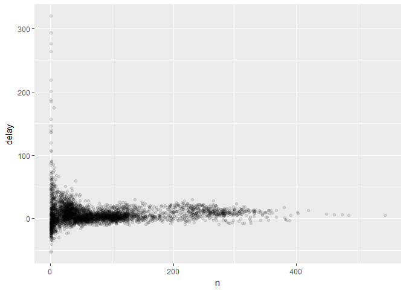

# Data transformation continued
Chunmei Li  
2017年5月14日  


```r
library(nycflights13)
```

```
## Warning: package 'nycflights13' was built under R version 3.3.3
```

```r
library(tidyverse)
```

```
## Warning: package 'tidyverse' was built under R version 3.3.3
```

```
## Loading tidyverse: ggplot2
## Loading tidyverse: tibble
## Loading tidyverse: tidyr
## Loading tidyverse: readr
## Loading tidyverse: purrr
## Loading tidyverse: dplyr
```

```
## Warning: package 'ggplot2' was built under R version 3.3.3
```

```
## Warning: package 'tidyr' was built under R version 3.3.3
```

```
## Warning: package 'readr' was built under R version 3.3.3
```

```
## Warning: package 'purrr' was built under R version 3.3.3
```

```
## Warning: package 'dplyr' was built under R version 3.3.3
```

```
## Conflicts with tidy packages ----------------------------------------------
```

```
## filter(): dplyr, stats
## lag():    dplyr, stats
```


```r
#not useful without group_by
summarise(flights, delay = mean(dep_delay, na.rm = TRUE))
```

```
## # A tibble: 1 × 1
##      delay
##      <dbl>
## 1 12.63907
```

```r
by_day <- group_by(flights, year, month, day)
summarise(by_day, delay = mean(dep_delay, na.rm = TRUE))
```

```
## Source: local data frame [365 x 4]
## Groups: year, month [?]
## 
##     year month   day     delay
##    <int> <int> <int>     <dbl>
## 1   2013     1     1 11.548926
## 2   2013     1     2 13.858824
## 3   2013     1     3 10.987832
## 4   2013     1     4  8.951595
## 5   2013     1     5  5.732218
## 6   2013     1     6  7.148014
## 7   2013     1     7  5.417204
## 8   2013     1     8  2.553073
## 9   2013     1     9  2.276477
## 10  2013     1    10  2.844995
## # ... with 355 more rows
```


```r
by_dest <- group_by(flights, dest)
delay <- summarise(by_dest,
  count = n(),
  dist = mean(distance, na.rm = TRUE),
  delay = mean(arr_delay, na.rm = TRUE)
)
delay
```

```
## # A tibble: 105 × 4
##     dest count      dist     delay
##    <chr> <int>     <dbl>     <dbl>
## 1    ABQ   254 1826.0000  4.381890
## 2    ACK   265  199.0000  4.852273
## 3    ALB   439  143.0000 14.397129
## 4    ANC     8 3370.0000 -2.500000
## 5    ATL 17215  757.1082 11.300113
## 6    AUS  2439 1514.2530  6.019909
## 7    AVL   275  583.5818  8.003831
## 8    BDL   443  116.0000  7.048544
## 9    BGR   375  378.0000  8.027933
## 10   BHM   297  865.9966 16.877323
## # ... with 95 more rows
```

```r
delay <- filter(delay, count > 20, dest != "HNL")
delay
```

```
## # A tibble: 96 × 4
##     dest count      dist     delay
##    <chr> <int>     <dbl>     <dbl>
## 1    ABQ   254 1826.0000  4.381890
## 2    ACK   265  199.0000  4.852273
## 3    ALB   439  143.0000 14.397129
## 4    ATL 17215  757.1082 11.300113
## 5    AUS  2439 1514.2530  6.019909
## 6    AVL   275  583.5818  8.003831
## 7    BDL   443  116.0000  7.048544
## 8    BGR   375  378.0000  8.027933
## 9    BHM   297  865.9966 16.877323
## 10   BNA  6333  758.2135 11.812459
## # ... with 86 more rows
```


```r
# %>% then
delays <- flights %>% 
  group_by(dest) %>% 
  summarise(
    count = n(),
    dist = mean(distance, na.rm = TRUE),
    delay = mean(arr_delay, na.rm = TRUE)
  ) %>% 
  filter(count > 20, dest != "HNL")
delays
```

```
## # A tibble: 96 × 4
##     dest count      dist     delay
##    <chr> <int>     <dbl>     <dbl>
## 1    ABQ   254 1826.0000  4.381890
## 2    ACK   265  199.0000  4.852273
## 3    ALB   439  143.0000 14.397129
## 4    ATL 17215  757.1082 11.300113
## 5    AUS  2439 1514.2530  6.019909
## 6    AVL   275  583.5818  8.003831
## 7    BDL   443  116.0000  7.048544
## 8    BGR   375  378.0000  8.027933
## 9    BHM   297  865.9966 16.877323
## 10   BNA  6333  758.2135 11.812459
## # ... with 86 more rows
```

```r
#without na.rm
flights %>% 
  group_by(year, month, day) %>% 
  summarise(mean = mean(dep_delay))
```

```
## Source: local data frame [365 x 4]
## Groups: year, month [?]
## 
##     year month   day  mean
##    <int> <int> <int> <dbl>
## 1   2013     1     1    NA
## 2   2013     1     2    NA
## 3   2013     1     3    NA
## 4   2013     1     4    NA
## 5   2013     1     5    NA
## 6   2013     1     6    NA
## 7   2013     1     7    NA
## 8   2013     1     8    NA
## 9   2013     1     9    NA
## 10  2013     1    10    NA
## # ... with 355 more rows
```

```r
#with na.rm
flights %>% 
  group_by(year, month, day) %>% 
  summarise(mean = mean(dep_delay, na.rm = TRUE))
```

```
## Source: local data frame [365 x 4]
## Groups: year, month [?]
## 
##     year month   day      mean
##    <int> <int> <int>     <dbl>
## 1   2013     1     1 11.548926
## 2   2013     1     2 13.858824
## 3   2013     1     3 10.987832
## 4   2013     1     4  8.951595
## 5   2013     1     5  5.732218
## 6   2013     1     6  7.148014
## 7   2013     1     7  5.417204
## 8   2013     1     8  2.553073
## 9   2013     1     9  2.276477
## 10  2013     1    10  2.844995
## # ... with 355 more rows
```


```r
#first removing na
not_cancelled <- flights %>% 
  filter(!is.na(dep_delay), !is.na(arr_delay))

not_cancelled %>% 
  group_by(year, month, day) %>% 
  summarise(mean = mean(dep_delay))
```

```
## Source: local data frame [365 x 4]
## Groups: year, month [?]
## 
##     year month   day      mean
##    <int> <int> <int>     <dbl>
## 1   2013     1     1 11.435620
## 2   2013     1     2 13.677802
## 3   2013     1     3 10.907778
## 4   2013     1     4  8.965859
## 5   2013     1     5  5.732218
## 6   2013     1     6  7.145959
## 7   2013     1     7  5.417204
## 8   2013     1     8  2.558296
## 9   2013     1     9  2.301232
## 10  2013     1    10  2.844995
## # ... with 355 more rows
```


```r
delays <- not_cancelled %>% 
  group_by(tailnum) %>% 
  summarise(
    delay = mean(arr_delay)
  )
delays
```

```
## # A tibble: 4,037 × 2
##    tailnum      delay
##      <chr>      <dbl>
## 1   D942DN 31.5000000
## 2   N0EGMQ  9.9829545
## 3   N10156 12.7172414
## 4   N102UW  2.9375000
## 5   N103US -6.9347826
## 6   N104UW  1.8043478
## 7   N10575 20.6914498
## 8   N105UW -0.2666667
## 9   N107US -5.7317073
## 10  N108UW -1.2500000
## # ... with 4,027 more rows
```

```r
ggplot(data = delays, mapping = aes(x = delay)) + 
  geom_freqpoly(binwidth = 10)
```

<!-- -->


```r
delays <- not_cancelled %>% 
  group_by(tailnum) %>% 
  summarise(
    delay = mean(arr_delay, na.rm = TRUE),
    n = n()
  )

ggplot(data = delays, mapping = aes(x = n, y = delay)) + 
  geom_point(alpha = 1/10)
```

<!-- -->


```r
delays %>% 
  filter(n > 25) %>% 
  ggplot(mapping = aes(x = n, y = delay)) + 
    geom_point(alpha = 1/10)
```

<!-- -->


```r
#install.packages("Lahman")
library(Lahman)
```

```
## Warning: package 'Lahman' was built under R version 3.3.3
```

```r
# Convert to a tibble so it prints nicely
batting <- as_tibble(Lahman::Batting)

batters <- batting %>% 
  group_by(playerID) %>% 
  summarise(
    ba = sum(H, na.rm = TRUE) / sum(AB, na.rm = TRUE),
    ab = sum(AB, na.rm = TRUE) )
batters %>% 
  filter(ab > 100) %>% 
  ggplot(mapping = aes(x = ab, y = ba)) +
    geom_point() + 
    geom_smooth(se = FALSE) 
```

```
## `geom_smooth()` using method = 'gam'
```

<!-- -->

```r
batters %>% 
  arrange(desc(ba))
```

```
## # A tibble: 18,659 × 3
##     playerID    ba    ab
##        <chr> <dbl> <int>
## 1  abramge01     1     1
## 2  banisje01     1     1
## 3  bartocl01     1     1
## 4   bassdo01     1     1
## 5  birasst01     1     2
## 6  bruneju01     1     1
## 7  burnscb01     1     1
## 8  cammaer01     1     1
## 9   campsh01     1     1
## 10 crockcl01     1     1
## # ... with 18,649 more rows
```

```r
not_cancelled %>% 
  group_by(year, month, day) %>% 
  summarise(
    avg_delay1 = mean(arr_delay),
    avg_delay2 = mean(arr_delay[arr_delay > 0]) # the average positive delay
  )
```

```
## Source: local data frame [365 x 5]
## Groups: year, month [?]
## 
##     year month   day avg_delay1 avg_delay2
##    <int> <int> <int>      <dbl>      <dbl>
## 1   2013     1     1 12.6510229   32.48156
## 2   2013     1     2 12.6928879   32.02991
## 3   2013     1     3  5.7333333   27.66087
## 4   2013     1     4 -1.9328194   28.30976
## 5   2013     1     5 -1.5258020   22.55882
## 6   2013     1     6  4.2364294   24.37270
## 7   2013     1     7 -4.9473118   27.76132
## 8   2013     1     8 -3.2275785   20.78909
## 9   2013     1     9 -0.2642777   25.63415
## 10  2013     1    10 -5.8988159   27.34545
## # ... with 355 more rows
```

```r
# Why is distance to some destinations more variable than to others?
not_cancelled %>% 
  group_by(dest) %>% 
  summarise(distance_sd = sd(distance)) %>% 
  arrange(desc(distance_sd))
```

```
## # A tibble: 104 × 2
##     dest distance_sd
##    <chr>       <dbl>
## 1    EGE   10.542765
## 2    SAN   10.350094
## 3    SFO   10.216017
## 4    HNL   10.004197
## 5    SEA    9.977993
## 6    LAS    9.907786
## 7    PDX    9.873299
## 8    PHX    9.862546
## 9    LAX    9.657195
## 10   IND    9.458066
## # ... with 94 more rows
```

```r
# When do the first and last flights leave each day?
not_cancelled %>% 
  group_by(year, month, day) %>% 
  summarise(
    first = min(dep_time),
    last = max(dep_time)
  )
```

```
## Source: local data frame [365 x 5]
## Groups: year, month [?]
## 
##     year month   day first  last
##    <int> <int> <int> <int> <int>
## 1   2013     1     1   517  2356
## 2   2013     1     2    42  2354
## 3   2013     1     3    32  2349
## 4   2013     1     4    25  2358
## 5   2013     1     5    14  2357
## 6   2013     1     6    16  2355
## 7   2013     1     7    49  2359
## 8   2013     1     8   454  2351
## 9   2013     1     9     2  2252
## 10  2013     1    10     3  2320
## # ... with 355 more rows
```


```r
not_cancelled %>% 
  group_by(year, month, day) %>% 
  summarise(
    first_dep = first(dep_time), 
    last_dep = last(dep_time)
  )
```

```
## Source: local data frame [365 x 5]
## Groups: year, month [?]
## 
##     year month   day first_dep last_dep
##    <int> <int> <int>     <int>    <int>
## 1   2013     1     1       517     2356
## 2   2013     1     2        42     2354
## 3   2013     1     3        32     2349
## 4   2013     1     4        25     2358
## 5   2013     1     5        14     2357
## 6   2013     1     6        16     2355
## 7   2013     1     7        49     2359
## 8   2013     1     8       454     2351
## 9   2013     1     9         2     2252
## 10  2013     1    10         3     2320
## # ... with 355 more rows
```


```r
not_cancelled %>% 
  group_by(year, month, day) %>% 
  mutate(r = min_rank(desc(dep_time))) %>% 
  filter(r %in% range(r))
```

```
## Source: local data frame [770 x 20]
## Groups: year, month, day [365]
## 
##     year month   day dep_time sched_dep_time dep_delay arr_time
##    <int> <int> <int>    <int>          <int>     <dbl>    <int>
## 1   2013     1     1      517            515         2      830
## 2   2013     1     1     2356           2359        -3      425
## 3   2013     1     2       42           2359        43      518
## 4   2013     1     2     2354           2359        -5      413
## 5   2013     1     3       32           2359        33      504
## 6   2013     1     3     2349           2359       -10      434
## 7   2013     1     4       25           2359        26      505
## 8   2013     1     4     2358           2359        -1      429
## 9   2013     1     4     2358           2359        -1      436
## 10  2013     1     5       14           2359        15      503
## # ... with 760 more rows, and 13 more variables: sched_arr_time <int>,
## #   arr_delay <dbl>, carrier <chr>, flight <int>, tailnum <chr>,
## #   origin <chr>, dest <chr>, air_time <dbl>, distance <dbl>, hour <dbl>,
## #   minute <dbl>, time_hour <dttm>, r <int>
```


```r
# Which destinations have the most carriers?
not_cancelled %>% 
  group_by(dest) %>% 
  summarise(carriers = n_distinct(carrier)) %>% 
  arrange(desc(carriers))
```

```
## # A tibble: 104 × 2
##     dest carriers
##    <chr>    <int>
## 1    ATL        7
## 2    BOS        7
## 3    CLT        7
## 4    ORD        7
## 5    TPA        7
## 6    AUS        6
## 7    DCA        6
## 8    DTW        6
## 9    IAD        6
## 10   MSP        6
## # ... with 94 more rows
```


```r
not_cancelled %>% 
  count(dest)
```

```
## # A tibble: 104 × 2
##     dest     n
##    <chr> <int>
## 1    ABQ   254
## 2    ACK   264
## 3    ALB   418
## 4    ANC     8
## 5    ATL 16837
## 6    AUS  2411
## 7    AVL   261
## 8    BDL   412
## 9    BGR   358
## 10   BHM   269
## # ... with 94 more rows
```

```r
not_cancelled %>% 
  count(tailnum, wt = distance)
```

```
## # A tibble: 4,037 × 2
##    tailnum      n
##      <chr>  <dbl>
## 1   D942DN   3418
## 2   N0EGMQ 239143
## 3   N10156 109664
## 4   N102UW  25722
## 5   N103US  24619
## 6   N104UW  24616
## 7   N10575 139903
## 8   N105UW  23618
## 9   N107US  21677
## 10  N108UW  32070
## # ... with 4,027 more rows
```


```r
# How many flights left before 5am? (these usually indicate delayed
# flights from the previous day)
not_cancelled %>% 
  group_by(year, month, day) %>% 
  summarise(n_early = sum(dep_time < 500))
```

```
## Source: local data frame [365 x 4]
## Groups: year, month [?]
## 
##     year month   day n_early
##    <int> <int> <int>   <int>
## 1   2013     1     1       0
## 2   2013     1     2       3
## 3   2013     1     3       4
## 4   2013     1     4       3
## 5   2013     1     5       3
## 6   2013     1     6       2
## 7   2013     1     7       2
## 8   2013     1     8       1
## 9   2013     1     9       3
## 10  2013     1    10       3
## # ... with 355 more rows
```


```r
# What proportion of flights are delayed by more than an hour?
not_cancelled %>% 
  group_by(year, month, day) %>% 
  summarise(hour_perc = mean(arr_delay > 60))
```

```
## Source: local data frame [365 x 4]
## Groups: year, month [?]
## 
##     year month   day  hour_perc
##    <int> <int> <int>      <dbl>
## 1   2013     1     1 0.07220217
## 2   2013     1     2 0.08512931
## 3   2013     1     3 0.05666667
## 4   2013     1     4 0.03964758
## 5   2013     1     5 0.03486750
## 6   2013     1     6 0.04704463
## 7   2013     1     7 0.03333333
## 8   2013     1     8 0.02130045
## 9   2013     1     9 0.02015677
## 10  2013     1    10 0.01829925
## # ... with 355 more rows
```


```r
daily <- group_by(flights, year, month, day)
(per_day   <- summarise(daily, flights = n()))
```

```
## Source: local data frame [365 x 4]
## Groups: year, month [?]
## 
##     year month   day flights
##    <int> <int> <int>   <int>
## 1   2013     1     1     842
## 2   2013     1     2     943
## 3   2013     1     3     914
## 4   2013     1     4     915
## 5   2013     1     5     720
## 6   2013     1     6     832
## 7   2013     1     7     933
## 8   2013     1     8     899
## 9   2013     1     9     902
## 10  2013     1    10     932
## # ... with 355 more rows
```

```r
(per_month <- summarise(per_day, flights = sum(flights)))
```

```
## Source: local data frame [12 x 3]
## Groups: year [?]
## 
##     year month flights
##    <int> <int>   <int>
## 1   2013     1   27004
## 2   2013     2   24951
## 3   2013     3   28834
## 4   2013     4   28330
## 5   2013     5   28796
## 6   2013     6   28243
## 7   2013     7   29425
## 8   2013     8   29327
## 9   2013     9   27574
## 10  2013    10   28889
## 11  2013    11   27268
## 12  2013    12   28135
```


```r
(per_year  <- summarise(per_month, flights = sum(flights)))
```

```
## # A tibble: 1 × 2
##    year flights
##   <int>   <int>
## 1  2013  336776
```


```r
daily %>% 
  ungroup() %>%             # no longer grouped by date
  summarise(flights = n())  # all flights
```

```
## # A tibble: 1 × 1
##   flights
##     <int>
## 1  336776
```

5.6.7 Exercise
1.

```r
#A flight is 15 minutes early 50% of the time
flights%>%
  group_by(flight) %>%
  summarise(proportion_arr_early15=mean(arr_delay==-15))%>%
  filter(proportion_arr_early15==0.5)
```

```
## # A tibble: 4 × 2
##   flight proportion_arr_early15
##    <int>                  <dbl>
## 1   1780                    0.5
## 2   2072                    0.5
## 3   4081                    0.5
## 4   5710                    0.5
```

```r
#15 minutes late 50% of the time
flights%>%
  group_by(flight) %>%
  summarise(proportion_arr_late15=mean(arr_delay==15))%>%
  filter(proportion_arr_late15==0.5)
```

```
## # A tibble: 3 × 2
##   flight proportion_arr_late15
##    <int>                 <dbl>
## 1    730                   0.5
## 2   3409                   0.5
## 3   4313                   0.5
```

```r
#A flight is always 10 minutes late.
flights%>%
  group_by(flight) %>%
  summarise(portion_arr_delay10=mean(arr_delay==10))%>% # proportion of 10 minutes late
  filter(portion_arr_delay10==1)
```

```
## # A tibble: 4 × 2
##   flight portion_arr_delay10
##    <int>               <dbl>
## 1   2254                   1
## 2   3656                   1
## 3   3880                   1
## 4   5854                   1
```

```r
#30 mins early 50% of time
flights%>%
  group_by(flight) %>%
  summarise(prop_arr_early30=mean(arr_delay == -30))%>%
  filter(prop_arr_early30==0.5)
```

```
## # A tibble: 3 × 2
##   flight prop_arr_early30
##    <int>            <dbl>
## 1    110              0.5
## 2   5095              0.5
## 3   5335              0.5
```

```r
#30 mins late 50% of time
flights%>%
  group_by(flight) %>%
  summarise(prop_arr_late30=mean(arr_delay == 30))%>%
  filter(prop_arr_late30 == 0.5)
```

```
## # A tibble: 2 × 2
##   flight prop_arr_late30
##    <int>           <dbl>
## 1   1126             0.5
## 2   3589             0.5
```

```r
#99% of the time a flight is on time.
flights %>%
  group_by(flight) %>%
  summarise(proportion_on_time=mean(arr_delay==0))%>%
  filter(proportion_on_time==0.99)
```

```
## # A tibble: 0 × 2
## # ... with 2 variables: flight <int>, proportion_on_time <dbl>
```

```r
#1% of the time it’s 2 hours late.
flights %>%
  group_by(flight) %>%
  summarise(proportion_2hlate=mean(arr_delay==120))%>%
  filter(proportion_2hlate==0.01)
```

```
## # A tibble: 0 × 2
## # ... with 2 variables: flight <int>, proportion_2hlate <dbl>
```

2.

```r
not_cancelled %>%
  group_by(dest) %>%
  summarise(n())
```

```
## # A tibble: 104 × 2
##     dest `n()`
##    <chr> <int>
## 1    ABQ   254
## 2    ACK   264
## 3    ALB   418
## 4    ANC     8
## 5    ATL 16837
## 6    AUS  2411
## 7    AVL   261
## 8    BDL   412
## 9    BGR   358
## 10   BHM   269
## # ... with 94 more rows
```

```r
not_cancelled %>%
  group_by(tailnum) %>%
  summarise(sum(distance))
```

```
## # A tibble: 4,037 × 2
##    tailnum `sum(distance)`
##      <chr>           <dbl>
## 1   D942DN            3418
## 2   N0EGMQ          239143
## 3   N10156          109664
## 4   N102UW           25722
## 5   N103US           24619
## 6   N104UW           24616
## 7   N10575          139903
## 8   N105UW           23618
## 9   N107US           21677
## 10  N108UW           32070
## # ... with 4,027 more rows
```
3.
is.na(dep_time)

4.

```r
flights %>%
  group_by(year, month, day) %>%
  filter(is.na(dep_time))
```

```
## Source: local data frame [8,255 x 19]
## Groups: year, month, day [358]
## 
##     year month   day dep_time sched_dep_time dep_delay arr_time
##    <int> <int> <int>    <int>          <int>     <dbl>    <int>
## 1   2013     1     1       NA           1630        NA       NA
## 2   2013     1     1       NA           1935        NA       NA
## 3   2013     1     1       NA           1500        NA       NA
## 4   2013     1     1       NA            600        NA       NA
## 5   2013     1     2       NA           1540        NA       NA
## 6   2013     1     2       NA           1620        NA       NA
## 7   2013     1     2       NA           1355        NA       NA
## 8   2013     1     2       NA           1420        NA       NA
## 9   2013     1     2       NA           1321        NA       NA
## 10  2013     1     2       NA           1545        NA       NA
## # ... with 8,245 more rows, and 12 more variables: sched_arr_time <int>,
## #   arr_delay <dbl>, carrier <chr>, flight <int>, tailnum <chr>,
## #   origin <chr>, dest <chr>, air_time <dbl>, distance <dbl>, hour <dbl>,
## #   minute <dbl>, time_hour <dttm>
```

```r
flights_1 <- flights %>%
  group_by(year, month, day) %>%
  summarise(proportion_cancelled_flights=mean(is.na(dep_time)), average_delay_perday=mean(dep_delay, na.rm = T))
flights_1
```

```
## Source: local data frame [365 x 5]
## Groups: year, month [?]
## 
##     year month   day proportion_cancelled_flights average_delay_perday
##    <int> <int> <int>                        <dbl>                <dbl>
## 1   2013     1     1                  0.004750594            11.548926
## 2   2013     1     2                  0.008483563            13.858824
## 3   2013     1     3                  0.010940919            10.987832
## 4   2013     1     4                  0.006557377             8.951595
## 5   2013     1     5                  0.004166667             5.732218
## 6   2013     1     6                  0.001201923             7.148014
## 7   2013     1     7                  0.003215434             5.417204
## 8   2013     1     8                  0.004449388             2.553073
## 9   2013     1     9                  0.005543237             2.276477
## 10  2013     1    10                  0.003218884             2.844995
## # ... with 355 more rows
```

```r
ggplot(flights_1, aes(average_delay_perday, proportion_cancelled_flights)) + geom_point()+geom_smooth(se=F)
```

```
## `geom_smooth()` using method = 'loess'
```

<!-- -->
5.

```r
flights %>%
  group_by(carrier) %>%
  summarise(mean_delay=mean(arr_delay, na.rm=T)) %>%
  arrange(desc(mean_delay))
```

```
## # A tibble: 16 × 2
##    carrier mean_delay
##      <chr>      <dbl>
## 1       F9 21.9207048
## 2       FL 20.1159055
## 3       EV 15.7964311
## 4       YV 15.5569853
## 5       OO 11.9310345
## 6       MQ 10.7747334
## 7       WN  9.6491199
## 8       B6  9.4579733
## 9       9E  7.3796692
## 10      UA  3.5580111
## 11      US  2.1295951
## 12      VX  1.7644644
## 13      DL  1.6443409
## 14      AA  0.3642909
## 15      HA -6.9152047
## 16      AS -9.9308886
```

5.??

```r
flights %>% 
  group_by(carrier, dest) %>% 
  summarise(mean_delay=mean(arr_delay, na.rm=T), n())
```

```
## Source: local data frame [314 x 4]
## Groups: carrier [?]
## 
##    carrier  dest  mean_delay `n()`
##      <chr> <chr>       <dbl> <int>
## 1       9E   ATL   0.8571429    59
## 2       9E   AUS  -3.5000000     2
## 3       9E   AVL -12.1000000    10
## 4       9E   BGR         NaN     1
## 5       9E   BNA   9.2853982   474
## 6       9E   BOS   5.6647128   914
## 7       9E   BTV  -2.5000000     2
## 8       9E   BUF   6.7072243   833
## 9       9E   BWI   8.7312883   856
## 10      9E   CAE   6.0000000     3
## # ... with 304 more rows
```
6.

```r
# to get the date had the most flights, like arrange?

flights%>%
  group_by(year, month, day) %>%
  count(sort=T)
```

```
## Source: local data frame [365 x 4]
## Groups: year, month [12]
## 
##     year month   day     n
##    <int> <int> <int> <int>
## 1   2013    11    27  1014
## 2   2013     7    11  1006
## 3   2013     7     8  1004
## 4   2013     7    10  1004
## 5   2013    12     2  1004
## 6   2013     7    18  1003
## 7   2013     7    25  1003
## 8   2013     7    12  1002
## 9   2013     7     9  1001
## 10  2013     7    17  1001
## # ... with 355 more rows
```
5.7

```r
#??don't understand what the code are doing
#flights_sml %>% 
 # group_by(year, month, day) %>%
  #filter(rank(desc(arr_delay)) < 10)
```


```r
# I think n() counts the number of each dest group, the dest should be unique in popular_dests???
popular_dests <- flights %>% 
  group_by(dest) %>% 
  filter(n() > 365)
popular_dests
```

```
## Source: local data frame [332,577 x 19]
## Groups: dest [77]
## 
##     year month   day dep_time sched_dep_time dep_delay arr_time
##    <int> <int> <int>    <int>          <int>     <dbl>    <int>
## 1   2013     1     1      517            515         2      830
## 2   2013     1     1      533            529         4      850
## 3   2013     1     1      542            540         2      923
## 4   2013     1     1      544            545        -1     1004
## 5   2013     1     1      554            600        -6      812
## 6   2013     1     1      554            558        -4      740
## 7   2013     1     1      555            600        -5      913
## 8   2013     1     1      557            600        -3      709
## 9   2013     1     1      557            600        -3      838
## 10  2013     1     1      558            600        -2      753
## # ... with 332,567 more rows, and 12 more variables: sched_arr_time <int>,
## #   arr_delay <dbl>, carrier <chr>, flight <int>, tailnum <chr>,
## #   origin <chr>, dest <chr>, air_time <dbl>, distance <dbl>, hour <dbl>,
## #   minute <dbl>, time_hour <dttm>
```


```r
popular_dests %>% 
  filter(arr_delay > 0) %>% 
  mutate(prop_delay = arr_delay / sum(arr_delay)) %>% 
  select(year:day, dest, arr_delay, prop_delay)
```

```
## Source: local data frame [131,106 x 6]
## Groups: dest [77]
## 
##     year month   day  dest arr_delay   prop_delay
##    <int> <int> <int> <chr>     <dbl>        <dbl>
## 1   2013     1     1   IAH        11 1.106740e-04
## 2   2013     1     1   IAH        20 2.012255e-04
## 3   2013     1     1   MIA        33 2.350026e-04
## 4   2013     1     1   ORD        12 4.239594e-05
## 5   2013     1     1   FLL        19 9.377853e-05
## 6   2013     1     1   ORD         8 2.826396e-05
## 7   2013     1     1   LAX         7 3.444441e-05
## 8   2013     1     1   DFW        31 2.817951e-04
## 9   2013     1     1   ATL        12 3.996017e-05
## 10  2013     1     1   DTW        16 1.157257e-04
## # ... with 131,096 more rows
```
5.7.1 Exercise
1.mutate and filter grouped data?

2.

```r
flights %>%
  group_by(tailnum) %>%
  mutate(mean_arr_delay=mean(arr_delay, na.rm=T)) %>%
  arrange(desc(mean_arr_delay)) %>%
  select(tailnum, mean_arr_delay)
```

```
## Source: local data frame [336,776 x 2]
## Groups: tailnum [4,044]
## 
##    tailnum mean_arr_delay
##      <chr>          <dbl>
## 1   N844MH       320.0000
## 2   N911DA       294.0000
## 3   N922EV       276.0000
## 4   N587NW       264.0000
## 5   N851NW       219.0000
## 6   N928DN       201.0000
## 7   N7715E       188.0000
## 8   N654UA       185.0000
## 9   N665MQ       174.6667
## 10  N665MQ       174.6667
## # ... with 336,766 more rows
```

```r
#N844MH has the worst on time record
```
3.

```r
#sched_dep_time is not a factor, can't be groupped??
flights %>%
  group_by(sched_dep_time) %>%
  mutate(mean_arr_delay=mean(arr_delay, na.rm=T)) %>%
  arrange(mean_arr_delay)
```

```
## Source: local data frame [336,776 x 20]
## Groups: sched_dep_time [1,021]
## 
##     year month   day dep_time sched_dep_time dep_delay arr_time
##    <int> <int> <int>    <int>          <int>     <dbl>    <int>
## 1   2013     5     2      705            712        -7      943
## 2   2013     5     3      711            712        -1      928
## 3   2013     5     6      707            712        -5      944
## 4   2013     5     7      706            712        -6      846
## 5   2013     5     7      712            712         0      950
## 6   2013     5     9      719            712         7     1024
## 7   2013     5    10      710            712        -2     1014
## 8   2013     5    13      710            712        -2      929
## 9   2013     5    14      716            712         4      951
## 10  2013     5    16      708            712        -4      945
## # ... with 336,766 more rows, and 13 more variables: sched_arr_time <int>,
## #   arr_delay <dbl>, carrier <chr>, flight <int>, tailnum <chr>,
## #   origin <chr>, dest <chr>, air_time <dbl>, distance <dbl>, hour <dbl>,
## #   minute <dbl>, time_hour <dttm>, mean_arr_delay <dbl>
```

4.

```r
#For each destination, compute the total minutes of delay
flights %>%
  group_by(dest) %>%
  mutate(total_delay=sum(arr_delay, na.rm=T)) %>%
  mutate(prop_delay=arr_delay/total_delay) %>% #For each, flight, compute the proportion of the total delay for its destination
  select(dest, total_delay, prop_delay)
```

```
## Source: local data frame [336,776 x 3]
## Groups: dest [105]
## 
##     dest total_delay    prop_delay
##    <chr>       <dbl>         <dbl>
## 1    IAH       30046  3.661053e-04
## 2    IAH       30046  6.656460e-04
## 3    MIA        3467  9.518316e-03
## 4    BQN        7322 -2.458345e-03
## 5    ATL      190260 -1.313991e-04
## 6    ORD       97352  1.232640e-04
## 7    FLL       96153  1.976017e-04
## 8    IAD       74631 -1.875896e-04
## 9    MCO       76185 -1.050075e-04
## 10   ORD       97352  8.217602e-05
## # ... with 336,766 more rows
```
5.


6.

```r
flights %>%
  group_by(dest) %>%
  mutate(mean_air_time=mean(air_time, na.rm=T), fast_time=mean_air_time-air_time) %>%
  arrange(desc(fast_time)) %>%
  select(year:day, flight, dest, air_time, mean_air_time, fast_time)
```

```
## Source: local data frame [336,776 x 8]
## Groups: dest [105]
## 
##     year month   day flight  dest air_time mean_air_time fast_time
##    <int> <int> <int>  <int> <chr>    <dbl>         <dbl>     <dbl>
## 1   2013     7     2   4667   MSP       93      150.5737  57.57368
## 2   2013     9    28     15   HNL      562      617.4479  55.44793
## 3   2013     7    14    673   SNA      274      329.2894  55.28941
## 4   2013     5     6     15   HNL      564      617.4479  53.44793
## 5   2013     9     6    771   LAX      275      328.1212  53.12118
## 6   2013     7     3    161   SEA      275      327.7449  52.74492
## 7   2013     7     1     15   HNL      565      617.4479  52.44793
## 8   2013     2    26     15   HNL      566      617.4479  51.44793
## 9   2013     7    12     21   LAX      277      328.1212  51.12118
## 10  2013     5     5     21   SEA      277      327.7449  50.74492
## # ... with 336,766 more rows
```

```r
flights %>%
  group_by(dest) %>%
  mutate(min_air_time=min(air_time, na.rm=T), relative_air_time=air_time - min_air_time) %>%
  arrange(desc(relative_air_time)) %>%
  select(year:day, flight, dest, air_time, min_air_time, relative_air_time)
```

```
## Source: local data frame [336,776 x 8]
## Groups: dest [105]
## 
##     year month   day flight  dest air_time min_air_time relative_air_time
##    <int> <int> <int>  <int> <chr>    <dbl>        <dbl>             <dbl>
## 1   2013     7    28    841   SFO      490          295               195
## 2   2013    11    22    426   LAX      440          275               165
## 3   2013     1    28    575   EGE      382          219               163
## 4   2013     9    10    745   DEN      331          182               149
## 5   2013     7    10     17   LAX      422          275               147
## 6   2013    11    22    587   LAS      399          256               143
## 7   2013    12     6    434   SFO      438          295               143
## 8   2013    12     7     89   SAN      413          279               134
## 9   2013     3    17     15   HNL      695          562               133
## 10  2013    12     6    177   SFO      426          295               131
## # ... with 336,766 more rows
```
7.

```r
flights %>%
  group_by(dest) %>%
  mutate(carriers = n_distinct(carrier)) %>%
  filter(carriers>=2) %>%
  select(dest, carriers, carrier) %>%
  arrange(desc(carriers))
```

```
## Source: local data frame [325,397 x 3]
## Groups: dest [76]
## 
##     dest carriers carrier
##    <chr>    <int>   <chr>
## 1    ATL        7      DL
## 2    ORD        7      UA
## 3    ORD        7      AA
## 4    TPA        7      B6
## 5    BOS        7      B6
## 6    ATL        7      MQ
## 7    ATL        7      DL
## 8    ORD        7      MQ
## 9    ATL        7      DL
## 10   ORD        7      AA
## # ... with 325,387 more rows
```

8.

```r
#count the number of flights before the first delay of greater than 1 hour??don't understand what was asked to do.
#flights %>%
 # group_by(tailnum) %>%
```

Have RStudio check your R project for logic and style issues: Options | Code | Diagnostics, Cmd+Alt+Shift+P.

