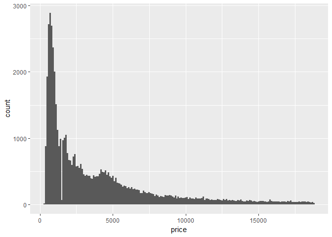
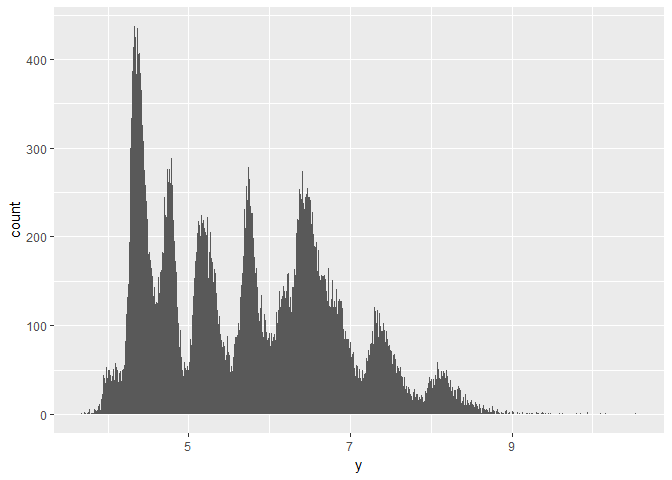
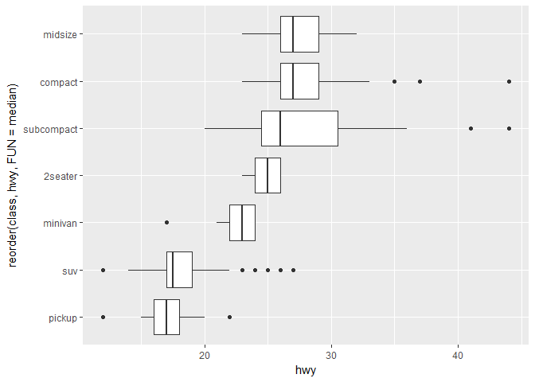
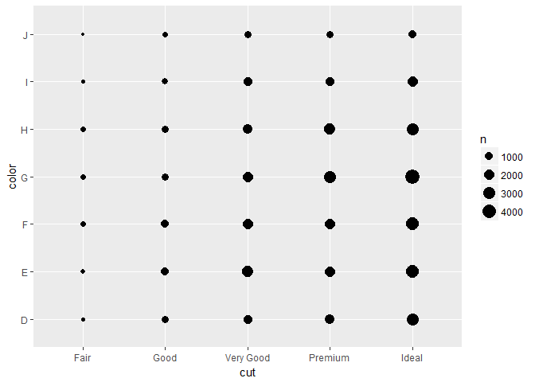
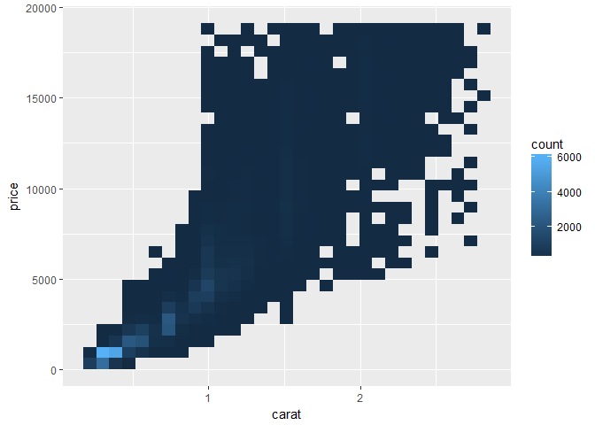
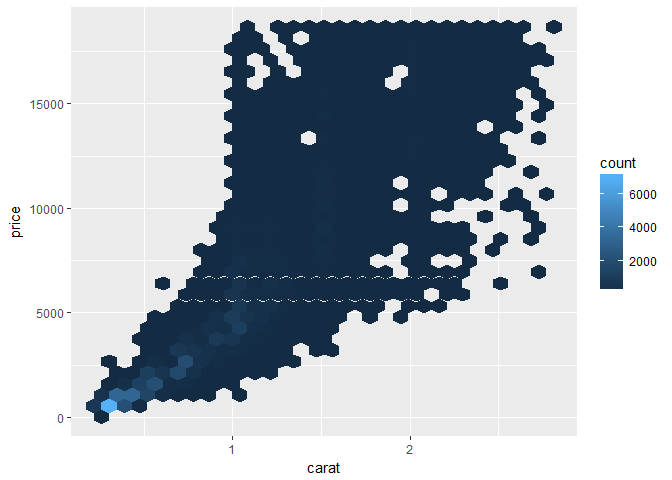
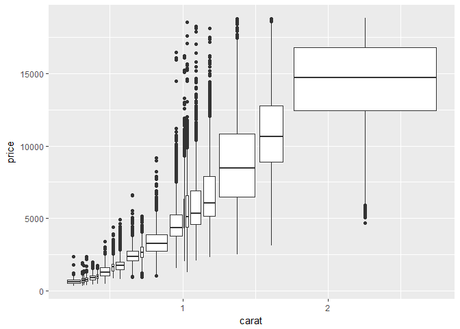

# Exploratory Data Analysis
Chunmei Li  
2017年5月23日  


```r
library(tidyverse)
```

```
## Warning: package 'tidyverse' was built under R version 3.3.3
```

```
## Loading tidyverse: ggplot2
## Loading tidyverse: tibble
## Loading tidyverse: tidyr
## Loading tidyverse: readr
## Loading tidyverse: purrr
## Loading tidyverse: dplyr
```

```
## Warning: package 'ggplot2' was built under R version 3.3.3
```

```
## Warning: package 'tidyr' was built under R version 3.3.3
```

```
## Warning: package 'readr' was built under R version 3.3.3
```

```
## Warning: package 'purrr' was built under R version 3.3.3
```

```
## Warning: package 'dplyr' was built under R version 3.3.3
```

```
## Conflicts with tidy packages ----------------------------------------------
```

```
## filter(): dplyr, stats
## lag():    dplyr, stats
```


```r
ggplot(data = diamonds) +
  geom_bar(mapping = aes(x = cut))
```

<!-- -->


```r
diamonds %>% 
  count(cut)
```

```
## # A tibble: 5 × 2
##         cut     n
##       <ord> <int>
## 1      Fair  1610
## 2      Good  4906
## 3 Very Good 12082
## 4   Premium 13791
## 5     Ideal 21551
```


```r
ggplot(data = diamonds) +
  geom_histogram(mapping = aes(x = carat), binwidth = 0.5)
```

<!-- -->


```r
diamonds %>% 
  count(cut_width(carat, 0.5))
```

```
## # A tibble: 11 × 2
##    `cut_width(carat, 0.5)`     n
##                     <fctr> <int>
## 1             [-0.25,0.25]   785
## 2              (0.25,0.75] 29498
## 3              (0.75,1.25] 15977
## 4              (1.25,1.75]  5313
## 5              (1.75,2.25]  2002
## 6              (2.25,2.75]   322
## 7              (2.75,3.25]    32
## 8              (3.25,3.75]     5
## 9              (3.75,4.25]     4
## 10             (4.25,4.75]     1
## 11             (4.75,5.25]     1
```


```r
smaller <- diamonds %>% 
  filter(carat < 3)
  
ggplot(data = smaller, mapping = aes(x = carat)) +
  geom_histogram(binwidth = 0.1)
```

<!-- -->


```r
ggplot(data = smaller, mapping = aes(x = carat, colour = cut)) +
  geom_freqpoly(binwidth = 0.1)
```

<!-- -->


```r
ggplot(data = smaller, mapping = aes(x = carat)) +
  geom_histogram(binwidth = 0.01)
```

<!-- -->


```r
ggplot(data = faithful, mapping = aes(x = eruptions)) + 
  geom_histogram(binwidth = 0.25)
```

<!-- -->


```r
ggplot(diamonds) + 
  geom_histogram(mapping = aes(x = y), binwidth = 0.5)# y is a variable in diamonds
```

<!-- -->


```r
ggplot(diamonds) + 
  geom_histogram(mapping = aes(x = y), binwidth = 0.5) +
  coord_cartesian(ylim = c(0, 50))
```

<!-- -->


```r
unusual <- diamonds %>% 
  filter(y < 3 | y > 20) %>% 
  select(price, x, y, z) %>%
  arrange(y)
unusual
```

```
## # A tibble: 9 × 4
##   price     x     y     z
##   <int> <dbl> <dbl> <dbl>
## 1  5139  0.00   0.0  0.00
## 2  6381  0.00   0.0  0.00
## 3 12800  0.00   0.0  0.00
## 4 15686  0.00   0.0  0.00
## 5 18034  0.00   0.0  0.00
## 6  2130  0.00   0.0  0.00
## 7  2130  0.00   0.0  0.00
## 8  2075  5.15  31.8  5.12
## 9 12210  8.09  58.9  8.06
```
7.3.4 Exercise
1.

```r
#x distribution
p1 <- ggplot(diamonds) + 
  geom_histogram(mapping = aes(x = x), binwidth = 0.5) 
p1
```

<!-- -->

```r
p1+coord_cartesian(ylim = c(0, 50))
```

<!-- -->

```r
# x=0

p2 <- ggplot(diamonds) + 
  geom_histogram(mapping = aes(x = z), binwidth = 0.5)
p2
```

<!-- -->

```r
p2+coord_cartesian(ylim = c(0, 50))
```

<!-- -->

```r
# z=0, z>30
```
2.

```r
p3 <- ggplot(diamonds) + 
  geom_histogram(mapping = aes(x = price), binwidth = 100)
p3
```

<!-- -->

```r
p3 + coord_cartesian(xlim = c(0, 5000))
```

<!-- -->

```r
p3 + coord_cartesian(xlim = c(1000, 2000)) # seems like no price 1500 
```

<!-- -->

```r
p3 + coord_cartesian(xlim = c(0, 1000))
```

<!-- -->

3.

```r
 p4 <-ggplot(diamonds) + 
  geom_histogram(mapping = aes(x = carat), binwidth = 0.01)
 p4
```

<!-- -->

```r
p4 + coord_cartesian(xlim = c(0.98, 1.00), ylim = c(1000,2000)) # about 1500 are 1.00
```

<!-- -->

```r
p4 + coord_cartesian(xlim = c(0.98, 1.00), ylim = c(0,100)) # about 25 are 0.99
```

<!-- -->

```r
#why? different measuring tools, like different balance have different  
```

4.
 
 

```r
p4 + coord_cartesian() # nothing happened when only have coor_cartesian
```

<!-- -->

```r
ggplot(diamonds) + 
  geom_histogram(mapping = aes(x = carat))+coord_cartesian(xlim = c(0.98, 1.00), ylim = c(1000,2000))# without binwidth, 
```

```
## `stat_bin()` using `bins = 30`. Pick better value with `binwidth`.
```

<!-- -->

```r
# don't understand....What happens if you try and zoom so only half a bar shows?
```


```r
diamonds2 <- diamonds %>% 
  mutate(y = ifelse(y < 3 | y > 20, NA, y))
diamonds2
```

```
## # A tibble: 53,940 × 10
##    carat       cut color clarity depth table price     x     y     z
##    <dbl>     <ord> <ord>   <ord> <dbl> <dbl> <int> <dbl> <dbl> <dbl>
## 1   0.23     Ideal     E     SI2  61.5    55   326  3.95  3.98  2.43
## 2   0.21   Premium     E     SI1  59.8    61   326  3.89  3.84  2.31
## 3   0.23      Good     E     VS1  56.9    65   327  4.05  4.07  2.31
## 4   0.29   Premium     I     VS2  62.4    58   334  4.20  4.23  2.63
## 5   0.31      Good     J     SI2  63.3    58   335  4.34  4.35  2.75
## 6   0.24 Very Good     J    VVS2  62.8    57   336  3.94  3.96  2.48
## 7   0.24 Very Good     I    VVS1  62.3    57   336  3.95  3.98  2.47
## 8   0.26 Very Good     H     SI1  61.9    55   337  4.07  4.11  2.53
## 9   0.22      Fair     E     VS2  65.1    61   337  3.87  3.78  2.49
## 10  0.23 Very Good     H     VS1  59.4    61   338  4.00  4.05  2.39
## # ... with 53,930 more rows
```


```r
ggplot(data = diamonds2, mapping = aes(x = x, y = y)) + 
  geom_point()
```

```
## Warning: Removed 9 rows containing missing values (geom_point).
```

<!-- -->


```r
ggplot(data = diamonds2, mapping = aes(x = x, y = y)) + 
  geom_point(na.rm = TRUE)
```

<!-- -->


```r
nycflights13::flights %>% 
  mutate(
    cancelled = is.na(dep_time),
    sched_hour = sched_dep_time %/% 100,
    sched_min = sched_dep_time %% 100,
    sched_dep_time = sched_hour + sched_min / 60
  ) %>% 
  ggplot(mapping = aes(sched_dep_time)) + 
    geom_freqpoly(mapping = aes(colour = cancelled), binwidth = 1/4)
```

<!-- -->

7.4.1 Exercise
1.


```r
#missing values will be removed in histogram.
ggplot(data = diamonds2, aes(y)) + 
  geom_bar() #remove rows containing non-finite values
```

```
## Warning: Removed 9 rows containing non-finite values (stat_count).
```

<!-- -->

```r
#what's the difference between missing values and non-finite values
```
2.

```r
# na.rm = TURE remove the missing values in mean () and sum(), otherwise the mean and sum would be NA.

mean(diamonds2$y)
```

```
## [1] NA
```

```r
mean(diamonds2$y, na.rm=T)
```

```
## [1] 5.733801
```

7.5

```r
ggplot(data = diamonds, mapping = aes(x = price)) + 
  geom_freqpoly(mapping = aes(colour = cut), binwidth = 500)
```

<!-- -->


```r
ggplot(diamonds) + 
  geom_bar(mapping = aes(x = cut))
```

<!-- -->


```r
ggplot(data = diamonds, mapping = aes(x = price, y = ..density..)) + 
  geom_freqpoly(mapping = aes(colour = cut), binwidth = 500)
```

<!-- -->


```r
ggplot(data = diamonds, mapping = aes(x = cut, y = price)) +
  geom_boxplot()
```

<!-- -->


```r
ggplot(data = mpg, mapping = aes(x = class, y = hwy)) +
  geom_boxplot()
```

<!-- -->


```r
ggplot(data = mpg) +
  geom_boxplot(mapping = aes(x = reorder(class, hwy, FUN = median), y = hwy))
```

<!-- -->


```r
ggplot(data = mpg) +
  geom_boxplot(mapping = aes(x = reorder(class, hwy, FUN = median), y = hwy)) +
  coord_flip()
```

<!-- -->

7.5.1.1 Exercise

1.

```r
nycflights13::flights %>% 
  mutate(
    cancelled = is.na(dep_time),
    sched_hour = sched_dep_time %/% 100,
    sched_min = sched_dep_time %% 100,
    sched_dep_time = sched_hour + sched_min / 60
  ) %>% 
  ggplot(mapping = aes(x=sched_dep_time, y=..density..)) + 
    geom_freqpoly(mapping = aes(colour = cancelled), binwidth = 1/4)
```

<!-- -->

2.

```r
#carat
ggplot(diamonds2, aes(x=carat, y=price)) + geom_point()
```

<!-- -->

```r
ggplot(diamonds2, aes(x=cut, y=carat)) + geom_boxplot()
```

<!-- -->

```r
#Why does the combination of those two relationships lead to lower quality diamonds being more expensive????
```


```r
#install.packages("ggstance")
library(ggstance)
```

```
## Warning: package 'ggstance' was built under R version 3.3.3
```

```
## 
## Attaching package: 'ggstance'
```

```
## The following objects are masked from 'package:ggplot2':
## 
##     geom_errorbarh, GeomErrorbarh
```

```r
ggplot(data=mpg, aes(x=hwy, y = reorder(class, hwy, FUN = median))) + geom_boxploth()
```

<!-- -->

```r
#the same??
```

4.

```r
#install.packages("lvplot")
library(lvplot)
```

```
## Warning: package 'lvplot' was built under R version 3.3.3
```

```r
ggplot(diamonds2, aes(x=cut, y=price)) + geom_lv()
```

<!-- -->
5.

```r
ggplot(diamonds2, aes(x=cut, y=price)) + geom_violin()
```

<!-- -->

```r
ggplot(diamonds2) + geom_freqpoly(aes(x=price, y= ..density.., color=cut)) # 
```

```
## `stat_bin()` using `bins = 30`. Pick better value with `binwidth`.
```

<!-- -->

6.

```r
#install.packages("ggbeeswarm")
#library(ggbeeswarm)
#ggplot(smaller, aes(x=cut, y=price)) + geom_point(position = "jitter")
#ggplot(smaller, aes(x=cut, y=price)) + geom_beeswarm()
```

7.5.2

```r
ggplot(data = diamonds) +
  geom_count(mapping = aes(x = cut, y = color))
```

<!-- -->


```r
diamonds %>% 
  count(color, cut)
```

```
## Source: local data frame [35 x 3]
## Groups: color [?]
## 
##    color       cut     n
##    <ord>     <ord> <int>
## 1      D      Fair   163
## 2      D      Good   662
## 3      D Very Good  1513
## 4      D   Premium  1603
## 5      D     Ideal  2834
## 6      E      Fair   224
## 7      E      Good   933
## 8      E Very Good  2400
## 9      E   Premium  2337
## 10     E     Ideal  3903
## # ... with 25 more rows
```


```r
diamonds %>% 
  count(color, cut) %>%  
  ggplot(mapping = aes(x = color, y = cut)) +
    geom_tile(mapping = aes(fill = n))
```

<!-- -->


```r
#install.packages("d3heatmap")
```

7.5.2.1 Exercise
1.


2.


```r
nycflights13::flights %>% 
  group_by(year, month, dest) %>%
  summarise(mean = mean(arr_delay, na.rm=T)) %>%
  arrange(mean)%>%
  ggplot(mapping = aes(x = as.factor(month), y = dest)) +
    geom_tile(mapping = aes(fill = mean))
```

<!-- -->

```r
  # too many destinations. month is numeric??
```

3.

```r
diamonds %>% 
  count(color, cut) %>%  
  ggplot(mapping = aes(x = cut, y = color)) +
    geom_tile(mapping = aes(fill = n))
```

<!-- -->

```r
# why?
```

7.5.3

```r
ggplot(data = diamonds) +
  geom_point(mapping = aes(x = carat, y = price))
```

<!-- -->


```r
ggplot(data = diamonds) + 
  geom_point(mapping = aes(x = carat, y = price), alpha = 1 / 100)
```

<!-- -->


```r
#install.packages("hexbin")
library(hexbin)
```

```
## Warning: package 'hexbin' was built under R version 3.3.3
```

```r
ggplot(data = smaller) +
  geom_bin2d(mapping = aes(x = carat, y = price))
```

<!-- -->

```r
ggplot(data = smaller) +
  geom_hex(mapping = aes(x = carat, y = price))
```

<!-- -->


```r
ggplot(data = smaller, mapping = aes(x = carat, y = price)) + 
  geom_boxplot(mapping = aes(group = cut_width(carat, 0.1)))
```

<!-- -->


```r
ggplot(data = smaller, mapping = aes(x = carat, y = price)) + 
  geom_boxplot(mapping = aes(group = cut_number(carat, 20)))
```

<!-- -->
7.5.3.1 Exercise
1.

```r
ggplot(data = smaller, mapping = aes(x = price)) + 
  geom_freqpoly(mapping = aes(group = cut_number(price, 20), color=cut))# why can't color each cut
```

```
## `stat_bin()` using `bins = 30`. Pick better value with `binwidth`.
```

<!-- -->
2.

```r
ggplot(data = smaller, mapping = aes(x = price, y = carat)) + 
  geom_boxplot(mapping = aes(group = cut_number(price, 20)))
```

<!-- -->

```r
ggplot(data = smaller, mapping = aes(x = price, y = carat)) + 
  geom_boxplot(mapping = aes(group = cut_width(price, 500)))
```

<!-- -->

3.


4.

```r
ggplot(data = smaller, mapping = aes(x = price, y = carat))+geom_hex()+facet_grid(~cut)
```

<!-- -->

