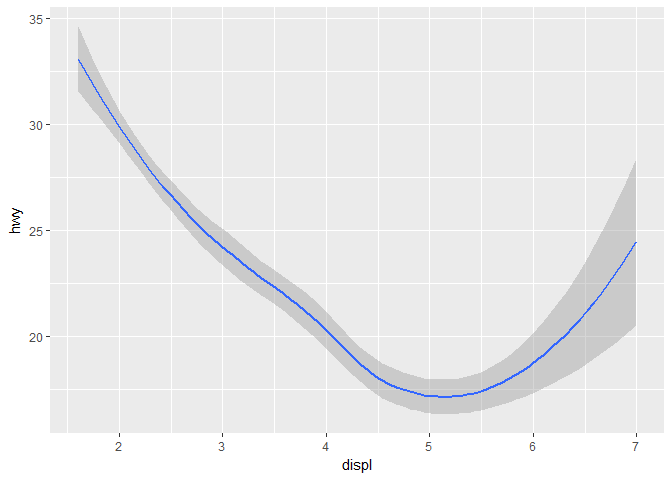
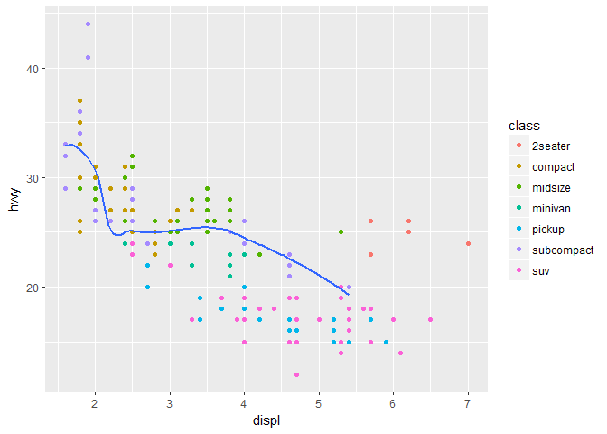
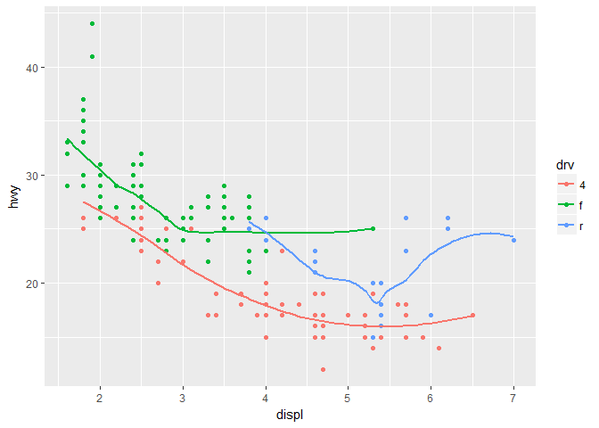
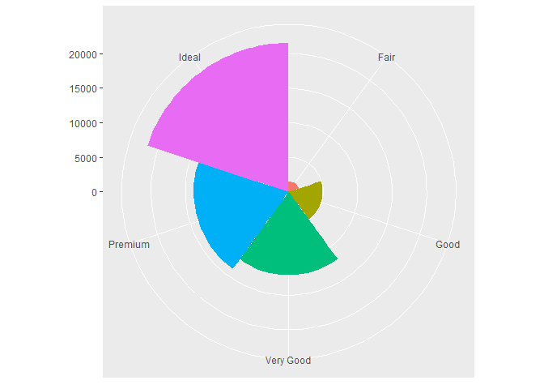

# R-club-May-3
Chunmei Li  
042817  


```r
library(ggplot2)
```

```
## Warning: package 'ggplot2' was built under R version 3.3.3
```

```r
# left
ggplot(data = mpg) + 
  geom_point(mapping = aes(x = displ, y = hwy))
```

<!-- -->

```r
# right
ggplot(data = mpg) + 
  geom_smooth(mapping = aes(x = displ, y = hwy))
```

```
## `geom_smooth()` using method = 'loess'
```

<!-- -->


```r
ggplot(data = mpg) + 
  geom_smooth(mapping = aes(x = displ, y = hwy, linetype = drv))
```

```
## `geom_smooth()` using method = 'loess'
```

<!-- -->


```r
ggplot(data = mpg) +
  geom_smooth(mapping = aes(x = displ, y = hwy))
```

```
## `geom_smooth()` using method = 'loess'
```

<!-- -->

```r
ggplot(data = mpg) +
  geom_smooth(mapping = aes(x = displ, y = hwy, group = drv))
```

```
## `geom_smooth()` using method = 'loess'
```

<!-- -->

```r
ggplot(data = mpg) +
  geom_smooth(
    mapping = aes(x = displ, y = hwy, group = drv)
  )# is there any difference between the last 2 ??
```

```
## `geom_smooth()` using method = 'loess'
```

<!-- -->


```r
ggplot(data = mpg) + 
  geom_point(mapping = aes(x = displ, y = hwy)) +
  geom_smooth(mapping = aes(x = displ, y = hwy))
```

```
## `geom_smooth()` using method = 'loess'
```

<!-- -->


```r
ggplot(data = mpg, mapping = aes(x = displ, y = hwy)) + 
  geom_point() + 
  geom_smooth()
```

```
## `geom_smooth()` using method = 'loess'
```

<!-- -->


```r
ggplot(data = mpg, mapping = aes(x = displ, y = hwy)) + 
  geom_point(mapping = aes(color = class)) + 
  geom_smooth()
```

```
## `geom_smooth()` using method = 'loess'
```

<!-- -->


```r
library(tidyverse)
```

```
## Warning: package 'tidyverse' was built under R version 3.3.3
```

```
## Loading tidyverse: tibble
## Loading tidyverse: tidyr
## Loading tidyverse: readr
## Loading tidyverse: purrr
## Loading tidyverse: dplyr
```

```
## Warning: package 'tidyr' was built under R version 3.3.3
```

```
## Warning: package 'readr' was built under R version 3.3.3
```

```
## Warning: package 'purrr' was built under R version 3.3.3
```

```
## Warning: package 'dplyr' was built under R version 3.3.3
```

```
## Conflicts with tidy packages ----------------------------------------------
```

```
## filter(): dplyr, stats
## lag():    dplyr, stats
```

```r
ggplot(data = mpg, mapping = aes(x = displ, y = hwy)) + 
  geom_point(mapping = aes(color = class)) + 
  geom_smooth(data = filter(mpg, class == "subcompact"), se = FALSE)
```

```
## `geom_smooth()` using method = 'loess'
```

<!-- -->

```r
# why I can't get this plot??
```

3.6.1 Exercise

```r
ggplot(data = mpg, mapping = aes(x = displ, y = hwy)) + 
  geom_point(mapping = aes(color = class)) + 
  geom_line() + geom_boxplot(aes(color=year))+geom_area()# for drawing a line chart
```

```
## Warning: Continuous x aesthetic -- did you forget aes(group=...)?
```

<!-- -->

```r
# geom_boxplot() for drawing boxplot
# geom_histogram for drawing histogram
# for area chart
ggplot(data = mpg, mapping = aes(x = displ, y = hwy)) + 
  geom_point(mapping = aes(color = class))+geom_area(aes(color=drv))
```

<!-- -->

```r
#2. I thought this code woud draw a line with three color... but draw three lines with different color
ggplot(data = mpg, mapping = aes(x = displ, y = hwy, color = drv)) + 
  geom_point() + 
  geom_smooth(se = FALSE)
```

```
## `geom_smooth()` using method = 'loess'
```

<!-- -->

```r
#3. any difference by removing show.legend???? `geom_smooth()` using method = 'loess'

ggplot(data = mpg, mapping = aes(x = displ, y = hwy, color = drv), show.legend=FALSE) + 
  geom_point() + 
  geom_smooth(se = FALSE)
```

```
## `geom_smooth()` using method = 'loess'
```

<!-- -->

```r
ggplot(data = mpg, mapping = aes(x = displ, y = hwy, color = drv), show.legend=FALSE) + 
  geom_point() + 
  geom_smooth(se = FALSE)
```

```
## `geom_smooth()` using method = 'loess'
```

<!-- -->

```r
#remove show.legend=FALSE ? why I didn't see difference. show.legend=FALSE romove the legend of graph
ggplot(data = mpg, mapping = aes(x = displ, y = hwy, color = drv)) + 
  geom_point() + 
  geom_smooth()
```

```
## `geom_smooth()` using method = 'loess'
```

<!-- -->

```r
#se argument means show or do not show standard error.
```

```r
ggplot(data = mpg, mapping = aes(x = displ, y = hwy)) + 
  geom_point() + 
  geom_smooth()
```

```
## `geom_smooth()` using method = 'loess'
```

<!-- -->

```r
ggplot() + 
  geom_point(data = mpg, mapping = aes(x = displ, y = hwy)) + 
  geom_smooth(data = mpg, mapping = aes(x = displ, y = hwy))
```

```
## `geom_smooth()` using method = 'loess'
```

<!-- -->

```r
# same graph, but geom_point and geom_smooth plot the same data, so they produce the same graph??
```


```r
#6.
ggplot(data = mpg, mapping = aes(x = displ, y = hwy)) + 
  geom_point(size=5) + 
  geom_smooth(se=F,size=3)
```

```
## `geom_smooth()` using method = 'loess'
```

<!-- -->

```r
ggplot(data = mpg, mapping = aes(x = displ, y = hwy)) + 
  geom_point(size=5) + 
  geom_smooth(aes(group=drv),se=F, size=3)
```

```
## `geom_smooth()` using method = 'loess'
```

<!-- -->

```r
ggplot(data = mpg, mapping = aes(x = displ, y = hwy, color=drv)) + 
  geom_point(size=5) + 
  geom_smooth(se=F, size=3)
```

```
## `geom_smooth()` using method = 'loess'
```

<!-- -->

```r
ggplot(data = mpg, mapping = aes(x = displ, y = hwy)) + 
  geom_point(aes(color=drv),size=5) + 
  geom_smooth(se=F, size=3)
```

```
## `geom_smooth()` using method = 'loess'
```

<!-- -->

```r
ggplot(data = mpg, mapping = aes(x = displ, y = hwy)) + 
  geom_point(aes(color=drv),size=5) + 
  geom_smooth(aes(linetype=drv), se=F, size=3)
```

```
## `geom_smooth()` using method = 'loess'
```

<!-- -->

```r
ggplot(data = mpg, mapping = aes(x = displ, y = hwy)) + 
  geom_point(aes(color=drv),size=5) + 
  geom_smooth(aes(linetype=drv), se=F, size=3)
```

```
## `geom_smooth()` using method = 'loess'
```

<!-- -->

```r
#don't know
ggplot(data = mpg, mapping = aes(x = displ, y = hwy)) + 
  geom_point(aes(color=drv),size=5, shape=21)
```

<!-- -->

3.7

```r
ggplot(data = diamonds) + 
  geom_bar(mapping = aes(x = cut))
```

<!-- -->


```r
ggplot(data = diamonds) + 
  stat_count(mapping = aes(x = cut))
```

<!-- -->


```r
#can't install packages, can install now
#install.packages("tibble")
#library(tibble)
#demo <- tribble(
 # ~a,      ~b,
  #"bar_1", 20,
  #"bar_2", 30,
  #"bar_3", 40
#)

#ggplot(data = demo) +
 #geom_bar(mapping = aes(x = a, y = b), stat = "identity")
```


```r
ggplot(data = diamonds) + 
  geom_bar(mapping = aes(x = cut, y = ..prop.., group = 1))
```

<!-- -->


```r
ggplot(data = diamonds) + 
  stat_summary(
    mapping = aes(x = cut, y = depth),
    fun.ymin = min,
    fun.ymax = max,
    fun.y = median
  )
```

<!-- -->

3.7.1 Exercise

```r
#1
ggplot(data = diamonds) + 
  stat_summary(aes(x = cut, y = depth)) # the default geom is geom_point
```

```
## No summary function supplied, defaulting to `mean_se()
```

<!-- -->

```r
# rewrite by geom function
ggplot(data=diamonds)+geom_point(aes(x=cut,y=depth), stat = "summary")
```

```
## No summary function supplied, defaulting to `mean_se()
```

<!-- -->

```r
#2 the defalt stat in geom_col is stat_identity 
ggplot(data = diamonds) + 
  geom_bar(mapping = aes(x = cut, y=depth),stat = "identity")
```

<!-- -->

```r
ggplot(data = diamonds) + 
  geom_col(mapping = aes(x = cut, y=depth))
```

<!-- -->

```r
#3 
#4 y predicted value, ymin lower pointwise confidence interval around the mean, ymax uupper pointwise confidence interval around the mean, se standard error.
#5 there is no refference without group=1
ggplot(data = diamonds) + 
  geom_bar(mapping = aes(x = cut, y = ..prop..))
```

<!-- -->

```r
ggplot(data = diamonds) + 
  geom_bar(mapping = aes(x = cut, fill = color, y = ..prop..))
```

<!-- -->
3.8


```r
ggplot(data = diamonds) + 
  geom_bar(mapping = aes(x = cut, colour = cut))
```

<!-- -->

```r
ggplot(data = diamonds) + 
  geom_bar(mapping = aes(x = cut, fill = cut))
```

<!-- -->

```r
ggplot(data = diamonds) + 
  geom_bar(mapping = aes(x = cut, fill = clarity))
```

<!-- -->

```r
ggplot(data = diamonds, mapping = aes(x = cut, fill = clarity)) + 
  geom_bar(alpha = 1/5, position = "identity")
```

<!-- -->

```r
ggplot(data = diamonds, mapping = aes(x = cut, colour = clarity)) + 
  geom_bar(fill = NA, position = "identity")
```

<!-- -->

```r
ggplot(data = diamonds) + 
  geom_bar(mapping = aes(x = cut, fill = clarity), position = "fill")
```

<!-- -->

```r
ggplot(data = diamonds) + 
  geom_bar(mapping = aes(x = cut, fill = clarity), position = "dodge")
```

<!-- -->

```r
ggplot(data = mpg) + 
  geom_point(mapping = aes(x = displ, y = hwy), position = "jitter")
```

<!-- -->

3.8 Exercise

```r
#1
ggplot(data = mpg, mapping = aes(x = cty, y = hwy)) + 
  geom_point(position = "jitter")
```

<!-- -->

```r
#2 width and heigh

ggplot(data = mpg, mapping = aes(x = cty, y = hwy)) + 
  geom_point()+ geom_jitter(width = 0.5, height = 1)
```

<!-- -->

```r
#3 compare geom_jitter and geom_count
ggplot(data = mpg, mapping = aes(x = cty, y = hwy)) + geom_jitter()
```

<!-- -->

```r
ggplot(data = mpg, mapping = aes(x = cty, y = hwy)) + geom_count()
```

<!-- -->

```r
#geom_jitter jitter every point, geom_count depend on the total amount that the value of each combination appeared.

#4 the default poistion of geom_boxplot is dodge 
ggplot(data = mpg) + 
  geom_boxplot(mapping = aes(x = displ, y = hwy, group=drv))
```

```
## Warning: position_dodge requires non-overlapping x intervals
```

<!-- -->

3.9

```r
ggplot(data = mpg, mapping = aes(x = class, y = hwy)) + 
  geom_boxplot()
```

<!-- -->

```r
ggplot(data = mpg, mapping = aes(x = class, y = hwy)) + 
  geom_boxplot() +
  coord_flip()
```

<!-- -->


```r
library(maps)
```

```
## Warning: package 'maps' was built under R version 3.3.3
```

```
## 
## Attaching package: 'maps'
```

```
## The following object is masked from 'package:purrr':
## 
##     map
```

```r
nz <- map_data("nz")

ggplot(nz, aes(long, lat, group = group)) +
  geom_polygon(fill = "white", colour = "black")
```

<!-- -->

```r
ggplot(nz, aes(long, lat, group = group)) +
  geom_polygon(fill = "white", colour = "black") +
  coord_quickmap()
```

<!-- -->


```r
bar <- ggplot(data = diamonds) + 
  geom_bar(
    mapping = aes(x = cut, fill = cut), show.legend = FALSE,
    width = 1
  ) + 
  theme(aspect.ratio = 1) +
  labs(x = NULL, y = NULL)
bar
```

<!-- -->

```r
bar + coord_flip()
```

<!-- -->

```r
bar + coord_polar()
```

<!-- -->

3.9 Exercise

```r
#1
ggplot(data = mpg) + 
  geom_bar(mapping = aes(x = drv, fill = drv))+coord_polar()
```

<!-- -->

```r
#2labs lalel the axis of the graph
#3 coor_map have correct mercator projection, coor_quickmap have the aspect ratio approximation???
ggplot(nz, aes(long, lat, group = group)) +
  geom_polygon(fill = "white", colour = "black") +
  coord_quickmap()
```

<!-- -->

```r
library(mapproj)
```

```
## Warning: package 'mapproj' was built under R version 3.3.3
```

```r
ggplot(nz, aes(long, lat, group = group)) +
  geom_polygon(fill = "white", colour = "black") +
  coord_map()
```

<!-- -->

```r
#4
ggplot(data = mpg, mapping = aes(x = cty, y = hwy)) +
  geom_point()
```

<!-- -->

```r
#geom_abline add reference lines.
ggplot(data = mpg, mapping = aes(x = cty, y = hwy)) +
  geom_point() + 
  geom_abline()
```

<!-- -->

```r
#coord_fixed: The default, ratio = 1, ensures that one unit on the x-axis is the same length as one unit on the y-axis
ggplot(data = mpg, mapping = aes(x = cty, y = hwy)) +
  geom_point() + 
  geom_abline() +
  coord_fixed()
```

<!-- -->


```r
library(tidyverse)

ggplot(data = mpg) + 
  geom_point(mapping = aes(x = displ, y = hwy))
```

<!-- -->

```r
filter(mpg, cyl == 8)
```

```
## # A tibble: 70 × 11
##    manufacturer              model displ  year   cyl      trans   drv
##           <chr>              <chr> <dbl> <int> <int>      <chr> <chr>
## 1          audi         a6 quattro   4.2  2008     8   auto(s6)     4
## 2     chevrolet c1500 suburban 2wd   5.3  2008     8   auto(l4)     r
## 3     chevrolet c1500 suburban 2wd   5.3  2008     8   auto(l4)     r
## 4     chevrolet c1500 suburban 2wd   5.3  2008     8   auto(l4)     r
## 5     chevrolet c1500 suburban 2wd   5.7  1999     8   auto(l4)     r
## 6     chevrolet c1500 suburban 2wd   6.0  2008     8   auto(l4)     r
## 7     chevrolet           corvette   5.7  1999     8 manual(m6)     r
## 8     chevrolet           corvette   5.7  1999     8   auto(l4)     r
## 9     chevrolet           corvette   6.2  2008     8 manual(m6)     r
## 10    chevrolet           corvette   6.2  2008     8   auto(s6)     r
## # ... with 60 more rows, and 4 more variables: cty <int>, hwy <int>,
## #   fl <chr>, class <chr>
```

```r
filter(diamonds, carat > 3)
```

```
## # A tibble: 32 × 10
##    carat     cut color clarity depth table price     x     y     z
##    <dbl>   <ord> <ord>   <ord> <dbl> <dbl> <int> <dbl> <dbl> <dbl>
## 1   3.01 Premium     I      I1  62.7    58  8040  9.10  8.97  5.67
## 2   3.11    Fair     J      I1  65.9    57  9823  9.15  9.02  5.98
## 3   3.01 Premium     F      I1  62.2    56  9925  9.24  9.13  5.73
## 4   3.05 Premium     E      I1  60.9    58 10453  9.26  9.25  5.66
## 5   3.02    Fair     I      I1  65.2    56 10577  9.11  9.02  5.91
## 6   3.01    Fair     H      I1  56.1    62 10761  9.54  9.38  5.31
## 7   3.65    Fair     H      I1  67.1    53 11668  9.53  9.48  6.38
## 8   3.24 Premium     H      I1  62.1    58 12300  9.44  9.40  5.85
## 9   3.22   Ideal     I      I1  62.6    55 12545  9.49  9.42  5.92
## 10  3.50   Ideal     H      I1  62.8    57 12587  9.65  9.59  6.03
## # ... with 22 more rows
```


my own data

```r
getwd()
```

```
## [1] "D:/lllll/20161025-/R club/Rclub-r4ds_Chunmei.Li/R-club-May-3"
```

```r
leaf.data <- read.csv("D:/lllll/20161025-/myc2_020317 - Sheet1.csv")
ggplot(data=leaf.data)+geom_bar(aes(x=genotype, y=petioleLength, fill=treatment), stat="summary",position="dodge")
```

```
## No summary function supplied, defaulting to `mean_se()
```

<!-- -->

