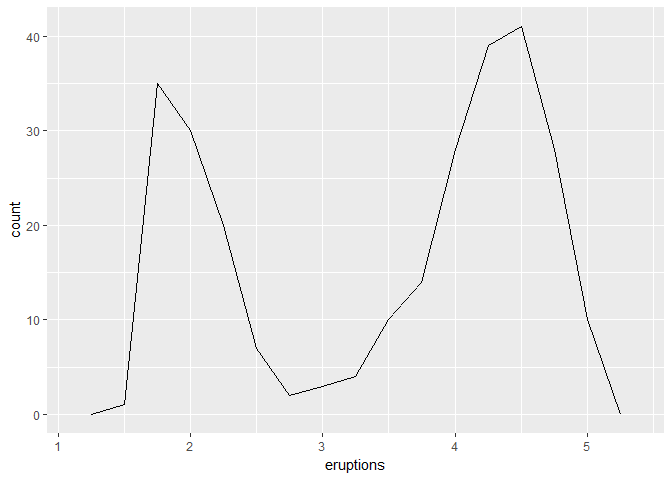

# May31
Chunmei Li  
2017年5月30日  
7.6

```r
library(tidyverse)
```

```
## Warning: package 'tidyverse' was built under R version 3.3.3
```

```
## Loading tidyverse: ggplot2
## Loading tidyverse: tibble
## Loading tidyverse: tidyr
## Loading tidyverse: readr
## Loading tidyverse: purrr
## Loading tidyverse: dplyr
```

```
## Warning: package 'ggplot2' was built under R version 3.3.3
```

```
## Warning: package 'tidyr' was built under R version 3.3.3
```

```
## Warning: package 'readr' was built under R version 3.3.3
```

```
## Warning: package 'purrr' was built under R version 3.3.3
```

```
## Warning: package 'dplyr' was built under R version 3.3.3
```

```
## Conflicts with tidy packages ----------------------------------------------
```

```
## filter(): dplyr, stats
## lag():    dplyr, stats
```

```r
ggplot(data = faithful) + 
  geom_point(mapping = aes(x = eruptions, y = waiting))
```

<!-- -->


```r
#???
library(modelr)
```

```
## Warning: package 'modelr' was built under R version 3.3.3
```

```r
mod <- lm(log(price) ~ log(carat), data = diamonds)

diamonds2 <- diamonds %>% 
  add_residuals(mod) %>% 
  mutate(resid = exp(resid))

ggplot(data = diamonds2) + 
  geom_point(mapping = aes(x = carat, y = resid))
```

<!-- -->


```r
ggplot(data = diamonds2) + 
  geom_boxplot(mapping = aes(x = cut, y = resid))
```

<!-- -->
7.7

```r
ggplot(data = faithful, mapping = aes(x = eruptions)) + 
  geom_freqpoly(binwidth = 0.25)
```

<!-- -->


```r
ggplot(faithful, aes(eruptions)) + 
  geom_freqpoly(binwidth = 0.25)
```

<!-- -->


```r
diamonds %>% 
  count(cut, clarity) %>% 
  ggplot(aes(clarity, cut, fill = n)) + 
    geom_tile()
```

<!-- -->
8.1
Press Cmd/Ctrl + Shift + F10 to restart RStudio.
Press Cmd/Ctrl + Shift + S to rerun the current script.
8.2
 always using the Linux/Mac style with forward slashes.
 never use absolute paths in your scripts.
 
 
 

```r
library(tidyverse)

ggplot(diamonds, aes(carat, price)) + 
  geom_hex()
```

```
## Warning: package 'hexbin' was built under R version 3.3.3
```

<!-- -->

```r
ggsave("diamonds.pdf")
```

```
## Saving 7 x 5 in image
```

```r
write_csv(diamonds, "diamonds.csv")
```


Create an RStudio project for each data analysis project.

Keep data files there; we’ll talk about loading them into R in data import.

Keep scripts there; edit them, run them in bits or as a whole.

Save your outputs (plots and cleaned data) there.

Only ever use relative paths, not absolute paths.


10.


```r
as_tibble(iris)
```

```
## # A tibble: 150 × 5
##    Sepal.Length Sepal.Width Petal.Length Petal.Width Species
##           <dbl>       <dbl>        <dbl>       <dbl>  <fctr>
## 1           5.1         3.5          1.4         0.2  setosa
## 2           4.9         3.0          1.4         0.2  setosa
## 3           4.7         3.2          1.3         0.2  setosa
## 4           4.6         3.1          1.5         0.2  setosa
## 5           5.0         3.6          1.4         0.2  setosa
## 6           5.4         3.9          1.7         0.4  setosa
## 7           4.6         3.4          1.4         0.3  setosa
## 8           5.0         3.4          1.5         0.2  setosa
## 9           4.4         2.9          1.4         0.2  setosa
## 10          4.9         3.1          1.5         0.1  setosa
## # ... with 140 more rows
```


```r
tibble(
  x = 1:5, 
  y = 1, 
  z = x ^ 2 + y
)
```

```
## # A tibble: 5 × 3
##       x     y     z
##   <int> <dbl> <dbl>
## 1     1     1     2
## 2     2     1     5
## 3     3     1    10
## 4     4     1    17
## 5     5     1    26
```


```r
tb <- tibble(
  `:)` = "smile", 
  ` ` = "space",
  `2000` = "number"
)
tb
```

```
## # A tibble: 1 × 3
##    `:)`   ` ` `2000`
##   <chr> <chr>  <chr>
## 1 smile space number
```


```r
tribble(
  ~x, ~y, ~z,
  #--|--|----
  "a", 2, 3.6,
  "b", 1, 8.5
)
```

```
## # A tibble: 2 × 3
##       x     y     z
##   <chr> <dbl> <dbl>
## 1     a     2   3.6
## 2     b     1   8.5
```


```r
tibble(
  a = lubridate::now() + runif(1e3) * 86400,
  b = lubridate::today() + runif(1e3) * 30,
  c = 1:1e3,
  d = runif(1e3),
  e = sample(letters, 1e3, replace = TRUE)
)
```

```
## # A tibble: 1,000 × 5
##                      a          b     c          d     e
##                 <dttm>     <date> <int>      <dbl> <chr>
## 1  2017-05-31 04:06:07 2017-06-12     1 0.84058227     g
## 2  2017-05-31 10:31:55 2017-06-07     2 0.84725235     g
## 3  2017-05-31 23:06:46 2017-06-19     3 0.94424038     x
## 4  2017-05-31 14:16:29 2017-06-24     4 0.09468555     j
## 5  2017-05-31 12:50:11 2017-06-18     5 0.60696977     l
## 6  2017-05-31 22:09:51 2017-06-02     6 0.70508167     a
## 7  2017-05-31 16:44:23 2017-06-10     7 0.61368366     u
## 8  2017-05-31 09:49:07 2017-06-24     8 0.92625105     f
## 9  2017-05-31 03:53:31 2017-06-25     9 0.69877973     h
## 10 2017-05-31 22:26:54 2017-06-06    10 0.28098892     i
## # ... with 990 more rows
```


```r
nycflights13::flights %>% 
  print(n = 10, width = Inf)
```

```
## # A tibble: 336,776 × 19
##     year month   day dep_time sched_dep_time dep_delay arr_time
##    <int> <int> <int>    <int>          <int>     <dbl>    <int>
## 1   2013     1     1      517            515         2      830
## 2   2013     1     1      533            529         4      850
## 3   2013     1     1      542            540         2      923
## 4   2013     1     1      544            545        -1     1004
## 5   2013     1     1      554            600        -6      812
## 6   2013     1     1      554            558        -4      740
## 7   2013     1     1      555            600        -5      913
## 8   2013     1     1      557            600        -3      709
## 9   2013     1     1      557            600        -3      838
## 10  2013     1     1      558            600        -2      753
##    sched_arr_time arr_delay carrier flight tailnum origin  dest air_time
##             <int>     <dbl>   <chr>  <int>   <chr>  <chr> <chr>    <dbl>
## 1             819        11      UA   1545  N14228    EWR   IAH      227
## 2             830        20      UA   1714  N24211    LGA   IAH      227
## 3             850        33      AA   1141  N619AA    JFK   MIA      160
## 4            1022       -18      B6    725  N804JB    JFK   BQN      183
## 5             837       -25      DL    461  N668DN    LGA   ATL      116
## 6             728        12      UA   1696  N39463    EWR   ORD      150
## 7             854        19      B6    507  N516JB    EWR   FLL      158
## 8             723       -14      EV   5708  N829AS    LGA   IAD       53
## 9             846        -8      B6     79  N593JB    JFK   MCO      140
## 10            745         8      AA    301  N3ALAA    LGA   ORD      138
##    distance  hour minute           time_hour
##       <dbl> <dbl>  <dbl>              <dttm>
## 1      1400     5     15 2013-01-01 05:00:00
## 2      1416     5     29 2013-01-01 05:00:00
## 3      1089     5     40 2013-01-01 05:00:00
## 4      1576     5     45 2013-01-01 05:00:00
## 5       762     6      0 2013-01-01 06:00:00
## 6       719     5     58 2013-01-01 05:00:00
## 7      1065     6      0 2013-01-01 06:00:00
## 8       229     6      0 2013-01-01 06:00:00
## 9       944     6      0 2013-01-01 06:00:00
## 10      733     6      0 2013-01-01 06:00:00
## # ... with 3.368e+05 more rows
```


```r
nycflights13::flights %>% 
  View()
```


```r
df <- tibble(
  x = runif(5),
  y = rnorm(5)
)
df
```

```
## # A tibble: 5 × 2
##           x           y
##       <dbl>       <dbl>
## 1 0.8161336 -0.13040379
## 2 0.5846868 -0.16258145
## 3 0.6950632 -0.20562579
## 4 0.5874937 -1.63609258
## 5 0.2875069  0.07710105
```

```r
#$ and [[. [[ can extract by name or position; $ only extracts by name but is a little less typing.
df$x
```

```
## [1] 0.8161336 0.5846868 0.6950632 0.5874937 0.2875069
```

```r
df[["x"]]
```

```
## [1] 0.8161336 0.5846868 0.6950632 0.5874937 0.2875069
```

```r
df[[1]]
```

```
## [1] 0.8161336 0.5846868 0.6950632 0.5874937 0.2875069
```


```r
#use these in a pipe, you’ll need to use the special placeholder .:
df %>% .$x
```

```
## [1] 0.8161336 0.5846868 0.6950632 0.5874937 0.2875069
```

```r
df %>% .[["x"]]
```

```
## [1] 0.8161336 0.5846868 0.6950632 0.5874937 0.2875069
```


```r
class(as.data.frame(tb))
```

```
## [1] "data.frame"
```

10.5 Exercise
1.

```r
mtcars
```

```
##                      mpg cyl  disp  hp drat    wt  qsec vs am gear carb
## Mazda RX4           21.0   6 160.0 110 3.90 2.620 16.46  0  1    4    4
## Mazda RX4 Wag       21.0   6 160.0 110 3.90 2.875 17.02  0  1    4    4
## Datsun 710          22.8   4 108.0  93 3.85 2.320 18.61  1  1    4    1
## Hornet 4 Drive      21.4   6 258.0 110 3.08 3.215 19.44  1  0    3    1
## Hornet Sportabout   18.7   8 360.0 175 3.15 3.440 17.02  0  0    3    2
## Valiant             18.1   6 225.0 105 2.76 3.460 20.22  1  0    3    1
## Duster 360          14.3   8 360.0 245 3.21 3.570 15.84  0  0    3    4
## Merc 240D           24.4   4 146.7  62 3.69 3.190 20.00  1  0    4    2
## Merc 230            22.8   4 140.8  95 3.92 3.150 22.90  1  0    4    2
## Merc 280            19.2   6 167.6 123 3.92 3.440 18.30  1  0    4    4
## Merc 280C           17.8   6 167.6 123 3.92 3.440 18.90  1  0    4    4
## Merc 450SE          16.4   8 275.8 180 3.07 4.070 17.40  0  0    3    3
## Merc 450SL          17.3   8 275.8 180 3.07 3.730 17.60  0  0    3    3
## Merc 450SLC         15.2   8 275.8 180 3.07 3.780 18.00  0  0    3    3
## Cadillac Fleetwood  10.4   8 472.0 205 2.93 5.250 17.98  0  0    3    4
## Lincoln Continental 10.4   8 460.0 215 3.00 5.424 17.82  0  0    3    4
## Chrysler Imperial   14.7   8 440.0 230 3.23 5.345 17.42  0  0    3    4
## Fiat 128            32.4   4  78.7  66 4.08 2.200 19.47  1  1    4    1
## Honda Civic         30.4   4  75.7  52 4.93 1.615 18.52  1  1    4    2
## Toyota Corolla      33.9   4  71.1  65 4.22 1.835 19.90  1  1    4    1
## Toyota Corona       21.5   4 120.1  97 3.70 2.465 20.01  1  0    3    1
## Dodge Challenger    15.5   8 318.0 150 2.76 3.520 16.87  0  0    3    2
## AMC Javelin         15.2   8 304.0 150 3.15 3.435 17.30  0  0    3    2
## Camaro Z28          13.3   8 350.0 245 3.73 3.840 15.41  0  0    3    4
## Pontiac Firebird    19.2   8 400.0 175 3.08 3.845 17.05  0  0    3    2
## Fiat X1-9           27.3   4  79.0  66 4.08 1.935 18.90  1  1    4    1
## Porsche 914-2       26.0   4 120.3  91 4.43 2.140 16.70  0  1    5    2
## Lotus Europa        30.4   4  95.1 113 3.77 1.513 16.90  1  1    5    2
## Ford Pantera L      15.8   8 351.0 264 4.22 3.170 14.50  0  1    5    4
## Ferrari Dino        19.7   6 145.0 175 3.62 2.770 15.50  0  1    5    6
## Maserati Bora       15.0   8 301.0 335 3.54 3.570 14.60  0  1    5    8
## Volvo 142E          21.4   4 121.0 109 4.11 2.780 18.60  1  1    4    2
```

```r
class(mtcars)
```

```
## [1] "data.frame"
```

```r
class(nycflights13::flights)
```

```
## [1] "tbl_df"     "tbl"        "data.frame"
```
2.

```r
df <- data.frame(abc = 1, xyz = "a")
df
```

```
##   abc xyz
## 1   1   a
```

```r
df$x
```

```
## [1] a
## Levels: a
```

```r
df[, "xyz"]
```

```
## [1] a
## Levels: a
```

```r
df[, c("abc", "xyz")]
```

```
##   abc xyz
## 1   1   a
```


```r
#tibble
df1<- tibble(abc=1, xyz="a")
df1
```

```
## # A tibble: 1 × 2
##     abc   xyz
##   <dbl> <chr>
## 1     1     a
```

```r
df1$x
```

```
## Warning: Unknown column 'x'
```

```
## NULL
```

```r
df1[,"xyz"]
```

```
## # A tibble: 1 × 1
##     xyz
##   <chr>
## 1     a
```

```r
df1[,c("abc", "xyz")]
```

```
## # A tibble: 1 × 2
##     abc   xyz
##   <dbl> <chr>
## 1     1     a
```
3.
$mpg or [["mpg"]]

4.

```r
annoying <- tibble(
  `1` = 1:10,
  `2` = `1` * 2 + rnorm(length(`1`))
)
```

1.

```r
annoying$`1`
```

```
##  [1]  1  2  3  4  5  6  7  8  9 10
```

```r
#or
annoying[["1"]]
```

```
##  [1]  1  2  3  4  5  6  7  8  9 10
```

2.

```r
ggplot(annoying, aes(x=`1`, y=`2`))+geom_point()
```

<!-- -->


```r
annoying <- annoying %>%
  mutate(`3`=`2`/`1`)
annoying
```

```
## # A tibble: 10 × 3
##      `1`        `2`       `3`
##    <int>      <dbl>     <dbl>
## 1      1  0.3104817 0.3104817
## 2      2  3.8066891 1.9033446
## 3      3  6.2660893 2.0886964
## 4      4  7.9320395 1.9830099
## 5      5 10.0001479 2.0000296
## 6      6 12.1247089 2.0207848
## 7      7 13.5738821 1.9391260
## 8      8 15.3836337 1.9229542
## 9      9 19.1491298 2.1276811
## 10    10 17.7661362 1.7766136
```
4.

```r
annoying <- rename(annoying, one = `1`, two = `2`, three = `3`)
annoying
```

```
## # A tibble: 10 × 3
##      one        two     three
##    <int>      <dbl>     <dbl>
## 1      1  0.3104817 0.3104817
## 2      2  3.8066891 1.9033446
## 3      3  6.2660893 2.0886964
## 4      4  7.9320395 1.9830099
## 5      5 10.0001479 2.0000296
## 6      6 12.1247089 2.0207848
## 7      7 13.5738821 1.9391260
## 8      8 15.3836337 1.9229542
## 9      9 19.1491298 2.1276811
## 10    10 17.7661362 1.7766136
```
5.

```r
?tibble::enframe
```

```
## starting httpd help server ...
```

```
##  done
```

```r
#Converting atomic vectors to data frames

#enframe(x, name = "name", value = "value")
```

6.


```r
#???
```

